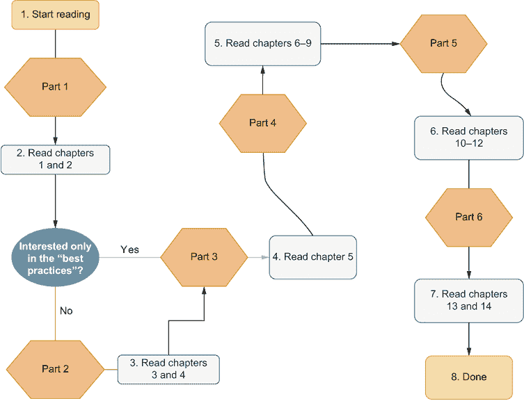

# 前置内容

## 前言

我第一次接触 C#是在 2016 年加入富士胶片医疗系统公司时。我之前有 Java 和 Python 的经验，但当 C#出现时，我没有回头。我喜欢它的低门槛和（起初令人痛苦地令人愤怒的）对显式类型化的关注。在我公司的整个时间里，我都用关于 C#和如何最好地使用它的问题打扰了我的同事。入门很容易，但精通却是另一回事。无论背景如何，每个人在 10 分钟内都可以编写一个“Hello, World”应用程序，但使用一种语言发挥其最大优势，同时知道某些事情为什么被实现成这样，这需要时间。过了一段时间，我觉得我在 C#知识上已经达到了一个平台期，正在寻找能把我带到下一个层次的资源。很快，我就意识到有三类主要的关于.NET 和 C#的书籍：关于语言超越主题（如清洁代码、架构、基础设施等）的书籍，这些书籍恰好使用了 C#；关于如何使用 C#开始编程的书籍；以及那些非常高级的书籍，你可能在阅读后可能就有资格成为微软的 CTO。我希望有一本书能介于这三者之间：一本书处理清洁代码，并弥合初学者和高级主题之间的差距。那样一本书不存在，所以我写了它。这就是那本书。

如果你是一位有（最好是面向对象）编程语言经验的软件工程师（或开发者、或编码者，或无论你的头衔是什么），并且想要跳入 C#，这本书就是为你准备的。你不必学习如何编写一个`if`语句，我也不会向你解释什么是对象。你在这本书中会发现的是为深入语言和平台学习所做的准备。当然，我无法保证涵盖一个更难的资源假设你应知道的所有内容，但在本书有限的页数内，我确实尽力了。我非常希望你喜欢这本书，并且学到一些东西。如果不这样，嗯，重新回顾你所知道的事情从来都不是坏事。

## 致谢

当我最初开始与 Manning 讨论写这本书时，我对它将如何占据我大约一年的生活几乎没有概念。公平地说，我多次被告知作者往往会低估写一本书所需的时间。我固执己见，认为我会是个例外。我并不是。从 2019 年 12 月到 2021 年 3 月，我在这本书上投入了大量的时间。有好几次，我自己想，“这肯定就是终点了。”但每次（除了显然的那一次）都不是。幸运的是，我有一位非常耐心妻子，以及很多消磨时间的机会。

在这种想法下，我首先想感谢我的妻子，感谢她在这一段过山车般的旅程中一直支持我，并向她道歉，因为我消失在她的生活中整整一年。没有她的坚定不移的支持，我无法完成这本书。她是这本书的基石。我还要感谢我的家人，他们总是非常兴奋地听到关于新书的发展和更新。我大胆地将书中所遵循的商业案例中的公司 CEO 命名为我的外祖父（Aljen）的名字和我的祖母（van der Meulen）的姓氏。

我还要感谢 Manning 出版社的杰出团队。特别是，我想特别感谢 Marina Michaels。作为我的编辑，她将这本书塑造成不仅仅是杂乱无章的抱怨的集合。多亏了 Marina，我在写作中不敢轻易使用“will”这个词。我还拥有一个非常有价值的团队，包括 Jean-François Morin、Tanya Wilke、Eric Lippert、Rich Ward、Enrico Buonanno 和 Katie Tennant。这个跨越洲际的超级英雄/忍者/摇滚明星团队提供了惊人的反馈，并捕捉到了大量的（通常是非常尴尬的）技术错误。我还要感谢所有在出版前阅读手稿并给出精彩反馈的审稿人和 MEAP 读者，他们的反馈往往非常明确。我不敢声称这本书是一部杰作，但我确实希望你能从中获得一些有用的东西。

对于所有审稿人，我要说谢谢：Arnaud Bailly、Christian Thoudahl、Daniel Vásquez Estupiñan、Edin Kapic、Foster Haines、George Thomas、Goetz Heller、Gustavo Filipe Ramos Gomes、Hilde Van Gysel、Jared Duncan、Jason Hales、Jean-François Morin、Jeff Neumann、Karthikeyarajan Rajendran、Luis Moux、Marc Roulleau、Mario Solomou、Noah Betzen、Oliver Korten、Patrick Regan、Prabhuti Prakash、Raymond Cheung、Reza Zeinali、Richard B. Ward、Richard DeHoff、Sau Fai Fong、Slavomir Furman、Tanya Wilke、Thomas F. Gueth、Víctor M. Pérez 和 Viktor Bek。你们的建议帮助使这本书变得更好。

最后，我想感谢一些人在这本书的某个部分或我的整个职业生涯中给予我帮助的人。首先感谢 David Lavielle 和 Duncan Henderson：感谢你们给我一个机会，并给了我软件开发的第一份工作。Jerry Finegan：感谢你让我接触 C#并让我一个接一个地问一些愚蠢的问题。你的耐心和反馈非常受赞赏。Michael Breecher：你在这本书中关于一致性内容的一些部分起到了作用（由于我深夜发来一些关于符号的奇怪数学问题），这使得这本书更好。Szymon Zuberek：第二章的第一个草稿是在你的纽约公寓里写的。感谢我们任何时候想拜访时都让我们在你沙发上打地铺，还有，一如既往地，为我们提供谈话素材。我还感谢 Acronis 和 Workiva 的出色团队，他们不得不听我无休止地谈论“我正在写的这本书”。他们一直表现得很好（大多数情况下）。

## 关于这本书

这本书基于你现有的编程技能，帮助你无缝提升编码实践或从 Java 或其他面向对象语言过渡到 C#。你将学会编写对企业开发至关重要的符合语法的 C#代码。这本书讨论了必要的后端技能，并通过一个常见的职业挑战将其付诸实践：重构遗留代码库以使其安全、干净和可读。等你完成时，你将具备专业级别的 C#理解，并准备好开始使用高级资源进行专业化学习。

没有所谓的“Hello, World”或计算机科学 101 基础知识——你将通过重构一个过时的遗留代码库来学习，使用新技术、工具和最佳实践将其提升到现代 C#标准。在这本书中，我们从一个现有的代码库（使用.NET Framework 编写）开始重构，通过简化 API 将其迁移到.NET 5。

## 适合阅读这本书的人

如果你是一个精通面向对象编程语言的开发者，无论是 Java、Dart、C++还是其他什么，这本书可以帮助你快速掌握 C#和.NET，而无需从头开始。你很多知识可以迁移，所以为什么还要第 500 次学习如何编写`if`语句呢？

类似地，如果你精通像 Go、C、JavaScript、Python 或其他主流编程语言，在阅读这本书之后，你可以写出干净、符合语法的 C#代码。你可能需要了解一些面向对象设计原则，但这不应该成为入门的巨大障碍（如果你来自 Go，确保在我们使用接口时格外注意；它们的工作方式不同）。

最后，如果你是一个已经使用 C#一段时间并想知道如何“提升”你的知识水平的开发者：这本书是为你准备的。许多高级 C#资源都假设了入门或初学者资源中没有涵盖的知识。这本书旨在填补这一差距。

## 本书如何组织：路线图

与常规技术书籍相比，本书的结构在某种程度上有些不寻常。大多数技术书籍是参考书籍，可以按任何顺序阅读。本书不是参考书籍，要充分利用它，你需要按顺序阅读章节。本书的结构围绕以下六个部分展开，如图 1 所示：

1.  “使用 C#和.NET”——在第一章中，我们讨论了本书的内容、它教授的内容以及它不教授的内容。第二章是对 C#语言和.NET 生态系统的简要介绍，重点关注.NET 与其他平台的不同之处以及 C#编译的故事。

1.  “现有代码库”——在这一部分，我将引导你探索我们继承的代码库。这一部分是对现有代码库的详细讲解，讨论了潜在的改进和设计缺陷。

1.  “数据库访问层”——在第二部分之后，我们开始重写整个服务。在第三部分，我们专注于创建一个新的.NET Core 项目，并学习如何使用 Entity Framework Core 连接到云（或本地）数据库。其他讨论的主题包括存储/服务模式、虚拟方法和属性以及密封类。

1.  “存储层”——在第四部分，我们进入了存储/服务模式的领域，并实现了五个存储类。你还将了解依赖注入、多线程（包括锁定、互斥锁和信号量）、自定义相等比较、测试驱动开发、泛型、扩展方法和 LINQ。

1.  “服务层”——下一步是实现服务层类。在第五部分，我们从零开始编写了四个服务层，并讨论了反射、模拟、耦合、运行时断言和类型检查、错误处理、结构体和 yield return。

1.  “控制器层”——第六部分是我们对第二部分最初继承的服务进行重写的最后一步。在这一部分，我们将编写两个控制器类，并进行验收测试。除了这些主题外，我们还涉及 ASP.NET Core 中间件、HTTP 路由、自定义数据绑定、数据序列化和反序列化，以及在运行时生成 OpenAPI 规范。

本书许多章节（以及一些章节中的某些部分）都设计了练习，以测试你对材料的了解。你可以快速完成这些练习。我鼓励你在遇到它们时完成这些练习，并重新阅读你可能略过或理解有误的部分。

图 0.1 建议的阅读本书的流程图。按照步骤进行，回答问题以获得理想的阅读体验。此流程图灵感来源于唐纳德·克努特（Donald Knuth）的《计算机程序设计艺术》系列书籍中的结构流程图。

## 关于代码

在撰写本书时，.NET 生态系统可以分为三个主要部分：.NET Framework 4.x、.NET Core 3.x 和 .NET 5。本书除第三章和第四章外（您在阅读这些章节后会明白原因）全部使用 .NET 5。

使用的 C# 语言版本是 C# 3 和 C# 9（本书大多数情况下不使用任何 C# 9 特定功能，因此安装 C# 8 也同样有效）。由于 C# 语言具有向后兼容性，您只需安装最新版本（撰写本书时为 C# 8 或 C# 9 预览版）。提供源代码的章节是 2、3 和 4（合并）、5、6、7、8、9、10、11、12、13 和 14。

要运行代码，您需要安装一个高于 3.5 版本的 .NET Framework（如果您想在第三章和第四章中运行代码）和 .NET 5。如果您想在本地运行本书中使用的数据库或遇到安装本书所需任何内容的困难，您可以在附录 C（“安装指南”）中找到安装说明。本书主要使用 Visual Studio 作为其 IDE，但您可以使用任何支持 C#（或根本不使用）的 IDE。Visual Studio 2019 有一个名为 Visual Studio 2019 Community 的免费版本。当我们遇到需要 Visual Studio 的内容时，本书会进行标注。代码和 .NET 5 应该可以在 Windows、macOS 和 Linux 上运行。本书尽可能使用命令行（或终端，针对 macOS 用户）来避免对任何特定 IDE 或操作系统的依赖。

本书包含许多示例源代码，既有编号列表中的，也有与普通文本内联的。在两种情况下，源代码都使用类似于这样的`固定宽度字体`格式化，以将其与普通文本区分开来。有时代码也会被`**粗体**`显示，以突出显示章节中从先前步骤更改的代码，例如当新功能添加到现有代码行时。

在许多情况下，原始源代码已被重新格式化；增加了换行符，并重新调整了缩进以适应书中的可用页面空间。在某些情况下，即使这样也不够，列表中还包括了行续接标记（➥）。代码注释伴随许多列表，突出显示重要概念。请注意，大括号通常被放置在新代码块的前一行。这不是合适的现实世界 C# 习惯，但这样做是为了节省空间。源代码本身不使用这种约定。

## liveBook 讨论论坛

购买《C#编程之道》包括免费访问由曼宁出版社运行的私人网络论坛，您可以在论坛上对书籍发表评论、提出技术问题，并从作者和其他用户那里获得帮助。要访问论坛，请访问[`livebook.manning.com/book/code-like-a-pro-in-c-sharp/welcome/v-9/`](https://livebook.manning.com/book/code-like-a-pro-in-c-sharp/welcome/v-9/)。您还可以在[`livebook.manning.com/#!/discussion`](https://livebook.manning.com/#!/discussion)了解更多关于曼宁论坛和行为准则的信息。

曼宁对读者的承诺是提供一个平台，让读者之间以及读者与作者之间可以进行有意义的对话。这并不是对作者参与特定数量活动的承诺，作者对论坛的贡献仍然是自愿的（且未付费）。我们建议您尝试向他提出一些挑战性的问题，以免他的兴趣转移！只要这本书有售，论坛和先前讨论的存档将可通过出版社的网站访问。

## 关于作者

**Jort Rodenburg**是一位软件工程师、作家和公众演讲者。他专长于 C#，并在金融合规和报告、喷墨打印、医学成像、分布式系统和网络安全等众多领域的软件上工作过。Jort 曾指导精通不同编程语言的工程师，帮助他们掌握 C#和.NET。Jort 还在会议上和聚会中就 C#、.NET 和编程等所有相关话题发表演讲。

## 关于封面插图

《C#编程之道》的封面图上标注为“Homme Samojede”，或“萨莫耶德人”。这幅插图取自雅克·格拉塞·德·圣索沃尔（1757–1810）的作品集，名为《各国服饰》，于 1797 年在法国出版。每一幅插图都是手工精心绘制和着色的。格拉塞·德·圣索沃尔收藏中的丰富多样性生动地提醒我们，200 年前世界的城镇和地区在文化上有多么不同。他们彼此孤立，说着不同的方言和语言。在街道或乡村，仅凭他们的服饰就能轻易识别他们居住的地方以及他们的职业或社会地位。

从那时起，我们的着装方式发生了变化，当时地区间的多样性已经逐渐消失。现在很难区分不同大陆、城镇、地区或国家的人们。也许我们用文化多样性换取了更加丰富多彩的个人生活——当然，是为了更加多样化和快节奏的技术生活。

在难以区分一本计算机书籍与另一本的时候，曼宁通过书籍封面庆祝了计算机行业的创新精神和主动性，这些封面基于两百年前丰富多样的地区生活，并由 Grasset de Saint-Sauveur 的画作使之重现生机。
