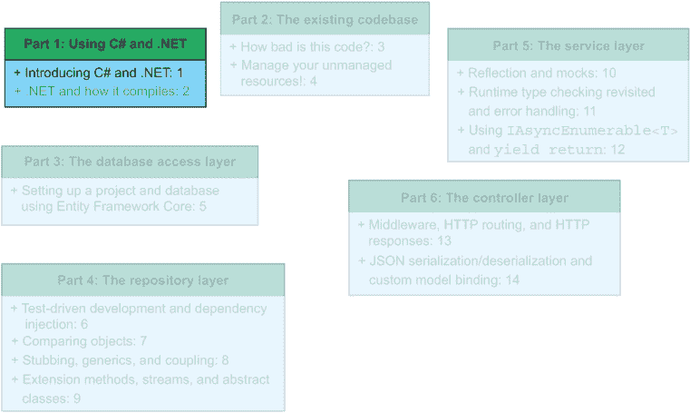
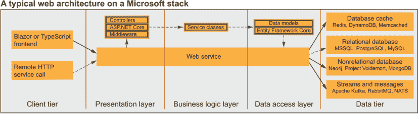
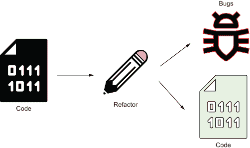

# 1 介绍 C#和.NET

本章涵盖

+   理解 C#和.NET 是什么

+   学习为什么要在你的项目中使用 C#（以及为什么不用）

+   转向 C#以及如何入门

另一本关于 C#的书，你说？是的，又一本。关于 C#和.NET 的书已经有很多了，但本书有一个基本的不同点：我写这本书是为了帮助你开发在日常生活中的干净、惯用的 C#代码。本书不是一本参考书，而是一本实用指南。本书不涵盖如何编写`if`语句、方法签名是什么或对象是什么等内容。我们不关心语法，而是关注概念和想法。知道一种语言的语法和能够编写干净、惯用的代码之间存在差异。在阅读完这本书后，你将能够做到这一点。无论你的背景如何，无论你了解哪些编程语言，只要你能理解面向对象编程，这本书就能帮助你过渡到 C#和.NET 生态系统，如图 1.1 所示。

图 1.1 每章引言都包含一个进度图，这让你可以快速了解你在书中的位置。

微软、谷歌和美国政府等组织有什么共同之处？它们都使用 C#——而且有充分的理由。但为什么呢？C#只是另一种编程语言。它与 Java 和 C++相似，允许进行面向对象和函数式编程，并且得到了一个大型开源社区的广泛支持。很好。那么，你为什么要关心这个呢？在本章中，我们将深入探讨这个问题，但让我先透露一些预告：C#擅长让你创建可扩展的软件。要开始编写 C#，你只需要选择你喜欢的.NET SDK（关于这一点，请参阅第二章）以及可能需要一个 IDE。语言和运行时都是开源的。

每次你在网上查找 C#时，很可能会遇到.NET 框架。你可以把.NET 框架想象成你的温暖毯子、温暖的火炉和冬天的热巧克力杯，为你提供你需要的一切：封装低级 Windows API 的库、公开常用数据结构并为复杂算法提供包装器。在 C#的日常开发中，几乎肯定会涉及到.NET 框架、.NET Core 或.NET 5，因此我们将根据需要探讨这些框架。

图 1.2 显示了本书的主题在一般.NET 网络架构中的位置。它还显示了我们将用于完全重写现有应用的架构，我们将在第五章开始介绍（绿色/虚线箭头表示此路径）。

图 1.2 在 Microsoft 堆栈上典型网络服务架构的示例。本书遵循绿色/虚线箭头所示的方法。本书涵盖了表示层、业务逻辑层和数据访问层。

对于那些在 C#方面有先验经验的你们来说，这本书位于初学者和高级资源之间。通过这本书教授的技能，你可以填补知识差距，并为高级技能做好准备。前两章可能对你们来说有点基础，但我邀请你们不要匆匆略过。时常刷新你的知识总是好的。

## 1.1 为什么选择 C#？

如果你已经熟悉除了 C#以外的其他编程语言并且喜欢使用它，为什么你应该使用 C#呢？也许你是被一家只使用 C#的公司雇佣的。或者也许你只是想看看所有这些喧嚣究竟是怎么回事。

我保证不会反复告诉你 C#是一种“强类型面向对象编程语言，它使跨平台开发可扩展的企业软件成为可能。”你可能已经知道了这一点，而且这几乎不是最激动人心的句子来剖析。在本节中，我们一次性覆盖了那个定义中的术语，并且不再涉及。冒着听起来像是在微软市场营销部门工作的风险，在本节的剩余部分，我们将关注以下 C#的亮点和用例：

+   C#（以及.NET 生态系统）以经济的方式使软件开发成为可能。经济解决方案很重要，因为企业开发是 C#的精髓。

+   C#可以通过支持自文档化代码、安全库和易用性来提高代码的稳定性并使其可维护。

+   C#对开发者友好且易于使用。没有什么比发现你想要使用的编程语言没有对你所喜爱的功能（例如稳定的包管理器、良好的单元测试支持以及跨平台运行时）提供良好支持更糟糕的了。

当然，在大多数（如果不是所有）编程语言中都可以编写可扩展、可维护且对开发者友好的“清洁代码”。区别在于开发者体验。有些语言在引导你编写清洁代码方面做得非常好，而有些则不然。C#并不完美，但它确实试图在这方面帮助你。

### 1.1.1 原因 1：C#经济高效

C#的使用和开发是免费的。语言和平台是完全开源的，所有文档都是免费的，大多数工具都有免费选项。例如，常见的 C#配置包括安装 C# 8、.NET 5 和 Visual Studio Community。所有这些都是免费的，并在本书中使用。运行时不需任何许可费用，你可以将最终产品部署到你想要的地方。

### 1.1.2 原因 2：C#可维护

当我们在这本书中谈论可维护性时，我们指的是在不产生意外副作用的情况下修复错误、更改功能以及解决其他问题的能力。这听起来像是任何编程语言的明显要求，但实际上很难实现。C#具有提高大型代码库可维护性（因此，安全可扩展性）的功能。例如，考虑泛型和语言集成查询（LINQ）。我们将在整本书中讨论这两件事，但它们是平台暴露的功能的例子，可以帮助你编写更好的代码。

对于一家公司来说，表面上，可维护性可能不是首要任务，但如果你开发了可维护的代码（意味着易于扩展且由测试支持的干净代码），开发成本就会降低。一开始，编写可维护代码时开发成本的降低可能看起来有些不合逻辑：可维护的代码需要更长的时间来编写和设计，从而增加了开发的初始成本。然而，想象一下，当用户发现一个错误或他们想要一个额外的功能时，过了一段时间会发生什么。如果我们编写可维护的代码，我们可以快速轻松地找到错误（并修复它）。添加功能更简单，因为代码库是可扩展的。如果我们能够轻松扩展和修复代码库，开发成本就会降低。

|    |
| --- |

开闭原则

1988 年，法国计算机科学家贝尔特朗·梅耶（Eiffel 编程语言的创造者）出版了一本名为《面向对象软件构造》（Prentice Hall，1988 年）的书。梅耶的书的发布是面向对象编程和设计历史上的一个转折点，因为在这本书中，他引入了开闭原则（OCP）。OCP 旨在提高软件设计的可维护性和灵活性。梅耶说，OCP 意味着“软件实体（类、模块、函数等）应该是可扩展的，但应该是封闭的以修改。”

但在实际意义上，OCP（开闭原则）意味着什么？为了检验这一点，让我们将 OCP 应用于一个类：如果我们能够在不改变现有功能（因此，可能破坏代码的某些部分）的情况下向类中添加功能，我们认为这个类是“开放”于扩展的，并且是“封闭”于修改的。如果你遵守这个规则，你引入回归（或新错误）的可能性比试图强制修复错误或添加新功能而不考虑可维护性和可扩展性的可能性要小得多。当你处理更复杂（并且耦合；在第八章中讨论）的代码时，你更有可能因为误解你更改的副作用而引入新的错误。这是我们无论如何都要避免的事情。

|

### 1.1.3 第 3 个原因：C#对开发者友好且易于使用

企业开发是 C# 开发的基础，也是 C# 和 .NET 发挥优势的地方。在你的理想代码库中，企业环境会是什么样子？也许你希望代码库易于导航，拥有可靠的包管理器，并支持测试（单元、集成和冒烟测试）。让我们再添加优秀的文档和跨平台支持。

**定义** 自我文档化的代码意味着代码编写得足够清晰，以至于我们不需要注释来解释逻辑。代码本身就是文档。例如，如果你有一个名为 `DownloadDocument` 的方法，其他人可以大致了解它的功能。不需要添加注释来说明方法内部逻辑是下载文档。

为了锦上添花，也许我们可以与云服务进行良好的集成，以实现持续集成和持续交付（CI/CD）。实用主义观点告诉我们，你拥有如此代码库的可能性并不高。当然，这个愿望清单对于大多数场景来说是不切实际的。然而，如果你想做一些这些事情（如果你喜欢冒险，甚至所有这些），C# 不会成为你的障碍。它提供了现有的工作流程、功能性和原生库，让你达到 99% 的目标。

来自 Java 等语言的开发者可能会在项目结构中看到一些相似之处。尽管存在一些差异，但它们并不大。我们将在本书中深入讨论 C# 项目结构。

.NET 还支持几个流行的测试框架。Microsoft 提供了 Visual Studio 单元测试框架，其中包含（并且有时也被称为）MSTest。MSTest 只是 Visual Studio 单元测试框架的命令行运行器。其他常用的测试框架包括 xUnit 和 NUnit。你还可以找到对模拟框架的支持，如 Moq（Moq 与 Java 的 Mockito 或 Go 的 GoMock 类似。我们将在第 10.3.3 节中学习如何使用 Moq 进行单元测试），SpecFlow（类似于 Cucumber 的行为驱动开发），NFluent（一个流畅断言库），FitNesse，以及许多其他框架。

最后，你可以在众多平台上运行 C#，尽管有一些限制（一些较老的平台仅限于较老的 C# 版本和 .NET Framework）。使用 .NET 5，你可以在 Windows 10、Linux 和 macOS 上运行相同的代码。这种功能最初起源于 .NET Core，它是 .NET Framework 的一个分支，后来与 .NET Framework（以及其他框架）合并，形成了 .NET 5。你甚至可以通过 Xamarin 在 iOS 和 Android 上运行 C# 代码，通过 Mono 在 PlayStation、Xbox 和 Nintendo Switch 平台上运行。

## 1.2 为什么不使用 C#？

C# 并不是在所有情况下都是最佳选择。务必选择最适合工作的工具。C# 在各种情况下都表现良好，但以下是一些你可能不想使用 C# 和 .NET 的用例：

+   操作系统开发

+   实时操作系统驱动的代码（嵌入式开发）

+   数值计算

让我们简要地探讨一下为什么 C#可能不适合这些用例。

### 1.2.1 操作系统开发

操作系统（OS）开发是软件工程中一个极其重要的领域，但并不是很多人开发操作系统。开发操作系统需要大量的时间和承诺，代码库通常包含数百万行代码，这些代码在多年甚至几十年内开发和维护。

C#不适合操作系统开发的主要原因归结为对手动内存管理（未管理代码）的支持不完整以及 C#的编译过程。尽管 C#在“不安全”模式下允许使用指针，但它在使用手动内存管理方面的易用性并不像 C 语言那样。

使用 C#开发操作系统的问题之一是其对即时编译器（JIT）的局部依赖（更多内容在第二章中介绍）。想象一下，你必须通过虚拟机运行你的操作系统。性能将是一个问题，因为虚拟机必须不断追赶以运行 JIT 编译的代码，这与.NET 代码在你的机器上运行时发生的情况类似。这种批评意味着，一个完全静态编译的语言更适合操作系统开发。

然而，确实存在使用高级语言开发的操作系统（OS）的例子。例如，Pilot-OS（由施乐帕克研究中心在 1977 年创建）是用 Mesa 编写的，¹它是 Java 的前身。

如果你想了解更多关于操作系统开发的信息，osdev.org 社区维基是一个极好的资源（[wiki.osdev.org](http://wiki.osdev.org)）。在那里你可以找到入门指南、教程和阅读建议。学习 C 的资源包括 Jens Gustedt 的《现代 C》（Manning，2019 年）和经典书籍《C 程序设计语言》，由 Brian Kernighan 和 Dennis Ritchie 所著（Prentice Hall，1988 年）。

### 1.2.2 C#中的实时操作系统嵌入式开发

与操作系统（OS）开发（第 1.2.1 节）类似，实时操作系统（RTOS）驱动的代码，你通常在嵌入式系统中找到，当通过虚拟机运行时，会经历很大的性能问题。RTOS 线性地、实时地扫描代码，并在可配置的间隔内执行指令，这个间隔从每秒一个操作到每微秒多次操作不等，具体取决于开发者的意愿和代码运行的微控制器或可编程逻辑控制器（PLC）的能力。由于虚拟机在运行时增加了延迟和开销，它阻碍了真正的实时执行。

如果你想了解更多关于实时操作系统（RTOS）驱动的代码和嵌入式开发的信息，你可以查看几本备受推崇的书籍，例如 David E. Simon 的《嵌入式软件入门》（Addison-Wesley Professional，1999 年），或者 Elecia White 的《制作嵌入式系统：优秀软件的设计模式》（O’Reilly Media，2011 年）。

### 1.2.3 数值计算和 C#

*数值计算*（也称为 *数值分析*）涉及算法的研究、开发和分析。在数值计算领域工作的个人（通常是计算机科学家或数学家）使用数值近似来解决科学和工程几乎每个分支的问题。从编程语言的角度来看，它提出了独特的挑战和考虑。每种编程语言都可以评估数学语句和公式，但有些是专门为此目的构建的。

考虑绘制图表。C# 完全可以处理绘图，但与 MATLAB 等工具相比，C# 在性能和易用性方面提供了什么？(MATLAB 是 MathWorks 创建的既是一个计算环境又是一种编程语言。)简短的答案是，它们不可比。在 C# 中进行图形编程，你将工作在类似于 WPF（使用 Direct3D）、OpenGL、DirectX 或不同的第三方图形库（通常针对视频游戏）的环境中。使用 MATLAB，你有一个与一个构建来渲染复杂 3-D 图形的语言绑定在一起的环境。你可以直接调用 `plot(x, y)`，MATLAB 会为你绘制图表。

因此，C# 可以进行数值计算，但与 MATLAB 这样的具有高级库和抽象处理图形绘制的语言相比，并不提供相同的易用性。如果你对学习更多关于 MATLAB 或数值计算感兴趣，这些主题的一些可用资源包括 Richard Hamming 的 *《科学家和工程师的数值方法》*（Dover Publications，1987 年），Amos Gilat 的 *《MATLAB：应用入门》*（Wiley，2016 年），以及 MATLAB 的 Cody 教程程序（[`www.mathworks.com/matlabcentral/cody`](https://www.mathworks.com/matlabcentral/cody)）。

## 1.3 转向 C#

由于语言之间的相似性，对 Java 虚拟机 (JVM) 语言（尤其是 Java、Scala 和 Kotlin）或 C++ 语法有良好理解的开发者，与来自非 C 风格语言、非虚拟机类似语言或 Dart、Ruby 或 Go 等关注网络和云的语言的背景的人相比，可能会更容易理解这本书。来自非 C 风格语言背景并不意味着 C# 就不可能理解。你可能会发现自己需要反复阅读一些段落两次，但最终你会顺利地理解它。

如果你来自像 Python 这样的解释型语言，.NET 编译过程可能一开始看起来很奇怪。.NET 限制内的语言使用两步编译过程。首先，代码被静态编译到一个称为公共中间语言 (CIL，IL 或 MSIL 的简称；MS 代表 Microsoft——对于 Java 开发者来说，它与 Java 字节码有些相似)，然后当 .NET 运行时在宿主上执行代码时，它会即时编译 (JIT) 到本地代码。所有这些可能听起来突然有很多要消化，但在几章之后，你就会理解这一切。

如果您来自像 JavaScript 这样的脚本语言，静态类型可能看起来会限制并让您感到沮丧。但一旦您习惯了始终知道您的类型是什么，我认为您会喜欢它的。

如果您来自像 Go 或 Dart 这样的语言，其中原生库有时难以找到，.NET 5 可能会因其丰富的库存储而让您感到惊讶。通过提供您能想到的大多数功能的功能，.NET 库是您功能的主要来源。许多用 .NET 编写的应用程序从未使用过任何第三方库。

为了避免不必要的麻烦，让我们先讨论一下工具。在本章中，我们不会深入讨论如何安装 IDE 或 .NET SDK。如果您尚未安装 .NET SDK 或 IDE 并需要一些帮助，您可以在附录 C 中找到一些快速安装指南。为了跟随本书的内容，您需要安装 .NET Framework 和 .NET 5 的最新版本。在本书中，我们将从一个使用 .NET Framework 的旧代码库开始。正因为如此，我们在将代码迁移到 .NET 5 的过程中将使用 .NET Framework 来运行那个旧代码库。

如前所述，C# 是开源的，由社区维护，并得到微软的支持。您不需要为运行时、SDK 或 IDE 许可证付费。关于 IDE，Visual Studio（本书示例中将使用的 IDE）有一个免费的社区版，您可以使用它来开发个人项目和开源软件。如果您喜欢您当前的 IDE，那么您很可能可以找到适用于它的 C# 插件。您还可以使用命令行来编译、运行和测试 C# 项目，尽管我鼓励您尝试一下专门的 C# 工具（Visual Studio），因为它提供了最流畅的体验和编写惯用 C# 代码的最简单途径。

您在其他地方学到的许多概念和技术可以转移到 C# 中，但也有一些不行。C# 在后端比在前端更加成熟，因为它传统上主要用于这个目的。C# 对后端开发的历史关注并不意味着前端体验有任何不令人印象深刻的地方。您可以使用 C# 编写全栈应用程序，而无需接触 JavaScript。尽管本书侧重于后端开发，但这里教授的许多概念对前端开发也有帮助。

你是否曾经遇到过一种包含五个嵌套的`for`循环、一堆硬编码的数字（所谓的魔法数字）以及比代码还多的注释的“怪物方法”？想象一下，你是一名刚刚加入团队的新开发者。当你启动你的集成开发环境（IDE），下载源代码，并看到这个方法时，你会作何感想？绝望可能都无法完全概括你的感受。现在想象一下，如果你将你的“怪物方法”中的所有单个操作都放在它们自己的小方法中（可能少于 5 到 10 行代码）。你的“怪物方法”会是什么样子？它不再是难以跟随的条件和赋值语句的集合，除非你有特定的领域知识，否则没有明确的路径可以理解，代码几乎就像一个叙述。如果你给你的方法取好名字，你的主方法应该像一份食谱，即使是糟糕的厨师也能遵循。

当我提到“清洁代码”时，我指的是由 Robert C. Martin 在他的视频（[`cleancoders.com/videos`](https://cleancoders.com/videos)）和书籍《Clean Code》（Prentice Hall, 2008）、《Clean Architecture》（Prentice Hall, 2017），以及与 Micah Martin 合著的《Agile Principles, Patterns, and Practices in C#》（Pearson, 2006）中宣扬的编码实践，以及他汇编的“SOLID”原则（单一职责原则、开闭原则、里氏替换原则、接口隔离原则和依赖倒置原则）。当这些原则在书中出现时，我会全面解释清洁代码原则，并附带如何实际使用它们的实用信息。

到头来，为什么还要编写清洁代码呢？清洁代码就像一个用于错误和不正确功能的洗衣机。如果我们把我们的代码库放入图 1.3 所示的清洁代码洗衣机中，我们会看到，一旦你重构某样东西使其更加“清洁”，错误就会显现出来，不正确的功能会毫无藏身之处地盯着你。毕竟，“所有的东西都会在洗涤中显现出来。”当然，重构生产代码也有风险；常常会引入意外的副作用。这使得管理层在没有增加功能的情况下很难批准大的重构。然而，有了正确的工具（本书中讨论了一些），你可以最大限度地减少负面副作用的可能性，并提高代码库的质量。

图 1.3 清洁代码就像你的代码的洗衣机。它将你的脏衣服（你的代码）放入，加入肥皂和水（清洁代码原则），并将污垢从衣服中分离出来（将错误从代码中分离出来）。它留给你的衣服（代码）比开始时更干净（错误更少）。

这本书包含了关于代码整洁性的侧边栏信息。如果侧边栏与代码整洁性相关，我会将其标记为相关内容，并解释这些概念以及如何将它们应用到现实世界中。附录 B 包含了一个代码整洁性检查清单。你可以使用这个清单来判断是否需要对现有代码进行重构。这个清单可以作为一些容易忘记（但仍然重要）的概念的提醒。

## 1.4 你将在本书中学到什么

本书将教你编写符合习惯用法和整洁性的 C#代码。它不教授 C#语言、.NET 5 或从头开始的编程。我们采用一种实用方法：在一个业务场景中，我们将旧 API 重构得更加整洁和安全。在这个过程中，你会学到很多东西。以下是一些亮点：

+   对旧代码库进行重构以提高安全性、性能和整洁性

+   编写自文档化的代码，使其能够通过任何代码审查

+   使用测试驱动开发与实现代码并行编写单元测试

+   通过 Entity Framework Core 安全地连接到云数据库

+   将代码整洁性原则引入现有代码库

+   阅读通用中间语言并解释 C#编译过程

那么，为了充分利用这本书，你需要了解哪些内容呢？预期是，你理解面向对象编程的基本原则（继承、封装、抽象和多态），并且熟悉支持通过面向对象方法开发代码的另一种编程语言（无论是 C++、Go、Python 还是 Java）。

阅读本书后，你将能够编写符合良好面向对象设计原则的整洁、安全、可测试的 C#代码。此外，你将准备好通过高级资源进一步深化你的 C#知识。本书之后的一些推荐阅读包括 Jon Skeet 的《C#深度探索》第 4 版（Manning，2019 年），Jeffrey Richter 的《CLR via C#》第 4 版（Microsoft Press，2012 年），Bill Wagner 的《Effective C#》第 2 版（Microsoft Press，2016 年），Dustin Metzgar 的《.NET Core in Action》（Manning，2018 年），John Smith 的《Entity Framework Core in Action》第 2 版（Manning，2021 年），以及 Andrew Lock 的《ASP.NET Core in Action》第 2 版（Manning，2021 年）。

## 1.5 你在本书中不会学到什么

本书旨在填补初学者和高级 C#资源之间的差距。为此，我对你对 C#和编程的理解做出了一些假设。正如在此简要讨论的，我预期你有一些专业的编程经验，并且对 C#的基础知识或另一种面向对象编程语言感到舒适。

我这是什么意思？为了最大限度地利用这本书，你应该理解面向对象原则，并且能够使用你喜欢的编程语言开发基本的应用程序或 API。因此，这本书不会教授一些通常出现在初学者编程书中的以下主题：

+   C#语言本身。这不是一本从零开始学习 C#的书籍。相反，我教你如何将你现有的 C#或面向对象编程知识提升到下一个层次。

+   与条件语句和分支语句相关的语法，这些语句不是特定于 C#的（`if`、`for`、`foreach`、`while`、`do-while`等）。

+   多态性、封装和继承是什么（尽管我们在本书中经常使用这些概念）。

+   什么是类以及我们如何通过类来模拟现实世界的对象。

+   变量是什么，或者如何给一个变量赋值。

如果你是一个编程新手，我强烈推荐在阅读这本书之前，先阅读像 Jennifer Greene 的《Head First C#》第 4 版（O’Reilly，2020 年）或 Harold Abelson、Gerald Jay Sussman 和 Julie Sussman 的《计算机程序的结构与解释》第 2 版（麻省理工学院出版社，1996 年）这样的书籍²。

本书也没有涵盖这些更专业的 C#使用方式：

+   微服务架构。本书并没有深入探讨微服务是什么以及如何使用它们。微服务架构是一个非常流行的趋势，在许多用例中都很有用，但它与 C#或如何像专业人士一样编码无关。学习更多关于微服务的三个优秀资源是 Chris Richardson 的《Microservices Patterns》（Manning，2018 年），Prabath Siriwardena 和 Nuwan Dias 的《Microservices Security in Action》（Manning，2019 年），以及 Christian Horsdal Gammelgaard 的《Microservices in .NET Core》（Manning，2020 年）。

+   如何在 Kubernetes 和/或 Docker 等容器化环境中使用 C#。尽管非常实用并且在许多企业级开发环境中使用，但知道如何使用 Kubernetes 或 Docker 并不能保证你能在 C#中“像专业人士一样编码”。要了解更多关于这些技术，请参阅 Marko Lukša 的《Kubernetes in Action》第 2 版（Manning，2021 年），Elton Stoneman 的《Learn Docker in a Month of Lunches》（Manning，2020 年），以及 Ashley Davis 的《Bootstrapping Microservices with Docker, Kubernetes, and Terraform》（Manning，2021 年）。

+   超越多线程和锁的 C#并发（在第六章中讨论）。我们经常在高度线程化和性能关键的场景中遇到这个话题。大多数开发者并不经常与这样的代码打交道。如果你发现自己处于那种位置，学习更多关于 C#并发编程的绝佳资源是 Joe Duffy 的《Windows 上的并发编程》（Addison-Wesley，2008 年）。

+   CLR 或.NET Framework 本身的深层内部细节。尽管 CLR 和.NET 5 很有趣，但了解它们的每一个细节对大多数开发者来说几乎没有实际用途。本书对 CLR 和.NET Framework 进行了详细阐述，但停止在事情变得不实用或不便处理的地方。“CLR 和.NET Framework 的圣经”是 Jeffrey Richter 的《CLR via C#》第 4 版（微软出版社，2012 年）。

您有两种阅读这本书的方式。推荐的方式是从头到尾、按顺序阅读整本书。如果您只对重构和最佳实践感兴趣，您只需阅读第三部分至第六部分即可。

## 摘要

+   本书不涵盖“编程 101”。它假设您已经了解面向对象编程。这使得我们可以专注于实际概念。

+   C#和.NET 5 在可扩展的企业开发方面表现出色，重点在于稳定性和可维护性。这使得 C#和.NET 成为公司和个人开发者理想的选择平台。

+   C#和.NET 5 在操作系统开发、RTOS-嵌入式开发或数值计算（或分析）方面并不出色。对于这些任务，C 和 MATLAB 更为合适。

* * *

^（1.）名称“Mesa”是一个双关语，指的是编程语言是高级的，就像一个孤立、高耸、顶部平坦的小山一样。

^（2.）可以从麻省理工学院出版社免费获取[`mitpress.mit.edu/sites/default/files/sicp/index.html`](https://mitpress.mit.edu/sites/default/files/sicp/index.html)。
