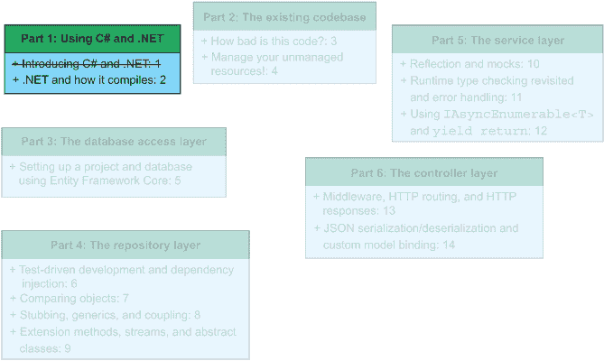
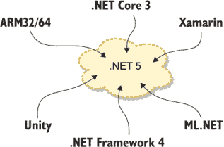
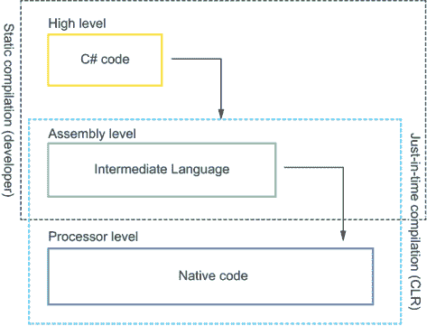
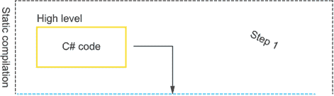
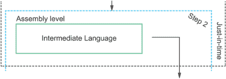
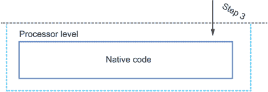
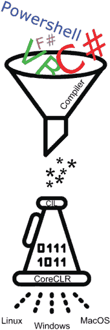

# 2 .NET 及其编译方式

本章涵盖

+   将 C# 编译成本地代码

+   阅读和理解中间语言

在 2020 年，微软发布了全功能的软件开发平台 .NET 5。在此之前，在 1990 年代末和 2000 年代初，微软创建了 .NET Framework，它是 .NET 5 的前身。.NET Framework 的原始用途是开发企业级 Windows 应用程序。实际上，我们将在第三章和第四章中使用 .NET Framework 来检查这样的代码库。.NET Framework 将大量库连接在一起。尽管 .NET Framework 和 C# 经常一起使用，但我们确实遇到过不使用 C# 的 .NET Framework 用例（最显著的是使用不同的 .NET 语言）。.NET Framework 的两个最重要的支柱是框架类库（FCL；这是一个庞大的类库，是 .NET Framework 的骨架）和公共语言运行时（CLR；包含 JIT 编译器、垃圾回收器、原始数据类型等 .NET 的运行环境）。换句话说，FCL 包含了你可能使用的所有库，而 CLR 执行代码。后来，微软推出了旨在多平台开发的 .NET Core。参见图 2.1 了解本章在本书结构中的位置。



图 2.1 到目前为止，你已经了解了本书的预期内容。在本章中，我们将深入了解 .NET 及其变体。通过讨论 .NET 生态系统，我们将获得一个基准理解，这将有助于我们在本书的其余部分。

在本章中，我们将讨论 .NET 5 的几个特性，并将它们与其他平台（如 Java、Python 和 Go）的实现（有时是没有实现）进行对比。之后，我们将通过展示一个 C# 方法是如何从 C# 转换为通用中间语言（CIL）再到本地代码的过程来学习 C# 的编译过程。这些基本构建块使我们能够在 C# 语言和 .NET 生态系统方面的知识上打下坚实的基础。如果你已经熟悉 C# 和 .NET，那么本章对你来说可能有些重复。至少，我建议你阅读第 2.3 节。关于 C# 编译过程的讨论比大多数资源中的内容都要深入，并且在一些高级 C# 资源中被视为基础知识。为了测试你对相关主题的了解，第 2.2 节和第 2.3 节为你提供了练习题。

## 2.1 什么是 .NET Framework？

在一开始……是 .NET Framework——使用 .NET 的传统方式。.NET Framework 由微软在 2000 年代初引入。开发者可以使用 C# 与之配合编写企业桌面应用程序。由于微软对针对 Windows 有内在兴趣，.NET Framework 只能在 Windows 上运行，并依赖于许多 Windows API 来执行图形操作。如果你在 2020 年晚些时候（以及 .NET 5 的引入）之前从事任何用 C# 编写的桌面应用程序，我保证它使用的是 .NET Framework。

.NET Framework 随着时间的推移经历了多次迭代，但最新的版本（2019 年 7 月）是 4.8.0。由于已被 .NET 5 取代，因此将不再发布 .NET Framework 的后续版本，但它的许多遗留应用程序将继续存在。本书中涵盖的许多内容都适用于 .NET Framework。实际上，我们将在第三章和第四章中看到一个 .NET Framework 应用程序。

## 2.2 什么是 .NET 5？

在本节中，我们将讨论 .NET 5 是什么以及为什么它存在。自 2016 年以来，.NET 存在为两大主要分支：.NET Framework 和 .NET Core。新的 .NET 5 将这两个分支（以及如 Xamarin 和 Unity 这样的不同辅助分支）合并在一起，如图 2.2 所示。实际上，.NET 5 是将 .NET Core 重命名，因为它构成了新 .NET 的基础。因此，我们应该将 .NET 5 视为不仅仅是 .NET Framework 或 .NET Core 的另一个迭代，而更是一个重启和合并了之前技术的过程。

将所有 .NET 技术置于一个统一的框架下，你可以访问所有你想要的工具和用例。你可以开发企业软件、网站、视频游戏、物联网（IoT）、在 Windows/macOS/Linux 上运行的嵌入式应用程序、ARM 处理器（ARM32/64）、机器学习服务（ML.NET）、应用程序、云服务和移动应用，这一切都在同一个框架中完成。并且由于 .NET Framework 遵循 .NET 标准规范，所有现有的代码库和库都应该与 .NET 5 兼容（只要 .NET 5 支持代码库使用的底层包和功能）。



图 2.2 .NET 5 将 .NET Framework 4 与 ARM32/64、Xamarin、.NET Core 3、Unity 和 ML.NET 合并。这使得我们可以在一个统一的框架下使用所有这些 .NET 变体：.NET 5。

.NET 5，就像 .NET Framework 和 .NET Core 一样，是 .NET 标准的实现——这是一个用于开发各种 .NET 实现的规范：.NET 5、.NET Framework、.NET Core、Mono（.NET Core 所基于的跨平台技术）、Unity（视频游戏开发）和 Xamarin（iOS 和 Android 开发）。这些实现有不同的用途，但本质上非常相似。针对 .NET 标准开发意味着实现之间的代码共享尽可能无缝。

.NET 标准包含有关与 CLR（C#所依赖的运行时）交互时可用哪些 API 的信息。在.NET 标准之前，我们除了使用可移植类库（PCL）之外，没有真正的方法来确保我们的代码或库能够在.NET 实现之间工作。PCL 是可以在不同项目之间共享的库，但只能针对.NET 实现的一个特定版本（或“配置文件”）。今天我们称这些 PCL 为“基于配置文件的 PCL”。针对遵循.NET 标准的.NET 实现的库也是 PCL，但它们不是针对特定实现，而是针对.NET 标准的某个版本。为了区分基于配置文件的 PCL，我们称这些为“基于.NET 标准的 PCL”。.NET 标准封装了在.NET 标准时代之前编写的库所使用的许多 Windows API（因此，基于配置文件的 PCL）。因此，我们可以在任何.NET 标准实现的.NET 中无问题地使用这些库。第一个实现.NET 标准的.NET Framework 版本是 4.5。

遵循微软对开源软件的推动，.NET 5 及其所有相关仓库都是开源的，可在 GitHub 上找到（[`github.com/dotnet`](https://github.com/dotnet)）。有关新版本.NET 中计划包含的新功能的更多信息，请参阅 CoreFX 路线图[`github.com/dotnet/corefx/milestones`](https://github.com/dotnet/corefx/milestones)。您可以通过[`github.com/dotnet/standard`](https://github.com/dotnet/standard)访问.NET 标准。

## 练习

练习 2.1

以下哪个操作系统不受.NET 5 支持？

a. Windows

b. macOS

c. Linux

d. AmigaOS

练习 2.2

“CLR”这个术语代表什么？

a. 创意许可资源

b. 类库参考

c. 常见语言运行时

练习 2.3

填空：.NET 标准是一个(n) __________，它规定了所有.NET 平台实现细节，以实现代码共享。

a. 实现

b. 前身

c. 工具

d. 规范

## 2.3 如何编译符合 CLI 的语言

在本节中，您将深入了解 C#（以及其他符合通用语言基础设施（Common Language Infrastructure）的语言；参见 2.3.2 节）的编译过程。了解整个编译过程可以帮助您充分利用 C#的所有功能，同时了解一些与内存和执行相关的陷阱。C#的编译过程知道三个状态（C#、中间语言和本地代码）和两个阶段，如图 2.3 所示：从 C#到通用中间语言，再到本地代码。



图 2.3 完整的 C#编译过程。它从 C#代码到通用中间语言，再到本地代码。理解编译过程使我们能够了解 C#和.NET 内部的一些选择。

注意：本地代码有时被称为*机器代码*。

通过观察从一步到另一步需要什么，并遵循编译器和 CLR 将高级 C# 代码编译成可执行原生代码的方法，我们能够理解 C# 和 .NET 5 的复杂机器。对这一过程的理解通常是初学者资源中发现的资源差距，但高级资源要求你理解这一点。

我们使用静态编译和即时编译的组合将 C# 编译成原生代码，如下所示：

1.  开发者编写完 C# 代码后，他们会编译他们的代码。这会在可移植可执行文件（PE 文件，32 位为 PE，64 位为 PE+）中存储通用中间语言（CIL），例如 .exe 和 .dll 文件，用于 Windows。这些文件被分发或部署给用户。

1.  当我们启动 .NET 程序时，操作系统调用公共语言运行时（CLR）。公共语言运行时的即时编译器将 CIL 编译成适合其运行平台的原生代码。这允许 CLI 兼容的语言在许多平台和编译器类型上运行。然而，不提一下使用虚拟机和即时编译器运行代码的主要负面影响：性能。

静态编译的程序在执行时具有优势，因为你不需要等待运行时来编译代码。

定义 静态编译和即时编译是两种常用的代码编译方式。C# 使用静态编译和即时编译的组合。这意味着代码在最后可能的时刻被编译成字节码。静态编译在编译前将所有源代码编译完成。

### 2.3.1 步骤 1：C# 代码（高级）

我第一次遇到勾股定理是在 2008 年。当时我在荷兰高中版本的学校，看到数学课本中提到我们那年会学习勾股定理。几天后的深夜，我和父亲在车里。我们已经开了一段时间车，所以对话自然慢了下来。在一个完全不合时宜的时刻，我问了他，“什么是勾股定理？”这个问题显然让他很惊讶，因为我当时对学术几乎没有兴趣，尤其是在数学方面。接下来的十分钟，他试图向我解释，一个数学能力相当于葡萄柚的人，什么是勾股定理。我惊讶地发现我实际上理解了他所说的内容，现在，多年以后，这已经证明是展示 C# 编译过程第一步的一个极好的资源。

在本节中，我们将查看 C# 编译过程的第一个步骤：编译 C# 代码，如图 2.4 所示。我们将跟随编译过程的是勾股定理。使用代表勾股定理的程序来向您展示 C# 编译过程是直截了当的原因是：我们可以将勾股定理压缩为几行代码，这些代码可以用高中水平的数学知识理解。这使得我们可以专注于编译故事而不是实现细节。



图 2.4 C# 编译过程，步骤 1：C# 代码。这是静态编译阶段。

注意：如果需要快速复习，勾股定理表明 *a*² + *b*² = *c*²。我们通常将勾股定理应用于通过取结果的平方根来发现直角三角形斜边的长度，该结果为直角三角形相邻两边的平方长度的和。

我们将从一个简单的、当给定两个参数时证明勾股定理的方法开始，如下一列表所示。

列表 2.1 勾股定理（高级）

```
public double Pythagoras(double sideLengthA, double sideLengthB) {                ❶
    double squaredLength = sideLengthA * sideLengthA + sideLengthB * sideLengthB; ❷
  return squaredLength;
}
```

❶ 我们声明一个具有公共访问修饰符的方法，返回一个浮点数，名为 Pythagoras，它期望两个浮点数（double）参数：sideLengthA 和 sideLengthB。

❷ 我们执行勾股定理并将结果赋值给一个名为 squaredLength 的变量。

如果我们运行此代码并给它 `[3, 8]` 的参数，我们看到结果是 73，这是正确的。或者，因为我们使用的是 64 位浮点数（doubles），我们也可以测试类似集合的参数。结果是 12037.7057。

访问修饰符、程序集和命名空间

C# 知道六个访问修饰符（从最开放到最限制）：公共、受保护内部、内部、受保护、受保护私有和私有。您在日常生活中使用最多的两个是公共和私有。*公共* 表示对所有类和项目的可用性（这是某些语言中“导出”的概念；与某些编程语言不同，在 C# 中，方法名称的大小写对访问修饰符没有影响），而 *私有* 表示仅在当前类中可见。

其他四个（内部、受保护的、受保护的内部和私有受保护的）使用较少，但了解它们是有好处的。*内部* 允许对其自己的程序集内的所有类进行访问，而 *受保护的* 限制了对从原始类派生的类的访问。这留下了 *内部受保护的*。这个访问修饰符是内部和受保护的访问修饰符的组合。它允许派生类及其自己的程序集进行访问。*私有受保护的* 允许在其自己的程序集内进行访问，但仅限于同一类或派生类中的代码。


C# 访问修饰符从开放到受限。使用正确的访问修饰符有助于封装我们的数据并保护我们的类。

现在我们编译代码。假设列表 2.1 中的方法是一个名为 `HelloPythagoras` 的类的部分，该类是名为 `HelloPythagoras` 的项目和解决方案的一部分。要将 .NET 5（或 .NET Framework/.NET Core 解决方案）编译成存储在 PE/PE+ 文件中的中间语言，您可以使用 IDE 中的构建或编译器按钮，或者在命令行中运行以下命令：

```
dotnet build [solution file path]
```

解决方案文件以 .sln 扩展名结尾。创建我们的解决方案的命令如下：

```
dotnet build HelloPythagoras.sln
```

在我们运行命令后，编译器启动。首先，编译器通过 NuGet 包管理器恢复所有必需的依赖项包。然后，命令行工具编译项目并将输出存储在一个名为 bin 的新文件夹中。在 bin 文件夹中，根据我们设置的编译器模式（如果您想的话，可以定义自己的模式），有两个潜在的文件夹选项，即调试和发布。默认情况下，编译器以调试模式编译。调试模式包含所有调试信息（存储在 .pdb 文件中），这些信息是您使用断点逐步通过应用程序所需的。

要通过命令行以发布模式编译，请将 `--Configuration release` 标志附加到命令中。或者，在 Visual Studio 中，从下拉列表中选择调试或发布模式。这是您编译代码最容易、最快且最可能的方式。

|    |
| --- |

调试和发布构建模式

在日常生活中，调试和发布模式之间的实际区别在于性能和安全。通过在调试构建的输出代码中包含对 .pdb 文件的引用，运行时必须迭代更多代码来完成相同的逻辑，这比在发布模式中要复杂，因为在发布模式中这些引用不存在。因此，与发布模式相比，建模该代码所需的中间语言更大，编译时间更长。

此外，如果您包含调试信息，心怀恶意的人可能会利用这些信息，从而更容易地访问您的代码库。这并不是说在发布模式下编译就消除了对良好安全实践的任何需求。中间语言可以很容易地反编译（无论最初是在调试还是发布模式下编译），变成与原始源代码类似的东西。如果您想适当地保护您的源代码，请考虑研究混淆器（Dotfuscator、.NET Reactor）和威胁模型。

一个好的经验法则是使用调试模式进行开发，并使用调试和发布模式进行测试。通常，这包括在调试模式下本地测试，并在具有发布构建的专用环境中进行用户验收测试。因为不同模式之间的代码略有不同，你可能会在发布模式下发现调试模式下没有发现的错误。你不想处于只测试了调试构建，而在截止日期前发现发布构建中存在阻止性错误的境地。

|

在这个阶段，C# 高级代码被编译成一个包含中间语言代码的可执行文件。

### 2.3.2 步骤 2：公共中间语言（汇编级别）

从日常工作的角度来看，你的工作已经完成。代码已经以可执行形式存在，你可以关闭你的工单或用户故事。从技术角度来看，旅程才刚刚开始。C# 代码被静态编译成公共中间语言，如图 2.5 所示，但 IL 不能由操作系统运行。



图 2.5 C# 编译过程，步骤 2：中间语言。我们从静态编译转换到即时编译。

但你是如何从 IL 转换到本地代码的呢？缺失的部分是公共语言运行时（CLR）。.NET 5 的这部分将公共中间语言转换为本地代码。它是 .NET 的“运行时”。我们可以将 CLR 与 Java 虚拟机（JVM）进行比较。CLR 一直是 .NET 的一部分。值得注意的是，随着向 .NET Core 和 .NET 5 的转变，一个新的 CLR 实现正在取代旧的 CLR：CoreCLR。本书中关于 CLR 的解释适用于传统的 CLR 和 CoreCLR，术语 CLR 适用于常规的公共语言运行时和 CoreCLR。

任何使用称为公共语言基础设施（CLI）的技术标准实现的代码，例如 .NET 5，都可以编译成公共中间语言。CLI 描述了 .NET 背后的基础设施，其具体风味是 CLI 的实现本身，并为语言提供了一个形成其类型系统的基础。因为 CLR 可以接受任何中间语言（IL）片段，而 .NET 编译器可以从任何 CLI 兼容的语言生成这种 IL，所以我们可以从混合源代码生成 IL 代码。C#、Visual Basic 和 F# 是最常用的 .NET 编程语言，但还有更多可供选择。请参阅表 2.1 以了解这些缩写的汇总。

直到 2017 年，微软还支持 J#，这是 Java 的 CLI 兼容实现。理论上，你可以下载兼容的编译器并使用 J#，但为了在 .NET 平台上开发，你将错过一些现代 Java 功能。

注意：CLR 是一个极其复杂的软件组件。如果你想了解更多关于（传统、基于 Windows 的）CLR 的信息，请参阅 Jeffrey Richter 的 *CLR via C#*（第 4 版；Microsoft Press，2012）。

因为编译器将 IL 嵌入文件中，我们需要使用反汇编器来查看 CIL。所有 .NET 版本都包含 Microsoft 自己的反汇编器，称为 ILDASM（中间语言反汇编器）。要使用 ILDASM，我们需要运行 Visual Studio 的开发者命令提示符，它与 Visual Studio 一起安装。这是一个命令提示符环境，它为我们提供了访问 .NET 工具的权限。请注意，ILDASM 仅适用于 Windows。

表 2.1 .NET 缩写总结

| 缩写 | 全称 | 描述 |
| --- | --- | --- |
| CLR | 通用语言运行时 | .NET 虚拟机运行时。CLR 管理诸如代码执行、垃圾回收、线程和内存分配等关键任务。 |
| CLI | 通用语言基础设施 | 描述 .NET 生态系统中可执行代码的外观及其执行方式的规范。 |
| CIL | 通用中间语言 | 一种可以被 CLR JIT 编译以执行 CLI 兼容代码的语言。这是 C# 在第一次编译阶段编译成的内容。 |
| IL | 中间语言 | CIL 的另一个术语。 |
| MSIL | 微软中间语言 | CIL 的另一个术语。 |

一旦进入开发者命令提示符，我们就可以在我们的编译文件上调用 ILDASM，并指定一个输出文件，如下所示：

```
>\ ildasm HelloPythagoras.dll /output:HelloPythagoras.il
```

如果我们没有指定输出文件，命令行工具将启动 ILDASM 的 GUI。在那里，你还可以查看反汇编可执行文件的 IL 代码。输出文件可以是任何你想要的文件扩展名，因为它是一个简单的二进制文本文件。请注意，在 .NET Framework 中，ILDASM 针对的是 .exe 文件，而不是 .dll。.NET 5 和 .NET Core 使用 .dll 文件。

当我们在文本编辑器中打开 HelloPythagoras.il 文件或查看 ILDASM 图形用户界面时，一个充满神秘代码的文件就会打开。这就是 IL 代码。我们关注的是 Pythagoras 方法（如果以调试模式编译）的 IL，如下所示。

列表 2.2 斐波那契定理（通用中间语言）

```
.method public hidebysig static float64
  Pythagoras(float64 sideLengthA,
              float64 sideLengthB) cil managed {
  .maxstack 3
  .locals init ([0] float64 squaredLength,
                  [1] float64 V_1)
  IL_0000:    nop
  IL_0001:    ldarg.0
  IL_0002:    ldarg.0
  IL_0003:    mul
  IL_0004:    ldarg.1
  IL_0005:    ldarg.1
  IL_0006:    mul
  IL_0007:    add
  IL_0008:    stloc.0
  IL_0009:    ldloc.0
  IL_000a:    stloc.1
  IL_000b:    br.s        IL_000d
  IL_000c:    ldloc.1
  IL_000e:    ret    
}
```

如果你曾经从事或见过汇编级编程，你可能会注意到一些相似之处。通用中间语言（Common Intermediate Language）确实比常规 C# 代码更难阅读，并且更“接近金属”，但它并不像看起来那么神秘。通过逐行查看 IL，你会发现这仅仅是编程概念的不同语法，而你已经熟悉这些概念。由你的机器上的编译器生成的 IL 代码可能看起来略有不同（特别是使用 `ldarg` 操作码的数字），但操作码的功能和类型应该是相同的。

我们看到的第一件事是方法声明，如下所示：

```
.method private hidebysig static float64
        Pythagoras(float64 sideLengthA,
                   float64 sideLengthB) cil managed
```

我们可以很容易地看到，该方法是私有的、静态的，并返回一个 64 位浮点数（在 C#中称为*double*）。我们还可以看到，该方法名为`Pythagoras`，接受两个名为`sideLengthA`和`sideLengthB`的参数，它们都是 64 位浮点数。看起来奇怪的术语是`hidebysig`和`cil managed`。

首先，术语`hidebysig`告诉我们，毕达哥拉斯方法会隐藏具有相同方法签名的其他方法。当省略时，该方法会隐藏所有具有相同名称的方法（不仅限于签名匹配）。其次，`cil managed`意味着此代码是公共中间语言，并且我们正在托管模式下运行。硬币的另一面是未托管。这指的是 CLR 是否可以执行该方法，可能需要手动处理内存，并且具有 CLR 所需的全部元数据。默认情况下，所有代码都在托管模式下运行，除非你通过启用编译器的“不安全”标志并指定代码为“不安全”来明确告诉它不要这样做。

接下来，让我们看看方法本身，我们可以将方法分为两部分：设置（构造函数）和执行（逻辑）。首先，让我们看看构造函数，如下所示：

```
.maxstack 3
  .locals init ([0] float64 squaredLength,
                  [1] float64 V_1)
```

这里有一些不熟悉的术语。首先，`.maxstack 3`告诉我们，在执行过程中，内存堆栈上允许的最大元素数是三个。静态编译器自动生成这个数字，并告诉 CLR JIT 编译器为该方法保留多少元素。这个方法代码的部分很重要——想象一下，如果我们不能告诉 CLR 我们需要多少内存，它可能会决定在系统上保留所有可用的堆栈空间，或者根本不保留任何空间。任何一种情况都会是灾难性的。

接下来是

```
.locals init (...)
```

当我们在 CLI 兼容的编程语言中声明一个变量时，编译器会在编译时为该变量分配一个作用域，并将变量的值初始化为默认值。`locals`关键字告诉我们，在此代码块中声明的变量的作用域是局部的（作用域限于方法，而不是类），而`init`意味着我们正在将声明的变量初始化为其默认值。编译器将其分配给`null`或零值，具体取决于变量是引用类型还是值类型。

扩展`.locals init (...)`代码块，我们可以看到我们声明并初始化的变量如下：

```
.locals init (
  [0] float64 squaredLength,
  [1] float64 V_1
```

IL 声明了两个局部变量，并将它们初始化为零值：`squaredLength`和`V_1`。

现在，你可能会说，等等！在我们的 C#代码中，我们只声明了一个局部变量：`squaredLength`。这个`V_1`是什么意思？再次查看以下 C#代码：

```
public double Pythagoras(double sideLengthA, double sideLengthB) {
  double squaredLength = 
➥ sideLengthA * sidelengthA + sideLengthB * sideLengthB;
  return squaredLength;
}
```

我们明确声明了仅有一个局部变量。然而，我们是通过值而不是通过引用返回`squaredLength`。这意味着在底层，会声明一个新的变量，初始化并分配给`squaredLength`的值。这就是`V_1`。

总结一下，我们研究了方法签名和设置。现在我们可以深入逻辑的细节。让我们也将以下部分分为两个部分——勾股定理的评估和返回结果值：

```
IL_0000:    nop
IL_0001:    ldarg.0
IL_0002:    ldarg.0
IL_0003:    mul
IL_0004:    ldarg.1
IL_0005:    ldarg.1
IL_0006:    mul
IL_0007:    add
IL_0008:    stloc.0
```

首先，我们看到一个操作（我们也将这些操作称为 *opcodes*）称为 `nop`。这也被称为“什么都不做的操作”或“无操作”，因为单独的 `nop` 操作本身不做任何事情。它们在 IL 和汇编代码中广泛使用，以启用断点调试。与在调试构建中生成的 PDB 文件一起，CLR 可以注入指令，在 `nop` 操作处停止程序执行。这允许我们在运行时“单步执行”代码。

接下来，我们来看一下勾股定理本身的评估，如下所示：

```
    double squaredLength = 
➥ sideLengthA * sideLengthA + sideLengthB * sideLengthB;
```

以下两个操作是一个双重头：两个 `ldarg.0` 操作。第一个操作（`IL_0001`）将第一个 `sideLengthA` 出现在栈上加载。第二个操作（`IL_0002`）也将第二个 `sideLengthA` 出现在栈上加载。

在我们将第一个数学评估参数加载到栈上之后，IL 代码调用以下乘法操作：

```
IL_0003:    mul
```

这导致在 `IL_0001` 和 `IL_0002` 中加载的两个参数被相乘并存储到栈上的一个新元素中。垃圾收集器现在从栈中清除先前（现在不再使用）的栈元素。

我们按照以下方式重复此过程以对 `sideLengthB` 参数进行平方：

```
IL_0004:    ldarg.1
IL_0005:    ldarg.1
IL_0006:    mul
```

因此，现在栈中包含 `sideLengthA2` 和 `sideLengthB2` 的值。为了满足勾股定理和我们的代码，我们必须将这些两个值相加并将它们存储在 `squaredLength` 中。这是在 `IL_0007` 和 `IL_0008` 中完成的，如下所示：

```
IL_0007:    add
IL_0008:    stloc.0
```

与 `mul` 操作（`IL_0003` 和 `IL_0006`）类似，`add` 操作（`IL_0007`）评估先前存储的参数之和，并将结果值放置在栈上的一个元素中。IL 将此元素存储到我们在设置中初始化的 `squaredLength` 变量中（`[0] float64 squaredLength`）通过 `stloc.0` 命令（`IL_0008`）。`stloc.0` 操作从栈中弹出一个值并将其存储在索引 0 的变量中。

现在我们已经完全评估并将勾股定理的结果存储到一个变量中。剩下的只是从方法中返回值，正如我们在原始方法签名中承诺的那样，如下所示：

```
IL_0009:    ldloc.0
IL_000a:    stloc.1
IL_000b:    br.s        IL_000d
IL_000c:    ldloc.1
IL_000e:    ret  
```

首先，我们将位于位置 0 的变量的值加载到内存中（`IL_0009`）。在上一个段中，我们将毕达哥拉斯定理的值存储到位置 0 的变量中，所以那必须是`squaredLength`。但是，如前所述，我们是按值传递变量，而不是按引用传递，因此我们创建了一个`squaredLength`的副本以从方法中返回。幸运的是，我们在索引 1 处声明并初始化了一个变量专门用于此目的：`V_1 ([1] float64 V_1)`。我们通过`stloc.1`操作（`IL_000a`）将值存储到索引 1 中。

接下来，我们看到另一个奇怪的操作：`br.s IL_000d`（`IL_000b`）。这是一个分支操作符，表示返回值已计算并存储以供返回。IL 使用分支操作符进行调试目的。分支操作符类似于`nop`操作。当调用返回时，所有不同的代码分支（具有其他返回值的条件）都会跳转到`br.s`操作符。`br.s`操作符占用两个字节，因此有两个 IL 位置（`IL_000b`和`IL_000d`）；一个操作码通常占用一个字节。因为`br.s`操作符的大小为两个字节，所以`IL_000c`（`ldloc.1`）被包含在分支操作符中。这允许调试器在加载存储的返回值时停止执行，并在必要时对其进行操作。

最后，我们准备通过`IL_000c`和`IL_000e`从方法中返回，如下所示：

```
IL_000c:    ldloc.1
IL_000e:    ret  
```

`ldloc.1`（`IL_000c`）操作加载之前存储的返回值。这之后跟着`ret`操作符，它将我们在`IL_000c`加载的值从方法中返回。请参见列表 2.3 中的整个代码示例。

这就带我们来到了本节的结尾。希望你现在对 C#和.NET 静态编译步骤的细节部分有了更多的了解。

列表 2.3 毕达哥拉斯定理方法的 IL 源代码

```
.method private hidebysig static float64                  ❶
  Pythagoras(float64 sideLengthA,                         ❷
                   float64 sideLengthB) cil managed {     ❸
  .maxstack 3                                             ❹
  .locals init ([0] float64 squaredLength,                ❺
                  [1] float64 V_1)
  IL_0000:    nop                                         ❻
  IL_0001:    ldarg.0                                     ❼
  IL_0002:    ldarg.0
  IL_0003:    mul                                         ❽
  IL_0004:    ldarg.1                                     ❾
  IL_0005:    ldarg.1
  IL_0006:    mul                                         ❿
  IL_0007:    add                                         ⓫
  IL_0008:    stloc.0                                     ⓬
  IL_0009:    ldloc.0                                     ⓭
  IL_000a:    stloc.1                                     ⓮
  IL_000b:    br.s        IL_000d                         ⓯
  IL_000c:    ldloc.1                                     ⓰
  IL_000e:    ret                                         ⓱
}
```

❶ 方法的开始，该方法是私有的、静态的、返回 double 类型，并隐藏具有相同签名的其他方法

❷ 该方法被称为毕达哥拉斯方法。它期望两个类型为 float64（双精度浮点数）的参数。

❸ 这是一个 CIL（通用中间语言）方法，在托管模式下运行。

❾ 在栈上需要的最大元素数量是三个。

❺ 声明并初始化了两个类型为 float64 的局部变量：索引 0 的 squaredLength 和索引 1 的 V_1。

❽ 一个“不做任何事”的操作；由调试器用于设置断点

❻ 第一个 sideLengthA 参数被加载到内存中。

❽ 被加载到内存中的两个 sideLengthA 值相乘并存储在栈元素中。

❽ 第一个 sideLengthB 参数被加载到内存中。

❾ 被加载到内存中的两个 sideLengthB 值相乘并存储在栈元素中。

⓫ sideLengthA 和 sideLengthB 的平方值相加并存储在栈元素中。

⓭ 之前存储在栈元素中的平方值被存储在为新索引 0 的变量指定的新的栈元素中：squaredLength。

⓭ 将 squaredLength 的值加载到内存中。

⓮ 将之前加载到内存中的 squaredLength 的值存储在索引为 1 的变量对应的堆栈元素中：V_1。

⓯ 分支操作符；表示方法的完成和返回值的存储

⓰ 返回值（变量 V_1）被加载到内存中。

⓱ 我们使用 V_1 的值从方法中返回。

### 2.3.3 步骤 3：本地代码（处理器级别）

编译过程的最后一步是将通用中间语言转换为本地代码，如图 2.6 所示，这是处理器可以实际运行的代码。到目前为止，代码已经被静态编译，但在这里发生了变化。当.NET 5 执行应用程序时，CLR 启动并扫描可执行文件中的 IL 代码。然后，CLR 调用 JIT 编译器在运行时将 IL 转换为本地代码。本地代码是（某种程度上）可读性最低的代码级别。由于包含了预定义的操作（操作码），处理器可以直接执行此代码，这与通用中间语言包含 IL 操作码的方式类似。



图 2.6 C#编译过程，步骤 3：本地代码。这是过程的 JIT 阶段。

JIT 编译我们的代码会带来性能成本，但也意味着我们可以在 CLR 和编译器支持的任何平台上执行.NET 代码。我们可以通过.NET Core 和新的 CoreCLR 来看到这一点。CoreCLR 可以将中间语言 JIT 编译为 Windows、macOS 和 Linux，如图 2.7 所示。



图 2.7 CoreCLR 可以为 Linux、Windows 和 macOS 等目标进行 JIT 编译。这允许 C#代码跨平台执行。

由于 JIT 编译步骤的性质，查看实际的本地代码有点棘手。查看从您的中间语言生成的本地代码的唯一方法是通过一个名为`ngen`的命令行工具，该工具预装在.NET 5 中。此工具允许您生成所谓的本地图像，其中包含存储在 PE 文件中的通用中间语言中的本地代码。CLR 将本地代码输出存储在%SystemRoot%/Assembly/NativeAssembly 的子文件夹中（仅在 Windows 上可用）。但是请注意，您不能使用常规文件资源管理器来导航到此位置，并且生成的输出也不易阅读。运行`ngen`后，CLR 会看到 IL 已经被编译（静态）为本地代码，并基于此执行。这带来了预期的性能提升；然而，当发布新构建时，本地代码和 IL 代码可能会不同步，如果 CLR 决定使用旧的静态编译的本地图像而不是重新编译新的、更新的代码，可能会产生意外的副作用。

在日常操作中，你可能不太会接触到 IL，或者过分关注 IL 到本地代码的编译。然而，理解编译过程是基础知识的一个基本组成部分，因为它揭示了我们在本书中会遇到 .NET 5 的设计决策。

## 练习

练习 2.4

.NET 编译过程的步骤和顺序是什么？

a. NET 代码 -> 中间语言 -> 本地代码

b. 中间语言 -> .NET 代码 -> 本地代码

c. .NET 代码 -> 本地代码

d. Java -> JVM

练习 2.5

填空：一个 __________ 编译器在代码需要之前编译代码，而预先编译的代码是通过一个 __________ 编译器完成的。

a. 静态

b. JIT

c. 动态

练习 2.6

中间语言存储在哪里？

a. DOCX 文件

b. 文本文件

c. HTML 文件

d. 字体文件

e. 可移植可执行文件

练习 2.7

填空：如果我们必须复制堆栈元素以传递变量，那么这个变量是一个 __________ 类型。

a. 引用

b. 海盗

c. 值

d. 可空

练习 2.8

填空：如果我们可以通过堆中元素的指针来操作变量值，那么这个变量是一个 _________ 类型。

a. 引用

b. 海盗

c. 值

d. 可空

## 摘要

+   .NET 5 消耗并重新品牌化 .NET Core 和 .NET Framework（以及其他 .NET 实现），实际上除了名称外，都成为 .NET Core 4。

+   .NET 使用静态和即时编译（“即时”）的组合。与完全即时编译的语言相比，这允许更快的执行，并且支持跨平台执行。

+   C# 编译过程有三个状态：（1）C# 代码，（2）中间语言代码和（3）本地代码。

+   C# 编译过程有两个步骤：C# 到中间语言（静态编译）和中间语言到本地代码（即时编译）。

+   中间语言存储在可移植可执行文件中（例如 Windows 上的 .exe 和 .dll）。CLR 扫描这些文件以查找嵌入的 IL 并执行它，将其即时编译为适当的本地代码。

+   当启动 .NET 应用程序时，公共语言运行时被调用，并将中间语言代码即时编译为本地代码。

+   在 C# 中，64 位浮点数是“double”类型。

+   C# 有六个不同的访问修饰符：public、protected internal、internal、protected、protected private 和 private。这些用于控制对方法的访问。

+   命令行可以通过 `dotnet build [解决方案文件路径]` 命令编译 C#。你也可以通过 Visual Studio 等集成开发环境进行编译。

+   公共语言基础设施是一个技术标准，为所有针对 .NET 的语言提供基础。这使我们能够使用 F#、VB.NET 和 C# 等语言。

+   中间语言命令大致对应于字节码操作码。
