# 3 这段代码有多糟糕？

本章涵盖

+   HTTP 路由、资源和端点

+   自动属性和仅初始化设置器

+   配置 ASP.NET 服务

在本章中，我们将遇到飞行荷兰人航空公司，他们雇佣我们重构他们的遗留代码库。飞行荷兰人告诉我们他们的商业需求和重构的要求。我们将在这（以及下一）章中检查的遗留应用程序是一个基于.NET Framework 并遵循模型-视图-控制器（MVC）模式的后端 Web 服务。代码存在许多可读性和安全问题，所以如果你在本章中看到你不喜欢的代码片段，请不要感到惊讶。本章的目的是让我们确定我们可以改变现有代码库的地方。我们将深入查看本章中（混乱的）代码库的模型、视图和配置，为后续章节中重构代码做准备。图 3.1 显示了我们在本书结构中的位置。

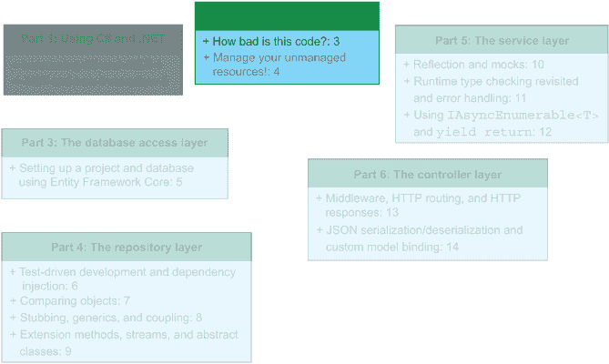

图 3.1 在本章中，我们将开始第二部分：现有的代码库。我们将查看在本书的其余部分我们需要解决的要求，以及现有代码库包含哪些模型和视图。

飞行荷兰人航空公司，其标志如图 3.2 所示，是一家以荷兰格罗宁根为基地的低成本航空公司。该航空公司服务 20 个目的地，包括伦敦、巴黎、布拉格和米兰。成立于 1977 年，该公司在市场上遇到了困难。飞行荷兰人航空公司将自己定位为“超低成本航空公司”。现在我们正处于 21 世纪的中期，管理层认为现在是时候将业务带入这个世纪了。这就是你发挥作用的地方。在本节中，我们将遇到我们的新老板，并获取我们即将创建的产品规格。


图 3.2 飞行荷兰人航空公司标志。飞行荷兰人航空公司是我们在这本书中所工作的公司。

## 3.1 介绍飞行荷兰人航空公司

这是你在新工作第一天，你提前 10 分钟到达停车场。你的衬衫已经洗净、蒸过、熨烫并压平。你准备好开始你的第一天工作了。你的到来备受期待，在例行的人事文件和身份证照片之后，第一件事就是与首席执行官会面。你是他们很久以来雇佣的第一个内部软件工程师，期望很高。

首席执行官开始交谈，并指给你一个椅子。他告诉你他的名字是 Aljen van der Meulen，并且他最近才加入飞行荷兰人航空公司，但他看到航空公司在技术部门有很多改进的潜力。飞行荷兰人航空公司的网站运行良好，但人们无法通过搜索聚合器预订航班。（聚合器是一种收集或汇总来自特定来源信息的搜索引擎。在这种情况下，FlyTomorrow 从航空公司汇总了可预订的航班信息。）

因此，Aljen 与航班聚合器 FlyTomorrow.com 签署了一份合同。FlyTomorrow 是去年访问量最大的航空公司相关网站，并且对希望与其搜索引擎集成的航空公司有一些具体要求。航空公司内部系统的现有代码库确实有一个用于搜索和预订航班的 API，但它非常混乱，需要进行彻底的重构。Aljen 把一张纸滑过来，示意你看看。如图 3.3 所示，这是 FlyTomorrow 和飞行荷兰人航空公司之间合同的一部分，突出了满足合同所需的技术要求。

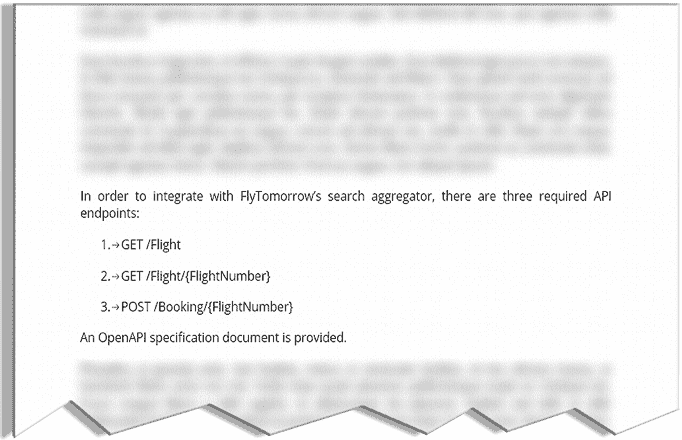

图 3.3 飞行荷兰人航空公司与 FlyTomorrow 之间的合同中的一些与 API 相关的语言。该合同包含我们需要实现以满足要求的服务端点信息。

最重要的两个需求是当前 API 中存在 `HTTP GET` 和 `HTTP POST` 端点。FlyTomorrow 使用这些端点来查询可用航班（`GET`）并预订它们（`POST`）。此外，API 必须在适当的情况下返回错误代码。

注意：如果你对 `POST` 和 `GET` 等 HTTP 操作不熟悉，或者对 HTTP 和网络开发总体上不太了解，你应该考虑进一步探索这些主题。一个很好的资源是 Mozilla 关于 HTTP 请求方法的文档：[`developer.mozilla.org/en-US/docs/Web/HTTP/Methods`](https://developer.mozilla.org/en-US/docs/Web/HTTP/Methods)。

## 3.2 拼图碎片：审视我们的需求

乔治，首席技术官，走进办公室。他没有浪费时间，直接开始讨论代码库。现有的代码库虽小但很混乱。所有内容都是用一种史前的 C# 版本（确切地说是 C# 3.0）编写的，使用的 .NET Framework 版本是 4.5。数据库在本地托管的 Microsoft SQL Server 上运行，并且没有使用对象关系映射（ORM）框架。乔治希望重构后的版本能在 .NET 5 上运行并使用最新的 C# 版本。虽然我们无法更改数据库模式，但我们确实可以访问它。实际上，乔治已经将其部署到了 Microsoft Azure。

### 3.2.1 对象关系映射

当你想对数据库进行更改时，你通常会使用数据库管理工具，如 SQL Server Management Studio (SSMS)、MySQL Workbench 或 Oracle SQL Developer。你可以使用这些工具编写 SQL 查询并在数据库上执行它们，以及设置存储过程和执行备份等操作。我们如何在运行时通过代码查询和与数据库交互呢？我们可以使用对象关系映射工具。ORM 是一种将数据从数据库映射到代码库中的表示以及相反的技术。在实践中，假设你有一个名为 BookShop 的数据库。这个数据库可能包含 Books、Customers 和 Orders 等表。你如何在面向对象的代码库中建模这些表？很可能是通过使用名为`Books`、`Customers`和`Orders`的模型。

定义：一个 *实体* 指的是数据库中对现实世界的一个定义，而一个 *模型* 是这种模型（或任何其他现实世界对象）的类表示。只需记住，实体是数据库，模型是代码。

同样可以合理假设，开发者已经将字段在数据库和代码中同步为相同。但这并不意味着它们的类型相同。以书籍为例：当查询特定书籍时，数据库以某种流的形式返回一个 Book 记录，通常以 JSON 或二进制形式。代码中的模型是`Book`类型，但我们自己定义了这个类。数据库不知道这个类的存在。数据库表和代码库模型表示不是本质上兼容的，但它们确实相互映射。这是一种同构关系，我们将在 3.3.3 节中进一步探讨。

乔治和阿尔金认为与 FlyTomorrow 的合同是一个重写现有代码库的机会，因为该公司打算扩大其用户群并提高其可扩展性。FlyTomorrow 甚至为航空公司提供了一个 OpenAPI 规范来检查端点（端点是不同服务调用我们的服务到我们的代码库的入口点）。FlyTomorrow 需要以下三个端点：

+   `GET /flight`

+   `GET /flight/{flightNumber}`

+   `POST /booking/{flightNumber}`

定义：OpenAPI（以前称为 Swagger）是指定 API 的行业标准方式。在 OpenAPI 规范中，你通常会找到 API 拥有的端点以及如何与 API 交互的指导。

### 3.2.2 GET /flight 端点：检索所有航班的详细信息

在本节中，我们将探讨第一个端点：`GET /flight`。`/flight`端点接受一个`GET`请求并返回数据库中所有航班的详细信息。图 3.4 讲述了我们的端点需求故事。

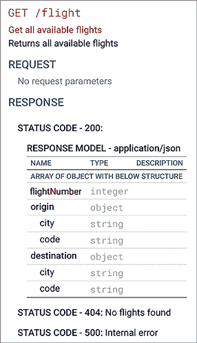

图 3.4 生成的 OpenAPI `GET` `/flight`端点规范截图。它接受一个`GET`响应，可以返回 HTTP 状态 200（附带所有可用航班的详细信息）、404 或 500。

根据 FlyTomorrow 的 OpenAPI 规范，`GET /flight` 端点应返回所有可用航班的列表。航班数据应包含航班号和两份机场元数据。机场模型包含机场服务的城市和国际航空运输协会（IATA）机场代码。当没有找到航班（意味着数据库中没有航班）时，我们应该返回 HTTP 代码 404（未找到）。如果发生错误，无论是什么错误，返回值应该是一个 HTTP 代码 500（内部服务器错误）响应。

### 3.2.3 GET /flight/{flightNumber} 端点：获取特定航班信息

FlyTomorrow 需要的第二个端点是 `GET /flight/{flightNumber}`。在图 3.5 中，OpenAPI 规范显示了端点的预期输入和输出。

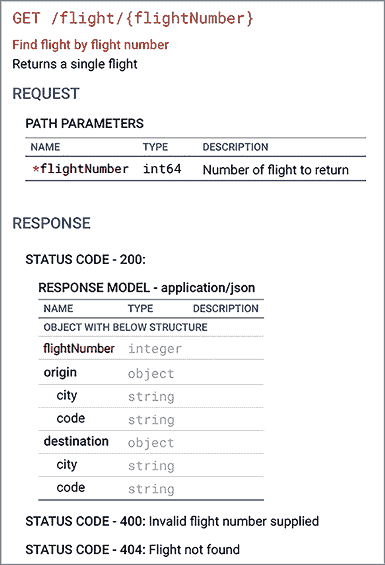

图 3.5 为生成用于 `GET` `/flight/{flightNumber}` 端点的 OpenAPI 规范的屏幕截图。当提供航班号时，此端点返回数据库中特定航班的详细信息。

此端点有一个路径参数 `{flightNumber}`，指定返回给调用者的哪个航班的详细信息。

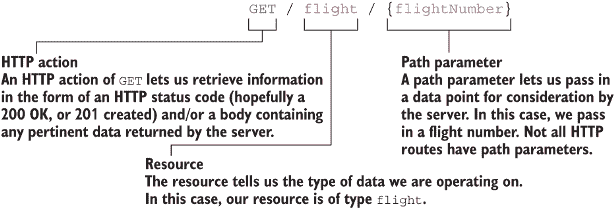

如果在路径中提供了无效的航班号，API 应返回 HTTP 代码 400（无效请求）。无效的航班号可能是一个负数或只包含字母的字符串。如果请求的航班号在数据库中没有对应航班，则返回 HTTP 代码 404（未找到）。

### 3.2.4 POST /booking/{flightNumber} 端点：预订航班

最后必需的端点是路径为 `/booking/{flightNumber}` 的 `POST` 端点，如图 3.6 所示。

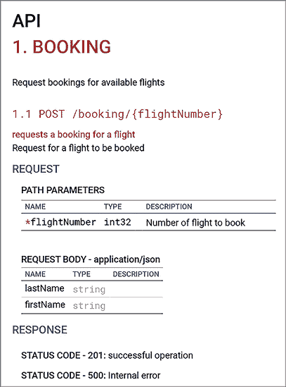

图 3.6 `/booking/{flightNumber}` 的 `POST` 端点的 OpenAPI 规范。该端点要求我们传递一个名和姓，以及使用我们想要预订的航班号作为路径参数。在成功的情况下，它返回 HTTP 状态码 201 以及预订信息。在失败的情况下，它返回 HTTP 状态码 404 或 500。

`POST` 端点有一个 URL 路径参数 `{flightNumber}`，并需要一个包含两个字段（`firstName` 和 `lastName`）的请求体，这两个字段都是字符串。端点在成功预订时返回 HTTP 状态码 201（已创建），或者在由于逻辑或数据库错误而无法预订时返回 HTTP 状态码 500。见图 3.7。

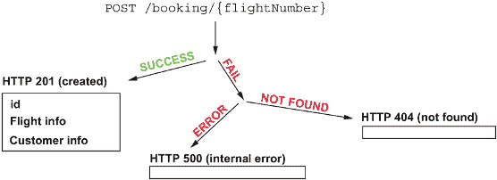

图 3.7 `POST` `/booking/{flightNumber}` 端点的请求-返回生命周期。在成功的情况下，端点返回 HTTP 状态 201 以及预订 ID、航班信息和客户信息。如果服务找不到适当的航班，则返回 HTTP 状态 404。当发生内部错误时，返回 HTTP 状态 500。

注意：完整的 OpenAPI 文件可以在附录 D 中查看（以 YAML 格式）。

FlyTomorrow 用于搜索和预订航班的流程，如图 3.8 所示，如下所示：

1.  FlyTomorrow 查询我们的`GET /flight`端点以列出所有到消费者的航班。

1.  当消费者选择航班以获取详细信息时，FlyTomorrow 使用航班号查询我们的`GET /flight/{flightNumber}`端点。

1.  当客户准备好预订航班时，FlyTomorrow 向`POST /booking/{flightNumber}`发送`POST`请求以预订航班。

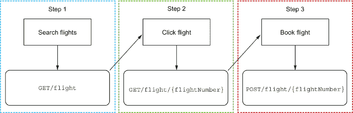

图 3.8 搜索 -> 点击 -> 预订工作流程和 API 调用。这是我们客户使用的工作流程，也是我们围绕代码库建模的工作流程。

## 3.3 接受现有的代码库

在本章的剩余部分，我们将逐步介绍我们继承的代码部分：模型、视图和配置代码。我们将讨论改进点、清洁代码和安全问题。我们还将涉及数据库模式以及继承的代码的模型与模式如何比较。

警告：本章的其余部分（以及下一章）涉及现有的代码库。这意味着我们将看到混乱和不正确的代码、偏离给定要求的情况，以及所有不好的事情。我们将在后面的章节中修复它们。

本章作为我们构建改进服务的基础。阅读本章和下一章后，您将深入了解我们试图改进的代码库，并渴望在第三部分开始重构。

### 3.3.1 评估现有的数据库模式和表

现在我们有了 OpenAPI 文件并知道对我们有什么期望，是时候查看现有的代码库和数据库了。我们继承的代码有很多痛点可以改进。根据乔治和 Aljen 的说法，我们可以改变我们想要的任何东西，但不能改变数据库。因为它是我们唯一坚如磐石的基础块，让我们先从查看数据库模式开始。数据库部署到 Microsoft Azure，是一个普通的、常规的 SQL 数据库，只有几张表，如下所示：

+   机场

+   预订

+   客户

+   航班

在本节中，我们将查看数据库模式，如图 3.9 所示，并分析该模式为我们提供的核心约束。

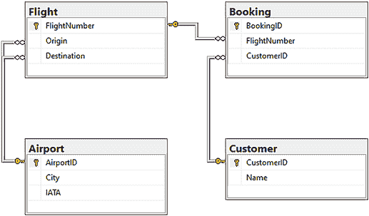

图 3.9 飞行荷兰人航空公司数据库的数据库模式和外键约束，该数据库托管在 Microsoft Azure 上。此模式显示了本书中使用的所有表。

正如乔治告诉我们，现有的代码库中没有使用 ORM，但即使没有，您也会期望看到一些根据这些表建模的对象。

注意：如果您对数据库和/或 SQL 不太熟悉，您可能需要了解基础知识。两个很好的资源是康奈尔大学的*关系数据库虚拟工作坊*，网址为[`cvw.cac.cornell.edu/databases/`](https://cvw.cac.cornell.edu/databases/)，以及 Mana Takahashi、Shoko Azuma 和 Trend-Pro Co., Ltd.所著的*数据库漫画指南*（No Starch Press，2009 年）。

### 3.3.2 现有代码库：Web 服务配置文件

通过查看解决方案的结构，我们可以对项目的布局有所了解。在本节中，我们正在查看处理服务配置的源文件，如图 3.10 所示。

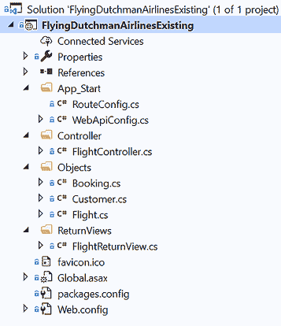

图 3.10 展示了在 Visual Studio 2019 的解决方案资源管理器中显示的 FlyingDutchmanAirlinesExisting.sln 的文件夹结构。这是我们将在本章剩余部分探索的结构。该解决方案包含一个具有配置、控制器、对象和视图文件的单一项目。

C#使用解决方案和项目之间的层次关系来组织其代码库。一个解决方案可以有多个项目，但一个项目通常只属于一个解决方案。这非常像一个父（解决方案）-子（项目）模式。然而，请注意，项目不能包含子项目。图 3.10 清楚地展示了代码库的布局。我们看到名为 App_Start、Controller 和 Objects 等文件夹。这些显示了使用模型-视图-控制器模式，尽管术语略有不同。

模型-视图-控制器设计模式

在软件开发中最常用的设计模式之一，模型-视图-控制器（MVC）模式将任何用户和外部接口与业务逻辑和存储数据隔离开来。MVC 模式在过去十年中越来越受欢迎，因为它对桌面和 Web 开发都非常有用。

在使用 MVC 时，模型层做大部分工作。我们将所有数据存储在模型中，并在模型本身执行大部分必要的业务逻辑。为了与这些数据交互，我们通常需要某种用户交互。这就是控制器和视图层发挥作用的地方。控制器充当漏斗，将用户请求路由到模型层。视图层由表示模型层中特定“视图”的对象组成。控制器层将这些视图返回给用户。

在本书中，你将逐步深入理解如何使用类似 MVC 的模式和模型。阅读完本书后，你将对模型、视图和控制器有深刻的了解。

另一个关于 MVC 模式（以及其他设计模式）的好资源是 Eric Freeman、Elisabeth Robson、Bert Bates 和 Kathy Sierra 的《Head First: Design Patterns》（O’Reilly，2004 年）。

从顶部看，我们看到解决方案的名称是`FlyingDutchmanAirlinesExisting`，并且它包含一个同名项目。这带我们来到了第一个源代码文件：AssemblyInfo.cs。此文件位于项目的根目录中，但 Visual Studio 将其可视化在单独的属性类别中。

AssemblyInfo 文件不是你在日常生活中经常冒险进入的文件。它包含有关你的程序集的元数据，例如程序集标题和版本。

与 AssemblyInfo.cs 相比，下一个文件更有趣。因为我们正在处理一个 Web 服务，我们需要对我们的端点进行某种路由。这由 App_Start 文件夹中的 `RouteConfig` 类提供。

打开 RouteConfig 文件

如下一个列表所示，打开 `RouteConfig`，我们看到该类只有一个方法：`RegisterRoutes`。

列表 3.1 RouteConfig.cs

```
public class RouteConfig {
  public static void RegisterRoutes(RouteCollection routes) {       
    routes.MapRoute(
      "Default",
      "{controller}/{action}/{id}"
    };
  }
}
```

列表 3.1 显示了 `RouteConfig` 类，省略了诸如命名空间声明和包导入等常规事项。

备注：本书中的大多数源代码列表都没有包含所需的导入，因为它们会在每个列表中占用很多空间。

`RegisterRoutes` 方法允许我们指定一个模式，将传入的 HTTP 路由映射到我们代码中的端点。`RegisterRoutes` 返回无值（`void`），并接受一个 `RouteCollection` 实例，这是 ASP.NET 框架中的一个类。

定义：ASP.NET 是一个深度集成到 .NET Framework、.NET Core 和 .NET 5 的 Web 框架。ASP.NET 为 C# 添加了 Web 开发功能，例如 WebAPI 支持 和 URL 路由。由于其深度集成到 .NET 生态系统，人们有时并没有意识到他们正在调用 ASP.NET 的库。在这本书中，我们将使用 ASP.NET，但不会明确指出我们正在这样做。有关 ASP.NET 的更多信息，请参阅安德鲁·洛克编写的优秀的 *ASP.NET Core in Action*（第 2 版；Manning，2020 年）。

|    |
| --- |

你应该避免使用静态吗？

能够在不创建类实例的情况下访问你的方法或字段可能非常有用。当然，在任何你想要和需要的时候访问你的代码都很容易（假设你试图访问的内容也是公共的）。但在你将所有内容标记为静态之前，我强烈建议你重新考虑。

是的，你可以访问一个静态方法或字段，而不需要创建一个对象实例，但其他人也可以这样做。你不太可能是唯一一个在给定代码库中工作的开发者，因此你无法预测他们的需求和假设。

例如，考虑以下在一个虚构的视频游戏中找到的代码：

```
public record Player {
  public static int Health;
}
```

我们有一个名为 `Player` 的记录类型，以及一个表示玩家 `health` 的公共静态字符串字段。当玩家的健康受到损害时，游戏循环逻辑调用如下：

```
Player.Health--;
```

这将玩家的健康减少 1。对于单人冒险来说一切都很顺利，但如果我们想有多个玩家，可能为了本地合作或分屏功能呢？我们只需实例化另一个 `Player`！但现在我们有两个 `Player` 实例，它们都在使用相同的静态 Health 字段。当我们现在为一名玩家减少健康时，所有玩家的健康都会减少。这可能会是一个很酷的游戏玩法转折，但总的来说，我们想要避免通过 `static` 在实例之间改变状态。

|

在 `RouteConfig.RegisterRoutes` 方法中执行的唯一操作是调用 `MapRoute` 方法，这是传递给 `RegisterRoutes` 方法的 `RouteCollection` 实例的一部分。`MapRoute` 接收两个参数：我们想要命名的路由模式（`Default`）以及实际的路由模式（`{controller}/{action}/{id}`）。当你向路由模式添加一个 ID，就像我们这样做，它就变成了一个 URL 路径变量参数。URL 路径变量的一个常见用例是使用 HTTP `GET` 调用来指定通过资源 ID 获取特定资源的操作，如下一列表所示。

列表 3.2 设置 HTTP 路由

```
routes.MapRoute(                  ❶
  "Default",                      ❷
  "{controller}/{action}/{id}"    ❸
};
```

❶ MapRoute 在代码库中扫描匹配的路由。

❷ 我们将路由的名称指定为 Default

❸ 我们在这里确定要扫描的路由

当我们在第四章中查看 `FlightController` 时，我们将看到更多关于这种路由模式及其工作方式的示例。

查看 WebApiConfig 文件

我们接下来看到的文件是 WebApiConfig.cs。当我们打开文件时，我们看到一些特别的东西：在 `WebApiConfig` 中还有一个类，如下一代码示例所示。

列表 3.3 WebApiConfig.cs 及其嵌套类，`Defaults`

```
public class WebApiConfig {
  public class Defaults {                                             ❶
    public readonly RouteParameter Id;                                ❶

    public Defaults(RouteParameter id) {                              ❶
      Id = id;                                                        ❶
    }                                                                 ❶
  }                                                                   ❶

  public static void Register(HttpConfiguration config) {             ❷
    config.MapHttpAttributeRoutes();                                  ❸

    config.Routes.MapHttpRoute(                                       ❹
      "DefaultApi",                                                   ❹
      "api/{controller}/{id}",                                        ❹
      new Defaults(RouteParameter.Optional)                           ❹
    );

    GlobalConfiguration.Configuration.Formatters.JsonFormatter.Add(   ❺
      new System.Http.Formatting.RequestHeaderMapping(                ❺
        "Accept",                                                     ❺
        "text/html",                                                  ❺
        StringComparison.InvariantCultureIgnoreCase,                  ❺
        true,                                                         ❺
        "application/json")                                           ❺
      );                                                              ❺
    }                                                                 ❺
  }                                                                   ❷
}
```

❶ Defaults 是一个嵌套类。

❷ 注册方法属于 WebApiConfig 类，而不是 Defaults。

❸ 调用 `MapHttpAttributeRoutes` 启用属性路由

❹ 我们按照 API/Controller/ID 模式映射路由。

❺ 允许返回 JSON 响应

|    | 在 C# 中，你可以拥有嵌套类，并且可以像使用常规类一样访问它们（取决于它们的访问修饰符）。嵌套类在创建一个专门的类文件可能比你想的给整个项目结构带来更多混淆时非常有用。有时，在只使用嵌套类的唯一类中的“一次性”类可能比创建一个新文件更干净。我们将在 5.2.3 节中讨论如何改进这段代码。定义：列表 3.3 中的代码有一个我们还没有见过的关键字：`readonly`。在 C# 中，当某物被指定为只读后，它的值在赋值后是不可变的。 |
| --- | --- |

要从嵌套类的外部访问公共嵌套类，请使用封装类来访问它。例如，我们可以通过使用 `WebApiConfig.Defaults` 来访问嵌套的 defaults 类。你可以使用任何访问修饰符的嵌套类，但你仍然受外部类访问修饰符的支配。如果外部类的访问修饰符为 `internal` 且嵌套类为 `public`，你仍然需要在访问嵌套类之前满足外部类的访问要求。

注意：对于来自 Java 的开发者：C# 中的嵌套类没有对外部类的隐式引用。这是 Java 中静态嵌套类的实践与 C# 中嵌套类的实践之间的一个区别。C# 还允许在一个文件中存在多个非嵌套类，而 Java 则不允许。这不是一个好的实践，但它是允许的。

`Register`方法需要一个类型为`HttpConfiguration`的参数。它使用`HttpConfiguration`实例执行以下两个操作：

+   运行时扫描并映射所有带有路由方法属性的端点。

+   运行时允许具有可选 URL 参数的路由。

方法属性（在 Java 中称为方法注解）可以标记任何方法，并用于给它一些元数据。以下是一些我们会使用属性的情况的例子：

+   标记哪些字段应该被序列化

+   标记哪些方法是过时的

+   标记方法是否分配了特定的 HTTP 路由

对于现有代码，我们在`FlightController`类中看到了带有路由的方法属性。一个方法属性由两个括号包围，其中包含相应的属性（例如，`[MyMethodAttribute]`）。

`config.Routes.MapHttpRoute`与`RouteConfig`中的`routes.MapRoute`方法类似（列表 3.1）。`RouteConfig`中的代码配置了具有 URL 路径参数的端点路由，但现在我们还需要配置允许没有这些参数的路由。再次，我们传递一个名称（`DefaultApi`）和一个模板（`api/{controller}/{id}`），但这次我们还传递了一个新的`Defaults`对象，其`Id`设置为`RouteParameter.Optional`。这使得我们可以路由带有和不带有参数的端点（因为它现在是可选的）。

最后，我们在调用`GlobalConfiguration.Configuration.Formatters.JsonFormatter.MediaTypeMappings`时将接受的`MediaTypeMappings`设置为 application/json。

绘制 ASP.NET 和配置文件：global.asax、packages.config 和 web.config

让我们跳过名为 Controller、Objects 和 ReturnViews 的文件夹，在下一列表中查看解决方案底部的三个源文件：Global.asax、packages.config 和 Web.config。

列表 3.4 Global.asax

```
namespace FlyingDutchmanAirlinesExisting {
  public class WebApiApplication : System.Web.HttpApplication {
    protected void Application_Start() {
      GlobalConfiguration.Configure(WebApiConfig.Register);
      RouteConfig.RegisterRoutes(RouteTable.Routes);
    }
  }
}
```

这个奇怪的文件扩展名.asax 是什么？我们之前没有见过这个扩展名。一个.asax 文件表示一个全局应用程序类。这些类用于 ASP.NET 应用程序中执行对服务启动或结束等低级系统事件的响应代码。全局应用程序类中的逻辑是我们可以操纵的第一段代码。我们可以在应用程序开始时通过创建一个`Application_Start`方法来执行代码，如列表 3.4 所示。要在应用程序结束时执行代码，将其放在`Application_End`方法中。

`Application_Start`方法具有`protected`访问修饰符，不返回任何内容。`GlobalConfiguration.Configure`调用注册了一个回调，其中`WebApiConfig`注册其路由。

**DEFinition** 一个 *回调* 是一个计划在当前函数执行之后执行的函数。你可以将其视为一个排队系统，其中回调被排队（或者从队列中插入，取决于你的视角）以便在当前方法处理完毕后立即执行。调用者调用被调用者，并传递一个回调，被调用者在工作完成后调用这个回调。

在注册回调以注册路由之后，`RegisterRoutes` 在 `RouteConfig` 上被调用，并将 `RouteTable` 的路由传递进去。这导致在 `RouteTable` 中定义的路由区域（例如，斜杠之间的内容，如“/`flight`/”表示`flight`是一个区域）被注册并可用。我们需要在启动时注册回调并调用 `RouteConfig`，因为我们否则无法执行它们。因为路由没有被注册，我们无法通过触发端点来启动任何执行。

剩下两个文件可以归入配置类别：packages.config 和 Web.config。packages.config 是一个与 NuGet 包管理器相关的文件。NuGet 包管理器是 .NET 的默认包管理器，并与 Visual Studio 深度集成。packages.config 文件指定了在解决方案和项目中引用和安装的哪些包（以及这些包的版本）。还指定了一个目标 ASP.NET Framework。例如，这是一个 ASP.NET 应用程序，而 ASP.NET 是一个与 .NET（但具有深度集成和主要自动安装支持）分开的框架，它在 packages.config 文件中如下引用：

```
<package id="Microsoft.AspNet.WebApi" version="5.2.7"
 ➥ targetFramework="net45" />
```

Web.Config 为我们提供了配置应用程序如何运行、使用哪个版本的 .NET Framework（记住，此代码库运行在 .NET Framework 上）以及编译器设置的设置。例如，我们正在运行的编译模式是调试（默认模式）。这定义在以下行：

```
  <compilation debug="true" targetFramework="4.5"/>
```

这就带我们来到了配置文件的结尾。现在我们将跳过 `FlightController` 类，看看我们提供的模型和视图：Booking.cs，Customer.cs，Flight.cs，和 FlightReturnView.cs。

### 3.3.3 考虑现有代码库中的模型和视图

在 MVC 模式下，模型应该反映数据库表的结构，而视图则由客户端驱动。视图充当数据的表示，由客户端决定。我们将在第 10.1.1 节进一步讨论这意味着什么。在本节中，我们将查看继承的代码库中包含的模型和视图。项目有以下三个模型：

+   `预订`

+   `客户`

+   `Flight`

代码还有一个视图：`FlightReturnView`。在一个理想的世界里，模型与数据库中的内容非常相似，但看起来现有的代码还没有完全达到这一点。

揭示预订模型及其内部细节

模型代表了一个网络服务的重要基石。它们持有我们可以旋转和扭曲成不同视角并通过视图展示不同角度的数据。我们将首先查看的模型是`Booking`模型。这个模型背后的想法是提供一个对象来保存有关航班预订的数据，如以下代码示例所示：

```
namespace FlyingDutchmanAirlinesExisting.Objects {
  public class Booking {
    public string OriginAirportIATA;
    public string DestinationAirportIATA;
    public string Name;
  }
}
```

我们可以看到，`Booking`模型相当简单，包含三个字段（`OriginAirportIATA`、`DestinationAirportIATA`和`Name`），所有字段都具有公共访问修饰符。这将是一个引入一些封装的机会，通过添加后置字段、获取器和设置器。

为什么获取器和设置器很重要（自动属性和仅初始化设置器）

封装：你以前多次听说过这个术语，但正确实施它很棘手。封装的主要动机是提供对代码的受控访问。你可以微调其他人如何与你互动，并通过访问修饰符提供访问指南。获取器和设置器的反对者说，它们会使代码膨胀，并且为每个属性编写获取器和设置器很耗时。支持者会通过指出控制属性的访问不是代码膨胀，并且从长远来看它会增加速度来反驳。

想象一下，你有一个像我们现在考虑的这样的代码库。也许你在 50 个地方直接访问`Booking.Name`字符串。如果你需要将原始属性的名字更改为`Booking.NewName`，会发生什么？你将不得不在 50 个不同的位置更改调用，这会让你感到非常痛苦。一些 IDE 确实具有自动化此过程的功能，但这样你就是在依赖 IDE 来修复你的代码问题。我更喜欢代码干净，这样我们就不需要使用工具来自动修复问题。

现在想象一下，你编写了一个（有些人称之为“Java 风格”）的获取器（`Booking.GetName`）和一个设置器（`Booking.SetName(string name)`），并使用它们来访问和更改你的属性？你只需要在一个地方更改内容：原始类。获取器和设置器还有一个关键用途：它们控制对属性的访问并规定谁可以做什么。获取器和设置器的另一个用例是使你的属性`readonly`，但仅限于外部类。如果你要将`readonly`修饰符应用于字段，它将对所有人有效。相反，你可以通过策略性地使用获取器和设置器来达到同样的效果。如果你将设置器设为私有但获取器为公共，封装类之外的外部代码可以访问但不能编辑该属性。你还可以在设置器和获取器中添加逻辑。例如，在设置属性为新值之前，你需要对传入的参数进行一些验证吗？在设置器中添加逻辑。

你可以在 C#中使用获取器和设置器的一些方法包括以下内容：

+   传统的双重方法技术，其中你创建两个新方法（一个专门的获取器和专门的设置器方法）并使用这些方法

+   自动属性

+   只初始化设置器¹

使用自动属性，你可以内联获取器和设置器，让编译器在幕后创建方法。这是你可以利用.NET 提供的抽象并为你带来好处的一个地方。

让我们通过将它们应用于一个`name`字段来比较和对比这两种方法。首先介绍的是传统的双重方法选项，如下所示：

```
private string _name;
public string GetName() {
  return _name;
} 

protected void SetName(string value) {
  _name = value;
} 
```

包含该值的字段是私有的（在 C#中，私有字段通常以下划线开头）并命名为`_name`。这个字段有时被称为“后置字段”，因为该字段“支持”获取器和设置器。创建了两个方法来规范设置和获取`_name`：`GetName`和`SetName`。在这个例子中，每个人都可以获取名称，但只有这个类及其继承自这个类的类可以设置名称字段（受保护）。为了更好地规范访问（并提高可读性），我们可以使用如下所示的自动属性：

```
public string Name { get; protected set; }
```

自动属性只有一行，但它提供了与双重方法技术相同的功能。如果没有提供访问修饰符，获取器或设置器的默认值是属性的方法访问器，如本例中的`get`所示。你还可以通过添加花括号和主体来为获取器和设置器提供方法体。

|    | 从 C# 9 开始，引入了一种使用设置器的新方法：只初始化设置器。这种技术允许你通过使用`init`关键字创建不可变属性（通常封装在对象中）。我们就像创建一个自动属性一样开始，但不是指定获取器，而是使用`init`。假设我们一直在使用的`Name`属性是`Person`类的一部分，并使用只初始化设置器如下所示： |
| --- | --- |

```
class Person {
  public string Name { get; init; }
}
```

我们可以很容易地创建`Person`的实例，但由于我们为`Name`使用了只初始化设置器，所以我们不能在实例化后返回并设置`Name`的值，如下所示：

```
Person p = new Person();
p.Name = "Sally";
```

这使我们陷入了一点困境。如果我们尝试将值分配给`Name`，我们会收到编译器错误，告诉我们除非我们处于对象初始化器、构造函数或初始化访问器中，否则不能将值分配给只初始化的属性。我们将在第 6.2.5 节中更深入地探讨对象初始化器，但为了给你一点预览，我们可以使用以下方式使用对象初始化器将初始值分配给`Person.Name`：

```
Person p = new Person() {
  Name = "Sally"
};
```

这在对象创建时将`Name`的值设置为`"Sally"`，而不是在对象创建后尝试设置值。这个限制迫使你以非常具体的方式将值分配给只初始化的设置器，并阻止人们在值设置后覆盖这些值。

比较预订模型和表格

如果我们将`Booking`模型与数据库中的 Booking 表进行比较，我们会发现一些差异，包括一些可能会让安全工程师感到不满的差异。`Booking`模型中的所有字段都与数据库中的 Booking 表不匹配。甚至似乎还有一些错误添加，如图 3.11 所示。

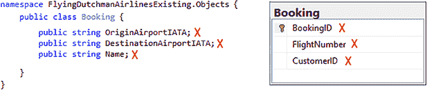

图 3.11 `Booking`类与 dbo.Booking 之间的同构关系。每个字段都是错误的；这并不好。X 表示同构关系不正确的字段。

关于`Booking`类，有一件积极的事情可以说：它有一个正确的名字。但仅此而已。正如我们所见，该模型不包含`FlightNumber`、`BookingID`或`CustomerID`的表示。回顾图 3.9，我们看到这些字段与关键约束有关（`BookingID`是主键。`FlightNumber`和`CustomerID`有外键关系）。模型包含出发机场 IATA 代码、目的地机场 IATA 代码和客户名称的字段。

客户模型及其内部细节

我们有些犹豫地查看下一个模型，即接下来的`Customer`：

```
namespace FlyingDutchmanAirlinesExisting.Objects {
  public class Customer {
    public int CustomerId;
    public string Name;

    public Customer(int customerID, string name) {
      CustomerID = customerID;
      Name = name;
    }
  }
}
```

在`Customer`类中，损害得到了相当的控制。`Customer`与数据库表之间也有良好的同构性，如图 3.12 所示。

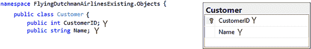

图 3.12 (缩略) `Customer`类与 dbo.Customer 之间的同构关系。CustomerID 和 Name 映射正确。

根据我们的了解，为了使`Customer`与数据库表保持一致，不需要进行任何更改。

登上`Flight`类及其内部细节

转到`Flight`类，在下面的代码示例中我们可以看到`Flight`有三个字段，它们都是整数类型，几乎完全映射到数据库表 Flight：

```
namespace FlyingDutchmanAirlinesExisting.Objects {
  public class Flight {
    public int FlightNumber;
    public int OriginID;
    public int DestinationID;

    public Flight(int flightNumber, int originID, int destinationID) {
      FlightNumber = flightNumber;
      OriginID = originID;
      DestinationID = destinationID;
    }
  }
}
```

将`Flight`类的字段与数据库表进行比较，我们看到本质上模型是正确的。但我们从事的是编写*干净的代码*，这也意味着在代码库和数据库中，关于字段名，我们需要保持一致性。还值得一提的是，代码库中拥有数据库模型（无论是通过 ORM 还是手动）的整个基础都依赖于对数据库行与类之间同构关系的最接近解释的实践。² 需要记住的是，尽管字段名可能与数据库中的列名相同，但它仍然是一个抽象。它们并不相同；然而，对我们来说，它们尽可能地接近。

|    | 将同构关系应用于数据库和代码库之间的通信，强烈建议始终使用 ORM，因为您将获得代码表示和数据库表示之间最接近的匹配。 |
| --- | --- |

如图 3.13 中的“?!”图标所示，我们发现了两个字段名的不匹配：

+   `OriginID`与 Origin 的比较

+   `DestinationID`与 Destination 的比较

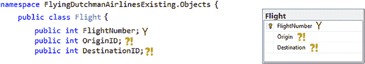

图 3.13 （简化的）`Flight`类与 dbo.Flight 之间的同构关系。Origin/`OriginID`和 Destination/`DestinationID`非常接近匹配。FlightNumber 是一个完美的匹配。

在这种情况下，数据库规则。当我们开始对 API 重构版本的工作时，Entity Framework Core 确保这些差异不会发生。

`Flight`、`Booking`和`Customer`构成了`Models`文件夹的内容。但是等等，让我们再次看看我们的数据库模式。看起来可能有些东西缺失 ...

如我们从图 3.14 中可以推断出的，我们没有遇到任何可以称为模拟机场表的类。那么，代码是否工作正常呢？

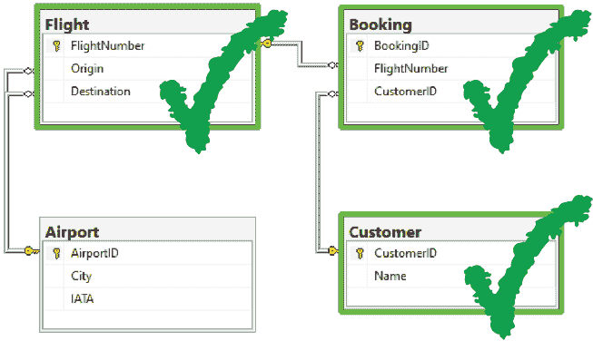

图 3.14 与代码库模型相比的数据库模式。代码库中存在代表 Flight、Booking 和 Customer 的模型；机场不存在。这意味着代码库与数据库之间存在不完整的同构关系。

如果我们有测试，我们可能能够确定一种方式或另一种方式，或者如果覆盖率零散且不在正确的位置，我们至少可以尝试一种基于现有测试的归纳证明³，以证明方法的正确功能。可能非常真实的是，没有`Airport`类，我们仍然可以执行我们想要的全部功能，并为客户提供服务。这也意味着，这个代码的开发者可能通过不坚持源数据格式而使自己的生活变得更难。

`FlightReturnView` 视图及其内部细节

在彻底探索了模型以及它们如何与数据库匹配之后，我们将目光转向`ReturnViews`文件夹。一个`View`允许我们以任何我们想要的方式表示模型（或多个模型）中封装的数据。如以下所示，`ReturnViews`文件夹中只有一个视图——`FlightReturnView`：

```
namespace FlyingDutchmanAirlinesExisting.ReturnView {
  public class FlightReturnView {
    public int FlightNumber;
    public string Origin;
    public string Destination;
  }
}
```

`FlightReturnView` 是一个非常简单的类，只有三个字段：`FlightNumber`（整数）、`Origin`（字符串）和`Destination`（字符串）。视图是对象（或多个对象）的一个切片，被塑造成仅反映细节的一个子集或多个模型细节的组合（一个非规范化视图）。在这里，开发者希望将`FlightNumber`、`Origin`和`Destination`字段返回给用户。返回`Flight`类是不够的，因为它不包含`Origin`或`Destination`。同样，返回`Booking`类也不够，因为它只包含`FlightNumber`，而不包含`Origin`或`Destination`。使用视图返回数据是一种强大的设计模式，常用于 API 开发。它可以被理解为具有类似于 SQL JOIN 操作的能力，因为你可以以任何方式连接多个数据集。话虽如此，如果我们能避免使用它，那就更好了，因为它增加了代码库的复杂性。

## 摘要

+   一个对象关系映射工具允许我们在比直接使用 SQL 查询数据库更高的抽象级别上处理数据库。

+   一个 C# 仓库通常包含一个解决方案，该解决方案又包含多个项目。遵循这种模式可以使你的代码库对经验丰富的 C# 开发者更容易导航。

+   ASP.NET 框架是一个旨在开发 Web 服务的框架，它是 .NET 生态系统的一部分。我们可以在 .NET 框架、.NET Core 和 .NET 5 中使用 ASP.NET 来创建 Web 服务。

+   我们需要通过使用 `RouteConfig` 来定义和注册 HTTP 路由。如果我们不这样做，我们就无法到达我们的端点。

+   我们可以为方法、字段和属性附加属性。一个属性的例子是 `[FromBody]`。

+   回调是一个要在当前函数执行后执行的函数。我们可以使用回调来排队某些方法，以便在我们想要它们执行时而不是立即执行。

+   NuGet 包管理器是 C# 的首选包管理器。我们可以用它来安装第三方包或不属于常规 SDK 的 .NET 包，例如 ASP.NET。

* * *

^ (1.) 仅初始化设置器是在 C# 9 中引入的。只有 .NET 5（及以后的版本）支持 C# 9。仅初始化设置器（和 C# 9）在 .NET 框架或 .NET Core 上不受支持。

^ (2.) 关于同构关系及其如何将真实陈述映射到解释定理（例如，数据库模式到模型）的更多信息，请参阅道格拉斯·R·霍夫施塔特（Douglas R. Hofstadter）的普利策奖获奖作品 *哥德尔、艾舍尔、巴赫：永恒的金色纽带*（Basic Books，1977）的第二章（“数学的意义与形式”）和理查德·J·特鲁多（Richard J. Trudeau）的 *图论导论*（第 2 版；Dover Publications，1994）。

^ (3.) 如果你想了解更多关于归纳证明的信息，我推荐两个资源。首先，观看麻省理工学院 *计算机科学数学 6.042J 课程* 的前三场视频讲座（*引言与证明*、*归纳*和*强归纳*）（MIT OpenCourseWare，2010），网址为 [`ocw.mit.edu/courses/electrical-engineering-and-computer-science/6-042j-mathematics-for-computer-science-fall-2010/index.htm`](https://ocw.mit.edu/courses/electrical-engineering-and-computer-science/6-042j-mathematics-for-computer-science-fall-2010/index.htm)。其次，我推荐唐纳德·E·克努特（Donald Knuth）的 *计算机程序设计艺术，第一卷：基本算法*（第 3 版；Addison Wesley Longman，1977）中的第 1.2.1 节（“数学预备知识/数学归纳法”）。
