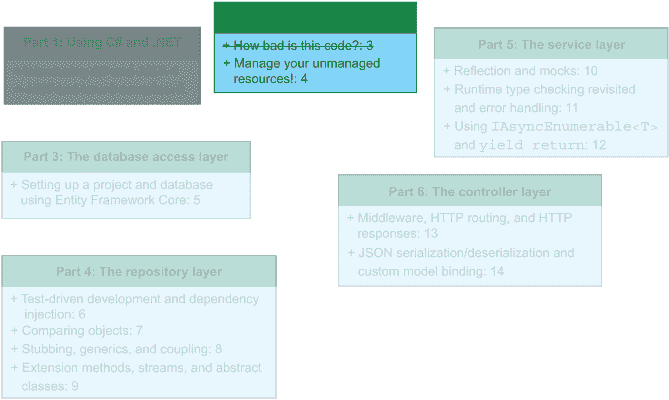
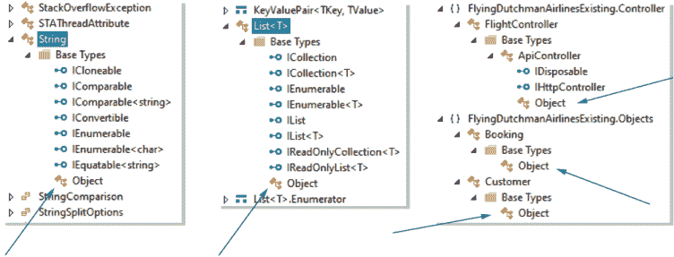
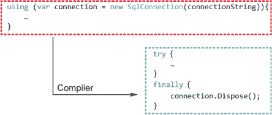
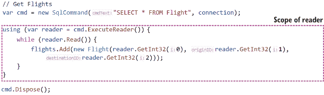
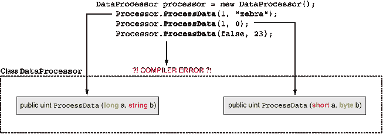
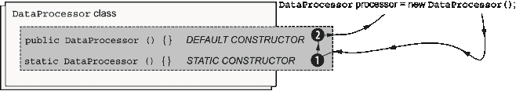
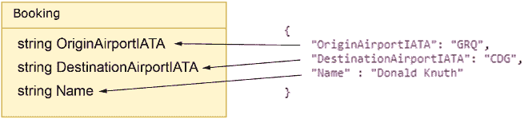

# 4 管理你的非托管资源！

本章涵盖

+   在编译时和运行时发现对象的底层类型

+   编写使用 `IDisposable` 和 `using` 语句来释放非托管资源的代码

+   使用方法和构造函数重载

+   使用属性

+   在端点中接受 JSON 或 XML 输入并将其解析为自定义对象

在第三章，飞荷兰人航空公司的首席执行官 Aljen van der Meulen 分配给我们一个项目，即重新设计飞荷兰人航空公司的后端服务，以便该公司可以与第三方系统（一个名为 FlyTomorow 的航班聚合器）集成。我们得到了一个 OpenAPI 规范，并查看了数据库模式以及配置、模型和视图类。图 4.1 显示了我们在本书结构中的位置。



图 4.1 在本章中，我们将结束第二部分。我们将查看现有的代码库的控制器类，并讨论我们可以对代码进行的潜在改进。

警告 本章涉及用 .NET Framework 编写的现有代码库。这意味着我们将看到混乱和不正确的代码、偏离给定要求以及各种不良情况。我们将在后面的章节中修复这些问题，并迁移到 .NET 5。

我们对现有代码库的理解逐渐加深，我们几乎覆盖了它的全部内容。在本章中，我们将查看最后剩下的部分（代码库中的唯一控制器）并逐个深入探讨端点，如下所示：

+   `GET /flight`—此端点允许用户获取数据库中所有航班的详细信息。

+   `GET /flight/{flightNumber}`—此端点允许用户在给定航班号的情况下检索特定航班的详细信息。

+   `POST /flight/{flightNumber}`—此端点允许用户在给定航班号时预订航班。

+   `DELETE /Flight/{flightNumber}`—此端点允许用户在给定航班号时从数据库中删除航班。

我们还将讨论连接字符串、可枚举类型、垃圾回收、方法重载、静态构造函数、方法属性等等。阅读本章后，你应该清楚地了解我们可以进行哪些改进，我们可以做出哪些改进，以及为什么。

## 4.1 飞行控制器：评估 GET /flight 端点

现在我们来到了我们应当修复和润色的代码库的核心部分。正如我们在第三章中学到的，FlyTomorrow 计划使用此端点来显示所有可能的航班供用户预订。我们面前的问题是：原始代码库在多大程度上接近了这一意图？

上一章涵盖了数据库模式、配置和支持模型。这些都是非常重要的内容，但我们实际上想要使用所有这些模型、模式和配置来处理一些数据（或预订航班）。这就是控制器（在 MVC 模式下）发挥作用的地方，而这个代码库只有一个：FlightController.cs。这段代码比之前的代码文件要大，所以请确保仔细阅读代码。以这种方式审查代码让我们非常清楚地了解我们可以进行改进和错误修复的地方。

### 4.1.1 GET /flight 端点和它所执行的操作

在本节中，我们将通过第一个端点：`GET flight`（如列表 4.1 所示），来探索 `FlightController` 类。我们将看到如何利用方法属性来动态生成文档，如何确定对象的运行时和编译时类型，为什么你可能不想硬编码数据库连接字符串，以及如何从控制器返回 HTTP 状态码。希望在我们审查现有代码后，我们能感受到我们可以进行改进的地方以及为什么我们想要进行这些改进。

列表 4.1 FlightController.cs `GET` `/flight`

```
// GET: api/Flight                                                     ❶
[ResponseType(typeof(IEnumerable<FlightReturnView>))]                  ❷
public HttpResponseMessage Get() {
  var flightReturnViews = new List<FlightReturnViews>();
  var flights = new List<Flight>();

  var connectionString =                                               ❸
➥ "Server=tcp:codelikeacsharppro.database.windows.net,1433;Initial    ❸
➥ Catalog=FlyingDutchmanAirlines;Persist Security Info=False;User     ❸
➥ ID=dev;Password=FlyingDutchmanAirlines1972!;                        ❸
➥ MultipleActiveResultSets=False;Encrypt=True;                        ❸
➥ TrustServerCertificate=False;Connection Timeout=30;";               ❸

  using (var connection = new SqlConnection(connectionString)) {       ❹
    connection.Open();                                                 ❺

  // Get Flights
    var cmd = new SqlCommand("SELECT * FROM flight", connection);      ❻

    using (var reader = cmd.ExecuteReader()) {
      while (reader.Read()) {                                          ❼
        flights.Add(new Flight(reader.GetInt32(0), 
➥ reader.GetInt32(1), reader.GetInt32(2)));
    }
  }

  cmd.Dispose();                                                       ❽

  foreach (var flight in flights) {
    // Get Destination Airport details                                 ❾
    cmd = new SqlCommand("SELECT City FROM Airport WHERE AirportID =   ❾
➥ " + flight.DestinationID, connection);                              ❾

    var returnView = new FlightReturnView();                           ❾
    returnView.FlightNumber = flight.FlightNumber;                     ❾

    using (var reader = cmd.ExecuteReader()) {                         ❾
      while (reader.Read()) {                                          ❾
        returnView.Destination = reader.GetString(0);                  ❾
        break;                                                         ❾
      }
    }

    cmd.Dispose();                                                     ❾

    // Get Origin Airport details                                      ❿
    cmd = new SqlCommand("SELECT City FROM Airport WHERE AirportID =   ❿
➥ " + flight.OriginID, connection);                                   ❿

    using (var reader = cmd.ExecuteReader()) {                         ❿
      while (reader.Read()) {                                          ❿
        returnView.Origin = reader.GetString(0);                       ❿
        break;                                                         ❿
      }
    }

    cmd.Dispose();                                                     ❿

    flightReturnViews.add(returnView);                                 ⓫
  }

  return Request.CreateResponse(HttpStatusCode.OK, 
➥ flightReturnViews);                                                 ⓬
}
```

❶ 一个试图描述代码的注释。我们应该移除这样的注释。

❷ 动态生成文档

❸ 这个连接字符串是硬编码的，这是一个安全问题。

❹ 使用语句用于处理可处置对象。

❺ 打开到数据库的连接

❻ 设置一个 GET SQL 查询

⓬ 读取数据库返回结果

❽ 处理对象的另一种方法

❾ 对于每趟航班，获取目的地机场的详细信息

❿ 对于每趟航班，获取出发机场的详细信息

⓫ 将生成的视图添加到内部集合中

⓬ 返回 HTTP 200 状态码和航班信息

### 4.1.2 方法签名：ResponseType 和 typeof 的含义

欢迎来到深入学习的部分。列表 4.1 是一段相当多的代码，其中包含许多对我们来说可能很新的内容。控制器中的所有端点看起来都像这个一样。它们都使用相同的模式来获取和返回数据，所以在我们完全理解这里发生的事情之后，其他端点将会变得非常简单。

在本节中，我们将查看 `/flight` 的 `Get` 方法的方法签名。我们将首先检查 `ResponseType` 属性，然后讨论 `typeof` 关键字及其作用。最后，我们将一瞥 `ResponseType` 属性如何使用 `IEnumerable` 接口和 `typeof` 操作符。方法签名看起来是什么样子？请看以下内容：

```
[ResponseType(typeof(IEnumerable<FlightReturnView>))]
public HttpResponseMessage Get()
```

`ResponseType` 属性用于动态生成文档，并且在我们处理 OpenAPI（或 Swagger）规范的情况下不常使用。如果你不使用某种自动 OpenAPI 生成工具，这个属性非常有用。`ResponseType` 属性不会影响我们从方法中返回的类型，但确实要求我们指定类型。该属性会将我们返回的数据包装成 `HTTPResponseMessage` 类型，并从方法中返回。为了确定一个实例的类型，我们可以使用 `typeof` 操作符，我们可以向其中传递要测试的参数。`typeof` 操作符返回一个 `System.Type` 类型的实例，它包含描述传递给 `typeof` 操作符的类型的数据。这是在编译时由编译器完成的。

|    | 在编译时确定的只读和常量表达式和语句值可以赋给 `readonly` 和 `const` 属性。在运行时动态确定的值不能赋给 `const` 属性，因为常量在编译后不能改变，而 `readonly` 属性一旦声明或构造函数中写入后就可以被写入一次。使用 `readonly` 和 `const` 可以防止在运行时重新赋值。实际上，这允许你禁止对代码进行不希望的改变，从而强制执行一个值在运行时不应该改变的意图，并可能最小化由其他开发者做出的更改引起的不期望的副作用数量。 |
| --- | --- |

如果我们想在运行时获取一个实例的类型（通过反射，¹ 在 6.2.6 节中讨论），我们可以使用对象类型公开的 `GetType` 方法（因为 `object` 是所有类型的基类，如图 4.2 所示，它在所有类型上都是公开的）。如果我们省略了 `typeof` 操作符，由于 `ResponseType` 期望一个 `System.Type` 类型的实例，这将导致编译器错误。



图 4.2 所有类型的共同基类是 `Object`。这些截图是使用 Visual Studio 的对象浏览器生成的，它允许你检查任何对象及其基类型。

注意：你经常会遇到直接或间接实现 `IEnumerable` 接口的数据结构。`IEnumerable` 接口允许你以各种方式创建枚举器来遍历集合（最著名的是 `foreach` 构造）。如果你想创建一个具有枚举器的自定义数据结构，只需实现 `IEnumerable` 接口即可。

`Get` 方法返回一个 `HttpResponseMessage` 类型的实例。该类型包含用于返回 HTTP 响应的数据，包括 HTTP 状态码和 JSON 主体。

### 4.1.3 使用集合收集航班信息

我们准备深入探讨 `FlightController` 的 `GET` 方法。在本节中，我们将迈出第一步，将数据库中每架飞机的信息返回给用户。我们将讨论我们将使用的方法实例集合来实现这一目标，以及硬编码到源代码中的连接字符串以及为什么这并不理想。

查看以下代码的第一行，我们看到一些可以改变的地方：

```
var flightReturnViews = new List<FlightReturnView>();
```

代码声明了一个名为 `flightReturnViews` 的变量，并将其分配给一个空的 `FlightReturnView` 类型的 `List` 实例。

注意：我更喜欢使用显式类型而不是 `var` 关键字。对我来说，这使代码更易于阅读，因为我可以轻松地找到我正在使用的类型。在这本书中，我使用显式类型，但如果你愿意，当然可以使用 `var` 关键字。无论你使用显式类型、隐式类型还是两者的混合，代码通常都能正常运行。意见差异很大，关于是否使用 `var` 关键字的讨论不可避免地会变得激烈。选择哪种方式取决于你，以及你将在何种场景下使用它。

|    |
| --- |

`var` 关键字

使用 `var` 关键字是声明变量的快捷且简单的方式。编译器会推断类型，然后你可以继续前进。故事的另一面是，使用 `var` 关键字可能会导致不必要的歧义。例如，比较以下两个语句：

```
var result = ProcessGrades();
List<Grades> result = ProcessGrades();
```

如果你使用 `var` 关键字，你必须查看 `ProcessGrades` 方法以找出返回类型。这促进了不需要知道你调用的代码的任何实现细节的想法。另一方面，如果你在变量声明中显式地写下返回类型，你总是知道你正在操作的类型。了解类型可能允许我们根据如何实现特定的代码块做出不同的决策。

`var` 关键字可以帮助你更快地编写代码，并且根据你的背景，更加直观。有时，你不需要知道底层类型——你只想继续编写你的代码。

|

接下来的两行有相似的故事：

```
var flights = new List<Flight>();
var connectionString = 
➥ "Server=tcp:codelikeacsharppro.database.windows.net,1433;Initial 
➥ Catalog=FlyingDutchmanAirlines;Persist Security Info=False;User 
➥ ID=dev;Password=FlyingDutchmanAirlines1972!;MultipleActiveResultSets=False;
➥ Encrypt=True;TrustServerCertificate=False;Connection Timeout=30;";
```

花一分钟时间查看两个变量 `flights` 和 `connectionString`，并思考改进代码的方法。

### 4.1.4 连接字符串，或如何让安全工程师心惊胆战

当考虑第 4.1.3 节中的硬编码连接字符串时，你脑海中想的是什么？你是否看到了任何问题？如果有，它们是什么？问题不在于连接字符串的实际内容。连接细节是正确的，我们想要有一个包含类型为 `Flight` 的对象的列表。问题在于我们在控制器中有一个硬编码的连接字符串。

固定的连接字符串通常是一个重大的安全和操作漏洞。想象一下，将此代码提交到源代码控制系统，并意外地使其对公众可见。这可能是一个不太可能的情况，但我见过一两次（也可能有一次是我自己造成的）。现在，当涉及到你的数据库时，你已暴露了自己面临各种糟糕的事情。如果这还不能说服你，让我试试这个：你将连接字符串硬编码，而不是从某个中央存储（无论是配置文件还是注入到容器化环境中的环境变量）中获取，而另一个开发者不小心多按了几次退格键，删除了连接字符串的一部分。当然，开发者没有运行任何测试，而且代码在你休假时被审查和合并。现在一切都坏了。这个故事的意义在于：不硬编码连接字符串只需要一点小小的努力（我们将在第 5.3.3 节中看到如何使用本地环境变量来设置连接字符串）。

注意：本章中列出的连接字符串实际上是用于我们数据库的正确连接字符串。数据库通过 Microsoft Azure 部署，并公开可访问。如果您无法连接（或不想连接）到数据库，本书源代码文件中提供了一个本地 SQL 版本的数据库。有关安装和启动部署数据库的本地版本的说明见附录 C。

与硬编码连接字符串相比，更好的做法是：

+   将连接字符串存储在某种配置文件中，或者

+   通过环境变量访问它们

当我们修复这个安全问题的时候，我们将探索这两种方法之间的权衡。

### 4.1.5 使用 `IDisposable` 释放非托管资源

下一个代码块是一个包含某些逻辑的语句，我们之前见过类似的东西。本节将处理下面的 `using` 语句和 `IDisposable` 接口。我们将了解它们如何与垃圾回收器相关联以及如何使用它们。

```
using (var connection = new SqlConnection(connectionString)) {
  ...
}
```

当我们以这种方式使用 `using` 语句时，我们将封装变量的作用域限制在 `using` 代码块内，并在我们完成 `using` 块后自动释放它。因此，在这个例子中，一旦我们到达 `using` 语句的结束括号，`SqlConnection` 类型的连接变量就被指定为准备进行垃圾回收。

但这为什么重要呢？C# 是一种托管语言，拥有垃圾回收器，它应该为我们处理这些事情。这意味着我们不需要像在 C 这样的非托管语言中那样进行手动内存分配和释放。然而，有时我们可能需要稍微帮助垃圾回收器，因为它可能会感到困惑。例如，如果某个东西可能需要超出当前代码块或变量作用域继续存在，垃圾回收器如何知道何时可以回收它呢？

.NET 垃圾回收器在运行时扫描代码，寻找不再有任何“链接”到它们的对象。这些链接可以是方法调用或变量赋值等。为了做到这一点，它使用所谓的代数。这些代数是运行中的“列表”，其中包含的对象要么准备好被收集，要么可能在将来准备好被收集。对象存活的时间越长，其代数（垃圾回收器总共使用三代）就越高。第三代中的对象比早期代数的对象被垃圾回收器访问的频率要低。假设我们有一个包含整型属性的对象，赋值为 3。这个属性在条件中充当计数器。如果这个变量在方法结束后还存活一段时间（其变量作用域比代码块长），等待垃圾回收器收集它，这并不是什么大问题。变量占用的内存量很小，并且它没有阻止其他执行。当一个对象如这样没有剩余的链接（通常是因为其变量作用域已过期）时，垃圾回收器将该对象标记为可收集，在其下一次迭代中释放适当的内存，并从其代数列表中删除相应的条目。

现在想象一下，我们有一个与 SQL 数据库的连接，就像上一页的代码所示。如果这个连接超出了其预期的使用范围，可能会成为一个问题。我们可能会遇到连接保持打开的情况，阻止其他代码在同一个数据库上执行，或者我们甚至可能暴露于缓冲区溢出攻击。为了对抗这种内存泄漏，我们需要处理“未管理”的资源。与在变量作用域结束后任何时候都会被垃圾回收的托管资源不同，我们需要更直接地处理未管理资源。然而，正确地处理未管理资源是一件容易忘记的事情。通常，我们希望在完成对未管理资源的操作时释放它，而不是当所有对对象的引用（或链接）消失，垃圾回收器说我们已经完成时。未管理资源通常实现`IDisposable`接口，因此要释放未管理资源，我们需要调用`Dispose`方法。

释放未管理的资源可以采取在方法末尾调用`Dispose`方法的形式。但如果你的代码中有分支结构，并且有多个返回点，你会需要多次调用`Dispose`。这可能适用于小方法，但当处理大块的条件代码和代码中的多个遍历路径时，可能会很快变得令人困惑。`using`语句是解决这个问题的方法。在底层，编译器将`using`语句转换为`try-finally`代码块。这在一个示例中如图 4.3 所示。



图 4.3 编译器将 `using` 语句转换为 `try-finally` 块。使用 `try-catch` 允许我们抽象手动调用 `Dispose`。

`try-finally` 是我们在处理错误处理时经常使用的 `try-catch-finally` 构造的一个子集。当我们用 `try` 代码块包裹代码，然后是 `catch` 代码块，如果抛出异常，它会在 `catch` 代码块中被捕获，而不是让我们的代码硬性崩溃。`finally` 是一个可选的代码块，附加在 `catch` 的末尾，在离开代码块时执行代码，无论是否捕获到错误。我们可以在 `finally` 代码块中调用 `Dispose` 方法，确保无论结果如何或是否抛出任何错误，`Dispose` 方法都会被调用。

注意：在实现 `IDisposable` 的资源上调用 `Dispose` 不会立即触发垃圾回收。我们只是在标记它为安全收集，并请求在下一个机会进行收集。不会启动即兴的垃圾回收，但我们把何时确定资源安全收集的管理权掌握在自己手中，而不是让垃圾回收器来决定。

### 4.1.6 使用 SqlCommand 查询数据库

`SqlConnection` 的构造函数接受一个类型为 `string` 的参数，代表我们用来连接的连接字符串。进入 `using` 块后，我们现在可以操作我们新创建的 `SqlConnection` 并查询数据库。在接下来的代码列表中，代码打开到数据库的连接。

列表 4.2 FlightController.cs `GET` `Flight`：在 `SqlConnection` `using` 语句内

```
connection.Open();                                                 ❶

// Get Flights
var cmd = new SqlCommand("SELECT * FROM Flight", connection);      ❷

using (var reader = cmd.ExecuteReader()) {
  while (reader.Read()) {
    flights.Add(new Flight(reader.GetInt32(0), reader.GetInt32(1), 
➥ reader.GetInt32(2)));                                           ❸
  }
}

cmd.Dispose();                                                     ❹
```

❶ 打开数据库连接

❷ 使用 SQL 查询创建一个 SqlCommand 来选择所有航班

❸ 创建新的航班实例

❹ 释放 cmd 实例

如果无法通过提供的连接字符串访问数据库，代码会抛出一个异常（未处理）。之后，创建一个 `SqlCommand`，查询从 `Flight` 表中选择所有记录（`"SELECT * FROM Flight"`）。细心的读者可能会注意到，向下几行，调用了 `cmd.Dispose`。如果我们没有使用 `using` 语句，我们还需要在 `reader` 上调用 `Dispose`。看起来我们的前辈在使用 `using` 语句或手动释放请求方面并不一致。我们将解决这个问题。列表 4.2 中的代码有一个 `using` 语句，它创建了一个 `reader` 对象，由 `cmd.ExecuteReader()` 方法生成。

`reader` 允许我们将数据库响应解析成更易于管理的形式。如果我们进入 `using` 语句，创建一个新的 `Flight` 对象，我们可以看到这一点，如图 4.4 所示。



图 4.4 在 `using` 语句中创建的变量的作用域。`reader` 实例的作用域限于 `using` 语句，当代码离开 `using` 代码块时不可访问。

`Flight`对象接受三个参数，都是 32 位整数（`int`）：`flightNumber`、`originID`和`destinationID`。这些也是我们航班表中的列（如果我们考虑到本章前面讨论的轻微命名错误）。我们知道列的返回顺序，因为我们知道数据库模式。指定查询应返回的列可能更干净。如果我们明确说明我们想要返回的列，我们可以更好地控制数据流并确切知道我们将得到什么。这不需要对代码或数据库模式不熟悉的开发者进行更多研究以找出预期的返回值。

列表 4.2 中的代码调用`reader`的`GetInt32`方法并传入我们正在寻找的值的索引。一旦创建`Flight`对象，它就被添加到`flights`集合中。继续前进，花一分钟时间查看列表 4.3 中的代码。希望你会看到一些非常熟悉的东西。

列表 4.3 FlightController.cs `GET` `Flight`：获取`Origin` `Airport`详情

```
// Get Origin Airport details
cmd = new SqlCommand("SELECT City FROM Airport WHERE AirportID = " + 
➥ flight.OriginID, connection);                  ❶

using (var reader = cmd.ExecuteReader()) {        ❷
  while (reader.Read()) {                         ❸
    returnView.Origin = reader.GetString(0);      ❹
    break;
  }
}

cmd.Dispose();

flightReturnViews.Add(returnView);
```

❶ 创建一个 SQL 查询以选择特定机场的`City`列

❷ 执行 SqlCommand

❸ 从数据库读取响应

❹ 将数据库响应的第一个元素赋值给 returnView.Origin

列表 4.3 中的代码创建了一个新的`SqlCommand`来从机场表中选择`City`列，其中`AirportID`等于`flight.OriginID`（上一次是`flight.destination`）。代码执行`SqlCommand`并将返回值读取到`returnView.Origin`字段中。然后代码释放`SqlCommand`并将`returnView`添加到`flightReturnViews`集合中。就这样，我们终于到达了这个端点的末尾。接下来只需考虑一行代码：

```
return Request.CreateResponse(HttpStatusCode.OK, flightReturnViews);
```

记得我们查看方法签名时吗？我们发现我们应该返回一个`HttpResponseMessage`，这正是`Request.CreateResponse`给我们的。

提示：如果你想知道更多关于.NET Framework、.NET Core 或.NET 5 的特定命名空间或类的信息，Microsoft 在线文档非常出色，可以在[`docs.microsoft.com/en-us/`](https://docs.microsoft.com/en-us/)找到。例如，`HttpRequest`的.NET Framework 文档在[`docs.microsoft.com/en-us/dotnet/api/system.web.httprequest?view=netframework-4.8`](https://docs.microsoft.com/en-us/dotnet/api/system.web.httprequest?view=netframework-4.8)。

`CreateResponse`方法有几个方法重载我们可以使用，但为此，我们想要传递一个 HTTP 状态码和一个要序列化并返回给调用者的对象。

方法重载和静态构造函数

*方法重载*，也称为*函数重载*，允许在同一个类中有多个具有相同名称（但参数不同）的方法。这意味着我们可以在同一个类中拥有`public uint ProcessData(short a, byte b)`和`public uint ProcessData(long a, string b)`这样的方法，而不会有问题。当我们调用`ProcessData`方法时，我们的请求由 CLR 根据输入参数类型路由到适当的方法。我们不能做的是有两个（或更多）具有相同名称和输入参数的方法。这是因为方法调用变得模糊不清。CLR 应该如何知道我们的调用应该指向哪里？这也意味着如果我们有`internal void GetZebra(bool isRealZebra)`和`internal bool GetZebra(bool isRealZebra)`这样的方法，我们将得到编译器错误。仅仅改变返回类型并不能使调用对 CLR 来说不那么模糊。



重载`ProcessData`。编译器在编译时将`ProcessData`调用路由到适当的重载方法。如果没有匹配的重载方法，将生成编译器错误。

我们也可以重载构造函数。我们称这种做法为*构造函数重载*，但它的原理与方法重载相同。我们可以使用重载构造函数来有多个对象实例化的路径。对于构造函数，也存在`static`构造函数。因为我们处理的是`static`，所以只能有一个静态构造函数，因此它不能被重载。在实例化类或调用类上的静态成员之前，总是先调用`static`构造函数。我们可以有`static`构造函数和常规构造函数，但运行时总是在使用第一个常规构造函数之前调用`static`（一次）。因此，`static`构造函数总是无参数的，`static`构造函数不包含访问修饰符（`static`构造函数总是公共的）。



静态和默认构造函数。静态构造函数在调用任何其他构造函数之前首先被调用。步骤 1：静态构造函数；步骤 2：默认（或显式声明）构造函数。

对于那些 Java 程序员，请注意，Java 的匿名静态初始化块在 C#中相当于静态构造函数。然而，C#只能有一个静态构造函数，而 Java 可以有多个匿名静态初始化块。

要传递一个状态码，我们不能简单地传递一个整数。`CreateResponse`方法要求我们传递对`HttpStatusCode`枚举字段的选取，在这种情况下，`HttpStatusCode.OK`（映射到状态码 200）。随着返回的执行，我们在这个方法中的工作就完成了。

总结来说：尽管`GET` `Flight`端点有其优点，但我们看到了许多重构和改进的机会。

## 4.2 飞行控制器：评估 GET /flight/{flightNumber}

现在我们已经查看了端点以从数据库中获取所有航班信息，接下来让我们看看之前的开发者是如何实现从数据库中获取特定航班的逻辑。在本节中，我们将探讨`GET flight/{flightNumber}`端点，并考虑其优点和缺点。我们还将考虑是否可以移除多余的注释，并展示代码作为叙述的例子。

在列表 4.4 中，我们将揭开`GET /flight/{flightNumber}`端点的面纱，并看到熟悉的非最佳实践，例如硬编码的连接字符串。列表 4.4 中的大部分代码你应该都能轻松阅读。区别在于细节：我们将讨论注释的丰富性、`HttpResponseMessage`类以及将`null`赋值给隐式类型（由`var`关键字表示）。

列表 4.4 FlightController.cs `GET` `flight/{flightNumber}`

```
// GET: api/Flight/5
[ResponseType(typeof(FlightReturnView))]
public HttpResponseMessage Get(int id) {
  var flightReturnView = new FlightReturnView();
  Flight flight = null;

  var connectionString =     
➥ "Server=tcp:codelikeacsharppro.database.windows.net,1433;Initial 
➥ Catalog=FlyingDutchmanAirlines;Persist Security Info=False;User 
➥ ID=dev;Password=FlyingDutchmanAirlines1972!;MultipleActiveResultSets=False;
➥ Encrypt=True;TrustServerCertificate=False;Connection Timeout=30;";

  using(var connection = new SqlConnection(connectionString)) {
    connection.Open();

    // Get Flight
    var cmd = new SqlCommand("SELECT * FROM Flight WHERE FlightNumber = 
➥ " + id, connection);

    using (var reader = cmd.ExecuteReader()) {
      while (reader.Read()) {
        flight = new Flight(reader.GetInt32(0), reader.GetInt32(1),
➥ reader.GetInt32(2));
        flightReturnView.FlightNumber = flight.FlightNumber;
        break;
      }
    }

    cmd.Dispose();

    // Get Destination Airport Details
    cmd = new SqlCommand("SELECT City FROM Airport WHERE AirportID = " 
➥ + flight.DestinationID, connection);

    using (var reader = cmd.ExecuteReader()) {
      while (reader.Read()) {
        flightReturnView.Destination = reader.GetString(0);
        break;
      }
    }

    cmd.Dispose();

    // Get Origin Airport Details
    cmd = new SqlCommand("SELECT City FROM Airport WHERE AirportID = " 
➥ + flight.OriginID, connection);

    using (var reader = cmd.ExecuteReader()) {
      while (reader.Read()) {
        flightReturnView.Origin = reader.GetString(0);
        break;
      }
    }
    cmd.Dispose();
  }

  return Request.CreateResponse(HttpStatusCode.OK, flightReturnView);
}
```

如你所见，99%的端点逻辑都由上一个端点（列表 4.1）的模式和代码组成，但也有一些不同之处。第一个是我们可以在方法签名中找到的，如下所示：

```
public HttpResponseMessage Get(int id) 
```

`Get` `flight/{flightNumber}`端点接收一个类型为`integer`的参数，存储在一个名为`id`的变量中。这直接映射到 API 路径中的`{flightNumber}`："`/flight/{flightNumber}"`。另一个不同之处在于，这里声明了一个`Flight`对象而不是航班列表。这很有道理，因为我们只想处理单个航班，而不是一大堆。

```
Flight flight = null;
```

刚开始可能会觉得开发者在这里没有使用`var`关键字看起来有些奇怪，但那样是无法正确编译的。你不能将`null`赋值给用`var`关键字声明的变量，因为在使用`var`时，类型是隐式地从赋值表达式推导出来的。因为`null`不包含任何类型信息，开发者不得不显式地声明`flight`的类型。

代码非常相似，这使得我们可以退一步，发现一些其他不干净的代码片段，而无需专注于我们已经知道的内容。首先，关于逻辑的注释有什么问题？它们无疑是为了在你努力通过方法时，像面包屑一样引导你：

+   `// 获取航班`

+   `// 获取目的地机场详情`

+   `// 获取出发机场详情`

如果我们将这些放入可以由其他端点重用的小型方法中会怎么样？我在列表 4.5 中正是这样做的。想象一下一个像叙述或步骤列表一样的方法，它只包含几个小方法，而不是我们现在所拥有的巨大混乱。列表 4.5 从列表 4.4 中提取代码，并想象一个开发者将内部细节提取到单独的方法中，在一个公共方法中调用它们。比较列表 4.5 和 4.4。复杂性的差异是巨大的。当然，我们现在正在使用多个数据库连接来检索与一个项目相关的数据。总是有缺点，那就是可能对某些人来说过于沉重。所有处理从数据库获取事物“如何”的逻辑都已被抽象到私有方法中。一个不熟悉这个类的开发者现在可以查看这个方法，并立即知道它做什么，而无需了解所有实现细节。了解方法的总体流程通常对开发者来说已经足够了。注意，在公共方法中没有处理连接字符串、打开数据库连接和释放对象的代码。

列表 4.5 清理后的 FlightController.cs `GET` `flight/{flightNumber}`

```
[ResponseType(typeof(FlightReturnView))]
public HttResponseMessage Get(int id) {
  Flight flight = GetFlight(id);                                          ❶

  FlightReturnView flightReturnView = new FlightReturnView();             ❷
  flightReturnView.FlightNumber = flight.FlightNumber;                    ❸

  flightReturnView.Destination = 
➥ GetDestinationAirport(flight.DestinationID);                           ❹
  flightReturnView.Origin = GetOriginAirport(flight.OriginID);            ❺

  return Request.CreateResponse(HttpStatusCode.OK, flightReturnView);     ❻
}
```

❶ 从数据库获取航班详情

❷ 创建一个新的 FlightReturnView 实例

❸ 填充 returnView 的航班号字段

❹ 填充 returnView 的目的地字段

❺ 填充 returnView 的出发地字段

❻ 返回 HTTP 200 状态码和 returnView

在列表 4.5 中，我将所有琐碎的细节提取到它们自己的私有方法中。列表 4.5 中的方法远非完美（首先没有错误处理），但它是一个改进。

下一个端点是创建数据库中预订的 `POST` 端点。它与之前的端点类似，但这次我们处理了 JSON 反序列化。

## 4.3 航班控制器：POST /flight

我们已经看到了两种获取航班逻辑：一次性获取所有航班，或者根据航班号获取单个航班。但如果我们想预订航班怎么办？本节检查了下一个列表中显示的 `POST /flight` 端点，它允许用户预订航班。它与之前的端点类似，但这是第一次处理 JSON 反序列化。除了 JSON 反序列化之外，本节还涉及了 Don’t Repeat Yourself (DRY) 原则和 `ModelState` 静态类。然而，有一点需要注意，FlyTomorrow 的 OpenAPI 规范表示我们需要一个 `POST /booking` 端点，而不是 `POST /flight` 端点。让我们记下这一点，并在适当的时候进行修复。

列表 4.6 FlightController.cs `POST` `/flight`

```
[ResponseType(typeof(HttpResponseMessage))]
public HttpResponseMessage Post([FromBody] Booking value) {
  var connectionString =    
➥ "Server=tcp:codelikeacsharppro.database.windows.net,1433;Initial
➥ Catalog=FlyingDutchmanAirlines;Persist Security Info=False;User
➥ ID=dev;Password=FlyingDutchmanAirlines1972!;MultipleActiveResultSets=False;
➥ Encrypt=True;TrustServerCertificate=False;Connection Timeout=30;";
  using (var connection = new SqlConnection(connectionString)) {
    connection.Open();                                                    ❶

        // Get Destination Airport ID                                     ❶
    var cmd = new SqlCommand("SELECT AirportID FROM Airport WHERE IATA    ❶
➥  = "‘" + value.DestinationAirportIATA + "’", connection);              ❶
    var destinationAirportID = 0;                                         ❶

    using (var reader = cmd.ExecuteReader()) {                            ❶
      while (reader.Read()) {                                             ❶
        destinationAirportID = reader.GetInt32(0);                        ❶
        break;                                                            ❶
      }
    }

    cmd.Dispose();                                                        ❶

    // Get Origin Airport ID                                              ❷
    var cmd = new SqlCommand("SELECT AirportID FROM Airport WHERE IATA    ❷
➥  = ‘" + value.OriginAirportIATA + "’", connection);                    ❷
    var originAirportID = 0;                                              ❷

    using (var reader = cmd.ExecuteReader()) {                            ❷
      while (reader.Read()) {                                             ❷
        originAirportID = reader.GetInt32(0);                             ❷
        break;                                                            ❷
      }
    }

    cmd.Dispose();                                                        ❷

    // Get Flight Details                                                 ❸
    cmd = new SqlCommand("SELECT * FROM Flight WHERE Origin = " +         ❸
➥ originAirportID + " AND Destination = " + destinationAirportID,        ❸
➥ connection);                                                           ❸

    Flight flight = null;                                                 ❸

    using (var reader = cmd.ExecuteReader()) {                            ❸
      while (reader.Read()) {                                             ❸
        flight = new Flight(reader.GetInt32(0), reader.GetInt32(1),       ❸
➥ reader.GetInt(2));                                                     ❸
        break;                                                            ❸
      }
    }

    cmd.Dispose();                                                        ❸

    // Create new customer
    cmd = new SqlCommand("SELECT COUNT(*) FROM Customer",                 ❹
➥ connection);                                     
    var newCustomerID = 0;

    using (var reader = cmd.ExecuteReader()) {
      while (reader.Read()) {
        newCustomerID = reader.GetInt32(0);                              ❺
      }
    }

    cmd.Dispose();

    cmd = new SqlCommand("INSERT INTO Customer (CustomerID, Name) 
➥ VALUES (‘" + (newCustomerID + 1) + "’, ’" + value.Name + "’)",        ❻
➥ connection);                
    cmd.ExecuteNonQuery();                                               ❼
    cmd.Dispose();

    var customer = new Customer(newCustomerID, value.Name);              ❽

    // Book flight                                                       ❾
    cmd = new SqlCommand("INSERT INTO Booking (FlightNumber,             ❾
➥ CustomerID) VALUES (" + flight.FlightNumber + ", ‘" +                 ❾
➥ customer.CustomerID + "’)", connection);                              ❾
    cmd.ExecuteNonQuery();                                               ❾
    cmd.Dispose();                                                       ❾

    return Request.CreateResponse(HttpStatusCode.Created), “Hooray! A 
➥ customer with the name \"" + customer.Name + 
➥ "\" has booked a flight!!!");                                         ❿
  }   
} 
```

❶ 从数据库获取目的地机场

❷ 从数据库获取出发地机场

❸ 获取我们想要预订的航班的详细信息

❹ 数据库中所有客户的 SQL 查询

❺ 将数据库中所有客户的数量分配给 newCustomerID

❻ 执行插入新客户到数据库的 SQL 命令

❼ 执行命令

❽ 创建一个模拟数据库中客户的内部客户对象

❾ 在数据库中创建一个预订

❿ 返回 HTTP 状态 201 和包含敏感客户数据的信息

这一定是迄今为止我们见过的最长、最复杂的端点。由于我们之前的方案证明是相当成功的，让我们再来一次。再次，我们看到一个带有`ResponseType`属性的`方法签名`：

```
[ResponseType(typeof(HttpResponseMessage))]
public HttpResponseMessage Post([FromBody] Booking value)
```

到现在为止，这个故事对我们来说已经很熟悉了。我们也返回一个 `HttpResponseMessage`。但是，与之前我们查看的端点相比，这个方法签名有一个不同之处：`Post` 方法接受一个类型为 `Booking` 的参数，并且这个参数上也有一个属性。

注意：您不仅可以给方法应用属性，还可以给变量、类、委托、接口等等应用。您不能在变量上使用属性，因为与属性相关的所有数据必须在编译时已知。这不能保证对于变量。

您可以使用 `FromBody` 属性自动将 XML 或 JSON 主体解析为任何您想要的类（只要输入和指定的类之间的属性匹配）。在这里，发送的 JSON 主体被 CLR 映射到 `Booking` 类的一个实例。这个神奇的小属性是您在 C# 中遇到的最节省时间的事情之一。此端点的有效 JSON 有效载荷如下：

```
{
  "OriginAirportIATA": "GRQ",
  "DestinationAirportIATA": "CDG",
  "Name" : "Donald Knuth"
}
```

这些值直接映射到`Booking`类中的字段。.NET 框架将 JSON 解析并输出带有这些值的新的`Booking`实例，如图 4.5 所示。因为这个过程将一个参数绑定到一个模型上，所以我们称这个过程为*模型绑定*。我们将在第十四章深入探讨模型绑定。



图 4.5 将 JSON 有效载荷反序列化为 C# 类。`[FromBody]` 属性接收一个 JSON 或 XML 主体并将其解析为模型。

使用模型绑定，我们仍然依赖于输入数据的质量。如果输入数据缺少字段，则 `[FromBody]` 的底层代码会抛出异常，并且方法会自动返回 HTTP 状态码 400。如果所有字段都在 JSON 主体中，但 CLR 由于某种原因无法解析其中一个字段，CLR 将全局 `ModelState.IsValid` 属性设置为 `false`。因此，始终检查这一点是个好主意，我们将在重构此方法时这么做。

当我们扫描这个方法时，我们很快意识到我们以前见过这一切。事实上，直到我们到达方法的最后一个代码块，一切都是旧闻——这是一个巨大的警告信号，表明这段代码违反了 DRY 原则。

|    |
| --- |

不要重复自己原则

之前，我们讨论了将方法重构为小块。这导致的方法读起来像叙述，遵循几个简单的步骤来生成输出。我们这样做是为了提高可读性，但还有一个角度需要检查：DRY 原则。

DRY 代表“不要重复自己”，这一概念首次出现在安德鲁·亨特和戴夫·托马斯合著的书籍《实用程序员》（Addison-Wesley，1999）中。亨特和托马斯将 DRY 原则定义为：“系统内每条知识都必须有一个单一、明确、权威的表示（27）。”在实践中，这通常意味着你只需编写一次相同的代码。换句话说：不要重复代码。

例如，如果你发现自己在同一方法、类甚至整个代码库中多次复制粘贴相同的`foreach`循环（可能迭代不同的集合），请将其提取到一个专用方法中并调用它。这样做有两个好处：首先，它使得调用此提取方法的函数更容易阅读，因为你已经封装了实现细节。其次，如果你需要更改此`foreach`循环的实现，你只需在一个地方进行更改，而不是在代码库的每个地方。所以，就像喜剧一样，保持 DRY！

|

该方法最后一段代码块，如下一列表所示，简短且几乎出人意料地直接。

列表 4.7 FlightController.cs `POST` `/flight`：在数据库中插入`Booking`对象

```
// Book Flight
cmd = new SqlCommand("INSERT INTO Booking (FlightNumber, CustomerID) VALUES
➥ (" + flight.FlightNumber + ", ‘" + customer.CustomerID + "’)",           ❶
➥ connection);       
cmd.ExecuteNonQuery();                                                      ❷
cmd.Dispose();                                                              ❸

return Request.CreateResponse(HttpStatusCode.Created, "Hooray! A customer
➥ with the name \"" + customer.Name + "\" has booked a flight!!! ");       ❹
```

❶ 将预订插入数据库的 SQL 查询命令

❷ 执行命令

❸ 释放 SqlCommand 对象

❹ 返回一个 HTTP 状态码 201 以及敏感的客户数据

列表 4.7 中的代码创建了一个新的`SqlCommand`以将新记录插入`Booking`表，然后执行该查询并释放`SqlCommand`。最后，它返回一个包含 HTTP 状态码 201 和包含`customer.Name`文本摘要的响应。

## 4.4 飞行控制器：`DELETE /flight/{flightNumber}`

在本章中，我们已经探讨了`FlightController`类中的大多数端点，并发现了许多可以改进代码的方法。在控制器中，我们只剩下一个端点要处理：`DELETE flight/{flightNumber}`。或许幸运且恰当地，这个方法不到 20 行长。我们可以通过提取连接字符串来简化它，但总体来说，我们在本章中已经看到了更糟糕的代码。

在这个`DELETE`方法中（除了传递给`SqlCommand`构造函数的不同查询之外），没有新的内容，我将在下一个列表中详细说明时不会占用你太多时间。然而，有两个特殊性：我们在第三章从 FlyTomorrow 收到的 OpenAPI 规范根本没有指定我们需要一个`DELETE /flight/{flightNumber}`端点。毕竟，我们为什么要允许用户从数据库中删除航班？因此，这个端点不是我们改进的内容，也不是需求的一部分。相反，我们省略了它，并在接下来的章节中不对其进行重构。

列表 4.8 FlightController.cs `DELETE` `flight/{flightNumber}`

```
[ResponseType(typeof(HttpResponseMessage))]
public HttpResponseMessage Delete(int id) {
  var connectionString =    
➥ "Server=tcp:codelikeacsharppro.database.windows.net,1433;Initial
➥ Catalog=FlyingDutchmanAirlines;Persist Security Info=False;User
➥ ID=dev;Password=FlyingDutchmanAirlines1972!;MultipleActiveResultSets=False;
➥ Encrypt=True;TrustServerCertificate=False;Connection Timeout=30;";

  using (var connection = new SqlConnection(connectionString)) {
    connection.Open();

    var cmd = new SqlCommand("DELETE FROM Booking WHERE BookingID = ‘" 
➥ + id + "’", connection);
    cmd.ExecuteNonQuery();
    cmd.Dispose();

    return Request.CreateResponse(HttpStatusCode.OK);
  }
}
```

有了这些，我们已经完成了对现有代码库的探索。我们可以改进很多事情，我们也有一些安全问题必须解决。

## 练习

练习 4.1

真的是假的？你只能将属性应用于方法。

练习 4.2

真的是假的？你不能将属性应用于变量。

练习 4.3

真的是假的？`IEnumerable`接口允许我们创建新的枚举。

练习 4.4

数据库连接字符串有哪些**不良**做法？

a. 将硬编码的连接字符串提交到 SCM。

b. 永远不要硬编码连接字符串。

c. 将连接字符串存储在配置文件或环境变量中。

d. 将连接字符串写在便利贴上，并将其放在你最喜欢的《哈利·波特与密室连接字符串》副本中。

练习 4.5

为什么我们需要销毁实现`IDisposable`接口的类？

a. 否则，它就会变得不可用。

b. 实现`IDisposable`的类通常持有一些资源，如果不释放，可能会导致内存泄漏。

c. 你不需要销毁实现`IDisposable`接口的类。

练习 4.6

如果我们在类上调用`Dispose`，垃圾收集器何时回收资源？

a. 下次它在垃圾收集轮次中遇到相应的资源时

b. 立即

c. 在方法结束时

练习 4.7

以下哪一项不是处理对象**适当**的技术？

a. 在`using`语句代码块中包装对象创建。

b. 在方法的每个退出点调用`Dispose`。

c. 从对象的源代码中移除`IDisposable`实现。

练习 4.8

真的是假的？静态构造函数在默认构造函数或定义（常规）构造函数之前运行。

练习 4.9

真的是假的？每次实例化对象时都会运行静态构造函数。

## 摘要

+   我们可以使用`typeof`运算符在编译时确定对象的类型，或者使用`GetType`方法（来自`object`基类型）在运行时确定。

+   `Object`是 C#中所有类型的基类型。这意味着，通过多态，`object`公开的所有方法都可以在所有类型上使用（如`GetType`）。这允许我们在 C#的每个类型上使用一组基本方法。

+   通过实现`IEnumerable`接口，我们可以创建具有枚举器的类。我们可以使用这些类来表示集合并对它们包含的元素执行操作。当我们想要创建.NET 生态系统未提供的集合时，这非常有用。

+   我们永远不应该硬编码连接字符串。这是一个安全问题。相反，应在配置文件或环境变量中存储连接字符串。

+   .NET 垃圾回收器在运行时扫描内存，寻找没有剩余“链接”的资源，将其标记，并在垃圾回收器下一次运行时释放其内存。这就是 C#成为托管语言的原因。正因为如此，我们不需要在 C#中手动和显式地处理指针和内存分配。

+   编译器将`using`语句解析为`try-finally`代码块。这允许我们在使用实现`IDisposable`的类时，抽象掉在`try-finally`块中找到的`Dispose`调用。抽象掉`Dispose`调用减少了忘记正确释放对象并因此创建可能的内存泄漏的机会。

+   `try-catch`代码块可以捕获和处理异常。每当您有抛出异常（预期的或未预期的）的代码时，请考虑将其包裹在`try-catch`块中。当您将代码包裹在`try-catch`块中并捕获异常时，您有机会优雅地处理异常并记录它，或者优雅地关闭应用程序。

+   在`try-catch-finally`或`try-finally`中的`finally`代码块总是在代码块退出之前执行，即使捕获到异常也是如此。`finally`块是`try-catch`代码块的可选附加部分。如果您需要执行拆卸或清理操作（例如，释放实现`IDisposable`的对象），这将非常有用。

+   C#支持方法重载。这意味着我们可以有具有相同名称但具有不同参数的方法。方法调用在运行时由 CLR 路由到适当的方法。这在扩展现有类的功能而不更改原始方法时非常有用。

+   一个`static`构造函数总是在对象的第一次实例化之前执行一次。这可以用来在执行任何使用它们的逻辑之前设置静态属性的值。

+   `[FromBody]`属性允许您进行参数绑定并将 JSON 主体反序列化为模型。当处理 HTTP 端点时，这是一个节省大量时间的方法，因为您不需要编写自己的 JSON 映射逻辑。

+   不要重复自己（DRY）原则告诉我们不要重复代码。相反，将代码重构为提取的方法并调用它。使用 DRY 原则可以促进代码的可维护性。

* * *

(1.) 尽管`Object.GetType`方法不是反射命名空间的一部分，但我确实认为它是“反射”工作流程的一部分。反射通常从使用`Object.GetType`开始，并且它用于在运行时从实例中获取数据。这是一个非常“反射”的操作。更多信息，请参阅第 6.2.6 节或杰弗里·里希特（Jeffrey Richter）的《CLR via C#》（第 4 版；微软出版社，2012 年）。
