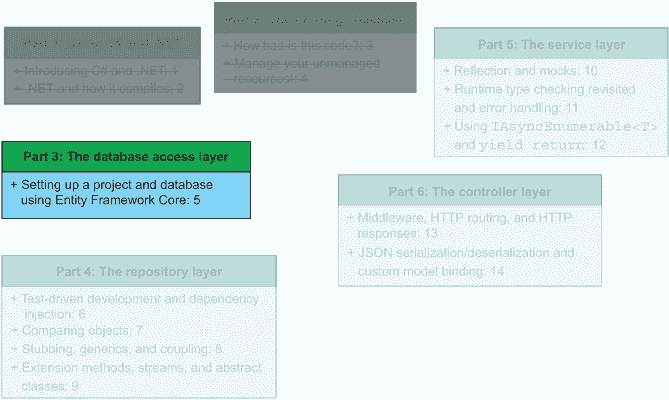
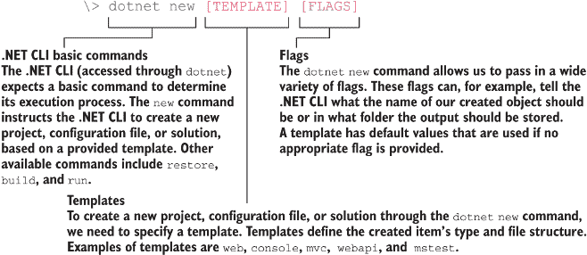
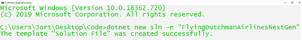
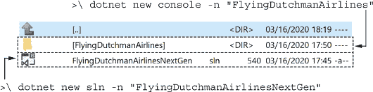
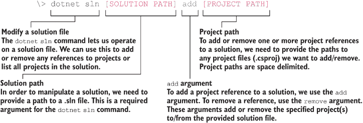
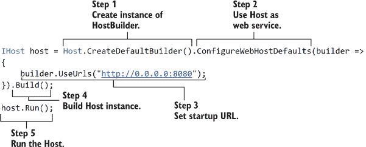
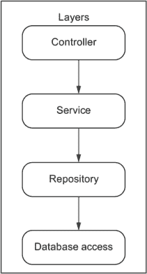
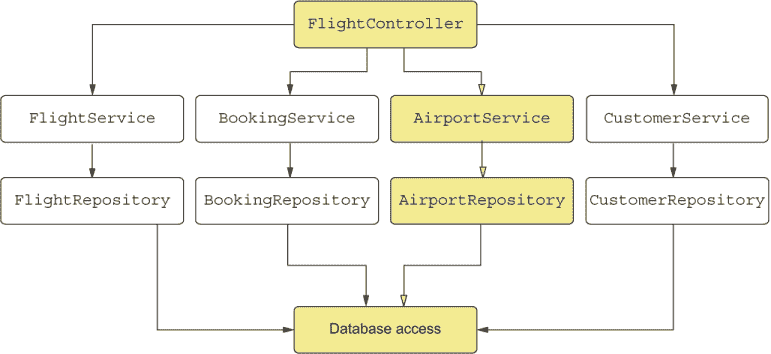
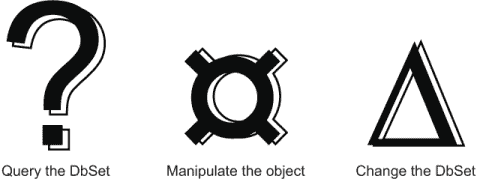

# 使用 Entity Framework Core 设置项目和数据库

本章涵盖

+   重构遗留代码库以使其整洁和安全

+   使用 Entity Framework Core 查询数据库

+   实现存储库/服务模式

+   使用命令行创建新的 .NET 5 解决方案和项目

时机终于到了。你可能急于修复第三章和第四章中我们看到的一些问题，现在我们将着手解决这些问题。首先，让我们制定一个如何处理这个重构的计划。我们已经知道我们需要做一些不同的事情：

+   在第三章中，我们被告知使用 .NET 5 而不是 .NET 框架来创建飞荷兰人航空公司服务的新版本。

+   我们需要重写端点以实现整洁的代码（特别是遵守 DRY 原则）。

+   我们需要修复安全漏洞——硬编码的连接字符串。

+   对象名称与数据库列名称不匹配。我们应该修复这个问题，以确保代码库和数据库之间完美的同构关系。

+   我们需要遵守第三章中讨论的 OpenAPI 文件和附录 D 中展示的。

虽然这不一定属于需求的一部分，但我们希望包含一些额外的可交付成果以提高工作质量，从而确保工作做得很好：

+   我们希望使用测试驱动开发来编写支持代码库的单元测试。

+   我们希望使用 Entity Framework Core 通过逆向工程已部署的数据库来翻新数据库层。

+   我们希望在服务启动时自动生成更新的 OpenAPI 文件，以便与提供的来自 FlyTomorrow 的 OpenAPI 进行比较。

当然，我们将做更多的工作，但有一些一般性的大致方向是好的。我们还处于一个非常有趣的位置：我们被困在必须保持旧代码库活跃和工作的中间，同时进行绿色场开发。

定义 *绿色场开发* 意味着我们正在处理一个不受任何先前设计决策或旧代码限制的项目。在实践中，这通常意味着一个全新的项目。

我们已经设定了要求和一个旧代码库，我们需要模仿（在适当和可能的情况下），但我们也是从一个空项目开始的。在现实世界中，你经常会遇到这种情况。毫无疑问，你有过尝试创建现有产品新版本的体验——如果你愿意，可以称之为“下一代”版本。图 5.1 展示了我们在本书方案中的位置。



图 5.1 在本章中，我们将开始重新实现飞荷兰人航空公司代码库的过程。我们将从数据库访问层开始。在接下来的章节中，我们将查看存储库层、服务层和控制层。

我们的首要任务是创建一个新的 .NET 5 解决方案。

## 5.1 创建 .NET 5 解决方案和项目

在本节中，我们将创建一个新的.NET 5 解决方案和项目。我们还将查看.NET 5 中存在哪些预定义的解决方案和项目模板。您有以下两种创建新的.NET 5 解决方案的方法：

+   您可以使用命令行，无论是 Windows 命令行还是 macOS/Linux 终端。

+   您可以使用像 Visual Studio 这样的 IDE。使用 Visual Studio 可以在一定程度上自动化这个过程。您可以在命令行或终端中用 C#做的几乎所有事情，您也可以在 Visual Studio 中通过几个点击来完成。¹

使用这两种途径的结果是相同的：您最终会得到一个新的.NET 5 解决方案。我们将使用命令行。创建一个新的空.NET 5 解决方案或项目非常简单，如下所示：

```
\> dotnet new [TEMPLATE] [FLAGS]
```

注意：在尝试创建.NET 5 项目之前，请确保您已安装最新的.NET 5 SDK 和运行时。安装说明见附录 C。

我们可以使用各种模板。其中一些更常见的有`web`、`webapp`、`mvc`和`webapi`。就我们的目的而言，我们使用可能是最受欢迎的两个：`sln`和`console`。`dotnet new sln`命令创建一个新的解决方案，而`dotnet new console`则创建一个新的项目和“hello, world”源文件。如第 3.3.2 节所述，C#使用解决方案和项目来组织其代码库。解决方案是顶级实体，包含多个项目。我们在项目中编写我们的逻辑。项目可以被视为不同模块、包或库，具体取决于我们偏好的语言。



我们还通过创建命令传递了`-n`标志。这允许我们为我们的解决方案和项目指定一个名称。如果我们没有明确指定解决方案的名称，我们的项目或解决方案的名称将默认为创建文件的文件夹名称。

要创建我们的起点，请运行以下命令。请注意，命令行工具在创建新解决方案时不允许您创建新的解决方案文件夹。如果您想这样做，您可以使用 Visual Studio（它允许这样做）或首先创建文件夹，然后在解决方案文件夹中运行以下命令。

```
\> dotnet new sln -n "FlyingDutchmanAirlinesNextGen"
```

该命令只创建了一件事：一个名为`FlyingDutchmanAirlinesNextGen.sln`的解决方案文件，如图 5.2 所示。我们可以在这个解决方案文件中打开 Visual Studio，但没有项目我们无法做很多事情。



图 5.2 运行创建新的.NET 解决方案的命令后，命令行会告诉我们操作已成功。

现在我们有了解决方案文件，我们应该创建一个名为 FlyingDutchmanAirlines 的项目。要创建一个新的项目，我们使用`console`模板，如下所示。这会创建一个.NET 5 控制台应用程序，然后我们将将其更改为一个网络服务。

```
\> dotnet new console -n "FlyingDutchmanAirlines"
```

运行命令后，我们会看到一个消息说“`Restore succeeded.`”。恢复是.NET CLI 在创建新项目之前以及在“clean”操作（“clean”删除所有本地可执行文件，包括依赖项）之后编译之前执行的过程（“clean”删除所有本地可执行文件，包括依赖项）或第一次编译，以收集所需的依赖项。我们也可以通过以下方式单独运行此命令：

```
\> dotnet restore
```

在处理依赖问题的时候，恢复操作可能会很有用。`restore`命令还会在我们解决方案文件旁边创建一个新的文件夹，名为 FlyingDutchmanAirlines（与传递给我们的项目名称相同），如图 5.3 所示。当我们进入文件夹时，我们会看到一个名为 obj 的文件夹。obj 文件夹包含 NuGet 及其包的配置文件。回到项目的根目录，我们有一个项目文件和一个 C#源文件。



图 5.3 运行创建解决方案和项目的命令行命令后的文件夹结构。FlyingDutchmanAirlines 文件夹是通过创建项目的命令创建的，而 FlyingDutchmanAirlinesNextGen.sln 文件是通过创建新解决方案的命令创建的。

我们的项目已经创建，但我们还需要将其添加到解决方案中。当您创建一个项目时，`dotnet`不会扫描任何子目录以查找包含的解决方案。要向解决方案添加项目，请使用以下“solution add”命令：

```
\> dotnet sln [SOLUTION PATH] add [PROJECT PATH]
```

`[SOLUTION PATH]`指向您想要添加项目的解决方案文件的路径。同样地，`[PROJECT PATH]`指向要添加到解决方案中的 csproj 文件。您可以通过向命令添加多个`[PROJECT PATH]`参数来同时添加多个项目。



在我们的情况下，从根目录 FlyingDutchmanAirlinesNextGen 运行，命令只考虑了一个 csproj，如下所示：

```
\> dotnet sln FlyingDutchmanAirlinesNextGen.sln add
➥ .\FlyingDutchmanAirlines\FlyingDutchmanAirlines.csproj
```

终端通过一条消息——``Project `FlyingDutchmanAirlines\ FlyingDutchmanAirlines.csproj` added to the solution``——告诉我们我们的努力是成功的。如果我们用文本编辑器打开 FlyingDutchmanAirlinesNextGen.sln 文件，我们会看到如下所示的 FlyingDutchmanAirlines.csproj 文件的引用：

```
Project("{...}") = 
➥ "FlyingDutchmanAirlines",
➥ "FlyingDutchmanAirlines\FlyingDutchmanAirlines.csproj", "{...}"
EndProject
```

这是`solution add`命令添加的引用。该引用告诉 IDE 和编译器，在这个解决方案中有一个名为 FlyingDutchmanAirlines 的项目。

## 5.2 设置和配置一个网络服务

在 5.1 节中，我们创建了一个新的解决方案和项目，用于使用飞荷兰人航空公司服务的下一代版本。在本节中，我们将查看 5.1 节中采取行动生成的源代码，并配置控制台应用程序以作为网络服务运行。

在此阶段，解决方案（和项目）中只有一个源文件，即 Program.cs，如下一列表所示。此文件是通过我们在第 5.1 节中创建新项目时使用的 `console` 模板自动生成的。它包含程序的入口点——一个返回无值的 `static` 方法，称为 `Main`——它接受一个名为 `args` 的字符串数组。此数组包含在启动时传递的任何命令行参数。

列表 5.1 包含 `Main` 方法的 Program.cs

```
using System;

namespace FlyingDutchmanAirlines {
  class Program {
    static void Main(string[] args) {        ❶
      Console.WriteLine("Hello World!");     ❶
    }                                        ❶
  }
}
```

❶ `static void Main` 是 C# 控制台应用程序的默认入口点。

使用命令行运行 FlyingDutchmanAirlinesNextGen 项目，它会在控制台输出“Hello World！”让我们从代码中移除 `"Hello World!"` 字符串。这使我们处于一个很好的位置，可以将控制台应用程序更改为更实用的东西：一个 Web 服务。

### 5.2.1 配置 .NET 5 Web 服务

我们需要配置我们的全新 .NET 5 应用程序以接受 HTTP 请求并将它们路由到我们将要实现的端点。为此，我们还需要设置 `Host`，这是运行 Web 服务并与 CLR 交互的底层进程。我们的应用程序位于 `Host` 内，而 `Host` 又位于 CLR 内。

注意：我们可以将 Web 容器（如 IIS）与 Tomcat 进行比较。用 Java 术语来说，.NET 5 是你的 JVM 和 Spring，而 `Host` 是你的 Tomcat。

我们配置 `Host` 以启动一个负责应用程序启动和生命周期管理的“宿主进程”。我们还告诉 `Host` 我们想使用 `WebHostDefaults`。这允许我们使用 `Host` 来实现 Web 服务，如图 5.4 所示。至少，宿主配置了服务器和请求处理管道。


图 5.4 一个 Web 服务在 `Host` 内运行，而 `Host` 又在 CLR 内运行。这种模型允许 CLR 启动一个可以执行我们的 Web 服务的 `Host`。

我在 .NET 5 中配置 `Host` 的首选方法是遵循以下三个步骤：

1.  使用静态 `Host` 类（`Microsoft.Extensions.Hosting` 命名空间的一部分）上的 `CreateDefaultBuilder` 方法来创建一个构建器。

1.  通过告诉 `Host` 构建器我们想使用 `WebHostDefaults` 并设置一个带有指定端口的启动类和启动 URL 来配置 `Host`。

1.  构建并运行构建的 `Host` 实例。

当我们尝试为构建器返回的 `Host` 实例配置启动类时，我们必须使用 `UseStartup` 类。这作为 ASP.NET 的一部分，默认情况下不是通过 .NET 5 安装的。为了访问此功能（以及 ASP.NET 中的任何内容），我们需要将 `ASP.NET` 包添加到 FlyingDutchmanAirlines 项目中。我们可以通过 Visual Studio 中的 NuGet 包管理器或在我们处于项目文件夹内时通过我们信任的命令行来完成此操作，如下所示：

```
\> dotnet add package Microsoft.AspNetCore.App
```

执行命令后，命令行会通知您已成功将包添加到项目中。

注意：该命令还执行了一个 `restore` 操作。有关 `restore` 的更多详细信息，请参阅第 5.1 节。

如果我们现在尝试构建项目，我们会收到一个警告，说我们应该使用框架引用而不是包引用。这是由于在过去的几年中.NET 命名空间发生的一些变动。这个警告不会阻止我们使用当前的代码，但我们可以很容易地消除它。在一个文本编辑器，如 Notepad++或（对于勇敢者）Vim 中，打开 FlyingDutchmanAirlines.csproj 文件。在那个文件中，添加粗体代码并移除对 ASP.NET 的包引用：

```
<Project Sdk="Microsoft.NET.Sdk">
  <PropertyGroup>
    <OutputType>Exe</OutputType>
    <TargetFramework>net5.0</TargetFramework>
  </PropertyGroup>

 <ItemGroup>
 <FrameworkReference Include="Microsoft.AspNetCore.App" />
 </ItemGroup>

 <ItemGroup>
    <PackageReference Include="Microsoft.AspNetCore.App" Version="2.2.8" /> 
    ...
  </ItemGroup>
</Project>
```

现在，`Microsoft.AspNetCore` 包已安装（作为框架引用），并且我们消除了编译器警告，我们可以使用 ASP.NET 功能。我们首先想告诉编译器我们想要使用 `AspNetCore.Hosting` 命名空间，如下一列表所示。在这本书中，命名空间导入通常从代码列表中省略。这样做是因为它们占用宝贵的空间，并且可以在大多数 IDE 中自动填充。

列表 5.2 Program.cs 无“Hello, World!”输出

```
using System;
using Microsoft.AspNetCore.Hosting;    ❶

namespace FlyingDutchmanAirlines {
  class Program {
    static void Main(string[] args) {
                                       ❷
    }
  }
}
```

❶ 我们使用 Microsoft.AspNetCore.Hosting 命名空间。

❷ 我们不再将“Hello, World!”输出到控制台。

### 5.2.2 创建和使用 HostBuilder

在本节中，我们将

1.  创建一个 `HostBuilder` 的实例。

1.  假设我们想将 `Host` 作为 Web 服务使用。

1.  将启动 URL 设置为 [`0.0.0.0:8080`](http://0.0.0.0:8080)`。

1.  使用 `HostBuilder` 构建 `Host` 的实例。

1.  运行 `Host`。



在程序的 `Main` 方法中，我们添加了对 `Host.CreateDefaultBuilder` 的调用。这个调用返回一个带有一些默认设置的 `HostBuilder`。然后我们通过调用 `UseUrls` 告诉结果构建器我们想要使用特定的 URL 和端口。然后我们调用 `Build` 来构建并返回实际的 `Host`。我们将输出分配给一个类型为 `IHost` 的变量。我们将我们的新 `Host` 分配给一个显式类型为 `IHost` 的变量。最后，代码通过调用 `host.Run()` 启动 `Host`，如下所示：

```
using System;
using Microsoft.AspNetCore; 
using Microsoft.AspNetCore.Hosting;

namespace FlyingDutchmanAirlines {
  class Program {
    static void Main(string[] args) {
      IHost host = 
➥ Host.CreateDefaultBuilder().ConfigureWebHostDefaults(builder => {
        builder.UseUrls("http:/ /0.0.0.0:8080");
      }).Build();

      host.Run();    
    }
  }
}
```

如果你尝试以当前状态编译和运行该服务，服务会启动然后以 `InvalidOperationException` 异常终止。这个异常告诉我们我们没有配置并绑定到 `Host` 的 `Startup` 类。但在我们创建这个 `Startup` 类之前，让我们让 `Program` 类保持最佳状态。我们在 `Main` 方法中有 `Host` 的创建和调用 `Run` 的操作，但它真的应该在那里吗？

在 1.4 节中，我们讨论了编写像叙事一样阅读的方法的重要性。如果我是新开发者，看到公开的方法（在这种情况下是 `Main`），我可能不会关心实现细节。相反，我想了解这个方法的大致功能。为此，我们可以将 `host` 的初始化和赋值以及调用 `host.Run` 的操作提取到一个单独的私有方法中，如下所示：

```
private static void InitalizeHost() {
  IHost host = Host.CreateDefaultBuilder()
      .ConfigureWebHostDefaults(builder =>
    {
      builder.UseUrls("http:/ /0.0.0.0:8080");
    }).Build();

  host.Run();
}
```

将`Host`创建逻辑提取到单独的方法中是一个好步骤，但我们还可以做更多。我们应该考虑两件事。首先，我们不需要将`HostBuilder`的结果存储在变量中，因为我们只使用它来调用`Run`。为什么我们不在`Build`之后直接调用`Run`，以避免不必要的内存分配，如下所示：

```
IHost host = Host.CreateDefaultBuilder()
      .ConfigureWebHostDefaults(builder =>
    {
      builder.UseUrls("http:/ /0.0.0.0:8080");
    }).Build().Run();
```

|    | 我们应该考虑的第二件事是将方法更改为“表达式”方法，如下所示。类似于 lambda 表达式，表达式方法使用`=>`符号来表示该方法将评估`=>`右侧的表达式并返回其结果。您可以将`=>`运算符视为赋值和评估代数（`=`）以及返回语句（`>`）的组合。Lambda 表达式一开始可能看起来有点奇怪，但随着您看到的越来越多，您就越想使用它们。 |
| --- | --- |

```
private static void InitalizeHost() => 
  Host.CreateDefaultBuilder()
    .ConfigureWebHostDefaults(builder =>
  {
    builder.UseUrls("http:/ /0.0.0.0:8080");
  }).Build().Run();
```

这对我们`Main`方法有什么影响？不大。我们只需按照以下方式调用`InitializeHost`方法：

```
namespace FlyingDutchmanAirlines {
  class Program {
    static void Main(string[] args) {
 InitializeHost();
    }

 private static void InitalizeHost() => 
 Host.CreateDefaultBuilder()
 .ConfigureWebHostDefaults(builder =>
 {
 builder.UseUrls("http:/ /0.0.0.0:8080");
 }).Build().Run();  
 }
}
```

我们的代码干净且易于阅读，但我们仍然需要处理那个运行时异常。干净的代码很好，但如果它没有所需的功能，那就不够好了。异常表示我们在构建和运行生成的`IHost`之前需要使用`HostBuilder`注册一个`Startup`类。我想我们别无选择，只能将其作为我们下一个工作项目。

### 5.2.3 实现 Startup 类

我们还没有`Startup`类，但我们可以通过创建一个名为 Startup.cs 的文件（在项目的根文件夹中即可）来解决这个问题，如下所示：

```
namespace FlyingDutchmanAirlines {
  class Startup { }
}
```

要配置我们的`Startup`类，在`Startup`类中创建一个`Configure`方法。该方法由`HostBuilder`调用，并包含一个关键的配置选项，如下一列表所示，它允许我们使用控制器和端点。

列表 5.3 Startup.cs `Configure`方法

```
public void Configure(IApplicationBuilder app) {
  app.UseRouting();                                            ❶
  app.UseEndpoints(endpoints => endpoints.MapControllers());   ❷
}
```

❶ 使用路由并在此类中为服务做出路由决策

❷ 使用端点模式进行路由 Web 请求。MapControllers 扫描并映射我们服务中的所有控制器。

列表 5.3 中的小方法是我们的配置代码的核心。当调用`UseRouting`时，我们告诉运行时，某些服务路由决策是在这个类中做出的。如果我们没有调用`UseRouting`，我们就无法访问任何端点。`UseEndpoints`做的是它所说的：它允许我们使用和指定端点。它接受一个我们之前未遇到的类型作为参数：`Action`。这是一个代理的实例。

代理和匿名方法

代理提供了一种引用方法的方式。它也是类型安全的，因此它只能指向具有给定签名的某个方法。代理可以被传递到其他方法和类中，然后在需要时调用。它们通常用作回调。

您可以通过以下三种方式之一创建代理：

+   使用`delegate`关键字

+   使用匿名方法

+   使用 lambda 表达式

创建它们的最早方式是显式声明一个`delegate`类型，并通过将方法分配给委托来创建该委托的新实例，如下所示：

```
delegate int MyDelegate(int x);
public int BeanCounter(int beans) => beans++;

public void AnyMethod(){
  MyDelegate del = BeanCounter;
}
```

这段代码可读性较好，但略显笨拙。随着 C#的成熟，引入了新的方法来处理委托。

第二种选择是使用匿名方法。要使用匿名方法创建委托，我们指定方法返回类型和主体，在新的委托实例化中，如下所示：

```
delegate int MyDelegate(int x);
public void AnyMethod() {
  MyDelegate del = delegate(int beans) { 
    return beans++;
  };
}
```

注意创建委托的原始方式和匿名方式之间的区别。匿名方法可以极大地清理您的代码，但有一个大警告：您应该只在需要这样做或您确信自己可以遵守 DRY 原则的情况下使用匿名方法。如果您需要在代码库的另一个地方执行相同的逻辑，并且没有将委托传递到该位置，请使用普通方法，并从两个地方调用它。

这个过程的第三次，也是当前的一次进化，是从匿名方法到 lambda 表达式，如下所示：

```
delegate int MyDelegate(int x);
public void AnyMethod() {
  MyDelegate del = beans => beans++;
}
```

我们只需在匿名方法（`beans`）中确定我们想要的输入是什么，以及我们想要执行并返回的逻辑（`beans++`）。此外，您可以通过使用加法（`+`）和减法（`-`）运算符从委托中添加和删除方法。如果您有多个与同一委托相关联的方法，则该委托成为多播委托。

最后，要使用委托，请调用下面的`Invoke`方法。这将调用底层的`Action`，执行您附加到其上的任何代码。

```
del.Invoke();
```

我们传递一个 lambda 表达式，当执行时，将通过调用`MapControllers`来配置应用程序的端点。一个方便的方法，`MapControllers`扫描我们的代码库中的任何控制器，并为我们的控制器中的端点生成适当的路由。

在将我们的`Startup`类注册到`Host`之前，唯一剩下的事情是创建一个`ConfigureServices`方法，并在传入的`IServiceCollection`上调用`AddControllers`，如下面的代码示例所示。`IServiceCollection`接口允许我们向服务添加功能，例如支持控制器或依赖注入的类型。这些功能被添加到内部服务集合中。

```
public void ConfigureServices(IServiceCollection services) {
  services.AddControllers();
}
```

为什么我们需要将控制器支持添加到服务集合中？我们不是刚刚扫描了控制器并添加了路由到`RouteTable`吗？在运行时，`Host`首先调用`ConfigureServices`，这给了我们机会注册我们想要在应用程序中使用（在这种情况下，我们的控制器）的任何服务。如果我们跳过了这一步，`MapControllers`将找不到任何控制器。

要使用 `IServiceCollection`，我们需要使用 `Microsoft.Extensions.DependencyInjection` 命名空间，如下面的代码片段所示。依赖注入由运行时用来提供当前的、最新的 `ServiceCollection`。你可以在第 6.2.9 节中找到更多关于依赖注入的信息。

```
namespace FlyingDutchmanAirlines {
  class Startup {
    public void Configure(IApplicationBuilder app){
      app.UseRouting();
      app.UseEndpoints(endpoints => endpoints.MapControllers(); }); 
    }    

 public void ConfigureServices (IServiceCollection services) {
 services.AddControllers();
 }
  }
}
```

我们已经完成了 `Startup` 类。现在，让我们配置它以便由 `HostBuilder` 使用。我们通过回到 Program.cs 并向 `HostBuilder` 添加对 `UseStartup<Startup>()` 的调用来实现这一点：

```
namespace FlyingDutchmanAirlines {
  class Program {
    static void Main(string[] args) {
      InitializeHost();
    }

    private static void InitalizeHost() => 
      Host.CreateDefaultBuilder()
        .ConfigureWebHostDefaults(builder =>
      {
 builder.UseStartup<Startup>();
        builder.UseUrls("http:/ /0.0.0.0:8080");
      }).Build().Run();  
  }
}
```

现在我们启动应用程序时，我们得到一个控制台窗口告诉我们服务正在运行并监听 [`0.0.0.0:8080`](http://0.0.0.0:8080)。这段代码看起来与自动生成的模板给出的代码略有不同。功能保持不变，两者都是很好的起点。

现在我们已经解决了先决条件，我们可以开始向我们的服务添加一些逻辑。

### 5.2.4 使用存储库/服务模式为我们网络服务架构

我们计划为飞荷兰人航空公司下一代服务使用的架构范式是存储库/服务模式。使用这种模式，我们采用自下而上的开发策略，从底层开始工作：首先实现低级数据库调用，然后逐步向上创建端点。

我们的服务架构由以下四个层组成：

1.  数据库访问层

1.  存储库层

1.  服务层

1.  控制器层



图 5.5 在 FlyingDutchmanAirlinesNextGen.sln 中使用的存储库模式。数据和用户查询从控制器流向服务，再到存储库，最后到数据库。这种模式使我们能够轻松地在层之间分离关注点并进行增量开发。

从底部开始工作的好处是代码复杂性会自然增长。通常，那会是一件非常糟糕的事情。但在这个案例中，我们有工具来控制这种增长并使其保持在可控范围内。

我们可以通过选择任何端点并逐步执行满足要求的步骤来检查我们架构的数据流（图 5.5）。例如，让我们以 `POST /Booking/{flightNumber}` 为例。首先，一个 HTTP 请求进入 `Booking` 控制器。这将有一个 `BookingService` 的实例（每个实体都将有自己的服务和存储库），它将调用 `BookingRepository` 和它可能需要与之交互的任何其他服务。然后 `BookingRepository` 调用任何适当的数据库方法。在那个点上，流程逆转，我们回到链的顶部，将结果值返回给用户。

如前所述，并在图 5.6 中所示，所有实体都有自己的服务类和存储库类。如果需要对另一个实体进行操作，初始服务将调用该实体的服务以请求执行该操作。



图 5.6 将仓储模式应用于数据库实体。FlightController 持有它需要操作的每个实体的服务实例。一个实体的服务持有（至少）相应实体的存储库实例。如果需要，服务可以调用其他存储库。此图形追踪了机场（彩色框）的依赖关系流。

## 5.3 实现数据库访问层

如果我们回顾第四章，我们会想起在应用程序的前一个版本中处理数据库访问的奇特方式。连接字符串被硬编码到类本身中，并且没有使用 ORM。为了刷新我们的记忆：对象关系映射工具用于将代码映射到数据库，确保良好的匹配（或同构关系）。本节的两个主要目标是

1.  设置 Entity Framework Core 并“逆向工程”已部署的数据库。

1.  通过使用环境变量安全地存储连接字符串。

Entity Framework Core 最强大的功能之一是能够“逆向工程”已部署的数据库。逆向工程意味着 Entity Framework Core 从已部署的数据库自动生成代码库中的所有模型，为您节省了大量时间。逆向工程还保证了您的模型与数据库兼容，并且正确映射到模式。在第三章中，我们讨论了模型与模式之间正确同构关系的需求，使用 ORM 工具逆向工程模型是实现这一目标的方法。

### 5.3.1 Entity Framework Core 和逆向工程

在本节中，我们将学习如何使用 Entity Framework Core 来逆向工程已部署的数据库，并自动创建与数据库表相匹配的模型。由于我们逆向工程数据库，我们可以确信我们正在使用兼容的代码来查询数据库。

要逆向工程我们的数据库，我们首先需要通过运行 `dotnet install` 命令来安装 Entity Framework Core，如下所示。Entity Framework Core（EF Core）不是随 .NET 5 自动安装的，因为它是一个独立的项目。

```
\> dotnet tool install -–global dotnet-ef
```

成功后，命令行会通知您可以使用 `dotnet-ef` 命令调用工具，以及您刚刚安装的版本。Entity Framework Core 可以连接到许多不同类型的数据库。大多数数据库（SQL、NoSQL、Redis）都有包（也称为数据库驱动程序），允许 Entity Framework Core 连接到它们。因为我们的数据库是 SQL Server，我们安装相应的驱动程序。我们还需要添加 Entity Framework Core 设计包。这些包包含我们连接到 SQL Server 数据库（`SqlServer` 命名空间）和逆向工程模型（`Design` 命名空间）所需的功能。

确保您从项目的根目录（FlyingDutchmanAirlines，而不是解决方案的根目录，FlyingDutchmanAirlinesNextGen）运行以下命令：

```
\> dotnet add package Microsoft.EntityFrameworkCore.SqlServer
\> dotnet add package Microsoft.EntityFrameworkCore.Design
```

这些命令会安装连接到使用 Entity Framework Core 的 SQL Server 所需的所有软件包和依赖项。

我们现在可以使用以下命令来逆向工程数据库：

```
\> dotnet ef dbcontext scaffold [CONNECTION STRING] [DATABASE DRIVER] [FLAGS]
```

命令中包含两个不熟悉的术语——`dbcontext` 和 `scaffold`：

+   `dbcontext` 指的是创建一个类型为 `DbContext` 的类。`dbcontext` 是我们在代码中设置数据库连接的主要类。

+   `scaffold` 指示 Entity Framework Core 为我们连接到的数据库中的所有数据库实体创建模型。就像现实生活中的脚手架一样，它为原始项目（房屋或建筑物）创建了一个类似包裹的结构，我们可以用它来修改该项目。在我们的情况下，它将脚手架放在已部署的 SQL 数据库周围。

我们可以使用标志来指定生成的模型和 `dbContext` 的文件夹。我们将将这些保存到一个专用文件夹中，如下所示，以避免在项目根文件夹中有许多模型文件：

```
\> dotnet ef dbcontext scaffold
➥ "Server=tcp:codelikeacsharppro.database.windows.net,1433;Initial 
➥ Catalog=FlyingDutchmanAirlines;Persist Security Info=False;User  
➥ Id=dev;Password=FlyingDutchmanAirlines1972!;
➥ MultipleActiveResultSets=False;Encrypt=True;
➥ TrustServerCertificate=False;Connection Timeout=30;" 
➥ Microsoft.EntityFrameworkCore.SqlServer -–context-dir DatabaseLayer 
➥ –-output-dir DatabaseLayer/Models
```

如果在运行命令时遇到问题，请仔细检查所有空格、换行符（不应该有）和标志。命令首先构建当前项目。然后，它尝试使用给定的连接字符串连接到数据库。最后，它生成 `dbContext` 类（FlyingDutchmanAirlinesContext.cs）和适当的模型。让我们检查创建的 `FlyingDutchmanAirlinesContext` 类。一个生成的 `DatabaseContext` 包含以下四个主要部分：

+   构造函数

+   包含实体的 `DbSet` 集合

+   配置方法

+   模型创建选项

在我们查看这些项目之前，类声明中有一个特别之处：

```
public partial class FlyingDutchmanAirlinesContext : DbContext
```

这 `partial` 是什么意思？

|    |
| --- |

部分类

您可以使用 `partial` 关键字将类的定义拆分到多个文件中。通常，这会稍微降低可读性，但可能很有用。部分类对于自动代码生成器（如 Entity Framework Core）特别有用，因为生成器可以将代码放在部分类中，从而允许开发者丰富类的实现。

话虽如此，我们知道我们不会在另一个文件中为 `FlyingDutchmanAirlinesContext` 提供更多功能，因此我们可以从类中移除 `partial` 关键字。这是一个确保自动生成的代码正好符合您期望的好例子。仅仅因为生成器或模板以某种方式完成了它，并不意味着您不能编辑它。

```
public class FlyingDutchmanAirlinesContext : DbContext
```

注意，这个更改是可选的。

|

如果您查看生成的类，您会注意到它有两个不同的构造函数。在 C# 中，如果您不提供构造函数，编译器会在幕后为您生成一个无参数的构造函数。这个构造函数被称为默认构造函数或隐式构造函数。C# 在没有显式构造函数的情况下创建默认构造函数，以便您可以实例化该类的新实例。

如列表 5.4 所示，这两个构造函数都可以创建一个 `FlyingDutchmanAirlinesContext` 的实例。在 `FlyingDutchmanAirlines` 的情况下，你可以创建一个带有或不带有 `DbContextOptions` 类型实例的新实例。如果你确实将那个实例传递给构造函数，它将调用其基类的构造函数（在这种情况下是 `DbContext`）。

列表 5.4 `FlyingDutchmanAirlinesContext` 构造函数

```
public FlyingDutchmanAirlinesContext() { }                        ❶

public FlyingDutchmanAirlinesContext(DbContextOptions
➥ <FlyingDutchmanAirlinesContext> options) : base(options) { }   ❷
```

❶ 显式默认构造函数

❷ 带有调用基构造函数的参数的重载构造函数

有关方法构造函数重载的更多信息，请参阅第四章。

### 5.3.2 DbSet 和 Entity Framework Core 工作流程

在本节中，我们将讨论 `DbSet` 类型以及使用 Entity Framework Core 时的通用工作流程。超越构造函数，我们看到四个 `DbSet` 类型的集合，每个集合都包含我们的一个数据库模型。`DbSet` 类型是我们认为属于 EF Core 内部集合的一部分。Entity Framework Core 使用 `DbSet<Entity>` 集合来存储和维护数据库表及其内容的准确副本。

我们还看到了一个熟悉的概念：自动属性。集合是 `public` 的，但它们也是虚拟的，如下所示：

```
public virtual DbSet<Airport> Airport { get; set; }
public virtual DbSet<Booking> Booking { get; set; }
public virtual DbSet<Customer> Customer { get; set;}
public virtual DbSet<Flight> Flight { get; set; }
```

当你声明某个属性或方法为 `virtual` 时，你告诉编译器你允许在派生类中覆盖该属性或方法。如果你没有将某个属性或方法声明为 `virtual`，则不能覆盖它。

|    |
| --- |

隐藏父属性和方法/密封类

在一个类实现了包含未声明为 `virtual` 的属性或方法的基础类的情况下，我们无法覆盖这些属性和方法的具体实现。怎么办呢？嗯，我们有一个解决这个问题的工作区。我们可以通过在方法或属性签名中插入 `new` 关键字来“隐藏”父类的属性和方法，如下面的代码所示。这个关键字告诉编译器，我们不是要为现有的父方法提供一个新的实现，而是只想调用这个恰好有相同名称的新方法。在实践中，它允许你“覆盖”非虚拟属性和方法。

```
public new void ThisMethodWasNotVirtual() {}
```

但是，请注意，隐藏是不受欢迎的。在一个理想的世界里，原始类的开发者有足够的知识来预测哪些属性和方法应该声明为 `virtual`。如果你需要在系统之外做事（使用工作区来执行意外和不受控制的覆盖），在点击提交代码按钮之前三思。原始开发者没有预料到你这样做，他们最初也不想让你覆盖它（如果他们想，他们就会提供一个 `virtual` 属性或方法）。

从基类开发者的角度来看，你该如何防止你的非虚方法或属性在派生类中被隐藏？遗憾的是，没有一种原子方式可以针对每个属性或方法进行指定。然而，我们确实有一个更核心的选项：`sealed` 关键字。你可以使用 `sealed` 关键字声明一个密封类，如下所示。这是一个很好的选项来保护你的类，因为基于密封类的派生类无法创建。由于继承被排除在外，因此重写或隐藏任何内容也是不可能的。

```
public sealed class Pinniped(){}
```

|

与许多其他 ORM 工具一样，Entity Framework Core 在一开始往往表现得不够直观。所有通常直接对数据库进行的操作都是在保存到数据库之前，先对内存中的模型进行操作。为此，Entity Framework Core 存储了大多数可用的数据库记录在 `DbSet` 中。这意味着，如果你在数据库中添加了一个主键为 `192` 的 `Flight` 实体，那么在运行时也会将该特定实体加载到内存中。在运行时从内存中访问数据库内容允许你轻松地操作对象，并抽象出你实际上是在使用数据库。缺点是性能。根据你的数据库大小（或成为的大小），在内存中保留大量记录可能会变得非常消耗资源。如图 5.7 所示，通过 Entity Framework Core 操作实体的正常工作流程如下：

1.  查询你想要操作的对象的适当 `DbSet`（对于 `INSERT`/`ADD` 操作不需要）。

1.  操作对象（对于 `READ` 操作不需要）。

1.  适当地更改 `DbSet`（对于 `READ` 操作不需要）。



图 5.7 通过 Entity Framework Core 更改数据库的三个一般步骤：查询 `DbSet`，操作对象，然后更改 `DbSet`。

需要记住的是，尽管在 `DbSet` 中已经进行了更改，但这些更改并不一定已经应用到数据库中。Entity Framework Core 仍然需要将这些更改提交到数据库中，我们将在本章中进一步探讨如何做到这一点。

### 5.3.3 配置方法和环境变量

`FlyingDutchmanAirlinesContext` 类的第三个构建块包括两个配置方法：`OnConfiguring` 和 `OnModelCreating`，如下代码所示。`OnConfiguring` 在 `DbContext` 的配置时被调用，这是在启动时自动完成的，而 `OnModelCreating` 在模型创建期间（在启动时的运行时）被调用。

```
protected override void OnConfiguring(DbContextOptionsBuilder 
➥  optionsBuilder) {
  if (!optionsBuilder.IsConfigured) {
    optionsBuilder.UseSqlServer(
➥ "Server=tcp:codelikeacsharppro.database.windows.net,1433;Initial 
➥ Catalog=FlyingDutchmanAirlines;Persist Security Info=False;User 
➥ ID=dev;Password=FlyingDutchmanAirlines1972!;
➥ MultipleActiveResultSets=False; 
➥ Encrypt=True;TrustServerCertificate=False;Connection Timeout=30;");
  }
}
```

`OnConfiguring` 方法接受一个类型为 `DbContextOptionsBuilder` 的参数。`OnConfiguring` 方法由运行时自动在 `DbContext` 的配置时调用，并使用依赖注入提供 `DbContextOptionsBuilder`。在这里，我们应该配置任何与如何连接到数据库相关的设置。因此，我们需要提供一个连接字符串。

但，不幸的是，硬编码的连接字符串再次露出了它丑陋的真相。肯定有更好的方法来做这件事。我建议我们使用环境变量。环境变量是一个键值对，{*K*，*V*}，我们在操作系统级别设置它。我们可以在运行时检索环境变量，这使得它们非常适合提供随系统或部署而变化的变量，或者我们不希望在代码库中硬编码的值。

NOTE 环境变量通常用于通过容器编排系统（如 Kubernetes）部署的 Web 服务。如果您不想（或不能）在操作系统级别设置环境变量，您可以使用云解决方案，如 Azure Key Vault 和 Amazon AWS 密钥管理服务。有关 Kubernetes 的更多信息，请参阅 Ashley David 的 *使用 Docker、Kubernetes 和 Terraform 启动微服务*（Manning，2021）或 Marko Lukša 的 *Kubernetes in Action*（第 2 版；Manning，2021）。

每个操作系统对环境变量的处理方式都略有不同——我们稍后将讨论 Windows 和 macOS 之间的实际差异。然而，我们在 C# 中检索环境变量的方式不会根据操作系统而改变。在 `System.IO` 命名空间中有一个名为 `GetEnvironmentVariable` 的方法，我们可以用它来完成这个特定的目的，如下所示：

```
Environment.GetEnvironmentVariable([ENVIRONMENT VARIABLE KEY]);
```

您只需传递您想要检索的环境变量的键（`ENVIRONMENT VARIABLE KEY`），该方法就会为您完成。如果环境变量不存在，它将返回一个空值而不抛出异常，因此您需要根据该空值进行一些验证。您的环境变量看起来会是什么样子？因为它是一个键值对，并且因为环境变量不能包含任何空格，您可以这样做：{`FlyingDutchmanAirlines_Database_Connection_String, [Connection String]}`。

TIP 因为环境变量是系统范围的，所以不能有重复键的环境变量。在选择键的值时，请记住这一点。

### 5.3.4 在 Windows 上设置环境变量

设置环境变量的过程因操作系统而异。在 Windows 上，您可以通过 Windows 命令行使用 `setx` 命令来设置环境变量，后跟所需的键值对，如下所示：

```
\> setx [KEY] [VALUE]
\> setx FlyingDutchmanAirlines_Database_Connection_String 
➥ "Server=tcp:codelikeacsharppro.database.windows.net,1433;Initial 
➥ Catalog=FlyingDutchmanAirlines;Persist Security Info=False;User 
➥ ID=dev;Password=FlyingDutchmanAirlines1972!;
➥ MultipleActiveResultSets=False;Encrypt=True;
➥ TrustServerCertificate=False;Connection Timeout=30;"
```

如果成功，命令行会报告值已成功保存（`SUCCESS: Specified value was saved.`）。要验证环境变量已保存，请启动一个新的命令行（新设置的环境变量不会在活动命令行会话中显示），并运行环境变量的 `echo` 命令。如果您没有看到环境变量如以下所示出现，您可能需要重新启动您的机器：

```
\> echo %FlyingDutchmanAirlines_Database_Connection_String%
```

如果一切顺利，`echo`命令应该返回环境变量的值（在这种情况下，我们的连接字符串）。现在我们可以在我们的服务中使用这个环境变量了！

### 5.3.5 在 macOS 上设置环境变量

与 Windows 一样，我们在 macOS 上使用命令行环境设置环境变量：macOS 终端。在 macOS 上设置环境变量与在 Windows 上一样简单，如下所示：

```
\> export [KEY] [VALUE]
\> export FlyingDutchmanAirlines_Database_Connection_String 
➥ "Server=tcp:codelikeacsharppro.database.windows.net,1433;Initial 
➥ Catalog=FlyingDutchmanAirlines;Persist Security Info=False;User 
➥ ID=dev;Password=FlyingDutchmanAirlines1972!;
➥ MultipleActiveResultSets=False;Encrypt=True;
➥ TrustServerCertificate=False;Connection Timeout=30;"
```

您也可以在 macOS 上使用`echo`来验证，如下所示：

```
\> echo $FlyingDutchmanAirlines_Database_Connection_String
```

在 macOS 上，当我们运行服务并尝试在通过 Visual Studio 调试代码库时获取环境变量时，事情变得有些复杂。在 macOS 上，通过命令行定义的环境变量不会自动对 Visual Studio 等 GUI 应用程序可用。解决方案是使用 macOS 终端启动 Visual Studio，或者将环境变量添加到 Visual Studio 的运行时配置中。

### 5.3.6 在运行时在您的代码中检索环境变量

设置环境变量后，我们现在可以在代码中获取它。我们希望在`OnConfigure`方法中获取它，而不是硬编码连接字符串。我们可以使用`Environment.GetEnvironmentVariable`方法来完成这个任务。因为`Environment.GetEnvironmentVariable`如果找不到环境变量会返回 null 值，所以我们使用空合并运算符（`??`）将其设置为空字符串，如下所示：

```
protected override void OnConfiguring(DbContextOptionsBuilder
➥ optionsBuilder)  {
  if(!optionsBuilder.IsConfigured) {
 string connectionString = Environment.GetEnvironmentVariable(
➥ "FlyingDutchmanAirlines_Database_Connection_String") 
➥ ?? string.Empty;
 optionsBuilder.UseSqlServer(connectionString);
  }
}
```

我们可以以几种不同的方式处理`null`情况（最显著的是通过使用条件语句或将`GetEnvironmentVariable`调用与空合并运算符内联到`UseSqlServer`方法中），但这是我的首选方式。它既易于阅读又简洁。通过这个小技巧，我们提高了应用程序的安全性十倍，尤其是当你考虑到硬编码的连接字符串提交到源代码管理系统中可能引起的问题。

我们尚未在`FlyingDutchmanAirlinesContext`中涉及到的代码是`OnModelCreating`方法，如下一列表所示。

列表 5.5 `FlyingDutchmanAirlinesContext` `OnModelCreating`

```
protected override void OnModelCreating(ModelBuilder modelBuilder) {   ❶
  modelBuilder.Entity<Airport>(entity => {                             ❷
    entity.Property(e => e.AirportId)                                  ❷
      .HasColumnName("AirportID")                                      ❷
      .ValueGeneratedNever();                                          ❷

    entity.Property(e => e.City)                                       ❷
      .IsRequired()                                                    ❷
      .HasMaxLength(50)                                                ❷
      .IsUnicode(false)                                                ❷

    entity.Property(e => e.Iata)                                       ❷
      .IsRequired()                                                    ❷
      .HasColumnName("IATA")                                           ❷
      .HasMaxLength(3)                                                 ❷
      .IsUnicode(false)                                                ❷
    });                                                                ❷

  modelBuilder.Entity<Booking>(entity =>  {                            ❸
    entity.Property(e => e.BookingId).HasColumnName("BookingID");      ❸

    entity.Property(e => e.CustomerId).HasColumnName("CustomerID");    ❸

    entity.HasOne(d => d.Customer)                                     ❸
      .WithMany(p => p.Booking)                                        ❸
      .HasForeignKey(d => d.CustomerId)                                ❸
      .HasConstraingName("FK__Booking__Custome_71D1E811");             ❸

    entity.HasOne(d => d.FlightNumberNavigation)                       ❸
      .WithMany(p => p.Booking)                                        ❸
      .HasForeignKey(d => d.FlightNumber)                              ❸
      .OnDelete(DeleteBehavior.ClientSetNull)                          ❸
      .HasConstraintName(“FK__Booking__FlightN__4F7CD00D”);            ❸
  });                                                                  ❸
  modelBuilder.Entity<Customer>(entity => {                            ❹
    entity.Property(e => e.CustomerId)                                 ❹
      .HasColumnName("CustomerID")                                     ❹

      entity.Property(e => e.Name)                                     ❹
      .IsRequired()                                                    ❹
      .HasMaxLength(50)                                                ❹
      .IsUnicode(false)                                                ❹
    });                                                                ❹

  modelBuilder.Entity<Flight>(entity => {                              ❺
    entity.HasKey(e => e.FlightNumber);                                ❺

    entity.Property(e => e.FlightNumber).ValueGeneratedNever();        ❺

    entity.HasOne(d => d.DestinationNavigation)                        ❺
      .WithMany(p => p.FlightDestinationNavigation)                    ❺
      .HasForeignKey(d => d.Destination)                               ❺
      .OnDelete(DeleteBehavior.ClientSetNull)                          ❺
      .HasConstraintName("FK_Flight_AirportDestination");              ❺

    entity.HasOne(d => d.OriginNavigation)                             ❺
      .WithMany(p => p.FlightOriginNavigation)                         ❺
      .HasForeignKey(d => d.Origin)                                    ❺
      .OnDelete(DeleteBehavior.ClientSetNull);                         ❺
    });                                                                ❺

    OnModelCreatingPartial(modelBuilder);                              ❻
}

partial void OnModelCreatingPartial(ModelBuilder modelBuilder);        ❼
```

❶ 覆盖基类的`OnModelCreating`方法

❷ 准备 EF Core 使用`Airport`模型

❸ 准备 EF Core 使用`Booking`模型

❹ 准备 EF Core 使用`Customer`模型

❺ 准备 EF Core 使用`Flight`模型

❻ 调用部分`OnModelCreatingPartial`方法

❼ 定义部分`OnModelCreatingPartial`方法

注意，由于它们是自动生成的，系统上的确切约束名称可能会有所不同。`OnModelCreating`方法在内部为 Entity Framework Core 设置实体，包括在数据库架构中定义的关键约束。这允许我们在不直接与数据库交互的情况下操作实体（这正是 Entity Framework Core 的整个想法）。生成的（以及对其的调用）方法也称为`OnModelCreatingPartial`。Entity Framework Core 控制台工具集生成了`OnModelCreatingPartial`方法，因此您可以在模型创建过程中执行额外的逻辑。我们不会这样做，因此我们可以删除`OnModelCreatingPartial`方法和对其的调用。但请注意，如果您必须重新运行反向工程过程（或任何其他代码生成工具），您的更改将被覆盖。

## 练习

练习 5.1

如果我们想要防止某人从类中派生，我们需要将哪个关键字附加到类上？

a. `虚拟的`

b. `密封的`

c. `受保护的`

练习 5.2

如果我们想要允许某人重写属性或方法，我们应该附加哪个关键字？

a. `虚拟的`

b. `密封的`

c. `受保护的`

练习 5.3

填空题：“一个 __________ 是运行 Web 服务的底层进程。它反过来又存在于 __________ 内。”

a. host

b. Tomcat

c. JVM

d. CLR

练习 5.4

真或假？在使用`Startup`类时，您需要将其注册到`Host`。

练习 5.5

尝试自己来做：编写一个表达式体风格的方法，接受两个整数并返回它们的乘积。这是一个单行解决方案。提示：考虑 lambda。

练习 5.6

在仓库/服务模式的情况下，应该有多少个控制器、服务和仓库层？

## 摘要

+   我们可以通过使用命令行中的预定义模板（如`console`和`mvc`）来创建 .NET 5 解决方案和项目。模板是轻松创建常见解决方案和项目风味的方法。

+   `restore`操作是获取项目编译所需的所有必要依赖项的操作。

+   我们可以通过使用`dotnet sln [SOLUTION] add [PROJECT]`命令将一个项目添加到解决方案中。

+   `Host` 是一个在 CLR 内运行的进程，它运行 Web 应用程序，提供 CLR 和用户之间的接口。

+   可以使用类似于 lambda 表达式的语法简洁地编写仅返回表达式值的函数。这被称为表达式体方法，可以使我们的代码更易读。

+   在`Startup`类中，我们可以设置路由并允许使用控制器和端点。这对于 MVC 网络应用程序来说很重要，因为它允许我们调用端点并使用控制器概念。

+   仓库/服务模式包含多个仓库、服务和控制器（每个实体一个）。这个易于遵循的范例帮助我们控制数据流。

+   Entity Framework Core 是一种强大的对象关系映射工具，可以通过构建脚本来逆向工程已部署的数据库。这为开发者节省了大量时间，并允许数据库和代码库之间实现近乎完美的同构关系。

+   使用 `partial` 关键字来定义实现分散在多个字段中的类和方法。`partial` 关键字通常被自动代码生成器使用。

+   当声明某个属性、字段或方法为 `virtual` 时，你表示这个属性、字段或方法可以被安全地重写。这在平衡扩展性和代码库的纯洁性需求时非常有用。

+   通过在方法或属性签名中添加 `new` 关键字，你可以“隐藏”非虚拟属性和方法。

+   当一个类被密封时，你不能从它继承。实际上，密封一个类阻止了任何类从它继承。当你确信你的类是继承链的最低级别，并且你想要防止对代码的篡改时，密封类变得很有用。

+   环境变量是在操作系统中设置的键值对。它们可以存储敏感数据，例如连接字符串或密码。

* * *

^ (1.) Visual Studio 的安装说明可以在附录 C 中找到。如果你想了解更多关于 Visual Studio 的信息，请参阅 Bruce Johnson 的 *Professional Visual Studio 2017* (Wrox, 2017) 和 Johnson 的 *Essential Visual Studio 2019* (Apress, 2020)。免责声明：作者曾是 *Essential Visual Studio 2019: Boosting Development Productivity with Containers, Git, and Azure Tools.* 的技术审稿人。
