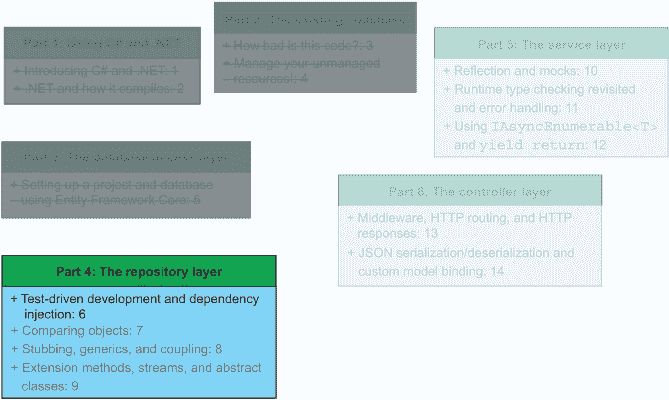
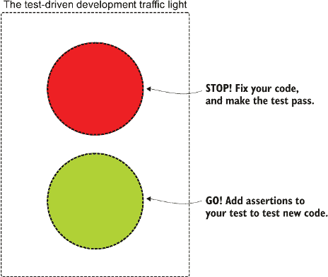
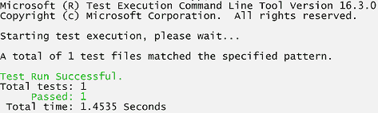
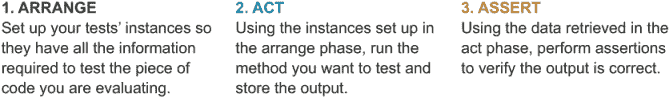
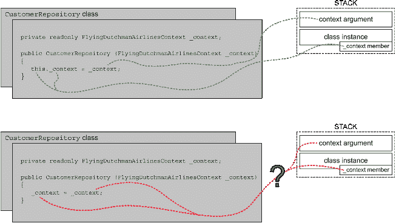

# 6 测试驱动开发和依赖注入

本章涵盖

+   使用锁、互斥锁和信号量

+   在同步和异步方法之间进行转换

+   使用单元测试进行依赖注入

在第三章和第四章中，我们审查了继承的代码库并讨论了潜在的改进。为了解决我们发现的问题，我们在第五章启动了新的飞剪航空公司服务，并实现了使用 Entity Framework Core 的数据库访问层。在本章中，我们将开始通过进入仓库层并创建`CustomerRepository`类来实现业务逻辑。图 6.1 显示了我们在本书结构中的位置。



图 6.1 在第五章实现了数据库访问层之后，我们将继续在本章实现`CustomerRepository`。

仓库层是我们服务的关键部分。在仓库层，我们做以下两件事：

1.  通过与数据库访问层通信查询和操作数据库

1.  将请求的实体或信息返回到服务层

我们希望创建独立、小巧、清洁且易于阅读的方法，这些方法遵循单一职责原则（SRP）。遵循 SRP 使得测试和维护我们的代码更加容易，因为我们能够快速理解每个方法并修复任何潜在的错误。

|    |
| --- |

单一职责原则

由罗伯特·马丁（Robert Martin）提出的清洁代码原则之一，单一职责原则（SRP）是清洁代码的和谐之音：容易演奏，但要精通则需要多年的实践。SRP 建立在 Edsger Dijkstra 在其论文《论科学思维的作用》中宣扬（并创造）的“关注点分离”概念之上。^a 在实践中，SRP 意味着一个方法应该只做一件事，并且要做好。这回到了我们在本书早期讨论的怪物方法。更正式地说，根据马丁在 2014 年发布的一篇博客文章（[`blog.cleancoder.com/uncle-bob/2014/05/08/SingleReponsibilityPrinciple.html`](https://blog.cleancoder.com/uncle-bob/2014/05/08/SingleReponsibilityPrinciple.html)），SRP 声明“每个软件模块应该只有一个且仅有一个改变的理由。”

回到实际术语，你如何知道你是否违反了 SRP？我发现最简单的方法是问问自己你是否在方法中做了多于一件事情。如果你需要在方法的解释或方法名称中使用“和”这个词，那通常意味着你违反了 SRP。SRP 与 Liskov 原则紧密相关，我将在第八章中讨论这一点。

* * *

^a 埃德加·迪杰斯特拉用钢笔写他的论文，并给它们编号“EWD [*N*]”，其中 *N* 是论文的编号（EWD 代表他的全名：Edsger Wybe Dijkstra）。《论科学思想的作用》是 EWD 447，可以在迪杰斯特拉的《关于计算的选择作品：个人视角》（Springer-Verlag，1982 年）中找到。

|

当我们考虑第三章和第四章中查看的现有代码库中的端点时，我们发现许多方法执行了多项操作。它们调用多个数据库表并执行多项处理任务。我们希望将这些操作分离成独立的方法，以便重用代码并确保代码质量。

## 6.1 测试驱动开发

使用测试驱动开发（TDD）来实现你的代码，这使你与许多开发者区分开来。你的代码将比那些不使用 TDD 的同事的代码更健壮、测试更完善。如果你从未使用过 TDD，我将指导你通过实际使用 TDD 的过程。测试驱动开发在最基本层面上，是在编写实现你试图测试的代码之前编写单元测试的实践。你同时更新测试和代码，并同步构建它们，这促进了良好的设计和坚实的代码，因为反馈循环紧密，你将敏锐地意识到任何破坏测试的代码。在本节中，我们将使用 TDD 为 `CustomerRepository` 编写单元测试。

注意：在这本书中，我实践了我喜欢称之为 TDD-light 的方法。从理论上讲，你应该在编写任何实际逻辑之前编写测试。然而，在实践中，人们通常不太这样做。你将在整本书中看到这种方法。它不是“纯 TDD”，但它是平衡 TDD 的工作量和快速迭代的一个实用解决方案。

要进行 TDD（或任何类型的测试），我们应该在我们的解决方案中创建一个测试项目。我们通过使用第五章中使用的模板，并将新的引用添加到解决方案中，该引用指向新的 csproj 文件来完成此操作，如下所示：

```
\> dotnet new mstest -n FlyingDutchmanAirlines_Tests
\> dotnet sln FlyingDutchmanAirlinesNextGen.sln add 
➥ FlyingDutchmanAirlines_Tests\FlyingDutchmanAirlines_Tests.csproj
```

现在，在我们的解决方案中，有一个在 MSTest 平台上运行的测试项目。除了 MSTest 之外，C# 还存在许多支持的测试框架，例如 xUnit 和 NUnit。本书中我们将使用 MSTest，因为 MSTest 是随 .NET 一起提供的。

新项目还包含一个自动生成的单元测试文件，名为 UnitTest1.cs，如下所示：

```
using Microsoft.VisualStudio.TestTools.UnitTesting;

namespace FlyingDutchmanAirlines_Tests {
  [TestClass]
  public class UnitTest1 {
    [TestMethod]
    public void TestMethod1() { }
  }
}
```

注意：如果你的测试类没有`public`访问修饰符，MSTest 运行器将无法找到该类，因此类内的测试将不会运行。

在本章中，我们将使用 UnitTest1.cs 文件，并根据我们对第一个仓库的需求对其进行修改：`CustomerRepository`。为什么从`CustomerRepository`开始，而不是从`FlightRepository`或`BookingRepository`开始呢？为了刷新我们的记忆，当我们完成它们后，我们将为每个数据库模型（客户、航班、机场和预订）有一个仓库。在这些仓库中，我们执行创建、读取、更新和删除（*CRUD*）操作，这些操作查询或操作数据库。`Customer`实体没有任何外键约束，所以我们不太可能陷入需要在我们完成真正想要工作的仓库之前创建不同实体的仓库的兔子洞。根据我的经验，从最低层（最嵌套/最少外键约束）的实体开始工作到最高层更容易。当你到达约束最多的实体时，你已经完成了所有的依赖。这与我们在第五章中为什么从数据库访问层而不是控制器层开始实现我们的下一代服务的原因相同。

在我们编写第一个单元测试之前，让我们创建仓库类和第一个方法`CreateCustomer`的框架：`CreateCustomer`方法接受一个类型为`string`的输入，表示客户的姓名，验证该输入，并将新实体插入到数据库中。`CustomerRepository`位于 FlyingDutchmanAirlines 项目中的新文件夹 RepositoryLayer 中，如下所示：

```
namespace FlyingDutchmanAirlines.RepositoryLayer {
  public class CustomerRepository {
    public void CreateCustomer(string name) { }
  }
}
```

目前`CustomerRepository`看起来并不多——只是一个类声明和一个方法，两者都具有`public`访问修饰符——但这足以让我们开始我们的第一个单元测试。遵循 TDD 传统，我们遵循类似于图 6.2 中红色-绿色交通灯模式的二进制策略。



图 6.2 测试驱动开发的交通灯。我们从红色（编译问题和测试失败）到绿色（所有测试通过且代码编译）再回到红色，形成一个恶性循环。这促进了迭代式开发生命周期。

使用 TDD 交通灯，我们不断地从“红色”阶段（我们的测试无法编译或通过）到“绿色”阶段（一切顺利，我们可以实现一些代码）。这种工作流程是测试驱动开发的核心优势。

让我们切换回我们的测试项目。如果我们想在`FlyingDutchmanAirlines`中调用任何方法，我们需要添加对该项目的引用。我们可以运行一个类似于我们在第五章中将 FlyingDutchmanAirlines.csproj 添加到 FlyingDutchmanAirlinesNextGen.sln 的命令，如下所示：

```
\> dotnet add 
➥ FlyingDutchmanAirlines_Tests/FlyingDutchmanAirlines_Tests.csproj 
➥ reference FlyingDutchmanAirlines/FlyingDutchmanAirlines.csproj
```

然后，我们可以将 UnitTest1.cs 重命名为 CustomerRepositoryTests.cs，并将命名空间和方法名更改为更合适的内容。现在我们可以实例化我们的`CustomerRepository`类，并调用我们新的`CreateCustomer`方法，如下所示：

```
using FlyingDutchmanAirlines.RepositoryLayer;
using Microsoft.VisualStudio.TestTools.UnitTesting;

namespace FlyingDutchmanAirlines_Tests.RepositoryLayer {
  [TestClass]
  public class CustomerRepositoryTests {
    [TestMethod]
    public void CreateCustomer_Success() {
      CustomerRepository repository = new CustomerRepository();
    }
  }
}
```

这个测试实际上还没有测试任何东西，所以在我们继续之前，让我们添加所有断言中最简单的一个：即`repository`不应该为`null`。你可能会说这只是验证了一个语言特性，而不是我们的代码，因为我们只是调用默认构造函数，是的，你是正确的。然而，在我的想法中，测试构造函数仍然是有价值的，因为你永远不知道有人是否会将实现更改为没有参数的显式构造函数，或者做其他意想不到的事情。

要使用 MSTest 框架添加断言，使用以下模式`Assert .Assertion.[TestMethod]`，如下所示：

```
public void CreateCustomer_Success() {
  CustomerRepository repository = new CustomerRepository();
  Assert.IsNotNull(repository);
}
```

要运行我们的单元测试，我们可以使用 Visual Studio 的单元测试资源管理器，或者我们可以通过命令行调用测试框架。无论如何，我们都需要先编译代码，然后执行测试。要在命令行中运行解决方案中的所有测试，请使用以下命令：

```
\> dotnet test
```

如果你通过 Visual Studio（如果你使用 Visual Studio）运行本书中的测试时遇到麻烦，请尝试使用`dotnet test`。

一旦测试运行完成，我们看到我们的第一个测试通过了，如图 6.3 所示。然而，请注意，单元测试旨在与其他测试隔离，并且只测试单个方法。因此，MSTest 运行器执行测试的顺序不保证是顺序的或会从会话到会话保持一致。



图 6.3 MSTest 框架运行我们的单元测试，并且通过了。确保每次更改后测试都通过，有助于尽早而不是更晚地捕捉到错误。

## 练习

练习 6.1

单一职责原则倡导的是什么？

a. 所有方法名应该只有一个单词长。

b. 不要在两个不同的地方执行相同的逻辑。

c. 让你的方法只做一件事。

练习 6.2

真的是假的？在使用测试驱动开发时，你会在实现前后编写测试。

练习 6.3

真的是假的？只要测试类有一个`internal`访问修饰符，测试运行器就可以看到你的测试类。

## 6.2 创建客户方法

在本节中，我们将实现`CustomerRepository`类中的`CreateCustomer`方法。我们希望接受一个表示客户名称的`string`类型的参数，并返回一个布尔值，指示客户是否成功添加到数据库中。

在现有的代码库（在第三章和第四章中讨论过），一个名为`FlightController.Post`的庞大方法将一个`Customer`实例添加到数据库中。`Post`方法大约有 80 行长，并且还执行了获取机场详情的逻辑。它还检索并预订了航班。在方法中做过多的事情违反了单一职责原则。`FlightController.Post`方法不仅仅做了一件事（正如原则所规定的那样）；相反，它做了很多事情。实际创建客户的代码只有八行长，如下一列表所示。

列表 6.1 旧代码库处理在数据库中创建客户的方式

```
// Create new customer                                                ❶
cmd = new SqlCommand("SELECT COUNT(*) FROM Customer", connection);    ❷
var newCustomerID = 0;
using(var reader = cmd.ExecuteReader()) {                             ❸
  while (reader.Read()) {                                             ❹
    newCustomerID = reader.GetInt32(0);                               ❹
    break;                                                            ❹
  }                                                                   ❹
}
```

❶ 我们应该编写足够清晰的代码，无需注释。

❷ 在此代码片段之前实例化了连接变量。

❸ 使用 using 语句是一个很好的用法，但使用了隐式类型

❹ 将数据库的返回值读取到 ID 变量中

列表 6.1 中的代码片段并不是我们见过的最糟糕的，但我们确实可以做出以下改进：

+   我们的代码应该是自文档化的。对于不熟悉逻辑的人来说，应该能够阅读代码并大致了解正在发生的事情。我们应该删除注释。

+   使用硬编码的 SQL 语句可能会成为维护服务的潜在障碍。如果数据库模式发生变化，我们现在需要更改 SQL 查询。使用 ORM 工具（如 Entity Framework Core）来抽象 SQL 查询更安全。

确定了这些改进后，让我们从我们的新实现开始，创建新的 `CreateCustomer` 方法的签名：

```
public bool CreateCustomer(string name) {}
```

我们的 `CreateCustomer` 方法目前没有实现任何实际逻辑，所以让我们改变一下。要在我们的数据库中创建客户条目，我们需要做以下四件事：

1.  验证 `name` 的输入参数。

1.  实例化一个新的 `Customer` 对象。

1.  将新的 `Customer` 对象添加到 Entity Framework Core 的内部 `DbSet<Customer>`。

1.  告诉 Entity Framework Core 我们想要提交我们的更改。

我们在所有仓库方法中都遵循这个通用模式。保持一致性使得我们的代码库更容易阅读和维护，因为开发者可以依赖看到这个模式的预期。

### 6.2.1 为什么你应该始终验证输入参数

在一个理想的世界里，人们永远不会将 `null` 或无效参数传递到你的方法中。不幸的事实是，我们并不生活在一个理想的世界里。为了对抗他人的不可靠性，我们能做的最好的事情就是以身作则。如果我们认为一个方法不过是一个数学函数，我们可以将其视为一个黑盒，我们可以输入任何信息并返回一个可接受的输出。如果我们向这个黑盒中传递一个无效的值，并且假设另一个开发者已经在上游处理了验证，那么我们就麻烦了，正朝着运行时异常的领域迈进。

让我们通过考虑代表客户名称的 `string` 必须遵守哪些标准来验证我们的输入。首先，我认为我们可以安全地假设我们永远不会希望我们的名称字符串为 null。在 null 的情况下，我们应该通过返回一个 `false` 布尔值退出方法，表示我们无法使用给定的输入参数成功将新的 `Customer` 对象添加到数据库中，如下所示：

```
public bool CreateCustomer(string name) {
  if (string.IsNullOrEmpty(name)) {
    return false;
  }

  return true;
}
```

|    | IsNullorempty 作为 `string` 类的一部分，.NET 提供了 `IsNullOrEmpty` 方法。此方法返回一个布尔值，指示给定的字符串是否为 null 或空。 |
| --- | --- |

我们添加第二个返回语句是为了满足方法签名。如果我们没有`return true`语句，编译器会抛出一个错误，表示`CreateCustomer`方法中并非所有代码路径都返回`bool`类型的值。如果我们只是在`CreateCustomer`方法中根据输入验证返回`bool`类型值，我们就可以直接返回`string.IsNullOrEmpty`的结果布尔值。但是，唉，我们还有其他逻辑要包括。让我们更新现有的单元测试，即成功场景，调用`CreateCustomer`方法并传递一个有效的名字字符串，然后检查方法是否返回了 true 值，如下所示：

```
[TestMethod]
public void CreateCustomer_Success() {
     CustomerRepository repository = new CustomerRepository();
  Assert.IsNotNull(repository);

  bool result = repository.CreateCustomer("Donald Knuth");
  Assert.IsTrue(result);
}
```

运行测试；它应该通过。我们为我们的方法引入了以下两个新的返回分支：

+   `name`参数为 null。

+   `name`参数是一个空字符串。

我们应该添加单元测试来覆盖这些可能性。

### 6.2.2 使用“安排、行动、断言”编写单元测试

在本节中，我们将通过检查其核心测试哲学来深入了解测试驱动开发。我们还将继续编写`CreateCustomer_Success`单元测试，遵循我们在本书中迄今为止遵循的相同测试模式：实例化一个对象，调用它，并断言输出是正确的。本节考察了测试的“三个 A”：安排、行动和断言，如图 6.4 所示。



图 6.4 “测试的三个 A”：安排、行动和断言。使用它们可以使我们以有组织和可预测的方式编写测试。

```
[TestMethod]
public void CreateCustomer_Failure_NameIsNull() {
  CustomerRepository repository = new CustomerRepository();
  Assert.IsNotNull(repository);

  bool result = repository.CreateCustomer(null);
  Assert.IsFalse(result);
}

[TestMethod]
public void CreateCustomer_Failure_NameIsEmptyString() {
  CustomerRepository repository = new CustomerRepository();
  Assert.IsNotNull(repository);
  bool result = repository.CreateCustomer("");
  Assert.IsFalse(result);
}
```

|    | 空字符串`""`和`string.Empty`都是描述空字符串的有效方式。实际上，`string.Empty`在底层解析为`""`。你可以使用任何一个，我喜欢使用`string.Empty`因为它更明确。在这本书中，我两者都使用。 |  |
| --- | --- | --- |

就这样，我们已经有了三个测试。现在，当我们对方法进行任何进一步的更改时，我们可以运行这些测试，并确信现有的代码没有出错。

### 6.2.3 验证无效字符

在验证输入的任务清单中，第二项是检查`name`字符串的实际内容是否有无效字符。我们预计一个名字不会包含特殊字符，如下所示：

+   感叹号：!

+   脚标符号：@ 

+   英镑符号：#

+   美元符号：$

+   百分比符号：% 

+   和号：& 

+   星号：*

我们不可能仅基于允许的字符来限制我们的允许字符集。可能的 Unicode 字符列表是巨大的，尤其是当你考虑到像越南语和亚美尼亚语这样的语言中字母的特殊符号时。那么我们如何检查特殊字符呢？

我们可以创建一个字符数组并遍历字符串，然后对字符串中的每个字符进行遍历。这样会占用很多行，而且效率也不高。¹ 我们也可以使用正则表达式（regex）与正则字符串进行匹配，但这对于我们的问题来说可能有些过度。最容易且最干净的方法是确定一个字符串是否包含指定的字符，就是指定一个包含禁止字符的数组，然后使用 LINQ 的 `Any` 方法遍历源字符串，传入一个 `Action` 来检查集合中的任何元素是否包含禁止字符集合中的元素。`Any` 方法检查一个表达式（通过 `Action`）是否对集合中的任何元素有效。LINQ 在第一次查看时可能难以理解，所以让我们一步一步地分解我们的 LINQ 代码：

```
char[] forbiddenCharacters = {'!', '@', '#', '$', '%', '&', '*'};
bool containsInvalidCharacters = name.Any(x => 
➥ forbiddenCharacters.Contains(x));
```

虽然使用 `Any` LINQ 方法和字符数组方法的时间复杂度与前面描述的嵌套 `for` 循环相同（因为我们基本上是在其上添加了一些语法糖），但它更易于阅读，也更符合 C# 的习惯用法。LINQ（Language-Integrated Query）是 C# 中的一种编程语言，允许我们执行（并链式）操作来查询和更改集合。在这里，我们使用正常的 C# 语法调用 LINQ 库中的方法（`Any`）。

首先，我们声明、初始化并分配一个类型为 `char` 数组的变量，并称它为 `forbiddenCharacters`。这个数组包含我们不允许的字符。其次，我们初始化一个名为 `containsInvalidCharacters` 的布尔变量，并将其分配给我们的 LINQ 查询的结果。我们可以将 LINQ 查询读作一个叙述：“如果 `name` 字符串中的任何元素包含 `forbiddenCharacters` 集合中的字符，则返回 `false`，否则返回 `true`。”

`Any` 方法的调用如果传入的表达式对于集合中的任何值（在本例中为 `name` 字符串中的任何字符）结果为 `true`，则返回 `true`。我们通过 lambda 表达式传入一个要评估的表达式。我们使用 `forbiddenCharacters` 上的 `Contains` 方法来评估 `forbiddenCharacters` 集合是否包含传入的值。结合 `Any` 调用，这意味着如果我们评估 `Contains` 调用为 `true`（对于代表禁止字符的字符来说就是 `true`），这也意味着 `Any` 返回 `true`，这意味着字符串中存在禁止字符。

我们可以直接在我们的条件之后放置禁止字符代码来检查 `name` 字符串是否为 `null` 或空，甚至将其内联到条件中，但我倾向于采用不同的方法。如果我说这些是实现细节，对于普通读者来说没有必要深入了解，那么我们应该把代码放在哪里？没错，应该放在一个单独的 `private` 方法中。

我们应该将`IsNullOrEmpty`条件提取到它自己的方法中，并添加无效字符代码。我们可以将此方法命名为`IsInvalidCustomerName`，并使其返回一个布尔值（注意，我们还需要导入`System.Linq`命名空间以使用 LINQ 查询），如下一列表所示。

列出 6.2 CustomerRepository.cs 中提取的 `IsInvalidCustomerName`

```
using System.Linq;

namespace FlyingDutchmanAirlines.RepositoryLayer {
  public class CustomerRepository {
    public bool CreateCustomer(string name) {
      if (IsInvalidCustomerName(name)) {
        return false;
      }

      return true;
    }
  }

  private bool IsInvalidCustomerName(string name) {
    char[] forbiddenCharacters = {'!', '@', '#', '$', '%', '&', '*'   };
    return string.IsNullOrEmpty(name) || name.Any(x => 
➥ forbiddenCharacters.Contains(x));
  }
}
```

如列表 6.2 所示，我们将代码提取到它自己的独立方法中。我们还根据组合条件和 LINQ 查询的结果立即返回基于布尔值。|

|    | 短路和逻辑运算符另一种方法是使用“排他或”运算符（XOR，`^`）而不是条件逻辑或运算符（`&#124;&#124;`）。XOR 运算符在只有一个选项为真时返回 true。如果`IsNullOrEmpty`和`Any Contains`检查都有效，那么就真的有些奇怪了（一个字符串不能既为 null 或空又包含无效字符），因此使用 XOR 运算符可能对我们有用。因为 XOR 是一个“逻辑”运算符，它在返回 true 或 false 的判断之前会评估等式的两边。逻辑运算符可能比条件运算符（如`&#124;&#124;`）性能低，因为如果等式的右边是 false，逻辑运算符不会评估等式的左边。这也被称为“短路评估”。 |
| --- | --- |

回到`forbiddenCharacters`数组，一个注重内存的读者可能会反对并说：“当`name`可能为`null`时，你有可能会分配内存给`forbiddenCharacters`数组，但你可能永远不会使用它。”对于这个反对意见，我会同意你的事实陈述，但也会反驳说，这是为了可读性而付出的微小代价。

我们几乎实现了我们的第一个目标：验证`name`的输入参数。逻辑已经到位，但我们还没有为这个新的逻辑编写单元测试。这并不符合我们的 TDD（测试驱动开发）原则。我们如何为这个新的逻辑编写测试？我们是否只测试新的`private`方法，还是我们也想测试调用`private`方法的剩余`CreateCustomer`方法？

我们不想直接测试任何`private`方法。在一个理想的世界里，所有`private`方法都是由一个`public`方法调用的（这可能是直接或通过另一个`private`方法间接调用）并且通过那个`public`方法进行测试。因为我们已经通过我们的通用`CreateCustomer`成功情况测试测试了成功情况，所以我们不需要创建另一个成功情况（或“happy path”）测试。然而，我们需要一个测试来测试失败情况。

### 6.2.4 使用 [DataRow] 属性内联测试数据

我们希望测试所有无效字符，如果我们为每个字符都编写一个单元测试，那么就需要我们编写*N*个测试，其中*N*是无效字符的数量。这将是一项大量工作，但回报甚微。幸运的是，MSTest 有`[DataRow]`属性，我们可以与 MSTest 平台一起使用。我们可以使用`[DataRow]`来指定测试方法的输入参数，如下一列表所示。这允许我们只需添加大量`[DataRow]`属性到单个测试中。

列表 6.3 `CreateCustomer_Failure_NameContainsInvalidCharacters` 使用 `[DataRow]`

```
[TestMethod]
[DataRow('#')]
[DataRow('$')]
[DataRow('%')]
[DataRow('&')]
[DataRow('*')]
public void CreateCustomer_Failure_NameContainsInvalidCharacters(char 
➥ invalidCharacter) {
  CustomerRepository repository = new CustomerRepository();
  Assert.IsNotNull(repository);

  bool result = repository.CreateCustomer("Donald Knuth" + 
➥ invalidCharacter);
  Assert.IsFalse(result);
}
```

列表 6.3 中的测试在包含全名“Donald Knuth”后跟一个无效字符（如`[DataRow]`属性所规定的）的字符串中通过，例如：`"Donald Knuth%"`。将`"Donald Knuth%"`用作`CreateCustomer`方法的输入参数返回一个`false`布尔值，我们对它进行断言。如果我们现在运行测试，我们可以看到一切通过，我们回到了代码库的良好覆盖率。

当我在测试的上下文中谈论覆盖率时，我并不是指测试覆盖了你代码的百分比。有关代码覆盖和单元测试的更多信息，请参阅 Vladimir Khorikov 的《单元测试原则、实践和模式》（Manning，2020）²和 Roy Osherove 的《单元测试的艺术》（第 3 版；Manning，2020）。

### 6.2.5 对象初始化器和自动生成代码

回到`CustomerRepository`中的`CreateCustomer`方法，我们准备处理列表中的下一个项目：“实例化一个新的`Customer`对象”，如下一代码列表所示。

列表 6.4 CustomerRepository.cs `CreateCustomer` 创建新客户

```
Customer newCustomer = new Customer();
newCustomer.Name = name;
```

我们可以通过使用所谓的“对象初始化器”来稍微清理列表 6.4 中的代码。使用对象初始化器允许你在创建实例时直接设置字段值，如下所示：

```
Customer newCustomer = new Customer() {
  Name = name
};
```

对象初始化器非常适合需要手动设置值的情况，但如果新来的开发者不小心将代码更改得没有设置该名称值；或者，也许出于某种原因，某人在代码的其他地方创建了一个类型为`Customer`的实例，而不知道他们应该将该属性设置为有效值呢？

也许我们控制对象如何实例化会更好。我们可以通过强制使用一个接受类型为`string`的名称参数的构造函数来定义`Customer`的实例化方式。但首先我们需要通过查看下一个显示的`Customer.cs`类来验证我们是否可以无问题地添加一个新的构造函数：

```
using System;
using System.Collections.Generic;

namespace FlyingDutchmanAirlines.DatabaseLayer.Models {
  public partial class Customer {
    public Customer() {
      Booking = new HashSet<Booking>();
    }

    public int CustomerId { get; set; }
    public string Name { get; set; }

    public virtual ICollection<Booking> Booking { get; set; }
  }
}
```

`Customer`类完全由 Entity Framework Core 自动生成。它映射到我们数据库中的客户表，并包含一个`Booking`列表。Entity Framework Core 创建了这个列表，因为它在数据库中找到了相关的外键约束。在我的理想世界中，属性和字段应该在构造函数之前，这样在浏览类时就可以一目了然，但在 Entity Framework Core 自动生成的文件中并非如此。如果您愿意，您可以重新组织您的文件以反映该模式。在这本书中，我将所有模型重新组织为那种风格。我们可以在列表 6.5 中看到重新组织的结果。我们还从模型的相应类签名中移除了`partial`关键字。我们可以这样做，因为我们不会使用`partial`功能，养成移除已知不会使用的代码的习惯更安全。移除未使用的代码可以提高代码的整洁性，并且将来阅读您类的人会感谢您。许多开发者陷入了保留“他们可能以后会使用/需要”的代码的陷阱。在我看来，这只会使代码库变得杂乱。

列表 6.5 Customer.cs（EF Core 生成并重新组织）

```
using System;
using System.Collections.Generic;

namespace FlyingDutchmanAirlines.DatabaseLayer.Models {
  public class Customer {
    public int CustomerId { get; set; }
    public string Name { get; set; }

    public virtual ICollection<Booking> Booking { get; set; }

    public Customer() {
      Booking = new HashSet<Booking>();
    }
  }
}
```

### 6.2.6 构造函数、反射和异步编程

我们已经为`Customer`类提供了一个构造函数。它不接受任何参数，但将一个新的`HashSet`的`Booking`实例分配给`Booking`属性。我们想要保留这个分配，因为引用类型不会默认为零值（在这种情况下是空集合）。相反，它默认为`null`。

注意：您可以通过使用`default`关键字而不是值来显式地为任何类型分配默认值。这在处理非原始值类型时可能很有用，其中默认值可能对您来说是未知的。引用类型始终具有`null`的默认值。

我们不想传递一个类型为`HashSet<Booking>`的参数。我们希望让 Entity Framework Core 处理任何键约束。但是，我们确实希望有一个类型为`string`的参数，反映客户的姓名。此外，我们还应该确保没有人可以从我们的`Customer`对象继承，并因此使用多态将其添加到数据库中。因此，我们使用`sealed`关键字密封我们的类。密封一个类意味着我们需要从`Booking`属性中移除`virtual`关键字，因为在密封类中不能有虚拟成员或属性。我们还应该按照以下方式密封代码库中的其他模型：

```
using System;
using System.Collections.Generic;

namespace FlyingDutchmanAirlines.DatabaseLayer.Models {
  public sealed class Customer {
    public int CustomerId { get; set; }
    public string Name { get; set; }

    public ICollection<Booking> Booking { get; set; }

    public Customer(string name) {
      Booking = new HashSet<Booking>();
      Name = name;
    }
  }
}
```

当我们尝试编译代码时，我们得到一个编译错误，因为我们没有在`CustomerRepository`中实例化`Customer`对象时传递所需的参数。实际上，我们仍在使用对象初始化器。让我们按照以下方式修复它：

```
Customer newCustomer = new Customer(name);
```

我们现在可以编译，而且我们的测试仍然通过。我们列表上的第三项是将新的`Customer`对象添加到 Entity Framework Core 的内部`DbSet<Customer>`。为什么我们需要这样做？如前所述，Entity Framework Core 假设对数据库的任何更改首先是对内存数据集的更改。为了将类型为`Customer`的新对象添加到数据库，我们首先必须将其添加到内存中的`DbSet<Customer>`。要访问`DbSet`，我们需要创建数据库上下文类的新实例。

我们可以使用`DbContext`上的两个方法将模型添加到`DbSet`：`Add`和`[Entity].Add`。如果我们调用通用的`Add`方法，C#将使用反射来确定实体类型并将其添加到正确的集合中。我更喜欢使用显式的`[Entity].Add`，因为它消除了歧义并节省了一些开销（反射非常昂贵！）。

反射

反射是 C#中一种强大的技术，用于在运行时访问有关程序集、类型和模块的信息。在实践中，这意味着你可以在执行代码时找出对象的类型或更改其一些属性。然而，你可以使用反射做更多的事情。机会是惊人的。

例如，你可以使用反射来创建自定义方法属性、创建新类型或在不知道文件名的情况下调用文件中的代码，所有这些都可以在运行时完成。你甚至可以访问外部类中的私有字段（但请勿这样做；尊重开发者的访问指南）。

如你所想，反射在内存和 CPU 周期方面并不是最便宜的执行方式。为了执行其一些操作，它必须在内存中加载并跟踪大量的元数据。想象一下在运行时检测未知对象类型所需的处理量。库和框架通常不能对其操作的对象类型做出假设，因此它们使用反射来收集元数据并根据这些数据做出决策。

在使用反射之前，先反思一下你的用例。

因为`DbContext`类实现了`IDisposable`接口，所以我们需要正确地处理它的释放。`DbContext`类需要是可释放的，因为它可以无限期地持有连接对象。最后，为了提交并保存我们对数据库的引用更改，我们在上下文中调用`SaveChangesAsync`方法，如下所示：

```
using (FlyingDutchmanAirlinesContext context = new 
➥ FlyingDutchmanAirlinesContext()) {
  context.Customer.Add(newCustomer);
  context.SaveChangesAsync();
}
```

这段小代码片段就是 Entity Framework Core 的核心所在。如果我们没有 Entity Framework Core（或不同的 ORM 工具）的抽象，我们就必须实例化一个 SQL 连接，打开它，编写实际的 SQL 来插入新的客户，然后执行该查询。完成这个任务的代码比我们现在写的要复杂和长。

然而，这段代码有一个小问题：我们调用了一个异步方法，但却是同步地执行它。对于这个特定的方法，构建代码时不会抛出编译错误，因为它同步地保存了更改。要将同步方法转换为异步方法，我们需要遵循三个步骤：

1.  在我们执行并等待的方法调用上使用 `await` 关键字。

1.  从方法中返回一个 `Task` 类型的对象。

1.  将 `async` 关键字添加到方法签名中。

要不等待（换句话说，异步执行）一个方法，C# 使用 `await` 关键字。人们经常将异步编程与多线程编程混淆。它们之间有一个很大的区别：异步编程允许我们同时执行多项任务，一旦执行完成就返回。多线程编程通常指的是并行运行多组逻辑，利用额外的线程来加快我们的代码。

### 6.2.7 锁、互斥锁和信号量

锁定资源和控制线程访问是许多软件工程师存在的噩梦。一旦处理多个线程，代码的复杂性就会激增，因为错误可能出现的地点数量急剧增加。为了减轻开发者的负担，C# 提供了一个语句（`lock`）和两种主要的同步原语类型来帮助你：互斥锁和信号量。

它们之间有什么区别，你会在什么情况下使用一个而不是另一个？最容易使用的是标准的 `lock` 语句。要使用 `lock` 语句锁定资源并允许一次只有一个线程操作它，请使用以下语法 `lock([RESOURCE]){...}`：

```
decimal netWorth = 1000000;
lock(netWorth) {
  ...
}
```

`netWorth` 变量在锁代码块期间（代码块离开后，锁被释放）被锁定，并且一次只能由一个线程访问。还值得注意的是，`lock` 语句禁止两个线程在相同时刻锁定相同的资源。如果两个线程能够在同一时刻实例化一个锁，那么锁将无法履行其“一次一个线程”的承诺。这就是我们所说的**死锁**：两个线程持有相同的资源，等待对方释放该资源。显然，我们试图在我们的代码中避免死锁，因为它们难以调试。

我们可以将水闸锁做一个类比：为了在运河的标高变化中提升和降低船只，我们使用运河锁。当一艘船排在运河锁的第二个位置时，另一艘船会使用运河锁。因此，初始船只“拥有”并锁定了运河锁。只有当初始船只离开运河锁（资源）时，运河锁才会被释放并回到可用状态。第二艘船现在可以进入并使用运河锁。当模拟处理像运河锁这样的关键系统队列系统时，程序锁非常有用。

`lock`语句在锁定特定进程内的属性（例如，正在运行的程序）方面工作得非常好。如果您想要锁定跨多个进程的资源（例如，您的程序多个实例运行并与其实例交互），请使用互斥锁。当您完成使用互斥锁后，您必须显式地释放它。这个额外的冗余使得互斥锁比锁更容易开发。

使用互斥锁进行跨进程线程控制

与锁不同，我们不需要关键字来使用互斥锁。相反，我们实例化`Mutex`类的静态实例。为什么是静态的？互斥锁是跨进程和跨线程的，所以我们希望整个应用程序只有一个实例。锁和互斥锁之间的重要区别是我们不会在属性上放置互斥锁。相反，我们在方法中放置互斥锁，并使用它们来控制方法的执行。当一个线程遇到带有互斥锁的方法时，互斥锁会通过使用`WaitOne`方法告诉线程它必须等待它的轮次。要释放互斥锁，请使用`ReleaseMutex`方法，如下所示：

```
private static readonly Mutex _mutex = new Mutex();
public void ImportantMethod() {
  _mutex.WaitOne();

  ...

  _mutex.ReleaseMutex();
}
```

第一个调用`ImportantMethod`的线程可以无问题地进入并通过互斥门。当互斥锁允许线程进入时，线程将拥有`Mutex`实例对象的所有权。如果第二个线程在第一个线程拥有互斥锁的情况下尝试进入`ImportantMethod`，则第二个线程必须等待直到第一个线程释放互斥锁并放弃所有权。毕竟只有一个互斥锁可用，因为它在程序中是静态的。当第一个线程不再拥有互斥锁时，第二个线程将获得所有权，循环重复进行。

使用信号量允许多个并发线程访问

因此，我们可以通过使用锁来锁定资源，或者通过使用互斥锁来控制方法的执行。但如果我们想控制方法的执行，但又不想创建一个队列瓶颈，使得一次只有一个线程可以执行该方法，那该怎么办？这就是信号量的作用。人们有时将信号量解释为“广义的互斥锁”，因为信号量提供了类似于互斥锁的功能，但增加了一个额外的特性：它们允许指定数量的线程同时进入受控方法。要使用信号量，我们实例化`Semaphore`类的静态实例。`Semaphore`类的构造函数接受两个参数：方法内部线程的初始计数（通常为`0`）和方法中的最大并发线程数，如下所示：

```
private static readonly Semaphore _semaphore = new Semaphore(0, 3);
public void VeryImportantMethod() {
  _semaphore.WaitOne();

  ...
  _semaphore.Release();
}
```

当一个线程希望执行`VeryImportantMethod`方法时，信号量会检查其内部的线程计数器并决定是否允许线程进入。在这个例子中，信号量允许最多三个并发线程进入该方法。潜在的第四个线程必须等待直到信号量的内部线程计数器回到两个。释放信号量会减少其内部计数器。

### 6.2.8 同步到异步执行……继续

将同步方法转换为异步方法的第二步是将方法的返回类型更改为 `Task<[type]>` 类型，其中 `[type]` 是你想要返回的类型（如果你想不返回任何特定类型，可以使用 `Task<void>`）。`Task` 是围绕一个我们可以等待的操作单元的包装。我们使用 `Task` 类和异步方法，以便我们可以验证任务是否执行，并返回与任务元数据一起的信息。在 `CreateCustomer` 方法的例子中，我们在同步执行时返回了 `bool` 类型，所以在异步操作时应该返回 `Task<bool>`。当返回 `Task<T>` 时，我们只返回我们想要嵌入的类型。编译器会自动将返回值转换为 `Task<T>`。例如，要从返回类型为 `Task<T>` 的方法返回 `Task<bool>`，我们只需要做以下操作：

```
return myBool;
```

当 `Task` 完成其任务时，公共语言运行时通过其 `CompletedTask` 属性（类型为 `bool`）将 `Task` 返回给调用方法，并将其设置为 `true`。

第三步，我们需要在方法签名中添加 `async` 关键字，如以下列表所示。`async` 关键字表示该方法是非阻塞的（因此应该返回 `Task<T>`）。如果你有一个没有 `await` 调用的异步方法，编译器会抛出一个警告。

列表 6.6 CustomerRepository.cs `CreateCustomer` 异步

```
public async Task<bool> CreateCustomer(string name) {    ❶
  if (IsInvalidCustomerName(name))  {   
    return false;
  }

  Customer newCustomer = new Customer(name);
using (FlyingDutchmanAirlinesContext context = new 
➥ FlyingDutchmanAirlinesContext())
  {
    context.Customer.Add(newCustomer);
    await context.SaveChangesAsync();                    ❷
  }

  return true;                                           ❸
}
```

❶ `CreateCustomer` 方法的签名包含异步关键字，并返回 `Task<bool>` 类型。

❷ `context.SaveChangesAsync` 调用被等待，直到更改被保存，当前线程被阻塞。

❸ 返回的 `bool` 类型会自动转换为 `Task<bool>` 类型。

最后一点需要注意：当你尝试运行你的测试时，你会在每个测试中遇到编译错误。这是因为它们现在调用了一个没有`await`或它们自身是异步的方法。我们需要修复这个问题。

使用你新获得的知识，将失败的测试从同步执行转换为异步执行，并等待 `CreateCustomer` 方法的调用。记住，单元测试方法在同步执行时返回 `void`。如果你遇到困难，可以在附录 A 中找到解决方案。

### 6.2.9 测试 Entity Framework Core

我们如何测试一个对象是否被添加到数据库中呢？当然，我们可以运行现有的测试，但这会与数据库交互——对于单元测试来说这是一个巨大的禁忌。但我们想验证测试的方法实际上是否向数据库添加了一个对象，我们没有代码来路由实际的 HTTP 请求到存储库。以下是我的建议：我们运行现有的成功情况单元测试一次，检查数据库中新创建的条目，然后找出解决单元测试连接问题的方案。

如果我们执行`CreateCustomer_Success`单元测试，我们可以使用数据库管理工具（如 SQL Server Manager）在我们的代码外部查询创建的客户实际部署的数据库（`"SELECT * FROM [dbo].[Customer]"`）。图 6.5 显示了结果客户条目。


图 6.5 查询数据库中所有客户的查询结果。由于数据库是在线部署的，数据库中客户的数量可能会有所不同。

但我们不想在每次运行单元测试时在实际数据库中创建新的条目。Entity Framework Core 有一个内存数据库的概念，它允许我们在运行测试时在我们的机器上内存中启动一个数据库（结构与我们的云或本地部署的数据库相同）。为了便于这样做，我们需要在 FlyingDutchmanAirlines_Tests 项目中安装`Microsoft.EntityFramework.Core.InMemory`包。我们还需要将`Microsoft.EntityFrameworkCore`和`FlyingDutchmanAirlines.DatabaseLayer`的命名空间导入到测试类中。

单元测试和依赖注入的方法属性

除了创建内存数据库之外，如果我们能够为每个测试使用相同的代码块创建一个新的具有适当内存选项的上下文，那将非常有用。如果告诉你有一个方法属性允许我们在每个测试之前创建一个方法并运行它，你会怎么想？

如表 6.1 所示，完成此操作的方法属性是`[TestInitialize]`。还有其他方法属性可以在每个测试之后运行一个方法（`[TestCleanup]`），在测试套件开始之前运行一个方法（`[ClassInitialize]`），以及在测试套件运行之后进行清理的一个方法属性。测试套件是一个类中所有测试的总和。

表 6.1 测试方法属性和方法的运行时间

| 方法属性 | 方法何时运行？ |
| --- | --- |
| `[ClassInitialize]` | 在类中的任何测试之前 |
| `[TestInitialize]` | 在类中的每个测试之前 |
| `[TestCleanup]` | 在类中的每个测试之后 |
| `[ClassCleanup]` | 在类中的所有测试之后 |

让我们在`CustomerRepositoryTests`类中使用`[TestInitialize]`方法属性添加一个`TestInitialize`方法，如下所示：

```
private FlyingDutchmanAirlinesContext _context;

[TestInitialize]
public void TestInitialize() {
  DbContextOptions<FlyingDutchmanAirlinesContext> dbContextOptions = new 
➥ DbContextOptionsBuilder<FlyingDutchmanAirlinesContext>()
➥ .UseInMemoryDatabase("FlyingDutchman").Options;
  _context = new FlyingDutchmanAirlinesContext(dbContextOptions);
}
```

我们创建一个类型为`FlyingDutchmanAirlinesContext`的`private`字段，名为`_context`，以存储我们的数据库上下文，这样我们就可以在测试中使用它。然后我们提供初始化方法（`TestInitialize`）。在`TestInitialize`中，我们首先创建一个`DbContextOptions<FlyingDutchmanAirlinesContext>`的对象，该对象使用 Builder 模式创建`DbContextBuilder`，指定我们想要使用名为`FlyingDutchman`的内存数据库，并返回设置内存上下文的选项。

然后，我们将这些选项传递给我们的`FlyingDutchmanAirlinesContext`构造函数（由 Entity Framework Core 自动生成）。`FlyingDutchmanAirlinesContext`有两个构造函数：一个不带参数的构造函数（我们之前已经使用过）和一个接受类型为`DbContextOptions<FlyingDutchmanAirlines>`的参数的构造函数，它允许我们在这种情况下创建内存上下文。

通过使用这个上下文，我们可以对内存数据库而不是真实数据库运行单元测试。Entity Framework Core 创建了一个完美的数据库模式副本（没有现有数据）并模拟我们正在对已部署的数据库进行操作。这允许我们在不干扰实际数据库的情况下执行单元测试。

但等等！我们实际上是如何使用上下文的？我们没有将上下文传递给仓库层。实际上，它在`CustomerRepository`中创建了一个新的上下文。这就是依赖注入再次出现的地方。

### 6.2.10 使用依赖注入控制依赖

依赖注入（DI）这个术语是由马丁·福勒在 2004 年的一篇文章中提出的，这篇文章名为“*控制反转容器和依赖注入模式*”，但实际上它是依赖注入技术的一种演变，这种技术最初是由罗伯特·马丁（以编写清洁代码而闻名）在 1994 年发布到 comp.lang.c++ Usenet 论坛的一篇论文中描述的，这篇论文名为*面向对象设计质量度量：依赖性分析。³*

依赖注入，在最基本的术语中，是一种提供类所需的所有依赖项的技术，而不是在类中自己实例化它们。这意味着我们可以在运行时而不是在编译时解决依赖项。当与接口一起使用时，依赖注入也成为了一个强大的测试工具，因为我们可以随时传递模拟作为依赖项。

一个没有依赖注入的传统类可能依赖于一个 AWS（亚马逊网络服务）客户端对象（让我们称它为`AwsClient`，并且让它实现一个名为`IAwsClient`的接口）。这个对象是 AWS 和我们的代码库之间的通信者。我们可以在类的构造函数中创建这个类级对象，并将其分配给`AwsClient`类的新实例，如下所示：

```
public class AwsConnector {
  private AwsClient _awsClient;
  public AwsConnector() {
    _awsClient = new AwsClient();
  }
}
```

现在想象一下，我们想要测试这个类。我们如何测试`_awsClient`来控制其返回值？因为它是一个私有成员，所以我们不能直接访问它。我们可以使用反射通过一些聪明的代码魔法来访问私有成员，但这将是痛苦且计算成本高昂的，同时代码也非常不整洁且复杂。另一种选择是使用依赖注入。

使用依赖注入，我们不是在构造函数中将`_awsClient`赋值给`AwsClient`的新实例，而是将这个新实例传递给构造函数。我们需要确保依赖是一个接口，在这种情况下，是`IAwsClient`，如下一个代码示例所示。这样，我们可以创建继承自`IAwSClient`的新类，这使得测试变得容易得多。

```
public class AwsConnector {
  private readonly IAWSClient awsClient;
  public AwsConnector(IAWSClient injectedClient) {
    awsClient = injectedClient;
  }
}
```

每个想要实例化`AwsConnector`新副本的类现在都必须传递一个继承自`IAwsClient`的类的实例。为了防止`_awsClient`在别处被更改，它只能是只读的且私有的。依赖注入的力量在于它反转了依赖的控制权。不再是类控制依赖及其实例化方式，现在调用类拥有这种控制权。这就是我们所说的“控制反转”。

让我们将`CustomerRepository`改为使用`FlyingDutchmanAirlinesContext`的依赖注入。为此，我们需要做以下五件事：

1.  在`CustomerRepository`中添加一个类型为`FlyingDutchmanAirlinesContext`的`private readonly`成员。

1.  为`CustomerRepository`构造函数创建一个非默认构造函数，该构造函数需要一个类型为`FlyingDutchmanAirlinesContext`的参数。

1.  在新的构造函数中，将私有的`FlyingDutchmanAirlinesContext`赋值给注入的实例。

1.  将类更改为使用私有成员，而不是在`CreateCustomer`方法中创建一个新的`FlyingDutchmanAirlinesContext`。

1.  更新我们的测试，将`FlyingDutchmanAirlinesContext`的实例注入到`CustomerRepository`中。

我们首先添加`private readonly`类型的`FlyingDutchmanAirlinesContext`成员和新的`CustomerRepository`构造函数。目前，我们只有一个默认（非显式）构造函数，因此我们必须创建一个新的构造函数来满足我们的需求，如下面的代码片段所示。这个构造函数取代了默认构造函数，因为我们不希望创建一个不带参数的重载构造函数。我们希望强制使用我们的 DI 构造函数。

```
private readonly FlyingDutchmanAirlinesContext _context;

public CustomerRepository(FlyingDutchmanAirlinesContext _context) {
  this._context = _context;
}
```

这就解决了我们列表上的前三个项目。这段代码确实包含了一个我在这本书中没有使用过的关键字：`this`关键字。

使用“this”关键字访问当前实例的数据

我们为什么必须使用`this`？想象一下如果我们没有这样做：我们会有一个赋值操作，将一个名为`_context`的变量赋值给另一个名为`_context`的变量。

```
_context = _context;
```

但我们到底在给什么赋值？类字段被称为`_context`（尽管命名约定不正确），传入的参数也是如此。有两种方法可以解决这个难题：要么我们重命名其中一个（可能的候选者是构造函数参数），要么我们找到一种方法来指定在什么时间我们指的是哪一个。`this`关键字指的是类的当前实例。所以当我们使用`this._context`时，我们真正说的是“在类的当前实例中名为`_context`的变量。”有了这个区分符，我们可以安全地将参数赋给字段。是否添加`this`关键字作为重命名变量、字段或成员的可接受的替代方案，取决于你。

我的试金石归结为以下几点：如果你必须更改名称，使其无法清楚地传达你的意图，请使用`this`关键字。否则，重命名它。



现在我们必须确保`CreateCustomer`方法使用我们新初始化的上下文，而不是在方法内部创建一个。为此，我们从方法中移除将`context`赋值给`FlyingDutchmanAirlines`新实例的赋值操作，并将`context`成员用`using`语句包裹，如下所示：

```
public async Task<bool> CreateCustomer(string name) {
  if (IsInvalidCustomerName(name)) {
    return false;
  }

  Customer newCustomer = new Customer(name);
  using (_context) {
    _context.Customer.Add(newCustomer);
    await _context.SaveChangesAsync();
  }

  return true;
}
```

你现在已经将一个现有方法更改为使用依赖注入。但如果`SaveChangesAsync`方法抛出错误怎么办？也许我们不能再连接到数据库了。或者部署的架构有问题？我们可以将数据库访问代码包裹在`try-catch`块中，捕获任何异常，这样我们就可以处理异常（通过返回`false`），而不是使服务崩溃，如下所示：

```
public async Task<bool> CreateCustomer(string name) {
  if (IsInvalidCustomerName(name)) {
    return false;
  }

  try {
    Customer newCustomer = new Customer(name);
    using (_context) {
      _context.Customer.Add(newCustomer);
      await _context.SaveChangesAsync();
    }
  } catch {
    return false;
  }

  return true;
}
```

最后要做的就是更新我们的测试以注入依赖，并为错误情况创建一个单元测试。

使用 try-catch 进行单元测试

为了在我们的现有测试中使用依赖注入和异步方法，我们首先必须确保所有调用异步方法（使用`await`）的测试方法都返回`Task`类型并且是异步的。继续更新所有测试。然后，我们需要将内存数据库上下文（`_context`）添加到`CustomerRepository`实例创建中，如下所示：

```
[TestMethod]
public async Task CreateCustomer_Success() {
  CustomerRepository repository = new CustomerRepository(_context);
  Assert.IsNotNull(repository);

  bool result = await repository.CreateCustomer("Donald Knuth");
  Assert.IsTrue(result);
}
```

我们所做的只是将`_context`实例添加到新的`CustomerRepository`构造函数调用中。为文件中的其他测试执行此操作，你应该在这方面准备好。

注意：我喜欢使用以下模板来命名我的测试：{方法名}_{预期结果}。它使用蛇形大小写来区分正在测试的方法和结果：`CreateCustomer_Success`。

对于单元测试，我们可以采取两种方法来测试方法是否抛出`Exception`（通过断言方法返回了一个值为`false`的布尔值）：

+   用`null`代替正确实例化的`_context`。

+   模拟`FlyingDutchmanAirlinesContext`，并基于预定义的条件抛出错误。

对于这个测试，我们采用第一种方法：将 `null` 而不是 `_context` 传递给 `CustomerRepository` 构造函数。我们将在第八章讨论并使用存根。在 `CustomerRepository` 构造函数中传递 `null` 值意味着 `CustomerRepository._context` 被设置为 `null`，因此，在尝试添加新 `Customer` 时会导致空指针异常。这对我们来说足够测试 `try-catch` 失败情况，如下所示：

```
[TestMethod]
public async Task CreateCustomer_Failure_DatabaseAccessError() {
  CustomerRepository repository = new CustomerRepository(null);
  Assert.IsNotNull(repository);

  bool result = await repository.CreateCustomer("Donald Knuth");
  Assert.IsFalse(result);
}
```

如果我们运行所有测试，我们会看到它们都通过了。我们现在使用的是完全的内存数据库。在我们继续之前，我们能清理些什么吗？嗯，是的，我们可以。如果我们查看我们的单元测试，我们会注意到以下两行重复的代码：

```
CustomerRepository repository = new CustomerRepository(_context);
Assert.IsNotNull(repository);
```

这是一个应用 DRY 原则的绝佳时刻。我们是否可以将 `CustomerRepository` 的创建提取到我们之前创建的 `TestInitialize` 方法中，然后将其作为类上的私有成员暴露出来，以便测试使用，如下所示？在每次测试之前，它都会使用 `CustomerRepository` 的新实例进行更新，所以我们仍然保证了一个隔离的环境。

```
private FlyingDutchmanAirlinesContext _context;
private CustomerRepository _repository;

[TestInitialize]
public void TestInitialize() {
  DbContextOptions<FlyingDutchmanAirlinesContext> dbContextOptions = new 
➥ DbContextOptionsBuilder<FlyingDutchmanAirlinesContext>()
➥ .UseInMemoryDatabase(“FlyingDutchman”).Options;
  _context = new FlyingDutchmanAirlinesContext(dbContextOptions);

  _repository = new CustomerRepository(_context);
  Assert.IsNotNull(_repository);
}
```

现在将 `CustomerRepository` 的创建移至 `TestInitialize` 方法中，我们可以为每个测试移除它。例如，列表 6.7 展示了这对 `CreateCustomer_Failure_NameIsNull` 单元测试的影响。然而，我们不想对 `CreateCustomer_Failure_DatabaseAccessError` 做同样的事情，因为它依赖于使用 `null` 值作为输入参数来实例化存储库。

列表 6.7 客户存储库测试更新 `CreateCustomer_Failure_NameIsNull`

```
[TestMethod]
public void CreateCustomer_Failure_NameIsNull() {
  CustomerRepository repository = new CustomerRepository(context);
  Assert.IsNotNull(repository);

  bool result = _repository.CreateCustomer(null);
  Assert.IsFalse(result);
}
```

因此，总结一下：我们在 `CustomerRepository` 中创建了一个 `CreateCustomer` 方法（以及相应的单元测试）。`CreateCustomer` 方法允许我们将新的 `Customer` 对象添加到数据库中。但我们也想当给定 `CustomerID` 时返回 `Customer` 对象。那么，我们为什么不创建一个在下一章中执行此操作的方法呢？到现在为止，你知道 TDD 的技巧：我们将创建一个单元测试，直到我们卡住（也就是说，直到我们不能再编译或通过测试为止），然后我们添加下一块逻辑，然后重复这个过程。

## 练习

练习 6.4

填空：测试的三个 A 是 1. __________，2. __________，和 3. __________。

a. affirm; assert; align

b. affix; advance; await

c. arrange; act; assert

d. Iact; alter; answer

练习 6.5

对或错？使用语言集成查询，我们可以通过传递 C++ 代码来使用查询集合，该代码被升级为 C# 并执行。

练习 6.6

如果第一个条件评估为 `false`，条件逻辑或运算符 (`||`) 会进行多少次检查？

a. 一个

b. 两个

c. 三个

d. 取决于。

练习 6.7

如果第一个条件评估为 `false`，排他或运算符 (`^`) 会进行多少次检查？

a. 一个

b. 两个

c. 三个

d. 取决于。

练习 6.8

真或假？要将同步方法转换为异步方法，方法需要返回类型为`Task<[original return type]>`或`Task`，在方法签名中包含`async`关键字，并且`await`任何异步调用。

练习 6.9

填空：在单元测试时，我们针对 _________ 数据库执行操作。

a. 一个内存中的

b. 一个部署的

c. 一个损坏的

练习 6.10

真或假？使用依赖注入，我们反转了依赖项的控制权，从类到调用者。

## 摘要

+   单一职责原则告诉我们，在方法中只做一件事，并且要做好。如果我们遵循这个信条，最终我们会得到可维护和可扩展的代码。

+   测试驱动开发有两个阶段：红色（测试失败或无法编译）和绿色（测试通过）。在两个阶段（红色和绿色）之间切换，使我们能够在编写功能的同时编写测试。在红色阶段，测试无法通过或代码无法编译。我们在红色阶段的任务是使测试通过并使代码编译。在绿色阶段，代码编译且测试通过。在绿色阶段，我们编写新的代码来实现我们功能的下一步。这使得测试失败，因此我们回到了红色阶段。

+   语言集成查询（LINQ）允许我们对集合执行类似 SQL 的查询。我们可以使用它来极大地简化处理数据库时的代码。

+   我们可以使用依赖注入（DI）与单元测试一起使用，以对依赖项的调用提供更细粒度的控制。在使用 DI 时，数据流是相反的，调用方法需要提供依赖项，而不是在原地实例化它们。

* * *

^（1.）遍历给定字符串中每个字符的字符集的运行时间复杂度为*O*(*n*²)。这是通过将遍历字符集的运行时间*O*(*n*)（{*N*}）乘以遍历字符串中每个字符的运行时间，也是{*N*}来计算的。这给我们*O*(*n*) * *O*(*n*)，我们可以进一步将其组合为*O*(*n* * *n*)，然后再将其组合为最终的运行时间*O*(*n*²)。总结一下：*O*(*n*) * *O*(*n*) = *O*(*n* * *n*) = *O*(*n*²)。有可能正则表达式实现使用相同的概念和运行时间复杂度进行处理。

^（2.）作者曾是 Vladimir Khorikov 的《单元测试原则、实践和模式》（Manning，2020）的技术审稿人。

^（3.）原始帖子可以在[`groups.google.com/forum/#!msg/comp.lang.c++/KU-LQ3hINks/ouRSXPUpybkJ`](https://groups.google.com/forum/#!msg/comp.lang.c++/KU-LQ3hINks/ouRSXPUpybkJ)找到。
