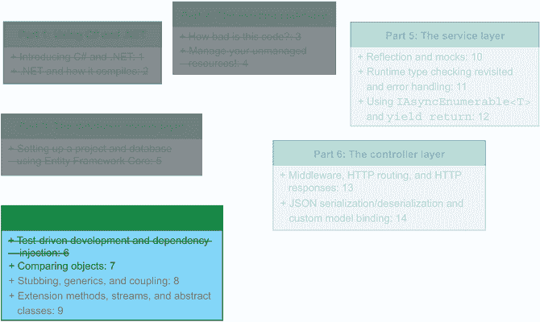
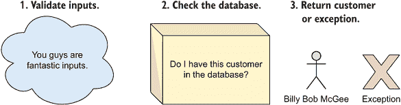
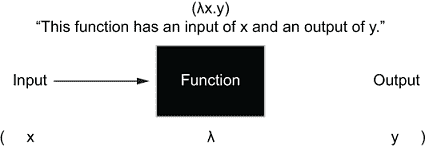
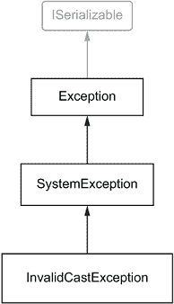
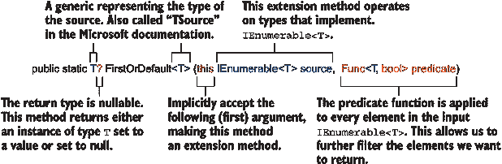
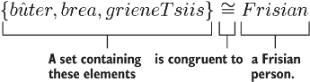
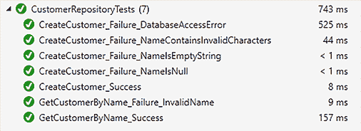

# 7 比较对象

本章涵盖

+   实现的 `GetCustomerByName` 方法

+   通过 lambda 演算的视角查看方法

+   使用可空类型

+   使用自定义异常

+   运算符重载和自定义等价比较

在上一章中，我们实现了 `CustomerRepository`，其中我们可以向数据库中添加客户。我们还学习了如何使用依赖注入来编写可测试的代码。这是一个出色的开始，但我们还没有完成。我们可以向数据库中添加一个 `Customer` 实例，但如何检索一个呢？见图 7.1 了解我们在本书方案中的位置。



图 7.1 在本章中，我们将继续实现我们在第六章开始的 `CustomerRepository` 实现。这是实现 Flying Dutchman Airlines 服务所有存储库的第一步。

在本章中，我们将创建 `GetCustomerByName` 方法，当给定包含客户名称的字符串时，该方法将返回适当的 `Customer` 对象。实现此方法使我们能够触及一些我们可能否则会错过的技术概念。和之前一样，我们将使用测试驱动开发“轻量级”来确保我们的代码质量足够好。尽管 API 不需要端点从数据库中获取客户，但此方法在我们实现预订端点时将非常有用。

## 7.1 `GetCustomerByName` 方法

要开始，让我们创建以下新的单元测试，它除了尝试调用我们新的（尚未创建的）方法外，什么都不做：

```
[TestMethod]
public async Task GetCustomerByName_Success() {
  Customer customer = 
➥ await _repository.GetCustomerByName("Linus Torvalds");
}
```

在切换到 `CustomerRepository` 类后，让我们添加 `GetCustomerByName` 方法。我们还将向方法签名中添加一个 `string` 类型的参数，表示我们想要传递的 `CustomerName`。我们还将添加代码以返回 `Customer` 类型的新实例，以满足方法签名中 `Task<Customer>` 的返回类型。我们目前还没有任何 `await` 调用，因此编译器会警告我们（我们将在 7.1.1 节中处理它）。现在，我们可以同步执行 `GetCustomerByName`，如下所示：

```
public async Task<Customer> GetCustomerByName(string name) {
  return new Customer(name);
}
```

解决了编译警告后，我们可以尝试再次运行测试。当然，我们还没有进行任何测试。我们希望单元测试检查并断言以下内容：

+   返回的 `Customer` 实例不为 null。

+   `Customer` 实例具有 `CustomerId`、`Name` 和 `Booking` 字段的有效数据。

这些断言应该相当简单编写。让我们断言返回的 `Customer` 实例不为 null，如下所示：

```
[TestMethod]
public async Task GetCustomerByName_Success() {
  Customer customer = 
➥ await _repository.GetCustomerByName("Linus Torvalds");
  Assert.IsNotNull(customer);
}
```

如果我们还记得测试驱动开发的红绿灯模型，我们会看到我们已经从红色阶段（无法编译）过渡到了绿色阶段（编译且测试通过）。现在让我们再次将灯光调回红色。红绿灯即时反馈循环在整个过程中提供了小而令人满意的胜利，使得 TDD 非常令人满意地使用。

现在我们处于红色阶段，我们可以添加一些新的测试来基于我们尚未编写的代码进行断言。那么，我们在`GetCustomerByName`中想做什么呢？如图 7.2 所示：

1.  验证输入参数（`name`，字符串）。

1.  检查 Entity Framework Core 的内部数据库以找到适当的客户。

1.  返回找到的客户或抛出未找到客户的异常。



图 7.2 实现`GetCustomerByName`的三个步骤是（1）验证输入参数，（2）检查数据库中是否存在客户，（3）返回找到的客户或抛出异常。

有很多要解释的内容，所以让我们从列表中最简单（也是第一个）的项目开始：验证我们的输入参数。你可能还记得我们在第 6.2.1 节中讨论了输入验证。

|    | 在我们继续之前，让我再提出一个关于为什么我们要验证所有输入参数的理由，无论它们*应该*在上游被验证和/或清理。如果我们通过 lambda 演算的透镜来审视方法的抽象概念，我们可以说任何方法（如果将其视为一个函数），在其最基本层面上，是一个输入、函数体和输出的独立结构。我们可以使用一些简单的语法来编写这个，其中 lambda（λ）被括号包裹，输入后面跟着一个点，然后是输出，如图 7.3 所示。 |
| --- | --- |



图 7.3 方法可以被视为一个 lambda 函数。它有一个输入，一些在该输入上操作的逻辑，以及一个结果输出。使用 lambda 函数有助于遵循“代码应该像叙述一样阅读”的原则，因为你可以只进行一个原子操作。 

我们应该将这种方法视为所谓的黑盒。我们对函数的内部工作原理没有任何洞察，那么我们该如何知道某个输入是否正确呢？无论它如何处理数据，函数都应该为任何输入返回一个有效的输出。如果我们假设在代码中的某个早期方法中验证了一个参数，并且我们向该方法传递了一个无效的值，那么我们将导致我们的（程序性）代码方法硬崩溃。我们没有遵守我们正在进行的这个 lambda 演算黑盒事务。请注意，由于 lambda 演算处理数学函数，崩溃的不是函数本身，而是我们系统实现的代码有缺陷。

### 7.1.1 问号：可空类型及其应用

现在我们已经有了`CustomerRepositoryTests.GetCustomerByName _Success`单元测试和`CustomerRepository.GetCustomerByName`方法的框架，我们可以验证`GetCustomerByName`的输入。我们的输入参数需要遵守哪些规则呢？嗯，我们绝对不希望有一个 null 值，所以这应该是第一个检查。

在 C# 8 之前，任何引用类型都是可空的。这意味着你可以将 null 值赋给引用类型，并在编译器发现 null 值时防止其抛出错误。在实践中，这往往是我们在运行时看到空指针异常的原因。很多时候，你并不知道一个引用类型会是 null，但你仍然试图以某种方式使用它。为了应对运行时的空指针异常，C# 8 引入了显式可空引用类型，这允许我们通过显式地表示我们想要这样做来使引用类型为 null。可空引用类型的总体目标是消除 C# 中的意外空指针异常。如果引用类型只能在你显式允许其为 null 时为 null，那么你就处于控制之中。当你尝试使用引用类型时（或者挖掘大量代码以找出），你不需要猜测引用类型是否可能为 null（或者挖掘大量代码以找出），你可以查看其底层类型。如果它是可空的，假设它可以为 null 并执行空检查。

要启用可空引用类型，可以将 `<Nullable>enable</Nullable>` 标志添加到你的项目文件 (.csproj) 中，或者如果你不想为整个项目启用可空引用类型，可以为每个源文件添加 `#nullable enable` 标签。（你还可以在为整个项目启用可空引用类型时使用 `#nullable disable` 来禁用特定源文件的可空引用类型。）实际上，当使用 C# 8 或更高版本并启用可空引用类型支持时，如果你想使引用类型为 null，你需要通过在类型后添加问号来声明类型为可空的，例如，`int?` 或 `Customer?`。可空值类型自 C# 2.0 以来就存在于 C# 中，并遵循相同的模式。提供的 `name` 总是必须有效的。有效的名称意味着一个非空或非空字符串。假设 `name` 是一个无效值——那么会怎样？我们可以抛出异常或返回一个 null 值到控制器。一般来说，限制任何 null 返回是一个好的心态。因为这是一个人们很少期望返回的值（除非返回类型是 `Nullable<T>` 或显式可空引用类型），我们不应该给接收方法一个惊喜。让我们使用自定义的 `Exception`。或者，你可以使用 .NET 提供给我们的一些异常。一些建议的选择是 `ArgumentNullException` 或 `InvalidOperationException`（在 14.1.1 节中也有讨论）。

### 7.1.2 自定义异常、LINQ 和扩展方法

C# 中的每个异常都继承自 `Exception` 类。当然，可以存在中间层的继承，但最终，所有这些都归结为 `Exception` 类。例如，`InvalidCastException` 类继承自 `SystemException`，而 `SystemException` 继承自 `Exception` 类，如图 7.4 所示。



图 7.4 `InvalidCastException` 继承自 `SystemException`，而 `SystemException` 继承自 `Exception`。`Exception` 类实现了 `ISerializable` 接口。

`Exception` 继承树意味着如果我们创建一个从 `Exception` 继承的类，我们可以像使用任何其他 `Exception` 实例一样使用 `SystemException` 和 `InvalidCastException`。我建议我们使用 `Exception` 类的继承来创建一个名为 `CustomerNotFoundException` 的类。在整个书中，所使用的异常处理策略归结为以下四个主要步骤：

1.  检查是否需要抛出异常。

1.  创建一个自定义异常的实例。

1.  抛出自定义异常。

1.  在抛出异常的上一层捕获异常，并决定是否在那里处理它或重新抛出它。

如果 `customerName` 是一个无效的名称（我们可以使用我们在第 6.2.3 节中创建的 `IsInvalidName` 方法），我们“抛出”我们的新异常。如果我们想抛出异常（或者像某些语言所说的“提升”它），我们使用 `throw` 关键字和我们要抛出的异常。而且为了保持组织性，我们还应该为自定义异常创建一个专门的文件夹（命名为“Exceptions”），如下所示：

```
namespace FlyingDutchmanAirlines.Exceptions {
  public class CustomerNotFoundException : Exception { }
}
```

由于我们不需要从 `CustomerNotFoundException` 中获取除了 `Exception` 类已经提供之外的功能，因此这段代码就是整个异常。在向 `CustomerRepository` 类添加适当的导入（`using FlyingDutchmanAirlines.Exceptions`）之后，我们可以使用我们新的异常，并如下验证 `name` 的输入：`

```
public async Task<Customer> GetCustomerByName(string name) {
  if (IsInvalidCustomerName(name)) {
    throw new CustomerNotFoundException();
  }

  return new Customer(name);
}
```

我们本可以使用 `ArgumentException` 而不是我们的自定义异常，但对我来说，一个从数据库检索客户名称的方法返回一个名为 `CustomerNotFoundException` 的异常是有意义的。通过运行我们的现有测试，我们验证新代码没有破坏任何现有功能。我们可以通过在 `CustomerRepositoryTests` 中创建一个新的测试，将负整数传递给 `GetCustomerByName`，然后在执行期间检查该方法是否抛出了 `CustomerNotFoundException` 类型的异常来测试无效输入。在第 4.1.2 节中，我们讨论了如何通过 `typeof` 关键字检查对象的类型。我们在失败情况测试中使用这一知识。我们可以使用以下方式在 MSTest 中检查抛出的异常：

+   使用类型为 `[ExpectedException (typeof([your exception]))]` 的方法属性装饰测试方法。

+   在代码中添加一个 `try-catch` 块，并断言异常是正确的类型。

对于我们来说，两种方法都会工作。第一种方法有一个小的限制：类型为 `ExpectedException(typeof([your exception]))` 的方法属性不允许我们访问抛出异常的任何属性。所以，如果你在异常中附加某种消息、自定义数据或堆栈跟踪，除非使用第二种方法，否则无法访问它。对我们来说，没有访问堆栈跟踪不是一个问题，所以让我们使用第一种方法，如下所示：

```
[TestMethod]
[DataRow("")]
[DataRow(null)]
[DataRow("#")]
[DataRow("$")]
[DataRow("%")]
[DataRow("&")]
[DataRow("*")]
[ExpectedException(typeof(CustomerNotFoundException))]
public async Task GetCustomerByName_Failure_InvalidName(string name) {
  await _repository.GetCustomerByName(name);
} 
```

运行测试；它应该通过。如果没有通过，请检查您的 `ExpectedException` 是否为正确的类型（`CustomerNotFoundException`）。

回到成功案例测试，我们可以继续到 `GetCustomerByName` 方法中的第二个项目：检查 Entity Framework Core 的内部数据库集合中是否有适当的客户。为了测试逻辑，我们首先需要一个 `Customer` 实例来检查。在我们能够访问 `Customer` 实例之前，我们需要将其添加到内存数据库中。随后，我们使用 `GetCustomerByName` 方法检索它。我们是否可以在 `TestInitialize` 方法中添加它，这样我们就可以在每次测试中访问数据库中的 `Customer`？

我们已经在 `CreateCustomer` 方法中编写了将 `Customer` 实例添加到数据库的代码，所以让我们使用它（而不是在初始化方法中调用该方法本身）。要将 `Customer` 实例添加到内存数据库中，我们需要将一个新的 `Customer` 实例添加到 `Customer` 的内部数据库集合中，并通过 Entity Framework Core 保存更改，如下一列表所示。因为我们应该 `await` `SaveChangesAsync` 调用，所以我们需要将 `TestInitialize` 转换为异步方法。

列表 7.1 CustomerRepositoryTests.cs 中的 `TestInitialize` 与内存数据库

```
[TestInitialize]
public async Task TestInitialize() {
  DbContextOptions<FlyingDutchmanAirlinesContext> dbContextOptions = new  
➥ DbContextOptionsBuilder<FlyingDutchmanAirlinesContext>().UseInMemoryDatabase
➥ ("FlyingDutchman").Options;
  _context = new FlyingDutchmanAirlinesContext(dbContextOptions);

  Customer testCustomer = new Customer("Linus Torvalds");     ❶
  _context.Customer.Add(testCustomer);                        ❷
  await _context.SaveChangesAsync();                          ❸

  _repository = new CustomerRepository(_context);
  Assert.IsNotNull(_repository);
}
```

❶ 创建一个新的 Customer 实例。客户的姓名字段设置为 "Linus Torvalds"。

❷ 通过调用数据库上下文并访问 DbSet<Customer> 将测试客户对象添加到 DbSet<Customer>

❸ 将更改保存到内存数据库中

如列表 7.1 中的粗体代码所示，将新的 `Customer` 对象添加到数据库相当直接。让我们回到 `GetCustomerByName_Success` 测试，看看我们是否可以从 `GetCustomerByName` 方法中获取那个 `Customer` 对象。记住，尽管我们不可避免地从该方法返回的并不是我们在数据库中存储的相同实例，但它与该实例是一致的（关于一致性的更多内容请见第 7.2 节）。我们知道数据库中的 `Customer` 对象的 `CustomerName` 为 `"Linus Torvalds"`，因此我们不需要调整现有测试的这一部分。

我们希望 `GetCustomerByName` 方法能够搜索数据库以找到与输入参数匹配的现有 `Customer` 对象。我们需要将其更改为从数据库中获取正确的 `Customer` 对象。我们通过访问数据库上下文的 `DbSet<Customer>` 并请求具有给定 `CustomerName` 的 `Customer` 实例来从数据库中获取正确的元素。在查询集合以获取元素时，我们可以使用 `DbSet<Customer>` 并以两种方式找到我们想要的 `Customer` 实例：

+   我们可以使用 `foreach`、`while` 或 `for` 循环遍历集合。

+   我们可以使用 LINQ。

到目前为止，书中已经展示了这两个示例。让我们对比一下这些方法。要使用循环选择我们的客户，我们可能会得到以下代码：

```
foreach (Customer customer in _context.Customer) {
  if (customer.CustomerName == name) {
    return customer;
  }
}

throw new CustomerNotFoundException();
```

这段代码没有问题。它既易读又直接。然而，还有更好的方法来做这件事：使用 LINQ 命令查询集合，如下所示：

```
return _context.Customer.FirstOrDefault(c => c.Name == name) 
➥ ?? throw new CustomerNotFoundException();
```

这确实更短，但也看起来更令人畏惧。让我们来分解这一行代码做了什么。我们通过`context.Customer`访问`DbSet<Customer>`——这没有什么我们之前没见过的。但下一部分有点奇怪：`FirstOrDefault(c => c.Name == name)`。Lambda 表达式在`name`属性之间找到匹配项，但我们之前没有见过`FirstOrDefault`。`FirstOrDefault`是在`System.Linq`中定义的扩展方法。

扩展方法

扩展方法是静态方法，我们可以在特定类型上调用它们。例如，我们可以调用任何实现`IQueryable`接口的实例上的`FirstOrDefault` LINQ 扩展方法。我们如何知道扩展方法操作的是哪种类型，并且可以与之一起使用？看看扩展方法的签名：扩展方法始终有一个以`this`关键字开始的参数，后面跟着它们想要操作的具体类型（或接口）。例如，`public static string MyExtensionMethod(this IDisposable arg)`表示任何实现`IDisposable`的对象都可以调用的扩展方法，它返回一个字符串。



`FirstOrDefault` LINQ 扩展方法从集合中选择与提供的谓词匹配的第一个元素。如果没有找到匹配的元素，`FirstOrDefault`方法返回返回类型的默认值。在这段代码中，我们想要找到`context.Customer`集中与我们的输入参数`name`匹配的`Name`的第一个元素。如果没有找到第一个匹配的`Customer`，`FirstOrDefault`返回一个 null 值（`Customer`的默认值）。

这引出了返回语句的第二部分不熟悉的部分：`?? throw new CustomerNotFoundException();`。如您从第 5.3.6 节中回忆的那样，我们将`??`运算符称为“空合并运算符”。空合并运算符允许我们说，“如果这个值是 null，则使用这个其他值。”因此，在我们的情况下，“如果`FirstOrDefault`返回一个 null 值（`Customer`的默认值），则抛出一个`CustomerNotFoundException`类型的异常。”`FirstOrDefault`的异步版本是`FirstOrDefaultAsync`，如下所示：

```
public async Task<Customer> GetCustomerByName(string name) {
  if (IsInvalidCustomerName(name)) {
    throw new CustomerNotFoundException();
  }

  return await _context.Customer.FirstOrDefaultAsync(c => c.Name == name) 
➥ ?? throw new CustomerNotFoundException();
} 
```

我们现在可以回到我们的成功案例测试，再次运行它，验证所有测试是否通过。

## 7.2 一致性：从中世纪到 C#

根据神话和传说，当地中世纪传说中的 Grutte Pier（一个身高七英尺的持剑叛乱领袖，如图 7.5 所示）使用弗里斯语谚语作为试金石来判断他面对的是敌人（通常是哈布斯堡王朝和萨克森人）还是真正的弗里斯人。因为弗里斯语是古英语（现代英语仍然是盎格鲁-弗里斯语族的一部分）最接近的语言亲属之一，看看你是否能找出它的意思并试一试：

“黄油、面包和绿色奶酪；谁如果说这不是一个真诚的弗里斯兰人，那他就说错了”

当翻译成英语时，那个看起来奇怪的文本意思是：“黄油、面包和绿色奶酪；谁如果说这不是一个真诚的弗里斯兰人，那他就说错了。”（绿色奶酪指的是嵌有孜然和丁香的一种弗里斯兰奶酪。奶酪的自然皮可以呈现出绿色。）那么，口令与 C#或编程有什么关系呢？嗯，关系不大，但我可以用它来向你展示以下关于相等性和相容性的例子：



你看，Grutte Pier 是在测试某人是否是弗里斯兰人。Pier 是在测试人*A*是否与人*B*相等（在相同属性、而非社会平等的意义上）吗？不是的。人*A*可能有一头金发，而人*B*可能没有。他测试了人*A*与弗里斯兰人民之间的相容性。如果你能说出他的口令，他就认为你与弗里斯兰人相容，因此你可以活下去。而且你说相容性从未救过任何人的命！如果我们使用数学集合符号，并声明集合*A*等于{黄油、面包、绿色奶酪}，集合*B*等于{aachje ... zeppelin}，代表某人词汇表中的所有弗里斯兰单词，我们可以说{∗x∣∗x∈∗A∧∗x∈∗B∗} ⇔ ∗frisian∗。


图 7.5 Pieter Feddes van Harlingen（1568–1623）绘制的 Grutte Pier。画底部的拉丁文铭文大致翻译为“我们断言 Pier 的伟大自由。”Pier 是弗里斯兰人民自由的守护者。

在第 7.1 节中，我们实现了并测试了`CustomerRepository.GetCustomerByName`方法，该方法接受一个表示客户名称的输入参数，并从数据库中返回适当的`Customer`实例。然而，在我们结束之前，我想稍微偏离一下，看看我们是否还能做些什么来改进`CustomerRepositoryTests`类中的单元测试。

我可以说，我们有以下更优雅的方式来检查数据库中的`Customer`实例与我们用于断言的`GetCustomerByName_Success`单元测试中的`Customer`实例之间的相等性（或者更确切地说，是相容性）：

+   使用`EqualityComparer<T>`（第 7.2.1 节）创建自定义比较器类。

+   重写`object.Equals`（第 7.2.2 节）。

+   运算符重载（第 7.2.3 节）。

在接下来的三个部分中，我们将这些方法结合成一种统一的测试相等性的方式。如果你只是想找到实现这一点的最简单方法，重写`object.Equals`是最简单（也是最常见的）的相等性检查方法。

### 7.2.1 使用 EqualityComparer<T>创建“比较器”类

一个“比较器”类允许我们定义如何比较同一类型的两个实例，以及它们何时是“相等”的。我们之前已经讨论了相容性，在本节中，我们将相容性的概念应用于相等性比较。

在我看来，使用“相等”这个词是不幸的，因为我们实际上是在说某物与另一物是**同构的**，而不是相等的。但是，唉，这就是 .NET 5 和 C# 给我们出的牌。一个“比较器”类是从 `EqualityComparer<T>` 类派生出来的。`EqualityComparer<T>` 类是一个抽象类，它包含以下两个抽象方法，编译器强制我们重写并实现：

+   `bool Equals(T argumentX, T argumentY)`

+   `int GetHashCode(T obj``)`

通过重写和实现 `Equals` 和 `GetHashCode` 方法，我们遵循了 `EqualityComparer<T>` 基类的要求。起初，你可能觉得我们需要实现 `GetHashCode` 方法很奇怪。毕竟，我们不是只想确定某物等于另一物吗？是的，但 `GetHashCode`（以及 `Equals`）是 .NET 中 `Object` 类上的一个方法。因为 *每个* .NET 中的类最终都派生自 `Object` 类，所以 `GetHashCode` 方法存在于每个类中，无论是显式还是通过继承到对象类。字典在底层使用哈希码来执行元素查找和相等比较。这意味着字典是一个概念上的哈希表。（C# 确实有一个显式的 `Hashtable` 实现。区别在于字典是泛型的，而 `Hashtable` 不是。）通过使用哈希码，我们得到了与普通列表（不使用哈希码）相比非常快速查找、插入和删除操作的好处。¹ 哈希码在假设相同的哈希码总是为相同的对象生成的情况下操作。因此，如果两个对象是相同的，就会生成两个相同的哈希码。如果两个对象不是不同的，但为它们都生成了相同的哈希码，我们称之为 *哈希冲突*。这意味着我们必须想出其他方法来将这些项目插入到数组中。²

因为 `GetHashCode` 存在于 .NET 中的每个对象上，我们可以通过使用另一个类的 `GetHashCode` 实现来提出一种相对动态的生成哈希码的方法。要生成哈希码，我们需要一些种子信息。`Customer` 对象只有两个字段我们可以用来基于我们的哈希码生成逻辑。我们可以使用 `Customer.Name` 的长度属性、`Customer.CustomerID` 属性以及一个“随机”生成的整数组合，如下一列表所示。请注意，关于何时以及何时不使用 `GetHashCode` 的讨论很多。我会建议您查阅微软文档以获取有关此的最新信息（以及使用 `GetHashCode` 时要牢记的大量警告）。

列表 7.2 CustomerEqualityComparer 的 `GetHashCode` 实现方法

```
internal class CustomerEqualityComparer : EqualityComparer<Customer> {
  public override int GetHashCode(Customer obj) {                           ❶
    int randomNumber = RandomNumberGenerator.GetInt32(int.MaxValue / 2);    ❷
    return (obj.CustomerId + obj.Name.Length + randomNumber).GetHashCode(); ❸
  }
}
```

❶ 重写抽象的 `GetHashCode` 方法

❷ 生成一个不超过最大整数值一半的随机数

❸ 连接变量和字段，并对结果值进行哈希处理

我们可以使用以下两种通用方法在 C#中生成“随机”数字：

+   使用`Random`类。

+   使用`RandomNumberGenerator`类。

初看之下，它们可能看起来很相似，但如果我们深入挖掘，我们会看到差异。`Random`类位于（根）`System`命名空间中，而`RandomNumberGenerator`类位于`System.Security.Cryptography`命名空间中。这些类所在的命名空间提供了它们为什么都存在的主要原因的提示：`Random`类是一个低开销的随机数选择器，它非常擅长根据时间种子数快速生成一个数字。`RandomNumberGenerator`类擅长通过各种密码学概念生成“随机”数字，确保数字在一段时间内的范围内是相当独特且大致均匀分布的。

换句话说，如果你在一个高吞吐量应用中使用`Random`类并且同时请求两个随机数，那么你很可能从“随机”生成器那里得到相同的数字。生成伪随机数对于许多应用来说是可行的，但对于一个我们不能预测系统可能承受什么负载的 Web 服务来说，这是不合适的。我们可能会遇到两个人同时想要获取同一航班信息的情况。现在我们有两个客户生成了相同的哈希码，我们手头出现了安全漏洞。这就是为什么我们应该使用`RandomNumberGenerator`类而不是`Random`类的原因。

|    | 当你在 C#的世界中探索随机数和密码学时，你可能会遇到一些人推崇使用`RNGCryptoServiceProvider`类。`RandomNumberGenerator`类是`RNGCryptoServiceProvider`类的包装，并且使用起来更加简单。关于密码学的更多信息，一个好的资源是 David Wong 的*《现实世界密码学》*（Manning，2021）。 |
| --- | --- |

“随机”永远不会是随机的

想象一下，你想要通过你最喜欢的音乐流媒体应用听一些音乐。你可能有一个包含数千首歌曲的播放列表，但每次你想听音乐时都不想从顶部开始。很快你就会厌倦以同样的模式听同样的歌曲。所以，你按下“随机播放”按钮，假设你的应用会随机打乱你的播放列表并按新的顺序播放歌曲。不幸的是，我就在这里来打破这个幻想。随机播放播放列表很少能给你一个真正的随机音乐表示。像 Spotify 这样的应用使用的是一种随机算法，试图创建一种即时的播放列表随机播放体验，其中同一专辑或艺术家的歌曲不会连续播放。我们都有过这样的经历。为什么随机播放播放列表是一个如此棘手的问题呢？问题在于计算中的随机性永远不是完全随机的。

所有这些都归结为这样一个事实：计算机必须被告知如何选择一个随机数。随机数生成器使用一个算法，其起点基于一个“种子”数字，通常是当前的时间戳。一个 *X* 的种子数字总是返回相同的 *Y*。如果你使用当前时间作为种子数字，在相同时刻并行运行相同的算法，你会得到两个相同的（但“随机”的）输出。这使得选择随机数成为一个潜在的安全问题。如果你知道选择器的种子数字和算法，你可以预测下一个输出值。

黑客使用“随机数生成器攻击”来利用这个漏洞。计算中随机性问题的一个历史例子是索尼的 PlayStation 3 游戏机中椭圆曲线数字签名算法未能生成正确的随机值。通过利用这个错误，黑客可以告诉系统，自制应用程序（以及因此，盗版视频游戏）是有效应用程序，因此可以运行它们。

我将以下这句话留给你们，这是计算先驱约翰·冯·诺伊曼（John von Neumann）所说，旨在轻松地提醒大家不要误解计算中随机性的限制：

*“任何认为可以通过算术方法产生随机数字的人，当然是在犯罪。”*

我们已经重写并实现了 `GetHashCode` 方法，现在是时候为 `Equals` 方法做同样的事情了。

### 7.2.2 通过重写 Equals 方法来测试等价性

在我们重写 `Equals` 方法之前，让我们确定一下哪些属性需要相等，才能说 `Customer` 实例 *X* 与 `Customer` 实例 *Y* 是“相等”的。`Customer` 类没有很多属性需要检查：只有 `CustomerId` 和 `Name` 是可用的。`Booking` 字段是一个集合，代表对 `Customer` 模型的任何外键约束。但是，对于我们的等价性检查，这些属性并不相关，因为我们不使用它们来建立等价性，所以我们不使用这个集合进行检查。如果 `Customer` *X* 的 `Name` 和 `CustomerId` 属性值与 `Customer` *Y* 相同，它们就是相等的（因此，我们在 `Equals` 方法中返回一个设置为 `true` 的 `bool`，如下一列表所示）。

列表 7.3 CustomerEqualityComparer 的 `Equals` 方法实现

```
public override bool Equals(Customer x, Customer y) {
  return x.CustomerId == y.CustomerId                  ❶
    && x.Name == y.Name;                                ❷
}
```

❶ 验证两个 Customer 实例是否具有相同的 CustomerId 值

❷ 验证两个 Customer 实例是否具有相同的 Name 值

我们希望在比较两个 `Customer` 类型的实例时每次都调用我们的 `Equals` 方法。我们可以在 `Customer` 类中公开一个 `Equals` 方法并调用 `CustomerEqualityComparer.Equals` 方法。这将非常有效，因为 `Equals` 是 `object` 的一部分，因此对大多数派生类型都是可用的。这可能是你现实生活中想要做的，我假设你可以自己实现这一点。然而，这为我提供了一个很好的机会来谈论其他事情：如果我们已经在实现“比较器”类的小径上走了一段，我们不妨一直走下去。检查两个对象相等性的最常见技术可能是使用赋值运算符：`==`。

### 7.2.3 赋值运算符的重载

大多数时候，你不会对赋值运算符背后的功能进行二次思考。当然，你可能偶尔会打字错误，不小心写下赋值运算符（`=`），但赋值运算符的实际功能似乎已经固定。一般来说，你可以依赖赋值运算符进行引用类型相等性检查，但这个功能对我们来说不起作用。检查两个对象的引用指针不足以比较两个 `Customer` 对象，因为结果总是 `false`。怎么办？解决方案很简单：如果某个实现不能满足你对特定输入集的需求，就重载该实现。在 C# 中，我们可以重载运算符。

重载运算符的工作方式与重写（比重载更多）方法非常相似。在运算符的世界里，它们的程序化名称是它们的符号（例如，加号 `+` 是加法运算符）。然而，方法和运算符重载之间有一个巨大的区别，即运算符重载始终是静态和公共的。创建实例级别的运算符（静态）几乎没有意义。非实例级别的重写运算符会创建一个令人困惑的场景，其中同一类型的多个相同运算符在周围漂浮，对旁观者来说没有明确的界限。使用运算符的语法不允许使用 `[实例].[运算符]` 或 `string.+` 构造（这在 Scala 等语言中是允许的）。至于 `public` 访问修饰符，当你对一个特定类型使用运算符时，你并不在那个类型的类文件中进行操作。

要重载一个运算符，请使用以下语法：`public static [返回类型] operator [运算符名称] (T x, T y) { ... }`，其中 `T` 代表你想要操作的类型。在我们对 `Customer` 类中赋值运算符的重载中，我们想要调用 `CustomerEqualityOperator` 的 `Equals` 方法并返回结果，如以下代码示例所示。

注意：当重载运算符时，如果运算符有一个匹配的运算符（例如，`==` 和 `!=`），你必须重载这两个运算符。

```
public static bool operator == (Customer x, Customer y) {
  CustomerEqualityComparer comparer = new CustomerEqualityComparer();
  return comparer.Equals(x, y);
}

public static bool operator != (Customer x, Customer y) => !(x == y);
```

目前，每次调用重载运算符时，我们都创建一个新的比较器实例。在实际的生产代码库中，你应该考虑将实例化移动到实例级别。这样可以避免在每次调用重载运算符时产生实例化的开销。

`!=` 运算符的重载调用我们的等号运算符重载，并否定该方法执行的结果。现在到了有趣的部分：我们可以在 `CustomerRepositoryTests.GetCustomerByName _Success` 单元测试中使用重载的运算符，而不是通过比较对象字段来检查一致性。

要将数据库中的实例与 `GetCustomerByName` 方法返回的 `Customer` 对比，我们首先需要使用 LINQ 的 `First` 方法从内存数据库中获取 `Customer`，如下一个列表所示。

列表 7.4 在数据库的内部集合上使用 LINQ 的 `First` 方法（EF Core）

```
[TestMethod]
public async Task GetCustomerByName_Success() {
  Customer customer = 
➥ await _repository.GetCustomerByName("Linus Torvalds");   ❶
  Assert.IsNotNull(customer);                               ❶

  Customer dbCustomer = _context.Customer.First();          ❷

  bool customersAreEqual = customer == dbCustomer;          ❸
  Assert.IsTrue(customersAreEqual);                         ❹
}
```

❶ 从内存数据库中获取一个客户

❷ 直接从内存数据库中获取第一个（也是唯一一个）元素

❸ 使用重载的等号运算符

❹ 验证两个客户实例是否“相等”

在列表 7.4 中，我们使用重载的等号运算符来测试两个 `Customer` 实例之间我们定义的等价性。在我们结束本章之前，我要向你透露另一个秘密：我们可以进一步精简列表 7.4 中的代码，并使其更加符合惯例。`Assert.AreEqual` 方法调用对象的 `Equal` 方法，而该方法（根据提供的实现）会使用等号运算符。因为我们为 `Customer` 重载了等号运算符，所以当我们在两个 `Customer` 实例上使用 `Assert.AreEqual` 方法时，CLR（间接地）调用重载的等号运算符！让我们试试看：

```
[TestMethod]
public async Task GetCustomerByName_Success() {
  Customer customer = 
➥ await _repository.GetCustomerByName("Linus Torvalds");
  Assert.IsNotNull(customer); 

  Customer dbCustomer = _context.Customer.First(); 
  Assert.AreEqual(dbCustomer, customer);
}
```

我们现在实际运行 `GetCustomerByName_Success` 测试怎么样？它通过了吗？很好。现在运行所有其他单元测试。每个单元测试都应该通过，如图 7.6 所示。如果有一个没有通过，请回到相应的部分，看看出了什么问题，然后再继续。



图 7.6 我们所有的现有测试都通过了（如图所示在 Visual Studio 测试资源管理器中）。勾号代表已通过的测试。我们还可以看到测试的运行时间，无论是单独的还是组合的。

现在我们可以向数据库添加一个新客户，并在给定 ID 时检索它。这涵盖了我们从 `CustomerRepository` 需要的所有功能。我们在剩余的存储库中使用 `CustomerRepository` 中的模式。在第 6.2 节中，我们研究了继承的代码库是如何处理向数据库添加新客户的。

让我们回顾一下我们的发现。我们确定现有代码库在向数据库添加 `Customer` 对象时的主要设计缺陷如下：

+   代码应该是自文档化的。

+   我们不应该使用硬编码的 SQL 语句。

+   我们应该使用显式类型而不是隐式类型（`var` 关键字）。

我认为我们在处理那些担忧方面做得很好。我们的代码可读且整洁。代码是自我文档化的，我们使用 Entity Framework Core 来抽象任何 SQL 查询。现有的代码是如何从数据库中检索 `Customer` 对象的？嗯，它根本就没有从数据库中检索任何 `Customer` 对象！一开始这似乎很奇怪。如果现有的代码库没有从 `Customer` 表中检索任何内容，那么我们的服务为什么还要检索 `Customer` 实体？记住，为了预订航班，我们需要访问最新的 `Customer` 对象。旧的服务每次有人通过其 API 预订航班时都会创建一个新的 `Customer` 对象，这可能导致数据库中同一 `Customer` 的重复条目。我们知道得更好，只要我们向我们的方法传递正确的信息，我们就不会有这个问题。在本章中，你还学习了如何使用等价“比较器”类和运算符重载来测试你的等价定义（或者更确切地说，等价性）。

## 练习

练习 7.1

目前，当从 `GetCustomerByName` 返回时，如果给定的名称与数据库中的 `Customer` 对象不匹配，没有围绕可能的空条件进行单元测试。我们将如何测试这一点？

练习 7.2

以下哪个是有效的可空类型？

a. `Customer!`

b. `Customer?`

c. `^Customer`

练习 7.3

填空：自定义异常必须从 ________ 类继承，这样我们就可以在适当的位置抛出它。

练习 7.4

如果 LINQ 扩展方法 `FirstOrDefault` 在集合中找不到匹配项，它返回什么？

a. 一个空值

b. `-1`

c. 集合类型的默认值

练习 7.5

在此代码片段中，等号运算符测试什么，它的结论是什么？

```
int x = 0;
int y = 1;
x == y;
```

a. 等号运算符测试引用相等性。它返回 `false`。

b. 等号运算符测试引用相等性。它返回 `true`。

c. 等号运算符测试值相等性。它返回 `false`。

d. 等号运算符测试值相等性。它返回 `true`。

练习 7.6

在此代码片段中，等号运算符测试什么，它的结论是什么？

```
Scientist x = new Scientist("Alan Turing");
Scientist y = new Scientist("John von Neumann");
x == y;
```

a. 等号运算符测试引用相等性。它返回 `false`。

b. 等号运算符测试引用相等性。它返回 `true`。

c. 等号运算符测试值相等性。它返回 `false`。

d. 等号运算符测试值相等性。它返回 `true`。

练习 7.7

对或错？当我们重载等价比较运算符时，我们可以确定两个类型之间的等价性，并返回我们自己的等价定义。

练习 7.8

当我们重载等价比较运算符时，我们还需要重载

a. `!=`

b. `^=`

c. `==`

练习 7.9

对或错？通过使用 `Random` 类生成随机数，我们保证得到一个完美的随机数。

练习 7.10

对或错？通过使用 `RandomNumberGenerator` 类生成随机数，我们保证得到一个完美的随机数。

练习 7.11

对或错？在许多（伪）随机数生成算法中，使用相同的种子数字两次会产生相同的随机数。

## 摘要

+   我们可以通过λ演算的视角来检查输入验证。如果我们把任何函数视为一个黑盒，只有一个输入和一个输出，与其他所有函数分离，我们就必须进行输入验证，否则可能会得到不良的结果。我们不应该依赖于其他地方的参数验证。

+   可空引用类型允许我们明确指出哪些引用类型可能有空值。使用可空引用类型有助于避免意外的空指针异常。

+   要指定一个类型为可空，你添加 `?` 运算符：`int? myNullableInt = 0;`。

+   每个抛出的异常（最终）都源自 `Exception` 基类。这允许我们创建自己的（自定义）异常并将它们像其他任何异常一样抛出。自定义异常促进了原子错误处理。

+   你可以在单元测试运行期间通过添加 `[ExpectedException(typeof([your exception]))]` 方法属性到你的单元测试中来检查一个方法是否抛出了特定的异常。这允许你测试代码的失败场景。

+   Entity Framework Core 可以在“内存”模式下运行。这允许你启动一个与真实数据库相同的本地内存数据库。因为我们不想针对实时数据进行单元测试，所以这为我们提供了所需的“假”数据库。

+   如果标准的引用等价性检查不足以在两种类型之间创建等价性检查，你可以使用自定义的 `Comparer` 类。这允许你协调同一对象的两个不同实例，它们具有相同的值但不同的指针。

+   我们可以重载像等号运算符这样的运算符，以提供我们自己的等性和同余定义。当想要比较两个引用类型以检查同余而不是纯等性（内存地址匹配）时，这很有用。

***

^ (1.) 哈希表的插入、查找和搜索操作（以及由此扩展的字典）的平均时间复杂度是 *O*(1)。这些操作的最坏情况是 *O*(*n*)。在 C#中，泛型列表（`List<T>`）充当动态数组。对于动态数组，搜索、插入和删除的平均和最坏情况时间复杂度是 *O*(*n*)，其中 *n* 是动态数组中的元素数量。

(2.)哈希冲突是一个不希望出现的结果，但并非罕见事件。唐纳德·克努特在《计算机程序设计艺术 第 3 卷：排序与搜索》（第 2 版；Addison-Wesley，1998 年）中提到了“生日悖论”：给定一个基于个人生日的哈希函数和一个至少有 23 人的房间（将*n*个人映射到大小为 365 的表中，每人对应非闰年的一天，其中*n* ≥ 23），至少有两个人共享相同的生日（并生成相同的哈希码）的概率是 0.4927。
