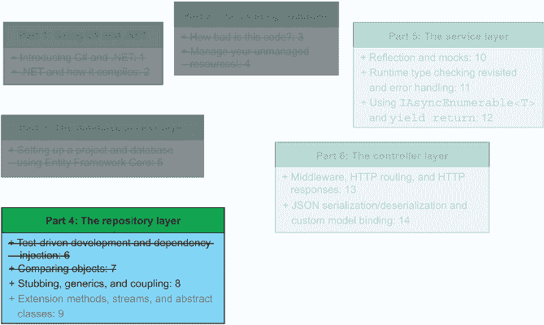
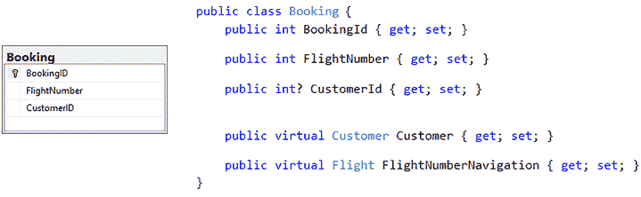
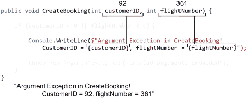
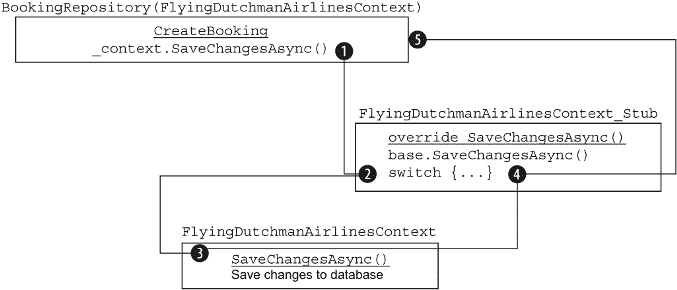
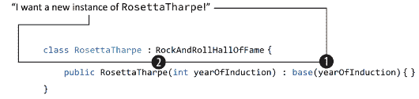
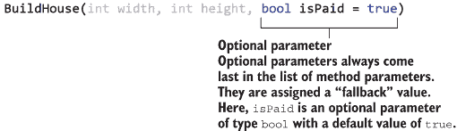

# 8 模拟、泛型和耦合

本章涵盖

+   使用测试驱动开发创建`Booking`仓库类

+   关注点和耦合分离

+   使用泛型编程

+   使用模拟进行单元测试

本章继续我们短期任务的一部分，即实现数据库中每个实体的仓库。如果我们从更大的角度来看，我们可以提醒自己为什么最初要实现这些仓库：飞利浦·范德梅伦，荷兰飞行的首席执行官，希望我们将他们的旧代码库带入现代时代。我们收到了一个 OpenAPI 规范以遵守（服务需要与航班搜索聚合器集成），并且我们决定在我们的新代码库中使用仓库/服务模式。图 8.1 显示了我们在本书方案中的位置。



图 8.1 在本章中，我们将实现`BookingRepository`类。在第六章和第七章中，我们实现了`CustomerRepository`类。这就只剩下代码库的仓库部分中的`AirportRepository`和`FlightRepository`类了。我们将在下一章中实现它们。

在第六章和第七章中，我们实现了`Customer`实体的仓库类。这次，我们将关注`Booking`实体。阅读完本章后，我希望你熟悉以下内容：

+   Liskov 替换原则

+   关注点和耦合分离

+   如何使用泛型

+   如何编写严密的输入验证代码

+   使用可选参数

当然，还有更多。

## 8.1 实现预订仓库

到目前为止，在我们的重构和实现 FlyingDutchmanAirlines 代码库新版本的过程中，我们已经设置了 Entity Framework Core，实现了数据库访问层（第五章）以及`Customer`仓库类（第六章和第七章）。在本节中，我们将开始编写`BookingRepository`类，如图 8.2 所示。回顾`Booking`模型，我们看到我们有三个字段：`BookingID`（主键）、`FlightNumber`和`CustomerID`（外键，指向`Customer.CustomerID`）。整数是可空的，因为可能没有外键。当然，没有客户的预订是一种异常情况，所以这种情况不应该发生。



图 8.2 `Booking`类和预订表。由于`Booking`类是从数据库模式逆向工程得到的，因此代码和数据库之间的同构关系很强。

我们只有一个端点用于处理预订，`POST /Booking`，它在数据库中创建一个新的预订。因为我们只做一件事，所以我们的新`BookingRepository`只需要一个公共方法：`CreateBooking`。但首先，我们应该在 RepositoryLayer 文件夹中创建`BookingRepository`类，以及在 FlyingDutchmanAirlines_Tests 项目中相应的测试类（包括成功测试用例的框架），如下面的代码示例所示。为了避免重复，计划是每个数据库实体（`Customer`、`Booking`、`Airport`和`Flight`）创建一个存储库。存储库类包含与数据库交互的小方法，通过数据库访问层进行操作。服务层类调用这些存储库，收集信息以返回给控制器类。我们在 5.2.4 节中讨论了存储库/服务模式。

```
namespace FlyingDutchmanAirlines.RepositoryLayer {
  public class BookingRepository {
    private readonly FlyingDutchmanAirlinesContext _context;

    public BookingRepository(FlyingDutchmanAirlinesContext _context) {
      this._context = _context;
    }
  }
}
```

如前几章所述，我们将使用测试驱动开发来确保我们的代码按预期工作，并在扩展代码时防止未来的回归。在第 6.1 节中，我介绍了测试驱动开发（轻量级）作为一种技术，以提高我们的代码正确性和可测试性的可能性。在测试驱动开发中，我们在编写逻辑实现之前创建单元测试。因为我们同时构建测试和实际逻辑，所以我们会在开发过程中不断验证代码是否符合我们的预期，从而避免在实现所有代码后编写单元测试时需要修复的 bug，如下面的列表所示。

列表 8.1 `BookingRepositoryTests`类的框架

```
namespace FlyingDutchmanAirlines_Tests.RepositoryLayer {
  [TestClass]
  public class BookingRepositoryTests {
    private FlyingDutchmanAirlinesContext _context;
    private BookingRepository _repository;

    [TestInitialize]
    public void TestInitialize() {                                    ❶
      DbContextOptions<FlyingDutchmanAirlinesContext> 
    ➥ dbContextOptions = 
    ➥ new DbContextOptionsBuilder<FlyingDutchmanAirlinesContext>()
    ➥ .UseInMemoryDatabase("FlyingDutchman").Options;                ❷
    _context = new FlyingDutchmanAirlinesContext(dbContextOptions);   ❷

    _repository = new BookingRepository(_context);                    ❸
    Assert.IsNotNull(_repository);                                    ❹
    }

    [TestMethod]
    public void CreateBooking_Success() { }
  }
}
```

❶ `TestInitialize`方法在每次测试之前运行。

❷ 创建一个内存中的 SQL 数据库

❸ 使用依赖注入（DI）传递数据库上下文来创建`BookingRepository`实例

❹ 断言`BookingRepository`实例创建成功

在我们继续之前，让我们回顾一下旧代码是如何实现与 `Booking` 相关的代码以及我们确定的改进。旧代码将所有与每个实体相关的代码都挤在一个类中：`FlightController`。当你将实现细节放在控制器内部时，特别是那些与控制器处理的实体不同的实现细节，你会将数据库的实现细节与控制器紧密耦合。理想情况下，我们希望在控制器和数据库之间有一些抽象层（如服务、存储库和数据库访问层）。让我们想象一下，在开发代码库之后，你想将数据库供应商从 Microsoft Azure 更改为 Amazon AWS。如果你将控制器与数据库紧密耦合，那么在切换供应商时，你必须更改你拥有的每个控制器。如果你通过引入具有数据库访问层的存储库/服务模式来抽象数据库逻辑，松散数据库与控制器之间的耦合，那么你只需要在数据库访问层进行更改。对于我们来说，在 `BookingRepository` 的上下文中，我们希望提取出将新的 `Booking` 对象实际插入数据库的代码，如下所示：

```
cmd = new SqlCommand("INSERT INTO Booking (FlightNumber,     
➥ CustomerID) VALUES (" + flight.FlightNumber + ", ‘" +     
➥ customer.CustomerID + "’) ", connection);
cmd.ExecuteNonQuery();
cmd.Dispose();
```

原始代码的其余部分也手动获取了一些与外键约束相关联的数据。我们将在第 11.3 节中查看如何在服务层类中处理外键。

## 8.2 输入验证、关注点分离和耦合

在本节中，我们将模仿我们在第六章中添加客户到数据库时采取的方法，并将其应用于预订，如下所示：

+   验证输入。

+   创建一个 `Booking` 类型的新的实例。

+   通过数据库上下文调用，将新实例添加到 Entity Framework Core 的 `DbSet<Booking>` 中。

`CreateBooking` 方法有两个输入：一个 `customerID` 和一个 `flightNumber`。它们都是 `integer` 类型，并且具有以下相同的验证规则：

+   `customerID` 和 `flightNumber` 必须是正整数。

+   当与现有航班和客户匹配时，`customerID` 和 `flightNumber` 需要是有效的。

提出的验证规则意味着我们需要检查 `DbSet` 集合中的 `Customer` 和 `Flight`，以验证它们是否包含与输入信息匹配的条目。然而，问题在于，由于关注点的分离，我们不想在 `BookingRepository` 中处理除 `Booking` 之外的实体的 `DbSet`。此外，我们不想在存储库级别处理外键约束，而是在服务级别处理。对于存储库/服务架构，一个好的经验法则是这样的：让你的存储库保持简单，让你的服务保持智能。这意味着你的存储库方法应该是严格遵循单一职责原则（在第六章引言中讨论）的方法，而服务侧的这种遵循则稍微宽松一些。

服务可以调用它们完成任务所需的任何仓库方法。仓库方法不应该需要调用另一个仓库来完成它们的工作。如果你发现自己正在在仓库之间进行交叉调用，请退一步，重新阅读第 5.2.4 节关于仓库/服务模式的说明。在第十章和第十一章的`BookingService`中，我们将探讨如何编写一个管理这些关注点的服务，但到目前为止，理解我们为什么不想在`BookingRepository`中调用`DbSet<Customer>`和`DbSet<Flight>`就足够了。最终，一切都归结为关注点分离和耦合。

|    |
| --- |

关注点分离和耦合

“关注点分离”这个术语是由 Edsger Dijkstra 在他的论文《论科学思维的作用》（EWD 447，Springer-Verlag，1982 年）中提出的。在最基本层面上，这意味着一个“关注点”应该只做一件具体的事情。但什么是“关注点”呢？关注点是一个编程模块的心理模型，它可以表现为方法或类等形式。当我们把关注点分离提升到类级别，并将其应用于`BookingRepository`时，我们可能会说`BookingRepository`应该只关注对预订数据库表的操作。这意味着从客户表检索信息等操作并不在关注点的范围内。如果我们将其应用于方法，我们可以说一个方法需要做一件单一的事情，其他的事情都不做。这是非常重要的清洁代码原则，因为它帮助我们开发出可读性和可维护性强的代码。

我们之前讨论过使用小方法编写像叙事一样的代码的概念。这就是同一个概念。在罗伯特·C·马丁的巨著《Clean Code: A Handbook of Agile Software Craftsmanship》（Prentice-Hall，2008 年）中，罗伯特·C·马丁多次提到了这个主题。其中一个特别的场合是标题为“Do One Thing”的章节。他告诉我们：“函数应该只做一件事情。它们应该做得很好。它们应该只做这件事。”如果我们把这条信息记在心里编写代码，那么在编写出色代码方面，我们就已经领先一步了。我们在第六章讨论了单一职责原则，它关注于编写只做一件事情的清洁方法。

耦合是什么，它与关注点分离的理念有何关联？耦合是从另一个角度来处理关注点分离问题的一个度量。耦合是一个量化一个类与另一个类之间集成程度的指标。如果类之间高度耦合，这意味着它们高度依赖于彼此。我们称之为紧密耦合。我们不希望有紧密耦合。紧密耦合通常会导致方法在错误的结构级别调用很多其他方法：想想`BookingRepository`调用`FlightRepository`来检索航班信息。

松散耦合是指两个方法（或系统）之间相互依赖性不强，可以独立执行（因此，可以以最小的副作用进行更改）。拉里·康斯坦丁提出了“耦合”这个术语，该术语首次出现在康斯坦丁和爱德华·尤尔顿合著的书籍《结构化设计：计算机程序和系统设计学科的基础》（Prentice-Hall，1979 年）中。当试图确定两个事物之间的耦合程度时，可以提出康斯坦丁和尤尔顿在书中提出的问题：“为了理解另一个模块，必须了解多少关于一个模块的信息？”

|

为了理解`CustomerRepository`和`FlightRepository`，需要了解多少内容？它们之间的相互连接有多强？如果我们处理服务层的耦合，则存储库应该具有非常松散的耦合和高度的关注点分离。

回到输入验证：尽管我们不必检查客户和航班数据库表之间的外键约束是否有效，但我们在保存数据库更改时隐式地检查它们。如果请求的更改违反了键约束，数据库将拒绝更改。

记得我们讨论过拥有可以接受任何输入（即使是错误的输入）并仍然返回适当结果的方法吗？如果我们得到一个坏的`customerID`或`flightNumber`输入，更新数据库的调用将抛出异常，我们将捕获它。通过捕获异常，我们可以控制数据和执行流程，并抛出我们自己的自定义异常来告诉用户出了问题，如下一列表所示。验证我们的输入变得简单：检查输入是否为正整数，然后我们就可以设置了。

列表 8.2 BookingRepository.CreateBooking 方法的基本输入验证逻辑

```
namespace FlyingDutchmanAirlines.RepositoryLayer {
  public class BookingRepository {
    public async Task CreateBooking(int customerID, int flightNumber) {   ❶
      if (customerID < 0 || flightNumber < 0) {                           ❷
        throw new ArgumentException("Invalid arguments provided");        ❸
      }
    }
  }
}
```

❶ CreateBooking 方法需要 customerID 和 flightNumber。

❷ 验证输入参数：customerID 和 flightNumber 需要是正整数。

❸ 如果输入参数无效，将抛出 ArgumentException 异常

C#提供了一种异常，我们可以在方法参数无效时使用：ArgumentException。当 customerID 或 flightNumber 不是正整数时，我们希望抛出 ArgumentException 类型的异常。为了抛出 ArgumentException，我们将错误消息（类型为 string）传递给 ArgumentException，并使用`throw new`模式实例化和抛出一个新的 ArgumentException 实例。

|    | 在 C# 中，某些类型有包装类型的类，这些类通过提供额外的功能来扩展它们。一个例子是 `String` 类和 `string` 类型。注意类和类型的大小写。C# 的约定是一个类以大写字母开头，而一个类型通常以小写字母开头。对于大多数类型及其包装类，你通常可以互换使用它们（直到你需要使用类公开的方法——对于 `String`，这可能是 `IsNullOrEmpty`）。请注意，`String` 和 `string` 通常解析为相同的底层中间语言代码。 |
| --- | --- |

在输入验证代码抛出 `ArgumentException` 之后，开发者可能会看到我们传递的消息并想知道出了什么问题。开发者们当然希望看到实际的参数值，但我们不希望在错误消息中返回输入参数并暴露给方法外部（或潜在地给最终用户）。你能想象使用一个应用程序并得到一个包含实际输入参数值的错误消息吗？当然，任何 UI 工程师或 UX 设计师都会对此提出异议。当然，总有例外（也许你也控制着这个服务唯一使用的客户端）。我们至少应该将这些参数记录到控制台，这样开发者就有更好的机会恢复这些值。一些公司使用像 Splunk 这样的技术来自动捕获写入控制台并存储在可搜索数据库中的日志。要写入控制台，我们使用 `Console.WriteLine` 方法，如下一列表所示。如果你不想写入控制台，ASP.NET 提供了专门的日志记录功能供你使用（有关更多信息，请参阅 MSDN ASP.NET 文档）。你也可以使用像 Log4net 或 NLog 这样的第三方日志库。我更喜欢使用最简单的日志记录类型，以完成任务。在这种情况下，将日志记录到控制台就足够了。

列表 8.3 使用字符串插值的 `BookingRepository.CreateBooking` 方法

```
public async Task CreateBooking(int customerID, int flightNumber) {
  if (customerID < 0 || flightNumber < 0) {
    Console.WriteLine($"Argument Exception in CreateBooking! CustomerID 
➥ = {customerID}, flightNumber = {flightNumber}");                        ❶
    throw new ArgumentException("Invalid arguments provided");
  }
}
```

❶ 通过字符串插值将无效的参数值记录到控制台

我们写入控制台的字符串是一个插值字符串。使用字符串插值，我们可以在字符串中插入（或内联）表达式和值，而无需显式地将多个字符串连接在一起（字符串连接仍然在底层发生）。我们通过在字符串本身前加上美元符号 `$` 来创建插值字符串。然后，我们通过将它们包裹在花括号中来直接将值和表达式（甚至方法调用）插入到字符串中。字符串 `{customerID}` 插值了 `customerID` 的值，如图 8.3 所示。



图 8.3 字符串插值允许我们将变量值内联到字符串中。当使用字符串插值时，在字符串前加上美元符号（`$`），并用花括号（`{[variable]}`）括住你想要使用的变量。

编译器将插值字符串转换为 C# 语句，该语句连接了一堆字符串。字符串插值提供的语法糖是构建可读字符串的极好且惯用的方式。因为字符串是不可变的，使用字符串插值并不会消除使用字符串连接的性能缺点。实际上，由于额外的开销，字符串插值可能比正常的字符串连接表现得更差，因为字符串是不可变的。我们还需要对输入验证逻辑进行单元测试。单元测试应根据无效输入参数进行断言，并验证当输入参数无效（负整数）时，输入验证逻辑抛出类型为 `ArgumentException` 的错误，如下一列表所示。

列表 8.4 使用 `DataRow` 方法属性

```
[TestMethod]
[DataRow(-1, 0)]                                                ❶
[DataRow(0, -1)]                                                ❶
[DataRow(-1, -1)]                                               ❶
[ExpectedException(typeof(ArgumentException))]                  ❷
public async Task CreateBooking_Failure_InvalidInputs(int customerID, 
➥ int flightNumber) {
  await _repository.CreateBooking(customerID, flightNumber);    ❸
}
```

❶ `[DataRow]` 方法属性使用指定的测试数据运行测试。

❷ 这个测试期望抛出一个 `ArgumentException` 类型的异常。

❸ 调用 `CreateBooking` 方法并等待它

`CreateBooking_Failure_InvalidInputs` 单元测试结合了我们之前使用的一些不同技术，下面将进行描述：

+   使用 `[DataRow]` 方法属性，我们为单元测试提供了测试数据，而无需为所有三个测试用例编写单独的单元测试。

+   使用 `[ExpectedException]` 方法属性，我们告诉 MSTest 运行器，在测试执行期间，该方法应该抛出一个类型为 `ArgumentException` 的异常。

+   在 `TestInitialize` 方法中将 `_repository` 字段赋值给 `BookingRepository` 的新实例。

当 `CreateBooking_Failure_InvalidInputs` 单元测试运行时，我们使用 `[DataRow]` 方法属性，检查三个单独的测试用例，如表 8.1 所示。

表 8.1 在 BookingRepositoryTests.cs 中运行的三个不同测试用例 `CreateBooking_Failure_InvalidInputs`

| `customerID` | `flightNumber` |
| --- | --- |
| –1 | 0 |
| 0 | –1 |
| –1 | –1 |

表 8.1 中的所有测试用例都是 `CreateBooking` 方法输入验证逻辑失败的输入参数集，导致 `CreateBooking` 方法抛出 `ArgumentException`。

## 练习

练习 8.1

填空：在关注点分离的背景下，一个关注点指的是 __________。

a. 一个令人担忧的想法

b. 一个业务

c. 一个逻辑模块

练习 8.2

对或错？如果两个类高度依赖彼此，我们称之为松耦合。

练习 8.3

填空：在一个仓库/服务架构中，实际数据库查询应该在 __________ 级别进行，而调用执行数据库查询的方法应该在 __________ 级别进行。

a. c. 仓库；服务

b. 服务；仓库

c. 服务；服务

d. 仓库；仓库

练习 8.4

如果`fruit`是“奇异果”，这将打印到控制台的内容是什么？`Console.WriteLine($"我喜欢吃 {fruit} ");`

a. 什么也不做；它会导致编译错误。

b. “我喜欢吃{fruit}”

c. “我喜欢吃奇异果”

d. “$我喜欢吃奇异果”

练习 8.5

对或错？字符串是可变的。这意味着它是一个引用类型，其中对字符串的任何更改都会覆盖内存中的同一位置。

## 8.3 使用对象初始化器

在上一节中，我们验证了`CreateBooking`的输入参数，并了解了关注点分离、耦合和字符串插值。在本节中，我们将通过添加将新预订添加到数据库的逻辑来进一步扩展该方法。要将预订添加到数据库，我们需要执行以下四个主要步骤：

1.  在`CreateBooking`方法中创建`Booking`类型的新实例。

1.  用`customerID`和`flightNumber`参数填充新的`Booking`实例。

1.  将新的`Booking`实例添加到 Entity Framework Core 的内部`DbSet <Booking>`。

1.  异步保存对数据库的更改。

首先，我们可以轻松地处理前两个步骤：在`CreateBooking`方法中创建`Booking`类型的新实例，并用`customerID`和`flightNumber`参数填充它，如下面的列表所示。

列表 8.5 `BookingRepository.CreateBooking`：创建并填充`Booking`实例

```
public async Task CreateBooking(int customerID, int flightNumber) {
  if (customerID < 0 || flightNumber < 0) {                              ❶
    Console.WriteLine($"Argument Exception in CreateBooking! CustomerID  ❶
➥ = {customerID}, flightNumber = {flightNumber}");                      ❶
    throw new ArgumentException("Invalid arguments provided");           ❶
  }                                                                      ❶

  Booking newBooking = new Booking();                                    ❷
  newBooking.CustomerId = customerID;                                    ❸
  newBooking.FlightNumber = flightNumber;                                ❹
}
```

❶ 验证输入参数

❷ 创建`Booking`类型的新实例

❸ 将 customerID 输入参数分配给 newBooking 中适当的属性

❹ 将 flightNumber 输入参数分配给 newBooking 中适当的属性

就像命令一样，我们得到了：一个`Booking`类型的实例。我们还用验证过的输入参数填充了`CustomerId`和`FlightNumber`属性。尽管如此，列表 8.5 中的代码让我感到有些烦恼：如果我们必须不断地输入`[instance].[property] = [value]`，那么在新实例上填充字段可能会变得非常繁琐。还记得我们在 6.2.5 节中关于对象初始化器的讨论吗？这里语法上的微小变化（另一种语法糖的例子），在初始化具有大量需要设置的属性的对象时，可以产生显著的差异：

```
Booking newBooking = new Booking {
    CustomerId = customerID,
    FlightNumber = flightNumber
};
```

确实是将常规对象属性赋值代码“压缩”成一个块，如图 8.4 所示。对象初始化器在处理集合（如列表）时也有效（当在集合上使用时，它们被称为*集合初始化器*；当然，你可以在集合初始化器内部嵌套对象初始化器）。


图 8.4 对象初始化的对比方法：使用和不使用对象初始化器。约翰是一个不合格的动物园管理员，他照顾着一头雄伟的长颈鹿、一只愤怒的企鹅和一只危险的柯基。

我们剩下的任务就是尝试将 `newBooking` 添加到数据库中，并异步保存对数据库的更改。我们需要确保在将 `Booking` 实例添加到数据库时没有问题，因此我们将保存更改的逻辑包裹在 `try-catch` 语句中，当发生数据库错误时抛出一个自定义异常（`CouldNotAddBookingToDatabaseException`，它继承自 `CouldNotAddEntityToDatabaseException`，而 `CouldNotAddEntityToDatabaseException` 继承自 `Exception`）。当抛出此异常（与仓库层中的任何异常一样）时，我们在服务层再次捕获异常。我将创建自定义异常的任务留给你。

要使用 `SaveChangesAsync` 将新的预订保存到数据库，我们需要 `await` `SaveChangesAsync` 调用。等待 `CreateBooking` 方法意味着它必须异步执行。为了实现这一点，我们将方法的类型更改为 `Task` 并在方法签名中添加 `async` 关键字，如下面的代码示例所示。

列表 8.6 BookingRepository.cs `CreateBooking` 完整

```
public async Task CreateBooking(int customerID, int flightNumber) {
  if (customerID < 0 || flightNumber < 0) {                              ❶
    Console.WriteLine($"Argument Exception in CreateBooking! CustomerID  ❶
➥ = {customerID}, flightNumber = {flightNumber}");                      ❶
    throw new ArgumentException("invalid arguments provided");           ❶
  }                                                                      ❶

  Booking newBooking = new Booking {                                     ❷
 CustomerId = customerID,                                             ❷
 FlightNumber = flightNumber                                          ❷
 };                                                                     ❷

 try {
 _context.Booking.Add(newBooking);                                    ❸
 await _context.SaveChangesAsync();                                   ❹
 } catch (Exception exception) {                                        ❺
 Console.WriteLine($"Exception during database query:                 ❻
➥ {exception.Message}");                                                ❻
 throw new CouldNotAddBookingToDatabaseException();                   ❼
 }
}
```

❶ 验证输入参数

❷ 使用对象初始化器创建并初始化一个新的 Booking 实例

❸ 将新的预订添加到 EF Core 的内部 DbSet<Booking>

❹ 异步保存更改到数据库

❺ 捕获在 try 块中抛出的任何异常

❻ 将开发人员信息写入控制台

❼ 抛出类型为 CouldNotAddBookingToDatabaseException 的异常

我们没有使用硬编码的 SQL 语句，也没有处理对象释放和语句使用的问题，而是使用了 Entity Framework Core 和简单的代码来实现相同的结果。

那么，接下来是什么？我相信你现在已经知道了：我们需要修复我们的成功用例单元测试。这应该足够简单。我们只需要发送有效的输入参数。但是，如果我们遇到数据库错误怎么办？即使我们有有效的 `customerID` 和 `flightNumber`，也可能因为数据库异常而失败。

## 8.4 使用模拟进行单元测试

在本节中，我将向您介绍模拟的奇妙世界。在单元测试的上下文中，模拟是指执行一个模拟类（充当某个类但覆盖实现）而不是原始类。我们留下上一节，因为我们正要测试 `CreateBooking` 方法可能因为数据库错误而抛出 `CouldNotAddBookingToDatabase` 异常的可能性。为了测试抛出的 `Exception`，我们需要暂时放下成功测试用例，并专注于模拟和新的测试方法：`CreateBooking_Failure_DatabaseError`。我更喜欢使用蛇形命名法为测试单元测试命名，如以下代码示例所示，但对此的看法各不相同：

```
[TestMethod]
public async Task CreateBooking_Failure_DatabaseError() { }
```

存根是一段代码（可能是一个完整的类），它在运行时替代了普通类。存根将针对原始类的调用重定向到自身，并执行那些方法的覆盖版本。方法重定向和覆盖在单元测试中特别有用，因为它们允许我们通过重定向方法调用并在需要时抛出异常来模拟错误条件。

查看 `CreateBooking` 方法，我们想要验证我们能否正确处理从数据库或 Entity Framework Core 内部传出的错误。但我们如何处理数据库异常呢？最简单的方法是扩展我们的依赖注入 `FlyingDutchmanAirlinesContext` 的重定向。我们仍然想使用内存数据库，但我们也想确保在调用某个方法时抛出异常。如果我们创建一个类（一个存根），它从 `FlyingDutchmanAirlinesContext` 继承，然后将其注入到 `CreateBooking` 中，如图 8.5 所示会怎样？



图 8.5 通过 `FlyingDutchmanAirlinesContext_Stub` 重定向 `SaveChangesAsync`。仓库在依赖注入 `FlyingDutchmanAirlinesContext_Stub` 上调用 `SaveChangesAsync` 方法。存根调用基类，并在 `switch` 语句中确定返回什么值。

让我们在 FlyingDutchmanAirlines_Tests 项目中创建一个新的文件夹名为 Stubs，以及一个名为 `FlyingDutchmanAirlinesContext_Stub` 的新类，如下所示。这个类从 `FlyingDutchmanAirlinesContext` 继承。

列表 8.7 `FlyingDutchmanAirlinesContext` 的存根骨架

```
namespace FlyingDutchmanAirlines_Tests.Stubs {
  class FlyingDutchmanAirlinesContext_Stub : 
➥ FlyingDutchmanAirlinesContext { }            ❶
}
```

❶ 该类从原始非存根类继承，允许我们用它来替代。

回到 `BookingRepositoryTests`，我们用存根替换上下文，并查看我们的测试是否仍然通过，如下面的代码示例所示。

列表 8.8 `BookingRepositoryTests` 初始化存根而不是原始类

```
namespace FlyingDutchmanAirlines_Tests.RepositoryLayer {
  [TestClass]
  class BookingRepositoryTests {
    private FlyingDutchmanAirlinesContext _context;        ❶
    private BookingRepository _repository;

    [TestInitialize]
    public void TestInitialize() {
      DbContextOptions<FlyingDutchmanAirlinesContext> 
➥ dbContextOptions = new     
➥ DbContextOptionsBuilder<FlyingDutchmanAirlinesContext>.UseInMemoryDatab    
➥ ase("FlyingDutchman").Options;                          ❷
      _context = new 
➥ FlyingDutchmanAirlinesContext_Stub(dbContextOptions);   ❸

      _repository = new BookingRepository(_context);       ❹
      Assert.IsNotNull(_repository);
    }
  }
}
```

❶ 存储字段的类型是非存根类。

❷ `DbContextBuilder` 模式使用非存根类作为泛型类型。

❸ 由于多态性，我们可以为存储字段分配存根的新实例。

❹ 仓库接受我们的存根类代替非存根类。

列表 8.8 中的代码无法编译。因为我们没有为存根定义显式构造函数，当创建 `FlyingDutchmanAirlines_Stub` 的新实例时，CLR 创建了一个隐式的默认构造函数。但是 `FlyingDutchmanAirlinesContext`（基类/非存根类）有一个接受 `DbContextOptions<FlyingDutchmanAirlinesContext>` 类型的第二个构造函数，如果我们想使用内存数据库，就需要这个类型。因为存根从非存根继承，我们应该能够调用 `FlyingDutchmanAirlinesContext_Stub` 的父类构造函数，如图 8.6 所示。毕竟，父类是 `FlyingDutchmanAirlinesContext`。



图 8.6 当派生类的构造函数包含对基类构造函数的调用时，基类的构造函数总是首先执行。在这里，`RockAndRollHallOfFame`的构造函数在`RosettaTharpe`的构造函数之前执行。

为了使代码能够编译，并且能够使用存根代替非存根类，我们需要创建一个构造函数，该构造函数可以提供一个带有所有钩子到基类（非存根）的存根实例。我们尚未在存根中重写任何方法，因此对存根的每次调用都应该自动转到非存根。为了将方法调用重定向到我们的存根逻辑，我们需要一个调用基类构造函数的构造函数。添加一个调用基类构造函数的构造函数可以保证我们得到一个基类实例，我们可以在重定向故事中使用它。

要调用基类的构造函数，在常规构造函数中添加`: base ([arguments])`，将`[arguments]`替换为你想要传递给基类构造函数的任何参数，如以下代码片段所示。这类似于在 Java 或 Python 中使用`super`关键字。请注意，CLR 始终在我们自己的（派生的）构造函数之前调用基类的构造函数。因此，如果你想在具有基类构造函数调用的自己的构造函数中执行处理，请注意这一点。

```
namespace FlyingDutchmanAirlines_Tests.Stubs {
  class FlyingDutchmanAirlinesContext_Stub : 
➥ FlyingDutchmanAirlinesContext {
    public FlyingDutchmanAirlinesContext_Stub
➥ (DbContextOptions<FlyingDutchmanAirlinesContext> options) 
➥ : base(options) { }
  }
}
```

明确定义此构造函数强制代码始终传递一个`DbContextOptions<FlyingDutchmanAirlinesContext>`类型的参数来实例化一个新的`FlyingDutchmanAirlines_Stub`。现在我们可以编译代码并运行所有测试。一切通过，因为除了重定向到存根之外，没有其他变化。由于继承和在存根中未重写方法，对存根的当前所有方法调用仍然转到`FlyingDutchmanAirlinesContext`的非存根版本。我们可以像使用`FlyingDutchmanAirlinesContext`的实例一样使用`FlyingDutchmanAirlinesContext_Stub`。

Liskov 替换原则（多态）

这种类型的多态通常归功于计算机科学家 Barbara Liskov（同时也是约翰·冯·诺伊曼奖章和图灵奖的获得者），她与 Jeannette Wing 一起发表了一篇论文，描述了 Liskov 替换原则：

“设ø(*x*)是关于类型*T*的对象*x*的可证明属性。那么对于类型*S*的对象*y*，其中*s*是*T*的子类型，ø(*y*)应该是真实的。”^a

你可能需要读两遍才能抓住其精髓。Liskov 和 Wing 告诉我们，当使用 Liskov 替换原则风格的泛型时，如果你有一个类型（`Kit-Kat`）是另一个类型（`Candy`）的子类型，类型 *S*（`Kit-Kat`）应该能够做类型 *T*（`Candy`）能做的所有事情。可以对这样的对象应用鸭子类型测试——“如果它看起来像鸭子，游泳像鸭子，嘎嘎叫像鸭子，那么它可能就是鸭子”——以确定我们是否可以使用类型 *S* 而像使用类型 *T* 一样。Liskov 替换原则通常被认为是清洁代码的主要原则之一，它帮助我们编写具有适当抽象级别的可重用代码。

* * *

^a Barbara H. Liskov 和 Jeannette M. Wing 的 *A Behavioral Notion of Subtyping*（ACM Transactions on Programming Languages and Systems (TOPLAS)，1994）。

在我们实现任何逻辑之前，根据 TDD 的神祇，我们需要在我们的单元测试中添加一个断言并使其失败。（如果我们还记得 TDD 的红绿灯阶段，我们现在处于绿色阶段，即将变为红色。）我们想要测试的代码路径（但我们还没有实现）会导致抛出类型为 `CouldNotAddBookingToDatabaseException` 的异常。在围绕将新预订添加到数据库的代码的 `try-catch` 块中，我们调用并等待 `SaveChangesAsync` 方法。如果我们能根据某个条件（例如，如果我们将新 `Booking` 对象的 `customerID` 设置为除了 `1` 以外的其他值）使该方法抛出异常会怎样？我们可以通过在我们的存根中重写 `SaveChangesAsync` 方法来实现这个目标。我们存根中重写的 `SaveChangesAsync` 方法的签名有点复杂（在重写方法时，必须保持相同的方法签名），但我们可以一步一步地完成它，如下所示：

```
public async override Task<int> SaveChangesAsync(CancellationToken 
➥ cancellationToken = default) {
  return await base.SaveChangesAsync(cancellationToken);
}
```

除了 `override`（你应该很熟悉）之外，我们还在重写的方法中看到了以下两个不熟悉的概念：

+   泛型（我们之前已经看到过其应用）

+   可选参数

坐下来吧，因为这两个话题都非常激动人心。

## 8.5 使用泛型编程

在本节中，我将揭开一个我们在书中已经多次见过但从未深入探讨的话题的神秘面纱：泛型。我们从一开始就使用了泛型。每次当你看到这个模式时，你就是在使用泛型：`[类型]<[不同类型]>`。泛型语法在实际应用中的例子有 `List<string>`、`DbSet<Customer>` 和 `EntityEntry<TEntity>`。如果你熟悉 Java 泛型或 C++ 模板，本节应该会感觉比较熟悉。

泛型是一个概念，它允许我们根据它们可以处理哪些类型来限制类、方法和集合。例如，一个集合通常有一个泛型版本和一个非泛型版本：`List`是非泛型的，而`List<Tiger>`（`List<Tiger>`）是泛型的。`List<Tiger>`集合与任何可以转换为`Tiger`（`Tiger`类本身或其派生类）的类一起工作。`HashSe`t 是非泛型的，而`HashSet<Baklava>`（`HashSet<Baklava>`）是泛型的。一个使用泛型参数的“野”方法的例子是`Heapsort`方法，它在`Systems.Collections.Generic.ArraySortHelper`类中的`Sort`方法中使用，以在输入上执行堆排序算法¹，如下所示：

```
private static void Heapsort(T[] keys, int lo, int hi,
➥ IComparer<T> comparer) {
  int n = hi - lo + 1;
  for (int i = n / 2; i >= 1; i = i - 1) {
    DownHeap(keys, i, n, lo, comparer);
  }

  for (int i = n; i > 1; i = i - 1) {
    Swap(keys, lo, lo + i - 1);
    DownHeap(keys, 1, i - 1, lo, comparer);
  }
}
```

`Heapsort`方法接受一个泛型参数`T[]`，表示要排序的键数组，以及一个泛型参数`IComparer<T>`，表示比较对象。

尽管你通常在集合、方法和类中遇到泛型，但它们也不是不能使用泛型。那么，泛型类型看起来是什么样子呢？我们知道如何*使用*它们，但还没有学会如何*创建*它们。一个泛型类或方法使用“泛型类型”`<T>`。任何字母都可以，只要你在这个类或方法签名的作用域内保持一致。你可能想限制可以使用你的方法或类的类型。通过使用泛型约束将泛型的使用限制为特定类型或类型的子集。

要创建泛型约束，在相应的方法或类签名后添加一个子句，说“`where T : [type]`”。例如，如果我们想创建一个只接受类型`Attribute`实例的泛型类，我们会这样做：

```
public class MyGenericClass where T : Attribute
```

或者，当我们想创建一个只接受 16 位整数列表（表示为`Int16`或`short`）的泛型方法时，我们可以这样说

```
public void MyGenericMethod<T>(T shorts) where T : List<short>
```

方法也可以有泛型类型的输入参数（无论是`T`、`X`、`Y`还是你喜欢的任何字母）。最后，我们可以在一个类或方法中拥有多个泛型类型和多个泛型约束，如下所示：

```
public void MyGenericMethod<T, Y>(T key, Y encryption) where T : 
➥ List<Int16> where Y : RSA
```

在这里，`MyGenericMethod`有两个泛型类型：`T`，映射到`List<Int16>`，和`Y`，被约束为`RSA`类型。`RSA`类型是.NET 中所有 Rivest–Shamir–Adleman (RSA)加密功能的基础类。`Y`被约束为`RSA`并不意味着使用多态作为`RSA`类型的类是被禁止的；你可以使用它们而不会有问题。约束很少使用，但了解它们是好的。实际上，为了找到.NET 本身中合理良好的约束示例，我们必须深入挖掘。我们可以在`WindowsIdentity`类通过`GetTokenInformation`方法找到它，如下所示：

```
private T GetTokenInformation<T>(TokenInformationClass 
➥ tokenInformationClass) where T : struct {
  using (SafeLocalAllocHandle information = 
➥ GetTokenInformation(m_safeTokenHandle, tokenInformationClass)) {
    return information.Read<T>(0);
  }
}
```

`GetTokenInformation`方法从当前持有的 Windows 令牌返回请求的字段（由传入的`TokenInformationClass`实例确定）。请求的字段类型可以是任何类型，只要它是 struct。这由泛型`T`上的约束表示。

## 8.6 使用可选参数提供默认参数

在上一节中，我们通过查看泛型来开始对`SaveChangesAsync`方法签名中新概念的剖析。在本节中，我们将完成这次探险，并考虑可选参数。

可选参数是在方法签名中分配了默认值的参数（在签名内）。如果未传递适当的参数，CLR 将使用分配的默认值作为参数值。考虑以下方法签名：

```
public void BuildHouse(int width, int height, bool isPaid = true)
```

`isPaid`参数直接在方法签名中分配值。这就是我们所说的*可选参数*。



如果我们没有传递匹配的参数，CLR 会将可选参数分配给方法签名中指定的默认值。参数确实是可选的，但仍然可以使用设置的值。我们可以以两种方式调用`BuildHouse`方法，如下一列表所示。

列表 8.9 在可选参数上调用方法

```
BuildHouse(10, 20);          ❶
BuildHouse(10, 20, false);   ❷
```

❶ 可选参数 isPaid 的值为 true。

❷ 可选参数 isPaid 的值为 false。

在第一个例子中，我们使用了可选参数（`isPaid`）的默认分配值`true`。在第二个例子中，我们分配了一个值`false`。在这两种情况下，方法逻辑都可以访问初始化后的`isPaid`版本。

|    | 方法可选参数重载 如果你只通过添加一个可选参数来重载方法，并且没有为可选参数提供参数，CLR 会忽略带有可选参数的重载并调用原始方法。例如，如果我们有两个名为`BuildHouse(int width, int height)`和`BuildHouse(int width, int height, bool isPaid = true)`的方法，并且我们没有为`isPaid`传递参数，CLR 会调用`BuildHouse(int width, int height)`版本。 |
| --- | --- |

然而，有一个注意事项：我们绝不能在非可选参数后面跟可选参数。编译器要求可选参数必须是参数列表中的最后一个。编译器要求可选参数放在参数列表的最后意味着以下对`BuildHouse`方法签名的更改无法编译：

```
public void BuildHouse(int width, bool isPaid = true, int height)
```

在底层，一个可选参数作为一个普通参数使用，但会在生成的中间语言代码中添加 `[opt]` 关键字。因为 `SaveChangesAsync` 方法中的 `CancellationToken` 类型的参数是可选的，所以是否传递它取决于我们。记住，我们需要将其添加到我们的方法签名中，因为我们想覆盖包含可选 `CancellationToken` 参数的基类 `SaveChangesAsync` 方法。

`CancellationToken` 类

你可以通过使用 `CancellationToken` 的实例并调用 `CancellationToken.Cancel()` 方法来取消正在进行的数据库查询。取消令牌还用于通知代码的其他部分已取消请求。我们不在我们的代码中使用这些，因为我们的请求是简单的单条记录的插入和检索，并且具有有限的键约束。

如果你启动了一个可能需要几分钟才能执行的过程，你可能希望在某种边缘情况下取消它。在这种情况下，请使用一个取消令牌。如果我们不传递 `CancellationToken` 的实例，CLR 会自动为该参数分配一个新的实例。

我们存根覆盖的 `SaveChangesAsync` 方法目前包含以下一个语句：

```
return base.SaveChangesAsync(cancellationToken);
```

覆盖的 `SaveChangesAsync` 方法返回对基类（非存根）类 `AddAsync` 方法的调用。返回对基类方法的调用对我们不起作用。实际上，我们覆盖 `SaveChangesAsync` 方法只是为了让它表现得像未覆盖的版本一样。我们需要用我们的实现来替换对非存根基类 `SaveChangesAsync` 方法的调用。我们将在下一节中这样做。

## 8.7 条件语句、Func、switch 和 switch 表达式

让我们记住我们最初为什么要经历这个磨难：我们想要单元测试数据库异常代码路径，并确保代码能够优雅地处理异常。在本节中，我们将向前迈出一大步，并在存根 `SaveChangesAsync` 方法中实现逻辑。我们将讨论条件语句、`Func` 类型、switch 和 switch 表达式。

为了使用存根 `SaveChangesAsync` 方法，我们需要一种方法来区分成功和失败路径。我们绝对不希望在 `CreateBooking` 方法每次调用 `SaveChangesAsync` 时都抛出异常。因为 `customerID` 的值在我们控制之下，为什么我们不围绕它来构建我们的存根逻辑呢？如果我们将 `entity.CustomerID` 设置为任何正整数但不是“`1`”（一个任意数字——我们只需要一个数字来控制代码流程），我们就可以测试数据库异常代码分支，而不会破坏现有的测试。

我们可以使用各种方法来检查`entity.CustomerID`是否是值为`1`的正整数。我们可以编写一个简单的条件来检查`CustomerID`是否为`1`，并返回基类的`AddAsync`结果，或者抛出异常，如下一个列表所示。然而，我们需要从上下文中通过`CreateBooking`方法获取我们刚刚添加到内部`DbSet<Booking>`中的`Booking`对象，因为`Booking`对象没有被传递到`SaveChangesAsync`方法中。

列表 8.10 实现一个`SaveChangesAsync`的模拟版本

```
public async override Task<int> SaveChangesAsync(CancellationToken 
➥ cancellationToken = default) {                          ❶
 if (base.Booking.First().CustomerId != 1) {              ❷
 throw new Exception("Database Error!");                ❸
 }
  return await base.SaveChangesAsync(cancellationToken);   ❹
}
```

❶ 覆盖非模拟的`SaveChangesAsync`方法

❷ 检查实体的 CustomerID 是否为 1

❸ 如果 CustomerID 不是 1 则抛出异常

❹ 如果 CustomerID 是 1 则调用基的`SaveChangesAsync`

因为在基的`Booking DbSet`中只有一个`Booking`（我们在调用`SaveChangesAsync`之前在`CreateBooking`中添加了它），我们可以使用`First` LINQ 方法来选择预订。

### 8.7.1 三元条件运算符

为了进一步压缩代码，我们还可以将条件组合成一个简单的返回语句，并配以三元条件运算符（`?:`），如下面的代码列表所示。

列表 8.11 使用三元条件运算符来压缩条件返回块

```
public async override Task<int> SaveChangesAsync(CancellationToken 
➥ cancellationToken = default) {
  return base.Booking.First().CustomerId != 1            ❶
    ? throw new Exception("Database Error")              ❷
    : await base.SaveChangesAsync (cancellationToken);   ❸
} 
```

❶ 预订的 CustomerID 是否设置为 1？

❷ 正确条件：抛出异常

❸ 错误条件：调用非模拟的`SaveChangesAsync`

|    | 三元条件运算符助记符：如果你对三元条件运算符中的操作顺序感到困惑，一个好的助记符是“`expression ? true : false`。” |
| --- | --- |

无论是使用`if`语句还是三元条件运算符方法都可以正常工作，但如果我们想扩展我们的条件分支怎么办？当然，我们可以创建无限多的`else`子句附加到条件上，但当条件子句的数量越来越多时，这会变得很麻烦。

### 8.7.2 使用函数数组进行分支

我们还可以做一些更技术性的事情，比如创建一个`Func<Task<int>>`对象的数组，使用 lambda 委托，并使用`CustomerID`的值作为列表的索引来调用它们，然后调用委托来执行适当的逻辑，如下一个代码示例所示。

列表 8.12 使用`Func<Task<int>>`并通过索引调用 lambda 委托

```
public async override Task<int> SaveChangesAsync(CancellationToken 
➥ cancellationToken = default) {
  Func<Task<int>>[] functions = {                                 ❶
    () => throw new Exception("Database Error!"),                 ❷
    async () => await base.SaveChangesAsync(cancellationToken)    ❸
 };

 return await 
➥ functions[(int)base.Booking.First().CustomerId].Invoke();      ❹
}
```

❶ 创建一个 Func 的 Task 的整数（Func<T<Y>>）数组

❷ 这个任务会抛出异常。

❸ 这个任务返回基调用`SaveChangesAsync`的整数结果。

❹ 使用 Booking.CustomerID 作为索引调用函数

使用`Func<Task<int>>[]`可能有点过度，并且仅适用于特定的索引值。如果`functions`数组只有两个元素，而`CustomerID`是`2`（记住，在 C#中集合是零基的），我们会收到一个越界异常，因为请求的元素的索引高于集合中的最后一个元素。

### 8.7.3 `switch`语句和表达式

而不是使用简单的条件语句、三元条件运算符的条件语句，或者根据索引调用一个`Task`，我主张使用可靠的旧式`switch`语句，如下所示。

列表 8.13 使用常规`switch`语句进行代码分支

```
public async override Task<int> SaveChangesAsync(CancellationToken 
➥ cancellationToken = default) {
  switch(base.Booking.First().CustomerId) {                    ❶
 case 1:                                                    ❷
 return await base.SaveChangesAsync(cancellationToken);   ❷

 default:                                                   ❸
 throw new Exception("Database Error!");                  ❸
 }
}
```

❶ 根据 CustomerId 值切换逻辑分支

❷ 如果 CustomerId 为 1，则调用非存根的 SaveChangesAsync

❸ 如果没有其他情况匹配，则执行默认操作：抛出异常

在列表 8.13 的`switch`语句中，我们执行了针对`CustomerId`为`1`的常规、非重写的`SaveChangesAsync`路径。在`switch`语句中，如果没有匹配的情况，它会查找`default`情况并执行它。如果你没有提供`default`情况，并且没有匹配的情况，则`switch`语句不会执行任何情况。在这里，`default`情况是当`CustomerId`不是`1`时。我们的`default`情况会抛出异常。

C# 8 引入了`switch`语句的新特性，称为`switch` *表达式*。它允许我们通过使用类似于 lambda 表达式的语法来编写稍微简洁的`switch`语句，如下所示。

列表 8.14 使用`switch`表达式进行代码分支

```
public async override Task<int> SaveChangesAsync(CancellationToken 
➥ cancellationToken = default) {
  return base.Booking.First().CustomerId switch {           ❶
 1 => await base.SaveChangesAsync(cancellationToken),    ❷
 _ => throw new Exception("Database Error!"),            ❸
 };
}
```

❶ 返回`switch`语句的结果

❷ 当 CustomerID 为 1 时，调用非存根的 SaveChangesAsync

❸ 默认情况：抛出异常

使用`switch`表达式可以大大简化你的长`switch`语句。我们还应该查看代码是否抛出了`CouldNotAddBookingToDatabaseException`异常。为此，适当的单元测试必须使用以下`[ExpectedException]`方法属性：

```
[TestMethod]
[ExpectedException(typeof(CouldNotAddBookingToDatabaseException))]
public async Task CreateBooking_Failure_DatabaseError() {
  await _repository.CreateBooking(0, 1);
}
```

让我们运行测试。结果令人惊讶，它通过了！我们现在可以回到并完成对`BookingRepository`的最终测试：`BookingRepository_Success。`

如此看来，我们目前只有一个方法框架，但我们只需向`CreateBooking`传递有效的参数，如下一个列表所示。`CreateBooking`方法没有输出，因此我们进行的任何断言都需要在 Entity Framework Core 的内部`DbSet<Booking>`上完成。我们想要断言确实在内存数据库中创建了一个`Booking`，并且它有一个`CustomerID`为`1`。

列表 8.15 完成的`BookingRepository.CreateBooking_Success`单元测试

```
[TestMethod]
public async Task CreateBooking_Success() {
  await _repository.CreateBooking(1, 0);            ❶
 Booking booking = _context.Booking.First();       ❷

 Assert.IsNotNull(booking);                        ❸
 Assert.AreEqual(1, booking.CustomerId);           ❹
 Assert.AreEqual(0, booking.FlightNumber);         ❺
}
```

❶ 在内存数据库中创建预订

❷ 从内存数据库中检索预订

❸ 验证预订不为空

❹ 验证预订具有正确的 CustomerID

❺ 验证预订具有正确的 FlightNumber

让我们运行测试看看会发生什么。等等！`CreateBooking_Success`测试失败了。但是为什么？它说方法抛出了一个类型为`CouldNotAddBookingToDatabaseException`的异常。我们陷入了 Entity Framework Core 提供的最常见陷阱之一：在访问它之前，我们没有将更改保存到`DbSet<Booking>`（以及数据库）中。

### 8.7.4 在 Entity Framework Core 中查询挂起的更改

如果我们回顾模拟中的 `SaveChangesAsync` 方法，我们会看到在调用 `base.SaveChangesAsync` 之前访问 `context.Booking`。在将我们对内部 `DbSet` 所做的任何更改保存到数据库之前访问 `Booking DbSet` 意味着在预订集合中还没有任何内容，这会导致 `NullReferenceException`，我们在 `CreateBooking` 方法中捕获它。然后，`CreateBooking` 方法会抛出 `CouldNotAddBookingToDatabaseException`。

解决方案很简单：在访问 `context.Booking` 之前调用 `base.SaveChangesAsync`。因为我们使用的是内存数据库，所以在失败路径单元测试期间我们可以将 `Booking` 对象提交到数据库，因为 `TestInitialize` 方法在下一个测试之前创建了一个新的数据库上下文实例（并且隐式地清除了数据库）。测试的重要部分是异常被抛出。这意味着我们不再需要在 `switch` 语句中包含 `default` 的情况。话虽如此，让我们将非 `default` 语句上执行的逻辑更改为返回值为 `1` 的整数。`SaveChangesAsync` 方法（在非模拟场景中）返回写入数据库的条目数。我认为在模拟中没有理由偏离这个模式。毕竟，我们是在模仿它的操作。

在这个场景中，非默认 `switch` 值的唯一目的是满足 `Task<int>` 所需的返回类型。通过返回一个值为 `0` 的值，我们完成方法并且没有造成伤害。我们仍然在 `CustomerID` 不是 `1` 的情况下抛出异常，如下一个列表所示。

列表 8.16 使用基类 `SaveChangesAsync` 调用的模拟 `SaveChangesAsync` 方法

```
public override async Task<int> SaveChangesAsync(CancellationToken 
➥ cancellationToken = default) {
  await base.SaveChangesAsync(cancellationToken);      ❶

  return base.Booking.First().CustomerId switch {      ❷
 1 => 1,                                            ❸
    _ => throw new Exception("Database Error!")        ❹
  };
}
```

❶ 调用非模拟的 SaveChangesAsync

❷ 根据 CustomerId 进行切换

❸ 如果 CustomerID 是 1，则返回 0

❹ 如果 CustomerID 不是 1，则抛出异常

如果我们现在运行测试，它会通过。然而，这里我们还有一个额外的问题需要考虑。目前，如果 `CustomerId` 不是 `1`，我们会抛出异常，但我们的更改已经保存到数据库中。我们实际上应该在保存到数据库之前测试 `CustomerID`。为此，我们需要能够访问数据库的挂起更改。Entity Framework Core 允许我们通过查询其内部的 `StateTracker` 来获取具有 `EntityState` 为 `Added` 的实体，如下所示：

```
IEnumerable<EntityEntry> pendingChanges = 
➥ ChangeTracker.Entries().Where(e => e.State == EntityState.Added);
```

结果的 `IEnumerable` 集合仅包含我们挂起的更改。然而，我们真正想要的是挂起更改中的 `Entity` 对象。我们可以使用 LINQ 的 `Select` 语句来仅获取 `Entity` 对象，如下所示：

```
IEnumerable<object> entities = pendingChanges.Select(e => e.Entity);
```

从这里，我们可以将 `EntityEntry` 强制转换为我们的 `Booking` 类型并获取 `CustomerId`。为了将（并选择）映射到 `Booking` 的实体进行强制转换（和选择），我们可以在 `IEnumerable` 上使用 `OfType<T>` 方法，如下所示：

```
IEnumerable<Booking> bookings = 
➥ pendingChanges.Select(e => e.Entity).OfType<Booking>();
```

我们可以使用这些 `Booking` 实例来验证我们没有任何带有 `CustomerId` 为 `1` 的挂起更改，如下所示：

```
bookings.Any(c => (b => b.CustomerId != 1)
```

我们所需要做的就是抛出一个异常，以防我们确实有这种挂起的更改。如果没有，我们就可以继续将更改保存到数据库中，如下面的代码示例所示。

列表 8.17 在保存到数据库之前在存根中检查有效的 `CustomerID`

```
public override async Task<int> 
➥ SaveChangesAsync(CancellationToken cancellationToken = default) {
 IEnumerable<EntityEntry> pendingChanges = ChangeTracker.Entries()
➥ .Where(e => e.State == EntityState.Added);
 IEnumerable<Booking> bookings = pendingChanges
➥ .Select(e => e.Entity).OfType<Booking>();
 if (bookings.Any(b => b.CustomerId != 1)) {
    throw new Exception("Database Error!");
 }

  await base.SaveChangesAsync(cancellationToken);
  return 1;
}
```

为了确保我们没有破坏任何东西，让我们在解决方案中运行所有的单元测试。似乎当单独运行时，`CreateBooking_Success` 测试用例通过，但与其他测试一起运行时则不通过。测试运行器报告说抛出了一个类型为 `CouldNotAddBookingToDatabaseException` 的异常。嗯，我们直接从 Entity Framework Core 的陷阱跳到了继承的陷阱：当创建一个新实例的类时，如果基类已经存在，则不会实例化基类。当我们请求 `FlyingDutchmanAirlinesContext _Stub` 的新实例时，如果其父类（`FlyingDutchmanAirlinesContext`）已经存在，CLR 不会实例化其父类。在实践中，这意味着我们在单元测试中处理的是同一个数据库上下文，因此内存数据库的内容在每次测试后不会清除。因此，当我们执行 `CreateBooking_Success` 测试用例时，有可能数据库中仍然存在一个残留的 `Booking` 实例。因为我们从上下文中在我们的重写 `SaveChangesAsync` 方法中请求第一个预订的 `CustomerID`，我们可能会得到一个错误的 `CustomerID`。我们能做什么呢？以下两种方法中的任何一种都可能对我们有效：

+   在 `TestInitialize` 方法中手动清除数据库的 `DbSet<Booking>`。

+   使用 Entity Framework Core 的 `EnsureDeleted` 方法，该方法检查数据库是否被删除。如果数据库仍然存在，`EnsureDeleted` 会毫不犹豫地删除数据库。

这两种方法效果相同，但为了保持有趣，让我们尝试使用 `EnsureDeleted` 方法。我们可以在 `TestInitialize` 方法或 `FlyingDutchmanAirlines _Stub` 的构造函数中调用 `EnsureDeleted` 方法。在我看来，我们最好将其放在存根的构造函数中，如下一列表所示。使用 `EnsureDeleted` 方法与我们使用存根非常相关，我喜欢在测试类之间保持 `TestInitialize` 方法尽可能相似。

列表 8.18 使用 `EnsureDeleted` 删除内存数据库

```
public 
➥ FlyingDutchmanAirlinesContext(DbContextOptions
➥ <FlyingDutchmanAirlinesContext> options) {
  base.Database.EnsureDeleted();                   ❶
}
```

❶ 删除非存根的内存数据库

如果我们现在运行所有的测试，我们会看到 `CreateBooking_Success` 测试用例运行得相当好。

有了这个，我们就完成了 `BookingRepository`。你现在对泛型、可选参数、switch 表达式和 Liskov 替换原则的世界了如指掌。

## 练习

练习 8.6

对或错？当使用存根时，你必须重载基类的方法。

练习 8.7

由于哪个原则，我们才能将 `FlyingDutchmanContext_Stub` 的一个实例用作 `FlyingDutchmanContext` 类型的实例？

a. Liskov 替换原则

b. DRY 原则

c. Phragmén–Lindelöf 原则

练习 8.8

在使用泛型编程时，我能否将 `float` 类型的实例添加到 `List<bool>` 中？

a. 是

b. 否

c. 让我帮你 Stack Overflow。

练习 8.9

这是什么例子？`where T : Queue<int>`

a. 一个泛型集合

b. 一个通用的泛化

c. 一个泛型约束

练习 8.10

真或假？我们只能与类一起使用泛型。

练习 8.11

真或假？具有泛型的类只能有一个泛型约束。

练习 8.12

真或假？你不能将泛型类型用作方法参数的类型。

练习 8.13

真或假？使用可选参数是可选的。

练习 8.14

在方法参数列表中，可选参数放在哪里？

a. 在开始时

b. 在末尾

c. 任何地方

练习 8.15

真或假？就像默认隐式构造函数一样，如果你在 `switch` 语句中没有声明 `default` 情况，编译器会为你生成它并执行你指定的第一个情况。

## 摘要

+   关注点分离意味着我们希望将逻辑模块彼此隔离。这确保了我们的代码是可测试的和原子的。原子代码更易于阅读和扩展。

+   耦合指的是两个“关注点”如何集成。紧密耦合可能意味着某个类深度依赖于另一个类，而两个类之间的松耦合则意味着一个类可以更改和扩展，而不会对另一个类造成问题。具有紧密耦合的类更难以维护，因为你不知道依赖关系的全部范围时，很容易引入副作用。

+   你可以通过使用字符串插值将变量的值内联到字符串中。这使得在不使用显式连接运算符的情况下构建复杂字符串变得容易。

+   字符串是不可变的。对字符串的任何操作（连接、删除、替换）都会导致 CLR 在内存中为字符串的新副本分配一个新的区域。这意味着如果你对字符串进行很多操作，每一步（连接、删除）都会导致新的内存分配。在处理许多连接或删除时，这一点很重要。

+   在实例化新对象后向值分配多个属性时，使用对象初始化器允许使用更紧凑和更易读的语法。当没有提供适当的构造函数时，对象初始化器是实例化复杂对象的惯用方式。

+   Liskov 替换原则指出，一个类型的子类型应该能够做父类型能做的所有事情。这意味着我们可以像使用父类型一样使用子类型。Liskov 替换原则解释了为什么我们可以使用多态。

+   模拟代码是一个使用 Liskov 替换原则来充当其父类（或功能）的代码片段，同时覆盖和重定向某些方法以确保特定功能。模拟代码在单元测试中非常有用，可以抛出异常并返回特定响应。

+   泛型允许我们将类、方法或类型约束为使用特定类型。例如，`Stack<MaineCoon>`或`List<ISnack>`使用泛型来约束其功能以适应特定类型或类型组。以这种方式约束代码是一种有用的技术，可以控制数据类型并确保它们在整个代码中符合预期。

+   可选参数允许我们为方法定义非必需的参数。如果没有传递匹配的参数，可选参数将采用定义的值。当我们的代码依赖于多个可能的参数值集时，可选参数非常有用，即使我们没有传递特定参数，我们也可以继续处理。

+   Entity Framework Core 的`EnsureDeleted`方法检查数据库是否已被删除。如果没有，则将其删除。这在测试期间与内存数据库一起工作时非常有用，以确保没有之前测试数据的残留。

***

(1.)关于堆排序算法的详细信息，请参阅 A. K. Dewdney 的《新图灵 Omnibus》，第四十章，“堆和合并”（W.H. Freeman and Company，1993 年）或 Robert Sedgewick 和 Kevin Wayne 的《算法》，第 2.7 章，“堆排序”（第 4 版；Pearson Education, Inc.，2011 年）。
