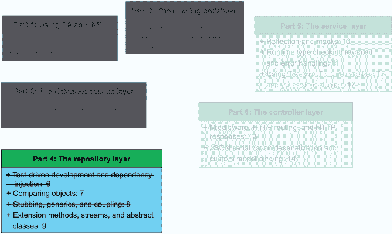
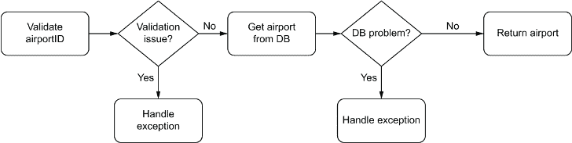
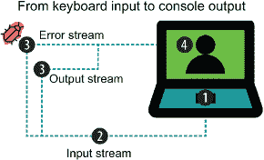
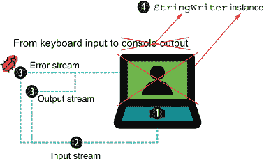
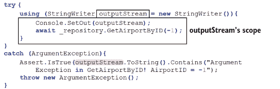
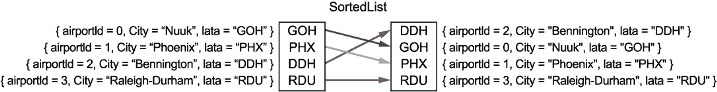
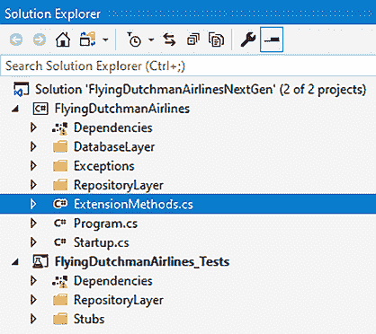
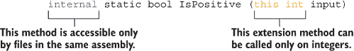
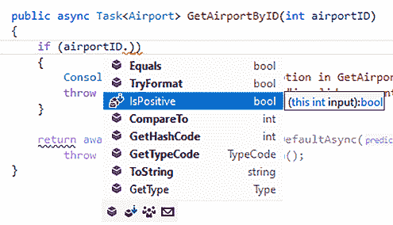

# 9 扩展方法、流和抽象类

本章涵盖

+   使用流重定向控制台输出

+   使用抽象类在派生类之间提供通用功能

+   使用`AddRange` LINQ 方法一次性向集合中添加许多东西

+   使用`SortedList`集合

+   使用扩展方法扩展现有类型以添加新功能

+   重构“魔法数字”

在 3.1 和 3.2 节中，飞剪航空公司（Flying Dutchman Airlines）的 CEO 委托我们创建现有 FlyingDutchmanAirlines 代码库的新版本。现有的代码库很旧，充斥着设计缺陷，并且与新签订的商业协议中搜索聚合商提出的新 API 要求不兼容。在第三章和第四章中，我们考虑了现有的代码库，并标记了潜在的提升点。在第五章中，我们开始了重构工作，并使用 Entity Framework Core 实现了数据库访问层。随后，在第五章至第八章中，我们从以下四个必需的类中实现了（并测试了）两个存储库：

+   `CustomerRepository`—我们在第六章和第七章实现了这个存储库类。

+   `BookingRepository`—我们在第八章实现了这个存储库类。

+   `AirportRepository`—我们在本章实现这个存储库类。

+   `FlightRepository`—我们在本章实现这个存储库类。

见图 9.1 了解我们在本书结构中的位置。



图 9.1 在本章中，我们将实现`AirportRepository`和`FlightRepository`类。这是完成重构中存储库部分的最后两个必需的存储库。

通过学习诸如测试驱动开发、DRY 原则、Liskov 替换原则和 LINQ 等内容，并且现在对这些存储库的整体结构和测试模式已经很熟悉，我们可以在本章通过实现`AirportRepository`和`FlightRepository`来加快速度，完成存储库层的重构。我们还将了解抽象类（作为接口的替代品，它强制我们在所有派生类中实现相同的方法）并重新审视扩展方法（第 9.6 节），以便我们可以为现有类型提供新的功能。

## 9.1 实现机场存储库

在第六章至第八章中，我们在开始实现时遵循了一个基本的第一步：为存储库和单元测试创建骨架类。我在本章也遵循了同样的方法。

`AirportRepository` 模板使用依赖注入，将 `FlyingDutchmanAirlinesContext` 类的一个实例注入到 `AirportRepository` 的显式（非默认）构造函数中，如图 9.2 所示。构造函数将注入的 `FlyingDutchmanAirlinesContext` 分配给一个私有后置字段。此外，`AirportRepository` 类的访问修饰符是公共的。`AirportRepositoryTest` 类有一个 `TestInitialize` 方法，该方法初始化 `FlyingDutchmanAirlinesContext` 并将其分配给一个私有后置字段，这样我们就可以在每次单元测试中使用内存数据库的新实例。`TestInitialize` 方法还实例化并分配一个新的 `AirportRepository` 实例到私有后置字段。`[TestClass]` 属性注解了 `AirportRepositoryTest` 类。如果这些内容让你感到困惑，请回顾第六章和第七章，我在那里详细展示了如何设置这些模板类。


图 9.2 不论是创建一个常规类还是一个测试类，第一步都是创建实际的类文件。如果你正在处理一个常规类，请继续向类和构造函数中添加依赖注入。如果你创建了一个测试类，你也可以设置一个可选的 `TestInitialize` 方法。

当我们处理 `Airport` 实体时，我们需要支持哪些 HTTP 动作？传统观点认为，对于每个实体，我们需要与常见分组创建-读取-更新-删除（CRUD）操作相对应的逻辑。我不同意这种观点。我说，只暴露和实现你需要完成工作的内容。对于 `Airport` 来说，通过 API 暴露在 `Airport` 表中创建、更新或删除数据的能力几乎没有意义。我们需要的只是一个读取操作。

## 9.2 通过 ID 从数据库获取机场

在 `AirportRepository` 的上下文中，读取操作映射做了什么？我们需要“读取”数据库中的 `Airport` 实体，这意味着当给定其 ID 时，我们应该返回一个 `Airport`。我们在第 6.2 节中做了类似的事情，当时当给定其 ID 时，我们从数据库返回了一个 `Customer` 对象。在本节中，我们将开始实现从数据库返回 `Airport` 所需的方法：`GetAirportByID`。

但，就像往常一样，测试驱动开发的第一步是红灯阶段——`GetAirportByID` 的成功用例单元测试，如下所示：

```
[TestMethod]
public void GetAirportByID_Success() {
  Airport airport = await _repository.GetAirportByID(0);
  Assert.IsNotNull(airport);
}
```

当我们尝试编译这段代码时，不仅会得到一个编译错误，表明编译器找不到 `GetAirportByID` 方法（因为我们还没有实现这个方法，所以这是预料之中的），而且还会出现另一个编译错误，如下所示：

`"await 操作符只能在异步方法中使用。"`

你无疑会在你的 C# 生涯中多次遇到这个错误，因为很容易忘记标记一个等待某个操作的方法为 `async` 并具有适当的返回值（`Task`）。

注意：如第 6.2.8 节所述，异步方法期望返回类型为`Task`。如果你想返回空值（`void`），请使用非泛型版本：`Task`。如果你想返回实际值，请使用泛型版本`Task<T>`，其中`T`是你的返回类型。例如，为了返回一个布尔值¹并伴随一个`Task`，请使用`Task<bool>`。`Task`代表一个单独的工作单元（一个关注点）。

为了刷新我们的记忆，如果我们想将一个方法从同步执行转换为异步执行，我们需要在方法签名中使用`async`关键字和一个返回类型为`Task`或`Task<T>`（如果`Task`返回一些数据），如下所示：

```
[TestMethod]
public async Task GetAirportByID_Success() {
  Airport airport = await _repository.GetAirportByID(0);
  Assert.IsNotNull(airport);
}
```

要编译代码并通过成功案例单元测试（测试驱动开发的绿色阶段），我们需要在`AirportRepository`中创建一个接受`integer`类型参数的`GetAirportByID`方法，如下所示：

```
public async Task<Airport> GetAirportByID(int airportID) {
  return new Airport();
}
```

如果我们现在编译代码并运行`GetAirportByID_Success`测试用例，我们会看到它通过了。显然，`GetAirportByID`中的代码并没有真正为我们做很多事情。它只是返回一个新的`Airport`类型实例，而不是从数据库中返回特定的条目。我想和你，我亲爱的读者，做一个实验：我想让你在一分钟内思考从数据库中检索`Airport`对象所需的四个主要步骤。准备好了吗？开始！

一分钟过去了？你确定吗？好吧，那么，让我们继续。大致来说，我们需要执行的四个主要步骤如下，并在图 9.3 中展示：

1.  验证给定的`airportID`。

1.  从数据库中检索正确的`Airport`。

1.  使用自定义异常处理数据库中可能出现的任何`Exception`。

1.  返回找到的`Airport`实例。



图 9.3 从数据库返回`Airport`所涉及的步骤。首先，我们检查给定的输入参数是否有效。如果不是，我们抛出并处理异常。如果输入有效，我们尝试从数据库中获取正确的`Airport`。如果数据库遇到问题，我们抛出并处理异常。如果没有遇到错误，我们返回找到的`Airport`实例。

如果你感到好奇，我邀请你按照以下大致步骤实现`GetAirportByID`方法。完成实现后，回到书中比较我的实现和你的实现。如果我的实现与你的不同，那也是可以的。如果你有测试来支持你的功能，并且测试通过，你可以确信你的代码是优秀的。（你的代码是否整洁完全是另一回事，并且不能通过测试来衡量。要检查代码的整洁性，请使用附录 B 中的整洁代码清单。）

在开始这次伟大冒险之前，我给你提供最后一个建议：保持简单。在我职业生涯的早期，我认为自己在使用编程语言的非常隐蔽的角落和奇特的算法时很聪明。这导致代码对任何人（包括我自己）都难以阅读，并且因此难以维护。通过保持简单（或者根据你对生活的看法，足够复杂）来变得聪明。

## 9.3 验证机场 ID 输入参数。

如第 9.2 节所述，从数据库获取`机场`的四个步骤如下：

1.  验证给定的`airportID`。

1.  从数据库中检索正确的`机场`信息。

1.  处理数据库中任何潜在的`异常`，使用自定义异常进行处理。

1.  返回找到的`机场`实例。

在本节中，我们将解决四个问题中的第一个：验证用户输入。`GetAirportByID`方法接受一个类型为`整数`的参数。`AirportID`应该是一个正整数（一个大于或等于`0`的整数）。为了测试`AirportID`是否为正整数，我们使用与在`GetCustomerByID`和`CreateBooking`方法中编写的类似条件：如果参数的值无效，则将日志写入控制台并抛出`ArgumentException`异常，如下一列表所示。写入控制台日志使用字符串插值将`airportID`的值内联。

列表 9.1 验证`GetAirportByID`中的`airportID`参数。

```
public async Task<Airport> GetAirportByID(int airportID) {
  if (airportID < 0) {                                                  ❶
    Console.WriteLine($"Argument Exception in GetAirportByID! AirportID 
➥ = {airportID}");                                                     ❷
    throw new ArgumentException("invalid argument provided");           ❸
  }

  return new Airport();                                                 ❹
}
```

❶ 判断机场 ID 是否具有有效的值。

❷ 将机场 ID 值记录到控制台以供开发人员查看。

❸ 抛出`ArgumentException`类型的异常。

❹ 返回一个新的`机场`实例。我们将在本章中更改此实现。

这看起来不错。但你知道接下来会发生什么，不是吗？我们需要添加一个检查无效输入值的失败案例单元测试。我们知道我们可以使用`[DataRow]`方法属性为失败案例单元测试提供多种测试数据，但我们应该提供什么数据呢？嗯，我们只有一个无效输入数据点需要测试：一个负整数。

因为我们只需要测试一个数据点，所以我们不需要`[DataRow]`方法属性。我们可以使用`[DataRow]`方法属性与仅处理一个数据点的单元测试一起使用，但这将是过度设计。如果我们只测试一个数据点，那么不使用`[DataRow]`方法属性会更简洁，如下所示：

```
[TestMethod]
public async Task GetAirportByID_Failure_InvalidInput() {
  await _repository.GetAirportByID(-1);
}
```

`GetAirportByID_Failure_InvalidInput`单元测试将一个负数（因此是无效的）整数传递给`GetAirportByID`方法。我们期望`GetAirportByID`方法看到我们向它提供了一个无效的`AirportID`参数。随后，我们期望该方法将消息记录到控制台并抛出`ArgumentException`。我们如何验证`GetAirportByID`方法抛出了预期的`ArgumentException`异常？我们需要使用`[ExpectedException(typeof(ArgumentException))]`方法属性注释单元测试，如下所示：

```
[TestMethod]
[ExpectedException(typeof(ArgumentException))]
public async Task GetAirportByID_Failure_InvalidInput() {
  await _repository.GetAirportByID(-1);
}
```

我们运行了测试，一切顺利。我们还能测试哪些输入验证？使用`GetCustomerByName`，我们对`GetCustomerByName`中的输入验证代码在无效输入的情况下抛出`ArgumentException`类型的异常表示满意。但是`GetAirportByName`方法也向控制台记录了一条消息。我们可能需要检查这一点。

## 9.4 输出流及其具体抽象

为了验证我们是否向控制台记录了消息，我们需要访问控制台的内容。检索控制台输出的技巧是提供替代输出并将控制台设置为写入该输出。在本节中，我们将讨论如何绕过控制台输出到我们自己的数据流。

警告：C#中流的概念与 Java 中使用 Streams API 不同。在 Java 中，使用 Streams API 几乎类似于在 C#中使用 LINQ。本节解释了 C#中的流概念。

`Console`类是数据输入和输出流的包装器。流表示一系列数据，通常是字节。`Console`类处理以下三个数据流，如图 9.4 所示：

+   `System.IO.TextReader`，它表示输入流

+   `System.IO.TextWriter`，它表示输出流

+   `System.IO.TextWriter`，它表示错误流。



图 9.4 从输入到输出的可能生命周期。首先，键盘输入（1）被发送到输入流（2）。然后，在应用程序内部进行一些处理（这可以是任何你想要的内容）。处理之后，如果抛出了异常，错误被写入错误流（3）。如果没有异常，信息被写入输出流（3）。最后，错误和输出流在控制台中显示（4）。

在`Console`应用程序的上下文中，输入流处理任何键盘输入。输出流是我们想要在输出中显示任何内容的地方。错误流是记录异常的地方。我们没有访问默认的`TextReader`和`TextWriter`，但我们可以通过使用`Console`的`SetOut`、`SetIn`和`SetError`方法来指定自己的。

通过实例化我们的`StringWriter`类型实例（一种处理字符串的数据流）并在使用它作为`Console`的输出流的同时保留对该变量的引用，我们可以轻松地获取历史数据。与写入一些无形输出流不同，`Console.WriteLine`方法将写入我们的`StringWriter`，如图 9.5 所示。请注意，一些编程语言（如 Java）在类型级别上区分输入和输出流。C#不这样做。您可以使用任何`Stream`派生类作为输入或输出流。



图 9.5 当将控制台输出重定向到`StringWriter`实例时，输出和错误流将写入`StringWriter`实例而不是常规控制台输出。从图 9.4 的生命周期变化：首先，键盘输入（1）被发送到输入流（2）。然后，在应用程序内部进行一些处理（这可以是任何你想要的东西）。处理之后，如果抛出了异常，错误将被写入错误流（3）。如果没有抛出异常，信息将被写入输出流（3）。最后，错误和输出流被写入我们的`StringWriter`实例（4）。

`Stream`基类是所有数据流的基石。`Stream`是一个`抽象`类，也是许多派生类（如`StringWriter`）的基类，这些类处理一系列字节。`StringWriter`是一种处理一系列字节并基于这些字节表示字符串（因为，在底层，字符串是一个字符数组——因此，字符）的功能。由于所有从`Stream`派生的类都实现了`IDisposable`接口，所以我们一旦完成对其实例的处理，就需要清理实例化的`Stream`，否则我们可能会遇到内存泄漏。

抽象类

抽象类是一个不能直接实例化或静态的类。你可以实例化一个抽象类的具体子类，这间接实例化了抽象类。我们可以通过在类的签名中使用`abstract`关键字来使一个类成为抽象类。抽象类是支持继承和扩展多态的另一种方式。我们经常使用抽象类作为“基”类，位于继承链的顶部。与接口不同，抽象类可以提供方法体（只要方法本身不是抽象的）并使用访问修饰符。这意味着抽象类通常用于在派生类中传播特定方法的特定实现。抽象方法必须在具体实现中重写。抽象方法是隐式`virtual`的，可以说它们表示一个“不完整”的方法，因为它们不能包含方法体。抽象方法只能存在于抽象类中。派生类必须重写抽象方法并根据其需求扩展功能，或者自己被标记为抽象。

要使用我们的`Console`输出流，我们需要实例化一个`StringWriter`类型的实例，用`using`语句包装流，并将其设置为`console`的输出流。然后，一旦所有处理完成，我们检索`StringWriter`的内容，并断言输出符合我们的预期，如以下所示。

列表 9.2 定义我们的控制台输出流

```
[TestMethod]
[ExpectedException(typeof(ArgumentException))]
public async Task GetAirportByID_Failure_InvalidInput() {
  using (StringWriter outputStream = new StringWriter()) {    ❶
    Console.SetOut(outputStream);                             ❷
    await _repository.GetAirportByID(-1);                     ❸

    Assert.IsTrue(outputStream.ToString().Contains("Argument Exception in 
➥ GetAirportByID! AirportID = -1"));                         ❹
  }
}
```

❶ 创建一个`StringWriter`，并承诺安全地处理它

❷ 将我们的`StringWriter`实例设置为控制台的输出

❸ `GetAirportByID`写入`StringWriter`并抛出异常。

❹ 断言输出流包含预期的日志输出

运行测试。你会看到它通过了。但如果我告诉你，测试通过是一个误导？测试通过是好事，但我们实际上测试了我们想要测试的所有内容吗？我认为不是。让我们按照以下步骤逐步执行代码：

1.  `TestInitialize` 方法执行。

1.  `GetAirportByID_Failure_InvalidInput` 方法开始执行。

1.  单元测试创建一个 `StringWriter`，将其设置为控制台的输出流，并进入 `GetAirportByID`。

1.  我们检查传入的 `AirportID` 是否有效（它不是有效的）。

1.  代码将错误日志写入我们的 `StringWriter` 流。

1.  方法抛出一个类型为 `ArgumentException` 的 `Exception`。

1.  方法被终止。

1.  测试停止执行，因为抛出了一个 `Exception` 而没有被捕获。

1.  测试确定预期的 `Exception` 被抛出，并将测试标记为“通过”。

结果表明，我们没有基于控制台的输出流进行断言。因为我们没有捕获 `GetAirportByID` 中抛出的 `ArgumentException`，单元测试在代码到达 `outputStream` 断言之前就停止执行了。

为了修复这个问题，我们应该捕获 `ArgumentException`，执行输出流断言，然后在 `GetAirportByID_Failure_InvalidInput` 单元测试中抛出另一个类型为 `ArgumentException` 的异常，以满足 `ExpectedException` 方法属性，所有这些操作都在 `GetAirportByID_Failure_InvalidInput` 单元测试中完成，如下一列表所示。

列表 9.3 在单元测试中捕获抛出的 `ArgumentException`

```
[TestMethod]
[ExpectedException(typeof(ArgumentException))]
public async Task GetAirportByID_Failure_InvalidInput() {
  try  {
    using (StringWriter outputStream = new StringWriter()) {
      Console.SetOut(outputStream);
      await _repository.GetAirportByID(-1);
    }
  } catch (ArgumentException) {                                           ❶
    Assert.IsTrue(outputStream.ToString().Contains("Argument Exception in 
➥ GetAirportByID! AirportID = -1");                                      ❷
    throw new ArgumentException();                                        ❸
  }
}
```

❶ 捕获在 GetAirportByID 中抛出的 ArgumentException

❷ 断言 outputStream 的内容和记录的错误日志相等

❸ 为 ExpectedException 属性抛出新的 ArgumentException

虽然有一个 `catch`，但这段代码无法编译，因为一旦 `GetAirportByID` 抛出 `ArgumentException` 并且单元测试的 `try-catch` 块捕获了异常，`outputStream` 就超出了作用域，如图 9.6 所示。



图 9.6 在 `catch` 代码块中，`outputStream` 变量超出了作用域。`outputStream` 的作用域延伸到 `using` 代码块的末尾。

因为 `outputStream` 超出了作用域，所以我们不能再访问它或它的值。如果我们能扩展 `outputStream` 的作用域，同时正确地处理实例，那该多好。我们可以将整个 `try-catch` 放在 `using` 语句中，但我更喜欢让 `using` 语句包含尽可能少的代码。也许我们可以使用老式的方法，通过在 `finally` 块中添加对 `outputStream.Dispose` 的调用来手动处理 `outputStream`。我们还需要在 `try-catch-finally` 之外实例化 `StringWriter`，然后，如以下代码示例所示。

列表 9.4 修复 `outputStream` 的作用域问题

```
[TestMethod]
[ExpectedException(typeof(ArgumentException))]
public async Task GetAirportByID_Failure_InvalidInput() {
  StringWriter outputStream = new StringWriter();            ❶
  try {
    Console.SetOut(outputStream);                            ❷
    await _repository.GetAirportByID(-1);                    ❸
  } catch (ArgumentException) {                              ❹
    Assert.IsTrue(outputStream.ToString().Contains("Argument Exception in 
➥ GetAirportByID! AirportID = -1");                         ❺
    throw new ArgumentException();                           ❻
  } finally {
    outputStream.Dispose();                                  ❼
  }
}
```

❶ 创建我们的 outputStream

❷ 告诉控制台使用 outputStream 作为输出流

❸ 调用 GetAirportByID 方法

❹ 捕获在 GetAirportByID 中抛出的 ArgumentException

❺ 断言 outputStream 的内容与预期的错误日志匹配

❻ 为 ExpectedException 属性抛出新的 ArgumentException

❼ 释放 outputStream

现在，`outputStream`变量在作用域内，当我们断言`outputStream`的内容包含在`GetAirportByID`中记录的错误时，我们可以编译单元测试并运行它。它通过了。现在我们可以指向`GetAirportByID_Failure_ InvalidInput`并说我们知道我们的输入验证代码是有效的。

|    |
| --- |

重新抛出异常并保留你的堆栈跟踪

列表 9.4 中的代码让我们捕获一个类型为`ArgumentException`的异常，然后抛出一个相同类型的新的异常。这对于许多用例来说工作得很好，但如果你想要重新抛出相同的异常呢？你有两种简单的方法来做这件事：你可以使用带有或不带有捕获的异常变量引用的`throw`关键字，如下所示：

```
catch (Exception exception) {
  throw;
}
catch (Exception exception) {
  throw exception;
}
```

两种重新抛出异常的方法都有效。然而，有一个问题：重新抛出异常可能会导致与异常一起保留的堆栈跟踪信息丢失。为了确保在重新抛出异常后可以访问异常的堆栈跟踪，我们需要做些不同的事情，深入.NET 的一个黑暗角落：`ExceptionDispatchInfo`类。

`ExceptionDispatchInfo`类允许我们保存一个异常的特定状态，包括其堆栈帧。这样做可以防止在重新抛出异常时，异常的堆栈帧被新的堆栈帧覆盖。为了保存异常的状态，我们需要将异常的`InnerException`属性（它包含引发原始异常的状态）传递给`ExceptionDispatchInfo.Capture`方法。之后，我们可以调用`Throw`方法，如下所示，一切照旧：

```
catch (Exception exception) {
  ExceptionDispatchInfo.Capture(exception.InnerException).Throw();
}
```

通过`ExceptionDispatchInfo`类捕获异常的当前状态可以保护原始异常的内部信息，包括堆栈跟踪，不被覆盖。

|

## 9.5 查询机场对象数据库

在 9.4 节之后，我们有了`AirportRepository.GetAirportByID`方法的基础，以及`AirportID`参数的输入验证。我们知道什么是抽象类以及如何使用流。在本节中，我们将完成`GetAirportByID`的实现。为此，我们需要做以下几件事：

+   查询 Entity Framework Core 的`DbSet<Airport>`以获取匹配的`Airport`对象。

+   确保在数据库出现问题时，抛出适当的自定义异常。

+   有单元测试覆盖成功和失败代码分支。

在 7.1.2 节中，我们要求 Entity Framework Core 在给定 ID 时给我们一个实体，所以我在实现以下代码时不会过于严格。实际上，如果你愿意的话，在继续之前先试一试。作为加分项，使用测试驱动开发来验证你的代码。

```
public async Task<Airport> GetAirportByID(int airportID) {
  if (airportID < 0) {
    Console.WriteLine($"Argument Exception in GetAirportByID! AirportID 
➥ = {airportID}");
    throw new ArgumentException("invalid argument provided");
  }

  return await _context.Airport.FirstOrDefaultAsync(a => a.AirportId == 
➥ airportID) ?? throw new AirportNotFoundException();
}
```

现在让我们快速看一下 `return` 语句，这是本节的核心所在：

```
return await _context.Airport.FirstOrDefaultAsync(a => a.AirportId == 
➥ airportID) ?? throw new AirportNotFoundException();
```

我们可以将返回语句分解为以下四个步骤：

1.  `await`—异步执行表达式并等待完成。

1.  `_context.Airport.FirstOrDefaultAsync`—异步检索第一个匹配项（基于第 3 步中的表达式）或实体的默认值（在 `Airport` 的情况下为 `null`）。

1.  `a => a.AirportId == airportID`—这是第 2 步的匹配表达式谓词。谓词指示返回与 `AirportId` 匹配的 `Airport` 集合中的第一个元素。

1.  `?? throw new` `AirportNotFoundException();`—使用空合并运算符，如果第 2 步和第 3 步返回了 `null` 的默认值，我们抛出 `AirportNotFoundException`。

在那个简短的 `return` 语句中，我们结合了六种不同的技术，使 C# 变得非常出色：异步编程用于获取表达式的完成和返回值；Entity Framework Core 允许我们查询其内部的 `DbSet`s 以实体，保持数据库和运行代码之间的同构关系；`FirstOrDefaultAsync` LINQ 方法遍历集合并根据谓词返回一个值；我们使用 lambda 表达式作为谓词来匹配 `Airport` 对象与 `AirportID`；空合并运算符检查返回的空指针并执行其表达式；并且抛出一个使用继承的自定义异常。


我们在实现 `GetAirportByID` 时有点作弊，使用测试驱动开发：我们没有遵循红绿灯模式的最小细节。这是可以的。就像每一种技术（以及我告诉你们做的每一件事）一样，我们不应该被规则束缚，只要我们确保正确地交付一切。对我们来说，这意味着我们需要完成 `GetAirportByID` 的成功用例单元测试。

我们需要完成 `GetAirportByID_Success` 测试用例（以及 `AirportRepository`）需要什么？

1.  在 `TestInitialize` 方法中将 `Airport` 对象添加到内存数据库中。

1.  尝试通过调用 `GetAirportByID` 并附带适当的 `airportID` 从数据库中检索新添加的 `Airport` 对象。

1.  断言返回的对象与我们调用 `GetAirportByID` 之前存储在数据库中的 `Airport` 对象相同。

列表 9.5 基本的 `TestInitialize` 方法和一个 `GetAirportByID` 单元测试框架

```
[TestInitialize]
public async Task TestInitialize() {
  DbContextOptions<FlyingDutchmanAirlinesContext> dbContextOptions =
    ➥ new DbContextOptionsBuilder<FlyingDutchmanAirlinesContext>() 
    ➥ .UseInMemoryDatabase("FlyingDutchman").Options;
  _context = new FlyingDutchmanAirlinesContext_Stub(dbContextOptions);

  Airport newAirport = new Airport {         ❶
 AirportId = 0,                           ❶
 City = "Nuuk",                           ❶
 Iata = " GOH"                            ❶
 };                                         ❶

 _context.Airport.Add(newAirport);          ❷
 await _context.SaveChangesAsync();         ❸

  _repository = new AirportRepository(_context);
  Assert.IsNotNull(_repository);
}

[TestMethod]
public async Task GetAirportByID_Success() {
  Airport airport = await _repository.GetAirportByID(0);

  Assert.IsNotNull(airport);
  Assert.AreEqual(0, airport.AirportId);     ❹
 Assert.AreEqual("Nuuk", airport.City);     ❹
 Assert.AreEqual("GOH", airport.Iata);      ❹
}
```

❶ 创建一个新的机场实例（格陵兰的努克；GOH）

❷ 将机场实例添加到 EF Core 的内部数据库集中

❸ 将机场对象保存到内存数据库中

❹ 断言检索到的机场与保存的机场匹配

然而，当我们运行测试时，它并没有通过。编译器抛出异常，因为，如以下所示，我们使用了`FlyingDutchmanAirlinesContext_Stub`，它覆盖了`SaveChangesAsync`方法，并在数据库中没有具有`CustomerId`为`1`的`Booking`实例时抛出异常：

```
public override async Task<int> SaveChangesAsync(CancellationToken 
➥ cancellationToken = default) {
  IEnumerable<EntityEntry> pendingChanges = 
➥ ChangeTracker.Entries().Where(e => e.State == EntityState.Added);
  if (pendingChanges.Any(c => ((Booking) c.Entity).CustomerId != 1)) {
    throw new Exception("Database Error!");
  }

  await base.SaveChangesAsync(cancellationToken);
  return 1;
}
```

这就是我所说的“有控制的屁股咬”，我为故意引导你走错路而道歉。如果我们当时在写代码时花点时间反思我们的实现，我们就能预见这个问题，但那样的话，一个教学时刻就会丢失。

由于我们在`AirportRepositoryTest`的`TestInitialize`方法中没有向数据库添加任何预订，`SaveChangesAsync`方法抛出异常。为了解决这个问题，让我们在存根的`SaveChangesAsync`方法中创建一个条件，检查我们是否有`Booking DbSet`中的实体。如果数据库中没有预订存在，代码将跳过`Booking`代码块。或者，你也可以为这个测试创建一个不同的存根。背后的想法是，存根应该始终只包含一个特定测试的逻辑。这是一个有效的方法，但为了简洁和简单，我们坚持使用一个存根。同样，我们也可以检查是否有对`Airport`模型的挂起更改，如下所示。

列表 9.6 在我们的存根中覆盖`SaveChangesAsync`

```
public override async Task<int> SaveChangesAsync(CancellationToken 
➥ cancellationToken = default) {
  await base.SaveChangesAsync(cancellationToken);
➥ cancellationToken = default) {
  IEnumerable<EntityEntry> pendingChanges = ChangeTracker.Entries()
➥ .Where(e => e.State == EntityState.Added);
  IEnumerable<Booking> bookings = pendingChanges
➥ .Select(e => e.Entity).OfType<Booking>();
  if (bookings.Any(b => b.CustomerId != 1)) {
    throw new Exception("Database Error!");
  }

 IEnumerable<Airport> airports = pendingChanges   ❶
➥ .Select(e => e.Entity).OfType<Airport>();       ❶
 if (!airports.Any()) {                           ❷
 throw new Exception("Database Error!");        ❸
 }

  await base.SaveChangesAsync(cancellationToken);
  return 1;
}
```

❶ 获取所有机场的挂起更改

❷ 检查是否找到机场的挂起更改

❸ 如果找不到机场的挂起更改，将抛出异常

通过在存根中添加额外的逻辑，测试通过了。一如既往，让我们问问自己，我们还能测试什么？嗯，我们已经覆盖了主要的代码分支，但如果我们想确保我们可以从一个包含多个`Airport`对象的数据库中获取机场，怎么办？到目前为止，我们在测试中使用的所有内存数据库都只包含我们正在测试的实体的一个记录。我们可以使用之前学到的技术，以及我将在下一秒介绍的新概念，将多个`Airport`实例添加到内存数据库中并对它们进行断言。

想想这个问题：将相同类型的多个对象添加到集合中的合适方法是什么？如果我说，为了做到这一点，我们需要在集合上操作，你希望你会从椅子上跳起来（或者如果你在晚上用这本书睡觉，从床上跳起来）并喊道，“我们可以使用 LINQ 方法！”

AddRange 和 SortedList<T>

LINQ 方法 `AddRange` 允许你一次性向集合中添加多个条目。“范围”指的是一系列对象，通常存储在不同的集合中。因为这是一个 LINQ 方法，它不仅适用于 Entity Framework Core，还适用于整个 C# 环境。要使用 `AddRange` 功能，我们需要以下两个东西：

1.  我们想要放入另一个集合中的对象集合。我们使用在`TestInitialize`方法中创建并填充的集合来完成此操作。

1.  存储对象的集合——在这种情况下，EF Core 的`DbSet<Airport>`。

首先，我们创建一个集合。`System.Collections`和`System.Collections.Generics`命名空间包含许多我们可以采样和使用的集合。有常见的候选者，如`List<T>`、`ArrayList<T>`、`LinkedList<T>`和`Dictionary<T, X>`，但我们也有更神秘的集合，如`BitArray`或`SynchronizedReadOnlyCollection<T>`。我们可以使用 C#提供的任何集合（泛型或非泛型）上的`AddRange`方法。

为什么不让我们有点乐趣，走风景路线，并使用一个名为`SortedList<T>`的特殊集合呢？或者，你也可以将所有条目添加到一个泛型`List<T>`中，并调用它的`Sort`方法。因为`SortedList<T>`是一个泛型集合，所以我们可以在`System.Collections.Generics`命名空间中找到它。如果我们想使用`System.Collections.Generics`命名空间，这意味着我们还需要导入该命名空间。

`SortedList`允许对集合进行排序。要使用`SortedList`，我们只需添加一些数据，有时还需要指定我们想要如何排序元素。包含整数的`SortedList`按整数值排序元素，而包含字符串的`SortedList`按字母顺序排序元素。然而，如果我们想对一个对象（如`Airport`类型的实例）进行排序，那么有一个问题：当与非原始类型一起使用时，`SortedList`变成了`SortedList<K, V>`，其中`K`是可排序的原始类型，而`V`是我们的对象。

我们想对`Airport`类型的对象进行排序。让我们保持有趣，并按 IATA 代码的字母顺序对它们进行排序，而不是`AirportID`。这意味着我们在`SortedList<K, V>`中将字符串原始类型用作第一个泛型类型。

我们首先在`TestInitialize`方法中创建一个`SortedList<string, Airport>`，并用一些对象填充它。从我们在`TestInitialize`方法中已经添加的机场（GOH—Nuuk，格陵兰）开始，我们按照以下方式添加`Airport`元素：PHX（凤凰城，亚利桑那州），DDH（本宁顿，佛蒙特州），和 RDU（罗利-达勒姆，北卡罗来纳州）。

```
SortedList<string, Airport> airports = new SortedList<string, Airport> {
  {
    "GOH",
    new Airport
    {
      AirportId = 0,
      City = "Nuuk",
      Iata = "GOH"
    }
  },
  {
 "PHX",
 new Airport
 {
 AirportId = 1,
 City = "Phoenix",
 Iata = "PHX"
 }
 },
 {
 "DDH",
 new Airport
 {
 AirportId = 2,
 City = "Bennington",
 Iata = "DDH"
 }
 },
 {
 "RDU",
 new Airport
 {
 AirportId = 3,
 City = "Raleigh-Durham",
 Iata = "RDU"
 }
 }
};
```

在添加所有这些之后检查`SortedList<string, Airport>`，我们看到图 9.7 中显示的按字母顺序排序的集合：`"DDH"` -> `"GOH"` -> `"PHX"` -> `"RDU"`。



图 9.7 `SortedList`接收数据并根据排序类型对数据进行排序。在这个例子中，我们根据字符串原始类型进行排序。这导致了一个按字母顺序排序的集合。

要将排序列表中的值添加到内存数据库中，我们使用`context`的`DbSet<Airport>`上的`AddRange` LINQ 方法，如下所示：

```
_context.Airport.AddRange(airports.Values);
```

使用 `AddRange` 将 `SortedList<string, Airport>` 中的所有值添加到 `DbSet<Airport>` 中轻而易举。回想一下，当我让你思考将一组元素添加到不同集合中的最佳方法时，你可能认为我们必须使用 `foreach` 循环并手动将所有元素添加到数据库中。实际上，当我们使用 `AddRange` 时，背后正是这样操作的，但我非常感激 LINQ 给我们的语法糖。它节省了很多打字，而且使用 `AddRange` 还提高了代码的可读性和简洁性。话虽如此，我们确实需要确保在 `AddRange` 调用中调用 `SortedList<string, Airport>` 的 `Value` 属性，否则我们将会得到列表中的键值对而不是 `Airport` 实例。由于 `DbSet<Airport>` 对 `Airport` 类型有泛型约束，我们不能将 `string` 类型的实例添加到集合中。

为了安全起见，让我们运行所有现有的测试并验证我们没有因为这种实现而破坏任何东西。看起来我们做得很好。现在轮到有趣的部分了：断言进入数据库的实体确实存在，并且我们可以检索它们。我们可以通过使用熟悉的 `[DataRow]` 方法属性内联 `AirportId`s。然后，我们调用 `GetAirportByID` 并将返回的 `Airport` 实例与 MSTest 运行器传入的 `airportId` 直接从上下文中检索到的结果进行对比，如下一个列表所示。

列表 9.7 使用 `DataRow` 属性测试 `GetAirportByID` 成功

```
[TestMethod]
[DataRow(0)]                                                    ❶
[DataRow(1)]                                                    ❶
[DataRow(2)]                                                    ❶
[DataRow(3)]                                                    ❶
public async Task GetAirportById_Success(int airportId) { 
  Airport airport = await _repository.GetAirportById(airportId);
  Assert.IsNotNull(airport);

  Airport dbAirport = 
➥ _context.Airport.First(a => a.AirportId == airportId);       ❷
  Assert.AreEqual(dbAirport.AirportId, airport.AirportId);      ❸
  Assert.AreEqual(dbAirport.City, airport.City);                ❸
  Assert.AreEqual(dbAirport.Iata, airport.Iata);                ❸
}
```

❶ 使用 [DataRow] 方法属性内联测试数据

❷ 从数据库中检索匹配的机场（基于 AirportId）

❸ 断言检索到的机场实例与数据库中的实例一致

我们也可以创建一个硬编码的 `Airport` 实例，将其添加到测试设置中的数据库中，并使用它来检查是否正确插入了 `Airport`。这种方法是可行的，但我更喜欢在每个测试中查询内存数据库。这更明确，因为你不需要依赖其他地方编写的代码来运行你正在查看的测试。在我们宣布 `AirportRepository` 完成之前，我们还需要为数据库异常逻辑分支编写单元测试。

使用存根测试数据库异常

在本节中，我们将测试数据库在调用 `SaveChangesAsync` 时遇到错误的逻辑分支。为了测试数据库异常逻辑路径，我们必须更新 `FlyingDutchmanContext_Stub` 中重写的 `SaveChangesAsync` 方法，根据机场的 ID 执行 `switch` 操作。如果 `AirportID` 评估结果不是 `0`、`1`、`2` 或 `3`（因为我们使用了这些值作为成功测试用例中的 `AirportId`），则存根会抛出异常。我们是否可以使用下一个代码示例中的整数值 `10` 呢？这和任何数字一样好。

列表 9.8 将存根的 `SaveChangesAsync` 更改为测试 `AirportRepository`

```
public override async Task<int> SaveChangesAsync(CancellationToken 
➥ cancellationToken = default) {
  await base.SaveChangesAsync(cancellationToken);
➥ cancellationToken = default) {
  IEnumerable<EntityEntry> pendingChanges = ChangeTracker.Entries()
➥ .Where(e => e.State == EntityState.Added);
  IEnumerable<Booking> bookings = pendingChanges
➥ .Select(e => e.Entity).OfType<Booking>();
  if (bookings.Any(b => b.CustomerId != 1)) {
    throw new Exception("Database Error!");
  }

  IEnumerable<Airport> airports = pendingChanges    ❶
➥ .Select(e => e.Entity).OfType<Airport>();        ❶
  if (!airports.Any(a => a.AirportId == 10)) {      ❷
    throw new Exception("Database Error!");         ❸
  }

  await base.SaveChangesAsync(cancellationToken);
  return 1;
}
```

❶ 根据机场 ID 切换表达式

❷ 如果机场 ID 是 10，则抛出异常

❸ 默认情况：从方法中返回

现在，为了进行单元测试，让我们创建一个新的单元测试方法，名为 `GetAirportByID_Failure_DatabaseException`。因为当数据库发生错误时，`GetAirportByID` 方法会抛出类型为 `AirportNotFoundException` 的异常，单元测试需要预期这种情况。我们使用我们信任的 `[ExpectedException]` 方法属性来实现，如下所示：

```
[TestMethod]
[ExpectedException(typeof(AirportNotFoundException))]
public async Task GetAirportByID_Failure_DatabaseException() {
  await repository.GetAirportByID(10);
}
```

测试应该通过。就这样，我们完成了 `AirportRepository` 的实现。在我们实现服务层之前，我们只剩下一个要完成。

## 9.6 实现飞行仓库

虽然看起来可能不是这样，但实际上我们几乎完成了实现飞往明天航空公司下一代 API 所需的大部分繁重工作。因为我们大多数逻辑都在仓库层类中执行，所以服务和控制器更像是一个中继器和数据组合器。代码库中最复杂的逻辑通常发现自己位于仓库层，因为处理数据库的固有复杂性。在仓库/服务模式中，在实现所有仓库之后，你将拥有操作模型状态的逻辑封装起来。但我们还没有完全完成：在本节中，我们将实现 `FlightRepository` 以及相应的单元测试。

继续创建 `FlightRepository` 和 `FlightRepositoryTests` 的骨架类。与 `AirportRepository` 一样，我们只需要在 `FlightRepository` 中实现一个方法：`GetFlightByFlightNumber`。在继续之前，请也在 `FlightRepository` 中创建一个空的 `GetFlightByFlightNumber` 方法。如果你遇到困难，请参阅第六章和第七章以获取更详细的说明。

`GetFlightByFlightNumber` 方法接受以下三个类型为 `\1` 的参数：

+   `flightNumber`

+   `originAirportId`

+   `destinationAirportId`

`originAirportId` 和 `destinationAirportId` 参数表示航班起飞的机场 (`originAirportId`) 和到达的机场 (`destinationAirportId`)。机场的 ID 在数据库中受到外键约束。这意味着在一个 `Flight` 实例中，`originAirportId` 和 `destinationAirportId` 会指向数据库中基于其 ID 匹配的特定 `Airport` 实例。所有三个输入参数都需要是非负整数。我们可以仅使用航班号来识别航班，而不必担心额外的机场详情。为了教您如何使用外键约束检索数据，我们将使用并检索机场 ID。之前，在 `BookingRepository.CreateBooking` 方法中，我们定义了一个条件代码块，该代码块检查 `customerID` 和 `flightNumber` 的输入参数是否是有效的参数，这些参数与我们对 `originAirportId` 和 `destinationAirportId` 的验证规则相同（它们需要是正整数），如下所示：

```
public async Task CreateBooking (int customerID, int flightNumber) {
  if (customerID < 0 || flightNumber < 0) {
    Console.WriteLine($"Argument Exception in CreateBooking! CustomerID = {
➥ customerID}, flightNumber = { flightNumber}");
    throw new ArgumentException("invalid arguments provided");
  }
    ...
}
```

我们可以使用此代码对 `GetFlightByFlightNumber` 的 `originAirportId` 和 `destinationAirportId` 参数进行输入验证。但我们不想只是复制和粘贴代码：这将违反 DRY 原则，而且复制和粘贴通常是一种不好的做法。相反，我们应该将条件提取到一个方法中，该方法对 `BookingRepository` 和 `FlightRepository` 都是可访问的。

我们可以将该方法命名为 `IsPositive`，它接受一个 `integer` 作为参数，检查它是否大于（或等于）零，并返回该结果。然后，我们可以在 `FlightRepository` 中实例化一个新的 `BookingRepository` 实例，并访问 `IsPositive` 方法，如下所示：

```
public class BookingRepository  {
  ....

  internal bool IsPositive(int toTest) {
 return toTest >= 0;
 }
}

public class FlightRepository {
  public async Task<Flight> GetFlightByFlightNumber(int flightNumber, int 
➥ originAirportId, int destinationAirportId) {
  BookingRepository bookingRepository = new BookingRepository(_context);
 if (!bookingRepository.IsPositive(originAirportId) || 
➥ !bookingRepository.IsPositive(destinationAirportId)) {
    ...
  }

  ...
}
```

这看起来很混乱，是糟糕耦合的一个好例子。如果 `FlightRepository` 调用 `BookingRepository` 的方法，我们将它们放在一起，共同生活。在这种情况下，修改 `BookingRepository` 可能会对 `FlightRepository` 产生意外的后果。相反，我们可以在 `integer` 类型上创建一个扩展方法，以确定一个整数是否为正（大于或等于 0）。

### 9.6.1 `IsPositive` 扩展方法和“魔法数字”

首先，我们想确保我们将扩展方法与其他代码分开。让我们创建一个新的类，称为 `ExtensionMethods`。我们将这个类放在 `FlyingDutchmanAirlines` 项目的根目录下，如图 9.8 所示，因为为包含单个类创建一个特殊的文件夹（也称为 ExtensionMethods）将是过度设计（除非你预计将来该文件夹中会有多个文件）。



图 9.8 `ExtensionMethods` 类放置在 FlyingDutchmanAirlines 项目的根目录下。`ExtensionMethods` 不是一个架构层，我们也不会有多个，所以将类留在根目录下是可以的。

我们的`ExtensionMethods`类可以具有`internal`访问修饰符，因为我们不是专门为扩展方法编写单元测试。在这种情况下，`internal`访问修饰符对我们来说非常合适，因为我们可以将访问范围仅限于`FlyingDutchmanAirlinesNextGen`解决方案。`ExtensionMethods`类的单元测试覆盖率是隐式的，并通过覆盖调用相应扩展方法的单元测试来完成。`ExtensionMethods`类还应该是静态的，因为我们希望在代码库中跨实例使用同一个类的实例。每次我们想要检查一个整数是否为正时，没有必要实例化一个新的`ExtensionMethods`实例，我们编写的扩展方法也不会改变任何对象的状态。之前，我谈到了使用`static`的陷阱。旨在封装一组`ExtensionMethods`的类应该是静态的，如下所示：

```
internal static class ExtensionMethods { }
```

要创建扩展方法，如第 6.3.2 节所述，我们在参数列表中使用`this`关键字，后面跟着我们想要为它创建扩展方法的类型。你可以为任何类型（接口、类、原始类型）创建扩展方法，如下所示：

```
internal static bool IsPositive(this int input) { }
```



在`FlyingDutchmanAirlinesNextGen`项目的作用域内（由于`ExtensionMethods`和`IsPositive`的`internal`访问修饰符），我们现在可以在类型`integer`的每个实例上调用`IsPositive`，如图 9.9 所示。



图 9.9 `IsPositive`扩展方法对所有整数都可用。例如，`airportID`可以调用`IsPositive`方法。

编译扩展方法

扩展方法听起来很棒，但它们是如何执行的？对`IsPositive`扩展方法的调用是在编译时由编译器解析的。当编译器遇到`IsPositive`方法调用时，它首先检查调用类的作用域内是否存在该方法。如果没有，即我们目前所处的情形，编译器会检查静态类中是否存在具有相同名称的任何公共`static`方法。如果找到的`static`方法也操作正确的类型（通过在方法参数列表中使用`this`关键字），编译器就找到了匹配项，并生成调用该方法的中间语言代码。

请注意，与任何方法一样，如果你有两个具有相同名称和操作类型但位于不同类中的扩展方法，编译器无法解析调用哪一个。当这种情况发生时，编译器会抛出一个歧义编译错误：“CS0121 调用在以下方法或属性[*方法/属性 1*]和[*方法/属性 2*]之间是模糊的。”为了解决歧义错误，你需要给编译器足够的信息，以便它可以确定调用哪个方法。

关于`IsPositive`方法内部的实际逻辑，我们只需返回输入参数是否大于或等于零，如下所示：

```
internal static bool IsPositive(this int input) => input >= 0;
```

简单明了。你刚刚编写了你的第一个扩展方法！

在我们继续前进之前，我们需要做一些清理工作。我们需要移除验证 `BookingRepository.CreateBooking` 方法输入参数的条件代码块，用对我们的全新 `IsPositive` 扩展方法的调用来替换它。在输入验证代码中，我们必须对 `IsPositive` 的调用取反，如下所示，因为我们想知道输入参数不是正整数的情况。

```
public async Task CreateBooking(int customerID, int flightNumber) {

   if (customerID < 0 || flightNumber < 0)
   if (!customerID.IsPositive() || !flightNumber.IsPositive()) {
      Console.WriteLine($"Argument Exception in CreateBooking! CustomerID 
➥ = { customerID}, flightNumber = { flightNumber}");
      throw new ArgumentException("invalid arguments provided");
   }
   ...
}
```

在 `AirportRepository.GetAirportByID` 中的相同条件仍然留给你去移除和替换。我们不仅现在遵循 DRY 原则，而且对 `IsPositive` 扩展方法的调用比检查某个数是否大于或等于零更易读。一个新开发者可能不会直观地知道我们为什么检查某个数是否大于零。这样的随机硬编码数字就是我们所说的“魔法数字”。通过编写明确且不使用魔法数字的代码，任何开发者都可以看到我们正在检查 `customerID` 和 `flightNumber` 是否不是正整数。

|    |
| --- |

魔法数字

假设我们正在编写处理汽车转向的代码。想象一下移动汽车前进的方法看起来是什么样子。看看下面的代码块。它有什么问题吗？

```
public double MoveCarForward(double direction) {
   if (direction == 0 &#124;&#124; direction == 360) {
      GoStraight();
   }

   if (direction > 0 && direction <= 90) {
      GoEast();
   }

   if (direction >= 270 && direction < 360) {
      GoWest();
   }
}
```

`MoveCarForward` 方法有两个有趣的特点：

+   首先，我们知道我们可以使用 switch 或 switch 表达式来稍微压缩一下这段代码，但我们会放过这个。我们只想以最小的破坏性清理代码。

+   其次，代码通过比较方向输入参数与预定义的数字来确定汽车移动的方向。这些数字代表在单位圆上映射出的度数上的基本方向。除非你有这方面的知识，否则这一点在当前代码中并不明显。代码中随机出现的数字，硬编码且没有上下文，就是我们所说的魔法数字。

+   这些数字（0、90、270 和 360）如果没有我们知道它们应该代表什么上下文，就没有意义。我们可以做得更好。

当硬编码这样的数字时，你冒着开发者不了解你的意图而更改数字以“修复”某事的危险。如果你提供了更多关于它们代表什么的上下文，代码将更易读，开发者可能不会更改它们的值。为此，我建议将数字提取到私有常量中。常量的值在编译时定义，在运行时不能更改。这确保了值永远不会从你定义的值改变。

使用`MoveCarForward`，我们可以隔离四个潜在的常量：`DEGREES_NORTH_LOWER_BOUND`、`DEGREES_NORTH_UPPER_BOUND`、`DEGREES_WEST`和`DEGREES_EAST`。我更喜欢始终使用蛇形大小写（所有字母都是大写，标点符号包括空格都替换为下划线），如下所示。这清楚地表明一个给定的变量有一个不可变的、预定义的值。

```
private const int DEGREES_NORTH_LOWER_BOUND = 0;
private const int DEGREES_NORTH_UPPER_BOUND = 360;
private const int DEGREES_WEST = 270;
private const int DEGREES_EAST = 90

public double MoveCarForward(double direction) {
   if (direction == DEGREES_NORTH_UPPER_BOUND &#124;&#124; direction == 
➥ DEGREES_NORTH_LOWER_BOUND){
      GoStraight();
   }

   if (direction > DEGREES_NORTH_LOWER_BOUND && direction <=
➥ DEGREES_EAST){
      GoEast();
   }

   if (direction >= DEGREES_WEST && direction < 
➥ DEGREES_NORTH_UPPER_BOUND)){
      GoWest();
   }
}
```

这段代码的可读性更强。我们现在确切地知道这些神奇数字代表什么。事实上，再也没有神奇数字了。每次你看到任何东西的硬编码数值表示时，问问自己，我应该将这个神奇数字重构为常量或局部变量吗？

|

当然，在我们继续之前，我们需要运行`BookingRepository`的单元测试。我建议每次你进行更改时都运行你的测试套件中的每个单元测试，而不仅仅局限于你正在弄乱的那个文件中的测试。幸运的是，它们都通过了。这是因为到目前为止，我们唯一做的事情就是将现有逻辑提取到扩展方法中。

让我们使用我们新的扩展方法来验证`FlightRepository.GetFlightByFlightNumber`中的`originAirportId`和`destinationAirportId`输入参数，如下所示的下一条列表。如果其中一个输入参数无效，我们抛出类型为`ArgumentException`的异常，并将消息记录到控制台。

列表 9.9 `GetFlightByFlightNumber`机场`Ids`输入验证

```
public class FlightRepository {
   public async Task<Flight> GetFlightByFlightNumber(int flightNumber, 
➥ int originAirportId, int destinationAirportId) {
      if (!originAirportId.IsPositive() || 
➥ !destinationAirportId.IsPositive())) {                            ❶
 Console.WriteLine($"Argument Exception in 
➥ GetFlightByFlightNumber! originAirportId = {originAirportId} : 
➥ destinationAirportId = {destinationAirportId}");                  ❷
 throw new ArgumentException("invalid arguments provided");     ❸
 }

    return new Flight();                                             ❹
 }
}
```

❶ 调用扩展方法来验证输入参数

❷ 将无效参数记录到控制台

❸ 如果输入无效则抛出`ArgumentException`

❹ 返回一个临时的新`Flight`实例。我们将在第 9.6.2 节中更改此实现。

为了证明我们的代码按预期工作，我们创建了以下两个单元测试：

+   `GetFlightByFlightnumber_Failure_InvalidOriginAirport`

+   `GetFlightByFlightnumber_Failure_InvalidDestinationAirport`

这两个单元测试都应该验证在执行相应的测试期间，`GetFlightByFlightNumber`方法抛出类型为`FlightNotFoundException`的异常，如下所示：

```
[TestMethod]
[ExpectedException(typeof(ArgumentException))] 
public async Task GetFlightByFlightNumber_Failure_InvalidOriginAirportId(){
  await _repository.GetFlightByFlightNumber(0, -1, 0); 
}

[TestMethod]
[ExpectedException(typeof(ArgumentException))] 
public async Task 
GetFlightByFlightNumber_Failure_InvalidDestinationAirportId(){
  await _repository.GetFlightByFlightNumber(0, 0, -1); 
}
```

这就处理了`originAirportId`和`destinationAirportId`输入参数的输入验证。但`flightNumber`怎么办呢？我们可以快速添加一个条件来检查`flightNumber`是否为正整数。如果`flightNumber`不是一个正整数，我们希望向控制台记录一条消息并抛出我们新异常类型的错误（我留给你来实现），称为`FlightNotFoundException`，如下所示：

```
if (flightNumber < 0) {
  Console.WriteLine($"Could not find flight in GetFlightByFlightNumber! 
➥ flightNumber = {flightNumber}");
  throw new FlightNotFoundException();
}
```

我们还需要一个单元测试来证明当`flightNumber`是一个无效的输入参数时，`GetFlightByFlightnumber`方法会抛出异常`FlightNotFoundException`，如下所示：

```
[TestMethod]
[ExpectedException(typeof(FlightNotFoundException))]
public async Task GetFlightByFlightNumber_Failure_InvalidFlightNumber() {
  await _repository.GetFlightByFlightNumber(-1, 0, 0);
}
```

### 9.6.2 从数据库中获取航班

让我们回顾一下到目前为止使用 `FlightRepository` 和 `FlightRepositoryTests` 类所做的工作。在前面的章节中，我们在 `FlightRepository` 类中创建并部分实现了 `GetFlightByFlightNumber` 方法。当前的 `GetFlightByFlightNumber` 方法对输入参数（`flightNumber`、`originAirportId` 和 `destinationAirportID`）进行输入验证，并返回一个占位符 `Flight` 实例。我们还在 `FlightRepositoryTests` 类中创建了三个单元测试，用于检查无效输入参数情况下的输入验证。

在本节中，我们实现实际逻辑以从数据库中检索给定航班号的 `Flight` 实例。为此，我们采取了与之前多次使用相同的方法。我们查询数据库的 `DbSet<Flight>` 以获取匹配的航班。如果数据库抛出异常，我们将问题记录到控制台，并使用开发者友好的消息抛出新的异常。如果一切顺利，我们返回找到的 `Flight` 类型的对象。但在做之前，让我们创建 `TestInitialize` 中显示的成功用例单元测试和成功设置代码。

列表 9.10 测试 `GetFlight`

```
[TestInitialize]
public async Task TestInitialize() {
  DbContextOptions<FlyingDutchmanAirlinesContext> dbContextOptions = new 
➥ DbContextOptionsBuilder<FlyingDutchmanAirlinesContext>().UseInMemoryDat
➥ abase("FlyingDutchman").Options;                                      ❶
  _context = new FlyingDutchmanAirlinesContext_Stub(dbContextOptions);   ❷

  Flight flight = new Flight {                                           ❶
 FlightNumber = 1,                                                      ❶
 Origin = 1,                                                          ❶
 Destination = 2                                                      ❶
 };                                                                     ❶

 context.Flight.Add(flight);                                            ❷
 await _context.SaveChangesAsync();                                     ❸

 _repository = new FlightRepository(_context);                           ❸
  Assert.IsNotNull(_repository);                                         ❸
} 

[TestMethod]
public async Task GetFlightByFlightNumber_Success() {
  Flight flight = await _repository.GetFlightByFlightNumber(1, 1, 2);    ❹
  Assert.IsNotNull(flight);

  Flight dbFlight = _context.Flight.First(f => f.FlightNumber == 1);     ❺
 Assert.IsNotNull(dbFlight);

 Assert.AreEqual(dbFlight.FlightNumber, flight.FlightNumber);           ❻
 Assert.AreEqual(dbFlight.Origin, flight.Origin);                       ❻
 Assert.AreEqual(dbFlight.Destination, flight.Destination);             ❻
}
```

❶ 创建并填充一个 `Flight` 实例

❷ 将航班对象添加到 EF Core 的内部 DbSet<Flight>

❸ 将航班保存到内存数据库中

❹ 执行 GetFlightByFlightNumber

❺ 从数据库获取航班

❻ 将 GetFlightByFlightNumber 获取的航班与数据库中的航班进行比较

`GetFlightByFlightNumber_Success` 单元测试失败，因为我们正在 `GetFlightByFlightNumber` 中返回一个临时的新（空）`Flight` 实例。我们应该将其更改为在给定 `flightNumber` 时返回数据库中的第一个匹配项。我们可以使用与 `AirportRepository.GetAirportByID` 中使用的相同模式来返回数据库实体：使用 LINQ 的 `FirstOrDefaultAsync` 调用来选择实体或返回默认值（在这种情况下为 null），然后是空合并运算符，它在出现 null 的情况下抛出异常，如下所示：

```
public async Task<Flight> GetFlightByFlightNumber(int flightNumber, 
➥ int originAirportId, int destinationAirportId) {
  if (flightNumber < 0) {
  Console.WriteLine($"Could not find flight in GetFlightByFlightNumber! 
➥ flightNumber = {flightNumber}");
  throw new FlightNotFoundException();
}

  if (!originAirportId.IsPositive() || 
➥ !destinationAirportId.IsPositive()) {
    Console.WriteLine($"Argument Exception in GetFlightByFlightNumber! 
➥ originAirportId = {originAirportId} : destinationAirportId = 
➥ {destinationAirportId}");
    throw new ArgumentException("invalid arguments provided");
  }

  return await _context.Flight.FirstOrDefaultAsync(f => 
➥ f.FlightNumber == flightNumber) ?? throw new FlightNotFoundException();
}
```

此代码要么返回数据库中找到的正确 `Airport` 实例，要么抛出 `AirportNotFoundException` 类型的异常。但如果没有看到成功用例单元测试通过，并且有一个失败用例单元测试准备就绪，谁会相信我们呢？不用担心。随着这个代码更改，`GetFlightByFlightNumber_Success` 单元测试通过了。

在我们完成 `FlightRepository` 和本章之前，我们还需要做的是创建一个单元测试，以证明如果输入参数 `flightNumber`、`originAirportId` 和 `destinationAirportId` 正确，但数据库错误抛出异常，则 `GetFlightByFlightNumber` 方法会抛出 `FlightNotFoundException` 类型的异常，如下所示。到目前为止，我们已经这样做了几次，所以如果你想在查看代码之前自己尝试一下：请继续，我会等待。

```
[TestMethod]
[ExpectedException(typeof(FlightNotFoundException))]
public async Task GetFlightByFlightNumber_Failure_DatabaseException() {
  await _repository.GetFlightByFlightNumber(2, 1, 2);
}
```

哇！就在那里：一个完成的 `FlightRepository`。现在在我们的 `FlyingDutchmanAirlinesNextGen` 代码库中有以下四个存储库：

+   `AirportRepository`

+   `BookingRepository`

+   `CustomerRepository`

+   `FlightRepository`

这意味着我们已经完成了重构的存储库部分。在下一章中，我们将提升架构的一个级别，并实现服务层。但是，这里有令人兴奋的消息：我们已经完成了繁重的工作。首先实现存储库方法保证了可用的且功能单一的方法（并且做得很好）。这有助于我们在服务层，我们可以说“给我 A、B 和 C”，并且有执行这些操作而不产生副作用的方法。

## 练习

练习 9.1

在测试驱动开发中，红色阶段表示

a. 你的代码编译并通过了测试。

b. 你的代码没有编译或测试没有通过。

练习 9.2

在测试驱动开发中，绿色阶段表示

a. 你的代码编译并通过了测试。

b. 你的代码没有编译或测试没有通过。

练习 9.3

对或错？如果你只有一个数据点进行测试，你不能使用 `[DataRow]` 属性。

练习 9.4

数据流通常将它们的数据存储为一系列什么？

a. 在景观中缓慢流动并产生涟漪的水

b. 字节

练习 9.5

对或错？没有派生类的类隐式地是抽象的。

练习 9.6

对或错？抽象类中的每个方法也必须是抽象的。

练习 9.7

对或错？抽象方法可以存在于非抽象类中。

练习 9.8

对或错？抽象方法不能包含方法体。它们应该被派生类覆盖。

## 摘要

+   抽象类 `Stream` 被用作 `StringWriter` 和 `TextReader` 等派生类的基类。我们可以使用流来处理连续的数据流，如字符串或整数。

+   我们可以将控制台输出重定向到 `StringWriter` 类型的实例。这在测试控制台输出时很有用，因为我们可以检索 `StringWriter` 的内容并检查预期的日志数据。

+   抽象类是一个带有 `abstract` 关键字的类。抽象类不能被实例化或声明为静态。抽象类支持具有方法体（假设这些方法不是抽象的）的方法。它们通常用作基类，为所有派生类提供特定方法的相同实现。

+   LINQ 的 `AddRange` 方法允许我们将一个集合（或“对象范围”）的内容添加到另一个集合中。这可以节省大量的手动输入和遍历集合的时间。

+   `SortedList<T>` 是一个泛型集合，它自动对输入数据进行排序。`SortedList` 在你需要有一个排序的集合且不希望进行手动排序时非常有用。

+   扩展方法是扩展它们执行操作的类型的静态方法。扩展方法通常用于在原始类型上执行常用功能。这意味着扩展方法在修复 DRY 原则（Don't Repeat Yourself）违反方面通常很有用。

+   魔数是硬编码的值，它们没有附加的上下文信息。你经常在算法或条件语句中找到它们。当看到没有解释的硬编码数字时，通常很难弄清楚它代表什么。考虑将其重构为一个类级别的常量的局部变量。

* * *

(1.)为什么布尔（Boolean）首字母大写而`bool`则不是？当我们谈论布尔值时，我们是通过布尔代数的视角来指代真值（真和假）。布尔代数是由英国数学家乔治·布尔（George Bool）发明的，首次出现在他的著作《逻辑数学分析：演绎推理微积分的论文》（*The Mathematical Analysis of Logic: Being an Essay towards a Calculus of Deductive Reasoning*，Bool, 1847）中。当我们提到一个`bool`时，我们指的是 C#编程语言中代表布尔真值的类型，并由`System.Boolean`支持。
