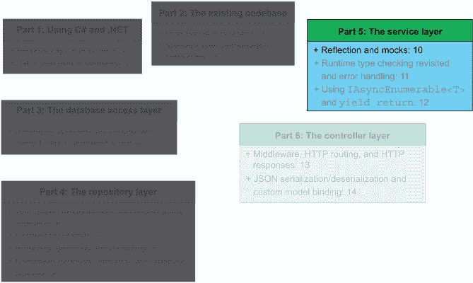
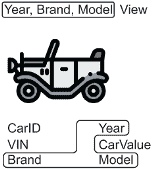
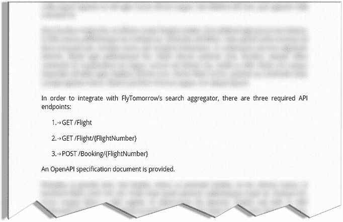
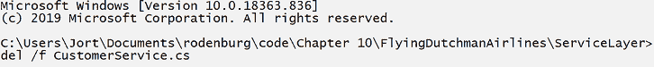
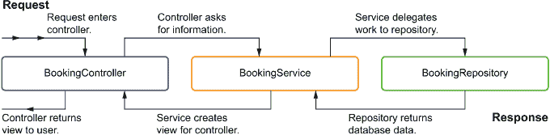
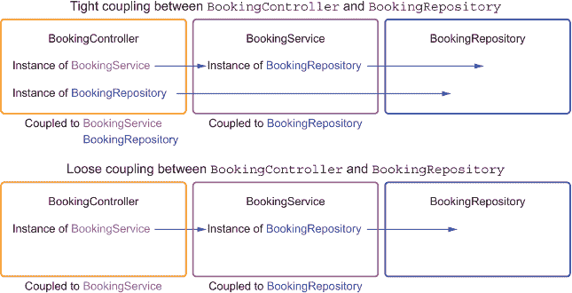
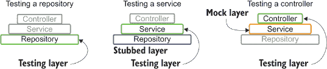
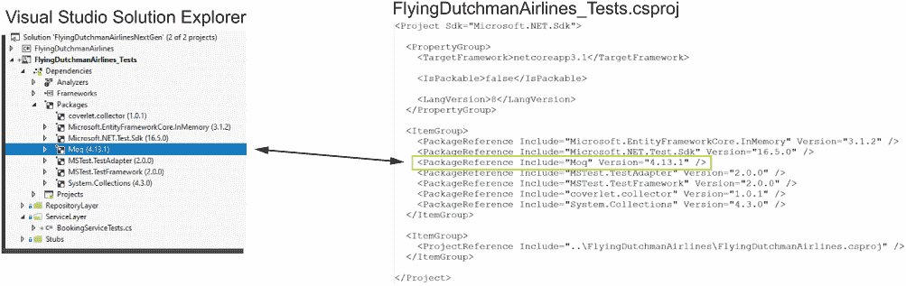
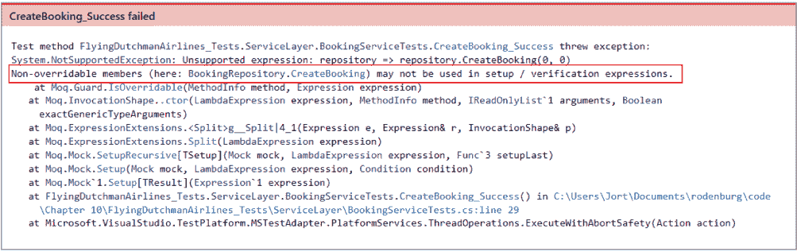

# 10 反思和模拟

本章涵盖

+   使用存储库/服务模式和视图的复习

+   使用 Moq 库进行模拟测试

+   在多层测试架构中检测耦合

+   使用预处理器指令

+   使用反射在运行时检索程序集信息

在第六章到第九章中，我们实现了`FlyingDutchmanAirlinesNextGen`项目的存储库层。在本章中，我们将回顾存储库/服务模式的知识，并实现以下四个必需服务类中的两个（部分）：

+   `CustomerService`（在本章实现）

+   `BookingService`（在本章和第十一章实现）

+   `AirportService`（在第十二章实现）

+   `FlightService`（在第十二章实现）

图 10.1 显示了我们在本书方案中的位置。



图 10.1 本章是服务层实现的开始。我们将在本章实现`CustomerService`和`BookingService`。在接下来的章节中，我们将实现`AirportService`和`FlightService`。

如你所猜，与存储库类一样，我们希望每个数据库实体有一个服务类。我们将在 10.1 节中讨论原因，然后在 10.2 节中讨论`CustomerService`的实现，并在 10.3 节中开始`BookingService`的实现。

在接下来的几章中，一旦我们习惯了实现服务类，实现速度就会加快。我会逐节采取更少干预的方法，将越来越多的实现细节留给你去编码。如果你遇到困难，可以随时回顾相应的章节以获取更多详细信息。

## 10.1 再次探讨存储库/服务模式

在 5.2.4 节中，我们讨论了存储库/服务模式。我向你展示了在存储库/服务模式中，对于每个数据库实体（`Customer`、`Booking`、`Airport`、`Flight`），我们都有以下内容：

+   控制器

+   服务

+   存储库

这些控制器、服务和存储库位于单个数据库访问层之上，我们在第五章中实现了它。我们的存储库/服务模式中的请求生命周期，如图 10.2 所示，是一个 HTTP 请求进入控制器。控制器调用其相应实体的服务类。实体的服务类调用它需要处理的任何存储库类，组织它需要返回给用户的信息。服务类返回到控制器，控制器随后将所有数据返回给用户。


图 10.2 控制器-服务-存储库生命周期。当请求进入时，它将进入控制器。控制器调用一个服务，该服务调用一个或多个存储库。数据从控制器流向存储库，并从存储库返回。

在第五章到第九章中，我们实现了我们架构所需的存储库。现在轮到为服务做同样的事情了。因为服务仅仅是存储库和控制层之间的中间人，所以服务在复杂性上相对较轻。然而，不要误解：服务层可能是所有层中最重要的一层。没有它，我们就不会有处理如何向客户表示数据的抽象层。服务类调用一系列存储库方法，并将数据的视图返回给控制器。服务类为控制器提供数据。

### 10.1.1 服务类的用途是什么？

在美国，购买一辆车需要应对众多热心的销售人员，随后还要花费数小时处理文件工作。在汽车经销商那里的经历往往是糟糕服务的例子。当我们审视软件架构时，我们同样可以在服务类中看到糟糕的服务。如果一个服务类返回用户未请求的内容，那么我们手头就有了一个糟糕服务的例子。

例如，让我们想象我们正在开发一个汽车经销商的 API。经销商希望向用户展示他们库存中的任何汽车，同时保留一些更有价值的信息，例如汽车的真实价值（通常远低于他们要求的售价）。是否保留信息以获取公司利益是糟糕的服务取决于你是谁。如果你是汽车经销商，这听起来非常合理。如果你是买家，你希望尽可能多地获取信息。那么你将如何实现这样的 API？

返回汽车信息的 API 包括以下常见元素：

+   控制器接受特定汽车 ID 的 HTTP `GET`请求

+   一个从存储库检索信息并将其呈现给控制器的服务层

+   一个从数据库收集汽车实例的存储库

服务类调用存储库的方法，构建我们称之为视图的内容。我们在 3.3.2 节中讨论了视图，但这里是一个快速回顾：视图是一个“窗口”，可以让我们操纵和调整类的外观以满足我们的需求。

注意：有时人们会说 ReturnView 而不是 view。它们的意思相同，你可以互换使用。这本书尽量坚持使用 view。

`Car`类的视图可能包含诸如 VIN、汽车制造商、汽车制造年份和汽车型号等信息，如图 10.3 所示。但由于它只是一个“窗口”，我们可以选择不在视图中显示汽车的真实价值或过去六个月内汽车遭遇的总碰撞次数。



图 10.3 视图是从一个或多个模型中提取的元素集合，以对用户有意义的方式呈现。在这个例子中，我们从`Car`类中提取了`Year`、`Brand`和`Model`属性。

服务类也可能追踪外键约束，在需要时检索信息以编译所需数据的完整图像。我们将在整本书中看到外键约束的实际应用。我们还将更深入地探索单元测试的世界。是的，亲爱的读者：本章我们将再次使用测试驱动开发，但这次，我们将使用 TDD 结合一个新的测试概念：模拟。

## 练习

练习 10.1

在仓库/服务模式中，传入请求的正确数据流是什么？

a. 仓库 -> 服务 -> 控制器

b. 控制器 -> 服务 -> 仓库

练习 10.2

对或错？服务类（在仓库/服务模式中）通常直接与数据库交互。

练习 10.3

对或错？当使用视图时，我们可以返回多个不同数据源的统一表示。

练习 10.4

对或错？人们经常将视图和 ReturnView 互换使用来指代相同的概念。

## 10.2 实现 CustomerService

你准备好实现你的第一个服务了吗？在本节中，我们将实现`CustomerService`类。这个类允许我们将信息从控制器和`CustomerRepository`中传递过来和传过去。

### 10.2.1 为成功做准备：创建骨架类

当开始一个新的类的工作时，我们应该首先做什么？对，创建一个相应的单元测试类。这次我不会向你展示如何创建测试类；只需确保你创建一个具有公共访问修饰符和`TestInitialize`方法的测试类（目前不需要向`TestInitialize`方法中添加任何内容）。此外，为了保持一定的组织性，让我们模仿我们之前使用的仓库测试类的文件夹结构，在`FlyingDutchmanAirlines_Tests`项目中创建一个 ServiceLayer 文件夹，如图 10.4 所示。


图 10.4 CustomerServiceTests 文件位于 FlyingDutchmanAirlines_Tests 项目中的 ServiceLayer 文件夹内。

在我们可以创建一个成功案例单元测试之前，我们需要弄清楚在`CustomerService`类中需要哪些方法。你可能记得，在第七章中，我们在`CustomerRepository`中实现了以下两个方法：

+   `CreateCustomer`

+   `GetCustomerByName`

我们是否应该在`CustomerService`类中模仿那些方法名？嗯，是的，在一定程度上。如果我们保持仓库和服务中方法名的同构关系，这将使我们的代码更易于阅读，因为我们建立了一定的预期。如果一个开发者看到服务类和仓库类中都存在名为`GetCombineHarvester`的方法，开发者会期望`GetCombineHarvester`方法的服务版本调用相同方法的仓库版本。让我们不要让我们的开发者同伴的直觉失望。当然，服务方法可能会调用多个仓库方法，所以选择最能反映你意图的那个。

|    | 在为服务层方法命名时，考虑将方法命名为与您调用的主要仓库层方法相同的名称。这有助于建立直觉，并使您的代码更易于导航。 |
| --- | --- |

话虽如此，没有任何控制器直接调用`CreateCustomer`或`GetCustomerByName`方法。相反，我们与`Customer`实体的唯一交互是通过其他服务。我们如何知道控制器不会直接调用服务？在图 10.5 中，我们看到以下三个由飞荷兰人航空公司与 FlyTomorrow 之间的合同规定的必需端点（在第 3.1 节和第 3.2 节中讨论过）：

+   `GET /Flight`

+   `GET /Flight/{FlightNumber}`

+   `POST /Booking/{FlightNumber}`



图 10.5 FlyTomorrow 在第三章中讨论的三个必需端点。有两个`GET`端点和一个是`POST`端点。

这些端点中没有任何一个直接与`Customer`实体交互。在端点路径或路径参数中也没有出现“customer”这个词。我提出一个相当激进的看法：如果没有任何控制器直接调用服务，我们就不需要这个服务。实际上，我们甚至可以说，我们也不需要为该实体提供控制器，因为它永远不会被调用。换句话说，我们不需要`CustomerService`，也不需要`CustomerController`。嗯，这真是一件让人开心的事情，不是吗？我总是欣赏工作量减少。

### 10.2.2 如何删除自己的代码

到目前为止，我要求你做一件可能成为你一天中最亮点的事情：删除代码。我是认真的。如果你对删除代码感到不安，这一节就是为你准备的。我希望你将删除代码视为一个充满禅意的体验。当你找到更好的替代方案时，允许自己删除自己的代码是开发人员的一项关键技能，而且比你想象的要难。

在第 10.2.1 节中，我们创建了以下两个类：

+   `CustomerService`

+   `CustomerServiceTests`

`CustomerServiceTests`类包含一个未实现的`TestInitialize`方法。我们还确定我们不需要`CustomerService`和`CustomerServiceTests`类，因为它们永远不会被控制器调用。在现实世界中，我坚决支持删除需要删除的代码。考虑一下空类、注释掉的代码和错误的实现。如果你担心破坏现有的代码（你应该担心），那么我希望你有一个完整的测试套件可以依赖来验证重构的正确性。你还应该使用源代码控制系统，这样你就可以在代码删除产生意外的副作用时恢复到之前的状态（你应该*始终*使用源代码控制系统）。

|    |
| --- |

删除代码

删除代码令人害怕。对于犹豫删除自己的作品的常用说法是“杀死你的宝贝”。然而，为了交付尽可能好的工作，你必须吞下你的骄傲，删除你自己的（通常是美丽而优雅的）代码。如果你为了更好的实现而删除代码，那不是失败——恰恰相反，那是一种胜利。即使你没有自己编写新的实现，你也应该认为这是一个积极的改变。新的方法无疑是更易读和可维护的，这将在未来为你（和他人）节省很多痛苦。

我想提醒大家一个特殊情况，你应该无情地删除代码，无论是自己的设计还是别人的：被注释掉的代码。我要说的是，我敢打赌有些人会不同意我：被注释掉的代码在生产代码库中没有任何位置。就这样。你绝对不要将注释掉的代码合并到主分支中。想想代码为什么会被注释掉。它是解决方案的替代方法吗？它是旧实现吗？它是半吊子新实现吗？它是你未来可能需要的东西（不太可能）吗？在我看来，这些理由不足以证明你用一块丑陋的注释代码破坏了我的美丽代码库。如果你想在代码库中保留注释代码，你可以让它工作（并取消注释），或者你不必那么迫切地需要它。

例如，以下代码块包含一个有实现的方法，但有一个不同实现的注释：

```
// This code is too complicated! There is a better way.
// public bool ToggleLight() => _light = !_light;

public bit ToggleLight() => _light ^= 1;
```

现在，代码中的注释确实有一个合理的观点。`IsToggleLight` 方法运行时使用位异或运算符来翻转 `_`light` 位。注释中的实现确实更容易阅读。然而，它也带来了一些未知因素，因为它改变了 `ToggleLight` 方法的返回类型和 `_`light` 的底层类型（两者都从 `bit` 变为 `bool`），但我们可以处理这一点。那么，为什么这段代码从未被取消注释或实现呢？它没有通过代码审查吗？它不起作用吗？这是一个由不满的高级工程师或试图给某人留下深刻印象的新开发者留下的被动-aggressive “供未来参考”的注释吗？这无关紧要。

|

所以，拿起你最喜欢的破坏性删除方式（虚拟的；不要在你的笔记本电脑上使用冲击钻——出版商和我不对你的遗憾生活选择负责）。我偏爱图 10.6 中显示的古老命令行删除命令：Windows 中的 `del /f [file]` 和 macOS 中的 `rm -rf [file]`。



图 10.6 在 Windows 命令行中删除文件，请使用 `del /f [FilePath]` 语法。感到一股力量涌动并尖叫“凭借神的力量！”是可选的。

那里，难道没有感觉到很强大吗？我确实从中得到了很大的提升，但这可能比你需要的关于我的信息更多。让我们继续前进，做一些实际的工作，好吗？

## 练习

练习 10.5

为什么我们想要使用与调用它的仓库方法相同的名称作为服务类方法名？

a. 这在两个方法之间建立了一种同构关系，并有助于为其他开发者创建有效的期望。

b. 我们不想这么做。如果服务和仓库类中包含具有相同名称的方法，则代码将无法编译。

c. 我们确实想这么做，但前提是方法名中必须有一个动词。

练习 10.6

你遇到了一行被注释掉的代码，这似乎表明了一种替代当前运行代码的方法。你该怎么办？

a. 保持原样。这不是你的问题。

b. 通过在原始评论中添加问题来请求澄清。

c. 找出为什么它在那里，并且在大多数情况下，删除被注释掉的代码。

练习 10.7

`^`运算符代表什么？

a. 逻辑或操作

b. 逻辑与操作

c. 逻辑与非操作

d. 逻辑异或操作

练习 10.8

使用`^=`运算符对布尔值有什么影响？

a. 布尔值翻转（`true`变为`false`，`false`变为`true`）。

b. 没有操作（`true`保持`true`，`false`保持`false`）。

c. 布尔值翻转两次（`true`保持`true`，`false`保持`false`）。

## 10.3 实现 BookingService

在第 10.1 节中复习了仓库/服务模式，并在第 10.2 节中尝试实现实际的服务类后，我们终于到了开始实际工作在服务类上的阶段——这次不是开玩笑。在本节中，我们将实现一个针对`Booking`实体的服务。

当我们在第 10.2 节中讨论服务类需求时，我们提到如果没有控制器类会调用相应的服务，则不需要专用服务层。即使我自己这么说，这也是一条很好的建议，所以让我们再次为`BookingService`类重复这个练习。是否有需要直接使用`Booking`实体的 API 端点？好吧，让我们再次查看 FlyTomorrow 合同中规定的以下三个必需端点：

+   `GET /Flight`

+   `GET /Flight/{FlightNumber}`

+   `POST /Booking/{FlightNumber}`

`POST /Booking/{FlightNumber}`端点直接处理`Booking`实体，正如路径所示。FlyTomorrow 使用`POST`端点在数据库中创建新的预订。由于我们需要有一个`BookingController`来接受 HTTP 请求，因此从该控制器调用`BookingService`是合理的。记住，服务层的目的是从仓库中收集和组织数据。因此，为了创建预订，控制器会调用`BookingService`类中的方法，该方法调用所需的仓库以执行其承诺的职责，如图 10.7 所示。



图 10.7 `Booking`实体的生命周期。请求通过`BookingController`（尚未编写）处理，它调用`BookingService`，然后`BookingService`调用`BookingRepository`。然后，路径回溯到调用者。

通过思考`BookingService`应该提供哪些功能，我们可以得出创建新预订所需的方法：一个异步的`public`方法，调用`BookingRepository.CreateBooking`并返回适当的信息给控制器。在这里，适当的信息可能是一个表示`CreateBooking`方法已执行并完成的`Task<(bool, Exception)>`。如果预订失败，我们得到一个假的布尔值以及`CreateBooking`方法抛出的异常：`(false, thrownException)`。如果预订成功，我们返回一个真的布尔值和一个空指针（如果你启用了可空引用类型，你可能需要通过后缀一个问号字符将`Exception`转换为可空类型：`Exception?`）。如果你不想定义布尔返回值，你可以改用`Task`的内部`IsCompleted` `bool`。

我们还应该查看数据库模式（图 10.8）。`Booking`模型有以下两个外键约束：

+   一个指向`Customer.CustomerID`的外键约束

+   一个指向`Flight.FlightNumber`的外键约束


图 10.8 Flying Dutchman Airlines 数据库模式。预订模型有两个外键约束：一个指向`Customer.CustomerID`，一个指向`Flight.FlightNumber`。

作为我们输入验证的一部分，我们应该检查传入的表示`CustomerID`和`FlightNumber`的值是否有效。我们通过调用适当的存储库方法（在这种情况下，`CustomerRepository.GetCustomerByID`和`FlightRepository.GetFlightByFlightNumber`）来验证传入的值。验证输入参数也引发了一个问题：如果传入的`CustomerID`或`FlightID`在数据库中不存在，我们该怎么办？如果客户在数据库中不存在，这意味着他们之前没有通过 Flying Dutchman Airlines 预订过航班。我们不希望失去任何客户（因此，收入），所以我们调用`CustomerRepository.CreateCustomer`方法（在第十一章中实现）。如果航班不存在，预订将失败，因为我们没有权限随时添加新航班。

我们将我们的方法命名为`CreateBooking`，因为这就是我们在方法中做的事情，并且需要两个整数作为输入参数（`customerID`和`flightNumber`）。要调用`BookingRepository.CreateBooking`方法，我们首先需要实例化一个`BookingRepository`类型的实例。如果你还记得，当我们在第八章实现`BookingRepository`时，我们在仓库的构造函数中需要一个`FlyingDutchmanAirlinesContext`的实例。这样做是为了“注入”依赖关系，而不必担心它是如何实例化的。然而，我们现在必须担心这个问题，因为我们想要实例化一个`BookingRepository`并需要传递所需的`FlyingDutchmanAirlinesContext`依赖关系。也许我们可以将这个问题推迟一点。如果我们要求在`BookingService`的构造函数中注入`BookingRepository`的实例，如下一列表所示，我们的问题现在解决了……至少目前是这样。

列表 10.1 将`BookingRepository`注入到`BookingService`

```
public class BookingService {
  private readonly BookingRepository _repository;         ❶

  public BookingService(BookingRepository repository) {   ❷
    _repository = repository;                             ❸
  }
}
```

❶ 注入实例的支撑字段

❷ 注入一个`BookingRepository`实例

❸ 我们只能在构造函数中分配只读字段

那么，在运行时我们从哪里获取这个`BookingRepository`的实例？我们可能不希望控制器层去实例化它，因为这会将仓库层耦合到控制器层。这听起来像是不希望看到的紧密耦合，因为仓库层已经耦合到服务层，服务层又耦合到控制器层，如图 10.9 所示。



图 10.9 如果我们在`BookingController`内部有一个`BookingRepository`的实例，这两个类之间就存在紧密耦合。如果`BookingController`通过`BookingService`间接调用`BookingRepository`，我们就有了较松的耦合。

我们如何避免在控制器中创建`BookingRepository`的实例，同时又不失去创建和使用`BookingService`实例的能力？答案就在眼前：依赖注入。当我们到达控制器层时，我们将一个`BookingService`的实例注入到`BookingController`中。这个`BookingService`是如何实例化的，这是一个留给你思考的谜题（我们将在第十三章讨论如何在服务启动时设置依赖注入）。现在，我们只需要理解依赖注入的基本原理以及我们如何与`BookingService`一起使用它。`BookingService`也应该有一个注入的`CustomerRepository`类型的实例，这样我们就可以在预订航班之前获取客户详情。这个任务留给你来完成。如果你遇到了困难，请参考前面的段落。当然，你可能在注入`CustomerRepository`类型之前将`_repository`变量重命名为类似`_bookingRepository`的名称，但这取决于你。考虑一下你最想看到什么。什么是最易读的？

在我们继续实际实现 `BookingService.CreateBooking` 方法之前，我们应该创建一个支持单元测试——我们应该至少尝试遵循测试驱动开发实践。如果你还没有这样做，请在名为 `ServiceLayer` 的文件夹中创建一个名为 `BookingServiceTests` 的测试文件（在 `FlyingDutchmanAirlines_Tests` 项目中），如图 10.10 所示。


图 10.10 `BookingServiceTests` 文件位于 `FlyingDutchmanAirlines_Tests` 项目中 `ServiceLayer` 文件夹内。

要开始我们的单元测试，创建一个名为 `CreateBooking_Success` 的单元测试方法，它实例化一个 `BookingService` 并调用（仍然是虚构的）`CreateBooking` 方法，如下所示。

列表 10.2 骨架 `CreateBooking_Success` 单元测试

```
[TestClass]
public class BookingServiceTests {
  private FlyingDutchmanAirlinesContext _context; 

  [TestInitialize]                                                          ❶
  public void TestInitialize() {
  DbContextOptions<FlyingDutchmanAirlinesContext> dbContextOptions = new    ❶
➥ DbContextOptionsBuilder<FlyingDutchmanAirlinesContext>()                 ❶
➥ .UseInMemoryDatabase("FlyingDutchman").Options;                          ❶

  _context = new FlyingDutchmanAirlinesContext_Stub(dbContextOptions);      ❶
  }                                                                         ❶

  [TestMethod]
  public async Task CreateBooking_Success() {
  BookingRepository repository = new BookingRepository(_context);           ❷
  BookingService service = new BookingService(repository);                  ❸
  (bool result, Exception exception) = 
➥ await service.CreateBooking("Leo Tolstoy", 0);
  }
}
```

❶ 设置内存数据库

❷ 创建 `BookingRepository` 实例，注入数据库上下文

❸ 创建一个 `BookingService` 实例，注入 `BookingRepository` 实例

表面上看，我们似乎只需要处理那个不可避免的编译错误，即编译器找不到 `BookingService` 中的 `CreateBooking` 方法。我们预料到这个错误并且可以处理它：在 `BookingService` 类中添加一个名为 `CreateBooking` 的骨架方法。我们将让 `CreateBooking` 方法接受两个参数：一个包含客户名称的整数和一个表示航班号的整数，如下所示：

```
public async Task<(bool, Exception)> 
➥ CreateBooking(int customerName, int flightNumber)  {
  return (true, null);
}
```

列表 10.2 中还有一个问题：一段逻辑上合理但不会完全做到的代码片段。我指的是我们在将 `BookingService` 分配给 `service` 变量时的实例化方式：

```
BookingService service = new BookingService(repository);
```

在下一节中，我们将进一步剖析这个作业的问题。

### 10.3.1 在架构层之间进行单元测试

在本节中，我将向您介绍将单元测试范围限制在您直接架构层的概念。本节包含了一本技术书中相对独特的元素：苏格拉底对话。

因为 `BookingService` 需要一个注入的实例 `BookingRepository`（通过其唯一可用的构造函数），所以我们简单地创建了 `BookingRepository` 的新实例，如列表 10.2 所示。这在语法上是完全合法的代码。但我想要说服你相反。让我们在（某种程度上不符合形式且受阿尔基比阿德斯二世启发）以下苏格拉底对话中进行实验：

*对话人物：苏格拉底和菲德拉*

环境：奥林匹斯山深处的一个隔间

**SOCRATES**：你在测试 `BookingService`，菲德拉吗？

**PHAIDRA**：是的，苏格拉底，我是。

**SOCRATES**：你似乎很烦恼，眼睛向下看。你在想什么吗？

**PHAIDRA**：我应该想些什么？

**SOCRATES**：哦，各种各样的事情，我想。也许是如何正确测试代码库，或者一只未迁徙的麻雀的飞行速度？

**PHAIDRA**：当然。

**苏格拉底**：那么，你不认为在测试之前确定你要测试的内容是最重要的吗？

**菲德拉**：当然，苏格拉底。但你说话像疯子一样；你肯定不会认为我不知道我在测试什么吧？

**苏格拉底**：那么，让我们讨论正确测试某事物意味着什么。测试牛车是否意味着你测试牛？测试里拉琴弦的拨动是否意味着你像玛尔斯亚斯、缪斯和尼塞恩仙女一样测试阿波罗的技艺？

**菲德拉**：当然不是。

**苏格拉底**：难道抄写员的笔迹的准确表示不反映对演说者嗓音的测试吗？

**菲德拉**：这是我的观点。

**苏格拉底**：那么，在处理服务时，是否需要测试并有一个准确的存储库表示？

**菲德拉**：苏格拉底，你狡猾而机智。

**苏格拉底**：所以，我们一致认为，如果你测试`BookingService`类，你是否也需要测试`BookingRepository`类？

**菲德拉**：我们意见一致。

即使在古希腊，如何正确测试代码也是一个热门话题！让我们自问一个问题：在`BookingService`单元测试中，我们想测试什么？我们应该验证当给`BookingService`适当的输入时，它是否返回正确的输出吗？是的，听起来很对。我们也应该测试`BookingRepository`是否做同样的事情吗？嗯，是的，在某种程度上。

如果`BookingRepository`不能正确工作，它会对`BookingService`产生不希望的结果。在测试`BookingService`时，我们不能假设`BookingRepository`工作正常，因为我们已经为该类设置了单元测试，对吗？嗯，是的，这有些道理。如果我们能以某种方式跳过`BookingService`代码，并在需要时返回有效信息，我们就可以在测试期间控制存储库层的所有代码执行。此外，如果我们实例化一个`BookingRepository`并将其注入到`BookingService`中，测试将操作实际的`BookingRepository`实例，因此也会在内存数据库上操作，如图 10.11 所示。



图 10.11 在多层架构中，我们只测试我们正在执行的代码所在的层，并模拟或存根下一层。因此，我们不会与更低的层交互。

当测试多层架构（如我们使用的存储库/服务模式）时，你通常不需要测试低于你正在工作的那一层的实际逻辑。如果你正在测试存储库层，你可以模拟或存根数据库访问层（这就是我们使用`FlyingDutchmanAirlinesContext_Stub`类所做的那样）。如果你正在测试服务层，你不需要验证存储库层的逻辑。

### 10.3.2 存根和模拟的区别

在整本书中，我们使用了`FlyingDutchmanAirlinesContext_Stub`来对`FlyingDutchmanAirlines`项目的仓库层进行单元测试。在本节（以及接下来的章节）中，我将向您介绍另一种在测试期间控制代码执行的方法：模拟。我们还将探讨存根和模拟之间的区别。

当我们想要执行与原始类不同的代码时，存根非常有用。例如，`context.SaveChangesAsync`方法将 Entity Framework Core 内部`DbSets`所做的更改保存到数据库中。在第 8.4 节中，我们想要执行方法的不同版本，因此我们创建了一个存根（`FlyingDutchmanAirlinesContext_Stub`）并重写了父类的`SaveChangesAsync`方法。

在模拟中，我们不对方法提供任何新的实现。当我们使用模拟时，我们告诉编译器实例化一个`Mock<T>`类型的类型，它伪装成`T`。由于 Liskov 替换原则，我们可以将模拟用作类型`T`。而不是实例化并注入实际的`T`类实例，我们实例化并注入模拟。

在我们的案例中，我们想要一个`Mock<BookingRepository>`。当在测试期间`BookingService`中的代码调用这个模拟的`CreateBooking`方法时，我们想要执行以下两个操作之一：

+   当我们想要模拟成功条件时，立即从方法返回（实际上不在数据库中创建预订）。

+   当我们想要模拟失败条件时，抛出`Exception`。

因为我们只需要做这两件简单的事情，而且我们不需要在内存数据库中执行任何检查实体的逻辑（就像我们在存根中做的那样），所以使用模拟会更简单。您还没有被说服？好吧，请系好您的帽子，阅读下一节。

### 10.3.3 使用 Moq 库模拟类

在第 10.3.2 节中，我们简要讨论了模拟和存根之间的区别。现在是我向大家展示如何在实际中运用模拟以及我们需要做什么来实现这一点的时候了。首先，C#和.NET 5 都没有专门的模拟功能，因此我们需要使用第三方（开源）库来模拟我们的类：Moq。当然，您可以使用许多其他的模拟库或框架（Telerik JustMock、FakeItEasy 和 NSubstitute 是一些例子）。我选择 Moq 是因为它被广泛使用且易于使用。

要安装 Moq，您可以使用 Visual Studio 中的 NuGet 包管理器，或者在 FlyingDutchmanAirlines_Tests 文件夹中使用命令行，就像我们在第 5.2.1 节中做的那样，如下所示：

```
>\ dotnet add package Moq
```

此命令将 Moq 包添加到 FlyingDutchmanAirlines_Test 项目中。为了验证 Moq 包已被添加，您可以在 Visual Studio 中检查 Moq 引用，或者打开 FlyingDutchmanAirlines_Test.csproj 文件并查找 Moq 包引用，如图 10.12 所示。



图 10.12 将包引用添加到项目的 .csproj 文件中。Visual Studio 扫描此文件，并在解决方案资源管理器面板中显示添加的包。对 .csproj 或 Visual Studio 的编辑会自动传播到这两个地方。

在我们能够使用 Moq 之前，我们必须将其命名空间导入到 `BookingServiceTests` 类中。为了创建一个 `BookingRepository` 类型的模拟并从 `CreateBooking` 方法返回适当的输出（一个完成的 `Task`），我们需要执行以下操作：

+   实例化一个 `Mock<BookingRepository>`。

+   设置 `Mock<BookingRepository>` 以在调用 `CreateBooking` 时返回一个完成的任务。

我们知道如何执行列表中的第一项——实例化一个 `Mock<BookingRepository>`——因为实例化模拟与实例化任何其他类没有区别。让我们在 `CreateBooking_Success` 单元测试中创建模拟的实例，如下所示：

```
Mock<BookingRepository> mockRepository = new Mock<BookingRepository>();
```

您可以使用 `mock.Setup([lambda expression to call method])).[return]` 语法设置模拟，当调用方法时返回特定值。因为我们想调用（并模拟）`CreateBooking` 方法，所以我们可以使用的 lambda 表达式是 `repository => repository.CreateBooking(0, 0)`。然后我们指定我们想要返回的内容：`Returns(Task.CompletedTask)`，如下所示。

列表 10.3 设置 `BookingRepository` 的模拟并调用 `CreateBooking`

```
Mock<BookingRepository> mockRepository = new Mock<BookingRepository>();    ❶
mockRepository.Setup(repository => 
➥ repository.CreateBooking(0, 0)).Returns(Task.CompletedTask);            ❷
```

❶ 我们实例化一个新的 `BookingRepository` 模拟实例。

❷ 如果模拟调用 `CreateBooking` 并传递两个值为零的参数，则返回 `Task.CompletedTask`

不幸的是，列表 10.3 中的代码无法正确运行。Moq 抛出一个运行时异常，如图 10.13 所示，表示它无法从无法覆盖的类中实例化模拟。



图 10.13 Moq 抛出运行时异常，因为我们尝试模拟一个不可覆盖的类。

`BookingRepository.CreateBooking` 不是一个虚方法，所以 Moq 无法覆盖该方法以实现其新版本。Moq 还需要能够调用无参数的构造函数，而 `BookingRepository` 没有这样的构造函数。

为了解决这两个问题，我们首先将 `BookingRepository.CreateBooking` 方法设置为 `virtual`，如下所示：`

```
public virtual async Task CreateBooking(int customerID, int flightNumber)
```

然后，我们为 `BookingRepository` 创建一个无参数的构造函数，如下所示：`

```
public BookingRepository() {}
```

但如果我们的所有工作都白费了，确保开发人员通过构造函数使用注入的 `FlyingDutchmanAirlinesContext` 实例化 `BookingRepository`，那就太遗憾了。我真的希望新的构造函数具有 `private` 访问修饰符，但这样单元测试就无法访问它们（因为单元测试位于与存储库层不同的程序集）。这里有几个技巧可以帮助我们。以下是最常用的三个：

+   使用 `[assembly: InternalsVisibleTo([assembly name])`] 属性。

+   使用 `#warning` 预处理器指令生成编译器警告。

+   验证正在执行的程序集与单元测试程序集不匹配。

让我们逐一解开它们。

`InternalsVisibleTo` 方法属性

首先，`[assembly: InternalsVisibleTo([assembly name])]` 属性，您只能将其应用于程序集，允许不同的程序集（在我们的例子中是 `FlyingDutchmanAirlines _Tests.ServiceLayer` 程序集）访问和操作带有内部访问修饰符的包含程序集（`FlyingDutchmanAirlines`）中的方法、属性和字段。当 CLR 看到内部可见性属性时，它会记录给定的程序集，并将其指定为尝试访问其内部程序集的“友元”程序集。在实践中，当 CLR 编译到中间语言时，它将友元程序集视为与包含程序集相同的程序集。

使用友元程序集和 `InternalsVisibleTo` 属性方法的问题在于，`InternalsVisibleTo` 属性非常挑剔。Stack Overflow 上有大量关于如何正确使用该属性的提问。除了可用性问题之外，我们也不太愿意测试私有方法。理想情况下，我们应该通过使用它们的公共方法来测试所有私有方法。测试不应该走任何普通用户不会走的路径。因为普通用户不会通过调用其私有方法与类进行交互，单元测试也不应该这样做。`InternalsVisibleTo` 方法属性是了解的好东西，但不是实际使用的好方法。关于 `InternalsVisibleTo` 的真正实用提示是，避免使用它，直接不使用即可。

提示：有关方法和成员访问权限的更多信息，请参阅 CLR 的“圣经”：Jeffrey Richter 的 *CLR via C#*（第 4 版；Microsoft Press，2012 年）。然而，请注意，这本书假设了本书中涵盖的大量知识。

预处理器指令（#warning 和 #error）

其次，我们可以在源代码中使用预处理器指令。预处理器指令是以 `#` 字符开头的命令，在编译之前解析。编译器扫描代码库中的预处理器指令，并在编译之前执行它们。为了处理编译警告和错误，我们可以使用 `#warning` 和 `#error` 预处理器指令。`#warning` 抛出编译器警告，而 `#error` 在遇到警告和错误时抛出编译器错误。要通过 `#warning` 指令在我们的公共无参数构造函数中添加编译器警告，请将指令及其消息添加到构造函数中。值得注意的是，我们总是将预处理器指令插入到源代码中，不进行缩进（无论是空格还是制表符），如下所示：

```
  public BookingRepository() {
#warning Use this constructor only in testing
  }
```

使用 `#warning` 预处理器指令效果不错，但如果我们有大量的 `#warning` 指令，我们的编译过程将导致很多警告，这会降低它们的整体价值，并使得其他警告容易被忽视。另一个缺点是，仅仅因为有一个警告并不意味着开发者会注意到它。请参阅图 10.14 中的示例。


图 10.14 `#warning` 预处理器指令生成带有给定字符串的编译器警告。这里我们看到的是在 Visual Studio 2019 中显示的编译器警告。

匹配执行和调用汇编名称

第三，我提出了一种程序性黑客攻击的可能性：通过使用反射，我们可以访问执行或调用汇编的名称（有关汇编是什么的讨论，请参阅第 2.3.1 节）。当我们从 `FlyingDutchmanAirlines` 汇编内部调用 `BookingRepository.CreateBooking` 的无参构造函数时，调用汇编是 `FlyingDutchmanAirlines`。如果我们从不同的汇编中调用相同的构造函数，比如说，`FlyingDutchmanAirlines_Tests` 汇编，CLR 没有提供所需信息来提供执行汇编名称，因为它通常只能检索执行汇编的信息。

我们可以通过检查调用汇编是否等于当前 *执行* 汇编来利用这一点。如果是这样，有人正在偷偷摸摸地以错误的方式实例化 `BookingRepository`。当然，将汇编名称相互比较并不是万无一失的。有人可以创建一个新的汇编并使用错误的构造函数，但这样做需要付出的努力使得这种情况不太可能。我们通过使用 `Assembly` 类来访问调用和执行汇编的名称，如下一列表所示。

列表 10.4 比较执行和调用汇编名称

```
public BookingRepository() {
  if(Assembly.GetExecutingAssembly().FullName == 
➥ Assembly.GetCallingAssembly().FullName) {                     ❶
  throw new Exception("This constructor should only be used for 
➥ testing");                                                    ❷
  }
}
```

❶ 将执行汇编与调用汇编名称进行比较

❷ 如果构造函数被错误访问，则抛出异常

在列表 10.4 的代码中，如果开发者在 `FlyingDutchmanAirlines` 汇编内部尝试实例化 `BookingRepository` 的一个实例，并且没有使用适当的构造函数，那么代码在运行时会抛出一个 `Exception`，因为执行汇编和调用汇编的名称匹配。

使用反射获取调用汇编名称有一个注意事项：CLR 使用最后一个执行的堆栈帧来获取调用汇编名称，但如果一些代码被编译器内联了，那么这个堆栈帧可能不包含正确的信息。

编译器方法内联

在编译过程中，当编译器遇到对另一个类中方法的调用时，通常将方法调用替换为被调用方法的主体对性能有益。这减少了跨文件计算量，并且通常可以提高性能。然而，也存在收益递减的点。当被调用方法非常大且包含对其他大型方法的调用时，编译器可能会陷入一个死胡同。然后编译器会将深层嵌套方法的主体复制到原始调用类中，在你意识到之前，你的类的大小和复杂性就会急剧增加。现代编译器非常擅长检测这类问题，所以通常这不是你需要担心的事情。

此外，编译器通常不会尝试内联递归方法，因为这会导致编译器陷入一个无限循环，其中它试图将相同方法的主体永久地复制到自身中。有关编译器内联（以及编译器的一般信息），请参阅 Alfred V. Aho、Monica S. Lam、Ravi Sethi 和 Jeffrey D. Ullman 的 *Compilers: Principles, Techniques & Tools*（第 2 版；Pearson Education，2007）。

幸运的是，我们可以通过使用方法实现（`MethodImpl`）方法属性来告诉编译器不要在特定方法中内联代码。`MethodImpl` 方法属性允许我们指定编译器应该如何处理我们的方法，而且，令人惊讶的是，有一个选项是停止编译器内联给定方法。让我们将 `MethodImpl` 方法属性添加到构造函数中，并要求编译器不要内联该方法，如下所示：

```
[MethodImpl(MethodImplOptions.NoInlining)]
public BookingRepository() {
  if (Assembly.GetExecutingAssembly().FullName == 
➥ Assembly.GetCallingAssembly().FullName) {
  throw new Exception("This constructor should only be used for 
➥ testing");
  }
}
```

回到 `CreateBooking_Success` 单元测试，我们现在有一个可以注入到 `BookingService` 的 `Mock<BookingRepository>` 实例。将模拟实例注入到 `BookingService` 允许我们在不担心 `BookingRepository` 类的实现细节的情况下测试 `BookingService`。要注入 `Mock<T>`，我们需要使用模拟的底层对象，即实际模拟的对象：`Object`。如果我们不使用模拟的 `Object` 属性，我们将传递 `Mock<T>` 的实际实例，这不符合所需的依赖项。要使用模拟的 `Object` 属性，你调用 `[mock].Object` 属性，如下所示。

列表 10.5 将模拟实例注入到 `RepositoryService`

```
[TestMethod]
public async Task CreateBooking_Success() {
  Mock<BookingRepository> mockBookingRepository = new 
➥ Mock<BookingRepository>();                                      ❶
  mockBookingRepository.Setup(repository => 
➥ repository.CreateBooking(0, 0)).Returns(Task.CompletedTask);    ❷

  BookingService service = new 
➥ BookingService(mockBookingRepository.Object);                   ❸
  (bool result, Exception exception) = 
➥ await service.CreateBooking("Leo Tolstoy", 0);                  ❹

  Assert.IsTrue(result);
  Assert.IsNull(exception);
}
```

❶ 创建 BookingRepository 的模拟

❷ 设置模拟的 CreateBooking 方法的正确返回值

❸ 将模拟注入到 BookingService

❹ CreateBooking 方法返回一个命名元组。

我们还需要一个当调用 `GetCustomerByName` 时返回新 `Customer` 对象的 `CustomerRepository` 模拟。我们现在知道该怎么做。将 `virtual` 关键字添加到 `GetCustomerByName` 方法中，并确保我们可以模拟 `CustomerRepository`（添加一个类似于我们为 `BookingRepository` 做的构造函数），如下所示：

```
[TestMethod]
public async Task CreateBooking_Success() {
  Mock<BookingRepository> mockBookingRepository = new 
➥ Mock<BookingRepository>(); 
  Mock<CustomerRepository> mockCustomerRepository = new 
➥ Mock<CustomerRepository>();

  mockBookingRepository.Setup(repository => 
➥ repository.CreateBooking(0, 0)).Returns(Task.CompletedTask); 
  mockCustomerRepository.Setup(repository => 
➥ repository.GetCustomerByName("Leo 
➥ Tolstoy")).Returns(Task.FromResult(new Customer("Leo Tolstoy")));

  BookingService service = new 
➥ BookingService(mockBookingRepository.Object, 
➥ mockCustomerRepository.Object); 
  (bool result, Exception exception) = 
➥ await service.CreateBooking("Leo Tolstoy", 0);

  Assert.IsTrue(result);
  Assert.IsNull(exception);
}
```

在测试驱动开发方面，我们目前处于绿色阶段，并试图进入红色阶段。在我们继续之前，我们应该做一些快速的清理工作。因为我们使用了一个模拟，所以我们不需要在这个测试类中使用 `FlyingDutchmanAirlinesContext` 的存根或 `dbContextOptions`。我们现在应该从 `TestInitialize` 方法中移除存根的实例化、相应的后置字段和 `dbContextOptions`。我将这个任务留给你去做。

如果我们现在运行我们的测试，我们会看到它们通过了。不幸的是，它们通过的原因是错误的。在 10.3 节中，我们为 `BookingService.CreateBooking` 添加了一个骨架体以及一个硬编码的返回值。这就是使 `CreateBooking_Success` 单元测试通过的原因。在单元测试中要记住的一个重要教训是，一定要确保你的测试通过正确的原因。通过提供硬编码的返回值或对错误数据进行断言，很容易“伪造”一个成功的测试结果。我们如何确保 `CreateBooking_Success` 单元测试通过正确的原因？我们必须继续实现 `CreateBooking` 方法，我们将在 10.3.4 节中这样做。

### 10.3.4 从服务中调用仓库

我们在 10.3.3 节结束时得到了 `BookingService.CreateBooking` 的骨架实现以及通过 `BookingServiceTests.CreateBooking_Success` 的成功情况完成的单元测试。在本节中，我们将进一步实现 `CreateBooking` 方法，使其调用适当的仓库方法并返回正确的信息。

要完成 `CreateBooking` 方法，我们需要实现以下两个事项：

+   对 `BookingRepository` 的异步调用。在 `try-catch` 块内调用 `GetCustomerByName` 方法

+   从方法中返回适当的元组值集合

在 `try-catch` 块内调用仓库方法允许我们进行错误处理。当在调用的仓库方法内部抛出异常时，`try-catch` 块会捕获该异常，如下所示：

```
public async Task<(bool, Exception)> 
➥ CreateBooking(string name, int flightNumber) {
  try {
    ...
  } catch (Exception exception) {
    ...
  }

  return (true, null);
}
```

在`try-catch`代码块的`try`部分，我们希望使用包含对注入的`CustomerRepository`和`BookingRepository`实例引用的类级私有属性：`_customerRepository`和`_bookingRepository`（在执行我们的单元测试期间，这保留了对`BookingRepository`模拟版本的引用，如第 10.3.3 节所述）。我们使用`_customerRepository`实例来调用其`GetCustomerByName`方法。`GetCustomerByName`方法检索适当的`Customer`实例或抛出`CustomerNotFoundException`，这让我们知道客户未找到。如果不存在，我们调用`CreateCustomer`方法并创建它。之后，我们再次调用`CreateBooking`方法，返回其返回值。调用位于你所在的方法也是称为*递归*。因为`GetCustomerByName`方法抛出了我们实际上想要利用的异常，所以我们将其调用包裹在其自己的`try-catch`块中，如下一个代码示例所示。

定义：当方法调用自身时发生递归。当这种情况发生时，CLR 会暂停当前正在执行的方法以进入方法的新调用。递归通常伴随着沉重的性能和复杂性惩罚。在这里，它被用作教学工具，但在生产环境中，这通常不是解决特定问题的最佳（性能最佳）方式。

列表 10.6 对`CreateBooking`的递归调用

```
public async Task<(bool, Exception)> 
➥ CreateBooking(string name, int flightNumber) {
  try {
    Customer customer;
    try {
      customer =
➥ await _customerRepository.GetCustomerByName(name);    ❶
    } catch (CustomerNotFoundException) {                ❷
      await _customerRepository.CreateCustomer(name);    ❸
      return await CreateBooking(name, flightNumber);    ❹
    }
  ...
}
```

❶ 检查客户是否存在于数据库中，如果存在则获取其详细信息

❷ 客户在数据库中不存在。

❸ 将客户添加到数据库中

❹ 现在递归调用此方法，因为客户已在数据库中

我们现在可以使用`_bookingRepository`变量来调用`BookingRepository`中的`CreateBooking`方法。因为`BookingRepository.CreateBooking`方法应该异步执行，所以我们也在调用中`await`。

当`Task`完成时，因为`try-catch`代码块捕获了没有异常，并且代码返回了`BookingRepository.CreateBooking`方法，我们返回一组表示`success`变量为`true`布尔状态和`null`引用的元组。如果在`BookingRepository.CreateBooking`方法的执行过程中`try-catch`块捕获了`Exception`，我们将返回一组带有`success`变量设置为`false`状态以及捕获到的`Exception`引用的命名元组。通过在`try-catch`语句内部终止所有代码路径，我们不再需要如以下所示占位符返回`(true, null)`。

列表 10.7 `BookingService.CreateBooking`方法

```
public async Task<(bool, Exception)> 
➥ CreateBooking(string name, int flightNumber){
  try {
    Customer customer;
    try {
      customer = await _customerRepository.GetCustomerByName(name);
    } catch (CustomerNotFoundException) {
      await _customerRepository.CreateCustomer(name);
      return await CreateBooking(name, flightNumber);
    }

    await _bookingRepository.CreateBooking(customer.CustomerId, 
➥ flightNumber);
    return (true, null);
  } catch(Exception exception) {
    return (false, exception);
  }
}
```

在我们正式完成`BookingService`类之前，我们只剩下以下几件事情要做：

+   为`customerName`和`flightNumber`输入参数添加输入验证。

+   验证请求的 `Flight` 是否存在于数据库中。如果不存在，我们需要优雅地退出方法。

+   为输入验证、`Customer` 验证和创建以及 `Flight` 验证添加单元测试。

我们将在下一章中做这三件事，并完成 `BookingService` 的实现。在本章中，我们开始实现 `BookingService`，学习了如何使用模拟（使用 Moq 包），并更新了我们对仓储/服务模式的知识。

## 练习

练习 10.9

对或错？在单元测试多层架构时，我们可以将测试关注点立即下方的层替换为模拟或存根。

练习 10.10

假设你正在单元测试一个位于仓储/服务架构控制器层的类。以下哪种方法是正确的方法？

a. 模拟控制器层，存根服务，并使用仓储层。

b. 存根控制器层，不使用服务层，并模拟仓储层。

c. 使用控制器层，模拟服务层，不使用仓储层。

练习 10.11

对或错？通过使用服务层来控制对仓储/服务模式中各种仓储的访问，控制器和仓储之间的耦合度降低，因为控制器通过服务间接调用仓储。

练习 10.12

对或错？模拟用于提供现有方法的替代实现。要使用模拟，你需要提供一个新方法主体，并为覆盖的方法编写替代逻辑。

练习 10.13

对或错？`InternalsVisibleTo` 方法属性可以用来阻止其他程序集查看应用了该属性的程序集的内部结构。

练习 10.14

你可以使用哪个预处理器指令来生成编译器警告？

a. `#error`

b. `^&generate`

c. `#warning`

d. `^&compiler::warning`

练习 10.15

对或错？你可以通过使用反射和程序集命名空间内的方法在运行时请求执行和调用程序集的名称。

练习 10.16

当编译器内联一个方法时，调用该方法代码会发生什么？

a. 没有内容——内联意味着我们立即执行被调用方法。代码不会改变。

b. 编译器将方法调用替换为被调用方法的主体。

c. 编译器将方法调用替换为包含该方法的类的内容。

练习 10.17

如果我们将属性 `[MethodImpl(MethodImplOptions.NoInlining)]` 添加到属性中，会发生什么？

a. 我们会得到编译错误，因为你不能在属性上使用 `MethodImpl` 属性。

b. 属性调用会被内联。

c. 只有在可以获得显著性能提升的情况下，才会内联属性调用。

## 摘要

+   仓储/服务模式将应用程序分为三个层：控制器、服务和仓储。这有助于我们控制数据流和分离关注点。

+   在存储库/服务世界中，控制器持有服务的一个实例，服务持有存储库的一个实例。这是为了确保各个类之间的耦合尽可能松散。如果控制器要持有服务和存储库的实例，我们将对存储库有非常紧密的耦合。

+   视图是用户返回的一个或多个模型的“窗口”。我们使用视图来收集并向用户展示信息。

+   当测试遵循存储库/服务模式（或任何其他多层架构）的解决方案时，你只需要在想要测试的级别进行测试。例如，如果你正在测试控制器类，你可能需要模拟或存根服务层，但测试不需要执行服务层中的实际逻辑。因此，在这种情况下根本不会调用存储库层。这有助于我们只测试原子操作，而不是整个堆栈。如果我们想要跨层测试，我们需要一个集成测试。

+   模拟是一个在调用方法或属性时返回特定返回值的类。它被用来代替原始类。这有助于我们专注于想要测试的层。

+   `InternalsVisibleTo`方法属性用于指定可以访问内部方法、字段和属性的“朋友”程序集。这在单元测试中很有帮助，因为通常测试代码位于我们想要测试的代码的单独程序集中。

+   预处理器指令可以生成编译器警告（`#warning`）和编译器错误（`#error`）。我们还可以使用预处理器指令来控制我们的数据流，当访问修饰符和封装不足时。添加编译器警告可以让开发者知道在特定位置存在潜在的风险。

+   编译器内联意味着编译器用一个被调用方法的主体替换方法调用。这对于性能很有用，因为它减少了跨文件调用。

+   通过使用方法实现（`MethodImpl`）方法属性，我们可以控制编译器的内联偏好。我们可以通过添加`[MethodImpl(MethodImplOptions.NoInlining)]`作为方法属性来强制编译器不内联一个方法。这在重新抛出异常时保留堆栈跟踪非常有用。
