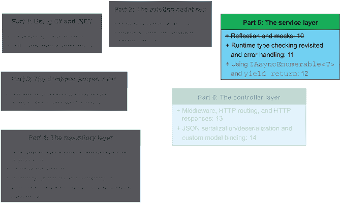
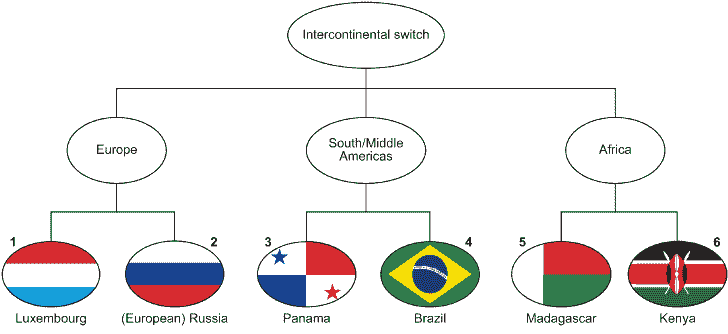
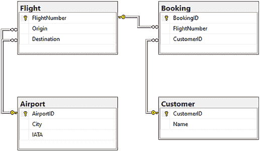
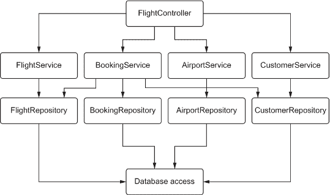
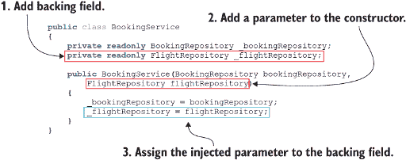
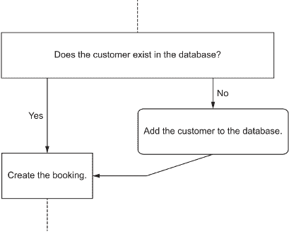

# 11 重新审视运行时类型检查和错误处理

本章涵盖

+   使用`Assert.IsInstanceOfType`测试断言

+   从服务类调用多个存储库

+   使用丢弃运算符

+   使用多个`catch`块

+   使用`is`和`as`运算符在运行时检查类型

在第五章实现了数据库访问层，在第 6 至 9 章实现了存储库层之后，我们开始在第十章实现`BookingService`。我还向您介绍了在单元测试中使用模拟的方法，并讨论了存储库/服务模式。在本章中，我们将使用这些概念，并借鉴我们对服务层知识，来完成`BookingService`的实现。图 11.1 显示了我们在本书方案中的位置。



图 11.1 在本章中，我们完成了`BookingService`类的实现。在下一章中，我们将通过实现`AirportService`和`FlightService`类来完成服务层的封装。

当我们完成`BookingService`的实现时，本章还讨论了使用`Assert.IsInstanceOfType`测试断言来验证一个对象是否为特定类型（或派生自特定类型），丢弃（`_`）运算符及其对中间语言的影响，以及在`try-catch`代码块中使用多个`catch`块。

为了完成`BookingService`的实现，我们需要做以下几步：

+   验证`BookingService.CreateBooking`方法的输入参数（第 11.1 节）。

+   验证我们想要预订的航班是否存在于数据库中（第 11.3 节）。

## 11.1 验证服务层方法输入参数的有效性

许多时候，服务层类充当控制器类和存储库类之间的管道。尽管涉及的逻辑不多，但服务层仍然提供了一个重要的抽象层，以对抗紧密耦合。关于耦合的讨论，请参阅第 8.2 节。

在我们继续之前，我们应该回顾一下我们在`BookingService.CreateBooking`方法中留下的地方：

```
public async Task<(bool, Exception)> 
➥ CreateBooking(string name, int flightNumber) {
  try {
    Customer customer;
    try {
      customer = await _customerRepository.GetCustomerByName(name);
    } catch (FlightNotFoundException) {
      await _customerRepository.CreateCustomer(name);
      return await CreateBooking(name, flightNumber);
    }

    await _bookingRepository.CreateBooking(customer.CustomerId, flightNumber);
    return (true, null);
  } catch (Exception exception) {
    return (false, exception);
  }
}
```

为了执行所需的输入验证，我们可以使用我们在第 9.6 节中实现的`IsPositiveInteger`扩展方法和`string.IsNullOrEmpty`方法。如果客户的姓名是空或空字符串，或者航班号不是正整数，我们返回一组变量，表示（*false*，*ArgumentException*），如下所示：

```
public async Task<(bool, Exception)> 
➥ CreateBooking(string name, int flightNumber) {
  if (string.IsNullOrEmpty(name) || !flightNumber.IsPositiveInteger()) {
    return (false, new ArgumentException());
  }

  try {
    Customer customer;
    try {
      customer = await _customerRepository.GetCustomerByName(name);
    } catch (FlightNotFoundException) {
      await _customerRepository.CreateCustomer(name);
      return await CreateBooking(name, flightNumber);
    }

  await _bookingRepository.CreateBooking(customer.CustomerId, 
➥ flightNumber);
    return (true, null);
  } catch (Exception exception) {
    return (false, exception);
  }
}
```

现在，我们应该添加一个单元测试，如下所示，包括使用`[DataRow]`方法属性内联测试数据，以检查当给定无效输入参数时，`BookingService.CreateBooking`方法返回的值是（*false*，*ArgumentException*）。对于这个单元测试，我们不需要设置返回特定值的`BookingRepository`模拟，因为它永远不会被执行。

列表 11.1 测试`BookingService.CreateCustomer`的输入验证

```
[TestMethod]
[DataRow("", 0)]                                     ❶
[DataRow(null, -1)]                                  ❶
[DataRow("Galileo Galilei", -1)]                     ❶
public async Task CreateBooking_Failure_InvalidInputArguments(string name, 
➥ int flightNumber) {
  Mock<BookingRepository> mockBookingRepository = 
➥ new Mock<BookingRepository>();                    ❷
  Mock<CustomerRepository> mockCustomerRepository = 
➥ new Mock<CustomerRepository>();                   ❷
  BookingService service = 
➥ new BookingService(mockBookingRepository.Object, 
➥ mockCustomerRepository.Object);                   ❸
  (bool result, Exception exception) = await 
➥ service.CreateBooking(name, flightNumber);        ❸

  Assert.IsFalse(result);                            ❹
  Assert.IsNotNull(exception);                       ❹
}
```

❶ 内联测试数据

❷ 设置模拟

❸ 调用 CreateBooking 方法

❹ 结果应该是（false，Exception）。

对于无效输入参数的情况，应该就到这里了。但如果存储库层抛出了异常怎么办？我们希望 `BookingService.CreateCustomer` 方法中的 `try-catch` 块能够捕获到异常，但直到我们测试这一点，我们才确信。我不喜欢依赖我对代码应该做什么的解释。相反，最好是“证明”我们的假设并创建一个单元测试。我们可以创建一个名为 `CreateBooking_Failure_RepositoryException` 的单元测试，并设置一个模拟的 `BookingRepository`，当调用 `BookingRepository.CreateBooking` 时，它会返回一个 `Exception`。

我们应该返回哪种类型的 `Exception`？存储库返回 `ArgumentException`（在无效输入时）或 `CouldNotAddBookingToDatabaseException` 异常。我们既可以检查是否抛出了这些特定的异常，也可以检查是否抛出了通用的 `Exception`。

如果开发者在数据库错误发生时，将抛出的异常类型从 `CouldNotAddBookingToDatabaseException` 改为 `AirportNotFoundException`，而我们只测试是否抛出了基类 `Exception`，那么我们无法在最早的可能时刻捕获到 `AirportNotFoundException` 异常。这会导致测试错误地通过。正因为如此，我建议我们设置以下两个模拟返回实例：

+   如果我们将参数集 `{0, 1}` 传递给 `BookingService.CreateBooking` 方法，则抛出 `ArgumentException` 异常。

+   如果我们将参数集 `{1, 2}` 传递给 `BookingService.CreateBooking` 方法，则抛出 `CouldNotAddBookingToDatabaseException` 异常。

要在模拟上设置多个返回值，我们可以修改模拟逻辑以覆盖我们想要测试的所有不同情况。只要它们对于编译器来说都是可以区分的（就像任何重写的方法一样），就没有对可以添加到方法中的返回模拟数量的实际限制。

为了验证抛出的 `Exception` 是否为特定类型，我们可以使用 `Assert.IsInstanceOfType` 断言以及 `typeof` 操作符（在第 4.1.2 节中讨论），如下面的代码所示。

列表 11.2 `CreateBooking_Failure_RepositoryException`

```
[TestMethod]
public async Task CreateBooking_Failure_RepositoryException() {
  Mock<BookingRepository> mockBookingRepository = 
➥ new Mock<BookingRepository>();
  Mock<CustomerRepository> mockCustomerRepository = 
➥ new Mock<CustomerRepository>();

  mockBookingRepository.Setup(repository => 
➥ repository.CreateBooking(0, 1)).Throws(new ArgumentException());       ❶
  mockBookingRepository.Setup(repository => 
➥ repository.CreateBooking(1, 2))
➥ .Throws(new CouldNotAddBookingToDatabaseException());                  ❷

  mockCustomerRepository.Setup(repository => 
➥ repository.GetCustomerByName("Galileo Galilei"))
➥ .Returns(Task.FromResult(
➥ new Customer("Galileo Galilei") { CustomerId = 0 }));
  mockCustomerRepository.Setup(repository => 
➥ repository.GetCustomerByName("Eise Eisinga"))
➥ .Returns(Task.FromResult(new Customer("Eise Eisinga") { CustomerId = 1 
➥ }));

  BookingService service = new BookingService(mockBookingRepository.Object, 
➥ mockCustomerRepository.Object);
  (bool result, Exception exception) = 
➥ await service.CreateBooking("Galileo Galilei", 1);                     ❸

  Assert.IsFalse(result);
  Assert.IsNotNull(exception);
  Assert.IsInstanceOfType(exception, typeof(ArgumentException));          ❹

  (result, exception) = await service.CreateBooking("Eise Eisinga", 2);   ❺

  Assert.IsFalse(result);
  Assert.IsNotNull(exception);
  Assert.IsInstanceOfType(exception, 
➥ typeof(CouldNotAddBookingToDatabaseException));   
}
```

❶ 设置逻辑路径以抛出 `ArgumentException` 异常

❷ 设置逻辑路径以抛出 `CouldNotAddBookingToDatabaseException` 异常

❸ 调用 `CreateBooking` 方法，参数为（“Galileo Galilei”，1）

❹ 断言返回的异常类型为 `CouldNotAddBookingToDatabaseException`

❺ 调用 `CreateBooking` 方法，参数为（“Eise Eisinga”，2）

`Assert.IsInstanceOfType` 是你工具箱中的一个非常有价值的断言。你可以在测试中使用这个断言，而不是通过常规代码（使用 `typeof` 操作符）断言对象的类型。或者，你也可以通过将 `is` 语法（如下一节所述）添加到 `Assert.IsTrue` 检查中，来模拟 `Assert.IsInstanceType` 的功能。

### 11.1.1 使用 is 和 as 操作符进行运行时类型检查

`Assert.IsInstanceOfType` 在失败时抛出 `Exception`。这在单元测试中工作得非常好，因为断言失败意味着测试失败。在生产代码中，情况可能不同。有时，当我们遇到意外类型的对象时，我们不想抛出 `Exception`。我们已经了解了 `typeof` 操作符。如果我们 *需要* 在生产代码中确保一个对象是特定类型，我们可以采取以下两种其他方法：

+   通过使用 `is` 操作符检查我们是否可以将类型 `T` 转换为类型 `Y`。

+   使用 `as` 操作符将类型 `T` 转换为类型 `Y`，并处理可能的 `null` 返回值。

`is` 和 `as` 操作符都是使用 Liskov 原则进行运行时类型检查的方法。而 `typeof` 操作符仅在编译时工作，我们可以使用 `is` 和 `as` 操作符在运行时动态确定某个对象是什么类型。

在表 11.1 中，我们可以看到 `is` 和 `as` 操作符的比较，以及它们的使用案例和语法示例。

表 11.1 比较 `is` 和 `as` 操作符

| 操作符 | 用例 | 语法 |
| --- | --- | --- |
| `is` | 检查类型 `T` 是否为类型 `Y` | `apple is Fruit` |
| `as` | 判断类型 `T` 是否可以被转换为类型 `Y` | `Peugeot as Car` |

让我们进一步分析这个表格，并对这两个操作符进行更深入的研究。

### 11.1.2 *使用 `is` 操作符进行类型检查*

首先是：`is` 操作符。当我们想要进行类似于 `GetType`（在第 4.1.2 节中讨论）的运行时类型检查时，我们经常使用 `is`。假设我们正在编写一个（非常天真的）洲际互联网包交换系统的实现。我们可能有一个包含节点（交换机）的树，其中包含一个根节点（洲际交换机）、一个洲或地区交换机，以及专门的国家级交换机。我在图 11.2 中展示了这样的设置。



图 11.2 一个可能且简化的网络交换树。该树包含一个作为洲际交换机的根节点，三个作为洲际交换机的子节点，以及六个特定国家的交换机。

假设还有两种类型从基类 `Packet` 继承而来：`ExternalPacket` 和 `LocalPacket`，其中 `ExternalPacket` 表示任何需要根据特定目的地前往不同洲的数据包。例如，从叶 3（巴拿马）到叶 4（巴西）的数据包是 `LocalPacket` 类型，因为它只需要通过南/中美洲交换机。从叶 6（肯尼亚）出发并前往叶 1（卢森堡）的数据包是 `ExternalPacket`，因为它需要通过洲际交换机。

我们如何编写代码来将这些数据包导向正确的交换机？一种可能的实现方案是假设我们有一个`PacketTransfer`类，该类尝试为我们处理路由。在`PacketTransfer`中，我们可能有一个名为`DetermineNextDestination`的方法，该方法返回一个`InternetSwitch`类型的对象。`InternetSwitch`类也可以有两个派生类型：`ContinentalSwitch`和`GlobalSwitch`。

为了知道将数据包路由到何处，我们需要确定数据包是`ExternalPacket`还是`LocalPacket`。在列表 11.3 中，您可以看到路由外部数据包逻辑的潜在实现。

列表 11.3 使用 is 操作符进行数据包路由

```
public InternetSwitch DetermineNextDestination(Packet packet)  {
  if (packet is ExternalPacket) {                                     ❶
    if (packet.CurrentLocation is ContinentalSwitch) {                ❷
      return packet.CurrentLocation == PacketIsInDestinationRegion() 
 ➥ ? packet.Destination : GetGlobalSwitch();                    ❸
    }

  return GetContinentalSwitch(packet.Destination);                    ❹
  }

  ...
}
```

❶ 检查数据包对象是否可以强制转换为 ExternalPacket 类型

❷ 检查数据包目的地对象是否可以强制转换为 ContinentalSwitch 类型

❸ 前往数据包目的地或全局交换机，具体取决于当前位置

❹ 如果数据包是 ExternalPacket 且不在 ContinentalSwitch 上，则将其发送到其中一个

通过使用多态和`is`操作符，我们可以轻松推断出正在路由的数据包是否为`ExternalPacket`类型。所以，这就是`is`操作符，那么`as`操作符又如何呢？

### 11.1.3 使用 as 操作符进行类型检查

让我们想象我们已经将数据包路由到其目的地。现在，目标交换机想要接受这个数据包，但这个特定的交换机只接受本地数据包（不通过`GlobalSwitch`对象）。我们可以尝试将接收到的数据包用作`LocalPacket`，如下所示，并看看会发生什么。

列表 11.4 使用 as 操作符进行数据包接受

```
public void AcceptPacket(Packet packet) {
  LocalPacket receivedPacket = packet as LocalPacket;    ❶
  if (receivedPacket != null) {                          ❷
    ProcessPacket(receivedPacket);                       ❸
  } else {
    RejectPacket(packet);                                ❹
  }
}
```

❶ 尝试将数据包变量用作 LocalPacket 实例

❷ 验证 as 操作符没有返回空指针

❸ 处理 LocalPacket 实例

❹ 拒绝非 LocalPacket 实例

当使用`as`操作符时，如果变量无法转换为请求的类型，CLR 会将空指针分配给该变量。使用`as`操作符是一个强大的工具，在处理未知输入时可能很有用。

现在，到了高潮部分：我们通过在下一个代码示例中使用模式匹配来结合两种方法。

列表 11.5 使用模式匹配进行数据包接受

```
public void AcceptPacket(Packet packet) {
  if (packet is LocalPacket receivedPacket) {    ❶
    ProcessPacket(receivedPacket);               ❶
  } else {                                       ❷
    RejectPacket(packet);                        ❷
  }
}
```

❶ 如果数据包可以用作 LocalPacket，则将其分配给 receivedPacket 并处理。

❷ 如果数据包不能用作 LocalPacket，则调用 RejectPacket 方法

### 11.1.4 在 11.1 节中我们做了什么？

在 `CreateBooking_Failure_RepositoryException` 单元测试中，我们测试并验证了我们能够优雅地处理在存储库层抛出的异常，并且符合预期。我们以与 `CreateBooking_Success` 和 `CreateBooking_Failure_InvalidInputs` 单元测试相同的方式实例化了 `Mock<BookingRepository>`。也许我们可以将模拟的初始化提取到 `TestInitialize` 方法中，并将 `CreateBooking_Failure_RepositoryExceptions` 分解为两个测试。我们还学习了使用 `is` 和 `as` 运算符进行运行时类型检查。

## 11.2 清理 `BookingServiceTests` 类

在总结第 11.1 节时，我们确定了 `BookingServiceTests` 类的以下两个清理区域：

+   将 `Mock<BookingRepository>` 的初始化提取到 `TestInitialize` 方法中。当前的实现方式是在每个测试中实例化 `BookingRepository` 的模拟，违反了 DRY 原则。

+   将 `CreateBooking_Failure_RepositoryException` 分解为两个单元测试：一个用于 `ArgumentException`，另一个用于 `CouldNotAddBookingToDatabaseException` 异常。

让我们首先将 `Mock<BookingRepository>` 的初始化提取到下面的 `TestInitialize` 方法中。我们还想添加一个私有后置字段，以便我们存储对 `Mock<BookingRepository>` 的引用。

```
[TestClass]
public class BookingServiceTests {
  private Mock<BookingRepository> _mockBookingRepository;

  [TestInitialize]
  public void TestInitialize() {
    _mockBookingRepository = new Mock<BookingRepository>();
  }

  ...
}
```

我们需要做的就是将现有的单元测试修改为使用 `_mockBookingRepository` 字段而不是实例化它们自己的模拟。例如：

```
[TestMethod]
public async Task CreateBooking_Success()  {
  Mock<BookingRepository> mockRepository = new Mock<BookingRepository>();
  _mockBookingRepository.Setup(repository => 
➥ repository.CreateBooking(0, 0)).Returns(Task.CompletedTask);

  BookingService service = 
➥ new BookingService(mockBookingRepository .Object);

  (bool result, Exception exception) = await service.CreateBooking(0, 0);

  Assert.IsTrue(result);
  Assert.IsNull(exception);
}
```

我们仍然想要设置任何模拟的返回值，因为每次运行新的测试时，现有的模拟实例都会被重置。在 `TestInitialize` 方法中不初始化任何模拟允许我们根据每个测试设置不同的返回模拟实例。

我们确定的第二个改进是将 `CreateBooking_Failure_RepositoryException` 单元测试分解为以下单独的单元测试：

+   `CreateBooking_Failure_RepositoryException_ArgumentException`

+   `CreateBooking_Failure_RepositoryException_CouldNotAddBookingToDatabase`

这两个新的单元测试各自测试一个抛出相应 `Exception` 的逻辑分支。在列表 11.6 中，你可以看到 `CreateBooking_Failure_RepositoryException_ArgumentException` 单元测试。我将 `CreateBooking_Failure_CouldNotAddBookingToDatabase` 留给你来实现。如果你遇到困难，可以模仿列表 11.6 中的模式。这两个单元测试的版本都包含在本书的源文件中。

列表 11.6 `CreateBooking_Failure_RepositoryException_ArgumentException` 单元测试

```
[TestMethod]
public async Task 
➥ CreateBooking_Failure_RepositoryException_ArgumentException() {
  _mockBookingRepository.Setup(repository => 
➥ repository.CreateBooking(0, 1)).Throws(new ArgumentException());

  _mockCustomerRepository.Setup(repository => 
➥ repository.GetCustomerByName("Galileo Galilei")) 
➥ .Returns(Task.FromResult(
➥ new Customer("Galileo Galilei") { CustomerId = 0 }));

  BookingService service = 
➥ new BookingService(_mockBookingRepository.Object, 
➥ _mockFlightRepository.Object, _mockCustomerRepository.Object);
  (bool result, Exception exception) = 
➥ await service.CreateBooking("Galileo Galilei", 1);

  Assert.IsFalse(result);
  Assert.IsNotNull(exception);
  Assert.IsInstanceOfType(exception, 
➥ typeof(CouldNotAddBookingToDatabaseException));
} 
```

在本节中我们取得了哪些成果？我们实现了 `BookingService` 并为我们的服务类提供了以下三个单元测试以支持其功能：

+   `CreateBooking_Success`—这个单元测试验证了我们的“快乐路径”场景，并调用模拟的 `BookingRepository` 来模拟数据库操作。

+   `CreateBooking_Failure_RepositoryException_ArgumentException`—这个单元测试告诉`BookingRepository`模拟抛出`ArgumentException`。我们验证我们的服务方法是否能够适当地处理抛出的`ArgumentException`。

+   `CreateBooking_Failure_CouldNotAddBookingToDatabase`—这个单元测试告诉`BookingRepository`模拟抛出`CouldNotAddBookingToDatabaseException`异常。我们验证我们的服务方法是否能够适当地处理抛出的`CouldNotAddBookingToDatabaseException`异常。

## 11.3 服务类中的外键约束

在第 10.3 节中，我们确定`BookingService`必须处理以下两个外键约束（如图 11.3 所示）：

+   一个指向`Customer.CustomerID`的外键约束

+   一个指向`Flight.FlightNumber`的外键约束



图 11.3 飞行荷兰人航空公司数据库模式。预订模型有两个外键约束：一个指向`Customer.CustomerID`，一个指向`Flight.FlightNumber`。

我们如何“处理”这些外键约束？我们还在第 10.3 节中确定，我们想要使用`CustomerRepository.GetCustomerByName`方法来验证数据库中是否存在具有传入`Name`值的客户。如果找到，该方法将返回一个包含适当`CustomerID`值的`Customer`对象。如果没有找到`Customer`对象，我们想要使用`CustomerRepository.CreateCustomer`方法来创建它。对于`flightNumber`参数：如果没有在数据库中找到匹配的航班，我们应该从服务方法中返回，而不在数据库中创建预订（或新航班）。

这就是服务层力量的开始展现。因为我们允许服务层（仅限于服务层！）调用与其直接模型不直接相关的存储库，我们可以收集一组信息以返回给控制器，如图 11.4 所示。在`BookingService`的情况下，其直接模型是`Booking`实体。然而，为了正确地在数据库中创建新的预订，我们需要使用`Customer`和`Flight`的存储库层类。



图 11.4 `BookingService`跨存储库层的调用。它调用`BookingRepository`（其直接关注点），`FlightRepository`和`CustomerRepository`。

### 11.3.1 从服务类调用航班存储库

由于`Flight`模型上的业务逻辑比`Customer`模型上的更严格，我们在输入验证之后应该做的第一个检查是确保请求的`Flight`实例存在于数据库中。让我们看看我们能够走多远而不被卡住：

```
public async Task<(bool, Exception)> 
➥ CreateBooking(string name, int flightNumber) {
  ...

  FlightRepository flightRepository = new FlightRepository();

  ...
}
```

嗯，这并不远。`FlightRepository`构造函数要求我们传递（或注入）一个`FlyingDutchmanAirlinesContext`实例。我们在服务层没有访问该实例。我们可以实例化一个`FlyingDutchmanAirlinesContext`实例，但我们也可以采取与`BookingRepository`相同的方法：使用依赖注入为`BookingService`类提供一个现成的`FlightRepository`实例。

要将注入的实例添加到消费类中，我们需要执行以下操作，如图 11.5 和列表 11.7 所示：

1.  添加一个类型为`T`的后置字段，其中`T`是注入的类型。

1.  向消费类的构造函数中添加一个类型为`T`的参数。

1.  在构造函数内部，将步骤 1 中创建的私有后置字段注入的类型`T`的实例赋值。



图 11.5 要使用依赖注入，首先添加一个后置字段。然后注入所需类型。最后，将注入的参数赋值给后置字段。

列表 11.7 `BookingService`注入`FlightRepository`的实例

```
public class BookingService {
  private readonly BookingRepository _bookingRepository;
  private readonly FlightRepository _flightRepository;
  private readonly CustomerRepository _customerRepository;

  public BookingService(BookingRepository bookingRepository, 
➥ FlightRepository flightRepository, CustomerRepository 
➥ customerRepository) {
    _bookingRepository = bookingRepository;
    _flightRepository = flightRepository;
    _customerRepository = customerRepository;
  }
}
```

现在，我们有一个注入的`FlightRepository`实例，已赋值给后置字段，我们可以在`CreateBooking`方法中使用它。但有一个问题：列表 11.7 中的代码无法编译。编译器抛出一个异常，如图 11.6 所示，表示在单元测试中对`BookingService`构造函数的调用中参数不足。


图 11.6 如果没有足够的参数来调用给定方法，编译器会抛出异常。在这种情况下，我们没有提供足够的参数来调用`BookingService`的构造函数（我们缺少`customerRepository`参数）。

为了解决编译器错误，我们需要在`BookingServiceTests`类中现有的单元测试中添加一个`Mock<FlightRepository>`实例。继续添加模拟实例到单元测试中。如果你模仿实例化`Mock <BookingRepository>`对象时使用的模式，你应该没问题。如果你卡住了，提供的源代码中包含了答案。你不需要为模拟的`FlightRepository`类设置任何返回调用。最后一点提示：你必须为`FlightRepository`创建一个无参构造函数。如果你需要更多关于为什么需要创建一个无参虚拟构造函数的信息，请参阅第 10.3.3 节。

我们现在的代码可以编译，现有的单元测试也通过了。我们可以继续验证航班是否存在于数据库中。我们的第一步，一如既往，是添加一个单元测试。

在`BookingServiceTests`中添加一个名为`CreateBooking_Failure_FlightNotInDatabase`的单元测试。成功情况已在`CreateBooking_Success`单元测试中覆盖，只要我们向`FlightRepository.GetFlightByFlightNumber`方法添加一个模拟设置调用，如下所示：

```
_mockFlightRepository.Setup(repository => 
➥ repository.GetFlightByFlightNumber(0))
➥ .Returns(Task.FromResult(new Flight()));
```

现在，对于失败路径，我们实现`CreateBooking_Failure_FlightNotInDatabase`单元测试，如下所示：

```
[TestMethod]
public async Task CreateBooking_Failure_FlightNotInDatabase() {
  BookingService service = 
➥ new BookingService(_mockBookingRepository.Object,
➥ _mockFlightRepository.Object, _mockCustomerRepository.Object);
  (bool result, Exception exception) = 
➥ await service.CreateBooking("Maurits Escher", 19);

  Assert.IsFalse(result);
  Assert.IsNotNull(exception);
  Assert.IsInstanceOfType(exception, 
➥ typeof(CouldNotAddBookingToDatabaseException));
}
```

`CreateBooking_Failure_FlightNotInDatabase`单元测试可以编译但无法通过。然而，这正是我们目前想要的。记住，在测试驱动开发中，我们从无法编译或通过测试开始，只实现足够的代码来使测试通过。

在`BookingService.CreateBooking`中，我们想要确保我们不预订一个不存在的航班给客户。查看`FlightRepository.GetFlightByFlightID`，我们注意到该方法接受以下三个参数：

+   `flightNumber`

+   `originAirportId`

+   `desinationAirporId`

不幸的是，这已经不再适用于我们了。幸运的是，我们不应该害怕改变（或删除）自己的代码。我想给你一个任务：让`FlightRepository.GetFlightByFlightID`只接受`flightNumber`参数并返回正确的航班。这允许我们在服务层中使用该方法，并迫使你亲自动手。如果你遇到了困难，请参阅本章的源代码。示例实现如列表 11.8 所示。同时，确保你更新了单元测试。

现在，`FlightRepository.GetFlightByFlightNumber`方法只接受`flightNumber`，我们实际上可以使用它。列表 11.8 显示了我的实现。你可以看到，该方法只提供两种可能的返回值：要么方法返回一个`Flight`实例，要么它抛出一个`FlightNotFoundException`。

列表 11.8 `FlightRepository.GetFlightByFlightNumber`

```
public async Task<Flight> GetFlightByFlightNumber(int flightNumber) {
  if (!flightNumber.IsPositiveInteger()) {
    Console.WriteLine($"Could not find flight in 
➥ GetFlightByFlightNumber! flightNumber = {flightNumber}");
    throw new FlightNotFoundException();
  }

  return await _context.Flight.FirstOrDefaultAsync(f => 
➥ f.FlightNumber == flightNumber) ?? throw new FlightNotFoundException();
}
```

飞行验证逻辑的可能实现包括对`GetFlightByFlightNumber`的调用，如下所示。如果在`BookingService.CreateBooking`中的`try-catch`没有捕获到异常，那么一切正常，我们可以继续进行。

```
await _flightRepository.GetFlightByFlightNumber(flightNumber);
```

这段代码将完美地工作，直到有人决定更改`FlightRepository.GetFlightByFlightNumber`的实现。如果方法在数据库中找不到匹配的航班时突然返回一个`null`指针而不是抛出异常，代码将像什么都没发生一样执行，并允许客户被预订到一个不存在的航班上。

相反，让我们在这里做一些尽职调查，并检查`GetFlightByFlightNumber`的输出，如下面的代码示例所示。如果它是`null`，我们也抛出一个`Exception`。

列表 11.9：飞行验证代码的更好实现

```
public async Task<(bool, Exception)> 
➥ CreateBooking(string name, int flightNumber) {
  if (string.IsNullOrEmpty(name) || !flightNumber.IsPositiveInteger()) {
    return (false, new ArgumentException());
  }

  try {
    __ = await _flightRepository.GetFlightByFlightNumber(flightNumber) 
➥ ?? throw new Exception();

    ...
 }
 ...
}
```

列表 11.9 通过抛出`Exception`主动处理`GetFlightByFlightNumber`的`null`情况。代码还使用了丢弃操作符（`_`）。你可以使用丢弃操作符来“丢弃”返回值，但仍然使用依赖于值赋值的操作符（例如空合并操作符）。

丢弃操作符和中间语言

丢弃操作符（`_`）是一个值得思考的有趣案例。使用丢弃操作符是否意味着我们不会将方法的返回值赋给任何东西？我们是不是立即丢弃了赋值变量？我们可以通过检查丢弃操作符是如何编译成中间语言的来找到答案。

让我们看看列表 11.9 中的`FlightRepository.GetFlightByFlightNumber`方法调用，并移除空合并操作符，这样我们就可以专注于丢弃操作符：

```
_ = await _flightRepository.GetFlightByFlightNumber(flightNumber);
```

这会编译成一系列的 MSIL 操作码，但赋值部分以以下内容结束：

```
stloc.3
```

`stloc.3`命令将信息存储到堆栈上的第 3 个位置。看起来使用丢弃操作符仍然会导致一些内存分配。当然，分配的内存空间会尽快被垃圾回收器回收，因为没有对它的调用。

那么，为了回答我们最初的问题：是的，丢弃操作符会分配内存。但是，因为我们不能直接指向一个丢弃操作符并像使用任何其他变量一样使用它，所以我们仍然有性能上的优势。

使用丢弃操作符的另一个好处是代码整洁。将值赋给未使用的变量通常非常令人困惑。通过使用丢弃操作符，你明确地表示，“我不会使用这个方法返回的值。”

列表 11.9 中的代码比列表 11.8 中的代码有所改进，但我们还可以更进一步。在第 4.2 节中，我们讨论了像叙事一样阅读代码。列表 11.9 中的代码似乎是一个很好的机会，通过将飞行验证逻辑提取到它自己的独立私有方法中来实现这一点。我们可以调用该方法`FlightExistsInDatabase`，并根据`FlightRepository.GetFlightByFlightNumber`的返回值是否为`null`返回一个布尔值，如下所示。

列表 11.10 在`CreateBooking`中使用`FlightExistsInDatabase`

```
public async Task<(bool, Exception)> 
➥ CreateBooking(string name, int flightNumber) {
  if (string.IsNullOrEmpty(name) || !flightNumber.IsPositiveInteger()) {
    return (false, new ArgumentException());
  }

  try {
    if (!await FlightExistsInDatabase(flightNumber)) 
      throw new CouldNotAddBookingToDatabaseException();             ❶
    }

    ...
  } 

    ... 
}

private async Task<bool> FlightExistsInDatabase(int flightNumber) {
  try {                                                              ❷
    return await                                                     ❷
➥ _flightRepository.GetFlightByFlightNumber(flightNumber) != null;  ❷
  } catch (FlightNotFoundException) {                                ❸
      return false;                                                  ❸
  }                                                                  ❸
} 
```

❶ 如果给定的航班在数据库中不存在，则抛出异常

❷ 如果`GetFlightByFlightNumber`返回一个 null 值，则返回 false；否则，返回 true

❸ 如果`GetFlightByFlightNumber`抛出`FlightNotFoundException`，则返回 false

这样就完成了飞行验证代码的实际实现。然而，我们仍然需要更新我们的单元测试，因为我们没有准备好在模拟的`FlightRepository`的`GetFlightByFlightNumber`方法被调用时返回正确的值。

到现在为止，你应该已经熟悉了如何设置模拟的返回值，所以我将向你展示如何为`CreateBooking_Failure_FlightNotInDatabase`和`CreateBooking_Success`单元测试设置返回值，你可以尝试修复其他单元测试。如果你遇到了困难，提供的源代码中包含了答案。

为了告诉`Mock<FlightRepository>`，当我们看到`flightNumber`为`-1`时，我们希望抛出一个`FlightNotFound`类型的异常（这是真实代码的逻辑），我们使用与第 10.3.3 节中描述的相同语法，如下一列表所示：`[MOCK].Setup([*调用方法时的参数谓词*]).Throws(new [*异常类型*])`。

注意：如第 10.3.3 节所述，为了模拟特定的方法调用，我们需要将原始方法设置为`virtual`。将方法设置为`virtual`允许 Moq 库覆盖该方法。关于虚拟方法的讨论，请参阅第 5.3.2 节。

列表 11.11 设置`Mock<FlightRepository>`异常返回值

```
[TestMethod]
public async Task CreateBooking_Failure_FlightNotInDatabase() {
  _mockFlightRepository.Setup(repository => 
➥ repository.GetFlightByFlightNumber(-1))
➥ .Throws(new FlightNotFoundException());

  BookingService service = new 
➥ BookingService(_mockBookingRepository.Object,     
➥  mockFlightRepository.Object, _mockCustomerRepository.Object);
  (bool result, Exception exception) = 
➥ await service.CreateBooking("Maurits Escher", 1);

  Assert.IsFalse(result);
  Assert.IsNotNull(exception);
  Assert.IsInstanceOfType(exception, 
➥ typeof(CouldNotAddBookingToDatabaseException));
}
```

如列表 11.11 所示，当模拟的`GetFlightByFlightNumber`方法被调用，并且传入的输入参数值为`-1`时，该方法会抛出一个`FlightNotFoundException`类型的异常（模拟现有代码）。`BookingService.FlightExistsInDatabase`方法（调用了`GetFlightByFlightNumber`方法）检查该方法返回的值是否为`null`（在这种情况下因为抛出了异常，所以是`null`），并返回该表达式的值。基于这个结果，`BookingService`会抛出一个`CouldNotAddBookingToDatabaseException`类型的异常。

为了修复`CreateBooking_Success`单元测试，我们需要设置我们的`FlightRepository`模拟，以便在调用`GetFlightByFlightNumber`方法时返回一个`Flight`实例。

为了向`GetFlightByFlightNumber`方法添加一个模拟的返回类型为`Task<Flight>`的值，我们需要使用`[MOCK].Setup`语法的异步版本，如下一代码片段所示。如果我们使用同步版本，模拟将尝试返回一个`Flight`实例而不是`Task<Flight>`实例，这会导致编译器错误，如图 11.7 所示。


图 11.7 当尝试返回未包装在`Task`类型中的类型时，编译器会抛出一个错误，表示无法将`T`转换为`Task<T>`。

```
[TestMethod]
public async Task CreateBooking_Success() {
  _mockBookingRepository.Setup(repository => repository.CreateBooking(0, 
➥ 0)).Returns(Task.CompletedTask);
  _mockFlightRepository.Setup(repository => 
➥ repository.GetFlightByFlightNumber(0)).ReturnsAsync(new Flight());

  BookingService service = 
➥ new BookingService(_mockBookingRepository.Object,     
➥ _mockFlightRepository.Object, _mockCustomerRepository.Object);

  (bool result, Exception exception) = await service.CreateBooking(0, 0);

  Assert.IsTrue(result);
  Assert.IsNull(exception);
}
```

调用客户仓库

我们需要验证的第二个输入参数是`name`。为了验证`name`参数，`BookingService`必须调用`CustomerRepository`的`GetCustomerByName`方法，以及（如果客户不在数据库中）`CreateCustomer`方法。在第 10.3.4 节中，我们实现了这个逻辑的一个版本。自从我们查看这些方法以来已经有一段时间了（我们在第七章中实现了它们），所以让我们通过下一个代码示例来刷新我们的记忆：

```
public virtual async Task<Customer> GetCustomerByName(string name) {
  if (IsInvalidCustomerName(name)) {
    throw new CustomerNotFoundException();
  }

  return await _context.Customer.FirstOrDefaultAsync(c => c.Name == name) 
➥ ?? throw new CustomerNotFoundException();
}
public async Task<bool> CreateCustomer(string name) {
  if (IsInvalidCustomerName(name)) {
    return false;
  }

  try {
    Customer newCustomer = new Customer(name);
    using (_context) {
      _context.Customer.Add(newCustomer);
      await _context.SaveChangesAsync();
    }
  } catch {
      return false;
  }

  return true;
}
```

我们现在的单元测试状况良好……那么，让我们再次破坏它们！记住，当一切顺利时，测试驱动开发中的下一个阶段是再次破坏测试。在这种情况下，让我们添加一个新的单元测试来测试客户不在数据库中的逻辑：`CreateBooking_Success_CustomerNotInDatabase`。为什么这个单元测试是一个成功案例？客户验证没有失败吗？是的，但这只是意味着客户不是预先存在的。在这种情况下，我们只需将客户添加到数据库中，并按常规进行，如图 11.8 所示。要从 `BookingService` 中调用 `CustomerRepository` 的任何方法，我们使用注入的 `CustomerRepository` 实例如下：

```
private readonly BookingRepository _bookingRepository;
private readonly FlightRepository _flightRepository;
private readonly CustomerRepository _customerRepository;

public BookingService(BookingRepository bookingRepository, FlightRepository 
➥ flightRepository, CustomerRepository customerRepository {
  _bookingRepository = bookingRepository;
  _flightRepository = flightRepository;
  _customerRepository = customerRepository;
}
```

将 `CustomerRepository` 构造函数中的 `CustomerRepository` 参数添加到现有单元测试中会破坏它们。你知道该怎么做：在单元测试中向构造函数调用添加 `Mock<CustomerRepository>`。我将这个任务留给你去做。如果你卡住了，请参阅本章提供的源代码。你将不得不设置一个无参数构造函数的 `CustomerRepository` 测试，并使适当的方法虚拟化，以便 Moq 实例化和使用 `Mock<CustomerRepository>`。



图 11.8 如果客户不存在于数据库中，我们将客户添加到数据库中。在这两种情况下，我们都会创建一个预订。

使用注入的 `CustomerRepository` 实例，我们首先创建两个私有方法，用于检查客户是否存在于数据库中，如果不存在则将其添加到数据库中。`CustomerRepository.GetCustomerByName` 方法返回一个类型为 `CustomerNotFoundException` 的 `Exception`。我们可以在 `catch` 代码块中捕获这个特定的错误，并创建客户，如下一列表所示。如果抛出了不同类型的 `Exception`，那么我们知道出了问题，因此我们重新抛出异常（`CreateBooking` 方法会捕获并处理异常）。在第 9.4 节中，我们讨论了如何在保留原始问题堆栈跟踪的同时重新抛出异常。

列表 11.12 `GetCustomerFromDatabase` 和 `AddCustomerToDatabase` 方法

```
private async Task<Customer> GetCustomerFromDatabase(string name) {
  try {
    return await _customerRepository.GetCustomerByName(name);        ❶
  } catch (CustomerNotFoundException) {                              ❷
    return null;                                                     ❷
  } catch (Exception exception){                                     ❸
    ExceptionDispatchInfo.Capture(exception.InnerException           ❸
➥ ?? new Exception()).Throw();                                      ❸
    return null;                                                     ❸
  }                                                                  ❸
}

private async Task<Customer> AddCustomerToDatabase(string name) {    ❹
  await _customerRepository.CreateCustomer(name);                    ❹
  return await _customerRepository.GetCustomerByName(name);          ❹
}
```

❶ 尝试从数据库中检索客户

❷ 如果抛出了 `CustomerNotFoundException`，则表示客户不存在于数据库中。

❸ 如果抛出了不同的异常，则表示出了问题。重新抛出异常。

❹ 向数据库添加客户

`GetCustomerFromDatabase` 和 `AddCustomerToDatabase` 方法尚未在任何地方被调用，这给了我们一个很好的机会来思考如何测试它们的功能。我们知道在每次执行 `CreateBooking` 时，我们至少会调用 `GetCustomerFromDatabase`，所以让我们从它开始。`GetCustomerFromDatabase` 可以确定以下三种潜在状态：

1.  客户存在于数据库中。

1.  客户不存在于数据库中。

1.  在 `CustomerRepository.GetCustomerByName` 中抛出了除 `CustomerNotFoundException` 之外的 `Exception`。

就成功案例而言，路径 1 和 2 是相关的。如果客户在数据库中找不到，我们就通过 `AddCustomerToDatabase` 方法添加他们。该路径涉及一些额外的逻辑，所以，现在让我们专注于快乐路径（1）。在处理快乐路径之后，我们将处理路径编号 3（完全失败的情况）。

然而，在我们测试任何状态之前，我们需要将客户数据库逻辑添加到 `CreateBooking` 方法中，如下所示：

```
public async Task<(bool, Exception)> CreateBooking(string name,
➥ int flightNumber) {
  if (string.IsNullOrEmpty(name) || !flightNumber.IsPositiveInteger()) {
    return (false, new ArgumentException());
  }

  try {
    Customer customer = await GetCustomerFromDatabase(name) 
➥ ?? await AddCustomerToDatabase(name); 

    if (!await FlightExistsInDatabase(flightNumber)) {
      return (false, new CouldNotAddBookingToDatabaseException());
    }

    await 
➥ _bookingRepository.CreateBooking(customer.CustomerId, flightNumber);
    return (true, null);
  } catch (Exception exception) {
    return (false, exception);
  }
}
```

要测试客户在数据库中不存在时的逻辑路径，我们需要设置 `Mock<CustomerRepository>`，在调用 `GetCustomerByName` 方法时抛出 `CustomerNotFoundException` 类型的异常，如下所示：

```
[TestMethod]
public async Task CreateBooking_Success_CustomerNotInDatabase() {
  _mockBookingRepository.Setup(repository => 
➥ repository.CreateBooking(0, 0)).Returns(Task.CompletedTask);
  _mockCustomerRepository.Setup(repository => 
➥ repository.GetCustomerByName("Konrad Zuse"))
➥ .Throws(new CustomerNotFoundException());

  BookingService service = 
➥ new BookingService(_mockBookingRepository.Object, 
➥ _mockFlightRepository.Object, _mockCustomerRepository.Object);

  (bool result, Exception exception) = 
➥ await service.CreateBooking("Konrad Zuse", 0);

  Assert.IsFalse(result);
  Assert.IsNotNull(exception);
  Assert.IsInstanceOfType(exception, 
➥ typeof(CouldNotAddBookingToDatabaseException ));
} 
```

在我们完成 `BookingService` 实现之前，我们只需要提供以下两个代码路径的测试：

+   `GetCustomerByName` 方法抛出了除 `CustomerNotFoundException` 之外的其他异常。

+   `CreateCustomer` 方法返回了一个 `false` 布尔值。

幸运的是，这两个都是容易添加的单元测试。如果 `BookingRepository.CreateBooking` 抛出 `Exception` 会怎样？`BookingService.CreateBooking` 代码 *应该* 返回 `{false, CouldNotAddBookingToDatabaseException}`，但它真的这样做了吗？只有一个方法可以找到答案：

```
[TestMethod]
public async Task 
➥ CreateBooking_Failure_CustomerNotInDatabase_RepositoryFailure() {
  _mockBookingRepository.Setup(repository => 
➥ repository.CreateBooking(0, 0))
➥ .Throws(new CouldNotAddBookingToDatabaseException());
  _mockFlightRepository.Setup(repository => 
➥ repository.GetFlightByFlightNumber(0))
➥ .ReturnsAsync(new Flight());
  _mockCustomerRepository.Setup(repository => 
➥ repository.GetCustomerByName("Bill Gates"))
➥ .Returns(Task.FromResult(new Customer("Bill Gates")));

  BookingService service = 
➥ new BookingService(_mockBookingRepository.Object, 
➥ _mockFlightRepository.Object, _mockCustomerRepository.Object);

  (bool result, Exception exception) = 
➥ await service.CreateBooking("Bill Gates", 0);

  Assert.IsFalse(result);
  Assert.IsNotNull(exception);
  Assert.IsInstanceOfType(exception, 
➥ typeof(CouldNotAddBookingToDatabaseException));
} 
```

结果证明一切顺利。因此，我们可以完成 `BookingService` 和 `BookingServiceTests` 的实现。在本节中，我们学习了更多关于在单元测试中使用模拟以及如何实现一个调用存储库层的依赖注入的服务层类。

## 练习

练习 11.1

真的是假的？存储库在控制器和服务之间充当传递者。

练习 11.2

填空：要将注入的依赖项添加到类中，您必须添加一个类作用域的私有 __________，并将其分配给一个需要注入 __________ 的 __________ 中。

a. 方法；构造函数；属性

b. 类；抽象方法；变量

c. 字段；构造函数；参数

练习 11.3

假设我在一个名为 Apple 和 Banana 的数据集模式中有两个模型。Apple.ID 列与 Banana.TastyWith 列有一个外键关系。哪个服务允许调用什么存储库？

a. 允许 `Apple` 服务调用 `Banana` 存储库。

b. 允许 `Banana` 存储库调用 `Apple` 存储库。

c. `Kiwi` 存储库被注入到 `Apple` 和 `Banana` 服务中，并从那里获取。

练习 11.4

真的是假的？只要服务类有合法的理由调用每一个，它就可以调用无限数量的存储库。

练习 11.5

如果您尝试实例化一个类型而不提供其构造函数所需的任何参数，您会得到什么？

a. 参与奖

b. 编译错误

c. 运行时错误

练习 11.6

真的是假的？丢弃操作符确保您永远不会为存储表达式的返回值分配任何内存。

练习 11.7

在一个`try-catch`代码块中，您有两个`catch`块。第一个是针对`Exception`类的`catch`；第二个是针对`ItemSoldOutException`类的`catch`。如果在`try-catch`代码块的`try`部分抛出了`ItemSoldOutException`，哪个`catch`块会被进入？

a. `catch(Exception exception) {...}`

b. `catch(ItemSoldOutException exception) {...}`

练习 11.8

在一个`try-catch`代码块中，您有两个`catch`块。第一个是针对`ItemSoldOutException`类的`catch`；第二个是针对`Exception`类的`catch`。如果在`try-catch`代码块的`try`部分抛出了`ItemSoldOutException`，哪个`catch`块会被进入？

a. `catch(ItemSoldOutException exception) {...}`

b. `catch(Exception exception) {...}`

## 摘要

+   您可以使用`Assert.IsInstanceOfType`对对象执行测试断言，以检查它是否为某种类型（或可以使用多态强制转换为该类型）。在单元测试中检查类型，如果您需要确保返回了特定类型，可能会很有用；例如，检查从方法返回的`Exception`的类型。

+   您可以使用`is`和`as`运算符进行运行时类型检查。这在处理可能不知道确切类型的对象时非常有用。

+   在适当的情况下，服务类可以调用存储库类。您使用服务类将多个数据流组织成一个视图。从服务中调用存储库类还可以让您追踪外键约束。

+   抛弃运算符（`_`）允许您明确指出方法返回值是一个可丢弃的值。有时使用抛弃运算符可以提高代码的可读性。

+   抛弃运算符确实会分配内存块，但由于没有指向该内存块的指针，垃圾收集器可以尽快收集它们。这有助于提高性能。

+   您可以在`try-catch`代码块中拥有多个`catch`块。只有第一个匹配的`catch`块会被进入。当处理多个`Exception`的派生类，并且您的逻辑基于特定类而有所不同时，这非常有用。
