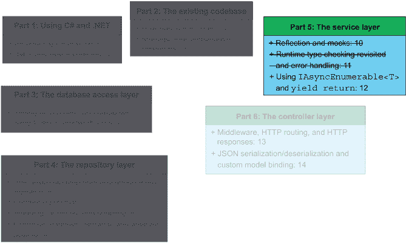
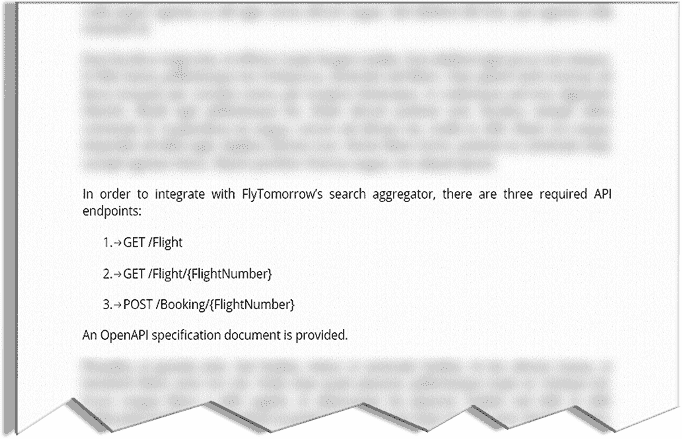
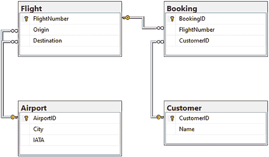
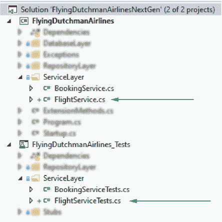
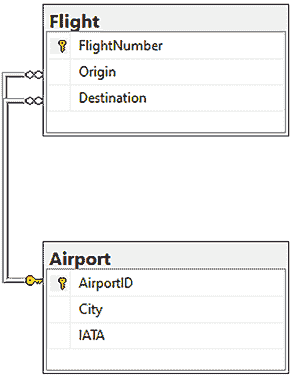
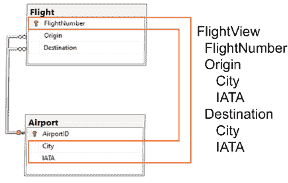
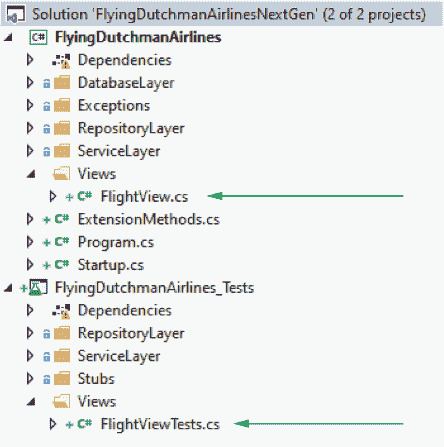

# 12 使用 IAsyncEnumerable<T>和 yield return

本章涵盖

+   使用通用的`Queue`数据结构

+   使用`yield return`和`IAsyncEnumerable<T>`

+   创建视图

+   使用具有自动属性的私有获取器和设置器

+   结构体与类有何不同

+   使用`checked`和`unchecked`关键字

在前面的章节中，我们检查了我们继承的代码库，并记录了我们可以进行改进的地方。然后，我们部分实现了我们版本的代码库，遵循 FlyTomorrow 的 OpenAPI 规范。在第十章和第十一章中，我们实现了`BookingService`类，并决定不需要`CustomerService`类。图 12.1 显示了我们在本书结构中的位置。



图 12.1 在本章中，我们通过实现`AirportService`和`FlightService`类来封装服务层。通过实现这些类，我们完成了飞荷兰人航空公司服务层的重写。

如果我们看看我们需要实现哪些类来完成我们的服务层，一个鼓舞人心的画面随之而来：

+   `CustomerService` (第十章)

+   `BookingService` (第十章和第十一章)

+   `AirportService` (本章)

+   `FlightService` (本章)

我们已经完成了服务层类的一半。在本章中，我们将通过编写`AirportService`和`FlightService`类的代码来封装服务层的实现。在本章之后，我们将处于一个极佳的位置，可以继续到最后一个架构层：控制器层。

## 12.1 我们是否需要 AirportService 类？

在第 10.2 节中，我们确定如果一个服务类永远不会被控制器类调用，我们不需要实现服务类。我们还看到，你可以通过将控制器模型名称与 OpenAPI 规范进行比较来确定是否需要特定的控制器。如果没有控制器需求，就没有必要实现服务类。作为习惯性生物，让我们为`AirportService`类重复这个过程。

OpenAPI 规范（如图 12.2 所示）告诉我们我们需要实现以下三个端点：

+   `GET /Flight`

+   `GET /Flight/{FlightNumber}`

+   `POST /Booking/{FlightNumber}`



图 12.2 FlyTomorrow 的 OpenAPI 规范。我们需要实现三个端点：两个`GET`和一个`POST`。

这些端点中有哪些与`Airport`模型相关的控制器？如图 12.3 所示，我看到两个`Flight`控制器和一个`Booking`控制器，但没有需要`Airport`控制器的端点。那么，事情就这样定了：我们不需要实现`AirportService`类。



图 12.3 机场表有两个外键约束。这两个都来自航班表，检索`Airport.AirportID`。这些外键约束可以用来检索特定`Airport`的信息。

另一方面，我们确实有一个用例需要保留`AirportRepository`类。如果我们查看已部署数据库的数据库模式，我们会看到机场表有以下两个外键约束：

+   `Flight.Origin` 对 `Airport.AirportID`

+   `Flight.Destination` 对 `Airport.AirportID`

在 12.2 节中，我们将更深入地探讨这些外键约束并实现它们。从第十一章的经验中，我们知道我们需要使用接收表的重构库来追踪这些外键约束。

## 12.2 实现 FlightService 类

到目前为止，我们已经实现了`BookingService`并决定不实现`Airport`和`Customer`实体服务。在本节中，我们将通过实现`FlightService`类来完成服务层的实现。与前面的章节一样，让我们问问自己，我们需要实现这个类吗？我们有两个端点需要一个`Flight`控制器。`GET /Flight`和`GET /Flight/{FlightNumber}`端点都向`Flight`控制器发出请求。太好了——这意味着我们需要实现一个`FlightService`类。这两个端点返回的数据已经在数据库中，并且它们的复杂性相对简单。让我们从第一个开始：`GET /Flight.`。

### 12.2.1 从 FlightRepository 获取特定航班的详细信息

在本节中，我们将实现 12.1 节中讨论的`GET /Flight`端点。FlyTomorrow 使用`GET /Flight`端点来查询我们的服务以获取所有可用的航班。我们不需要考虑（或验证）任何特殊输入参数，但我们有一些外键限制需要追踪。我们还将为`Flight`创建一个`View`类，这样我们就可以返回来自`Flight`和`Airport`表的组合数据。

但首先，我们所有努力的起点：我们需要为`FlightService`和`FlightServiceTests`类创建骨架类，如图 12.4 所示。你知道该怎么做。



图 12.4 要开始实现`FlightService`，创建两个骨架类：`FlightService`和`FlightServiceTests`。这些类构成了我们`FlightService`和`FlightServiceTests`实现的基础。

现在我们已经在项目中有了所需的类，我们可以考虑我们的方法需要做什么。我们的方法——让我们称它为`GetFlights`——必须返回数据库中每个航班的详细信息。为此，我们应该使用`FlightRepository`类的注入实例。然而，`FlightRepository`类没有返回数据库中所有航班的函数，因此我们需要添加这个功能。

在 `FlightRepository` 中，让我们添加一个名为 `GetFlights` 的虚拟方法。我们不需要使该方法异步，因为我们不需要查询实际数据库以获取所需信息。即使我们想要从数据库中的特定表中获取所有数据，请记住，Entity Framework Core 在内存中存储了大量的元数据。这让我们想到了使用 ORM 的一个缺点：在规模上的性能。如果你有一个包含数百万条记录的数据库，Entity Framework Core 仍然会在本地存储大量数据。另一方面，这也意味着我们可以查询 Entity Framework Core 的内部 `DbSet<Flight>` 并查看当前数据库中的所有航班。

`GetFlights` 方法应该返回一个 `Flight` 集合，但应该使用哪个集合呢？我们不需要通过某种键或索引访问元素，所以 `Array`、`Dictionary` 或 `List` 都是不必要的。也许一个简单的 `Queue<Flight>` 就足够了。

队列是一种“先进先出”的数据结构（通常缩写为 FIFO）。首先进入队列的元素是第一个出来的，如图 12.1 所示。在我们的情况下，有一个 FIFO 结构是有帮助的，因为我们能确保我们在数据结构中表示航班的方式与数据库中表示的方式之间有一个同构关系。

列表 12.1 `FlightRepository.GetFlights`

```
public virtual Queue<Flight> GetFlights() {
  Queue<Flight> flights = new Queue<Flight>();    ❶
  foreach (Flight flight in _context.Flight) {    ❷
    flights.Enqueue(flight);                      ❷
  }

  return flights;                                 ❸
}
```

❶ 创建一个队列来存储航班

❷ 将每个航班按顺序添加到队列中

❸ 返回队列

|    | EF Core FOREACH 当处理 Entity Framework Core `DbSet<T>` 集合时，`foreach` 循环的一个替代实现是使用 EF Core 的 `ForEachAsync` 方法：`_context.Flight.ForEachAsync(f => flights.Enqueue(f));`。根据你的可读性偏好和异步需求，这可能是一个不错的选择。 |
| --- | --- |

对于 `FlightRepository.GetFlights` 方法，这就是全部内容，但我们还需要单元测试来支持它。我将向您介绍成功案例的单元测试，但我希望您考虑一些潜在的失败情况并编写针对它们的测试。如果您发现出于任何原因需要更改 `FlightRepository.GetFlights` 方法，请这样做！

如果我们查看现有的 `FlightRepositoryTest` 类的 `TestInitialize` 方法，我们会看到在每次测试之前只向内存数据库中添加了一个航班。在一个理想的世界里，我们希望内存数据库中至少有两个航班，这样我们就可以断言返回的 `Queue<Flight>` 中的顺序，如下所示：

```
[TestInitialize]
public async Task TestInitialize() {
  DbContextOptions<FlyingDutchmanAirlinesContext> dbContextOptions = 
➥ new DbContextOptionsBuilder<FlyingDutchmanAirlinesContext>()
➥ .UseInMemoryDatabase("FlyingDutchman").Options;
  _context = new FlyingDutchmanAirlinesContext_Stub(dbContextOptions);

  Flight flight = new Flight {
    FlightNumber = 1,
    Origin = 1,
    Destination = 2
  };

  Flight flight2 = new Flight {
    FlightNumber = 10,
    Origin = 3,
    Destination = 4
  };

  _context.Flight.Add(flight);
  _context.Flight.Add(flight2);
  await _context.SaveChangesAsync();

  _repository = new FlightRepository(_context);
  Assert.IsNotNull(_repository);
}
```

|    | YIELD RETURN 关键字 如果你愿意使用泛型类而不是 `Queue`、`List` 或 `Dictionary` 这样的具体集合类型，一个整洁的概念是使用 `yield return` 关键字。 |
| --- | --- |

当处理实现`IEnumerable<T>`接口的集合时，我们可以返回`IEnumerable<T>`类型，而不需要在方法内部声明一个实际的集合。这听起来可能有些令人困惑，所以让我在下一个代码示例中展示如果使用这种方法，列表 12.1 中的代码会是什么样子。

列表 12.2 使用`yield` `return`和`IEnumerable<Flight>`

```
public virtual IEnumerable<Flight> GetFlights() {
  foreach (Flight flight in _context.Flight) { 
    yield return flight;
  }
}
```

列表 12.2 中的代码没有明确声明一个用于存储`Flight`对象的集合。相反，通过使用`yield return`关键字，我们抽象掉了集合的初始化，让编译器发挥其魔力。（这是一个简单的例子，列表 12.2 中的代码在这种情况下也可以简单地返回现有的`_context.Flight`集合。）这种编译器魔力包括编译器在幕后生成一个实现`IEnumerable`接口的类，并返回该类。语法暗示我们直接使用了`IEnumerable`接口，但实际上，我们使用的是编译器生成的包装类。

你有时也会在延迟评估的上下文中听到`yield return`关键字。延迟评估意味着我们推迟所有处理/迭代，直到绝对必要。这与贪婪评估相反，贪婪评估在所有处理都完成并获取所有信息后，让我们迭代结果。通过使用`yield return`关键字，我们可以提出一种延迟逻辑，它不会在返回结果之前对它们进行操作。这将在本节稍后的`IAsyncEnumerable<T>`讨论中进一步解释。

现在我们可以通过调用`FlightRepository.GetFlights`方法来获取数据库中所有航班的队列，然后我们可以开始组装要返回给控制器的视图。默认情况下，`Flight`对象有三个属性：`FlightNumber`、`OriginID`和`DestinationID`。这些信息对客户至关重要，因此我们希望返回它们。然而，仅仅返回起点和目的地的机场 ID 并不很有用。如果我们查看数据库模式，我们会发现我们可以使用外键来获取更多关于起点和目的地机场的信息。

如图 12.5 所示，`Flight`表有以下两个外键约束：

+   将`Flight.Origin`映射到`Airport.AirportID`

+   将`Flight.Destination`映射到`Airport.AirportID`



图 12.5 航班表有两个外键约束。此图未显示任何其他外键约束（入站或出站）。我们将在 12.2.2 节中使用这些外键约束来创建视图。

如果我们追踪那些外键约束，我们可以根据它们的 ID 获取`Airport`信息。`AirportRepository`类有以下方法可以帮助我们：`GetAirportByID`。`GetAirportByID`方法接受一个机场 ID，并返回相应的机场（如果数据库中存在）。我们知道`Airport`模型有一个城市名称属性，因此我们可以将出发地和目的地城市名称以及航班号一起返回给控制器。这种将两个数据源合并的思考方式是我们尚未创建的`FlightView`类背后的理念。

### 12.2.2 将两个数据流合并到视图中

在 10.1.1 节中，我们讨论了视图。我们讨论了视图如何为我们提供一个窗口来查看模型，并从各种数据源中组合数据。在本节中，我们将创建`FlightView`类，并用来自`Flight`模型和`Airport`模型的数据填充它。

我们可以轻松地创建`FlightView`类。它是一个公共类，具有以下三个公共属性：

+   `FlightNumber`的类型为`string`

+   包含`OriginCity`（类型`string`）和`Code`（类型`string`）的`Airport`对象

+   包含`DestinationCity`（类型`string`）和`Code`（类型`string`）的`Airport`对象

`FlightNumber`的数据来自`Flight`模型，而`Airport`对象以及`OriginCity`和`DestinationCity`属性的数据来自`Airport`模型，如图 12.6 所示。这些信息（对于数据库中的每架航班）是我们最终返回给 FlyTomorrow 在查询`GET /Flight`端点时所需的数据。



图 12.6 `FlightView`类将航班表中的`FlightNumber`数据与机场表中的城市和代码数据相结合。这使得我们能够向最终用户展示来自多个来源的精确信息。

为了保持整洁，让我们为`FlightView`类创建一个新的文件夹，命名为 Views。这个文件夹位于`FlyingDutchmanAirlines`项目中。尽管我们预计这个项目中不会有太多视图，但保持一定的组织性总是好的。

|    | 结构体我们如何处理我们想要添加到`FlightView`中的这个`Airport`对象呢？当然，我们可以添加`Airport`的实例并忽略一些字段，但我觉得这样做有点过于强硬。这是一个使用结构体类型的绝佳机会。许多语言支持结构体或类，但 C#两者都支持。我们可以在 C#的上下文中将结构体视为轻量级的类，用于存储简单的信息。结构体比完整的类开销更小，所以当你只想存储少量信息时，使用结构体。 |
| --- | --- |

让我们在 `FlightView.cs` 文件中添加一个名为 `AirportInfo` 的结构体（注意：不是在 `FlightView` 类内部），如下面的代码示例所示。`AirportInfo` 类型应存储有关目的地 `City` 和 `Code` 的信息。我们可以使用 `IATA` 代替 `Code` 并反映数据库。然而，因为这是一个视图，我们可以根据它们是否更好地表示数据来更改事物的名称。IATA 是正确的，但 `Code` 对于不熟悉航空术语的人来说更容易理解。

```
public struct AirportInfo {
  public string City { get; set; }
  public string Code { get; set; }

  public AirportInfo((string city, string code) airport) {
    City = airport.city;
    Code = airport.code;
  }
}
```

`AirportInfo` 构造函数接受一个包含两个字段的元组：`city` 和 `code`。这让我们想到了使用结构体的第二个酷点：当向结构体添加构造函数时，你需要为每个属性分配一个值。在类中，你不需要为所有属性分配值，但结构体不适用这一点！如果我们有一个只分配 `City` 属性值的 `AirportInfo` 构造函数，编译器会发出警告。通过向结构体添加构造函数，你确保了相应结构体的完整设置。我们可以利用这一点来防止（有良好意图的）开发者没有完全初始化结构体。

回到 `FlightView` 类，我们也可以在其中的属性上做一些酷的事情。我们可以使用私有设置器来确保只有结构体内部的代码可以更改值。我们知道一旦我们从数据库中检索数据，我们就不需要更改数据，所以让我们尽可能让属性反映这一点。我们也不想让任何人随意进来尝试设置这些属性。

访问修饰符和自动属性：当使用自动属性时，我们可以为设置和获取属性使用不同的访问修饰符。

让我们看看 `FlightView` 类在具有分离的 `get` 和 `set` 系统时的样子，如下所示：

```
public class FlightView {
  public string FlightNumber { get; private set; }
  public AirportInfo Origin { get; private set; }
  public AirportInfo Destination { get; private set; }
}
```

在这种情况下，只有可以通过它们的私有访问修饰符访问属性的代码可以设置新值，但 `get` 仍然是公共的。那么我们把这些值设置在哪里呢？何不在构造函数中设置？使用私有设置器的另一种方法是将其属性设置为 `readonly`，因为在构造函数中只能设置 `readonly` 属性。

让我们创建一个构造函数，它访问属性的私有设置器并接受参数来设置它们，如下所示：

```
public FlightView(string flightNumber, (string city, string code) origin, 
➥ (string city, string code) destination) {
  FlightNumber = flightNumber;

  Origin = new AirportInfo(origin);
  Destination = new AirportInfo(destination);
}
```

我们还应该在传入的参数上进行一些输入验证。我们可以使用 `String.IsNullOrEmpty` 方法来检查任何输入参数是否为空指针或空字符串。或者，你可以使用 `String.IsNullOrWhitespace`，它检查字符串是否为空、空字符串或仅由空白字符组成。如果是这样，我们将它们设置为适当的值。我们同样使用三元条件运算符，如下所示：

```
public class FlightView {
  public string FlightNumber { get; private set; }
  public AirportInfo Origin { get; private set; }
  public AirportInfo Destination { get; private set; }

  public FlightView(string flightNumber, 
➥ (string city, string code) origin,
➥ (string city, string code) destination) {
    FlightNumber = string.IsNullOrEmpty(flightNumber) ? 
     ➥ "No flight number found" : flightNumber;

    Origin = new AirportInfo(origin);
    Destination = new AirportInfo(destination);
  }
}

public struct AirportInfo {
  public string City { get; private set; }
  public string Code { get; private set; }

  public AirportInfo ((string city, string code) airport) {
    City = string.IsNullOrEmpty(airport.city) ? 
➥ "No city found" : airport.city;
    Code = string.IsNullOrEmpty(airport.code) ? 
➥ "No code found" : airport.code;
  }
}
```

注意：技术上，我们可以将`FlightNumber`、`Origin`、`Destination`、`City`和`Code`属性设置为“只读”的，并且完全移除私有的设置器。编译器足够聪明，能够意识到我们想在构造函数中私有地设置属性。不过，我喜欢私有设置器的详尽性。你的体验可能会有所不同。

当然，我们也应该创建一个测试类和一些单元测试来验证`FlightView`构造函数的逻辑。图 12.7 显示了新创建的文件。



图 12.7 创建了两个新文件：在`FlyingDutchmanAirlines/Views`中的`FlightView`和在`FlyingDutchmanAirlines_Tests/Views`中的`FlightViewTests`。将类存储在单独的`Views`文件夹中有助于我们组织代码库。

在测试构造函数方面有不同的观点。有些人说测试构造函数只是测试新对象的实例化，因此是测试语言特性。其他人说测试构造函数是有用的，因为你永远不知道代码会发生什么。我属于后一种观点。特别是当测试构造函数代表最小努力时，拥有如以下代码所示的测试套件来支持你的代码是正确的做法：

```
[TestClass]
public class FlightViewTests {
  [TestMethod]
  public void Constructor_FlightView_Success() { 
    string flightNumber = "0";
    string originCity = "Amsterdam";
    string originCityCode = "AMS";
    string destinationCity = "Moscow";
    string destinationCityCode = "SVO";

    FlightView view = 
➥ new FlightView(flightNumber, (originCity, originCityCode), 
➥ (destinationCity, destinationCityCode));
    Assert.IsNotNull(view);

    Assert.AreEqual(view.FlightNumber, flightNumber);
    Assert.AreEqual(view.Origin.City, originCity);
    Assert.AreEqual(view.Origin.Code, originCityCode);
    Assert.AreEqual(view.Destination.City, destinationCity);
    Assert.AreEqual(view.Destination.Code, destinationCityCode);
    }

    [TestMethod]
    public void Constructor_FlightView_Success_FlightNumber_Null() {
      string originCity = "Athens";
      string originCityCode = "ATH";
      string destinationCity = "Dubai";
      string destinationCityCode = "DXB";
      FlightView view = 
➥ new FlightView(null, (originCity, originCityCode), 
➥ (destinationCity, destinationCityCode));
      Assert.IsNotNull(view);

      Assert.AreEqual(view.FlightNumber, "No flight number found");
      Assert.AreEqual(view.Origin.City, originCity);
      Assert.AreEqual(view.Destination.City, destinationCity);
    }

    [TestMethod]
    public void Constructor_AirportInfo_Success_City_EmptyString() {
      string destinationCity = string.Empty;
      string destinationCityCode = "SYD";

      AirportInfo airportInfo = 
➥ new AirportInfo((destinationCity, destinationCityCode));
      Assert.IsNotNull(airportInfo);

      Assert.AreEqual(airportInfo.City, "No city found");
      Assert.AreEqual(airportInfo.Code, destinationCityCode);
    }

    [TestMethod]
    public void Constructor_AirportInfo_Success_Code_EmptyString() {
      string destinationCity = "Ushuaia";
      string destinationCityCode = string.Empty;

      AirportInfo airportInfo = 
➥ new AirportInfo((destinationCity, destinationCityCode));
      Assert.IsNotNull(airportInfo);

      Assert.AreEqual(airportInfo.City, destinationCity);
      Assert.AreEqual(airportInfo.Code, "No code found");
    }
} 
```

现在我们可以放心了，无论`FlightView`类和`AirportInfo`结构体中的代码发生什么变化，我们都有测试来捕捉任何破坏现有功能的变化。现在我们可以继续为从`FlightRepository`获取的每趟航班填充`FlightView`。对于`FlightView`所需的五项数据（航班号、目的地城市、目的地代码、出发城市和出发代码），我们知道如何获取航班号。我们只需要调用`FlightRepository.GetFlights`方法。当然，我们首先需要在`FlightService`中有一个`GetFlights`方法。

`GetFlights`方法返回一个被`IAsyncEnumerable`包装的`FlightView`实例。我们之前讨论了`IEnumerable`以及如何使用`yield return`关键字。`IAsyncEnumerable`返回类型允许我们返回一个实现`IEnumerable`接口的异步集合。因为它已经是异步的，所以我们不需要将其包装在`Task`中。

首先，让我们调用`FlightRepository.GetFlights`方法，并为数据库返回的每趟航班构造一个`FlightView`，如下一列表所示。为此，我们还需要将`FlightRepository`的一个实例注入到`FlightService`类中。这个任务留给你们。你们知道该怎么做。如果你卡住了，请参阅提供的源代码。注意，列表 12.3 中的代码无法编译，正如列表之后所解释的。

列表 12.3 `FlightService.GetFlights`请求数据库中的所有航班

```
public async Task<IAsyncEnumerable<FlightView>> GetFlights() {
  Queue<Flight> flights = _flightRepository.GetFlights();       ❶
  foreach (Flight flight in flights) {                          ❷
    FlightView view = 
➥ new FlightView(flight.FlightNumber.ToString(), ,);           ❸
  }
}
```

❶ 请求数据库中的所有航班

❷ 遍历返回的航班

❸ 为每趟航班创建一个`FlightView`实例

花一分钟时间阅读列表 12.3，看看你是否能找出为什么这段代码无法编译（除了没有返回正确的类型）。你看到了吗？编译器抛出一个错误，因为我们没有为每个航班实例化 `FlightView` 对象时提供足够的参数。我们甚至没有提供正确的信息来给出视图。视图希望我们传递航班号、出发城市和目的城市的值。我们传递了航班号，但没有传递任何城市。我们拥有的最接近城市名称的东西是返回的 `Flight` 对象上的 `originAirportID` 和 `destinationAirportID` 属性。我们知道如何获取这些属性并获取机场城市名称和代码：我们调用 `AirportRepository.GetAirportByID` 方法并获取 `Airport.City` 属性（我们还需要一个注入的 `AirportRepository` 实例），如下所示：

```
public async IAsyncEnumerable<FlightView> GetFlights() {
     Queue<Flight> flights = _flightRepository.GetFlights();
  foreach (Flight flight in flights) {
  Airport originAirport = 
➥ await _airportRepository.GetAirportByID(flight.Origin);
  Airport destinationAirport = 
➥ await _airportRepository.GetAirportByID(flight.Destination);

  FlightView view = 
➥ new FlightView(flight.FlightNumber.ToString(), 
  ➥ (originAirport.City, originAirport.Code), 
  ➥ (destinationAirport.City, destinationAirport.Code)); 
  }
}
```

现在，这里就是真正的魔法发生的地方。因为我们返回的是 `IAsyncEnumerable<FlightView>` 类型，我们可以使用 `yield return` 关键字自动将创建的 `FlightView` 实例添加到编译器生成的列表中，如下所示：

```
public async IAsyncEnumerable<FlightView> GetFlights() {
     Queue<Flight> flights = _flightRepository.GetFlights();
  foreach (Flight flight in flights) {
  Airport originAirport = 
➥ await _airportRepository.GetAirportByID(flight.Origin);
  Airport destinationAirport = 
➥ await _airportRepository.GetAirportByID(flight.Destination);

  yield return new FlightView(flight.FlightNumber.ToString(), 
➥ (originAirport.City, originAirport.Code), 
➥ (destinationAirport.City, destinationAirport.Code)); 
  }
}
```

我们还应该在 `FlightServiceTests` 中添加一个单元测试来验证我们是否做得很好。记住，当我们测试服务层方法时，我们不需要测试仓库层。相反，我们可以使用 `Mock<FlightRepository>` 和 `Mock<AirportRepository>` 的实例作为注入到 `FlightService` 类中的依赖项。为了模拟 `AirportRepository` 类，将适当的方法设置为虚拟的，并添加一个无参构造函数，如下所示。我们已经这样做了几次，所以我就留给你了。

列表 12.4 单元测试返回 `IAsyncEnumerable<T>` 的方法

```
[TestMethod]
public async Task GetFlights_Success() {
  Flight flightInDatabase = new Flight {                           ❶
    FlightNumber = 148,                                            ❶
    Origin = 31,                                                   ❶
    Destination = 92                                               ❶
  };                                                               ❶

  Queue<Flight> mockReturn = new Queue<Flight>(1);                 ❶
  mockReturn.Enqueue(flightInDatabase);                            ❶

  _mockFlightRepository.Setup(repository =>                        ❶
➥ repository.GetFlights()).Returns(mockReturn);                   ❶

  _mockAirportRepository.Setup(repository => 
➥ repository.GetAirportByID(31)).ReturnsAsync(new Airport         ❷
    {                                                              ❷
      AirportId = 31,                                              ❷
      City = "Mexico City",                                        ❷
      Iata = "MEX"                                                 ❷
    });                                                            ❷

  _mockAirportRepository.Setup(repository =>                       ❷
➥ repository.GetAirportByID(92)).ReturnsAsync(new Airport         ❷
    {                                                              ❷
      AirportId = 92,                                              ❷
      City = "Ulaanbaataar",                                       ❷
      Iata = "UBN"                                                 ❷
    });                                                            ❷
  FlightService service = new FlightService(_mockFlightRepository.Object, 
➥ _mockAirportRepository.Object);                                 ❸

  await foreach (FlightView flightView in service.GetFlights()) {  ❹
    Assert.IsNotNull(flightView);                                  ❺
    Assert.AreEqual(flightView.FlightNumber, "148");               ❺
    Assert.AreEqual(flightView.Origin.City, "Mexico City");        ❺
    Assert.AreEqual(flightView.Origin.Code, "MEX");                ❺
    Assert.AreEqual(flightView.Destination.City, "Ulaanbaatar");   ❺
    Assert.AreEqual(flightView.Destination.Code, "UBN");           ❺
  }
}
```

❶ 设置 FlightRepository.GetAllFlights 模拟返回

❷ 设置 AirportRepository.GetAirportByID 模拟返回

❸ 注入模拟依赖项，并创建一个新的 FlightService 实例

❹ 在 `GetFlights` 方法中（本例中为一个）构建 `flightViews`

❺ 确保我们收到了正确的 flightView

在列表 12.4 中，我们第一次看到了如何使用返回的 `IAsyncEnumerable` 类型，并可以拼凑出为什么它是一个如此出色的功能。我们不是一次调用 `FlightService.GetFlights` 方法，等待所有数据返回，然后再对其进行操作，`IAsyncEnumerable` 类型允许我们在 `foreach` 循环上 `await`，并随着数据的到来对其进行操作。

### 12.2.3 使用 try-catch 代码块与 yield return 关键字

在 12.2.2 节中，我们实现了`FlightService.GetFlights`方法。然而，我们没有处理来自`AirportRepository.GetAirportByID`方法的任何异常。不幸的是，我们无法简单地添加一个`try-catch`代码块并将整个方法包裹在其中，因为我们不能在这样一个代码块中使用`yield return`关键字。不允许在`try-catch`块中使用`yield`语句一直是 C#语言社区讨论的焦点。因为允许在仅包含`try`代码块（没有`catch`）中添加`yield`语句，而添加对`try-catch`代码块`yield`语句支持的唯一障碍是由于垃圾回收困难而增加的编译器复杂性，我们可能会看到这个功能在未来被添加。解决方案是在`try-catch`块中仅添加对`AirportRepository.GetAirportByID`方法的调用，这样我们就可以捕获任何传出的异常，然后像往常一样继续操作，如下所示：

```
public async IAsyncEnumerable<FlightView> GetFlights() {
     Queue<Flight> flights = _flightRepository.GetFlights();
  foreach (Flight flight in flights) {
    Airport originAirport;
    Airport destinationAirport;

    try {
      originAirport = 
➥ await _airportRepository.GetAirportByID(flight.Origin);
        destinationAirport = 
➥ await _airportRepository.GetAirportByID(flight.Destination);
    } catch (FlightNotFoundException) {
      throw new FlightNotFoundException();
    } catch (Exception) {
      throw new ArgumentException();
    }

    yield return new FlightView(flight.FlightNumber.ToString(), 
➥ (originAirport.City, originAirport.Code), 
➥ (destinationAirport.City, destinationAirport.Code)); 
  }
}
```

注意：我们已经看到了`IAsyncEnumerable`和`Task<IEnumerable>`作为返回类型。`IAsyncEnumerable`在从异步方法返回时不需要包裹在`Task<T>`中，因为`IAsyncEnumerable`本身就是异步的。使用具有泛型`Task<T>`的类型允许我们从异步方法返回同步类型。

此代码允许我们捕获来自`AirportRepository.GetAirportByID`方法的任何异常。如果服务类发现存储库方法抛出了类型为`FlightNotFoundException`的异常，它将抛出一个新的`FlightNotFoundException`实例。如果代码抛出不同类型的异常，将进入第二个`catch`块，并抛出`ArgumentException`。调用服务层的控制器处理此异常。

我们服务层实现中的最后一部分是编写一个单元测试来验证我们刚刚编写的异常处理代码。让我们看看下面的单元测试。它应该相当直接。

列表 12.5 在`FlightService`中测试异常

```
[TestMethod]
[ExpectedException(typeof(FlightNotFoundException))]          ❶
public async Task GetFlights_Failure_RepositoryException() {
  Flight flightInDatabase = new Flight {                      ❷
    FlightNumber = 148,                                       ❷
    Origin = 31,                                              ❷
    Destination = 92                                          ❷
  };                                                          ❷

  Queue<Flight> mockReturn = new Queue<Flight>(1);            ❷
  mockReturn.Enqueue(flightInDatabase);                       ❷

  _mockFlightRepository.Setup(repository =>                   ❷
➥ repository.GetFlights()).Returns(mockReturn);              ❷

  _mockAirportRepository.Setup(repository => 
➥ repository.GetAirportByID(31))
➥ .ThrowsAsync(new FlightNotFoundException());               ❸

  FlightService service = new FlightService(_mockFlightRepository.Object, 
➥ _mockAirportRepository.Object);                            ❹

  await foreach (FlightView _ in service.GetFlights()) {      ❺
    ;                                                         ❻
  }
}

[TestMethod]
[ExpectedException(typeof(ArgumentException))]                ❼
public async Task GetFlights_Failure_RegularException() {
  Flight flightInDatabase = new Flight {                      ❽
    FlightNumber = 148,                                       ❽
    Origin = 31,                                              ❽
    Destination = 92                                          ❽
  };                                                          ❽

  Queue<Flight> mockReturn = new Queue<Flight>(1);            ❽
  mockReturn.Enqueue(flightInDatabase);                       ❽

  _mockFlightRepository.Setup(repository =>                   ❽
➥ repository.GetFlights()).Returns(mockReturn);              ❽

  _mockAirportRepository.Setup(repository => 
➥ repository.GetAirportByID(31))
➥ .ThrowsAsync(new NullReferenceException());                ❾

  FlightService service = new FlightService(_mockFlightRepository.Object, 
➥ _mockAirportRepository.Object);                            ❿

  await foreach (FlightView _ in service.GetFlights()) {      ⓫
    ;                                                         ❻
  }
}
```

❶ 预期此测试中执行的逻辑会抛出异常

❷ 从 FlightRepository.GetAllFlights 模拟返回值开始（与列表 12.4 相同）

❸ 设置 AirportRepository.GetAirportByID 模拟返回值（与列表 12.4 相同）

❹ 创建一个新的 FlightService 实例（与列表 12.4 相同）

❺ 调用 GetFlights 方法，使用丢弃操作符进行返回赋值

❻ 空语句

❼ 预期此测试中执行的逻辑会抛出异常

❽ 从 FlightRepository.GetAllFlights 模拟返回值开始（与列表 12.4 相同）

❾ 设置 AirportRepository.GetAirportByID 模拟返回值（与列表 12.4 相同）

❿ 创建一个新的 FlightService 实例（与列表 12.4 相同）

⓫ 调用 GetFlights 方法，使用丢弃操作符进行返回赋值

总体来说，列表 12.5 中的代码应该不会带来任何挑战。值得注意的是，通过在 `foreach` 中使用 `discard` 操作符，我们告诉其他开发者我们不需要使用返回的值。同样，在 `foreach` 循环内部，我们添加了一个空语句（`;`）。这绝对没有任何作用，但提供了更易读的代码。通过添加空语句，我们表明在 `foreach` 循环内部没有逻辑并不是一个错误。

我们可以进行一些进一步的清理：我确信你已经注意到了，在两个单元测试中，`Mock<Flight>` 和 `Mock<Airport>` 实例的设置代码是相同的。因为这也违反了 DRY 原则，我们应该重构这两个单元测试，并在 `TestInitialize` 方法中完成这个初始化。这将显著缩短我们的测试方法，如下所示：

```
[TestClass]
public class FlightServiceTests {
  private Mock<FlightRepository> _mockFlightRepository;
  private Mock<AirportRepository> _mockAirportRepository;

  [TestInitialize]
  public void Initialize() {
    _mockFlightRepository = new Mock<FlightRepository>();
    _mockAirportRepository = new Mock<AirportRepository>();

    Flight flightInDatabase = new Flight {
      FlightNumber = 148,
      Origin = 31,
      Destination = 92
    };

    Queue<Flight> mockReturn = new Queue<Flight>(1);
    mockReturn.Enqueue(flightInDatabase);

    _mockFlightRepository.Setup(repository => 
➥ repository.GetFlights()).Returns(mockReturn);
  }

  [TestMethod]
  public async Task GetFlights_Success() {
    _mockAirportRepository.Setup(repository => 
➥ repository.GetAirportByID(31)).ReturnsAsync(new Airport
    {
      AirportId = 31,
      City = "Mexico City",
      Iata = "MEX"
    });

    _mockAirportRepository.Setup(repository => 
➥ repository.GetAirportByID(92)).ReturnsAsync(new Airport
    {
      AirportId = 92,
      City = "Ulaanbaatar",
      Iata = "UBN"
    });

    FlightService service = 
➥ new FlightService(_mockFlightRepository.Object, 
➥ _mockAirportRepository.Object);

    await foreach (FlightView flightView in service.GetFlights()) {
      Assert.IsNotNull(flightView);
      Assert.AreEqual(flightView.FlightNumber, "148");
      Assert.AreEqual(flightView.Origin.City, "Mexico City");
      Assert.AreEqual(flightView.Origin.Code, "MEX");
      Assert.AreEqual(flightView.Destination.City, "Ulaanbaatar");
      Assert.AreEqual(flightView.Destination.Code, "UBN");
    }
  }

  [TestMethod]
  [ExpectedException(typeof(FlightNotFoundException))]
  public async Task GetFlights_Failure_RepositoryException() {
    _mockAirportRepository.Setup(repository => 
➥ repository.GetAirportByID(31)).ThrowsAsync(new Exception());

    FlightService service = 
➥ new FlightService(_mockFlightRepository.Object, 
➥ _mockAirportRepository.Object);
    await foreach (FlightView _ in service.GetFlights()) {
      ;
    }
  }
}
```

这样，`GetFlights` 方法就完成了！

### 12.2.4 实现 GetFlightByFlightNumber

剩下的只是添加一个类似的方法，当给定一个航班号时，只检索单个航班的详细信息。这些模式现在应该对你来说非常熟悉，如下所示：

```
public virtual async Task<FlightView> 
➥ GetFlightByFlightNumber(int flightNumber) {
  try {
    Flight flight = await 
➥ _flightRepository.GetFlightByFlightNumber(flightNumber);
    Airport originAirport = await 
➥ _airportRepository.GetAirportByID(flight.Origin);
    Airport destinationAirport = await 
➥ _airportRepository.GetAirportByID(flight.Destination);

    return new FlightView(flight.FlightNumber.ToString(),
    ➥ (originAirport.City, originAirport.Iata),
    ➥ (destinationAirport.City, destinationAirport.Iata));
  } catch (FlightNotFoundException) {
    throw new FlightNotFoundException();
  } catch (Exception) {
    throw new ArgumentException();
  }
}
```

我们还应该添加一些单元测试来验证我们能否从数据库中获取正确的航班并处理 `FlightNotFoundException` 和 `Exception` 错误路径。为此，我们首先必须向 `TestInitalize` 方法添加一个新的设置调用。我们的模拟在调用 `FlightRepository.GetFlightByFlightNumber` 时目前不返回任何数据。让我们按照以下方式修复它：

```
[TestInitialize]
public void Initialize()  {
  ...

  _mockFlightRepository.Setup(repository => 
➥ repository.GetFlights()).Returns(mockReturn);
  _mockFlightRepository.Setup(repository => 
➥ repository.GetFlightByFlightNumber(148))
➥ .Returns(Task.FromResult(flightInDatabase));
}
```

当模拟的 `GetFlightByFlightNumber` 返回数据时，我们返回之前创建的航班实例。有了这个，我们可以添加 `GetFlightByFlightNumber_Success` 测试用例，如下所示：

```
[TestMethod]
public async Task GetFlightByFlightNumber_Success() {
  _mockAirportRepository.Setup(repository => 
➥ repository.GetAirportByID(31)).ReturnsAsync(new Airport
      {
      AirportId = 31,
      City = "Mexico City",
      Iata = "MEX"
    });

  _mockAirportRepository.Setup(repository => 
➥ repository.GetAirportByID(92)).ReturnsAsync(new Airport
    {
      AirportId = 92,
      City = "Ulaanbaatar",
      Iata = "UBN"
    });

  FlightService service = new FlightService(_mockFlightRepository.Object, 
➥ _mockAirportRepository.Object);
  FlightView flightView = await service.GetFlightByFlightNumber(148);

  Assert.IsNotNull(flightView);
  Assert.AreEqual(flightView.FlightNumber, "148");
  Assert.AreEqual(flightView.Origin.City, "Mexico City");
  Assert.AreEqual(flightView.Origin.Code, "MEX");
  Assert.AreEqual(flightView.Destination.City, "Ulaanbaatar");
  Assert.AreEqual(flightView.Destination.Code, "UBN");
}
```

单元测试相当简单。我们模仿（即：复制粘贴）了机场设置代码，因此添加了一个航班用于内存数据库中。然后我们调用 `FlightService.GetFlightByFlightNumber` 来检查我们的服务层逻辑。最后，我们验证了返回的数据。现在，当你从复制粘贴的代码中看到 `GetFlights_Success` 单元测试中的机场设置时，你的心中应该开始响起警钟。显然，这种重复是严重违反 DRY 原则的，我们应该重构测试类，在 `TestInitialize` 方法中完成这个数据库设置，如下所示：

```
[TestInitialize]
public void Initialize() {
  _mockFlightRepository = new Mock<FlightRepository>();
  _mockAirportRepository = new Mock<AirportRepository>();

  _mockAirportRepository.Setup(repository => 
➥ repository.GetAirportByID(31)).ReturnsAsync(new Airport
    {
      AirportId = 31,
      City = "Mexico City",
      Iata = "MEX"
    });

  _mockAirportRepository.Setup(repository => 
➥ repository.GetAirportByID(92)).ReturnsAsync(new Airport
    {
      AirportId = 92,
      City = "Ulaanbaatar",
      Iata = "UBN"
    });

  ...
}
```

这显著缩短了 `GetFlights_Success` 和 `GetFlightByFlightNumber_Success` 单元测试，如下所示：

```
[TestMethod]
public async Task GetFlights_Success() {
  _mockAirportRepository.Setup(repository => 
➥ repository.GetAirportByID(31)).ReturnsAsync(new Airport
    {
      AirportId = 31,
      City = "Mexico City",
      Iata = "MEX"
    });

  _mockAirportRepository.Setup(repository => 
➥ repository.GetAirportByID(92)).ReturnsAsync(new Airport
    {
      AirportId = 92,
      City = "Ulaanbaatar",
      Iata = "UBN"
    });

  FlightService service = new FlightService(_mockFlightRepository.Object, 
➥ _mockAirportRepository.Object);

  await foreach (FlightView flightView in service.GetFlights()) {
    Assert.IsNotNull(flightView);
    Assert.AreEqual(flightView.FlightNumber, "148");
    Assert.AreEqual(flightView.Origin.City, "Mexico City");
    Assert.AreEqual(flightView.Origin.Code, "MEX");
    Assert.AreEqual(flightView.Destination.City, "Ulaanbaatar");
    Assert.AreEqual(flightView.Destination.Code, "UBN");
  }
}

[TestMethod]
public async Task GetFlightByFlightNumber_Success() {
  _mockAirportRepository.Setup(repository => 
➥ repository.GetAirportByID(31)).ReturnsAsync(new Airport
    {
      AirportId = 31,
      City = "Mexico City",
      Iata = "MEX"
    });

  _mockAirportRepository.Setup(repository => 
➥ repository.GetAirportByID(92)).ReturnsAsync(new Airport
    {
      AirportId = 92,
      City = "Ulaanbaatar",
      Iata = "UBN"
    });

  FlightService service = new FlightService(_mockFlightRepository.Object, 
➥ _mockAirportRepository.Object);
  FlightView flightView = await service.GetFlightByFlightNumber(148);

  Assert.IsNotNull(flightView);
  Assert.AreEqual(flightView.FlightNumber, "148");
  Assert.AreEqual(flightView.Origin.City, "Mexico City");
  Assert.AreEqual(flightView.Origin.Code, "MEX");
  Assert.AreEqual(flightView.Destination.City, "Ulaanbaatar");
  Assert.AreEqual(flightView.Destination.Code, "UBN");
}
```

当然，所有单元测试仍然通过。这让我们有信心知道我们没有破坏任何东西。让我们为 `GetFlightByFlightNumber` 方法添加一些失败案例单元测试，然后我们就可以结束了。

从服务层抛出类型为 `FlightNotFoundException` 的异常的失败路径开始，我们期望服务层会再次抛出这样的异常，如下所示：

```
[TestMethod]
[ExpectedException(typeof(FlightNotFoundException))]
public async Task 
➥ GetFlightByFlightNumber_Failure_RepositoryException
➥ _FlightNotFoundException() {
  _mockFlightRepository.Setup(repository => 
➥ repository.GetFlightByFlightNumber(-1))
➥ .Throws(new FlightNotFoundException());
  FlightService service = new FlightService(_mockFlightRepository.Object, 
➥ _mockAirportRepository.Object);

  await service.GetFlightByFlightNumber(-1);
}
```

`GetFlightByFlightNumber_Failure_RepositoryException_Exception` 单元测试再次看到了我们熟悉的老朋友 `ExpectedException` 方法属性。现在我们已经非常清楚它的有用性，并在单元测试中使用它来检查下一个（也是最后一个）异常路径：仓库层抛出除 `FlightNotFoundException` 之外任何类型的异常。`FlightService.GetFlightByFlightNumber` 方法捕获抛出的异常并抛出一个新的 `ArgumentException`。或者至少它说是这样。让我们看看它实际上是否真的这样做：

```
[TestMethod]
[ExpectedException(typeof(ArgumentException))]
public async Task 
➥ GetFlightByFlightNumber_Failure_RepositoryException_Exception() {
  _mockFlightRepository.Setup(repository => 
➥ repository.GetFlightByFlightNumber(-1))
➥ .Throws(new OverflowException());
  FlightService service = new FlightService(_mockFlightRepository.Object, 
➥ _mockAirportRepository.Object);

  await service.GetFlightByFlightNumber(-1);
}
```

`GetFlightByFlightNumber_Failure_RepositoryException_Exception` 单元测试指示 `Mock<FlightRepository>` 在我们调用 `FlightRepository.GetFlightByFlightNumber` 并传入输入参数 `-1` 时抛出 `OverflowException` 类型的异常。在这里，我们可以使用任何异常类，因为它们都派生自基类 `Exception`，这正是方法中的 `catch` 块所寻找的。这也是为什么测试名称在异常类型方面没有更具体的原因。我们正在测试如果抛出任何类型的 `Exception` 会发生什么逻辑，而不是特定的一个。因为 `Exception` 是所有异常的基类，所以我们只需测试它。

溢出和下溢（已检查和未检查）

当你将两个整数相加时，你会得到什么？比如说 2147483647 和 1？你会得到一个负数。同样，当你从 -2147483647 减去 1 时，你会得到一个正数。这就是我们所说的溢出和下溢。当你超过原始类型的最大值或低于原始类型的最低值时，你会得到一个“环绕”的值。为什么会这样，我们如何才能防止这种情况发生？

当一个类型中可用的二进制位不足以表示你请求的值时，该类型会环绕并翻转（如果它是一个无符号整数）。这取决于上下文，我们称之为溢出和下溢。例如（尽管这是一个简化的例子）：整数是一个四字节的数据类型。这意味着我们有 32 位可以操作（一个字节包含八个位，8 × 4 = 32）。因此，如果我们声明一个变量，将所有 32（如果是有符号整数则为 31）位设置为“开启”值，我们就有了在 32 位（或四字节）类型中可以表示的最大值（在 C# 中，我们可以在代码中直接使用十进制、十六进制或二进制表示；这是二进制表示）：

```
int maxVal = 0b11111111_11111111_11111111_1111111;
int oneVal = 0b00000000_00000000_00000000_0000001;

int overflow = maxVal + oneVal;
```

在 C# 中，当使用直接二进制表示时，你必须使用 0b 或 0B（对于十六进制，使用 0x 或 0X）来前缀你的值。你可以选择，如代码片段所示，在二进制表示中包含下划线以提高可读性。我们使用这些前缀是为了让编译器知道如何处理这些值。在这个代码片段中，我们做了相当于将 1 加到最大值 2147483647 上的操作。那么，溢出变量解析成什么？它解析为 –2147483648。如果我们从那个值中减去 1，我们就会得到一个正值：2147483647。通常，当你知道你正在处理超过特定类型容量的值时，你会使用不同的类型。例如，你可能使用 `long` 而不是整数，或者使用 `BigInteger` 而不是 `long`。但是，如果你因为某种原因被限制在特定类型上，同时又能看到溢出和下溢作为一个现实场景，该怎么办呢？

|    | `BIGINTEGER` 是一个不可变、非原始的“类型”，随着你的数据增长而增长，并且实际上仅受限于你的内存。`BigInteger` 起整数的作用，但实际上是一个巧妙设计的结构。Java 开发者可能熟悉 `BigInteger`。 |
| --- | --- |

C# 提供了一个关键字和编译模式，可以在一定程度上防止意外的溢出和下溢：`checked`。默认情况下，C# 以 `unchecked` 模式编译。这意味着 CLR 在算术溢出和下溢时不会抛出任何异常。这对于大多数用例来说是可以的，因为我们有一些额外的开销来检查这种可能性，而且在很多程序中这种情况并不常见。但是，如果我们使用 `checked` 模式，当 CLR 检测到下溢或溢出时，它会抛出一个异常。要使用 `checked` 模式，我们可以通过在构建指令中添加 `-checked` 编译器选项来编译整个代码库，或者我们可以使用 `checked` 关键字。

要让 CLR 在特定代码块中看到下溢或溢出时抛出异常，我们可以将代码包裹在一个 `checked` 块中，如下所示：

```
checked {
  int maxVal = 0b_11111111_11111111_11111111_1111111;
  int oneVal = 0b_00000000_00000000_00000000_0000001;

  int overflow = maxVal + oneVal;
}
```

现在，当我们添加 `maxVal` 和 `oneVal` 变量时，CLR 会抛出一个 `OverflowException`！因此，如果你在 `checked` 模式下编译了整个代码库，你可以使用 `unchecked` 代码块来告诉 CLR 不要为该代码块的范围内抛出任何 `OverflowExceptions`。

那就是服务层类的全部内容了。我希望你学到了一些有价值的东西，如果没有，书的结尾就在眼前。在第十三章，我们将探讨实现控制层和集成测试。

## 练习

练习 12.1

正误判断？对于端点 `GET /Band/Song`，我们需要实现 `BandService` 类。

练习 12.2

正误判断？对于端点 `POST /Inventory/SKU`，我们需要实现 `SKUService` 类。

练习 12.3

以下哪个最能描述与 `Queue<T>` 数据结构的交互？

a. 先入后出（FILO）

b. 先入先出（FIFO）

c. 后入先出（LIFO）

d. 后入后出（LILO）

练习 12.4

如果我们在一个返回类型为 `IEnumerable<T>` 的方法中嵌入的 `foreach` 循环中使用 `yield return` 关键字，我们期望从方法中返回什么值？

a. 一个实现 `IEnumerable` 接口且包含 `foreach` 循环中所有数据的集合。

b. 一个实现 `IEnumerable` 接口且只包含 `foreach` 循环中要处理的第一条数据的集合。

c. 一个未实现 `IEnumerable` 接口且返回原始集合引用的集合。

练习 12.5

想象有一个名为 `Food` 的类，它有一个布尔属性 `IsFruit`。这个属性有一个公共的获取器和受保护的设置器。从 `Food` 类派生的 `Dragonfruit` 类能否设置 `IsFruit` 的值？

练习 12.6

这会评估成什么？`string.IsNullOrEmpty(string.empty``);`

练习 12.7

这会评估成什么？`string.IsNullOrWhitespace("` `");`

练习 12.8

对或错？如果你向结构体添加一个构造函数，你只能设置一个属性。其他属性必须保持未设置状态。

## 摘要

+   为了确定我们是否需要实现特定的服务，我们可以查看所需的 API 端点。如果没有必要为特定模型创建控制器，那么我们也不需要为该模型创建服务。这可以避免我们实现不必要的代码。

+   `Queue<T>` 是一个“先进先出”（FIFO）的数据结构。当我们想要保持顺序并像处理排队的人一样处理信息时，队列非常有用。第一个到达的是第一个被处理的，或者说，“早起的鸟儿有虫吃。”

+   如果我们在一个返回类型为 `IEnumerable<T>` 的方法中嵌入的 `foreach` 循环中使用 `yield return` 关键字，我们可以异步返回一个 `IEnumerable<T>` 实现。这可以使我们的代码更易于阅读和简洁。

+   结构体可以被看作是一个“轻量级”类。我们经常使用它们来存储少量信息，并且在结构体中通常不会进行数据处理。结构体是向我们的开发者伙伴表明这段代码作为数据存储设备的好方法。

+   当向结构体添加构造函数时，编译器要求我们为结构体中的每个属性分配一个值。这是为了防止结构体只部分初始化，并阻止我们意外忘记设置值。

+   在自动属性中，我们可以为获取器和设置器使用不同的访问修饰符。这允许我们创建一个可以公开访问但只能在相应类内部设置的属性（私有）。允许任何访问修饰符的组合。因为封装通常是我们的目标，通过使用这些访问修饰符，我们可以更好地控制封装的故事。

+   我们只能在声明或构造函数中设置 `readonly` 值。因为我们只能设置一次 `readonly` 值，而声明一个字段意味着编译器会自动为其在内存中的位置分配一个默认值，所以我们需要在尽可能早的时刻设置它。`readonly` 字段可以大大减少他人对我们代码的数据操作量。

+   通过使用 `IAsyncEnumerable<T>` 以及 `yield return` 关键字，我们可以创建异步等待数据并按接收数据时处理数据的代码。这在处理外部交互，例如数据库查询时非常有用。

+   当我们尝试表示一个需要比特定类型可访问的位数更多的值时，会发生溢出和下溢。当这种情况发生时，变量的值会突然变得不正确，这可能会产生意外的副作用。

+   默认情况下，C# 代码使用 `unchecked` 模式编译。这意味着 CLR 在遇到溢出或下溢时不会抛出 `OverflowException`。同样，`checked` 模式意味着 CLR 会抛出这样的异常。

+   我们可以使用 `checked` 和 `unchecked` 代码块来按代码块更改编译模式。当想要控制异常故事时，这非常有用。

+   在 C# 中，我们可以用十进制、十六进制或二进制表示整数。当使用十六进制时，我们需要在值前加上 0x 或 0X。对于二进制表示，使用 0b 或 0B。这些不同的表示方式使我们能够选择最适合代码可读性的表示方法。
