# 13 中间件、HTTP 路由和 HTTP 响应

本章节涵盖了

+   将 HTTP 请求路由到控制器和端点

+   使用 `HttpAttribute` 方法属性声明 HTTP 路由

+   使用中间件注入依赖

+   使用 `IActionResult` 接口返回 HTTP 响应

我们几乎到达了旅程的终点。在过去的章节中，我们实现了数据库访问层、仓库层和服务层。我们的服务几乎实现了，但尚未可供 FlyTomorrow（我们的客户）使用。为了与我们的服务交互，我们需要提供接受 HTTP 请求并启动必要处理的控制器。

在 13.1 节中，我们将讨论控制器在我们仓库/服务架构中的位置。随后，在 13.2 节中，我们将确定需要实现哪些控制器。在接下来的章节中，我们将开始实现 `FlightController`（13.3 节）并探讨如何将 HTTP 请求路由到我们的端点（13.4 节）。

图 13.1 展示了我们在本书架构中的位置。

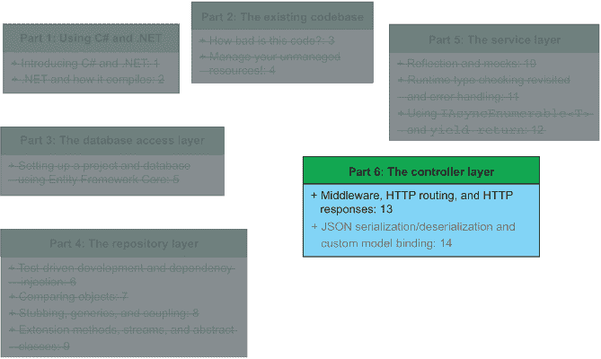

图 13.1 在前面的章节中，我们实现了数据库访问、仓库和服务层。在本章中，我们将开始实现我们服务所需的所有控制器。

在本章节之后，我们只需再有一章就能拥有一个完全实现且遵循 FlyTomorrow 给出的 API 规范的服务。在下一章中，我们将通过封装我们的控制器并使用 Swagger 进行验收测试来完成工作，以证明我们正确地完成了工作。

## 13.1 仓库/服务模式中的控制器类

在 5.2.4 节中，我向您介绍了仓库/服务模式。我们一直在本书中使用这个模式，成功地实现了新的 FlyingDutchmanAirlines 服务。但现在我们到了控制器层，你可能想知道控制器如何融入这个模式？毕竟，这是仓库/服务模式，而不是控制器/服务/仓库模式。

有时候一个名称可能会误导人。我最痛恨的事情之一就是当某个东西（一个方法名称或一个架构）被错误或不完整地命名。不幸的是，我没有命名这个模式，但如果我命名了，它将是“控制器/仓库/服务模式”。嘿，也许甚至是控制器/仓库/服务/数据库层模式，但这更让人难以吞咽。那么控制器层在仓库/服务模式中是如何定位的呢？

快速回答是：控制器通常是仓库/服务模式中面向公众、最顶层的一层。这并不奇怪：控制器通常是服务最顶层，因为它通常是唯一暴露给客户端的点，如图 13.2 所示。外部系统的例子包括 FlyTomorrow 网站、一个请求信息以进行进一步处理的微服务，或者一个尝试加载数据库信息的桌面应用程序。任何位于你的代码库之外的消费者都是一个外部系统。这里有一个注意事项：这假设我们生活在一个我们的服务作为外部系统调用我们的服务的“服务器”的世界。如果你需要在这个服务的工作中调用任何外部 HTTP 服务，你可能会在服务或仓库层中这样做。

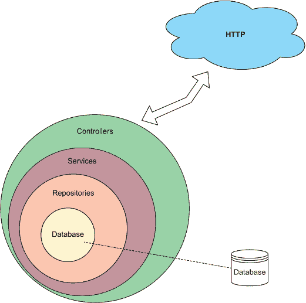

图 13.2 控制器是我们架构的最外层，如果服务作为服务器，则与任何潜在的外部系统交互。有了这个模型在心中，我们可以轻松地建模我们的仓库、服务和控制器。

到目前为止，我们已经实现了我们服务的内层圈。然而，现在如果 FlyTomorrow 要发送一个关于数据库中所有航班的请求，我们将无法接受这个请求。因此，如果没有完全实现的控制器，没有人会使用我们的服务。你可以拥有最干净、性能最高、最安全的服务，但如果没有人使用（或能够使用）你的产品，那就还不够好。

控制器公开了我们称之为*端点方法*的方法。这些方法接受 HTTP 请求并返回 HTTP 响应。HTTP 响应通常包含以下三个关键项，如图 13.3 所示：

+   *一个 HTTP 状态码，如 200（OK）、404（未找到）或 500（内部服务器错误）* ——控制器根据处理请求后的服务状态确定这个状态码。

+   *头部* ——这是一个键值对的集合，通常包括返回数据的类型以及是否有任何跨源资源共享（CORS）指令。除非你需要传递一个奇怪的头部，否则 ASP.NET 通常可以自动为你处理这一步骤。

+   *一个主体* ——在适当的情况下，你可以向消费者返回数据。通常，这些数据以 JSON 值的形式返回，并伴随 200（OK）状态码。某些 HTTP 状态码不允许返回数据（例如，201 状态码，表示“无内容”）。这些数据在“主体”部分返回。

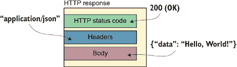

图 13.3 HTTP 响应通常包含 HTTP 状态码、头部和主体。我们使用这些字段向调用者返回适当的信息。

关于 HTTP 和 Web 服务交互的更多信息，请参阅 Barry Pollard 的 *HTTP/2 in Action*（Manning，2019）。如果您想了解更多关于创建多个服务相互交互作为外部服务的架构开发，请参阅 Chris Richardson 的 *Microservices Patterns*（Manning，2018），Sam Newman 的 *Building Microservices: Designing Fine-Grained Systems*（O'Reilly Media，2015），或 Christian Harsdal Gammelgaard 的 *Microservices in .NET Core*（第 2 版；Manning，2020）。

## 13.2 确定要实现的控制器

在我们实现服务层类时，我们讨论了如何确定是否需要服务层类。我们意识到我们需要弄清楚是否需要一个调用该服务层的控制器。因此，我们可以再次进行这项练习，并快速确定我们需要实现哪些控制器。

再次查看 FlyTomorrow 和 Flying Dutchman Airlines 之间的合同中指定的端点（首次在 3.1 和 3.2 节中介绍，并在图 13.4 中显示）：

+   `GET /Flight`

+   `GET /Flight/{FlightNumber}`

+   `POST /Booking/{FlightNumber}`

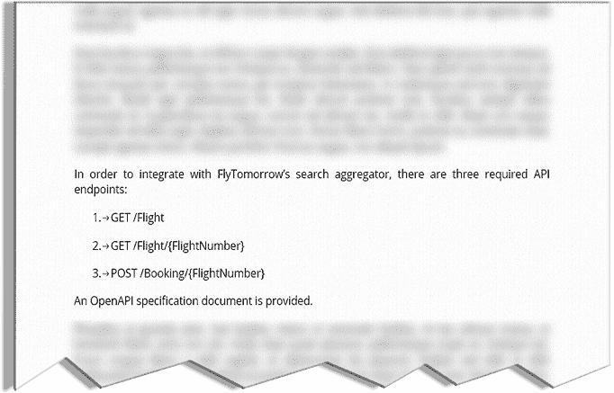

图 13.4 FlyTomorrow 合同所需的端点。我们需要实现我们的控制器来反映这些端点。

这些端点构成了我们迄今为止所做一切的基础。在数据库访问、存储库和服务层中，我们实际上并不需要与端点进行太多操作，但当谈到控制器时，情况就不同了。

要确定我们需要实现哪些控制器，我们问自己，在所需的端点中我们可以看到哪些实体，如图 13.5 所示？记住，当我们谈论实体时，我们是在谈论数据库实体（通过代码库中的模型类反映）。花几分钟时间查看端点，看看你能得出什么结论。我们之前已经做过这个练习，所以这不应该太具挑战性。

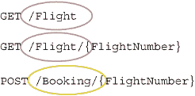

图 13.5 确定所需端点及其潜在控制器。我们可以通过查看所需端点中出现的实体来确定需要实现哪些控制器。

如果我们查看第一个端点（`GET /Flight`），我们会看到路径中的 `Flight` 实体。这是一个明确的迹象，表明我们应该实现一个 `FlightController` 类。同样，当我们查看 `GET /Flight/{FlightNumber}` 端点时，我们意识到我们也需要一个 `FlightController` 类来处理它。这留下了 `POST /Booking/{FlightNumber}`，它表明我们需要一个 `BookingController`。在本章的其余部分，我们将实现 `FlightController`。在下一章中，我们将完全实现 `BookingController`。

但关于 `Airport` 和 `Customer` 实体的控制器呢？因为不需要端点路径指向 `Airport` 和 `Customer` 实体的控制器，所以我们不需要它们。

## 13.3 实现 FlightController

在 13.1 节中，我们讨论了我们的架构中的控制器层。在 13.2 节中，我们利用了这些知识，讨论了我们需要实现哪些控制器。在本节中，我们将实际实现一个控制器。如何实现控制器层类？嗯，你知道的：我们首先创建我们的两个骨架类。在本节中，我们将实现 `FlightController` 类，所以让我们创建 `FlightController` 和 `FlightControllerTests` 类，如图 13.6 所示。

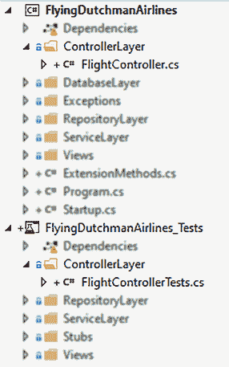

图 13.6 我们添加了两个骨架类：`FlightController` 和 `FlightControllerTests`。这些构成了我们 `FlightController` 实现的基础。

在设置好骨架类之后，在我们可以讨论如何创建外部系统可访问的控制器方法之前，我们还需要做一件额外的事情：`FlightController` 需要从 `Controller` 类派生。这个基类，在接下来的代码示例中展示，为我们提供了标准方法，我们可以使用这些方法向消费者返回 HTTP 数据，并允许我们设置路由到我们的端点：

```
public class FlightController : Controller
```

现在，我们需要实现以下三个部分，以便在运行时通过外部系统访问我们的端点。

+   `IActionResult` 接口（13.3.1 节）

+   中间件中的依赖注入（13.3.2 节）

+   路由端点（13.4 节）

在本章之后，我们将实现 `FlightController` 以及相应的单元测试，并将能够通过外部系统模拟器（如 Postman 或 cURL）来访问端点。

### 13.3.1 使用 IActionResult 接口返回 HTTP 响应（GetFlights）

在 13.2 节中，我们讨论了典型 HTTP 响应的组成。大多数情况下，HTTP 响应包含一个 HTTP 状态码、头部和一个包含一些数据的主体。想想我们如何从一个方法中返回这样的内容。没有原始数据类型可以持有这些信息。我们可以使用 C# 中任何类型的最低共同分母——`object`——但这将是一个懒惰的解决方案，并且处理起来有些棘手，因为它仍然不是 HTTP 传输可接受的格式。

解决方案是 ASP.NET 的 `IActionResult` 接口。`IActionResult` 接口由 `ActionResult` 和 `ContentResult` 等类实现，但在实践中，我们可以将确定使用哪个具体类的决定留给 ASP.NET。这是多态的另一个例子，我们称之为“编码到接口”。

|    |
| --- |

编码到接口

在 8.4 节中，我们讨论了使用多态和 Liskov 替换原则。这些原则允许我们编写通用的代码，而不是局限于特定的实现。为了说明这一点，让我给你举一个例子。

让我们想象你正在为 2005 年左右的图书出版社编写一个服务。电子书的时代正在兴起，但你的代码没有考虑到这一点。结果，你的代码与`Book`类紧密耦合。在下面的代码片段中，作者完成了书籍的写作，我们想要将其发送到打印机：^a

```
public void BookToPrinter(Book book) {
  if (book.IsApproved()) {
    BookPrinter printer = 
➥ ExternalCompanyManager.SelectPrintingCompany(book);
    printer.Print();
  }
}
```

当仅处理常规、纸质书籍时，这段代码运行正常。但如果我们想“打印”一本电子书会发生什么？嗯，该方法不接受`EBook`类型的输入参数。如果我们使用参数类型的接口而不是具体类型来编写`BookToPrinter`方法，我们的工作会更容易，如下所示：

```
public void BookToPrinter(IWork book) {
  if (book.IsApproved()) {
    BookPrinter printer = 
➥ ExternalCompanyManager.SelectPrintingCompany(book);
    printer.Print();
  }
}
```

现在，打印电子书并没有太多意义。我们可能想要更进一步，将书籍的实际“打印”过程泛化，无论其介质类型如何，如下所示：

```
public void ProduceWork(IWork work) {
  if (work.IsApproved()) {
    work.Produce();
  }
}
```

这样，我们将实现细节抽象到`IWork`接口的派生类中。`ProduceWork`方法不关心书籍的介质是纸张还是电子书。在对象内部实现改变对象状态的逻辑是面向对象设计的一个重要原则，这使得代码更易于阅读和维护。关于这一点及其如何与开放/封闭原则联系起来的精彩讨论，请参阅 Robert C. Martin 和 Micah Martin 的《敏捷原则、模式与实践》（Prentice Hall，2006 年）。

^a 在撰写本文时，这个愉快的时刻似乎对这个书来说还非常遥远。

|

让我们开始我们的第一个端点：`/GET Flight`。我们知道我们的返回类型是`IActionResult`，但访问修饰符、名称和参数应该是什么？因为 ASP.NET 使用反射来调用方法，所以访问修饰符应该是 public。至于名称，一个给端点方法命名的好方法是取 HTTP 动作（在这种情况下是`GET`）并附加实体（对我们来说是`Flight`），在必要时使术语变为复数：`GetFlights`。这样我们就剩下了输入参数。这是一个`GET`动作，所以我们不需要输入参数，如下一代码片段所示。根据 HTTP 规范，不允许`GET`动作向特定方法传递任何数据，这使得我们在这个阶段的生活变得容易一些。

```
public IActionResult GetFlights()  { ... }
```

我们需要做什么来返回一些 JSON 数据？如第 13.1 节所述，在大多数情况下，我们不需要显式指定任何头信息，这样就留下了状态码和任何正文数据。ASP.NET 库为我们提供了一个易于使用的静态类，我们可以返回并使用它作为`IActionResult`：`StatusCode`。这个类位于`FlightController`继承的`Controller`基类中。乍一看（并且根据其名称），你会认为`StatusCode`只允许我们返回状态码而没有正文，但事实并非如此！为了说明这一点，让我们从`GetFlights`方法返回 HTTP 状态码 200（OK）和字符串`“Hello, World!”`，如下所示：

```
public IActionResult GetFlights()  {
  return StatusCode(200, "Hello, World!");
}
```

这段代码可以编译并返回我们想要的结果。这里有一个额外的技巧需要理解：我们不应该使用硬编码的 200 这个状态码，而应该使用`HttpStatusCode`枚举并将其值转换为整数。这会稍微多写一点代码，但它消除了硬编码的数字，如下面的示例所示。有关魔法数字及其为什么不好的更多信息，请参阅第 9.6.1 节。

```
public IActionResult GetFlights() {
  return StatusCode((int) HttpStatusCode.OK, "Hello, World!");
}
```

不幸的是，这段代码无法满足我们的需求。我们需要从这个端点方法返回数据库中所有航班的详细信息集合。我们已经实现了服务层方法来支持这项工作，并创建了`FlightView`类。在`FlightController.GetFlights`方法中，我们希望调用这个服务层方法，并返回集合以及状态码 200（OK）。如果出现问题，服务层抛出`Exception`，我们希望返回状态码 500（内部服务器错误）且不返回其他数据。

在我们继续之前，让我们添加一个单元测试，如下一列表所示，以验证我们的预期。

列表 13.1 `GetFlights_Success`单元测试，第 1 次迭代

```
[TestMethod]
public void GetFlights_Success() {
  FlightController controller = new FlightController();             ❶
  ObjectResult response = 
➥ controller.GetFlights() as ObjectResult;                         ❷

  Assert.IsNotNull(response);                                       ❸
  Assert.AreEqual((int) HttpStatusCode.OK, response.StatusCode);    ❹
  Assert.AreEqual("Hello, World!", response.Value);                 ❺
}
```

❶ 实例化一个`FlightController`对象

❷ 模拟对/Flight 的 HTTP GET 调用，并将返回值转换为`ObjectResult`

❸ 确保 HTTP 响应不为空

❹ 验证 HTTP 响应的状态码为 200

❺ 验证预期的内容存在于 HTTP 响应中

因为`FlightController.GetFlights`方法返回的是`IActionResult`类型，我们不能直接从接口访问状态码和正文值，所以我们将响应转换为`ObjectResult`类型。`ObjectResult`类实现了`IActionResult`接口，因此我们可以将返回值向下转换为派生类。当我们进行*向下转换*时，我们使用两个类之间的多态关系，并使用父类作为派生类。这是 Liskov 替换原则的逆过程。

为了调整`GetFlights`方法中的逻辑，以便我们可以使用`FlightService`类获取数据库中所有航班的详细信息，我们需要访问`FlightService`的一个实例。我们再次使用依赖注入应该不会让人感到惊讶！

### 13.3.2 使用中间件将依赖项注入到控制器中

在前面的章节中，我们使用了依赖注入来推迟创建这种依赖项的新实例。对于仓储层，我们使用依赖注入来不必担心实例化`FlyingDutchmanAirlinesContext`类型的实例。同样，在服务层，我们注入了仓储层类的实例。最后，在本章中我们实现的控制器中，我们需要使用注入的`FlightService`实例。但这些实例从哪里来呢？

我们最终到了必须实际设置这些依赖项的阶段。我们通过向所谓的中间件中添加一些逻辑来实现这一点。*中间件* 是任何可以帮助处理 HTTP 请求的代码。你可以将中间件视为一系列单独的中间件组件，如图 13.7 所示，这些组件被串联在一起。


图 13.7 多个中间件组件及其执行方式的示例。中间件组件是线性执行的，并且通常被链在一起以创建所需的处理故事。

在 HTTP 请求进入控制器（并继续向下通过架构层）之前，CLR 会执行任何提供的中间件，如图 13.8 所示。中间件组件的例子包括路由（我们将在第 13.4 节中看到更多关于路由的内容）、身份验证和依赖注入。

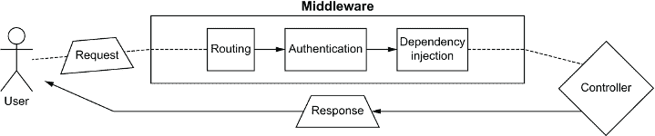

图 13.8 中间件在接收到 HTTP 请求后执行控制器（以及后续的服务和存储库）代码之前发生。中间件组件的例子包括路由、身份验证和依赖注入。

通常，我们会在 ASP.NET 服务的 `Startup` 类中找到中间件代码。在第 5.2 节（以及如图 13.2 所示），我们在 `Startup` 类中添加了代码，使我们能够使用控制器和端点路由。这些都是中间件代码的例子。

列表 13.2 `Startup` 类

```
class Startup {
  public void Configure(IApplicationBuilder app, 
➥ IWebHostEnvironment env) {
    app.UseRouting();
    app.UseEndpoints(endpoints => endpoints.MapControllers());
  }

  public void ConfigureServices(IServiceCollection services) {
    services.AddControllers();
  }
}
```

注意：通过编写中间件来注入依赖项不是在 C# 中实现依赖注入的唯一方法。市面上有大量的第三方（开源）C# 依赖注入框架，例如 Autofac、Castle Windsor 和 Ninject。有关这些外部框架的更多信息，请参阅 Mark Seemann 的 *Dependency Injection in .NET*（Manning，2011）。

我们可以通过以下三种方式在 `ConfigureServices` 方法中添加要注入的依赖项：

+   *单例* —在整个服务生命周期中只有一个实例

+   *作用域* —在整个请求生命周期中只有一个实例

+   *瞬态* —每次使用依赖项时都会创建一个新的实例

使用单例依赖项来保证每次都使用相同的实例

使用单例选项添加注入的依赖项模仿了单例设计模式。在单例设计模式中，每个应用程序只有一个实例。CLR 会重复使用此实例，直到应用程序运行结束。实例可能最初是一个空指针，但在第一次使用时，代码会实例化它。

当我们使用单例依赖项进行依赖注入时，注入的实例总是相同的，无论何时何地注入。例如，如果我们添加一个类型为 `BookingRepository` 的注入单例，我们将在每个通过我们服务的请求中始终使用相同的实例。¹

使用作用域依赖项来保证每个请求的实例相同

使用作用域依赖项，每个 HTTP 请求都会实例化其自己的依赖项版本，需要注入。ASP.NET 在整个请求生命周期中使用此实例，但为每个进入服务神圣殿堂的新请求实例化一个新的实例。

例如，如果我们实例化一个`FlightRepository`实例，并在两个服务层类中注入`FlightRepository`类型，只要我们处理的是同一个 HTTP 请求，这两个服务层类都会接收到（并操作）同一个`FlightRepository`实例。

使用瞬态依赖项（DI）始终获取新实例

在 DI 中，瞬态依赖项可能是处理依赖注入最常见的方式。当我们添加瞬态依赖项时，每次该依赖项需要注入时，ASP.NET 都会实例化一个新的实例。这保证了我们始终在注入类的全新副本上工作。

因为瞬态依赖项是使用依赖注入最常见的、最容易使用的方式，我们将遵循这一做法。要在`Startup`类的`ConfigureServices`方法中添加瞬态依赖项，使用`services.dependencyType`语法。

让我们看看我们是如何为`FlightController`类的`FlightService`依赖项实现这一点的：

```
public void ConfigureServices(IServiceCollection services) {
  services.AddControllers();
  services.AddTransient(typeof(FlightService), typeof(FlightService));
}
```

我们将`FlightService`的类型作为`AddTransient`调用的两个参数。这告诉我们，每当请求注入`FlightService`类型时，我们希望将`FlightService`类型添加到内部实例集合中。这有点绕，但这是我们必须要做的。这就是你需要做的所有事情，以确保 CLR 在你需要时可以提供注入的实例。当然，我们还想添加`FlightService`类本身期望的依赖项——`FlightRepository`和`AirportRepository`——如下所示：

```
public void ConfigureServices(IServiceCollection services) {
  services.AddControllers();

  services.AddTransient(typeof(FlightService), typeof(FlightService));
  services.AddTransient(typeof(FlightRepository), 
➥ typeof(FlightRepository));
  services.AddTransient(typeof(AirportRepository), 
➥ typeof(AirportRepository));
}
```

在此之后，我们需要为`FlightRepository`和`AirportRepository`类提供哪些依赖项？这两个类都需要相同的依赖项——`FlyingDutchmanAirlinesContext`类的一个实例，如下所示：

```
public void ConfigureServices(IServiceCollection services) {
  services.AddControllers();

  services.AddTransient(typeof(FlightService), typeof(FlightService));
  services.AddTransient(typeof(FlightRepository), 
➥ typeof(FlightRepository));
  services.AddTransient(typeof(AirportRepository), 
➥ typeof(AirportRepository));
  services.AddTransient(typeof(FlyingDutchmanAirlinesContext), 
➥ typeof(FlyingDutchmanAirlinesContext));
}
```

现在我们可以将注入的依赖项添加到`FlightController`中，并按如下方式调用`FlightService`：

```
public class FlightController : Controller {
  private readonly FlightService _service;

  public FlightController(FlightService service) {
    _service = service;
  }

  ...
}
```

我们使用`GetFlights`方法试图实现什么？我们希望返回给调用者一个包含所有航班信息的 JSON 响应，对吗？让我们通过 FlyTomorrow 提供的 OpenAPI 规范来双重检查，如图 13.9 所示。在那里，我们看到`GET /Flight`端点有以下三个返回路径：

+   成功情况返回 HTTP 代码 200，并包含数据库中所有航班的详细信息

+   如果没有找到航班，返回状态码 404

+   对于所有其他错误，返回状态码 500

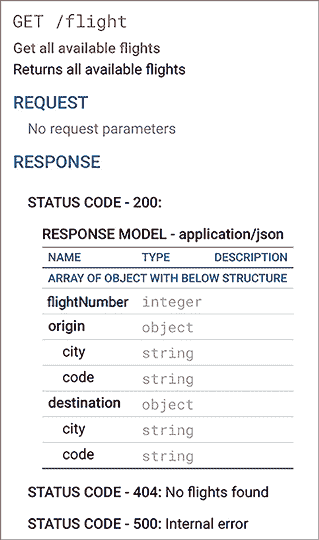

图 13.9 `GET` `/Flight`端点所需响应。这是从生成的 OpenAPI 规范中截取的屏幕截图。

让我们先处理成功的情况，如下面的列表所示，并使用注入的`FlightService`遍历`FlightService.GetFlights`方法返回的数据，用`try-catch`块包装起来，这样我们就可以捕获任何潜在的抛出错误。

列表 13.3 `GetFlights`调用`FlightService`

```
public async Task<IActionResult> GetFlights() {
  try {
    Queue<FlightView> flights = new Queue<FlightView>();            ❶
    await foreach (FlightView flight in _service.GetFlights()) {    ❷
      flights.Enqueue(flight);                                      ❸
    }

    ...
  }
  catch(FlightNotFoundException exception) {
    ...
  } catch (Exception exception) {
    ...
  }
}
```

❶ 创建一个 Queue<FlightView>来存储返回的 FlightView 实例

❷ 处理从服务类接收到的每个 FlightView

❸ 将航班添加到队列中

因为`FlightService.GetFlights`方法返回一个`IAsyncEnumerable<FlightView>`并使用`yield return`关键字，所以我们不需要等待所有处理完成才能看到我们的劳动成果。随着数据库返回航班，服务层填充`FlightView`，控制层接收这些实例并将它们添加到`Queue`数据结构中。

我们如何构建这个`FlightView`实例队列，以便我们可以返回其内容以及 HTTP 状态码 200 给用户？ASP.NET、C#和.NET 的魔力使得这变得非常简单。记得我们在 13.3.1 节中如何通过将两个参数值添加到`StatusCode`构造函数中，简单地返回 HTTP 状态码 200 以及一个读取为`“Hello, World!”`的正文吗？我们可以重复这个练习，将`“Hello, World!”`字符串替换为我们的队列，如下所示：

```
public async Task<IActionResult> GetFlights() {
  try {
    Queue<FlightView> flights = new Queue<FlightView>();            ❶
    await foreach (FlightView flight in _service.GetFlights()) {    ❷
      flights.Enqueue(flight);                                      ❸
    }

    return StatusCode((int)HttpStatusCode.OK, flights);
  } catch(FlightNotFoundException) {
    ...
  } catch (Exception) {
    ...
  }
}
```

❶ 创建一个 Queue<FlightView>来存储返回的 FlightView 实例

❷ 将航班添加到队列中

❸ 处理从服务类接收到的每个 FlightView

但你会接受我的话，认为这有效吗？当然不会。我们应该更新我们的单元测试来验证这个假设。为此，我们暂时需要添加一些返回值，以便`GetFlights`方法可以编译。我会把这个留给你，因为你的返回值不重要，只要它符合基于方法签名的返回类型要求即可。

为了添加一个验证`FlightController.GetFlights`方法的单元测试，我们需要模拟`FlightService`类（因此，我们还需要为`FlightService`设置一个无参构造函数，并确保`FlightService.GetFlights`方法返回一个正确的响应）。首先，我们需要将`FlightService.GetFlights`设置为虚拟的，这样 Moq 框架才能覆盖它。但我们要如何返回一个类型为`IAsyncEnumerable<FlightView>`的实例呢？我们不能简单地实例化这个类型，因为你不能仅基于接口来实例化类型。这里的技巧是在测试类内部创建一个测试辅助方法，该方法返回一个包含一些模拟数据的`IAsyncEnumerable<FlightView>`，如下所示。

列表 13.4 完成的`GetFlights_Success`单元测试

```
[TestClass]
public class FlightControllerTests {

  [TestMethod]
  public async Task GetFlights_Success() {
    Mock<FlightService> service = new Mock<FlightService>();              ❶

    List<FlightView> returnFlightViews = new List<FlightView>(2) {        ❷
            new FlightView("1932",                                        ❷
➥ ("Groningen", "GRQ"), ("Phoenix", "PHX")),                             ❷
            new FlightView("841",                                         ❷
➥ ("New York City", "JFK"), ("London", "LHR"))                           ❷
    };                                                                    ❷

    service.Setup(s => 
➥ s.GetFlights()).Returns(FlightViewAsyncGenerator(returnFlightViews));  ❸

    FlightController controller = new FlightController(service.Object);
    ObjectResult response = 
➥ await controller.GetFlights() as ObjectResult;

    Assert.IsNotNull(response);
    Assert.AreEqual((int)HttpStatusCode.OK, response.StatusCode);

    Queue<FlightView> content = response.Value as Queue<FlightView>;      ❹
    Assert.IsNotNull(content);                                            ❹

    Assert.IsTrue(returnFlightViews.All(flight => 
➥ content.Contains(flight)));                                            ❺
  }

  private async IAsyncEnumerable<FlightView> 
➥ FlightViewAsyncGenerator(IEnumerable<FlightView> views) {              ❻
    foreach (FlightView flightView in views) {                            ❻
      yield return flightView;                                            ❻
    }                                                                     ❻
  }                                                                       ❻
}
```

❶ 创建 FlightService 的模拟实例

❷ 定义模拟中使用的 FlightViews

❸ 设置模拟以返回 FlightView 列表

❹ 安全地将返回的数据转换为 Queue<FlightView>，并检查是否为 null

❺ 对于 FlightView 列表中的所有条目，检查返回的数据是否包含该条目（LINQ）

❻ 返回一个包含传入的 FlightView 对象的 IAsyncEnumerable<FlightView>

太好了，这个测试通过了。在完成这个方法之前，我们只剩下处理异常情况。在本节前面，我们识别（并添加）了两种错误条件：服务层抛出类型为 `FlightNotFoundException` 的异常，以及服务层抛出异常。查看 FlyTomorrow OpenAPI 规范（如图 13.10 所示），我们看到当找不到航班时，我们应该返回 HTTP 状态码 404（未找到），在其他所有错误上返回 HTTP 状态码 500（内部服务器错误）。

让我们从 404 开始，并添加以下单元测试来检查这一点：

```
[TestMethod]
public async Task GetFlights_Failure_FlightNotFoundException_404() {
  Mock<FlightService> service = new Mock<FlightService>();
  service.Setup(s => s.GetFlights())
➥ .Throws(new FlightNotFoundException());
  FlightController controller = new FlightController(service.Object);
  ObjectResult response = await controller.GetFlights() as ObjectResult;

  Assert.IsNotNull(response);
  Assert.AreEqual((int)HttpStatusCode.NotFound, response.StatusCode);
  Assert.AreEqual("No flights were found in the database", 
➥ response.Value);
}
```

`GetFlights_Failure_FlightNotFoundException_404` 单元测试目前没有通过。记住，在使用测试驱动开发时，我们通常希望在实现实际方法逻辑之前创建单元测试。这给了我们思考我们希望代码如何被调用的机会，进一步将新功能与其他代码库的片段解耦。在我们的情况下，我们需要添加一些逻辑，如下一代码示例所示，当控制器捕获到 `FlightNotFoundException` 实例时，返回正确的 `StatusCode` 对象：

```
public async Task<IActionResult> GetFlights() {
  try {
    Queue<FlightView> flights = new Queue<FlightView>();  
    await foreach (FlightView flight in _service.GetFlights()) { 
      flights.Enqueue(flight); 
    }

    return StatusCode((int)HttpStatusCode.OK, flights);
  } catch(FlightNotFoundException) {
    return StatusCode((int) HttpStatusCode.NotFound, 
➥ "No flights were found in the database");
  } catch (Exception) {
    ...
  }
}
```

我们的 `GetFlights_Failure_FlightNotFoundException_404` 单元测试现在通过了。我确信你可以想象接下来会发生什么：500 错误情况。我们模仿了处理 404 的方法，并添加了以下单元测试：

```
[TestMethod]
public async Task GetFlights_Failure_ArgumentException_500() {
  Mock<FlightService> service = new Mock<FlightService>();
  service.Setup(s => s.GetFlights())
➥ .Throws(new ArgumentException());

  FlightController controller = new FlightController(service.Object);
  ObjectResult response = await controller.GetFlights() as ObjectResult;

  Assert.IsNotNull(response);
  Assert.AreEqual((int)HttpStatusCode.InternalServerError, 
➥ response.StatusCode);
  Assert.AreEqual("An error occurred", response.Value);
}
```

为了使 `GetFlights_Failure_ArgumentException_500` 单元测试通过，我们在 `GetFlights try-catch` 中添加了适当的返回值如下：

```
public async Task<IActionResult> GetFlights() {
  try {
    Queue<FlightView> flights = new Queue<FlightView>(); 
    await foreach (FlightView flight in _service.GetFlights()) { 
      flights.Enqueue(flight); 
    }

    return StatusCode((int)HttpStatusCode.OK, flights);
  } catch(FlightNotFoundException) {
    return StatusCode((int) HttpStatusCode.NotFound, 
➥ "No flights were found in the database");
  } catch (Exception) {
    return StatusCode((int) HttpStatusCode.InternalServerError, 
➥ "An error occurred");
  }
}
```

这样就使单元测试通过，并且完成了 `GET /Flight` 端点的逻辑实现。当然，我们目前还不能从外部系统调用此端点，但我们将查看在 13.3.5 节中设置此路由。

### 13.3.3 实现 GET /Flight/{FlightNumber} 端点

到目前为止，在本章中，你学习了如何使用中间件进行依赖注入，以及如何在控制器层调用服务层的同时处理错误和提供单元测试。在 13.3.2 节中，我们实现了 `GET /Flight` 端点。现在我们来到 `GET /Flight/{FlightNumber}` 端点。

此端点应在提供航班号时返回单个航班的详细信息。为了完成这个任务，我们需要做以下四件事：

1.  从路径参数中获取提供的航班号。

1.  调用服务层以请求航班信息。

1.  处理服务层可能抛出的任何潜在异常。

1.  将正确的信息返回给调用者。

要获取路径参数的值，我们需要进行一些路由魔术，并将 `FlightNumber` URL 路径参数作为方法参数添加。在第 13.4 节中，我们将查看路由部分，但就目前而言，我们只需要在 `FlightController` 中创建一个新的方法 `GetFlightByFlightNumber`，该方法需要一个表示航班号的参数，如下所示：

```
public async Task<IActionResult> GetFlightByFlightNumber(int flightNumber){
  return StatusCode((int)HttpStatusCode.OK,"Hello from  
➥ GetFlightByFlightNumber");
}
```

这使我们能够调用 `FlightService` 的 `GetFlightByFlightByNumber` 方法，并传递 `flightNumber` 参数。在我们继续之前，让我们回顾一下，通过添加一个我们可以构建的单元测试来重新获得测试驱动开发之神（更具体地说，是 Kent Beck）的青睐，如下所示：

```
[TestMethod]
public async Task GetFlightByFlightNumber_Success() {
  Mock<FlightService> service = new Mock<FlightService>();
  FlightController controller = new FlightController(service.Object);

  await controller.GetFlightByFlightNumber(0);
}
```

`GetFlightByFlightNumber_Success` 单元测试在其当前状态下运行良好。毕竟，这个单元测试只是检查它是否能够调用 `FlightController` 类上的名为 `GetFlightByFlightNumber` 的方法，并传入一个类型为 `integer` 的输入参数。

为了进一步实现我们的方法，让我们在单元测试中添加以下预期行为：

```
public async Task GetFlightByFlightNumber_Success() {
  Mock<FlightService> service = new Mock<FlightService>();

  FlightView returnedFlightView = new FlightView("0", ("Lagos", "LOS"), 
➥ ("Marrakesh", "RAK"));
  service.Setup(s => 
➥ s.GetFlightByFlightNumber(0))
➥ .Returns(Task.FromResult(returnedFlightView));

  FlightController controller = new FlightController(service.Object);

  ObjectResult response = 
➥ await controller.GetFlightByFlightNumber(0) as ObjectResult;
  Assert.IsNotNull(response);
  Assert.AreEqual((int)HttpStatusCode.OK, response.StatusCode);

  FlightView content = response.Value as FlightView;
  Assert.IsNotNull(content);

  Assert.AreEqual(returnedFlightView, content);
}
```

如预期的那样，`GetFlightByFlightNumber_Success` 单元测试现在没有通过。从 `FlightController.GetFlightByFlightNumber` 方法调用返回的数据是不正确的。但我们可以修复它。对于实际的方法实现，我们可以使用与 `GetFlights` 方法相同的 `try-catch` 模式，并用对服务 `GetFlightByFlightNumber` 方法的调用（它返回一个 `FlightView` 实例）替换掉调用服务 `FlightService.GetFlights` 返回的 `IAsyncEnumerable` 的异步 `foreach` 循环，如下一个代码示例所示：

```
public async Task<IActionResult> GetFlightByFlightNumber(int flightNumber){
  try {
    FlightView flight = await 
➥ _service.GetFlightByFlightNumber(flightNumber);
    return StatusCode((int)HttpStatusCode.OK, flight);
  } catch (FlightNotFoundException) {
      return StatusCode((int)HttpStatusCode.NotFound, 
➥ "The flight was not found in the database");
  } catch (Exception) {
    return StatusCode((int)HttpStatusCode.InternalServerError, 
➥ "An error occurred");
  }
}
```

如果我们现在再次运行 `GetFlightByFlightNumber_Success` 单元测试，我们会看到它通过了。这非常快！在不到一页半的时间里，我们创建了一个全新的端点，并有一个成功路径单元测试来支持预期的功能。我们正在取得进展，所以让我们也添加两个失败情况。再次强调，它们应该与我们之前对 `GetFlights` 单元测试所做的工作非常相似，如下所示：

```
[TestMethod]
public async Task
➥ GetFlightByFlightNumber_Failure_FlightNotFoundException_404() {
  Mock<FlightService> service = new Mock<FlightService>();
  service.Setup(s => s.GetFlightByFlightNumber(1))
➥ .Throws(new FlightNotFoundException());

  FlightController controller = new FlightController(service.Object);
  ObjectResult response = 
➥ await controller.GetFlightByFlightNumber(1) as ObjectResult;

  Assert.IsNotNull(response);
  Assert.AreEqual((int)HttpStatusCode.NotFound, response.StatusCode);
  Assert.AreEqual("The flight was not found in the database", 
➥ response.Value);
}

[TestMethod]
public async Task GetFlightByFlightNumber_Failure_ArgumentException_500() {
  Mock<FlightService> service = new Mock<FlightService>();
  service.Setup(s => s.GetFlightByFlightNumber(1))
➥ .Throws(new ArgumentException());

  FlightController controller = new FlightController(service.Object);
  ObjectResult response = 
➥ await controller.GetFlightByFlightNumber(1) as ObjectResult;

  Assert.IsNotNull(response);
  Assert.AreEqual((int)HttpStatusCode.InternalServerError, 
➥ response.StatusCode);
  Assert.AreEqual("An error occurred", response.Value);
}
```

继续运行所有测试；它们应该通过。那么，我们还需要为这个端点做些什么呢？让我们快速查看图 3.10 中显示的 OpenAPI 规范，并验证我们已经完成了所有需要做的事情。

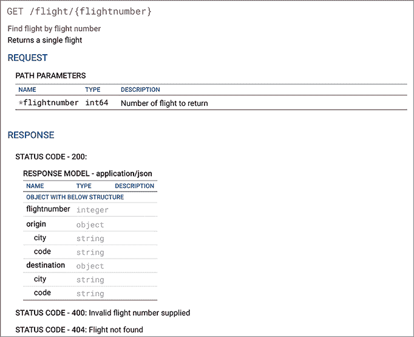

图 13.10 `GET` `/flight/{flightNumber}` 端点的 OpenAPI 规范。这是从生成的 OpenAPI 规范中截取的屏幕截图。

通过查看 OpenAPI 规范，我们看到我们需要接受一个名为 `flightNumber` 的参数：检查！我们还有三个返回值：一个返回我们构建的 `FlightView` 的 200 状态码，一个当找不到航班时的 404 状态码，以及一个当提供的航班号无效时的 400 状态码。

好吧，我们已经完成了三分之二。我们只需要将我们的 500 内部错误更改为 400 状态码（Bad Request），并验证传入的 `flightNumber` 是否是一个有效的数字。对于一个有效的 `flightNumber`（就我们的目的而言）来说，任何正整数都是有效的。

让我们先跳到我们的单元测试中，并按照以下方式做出这些更改：

```
[TestMethod]
[DataRow(-1)]
[DataRow(1)]
public async Task 
➥ GetFlightByFlightNumber_Failure_ArgumentException_400(int 
➥ flightNumber){
  Mock<FlightService> service = new Mock<FlightService>();
  service.Setup(s => s.GetFlightByFlightNumber(1))
➥ .Throws(new ArgumentException());

  FlightController controller = new FlightController(service.Object);
  ObjectResult response = 
➥ await controller.GetFlightByFlightNumber(flightNumber) as ObjectResult;

  Assert.IsNotNull(response);
  Assert.AreEqual((int)HttpStatusCode.BadRequest, response.StatusCode);
  Assert.AreEqual("Bad request", response.Value);
}
```

当然，单元测试不再通过了。我们需要修改 `FlightController.GetFlightByFlightNumber` 方法，如下所示：

```
public async Task<IActionResult> GetFlightByFlightNumber(int flightNumber){
  try {
 if (!flightNumber.IsPositiveInteger()) {
 throw new Exception();
 }

    FlightView flight = await 
➥ _service.GetFlightByFlightNumber(flightNumber);
    return StatusCode((int)HttpStatusCode.OK, flight);
  } catch (FlightNotFoundException) {
    return StatusCode((int)HttpStatusCode.NotFound, 
➥ "The flight was not found in the database");
  } catch (Exception) {
    return StatusCode((int)HttpStatusCode.BadRequest, 
➥ "Bad request");
  }
}
```

我们学到了什么？始终要对照我们收到的规范检查我们的代码和测试。

因此，现在我们已经在 `FlightController` 中有了 `GetFlights` 和 `GetFlightByFlightNumber` 方法，是时候将它们暴露给外部系统了。毕竟，当前的代码是不可用的，所以它有些无用。为此，我们需要一种方法让我们的服务接受传入的 HTTP 请求并将该请求路由到适当的控制器和方法。在下一节中，我们将探讨如何做到这一点。

## 13.4 将 HTTP 请求路由到控制器和方法

现在你有一系列仓库、服务和控制器。它们都充满了可以实现你想要做的一切的精彩方法。但如何使用这些功能呢？与桌面应用程序不同，桌面应用程序中你会在业务逻辑旁边提供一个图形用户界面（GUI），我们处理的是一个存在于部署环境中的网络服务。我们如何请求或告诉服务器做什么？我们使用 HTTP 请求。

我们的服务如何接受这样的请求？目前，FlyingDutchmanAirlines 服务表现得有点像一堵砖墙。如果你向它发送 HTTP 请求，服务将不知道如何处理它。但如果我们引入路由的概念，如图 13.11 所示，情况就改变了。

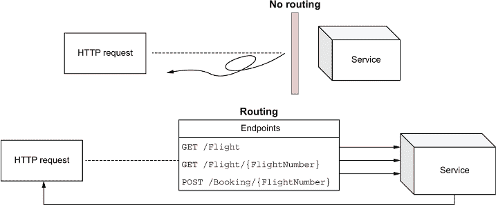

图 13.11 带和不带路由的 HTTP 请求进入服务。当我们没有设置任何路由时，HTTP 请求在服务中无法解决而弹回。如果我们路由到端点，服务可以执行适当的逻辑。

路由使我们能够将 URL 映射到特定的控制器和端点。请求与控制器端点之间的映射使得在 `FlightController` 中执行 `GET /Flight` 方法时，当你向 [*ServiceAddress*]/flight URL 发送 HTTP `GET` 请求。为了添加路由支持，我们需要做什么？在 12.3.2 节中，我们讨论了中间件。路由只是我们可以添加到我们的服务中的另一块中间件。实际上，我们需要的很多东西已经准备好了。

在 5.2 节中，我们构建了内部路由表，其中包含服务可以路由到的端点列表。要开始路由，我们只需要告诉 CLR 将请求路由到何处。我们通过在两步过程中给端点方法和控制器提供“路由”来实现这一点。首先，我们像下面这样在 `FlightController` 类中添加一个 `[Route]` 属性：

```
[Route("{controller}")]
public class FlightController : Controller { ... }
```

`[Route]` 属性接受硬编码的路由或模板。在这里，我选择了 `"{{controller}}"` 模板。

|    | 路由中的控制器名称 当在`route`属性中使用`"{controller}"`模板时，路由会被解析为你的控制器类名，去掉实际的单词*controller*。所以，在我们的例子中，我们的类被命名为`FlightController`，所以路由是`/Flight`。 |
| --- | --- |

下一步是定义特定方法的路由。为此，我们使用以下映射到 HTTP 操作的属性集合：

+   `[HttpGet]`

+   `[HttpPost]`

+   `[HttpPut]`

+   `[HttpDelete]`

+   `[HttpHead]`

+   `[HttpPatch]`

所有这些属性都生成映射到它们对应 HTTP 操作的路由。我们可以以两种方式在这些方法上使用这些属性：直接使用，或者提供额外的路由。为了说明，让我们在`FlightController.GetFlights`方法上使用`[HttpGet]`属性，如下所示：

```
[HttpGet]
public async Task<IActionResult> GetFlights() { ... }
```

方法路由被添加到控制器路由中。使用`GetFlights`方法上的`[HttpGet]`属性生成一个`GET /Flight`的路由，这与 FlyTomorrow OpenAPI 规范要求我们做的相符。为了测试我们的端点，我们可以使用 cURL 命令行工具（包含在 Windows、macOS 和 Linux 中）或专门的 HTTP 工具，如 Postman。我不会偏袒哪一个更好：它们各有优缺点。对于本书中的大多数命令，我在 Windows 上使用 cURL。cuRL 的使用在各个平台之间应该是相同的（或非常相似）。

要达到我们的目标端点，我们首先需要启动它。通常，我们会在本地端口 8080 上启动服务（提供的源代码就是这种情况）。这对于大多数用例来说都很好，但有时你可能会在那个端口上遇到冲突，需要使用不同的端口。如果你发现你无法访问服务，而你正在端口 8080 上提供服务，请在`Startup.cs`中将端口更改为其他值。在这个例子中，我使用了端口 8081。要启动我们的服务，打开一个命令行窗口，将其指向 FlyingDutchmanAirlines 文件夹，并输入以下命令：

```
>\ dotnet run
```

一旦服务启动并运行（命令行会告诉我们是否启动），我们就可以使用 cURL 来“curl”我们的端点。要 curl 一个端点，在另一个命令行窗口中，使用`[curl] -v [address]`语法（`-v`标志告诉 cURL 提供更多详细信息或详细程度），如下所示：

```
\> curl -v http://localhost:8081/flight
```

如果你的服务正在运行，你将收到一个包含数据库中所有航班的响应，如图 13.12 所示。

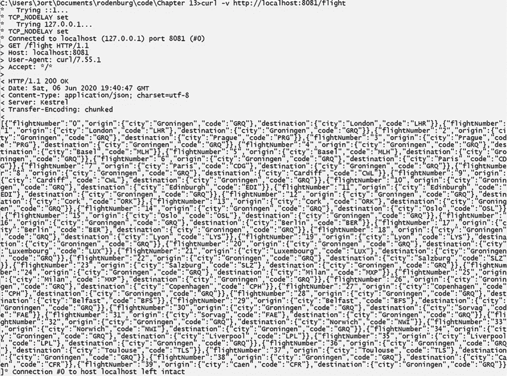

图 13.12 我们的服务对`GET` `HTTP` `/Flight` 请求的响应：一个包含数据库中所有航班的巨大 JSON 数组。FlyTomorrow 可以使用这些数据来向客户展示所有飞利浦荷兰航空公司的航班。

如您在图 13.12 中所见，cURL 工具不会格式化返回的 JSON 信息。它以未格式化的形式显示数据，这使得阅读变得困难。在图 13.13 中，您可以看到 Postman 中格式化后的响应的一部分，它格式化了返回的 JSON。好消息是我们的端点工作正常！我们从 HTTP 请求到数据库，再到命令行的完整往返都成功了。我们在前几章所做的所有艰苦工作终于得到了回报。

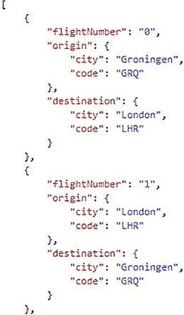

图 13.13 与图 13.12 中相同的 JSON 响应数据，但已格式化。格式化的 JSON 更易于阅读，我们可以轻松地发现任何问题。

我们如何到达我们的另一个端点：`/GET /Flight/{FlightNumber}`？毕竟，我们正在使用包含航班号的路径参数。当使用 `HttpAttribute` 方法属性（如 `[HttpGet]`）时，我们可以提供额外的路由指令，如下一个代码片段所示。这在我们需要提供更多的路由嵌套（例如，有一个前往 `/Flight/AmazingFlights/` 的端点）或接收路径参数（如 `{flightNumber}`）时非常有用。

```
[HttpGet("{flightNumber}")]
public async Task<IActionResult> GetFlightByFlightNumber(int flightNumber){
  ...
}
```

使用 `GetFlightByFlightNumber` 方法，`[HttpGet]` 中指定的模板将 `{flightNumber}` 路径参数指向方法输入参数 `flightNumber`。我们现在可以使用路径参数并请求特定航班的详细信息。例如，我们可以使用 cURL 轻松检索萨尔茨堡飞往格罗宁根的航班 23 的信息，如下所示：

```
\> curl -v http://localhost:8081/flight/23
```

端点返回了 `FlightView` 类的序列化（将数据结构转换为二进制或 JSON 格式）版本，用于航班 23。图 13.14 展示了响应数据。我们还可以在图 13.15 中看到，如果我们传递一个无效的航班号，例如 `-1`（不是一个正整数）或 `93018`（航班在数据库中不存在），会发生什么。

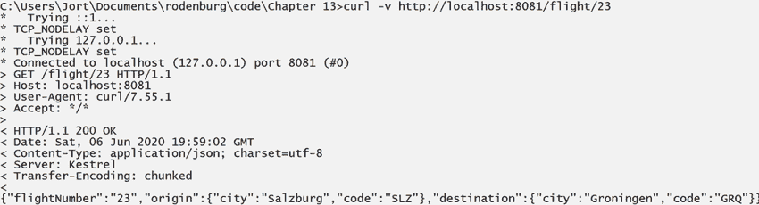

图 13.14 当调用 `GET` `/Flight/23` 端点时，服务返回的数据。通过传递适当的航班参数值，我们可以使用 `GET` `/Flight/{FlightNumber}` 端点查询航班 23。 

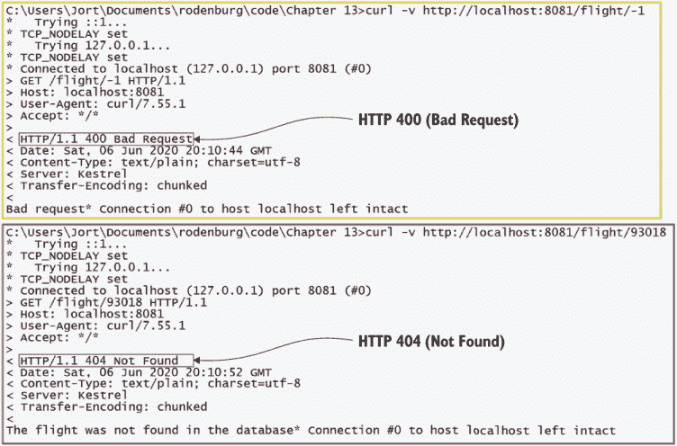

图 13.15 我们在 `/GET` `/Flight/{FlightNumber}` 端点错误条件下收到 HTTP 400 和 HTTP 404 错误。这些错误对于确定问题是在客户端还是服务器端非常有用。

因此，总结一下：我们现在已经完全实现了 `FlightController` 以及单元测试。我们可以访问 `GET /Flight` 和 `GET /Flight/{FlightNumber}` 端点并成功从数据库中检索数据。在下一章中，我们将完成我们的重构之旅并实现最后一个控制器和端点：`BookingController` 和 `POST /Booking` 端点。

## 练习

练习 13.1

对或错？在存储库/服务模式架构中，控制器是唯一应该接受来自外部系统的 HTTP 请求的层。

练习 13.2

一个典型的 HTTP 响应包含以下三个属性：

a. 发送者信息，路由信息，IP 目标

b. 发送者名称，服务中使用的编程语言，原始国家

c. 状态码，头部，主体

练习 13.3

对于此路由，你应该实现哪个控制器：`GET /Books/Fantasy`？

a. `BookController`

b. `FantasyController`

c. `BookShopController`

练习 13.4

对或错？中间件是在任何端点方法逻辑之前执行的。

练习 13.5

哪种注入依赖项类型允许我们在每次请求时都获得一个新的依赖项实例，无论我们是否仍在处理相同的 HTTP 请求？

a. 单例

b. 范围限定

c. 瞬态

练习 13.6

哪种注入依赖项类型允许我们在服务中仅在 HTTP 请求的生命周期内使用依赖项的同一实例？

a. 单例

b. 范围限定

c. 瞬态

## 摘要

+   在考虑存储库/服务模式时，控制器层是架构的外层。控制器可以接受 HTTP 请求并与外部系统通信。如果我们不能接受或与外部系统交谈，没有人能够使用我们的服务。

+   HTTP 请求始终包含头部信息（CORS、身份验证等），有时还包含主体（JSON 或 XML）。

+   HTTP 响应始终包含头部信息、HTTP 状态码（200 OK、404 Not Found 等），有时还包含主体。

+   ASP.NET 的`IActionResult`接口允许我们轻松地从方法中返回 HTTP 响应。这使我们能够编写清晰简洁的代码，任何人都能理解。

+   编码到接口是一种干净的代码原则，它促进了使用泛型结构而不是限制具体类。这使我们能够遵循开/闭原则，并轻松扩展我们的代码而无需更改现有类。

+   中间件是我们执行在控制器端点方法处理提供的 HTTP 请求之前的任何代码。我们可以使用中间件来执行诸如身份验证检查、依赖注入和路由等操作。

+   当在中间件中注入依赖项时，你有三种类型的注入依赖项可供选择：单例、范围限定和瞬态。单例依赖项模仿单例设计模式，并保证所有请求都在注入依赖项的单个实例上操作。范围限定时，注入的依赖项在同一请求内共享，但不在多个请求之间共享。瞬态时，每次构造函数请求依赖项时都会实例化一个新的依赖项实例。

+   要将 HTTP 请求路由到端点，我们必须在中间件中设置路由，并将路由属性添加到控制器类和方法中。这允许我们对我们的路由应该是什么样子进行细粒度控制。

+   对于大多数常见的 HTTP 操作，都有`HttpAttribute`路由方法属性。你可以直接使用它们，或者提供额外的路由并使用路径参数。

* * *

(1.)有关单例模式的更多信息，请参阅罗伯特·C·马丁和迈克·马丁的《敏捷原则、模式与实践：C#》第二十四章，“单例与单态”（普伦蒂斯·霍尔，2006 年）；或者，如果您想了解一个也详细涵盖依赖注入的资源，请参阅斯蒂芬·范·德尔斯和马克·塞门恩的《依赖注入：原则、实践与模式》（曼宁，2019 年）。
