# 14 JSON 序列化/反序列化和自定义模型绑定

本章涵盖

+   序列化和反序列化 JSON 数据

+   使用 `[FromBody]` 参数属性神奇地反序列化 JSON 数据

+   使用`IModelBinder`接口实现自定义模型绑定器

+   在运行时动态生成 OpenAPI 规范

这就是了。这是最后一章重构。在这本书中，我们从零开始重构了一个现有的代码库。我们学习了测试驱动开发、如何编写干净的代码以及 C#的技巧和窍门。图 14.1 显示了我们共同旅程的进展。

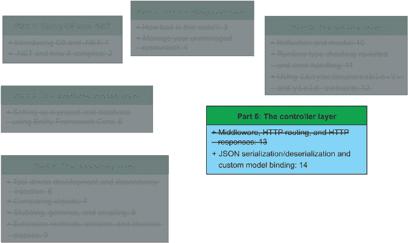

图 14.1 在前面的章节中，我们实现了数据库访问、仓库和服务层，以及`FlightController`类。在本章中，我们将完成这项工作并实现`BookingController`类。

在本章中，我们将实现最后一个控制器：`BookingController`（第 14.1 节）。之后，我们将根据 FlyTomorrow 的 OpenAPI 规范进行一些手动测试和验收测试。我们还将设置 Swagger 中间件以动态生成 OpenAPI 规范（第 14.2 节）。这是一个可选但非常有用的技术，因为 Swagger 帮助我们进行验收测试。

## 14.1 实现 BookingController 类

在第十三章中，我们学习了如何实现控制器（`FlightController`）并添加了一些 HTTP `GET` 方法（`GET /Flight` 和 `GET Flight/{FlightNumber}`）。在本节中，我们将在此基础上构建并实现`BookingController`。`BookingController`是 FlyTomorrow 与飞荷兰人航空公司创建预订的入口和网关。通过这个控制器，我们将完成 FlyingDutchmanAirlinesNextGen 服务的实现，并开始为公司提供一些实际的收入价值。毕竟，如果人们不能在我们的航班上预订座位，我们就无法从超大的行李、零食和船上的彩票中赚钱。

让我们再次看看飞荷兰人航空公司与 FlyTomorrow 之间的合同，看看`BookingController`类应该有哪些端点，如图 14.2 所示。

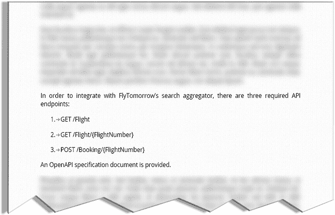

图 14.2 现在，众所周知的 FlyTomorrow 与飞荷兰人航空公司之间的合同。端点 1 和 2 在第十三章中实现。在本章中，我们将实现端点 3。

如您所见，我们需要实现以下三个端点：

+   `GET /Flight`

+   `GET /Flight/{FlightNumber}`

+   `POST /Booking/{FlightNumber}`

在第十三章中，我们实现了端点 1 和 2。现在只剩下第三个端点等待我们去实现。前两个端点位于`FlightController`类中，但第三个需要我们实现`BookingController`类。

前两个端点也没有要求我们处理提供的 JSON 体。当然，在 `GET /Flight/{FlightNumber}` 端点中，我们有一个路径参数，但它将航班的数字数据限制为路径参数可以接受的任何内容。对于 `POST`，我们需要接受发送到端点的数据。我们将在第 14.1.2 节中查看如何做到这一点。

然而，在我们这样做之前，让我们创建我们的（到目前为止）标准骨架类：`BookingController`。根据第 13.3 节，为了 CLR 能够将我们的控制器类作为可行的路由端点识别，我们需要让 `BookingController` 继承自 `Controller` 类，并添加以下 `[Route]` 类属性：

```
[Route("{controller}")]
public class BookingController : Controller { }

```

### 14.1.1 数据反序列化简介

让我们详细分析 `POST /Booking/{flightNumber}` 端点，并查看我们可以期望传递给我们的服务的数据（图 14.3）。

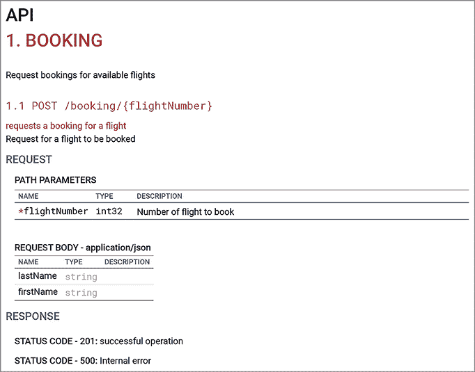

图 14.3 `POST` `/Booking/{flightNumber}` 端点接受包含想要预订给定航班的客户姓名的 HTTP 体。它返回 201 或 500。这是从生成的 OpenAPI 规范中截取的屏幕截图。

`POST /Booking/{flightNumber}` 结合了两种向控制器提供数据的方式：路径参数（`flightNumber`）和包含两个字符串（姓名和姓氏）的 JSON 体。我们可以在 JSON 中如下建模此数据：

```
{
  "firstName" : "Frank",
  "lastName"  : "Turner”
}
```

当然，用户无法填写字段并错误地提供如这里所示的两个字段中的全名：

```
{
  "firstName" : "Pete Seeger",
  "lastName"  : "Jonathan Coulton”
}
```

我们在收到数据之前无法检查其正确性，所以让我们假设一个（非常，非常天真的）验证规则：`firstName` 和 `lastName` 都需要填写。

现在，你可能会问，“Jort，这确实很棒。但我们如何在方法内部访问这样的数据？”对于这个问题，我说，“这是一个非常好的问题。”与路径参数不同，我们无法简单地将 `firstName` 和 `lastName` 参数添加到方法参数列表中。我们需要将传入的数据反序列化为我们可以理解的数据结构。如图 14.4 所示的反序列化是将数据流（通常是字节或 JSON 字符串）转换为内存或磁盘上的可消费数据结构的过程。其逆过程（将对象转换为字节或 JSON 字符串，以便我们可以通过 HTTP 发送或将其写入二进制文件）称为 *序列化*。

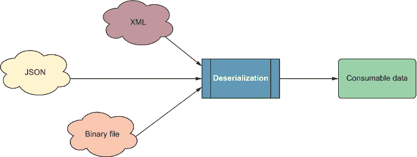

图 14.4 反序列化将 XML、JSON 和二进制文件等数据流转换为可消费数据，通常存储在数据结构中。这允许我们处理序列化数据。

因为 HTTP 请求的体通过线缆序列化（在我们的例子中是 JSON 字符串），我们需要访问其体信息，所以我们必须将体反序列化为某种定义的结构。

为了反序列化数据，我们使用以下两个概念：

+   一个具有适当结构以反序列化数据的（通常是类）数据结构

+   使用 `[FromBody]` 参数属性（模型绑定也称为数据绑定）

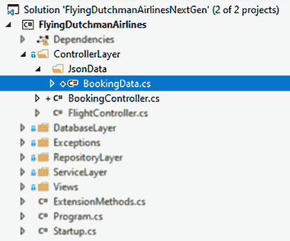

图 14.5 `BookingData` 类被添加到 ControllerLayer 文件夹中的新 JsonData 文件夹。将 JsonData 类保持在 ControllerLayer 文件夹内有助于我们确保代码库是有组织的。

首先，我们需要为 ASP.NET 提供一个数据结构来反序列化提供的主体。最有效的方法（因为它是最有序的）是创建一个类或结构来存储我们的数据。尽管我们只想存储数据，但我们还希望对提供的数据进行一些验证，因此，我们使用一个类。我们将这个新类存储在一个新的文件夹中，ControllerLayer/JsonData，并将文件命名为 BookingData.cs，如图 14.5 和下一代码片段所示。

```
public class BookingData {
  public string FirstName { get; set; }
  public string LastName { get; set; }
}
```

当一切完成后，`BookingData` 类应该被外部系统调用端点提供的数据填充。我们还想对属性进行一些验证：如果提供的字符串为空或为空，不要将属性设置为提供的字符串，而是抛出 `InvalidOperationException`（或者，使用 `ArgumentNullException` 也会是合适的）。我们还会在异常上设置一个消息，告诉人们我们无法做什么：设置 `FirstName` 或 `LastName`。为了避免在两个属性的设置器中重复相同的验证（一次为每个属性的设置器），我们可以创建一个私有方法来进行验证，并只需调用它。为了向设置器添加一个体，我们还需要为获取器提供一个。这导致需要创建一个后置字段，如下一列表所示。

列表 14.1 BookingData.cs

```
private string _firstName;                                                 ❶
public string FirstName {
  get => _firstName;                                                       ❷
 set => _firstName = ValidateName(value, nameof(FirstName));}             ❸
}

private string _lastName;
public string LastName {
  get => _lastName;
 set => _lasttName = ValidateName(value, nameof(LastName));}}

private string ValidateName(string name, string propertyName) =>           ❹
 string.IsNullOrEmpty(name)                                               ❹
 ? throw new InvalidOperationException("could not set " + propertyName)   ❹
 : name;                                                                  ❹
```

❶ `FirstName` 属性的后置字段

❷ 返回后置字段的值

❸ 将值设置为后置字段

❹ 验证输入值

在列表 14.1 中，我们传递属性的名称来帮助我们动态构建错误消息。为此，我们使用 `nameof` 表达式，它在我们编译时获取变量、类型或成员的名称作为字符串。到这一点，列表应该很容易理解，您应该能够解释自动属性和具有后置字段的全属性之间的区别。如果您对区别有困难，请重新阅读第 3.3.3 节。

|    | 条件大括号 列表 14.1 中唯一奇怪的部分是 `if(IsValidName(value))` 条件之后缺少大括号。在 C# 中，如果您在条件之后省略大括号，CLR 假设下一个语句是条件的主体并执行它。请注意，这仅限于一个执行的语句。如果您有一个或多个语句组成条件的主体，您需要使用大括号。 |
| --- | --- |

对于`BookingData`类，我们最后要做的就是提供一些单元测试来验证我们对刚刚实现的功能的假设。这些单元测试非常直接，你应该能够自己编写它们。如果你遇到困难，以下是一些你可以使用的实现（我们将测试文件添加到新的 FlyingDutchmanAirlines_Test/ControllerLayer/JsonData 文件夹中）：

```
[TestClass]
public class BookingDataTests {
  [TestMethod]
  public void BookingData_ValidData() {
    BookingData bookingData = new BookingData {FirstName = "Marina", 
➥ LastName = "Michaels"};
    Assert.AreEqual("Marina", bookingData.FirstName);
    Assert.AreEqual("Michaels", bookingData.LastName);
  }

  [TestMethod]
  [DataRow("Mike", null)]
  [DataRow(null, "Morand")]
  [ExpectedException(typeof(InvalidOperationException))]
  public void BookingData_InvalidData_NullPointers(string firstName, 
➥ string lastName) {
    BookingData bookingData = new BookingData { FirstName = firstName, 
➥ LastName = lastName };
    Assert.AreEqual(firstName, bookingData.FirstName);
    Assert.AreEqual(lastName, bookingData.LastName);
  }
  [TestMethod]
  [DataRow("Eleonor", "")]
  [DataRow("", "Wilke")]
[ExpectedException(typeof(InvalidOperationException))]
  public void BookingData_InvalidData_EmptyStrings(string firstName, 
➥ string lastName) {
    BookingData bookingData = new BookingData { FirstName = firstName, 
➥ LastName = lastName };
    Assert.AreEqual(firstName, bookingData.FirstName ?? "");
    Assert.AreEqual(lastName, bookingData.LastName ?? "");
  }
}
```

在收到 HTTP `POST`请求后，我们如何填充`BookingData`类？这就是`[FromBody]`属性发挥作用的地方。

### 14.1.2 使用[FromBody]属性反序列化传入的 HTTP 数据

在 14.1.1 节中，我们创建了一个数据结构来存储反序列化的信息。在 HTTP `POST`请求的上下文中，我们通常可以期望有效信息遵循我们提供的 OpenAPI 规范。在这种情况下，为了使`POST`请求有效，JSON 数据需要反序列化到`BookingData`类的属性：`firstName`和`lastName`。如果我们最终得到一个不完整的请求（`BookingClass`的属性有 null 指针），我们返回 HTTP 状态码 500。在这种情况下，你也可以返回 HTTP 状态码 400（Bad Request），这可能是正确的代码，但让我们坚持使用提供的 OpenAPI 规范（如图 14.3 所示）。

但首先，最重要的是：我们如何将数据反序列化到`BookingData`类中？我们不可能仅仅将`BookingData`类型添加到参数列表中并期望它自动工作。这听起来可能有些疯狂，但实际上这非常接近现实！ASP.NET 的`[FromBody]`属性可以应用于一个参数，以告诉 ASP.NET 我们想要对这个类型执行模型绑定。当 CLR 将有效载荷路由到具有此类参数的端点时，它会获取有效载荷的`Body`元素并尝试将其反序列化到给定的数据类型。

要请求这种模型绑定，只需将“*FromBody* *type* *argumentName*”添加到方法参数列表中（在我们的例子中，让我们在`BookingController`类中创建一个新的方法，称为`CreateBooking`，并带有 HTTP 属性`[HttpPost]`），如下所示：

```
[HttpPost]
public async Task<IActionResult> CreateBooking([FromBody] BookingData body)
```

通过将`[FromBody]`属性添加到可以通过`body`变量访问的`BookingData`类型，我们现在可以使用 HTTP 请求中的数据，如图 14.6 所示。

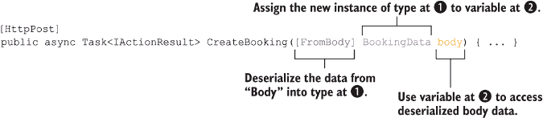

图 14.6 使用`[FromBody]`属性。当使用`[FromBody]`属性时，你可以将 HTTP JSON 数据反序列化到特定的数据结构并访问它。

这就是如此简单。现在，有些人可能不喜欢在他们的代码库中使用“魔法”，这是完全可以理解的。要知道，默认情况下，ASP.NET 被设置为序列化 JSON 数据。如果你想使用 XML，你必须将以下行添加到 global.asax.cs 文件中（当存在此文件时，它包含你的服务的全局配置详细信息）：

```
XmlFormatter xmlFormatter = 
➥ GlobalConfiguration.Configuration.Formatters.XmlFormatter;
xmlFormatter.UseXmlSerializer = true;
```

在我们继续之前，让我们快速看一下在继续使用`[FromBody]`之前解析 HTTP 数据到数据结构的另一种方法。

### 14.1.3 使用自定义模型绑定器和方法属性进行模型绑定

我们可以不使用`[FromBody]`属性自动将 HTTP 数据绑定到数据结构，也可以揭开 ASP.NET 魔法的面纱并实现我们自己的模型绑定器。人们经常反对使用`[FromBody]`属性，因为它似乎在幕后神秘地执行操作而没有解释。本节旨在解释这种魔法。

作为自定义模型绑定器，我们的`BookingModelBinder`包含了如何将给定数据绑定到我们类中的信息。使用自定义模型绑定器有些繁琐，但可以为我们提供对数据绑定过程更大的控制。首先，让我们添加一个新的类作为我们的模型绑定器，如下所示。这个类，`BookingModelBinder`，需要实现`IModelBinder`接口。`IModelBinder`接口允许我们使用`BookingModelBinder`将数据绑定到模型，我们将在稍后进行操作。

列表 14.2 自定义模型绑定器的开始

```
class BookingModelBinder : IModelBinder {                                 ❶
  public async Task BindModelAsync(ModelBindingContext bindingContext){   ❷
    throw new NotImplementedException();                                  ❷
  }                                                                       ❷
}
```

❶ 要提供自定义模型绑定，我们需要实现 IModelBinder 接口。

❷ IModelBinder 接口要求我们实现 BindModelAsync。

我们的`BookingModelBinder`类的实现包含以下四个主要部分，如图 14.7 所示：

1.  验证`bindingContext`输入参数。

1.  将 HTTP 正文读取到可解析的格式。

1.  将 HTTP 正文数据绑定到`BookingData`类的属性。

1.  返回绑定后的模型。

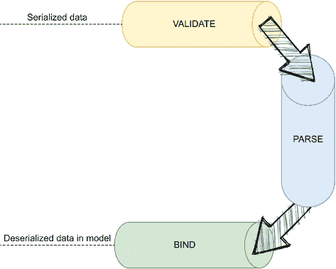

图 14.7 当使用自定义模型绑定器反序列化数据时，我们需要在返回绑定模型的数据之前进行验证、解析和绑定。这个工作流程让我们对反序列化过程有更细粒度的控制。

第一步也是最简单的：我们只想确保`bindingContext`参数没有与 null 值相关联，如下所示：

```
public async Task BindModelAsync(ModelBindingContext bindingContext) {
  if (bindingContext == null) {
    throw new ArgumentException();
  }
}
```

对于步骤 2（将 HTTP 正文读取到可解析的格式），我们需要访问并处理 HTTP 正文信息。

幸运的是，我们可以通过提供的`ModelBindingContext`实例访问关于传入 HTTP 请求的所有需要的信息。我们正在寻找的类是`HttpContext`和`HttpRequest`。它们包含与所有预期元素（正文、头信息等）相关的属性。`Request`类为我们提供了一个`PipeReader`实例，它有权访问序列化的正文元素。`PipeReader`类是`System.IO.Pipelines`命名空间的一部分。`System.IO.Pipelines`包含帮助进行高性能输入/输出（IO）操作的类（最重要的是`Pipe`、`PipeWriter`和`PipeReader`）。

为了检索和使用`PipeReader`以便我们更接近正文数据，我们使用`Request.BodyReader`属性并调用其`ReadAsync`方法，如下所示：

```
ReadResult result = await 
➥ bindingContext.HttpContext.Request.BodyReader.ReadAsync();
```

`ReadAsync` 方法返回一个 `Task<ReadResult>` 实例。该对象包含三个属性：`IsCompleted`、`IsCanceled` 和 `Buffer`。前两个用于检查提供的数据读取是否完成或取消。第三个是我们数据所在的地方。因为我们处理的是序列化数据和异步过程，所以数据存储在类型为 `ReadOnlySequence<byte>` 的缓冲区中。正是这个缓冲区包含了表示正文数据的实际字节。通常，缓冲区只包含一个“数据段”，因此我们可以检索第一个 `Span`（`Span` 表示连续的数据块）。然后，我们需要将那些数据反序列化回可读的 JSON 字符串。我们通过使用 `Encoding.UTF8` 类来完成这项操作，如下所示：

```
ReadOnlySequence<byte> buffer = result.Buffer;
string body = Encoding.UTF8.GetString(buffer.FirstSpan);
```

现在我们有了 JSON 字符串，我们可以将 JSON 字符串反序列化到我们的模型中（步骤 3：将 HTTP 正文数据绑定到 `BookingData` 类的属性）。C# 通过 `System.Text.Json` 命名空间提供了一些可靠的 JSON 功能，该命名空间在 .NET 5 中引入（并且默认安装）。要将 JSON 字符串反序列化为 `BookingData` 结构体，我们只需调用 `JsonSerializer.Deserialize<T>` 并将其类型作为泛型类型参数（`BookingData`）以及要反序列化的 JSON 字符串（`body`）传递，如下所示：

```
BookingData data = JsonSerializer.Deserialize<BookingData>(body);
```

这将 `body` 中出来的值反序列化为 `BookingData` 结构体相应属性的适当类型。

最后一步（步骤 4）是返回绑定后的模型。你可能已经注意到 `BindModelAsync` 方法的返回类型是 `Task`。我们不能将返回类型更改为 `Task<BookingData>`，因为我们必须实现 `IModelBinder` 接口。但是，我们还有另一种方法将新的 `BookingModel` 实例传递到端点方法：通过使用 `ModelBindingContext` 类的 `Result` 属性，如下所示：

```
bindingContext.Result = ModelBindingResult.Success(data);
```

如果我们将此添加到方法末尾，我们可以确信我们的 `BookingData` 实例被传递到控制器——这是另一件魔法般的事情。随着你继续你的 C# 之旅，你将遇到许多这样的魔法。但是，如果你深入挖掘，你通常可以弄清楚底层发生了什么。正如哈利·波特的弗农·德思礼所说：“根本就没有魔法！”

这就完成了 `BookingModelBinder` 类，但端点方法怎么办？因为我们不能使用 `[FromBody]` 属性，我们该怎么办？实际上，这非常相似。我们向参数添加一个 `[ModelBinder(typeof([custom binder]))]` 属性，如下所示：

```
[HttpPost]
public async Task<IActionResult> 
➥ CreateBooking([ModelBinder(typeof(BookingModelBinder))] 
➥ BookingData body, int flightNumber)
```

虽然这肯定比简单地添加 `[FromBody]` 属性要复杂得多，但我们可以通过我们对 `[FromBody]` 的了解来理解这个参数属性。请参见下一列表以获取完整的代码。

列表 14.3 完成的 `BookingModelBinder` 自定义模型绑定器类

```
class BookingModelBinder : IModelBinder {
  public async Task BindModelAsync(ModelBindingContext bindingContext) {
    if (bindingContext == null) {
      throw new ArgumentException();
    }

    ReadResult result = await 
➥ bindingContext.HttpContext.Request.BodyReader.ReadAsync();
    ReadOnlySequence<byte> buffer = result.Buffer;

    string bodyJson = Encoding.UTF8.GetString(buffer.FirstSpan);
    JObject bodyJsonObject = JObject.Parse(bodyJson);

    BookingData boundData = new BookingData {
      FirstName = (string) bodyJsonObject["FirstName"],
      LastName = (string) bodyJsonObject["LastName"]
    };

    bindingContext.Result = ModelBindingResult.Success(boundData);
  }
}
```

在本节中看到的代码在后续操作中不是必需的（实际上也没有使用）。它仅仅是一个很好的工具，让你知道，但对于我们的用例来说有点过度。

### 14.1.4 实现创建预订端点方法的逻辑

在处理完模型绑定（并回到使用 `[FromBody]` 属性）之后，我们现在可以专注于 `CreateBooking` 方法的核心：调用必要的服务方法在数据库中创建预订的逻辑。让我们回顾一下创建预订的一般步骤，如图 14.8 所示：

1.  验证我们的数据绑定。

1.  确保数据库中存在提供的客户。如果没有，将客户添加到数据库中。

1.  确保客户想要预订的航班存在。

1.  在 `Booking` 表中请求一个新的条目，包含新的预订。

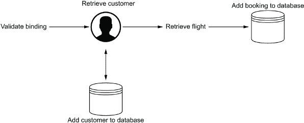

图 14.8 在数据库中创建新的预订涉及验证我们的模型绑定，检索（如果需要则添加）客户，检索航班，然后在数据库中创建预订。使用此工作流程，我们始终在数据库中拥有所需的所有信息。

由于我们已经实现了服务层和仓储层的方法，所有这些项目都应该很容易实现。让我们从唯一稍微有点棘手的一个开始：验证我们的数据绑定。为了确保我们的 `BookingData` 实例处于有效状态，我们需要定义这意味着什么。如果 `FirstName` 和 `LastName` 属性都设置为有效的非空字符串，则实例被认为是有效的。如果不是这种情况，我们不想进行任何处理。`BookingData` 类中已经存在逻辑，确保我们只将有效的名称分配给属性。如果传入的名称无效，则属性保持未设置。在这种情况下，我们不想使用该实例。

ASP.NET 给我们提供了访问 `IValidatableObject` 接口的权限。此接口允许我们为 CLR 在实例创建时运行定义验证规则。如果发现验证规则被破坏，ASP.NET 将 `ControllerBase` 类上的布尔属性 `ModelState.IsValid` 设置为 `false`。我们可以在我们的控制器中检查该属性，以确保我们使用的对象是有效的。要实现 `IValidatableObject` 接口，我们需要执行以下操作：

+   将 `IValidatableObject` 接口添加到 `BookingData` 类中。

+   实现所需的 `Validate` 方法以验证属性值并处理任何错误。

这听起来并不太糟糕。将接口添加到类中很容易，如下所示：

```
public class BookingData : IValidatableObject
```

由于 `BookingData` 类现在声明它实现了 `IValidatableObject` 接口，我们应该实际上这样做。该接口告诉我们我们需要实现一个名为 `Validate` 的方法，所以让我们直接按照以下方式实现它：

```
public IEnumerable<ValidationResult> Validate(ValidationContext validationContext) {}
```

记住，当我们实现一个接口时，我们必须在我们的实现类中实现该接口上的任何方法。我们不能更改方法的签名，因为这会打破我们对编译器和接口的承诺，即实现接口上的所有方法。那么，我们该如何处理 `Validate` 方法？CLR 在对象实例化时调用 `Validate` 方法，并根据提供的验证规则确定如何设置 `ModelState.IsValid` 属性。返回类型 (`IEnumerable<ValidationResult>`) 允许我们返回一个数据结构（实现 `IEnumerable` 接口，包含 `ValidationResult` 实例），其中可能没有、一个或多个错误。我们可以在控制器中访问这些错误并将它们返回给客户。

这看起来像什么？嗯，我们需要实例化一个新的 `IEnumerable<ValidationResult>` 类型，验证我们的属性是否设置到了合适的值（我们在模型绑定时已经通过属性的设置器检查了它们设置的名称是否有效，但它们仍然可能是空值），如果出现问题，向返回的数据结构中添加错误，并返回错误列表，如下一列表所示。

列表 14.4 `BookingData` 的 `Validate` 方法

```
public IEnumerable<ValidationResult> Validate(ValidationContext 
➥ validationContext) {
  List<ValidationResult> results = new List<ValidationResult>();    ❶
  if (FirstName == null && LastName == null) {                      ❷
    results.Add(
➥ new ValidationResult("All given data points are null"));         ❸
  } else if (FirstName == null || LastName == null) {               ❹
    results.Add(
➥ new ValidationResult("One of the given data points is null"));   ❺
  }

  return results;                                                   ❻
}
```

❶ 创建一个空的错误列表

❷ 检查 `FirstName` 和 `LastName` 是否都是空值

❸ 如果两个属性都是空值，则向列表中添加一个错误

❹ 如果它们不是两个都是空值，可能只有一个。

❺ 如果只有一个属性是空值，则向列表中添加一个错误

❻ 返回包含错误列表（如果有）

我们如何实际使用这些错误？回到控制器方法中，我们应该添加一个检查来查看 `ModelState.IsValid` 属性是否设置为 `true`。如果是，我们可以继续我们的工作。但如果不是，我们应该返回一个 HTTP 状态码 500，以及找到的错误，如下所示：

```
[HttpPost]
public async Task<IActionResult> 
➥ CreateBooking([FromBody] BookingData body) {
  if (ModelState.IsValid) {
    ...
  }

  return StatusCode((int) HttpStatusCode.InternalServerError, 
➥ ModelState.Root.Errors.First().ErrorMessage);
}
```

如果我们使用无效的 JSON 有效负载查询 `CreateBooking` 端点，我们会得到一个 HTTP 状态码 500 以及找到的验证错误。我们现在有了将提供的 JSON 数据绑定到模型并将结果模型进行验证的代码。我们现在要做的就是请求 `BookingService` 为我们创建一个预订，并传递适当的信息。为此，我们首先需要添加一个后置字段和一个 `BookingService` 类型的注入实例，并设置中间件在运行时为我们提供这个实例。

首先，让我们在 `BookingController` 中添加一个后置字段和注入实例（通过构造函数），如下所示：

```
[Route("{controller}")]
public class BookingController : Controller {
  private BookingService _bookingService;

  public BookingController(BookingService bookingService) {
    _bookingService = bookingService;
  }

  ...
}
```

现在，让我们在 `Startup` 中添加依赖注入中间件。`BookingService` 类需要注入的类型为 `BookingRepository`、`FlightRepository` 和 `CustomerRepository` 的依赖项。幸运的是，我们已经有了一个注入的（瞬时的）类型为 `FlightRepository` 的依赖项，所以我们只需要将（除了 `BookingService` 之外）的 `BookingRepository` 和 `CustomerRepository` 瞬时实例添加到 `Startup.ConfigureServices` 方法中，如下所示：

```
public void ConfigureServices(IServiceCollection services) {
  services.AddControllers();

  services.AddTransient(typeof(FlightService), typeof(FlightService));
  services.AddTransient(typeof(BookingService), typeof(BookingService));
  services.AddTransient(typeof(FlightRepository), 
➥ typeof(FlightRepository));
  services.AddTransient(typeof(AirportRepository), 
➥ typeof(AirportRepository));
  services.AddTransient(typeof(BookingRepository), 
➥ typeof(BookingRepository));
  services.AddTransient(typeof(CustomerRepository), 
➥ typeof(CustomerRepository));
  services.AddDbContext<FlyingDutchmanAirlinesContext>
➥ (ServiceLifetime.Transient);
  services.AddTransient(typeof(FlyingDutchmanAirlinesContext), 
➥ typeof(FlyingDutchmanAirlinesContext));
}
```

在我们可以请求创建新预订之前，我们还需要端点的路径参数，如下一个代码示例所示。该参数映射到 `POST /Booking/{flightNumber}` 端点的 `{flightNumber}` 部分。

```
[HttpPost("{flightNumber}")]
public async Task<IActionResult> CreateBooking([FromBody] BookingData body, 
➥ int flightNumber) {
  if (ModelState.IsValid) {
    ...
  }

  return StatusCode((int) HttpStatusCode.InternalServerError, 
➥ ModelState.Root.Errors.First().ErrorMessage);
}
```

让我们也在 `flightNumber` 参数上做一些快速输入验证。我们可以使用 `IsPositiveInteger` 扩展方法来确保航班号不是负整数，如下所示：

```
[HttpPost("{flightNumber}")]
public async Task<IActionResult> CreateBooking([FromBody] BookingData body, 
➥ int flightNumber) {
  if (ModelState.IsValid && flightNumber.IsPositiveInteger()) {
    ...
  }

  return StatusCode((int) HttpStatusCode.InternalServerError, 
➥ ModelState.Root.Errors.First().ErrorMessage);
}
```

这样一来，我们几乎可以调用 `BookingService.CreateBooking` 方法并在数据库中创建一个预订。我们只需要连接 `FirstName` 和 `LastName` 字符串（之间有一个空格），因为 `BookingService.CreateBooking` 只需要一个表示客户名称的 `string` 类型的单个参数。我们应该能够使用字符串插值来完成这个任务。在连接之后，我们最终可以按照以下方式调用服务的 `CreateBooking` 方法：

```
[HttpPost("{flightNumber}")]
public async Task<IActionResult> CreateBooking([FromBody] BookingData body, 
➥ int flightNumber)  {
  if (ModelState.IsValid && flightNumber.IsPositiveInteger()) {
    string name = $"{body.FirstName} {body.LastName}";
    (bool result, Exception exception) = 
➥ await _bookingService.CreateBooking(name, flightNumber);
  }
  return StatusCode((int) HttpStatusCode.InternalServerError, 
➥ ModelState.Root.Errors.First().ErrorMessage);
}
```

`BookingService.CreateBooking` 方法返回一个包含一个表示预订创建是否成功的布尔值和一个设置为抛出的任何异常值的元组。基于这些返回值，我们可以确定我们想要返回给用户的内容如下：

+   如果布尔值设置为 `true`，并且异常为空，则返回 HTTP 状态码 201（已创建）。

+   如果布尔值设置为 `false`，并且异常不为空，则根据异常类型返回 HTTP 状态码 500 或 404。

+   如果布尔值设置为 `false`，并且异常为空，则返回 HTTP 状态码 500。

我们可以轻松地添加以下几个条件：

```
[HttpPost("{flightNumber}")]
public async Task<IActionResult> CreateBooking([FromBody] BookingData body, 
➥ int flightNumber) {
  if (ModelState.IsValid && flightNumber.IsPositiveInteger()) {
    string name = $"{body.FirstName} {body.LastName}";
    (bool result, Exception exception) = 
➥ await _bookingService.CreateBooking(name, flightNumber);

    if (result && exception == null) {
      return StatusCode((int)HttpStatusCode.Created);
    }

    return exception is CouldNotAddBookingToDatabaseException   
      ? StatusCode((int)HttpStatusCode.NotFound)
      ? StatusCode((int)HttpStatusCode.InternalServerError, 
➥ exception.Message);
  }

  return StatusCode((int) HttpStatusCode.InternalServerError, ModelState.Root.Errors.First().ErrorMessage);
}
```

因为当找不到航班时，`BookingService` 返回 `CouldNotAddBookingToDatabaseException` 类型的异常，我们可以利用这一点将我们的返回状态码转换为 404。

到目前为止，我有一些非常激动人心的消息：我们已经完成了对飞荷兰人航空公司服务的重写实施！给自己鼓掌，并反思一下在过程中（希望）学到的许多东西。虽然这不是真正面向生产的实际世界的反映，但这个过程突显了许多现实世界的场景和决策。在下一节中，我们将通过进行一些验收测试来验证我们的工作。

## 14.2 验收测试和 Swagger 中间件

有许多方法可以验证您的代码按预期工作。在整个书中，我们使用单元测试作为衡量功能预期的手段。但您在走到尽头时该怎么办？您使用 TDD-light（我们在书中有些作弊）实现了所有代码，现在您想验证整个系统。您可以做一些像自动化集成测试（在生产代码库中运行整个工作流程的测试；它们通常是 CI/CD 系统的一部分，并在夜间运行）。您也可能非常幸运，有一位 QA 工程师可供您使用。但我想向您展示一种简单的方法来验证您的代码是否有效：验收测试。

当我们谈论验收测试时，我们真正说的是，“将需求与我们的功能相匹配。”我们从用户那里得到的需求是以 OpenAPI 规范的形式出现的，但它们可以以很多形式出现（用户故事是另一种值得注意的需求格式）。因此，在本节中，我们将以以下两种方式执行验收测试：

+   我们将使用 FlyTomorrow 提供的 OpenAPI 规范手动测试我们的端点（第 14.2.1 节）。

+   我们将在我们的服务中添加一个可选的 Swagger 中间件，以动态生成 OpenAPI 规范。我们将比较这个生成的规范与提供的规范。它们应该匹配（第 14.2.2 节）。

在将您的产品交付给客户之前进行验收测试非常重要且有用。您不想在客户之前捕捉到任何错误或不正确的功能吗？因为我们是在针对生产（已部署）数据库进行测试，¹，我们只能测试快乐路径和非数据库异常场景。我们不希望在生产环境中强制出现故障。这就是我们为什么需要对失败路径进行单元测试，因为我们可以确保它们仍然有效。

### 14.2.1 使用 OpenAPI 规范进行手动验收测试

在我们开始测试之前，让我们制定一个方法论和一些测试步骤，我们可以遵循所有端点。我们期望所有功能都能正常工作，特别是因为我们已经在实现后测试了代码，但我们永远不能太过自信！对于我们的手动测试，我建议我们使用以下步骤：

1.  确定输入需求。

1.  确定快乐路径和非数据库异常情况。

1.  测试！

我们需要测试的端点如下：

+   `GET /flight`

+   `GET /flight/{flightNumber}`

+   `POST /booking/{flightNumber}`

因此，无需多言，让我们从图 14.9 中所示的`GET /flight`端点开始。如果我们查看 OpenAPI 规范，我们会看到这个端点可以返回 HTTP 状态 200（附带`flightView`数据）、404 和 500。

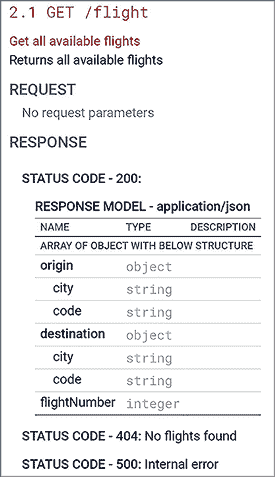

图 14.9 `GET` `/flight`端点的 OpenAPI 规范。此端点用于获取数据库中所有航班的详细信息。这是从生成的 OpenAPI 规范中截取的屏幕截图。

因为这只是一个`GET`调用，没有路径参数或其他需要验证的输入，所以唯一的幸福路径（或非数据库相关异常）情况是成功情况。如果我们查询`GET /flight`端点，我们应该得到数据库中每架航班的详细信息，如图 14.10 所示。

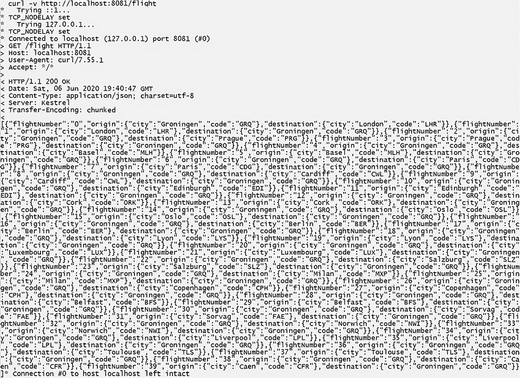

图 14.10 `GET` `/flight`端点的查询返回数据。数据库中的所有航班都以 JSON 形式返回。这使用户能够快速处理数据。

如您所见，端点返回了数据库中航班信息的详细列表。这就是`GET /flight`端点的情况。让我们继续到下一个（更有趣的）端点：`GET /flight/{flightNumber}`，其规范如图 14.11 所示。

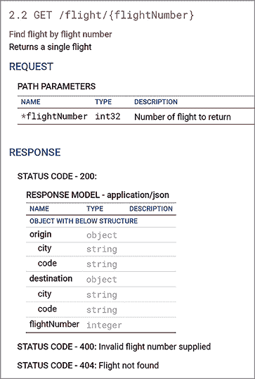

图 14.11 `GET` `/flight/{flightNumber}`端点的 OpenAPI 规范。当提供一个航班号时，此端点允许用户获取特定航班的详细信息。这是从生成的 OpenAPI 规范中截取的屏幕截图。

我们可以看到`GET /flight/{flightNumber}`使用路径参数，可以返回 200（附带一些数据）、400 或 404。我们可以通过请求一个有效的航班、一个无效的航班号和一个有效但不在数据库中的航班号来测试所有这些场景，如表 14.1 所示。

表 14.1 `GET` `/flight/{flightNumber}`的手动测试返回数据

| 飞行号 | 返回状态 | 返回数据 |
| --- | --- | --- |
| 19 | 201 |

```
{
    "flightNumber":"19",
    "origin":{"city":"Lyon","code":"LYS"},
    "destination":{"city":"Groningen",
        "code":"GRQ"}
}
```

|

| –1 | 400 | (Bad Request) N/A |
| --- | --- | --- |
| 500 | 404 | (Flight Not Found) N/A |

在表 14.1 中，端点返回的所有数据都得到了展示。看起来我们手头又有一个通过端点。现在，对于最后一个端点：`POST /booking/{flightNumber}`，其规范如图 14.12 所示。

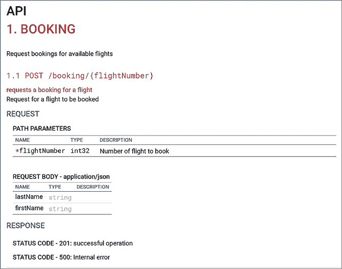

图 14.12 `POST /booking/{flightNumber}`端点的 OpenAPI 规范。此端点允许用户在提供客户姓名和航班号的情况下预订航班。这是从生成的 OpenAPI 规范中截取的屏幕截图。

`POST /booking/{flightNumber}` 只有两个潜在的返回状态（201 和 500），但这有些误导。我们可以通过以下方式从这个端点强制引发错误：

+   提交一个包含空字符串的 JSON 体作为姓名。

+   提交一个缺少一个或两个所需属性（`firstName`和`lastName`）的 JSON 体。

+   使用无效的飞行号。

+   使用一个不存在的航班的飞行号。

表 14.2 显示了`GET /flight/{flightNumber}`提供的输入和输出。根据表 14.2 中的数据，我们可以说所有我们的手动测试都通过了。我们没有看到任何意外的输出，可以安全地继续到最后一个测试：根据服务动态生成 OpenAPI 文件，并将其与 FlyTomorrow 的版本进行比较。

表 14.2 `POST /booking/{flightNumber}`的所有成功和失败响应

| 端点飞行号 | 主体 | 返回状态 | 返回数据 |
| --- | --- | --- | --- |
| `1` | `firstName : "Alan"``lastName: "Turing"` | 201 | (Created) N/A |
| `-1` | `firstName : "Alan"``lastName: "Turing"` | 400 | (Bad Request) N/A |
| `999` | `firstName : "Alan"``lastName: "Turing"` | 404 | (Not Found) N/A |
| `1` | `firstName : "Alan"``lastName: ""` | 500 | (Internal Server Error) “One of the given data points is null” |
| `1` | `firstName : ""``lastName: "Turing"` | 500 | (Internal Server Error) “One of the given data points is null” |
| `1` | `firstName : "Alan"` | 500 | (Internal Server Error) “One of the given data points is null” |
| `1` | `lastName: "Turing"` | 500 | (Internal Server Error) “One of the given data points is null” |
| `1` | `firstName : ""``lastName: ""` | 500 | “All given data points are null” |
| `1` | N/A | 500 | “All given data points are null” |

### 14.2.2 在运行时生成 OpenAPI 规范

在第 13.3 节中，我们讨论了中间件及其使用方法。我们探讨了路由和依赖注入。但如果我告诉你，我们可以通过 Swagger 中间件选项（Swagger 是 OpenAPI 的前身）生成 OpenAPI 规范呢？通过 ASP.NET 创建的 CLR 在运行时创建此 OpenAPI 规范，因此它始终反映了端点的最新和最佳状态。本节的目标是生成这样的动态 OpenAPI 规范，并将其与从 FlyTomorrow 获得的 OpenAPI 规范进行比较。

注意：本节是可选的，需要安装第三方 C#库。生成 OpenAPI 规范不是大多数应用程序的功能性要求。如果你跳过本节，你可以在总结部分继续阅读。

因为.NET 5 没有提供添加 Swagger 中间件的功能，所以我们不得不安装一个名为 Swashbuckle 的第三方库。请继续通过 NuGet 包管理器安装`Swashbuckle.AspNetCore`包（参见第 5.2.1 节）。一旦我们安装了`Swashbuckle.AspNetCore`包，我们就可以添加中间件配置。

我们通过更改`Startup.cs`文件中的`Configure`方法和`ConfigureServices`方法来向 Startup.cs 文件添加中间件。设置很简单，并且开箱即用，如以下列表所示。

列表 14.5 带有 Swashbuckle 中间件的 Startup

```
class Startup {
  public void Configure(IApplicationBuilder app, IWebHostEnvironment env) {
    app.UseRouting();
    app.UseEndpoints(endpoints => { endpoints.MapControllers(); });

    app.UseSwagger();                                   ❶
    app.UseSwaggerUI(swagger => 
➥ swagger.SwaggerEndpoint("/swagger/v1/swagger.json", 
➥ "Flying Dutchman Airlines"));                        ❷
  }

  public void ConfigureServices(IServiceCollection services) {
    services.AddControllers();

    services.AddTransient(typeof(FlightService), 
➥ typeof(FlightService));
    services.AddTransient(typeof(BookingService), 
➥ typeof(BookingService));
    services.AddTransient(typeof(FlightRepository), 
➥ typeof(FlightRepository));
    services.AddTransient(typeof(AirportRepository), 
➥ typeof(AirportRepository));
    services.AddTransient(typeof(BookingRepository), 
➥ typeof(BookingRepository));
    services.AddTransient(typeof(CustomerRepository), 
➥ typeof(CustomerRepository));

    services.AddDbContext<FlyingDutchmanAirlinesContext>
➥ (ServiceLifeTime.Transient);

    services.AddTransient(typeof(FlyingDutchmanAirlinesContext), 
➥ typeof(FlyingDutchmanAirlinesContext));

    services.AddSwaggerGen();                           ❸
  }
}
```

❶ 在默认位置生成 Swagger 文件

❷ 提供一个交互式 GUI，指向生成的 Swagger 文件

❸ 将 Swagger 添加到中间件

通过将 Swagger 设置添加到`ConfigureServices`和`Configure`方法中，CLR 知道在启动时扫描服务并请求基于该信息生成 Swagger 文件。为了测试这一点，我们只需要启动服务并导航到`SwaggerUI`端点：`[service]/swagger`。

在图 14.13 中，你可以看到由 Swagger 中间件生成的 Swagger UI。

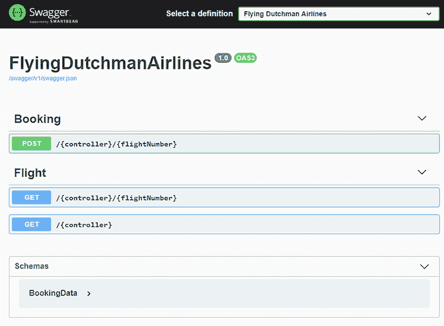

图 14.13 展示了飞荷兰人航空公司服务的自动生成的 OpenAPI 规范。我们可以使用这个规范来对照 FlyTomorrow 的 OpenAPI 规范进行双重检查。

表面上看起来相当不错，尽管有点简略。让我们进一步调查，看看是否遗漏了任何信息。通过展开`GET /{controller}/[flightNumber]`部分，我们可以在图 14.14 中看到它只生成了状态码 200 的返回信息。

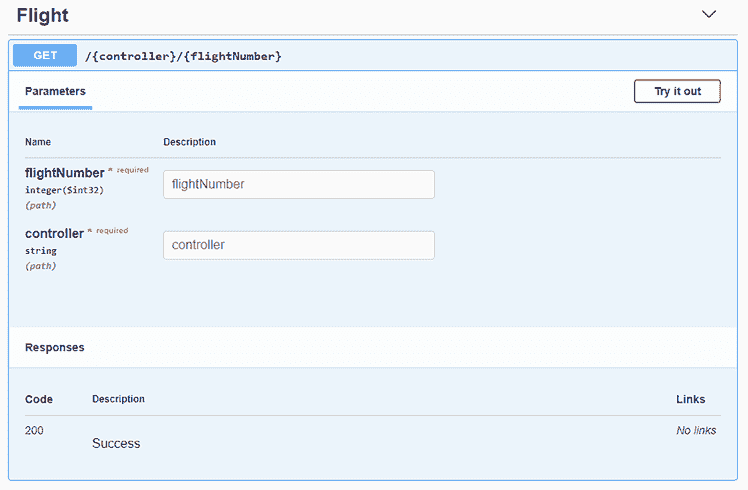

图 14.14 展示了在服务启动时生成的扩展的 `GET` `/Flight/{FlightNumber}` OpenAPI 信息。这似乎遗漏了一些我们添加到控制器中的返回信息。

问题是，我们知道我们确实在适当端点方法中添加了逻辑来返回不仅仅是 200 的状态码。这里发生了什么？你经常会遇到这种情况：由于某种原因，CLR 无法自动确定所有返回状态码。但幸运的是，我们可以向适当的方法添加一个方法属性，告诉 CLR 该方法返回哪些返回码，如下所示：

```
[HttpGet("{flightNumber}")]
[ProducesResponseType(StatusCodes.Status200OK)]
[ProducesResponseType(StatusCodes.Status404NotFound)]
[ProducesResponseType(StatusCodes.Status400BadRequest)]
public async Task<IActionResult> GetFlightByFlightNumber(int flightNumber) { ... }
```

如果我们现在再次编译并启动服务，我们会看到 Swagger UI 已经改变（如图 14.15 所示）。

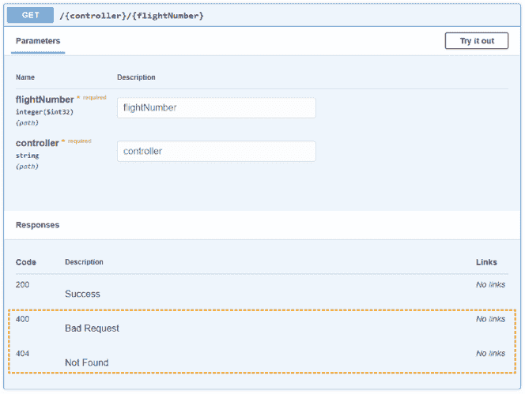

图 14.15 展示了在服务启动时生成的扩展的 `GET` `/Flight/{FlightNumber}` OpenAPI 信息，其中包含了正确的返回状态。在 OpenAPI 规范中真实地反映你的 API 非常重要，这样你才不会引导人们走上错误的道路。

看起来不错。为了确保其他两个端点（`GET /Flight` 和 `POST /Booking/{flightNumber}`）有正确的信息，请继续为它们各自的端点方法添加适当的方法属性。之后，我们可以将我们生成的 OpenAPI 与 FlyTomorrow 提供的 OpenAPI 进行比较。

比较 OpenAPI 规范：get /flight

在 OpenAPI 规范方面，也许最容易比较的端点是`GET /flight`端点，如图 14.16 所示。它不接收正文（`GET`请求不能包含正文），并返回 200 状态码以及找到的任何数据，如果没有找到数据则返回 404，如果出现问题时则返回 500。

图 14.16 清楚地显示，在自动生成的 OpenAPI 规范中，对于`GET /flight`端点，所有返回代码都已考虑在内。

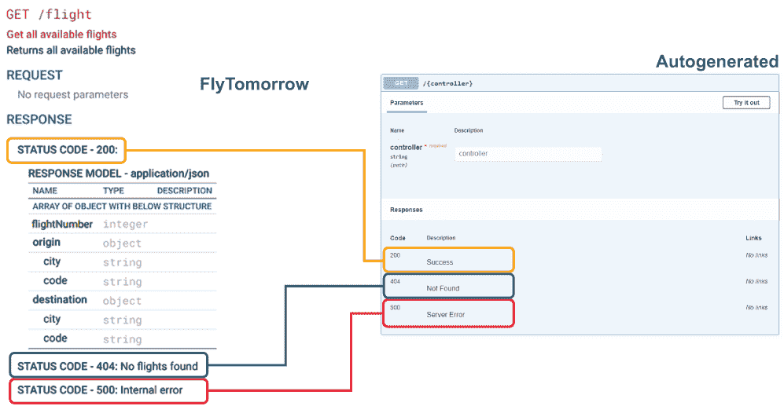

图 14.16 比较了 FlyTomorrow 和自动生成的 OpenAPI 规范中的`GET` `/Flight`。这是验证我们的工作是否符合客户规范的一种方法。

比较 openapi 规范：get /flight/{flightNumber}

我们要查看的第二个端点是`GET /Flight/{flightNumber}`端点。这个端点与`GET /flight`端点非常相似，但引入了路径参数的概念。让我们在图 14.17 中看看我们的生成的 OpenAPI 规范与 FlyTomorrow 规范相比如何。

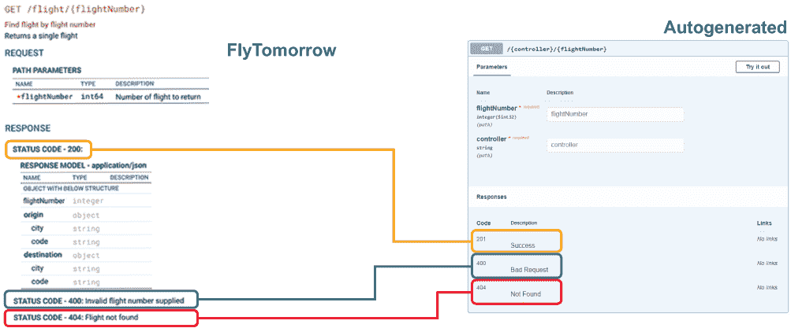

图 14.17 比较 FlyTomorrow 和自动生成的 OpenAPI 规范中的`GET` `/Flight/{flightNumber}`。通过比较这两个规范，我们可以确信我们做得很好。

再次强调，返回的状态在 FlyTomorrow 和自动生成的 OpenAPI 规范中看起来是相同的。太好了，让我们继续到最后一个端点。

比较 openapi 规范：post /Booking/{flightNumber}

我们实现的最后一个端点是`POST /Booking/{flightNumber}`。这个端点结合了一个带有路径参数的`POST`请求和一个正文。端点方法必须对进入和离开服务的数据进行 JSON 反序列化和序列化。让我们看看我们是如何做到的（图 14.18）。

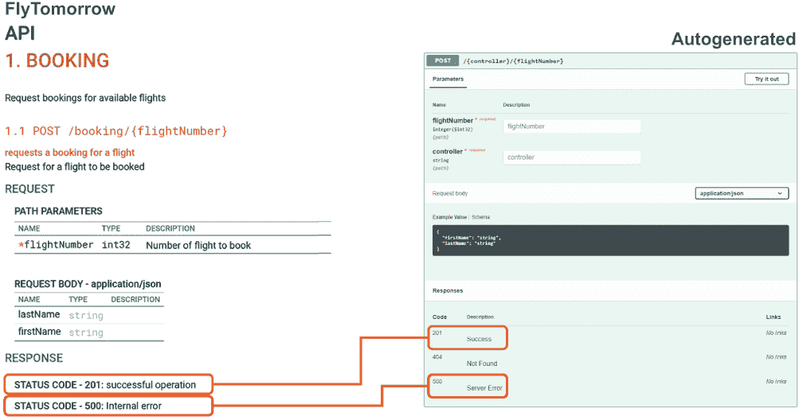

图 14.18 比较 FlyTomorrow 和自动生成的 OpenAPI 规范中的`POST` `/Booking/{flightNumber}`。如果我们没有比较这两个规范，我们可能会错过 404 Not Found 返回的需求，并向客户发送了错误的代码。

图 14.18 中的图像令人鼓舞，但在这个阶段我们看到的并不完全是我们想要的。我们可以看到 201 和 500 状态码映射正确，但结果是我们实现了 404 返回状态。根据 FlyTomorrow OpenAPI 规范，这种返回是不必要的。现在，保留这种返回状态有一些道理，因为 FlyTomorrow 的开发者可能希望拥有它。另一方面，通常最好严格遵循客户需求。在这个意义上，这本书中留给你的最后一个任务是修改`BookingController`以不返回 404（如果你卡住了，请查看源代码）。作为额外挑战：Swagger 具有指定与返回代码一起的描述的功能。研究和实现这一点。

## 14.3 路的尽头

恭喜！你做到了。你到达了这本书的结尾。我希望你充分享受了这些材料，并学到了一些新东西。如果你想继续你的 C#之旅，我建议你看看 Jon Skeet 的《C#深度》（第 4 版；Manning，2019 年），Dustin Metzgar 的《.NET Core 实战》（Manning，2018 年），Andrew Lock 的《ASP.NET Core 实战》（第 2 版；Manning，2021 年），以及 Jeffrey Richter 的《CLR via C#》（第 4 版；Microsoft Press，2012 年）。附录 E 包含了一本推荐的各种资源（书籍、网站、文章）的列表。

最后，我想给你留下一个来自著名人物 Donald Knuth 的引言：²

*如果你发现自己几乎把所有时间都花在理论上，开始把一些注意力转向实际事物；这将改善你的理论。如果你发现自己几乎把所有时间都花在实践上，开始把一些注意力转向理论事物；这将改善你的实践*。

## 摘要

+   来自 HTTP 请求的 JSON 数据是序列化的。这意味着数据不是我们可以直接使用的格式。在我们能够操作它之前，我们需要反序列化这些数据。

+   要反序列化 JSON 数据，我们可以使用 `[FromBody]` 参数属性或实现自定义模型绑定器。反序列化数据使我们能够将传入的 JSON 或 XML 数据放入可用的数据结构中。

+   您可以使用 `IModelBinder` 接口来实现自定义模型绑定器。当您想要对数据序列化到模型中的方式有更多控制时，这很有用。

+   通过使用 `ModelState.IsValid` 检查，我们可以验证在模型绑定过程中没有发现错误。当与自定义模型绑定器结合使用时，这最有用，因为您可以在那种情况下精确地定义何时模型无效。

+   您可以在启动时通过向配置中添加 Swagger 中间件来生成服务的 OpenAPI 规范。这有助于验收测试并确保您正在实现正确的端点。

* * *

^（1.）您通常不想对生产数据库进行测试。我们在本书中这样做的原因是，这允许我为您提供公开部署的数据库供您使用。

^（2.）唐纳德·克努特是一位美国计算机科学家，以其《计算机程序设计艺术》系列书籍而闻名。他是 1974 年 ACM 图灵奖（计算机世界的奥斯卡奖/普利策奖/诺贝尔奖）的获得者，对推广渐近符号学起到了关键作用，并在斯坦福大学担任荣誉教授。他的（出色的）个人网站是 [`www-cs-faculty.stanford.edu/~knuth/`](https://www-cs-faculty.stanford.edu/~knuth/)。
