# 第一部分

适用于并发程序的功能编程的好处

函数式编程是一种关注抽象和组合的编程范式。在这前三章中，你将学习如何将计算视为表达式的评估，以避免数据的突变。为了增强并发编程，函数式范式提供了工具和技术来编写确定性程序。输出仅取决于输入，而不是程序在执行时的状态。函数式范式还通过强调纯函数方面之间的关注点分离、隔离副作用和控制不良行为，来促进编写更少错误的代码。

这一部分介绍了适用于并发程序的功能编程的主要概念和好处。讨论的概念包括使用纯函数编程、不可变性、惰性和组合。

# 1

函数式并发基础

**本章涵盖**

+   为什么你需要并发

+   并发、并行和多线程之间的区别

+   避免编写并发应用程序时的常见陷阱

+   在线程之间共享变量

+   使用函数式范式开发并发程序

在过去，软件开发者有信心，随着时间的推移，他们的程序会运行得比以往任何时候都快。由于每一代硬件的改进，这一预测在多年中得到了证实。

在过去的 50 年里，硬件行业经历了不间断的改进。在 2005 年之前，处理器的发展持续带来更快的单核 CPU，直到最终达到戈登·摩尔预测的 CPU 速度极限。摩尔是一位计算机科学家，他在 1965 年预测，在达到技术无法再进步的最大速度之前，晶体管的密度和速度每 18 个月会翻倍。对 CPU 速度增加的原始预测假设了 10 年的速度翻倍趋势。摩尔预测，即摩尔定律，是正确的——除了进步持续了近 50 年（远远超过了他的估计）。

今天，单核 CPU 的速度几乎达到了光速，同时由于能量耗散产生了巨大的热量；这种热量是进一步改进的限制因素。

摩尔关于晶体管速度的预测已经实现（晶体管无法运行得更快）但它并没有死亡（现代晶体管的密度正在增加，在最高速度的范围内提供了并行性的机会）。多核架构和并行编程模型的结合使摩尔定律得以延续！随着 CPU 单核性能的改进停滞，开发者通过转向多核架构并开发支持并集成并发的软件来适应。

处理器革命已经开始了。多核处理器设计的新趋势将并行编程带入了主流。多核处理器架构提供了更高效计算的可能性，但所有这些力量都需要开发者进行额外的工作。如果程序员想要在代码中获得更多性能，他们必须适应新的设计模式以最大化硬件利用率，通过并行性和并发性利用多个核心。

在本章中，我们将通过检查其一些好处和编写传统并发程序所面临的挑战来探讨并发的一般信息。接下来，我们将介绍函数式范式概念，这些概念通过使用简单且易于维护的代码来克服传统限制。到本章结束时，您将理解为什么并发是一个值得的程序模型，以及为什么函数式范式是编写正确并发程序的正确工具。

## 1.1 您将从本书中学到的内容

在这本书中，我将探讨在传统编程范式下编写并发多线程应用程序的考虑和挑战。我将探讨如何通过函数式范式成功解决这些挑战并避免并发陷阱。接下来，我将介绍使用函数式编程中的抽象来创建声明式、易于实现和高度并发的程序的好处。在本书的整个过程中，我们将检查复杂并发问题，提供在.NET 中使用函数式范式构建并发和可扩展程序的最佳实践见解。您将熟悉函数式编程如何通过鼓励不可变数据结构来帮助开发者支持并发，这些数据结构可以在线程之间传递而无需担心共享状态，同时避免副作用。到本书结束时，您将掌握如何在 C#和 F#语言中编写更模块化、可读性和可维护的代码。在编写程序时，您将更加高效和熟练，这些程序以更少的代码行数达到峰值性能。最终，凭借您新获得的能力，您将拥有成为交付成功高性能解决方案专家所需的知识。

您将学习以下内容：

+   如何将异步操作与任务并行库结合使用

+   如何避免常见问题并调试您的多线程和异步应用程序

+   了解采用函数式范式的并发编程模型（函数式、异步、事件驱动以及通过代理和演员的消息传递）

+   如何使用函数式范式构建高性能、并发的系统

+   如何以声明式风格表达和组合异步计算

+   如何通过使用数据并行编程以纯方式无缝加速顺序程序

+   如何使用 Rx 风格的流式事件声明式地实现反应式和基于事件的程序

+   如何使用功能并发集合构建无锁的线程安全程序

+   如何编写可扩展、性能良好且健壮的服务器端应用程序

+   如何使用并发编程模式解决问题，例如 Fork/Join、并行聚合和分而治之技术

+   如何使用并行流和并行 Map/Reduce 实现处理大量数据集

本书假设您已具备通用编程知识，但不是函数式编程。要在您的编码中应用函数式并发，您只需要函数式编程概念的一个子集，我将在过程中解释您需要了解的内容。这样，您将在更短的学习曲线上获得函数式并发的许多好处，专注于您在日常编码体验中可以立即使用的内容。

## 1.2 让我们从术语开始

本节定义了与本书主题相关的术语，因此我们从共同基础开始。在计算机编程中，一些术语（如*并发*、*并行性*和*多线程*）在相同语境中使用，但含义不同。由于它们的相似性，将这些术语视为同一事物的倾向很常见，但这是不正确的。当需要推理程序的行为时，区分计算机编程术语至关重要。例如，根据定义，并发是多线程，但多线程不一定是并发的。您可以轻松地将多核 CPU 的功能像单核 CPU 一样使用，但反之则不然。

本节旨在就本书主题相关的定义和术语建立共同基础。在本节结束时，您将了解这些术语的含义：

+   顺序编程

+   并发编程

+   并行编程

+   多任务

+   多线程

### 1.2.1 顺序编程一次执行一个任务

*顺序* *编程* 是按步骤完成事情的行为。让我们考虑一个简单的例子，比如在当地咖啡馆点一杯卡布奇诺。您首先排队，向唯一的咖啡师下单。咖啡师负责接单和提供饮料；此外，他们一次只能制作一杯饮料，因此您在下单前必须耐心等待——或者不耐心——在队列中。制作卡布奇诺涉及磨咖啡，煮咖啡，加热牛奶，打奶泡，以及将咖啡和牛奶混合，因此在您得到卡布奇诺之前会花费更多时间。图 1.1 展示了这一过程。

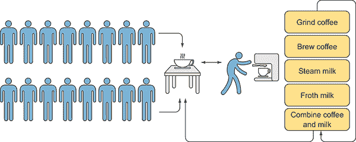

图 1.1 对于排队的每个人，咖啡师会依次重复相同的指令集（磨咖啡，煮咖啡，加热牛奶，打奶泡，将咖啡和牛奶混合制成卡布奇诺）。

图 1.1 是顺序工作的一个例子，其中必须完成一个任务才能开始下一个任务。这是一个方便的方法，有一套明确的系统（逐步）指令，说明何时做什么。在这个例子中，咖啡师在准备卡布奇诺时不太可能感到困惑或出错，因为步骤清晰且有序。逐步准备卡布奇诺的缺点是咖啡师在过程中的某些部分必须等待。在等待咖啡磨碎或牛奶打泡时，咖啡师实际上是无效的（阻塞）。同样的概念也适用于顺序和并发编程模型。如图 1.2 所示，顺序编程涉及按顺序、逐步有序执行的过程，每次只按线性方式执行一条指令。


图 1.2 典型的顺序编码，涉及按顺序、逐步有序执行的过程

在命令式和面向对象编程（OOP）中，我们倾向于编写按顺序执行代码，所有注意力和资源都集中在当前运行的任务上。我们通过执行一系列有序的语句来模拟和执行程序，一个接一个。

### 1.2.2 并发编程同时运行多个任务

假设咖啡师更喜欢同时启动多个步骤并并发执行它们？这将使顾客队伍移动得更快（并且，相应地，增加赚取的小费）。例如，一旦咖啡磨好，咖啡师就可以开始冲泡浓缩咖啡。在冲泡过程中，咖啡师可以接受新的订单或开始蒸汽和打泡牛奶的过程。在这种情况下，咖啡师给人一种同时进行多个操作（多任务处理）的印象，但这只是一种错觉。关于多任务处理的更多细节将在 1.2.4 节中介绍。实际上，因为咖啡师只有一个浓缩咖啡机，他们必须停止一个任务才能开始或继续另一个任务，这意味着咖啡师一次只能执行一个任务，如图 1.3 所示。在现代多核计算机中，这是一种资源的浪费。

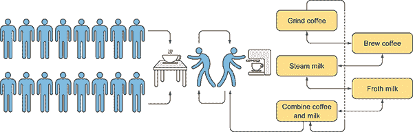

图 1.3 咖啡师在准备咖啡（磨豆和冲泡）和准备牛奶（蒸汽和打泡）的操作之间切换（多任务处理）。因此，咖啡师以交错的方式执行多个任务的片段，给人一种多任务处理的错觉。但由于共享公共资源，每次只能执行一个操作。

*并发*描述了同时运行多个程序或程序多个部分的能力。在计算机编程中，在应用程序中使用并发提供了实际的多任务处理，将应用程序划分为多个独立的过程，这些过程可以在不同的线程中同时（并发）运行。这可以在单个 CPU 核心中发生，也可以在多个 CPU 核心可用时并行发生。通过异步或并行执行任务，可以提高程序的吞吐量（CPU 处理计算的速率）和响应性。例如，流式传输视频内容的应用程序是并发的，因为它同时从网络读取数字数据，解压缩它，并更新屏幕上的展示。

并发给人一种这些线程正在并行运行的印象，不同的程序部分可以同时运行。但在单核环境中，一个线程的执行会暂时暂停并切换到另一个线程，就像图 1.3 中的咖啡师一样。如果咖啡师希望通过同时执行多个任务来加快生产，那么必须增加可用资源。在计算机编程中，这个过程被称为并行化。

### 1.2.3 并行编程同时执行多个任务

从开发者的角度来看，当我们考虑“我的程序如何同时执行多个任务？”或“我的程序如何更快地解决问题？”这样的问题时，我们会想到并行化。*并行化*是指同时执行多个任务的概念，字面上是在不同的核心上同时执行，以提高应用程序的速度。尽管所有并行程序都是并发的，但我们已经看到并非所有并发都是并行。这是因为并行化依赖于实际的运行时环境，并且需要硬件支持（多个核心）。只有在多核设备上才能实现并行化（图 1.4），这是提高程序性能和吞吐量的手段。

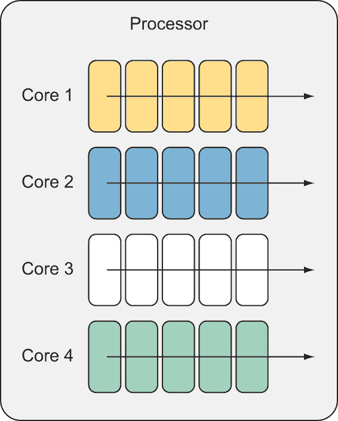

图 1.4 只有多核机器允许并行化，以同时执行不同的任务。在这个图中，每个核心都在执行一个独立任务。

回到咖啡店示例，假设你是经理，希望通过加快饮品制作速度来减少顾客的等待时间。一个直观的解决方案是雇佣第二名咖啡师并设置第二个咖啡站。当两名咖啡师同时工作时，顾客的队伍可以独立且并行地处理，卡布奇诺的制作（图 1.5）也会加快。

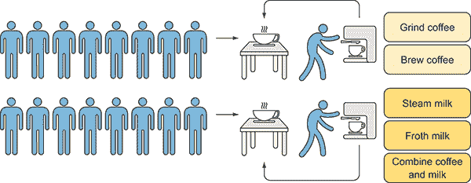

图 1.5 由于有两名咖啡师可以在两个咖啡站上并行工作，卡布奇诺的制作速度更快。

生产过程中没有中断可以带来性能上的好处。并行性的目标是最大化使用所有可用的计算资源；在这种情况下，两个咖啡师在各自的站台上并行工作（多核处理）。

当一个任务被分割成多个独立的子任务时，可以通过使用所有可用的核心来实现并行性。在图 1.5 中，一个多核机器（两个咖啡站）允许并行执行不同的任务（两个忙碌的咖啡师）而不会中断。

时间概念对于并行执行操作是基本的。在这样的程序中，如果操作可以并行执行，则这些操作是*并发的*；如果执行在时间上重叠（参见图 1.6），则这些操作是*并行的*。

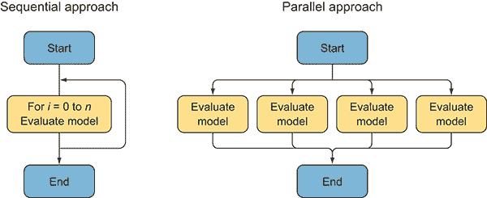

图 1.6 并行计算是一种计算类型，其中许多计算是同时进行的，其原理是大型问题通常可以被分解成更小的部分，这些部分随后同时解决。

并行性和并发性是相关的编程模型。并行程序也是并发的，但并发程序并不总是并行的，因为并行编程是并发编程的一个子集。虽然并发性指的是系统的设计，但并行性则与执行相关。并发和并行编程模型直接与它们执行时的本地硬件环境相关联。

### 1.2.4 多任务在时间上同时执行多个任务

*多任务处理*是指在一段时间内通过并发执行多个任务的概念。我们熟悉这个想法，因为我们每天都在日常生活中进行多任务处理。例如，当我们等待咖啡师准备我们的卡布奇诺时，我们使用智能手机检查电子邮件或浏览新闻故事。我们一次做两件事：等待和使用智能手机。

计算机多任务处理是在计算机只有一个 CPU 的时代设计的，以在共享相同的计算资源的同时并发执行许多任务。最初，只能通过 CPU 的时间切片来同时执行一个任务。(*时间切片*指的是一种复杂的调度逻辑，它协调多个线程之间的执行。)调度允许一个线程在调度另一个线程之前运行的时长被称为*线程量子*。CPU 通过时间切片，使得每个线程在执行上下文切换到另一个线程之前都能执行一个操作。上下文切换是由操作系统处理的多任务处理程序，以优化性能（图 1.7）。但在单核计算机中，多任务处理可能会通过引入线程间上下文切换的额外开销来降低程序的性能。

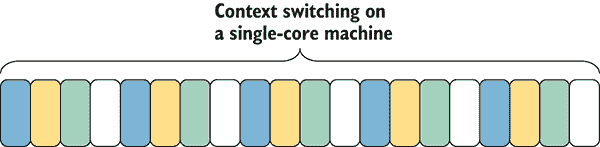

图 1.7 每个任务都有不同的阴影，表示在单核机器上的上下文切换给人一种多个任务并行运行的错觉，但实际上每次只处理一个任务。

有两种类型的多任务操作系统：

+   *协作* *多任务系统*，其中*调度器允许每个任务运行直到完成或显式地将执行控制权交回给调度器*

**   *抢占式* *多任务系统*（如微软 Windows），*其中调度器优先执行任务，底层系统根据任务的优先级，在时间分配完成后通过将控制权交给其他任务来切换执行顺序**

**过去十年中设计的多数操作系统都提供了抢占式多任务。多任务对于 UI 响应性很有用，有助于在长时间操作期间避免 UI 冻结。

### 1.2.5 多线程用于性能提升

*多线程* 是多任务概念的扩展，旨在通过最大化优化计算机资源来提高程序性能。多线程是使用多个执行线程的并发形式。多线程意味着并发，但并发不一定意味着多线程。多线程使应用程序能够显式地将特定任务细分到单个线程中，这些线程在同一个进程中并行运行。

*线程* 是一个计算单元（一组旨在实现特定结果的独立编程指令），操作系统调度器独立执行和管理。多线程与多任务不同：与多任务不同，多线程中的线程共享资源。但这种“资源共享”的设计比多任务更具编程挑战性。我们将在本章的 1.4.1 节中讨论线程间共享变量的问题。

并行编程和多线程编程的概念密切相关。但与并行性相比，多线程是硬件无关的，这意味着它可以在不考虑核心数量的情况下执行。并行编程是多线程的超集。你可以通过在同一个进程中共享资源来使用多线程并行化一个程序，例如，但你也可以通过在多个进程甚至在不同的计算机上执行计算来并行化一个程序。图 1.8 展示了这些术语之间的关系。

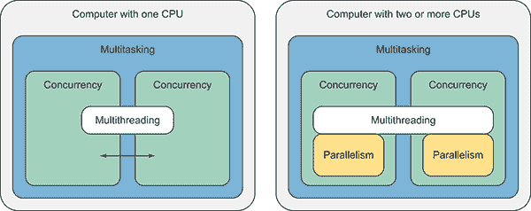

图 1.8 单核和多核设备中并发、并行、多线程和多任务之间的关系

总结如下：

+   *顺序编程* 指的是在单个 CPU 上依次执行的一组有序指令。

+   *并发编程* 同时处理多个操作，不需要硬件支持（使用一个或多个核心）。

+   *并行编程*在多个 CPU 上同时执行多个操作。所有并行程序都是并发的，同时运行，但并非所有并发都是并行。原因是并行性只能在多核设备上实现。

+   *多任务处理*同时执行来自不同进程的多个线程。多任务处理并不一定意味着并行执行，只有在使用多个 CPU 时才能实现并行执行。

+   *多线程*扩展了多任务处理的概念；它是一种使用来自同一进程的多个独立执行线程的并发形式。每个线程可以并发或并行运行，这取决于硬件支持。

## 1.3 为什么需要并发？

并发是生活的一部分自然属性——作为人类，我们习惯于多任务处理。我们可以在喝咖啡的同时阅读电子邮件，或者在我们最喜欢的歌曲中打字。在应用程序中使用并发的最主要原因是提高性能和响应速度，以及实现低延迟。常识告诉我们，如果一个人一个接一个地完成两个任务，所需时间会比两个人同时完成这两个任务要长。

应用程序也是如此。问题是大多数应用程序并没有编写成平均分配所需任务到可用的 CPU 上。计算机被用于许多不同的领域，如分析、金融、科学和医疗保健。每年分析的数据量都在增加。两个很好的例子是谷歌和皮克斯。

2012 年，谷歌每分钟接收超过 200 万个搜索查询；到 2014 年，这个数字翻了一番多。1995 年，皮克斯制作了第一部完全由计算机生成的电影，《玩具总动员》。在计算机动画中，每个图像都需要渲染无数细节和信息，例如阴影和照明。所有这些信息都以每秒 24 帧的速度变化。在 3D 电影中，需要指数级增加变化信息。

《玩具总动员》的制作者使用了 100 台连接的双处理器机器来制作他们的电影，并行计算的使用是不可或缺的。皮克斯的工具在《玩具总动员 2》中得到了进化；该公司使用了 1400 个计算机处理器进行数字电影编辑，从而大大提高了数字质量和编辑时间。2000 年初，皮克斯的计算机能力进一步增加，达到 3500 个处理器。十六年后，用于处理全动画电影的计算机能力达到了荒谬的 24000 个核心。对并行计算的需求继续呈指数级增长。

让我们考虑一个有*N*（任何数字）个运行核心的处理器。在单线程应用程序中，只有一个核心运行。同一个应用程序执行多个线程将会更快，随着对性能的需求增长，对*N*的需求也会增长，使得并行程序成为未来标准编程模型的选择。

如果在一个未考虑并发设计的多核机器上运行应用程序，您正在浪费计算机的生产力，因为应用程序在按顺序通过进程时只会使用部分可用的计算机功率。在这种情况下，如果您打开任务管理器或任何 CPU 性能计数器，您会注意到只有一个核心在高负荷运行，可能达到 100%，而所有其他核心都未充分利用或空闲。在一个具有八个核心的机器上运行非并发程序意味着资源的使用率可能低至 15%(图 1.9)。

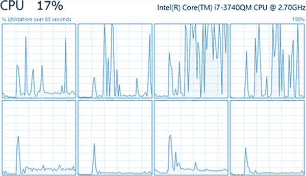

图 1.9 Windows 任务管理器显示一个程序未能充分利用 CPU 资源。

这种计算能力的浪费明确表明，顺序代码不是多核处理器的正确编程模型。为了最大限度地利用可用的计算资源，微软的.NET 平台通过多线程提供代码的并行执行。通过使用并行性，程序可以充分利用可用的资源，如图 1.10 中的 CPU 性能计数器所示，您会注意到所有处理器核心都在高负荷运行，可能达到 100%。当前的硬件趋势预测将会有更多的核心而不是更快的时钟速度；因此，开发者别无选择，只能拥抱这一演变，成为并行程序员。

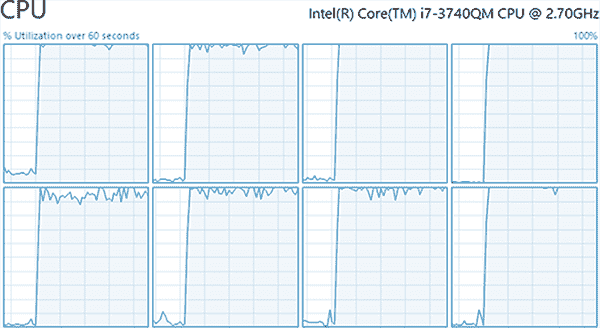

图 1.10 考虑到并发编写的程序可以最大化 CPU 资源，可能高达 100%。

### 1.3.1 并发编程的现在与未来

掌握并发编程以交付可扩展程序已成为一项必备技能。公司对招聘和投资那些对编写并发代码有深厚知识的工程师感兴趣。实际上，编写正确的并行计算可以节省时间和金钱。使用较少的服务器即可构建可扩展程序，并利用可用的计算资源，这比不断购买和添加未充分利用的昂贵硬件以达到相同性能水平要便宜得多。此外，更多的硬件需要更多的维护和电力来运行。

这是一个学习编写多线程代码的激动人心的时刻，使用函数式编程（FP）方法提高程序性能是令人满意的。函数式编程是一种将计算视为表达式的评估，并避免改变状态和可变数据的编程风格。由于不可变性是默认的，加上出色的组合和声明式编程风格，FP 使得编写并发程序变得轻而易举。更多细节将在第 1.5 节中介绍。

虽然在新的范式下思考可能会让人有些不安，但学习并行编程的初始挑战很快就会减少，坚持不懈的回报是无限的。你会发现打开 Windows 任务管理器并自豪地注意到在代码更改后 CPU 使用率激增是一种神奇而壮观的事情。一旦你熟悉并习惯于使用函数式范式编写高度可扩展的系统，就很难回到缓慢的顺序代码风格。

并发是计算机行业即将到来的下一个创新，它将改变开发者编写软件的方式。随着行业对软件需求的演变和对通过非阻塞 UI 提供卓越用户体验的高性能软件的需求，对并发的需求将持续增加。与硬件发展方向一致，显然并发和并行性是编程的未来。

## 1.4 并发编程的陷阱

并发和并行编程无疑对快速响应和给定计算的快速执行有益。但这种性能和反应性体验的收益是有代价的。使用顺序程序，代码的执行遵循可预测性和确定性的快乐路径。相反，多线程编程需要承诺和努力才能实现正确性。此外，由于我们习惯于按顺序思考，因此对同时运行的多个执行进行推理是困难的。

开发并行程序的过程不仅仅是创建和生成多个线程。编写并行执行的程序要求严格，需要深思熟虑的设计。你应该在设计时考虑以下问题：

+   如何使用并发和并行性达到令人难以置信的计算性能和高度响应的应用？

+   这样的程序如何充分利用多核计算机提供的强大功能？

+   如何在确保线程安全的同时协调线程之间的通信和对同一内存位置的访问？（当两个或多个线程同时尝试访问和修改数据或状态时，如果数据或状态没有损坏，则称该方法为*线程安全*。）

+   程序如何确保确定性执行？

+   如何在不危及最终结果质量的情况下并行化程序的执行？

这些问题并不容易回答。但某些模式和技巧可以帮助。例如，在存在副作用的情况下，^(1) 计算的可确定性会丧失，因为并发任务执行的顺序变得可变。明显的解决方案是避免副作用，转而使用纯函数。你将在本书的学习过程中了解这些技术和实践。

### 1.4.1 并发风险

编写并发程序并不容易，在程序设计过程中必须考虑许多复杂元素。创建新线程或在线程池中排队多个作业相对简单，但如何确保程序的正确性呢？当许多线程持续访问共享数据时，你必须考虑如何保护数据结构以确保其完整性。一个线程应该原子性地写入和修改内存位置，^(2)  而不受其他线程的干扰。现实是，使用命令式编程语言或具有可变值的变量（可变变量）编写的程序，无论使用何种级别的内存同步或并发库，都始终容易受到数据竞争的影响。

考虑两个线程（线程 1 和线程 2）并行运行的情况，它们都在尝试访问和修改共享值*x*，如图 1.11 所示。对于线程 1 来说，修改一个变量需要多个 CPU 指令：值必须从内存中读取，然后修改，最后写回内存。如果线程 2 在线程 1 写回更新值时尝试从同一内存位置读取，则*x*的值会改变。更准确地说，线程 1 和线程 2 可能同时读取*x*的值，然后线程 1 修改*x*的值并将其写回内存，而线程 2 也修改*x*的值。结果是数据损坏。这种现象称为*竞争条件*。

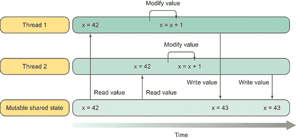

图 1.11 两个线程（线程 1 和线程 2）并行运行，都试图访问和修改共享值*x*。如果线程 2 在线程 1 写回更新值时尝试从同一内存位置读取，则*x*的值会改变。这种结果会导致数据损坏或*竞争条件*。

程序中可变状态和并行性的组合等同于问题。从命令式范式角度来看的解决方案是，通过锁定对多个线程的访问来保护可变状态。这种技术称为*互斥*，因为一个线程对给定内存位置的访问阻止了其他线程在该时刻的访问。时间概念是核心的，因为多个线程必须同时访问相同的数据才能从这种技术中受益。引入锁以同步多个线程对共享资源的访问，解决了数据损坏的问题，但引入了可能导致*死锁*的更多复杂性。

考虑图 1.12 中的情况，其中线程 1 和线程 2 正在等待对方完成工作，并在等待中无限期地阻塞。线程 1 获取锁 A，紧接着线程 2 获取锁 B。此时，两个线程都在等待一个永远不会释放的锁。这是一个*死锁*的例子。

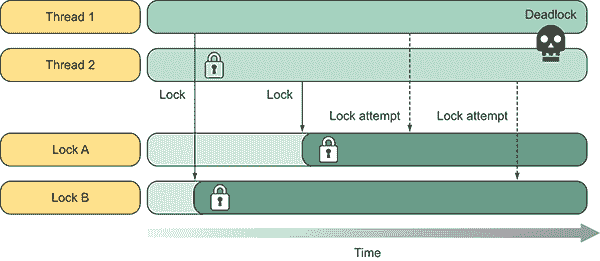

图 1.12 在这个场景中，线程 1 获取锁 A，线程 2 获取锁 B。然后，线程 2 试图获取锁 A，而线程 1 试图获取已被线程 2 获取的锁 B，线程 2 正在等待获取锁 A 以释放锁 B。此时，两个线程都在等待永远不会释放的锁。这是一个死锁的例子。

这里有一份关于并发风险的简要解释列表。稍后，你将更详细地了解每个风险，并特别关注如何避免它们：

+   竞态条件是当共享可变资源（例如文件、图像、变量或集合）同时被多个线程访问时发生的状态。这会导致不一致的状态，后续的数据损坏使得程序不可靠且无法使用。

+   当多个线程共享需要同步技术的状态竞争时，性能下降是一个常见问题。互斥锁（或 mutex），正如其名所示，通过迫使多个线程停止工作以进行通信和同步内存访问来防止代码并行运行。锁的获取和释放伴随着性能惩罚，减慢了所有进程。随着核心数量的增加，锁竞争的成本可能会增加。随着更多任务被引入以共享相同的数据，与锁相关的开销可能会对计算产生负面影响。第 1.4.3 节展示了由于引入锁同步而产生的后果和开销成本。

+   死锁是源于使用锁的并发问题。它发生在存在任务循环的情况下，其中每个任务在等待另一个任务继续时被阻塞。由于所有任务都在等待另一个任务做某事，它们被无限期地阻塞。线程之间共享的资源越多，需要的锁就越多以避免竞态条件，死锁的风险就越高。

+   缺乏组合是源于代码中引入锁的设计问题。锁不能组合。组合鼓励通过将复杂问题分解成更小的、更容易解决的问题来解决问题，然后将它们重新粘合在一起。组合是函数式编程（FP）的一个基本原则。

### 1.4.2 状态演化的共享

实际程序需要任务之间的交互，例如交换信息以协调工作。没有共享所有任务都可以访问的数据，这是无法实现的。处理这种共享状态是大多数与并行编程相关问题的根源，除非共享数据是不可变的或每个任务都有自己的副本。解决方案是保护所有代码免受这些并发问题的影响。没有编译器或工具可以帮助你将原始同步锁定位在代码的正确位置。这完全取决于你作为程序员的技能。

由于这些潜在问题，编程社区已经大声疾呼，作为回应，已经编写并引入了库和框架到主流面向对象语言（如 C#和 Java）中，以提供并发保障，这些保障并非原始语言设计的一部分。这种支持是一种设计修正，体现在命令式和面向对象、通用编程环境中的共享内存的存在。同时，函数式语言不需要保障，因为函数式编程的概念很好地映射到并发编程模型中。

### 1.4.3 一个简单的现实世界示例：并行快速排序

排序算法通常用于技术计算，可能成为瓶颈。让我们考虑一个快速排序算法，^(3) 这是一个适用于并行化的 CPU 密集型计算，它对数组元素进行排序。这个例子旨在演示将顺序算法转换为并行版本的风险，并指出在做出任何决定之前，在代码中引入并行性需要额外的思考。否则，性能可能会产生与预期相反的结果。

快速排序是一种分而治之算法；它首先将一个大数组分为两个较小的子数组，一个是低元素子数组，另一个是高元素子数组。然后快速排序可以递归地对子数组进行排序，并且易于并行化。它可以在数组上原地操作，执行排序时只需要少量额外的内存。该算法由三个简单的步骤组成，如图 1.13 所示：

1.  选择一个基准元素。

1.  根据与基准的相对顺序将序列划分为子序列。

1.  对子序列进行快速排序。

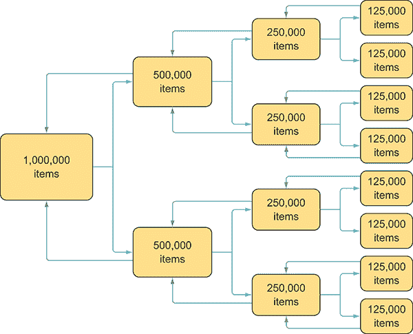

图 1.13 递归函数进行分而治之。每个块被分成相等的两半，其中基准元素必须是序列的中位数，直到每个代码部分都可以独立执行。当所有单个块都完成后，它们将结果发送回前一个调用者进行聚合。快速排序基于选择一个基准点并将序列划分为小于基准的子序列和大于基准的子序列元素，然后递归地对两个较小的序列进行排序的想法。

递归算法，尤其是基于分而治之形式的算法，是并行化和 CPU 密集型计算的优秀候选者。

微软任务并行库（TPL），在.NET 4.0 发布后推出，使得实现和利用此类算法的并行性变得更加容易。使用 TPL，你可以将算法的每个步骤分割，并递归地并行执行每个任务。这是一个直接且简单的实现，但你必须小心线程创建的深度，以避免添加不必要的任务。

要实现快速排序算法，你将使用 FP 语言 F#。然而，由于其固有的递归性质，这个实现背后的思想也可以应用于 C#，它需要一个具有可变状态的命令式 `for` 循环方法。C# 不支持 F# 那样的优化尾递归函数，因此在调用栈指针超过栈限制时，可能会引发堆栈溢出异常。在第三章中，我们将详细介绍如何克服这个 C# 限制。

列表 1.1 展示了一个采用分而治之策略的 F# 快速排序函数。对于每次递归迭代，你选择一个枢轴点并使用它来划分整个数组。你使用 `List.partition` API 在枢轴点周围划分元素，然后递归地对枢轴两侧的列表进行排序。F# 对数据结构操作有很好的内置支持。在这种情况下，你正在使用 `List.partition` API，它返回一个包含两个列表的元组：一个满足谓词的列表，另一个不满足谓词的列表。

列表 1.1 简单的快速排序算法

```
let rec quicksortSequential aList =
    match aList with
    | [] -> []
    | firstElement :: restOfList ->
        let smaller, larger =
            List.partition (fun number -> number < firstElement) restOfList
        quicksortSequential smaller @ (firstElement :: 
➥ quicksortSequential larger) 
```

在我的系统上（八个逻辑核心；2.2 GHz 时钟速度）运行这个快速排序算法，针对一个包含一百万个随机、未排序整数的数组，平均需要 6.5 秒。但是，当你分析这个算法设计时，并行化的机会是显而易见的。在 `quicksortSequential` 的末尾，你递归地调用 `quicksortSequential`，每个分区由 `(fun number -> number < firstElement) restOfList` 标识。通过使用 TPL 来生成新任务，你可以并行重写这部分代码。

列表 1.2 使用 TPL 的并行快速排序算法

```
let rec quicksortParallel aList =
    match aList with
    | [] -> []
    | firstElement :: restOfList ->
        let smaller, larger =
            List.partition (fun number -> number < firstElement) restOfList
 let left  = Task.Run(fun () -> quicksortParallel smaller)   ①  
 let right = Task.Run(fun () -> quicksortParallel larger)   ①  
 left.Result @ (firstElement :: right.Result)   ②   
```

列表 1.2 中的算法正在并行运行，现在通过在所有可用核心之间分配工作，正在使用更多的 CPU 资源。但即使资源利用率有所提高，整体性能结果并没有达到预期。

执行时间反而增加了，而不是减少。并行化的快速排序算法从每次运行平均 6.5 秒增加到大约 12 秒。整体处理时间变慢了。在这种情况下，问题在于算法过度并行化。每次内部数组被划分时，都会生成两个新任务来并行化这个算法。这种设计相对于可用的核心产生了过多的任务，这导致了并行化开销。这在涉及并行化递归函数的分而治之算法中尤其如此。重要的是不要添加比必要的更多任务。令人失望的结果展示了并行化的重要特性：在如何增加额外的线程或处理来帮助特定的算法实现方面存在固有的限制。

为了实现更好的优化，你可以通过在某个点停止递归并行化来重构之前的 `quicksortParallel` 函数。这样，算法的前几次递归仍然会并行执行，直到最深的递归，然后会回退到串行方法。这种设计保证了充分利用核心。此外，并行化带来的开销也大大减少。

列表 1.3 展示了这种新的设计方法。它考虑了递归函数运行的层级；如果层级低于预定义的阈值，它将停止并行化。函数 `quicksortParallelWithDepth` 有一个额外的参数，`depth`，其目的是减少和控制递归函数并行化的次数。`depth` 参数在每次递归调用时递减，并创建新任务，直到该参数值达到零。在这种情况下，你为 `max depth` 传递了由 `Math.Log(float System.Enviroment.ProcessorCount, 2.) + 4.` 计算出的值。这确保了递归的每一层都将产生两个子任务，直到所有可用的核心都被征用。

列表 1.3 使用 TPL 的更好的并行 `Quicksort` 算法

```
let rec quicksortParallelWithDepth depth aList =   ①  
    match aList with
    | [] -> []
    | firstElement :: restOfList ->
        let smaller, larger =
            List.partition (fun number -> number < firstElement) restOfList
 if depth < 0 then   ②  
 let left  = quicksortParallelWithDepth depth smaller   ③  
 let right = quicksortParallelWithDepth depth larger   ③  
            left @ (firstElement :: right)
        else
            let left  = Task.Run(fun () -> 
➥ quicksortParallelWithDepth (depth - 1) smaller)   ④  
            let right = Task.Run(fun () -> 
➥ quicksortParallelWithDepth (depth - 1) larger)   ④  
            left.Result @ (firstElement :: right.Result) 
```

选择任务数量的一个相关因素是预测的任务运行时间将有多相似。在 `quicksortParallelWithDepth` 的情况下，任务的持续时间可能会有很大的变化，因为枢轴点依赖于未排序的数据。它们不一定导致大小相等的段。为了补偿任务大小的不均匀，本例中的公式计算 `depth` 参数以产生比核心更多的任务。该公式将任务的数量限制在大约是核心数量的 16 倍，因为任务的数量不能超过 `2 ^ depth`。我们的目标是使快速排序的工作负载平衡，并且不启动比所需的更多的任务。在每次迭代（递归）期间启动 `Task`，当达到深度层级时，会饱和处理器。

在大多数情况下，快速排序生成不平衡的工作负载，因为产生的片段大小不均。概念公式 `log2`(ProcessorCount) + 4` 计算出 `depth` 参数以限制和适应运行任务的数量，无论在何种情况下。4 如果你将 `depth = log2(ProcessorCount) + 4` 代入并简化表达式，你会发现任务的数量是 `ProcessorCount` 的 16 倍。通过测量递归深度来限制子任务的数量是一种极其重要的技术。5

例如，在四核机器的情况下，深度计算如下：

```
depth = log2(ProcessorCount) + 4
depth = log2(2) + 4
depth = 2 + 4 
```

结果是大约 36 到 64 个并发任务的范围，因为在每次迭代中，每个分支都会启动两个任务，这些任务在每次迭代中都会翻倍。这样，线程之间的分区工作在各个核心之间有公平和合适的分配。

### 1.4.4 F# 中的基准测试

您使用了 F# REPL（读取-评估-打印循环）执行了 Quicksort 示例，这是一个方便的工具，可以运行代码的特定部分，因为它跳过了程序的编译步骤。REPL 在原型设计和数据分析开发中非常适合，因为它简化了编程过程。另一个好处是内置的 `#time` 功能，它可以切换性能信息的显示。当启用时，F# `Interactive` 测量每个解释和执行的代码段的实时、CPU 时间和垃圾回收信息。

表 1.1 对 3 GB 的数组进行排序，启用 64 位环境标志以避免大小限制。它在具有八个逻辑核心（四个物理核心带有超线程）的计算机上运行。在平均 10 次运行中，表 1.1 显示了执行时间（以秒为单位）。

表 1.1  Quicksort 排序基准测试

| **串行** | **并行** | **并行 4 线程** | **并行 8 线程** |
| --- | --- | --- | --- |
| 6.52 | 12.41 | 4.76 | 3.50 |

需要指出的是，对于小于 100 项的小数组，由于创建和/或生成新线程的开销，并行排序算法比串行版本慢。即使你正确编写了并行程序，并发构造函数引入的开销可能会压倒程序运行时间，从而降低性能，这与预期相反。因此，重要的是将原始串行代码作为基线进行基准测试，然后继续测量每次更改，以验证并行化是否有益。完整的策略应考虑这个因素，并且只有当数组大小大于一个阈值（递归深度）时才采用并行化，这个阈值通常与核心数相匹配，之后它默认回到串行行为。

## 1.5 为什么选择函数式编程进行并发？

> 问题在于，本质上所有有趣的并发应用都涉及到对共享状态的故意和受控的修改，例如屏幕空间、文件系统或程序的内部数据结构。因此，正确的解决方案是提供允许安全修改共享状态部分的机制。

—佩顿·琼斯、安德鲁·戈登和西格博恩·菲恩（《并发 Haskell》，*第 23 届 ACM 程序设计语言原理研讨会论文集*，圣彼得堡海滩，FL，1996 年 1 月）

FP 是关于最小化和控制副作用，通常被称为 *纯函数式编程*。FP 使用转换的概念，其中函数创建一个值 *x* 的副本，然后修改副本，而原始值 *x* 保持不变，可以由程序的其它部分自由使用。它鼓励在设计程序时考虑是否需要可变性和副作用。FP 允许可变性和副作用，但以战略性和明确的方式，通过利用封装它们的方法将这一区域与代码的其余部分隔离开来。

采用函数式范式的最主要原因是解决多核时代存在的问题。高度并发的应用程序，如网络服务器和数据分析数据库，遭受了几个架构问题。这些系统必须可扩展以响应大量并发请求，这导致了处理最大资源竞争和高调度频率的设计挑战。此外，竞争条件和死锁很常见，这使得代码的故障排除和调试变得困难。

在本章中，我们讨论了在命令式或面向对象编程中开发并发应用程序的一些常见问题。在这些编程范式中，我们处理对象作为基本构造。相反，在并发方面，当从单线程程序过渡到大规模并行化工作（这是一个具有挑战性和完全不同的场景）时，处理对象有一些需要注意的注意事项。

这些问题的传统解决方案是对资源访问进行同步，以避免线程之间的竞争。但这个解决方案是一把双刃剑，因为使用同步原语，如用于互斥的 `lock`，可能导致死锁或竞争条件。实际上，变量的状态（正如其名称 *variable* 所暗示的）可能会发生变化。在面向对象编程（OOP）中，变量通常代表一个随着时间的推移可能会发生变化的对象。正因为如此，你永远不能依赖其状态，因此，你必须检查其当前值以避免不希望的行为 (图 1.14)。

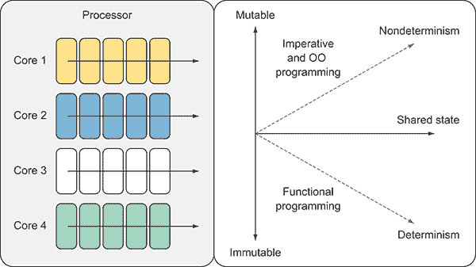

图 1.14 在函数式范式下，由于默认构造为不可变性，并发编程保证了确定性执行，即使在共享状态的情况下也是如此。相反，命令式和面向对象编程使用可变状态，这在多线程环境中难以管理，这导致了非确定性程序。

需要考虑的是，采用 FP 概念的系统组件不能再相互干扰，并且可以在不使用任何锁定策略的情况下在多线程环境中使用。

使用共享的可变变量和副作用函数开发安全的并行程序需要程序员付出大量努力，他们必须做出关键决策，这通常会导致以锁定形式出现的同步。通过通过函数式编程消除这些基本问题，你还可以消除这些特定于并发的并发问题。这就是为什么 FP 是一个出色的并发编程模型。它非常适合并发程序员，在高度多线程环境中使用简单代码实现正确的高性能。在 FP 的核心，变量和状态都是不可变的，不能共享，函数可能没有副作用。

FP 是编写并发程序最实用的方法。试图用命令式语言编写它们不仅困难，而且还会导致难以发现、复制和修复的错误。

你将如何利用你所能获得的每一个计算机核心？答案是简单的：拥抱函数式范式！

### 1.5.1 函数式编程的好处

即使你目前没有计划采用这种风格，学习函数式编程（FP）也有实际的好处。然而，如果不展示即时的好处，很难说服某人花时间学习新事物。好处以惯用语言特性形式出现，最初可能看起来令人不知所措。然而，FP 是一种范式，在经过一段学习曲线后，将赋予你强大的编码能力和程序中的积极影响。在几周内使用 FP 技术后，你会提高应用程序的可读性和正确性。

FP（侧重于并发）的好处包括以下内容：

+   *不可变性* — 一种在创建后防止修改对象状态的性质。在 FP 中，变量赋值不是一个概念。一旦一个值与一个标识符相关联，它就不能改变。函数式代码按定义是不可变的。不可变对象可以在线程之间安全地传输，从而带来巨大的优化机会。不可变性消除了由于缺乏互斥而导致的内存损坏（竞争条件）和死锁问题。

+   *纯函数* — 这没有副作用，这意味着函数不会改变函数体外的任何输入或数据。如果函数对用户来说是透明的，并且它们的返回值仅取决于输入参数，那么它们就被说成是纯函数。通过将相同的参数传递给纯函数，结果不会改变，每个过程都会返回相同的值，产生一致和预期的行为。

+   *引用透明性* — 函数的输出仅依赖于其输入并映射到其输入的概念。换句话说，每次函数接收到相同的参数时，结果都是相同的。这个概念在并发编程中很有价值，因为表达式的定义可以被其值替换，并且具有相同的意义。引用透明性保证了可以以任何顺序和并行地评估一组函数，而不会改变应用程序的行为。

+   *惰性求值* — 在函数式编程中用于按需检索函数的结果或延迟对大数据流的分析，直到需要时。

+   *可组合性* — 用于组合函数并从简单的函数中创建更高级的抽象。可组合性是战胜复杂性的最有力的工具，让你能够定义和构建复杂问题的解决方案。

学习函数式编程可以使你编写更模块化、面向表达式和概念上简单的代码。这些函数式编程资产的组合将让你理解你的代码正在做什么，无论代码正在执行多少线程。

在本书的后面部分，你将学习应用并行性和绕过与可变状态和副作用相关问题的技术。函数式范式对这些概念的方法旨在通过声明式编程风格简化并最大化编码效率。

## 1.6 拥抱函数式范式

有时，改变是困难的。通常，在领域知识中感到舒适的开发者缺乏从不同角度看待编程问题的动力。学习任何新的程序范式都是困难的，并且需要时间来过渡到以不同风格进行开发。改变你的编程视角需要改变你的思维和方式，而不仅仅是学习新编程语言的新代码语法。

从 Java 这样的语言到 C#并不困难；在概念上，它们是相同的。从命令式范式到函数式范式的转变是一个更加困难的挑战。核心概念被替换。你不再有状态。你不再有变量。你不再有副作用。

但你为改变范式所付出的努力将带来巨大的回报。大多数开发者都会同意，学习一门新语言可以使你成为一名更好的开发者，并将这比作一位医生建议患者每天锻炼 30 分钟以保持健康。患者知道锻炼的真正益处，但同时也意识到日常锻炼意味着承诺和牺牲。

同样，学习一种新范式并不难，但确实需要奉献、参与和时间。我鼓励所有希望成为更好的程序员的人考虑学习函数式编程（FP）范式。学习 FP 就像乘坐过山车：在这个过程中，你会有感到兴奋和飘浮的时刻，然后会有你认为你理解了一个原则，但随后会急剧下降——尖叫——但这次旅行是值得的。将学习 FP 视为一段旅程，是对你个人和职业生涯的投资，并保证有回报。记住，学习的一部分是犯错误，并发展技能以避免将来再犯同样的错误。

在整个过程中，你应该识别难以理解的概念，并尝试克服这些困难。考虑如何在实践中使用这些抽象概念，从解决简单问题开始。我的经验表明，通过使用真实示例来找出一个概念的目的，你可以突破心理障碍。这本书将引导你了解将函数式编程（FP）应用于并发和分布式系统的益处。这是一条狭窄的道路，但在另一边，你将获得几个在日常生活中编程时可以使用的优秀基础概念。我坚信，你将获得解决复杂问题的新的见解，并利用函数式编程的巨大力量成为一名更优秀的软件工程师。

## 1.7 为什么选择 F#和 C#进行函数式并发编程？

这本书的焦点是开发和设计高度可扩展和性能优异的系统，采用函数式范式来编写正确的并发代码。这并不意味着你必须学习一门新语言；你可以通过使用你已经熟悉的工具来应用函数式范式，例如多用途语言 C#和 F#。多年来，这些语言已经添加了几个函数式特性，使你更容易转向采用这种新范式。

解决问题的本质不同方法是选择这些语言的原因。这两种编程语言都可以用非常不同的方式解决相同的问题，这为选择最适合工作的工具提供了论据。拥有一个全面的工具集，你可以设计出更好、更简单的解决方案。实际上，作为软件工程师，你应该将编程语言视为工具。

理想情况下，解决方案应该是由协同工作的 C#和 F#项目组合而成。这两种语言覆盖了不同的编程模型，但选择使用哪种工具来完成工作的选项，在生产力效率方面提供了巨大的好处。选择这些语言的另一个方面是它们对不同的并发编程模型的支持，可以混合使用。例如：

+   F# 提供了一个比 C#更简单的异步计算模型，称为 *异步工作流*。

+   C# 和 F# 都是强类型、多用途的编程语言，支持多种范式，包括函数式、命令式和 OOP 技术。

+   这两种语言都是 .NET 生态系统的一部分，并衍生出丰富的库，这些库可以被两种语言同等使用。

+   F# 是一种以函数式编程语言为先的语言，提供了巨大的生产力提升。实际上，用 F# 编写的程序往往更简洁，并且导致需要维护的代码更少。

+   F# 结合了函数式声明式编程风格的优点和命令式面向对象风格的支撑。这使得你可以使用现有的面向对象和命令式编程技能来开发应用程序。

+   由于默认的不可变构造函数，F# 有一系列内置的无锁数据结构。例如，有判别联合和记录类型。这些类型具有结构相等性，不允许 `null`，这有助于“信任”数据的完整性并简化比较。

+   与 C# 不同，F# 强烈反对使用 `null` 值，也称为“十亿美元的错误”，相反，它鼓励使用不可变数据结构。这种对空引用的缺乏有助于减少编程中的错误数量。

+   F# 由于默认使用不可变作为类型构造函数，并且由于其 .NET 基础，它能够以最先进的实现能力与 C# 语言集成，因此自然可并行化。

+   C# 的设计倾向于命令式语言，首先是完全支持面向对象编程（OOP）。（我喜欢将其定义为命令式 OOP。）在过去的几年中，自从 .NET 3.5 发布以来，函数式范式通过添加 lambda 表达式和 LINQ（列表理解）等功能，已经影响了 C# 语言。

+   C# 也拥有强大的并发工具，这些工具可以帮助你轻松编写并行程序，并迅速解决复杂的现实世界问题。实际上，C# 语言在多核开发方面的卓越支持是灵活多变的，能够快速开发和原型化高度并行的对称多处理（SMP）应用程序。这些编程语言是编写并发软件的出色工具，当它们共存时，可用的解决方案的强大功能和选项会聚合。SMP 是通过多个共享相同操作系统和内存的处理器的程序处理。

+   F# 和 C# 可以互操作。实际上，一个 F# 函数可以调用 C# 库中的方法，反之亦然。

在接下来的章节中，我们将讨论替代的并发方法，如数据并行、异步和消息传递编程模型。我们将使用这些编程语言各自提供的最佳工具构建库，并将它们与其他语言进行比较。我们还将检查像 TPL 和反应式扩展（Rx）这样的工具和库，这些工具和库通过采用函数式范式进行设计、灵感和实现，以获得可组合的抽象。

显然，行业正在寻找一个可靠且简单的并发编程模型，这从软件公司投资于移除传统和复杂内存同步模型抽象级别的库中可以看出。这些高级库的例子包括英特尔的多线程构建块（TBB）和微软的任务并行库（TPL）。

还有有趣的开放源代码项目，例如 OpenMP（它提供了可以插入到程序中以使其部分并行的编译器特定定义的预处理器功能或实现定义信息，称为 pragma）和 OpenCL（一种与图形处理单元 [GPU] 通信的低级语言）。GPU 编程具有吸引力，并且得到了微软通过 C++ AMP 扩展和 Accelerator .NET 的认可。

## 摘要

+   并发和并行编程的挑战和复杂性没有银弹存在。作为一名专业工程师，你需要不同类型的弹药，并且你需要知道如何以及何时使用它们来击中目标。

+   程序设计时必须考虑到并发性；程序员不能继续编写顺序代码，而忽视并行编程的好处。

+   摩尔定律并没有错误。相反，它已经转向了每个处理器核心数量增加的方向，而不是单个 CPU 的速度增加。

+   在编写并发代码时，你必须牢记并发、多线程、多任务和并行之间的区别。

+   在并发环境中，可变状态和副作用的比例是首要关注的问题，因为它们会导致不希望出现的程序行为和错误。

+   为了避免编写并发应用程序的陷阱，你应该使用提高抽象级别的编程模型和工具。

+   函数范式为你提供了处理代码中并发性的正确工具和原则。

+   函数式编程在并行计算中表现出色，因为不可变性是默认的，这使得推理共享数据更容易。**  **# 2

并发编程的功能性技术

**本章涵盖**

+   通过组合简单解决方案来解决复杂问题

+   使用闭包简化函数式编程

+   使用功能性技术提高程序性能

+   使用惰性评估

在函数式编程中编写代码可以让你感觉像是一名驾驶着快车的驾驶员，无需了解底层机械原理就能高速行驶。在第一章中，你了解到采用函数式编程方法来编写并发应用程序，比例如面向对象方法更好地解决了编写这些应用程序的挑战。任何函数式语言中的关键概念，如不可变变量和纯度，意味着虽然编写并发应用程序仍然远非易事，但开发者可以确信他们不会面临许多传统的并行编程陷阱。函数式编程的设计意味着诸如竞态条件和死锁等问题不会发生。

在本章中，我们将更详细地探讨主要的函数式编程原则，这些原则有助于我们编写高质量的并发应用程序。你将了解这些原则是什么，它们如何在 C#（尽可能）和 F#中工作，以及它们如何适应并行编程的模式。

在本章中，我假设你已经熟悉了函数式编程的基本原则。如果你不熟悉，请参阅附录 A 以获取你需要继续阅读的详细信息。到本章结束时，你将知道如何使用函数式技术将简单的函数组合起来解决复杂问题，并在多线程环境中安全地缓存和预计算数据以加快程序执行速度。

## 2.1 使用函数组合解决复杂问题

*函数* *组合*是将函数以某种方式组合在一起，其中一个函数的输出成为下一个函数的输入，从而创建一个新的函数。这个过程可以无限进行，将函数链接在一起以创建强大的新函数来解决复杂问题。通过组合，你可以实现模块化，简化程序的结构。

*函数式范式*导致程序设计简单。函数组合背后的主要动机是提供一个简单的机制，用于构建易于理解、易于维护、可重用且简洁的代码。此外，无副作用的函数组合保持了代码的纯度，从而保留了并行逻辑。基本上，基于函数组合的并发程序比非函数组合的程序更容易设计且结构更简单。

函数组合使得将一系列简单的函数构建和粘合在一起成为一个单一的大而复杂的函数成为可能。为什么粘合代码很重要呢？想象一下以自上而下的方式解决问题。你从大问题开始，然后将其分解成更小的问题，直到最终足够小，可以直接解决问题。结果是，你得到了一系列小解决方案，然后你可以将它们粘合在一起来解决原始的更大问题。组合是将大解决方案拼接在一起的内聚力。

将函数组合视为管道化的概念，即一个函数的结果为后续函数提供第一个参数。这里有一些区别：

+   管道化执行一系列操作，其中每个函数的输入是前一个函数的输出。

+   函数组合返回一个新的函数，它是两个或更多函数的组合，并且不会立即调用（输入 -> 函数 -> 输出）。

### 2.1.1 C# 中的函数组合

C# 语言本身不支持函数组合，这造成了语义上的挑战。但可以通过直接的方式引入这种功能。考虑一个简单的 C# 例子（如列表 2.1 所示），使用 lambda 表达式定义两个函数。

列表 2.1  C# 中的 HOFs `grindCoffee` 和 `brewCoffee` 到 `Espresso`

```
Func<CoffeeBeans, CoffeeGround> grindCoffee = coffeeBeans 
 => new CoffeeGround(coffeeBeans);   ①  
Func<CoffeeGround, Espresso> brewCoffee = coffeeGround 
 => new Espresso(coffeeGround);   ②   
```

第一个函数 `grindCoffee` 接受一个 `coffeeBeans` 对象作为参数，并返回一个新的 `CoffeeGround` 实例。第二个函数 `brewCoffee` 接受一个 `coffeeGround` 对象作为参数，并返回一个新的 `Espresso` 实例。这些函数的目的是通过组合它们的评估结果来制作 `Espresso`。你如何组合这些函数？在 C# 中，你可以选择连续执行这些函数，将第一个函数的结果作为链传递给第二个函数。

列表 2.2 C# 中的组合函数（不良）

```
CoffeeGround coffeeGround = grindCoffee(coffeeBeans); 
Espresso espresso = brewCoffee(coffeeGround); 

Espresso espresso = brewCoffee(grindCoffee(coffeeBeans));   ①   
```

首先，执行函数 `grindCoffee`，传递参数 `coffeeBeans`，然后将结果 `coffeeGround` 传递给函数 `brewCoffee`。第二个等效的选项是将 `grindCoffee` 和 `brewCoffee` 的执行连接起来，这实现了函数组合的基本思想。但从可读性的角度来看，这是一个不好的模式，因为它迫使你从右到左阅读代码，这不是阅读英语的自然方式。最好是从左到右逻辑地阅读代码。

一个更好的解决方案是创建一个通用的、专门的扩展方法，可以用来组合任何两个具有一个或多个泛型输入参数的函数。以下列表定义了一个 `Compose` 函数，并重构了之前的例子。（泛型参数用粗体表示。）

列表 2.3 `Compose` 函数在 C# 中

```
static Func<A, C> Compose<A, B, C>(this Func<A, B> f, Func<B, C> g) 
 => (n) => **g(f(n))**;   ①  
Func<CoffeeBeans, Espresso> makeEspresso = ➥ grindCoffee.Compose(brewCoffee);   ②  
Espresso espresso = makeEspresso(coffeBeans); 
```

如图 2.1 所示，高阶函数 `Compose` 将函数 `grindCoffee` 和 `brewCoffee` 连接起来，创建一个新的函数 `makeEspresso`，它接受一个参数 `coffeeBeans` 并执行 `brewCoffee (grindCoffee(coffeeBeans))`。

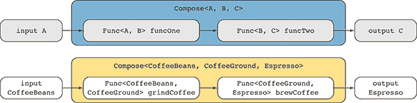

图 2.1 从函数 `Func<CoffeeBeans, CoffeeGround> grindCoffee` 到函数 `Func<CoffeeGround, Espresso> brewCoffee` 的函数组合。因为 `grindCoffee` 函数的输出与 `brewCoffee` 函数的输入相匹配，所以这些函数可以在一个新的函数中组合，该函数将输入 `CoffeeBeans` 映射到输出 `Espresso`。

在函数体中，你可以轻松地看到看起来与 lambda 表达式 `makeEspresso` 完全相同的行。这种扩展方法封装了函数组合的概念。其思路是创建一个函数，该函数返回将内部函数 `grindCoffee` 的结果应用于外部函数 `brewCoffee` 的结果。这在数学中是一个常见的模式，可以用 `brewCoffee` 的 `grindCoffee` 表示法来表示，意味着 `grindCoffee` 应用到 `brewCoffee`。使用扩展方法来提高抽象级别，创建可重用和模块化的函数（HOFs）是很容易的^(1)。

在 F# 等语言中内置组合语义有助于以声明性方式结构化代码。遗憾的是，在 C# 中没有类似复杂的解决方案。在这本书的源代码中，你可以找到一个包含多个 `Compose` 扩展方法重载的库，这些方法可以提供类似的有用和可重用解决方案。

### 2.1.2 F# 中的函数组合

F# 内置了对函数组合的支持。实际上，`compose` 函数的定义是用 `>>` 中缀操作符内置到语言中的。在 F# 中使用此操作符，你可以组合现有函数来构建新的函数。

让我们考虑一个简单的场景，你想要将列表中的每个元素增加 4 然后乘以 3。以下列表显示了如何使用和未使用函数组合来构建此函数，以便你可以比较两种方法。

列表 2.4 F# 对函数组合的支持

```
let add4 x = x + 4   ①  

let multiplyBy3 x = x * 3   ②  

let list = [0..10]   ③  

let newList = List.map(fun x -> ➥ multiplyBy3(add4(x))) list   ④  

let newList = list |> ➥ List.map(add4 >> multiplyBy3)  ⑤   
```

示例代码使用 `map` 函数将 `add4` 和 `multiplyBy3` 函数应用于列表中的每个元素，`map` 函数是 F# 中 `List` 模块的一部分。`List.map` 等同于 LINQ 中的 `Select` 静态方法。这两个函数的组合是通过一种强制代码从内向外读取的顺序语义方法来实现的：`multiplyBy3(add4(x))`。使用 `>>` 中缀操作符的函数组合风格允许代码从左到右读取，就像教科书一样，结果更加精致、简洁，且易于理解。

实现具有简单和模块化代码语义的功能组合的另一种方法是使用一种称为闭包的技术。

## 2.2 使用闭包简化函数式思维

*闭包* 的目的是简化函数式思维，并允许运行时管理状态，为开发者释放额外的复杂性。闭包是一个一等函数，具有绑定在词法环境中的自由变量。在这些术语背后隐藏着一个简单的概念：闭包是提供函数访问局部状态和将数据传递到后台操作的一种更方便的方式。它们是特殊的函数，具有对所引用的所有非局部变量（也称为 *自由变量* 或 *上值*）的隐式绑定。此外，闭包允许函数在调用其直接词法作用域之外时访问一个或多个非局部变量，并且这个特殊函数的主体可以将这些 *自由变量* 作为单个实体传输，这些变量在其封装作用域中定义。更重要的是，闭包封装行为，就像任何其他对象一样传递它，授予访问闭包创建、读取和更新这些值的上下文。

在函数式编程（FP）或任何支持高阶函数的其他编程语言中，如果没有闭包的支持，数据的范围可能会造成问题和不利因素。然而，在 C# 和 F# 的情况下，编译器使用闭包来增加和扩展变量的作用域。因此，数据在当前上下文中是可访问和可见的，如图 2.2 所示。图 2.2。

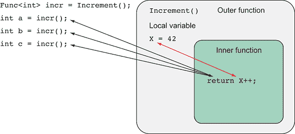

图 2.2 在这个使用闭包的例子中，外部函数 `Increment` 的局部变量 `X` 以由内部函数生成的函数（`Func<int>`）的形式暴露出来。重要的是函数 `Increment` 的返回类型，它是一个捕获封装变量 `X` 的函数，而不是变量本身。每次函数引用 `incr` 运行时，捕获的变量 `X` 的值都会增加。

在 C# 中，自 .NET 2.0 以来就提供了闭包功能；但是，自从引入了 lambda 表达式和 .NET 中的匿名方法之后，闭包的使用和定义变得更加容易，这形成了一种和谐的混合。

本节使用 C# 作为代码示例，尽管相同的概念和技术也适用于 F#。此列表使用匿名方法定义了一个闭包。

列表 2.5 使用匿名方法在 C# 中定义的闭包

```
string freeVariable = "I am a free variable";   ①   
Func<string, string> lambda = value => freeVariable + " " + value;   ②   
```

在这个例子中，匿名函数 `lambda` 引用了其封装作用域中的自由变量 `freeVariable`。闭包使函数能够访问其周围的状态（在这种情况下，`freeVariable`），从而提供更清晰、更易读的代码。在没有闭包的情况下复制相同的功能可能意味着创建一个你希望函数使用的类（并且该类了解局部变量），并将该类作为参数传递。在这里，闭包帮助运行时管理状态，避免了创建用于管理状态的额外且不必要的样板代码。这是闭包的一个好处：它可以作为一个可移植的执行机制，用于将额外上下文传递到高阶函数（HOFs）中。不出所料，闭包通常与 LINQ 结合使用。你应该将闭包视为 lambda 表达式的积极副作用，以及你工具箱中的一项伟大编程技巧。

### 2.2.1 使用 lambda 表达式在闭包中捕获变量

当相同的变量即使在它本应超出作用域的情况下也可以使用时，闭包的力量就显现出来了。因为变量已经被捕获，所以它不会被垃圾回收。使用闭包的优势在于你可以有一个方法级别的变量，这通常用于实现内存缓存技术以改善计算性能。本章后面将讨论这些功能技术**记忆化**和*函数式预计算*。

*列表 2.6 使用事件编程模型（EPM）下载一个图像，异步展示了捕获变量如何与闭包一起工作。当下载完成时，进程继续更新客户端应用程序的用户界面。实现使用异步语义 API 调用。当请求完成时，注册的事件 `DownloadDataCompleted` 触发并执行剩余的逻辑*。

列表 2.6 使用 lambda 表达式捕获局部变量的事件寄存器

```
void UpdateImage(string url)
{
 System.Windows.Controls.Image image = img;   ①  

    var client = new WebClient();
 client.DownloadDataCompleted += (o, e) =>   ②  
    {
        if (image != null)
            using (var ms = new MemoryStream(e.Result))
            {
                var imageConverter = new ImageSourceConverter();
                image.Source = (ImageSource) 
➥ imageConverter.ConvertFrom(ms);
            }
    };
 client.DownloadDataAsync(new Uri(url));   ③  
} 
```

首先，你获取名为 `img` 的图像控制器的引用。然后，你使用 lambda 表达式注册处理程序回调，以便在 `DownloadDataAsync` 完成时处理 `DownloadDataCompleted` 事件。在 lambda 块内部，由于闭包，代码可以直接访问作用域之外的状态。这种访问允许你检查图像指针的状态，如果它不是 `null`，则更新用户界面。

这是一个相当直接的过程，但时间线流程增加了有趣的行为。该方法异步执行，因此当数据从服务返回并回调更新 `image` 时，方法已经完成。

如果方法完成，局部变量*`image`*是否应该超出作用域？那么图像如何更新？答案被称为 *捕获变量*。lambda 表达式捕获局部变量 `image`，因此即使通常会被释放，它仍然保持作用域。从这个例子中，你应该将捕获变量视为闭包创建时变量值的快照。如果你在没有这个捕获变量的相同过程中构建相同的过程，你需要一个类级变量来保存图像值。**

**为了证明这一点，让我们分析如果在 列表 2.6 的末尾添加一行代码，将图像引用更改为 `null` 指针（加粗）会发生什么。**

列表 2.7 证明捕获变量的时间

```
void UpdateImage(string url)
{
    System.Windows.Controls.Image image = img;

    var client = new WebClient();
    client.DownloadDataCompleted += (o, e) =>
    {
        if (image != null) {
            using (var ms = new MemoryStream(e.Result))
            {
                var imageConverter = new ImageSourceConverter();
                image.Source = (ImageSource) 
➥ imageConverter.ConvertFrom(ms);
            }
        }
    };
    client.DownloadDataAsync(new Uri(url));

 **image = null****;**   ①  
} 
```

通过运行经过修改的程序，UI 中的图像不会更新，因为在执行 lambda 表达式主体之前，指针被设置为 `null`。尽管在捕获时图像有一个值，但在代码执行时它是 `null`。捕获变量的生命周期延长，直到所有引用变量的闭包都适合进行垃圾回收。

在 F# 中，不存在 `null` 对象的概念，因此不可能运行这样的不良场景。

### 2.2.2 多线程环境中的闭包

让我们分析一个使用闭包向通常在主线程之外运行的任务提供数据的用例场景。在 FP 中，闭包通常用于管理可变状态，以限制和隔离可变结构的范围，允许线程安全访问。这非常适合多线程环境。

在 列表 2.8 中，一个 lambda 表达式从 TPL 的一个新 `Task`（`System.Threading.Tasks.Task`）中调用 `Console.WriteLine` 方法。当这个任务开始时，lambda 表达式构建一个闭包，该闭包封装了作为另一个线程中运行的方法的参数传递的局部变量 `iteration`。在这种情况下，编译器会自动生成一个匿名类，该变量作为公开属性。

列表 2.8 在多线程环境中捕获闭包变量

```
for (int iteration = 1; iteration < 10; iteration++)
{
     Task.Factory.StartNew(() => Console.WriteLine("{0} - {1}", 
➥ Thread.CurrentThread.ManagedThreadId, iteration));
} 
```

闭包可能导致奇怪的行为。从理论上讲，这个程序应该可以工作：你期望程序打印出从 1 到 10 的数字。但在实践中，情况并非如此；程序将打印数字 10 十次，因为你使用了多个 lambda 表达式中相同的变量，这些匿名函数共享变量值。

让我们分析另一个例子。在这个列表中，你使用 lambda 表达式将数据传递到两个不同的线程中。

列表 2.9 在多线程代码中使用闭包的奇怪行为

```
Action<int> displayNumber = n => Console.WriteLine(n);
int i = 5;
Task taskOne =  Task.Factory.StartNew(() => displayNumber(i));
i = 7;
Task taskTwo =  Task.Factory.StartNew(() => displayNumber(i));

Task.WaitAll(taskOne, taskTwo); 
```

即使第一个 lambda 表达式在变量值改变之前捕获了变量 `i`，两个线程也会打印数字 7，因为变量 `i` 在两个线程开始之前已经被改变。这个微妙问题的原因是 C# 的可变性质。当一个闭包通过 lambda 表达式捕获一个可变变量时，lambda 表达式捕获的是变量的引用而不是该变量的当前值。因此，如果任务在变量的引用值改变之后运行，那么值将是内存中的最新值，而不是变量被捕获时的值。

这就是为什么选择其他解决方案而不是手动编写并行循环的原因之一。TPL 中的 `Parallel.For` 解决了这个错误。在 C# 中，一个可能的解决方案是为每个 `Task` 创建并捕获一个新的临时变量。这样，新变量的声明就被分配在新的堆位置，保留了原始值。这种复杂而巧妙的行为在函数式语言中并不适用。让我们看看使用 F# 的类似场景。

列表 2.10 F# 中多线程环境中捕获变量的闭包

```
let tasks = Array.zeroCreate<Task> 10

for index = 1 to 10 do
    tasks.[index - 1] <- Task.Factory.StartNew(fun () -> 
➥ Console.WriteLine index) 
```

运行这个版本的代码，结果正如预期：程序打印了数字 1 到 10。解释是 F# 处理它的过程式 `for` 循环的方式与 C# 不同。F# 编译器为每次迭代创建一个新的不可变值，并在内存中具有不同的位置，而不是使用可变变量并在每次迭代中更新其值。这种偏好不可变类型的函数式行为的结果是 lambda 捕获了对一个永远不会改变的不可变值的引用。

多线程环境通常使用闭包，因为捕获和在不同上下文中传递变量很简单，这需要额外的思考。以下列表说明了 .NET TPL 库如何使用闭包通过 `Parallel.Invoke` API 执行多个线程。

列表 2.11 多线程环境中捕获变量的闭包

```
public void ProcessImage(Bitmap image) {
 byte[] array = image.ToByteArray(ImageFormat.Bmp);   ①  
   Parallel.Invoke(
     () => ProcessArray(array, 0, array.Length / 2),
 () => ProcessArray(array, array.Length / 2, array.Length));   ②  
} 
```

在示例中，`Parallel.Invoke` 生成了两个独立任务，每个任务都会运行 `ProcessArray` 方法，针对 `array` 的一个部分，该部分的变量被 lambda 表达式捕获并封装。

在任务并行化的上下文中，请注意闭包中捕获的变量：因为闭包捕获的是变量的引用而不是其实际值，你可能会无意中共享一些不明显的内容。闭包是一种强大的技术，你可以用它来实现模式，以提高你程序的性能。

## 2.3 用于程序加速的备忘录缓存技术

*缓存技术*，也称为*表格技术*，是一种旨在提高应用程序性能的 FP 技术。通过缓存函数的结果，避免了由于重复相同的计算而产生的额外不必要的计算开销，从而实现了程序速度的提升。这是可能的，因为缓存技术通过存储具有相同参数的前期计算结果（如图 2.3 所示）来绕过昂贵的函数调用执行，以便在参数再次出现时检索。缓存函数将计算结果保留在内存中，以便在未来的调用中立即返回。

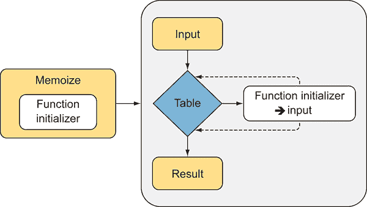

图 2.3 缓存技术是一种缓存函数值的技巧，确保只进行一次评估。当输入值传递给缓存函数时，内部表存储会验证是否存在与该输入关联的结果，以便立即返回。否则，函数初始化器将运行计算，然后更新内部表存储并返回结果。下次相同的输入值传递给缓存函数时，表存储中包含关联的结果，计算将被跳过。

这个概念一开始可能听起来很复杂，但一旦应用起来就是一个简单的技术。缓存技术使用闭包来促进函数转换为便于访问局部变量的数据结构。闭包被用作缓存函数每次调用的包装器。这个局部变量，通常是一个查找表，目的是将内部函数的结果作为值存储，并使用传递给此函数的参数作为键引用。

缓存技术非常适合多线程环境，可以提供巨大的性能提升。主要好处在于当一个函数被反复应用于相同的参数时；但是，从 CPU 计算的角度来看，运行函数的成本比访问相应的数据结构要高。例如，为了给图像应用颜色过滤器，并行运行多个线程是一个好主意。每个线程访问图像的一部分并修改上下文中的像素。但是，可能存在将过滤器颜色应用于具有相同值的像素集的情况。在这种情况下，如果计算将得到相同的结果，为什么还要重新评估呢？相反，可以使用缓存技术将结果缓存起来，这样线程就可以跳过不必要的任务，更快地完成图像处理。

以下列表展示了 C#中缓存函数的基本实现。

列表 2.12  说明缓存技术工作原理的简单示例

```
static Func<T, R> Memoize<T, R>(Func<T, R> func)   ①  
where T : IComparable
{
 Dictionary<T, R> cache = new Dictionary<T, R>();   ②  

 return arg => {   ③  

 if (cache.ContainsKey(arg))   ④  

 return cache[arg];   ⑤  

 return (cache[arg] = func(arg));   ⑥  
                };
} 
```

首先，你定义 `Memoize` 函数，该函数内部使用泛型集合 `Dictionary` 作为缓存表变量的表。闭包捕获局部变量，以便可以从指向闭包的委托和外部函数中访问它。当 HOF 被调用时，它首先尝试将输入与函数匹配以验证参数是否已经被缓存。如果参数键存在，缓存表返回结果。如果参数键不存在，第一步是使用参数评估函数，将参数和相关的结果添加到缓存表中，并最终返回结果。重要的是要提到，memoization 是一个 HOF，因为它接受一个函数作为输入并返回一个函数作为输出。

这是在 F# 中实现的等效 `memoize` 函数。

列表 2.13 F# 中的 `memoize` 函数

```
let memoize func =
    let table = Dictionary<_,_>()
    fun x ->   if table.ContainsKey(x) then table.[x]
               else
                    let result = func x
                    table.[x] <- result
                    result 
```

这是一个使用之前定义的 `memoize` 函数的简单示例。在 列表 2.14 中，`Greeting` 函数返回一个字符串，其中包含传递给参数的欢迎消息。消息还包括函数被调用时的时间，这用于在函数运行时跟踪时间。代码为了演示目的，在每次调用之间应用了 2 秒的延迟。

列表 2.14 C# 中的问候示例

```
public static string Greeting(string name) 
{
      return $"Warm greetings {name}, the time is 
➥ {DateTime.Now.ToString("hh:mm:ss")}";    
}                                    

Console.WriteLine(Greeting ("Richard")); 
System.Threading.Thread.Sleep(2000);
Console.WriteLine(Greeting ("Paul"));
System.Threading.Thread.Sleep(2000);
Console.WriteLine(Greeting ("Richard"));  

// output
Warm greetings Richard, the time is 10:55:34
Warm greetings Paul, the time is 10:55:36
Warm greetings Richard, the time is 10:55:38 
```

接下来，代码重新执行相同的消息，但使用 `Greeting` 函数的 memoized 版本。

列表 2.15 使用 memoized 函数的问候示例

```
var greetingMemoize = Memoize<string, string>(Greeting);   ①  

Console.WriteLine(greetingMemoize ("Richard")); 
System.Threading.Thread.Sleep(2000);
Console.WriteLine(greetingMemoize ("Paul"));
System.Threading.Thread.Sleep(2000);
Console.WriteLine(greetingMemoize("Richard"));     

// output
Warm greetings Richard, the time is 10:57:21   ②  
Warm greetings Paul, the time is 10:57:23        
Warm greetings Richard, the time is 10:57:21   ②   
```

输出表明前两次调用发生在不同的时间，正如预期的那样。但在第三次调用中发生了什么？为什么第三次函数调用返回与第一次完全相同时间的消息？答案是 memoization。

第一次和第三次函数调用 `greetingMemoize("Richard")` 有相同的参数，并且它们的结果在 `greetingMemoize` 函数的初始调用中只被缓存了一次。第三次函数调用的结果不是其执行的效果，而是具有相同参数的函数存储的结果，因此时间匹配。

这就是 memoization 的工作原理。memoized 函数的职责是在内部表中查找传入的参数。如果找到输入值，它将返回之前计算的结果。否则，函数将结果存储在表中。

## 2.4 使用 memoize 快速网络爬虫的实际应用

现在，你将使用上一节中学到的知识实现一个更有趣的示例。对于这个示例，你将构建一个网络爬虫，它从每个访问的网站中提取并打印到控制台中的页面标题。列表 2.16 运行的是没有 memoization 的代码。然后你将使用 memoization 技术重新执行相同的程序，并比较结果。最终，你将下载多个网站的 内容，结合并行执行和 memoization。

列表 2.16 C# 中的网络爬虫

```
public static IEnumerable<string> WebCrawler(string url) {   ①  
       string content = GetWebContent(url);
       yield return content;

       foreach (string item in AnalyzeHtmlContent(content))
       yield return GetWebContent(item);
}

static string GetWebContent(string url) {   ②  
       using (var wc = new WebClient())
           return wc.DownloadString(new Uri(url));
}

static readonly Regex regexLink =
         new Regex(@"(?<=href=('|""))https?://.*?(?=\1)");

static IEnumerable<string> AnalyzeHtmlContent(string text) {   ③  
         foreach (var url in regexLink.Matches(text))
               yield return url.ToString();
}

static readonly Regex regexTitle = 
        new Regex("<title>(?<title>.*?)<\\/title>", RegexOptions.Compiled);

static string ExtractWebPageTitle(string textPage) {   ④  
        if (regexTitle.IsMatch(textPage))
               return regexTitle.Match(textPage).Groups["title"].Value;
        return "No Page Title Found!";
} 
```

`WebCrawler` 函数通过调用 `GetWebContent` 方法下载作为参数传递的网页 URL 的内容。接下来，它分析下载的内容并提取网页中包含的超链接，这些超链接被发送回初始函数进行处理，对每个超链接重复这些操作。下面是网络爬虫的实际运行情况。

列表 2.17 执行网络爬虫

```
List<string> urls = new List<string> {   ①  
    @"http://www.google.com",
    @"http://www.microsoft.com",
 @"http://www.bing.com",
    @"http://www.google.com"
};

var webPageTitles = from url in urls   ②  
                    from pageContent in WebCrawler(url)
                    select ExtractWebPageTitle(pageContent);

foreach (var webPageTitle in webPageTitles)
    Console.WriteLine(webPageTitle);     

// OUTPUT 
Starting Web Crawler for http://www.google.com...
Google
Google Images
 ...
Web Crawler completed for http://www.google.com in 5759ms
Starting Web Crawler for http://www.microsoft.com...
Microsoft Corporation
Microsoft - Official Home Page
Web Crawler completed for http://www.microsoft.com in 412ms
Starting Web Crawler for http://www.bing.com...
Bing
Msn
...
Web Crawler completed for http://www.bing.com in 6203ms
Starting Web Crawler for http://www.google.com...
Google
Google Images
...
Web Crawler completed for http://www.google.com in 5814ms 
```

你正在使用 LINQ（语言集成查询）对一组给定的 URL 运行网络爬虫。当查询表达式在 `foreach` 循环中实现时，`ExtractWebPageTitle` 函数从每个页面的内容中提取页面标题并将其打印到控制台。由于操作的跨网络性质，`GetWebContent` 函数需要时间来完成下载。前一个代码实现的一个问题是存在重复的超链接。通常，网页会有重复的超链接，在这个例子中导致冗余和不必要的下载。更好的解决方案是缓存 `WebCrawler` 函数。

列表 2.18 使用缓存执行网络爬虫

```
static Func<string, IEnumerable<string>> WebCrawlerMemoized = 
➥Memoize<string, IEnumerable<string>>(WebCrawler);   ①  

var webPageTitles = from url in urls   ②  
                    from pageContent in WebCrawlerMemoized(url)
                    select ExtractWebPageTitle(pageContent);

foreach (var webPageTitle in webPageTitles)
             Console.WriteLine(webPageTitle);    

// OUTPUT 
Starting Web Crawler for http://www.google.com...
Google
Google Images
 ...
Web Crawler completed for http://www.google.com in 5801ms
Starting Web Crawler for http://www.microsoft.com...
Microsoft Corporation
Microsoft - Official Home Page
Web Crawler completed for http://www.microsoft.com in 4398ms
Starting Web Crawler for http://www.bing.com...
Bing
Msn
...
Web Crawler completed for http://www.bing.com in 6171ms
Starting Web Crawler for http://www.google.com...
Google
Google Images
...
Web Crawler completed for http://www.google.com in 02ms 
```

在这个例子中，你实现了 `WebCrawlerMemoized` 高阶函数，它是 `WebCrawler` 函数的缓存版本。输出确认了缓存版本的代码运行速度更快。实际上，从网页 [www.google.com](http://www.google.com) 提取内容第二次只用了 2 毫秒，而没有缓存则需要超过 5 秒钟。

进一步的改进应涉及并行下载网页。幸运的是，因为你使用了 LINQ 处理查询，所以只需要微小的代码更改就可以使用多线程。自 .NET 4.0 框架问世以来，LINQ 有一个扩展方法 `AsParallel()`，它能够启用 LINQ 的并行版本（或 PLINQ）。PLINQ 的本质是处理数据并行性；这两个主题将在第四章中介绍。

LINQ 和 PLINQ 是使用函数式编程概念设计和实现的，特别强调声明式编程风格。这是可行的，因为函数式范式与其他程序范式相比，往往能提高抽象级别。抽象允许编写代码时无需了解底层库的实现细节，正如这里所示。

列表 2.19 使用 PLINQ 的网络爬虫查询

```
 var webPageTitles = from url in urls.AsParallel()   ①  
                     from pageContent in WebCrawlerMemoized(url)
                     select ExtractWebPageTitle(pageContent); 
```

PLINQ 易于使用，并且可以带来实质性的性能提升。尽管我们只展示了 `AsParallel` 扩展方法，但它的内容远不止于此。

在运行程序之前，你还有一个重构需要应用——缓存。因为它们必须对所有线程可访问，所以缓存往往被设置为静态。随着并行性的引入，多个线程可以同时访问备忘录函数，这可能导致由于暴露的底层可变数据结构而引起的竞争条件问题。竞争条件问题在上一章中已有讨论。幸运的是，这是一个简单的修复，如本列表所示。

列表 2.20 线程安全的备忘录函数

```
public Func<T, R> MemoizeThreadSafe<T, R>(Func<T, R> func) 
                                                 where T : IComparable
{
 ConcurrentDictionary<T, R> cache = new ConcurrentDictionary<T, R>();   ①  
  return arg => cache.GetOrAdd(arg, a => func(a));
}

public Func<string, IEnumerable<string>> WebCrawlerMemoizedThreadSafe =   
                MemoizeThreadSafe<string, IEnumerable<string>>(WebCrawler);

var webPageTitles = 
                 from url in urls.AsParallel()
 from pageContent in WebCrawlerMemoizedThreadSafe(url)   ②  
                 select ExtractWebPageTitle(pageContent); 
```

快速答案是替换当前的 `Dictionary` 集合为等效的线程安全版本 `ConcurrentDictionary`。这个重构有趣地需要更少的代码。接下来，你实现一个线程安全的备忘录版本的函数 `GetWebContent`，该函数用于 LINQ 表达式。现在你可以并行运行网络爬虫。为了处理示例中的页面，双核机器可以在不到 7 秒内完成分析，而初始实现需要 18 秒。升级后的代码不仅运行更快，还减少了网络 I/O 操作。

## 2.5 更好的性能的延迟备忘录

在前面的示例中，网络爬虫允许多个并发线程以最小的开销访问备忘录函数，但它不强制执行函数初始化器 `func(a)` 在评估表达式时对相同值执行多次。这似乎是一个小问题，但在高度并发的应用程序中，这种情况会成倍增加（特别是如果对象初始化成本高昂）。解决方案是向缓存添加一个未初始化的对象，而是一个按需初始化项的函数。你可以将函数初始化器的结果值包装在一个 `Lazy` 类型中（如 列表 2.21 中用粗体突出显示）。该列表显示了备忘录解决方案，它在线程安全和性能方面代表了一个完美的设计，同时避免了重复的缓存项初始化。

列表 2.21  线程安全的延迟评估备忘录函数

```
static Func<T, R> MemoizeLazyThreadSafe<T, R>(Func<T, R> func) 
where T : IComparable
{
    ConcurrentDictionary<T, **Lazy<R>**> cache = 
➥ new ConcurrentDictionary<T, **Lazy<R>**>();   ①  
    return arg => cache.GetOrAdd(arg, a => 
➥ new Lazy<R>(() => func(a))).Value;
} 
```

根据微软的文档，`GetOrAdd` 方法不会阻止函数 `func` 对于相同的给定参数被多次调用，但它确实保证只将“函数评估的结果”添加到集合中。例如，在缓存值添加之前，可能有多个线程同时检查缓存。此外，没有方法可以强制函数 `func(a)` 是线程安全的。没有这个保证，在多线程环境中，多个线程可能同时访问同一个函数——这意味着 `func(a)` 也应该是线程安全的。提出的解决方案是避免使用原始锁，而是在 .NET 4.0 中使用 `Lazy<T>` 构造。这个解决方案提供了对函数 `func` 实现的完全线程安全保证，并确保函数只被评估一次。

### 2.5.1 函数记忆化的注意事项

在前面的代码示例中引入的记忆化实现是一种相当天真方法。将数据存储在简单字典中的解决方案是可行的，但它不是长期解决方案。字典是无界的；因此，项目永远不会从内存中移除，只会添加，这可能在某个时候导致内存泄漏问题。存在解决所有这些问题的方法。一个选项是实现一个使用 `WeakReference` 类型存储结果值的记忆化函数，这允许在垃圾回收器（GC）运行时收集结果。自从 .NET 4.0 框架引入了 `ConditionalWeakDictionary` 收集以来，这种实现变得简单：字典使用一个作为弱引用持有的类型实例作为键。关联的值只要键存在就保持。当键被 GC 回收以进行合并时，对数据的引用被移除，使其可用于收集。

弱引用是处理对托管对象引用的有价值机制。典型的对象引用（也称为强引用）具有确定性行为，只要你有对象的引用，垃圾回收器（GC）就不会收集该对象，从而使其保持存活状态。但在某些场景下，你希望在不干扰 GC 回收该对象内存能力的情况下，将一个不可见的字符串附加到对象上。如果 GC 回收了内存，你的字符串就会变得无关联，你可以检测到这一点。如果 GC 尚未接触该对象，你可以拉出字符串，并检索到对象的强引用以再次使用。这种功能对于自动管理缓存非常有用，它可以保持对最近最少使用对象的弱引用，同时防止它们被回收，从而不可避免地优化内存资源。

另一个选择是使用缓存过期策略，通过将时间戳存储在每个结果中，指示项目持久化的时间。在这种情况下，你必须定义一个常数时间来使项目无效。当时间到期时，项目将从集合中删除。本书的可下载源代码包含这两种实现。

## 2.6 有效并发推测以分摊昂贵计算的成本

**推测性** **处理**（预计算）是利用并发的良好理由。推测性处理是一种函数式编程（FP）模式，其中在算法实际运行之前，以及一旦函数的所有输入都可用时，执行计算。并发推测背后的想法是分摊昂贵计算的成本，并提高程序的性能和响应速度。这种技术在并行计算中很容易应用，可以使用多核硬件来预计算多个操作，从而启动并发运行的任务，并使数据准备好读取而无需延迟。

假设你被给了一个长的输入单词列表，并且你想计算一个函数，该函数可以找到列表中单词的最佳模糊匹配^(2)。对于模糊匹配算法，你将应用*Jaro-Winkler 距离*，该距离衡量两个字符串之间的相似性。我们不会在这里介绍该算法的实现。你可以在在线源代码中找到完整的实现。

此列表显示了使用 Jaro-Winkler 算法实现模糊匹配函数（如粗体所示）。

列表 2.22 在 C#中实现模糊匹配

```
public static string FuzzyMatch(List<string> words, string word)
{
 var wordSet = new HashSet<string>(words);   ①  

    string bestMatch =
 (from w in wordSet.**AsParallel**()   ②  
            select JaroWinklerModule.Match(w, word))
            .OrderByDescending(w => w.Distance)
            .Select(w => w.Word)
            .FirstOrDefault();
 return bestMatch;   ③  
} 
```

函数`FuzzyMatch`使用 PLINQ 并行计算传递给函数的单词与另一个字符串数组之间的模糊匹配。结果是匹配的`HashSet`集合，然后按最佳匹配顺序排列，以返回列表中的第一个值。"HashSet"是一种高效的数据结构，用于查找。

逻辑类似于查找。因为`List<string> words`可能包含重复项，所以函数首先实例化一个更有效的数据结构。然后函数利用这个数据结构来运行实际的模糊匹配。这种实现并不高效，因为设计问题很明显："FuzzyMatch"每次调用时都应用于其两个参数。每次执行"FuzzyMatch"时都会重建内部表结构，浪费了任何积极的效果。

你如何提高效率？通过应用部分函数应用或部分应用以及来自函数式编程（FP）的备忘录技术，你可以实现预计算。有关部分应用的更多详细信息，请参阅附录 A。预计算的概念与备忘录紧密相关，在这种情况下，它使用包含预计算值的表格。下面的列表显示了实现一个更快的模糊匹配函数（如粗体所示）。

列表 2.23 使用预计算进行快速模糊匹配

```
static Func<string, string> PartialFuzzyMatch(List<string> words)   ①  
{
 var wordSet = new HashSet<string>(words);   ②  

    return word =>
        (from w in wordSet.**AsParallel**()
            select JaroWinklerModule.Match(w, word))
            .OrderByDescending(w => w.Distance)
            .Select(w => w.Word)
 .FirstOrDefault();   ③  
}

Func<string, string> fastFuzzyMatch = ➥ PartialFuzzyMatch(words);   ④  

string magicFuzzyMatch = fastFuzzyMatch("magic");
string lightFuzzyMatch = fastFuzzyMatch("light");   ⑤   
```

首先，你创建了一个函数 `PartialFuzzyMatch` 的偏应用版本。这个新函数只接受 `List<string> words` 作为参数，并返回一个新的函数来处理第二个参数。这是一个巧妙的策略，因为它通过预计算高效的查找结构，立即消耗第一个参数。

有趣的是，编译器使用闭包来存储数据结构，该数据结构可以通过函数返回的 lambda 表达式访问。lambda 表达式是提供预计算状态给函数的一种特别方便的方式。然后，你可以通过提供参数 `List<string> words` 来定义 `fastFuzzyMatch` 函数，该参数用于准备底层查找表，从而实现更快的计算。在提供 `List<string> words` 之后，`fastFuzzyMatch` 返回一个接受字符串参数 `word` 的函数，但立即计算用于查找的 `HashSet`。

通过这些更改，与字符串 *magic* 和 *light* 进行模糊匹配时的处理时间比按需计算这些值时减少了半。

### 2.6.1 使用自然函数支持进行预计算

现在让我们看看使用函数式语言 F# 的相同模糊匹配实现。列表 2.24 显示了一个略有不同的实现，这是由于 F# 的内在函数语义（`AsParallel` 方法以粗体突出显示）。

列表 2.24 在 F# 中实现快速模糊匹配

```
let fuzzyMatch (words:string list) =
 let wordSet = new HashSet<string>(words)   ①  
 let partialFuzzyMatch word =   ②  
        query { for w in wordSet.**AsParallel**() do
                    select (JaroWinkler.getMatch w word) }
        |> Seq.sortBy(fun x -> -x.Distance)
        |> Seq.head

 fun word -> partialFuzzyMatch word   ③  

let fastFuzzyMatch = fuzzyMatch words   ④  

let magicFuzzyMatch = fastFuzzyMatch "magic"
let lightFuzzyMatch = fastFuzzyMatch "light”"   ⑤   
```

`fuzzyMatch` 的实现迫使 F# 运行时在每次调用时生成内部字符串集合。相反，偏应用函数 `fastFuzzyMatch` 只初始化一次内部集合，并重用于所有后续调用。预计算是一种缓存技术，它执行初始计算以创建，在这种情况下，一个 `HashSet<string>`，以便可以访问。

F# 实现使用查询表达式来查询和转换数据。这种方法允许你使用与 列表 2.23 中等效的 C# 中的 PLINQ。但在 F# 中，有一个更函数式的风格来并行化序列上的操作——采用并行序列 (`PSeq`)。使用此模块，可以将 `fuzzyMatch` 函数重写为组合形式：

```
let fuzzyMatch (words:string list) =
    let wordSet = new HashSet<string>(words)
    fun word ->
        wordSet
        |> PSeq.map(fun w -> JaroWinkler.getMatch w word)
        |> PSeq.sortBy(fun x -> -x.Distance)
        |> Seq.head 
```

`fuzzyMatch` 在 C# 和 F# 中的代码实现是等效的，但前者作为默认值是柯里化的。这使得使用偏应用进行重构变得更容易。在前面代码片段中使用的 F# 并行序列 `PSeq` 在第五章中介绍。

通过查看 `fuzzyMatch` 签名类型，可以更清晰地理解：

```
`string set -> (string -> string)` 
```

签名函数读取为一个接受字符串集合作为参数的函数，返回一个接受字符串作为参数的函数，然后返回字符串作为返回类型。这个函数链允许你在不思考的情况下利用偏应用策略。

### 2.6.2 让最佳计算获胜

另一个推测性评估的例子是受到由 Conal Elliott (3) 创建的不明确的选项操作符^的启发，他为其函数式响应式编程（FRP）实现([`conal.net`](http://conal.net))。这个操作符背后的想法很简单：它是一个接受两个参数并并发评估它们的函数，返回第一个可用的结果。

这个概念可以扩展到两个以上的并行函数。想象一下，你正在使用多个天气服务来检查一个城市的温度。你可以同时启动单独的任务来查询每个服务，在最快任务返回后，你不需要等待其他任务完成。函数等待最快任务返回并取消剩余的任务。以下列表展示了没有错误处理支持的一个简单实现。

列表 2.25  实现最快的天气任务

```
public Temperature SpeculativeTempCityQuery(string city, 
➥ params Uri[] weatherServices)
{
 var cts = new CancellationTokenSource();   ①  
    var tasks =
    (from uri in weatherServices
        select Task.Factory.StartNew<Temperature>(() =>
 queryService(uri, city), cts.Token)).ToArray();   ②  

 int taskIndex = Task.WaitAny(tasks);   ③  
    Temperature tempCity = tasks[taskIndex].Result;
 cts.Cancel();   ④  
    return tempCity;
} 
```

预计算是实现任何类型函数和服务的关键技术，从简单到复杂，再到更高级的计算引擎。推测性评估旨在消耗那些本将闲置的 CPU 资源。这是一种在任何程序中都方便的技术，并且可以在支持闭包捕获和暴露这些部分值的任何语言中实现。

## 2.7 懒惰是好事

并发中的一个常见问题是能够以线程安全的方式正确初始化一个共享对象。当对象具有昂贵且耗时的结构时，这种需求变得更加突出，以提高应用程序的启动时间。

*惰性评估*是一种编程技术，用于将表达式的评估推迟到最后一刻，即它被访问时。信不信由你，懒惰可以导致成功——在这种情况下，它是你的工具箱中的必备工具。有些反直觉，惰性评估的力量使程序运行得更快，因为它只提供查询结果所需的，防止过度计算。想象一下编写一个程序，它执行不同的长时间运行的操作，可能分析大量数据以生成各种报告。如果这些操作同时评估，系统可能会遇到性能问题并挂起。此外，可能并非所有这些长时间运行的操作都是立即必要的，如果它们立即开始，可能会造成资源和时间上的浪费。

一个更好的策略是在需要时才执行长时间运行的操作，并且仅当需要时，这也有助于减少系统中的内存压力。实际上，延迟评估也导致高效的内存管理，由于内存消耗降低，从而提高性能。在这种情况下，懒惰是更有效率的。在受管理的编程语言（如 C#、Java 和 F#）中减少不必要的和昂贵的垃圾收集清理，可以使程序运行得更快。

### 2.7.1 用于理解并发行为的严格语言

与延迟评估相反的是*急切评估*，也称为*严格评估*，这意味着表达式会立即被评估。C#和 F#以及大多数其他主流编程语言都是严格语言。

命令式编程语言没有内部模型来包含和控制副作用，因此它们被急切地评估是合理的。为了理解程序如何执行，严格评估的语言必须知道副作用（如 I/O）运行的顺序，这使得理解程序执行变得容易。实际上，严格语言可以分析计算，并对必须完成的工作有一个大致的了解。

由于 C#和 F#都不是纯函数式编程语言，因此不能保证每个值都是引用透明的；因此，它们不能是延迟评估的编程语言。

通常，延迟评估难以与命令式特性混合，因为命令式特性有时会引入副作用，例如异常和 I/O 操作，因为操作顺序变得非确定性。有关更多信息，我推荐阅读 John Hughes 的《Why Functional Programming Matters》（[`mng.bz/qp3B`](http://mng.bz/qp3B)）。

在函数式编程（FP）中，延迟评估和副作用不能共存。尽管在命令式语言中添加延迟评估的概念是可能的，但与副作用的结合会使程序变得复杂。实际上，延迟评估迫使开发者根据程序哪些部分被评估来移除执行顺序的约束和依赖。编写带有副作用的程序可能会变得困难，因为它需要函数执行顺序的概念，这减少了代码模块化和组合性的机会。函数式编程旨在明确副作用，了解它们，并提供工具来隔离和控制它们。例如，Haskell 使用函数式编程语言的约定，用`IO`类型标识带有副作用的函数。以下是一个 Haskell 函数定义，它读取文件，导致副作用：

```
readFile :: **IO** () 
```

这个明确的定义通知编译器存在副作用，然后编译器根据需要应用优化和验证。

懒加载在多核和多线程程序中成为一个重要的技术。为了支持这项技术，Microsoft（从 Framework 4.0 开始）引入了一个名为`Lazy<T>`的泛型类型构造函数，它简化了以线程安全的方式延迟创建对象的初始化。以下是懒对象`Person`的定义。

列表 2.26 `Person` 对象的懒初始化

```
class Person     {   ①  
 public readonly string FullName;   ②  
    public Person(string firstName, string lastName)
    {
        FullName = firstName + " " + lastName;
 Console.WriteLine(FullName);    
    }
} 

Lazy<Person> fredFlintstone = new Lazy<Person>(() => 
➥ new Person("Fred", "Flintstone"), true);   ③  

Person[] freds = new Person[5];   ④  
for(int i = 0;i < freds.Length;i++)   
 freds[i] = fredFlintstone.Value;   ⑤  

// output
Fred Flintstone 
```

在示例中，你定义了一个简单的`Person`类，它有一个只读字段，这也导致`FullName`在控制台上打印。然后，你通过向`Lazy<Person>`提供工厂委托来为这个对象创建一个懒初始化器，该委托负责对象实例化。在这种情况下，使用 lambda 表达式代替工厂委托是方便的。图 2.4 展示了这一点。

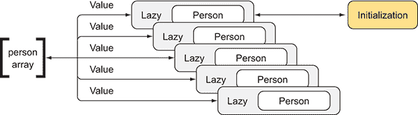

图 2.4 `Person` 对象的值仅在第一次访问`Value`属性时初始化。后续调用返回相同的缓存值。如果你有一个`Lazy<Person>`对象的数组，当访问数组中的项目时，只有第一个被初始化。其他的将重用缓存结果。

当需要实际评估表达式以使用底层对象`Person`时，你访问标识符上的`Value`属性，这将迫使`Lazy`对象的工厂委托只执行一次（如果值尚未实现）。无论连续调用多少次或多少线程同时访问懒加载初始化器，它们都等待同一个实例。为了证明这一点，列表创建了一个包含五个`Person`的数组，在`for`循环中进行初始化。在每次迭代中，通过调用标识符属性`Value`来检索`Person`对象，即使它被调用五次，输出（`Fred Flintstone`）也只被调用一次。

### 2.7.2 懒加载技术及线程安全的单例模式

在 .NET 中，懒加载被认为是一种缓存技术，因为它会记住已执行的操作的结果，程序可以通过避免重复和重复的操作来运行得更高效。

因为执行操作是在需要时进行的，更重要的是，只进行一次，所以`Lazy<T>`结构是推荐用来实现单例模式的机制。单例模式创建给定资源的单个实例，该实例在代码的多个部分中共享。这个资源只需要初始化一次，即第一次访问时，这正是`Lazy<T>`的行为。

在 .NET 中，你有不同的方法来实现单例模式，但其中某些技术存在局限性，例如无法保证线程安全或丢失懒加载实例化。4 `Lazy<T>`结构提供了一个更好、更简单的单例设计，它确保了真正的懒加载和线程安全，如下所示。

列表 2.27 使用 `Lazy<T>` 的单例模式

```
public sealed class Singleton
{
    private static readonly Lazy<Singleton> lazy =
 new Lazy<Singleton>(() => new Singleton(), true);   ①  

    public static Singleton Instance => lazy.Value;

    private Singleton()
    { }
} 
```

`Lazy<T>` 原始类型还接受一个布尔标志，作为 lambda 表达式之后的可选参数，以启用线程安全行为。这实现了一个复杂且轻量级的双重检查锁定模式。

此属性保证了对象的初始化是线程安全的。当标志被启用时，这是默认模式，无论多少线程调用 `SingletonLazyInitializer`，所有线程都将收到相同的实例，该实例在第一次调用后进行缓存。这是一个巨大的优势，没有它，你就必须手动保护并确保共享字段的线程安全。

重要的是要强调，如果懒计算的对象实现是线程安全的，这并不意味着它的所有属性也都是线程安全的。

### 2.7.3 F# 中的懒支持

F# 支持与 `Lazy<T>` 类型相同的类型，并增加了懒计算功能，该功能类型为 `Lazy<T>`，其中用于 `T` 的实际泛型类型由表达式的结果确定。F# 标准库自动强制互斥，因此当从不同的线程同时强制相同的懒值时，纯函数代码是线程安全的。F# 对 `Lazy` 类型的使用与 C# 略有不同，在 C# 中，你将函数包装在 `Lazy` 数据类型周围。此代码示例展示了 F# 中 `Lazy` 计算一个 `Person` 对象：

```
let barneyRubble = lazy( Person("barney", "rubble") ) 
printfn "%s" (barneyRubble.Force().FullName) 
```

函数 `barneyRubble` 创建了一个 `Lazy<Person>` 实例，其值尚未实现。然后，为了强制计算，你调用 `Force` 方法来按需检索值**。**

### 2.7.4 懒和 Task，强大的组合

由于性能和可扩展性的原因，在并发应用程序中，结合一个可以独立线程按需执行的懒计算非常有用。`Lazy<T>` 初始化器可以用来实现一个有用的模式，用于实例化需要异步操作的对象。让我们考虑在前一节中使用过的 `Person` 类。如果第一个和第二个名字字段是从数据库加载的，你可以应用类型 `Lazy<Task<Person>>` 来延迟 I/O 计算。有趣的是，在 `Task<T>` 和 `Lazy<T>` 之间存在共性：两者都恰好评估一次给定的表达式。

列表 2.29 初始化 `Person` 对象的懒异步操作

```
Lazy<Task<Person>> person =
 new Lazy<Task<Person>>(async () =>   ①  
    {
        using (var cmd = new SqlCommand(cmdText, conn))
        using (var reader = await cmd.ExecuteReaderAsync())
        {
            if (await reader.ReadAsync())
            {
                string firstName = reader["first_name"].ToString();
                string lastName = reader["last_name"].ToString();
                return new Person(firstName, lastName);
            }
        }
        throw new Exception("Failed to fetch Person");
    });

async Task<Person> FetchPerson()
{
 return await person.Value;   ②  
} 
```

在此示例中，委托返回一个 `Task<Person>`，它异步确定值一次，并将值返回给所有调用者。这些是最终提高程序可扩展性的设计。在示例中，此功能使用 `async-await` 关键字（在 C# 5.0 中引入）实现异步操作。第八章详细介绍了异步性和可扩展性的主题。

这是一个有用的设计，可以提高程序的可扩展性和并行性。但存在一个微妙的风险。因为 lambda 表达式是异步的，它可以在调用`Value`的任何线程上执行，表达式将在上下文中运行。更好的解决方案是将表达式包装在底层的`Task`中，这将强制在线程池线程上执行异步执行。此列表显示了首选模式。

列表 2.30 更好的模式

```
Lazy<Task<Person>> person =
    new Lazy<Task<Person>>(() => Task.Run(
        async () =>
        {
            using (var cmd = new SqlCommand(cmdText, conn))
            using (var reader = await cmd.ExecuteReaderAsync())
            {
                if(await reader.ReadAsync())
                {
                    string firstName = reader["first_name"].ToString();
                    string lastName = reader["last_name"].ToString();
                    return new Person(firstName, lastName);
                } else throw new Exception(“No record available”);
            }
        }
    )); 
```

## 摘要

+   函数组合将一个函数的结果应用于另一个函数的输入，创建一个新的函数。在 FP 中，你可以通过将复杂问题分解为更小、更简单的问题来解决复杂问题，这些问题更容易解决，然后最终将这些解决方案组合在一起。

+   闭包是其父方法中内联的委托/匿名方法，其中可以在匿名方法内部引用父方法体中定义的变量。闭包提供了一种方便的方式，即使超出作用域，也能让函数访问局部状态（该状态被封装在函数中）。它是设计包含记忆化、延迟初始化和预计算以提高计算速度的函数式编程代码段的基础。

+   记忆化是一种函数式编程技术，它维护中间计算的结果，而不是重新计算它们。它被认为是一种缓存形式。

+   预计算是一种执行初始计算的技术，该计算生成一系列结果，通常以查找表的形式。这些预计算值可以直接从算法中使用，以避免每次代码执行时进行不必要的、重复的且昂贵的计算。通常，预计算取代了记忆化，并与部分应用函数结合使用。

+   懒初始化是缓存的另一种变体。具体来说，这种技术将工厂函数的计算延迟到对象实例化所需时，仅创建一次对象。懒初始化的主要目的是通过减少内存消耗和避免不必要的计算来提高性能。

函数式数据结构和不可变性

**本章涵盖**

+   使用函数式数据结构构建并行应用程序

+   使用不可变性实现高性能、无锁的代码

+   使用函数式递归实现并行模式

+   在 C#和 F#中实现不可变对象

+   与树数据结构一起工作

数据以多种形式存在。因此，许多计算机程序围绕两个主要约束组织起来并不令人惊讶：数据和数据处理。函数式编程很好地融入了这个世界，因为从很大程度上说，这种编程范式是关于数据转换的。函数式转换允许你将一组结构化数据从其原始形式转换为另一种形式，而无需担心副作用或状态。例如，你可以使用映射函数将一组国家转换为城市集合，同时保持初始数据不变。副作用是并发编程的一个关键挑战，因为一个线程中产生的效果可能会影响另一个线程的行为。

在过去的几年里，主流编程语言添加了新功能，使多线程应用程序的开发变得更加容易。例如，微软已经将 TPL 和`async/await`关键字添加到.NET 框架中，以减少程序员在实现并发代码时的担忧。但是，当涉及多个线程时，仍然存在保护可变状态免受损坏的挑战。好消息是，FP 让你能够编写无副作用的代码来转换不可变数据。

在本章中，你将学习如何使用函数式数据结构和不可变状态编写并发代码，在并发环境中采用合适的数据结构来轻松提高性能。*函数式数据结构*通过在线程之间共享数据结构并在无需同步的情况下并行运行来提高性能。

作为本章的第一步，你将使用 C#和 F#开发一个函数式列表。这些练习对于理解不可变函数式数据结构的工作方式非常有用。接下来，我们将介绍不可变树数据结构，你将学习如何在 FP 中使用递归并行构建二叉树结构。在示例中，并行递归用于同时从网络上下载多个图像。

到本章结束时，你将利用不可变性和函数式数据结构来并行运行程序，从而更快地运行，避免共享可变状态的陷阱，如竞态条件。换句话说，如果你想实现并发和强正确性保证，你必须放弃修改。

## 3.1 现实世界示例：寻找线程不安全对象

在受控环境中构建软件通常不会导致不愉快的惊喜。不幸的是，如果你在本地机器上编写的程序被部署到不受你控制的服务器上，这可能会引入不同的变量。在生产环境中，程序可能会遇到未预料到的问题和不可预测的重负载。我相信在你的职业生涯中，你不止一次听说过，“在我的机器上它运行正常。”

当软件上线时，多个因素可能会出错，导致程序行为不可靠。不久前，我的老板打电话让我分析一个生产问题。该应用程序是一个简单的聊天系统，用于客户支持。程序使用 Web 套接字从前端直接与用 C#编写的 Windows 服务器中心点通信。建立客户端和服务器之间双向通信的底层技术是 Microsoft SignalR ([`mng.bz/Fal1`](http://mng.bz/Fal1))。参见图 3.1。

在部署到生产环境之前，程序已经通过了所有测试。然而，一旦部署，服务器的资源就承受了压力。CPU 使用率持续在 85%到 95%的容量之间，由于阻止系统对传入请求做出响应，从而对整体性能产生了负面影响。结果是不可接受的，问题需要迅速解决。

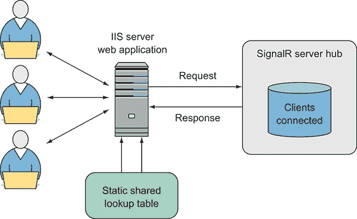

图 3.1 使用 SignalR 中心点的 Web 服务器聊天应用程序的架构。连接的客户端注册在本地静态字典（查找表）中，其实例是共享的。

正如夏洛克·福尔摩斯所说，“当你排除了所有不可能的情况，无论多么不可能，剩下的，必然是真相。”我戴上我的超级侦探帽，然后，使用一个宝贵的视角，我开始审视代码。经过调试和调查，我发现了导致瓶颈的代码部分。

我使用了一个性能分析工具来分析应用程序的性能。对应用程序进行采样和性能分析是寻找应用程序瓶颈的好起点。性能分析工具在程序运行时进行采样，检查执行时间以检查常规数据。收集到的数据是应用程序中执行最多工作的单个方法的统计性能分析表示。最终报告显示了这些方法，可以通过查找热点路径（[`mng.bz/agzj`](http://mng.bz/agzj)）来检查，大多数应用程序的工作都在这里执行。

高 CPU 核心利用率问题源于`OnConnected`和`OnDisconnected`方法中共享状态的竞争。在这种情况下，共享状态是一个通用的`Dictionary`类型，用于在内存中保持连接的用户。*线程竞争*是一种条件，其中一个线程正在等待另一个线程持有的对象被释放。等待的线程无法继续执行，直到另一个线程释放对象（它被锁定）。下面的列表显示了有问题的服务器代码。

列表 3.1 C#中的 SignalR 中心点，用于在上下文中注册连接

```
static Dictionary<Guid, string> onlineUsers =
 new Dictionary<Guid, string>();   ①  

public override Task OnConnected() {
 Guid connectionId = new Guid (Context.ConnectionId);   ②  
    System.Security.Principal.IPrincipal user = Context.User;
    string userName;
 if (!onlineUsers.TryGetValue(connectionId, out userName)){   ③  
        RegisterUserConnection (connectionId, user.Identity.Name);
 onlineUsers.Add(connectionId, user.Identity.Name);   ④  
    }
    return base.OnConnected();
}
public override Task OnDisconnected() {
    Guid connectionId = new Guid (Context.ConnectionId);
    string userName;
 if (onlineUsers.TryGetValue(connectionId, out userName)){   ③  
        DeregisterUserConnection(connectionId, userName);
 onlineUsers.Remove(connectionId);   ④  
    }
    return base.OnDisconnected();
} 
```

操作 `OnConnected` 和 `OnDisconnected` 依赖于一个共享的全局字典，在这些类型的程序中共同使用以维护本地状态。请注意，每次执行这些方法之一时，底层集合会被调用两次。程序逻辑检查 `用户连接 ID` 是否存在，并据此应用一些行为：

```
string userName;
if (!onlineUsers.TryGetValue(connectionId, out userName)){ 
```

你能看出问题吗？对于每个新的客户端请求，都会建立一个新连接，并创建一个新的 hub 实例。本地状态由一个静态变量维护，它跟踪当前用户连接，并由 hub 的所有实例共享。根据微软的文档，“静态构造函数只被调用一次，静态类在程序所在的程序域的生命周期内保持内存中。”^(1)

这里是用于用户连接跟踪的集合：

```
static Dictionary<Guid, string> onlineUsers = new Dictionary<Guid, string>(); 
```

`Guid` 是 SignalR 在客户端和服务器之间建立连接时创建的唯一连接标识符。该字符串表示在登录期间定义的用户名称。在这种情况下，程序显然是在一个多线程环境中运行的。每个传入请求都是一个新线程；因此，将会有多个请求同时访问共享状态，这最终会导致多线程问题。

MSDN 文档在这方面很明确。它说，只要集合没有被修改，`Dictionary` 集合可以支持并发多个读取者。^(2) 遍历集合本身不是线程安全的，因为一个线程可能在另一个线程更改集合状态的同时更新字典。

存在几种可能的解决方案来避免这种限制。第一种方法是使集合线程安全，并允许多个线程通过 `lock` 原语进行 `read` 和 `write` 操作。这个解决方案是正确的，但会降低性能。

更好的替代方案是在不进行同步的情况下达到相同的线程安全级别；例如，使用不可变集合。

### 3.1.1 .NET 不可变集合：一个安全解决方案

微软在 .NET Framework 4.5 中引入了不可变集合，位于 `System.Collections.Immutable` 命名空间中。这是在 .NET 4.0 中的 TPL 之后和 .NET 4.5 之后的 `async` 和 `await` 关键字之后的线程工具演变的一部分。

不可变集合遵循本章中介绍的函数式范式概念，并在多线程应用程序中提供隐式线程安全，以克服维护和控制可变状态带来的挑战。类似于并发集合，它们也是线程安全的，但底层实现不同。任何更改数据结构的操作都不会修改原始实例。相反，它们返回一个更改后的副本，并保持原始实例不变。不可变集合已经针对最大性能进行了大量优化，并使用*结构共享*^(3)模式来最小化垃圾收集器（GC）的需求。例如，以下代码片段从一个泛型可变集合创建一个不可变集合（不可变命令以粗体显示）。然后，通过更新集合以添加新项目，创建一个新的集合，而原始集合不受影响：

```
var original = new Dictionary<int, int>().**ToImmutableDictionary**();
var modifiedCollection = original.Add(key, value); 
```

在一个线程中对集合的任何更改对其他线程都是不可见的，因为它们仍然引用原始未修改的集合，这也是不可变集合天生线程安全的原因。

表 3.1 展示了为每个相关的可变泛型集合实现的一个不可变集合的实现。

表 3.1 .NET Framework 4.5 的不可变集合

| **不可变集合** | **可变集合** |
| --- | --- |
| `ImmutableList<T>` | `List<T>` |
| `ImmutableDictionary<TKey, TValue>` | `Dictionary<TKey, TValue>` |
| `ImmutableHashSet<T>` | `HashSet<T>` |
| `ImmutableStack<T>` | `Stack<T>` |
| `ImmutableQueue<T>` | `Queue<T>` |

这里有两种创建不可变列表的方法。

列表 3.2 构建.NET 不可变集合

```
var list = ImmutableList.Create<int>();   ①  
list = list.Add(1);   ②  
list = list.Add(2);
list = list.Add(3);

var builder = ImmutableList.CreateBuilder<int>();   ③  
builder.Add(1);   ④  
builder.Add(2);
builder.Add(3);
list = builder.ToImmutable();   ⑤   
```

第二种方法通过创建一个临时列表构建器来简化列表的构建，该构建器用于向列表添加元素，然后将元素密封（冻结）到不可变结构中。

关于原始聊天程序中的数据损坏（竞态条件）问题，不可变集合可以在 Windows 服务器中心用于维护打开的 SignalR 连接的状态。这可以通过多线程访问安全地完成。幸运的是，`System.Collections.Immutable`命名空间包含用于查找的`Dictionary`的等效版本：`ImmutableDictionary.`。

你可能会问，“但如果集合是不可变的，它是如何更新的同时保持线程安全的？”你可以在涉及读取或写入集合的操作周围使用锁语句。使用锁构建线程安全的集合很简单；但这是一种比所需更昂贵的方法。更好的选择是使用单个比较和交换（CAS）操作来保护写入，这消除了对锁的需求，并使读取操作不受保护。这种无锁技术比对应技术（使用同步原语）更可扩展，性能更好。

#### CAS 操作

CAS 是一种在多线程编程中使用的特殊指令，作为同步的一种形式，它以原子方式对内存位置执行操作。原子操作要么作为一个单元成功，要么失败。

*原子性* 指的是在单步中改变状态的操作，使得结果自主，观察结果要么是完成要么是没有完成，没有中间状态。其他并行线程只能看到旧状态或新状态。当一个原子操作在一个共享变量上执行时，线程无法观察到其修改直到它完成。实际上，原子操作读取的是在某一时刻出现的值。原始的原子操作是机器指令，可以通过 .NET 中的 `System.Threading.Interlocked` 类暴露，例如 `Interlocked.CompareExchange` 和 `Interlocked.Increment` 方法。

CAS 指令在不需要获取和释放锁的情况下修改共享数据，并允许极高的并行级别。这正是不可变数据结构真正发光的地方，因为它们最小化了发生 ABA 问题的可能性（[`en.wikipedia.org/wiki/ABA_problem`](https://en.wikipedia.org/wiki/ABA_problem)）。

理念是将必须改变的状态包含在一个单一且最重要的是隔离的不可变对象（在这种情况下，是 `ImmutableDictionary`）中。因为对象是隔离的，所以没有状态共享；因此，没有需要同步的内容。

下面的列表展示了名为 `Atom` 的辅助对象的实现。这个名字受到了 Clojure 原子（[`clojure.org/reference/atoms`](https://clojure.org/reference/atoms)）的启发，它内部使用 `Interlocked.CompareExchange` 操作符来执行原子 CAS 操作。

列表 3.3 执行 CAS 指令的 `Atom` 对象

```
public sealed class Atom<T> where T : class   ①  
{
    public Atom(T value)
    {
        this.value = value;
    }
 private volatile T value;
 public T Value => value;   ②  

 public T Swap(Func<T, T> factory)   ③  
    {
        T original, temp;
        do {
            original = value;
            temp = factory (original);
        }
        while (Interlocked.CompareExchange(ref value, temp, original) 
➥ != original);   ④  
        return original;
    }
} 
```

`Atom` 类封装了一个标记为 `volatile` 的类型 `T` 的引用对象，为了实现正确的值交换行为，该对象必须是不可变的。`Value` 属性用于读取包装对象的当前状态。`Swap` 函数的目的是执行 CAS 指令，通过 `factory` 委托将基于前一个值的新值传递给此函数的调用者。CAS 操作接受一个旧值和一个新值，并且只有当当前值等于传入的旧值时，才原子地将 `Atom` 设置为新值。如果 `Swap` 函数无法使用 `Interlocked.CompareExchange` 设置新值，它将继续重试，直到成功。

列表 3.4 展示了如何在 SignalR 服务器端点的上下文中使用 `Atom` 类和 `ImmutableDictionary` 对象。代码仅实现了 `OnConnected` 方法。同样的概念也适用于 `OnDisconnected` 函数。

列表 3.4 使用 `Atom` 对象的线程安全 `ImmutableDictionary`

```
Atom<ImmutableDictionary<Guid, string>> onlineUsers =
    new Atom<ImmutableDictionary<Guid, string>>
 (ImmutableDictionary<Guid, string>.Empty);   ①  

public override Task OnConnected() {
    Grid connectionId = new Guid (Context.ConnectionId);
    System.Security.Principal.IPrincipal user = Context.User;

 var temp = onlineUsers.Value;   ②  
 if(onlineUsers.Swap(d => {   ③  
                    if (d.ContainsKey(connectionId)) return d;
                    return d.Add(connectionId, user.Identity.Name);
 }) != temp) {   ④  
        RegisterUserConnection (connectionId, user.Identity.Name);
    }
    return base.OnConnected();
} 
```

`Atom Swap`方法封装了对底层`Immutable­Dictionary`的更新调用。`Atom Value`属性可以在任何时候访问，以检查当前打开的 SignalR 连接。此操作是线程安全的，因为它只读。`Atom`类是泛型的，它可以用来原子地更新任何类型。但是不可变集合有一个专门的辅助类（将在下文中描述）。

#### `ImmutableInterlocked`类

由于您需要以线程安全的方式更新不可变集合，Microsoft 引入了`ImmutableInterlocked`类，该类可在`System.Collections.Immutable`命名空间中找到。此类提供了一组函数，用于处理使用之前提到的 CAS 机制更新不可变集合。它公开了与`Atom`对象相同的功能。在此列表中，`Immutable­Dictionary`替换了`Dictionary`。

列表 3.5 使用`ImmutableDictionary`维护打开连接的中心

```
static ImmutableDictionary<Guid, string> onlineUsers =
 ImmutableDictionary<Guid, string>.Empty;   ①  

public override Task OnConnected() {
    Grid connectionId = new Guid (Context.ConnectionId);
    System.Security.Principal.IPrincipal user = Context.User;

    if(ImmutableInterlocked.TryAdd (ref onlineUsers, 
➥ connectionId, user.Identity.Name)) {   ②  
        RegisterUserConnection (connectionId, user.Identity.Name);
    }
    return base.OnConnected();
}
public override Task OnDisconnected() {
    Grid connectionId = new Guid (Context.ConnectionId);
    string userName;
    if(ImmutableInterlocked.TryRemove (ref onlineUsers, 
➥ connectionId, out userName)) {   ③  
        DeregisterUserConnection(connectionId, userName);
    }
    return base.OnDisconnected();
} 
```

更新`ImmutableDictionary`是原子性的，这意味着在这种情况下，只有当用户连接不存在时才会添加。随着这一变化，SignalR 中心工作正常且无锁，服务器 CPU 利用率没有大幅上升。但是，使用不可变集合进行频繁更新的代价是存在的。例如，使用`ImmutableInterlocked`将 100 万用户添加到`ImmutableDictionary`所需的时间是 2.518 秒。这个值在大多数情况下可能是可接受的，但如果您旨在构建一个高性能的系统，那么进行研究和采用正确的工具进行工作是非常重要的。

通常，不可变集合的使用非常适合不同线程之间的共享状态，当更新次数较低时。它们的值（状态）保证是线程安全的；它可以在额外的线程之间安全地传递。如果您需要一个必须同时处理许多更新的集合，则更好的解决方案是利用.NET 并发集合。

### 3.1.2 .NET 并发集合：一个更快的解决方案

在.NET 框架中，`System.Collections.Concurrent`命名空间提供了一组线程安全的集合，旨在简化对共享数据的线程安全访问。并发集合是可变的集合实例，旨在提高多线程应用程序的性能和可伸缩性。由于它们可以同时被多个线程安全地访问和更新，因此建议在多线程程序中使用它们，而不是`System.Collections.Generic`中类似集合。表 3.2 显示了.NET 中可用的并发集合。

表 3.2 并发集合详细信息

| **并发集合** | **实现细节** | **同步技术** |
| --- | --- | --- |
| `ConcurrentBag<T>` | 类似于泛型列表 | 如果检测到多个线程，则使用原始监视器协调它们的访问；否则，避免同步。 |
| `ConcurrentStack<T>` | 使用单链表实现的泛型栈 | 使用 CAS 技术实现无锁。 |
| `ConcurrentQueue<T>` | 使用数组段链表实现的泛型队列 | 使用 CAS 技术实现无锁。 |
| `ConcurrentDictionary<K, V>` | 使用哈希表实现的泛型字典 | 读取操作无锁；更新操作使用锁同步。 |

回到“寻找线程不安全对象”的 SignalR hub 示例，`ConcurrentDictionary`比不安全的`Dictionary`更好，而且由于频繁和大量的更新，它也比`ImmutableDictionary`更好。实际上，`System.Collections.Concurrent`已经设计为使用细粒度^(5)和锁-free 模式来提高性能。这些技术确保访问并发集合的线程被阻塞的时间最短，或者在某些情况下，完全避免阻塞。

`ConcurrentDictionary`可以在处理每秒多个请求的同时确保可伸缩性。您可以使用方括号索引像传统的泛型`Dictionary`一样分配和检索值，但`ConcurrentDictionary`还提供了一些并发友好的方法，例如`AddOrUpdate`或`GetOrAdd`。`AddOrUpdate`方法接受一个键和一个值参数，以及一个代表参数。如果键不在字典中，它将使用值参数插入。如果键在字典中，将调用代表，并使用结果值更新字典。在代表中提供您要执行的操作也是线程安全的，这消除了另一个线程在您从字典中读取值和写入另一个值之间更改字典的风险。

在以下列表中，`ConcurrentDictionary`在 SignalR hub 中保持打开连接的状态。

列表 3.6 使用`ConcurrentDictionary`维护打开的连接

```
static ConcurrentDictionary<Guid, string> onlineUsers =
 new ConcurrentDictionary<Guid, string>();   ①  

public override Task OnConnected() {
    Grid connectionId = new Guid (Context.ConnectionId);
    System.Security.Principal.IPrincipal user = Context.User;

 if(onlineUsers.TryAdd(connectionId, user.Identity.Name)) {   ②  
        RegisterUserConnection (connectionId, user.Identity.Name);
    }
    return base.OnConnected();
}

public override Task OnDisconnected() {
    Grid connectionId = new Guid (Context.ConnectionId);
    string userName;
 if(onlineUsers.TryRemove (connectionId, out userName)) {   ③  
        DeregisterUserConnection(connectionId, userName);
    }
    return base.OnDisconnected();
} 
```

代码看起来与使用`ImmutableDictionary`的代码列表（列表 3.5）相似，但在添加和删除许多连接（`connection`）的性能上更快。例如，将 100 万用户添加到`ConcurentDictionarry`所需的时间仅为 52 毫秒，而`ImmutableDictionary`则需要 2.518 秒。这个值在许多情况下可能足够好，但如果您想构建一个高性能的系统，那么研究和采用正确的工具是非常重要的。

您需要了解这些集合是如何工作的。最初，由于它们的可变特性，似乎这些集合在使用时没有采用任何 FP 风格。但是，集合创建了一个内部快照，模拟了临时的不可变性，以在迭代期间保持线程安全，允许安全地枚举快照。

并发集合与考虑生产者/消费者^(6) 实现的算法配合良好。*生产者/消费者模式*旨在将工作负载在一名或多名生产者和一名或多名消费者之间进行分区和平衡。一个*生产者*在一个独立的线程中生成数据并将其插入到队列中。一个*消费者*运行一个并行的单独线程，从队列中消费数据。例如，一个生产者可以下载图片并将它们存储在一个由执行图像处理的消费者访问的队列中。这两个实体独立工作，如果生产者的工作负载增加，你可以启动一个新的消费者来平衡工作负载。生产者/消费者模式是应用最广泛的并行编程模式之一，它将在第七章中讨论和实现。

### 3.1.3 代理消息传递模式：更快、更好的解决方案

“寻找线程不安全对象”的最终解决方案是在 SignalR 中心引入本地代理，它提供了异步访问以在高流量访问期间保持高可伸缩性。代理是一个计算单元，一次处理一条消息，消息是异步发送的，这意味着发送者不需要等待答案，因此没有阻塞。在这种情况下，字典被隔离，只能由代理访问，它以单线程方式更新集合，消除了数据损坏的风险和锁的需求。这个修复是可伸缩的，因为代理的异步语义操作可以每秒处理 300 万条消息，代码运行得更快，因为它消除了使用同步的额外开销。

在第十一章中讨论了使用代理和消息传递进行编程。如果你不完全理解代码，不要担心；在这次旅程中它会变得清晰，你始终可以参考附录 B。与之前的解决方案相比，这种方法需要更少的代码更改，但不会影响应用程序的性能。此列表显示了在 F#中实现代理的方法。

列表 3.7 确保对可变状态线程安全访问的 F#代理

```
type AgentMessage =   ①  
    | AddIfNoExists of id:Guid * userName:string
    | RemoveIfNoExists of id:Guid

type AgentOnlineUsers() =
    let agent = MailboxProcessor<AgentMessage>.Start(fun inbox ->
 let onlineUsers = Dictionary<Guid, string>()   ②  
        let rec loop() = async {
            let! msg = inbox.Receive()
            match msg with
 | AddIfNoExists(id, userName) ->   ③  
 let exists, _ = onlineUsers.TryGetValue(id)   ④  
 if not exists = true then
                    onlineUsers.Add(id, userName)
                    RegisterUserConnection (id, userName)
 | RemoveIfNoExists(id) ->   ③  
 let exists, userName = onlineUsers.TryGetValue(id)   ④  
                if exists = true then
                    onlineUsers.Remove(id) |> ignore
                    DeregisterUserConnection(id, userName)
            return! loop() }
        loop() ) 
```

在以下列表中，重构的 C#代码使用了最终解决方案。由于.NET 编程语言之间的互操作性，可以使用一种语言开发库，而另一种语言可以访问它。在这种情况下，C#使用`MailboxProcessor`（`Agent`）代码访问 F#库。

列表 3.8 使用 F#代理的 C# SignalR 中心

```
static AgentOnlineUsers onlineUsers = new AgentOnlineUsers()   ①  

public override Task OnConnected() {
    Guid connectionId = new Guid (Context.ConnectionId);
    System.Security.Principal.IPrincipal user = Context.User;

 onlineUsers.AddIfNoExists(connectionId, user.Identity.Name);   ②  
    return base.OnConnected();
}
public override Task OnDisconnected() {
    Guid connectionId = new Guid (Context.ConnectionId);

 onlineUsers.RemoveIfNoExists(connectionId);   ②  
    return base.OnDisconnected();
} 
```

总结来说，最终解决方案通过将 CPU 消耗大幅降低到几乎为零(图 3.2)解决了问题。

从这次经验中得到的启示是，在多线程环境中共享可变状态不是一个好主意。最初，`Dictionary` 集合必须维护当前在线的用户连接；可变性几乎是必需的。你可以使用一个不可变结构的功能方法，但相反，为每次更新创建一个新的集合，这可能是过度设计。更好的解决方案是使用代理来隔离可变性，并使代理可以从调用方法中访问。这是一种使用代理的自然线程安全性的功能方法。

这种方法的结果是可扩展性的增加，因为访问是异步的，不会阻塞，并且它允许你轻松地在代理体中添加逻辑，例如记录日志和错误处理。

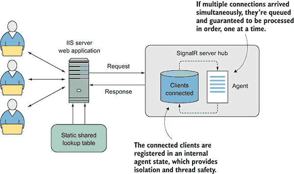

图 3.2 使用 SignalR hub 的聊天应用程序的 Web 服务器架构。与图 3.1 相比，此解决方案移除了在多个线程之间共享的可变字典，以处理传入的请求。为了替换字典，有一个本地代理保证了在此多线程场景中的高可扩展性和线程安全性。

## 3.2 在线程间安全地共享功能性数据结构

*持久性数据结构*（也称为*功能性数据结构*）是一种数据结构，其中没有任何操作会导致底层结构发生永久性更改。*持久性*意味着所有修改过的结构版本都会随着时间的推移而持续存在。换句话说，这样的数据结构是不可变的，因为更新操作不会修改数据结构，而是返回一个新的具有更新值的结构。

在数据方面，持久性通常被误解为将数据存储在物理实体中，例如数据库或文件系统。在函数式编程（FP）中，功能性数据结构是持久的。大多数传统的命令式数据结构（例如来自 `System.Collections.Generic:` 的 `Dictionary`、`List`、`Queue`、`Stack` 等等）是短暂的，因为它们的状态仅在更新之间存在很短的时间。更新是破坏性的，如图 3.3 所示。

功能性数据结构保证无论结构是否被不同的执行线程或甚至不同的进程访问，都能保持一致的行为，无需担心数据可能的变化。持久性数据结构不支持破坏性更新，而是保留数据结构的旧版本。

可以理解的是，与传统命令式数据结构相比，纯函数式数据结构在内存分配上非常密集，这导致了性能的显著下降。幸运的是，持久数据结构在设计时考虑了效率，通过仔细地在数据结构的版本之间重用公共状态。这是通过使用函数式数据结构的不可变性实现的：因为它们永远不会改变，所以重用不同版本是毫不费力的。你可以通过引用现有数据而不是复制它，从旧数据的一部分组合成一个新的数据结构。这种技术被称为*结构共享*（见 3.3.5 节）。这种实现比每次更新时创建新的数据副本更加高效，从而提高了性能。

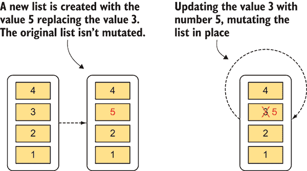

图 3.3 列表的破坏性更新与持久更新。右侧的列表正在原地更新，将值 3 替换为 5，而不保留原始列表。这个过程也被称为破坏性更新。左侧的函数式列表不修改其值，而是创建一个包含更新值的新列表。

## 3.3 更改的不可变性

在《有效处理遗留代码》一书中，作者迈克尔·费瑟斯将面向对象编程（OOP）和函数式编程（FP）比较如下：

> 面向对象编程通过封装移动部分使代码易于理解。函数式编程通过最小化移动部分使代码易于理解。

— 迈克尔·费瑟斯，有效处理遗留代码（普伦蒂斯·霍尔，2004 年）

这意味着不可变性最小化了代码中需要更改的部分，使得推理这些部分的行为变得更加容易。*不可变性*使函数式代码免受副作用的影响。共享变量，作为副作用的一个例子，是创建并行代码的一个严重障碍，并导致非确定性执行。通过消除副作用，你可以拥有良好的编码方法。

例如，在.NET 中，框架设计者决定使用函数式方法将`string`构建为不可变对象，以使编写更好的代码变得更加容易。正如你所回忆的，不可变对象是指创建后其状态不能被修改的对象。在编码风格中采用不可变性以及由此产生的学习曲线需要额外的关注；但结果将得到更简洁的代码语法和简化（减少不必要的样板代码），这将非常值得努力。此外，采用这种数据转换而非数据修改的方法，可以显著降低代码中错误的可能性，并且代码库不同部分之间的交互和依赖关系更容易管理。

将不可变对象作为编程模型的一部分，迫使每个线程处理其自己的数据副本，这有助于编写正确的并发代码。此外，如果访问是只读的，则可以安全地让多个线程同时访问共享数据。实际上，因为你不需要锁或同步技术，所以可能的死锁和竞态条件的风险永远不会发生（图 3.4）。我们在第一章讨论了这些技术。

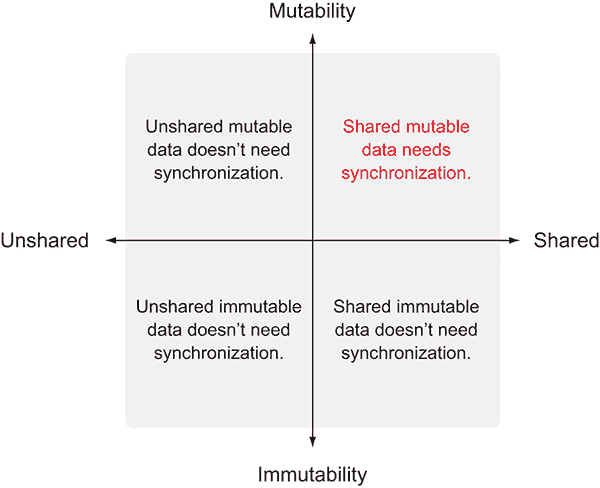

图 3.4 使用可变或不可变状态与共享或非共享状态结合的笛卡尔表示

函数式语言，如 F#，默认是不可变的，这使得它们非常适合并发。不可变性不会立即使你的代码运行得更快或使你的程序大规模可扩展，但它确实为你的代码在代码库中做小的改动后并行化做好了准备。

在面向对象的语言，如 C# 和 Java 中，编写并发应用程序可能很困难，因为可变性是默认行为，而且没有工具可以帮助防止或抵消它。在命令式编程语言中，可变数据结构被认为是完全正常的，尽管全局状态不被推荐，但可变状态通常在程序的不同区域之间共享。这在并行编程中是一个灾难性的配方。幸运的是，如前所述，C# 和 F# 编译后共享相同的中间语言，这使得功能共享变得容易。你可以在 F# 中定义程序的领域和对象，利用其类型和简洁性（最重要的是，其类型默认是不可变的），例如。然后，用 C# 开发你的程序以使用 F# 库，这保证了不可变行为而无需额外的工作。

不变性是构建并发应用程序的重要工具，但使用不可变类型并不会使程序运行得更快。但它确实使代码准备好并行执行；不可变性促进了更高程度的并发，这在多核计算机中转化为更好的性能和速度。不可变对象可以在多个线程之间安全地共享，避免了锁同步的需要，这可以使程序并行运行。

.NET 框架提供了几种不可变类型——有些是函数式的，有些可用于多线程程序，有些两者都是。表 3.3 列出了这些类型的特性，这些内容将在本章后面讨论。

表 3.3 .NET 框架不可变类型的特性

| **类型** | **.NET 语言** | **是否是函数式** | **特性** | **线程安全** | **利用率** |
| --- | --- | --- | --- | --- | --- |
| F# 列表 | F# | 是 | 快速追加插入的不可变链表 | 是 | 与递归结合用于构建和遍历 *n*-元素列表 |
| 数组 | C# 和 F# | 否 | 存储在连续内存位置中的零索引可变数组类型 | 是，带有分区^(a)  | 高效的数据存储，用于快速访问 |
| 并发集合 | C# 和 F# | 否 | 优化多线程读写访问的集合集 | 是 | 多线程程序中的共享数据；非常适合生产者/消费者模式 |
| 不可变集合 | C# 和 F# | 是 | 一组使处理并行计算环境更容易的集合；它们的值可以在不同的线程之间自由传递，而不会产生数据损坏 | 是 | 在涉及多个线程时保持状态可控 |
| 区分联合（DU） | F# | 是 | 表示存储几种可能选项之一的数据类型 | 是 | 常用于建模领域和表示像抽象语法树这样的层次结构 |
| 元组 | C# 和 F# | 是 | 将两个或更多任意（可能不同）类型的值组合在一起的类型 | 否 | 用于从函数返回多个值 |
| F# 元组 | F# | 是 |  | 是 |  |
| 记录类型 | F# | 是 | 表示命名值属性聚合的类型；可以看作是具有命名成员的元组，可以使用点符号访问 | 是 | 用作提供不可变语义的常规类的替代品；非常适合领域设计，如 DU，并且可以在 C# 中使用 |
|  |

### 3.3.1 用于数据并行的函数数据结构

不可变数据结构非常适合数据并行，因为它们以高效的无拷贝方式促进了不同任务之间的数据共享。实际上，当多个线程并行访问可分数据时，不可变性在安全处理属于同一结构但看似孤立的各个数据块方面起着基本作用。通过采用函数纯净性，即使用避免副作用的函数而不是不可变性，可以实现相同级别的正确数据并行性。

例如，PLINQ 的底层功能促进了 *纯净性*。一个函数是纯净的，当它没有副作用，并且其返回值仅由其输入值决定时。

PLINQ 是一种位于多线程组件之上的高级抽象语言，它抽象了底层细节，同时仍然暴露了简化的 LINQ 语义。PLINQ 的目标是减少执行时间并提高查询的整体性能，利用所有可用的计算机资源。（PLINQ 在第五章中有详细说明。）

### 3.3.2 使用不可变性的性能影响

某些程序员认为使用不可变对象进行编程效率低下，并且有严重的性能影响。例如，将元素添加到列表的纯函数式方法是返回一个包含新元素的新列表副本，而原始列表保持不变。这可能会增加 GC 的内存压力。因为每次修改都会返回一个新的值，GC 必须处理大量短生命周期的变量。但是，因为编译器知道现有数据是不可变的，并且因为数据不会改变，编译器可以通过部分或全部重用集合来优化内存分配。因此，使用不可变对象对性能的影响最小，几乎无关紧要，因为典型的对象副本，代替传统的修改，创建了一个浅拷贝。这样，原始对象引用的对象不会被复制；只有引用被复制，这是原始对象的一个小的位操作副本。

与线程安全保证带来的好处相比，与今天 CPU 的速度相比，这几乎是一个微不足道的代价。需要考虑的一个缓解因素是，目前，性能转化为并行编程，这需要更多对象的复制和更大的内存压力。

### 3.3.3 C#中的不可变性

在 C#中，不可变性不是一个受支持的构造。但是，在 C#中创建不可变对象并不困难；问题在于编译器不会强制执行这种风格，程序员必须通过代码来实现。在 C#中采用不可变性需要额外的努力和更多的细心。在 C#中，可以通过使用关键字`const`或`readonly`*.*来创建不可变对象。

任何字段都可以用`const`关键字进行修饰；唯一的前提是赋值和声明是单行语句。一旦声明并赋值，`const`值就不能更改，并且它属于类级别，直接访问它，而不是通过实例。

另一个选项是在类实例化时使用 `readonly` 关键字装饰值，可以内联进行或通过构造函数进行。在标记为 `readonly` 的字段初始化后，其值不能更改，并且可以通过类的实例访问其值。更重要的是，当属性或状态需要更改时，为了保持对象不可变，你应该使用更新后的状态创建原始对象的新实例。记住，C# 中的 `readonly` 对象是第一级不可变和浅不可变的。在 C# 中，一个对象是浅不可变的，当其不可变性不能保证所有字段和属性时，但只保证对象本身。如果一个 `Person` 对象有一个只读属性 `Address`，它是一个复杂的对象，暴露了如街道、城市和 ZIP 码等属性，那么如果这些属性没有标记为只读，它们不会继承不可变行为。相反，所有字段和属性都标记为只读的不可变对象是深不可变的。

这个列表展示了 C# 中的不可变类 `Person`。

列表 3.9 C# 中的浅不可变类 `Person`

```
class Address{
    public Address(string street, string city, string zipcode){
        Street = street;
        City = city;
        ZipCode = zipcode;
    }
 public string Street;   ①  
 public string City;   ①  
 public string ZipCode;   ①  
}
class Person {
    public Person(string firstName, string lastName, int age, 
➥ Address address){
        FirstName = firstName;
        LastName = lastName;
        Age = age;
        Address = address;
    }
 public readonly string FirstName;   ②  
 public readonly string LastName;   ②  
 public readonly int Age;   ②  
 public readonly Address Address;   ②  
} 
```

在这段代码中，`Person` 对象是浅不可变的，因为尽管字段 `Address` 不可修改（它被标记为只读），但其底层字段可以更改。实际上，你可以创建 `Person` 和 `Address` 对象的实例，如下：

```
Address address = new Address("Brown st.", "Springfield", "55555");
Person person = new Person("John", "Doe", 42, address); 
```

现在，如果你尝试修改字段 `Address`，编译器会抛出一个异常（粗体），但你仍然可以修改对象 `address.ZipCode` 的字段：

```
person.Address = **// Error**
person.Address.ZipCode = "77777"; 
```

这是一个浅不可变对象的例子。微软意识到在现代环境中使用不可变性编程的重要性，并引入了一个功能，可以轻松地使用 C# 6.0 创建不可变类。这个功能称为 *只读属性自动属性*，它允许你声明没有设置器方法的自动属性，这会隐式地创建一个 `readonly` 后备字段。不幸的是，这实现了浅不可变行为。

列表 3.10 使用只读属性自动属性的 C# 不可变类

```
class Person {
    public Person(string firstName, string lastName, int age, 
➥ Address address){
        FirstName = firstName;
        LastName = lastName;
        Age = age;
        Address = address;
    }

 public string FirstName {get;}   ①  
 public string LastName {get;}   ①  
 public int Age {get;}   ①  
 public Address Address {get;}   ①  

 public Person ChangeFirstName(string firstName) {   ②  
        return new Person(firstName, this.LastName, this.Age, this.Address);
    }
 public Person ChangeLstName(string lastName) {   ②  
        return new Person(this.FirstName, lastName, this.Age, this.Address);
    }
 public Person ChangeAge(int age) {   ②  
        return new Person(this.FirstName, this.LastName, age, this.Address);
    }
 public Person ChangeAddress(Address address) {   ②  
        return new Person(this.firstName, this.LastName, this.Age, address);
    }
} 
```

在这个 `Person` 类的不可变版本中，重要的是要注意，负责更新 `FirstName`、`LastName`、`Age` 和 `Address` 的方法不会修改任何状态；相反，它们会创建一个新的 `Person` 实例。在面向对象编程中，对象是通过调用构造函数来实例化的，然后通过更新属性和调用方法来设置对象的状态。这种方法导致了一个不便且冗长的构造语法。这就是添加到 `Change` `Person` 对象属性的功能发挥作用的地方。使用这些函数，可以采用链式模式，这被称为 *流畅接口*。以下是一个创建 `Person` 类实例并更改年龄和地址的示例模式：

```
Address newAddress = new Address("Red st.", "Gotham", "123459");
Person john = new Person("John", "Doe", 42, address);
Person olderJohn = john.ChangeAge(43).ChangeAddress(newAddress); 
```

总结来说，要在 C# 中使一个类不可变，你必须：

+   总是设计一个具有设置对象状态所使用的参数的构造函数的类。

+   将字段定义为只读，并使用没有公共设置器的属性；值将在构造函数中分配。

+   避免任何旨在修改类内部状态的方法。

### 3.3.4 F# 中的不可变性

如前所述，编程语言 F# 默认是不可变的。因此，变量的概念不存在，因为根据定义，如果变量是不可变的，那么它就不是变量。F# 用标识符替换变量，该标识符通过关键字 `let` 与值关联（绑定）。在此关联之后，值不能改变。除了完整的不可变集合之外，F# 还内置了一系列有助于纯函数式编程的不可变构造，如列表 3.11 所示。这些内置类型是 `tuple` 和 `record`，并且它们在 `CLI` 类型之上具有许多优点：

+   它们是不可变的。

+   它们不能为 `null`。

+   它们具有内置的结构相等性和比较。

此列表展示了在 F# 中使用不可变类型。

列表 3.11 F# 不可变类型

```
let point = (31, 57)   ①  
let (x,y) = point   ②  

type Person= { First : string; Last: string; Age:int}   ③  
let person = { First="John"; Last="Doe"; Age=42}   ④   
```

类型 `tuple` 是一组无名的有序值集合，可以是不同异构的([`en.wikipedia.org/wiki/Homogeneity_and_heterogeneity`](https://en.wikipedia.org/wiki/Homogeneity_and_heterogeneity))类型。`Tuple` 有即用即用的优点，非常适合定义包含任意数量元素的临时和轻量级结构。例如，(true, “Hello”, 2, 3.14) 是一个四元组。

````The type `record` is similar to `tuple`, where each element is labeled, giving a name to each of the values. The advantage of `record` over `tuple` is that the labels help to distinguish and to document what each element is for. Moreover, the properties of a record are automatically created for the fields defined, which is convenient because it saves keystrokes. A record in F# can be considered as a C# class with all properties read-only. Most valuable is the ability to correctly and quickly implement immutable classes in C# by using this type. In fact, it’s possible to create an F# library in your solution by creating your domain model using the `record` type and then reference this library into your C# project. Here’s how C# code looks when it references the F# library with the `record` type:    ``` Person person = new Person("John", "Doe", 42)  ```    This is a simple and effective way to create an immutable object. Additionally, the F# implementation requires only one line of code, compared to the equivalent in C# (11 lines of code using read-only fields).    ### 3.3.5 Functional lists: linking cells in a chain    The most common and generally adopted*functional data structure*is the list, which is a series of homogeneous types used to store an arbitrary number of items. In FP, lists are recursive data structures composed by two linked elements: `Head` or `Cons` and `Tail`. The purpose of `Cons` is to provide a mechanism to contain a value and a connection to other `Cons` elements via an object reference pointer. This pointer reference is known as the `Next` pointer.**   **Lists also have a special state called `nil` to represent a list with no items, which is the last link connected to anything. The `nil`, or empty, case is convenient during a recursive traverse of a list to determine its end. Figure 3.5 shows a constructed list of four `Cons` cells and an empty list. Each cell (`Head`) contains a number and a reference to the remaining list (`Tail`), until the last `Cons` cell, which defines an empty list. This data structure is similar to a singly linked list ([`en.wikipedia.org/wiki/Linked_list`](https://en.wikipedia.org/wiki/Linked_list)), where each node in the chain has a single link to another node, representing a series of nodes linked together into a chain.  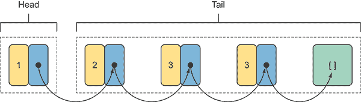    Figure 3.5 Functional list of integers composed by four numbers and an empty list (the last box [ ] on the right). Each item has a reference, the black arrow, linked to the rest of the list. The first item on the left is the head of the list, which is linked to the rest of the list, the tail.      In functional lists, the operations to add new elements or remove existing elements don’t modify the current structure but return a new one with the updated values. Under the hood, immutable collections can safely share common structures, which limits memory consumption. This technique is called *structural sharing*. Figure 3.6 shows how structural sharing minimizes memory consumption to generate and update functional lists.  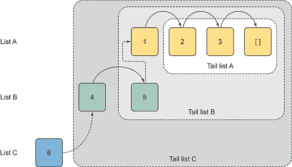    Figure 3.6 The structural sharing technique to create new lists optimizing memory space. In summary, List A has three items plus an empty cell, List B has five, and List C six. Each item is linked to the rest of the list. For example, the head item of List B is the number 4, which is linked to the tail (the numbers 5,1, 2, 3, and [ ]).      In figure 3.6, List A is composed of three numbers and an empty list. By adding two new items to List A, the structural sharing technique gives the impression that a new List B is created, but in reality it links a pointer from the two items to the previous and unmodified List A. The same scenario repeats for List C. At this point, all three lists (A, B, and C) are accessible, each with its own elements.    Clearly, functional lists are designed to provide better performance by adding or removing items from the head. In fact, lists work well for linear traversal, and appending performs in constant time O(1) because the new item is added to the head of the previous list. But it isn’t efficient for random access because the list must be traversed from the left for each lookup, which has O(*n*) time, where *n* is the number of elements in the collection.    A new list is created by prepending a new element to an existing list by taking an empty list as initial value, and then linking the new element to the existing list structure. This operation to `Cons` onto the head of the list is repeated for all items, and consequently, every list terminates with an empty state.    One of the biggest attractions of functional lists is the ease with which they can be used to write thread-safe code. In fact, functional data structures can be passed by reference to a callee with no risk of it being corrupted, as shown in figure 3.7.  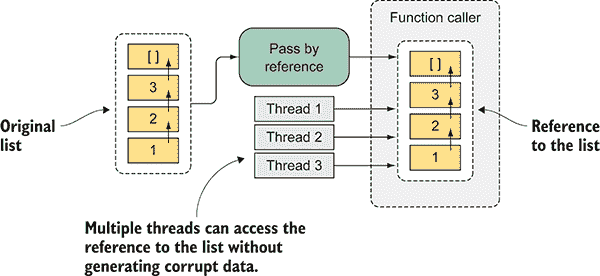    Figure 3.7 The list is passed by reference to the function caller (callee). Because the list is immutable, multiple threads can access the reference without generating any data corruption.      By definition, to be thread safe, an object must preserve a consistent state every time it’s observed. You shouldn’t observe a data structure collection removing an item from it while in the middle of a resize, for example. In a multithreaded program, applying the execution against an isolated portion of a functional data structure is an excellent and safe way to avoid sharing data.    #### Functional lists in F#    F# has a built-in implementation of an immutable list structure, which is represented as a *linked list* (a linear data structure that consists of a set of items linked together in a chain). Every programmer has written a linked list at one point. In the case of functional lists, however, the implementation requires a little more effort to guarantee the immutable behavior that the list never changes once created. Fortunately, the representation of a list in F# is simple, taking advantage of the support for algebraic data types (ADT) ([`en.wikipedia.org/wiki/Algebraic_data_type`](https://en.wikipedia.org/wiki/Algebraic_data_type)) that let you define a generic recursive `List` type.    An ADT is a composite type, which means that its structure is the result of combining other types. In F#, ADTs are called *discriminated unions* (DU), and they’re a precise modeling tool to represent well-defined sets of data shapes under the same type. These different shapes are called *cases* of a DU.    Think about a representation of the motor vehicle domain, where the types `Car` and `Truck` belong to the same base type `Vehicle`. DUs fit well for building complicated data structures (like linked lists and a wide range of trees) because they’re a simpler alternative to a small-object hierarchy. For example, this is a DU definition for the domain `Vehicle`:    ``` type Vehicle=     | Motorcycle of int     | Car of int     | Truck of int  ```    You can think of DUs as a mechanism to provide additional semantic meaning over a type. For example, the previous DU can be read as “A Vehicle type that can be a Car, a Motorcycle, or a Truck.”    The same representation in C# should use a `Vehicle` base class with derived types for `Car`, `Truck`, and `Motorcycle`. The real power of a DU is when it’s combined with pattern matching to branch to the appropriate computation, depending on the discriminated case passed. The following F# function prints the number of wheels for the vehicle passed:    ``` let printWheels vehicle =     match vehicle with     | Car(n) -> Console.WriteLine("Car has {0} wheels", n)     | Motorcycle(n) -> Console.WriteLine("Motorcycle has {0} wheels", n)     | Truck(n) -> Console.WriteLine("Truck has {0} wheels", n)  ```    This listing represents a recursive list, using the F# DU that satisfies the definition given in the previous section. A list can either be empty or is formed by an element and an existing list.    Listing 3.13  Representation of a list in F# using discriminated unions    ``` type FList<'a> =  | Empty   ①    | Cons of head:'a * tail:FList<'a>   ②    let rec map f (list:FList<'a>) =   ③       match list with     | Empty -> Empty     | Cons(hd,tl) -> Cons(f hd, map f tl)  let rec filter p (list:FList<'a>) =     match list with     | Empty -> Empty     | Cons(hd,tl) when p hd = true -> Cons(hd, filter p tl)     | Cons(hd,tl) -> filter p tl  ```    You can now create a new list of integers as follows:    ``` let list = Cons (1, Cons (2, Cons(3, Empty)))  ```    F# already has a built-in generic `List` type that lets you rewrite the previous implemented `FList` using the following two (equivalent) options:    ``` let list  = 1 :: 2 :: 3 :: [] let list = [1; 2; 3]  ```    The F# list is implemented as a singly linked list, which provides instant access to the head of the list O(1) and linear time O(*n*) for element access, where (*n*) is the index of the item.    #### Functional lists in C#    You have several ways to represent a functional list in OOP. The solution adopted in C# is a generic class `FList<T>`, so it can store values of any type. This class exposes read-only auto-getter properties for defining the head element of the list and the `FList<T>` tail linked list. The `IsEmpty` property indicates if the current instance contains at least a value. The following listing shows the full implementation.    Listing 3.14 Functional list in C#    ``` public sealed class FList<T> {  private FList(T head, FList<T> tail)   ①       {         Head = head;         Tail = tail.IsEmpty                 ? FList<T>.Empty : tail;         IsEmpty = false;     }  private FList()   ②       {         IsEmpty = true;     }  public T Head { get; }   ③    public FList<T> Tail { get; }   ④    public bool IsEmpty { get; }   ⑤    public static FList<T> Cons(T head, FList<T> tail)   ⑥       {         return tail.IsEmpty             ? new FList<T>(head, Empty)             : new FList<T>(head, tail);     }  public FList<T> Cons(T element)   ⑦       {         return FList<T>.Cons(element, this);     }  public static readonly FList<T> Empty = new FList<T>();   ⑧   }  ```    The `FList<T>` class has a private constructor to enforce its instantiation using either the static helper method `Cons` or the static field `Empty`. This last option returns an empty instance of the `FList<T>` object, which can be used to append new elements with the instance method `Cons`. Using the `FList<T>` data structure, it’s possible to create functional lists in C# as follows:    ``` FList<int> list1 = FList<int>.Empty; FList<int> list2 = list1.Cons(1).Cons(2).Cons(3); FList<int> list3 = FList<int>.Cons(1, FList<int>.Empty); FList<int> list4 = list2.Cons(2).Cons(3);  ```    The code sample shows a few important properties for building an `FList` of integers. The first `list1` is created from an initial state of `empty list` using the field `Empty FList<int>.Empty`, which is a common pattern used in immutable data structures. Then, with this initial state, you can use the fluent semantic approach to chain a series of `Cons` to build the collection as shown with `list2` in the code example.    #### Laziness values in functional lists    In chapter 2, you saw how lazy evaluation is an excellent solution to avoid excessive duplicate operations by remembering operation results. Moreover, lazily evaluated code benefits from a thread-safe implementation. This technique can be useful in the context of functional lists by deferring computations and consequently gaining in performance. In F#, lazy *thunks* (computations that have been deferred) are created using the `lazy` keyword:    ``` let thunkFunction = lazy(21 * 2)  ```    This listing defines a generic lazy list implementation.    Listing 3.15 Lazy list implementation using F#    ``` type LazyList<'a> =  | Cons of head:'a * tail:Lazy<'a LazyList>   ①       | Empty let empty = lazy(Empty)   ②    let rec append items list =   ③       match items with  | Cons(head, Lazy(tail)) ->  Cons(head, lazy(append tail list))   ④       | Empty -> list  let list1 = Cons(42, lazy(Cons(21, empty)))   ⑤   // val list1: LazyList<int> = Cons (42,Value is not created.)  let list = append (Cons(3, empty)) list1   ⑥   // val list : LazyList<int> = Cons (3,Value is not created.)  let rec iter action list =   ⑦       match list with     | Cons(head, Lazy(tail)) ->         action(head)         iter action tail     | Empty -> ()  list |> iter (printf "%d .. ")   ⑧   // 3 .. 42 .. 21 ..  ```    To be more efficient in handling empty states, the lazy list implementation shifts the laziness into the tail of the `Cons` constructor, improving performance for the successive data structures. For example, the `append` operation is delayed until the head is retrieved from the list.    ### 3.3.6 Building a persistent data structure: an immutable binary tree    In this section, you’ll learn how to build a binary tree (B-tree) in F#, using recursion and multithreaded processes. A *tree structure* is, in layman’s terms, a collection of nodes that are connected in such a way that no cycles are allowed. A tree tends to be used where performance matters. (It’s odd that the .NET Framework never shipped with a tree in its collection namespaces.) Trees are the most common and useful data structures in computer programming and are a core concept in functional programming languages.    A tree is a polymorphic recursive data structure containing an arbitrary number of trees—trees within a tree. This data structure is primarily used to organize data based on keys, which makes it an efficient tool for searches. Due to its recursive definition, trees are best used to represent hierarchical structures, such as a filesystem or a database. Moreover, trees are considered advanced data structures, which are generally used in subjects such as machine learning and compiler design. FP provides recursion as a primary constructor to iterate data structures, making it complementary for this purpose.    Tree structures allow representing hierarchies and composing complex structures out of simple relationships and are used to design and implement a variety of efficient algorithms. Common uses of trees in XML/Markup are parsing, searching, compressing, sorting, image processing, social networking, machine learning, and decision trees. This last example is widely used in domains such as forecasting, finance, and gaming.    The ability to express a tree in which each node may have an arbitrary number of branches, like *n*-ary and B-tree, turns out to be an impediment rather than a benefit. This section covers the B-tree, which is a self-balancing tree where every node has between zero to two child nodes at most, and the difference in depth (called height) of the tree between any leaves is at most one. *Depth of a node* is defined as the number of edges from the node to the root node. In the B-tree, each node points to two other nodes, called the left and right child nodes.    A better tree definition is provided by figure 3.8, which shows key properties of the data structure.  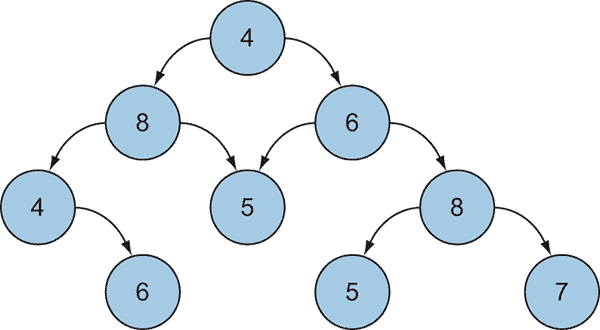    Figure 3.8 Binary tree representation where every node has between zero and two child nodes. In this figure, node 4 is the root from which two branches start, nodes 8 and 6\. The left branch is a link to the left subtree and the right branch is a link to the right subtree. The nodes without child nodes, 6, 5, 5, and 7, are called *leaves*.      A tree has a special node call *root*, which has no parent (node 4 in figure 3.8), and may be either a leaf or a node with two or more children. A parent node has at least one child, and each child has one parent. Nodes with no children are treated as leaves (nodes 6, 5, 5, 7 in the figure), and children of the same parent are known as *siblings*.    #### B-trees in functional F#    With F#, it’s easy to represent a tree structure because of the support of ADTs and discriminated unions. In this case, DU provides an idiomatic functional way to represent a tree. This listing shows a generic DU-based binary tree definition with a special case for empty branches.    Listing 3.16 Immutable B-tree representation in F#    ``` type Tree<'a> =   ①    | Empty   ②    | Node of leaf:'a * left:Tree<'a> * right:Tree<'a>   ③    let tree =   ④       Node (20,         Node (9, Node (4, Node (2, Empty, Empty), Empty),                  Node (10, Empty, Empty)),         Empty)  ```    The elements in a B-tree are stored using the `Node` type constructor, and the `Empty` case identifier represents an empty node that doesn’t specify any type information. The `Empty` case serves as a placeholder identifier. With this B-tree definition, you can create helper functions to insert or to verify an item in the tree. These functions are implemented in idiomatic F#, using recursion and pattern matching.    Listing 3.17  B-tree helper recursive functions    ``` let rec contains item tree =   ①       match tree with     | Empty -> false     | Node(leaf, left, right) ->         if leaf = item then true         elif item < leaf then contains item left         else contains item right  let rec insert item tree =   ①       match tree with     | Empty -> Node(item, Empty, Empty)     | Node(leaf, left, right) as node ->         if leaf = item then node         elif item < leaf then Node(leaf, insert item left, right)         else Node(leaf, left, insert item right)  let ``exist 9`` = tree |> contains 9 let ``tree 21`` = tree |> insert 21 let ``exist 21`` = ``tree 21`` |> contains 21  ```    Because the tree is immutable, the function insert returns a new tree, with the copy of only the nodes that are in the path of the node being inserted. Traversing a DU tree in functional programming to look at all the nodes involves a recursive function. Three main approaches exist to traversing a tree: in-order, post-order, and pre-order traversal ([`en.wikipedia.org/wiki/Tree_traversal`](https://en.wikipedia.org/wiki/Tree_traversal)). For example, in the in-order tree navigation, the nodes on the left side of the root are processed first, then the root, and ultimately the nodes on its right as shown here.    Listing 3.18 In-order navigation function    ``` let rec inorder action tree =   ①       seq {         match tree with         | Node(leaf, left, right) ->             yield! inorder action left             yield action leaf             yield! inorder action right         | Empty -> ()     }  tree |> inorder (printfn "%d") |> ignore   ②    ```    The function `inorder` takes as an argument a function to apply to each value of the tree. In the example, this function is an anonymous lambda that prints the integer stored in the tree.    ## 3.4 Recursive functions: a natural way to iterate    *Recursion* is calling a function on itself, a deceptively simple programming concept. Have you ever stood in between two mirrors? The reflections seem to carry on forever—this is recursion. Functional recursion is the natural way to iterate in FP because it avoids mutation of state. During each iteration, a new value is passed into the loop constructor instead to be updated (mutated). In addition, a recursive function can be composed, making your program more modular, as well as introducing opportunities to exploit parallelization.    Recursive functions are expressive and provide an effective strategy to solve complex problems by breaking them into smaller, although identical, subtasks. (Think in terms of Russian nesting dolls, with each doll being identical to the one before, only smaller.) While the whole task may seem daunting to solve, the smaller tasks are easier to solve directly by applying the same function to each of them. The ability to split the task into smaller tasks that can be performed separately makes recursive algorithms candidates for parallelization. This pattern, also called Divide and Conquer*,^(8)  leads to dynamic task parallelism, in which tasks are added to the computation as the iteration advances. For more information, reference the example in section 1.4.3\. Problems with recursive data structures naturally use the Divide and Conquer strategy due to its inherent potential for concurrency.*   *When considering recursion, many developers fear performance penalties for the execution time of a large number of iterations, as well as receiving a `Stackoverflow` exception. The correct way to write recursive functions is using the techniques of tail recursion and CPS. Both strategies are good ways to minimize stack consumption and increase speed, as you’ll see in the examples to come.    ### 3.4.1 The tail of a correct recursive function: tail-call optimization    A *tail call*, also known as tail-call optimization (TCO), is a subroutine call performed as the final action of a procedure. If a tail call might lead to the same subroutine being called again in the call chain, then the subroutine is said to be *tail recursive*, a special case of recursion. *Tail-call recursion* is a technique that converts a regular recursive function into an optimized version that can handle large inputs without any risks and side effects.    With tail-call recursion, there are no outstanding operations to perform within the function it returns, and the last call of the function is a call to itself. You’ll refactor the implementation of a factorial number function into a tail-call optimized function. The following listing shows the tail-call optimized recursive function implementation.    Listing 3.19  Tail-call recursive implementation of a factorial in F#    ``` let rec factorialTCO (n:int) (acc:int) =     if n <= 1 then acc  else factorialTCO (n-1) (acc * n)   ①    let factorial n = factorialTCO n 1  ```    In this implementation of the recursive function, the parameter `acc` acts as an accumulator. By using an accumulator and ensuring that the recursive call is the last operation in the function, the compiler optimizes the execution to reuse a single-stack frame, instead of storing each intermediate result of the recursion onto different stack frames as shown in figure 3.9.  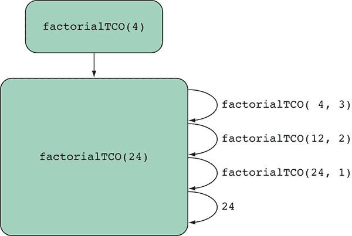    Figure 3.9 Tail-recursive definition of a factorial, which can reuse a single stack frame      The figure illustrates the tail-recursive definitions of factorials. Although F# supports tail-call recursive functions, unfortunately, the C# compiler isn’t designed to optimize tail-call recursive functions.    ### 3.4.2 Continuation passing style to optimize recursive function    Sometimes, optimized tail-call recursive functions aren’t the right solution or can be difficult to implement. In this case, one possible alternative approach is CPS, a technique to pass the result of a function into a continuation. CPS is used to optimize recursive functions because it avoids stack allocation. Moreover, CPS is used in the Microsoft TPL, in `async/await` in C#, and in `async-workflow` in F#.    CPS plays an important role in concurrent programming. This following code example shows how the CPS pattern is used in a function `GetMaxCPS`:    ``` static void GetMaxCPS(int x, int y, Action<int> action)                                          => action(x > y ? x : y);  GetMaxCPS (5, 7, n => Console.WriteLine(n));  ```    The argument for the continuation passing is defined as a delegate `Action<int>`, which can be used conveniently to pass a lambda expression. The interesting part is that the function with this design never returns a result directly; instead, it supplies the result to the continuation procedure. CPS can also be used to implement recursive functions using tail calls.    #### Recursive functions with CPS    At this point, with basic knowledge about CPS, you’ll refactor the factorial example from Listing 3.19 to use the CPS approach in F#. (You can find the C# implementation in the downloadable source code for this book.)    Listing 3.20 Recursive implementation of factorials using CPS in F#    ``` let rec factorialCPS x continuation =     if x <= 1 then continuation()      else factorialCPS (x - 1) (fun () -> x * continuation())   let result = factorialCPS 4 (fun () -> 1)   ①    ```    This function is similar to the previous implementation with the accumulator; the difference is that the function is passed instead of the accumulator variable. In this case, the action of the function `factorialCPS` applies the `continuation` function to its result.    #### B-Tree structure walked in parallel recursively    Listing 3.21 shows an example that iterates recursively through a tree structure to perform an action against each element. The function `WebCrawler`, from chapter 2, builds a hierarchy representation of web links from a given website. Then it scans the HTML content from each web page, looking for image links that download in parallel. The code examples from chapter 2 (listings 2.16, 2.17, 2.18, and 2.19) were intended to be an introduction to a parallel technique rather than a typical task-based parallelism procedure. Downloading any sort of data from the internet is an I/O operation; you’ll learn in chapter 8 that it’s best practice to perform I/O operations asynchronously.    Listing 3.21 Parallel recursive divide-and-conquer function    ``` let maxDepth = int(Math.Log(float System.Environment.ProcessorCount, ➥ 2.)+4.)   ①    let webSites : Tree<string> =     WebCrawlerExample.WebCrawler("http://www.foxnews.com")  |> Seq.fold(fun tree site -> insert site tree ) Empty   ②    let downloadImage (url:string) =     use client = new System.Net.WebClient()     let fileName = Path.GetFileName(url)  client.DownloadFile(url, @"c:\Images\" + fileName)   ③    let rec parallelDownloadImages tree depth =   ④       match tree with     | _ when depth = maxDepth ->         tree |> inorder downloadImage |> ignore     | Node(leaf, left, right) ->         let taskLeft  = Task.Run(fun() ->             parallelDownloadImages left (depth + 1))         let taskRight = Task.Run(fun() ->             parallelDownloadImages right (depth + 1))  let taskLeaf  = Task.Run(fun() -> downloadImage leaf)  Task.WaitAll([|taskLeft;taskRight;taskLeaf|])   ⑤       | Empty -> ()  ```    The `Task.Run` constructor is used to create and spawn the tasks. The parallel recursive function `parallelDownloadImages` takes the argument depth, which is used to limit the number of tasks created to optimize resource consumption.    In every recursive call, the depth value increases by one, and when it exceeds the threshold `maxDepth`, the rest of the tree is processed sequentially. If a separate task is created for every tree node, then the overhead of creating new tasks would exceed the benefit gained from running the computations in parallel. If you have a computer with eight processors, then spawning 50 tasks will impact the performance tremendously because of the contention generated from the tasks sharing the same processors. The TPL scheduler is designed to handle large numbers of concurrent tasks, but its behavior isn’t appropriate for every case of dynamic task parallelism ([`mng.bz/ww1i`](http://mng.bz/ww1i)), and in some circumstances, as in the previous parallel recursive function, a manual tune-up is preferred.    Ultimately, the `Task.WaitAll` construct is used to wait for the tasks to complete. Figure 3.10 shows the hierarchy representation of the spawned tasks running in parallel.  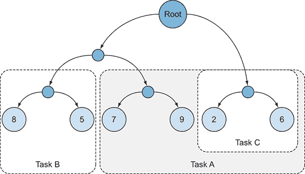    Figure 3.10 From the root node, Task C is created to process the right side of the subtree. This process is repeated for the subtree running Task A. When it completes, the left side of the subtree is processed by Task B. This operation is repeated for all the subtrees, and for each iteration, a new task is created.      The execution time to complete the recursive parallel operation `parallelDownloadImages` has been measured against a sequential version. The benchmark is the average of downloading 50 images three times (table 3.4).    Table 3.4 Benchmark of downloading 50 images using parallel recursion     | **Serial** | **Parallel** | | --- | --- | | 19.71 | 4.12 |    #### Parallel calculator    Another interesting way to use a tree structure is building a parallel calculator. After what you’ve learned, the implementation of such a program isn’t trivial. You can use ADTs in the form of F# DUs to define the type of operations to perform:    ``` type Operation = Add | Sub | Mul | Div | Pow  ```    Then, the calculator can be represented as a tree structure, where each operation is a node with the details to perform a calculation:    ``` type Calculator =     | Value of double     | Expr of Operation * Calculator * Calculator  ```    Clearly, from this code, you can see the resemblance to the tree structure previously used:    ``` type Tree<'a> =         | Empty             | Node of leaf:'a * left:Tree<'a> * right:Tree<'a>  ```    The only difference is that the `Empty` case in the tree structure is replaced with the `value` case in the calculator. To perform any mathematical operation you need a value. The leaf of the tree becomes the `Operation` type, and the left and right branches recursively reference the calculator type itself, exactly as the tree did.    Next, you can implement a recursive function that iterates through the calculator tree and performs the operations in parallel. This listing shows the implementation of the `eval` function and its use.    Listing 3.23 Parallel calculator    ``` let spawn (op:unit->double) = Task.Run(op)   ①    let rec eval expr =  match expr with   ②     | Value(value) -> value   ③     | Expr(op, lExpr, rExpr) ->   ④     let op1 = spawn(fun () -> eval lExpr)   ⑤    let op2 = spawn(fun () -> eval rExpr)   ⑤     let apply = Task.WhenAll([op1;op2])   ⑥           let lRes, rRes = apply.Result.[0], apply.Result.[1]  match op with   ⑦           | Add -> lRes + rRes         | Sub -> lRes - rRes         | Mul -> lRes * rRes         | Div -> lRes / rRes         | Pow -> System.Math.Pow(lRes, rRes)  ```    The function `eval` recursively evaluates in parallel a set of operations defined as a tree structure. During each iteration, the expression passed is pattern matched to extract the value if the case is a `Value` type, or to compute the operation if the case is an `Expr` type. Interestingly, the recursive re-evolution for each branch of the node case `Expr` is made in parallel. Each branch `Expr` returns a `value` type, which is calculated in each child (sub-nodes) operation. Then, these values are used for the last operation, which is the root of the operation tree passed as argument for the final result. Here is a simple set of operations in the shape of a calculator tree, which compute the operations 2¹⁰ / 2⁹ + 2 * 2:    ``` let operations =             Expr(Add,     Expr(Div,       Expr(Pow, Value(2.0), Value(10.0)),       Expr(Pow, Value(2.0), Value(9.0))),     Expr(Mul, Value(2.0), Value(2.0)))  let value = eval operations  ```    In this section, the code for defining a tree data structure and performing a recursive task-based function is shown in F#; but the implementation is feasible in C# as well. Rather than showing all the code here, you can download the full code from the book’s website.    ## Summary    *   Immutable data structures use intelligent approaches, such as structural sharing, to minimize the copy-shared elements to minimize GC pressure. *   It’s important to dedicate some time to profiling application performance to avoid bottlenecks and bad surprises when the program runs in production and under heavy payloads. *   Lazy evaluation can be used to guarantee thread safety during the instantiation of an object and to gain performance in functional data structures by deferring computation to the last moment. *   Functional recursion is the natural way to iterate in functional programming because it avoids mutation of state. In addition, a recursive function can be composed, making your program more modular. *   Tail-call recursion is a technique that converts a regular recursive function into an optimized version that can handle large inputs without any risks or side effects. *   Continuation passing style (CPS) is a technique to pass the result of a function into a continuation. This technique is used to optimize recursive functions because it avoids stack allocation. Moreover, CPS is used in the Task Parallel Library in .NET 4.0, in `async/await` in C#, and in `async-workflow` in F#. *   Recursive functions are great candidates to implement a Divide and Conquer technique, which leads to dynamic task parallelism.***````*****
