# 第二部分

如何处理并发程序的不同部分

本书这部分深入探讨函数式编程的概念和适用性。我们将探讨各种并发编程模型，重点介绍这种范式的优势和好处。主题将包括任务并行库以及并行模式，如 Fork/Join、分而治之、MapReduce。我们还将讨论声明式组合、异步操作的高级抽象、代理编程模型以及消息传递语义。你将亲身体验到函数式编程如何让你在不评估它们的情况下组合程序元素。这些技术并行化工作，使程序更容易推理，运行效率更高，因为它们优化了内存消耗。

# 4

处理大数据的基本原理：数据并行，第一部分

**本章涵盖**

+   在大数据的世界中数据并行的重要性

+   应用 Fork/Join 模式

+   编写声明式并行程序

+   理解并行`for`循环的限制

+   通过数据并行提高性能

想象一下，你为晚餐准备四人的意大利面，假设准备和上桌需要 10 分钟。你开始准备时，往一个中等大小的锅中加水煮沸。然后，又有两个朋友到你家吃饭。显然，你需要做更多的意大利面。你可以换一个大锅的水，里面放更多的意大利面，但这会花费更长的时间来煮，或者你可以使用第二个锅与第一个锅一起使用，这样两个锅的意大利面就可以同时完成烹饪。数据并行的工作方式与此类似。如果“同时烹饪”，可以处理大量的数据。

在过去十年中，生成数据的量呈指数增长。2017 年估计，每分钟有 4,750,000 个 Facebook“赞”，近 40 万个推文，超过 250 万个 Instagram 帖子，以及超过 400 万个谷歌搜索。这些数字每年以 15%的速度持续增长。这种加速影响了现在必须快速分析大量大数据的企业([`en.wikipedia.org/wiki/Big_data`](https://en.wikipedia.org/wiki/Big_data))。如何在保持快速响应的同时分析如此大量的数据？答案是来自一种新的技术，这种技术旨在考虑数据并行，特别是关注在数据持续增加的情况下保持性能的能力。

在本章中，你将学习概念、设计模式和技巧，以快速处理大量数据。你将分析来自并行循环结构的难题，并了解解决方案。你还将了解到，通过将函数式编程与数据并行结合使用，可以在最小代码更改的情况下实现算法性能的显著提升。

## 4.1 什么是数据并行？

*数据* *并行性* 是一种编程模型，它并行地对大量数据进行相同的操作集。这种编程模型正在获得越来越多的关注，因为它能够快速处理各种大数据问题中的大量数据。并行性可以在不要求重新组织其结构的情况下计算算法，从而逐步提高可伸缩性。

数据并行性的两种模型是单指令单数据 (SISD) 和单指令多数据 (SIMD)：

+   *单指令单数据 (SISD)* 用于定义单核架构。单核处理器系统在每个 CPU 时钟周期执行一个任务；因此，执行是顺序和确定的。它接收一条指令（单指令），执行单个数据所需的工作，并返回计算的结果。这种处理器架构将不会在本书中介绍。

+   *单指令多数据 (SIMD)* 是一种通过在可用的多个核心之间分配数据并应用任何给定 CPU 时钟周期上的相同操作来实现的并行形式。这种类型的并行、多核 CPU 架构通常用于利用数据并行性。

要实现数据并行性，数据被分割成块，每个块都受到密集的计算并独立处理，无论是为了产生新的数据以聚合还是减少到标量值。如果你不熟悉这些术语，它们应该在章节结束时变得清晰。

独立计算数据块的能力是实现显著性能提升的关键，因为消除数据块之间的依赖关系消除了访问数据同步的需要，以及任何关于竞争条件的担忧，如图 4.1 所示。

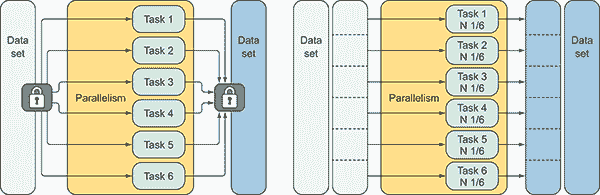

图 4.1 通过将数据集分割成块并独立并行处理每个分区，实现了数据并行性。将每个块分配给单独的任务。当任务完成时，数据集被重新组装。在这个图中，左侧的数据集由多个任务使用锁来同步对整个数据的访问进行处理。在这种情况下，同步是线程之间竞争的来源，并产生了性能开销。右侧的数据集被分割成六个部分，每个任务针对数据集总大小 *N* 的六分之一进行处理。这种设计消除了使用锁来同步的必要性。

数据并行性可以通过在分布式系统中通过多个节点分配工作来实现；或者在一个单机中；或者通过将工作分割成独立的线程。本章重点介绍实现和使用多核硬件来执行数据并行性。

### 4.1.1 数据和任务并行性

数据并行性的目标是分解给定的数据集，并生成足够多的任务以最大化 CPU 资源的使用。此外，每个任务应安排足够的计算操作，以确保更快的执行时间。这与上下文切换形成对比，上下文切换可能会引入负开销。

数据并行性有两种形式：

+   *任务并行性*旨在在多个处理器上执行计算机程序，其中每个线程负责在同一时间执行不同的操作。这是在多个核心上对相同或不同的数据集执行许多不同函数的同时执行。

+   *数据并行性*旨在将给定的数据集分配到多个任务中的较小分区，其中每个任务并行执行相同的指令。例如，数据并行性可能指图像处理算法，其中每个图像或像素由独立任务并行更新。相反，任务并行性将并行计算一系列图像，对每个图像应用不同的操作。参见图 4.2。

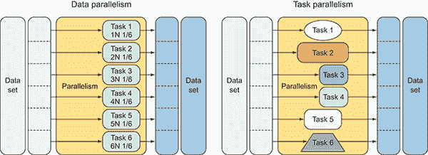

图 4.2 数据并行性是在数据集的元素上同时执行相同的函数。任务并行性是在相同或不同的数据集上同时执行多个不同的函数。

简而言之，任务并行性侧重于执行多个函数（任务），并旨在通过同时运行这些任务来减少整体计算时间。数据并行性通过将相同的算法计算分配给多个 CPU 并行执行，从而减少处理数据集所需的时间。

### 4.1.2 “令人尴尬的并行”概念

在数据并行性中，应用于处理数据的算法有时被称为“令人尴尬的并行”，并具有自然可扩展的特殊属性。1 这个属性会影响算法中的并行程度，随着可用硬件线程数量的增加而增加。在更强大的计算机上，算法将运行得更快。在数据并行性中，算法应设计为在关联于硬件核心的单独任务中独立运行每个操作。这种结构具有自动在运行时调整工作负载并根据当前计算机调整数据分区的优势。这种行为保证了程序在所有可用核心上运行。

考虑对大量数字数组进行求和。数组的任何部分都可以独立于其他部分进行求和。然后，这些部分和可以相互求和，达到与数组按顺序求和相同的结果。部分和是在同一处理器上还是在同一时间计算并不重要。具有高度独立性的此类算法被称为令人尴尬的并行问题：你投入的处理器越多，它们运行得越快。在第三章中，你看到了提供自然并行性的分而治之模式。它将工作分配给众多任务，然后再次组合（减少）结果。其他令人尴尬的并行设计不需要复杂的协调机制来提供自然的自扩展性。使用这种方法的设计模式示例包括 Fork/Join、并行聚合（减少）和 MapReduce。我们将在本章后面讨论这些设计。

### 4.1.3 .NET 中的数据并行支持

在你的程序中识别可以并行化的代码不是一项简单任务，但常见的规则和实践可以帮助。首先要做的是对应用程序进行性能分析。这种程序分析确定了代码在哪里花费时间，这是你应该开始更深入调查以改进性能和检测并行机会的线索。作为一个指导，并行机会是在两个或多个源代码部分可以在不改变程序输出的情况下并行执行时。或者，如果引入并行性会改变程序的输出，则程序不是确定的，可能会变得不可靠；因此，并行性不可用。

为了确保并行程序中的确定性结果，同时运行的源代码块之间不应存在依赖关系。实际上，当没有依赖关系或现有依赖关系可以被消除时，程序可以很容易地进行并行化。例如，在分而治之模式中，函数的递归执行之间没有依赖关系，因此可以实现并行化。

大数据集是并行化的一个主要候选者，其中可以在每个元素上独立执行 CPU 密集型操作。一般来说，任何形式的循环（`for`循环、`while`循环和`for-each`循环）都是利用并行性的优秀候选者。使用微软的 TPL，将顺序循环重塑为并行循环是一项简单的任务。这个库提供了一层抽象，简化了数据并行中涉及到的常见可并行化模式的实现。这些模式可以使用 TPL `Parallel`类提供的`Parallel.For`和`Parallel.ForEach`并行构造来具体化。

下面是一些在提供并行机会的程序中发现的模式：

+   顺序循环，其中迭代步骤之间没有依赖关系。

+   减少和/或聚合操作，其中步骤之间的计算结果部分合并。此模型可以使用 MapReduce 模式表示。

+   计算单位，其中显式依赖可以被转换为 Fork/Join 模式以并行运行每个步骤。

+   使用分而治之方法的递归算法类型，其中每个迭代可以在不同的线程中独立并行执行。

在 .NET 框架中，数据并行性也通过 PLINQ 支持，我推荐使用它。查询语言为数据并行性提供了一个更声明性的模型，与 `Parallel` 类相比，并且用于对数据源进行任意查询的并行评估。声明性意味着你想要对数据进行什么操作，而不是如何操作。内部，TPL 使用复杂的调度算法来有效地在可用的处理核心之间分配并行化计算。C# 和 F# 都以类似的方式利用这些技术。在下一节中，你将看到这两种编程语言中的这些技术，它们可以很好地混合和补充。

## 4.2 Fork/Join 模式：并行 Mandelbrot

理解如何将顺序程序转换为并行程序的最佳方式是通过示例。在本节中，我们将使用 Fork/Join 模式转换程序以利用并行计算并实现更快的性能。

在 Fork/Join 模式中，单个线程分支并与多个独立的并行工作者协调，然后在完成时合并个别结果。Fork/Join 并行性体现在两个主要步骤中：

1.  将给定的任务分割成一组子任务，这些子任务被安排独立并行运行。

1.  等待分支的并行操作完成，然后依次将子任务结果合并到原始工作中。

关于数据并行性，图 4.3 显示与 图 4.1 非常相似。区别在于最后一步，此时 Fork/Join 模式将结果合并回一个整体。

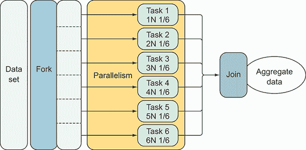

图 4.3 Fork/Join 模式将任务分割成可以独立并行执行的子任务。当操作完成时，子任务再次合并。这种模式经常用于实现数据并行性并非巧合。显然存在相似之处。

正如您所看到的，这种模式非常适合数据并行。Fork/Join 模式通过将工作划分为块（fork）并在并行中单独运行每个块来加速程序的执行。在每个并行操作完成后，这些块再次合并（join）。一般来说，Fork/Join 是一种编码结构化并行的优秀模式，因为 fork 和 join 是同时发生的（相对于调用者是同步的），但并行（从性能和速度的角度来看）。可以使用 .NET `Parallel` 类中的 `Parallel.For` 循环轻松实现 Fork/Join 抽象。这个静态方法透明地处理数据的划分和任务的执行。

````Let’s analyze the `Parallel.For` loop construct with an example. First, you implement a sequential `for` loop to draw a Mandelbrot image (see figure 4.4), and then the code will be refactored to run faster. We’ll evaluate the pros and cons of the approach.  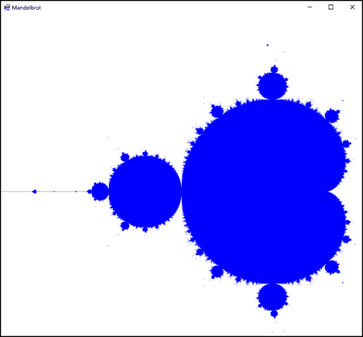    Figure 4.4 The Mandelbrot drawing resulting from running the code in this section      For this example, the details of implementing the algorithm aren’t important. What’s important is that for each pixel in the picture (image), a computation runs for each assigned color. This computation is independent because each pixel color doesn’t depend on other pixel colors, and the assignment can be done in parallel. In fact, each pixel can have a different color assigned regardless of the color of the other pixels in the image. The absence of dependencies affects the execution strategy; each computation can run in parallel.    In this context, the Mandelbrot algorithm is used to draw an image representing the magnitude value of the complex number. The natural representation of this program uses a `for` loop to iterate through each value of the Cartesian plane to assign the corresponding color for each point. The Mandelbrot algorithm decides the color. Before delving into the core implementation, you need an object for the complex number. The following listing shows a simple implementation of a complex number used to make operations over other imaginary complex numbers.    Listing 4.1 Complex number object    ``` class Complex {     public Complex(float real, float imaginary)     {         Real = real;         Imaginary = imaginary;     }   public float Imaginary { get; }   ①    public float Real { get; }   ①        public float Magnitude  => (float)Math.Sqrt(Real * Real + Imaginary * Imaginary);   ②        public static Complex operator +(Complex c1, Complex c2)  => new Complex(c1.Real + c2.Real, c1.Imaginary + c2.Imaginary);   ③       public static Complex operator *(Complex c1, Complex c2)       => new Complex(c1.Real * c2.Real - c1.Imaginary * c2.Imaginary,  c1.Real * c2.Imaginary + c1.Imaginary * c2.Real);   ③   }  ```    The `Complex` class contains a definition for the `Magnitude` property. The interesting part of this code is the two overloaded operators for the `Complex` object. These operators are used to add and multiply a complex number, which is used in the Mandelbrot algorithm. The following listing shows the two core functions of the Mandelbrot algorithm. The function `isMandelbrot` determines if the complex number belongs to the Mandelbrot set.    Listing 4.2 Sequential Mandelbrot    ``` Func<Complex, int, bool> isMandelbrot = (complex, iterations) =>   ①   {     var z = new Complex(0.0f, 0.0f);     int acc = 0;     while (acc < iterations && z.Magnitude < 2.0)     {         z = z * z + complex;         acc += 1;     }     return acc == iterations; };  **for (int col = 0; col < Cols; col++)** {   ②    for (int row = 0; row < Rows; row++) {   ②    var x = ComputeRow(row);   ③    var y = ComputeColumn(col);   ③           var c = new Complex(x, y);  var color = isMandelbrot(c, 100) ? Color.Black : Color.White;   ④           var offset = (col * bitmapData.Stride) + (3 * row);  pixels[offset + 0] = color.B; // Blue component   ⑤    pixels[offset + 1] = color.G; // Green component   ⑤    pixels[offset + 2] = color.R; // Red component   ⑤       } }  ```    The code omits details regarding the bitmap generation, which isn’t relevant for the purpose of the example. You can find the full solution in the downloadable source code online.    In this example, there are two loops: the outer loop iterates over the columns of the picture box, and the inner loop iterates over its rows. Each iteration uses the functions `ComputeColumn` and `ComputeRow`, respectively, to convert the current pixel coordinates into the real and imaginary parts of a complex number. Then, the function `isMandelbrot` evaluates if the complex number belongs to the Mandelbrot set. This function takes as arguments a complex number and a number of iterations, and it returns a Boolean if—or not—the complex number is a member of the Mandelbrot set. The function body contains a loop that accumulates a value and decrements a count. The value returned is a Boolean that’s true if the accumulator `acc` equals the iterations count.    In the code implementation, the program requires 3.666 seconds to evaluate the function `isMandelbrot` 1 million times, which is the number of pixels composing the Mandelbrot image. A faster solution is to run the loop in the Mandelbrot algorithm in parallel. As mentioned earlier, the TPL provides constructs that can be used to blindly parallelize programs, which results in incredible performance improvements. In this example, the higher-order `Parallel.For` function is used as a drop-in replacement for the sequential loop. This listing shows the parallel transformation with minimal changes, keeping the sequential structure of the code.    Listing 4.3 Parallel Mandelbrot    ``` Func<Complex, int, bool> isMandelbrot = (complex, iterations) => {     var z = new Complex(0.0f, 0.0f);     int acc = 0;     while (acc < iterations && z.Magnitude < 2.0)     {         z = z * z + complex;         acc += 1;     }     return acc == iterations; };  System.Threading.Tasks.Parallel.For(0, Cols - 1, col => {   ①       for (int row = 0; row < Rows; row++) {         var x = ComputeRow(row);         var y = ComputeColumn(col);  var c = new Complex(x, y);         var color = isMandelbrot(c, 100) ? Color.DarkBlue : Color.White;         var offset = (col * bitmapData.Stride) + (3 * row);         pixels[offset + 0] = color.B; // Blue component         pixels[offset + 1] = color.G; // Green component         pixels[offset + 2] = color.R; // Red component     } });  ```    Note that only the outer loop is paralleled to prevent oversaturation of the cores with work items. With a simple change, the execution time decreased to 0.699 seconds in a quad-core machine.    Oversaturation is a form of extra overhead, originating in parallel programming, when the number of threads created and managed by the scheduler to perform a computation grossly exceeds the available hardware cores. In this case, parallelism could make the application slower than the sequential implementation.    As a rule of thumb, I recommend that you parallelize expensive operations at the highest level. For example, figure 4.5 shows nested `for` loops; I suggest you apply parallelism only to the outer loop.  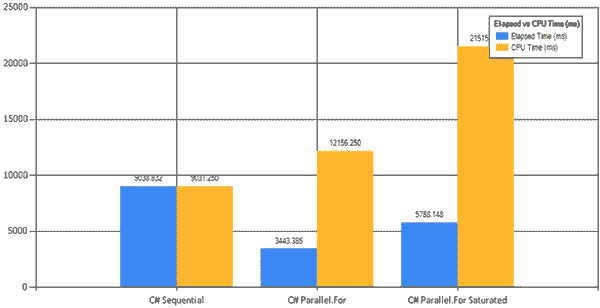    Figure 4.5 Using a `Parallel.For` construct, this benchmark compares the execution time of the sequential loop, which runs in 9.038 seconds, against the parallel, which runs in 3.443 seconds. The `Parallel.For` loop is about three times faster than the sequential code. Moreover, the last column on the right is the execution time of the over-saturated parallel loop, where both outer and inner loops are using the `Parallel.For` construct. The over-saturated parallel loop runs in 5.788 seconds, which is 50% slower than the non-saturated version.      In general, the optimal number of worker threads for a parallel task should be equal to the number of available hardware cores divided by the average fraction of core utilization per task. For example, in a quad-core computer with 50% average core utilization per task, the perfect number of worker threads for maximum throughput is eight: (4 cores × (100% max CPU utilization / 50% average core utilization per task)). Any number of worker threads above this value could introduce extra overhead due to additional context switching, which would downgrade the performance and processor utilization.    ### 4.2.1 When the GC is the bottleneck: structs vs. class objects    The goal of the Mandelbrot example is to transform a sequential algorithm into a faster one. No doubt you’ve achieved a speed improvement; 9.038 to 3.443 seconds is a little more than three times faster on a quad-core machine. Is it possible to further optimize performance? The TPL scheduler is partitioning the image and assigning the work to different tasks automatically, so how can you improve the speed? In this case, the optimization involves reducing memory consumption, specifically by minimizing memory allocation to optimize garbage collection. When the GC runs, the execution of the program stops until the garbage collection operation completes.    In the Mandelbrot example, a new `Complex` object is created in each iteration to decide if the pixel coordinate belongs to the Mandelbrot set. The `Complex` object is a reference type, which means that new instances of this object are allocated on the heap. This piling of objects onto the heap results in memory overhead, which forces the GC to intervene to free space.    A reference object, as compared to a value type, has extra memory overhead due to the pointer size required to access the memory location of the object allocated in the heap. Instances of a class are always allocated on the heap and accessed via a pointer dereference. Therefore, passing reference objects around, because they’re a copy of the pointer, is cheap in terms of memory allocation: around 4 or 8 bytes, according the hardware architecture. Additionally, it’s important to keep in mind that an object also has a fixed overhead of 8 bytes for 32-bit processes and 16 bytes for 64-bit processes. In comparison, a value type isn’t allocated in the heap but rather in the stack, which removes any overhead memory allocation and garbage collection.    Keep in mind, if a value type (struct) is declared as a local variable in a method, it’s allocated on the stack. Instead, if the value type is declared as part of a reference type (class), then the struct allocation becomes part of that object memory layout and exists on the heap.    The Mandelbrot algorithm creates and destroys 1 million `Complex` objects in the `for` loop; this high rate of allocation creates significant work for the GC. By replacing the `Complex` object from reference to value type, the speed of execution should increase because allocating a struct to the stack will never cause the GC to perform cleanup operations and won’t result in a program pause. In fact, when passing a `value` type to a method, it’s copied byte for byte, therefore allocating a struct that will never cause garbage collection because it isn’t on the heap.    The optimization of converting the `Complex` object from reference to value type is simple, requiring only that you change the keyword `class` to `struct` as shown next. (The full implementation of the `Complex` object is intentionally omitted.) The `struct` keyword converts a reference type (class) to a value type:     |   ``` **class** `Complex  {`  `public Complex(float real,`   `float imaginary)` `{`  `this.Real = real;`  `this.Imaginary =          imaginary;` `}`  ```   |   ``` **struct** `Complex {`  `public Complex(float real,`   `float imaginary)` `{`  `this.Real = real;`  `this.Imaginary =          imaginary;` `}`  ```   |    After this simple code change, the execution time to draw the Mandelbrot algorithm has increased the speed approximately 20%, as shown in figure 4.6.  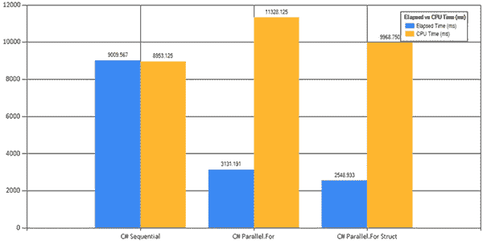    Figure 4.6 The `Parallel.For` construct benchmark comparison of the Mandelbrot algorithm computed in a quad-core machine with 8 GB of RAM. The sequential code runs in 9.009 seconds, compared to the parallel version, which runs in 3.131 seconds—almost three times faster. In the right column, the better performance is achieved by the parallel version of the code that uses the value type as a complex number in place of the reference type. This code runs in 2.548 seconds, 20% faster than the original parallel code, because there are no GC generations involved during its execution to slow the process.      The real improvement is the number of GC generations to free memory, which is reduced to zero using the struct type instead of the class reference type.^(2) Table 4.1 shows GC generation comparison between a `Parallel.For` loop using many reference types (class) and a `Parallel.For` loop using many value types (struct).    Table 4.1 GC generations comparison     | **Operation** | **GC gen0** | **GC gen1** | **GC gen2** | | --- | --- | --- | --- | | `Parallel.For` | 1390 | 1 | 1 | | `Parallel.For with struct value type` | 0 | 0 | 0 |    The version of the code that runs using the `Complex` object as a reference type makes many short-lived allocations to the heap: more than 4 million.^(3)  A short-lived object is stored in the first GC generation, and it’s scheduled to be removed from the memory sooner than generations 1 and 2\. This high rate of allocation forces the GC to run, which involves stopping all the threads that are running, except the threads needed for the GC. The interrupted tasks resume only after the GC operation completes. Clearly, the smaller the number of the GC generations, the faster the application performs.    ### 4.2.2 The downside of parallel loops    In the previous section, you ran both the sequential and parallel versions of the Mandelbrot algorithm to compare performance. The parallel code was implemented using the TPL `Parallel` class and a `Parallel.For` construct, which can provide significant performance improvements over ordinary sequential loops.    In general, the parallel `for` loop pattern is useful to perform an operation that can be executed independently for each element of a collection (where the elements don’t rely on each other). For example, mutable arrays fit perfectly in parallel loops because every element is located in a different location in memory, and the update can be effected in place without race conditions. The work of parallelizing the loop introduces complexity that can lead to problems that aren’t common or even encountered in sequential code. For example, in sequential code, it’s common to have a variable that plays the role of accumulator to read from or write to. If you try to parallelize a loop that uses an accumulator, you have a high probability of encountering a race condition problem because multiple threads are concurrently accessing the variables.    In a parallel `for` loop, by default, the degree of parallelism depends on the number of available cores. The *degree of parallelism* refers to the number of iterations that can be run at the same time in a computer. In general, the higher the number of available cores, the faster the parallel `for` loop executes. This is true until the point of diminishing return that Amdahl’s Law (the speed of a parallel loop depends on the kind of work it does) predicts is reached.    ## 4.3 Measuring performance speed    Achieving an increase in performance is without a doubt the main reason for writing parallel code. *Speedup* refers to the performance gained from executing a program in parallel on a multicore computer as compared to a single-core computer.    A few different aspects should be considered when evaluating speedup. The common way to gain speedup is by dividing the work between the available cores. In this way, when running one task per processor with *n* cores, the expectation is to run the program *n* times faster than the original program. This result is called *linear speedup*, which in the real world is improbable to reach due to overhead introduced by thread creation and coordination. This overhead is amplified in the case of parallelism, which involves the creation and partition of multiple threads. To measure the speedup of an application, the single-core benchmark is considered the baseline.    The formula to calculate the linear speedup of a sequential program ported into a parallel version is *speedup = sequential time / parallel time*. For example, assuming the execution time of an application running in a single-core machine is 60 minutes, when the application runs on a two-core computer, the time decreases to 40 minutes. In this case, the speedup is 1.5 (60 / 40).    Why didn’t the execution time drop to 30 minutes? Because parallelizing the application involves the introduction of some overhead, which prevents the linear speedup according to the number of cores. This overhead is due to the creation of new threads, which implicate contention, context switching, and thread scheduling.    Measuring performance and anticipating speedup is fundamental for the benchmarking, designing, and implementing of parallel programs. For that reason, parallelism execution is an expensive luxury—it isn’t free but instead requires an investment of time in planning. Inherent overhead costs are related to the creation and coordination of threads. Sometimes, if the amount of work is too small, the overhead brought in parallelism can exceed the benefit and, therefore, overshadow the performance gain. Frequently, the scope and volume of a problem affect the code design and the time required to execute it. Sometimes, better performance is achievable by approaching the same problem with a different, more scalable solution.    Another tool to calculate whether the investment is worth the return is Amdahl’s Law, a popular formula for calculating the speedup of a parallel program.    ### 4.3.1 Amdahl’s Law defines the limit of performance improvement    At this point, it’s clear that to increase the performance of your program and reduce the overall execution time of your code, it’s necessary to take advantage of parallel programming and the multicore resources available. Almost every program has a portion of the code that must run sequentially to coordinate parallel execution. As in the Mandelbrot example, rendering the image is a sequential process. Another common example is the Fork/Join pattern, which starts the execution of multiple threads in parallel and then waits for them to complete before continuing the flow.    In 1965, Gene Amdahl concluded that the presence of sequential code in a program jeopardizes overall performance improvement. This concept counters the idea of linear speedup. A linear speedup means that the time *T* (units of time) it takes to execute a problem with *p* processors is *T*/*p* (the time it takes to execute a problem with one processor). This can be explained by the fact that programs cannot run entirely in parallel; therefore, the increase of performance expected isn’t linear and is limited by the sequential (serial) code constraint.    Amdahl’s Law says that, given a fixed data-set size, the maximum performance increase of a program implemented using parallelism is limited by the time needed for the sequential portion of the program. According to Amdahl’s Law, no matter how many cores are involved in the parallel computation, the maximum speedup the program can achieve depends on the percent of time spent in sequential processing.    Amdahl’s Law determines the speedup of a parallel program by using three variables:    *   Baseline duration of the program executed in a single-core computer *   The number of available cores *   The percentage of parallel code    Here’s the formula to calculate the speedup according with Amdahl’s Law:    *Speedup* = 1 / (1 – *P* + (*P* / *N*))    The numerator of the equation is always 1 because it represents the base duration. In the denominator, the variable *N* is the number of available cores, and *P* represents the percentage of parallel code.    For example, if the parallelizable code is 70% in a quad-core machine, the maximum expected speedup is 2.13:   **Speedup* = 1 / (1 – .70 + (.70 / 4)) = 1 / (.30 + .17) = 1 / 0.47 = 2.13 times    A few conditions may discredit the result of this formula. For the one related to data parallelism, with the onset of big data, the portion of the code that runs in parallel for processing data analysis has more effect on performance as a whole. A more precise formula to calculate performance improvement due to parallelism is Gustafson’s Law.    ### 4.3.2 Gustafson’s Law: a step further to measure performance improvement    Gustafson’s Law is considered the evolution of Amdahl’s Law and examines the speedup gain by a different and more contemporary perspective—considering the increased number of cores available and the increasing volume of data to process.    Gustafson’s Law considers the variables that are missing in Amdahl’s Law for the performance improvement calculation, making this formula more realistic for modern scenarios, such as the increase of parallel processing due to multicore hardware.    The amount of data to process is growing exponentially each year, thereby influencing software development toward parallelism, distributed systems, and cloud computing. Today, this is an important factor that invalidates Amdahl’s Law and legitimizes Gustafson’s Law.    Here’s the formula for calculating the speedup according to Gustafson’s Law:    *Speedup* = *S* + (*N* × *P*)    *S* represents the sequential units of work, *P* defines the number of units of work that can be executed in parallel, and *N* is the number of available cores.    A final explanation: Amdahl’s Law predicts the speedup achievable by parallelizing sequential code, but Gustafson’s Law calculates the speedup reachable from an existing parallel program.    ### 4.3.3 The limitations of parallel loops: the sum of prime numbers    This section covers some of the limitations resulting from the sequential semantics of the parallel loop and techniques to overcome these disadvantages. Let’s first consider a simple example that parallelizes the sum of the prime numbers in a collection. Listing 4.4 calculates the sum of the prime numbers of a collection with 1 million items. This calculation is a perfect candidate for parallelism because each iteration performs the same operation exactly. The implementation of the code skips the sequential version, whose execution time to perform the calculation runs in 6.551 seconds. This value will be used as a baseline to compare the speed with the parallel version of the code.    Listing 4.4 Parallel sum of prime numbers using a `Parallel.For` loop construct    ``` int len = 10000000; long total = 0;   ①    Func<int, bool> isPrime = n => {   ②        if (n == 1) return false;      if (n == 2) return true;      var boundary = (int)Math.Floor(Math.Sqrt(n));      for (int i = 2; i <= boundary; ++i)               if (n % i == 0) return false;      return true; };  Parallel.For(0, len, i => {   ③    if (isPrime(i))   ④    total += i;   ④   });  ```    The function `isPrime` is a simple implementation used to verify whether a given number is prime. The `for` loop uses the `total` variable as the accumulator to sum all the prime numbers in the collection. The execution time to run the code is 1.049 seconds in a quad-core computer. The speed of the parallel code is six times faster as compared with the sequential code. Perfect! But, not so fast.    If you run the code again, you’ll get a different value for the `total` accumulator. The code isn’t deterministic, so every time the code runs, the output will be different, because the accumulator variable `total` is shared among different threads.    One easy solution is to use a lock to synchronize the access of the threads to the `total` variable, but the cost of synchronization in this solution hurts performance. A better solution is to use a `ThreadLocal<T>` variable to store the thread’s local state during loop execution. Fortunately, `Parallel.For` offers an overload that provides a built-in construct for instantiating a thread-local object. Each thread has its own instance of `ThreadLocal`, removing any opportunity for negative sharing of state. The `ThreadLocal<T>` type is part of the `System.Threading` namespace as shown in bold here.    Listing 4.5 Using `Parallel.For` with `ThreadLocal` variables    ``` **Parallel.For**(0, len,  () => 0,   ①    (int i, ParallelLoopState loopState, long tlsValue) => {   ②              return isPrime(i) ? tlsValue += i : tlsValue;      },  value => Interlocked.Add(ref total, value));   ③    ```    The code still uses a global mutual variable `total`, but in a different way. In this version of the code, the third parameter of the `Parallel.For` loop initializes a local state whose lifetime corresponds to the first iteration on the current thread through the last one. In this way, each thread uses a thread-local variable to operate against an isolated copy of state, which can be stored and retrieved separately in a thread-safe manner.    When a piece of data is stored in a managed *thread-local storage* (TLS), as in the example, it’s unique to a thread. In this case, the thread is called the *owner* of the data. The purpose of using thread-local data storage is to avoid the overhead due to lock synchronizations accessing a shared state. In the example, a copy of the local variable `tlsValue` is assigned and used by each thread to calculate the sum of a given range of the collection that has been partitioned by the parallel partitioner algorithm. The parallel partitioner uses a sophisticated algorithm to decide the best approach to divide and distribute the chunks of the collection between threads.    After a thread completes all of the iterations, the last parameter in the `Parallel.For` loop that defines the `join` operation is called. Then, during the `join` operation, the results from each thread are aggregated. This step uses the `Interlocked` class for high performance and thread-safe operation of addition operations. This class was introduced in chapter 3 to perform CAS operations to safely mutate (actually swap) the value of an object in multithreaded environments. The `Interlock` class provides other useful operations, such as increment, decrement, and exchange of variables.    This section has mentioned an important term in data parallelism: aggregate. The aggregate concept will be covered in chapter 5.    Listing 4.5, the final version of the code, produces a deterministic result with a speed of execution of *1.178 seconds* : almost equivalent to the previous one. You pay a little extra overhead in exchange for correctness. When using shared state in a parallel loop, scalability is often lost because of synchronization on the shared state access.    ### 4.3.4 What can possibly go wrong with a simple loop?    Now we consider a simple code block that sums the integers from a given array. Using any OOP language, you could write something like this.    Listing 4.6 Common `for` loop    ``` int sum = 0; for (int i = 0; i < data.Length; i++) {  sum += data[i];   ①   }  ```    You’ve written something similar in your career as a programmer; likely, a few years ago, when programs were executed single-threaded. Back then this code was fine, but these days, you’re dealing with different scenarios and with complex systems and programs that simultaneously perform multiple tasks. With these challenges, the previous code can have a subtle bug, in the `sum` line of code:    ``` sum += data[i];  ```    What happens if the values of the array are mutated while it’s traversed? In a multithreaded program, this code presents the issue of mutability, and it cannot guarantee consistency.    Note that not all state mutation is equally evil, if the mutation of state that’s only visible within the scope of a function is inelegant, but harmless. For example, suppose the previous sum in a `for` loop is isolated in a function as follows:    ``` int Sum(int[] data) {        int sum = 0;     for (int i = 0; i < data.Length; i++)     {         sum += data[i];      } }  ```    Despite updating the `sum` value, its mutation isn’t visible from outside the scope of the function. As a result, this implementation of `sum` can be considered a pure function.    To reduce complexity and errors in your program, you must raise the level of abstraction in the code. For example, to compute a sum of numeric values, express your intention in “what you want,” without repeating “how to do.” Common functionality should be part of the language, so you can express your intentions as    ``` int sum = data.Sum();  ```    Indeed, the `Sum` extension method ([`mng.bz/f3nF`](http://mng.bz/f3nF)) is part of the `System.Linq` namespace in .NET. In this namespace, many methods, such as `List` and `Array`, extend the functionality for any `IEnumerable` object ([`mng.bz/2bBv`](http://mng.bz/2bBv)). It’s not a coincidence that the ideas behind LINQ originate from functional concepts. The LINQ namespace promotes immutability, and it operates on the concept of transformation instead of mutation, where a LINQ query (and lambda) let you transform a set of structured data from its original form into another form, without worrying about side effects or state.    ### 4.3.5 The declarative parallel programming model    In the sum of prime numbers example in Listing 4.5, the `Parallel.For` loop constructor definitely fits the purpose of speedup compared to the sequential code and does it efficiently, although the implementation is a bit more difficult to understand and maintain compared to the sequential version. The final code isn’t immediately clear to a developer looking at it for the first time. Ultimately, the intent of the code is to sum the prime numbers of a collection. It would be nice to have the ability to express the intentions of the program, defining step by step how to implement the algorithm.    This is where PLINQ comes into play. The following listing is the equivalent of the parallel `Sum` using PLINQ (in bold) in place of the `Parallel.For` loop.    Listing 4.7 Parallel sum of a collection using declarative PLINQ    ```  long total = 0;  Parallel.For(0, len,   ①    () => 0,            (int i, ParallelLoopState loopState, long tlsValue) => {                 return isPrime(i) ? tlsValue += i : tlsValue; }, value => Interlocked.Add(ref total, value));    **long total = Enumerable.Range(0, len).AsParallel()**   ②    **.Where(isPrime).Sum(x => (long)x);**   ③    ```    The functional declarative approach is only one line of code. Clearly, when compared to the `for` loop implementation, it’s simple to understand, succinct, maintainable, and without any mutation of state. The PLINQ construct represents the code as a chain of functions, each one providing a small piece of functionality to accomplish the task. The solution adopts the higher-order-function aggregate part of the LINQ/PLINQ API, which in this case is the function `Sum()`. The aggregate applies a function to each successive element of a collection, providing the aggregated result of all previous elements. Other common aggregate functions are `Average()`, `Max()`, `Min()`, and `Count()`.    Figure 4.7 shows benchmarks comparing the execution time of the parallel `Sum`.  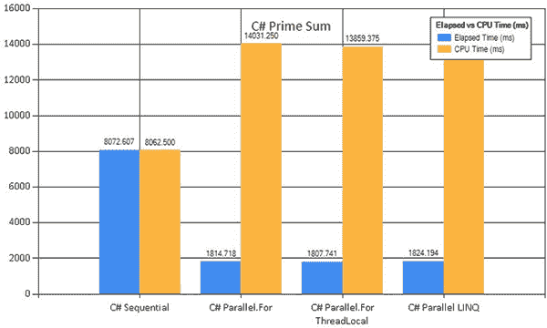    Figure 4.7 Benchmarking comparison of the sum of prime numbers. The benchmark runs in an eight-core machine with 8 GB of RAM. The sequential version runs in 8.072 seconds. This value is used as a base for the other versions of the code. The `Parallel.For` version took 1.814 seconds, which is approximately 4.5 times faster than the sequential code. The `Parallel.For ThreadLocal` version is a little faster than the parallel `Loop`. Ultimately, the PLINQ program is slowest among the parallel versions; it took 1.824 seconds to run.     **The function `Aggregate` will be covered in detail in chapter 5\.    ## Summary    *   Data parallelism aims to process massive amounts of data by partitioning and performing each chunk separately, then regrouping the results when completed. This lets you analyze the chunks in parallel, gaining speed and performance. *   Mental models used in this chapter, which apply to data parallelism, are Fork/Join, Parallel Data Reduction, and Parallel Aggregation. These design patterns share a common approach that separates the data and runs the same task in parallel on each divided portion. *   Utilizing functional programming constructs, it’s possible to write sophisticated code to process and analyze data in a declarative and simple manner. This paradigm lets you achieve parallelism with little change in your code. *   Profiling the program is a way to understand and ensure that the changes you make to adopt parallelism in your code are beneficial. To do that, measure the speed of the program running sequentially, then use a benchmark as a baseline to compare the code changes.***````  ```````***# 5 PLINQ and MapReduce: data parallelism, part 2    **This chapter covers**    *   Using declarative programming semantics *   Isolating and controlling side effects *   Implementing and using a parallel `Reduce` function *   Maximizing hardware resource utilization *   Implementing a reusable parallel MapReduce pattern    This chapter presents MapReduce, one of the most widely used functional programming patterns in software engineering. Before delving into MapReduce, we’ll analyze the declarative programming style that the functional paradigm emphasizes and enforces, using PLINQ and the idiomatic F#, `PSeq`. Both technologies analyze a query statement at runtime and make the best strategy decision concerning how to execute the query in accordance with available system resources. Consequently, the more CPU power added to the computer, the faster your code will run. Using these strategies, you can develop code ready for next-generation computers. Next, you’ll learn how to implement a parallel `Reduce` function in .NET, which you can reuse in your daily work to increase the speed of execution of aggregates functions.    Using FP, you can engage data parallelism in your programs without introducing complexity, compared to conventional programming. FP prefers declarative over procedural semantics to express the intent of a program instead of describing the steps to achieve the task. This declarative programming style simplifies the adoption of parallelism in your code.    ## 5.1 A short introduction to PLINQ    Before we delve into PLINQ, we’ll define its sequential double, LINQ, an extension to the .NET Framework that provides a declarative programming style by raising the level of abstraction and simplifying the application into a rich set of operations to transform any object that implements the `IEnumerable` interface. The most common operations are mapping, sorting, and filtering. LINQ operators accept behavior as the parameter that usually can be passed in the form of lambda expressions. In this case, the lambda expression provided will be applied to each single item of the sequence. With the introduction of LINQ and lambda expressions, FP becomes a reality in .NET.    You can make queries run in parallel using all the cores of the development system to convert LINQ to PLINQ by adding the extension `.AsParallel()` to the query. PLINQ can be defined as a concurrency engine for executing LINQ queries. The objective of parallel programming is to maximize processor utilization with increased throughput in a multicore architecture. For a multicore computer, your application should recognize and scale performance to the number of available processor cores.    The best way to write parallel applications isn’t to think about parallelism, and PLINQ fits this abstraction perfectly because it takes care of all the underlying requirements, such as partitioning the sequences into smaller chunks to run individually and applying the logic to each item of each subsequence. Does that sound familiar? That’s because PLINQ implements the Fork/Join model underneath, as shown in figure 5.1.      Figure 5.1 A PLINQ execution model. Converting a LINQ query to PLINQ is as simple as applying the `AsParallel()` extension method, which runs in parallel the execution using a Fork/Join pattern. In this figure, the input characters are transformed in parallel into numbers. Notice that the order of the input elements isn’t preserved.      As a rule of thumb, every time there is a `for` or `for-each` loop in your code that does something with a collection, without performing a side effect outside the loop, consider transforming the loop into a LINQ. Then benchmark the execution and evaluate whether the query could be a fit to run in parallel using PLINQ.    The advantage of using PLINQ, compared to a parallel `for` loop, is its capability of handling automatically aggregation of temporary processing results within each running thread that executes the query.    ### 5.1.1 How is PLINQ more functional?    PLINQ is considered an ideal functional library, but why? Why consider the PLINQ version of code more functional than the original `Parallel.For` loop?    With `Parallel.For`, you’re telling the computer what to do:    *   Loop through the collection. *   Verify if the number is prime. *   If the number is prime, add it to a local accumulator. *   When all iterations are done, add the accumulator to a shared value.    By using LINQ/PLINQ, you can tell the computer what you want in the form of a sentence: “Given a range from 0 to 1,000,000, where the number is prime, sum them all.”    FP emphasizes writing declarative code over imperative code. Declarative code focuses on what you want to achieve rather than how to achieve it. PLINQ tends to emphasize the intent of the code rather than the mechanism and is, therefore, much more functional.    In addition, FP favors the use of functions to raise the level of abstraction, which aims to hide complexity. In this regard, PLINQ raises the concurrency programming model abstraction by handling the query expression and analyzing the structure to decide how to run in parallel, which maximizes performance speed.    FP also encourages combining small and simple functions to solve complex problems. The PLINQ pipeline fully satisfies this tenet with the approach of chaining pieces of extension methods together.    Another functional aspect of PLINQ is the absence of mutation. The PLINQ operators don’t mutate the original sequence, but instead return a new sequence as a result of the transformation. Consequently, the PLINQ functional implementation gives you predictable results, even when the tasks are executed in parallel.    ### 5.1.2 PLINQ and pure functions: the parallel word counter    Now let’s consider an example where a program loads a series of text files from a given folder and then parses each document to provide the list of the 10 most frequently used words. The process flow is the following (shown in figure 5.2):    1.  Collect the files from a given folder path. 2.  Iterate the files. 3.  For each text file, read the content. 4.  For each line, break it down into words. 5.  Transform each word into uppercase, which is useful for comparison. 6.  Group the collection by word. 7.  Order by higher count. 8.  Take the first 10 results. 9.  Project the result into tabular format (a dictionary).      Figure 5.2 Representation of the flow process to count the times each word has been mentioned. First, the files are read from a given folder, then each text file is read, and the content is split in lines and single words to be grouped by.      The following listing defines this functionality in the `WordsCounter` method, which takes as input the path of a folder and then calculates how many times each word has been used in all files. This listing shows the `AsParallel` command in bold.    Listing 5.1 Parallel word-counting program with side effects    ``` public static Dictionary<string, int> WordsCounter(string source) {     var wordsCount =             (from filePath in  Directory.GetFiles(source, "*.txt")   ①    .**AsParallel()**   ②                   from line in File.ReadLines(filePath)                 from word in line.Split(' ')                 select word.ToUpper())           .GroupBy(w => w)  .OrderByDescending(v => v.Count()).Take(10);   ③       return wordsCount.ToDictionary(k => k.Key, v => v.Count()); }  ```    The logic of the program follows the previously defined flow step by step. It’s declarative, readable, and runs in parallel, but there’s a hidden problem. It has a side effect. The method reads files from the filesystem, generating an I/O side effect. As mentioned previously, a function or expression is said to have a side effect if it modifies a state outside its scope or if its output doesn’t depend solely on its input. In this case, passing the same input to a function with side effects doesn’t guarantee to always produce the same output. These types of functions are problematic in concurrent code because a side effect implies a form of mutation. Examples of impure functions are getting a random number, getting the current system time, reading data from a file or a network, printing something to a console, and so forth. To understand better why reading data from a file is a side effect, consider that the content of the file could change any time, and whenever the content of the file changes, it can return something different. Furthermore, reading a file could also yield an error if in the meantime it was deleted. The point is to expect that the function can return something different every time it’s called.    Due to the presence of side effects, there are complexities to consider:    *   Is it really safe to run this code in parallel? *   Is the result deterministic? *   How can you test this method?    A function that takes a filesystem path may throw an error if the directory doesn’t exist or if the running program doesn’t have the required permissions to read from the directory. Another point to consider is that with a function run in parallel using PLINQ, the query execution is deferred until its materialization. *Materialization* is the term used to specify when a query is executed and produces a result. For this reason, successive materialization of a PLINQ query that contains side effects might generate different results due to the underlying data that might have changed. The result isn’t deterministic. This could happen if a file is deleted from the directory between different calls, and then throws an exception.    Moreover, functions with side effects (also called *impure*) are hard to test. One possible solution is to create a testing directory with a few text files that cannot change. This approach requires that you know how many words are in these files, and how many times they have been used to verify the correctness of the function. Another solution is to mock the directory and the data contained, which can be even more complex than the previous solution. A better approach exists: remove the side effects and raise the level of abstraction, simplifying the code while decoupling it from external dependencies.    But what are side effects? What’s a pure function, and why should you care?    ### 5.1.3 Avoiding side effects with pure functions    One principle of functional programming is purity. *Pure functions* are those without side effects, where the result is independent of state, which can change with time. That is, pure functions always return the same value when given the same inputs. This listing shows pure pure functions in C#.    Listing 5.2 Pure functions in C#    ``` public static string AreaCircle(int radius) =>  Math.Pow(radius, 2) * Math.PI;   ①     public static int Add(int x, int y) => x + y;   ①    ```    The listing is an example of side effects that are functions that mutate state, setting values of global variables. Because variables live in the block where they’re declared, a variable that’s defined globally introduces possible collision and affects the readability and maintainability of the program. This requires extra checking of the current value of the variable at any point and each time it’s called. The main problem of dealing with side effects is that they make your program unpredictable and problematic in concurrent code, because a side effect implies a form of mutation.    Imagine passing the same argument to a function and each time obtaining a different outcome. A function is said to have side effects if it does any of the following:    *   Performs any I/O operation (this includes reading/writing to the filesystem, to a database, or to the console) *   Mutates global state and any state outside of the function’s scope *   Throws exceptions    At first, removing side effects from a program can seem extremely limiting, but there are numerous benefits to writing code in this style:    *   Easy to reason about the correctness of your program. *   Easy to compose functions for creating new behavior. *   Easy to isolate and, therefore, easy to test, and less bug-prone. *   Easy to execute in parallel. Because pure functions don’t have external dependencies, their order of execution (evaluation) doesn’t matter.    As you can see, introducing pure functions as part of your toolset immediately benefits your code. Moreover, the result of pure functions depends precisely on their input, which introduces the property of *referential transparency*.    A program inevitably needs side effects to do something useful, of course, and functional programming doesn’t prohibit side effects, but rather encourages minimizing and isolating them.    ### 5.1.4 Isolate and control side effects: refactoring the parallel word counter    Let’s re-evaluate Listing 5.1, the `WordsCounter` example. How can you isolate and control side effects in this code?    ``` static Dictionary<string, int> WordsCounter(string source) {            var wordsCount = (from filePath in   **Directory.GetFiles(source,****"*.txt")  **   ①                              .AsParallel()                from linein File.ReadLines(filePath)                 from word in line.Split(' ')                 select word.ToUpper())             .GroupBy(w => w)             .OrderByDescending(v => v.Count()).Take(10);                          return wordsCount.ToDictionary(k => k.Key, v => v.Count()); }  ```    The function can be split into a pure function at the core and a pair of functions with side effects. The I/O side effect cannot be avoided, but it can be separated from the pure logic. In this listing, the logic to count each word mentioned per file is extracted, and the side effects are isolated.    Listing 5.3 Decoupling and isolating side effects    ``` static Dictionary<string, int> **PureWordsPartitioner**   ①                             (IEnumerable<IEnumerable<string>> content) =>  (from lines in content.**AsParallel**()   ②           from line in lines         from word in line.Split(' ')         select word.ToUpper())         .GroupBy(w => w)          .OrderByDescending(v => v.Count()).Take(10)  .ToDictionary(k => k.Key, v => v.Count());   ③    static Dictionary<string, int> WordsPartitioner(string source) {     var contentFiles =         (from filePath in Directory.GetFiles(source, "*.txt")             let lines = File.ReadLines(filePath)             select lines);   return **PureWordsPartitioner**(contentFiles);   ④   }  ```    The new function `PureWordsPartitioner` is pure, where the result depends only on the input argument. This function is side effect free and easy to prove correct. Conversely, the method `WordsPartitioner` is responsible for reading a text file from the filesystem, which is a side effect operation, and then aggregating the results from the analysis.    As you can see from the example, separating the pure from the impure parts of your code not only facilitates testing and optimization of the pure parts, but will also make you more aware of the side effects of your program and help you avoid making the impure parts bigger than they need to be. Designing with pure functions and decoupling side effects from pure logic are the two basic tenets that functional thinking brings to the forefront.    ## 5.2 Aggregating and reducing data in parallel    In FP, a *fold,* also known as *reduce and accumulate*, is a higher-order function that reduces a given data structure, typically a sequence of elements, into a single value. Reduction, for example, could return an average value for a series of numbers, calculating a summation, maximum value, or minimum value.    The `fold` function takes an initial value, commonly called the *accumulator*, which is used as a container for intermediate results. As a second argument it takes a binary expression that acts as a *reduction* function to apply against each element in the sequence to return the new value for the accumulator. In general, in reduction you take a binary operator—that is, a function with two arguments—and compute it over a vector or set of elements of size *n*, usually from left to right. Sometimes, a special seed value is used for the first operation with the first element, because there’s no previous value to use. During each step of the iteration, the binary expression takes the current element from the sequence and the accumulator value as inputs, and returns a value that overwrites the accumulator. The final result is the value of the last accumulator, as shown in figure 5.3.      Figure 5.3 The `fold` function reduces a sequence to a single value. The function `(f)`, in this case, is multiplication and takes an initial accumulator with a value of `1`. For each iteration in the sequence (5, 7, 9), the function applies the calculation to the current item and accumulator. The result is then used to update the accumulator with the new value.      The `fold` function has two forms, right-fold and left-fold, depending on where the first item of the sequence to process is located. The right-fold starts from the first item in the list and iterates forward; the left-fold starts from the last item in the list and iterates backward. This section covers the right-fold because it’s most often used. For the remainder of the section, the term *fold* will be used in place of *right-fold*.    The `fold` function is particularly useful and interesting: it’s possible to express a variety of operations in terms of aggregation, such as `filter`, `map`, and `sum`. The `fold` function is probably the most difficult to learn among the other functions in list comprehension, but one of the most powerful.    If you haven’t read it yet, I recommend “Why Functional Programming Matters,” by John Hughes ([www.cs.kent.ac.uk/people/staff/dat/miranda/whyfp90.pdf](http://www.cs.kent.ac.uk/people/staff/dat/miranda/whyfp90.pdf)).^(This paper goes into detail about the high applicability and importance of the `fold` function in FP. This listing uses F# and `fold` to demonstrate the implementation of a few useful functions.)    Listing 5.4 Implementing `max` and `map` using the F# `fold` function    ``` let map (projection:'a -> 'b) (sequence:seq<'a>) =   ①       sequence |> Seq.fold(fun acc item -> (projection item)::acc) []  let max (sequence:seq<int>) =   ②       sequence |> Seq.fold(fun acc item -> max item acc) 0  let filter (predicate:'a -> bool) (sequence:seq<'a>) =   ③       sequence |> Seq.fold(fun acc item ->             if predicate item = true then item::acc else acc) []   let length (sequence:seq<'a>) =   ④    sequence |> Seq.fold(fun acc item -> acc + 1) 0   ④    ```    The equivalent of `fold` in LINQ in C# is `Aggregate`. This listing uses the C# `Aggregate` function to implement other useful functions.    Listing 5.5 Implementing `Filter` and `Length` using LINQ `Aggregate` in C#    ``` IEnumerable<T> Map<T, R>(IEnumerable<T> sequence, Func<T, R> projection){   return sequence.Aggregate(new List<R>(), (acc, item) => {   ①                        acc.Add(projection(item));                      return acc;      }); }  int Max(IEnumerable<int> sequence) {   ②       return sequence.Aggregate(0, (acc, item) => Math.Max(item, acc)); }  IEnumerable<T> Filter<T>(IEnumerable<T> sequence, Func<T, bool> predicate){   return sequence.Aggregate(new List<T>(), (acc, item) => {   ③                if (predicate(item))                  acc.Add(item);                  return acc;       }); }  int Length<T>(IEnumerable<T> sequence) {   ④          return sequence.Aggregate(0, (acc, _) => acc + 1); }  ```    Because of the inclusion of .NET list-comprehension support for parallelism, including the LINQ `Aggregate` and `Seq.fold` operators, the implementation of these functions in C# and F# can be easily converted to run concurrently. More details about this conversion are discussed in the next sections.    ### 5.2.1 Deforesting: one of many advantages to folding    Reusability and maintainability are a few advantages that the `fold` function provides. But one special feature that this function permits is worth special mention. The `fold` function can be used to increase the performance of a list-comprehension query. *List comprehension* is a construct, similar to LINQ/PLINQ in C#, to facilitate list-based queries on existing lists ([`en.wikipedia.org/wiki/List_comprehension`](https://en.wikipedia.org/wiki/List_comprehension)).    How can the `fold` function increase the performance speed of a list query regardless of parallelism? To answer, let’s analyze a simple PLINQ query. You saw that the use of functional constructs, like LINQ/PLINQ in .NET, transforms the original sequence avoiding mutation, which in strict-evaluated programming languages such as F# and C# often leads to the generation of intermediate data structures that are unnecessary. This listing shows a PLINQ query that filters and then transforms a sequence of numbers to calculate the sum of the even values times two (doubled). The parallel execution is in bold.    Listing 5.6 PLINQ query to sum the double of even numbers in parallel    ``` var data = new int[100000]; for(int i = 0; i < data.Length; i++)     data[i]=i;  long total =  data.**AsParallel()**   ①           .Where(n => n % 2 == 0)         .Select(n => n + n)  .Sum(x => (long)x);   ②    ```    In these few lines of code, for each `Where` and `Select` of the PLINQ query, there’s a generation of intermediate sequences that unnecessarily increase memory allocation. In the case of large sequences to transform, the penalty paid to the GC to free memory becomes increasingly higher, with negative consequences for performance. The allocation of objects in memory is expensive; consequently, optimization that avoids extra allocation is valuable for making functional programs run faster. Fortunately, the creation of these unnecessary data structures can often be avoided. The elimination of intermediate data structures to reduce the size of temporary memory allocation is referred to as *deforesting*. This technique is easily exploitable with the higher-order function `fold`, which takes the name `Aggregate` in LINQ. This function is capable of eliminating intermediate data-structure allocations by combining multiple operations, such as `filter` and `map`, in a single step, which would otherwise have an allocation for each operation. This code example shows a PLINQ query to sum the double of even numbers in parallel using the `Aggregate` operator:    ``` long total = data.**AsParallel****()**.Aggregate(0L, (acc, n) =>                                 n % 2 == 0 ? acc + (n + n) : acc);  ```    The PLINQ function `Aggregate` has several overloads; in this case, the first argument `0` is the initial value of the accumulator `acc`, which is passed and updated each iteration. The second argument is the function that performs an operation against the item from the sequence, and updates the value of the accumulator `acc`. The body of this function merges the behaviors of the previously defined `Where`, `Select`, and `Sum` PLINQ extensions, producing the same result. The only difference is the execution time. The original code ran in 13 ms; the updated version of the code, deforesting the function, ran in 8 ms.    Deforesting is a productive optimization tool when used with eager data structures, such as lists and arrays; but lazy collections behave a little differently. Instead of generating intermediate data structures, lazy sequences store the function to be mapped and the original data structure. But you’ll still have better performance speed improvement compared to a function that isn’t deforested.    ### 5.2.2 Fold in PLINQ: Aggregate functions    The same concepts you learned about the `fold` function can be applied to PLINQ in both F# and C#. As mentioned earlier, PLINQ has the equivalent of the `fold` function called `Aggregate`. The PLINQ `Aggregate` is a right-fold. Here’s one of its overloaded signatures:    ``` public static TAccumulate Aggregate<TSource, TAccumulate>(       this IEnumerable<TSource> source,        TAccumulate seed,        Func<TAccumulate, TSource, TAccumulate> func);  ```    The function takes three arguments that map to the sequence source: the sequence source to process, the initial accumulator seed, and the function `func`, which updates the accumulator for each element.    The best way to understand how `Aggregate` works is with an example. In the example in the sidebar, you’ll parallelize the k-means clustering algorithm using PLINQ and the `Aggregate` function. The example shows how remarkably simple and performant a program becomes by using this construct.    For the data source used as input in the k-means clustering algorithm, you’ll use the “white wine quality” public records (figure 5.4), available for download at [`mng.bz/9mdt`](http://mng.bz/9mdt).      Figure 5.4 The result of running the k-means algorithms using C# LINQ for the serial version of code and C# PLINQ for the parallelized version. The centroids are the large points in both clusters. Each image represents one iteration of the k-means algorithm, with 11 centroids in the cluster. Each iteration of the algorithm computes the centroid of each cluster and then assigns each point to the cluster with the closest centroid.      The full implementation of the k-means program is omitted because of the length of the code; only the relevant excerpt of the code is shown in listings 5.7 and 5.8. But the full code implementation, in both F# and C#, is available and downloadable in the source code for this book.    Let’s review two core functions: `GetNearestCentroid` and `UpdateCentroids`. `GetNearestCentroid` is used to update the clusters, as shown in Listing 5.7. For every data input, this function finds the closest centroid assigned to the cluster to which the input belongs (in bold).    Listing 5.7  Finding the closest centroid (updating the clusters)    ``` double[] GetNearestCentroid(double[][] centroids, double[] center){  return centroids.**Aggregate**((centroid1, centroid2) =>   ①                   Dist(center, centroid2) < Dist(center, centroid1)                 ? centroid2                 : centroid1);         }  ```    The `GetNearestCentroid` implementation uses the `Aggregate` function to compare the distances between the centroids to find the nearest one. During this step, if the inputs in any of the clusters aren’t updated because a closer centroid is not found, then the algorithm is complete and returns the result.    The next step, shown in Listing 5.8, after the clusters are updated, is to update the centroid locations. `UpdateCentroids` calculates the center for each cluster and shifts the centroids to that point. Then, with the updated centroid values, the algorithm repeats the previous step, running `GetNearestCentroid` until it finds the closest result. These operations continue running until a convergence condition is met, and the positions of the cluster centers become stable. The bold code highlights commands discussed in more depth following the listing.    The following implementation of the k-means clustering algorithm uses FP, sequence expressions with PLINQ, and several of the many built-in functions for manipulating data.    Listing 5.8 Updating the location of the centroids    ``` double[][] UpdateCentroids(double[][] centroids) {  var partitioner = **Partitioner.Create**(data, true);   ①    var result = partitioner.**AsParallel()**   ②    .WithExecutionMode(**ParallelExecutionMode.ForceParallelism**)   ③           .GroupBy(u => GetNearestCentroid(centroids, u))         .Select(points =>             points             .Aggregate(  seed: new double[N],   ④                  func: (acc, item) =>   acc.**Zip**(item, (a, b) => a + b).ToArray())   ⑤               .Select(items => items / points.Count())             .ToArray());     return result.ToArray(); }  ```    With the `UpdateCentroids` function, there’s a great deal of processing to compute, so the use of PLINQ can effectively parallelize the code, thereby increasing the speed.    The PLINQ query in the body of `UpdateCentroids` performs aggregation in two steps. The first uses the `GroupBy` function, which takes as an argument a function that provides the key used for the aggregation. In this case, the key is computed by the previous function `GetNearestCentroid`. The second step, mapping, which runs the `Select` function, calculates the centers of new clusters for each given point. This calculation is performed by the `Aggregate` function, which takes the list of points as inputs (the location coordinates of each centroid) and calculates their centers mapped to the same cluster using the local accumulator `acc` as shown in Listing 5.8.    The accumulator is an array of doubles with size *N*, which is the *dimensionality* (the number of characteristics/measurements) of the data to process. The value *N* is defined as a constant in the parent class because it never changes and can be safely shared. The `Zip` function threads together the nearest centroids (points) and the accumulator sequences. Then, the center of that cluster is recomputed by averaging the position of the points in the cluster.    The implementation details of the algorithm aren’t crucial; the key point is that the description of the algorithm is translated precisely and directly into PLINQ using `Aggregate`. If you try to re-implement the same functionality without the `Aggregate` function, the program runs in ugly and hard-to-understand loops with mutable shared variables.    The following listing shows the equivalent of the `UpdateCentroids` function without the help of the `Aggregate` function. The bold code is discussed further following the listing.    Listing 5.9 `UpdateCentroids` function implemented without `Aggregate`    ``` double[][] UpdateCentroidsWithMutableState(double[][] centroids) {     var result = data.**AsParallel()**         .GroupBy(u => **GetNearestCentroid**(centroids, u))         .Select(points => {             var res = new double[N];  foreach (var x in points)   ①                   for (var i = 0; i < N; i++)  res[i] += x[i];   ②               var count = points.Count();             for (var i = 0; i < N; i++)  res[i] /= count;   ②               return res;         });     return result.ToArray(); }  ```    Figure 5.5 shows benchmark results of running the k-means clustering algorithm. The benchmark was executed in a quad-core machine with 8 GB of RAM. The algorithms tested are the sequential LINQ, the parallel PLINQ, and the parallel PLINQ using a custom partitioner.      Figure 5.5 Benchmark running the k-means algorithm using a quad-core machine with 8 GB of RAM. The algorithms tested are the sequential LINQ and the parallel PLINQ with a variant of a tailored partitioner. The parallel PLINQ runs in 0.481 seconds, which is three times faster than the sequential LINQ version, which runs in 1.316 seconds. A slight improvement is the PLINQ with tailored partitioner that runs in 0.436 sec, which is 11% faster than the original PLINQ version.      The benchmark results are impressive. The parallel version of the k-means algorithm using PLINQ runs three times faster than the sequential version in a quad-core machine. The PLINQ partitioner version, shown in Listing 5.8, is 11% faster than the PLINQ version. An interesting PLINQ extension is used in the function `UpdateCentroids`. The `WithExecutionMode(ParallelExecution Mode.ForceParallelism)` extension is used to notify the TPL scheduler that the query must be performed concurrently.    The two options to configure `ParallelExecutionMode` are `ForceParallelism` and `Default`. The `ForceParallelism` enumeration forces parallel execution. The `Default` value defers to the PLINQ query for the appropriate decision on execution.    In general, a PLINQ query isn’t absolutely guaranteed to run in parallel. The TPL scheduler doesn’t automatically parallelize every query, but it can decide to run the entire query, or only a part, sequentially, based upon factors such as the size and complexity of the operations and the current state of the available computer resources. The overhead involved in enabling parallelizing execution is more expensive than the speedup that’s obtained. But cases exist when you want to force the parallelism because you may know more about the query execution than PLINQ can determine from its analysis. You may be aware that a delegate is expensive, and consequently the query will absolutely benefit from parallelization, for example.    The other interesting extension used in the `UpdateCentroids` function is the custom partitioner. When parallelizing k-means, you divided the input data into chunks to avoid creating parallelism with excessively fine granularity:    ```  var partitioner = Partitioner.Create(data, true)  ```    The `Partitioner<T>` class is an abstract class that allows for static and dynamic partitioning. The default TPL `Partitioner` has built-in strategies that automatically handle the partitioning, offering good performance for a wide range of data sources. The goal of the TPL `Partitioner` is to find the balance between having too many partitions (which introduces overhead) and having too few partitions (which underutilizes the available resources). But situations exist where the default partitioning may not be appropriate, and you can gain better performance from a PLINQ query by using a tailored partitioning strategy.    In the code snippet, the custom partitioner is created using an overloaded version of the `Partitioner.Create` method, which takes as an argument the data source and a flag indicating which strategy to use, either dynamic or static. When the flag is true, the partitioner strategy is dynamic, and static otherwise. Static partitioning often provides speedup on a multicore computer with a small number of cores (two or four). Dynamic partitioning aims to load balance the work between tasks by assigning an arbitrary size of chunks and then incrementally expanding the length after each iteration. It’s possible to build sophisticated partitioners ([`mng.bz/48UP`](http://mng.bz/48UP)) with complex strategies.    ## **Understanding how partitioning works**    In PLINQ, there are four kinds of partitioning algorithms:    *   *Range partitioning* works with a data source with a defined size. Arrays are part of this category:          ```     int[] data = Enumerable.Range(0, 1000).ToArray();     data.AsParallel().Select(n => Compute(n));     ```           *   *Stripped partitioning*is the opposite of `Range`. The data source size isn’t predefined, so the PLINQ query fetches one item at a time and assigns it to a task until the data source becomes empty. The main benefit of this strategy is that the load can be balanced between tasks:          ```     IEnumerable<int> data = Enumerable.Range(0, 1000);      data.AsParallel().Select(n => Compute(n));     ```           *   *Hash partitioning*uses the value’s hash code to assign elements with the same hash code to the same task (for example, when a PLINQ query performs a `GroupBy)`. *   *Chunk partitioning*works with incremental chunk size, where each task fetches from the data source a chunk of items, whose length expands with the number of iterations. With each iteration, larger chunks keep the task busy as much as possible.    ### 5.2.3 Implementing a parallel Reduce function for PLINQ    Now you’ve learned about the power of aggregate operations, which are particularly suited to scalable parallelization on multicore hardware due to low memory consumption and deforesting optimization. The low memory bandwidth occurs because aggregate functions produce less data than they ingest. For example, other aggregate functions such as `Sum()` and `Average()` reduce a collection of items to a single value. That’s the concept of reduction: it takes a function to reduce a sequence of elements to a single value. The PLINQ list extensions don’t have a specific function `Reduce`, as in F# list comprehension or other functional programming languages such as Scala and Elixir. But after having gained familiarity with the `Aggregate` function, the implementation of a reusable `Reduce` function is an easy job. This listing shows the implementation of a `Reduce` function in two variants. The bold highlights annotated code.    Listing 5.10 Parallel `Reduce` function implementation using `Aggregate`    ``` static TSource Reduce<TSource>(this **ParallelQuery**<TSource> source,                                   Func<TSource, TSource, TSource> reduce) => **ParallelEnumerable**.Aggregate(source,   ①    (item1, item2) => reduce(item1, item2));   ②    static TValue Reduce<TValue>(this IEnumerable<TValue> source, TValue seed,     Func<TValue, TValue, TValue> reduce) =>     source.**AsParallel**()  .Aggregate(   ①          seed: seed,  updateAccumulatorFunc: (local, value) => reduce(local, value),   ②          combineAccumulatorsFunc: (overall, local) =>   reduce(overall, local),   ③    resultSelector: overall => overall);   ④    int[] source = Enumerable.Range(0, 100000).ToArray(); int result = source.**AsParallel**()  .Reduce((value1, value2) => value1 + value2);  ⑤    ```    The first `Reduce` function takes two arguments: the sequence to reduce and a delegate (function) to apply for the reduction. The delegate has two parameters: the partial result and the next element of the collection. The underlying implementation uses `Aggregate` to treat the first item from the source sequence as an accumulator.    The second variant of the `Reduce` function takes an extra parameter `seed`, which is used as the initial value to start the reduction with the first value of the sequence to aggregate. This version of the function merges the results from multiple threads. This action creates a potential dependency on both the source collection and the result. For this reason, each thread uses thread-local storage, which is non-shared memory, to cache partial results. When each operation has completed, the separate partial results are combined into a final result.    `updateAccumulatorFunc` calculates the partial result for a thread. The `combine­AccumulatorsFunc` function merges the partial results into a final result. The last parameter is `resultSelector`, which is used to perform a user-defined operation on the final results. In this case, it returns the original value. The remainder of the code is an example to apply the `Reduce` function to calculate the sum of a given sequence in parallel.    #### Associativity and commutativity for deterministic aggregation    The order of computation of an aggregation that runs in parallel using PLINQ (or `PSeq`) applies the `Reduce` function differently than the sequential version. In Listing 5.8, the sequential result was computed in a different order than the parallel result, but the two outputs are guaranteed to be equal because the operator + (plus) used to update the centroid distances has the special properties of associativity and commutativity. This is the line of code used to find the nearest centroid:  `Dist(center, centroid2) < Dist(center, centroid1)`  This is the line of code used to find updates to the centroids:    ``` points     .Aggregate(            seed: new double[N],            func: (acc, item) => acc.Zip(item, (a, b) => a + b).ToArray())     .Select(items => items / points.Count())  ```    In FP, the mathematical operators are functions. The + (plus) is a binary operator, so it performs on two values and manipulates them to return a result.    A function is *associative* when the order in which it’s applied doesn’t change the result. This property is important for *reduction operations*. The + (plus) operator and the * (multiply) operator are associative because:    (*a* + *b*) + *c* = *a* + (*b* + *c*)    (*a* * *b*) * *c* = *a* * (*b* * *c*)    A function is *commutative* when the order of the operands doesn’t change its output, so long as each operand is accounted for. This property is important for *combiner operations*. The + (plus) operator and the * (multiply) operator are commutative because:    *a + b + c = b + c + a*    *a * b * c = b * c * a*    #### Why does this matter?    Using these properties, it’s possible to partition the data and have multiple threads operating independently on their own chunks, achieving parallelism, and still return the correct result at the end. The combination of these properties permits the implementation of a parallel pattern such as Divide and Conquer, Fork/Join, or MapReduce.    For a parallel aggregation in PLINQ `PSeq` to work correctly, the applied operation must be both associative and commutative. The good news is that many of the most popular kinds of reduction functions are both.    ### 5.2.4 Parallel list comprehension in F#: PSeq    At this point, you understand that declarative programming lends itself to data parallelization, and PLINQ makes this particularly easy. PLINQ provides extension methods and higher-order functions that can be used from both C# and F#. But a wrapper module around the functionality provided in PLINQ for F# makes the code more idiomatic than working with PLINQ directly. This module is called `PSeq`, and it provides the parallel equivalent of the functions part of the `Seq` computation expression module. In F#, the `Seq` module is a thin wrapper over the .NET `IEnumerable<T>` class to mimic similar functionality. In F#, all the built-in sequential containers, such as arrays, lists, and sets are subtypes of the `Seq` type.    In summary, if parallel LINQ is the right tool to use in your code, then the `PSeq` module is the best way to use it in F#. This listing shows the implementation of the `updateCentroids` function using `PSeq` in idiomatic F# (in bold).    Listing 5.11 Idiomatic F# using `PSeq` to implement `updateCentroids`    ``` let updateCentroids centroids =         data         |> **PSeq**.groupBy (nearestCentroid centroids)         |> **PSeq**.map (fun (_,points) ->             Array.init N (fun i ->                 points |> PSeq.averageBy (fun x -> x.[i])))         |> **PSeq**.sort         |> **PSeq**.toArray  ```    The code uses the F# pipe operator `|>` for construct pipeline semantics to compute a series of operations as a chain of expressions. The applied higher-order operations with the `PSeq.groupBy` and `PSeq.map` functions follow the same pattern as the original `updateCentroids` function. The `map` function is the equivalent of `Select` in PLINQ. The `Aggregate` function `PSeq.averageBy` is useful because it replaces boilerplate code (necessary in PLINQ) that doesn’t have such functionality built in.    ### 5.2.5 Parallel arrays in F#    Although the `PSeq` module provides many familiar and useful functional constructs, such as `map` and `reduce`, these functions are inherently limited by the fact that they must act upon sequences and not divisible ranges. Consequently, the functions provided by the `Array.Parallel` module from the F# standard library typically scale much more efficiently when you increase the number of cores in the machine.    Listing 5.12 Parallel sum of prime numbers using F# `Array.Parallel`    ``` let len = 10000000  let isPrime n =   ①       if n = 1 then false     elif n = 2 then true     else  let boundary = int (Math.Floor(Math.Sqrt(float(n))))         [2..boundary - 1]         |> Seq.forall(fun i -> n % i <> 0)  let primeSum =     [|0.. len|]  |> Array.Parallel.filter (fun x-> isPrime x)   ②       |> Array.sum  ```    The `Array.Parallel` module provides versions of many ordinary higher-order array functions that were parallelized using the TPL `Parallel` class. These functions are generally much more efficient than their `PSeq` equivalents because they operate on contiguous ranges of arrays that are divisible in chunks rather than linear sequences. The `Array.Parallel` module provided by the F# standard library includes parallelized versions of several useful aggregate operators, most notably `map`. The function filter is developed using the `Array.Parallel.choose` function. See the the book’s source code.    #### Different strategies in data parallelism: vector check    We’ve covered fundamental programming design patterns that originated with functional programming and are used to process data in parallel quickly. As a refresher, these patterns are shown in table 5.1.    Table 5.1 Parallel data patterns analyzed so far     | **Pattern** | **Definition** | **Pros and cons** | | --- | --- | --- | | Divide and Conquer | Recursively breaks down a problem into smaller problems until these become small enough to be solved directly. For each recursive call, an independent task is created to perform a sub-problem in parallel. The most popular example of the Divide and Conquer algorithm is Quicksort. | With many recursive calls, this pattern could create extra overhead associated with parallel processing that saturates the processors. | | Fork/Join | This pattern aims to split, or fork, a given data set into chunks of work so that each individual chunk is executed in parallel. After each parallel portion of work is completed, the parallel chunks are then merged, or joined, together. The parallel section forks could be implemented using recursion, similar to Divide and Conquer, until a certain task’s granularity is reached. | This provides efficient load balancing. | | Aggregate/Reduce | This pattern aims to combine in parallel all the elements of a given data set into a single value, by evaluating tasks on independent processing elements. This is the first level of optimization to consider when parallelizing loops with shared state. | The elements of a data set to be reduced in parallel should satisfy the associative property. Using an associative operator, any two elements of the data set can be combined into one. |    The parallel programming abstractions in table 5.1 can be quickly implemented using the multicore development features available in .NET. Other patterns will be analyzed in the rest of the book. In the next section, we’ll examine the parallel MapReduce pattern.    ## 5.3 Parallel MapReduce pattern    MapReduce is a pattern introduced in 2004 in the paper “MapReduce: Simplified Data Processing on Large Clusters,” by Jeffrey Dean and Sanjay Ghemawat ([`research.google.com/archive/mapreduce-osdi04.pdf`](https://research.google.com/archive/mapreduce-osdi04.pdf)).    MapReduce provides particularly interesting solutions for big data analysis and to crunch massive amounts of data using parallel processing. It’s extremely scalable and is used in some of the largest distributed applications in the world. Additionally, it’s designed for processing and generating large data sets to be distributed across multiple machines. Google’s implementation runs on a large cluster of machines and can process terabytes of data at a time. The design and principles are applicable for both a single machine (single-core) on a smaller scale, and in powerful multicore machines.    This chapter focuses on applying data parallelism in a single multicore computer, but the same concepts can be applied for partitioning the work among multiple computers in the network. In chapters 11 and 12, we’ll cover the agent (and actor) programming model, which can be used to achieve such network distribution of tasks.    The idea for the MapReduce model (as shown in figure 5.6) is derived from the functional paradigm, and its name originates from concepts known as `map` and `reduce` combinators. Programs written using this more functional style can be parallelized over a large cluster of machines without requiring knowledge of concurrent programming. The actual runtime can then partition the data, schedule, and handle any potential failure.      Figure 5.6 A schematic illustration of the phases of a MapReduce computation. The MapReduce pattern is composed primarily of two steps: map and reduce. The `Map` function is applied to all items and produces intermediate results, which are merged using the `Reduce` function. This pattern is similar to the Fork/Join pattern because after splitting the data in chunks, it applies in parallel the tasks map and reduce independently. In the image, a given data set is partitioned into chunks that can be performed independently because of the absence of dependencies. Then, each chunk is transformed into a different shape using the `Map` function. Each `Map` execution runs simultaneously. As each map chunk operation completes, the result is passed to the next step to be aggregated using the `Reduce` function. (The aggregation can be compared to the `join` step in the Fork/Join pattern.)      The MapReduce model is useful in domains where there’s a need to execute a massive number of operations in parallel. Machine learning, image processing, data mining, and distributed sort are a few examples of domains where MapReduce is widely used.    In general, the programming model is based upon five simple concepts. The order isn’t a rule and can be changed based on your needs:    1.  Iteration over input 2.  Computation of key/value pairs from each input 3.  Grouping of all intermediate values by key 4.  Iteration over the resulting groups 5.  Reduction of each group    The overall idea of MapReduce is to use a combination of maps and reductions to query a stream of data. To do so, you can map the available data to a different format, producing a new data item in a different format for each original datum. During a `Map` operation you can also reorder the items, either before or after you map them. Operations that preserve the number of elements are `Map` operations. If you have many elements you may want to reduce the number of them to answer a question. You can filter the input stream by throwing away elements you don’t care about.    You can combine elements into a single aggregated element and return only those that provide the answer you seek. Mapping before reducing is one way to do it, but you can also `Reduce` before you `Map` or even `Reduce`, `Map`, and then `Reduce` even more, and so on. In summary, MapReduce maps (translates data from one format to the other and orders the data) and reduces (filters, groups, or aggregates) the data.    ### 5.3.1 The Map and Reduce functions    MapReduce is composed of two main phases:    *   `Map` receives the input and performs a `map` function to produce an output of intermediate key/value pairs. The values with the same key are then joined and passed to the second phase. *   `Reduce` aggregates the results from `Map` by applying a function to the values associated with the same intermediate key to produce a possibly smaller set of values.    The important aspect of MapReduce is that the output of the `Map` phase is compatible with the input of the `Reduce` phase. This characteristic leads to functional compositionality.    ### 5.3.2 Using MapReduce with the NuGet package gallery    In this section, you’ll learn how to implement and apply the MapReduce pattern using a program to download and analyze NuGet packages from the online gallery. NuGet is a package manager for the Microsoft development platform including .NET, and the NuGet gallery is the central package repository used by all package developers. At the time of writing, there were over 800,000 NuGet packages. The purpose of the program is to rank and determine the five most important NuGet packages, calculating the importance of each by adding its score rate with the score values of all its dependencies.    Because of the intrinsic relation between MapReduce and FP, Listing 5.13 will be implemented using F# and `PSeq` to support data parallelism. The C# version of the code can be found in the downloadable source code.    It’s possible to use the same basic idea to find other information, such as the dependencies for a package that you are using, what the dependencies of dependencies are, and so on.    Listing 5.13 defines both the `Map` and `Reduce` functions. The `Map` function transforms a NuGet package input into a key/value pair data structure, where the key is the name of the package and the value is the rank value (`float`). This data structure is defined as a sequence of key/value types because each package could have dependencies, which will be evaluated as part of the total score. The `Reduce` function takes as an argument the name of the package with the sequence of associated score/values. This input matches the output of the previous `Map` function.    Listing 5.13 `PageRank` object encapsulating the `Map` and `Reduce` functions    ``` type PageRank (ranks:seq<string*float>) =  let mapCache = Map.ofSeq ranks   ①        let getRank (package:string) =  match mapCache.TryFind package with   ②           | Some(rank) -> rank         | None -> 1.0      member this.Map (package:NuGet.NuGetPackageCache) =  let score =              (getRank package.PackageName)     /float(package.Dependencies.Length)   ③     package.Dependencies   ③           |> Seq.map (fun (Domain.PackageName(name,_),_,_) -> (name, score))      member this.Reduce (name:string) (values:seq<float>) =  (name, Seq.sum values)   ④    ```    The `PageRank` object encapsulates the `Map` and `Reduce` functions, providing easy access to the same underlying data structure ranks. Next, you need to build the core of the program, MapReduce. Using FP style, you can model a reusable MapReduce function, passing the functions as input for both `Map` and `Reduce` phases. Here is the implementation of `mapF`.    Listing 5.14 `mapF` function for the first phase of the MapReduce pattern    ``` let mapF M (map:'in_value -> seq<'out_key * 'out_value>)            (inputs:seq<'in_value>) =     inputs  |> PSeq.withExecutionMode ParallelExecutionMode.ForceParallelism   ①     |> PSeq.withDegreeOfParallelism M   ②     |> PSeq.collect (map)   ③     |> PSeq.groupBy (fst)   ④     |> PSeq.toList   ⑤    ```    The `mapF` function takes as its first parameter an integer value `M`, which determines the level of parallelism to apply. This argument is intentionally positioned first because it makes it easier to partially apply the function to reuse with the same value. Inside the body of `mapF` the degree of parallelism is set using `PSeq.withDegreeOfParallelism` `M`. This extension method is also used in PLINQ. The purpose of the configuration is to restrict the number of threads that could run in parallel, and it isn’t a coincidence that the query is eagerly materialized exercising the last function `PSeq.toList`. If you omit `PSeq.withDegreeOfParallelism`, then the degree of parallelism isn’t guaranteed to be enforced.    In the case of a multicore single machine, it’s sometimes useful to limit the number of running threads per function. In the parallel MapReduce pattern, because `Map` and `Reduce` are executed simultaneously, you might find it beneficial to constrain the resources dedicated for each step. For example, the value `maxThreads` defined as    ``` let maxThreads = max (Environment.ProcessorCount / 2, 1)  ```    could be used to restrict each of the two MapReduce phases to half of the system threads.    The second argument of `mapF` is the core `map` function, which operates on each input value and returns the output sequence key/value pairs. The type of the output sequence can be different from the type of the inputs. The last argument is the sequence of input values to operate against.    After the `map` function, you implement the `reduce` aggregation. This listing shows the implementation of the aggregation function `reduceF` to run the second and final result.    Listing 5.15 `reduceF` function for the second phase of MapReduce    ``` let reduceF R (reduce:'key -> seq<'value> -> 'reducedValues)               (inputs:('key * seq<'key * 'value>) seq) =     inputs  |> **PSeq**.withExecutionMode ParallelExecutionMode.**ForceParallelism**   ①     |> **PSeq**.withDegreeOfParallelism R   ②     |> **PSeq**.map (fun (key, items) ->   ③           items  |> Seq.map (snd)   ④    |> reduce key)   ④       |> **PSeq**.toList  ```    The first argument `R` of the `reduceF` function has the same purpose of setting the degree of parallelism as the argument `M` in the previous `mapF` function. The second argument is the `reduce` function that operates on each key/values pair of the input parameter. In the case of the NuGet package example, the key is a string for the name of the package, and the sequence of values is the list of ranks associated with the package. Ultimately, the input argument is the sequence of key/value pairs, which matches the output of the `mapF` function. The `reduceF` function generates the final output.    After having defined the functions `map` and `reduce`, the last step is the easy one: putting everything together (in bold).    Listing 5.16 `mapReduce` composed of the `mapF` and `reduceF` functions    ``` let mapReduce         (inputs:seq<'in_value>)         (map:'in_value -> seq<'out_key * 'out_value>)         (reduce:'out_key -> seq<'out_value> -> 'reducedValues)         M R =   inputs |> (**mapF** M map >> **reduceF** R reduce)   ①    ```    Because the output of the `map` function matches the input of the `reduce` function, you can easily compose them together. The listing shows this functional approach in the implementation of the `mapReduce` function. The `mapReduce` function arguments feed the underlying `mapF` and `reduceF` functions. The same explanation applies. The important part of this code is the last line. Using the F# built-in pipe operator (`|>)` and forward composition operator (`>>)`, you can put everything together.    This code shows how you can now utilize the function `mapReduce` from Listing 5.16 to calculate the NuGet package ranking:    ```  let executeMapReduce (ranks:(string*float)seq) =         let M,R = 10,5                 let data = Data.loadPackages()         let pg = MapReduce.Task.PageRank(ranks)                 **mapReduce** data (pg.**Map**) (pg.**Reduce**) M R  ```    The class `pg` (`PageRank`) is defined in Listing 5.13 to provide the implementation of both the `map` and `reduce` functions. The arbitrary values `M` and `R` set how many workers to create for each step of the MapReduce. After the implementation of the `mapF` and `reduceF` functions, you compose them to implement a `mapReduce` function that can be conveniently utilized as a new function.      Figure 5.7 Benchmark running the MapReduce algorithm using a quad-core machine with 8 GB of RAM. The algorithms tested are sequential LINQ, parallel F# `PSeq`, and PLINQ with a variant of tailored partitioner. The parallel version of MapReduce that uses PLINQ runs in 1.136 seconds, which is 38% faster than the sequential version using regular LINQ in C#. The F# `PSeq` performance is almost equivalent to PLINQ, as expected, because they share the same technology underneath. The parallel C# PLINQ with tailored partitioner is the fastest solution, running in 0.952 sec, about 18% faster than ordinary PLINQ, and twice as fast as the baseline (the sequential version).      As expected, the serial implementation in figure 5.7 is the slowest one. Because the parallel versions F# `PSeq` and C# PLINQ use the same underlying library, the speed values are almost equivalent. The F# `PSeq` version is a little slower with a higher CPU time because of the extra overhead induced by the wrapper. The fastest MapReduce is the PLINQ parallel version with tailored partitioner, which can be found in the source code for this book.    This is the result of the five most important NuGet packages:    ``` Microsoft.NETCore.Platforms :     6033.799540 Microsoft.NETCore.Targets :       5887.339802 System.Runtime :                  5661.039574 Newtonsoft.Json :                 4009.295644 NETStandard.Library :             1876.720832  ```    In MapReduce, any form of reduction performed in parallel can offer different results than a serial one if the operation isn’t associative.    #### MapReduce and a little math    The associative and commutative properties introduced earlier in this chapter prove the correctness and deterministic behavior of aggregative functions. In parallel and functional programming, the adoption of mathematical patterns is common to guarantee accuracy in the implementation of a program. But a deep knowledge of mathematics isn’t necessary.    Can you determine the values of *x* in the following equations?    9 + *x* = 12    2 < *x* < 4    If you answered 3 for both functions, good news, you already know all the math that it takes to write deterministic concurrent programs in functional style using techniques from linear algebra ([`en.wikipedia.org/wiki/Linear_algebra`](https://en.wikipedia.org/wiki/Linear_algebra)).    #### What math can do to simplify parallelism: monoids    The property of association leads to a common technique known as a monoid ([`wiki.haskell.org/Monoid`](https://wiki.haskell.org/Monoid)), which works with many different types of values in a simple way. The term *monoid* (not to be confused with monad: [`wiki.haskell.org/Monad`](https://wiki.haskell.org/Monad)) comes from mathematics, but the concept is applicable to computer programming without any math knowledge. Essentially, monoids are operations whose output type is the same as the input, and which must satisfy some rules: associativity, identity, and closure.    You read about associativity in the previous section. The *identity* property says that a computation can be executed multiple times without affecting the result. For example, an aggregation that is associative and commutative can be applied to one or more reduction steps of the final result without affecting the output type. The *closure* rule enforces that the input(s) and output(s) types of a given function must be the same. For example, addition takes two numbers as parameters and returns a third number as a result. This rule can be expressed in .NET with a function signature `Func<T, T, T>` that ensures that all arguments belong to the same type, in opposition to a function signature such as `Func<T1, T2, R>`.    In the k-means example, the function `UpdateCentroids` satisfies these laws because the operations used in the algorithm are monoidal—a scary word that hides a simple concept. This operation is addition (for reduce).    The addition function takes two numbers and produces output of the same type. In this case, the identity element is 0 (zero) because a value 0 can be added to the result of the operation without changing it. Multiplication is also a monoid, with the identity element 1\. The value of a number multiplied by 1 does not change.    Why is it important that an operation returns a result of the same type as the input(s)? Because it lets you chain and compose multiple objects using the monoidal operation, making it simple to introduce parallelism for these operations.    The fact that an operation is associative, for example, means you can fold a data structure to reduce a list sequentially. But if you have a monoid, you can reduce a list using a `fold` (`Aggregate`), which can be more efficient for certain operations and also allows for parallelism.    To calculate the factorial of the number 8, the multiplication operations running in parallel on a two-core CPU should look something like table 5.2.    Table 5.2 Parallel calculation of the factorial product of the number 8     |  | **Core 1** | **Core 2** | | --- | --- | --- | | Step 1 | M1 = 1 * 2 | M2 = 3 * 4 | | Step 2 | M3 = M2 * 5 | M4 = 6 * M1 | | Step 3 | M5 = M4 * 7 | M6= 8 * M3 | | Step 4 | idle | M7= M6 * M5 | | Result | 40320 |    The same result can be achieved using parallel aggregation in either F# or C# to reduce the list of numbers 1 to 8 into a single value:    ``` [1..8] |> PSeq.reduce (*) Enumerable.Range(1,8).AsParallel().Reduce((a,b)=> a * b);  ```    Because multiplication is a monoidal operation for the type `integer`, you can be sure that the result of running the operation in parallel is deterministic.    ## Summary    *   Parallel LINQ and F# `PSeq` both originate from the functional paradigm and are designed for data parallelism, simple code, and high performance. By default, these technologies take the logical processor count as the degree of parallelism. These technologies handle the underlying processes regarding the partitioning of sequences in smaller chunks, set the degree of parallelism counting the logical machine cores, and run individually to process each subsequence. *   PLINQ and F# `PSeq` are higher-level abstraction technologies that lie on top of multithreading components. These technologies aim to reduce the time of query execution, engaging the available computer resources. *   The .NET Framework allows tailored techniques to maximize performance in data analysis. Consider value types over reference types to reduce memory problems, which otherwise could provoke a bottleneck due to the generation of too many GCs. *   Writing pure functions, or functions without side effects, makes it easier to reason about the correctness of your program. Furthermore, because pure functions are deterministic, when passing the same input, the output doesn’t change. The order of execution doesn’t matter, so functions without side effects can easily be executed in parallel. *   Designing with pure functions and decoupling side effects from pure logic are the two basic tenets that functional thinking brings to the forefront. *   Deforestation is the technique to eliminate the generation of intermediate data structures to reduce the size of temporary memory allocation, which benefits the performance of the application. This technique is easily exploitable with the higher-order function `Aggregate` in LINQ. It combines multiple operations in a single step, such as `filter` and `map`, which would have otherwise had an allocation for each operation. *   Writing functions that are associative and commutative permits the implementation of a parallel pattern like Divide and Conquer, Fork/Join, or MapReduce. *   The MapReduce pattern is composed primarily of two steps: map and reduce. The `Map` function is applied to all items and produces intermediate results, which are merged using the `Reduce` function. This pattern is similar to Fork/Join because after splitting the data into chunks, it applies in parallel the tasks`Map` and `Reduce`independently.   # 6 Real-time event streams: functional reactive programming    **This chapter covers**    *   Understanding queryable event streams *   Working with Reactive Extensions (Rx) *   Combining F# and C# to make events first-class values *   Processing high-rate data streams *   Implementing a Publisher-Subscriber pattern    We’re used to responding to events in our lives daily. If it starts to rain, we get an umbrella. If the daylight in a room begins to dim, we flip the switch to turn on the electric light. The same is true in our applications, where a program must react to (or handle) events caused by something else happening in the application or a user interacting with it. Almost every program must handle events, whether they’re the receipt of an HTTP request for a web page on a server, a notification from your favorite social media platform, a change in your filesystem, or a simple click of a button.    Today’s challenge for applications isn’t reacting to one event, but reacting to a constant high volume of events in (near) real time. Consider the humble smartphone. We depend on these devices to be constantly connected to the internet and continuously sending and receiving data. These multidevice interconnections can be compared to billions of sensors that are acquiring and sharing information, with the need for real-time analysis. In addition, this unstoppable massive stream of notifications continues to flow from the internet fire hose, requiring that the system be designed to handle back-pressure ([`en.wikipedia.org/wiki/Back_pressure`](https://en.wikipedia.org/wiki/Back_pressure)) and notifications in parallel.    *Back-pressure* refers to a situation where the event-fetching producer is getting too far ahead of the event-processing consumer. This could generate potential spikes in memory consumption and possibly reserve more system resources for the consumer until the consumer is caught up. More details regarding back-pressure are covered later in the chapter.    It’s predicted that by 2020 more than 50 billion devices will be connected to the internet. Even more stunning is that this expansion of digital information shows no signs of slowing any time soon! For this reason, the ability to manipulate and analyze high-speed data streams in real time will continue to dominate the field of data (big data) analysis and digital information.    Numerous challenges exist to using a traditional programming paradigm for the implementation of these kinds of real-time processing systems. What kinds of technologies and tools can you use to simplify the event programming model? How can you concurrently handle multiple events without thinking concurrently? The answers lie with reactive programming.    > In computing, reactive programming is a programming paradigm that maintains a continuous interaction with their environment, but at a speed which is determined by the environment, not the program itself.    —Gèrard Berry (“Real Time Programming: Special Purpose or General Purpose Languages,” Inria (1989), [`mng.bz/br08`](http://mng.bz/br08))    *Reactive programming* is programming with everlasting asynchronous streams of events made simple. On top of that, it combines the benefits of functional programming for concurrency, which you’ve seen in earlier chapters, with the reactive programming toolkit to make event-driven programming highly beneficial, approachable, and safe. Furthermore, by applying various high-order operators on streams, you can easily achieve different computational goals.    By the end of this chapter, you’ll know how reactive programming avoids the problems that occur when using imperative techniques to build reactive systems. You’ll design and implement event-driven applications, coupled with support for asynchronicity, that are responsive, scalable, and loose.    ## 6.1 Reactive programming: big event processing    *Reactive* *programming,* not to be confused with functional reactive programming, refers to a programming paradigm that focuses on listening and processing events asynchronously as a data stream, where the availability of new information drives the logic forward rather than having the control flow driven by a thread of execution.    A common example of reactive programming is a spreadsheet, where cells contain literal values or formulas such as *C1 = A1 + B1* or, in Excel lingo, `C1 = Sum(A1:B1)`. In this case, the value in the cell C1 is evaluated based on the values in other cells. When the value of one of the other cells B1 or A1 changes, the value of the formula automatically recalculates to update the value of C1, as seen in figure 6.1.      Figure 6.1 This Excel spreadsheet is reactive, meaning that cell C1 reacts to a change of value in either cell A1 or B1 through the formula `Sum(A1:B1)`.      The same principle is applicable for processing data to notify the system when a change of state occurs. Analyzing data collections is a common requirement in software development. In many circumstances, your code could benefit from using a reactive event handler. The reactive event handler allows a compositional reactive semantic to express operations, such as `Filter` and `Map`, against events elegantly and succinctly, rather than a regular event handler, which is designed to handle simple scenarios with limited flexibility.    The reactive programming approach to event handling is different from the traditional approach because events are treated as streams. This provides the ability to manipulate effortless events with different features, such as the ability to filter, map, and merge, in a declarative and expressive way. For example, you might design a web service that filters the event stream to a subset of events based on specified rules. The resulting solution uses reactive programming to capture the intended behaviors by describing the operations in a declarative manner, which is one of the tenets of FP. This is one reason why it’s commonly called functional reactive programming; but this term requires further explanation.    What is *functional reactive programming* (FRP)? Technically, FRP is a programming paradigm based on *values that change over time,* using a set of simple compositional Reactive operators (`behavior` and `event`) that, in turn, are used to build more complex operators. This programming paradigm is commonly used for developing UIs, robotics, and games, and for solving distributed and networked system challenges. Due to the powerful and simplified compositional aspect of FRP, several modern technologies use FRP principles to develop sophisticated systems. For example, the programming languages Elm ([`elm-lang.org`](http://elm-lang.org)) and Yampa ([`wiki.haskell.org/Yampa`](https://wiki.haskell.org/Yampa)) are based on FRP.    From the industry standpoint, FRP is a set of different but related functional programming technologies combined under the umbrella of event handling. The confusion is derived from similarity and misrepresentation—using the same words in different combinations:    *   *Functional programming* is a paradigm that treats computation as the evaluation of an expression and avoids changing state and mutable data. *   *Reactive programming* is a paradigm that implements any application where there’s a real-time component.    Reactive programming is becoming increasingly more important in the context of real-time stream processing for big data analytics. The benefits of reactive programming are increased use of computing resources on multicore and multi-CPU hardware by providing a straightforward and maintainable approach for dealing with asynchronous and no-blocking computation and IO. Similarly, FRP offers the right abstraction to make event-driven programming highly beneficial, approachable, safe, and composable. These aspects let you build real-time, reactive programs with clean and readable code that’s easy to maintain and expand, all without sacrificing performance.    The reactive programming concept is non-blocking asynchronous based, reverting control from “asking” to “waiting” for events, as shown in figure 6.2. This principle is called *inversion of* *control* ([`martinfowler.com/bliki/InversionOfControl.html`](http://martinfowler.com/bliki/InversionOfControl.html)), also referred to as the Hollywood Principle (don’t call me, I’ll call you).      Figure 6.2 Real-time reactive programming promotes non-blocking (asynchronous) operations that are designed to deal with high-volume, high-velocity event sequences over time by handling multiple events simultaneously, possibly in parallel.      Reactive programming aims to operate on a high-rate sequence of events over time, simplifying the concurrent aspect of handling multiple events simultaneously (in parallel).    Writing applications that are capable of reacting to events at a high rate is becoming increasingly important. Figure 6.3 shows a system that’s processing a massive number of tweets per minute. These messages are sent by literally millions of devices, representing the event sources, into the system that analyzes, transforms, and then dispatches the tweets to those registered to read them. It’s common to annotate a tweet message with a hashtag to create a dedicated channel and group of interests. The system uses a hashtag to filter and partition the notifications by topic.      Figure 6.3 Millions of devices represent a rich source of events, capable of sending a massive number of tweets per minute. A real-time reactive system can handle the massive quantities of tweets as an event stream by applying non-blocking (asynchronous) operations (`merge`, `filter`, and `map`) and then dispatching the tweets to the listeners (consumers).      Every day, millions of devices send and receive notifications that could overflow and potentially crash the system if it isn’t designed to handle such a large number of sustained events. How would you write such a system?    A close relationship exists between FP and reactive programming. Reactive programming uses functional constructors to achieve composable event abstraction. As previously mentioned, it’s possible to exploit higher-order operations on events such as `map`, `filter`, and `reduce`. The term FRP is commonly used to refer to reactive programming, but this isn’t completely correct.    ## 6.2 .NET tools for reactive programming    The .NET Framework supports events based on a delegate model. An event handler for a subscriber registers a chain of events and triggers the events when called. Using an imperative programming paradigm, the event handlers need a mutable state to keep track of the subscriptions to register a callback, which wraps the behavior inside a function to limit composability.    Here’s a typical example of a button-click event registration that uses an event handler and anonymous lambda:    ``` public MainWindow() {      myButton.Click **+=** new System.EventHandler(myButton_Click);       myButton.Click **+=** (sender, args) => MessageBox.Show(“Bye!”); }  void myButton_Click(object sender, RoutedEventArgs e) {      MessageBox.Show(“Hello!”); }  ```    This pattern is the primary reason that .NET events are difficult to compose, almost impossible to transform, and, ultimately, the reason for accidental memory leaks. In general, using the imperative programming model requires a shared mutable state for communication between events, which could potentially hide undesirable side effects. When implementing complex event combinations, the imperative programming approach tends to be convoluted. Additionally, providing an explicit callback function limits your options to express code functionality in a declarative style. The result is a program that’s hard to understand and, over time, becomes impossible to expand and to debug. Furthermore, .NET events don’t provide support for concurrent programs to raise an event on a separate thread, making them a poor fit for today’s reactive and scalable applications.    Events in .NET are the first step toward reactive programming. Events have been part of the .NET Framework since the beginning. In the early days of the .NET Framework, events were primarily used when working with graphical user interfaces (GUIs). Today, their potential is being explored more fully. With the .NET Framework, Microsoft introduced a way to reason and treat events as first-class values by using the F# `Event` (and `Observable`) module and .NET Reactive Extensions (Rx). Rx lets you compose events easily and declaratively in a powerful way. Additionally, you can handle events as a data stream capable of encapsulating logic and state, ensuring that your code is without side effects and mutable variables. Now your code can fully embrace the functional paradigm, which focuses on listening and processing events asynchronously.    ### 6.2.1 Event combinators—a better solution    Currently, most systems get a callback and process these events when and as they happen. But if you consider events as a stream, similar to lists or other collections, then you can use techniques for working with collections or processing events, which eliminates the need for callbacks. The F# list comprehension, introduced in chapter 5, provides a set of higher-order functions, such as `filter` and `map`, for working with lists in a declarative style:    ``` let squareOfDigits (chars:char list)      |> List.filter (fun c -> Char.IsDigit c && int c % 2 = 0)      |> List.map (fun n -> int n * int n)  ```    In this code, the function `squareOfDigits` takes a list of characters and returns the square of the digits in the list. The first function `filter` returns a list with elements for which a given predicate is true; in this case, the characters are even digits. The second function, `map`, transforms each element `n` passed into an integer and calculates its square value `n` * `n`. The pipeline operator (`|>`) sequences the operations as a chain of evaluations. In other words, the result of the operation on the left side of the equation will be used as an argument for the next operation in the pipeline.    The same code can be translated into LINQ to be more C# friendly:    ``` List<int> SquareOfDigits(List<char> chars) =>       chars.Where(c => char.IsDigit(c) && char.GetNumericValue(c) % 2 == 0)           .Select(c => (int)c * (int)c).ToList();  ```    This expressive programming style is a perfect fit for working with events. Different than C#, F# has the advantage of treating events intrinsically (natively) as first-class values, which means you can pass them around like data. Additionally, you can write a function that takes an event as an argument to generate a new event. Consequently, an event can be passed into functions with the pipe operator (`|>`) like any other value. This design and method of using events in F# is based on combinators, which look like programming using list comprehension against sequences. The event combinators are exposed in the F# module `Event` that can be used to compose events:    ``` textBox.KeyPress |> **Event**.filter (fun c -> Char.IsDigit c.KeyChar && int c.KeyChar % 2 = 0) |> **Event**.map (fun n -> int n.KeyChar * n.KeyChar)  ```    In this code, the `KeyPress` keyboard event is treated as a stream, which is filtered to ignore events that aren’t interesting, so that the final computation occurs only when the keys pressed are digits. The biggest benefit of using higher-order functions is a cleaner *separation of concerns.^(1) * C# can reach the same level of expressiveness and compositionality using .NET Rx, as briefly described later in this chapter.    ### 6.2.2 .NET interoperability with F# combinators    Using F# event combinators, you can write code using an algebra of events that aims to separate complex events from simple ones. Is it possible to take advantage of the F# event combinators module to write more declarative C# code? Yes.    Both .NET programming languages F# and C# use the same *common language runtime (*CLR), and both are compiled into an intermediate language (IL) that conforms to the *Common Language* *Infrastructure (*CLI) specification. This makes it possible to share the same code.    In general, events are understood by all .NET languages, but F# events are used as first-class values and, consequently, require only a small amount of extra attention. To ensure that the F# events can be used by other .NET languages, the compiler must be notified by decorating the event with the `[<CLIEvent>]` attribute. It’s convenient and efficient to use the intrinsic compositional aspect of F# event combinators to build sophisticated event handlers that can be consumed in C# code.    Let’s see an example to better understand how F# event combinators work and how they can easily be consumed by other .NET programming languages. Listing 6.1 shows how to implement a simple game to guess a secret word using F# event combinators. The code registers two events: the `KeyPress` event from the WinForms control passed into the construct of `KeyPressedEventCombinators`, and the `Elapsed` time event from `System.Timers.Timer`. The user enters text—in this case, only letters are allowed (no digits)—until either the secret word is guessed or the timer (the given time `interval)` has elapsed. When the user presses a key, the filter and event combinators transform the event source into a new event through a *chain of expressions*. If the time expires before the secret word is guessed, a notification triggers a “Game Over” message; otherwise, it triggers the “You Won!” message when the secret word matches the input.    Listing 6.1 F# Event combinator to manage key-down events    ``` type KeyPressedEventCombinators(secretWord, interval, ➥ control:#System.Windows.Forms.Control) =     let evt =  let timer = new System.Timers.Timer(float interval)   ①    let timeElapsed = timer.Elapsed |> Event.map(fun _ -> 'X')   ②           let keyPressed = control.KeyPress                        |> Event.filter(fun kd -> Char.IsLetter kd.KeyChar)  |> Event.map(fun kd -> Char.ToLower kd.KeyChar)   ③    timer.Start()   ①            keyPressed  |> Event.merge timeElapsed   ④           |> Event.scan(fun acc c ->             if c = 'X' then "Game Over"             else                 let word = sprintf "%s%c" acc c                 if word = secretWord then "You Won!"                 else word  ) String.Empty   ⑤        [<CLIEvent>]  member this.OnKeyDown = evt   ⑥    ```    The type `KeyPressedEventCombinators` has a constrvuctor parameter control, which refers to any object that derives from `System.Windows.Forms.Control`. The `#` annotation in F# is called a flexible type, which indicates that a parameter is compatible with a specified base type ([`mng.bz/FSp2`](http://mng.bz/FSp2)).    The `KeyPress` event is linked to the `System.Windows.Forms.Control` base control passed into the type constructor, and its event stream flows into the F# event-combinators pipeline for further manipulation. The `OnKeyDown` event is decorated with the attribute `[<CLIEvent>]` to be exposed (published) and visible to other .NET languages. In this way, the event can be subscribed to and consumed from C# code, obtaining reactive programmability by referencing the F# library project. Figure 6.4 presents the F# event-combinators pipeline, where the `KeyPress` event stream runs through the series of functions linked as a chain.      Figure 6.4 An event-combinator pipeline showing how two event flows manage their own set of events before being merged and passed into the accumulator. When a key is pressed on a WinForms control, the `filter` event checks whether the key pressed is a letter, and then `map` retrieves the lowercase version of that letter to scan. When the time elapses on the timer, the `map` operator passes an “X” as in “no value” to the `scan` function.      The event-combinator chain in figure 6.4 is complex, but it demonstrates the simplicity of expressing such a convoluted code design using events as first-class values. The F# event combinators raise the level of abstraction to facilitate higher-order operations for events, which makes the code more readable and easier to understand when compared to an equivalent program written in imperative style. Implementing the program using the typical imperative style requires creating two different events that communicate the state of the timer and maintain the state of the text with a shared mutable state. The functional approach with event combinators removes the need for a shared immutable state; and, moreover, events are composable.    To summarize, the main benefits of using F# event combinators are:    *   *Composability*—You can define events that capture complex logic from simpler events. *   *Declarative—*The code written using F# event combinators is based on functional principles; therefore, event combinators express what to accomplish, rather than how to accomplish a task. *   *Interoperability—*F# event combinators can be shared across .NET languages so the complexity can be hidden in a library.    ## 6.3 Reactive programming in .NET: Reactive Extensions (Rx)    The .NET Rx library facilitates the composition of asynchronous event-based programs using observable sequences. Rx combines the simplicity of LINQ-style semantics for manipulating collections and the power of asynchronous programming models to use the clean async/await patterns from .NET 4.5\. This powerful combination enables a toolset that lets you treat event streams using the same simple, composable, and declarative style used for data collections (`List` and `Array`, for example). Rx provides a domain-specific language (DSL) that provides a significantly simpler and more fluent API for handling complex, asynchronous event-based logic. Rx can be used to either develop a responsive UI or increase scalability in a server-side application.    In the nutshell, Rx is a set of extensions built for the `IObservable<T>` and `IObserver<T>` interfaces that provide a generalized mechanism for push-based notifications based on the Observer pattern from the Gang of Four (GoF) book.    The Observer design pattern is based on events, and it’s one of the most common patterns in OOP. This pattern publishes changes made to an object’s state (the observable) to other objects (the observers) that subscribe to notifications describing any changes to that object (shown in figure 6.5).      Figure 6.5 The original Observer pattern from the GoF book      Using GoF terminology, the `IObservable` interfaces are *subjects*, and the `IObserver` interfaces are *observers*. These interfaces, introduced in .NET 4.0 as part of the `System` namespace, are an important component in the reactive programming model.    Here’s the definition for both `IObserver` and `IObservable` interface signatures in C#:    ``` public interface IObserver<T> {     void OnCompleted();     void OnError(Exception exception);     void OnNext(T value); }  public interface IObservable<T> {     IDisposable Subscribe(IObserver<T> observer); }  ```    These interfaces implement the Observer pattern, which allows Rx to create an `observable` from existing .NET CLR events. Figure 6.6 attempts to clarify the original Unified Modeling Language (UML) for the Observer pattern from the GoF book.      Figure 6.6 The Observer pattern is based on an object called `Subject`, which maintains a list of dependencies (called observers) and automatically notifies the observers of any change of state to `Subject`. This pattern defines a one-to-many relationship between the observer subscribers, so that when an object changes state, all its dependencies are notified and updated automatically.      The `IObservable<T>` functional interface ([www.lambdafaq.org/what-is-a-functional-interface](http://www.lambdafaq.org/what-is-a-functional-interface)) only implements the method `Subscribe`. When this method is called by an observer, a notification is triggered to publish the new item through the `IObserver<T>.OnNext` method. The `IObservable` interface, as the name implies, can be considered a source of data that’s constantly observed, which automatically notifies all registered observers of any state changes. Similarly, notifications for errors and completion are published through the `IObserver<T>.OnError` and `IObserver<T>.OnCompleted` methods, respectively. The `Subscribe` method returns an `IDisposable` object, which acts as a handle for the subscribed observer. When the `Dispose` method is called, the corresponding observer is detached from the `Observable`, and it stops receiving notifications. In summary:    *   `IObserver<T>.OnNext` supplies the observer with new data or state information. *   `IObserver<T>.OnError` indicates that the provider has experienced an error condition. *   `IObserver<T>.OnCompleted` indicates that the observer finished sending notifications to observers.    The same interfaces are used as a base definition for the F# `IEvent<'a>` type, which is the interface used to implement the F# event combinators previously discussed. As you can see, the same principles are applied with a slightly different approach to achieve the same design. The ability to code multiple asynchronous event sources is the main advantage of Rx.    ### 6.3.1 From LINQ/PLINQ to Rx    The .NET LINQ/PLINQ query providers, as discussed in chapter 5, operate as a mechanism against an in-memory sequence. Conceptually, this mechanism is based on a pull model, which means that the items of the collections are pulled from the query during its evaluation. This behavior is represented by the iterator pattern of `IEnumerable<T> - IEnumerator<T>`, which can cause a block while it’s waiting for data to iterate. In opposition, Rx treats events as a data stream by defining the query to react over time as events arrive. This is a push model, where the events arrive and autonomously travel through the query. Figure 6.7 shows both models.      Figure 6.7 Push vs. pull model. The `IEnumerable/IEnumerator` pattern is based on the pull model, which asks for new data from the source. Alternatively, the `IObservable/IObserver` pattern is based on the push model, which receives a notification when new data is available to send to the consumer.      In the reactive case, the application is passive and causes no blocking in the data-­retrieval process.    ### 6.3.2 IObservable: the dual IEnumerable    The Rx push-based event model is abstracted by the `IObservable<T>` interface, which is the dual of the `IEnumerable<T>` interface.^(2)  While the term *duality* can sound daunting, it’s a simple and powerful concept. You can compare duality to the two sides of a coin, where the opposite side can be inferred from the one exposed.   *In the context of computer science, this concept has been exploited by De Morgan’s Law,^(3)  which achieves the duality between conjunction `&&` (AND) and disjunction `||` (OR) to prove that negation distributes over both conjunction and disjunction:    ``` !(a || b) == !a && !b  !(a && b) == !a || !b  ```    Like the inverse of LINQ, where LINQ exposes a set of extension methods for the `IEnumerable` interface to implement a pull-based model over collections, Rx exposes a set of extension methods for the `IObservable` interface to implement a push-based model over events. Figure 6.8 shows the dual relationship between these interfaces.      Figure 6.8 Dual relationship between the `IObserver` and `IEnumerator` interfaces, and the `IObservable` and `IEnumerable` interfaces. This dual relationship is obtained by reversing the arrow in the functions, which means swapping the input and output.      As figure 6.8 shows, the `IObservable` and `IObserver` interfaces are obtained by reversing the arrow of the corresponding `IEnumerable` and `IEnumerator` interfaces. Reversing the arrow means swapping the input and output of a method. For example, the current property of the `IEnumerator` interface has this signature:    ``` Unit (or void in C#) -> get ‘a  ```    Reversing the arrow of this property, you can obtain its dual: `Unit <- set ‘a`. This signature in the reciprocal `IObserver` interface matches the `OnNext` method, which has the following signature:    ``` set ‘a -> Unit (or void in C#)  ```    The `GetEnumerator` function takes no arguments and returns `IEnumerator<T>`, which returns the next item in the list through the `MoveNext` and `Current` functions. The reverse `IEnumerable` method can be used to traverse the `IObservable`, which pushes data into the subscribed `IObserver` by invoking its methods.    ### 6.3.3 Reactive Extensions in action    Combining existing events is an essential characteristic of Rx, which permits a level of abstraction and compositionality that’s otherwise impossible to achieve. In .NET, events are one form of an asynchronous data source that can be consumed by Rx. To convert existing events into observables, Rx takes an event and returns an `EventPattern` object, which contains the sender and event arguments. For example, a `key-pressed` event is converted into a reactive observable (in bold):    ``` Observable.**FromEventPattern**<KeyPressedEventArgs>(this.textBox,                                              nameof(this.textBox.KeyPress));  ```    As you can see, Rx lets you handle events in a rich and reusable form.    Let’s put the Rx framework into action by implementing the C# equivalent of the secret word game previously defined using the F# event combinators `KeyPressed­EventCombinators.` This listing shows the implementation using this pattern and the corresponding reactive framework.    Listing 6.2 Rx `KeyPressedEventCombinators` in C#    ``` var timer = new System.Timers.Timer(timerInterval); var timerElapsed = Observable.FromEventPattern<ElapsedEventArgs>  (timer, "Elapsed").Select(_ => 'X');   ①   var keyPressed = Observable.FromEventPattern<KeyPressEventArgs>                     (this.textBox, nameof(this.textBox.KeyPress));                     .Select(kd => Char.ToLower(kd.EventArgs.KeyChar))  .Where(c => Char.IsLetter(c));   ②   timer.Start();  timerElapsed  .Merge(keyPressed)   ③    .Scan(String.Empty, (acc, c) =>   ④       {  if (c == 'X') return "Game Over";         else         {             var word = acc + c;             if (word == secretWord) return "You Won!";             else return word;         }        }).      .Subscribe(value =>         this.label.BeginInvoke(             (Action)(() => this.label.Text = value)));  ```    The `Observable.FromEventPattern` method creates a link between the .NET event and the Rx `IObservable`, which wraps both `Sender` and `EventArgs`. In the listing, the imperative C# events for handling the key pressed (`KeyPressEventArgs`) and the elapsed timer (`ElapsedEventArgs`) are transformed into observables and then merged to be treated as a whole stream of events. Now it’s possible to construct all of the event handling as a single and concise chain of expressions.    ### 6.3.4 Real-time streaming with RX    An *event stream* is a channel on which a sequence of ongoing events, by order of time, arrives as values. Streams of events come from diverse sources, such as social media, the stock market, smartphones, or a computer mouse. Real-time stream processing aims to consume a live data stream that can be shaped into other forms. Consuming this data, which in many cases is delivered at a high rate, can be overwhelming, like drinking directly from a fire hose. Take, for example, the analysis of stock prices that continually change and then dispatching the result to multiple consumers, as shown in figure 6.9.    The Rx framework fits well in this scenario because it handles multiple asynchronous data sources while delivering high-performance operations to combine, transform, and filter any of those data streams. At its core, Rx uses the `IObservable<T>` interface to maintain a list of dependent `IObserver<T>` interfaces that are notified automatically of any event or data change.      Figure 6.9 Event streams from different sources push data to an event transformer, which applies higher-order operations and then notifies the subscribed observers.      ### 6.3.5 From events to F# observables    As you may recall, F# uses events for configurable callback constructs. In addition, it supports an alternative and more advanced mechanism for configurable callbacks that are more compositional than events. The F# language treats .NET events as values of type `IEvent<'T>`, which inherits from the interface `IObservable<'T>`, the same type used by Rx. For this reason, the main F# assembly, `FSharp.Core`, already provides an `Observable` module that exposes a set of useful functions over the values of the `IObservable` interface. This is considered a subset of Rx.    For example, in the following code snippet, the F# observables (in bold) are used to handle keypress and timer events from the `KeyPressedEventCombinators` example (Listing 6.2):    ``` let timeElapsed = timer.Elapsed |> Observable.map(fun _ -> 'X')    let keyPressed = control.KeyPress                        |> Observable.filter(fun c -> Char.IsLetter c)                         |> Observable.map(fun kd -> Char.ToLower kd.KeyChar)    let disposable =  keyPressed |> **Observable**.merge timeElapsed |> **Observable**.scan(fun acc c ->  if c = 'X' then "Game Over"          else              let word = sprintf "%s%c" acc c              if word = secretWord then "You Won!"              else word ) String.Empty |> **Observable**.subscribe(fun text -> printfn “%s” text)  ```    It’s possible to choose (and use) either `Observable` or `Event` when using F# to build reactive systems; but to avoid memory leaks, the preferred choice is `Observable`. When using the F# `Event` module, composed events are attached to the original event, and they don’t have an unsubscribe mechanism that can lead to memory leaks. Instead, the `Observable` module provides the `subscribe` operator to register a callback function. This operator returns an `IDisposable` object that can be used to stop event-stream processing and to de-register all subscribed observable (or event) handlers in the pipeline with one call of the `Dispose` method.    ## 6.4 Taming the event stream: Twitter emotion analysis using Rx programming    In this age of digital information where billions of devices are connected to the internet, programs must correlate, merge, filter, and run real-time analytics. The speed of processing data has moved into the realm of real-time analytics, reducing latency to virtually zero when accessing information. Reactive programming is a superb approach for handling high-performance requirements because it’s concurrency friendly and scalable, and it provides a composable asynchronous data-processing semantic.    It’s estimated that in the United States there is an average of 24 million tweets per hour, amounting to almost 7,000 messages per second. This is a massive quantity of data to evaluate, and presents a serious challenge for consuming such a high-traffic stream. Consequently, a system should be designed to tame the occurrence of backpressure. This backpressure, for example, in the case of Twitter could be generated by a consumer of the live stream of data that can’t cope with the rate at which the producers emit events.    The F# example in figure 6.10 illustrates a real-time analysis stream for determining the current feeling (emotion) of tweets published in the United States.      Figure 6.10 The Twitter messages push a high-rate event stream to the consumer, so it’s important to have tools like Rx to tame the continuous burst of notifications. First, the stream is throttled, then the messages are filtered, analyzed, and grouped by emotions. The result is a data stream from the incoming tweets that represents the latest status of emotions, whose values constantly update a chart and notify the subscribed observers.      This example uses F# to demonstrate the existing built-in support for observables, which is missing in C#. But the same functionality can be reproduced in C#, either using.NET Rx or by referencing and consuming an F# library, where the code exposes the implemented observable.    The analysis of the stream of tweets is performed by consuming and extracting the information from each message. Emotional analysis is performed using the Stanford CoreNLP library. The result of this analysis is sent to a live animated chart that takes `IObservable` as input and automatically updates the graph as the data changes.   *The following listing shows the emotion analysis function and the settings to enable the Stanford CoreNLP library.    Listing 6.3 Evaluating a sentence’s emotion using the CoreNLP library    ``` let properties = Properties() properties.setProperty("annotators", "tokenize,ssplit,pos,parse,emotion") ➥ |> ignore  IO.Directory.SetCurrentDirectory(jarDirectory) let stanfordNLP = StanfordCoreNLP(properties)   ①    type Emotion =     | Unhappy     | Indifferent  | Happy   ②    let getEmotionMeaning value =     match value with     | 0 | 1 -> Unhappy     | 2 -> Indifferent  | 3 | 4 -> Happy   ③    let evaluateEmotion (text:string) =     let annotation = Annotation(text)     stanfordNLP.annotate(annotation)      let emotions =         let emotionAnnotationClassName =                  SentimentCoreAnnotations.SentimentAnnotatedTree().getClass()         let sentences = annotation.get(CoreAnnotations.SentencesAnnotation().getClass())  ➥ :?> java.util.ArrayList         [ for s in sentences ->             let sentence = s :?> Annotation             let sentenceTree = sentence.get(emotionAnnotationClassName)  ➥ :?> Tree             let emotion = NNCoreAnnotations.getPredictedClass(sentenceTree)             getEmotionMeaning emotion]  (emotions.[0])   ④    ```    In the code, the F# DU defines different emotion levels (case values): `Unhappy`, `Indifferent`, and `Happy`. These case values compute the distribution percentage among the tweets. The function `evaluateEmotion` combines the text analysis from the Stanford library and returns the resulting case value (emotion).    To retrieve the stream of tweets, I used the Tweetinvi library ([`github.com/linvi/tweetinvi`](https://github.com/linvi/tweetinvi)). It provides a well-documented API and, more importantly, it’s designed to run streams concurrently while managing multithreaded scenarios. You can download and install this library from the NuGet package `TweetinviAPI`.    This listing shows how to create an instance for the Tweetinvi library and how to access the settings to enable interaction with Twitter.    Listing 6.4 Settings to enable the Twitterinvi library    ``` let consumerKey = "<your Key>" let consumerSecretKey = "<your secret key>" let accessToken = "<your access token>" let accessTokenSecret = "<your secret access token>"  let cred = new TwitterCredentials(consumerKey, consumerSecretKey, ➥ accessToken, accessTokenSecret) let stream = Stream.CreateSampleStream(cred) stream.FilterLevel <- StreamFilterLevel.Low  ```    This straightforward code creates an instance of the Twitter stream. The core of the Rx programming is in the following listing (highlighted in bold), where Rx and the F# `Observable` module are used in combination to handle and analyze the event stream.    Listing 6.5 Observable pipeline to analyze tweets    ``` let emotionMap =     [(Unhappy, 0)      (Indifferent, 0)      (Happy, 0)] |> Map.ofSeq  let observableTweets =  stream.TweetReceived   ①    |> Observable.**throttle**(TimeSpan.FromMilliseconds(100.))   ②       |> Observable.**filter**(fun args ->  args.Tweet.Language = Language.English)   ③       |> Observable.**groupBy**(fun args ->  evaluateEmotion args.Tweet.FullText)   ④       |> Observable.**selectMany**(fun args ->         args |> Observable.map(fun i ->  (args.Key, (max 1 i.Tweet.FavoriteCount))))   ⑤       |> Observable.**scan**(fun sm (key,count) ->         match sm |> Map.tryFind key with         | Some(v) -> sm |> Map.add key (v + count)  | None    -> sm ) emotionMap   ⑥       |> Observable.**map**(fun sm ->  let total = sm |> Seq.sumBy(fun v -> v.Value)   ⑦           sm |> Seq.map(fun k ->             let percentageEmotion = ((float k.Value) * 100.)  ➥ / (float total)             let labelText = sprintf "%A - %.2f.%%" (k.Key)  ➥ percentageEmotion             (labelText, percentageEmotion)         ))  ```    The result of the `observableTweets` pipeline is an `IDisposable`, which is used to stop listening to the tweets and remove the subscription from the subscribed observable. Tweetinvi exposes the event handler `TweetReceived`, which notifies the subscribers when a new tweet has arrived. The observables are combined as a chain to form the `observableTweets` pipeline. Each step returns a new observable that listens to the original observable and then triggers the resulting event from the given function.    The first step in the observable channel is managing the backpressure, which is a result of the high rate of arriving events. When writing Rx code, be aware that it’s possible for the process to be overwhelmed when the event stream comes in too quickly.    In figure 6.11, the system on the left has no problem processing the incoming event streams because the frequency of notifications over time has a sustainable throughput (desired flow). The system on the right struggles to keep up with a huge*number of notifications (backpressure) that it receives over time, which could potentially collapse the system. In this case, the system responds by throttling the event streams to avoid failure. The result is a different rate of notifications between the observable and an observer.*  *    Figure 6.11 Backpressure could negatively affect the responsiveness of a system, but it’s possible to reduce the rate of the incoming events and keep the system healthy by using the `throttle` function to manage the different rates between an observable and an observer.      To avoid the problem of backpressure, the `throttle` function provides a layer of protection that controls the rate of messages, preventing them from flowing too quickly:    ``` stream.TweetReceived     |> Observable.**throttle**(TimeSpan.FromMilliseconds(50.))  ```    The `throttle` function reduces a rapid fire of data down to a subset, corresponding to a specific cadence (rhythm) as shown in %figures 6.9 and 6.10. `Throttle` extracts the last value from a burst of data in an observable sequence by ignoring any value that’s followed by another value in less than a time period specified. In Listing 6.5, the frequency of event propagation was throttled to no more than once every 50 ms.    The next step in the pipeline is filtering events that aren’t relevant (the command is in bold):    ``` |> Observable.**filter**(fun args -> args.Tweet.Language = Language.English)  ```    This `filter` function ensures that only the tweets that originate using the English language are processed. The `Tweet` object, from the tweet message, has a series of properties, including the sender of the message, the hashtag, and the coordinates (*location*) that can be accessed.    Next, the Rx `groupBy` operator provides the ability to partition the sequence into a series of observable groups related to a selector function. Each of these sub-observables corresponds to a unique key value, containing all the elements that share that same key value the way it does in LINQ and in SQL:    ```  |> Observable.groupBy(fun args -> evaluateEmotion args.Tweet.FullText)     |> Observable.selectMany(fun args -> args |> Observable.map(fun i -> (args.Key, i.Tweet.FavoriteCount)))  ```    In this case, the key-value emotion partitions the event stream. The function `evaluate­Emotion`, which behaves as a group selector, computes and classifies the emotion for each incoming message. Each nested observable can have its own unique operation; the `selectMany` operator is used to further subscribe these groups of observables by flattening them into one. Then, using the `map` function, the sequence is transformed into a new sequence of pairs (tuple) consisting of the `Tweet-Emotion` value and the count of how many times the tweet has been liked (or favored).    After having been partitioned and analyzed, the data must be aggregated into a meaningful format. The observable `scan` function does this by pushing the result of each call to the `accumulator` function. The returned observable will trigger notifications for each computed state value, as shown in figure 6.12.      Figure 6.12 The `aggregate` function returns a single value that is the accumulation of each value from running the given function (`x,y`) against the initial accumulator `0`. The `scan` function returns a value for each item in the collection, which is the result of performing the given function against the accumulator in the current iteration.      The `scan` function is like `fold`, or the LINQ `Aggregate`, but instead of returning a single value, it returns the intermediate evaluations resulting from each iteration (as shown in bold in the following code snippet). Moreover, it satisfies the functional paradigm, maintaining state in an immutable fashion. The aggregate functions (such as `scan` and `fold)` are described as the generic concept of *catamorphism (*[`wiki.haskell.org/Catamorphisms`](https://wiki.haskell.org/Catamorphisms)) in FP:    ``` **< code here that passes an Observable of tweets with emotions analysis >**  |> Observable.**scan**(fun sm (key,count) ->                                   match sm |> Map.tryFind key with             | Some(v) -> sm |> Map.add key (v + count)             | None -> sm) emotionMap  ```    This function `scan` takes three arguments: an observable that’s passed conceptually in the form of stream tweets with emotion analysis, an anonymous function to apply the underlying values of the observable to the accumulator, and an accumulator `emotionMap`. The result of the `scan` function is an updated accumulator that’s injected into the following iteration. The initial accumulator state in the previous code is used by the `scan` function in an empty F# `Map`, which is equivalent to an immutable .NET generic `Dictionary` (`System.Collections.Generic.Dictionary<K,V>`), where the key is one of the emotions and the value is the count of its related tweets. The accumulator function `scan` updates the entries of the collection with the new evaluated types and returns the updated collection as new accumulator.    The last operation in the pipeline is to run the `map` function used to transform the observables of the source into the representation of the total percentage of tweets analyzed by emotions:    ``` |> Observable.map(fun sm ->     let total = sm |> Seq.sumBy(fun v -> v.Value)     sm |> Seq.map(fun k ->  let percentageEmotion = ((float k.Value) * 100.) / (float total)         let labelText = sprintf "%A - %.2f.%%" (k.Key) percentageEmotion         (labelText, percentageEmotion)     ))  ```    The transformation function is executed once for each subscribed observer. The `map` function calculates the total number of tweets from the observable passed, which contains the value of the accumulator from the previous `scan` function:    ``` sm |> Seq.sumBy(fun v -> v.Value)  ```    The result is returned in a format that represents the percentage of each emotion from the map table received so far. The final observable is passed into a `LiveChart`, which renders the real-time updates. Now that the code is developed, you can use the `StartStreamAsync()` function to start the process of listening and receiving the tweets and have the observable notify subscribers:    ``` LiveChart.Column(observableTweets,Name= sprintf "Tweet Emotions").ShowChart() do stream.StartStreamAsync()  ```    Much like the `Event` module in F#, the `Observable` module defines a set of combinators for using the `IObservable<T>` interface. The F# `Observable` module includes `add`, `filter`, `map`, `partition`, `merge`, `choose`, and `scan`. For more details, see appendix B.    In the previous example, the observable functions `groupBy` and `selectMany` are part of the Rx framework. This illustrates the utility that F# provides, providing the developer options to mix and match tools to customize the best fit for the task.    ### 6.4.1 SelectMany: the monadic bind operator    `SelectMany` is a powerful operator that corresponds to the `bind` (or `flatMap)` operator in other programming languages. This operator constructs one monadic value from another and has the generic monadic binding signature    ``` `M a -> (a -> M b) -> M b`  ```    where `M` represents any elevated type that behaves as a container. In the case of observables, it has this signature:    ``` IObservable<'T> -> ('T -> IObservable<'R>) -> IObservable<'R>  ```    In .NET, there are several types that match this signature, such as `IObservable`, `IEnumerable`, and `Task`. Monads ([`bit.ly/2vDusZa`](http://bit.ly/2vDusZa)), despite their reputation for complexity, can be thought of in simple terms: they are containers that encapsulate and abstract a given functionality with the objective of promoting composition between elevated types and avoiding side effects. Basically, when working with monads, you can think of working with boxes (containers) that are unpacked at the last moment—when they’re needed.    The main purpose of monadic computation is to make composition possible where it couldn’t be achieved otherwise. For example, by using monads in C#, it’s possible to directly sum an integer and a `Task` type from the `System.Threading.Tasks` namespace of integer (`Task<int>)` (highlighted in bold):    ``` Task<int> result = **from** task **in** Task.Run<int>(() => 40)                    **select** task + 2;  ```    The `bind`, or `SelectMany`, operation takes an elevated type and applies a function to its underlying value, returning another elevated type. An *elevated type* is a wrapper around another type, like `IEnumerable<int>`, `Nullable<bool>`, or `IObservable<Tweets>`.    The meaning of `bind` depends on the monad type. For `IObservable`, each event in the observables input is evaluated to create a new observable. The resulting observables are then flattened to produce the output observable, as shown in figure 6.13.      Figure 6.13 An elevated type can be considered a special container where it’s possible to apply a function directly to the underlying type (in this case, 40). The elevated type works like a wrapper that contains a value, which can be extracted to apply a given function, after which the result is put back into the container.      The `SelectMany` binder not only *flattens* data values but, as an operator, it also transforms and then flattens the nested monadic values. The underlying theory of monads is used by LINQ, which is used by the .NET compiler to interpret the `SelectMany` pattern to apply the monadic behavior. For example, by implementing the `SelectMany` extension method over the `Task` type (as highlighted in bold in the following code snippet), the compiler recognizes the pattern and interprets it as the monadic binding, allowing the special composition:    ``` **Task**<R> **SelectMany**<T, R>(this **Task**<T> source, Func<T, **Task**<R>> selector) =>  source.ContinueWith(t => selector(t.Result)).Unwrap();  ```    With this method in place, the previous LINQ-based code will compile and evaluate to a `Task<int>` that returns 42\. Monads play an import role in functional concurrency and are covered more thoroughly in chapter 7.    ## 6.5 An Rx publisher-subscriber    The Publish/Subscribe pattern allows any number of publishers to communicate with any number of subscribers asynchronously via an event channel. In general, to accomplish this communication, an intermediary hub is employed to receive the notifications, which are then forwarded to subscribers. Using Rx, it becomes possible to effectively define a Publish/Subscribe pattern by using the built-in tools and concurrency model.    The `Subject` type is a perfect candidate for this implementation. It implements the `ISubject` interface, which is the combination of `IObservable` and `IObserver`. This makes the `Subject` behave as both an observer and an observable, which allows it to operate like a broker to intercept notifications as an observer and to broadcast these notifications to all its observers. Think of the `IObserver` and the `IObservable` as consumer and publisher interfaces, respectively, as shown in figure 6.14.      Figure 6.14 The publisher-subscriber hub manages the communication between any number of subscribers (observers) with any number of publishers (observables). The hub, also known as a broker, receives the notifications from the publishers, which are then forwarded to the subscribers.      Using the `Subject` type from Rx to represent a Publish/Subscribe pattern has the advantage of giving you the control to inject extra logic, such as `merge` and `filter`, into the notification before it’s published.    ### 6.5.1 Using the Subject type for a powerful publisher-subscriber hub    `Subject`s are the components of Rx, and their intention is to synchronize the values produced by an observable and the observers that consume them. `Subject`s don’t completely embrace the functional paradigm because they maintain or manage states that could potentially mutate. Despite this fact, however, they’re useful for creating an event-like observable as a field, which is a perfect fit for a Publish/Subscribe pattern implementation.    The `Subject` type implements the `ISubject` interface (highlighted in bold in the following code snippet), which resides in the `System.Reactive.Subjects` namespace    ``` interface **ISubject**<T, R> : **IObserver**<T>, **IObservable**<R> {  }  ```    or `ISubject<T>`, if the source and result are of the same type.    Because a `Subject<T>` and, consequently, `ISubject<T>` are observers, they expose the `OnNext`, `OnCompleted`, and `OnError` methods. Therefore, when they’re called, the same methods are called on all the subscribed observers.    Rx out of the box has different implementations of the `Subject` class, each with a diverse behavior. In addition, if the existing `Subject`s don’t satisfy your needs, then you can implement your own. The only requirement to implementing a custom subject class is satisfying the `ISubject` interface implementation.    Here are the other `Subject` variants:    *   `ReplaySubject` behaves like a normal `Subject`, but it stores all the messages received, providing the ability to make the messages available for current and future subscribers. *   `BehaviorSubject` always saves the latest available value, which makes it available for future subscribers. *   `AsyncSubject`represents an asynchronous operation that routes only the last notification received while waiting for the `OnComplete` message.    ### 6.5.2 Rx in relation to concurrency    The Rx framework is based on a push model with support for multithreading. But it’s important to remember that Rx is single-threaded by default, and the parallel constructs that let you combine asynchronous sources must be enabled using Rx schedulers.    One of the main reasons to introduce concurrency in Rx programming is to facilitate and manage offloading the payload for an event stream. This allows a set of concurrent tasks to be performed, such as maintaining a responsive UI, to free the current thread.    Moreover, Rx lets you control the flow of incoming messages as specific threads to achieve high-concurrency computation. Rx is a system for querying event streams asynchronously, which requires a level of concurrency control.    When multithreading is enabled, Rx programming increases the use of computing resources on multicore hardware, which improves the performance of computations. In this case, it’s possible for different messages to arrive from different execution contexts simultaneously. In fact, several asynchronous sources could be the output from separate and parallel computations, merging into the same `Observable` pipeline. In other words, observables and observers deal with asynchronous operations against a sequence of values in a push model. Ultimately, Rx handles all the complexity involved in managing access to these notifications and avoiding common concurrency problems as if they were running in a single thread.    Using a `Subject` type (or any other observables from Rx), the code isn’t converted automatically to run faster or concurrently. As a default, the operation to push the messages to multiple subscribers by a `Subject` is executed in the same thread. Moreover, the notification messages are sent to all subscribers sequentially following their subscription order and possibly blocking the operation until it completes.    The Rx framework solves this limitation by exposing the `ObserveOn` and `SubscribeOn` methods, which lets you register a `Scheduler` to handle concurrency. Rx schedulers are designed to generate and process events concurrently, increasing responsiveness and scalability while reducing complexity. They provide an abstraction over the concurrency model, which lets you perform operations against a stream of data moving without the need to be exposed directly to the underlying concurrent implementation. Moreover, Rx schedulers integrate support for task cancellation, error handling, and passing of state. All Rx schedulers implement the `IScheduler` interface, which can be found in the `System.Reactive.Concurrency` namespace*.*    The `SubscribeOn` method determines which `Scheduler` to enable to queue messages that run on a different thread. The `ObserveOn` method determines which thread the callback function will be run in. This method targets the `Scheduler` that handles output messages and UI programming (for example, to update a WPF interface). `ObserveOn` is primarily used for UI programming and `Synchronization-Context (`[`bit.ly/2wiVBxu`](http://bit.ly/2wiVBxu)`)`interaction.    In the case of UI programming, both the `SubscribeOn` and `ObserveOn` operators can be combined to better control which thread will run in each step of your observable pipeline.    ### 6.5.3 Implementing a reusable Rx publisher-subscriber    Armed with the knowledge of Rx and the `Subject` classes, it’s much easier to define a reusable generic `Pub-Sub` object that combines publication and subscription into the same source. In this section, you’ll first build a concurrent publisher-subscriber hub using the `Subject` type in Rx. Then you’ll refactor the previous Twitter emotion analyzer code example to exploit the new and simpler functionality provided by the Rx-based publisher-subscriber hub.    The implementation of the reactive publisher-subscriber hub uses a `Subject` to subscribe and then route values to the observers, allowing multicasting notifications emitted by the sources to the observers. This listing shows the implementation of the `RxPubSub` class, which uses Rx to build the generic `Pub-Sub` object.    Listing 6.6 Reactive publisher-subscriber in C#    ``` public class RxPubSub<T> : IDisposable {  private ISubject<T> subject;   ①    private List<IObserver<T>> observers = new List<IObserver<T>>();   ②    private List<IDisposable> observables = new List<IDisposable>();   ③        public RxPubSub(ISubject<T> subject)     {  this.subject = subject;   ④       }  public RxPubSub() : this(new Subject<T>()) { }   ④        public IDisposable Subscribe(IObserver<T> observer)     {         observers.Add(observer);         subject.Subscribe(observer);  return new Subscription<T>(observer, observers);   ⑤       }      public IDisposable AddPublisher(IObservable<T> observable) =>          observable.SubscribeOn(TaskPoolScheduler.Default).Subscribe(subject);   ⑥     public IObservable<T> AsObservable() => subject.AsObservable();   ⑦       public void Dispose()     {         observers.ForEach(x => x.OnCompleted());  observers.Clear();   ⑧       } }  class ObserverHandler<T> : IDisposable   ⑨   {     private IObserver<T> observer;     private List<IObserver<T>> observers;      public ObserverHandler(IObserver<T> observer,  ➥ List<IObserver<T>> observers)     {  this.observer = observer;         this.observers = observers;     }   public void Dispose()   ⑨       {         observer.OnCompleted();         observers.Remove(observer);     } }  ```    An instance of the `RxPubSub` class can be defined either by a constructor that specifies a `Subject` version or by the primary constructor that instantiated and passed the default `Subject` from the primary constructor. In addition to the private `Subject` field, there are two private collection fields: the `observers` collection and the subscribed `observables`.    First, the `observers` collection maintains the state of the observers subscribed to the `Subject` through a new instance of the class `Subscription`. This class provides the unsubscribe method `Dispose` through the interface `IDisposable`, which then removes the specific observer when called.    The second private collection is `observables`. Observables maintain a list of `IDisposable` interfaces, which originated from the registration of each observable by the `AddPublisher` method. Each observable can then be unregistered using the exposed `Dispose` method.    In this implementation, the `Subject` is subscribed to the `TaskPoolScheduler` scheduler:    ``` observable.SubscribeOn(TaskPoolScheduler.Default)  ```    `TaskPoolScheduler` schedules the units of work for each observer to run in a different thread using the current provided `TaskFactory (`[`bit.ly/2vaemTA`](http://bit.ly/2vaemTA)`).` You can easily modify the code to accept any arbitrary scheduler.    The subscribed observables from the internal `Subject` are exposed through the `IObservable` interface, obtained by calling the method `AsObservable`. This property is used to apply high-order operations against event notifications:    ``` public IObservable<T> AsObservable() => subject.**AsObservable**();  ```    The reason to expose the `IObservable` interface on the `Subject` is to guarantee that no one can perform an upper cast back to an `ISubject` and mess things up. `Subject`s are stateful components, so it’s good practice to isolate access to them through encapsulation; otherwise, `Subject`s could be reinitialized or updated directly.    ### 6.5.4 Analyzing tweet emotions using an Rx Pub-Sub class    In Listing 6.7, you’ll use the C# Reactive `Pub-Sub` class (`RxPubSub)` to handle a stream of tweet emotions. The listing is another example of how simple it is to make the two programming languages C# and F# interoperable and allow them to coexist in the same solution. From the F# library implemented in section 6.4,*the observable that pushes a stream of tweet emotions is exposed so it’s easily subscribed to by external observers. (The observable commands are in bold.)*   *Listing 6.7  Implementing observable tweet emotions    ``` let tweetEmotionObservable(throttle:TimeSpan) =       **Observable.Create**(fun (observer:IObserver<_>) ->   ①           let cred = new TwitterCredentials(consumerKey, consumerSecretKey,  ➥ accessToken, accessTokenSecret)         let stream = Stream.CreateSampleStream(cred)         stream.FilterLevel <- StreamFilterLevel.Low         stream.StartStreamAsync() |> ignore          stream.TweetReceived         |> **Observable**.throttle(throttle)         |> **Observable**.filter(fun args ->             args.Tweet.Language = Language.English)         |> **Observable**.groupBy(fun args ->             evaluateEmotion args.Tweet.FullText)         |> **Observable**.selectMany(fun args ->             args |> Observable.map(fun tw ->                                 TweetEmotion.Create tw.Tweet args.Key))  |> Observable.subscribe(observer.OnNext)   ②       )  ```    The listing shows the implementation of `tweetEmotionObservable` using the observable `Create` factory operator. This operator accepts a function with an observer as its parameter, where the function behaves as an observable by calling its methods.    The `Observable.Create` operator registers the observer passed into the function and starts to push notifications as they arrive. The observable is defined from the `subscribe` method, which pushes the notifications to the `observer` calling the method `OnNext`. The following listing shows the equivalent C# implementation of `tweetEmotion­Observable` (in bold).    Listing 6.8 Implementing `tweetEmotionObservable` in C#    ``` var tweetObservable = Observable.**FromEventPattern**<TweetEventArgs>(stream, ➥ "TweetReceived");  **Observable.Create**<TweetEmotion>(observer => {     var cred = new TwitterCredentials(         **consumerKey, consumerSecretKey, accessToken, accessTokenSecret**);     var stream = Stream.CreateSampleStream(cred);     stream.FilterLevel = StreamFilterLevel.Low;     stream.StartStreamAsync();      return **Observable**.FromEventPattern<TweetReceivedEventArgs>(stream,  ➥ "TweetReceived")         .Throttle(throttle)         .Select(args => args.EventArgs)         .Where(args => args.Tweet.Language == Language.English)         .GroupBy(args =>                   evaluateEmotion(args.Tweet.FullText))  .SelectMany(args =>                   args.Select(tw => TweetEmotion.Create(tw.Tweet, args.Key)))         .**Subscribe**(o=>observer.OnNext(o)); });  ```    The `FromEventPattern` method converts a .NET CLR event into an observable. In this case, it transforms the `TweetReceived` events into an `IObservable`.    One difference between the C# and F# implementation is that the F# code doesn’t require creating an `Observable` `tweetObservable` using `FromEventPattern`. In fact, the event handler `TweetReceived` automatically becomes an observable in F# when passed into the pipeline `stream.TweetReceived |> Observable.` `TweetEmotion` is a value type (structure) that carries the information of the tweet emotion (in bold).    Listing 6.9 `TweetEmotion` struct to maintain tweet details    ``` [<Struct>] type **TweetEmotion**(tweet:ITweet, emotion:Emotion) =        member this.Tweet with get() = tweet        member this.Emotion  with get() = emotion         static member Create tweet emotion =                           **TweetEmotion**(tweet, emotion)  ```    This next listing shows the implementation of `RxTweetEmotion`, which inherits from the `RxPubSub` class and subscribes an `IObservable` to manage the tweet emotion notifications (in bold).    Listing 6.10 Implementing `RxPubSub``TweetEmotion`    ``` class RxTweetEmotion : RxPubSub<TweetEmotion>   ①   {  public RxTweetEmotion(TimeSpan throttle)   ②        {           var obs = TweetsAnalysis.tweetEmotionObservable(throttle)  .**SubscribeOn**(**TaskPoolScheduler**.Default);   ③                           base.AddPublisher(obs);       } }  ```    The class `RxTweetEmotion` creates and registers the `tweetEmotionObservable` observable to the base class using the `AddPublisher` method through the `obs` observable, which elevates the notification bubble from the internal `TweetReceived.` The next step, to accomplish something useful, is to register the observers.    ### 6.5.5 Observers in action    The implementation of the `RxTweetEmotion` class is completed. But without subscribing any observers, there’s no way to notify or react to an event when it occurs. To create an implementation of the `IObserver` interface, you could create a class that inherits and implements each of its methods. Fortunately, Rx has a set of helper functions to make this job easier. The method `Observer.Create()` can define new observers:    ```  IObserver<T> Create<T>(Action<T> onNext,                             Action<Exception> onError,                            Action onCompleted)  ```    This method has a series of overloads, passing an arbitrary implementation of the `OnNext`, `OnError`, and `OnCompleted` methods and returning an `IObserver<T>` object that calls the provided functions.    These Rx helper functions minimize the number of types created in a program as well as unnecessary proliferation of classes. Here’s an example of an `IObserver` that prints only positive tweets to the console:    ``` var tweetPositiveObserver **= Observer.Create**<TweetEmotion>(tweet => {       if (tweet.Emotion.IsHappy)           Console.WriteLine(tweet.Tweet.Text); });  ```    After creating the `tweetPositiveObserver` observer, its instance is registered to an instance of the previous implemented `RxTweetEmotion` class, which notifies each subscribed observer if a tweet with positive emotion is received:    ``` var rxTweetEmotion = new RxTweetEmotion(TimeSpan.FromMilliseconds(150)); IDisposable posTweets = rxTweetEmotion.Subscribe(tweetPositiveObserver);  ```    An instance of the `IDisposable` interface is returned for each observer subscribed. This interface can be used to stop the observer from receiving the notifications and to unregister (remove) the observer from the publisher by calling the `Dispose` method.    ### 6.5.6 The convenient F# object expression    The F# object expression is a convenient way to implement on the fly any instance of an anonymous object that’s based on a known existing interface (or interfaces). Object expressions in F# work similarly to the `Observer.Create()` method but can be applied to any given interface. Additionally, the instance created by an object expression in F# can also feed other .NET programming languages due to the supported interoperability.    The following code shows how to use an object expression in F# to create an instance of `IObserver<TweetEmotion>` to display only unhappy emotions to the console:    ``` let printUnhappyTweets() =     { new IObserver<TweetEmotion> with           member this.OnNext(tweet) =                if tweet.Emotion = Unhappy then                      Console.WriteLine(tweet.Tweet.text)            member this.OnCompleted() = ()           member this.OnError(exn) = () }  ```    The aim of object expressions is to avoid the extra code required to define and create new named types. The instance resulting from the previous object expression can be used in the C# project by referencing the F# library and importing the correlated namespace. Here’s how you can use the F# object expression in the C# code:    ``` IObserver<TweetEmotion> unhappyTweetObserver = printUnhappyTweets();  IDisposable disposable = rxTweetEmotion.Subscribe(unhappyTweetObserver);  ```    An instance of the `unhappyTweetObserver` observer is defined using the F# object expression and is then subscribed to by `rxTweetEmotion`, which is now ready to receive notifications.    ## Summary    *   The reactive programming paradigm employs non-blocking asynchronous operations with a high rate of event sequences over time. This programming paradigm focuses on listening and treating a series of events asynchronously as an event stream. *   Rx treats an event stream as a sequence of events. Rx lets you exercise the same expressive programming semantic as LINQ and apply higher-order operations such as `filter`, `map`, and `reduce` against events. *   Rx for .NET provides full support for multithreaded programming. In fact, Rx is capable of handling multiple events simultaneously, possibly in parallel. Moreover, it integrates with client programming, allowing GUI updates directly. *   The Rx schedulers are designed to generate and process events concurrently, increasing responsiveness and scalability, while also reducing complexity. The Rx schedulers provide an abstraction over the concurrency model, which let you perform operations against moving data streams without the need to be exposed directly to the underlying concurrent implementation. *   The programming language F# treats events as first-class values, which means you can pass them around as data. This approach is the root that influences event combinators that let you program against events as a regular sequence. *   The special event combinators in F# can be exposed and consumed by other .NET programming languages, using this powerful programming style to simplify the traditional event-based programming model. *   Reactive programming excels at taking full advantage of asynchronous execution in the creation of components and composition of workflows. Furthermore, the inclusion of Rx capabilities to tame backpressure is crucial to avoid overuse or unbounded consumption of resources. *   Rx tames backpressure for continuous bursts of notifications, permitting you to control a high-rate stream of events that could potentially overwhelm consumers. *   Rx provides a set of tools for implementing useful reactive patterns, such as Publish/Subscribe.****  ***# 7 Task-based functional parallelism    **This chapter covers**    *   Task parallelism and declarative programming semantics *   Composing parallel operations with functional combinators *   Maximizing resource utilization with the Task Parallel Library *   Implementing a parallel functional pipeline pattern    The task parallelism paradigm splits program execution and runs each part in parallel by reducing the total runtime. This paradigm targets the distribution of tasks across different processors to maximize processor utilization and improve performance. Traditionally, to run a program in parallel, code is separated into distinct areas of functionality and then computed by different threads. In these scenarios, primitive locks are used to synchronize the access to shared resources in the presence of multiple threads. The purpose of locks is to avoid race conditions and memory corruption by ensuring concurrent mutual exclusion. The main reason locks are used is due to the design legacy of waiting for the current thread to complete before a resource is available to continue running the thread.    A newer and better mechanism is to pass the rest of the computation to a callback function (which runs after the thread completes execution) to continue the work. This technique in FP is called *continuation-passing style (CPS)*. In this chapter, you’ll learn how to adopt this mechanism to run multiple tasks in parallel without blocking program execution. With this technique, you’ll also learn how to implement task-based parallel programs by isolating side effects and mastering function composition, which simplifies the achievement of task parallelism in your code. Because compositionality is one of the most important features in FP, it eases the adoption of a declarative programming style. Code that’s easy to understand is also simple to maintain. Using FP, you’ll engage task parallelism in your programs without introducing complexity, as compared to conventional programming.    ## 7.1 A short introduction to task parallelism    *Task* *parallelism* refers to the process of running a set of independent tasks in parallel across several processors. This paradigm partitions a computation into a set of smaller tasks and executes those smaller tasks on multiple threads. The execution time is reduced by simultaneously processing multiple functions.    In general, parallel jobs begin from the same point, with the same data, and can either terminate in a fire-and-forget fashion or complete altogether in a task-group continuation. Any time a computer program simultaneously evaluates different and autonomous expressions using the same starting data, you have task parallelism. The core of this concept is based on small units of computations called *futures*. Figure 7.1 shows the comparison between data parallelism and task parallelism.      Figure 7.1 Data parallelism is the simultaneous execution of the same function across the elements of a data set. Task parallelism is the simultaneous execution of multiple and different functions across the same or different data sets.      Task parallelism achieves its best performance by adjusting the number of running tasks, depending on the amount of parallelism available on your system, which corresponds to the number of available cores and, possibly, their current loads.    ### 7.1.1 Why task parallelism and functional programming?    In the previous chapters, you’ve seen code examples that deal with data parallelism and task composition. Those data-parallel patterns, such as Divide and Conquer, Fork/Join, and MapReduce, aim to solve the computational problem of splitting and computing in parallel smaller, independent jobs. Ultimately, when the jobs are terminated, their outputs are combined into the final result.    In real-world parallel programming, however, you commonly deal with different and more complex structures that aren’t so easily split and reduced. For example, the computations of a task that processes input data could rely on the result of other tasks. In this case, the design and approach to coordinating the work among multiple tasks is different than for the data parallelism model and can sometimes be challenging. This challenge is due to task dependencies, which can reach convoluted connections where execution times can vary, making the job distribution tough to manage.    The purpose of task parallelism is to tackle these scenarios, providing you, the developer, with a toolkit of practices, patterns, and, in the case of programming, the .NET Framework, a rich library that simplifies task-based parallel programming. In addition, FP eases the compositional aspect of tasks by controlling side effects and managing their dependencies in a declarative programming style.    Functional paradigm tenets play an essential role in writing effective and deterministic task-based parallel programs. These functional concepts were discussed in the early chapters of this book. To summarize, here’s a list of recommendations for writing parallel code:    *   Tasks should evaluate side-effect-free functions, which lead to referential transparency and deterministic code. Pure functions make the program more predictable because the functions always behave in the same way, regardless of the external state. *   Remember that pure functions can run in parallel because the order of execution is irrelevant. *   If side effects are required, control them locally by performing the computation in a function with run-in isolation. *   Avoid sharing data between tasks by applying a defensive copy approach. *   Use immutable structures when data sharing between tasks cannot be avoided.    ### 7.1.2 Task parallelism support in .NET    Since its first release, the .NET Framework has supported the parallel execution of code through multithreading. Multithreaded programs are based on an independent execution unit called a *thread*, which is a lightweight process responsible for multitasking within a single application. (The `Thread` class can be found in the Base Class Library (BCL) `System.Threading` namespace.) Threads are handled by the CLR. The creation of new threads is expensive in terms of overhead and memory. For example, the memory stack size associated with the creation of a thread is about 1 MB in an x86 architecture-based processor because it involves the stack, thread local storage, and context switches.    Fortunately, the .NET Framework provides a class `ThreadPool` that helps to overcome these performance problems. In fact, it’s capable of optimizing the costs associated with complex operations, such as creating, starting, and destroying threads. Furthermore, the .NET `ThreadPool` is designed to reuse existing threads as much as possible to minimize the costs associated with the instantiation of new ones. Figure 7.2 compares the two processes.    The `ThreadPool` class exposes the static method `QueueUserWorkItem`, which accepts a function (delegate) that represents an asynchronous operation.      Figure 7.2 If using conventional threads, you must create an instance of a new thread for each operation or task. This can create memory consumption issues. By contrast, if using a thread pool, you queue a task in a pool of work items, which are lightweight compared to threads. The thread pool then schedules these tasks, reusing the thread for the next work item and returning it back to the pool when the job is completed.      The following listing compares starting a thread in a traditional way versus starting a thread using the `ThreadPool`.`QueueUserWorkItem` static method.    Listing 7.1 Spawning threads and `ThreadPool.QueueUserWorkItem`    ``` Action<string> downloadSite = url => {  ①        var content = new WebClient().DownloadString(url);     Console.WriteLine($"The size of the web site {url} is  ➥ {content.Length}"); };        var threadA = new Thread(() => downloadSite("http://www.nasdaq.com")); var threadB = new Thread(() => downloadSite("http://www.bbc.com"));  threadA.Start(); threadB.Start();   ②   threadA.Join(); threadB.Join();   ②    ThreadPool.QueueUserWorkItem(o => downloadSite("http://www.nasdaq.com")); ThreadPool.QueueUserWorkItem(o => downloadSite("http://www.bbc.com"));   ③    ```    A thread starts explicitly, but the `Thread` class provides an option using the instance method `Join` to wait for the thread. Each thread then creates an additional memory load, which is harmful to the runtime environment. Initiating an asynchronous computation using `ThreadPool`’s `QueueUserWorkItem` is simple, but there are a few restraints when using this technique that introduce serious complications in developing a task-based parallel system:    *   No built-in notification mechanism when an asynchronous operation completes *   No easy way to get back a result from a `ThreadPool` worker *   No built-in mechanism to propagate exceptions to the original thread *   No easy way to coordinate dependent asynchronous operations    To overcome these limitations, Microsoft introduced the notion of tasks with the TPL, accessible through the `System.Threading.Tasks` namespace. The tasks concept is the recommended approach for building task-based parallel systems in .NET.    ## 7.2 The .NET Task Parallel Library    The .NET TPL implements a number of extra optimizations on top of `ThreadPool`, including a sophisticated `TaskScheduler` work-stealing algorithm ([`mng.bz/j4K1`](http://mng.bz/j4K1)) to scale dynamically the degree of concurrency, as shown in figure 7.3. This algorithm guarantees an effective use of the available system processor resources to maximize the overall performance of the concurrent code.      Figure 7.3 The TPL uses the work-stealing algorithm to optimize the scheduler. Initially, the TPL sends jobs to the main queue (step 1). Then it dispatches the work items to one of the worker threads, which has a private and dedicated queue of work items to process (step 2). If the main queue is empty, the workers look in the private queues of the other workers to “steal” work (step 3).      With the introduction of the task concept in place of the traditional and limited thread model, the Microsoft TPL eases the process of adding concurrency and parallelism to a program with a set of new types. Furthermore, the TPL provides support through the `Task` object to cancel and manage state, to handle and propagate exceptions, and to control the execution of working threads. The TPL abstracts away the implementation details from the developer, offering control over executing the code in parallel.    When using a task-based programming model, it becomes almost effortless to introduce parallelism in a program and concurrently execute parts of the code by converting those parts into tasks.    You have several ways to invoke parallel tasks. This chapter reviews the relevant techniques to implement task parallelism.    ### 7.2.1 Running operations in parallel with TPL Parallel.Invoke    Using the .NET TPL, you can schedule a task in several ways, the `Parallel.Invoke` method being the simplest. This method accepts an arbitrary number of actions (delegates) as an argument in the form `ParamArray` and creates a task for each of the delegates passed. Unfortunately, the action-delegate signature has no input arguments, and it returns `void`, which is contrary to functional principles. In imperative programming languages, functions returning `void` are used for side effects.    When all the tasks terminate, the `Parallel.Invoke` method returns control to the main thread to continue the execution flow. One important distinction of the `Parallel.Invoke` method is that exception handling, synchronous invocation, and scheduling are handled transparently to the developer.    Let’s imagine a scenario where you need to execute a set of independent, heterogeneous tasks in parallel as a whole, then continue the work after all tasks complete. Unfortunately, PLINQ and parallel loops (discussed in the previous chapters) cannot be used because they don’t support heterogeneous operations. This is the typical case for using the `Parallel.Invoke` method.    Listing 7.2 runs functions in parallel against three given images and then saves the result in the filesystem. Each function creates a locally defensive copy of the original image to avoid unwanted mutation. The code example is in F#; the same concept applies to all .NET programming languages.    Listing 7.2  `Parallel.Invoke` executing multiple heterogeneous tasks    ```  let convertImageTo3D (sourceImage:string) (destinationImage:string) =   ①    let bitmap = Bitmap.FromFile(sourceImage) :?> Bitmap   ②       let w,h = bitmap.Width, bitmap.Height     for x in 20 .. (w-1) do  for y in 0 .. (h-1) do   ③               let c1 = bitmap.GetPixel(x,y)             let c2 = bitmap.GetPixel(x - 20,y)             let color3D = Color.FromArgb(int c1.R, int c2.G, int c2.B)             bitmap.SetPixel(x - 20 ,y,color3D)  bitmap.Save(destinationImage, ImageFormat.Jpeg)   ④    let setGrayscale (sourceImage:string) (destinationImage:string) =   ⑤    let bitmap = Bitmap.FromFile(sourceImage) :?> Bitmap   ②       let w,h = bitmap.Width, bitmap.Height     for x = 0 to (w-1) do  for y = 0 to  (h-1) do   ③               let c = bitmap.GetPixel(x,y)             let gray = int(0.299 * float c.R + 0.587 * float c.G + 0.114 *  ➥ float c.B)             bitmap.SetPixel(x,y, Color.FromArgb(gray, gray, gray))  bitmap.Save(destinationImage, ImageFormat.Jpeg)   ④    let setRedscale (sourceImage:string) (destinationImage:string) =   ⑥    let bitmap = Bitmap.FromFile(sourceImage) :?> Bitmap   ②       let w,h = bitmap.Width, bitmap.Height     for x = 0 to (w-1) do  for y = 0 to  (h-1) do   ③               let c = bitmap.GetPixel(x,y)             bitmap.SetPixel(x,y, Color.FromArgb(int c.R,  ➥ abs(int c.G – 255), abs(int c.B – 255)))  bitmap.Save(destinationImage, ImageFormat.Jpeg)   ④    System.Threading.Tasks.**Parallel.Invoke**(     Action(fun ()-> **convertImageTo3D** "MonaLisa.jpg" "MonaLisa3D.jpg"),     Action(fun ()-> **setGrayscale** "LadyErmine.jpg" "LadyErmineRed.jpg"),     Action(fun ()-> **setRedscale** "GinevraBenci.jpg" "GinevraBenciGray.jpg"))  ```    In the code, `Parallel.Invoke` creates and starts the three tasks independently, one for each function, and blocks the execution flow of the main thread until all tasks complete. Due to the parallelism achieved, the total execution time coincides with the time to compute the slower method.    It’s interesting to notice that the `Parallel.Invoke` method could be used to implement a Fork/Join pattern, where multiple operations run in parallel and then join when they’re all completed. Figure 7.4 shows the images before and after the image processing.      Figure 7.4 The resulting images from running the code in Listing 7.2. You can find the full implementation in the downloadable source code.      Despite the convenience of executing multiple tasks in parallel, `Parallel.Invoke` limits the control of the parallel operation because of the `void` signature type. This method doesn’t expose any resources to provide details regarding the status and outcome, either succeed or fail, of each individual task. `Parallel.Invoke` can either complete successfully or throw an exception in the form of an `AggregateException` instance. In the latter case, any exception that occurs during the execution is postponed and rethrown when all tasks have completed. In FP, exceptions are side effects that should be avoided. Therefore, FP provides a better mechanism to handle errors, a subject which will be covered in chapter 11\.    Ultimately, there are two important limitations to consider when using the `Parallel.Invoke` method:    *   The signature of the method returns `void`, which prevents compositionality. *   The order of task execution isn’t guaranteed, which constrains the design of computations that have dependencies.    ## 7.3 The problem of void in C#    It’s common, in imperative programming languages such as C#, to define methods and delegates that don’t return values (`void`), such as the `Parallel.Invoke` method. This method’s signature prevents compositionality. Two functions can compose when the output of a function matches the input of the other function.    In function-first programming languages such as F#, every function has a return value, including the case of the `unit` type, which is comparable to a `void` but is treated as a value, conceptually not much different from a Boolean or integer.    `unit` is the type of any expression that lacks any other specific value. Think of functions used for printing to the screen. There’s nothing specific that needs to be returned, and therefore functions may return `unit` so that the code is still valid. This is the F# equivalent of C#’s `void`. The reason F# doesn’t use `void` is that every valid piece of code has a return type, whereas `void` is the absence of a return. Rather than the concept of `void`, a functional programmer thinks of `unit`. In F#, the `unit` type is written as `()`. This design enables function composition.    In principle, it isn’t required for a programming language to support methods with return values. But a method without a defined output (`void`) suggests that the function performs some side effect, which makes it difficult to run tasks in parallel.    ### 7.3.1 The solution for void in C#: the unit type    In functional programming, a function defines a relationship between its input and output values. This is similar to the way mathematical theorems are written. For example, in the case of a pure function, the return value is only determined by its input values.    In mathematics, every function returns a value. In FP, a function is a mapping, and a mapping has to have a value to map. This concept is missing in mainstream imperative programming languages such as C#, C++, and Java, which treat `void`s as methods that don’t return anything, instead of as functions that can return something meaningful.    In C#, you can implement a `Unit` type as a `struct` with a single value that can be used as a return type in place of a `void`-returning method. Alternatively, the Rx, discussed in chapter 6, provides a `unit` type as part of its library. This listing shows the implementation of the `Unit` type in C#, which was borrowed from the Microsoft Rx ([`bit.ly/2vEzMeM`](http://bit.ly/2vEzMeM)).    Listing 7.3 `Unit` type implementation in C#    ``` public struct Unit : IEquatable<Unit>   ①   {  public static readonly Unit Default = new Unit();   ②    public override int GetHashCode() => 0;   ③    public override bool Equals(object obj) => obj is Unit;   ③       public override string ToString() => "()";   public bool Equals(Unit other) => true;   ④    public static bool operator ==(Unit lhs, Unit rhs) => true;   ④    public static bool operator !=(Unit lhs, Unit rhs) => false;   ④   }  ```    The `Unit` struct implements the `IEquatable` interface in such a way that forces all values of the `Unit` type to be equal. But what’s the real benefit of having the `Unit` type as a value in a language type system? What is its practical use?    Here are two main answers:    *   The type `Unit` can be used to publish an acknowledgment that a function is completed. *   Having a `Unit` type is useful for writing generic code, including where a generic first-class function is required, which reduces code duplication.    Using the `Unit` type, for example, you could avoid repeating code to implement `Action<T>` or `Func<T, R>`, or functions that return a `Task` or a `Task<T>`. Let’s consider a function that runs a `Task<TInput>` and transforms the result of the computation into a `TResult` type:    ``` TResult Compute<TInput, TResult>(Task<TInput> task,               Func<TInput, TResult> projection) => projection(task.Result);  Task<int> task = Task.Run<int>(() => 42); bool isTheAnswerOfLife = Compute(task, n => n == 42);  ```    This function has two arguments. The first is a `Task<TInput>` that evaluates to an expression. The result is passed into the second argument, a `Func<TInput, TResult>` delegate, to apply a transformation and then return the final value.    How would you convert the `Compute` function into a function that prints the result? You’re forced to write a new function to replace the `Func<T>` delegate projection into an `Action` delegate type. The new method has this signature:    ``` void Compute<TInput>(Task<TInput> task, Action<TInput> action) =>                      action(task.Result);  Task<int> task = Task.Run<int>(() => 42); Compute(task, n => Console.WriteLine($"Is {n} the answer of life?  ➥ {n == 42}"));  ```    It’s also important to point out that the `Action` delegate type is performing a side effect: in this case, printing the result on the console, which is a function conceptually similar to the previous one.    It would be ideal to reuse the same function instead of having to duplicate code for the function with the `Action` delegate type as an argument. To do so, you’ll need to pass a `void` into the `Func` delegate, which isn’t possible in C#. This is the case where the `Unit` type removes code repetition. By using the `struct Unit` type definition, you can use the same function that takes a `Func` delegate to also produce the same behavior as the function with the `Action` delegate type:    ``` Task<int> task = Task.Run<int>(() => 42);  Unit unit = Compute(task, n => {      Console.WriteLine($"Is {n} the answer of life? {n == 42}");      return Unit.Default;});  ```    In that way, introducing the `Unit` type in the C# language, you can write one `Compute` function to handle both cases of returning a value or computing a side effect. Ultimately, a function returning a `Unit` type indicates the presence of side effects, which is meaningful information for writing concurrent code. Moreover, there are FP languages, such as Haskell, where the `Unit` type notifies the compiler, which then distinguishes between pure and impure functions to apply more granular optimization.    ## 7.4 Continuation-passing style: a functional control flow    Task continuation is based on the functional idea of the CPS paradigm, discussed in chapter 3\. This approach gives you execution control, in the form of continuation, by passing the result of the current function to the next one. Essentially, function continuation is a delegate that represents “what happens next.” CPS is an alternative for the conventional control flow in imperative programming style, where each command is executed one after another. Instead, using CPS, a function is passed as an argument into a method, explicitly defining the next operation to execute after its own computation is completed. This lets you design your own flow-of-control commands.    ### 7.4.1 Why exploit CPS?    The main benefit of applying CPS in a concurrent environment is avoiding inconvenient thread blocking that negatively impacts the performance of the program. For example, it’s inefficient for a method to wait for one or more tasks to complete, blocking the main execution thread until its child tasks complete. Often the parent task, which in this case is the main thread, can continue, but cannot proceed immediately because its thread is still executing one of the other tasks. The solution: CPS, which allows the thread to return to the caller immediately, without waiting on its children. This ensures that the continuation will be invoked when it completes.    One downside of using explicit CPS is that code complexity can escalate quickly because CPS makes programs longer and less readable. You’ll see later in this chapter how to combat this issue by combining TPL and functional paradigms to abstract the complexity behind the code, making it flexible and simple to use. CPS enables several helpful task advantages:    *   Function continuations can be composed as a chain of operations. *   A continuation can specify the conditions under which the function is called. *   A continuation function can invoke a set of other continuations. *   A continuation function can be canceled easily at any time during computation or even before it starts.    In the .NET Framework, a task is an abstraction of the classic (traditional) .NET thread ([`mng.bz/DK6K`](http://mng.bz/DK6K)), representing an independent asynchronous unit of work. The `Task` object is part of the `System.Threading.Tasks` namespace. The higher level of abstraction provided by the `Task` type aims to simplify the implementation of concurrent code and facilitate the control of the life cycle for each task operation. It’s possible, for example, to verify the status of the computation and confirm whether the operation is terminated, failed, or canceled. Moreover, tasks are composable in a chain of operations by using continuations, which permit a declarative and fluent programming style.    The following listing shows how to create and run operations using the `Task` type. The code uses the functions from Listing 7.2.    Listing 7.4 Creating and starting tasks    ``` Task monaLisaTask = Task.Factory.StartNew(() =>   convertImageTo3D("MonaLisa.jpg", "MonaLisa3D.jpg"));   ①    Task ladyErmineTask = new Task(() =>      setGrayscale("LadyErmine.jpg", "LadyErmine3D.jpg")); ladyErmineTask.Start();   ②    Task ginevraBenciTask = Task.Run(() =>   setRedscale("GinevraBenci.jpg", "GinevraBenci3D.jpg"));   ③    ```    The code shows three different ways to create and execute a task:    *   The first technique creates and immediately starts a new task using the built-in `Task.Factory.StartNew` method constructor. *   The second technique creates a new instance of a task, which needs a function as a constructor parameter to serve as the body of the task. Then, calling the `Start` instance method, the `Task` begins the computation. This technique provides the flexibility to delay task execution until the `Start` function is called; in this way, the `Task` object can be passed into another method that decides when to schedule the task for execution. *   The third approach creates the `Task` object and then immediately calls the `Run` method to schedule the task. This is a convenient way to create and work with tasks using the default constructor that applies the standard option values.    The first two options are a better choice if you need a particular option to instantiate a task, such as setting the `LongRunning` option. In general, tasks promote a natural way to isolate data that depends on functions to communicate with their related input and output values, as shown in the conceptual example in figure 7.5.      Figure 7.5 When two tasks are composed together, the output of the first task becomes the input for the second. This is the same as function composition.      ### 7.4.2 Waiting for a task to complete: the continuation model    You’ve seen how to use tasks to parallelize independent units of work. But in common cases the structure of the code is more complex than launching operations in a fire-and-forget manner. The majority of task-based parallel computations require a more sophisticated level of coordination between concurrent operations, where order of execution can be influenced by the underlying algorithms and control flow of the program. Fortunately, the .NET TPL library provides mechanisms for coordinating tasks.    Let’s start with an example of multiple operations running sequentially, and incrementally redesign and refactor the program to improve the code compositionality and performance. You’ll start with the sequential implementation, and then you’ll apply different techniques incrementally to improve and maximize the overall computational performance.    Listing 7.5 implements a face-detection program that can detect specific faces in a given image. For this example, you’ll use the images of the presidents of the United States on $20, $50, and $100 bills, using the side on which the president’s image is printed. The program will detect the face of the president in each image and return a new image with a square box surrounding the detected face. In this example, focus on the important code without being distracted by the details of the UI implementation. The full source code is downloadable from the book’s website.    Listing 7.5 Face-detection function in C#    ``` Bitmap DetectFaces(string fileName) {  var imageFrame = new Image<Bgr, byte>(fileName);   ①    var cascadeClassifier = new CascadeClassifier();   ②    var grayframe = imageFrame.Convert<Gray, byte>();   ①       var faces = cascadeClassifier.DetectMultiScale(  grayframe, 1.1, 3, System.Drawing.Size.Empty);   ③       foreach (var face in faces)         imageFrame.Draw(face,   new Bgr(System.Drawing.Color.BurlyWood), 3);   ④       return imageFrame.ToBitmap(); }  void StartFaceDetection(string imagesFolder) {     var filePaths = Directory.GetFiles(imagesFolder);         foreach (string filePath in filePaths) {             var bitmap = DetectFaces(filePath);             var bitmapImage = bitmap.ToBitmapImage();  Images.Add(bitmapImage);   ⑤          } }  ```    The function `DetectFaces` loads an image from the filesystem using the given filename path and then detects the presence of any faces. The library `Emgu.CV` is responsible for performing the face detection. The `Emgu.CV` library is a .NET wrapper that permits interoperability with programming languages such as C# and F#, both of which can interact and call the functions of the underlying Intel OpenCV image-processing library.^(1)  The function `StartFaceDetection` initiates the execution, getting the filesystem path of the images to evaluate, and then sequentially processes the face detection in a `for-each` loop by calling the function `DetectFaces`. The result is a new `BitmapImage` type, which is added to the observable collection `Images` to update the UI. Figure 7.6 shows the expected result—the detected faces are highlighted in a box.      Figure 7.6 Result of the face-detection process. The right side has the images with the detected face surrounded by a box frame.      The first step in improving the performance of the program is to run the face-­detection function in parallel, creating a new task for each image to evaluate.    Listing 7.6 Parallel-task implementation of the face-detection program    ``` void StartFaceDetection(string imagesFolder)  {     var filePaths = Directory.GetFiles(imagesFolder);      var bitmaps = from filePath in filePaths  select Task.Run<Bitmap>(() => DetectFaces(filePath));   ①        foreach (var bitmap in bitmaps) {          var bitmapImage = bitmap.Result;              Images.Add(bitmapImage.ToBitmapImage());     } }  ```    In this code, a LINQ expression creates an `IEnumerable` of `Task<Bitmap>`, which is constructed with the convenient `Task.Run` method. With a collection of tasks in place, the code starts an independent computation in the `for-each` loop; but the performance of the program isn’t improved. The problem is that the tasks still run sequentially, one by one. The loop processes one task at a time, awaiting its completion before continuing to the next task. The code isn’t running in parallel.    You could argue that choosing a different approach, such as using `Parallel.ForEach` or `Parallel.Invoke` to compute the `DetectFaces` function, could avoid the problem and guarantee parallelism. But you’ll see why this isn’t a good idea.    Let’s adjust the design to fix the problem by analyzing what the foundational issue is. The `IEnumerable` of `Task<Bitmap>` generated by the LINQ expression is materialized during the execution of the `for-each` loop. During each iteration, a `Task<Bitmap>` is retrieved, but at this point, the task isn’t competed; in fact, it’s not even started. The reason lies in the fact that the `IEnumerable` collection is lazily evaluated, so the underlying task starts the computation at the last possible moment during its materialization. Consequently, when the result of the task bitmap inside the loop is accessed through the `Task<Bitmap>.Result` property, the task will block the joining thread until the task is done. The execution will resume after the task terminates the computation and returns the result.    To write scalable software, you can’t have any blocked threads. In the previous code, when the task’s `Result` property is accessed because the task hasn’t yet finished running, the thread pool will most likely create a new thread. This increases resource consumption and hurts performance.    After this analysis, it appears that there are two issues to be corrected to ensure parallelism (figure 7.7):    *   Ensure that the tasks run in parallel. *   Avoid blocking the main working thread and waiting for each task to complete.      Figure 7.7 The images are sent to the task scheduler, becoming work items to be processed (step 1). Work item 3 and work item 1 are then “stolen” by worker 1 and worker 2, respectively (step 2). Worker 1 completes the work and notifies the task scheduler, which schedules the rest of the work for continuation in the form of the new work item 4, which is the continuation of work item 3 (step 3). When work item 4 is processed, the result updates the UI (step 4).      Here is how to fix issues to ensure the code runs in parallel and reduces memory consumption.    Listing 7.7 Correct parallel-task implementation of the `DetectFaces` function    ``` ThreadLocal<CascadeClassifier> CascadeClassifierThreadLocal =  new ThreadLocal<CascadeClassifier>(() => new CascadeClassifier());   ①    Bitmap DetectFaces(string fileName) {  var imageFrame = new Image<Bgr, byte>(fileName);      var cascadeClassifier = CascadeClassifierThreadLocal.Value;      var grayframe = imageFrame.Convert<Gray, byte>();      var faces = cascadeClassifier.DetectMultiScale(grayframe, 1.1, 3,  ➥ System.Drawing.Size.Empty);        foreach (var face in faces)         imageFrame.Draw(face, new Bgr(System.Drawing.Color.BurlyWood), 3);           return imageFrame.ToBitmap(); }  void StartFaceDetection(string imagesFolder) {      var filePaths = Directory.GetFiles(imagesFolder);      var bitmapTasks =        (from filePath in filePaths  select Task.Run<Bitmap>(() => DetectFaces(filePath))).ToList();   ②         foreach (var bitmapTask in bitmapTasks)  bitmapTask.ContinueWith(bitmap => {   ③                     var bitmapImage = bitmap.Result;                   Images.Add(bitmapImage.ToBitmapImage());  }, TaskScheduler.FromCurrentSynchronizationContext());   ④   }  ```    In the example, to keep the code structure simple, there’s the assumption that each computation completes successfully. A few code changes exist, but the good news is that true parallel computation is achieved without blocking any threads (by continuing the task operation when it completes). The main function `StartFaceDetection` guarantees executing the tasks in parallel by materializing the LINQ expression immediately with a call to `ToList()` on the `IEnumerable` of `Task<Bitmap>`.    Next, a `ThreadLocal` object is used to create a defensive copy of `CascadeClassifier` for each thread accessing the function `DetectFaces`. `CascadeClassifier` loads into memory a local resource, which isn’t thread safe. To solve this problem of thread unsafety, a local variable `CascadeClassifier` is instantiated for each thread that runs the function. This is the purpose of the `ThreadLocal` object (discussed in detail in chapter 4).    Then, in the function `StartFaceDetection`, the `for-each` loop iterates through the list of `Task<Bitmap>`, creating a continuation for each task instead of blocking the execution if the task is not completed. Because `bitmapTask` is an asynchronous operation, there’s no guarantee that the task has completed executing before the `Result` property is accessed. It’s good practice to use task continuation with the function `ContinueWith` to access the result as part of a continuation. Defining a task continuation is similar to creating a regular task, but the function passed with the `ContinueWith` method takes as an argument a type of `Task<Bitmap>`. This argument represents the antecedent task, which can be used to inspect the status of the computation and branch accordingly.    When the antecedent task completes, the function `ContinueWith` starts execution as a new task. Task continuation runs in the captured current synchronization context, `TaskScheduler.FromCurrentSynchronizationContext`, which automatically chooses the appropriate context to schedule work on the relevant UI thread.    As previously mentioned, you could have used `Parallel.ForEach`, but the problem is that this approach waits until all the operations have finished before continuing, blocking the main thread. Moreover, it makes it more complex to update the UI directly because the operations run in different threads.    ## 7.5 Strategies for composing task operations    Continuations are the real power of the TPL. It’s possible, for example, to execute multiple continuations for a single task and to create a chain of task continuations that maintains dependencies with each other. Moreover, using task continuation, the underlying scheduler can take full advantage of the work-stealing mechanism and optimize the scheduling mechanisms based on the available resources at runtime.    Let’s use task continuation in the face-detection example. The final code runs in parallel, providing a boost in performance. But the program can be further optimized in terms of scalability. The function `DetectFaces` sequentially performs the series of operations as a chain of computations. To improve resource use and overall performance, a better design is to split the tasks and subsequent task continuations for each `DetectFaces` operation run in a different thread.    Using task continuation, this change is simple. The following listing shows a new `DetectFaces` function, with each step of the face-detection algorithm running in a dedicated and independent task.    Listing 7.8 `DetectFaces` function using task continuation    ``` Task<Bitmap> DetectFaces(string fileName) {     var imageTask = Task.Run<Image<Bgr, byte>>(         () => new Image<Bgr, byte>(fileName)    );  var imageFrameTask = imageTask.ContinueWith(  ①           image => image.Result.Convert<Gray, byte>()    );      var grayframeTask = imageFrameTask.ContinueWith(  ①           imageFrame => imageFrame.Result.Convert<Gray, byte>()    );      var facesTask = grayframeTask.ContinueWith(grayFrame =>  ①         {          var cascadeClassifier = CascadeClassifierThreadLocal.Value;          return cascadeClassifier.DetectMultiScale(             grayFrame.Result, 1.1, 3, System.Drawing.Size.Empty);        }    );            var bitmapTask = facesTask.ContinueWith(faces =>  ①          {           foreach (var face in faces.Result)                imageTask.Result.Draw(                face, new Bgr(System.Drawing.Color.BurlyWood), 3);             return imageTask.Result.ToBitmap();          }       );            return bitmapTask; }  ```    The code works as expected; the execution time isn’t enhanced, although the program can potentially handle a larger number of images to process while still maintaining lower resource consumption. This is due to the smart `TaskScheduler` optimization. Because of this, the code has become cumbersome and hard to change. For example, if you add error handling or cancellation support, the code becomes a pile of spaghetti code—hard to understand and to maintain. It can be better. Composition is the key to controlling complexity in software.    The objective is to be able to apply a LINQ-style semantic to compose the functions that run the face-detection program, as shown here (the command and module names to note are in bold):    ``` **from** image **in** **Task**.Run<Emgu.CV.Image<Bgr, byte>() **from** imageFrame **in** **Task**.Run<Emgu.CV.Image<Gray, byte>>() **from** faces **in** **Task**.Run<System.Drawing.Rectangle[]>() **select** faces;  ```    This is an example of how mathematical patterns can help to exploit declarative compositional semantics.    ### 7.5.1 Using mathematical patterns for better composition    Task continuation provides support to enable task composition. How do you combine tasks? In general, function composition takes two functions and injects the result from the first function into the input of the second function, thereby forming one function. In chapter 2, you implemented this `Compose` function in C# (in bold):    ```  Func<A, C> **Compose**<A, B, C>(this Func<A, B> f, Func<B, C> g) =>                                                   (n) => g(f(n));  ```    Can you use this function to combine two tasks? Not directly, no. First, the return type of the compositional function should be exposing the task’s elevated type as follows (noted in bold):    ``` Func<A, **Task**<C>> **Compose**<A, B, C>(this Func<A, **Task**<B>> f,                                         Func<B, **Task**<C>> g) => (n) => g(f(n));  ```    But there’s a problem: the code doesn’t compile. The return type from the function `f` doesn’t match the input of the function `g`: the function `f(n)` returns a type `Task<B>`, which isn’t compatible with the type `B` in function `g`.    The solution is to implement a function that accesses the underlying value of the elevated type (in this case, the task) and then passes the value into the next function. This is a common pattern, called Monad, in FP; the Monad pattern is another design pattern, like the Decorator and Adapter patterns. This concept was introduced in section 6.4.1, but let’s analyze this idea further so you can apply the concept to improve the face-detection code.    Monads are mathematical patterns that control the execution of side effects by encapsulating program logic, maintaining functional purity, and providing a powerful compositional tool to combine computations that work with elevated types. According to the monad definition, to define a monadic constructor, there are two functions, `Bind` and `Return`, to implement.    #### The monadic operators, bind and return    `Bind` takes an instance of an elevated type, unwraps the underlying value, and then invokes the function over the extracted value, returning a new elevated type. This function is performed in the future when it’s needed. Here the `Bind` signature uses the `Task` object as an elevated type:    ``` Task<R> Bind<T, R>(this Task<T> m, Func<T, Task<R>> k)  ```    The `Return` value is an operator that wraps any type `T` into an instance of the elevated type. Following the example of the `Task` type, here’s the signature:    ``` Task<T> Return(T value)  ```    #### The monad laws    Ultimately, to define a correct monad, the `Bind` and `Return` operations need to satisfy the monad laws:    1.  *Left identity*—Applying the `Bind` operation to a value wrapped by the `Return` operation and then passed into a function is the same as passing the value straight into the function:    ``` Bind(Return value, function) = function(value)  ```    1.  *Right identity*—Returning a bind-wrapped value is equal to the wrapped value directly:    ``` Bind(elevated-value, Return) = elevated-value  ```    1.  *Associative*—Passing a value into a function `f` whose result is passed into a second function `g` is the same as composing the two functions `f` and `g` and then passing the initial value:    ``` Bind(elevated-value, f(Bind(g(elevated-value)) =              Bind(elevated-value, Bind(f.Compose(g), elevated-value))  ```    Now, using these monadic operations, you can fix the error in the previous `Compose` function to combine the `Task` elevated types as shown here:    ``` Func<A, Task<C>> Compose<A, B, C>(this Func<A, Task<B>> f,                                Func<B, Task<C>> g) => (n) => Bind(f(n), g);  ```    Monads are powerful because they can represent any arbitrary operations against elevated types. In the case of the `Task` elevated type, monads let you implement function combinators to compose asynchronous operations in many ways, as shown in figure 7.8.      Figure 7.8 The monadic `Bind` operator takes the elevated value `Task` that acts as a container (wrapper) for the value 42, and then it applies the function `x` ➔ `Task<int>(x => x + 1)`, where `x` is the number 41 unwrapped. Basically, the `Bind` operator unwraps an elevated value (`Task<int>(41)`) and then applies a function (`x + 1`) to return a new elevated value (`Task<int>(42`).      Surprisingly, these monadic operators are already built into the .NET Framework in the form of LINQ operators. The LINQ `SelectMany` definition corresponds directly to the monadic `Bind` function. Listing 7.9 shows both the `Bind` and `Return` operators applied to the `Task` type. The functions are then used to implement a LINQ-style semantic to compose asynchronous operations in a monadic fashion. The code is in F# and then consumed in C# to keep proving the easy interoperability between these programming languages (the code to note is in bold).    Listing 7.9 Task extension in F# to enable LINQ-style operators for tasks    ``` [<Sealed; Extension; CompiledName("Task")>] type TaskExtensions =   // 'T -> M<'T>  static member **Return** value : Task<'T> = Task.FromResult<'T> (value)   ①      // M<'T> * ('T -> M<'U>) -> M<'U>  static member **Bind** (input : Task<'T>, binder : 'T -> Task<'U>) =   ②    let tcs = new TaskCompletionSource<'U>()   ③           input.ContinueWith(fun (task:Task<'T>) ->            if (task.IsFaulted) then                  tcs.SetException(task.Exception.InnerExceptions)            elif (task.IsCanceled) then                  tcs.SetCanceled()            else                 try                    (binder(task.Result)).ContinueWith(fun  ➥ (nextTask:Task<'U>) -> tcs.SetResult(nextTask.Result)) |> ignore   ④                   with                 | ex -> tcs.SetException(ex)) |> ignore         tcs.Task    static member **Select** (task : Task<'T>, selector : 'T -> 'U) : Task<'U> =         task.ContinueWith(fun (t:Task<'T>) -> selector(t.Result))    static member **SelectMany**(input:Task<'T>, binder:'T -> Task<'I>, projection:'T -> 'I -> 'R): Task<'R> =         TaskExtensions.Bind(input,             fun outer -> TaskExtensions.Bind(binder(outer), fun inner ->  TaskExtensions.Return(projection outer inner)))   ⑤      static member **SelectMany**(input:Task<'T>, binder:'T -> Task<'R>) : Task<'R> =         TaskExtensions.Bind(input,             fun outer -> TaskExtensions.Bind(binder(outer), fun inner ->  TaskExtensions.Return(inner)))   ⑤   ```   The implementation of the `Return` operation is straightforward, but the `Bind` operation is a little more complex. The `Bind` definition can be reused to create other LINQ-style combinators for tasks, such as the `Select` and two variants of the `SelectMany` operators. In the body of the function `Bind`, the function `ContinueWith`, from the underlying task instance, is used to extract the result from the computation of the input task. Then to continue the work, it applies the binder function to the result of the input `task.` Ultimately, the output of the `nextTask` continuation is set as the result of the `tcs` `TaskCompletionSource`. The returning task is an instance of the underlying `TaskCompletionSource`, which is introduced to initialize a task from any operation that starts and finishes in the future. The idea of the `TaskCompletionSource` is to create a task that can be governed and updated manually to indicate when and how a given operation completes. The power of the `TaskCompletionSource` type is in the capability of creating tasks that don’t tie up threads.    #### Applying the monad pattern to task operations    With the LINQ operations `SelectMany` on tasks in place, you can rewrite the `DetectFaces` function using an expressive and comprehension query (the code to note is in bold).    Listing 7.10 `DetectFaces` using task continuation based on a LINQ expression    ``` **Task<Bitmap>** DetectFaces(string fileName)  {      Func<System.Drawing.Rectangle[],Image<Bgr, byte>, Bitmap>  ➥ drawBoundries =          (faces, image) => {               faces.ForAll(face => image.Draw(face, new   ➥ Bgr(System.Drawing.Color.BurlyWood), 3));   ①                 return image.ToBitmap();       };           return **from** image **in** **Task.Run**(() => new Image<Bgr, byte>(fileName))                 **from** imageFrame **in** **Task.Run**(() => image.Convert<Gray, byte>())                 **from** bitmap **in** **Task.Run**(() =>            CascadeClassifierThreadLocal.Value.DetectMultiScale(imageFrame, ➥ 1.1, 3, System.Drawing.Size.Empty)).Select(faces =>                                               drawBoundries(faces, image))  **select** bitmap;   ②   }  ```    This code shows the power of the monadic pattern, providing composition semantics over elevated types such as tasks. Moreover, the code of the monadic operations is concentrated into the two operators `Bind` and `Return`, making the code maintainable and easy to debug. To add logging functionality or special error handling, for example, you only need to change one place in code, which is convenient.    In Listing 7.10, the `Return` and `Bind` operators were exposed in F# and consumed in C#, as a demonstration of the simple interoperability between the two programming languages. The source code for this book contains the implementation in C#. A beautiful composition of elevated types requires monads; the *continuation monad* shows how monads can readily express complex computations.    #### Using the hidden fmap functor pattern to apply transformation    One important function in FP is `Map`, which transforms one input type into a different one. The signature of the `Map` function is    ``` Map :  (T -> R) -> [T] -> [R]  ```    An example in C# is the LINQ `Select` operator, which is a map function for `IEnumerable` types:    ``` IEnumerable<R>  Select<T,R>(IEnumerable<T> en, Func<T, R> projection)  ```    In FP, this similar concept is called a *functor*, and the map function is defined as `fmap`. Functors are basically types that can be mapped over. In F#, there are many:    ``` Seq.map : ('a -> 'b) -> 'a seq -> 'b seq  List.map : ('a -> 'b) -> 'a list -> 'b list  Array.map : ('a -> 'b) -> 'a [] -> 'b [] Option.map : ('a -> 'b) -> 'a Option -> 'b Option  ```    This mapping idea seems simple, but the complexity starts when you have to map elevated types. This is when the functor pattern becomes useful.    Think about a functor as a container that wraps an elevated type and offers a way to transform a normal function into one that operates on the contained values. In the case of the `Task` type, this is the signature:    ``` fmap : ('T -> 'R) -> Task<'T> -> Task<'R>  ```    This function has been previously implemented for the `Task` type in the form of the `Select` operator as part of the LINQ-style operators set for tasks built in F#. In the last LINQ expression computation of the function `DetectFaces`, the `Select` operator projects (`map`) the input `Task<Rectangle[]>` into a `Task<Bitmap>`:    ``` from image in Task.Run(() => new Image<Bgr, byte>(fileName)) from imageFrame in Task.Run(() => image.Convert<Gray, byte>()) from bitmap in Task.Run(() =>              CascadeClassifierThreadLocal.Value.DetectMultiScale                         (imageFrame, 1.1, 3, System.Drawing.Size.Empty))      .select(faces => drawBoundries(faces, image)) select bitmap;  ```    The concept of functors becomes useful when working with another functional pattern, applicative*functors, which will be covered in chapter 10.*   *#### The abilities behind monads    Monads provide an elegant solution to composing elevated types. Monads aim to control functions with side effects, such as those that perform I/O operations, providing a mechanism to perform operations directly on the result of the I/O without having a value from impure functions floating around the rest of your pure program. For this reason, monads are useful in designing and implementing concurrent applications.    ### 7.5.2 Guidelines for using tasks    Here are several guidelines for using tasks:    *   It’s good practice to use immutable types for return values. This makes it easier to ensure that your code is correct. *   It’s good practice to avoid tasks that produce side effects; instead, tasks should communicate with the rest of the program only with their returned values. *   It’s recommended that you use the task continuation model to continue with the computation, which avoids unnecessary blocking.    ## 7.6 The parallel functional Pipeline pattern    In this section, you’re going to implement one of the most common coordination techniques—the Pipeline pattern. In general, a pipeline is composed of a series of computational steps, composed as a chain of stages, where each stage depends on the output of its predecessor and usually performs a transformation on the input data. You can think of the Pipeline pattern as an assembly line in a factory, where each item is constructed in stages. The evolution of an entire chain is expressed as a function, and it uses a message queue to execute the function each time new input is received. The message queue is non-blocking because it runs in a separate thread, so even if the stages of the pipeline take a while to execute, it won’t block the sender of the input from pushing more data to the chain.    This pattern is similar to the Producer/Consumer pattern, where a producer manages one or more worker threads to generate data. There can be one or more consumers that consume the data being created by the producer. Pipelines allow these series to run in parallel. The implementation of the pipeline in this section follows a slightly different design as compared to the traditional one seen in figure 7.9.    The traditional Pipeline pattern with serial stages has a speedup, measured in throughput, which is limited to the throughput of the slowest stage. Every item pushed into the pipeline must pass through that stage. The traditional Pipeline pattern cannot scale automatically with the number of cores, but is limited to the number of stages. Only a linear pipeline, where the number of stages matches the number of available logical cores, can take full advantage of the computer power. In a computer with eight cores, a pipeline composed of four stages can use only half of the resources, leaving 50% of the cores idle.    FP promotes composition, which is the concept the Pipeline pattern is based on. In Listing 7.11, the pipeline embraces this tenet by composing each step into a single function and then distributing the work in parallel, fully using the available resources. In an abstract way, each function acts as the continuation of the previous one, behaving as a continuation-passing style. The code listing implementing the pipeline is in F#, then consumed in C#. But in the downloadable source code, you can find the full implementation in both programming languages. Here the `IPipeline` interface defines the functionality of the pipeline.      Figure 7.9 The traditional pipeline creates a buffer between each stage that works as a parallel Producer/Consumer pattern. There are almost as many buffers as there are number of stages. With this design, each work item to process is sent to the initial stage, then the result is passed into the first buffer, which coordinates the work in parallel to push it into the second stage. This process continues until the end of the pipeline when all the stages are computed. By contrast, the functional parallel pipeline combines all the stages into one, as if composing multiple functions. Then, using a `Task` object, each work item is pushed into the combined steps to be processed in parallel and uses the TPL and the optimized scheduler.      Listing 7.11 `IPipeline` interface    ``` [<Interface>] type IPipeline<'a,'b> =   ①    abstract member Then : Func<'b, 'c> -> IPipeline<'a,'c>   ②     abstract member Enqueue : 'a * Func<('a * 'b), unit)> -> unit   ③     abstract member Execute : (int * CancellationToken) -> IDisposable   ④    abstract member Stop : unit -> unit   ⑤    ```    The function `Then` is the core of the pipeline, where the input function is composed of the previous one, applying a transformation. This function returns a new instance of the pipeline, providing a convenient and fluent API to build the process.    The `Enqueue` function is responsible for pushing work items into the pipeline for processing. It takes a `Callback` as an argument, which is applied at the end of the pipeline to further process the final result. This design gives flexibility to apply any arbitrary function for each item pushed.    The `Execute` function starts the computation. Its input arguments set the size of the internal buffer and a cancellation token to stop the pipeline on demand. This function returns an `IDisposable` type, which can be used to trigger the cancellation token to stop the pipeline. Here is the full implementation of the pipeline (the code to note is in bold).    Listing 7.12 Parallel functional pipeline pattern    ``` [<Struct>] type Continuation<'a, 'b>(input:'a, callback:Func<('a * 'b), unit) =     member this.Input with get() = input  member this.Callback with get() = callback   ①    type Pipeline<'a, 'b> private (func:Func<'a, 'b>) as this =     let continuations = Array.init 3 (fun _ -> new   BlockingCollection<Continuation<'a,'b>>(100))   ②        let then' (nextFunction:Func<'b,'c>) =  Pipeline(func.**Compose**(nextFunction)) :> IPipeline<_,_>   ③        let enqueue (input:'a) (callback:Func<('a * 'b), unit>) =         BlockingCollection<Continuation<_,_>>.AddToAny(continuations, ➥ Continuation(input, callback))   ④     let stop() = for continuation in continuations do continuation.CompleteAdding()   ⑤     let execute blockingCollectionPoolSize (cancellationToken:CancellationToken) =   cancellationToken.Register(Action(stop)) |> ignore   ⑥            for i = 0 to blockingCollectionPoolSize - 1 do  Task.Factory.StartNew(fun ( )->   ⑦                   while (not <| continuations.All(fun bc -> bc.IsCompleted))                    && (not <| cancellationToken.IsCancellationRequested) do                     let continuation = ref  ➥ Unchecked.defaultof<Continuation<_,_>>                     BlockingCollection.TakeFromAny(continuations,  ➥ continuation)                     let continuation = continuation.Value                     continuation.Callback.Invoke(continuation.Input,  ➥ func.Invoke(continuation.Input)),             cancellationToken, TaskCreationOptions.LongRunning, ➥ TaskScheduler.Default) |> ignore      static member Create(func:Func<'a, 'b>) =  Pipeline(func) :> IPipeline<_,_>   ⑧        interface IPipeline<'a, 'b> with        member this.Then(nextFunction) = then' nextFunction        member this.Enqueue(input, callback) = enqueue input callback                  member this.Stop() = stop()        member this.Execute (blockingCollectionPoolSize,cancellationToken) =              execute blockingCollectionPoolSize cancellationToken             { new IDisposable with member self.Dispose() = stop() }  ```    The `Continuation` structure is used internally to pass through the pipeline functions to compute the items. The implementation of the pipeline uses an internal buffer composed by an array of the concurrent collection `BlockingCollection<Collection>`, which ensures thread safety during parallel computation of the items. The argument to this collection constructor specifies the maximum number of items to buffer at any given time. In this case, the value is `100` for each buffer.    Each item pushed into the pipeline is added to the collection, which in the future will be processed in parallel. The `Then` function is composing the function argument `nextFunction` with the function `func`, which is passed into the pipeline constructor. Note that you use the `Compose` function defined in chapter 2 in Listing 2.3 to combine the functions `func` and `nextFunction`:    ``` Func<A, C> Compose<A, B, C>(this Func<A, B> f, Func<B, C> g) =>  (n) => g(f(n));  ```    When the pipeline starts the process, it applies the final composed function to each input value. The parallelism in the pipeline is achieved in the `Execute` function, which spawns one task for each `BlockingCollection` instantiated. This guarantees a buffer for running the thread. The tasks are created with the `LongRunning` option to schedule a dedicated thread. The `BlockingCollection` concurrent collection allows thread-safe access to the items stored using the static methods `TakeFromAny` and `AddToAny`, which internally distribute the items and balance the workload among the running threads. This collation is used to manage the connection between the input and output of the pipeline, which behave as producer/consumer threads.    The pipeline constructor is set as `private` to avoid direct instantiation. Instead, the static method `Create` initializes a new instance of the pipeline. This facilitates a fluent API approach to manipulate the pipeline.    This pipeline design ultimately resembles a parallel Produce/Consumer pattern capable of managing the concurrent communication between many-producers to many-consumers.    The following listing uses the implemented pipeline to refactor the `DetectFaces` program from the previous section. In C#, a fluent API approach is a convenient way to express and compose the steps of the pipeline.    Listing 7.13 Refactored `D``etect``F``aces` code using the parallel pipeline    ``` var files = Directory.GetFiles(ImagesFolder);  var imagePipe = Pipeline<string, Image<Bgr, byte>>     .Create(filePath => new Image<Bgr, byte>(filePath))     .Then(image => Tuple.Create(image, image.Convert<Gray, byte>()))     .Then(frames => Tuple.Create(frames.Item1,         CascadeClassifierThreadLocal.Value.DetectMultiScale(frames.Item2, 1.1,           3, System.Drawing.Size.Empty)))      .Then(faces =>{            foreach (var face in faces.Item2)                faces.Item1.Draw(face,  ➥ new Bgr(System.Drawing.Color.BurlyWood), 3);            return faces.Item1.ToBitmap();  });   ①    imagePipe.Execute(cancellationToken);   ②    foreach (string fileName in files)    imagePipe.Enqueue(file, (_, bitmapImage)   => Images.Add(bitmapImage));   ③    ```    By exploiting the pipeline you developed, the code structure is changed considerably.    The pipeline definition is elegant, and it can be used to construct the process to detect the faces in the images using a nice, fluent API. Each function is composed step by step, and then the `Execute` function is called to start the pipeline. Because the underlying pipeline processing is already running in parallel, the loop to push the file path of the images is sequential. The `Enqueue` function of the pipeline is non-blocking, so there are no performance penalties involved. Later, when an image is returned from the computation, the `Callback` passed into the `Enqueue` function will update the result to update the UI. Table 7.1 shows the benchmark to compare the different approaches implemented.    Table 7.1 Benchmark processing of 100 images using four logical core computers with 16 GB RAM. The results, expressed in seconds, represent the average from running each design three times.     | **Serial loop** | **Parallel** | **Parallel continuation** | **Parallel LINQ combination** | **Parallel pipeline** | | --- | --- | --- | --- | --- | | 68.57 | 22.89 | 19.73 | 20.43 | 17.59 |    The benchmark shows that, over the average of downloading 100 images for three times, the pipeline parallel design is the fastest. It’s also the most expressive and concise pattern.    ## Summary    *   Task-based parallel programs are designed with the functional paradigm in mind to guarantee more reliable and less vulnerable (or corrupt) code from functional properties such as immutability, isolation of side effects, and defensive copy. This makes it easier to ensure that your code is correct. *   The Microsoft TPL embraces functional paradigms in the form of using a continuation-passing style. This allows for a convenient way to chain a series of non-blocking operations. *   A method that returns `void` in C# code is a string signal that can produce side effects. A method with `void` as output doesn’t permit composition in tasks using continuation. *   FP unmasks mathematical patterns to ease parallel task composition in a declarative and fluent programming style. (The monad and functor patterns are hidden in LINQ.) The same patterns can be used to reveal monadic operations with tasks, exposing a LINQ-semantic style. *   A functional parallel pipeline is a pattern designed to compose a series of operations into one function, which is then applied concurrently to a sequence of input values queued to be processed. Pipelines are often useful when the data elements are received from a real-time event stream. *   Task dependency is the Achilles heel of parallelism. Parallelism is restricted when two or more operations cannot run until other operations have completed. It’s essential to use tools and patterns to maximize parallelism as much as possible. A functional pipeline, CPS, and mathematical patterns like monad are the keys.*  *# 8 Task asynchronicity for the win    **This chapter covers**    *   Understanding the Task-based Asynchronous Programming model (TAP) **   Performing numerous asynchronous operations in parallel*   Customizing asynchronous execution flow*   *Asynchronous programming has become a major topic of interest over the last several years. In the beginning, asynchronous programming was used primarily on the client side to deliver a responsive GUI and to convey a high-quality user experience for customers. To maintain a responsive GUI, asynchronous programming must have consistent communication with the backend, and vice versa, or delays may be introduced into the response time. An example of this communication issue is when an application window appears to hang for a few seconds while background processing catches up with your commands.    Companies must address increasing client demands and requests while analyzing data quickly. Using asynchronous programming on the application’s server side is the solution to allowing the system to remain responsive, regardless of the number of requests. Moreover, from a business point of view, an Asynchronous Programming Model (APM) is beneficial. Companies have begun to realize that it’s less expensive to develop software designed with this model because the number of servers required to satisfy requests is considerably reduced by using a non-blocking (asynchronous) I/O system compared to a system with blocking (synchronous) I/O operations. Keep in mind that scalability and asynchronicity are terms unrelated to speed or velocity. Don’t worry if these terms are unfamiliar; they’re covered in the following sections.    Asynchronous programming is an essential addition to your skill set as a developer because programming robust, responsive, and scalable programs is, and will continue to be, in high demand. This chapter will help you understand the performance semantics related to APM and how to write scalable applications. By the end of this chapter, you’ll know how to use asynchronicity to process multiple I/O operations in parallel regardless of the hardware resources available.    ## 8.1 The Asynchronous Programming Model (APM)    The word *asynchronous* derives from the combination of the Greek words *asyn* (meaning “not with”) and *chronos* (meaning “time”), which describe actions that aren’t occurring at the same time. In the context of running a program asynchronously, *asynchronous* refers to an operation that begins with a specific request, which may or may not succeed, and that completes at a point in the future. In general, asynchronous operations are executed independently from other processes without waiting for the result, whereas synchronous operations wait to finish before moving on to another task.    Imagine yourself in a restaurant with only one server. The server comes to your table to take the order, goes to the kitchen to place the order, and then stays in the kitchen, waiting for the meal to be cooked and ready to serve! If the restaurant had only one table, this process would be fine, but what if there are numerous tables? In this case, the process would be slow, and you wouldn’t receive good service. A solution is to hire more waiters, maybe one per table, which would increase the restaurant’s overhead due to increased salaries and would be wildly inefficient. A more efficient and effective solution is to have the server deliver the order to the chef in the kitchen and then continue to serve other tables. When the chef has finished preparing the meal, the waiter receives a notification from the kitchen to pick up the food and deliver it to your table. In this way, the waiter can serve multiple tables in a timely fashion.    In computer programming, the same concept applies. Several operations are performed asynchronously, from starting execution of an operation to continuing to process other work while waiting for that operation to complete, then resuming execution once the data has been received.    Asynchronous programs don’t sit idly waiting for any one operation, such as requesting data from a web service or querying a database, to complete.    ### 8.1.1 The value of asynchronous programming    Asynchronous programming is an excellent model to exploit every time you build a program that involves blocking I/O operations. In synchronous programming, when a method is called, the caller is blocked until the method completes its current execution. With I/O operations, the time that the caller must wait before a return of control to continue with the rest of code varies depending on the current operation in process.    Often applications use a large number of external services, which perform operations that take a user noticeable time to execute. For this reason, it’s vital to program in an asynchronous way. In general, developers feel comfortable when thinking sequentially: send a request or execute a method, wait for the response, and then process it. But a performant and scalable application cannot afford to wait synchronously for an action to complete. Furthermore, if an application joins the results of multiple operations, it’s necessary to perform all of these operations simultaneously for good performance.    What happens if control never comes back to the caller because something went wrong during the I/O operation? If the caller never receives a return of control, then the program could hang.    Let’s consider a server-side, multiuser application. For example, a regular e-commerce website application exists where, for each incoming request, the program has to make a database call. If the program is designed to run synchronously (figure 8.1), then only one dedicated thread is committed for each incoming request. In this case, each additional database call blocks the current thread that owns the incoming request, while waiting for the database to respond with the result. During this time, the thread pool must create a new thread to satisfy each incoming request, which will also block program execution while waiting for the database response.    If the application receives a high volume of requests (hundreds or perhaps thousands) simultaneously, the system will become unresponsive while trying to create the many threads needed to handle the requests. It will continue in this way until reaching the thread-pool limit, now with the risk of running out of resources. These circumstances can lead to large memory consumption or worse, failure of the system.    When the thread-pool resources are exhausted, successive incoming requests are queued and waiting to be processed, which results in an unreactive system. More importantly, when the database responses come back, the blocked threads are freed to continue to process the requests, which can provoke a high frequency of context switches, negatively impacting performance. Consequently, the client requests to the website slow down, the UI turns unresponsive, and ultimately your company loses potential customers and revenue.      Figure 8.1 Servers that handle incoming requests synchronously aren’t scalable.      Clearly, efficiency is a major reason to asynchronously model operations so that threads don’t need to wait for I/O operations to complete, allowing them to be reused by the scheduler to serve other incoming requests. When a thread that has been deployed for an asynchronous I/O operation is idle, perhaps waiting for a database response as in figure 8.1, the scheduler can send the thread back to the thread pool to engage in further work. When the database completes, the scheduler notifies the thread pool to wake an available thread and send it on to continue the operation with the database result.    In server-side programs, asynchronous programming lets you deal effectively with massive concurrent I/O operations by intelligently recycling resources during their idle time and by avoiding the creation of new resources (figure 8.2). This optimizes memory consumption and enhances performance.    Users ask much from the modern applications they must interact with. Modern applications must communicate with external resources, such as databases and web services, and work with disks or REST-based APIs to meet user demands. Also, today’s applications must retrieve and transform massive amounts of data, cooperate in cloud computations, and respond to notifications from parallel processes. To accommodate these complex interactions, the APM provides the ability to express computations without blocking executing threads, which improves availability (a reliable system) and throughput. The result is notably improved performance and scalability.    This is particularly relevant on servers where there can be a large amount of concurrent I/O-bound activity. In this case the APM can handle many concurrent operations with low memory consumption due to the small number of threads involved. Even in the case where there aren’t many (thousands) concurrent operations, the synchronous approach is advantageous because it keeps the I/O-bound operations performing out of the .NET thread pool.      Figure 8.2 Asynchronous I/O operations can start several operations in parallel without constraints that will return to the caller when complete, which keeps the system scalable.      By enabling asynchronous programming in your application, your code derives several benefits:    *   Decoupled operations do a minimum amount of work in performance-critical paths. *   Increased thread resource availability allows the system to reuse the same resources without the need to create new ones. *   Better employment of the thread-pool scheduler enables scalability in server-­based programs.    ### 8.1.2 Scalability and asynchronous programming    Scalability refers to a system with the ability to respond to an increased number of requests through the addition of resources, which affects a commensurate boost in parallel speedup. A system designed with this ability aims to continue performing well under the circumstance of a sustained, large number of incoming requests that can strain the application’s resources. Incremental scalability is achieved by different components—memory and CPU bandwidth, workload distribution, and quality of code, for example. If you design your application with the APM, it’s most likely scalable.    Keep in mind that scalability isn’t about speed. In general, a scalable system doesn’t necessarily run faster than a non-scalable system. In fact, an asynchronous operation doesn’t perform any faster than the equivalent synchronous operation. The true benefit is in minimizing performance bottlenecks in the application and optimizing the consumption of resources that allow other asynchronous operations to run in parallel, ultimately performing faster.    Scalability is vital in satisfying today’s increasing demands for instantaneous responsiveness. For example, in high-volume web applications, such as stock trading or social media, it’s essential that applications be both responsive and capable of concurrently managing a massive number of requests. Humans naturally think sequentially, evaluating one action at a time in consecutive order. For the sake of simplicity, programs have been written in this manner, one step following the other, which is clumsy and time-­consuming. The need exists for a new model, the APM, that lets you write non-blocking applications that can run out of sequence, as required, with unbounded power.    ### 8.1.3 CPU-bound and I/O-bound operations    In CPU-bound computations, methods require CPU cycles where there’s one thread running on each CPU to do the work. In contrast, asynchronous I/O-bound computations are unrelated to the number of CPU cores. Figure 8.3 shows the comparison. As previously mentioned, when an asynchronous method is called, the execution thread returns immediately to the caller and continues execution of the current method, while the previously called function runs in the background, thereby preventing *blocking*. The terms *non-blocking* and *asynchronous* are commonly used interchangeably because both define similar concepts.      Figure 8.3 Comparison between CPU-bound and I/O-bound operations      *CPU-bound computations* are operations that spend time performing CPU-­intensive work, using hardware resources to run all the operations. Therefore, as a ratio, it’s appropriate to have one thread for each CPU, where execution time is determined by the speed of each CPU. Conversely, with *I/O-bound computations*, the number of threads running is unrelated to the number of CPUs available, and execution time depends on the period spent waiting for the I/O operations to complete, bound only by the I/O drivers.    ## 8.2 Unbounded parallelism with asynchronous programming    Asynchronous programming provides an effortless way to execute multiple tasks independently and, therefore, in parallel. You may be thinking about CPU-bound computations that can be parallelized using a task-based programming model (chapter 7). But what makes an APM special, as compared to CPU-bound computation, is its I/O-bound computation nature, which overcomes the hardware constraint of one working thread for each CPU core.    Asynchronous, non-CPU-bound computations can benefit from having a larger number of threads running on one CPU. It’s possible to perform hundreds or even thousands of I/O operations on a single-core machine because it’s the nature of asynchronous programming to take advantage of parallelism to run I/O operations that can outnumber the available cores in a computer by an order of magnitude. You can do this because the asynchronous I/O operations push the work to a different location without impacting local CPU resources, which are kept free, providing the opportunity to execute additional work on local threads. To demonstrate this unbounded power, Listing 8.1 is an example of running 20 asynchronous operations (in bold). These operations can run in parallel, regardless of the number of available cores.    Listing 8.1 Parallel asynchronous computations    ``` let httpAsync (url : string) = **async** {   ①       let req = WebRequest.Create(url)     let! resp = req.**Async**GetResponse()     use stream = resp.GetResponseStream()     use reader = new StreamReader(stream)     let! text = reader.ReadToEnd**Async**()     return text }  let sites =   ②       [ "http://www.live.com";"      "http://www.fsharp.org";       "http://news.live.com";      "http://www.digg.com";       "http://www.yahoo.com";      "http://www.amazon.com"       "http://news.yahoo.com";     "http://www.microsoft.com";       "http://www.google.com";     "http://www.netflix.com";       "http://news.google.com";    "http://www.maps.google.com";       "http://www.bing.com";       "http://www.microsoft.com";       "http://www.facebook.com";   "http://www.docs.google.com";       "http://www.youtube.com";    "http://www.gmail.com";       "http://www.reddit.com";     "http://www.twitter.com"; ]  sites |> Seq.map httpAsync   ③    |> **Async.Parallel**   ④    |> Async.RunSynchronously   ⑤    ```    In this full asynchronous implementation example, the execution time is 1.546 seconds on a four-core machine. The same synchronous implementation runs in 11.230 seconds (the synchronous code is omitted, but you can find it in the source code companion of this book). Although the time varies according to network speed and bandwidth, the asynchronous code is about 7× faster than the synchronous code.    In a CPU-bound operation running on a single-core device, there’s no performance improvement in simultaneously running two or more threads. This can reduce or decrease performance due to the extra overhead. This also applies to multicore processors, where the number of threads running far exceeds the number of cores. Asynchronicity doesn’t increase CPU parallelism, but it does increment performance and reduce the number of threads needed. Despite many attempts to make operating system threads cheap (low memory consumption and overhead for their instantiation), their allocation produces a large memory stack, becoming an unrealistic solution for problems that require numerous outstanding asynchronous operations. This was discussed in section 7.1.2.    ## Asynchrony vs. parallelism    Parallelism is primarily about application performance, and it also facilitates CPU-­intensive work on multiple threads, taking advantage of modern multicore computer architectures. Asynchrony is a superset of concurrency, focusing on I/O-bound rather than CPU-bound operations. Asynchronous programming addresses the issue of latency (anything that takes a long time to run).    ## 8.3 Asynchronous support in .NET    The APM has been a part of the Microsoft .NET Framework since the beginning (v1.1). It offloads the work from the main execution thread to other working threads with the purpose of delivering better responsiveness and of gaining scalability.    The original asynchronous programming pattern consists of splitting a long-running function into two parts. One part is responsible for starting the asynchronous operation (`Begin`), and the other part is invoked when the operation completes (`End`).    This code shows a synchronous (blocking) operation that reads from a file stream and then processes the generated byte array (the code to note is in bold):    ``` void ReadFileBlocking(string filePath, Action<byte[]> process)  {     using (var fileStream = new FileStream(filePath, FileMode.Open,                                            FileAccess.Read, FileShare.Read))  {           byte[] buffer = new byte[fileStream.Length];           int bytesRead = fileStream.**Read**(buffer, 0, buffer.Length);           process(buffer);     } }  ```    Transforming this code into an equivalent asynchronous (*non-blocking*) operation requires a notification in the form of a *callback* to continue the original call-site (where the function is called) upon completion of the asynchronous I/O operation. In this case, the callback keeps the opportune state from the `Begin` function, as shown in the following listing (the code to note is highlighted in bold). The state is then rehydrated (restored to its original representation) when the callback resumes.    Listing 8.2 Reading from the filesystem asynchronously    ``` IAsyncResult ReadFileNoBlocking(string filePath, Action<byte[]> process) {      var fileStream = new FileStream(filePath, FileMode.Open,                            FileAccess.Read, FileShare.Read, 0x1000,  **FileOptions.Asynchronous**)   ①        byte[] buffer = new byte[fileStream.Length];  **var state = Tuple.Create(buffer, fileStream, process);**   ②        return fileStream.**BeginRead**(buffer, 0, buffer.Length,   EndRead**Callback**, state);   ③   } void EndRead**Callback**(IAsyncResult ar) {      var state = **ar.AsyncState;**   **as** (**Tuple<byte[], FileStream, Action<byte[]>>)**   ④    using (state.Item2) state.Item2.EndRead(ar);   ⑤    state.Item3(state.Item1);   ⑤   }  ```    Why is the asynchronous version of the operation that’s using the Begin/End pattern not blocking? Because when the I/O operation starts, the thread in context is sent back to the thread pool to perform other useful work if needed. In .NET, the threadpool scheduler is responsible for scheduling work to be executed on a pool of threads, managed by the CLR.    Writing APM programs is considered more difficult than writing the sequential version. An APM program requires more code, which is more complex and harder to read and write. The code can be even more convoluted if a series of asynchronous operations is chained together. In the next example, a series of asynchronous operations require a notification to proceed with the work assigned. The notification is achieved through a callback.    This chain of asynchronous operations in the code produces a series of nested callbacks, also known as “callback hell”([`callbackhell.com`](http://callbackhell.com)). Callback-based code is problematic because it forces the programmer to cede control, restricting expressiveness and, more importantly, eliminating the compositionality semantic aspect.    This is an example of code (conceptual) to read from a file stream, then compress and send the data to the network (the code to note is in bold):    ``` IAsyncResult ReadFileNoBlocking(string filePath) {     // keep context and BeginRead } void **EndReadCallback**(IAsyncResult ar) {     // get Read and rehydrate state, then BeginWrite (compress) } void **EndCompressCallback**(IAsyncResult ar) {     // get Write and rehydrate state, then BeginWrite (send to the network) } void **EndWriteCallback**(IAsyncResult ar) {     // get Write and rehydrate state, completed process }  ```    How would you introduce more functionality to this process? The code isn’t easy to maintain! How can you compose this series of asynchronous operations to avoid the callback hell? And where and how would you manage error handling and release resources? The solutions are complex!    In general, the asynchronous Begin/End pattern is somewhat workable for a single call, but it fails miserably when composing a series of asynchronous operations. Later in this chapter I’ll show how to conquer exceptions and cancellations such as these.    ### 8.3.1 Asynchronous programming breaks the code structure    As you can see from the previous code, an issue originating from traditional APM is the decoupled execution time between the start (`Begin`) of the operation and its callback notification (`End`). This broken-code design divides the operation in two, violating the imperative sequential structure of the program. Consequently, the operation continues and completes in a different scope and possibly in a different thread, making it hard to debug, difficult to handle exceptions, and impossible to manage transaction scopes.    In general, with the APM pattern, it’s a challenge to maintain state between each asynchronous call. You’re forced to pass a state into each continuation through the callback to continue the work. This requires a tailored state machine to handle the passing of state between each stage of the asynchronous pipeline.    In the previous example, to maintain the state between the `fileStream.BeginRead` and its callback `EndReadCallback`, a tailored `state` object was created to access the stream, the byte array buffer, and the function process:    ```  var **state** = Tuple.Create(buffer, fileStream, process);  ```    This `state` object was rehydrated when the operation completed to access the underlying objects to continue further work.    ### 8.3.2 Event-based Asynchronous Programming    Microsoft recognized the intrinsic problems of APM and consequently introduced (with .NET 2.0) an alternate pattern called Event-based Asynchronous Programming (EAP).^(1)  The EAP model was the first attempt to address issues with APM. The idea behind EAP is to set up an event handler for an event to notify the asynchronous operation when a task completes. This event replaces the callback notification semantic. Because the event is raised on the correct thread and provides direct support access to UI elements, EAP has several advantages. Additionally, it’s built with support for progress reporting, canceling, and error handling—all occurring transparently for the developer.    EAP provides a simpler model for asynchronous programming than APM, and it’s based on the standard event mechanism in .NET, rather than on requiring a custom class and callbacks. But it’s still not ideal because it continues to separate your code into method calls and event handlers, increasing the complexity of your program’s logic.    ## 8.4 C# Task-based Asynchronous Programming    Compared to its predecessor, .NET APM, Task-based Asynchronous Programming (TAP) aims to simplify the implementation of asynchronous programs and ease composition of concurrent operation sequences. The TAP model deprecates both APM and EAP, so if you’re writing asynchronous code in C#, TAP is the recommended model. TAP presents a clean and declarative style for writing asynchronous code that looks similar to the F# asynchronous workflow by which it was inspired. The F# asynchronous workflow will be covered in detail in the next chapter.    In C# (since version 5.0), the objects `Task` and `Task<T>`, with the support of the keywords `async` and `await`, have become the main components to model asynchronous operations. The TAP model solves the callback problem by focusing purely on the syntactic aspect, while bypassing the difficulties that arise in reasoning about the sequence of events expressed in the code. Asynchronous functions in C# 5.0 address the issue of latency, which refers to anything that takes time to run.    The idea is to compute an asynchronous method, returning a task (also called a *future*) that isolates and encapsulates a long-running operation that will complete at a point in the future, as shown in figure 8.4.      Figure 8.4 The task acts as a channel for the execution thread, which can continue working while the caller of the operation receives the handle to the task. When the operation completes, the task is notified and the underlying result can be accessed.      Here’s the task flow from figure 8.4:    1.  The I/O operation starts asynchronously in a separate execution thread. A new task instance is created to handle the operation. 2.  The task created is returned to the caller. The task contains a callback, which acts as a channel between the caller and the asynchronous operation. This channel communicates when the operation completes. 3.  The execution thread continues the operation while the main thread from the operation caller is available to process other work. 4.  The operation completes asynchronously. 5.  The task is notified, and the result is accessible by the caller of the operation.    The `Task` object returned from the `async/await` expression provides the details of the encapsulated computation and a reference to its result that will become available when the operation itself is completed. These details include the status of the task, the result, if completed, and exception information, if any.    The .NET `Task` and `Task<T>` constructs were introduced in the previous chapter, specifically for CPU-bound computations. The same model in combination with the `async/await` keywords can be used for I/O-bound operations.    In a nutshell, TAP consists of the following:    *   The `Task` and `Task<T>` constructs to represent asynchronous operations *   The `await` keyword to wait for the task operation to complete asynchronously, while the current thread isn’t blocked from performing other work    For example, given an operation to execute in a separate thread, you must wrap it into a `Task`:    ``` **Task<int[]>** processDataTask = **Task**.Run(() => ProcessMyData(data)); // do other work var result = processDataTask.**Result**;  ```    The output of the computation is accessed through the `Result` property, which blocks the caller method until the task completes. For tasks that don’t return a result, you could call the `Wait` method instead. But this isn’t recommended. To avoid blocking the caller thread, you can use the `Task` `async/await` keywords:    ``` **Task<int[]>** processDataTask = Task.Run(**async** () => ProcessMyData(data)); // do other work var result = **await** processDataTask;  ```    The `async` keyword notifies the compiler that the method runs asynchronously without blocking. By doing so, the calling thread will be released to process other work. Once the task completes, an available worker thread will resume processing the work.    Here’s the previous code example converted to read a file stream asynchronously using the TAP way (the code to note is in bold):    ``` **async** void ReadFileNoBlocking(string filePath, Action<byte[]> process) {     using (var fileStream = new FileStream(filePath, FileMode.Open,                                 FileAccess.Read, FileShare.Read, 0x1000,                                 FileOptions.Asynchronous))  {       byte[] buffer = new byte[fileStream.Length];       int bytesRead = **await** fileStream.**ReadAsync**(buffer, 0, buffer.Length);  **await** Task.Run(**async** () => process(buffer));     } }  ```    The method `ReadFileNoBlocking` is marked `async`, the contextual keyword used to define an asynchronous function and to enable the use of the `await` keyword within a method. The purpose of the `await` construct is to inform the C# compiler to translate the code into a *continuation* of a task that won’t block the current context thread, freeing the thread to do other work.    Under the hood, the continuation is implemented using the `ContinuesWith` function from the `Task` object, which is triggered when the asynchronous operation has completed. The advantage of having the compiler build the continuation is to preserve the program structure and the asynchronous method calls, which then are executed without the need for callbacks or nested lambda expressions.    This asynchronous code has clear semantics organized in a sequential flow. In general, when a method marked as `async` is invoked, the execution flow runs synchronously until it reaches an `await`-able task, denoted with the `await` keyword, that hasn’t yet completed. When the execution flow reaches the `await` keyword, it suspends the calling method and yields control back to its caller until the awaited task is complete; in this way, the execution thread isn’t blocked. When the operation completes, its result is unwrapped and bound into the content variable, and then the flow continues with the remaining work.    An interesting aspect of TAP is that the execution thread captures the synchronization context and serves back to the thread that continues the flow, allowing direct UI updates without extra work.    ### 8.4.1 Anonymous asynchronous lambdas    You may have noticed a curious occurrence in the previous code—an anonymous function was marked `async`:    ``` **await** Task.Run(**async** () => process(buffer));  ```    As you can see, in addition to ordinary named methods, anonymous methods can also be marked `async`. Here’s an alternative syntax to make an asynchronous anonymous lambda:    ```  Func<string, Task<byte[]>> downloadSiteIcone = **async** domain => {     var response = **await** new          HttpClient().Get**Async**($"http://{domain}/favicon.ico");     return **await** response.Content.ReadAsByteArray**Async**(); }  ```    This is also called an *asynchronous lambda*,^(2)  which is like any other lambda expression, only with the `async` modifier at the beginning to allow the use of the `await` keyword in its body. Asynchronous lambdas are useful when you want to pass a potentially long-running delegate into a method. If the method accepts a `Func<Task>`, you can feed it an async lambda and get the benefits of asynchrony. Like any other lambda expression, it supports closure to capture variables and the asynchronous operation start, only when the delegate is invoked.    This feature provides an easy means for expressing asynchronous operations on the fly. Inside these asynchronous functions, the `await` expressions can wait for running tasks. This causes the rest of the asynchronous execution to be transparently enlisted as a continuation of the awaited task. In anonymous asynchronous lambdas, the same rules apply as in ordinary asynchronous methods. You can use them to keep code concise and to capture closures.    ### 8.4.2 Task<T> is a monadic container    In the previous chapter, you saw that the `Task<T>` type can be thought of as a special wrapper, eventually delivering a value of type `T` if it succeeds. The `Task<T>` type is a monadic data structure, which means, among other things, that it can easily be composed with others. It’s not a surprise that the same concept also applies to the `Task<T>` type used in TAP.    With this in mind, you can easily define the monadic operators `Bind` and `Return`. In particular, the `Bind` operator uses the continuation-passing approach of the underlying asynchronous operation to generate a flowing and compositional semantic programming style. Here’s their definition, including the *functor map* (or *fmap*) operator:    ``` static Task<T> **Return**<T>(T task)=> Task.FromResult(task);  static **async** Task<R> **Bind**<T, R>(this Task<T> task, Func<T, Task<R>> cont)      => **await** cont(**await** task.ConfigureAwait(false)).ConfigureAwait(false);  static **async** Task<R> **Map**<T, R>(this Task<T> task, Func<T, R> map)       => map(**await** task.ConfigureAwait(false));  ```    The definitions of the functions `Map` and `Bind` are simple due to the use of the `await` keyword, as compared to the implementation of `Task<T>` for CPU-bound computations in the previous chapter. The `Return` function lifts a `T` into a `Task<T>` container. `ConfigureAwait`^(3)  in a `Task` extension method removes the current UI context. This is recommended to obtain better performance in cases where the code doesn’t need to be updated or doesn’t need to interact with the UI. Now these operators can be exploited to compose a series of asynchronous computations as a chain of operations. The following listing downloads and writes asynchronously into the filesystem an icon image from a given domain. The operators `Bind` and `Map` are applied to chain the asynchronous computations (in bold).    Listing 8.3 Downloading an image (icon) from the network asynchronously    ``` **async** Task DownloadIconAsync(string domain, string fileDestination) {     using (FileStream stream = new FileStream(fileDestination,                          FileMode.Create, FileAccess.Write,                         FileShare.Write, 0x1000, FileOptions.Asynchronous))  **await** new HttpClient()          .GetAsync($"http://{domain}/favicon.ico")  .**Bind**(**async** content => **await**   ①                        content.Content.ReadAsByteArrayAsync())  .**Map**(bytes => Image.FromStream(new MemoryStream(bytes)))   ②    .Tap(**async** image =>   ③                        await SaveImageAsync(fileDestination,  ➥ ImageFormat.Jpeg, image));  ```    In this code, the method `DownloadIconAsync` uses an instance of the `HttpClient` object to obtain asynchronously the `HttpResponseMessage` by calling the `GetAsync` method. The purpose of the response message is to read the HTTP content (in this case, the image) as a byte array. The data is read by the `Task.Bind` operator, and then converted into an image using the `Task.Map` operator. The function `Task.Tap` (also known as *k-combinator)* is used to facilitate a pipeline construct to cause a side effect with a given input and return the original value. Here’s the implementation of the `Task.Tap` function:    ``` static async Task<T> **Tap**<T>(this Task<T> task, Func<T, Task> action) {      await action(await task);      return await task; }  ```    The `Tap` operator is extremely useful to bridge void functions (such as logging or writing a file or an HTML page) in your composition without having to create additional code. It does this by passing itself into a function and returning itself. `Tap` unwraps the underlying elevated type, applies an action to produce a side effect, and then wraps the original value up again and returns it. Here, the side effect is to persist the image into the filesystem. The function `Tap` can be used for other side effects as well.    At this point, these monadic operators can be used to define the LINQ pattern implementing `Select` and `SelectMany`, similar to the `Task` type in the previous chapter, and to enable LINQ compositional semantics:    ``` static **async** Task<R> SelectMany<T, R>(this Task<T> task,                           Func<T, Task<R>> then) => **await** Bind(**await** task);  static **async** Task<R> SelectMany<T1, T2, R>(this Task<T1> task,                           Func<T1, Task<T2>> bind, Func<T1, T2, R> project)        {             T taskResult = **await** task;             return project(taskResult, **await** bind(taskResult));        } static **async** Task<R> Select<T, R>(this Task<T> task, Func<T, R> project)              => **await** Map(task, project);  static **async** Task<R> Return<R>(R value) => Task.FromResult(value);  ```    The `SelectMany` operator is one of the many functions capable of extending the asynchronous LINQ-style semantic. The job of the `Return` function is to lift the value `R` into a `Task<R>`. The `async/await` programming model in C# is based on tasks, and as mentioned in the previous chapter, it’s close in nature to the monadic concept of the operators `Bind` and `Return`. Consequently, it’s possible to define many of the LINQ query operators, which rely on the `SelectMany` operator. The important point is that using patterns such as monads provides the opportunity to create a series of reusable combinators and eases the application of techniques allowing for improved composability and readability of the code using LINQ-style semantic.    Here’s the previous `DownloadIconAsync` example refactored using the LINQ expression semantic:    ``` **async** Task DownloadIconAsync(string domain, string fileDestination) {      using (FileStream stream = new FileStream(fileDestination,   FileMode.Create, FileAccess.Write, FileShare.Write,                                           0x1000, FileOptions.Asynchronous))      await (**from** response in new HttpClient()                                  .GetAsync($"http://{domain}/favicon.ico")  **from** bytes in response.Content.ReadAsByteArrayAsync()             **select** Bitmap.FromStream(new MemoryStream(bytes)))             .Tap(async image => (await image).Save(fileDestination)); }  ```    Using the LINQ comprehension version, the `from` clause extracts the inner value of the `Task` from the async operation and binds it to the related value. In this way, the keywords `async/await` can be omitted because of the underlying implementation.    TAP can be used to parallelize computations in C#, but as you saw, parallelization is only one aspect of TAP. An even more enticing proposition is writing asynchronous code that composes easily with the least amount of noise.    ## 8.5 Task-based Asynchronous Programming: a case study    Programs that compute numerous I/O operations that consume a lot of time are good candidates for demonstrating how asynchronous programming works and the powerful toolset that TAP provides to a developer. As an example, in this section TAP is examined in action by implementing a program that downloads from an HTTP server and analyzes the stock market history of a few companies. The results are rendered in a chart that’s hosted in a Windows Presentation Foundation (WPF) UI application. Next, the symbols are processed in parallel and program execution is optimized, timing the improvements.    In this scenario, it’s logical to perform the operations in parallel asynchronously. Every time you want to read data from the network using any client application, you should call non-blocking methods that have the advantage of keeping the UI responsive (figure 8.5).      Figure 8.5 Downloading historical stock prices asynchronously in parallel. The number of requests can exceed the number of available cores, and yet you can maximize parallelism.      Listing 8.4 shows the main part of the program. For the charting control, you’ll use the Microsoft `Windows.Forms.DataVisualization` control.^(4)  Let’s examine the asynchronous programming model on .NET in action. First, let’s define the data structure `StockData` to hold the daily stock history:    ``` struct StockData { public StockData(DateTime date, double open,                   double high, double low, double close)         {             Date = date;             Open = open;             High = high;             Low = low;             Close = close;         } public DateTime Date { get; } public Double Open   { get; } public Double High   { get; } public Double Low    { get; } public Double Close  { get; } }  ```    Several historical data points exist for each stock, so `StockData` in the shape of value-­type struct can increase performance due to memory optimization. The following listing downloads and analyzes the historical stock data asynchronously (the code to note is in bold).    Listing 8.4 Analyzing the history of stock prices    ``` **async** Task<StockData[]> ConvertStockHistory(string stockHistory)   ①   {  return **await** Task.Run(() => {   ②                string[] stockHistoryRows =                     stockHistory.Split(Environment.NewLine.ToCharArray(),                                 StringSplitOptions.RemoveEmptyEntries);              return (from row in stockHistoryRows.Skip(1)                      let cells = row.Split(',')                      let date = DateTime.Parse(cells[0])                      let open = double.Parse(cells[1])                      let high = double.Parse(cells[2])                      let low = double.Parse(cells[3])                      let close = double.Parse(cells[4])                      select new StockData(date, open, high, low, close))                                                               .ToArray();       }); }   ①    **async** Task<string> DownloadStockHistory(string symbol) {     string url =  $"http://www.google.com/finance/historical?q={symbol}&output=csv";  var request = WebRequest.Create(url);   ③       using (var response = **await** request.GetResponseAsync()   .ConfigureAwait(false))   ④       using (var reader = new StreamReader(response.GetResponseStream()))  return **await** reader.ReadToEndAsync().ConfigureAwait(false);   ⑤   }  **async** Task<Tuple<string, StockData[]>> ProcessStockHistory(string symbol) {  string stockHistory = **await** DownloadStockHistoryAsync(symbol);   ⑥    StockData[] stockData = **await** ConvertStockHistory(stockHistory);   ⑥    return Tuple.Create(symbol, stockData);   ⑦   }  async Task AnalyzeStockHistory(string[] stockSymbols) {     var sw = Stopwatch.StartNew();      IEnumerable<Task<Tuple<string, StockData[]>>> stockHistoryTasks =  stockSymbols.Select(stock => ProcessStockHistory(stock));   ⑧        var stockHistories = new List<Tuple<string, StockData[]>>();     foreach (var stockTask in stockHistoryTasks)  stockHistories.Add(**await** stockTask);   ⑨     ShowChart(stockHistories, sw.ElapsedMilliseconds);   ⑩   }  ```    The code starts creating a web request to obtain an HTTP response from the server so you can retrieve the underlying `ResponseStream` to download the data. The code uses the instance methods `GetReponseAsync()` and `ReadToEndAsync()` to perform the I/O operations, which can take a long time. Therefore, they’re running asynchronously using the TAP pattern. Next, the code instantiates a `StreamReader` to read the data in a *comma-separated* *values* (CSV) format. The CSV data is then parsed in an understandable structure, the object `StockData`, using a LINQ expression and the function `ConvertStockHistory`. This function performs the data transformation using `Task.Run`,^(5)  which runs the supplied lambda on the `ThreadPool`.    The function `ProcessStockHistory` downloads and converts the stock history asynchronously, then returns a `Tuple` object. Specifically, this return type is `Task­<Tuple<string, StockData[]>>.` Interestingly, in this method, when the tuple is instantiated at the end of the method, there’s no presence of any `Task`. This behavior is possible because the method is marked with the `async` keyword, and the compiler wraps the result automatically into a `Task` type to match the signature. In TAP, by denoting a method as `async`, all wrapping and unwrapping required to turn the result into a task (and vice versa) are handled by the compiler. The resulting data is sent to the method `ShowChart` to display the stock history and the elapsed time. (The implementation of `ShowChart` is online in the source code companion to this book.)    The rest of the code is self-explanatory. The time to execute this program—downloading, processing, and rendering the stock historical data for seven companies—is 4.272 seconds. Figure 8.6 shows the results of the stock price variations for Microsoft (MSFT), EMC, Yahoo (YHOO), eBay (EBAY), Intel (INTC), and Oracle (ORCL).      Figure 8.6 Chart of the stock price variations over time      As you can see, TAP returns tasks, allowing a natural compositional semantic for other methods with the same return type of `Task`. Let’s review what’s happening throughout the process. You used the Google service in this example to download and analyze the stock market history (Listing 8.4). This is a high-level architecture of a scalable service with similar behavior, as shown in figure 8.7.    Here’s the flow of how the Stock Market service processes the requests:    1.  The user sends several requests asynchronously in parallel to download stock history prices. The UI remains responsive. 2.  The thread pool schedules the work. Because the operations are I/O-bound, the number of asynchronous requests that can run in parallel could exceed the available number of local cores. 3.  The Stock Market service receives the HTTP requests, and the work is dispatched to the internal program, which notifies the thread-pool scheduler to asynchronously handle the incoming requests to query the database. 4.  Because the code is asynchronous, the thread-pool scheduler can schedule the work by optimizing local hardware resources. In this way, the number of threads required to run the program is kept to a minimum, the system remains responsive, memory consumption is low, and the server is scalable. 5.  The database queries are processed asynchronously without keeping threads blocked. 6.  When the database completes the work, the result is sent back to the caller. At this point, the `thread-pool` scheduler is notified, and a thread is assigned to continue the rest of the work. 7.  The responses are sent back to the Stock Market service caller as they complete. 8.  The user starts receiving the responses back from the Stock Market service. 9.  The UI is notified, and a thread is assigned to continue the rest of the work without blocking. 10.  The data received is parsed, and the chart is rendered.      Figure 8.7 Asynchronous programming model for downloading data in parallel from the network      Using the asynchronous approach means all the operations run in parallel, but the overall response time is still correlated to the time of the slowest worker. Conversely, the response time for the synchronous approach increases with each added worker.    ### 8.5.1 Asynchronous cancellation    When executing an asynchronous operation, it’s useful to terminate execution prematurely before it completes on demand. This works well for long-running, non-blocking operations, where making them cancellable is the appropriate practice to avoid tasks that could hang. You’ll want to cancel the operation of downloading the historical stock prices, for example, if the download exceeds a certain period of time.    Starting with version 4.0, the .NET Framework introduced an extensive and convenient approach to cooperative support for canceling operations running in a different thread. This mechanism is an easy and useful tool for controlling task execution flow. The concept of cooperative cancellation allows the request to stop a submitted operation without enforcing the code (figure 8.8). Aborting execution requires code that supports cancellation. It’s recommended that you design a program that supports cancellation as much as possible.    These are the .NET types for canceling a `Task` or async operation:    *   `CancellationTokenSource` is responsible for creating a cancellation token and sending cancellation requests to all copies of that token. *   `CancellationToken` is a structure utilized to monitor the state of the current token.    Cancellation is tracked and triggered using the cancellation model in the .NET Framework `System.Threading.CancellationToken`.      Figure 8.8 After a request to start a process, a cancellation request is submitted that stops the rest of the execution, which returns to the caller in the form of `OperationCanceledException`.      #### Cancellation support in the TAP model    TAP supports cancellation natively; in fact, every method that returns a task provides at least one overload with a cancellation token as a parameter. In this case, you can pass a cancellation token when creating the task, then the asynchronous operation checks the status of the token, and it cancels the computation if the request is triggered.    To cancel the download of the historical stock prices, you should pass an instance of `CancellationToken` as an argument in the `Task` method and then call the `Cancel` method. The following listing shows this technique (in bold).    Listing 8.5 Canceling an asynchronous task    ``` **CancellationTokenSource cts = new CancellationTokenSource();**   ①    **async** Task<string> DownloadStockHistory(string symbol,   **CancellationToken token**)   ②   {     string stockUrl =          $"http://www.google.com/finance/historical?q={symbol}}&output=csv";  var request = await new HttpClient().GetAsync(stockUrl, **token**);   ②       return await request.Content.ReadAsStringAsync(); }  **cts.Cancel();**   ③    ```    Certain programming methods don’t have intrinsic support for cancellation. In those cases, it’s important to apply manual checking. This listing shows how to integrate cancellation support to the previous stock market example where no asynchronous methods exist to terminate operations prematurely.    Listing 8.6 Canceling manual checks in an asynchronous operation    ``` List<Task<Tuple<string, StockData[]>>> stockHistoryTasks =     stockSymbols.Select(async symbol => {         var url =          $"http://www.google.com/finance/historical?q={symbol}&output=csv";         var request = HttpWebRequest.Create(url);         using (var response = await request.GetResponseAsync())         using (var reader = new StreamReader(response.GetResponseStream()))         {             token.ThrowIfCancellationRequested();              var csvData = await reader.ReadToEndAsync();             var prices = await ConvertStockHistory(csvData);              token.ThrowIfCancellationRequested();             return Tuple.Create(symbol, prices.ToArray());          }     }).ToList();  ```    In cases like this, where the `Task` method doesn’t provide built-in support for cancellation, the recommended pattern is to add more `CancellationToken`s as parameters of the asynchronous method and to check for cancellation regularly. The option to throw an error with the method `ThrowIfCancellationRequested` is the most convenient to use because the operation would terminate without returning a result.    Interestingly, the `CancellationToken` (in bold) in the following listing supports the registration of a callback, which will be executed right after cancellation is requested. In this listing, a `Task` downloads the content of the Manning website, and it’s canceled immediately afterward using a cancellation token.    Listing 8.7 Cancellation token callback    ``` CancellationTokenSource tokenSource = new CancellationTokenSource(); CancellationToken **token** = tokenSource.Token;  Task.Run(async () => {     var webClient = new WebClient();  token.**Register**(() => webClient.CancelAsync());   ①       var data = await webClient                      .DownloadDataTaskAsync(http://www.manning.com); }, **token**);   tokenSource.Cancel();  ```    In the code, a callback is registered to stop the underlying asynchronous operation in case the `CancellationToken` is triggered.    This pattern is useful and opens the possibility of logging the cancellation and firing an event to notify a listener that the operation has been canceled.    #### Cooperative cancellation support    Use of the `CancellationTokenSource` makes it simple to create a composite token that consists of several other tokens. This pattern is useful if there are multiple reasons to cancel an operation. Reasons could include a click of a button, a notification from the system, or a cancellation propagating from another operation. The `CancellationSource.CreateLinkedTokenSource` method generates a cancellation source that will be canceled when any of the specified tokens is canceled (the code to note is in bold).    Listing 8.8 Cooperative cancellation token    ``` CancellationTokenSource **ctsOne** = new CancellationTokenSource();   ①   CancellationTokenSource **ctsTwo** = new CancellationTokenSource();  ①   CancellationTokenSource **ctsComposite** = CancellationTokenSource.CreateLinkedTokenSource(**ctsOne.Token**, **ctsTwo.Token**);   ②    CancellationToken ctsCompositeToken = ctsComposite.Token;  Task.Factory.StartNew(async () =>  {     var webClient = new WebClient();     ctsCompositeToken.**Register**(() => webClient.CancelAsync());      var data = **await** webClient                      .DownloadDataTaskAsync(http://www.manning.com); }, **ctsComposite.Token**);   ③    ```    In this listing, a linked cancellation source is created based on the two cancellation tokens. Then, the new composite token is employed. It will be canceled if any of the original `CancellationToken`s are canceled. A cancellation token is basically a thread-safe flag (Boolean value) that notifies its parent that the `CancellationTokenSource` has been canceled.    ### 8.5.2 Task-based asynchronous composition with the monadic Bind operator    As mentioned previously, async `Task<T>` is a monadic type, which means that it’s a container where you can apply the monadic operators `Bind` and `Return`. Let’s analyze how these functions are useful in the context of writing a program. Listing 8.9 takes advantage of the `Bind` operator to combine a sequence of asynchronous operations as a chain of computations. The `Return` operator lifts a value into the monad (container or elevated type).    In general, a `Task` asynchronous function takes an arbitrary argument type of `'T` and returns a computation of type `Task<'R>` (with signature `'T -> Task<'R>`), and it can be composed using the `Bind` operator. This operator says: “When the value `'R` from the function (`g:'T -> Task<'R>)` is evaluated, it passes the result into the function `(f:'R -> Task<'U>)`.”    The function `Bind` is shown in figure 8.9 for demonstration purposes because it’s already built into the system.      Figure 8.9 The `Bind` operator composes two functions that have the result wrapped into a `Task` type, and where the value returned from the computation of the first `Task` matches the input of the second function.      With this `Bind` function (in bold in the listing), the structure of the stock analysis code can be simplified. The idea is to glue together a series of functions.    Listing 8.9 `Bind` operator in action    ```  async Task<Tuple<string, StockData[]>> ProcessStockHistory(string symbol)     {         return **await** DownloadStockHistory(symbol)  .**Bind**(stockHistory => ConvertStockHistory(stockHistory))   ①                  .**Bind**(stockData => Task.FromResult(Tuple.Create(symbol,   stockData)));   ①       }  ```    The asynchronous `Task` computations are composed by invoking the `Bind` operator on the first async operation and then passing the result to the second async operation, and so forth. The result is an asynchronous function that has as an argument the value returned by the first `Task` when it completes. It returns a second `Task` that uses the result of the first as input for its computation.    The code is both declarative and expressive because it fully embraces the functional paradigm. You’ve now used a monadic operator: specifically, one based on the continuation monad.    ### 8.5.3 Deferring asynchronous computation enables composition    In C# TAP, a function that returns a task begins execution immediately. This behavior of eagerly evaluating an asynchronous expression is called a *hot task,* which unfortunately has negative impact in its compositional form. The functional way of handling asynchronous operations is to defer execution until it’s needed, which has the benefit of enabling compositionality and provides finer control over the execution aspect.    You have three options for implementing APM:    *   *Hot tasks* —The asynchronous method returns a task that represents an already running job that will eventually produce a value. This is the model used in C#. *   *Cold tasks* —The asynchronous method returns a task that requires an explicit start from the caller. This model is often used in the traditional thread-based approach. *   *Task generators* —The asynchronous method returns a task that will eventually generate a value, and that will start when a continuation is provided. This is the preferred way in functional paradigms because it avoids side effects and mutation. (This is the model used in F# to run asynchronous computations.)    How can you evaluate an asynchronous operation on demand using the C# TAP model? You could use a `Lazy<T>` type as the wrapper for a `Task<T>` computation (see chapter 2), but a simpler solution is to wrap the asynchronous computation into a `Func<T>` delegate, which will run the underlying operation only when executed explicitly. In the following code snippet this concept is applied to the stock history example, which defines the `onDemand` function to lazily evaluate the `DownloadStockHistory` `Task` expression:    ``` **Func**<Task<string>> onDemand = **async** () => **await** DownloadStockHistory("MSFT");  string stockHistory = await onDemand**()**;  ```    From the point of view of the code, to consume the underlying `Task` of the `DownloadStockHistory` asynchronous expression, you need to treat and run the `onDemand` explicitly as a regular `Func`*with the `()`.*   *Notice, there’s a small glitch in this code. The function `onDemand` runs the asynchronous expression, which must have a pre-fixed argument (in this case, `"MSFT")`.    How can you pass a different stock symbol to the function? The solution is currying and partial application, FP techniques that allow easier reuse of more abstract functions because you get to specialize. (They are explained in appendix A.)    Here’s the curried version of the `onDemand` function, which takes a string (symbol) as an argument that is then passed to the inner `Task` expression and returns a function of type `Func<Task<string>>`:    ``` **Func<string, Func<Task<string>>>** onDemandDownload = **symbol** =>  **async** () => await DownloadStockHistoryAsync(**symbol**);  ```    Now, this curried function can be partially applied to create *specialized* functions over a given string *(*in this case, a stock symbol*)*, which will be passed and consumed by the wrapped `Task` when the `onDemand` function is executed. Here’s the partially applied function to create the specialized `onDemandDownloadMSFT`:    ``` Func<Task<string>> onDemandDownloadMSFT = onDemandDownload("MSFT");  string stockHistoryMSFT = await onDemandDownloadMSFT();  ```    The technique of differing asynchronous operations shows that you can build arbitrarily complex logic without executing anything until you decide to fire things off.    ### 8.5.4 Retry if something goes wrong    A common concern when working with asynchronous I/O operations, and, in particular, with network requests, is the occurrence of an unexpected factor that jeopardizes the success of the operations. In these situations, you may want to retry an operation if a previous attempt fails. During the HTTP request made by the method `DownloadStockHistory`, for example, there could be issues such as bad internet connections or unavailable remote servers. But these problems could be only a temporary state, and the same operation that fails an attempt once, might succeed if retried a few moments later.    The pattern of having multiple retries is a common practice to recover from temporary problems. In the context of asynchronous operations, this model is achieved by creating a wrapper function, implemented with TAP and returning tasks. This changes the evaluation of an asynchronous expression, as shown in the previous section. Then, if there are a few problems, this function applies the retry logic for a specified number of times with a specified delay between attempts. This listing shows the implementation of the asynchronous `Retry` function as an extension method.    Listing 8.10 `Retry` async operation    ``` async Task<T> **Retry**<T>(Func<Task<T>> task, int retries, TimeSpan delay,   CancellationToken cts = default(CancellationToken)) =>   ①       **await** task().ContinueWith(async innerTask =>     {  cts.ThrowIfCancellationRequested();   ②           if (innerTask.Status != TaskStatus.Faulted)  return innerTask.Result;   ③           if (retries == 0)  throw innerTask.Exception ?? throw new Exception();   ④    **await** Task.Delay(delay, cts);   ⑤    return await Retry(task, retries - 1, delay, cts);   ⑥       }).Unwrap();  ```    The first argument is the async operation that will be re-executed. This function is specified lazily, wrapping the execution into a `Func<>`, because invoking the operation starts the task immediately. In case of exceptions, the operation `Task<T>` captures error handling via the `Status` and `Exception` properties. It’s possible to ascertain if the async operation failed by inspecting these properties. If the operation fails, the `Retry` helper function waits for the specified interval, then retries the same operation, decreasing the number of retries until zero. With this `Retry<T>` helper function in place, the function `DownloadStockHistory` can be refactored to perform the web request operation with the retries logic:    ``` async Task<Tuple<string, StockData[]>> ProcessStockHistory(string symbol) {     string stockHistory =             await **Retry**(() => DownloadStockHistory(symbol), **5,**   **TimeSpan.FromSeconds(2))**;     StockData[] stockData = await ConvertStockHistory(stockHistory);       return Tuple.Create(symbol, stockData);         }  ```    In this case, the retry logic should run for at most five times with a delay of two seconds between attempts. The `Retry<T>` helper function should be typically attached to the end of a workflow.    ### 8.5.5 Handling errors in asynchronous operations    As you recall, the majority of asynchronous operations are I/O-bound; there’s a high probability that something will go wrong during their execution. The previous section covered the solution to handle failure by applying retry logic. Another approach is declaring a function combinator that links an async operation to a fallback one. If the first operation fails, then the fallback kicks in. It’s important to declare the fallback as a differed evaluated task. The following listing shows the code that defines the `Otherwise` combinator, which takes two tasks and falls back the execution to the second task if the first one completes unsuccessfully.    Listing 8.11 Fallback `Task` combinator    ```  static Task<T> **Otherwise**<T>(this Task<T> task,   Func<Task<T>> otherTask)   ①   => task.ContinueWith(**async** innerTask => {  if (innerTask.Status == TaskStatus.Faulted) return **await** orTask();   ②      return innerTask.Result; }).Unwrap();  ```    When the task completes, the `Task` type has a concept of whether it finished successfully or failed. This is exposed by the `Status` property, which is equal to `TaskStatus.Faulted` when an exception is thrown during the execution of the `Task`. The stock history analysis example requires FP refactoring to apply the `Otherwise` combinator.    Next is the code that combines the retry behavior, the `Otherwise` combinator, and the monadic operators for composing the asynchronous operations.    Listing 8.12 `Otherwise` combinator applied to fallback behavior    ``` Func<string, string> googleSourceUrl = (symbol) =>   ①       $"http://www.google.com/finance/historical?q={symbol}&output=csv";  Func<string, string> yahooSourceUrl = (symbol) =>   ①                   $"http://ichart.finance.yahoo.com/table.csv?s={symbol}";  **async** Task<string> DownloadStockHistory(**Func<string, string>** sourceStock,                                                               string symbol) {  string stockUrl = **sourceStock(symbol)**;   ②       var request = WebRequest.Create(stockUrl);     using (var respone = **await** request.GetResponseAsync())     using (var reader = new StreamReader(respone.GetResponseStream()))         return **await** reader.ReadToEndAsync; }  **async** Task<Tuple<string, StockData[]>> ProcessStockHistory(string symbol) {  **Func<Func<string, string>, Func<string, Task<string>>> downloadStock =**  **service => stock => DownloadStockHistory(service, stock);**   ③     Func<string, Task<string>> googleService =   downloadStock(googleSourceUrl);   ④       Func<string, Task<string>> yahooService =   downloadStock(yahooSourceUrl);   ④     return **await Otherwise**(() => googleService(symbol)   ⑤     .**Retry**(()=> yahooService(symbol)), 5, TimeSpan.FromSeconds(2))  ⑥     **.Bind**(data => ConvertStockHistory(data))   ⑦     .**Map**(prices => Tuple.Create(symbol, prices));   ⑧   }  ```    Note that the `ConfigureAwait` `Task` extension method has been omitted from the code. The application of the `Otherwise` combinator runs the function `DownloadStockHistory` for both the primary and the fallback asynchronous operations. The fallback strategy uses the same functionality to download the stock prices, with the web request pointing to a different service endpoint (URL). If the first service isn’t available, then the second one is used.    The two endpoints are provided by the functions `googleSourceUrl` and `yahooSourceUrl`, which build the URL for the HTTP request. This approach requires a modification of the `DownloadStockHistory` function signature, which now takes the higher-order function `Func<string, string> sourceStock`. This function is partially applied against both the functions `googleSourceUrl` and `yahooSourceUrl`. The result is two new functions, `googleService` and `yahooService`, that are passed as arguments to the `Otherwise` combinator, which ultimately is wrapped into the `Retry` logic. The `Bind` and `Map` operators are then used to compose the operations as a workflow without leaving the `async Task` elevated world. All the operations are guaranteed to be fully asynchronous.    ### 8.5.6 Asynchronous parallel processing of the historical stock market    Because the function `Task` represents operations that take time, it’s logical that you’ll want to execute them in parallel when possible. One interesting aspect exists in the stock history code example. When the LINQ expression materializes, the asynchronous method `ProcessStockHistory` runs inside the `for-each` loop by calling one task at a time and awaiting the result. These calls are non-blocking, but the execution flow is sequential; each task waits for the previous one to complete before starting. This isn’t efficient.    The following snippet shows the faulty behavior of running asynchronous operations sequentially using a `for-each` loop:    ``` **async** Task `ProcessStockHistory`(string[] stockSymbols) {     var sw = Stopwatch.StartNew();   **IEnumerable<Task<Tuple<string, StockData[]>>>** **stockHistoryTasks** =          stockSymbols.Select(stock => **ProcessStockHistory**(stock));      var stockHistories = new List<Tuple<string, StockData[]>>();      **foreach (var stockTask in stockHistoryTasks)**         stockHistories.Add(await stockTask);      ShowChart(stockHistories, sw.ElapsedMilliseconds); }  ```    Suppose this time you want to launch these computations in parallel and then render the chart once all is complete. This design is similar to the Fork/Join pattern. Here, multiple asynchronous executions will be spawned in parallel and wait for all to complete. Then the results will aggregate and continue with further processing. The following listing processes the stocks in parallel correctly.    Listing 8.13 Running the stock history analysis in parallel    ``` async Task `ProcessStockHistory(`) {     var sw = Stopwatch.StartNew();     string[] stocks = new[] { "MSFT", "FB", "AAPL", "YHOO",                                "EBAY", "INTC", "GOOG", "ORCL" };      List<Task<Tuple<string, StockData[]>>> stockHistoryTasks =         stocks.Select(**async** stock => **await**   ProcessStockHistory(stock)).**ToList**();   ①        Tuple<string, StockData[]>[] stockHistories =   **await** **Task.WhenAll(stockHistoryTasks);**   ②       ShowChart(stockHistories, sw.ElapsedMilliseconds); }  ```    In the listing, stock collection is transformed into a list of tasks using an asynchronous lambda in the `Select` method of LINQ. It’s important to materialize the LINQ expression by calling `ToList()`, which dispatches the tasks to run in parallel only once. This is possible due to the hot-task property, which means that a task runs immediately after its definition.    The method `Task.WhenAll` (similar to `Async.Parallel` in F#) is part of the TPL, and its purpose is to combine the results of a set of tasks into a single task array, then wait asynchronously for all to complete:    ``` Tuple<string, StockData[]>[] result = **await Task.WhenAll**(stockHistoryTasks);  ```    In this instance, the execution time drops to 0.534 sec from the previous 4.272 sec.    ### 8.5.7 Asynchronous stock market parallel processing as tasks complete    An alternative (and better) solution processes each stock history result as it arrives, instead of waiting for the download of all stocks to complete. This is a good pattern for performance improvement. In this case, it also reduces the payload for the UI thread by rendering the data in chunks. Consider the stock market analysis code, where multiple pieces of historical data are downloaded from the web and then used to process an image to render to a UI control. If you wait for all the data to be analyzed before updating the UI, the program is forced to process sequentially on the UI thread. A more performant solution, shown next, is to process and update the chart as concurrently as possible. Technically, this pattern is called *interleaving*. The important code to note is in bold.    Listing 8.14 Stock history analysis processing as each `Task` completes    ``` async Task ProcessStockHistory() {     var sw = Stopwatch.StartNew();     string[] stocks = new[] { "MSFT", "FB", "AAPL", "YHOO",                                "EBAY", "INTC", "GOOG", "ORCL" };      List<Task<Tuple<string, StockData[]>>> stockHistoryTasks =  stocks.Select(**ProcessStockHistory**).ToList();   ①     **while (stockHistoryTasks.Count > 0)**   ②       {         Task<Tuple<string, StockData[]>> stockHistoryTask =   **await Task.WhenAny(stockHistoryTasks)**;   ③     **stockHistoryTasks.Remove(stockHistoryTask)**;   ④           Tuple<string, StockData[]> stockHistory = **await** stockHistoryTask;   **ShowChartProgressive**(stockHistory);   ⑤       } }  ```    The code made two changes from the previous version:    *   A `while` loop removes the tasks as they arrive, until the last one. *   `Task.WhenAll` is replaced with `Task.WhenAny`. This method waits asynchronously for the first task that reaches a terminal state and returns its instance.    This implementation doesn’t consider either exceptions or cancellations. Alternatively, you could check the status of the task `stockHistoryTask` before further processing to apply conditional logic.    ## Summary    *   You can write asynchronous programs in .NET with Task-based Asynchronous Programming (TAP) in C#, which is the preferred model to use. *   The asynchronous programming model lets you deal effectively with massive concurrent I/O operations by intelligently recycling resources during their idle time and by avoiding the creation of new resources, thereby optimizing memory consumption and enhancing performance. *   The `Task<T>` type is a monadic data structure, which means, among other things, that it can easily be composed with other tasks in a declarative and effortless way. *   Asynchronous tasks can be performed and composed using monadic operators, which leads to LINQ-style semantics. This has the advantage of providing a clear and fluid declarative programming style. *   Executing relatively long-lasting operations using asynchronous tasks can increase the performance and responsiveness of your application, especially if it relies on one or more remote services. *   The number of asynchronous computations that can run in parallel simultaneously is unrelated to the number of CPUs available, and execution time depends on the period spent waiting for the I/O operations to complete, bound only by the I/O drivers. *   TAP is based on the task type, enriched with the `async` and `await` keywords. This asynchronous programming model embraces the functional paradigm in the form of using continuation-passing style (CPS). *   With TAP, you can easily implement efficient patterns, such as downloading parallel multiple resources and processes as soon as they are available, instead of waiting for all resources to download.**  **# 9 Asynchronous functional programming in F#    **This chapter covers**    *   Making asynchronous computations cooperate *   Implementing asynchronous operations in a functional style *   Extending asynchronous workflow computational expressions *   Taming parallelism with asynchronous operations *   Coordinating cancellation of parallel asynchronous computations    In chapter 8, I introduced asynchronous programming as `Task`s executing independently from the main application thread, possibly in a separated environment or across the network on different CPUs. This method leads to parallelism, where applications can perform an inordinately high number of I/O operations on a single-core machine. This is a powerful idea in terms of program execution and data throughput speed, casting away the traditional step-by-step programming approach. Both the F# and C# programming languages provide a slightly different, yet elegant, abstraction for expressing asynchronous computations, making them ideal tools, well suited for modeling real-world problems. In chapter 8, you saw how to use the asynchronous programming model in C#. In this chapter, we look at how to do the same in F#. This chapter helps you understand the performance semantics of the F# asynchronous workflow so you can write efficient and performant programs for processing I/O-bound operations.    I’ll discuss the F# approach and analyze it for its unique traits and how they impact code design and explain how to easily implement and compose effective asynchronous operations in a functional style. I’ll also teach you how to write non-blocking I/O operations to increase the overall execution, efficiency, and throughput of your applications when running multiple asynchronous operations concurrently, all without worrying about hardware constraints.    You’ll see firsthand how to apply functional concepts for writing asynchronous computations. Then you’ll evaluate how to use these concepts to handle side effects and interact with the real world without compromising the benefits of the compositional semantics—keeping your code concise, clear, and maintainable. By the end of this chapter, you’ll come away with an appreciation of how modern applications must exploit parallelism and harness the power of multicore CPUs to run efficiently and to handle a large number of operations in a functional way.    ## 9.1 Asynchronous functional aspects    An *asynchronous function* is a design idiom where a normal F# function or method returns an asynchronous computation. Modern asynchronous programming models such as the F# asynchronous workflow and C# `async/await` are functional because applying functional programming enables the experienced programmer to write simple and declarative procedural code that runs asynchronously and in parallel.    From the start, F# introduced support for the initiation of an asynchronous programming semantic definition that resembled synchronous code. It’s not a coincidence that C#, which has introduced several functional futures in its language, has been inspired by the functional approach of the F# asynchronous workflow to implement the `async`/`await` asynchronous model, replacing the conventional imperative APM. Moreover, both the C# asynchronous task and the F# asynchronous workflow are monadic containers, which eases factoring out common functionality into generic, reusable components.    ## 9.2 What’s the F# asynchronous workflow?    The FP language F# provides full support for asynchronous programming:    *   It integrates with the asynchronous programming model provided by .NET. *   It offers an idiomatic functional implementation of APM. *   It supports interoperability with the task-based programming model in C#.    The asynchronous workflow in F# is designed to satisfy the functional paradigm promoting compositionality, simplicity, and expressing non-blocking computations by keeping the sequential structure of code. By definition, the asynchronous workflow is built on computation expressions, a generic component of the F# core language that provides monadic semantics to express a sequence of operations in continuation-passing style (CPS).    A key feature of the asynchronous workflow is combining non-blocking computations with lightweight asynchronous semantics, which resembles a linear control flow.    ### 9.2.1 The continuation passing style in computation expressions    Multithreaded code is notoriously resistant to the imperative style of writing. But using CPS, you can embrace the functional paradigm to make your code remarkably concise and easy to write. Let’s imagine that you’re programming using an old version of .NET Framework that doesn’t have the `async`/`await` programming model available (see chapter 8). In this case you need to compute a series of `Task` operations, where the input of each operation depends on the output of the previous one; the code can become complex and convoluted. In the following code example, the code downloads an image from Azure Blob storage and saves the bytes into a file.    For the sake of simplicity, the code that isn’t relevant for the example is omitted intentionally; the code to note is in bold. You can find the full implementation in the downloadable source code:    ``` let downloadCloudMediaBad destinationPath (imageReference : string) =     log "Creating connecton..."     let taskContainer = **Task.Run**<CloudBlobContainer>(fun () ->  ➥ getCloudBlobContainer())     log "Get blob reference...";     let container = taskContainer.**Result**     let taskBlockBlob = **Task.Run**<CloudBlob>(fun () ->  ➥ container.GetBlobReference(imageReference))     log "Download data..."     let blockBlob = taskBlockBlob.**Result**     let bytes = Array.zeroCreate<byte> (int blockBlob.Properties.Length)     let taskData = **Task.Run**<byte[]>(fun () -> blockBlob.DownloadToByteArray(bytes, 0)|>ignore; bytes)     log "Saving data..."     let data = taskData.**Result**     let taskComplete = **Task.Run**(fun () ->  ➥ File.WriteAllBytes(Path.Combine(destinationPath,imageReference), data))     taskComplete.**Wait**()     log "Complete"  ```    Granted, the code is an extreme example that aims to validate the point that using traditional tools (with the same obsolete mindset) to write concurrent code produces verbose and impractical programs. The inexperienced developer can write code in this way more easily, because it’s easier to reason sequentially. The result, however, is a program that doesn’t scale, and each `Task` computation calls the instance method `Result, which is a bad practice. In this situation and with a little study, CPS can solve the problem of scalability. First, you define a function used to combine the operations in a pipeline shape:`   ```` ``` let **bind**(operation:unit -> 'a, continuation:'a -> unit) =          Task.Run(fun () -> continuation(operation())) |> ignore  ```    The `bind` function accepts the continuation (`'a -> unit`) function, which is called when the result of the operation (`unit -> 'a`) is ready. The main key is that you’re not blocking the calling thread, which may then continue executing useful code. When the result is ready, the continuation is called, allowing the computation to continue. You can now use this `bind` function to rewrite the previous code in a fluent manner:    ``` let downloadCloudMediaAsync destinationPath (imageReference : string) =         bind( (fun () -> log "Creating connecton..."; getCloudBlobContainer()),          fun connection ->             **bind**( (fun () -> log "Get blob reference...";                  connection.GetBlobReference(imageReference)),                  fun blockBlob ->  **bind**( (fun () -> log "Download data..."                 let bytes = Array.zeroCreate<byte> (int blockBlob.Properties. ➥ Length)                 blockBlob.DownloadToByteArray(bytes, 0) |> ignore                 bytes), fun bytes ->              **bind**( (fun () -> log "Saving data...";                    File.WriteAllBytes(Path.Combine(destinationPath,imageReference),  ➥ bytes)), fun () -> log "Complete"))))  ["Bugghina01.jpg"; "Bugghina02.jpg"; "Bugghina003.jpg"] |> Seq.iter (downloadCloudMediaAsync "Images")  ```    Running the code, you’ll notice the `bind` function executes the underlying anonymous lambda in its own thread. Every time the `bind` function is called, a thread is pulled out from the thread pool, then, when the function completes, the thread is released back to the thread pool.    The F# asynchronous workflow is based on this same concept of CPS, which is useful for modeling calculations that are difficult to capture sequentially.    Figure 9.1 shows the comparison between incoming requests handled in a synchronous and asynchronous way.      Figure 9.1 Comparison between synchronous (blocking) I/O and asynchronous (non-blocking) I/O operation systems. The synchronous version can send only one request at a time; after the request is processed, the result is sent back to the caller. The asynchronous version can send many concurrent requests simultaneously; after these requests are processed concurrently on the server side, they’re sent back to the caller in the order that they complete.      The F# asynchronous workflow also includes cancellation and exception continuations. Before we dig into the asynchronous workflow details, let’s look at an example.    ### 9.2.2 The asynchronous workflow in action: Azure Blob storage parallel operations    Let’s imagine that your boss has decided that the company’s digital media assets should be stored in the cloud as well as locally. He asks you to create a simple uploader/downloader tool for that purpose and to synchronize and verify what’s new in the cloud. To handle media files as binary data for this scenario, you design a program to download a set of images from the network Azure Blob storage and render these images in a client-side application that’s based on WPF. Azure Blob storage ([`mng.bz/X1FB`](http://mng.bz/X1FB)) is a Microsoft cloud service that stores unstructured data in the form of blobs (binary large objects). This service stores any type of data, which makes it a great fit to handle your company’s media files as binary data (figure 9.2).      Figure 9.2 The synchronous versus asynchronous programming model. The synchronous program executes each operation sequentially one at a time. The asynchronous version can run multiple requests in parallel, increasing the overall execution speed of the program. As a result, the asynchronous version of the program can download more images in the same period of time as compared to the synchronous version.      As mentioned earlier, to provide visual feedback, the program runs as a client WPF application. This application benefits from a `FileSystemWatcher` ([`mng.bz/DcRT`](http://mng.bz/DcRT)) that’s listening for file-created events to pick up file changes in the local folder. When the images are downloaded and saved in this local folder, `FileSystemWatcher` triggers an event and synchronizes the updates of a local file collection with the path of the image, which is successively displayed in a WPF UI controller. (The code implementation of the client WPF UI application isn’t reviewed here because it’s irrelevant to the main topic of this chapter.)    Let’s compare the synchronous and asynchronous programs from figure 9.2. The synchronous version of the program executes each step sequentially and iterates, with a conventional `for` loop, the collection of images to download from the Azure Blob storage. This design is straightforward but doesn’t scale. Alternatively, the asynchronous version of the program is capable of processing multiple requests in parallel, which increases the number of images downloaded in the same period of time.    Let’s analyze the asynchronous version of the program in more depth. In figure 9.3, the program starts by sending a request to the Azure Blob storage to open the cloud blob container connection. When the connection is opened, the handle of the blob media stream is retrieved to begin downloading the image. The data is read from the stream, and, ultimately, persisted to a local filesystem. Then it repeats this operation for the next image through to the last.      Figure 9.3 Downloading an image asynchronously from the network (Azure Blob storage)      Each download operation takes an average of 0.89 seconds over five runs, for a total time of 89.28 seconds to download 100 images. These values can vary according the network bandwidth. Obviously, the time to perform multiple synchronous I/O operations sequentially is equal to the sum of the time elapsed for each individual operation, in comparison to the asynchronous approach, which by running in parallel has an overall response time equal to the slowest operation.    The following listing is the asynchronous workflow implementation of the program to download the images asynchronously from Azure Blob storage (the code to note is in bold).    Listing 9.1 Asynchronous workflow implementation to download images    ``` let getCloudBlobContainerAsync() : **Async<CloudBlobContainer>** = **async** {  let storageAccount = CloudStorageAccount.Parse(azureConnection)   ①    let blobClient = storageAccount.CreateCloudBlobClient()   ②    let container = blobClient.GetContainerReference("media")   ③    let! _ = container.CreateIfNotExists**Async**()   ④       return container }  let downloadMediaAsync(blobNameSource:string) (fileNameDestination:string)=  **async** {   ⑤    let**!** container = getCloudBlobContainer**Async**()   ⑥       let blockBlob = container.GetBlockBlobReference(blobNameSource)  let**!** (blobStream : Stream) = blockBlob.**OpenReadAsync**()   ⑥            use fileStream = new FileStream(fileNameDestination, FileMode.Create,  ➥ FileAccess.Write, FileShare.None, 0x1000, FileOptions.Asynchronous)     let buffer = Array.zeroCreate<byte> (int blockBlob.Properties.Length)     let rec copyStream bytesRead = async {         match bytesRead with         | 0 -> fileStream.Close(); blobStream.Close()  | n -> do**!** fileStream.**AsyncWrite**(buffer, 0, n)   ⑥                  let**!** bytesRead = blobStream.**AsyncRead**(buffer, 0, buffer. ➥ Length)                 return! copyStream bytesRead }  let**!** bytesRead = blobStream.**AsyncRead**(buffer, 0, buffer.Length)   ⑥       do**!** copyStream bytesRead  }  ```    Note that this code looks almost exactly like sequential code. The parts in bold are the only changes necessary to switch the code from synchronous to asynchronous.    The intentions of this code are direct and simple to interpret because of the sequential structure of the code. This code simplification is the result of the pattern-based approach that the F# compiler uses to detect a computation expression, and in the case of an asynchronous workflow, it gives the illusion to the developer that callbacks have disappeared. Without callbacks, the program isn’t subject to inversion of control as in APM, which makes F# deliver a clean asynchronous code implementation with a focus on compositionality.    Both the `getCloudBlobContainerAsync` and `downloadMediaAsync` functions are wrapped inside an `async` expression (workflow declaration), which turns the code into a block that can be run asynchronously. The function `getCloudBlobContainer­Async` creates a reference to the container `media`. The return type of this asynchronous operation to identify the container is type `Task<CloudBlobContainer>`, which with the `Async<CloudBlobContainer>` is handled by the underlying asynchronous workflow expression (explained later in the chapter). The key feature of an asynchronous workflow is to combine non-blocking computations with lightweight asynchronous semantics, which resembles a linear control flow. It simplifies the program structure of traditional callback-based asynchronous programming through syntactic sugar.    The methods that run asynchronously are bound to a different construct that uses the `!` (pronounced *bang*) operator, which is the essence of an asynchronous workflow because it notifies the F# compiler to interpret the function in an exclusive way. The body of a `let!` binding registers the expression as a callback, in context for future evaluation to the rest of the asynchronous workflow, and it extracts the underlying result from `Async<'T>`.    In the expression    ``` let**!** bytesRead = blobStream.**AsyncRead**(buffer, 0, buffer.Length)  ```    the return type of `blobStream.AsyncRead` is `Async<int>`, indicating the number of bytes read from the asynchronous operation, which is extracted into the value `bytesRead`. The `rec copyStream` function recursively and asynchronously copies the `blobStream` into the `fileStream`. Note the `copyStream` function is defined inside another async workflow to capture (close over) the stream values that can be accessed to be copied. This code could be rewritten in an imperative style with identical behavior as follows:    ``` let! bytesRead = blobStream.**AsyncRead**(buffer, 0, buffer.Length) let mutable bytesRead = bytesRead while bytesRead > 0 do      do! fileStream.AsyncWrite(buffer, 0, bytesRead)       let! bytesReadTemp = blobStream.AsyncRead(buffer, 0, buffer.Length)      bytesRead <- bytesReadTemp fileStream.Close(); blobStream.Close()  ```    The mutation of the variable `bytesRead` is encapsulated and isolated inside the main function `downloadMediaAsync` and is thread safe.    Besides `let!` the other asynchronous workflow constructors are as follows:    *   `use!`—Works like `let!` for disposable resources that are cleaned up when out of scope *   `do!`—Binds an asynchronous workflow when the type is `Async<unit>` *   `return`—Returns a result from the expression *   `return!`—Executes the bound asynchronous workflow, returning the value of the expression    The F# asynchronous workflow is based on the polymorphic data type `Async<'a>` that denotes an arbitrary asynchronous computation, which will materialize in the future, returning a value of type `'a`. This concept is similar to the C# TAP model. The main difference is that the F# `Async<`'`a>` type isn’t hot, which means that it requires an explicit command to start the operation.    When the asynchronous workflow reaches the start primitive, a callback is scheduled in the system, and the execution thread is released. Then, when the asynchronous operation completes the evaluation, the underlying mechanisms will notify the workflow, passing the result to the next step in the code flow.    The real magic is that the asynchronous workflow will complete at a later time, but you don’t have to worry about waiting for the result because it will be passed as an argument in the continuation function when completed. The compiler takes care of all of this, organically converting the `Bind` member calls into the continuation constructs. This mechanism uses CPS for writing, implicitly, a structured callback-based program inside its body expression, which allows a linear style of coding over a sequence of operations.    The asynchronous execution model is all about continuations, where the evaluation of the asynchronous expression preserves the capability of having a function registered as a callback (figure 9.4).      Figure 9.4 A comparison of the `Bind` function with the computation expression version.      The benefits of using an asynchronous workflow are as follows:    *   Code that looks sequential but behaves asynchronously *   Simple code that’s easy to reason about (because it looks like sequential code), which simplifies updates and modification *   Asynchronous compositional semantics *   Built-in cancellation support *   Simple error handling *   Easy to parallelize    ## 9.3 Asynchronous computation expressions    *Computation* *expressions* are an F# feature that define a polymorphic construct used to customize the specification and behavior of the code, and lead you toward a compositional programming style. The MSDN online documentation provides an excellent definition:    > Computation expressions in F# provide a convenient syntax for writing computations that can be sequenced and combined using control flow constructs and bindings. They can be used to provide a convenient syntax for monads, a functional programming feature that can be used to manage data, control, and side effects in functional programs.^(1)    Computation expressions are a helpful mechanism for writing computations that execute a controlled series of expressions as an evaluation of feed-into steps. The first step serves as input to the second step, and that output serves as input for the third step, and so forth through the execution chain—unless an exception occurs, in which case the evaluation terminates prematurely, skipping the remaining steps.    Think of a computation expression as an extension of the programming language because it lets you customize a specialized computation to reduce redundant code and apply heavy lifting behind the scenes to reduce complexity. You can use a computation expression to inject extra code during each step of the computation to perform operations such as automatic logging, validation, control of state, and so on.    The F# asynchronous programming model, asynchronous workflow, relies on computation expressions, which are also used to define other implementations, such as sequence and query expressions. The F# asynchronous workflow pattern is syntactic sugar, interpreted by the compiler in a computation expression. In an asynchronous workflow, the compiler must be instructed to interpret the workflow expression as an asynchronous computation. The notification is semantically passed by wrapping the expression in an asynchronous block, which is written using curly braces and the `async` identifier right at the beginning of the block, like so: `async { expression }`    When the F# compiler interprets a computation as an asynchronous workflow, it divides the whole expression into separate parts between the asynchronous calls. This transformation, referred to as *desugaring*, is based on the constituent primitives by the computation builder in context (in this case, the asynchronous workflow)*.*    F# supports computation expressions through a special type called `builder`, associated with the conventional monadic syntax. As you remember, the two primary monadic operators to define a computation builder are `Bind` and `Return`.    In the case of an asynchronous workflow, the generic monadic type is replaced and defined with the specialized type `Async`:    ``` async.**Bind**: Async<'T> → ('T → Async<'R>) → Async<'R>   ①    async.**Return**: 'T → Async<'T>   ②    ```    The asynchronous workflow hides nonstandard operations in the form of computation builder primitives and reconstructs the rest of the computation in continuation. Nonstandard operations are bound in the body expression of the builder constructs with the `!` operator. It’s not a coincidence that the computation expression definition, through the `Bind` and `Return` operators, is identical to the monadic definition, which shares the same monadic operators. You can think of a computation expression as a continuation monad pattern.    ### 9.3.1 Difference between computation expressions and monads    You can also think of a computation expression as a general monadic syntax for F#, which is closely related to monads. The main difference between computation expressions and monads is found in their origin. Monads strictly represent mathematical abstractions, whereas the F# computation expression is a language feature that provides a toolset to a program with computation that can—or not—have a monadic structure.    F# doesn’t support type classes, so it isn’t possible to write a computation expression that’s polymorphic over the type of computation. In F# you can select a computation expression with the most specialized behavior and convenient syntax (an example is coming).    The code written using the computation expression pattern is ultimately translated into an expression that uses the underlying primitives implemented by the computation builder in context. This concept will be clearer with an example.    Listing 9.2 shows the desugared version of the function `downloadMediaAsync`, where the compiler translates the computation expression into a chain of method calls. This unwrapped code shows how the behavior of each single asynchronous part is encapsulated in the related primitive member of the computation builder. The keyword `async` tells the F# compiler to instantiate the `AsyncBuilder`, which implements the essential asynchronous workflow members `Bind`, `Return`, `Using`, `Combine`, and so on. The listing shows how the compiler translates the computation expression into a chain of method calls of the code from Listing 9.1. (The code to note is in bold.)    Listing 9.2 Desugared `DownloadMediaAsync` computation expression    ``` let downloadMediaAsync(blobName:string) (fileNameDestination:string) =   **async.Delay**(fun() ->   ①    **async.Bind**(getCloudBlobContainerAsync(), fun container ->   ②         let blockBlob = container.GetBlockBlobReference(blobName)    **async.Using**(blockBlob.OpenReadAsync(), fun (blobStream:Stream) ->   ③              let sizeBlob = int blockBlob.Properties.Length            **async.Bind**(blobStream.AsyncRead(sizeBlob), fun bytes ->                 use fileStream = new FileStream(fileNameDestination,  ➥ FileMode.Create, FileAccess.Write, FileShare.None, bufferSize,  ➥ FileOptions.Asynchronous)        **async.Bind**(fileStream.AsyncWrite(bytes, 0, bytes.Length), fun () ->                             fileStream.Close()                             blobStream.Close()   async.Return())))))   ④    ```    In the code, the compiler transforms the `let!` binding construct into a call to the `Bind` operation, which unwraps the value from the computation type and executes the rest of the computation converted to a continuation. The `Using` operation handles computation where the resulting value type represents a resource that can be disposed. The first member in the chain, `Delay`, wraps the expression as a whole to manage the execution, which can run later on demand.    Each step of the computation follows the same pattern: the computation builder member, like `Bind` or `Using`, starts the operation and provides the continuation that runs when the operation completes, so you don’t wait for the result.    ### 9.3.2 AsyncRetry: building your own computation expression    As mentioned, a computation expression is a pattern-based interpretation (like LINQ/PLINQ), which means that the compiler can infer from the implementation of the members `Bind` and `Return` that the type construct is a monadic expression. By following a few simple specifications, you can build your own computation expression, or even extend an existing one, to deliver to an expression the special connotation and behavior you want.    Computation expressions can contain numerous standard language constructs, as listed in table 9.1; but the majority of these member definitions are optional and can be used according to your implementation needs. The mandatory and basic members to represent a valid computation expression for the compiler are `Bind` and `Return`.    Table 9.1.  Computation expression operators     | **Member** | **Description** | | --- | --- | | `Bind` `: M<'a> * ('a ➔ M<'b>) ➔ M<'b>` | Transformed `let!` and `do!` within computation expressions. | | `Return` `: 'a ➔ M<'a>` | Transformed `return` within computation expressions. | | `Delay` `: (unit ➔ M<'a>) ➔ M<'a>` | Used to ensure side effects within a computation expression are performed when expected. | | `Yield` `: 'a ➔ M<'a>` | Transformed `yield` within computation expressions. | | `For` `: seq<'a> * ('a ➔ M<'b>) ➔ M<'b>` | Transformed `for ... do ...` within computation expressions. `M<'b>` can optionally be `M<unit>`. | | `While` `: (unit ➔ bool) * M<'a> ➔ M<'a>` | Transformed `while-do` block within computation expressions. `M<'b>` can optionally be `M<unit>`. | | `Using` `: 'a * ('a ➔ M<'b>) ➔ M<'b> when 'a :> IDisposable` | Transformed `use` bindings within computation expressions. | | `Combine` `: M<'a> ➔ M<'a> ➔ M<'a>` | Transformed sequencing within computation expressions. The first `M<'a>` can optionally be `M<unit>`. | | `Zero` `: unit ➔ M<'a>` | Transformed empty `else` branches of `if`/`then` within computation expressions. | | `TryWith` `: M<'a> ➔ M<'a> ➔ M<'a>` | Transformed empty `try`/`with` bindings within computation expressions. | | `TryFinally` `: M<'a> ➔ M<'a> ➔ M<'a>` | Transformed `try`/`finally` bindings within computation expressions. |    Let’s build a computation expression that can be used with the example in Listing 9.2. The first step of the function, `downloadMediaCompAsync`, connects asynchronously to the Azure Blob service, but what happens if the connection drops? An error is thrown and the computation stops. You could check whether the client is online before trying to connect; but it’s a general rule of thumb when working with network operations that you retry the connection a few times before aborting.    In the following listing, you’re building a computation expression that runs an asynchronous operation successfully a few times, with a delay in milliseconds between each retry before the operation stops (the code to note is in bold).    Listing 9.3 `AsyncRetry``Builder` computation expression    ``` type AsyncRetryBuilder(max, sleepMilliseconds : int) =     let rec retry n (task:Async<'a>) (continuation:'a -> Async<'b>) =   **async** {          try   let! result = task   ①    let! conResult = continuation result   ②                return conResult         with error ->  if n = 0 then return raise error   ③                   else  do! Async.Sleep sleepMilliseconds   ④                   return! **retry (n - 1) task continuation** }   member x.**ReturnFrom**(f) = f   ⑤     member x.**Return**(v) = async { return v }   ⑥     member x.**Delay**(f) = async { return! f() }   ⑦       member x.**Bind**(task:Async<'a>, continuation:'a -> Async<'b>) =    retry max task continuation   ⑧      member x.Bind(t : Task, f : unit -> Async<'R>) : Async<'R> =       async.Bind(Async.AwaitTask t, f)   ⑨    ```    The `AsyncRetryBuilder` is a computation builder used to identify the value to construct the computation. The following code shows how to use the computation builder (the code to note is highlighted in bold).    Listing 9.4 Using `Async``Retry``Builder` to identify construct value    ``` let retry = **Async****Retry****Builder(3, 250)**   ①    let downloadMediaCompAsync(blobNameSource:string)                           (fileNameDestination:string) =  **async** {  let! container = **retry** {   ②                return! getCloudBlobContainerAsync() }        ... Rest of the code as before  ```    The `AsyncRetryBuilder` instance `retry` re-attempts to run the code in case of an exception three times, with a delay of 250 ms between retries**. Now, the `AsyncRetryBuilder` computation expression can be used in combination with the asynchronous workflow, to run and retry asynchronously (in case of failure), the `downloadMediaCompAsync` operation. It’s common to create a global value identifier for a computation expression that can be reused in different parts of your program. For example, the asynchronous workflow and sequence expression can be accessed anywhere in the code without creating a new value.**   **### 9.3.3 Extending the asynchronous workflow    Besides creating custom computation expressions, the F# compiler lets you extend existing ones. The asynchronous workflow*is a perfect example of a computation expression that can be enhanced. In Listing 9.4, the connection to the Azure Blob container is established through the asynchronous operation `getCloudBlobContainer­Async`, the implementation of which is shown here:*   *``` let getCloudBlobContainerAsync() : Async<CloudBlobContainer> = async {     let storageAccount = CloudStorageAccount.Parse(azureConnection)      let blobClient = storageAccount.CreateCloudBlobClient()      let container = blobClient.GetContainerReference("media")     let! _ = container.**CreateIfNotExistsAsync**()      return container }  ```    Inside the body of the `getCloudBlobContainerAsync` function, the `CreateIfNotExistsAsync` operation returns a `Task` type, which isn’t friendly to use in the context of asynchronous workflow. Fortunately, the F# async provides the `Async.AwaitTask`^(2)  operator, which allows a `Task` operation to be awaited and treated as an F# async computation. A vast number of asynchronous operations in .NET have return types of `Task` or the generic version `Task<'T>`. These operations, designed to work primarily with C#, aren’t compatible with the F# out-of-the-box asynchronous*computation expressions.*   *What’s the solution? Extend the computation expression. Listing 9.5 generalizes the F# asynchronous workflow model so that it can be used not only in async operations, but also with the `Task` and `Observable` types. The async computation expression needs type-constructs that can create observables and tasks, as opposed to only asynchronous workflows. It’s possible to await all kinds of events produced by `Event` or `IObservable` streams and tasks from `Task` operations. These extensions for the computation expression, as you can see, abstract the use of the `Async.AwaitTask` operator (the related commands are in bold).    Listing 9.5  Extending the asynchronous workflow to support `Task<'``a>`    ``` type Microsoft.FSharp.Control.**AsyncBuilder** with     member x.Bind(t:**Task**<'T>, f:'T -> Async<'R>) : Async<'R> =  ➥ async.Bind(Async.AwaitTask t, f)   ①        member x.Bind(t:**Task**, f:unit -> Async<'R>) : Async<'R> =  ➥ async.Bind(Async.AwaitTask t, f)   ①        member x.Bind (m:'a **IObservable**, f:'a -> 'b Async) =  ➥ async.Bind(Async.AwaitObservable m, f)   ①        member x.ReturnFrom(computation:**Task**<'T>) =  ➥ x.ReturnFrom(Async.AwaitTask computation)  ```    The `AsyncBuilder` lets you inject functions to extend the manipulation on other wrapper types, such as `Task` and `Observable`, whereas the `Bind` function in the extension lets you fetch the inner value contained in the `Observable` (or `IEvent`) using the `let!` and `do!` operators. This technique removes the need for adjunctive functions like `Async.AwaitEvent` and `Async.AwaitTask`.    In the first line of code, the compiler is notified to target the `AsyncBuilder`, which manages the asynchronous computation expression transformation. The compiler, after this extension, can determine which `Bind` operation to use, according to the expression signature registered through the `let!` binding. Now you can use the asynchronous operation of type `Task` and `Observable` in an asynchronous workflow.    ### 9.3.4 Mapping asynchronous operation: the Async.map functor    Let’s continue extending the capabilities of the F# asynchronous workflow. The F# asynchronous workflow provides a rich set of operators; but currently, there’s no built-in support for an `Async.map` function(also known as a *functor*) having type signature    ``` ('a ➔ 'b) ➔ Async<'a> ➔ Async<'b>  ```    A functor is a pattern of mapping over structure, which is achieved by providing implementation support for a two-parameter function called `map` (better known as `fmap)`. For example, the `Select` operator in LINQ/PLINQ is a functor for the `IEnumerable` elevated type. Mainly, functors are used in C# to implement LINQ-style fluent APIs that are used also for types (or contexts) other than collections.    We discussed the functor type in chapter 7, where you learned how to implement a functor (in bold) for the `Task` elevated type:    ``` Task<T> **fmap**<T, R>(this Task<T> input, Func<T, R> map) =>                                  input.ContinueWith(t => f(t.Result));  ```    This function has a signature `('T ➔ 'R) ➔ Task<T> ➔ Task<R>`, so it takes a map function `'T ➔ 'R` as a first input (which means it goes from a value type `T` to a value type `R`, in C# code `Func<T, R>`), and then upgrades type `Task<'T>` as a second input and returns a `Task<'R>`. Applying this pattern to the F# asynchronous workflow, the signature of the `Async.map` function is    ``` ('a -> 'b) -> Async<'a> -> Async<'b>  ```    The first argument is a function `'a -> 'b`, the second is an `Async<'a>`, and the output is an `Async<'b>`. Here’s the implementation of `Async.map`:    ``` module Async =     let inline map (func:'a -> 'b) (operation:Async<'a>) = async {         let! result = operation         return func result }  ```    `let! result = operation` runs the asynchronous operation and unwraps the `Async<'a>` type, returning the `'a` type. Then, we can pass the value `'a` to the `function func:'a -> 'b` that converts `'a` to `'b`. Ultimately, once the value `'b` is computed, the `return` operator wraps the result `'b` into the `Async<>` type.    The `map` function applies an operation to the objects inside the `Async` container,^(3)  returning a container of the same shape. The `Async.map` function is interpreted as a two-argument function where a value is wrapped in the F# `Async` context, and a function is applied to it. The F# `Async` type is added to both its input and output.    The main purpose of the `Async.map` function is to operate (project) the result of an `Async` computation without leaving the context. Back to the Azure Blob storage example, you can use the `Async.map` function to download and transform an image as follows (the code to note is in bold):    ``` let downloadBitmapAsync(blobNameSource:string) = async {         let! token = Async.CancellationToken     let! container = getCloudBlobContainerAsync()         let blockBlob = container.GetBlockBlobReference(blobNameSource)     use! (blobStream : Stream) = blockBlob.OpenReadAsync()           return Bitmap.FromStream(blobStream) }  let transformImage (blobNameSource:string) =      downloadBitmapAsync(blobNameSource)     |> **Async.map** ImageHelpers.setGrayscale     |> **Async.map** ImageHelpers.createThumbnail  ```    The `Async.map` function composes the async operations of downloading the image `blobNameSource` from the Azure Table storage with the transformation functions `setGrayscale` and `createThumbnail`.    In the snippet, the advantages of using the `Async.map` function are composability and continued encapsulation.    ### 9.3.5 Parallelize asynchronous workflows: Async.Parallel    Let’s return to the example of downloading 100 images from Azure Blob storage using the F# asynchronous workflow. In section 9.2 you built the function `download­MediaAsync` that downloads one cloud blob image using the asynchronous workflow. It’s time to connect the dots and run the code. But instead of iterating through the list of images one operation at a time, the F# asynchronous workflow provides an elegant alternative: `Async.Parallel`.    The idea is to compose all the asynchronous computations and execute them all at once. Parallel composition of asynchronous computations is efficient because of the scalability properties of the .NET thread pool and the controlled, overlapped execution of operations such as web requests by modern operating systems.    Using the F# `Async.Parallel` function, it’s possible to download hundreds of images in parallel (the code to note is in bold).    Listing 9.6 `Async.Parallel` downloading all images in parallel    ``` let retry = **RetryAsyncBuilder**(3, 250)   ①    let downloadMediaCompAsync (container:CloudBlobContainer)   (blobMedia:IListBlobItem) = **retry** {   ②       let blobName = blobMedia.Uri.Segments.[blobMedia.Uri.Segments.Length-1]     let blockBlob = container.GetBlockBlobReference(blobName)     let! (blobStream : Stream) = blockBlob.OpenReadAsync()  return Bitmap.FromStream(blobStream)   ③   } let transformAndSaveImage (container:CloudBlobContainer)                           (blobMedia:IListBlobItem) =       downloadMediaCompAsync container blobMedia      |> Async.**map** ImageHelpers.setGrayscale   ④    |> Async.**map** ImageHelpers.createThumbnail   ④    |> Async.**tap** (fun image ->   ⑤               let mediaName =                  blobMedia.Uri.Segments.[blobMedia.Uri.Segments.Length - 1]             image.Save(mediaName))  let downloadMediaCompAsyncParallel() = **retry** {   ②      let! container = getCloudBlobContainerAsync()   ⑥        let computations =   container.ListBlobs()   ⑦    |> Seq.map(transformAndSaveImage container)   ⑧     return! Async.**Parallel** computations }   ⑨    let cancelOperation() =      downloadMediaCompAsyncParallel()   |> Async.**StartCancelable**   ⑩    ```    The `Async.Parallel` function takes an arbitrary collection of asynchronous operations and returns a single asynchronous workflow that will run all the computations in parallel, waiting for all of them to complete. The `Async.Parallel` function coordinates the work with the thread pool scheduler to maximize resource employment using a Fork/Join pattern, resulting in a performance boost.    The library function `Async.Parallel` takes a list of asynchronous computations and creates a single asynchronous computation that starts the individual computations in parallel and waits for their completion to be processed as a whole. When all operations complete, the function returns the results aggregated in a single array. Now you can iterate over the array to retrieve the results for further processing.    Notice the minimal code change and syntax required to convert a computation that executes one operation at a time into one that runs in parallel. Additionally, this conversion is achieved without the need to coordinate synchronization and memory locks.    The `Async.tap` operator applies a function asynchronously to a value passed as input, ignores the result and then returns the original value. The `Tap` operator is introduced in Listing 8.3 Here is its implementation using the F# `Async` workflow (in bold):    ``` let inline tap (fn:'a -> 'b) (x:Async<'a>) =   **(Async.map fn x) |> Async.Ignore |> Async.Start; x**  ```    You can find this and other useful `Async` functions in the source code of the book in the FunctionalConcurrencyLib library.    The execution time to download the images in parallel using F# asynchronous workflow in combination with `Async.Parallel` is 10.958 seconds. The result is ~5 seconds faster than APM, which makes it ~8× faster than the original synchronous implementation. The major gains here include code structure, readability, maintainability, and compositionality.    Using an asynchronous workflow, you gained a simple asynchronous semantic to run a non-blocking computation, which provides clear code to understand, maintain, and update. Moreover, thanks to the `Async.Parallel` function, multiple asynchronous computations can easily be spawned in parallel with minimum code changes to dramatically improve performance.   *Ultimately, the implementation of the `Async.StartCancelable` type extension starts an asynchronous workflow, without blocking the thread caller, using a new `Cancellation­Token`, and returns `IDisposable` that cancels the workflow when disposed. You haven’t used `Async.Start` because it doesn’t provide a continuation-passing semantic, which is useful in many cases to apply the operation to the result of the computation. In the example, you print a message when the computation completes; but the result type is accessible for further processing.    Here’s the implementation of the more sophisticated `Async.StartCancelable` operator compared to `Async.Start` (in bold):    ``` type Microsoft.FSharp.Control.Async with    static member **StartCancelable**(op:Async<'a>) (tap:'a -> unit)(?onCancel)=         let ct = new System.Threading.CancellationTokenSource()         let onCancel = defaultArg onCancel ignore         Async.**StartWithContinuations**(op, tap, ignore, onCancel, ct.Token)         { new IDisposable with              member x.Dispose() = ct.Cancel() }  ```    The underlying implementation of the `Async.StartCancelable` function uses the `Async.StartWithContinuations` operator, which provides built-in support for cancellation behavior. When the asynchronous operation `op:Async<'a>` is passed (as the first argument completes), the result is passed as a continuation into the second argument function `tap:'a -> unit`. The optional parameter `onCancel` represents the function that’s triggered; in this case, the main operation `op:Async<'a>` is canceled. The result of `Async.StartCancelable` is an anonymous object created dynamically based on the `IDisposable` interface, which will cancel the operation if the `Dispose` method is called.    The previously utilized F# Async operators `Async.StartWithContinuations`, `Async.Ignore`, and `Async.Start` may require a bit more explanation.    #### Async.StartWithContinuations    `Async.StartWithContinuations` executes an asynchronous workflow starting immediately on the current OS thread, and after its completion passes respectively the result, exception, and cancel (`OperationCancelledException)` to one of specified functions. If the thread that initiates the execution has its own `SynchronizationContext` associated with it, then final continuations will use this `SynchronizationContext` for posting results. This function is a good candidate for updating GUIs. It accepts as arguments three functions to invoke when the asynchronous computation completes successfully, or raises an exception, or is canceled.    Its signature is `Async<'T> ->('T -> unit)*(exn -> unit)*(OperationCanceled­Exception -> unit) -> unit`. `Async.StartWithContinuations` doesn’t support a return value because the result of the computation is handled internally by the function targeting the successful output.    Listing 9.7 `Async.StartWithContinuations`    ``` let computation() = async {        use client = new  WebClient()     let! manningSite =               client.AsyncDownloadString(Uri("http://www.manning.com"))   return manningSite   ①   }  Async.StartWithContinuations(computation(),   ②     (fun site-> printfn "Size %d" site.Length),   ③     (fun exn->printfn"exception-%s"<|exn.ToString()),   ④     (fun exn->printfn"cancell-%s"<|exn.ToString()))   ⑤    ```    #### Async.Ignore    The `Async.Ignore` operator takes a computation and returns a workflow that executes source computation, ignores its result, and returns `unit`. Its signature is `Async.Ignore:` `Async<`'`T> -> Async<unit>.`    These are two possible approaches that use `Async.Ignore`:    ``` Async.Start(Async.Ignore computationWithResult())  let asyncIgnore = Async.Ignore >> Async.Start  ```    The second option creates a function `asyncIgnore`, using function composition to combine the `Async.Ignore` and `Async.Start` operators. The next listing shows the complete example, where the result of the asynchronous operation is ignored using the `asyncIgnore` function (in bold).    Listing 9.8  `Async.Ignore`    ``` let computation() = async {        use client = new  WebClient()     let! manningSite =               client.AsyncDownloadString(Uri("http://www.manning.com"))     printfn "Size %d" manningSite.Length       **return manningSite**   ①   } **Async.Ignore (computation())**   ②    ```    If you need to evaluate the result of an asynchronous operations without blocking, in a pure CPS style, the operator `Async.StartWithContinuations` offers a better approach.    #### Async.Start    The `Async.Start` function in Listing 9.9 doesn’t support a return value; in fact, its asynchronous computation is type `Async<unit>`. The operator `Async.Start` executes computations asynchronously so the computation process should itself define ways for communication and returning the final result. This function queues an asynchronous workflow for execution in the thread pool and returns control immediately to the caller without waiting to complete. Because of this, the operation can be completed on another thread.    Its signature is `Async.Start:` `Async<unit> -> unit`. As optional arguments, this function takes a `cancellationToken.`    Listing 9.9 `Async.Start`    ``` let computationUnit() = async {   ①       do! Async.Sleep 1000     use client = new WebClient()     let! manningSite =               client.AsyncDownloadString(Uri("http://www.manning.com"))  printfn "Size %d" manningSite.Length   ②       }  Async.Start(computationUnit())   ③    ```    Because `Async.Start` doesn’t support a return value, the size of the website is printed inside the expression, where the value is accessible. What if the computation does return a value, and you cannot modify the asynchronous workflow? It’s possible to discharge the result from an asynchronous computation using the `Async.Ignore` function before starting the operation.    ### 9.3.6 Asynchronous workflow cancellation support    When executing an asynchronous operation, it’s useful to terminate execution prematurely, before it completes, on demand. This works well for long-running, non-blocking operations, where making them cancelable is the appropriate practice to avoid tasks that can hang. For example, you may want to cancel the operation of downloading 100 images from Azure Blob storage if the download exceeds a certain period of time. The F# asynchronous workflow supports cancellation natively as an automatic mechanism, and when a workflow is canceled, it also cancels all the child computations.    Most of the time you’ll want to coordinate cancellation tokens and maintain control over them. In these cases, you can supply your own tokens, but in many other cases, you can achieve similar results with less code by using the built-in F# asynchronous module default token. When the asynchronous operation begins, this underlying system passes a provided `CancellationToken`, or assigns an arbitrary one if not provided, to the workflow, and it keeps track of whether a cancellation request is received. The computation builder, `AsyncBuilder`*,* checks the status of the cancellation token during each binding construct (`let!`, `do!`, `return!`, `use!`). If the token is marked “canceled” the workflow terminates.    This is a sophisticated mechanism that eases your work when you don’t need to do anything complex to support cancellation. Moreover, the F# asynchronous workflow supports an implicit generation and propagation of cancellation tokens through its execution, and any nested asynchronous operations are included automatically in the cancellation hierarchy during asynchronous computations.    F# supports cancellation in different forms. The first is through the function `Async.StartWithContinuations`, which observes the default token and cancels the workflow when the token is set as canceled. When the cancellation token triggers, the function to handle the cancellation token is called in place of the success one. The other options include passing a cancellation token manually or relying on the default `Async.DefaultCancellationToken` to trigger `Async.CancellationToken` (in bold in Listing 9.10).    Listing 9.10 shows how to introduce support for cancellation in the previous `Async.Parallel` image download (Listing 9.6). In this example, the cancellation token is passed manually, because in the automatic version using the `Async.DefaultCancellationToken,` there’s no code change, only the function to cancel the last asynchronous operation.    Listing 9.10 Canceling an asynchronous computation    ``` let tokenSource = new **CancellationTokenSource**()   ①    let container = getCloudBlobContainer() let parallelComp() =       container.ListBlobs()      |> Seq.map(fun blob -> downloadMediaCompAsync container blob)      |> Async.Parallel   Async.Start(parallelComp() |> Async.Ignore, **tokenSource.Token**)   ①    **tokenSource.Cancel()**   ②    ```    You created an instance of a `CancellationTokenSource` that passes a cancellation token to the asynchronous computation, starting the operation with the `Async.Start` function and passing `CancellationToken` as the second argument. Then you cancel the operation, which terminates all nested operations.    In Listing 9.11, `Async.TryCancelled` appends a function to an*asynchronous workflow*.* It’s this function that will be invoked when the cancellation token is marked. This is an alternative way to inject extra code to run in case of cancellation. The following listing shows how to use the `Async.TryCancelled` function, which also has the advantage of returning a value, providing compositionality. (The code to note is in bold.)*   *Listing 9.11 Canceling an asynchronous computation with notification    ``` let onCancelled = fun (cnl:**OperationCanceledException**) ->   ①                printfn "Operation cancelled!"  let tokenSource = new **CancellationTokenSource**() let tryCancel = Async.**TryCancelled**(parallelComp(), onCancelled)   ②   Async.Start(tryCancel, **tokenSource**.**Token**)  ```    `TryCancelled` is an asynchronous workflow that can be combined with other computations. Its execution begins on demand with an explicit request, using a starting function such as `Async.Start` or `Async.RunSynchronously.`    #### Async.RunSynchronously    The `Async.RunSynchronously` function blocks the current thread during the workflow execution and continues with the current thread when the workflow completes. This approach is ideal to use in an F# interactive session for testing and in console applications, because it waits for the asynchronous computation to complete. It’s not the recommended way to run an asynchronous computation in a GUI program, however, because it will block the UI.    Its signature is `Async<`'`T> ->` '`T`. As optional arguments, this function takes a timeout value and a `cancellationToken.` The following listing shows the simplest way to execute an asynchronous workflow (in bold).    Listing 9.12 `Async.RunSynchronously`    ``` let computation() = async {   ①    do! Async.Sleep 1000   ②       use client = new  WebClient()  return! client.AsyncDownloadString(Uri("www.manning.com"))   ③   			    } let manningSite = Async.**RunSynchronously**(computation())   ④   printfn "Size %d" manningSite.Length   ⑤    ```    ### 9.3.7 Taming parallel asynchronous operations    The `Async.Parallel` programing model is a great feature for enabling I/O parallelism based on the Fork/Join pattern. Fork/Join allows you to execute a series of computation, such that execution branches off in parallel at designated points in the code, to merge at a subsequent point resuming the execution.    But because `Async.Parallel` relies on the thread pool, the maximum degree of parallelism is guaranteed, and, consequently, performance increases. Also, cases exist where starting a large number of asynchronous workflows can negatively impact performance. Specifically, an asynchronous workflow is executed in a semi-preemptive manner, where after many operations (more than 10,000 in a 4 GB RAM computer) begin execution, asynchronous workflows are enqueued, and even if they aren’t blocking or waiting for a long-running operation, another workflow is dequeued for execution. This is an edge case that can damage the parallel performance, because the memory consumption of the program is proportional to the number of ready-to-run workflows, which can be much larger than the number of CPU cores.    Another case to pay attention to is when asynchronous operations that can run in parallel are constraints by external factors. For example, running a console application that performs web requests, the default maximum number of concurrent HTTP connections allowed by a `ServicePoint`^(4)  object is two. In the particular example of Azure Blob storage, you link the `Async.Parallel` to execute multiple long-running operations in parallel, but ultimately, without changing the base configuration, there will be only a limited two parallel web requests. For maximizing the performance of your code, it’s recommended you tame the parallelism of the program by throttling the number of concurrent computations.    The following code listing shows the implementation of two functions `ParallelWithThrottle` and `ParallelWithCatchThrottle`, which can be used to refine the number of running concurrent asynchronous operations.    Listing 9.13 `ParallelWithThrottle` and `ParallelWithCatchThrottle`    ``` type Result<'a> = Result<'a, exn>   ①    module Result =  let ofChoice value =   ②           match value with         | Choice1Of2 value -> Ok value         | Choice2Of2 e -> Error e  module Async =  let parallelWithCatchThrottle (selector:Result<'a> -> 'b)   ③     (throttle:int)   ④     (computations:seq<Async<'a>>) = async {   ⑤     use semaphore = new SemaphoreSlim(throttle)   ⑥     let throttleAsync (operation:Async<'a>) = async {   ⑦               try                     do! semaphore.WaitAsync()   let! result = Async.Catch operation   ⑧      return selector (result |> Result.ofChoice)   ⑨               finally  semaphore.Release() |> ignore }   ⑩               return! computations                     |> Seq.map throttleAsync                     |> Async.Parallel  }    let parallelWithThrottle throttle computations =       parallelWithCatchThrottle id throttle computations  ```    The function `parallelWithCatchThrottle` creates an asynchronous computation that executes all the given asynchronous operations, initially queuing each as work items and using a Fork/Join pattern. The parallelism is throttled, so that the most throttle computations run at one time.    In Listing 9.13, the function `Async.Catch` is exploited to protect a parallel asynchronous computation from failure. The function `parallelWithCatchThrottle` doesn’t throw exceptions, but instead returns an array of F# `Result` types.    The second function, `parallelWithThrottle`, is a variant of the former function that uses `id` in place of the `selector` argument. The `id` function in F# is called an *identity function*, which is a shortcut for an operation that returns itself: `(fun x -> x)`. In the example, `id` is used to bypass the `selector` and return the result of the operation without applying any transformation.    The release of F# 4.1 introduced the `Result<'TSuccess, 'TError>` type, a convenient DU that supports consuming code that could generate an error without having to implement exception handling. The `Result` DU is typically used to represent and preserve an error that can occur during execution.    The first line of code in the previous listing defined a `Result<'a>` type alias over the `Result<'a, exn>`, which assumes that the second case is always an exception (`exn`). This `Result<'a>` type alias aims to simplify the pattern matching over the `result`:    ``` let! **result** = Async.Catch operation  ```    You can handle exceptions in F# asynchronous operations in different ways. The most idiomatic is to use `Async.Catch` as a wrapper that safeguards a computation by intercepting all the exceptions within the source computation. `Async.Catch` takes a more functional approach because, instead of having a function as an argument to handle an error, it returns a discriminated union of `Choice<'a, exn>`, where `'a` is the result type of the asynchronous workflow, and `exn` is the exception thrown. The underlying values of the result `Choice<'a, exn>` can be extracted with pattern matching. I cover error handling in functional programming in chapter 10.    `Choice<'T, exn>` is a DU^(5)  with two union cases:    *   `Choice1Of2 of 'T` contains the result for successful workflow completion. *   `Choice2Of2 of exn` represents the workflow failure and contains the thrown exception.    Handling exceptions with this functional design lets you construct the asynchronous code in a compositional and natural pipeline structure.    `Choice<'T, 'U>` is a DU built into the F# core, which is helpful; but in this case, you can create a better representation of the asynchronous computation result by replacing the DU `Choice` with the meaningful `DU Result<'a>`.^(6)  (The code to note is in bold.)    Listing 9.14 `ParallelWithThrottle` with Azure Table Storage downloads    ``` let maxConcurrentOperations = 100   ①    ServicePointManager.DefaultConnectionLimit <- maxConcurrentOperations   ②    let downloadMediaCompAsyncParallelThrottle() = async {     let! container = getCloudBlobContainerAsync()       let computations =   container.ListBlobs()   ③         |> Seq.map(fun blobMedia -> transformAndSaveImage container blobMedia)   return! Async.**parallelWithThrottle**   ④               maxConcurrentOperations computations }  ```    The code sets the limit of the concurrent request `maxConcurrentOperations` to 100 using `ServicePointManager.DefaultConnectionLimit`. The same value is passed as an argument to `parallelWithThrottle` to throttle the concurrent requests. `max­ConcurrentOperations` is an arbitrary number that can be large, but I recommend that you test and measure the execution time and memory consumption of your program to detect which value has the best performance impact.    ## Summary    *   With asynchronous programming, you can download multiple images in parallel, removing hardware dependencies and releasing unbounded computational power. *   The FP language F# provides full support for asynchronous programming integrating within the asynchronous programming model provided by .NET. It also offers an idiomatic functional implementation of the APM called asynchronous workflow, which can interop the task-based programming model in C#. *   The F# asynchronous workflow is based on the `Async<'a>` type, which defines a computation that will complete sometime in the future. This provides great compositionality properties because it doesn’t start immediately. Asynchronous computation requires an explicit request to start. *   The time to perform multiple synchronous I/O operations sequentially is equal to the sum of the time elapsed for each individual operation, in comparison to the asynchronous approach, which runs in parallel, so the overall response time is equal to the slowest operation. *   Using a continuation passing style, which embraces the functional paradigm, your code becomes remarkably concise and easy to write as multithreaded code. *   The F# computation expression, specifically in the form of an asynchronous workflow, performs and chains a series of computations asynchronously without blocking the execution of other work. *   Computation expressions can be extended to operate with different elevated types without the need to leave the current context, or you can create your own to extend the compiler’s capabilities. *   It’s possible to build tailored asynchronous combinators to handle special cases.****** ````  ``````****# 10 Functional combinators for fluent concurrent programming    **This chapter covers**    *   Handling exceptions in a functional style *   Using built-in `Task` combinators *   Implementing custom asynchronous combinators and conditional operators *   Running parallel asynchronous heterogeneous computations    In the previous two chapters, you learned how to apply asynchronous programming to develop scalable and performant systems. You applied functional techniques to compose, control, and optimize the execution of multiple tasks in parallel. This chapter further raises the level of abstraction for expressing asynchronous computations in a functional style.    We’ll start by looking at how to manage exceptions in a functional style, with a focus on asynchronous operations. Next, we’ll explore *functional combinators*, a useful programming tool for building a set of utility functions that allow you to create complex functions by composing smaller and more concise operators. These combinators and techniques make your code more maintainable and performant, improving your ability to write concurrent computations and handle side effects. Toward the end of this chapter, we’ll go through how to interop between C# and F# by calling and passing asynchronous functions from one to the other.    Of all the chapters in this book, this one is the most complex, because it covers FP theory where the lexicon might appear as jargon initially. With great effort, comes great reward . . . .    The concepts explained in this chapter will provide exceptional tools for building sophisticated concurrent programs simply and easily. It’s not necessary for the average programmer to know exactly how the .NET garbage collector (GC) works, because it operates in the background. But the developer who understands the operational details of the GC can maximize a program’s memory use and performance.    Throughout this chapter, we revisit the examples from chapter 9, with slightly more complex variations. The code examples are in C# or F#, using the programming language that best resonates with the idea in context. But all the concepts apply to both programming languages, and in most cases you’ll find the alternate code example in the source code.    This chapter can help you to understand the compositional semantics of functional error handling and functional combinators so you can write efficient programs for processing concurrent (and parallel) asynchronous operations safely, with minimum effort and high-yield performance.    By the end of this chapter, you’ll see how to use built-in asynchronous combinators and how to design and implement efficient custom combinators that perfectly meet your applications’ requirements. You can raise the level of abstraction in complex and slow-running parts of the code to effortlessly simplify the design, control flow, and reduce the execution time.    ## 10.1 The execution flow isn’t always on the happy path: error handling    Many unexpected issues can arise in software development. Enterprise applications, in general, are distributed and depend on a number of external systems, which can lead to a multitude of problems. Examples of these problems are:    *   Losing network connectivity during a web request *   Applications that fail to communicate with the server *   Data that becomes inadvertently `null` while processing *   Thrown exceptions    As developers, our goal is to write robust code that accounts for these issues. But addressing potential issues can itself create complexity. In real-world applications, the execution flow isn’t always on the “happy path” where the default behavior is error-free (figure 10.1). To prevent exceptions and to ease the debugging process, you must deal with validation logic, value checking, logging, and convoluted code. In general, computer programmers tend to overuse and even abuse exceptions. For example, in code it’s common for an exception to be thrown; and, absent the handler in that context, the caller of this piece of code is forced to handle that exception several levels up the call stack.      Figure 10.1 The user sends an update request, which can easily stray from the happy path. In general, you write code thinking that nothing can go wrong. But producing quality code must account for exceptions or possible issues such as validation, failure, or errors that prevent the code from running correctly.      In asynchronous programming, error handling is important to guarantee the safe execution of your application. It’s assumed that an asynchronous operation will complete, but what if something goes wrong and the operation never terminates? Functional and imperative paradigms approach error handling with different styles:    *   The imperative programming approach to handling errors is based on side effects. Imperative languages use the introduction of `try-catch` blocks and `throw` statements to generate side effects. These side effects disrupt the normal program flow, which can be hard to reason about. When using the traditional imperative programming style, the most common approach to handling an error is to guard the method from raising an error and return a `null` value if the payload is empty. This concept of error processing is widely used, but handling errors this way within the imperative languages isn’t a good fit because it introduces more opportunities for bugs. *   The FP approach focuses on minimizing and controlling side effects, so error handling is generally done while avoiding mutation of state and without throwing exceptions. If an operation fails, for example, it should return a structural representation of the output that includes the notification of success or failure.    ### 10.1.1 The problem of error handling in imperative programming    In the .NET Framework, it’s easy to capture and react to errors in an asynchronous operation. One way is to wrap all the code that belongs to the same asynchronous computation into a `try-catch` block.    To illustrate the error-handling problem and how it can be addressed in a functional style, let’s revisit the example of downloading images from Azure Blob storage (covered in chapter 9). Listing 10.1 shows how it makes the method `DownloadImageAsync` safe from exceptions that could be raised during its execution (in bold).    Listing 10.1  `DownloadImageAsync` with traditional imperative error handling    ``` static async Task<Image> DownloadImageAsync(string blobReference) {     try     {  var container = await Helpers.GetCloudBlobContainerAsync(). ➥ ConfigureAwait(false);   ①    CloudBlockBlob blockBlob = container.➥ GetBlockBlobReference(blobReference);   ①          using (var memStream = new MemoryStream())        {  await blockBlob.DownloadToStreamAsync(memStream).ConfigureAwait(false);   ①             return Bitmap.FromStream(memStream);        }      }      **catch** (**StorageException** ex)      {  Log.Error("Azure Storage error", ex);   ②           **throw**;      }      **catch** (**Exception** ex)      {  Log.Error("Some general error", ex);   ②           **throw**;      } }  async RunDownloadImageAsync()   ③   {     try      {         var image = await DownloadImageAsync("Bugghina0001.jpg");         ProcessImage(image);      }      **catch** (**Exception** ex)      {  HanldlingError(ex);   ②    **throw**;      } }  ```    It seems easy and straightforward: first `DownloadImageAsync` is called by the caller `RunDownloadImageAsync`, and the image returned is processed. This code example already assumes that something could go wrong and wraps the core execution into a `try-catch` block. Banking on the happy path—that’s the path in which everything goes right—is a luxury that a programmer cannot afford for building robust applications.    As you can see, when you start accounting for potential failures, input errors, and logging routine, the method starts turning into lengthy boilerplate code. If you remove the error-handling lines of code, there are only 9 lines of meaningful core functionality, compared with 21 of boilerplate orchestration dedicated to error and log handling alone.    A nonlinear program flow like this can quickly become messy because it’s hard to trace all existing connections between `throw` and `catch` statements. Furthermore, with exceptions it’s unclear exactly where the errors are being caught. It’s possible to wrap up the validation routine with a `try-catch` statement right when it’s called, or the `try-catch` block can be inserted a couple levels higher. It becomes difficult to know if the error is thrown intentionally.    In Listing 10.1, the body of the method `DownloadImageAsync` is wrapped inside a `try-catch` block to safeguard the program in case an exception occurs. But in this case, there’s no error handling applied; the exception is rethrown and a log with the error details is applied. The purpose of the `try-catch` block is to prevent an exception by surrounding a piece of code that could be unsafe; but if an exception is thrown, the runtime creates a stack trace of all function calls leading up to the instruction that generated the error.    `DownloadImageAsync` is executed, but what kind of precaution should be used to ensure that potential errors are handled? Should the caller be wrapped up into a `try-catch` block, too, as a precaution?    ``` Image image = await DownloadImageAsync("Bugghina001.jpg");  ```    In general, the function caller is responsible for protecting the code by checking state of the objects for validity before use. What would happen if the check of state is missing? Easy answer: more problems and bugs appear.    In addition, the complexity of the program increases when the same `Download­ImageAsync` appears in multiple places throughout the code, because each caller could require different error handling, leading to leaks and domain models with unnecessary complexity.    In chapter 8, we defined two extension methods for the `Task` type, `Retry` and `Otherwise` (fallback*),* for asynchronous `Task` operations that apply logic in case of an exception. Fortunately, because asynchronous operations have external factors that make them vulnerable to exceptions, the .NET `Task` type has built-in error handling via the `Status` and `Exception` properties, as shown here (`Retry` and `Otherwise` are in bold for reference).    Listing 10.2 Refreshing the `Otherwise` and `Retry` functions    ``` static async Task<T> **Otherwise**<T>(this Task<T> task,  ➥ Func<Task<T>> orTask) =>   ①        task.ContinueWith(async innerTask => {           if (innerTask.Status == TaskStatus.Faulted)  ➥ return await orTask();            return await Task.FromResult<T>(innerTask.Result);     }).Unwrap();  static async Task<T> **Retry**<T>(Func<Task<T>> task, int retries, TimeSpan  ➥ delay, CancellationToken cts = default(CancellationToken))   ②        => await task().ContinueWith(async innerTask =>     {         cts.ThrowIfCancellationRequested();  if (innerTask.Status != TaskStatus.Faulted)             return innerTask.Result;         if (retries == 0)             throw innerTask.Exception ?? throw new Exception();         await Task.Delay(delay, cts);         return await Retry(task, retries - 1, delay, cts);     }).Unwrap();  ```    It’s good practice to use the functions `Retry` and `Otherwise` to manage errors in your code. For example, you can rewrite the call of the method `DownloadImageAsync` using the helper functions:    ``` Image image = await AsyncEx.**Retry**(**async** () =>     **await** DownloadImageAsync("Bugghina001.jpg")       **.Otherwise**(**async** () =>     **await** DownloadImageAsync("Bugghina002.jpg")),                         5, TimeSpan.FromSeconds(2));  ```    By applying the functions `Retry` and `Otherwise` in the previous code, the function `DownloadImageAsync` changes behavior and becomes safer to run. If something goes wrong when `DownloadImageAsync` is retrieving the image `Bugghina001`, its operation fallback is to download an alternative image. The `Retry` logic, which includes the `Otherwise` (fallback) behavior, is repeated up to five times with a delay of two seconds between each operation, until it’s successful (figure 10.2).      Figure 10.2 The client sends two requests to the server to apply the strategies of `Otherwise` (fallback) and `Retry` in case of failure. These requests (`DownloadImageAsync`) are safe to run because they both apply the `Retry` and `Otherwise` strategies to handle problems that may occur.      Additionally, you can define a further extension method such as the `Task.Catch` function, tailored specifically to handle exceptions generated during asynchronous operations.    Listing 10.3 `Task.Catch` function    ``` static Task<T> Catch<T, TError>(this Task<T> task,  ➥ Func<TError, T> onError) where TError : Exception {  var tcs = new TaskCompletionSource<T>();   ①       task.ContinueWith(innerTask =>     {         if (innerTask.IsFaulted && innerTask?.Exception?.InnerException  ➥ is TError)  tcs.SetResult(onError((TError)innerTask.Exception. ➥ InnerException));   ②           else if (innerTask.IsCanceled)  tcs.SetCanceled();   ②           else if (innerTask.IsFaulted)             tcs.SetException(innerTask?.Exception?.InnerException ??  ➥ throw new InvalidOperationException());   ②           else  tcs.SetResult(innerTask.Result);   ②       });     return tcs.Task; }  ```    The function `Task.Catch` has the advantage of expressing specific exception cases as type constructors. The following snippet shows an example of handling `Storage­Exception` in the Azure Blob storage context (in bold):    ``` static Task<Image> **CatchStorageException**(this Task<Image> task) =>       task.**Catch**<Image, StorageException>(ex => Log($"Azure Blob  ➥ Storage Error {ex.Message}"));  ```    The `CatchStorageException` extension method can be applied as shown in this code snippet:    ``` Image image = await DownloadImageAsync("Bugghina001.jpg").**CatchStorageException**();  ```    Yes, this design could violate the principle of nonlocality, because the code used to recover from the exception is different from the originating function call. In addition, there’s no support from the compiler to notify the developer that the caller of the `DownloadImageAsync` method is enforcing error handling, because its return type is a regular `Task` primitive type, which doesn’t require and convey validation. In this last case, when the error handling is omitted or forgotten, an exception could potentially arise, causing unanticipated side effects that might impact the entire system (beyond the function call), leading to disastrous consequences, such as crashing the application. As you can see, exceptions ruin the ability to reason about the code. Furthermore, the structured mechanism of throwing and catching exceptions in imperative programming has drawbacks that are against functional design principles. As one example, functions that throw exceptions can’t be composed or chained the way other functional artifacts can.    Generally, code is read more often than written, so it makes sense that best practices are aimed at simplifying understanding and reasoning about the code. The simpler the code, the fewer bugs it contains, and the easier it is to maintain the software overall. The use of exceptions for program flow control hides the programmer’s intention, which is why it’s considered a bad practice. Thankfully, you can avoid complex and cluttered code relatively easily.    The solution is to explicitly return values indicating success or failure of an operation instead of throwing exceptions. This brings clarity to potentially error-prone code parts. In the following sections, I show two possible approaches that embrace the functional paradigm to ease the error-handling semantic structure.    ### 10.2.1 Error handling in FP: exceptions for flow control    Let’s revisit the `DownloadImageAsync` method, but this time handling the error in a functional style. First, look at the code example, followed by the details in the following listing. The new method `DownloadOptionImage` catches the exception in a `try-catch` block as in the previous version of the code, but here the result is the `Option` type (in bold).    Listing 10.4 `Option` type for error handling in a functional style    ``` async **Task<Option<Image>>** DownloadOptionImage(string blobReference)   ①   {     try     {         var container = await Helpers.GetCloudBlobContainerAsync(). ➥ConfigureAwait(false);         CloudBlockBlob blockBlob = container. ➥GetBlockBlobReference(blobReference);         using (var memStream = new MemoryStream())         {            await  ➥ blockBlob.DownloadToStreamAsync(memStream).ConfigureAwait(false);  return **Option.Some**(Bitmap.FromStream(memStream));   ②           }     }     catch (Exception)     {  return **Option.None**;   ②       } }  ```    The `Option` type notifies the function caller that the operation `DownloadOptionImage` has a particular output, which must be specifically managed. In fact, the `Option` type can have as a result either `Some` or `None`. Consequently, the caller of the function `Download­OptionImage` is forced to check the result for a value. If it contains the value, then this is a success, but if it doesn’t, then it’s a failure. This validation requires the programmer to write code to handle both possible outcomes. Use of this design makes the code predictable, avoids side effects, and permits `DownloadOptionImage` to be composable.    #### Controlling side effects with the option type    In FP, the notion of `null` values doesn’t exist. Functional languages such as Haskell, Scala, and F# resolve this problem by wrapping the `null`able values in an `Option` type. In F#, the `Option` type is the solution to the null-pointer exception; it’s a two-state discriminated union (DU), which is used to wrap a value (`Some`), or no value (`None`). Consider it a box that might contain something or could be empty. Conceptually, you can think the `Option` type as something that’s either present or absent. The symbolic definition for `Option` type is    ``` type Option<'T> = | Some of value:T | None  ```    The `Some` case means that data is stored in the associated inner value `T`. The `None` case means there’s no data. `Option<Image>`, for example, may or may not contain an image. Figure 10.3 shows the comparison between a nullable primitive type and the equivalent `Option` type.      Figure 10.3 This illustrates the comparison between regular `null`able primitives (first row) and `Option` types (second row). The main difference is that the regular primitive type can be either a valid or invalid (`null`) value without informing the caller, whereas the `Option` type wraps a primitive type suggesting to the caller to check if the underlying value is valid.      An instance of the `Option` type is created by calling either `Some(value)`, which represents a positive response, or `None`, which is the equivalent of returning an empty value. With F#, you don’t need to define the `Option` type yourself. It’s part of the standard F# library, and there is a rich set of helper functions that go with it.    C# has the `Nullable<T>` type, which is limited to value types. The initial solution is to create a generic `struct` that wraps a value. Using a value type (`struct`) is important for reducing the memory allocation and is ideal for avoiding `null` reference exceptions by assigning a `null` value to an `Option` type itself.    To make the `Option` type reusable, we use a generic C# `struct Option<T>,` which wraps any arbitrary type that may or may not contain a value. The basic structure of `Option<T>` has a property `value` of type `T` and a flag `HasValue` that indicates whether the value is set.    The implementation of the `Option` type in C# is straightforward, and isn’t illustrated here. You can check the source code of this book if you’re interested in understanding the C# `Option` type implementation. The higher level of abstraction achieved using the `Option<T>` type allows the implementation of higher-order functions (HOFs), such as `Match` and `Map`, which simplifies the compositional structure of the code, and in this case, with the function `Match`, allows pattern matching and a deconstructive semantic:    ``` R Match<R>(Func<R> none, Func<T, R> some) => hasValue ? some(value) : none();  ```    The `Match` function belongs to the `Option` type instance, which offers a convenient construct by eliminating unnecessary casts and improving code readability.    ### 10.2.2 Handling errors with Task<Option<T>> in C#    In Listing 10.4, I illustrated how the `Option` type protects the code from bugs, making the program safer from `null`-pointer exceptions, and suggested that the compiler helps to avoid accidental mistakes. Unlike `null` values, an `Option` type forces the developer to write logic to check if a value is present, thereby mitigating many of the problems of `null` and `error` values.    Back to the Azure Blob storage example, with the `Option` type and the `Match` HOF in place, you can execute the `DownloadOptionImage` function, whose return type is a `Task<Option<Image>>` :    ``` **Option<Image>** imageOpt = await DownloadOptionImage ("Bugghina001.jpg");  ```    By using the compositional nature of the `Task` and `Option` types and their extended HOFs, the FP style (in bold) looks like this code snippet:    ``` DownloadOptionImage ("Bugghina001.jpg")      .**Map**(opt => opt.**Match**(                      **some**: image => image.Save("ImageFolder\Bugghina.jpg"),                      **none**: () => Log("There was a problem downloading  **➥** the image")));  ```    This final code is fluent and expressive, and, more importantly, it reduces bugs because the compiler forces the caller to cover both possible outcomes: success and failure.    ### 10.2.3 The F# AsyncOption type: combining Async and Option    The same approach of handling exceptions using the `Task<Option<T>>` type is applicable to F#. The same technique can be exploited in the F# asynchronous workflow for a more idiomatic approach.    The improvement that F# achieves, as compared to C#, is support for *type aliases*, also called *type abbreviations*. A type alias is used to avoid writing a signature repeatedly, simplifying the code experience. Here’s the type alias for `Async<Option<’T>>`:    ``` type **AsyncOption**<'T> = Async<Option<'T>>  ```    You can use this `AsyncOption<'T>` definition directly in the code in place of `Async­<Option<'T>>` for the same behavior. Another purpose of the type alias is to provide a degree of decoupling between the use of a type and the implementation of a type. This listing shows the equivalent F# implementation of the `DownloadOptionImage` previously implemented in C#.    Listing 10.5 F# implementation of the `AsyncOption` type alias in action    ``` let downloadOptionImage(blobReference:string) : **AsyncOption**<Image> =   ①     async {    try   ②           let! container = Helpers.getCloudBlobContainerAsync()         let blockBlob = container.GetBlockBlobReference(blobReference)         use memStream = new MemoryStream()         do! blockBlob.DownloadToStreamAsync(memStream)  return **Some**(Bitmap.FromStream(memStream))   ③    with   ②    | _ -> return **None**   ③   }  downloadOptionImage "Bugghina001.jpg" |> **Async.map**(fun imageOpt ->   ④     **match** imageOpt **with**   ⑤    | **Some**(image) -> do! image.SaveAsync("ImageFolder\Bugghina.jpg")   ⑥       | **None** -> log "There was a problem downloading the image")  ```    The function `downloadOptionImage` asynchronously downloads an image from Azure Blob storage. The `Async.map` function, with signature `('a -> 'b) -> Async<'a> -> Async<'b>`, wraps the output of the function and allows access to the underlying value. In this case, the generic type `'a` is an `Option<Image>`.   *Conveniently, the functions that belong to the F# `Async` module can be applied to the alias `AsyncOption`, because it’s an `Async` type that wraps an `Option`. The function inside the `Async.map` operator extracts the `Option` value, which is pattern matched to select the behavior to run according to whether it has the value `Some` or `None`.    ### 10.2.4 Idiomatic F# functional asynchronous error handling    At this point, the F# `downloadOptionImage` function is safely downloading an image, ensuring that it will catch the exception if a problem occurs without jeopardizing the application’s stability. But the presence of the `try-with` block, equivalent to `try-catch` in C#, should be avoided when possible, because it encourages an impure (with side effects) programming style. In the context of asynchronous computation, the F# `Async` module provides an idiomatic and functional approach by using the `Async.Catch` function as a wrapper that protects a computation.    You can use `Async.Catch` to safely run and map asynchronous operations into a `Choice<'a, exn>` type. To reduce the amount of boilerplate required, and generally simplify your code, you can create a helper function that wraps an `Async<'T>` and returns an `AsyncOption<'T>` by using the `Async.Catch` operator. The following code snippet shows the implementation. The helper function `ofChoice` is supplementary to the F# `Option` module, whose purpose it is to map and convert a `Choice` type into an `Option` type:    ``` module Option =     let **ofChoice** choice =         match choice with         | **Choice1Of2** value -> **Some** value         | **Choice2Of2** _ -> **None**  module AsyncOption =         let **handler** (operation:Async<'a>) : AsyncOption<'a> = async {             let! result = **Async.Catch** operation             return (Option.**ofChoice** result)         }  ```    `Async.Catch` is used for exception handling to convert `Async<'T>` to `Async<Choice<'T, exn>>`. This `Choice` is then converted to an `Option<'T>` using a simple conversion `ofChoice` function. The `AsyncOption` handler function can safely run and map asynchronous `Async<'T>` operations into an `AsyncOption` type.    Listing 10.6 shows the `downloadOptionImage` implementation without the need to protect the code with the `try-with` block. The function `AsyncOption.handler` is managing the output, regardless of whether it succeeds or fails. In this case, if an error arises, `Async.Catch` will capture and transform it into an `Option` type through the `Option.ofChoice` function (in bold).    Listing 10.6 `AsyncOption` type alias in action    ``` let downloadAsyncImage(blobReference:string) : **Async<Image>** = async {         let! container = Helpers.getCloudBlobContainerAsync()         let blockBlob = container.GetBlockBlobReference(blobReference)         use memStream = new MemoryStream()  do! blockBlob.DownloadToStreamAsync(memStream)         return Bitmap.FromStream(memStream)     }   downloadAsyncImage "Bugghina001.jpg"  |> **AsyncOption.handler**   ①    |> **Async.map**(fun imageOpt ->   ②     **match** imageOpt **with**   ③       | **Some**(image) -> image.Save("ImageFolder\Bugghina.jpg")     | **None** -> log "There was a problem downloading the image") |> Async.Start  ```    The function `AsyncOption.handler` is a reusable and composable operator that can be applied to any asynchronous operation.    ### 10.2.5 Preserving the exception semantic with the Result type    In section 10.2.2, you saw how the functional paradigm uses the `Option` type to handle errors and control side effects. In the context of error handling, `Option` acts as a container, a box where side effects fade and dissolve without creating unwanted behaviors in your program. In FP, the notion of boxing dangerous code, which could throw errors, isn’t limited to the `Option` type.    In this section, you’ll preserve the error semantic to use the `Result` type, which allows different behaviors to dispatch and branch in your program based upon the type of error. Let’s say that as part of the implementation of an application, you want to ease the debugging experience or to communicate to the caller of a function the exception details if something goes wrong. In this case, the `Option` type approach doesn’t fit the goal, because it delivers `None` (nothing) as far as information about what went wrong. While it’s unambiguous what a `Some` result means, `None` doesn’t convey any information other than the obvious. By discarding the exception, it’s impossible to diagnose what could have gone wrong.    Going back to our example of downloading an image from Azure Blob storage, if something goes wrong during the retrieval of the data, there are diverse errors generated from different cases, such as the loss of network connectivity and file/image not found. In any event, you need to know the error details to correctly apply a strategy to recover from an exception.    In this listing, the `DownloadOptionImage` method from the previous example retrieves an image from the Azure Blob storage. The `Option` type (in bold) is exploited to handle the output in a safer manner, managing the event of errors.    Listing 10.7 `Option` type, which doesn’t preserve error details    ``` async **Task<Option<Image>>** DownloadOptionImage(string blobReference)         {             try             {                 CloudStorageAccount storageAccount =  ➥ CloudStorageAccount.Parse("<Azure Connection>");  CloudBlobClient blobClient =  ➥ storageAccount.CreateCloudBlobClient();                 CloudBlobContainer container =  ➥ blobClient.GetContainerReference("Media");                 await container.CreateIfNotExistsAsync();                  CloudBlockBlob blockBlob = container. ➥ GetBlockBlobReference(blobReference);                 using (var memStream = new MemoryStream())                 {                     await blockBlob.DownloadToStreamAsync(memStream). ➥ ConfigureAwait(false);                     return **Some**(Bitmap.FromStream(memStream));                 }             }             catch (StorageException)             {  return **None**;   ①               }             catch (Exception)             {  return **None**;   ①               }         }  ```    Regardless of the exception type raised, either a `StorageException` or a generic `Exception`, the limitation with the code implementation is that the caller of the method `DownloadOptionImage` doesn’t have any information regarding the exception, so a tailored recover strategy cannot be chosen.    Is there a better way? How can the method provide details of a potential error and avoid side effects? The solution is to use the polymorphic `Result<'TSuccess, 'TError>` type in place of the `Option<'T>` type.    `Result<'TSuccess, 'TError>` can be used to handle errors in a functional style plus carry the cause of the potential failure. Figure 10.4 compares a `null`able primitive, the equivalent `Option` type, and the `Result` type.      Figure 10.4 Comparing a regular `null`able primitive (top row), the `Option` type (second row), and the `Result` type (bottom row). The `Result Failure` is generally used to wrap an error if something goes wrong.      In certain programming languages, such as Haskell, the `Result` structure is called `Either`, which represents a logical separation between two values that would never occur at the same time. For example, `Result<int, string>` models two cases and can have either value `int` or `string`.    The `Result<'TSuccess, 'TError>` structure can also be used to guard your code against unpredictable errors, which makes the code more type safe and side effect free by eliminating the exception early on instead of propagating it.    In Listing 10.8, the C# example of the `Result` type implementation is tailored to be polymorphic in only one type constructor, while forcing the `Exception` type as an alternative value to handle errors. Consequently, the type system is forced to acknowledge error cases and makes the error-handling logic more explicit and predictable. Certain implementation details are omitted in this listing for brevity but provided in full as part of the downloadable source code.    Listing 10.8 Generic `Result<T>` type in C#    ``` struct Result<T> {  public T Ok { get; }   ①    public Exception Error { get; }   ①       public bool IsFailed { get => Error != null; }     public bool IsOk => !IsFailed;   public Result(T ok)   ②       {                  Ok = ok;         Error = default(Exception);     }  public Result(Exception error)   ②       {          Error = error;         Ok = default(T);     }  public R Match<R>(Func<T, R> okMap, Func<Exception, R> failureMap)  => IsOk ? okMap(Ok) : failureMap(Error);   ③       public void Match(Action<T> okAction, Action<Exception> errorAction)  { if (IsOk) okAction(Ok); else errorAction(Error);}   ③     public static implicit operator Result<T>(T ok) =>   ④   ➥ new Result<T>(ok);   ④    public static implicit operator Result<T>(Exception error) =>   ④   ➥ new Result<T>(error);   ④     public static implicit operator Result<T>(Result.Ok<T> ok) =>   ④   ➥ new Result<T>(ok.Value);   ④    public static implicit operator Result<T>(Result.Failure error) =>   ④   ➥ new Result<T>(error.Error);   ④   }  ```    The interesting part of this code is in the final lines where the implicit operators simplify the conversion to `Result` during the assignment of primitives. This auto-construct to `Result` type should be used by any function that potentially returns an error.    Here, for example, is a simple synchronous function that loads the bytes of a given file. If the file doesn’t exist, then a `FileNotFoundException` exception is returned:    ``` static **Result<byte[]>** ReadFile(string path) {     if (File.Exists(path))         return File.ReadAllBytes(path);     else         return new FileNotFoundException(path); }  ```    As you can see, the output of the function `ReadFile` is a `Result<byte[]>`, which wraps either the successful outcome of the function that returns a byte array, or the failure case that returns a `FileNotFoundException` exception. Both return types, `Ok` and `Failure`, are implicitly converted without a type definition.    ## 10.3 Taming exceptions in asynchronous operations    The polymorphic `Result` class in C# is a reusable component that’s recommended for taming side effects in the case of functions that could generate exceptions. To indicate that a function can fail, the output is wrapped with a `Result` type. The following listing shows the previous `DownloadOptionImage` function refactored to follow the `Result` type model (in bold). The new function is named `DownloadResultImage`.    Listing 10.9 `DownloadResultImage`: handling errors and preserving semantics    ``` async **Task<Result<Image>>** DownloadResultImage(string blobReference) {     try     {         CloudStorageAccount storageAccount =  ➥ CloudStorageAccount.Parse("<Azure Connection>");         CloudBlobClient blobClient =  ➥ storageAccount.CreateCloudBlobClient();         CloudBlobContainer container =  ➥ blobClient.GetContainerReference("Media");         await container.CreateIfNotExistsAsync();          CloudBlockBlob blockBlob = container. ➥GetBlockBlobReference(blobReference);         using (var memStream = new MemoryStream())         {             await blockBlob.DownloadToStreamAsync(memStream). ➥ConfigureAwait(false);  return Image.FromStream(memStream);   ①           }    }    catch (StorageException exn)    {  return exn;   ①      }    catch (Exception exn)    {  return exn;   ①      }    }  ```    It’s important that the `Result` type provides the caller of the `DownloadResultImage` function the information necessary to handle each possible outcome in a tailored manner, including different error cases. In this example, because `DownloadResultImage` is calling a remote service, it also has the `Task` effect (for asynchronous operations) as well as the `Result` effect. In the Azure storage example (from Listing 10.9), when the current state of an image is retrieved, that operation will hit the online media storage. It’s recommended to make it asynchronous, as I’ve mentioned, so the `Result` type should be wrapped in a `Task`. The `Task` and `Result` effects are generally combined in FP to implement asynchronous operations with error handling.    Before diving into how to use the `Result` and `Task` types in combination, let’s define a few helper functions to simplify the code. The static class `ResultExtensions` defines a series of useful HOFs for the `Result` type, such as `bind` and `map`, which are applicable for a convenient fluent semantic to encode common error-handling flows. For brevity purpose, in the following listing only the helper functions that treat the `Task` and `Result` types are shown (in bold). The other overloads are omitted, with the full implementation available in the code samples.    Listing 10.10 `Task<Result<T>>` helper functions for compositional semantics    ``` static class ResultExtensions {      public static async **Task<Result<T>>** TryCatch<T>(Func<Task<T>> func)      {          try          {              return await func();          }          catch (Exception ex)          {               return ex;          }      }  static async **Task<Result<R>>** SelectMany<T, R>(this Task<Result<T>>  ➥ resultTask, Func<T, Task<Result<R>>> func) {      Result<T> result = await resultTask.ConfigureAwait(false);      if (result.IsFailed)          return result.Error;        return await func(result.Ok); }  static async **Task<Result<R>>** Select<T, R>(this Task<Result<T>> resultTask, ➥ Func<T, Task<R>> func) {      Result<T> result = await resultTask.ConfigureAwait(false);      if (result.IsFailed)         return result.Error;      return await func(result.Ok).ConfigureAwait(false); } static async **Task<Result<R>>** Match<T, R>(this Task<Result<T>> resultTask, ➥ Func<T, Task<R>> actionOk, Func<Exception, Task<R>> actionError) {      Result<T> result = await resultTask.ConfigureAwait(false);      if (result.IsFailed)          return await actionError(result.Error);      return await actionOk(result.Ok); } }  ```    The `TryCatch` function wraps a given operation into a `try-catch` block to safeguard the code from any exceptions if a problem arises. This function is useful for lifting and combining any `Task` computation into a `Result` type. In the following code snippet, the function `ToByteArrayAsync` asynchronously converts a given image into a byte array:    ``` Task<Result<byte[]>> ToByteArrayAsync(Image image) {      return TryCatch(async () =>  {         using (var memStream = new MemoryStream())         {             await image.SaveImageAsync(memStream, image.RawFormat);             return memStream.ToArray();         }       }); }  ```    The underlying `TryCatch` function ensures that regardless of the behavior in the operation, a `Result` type is returned which wraps either a successful (`Ok` byte array) or a failure (`Error` exception).    The extension methods `Select` and `SelectMany`, part of the `ResultExtensions` class, are generally known in functional programming as, respectively, `Bind` (or `flatMap`) and `Map`. But in the context of .NET and specifically in C#, the names `Select` and `SelectMany` are the recommended terms because they follow the LINQ convention, which notifies the compiler that treats these functions as LINQ expressions to ease their composition semantic structure. Now, with the higher-order operators from the `ResultExtensions` class, it’s easy to fluently chain a series of actions that operate on the underlying `Result` value without leaving the context.    The following listing shows how the caller of `DownloadResultImage` can handle the execution flow in the case of success or failure as well as chaining the sequence of operations (the code to note is in bold).    Listing 10.11 Composing `Task<Result<T>>` operations in functional style    ``` async Task<Result<byte[]>> **ProcessImage**(string nameImage, string destinationImage){     return await **DownloadResultImages**(nameImage)  .**Map**(**async** image => await ToThumbnail(image))   ①    .**Bind**(**async** image => await ToByteArrayAsync(image))   ①    .**Tap**(**async** bytes =>   ①                              await File.WriteAllBytesAsync(destinationImage,  ➥ bytes));   ②    ```    As you can see from the `ProcessImage` function signature, providing documentation that a function might have error effects is one of the advantages of using the `Result` type. `ProcessImage` first downloads a given image from the Azure Blob storage, then converts it into a thumbnail format using the `Bind` operator, which checks the previous `Result` instance, and if it’s successful, executes the delegate passed in. Otherwise, the `Bind` operator returns the previous result. The `Map` operator also verifies the previous `Result` value and acts accordingly by extracting the byte array from the image.    The chain continues until one of the operations fails. If failure occurs, then the other operations are skipped.    Ultimately, the result byte array is saved in the destination path (`destinationImage`) specified, or a log is executed if an error occurred. Rather than handling failure individually on each call, you should add the failure handling at the end of the computation chain. This way, the failure-handling logic is at a predictable place in the code, making it easier to read and maintain.    You should understand that if any of these operations fails, the rest of the tasks are bypassed and none executed until the first function that handles the error (figure 10.5). In this example, the error is handled by the function `Match` (with the lambda `actionError`). It’s important to perform compensation logic in case the call to a function isn’t successful.      Figure 10.5 The `Result` type handles the operations in a way that, if during each step there is a failure, the rest of the tasks are bypassed and not executed until the first function that handles the error. In this figure, if any of the validations throws an error, the rest of computation is skipped until the `Failure` handler (the `Error` circle).      Because it’s both hard and inconvenient to extract the inner value of a `Result` type, use the composition mechanisms of functional error handling. These mechanisms force the caller to always handle both the success and the failure cases. Using this design of the `Result` type, the program flow is declarative and easy to follow. Exposing your intent is crucial if you want to increase readability of your code. Introducing the `Result` class (and the composite type `Task<Result<T>>`) helps to show, without side effects, if the method can fail or isn’t signaling something is wrong with your system. Furthermore, the type system becomes a helpful assistant for building software by specifying how you should handle both successful and failure outcomes.    The `Result` type provides a conditional flow in a high-level functional style, where you pick a strategy for dealing with the error and register that strategy as a handler. When the lower-level code hits the error, it can then pick a handler without unwinding the call stack. This gives you more options. You can choose to cope with the problem and continue.    ### 10.3.1 Modeling error handling in F# with Async and Result    The previous section discussed the concept of `Task` and `Result` types combined for providing safe and declarative error handling in a functional style. In addition to the TPL, the asynchronous workflow computation expression in F# offers a more idiomatic functional approach. This section covers the recipe for taming exceptions by showing how to combine the F# `Async` type with the `Result` structure.    Before looking in depth at the F# error-handling model for asynchronous operations, we should define the type structure necessary. First, to fit into the context of error handling (specifically), as explained in chapter 9, you should define a `Result<'a>` type alias over `Result<'a, exn>`, which assumes that the second case is always an exception (`exn`). This alias `Result<'a>` simplifies pattern matching and deconstruction over the `Result<'a, exn>` type:    ``` Result<'TSuccess> = Result<'TSuccess, exn>  ```    Second, the type construct `Async` has to wrap this `Result<'a>` structure to define a new type that’s used in concurrent operations to signal when an operation is completed. You need to treat `Async<'a>` and `Result<'a>` as a single type, which can be done easily using an alias types that acts as a combinatorial structure:    ``` type AsyncResult<'a> = Async<Result<'a>>  ```    The `AsyncResult<'a>` type carries the value of an asynchronous computation, with either a success or failure outcome. In the case of an exception, the error information is preserved. Conceptually, `AsyncResult` is a separate type.    Now, taking inspiration from the `AsyncOption` type in section 10.2.2, define a helper function `AsyncResult.handler` to run a computation lifting the output into a `Result` type. For this purpose, the F# `Async.Catch` function denotes a perfect fit. The following listing shows a custom alternative representation of `Async.Catch`, called `AsyncResult.handler`.    Listing 10.12 `AsyncResult` handler to catch and wrap asynchronous computations    ``` module Result =  let ofChoice value =   ①               match value with             | Choice1Of2 value -> Ok value             | Choice2Of2 e -> Error e  module AsyncResult =        let handler (operation:Async<'a>) : AsyncResult<'a> = async {  let! result = Async.Catch operation   ②     return (Result.ofChoice result) }   ③    ```    The F# `AsyncResult.handler` is a powerful operator that dispatches the execution flow in case of error. In a nutshell, the `AsyncResult.handler` runs the `Async.Catch` function in the background for error handling and uses the `ofChoice` function to map the product of the computation (`Choice<Choice1Of2, Choice2Of2> Discriminated Union`) to the `Result<'a>` DU cases, which then branch the result of the computation respectively to the `OK` or `Error` union. (`ofChoice` was introduced in chapter 9.)    ### 10.3.2 Extending the F# AsyncResult type with monadic bind operators    Before we go further, let’s define the monadic helper functions to deal with the `Async­Result` type.    Listing 10.13 HOF extending the `AsyncResult` type    ``` module AsyncResult =     let retn (value:'a) : AsyncResult<'a> =   ➥ value |> Ok |> async.Return   ①        let map (selector : 'a -> Async<'b>) (asyncResult : AsyncResult<'a>)  ➥ : AsyncResult<'b> =        async {         let! result = asyncResult  match result with   ②    | Ok x -> return! selector x |> handler   ③           | Error err -> return (Error err)   }         let bind (selector : 'a -> AsyncResult<'b>) (asyncResult    ➥ : AsyncResult<'a>) = async {   ④           let! result = asyncResult  match result with   ②           | Ok x -> return! selector x           | Error err -> return Error err    }   let bimap success failure operation = async {   ⑤           let! result = operation         match result with  | Ok v -> return! success v |> handler   ②           | Error x -> return! failure x |> handler }  ```    The `map` and `bind` higher-order operators are the general functions used for composition.    These implementations are straightforward:    *   The `retn` function lifts an arbitrary value `'a` into an `AsyncResult<'a>` elevated type. *   The `let!` syntax in the `map` operator extracts the content from the `Async` (runs it and awaits the result), which is the `Result<`'`a>` type. Then, the `selector` function is applied on a `Result` value contained in the `Ok` case using the `AsyncResult.handler` function, because the outcome of the computation can be success or failure. Ultimately, the result is returned wrapped in the `AsyncResult` type. *   The function `bind` uses continuation passing style (CPS) to pass a function that will run a successful computation to further process the result. The continuation function `selector` crosses the two types `Async` and `Result` and has the signature `'a -> AsyncResult<'b>`. *   If the inner `Result` is successful, then the continuation function `selector` is evaluated with the result. The `return!` syntax means that the return value is already lifted. *   If the inner `Result` is a failure, then the failure of the async operation is lifted. *   The return syntax in `map`, `retn`, and `bind` lifts the `Result` value to an `Async` type. *   The `return!` syntax in `bind` means that the value is already lifted and not to call `return` on it. *   The `bimap` function aims to execute the asynchronous operation `AsyncResult` and then branches the execution flow to one of the continuation functions, either `success` or `failure`, according to the result.    Alternatively, to make the code more succinct, you can use the built-in function `Result.map` to turn a value into a function that works on a `Result` type. Then, if you pass the output to `Async.map`, the resulting function works on an asynchronous value. Using this compositional programming style, for example, the `AsyncResult` `map` function can be rewritten as follows:    ``` module AsyncResult =     let map (selector : 'a -> 'b) (asyncResult : AsyncResult<'a>) =          asyncResult |> **Async.map** (**Result.map** selector)  ```    This programming style is a personal choice, so you should consider the tradeoff between succinct code and its readability.    #### The F# AsyncResult higher-order functions in action    Let’s see how to perform the `AsyncResult` type and its HOFs `bind`, `map`, and `return`. Let’s convert the C# code in Listing 10.7 that downloads an image from Azure Blob storage into an idiomatic F# way to handle errors in an asynchronous operation context.    We stay with the Azure Blob storage example to simplify the understanding of the two approaches with a direct comparison by converting a function that you’re already familiar with (figure 10.6).      Figure 10.6 The validation logic can be composed fluently with minimum effort, by applying the higher-order operators `bind` and `bimap`. Furthermore, at the end of the pipeline, the `bimap` function pattern-matches the `Result` type to dispatch the continuation logic to either the `success` or `failure` branch in a convenient and declarative style.      This listing shows the `processImage` function implemented using the F# `AsyncResult` type with its higher-order compositional operators (in bold).    Listing 10.14 Using `AsyncResult` HOFs for fluent composition    ``` let processImage(blobReference:string) (destinationImage:string)  ➥ : AsyncResult<unit> =          async {             let storageAccount = CloudStorageAccount.Parse("< Azure Connection >")              let blobClient = storageAccount.CreateCloudBlobClient()               let container = blobClient.GetContainerReference("Media")             let! _ = container.CreateIfNotExistsAsync()              let blockBlob = container.GetBlockBlobReference(blobReference)             use memStream = new MemoryStream()             do! blockBlob.DownloadToStreamAsync(memStream)             return Bitmap.FromStream(memStream) }   |> **AsyncResult.handler**   ①    |> **AsyncResult.bind**(fun image -> toThumbnail(image))   ①    |> **AsyncResult.map**(fun image -> toByteArrayAsync(image))   ①    |> **AsyncResult.bimap**   ①   (fun bytes -> FileEx.WriteAllBytesAsync(destinationImage, bytes))   (fun ex -> logger.Error(ex) |> **Async****Result****.****r****et****n**)   ②    ```    The behavior of `processImage` is similar to the related C# method `processImage` from Listing 10.7; the only difference is the result definition `AsyncResult` type. Semantically, due to the intrinsic F# (`|>`) pipe operator, the `AsyncResult` functions `handler`, `bind`, `map`, and `bimap` are chained in a fluent style, which is the nearest equivalent to the concept of fluent interfaces (or method chaining) used in the C# version of the code.    #### Raising the abstraction of the F# AsyncResult with computation expression    Imagine that you want to further abstract the syntax from code Listing 10.12 so you can write `AsyncResult` computations in a way that can be sequenced and combined using control flow constructs. In chapter 9, you built custom F# *computational expressions* (CEs) to retry asynchronous operations in case of errors. CEs in F# are a safe way of managing the complexity and mutation of state. They provide a convenient syntax to manage data, control, and side effects in functional programs.    In the context of asynchronous operations wrapped into an `AsyncResult` type, you can use CEs to handle errors elegantly to focus on the happy path. With the `Async­Result` monadic operators `bind` and `return` in place, implementing the related computation expression requires minimal effort to achieve a convenient and fluid programming semantic.    Here, the code listing defines the monadic operators (in bold) for the computation builder that combines the `Result` and `Async` types:    ``` Type AsyncResultBuilder () =     Member x.**Return** m = **AsyncResult.retn** m  member x.**Bind** (m, f:'a -> **AsyncResult**<'b>) = **AsyncResult**.**bind** f m     member x.**Bind** (m:Task<'a>, f:'a -> **AsyncResult**<'b>) =             **AsyncResult**.**bind** f (m |> **Async**.**AwaitTask** |> **AsyncResult**.**handler**)     Ember x.**ReturnFrom** m = m  Let asyncResult = **AsyncResultBuilder**()  ```    You can add more members to the `AsyncResultBuilder` CE if you need support for more advanced syntax; this is the minimal implementation required for the example. The only line of code that requires a clarification is the `Bind` with `Task<'a>` type:    ``` member x.**Bind** (m:Task<'a>, f) =                AsyncResult.**bind** f (m |> **Async.AwaitTask**  ➥ |> AsyncResult.**handler**)  ```    In this case, as explained in section 9.3.3, the F# CE lets you inject functions to extend the manipulation to other wrapper types, in this case `Task`, whereas the `Bind` function in the extension lets you fetch the inner value contained in the elevated type using the `let!` and `do!` operators. This technique removes the need for adjunctive functions such as `Async.AwaitTask`. The downloadable source code of this book contains a more complete implementation of the `AsyncResultBuilder` CE, but the extra CE implementation details aren’t relevant or part of this book’s scope.    A simple CE deals with asynchronous calls that return a `Result` type and can be*useful for performing computations that may fail and then chain the results together. Let’s transform, once again, the `processImage` function, but this time the computation is running inside the `AsyncResultBuilder` CEs, as shown in bold in this listing.*   *Listing 10.15 Using `AsyncResultBuilder`    ``` let processImage (blobReference:string) (destinationImage:string)  ➥ : AsyncResult<unit> =  **asyncResult**  {   ①          let storageAccount = CloudStorageAccount.Parse("<Azure Connection>")        let blobClient = storageAccount.CreateCloudBlobClient()        let container = blobClient.GetContainerReference("Media")        let**!** _ = container.CreateIfNotExistsAsync()        let blockBlob = container.GetBlockBlobReference(blobReference)        use memStream = new MemoryStream()        do**!** blockBlob.DownloadToStreamAsync(memStream)        let image = Bitmap.FromStream(memStream)        let**!** thumbnail = toThumbnail(image)        return**!** toByteArrayAsyncResult thumbnail       }       |> **AsyncResult.bimap** (fun bytes ->  ➥ FileEx.WriteAllBytesAsync(destinationImage, bytes))                            (fun ex -> logger.Error(ex) |> async.Return.retn)  ```    Now, all you need do is wrap the operations inside an `asyncResult` CE block. The compiler can recognize the monadic (CE) pattern and treats the computations in a special way. When the `let!` bind operator is detected, the compiler automatically translates the `AsyncResult.Return` and `AsyncResult.Bind` operations of a CE in context.    ## 10.4 Abstracting operations with functional combinators    Let’s say you need to download and analyze the history of a stock ticker symbol, or you decide you need to analyze the history of more than one stock to compare and contrast the best ones to buy. It’s a given that downloading data from the internet is an I/O-bound operation that should be executed asynchronously. But suppose you want to build a more sophisticated program, where downloading the stock data depends on other asynchronous operations (figure 10.7). Here are several examples:    *   If either the NASDAQ or the NYSE index is positive *   If the last six months of the stock has a positive trend *   If the volume of the stock compiles any number of positive criteria to buy      Figure 10.7 This diagram represents a sequential decision tree for buying stock. Each step likely involves an I/O operation to asynchronously interrogate an external service. You must be thoughtful in your approach to maintain this sequential flow, while performing the whole decision tree asynchronously.      What about running the flow in figure 10.7 for each stock symbol that you’re interested in? How would you combine the conditional logic of these operations while keeping the asynchronous semantic to parallelize the execution? How would you design the program?    The solution is *functional asynchronous combinators*. The following sections cover the characteristics of functional combinators, with the focus on asynchronous combinators. We’ll cover how to use the built-in support in the .NET Framework and how to build and tailor your own asynchronous combinators to maximize the performance of your program using a fluid and declarative functional programming style.    ## 10.5 Functional combinators in a nutshell    The imperative paradigm uses procedural control mechanisms such as `if-else` statements and `for/while` loops to drive a program’s flow. This is contrary to the FP style. As you leave the imperative world behind, you’ll learn to find alternatives to fill in that gap. A good solution is to use function combinators that orchestrate the flow of the program. FP mechanisms make it easy to combine two or more solutions from smaller problems into a single abstraction that solves a larger problem.    Abstraction is a pillar of FP, which allows you to develop an application without worrying about the implementation details, allowing you to focus on the more important high-level semantics of the program. Essentially, abstraction captures the core of what a function or a whole program does, making it easier to get things done.    In FP, a *combinator* refers to either a function with no free variables ([`wiki.haskell.org/Pointfree`](https://wiki.haskell.org/Pointfree)) or a pattern for composing and combining any types. This second definition is the central topic of this section.    From a practical viewpoint, *functional combinators* are programming constructs that allow you to merge and link primitive artifacts, such as other functions (or other combinators), and behave as pieces of control logic together, working to generate more-­advanced behaviors. In addition, functional combinators encourage modularity, which supports the objective to abstract functions into components that can be understood and reused independently, with codified meaning derived from rules governing their composition. You were introduced to this concept previously with the definition of asynchronous functions (combinators) such as `Otherwise` and `Retry` for the C# Task-based Asynchronous Programming (TAP) model and the F# `AsyncResult.handler`.    In the context of concurrent programming, the main reason to use combinators is to implement a program that can handle side effects without compromising a declarative and compositional semantic. This is possible because combinators abstract away from the developer implementation details that might handle side effects underneath, with the purpose of offering functions that compose effortlessly. Specifically, this section covers combinators that compose asynchronous operations.    If the side effects are limited to the scope of a single function, then the behavior calling that function is idempotent. *Idempotent* means the operation can be applied multiple times without changing the result beyond the initial application—the effect doesn’t change. It’s possible to chain these idempotent functions to produce complex behaviors where the side effects are isolated and controlled.    ### 10.5.1 The TPL built-in asynchronous combinators    The F# asynchronous workflow and the .NET TPL provide a set of built-in combinators, such as `Task.Run`, `Async.StartWithContinuation`, `Task.WhenAll`, and `Task.WhenAny`. These can be easily extended for implementing useful combinators to compose and build more sophisticated task-based patterns. For example, both the `Task.WhenAll` and the F# `Async.Parallel` operators are used to asynchronously wait on multiple asynchronous operations; the underlying results of those operations are grouped to continue. This continuation is the key that provides opportunities for composing the flow of a program in more complex structures, such as implementing the Fork/Join and Divide and Conquer patterns.    Let’s start with a simple case in C# to understand the benefits of combinators. Imagine you must run three asynchronous operations and calculate the sum of their output, awaiting each in turn. Note that each operation takes one second to compute:    ``` async Task<int> A() { await Task.Delay(1000); return 1; } async Task<int> B() { await Task.Delay(1000); return 3; } async Task<int> C() { await Task.Delay(1000); return 5; }  int a = await A(); int b = await B(); int c = await C();   int result = a + b + c;  ```    The result (9) is computed in three seconds, one second for each operation. But what if you want to run those three methods in parallel? To run more than one background task, there are methods available to help you coordinate them. The simplest solution to run multiple tasks concurrently is to start them consecutively and collect references to them. The TPL `Task.WhenAll` operator accepts a `params` array of tasks, and returns a task that is signaled when all the others are complete. You can eliminate the intermediate variables from that last example to make the code less verbose:    ``` var results = (await Task.WhenAll(A(), B(), C())).Sum();  ```    The results come back in an array, and then the `Sum()` LINQ operator is applied. With this change, the result is computed in only one second. Now the task can completely represent an asynchronous operation and provide synchronous and asynchronous capabilities for joining with the operation, retrieving its results, and so on. This lets you build useful libraries of combinators that compose tasks to build larger patterns.    ### 10.5.2 Exploiting the Task.WhenAny combinator for redundancy and interleaving    A benefit of using tasks is that they enable powerful composition. Once you have a single type capable of representing any arbitrary asynchronous operation, you can write combinators over the type that allow you to combine/compose asynchronous operations in myriad ways.    For example, the TPL `Task.WhenAny` operator allows you to develop parallel programs where one task of multiple asynchronous operations must be completed before the main thread can continue processing. This behavior of asynchronously waiting for the first operation to complete over a given set of tasks, before notifying the main thread for further processing, facilitates the design of sophisticated combinators. Redundancy, interleaving, and throttling are examples of properties that are derived from these combinators.    Consider the case where you want to buy an airplane ticket as soon as possible. You have a few airline web services to contact, but depending on web traffic, each service can have a different response time. In this case, you can use the `Task.WhenAny` operator to contact multiple web services to produce a single result, selected from the one that completes the fastest.    Listing 10.16 Redundancy with `Task.WhenAny`    ``` var cts = new CancellationTokenSource();   ①    Func<string, string, string, CancellationToken, Task<string>>  ➥ GetBestFlightAsync = async (from, to, carrier, token) => {  ②           string url = $"flight provider{carrier}";         using(var client = new HttpClient()) {         HttpResponseMessage response = await client.GetAsync(url, token);         return await response.Content.ReadAsStringAsync();     }};             var recommendationFlights = new List<Task<string>>()  ③   {     GetBestFlightAsync("WAS", "SF", "United", cts.Token),     GetBestFlightAsync("WAS", "SF", "Delta", cts.Token),     GetBestFlightAsync("WAS", "SF", "AirFrance", cts.Token),  };       Task<string> recommendationFlight = await Task.WhenAny(recommendationFlights);   ④   while (recommendationFlights.Count > 0) {        try     {  var recommendedFlight = await recommendationFlight;   ⑤    cts.Cancel();   ⑥           BuyFlightTicket("WAS", "SF", recommendedFlight);         break;     }  catch (WebException)   ⑤       {  recommendationFlights.Remove(recommendationFlight);   ⑤       } }  ```    In the code, `Task.WhenAny` returns the task that completed first. It’s important to know if the operation completes successfully, because if there’s an error you want to discharge the result and wait for the next computation to complete. The code must handle exceptions using a `try-catch`, where the computation that failed is removed from the list of asynchronous recommended operations. When a first task completes successfully, you want to be sure to cancel the others still running.    ### 10.5.3 Exploiting the Task.WhenAll combinator for asynchronous for-each    The `Task.WhenAll` operator waits asynchronously on multiple asynchronous computations that are represented as tasks. Consider that you want to send an email message to all your contacts. To speed up the process, you want to send the email to all recipients in parallel without waiting for each separate message to complete before sending the next. In such a scenario, it would be convenient to process the list of emails in a `for-each` loop. How would you maintain the asynchronous semantic of the operation, while sending the emails in parallel? The solution is to implement a `ForEachAsync` operator based on the `Task.WhenAll` method.    Listing 10.17 Asynchronous `for-each` loop with `Task.WhenAll`    ``` static Task ForEachAsync<T>(this IEnumerable<T> source,  ➥ int maxDegreeOfParallelism, Func<T, Task> body) {     return Task.WhenAll(         from partition in Partitioner.Create(source).GetPartitions(maxDegreeOfParallelism)         select Task.Run(async () =>               {                      using (partition)                      while (partition.MoveNext())                      await body(partition.Current);         })); }  ```    For each partition of the enumerable, the operator `ForEachAsync` runs a function that returns a `Task` to represent the completion of processing that group of elements. Once the work starts asynchronously, you can achieve concurrency and parallelism, invoking the body for each element and waiting on them all at the end, rather than waiting for each in turn.    The `Partitioner` created limits the number of operations that can run in parallel to avoid making more tasks than necessary. This maximum degree of parallelism value is managed by partitioning the input data set into `maxDegreeOfParallelism` number of chunks and scheduling a separate task to begin execution for each partition. The `ForEachAsync` batches work to create fewer tasks than total work items. This can provide significantly better overall performance, especially if the loop body has a small amount of work per item.    Now you can use the `ForEachAsync` operator to send multiple emails asynchronously.    Listing 10.18 Using the asynchronous `for``-``each` loop    ``` async Task SendEmailsAsync(List<string> emails) {     SmtpClient client = new SmtpClient();     Func<string, Task> sendEmailAsync = async emailTo =>     {         MailMessage message = new MailMessage("me@me.com", emailTo);         await client.SendMailAsync(message);     };      await emails.ForEachAsync(Environment.ProcessorCount, sendEmailAsync); }  ```    These are a few simple examples that show how to use the built-in TPL combinators `Task.WhenAll` and `Task.WhenAny`. In section 10.6, you’ll focus on constructing custom combinators and composing existing ones in which both F# and C# principles apply. You’ll see that there’s an infinite number of combinators. We’ll look at several of the most common ones that are used to implement an asynchronous logical flow in a program: `ifAsync`, `AND` (async), and `OR` (async).    Before jumping into building asynchronous combinators, let’s review the functional patterns that have been discussed so far. This refresher will lead to a new functional pattern, which is used to compose heterogeneous concurrent functions. Don’t worry if you aren’t familiar with this term; you will be shortly.    ### 10.5.4 Mathematical pattern review: what you’ve seen so far    In the previous chapters, I introduced the concepts of monoids, monads, and functors, which come from a branch of mathematics called *category theory*. Additionally, I discussed their important relationship to functional programming and functional concurrency.    In programming, these mathematical patterns are adopted to control the execution of side effects and to maintain functional purity. These patterns are interesting because of their properties of abstraction and compositionality. Abstraction favors composability, and together they’re the pillars of functional and concurrent programming. The following sections rehash the definition of these mathematical concepts.    #### Monoids for data parallelism    A monoid, as explained earlier, is a binary associative operation with an identity; it provides a way to mash values of the same type together. The associative property allows you to run a computation in parallel effortlessly by providing the ability to divide a problem into chunks so it can be computed independently. Then, when each block of computation completes, the result is recomposed. A variety of interesting parallel operations turn out to be both associative and commutative, expressed using monoids: `Map-Reduce` and `Aggregation` in various forms such as `sum`, `variance`, `average`, `concatenation`, and more. The .NET PLINQ, for example, uses monoidal operations that are both associative and commutative to parallelize work correctly.    The following code example, based on content from chapter 4, shows how to use PLINQ for parallelizing the `sum` of the power of an array segment. The data set is partitioned in subarrays that are accumulated separately on their own threads using the accumulator initialized to the seed. Ultimately, all accumulators will be combined using the final reduce function (the `AsParallel` function is in bold):    ``` var random = new Random(); var size = 1024 * Environment.ProcessorCount; int[] array = Enumerable.Range(0, size).Select(_ =>  ➥ random.Next(0, size)).ToArray();  long parallelSumOfSquares = array.**AsParallel**()      .Aggregate(  seed: 0,   ①        updateAccumulatorFunc: (partition, value) =>  ➥ partition + (int)Math.Pow(value, 2),      combineAccumulatorsFunc: (partitions, partition) =>  ➥ partitions + partition,      resultSelector: result => result);  ```    Despite the unpredictable order of the computation compared to the sequential version of the code, the result is deterministic because of the associativity and commutativity properties of the `+` operator.    #### Functors to map elevated types    The functor is a pattern of mapping over elevated structures, which is archived and provides support for a two-parameter function called `Map` (also known as `fmap`). The type signature of the `Map` function takes as a first argument the function `(T -> R),` which in C# is translated into `Func<T, R>`. When given an input type `T`, it applies a transformation and returns a type `R`. A functor elevates functions with only one input.    The LINQ/PLINQ `Select` operator can be considered a functor for the `IEnumerable` elevated type. Mainly, functors are used in C# to implement LINQ-style fluent APIs that are used for types other than collections. In chapter 7, you implemented a functor for the `Task` elevated type (the `Map` function is in bold):    ``` static Task<R> **Map**<T, R>(this Task<T> input, Func<T, R> map) =>                                     input.ContinueWith(t => map(t.Result));  ```    The function `Map` takes a function map (`T -> R`) and a functor (wrapped context) `Task<T>` and returns a new functor `Task<R>` containing the result of applying the function to the value and closing it once more.    The following code, from chapter 8, downloads an icon image from a given website and converts it into a bitmap. The operator `Map` is applied to chain the asynchronous computations (the code to note is in bold).    ``` Bitmap icon = **await** new HttpClient()                        .GetAsync($"http://{domain}/favicon.ico")                        .Bind(**async** content => **await**                              content.Content.ReadAsByteArrayAsync())                        .**Map**(bytes =>                                Bitmap.FromStream(new MemoryStream(bytes)));  ```    This function has a signature `(T -> R) -> Task<T> -> Task<R>`, which means that it takes a `map` function `T -> R` as the first input that goes from a value type `T` to a value type `R`, and then upgrades the type `Task<T>` as a second input and returns the `Task<R>`.    A functor is nothing more than a data structure that you can use to map functions with the purpose of lifting values into a wrapper (elevated type), modifying them, and then putting them back into a wrapper. The reason for having `fmap` return the same elevated type is to continue chaining operations. Essentially, functors create a context or an abstraction that allows you to securely manipulate and apply operations to values without changing any original values.    #### Monads to compose without side effects    Monads are a powerful compositional tool used in functional programming to avoid dangerous and unwanted behaviors (side effects). They allow you to take a value and apply a series of transformations in an independent manner encapsulating side effects. The type signature of monadic function calls out potential side effects, providing a representation of both the result of the computation and the actual side effects that occurred as a result. A monadic computation is represented by generic type `M<'a>` where the type parameter specifies the type of value (or values) produced as the result of monadic computation (internally, the type may be a `Task` or `List`*,* for example). When writing code using monadic computations, you don’t use the underlying type directly. Instead you use two operations that every monadic computation must provide: `Bind` and `Return`.    These operations define the behavior of the monad and have the following type signatures (for certain monads of type `M<'a>` that could be replaced with `Task<'a>`):    ``` Bind: ('a -> M<'b>) -> M<'a> -> M<'b> Return: 'a -> M<'a>  ```    The `Bind` operator takes an instance of an elevated type, extracts the underlying value from it, and runs the function over that value, returning a new elevated value:    ``` Task<R> **Bind**<R, T>(this Task<T> task, Func<T, Task<R>> continuation)  ```    You can see in this implementation that the `SelectMany` operator is built into the LINQ/PLINQ library.    `Return` is an operator that lifts (wraps) any type into a different elevated context (monad type, like `Task`), usually converting a non-monadic value into a monadic value. For example, `Task.FromResult` produces a `Task<T>` from any given type `T` (in bold):    ``` Task<T> **Return**<T>(T value) => Task.FromResult(value);  ```    These monadic operators are essential to LINQ/PLINQ and generate the opportunity for many other operators. For example, the previous code that downloads and converts an icon from a given website into a bitmap format can be rewritten using the monadic operators (in bold) in the following manner:    ``` Bitmap icon = **await** (**from** content in new HttpClient().GetAsync($"http://{domain}/favicon.ico")                      **from** bytes in content.Content.ReadAsByteArrayAsync())                      **select** Bitmap.FromStream(new MemoryStream(bytes));  ```    The monad pattern is an amazingly versatile pattern for doing function composition with amplifying types while maintaining the ability to apply functions to instances of the underlying types. Monads also provide techniques for removing repetitive and awkward code and can allow you to significantly simplify many programming problems.    ## What is the importance of laws?    As you’ve seen, each of the mathematical patterns mentioned must satisfy specific laws to expose their property, but why? The reason is, laws help you to reason about your program, providing information for the expected behavior of the type in context. Specifically, a concurrent program must be deterministic; therefore, a deterministic and predictable way to reason about the code helps to prove its correctness. If an operation is applied to combine two monoids, then you can assume, due to the monoid laws, that the computation is associative, and the result type is also a monoid. To write concurrent combinators, it’s important to trust the laws that are derived from the abstract interface, such as monads and functors.    ## 10.6 The ultimate parallel composition applicative functor    At this point, I’ve discussed how a functor (`fmap`) can be used to upgrade functions with one argument to work with elevated types. You’ve also learned how the monadic `Bind` and `Return` operators are used to compose elevated types in a controlled and fluent manner. But there’s more! Let’s assume that you have a function from the *normal world*: for example, a method that processes an image to create a `Thumbnail` over a given `Bitmap` object. How would you apply such functionality to values from the *elevated world* `Task<Bitmap>`?    Here’s the function `ToThumbnail` to process a given image (the code to note is in bold):    ``` Image **ToThumbnail** (Image bitmap, int maxPixels) {     var scaling = (bitmap.Width > bitmap.Height)                    ? maxPixels / Convert.ToDouble(bitmap.Width)                    : maxPixels / Convert.ToDouble(bitmap.Height);     var width = Convert.ToInt32(Convert.ToDouble(bitmap.Width) * scaling);     var heiht = Convert.ToInt32(Convert.ToDouble(bitmap.Height) * scaling);     return new Bitmap(bitmap.GetThumbnailImage(width, height, null,  ➥ IntPtr.Zero)); }  ```    Although you can obtain a substantial number of different compositional shapes using core functions such as `map` and `bind`, there’s the limitation that these functions take only a single argument as an input. How can you integrate multiple-argument functions in your workflows, given that `map` and `bind` both take as input a unary function? The solution is *applicative functors*.    Let’s start with a problem to understand the reasons why you should apply the Applicative Functor pattern (technique). The functor has the `map` operator to upgrade functions with one and only one argument.    It’s common that functions that map to elevated types usually take more than one argument, such as the previous `ToThumbnail` method that takes an image as the first argument and the maximum size in pixels for the image transformation as the second argument. The problem with such functions is that they aren’t easy to elevate in other contexts. If you load an image, for simplicity using the Azure Blob storage function `DownloadImageAsync` as earlier, and later you want to apply the `ToThumbnail` function transformation, then the functor map cannot be used because the type signature doesn’t match. `ToThumbnail` (in bold in the following listing) takes two arguments, while the `map` function takes a single argument function as input.    Listing 10.19 Compositional limitation of the `Task` functor map    ``` Task<R> map<T, R>(this Task<T> task, Func<T, R> map) =>                                      task.ContinueWith(t => map(t.Result));  static async Task<Image> DownloadImageAsync(string blobReference) {      var container = await Helpers.GetCloudBlobContainerAsync().ConfigureAwait(false);      CloudBlockBlob blockBlob = container.GetBlockBlobReference(blobReference);      using (var memStream = new MemoryStream())      {           await blockBlob.DownloadToStreamAsync(memStream).ConfigureAwait(false);           return Bitmap.FromStream(memStream);      }  }  static async Bitmap CreateThumbnail(string blobReference, int maxPixels)  {      Image thumbnail =            await DownloadImageAsync("Bugghina001.jpg")  **.map(ToThumbnail);**   ①        return thumbnail;  }  ```    The problem with this code is that it doesn’t compile when you’re trying to apply `ToThumbnail` to the `Task` map extension method `map(ToThumbnail).` The compiler throws an exception due to the signature mismatch.    How can you apply a function to several contexts at once? How can a function that takes more than one argument be upgraded? This is where applicative functors come into play to apply a multi-parameter function over an elevated type. The following listing exploits applicative functors to compose the `ToThumbnail` and `DownloadImageAsync` functions, matching the type signature and maintaining the asynchronous semantic (in bold).    Listing 10.20 Better composition of the asynchronous operation    ``` Static Func<T1, Func<T2, TR>> Curry<T1, T2, TR>(this Func<T1, T2, TR> func) =>  ➥ p1 => p2 => func(p1, p2);  static async Task<Image> CreateThumbnail(string blobReference, int maxPixels) {    Func<Image, Func<int, Image>> ToThumbnailCurried =  ➥ Curry<Image, int, Image>(ToThumbnail);   ①     Image thumbnail = await **TaskEx.Pure**(ToThumbnailCurried)   ②    .**Apply**(DownloadImageAsync(blobReference))   ③    .**Apply**(TaskEx.Pure(maxPixels));   ③       return thumbnail; }  ```    Let’s explore this listing for clarity. The `Curry` function is part of a helper static class, which is used to facilitate FP in C#. In this case, the curried version of the method `ToThumbnail` is a function that takes an image as input, and returns a function that takes an integer (`int`) as input for the maximum size in pixels allowed, and as output an `Image` type: `Func<Image, Func<int, Image>> ToThumbnailCurried`. Then, this unary function is wrapped in the container `Task` type, and overloads so greater arities can be defined by currying that function.    In practice, the function that takes more than one argument, in this case `ToThumbnail`, is curried and lifted into the `Task` type using the `Task Pure` extension method. Then, the resulting `Task<Func<Image, Func<int, Image>>>` is passed over the applicative functor `Apply`, which injects its output, `Task<Image>`, into the next function applied over `DownloadImageAsync.`    Ultimately, the last applicative functor operator `Apply` handles the transient parameter `maxPixels` elevated using the `Pure` extension method. From the perspective of the functor `map` operator, the curried function `ToThumbnailCurried` is partially applied and is exercised against an `image` argument and then wrapped into the task. Therefore, conceptually, the signature is    ``` Task<ToThumbnailCurried(Image)>  ```    The function `ToThumbnailCurried` takes an `image` as input and then returns the partially applied function in the form of a `Func<int, Image>` delegate, whose signature definition correctly matches the input of the applicative functor: `Task<Func<int, Image>>.`    The `Apply` function can be viewed as a partial application for elevated functions, whose next value is provided for every call in the form of an elevated (boxed) value. In this way, you can turn every argument of a function into a boxed value.    The Applicative Functor pattern aims to lift and apply a function over an elevated context, and then apply a computation (transformation) to a specific elevated type. Because both the value and the function are applied in the same elevated context, they can be smashed together.    Let’s analyze the functions `Pure` and `Apply`. An applicative functor is a pattern implemented by two operations, defined here, where `AF` represents any elevated type (in bold):    ``` **Pure** : T -> AF<R>  **Apply** : AF<T -> R> -> AF<T> -> F<R>  ```    Intuitively, the `Pure` operator lifts a value into an elevated domain, and it’s equivalent to the `Return` monadic operator. The name `Pure` is a convention for an applicative functor definition. But in the case of applicative functions, this operator elevates a function. The `Apply` operator is a two-parameter function, both part of the same elevated domain.    From the code example in the section “Functors to map elevated types,” you can see that an applicative functor is any container (elevated type) that offers a way to transform a normal function into one that operates on contained values.    Applicative functors are useful when sequencing a set of actions in parallel without the need for any intermediate results. In fact, if the tasks are independent, then their execution can be composed and parallelized using an applicative. An example is running a set of concurrent actions that read and transform parts of a data structure in order, then combine their results, shown in figure 10.8.      Figure 10.8 The `Apply` operator implements the function wrapped inside an elevated type to a value in the context. The process triggers the unwrapping of both values; then, because the first value is a function, it’s applied automatically to the second value. Finally, the output is wrapped back inside the context of the elevated type.      In the context of the `Task` elevated type, it takes a value `Task<T>` and a wrapped function `Task<(T -> R)>` (translated in C# as `Task<Func<T, R>>`) and then returns a new value `Task<R>` generated by applying the underlying function to the value of `Task<T>`:    ``` static Task<R> **Apply**<T, R>(this Task<Func<T, R>> liftedFn, Task<T> task) {      var tcs = new TaskCompletionSource<R>();      liftedFn.ContinueWith(innerLiftTask =>                 task.ContinueWith(innerTask =>                     tcs.SetResult(innerLiftTask.Result(innerTask.Result))             ));             return tcs.Task; }  ```    Here’s a variant of the `Apply` operator defined for `async Task` in the TAP world, which can be implemented rather than in terms of `async/await`:    ``` static async Task<R> **Apply**<T, R> (this Task<Func<T, R>> f, Task<T> arg)                         => (await f. ConfigureAwait(false))                            (await arg.ConfigureAwait(false));  ```    Both `Apply` functions have the same behavior despite their different implementations. The first input value of `Apply` is a function wrapped into a `Task`: `Task<Func<T, R>>`. This signature could look strange initially, but remember that in FP, functions are treated as values and can be passed around in the same way as strings or integers.    Now, extending the `Apply` operator to a signature that accepts more inputs becomes effortless. This function is an example:    ``` static Task<Func<b, c>> **Apply**<a, b, c>(this Task<Func<a, b, c>> liftedFn,  ➥ Task<a> input) =>                                                             **Apply**(liftedFn.**map**(**Curry**), input);  ```    Notice that this implementation is clever, because it applies the `Curry` function to `Task<Func<a, b, c>>` `liftedFn` using the functor `map`, and then applies it over the elevated input value using the `Apply` operator with smaller arity as previously defined. With this technique, you continue to expand the `Apply` operator to take as an input a function lifted with any number of parameters.    It turns out that functor and applicative functor work well together to facilitate composition, including the composition of expressions running in parallel. When passing a function with more than one argument to the functor `map`, the result type matches the input of the `Apply` function.    You can use an alternative way to implement an applicative functor in terms of using the monadic operators `bind` and `return`. But this approach prevents the code from running in parallel, because the execution of an operation would depend on the outcome of the previous one.    With the applicative functor in place, it’s effortless to compose a series of computations with no limit on the number of arguments each expression takes. Let’s imagine that you need to blend two images to create a third new image, which is the overlap of the given images into a frame having a specific size. This listing shows you how (the `Apply` function is in bold).    Listing 10.21 Parallelizing the chain of computation with applicative functors    ``` static Image BlendImages(Image imageOne, Image imageTwo, Size size) {      var bitmap = new Bitmap(size.Width, size.Height);      using (var graphic = Graphics.FromImage(bitmap)) {         graphic.InterpolationMode = InterpolationMode.HighQualityBicubic;         graphic.DrawImage(imageOne,               new Rectangle(0, 0, size.Width, size.Height),               new Rectangle(0, 0, imageOne.Width, imageTwo.Height),               GraphicsUnit.Pixel);         graphic.DrawImage(imageTwo,               new Rectangle(0, 0, size.Width, size.Height),               new Rectangle(0, 0, imageTwo.Width, imageTwo.Height),               GraphicsUnit.Pixel);         graphic.Save();       }       return bitmap; } async Task<Image> BlendImagesFromBlobStorageAsync(string blobReferenceOne,  ➥ string blobReferenceTwo, Size size) {        Func<Image, Func<Image, Func<Size, Image>>> BlendImagesCurried =                                 Curry<Image, Image, Size, Image>(BlendImages);         Task<Image> imageBlended =               TaskEx.**Pure**(BlendImagesCurried)                     .**Apply**(DownloadImageAsync(blobReferenceOne))                     .**Apply**(DownloadImageAsync(blobReferenceTwo))                     .**Apply**(TaskEx.**Pure**(size));             return await imageBlended; }  ```    When you call `Apply` the first time, with the `DownloadImageAsync(blobReferenceOne)` task, it immediately returns a new `Task` without waiting for the `DownloadImageAsync` task to complete; consequently, the program immediately goes on to create the second `DownloadImageAsync(blobReferenceTwo)`. As a result, both tasks run in parallel.    The code assumes that all the functions have the same input and output; but this is not a constraint. As long as the output type of an expression matches the input of the next expression, then the computation is still enforced and valid. Notice that in Listing 10.21, each call starts independently, so they run in parallel and the total execution time for `BlendImagesFromBlobStorageAsync` to complete is determined by the longest time required of the `Apply` calls to complete.    This example enforces the compositional aspect of concurrent functions. Alternatively, you could implement custom methods that blend the images directly, but in the larger scheme this approach enables the flexibility to combine more sophisticated behaviors.    ### 10.6.1 Extending the F# async workflow with applicative functor operators    Continuing your introduction to applicative functors, in this section you’ll practice the same task concepts to extend the F# asynchronous workflow. Note that F# supports the TPL because it is part of the .NET ecosystem, and the applicative functors are based on the `Task` type applied.    The following listing implements the two applicative functor operators `pure` and `apply`, which are purposely defined inside the `Async` module to extend this type. Note that because `pure` is a future reserved keyword in F#, the compiler will give a warning.    Listing 10.22 F# async applicative functor    ``` module Async =   let **pure** value = async.Return value   ①          let **apply** funAsync opAsync = async {  let! funAsyncChild = Async.StartChild funAsync   ②           let! opAsyncChild = Async.StartChild opAsync          let! funAsyncRes = funAsyncChild  let! opAsyncRes = opAsyncChild   ③           return funAsyncRes opAsyncRes       }  ```    The `apply` function executes the two parameters, `funAsync` and `opAsync`, in parallel using the Fork/Join pattern, and then it returns the result of applying the output of the first function against the other.    Notice that the implementation of the `apply` operator runs in parallel because each asynchronous function starts the evaluation using the `Async.StartChild` operator.    Let’s see the capabilities that these functions provide in place. The same applicative functor concepts introduced in C# apply here; but the compositional semantic style provided in F# is nicer. Using the F# pipe (`|>`) operator to pass the intermediate result of a function on to the next one produces a more readable code.    The following listing implements the same chain of functions using the applicative functor in F# for blending asynchronously two images, as shown in C# in Listing 10.21. In this case, the function `blendImagesFromBlobStorage` in F# returns an `Async` type rather than a `Task` (in bold).    Listing 10.23 Parallel chain of operations with an F# async applicative functor    ```  let blendImages (imageOne:Image) (imageTwo:Image) (size:Size) : Image =          let bitmap = new Bitmap(size.Width, size.Height)         use graphic = Graphics.FromImage(bitmap)         graphic.InterpolationMode <- InterpolationMode.HighQualityBicubic         graphic.DrawImage(imageOne,                             new Rectangle(0, 0, size.Width, size.Height),                             new Rectangle(0, 0, imageOne.Width, imageTwo.Height),                             GraphicsUnit.Pixel)         graphic.DrawImage(imageTwo,                         new Rectangle(0, 0, size.Width, size.Height),                             new Rectangle(0, 0, imageTwo.Width, imageTwo.Height),                             GraphicsUnit.Pixel)         graphic.Save() |> ignore         bitmap :> Image      let blendImagesFromBlobStorage (blobReferenceOne:string)      ➥ (blobReferenceTwo:string) (size:Size) =                 **Async.apply**(             **Async.apply**(                 **Async.apply**(                      **Async.``pure``** blendImages)                      (downloadOptionImage(blobReferenceOne)))                      (downloadOptionImage(blobReferenceTwo)))                      (**Async.``pure``** size)  ```    The function `blendImages` is lifted to the `Task` world (elevated type) using the `Async.pure` function. The resulting function, which has the signature `Async<Image -> Image -> Size -> Image>`, is applied over the output of the functions `download­OptionImage(blobReferenceOne)` and `downloadOptionImage(blobReferenceTwo)`. The lifted value `size` runs in parallel.    As mentioned earlier, functions in F# are curried by default; the extra boilerplate required in C# isn’t necessary. Even if F# doesn’t support applicative functors as a built-in feature, it’s easy to implement the `apply` operator and exercise its compositional benefits. But this code isn’t particularly elegant, because the `apply` function operators are nested rather than chained. A better way is to create a custom infix operator.    ### 10.6.2 Applicative functor semantics in F# with infix operators    A more declarative and convenient approach in F# to write functional composition is to use custom infix operators. Unfortunately, this feature isn’t supported in C#. The support for custom infix operators means that you can define operators to achieve the desired level of precedence when operating over the arguments passed. An infix operator in F# is an operator that’s expressed using a mathematical notation called *infix notation*. For example, the multiply operator takes two numbers that are then multiplied by each other. In this case, using infix notation, the multiplication operator is written between the two numbers it operates on. Operators are basically two-argument functions, but in this case, instead of writing a function `multiply` `x` `y,` an infix operator is positioned between the two arguments: `x Multiply y`.    You’re already familiar with a few infix operators in F#: the `|>` pipe operator and `>>` composition operators. But according to section 3.7 of the F# language specification, you can define your own operators. Here, an infix operator (in bold) is defined for both asynchronous functions `apply` and `map:`    ``` let **(<*>)** = Async.apply let **(<!>)** = Async.map  ```    Using these operators, you can rewrite the previous code in a more concise manner:    ``` let blendImagesFromBlobStorage (blobReferenceOne:string)  ➥ (blobReferenceTwo:string) (size:Size) =              blendImages      **<!>** downloadOptionImage(blobReferenceOne)      **<*>** downloadOptionImage(blobReferenceOne)      **<*>** Async.``pure`` size  ```    In general, I recommend that you not overuse or abuse the utilization of infix operators, but instead find the right balance. You can see how, in the case of functors and applicative functors, the infix operator is a welcome feature.    ### 10.6.3 Exploiting heterogeneous parallel computation with applicative functors    Applicative functors lead to a powerful technique that allows you to write heterogeneous parallel computations. *Heterogeneous* means an object is composed of a series of parts of different kinds (versus *homogenous*, of a similar kind). In the context of parallel programming, it means executing multiple operations together, even if the result `type` between each operation is different.    For example, with the current implementation, both the F# `Async.Parallel` and the TPL `Task.WhenAll` take as an argument a sequence of asynchronous computations having the same result type. This technique is based on the combination of applicative functors and the concept of lifting, which aims to elevate any type into a different context. This idea is applicable to values and functions; in this specific case, the target is functions with an arbitrary cardinality of different argument types. To enable this feature to run heterogeneous parallel computation, the applicative functor `apply` operator is combined with the technique of lifting a function. This combination is then used to construct a series of helpful functions generally called `Lift2`, `Lift3`, and so forth. The `Lift` and `Lift1` operators aren’t defined because they’re functor `map` functions.    The following listing shows the implementation of the `Lift2` and `Lift3` functions in C#, which represents a transparent solution to performing parallel `Async` returning heterogeneous types. Those functions will be used next.    Listing 10.24 C# asynchronous lift functions    ``` static Task<R> Lift2<T1, T2, R>(Func<T1, T2, R > selector, Task<T1> item1,  ➥ Task<T2> item2)   ①   {                                       Func<T1, Func<T2, R>> curry = x => y => selector(x, y);   ②    var lifted1 = Pure(curry);   ③    var lifted2 = Apply(lifted1, item1);   ④    return Apply(lifted2, item2);   ④   }  static Task<R> Lift3<T1, T2, T3, R>(Func<T1, T2, T3, R> selector,  ➥ Task<T1> item1, Task<T2> item2, Task<T3> item3)   ①   {             Func<T1, Func<T2, Func<T3, R>>> curry = x => y => z =>   selector(x, y, z);   ②    var lifted1 = Pure(curry);   ③    var lifted2 = Apply(lifted1, item1);   ④    var lifted3 = Apply(lifted2, item2);   ④    return Apply(lifted3, item3);   ④   }  ```    The implementation of the `Lift2` and `Lift3` functions is based on applicative functors that curry and elevate the function selector, enabling its applicability to the elevated argument types.    The same concepts to implement the `Lift2` and `Lift3` functions affect the F# design. But due to the intrinsic functional feature of the programming language, and the conciseness provided by infix operators, the implementation of the lift functions (in bold) in F# is concise:    `let` **lift2** (func:'a -> 'b -> 'c) (asyncA:Async<'a>) (asyncB:Async<'b>) =    ```  func **<!>** asyncA **<*>** asyncB  let **lift3** **(**func:'a -> 'b -> 'c -> 'd) (asyncA:Async<'a>)  ➥ (asyncB:Async<'b>) (asyncC:Async<'c>) =      func **<!>** asyncA **<*>** asyncB **<*>** asyncC  ```    Due to the F# type inference system, the input values are wrapped into an `Async` type, and the compiler can interpret that the infix operators `<*>` and `<!>` are the functor and applicative functor in the context of the `Async` elevated type. Also, note that it’s convention in F# to start the module-level functions with a lowercase initial letter.    ### 10.6.4 Composing and executing heterogeneous parallel computations    What can you do with these functions in place? Let’s analyze an example that exploits these operators.    Imagine you’re tasked to write a simple program to validate the decision to buy stock options based on a condition set by analyzing market trends and the history of the stocks. The program should be divided into three operations:    1.  Check the total amount available for purchase based on the bank account available balance and the current price of the stock:     1.  Fetch the bank account balance.     2.  Fetch the stock price from the stock market. 2.  Validate if a given stock symbol is recommended to buy:     1.  Analyze the market indexes.     2.  Analyze the historical trend of the given stock. 3.  Given a stock ticker symbol, decide to buy or not buy a certain number of stock options based upon the money available calculated in step 1.    The next listing shows the asynchronous functions to implement the program, which ideally should be combined (in bold). Certain code implementation details are omitted because they’re irrelevant for this example.    Listing 10.25 Asynchronous operations to compose and run in parallel    ``` let calcTransactionAmount amount (price:float) =  ①       let readyToInvest = amount * 0.75     let cnt = Math.Floor(readyToInvest / price)     if (cnt < 1e-5) && (price < amount)     then 1 else int(cnt)                 let rnd = Random() let mutable bankAccount = 500.0 + float(rnd.Next(1000)) let getAmountOfMoney() = async {  return bankAccount  ②   }      let getCurrentPrice symbol = async {  ③    let! (_,data) = processStockHistory symbol   ⑧           return data.[0].open'   }    let getStockIndex index =  async {  ④           let url = sprintf "http://download.finance.yahoo.com/d/quotes. ➥ csv?s=%s&f=snl1" index         let req = WebRequest.Create(url)         let! resp = req.AsyncGetResponse()         use reader = new StreamReader(resp.GetResponseStream())         return! reader.ReadToEndAsync()     }        |> Async.map (fun (row:string) ->         let items = row.Split(',')         Double.Parse(items.[items.Length-1]))  |> AsyncResult.handler   ⑤    let analyzeHistoricalTrend symbol = **asyncResult** {  ⑥           let! data = getStockHistory symbol (365/2)         let trend = data.[data.Length-1] - data.[0]         return trend     }     let withdraw amount = async {  ⑦       return         if amount > bankAccount         then Error(InvalidOperationException("Not enough money"))         else             bankAccount <- bankAccount - amount             Ok(true)     }  ```    Each operation runs asynchronously to evaluate the result of a different type. Respectively, the function `calcTransactionAmount` returns a hypothetical cost for the trade(buy) transaction, the function `analyzeHistoricalTrend` returns the value of the stock historical analysis that’s used to evaluate if the stock option is a recommended buy, the function `getStockIndex` returns the current value of the stock price, and the function `getCurrentPrice` returns the last stock price.    How would you compose and run these computations in parallel using a Fork/Join pattern, for example, when the result type isn’t the same? A simple solution should be spawning an independent task for each function, then waiting for all tasks to complete to pass the results into a final function that aggregates the results and continues the work. It would be much nicer to glue all these functions together using a more generic combinator, which promotes reusability and, of course, better compositionality with a set of polymorphic tools.    The following listing applies the technique to run heterogeneous computations in parallel using the `lift2` function in F# to evaluate how many stock options are recommended to buy after running a few simple diagnostics asynchronously (in bold).    Listing 10.26 Running heterogeneous asynchronous operations    ``` let howMuchToBuy stockId : **AsyncResult**<int> =  Async.**lift2** (calcTransactionAmount)   ①             (getAmountOfMoney())           (getCurrentPrice stockId)  |> **AsyncResult.handler**   ②    let analyze stockId =   ③       **howMuchToBuy** stockId  |> Async.**StartCancelable**(function   ④           | Ok (total) -> printfn "I recommend to buy %d unit" total         | Error (e) -> printfn "I do not recommend to buy now")  ```    `howMuchToBuy` is a two-parameter function with an `AsyncResult<float>` type as output. The result type definition is from the output of the underlying function `calcTransactionAmount`, in which the `AsyncResult<float>` indicates either the success of the operation with the amount of stock to buy, or not to buy. The first argument of `stockId` is an arbitrary stock ticker symbol to analyze. The `howMuchToBuy` function uses the `lift2` operator and waits without blocking the two underlying async expressions `(getAmount­OfMoney` and `getCurrentPrice`) to complete each computation. The `analyze` function executes `howMuchToBuy` to collect and output the recommended result. In this case, the execution is performed asynchronously using the `Async.StartCancelable` function defined in section 9.3.5.    One of the many benefits of using applicative, functor, monads, and combinator is their reproducibility and common patterns (regardless of the technology used). This makes it easy to understand and create a vocabulary that can be used to communicate to the developers and express the intention of the code.    ### 10.6.5 Controlling flow with conditional asynchronous combinators    In general, it’s common to implement combinators by gluing other combinators together. Once you have a set of operators that can represent any arbitrary asynchronous operation, you can easily design new combinators over the type that allow you to combine and compose asynchronous operations in myriad different and sophisticated ways.    There are limitless possibilities and opportunities to customize asynchronous combinators to respond to your needs. You could implement an asynchronous combinator that emulates an `if-else` statement equivalent to the imperative conditional logic, but how?    The solution is found in the functional patterns:    *   Monoids can be used to create the `Or` combinator. *   Applicative functors can be used to create the `And` combinator. *   Monads chain asynchronous operations and glue combinatory.    In this section, you’re going to define a few conditional asynchronous combinators and consume them to understand what capabilities are offered and the limited effort required. In fact, by using the combinators introduced so far, it’s a matter of composing them to achieve different behaviors. Furthermore, in the case of F# infix operators, it’s easy to use the feature to elevate and operate functions inline, avoiding the need for intermediate functions. For example, you’ve defined functions such as `lift2` and `lift3` by which it’s possible to apply heterogeneous parallel computation.    You can abstract away the combination notion into conditional operators such as `IF`, `AND`, and `OR`. The following listing shows a few combinators that apply to the F# asynchronous workflow. Semantically, they’re concise and easy to compose due to the functional property of this programming language. But the same concepts can be ported into C# effortlessly, or perhaps by using the interoperability option (the code to note is in bold).    Listing 10.27 Async-workflow conditional combinators    ``` module AsyncCombinators =    let inline **ifAsync** (predicate:**Async**<bool>) (funcA:Async<'a>)  ➥ (funcB:Async<’a>) =             **async.Bind**(predicate, fun p -> if p then funcA else funcB)     let inline **iffAsync** (predicate:Async<'a -> bool>) (context:Async<'a>) =         async {            let! p = predicate <*> context            return if p then Some context else None }      let inline **notAsync** (predicate:**Async**<bool>) =                                  **async.Bind**(predicate, not >> async.Return)       let inline **AND** (funcA:Async<bool>) (funcB:Async<bool>) =          ifAsync funcA funcB (async.Return false)      let inline **OR** (funcA:**Async**<bool>) (funcB:**Async**<bool>) =         ifAsync funcA (async.Return true) funcB      let **(<&&>)**(funcA:Async<bool>) (funcB:Async<bool>) = AND funcA funcB     let **(<||>)**(funcA:Async<bool>) (funcB:Async<bool>) = OR funcA funcB  ```    The `ifAsync` combinator will take an asynchronous predicate and two arbitrary asynchronous operations as arguments, where only one of those computations will run according to the outcome of the predicate. This is a useful pattern to branch the logic of your asynchronous program without leaving the asynchronous context.    The `iffAsync` combinator takes a HOF condition that verifies the given context. If the condition holds true, then it asynchronously returns the context; otherwise it returns `None` asynchronously. The combinators from the previous code may be applied in any combination before execution starts, and they act as syntactic sugar, by which the code looks the same as in the sequential case.    Let’s analyze in more detail these logical asynchronous combinators for a better understanding of how they work. This knowledge is key to building your own custom combinators.    #### The AND logical asynchronous combinator    The asynchronous `AND` combinator returns the result after both functions `funcA` and `funcB` complete. This behavior is similar to `Task.WhenAll`, but it runs the first expression and waits for the result, then calls the second one and combines the results. If the evaluation is canceled, or fails, or returns the wrong result, then the other function will not run, applying a short-circuit logic.    Conceptually, the `Task.WhenAll` operator previously described is a good fit to perform logical `AND` over multiple asynchronous operations. This operator takes a pair of iterators to a container of tasks or a variable number of tasks, and returns a single `Task` that fires when all the arguments are ready.    The `AND` operator can be combined into chains as long as they all return the same type. Of course, it can be generalized and extended using applicative functors. Unless the functions have side effects, the result is deterministic and independent of order, so they can run parallel.    #### The OR logical asynchronous combinator    The asynchronous `OR` combinator works like the addition operator with monoid structure, which means that the operations must be associative. The `OR` combinator starts two asynchronous operations in parallel, waiting for the first one to complete. The same properties of the `AND` combinators apply here. The `OR` combinator can be combined into chains; but the result cannot be deterministic unless both function evaluations return the same type, and both are canceled.    The combinator that acts like a logical `OR` of two asynchronous operations can be implemented using the `Task.WhenAny` operator, which starts the computations in parallel and picks the one that finishes first. This is also the basis of speculative computation, where you pitch several algorithms against each other.    The same approach for building `Async` combinators can be applied to the `Async­Result` type, which provides a more powerful way to define generic operations where the output depends on the success of the underlying operations. In other words, ``Async­Result acts as two state flags, which can represent either a failure or a successful operation, where the latter provides the final value. Here are a few examples of `Async­Result` combinators (in bold).``   ````Listing 10.28 `AsyncResult` conditional combinators    ``` module AsyncResultCombinators =     let inline **AND** (funcA:**AsyncResult**<'a>) (funcB:**AsyncResult**<'a>)  ➥ : **AsyncResult**<_> =         **asyncResult** {                 let! a = funcA                 let! b = funcB                 return (a, b)         }      let inline **OR** (funcA:**AsyncResult**<'a>) (funcB:**AsyncResult**<'a>)  ➥ : **AsyncResult**<'a> =         **asyncResult** {             return! funcA             return! funcB         }      let **(<&&>)** (funcA:AsyncResult<'a>) (funcB:AsyncResult<'a>) =          AND funcA funcB     let **(<||>)** (funcA:AsyncResult<'a>) (funcB:AsyncResult<'a>) =          OR funcA funcB      let **(<|||>)** (funcA:**AsyncResult**<bool>) (funcB:**AsyncResult**<bool>) =          **asyncResult** {             let! rA = funcA             match rA with             | true -> return! funcB              | false -> return false         }      let **(<&&&>)** (funcA:**AsyncResult**<bool>) (funcB:**AsyncResult**<bool>) =          **asyncResult** {             let! (rA, rB) = funcA <&&> funcB             return rA && rB         }  ```    The `AsyncResult` combinators, compared to the `Async` combinators, expose the logical asynchronous operators `AND` and `OR` that perform conditional dispatch over generic types instead of `bool` types. Here’s the comparison between the `AND` operators implemented for `Async` and `AsyncResult`:    ```  let inline **AND** (funcA:Async<bool>) (funcB:Async<bool>) =          ifAsync funcA funcB (async.Return false)      let inline **AND** (funcA:**AsyncResult**<'a>) (funcB:**AsyncResult**<'a>)  ➥ : **AsyncResult**<_> =         **asyncResult** {                 let! a = funcA                 let! b = funcB                 return (a, b)         }  ```    The `AsyncResult` `AND` uses the `Result` discriminated union to treat the `Success` case as the true value, which is carried over to the output of the underlying function.    ### 10.6.6 Asynchronous combinators in action    In Listing 10.26, the stock ticker symbol was analyzed and a recommendation decided asynchronously to buy a given stock. Now you need to add the conditional check `if-else`, which behaves asynchronously using the `ifAsync` combinator: if the stock option is recommended to buy, then proceed with the transaction; otherwise it returns an error message. The code to note is in bold.    Listing 10.29 `AsyncResult` conditional combinators    ``` let gt (value:'a) (ar:AsyncResult<'a>) = **asyncResult** {  ①           let! result = ar         return result > value     }      let doInvest stockId =  let shouldIBuy =   ②           ((getStockIndex "^IXIC" |> gt 6200.0)  **<|||>**   ③               (getStockIndex "^NYA" |> gt 11700.0 ))  **<&&&>**  ((analyzeHistoricalTrend stockId) |> gt 10.0)   ④    |> AsyncResult.defaultValue false   ⑤     let buy amount = async {   ⑥           let! price = getCurrentPrice stockId         let! result = withdraw (price*float(amount))         return result |> Result.bimap (fun x -> if x then amount else 0)   (fun _ -> 0)   ⑦           }   AsyncComb.ifAsync shouldIBuy   ⑧     (buy <!> (howMuchToBuy stockId))   ⑨     (Async.retn <| Error(Exception("Do not do it now")))   ⑩     |> AsyncResult.handler   ⑪    ```    In this code example, the `doInvest` function analyzes a given stock symbol, its historical trend, and the current stock market to recommend a trading transaction. This function `doInvest` combines asynchronous functions that operate as a whole to determine the recommendation. The function `shouldIBuy` applies the asynchronous `OR` logical operator to check if either the ^IXIC or ^NYA index is greater than a given threshold. The result is used as base value to evaluate if the current stock market is good for buying operations.    If the result of the `shouldIBuy` function is successful (true), the asynchronous `AND` logical operator proceeds, executing the `analyzeHistoricalTrend` function, which returns the historical trend analysis of the given stock. Next, the `buy` function verifies that the bank account balance is sufficient to buy the desired stock options; otherwise it returns an alternative value or zero if the balance is too low.    Ultimately, these functions are combined. The `ifAsync` combinator runs `shouldIBuy` asynchronously. According to its output, the code branches to either proceed with a buy transaction or return an error message. The purpose of the `map` infix operator `(<!>)` is to lift the function `buy` into the `AsyncResult` elevated type, which is then executed against the number of stocks recommended to purchase calculated by the function `howMuchToBuy`.    ## Summary    *   Exposing your intent is crucial if you want to increase the readability of your code. Introducing the `Result` class helps to show if the method is a failure or success, removes unnecessary boilerplate code, and results in a clean design. *   The `Result` type gives you an explicit, functional way to handle errors without introducing side effects (unlike throwing/catching exceptions), which leads to expressive and readable code implementations. *   When you consider the execution semantics of your code, `Result` and `Option` fill a similar goal, accounting for anything other than the happy path when code executes. `Result` is the best type to use when you want to represent and preserve an error that can occur during execution. `Option` is better for when you wish to represent the existence or absence of a value, or when you want consumers to account for an error, but you don’t care about preserving that error. *   FP unmasks patterns to ease composition of asynchronous operations through the support of mathematical patterns. For example, applicative functors, which are amplified functors, can combine functions with multiple arguments directly over elevated types. *   Asynchronous combinators can be used to control the asynchronous execution flow of a program. This control of execution includes conditional logic. It’s effortless to compose a few asynchronous combinators to construct more sophisticated ones, such as the asynchronous versions of the `AND` and `OR` operators. *   F# has support for infix operators, which can be customized to produce a convenient set of operators. These operators simplify the programming style to easily construct a very sophisticated chain of operations in a non-standard manner. *   Applicatives and functors can be combined to lift conventional functions, whose execution against elevated types can be performed without leaving the context. This technique allows you to run in parallel a set of heterogeneous functions, whose outputs can be evaluated as a whole. *   Using core functional functions, such as `Bind`, `Return`, `Map`, and `Apply`, makes it straightforward to define rich code behavior that composes, run in parallel, and performs applications in an elevated world that mimics conditional logic, such as`if-else`.````**  **`````# 11 Applying reactive programming everywhere with agents    **This chapter covers**    *   Using the message-passing concurrent model *   Handling millions of messages per second *   Using the agent programming model *   Parallelizing a workflow and coordinating agents    Web applications play an important role in our lives, from large social networks and media streaming to online banking systems and collaborative online gaming. Certain websites now handle as much traffic as the entire internet did less than a decade ago. Facebook and Twitter, two of the most popular websites, have billions of users each. To ensure that these applications thrive, concurrent connections, scalability, and distributed systems are essential. Traditional architectures from years past cannot operate under this high volume of requests.    High-performance computing is becoming a necessity. The message-passing concurrent programming model is the answer to this demand, as evidenced by the increasing support for the message-passing model in mainstream languages such as Java, C#, and C++.    The number of concurrent online connections will certainly continue to grow. The trend is shifting to physical devices that are interconnected, generating sophisticated and massive networks constantly operating and exchanging messages. It’s predicted that the *Internet of Things* (IoT) will expand to an installed base of 75 billion units by 2025 ([`mng.bz/wiwP`](http://mng.bz/wiwP)).    The continual evolution of devices connected online is inspiring a revolution in how developers design the next generation of applications. The new applications will have to be non-blocking, fast, and capable of reacting to high volumes of system notifications. Events will control the execution of reactive applications. You’ll need a highly available and resource-efficient application able to adapt to this rapid evolution and respond to an infinitely increasing volume of internet requests. The event-driven and asynchronous paradigms are the primary architectural requirements for developing such applications. In this context, you’ll need asynchronous programming processed in parallel.    This chapter is about developing responsive and reactive systems, starting with the exceptional message-passing programming model, a general-purpose concurrent one with particularly wide applicability. The message-passing programming model has several commonalities with the microservices architecture ([`microservices.io/`](http://microservices.io/)).    You’ll use the agent-based concurrent programming style, which relies on message passing as a vehicle to communicate between small units of computations called *agents*. Each agent may own an internal state, with single-threaded access to guarantee thread safety without the need of any lock (or other any other synchronization primitive). Because agents are easy to understand, programming with them is an effective tool for building scalable and responsive applications that ease the implementation of advanced asynchronous logic.    By the end of this chapter, you’ll know how to use asynchronous message-passing semantics in your applications to simplify and improve responsiveness and performance in your application. (If you are shaky on asynchronicity, review chapters 8 and 9.)    Before we plunge into the technical aspects of the message-passing architecture and the agent model, let’s look at the reactive system, with an emphasis on the properties that make an application valuable in the reactive paradigm.    ## 11.1 What’s reactive programming, and how is it useful?    *Reactive* *programming* is a set of design principles used in asynchronous programming to create cohesive systems that respond to commands and requests in a timely manner. It is a way of thinking about systems’ architecture and design in a distributed environment where implementation techniques, tooling, and design patterns are components of a larger whole—a system. Here, an application is divided into multiple distinct steps, each of which can be executed in an asynchronous and non-blocking fashion. Execution threads that compete for shared resources are free to perform other useful work while the resource is occupied, instead of idling and wasting computational power.    In 2013, reactive programming became an established paradigm with a formalized set of rules under the umbrella of the Reactive Manifesto ([www.reactivemanifesto.org/](http://www.reactivemanifesto.org/)), which describes the number of constituent parts that determine a reactive system. The Reactive Manifesto outlines patterns for implementing robust, resilient, and responsive systems. The reason behind the Reactive Manifesto is the recent changes to application requirements (table 11.1).    Table 11.1 Comparison between the requirements for past and present applications     | **Past requirements for applications** | **Present requirements for applications** | | --- | --- | | Single processors | Multicore processors | | Expensive RAM | Cheap RAM | | Expensive disk memory | Cheap disk memory | | Slow networks | Fast networks | | Low volume of concurrent requests | High volume of concurrent requests | | Small data | Big data | | Latency measured in seconds | Latency measured in milliseconds |    In the past, you might have had only a few services running on your applications, with ample response time, and time available for systems to be offline for maintenance. Today, applications are deployed over thousands of services, and each can run on multiple cores. Additionally, users expect response times in milliseconds, as opposed to seconds, and anything less than 100% uptime is unacceptable. The Reactive Manifesto seeks to solve these problems by asking developers to create systems that have four properties. They must be responsive (react to users), resilient (react to failure), message-driven (react to events), and scalable (react to load). Figure 11.1 illustrates these properties and how they relate to each other.  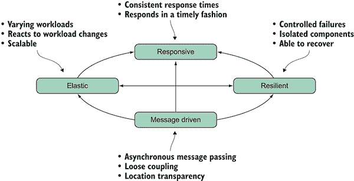    Figure 11.1 According to the Reactive Manifesto, for a system to be called reactive, it must have four properties: it must be responsive (must react to users), resilient (react to failure), message-driven (react to events), and scalable (react to load).      A system built using the manifesto’s requirements will:    *   Have a consistent response time regardless of the workload undertaken. *   Respond in a timely fashion, regardless of the volume of requests coming in. This ensures that the user isn’t spending significant amounts of time idly waiting for operations to complete, thereby providing a positive user experience.    This responsiveness is possible because reactive programming optimizes the use of the computing resources on multicore hardware, leading to better performance. Asynchronicity is one of the key elements of reactive programming. Chapters 8 and 9 cover the APM and how it plays an important role in building scalable systems. In chapter 14, you’ll build a complete server-side application that fully embraces this paradigm.    A message-driven architecture is the foundation of reactive applications. *Message-­driven* means that reactive systems are built on the premise of asynchronous message passing; furthermore, with a message-driven architecture, components can be loosely coupled. The primary benefit of reactive programming is that it removes the need for explicit coordination between active components in a system, simplifying the approach to asynchronous computation.    ## 11.2 The asynchronous message-passing programming model    In a typical synchronous application, you sequentially perform an operation with a request/response model of communication, using a procedure call to retrieve data or modify a state. This pattern is limited due to a blocking programming style and design that cannot be scaled or performed out of sequence.    A message-passing-based architecture is a form of asynchronous communication where data is queued, to be processed at a later stage, if necessary. In the context of reactive programming, the message-passing architecture uses an asynchronous semantic to communicate between the individual parts of the system. As a result, it can handle millions of messages per second, producing an incredible boost to performance (figure 11.2).  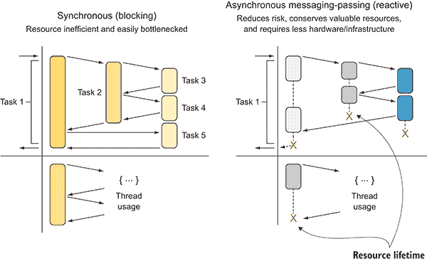    Figure 11.2 The synchronous (blocking) communication is resource inefficient and easily bottlenecked. The asynchronous message-passing (reactive) approach reduces blocking risks, conserves valuable resources, and requires less hardware/infrastructure.      The idea of message-passing concurrency is based on lightweight units of computation (or processes) that have exclusive ownership of state. The state, by design, is protected and unshared, which means it can be either mutable or immutable without running into any pitfalls due to a multithreaded environment (see chapter 1). In a message-passing architecture, two entities run in separate threads: the sender of a message and a receiver of the message.*The benefit of this programming model is that all issues of memory sharing and concurrent access are hidden inside the communication channel. Neither entity involved in the communication needs to apply any low-level synchronization strategies, such as locking. The message-passing architecture (message-passing concurrent model) doesn’t communicate by sharing memory, but instead communicates by sending messages.*   *Asynchronous message passing decouples communication between entities and allows senders to send messages without waiting for their receivers. No synchronization is necessary between senders and receivers for message exchange, and both entities can run independently. Keep in mind that the sender cannot know when a message is received and handled by the recipient.    The message-passing concurrent model can at first appear more complicated than sequential or even parallel systems, as you’ll see in the comparison in figure 11.3 (the squares represent objects, and arrows represent a method call or a message).  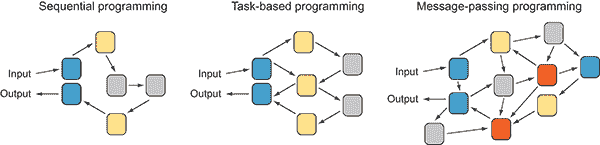    Figure 11.3 Comparison between task-based, sequential, and agent-based programming. Each block represents a unit of computation.      In figure 11.3, each block represents a unit of work:    *   Sequential programming is the simplest with a single input and produces a single output using a single control flow, where the blocks are connected directly in a linear fashion, each task dependent on the completion of the previous task. *   Task-based programming is similar to the sequential programming model, but it may MapReduce or Fork/Join the control flow. *   Message-passing programming may control the execution flow because the blocks are interconnected with other blocks in a continuous and direct manner. Ultimately, each block sends messages directly to other blocks, non-linearly. This design can seem complex and difficult to understand at first. But because blocks are encapsulated into active objects, each message is passed independent of other messages, with no blocking or lag time. With the message-passing concurrent model, you can have multiple building blocks, each with an independent input and output, which can be connected. Each block runs in isolation, and once isolation is achieved, it’s possible to deploy the computation into different tasks.    We’ll spend the rest of chapter on agents as the main tool for building message-passing concurrent models.    ### 11.2.1 Relation with message passing and immutability    By this point, it should be clear that immutability ensures increased degrees of concurrency. (Remember, an immutable object is an object whose state cannot be modified after it’s created.) Immutability is a foundational tool for building concurrent, reliable, and predictable programs. But it isn’t the only tool that matters. Natural isolation is also critically important, perhaps more so, because it’s easier to achieve in programming languages that don’t support immutability intrinsically. It turns out that agents enforce coarse-grained isolation through message passing.    ### 11.2.2 Natural isolation    Natural isolation is a critically important concept for writing lockless concurrent code. In a multithreaded program, isolation solves the problem of shared state by giving each thread a copied portion of data to perform local computation. With isolation, there’s no race condition, because each task processes an independent copy of its own data.    The natural isolation or share-nothing approach is less complex to achieve than immutability, but both options represent orthogonal approaches and should be used in conjunction for reducing runtime overheads and avoiding race condition and deadlocks.    ## 11.3 What is an agent?    An *agent* is a single-thread unit of computation used to design concurrent applications based on message passing in isolation (share-nothing approach). These agents are lightweight constructs that contain a queue and can receive and process messages. In this case, lightweight means that agents have a small memory footprint as compared to spawning new threads, so you can easily spin up 100,000 agents in a computer without a hitch.    Think of an agent as a process that has exclusive ownership of some mutable state, which can never be accessed from outside of the agent. Although agents run concurrently with each other, *within* a single agent everything is sequential. The isolation of the agent’s internal state is a key concept of this model, because it is completely inaccessible from the outside world, making it thread safe. Indeed, if state is isolated, mutation can happen freely.    An agent’s basic functionality is to do the following:    *   Maintain a private state that can be accessed safely in a multithreaded environment *   React to messages differently in different states *   Notify other agents *   Expose events to subscribers *   Send a reply to the sender of a message    One of the most important features of agent programming is that messages are sent asynchronously, and the sender doesn’t initiate a block. When a message is sent to an agent, it is placed in a mailbox. The agent processes one message at a time sequentially in the order in which it was added to the mailbox, moving on to the next message only when it has finished processing the current message. While an agent processes a message, the other incoming messages aren’t lost, but are buffered into the internal isolated mailbox. Consequently, multiple agents can run in parallel effortlessly, which means that the performance of a well-written agent-based application scales with the number of cores or processors.    ### 11.3.1 The components of an agent    Figure 11.4 shows the fundamental component parts of an agent:    *   *Mailbox*—An internal queue to buffer incoming messages implemented as asynchronous, race-free, and non-blocking. *   *Behavior*—The internal function applied sequentially to each incoming message. The behavior is single-threaded. *   *State*—Agents can have an internal state that’s isolated and never shared, so they never need to compete for locks to be accessed. *   *Message*—Agents can communicate only through messages, which are sent asynchronously and are buffered in a mailbox.  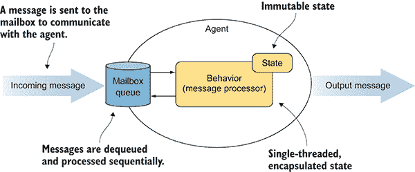    Figure 11.4 An agent consists of a mailbox that queues the income messages, a state, and a behavior that runs in a loop, which processes one message at a time. The behavior is the functionality applied to the messages.      ### 11.3.2 What an agent can do    The agent programming model provides great support for concurrency and has an extensive range of applicability. Agents are used in data collection and mining, reducing application bottlenecks by buffering requests, real-time analysis with bounded and unbounded reactive streaming, general-purpose number crunching, machine learning, simulation, Master/Worker pattern, Compute Grid, MapReduce, gaming, and audio and video processing, to mention a few.    ### 11.3.3 The share-nothing approach for lock-free concurrent programming    The share-nothing architecture refers to message-passing programming, where each agent is independent and there’s no single point of contention across the system. This architecture model is great for building concurrent and safe systems. If you don’t share anything, then there’s no opportunity for race conditions. Isolated message-­passing blocks (agents) are a powerful and efficient technique to implement scalable programming algorithms, including scalable request servers and scalable distributed-programming algorithms. The simplicity and intuitive behavior of the agent as a building block allows for designing and implementing elegant, highly efficient asynchronous and parallel applications that don’t share state. In general, agents perform calculations in reaction to the messages they receive, and they can send messages to other agents in a fire-and-forget manner or collect the responses, called *replies* (figure 11.5).  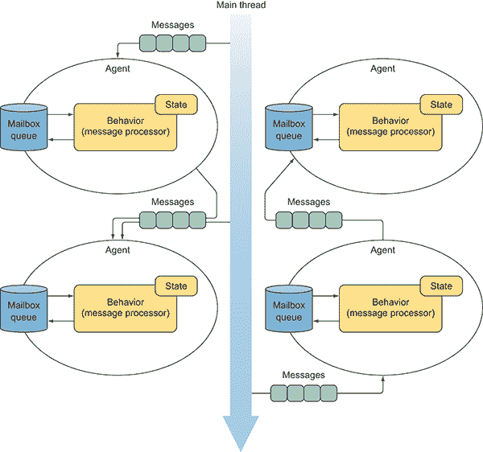    Figure 11.5 Agents communicate with each other through a message-passing semantic, creating an interconnected system of units of computation that run concurrently. Each agent has an isolated state and independent behavior.      ### 11.3.4 How is agent-based programming functional?    Certain aspects of agent-based programming aren’t functional. Although agents (and actors) were developed in the context of functional languages, their purpose is to generate side effects, which is against the tenets of FP. An agent often performs a side effect, or sends a message to another agent, which will, in turn, perform a new side effect.    Less important, but worth mentioning, is that FP in general separates logic from data. But agents contain data and the logic for the processing function. Additionally, sending a message to an agent doesn’t force any constraint on the return type. An agent behavior, which is the operation applied to each message, can either return a result or not return any result. In the latter scenario, the design of a message sent in a fire-and-forget fashion encourages program agents in a unidirectional flow pattern, which means that the messages flow forward from one agent to the next. This unidirectional message flow between agents can preserve their compositional semantic aspect, achieved by linking a given set of agents. The result is a pipeline of agents that represents the steps of operations to process the messages, each executed independently and potentially in parallel.    The primary reason that the agent model is functional is that agents can *send behavior to the state instead of sending state to the behavior*. In the agent model, the sender, besides sending messages, can provide the function which implements an action to process the incoming messages. Agents are an in-memory slot where you can put in data structure, such as a bucket (container). In addition to providing data storage, agents allow you to send messages in the shape of a function, which is then applied atomically to the internal bucket.    The function can be composed from other functions and then sent to the agent as a message. The advantage is the ability to update and change behavior at runtime using functions and function-composition fitting with the functional paradigm.    ### 11.3.5 Agent is object-oriented    It’s interesting to note that Alan Kay’s ([`en.wikipedia.org/wiki/Alan_Kay`](https://en.wikipedia.org/wiki/Alan_Kay)) original vision for objects in Smalltalk is much closer to the agent model than it is to the objects found in most programming languages (the basic concept of “messaging,” for example). Kay believed that state changes should be encapsulated and not done in an unconstrained way. His idea of passing messages between objects is intuitive and helps to clarify the boundaries between objects.    Clearly, message passing resembles OOP, and you can lean on the OOP-style message passing, which is only calling a method. Here, an agent is like an object in an object-­oriented program, because it encapsulates state and communicates with other agents by exchanging messages.    ## 11.4 The F# agent: MailboxProcessor    The support for the APM in F# doesn’t stop with asynchronous workflows (introduced in chapter 9). Additional support is provided inherently by the F# programming language, including `MailboxProcessor`, a primitive type that behaves as a lightweight in-memory message-passing agent (see figure 11.6).    `MailboxProcessor` works completely asynchronously, and provides a simple concurrent programming model that can deliver fast and reliable concurrent programs. I could write an entire book about `MailboxProcessor`, its multipurpose uses, and the flexibility that it provides for building a wide range of diverse applications. The benefits of using it include having a dedicated and isolated message queue combined with an asynchronous handler, which is used to throttle the message processing to automatically and transparently optimize the usage of the computer’s resources.  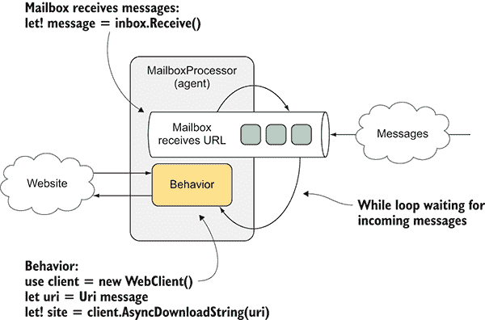    Figure 11.6 `MailboxProcessor` (agent) waits asynchronously for incoming messages in the `while` loop. The messages are strings representing the URL, which are applied to the internal behavior to download the related website.      The following listing shows a simple code example using a `MailboxProcessor`, which receives an arbitrary URL to print the length of the website.    Listing 11.1 Simple `MailboxProcessor` with a `while` loop   **``` type Agent<'T> = MailboxProcessor<'T>  let webClientAgent =  Agent<string>.Start(fun inbox -> async {   ①       while true do  let! message = inbox.Receive()   ②         use client = new WebClient()       let uri = Uri message  let! site = client.AsyncDownloadString(uri)   ③         printfn "Size of %s is %d" uri.Host site.Length     })  agent.Post "http://www.google.com"   ④   agent.Post "http://www.microsoft.com”   ④    ```    Let’s look at how to construct an agent in F#. First, there must be a name of the instance. In this case `webClientAgent` is the address of the mailbox processor. This is how you’ll post a message to be processed. The `MailboxProcessor` is generally initialized with the `MailboxProcessor.Start` shortcut method, though you can create an instance by invoking the constructor directly, and then run the agent using the instance method `Start`. To simplify the name and use of the `MailboxProcessor`, you establish it as the alias agent and then start the agent with `Agent.Start`.    Next, there’s a lambda function with an inbox containing an asynchronous workflow. Each message sent to the mailbox processor is sent asynchronously. The body of the agent functions as a message handler that accepts a mailbox (`inbox`:`Mailbox­Processor`) as an argument. This mailbox has a running logical thread that controls a dedicated and encapsulated message queue, which is thread safe, to use and coordinate the communication with other threads, or agents. The mailbox runs asynchronously, using the F# asynchronous workflow. It can contain long-running operations that don’t block a thread.    In general, messages need to be processed in order, so there must be a loop. This example uses a non-functional `while-true` style loop. It’s perfectly fine to use this or to use a functional, recursive loop. The agent in Listing 11.1 starts getting and processing messages by calling the asynchronous function `agent.Receive()` using the `let!` construct inside an imperative `while` loop.    Inside the loop is the heart of the mailbox processor. The call of the mailbox `Receive` function waits for the incoming message without blocking the actual thread, and resumes once a message is received. The use of the `let!` operator ensures that the computation is started immediately.    Then the first message available is removed from the mailbox queue and is bound to the message identifier. At this point, the agent reacts by processing the message, which in this example downloads and prints the size of a given website address. If the mailbox queue is empty and there are no messages to process, then the agent frees the thread back to the thread pool scheduler. That means no threads are idle while `Receive` waits for incoming messages, which are sent to the `MailboxProcessor` in a fire-and-forget fashion using the `agent.Post` method.    ### 11.4.1 The mailbox asynchronous recursive loop    In the previous example, the agent mailbox waits for messages asynchronously using an imperative `while` loop. Let’s modify the imperative loop so it uses a functional recursion to avoid mutation and possibly so it holds local state.    The following listing is the same version of the agent that counts its messages (shown in Listing 11.1), but this time it uses a recursive asynchronous function that maintains a state.    Listing 11.2 Simple `MailboxProcessor` with a recursive function    ```  let agent = Agent<string>.Start(fun inbox ->   let rec loop count = async {   ①             let! message = inbox.Receive()  use client = new WebClient()           let uri = Uri message           let! site = client.AsyncDownloadString(uri)           printfn "Size of %s is %d - total messages %d" uri.Host ➥ site.Length (count + 1)  return! loop (count + 1) }   ②             loop 0)         agent.Post "http://www.google.com"     agent.Post "http://www.microsoft.com"  ```    This functional approach is a little more advanced, but it greatly reduces the amount of explicit mutation in your code and is often more general. In fact, as you’ll see shortly, you can use the same strategy to maintain and safely reuse the state for caching.    Pay close attention to the line of code for the `return! loop (n + 1)`, where the function uses asynchronous workflows recursively to execute the loop, passing the increased value of the count. The call using `return!` is tail-recursive, which means that the compiler translates the recursion more efficiently to avoid stack overflow exceptions. See chapter 3 for more details about recursive function support (also in C#).    ## 11.5 Avoiding database bottlenecks with F# MailboxProcessor    The core feature of most applications is database access, which is frequently the real source of bottlenecks in code. A simple database performance tuning can speed up applications significantly and keep the server responsive.    How do you guarantee consistently high-throughput database access? To better facilitate database access, the operation should be asynchronous, because of the I/O nature of database access. Asynchronicity ensures that the server can handle multiple requests in parallel. You may wonder about the number of parallel requests that a database server can handle before performance degrades (figure 11.7 shows performance degradation at a high level). No exact answer exists. It depends on many different factors: for example, the size of the database connection pool.    A critical element of the bottleneck problem is controlling and throttling the incoming requests to maximize the application’s performance. `MailboxProcessor` provides a solution by buffering the incoming messages and taming possible overflow of requests (see figure 11.8). Using `MailboxProcessor` as a mechanism to throttle the database operations provides a granular control for optimizing the database connection-pool use. For example, the program could add or remove agents to execute the database operations in a precise grade of parallelism.  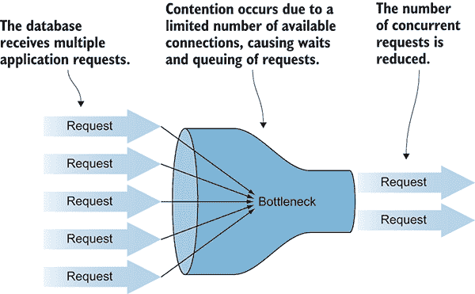    Figure 11.7 A large number of concurrent requests to access the database are reduced due to the limited size of the connection pool.    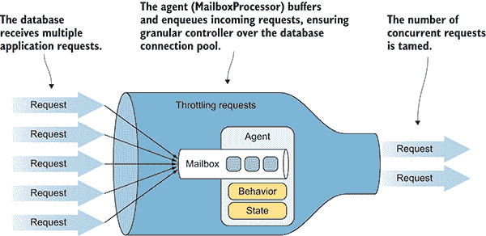    Figure 11.8 The agent (`MailboxProcessor`) controls the incoming requests to optimize the database connection-pool use.      Listing 11.3 shows a fully asynchronous function in F#. This function queries a given database and encapsulates the query in a `MailboxProcessor` body. Encapsulating an operation as behavior of an agent assures only one database request at a time is processed.    To access the database, use the traditional .NET Access-Data-Object (ADO). Alternatively, you could use Microsoft Entity Framework or any other data access you choose. I don’t cover how to access the Entity Framework data access component in this book. For more detail, refer to the MSDN online documentation at [`mng.bz/4sdU`](http://mng.bz/4sdU).    Listing 11.3 Using `MailboxProcessor` to manage database calls    ``` type Person  =  { id:int; firstName:string; lastName:string; age:int }   ①    type SqlMessage =  | Command of id:int * AsyncReplyChannel<Person option>   ②    let agentSql connectionString =     fun (inbox: MailboxProcessor<SqlMessage>) ->         let rec loop() = async {                  let! Command(id, reply) = inbox.Receive()   ③                   use conn = new SqlConnection(connectionString)                 use cmd = new SqlCommand("Select FirstName, LastName, Age   ➥ from db.People where id = @id")                 cmd.Connection <- conn                 cmd.CommandType <- CommandType.Text                 cmd.Parameters.Add("@id", SqlDbType.Int).Value <- id                     if conn.State <> ConnectionState.Open then   do! conn.OpenAsync()   ④    use! reader = cmd.ExecuteReaderAsync(   ⑤   CommandBehavior.SingleResult ||| CommandBehavior.CloseConnection)                  let! canRead = (reader:SqlDataReader).ReadAsync()                   if canRead then                     let person =                          {   id = reader.GetInt32(0)                              firstName = reader.GetString(1)                             lastName = reader.GetString(2)                             age = reader.GetInt32(3)  }  reply.Reply(Some person)   ⑥    else reply.Reply(None)   ⑦                   return! loop() }             loop()                      type AgentSql(connectionString:string) =         let agentSql = new MailboxProcessor<SqlMessage>                                               (agentSql connectionString)          member this.ExecuteAsync (id:int) =   agentSql.PostAndAsyncReply(fun ch -> Command(id, ch))   ⑧            member this.ExecuteTask (id:int) =              agentSql.PostAndAsyncReply(fun ch -> Command(id, ch))   |> Async.StartAsTask   ⑧    ```    Initially, the `Person` data structure is defined as a record type, which can be consumed easily as an immutable class by any .NET programming language. The function `agentSql` defines the body of a `MailboxProcessor`, whose behavior receives messages and performs database queries asynchronously. You make your application more robust by using an `Option` type for the `Person` value, which would otherwise be `null`. Doing so helps prevent `null` reference exceptions.    The type `AgentSql` encapsulates the `MailboxProcessor`, which originated from running the function `agentSql`. The access of the underlying agent is exposed through the methods `ExecuteAsync` and `ExecuteTask`.    The purpose of the `ExecuteTask` method is to encourage interoperability with C#. You can compile the `AgentSql` type into an F# library and distribute it as a reusable component. If you want to use the component from C#, then you should also provide methods that return a type `Task` or `Task<T>` for the F# functions that run an asynchronous workflow object (`Async<'T>`). How to interop between F# `Async` and .NET `Task` types is covered in appendix C.    ### 11.5.1 The MailboxProcessor message type: discriminated unions    The `type SqlMessage Command` is a single-case DU used to send a message to the `Mailbox­Processor` with a well-defined type, which can be pattern-matched:    ```  type SqlMessage =         | Command of id:int * AsyncReplyChannel<Person option>  ```    A common F# practice is to use a DU to define the different types of messages that a `MailboxProcessor` can receive and pattern match them to deconstruct and obtain the underlying data structure (for more on F#, see appendix B). Pattern matching over DUs gives a succinct way to process messages. A common pattern is to call `inbox.Receive()` or `inbox.TryReceive()` and follow that call with a match on the message contents.    Using strongly typed messages makes it possible for the `MailboxProcessor` behavior to distinguish between different types of messages and to supply different handling codes associated with each type of message.    ### 11.5.2 MailboxProcessor two-way communication    In Listing 11.3, the underlying `MailboxProcessor` returns (replies) to the caller the result of the database query in the shape of a `Person` option type. This communication uses the `AsyncReplyChannel<'T>` type, which defines the mechanism used to reply to the channel parameter established during message initialization (figure 11.9).  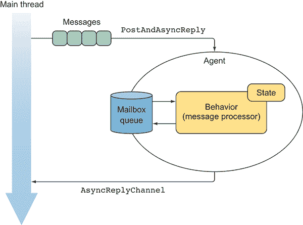    Figure 11.9 The agent two-way communication generates an `AsyncReplyChannel`, which is used by the agent as a callback to notify the caller when the computation is completed, generally supplying a result.      The code that can wait asynchronously for a response uses the `AsyncReplyChannel`. Once the computation is complete, use the `Reply` function to return the results from the mailbox:    ```  type SqlMessage =         | Command of id:int * **AsyncReplyChannel**<Person option>          member this.ExecuteAsync (id:int) =              agentSql.PostAndAsyncReply(fun **ch** -> Command(id, **ch**))  ```    The `PostAndAsyncReply` method initializes the channel for the `Reply` logic, which hands off the reply channel to the agent as part of the message using an anonymous lambda (function). At this point, the workflow is suspended (without blocking) until the operation completes and a `Reply`*,* carrying the result, is sent back to the caller by the agent through the channel:    ``` reply.Reply(Some person)  ```    As good practice, you should embed the `AsyncReplyChannel` handler inside the message itself, as shown in the DU `SqlMessage.Command of id:int *` `AsyncReply­Channel<Person option>`, because the reply of the sent message can be easily enforced by the compiler.    You might be thinking: Why would you use a `MailboxProcessor` to handle multiple requests if only one message at a time can be processed? Are the incoming messages lost if the `MailboxProcessor` is busy?    Sending messages to a `MailboxProcessor` is always non-blocking; but from the agent’s perspective, receiving them is a blocking operation. Even if you’re posting multiple messages to the agent, none of the messages will get lost, because they’re buffered and inserted into the mailbox queue.    It’s also possible to implement selective receive semantics to target and *scan (*[`mng.bz/1lJr`](http://mng.bz/1lJr)) for exact message types, and, depending on the agent behavior, the handler can wait for a specific message in the mailbox and temporarily defer others. This is a technique used to implement a finite-state machine with pause-and-resume capabilities.    ### 11.5.3 Consuming the AgentSQL from C#    At this point, you want to employ the `AgentSql` so it can be consumed by other languages. The exposed APIs are both C# `Task` and F# asynchronous workflow friendly.    Using C#, it’s simple to employ `AgentSql`. After referencing the F# library containing the `AgentSql`, you can create an instance of the object and then call the `Execute­Task` method:    ``` AgentSql agentSql = new AgentSql("<< `*ConnectionString Here*` >>"); Person person = **await** agentSql.**ExecuteTask**(42); Console.WriteLine($"Fullname {person.FirstName} {person.LastName}");  ```    `ExecuteTask` reruns a `Task<Person>`, so you can use the C# async/await model to extract the underlying value when the operation completes as a continuation.    You can use a similar approach in F#, an approach that supports the task-based programming model, although due to the intrinsic and superior support for the async workflow, I recommend that you use the `ExecuteAsync` method. In this case, you can either call the method inside an async computation expression, or call it by using the `Async.StartWithContinuations` function. With this function, a continuation handler can continue the work when the `AgentSql` replies with the result (see chapter 9). The following listing is an example using both F# approaches (the code to note is in bold).    Listing 11.4 Interacting asynchronously with `AgentSql`    ``` let token = CancellationToken()   ①    let agentSql = AgentSql("< Connection String Here >") let printPersonName id = **async** {  let**!** (Some person) = agentSql.**ExecuteAsync** id   ②             printfn "Fullname %s %s" person.firstName person.lastName }  Async.Start(printPersonName 42, token)   ③    Async.**StartWithContinuations**(agentSql.ExecuteAsync 42,   ④     (fun (Some person) ->   printfn "Fullname %s %s" person.firstName person.lastName),   ⑤    (fun exn -> printfn "Error: %s" exn.Message),   ⑤    (fun cnl -> printfn "Operation cancelled"), token)   ⑤    ```   **The `Async.StartWithContinuations` function specifies the code to run when the job completes as a continuation. `Async.StartWithContinuations` accepts three different continuation functions that are triggered with the output of the operation:    *   The code to run when the operation completes successfully, and a result is available. *   The code to run when an exception occurs. *   The code to run when an operation is canceled. The cancellation token is passed as an optional argument when you start the job.    See chapter 9 or the MSDN documentation online for more information ([`mng.bz/teA8`](http://mng.bz/teA8)). `Async.StartWithContinuations` isn’t complicated, and it provides a convenient control over dispatching behaviors in the case of success, error, or cancellation. These functions passed are referred to as *continuation functions*. Continuation functions can be specified as a lambda expression in the arguments to `Async.StartWith­Continuations`. Specifying code to run as a simple lambda expression is extremely powerful.    ### 11.5.4 Parallelizing the workflow with group coordination of agents    The main reason to have an agent process the messages to access a database is to control the throughput and to properly optimize the use of the connection pool. How can you achieve this fine control of parallelism? How can a system perform multiple requests in parallel without encountering a decrease in performance? `Mailbox­Processor` is a primitive type that’s flexible for building reusable components by encapsulating behavior and then exposing general or tailored interfaces that fit your program needs.    Listing 11.5 shows a reusable component, `parallelWorker` (in bold), that spawns a set of agents from a given count (`workers`). Here, each agent implements the same behavior and processes the incoming requests in a round-robin fashion. *Round-robin* is an algorithm that, in this case, is employed by the agent mailbox queue to process the incoming messages as first-come first-served, in circular order, handling all processes without particular priority.    Listing 11.5 Parallel `MailboxProcessor` workers    ``` type MailboxProcessor<'a> with  static member public **parallelWorker** (workers:int)   ①    (behavior:MailboxProcessor<'a> -> Async<unit>)   ②    (?errorHandler:exn -> unit) (?cts:CancellationToken) =   let cts = defaultArg cts (CancellationToken())   ③     let errorHandler = defaultArg errorHandler ignore   ③           let agent = new MailboxProcessor<'a>((fun inbox ->  let agents = Array.init workers (fun _ ->   ④                       let child = MailboxProcessor.Start(behavior, cts)  child.Error.Subscribe(errorHandler)   ⑤                       child)  cts.Register(fun () -> agents |> Array.iter(   ⑥                               fun a -> (a :> IDisposable).Dispose()))              let rec loop i = async {                 let! msg = inbox.Receive()  agents.[i].Post(msg)   ⑦                   return! loop((i+1) % workers)             }             loop 0), cts)         agent.Start()  ```    The main agent (`agentCoordinator`) initializes a collection of sub-agents to coordinate the work and to provide access to the agent’s children through itself. When the parent agent receives a message sent to the `parallelWorker` `MailboxProcessor`, the parent agent dispatches the message to the next available agent child (figure 11.10).  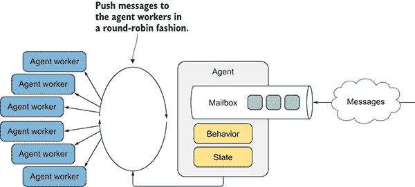    Figure 11.10 The parallel worker agent receives the messages that are sent to the children’s agents in a round-robin fashion to compute the work in parallel.      The `parallelWorker` function uses a feature called *type extensions* ([`mng.bz/Z5q9`](http://mng.bz/Z5q9)) to attach a behavior to the `MailboxProcessor` type. The type extension is similar to an extension method. With this type extension, you can call the `parallelWorker` function using dot notation; as a result, the `parallelWorker` function can be used and called by any other .NET programming language, keeping its implementation hidden.    The arguments of this function are as follows:    *   `workers`—The number of parallel agents to initialize. *   `behavior`—The function to identically implement the underlying agents. *   `errorHandler`—The function that each child agent subscribes to, to handle eventual errors. This is an optional argument and can be omitted. In this case, an ignore function is passed. *   `cts`—A cancellation token used to stop and dispose of all the children’s agents. If a cancellation token isn’t passed as an argument, a default is initialized and passed into the agent constructor.    ### 11.5.5 How to handle errors with F# MailboxProcessor    Internally, the `parallelWorker` function creates an instance of the `Mailbox­Processor` agent, which is the parent coordinator of the agent’s array (children), equaling in number the value of the `workers` argument:    ``` let agents = Array.init workers (fun _ ->                   let child = MailboxProcessor.Start(behavior, cts)                  child.**Error.Subscribe**(errorHandler)                      child)  ```    During the initialization phase, each agent child subscribes to its error event using the function `errorHandler`. In the case of an exception thrown from the body of a `Mailbox­Processor`, the error event triggers and applies the function subscribed.    Detecting and notifying the system in case of errors is essential in agent-based programming because it applies logic to react accordingly. The `MailboxProcessor` has built-in functionality for detecting and forwarding errors.    When an uncaught error occurs in a `MailboxProcessor` agent, the agent raises the error*event:*   *``` let child = MailboxProcessor.Start(behavior, cts) child.Error.Subscribe(errorHandler)  ```    To manage the error, you can register a callback function to the event handler. It’s common practice to forward the errors to a supervising agent. For example, here a simple supervisor agent displays the error received:    ``` let supervisor = Agent<System.Exception>.Start(fun inbox ->     async { while true do                 let! err = inbox.Receive()                 printfn "an error occurred in an agent: %A" err })  ```    You can define the error handler function that’s passed as an argument to initialize all the agent children:    ``` let handler = fun error -> supervisor.Post error  let agents = Array.init workers (fun _ ->                     let child = MailboxProcessor.Start(behavior, cts)                    child.Error.Subscribe(errorHandler)                    child)  ```    In critical application components, such as server-side requests represented as agents, you should plan to use the `MailboxProcessor` to handle errors gracefully and restart the application appropriately.    To facilitate error handling by notifying a supervisor agent, it’s convenient to define a helper function:    ``` module Agent =     let **withSupervisor** (supervisor: Agent<exn>) (agent: Agent<_>) =        agent.Error.Subscribe(fun error -> **supervisor**.Post error); agent  ```    `withSupervisor` abstracts the registration for error handling in a reusable component. Using this helper function, you can rewrite the previous portion of code that registers error handling for the `parallelWorker`, as shown here:    ``` let **supervisor** = Agent<System.Exception>.Start(fun inbox -> async {                         while true do                             let! error = inbox.Receive()                            **errorHandler** error }) let agent = new MailboxProcessor<'a>((fun inbox -> let agents = Array.init workers (fun _ ->                          MailboxProcessor.Start(behavior)                        |> **withSupervisor** **supervisor**)  ```    The `parallelWorker` encapsulates the agent supervisor, which uses the `errorHandler` function as constructor behavior to handle the error messages from the children’s agent.    ### 11.5.6 Stopping MailboxProcessor agents—CancellationToken    To instantiate the children’s agent, use the `MailboxProcessor` constructor that takes a function parameter as a behavior of the agent, and takes as a second argument a `CancellationToken` object. `CancellationToken` registers a function to dispose and stop all the agents running. This function is executed when `CancellationToken` is canceled:    ``` cts.Register(fun () ->         agents |> Array.iter(fun a -> (a :> IDisposable).Dispose()))  ```    Each child in the `MailboxProcessor` part of the `parallelWorker` agent, when running, is represented by an asynchronous operation associated with a given `Cancellation­Token`. Cancellation tokens are convenient when there are multiple agents that depend on each other, and you want to cancel all of them at once, similar to our example.    A further implementation is to encapsulate the `MailboxProcessor` agent into a disposable:    ``` type AgentDisposable<'T>(f:MailboxProcessor<'T> -> Async<unit>,                           ?cancelToken:CancellationTokenSource) =    let cancelToken = defaultArg cancelToken (new CancellationTokenSource())            let agent = MailboxProcessor.Start(f, cancelToken.Token)        member x.Agent = agent    interface **IDisposable** with        member x.Dispose() = **(agent :> IDisposable).Dispose()**                             **cancelToken**.Cancel())  ```    In this way, the `AgentDisposable` facilitates the cancellation and the memory deallocation (`Dispose`) of the underlying `MailboxProcessor` by calling the `Dispose` method from the `IDisposable` interface.    Using the `AgentDisposable`, you can rewrite the previous portion of code that registers the cancellation of the children’s agent for `parallelWorker`:    ``` let agents = Array.init workers (fun _ ->                   new **AgentDisposable**<'a>(behavior, cancelToken)                 |> withSupervisor supervisor)  thisletCancelToken.Register(fun () ->             agents |> Array.iter(fun agent -> agent.**Dispose**())  ```    When the cancellation token `thisletCancelToken` is triggered, the `Dispose` method of all the children’s agents is called, causing them to stop. You can find the full implementation of the refactored `parallelWorker` in this book’s source code.    ### 11.5.7 Distributing the work with MailboxProcessor    The rest of the code is self-explanatory. When a message is posted to the `parallelWorker`, the parent agent picks it up and forwards it to the first agent in line. The parent agent uses a recursive loop to maintain the state of the last agent served by index. During each iteration, the index is increased to deliver the following available message to the next agent:    ```  let rec loop i = async {         let! msg = inbox.Receive()         **agents.[i].Post(msg)**         return! loop((i+1) % workers) }  ```    You can use the `parallelWorker` component in a wide range of cases. For the previous `AgentSql` code example, you applied the `parallelWorker` extension to reach the original goal of having control (management) over the number of parallel requests that can access the database server to optimize connection-pool consumption.    Listing 11.6 Using `parallelWorker` to parallelize database reads    ``` let connectionString =   ①      ConfigurationManager.ConnectionStrings.["DbConnection"].ConnectionString  let maxOpenConnection = 10   ②    let agentParallelRequests =   MailboxProcessor<SqlMessage>.**parallelWorker**(maxOpenConnection,   ③                                                    agentSql connectionString)  let fetchPeopleAsync (ids:int list) =   let asyncOperation =   ④    ids             |> Seq.map (fun id -> agentParallelRequests.PostAndAsyncReply(                                                 fun ch -> Command(id, ch)))             |> Async.**Parallel**         Async.**StartWithContinuations**(asyncOperation,               (fun people -> people |> Array.choose id                               |> Array.iter(fun person ->                printfn "Fullname %s %s" person.firstName person.lastName)),                (fun exn -> printfn "Error: %s" exn.Message),                (fun cnl -> printfn "Operation cancelled"))  ```    In this example the maximum number of open connections is arbitrary, but in a real case, this value varies. In this code, you first create the `MailboxProcessor` `agent­ParallelRequests`, which runs in parallel with the `maxOpenConnection` number of agents. The function `fetchPeopleAsync` is the final piece to glue together all the parts. The argument passed into this function is a list of people IDs to fetch from the database. Internally, the function applies the `agentParallelRequests` agent for each of the IDs to generate a collection of asynchronous operations that will run in parallel using the `Async.Parallel` function.    In the example, the people IDs are retrieved in parallel; a more efficient way is to create an `SqlCommand` that fetches the data in one database round trip. But the purpose of the example still stands. The level of parallelism is controlled by the number of agents. This is an effective technique. In this book’s source code, you can find a complete and enhanced production-ready `parallelWorker` component that you can reuse in your daily work.    ### 11.5.8 Caching operations with an agent    In the previous section, you used the F# `MailboxProcessor` to implement a performant and asynchronous database access agent, which could control the throughput of parallel operations. To take this a step further to improve the response time (speed) for the incoming requests, you can reduce the actual number of database queries. This is possible with the introduction of a database cache in your program. There’s no reason why a single query should be executed more than once per request if the result won’t change. By applying smart caching strategies in database access, you can unlock a significant increase in performance. Let’s implement an agent-based reusable cache component, which then can be linked to the `agentParallelRequests` agent.    The cache agent’s objective is to isolate and store the state of the application while handling the messages to read or update this state. This listing shows the implementation of the `MailboxProcessor` `CacheAgent`.    Listing 11.7 Cache agent using the `MailboxProcessor`    ``` type CacheMessage<'Key> =     | GetOrSet of 'Key * AsyncReplyChannel<obj>     | UpdateFactory of Func<'Key,obj>  | Clear   ①    type Cache<'Key when 'Key : comparison>   (factory : Func<'Key, obj>,  ?timeToLive : int) =   ②       let timeToLive = defaultArg timeToLive 1000  let expiry = TimeSpan.FromMilliseconds (float timeToLive)   ③        let cacheAgent = Agent.Start(fun inbox ->         let cache = Dictionary<'Key, (obj * DateTime)>(   ➥ HashIdentity.Structural)   ④               let rec loop (factory:Func<'Key, obj>) = async {  let! msg = inbox.TryReceive timeToLive   ⑤                   match msg with                 | Some (GetOrSet (key, channel)) ->  match cache.TryGetValue(key) with   ⑥    | true, (v,dt) when DateTime.Now - dt < expiry ->   ⑥                           channel.Reply v                         return! loop factory                     | _ ->  let value = factory.Invoke(key)   ⑥                           channel.Reply value                         cache.Add(key, (value, DateTime.Now))                         return! loop factory  | Some(UpdateFactory newFactory) ->   ⑦                       return! loop (newFactory)                 | Some(Clear) ->                     cache.Clear()                     return! loop factory                 | None ->                     cache                      |> Seq.filter(function KeyValue(k,(_, dt)) ->                                                  DateTime.Now - dt > expiry)                     |> Seq.iter(function KeyValue(k, _) ->                                                  cache.Remove(k)|> ignore)                     return! loop factory }             loop factory )     member this.TryGet<'a>(key : 'Key) = async {  let! item = cacheAgent.PostAndAsyncReply(   ⑧                                  fun channel -> GetOrSet(key, channel))  match item with         | :? 'a as v -> return Some v         | _ -> return None  }     member this.GetOrSetTask (key : 'Key) =         cacheAgent.PostAndAsyncReply(fun channel -> GetOrSet(key, channel))  |> Async.StartAsTask   ⑨        member this.UpdateFactory(factory:Func<'Key, obj>) =  cacheAgent.Post(UpdateFactory(factory))   ⑦    ```    In this example, the first type, `CacheMessage`, is the definition of the message that is sent to the `MailboxProcessor`*in the form DUs. This DU determines the valid messages to send to the cache agent.*   *The core of the `CacheAgent` implementation is to initialize and immediately start a `MailboxProcessor` that constantly watches for incoming messages.    The constructs of F# make it easy to use lexical scoping to achieve isolation within asynchronous agents. This agent code uses the standard and mutable .NET dictionary collection to maintain the state originated from the different messages sent to an agent:    ``` let cache = Dictionary<'Key, (obj * DateTime)>()  ```    The internal dictionary is lexically private to the asynchronous agent, and no ability to read/write to the dictionary is made available other than to the agent. The mutable state in the dictionary is isolated. The agent function is defined as a recursive function loop that takes a single parameter factory, as shown here:    ``` Agent.Start(fun inbox ->         let rec loop (factory:Func<'Key, obj>) = async { ... }  ```    The factory function represents the initialization policy to create and add an item when it isn’t found by the `cacheAgent` in the local state cache. This factory function is continuously passed into the recursive function loop for state management, which allows you to swap the initialization procedure at runtime. In the case of caching the `AgentSql` requests, if the database or the system goes offline, then the response strategy can change. This is easily achieved by sending a message to the agent.    The agent receives the message semantic of the `MailboxProcessor`, which has a time­out to specify the expiration time. This is particularly useful for caching components to provoke a data invalidation, and then a data refresh:    ``` let! msg = inbox.TryReceive timeToLive  ```    The `TryReceive` of the inbox function returns a message option type, which can be either `Some`, when a message is received before the time `timeToLive` elapses, or `None` when no message is received during the `timeToLive` time:    ``` | None ->    cache    |> Seq.filter(function KeyValue(k,(_, dt)) -> DateTime.Now - dt > expiry)   |> Seq.iter(function KeyValue(k, _) -> cache.Remove(k) |> ignore)  ```    In this case, when the timeout expires, the agent auto-refreshes the cached data by automatically invalidating (removing) all the cache items that expired. But if a message is received, the agent uses pattern matching to determine the message type so that the appropriate processing can be done. Here’s the range of capabilities for incoming messages:    *   `GetOrSet`—In this case, the agent searches the cache dictionary for an entry that contains the specified key. If the agent finds the key and the invalidation time isn’t expired, then it returns the associated value. Otherwise, if the agent doesn’t find the key or the invalidation time is expired, then it applies the factory function to generate a new value, which is stored into the local cache in combination with the timestamp of its creation. The timestamp is used by the agent to verify the expiration time. Finally, the agent returns the result to the sender of the message:          ```     | Some (GetOrSet (key, channel)) ->                     match cache.TryGetValue(key) with                     | true, (v,dt) when DateTime.Now - dt < expiry ->                         channel.Reply v                         return! loop factory                     | _ ->                         let value = factory.Invoke(key)                         channel.Reply value                         cache.Add(key, (value, DateTime.Now))                         return! loop factory      ```           *   `UpdateFactory`—This message type, as already explained, allows the handler to swap the runtime initialization policy for the cache item:          ```     | Some(UpdateFactory newFactory) ->                      return! loop (newFactory)      ```           *   `Clear`—This message type clears the cache to reload all items.    Ultimately, here’s the code that links the previous parallel `AgentSql` `agentParallelRequests` to the `CacheAgent`:    ``` let connectionString =       ConfigurationManager.ConnectionStrings.["DbConnection"].ConnectionString  let **agentParallelRequests** =       MailboxProcessor<SqlMessage>.**parallelWorker**(8, agentSql connectionString)  let cacheAgentSql =     let ttl = 60000    CacheAgent<int>(fun id ->        **agentParallelRequests**.PostAndAsyncReply(fun ch -> Command(id, ch)), ttl)  let person = cacheAgentSql.**TryGet**<Person> 42  ```    When the `cacheAgentSql` agent receives the request, it checks whether the value 42 exists in the cache and if it’s expired. Otherwise, it interrogates the underlying `parallel­Worker` to return the expected item and save it into the cache to speed up future requests (see figure 11.11).  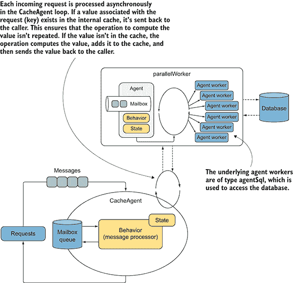    Figure 11.11 The `CacheAgent` maintains a local cache composed of key/value pairs, which associate an input (from a request) to a value. When a request arrives, the `CacheAgent` verifies the existence of the input/key and then either returns the value (if the input/key already exists in the local cache) without running any computation, or it calculates the value to send to the caller. In the latter case, the value is also persisted in the local cache to avoid repeated computation for the same inputs.      ### 11.5.9 Reporting results from a MailboxProcessor    Sometimes, the `MailboxProcessor` needs to report a state change to the system, where a subscribed component is to handle the state change. For example, for the `CacheAgent` example to be more complete, you could extend it to include such features as notification when data changes or when there’s a cache removal.    But how does a `MailboxProcessor` report notifications to the outside system? This is accomplished by using events (Listing 11.8). You’ve already seen how the `MailboxProcessor`*reports when an internal error occurs by triggering a notification to all of its subscribers. You can apply the same design to report any other arbitrary events from the agent. Using the previous `CacheAgent`, let’s implement an event reporting that can be used to notify when data invalidation occurs. For the example, you’ll modify the agent for an auto-refresh that can be used to notify when data has changed (the code to note is in bold).*   *Listing 11.8 Cache with event notification for refreshed items    ``` type Cache<'Key when 'Key : comparison>        (factory : Func<'Key, obj>,  ?timeToLive : int,           ?synchContext:SynchronizationContext) =     let timeToLive = defaultArg timeToLive 1000     let expiry = TimeSpan.FromMilliseconds (float timeToLive)   let cacheItemRefreshed = Event<('Key * 'obj)[]>()   ①     let **reportBatch** items =   ②           match synchContext with   | None -> cacheItemRefreshed.Trigger(items)   ③           | Some ctx ->   ctx.Post((fun _ -> cacheItemRefreshed.Trigger(items)),null)   ④        let cacheAgent = Agent.Start(fun inbox ->         let cache = Dictionary<'Key, (obj *   ➥ DateTime)>(HashIdentity.Structural)         let rec loop (factory:Func<'Key, obj>) = async {             let! msg = inbox.TryReceive timeToLive             match msg with             | Some (GetOrSet (key, channel)) ->                 match cache.TryGetValue(key) with                 | true, (v,dt) when DateTime.Now - dt < expiry ->                     channel.Reply v                     return! loop factory                 | _ ->  let value = factory.Invoke(key)                     channel.Reply value  reportBatch ([| (key, value) |])   ⑤                       cache.Add(key, (value, DateTime.Now))                     return! loop factory             | Some(UpdateFactory newFactory) ->                 return! loop (newFactory)             | Some(Clear) ->                 cache.Clear()                 return! loop factory             | None ->                 cache                  |> Seq.choose(function KeyValue(k,(_, dt)) ->                          if DateTime.Now - dt > expiry then                              let value, dt = factory.Invoke(k), DateTime.Now                             cache.[k] <- (value,dt)                             Some (k, value)                         else None)                 |> Seq.toArray  |> reportBatch   ⑤               }         loop factory )     member this.TryGet<'a>(key : 'Key) = async {         let! item = cacheAgent.PostAndAsyncReply(                     fun channel -> GetOrSet(key, channel))         match item with         | :? 'a as v -> return Some v         | _ -> return None  }  member this.**DataRefreshed** = cacheItemRefreshed.Publish   ①       member this.Clear() = cacheAgent.Post(Clear)  ```    In this code, the event `cacheItemRefreshed` channel dispatches the changes of state. By default, F# events execute the handlers on the same thread on which they’re triggered. In this case, it uses the agent’s current thread. But depending on which thread originated the `MailboxProcessor`, the current thread can be either from the `threadPool` or coming from the UI thread, specifically from `SynchronizationContext`, a class from `System.Threading` that captures the current synchronization context. The latter might be useful when the notification is triggered in response to an event that targets to update the UI. This is the reason the agent constructor, in the example, has the new parameter `synchContext`, which is an option type that provides a convenient mechanism to control where the event is triggered.    The `Some ctx` command means that the `SynchronizationContext`*isn’t `null`, and `ctx` is an arbitrary name given to access its value. When the synchronization context is `Some ctx`, the reporting mechanism uses the `Post`*method to notify the state changes on the thread selected by the synchronization context. The method signature of the synchronization context `ctx.Post` takes a delegate and an argument used by the delegate. Although the second argument isn’t required, `null` is used as replacement. The function `reportBatch` triggers the event `cacheItemRefreshed`:**   **``` this.DataRefreshed.Add(printAgent.Post)  ```    In the example, the change-of-state notification handler posts a message to a `MailboxProcessor` to print a report in a thread-safe manner. But you could use the same idea in more complex scenarios, such as for updating a web page automatically with the most recent data using `SignalR`.    ### 11.5.10 Using the thread pool to report events from MailboxProcessor    In most cases, to avoid unnecessary overhead, it is preferable to trigger an event using the current thread. Still, there may be circumstances where a different threading model could be better: for example, if triggering an event could block for a time or throw an exception that could kill the current process. A valid option is to trigger the event operating the thread pool to run the notification in a separate thread. The `reportBatch` function can be refactored using the F# asynchronous workflow and the `Async.Start` operator:    ``` let reportBatch batch =   async { batchEvent.Trigger(batch) } |> Async.Start  ```    Be aware with this implementation, the code running on a thread pool cannot access UI elements.    ## 11.6 F# MailboxProcessor: 10,000 agents for a game of life    `MailboxProcessor`, combined with asynchronous workflows, is a lightweight unit of computation (primitives), compared to threads. Agents can be spawned and destroyed with minimal overhead. You can distribute the work to various `MailboxProcessor`s, similar to how you might use threads, without having to incur the overhead associated with spinning up a new thread. For this reason, it’s completely feasible to create applications that consist of hundreds of thousands of agents running in parallel with minimum impact to the computer resources.    In this section, we use `MailboxProcessor` from multiple instances by implementing the Game of Life ([`en.wikipedia.org/wiki/Game_of_Life`](https://en.wikipedia.org/wiki/Game_of_Life)). As described on Wikipedia, Life, as it is simply known, is a cellular automaton. It is a zero-player game, which means that once the game starts with a random initial configuration, it runs without any other input. This game consists of a collection of cells that run on a grid, each cell following a few mathematical rules. Cells can live, die, or multiply. Every cell interacts with its eight neighbors (the adjacent cells). A new state of the grid needs to be continually calculated to move the cells around to respect these rules.    These are the Game of Life rules:    *   Each cell with one or no neighbors dies, as if by solitude. *   Each cell with four or more neighbors dies, as if by overpopulation. *   Each cell with two or three neighbors survives. *   Each cell with three neighbors becomes populated.    Depending on the initial conditions, the cells form patterns throughout the course of the game. The rules are applied repeatedly to create further generations until the cells reach a stable state (figure 11.12).  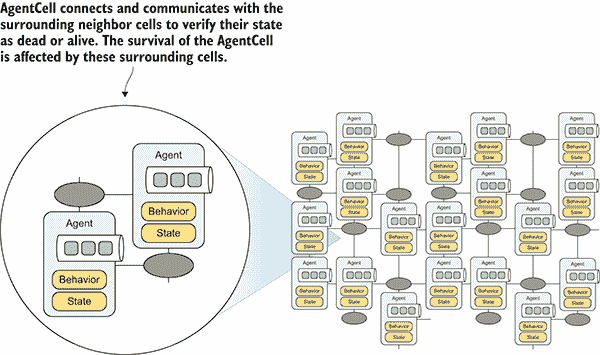    Figure 11.12 When the Game of Life is set up, each cell (in the code example there are 100,000 cells) is constructed using an `AgentCell MailboxProcessor`. Each agent can be dead, a black circle, or alive depending the state of its neighbors.      Listing 11.9 is the implementation of the Game of Life cell, `AgentCell`, which is based on the F# `MailboxProcessor`. Each agent cell communicates with the adjacent cells through asynchronous message passing, producing a fully parallelized Game of Life. For conciseness, and because they’re irrelevant for the main point of the example, I omitted a few parts of the code. You can find the full implementation in this book’s source code.    Listing 11.9 Game of Life with `MailboxProcessor` as cells    ``` type CellMessage =     | NeighborState of cell:AgentCell * isalive:bool     | State of cellstate:AgentCell     | Neighbors of cells:AgentCell list  | ResetCell   ①   and State =     {   neighbors:AgentCell list         wasAlive:bool  isAlive:bool }   ②       static member createDefault isAlive =         { neighbors=[]; isAlive=isAlive; wasAlive=false; }  and AgentCell(location, alive, updateAgent:Agent<_>) as this =  let neighborStates = Dictionary<AgentCell, bool>()   ③       let AgentCell =         Agent<CellMessage>.Start(fun inbox ->             let rec loop state = async {                 let! msg = inbox.Receive()                 match msg with                 | ResetCell ->                    state.neighbors   |> Seq.iter(fun cell -> cell.Send(State(this)))   ④                      neighborStates.Clear()  return! loop { state with wasAlive=state.isAlive }   ⑤                   | Neighbors(neighbors) ->  return! loop { state with neighbors=neighbors }   ⑤                   | State(c) ->                     c.Send(NeighborState(this, state.wasAlive))                     return! loop state                 | NeighborState(cell, alive) ->                     neighborStates.[cell] <- alive  if neighborStates.Count = 8 then   ⑥                          let aliveState =                            let numberOfneighborAlive =                                neighborStates   |> Seq.filter(fun (KeyValue(_,v)) -> v)   ⑦                                 |> Seq.length   match numberOfneighborAlive with   ⑦                               | a when a > 3  || a < 2 -> false                             | 3 -> true                             | _ -> state.isAlive  updateAgent.Post(Update(aliveState, location))   ⑧                          return! loop { state with isAlive = aliveState }                     else return! loop state }             loop (State.createDefault alive ))      member this.Send(msg) = AgentCell.Post msg  ```    `AgentCell` represents a cell in the grid of the Game of Life. The main concept is that each agent communicates with the neighbor cells about its (the agent’s) current state using asynchronous message passing. This pattern creates a chain of interconnected parallel communications that involves all the cells, which send their updated state to the `updateAgent` `MailboxProcessor`. At this point, the `updateAgent` refreshes the graphic in the UI.    Listing 11.10 `updateAgent` that refreshes the WPF UI in real time    ``` let updateAgent grid (ctx: SynchronizationContext) =   ①     let gridProduct = grid.Width * grid.Height  let pixels = Array.zeroCreate<byte> (gridProduct)   ②    Agent<UpdateView>.Start(fun inbox ->  let gridState = Dictionary<Location, bool>(HashIdentity.Structural)  ③       let rec loop () = async {          let! msg = inbox.Receive()          match msg with  | Update(alive, location, agent) ->   ④    agentStates.[location] <- alive   ④    agent.Send(ResetCell)   ④    if agentStates.Count = gridProduct then   ⑤                    agentStates.AsParallel().ForAll(fun s ->                      pixels.[s.Key.x+s.Key.y*grid.Width]  <- if s.Value then 128uy else 0uy   ⑥                    )  do! Async.SwitchToContext ctx   ⑦    image.Source <- createImage pixels   ⑦    do! Async.SwitchToThreadPool()   ⑦                   agentStates.Clear()             return! loop()      }      loop())  ```    `updateAgent`, as its name suggests, updates the state of each pixel with the correlated cell value received in the `Update` message. The agent maintains the status of the pixels and uses that status to create a new image when all the cells have sent their new state. Next, `updateAgent` refreshes the graphical WPF UI with this new image, which represents the current grid of the Game of Life:    ``` do! Async.SwitchToContext ctx   image.Source <- createImage pixels     do! Async.SwitchToThreadPool()  ```    It’s important to note that `updateAgent` agent uses the current synchronization context to update the WPF controller correctly. The current thread is switched to the UI thread using the `Async`.`SwitchToContext` function (discussed in chapter 9).    The final piece of code to run the Game of Life generates a grid that acts as the playground for the cells, and then a timer notifies the cells to update themselves (Listing 11.11). In this example, the grid is a square of 100 cells per side, for a total of 10,000 cells (`MailboxProcessor`s) that*run in parallel with a refresh timer of 50 ms, as shown in figure 11.13. There are 10,000 `MailboxProcessor`s*communicating with each other and updating the UI 20 times every second (the code to note is in bold).**   **Listing 11.11 Creating the Game of Life grid and starting the timer to refresh    ``` let run(ctx:SynchronizationContext) =  let size = 100   ①    let grid = { Width= size; Height=size}   ②        let updateAgent = updateAgent grid ctx   let **cells** = seq { for x = 0 to grid.Width - 1 do  for y = 0 to grid.Height - 1 do   ③                                  let agent = AgentCell({x=x;y=y},                                    alive=getRandomBool(),                                     updateAgent=updateAgent)                     yield (x,y), agent  } |> dict      let neighbours (x', y') =         seq {           for x = x' - 1 to x' + 1 do             for y = y' - 1 to y' + 1 do               if x <> x' || y <> y' then                  yield cells.[(x + grid.Width) % grid.Width,                               (y + grid.Height) % grid.Height]         } |> Seq.toList   **cells.AsParallel().ForAll**(fun pair ->   ④           let cell = pair.Value         let neighbours = neighbours pair.Key  **cell**.Send(Neighbors(neighbours))   ④    **cell**.Send(ResetCell)   ④        )  ```    The notifications to all the `cells` (agents) are sent in parallel using PLINQ. The `cells` are an F# sequence that’s treated as a .NET `IEnumerable`*,* which allows an effortless integration of LINQ/PLINQ.      Figure 11.13 Game of Life. The GUI is a WPF application.      When the code runs, the program generates 10,000 F# `MailboxProcessor`s in less than 1 ms with a memory consumption, specific for the agents, of less than 25 MB. Impressive!    ## Summary    *   The agent programming model intrinsically promotes immutability and isolation for writing concurrent systems, so even complex systems are easier to reason about because the agents are encapsulated into active objects. *   The Reactive Manifesto defines the properties to implement a reactive system, which is flexible, loosely coupled, and scalable. *   Natural isolation is important for writing lockless concurrent code. In a multithreaded program, isolation solves the problem of shared state by giving each thread a copied portion of data to perform local computation. When using isolation, there’s no race condition. *   By being asynchronous, agents are lightweight, because they don’t block threads while waiting for a message. As a result, you can use hundreds of thousands of agents in a single application without any impact on the memory footprint. *   The F# `MailboxProcessor` allows two-way communication: the agent can use an asynchronous channel to return (reply) to the caller the result of a computation. *   The agent programming model F# `MailboxProcessor` is a great tool for solving application bottleneck issues, such as multiple concurrent database accesses. In fact, you can use agents to speed up applications significantly and keep the server responsive. *   Other .NET programming languages can consume the F# `MailboxProcessor` by exposing the methods using the friendly TPL task-based programming model.************  ******# 12 Parallel workflow and agent programming with TPL Dataflow    **This chapter covers**    *   Using TPL Dataflow blocks *   Constructing a highly concurrent workflow *   Implementing a sophisticated Producer/Consumer pattern *   Integrating Reactive Extensions with TPL Dataflow    Today’s global market requires that businesses and industries be agile enough to respond to a constant flow of changing data. These workflows are frequently large, and sometimes infinite or unknown in size. Often, the data requires complex processing, leading to high throughput demands and potentially immense computational loads. To cope with these requirements, the key is to use parallelism to exploit system resources and multiple cores.    But today’s .NET Framework’s concurrent programming models weren’t designed with dataflow in mind. When designing a reactive application, it’s fundamental to build and treat the system components as units of work. These units react to messages, which are propagated by other components in the chain of processing. These reactive models emphasize a push-based model for applications to work, rather than a pull-based model (see chapter 6). This push-based strategy ensures that the individual components are easy to test and link, and, most importantly, easy to understand.    This new focus on push-based constructions is changing how programmers design applications. A single task can quickly grow complex, and even simple-looking requirements can lead to complicated code.    In this chapter, you’ll learn how the .NET Task Parallel Library Dataflow (TPL Dataflow, or TDF) helps you to tackle the complexity of developing modern systems with an API that builds on TAP. TDF fully supports asynchronous processing, in combination with a powerful compositionality semantic and a better configuration mechanism than the TPL. TDF eases concurrent processing and implements tailored asynchronous parallel workflow and batch queuing. Furthermore, it facilitates the implementation of sophisticated patterns based on combining multiple components that talk to each other by passing messages.    ## 12.1 The power of TPL Dataflow    Let’s say you’re building a sophisticated Producer/Consumer pattern that must support multiple producers and/or multiple consumers in parallel, or perhaps it has to support workflows that can scale the different steps of the process independently. One solution is to exploit Microsoft TPL Dataflow. With the release of .NET 4.5, Microsoft introduced TPL Dataflow as part of the tool set for writing concurrent applications. TDF is designed with the higher-level constructs necessary to tackle easy parallel problems while providing a simple-to-use, powerful framework for building asynchronous data-processing pipelines. TDF isn’t distributed as part of the .NET 4.5 Framework, so to access its API and classes, you need to import the official Microsoft NuGet Package (`install-Package Microsoft.Tpl.DataFlow`).    TDF offers a rich array of components (also called *blocks*) for composing dataflow and pipeline infrastructures based on the in-process message-passing semantic (see figure 12.1). This dataflow model promotes actor-based programming by providing in-process message passing for coarse-grained dataflow and pipelining tasks.    TDF uses the task scheduler (`TaskScheduler`, [`mng.bz/4N8F`](http://mng.bz/4N8F)) of the TPL to efficiently manage the underlying threads and to support the TAP model (async/await) for optimized resource utilization. TDF increases the robustness of highly concurrent applications and obtains better performance for parallelizing CPU and I/O intensive operations, which have high throughput and low latency.  *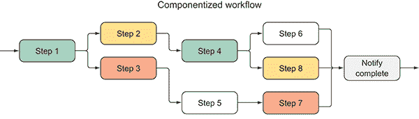    Figure 12.1 Workflow composed by multiple steps. Each operation can be treated as an independent computation.      The concept behind the TPL Dataflow library is to ease the creation of multiple patterns, such as with batch-processing pipelines, parallel stream processing, data buffering, or joining and processing batch data from one or more sources. Each of these patterns can be used as a standalone, or may be composed with other patterns, enabling developers to easily express complex dataflow.    ## 12.2 Designed to compose: TPL Dataflow blocks    Imagine you’re implementing a complex workflow process composed of many different steps, such as a stock analysis pipeline. It’s ideal to split the computation in blocks, developing each block independently and then gluing them together. Making these blocks reusable and interchangeable enhances their convenience. This composable design would simplify the application of complex and convoluted systems.    Compositionality is the main strength of TPL Dataflow, because its set of independent containers, known as blocks, is designed to be combined. These blocks can be a chain of different tasks to construct a parallel workflow, and are easily swapped, reordered, reused, or even removed. TDF emphasizes a component’s architectural approach to ease the restructure of the design. These dataflow components are useful when you have multiple operations that must communicate with one another asynchronously or when you want to process data as it becomes available, as shown in figure 12.2.  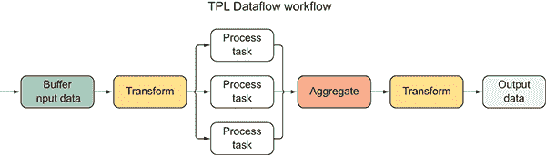    Figure 12.2 TDF embraces the concepts of reusable components. In this figure, each step of the workflow acts as reusable components. TDF brings a few core primitives that allow you to express computations based on Dataflow graphs.      Here’s a high-level view of how TDF blocks operate:    1.  Each block receives and buffers data from one or more sources, including other blocks, in the form of messages. When a message is received, the block reacts by applying its behavior to the input, which then can be transformed and/or used to perform side effects. 2.  The output from the component (*block*) is then passed to the next linked block, and to the next one, if any, and so on, creating a pipeline structure.    TDF excels at providing a set of configurable properties by which it’s possible, with small changes, to control the level of parallelism, manage the buffer size of the mailbox, and process data and dispatch the outputs.    There are three main types of dataflow blocks:    *   *Source* —Operates as producer of data. It can also be read from. *   *Target* —Acts as a consumer, which receives the data and can be written to. *   *Propagator* —Acts as both a Source and a Target block.    For each of these dataflow blocks, TDF provides a set of subblocks, each with a different purpose. It’s impossible to cover all the blocks in one chapter. In the following sections we focus on the most common and versatile ones to adopt in general pipeline composition applications.    For more information about the Dataflow library, see the online MSDN documentation ([`mng.bz/GDbF`](http://mng.bz/GDbF)).    ### 12.2.1 Using BufferBlock<TInput> as a FIFO buffer    TDF `BufferBlock<T>` acts as an unbounded buffer for data that’s stored in a first in, first out (FIFO) order (figure 12.3). In general, `BufferBlock` is a great tool for enabling and implementing asynchronous Producer/Consumer patterns, where the internal message queue can be written to by multiple sources, or read from multiple targets.      Figure 12.3 The TDF `BufferBlock` has an internal buffer where messages are queued, waiting to be processed by the task. The input and output are the same types, and this block doesn’t apply any transformation on the data.      Here is a simple Producer/Consumer using the TDF `BufferBlock`.    Listing 12.1 Producer/Consumer based on the TDF `BufferBlock`    ``` BufferBlock<int> buffer = new BufferBlock<int>();   ①    async Task Producer(IEnumerable<int> values)  {        foreach (var value in values)  buffer.Post(value);   ②    buffer.Complete();   ③   } async Task Consumer(Action<int> process) {  while (await buffer.OutputAvailableAsync())   ④    process(await buffer.ReceiveAsync());   ⑤   }  async Task Run() {         IEnumerable<int> range = Enumerable.Range(0,100);         await Task.WhenAll(Producer(range), Consumer(n =>                   Console.WriteLine($"value {n}"))); }  ```    The items of the `IEnumerable` values are sent through the `buffer.Post` method to the `BufferBlock` buffer, which retrieves them asynchronously using the `buffer.ReceiveAsync` method. The `OutputAvailableAsync` method knows when the next item is ready to be retrieved and makes the notification. This is important to protect the code from an exception; if the buffer tries to call the `Receive` method after the block completes processing, an error is thrown. This `BufferBlock` block essentially receives and stores data so that it can be dispatched to one or more other target blocks for processing.    ### 12.2.2 Transforming data with TransformBlock<TInput, TOutput>    The TDF `TransformBlock<TInput,TOutput>` acts like a mapping function, which applies a projection function to an input value and provides a correlated output (figure 12.4). The transformation function is passed as an argument in the form of a delegate `Func<TInput,TOutput>`, which is generally expressed as a lambda expression. This block’s default behavior is to process one message at a time, maintaining strict FIFO ordering.  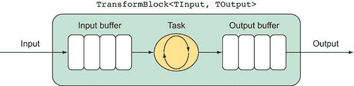    Figure 12.4 The TDF `TransformBlock` has an internal buffer for both the input and output values; this type of block has the same buffer capabilities as `BufferBlock`. The purpose of this block is to apply a transformation function on the data; the `Input` and `Output` are likely different types.      Note that `TransformBlock<TInput,TOutput>` performs as the `BufferBlock­<TOutput>`, which buffers both the input and output values. The underlying delegate can run synchronously or asynchronously. The asynchronous version has a type signature `Func­<TInput,Task<TOutput>>` whose purpose it is to run the underlying function asynchronously. The block treats the process of that element as completed when the returned `Task` appears terminated. This listing shows how to use the `TransformBlock` type (the code to note is in bold).    Listing 12.2 Downloading images using the TDF `TransformBlock`    ``` var fetchImageFlag = new **TransformBlock**<string, (string, byte[])>(  **async** urlImage => {   ①        using (var webClient = new WebClient()) {  byte[] data = **await** webClient.DownloadDataTaskAsync(urlImage);   ②    return (urlImage, data);   ③        } });  List<string> urlFlags = new List<string>{      "Italy#/media/File:Flag_of_Italy.svg",      "Spain#/media/File:Flag_of_Spain.svg",      "United_States#/media/File:Flag_of_the_United_States.svg"      };  foreach (var urlFlag in urlFlags)     fetchImageFlag.Post($"https://en.wikipedia.org/wiki/{urlFlag}");  ```    In this example, the `TransformBlock<string,(string, byte[])>` `fetchImageFlag` block fetches the flag image in a tuple string and byte array format. In this case, the output isn’t consumed anywhere, so the code isn’t too useful. You need another block to process the outcome in a meaningful way.    ### 12.2.3 Completing the work with ActionBlock<TInput >    The TDF `ActionBlock` executes a given callback for any item sent to it. You can think of this block logically as a buffer for data combined with a task for processing that data. ``ActionBlock<TInput> is a target block that calls a delegate when it receives data, similar to a `for-each` loop (figure 12.5).``  ````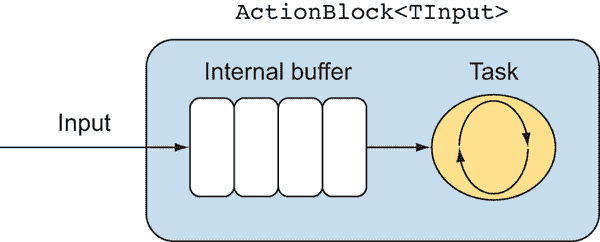    Figure 12.5 The TDF `ActionBlock` has an internal buffer for input messages that are queued if the task is busy processing another message. This type of block has the same buffer capabilities as `BufferBlock`. The purpose of this block is to apply an action that completes the workflow without output that likely produces side effects. In general, because `ActionBlock` doesn’t have an output, it cannot compose to a following block, so it’s used to terminate the workflow.      `ActionBlock<TInput>` is usually the last step in a TDF pipeline; in fact, it doesn’t produce any output. This design prevents `ActionBlock` from being combined with further blocks, unless it posts or sends the data to another block, making it the perfect candidate to terminate the workflow process. For this reason, `ActionBlock` is likely to produce side effects as a final step to complete the pipeline processing.    The following code shows the `TransformBlock` from the previous listing pushing its outputs to the `ActionBlock` to persist the flag images in the local filesystem (in bold).    Listing 12.3 Persisting data using the TDF `ActionBlock`    ``` var saveData = new **ActionBlock**<(string, byte[])>(**async** data => {   ①    (string urlImage, byte[] image) = data;   ②       string filePath = urlImage.Substring(urlImage.IndexOf("File:") + 5);  **await** File.WriteAllBytesAsync(filePath, image);   ③     });  fetchImageFlag.**LinkTo**(saveData);   ④    ```    The argument passed into the constructor during the instantiation of the `ActionBlock` block can be either a delegate `Action<TInput>` or `Func<TInput,Task>``.` The latter performs the internal action (behavior) asynchronously for each message input (received). Note that the `ActionBlock` has an internal buffer for the incoming data to be processed, which works exactly like the `BufferBlock`.    It’s important to remember that the `ActionBlock saveData` is linked to the previous `TransformBlock fetchImageFlag` using the `LinkTo` extension method. In this way, the output produced by the `TransformBlock` is pushed to the `ActionBlock` as soon as available.    ### 12.2.4 Linking dataflow blocks    TDF blocks can be linked with the help of the `LinkTo` extension method. Linking dataflow blocks is a powerful technique for automatically transmitting the result of each computation between the connected blocks in a message-passing manner. The key component for building sophisticated pipelines in a declarative manner is to use connecting blocks. If we look at the signature of the `LinkTo` extension method from the conceptual point of view, it looks like a function composition:    ``` **LinkTo: (a -> b) -> (b -> c)**  ```    ## 12.3 Implementing a sophisticated Producer/Consumer with TDF    The TDF programming model can be seen as a sophisticated Producer/Consumer pattern, because the blocks encourage a pipeline model of programming, with producers sending messages to decoupled consumers. These messages are passed asynchronously, maximizing throughput. This design provides the benefits of not blocking the producers, because the TDF blocks (queue) act as a buffer, eliminating waiting time. The synchronization access between producer and consumers may sound like an abstract problem, but it’s a common task in concurrent programming. You can view it as a design pattern for synchronizing two components.    ### 12.3.1 A multiple Producer/single Consumer pattern: TPL Dataflow    The Producer/Consumer pattern is one of the most widely used patterns in parallel programming. Developers use it to isolate work to be executed from the processing of that work. In a typical Producer/Consumer pattern, at least two separated threads run concurrently: one produces and pushes the data to process into a queue, and the other verifies the presence of the new incoming piece of data and processes it. The queue that holds the tasks is shared among these threads, which requires care for accessing tasks safely. TDF is a great tool for implementing this pattern, because it has intrinsic support for multiple readers and multiple writers concurrently, and it encourages a pipeline pattern of programming with producers sending messages to decoupled consumers (figure 12.6).  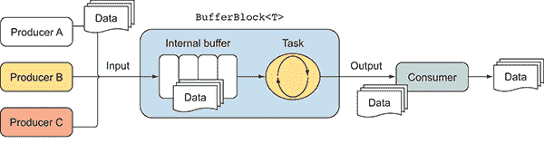    Figure 12.6 Multiple-producers/one-consumer pattern using the TDF `BufferBlock`, which can manage and throttle the pressure of multiple producers      In the case of a multiple-Producer/single-Consumer pattern, it’s important to enforce a restriction between the number of items generated and the number of items consumed. This constraint aims to balance the work between the producers when the consumer cannot handle the load. This technique is called *throttling*. Throttling protects the program from running out of memory if the producers are faster than the consumer. Fortunately, TDF has built-in support for throttling, which is achieved by setting the maximum size of the buffer through the property `BoundedCapacity`, part of the `DataFlowBlockOptions`. In Listing 12.4, this property ensures that there will never be more than 10 items in the `BufferBlock` queue. Also, in combination with enforcing the limit of the buffer size, it’s important to use the function `SendAsync`, which waits without blocking for the buffer to have available space to place a new item.    Listing 12.4 Asynchronous Producer/Consumer using TDF    ``` BufferBlock<int> buffer = new BufferBlock<int>(   new DataFlowBlockOptions { BoundedCapacity = 10 });   ①    async Task Produce(IEnumerable<int> values) {       foreach (var value in values)  await buffer.SendAsync(value);;   ②   }  async Task MultipleProducers(params IEnumerable<int>[] producers) {     await Task.WhenAll(  from values in producers select Produce(values).ToArray())   ③    .ContinueWith(_ => buffer.Complete());   ④   }  async Task Consumer(Action<int> process) {  while (await buffer.OutputAvailableAsync())   ⑤             process(await buffer.ReceiveAsync());         }  async Task Run() {        IEnumerable<int> range = Enumerable.Range(0, 100);         await Task.WhenAll(MultipleProducers(range, range, range),             Consumer(n => Console.WriteLine($"value {n} - ThreadId             {Thread.CurrentThread.ManagedThreadId}"))); }  ```    By default, TDF blocks have the value `DataFlowBlockOptions.Unbounded` set to -1, which means that the queue is unbounded (unlimited) to the number of messages. But you can reset this value to a specific capacity that limits the number of messages the block may be queuing. When the queue reaches maximum capacity, any additional incoming messages will be postponed for later processing, making the producer wait before further work. Likely, making the producer slow down (or wait) isn’t a problem because the messages are sent asynchronously.    ### 12.3.2 A single Producer/multiple Consumer pattern    The TDF*`BufferBlock` intrinsically supports a single Producer/multiple Consumer pattern. This is handy if the producer performs faster than the multiple consumers, such as when they’re running intensive operations.*   *Fortunately, this pattern is running on a multicore machine, so it can use multiple cores to spin up multiple processing blocks (consumers), each of which can handle the producers concurrently.    Achieving the multiple-consumer behavior is a matter of configuration. To do so, set the `MaxDegreeOfParallelism` property to the number of parallel consumers to run. Here’s Listing 12.4 modified to apply a max-degree-of-parallelism set to the number of available logical processors:    ``` BufferBlock<int> buffer = new BufferBlock<int>(new DataFlowBlockOptions {                BoundedCapacity = 10,                MaxDegreeOfParallelism = Environment.ProcessorCount });  ```    By default, the TDF block setting processes only one message at a time, while buffering the other incoming messages until the previous one completes. Each block is independent of others, so one block can process one item while another block processes a different item. But when constructing the block, you can change this behavior by setting the `MaxDegreeOfParallelism` property in the `DataFlowBlockOptions` to a value greater than 1\. You can use TDF to speed up the computations by specifying the number of messages that can be processed in parallel. The internals of the class handle the rest, including the ordering of the data sequence.    ## 12.4 Enabling an agent model in C# using TPL Dataflow    TDF blocks are designed to be stateless by default, which is perfectly fine for most scenarios. But there are situations in an application when it’s important to maintain a state: for example, a global counter, a centralized in-memory cache, or a shared database context for transactional operations.    In such situations, there’s a high probability that the shared state is also the subject of mutation, because of continually tracking certain values. The problem has always been the difficulty of handling asynchronous computations combined with mutable state. As previously mentioned, the mutation of shared state becomes dangerous in a multithreaded environment by leading you into a tar pit of concurrent issues ([`curtclifton.net/papers/MoseleyMarks06a.pdf`](http://curtclifton.net/papers/MoseleyMarks06a.pdf)). Luckily, TDF encapsulates the state inside the blocks, while the channels between blocks are the only dependencies. By design, this permits isolated mutation in a safe manner.    As demonstrated in chapter 11, the F# `MailboxProcessor` can solve these problems because it embraces the agent model philosophy, which can maintain an internal state by safeguarding its access to be concurrent safe (only one thread at a time can access the agent). Ultimately, the F# `MailboxProcessor` can expose a set of APIs to the C# code that can consume it effortlessly. Alternatively, you can reach the same performance using TDF to implement an agent object in C#, and then that agent object can act as the F#*`MailboxProcessor`.*   *The implementation of `StatefulDataFlowAgent` relies on the instance of `actionBlock` to receive, buffer, and process incoming messages with an unbounded limit (figure 12.7). Note that the max degree of parallelism is set to the default value 1 as designed, embracing the single-threaded nature of the agent model. The state of the agent is initialized in the constructor and is maintained through a polymorphic and mutable value `TState`, which is reassigned as each message is processed. (Remember that the agent model only allows access by one thread at a time, ensuring that the messages are processed sequentially to eliminate any concurrent problems.) It’s good practice to use an immutable state, regardless of the safety provided by the agent implementation.  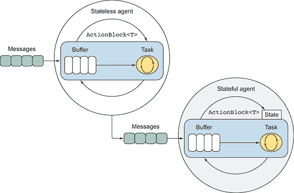    Figure 12.7 The stateful and stateless agents implemented using the TDF `ActionBlock`. The stateful agent has an internal isolated arbitrary value to maintain in memory a state that can change.      The next listing shows the implementation of the `StatefulDataFlowAgent` class, which defines a stateful and generic agent that encapsulates the TDF `AgentBlock` to process and store type values (in bold).    Listing 12.5 Stateful agent in C# using TDF    ``` class StatefulDataFlowAgent<TState, TMessage> : **IAgent**<TMessage> {      private TState state;      private readonly ActionBlock<TMessage> actionBlock;       public StatefulDataFlowAgent(             TState initialState,   Func<TState, TMessage, Task<TState>> action,   ①               CancellationTokenSource cts = null)          {             state = initialState;             var options = new ExecutionDataFlowBlockOptions {                 CancellationToken = cts != null ?   cts.Token : CancellationToken.None   ②             };  actionBlock = new ActionBlock<TMessage>(   ③    **async** msg => state = **await** action(state, msg), options);         }      public Task Send(TMessage message) => actionBlock.SendAsync(message);      public void Post(TMessage message) => actionBlock.Post(message); }  ```    The `CancellationToken` can stop the agent at any time, and it’s the only optional parameter passed into the constructor. The function `Func<TState,TMessage, Task­<TState>>` is applied to each message, in combination with the current state. When the operation completes, the current state is updated, and the agent moves to process the next available message. This function is expecting an asynchronous operation, which is recognizable from the return type of `Task<TState>.`    The agent implements the inheritances from the interface `IAgent<TMessage>`, which defines the two members `Post` and `Send`, used to pass messages to the agent synchronously or asynchronously, respectively:    ```  public interface IAgent<TMessage>     {         Task Send(TMessage message);         void Post(TMessage message);     }  ```    Use the helper factory function `Start`, as in the F# `MailboxProcessor`, to initialize a new agent, represented by the implemented interface `IAgent<TMessage>` :    ``` IAgent<TMessage> Start<TState, TMessage>(TState initialState,  ➥ Func<TState, TMessage, Task<TState>> action,  ➥ CancellationTokenSource cts = null) =>      new StatefulDataFlowAgent<TState, TMessage>(initialState, action, cts);  ```    Because the interaction with the agent is only through sending (`Post` or `Send`) a message, the primary purpose of the `IAgent<TMessage>` interface is to avoid exposing the type parameter for the state, which is an implementation detail of the agent.    In Listing 12.6, `agentStateful` is an instance of the `StatefulDataFlowAgent` agent, which receives a message containing the web address where it should download its content asynchronously. Then, the result of the operation is cached into the local state, `ImmutableDictionary<string,string>`, to avoid repeating identical operations. For example, the Google website is mentioned twice in the `urls` collections, but it’s downloaded only once. Ultimately, the content of each website is persisted in the local file­system for the sake of the example. Notice that, apart from any side effects that occur when downloading and persisting the data, the implementation is side effect free. The changes in state are captured by always passing the state as an argument to the action function (or `Loop` function`)`.    Listing 12.6 Agent based on TDF in action    ``` List<string> urls = new List<string> {                   @"http://www.google.com",                 @"http://www.microsoft.com",                 @"http://www.bing.com",                 @"http://www.google.com"             }; var agentStateful = **Agent.Start**(ImmutableDictionary<string,string>.Empty,   **async** (**ImmutableDictionary**<string,string> state, string url) => {   ①          if (!state.TryGetValue(url, out string content))        using (var webClient = new WebClient()){          content = **await** webClient.DownloadStringTaskAsync(url);            **await** File.WriteAllTextAsync(createFileNameFromUrl(url), content);  return state.Add(url, content);   ②         }  return state;   ②      }); urls.ForEach(url => agentStateful.**Post**(url));  ```    ### 12.4.1 Agent fold-over state and messages: Aggregate    The current state of an agent is the result of reducing all the messages it has received so far using the initial state as an accumulator value, and then processing the function as a reducer. You can imagine this agent as a fold (aggregator) in time over the stream of messages received. Interestingly, the `StatefulDataFlowAgent` constructor shares a signature and behavior similar to the LINQ extension method `Enumerable.Aggregate`. For demonstration purposes, the following code swaps the agent construct from the previous implementation with its counterpart, the LINQ `Aggregate` operator:    ``` urls.**Aggregate**(ImmutableDictionary<string,string>.Empty,   **async** (state, url) => {  if (!state.TryGetValue(url, out string content))          using (var webClient = new WebClient())          {              content = **await** webClient.DownloadStringTaskAsync(url);                **await** File.WriteAllTextAsync(createFileNamFromUrl(url), content);              return state.Add(url, content);           }      return state; });  ```    As you can see, the core logic hasn’t changed. Using the `StatefulDataFlowAgent` constructor, which operates over message passing instead of in a collection, you implemented an asynchronous reducer similar to the LINQ `Aggregate` operator.    ### 12.4.2 Agent interaction: a parallel word counter    According to the *actor* definition from Carl Hewitt,^(1)  one of the minds behind the actor model: “One actor is no actor. They come in systems.” This means that actors come in systems and communicate with each other. The same rule applies to agents. Let’s look at an example of using agents that interact with each other to group-count the number of times a word is present in a set of text files (figure 12.8).    Let’s start with a simple stateless agent that takes a string message and prints it. You can use this agent to log the state of an application that maintains the order of the messages:    ``` IAgent<string> printer = Agent.Start((string msg) =>          WriteLine($"{msg} on thread {Thread.CurrentThread.ManagedThreadId}"));  ```    The output also includes the current thread ID to verify the multiple threads used. This listing shows the implementation of the agent system for the group-count of words.    Listing 12.7 Word counter pipeline using agents    ``` IAgent<string> reader = Agent.Start(async (string filePath) =>  {  await printer.Send("reader received message");   ①     var lines = await File.ReadAllLinesAsync(filePath);   ②     lines.ForEach(async line => await parser.Send(line));   ③   });  char[] punctuation = Enumerable.Range(0, 256).Select(c => (char)c)        .Where(c => Char.IsWhiteSpace(c) || Char.IsPunctuation(c)).ToArray();  IAgent<string> parser = Agent.Start(async (string line) => {  await printer.Send("parser received message");   ①    foreach (var word in line.Split(punctuation))   ④          await counter.Send(word.ToUpper()); });  IReplyAgent<string, (string, int)> counter =      Agent.Start(ImmutableDictionary<string, int>.Empty,            (state, word) => {  printer.Post("counter received message");   ①                  int count;                      if (state.TryGetValue(word, out count))  return state.Add(word, count++);   ⑤                  else return state.Add(word, 1);         }, (state, word) => (state, (word, state[word])));    foreach (var filePath in Directory.EnumerateFiles(@"myFolder", "*.txt"))      reader.Post(filePath);  var wordCount_This = await counter.Ask("this");   ⑥   var wordCount_Wind = await counter.Ask("wind");   ⑥    ```  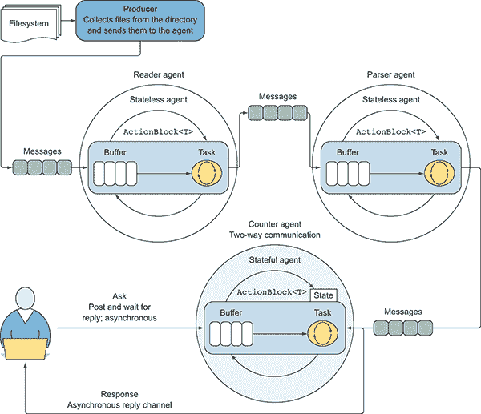    Figure 12.8 Simple interaction between agents by exchanging messages. The agent programming model promotes the single responsibility principle to write code. Note the counter agent provides a two-way communication, so the user can ask (interrogate) the agent, sending a message at any given time and receiving a reply in the form of a channel, which acts as asynchronous callback. When the operation completes, the callback provides the result.      The system is composed of three agents that communicate with each other to form a chain of operations:    *   The `reader` agent *   The `parser` agent *   The `counter` agent    The word-counting process starts with a `for-each` loop to send the file paths of a given folder to the first `reader` agent. This agent reads the text from a file, and then sends each line of the text to the `parser` agent:    ``` var lines = **await** File.ReadAllLinesAsync(filePath);  lines.ForEach(**async** line => **await** parser.Send(line));  ```    The `parser` agent splits the text message into single words, and then passes each of those words to the last `counter` agent:    ``` lines.Split(punctuation).ForEach(**async** word =>                        **await** counter.Send(word.ToUpper()));  ```    The `counter` agent is a stateful agent that does the work of maintaining the count of the words as they’re updated.    An `ImmutableDictionary` collection defines the state of the `counter` agent that stores the words along with the count for the number of times each word has been found. For each message received, the `counter` agent checks whether the word exists in an internal state `ImmutableDictionary<string, int>` to either increment the existing counter or start a new one.    The interesting factor of the `counter` agent is the ability to respond to the caller asynchronously using the `Ask` method. You can interrogate the agent for the count of a particular word at any time.    The interface `IReplyAgent` is the result of expanding the functionality of the previous interface `IAgent` with the `Ask` method:    ``` interface IReplyAgent<TMessage, TReply> : IAgent<TMessage> {         Task<TReply> Ask(TMessage message); }  ```    Listing 12.8 shows the implementation of the two-way communication `Stateful­ReplyDataFlowAgent` agent, in which the internal state is represented by a single polymorphic mutable variable.    This agent has two different behaviors:    *   One to handle the `Send` a message method. *   One to handle the `Ask` method. The `Ask` method sends a message and then waits asynchronously for a response.    These behaviors are passed in the form of generic `Func` delegates into the agent’s constructor. The first function (`Func<TState, TMessage, Task<TState>>)` processes each message in combination with the current state and updates it accordingly. This logic is identical to the agent `StatefulDataFlowAgent`.    Conversely, the second function (`Func<TState`, `TMessage`, `Task<(TState`, `TReply)>>`) handles the incoming messages, computes the agent’s new state, and ultimately replies to the sender. The output type of this function is a tuple, which contains the state of the agent, including a handle (callback) that acts as response (reply). The tuple is wrapped into a `Task`*type to be awaited without blocking, as with any asynchronous function.*   *When creating the message `Ask` to interrogate the agent, the sender passes an instance of `TaskCompletionSource<TReply>` into the payload of the message, and a reference is returned by the `Ask` function to the caller. This object, `TaskCompletionSource,` is fundamental for providing a channel to communicate asynchronously back to the sender through a callback, and the callback is notified from the agent when the result of the computation is ready. This model effectively generates two-way communication.   *Listing 12.8 Stateless agent in C# using TDF    ``` class StatefulReplyDataFlowAgent<TState, TMessage, TReply> :   ①                                            IReplyAgent<TMessage, TReply> {      private TState state;  private readonly ActionBlock<(TMessage,   ②                   Option<TaskCompletionSource<TReply>>)> actionBlock;       public StatefulReplyDataFlowAgent(TState initialState,             Func<TState, TMessage, Task<TState>> projection,             Func<TState, TMessage, Task<(TState, TReply)>> ask,  CancellationTokenSource cts = null)   ③       {          state = initialState;          var options = new ExecutionDataFlowBlockOptions {           CancellationToken = cts?.Token ?? CancellationToken.None };              actionBlock = new ActionBlock<(TMessage,                            Option<TaskCompletionSource<TReply>>)>(                 async message => {  (TMessage msg, Option<TaskCompletionSource<TReply>> replyOpt) = message;  await replyOpt.Match(   ④    None: async () => state = await projection(state, msg),   ⑤    Some: async reply => {   ⑥                (TState newState, TReply replyresult) = await ask(state, msg);                  state = newState;              reply.SetResult(replyresult);              });           }, options);         }          public Task<TReply> Ask(TMessage message)         {  var tcs = new TaskCompletionSource<TReply>();   ⑦               actionBlock.Post((message, Option.Some(tcs)));  return tcs.Task;   ⑦           }          public Task Send(TMessage message) =>                 actionBlock.SendAsync((message, Option.None)); }  ```    To enable `StatefulReplyDataFlowAgent` to handle both types of communications, one-way `Send` and two-way `Ask`, the message is constructed by including a `Task­Completion­Source` option type. In this way, the agent infers if a message is either from the `Post` method, with `None` `TaskCompletionSource`, or from the `Ask` method, with `Some` `TaskCompletionSource`. The `Match` extension method of the `Option` type, `Match<T, R>(None : Action<T>, Some(item) : Func<T,R>(item))`, is used to branch out to the corresponding behavior of the agent.    ## 12.5 A parallel workflow to compress and encrypt a large stream    In this section, you’ll build a complete asynchronous and parallelized workflow combined with the agent programming model to demonstrate the power of the TDF library.This example uses a combination of TDF blocks and the `StatefulDataFlowAgent` agent linked to work as a parallel pipeline. The purpose of this example is to analyze and architect a real case application. It then evaluates the challenges encountered during the development of the program, and examines how TDF can be introduced in the design to solve these challenges.    TDF processes the blocks that compose a workflow at different rates and in parallel. More importantly, it efficiently spreads the work out across multiple CPU cores to maximize the speed of computation and overall scalability. This is particularly useful when you need to process a large stream of bytes that could generate hundreds, or even thousands, of chunks of data.    ### 12.5.1 Context: the problem of processing a large stream of data    Let’s say that you need to compress a large file to make it easier to persist or transmit over the network, or that a file’s content must be encrypted to protect that information. Often, both compression and encryption must be applied. These operations can take a long time to complete if the full file is processed all at once. Furthermore, it’s challenging to move a file, or stream data, across the network, and the complexity increases with the size of the file, due to external factors, such as latency and unpredictable bandwidth. In addition, if the file is transferred in one transaction, and something goes wrong, then the operation tries to resend the entire file, which can be time- and resource-consuming. In the following sections, you’ll tackle this problem step by step.    In .NET, it isn’t easy to compress a file larger than 4 GB, due to the framework limitation on the size of data to compress. Due to the maximum addressable size for a 32-bit pointer, if you create an array over 4 GB, an `OutOfMemoryArray` exception is thrown. Starting with .NET 4.5 and for 64-bit platforms, the option `gcAllowVeryLargeObjects` ([`mng.bz/x0c4`](http://mng.bz/x0c4)) is available to enable arrays greater than 4 GB. This option allows 64-bit applications to have a multidimensional array with size `UInt32.MaxValue` (4,294,967,295) elements. Technically, you can apply the standard GZip compression that’s used to compress streams of bytes to data larger than 4 GB; but the GZip distribution doesn’t support this by default. The related .NET `GZipStream` class inheritably has a 4 GB limitation.    How can you compress and encrypt a large file without being constrained by the 4 GB limit imposed by the framework classes? A practical solution involves using a chunking routine to chop the stream of data. Chopping the stream of data makes it easier to compress and/or encrypt each block individually and ultimately write the block content to an output stream. The chunking technique splits the data, generally into chunks of the same size, applies the appropriate transformation to each chunk (compression before encryption), glues the chunks together in the correct order, and compresses the data. It’s vital to guarantee the correct order of the chunks upon reassembly at the end of the workflow. Due to the intensive I/O asynchronous operations, the packages might not arrive in the correct sequence, especially if the data is transferred across the network. You must verify the order during reassembly (figure 12.9).  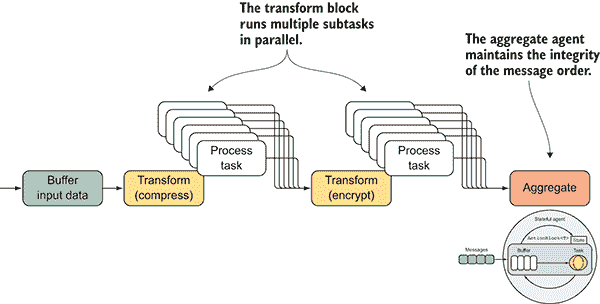    Figure 12.9 The transform blocks process the messages in parallel. The result is sent to the next block when the operation completes. The aggregate agent’s purpose is to maintain the integrity of the order of the messages, similar to the `AsOrdered` PLINQ extension method.      The opportunity for parallelism fits naturally in this design, because the chunks of the data can be processed independently.    Listing 12.9 shows the full implementation of the parallel compression–encryption workflow. Note that in the source code, you can find the reverse workflow to decrypt and decompress the data, as well as use asynchronous helper functions for compressing and encrypting bytes array.    The function `CompressAndEncrypt` takes as an argument the source and destination streams to process, the `chunkSize` argument defines the size in which the data is split (the default is 1 MB if no value is provided), and `CancellationTokenSource` stops the dataflow execution at any point. If no `CancellationTokenSource` is provided, a new token is defined and propagated through the dataflow operations.    The core of the function consists of three TDF building blocks, in combination with a stateful agent that completes the workflow. The `inputBuffer` is a `BufferBlock` type that, as the name implies, buffers the incoming chunks of bytes read from the source stream, and holds these items to pass them to the next blocks in the flow, which is the linked `TransformBlock` `compressor` (the code to note is in bold).    Listing 12.9 Parallel stream compression and encryption using TDF    ``` async Task CompressAndEncrypt(     Stream streamSource, Stream streamDestination,      long chunkSize = 1048576, CancellationTokenSource cts = null) {  cts = cts ?? new CancellationTokenSource();   ①        var compressorOptions = new ExecutionDataflowBlockOptions {  **MaxDegreeOfParallelism** = Environment.ProcessorCount,  **BoundedCapacity** = 20,  ②       CancellationToken = cts.Token     };            var inputBuffer = new **BufferBlock**<CompressingDetails>(         new DataflowBlockOptions {   CancellationToken = cts.Token, **BoundedCapacity** = 20 });   ②    var compressor = new **TransformBlock**<CompressingDetails,       CompressedDetails>(**async** details => {  var compressedData = **await** IOUtils.Compress(details.Bytes);   ③    return details.ToCompressedDetails(compressedData);   ④       }, compressorOptions);  var encryptor = new **TransformBlock**<CompressedDetails, EncryptDetails>(  **async** details => {         byte[] data = IOUtils.CombineByteArrays(details.CompressedDataSize,  ➥  details.ChunkSize, details.Bytes);   ⑤    var encryptedData = **await** IOUtils.Encrypt(data);   ⑥    return details.ToEncryptDetails(encryptedData);   ④    }, compressorOptions);  var asOrderedAgent = **Agent**.Start((new Dictionary<int, EncryptDetails>(),0),  **async**((Dictionary<int,EncryptDetails>,int)state,EncryptDetails msg)=>{   ⑦         Dictionary<int, EncryptDetails> details, int lastIndexProc) = state;       details.Add(msg.Sequence, msg);       while (details.ContainsKey(lastIndexProc+1)) {           msg = details[lastIndexProc + 1];           await streamDestination.WriteAsync(msg.EncryptedDataSize, 0,                                           msg.EncryptedDataSize.Length);           await streamDestination.WriteAsync(msg.Bytes, 0,   msg.Bytes.Length);   ⑧             lastIndexProc = msg.Sequence;  details.Remove(lastIndexProc);   ⑨         }       return (details, lastIndexProc);  }, cts);  var writer = new ActionBlock<EncryptDetails>(**async** details => **await**   asOrderedAgent.Send(details), compressorOptions);   ⑫    var linkOptions = new DataflowLinkOptions { PropagateCompletion = true }; inputBuffer.**LinkTo**(compressor, linkOptions);   ⑬   compressor.**LinkTo**(encryptor, linkOptions);   ⑬   encryptor.**LinkTo**(writer, linkOptions);   ⑬    long sourceLength = streamSource.Length; byte[] size = BitConverter.GetBytes(sourceLength); **await** streamDestination.WriteAsync(size, 0, size.Length);   ⑭    chunkSize = Math.Min(chunkSize, sourceLength);   ⑮   int indexSequence = 0;  while (sourceLength > 0) {    byte[] data = new byte[chunkSize];  int readCount = **await** streamSource.ReadAsync(data, 0, data.Length);   ⑯      byte[] bytes = new byte[readCount];    Buffer.BlockCopy(data, 0, bytes, 0, readCount);    var compressingDetails = new CompressingDetails {             Bytes = bytes,             ChunkSize = BitConverter.GetBytes(readCount),             Sequence = ++indexSequence         }; **await** inputBuffer.SendAsync(compressingDetails);   ⑰   sourceLength -= readCount;   ⑱   if (sourceLength < chunkSize)  chunkSize = sourceLength;   ⑱   if (sourceLength == 0)  inputBuffer.Complete();   ⑲   } **await** inputBuffer.Completion.ContinueWith(task => compressor.Complete()); **await** compressor.Completion.ContinueWith(task => encryptor.Complete()); **await** encryptor.Completion.ContinueWith(task => writer.Complete()); **await** writer.Completion; **await** streamDestination.FlushAsync();    }  ```    The bytes read from the stream are sent to the buffer block by using the `SendAsync` method:    ``` var compressingDetails = new CompressingDetails {        Bytes = bytes,        ChunkSize = BitConverter.GetBytes(chunkSize),        Sequence = ++indexSequence     }; **await** buffer.**SendAsync**(compressingDetails);  ```    Each chunk of bytes read from the stream source is wrapped into the data structure’s `CompressingDetails`, which contains the additional information of byte-array size. The monotonic value is later used in the sequence of chunks generated to preserve the order. A *monotonic value* is a function between ordered sets that preserves or reverses the given value, and the value always either decreases or increases. The order of the block is important both for a correct compression–encryption operation and for correct decryption and decompression into the original shape.    In general, if the purpose of the block is purely to forward item operations from one block to several others, then you don’t need the `BufferBlock`. But in the case of reading a large or continuous stream of data, this block is useful for taming the backpressure generated from the massive amount of data partitioned to the process by setting an appropriate `BoundedCapacity`. In this example, the `BoundedCapacity` is restricted to a capacity of 20 items. When there are 20 items in this block, it will stop accepting new items until one of the existing items passes to the next block. Because the dataflow source of data originated from asynchronous I/O operations, there’s a risk of potentially large amounts of data to process. It’s recommended that you limit internal buffering to throttle the data by setting the `BoundedCapacity` property in the options defined when constructing the `BufferBlock`.    The next two block types are compression transformation and encryption transformation. During the first phase (compression), the `TransformBlock` applies the compression to the chunk of bytes and enriches the message received `CompressingDetails` with the relative data information, which includes the compressed byte array and its size. This information persists as part of the output stream accessible during the decompression.    The second phase (encryption) enciphers the chunk of compressed byte array and creates a sequence of bytes resulting from the composition of three arrays: `CompressedDataSize`, `ChunkSize`, and data array. This structure instructs the decompression and decryption algorithms to target the right portion of bytes to revert from the stream.    ### 12.5.2 Ensuring the order integrity of a stream of messages    The TDF documentation guarantees that `TransformBlock` will propagate the messages in the same order in which they arrived. Internally, `TransformBlock` uses a reordering buffer to fix any out-of-order issues that might arise from processing multiple messages concurrently. Unfortunately, due to the high number of asynchronous and intensive I/O operations running in parallel, keeping the integrity of the message order doesn’t apply to this case. This is why you implemented the additional sequential ordering preservation using monotonically values.    If you decide to *send* or *stream* the data over the network, then the guarantee of delivering the packages in the correct sequence is lost, due to variables such as the unpredictable bandwidth and unreliable network connection. To safeguard the order integrity when processing chunks of data, your final step in the workflow is the stateful `asOrderedAgent` agent. This agent behaves as a *multiplexer* by reassembling the items and persists them in the local filesystem, maintaining the correct sequence. The order value of the sequence is kept in a property of the `EncryptDetails` data structure, which is received by the agent as a message.    The accuracy for the whole computation requires preservation of the order of the source sequence and the partitions to ensure that the order is consistent at merge time.    The state of this agent is preserved using a tuple. The first item of the tuple is a collection `Dictionary<int, EncryptDetails>`, where the key represents the sequence value of the original order by which the data was sent. The second item, `lastIndexProc`, is the index of the last item processed, which prevents reprocessing the same chunks of data more than once. The body of `asOrderedAgent` runs the `while`*loop that uses this value `lastIndexProc` and makes sure that the processing of the chunks of data starts from the last item unprocessed. The loop continues to iterate until the order of the items is continued; otherwise it breaks out from the loop and waits for the next message, which might complete the missing gap in the sequence.*   *The `asOrderedAgent` agent is plugged into the workflow through the TDF `ActionBlock` writer, which sends it to the `EncryptDetails` data structure for the final work.    ### 12.5.3 Linking, propagating, and completing    The TDF blocks in the compress-encrypt workflow are linked using the `LinkTo` extension method, which by default propagates only data (messages). But if the workflow is linear, as in this example, it’s good practice to share information among the blocks through an automatic notification, such as when the work is terminated or eventual errors accrue. This behavior is achieved by constructing the `LinkTo` method with the `DataFlowLinkOptions` optional argument and the `PropagateCompletion` property set to true. Here’s the code from the previous example with this option built in:    ``` var **linkOptions** = new DataFlowLinkOptions { PropagateCompletion = true };  inputBuffer.LinkTo(compressor, **linkOptions**); compressor.LinkTo(encryptor, **linkOptions**); encryptor.LinkTo(writer, **linkOptions**);  ```    The `PropagateCompletion` optional property informs the dataflow block to automatically propagate its results and exceptions to the next stage when it completes. This is accomplished by calling the `Complete` method when the buffer block triggers the complete notification upon reaching the end of the stream:    ```  if (sourceLength < chunkSize)            chunkSize = sourceLength;        if (sourceLength == 0)            buffer.**Complete**();  ```    Then all the dataflow blocks are announced in a cascade as a chain that the process has completed:    ``` **await** inputBuffer.Completion.ContinueWith(task => compressor.**Complete**()); **await** compressor.Completion.ContinueWith(task => encryptor.**Complete**()); **await** encryptor.Completion.ContinueWith(task => writer.**Complete**()); **await** writer.**Completion**;  ```    Ultimately, you can run the code as follows:    ``` using (var streamSource = new FileStream(sourceFile, FileMode.OpenOrCreate,                            FileAccess.Read, FileShare.None, useAsync: true)) using (var streamDestination = new FileStream(destinationFile,          FileMode.Create, FileAccess.Write, FileShare.None, useAsync: true))        **await** **CompressAndEncrypt**(streamSource, streamDestination)  ```    Table 12.1 shows the benchmarks for compressing and encrypting different file sizes, including the inverted operation of decrypting and decompressing. The benchmark result is the average of each operation run three times.    Table 12.1 Benchmarks for compressing and encrypting different file sizes     | **File size in GB** | **Degree of parallelism** | **Compress-encrypt time in seconds** | **Decrypt-decompress time in seconds** | | --- | --- | --- | --- | | 3 | 1 | 524.56 | 398.52 | | 3 | 4 | 123.64 | 88.25 | | 3 | 8 | 69.20 | 45.93 | | 12 | 1 | 2249.12 | 1417.07 | | 12 | 4 | 524.60 | 341.94 | | 12 | 8 | 287.81 | 163.72 |    ### 12.5.4 Rules for building a TDF workflow    Here are few good rules and practices for successfully implementing TDF in your workflow:    *   *Do one thing, and do it well.* This is a principal of modern OOP, the *single responsibility principle* ([`en.wikipedia.org/wiki/Single_responsibility_principle`](https://en.wikipedia.org/wiki/Single_responsibility_principle))*.* The idea is that your block should perform only one action and should have only one reason to change. *   *Design for composition*. In the OOP world, this is known as the *open closed principle* ([`en.wikipedia.org/wiki/Open/closed_principle`](https://en.wikipedia.org/wiki/Open/closed_principle)), where the dataflow building blocks are designed to be open for extension but closed to modification. *   *DRY*. This principle (don’t repeat yourself) encourages you to write reusable code and reusable dataflow building block components.    ### 12.5.5 Meshing Reactive Extensions (Rx) and TDF    TDF and Rx (discussed in chapter 6) have important similarities, despite having independent characteristics and strengths, and these libraries complement each other, making them easy to integrate. TDF is closer to an agent-based programming model, focused on providing building blocks for message passing, which simplifies the implementation of parallel CPU- and I/O-intensive applications with high throughput and low latency, while also providing developers explicit control over how data is buffered. Rx is keener to the functional paradigm, providing a vast set of operators that predominantly focused on coordination and composition of event streams with a LINQ-based API.    TDF has built-in support for integrating with Rx, which allows it to expose the source dataflow blocks as both observables and observers. The `AsObservable` extension method transforms TDF blocks into an observable sequence, which allows the output of the dataflow chain to flow efficiently into an arbitrary set of Reactive fluent extension methods for further processing. Specifically, the `AsObservable` extension method constructs an `IObservable<T>` for an `ISourceBlock<T>.`    Let’s see the integration of Rx and TDF in action. In Listing 12.9, the last block of the parallel compress-encrypt stream dataflow is the stateful `asOrderedAgent`. The particularity of this component is the presence of an internal state that keeps track of the messages received and their order. As mentioned, the construct signature of a stateful agent is similar to the LINQ `Aggregate` operator, which in terms of Rx can be replaced with the RX `Observable.Scan` operator. This operator is covered in chapter 6.    The following listing shows the integration between Rx and TDF by replacing the `asOrderedAgent` agent from the last block of the parallel compress-encrypt stream workflow.    Listing 12.10 Integrating Reactive Extensions with TDF    ``` inputBuffer.LinkTo(compressor, linkOptions); compressor.LinkTo(encryptor, linkOptions);  encryptor.AsObservable()   ①            .Scan((new Dictionary<int, EncryptDetails>(), 0),   (state, msg) => Observable.FromAsync(async() => {   ②    (Dictionary<int,EncryptDetails> details, int lastIndexProc) = state;  details.Add(msg.Sequence, msg);  while (details.ContainsKey(lastIndexProc + 1)) {     msg = details[lastIndexProc + 1];     await streamDestination.WriteAsync(msg.EncryptedDataSize, 0,                                         msg.EncryptedDataSize.Length);     await streamDestination.WriteAsync(msg.Bytes, 0, msg.Bytes.Length);     lastIndexProc = msg.Sequence;     details.Remove(lastIndexProc);     }   return (details, lastIndexProc); }) .SingleAsync().Wait()) .SubscribeOn(TaskPoolScheduler.Default).Subscribe();   ③    ```    As you can see, you swapped the `asOrderedAgent` with the Rx `Observable.Scan` operator without changing the internal functionality. TDF blocks and Rx observable streams can be completed successfully or with errors, and the `AsObservable` method will translate the block completion (or fault) into the completion of the observable stream. But if the block faults with an exception, that exception will be wrapped in an `Aggregate­Exception` when it is passed to the observable stream. This is similar to how linked blocks propagate their faults.    ## Summary    *   A system written using TPL Dataflow benefits from a multicore system because all the blocks that compose a workflow can run in parallel. *   TDF enables effective techniques for running embarrassingly parallel problems, where many independent computations can be executed in parallel in an evident way. *   TDF has built-in support for throttling and asynchrony, improving both I/O-bound and CPU-bound operations. In particular, it provides the ability to build responsive client applications while still getting the benefits of massively parallel processing. *   TDF can be used to parallelize the workflow to compress and encrypt a large stream of data by processing blocks at different rates. *   The combination and integration of Rx and TDF simplifies the implementation of parallel CPU- and I/O-intensive applications, while also providing developers explicit control over how data is buffered.*****````*******`````******``````*********```````
