# 第三部分

应用现代并发编程模式

**本书的第三部分和最后一部分允许你将迄今为止所学的所有函数式并发编程技术付诸实践。这些章节将成为你关于并发问题的问答的必备参考。**

第十三章涵盖了使用函数式范式解决你在并发应用程序中可能遇到的常见和复杂问题的食谱。第十四章将带你详细了解一个可扩展且高性能的股票市场服务器应用程序的完整实现，该应用程序包括客户端的 iOS 和 WPF 版本。

在本书中学到的函数式范式原则将应用于设计和架构决策，以及代码开发中，以实现高性能和可扩展的解决方案。你将在本节中看到，将函数式原则应用于减少错误并提高可维护性所带来的积极影响。

# 13

成功并发编程的食谱和设计模式

**本章涵盖**

+   十二个解决并行编程常见问题的代码食谱

本章中提出的 12 个食谱具有广泛的应用。当你面临类似问题并需要快速答案时，可以将核心思想作为参考。这些材料展示了本书中涵盖的函数式并发抽象如何通过开发复杂且丰富的函数以及相对较少的代码行数来解决复杂问题。我将食谱的实现尽可能简化，因此你有时需要处理取消和异常处理。

本章将向你展示如何将迄今为止所学的一切结合起来，使用函数式编程抽象作为粘合剂来编写高效且性能良好的程序。到本章结束时，你将拥有一套用于解决常见并发编程问题的有用且可重用的工具。

每个食谱都是用 C#或 F#编写的；对于大多数代码实现，你可以在在线可下载的代码中找到两种版本。此外，请记住，F#和 C#是具有互操作支持以相互交互的.NET 编程语言。你可以轻松地在 F#中使用 C#程序，反之亦然。

## 13.1 回收对象以减少内存消耗

在本节中，你将实现一个可重用的异步对象池。在回收对象有助于减少内存消耗的情况下应使用此对象池。最小化 GC 代数数量可以使你的程序享受更好的性能速度。图 13.1，重复自第十二章，展示了如何将第十二章中的并发生产者/消费者模式（从列表 12.9）应用于并行压缩和加密大文件。

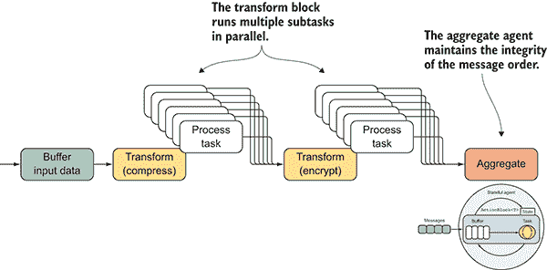

图 13.1 `Transform`块并行处理消息。当操作完成时，结果被发送到下一个块。Aggregate 代理的目的是维护消息的顺序完整性，类似于`AsOrdered` PLINQ 扩展方法。

来自列表 12.9 的函数`CompressAndEncrypt`将大文件分割成一系列字节数组块，由于高内存消耗，这会产生大量的 GC 代数。当内存压力达到需要更多资源的触发点时，每个内存块都会被创建、处理和收集。

这种创建和销毁字节数组的高容量操作会导致许多 GC 代数，这会负面影响应用程序的整体性能。事实上，程序在多线程方式下为其整个执行分配了相当数量的内存缓冲区（字节数组），这意味着多个线程可以同时分配相同数量的内存。考虑到每个缓冲区是 4,096 字节的内存，并且有 25 个线程同时运行；在这种情况下，大约有 102,400 字节同时在堆中分配。此外，当每个线程完成其执行时，许多缓冲区超出作用域，迫使 GC 启动一个代数。这对性能不利，因为应用程序正承受着沉重的内存管理压力。

### 13.1.1 解决方案：*异步回收对象池*

*为了优化具有强烈内存消耗的并发应用程序的性能，回收那些否则会被系统垃圾回收的对象。在并行压缩和加密流示例中，你希望重用生成的相同的字节缓冲区（字节数组），而不是创建新的。这可以通过使用`ObjectPool`类来实现，该类旨在提供一个缓存的对象池，用于回收未使用的项目。这种对象的重用避免了昂贵的资源获取和释放，最小化了潜在的内存分配。具体来说，在高度并发的示例中，你需要一个线程安全和非阻塞（基于任务的）并发对象池(图 13.2)。*

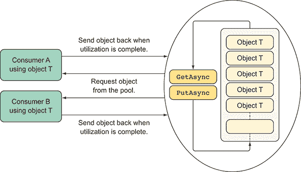

图 13.2 对象池可以异步处理来自多个消费者的多个并发请求，以重用对象。消费者完成工作后，将对象送回对象池。内部，对象池使用给定的工厂代理生成一个对象队列。然后，这些对象被回收以减少内存消耗和新的实例化成本。

在列表 13.1 中，`ObjectPoolAsync`的实现基于一个使用`BufferBlock`作为构建块的 TDF。`ObjectPoolAsync`预先初始化一组对象，以便应用程序在需要时使用和重用。此外，TDF 本质上是线程安全的，同时提供异步、非阻塞的语义。

列表 13.1 使用 TDF 的异步对象池实现

```
public class ObjectPoolAsync<T> :IDisposable
{
 private readonly BufferBlock<T> buffer;   ①  
 private readonly Func<T> factory;   ②  
    private readonly int msecTimeout;

 public ObjectPoolAsync(int initialCount, Func<T> factory, 
➥ CancellationToken cts, int msecTimeout = 0)
    {
        this.msecTimeout = msecTimeout;
 buffer = new BufferBlock<T>(   ①  
            new DataflowBlockOptions { CancellationToken = cts });
 this.factory = () => factory();   ②  

        for (int i = 0; i < initialCount; i++)
 buffer.Post(this.factory());   ③  
    }

 public Task<bool> PutAsync(T item) => buffer.SendAsync(item);   ④  

 public Task<T> GetAsync(int timeout = 0)   ⑤  
    {
        var tcs = new TaskCompletionSource<T>();
        buffer.ReceiveAsync(TimeSpan.FromMilliseconds(msecTimeout))
            .ContinueWith(task =>
            {
                if (task.IsFaulted)
                    if (task.Exception.InnerException is TimeoutException)
                        tcs.SetResult(factory());
                    else
                        tcs.SetException(task.Exception);
                else if (task.IsCanceled)
                    tcs.SetCanceled();
                else
                    tcs.SetResult(task.Result);                
            });
        return tcs.Task;
    }
    public void Dispose() => buffer.Complete();

} 
```

`ObjectPoolAsync`接受创建对象的初始数量和一个工厂委托构造函数作为参数。`ObjectPoolAsync`公开两个函数来协调对象的回收：

+   `PutAsync`—可以将一个项目异步地`Put`入池中。

+   `GetAsync`—可以异步地从池中取出一个项目。

在可下载的源代码中，您可以找到更新为使用`ObjectPoolAsync`的`CompressAndEncrypt`程序的完整解决方案。图 13.3 是程序原始版本和新版本之间不同文件大小 GC 代数的图形比较。

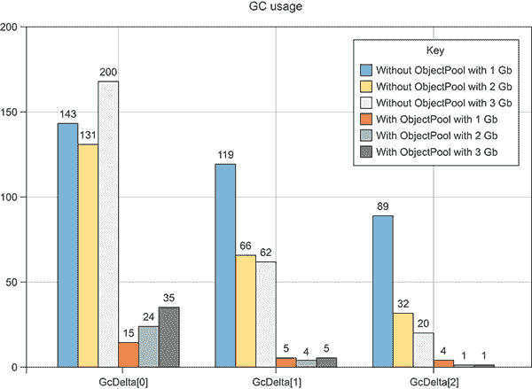

图 13.3 比较第十二章的`CompressAndEncrypt`程序，该程序使用和未使用`AsyncObjectPool`实现了对不同大文件（1 GB、2 GB 和 3 GB）的处理。与原始版本相比，使用对象池的实现具有更少的 GC 代数。最小化 GC 代数可以带来更好的性能。

图表中显示的结果展示了使用`ObjectPoolAsync`实现的`CompressAndEncrypt`程序如何显著减少 GC 代数，从而加快整体应用程序的性能。在八核机器上，`CompressAndEncrypt`的新版本大约快 8%。

## 13.2 自定义并行 Fork/Join 操作符

在本节中，您将实现一个可重用的扩展方法来并行化 Fork/Join 操作。假设您在程序中检测到一段代码，如果使用分治模式并行执行将有助于提高性能。您决定重构代码以使用并发 Fork/Join 模式（图 13.4）。并且您检查程序越多，出现的类似模式就越多。


图 13.4 Fork/Join 模式将任务分割成可以并行独立执行的子任务。当操作完成时，子任务再次合并。这种模式常用于实现数据并行化并不偶然。事实上，存在明显的相似之处。

不幸的是，在.NET 中，没有内置的并行 Fork/Join 扩展方法支持按需重用。但你可以创建这样的方法以及更多，以拥有一个可重用且灵活的操作符，它执行以下操作：

+   分割数据

+   并行应用 Fork/Join 模式

+   可选地允许您配置并行度

+   使用归约函数合并结果

.NET 操作符 `Task.WhenAll` 和 F# 的 `Async.Parallel` 可以并行组合一组给定的任务；但这两个操作符不提供聚合（或归约）功能来连接结果。此外，当想要控制并行度时，它们缺乏可配置性。为了得到你想要的操作符，你需要一个定制的解决方案。

### 13.2.1 解决方案：组成形成 Fork/Join 模式的步骤管道

使用 TDF，你可以将不同的构建块组合在一起作为一个管道。你可以使用管道来定义 Fork/Join 模式的步骤（图 13.5），其中 Fork 步骤并行运行一系列任务，然后接下来的步骤合并结果，最后一步应用归约块以产生最终输出。对于工作流程的后续步骤，该步骤聚合结果，你需要一个对象来维护之前步骤的状态。在这种情况下，你使用第十二章中基于 TDF 构建的基于代理的块。

Fork/Join 模式作为对泛型 `IEnumerable` 的扩展方法实现，以便从代码中以流畅的方式方便地访问，如 列表 13.2 所示（请注意，代码部分为粗体）。

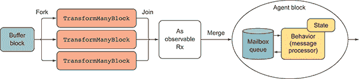

图 13.5 使用 TDF 实现的 Fork/Join 模式，其中每个计算步骤都使用不同的数据流块定义

列表 13.2 使用 TDF 的并行 `ForkJoin`

```
 public static async Task<R> **ForkJoin**<T1, T2, R>(
        this IEnumerable<T1> source, 
 Func<T1, Task<IEnumerable<T2>>> map,   ①  
 Func<R, T2, Task<R>> aggregate,   ①  
        R initialState, CancellationTokenSource cts = null,
 int partitionLevel = 8, int boundCapacity = 20)   ②  
    {
       cts = cts ?? new CancellationTokenSource();
 var blockOptions = new ExecutionDataflowBlockOptions {  ③  
            MaxDegreeOfParallelism = partitionLevel,
            BoundedCapacity = boundCapacity,
            CancellationToken = cts.Token
        };            

 var inputBuffer = new BufferBlock<T1>(  ④  
               new DataflowBlockOptions {
                   CancellationToken = cts.Token,
                   BoundedCapacity = boundCapacity 
               });       

       var mapperBlock = new TransformManyBlock<T1, T2>
➥ (map, blockOptions);   ④  
 var reducerAgent = Agent.Start(initialState, aggregate, cts);   ④  
       var linkOptions = new DataflowLinkOptions{PropagateCompletion=true};
 inputBuffer.LinkTo(mapperBlock, linkOptions);   ⑤  

        IDisposable disposable = mapperBlock.AsObservable()
 .Subscribe(async item => await reducerAgent.Send(item));   ⑥  

        foreach (var item in source)
 await inputBuffer.SendAsync(item);   ⑦  
        inputBuffer.Complete();

 var tcs = new TaskCompletionSource<R>();

        await inputBuffer.Completion.ContinueWith(task => 
                                         mapperBlock.Complete());
 await mapperBlock.Completion.ContinueWith(task => {   ⑧  
            var agent = reducerAgent as StatefulDataflowAgent<R, T2>;
            disposable.Dispose();
            tcs.SetResult(agent.State);
        });        
        return await tcs.Task;
    } 
```

`ForkJoin` 扩展方法接受一个参数作为要处理的 `IEnumerable` 源，用于映射函数，以转换其项，以及一个聚合（归约）函数，用于合并来自映射计算的所有的结果。参数 `initialState` 是聚合函数所需的初始状态值。但如果结果类型 `T2` 可以组合（因为满足单调律），你可以修改该方法以使用具有零初始状态的归约函数，如列表 5.10 所解释的。

基础数据流块被链接起来形成一个管道。有趣的是，`mapperBlock` 使用 `AsObservable` 扩展方法被转换为一个 `Observable`，然后订阅它以在输出具体化时向 `reducerAgent` 发送消息。值 `partitionLevel` 和 `boundCapacity` 分别用于设置并行度的大小和边界容量。

这里有一个如何利用 `ForkJoin` 操作符的简单示例：

```
Task<long> sum = Enumerable.Range(1, 100000)
          .**ForkJoin**<int, long, long>(
                        async x => new[] { (long)x * x },
                        async (state, x) => state + x, 0L); 
```

之前的代码使用 Fork/Join 模式计算了从 1 到 100,000 所有数字的平方和。

## 13.3 并行化具有依赖关系的任务：设计代码以优化性能

让我们假设你需要编写一个工具，该工具可以执行一系列异步任务——每个任务都有不同的依赖关系，这些依赖关系会影响操作的顺序。你可以使用顺序和命令式执行来解决这个问题；但如果你想最大化性能，顺序操作是不够的。相反，你必须构建可以并行运行的任务。许多并发问题可以被视为具有依赖关系的静态原子操作集合，这些依赖关系存在于它们的输入和输出之间。操作完成后，输出被用作其他依赖操作的输入。为了优化性能，这些任务需要根据依赖关系进行调度，并且算法必须优化以在必要时串行运行依赖任务，尽可能并行运行。

你需要一个可重用的组件，该组件可以并行运行一系列任务，确保所有可能影响操作顺序的依赖关系都得到尊重。你如何创建一个编程模型，该模型可以暴露执行效率高的一系列操作的底层并行性，这些操作要么并行执行，要么根据与其他操作的依赖关系以串行方式执行？

### 13.3.1 解决方案：实现任务依赖图

解决方案被称为有向无环图（DAG），其目的是通过将操作分解为一系列具有定义依赖关系的原子任务来形成一个图。图的无环性质很重要，因为它消除了任务之间发生死锁的可能性，前提是任务是真正原子的。在指定图时，理解任务之间的所有依赖关系很重要，特别是可能导致死锁或竞争条件的隐藏依赖关系。图 13.6 是一个典型的以图形形状的数据结构示例，可以用来表示图中操作之间的调度约束。图是计算机科学中一个非常强大的数据结构，它产生了强大的算法。

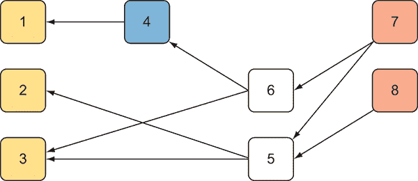

图 13.6 图是由边连接的顶点集合。在这个有向无环图的表示中，节点 1 依赖于节点 4 和 5，节点 2 依赖于节点 5，节点 3 依赖于节点 5 和 6，依此类推。

你可以将 DAG 结构作为策略应用于并行运行任务，同时尊重依赖关系的顺序以提高性能。你可以使用 F# 的 `MailboxProcessor` 定义此图结构，它为注册执行的任务保持内部状态，这些任务以边依赖的形式存在。

以下示例使用 F# 的 `MailboxProcessor` 作为实现并行操作依赖的有向无环图的完美候选。首先，让我们定义用于管理任务和运行其依赖关系的区分联合。

列表 13.3 协调任务执行的消息类型和数据结构

```
type TaskMessage =   ①  
    | AddTask of int * TaskInfo
    | QueueTask of TaskInfo
    | ExecuteTasks     
and TaskInfo =   ②  
    { Context : System.Threading.ExecutionContext  
      Edges : int array; Id : int; Task : Func<Task>
      EdgesLeft : int option; Start : DateTimeOffset option
      End : DateTimeOffset option } 
```

`TaskMessage` 类型表示发送到 `ParallelTasksDAG` 的底层代理的消息案例，该代理在 列表 13.4 中实现。这些消息用于任务协调和依赖同步。`TaskInfo` 类型包含并跟踪 DAG 执行期间注册的任务的详细信息，包括依赖边。执行上下文 ([`mng.bz/2F9o`](http://mng.bz/2F9o)) 被捕获以在延迟执行期间访问信息，例如当前用户、与执行逻辑线程相关联的任何状态、代码访问安全信息等。当事件触发时，会发布执行时间的开始和结束。

列表 13.4 DAG F# 代理以并行化操作执行

```
type ParallelTasksDAG() =
 let onTaskCompleted = new Event<TaskInfo>()   ①  

  let dagAgent = new MailboxProcessor<TaskMessage>(fun inbox ->
 let rec loop (tasks : Dictionary<int, TaskInfo>)   ②  
 (edges : Dictionary<int, int list>) = async {   ②  
 let! msg = inbox.Receive()   ③  
    match msg with
 | ExecuteTasks ->   ④  
        let fromTo = new Dictionary<int, int list>()
 let ops = new Dictionary<int, TaskInfo>()   ⑤  
 for KeyValue(key, value) in tasks do   ⑥  
            let operation =
                { value with EdgesLeft = Some(value.Edges.Length) }
            for from in operation.Edges do
              let exists, lstDependencies = fromTo.TryGetValue(from)
              if not <| exists then 
                fromTo.Add(from, [ operation.Id ])
              else fromTo.[from] <- (operation.Id :: lstDependencies)
              ops.Add(key, operation)
 ops |> Seq.iter (fun kv ->   ⑥  
 match kv.Value.EdgesLeft with      
            | Some(n) when n = 0 -> inbox.Post(QueueTask(kv.Value))
            | _ -> ())
        return! loop ops fromTo
 | QueueTask(op) ->   ⑦  
 Async.Start <| async {   ⑦  
            let start = DateTimeOffset.Now
 match op.Context with   ⑧  
            | null -> op.Task.Invoke() |> Async.AwaitATsk
 | ctx -> ExecutionContext.Run(ctx.CreateCopy(),   ⑨  
                     (fun op -> let opCtx = (op :?> TaskInfo)
                                opCtx.Task.Invoke().ConfigureAwait(false)), 
➥ taskInfo)
            let end' = DateTimeOffset.Now
            onTaskCompleted.Trigger  { op with Start = Some(start)
 End = Some(end') }   ⑫  
            let exists, deps = edges.TryGetValue(op.Id)
            if exists && deps.Length > 0 then
               let depOps = getDependentOperation deps tasks []
               edges.Remove(op.Id) |> ignore
               depOps |> Seq.iter (fun nestedOp -> 
                              inbox.Post(QueueTask(nestedOp))) }
        return! loop tasks edges 
 | AddTask(id, op) -> tasks.Add(id, op)   ⑬  
                         return! loop tasks edges }
    loop (new Dictionary<int, TaskInfo>(HashIdentity.Structural)) 
         (new Dictionary<int, int list>(HashIdentity.Structural)))

  [<CLIEventAttribute>]
 member this.OnTaskCompleted = onTaskCompleted.Publish   ⑫   
 member this.ExecuteTasks() = dagAgent.Post ExecuteTasks   ⑭  
  member this.AddTask(id, task, [<ParamArray>] edges : int array) =
    let data = { Context = ExecutionContext.Capture()
                 Edges = edges; Id = id; Task = task
                 NumRemainingEdges = None; Start = None; End = None }
 dagAgent.Post(AddTask(id, data))   ⑮   
```

函数 `AddTask` 的目的是注册一个任务，包括任意依赖边。此函数接受一个唯一 ID、必须执行的功能任务以及表示其他已注册任务 ID 的边集，所有这些都必须在当前任务执行之前完成。如果数组为空，则表示没有依赖。名为 `dagAgent` 的 `MailboxProcessor` 保持注册任务在当前状态 `tasks` 中，这是一个 ID 与其详细信息之间的映射（`tasks : Dictionary<int, TaskInfo>`）。代理还保持每个任务 ID 的边依赖状态（`edges : Dictionary<int, int list>`）。`Dictionary` 集合是可变的，因为 `ParallelTasksDAG` 的执行过程中状态会发生变化，并且因为它们继承自代理内部的线程安全性。当代理收到启动执行的通知时，该过程的一部分涉及验证所有边依赖都已注册并且图中没有循环。此验证步骤可在可下载源代码中 `ParallelTasksDAG` 的完整实现中找到。以下代码是 C# 示例，它引用并消耗 F# 库以运行 `ParallelTasksDAG`。注册的任务反映了 图 13.6 中的依赖关系：

```
Func<int, int, Func<Task>> action = (id, delay) => async () => {
    Console.WriteLine($"Starting operation{id} in Thread Id 
{Thread.CurrentThread.ManagedThreadId} . . . ");
    await Task.Delay(delay);
};

var dagAsync = new DAG.ParallelTasksDAG();
dagAsync.OnTaskCompleted.Subscribe(op => 
    Console.WriteLine($"Operation {op.Id} completed in Thread Id      { Thread.CurrentThread.ManagedThreadId}"));

dagAsync.AddTask(1, action(1, 600), 4, 5);
dagAsync.AddTask(2, action(2, 200), 5);
dagAsync.AddTask(3, action(3, 800), 6, 5);
dagAsync.AddTask(4, action(4, 500), 6);
dagAsync.AddTask(5, action(5, 450), 7, 8);
dagAsync.AddTask(6, action(6, 100), 7);
dagAsync.AddTask(7, action(7, 900));
dagAsync.AddTask(8, action(8, 700));
dagAsync.ExecuteTasks(); 
```

辅助函数的 `action` 目的是在任务开始时打印，指示当前线程 `Id` 作为多线程功能的参考。将事件 `OnTaskCompleted` 注册为在控制台打印每个任务完成打印时通知，包括任务 ID 和当前线程 `Id`。以下是调用 `Execute­Tasks` 方法时的输出：

```
Starting operation 8 in Thread Id 23...
Starting operation 7 in Thread Id 24...
Operation 8 Completed in Thread Id 23
Operation 7 Completed in Thread Id 24
Starting operation 5 in Thread Id 23...
Starting operation 6 in Thread Id 25...
Operation 6 Completed in Thread Id 25
Starting operation 4 in Thread Id 24...
Operation 5 Completed in Thread Id 23
Starting operation 2 in Thread Id 27...
Starting operation 3 in Thread Id 30...
Operation 4 Completed in Thread Id 24
Starting operation 1 in Thread Id 28...
Operation 2 Completed in Thread Id 27
Operation 1 Completed in Thread Id 28
Operation 3 Completed in Thread Id 30 
```

如您所见，任务在不同的执行线程（不同的线程 ID）中并行运行，并且依赖顺序得到保留。

## 13.4 用于协调共享资源（一个写入，多个读取）的并发 I/O 操作的网关

想象一下，您正在实现一个服务器应用程序，其中有很多并发客户端请求进入。这些并发请求进入服务器应用程序是因为需要访问共享数据。偶尔，需要修改共享数据的请求会进入，需要同步数据。

当新的客户端请求到达时，线程池调度一个线程来处理请求并开始处理。想象一下，如果此时请求想要以线程安全的方式更新服务器中的数据。您必须面对如何协调读写操作的问题，以便它们可以并发访问资源而不阻塞。在这种情况下，阻塞意味着协调对共享资源的访问。这样做时，写操作锁定其他操作，以获取资源的所有权，直到其操作完成。

一种可能的解决方案是使用原始锁，例如`ReaderWriterLockSlim `[`mng.bz/FY0J`](http://mng.bz/FY0J)]，它也管理对资源的访问，允许多个线程。

但在这本书中，您了解到您应该尽可能避免使用原始锁。锁阻止代码并行运行，并且在许多情况下，通过为每个请求强制创建新线程而压倒线程池。其他线程被阻止获取对相同资源的访问。另一个缺点是锁可能被持有很长时间，导致从线程池唤醒的线程处理读取请求后，立即被置于睡眠状态，等待写线程完成任务。此外，这种设计不具可扩展性。

最后，读写操作应分别处理，以便同时发生多个读取操作，因为这些操作不会改变数据。这应该通过确保写操作一次只处理一个，同时阻止读取操作检索过时数据来平衡。

您需要一个自定义协调器，该协调器可以异步同步读写操作，而不阻塞。这个协调器应该一次执行一个写操作，按顺序进行，而不阻塞任何线程，并让读取操作并行运行。

### 13.4.1 解决方案：对共享线程安全资源应用多次读写操作

`ReaderWriterAgent`提供了无阻塞的读写异步语义，并保持操作的 FIFO 顺序。它减少了资源消耗，并提高了应用程序的性能。实际上，`ReaderWriterAgent`可以使用很少的线程完成大量的工作。无论对`ReaderWriterAgent`进行的操作数量有多少，只需要很少的资源。

在接下来的示例中，您希望向共享数据库发送多个读取和写入操作。这些操作在处理时给予读取线程比写入线程更高的优先级，如图 13.7 所示。同样的概念可以应用于任何其他资源，例如文件系统。

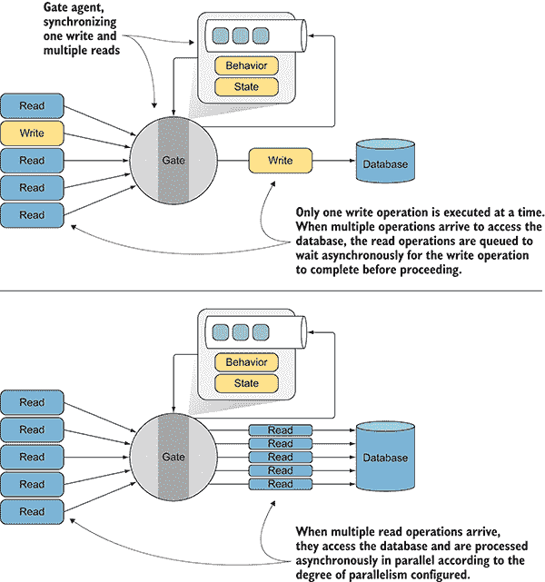

图 13.7 `ReaderWriterAgent` 作为门控代理异步同步对共享资源的访问。在上图中，一次只执行一个写入操作，而读取操作则排队异步等待写入操作完成后再进行。在下图中，根据配置的并行度，并行处理多个读取操作。

列表 13.5 是使用 F# `MailboxProcessor` 实现 `ReaderWriterAgent` 的代码。选择 F# `MailboxProcessor` 的原因是定义状态机简单，这便于实现读取-写入异步协调器。首先，您需要定义消息类型来表示 `ReaderWriterAgent` 协调和同步读取和写入操作的操作。

列表 13.5 `ReaderWriterAgent` 协调器使用的消息类型

```
type ReaderWriterMsg <'r,'w> =   ①  
    | Command of ReadWriteMessages<'r,'w>
    | CommandCompleted            
and ReaderWriterGateState =   ②  
    | SendWrite
    | SendRead of count:int
    | Idle
and ReadWriteMessages<'r,'w> =   ②  
    | Read of r:'r
    | Write of w:'w 
```

`ReaderWriterMsg` 消息类型表示对数据库进行读取或写入的命令，或者通知操作已完成。`ReaderWriterGateState` 是一个 DU，用于将读取/写入操作排队到 `ReaderWriterAgent`。最终，`ReadWriteMessages` DU 识别内部 `ReaderWriterAgent` 中排队的读取/写入操作的情况。

此列表显示了 `ReaderWriterAgent` 类型的实现。

列表 13.6 `ReaderWriterAgent` 协调异步操作

```
type ReaderWriterAgent<'r,'w>(workers:int, 
behavior: MailboxProcessor<ReadWriteMessages<'r,'w>> -> 
➥ Async<unit>,?errorHandler, ?cts:CancellationTokenSource) =   ①  

 let cts = defaultArg cts (new CancellationTokenSource())   ②  
 let errorHandler = defaultArg errorHandler ignore   ②  
    let supervisor = MailboxProcessor<Exception>.Start(fun inbox -> async {
 while true do   ③  
                let! error = inbox.Receive(); errorHandler error })

    let agent = MailboxProcessor<ReaderWriterMsg<'r,'w>>.Start(fun inbox ->
 let agents = Array.init workers (fun _ ->   ④  
            (new AgentDisposable<ReadWriteMsg<'r,'w>>(behavior, cts))
 .withSupervisor supervisor)   ⑤   

 cts.Token.Register(fun () ->   ⑥  
         agents |> Array.iter(fun agent -> (agent:>IDisposable).Dispose()))

 let writeQueue = Queue<_>()   ⑦  
 let readQueue = Queue<_>()   ⑦  
        let rec loop i state = async {
            let! msg = inbox.Receive()
            let next = (i+1) % workers  
            match msg with
            | Command(Read(req)) ->
 match state with   ⑧  
                | Idle -> agents.[i].Agent.Post(Read(req))
                          return! loop next (SendRead 1)
                | SendRead(n) when writeQueue.Count = 0 ->
                    agents.[i].Agent.Post(Read(req))
                    return! loop next (SendRead(n+1))
                | _ -> readQueue.Enqueue(req)
                       return! loop i state
 | Command(Write(req)) ->   ⑨  
                match state with
                | Idle -> agents.[i].Agent.Post(Write(req))
                          return! loop next SendWrite
                | SendRead(_) | SendWrite -> writeQueue.Enqueue(req)
                                             return! loop i state
 | CommandCompleted ->   ⑫  
                match state with
                | Idle -> failwith "Operation no possible"
                | SendRead(n) when n > 1 -> return! loop i (SendRead(n-1))
                | SendWrite | SendRead(_) ->
                    if writeQueue.Count > 0 then
                        let req = writeQueue.Dequeue()
                        agents.[i].Agent.Post(Write(req))
                        return! loop next SendWrite
                    elif readQueue.Count > 0 then
                        readQueue |> Seq.iteri (fun j req ->
                            agents.[(i+j)%workers].Agent.Post(Read(req)))
                        let count = readQueue.Count
                        readQueue.Clear()
                        return! loop ((i+ count)%workers) (SendRead count)
                    else return! loop i Idle }
        loop 0 Idle), cts.Token)

    let postAndAsyncReply cmd createRequest =
 agent.PostAndAsyncReply(fun ch ->   ⑬  
                     createRequest(AsyncReplyChannelWithAck(ch, fun () -> 
➥ agent.Post(CommandCompleted))) |> cmd |> ReaderWriterMsg.Command 

    member this.Read(readRequest) = postAndAsyncReply Read  readRequest
    member thisWrite(writeRequest) = postAndAsyncReply Write writeRequest 
```

在 `ReaderWriterAgent` 类型中，底层 F# `MailboxProcessor` 的实现是一个多状态机，它协调对共享资源的独占写入和读取访问。`ReaderWriterAgent` 根据接收到的 `ReadWriteMsg` 消息类型创建子代理来访问资源。当代理协调器收到 `Read` 命令时，使用模式匹配检查其当前状态以应用独占访问逻辑：

+   如果状态是 `Idle`，则将 `Read` 命令发送到代理子代进行处理。如果没有活跃的写入操作，则主代理的状态变为 `SendRead`。

+   如果状态是 `SendRead`，则将 `Read` 操作发送到代理的子代执行，前提是没有活跃的写入操作。

+   在所有其他情况下，`Read` 操作被放置在本地 `Read` 队列中，稍后进行处理。

当向代理协调器发送 `Write` 命令时，消息会被模式匹配并根据其当前状态进行处理：

+   如果状态是 `Idle`，则将 `Write` 命令发送到子代理的收件箱以进行处理。然后，主代理的状态变为 `SendWrite`。

+   在所有其他情况下，`Write` 操作被放置在本地 `Write` 队列中，稍后进行处理。

图 13.8 展示了 `ReaderWriterAgent` 多状态机。


图 13.8 `ReaderWriterAgent` 作为一个状态机工作，其中每个状态旨在异步同步对共享资源（在这种情况下，是数据库）的访问。

以下代码片段是使用 `ReaderWriterAgent` 的简单示例。为了简单起见，你并不是并发访问数据库，而是在线程安全和非阻塞的方式下访问本地可变字典：

```
type Person  = { id:int; firstName:string; lastName:string; age:int }

let myDB = Dictionary<int, Person>()

let agentSql connectionString =
    fun (inbox: MailboxProcessor<_>) ->
        let rec loop() = async {
            let! msg = inbox.Receive()
            match msg with
            | Read(Get(id, reply)) ->
                match myDB.TryGetValue(id) with
                | true, res -> reply.Reply(Some res)
                | _ -> reply.Reply(None)
            | Write(Add(person, reply)) ->
                let id = myDB.Count
                myDB.Add(id, {person with id = id})
                reply.Reply(Some id)
            return! loop() }
        loop()

let agent = **ReaderWriterAgent**(maxOpenConnection, agentSql connectionString)

let write person = async {
    let! id = agent.Write(fun ch -> Add(person, ch))
    do! Async.Sleep(100)
}

let read personId = async {
    let! resp = agent.Read(fun ch -> Get(personId, ch))
    do! Async.Sleep(100)
}

[ for person in people do 
    yield write  person
    yield read person.Id
    yield write  person
    yield read person.Id
    yield read person.Id ]
    |> Async.Parallel 
```

代码示例创建了 `agentSql` 对象，其目的是模拟访问本地资源 `myDB` 的数据库。`ReaderWriterAgent` 类的实例代理协调并行操作读取和写入，以并发和线程安全的方式访问 `myDB` 字典，而不阻塞。在现实世界场景中，可变集合 `myDB` 代表数据库、文件或任何类型的共享资源。

## 13.5 线程安全随机数生成器

经常在处理多线程代码时，你需要为程序中的某个操作生成随机数。例如，假设你正在编写一个需要当用户发送请求时随机发送音频片段的 Web 服务器应用程序。出于性能考虑，音频片段集被加载到服务器的内存中，该服务器正在同时接收大量请求。对于每个请求，必须随机选择一个音频片段并发送给用户播放。

在大多数情况下，`System.Random` 类是生成随机数值的足够快的解决方案。但是，一个有效的 `Random` 实例在并行访问中的应用成为一个在高性能风格中解决的有挑战性的问题。当 `Random` 类的实例被多个线程使用时，其内部状态可能会受损，并且它可能会始终返回零。

### 13.5.1 解决方案：使用 ThreadLocal 对象

`ThreadLocal<T>` 确保每个线程都接收其自己的 `Random` 类实例，即使在多线程程序中也能保证完全线程安全的访问。以下列表展示了使用 `ThreadLocal<T>` 类实现线程安全随机数生成器的实现，该类提供了一个强类型和局部作用域的类型，用于创建每个线程保持独立的对象实例。

列表 13.7 线程安全随机数生成器

```
public class ThreadSafeRandom : Random
{
    private ThreadLocal<Random> random =
 new ThreadLocal<Random>(() => new Random(MakeRandomSeed()));   ①  

 public override int Next() => random.Value.Next();   ②  

    public override int Next(int maxValue) => 
 random.Value.Next(maxValue);   ②  

 public override int Next(int minValue, int maxValue) =>   ②  

                                    random.Value.Next(minValue, maxValue);

    public override double NextDouble() => random.Value.NextDouble(); 

 public override void NextBytes(byte[] buffer) =>   ②  

                                          random.Value.NextBytes(buffer);

    static int MakeRandomSeed() => 
 Guid.NewGuid().ToString().GetHashCode();   ③  
} 
```

`ThreadSafeRandom` 表示一个线程安全的伪随机数生成器。这个类是 `Random` 类的子类，并重写了 `Next`、`NextDouble` 和 `NextBytes` 方法。`MakeRandomSeed` 方法为底层 `Random` 类的每个实例提供一个唯一的值，这个值不依赖于系统时钟。

`````` The constructor for `ThreadLocal<T>` accepts a `Func<T>` delegate to create a thread-local instance of the `Random` class. The `ThreadLocal<T>.Value` is used to access the underlying value. Here you access the `ThreadSafeRandom` instance from a parallel loop to simulate a concurrent environment.    In this example, the parallel loop calls `ThreadSafeRandom` concurrently to obtain a random number for accessing the `clips` array:    ``` var safeRandom = new **ThreadSafeRandom**();  string[] clips = new string[] { "1.mp3", "2.mp3", "3.mp3", "4.mp3"};  Parallel.For(0, 1000, (i) => {      var clipIndex = safeRandom.Next(4);      var clip = clips[clipIndex];       Console.WriteLine($"clip to play {clip} - Thread Id                            {Thread.CurrentThread.ManagedThreadId}"); });  ```    Here's the result, in print or on the console:    ``` clip to play 2.mp3 - Thread Id 11 clip to play 2.mp3 - Thread Id 8 clip to play 1.mp3 - Thread Id 20 clip to play 2.mp3 - Thread Id 20 clip to play 4.mp3 - Thread Id 13 clip to play 1.mp3 - Thread Id 8 clip to play 4.mp3 - Thread Id 11 clip to play 3.mp3 - Thread Id 11 clip to play 2.mp3 - Thread Id 20 clip to play 3.mp3 - Thread Id 13  ```    ## 13.6 Polymorphic event aggregator    In this section, assume that you need a tool to work in a program that requires raising several events of different types in the system, and then has a publish and subscribe system that can access these events.    ### 13.6.1 Solution: implementing a polymorphic publisher-subscriber pattern    Figure 13.9 illustrates how to manage events of different types. Listing 13.8 shows the `EventAggregator` implementation using Rx (in bold).  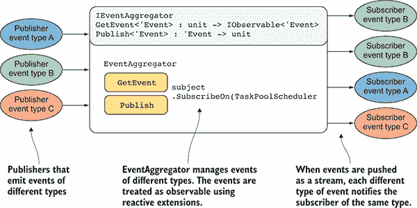    Figure 13.9 The `EventAggregator` manages events of different types. When the events are published, the `EventAggregator` matches and notifies the subscriber and events of the same type.      Listing 13.8 `EventAggregator` using Rx    ``` type IEventAggregator =   ①    inherit IDisposable   ①       abstract GetEvent<'Event> : unit -> IObservable<'Event>     abstract Publish<'Event> : eventToPublish:'Event -> unit  type internal EventAggregator() =     let disposedErrorMessage = "The EventAggregator is already disposed."   let subject = new **Subject**<obj>()   ②         interface IEventAggregator with   ①    member this.GetEvent<'Event>(): IObservable<'Event> =   ③               if (subject.IsDisposed) then failwith disposedErrorMessage   subject.OfType<'Event>().AsObservable<'Event>()   ③    .SubscribeOn(TaskPoolScheduler.Default)   ④         member this.Publish(eventToPublish: 'Event): unit =   ⑤               if (subject.IsDisposed) then failwith disposedErrorMessage   subject.OnNext(eventToPublish)   ⑤     member this.Dispose(): unit = subject.Dispose()   ①             static member Create() = new EventAggregator():>IEventAggregator  ```    The interface `IEventAggregator` helps to loosely couple the `EventAggregator` implementation. This means that the consuming code won’t need to change (as long as the interface doesn’t change), even if the inner workings of the class change. Notice that `IEventAggregator` inherits from `IDisposable` to clean up any resources that were allocated when an instance of `EventAggregator` was created.    The methods `GetEvent` and `Publish` encapsulate an instance of the Rx `Subject` type, which behaves as a hub for events. `GetEvent` exposes `IObservable` from the subject instance to allow a simple way to handle event subscriptions. By default, the Rx `Subject` type is single threaded, so you use the `SubscribeOn` extension method to ensure that `EventAggregator` runs concurrently and exploits `TaskPoolScheduler`. The method `Publish` notifies all the subscribers to the `EventAggregator` concurrently.    The static member `Create` generates an instance of `EventAggregator` and exposes only the single interface `IEventAggregator`. The following code example shows how to subscribe to and publish events using the `EventAggregator`, and the output of running the program:    ``` let evtAggregator = EventAggregator.Create()  type IncrementEvent = { Value: int } type ResetEvent = { ResetTime: DateTime }  evtAggregator     .GetEvent<ResetEvent>()     .ObserveOn(Scheduler.CurrentThread)     .Subscribe(fun evt -> printfn "Counter Reset at: %A - Thread Id %d"  ➥ evt.ResetTime Thread.CurrentThread.ManagedThreadId)   evtAggregator     .GetEvent<IncrementEvent>()     .ObserveOn(Scheduler.CurrentThread)     .Subscribe(fun evt ->  printfn "Counter Incremented. Value: %d - Thread  ➥ Id %d" evt.Value Thread.CurrentThread.ManagedThreadId)  for i in [0..10] do      evtAggregator.Publish({ Value = i }) evtAggregator.Publish({ ResetTime = DateTime(2015, 10, 21) })  ```    Here’s the output:    ``` Counter Incremented. Value: 0 - Thread Id 1 Counter Incremented. Value: 1 - Thread Id 1 Counter Incremented. Value: 2 - Thread Id 1 Counter Incremented. Value: 3 - Thread Id 1 Counter Incremented. Value: 4 - Thread Id 1 Counter Incremented. Value: 5 - Thread Id 1 Counter Incremented. Value: 6 - Thread Id 1 Counter Incremented. Value: 7 - Thread Id 1 Counter Incremented. Value: 8 - Thread Id 1 Counter Incremented. Value: 9 - Thread Id 1 Counter Incremented. Value: 10 - Thread Id 1 Counter Reset at: 10/21/2015 00:00:00 AM - Thread Id 1  ```    The interesting idea of the `EventAggregator` is how it handles events of different types. In the example, the `EventAggregator` instance registers two different event types (`IncrementEvent` and `ResetEvent`), and the `Subscribe` function sends the notification by targeting only the subscribers for a specific event type.    ## 13.7 Custom Rx scheduler to control the degree of parallelism    Let’s imagine you need to implement a system for querying large volumes of event streams asynchronously, and it requires a level of concurrency control. A valid solution for composing asynchronous and event-based programs is Rx, which is based on observables to generate sequence data concurrently. But as discussed in chapter 6, Rx isn’t multithreaded by default. To enable a concurrency model, it’s necessary to configure Rx to use a scheduler that supports multithreading by invoking the `SubscribeOn` extension. For example, Rx provides a few scheduler options including the `TaskPool` and `ThreadPool` types, which schedule all the actions to take place potentially using a different thread.    But there’s a problem, because both schedulers start with one thread by default and then have a time delay of about 500 ms before they’ll increase the number of threads required on demand. This behavior can have performance-critical consequences.    For example, consider a computer with four cores where there are eight actions scheduled. The Rx thread pool, by default, starts with one thread. If each action takes 2.000 ms, then three actions are queued up waiting for 500 ms before the Rx scheduler thread pool’s size is increased. Consequently, instead of executing four actions in parallel right away, which would take 4 seconds in total for all eight actions, the work isn’t completed for 5.5 sec, because three of the tasks are idle in the queue for 500 ms. Fortunately, the cost of expanding the thread pool is only a one-time penalty. In this case, you need a custom Rx scheduler that supports concurrency with fine control over the level of parallelism. It should initialize the internal thread pool at startup time rather than when needed to avoid the cost during critical time computation.    If you enable concurrency in Rx using one of the available schedulers, there’s no option to configure the max degree of parallelism. This is a limitation, because in certain circumstances you only want few threads to be concurrently processing the event stream.    ### 13.7.1 Solution: implementing a scheduler with multiple concurrent agents    The Rx `SubscribeOn` extension method requires passing as an argument an object that implements the `IScheduler` interface. The interface defines the methods responsible for scheduling the action to be performed, either as soon as possible or at a point in the future. You can build a custom scheduler for Rx that supports the concurrency model with the option of configuring a degree of parallelism, shown in figure 13.10.  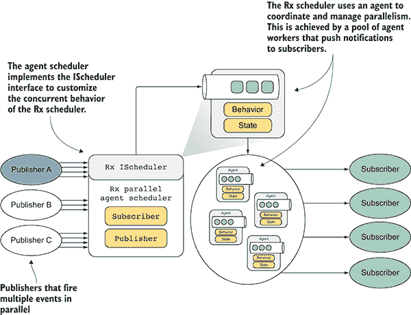    Figure 13.10 `ParallelAgentScheduler` is a custom scheduler that aims to tailor the concurrent behavior of the Rx. The Rx scheduler uses an agent to coordinate and manage the parallelism. This is achieved by a pool of agent workers that push notifications to subscribers.      The following listing shows the implementation of the `ParallelAgentScheduler` scheduler for Rx, which uses the agent `parallelWorker` (shown in Listing 11.5) to manage the degree of parallelism (the code to note is in bold).    Listing 13.9 Rx custom scheduler for managing the degree of parallelism    ``` type ScheduleMsg = ScheduleRequest * AsyncReplyChannel<IDisposable>   ①    let schedulerAgent (inbox:MailboxProcessor<ScheduleMsg>) =   ②       let rec execute (queue:IPriorityQueue<ScheduleRequest>) =  async {  match queue |> PriorityQueue.tryPop with   ③           | None -> return! idle queue -1         | Some(req, tail) ->             let timeout =                   int <| (req.Due - DateTimeOffset.Now).TotalMilliseconds             if timeout > 0 && (not req.IsCanceled)             then return! idle queue timeout             else                 if not req.IsCanceled then req.Action.Invoke()  return! execute tail  }  and idle (queue:IPriorityQueue<_>) timeout = async {   ④           let! msg = inbox.TryReceive(timeout)         let queue =             match msg with             | None -> queue             | Some(request, replyChannel)->  replyChannel.Reply(Disposable.Create(fun () ->   ⑤                                              request.IsCanceled <- true))                    queue |> PriorityQueue.insert request         return! execute queue }     idle (PriorityQueue.empty(false)) -1  type ParallelAgentScheduler(workers:int) =  let agent = MailboxProcessor<ScheduleMsg>   ⑥                       .**parallelWorker**(workers, schedulerAgent)   interface IScheduler with   ⑦           member this.Schedule(state:'a, due:DateTimeOffset,  ➥ action:ScheduledAction<'a>) =  agent.PostAndReply(fun repl ->   ⑧                   let action () = action.Invoke(this :> IScheduler, state)                 let req = ScheduleRequest(due, Func<_>(action))                 req, repl)          member this.Now = DateTimeOffset.Now             member this.Schedule(state:'a, action) =                     let scheduler = this :> IScheduler             let due = scheduler.Now             scheduler.Schedule(state, due, action)         member this.Schedule(state:'a, due:TimeSpan,                                        action:ScheduledAction<'a>) =             let scheduler = this :> IScheduler             let due = scheduler.Now.Add(due)             scheduler.Schedule(state, due, action)  ```    `ParallelAgentScheduler` introduces a level of concurrency to schedule and perform the tasks pushed in a distributed pool of running agents (F# `MailboxProcessor`). Note that all actions sent to `ParallelAgentScheduler` can potentially run out of order. `Parallel­AgentScheduler` can be used as an Rx scheduler by injecting a new instance into the `SubscribeOn` extension method. The following code snippet is a simple example to use this custom scheduler:    ```  let scheduler = **ParallelAgentScheduler**(4)      Observable.Interval(TimeSpan.FromSeconds(0.4))         .SubscribeOn(scheduler)         .Subscribe(fun _ ->            printfn "ThreadId: %A " Thread.CurrentThread.ManagedThreadId)  ```    The instance scheduler of the `ParallelAgentScheduler` object is set to have four concurrent agents running and ready to react when a new notification is pushed. In the example, the observable operator `Interval` sends a notification every 0.4 seconds, which is handled concurrently by the underlying agents of the `parallelWorker`. The benefits of using this custom `ParallelAgentScheduler` scheduler is that there’s no downtime and delay in creating new threads, and it provides fine control over the degree of parallelism. There are times, for example, when you’ll want to limit the level of parallelism for analyzing an event stream, such as when events waiting to be processed are buffered in the internal queue of the underlying agents and consequently not lost.    ## 13.8 Concurrent reactive scalable client/server    The challenge: You need to create a server that listens asynchronously on a given port for incoming requests from multiple TCP clients. Additionally, you want the server to be    *   Reactive *   Able to manage a large number of concurrent connections *   Scalable *   Responsive *   Event driven    These requirements ensure that you can use functional high-order operations to compose the event stream operations over the TCP socket connections in a declarative and non-blocking way.    Next, the client requests need to be processed concurrently by the server, with resulting responses sent back to the client. The Transmission Control Protocol (TCP) server connection can be either secured or unsecured. TCP is the most-used protocol on the internet today, used to provide accurate delivery that preserves the order of data packets from one endpoint to another. TCP can detect when packets are wrong or missing, and it manages the action necessary for resending them. Connectivity is ultra-important in applications, and the .NET Framework provides a variety of different ways to help you support that need.    You also need a long-running client program that uses TCP sockets to connect to the server. After the connection is established, both the client and server endpoints can send and receive bytes asynchronously and sometimes close the connection properly and reopen it at a later time.    The client program that attempts to connect to the TCP server is asynchronous, non-blocking, and capable of maintaining the application’s responsiveness, even under pressure (from sustaining a large number of data transfers). For this example, the client/server socket-based application continually transfers volumes of packets at a high rate of speed as soon as the connection is established. The data is transmitted from the server to the client streaming in chunks, where each chunk represents the historical stocks prices on a particular date. This stream of data is generated by reading and parsing the comma-separated values (CSV) files in the solution. When the client receives the data, it begins to update a chart in real time.    This scenario is applicable to any operations that use reactive programming based on streams. Examples you may encounter are remote binary listeners, socket programming, and any other unpredictable event-oriented application, such as when a video needs to be streamed across the network.    ### 13.8.1 Solution: combining Rx and asynchronous programming    To build the client/server program shown in Listing 13.10, the CLR `TcpListener` and `TcpClient` classes provide a convenient model for creating a socket server with a few code lines. Used in combination with TAP and Rx, they increase the level of scalability and reliability of the program. But to work in the reactive style, the traditional application design must change.    Specifically, to achieve the requirements of a high-performing TCP client/server program, you need to implement the TCP sockets in an asynchronous style. For this reason, consider using a combination of Rx and TAP. Reactive programming, in particular, fits this scenario because it can deal with source events from any stream regardless of its type (network, file, memory, and so on). Here’s the Rx definition from Microsoft:    > *The Reactive Extensions (Rx) is a library for composing asynchronous and event-based programs using observable sequences and LINQ-style query operators, and parameterize the concurrency in the asynchronous data streams using Schedulers.*    To implement the server in a scalable way, the instance of the `TcpListener` class listens for incoming connections. When a connection is established, it’s routed, as a `TcpClient`, from the listener handler to manage the `NetworkStream`. This stream is then used for reading and writing bytes for data-sharing between client and server. Figure 13.11 shows the connection logic of the server program.  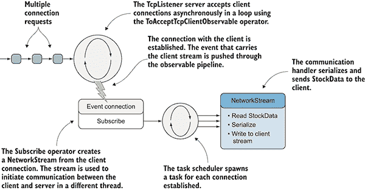    Figure 13.11 The `TcpListener` server accepts client connections asynchronously in a loop. When a connection is established, the event that carries the client stream is pushed through the `Observable` pipeline to be processed. Next, the connection handlers start reading the stock ticker symbol histories, serialize, and write the data to the client `NetworkStream`.      Listing 13.10  Reactive `TcpListener` server program    ``` static void ConnectServer(int port, string sslName = null) {     var cts = new CancellationTokenSource();     string[] stockFiles = new string[] { "aapl.csv", "amzn.csv", "fb.csv",  ➥ "goog.csv", "msft.csv" };   ①     var formatter = new BinaryFormatter();   ②         TcpListener.Create(port)    .ToAcceptTcpClientObservable()  ③    .ObserveOn(TaskPoolScheduler.Default)   ④           .Subscribe(client =>  {  using (var stream = GetServerStream(client, sslName))   ⑤        {           stockFiles  .ObservableStreams(StockData.Parse)   ⑥            .Subscribe(async stock => {  var data = Serialize(formatter, stock);   ⑦    await stream.WriteAsync(data, 0, data.Length, cts.Token);   ⑦            });      }     },  error => Console.WriteLine("Error: " + error.Message),   ⑧    () => Console.WriteLine("OnCompleted"),   ⑧       cts.Token); }  ```    In the example, the server shows the implementation of a reactive TCP listener that acts as an observable of the stock ticker. The natural approach for a listener is to subscribe to an endpoint and receive clients as they connect. This is achieved by the extension method `ToAcceptTcpClientObservable`, which produces an observable of the `IObservable`<`TcpClient`>. The `ConnectServer` method uses the `TcpListener`.`Create` construct to generate a `TcpListener` using a given port number on which the server is listening asynchronously, and an optional name of the Secure Sockets Layer (SSL) to establish a secure or regular connection.    The custom observable extension method `ToAcceptTcpClientObservable` uses the given `TcpListener` instance to provide mid-level network services across an underlying socket object. When a remote client becomes available and a connection is established, a `TcpClient` object is created to handle the new communication, which is then sent into a different long-running thread with the use of a `Task` object.    Next, to guarantee the concurrent behavior of the socket handler, the scheduler is configured using the `ObserveOn` operator to subscribe and move the work to another scheduler, `TaskPoolScheduler`. In this way, the `ToAcceptTcpClientObservable` operator can orchestrate a large number of `TcpClient`s concurrently as a sequence.    Then, the internals of the observable `ToAcceptTcpClientObservable` fetch the `TcpClient` reference from the task, and create the network stream used as a channel to send the packets of data generated by the `ObservableStreams` custom observable operator. The `GetServerStream` method retrieves either a secure or regular stream according to the value that `nameSsl` passed. This method determines whether the `nameSsl` value for an SSL connection has been set and, if so, creates an `SslStream` using `TcpClient.GetStream` and the configured server name to get the server certificate.    Alternatively, if SSL isn’t used, `GetServerStream` gets the `NetworkStream` from the client using the `TcpClient`.`GetStream` method. You can find the `GetServerStream` method in the source code. When the `ObservableStreams` materialize, the event stream that’s generated flows into the `Subscribe` operator. The operator then asynchronously serializes the incoming data into chunks of byte arrays that are sent across the network through the client stream. For simplicity, the serializer is the .NET binary formatter, but you can replace it with one that better fits your needs.    The data is sent across the network in the form of byte arrays, because it’s the only reusable data message type that can contain any shape of object. This listing shows an implementation of the core observable operator `ToAcceptTcpClientObservable` used by the underlying `TcpListener` to listen for remote connections and react accordingly.    Listing 13.11 Asynchronous and reactive `ToAcceptTcpClientObservable`    ``` static IObservable<TcpClient> ToAcceptTcpClientObservable(this TcpListener  ➥ listener, int backlog = 5) {      listener.Start(backlog);   ①     return Observable.Create<TcpClient>(async (observer, token) =>   ②       {         try         {  while (!token.IsCancellationRequested)   ③               {   var client = await listener.AcceptTcpClientAsync();   ④                   Task.Factory.StartNew(_ => observer.OnNext(client), token,    TaskCreationOptions.LongRunning);   ⑤               }             observer.OnCompleted();         }         catch (OperationCanceledException)         {  observer.OnCompleted();   ⑥           }         catch (Exception error)         {  observer.OnError(error);   ⑥          }         finally         {  listener.Stop();         }  return Disposable.Create(() =>   ⑦           {             listener.Stop();             listener.Server.Dispose();         });     }); }  ```    `ToAcceptTcpClientObservable` takes an instance of `TcpListener`, which starts listening asynchronously for new incoming connection requests in a `while` loop, until the operation is canceled using a cancellation token. When a client successfully connects, a `TcpClient` reference flows out as a message within a sequence. This message executes into an asynchronous `Task` to service the client/server interaction, letting multiple clients connect concurrently to the same listener. Once a connection is accepted, another `Task` starts repeating the procedure of listening for new connection request.    Ultimately, when the observable is disposed, or the cancellation token requests a cancellation, the function passed into the `Disposable`.`Create` operator is triggered to stop and close the underlying server listener.    The data transferred is generated through the `ObservableStreams` extension method, which reads and parses a set of CSV files to extract the historical stocks prices. This data is then pushed to the clients, connected through the `NetworkStream`.    This shows the implementation of `ObservableStreams`.    Listing 13.12 Custom `Observable` stream reader and parser    ``` static IObservable<StockData> ObservableStreams     (this IEnumerable<string> filePaths,     ➥ Func<string, string, StockData> map, int delay = 50)   ①   {     return filePaths            .Select(key =>        new FileLinesStream<StockData>(key, row => map(key, row)))   ②         .Select(fsStock =>  {          var startData = new DateTime(2001, 1, 1);  return Observable.Interval(TimeSpan.FromMilliseconds(delay))   ③    .Zip(fsStock.ObserveLines(), (tick, stock) => {   ④                          stock.Date = startData + TimeSpan.FromDays(tick);                        return stock;                  });             }  )  .Aggregate((o1, o2) => o1.Merge(o2));   ⑤   }  ```    `ObservableStreams` generates a series of observables of `StockData` type, one for each of the `filePaths` passed. The class `FileLinesStream`, whose implementation is omitted for simplicity, opens the `FileStream` of a given file path. It then reads the content text from the stream as an observable and applies a projection to transform each line of text read into a `StockData` type. Ultimately it pushes the results out as an observable.    The most interesting part of the code is the application of the two `Observable` operators `Interval` and `Zip`, which are used together to apply an arbitrary delay, if specified, between messages. The `Zip` operator combines an element from each sequence in turn, which means that each `StockData` entry is paired with an element, produced every interval time. In this case, the combination of a `StockData` with the interval time ensures a delay for each notification.    Ultimately, the combination of the `Aggregate` and `Merge` operators is used to merge the observables generated from each file:    ``` .Aggregate((o1, o2) => o1.Merge(o2));  ```    Next, to complete the client/server program, you implement the reactive client class, shown in figure 13.12. Listing 13.13 shows the implementation of the client side.  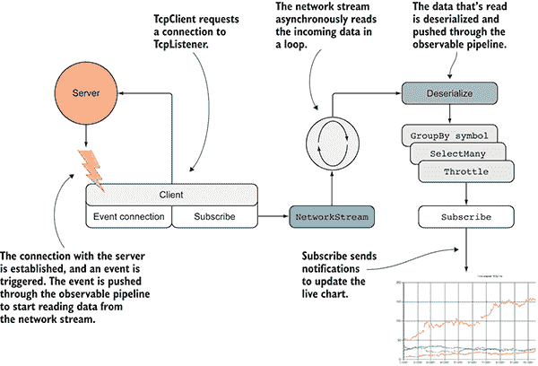    Figure 13.12 `TcpClient` requests a connection to the `TcpListener` server. When the connection is established, it triggers an event that carries the client stream, which is pushed through the observable pipeline. Next, a `NetworkStream` is created to start reading the data asynchronously in a loop from the server. The data read is next deserialized and analyzed through the observable pipeline to ultimately update the live chart.      Listing 13.13  Reactive `TcpClient` program    ``` var endpoint = new IPEndPoint(IPAddress.Parse("127.0.0.1"), 8080); var cts = new CancellationTokenSource(); var formatter = new BinaryFormatter();  endpoint.ToConnectClientObservable()   ①       .Subscribe(client => {  GetClientStream(client, sslName)   ②     .ReadObservable(0x1000, cts.Token)   ③           .Select(rawData => Deserialize<StockData>(formatter, rawData))  .GroupBy(item => item.Symbol)   ④           .SelectMany(group =>  group.Throttle(TimeSpan.FromMilliseconds(20))   ⑤    .ObserveOn(TaskPoolScheduler.Default))   ⑥           .ObserveOn(ctx)  .Subscribe(stock =>   ⑦                UpdateChart(chart, stock, sw.ElapsedMilliseconds) );         },         error => Console.WriteLine("Error: " + error.Message),         () => Console.WriteLine("OnCompleted"),         cts.Token);  ```    The code starts with an `IPEndPoint` instance, which targets the remote server endpoint to connect. The observable operator `ToConnectClientObservable` creates an instance of a `TcpClient` object to initiate the connection. Now, you can use the `Observable` operators to subscribe to the remote client connection. When the connection with the server is established, the `TcpClient` instance is passed as an observable to begin receiving the stream of data to process. In this implementation, the remote `NetworkStream` is accessed calling the `GetClientStream` method. The stream of data flows into the observable pipeline though the `ReadObservable` operator, which routes the incoming messages from the underlying `TcpClient` sequence into another observable sequence of type `ArraySegment` bytes.    As part of the stream-processing code, after the chunks of `rawData` received from the server are converted into `StockData`, the `GroupBy` operator filters the stock tickers by symbol into multiple observables. At this point, each observable can have its own unique operations. Grouping allows throttling to act independently on each stock symbol, and only stocks with identical symbols will be filtered within the given throttle time span.    A common problem with writing reactive code is when the events come in too quickly. A fast-moving stream of events can overwhelm your program’s processing. In listing 13.13, because you have a bunch of UI updates, using the throttling operator can help deal with a massive flood of stream data without overwhelming the live updates. The operator after the throttling, `ObserveOn`(`TaskPoolScheduler`.`Default`), starts a new thread for each partition originated by the `GroupBy`. The `Subscribe` method ultimately updates the live chart with the stock values. Here’s the implementation of the `ToConnectClientObservable` operator.    Listing 13.14 Custom Observable `ToConnectClientObservable` operator    ``` static IObservable<TcpClient> ToConnectClientObservable(this IPEndPoint  ➥ endpoint) {  return Observable.Create<TcpClient>(async (observer, token) =>  {   ①         var client = new TcpClient();          try       {  await client.ConnectAsync(endpoint.Address, endpoint.Port);   ②     token.ThrowIfCancellationRequested();   ③     observer.OnNext(client);   ④         }       catch (Exception error)       {           observer.OnError(error);       }    return Disposable.Create(() => client.Dispose());   ⑤       }); }  ```    `ToConnectClientObservable` creates an instance of `TcpClient` from the given `IPEndPoint` endpoint, and then it tries to connect asynchronously to the remote server. When the connection is established successfully, the `TcpClient` client reference is pushed out through the observer.    The last phase of the code to program is the `ReadObservable` observable operator, which is built to asynchronously and continuously read chunks of data from a stream. In this program, the stream is the `NetworkStream` produced as result of the connection between the server and client.    Listing 13.15 Observable stream reader    ``` public static IObservable<ArraySegment<byte>> ReadObservable(this Stream  ➥ stream, int bufferSize, CancellationToken token =  ➥ default(CancellationToken)) {       var buffer = new byte[bufferSize];  var asyncRead = Observable.FromAsync<int>(async ct => {   ①    await stream.ReadAsync(buffer, 0, sizeof(int), ct);   ②    var size = BitConverter.ToInt32(buffer, 0);   ②    await stream.ReadAsync(buffer, 0, size, ct);   ②             return size});  return Observable.While(   ③               () => !token.IsCancellationRequested && stream.CanRead,  Observable.Defer(() =>   ④                       !token.IsCancellationRequested && stream.CanRead                         ? asyncRead                         : Observable.Empty<int>())                 .Catch((Func<Exception, IObservable<int>>)(ex =>  ➥ Observable.Empty<int>()))   ⑤                   .TakeWhile(returnBuffer => returnBuffer > 0)                 .Select(readBytes =>  ➥ new ArraySegment<byte>(buffer, 0, readBytes)))   ⑥           .Finally(stream.Dispose); }  ```    One important note to consider when implementing this `ReadObservable` is that the stream must be read in chunks to be reactive. That’s why the `ReadObservable` operator takes a buffer size as an argument to define the size of the chunks.    The purpose of the `ReadObservable` operator is to read a stream in chunks to facilitate working with data that’s larger than the memory available, or that could be infinite with an unknown size, like streaming from the network. In addition, it promotes the compositional nature of Rx for applying multiple transformations to the stream itself, because reading chunks at a time allows data transformations while the stream is still in motion. At this point, you have an extension method that iterates on the bytes from a stream.    In the code, the `FromAsync` extension method allows you to convert a `Task<T>`, in this case `stream`.`ReadAsync`, into an `IObservable<T>` to treat the data as a flow of events and to enable programming with Rx. Underneath, `Observable.FromAsync` creates an observable that only starts the operation independently every time it’s subscribed to.    Then, the underlying stream is read as an `Observable` `while` loop until data is available or the operation is canceled. The `Observable` `Defer` operator waits until an observer subscribes to it, and then starts pushing the data as a stream. Next, during each iteration, a chunk of data is read from the stream. This data is then pushed into a buffer that takes the form of an `ArraySegment`<`byte`>, which slices the payload in the right length. `ReadObservable` returns an `IObservable` of `ArraySegment`<`byte`>, which is an efficient way to manage the byte arrays in a pool. The buffer size may be larger than the payload of bytes received, for example, so the use of `ArraySegment`<`byte`> holds the byte array and payload length.    In conclusion, when receiving and processing data, the .NET Rx allows shorter and cleaner code than traditional solutions. Furthermore, the complexity of building a TCP-based reactive client/server program is heavily reduced in comparison to a traditional model. In fact, you don’t have to deal with low-level `TcpClient` and `TcpListener` objects, and the flow of bytes is handled through a high-level abstraction offered by observable operators.    ## 13.9 Reusable custom high-performing parallel filter‑map operator    You have a collection of data, and you need to perform the same operation on each element of the data to satisfy a given condition. This operation is CPU-bound and may take time. You decide to create a custom and reusable high-performant operator to filter and map the elements of a given collection. The combination of filtering and transforming the elements of a collection is a common operation for analyzing data structures. It’s possible to achieve a solution using LINQ or PLINQ in parallel with the `Where` and `Select` operators; but a more optimal performance solution is available. As you saw in section 5.2.1, for each call and repeated use of high-order operators such as map (`Select`), filter (`Where`), and other similar functions of the PLINQ query (and LINQ), as shown in figure 13.13, intermediate sequences are generated that unnecessarily increase memory allocation. This is due to the intrinsic functional nature of LINQ and PLINQ, where collections are transformed instead of mutated. In the case of transforming large sequences, the penalty paid to the GC to free up memory becomes increasingly higher, with negative consequences to the performance of the program.  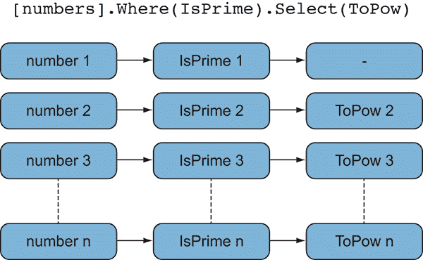    Figure 13.13 In this diagram, each number (first column) is first filtered by `IsPrime` (second column) to verify if it’s a prime number. Then, the prime numbers are passed into the `ToPow` function (third column). For example, the first value, number 1, is not a prime number, so the `ToPow` function isn’t running.      In this example, you want to derive the sum of all the prime numbers in 100 million digits.    ### 13.9.1 Solution: combining filter and map parallel operations    The implementation of a custom and parallel filter and map operator with top performance requires attention to minimize (or eliminate) unnecessary temporary data allocation, as shown in figure 13.14. This technique of reducing data allocation during data manipulation to increase the performance of the program is known as *deforestation*.  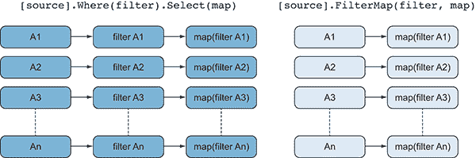    Figure 13.14 The left graph shows the operations `Where` and `Select` over a given source, done in separate steps, which introduces extra memory allocation and consequentially more GC generations. The right graph shows that applying the `Where` and `Select` (filter and map) operations together in a single step avoids extra allocation and reduces GC generations, increasing the speed of the program.      The next listing shows the code of the `ParallelFilterMap` function, which uses the `Parallel.ForEach` loop to eliminate intermediate data allocations by processing only one array, instead of creating one temporary collection for each operator.    Listing 13.16 `ParallelFilterMap` operator    ``` static TOutput[] ParallelFilterMap<TInput, TOutput>(this IList<TInput>  ➥ input, Func<TInput, Boolean> predicate,   ①                        Func<TInput, TOutput> transform,                       ParallelOptions parallelOptions = null) {     parallelOptions = parallelOptions ?? new ParallelOptions();   var atomResult = new Atom<ImmutableList<List<TOutput>>>   ②                                  (ImmutableList<List<TOutput>>.Empty);      Parallel.ForEach(Partitioner.Create(0, input.Count),         parallelOptions,  () => new List<TOutput>(),   ③         delegate (Tuple<int, int> range, ParallelLoopState state,                  List<TOutput> localList)         {  for (int j = range.Item1; j < range.Item2; j++)   ④               {                 var item = input[j];  if (predicate(item))   ⑤    localList.Add(transform(item));   ⑤               }             return localList;   }, localList => atomResult.Swap(r => r.Add(localList)));   ⑥    return atomResult.Value.SelectMany(id => id).ToArray();   ⑦   }  ```    The parallel `ForEach` loop applies the `predicate` and `map` functions for each element of the input collection. In general, if the body of the parallel loop performs only a small amount of work, better performance results come from partitioning the iterations into larger units of work. The reason for this is the overhead when processing a loop, which involves the cost of managing worker threads and the cost of invoking a delegate method. Consequently, it’s good practice to partition the parallel iteration space by a certain constant using the `Partitioner`.`Create` constructor. Then each body invokes the filter and map functions for a certain range of elements, amortizing invocations of the loop body delegate.    For each iteration of the `ForEach` loop, there’s an anonymous delegate invocation that causes a penalty in terms of memory allocation and, consequently, performance. One invocation occurs for the filter function, a second invocation occurs for the map function, and ultimately an invocation happens for the delegate passed into the parallel loop. The solution is to tailor the parallel loop specific to the filter and map operations to avoid extra invocations of the body delegate.    The parallel `ForEach` operator forks off a set of threads, each of which calculates an intermediate result by performing the filter and map functions over its own partition of data and placing the value into its dedicated slot in the intermediate array.    Each thread (task) governed by the parallel loop captures an isolated instance of a local `List<TOutput>` through the concept of local values. Local values are variables that exist locally within a parallel loop. The body of the loop can access the value directly, without having to worry about synchronization.    Each partition will compute its own intermediate value that will then combine into a single final value.    When the loop completes, and it’s ready to aggregate each of its local results, it does so with the `localFinally` delegate. But the delegate requires synchronization accessto the variable that holds the final result. An instance of the `ImmutableList` collection is used to overcome this limitation to merge the final results in a thread-safe manner.    Note the `ImmutableList` is encapsulated in an `Atom` object, from chapter 3\. The `Atom` object uses a compare-and-swap (CAS) strategy to apply thread-safe writes and updates of objects without the need of locks and other forms of primitive synchronization. In this example, the `Atom` class holds a reference to the immutable list and updates it automatically.    The following code snippet tests the parallel sum of only the prime numbers from 100 million digits:    ``` bool IsPrime(int n) {     if (n == 1) return false;     if (n == 2) return true;     var boundary = (int) Math.Floor(Math.Sqrt(n));     for (int i = 2; i <= boundary; ++i)         if (n % i == 0) return false;     return true; }  BigInteger ToPow(int n) => (BigInteger) Math.BigMul(n, n); var nums = Enumerable.Range(0, 100000000).ToList();  BigInteger SeqOperation() =>                 nums.Where(IsPrime).Select(ToPow).Aggregate(BigInteger.Add);  BigInteger ParallelLinqOperation() =>    nums.AsParallel().Where(IsPrime).Select(ToPow).Aggregate(BigInteger.Add);  BigInteger ParallelFilterMapInline() =>            nums.**ParallelFilterMap**(IsPrime, ToPow).Aggregate(BigInteger.Add);  ```    Figure 13.15 compares the sequential code (as baseline), the PLINQ version, and the custom `ParallelFilterMap` operator. The figure shows the result of the benchmark code running the sum of the prime numbers for the 100 million digits. The benchmark was performed in a quad-core machine with 6 GB of RAM. The sequential code takes an average of 196.482 seconds to run and is used as baseline. The PLINQ version of the code is faster and runs in 74.926 seconds, almost three times faster, which is expected in a quad-core computer. The custom `ParallelFilterMap` operator is the fastest, at approximately 52.566 seconds.  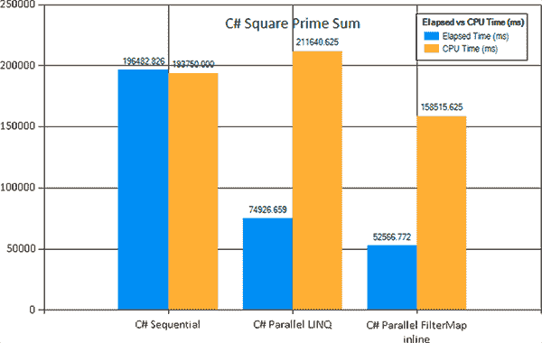    Figure 13.15 Benchmark chart comparing the Sequential and Parallel LINQ versions of the code with the custom `ParallelFilterMap` operator. In a quad-core machine, the custom `ParallelFilterMap` operator is approximately 80% faster than the sequential version of the code, and 30% faster than the PLINQ version.      ## 13.10 Non-blocking synchronous message-passing model    Let’s imagine you need to build a scalable program capable of handling a large number of operations without blocking any threads. You need a program that loads, processes, and saves a large number of images, for example. These operations are handled with few threads in a collaborative way, which optimizes the resources without blocking any threads and without jeopardizing the performance of the program.    Similar to the Producer/Consumer pattern, there are two flows of data. One flow is the input, where the processing starts, followed by intermediate steps to transform the data, followed by the output with the final result of the operations. These processes, the producer and the consumer, share a common fixed-size buffer used as a queue. The queue is buffered to increase the overall speed and increase throughput to allow for multiple consumers and producers. In fact, when the queue is safe to use by multiple consumers and producers, then it’s easy to change the level of concurrency for different parts of the pipeline at runtime. The producer, however, could write into the queue when it isn’t full, or conversely, it can block when the queue is full. On the other side, the consumer could read from the queue when it is not empty, but it will block in other cases when the queue is empty. You want to implement a producer and consumer pattern based on message passing to avoid thread blocking and maximize the application’s scalability.    ### 13.10.1 Solution: coordinating the payload between operations using the agent programming model    There are two flavors of message passing models for concurrent systems: synchronous and asynchronous. You’re already familiar with asynchronous models such as the agent (and actor) model, explained in chapters 11 and 12, and based on asynchronous message passing. In this recipe, you’ll use the synchronous version of message passing, which is also known as communicating sequential processes (CSP).    CSP has much in common with the actor model, both being based on message passing. But CSP emphasizes the channels used for communication, rather than the entities between which communication takes place.    This CSP synchronous message passing for concurrent programming models is used for data exchange between channels, which can be scheduled to multiple threads and might run in parallel. Channels are similar to thread workers that communicate directly with each other by publishing messages, and where other channels can then listen for these messages without the sender knowing who’s listening.    You can imagine the channel as a thread-safe queue, where any task with a reference to a channel can add messages to one end, and any task with a reference to it can remove messages from the other end. Figure 13.16 illustrates the channel model.  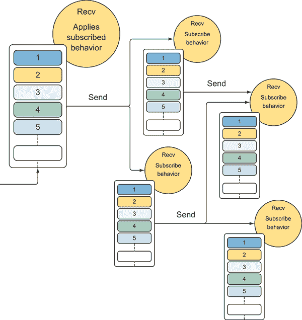    Figure 13.16 The channel receives (`Recv`) a message, and applies the subscribed behavior. The channels communicate by sending (`Send`) messages, often creating an interconnected system that’s similar to the actor model. Each channel contains a local queue of messages used to synchronize the communication with other channels without blocking.      A channel doesn’t need to know about what channel will process the message later in the pipeline. It only has to know what channel to forward the messages to. On the other side, listeners on channels can subscribe and unsubscribe without affecting any channels sending the messages. This design promotes loose coupling between channels.    The primary strength of CSP is its flexibility, where channels are first-class and can be independently created, written to, read from, and passed between tasks. The following listing shows the implementation of the channel in F#, which uses `MailboxProcessor` for the underlying message synchronization due to the close similarity with the agent-programming model. The same concepts apply to C#. You can find the full implementation in C# using TDF in the downloadable source code.    Listing 13.17 `ChannelAgent` for CSP implementation using `MailboxProcessor`    ``` type internal ChannelMsg<'a> =   ①       | Recv of ('a -> unit) * AsyncReplyChannel<unit>     | Send of 'a * (unit -> unit) * AsyncReplyChannel<unit>  type [<Sealed>] ChannelAgent<'a>() =     let agent = MailboxProcessor<ChannelMsg<'a>>.Start(fun inbox ->  let readers = Queue<'a -> unit>()   ②    let writers = Queue<'a * (unit -> unit)>()   ②            let rec loop() = async {             let! msg = inbox.Receive()             match msg with  | Recv(ok , reply) ->   ③                   if writers.Count = 0 then                     readers.Enqueue ok                     reply.Reply( () )                 else                     let (value, cont) = writers.Dequeue()  TaskPool.Spawn cont   ④                       reply.Reply( (ok value) )                 return! loop()  | Send(x, ok, reply) ->   ⑤                   if readers.Count = 0 then                     writers.Enqueue(x, ok)                     reply.Reply( () )                 else                     let cont = readers.Dequeue()  TaskPool.Spawn ok   ④                       reply.Reply( (cont x) )                 return! loop() }         loop())   member this.Recv(ok: 'a -> unit)  =   ⑤           agent.PostAndAsyncReply(fun ch -> Recv(ok, ch)) |> Async.Ignore   member this.Send(value: 'a, ok:unit -> unit)  =   ⑤           agent.PostAndAsyncReply(fun ch -> Send(value, ok, ch)) |> Async.Ignore  member this.Recv() =   ⑥           Async.FromContinuations(fun (ok, _,_) ->             agent.PostAndAsyncReply(fun ch -> Recv(ok, ch))              |> Async.RunSynchronously)   member this.Send (value:'a) =   ⑥           Async.FromContinuations(fun (ok, _,_) ->             agent.PostAndAsyncReply(fun ch -> Send(value, ok, ch))              |> Async.RunSynchronously )  let run (action:Async<_>) = action |> Async.Ignore |> Async.Start   ⑦    let rec subscribe (chan:ChannelAgent<_>) (handler:'a -> unit) =   ⑧       chan.Recv(fun value -> handler value                            subscribe chan handler) |> run  ```    The `ChannelMsg` DU represents the message type that `ChannelAgent` handles. When a message arrives, the `Recv` case is used to execute a behavior applied to the payload passed. The `Send` case is used to communicate a message to the channel.    The underlying `MailboxProcessor` contains two generic queues, one for each operation, `Recv` or `Send`. As you can see, when a message is either received or sent, the behavior of the agent, in the function `loop()`, checks the count of available messages to load balance and synchronize the communication without blocking any threads. `ChannelAgent` accepts continuation functions with its `Recv` and `Send` operations. If a match is available, the continuation is invoked immediately; otherwise, it’s queued for later. Keep in mind that a synchronous channel eventually gives a result, so the call is logically blocking. But when using F# async workflows, no actual threads are blocked while waiting.    The last two functions in the code help run a channel operation (usually `Send`), while the `subscribe` function is used to register and apply a handler to the messages received. This function runs recursively and asynchronously waiting for messages from the channel.    The `TaskPool.Spawn` function assumes a function with signature `(unit -> unit) -> unit` that forks the computation on a current thread scheduler. This listing shows the implementation of `TaskPool`, which uses the concepts covered in chapter 7.    Listing 13.18 Dedicated `TaskPool` agent (`MailboxProcessor``)`   ````` ```` ``` type private Context = {cont:unit -> unit; context:ExecutionContext}   ①    type TaskPool private (numWorkers) =   ②    let worker (inbox: MailboxProcessor<Context>) =   ③           let rec loop() = async {             let! ctx = inbox.Receive()  let ec = ctx.context.CreateCopy()   ④               ExecutionContext.Run(ec, (fun _ -> ctx.cont()), null)             return! loop() }         loop()     let agent = MailboxProcessor<Context>.parallelWorker(numWorkers,   ➥ worker)   ⑤        static let self = TaskPool(2)     member private this.Add (continutaion:unit -> unit) =   ⑥           let ctx = { cont = continutaion;   context = ExecutionContext.Capture() }   ⑦    agent.Post(ctx)   ⑥       static member Spawn (continuation:unit -> unit) =          self.Add continuation  ```    The `Context` record type is used to capture the `ExecutionContext` at the moment when the continuation function `cont` was passed to the pool. `TaskPool` initializes the `MailboxProcessor` `parallelWorker` type to handle multiple concurrent consumers and producers (refer to chapter 11 for the implementation and details of the `parallelWorker` agent).    The purpose of `TaskPool` is to control how many tasks to schedule and to dedicate to run the continuation function in a tight loop. In this example, it runs only one task, but you can have any number.    `Add` enqueues the given continuation function, which will be executed when a thread on a channel offers communication and another thread offers matching communication. Until such compensation between channels is achieved, the thread will wait asynchronously.    In this code snippet, the `ChannelAgent` implements a CSP pipeline, which loads an image, transforms it, and then saves the newly created image into the local `MyPicture` folder:    ``` let rec subscribe (chan:ChannelAgent<_>) (handler:'a -> unit) =     chan.Recv(fun value -> handler value                            subscribe chan handler) |> run  let chanLoadImage = ChannelAgent<string>() let chanApply3DEffect = ChannelAgent<ImageInfo>() let chanSaveImage = ChannelAgent<ImageInfo>()  subscribe chanLoadImage (fun image ->     let bitmap = new Bitmap(image)  let imageInfo = { Path = Environment.GetFolderPath(Environment.SpecialFolder.MyPictures)                       Name = Path.GetFileName(image)                       Image = bitmap }     chanApply3DEffect.Send imageInfo |> run)  subscribe chanApply3DEffect (fun imageInfo ->     let bitmap = convertImageTo3D imageInfo.Image     let imageInfo = { imageInfo with Image = bitmap }     chanSaveImage.Send imageInfo |> run)  subscribe chanSaveImage (fun imageInfo ->     printfn "Saving image %s" imageInfo.Name     let destination = Path.Combine(imageInfo.Path, imageInfo.Name)     imageInfo.Image.Save(destination))  let loadImages() =     let images = Directory.GetFiles(@".\Images")     for image in images do         chanLoadImage.Send image |> run  loadImages()  ```    As you can see, implementing a CSP-based pipeline is simple. After you define the channels `chanLoadImage`, `chanApply3DEffect`, and `chanSaveImage`, you have to register the behaviors using the `subscribe` function. When a message is available to be processed, the behavior is applied.    ## 13.11 Coordinating concurrent jobs using the agent programming model    The concepts of parallelism and asynchronicity were covered extensively earlier in this book. Chapter 9 shows how powerful and convenient the `Async.Parallel` operator is for running a large number of asynchronous operations in parallel. Often, however, you may need to map across a sequence of asynchronous operations and run functions on the elements in parallel. In this case, a feasible solution can be implemented:    ```  let inline asyncFor(operations: #seq<'a> Async, map:'a -> 'b) =         Async.map (Seq.map map) operations  ```    Now, how would you limit and tame the degree of parallelism to process the elements to balance resource consumption? This issue comes up surprisingly often when a program is doing CPU-heavy operations, and there’s no reason to run more threads than the number of processors on the machine. When there are too many concurrent threads running, contention and context-switching make the program enormously inefficient, even for a few hundred tasks. This is a problem of throttling. How can you throttle asynchronous and CPU-bound computations awaiting results without blocking? The challenge becomes even more difficult because these asynchronous operations are spawned at runtime, which makes the total number of asynchronous jobs to run unknown.    ### 13.11.1 Solution: implementing an agent that runs jobs with a configured degree of parallelism    The solution is using an agent model to implement a job coordinator that lets you throttle the degree of parallelism by limiting the number of tasks that are processed in parallel, as shown in figure 13.17. In this case, the agent’s only mission is to gate the number of concurrent tasks and send back the result of each operation without blocking. In addition, the agent should conveniently expose an observable channel where you can register to receive notifications when a new result is computed.      Figure 13.17 The `TamingAgent` runs the jobs in parallel, limited by the degree of parallelism configured. When an operation completes, the `Subscribe` operator notifies the registered handlers with the output of the job.      Let’s define the agent that can tame the concurrent operations. The agent must receive a message, but must also send back to the caller, or subscriber, a response for the result computed.    In the following listing, the implementation of the `TamingAgent` runs asynchronous operations, efficiently throttling the degree of parallelism. When the number of concurrent operations exceeds this degree, they’re queued and processed later.    Listing 13.19 `TamingAgent`    ``` type JobRequest<'T, 'R> =   ①       | Ask of 'T * AsyncReplyChannel<'R>     | Completed     | Quit  type TamingAgent<'T, 'R>(limit, operation:'T -> Async<'R>) =  let jobCompleted = new Event<'R>()   ②        let tamingAgent = Agent<JobRequest<'T, 'R>>.Start(fun agent ->  let dispose() = (agent :> IDisposable).Dispose()   ③    let rec running jobCount = async {   ④             let! msg = agent.Receive()           match msg with           | Quit -> dispose()  | Completed -> return! running (jobCount - 1)   ⑤    | Ask(job, reply) ->   ⑥                  do!                  async { try  let! result = operation job   ⑦     jobCompleted.Trigger result   ⑧     reply.Reply(result)   ⑨     finally agent.Post(Completed) }   ⑩     |> Async.StartChild |> Async.Ignore   ⑪                  if jobCount <= limit - 1 then return! running (jobCount + 1)                else return! idle () }      and idle () =   ⑫    agent.Scan(function   ⑬                 | Completed -> Some(running (limit - 1))               | _ -> None)  running 0)   ⑭     member this.Ask(value) = tamingAgent   ⑮                                .PostAndAsyncReply(fun ch -> Ask(value, ch))      member this.Stop() = tamingAgent.Post(Quit)     member x.Subscribe(action) = jobCompleted.Publish |>   ➥Observable.subscribe(action)   ⑯    ```    The `JobRequest` DU represents the message type for the agent `tamingAgent`. This message has a `Job` case, which handles the value to send to compute and a reply channel with the result. The `Completed` case is used by an agent to notify when a computation is terminated and the next job available can be processed. Ultimately, the `Quit` case (message) is sent to stop the agent when needed.    The `TamingAgent` constructor takes two arguments: the concurrent execution limit and the asynchronous operation for each job. The body of the `TamingAgent` type relies on two mutually recursive functions to track the number of concurrently running operations. When the agent starts with zero operations, or the number of running jobs doesn’t pass the limit of the degree of parallelism imposed, the function running will wait for a new incoming message to process. Conversely, when the jobs running reach the enforced limit, the execution flow of the agent switches the function to idle. It uses the `Scan` operator to wait for a type of message to discharge the others.    The `Scan` operator is used in the F# `MailboxProcessor` (agent) to process only a subset and targeted type of messages. The `Scan` operator takes a lambda function that returns an `Option` type. The messages you want to be found during the scanning process should return `Some`, and the messages you want to ignore for now should return `None`.    The operation signature passed into the constructor is `'T -> Async<'R>`, which resembles the `Async.map` function. This function is applied to each job that’s sent to the agent through the method member `Ask`, which takes a value type that is passed to the agent to initiate, or queue, a new job. When the computation completes, the subscribers of the underlying event `jobCompleted` are notified with the new result, which is also replied back asynchronously to the caller that sent the message across the channel `AsyncReplyChannel`.    As mentioned, the purpose of the event `jobCompleted` is to notify the subscribers that have registered a callback function through the method member `Subscribe`, which uses the `Observable` module for convenience and flexibility.    Here’s how the `TamingAgent` is used to transform a set of images. This example is similar to the CPS `Channel` one, allowing you to compare code between different approaches.    Listing 13.20 `TamingAgent` in action for image transformation    ``` let loadImage = (fun (imagePath:string) -> async {     let bitmap = new Bitmap(imagePath)     return { Path = Environment.GetFolderPath(Environment.SpecialFolder.MyPictures)                 Name = Path.GetFileName(imagePath)  Image = bitmap } })   ①    let apply3D = (fun (imageInfo:ImageInfo) -> async {     let bitmap = convertImageTo3D imageInfo.Image  return { imageInfo with Image = bitmap } })   ②    let saveImage = (fun (imageInfo:ImageInfo) -> async {     printfn "Saving image %s" imageInfo.Name     let destination = Path.Combine(imageInfo.Path, imageInfo.Name)     imageInfo.Image.Save(destination)  return imageInfo.Name})   ③     let loadandApply3dImage (imagePath:string) =   Async.retn imagePath >>= loadImage >>= apply3D >>= saveImage   ④    let loadandApply3dImageAgent = TamingAgent<string, string>(2, loadandApply3dImage)   ⑤    loadandApply3dImageAgent.Subscribe(fun imageName -> printfn "Saved image %s   ➥ from subscriber" imageName)   ⑥    let transformImages() =   ⑦       let images = Directory.GetFiles(@".\Images")     for image in images do         loadandApply3dImageAgent.Ask(image)          |> run (fun imageName ->                      printfn "Saved image %s - from reply back" imageName)  ```    The three asynchronous functions, `loadImage`, `apply3D`, and `saveImage`, are composed together, forming the function `loadandApply3dImage` using the F# async `bind` infix operator `>>=` defined in chapter 9\. As a refresher, here’s the implementation:    ``` let bind (operation:'a -> Async<'b>) (xAsync:Async<'a>) = async {     let! x = xAsync     return! operation x }  let (>>=) (item:Async<'a>) (operation:'a -> Async<'b>) =                                                 bind operation item  ```    Then, the `loadandApply3dImageAgent` instance of the `TamingAgent` is defined by passing the argument limit into the constructor. This sets the degree of parallelism of the agent and the argument function `loadandApply3dImage`, which represents the behavior for the job computations. The `Subscribe` function registers a callback that runs when each job completes. In this example, it displays the name of the image of the completed job.    The `loadImages()` function reads the image paths from the directory Images, and in a `for-each` loop sends the values to the `loadandApply3dImageAgent` `TamingAgent`. The `run` function uses CPS to execute a callback when the result is computed and replied back.    ## 13.12 Composing monadic functions    You have functions that take a simple type and return an elevated type like `Task` or `Async`, and you need to compose those functions. You might think you need to get the first result and next apply it to the second function, and then repeat for all the functions. This process can be rather cumbersome. This is a case for employing the concept of function composition. As a reminder, you can create a new function from two smaller ones. It usually works, as long as the functions have matching output and input types.    This rule doesn’t apply for monadic functions, because they don’t have matching input/output types. For example, monadic `Async` and `Task` functions cannot be composed because `Task<T>` isn’t the same as `T`.    Here’s the signature for the monadic `Bind` operator:    ``` Bind : (T -> Async<R>) -> Async<T> -> Async<R> Bind : (T -> Task<R>) -> Task <T> -> Task <R>  ```    The `Bind` operator can pass elevated values into functions that handle the wrapped underlying value. How can you compose monadic functions effortlessly?    ### 13.12.1 Solution: combining asynchronous operations using the Kleisli composition operator    The composition between monadic functions is named *Kleisli composition*, and in FP it’s usually represented with the infix operator `>=>` that can be constructed using the monadic `Bind` operator. The `Kleisli` operator essentially provides a composition construct over monadic functions, which instead of composing regular functions like `a -> b` and `b -> c`, is used to compose over `a -> M b` and `b -> M c`, where `M` is an elevated type.    The signature of the `Kleisli` composition operator for elevated types, such as the `Async` and `Task` types, is    ``` Kleisli (>=>) : ('T -> Async<TR>) -> (TR -> Async<R>) -> T -> Async<R> Kleisli (>=>) : ('T -> Task<TR>) -> (TR -> Task <R>) -> T -> Task <R>  ```    With this operator, two monadic functions can compose directly as follows:    ``` (T -> Task<TR>) >=> (TR -> Task<R>) (T -> Async<TR>) >=> (TR -> Async<R>)  ```    The result is a new monadic function:    ``` T -> Task<R> T -> Async<R>  ```    The next code snippet shows the implementation of the `Kleisli` operator in C#, which uses the monadic `Bind` operator underneath. The operator `Bind` (or `SelectMany`) for the `Task` type was introduced in chapter 7:    ```  static Func<T, Task<U>> **Kleisli**<T, R, U>(Func<T, Task<R>> task1,    Func<R, Task<U>> task2) => **async** value => **await** task1(value).Bind(task2);  ```    The equivalent function in F# can also be defined using the conventional `kleisli` infix operator `>=>`, in this case applied to the `Async` type:    ``` let **kleisli** (f:'a -> Async<'b>) (g:'b -> Async<'c>) (x:'a) = (f x) >>= g let **(>=>)** (f:'a -> Async<'b>) (g:'b -> Async<'c>) (x:'a) = (f x) >>= g  ```    The `Async` `bind` and `infix` operator `>>=` was introduced in chapter 9\. Here’s the implementation as a reminder:    ``` let **bind** (operation:'a -> Async<'b>) (xAsync:Async<'a>) = async {         let! x = xAsync         return! operation x }  let **(>>=)**(item:Async<'a>) (operation:'a -> Async<'b>) = bind operation item  ```    Let’s see where and how the `Kleisli` operator can help. Consider the case of multiple asynchronous operations that you want to compose effortlessly. These functions have the following signature:    ``` operationOne   : ('a -> Async<'b>)  operationTwo   : ('b -> Async<'c>)  operationThree : ('c -> Async<'d>)  ```    Conceptually, the composed function would look like:    ``` (‘a -> Async<’b>) -> (‘b -> Async<’c>) -> (‘c -> Async<’d>)  ```    At a high level, you can think of this composition over monadic functions as a pipeline, where the result of the first function is piped into the next one and so on until the last step. In general, when you think of piping, you can think of two approaches: applicative (`<*>`) and monadic (`>>=`). Because you need the result of the previous call in your next call, the monadic style (`>>=`) is the better choice.    For this example, you use the `TamingAgent` from the previous recipe. The `Taming­Agent` has the method member `Ask`, whose signature matches the scenario, where it takes a generic argument `'T` and returns an `Async<'R>` type. At this point, you use the `Kleisli` operator to compose a set of `TamingAgent` types to form a pipeline of agents, as shown in figure 13.18. The result of each agent is computed independently and passed as input, in the form of a message, to the next agent until the last node of the chain performs the final side effect. The technique of linking and composing agents can lead to robust designs and concurrent systems. When an agent returns (replies back) a result to the caller, it can be composed into a pipeline of agents.      Figure 13.18 The pipeline processing pattern is useful when you want to process data in multiple steps. The idea behind the pattern is that inputs are sent to the first agent in the pipeline. The main benefit of the pipeline processing pattern is that it provides a simple way to balance the tradeoff between overly sequential processing (which may reduce performance) and overly parallel processing (which may have a large overhead).      This listing shows the `TamingAgent` composition in action. The example is a rework of Listing 13.20, which reuses the same function for loading, transforming, and saving an image.    Listing 13.21 `TamingAgent` with the `Kleisli` operator    ``` let pipe limit operation job : Async<_> =   ①       let agent = TamingAgent(limit, operation)     agent.Ask(job)  let loadImageAgent = pipe 2 loadImage   ②   let apply3DEffectAgent = pipe 2 apply3D   ②   let saveImageAgent = pipe 2 saveImage   ②    let pipeline =   loadImageAgent >=> apply3DEffectAgent >=> saveImageAgent   ③    let transformImages() =   ④       let images = Directory.GetFiles(@".\Images")     for image in images do         pipeline image          |> run (fun imageName -> printfn "Saved image %s" imageName)  ```    In this example, the program uses the `TamingAgent` to transform an image, different than Listing 13.20. In earlier recipes, the three functions that load, transform, and save, in that order, an image to the local filesystem are composed together to form a new function. This function is handled and applied to all the incoming messages by a single instance of `TamingAgent` type. In this application (Listing 13.21), an instance of `TamingAgent` is created for each function to run, and then the agents are composed through the underlying method `Ask` to form a pipeline. The `Ask` asynchronous function ensures a reply to the caller through the `AsyncReplyChannel` when the job completes. The composition of the agents is eased by the `Kleisli` operator.    The purpose of the `pipe` function is to help create an instance of the `TamingAgent` and expose the function `Ask`, whose signature `'a -> Async<'b>` resembles the monadic `Bind` operator used for the composition with other agents.    After the definition of the three agents, `loadImageAgent`, `apply3DEffectAgent`, and `saveImageAgent`, using the `pipe` helper function, it becomes simple to create a pipeline by composing these agents using the `Kleisli` operator.    ## Summary    *   You should use a concurrent object pool to recycle instances of the same objects without blocking to optimize the performance of a program. The number of GC generations can be dramatically reduced by using a pool of objects, which improves the speed of a program’s execution. *   You can parallelize a set of dependent tasks with a constrained order of execution. This process is useful because it maximizes parallelism as much as possible among the execution of multiple tasks, regardless of dependency. *   Multiple threads can coordinate the access of shared resources for reader-writer types of operations without blocking, maintaining a FIFO ordering. This coordination allows the read operations to run simultaneously, while asynchronously (non-blocking) waiting for eventual write operations. This pattern increases the performance of an application due to introduction of parallelism and the reduced consumption of resources. *   An event aggregator acts similar to the mediator design pattern, where all events go through a central aggregator and can be consumed from anywhere in the application. Rx allows you to implement an event aggregator that supports multithreading to handle multiple events concurrently. *   You can implement a custom Rx scheduler using the `IScheduler` interface, to allow the taming of incoming events with a fine control over the degree of parallelism. Furthermore, by explicitly setting the level of parallelism, the Rx scheduler internal thread pool isn’t penalized with downtime for expanding the size of threads when required. *   Even without built-in support for the CSP programming model in .NET, you can use either the F# `MailboxProcessor` or TDF to coordinate and balance the payload between asynchronous operations in a non-blocking synchronous message-­passing style. ```` ````` ``````*  *`````` ````` ````# 14 Building a scalable mobile app with concurrent functional programming    **This chapter covers**    *   Designing scalable, performant applications *   Using the CQRS pattern with WebSocket notifications *   Decoupling an ASP.NET Web API controller using Rx *   Implementing a message bus    Leading up to this chapter, you learned about and mastered concurrent functional techniques and patterns for building highly performant and scalable applications. This chapter is the culmination and practical application of those techniques, where you use your knowledge of TPL tasks, asynchronous workflow, message-passing programming, and reactive programming with reactive extensions to develop a fully concurrent application.    The application you’re building in this chapter is based on a mobile interface that communicates with a Web API endpoint for real-time monitoring of the stock market. It includes the ability to send commands to buy and sell stocks and to maintain those orders using a long-running asynchronous operation on the server side. This operation reactively applies the trade actions when the stocks reach the desired price point.    Discussion points include architecture choice and explanation of how the functional paradigm fits well in both the server and client sides of a system when designing a scalable and responsive application. By the end of this chapter, you’ll know how to design optimal concurrent functional patterns and how to choose the most effective concurrent programming model.    ## 14.1 Functional programming on the server in the real world    A server-side application must be designed to handle multiple requests concurrently. In general, conventional web applications can be thought of as embarrassingly parallel, because requests are entirely isolated and easy to execute independently. The more powerful the server running the application, the higher the number of requests it can handle.    The program logic of modern, large-scale web applications is inherently concurrent. Additionally, highly interactive modern web and real-time applications, such as multiplayer browser games, collaborative platforms, and mobile services are a huge challenge in terms of concurrency programming. These applications use instant notifications and asynchronous messaging as building blocks to coordinate the different operations and communicate between different concurrent requests that likely run in parallel. In these cases, it’s no longer possible to write a simple application with a single sequential control flow; instead, you must plan for the synchronization of independent components in a holistic manner. You might ask, why should you use FP when building a server-side application?    In September 2013, Twitter published the paper “Your Server as a Function” (Marius Eriksen, [`monkey.org/~marius/funsrv.pdf`](https://monkey.org/~marius/funsrv.pdf)). Its purpose was to validate the architecture and programming model that Twitter adopted for building server-side software on a large scale, where systems exhibit a high degree of concurrency and environmental variability. The following is a quote from the paper:    > We present three abstractions around which we structure our server software at Twitter. They adhere to the style of functional programming—emphasizing immutability, the composition of first-class functions, and the isolation of side effects—and combine to present a large gain in flexibility, simplicity, ease of reasoning, and robustness.    The support provided for concurrent FP in .NET is key to making it a great tool for server-side programming. Support exists for running operations asynchronously in a declarative and compositional semantic style; additionally, you can use agents to develop thread-safe components. You can combine these core technologies for declarative processing of events and for efficient parallelism with the TPL.    Functional programming facilitates the implementation of a stateless server (figure 14.1), which is an important asset for building scalability when architecting large web applications required to handle a huge number of request concurrently, such as social networks or e-commerce sites. A program is stateless when the operations (such as functions, methods, and procedures) aren’t sensitive to the state of the computation. Consequently, all the data used in an operation is passed as *inputs* to the operation, and all the data used by the operations invoked is passed back as *outputs*. A stateless design never stores application or user data for later computational needs. The stateless design eases concurrency, because it’s easy for each stage of the application to run on a different thread. The stateless design is the key that makes the design able to scale out perfectly according to Amdahl’s Law.    In practice, a stateless program can be effortlessly parallelized and distributed among computers and processes to scale out performance. You don’t need to know where the computation runs, because no part of the program will modify any data structures, which avoids data races. Also, the computation can run in different processes or different computers without being constrained to perform in a specific environment.      Figure 14.1 Server with state (stateful) compared to a server without state (stateless). The stateful server must keep the state between requests, which limits the scalability of the system, requiring more resources to run. The stateless server can auto-scale because there’s no sharing of state. Before stateless servers, there can be a load balancer that distributes the incoming requests, which can be routed to any machine without worrying about hitting a particular server.      Using FP techniques, you can build sophisticated, fully asynchronous and adaptive systems that auto-scale using the same level of abstractions, with the same semantics, across all dimensions of scale, from CPU cores to data centers.    ## 14.2 How to design a successful performant application    When processing hundreds of thousands of requests simultaneously per second in a large-scale setting, you need a high degree of concurrency and efficiency in handling I/O and synchronization to ensure maximum throughput and CPU use in server software. Efficiency, safety, and robustness are paramount goals that have traditionally conflicted with code modularity, reusability, and flexibility. The functional paradigm emphasizes a declarative programming style, which forces asynchronous programs to be structured as a set of components whose data dependencies are witnessed by the various asynchronous combinators.    When implementing a program, you should bake performance goals into the design up front. Performance is an aspect of software design that cannot be an afterthought; it must be included as an explicit goal from the start. It’s not *impossible* to redesign an existing application from the ground up, but it’s far more expensive than designing it correctly in the first place.    ### 14.2.1 The secret sauce: ACD    You want a system capable of flexing to an increase (or decrease) of requests with a commensurate boost in parallel speedup with the addition of resources. The secret ingredients for designing and implementing such a system are asynchronicity, caching, and distribution (ACD):    *   *Asynchronicity* refers to an operation that completes in the future rather than in real time. You can interpret asynchronicity as an architectural design—queuing work that can be completed later to smooth out the processing load, for example. It’s important to decouple operations so you do the minimal amount of work in performance-critical paths. Similarly, you can use asynchronous programming to schedule requests for nightly processes. *   *Caching* aims to avoid repeating work. For example, caching saves the results of earlier work that can be used again later, without repeating the work performed to get those results. Usually, caching is applied in front of time-consuming operations that are frequently repeated and whose output doesn’t change often. *   *Distribution* aims to partition requests across multiple systems to scale out processing. It’s easier to implement distribution in a stateless system: the less state the server holds, the easier it is to distribute work.    ACD is a main ingredient for writing scalable and responsive applications that can maintain high throughput under a heavy workload. That’s a task that’s becoming increasingly vital.    ### 14.2.2 A different asynchronous pattern: queuing work for later execution    At this point, you should have a clear idea of what asynchronous programming means. Asynchronicity, as you recall, means you dispatch a job that will complete in the *future*. This can be achieved using two patterns. The first is based on continuation passing style (CPS), or callbacks, discussed in chapters 8 and 9\. The second is based on asynchronous message passing, covered in chapters 11 and 12\. As mentioned in the previous section, asynchronicity can also be the result (behavior) of a design in an application.    The pattern in figure 14.2 implements asynchronous systems at a design level, aiming to smooth the workload of the program by sending the operations, or requests to do work, to a service that queues tasks to be completed in the future. The service can be in a remote hardware device, a remote server in a cloud service, or a different process in a local machine. In the latter case, the execution thread sends the request in a fire-and-forget fashion, which releases it for further work at a later time. An example of a task that uses this design is scheduling a message to be sent to a mailing list.      Figure 14.2 The work is passed to a queue, and the remote worker picks up the message and performs the requested action later in the future.      When the operation completes, it can send a notification to the origin (sender) of the request with details of the outcome. Figure 14.2 shows six steps:    1.  The execution thread sends the job or request to the service, which queues it. The task is picked up and stored to be performed in the future. 2.  At some point, the service grabs the task from the queue and dispatches the work to be processed. The processing server is responsible for scheduling a thread to run the operation. 3.  The scheduled thread runs the operation, likely using a different thread per task. 4.  Optimally, when the work is completed, the service notifies the origin (sender) that the work is completed. 5.  While the request is processed in the background, the execution thread is free to perform other work. 6.  If something goes wrong, the task is rescheduled (re-queued) for later execution.    Initially, online companies invested in more powerful hardware to accommodate the increased volume of requests. This approach proved to be a pricey option, considering the associated costs. In recent years, Twitter, Facebook, StackOverflow.com, and other companies have proven that it’s possible to have a quick, responsive system with fewer machines through the use of good software design and patterns such as ACD.    ## 14.3 Choosing the right concurrent programming model    Increasing the performance of a program using concurrency and parallelism has been at the center of discussion and research for many years. The result of this research has been the emergence of several concurrency programming models, each with its own strengths and weaknesses. The common theme is a shared ambition to perform and offer characteristics to enable faster code. In addition to these concurrency programming models, companies have developed tools to assist such programming: Microsoft created the TPL and Intel incorporated Threading Building Blocks (TBB) to produce high-quality and efficient libraries to help professional developers build parallel programs. There are many concurrency programming models that vary in their task interaction mechanisms, task granularities, flexibility, scalability, and modularity.    After years of experience in building high-scalable systems, I’m convinced that the right programing model is a combination of programming models tailored to each part of your system. You might consider using the actor model for message-passing systems, and PLINQ for data parallelism computation in each of your nodes, while downloading data for pre-computation analysis by using non-blocking I/O asynchronous processing. The key is finding the right tool or combination of tools for the job.    The following list represents my choice for concurrent technology based on common cases:    *   In the presence of pure functions and operations with well-defined control dependencies, where the data can be partitioned or operate in a recursive style, consider using TPL to establish a dynamic task parallel computation in the form of either the Fork/Join or Divide and Conquer pattern. *   If a parallel computation requires preserving the order of the operations, or the algorithm depends on logical flow, then consider using a DAG with either the TPL task primitive or the agent model (see chapter 13). *   In the case of a sequential loop, where each iteration is independent and there are no dependencies among the steps, the TPL Parallel Loop can speed up performance by computing the data in simultaneous operations running in separate tasks. *   In the case of processing data in the form of a combination operator, for example by filtering and aggregating the input elements, Parallel LINQ (PLINQ) is likely a good solution to speed up computation. Consider a parallel reducer (also called a fold or aggregate), such as the parallel `Aggregator` function, for merging the results and using the `Map-Reduce` pattern. *   If the application is designed to perform a sequence of operations as a workflow, and if the order of execution for a set of tasks is relevant and must be respected, then use either the Pipeline or Producer/Consumer pattern; these are great solutions for parallelizing the operations effortlessly. You can easily implement these patterns using either the TPL Dataflow or F# `MailboxProcessor`.    Keep in mind when building deterministic parallel programs that you can build them from the bottom up by composing deterministic parallel patterns of computation and data access. It’s recommended that parallel patterns should provide control over the granularity of their execution, expanding and contracting the parallelism based on the resources available.    In this section, you’ll build an application that simulates an online stock market service (figure 14.3). This service periodically updates stock prices and pushes the updates to all connected clients in real time. This high-performance application can handle huge numbers of simultaneous connections inside a web server.      Figure 14.3 UI of the mobile (Apple iPad) stock market example. The panel on the left side provides stock price updates in real time. The panel on the right is used to manage the portfolio and set trade orders for buying and selling stocks.      The client is a mobile application, an iOS app for iPhone built using Xamarin and Xamarin.Forms. In the mobile client, the values change in real time in response to notifications from the server. Users of the application can manage their own portfolio by setting orders to buy and/or sell a specific stock when it reaches a predetermined price. In addition to the mobile application, a WPF version of the client program is provided in the downloadable source code.    As you build your application, you’ll take a closer look at how to apply functional concurrency to such an application. You'll combine this knowledge with concurrent functional techniques and patterns presented in previous chapters. You’ll use the Command and Query Responsibility Segregation (CQRS) pattern, Rx, and asynchronous programming to handle parallel requests. You’ll include event sourcing based on functional persistence (that is, an event store using the agent-programming model), and more. I explain these patterns later with the pertinent part of the application.    The web server application is an ASP.NET Web API that uses Rx to push the messages originated by the incoming requests from the controller to other components of the application. These components are implemented using agents (F# `MailboxProcessor`) that spawn a new agent for each established and active user connection. In this way, the application can be maintained in an isolated state per user, and provide an easy opportunity for scalability.    The mobile application is built in C#, which is, in general, a good choice for client-side development in combination with the TAP model and Rx. Instead of C#, for the web-server code you’ll use F#; but you can find the C# version of the program in the source code of this book. The primary reason for choosing F# for the server-side code is immutability as a default construct, which fits perfectly in the stateless architecture used in the stock market example. Also, the built-in support for the agent programming model with the F# `MailboxProcessor` can encapsulate and maintain state effortlessly in a thread-safe manner. Furthermore, as you’ll see shortly, F# represents a less-verbose solution compared to C# for implementing the CQRS pattern, making the code explicit and capturing what happens in a function without hidden side effects.    The application uses ASP.NET SignalR to provide server broadcast functionality for real-time updates. *Server broadcast* refers to a communication initiated by the server and then sent to clients.    ### 14.3.1 Real-time communication with SignalR    Microsoft’s SignalR library provides an abstraction over some of the transports that are required to push server-side content to the connected clients as it happens in real time. This means that servers and their clients can push data back and forth in real time, establishing a bidirectional communication channel. SignalR takes advantage of several transports, automatically selecting the best available transport given the client and server.    The connection starts as HTTP and is then promoted to a WebSocket connection if available. WebSocket is the ideal transport for SignalR since it makes the most efficient use of server memory, has the lowest latency, and has the greatest number of underlying features. If these requirements aren’t met, SignalR falls back, attempting to use other transports to make its connections, such as Ajax long polling. SignalR will always try to use the most efficient transport and will keep falling back until it selects the best one that’s compatible with the context. This decision is made automatically during an initial stage in the communication between the client and the server, known as *negotiation*.    ## 14.4 Real-time trading: stock market high-level architecture    Before diving into the code implementation of the stock market application, let’s review the high-level architecture of the application so you have a good handle on what you’re developing. The architecture is based on the CQRS pattern, which enforces the separation between domain layers and the use of models for reading and writing.    The key tenet of CQRS is to separate *commands*, which are operations that cause state change (side effects in the system), from *query* requests that provide data for read-only activities without changing the state of any object, as shown in figure 14.4. The CQRS patterns are also based on the *separation of concerns*, which is important in all aspects of software development and for solutions built on message-based architectures.      Figure 14.4 The CQRS pattern enforces the separation between domain layers and the use of models for reading and writing. To maximize the performance of the read operations, the application can benefit from a separate data storage optimized specifically for queries. Often, such storage might be a NoSQL database. The synchronization between the read/write storage instances is performed asynchronously in the background mode, and can take some time. Such data storages are considered to be eventually consistent.      The benefits of using the CQRS pattern include adding the ability to manage more business complexity while making your system easier to scale down, the ability to write optimized queries, and simplifying the introduction of the caching mechanism by wrapping the read portion of the API. Employing CQRS in the case of systems with a massive disparity between the workload of writes and reads allows you to drastically scale the read portion. Figure 14.5 shows the diagram of the stock market web-server application based on the CQRS pattern.    You can think about this functional architecture as a dataflow architecture. Inside the application, data flows through various stages. In each step, the data is filtered, enriched, transformed, buffered, broadcast, persisted, or processed any number of ways. The steps of the flow shown in figure 14.5 are as follows:    1.  The user sends a request to the server. The request is shaped as a command to set a trading order to buy or sell a given stock. The ASP.NET Web API controller implements the `IObservable` interface to expose the `Subscribe` method, which registers observers that listen to the incoming request. This design transforms the controller in a message publisher, which sends the command to the subscribers. In this example, there’s only one subscriber, an agent (`MailboxProcessor`) that acts as a message bus. But there could be any number of subscribers, for example for logging and performance metrics. 2.  The incoming requests into the Web API actions are validated and transformed into a system command, which is wrapped into an envelope that enriches it with metadata such as a timestamp and a unique ID. This unique ID, which usually is represented by the SignalR connection ID, is used later to store the events aggregated by a unique identifier that’s user-specific, which simplifies the targeting and execution of potential queries and replaying event histories.      Figure 14.5 A representative model of the stock market web-server application, which is based on the CQRS pattern. The commands (`Write`s) are pushed across the application pipeline to perform the trading operations in a different channel than the queries (`Read`s). In this design, the queries (`Read`s) are performed automatically by the system in the form of server notifications, which are broadcast to the clients through SignalR connections. Imagine SignalR as the channel that allows the client to receive the notifications generated from the server. In the callouts it’s specified as the technologies used to implement the specified component.      1.  The command is passed into a command handler, which pushes the message to subscribers through a message bus. The subscriber of the command handler is the `StockTicker`, an object implemented using an agent to maintain the state, as the name implies, of the stock market tickers. 2.  The `StockTicker` and `StockMarket` types have established a bidirectional communication, which is used to notify about stock price updates. In this case, Rx is used to randomly and constantly update the stock prices that are sent to the `StockMarket` and then flow to the `StockTicker`. The SignalR hub then broadcasts the updates to all the active client connections. 3.  The `StockTicker` sends the notification to the `TradingCoordinator` object, which is an agent that maintains a list of active users. When a user registers with the application, the `TradingCoordinator` receives a notification and spawns a new agent if the user is new. The application server creates a new agent instance for each incoming request that represents a new client connection. The `TradingCoordinator` object implements the `IObservable` interface, which is used to establish a reactive publisher-subscriber with Rx to send the messages to the registered observers, the `TradingAgent`s. 4.  The `TradingCoordinator` receives the commands for trading operations, and dispatches them to the associated agent (user), verifying the unique client connection identifier. The `TradingAgent` type is an agent that implements the `IObserver` interface, which is registered to receive the notification from the `IObservable``TradingCoordinator`. There’s a `TradingAgent` for each user, and the main purpose is to maintain the state of a portfolio and the trading orders to buy and sell the stocks. This object is continuously receiving stock market updates to verify whether any of the orders in its state satisfy the criteria to trigger the trading operation. 5.  The application implements event sourcing to store the trading events. The events are per group—by user and ordered by timestamp. Potentially, the history of each user can be replayed. 6.  When a trade is triggered, the `TradingAgent` notifies the client’s mobile application through SignalR. The application’s objective is to have the client sending the trade orders and waiting asynchronously for a notification when each operation is completed.    The application diagram in figure 14.5 is based on the CQRS pattern, with a clear separation between the reads and the writes. It’s interesting to note that real-time notifications are enabled for the query side (reads), so the user doesn’t need to send a request to retrieve updates.    Going back to the CQRS pattern diagram from figure 14.4, which is repeated in figure 14.6, you can see that there are two separate storages: one for the read and one for the write. Designing storage separation in this way, using the CQRS pattern, is recommended to maximize performance of the read operations. In the case of two detached storages, the write side must update the read side. This synchronization is performed asynchronously in the background mode and can take time, so the read data storage is considered to be eventually consistent.      Figure 14.6 The CQRS pattern      *Eventual consistency* is a consistency model used in distributed computing to achieve high availability, guaranteeing that eventually all accesses to that item will return the last updated value. In the stock market application, however, the eventual consistency is automatically handled by the system. The users will receive the updates and latest values through real-time notifications when the data changes. This is possible due to the SignalR bidirectional communication between the server and the clients, which is a convenient mechanism because users don’t have to ask for updates, the server will provide updates automatically.    ## 14.5 Essential elements for the stock market application    You haven’t yet learned several essential elements for the stock market application because it’s assumed you’ve already encountered the topics. I’ll briefly review these items and include where you can continue your study as needed.    The first essential element is F#. If you have a shallow background in F#, see appendix B for information and summaries that you might find useful.    The server-side application is based on the ASP.NET Web API, which requires knowledge of that technology. For the client side, the mobile application uses Xamarin and Xamarin.Forms with the *Model-View-ViewModel* (MVVM) pattern for data binding; but you don’t need to have any particular knowledge of these frameworks.    Throughout the rest of this chapter, you’re going to use the following:    *   Reactive Extensions for .NET *   Task Parallel Library *   F# `MailboxProcessor` *   Asynchronous workflows    The same concepts applied in the following code examples are relevant for all the .NET programming languages.    ## 14.6 Let’s code the stock market trading application    This section covers the code examples to implement the real-time mobile stock market application with trading capabilities, as shown in figure 14.7. The parts of the program that aren’t relevant or strictly important with the objective of the chapter are intentionally omitted. But you can find the full functional implementation in the downloadable source code.      Figure 14.7 The architecture diagram of the stock market web-server application. This is a high-level diagram compared to figure 14.5, which aims to clarify the components of the application. Note that each component, other than `Validation` and `Command`, is implemented using a combination of Rx, the `IObservable` and `IObserver` interfaces, and the agent-programming model.      Let’s start with the server Web API controller, where the client mobile application sends the requests to perform the trading operations.    Note that the controller represents the write domain of the CQRS pattern; in fact, the actions are HTTP POST only, as shown here (the code to note is in bold).    Listing 14.1 Web API trading controller    ``` [<RoutePrefix("api/trading")>] type TradingController() =     inherit ApiController()   let subject = new **Subject**<CommandWrapper>()   ①     let publish connectionId cmd =   ⑦           match cmd with  | Result.Ok(cmd) ->   ②    CommandWrapper.Create connectionId cmd   ③    **subject.OnNext**   ①    | Result.Error(e) -> subject.OnError(exn (e))   ②           cmd      let toResponse (request : HttpRequestMessage) result =             match result with             | Ok(_) -> request.CreateResponse(HttpStatusCode.OK)  | _ -> request.CreateResponse(HttpStatusCode.BadRequest)   ④        [<Route("sell"); HttpPost>]     member this.PostSell([<FromBody>] tr : TradingRequest) = async {       let connectionId = tr.ConnectionID   ⑤                return                  {   Symbol = tr.Symbol.ToUpper()                     Quantity = tr.Quantity                     Price = tr.Price                     Trading = TradingType.Sell }      |> tradingdValidation   ⑥     |> **publish** connectionId   ⑦     |> toResponse this.Request   ④     } |> **Async.StartAsTask**   ⑧            interface **IObservable**<CommandWrapper> with  member this.**Subscribe** observer = subject.Subscribe observer   ①        override this.Dispose disposing =         if disposing then subject.Dispose()  base.Dispose disposing   ⑨    ```    The Web API controller `TradingController` exposes the sell (`PostSell`) and the buy (`PostBuy`) actions. Both these actions have an identical code implementation with different purposes. Only one is presented in the listing, to avoid repetition.    Each action control is built around two core functions, validate and publish. `tradingdValidation` is responsible for validating messages per-connection because they’re received from the client. `publish` is responsible for publishing the messages to the control subscribers for core processing.    The `PostSell` action validates the incoming request through the `tradingValidation` function, which returns either `Result`.`Ok` or `Result`.`Error` according to the validity of its input. Then, the output from the validation function is wrapped into a command object using the `CommandWrapper.Create` function and published to the subscribed observers `subject.OnNext`.    The `TradingController` uses an instance of the `Subject` type, from the Rx library, to act as an observable by implementing the `IObservable` interface. In this way, this controller is loosely coupled and behaves as a Publisher/Subscriber pattern, sending the commands to the observers that are registered. The registration of this controller as an `Observable` is plugged into the Web API framework using a class that implements the `IHttpControllerActivator`, as shown here (the code to note is in bold).    Listing 14.2 Registering a Web API controller as `Observable`    ``` type ControlActivatorPublisher(requestObserver:**IObserver**<CommandWrapper>) =  interface IHttpControllerActivator with   ①         member this.Create(request, controllerDescriptor, controllerType) =  if controllerType = typeof<TradingController> then   ②                let obsController =                 let tradingCtrl = new TradingController()                tradingCtrl  |> **Observable**.**subscribeObserver** requestObserver   ②                  |> request.RegisterForDispose                                    tradingCtrl              obsController :> IHttpController   ②           else raise (ArgumentException("Unknown controller type requested"))  ```    The `ControlActivatorPublisher` type implements the interface `IHttpController­Activator`, which injects a custom controller activator into the Web API framework. In this case, when a request matches the type of the `TradingController`, the `Control­ActivatorPublisher` transforms the controller in an `Observable` publisher, and then it registers the controller to the command dispatcher. The `tradingRequestObserver` observer, passed into the `CompositionRoot` constructor, is used as subscription for the `TradingController` controller, which can now dispatch messages from the actions to the subscribers in a reactive and decoupled manner.    Ultimately, the sub-value of the subscribed observer `requestObserver` represents the subscription and must be registered for disposal together with the `TradingController` instance `tradingCtrl`, using the `request`.`RegisterForDispose` method.    This listing shows the next step, the subscriber of the `TradingController` observable controller.    Listing 14.3 Configuring the SignalR hub and agent message bus    ``` type Startup() =  let agent = new Agent<CommandWrapper>(fun inbox ->   ①           let rec loop () = async {             let! (cmd:**CommandWrapper**) = inbox.Receive()   do! cmd |> **AsyncHandle**   ②               return! loop() }         loop())  do agent.Start()   ①        member this.Configuration(builder : IAppBuilder) =        let config =           let config = new HttpConfiguration()           config.MapHttpAttributeRoutes()   config.Services.Replace(typeof<IHttpControllerActivator>,   ③                ControlActivatorPublisher(**Observer**.Create(fun x ->   **agent**.**Post**(x))))   ④              let configSignalR =   new **HubConfiguration**(EnableDetailedErrors = true)   ⑤      Owin.CorsExtensions.UseCors(builder, Cors.CorsOptions.AllowAll)   builder.**MapSignalR**(configSignalR) |> ignore   builder.UseWebApi(**config**) |> ignore  ```    The `Startup` function is executed when the web application begins to apply the configuration settings. This is where the `CompositionRoot` class (defined in Listing 14.2) belongs, to replace the default `IHttpControllerActivator` with its new instance. The subscriber type passed into the `ControlActivatorPublisher` constructor is an observer, which posts the messages that arrive from the `TradingController` actions to the `MailboxProcessor` agent instance. The `TradingController` publisher sends the messages through the `OnNext` method of the observer interface to all the subscribers, in this case the agent, which only depends on the `IObserver` implementation, and therefore reduces the dependencies.    The `MailboxProcessor Post` method, `agent.Post`, publishes the wrapped message into a `Command` type using Rx. Note that the controller itself implements the `IObservable` interface, so it can be imagined as a message endpoint, command wrapper, and publisher.    The subscriber `MailboxProcessor` agent asynchronously handles the incoming messages like a message bus, but at a smaller and more focused level (figure 14.8). A message bus provides a number of advantages, ranging from scalability to a naturally decoupled system to multiplatform interoperability. Message-based architectures that use a message bus focus on common message contracts and message passing. The rest of the configuration method enables the SignalR hubs in the application throughout the `IAppBuilder` provided.      Figure 14.8 The command and command-handler are implemented in Listing 14.4.      This listing shows the implementation of the `AsyncHandle` function, which handles the agent messages in the form of CQRS commands.    Listing 14.4 Command handler with async retry logic    ``` module CommandHandler =  let retryPublish = **RetryAsyncBuilder**(10, 250)   ①     let tradingCoordinator = TradingCoordinator.Instance()   ②    let Storage = new **EventStorage**()   ③     let **AsyncHandle** (commandWrapper:CommandWrapper) =   ④          let connectionId = commandWrapper.ConnectionId   **retryPublish** {   ①               tradingCoordinator.PublishCommand(  PublishCommand(connectionId, commandWrapper))   ⑤                let event =                 let cmd = commandWrapper.Command  match cmd with   ⑥                   | BuyStockCommand(connId,trading) ->                         StocksBuyedEvent(commandWrapper.Id, trading)                 | SellStockCommand(connId, trading) ->   StocksSoldEvent(commandWrapper.Id, trading)   ⑥                let eventDescriptor = **Event.Create** (commandWrapper.Id, event)  **Storage**.**SaveEvent** (Guid(connectionId)) eventDescriptor   ⑦         }  ```    The `retryPublish` is an instance of the custom `RetryAsyncBuilder` computation expression defined in Listing 9.4\. This computation expression aims to run operations asynchronously, and it retries the computation, with an applied delay, in case something goes wrong. `AsyncHandle` is a command handler responsible for executing the Command behaviors on the domain. The commands are represented as trading operations to either buy or sell stocks. In general, commands are directives to perform an action to the domain (behaviors).    The purpose of `AsyncHandle` is to publish the commands received from the `TradingCoordinator` instance, the next step of the application pipeline, in a message-passing style. The command is the message received by the `MailboxProcessor` agent, defined during the application `Startup` (Listing 14.3).    This message-driven programming model leads to an event-driven type of architecture, where the message-driven system recipients await the arrival of messages and react to them, otherwise lying dormant. In an event-driven system notification, the listeners are attached to the sources of events and are invoked when the event is emitted.    The `AsyncHandle` handler is also responsible for transforming each command received into an `Event` type, which is then persisted in the event storage (figure 14.9). The event storage is part of the event sourcing strategy implementation to store the current state of the application in Listing 14.5.      Figure 14.9 The event storage is implemented in Listing 14.5.      Listing 14.5 `EventBus` implementation using an agent    ``` module EventBus =  let public **EventPublisher** = new Event<Event>()   ①        let public **Subscribe** (eventHandle: Events.Event -> unit) =  **EventPublisher**.**Publish** |> **Observable**.subscribe(eventHandle)   ①     let public Notify (event:Event) = **EventPublisher**.**Trigger** event   ①    module EventStorage =  type EventStorageMessage =   ②       | **SaveEvent** of id:Guid * event:EventDescriptor     | **GetEventsHistory** of Guid * AsyncReplyChannel<Event list option>   type EventStorage() =   ③           let eventstorage = **MailboxProcessor**.Start(fun inbox ->            let rec loop (history:Dictionary<Guid, EventDescription list>) =   async {   ④                    let! msg = inbox.Receive()                 match msg with  | **SaveEvent**(id, event) ->   ⑤     EventBus.Notify event.EventData   ①                       match history.TryGetValue(id) with                     | true, events -> history.[id] <- (event :: events)                     | false, _ -> history.Add(id, [event])  | **GetEventsHistory**(id, reply) ->   ⑥                       match history.TryGetValue(id) with                     | true, events ->                         events |> List.map (fun i -> i.EventData) |> Some                         |> reply.Reply                     | false, _ -> reply.Reply(None)                 return! loop history   }  loop (Dictionary<Guid, EventDescriptor list>()))   ④     member this.**SaveEvent**(id:Guid) (event:EventDescriptor) =   ⑤                  eventstorage.Post(SaveEvent(id, event))   member this.**GetEventsHistory**(id:Guid) =   ⑥               eventstorage.PostAndReply(fun rep -> GetEventsHistory(id,rep))  |> Option.map(List.iter)   ⑦    ```    The `EventBus` type is a simple implementation of a Publisher/Subscriber pattern over events. Internally, the `Subscribe` function uses Rx to register any given event, which is notified when the `EventPublisher` is triggered through the `Notify` function. The `EventBus` type is a convenient way to signal different parts of the application when a notification is emitted by a component upon reaching a given state.    Events are the result of an action that has already happened, which is likely the output of executing a command. The `EventStorage` type is an in-memory storage for supporting the concept of event sourcing, which is basically the idea of persisting a sequence of state-changing events of the application, rather than storing the current state of an entity. In this way, the application is capable of reconstructing, at any given time, an entity’s current state by replaying the events. Because saving an event is a single operation, it’s inherently atomic.    The `EventStorage` implementation is based on the F# agent `MailboxProcessor`, which guarantees thread safety for accessing the underlying event data-structure history `Dictionary<Guid, EventDescriptor list>`. The `EventStorageMessage` DU defines two operations to run against the event storage:    *   `SaveEvent` adds an `EventDescriptor` to the internal state of the event storage agent by the given unique ID. If the ID exists, then the event is appended. *   `GetEventsHistory` retrieves the event history in ordered sequence by time within the given unique ID. In general, the event history is replayed using a given function action, as in Listing 14.5.    The implementation uses an agent because it’s a convenient way to abstract away the basics of an event store. With that in place, you can easily create different types of event stores by changing only the two `SaveEvent` and `GetEventsHistory` functions.    Let’s look at the `StockMarket` object shown in figure 14.10. Listing 14.6 shows the core implementation of the application, the `StockMarket` object.      Figure 14.10 The `StockMarket` object is implemented in Listing 14.6.      Listing 14.6 `StockMarket` type to coordinate the user connections    ``` type StockMarket (initStocks : Stock array) =   ①    **let subject = new Subject<Trading>()**   ②       static let instanceStockMarket =             Lazy.Create(fun () -> StockMarket(Stock.InitialStocks()))      let stockMarketAgent =         Agent<StockTickerMessage>.Start(fun inbox ->  let rec marketIsOpen (stocks : Stock array)   ⑥    (stockTicker : IDisposable) = async {   ③                    let! msg = inbox.Receive()  match msg with   ④                   | GetMarketState(c, reply) ->                      reply.Reply(MarketState.Open)                     return! marketIsOpen stocks stockTicker                    | GetAllStocks(c, reply) ->                      reply.Reply(stocks |> Seq.toList)  return! marketIsOpen stocks stockTicker     | UpdateStockPrices ->   ⑤                       stocks   |> **PSeq.iter**(fun stock ->   ⑧                           let isStockChanged = updateStocks stock stocks                         isStockChanged                         |> Option.iter(fun _ ->                             **subject.OnNext**(Trading.UpdateStock(stock))))                     return! marketIsOpen stocks stockTicker                    | CloseMarket(c) ->                     stockTicker.Dispose()                     return! marketIsClosed stocks                         | _ -> return! marketIsOpen stocks stockTicker }  and marketIsClosed (stocks : Stock array) = async {   ⑥                   let! msg = inbox.Receive()  match msg with   ④                   | GetMarketState(c, reply) ->                       reply.Reply(MarketState.Closed)                       return! marketIsClosed stocks                 | GetAllStocks(c,reply) ->                      reply.Reply((stocks |> Seq.toList))                      return! marketIsClosed stocks                 | OpenMarket(c) ->                      return! marketIsOpen stocks (startStockTicker inbox)                 | _ -> return! marketIsClosed stocks }             marketIsClosed (initStocks))                  member this.GetAllStocks(connId) =         stockMarketAgent.PostAndReply(fun ch -> GetAllStocks(connId, ch))      member this.GetMarketState(connId) =         stockMarketAgent.PostAndReply(fun ch -> GetMarketState(connId, ch))      member this.OpenMarket(connId) =         stockMarketAgent.Post(OpenMarket(connId))      member this.CloseMarket(connId) =         stockMarketAgent.Post(CloseMarket(connId))   member this.AsObservable() = subject.AsObservable().SubscribeOn(TaskPoolScheduler.Default)   ⑦            static member Instance() = instanceStockMarket.Value  ```    The `StockMarket` type is responsible for simulating the stock market in the application. It uses operations such as `OpenMarket` and `CloseMarket` to either start or stop broadcasting notifications of stock updates, and `GetAllStocks` retrieves stock tickers to monitor and manage for users. The `StockMarket` type implementation is based on the agent model using the `MailboxProcessor` to take advantage of the intrinsic thread safety and convenient concurrent asynchronous message-passing semantic that’s at the core of building highly performant and reactive (event-driven) systems.    The `StockTicker` price updates are simulated by sending high-rate random requests to the `stockMarketAgent` `MailboxProcessor` using `UpdateStockPrices`, which then notifies all active client subscribers.    The `AsObservable` member exposes the `StockMarket` type as a stream of events throughout the `IObservable` interface. In this way, the type `StockMarket` can notify the `IObserver` subscribed to the `IObservable` interface of the stock updates, which are generated when the message `UpdateStock` is received.    The function that updates the stock uses a Rx timer to push random values for each of the stock tickers registered, increasing or decreasing the prices with a small percentage, as shown here.    Listing 14.7 Function to update the stock ticker prices every given interval    ``` let startStockTicker (stockAgent : Agent<StockTickerMessage>) =      Observable.Interval(TimeSpan.FromMilliseconds 50.0)      |> Observable.subscribe(fun _ -> stockAgent.Post UpdateStockPrices)  ```    `startStockTicker` is a fake service provider that tells `StockTicker` every 50 ms that it’s time to update the prices.    The `TradingCoordinator` (figure 14.11) type’s purpose is to manage the underlying SignalR active connections and `TradingAgent` subscribers, which act as observers, through the `MailboxProcessor` `coordinatorAgent`. Listing 14.8 shows the implementation.      Figure 14.11 The trading coordinator is implemented in Listing 14.8.      Listing 14.8  `TradingCoordinator` agent to handle active trading children agent    ``` type CoordinatorMessage =   ⑫       | Subscribe of  id : string * initialAmount : float *   ➥     caller:**IHubCallerConnectionContext**<IStockTickerHubClient>     | Unsubscribe of   id : string     | PublishCommand of connId : string * CommandWrapper  type TradingCoordinator() =   ①        //Listing 6.6 Reactive Publisher Subscriber in C#  **let subject = new RxPubSub<Trading>()**   ②       static let tradingCoordinator =   **Lazy.Create**(fun () -> new TradingCoordinator())   ③        let coordinatorAgent =         Agent<CoordinatorMessage>.Start(fun inbox ->             let rec loop (agents : Map<string,  ➥ (**IObserver**<Trading> * IDisposable)>) = async {                 let! msg = inbox.Receive()                 match msg with     | Subscribe(id, amount, caller) ->   ④    let observer = **TradingAgent**(id, amount, caller)   ⑤    **let dispObsrever = subject.Subscribe(observer)**                     observer.Agent   **|> reportErrorsTo id supervisor |> startAgent**   ⑥    caller.Client(id).SetInitialAsset(amount)   ⑦                       return! loop (Map.add id (observer :>  ➥ IObserver<Trading>, dispObsrever) agents)                  | Unsubscribe(id) ->                        match Map.tryFind id agents with    | Some(_, disposable) ->   ⑧                           disposable.Dispose()                         return! loop (Map.remove id agents)                    | None -> return! loop agents  | PublishCommand(id, command) ->   ⑨                      match command.Command with                    | TradingCommand.BuyStockCommand(id, trading) ->                        match Map.tryFind id agents with                       | Some(a, _) ->                         let tradingInfo = { Quantity=trading.Quantity;                                              Price=trading.Price;                                              TradingType = TradingType.Buy}                          a.**OnNext**(Trading.Buy(trading.Symbol, tradingInfo))                          return! loop agents                      | None -> return! loop agents                    | TradingCommand.SellStockCommand(id, trading) ->                       match Map.tryFind id agents with                      | Some(a, _) ->  let tradingInfo = { Quantity=trading.Quantity;                                              Price=trading.Price;                                              TradingType = TradingType.Sell}                         a.**OnNext**(Trading.Sell(trading.Symbol, tradingInfo))                        return! loop agents                     | None -> return! loop agents }             loop (Map.empty))      member this.Subscribe(id : string, initialAmount : float,      ➥ caller:IHubCallerConnectionContext<IStockTickerHubClient>) =   coordinatorAgent.Post(Subscribe(id, initialAmount, caller))   ④        member this.Unsubscribe(id : string) =                       coordinatorAgent.Post(Unsubscribe(id))      member this.**PublishCommand**(command) =   coordinatorAgent.Post(command)   ⑩        member this.**AddPublisher**(observable : IObservable<Trading>) =  subject.AddPublisher(observable)   ⑪     static member Instance() = tradingCoordinator.Value   ③     interface IDisposable with   ⑬           member x.Dispose() =  subject.Dispose()  ```    The `CoordinatorMessage` discriminated union defines the messages for the `coordinatorAgent`. These message types are used for coordinating the operations for the underlying `TradingAgent`s subscribed for update notifications.    You can think of the `coordinatorAgent` as an agent that’s responsible for maintaining the active clients. It either subscribes or unsubscribes them according to whether they’re connecting to the application or disconnecting from it, and then it dispatches operational commands to the active ones. In this case, the SignalR hub notifies the `TradingCoordinator` when a new connection is established or an existing one is dropped so it can register or unregister the client accordingly.    The application uses the agent model to generate a new agent for each incoming request. For parallelizing request operations, the `TradingCoordinator` agent spawns new agents and assigns work via messages. This enables parallel I/O-bound operations as well as parallel computations. The `TradingCoordinator` exposes the `IObservable` interface through an instance of the `RxPubSub` type, which is defined in Listing 6.6\. `RxPubSub` is used here to implement a high-performant reactive Publisher/Subscriber*,* where the `TradingAgent` observers can register to receive potential notifications when a stock ticker price is updated. In other words, the `TradingCoordinator` is an `Observable` that the `TradingAgent` observer can subscribe to, implementing a reactive Publisher/Subscriber pattern to receive notifications.    The method member `AddPublisher` registers any type that implements the `IObservable` interface, which is responsible for updating all the `TradingAgent`s subscribed. In this implementation, the `IObservable` type registered as `Publisher` in the `TradingCoordinator` is the `StockMarket` type.    The `StockMarket` member methods `Subscribe` and `Unsubscribe` are used to register or unregister client connections received from the `StockTicker` SignalR hub. The requests to subscribe or unsubscribe are passed directly to the underlying `coordinatorAgent` observable type.    The subscription operation triggered by the `Subscribe` message checks if a `TradingAgent` (figure 14.12) type exists in the local observer state, verifying the connection unique ID. If the `TradingAgent` doesn’t exist, then a new instance is created, and it’s subscribed to the subject instance by implementing the `IObserver` interface. Then, the supervision strategy `reportErrorsTo` (to report and handle errors) is applied to the newly created `TradingAgent` observer. This supervision strategy was discussed in section 11.5.5\.      Figure 14.12 The `TradingAgent` represents an agent-based portfolio for each user connected to the system. This agent keeps the user portfolio up to date and coordinates the operations of buying and selling a stock. The `TradingAgent` is implemented in Listing 14.9.      Note that the `TradingAgent` construct takes a reference to the underlying SignalR channel, which is used to enable direct communication to the client, in this case a mobile device for real-time notifications. The trading operations `Buy` and `Sell` are dispatched to the related `TradingAgent`, which is identified using the unique ID from the local observer’s state. The dispatch operation is performed using the `OnNext` semantic of the `Observer` type. As mentioned, the `TradingCoordinator`'s responsibility is to coordinate the operations of the `TradingAgent`, whose implementation is shown in Listing 14.9.    Listing 14.9  `TradingAgent` that represents an active user    ```  type TradingAgent(connId : string, initialAmount : float, caller :  ➥ IHubCallerConnectionContext<IStockTickerHubClient>) =   ①        let agent = new Agent<Trading>(fun inbox ->               let rec loop cash (portfolio : Portfolio)   (buyOrders : Treads) (sellOrders : Treads) = async {   ②             let! msg = inbox.Receive()           match msg with  | Kill(reply) -> reply.Reply()   ③    | Error(exn) -> raise exn   ③    | Trading.Buy(symbol, trading) ->   ④                 let items = setOrder buyOrders symbol trading                let buyOrders =                    createOrder symbol trading TradingType.Buy               caller.Client(connId).UpdateOrderBuy(buyOrders)               return! loop cash portfolio items sellOrders  | Trading.Sell(symbol, trading) ->   ④                 let items = setOrder sellOrders symbol trading               let sellOrder =                    createOrder symbol trading TradingType.Sell               caller.Client(connId).UpdateOrderSell(sellOrder)               return! loop cash portfolio buyOrders items  | Trading.UpdateStock(stock) ->   ⑤                 caller.Client(connId).UpdateStockPrice stock               let cash, portfolio, sellOrders = updatePortfolio cash  ➥ stock portfolio sellOrders TradingType.Sell               let cash, portfolio, buyOrders = updatePortfolio cash  ➥ stock portfolio buyOrders TradingType.Buy                let asset = getUpdatedAsset portfolio sellOrders  ➥ buyOrders cash   ⑥    caller.Client(connId).UpdateAsset(asset)   ⑦                 return! loop cash portfolio buyOrders sellOrders  }      loop initialAmount (Portfolio(HashIdentity.Structural)) (Treads(HashIdentity.Structural)) (Treads(HashIdentity.Structural)))    member this.Agent = agent   interface IObserver<Trading> with   ⑧        member this.OnNext(msg) = agent.Post(msg:Trading)    member this.OnError(exn) = agent.Post(Error exn)   ③    member this.OnCompleted() = agent.PostAndReply(Kill)   ③    ```    The `TradingAgent` type is an agent-based object that implements the `IObserver` interface to allow sending messages to the underlying agent using a reactive semantic. Furthermore, because the `TradingAgent` type is an `Observer`, it can be subscribed to the `TradingCoordinator`, and consequently receives notifications automatically in the form of message passing. This is a convenient design to decouple parts of the application that can communicate by flowing messages in a reactive and independent manner. The `TradingAgent` represents a single active client, which means that there’s an instance of this agent for each user connected. As mentioned in chapter 11, having thousands of running agents (`MailboxProcessor`s) doesn’t penalize the system.    The local state of the `TradingAgent` maintains and manages the current client portfolio, including the trading orders for buying and selling stocks. When either a `TradingMessage`.`Buy` or `TradingMessage`.`Sell` message is received, the `TradingAgent` validates the trade request, adds the operation to the local state, and then sends a notification to the client, which updates the local state of the transaction and the related UI.    The `TradingMessage`.`UpdateStock` message is the most critical. The `TradingAgent` could potentially receive a high volume of messages, whose purpose it is to update the `Portfolio`s with a new stock price. More importantly, because the price of a stock could be changed in the update, the functionality triggered with the `UpdateStock` message checks if any of the existing (in-progress) trading operations, `buyOrders` and `sellOrders`, are satisfied with the new value. If any of the trades in progress are performed, the portfolio is updated accordingly, and the client receives a notification for each update.    As mentioned, the `TradingAgent` entity keeps the channel reference of the connection to the client for communicating eventual updates, which is established during the `OnConnected` event in the SignalR hub (figure 14.13 and Listing 14.10).      Figure 14.13 The `StockTicker` SignalR hub is implemented in Listing 14.10.      Listing 14.10  `StockTicker` SignalR hub    ``` [<HubName("stockTicker")>]   ①   type StockTickerHub() as this =  inherit **Hub**<IStockTickerHubClient>()   ②     let stockMarket : StockMarket = StockMarket.Instance()  ③    let tradingCoordinator : TradingCoordinator = TradingCoordinator.Instance()   ③         override x.OnConnected() =   ④           let connId = x.Context.ConnectionId  stockMarket.Subscribe(connId, 1000., this.Clients)   ⑤           base.OnConnected()   override x.OnDisconnected(stopCalled) =   ④           let connId = x.Context.ConnectionId  stockMarket.Unsubscribe(connId)   ⑤           base.OnDisconnected(stopCalled)   member x.GetAllStocks() =   ⑥           let connId = x.Context.ConnectionId         let stocks = stockMarket.GetAllStocks(connId)         for stock in stocks do             this.Clients.Caller.SetStock stock   member x.OpenMarket() =   ⑥           let connId = x.Context.ConnectionId         stockMarket.OpenMarket(connId)         this.Clients.All.SetMarketState(MarketState.Open.ToString())   member x.CloseMarket() =   ⑥           let connId = x.Context.ConnectionId         stockMarket.CloseMarket(connId)         this.Clients.All.SetMarketState(MarketState.Closed.ToString())   member x.GetMarketState() =   ⑥           let connId = x.Context.ConnectionId         stockMarket.GetMarketState(connId).ToString()  ```    The `StockTickerHub` class derives from the SignalR `Hub` class, which is designed to handle the connections, bidirectional interaction, and calls from clients. A SignalR `Hub` class instance is created for each operation on the hub, such as connections and calls from the client to the server. If you instead put state in the SignalR `Hub` class, then you’d lose it because the hub instances are transient. This is the reason you’re using the `TradingAgent`s to manage the mechanism that keeps stock data, updates prices, and broadcasts price updates.    The Singleton pattern is a common option to keep alive an instance object inside a SignalR hub. In this case, you’re creating a singleton instance of the `StockMarket` type; and because its implementation is agent-based, there are no thread-race issues and performance penalties, as explained in section 3.1\.    The SignalR base methods `OnConnected` and `OnDisconnected` are raised each time a new connection is established or dropped, and a `TradingAgent` instance is either created and registered or unregistered and destroyed accordingly.    The other methods handle the stock market operations, such as opening and closing the market. For each of those operations, the underlying SignalR channel notifies the active clients immediately, as shown in the following listing.    Listing 14.11 Client `StockTicker` interface to receive notifications using SignalR    ```  interface IStockTickerHub     {         Task Init(string serverUrl, IStockTickerHubClient client);         string ConnectionId { get; }         Task GetAllStocks();         Task<string> GetMarketState();         Task OpenMarket();         Task CloseMarket();     }  ```    The `IStockTickerHub` interface is used in the client side to define the methods in the SignalR `Hub` class that clients can call. To expose a method on the hub that you want to be callable from the client, declare a public method. Note that the methods defined in the interface can be long running, so they return a `Task` (or `Task<T>`) type designed to run asynchronously to avoid blocking the connection when the `WebSocket` transport is used. When a method returns a `Task` object, SignalR waits for the task to complete, and then it sends the unwrapped result back to the client.    You’re using a Portable Class Library (PCL) to share the same functionality among different platforms. The purpose of the `IStockTickerHub` interface is to establish an ad hoc platform-specific contract for the SignalR hub implementation. In this way, each platform has to satisfy a precise definition of this interface, injected at runtime using the `DependencyService` class provider ([`mng.bz/vFc3`](http://mng.bz/vFc3)):    ``` IStockTickerHub stockTickerHub = **DependencyService**.Get<IStockTickerHub>();  ```    After having defined the `IStockTickerHub` contract to establish the way that the client and server communicate, Listing 14.12 shows the implementation of the mobile application, in particular of the `ViewModel` class, which represents the core functionality. Several of the properties have been removed from the original source code, because repetitive logic could distract from the main objective of the example.    Listing 14.12  Client-side mobile application using Xamarine.Forms    ``` public class MainPageViewModel : ModelObject, IStockTickerHubClient {     public MainPageViewModel(Page page)     {         Stocks = new ObservableCollection<StockModelObject>();         Portfolio = new ObservableCollection<Models.OrderRecord>();         BuyOrders = new ObservableCollection<Models.OrderRecord>();            SellOrders = new ObservableCollection<Models.OrderRecord>();   ①            SendBuyRequestCommand =                   new Command(async () => await SendBuyRequest());         SendSellRequestCommand =   new Command(async () => await SendSellRequest());   ②     stockTickerHub = DependencyService.Get<IStockTickerHub>();   ③           hostPage = page;          var hostBase = "http://localhost:8735/";  stockTickerHub   ③               .Init(hostBase, this)             .ContinueWith(async x =>             {                 var state = await stockTickerHub.GetMarketState();                 isMarketOpen = state == "Open";                 OnPropertyChanged(nameof(IsMarketOpen));                 OnPropertyChanged(nameof(MarketStatusMessage));                  await stockTickerHub.GetAllStocks();  }, TaskScheduler.FromCurrentSynchronizationContext());   ④            client = new HttpClient();         client.BaseAddress = new Uri(hostBase);         client.DefaultRequestHeaders.Accept.Clear();         client.DefaultRequestHeaders.Accept.Add(  new MediaTypeWithQualityHeaderValue("application/json"));   ⑤       }     private IStockTickerHub stockTickerHub;       private HttpClient client;     private Page hostPage;      public Command SendBuyRequestCommand { get; }  public Command SendSellRequestCommand { get; }   ②        private double price;  public double Price   ⑥       {         get => price; set         {             if (price == value)  return;             price = value;             OnPropertyChanged();         }     }  private async Task SendTradingRequest(string url)   ⑦       {         if (await Validate()) {         var request = new  ➥ TradingRequest(stockTickerHub.ConnectionId, Symbol, Price, Amount);         var response = await client.PostAsJsonAsync(url, request);         response.EnsureSuccessStatusCode();                 }     }     private async Task SendBuyRequest() =>    await SendTradingRequest("/api/trading/buy");   ⑦       private async Task SendSellRequest() =>  await SendTradingRequest("/api/trading/sell");   ⑦        public ObservableCollection<Models.OrderRecord> Portfolio { get; }     public ObservableCollection<Models.OrderRecord> BuyOrders { get; }     public ObservableCollection<Models.OrderRecord> SellOrders { get; }  public ObservableCollection<StockModelObject> Stocks { get; }   ①        public void UpdateOrderBuy(Models.OrderRecord value) =>   BuyOrders.Add(value);   ⑧       public void UpdateOrderSell(Models.OrderRecord value) =>   SellOrders.Add(value);   ⑧   }  ```    The class `MainPageViewModel` is the `ViewModel` component of the mobile client application, which is based on the MVVM pattern (http://mng.bz/qfbR) to enable communication and data binding between the UI (View) and the ViewModel. In this way, the UI and the presentation logic have separate responsibilities, providing a clear separation of concerns in the application.    Note that the class `MainPageViewModel` implements the interface `IStockTickerHubClient`, which permits the notifications from the SignalR channel after the connection is established. The interface `IStockTickerHubClient` is defined in the StockTicker.Core project, and it represents the contract for the client that the server relies on. This code snippet shows the implementation of this interface:    ``` type IStockTickerHubClient =     abstract SetMarketState : string -> unit     abstract UpdateStockPrice : Stock -> unit     abstract SetStock : Stock -> unit     abstract UpdateOrderBuy : OrderRecord -> unit     abstract UpdateOrderSell : OrderRecord -> unit     abstract UpdateAsset : Asset -> unit     abstract SetInitialAsset : float -> unit  ```    These notifications will flow in the application automatically from the server side into the mobile application, updating the UI control in real time. In Listing 14.12, the observable collections defined at the top of the class are used to communicate in a bidirectional manner with the UI. When one of these collections is updated, the changes are propagated to the bind UI controllers to reflect the state (http://mng.bz/nvma).    The `Command` of the ViewModel is used to define a user operation, which is data bound to a button, to send the request asynchronously to the web server to perform a trade for the stock defined in the UI.^(1)  The request is executed, launching the `SendTradingRequest` method that’s used to buy or sell a stock according to the API endpoint targeted.   **The SignalR connection is established through the initialization of the `stockTickerHub` interface, and an instance is created by calling the `DependencyService.Get<IStockTickerHub>` method. After the creation of the `stockTickerHub` instance, the application initialization is performed by calling the `Init` method, which calls the remote server for locally loading the stocks with the method `stockTickerHub.GetAllStocks` and the current state of the market with the method `stockTickerHub.GetMarketState` to update the UI.    The application initialization is performed asynchronously using the `FromCurrentSynchronizationContext` `TaskScheduler`, which provides functionality for propagating updates to the UI controllers from the main UI thread without the need to apply any thread-marshal operation.    Ultimately, the application receives the notifications from the SignalR channel, which is connected to the stock market server, through the invocation of the methods defined in the `IStockTickerHubClient` interface. These methods are `UpdateOrderBuy`, `UpdatePortofolio`, and `UpdateOrderSell`, which are responsible updating the UI controllers by changing the relative observable collections.    ### 14.6.1 Benchmark to measure the scalability of the stock ticker application    The stock ticker application was deployed on Microsoft Azure Cloud with a medium configuration (two cores and 3.5 GB of RAM), and stress-tested using an online tool to simulate 5,000 concurrent connections, each generating hundreds of HTTP requests. This test aimed to verify the web server performance under excessive loads to ensure that critical information and services are available at speeds that end users expect. The result was green, validating that web server application can sustain many concurrent active users and cope with excessive loads of HTTP requests.    ## Summary    *   Conventional web applications can be thought of as embarrassingly parallel because requests are entirely isolated and easy to execute independently. The more powerful the server running the application, the more requests it can handle. *   You can effortlessly parallelize and distribute a stateless program among computers and processes to scale out performance. There’s no need to maintain any state where the computation runs, because no part of the program will modify any data structures, avoiding data races. *   Asynchronicity, caching, and distribution (ACD) are the secret ingredients when designing and implementing a system capable of flexing to an increase (or decrease) of requests with a commensurate parallel speedup with the addition of resources. *   You can use Rx to decouple an ASP.NET Web API and push the messages originated by the incoming requests from the controller to other components of the subscriber application. These components could be implemented using the agent programming model, which spawns a new agent for each established and active user connection. In this way, the application can be maintained in an isolated state per user, and provide an easy opportunity for scalability. *   The support provided for concurrent FP in .NET is key to making it a great tool for server-side programming. Support exists for running operations asynchronously in a declarative and compositional semantic style; additionally, agents can be used to develop thread-safe components. These core technologies can be combined for declarative processing of events and for efficient parallelism with TPL. *   Event-driven architecture (EDA) is an application design style that builds on the fundamental aspects of event notifications to facilitate immediate information dissemination and reactive business process execution. In an EDA, information is propagated in real time throughout a highly distributed environment, enabling the different components of the application that receive a notification to proactively respond to business activities. EDA promotes low latency and a highly reactive system. The difference between event-driven and message-driven systems is that event-driven systems focus on addressable event sources; message-driven systems concentrate on addressable recipients.**```` ````` ``````*
