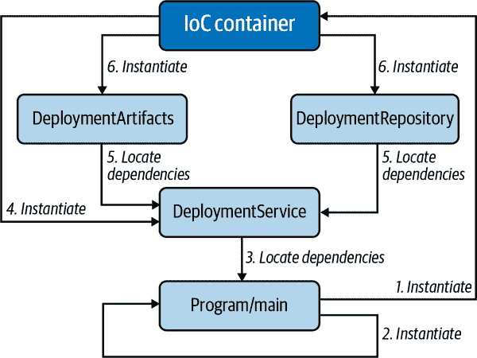
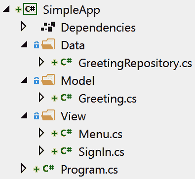
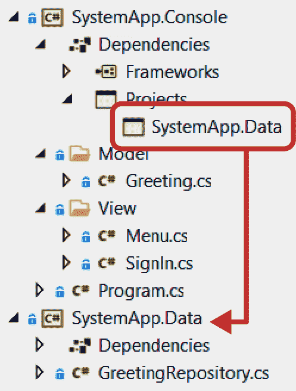
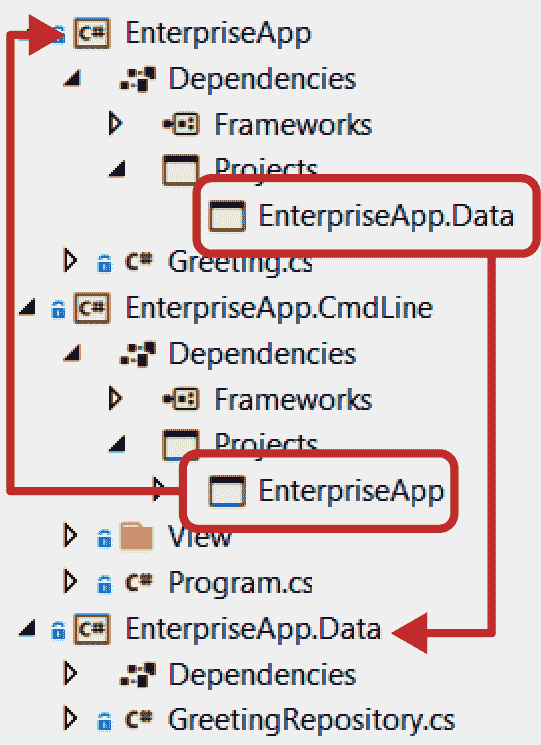

# 第一章：构建类型和应用

开发人员的首要任务之一是设计、组织和创建新类型。本章通过提供几种有用的方法来帮助完成这些任务，包括设置项目、管理对象生命周期和建立模式。

# 建立架构

在初次设置项目时，你需要考虑整体架构。有一个叫做*关注点分离*的概念，即应用程序的每个部分都有特定的目的（例如，UI 层与用户交互，业务逻辑层管理规则，数据层与数据源交互）。每一层都有自己的目的或职责，并包含执行其操作的代码。

除了促进更松散耦合的代码之外，关注点分离还使开发人员更容易处理代码，因为更容易找到特定操作发生的位置。这使得添加新功能和维护现有代码更加容易。其好处包括更高质量的应用程序和更高效的工作。因此，从一开始就做好准备是值得的，这也是为什么我们有第 1.5 节。

与松散耦合代码相关的还有控制反转（IoC），它有助于解耦代码并促进可测试性。第 1.2 节解释了其工作原理。在关于确保质量的章节第三章中，您将了解 IoC 如何适用于单元测试。

# 应用模式

我们编写的大部分代码是交易脚本（Transaction Script），用户通过 UI 与之交互，代码执行数据库中的创建、读取、更新或删除（CRUD）操作，并返回结果。有时，我们需要处理对象之间复杂的交互，这些问题难以组织。我们需要其他模式来解决这些难题。

本章以比较非正式的方式介绍了一些有用的模式。其核心思想是，你会有一些代码可以重命名和调整以适应你的目的，以及一个关于何时使用某个模式的理由。在阅读每个模式时，试着思考你已经编写的其他代码或其他情况，看看该模式如何简化代码。

如果你遇到不同系统的不同 API 并需要在它们之间切换的问题，你会对阅读第 1.8 节感兴趣。它展示了如何构建一个单一接口来解决这个问题。

# 管理对象生命周期

我们执行的其他重要任务与对象生命周期相关，即在内存中实例化对象，将对象保留在内存中进行处理，并在不再需要对象时释放该内存。第 1.3 节和 1.4 节的配方展示了一些漂亮的工厂模式，让您能够将对象创建与代码解耦。这与前面提到的 IoC 概念是一致的。

通过流接口管理对象创建是一种方法，您可以通过方法包含可选设置，并在对象构建之前进行验证。

另一个重要的对象生命周期考虑是处置。考虑过度资源消耗的缺点，包括内存使用、文件锁定以及任何持有操作系统资源的其他对象。这些问题通常导致应用程序崩溃，并且很难检测和修复。执行适当的资源清理非常重要，这是我们在本书中将要讨论的第一个方法。

# 1.1 管理对象生命周期末端

## 问题

由于过度资源使用，您的应用程序正在崩溃。

## 解决方案

这里是具有原始问题的对象：

```cs
using System;
using System.IO;

public class DeploymentProcess
{
    StreamWriter report = new StreamWriter("DeploymentReport.txt");

    public bool CheckStatus()
    {
        report.WriteLine($"{DateTime.Now} Application Deployed.");

        return true;
    }
}
```

这是解决问题的方法：

```cs
using System;
using System.IO;

public class DeploymentProcess : IDisposable
{
    bool disposed;

    readonly StreamWriter report = new StreamWriter("DeploymentReport.txt");

    public bool CheckStatus()
    {
        report.WriteLine($"{DateTime.Now} Application Deployed.");

        return true;
    }

    protected virtual void Dispose(bool disposing)
    {
        if (!disposed)
        {
            if (disposing)
            {
                // disposal of purely managed resources goes here
            }

            report?.Close();
            disposed = true;
        }
    }

    ~DeploymentProcess()
    {
        Dispose(disposing: false);
    }

    public void Dispose()
    {
        Dispose(disposing: true);
        GC.SuppressFinalize(this);
    }
}
```

这是`Main`方法，使用此对象：

```cs
static void Main(string[] args)
{
    using (var deployer = new DeploymentProcess())
    {
        deployer.CheckStatus();
    }
}
```

## 讨论

此代码中的问题出在`StreamWriter report`上。每当使用某种资源（如`report`文件引用）时，您需要释放（或处理）该资源。此处的特定问题发生在应用程序通过`StreamWriter`请求文件句柄来自 Windows 操作系统。该应用程序拥有该文件句柄，并且 Windows 期望拥有的应用程序释放该句柄。如果您的应用程序关闭而没有释放该句柄，Windows 将阻止所有应用程序（包括随后运行的您的应用程序）访问该文件。在最糟糕的情况下，所有内容都会在一个难以找到的场景中崩溃，这涉及多人数小时调试关键生产问题。这是因为 Windows 认为文件仍在使用中。

解决方案是实现处置模式，其中包括添加代码以便于释放资源。解决方案代码实现了`IDisposable`接口。`IDisposable`仅指定了`Dispose()`方法，无需参数，但除了添加该方法之外，还需执行更多操作，包括另一个`Dispose`方法重载，用于跟踪要执行的处置类型以及一个可选的终结器。

复杂化实现的是控制处置逻辑的字段和参数：`disposed`和`disposing`。`disposed`字段确保此对象仅被处置一次。在`Dispose(bool)`方法内部，有一个`if`语句，确保如果`disposed`为`true`（对象已处置），则不会执行任何处置逻辑。通过`Dispose(bool)`的第一次，`disposed`将为`false`，并且`if`块中的代码将执行。确保您还设置`disposed`为`true`，以确保此代码不再运行——不这样做的后果将暴露于像`ObjectDisposedException`这样的不可预测错误。

`disposing`参数告诉`Dispose(bool)`它是如何被调用的。请注意，`Dispose()`（无参数）和最终器调用`Dispose(bool)`。当`Dispose()`调用`Dispose(bool)`时，disposing 为`true`。如果调用代码正确编写，这使得在`using`语句中实例化`DeploymentProcess`或在`try/finally`块的`finally`中包装它变得很容易。

最终器会使用`disposing`设置为`false`调用`Dispose(bool)`，这意味着它不是由调用应用程序代码运行的。`Dispose(bool)`方法使用`disposing`值来确定是否应释放托管资源。无论是`Dispose()`还是最终器调用`Dispose(bool)`，非托管资源都会被释放。

让我们澄清一下最终器（finalizer）的作用。当.NET CLR 垃圾收集器（GC）清理内存中的对象时，它会执行对象的最终器。GC 可以多次通过对象，调用最终器是它执行的最后几件事情之一。由.NET CLR 实例化和管理的托管对象，你无法控制它们何时释放，这可能导致无序释放的情况发生。你必须检查 disposing 值，以防止在依赖对象被 GC 首先释放时出现`Object​Dispose⁠d​Exception`。

最终器给你的是清理非托管资源的方法。非托管资源，如`StreamWriter`获取的文件句柄，不属于.NET CLR，而属于 Windows 操作系统。有些情况下，开发人员可能需要显式调用 Win32/64 动态链接库（DLL）以获取 OS 或第三方设备的句柄。你需要最终器的原因是，如果对象没有正确释放，没有其他方法释放该句柄，这可能会因为需要释放托管对象而导致系统崩溃。因此，最终器是一个备用机制，确保需要释放非托管资源的代码会执行。

很多应用程序没有使用非托管资源的对象。在这种情况下，甚至不要添加最终器。最终器会增加对象的开销，因为 GC 必须进行账户处理来识别是否有最终器对象，并在多次通过集合时调用它们。省略最终器可以避免这种情况。

顺便说一句，在`Dispose()`方法中记得调用`GC.SuppressFinalize`。这是另一个优化，告诉 GC 不要为此对象调用最终器，因为当应用程序调用`IDisposable.Dispose()`时，所有资源（托管和非托管）都已释放。

###### 注意

通常情况下，即使类没有终结器，也应该在 `Dispose()` 中调用 `GC.SuppressFinalize`。尽管如此，还是有一些微妙之处可能会引起您的兴趣。如果一个类既是 `sealed` 且没有终结器，可以安全地省略对 `GC.SuppressFinalize` 的调用。然而，未 `sealed` 的类可能会被另一个包含终结器的类继承。在这种情况下，调用 `GC.SuppressFinalize` 可以防止不当的实现。

对于没有终结器的类，`GC.SuppressFinalize` 没有效果。如果选择省略对 `GC.SuppressFinalize` 的调用并且类有一个终结器，CLR 将调用该终结器。

`Main` 方法显示如何正确使用 `DeploymentProcess` 对象。它实例化并在 `using` 语句中包装该对象。对象在 `using` 语句块结束之前存在于内存中。此时，程序调用 `Dispose()` 方法。

# 1.2 移除显式依赖关系

## 问题

您的应用程序紧密耦合且难以维护。

## 解决方案

定义您需要的类型：

```cs
public class DeploymentArtifacts
{
    public void Validate()
    {
        System.Console.WriteLine("Validating...");
    }
}

public class DeploymentRepository
{
    public void SaveStatus(string status)
    {
        System.Console.WriteLine("Saving status...");
    }
}

interface IDeploymentService
{
    void PerformValidation();
}

public class DeploymentService : IDeploymentService
{
    readonly DeploymentArtifacts artifacts;
    readonly DeploymentRepository repository;

    public DeploymentService(
        DeploymentArtifacts artifacts,
        DeploymentRepository repository)
    {
        this.artifacts = artifacts;
        this.repository = repository;
    }

    public void PerformValidation()
    {
        artifacts.Validate();
        repository.SaveStatus("status");
    }
}
```

并像这样启动应用程序：

```cs
using Microsoft.Extensions.DependencyInjection;
using System;

class Program
{
    readonly IDeploymentService service;

    public Program(IDeploymentService service)
    {
        this.service = service;
    }

    static void Main()
    {
        var services = new ServiceCollection();

        services.AddTransient<DeploymentArtifacts>();
        services.AddTransient<DeploymentRepository>();
        services.AddTransient<IDeploymentService, DeploymentService>();

        ServiceProvider serviceProvider =
            services.BuildServiceProvider();

        IDeploymentService deploymentService =
            serviceProvider.GetRequiredService<IDeploymentService>();

        var program = new Program(deploymentService);

        program.StartDeployment();
    }

    public void StartDeployment()
    {
        service.PerformValidation();
        Console.WriteLine("Validation complete - continuing...");
    }
}
```

## 讨论

*紧密耦合* 这个术语通常指的是代码的一部分被赋予实例化其使用的类型（依赖项）的责任。这要求代码知道如何构建、管理生命周期并包含依赖项的逻辑。这使得代码的目的是解决其存在问题的代码变得分散。在不同的类中重复依赖项的实例化。这使得代码变得脆弱，因为依赖接口的更改会影响到需要实例化该依赖项的所有其他代码。此外，实例化其依赖项的代码使得进行正确的单元测试变得困难，甚至不可能。

解决方案是依赖注入，这是一种在一个地方定义依赖类型实例化并公开其他类型可以使用的服务来获取这些依赖项的技术。执行依赖注入有几种方法：服务定位器和控制反转（IoC）。何时使用哪种方法是一个活跃的讨论；让我们避免涉及理论领域。为了简化，此解决方案使用了 IoC，这是一种常见且直接的方法。

具体解决方案要求您拥有依赖于其他依赖类型的类型，配置类型构造函数以接受依赖项，引用一个库来帮助管理 IoC 容器，并使用容器声明如何实例化类型。以下段落解释了这是如何工作的。图 1-1 显示了解决方案的对象关系和 IoC 操作的顺序。



###### 图 1-1\. 解决方案的 IoC

解决方案是一个实用工具，帮助管理部署过程，验证部署过程是否配置正确。它有一个 `DeploymentService` 类来运行该过程。注意 `DeploymentService` 构造函数接受 `DeploymentArtifacts` 和 `DeploymentRepository` 类。`DeploymentService` 并不实例化这些类 —— 而是通过注入方式提供。

要注入这些类，可以使用一个 IoC 容器，它是一个帮助自动实例化类型并提供依赖项类型实例的库。解决方案中的 IoC 容器，如 `using` 声明中所示，是 `Microsoft.Extensions.DependencyInjection` 命名空间，你可以引用同名的 NuGet 包。

虽然我们希望为应用程序中的每种类型注入所有依赖项，但你仍然必须直接实例化 IoC 容器，这就是为什么 `Main` 方法实例化 `ServiceCollection` 作为服务的原因。然后使用 `services` 实例添加所有依赖项，包括 `DeploymentService`。

IoC 容器可以帮助管理对象的生命周期。这个解决方案使用了 `AddTransient`，这意味着容器在每次请求类型时应创建一个新的实例。管理对象生命周期的另外两个例子是 `AddSingleton`，它仅实例化对象一次并将该实例传递给所有对象；以及 `AddScoped`，它更多地控制对象的生命周期。在 ASP.NET 中，`AddScoped` 设置为当前请求。随着时间的推移，你将需要更深入地考虑对象的生命周期应该是什么，并更深入地研究这些选项。目前来说，通过 `AddTransient` 开始是很简单的。

对 `BuildServiceProvider` 的调用将 `services`（一个 `ServiceCollection`）转换为 `ServiceProvider`。术语 *IoC 容器* 指的是这个 `ServiceProvider` 实例 —— 它实例化和定位要注入的类型。

你可以看到容器正在调用 `GetRequiredService` 返回实现 `IDeploymentService` 接口的实例。回到 `ServiceCollection`，注意到有一个 `AddTransient` 将 `DeploymentService` 类与 `IDeploymentService` 接口关联起来。这意味着 `GetRequiredService` 将返回一个 `DeploymentService` 的实例。

最后，`Main` 实例化 `Program`，带有新的 `DeploymentService` 实例。

回到 `DeploymentService` 的构造函数，你可以看到它期望使用 `DeploymentArtifacts` 和 `DeploymentRepository` 的实例来调用。因为我们使用了 IoC 容器来实例化 `DeploymentService`，IoC 容器也知道如何实例化它的依赖项，这些依赖项也已添加到 `ServiceCollection` 中，使用了 `AddTransient` 进行调用。这个解决方案仅使用了三种类型；你可以构建比这更深层次的对象依赖图。

此外，请注意`DeploymentService`构造函数将注入的实例保存在`readonly`字段中，以便`DeploymentService`成员可以使用它们。

IoC 的优点在于只在一个地方进行实例化，您无需在构造函数或需要依赖项新实例的成员中编写所有代码。这使得您的代码更松散耦合且更易于维护。它还通过使类型更具单元测试可能性来提高质量。

## 参见

Recipe 3.1，“编写单元测试”

# 1.3 将对象创建委托给类

## 问题

您正在使用 IoC，但您要实例化的类型没有接口，并且您有复杂的构造要求。

## 解决方案

我们要实例化这个类：

```cs
using System;

public class ThirdPartyDeploymentService
{
    public void Validate()
    {
        Console.WriteLine("Validated");
    }
}
```

我们将用这个类来进行 IoC：

```cs
public interface IValidatorFactory
{
    ThirdPartyDeploymentService CreateDeploymentService();
}
```

这是`IValidatorFactory`的实现：

```cs
public class ValidatorFactory : IValidatorFactory
{
    public ThirdPartyDeploymentService CreateDeploymentService()
    {
        return new ThirdPartyDeploymentService();
    }
}
```

然后像这样实例化工厂：

```cs
public class Program
{
    readonly ThirdPartyDeploymentService service;

    public Program(IValidatorFactory factory)
    {
        service = factory.CreateDeploymentService();
    }

    static void Main()
    {
        var factory = new ValidatorFactory();
        var program = new Program(factory);
        program.PerformValidation();
    }

    void PerformValidation()
    {
        service.Validate();
    }
}
```

## 讨论

如 Recipe 1.2 中所述，IoC 是一种最佳实践，因为它解耦了依赖关系，使代码更易于维护、更具适应性和更易于测试。问题在于即使有最佳计划，也会出现异常和导致困难的情况。其中之一是在没有接口的情况下尝试使用第三方 API 时。

解决方案展示了`ThirdPartyDeploymentService`类。您可以查看代码以及其功能。但实际上，即使您通过反射或反汇编器阅读代码，也无济于事，因为您无法添加自己的接口。即使`ThirdPartyDeploymentService`是开源的，您也必须权衡是否要分叉库以进行自己的修改——这种权衡是因为您的修改在面对原始开源库的新功能和维护时可能变得脆弱。例如，.NET Framework 中的`System.Net.HttpClient`类就没有接口。最终，您需要评估情况并做出适合您的决定，但这里描述的工厂类可以是一个有效的解决方法。

要了解工厂类的工作原理，请观察`IValidatorFactory`接口。这是我们用于 IoC 的接口。接下来，看看`ValidatorFactory`类如何实现`IValidatorFactory`接口。它的`CreateDeploymentService`方法实例化并返回`ThirdPartyDeploymentService`。这就是工厂的作用：为我们创建对象。

###### 注意

这与代理模式相关。`ValidatorFactory`控制对`ThirdPartyDeploymentService`实例的访问。但是，与其返回一个用于控制`ThirdPartyDeploymentService`成员访问的对象，`CreateDeploymentService`返回一个直接的`ThirdPartyDeploymentService`实例。

简化这个示例，代码不使用 IoC 容器——虽然在使用 IoC 时通常会同时使用工厂。相反，`Main` 方法实例化 `ValidatorFactory` 并将该实例传递给 `Program` 构造函数，这是示例的重要部分。

检查构造函数如何获取 `IValidatorFactory` 引用并调用 `CreateDeploymentService`。现在我们已经能够注入依赖项并保持所寻求的松耦合。

另一个好处是，由于 `ThirdPartyDeploymentService` 是在工厂类中实例化的，您可以在不影响消费代码的情况下对类实例化进行任何未来更改。

## 参见

食谱 1.2，“消除显式依赖项”

# 1.4 将对象创建委托给方法

## 问题

您需要一个插件框架，并且需要在应用程序逻辑之外的某个地方结构化对象实例化。

## 解决方案

这是带有对象创建契约的抽象基类：

```cs
public abstract class DeploymentManagementBase
{
    IDeploymentPlugin deploymentService;

    protected abstract IDeploymentPlugin CreateDeploymentService();

    public bool Validate()
    {
        if (deploymentService == null)
            deploymentService = CreateDeploymentService();

        return deploymentService.Validate();
    }
}
```

这些是几个实例化相关插件类的类：

```cs
public class DeploymentManager1 : DeploymentManagementBase
{
    protected override IDeploymentPlugin CreateDeploymentService()
    {
        return new DeploymentPlugin1();
    }
}

public class DeploymentManager2 : DeploymentManagementBase
{
    protected override IDeploymentPlugin CreateDeploymentService()
    {
        return new DeploymentPlugin2();
    }
}
```

插件类实现了 `IDeploymentPlugin` 接口：

```cs
public interface IDeploymentPlugin
{
    bool Validate();
}
```

这里是正在实例化的插件类：

```cs
public class DeploymentPlugin1 : IDeploymentPlugin
{
    public bool Validate()
    {
        Console.WriteLine("Validated Plugin 1");
        return true;
    }
}

public class DeploymentPlugin2 : IDeploymentPlugin
{
    public bool Validate()
    {
        Console.WriteLine("Validated Plugin 2");
        return true;
    }
}
```

最后，这是它们如何完美结合在一起的方式：

```cs
class Program
{
    readonly DeploymentManagementBase[] deploymentManagers;

    public Program(DeploymentManagementBase[] deploymentManagers)
    {
        this.deploymentManagers = deploymentManagers;
    }

    static DeploymentManagementBase[] GetPlugins()
    {
        return new DeploymentManagementBase[]
        {
            new DeploymentManager1(),
            new DeploymentManager2()
        };
    }

    static void Main()
    {
        DeploymentManagementBase[] deploymentManagers = GetPlugins();

        var program = new Program(deploymentManagers);

        program.Run();
    }

    void Run()
    {
        foreach (var manager in deploymentManagers)
            manager.Validate();
    }
}
```

## 讨论

插件系统无处不在。Excel 可以消费和发出不同类型的文档，Adobe 可以处理多种图像类型，Visual Studio Code 有许多扩展。这些都是插件系统，无论插件是否只能通过供应商或第三方获得，它们都利用了相同的概念——代码必须能够适应处理新的抽象对象类型。

尽管前面的示例在我们的日常生活中无处不在，但许多开发人员不会构建那些类型的系统。话虽如此，插件模型是增强我们应用程序可扩展性的强大机会。应用程序集成是一个频繁使用的用例，其中您的应用程序需要从客户、其他部门或其他企业消费文档。当然，Web 服务和其他类型的 API 很受欢迎，但需要消费 Excel 电子表格是正常的。一旦这样做，有人会有不同格式的数据，如 CSV、JSON、制表符分隔等。另一方面，经常需要以多个用户需要消费的格式导出数据。

在这种精神下，该解决方案演示了插件系统允许应用程序添加支持新部署类型的情况。这是一个典型的情况，您已经构建了处理您知道的部署工件的系统，但是这个系统非常有用，每个人都希望添加自己的部署逻辑，这在编写原始需求时是不可预见的。

在解决方案中，每个`DeploymentManager`都实现了抽象基类`DeploymentManagementBase`。`DeploymentManagementBase`编排逻辑，而派生的`DeploymentManager`类只是其关联插件的工厂。请注意，`DeploymentManagementBase`使用多态性让派生类实例化其各自的插件类。

###### 提示

如果这变得有点复杂，您可能需要查看配方 1.2 和 1.3。这是比那高一个抽象级别。

解决方案展示了实现`IDeploymentPlugin`接口的两个类。`DeploymentManagementBase`类消费`IDeploymentPlugin`接口，将调用委托给实现该接口的插件类的方法。请注意`Validate`如何调用`IDeploymentPlugin`实例上的`Validate`方法。

`Program`不知道插件类。它操作`DeploymentManagementBase`的实例，正如`Main`调用`GetPlugins`并接收`DeploymentManagementBase`实例数组所示。`Program`不关心插件。为简化演示，`GetPlugins`是`Program`中的一个方法，但可以是另一个具有选择要使用的插件机制的类。请注意`Run`方法如何遍历`DeploymentManagementBase`实例。

###### 注意

如果您在使用接口的所有其他地方，`DeploymentManagementBase`实现接口可能会使 IoC 更一致。也就是说，一个抽象基类通常适用于大多数 IoC 容器、模拟和单元测试工具。

总结一下，`DeploymentManagementBase`封装了所有功能，并委托工作给插件类。编写插件的代码是部署管理器、插件接口和插件类。消费代码只与一组`DeploymentManagementBase`一起工作，并且对特定插件实现毫不知情。

这就是力量所在。每当您或允许的任何第三方希望为新类型的部署扩展系统时，他们就会这样做：

1.  创建一个新的实现`IDeploymentPlugin`接口的`DeploymentPlugin`类。

1.  创建一个新的从`DeploymentManagementBase`派生的`DeploymentManagement`类。

1.  实现`DeploymentManagement.CreateDeploymentService`方法以实例化并返回新的`DeploymentPlugin`。

最后，`GetPlugins`方法或您选择的其他逻辑将该新代码添加到其插件集合中以进行操作。

## 参见

配方 1.2，“移除显式依赖项”

配方 1.3，“将对象创建委托给类”

# 1.5 设计应用层

## 问题

您正在设置一个新的应用程序，并且不确定如何结构化项目。

## 解决方案

这里是一个数据访问层类：

```cs
public class GreetingRepository
{
    public string GetNewGreeting() => "Welcome!";

    public string GetVisitGreeting() => "Welcome back!";
}
```

这里是一个业务逻辑层类：

```cs
public class Greeting
{
    GreetingRepository greetRep = new GreetingRepository();

    public string GetGreeting(bool isNew) =>
        isNew ? greetRep.GetNewGreeting() : greetRep.GetVisitGreeting();
}
```

这两个类属于 UI 层的一部分：

```cs
public class SignIn
{
    Greeting greeting = new Greeting();

    public void Greet()
    {
        Console.Write("Is this your first visit? (true/false): ");
        string newResponse = Console.ReadLine();

        bool.TryParse(newResponse, out bool isNew);

        string greetResponse = greeting.GetGreeting(isNew);

        Console.WriteLine($"\n*\n* {greetResponse} \n*\n");
    }
}

public class Menu
{
    public void Show()
    {
        Console.WriteLine(
            "*------*\n" +
            "* Menu *\n" +
            "*------*\n" +
            "\n" +
            "1\. ...\n" +
            "2\. ...\n" +
            "3\. ...\n" +
            "\n" +
            "Choose: ");
    }
}
```

这是应用程序的入口点（UI 层的一部分）：

```cs
class Program
{
    SignIn signIn = new SignIn();
    Menu menu = new Menu();

    static void Main()
    {
        new Program().Start();
    }

    void Start()
    {
        signIn.Greet();
        menu.Show();
    }
}
```

## 讨论

有无数种设置和规划新项目结构的方式，其中一些方法比其他方法更好。与其将这个讨论视为最终结论，不如把它看作是一些具有权衡的选项，这些选项可以帮助你思考自己的方法。

这里的反模式是大块混乱（BBoM）架构。BBoM 是指开发者打开一个项目并在应用程序的同一层添加所有代码的情况。虽然这种方法可能有助于快速原型开发，但从长远来看会带来严重的复杂性问题。随着时间的推移，大多数应用程序需要新增功能和修复 bug。问题在于代码开始混合在一起，通常会出现大量重复，被称为*意大利面代码*。严肃地说，没有人愿意维护这样的代码，你应该避免它。

###### 警告

在时间紧迫时，人们很容易认为创建一个快速原型可能是可以接受的时间使用方式。然而，要抵制这种冲动。在 BBoM 原型项目上进行维护的成本很高。在意大利面代码上添加新功能或修复 bug 的时间远远超过了看似快速原型的初期收益。由于重复，修复一个地方的 bug 会在应用程序的其他部分留下相同的 bug。这不仅意味着开发者必须多次修复 bug，而且整个 QA、部署、客户发现、帮助台服务和管理的生命周期都会因多次不必要的周期而浪费时间。本节内容帮助你避免这种反模式。

这里需要理解的主要概念是关注点分离。通常听到的是简化为分层架构，在其中你有 UI、业务逻辑和数据层，每个部分都按其所含代码类型命名。本节采用分层方法，旨在展示如何实现关注点分离及其相关的好处。

###### 注意

有时人们会认为分层架构的理念要求将应用程序通信路由通过各层，或者某些操作仅限于其层次。这并不完全正确或实际。例如，业务逻辑可以在不同的层中找到，比如在 UI 层中用于验证用户输入的规则以及处理特定请求的逻辑。另一个违背通信模式的例外是当用户需要在表单上选择一组操作时，没有任何业务逻辑参与，UI 层可以直接从数据层请求项目列表。我们要的是关注点分离，以增强代码的可维护性；任何不合理的教条/理想主义限制都会与这一目标背道而驰。

解决方案从数据访问层`GreetingRepository`开始。这模拟了存储库模式，它是一个抽象层，使调用代码不需要考虑如何检索数据。理想情况下，创建一个单独的数据项目可以在需要访问相同数据的另一个项目中重复使用该数据访问层，这带来了额外的重用优势。有时你能够重用，有时不能，尽管你总是能够减少重复并知道数据访问逻辑所在的好处。

业务逻辑层有一个`Greeting`类。注意它如何使用`isNew`参数来确定调用`GreetingRepository`的哪个方法。每当你发现自己需要编写处理用户请求的逻辑时，考虑将该代码放入另一个被视为业务逻辑层一部分的类中。如果你已经有这样的代码，请将其重构为一个名为逻辑类型的独立对象。

最后，还有 UI 层，由`SignIn`和`Menu`类组成。这些类处理与用户的交互，但将任何逻辑委托给业务逻辑层。`Program`可能被视为 UI 层的一部分，尽管它仅在其他 UI 层类之间进行交互/导航，并不执行 UI 操作本身。

###### 注意

我写解决方案的方式是让你在使用类的定义之前看到它。然而，在实际设计时，你可能会从 UI 层开始，然后逐步通过业务逻辑和数据访问进行工作。

在这段代码中，关注点分离有几个方面。`Greeting​Re⁠pository`只关注数据，特别是`Greeting`数据。例如，如果应用程序需要在`Menu`中显示数据，你需要另一个名为`MenuRepository`的类来执行`Menu`数据的 CRUD 操作。`Greeting`只处理`Greeting`数据的业务逻辑。如果`Menu`有自己的业务逻辑，你可以考虑为其创建一个单独的业务逻辑层类，但前提是有意义。正如你在 UI 层中看到的那样，`SignIn`仅处理与用户登录应用程序的交互，而`Menu`仅处理显示和选择用户想要做什么的交互。美妙的地方在于，现在你或其他任何人都可以轻松进入应用程序，并找到涉及需要解决的主题的代码。

图 1-2、1-3 和 1-4 展示了如何将每个层结构化为 Visual Studio 解决方案。图 1-2 适用于非常简单的应用程序，比如一个不太可能有很多功能的实用程序。在这种情况下，将层保持在同一个项目中是可以接受的，因为代码量不大，而且任何额外的东西都没有实际的好处。



###### 图 1-2\. 简单应用的项目布局

图 1-3 展示了如何组织一个稍大且随时间增长的项目，为了讨论方便，我将其大致称为中型项目。请注意它具有单独的数据访问层。其目的在于可能的重用性。某些项目为不同的客户提供不同的 UI。例如，可能有一个聊天机器人或移动应用用于用户访问数据，但为管理员提供一个 Web 应用。将数据访问层作为单独的项目使这种情况成为可能。请注意`SystemApp.Console`与`SystemApp.Data`有一个程序集引用。



###### 图 1-3\. 项目布局以分离 UI 和数据层

对于更大型的企业应用程序，您将希望按照图 1-4 的方式将层分开。要解决的问题是希望在代码段之间有更清晰的分隔，以鼓励松耦合。大型应用程序通常变得复杂且难以管理，除非以鼓励最佳实践的方式控制架构。



###### 图 1-4\. 关注点分离的项目布局

对于企业场景，此示例较小。但是，想象一下不断增长的应用程序的复杂性。随着添加新的业务逻辑，您将开始发现可以重用的代码。此外，您自然会有一些可以独立运行的代码，例如用于访问外部 API 的服务层。这里的机会在于创建一个可在其他应用程序中有用的可重用库。因此，您将希望将任何可重用的内容重构为自己的项目。在不断增长的项目中，您很少能够预料到应用程序将支持的每个方面或功能，监视这些变化并重构将有助于保持代码、项目和架构的健康性。

# 1.6 从方法返回多个值

## 问题

你需要从方法中返回多个值，使用经典方法如`out`参数或返回自定义类型并不直观。

## 解决方案

`ValidationStatus`有一个析构函数：

```cs
public class ValidationStatus
{
    public bool Deployment { get; set; }
    public bool SmokeTest { get; set; }
    public bool Artifacts { get; set; }

    public void Deconstruct(
        out bool isPreviousDeploymentComplete,
        out bool isSmokeTestComplete,
        out bool areArtifactsReady)
    {
        isPreviousDeploymentComplete = Deployment;
        isSmokeTestComplete = SmokeTest;
        areArtifactsReady = Artifacts;
    }
}
```

`DeploymentService`展示了如何返回元组：

```cs
public class DeploymentService
{
    public
    (bool deployment, bool smokeTest, bool artifacts)
    PrepareDeployment()
    {
        ValidationStatus status = Validate();

        (bool deployment, bool smokeTest, bool artifacts) = status;

        return (deployment, smokeTest, artifacts);
    }

    ValidationStatus Validate()
    {
        return new ValidationStatus
        {
            Deployment = true,
            SmokeTest = true,
            Artifacts = true
        };
    }
}
```

下面是如何使用返回的元组：

```cs
class Program
{
    readonly DeploymentService deployment = new DeploymentService();
    static void Main(string[] args)
    {
        new Program().Start();
    }

    void Start()
    {
        (bool deployed, bool smokeTest, bool artifacts) =
            deployment.PrepareDeployment();

        Console.WriteLine(
            $"\nDeployment Status:\n\n" +
            $"Is Previous Deployment Complete? {deployed}\n" +
            $"Is Previous Smoke Test Complete? {smokeTest}\n" +
            $"Are artifacts for this deployment ready? {artifacts}\n\n" +
            $"Can deploy: {deployed && smokeTest && artifacts}");
    }
}
```

## 讨论

历史上，从方法返回多个值的典型方法是创建自定义类型或添加多个`out`参数。创建一个仅用于返回值一次的自定义类型总感觉有些浪费。另一种选择，使用多个`out`参数，也感觉笨拙。使用元组更加优雅。*元组*是一种值类型，允许你将数据组合成一个单独的对象，而无需声明单独的类型。

###### 注意

本节描述的元组类型是 C# 7.0 的一个新特性。它别名.NET 的`ValueTuple`，这是一个可变的值类型，其成员是字段。相比之下，.NET Framework 有一个`Tuple`类，它是一个不可变的引用类型，其成员是属性。`ValueTuple`和`Tuple`都命名成员为`Item1`、`Item2`，...，`ItemN`；相反，你可以为 C#元组成员提供更有意义的名称。

如果使用早于 4.7 版的.NET 版本，必须显式引用`System.ValueTuple` NuGet 包。

解决方案展示了元组的几个不同方面，解构以及如何从方法返回一个元组。`ValidationStatus`类有一个`Deconstruct`方法，C#使用它来从类的实例生成一个元组。这个类在这个示例中并不是必需的，但它确实演示了一种将类转换为元组的有趣方式。

`DeploymentService`类展示了如何返回一个元组。注意，`PrepareDeployment`方法的返回类型是一个元组。元组返回类型中的属性名称是可选的，不过有意义的变量名可以使代码更易读。

代码调用`Validate`，它返回一个`ValidationStatus`实例。下一行，将`status`分配给元组，使用解构器返回一个元组实例。`PrepareDeployment`使用这些值向调用者返回一个新的元组。

`PrepareDeployment`的解决方案实现展示了与元组的工作机制，这对学习很有用，尽管不是非常优雅。在实践中，从方法中返回`status`将更加清晰，因为解构器将隐式运行。

`Program`中的`Start`方法展示了如何调用`PrepareDeployment`并消耗它返回的元组。

# 1.7 从传统类型转换为强类型类

## 问题

你有一个操作`object`类型值的传统类型，并且需要现代化为强类型实现。

## 解决方案

这里有一个我们将使用的`Deployment`类：

```cs
public class Deployment
{
    string config;

    public Deployment(string config)
    {
        this.config = config;
    }

    public bool PerformHealthCheck()
    {
        Console.WriteLine(
            $"Performed health check for config {config}.");
        return true;
    }
}
```

这里有一个传统的`CircularQueue`集合：

```cs
public class CircularQueue
{
    int current = 0;
    int last = 0;
    object[] items;

    public CircularQueue(int size)
    {
        items = new object[size];
    }

    public void Add(object obj)
    {
        if (last >= items.Length)
            throw new IndexOutOfRangeException();

        items[last++] = obj;
    }

    public object Next()
    {
        current %= last;
        object item = items[current];
        current++;

        return item;
    }
}
```

这段代码展示了如何使用传统集合：

```cs
public class HealthChecksObjects
{
    public void PerformHealthChecks(int cycles)
    {
        CircularQueue checks = Configure();

        for (int i = 0; i < cycles; i++)
        {
            Deployment deployment = (Deployment)checks.Next();
            deployment.PerformHealthCheck();
        }
    }

    private CircularQueue Configure()
    {
        var queue = new CircularQueue(5);

        queue.Add(new Deployment("a"));
        queue.Add(new Deployment("b"));
        queue.Add(new Deployment("c"));

        return queue;
    }
}
```

接下来，将传统集合重构为泛型集合：

```cs
public class CircularQueue<T>
{
    int current = 0;
    int last = 0;
    T[] items;

    public CircularQueue(int size)
    {
        items = new T[size];
    }

    public void Add(T obj)
    {
        if (last >= items.Length)
            throw new IndexOutOfRangeException();

        items[last++] = obj;
    }

    public T Next()
    {
        current %= last;
        T item = items[current];
        current++;

        return item;
    }
}
```

使用展示如何使用新的泛型集合的代码：

```cs
public class HealthChecksGeneric
{
    public void PerformHealthChecks(int cycles)
    {
        CircularQueue<Deployment> checks = Configure();

        for (int i = 0; i < cycles; i++)
        {
            Deployment deployment = checks.Next();
            deployment.PerformHealthCheck();
        }
    }

    private CircularQueue<Deployment> Configure()
    {
        var queue = new CircularQueue<Deployment>(5);

        queue.Add(new Deployment("a"));
        queue.Add(new Deployment("b"));
        queue.Add(new Deployment("c"));

        return queue;
    }
}
```

这里是演示代码，展示了两种集合的使用方式：

```cs
class Program
{
    static void Main(string[] args)
    {
        new HealthChecksObjects().PerformHealthChecks(5);
        new HealthChecksGeneric().PerformHealthChecks(5);
    }
}
```

## 讨论

C#的第一个版本没有泛型。相反，我们有一个`System.Collections`命名空间，其中包含像`Dictionary`、`List`和`Stack`这样的集合，这些集合操作的是`object`类型的实例。如果集合中的实例是引用类型，那么从对象到对象的转换性能是可以忽略的。然而，如果你想管理值类型的集合，装箱/拆箱的性能代价将随着集合的增大或执行的操作增多而变得更加严重。

Microsoft 一直打算在 C# 2 中添加泛型，最终也确实实现了。但在此期间，开发人员需要编写大量非泛型代码，例如集合、优先队列和树数据结构。还有像委托这样的类型，它们是方法引用和异步通信的主要手段，操作对象。有很长一段非泛型代码列表已经编写，并且很可能在您的职业生涯中会遇到其中的一些。

作为 C#开发人员，我们欣赏强类型代码的好处，它使查找和修复编译时错误更容易，使应用程序更易于维护并提高质量。因此，您可能强烈希望重构给定的某段非泛型代码，使其也能够使用泛型。

过程基本上是这样的：每当看到`object`类型时，将其转换为泛型类型。

解决方案展示了一个`Deployment`对象，该对象对部署的工件执行健康检查。由于我们有多个工件，我们还需要在一个集合中持有多个`Deployment`实例。该集合是一个（部分实现的）循环队列，还有一个`HealthCheck`类，该类循环遍历队列并定期与下一个`Deployment`实例执行健康检查。

`HealthCheckObject`操作旧的非泛型代码，而`HealthCheckGeneric`操作新的泛型代码。两者之间的区别在于，`HealthCheckObject`的`Configure`方法实例化一个非泛型的`CircularQueue`，而`HealthCheckGeneric`的`Configure`方法实例化一个泛型的`CircularQueue<T>`。我们的主要任务是将`CircularQueue`转换为`CircularQueue<T>`。

因为我们正在处理一个集合，第一步是向类`CircularQueue<T>`添加类型参数。然后查找代码中使用`object`类型的地方，并将其转换为类类型参数`T`：

1.  将`object items[]`字段转换为`T items[]`。

1.  在构造函数中，实例化一个新的`T[]`而不是`object[]`。

1.  将`Add`方法的参数从`object`更改为`T`。

1.  将`Next`方法的返回类型从`object`更改为`T`。

1.  在`Next`方法中，将`object item`变量更改为`T item`。

将`object`类型更改为`T`后，您将获得一个新的强类型泛型集合。

`Program`类演示了这两个集合如何工作。

# 1.8 使类适应您的接口

## 问题

您有一个与您的代码功能相似的第三方库，但它没有相同的接口。

## 解决方案

这是我们要使用的接口：

```cs
public interface IDeploymentService
{
    void Validate();
}
```

以下是实现该接口的几个类：

```cs
public class DeploymentService1 : IDeploymentService
{
    public void Validate()
    {
        Console.WriteLine("Deployment Service 1 Validated");
    }
}

public class DeploymentService2 : IDeploymentService
{
    public void Validate()
    {
        Console.WriteLine("Deployment Service 2 Validated");
    }
}
```

这是一个未实现`IDeploymentService`的第三方类：

```cs
public class ThirdPartyDeploymentService
{
    public void PerformValidation()
    {
        Console.WriteLine("3rd Party Deployment Service 1 Validated");
    }
}
```

这是实现`IDeploymentService`的适配器：

```cs
public class ThirdPartyDeploymentAdapter : IDeploymentService
{
    ThirdPartyDeploymentService service = new ThirdPartyDeploymentService();

    public void Validate()
    {
        service.PerformValidation();
    }
}
```

此代码显示如何通过使用适配器包含第三方服务：

```cs
class Program
{
    static void Main(string[] args)
    {
        new Program().Start();
    }

    void Start()
    {
        List<IDeploymentService> services = Configure();

        foreach (var svc in services)
            svc.Validate();
    }

    List<IDeploymentService> Configure()
    {
        return new List<IDeploymentService>
        {
            new DeploymentService1(),
            new DeploymentService2(),
            new ThirdPartyDeploymentAdapter()
        };
    }
}
```

## 讨论

适配器是一个类，它包装另一个类，并使用您需要的接口暴露包装类的功能。

有各种情况需要使用适配器类。如果您有一组实现接口的对象，并且想要使用不符合您代码接口的第三方类会怎么样？如果您的代码是为第三方 API 编写的，比如支付服务，并且您知道最终想要切换到具有不同 API 的不同提供商会怎么样？如果您需要通过平台调用服务（P/Invoke）或组件对象模型（COM）互操作使用本地代码，并且不希望该接口的细节渗入到您的代码中会怎么样？这些情况都是考虑使用适配器的良好候选者。

解决方案中有实现`IDeploymentService`的`DeploymentService`类。您可以在`Program`的`Start`方法中看到，它仅操作实现了`IDeploymentService`的实例。

之后的某个时候，您需要将`ThirdPartyDeploymentService`集成到应用程序中。然而，它没有实现`IDeploymentService`，而且您没有`ThirdPartyDeploymentService`的代码。

`ThirdPartyDeploymentAdapter`类解决了这个问题。它实现了`IDeploymentService`接口，并实例化了自己的`ThirdPartyDeploymentService`副本，`Validate`方法委托调用了`ThirdPartyDeploymentService`。请注意，`Program`的`Configure`方法将一个`ThirdPartyDeploymentAdapter`实例添加到`Start`操作的集合中。

这是一个演示，向您展示如何设计适配器。在实践中，`ThirdPartyDeploymentService`的`Perform​Vali⁠dation`方法可能具有不同的参数和不同的返回类型。`ThirdPartyDeploymentAdapter`的`Validate`方法将负责准备参数并重新塑造返回值，以确保它们符合适当的`IDeploymentService`接口。

# 1.9 设计自定义异常

## 问题

.NET Framework 库没有符合您需求的异常类型。

## 解决方案

这是一个自定义异常：

```cs
[Serializable]
public class DeploymentValidationException : Exception
{
    public DeploymentValidationException() :
        this("Validation Failed!", null, ValidationFailureReason.Unknown)
    {
    }

    public DeploymentValidationException(
        string message) :
        this(message, null, ValidationFailureReason.Unknown)
    {
    }

    public DeploymentValidationException(
        string message, Exception innerException) :
        this(message, innerException, ValidationFailureReason.Unknown)
    {
    }

    public DeploymentValidationException(
        string message, ValidationFailureReason reason) :
        this(message, null, reason)
    {
    }

    public DeploymentValidationException(
        string message,
        Exception innerException,
        ValidationFailureReason reason) :
        base(message, innerException)
    {
        Reason = reason;
    }

    public ValidationFailureReason Reason { get; set; }

    public override string ToString()
    {
        return
            base.ToString() +
            $" - Reason: {Reason} ";
    }
}
```

并且这是该异常属性的枚举类型：

```cs
public enum ValidationFailureReason
{
    Unknown,
    PreviousDeploymentFailed,
    SmokeTestFailed,
    MissingArtifacts
}
```

这段代码显示了如何抛出自定义异常：

```cs
public class DeploymentService
{
    public void Validate()
    {
        throw new DeploymentValidationException(
            "Smoke test failed - check with qa@example.com.",
            ValidationFailureReason.SmokeTestFailed);
    }
}
```

并且这段代码捕获了自定义异常：

```cs
class Program
{
    static void Main()
    {
        try
        {
            new DeploymentService().Validate();
        }
        catch (DeploymentValidationException ex)
        {
            Console.WriteLine(
                $"Message: {ex.Message}\n" +
                $"Reason: {ex.Reason}\n" +
                $"Full Description: \n {ex}");
        }
    }
}
```

## 讨论

C#异常的美妙之处在于它们是强类型的。当您的代码捕获它们时，您可以为仅针对该类型的异常编写特定的处理逻辑。.NET Framework 有一些异常，如`ArgumentNullException`，在平均代码库中可以得到一些重复使用（您可以自行抛出），但通常您需要抛出一个具有语义和数据的异常，以便开发人员更有机会弄清楚为何方法无法完成其预期目的。

解决方案中的异常是 `DeploymentValidationException`，表示在验证阶段的部署过程中出现问题。它派生自 `Exception`。根据你的自定义异常框架的扩展程度，你可以为其创建自己的基础异常以构建异常的层次结构，并从中分类派生异常树。这样做的好处是，你可以在 catch 块中灵活地捕获更一般或特定的异常。尽管如此，如果你只需要一些自定义异常，那么异常层次结构的额外设计工作可能有些多余。

前三个构造函数与 `Exception` 类的选项相同，用于消息和内部异常。你还需要自定义构造函数以便使用你的自定义数据进行实例化。

###### 注意

在过去，关于自定义异常应该派生自 `Exception` 还是 `ApplicationException` 曾有过讨论，其中 `Exception` 用于 .NET 类型层次结构，而 `ApplicationException` 用于自定义异常层次结构。然而，随着时间的推移，这种区别变得模糊了，一些 .NET Framework 类型同时从两者派生，而没有明显的一致性或理由。因此，目前看来，从 `Exception` 派生是可以接受的。

`DeploymentValidationException` 具有一个属性，其枚举类型为 `Validation​Fai⁠lureReason`。除了有关抛出异常原因的独特语义外，自定义异常的另一个目的是包含重要的异常处理和/或调试信息。

覆盖 `ToString` 也是个好主意。日志框架可能只会接收 `Exception` 引用，从而调用 `ToString`。就像本例中一样，你希望确保你的自定义数据包含在字符串输出中。这样可以确保人们可以阅读异常的完整状态，包括堆栈跟踪。

`Program` `Main` 方法演示了能够处理特定类型而不是可能不适合或通用的 `Exception` 类型的好处。

# 1.10 使用复杂配置构造对象

## 问题

你需要构建一个具有复杂配置选项的新类型，而无需不必要地扩展构造函数。

## 解决方案

这是我们想要构建的 `DeploymentService` 类：

```cs
public class DeploymentService
{
    public int StartDelay { get; set; } = 2000;
    public int ErrorRetries { get; set; } = 5;
    public string ReportFormat { get; set; } = "pdf";

    public void Start()
    {
        Console.WriteLine(
            $"Deployment started with:\n" +
            $"    Start Delay:   {StartDelay}\n" +
            $"    Error Retries: {ErrorRetries}\n" +
            $"    Report Format: {ReportFormat}");
    }
}
```

这个类是构建 `DeploymentService` 实例的类：

```cs
public class DeploymentBuilder
{
    DeploymentService service = new DeploymentService();

    public DeploymentBuilder SetStartDelay(int delay)
    {
        service.StartDelay = delay;
        return this;
    }

    public DeploymentBuilder SetErrorRetries(int retries)
    {
        service.ErrorRetries = retries;
        return this;
    }

    public DeploymentBuilder SetReportFormat(string format)
    {
        service.ReportFormat = format;
        return this;
    }

    public DeploymentService Build()
    {
        return service;
    }
}
```

这是如何使用 `DeploymentBuilder` 类的方法：

```cs
class Program
{
    static void Main()
    {
        DeploymentService service =
            new DeploymentBuilder()
                .SetStartDelay(3000)
                .SetErrorRetries(3)
                .SetReportFormat("html")
                .Build();

        service.Start();
    }
}
```

## 讨论

在 Recipe 1.9 中，`DeploymentValidationException` 类有多个构造函数。通常情况下，这不是问题。前三个构造函数是异常类的典型约定。后续的构造函数为初始化新字段添加了新的参数。

然而，如果你设计的类有很多选项，并且有很强的可能性需要新功能，会怎么样呢？此外，开发人员将希望根据需要选择配置类。想象一下，为每个添加到类中的新选项创建新构造函数会带来指数级的增长。在这种情况下，构造函数几乎没有用处。建造者模式可以解决这个问题。

实现建造者模式的对象示例包括 ASP.NET 的`ConfigSettings`和 Recipe 1.2 中的`ServiceCollection`——虽然代码并非完全按照流式处理编写，但可以，因为它遵循建造者模式。

解决方案有一个`DeploymentService`类，这正是我们想要构建的。如果开发人员没有配置给定的值，则其属性具有默认值。一般来说，建造者创建的类还将具有其他用于其预期目的的方法和成员。

`DeploymentBuilder`类实现了建造者模式。请注意，除了`Build`方法外，所有方法都返回相同类型`DeploymentBuilder`的同一实例（`this`），并使用参数配置了使用`DeploymentBuilder`实例化的`DeploymentService`字段。`Build`方法返回`DeploymentService`实例。

如何配置和实例化是`DeploymentBuilder`的实现细节，可以根据需要进行变化。你也可以接受任何你需要的参数类型并进行配置。此外，你可以收集配置数据，并仅在运行`Build`方法时实例化目标类。另一个优势是参数设置的顺序不重要。你可以根据自己的需要灵活设计建造者的内部。

最后，请注意`Main`方法如何实例化`DeploymentBuilder`，使用其流畅的接口进行配置，并调用`Build`方法返回`DeploymentService`实例。这个示例使用了每个方法，但这并非必需，因为你可以选择使用一些，全部或者不使用。

## 另请参阅

Recipe 1.2，“消除显式依赖项”

Recipe 1.9，“设计自定义异常”
