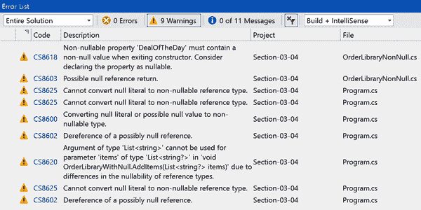

# 第三章：确保质量

所有的最佳实践、复杂算法和模式，在代码工作正常的情况下毫无意义。我们都希望构建尽可能最好的应用程序并最小化错误。本章的主题围绕可维护性、错误预防和编写正确的代码。

在团队合作时，其他开发人员必须与您编写的代码一起工作。他们会添加新功能并修复错误。如果您编写的代码易于阅读，那么它将更易于维护，即其他开发人员将能够阅读和理解它。即使您是唯一的开发人员，回顾过去编写的代码也可能是一种新体验。增强的可维护性导致引入较少的新错误，并且任务周转更快。较少的错误意味着较少的软件生命周期成本，为其他增值功能提供更多时间。正是这种可维护性的精神激励了本章内容。

与可维护性类似，错误预防是一个重要的质量概念。用户可以并且将使用应用程序发现我们从未想过会发生的一个错误。章节 3.1 和 3.4 提供了帮助的关键工具。正确的异常处理是一项重要的技能，您也将学到这一点。

质量的另一个特征是确保代码正确，单元测试是一种重要的实践。虽然单元测试已经存在很长时间，但它并不是一个解决的问题。许多开发人员仍然不写单元测试。然而，这是一个如此重要的主题，本章的第一部分将向您展示如何编写单元测试。

# 3.1 编写单元测试

## 问题

质量保证专业人员在集成测试期间持续发现问题，您希望减少检查到的错误数量。

## 解决方案

这是测试的代码：

```cs
public enum CustomerType
{
    Bronze,
    Silver,
    Gold
}

public class Order
{
    public decimal CalculateDiscount(
        CustomerType custType, decimal amount)
    {
        decimal discount;

        switch (custType)
        {
            case CustomerType.Silver:
                discount = amount * 1.05m;
                break;
            case CustomerType.Gold:
                discount = amount * 1.10m;
                break;
            case CustomerType.Bronze:
            default:
                discount = amount;
                break;
        }

        return discount;
    }
}
```

单独的测试项目包含单元测试：

```cs
public class OrderTests
{
 [Fact]
    public void
    CalculateDiscount_WithBronzeCustomer_GivesNoDiscount()
    {
        const decimal ExpectedDiscount = 5.00m;

        decimal actualDiscount =
            new Order().CalculateDiscount(CustomerType.Bronze, 5.00m);

        Assert.Equal(ExpectedDiscount, actualDiscount);
    }

 [Fact]
    public void
    CalculateDiscount_WithSilverCustomer_GivesFivePercentDiscount()
    {
        const decimal ExpectedDiscount = 5.25m;

        decimal actualDiscount =
            new Order().CalculateDiscount(CustomerType.Silver, 5.00m);

        Assert.Equal(ExpectedDiscount, actualDiscount);
    }

 [Fact]
    public void
    CalculateDiscount_WithGoldCustomer_GivesTenPercentDiscount()
    {
        const decimal ExpectedDiscount = 5.50m;

        decimal actualDiscount =
            new Order().CalculateDiscount(CustomerType.Gold, 5.00m);

        Assert.Equal(ExpectedDiscount, actualDiscount);
    }
}
```

## 讨论

要测试的代码是系统的被测代码（SUT），测试它的代码称为*单元测试*。单元测试通常在一个独立的项目中，引用 SUT，通过不将测试代码与生产代码一起发布来避免膨胀可交付组件的大小。要测试的单元通常是类、记录或结构类型。解决方案中有一个`Order`类（SUT），其中有一个`CalculateDiscount`方法。单元测试确保`CalculateDiscount`能够正确操作。

有几个众所周知的单元测试框架，您可以尝试几个，并选择最喜欢的一个使用。这些示例使用了 XUnit。大多数单元测试框架与 Visual Studio 和其他 IDE 集成。

单元测试框架帮助使用属性识别单元测试代码。一些框架为测试类添加了一个属性，但 XUnit 没有。对于 XUnit，您只需要为单元测试添加一个`[Fact]`属性，它将与您正在使用的 IDE 或其他工具配合使用。XUnit 的作者希望减少过度使用属性，并使 F#（以及其他.NET 语言）更容易使用该框架。

###### 注意

单元测试框架使用属性来识别测试是很有趣的。它们使用了一个名为*reflection*的.NET 特性。Recipe 5.1 展示了如何使用 reflection 在代码中处理属性，以便您可以构建自己的工具。

单元测试的命名约定指示了它们的目的，使其易于阅读。`OrderTests`类指示其单元测试操作`Order`类。单元测试方法的命名模式如下：

```cs
    <MethodToTest>_<Condition>_<ExpectedOutcome>
```

第一个单元测试，`CalculateDiscount_WithBronzeCustomer_GivesNoDiscount`，遵循以下模式：

+   `CalculateDiscount`是要测试的方法。

+   `WithBronzeCustomer`指定了这个特定测试的输入中的独特之处。

+   `GivesNoDiscount`是要验证的结果。

单元测试的组织使用了一种称为安排、执行和断言（AAA）的格式。以下讨论涵盖了测试格式的每个部分。

安排部分创建了测试发生所需的所有类型。在这些单元测试中，安排创建了一个`const ExpectedDiscount`。在更复杂的情况下，安排部分将实例化输入参数，以建立适当的测试条件。在这个例子中，条件非常简单，它们被写成了执行部分的常量参数。

执行部分是一个方法调用，如果有的话，会传入参数，创建要测试的条件。在这些示例中，执行部分实例化了一个`Order`实例，并调用`CalculateDiscount`，传入适当的参数值，将响应分配给`actualDiscount`。

`Assert`类属于 XUnit 测试框架。恰如其名，`Assert`语句用于测试的断言部分。请注意我为`actualDiscount`和`ExpectedDiscount`使用的命名约定。`Assert`类有几种方法，其中`Equal`非常受欢迎，因为它允许您比较您在执行部分期望的结果和实际收到的结果。

您从单元测试中可能获得的好处包括更好的代码设计，验证代码是否符合预期，防止回归，部署验证和文档编制。关键词在于*可能*，因为不同的人和/或团队选择他们想要从单元测试中获得的好处。

更好的代码设计来自于在编写代码之前编写测试。你可能听说过这种技术在敏捷或行为驱动开发（BDD）环境中被讨论过。通过让开发者提前考虑预期行为，可能会产生更清晰的设计。另一方面，你可能希望在编写代码之后编写单元测试。开发者们以两种方式编写代码和单元测试，对于哪种方式更可取存在不同意见。但无论如何，拥有测试，比起没有测试，更有可能提高代码质量。

第二点验证代码是否达到预期目的是最大的好处。对于像服务于代码文档的简单方法来说，这并不是什么大问题。然而，对于复杂的算法或像确保客户获得正确折扣这样关键的任务来说，单元测试确实发挥了重要作用。

另一个重要的好处是防止回归。当代码发生变化时，你或其他开发者可能会意外改变代码的原始意图，引入错误。通过在修改代码后运行单元测试，可以在源头找到并修复错误，而不是由质量保证专业人员或（更糟糕的是）客户在后期发现。

随着现代化的 DevOps，我们有能力通过持续部署来自动化构建。你可以将单元测试运行添加到 DevOps 管道中，这样可以在与其余代码合并之前捕获错误。拥有更多的单元测试可以通过这种技术减少开发者破坏构建的可能性。

最后，你还有另一层文档。这就是为什么单元测试的命名约定如此重要。如果另一个不熟悉应用程序的开发者需要理解代码，单元测试可以解释代码应该具有的正确行为。

如果你还没有使用单元测试，本讨论将帮助你入门。你可以通过搜索 XUnit 和其他单元测试框架来了解它们的工作原理。如果你还没有这样做，请查看食谱 1.2，其中描述了使代码更具可测试性的技术。

## 参见

食谱 1.2，“移除显式依赖项”

食谱 5.1，“使用反射读取属性”

# 3.2 版本化接口的安全性

## 问题

你需要在一个库中安全地更新一个接口，而不会破坏已部署的代码。

## 解决方案

更新前的接口：

```cs
public interface IOrder
{
    string PrintOrder();
}
```

更新后的接口：

```cs
public interface IOrder
{
    string PrintOrder();

    decimal GetRewards() => 0.00m;
}
```

`CompanyOrder` 更新前：

```cs
public class CompanyOrder : IOrder
{
    public string PrintOrder()
    {
        return "Company Order Details";
    }
}
```

`CompanyOrder` 更新后：

```cs
public class CompanyOrder : IOrder
{
    decimal total = 25.00m;

    public string PrintOrder()
    {
        return "Company Order Details";
    }

    public decimal GetRewards()
    {
        return total * 0.01m;
    }
}
```

`CustomerOrder` 更新前后：

```cs
class CustomerOrder : IOrder
{
    public string PrintOrder()
    {
        return "Customer Order Details";
    }
}
```

这是类型的使用方式：

```cs
class Program
{
    static void Main()
    {
        var orders = new List<IOrder>
        {
            new CustomerOrder(),
            new CompanyOrder()
        };

        foreach (var order in orders)
        {
            Console.WriteLine(order.PrintOrder());
            Console.WriteLine($"Rewards: {order.GetRewards()}");
        }
    }
}
```

## 讨论

在 C# 8 之前，我们无法向现有接口添加新成员，而不改变实现该接口的所有类型。如果这些实现类型位于同一代码库中，这是可以修复的更改。然而，对于框架库，开发人员依赖于接口与该库进行交互，这将是一个破坏性变更。

解决方案描述了如何更新接口以及其影响。这个场景适用于可能希望将之前赚取的一些奖励点数应用到当前订单的客户。

查看`IOrder`，您可以看到更新后版本添加了`GetRewards`方法。从历史上看，接口是不允许有实现的。然而，在新版本的`IOrder`中，`GetRewards`方法有一个默认实现，返回`$0.00`作为奖励。

解决方案还介绍了`CompanyOrder`类的前后版本，其中后版本包含了`GetRewards`的实现。现在，任何通过`CompanyOrder`实例调用`GetRewards`的代码将执行`CompanyOrder`的实现，而不是默认的实现。

相比之下，解决方案展示了一个同样实现了`IOrder`的`CustomerOrder`类。这里的区别在于`CustomerOrder`没有改变。任何通过`CompanyOrder`实例调用`GetRewards`的代码将执行默认的`IOrder`实现。

`Program Main`方法展示了这是如何工作的。`orders`是一个`IOrder`列表，包含`CustomerOrder`和`CompanyOrder`的运行时实例。`foreach`循环遍历`orders`，调用`IOrder`的方法。如前所述，对于`CompanyOrder`实例调用`GetRewards`会使用该类的实现，而`CustomerOrder`则使用默认的`IOrder`实现。

本质上，这个变化意味着如果开发人员在自己的类中实现`IOrder`，比如`CustomerOrder`，他们的代码在更新到最新版本时不会中断。

# 3.3 简化参数验证

## 问题

你总是在寻找简化代码的方法，包括参数验证。

## 解决方案

冗长的参数验证语法：

```cs
static void ProcessOrderOld(string customer, List<string> lineItems)
{
    if (customer == null)
    {
        throw new ArgumentNullException(
            nameof(customer), $"{nameof(customer)} is required.");
    }

    if (lineItems == null)
    {
        throw new ArgumentNullException(
            nameof(lineItems), $"{nameof(lineItems)} is required.");
    }

    Console.WriteLine($"Processed {customer}");
}
```

简洁的参数验证语法：

```cs
static void ProcessOrderNew(string customer, List<string> lineItems)
{
    _ = customer ?? throw new ArgumentNullException(
        nameof(customer), $"{nameof(customer)} is required.");
    _ = lineItems ?? throw new ArgumentNullException(
        nameof(lineItems), $"{nameof(lineItems)} is required.");

    Console.WriteLine($"Processed {customer}");
}
```

## 讨论

公共方法的第一行代码通常涉及参数验证，有时可能会很冗长。此部分展示了如何节省几行代码，以免混淆原方法的目的代码。

解决方案有两种参数验证技术：冗长和简洁。冗长的方法是典型的，代码确保参数不为空，并在其他情况下抛出异常。在这种单行抛出语句中，括号并不是必需的，但是如果编码标准要求括号出现，某些开发人员/团队可能仍然会喜欢它们，以避免未来维护错误，特别是对于应该在`if`块中的语句。

简短的方法是可以节省几行代码的替代方法。它依赖于 C#的新功能：变量丢弃`_`和合并运算符`??`。

###### 注意

使用合并运算符和丢弃进行简化的参数验证适合单行。然而，为了书本格式，需要使用两行。

在验证`customer`的行上，代码以丢弃的赋值开头，因为我们需要一个表达式。合并运算符是一个检测表达式为`null`时执行下一条语句的保护。

###### 提示

此示例是用于参数评估。但是，在代码遇到设置为`null`的变量并需要抛出无效条件或本不应发生的情况时，还有其他场景。此技术让您可以快速处理单行代码。

## 参见

第 3.4 节，“保护代码免受 NullReferenceException”

# 3.4 保护代码免受 NullReferenceException

## 问题

您正在构建一个可重用库，并需要传达可空引用语义。

## 解决方案

这是旧式代码，不处理空引用：

```cs
public class OrderLibraryNonNull
{
    // nullable property
    public string DealOfTheDay { get; set; }

    // method with null parameter
    public void AddItem(string item)
    {
        Console.Write(item.ToString());
    }

    // method with null return value
    public List<string> GetItems()
    {
        return null;
    }

    // method with null type parameter
    public void AddItems(List<string> items)
    {
        foreach (var item in items)
            Console.WriteLine(item.ToString());
    }
}
```

以下项目文件启用了新的可空引用特性：

```cs
<Project Sdk="Microsoft.NET.Sdk">
    <PropertyGroup>
        <OutputType>Exe</OutputType>
        <TargetFramework>netcoreapp3.1</TargetFramework>
        <RootNamespace>Section_03_04</RootNamespace>
        <Nullable>enable</Nullable>
    </PropertyGroup>
</Project>
```

下面是更新后的库代码，涉及可空引用的通信：

```cs
public class OrderLibraryWithNull
{
    // nullable property
    public string? DealOfTheDay { get; set; }

    // method with null parameter
    public void AddItem(string? item)
    {
        _ = item ?? throw new ArgumentNullException(
            nameof(item), $"{nameof(item)} must not be null");

        Console.Write(item.ToString());
    }

    // method with null return value
    public List<string>? GetItems()
    {
        return null;
    }

    // method with null type parameter
    public void AddItems(List<string?> items)
    {
        foreach (var item in items)
            Console.WriteLine(item?.ToString() ?? "None");
    }
}
```

这是一个忽略可空引用的旧式消费代码示例：

```cs
static void HandleWithNullNoHandling()
{
    var orders = new OrderLibraryWithNull();

    string deal = orders.DealOfTheDay;
    Console.WriteLine(deal.ToUpper());

    orders.AddItem(null);
    orders.AddItems(new List<string> { "one", null });

    foreach (var item in orders.GetItems().ToArray())
        Console.WriteLine(item.Trim());
}
```

图 3-1 显示了用户在使用忽略可空引用的代码时看到的警告墙。



###### 图 3-1\. Visual Studio 中的可空引用警告

最后，这是消费代码如何正确对待具有适当检查和验证的可重用库的示例：

```cs
static void HandleWithNullAndHandling()
{
    var orders = new OrderLibraryWithNull();

    string? deal = orders.DealOfTheDay;
    Console.WriteLine(deal?.ToUpper() ?? "Deals");

    orders.AddItem(null);
    orders.AddItems(new List<string?> { "one", null });

    List<string>? items = orders.GetItems();

    if (items != null)
        foreach (var item in items.ToArray())
            Console.WriteLine(item.Trim());
}
```

## 讨论

如果你已经使用 C#编程一段时间，很可能遇到过`NullReferenceExceptions`。当引用仍为 null 的变量的成员时会发生`NullReferenceException`，实质上是试图使用尚不存在的对象。C# 8 首次引入了可空引用，通过减少抛出的`NullReferenceException`异常数量来帮助编写更高质量的代码。整个概念围绕着在编译时通知开发人员变量为 null 的情况，可能导致抛出`NullReferenceException`。这种情况基于需要为其他开发人员编写可重用库，可能是一个单独的类库或 NuGet 包。您的目标是让他们知道库中可能发生空引用的位置，以便他们编写代码来防止`NullReferenceException`。

为了演示，解决方案展示了不通知空引用的库代码。本质上，这是旧式代码，展示了 C# 8 之前开发人员会编写的代码。您还将看到如何配置项目以支持 C# 8 的可空引用。然后，您将了解如何更改该库代码，以向可能消费它的开发人员传达空引用。最后，您将看到两个消费代码的示例：一个不处理空引用，另一个显示如何防止空引用。

在第一个解决方案示例中，`OrderLibraryNonNull`类具有参数或返回类型为引用类型（例如`string`和`List<string>`）的成员。在可空和非可空上下文中，这段代码不会生成任何警告。即使在可空上下文中，引用类型也没有标记为可空，并且危险地传达给用户，他们永远不会收到`NullReferenceException`。然而，由于可能会出现`NullReferenceExceptions`，我们不希望再这样编写我们的代码了。

在解决方案中的 XML 清单是项目文件，其中包含`/Project/PropertyGroup/Nullable`元素。将其设置为`true`将项目置于可空上下文中。将单独的类库放入可空上下文可能会为类库开发人员提供警告，但代码的使用者永远不会看到这些警告。

`OrderLibraryWithNull`的下一个解决方案代码片段修复了这个问题。与`OrderLibraryNonNull`进行比较，以区分它们的不同之处。在评估空引用时，逐个成员地遍历类型，思考参数和返回值如何影响库的消费者，特别是在空引用方面。存在许多不同的空场景，但这个例子涵盖了三种常见情况：属性类型、方法参数类型和泛型参数类型，下面的段落中有详细解释。

###### 注意

有时，一个方法确实不会返回空引用。这时候不使用可空操作符来告知使用者不需要检查空引用是有意义的。

`DealOfTheDay`展示了属性类型空引用的情景。它的`getter`属性返回一个`string`，这个值可能为空。使用可空操作符`?`来修复这些问题，并返回`string?`。

`AddItems`类似，只是它接受一个`string`参数，演示了方法参数的情况。由于`string`可以为`null`，将其更改为`string?`也让编译器了解了。请注意，我使用了 Recipe 3.3 中描述的简化参数检查。

有时，您可能会遇到可空的泛型参数类型。`GetItems`方法返回一个`List<string>`，而`List<T>`是引用类型。因此，将其更改为`List<string>?`可以解决问题。

最后，这里有一个有点棘手的例子。`AddItems` 中的 items 参数是一个 `List<string>`。可以轻松进行参数检查以测试 `null` 参数，但是省略可空操作符也是一种好方法，以告知用户不应传递 `null` 值。

也就是说，如果 `List<string>` 中的一个值是 `null` 怎么办？在这种情况下，它是一个 `List<string>`，但是对于用户可以传递 `Dictionary<string, string>` 的场景，其中值可以是 `null`，那么就像例子中对 `List<string?>` 所做的那样，注释类型参数，表示允许值为 `null`。因为你知道参数可以为 `null`，在引用其成员之前检查是非常重要的，以避免 `NullReferenceException`。

现在你有了一个对消费者有用的库代码。然而，只有消费者也将其项目置于可为空的上下文中，才能发挥其作用，如项目文件中所示。

`HandleWithNullNoHandling` 方法展示了在 C# 8 之前开发者可能编写的代码。然而，一旦将项目置于可为空的上下文中，将收到多个警告，如在 Visual Studio 错误列表窗口中显示的警告墙所示。与 `HandleWithNullAndHandling` 方法进行比较，对比非常明显。

整个过程是级联的，所以从方法顶部开始，逐步向下工作：

1.  因为 `DealOfTheDay` 的 getter 可能返回 `null`，将 `deal` 的类型设置为 `string?`。

1.  由于 `deal` 可能为 `null`，使用空引用操作符和合并操作符确保 `Console.WriteLine` 有合理的内容可写。

1.  传递给 `AddItems` 的类型需要是 `List<string?>`，以表明你知道一个项可能为 `null`。

1.  将 `orders.GetItems` 内联到 `foreach` 循环中，改为将其重构为一个新变量。这样可以检查 `null` 以避免使用 `null` 迭代器。

## 参见

Recipe 3.3, “简化参数验证”

# 3.5 避免神奇的字符串

## 问题

`const` 字符串在应用程序的多个位置存在，并且你需要一种方法来更改它而不会破坏其他代码。

## 解决方案

这是一个 `Order` 对象：

```cs
public class Order
{
    public string DeliveryInstructions { get; set; }

    public List<string> Items { get; set; }
}
```

这里是一些常量：

```cs
public class Delivery
{
    public const string NextDay = "Next Day";
    public const string Standard = "Standard";
    public const string LowFare = "Low Fare";

    public const int StandardDays = 7;
}
```

这是使用 `Order` 和常量计算交付天数的程序：

```cs
static void Main(string[] args)
{
    var orders = new List<Order>
    {
        new Order { DeliveryInstructions = Delivery.LowFare },
        new Order { DeliveryInstructions = Delivery.NextDay },
        new Order { DeliveryInstructions = Delivery.Standard },
    };

    foreach (var order in orders)
    {
        int days;

        switch (order.DeliveryInstructions)
        {
            case Delivery.LowFare:
                days = 15;
                break;
            case Delivery.NextDay:
                days = 1;
                break;
            case Delivery.Standard:
            default:
                days = Delivery.StandardDays;
                break;
        }

        Console.WriteLine(order.DeliveryInstructions);
        Console.WriteLine($"Expected Delivery Day(s): {days}");
    }
}
```

## 讨论

开发软件一段时间后，大多数开发者都见过一些神奇的值，这些是直接写入表达式的文本值和数字值。从原始开发者的角度来看，它们可能不是一个大问题。然而，从维护开发者的角度来看，这些文本值并不立即显得合理。就像它们神奇地从无处出现一样，或者感觉代码之所以工作是因为这些文本值的含义并不明显。

目标是编写能够让未来的维护人员理解的代码。否则，由于试图弄清楚某些看似随机的数字而浪费的时间，项目成本会增加。解决方案通常是用一个变量替换文字值，其名称表达了值的语义或存在的原因。一种普遍认为可读性良好的代码比注释更具可维护性的生命周期更长。

更进一步，本地常量有助于提高方法的可读性，但常量通常是可重复使用的。解决方案示例演示了如何将一些可重复使用的常量放置在它们自己的类中，以便代码的其他部分重复使用。

除了`items`，`Order`类还有一个`DeliveryInstructions`属性。在这里，我们假设有一组有限的交货说明。

`Delivery`类具有`NextDay`、`Standard`和`LowFare`的`const` `string`值，描述了订单应该如何交付。此外，请注意该类有一个`StandardDays`值，设置为`7`。你更愿意阅读哪种程序——使用`7`还是使用名为`StandardDays`的常量？这使得代码更易读，正如在`Program`类中所示。

###### 注意

你可能首先考虑`Delivery`类中的`const` `string`值更适合用枚举。但请注意它们有空格。而且，它们将与`order`一起写入。虽然有技术可以将枚举用作`string`，但这很简单。

在某些场景中，你需要一个特定的`string`值进行查找。这是一个主观的问题，取决于你认为适合某项任务的工具。如果发现枚举更方便的情况，请使用该路线。

`Program`类使用`Orders`和`Delivery`来计算交货所需的天数，基于订单的`DeliveryInstructions`。列表中有三个订单，每个订单对`DeliveryInstructions`有不同的设置。`foreach`循环遍历这些订单，使用`switch`语句根据`DeliveryInstructions`设置交货天数。

注意到有序列表构造和`switch`语句都使用了`Delivery`中的常量。如果没有这样做，到处都会有`strings`。现在，借助 IntelliSense 支持，编码变得更加容易，没有重复，因为`string`只在一个地方，减少了打字错误的机会。而且，如果需要更改`strings`，只需在一个地方进行修改。此外，你还能获得 IDE 重构支持，以便在应用程序中改变常量出现的所有地方。

# 3.6 自定义类字符串表示

## 问题

在调试器中的类表示、字符串参数和日志文件都是不可读的，你希望自定义它们的外观。

## 解决方案

下面是一个具有自定义`ToString`方法的类：

```cs
public class Order
{
    public int ID { get; set; }

    public string CustomerName { get; set; }

    public DateTime Created { get; set; }

    public decimal Amount { get; set; }

    public override string ToString()
    {
        var stringBuilder = new StringBuilder();

        stringBuilder.Append(nameof(Order));
        stringBuilder.Append(" {\n");

        if (PrintMembers(stringBuilder))
            stringBuilder.Append(" ");

        stringBuilder.Append("\n}");

        return stringBuilder.ToString();
    }

    protected virtual bool PrintMembers(StringBuilder builder)
    {
        builder.Append("  " + nameof(ID));
        builder.Append(" = ");
        builder.Append(ID);
        builder.Append(", \n");
        builder.Append("  " + nameof(CustomerName));
        builder.Append(" = ");
        builder.Append(CustomerName);
        builder.Append(", \n");
        builder.Append("  " + nameof(Created));
        builder.Append(" = ");
        builder.Append(Created.ToString("d"));
        builder.Append(", \n");
        builder.Append("  " + nameof(Amount));
        builder.Append(" = ");
        builder.Append(Amount);

        return true;
    }
}
```

下面是使用的示例：

```cs
class Program
{
    static void Main(string[] args)
    {
        var order = new Order
        {
            ID = 7,
            CustomerName = "Acme",
            Created = DateTime.Now,
            Amount = 2_718_281.83m
        };

        Console.WriteLine(order);
    }
}
```

这是输出：

```cs
Order {
  ID = 7,
  CustomerName = Acme,
  Created = 1/23/2021,
  Amount = 2718281.83
}
```

## 讨论

有些类型很复杂，在调试器中查看实例很麻烦，因为您需要深入多个级别来检查值。现代 IDE 使这一过程更加轻松，但有时更希望有更可读的类表示。

这就是重写`ToString`方法的用处。`ToString`是所有类型派生自的`Object`类型的方法。默认实现是类型的完全限定名称，在解决方案中`Order`类的名称是`Section_03_06.Order`。由于它是虚方法，您可以重写它。

实际上，`Order`类使用自己的表示方式重写了`ToString`。如第 2.1 节所述，实现使用`StringBuilder`。格式使用对象名称，大括号内是属性，如输出中所示。

在`Main`中，演示代码通过`Console.WriteLine`生成此输出。这是因为如果参数不是`string`，`Console.WriteLine`会调用对象的`ToString`方法。

## 另请参阅

第 2.1 节，“高效处理字符串”

# 3.7 重新抛出异常

## 问题

应用程序抛出异常，但消息缺少信息，您需要确保处理过程中所有相关数据都是可用的。

## 解决方案

此对象抛出一个异常：

```cs
public class Orders
{
    public void Process()
    {
        throw new IndexOutOfRangeException(
            "Expected 10 orders, but found only 9.");
    }
}
```

这里有处理异常的不同方法：

```cs
public class OrderOrchestrator
{
    public static void HandleOrdersWrong()
    {
        try
        {
            new Orders().Process();
        }
        catch (IndexOutOfRangeException ex)
        {
            throw new InvalidOperationException(ex.Message);
        }
    }

    public static void HandleOrdersBetter1()
    {
        try
        {
            new Orders().Process();
        }
        catch (IndexOutOfRangeException ex)
        {
            throw new InvalidOperationException("Error Processing Orders", ex);
        }
    }

    public static void HandleOrdersBetter2()
    {
        try
        {
            new Orders().Process();
        }
        catch (IndexOutOfRangeException)
        {
            throw;
        }
    }

    public static void DontHandleOrders()
    {
        new Orders().Process();
    }
}
```

此程序测试每种异常处理方法：

```cs
class Program
{
    static void Main(string[] args)
    {
        AppDomain.CurrentDomain.UnhandledException +=
            (object sender, UnhandledExceptionEventArgs e) =>
            System.Console.WriteLine("\n\nUnhandled Exception:\n" + e);

        try
        {
            OrderOrchestrator.HandleOrdersWrong();
        }
        catch (InvalidOperationException ex)
        {
            Console.WriteLine("Handle Orders Wrong:\n" + ex);
        }

        try
        {
            OrderOrchestrator.HandleOrdersBetter1();
        }
        catch (InvalidOperationException ex)
        {
            Console.WriteLine("\n\nHandle Orders Better #1:\n" + ex);
        }

        try
        {
            OrderOrchestrator.HandleOrdersBetter2();
        }
        catch (IndexOutOfRangeException ex)
        {
            Console.WriteLine("\n\nHandle Orders Better #2:\n" + ex);
        }

        OrderOrchestrator.DontHandleOrders();
    }
}
```

下面是输出：

```cs
Handle Orders Wrong:
System.InvalidOperationException: Expected 10 orders, but found only 9.
   at Section_03_07.OrderOrchestrator.HandleOrdersWrong() in
   /CSharp9Cookbook/Chapter03/Section-03-07/OrderOrchestrator.cs:line 15
   at Section_03_07.Program.Main(String[] args) in
   /CSharp9Cookbook/Chapter03/Section-03-07/Program.cs:line 11

Handle Orders Better #1:
System.InvalidOperationException: Error Processing Orders
 ---> System.IndexOutOfRangeException: Expected 10 orders, but found only 9.
   at Section_03_07.Orders.Process() in
   /CSharp9Cookbook/Chapter03/Section-03-07/Orders.cs:line 9
   at Section_03_07.OrderOrchestrator.HandleOrdersBetter1() in
   /CSharp9Cookbook/Chapter03/Section-03-07/OrderOrchestrator.cs:line 23
   --- End of inner exception stack trace ---
   at Section_03_07.OrderOrchestrator.HandleOrdersBetter1() in
   /CSharp9Cookbook/Chapter03/Section-03-07/OrderOrchestrator.cs:line 27
   at Section_03_07.Program.Main(String[] args) in
   /CSharp9Cookbook/Chapter03/Section-03-07/Program.cs:line 20

Handle Orders Better #2:
System.IndexOutOfRangeException: Expected 10 orders, but found only 9.
   at Section_03_07.Orders.Process() in
   /CSharp9Cookbook/Chapter03/Section-03-07/Orders.cs:line 9
   at Section_03_07.OrderOrchestrator.HandleOrdersBetter2() in
   /CSharp9Cookbook/Chapter03/Section-03-07/OrderOrchestrator.cs:line 35
   at Section_03_07.Program.Main(String[] args) in
   /CSharp9Cookbook/Chapter03/Section-03-07/Program.cs:line 29

Unhandled Exception:
System.UnhandledExceptionEventArgs
Unhandled exception. System.IndexOutOfRangeException:
   Expected 10 orders, but found only 9.
   at Section_03_07.Orders.Process() in
   /CSharp9Cookbook/Chapter03/Section-03-07/Orders.cs:line 9
   at Section_03_07.OrderOrchestrator.DontHandleOrders() in
   /CSharp9Cookbook/Chapter03/Section-03-07/OrderOrchestrator.cs:line 45
   at Section_03_07.Program.Main(String[] args) in
   /CSharp9Cookbook/Chapter03/Section-03-07/Program.cs:line 40
```

## 讨论

有多种处理异常的方法，其中一些比其他方法更好。从故障排除的角度来看，我们通常希望记录具有足够有意义信息的异常日志，以帮助解决问题。这正是本节的目的，确定应采用哪种更好的解决方案。

`Orders`类的`Process`方法抛出`IndexOutOfRangeException`，而`OrderOrchestrator`类以几种不同的方式处理该异常：其中一种是应该避免的，而另外两种则更好，具体取决于您的情况。

`HandleOrdersWrong`方法获取原始异常的`Message`属性，并使用该消息作为输入抛出新的`InvalidOperationException`。该场景模拟了分析情况并尝试抛出比原始异常更具意义或提供更多信息的异常的情况。然而，这会导致另一个问题，即丢失关键的堆栈跟踪信息，这些信息对于解决问题至关重要。在实践中，异常可能通过多个级别抛出并通过不同路径到达。您可以在堆栈跟踪中看到此问题，在输出中显示异常的堆栈跟踪源自`OrderOrchestrator.HandleOrdersWrong`方法，而非其真正源自`Orders.Process`。

###### 警告

另一件绝对不应该做的事情是像这样重新抛出原始异常：

```cs
try
{
    OrderOrchestrator.HandleOrdersWrong();
}
catch (InvalidOperationException ex)
{
    throw ex;
}
```

这种方法的问题在于重新抛出原始异常会导致丢失堆栈跟踪。没有原始堆栈跟踪，试图调试程序的开发人员将不知道异常的起源位置。此外，原始异常可能与您收到的异常不同，可能包含更详细的信息，而没有人会看到。

`HandleOrdersBetter1`方法通过向`innerException`参数添加额外的参数`ex`改进了这种情况。这样做的好处在于现在可以抛出带有附加数据的异常，并保留整个堆栈跟踪。您可以在输出中看到异常路径始于`Orders.Process`（由`--- End of inner exception stack trace ---`分隔）。

`HandleOrdersBetter2`仅抛出原始异常。这里的假设是逻辑无法处理异常或记录并重新抛出。如输出所示，堆栈跟踪也源自`Orders.Process`。

处理异常有很多策略，本文涵盖了其中一个方面。在这种情况下，考虑保留用于后续调试的原始堆栈跟踪，您应该重新抛出异常。无论如何，都要考虑您的情景及其对您来说是否有意义。

有时，可能会遇到代码抛出异常但没有处理策略的情况。`OrderOrchestrator.DontHandleOrders`不执行任何处理，而`Main`方法未用`try/catch`保护。在这种情况下，仍可以通过向`AppDomain.​Cur⁠rentDomain.UnhandledException`添加事件处理程序来拦截异常，正如在`Main`方法末尾所示。在运行任何代码之前，您需要分配事件处理程序，否则将无法处理异常。

## 参见

Recipe 1.9, “设计自定义异常”

# 3.8 管理进程状态

## 问题

用户启动了一个进程，但发生异常后，用户界面状态未更新。

## 解决方案

此方法会抛出异常：

```cs
static void ProcessOrders()
{
    throw new ArgumentException();
}
```

这是您不应编写的代码：

```cs
static void Main()
{
    Console.WriteLine("Processing Orders Started");

    ProcessOrders();

    Console.WriteLine("Processing Orders Complete");
}
```

取而代之，这是您应编写的代码：

```cs
static void Main()
{
    try
    {
        Console.WriteLine("Processing Orders Started");

        ProcessOrders();
    }
    catch (ArgumentException ae)
    {
        Console.WriteLine('\n' + ae.ToString() + '\n');
    }
    finally
    {
        Console.WriteLine("Processing Orders Complete");
    }
}
```

## 讨论

问题陈述提到发生了异常，这是正确的。但是，从用户角度来看，他们将不会收到解释问题发生以及其工作未完成的消息或状态。这是因为在第一个`Main`方法中，如果在`ProcessOrder`期间抛出异常，"Processing Orders Complete"消息不会显示给用户。

这是一个`try/finally`块的良好使用案例，第二个`Main`方法使用了它。将所有应在`try`块中运行的代码和最终状态放在`finally`块中。如果发生异常，可以捕获它，记录下来，并告知用户他们的任务未成功。

虽然这是控制台应用程序的示例，但对于 UI 代码也是一个好的技术。在启动进程时，您可能会有一个类似沙漏或进度指示器的等待通知。关闭通知也是 `finally` 块可以帮助的任务。

## 参见

第 3.9 节，“构建弹性网络连接”

第 3.10 节，“性能测量”

# 3.9 构建弹性网络连接

## 问题

该应用程序与不稳定的后端服务通信，您希望防止其失败。

## 解决方案

此方法会抛出异常：

```cs
static async Task GetOrdersAsync()
{
    throw await Task.FromResult(
        new HttpRequestException(
            "Timeout", null, HttpStatusCode.RequestTimeout));
}
```

这是一种处理网络错误的技术：

```cs
public static async Task Main()
{
    const int DelayMilliseconds = 500;
    const int RetryCount = 3;

    bool success = false;
    int tryCount = 0;

    try
    {
        do
        {
            try
            {
                Console.WriteLine("Getting Orders");
                await GetOrdersAsync();

                success = true;
            }
            catch (HttpRequestException hre)
                when (hre.StatusCode == HttpStatusCode.RequestTimeout)
            {
                tryCount++;

                int millisecondsToDelay = DelayMilliseconds * tryCount;
                Console.WriteLine(
                    $"Exception during processing—" +
                    $"delaying for {millisecondsToDelay} milliseconds");

                await Task.Delay(millisecondsToDelay);
            }

        } while (tryCount < RetryCount);
    }
    finally
    {
        if (success)
            Console.WriteLine("Operation Succeeded");
        else
            Console.WriteLine("Operation Failed");
    }
}
```

这是输出的内容：

```cs
    Getting Orders
    Exception during processing - delaying for 500 milliseconds
    Getting Orders
    Exception during processing - delaying for 1000 milliseconds
    Getting Orders
    Exception during processing - delaying for 1500 milliseconds
    Operation Failed
```

## 讨论

每当您进行进程外工作时，都有可能出现错误或超时。通常您无法控制您正在交互的应用程序，编写防御性代码非常重要。特别是进行网络操作的代码由于延迟、超时或硬件问题而容易出现与连接的两端代码质量无关的错误。

此解决方案通过 `GetOrdersAsync` 模拟了网络连接问题。它抛出一个带有 `RequestTimeout` 状态的 `HttpRequestException`。`Main` 方法展示了如何减轻这些问题的方法。目标是在尝试之间以一定的延迟重试连接。

首先，请注意 `success` 初始化为 `false`，`try/finally` 的 `finally` 块让用户根据 `success` 的结果了解操作的结果。在 `try/do/try` 的嵌套中，`try` 块的最后一行将 `success` 设置为 `true`，因为所有逻辑都完成了——如果之前发生了异常，程序将无法达到那一行。

`do/while` 循环重试 `RetryCount` 次。我们将 `tryCount` 初始化为 `0`，并在 `catch` 块中递增它。因为如果发生错误，我们知道我们将重试，并且希望确保不超过指定的重试次数。`RetryCount` 是一个 `const`，初始化为 `3`。您可以根据需要调整 `RetryCount` 的次数。如果操作时间敏感，您可能希望限制重试并发送关键错误的通知。另一个场景可能是，您知道连接的另一端最终会恢复在线，并可以将 `RetryCount` 设置为非常高的数字。

每当出现异常时，通常不希望立即重新发起请求。一个超时的原因可能是另一端的扩展能力不强，过多的请求可能会使服务器不堪重负。此外，一些第三方 API 会对客户端进行速率限制，连续的请求会消耗速率限制计数。一些 API 提供商甚至可能因为过多的连接请求而阻止您的应用程序。

`DelayMilliseconds`有助于您的重试策略，初始化为`500`毫秒。如果发现重试仍然太快，您可以调整这个值。如果单个延迟时间有效，那么您可以使用它。然而，许多情况需要线性或指数回退策略。您可以看到，解决方案使用了线性回退，将`DelayMilliseconds`乘以`tryCount`。由于`tryCount`初始化为`0`，我们首先递增它。

###### 提示

您可能希望将重试记录为警告，而不是错误。管理员、质量保证或任何查看日志（或报告）的人可能会感到不必要地惊慌。他们看到看起来像错误的东西，而您的应用程序正在对典型的网络行为做出适当的反应和修复。

或者，您可能需要使用指数退避策略，例如将`DelayMilliseconds`提高到`tryCount`的幂次方——`Math.Pow(DelayMilliseconds, tryCount)`。您可以进行实验，例如记录错误并定期审查，以查看对您的情况最有效的方法。

# 3.10 测量性能

## 问题

您知道几种编写算法的方式，并需要测试哪种算法性能最佳。

## 解决方案

这是我们将操作的对象类型：

```cs
public class OrderItem
{
    public decimal Cost { get; set; }
    public string Description { get; set; }
}
```

这是创建`OrderItem`列表的代码：

```cs
static List<OrderItem> GetOrderItems()
{
    const int ItemCount = 10000;

    var items = new List<OrderItem>();
    var rand = new Random();

    for (int i = 0; i < ItemCount; i++)
        items.Add(
            new OrderItem
            {
                Cost = rand.Next(i),
                Description = "Order Item #" + (i + 1)
            });

    return items;
}
```

这是一个效率低下的字符串连接方法：

```cs
static string DoStringConcatenation(List<OrderItem> lineItems)
{
    var stopwatch = new Stopwatch();

    try
    {
        stopwatch.Start();

        string report = "";

        foreach (var item in lineItems)
            report += $"{item.Cost:C} - {item.Description}\n";

        Console.WriteLine(
            $"Time for String Concatenation: " +
            $"{stopwatch.ElapsedMilliseconds}");

        return report;
    }
    finally
    {
        stopwatch.Stop();
    }
}
```

这是更快的`StringBuilder`方法：

```cs
static string DoStringBuilderConcatenation(List<OrderItem> lineItems)
{
    var stopwatch = new Stopwatch();
    try
    {
        stopwatch.Start();

        var reportBuilder = new StringBuilder();

        foreach (var item in lineItems)
            reportBuilder.Append($"{item.Cost:C} - {item.Description}\n");

        Console.WriteLine(
            $"Time for String Builder Concatenation: " +
            $"{stopwatch.ElapsedMilliseconds}");

        return reportBuilder.ToString();
    }
    finally
    {
        stopwatch.Stop();
    }
}
```

此代码驱动演示：

```cs
static void Main()
{
    List<OrderItem> lineItems = GetOrderItems();

    DoStringConcatenation(lineItems);

    DoStringBuilderConcatenation(lineItems);
}
```

这是输出：

```cs
    Time for String Concatenation: 1137
    Time for String Builder Concatenation: 2
```

## 讨论

第 2.1 节讨论了`StringBuilder`相对于字符串连接的优势，强调性能是主要驱动因素。然而，它并未解释如何通过代码测量性能。本节建立在此基础上，展示了如何通过代码测量算法性能。

###### 提示

随着我们的计算机每年（或更少）变得越来越快，`StringBuilder`方法的结果将接近`0`。要体验两种方法之间时间差异的真实大小，可以在`GetOrderItems`的`ItemCount`中再加一个`0`。

在`StringConcatenation`和`StringBuilderConcatenation`方法中，您会发现`StopWatch`的实例，它位于`System.Diagnostics`命名空间中。

调用`Start`启动计时器，`Stop`停止计时器。注意，算法使用`try/finally`，如第 3.8 节所述，以确保计时器停止。

`Console.WriteLine`在每个算法末尾使用`stopwatch.ElapsedMilliseconds`显示算法使用的时间。

如输出所示，`StringBuilder`和字符串连接之间的运行时间差异是显著的。

## 参见

第 2.1 节，“高效处理字符串”

第 3.8 节，“管理进程状态”
