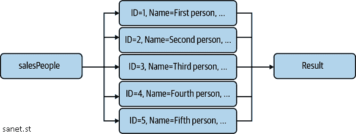

# 第四章\. 使用 LINQ 进行查询

LINQ 自 C# 3 开始就已经存在。它为开发人员提供了一种查询数据源的方式，使用带有 SQL 风格的语法。因为 LINQ 是语言的一部分，您可以在 IDE 中体验到语法高亮和智能感知等功能。

LINQ 通常被认为是一个用于查询数据库的工具，其目标是减少所谓的 *阻抗不匹配*，即数据库数据表示与 C# 对象之间的差异。事实上，我们可以为任何数据技术构建 LINQ 提供程序。事实上，作者为 Twitter API 编写了一个开源提供程序，名为 [LINQ to Twitter](https://oreil.ly/1YEZ8)。

本章的示例采用了一种不同的方法。它们不使用外部数据源，而是使用专门针对内存数据源的提供程序，称为 LINQ to Objects。尽管可以使用 C# 循环和命令式逻辑执行任何内存数据操作，但通常使用 LINQ 可以简化代码，因为它具有声明性的特性——指定要做什么而不是如何做。每个部分都有一个或多个实体（要查询的对象）的独特表示，以及设置了用于查询的 `InMemoryContext` 的内存数据。

本章中有几个简单的示例，如转换对象形状和简化查询。然而，也有一些重要的观点可以澄清和简化您的代码。

从不同数据源中汇集代码可能导致混乱的代码。关于连接、左连接和分组的部分描述了如何简化这些场景。还有一个相关的部分用于处理集合操作。

开发人员在构建带有连接字符串的查询时，会出现搜索表单和查询的严重安全问题。虽然这听起来可能是一个快速简单的解决方案，但通常代价过高。本章包含几节，展示了 LINQ 延迟执行如何让您动态构建查询。另一节解释了一种重要的搜索查询技术，以及它如何让您能够使用表达树生成动态子句。

# 4.1 转换对象形状

## 问题

您希望数据呈现自定义形状，与原始数据源不同。

## 解决方案

这里是需要重塑的实体：

```cs
public class SalesPerson
{
    public int ID { get; set; }

    public string Name { get; set; }

    public string Address { get; set; }

    public string City { get; set; }

    public string PostalCode { get; set; }

    public string Region { get; set; }

    public string ProductType { get; set; }
}
```

这是数据源：

```cs
public class InMemoryContext
{
    List<SalesPerson> salesPeople =
        new List<SalesPerson>
        {
            new SalesPerson
            {
                ID = 1,
                Address = "123 1st Street",
                City = "First City",
                Name = "First Person",
                PostalCode = "45678",
                Region = "Region #1"
            },
            new SalesPerson
            {
                ID = 2,
                Address = "234 2nd Street",
                City = "Second City",
                Name = "Second Person",
                PostalCode = "56789",
                Region = "Region #2"
            },
            new SalesPerson
            {
                ID = 3,
                Address = "345 3rd Street",
                City = "Third City",
                Name = "Third Person",
                PostalCode = "67890",
                Region = "Region #3"
            },
        };

    public List<SalesPerson> SalesPeople => salesPeople;
}
```

这段代码执行了重新塑形数据的投影：

```cs
class Program
{
    static void Main()
    {
        var context = new InMemoryContext();

        var salesPersonLookup =
            (from person in context.SalesPeople
             select (person.ID, person.Name))
            .ToList();

        Console.WriteLine("Sales People\n");

        salesPersonLookup.ForEach(person =>
            Console.WriteLine($"{person.ID}. {person.Name}"));
    }
}
```

## 讨论

在 LINQ 中，将对象形状转换称为 *投影*。您可能希望这样做的几个常见原因包括创建查找列表、创建视图或视图模型对象，或将数据传输对象（DTO）转换为您的应用更好处理的格式。

当使用 LINQ to Entities 进行数据库查询（一种不同于数据库的提供程序）或使用 DTOs 消费数据时，数据通常以表示原始数据源的格式到达。然而，如果你想要处理领域数据或绑定到 UI，纯数据表示形式可能不具有正确的形状。此外，数据表示通常具有对象关系模型（ORM）或数据访问库的属性和语义。一些开发人员试图将这些数据对象绑定到他们的 UI，因为他们不想创建新的对象类型。尽管这可以理解，因为没有人愿意比必要工作更多，但问题是 UI 代码通常需要不同形状的数据，并且需要自己的验证和属性。因此，问题在于你为两种不同目的使用一个对象。理想情况下，一个对象应该具有单一职责，而这样混合使用通常会导致代码混乱，难以维护。

解决方案展示的另一种场景是仅需查找列表的情况，带有 ID 和可显示值。当填充 UI 元素如复选框列表、单选按钮组、组合框或下拉框时，这非常有用。如果需要的只是 ID 和一些显示给用户的内容，查询整个实体将会很浪费且慢（尤其是在跨进程或跨网络的数据库连接中）。

解决方案的 `Main` 方法展示了这一点。它查询了 `InMemoryContext` 的 `SalesPeople` 属性，这是一个 `SalesPerson` 列表，而 `select` 子句重新将结果重新塑形为 `ID` 和 `Name` 的元组。

###### 注意

解决方案中的 `select` 子句使用了一个元组。然而，你也可以将请求的字段投影（仅投影请求的字段）到一个匿名类型、一个 `SalesPerson` 类型或一个新的自定义类型中。

虽然这是一个内存操作，但这种技术的好处在于使用 LINQ to Entities 这样的库查询数据库时体现出来。在这种情况下，LINQ to Entities 将 LINQ 查询转换为仅请求 select 子句中指定的字段的数据库查询。

# 4.2 数据连接

## 问题

你需要从不同的源中提取数据到一条记录中。

## 解决方案

下面是要连接的实体：

```cs
public class Product
{
    public int ID { get; set; }

    public string Name { get; set; }

    public string Type { get; set; }

    public decimal Price { get; set; }

    public string Region { get; set; }
}

public class SalesPerson
{
    public int ID { get; set; }

    public string Name { get; set; }

    public string Address { get; set; }

    public string City { get; set; }

    public string PostalCode { get; set; }

    public string Region { get; set; }

    public string ProductType { get; set; }
}
```

这是数据源：

```cs
public class InMemoryContext
{
    List<SalesPerson> salesPeople =
        new List<SalesPerson>
        {
            new SalesPerson
            {
                ID = 1,
                Address = "123 1st Street",
                City = "First City",
                Name = "First Person",
                PostalCode = "45678",
                Region = "Region #1",
                ProductType = "Type 2"
            },
            new SalesPerson
            {
                ID = 2,
                Address = "234 2nd Street",
                City = "Second City",
                Name = "Second Person",
                PostalCode = "56789",
                Region = "Region #2",
                ProductType = "Type 3"
            },
            new SalesPerson
            {
                ID = 3,
                Address = "345 3rd Street",
                City = "Third City",
                Name = "Third Person",
                PostalCode = "67890",
                Region = "Region #3",
                ProductType = "Type 1"
            },
            new SalesPerson
            {
                ID = 4,
                Address = "678 9th Street",
                City = "Fourth City",
                Name = "Fourth Person",
                PostalCode = "90123",
                Region = "Region #1",
                ProductType = "Type 2"
            },
        };

    List<Product> products =
        new List<Product>
        {
            new Product
            {
                ID = 1,
                Name = "Product 1",
                Price = 123.45m,
                Type = "Type 2",
                Region = "Region #1",
            },
            new Product
            {
                ID = 2,
                Name = "Product 2",
                Price = 456.78m,
                Type = "Type 2",
                Region = "Region #2",
            },
            new Product
            {
                ID = 3,
                Name = "Product 3",
                Price = 789.10m,
                Type = "Type 3",
                Region = "Region #1",
            },
            new Product
            {
                ID = 4,
                Name = "Product 4",
                Price = 234.56m,
                Type = "Type 2",
                Region = "Region #1",
            },
        };

    public List<SalesPerson> SalesPeople => salesPeople;

    public List<Product> Products => products;
}
```

下面是连接实体的代码：

```cs
class Program
{
    static void Main()
    {
        var context = new InMemoryContext();

        var salesProducts =
            (from person in context.SalesPeople
             join product in context.Products on
             (person.Region, person.ProductType)
             equals
             (product.Region, product.Type)
             select new
             {
                Person = person.Name,
                Product = product.Name,
                product.Region,
                product.Type
             })
            .ToList();

        Console.WriteLine("Sales People\n");

        salesProducts.ForEach(salesProd =>
            Console.WriteLine(
                $"Person: {salesProd.Person}\n" +
                $"Product: {salesProd.Product}\n" +
                $"Region: {salesProd.Region}\n" +
                $"Type: {salesProd.Type}\n"));
    }
}
```

## 讨论

当数据来自多个源时，LINQ 连接非常有用。一个公司可能已经合并，你需要从每个数据库中提取数据，你可能正在使用微服务架构，数据来自不同的服务，或者一些数据是在内存中创建的，你需要将其与数据库记录关联起来。

通常情况下，无法使用 ID，因为如果数据来自不同的源，它们永远不会匹配。你唯一能期望的是一些字段能够对应上。话虽如此，如果有单个字段匹配，那就太好了。解决方案的 `Main` 方法使用了 `Region` 和 `ProductType` 的组合键，并依赖于元组中的值相等性。

###### 注意

`select`子句使用匿名类型进行自定义投影。关于形状化对象数据的另一个示例在 Recipe 4.1 中讨论。

即使此示例使用元组作为复合键，您也可以使用匿名类型获得相同的结果。元组使用稍少的语法。

## 参见

Recipe 4.1，“形状化对象形状”

# 4.3 执行左连接

## 问题

您需要在两个数据源上进行连接，但其中一个数据源没有匹配记录。

## 解决方案

这里是要执行左连接的实体：

```cs
public class Product
{
    public int ID { get; set; }

    public string Name { get; set; }

    public string Type { get; set; }

    public decimal Price { get; set; }

    public string Region { get; set; }
}

public class SalesPerson
{
    public int ID { get; set; }

    public string Name { get; set; }

    public string Address { get; set; }

    public string City { get; set; }

    public string PostalCode { get; set; }

    public string Region { get; set; }

    public string ProductType { get; set; }
}
```

这是数据源：

```cs
public class InMemoryContext
{
    List<SalesPerson> salesPeople =
        new List<SalesPerson>
        {
            new SalesPerson
            {
                ID = 1,
                Address = "123 1st Street",
                City = "First City",
                Name = "First Person",
                PostalCode = "45678",
                Region = "Region #1",
                ProductType = "Type 2"
            },
            new SalesPerson
            {
                ID = 2,
                Address = "234 2nd Street",
                City = "Second City",
                Name = "Second Person",
                PostalCode = "56789",
                Region = "Region #2",
                ProductType = "Type 3"
            },
            new SalesPerson
            {
                ID = 3,
                Address = "345 3rd Street",
                City = "Third City",
                Name = "Third Person",
                PostalCode = "67890",
                Region = "Region #3",
                ProductType = "Type 1"
            },
            new SalesPerson
            {
                ID = 3,
                Address = "678 9th Street",
                City = "Fourth City",
                Name = "Fourth Person",
                PostalCode = "90123",
                Region = "Region #1",
                ProductType = "Type 2"
            },
        };

    List<Product> products =
        new List<Product>
        {
            new Product
            {
                ID = 1,
                Name = "Product 1",
                Price = 123.45m,
                Type = "Type 2",
                Region = "Region #1",
            },
            new Product
            {
                ID = 2,
                Name = "Product 2",
                Price = 456.78m,
                Type = "Type 2",
                Region = "Region #2",
            },
            new Product
            {
                ID = 3,
                Name = "Product 3",
                Price = 789.10m,
                Type = "Type 3",
                Region = "Region #1",
            },
            new Product
            {
                ID = 4,
                Name = "Product 4",
                Price = 234.56m,
                Type = "Type 2",
                Region = "Region #1",
            },
        };

    public List<SalesPerson> SalesPeople => salesPeople;

    public List<Product> Products => products;
}
```

以下代码执行左连接操作：

```cs
class Program
{
    static void Main()
    {
        var context = new InMemoryContext();

        var salesProducts =
            (from product in context.Products
             join person in context.SalesPeople on
             (product.Region, product.Type)
             equals
             (person.Region, person.ProductType)
             into prodPersonTemp
             from prodPerson in prodPersonTemp.DefaultIfEmpty()
             select new
             {
                Person = prodPerson?.Name ?? "(none)",
                Product = product.Name,
                product.Region,
                product.Type
             })
            .ToList();

        Console.WriteLine("Sales People\n");

        salesProducts.ForEach(salesProd =>
            Console.WriteLine(
                $"Person: {salesProd.Person}\n" +
                $"Product: {salesProd.Product}\n" +
                $"Region: {salesProd.Region}\n" +
                $"Type: {salesProd.Type}\n"));
    }
}
```

这是输出：

```cs
Sales People

Person: First Person
Product: Product 1
Region: Region #1
Type: Type 2

Person: Fourth Person
Product: Product 1
Region: Region #1
Type: Type 2

Person: (none)
Product: Product 2
Region: Region #2
Type: Type 2

Person: (none)
Product: Product 3
Region: Region #1
Type: Type 3

Person: First Person
Product: Product 4
Region: Region #1
Type: Type 2

Person: Fourth Person
Product: Product 4
Region: Region #1
Type: Type 2
```

## 讨论

此解决方案类似于在 Recipe 4.3 中讨论的`join`，不同之处在于`Main`方法的 LINQ 查询。注意`into prodPersonTemp`子句。这是联接数据的临时持有者。第二个`from`子句（`into`下方）查询`prodPersonTemp.DefaultIfEmpty()`。

`DefaultIfEmpty()`导致左连接，其中`prodPerson`范围变量接收所有产品对象和仅匹配的人员对象。

第一个`from`子句指定查询的左侧，`Products`。`join`子句指定查询的右侧，`SalesPeople`，这些可能没有匹配值。

注意`select`子句如何检查`prodPerson?.Name`是否为`null`，并将其替换为`(none)`。这样确保输出指示没有匹配项，而不是依赖后续代码来检查 null。

展示左连接结果在解决方案输出中。注意，产品 1 和产品 4 的输出有一个人员条目。然而，产品 2 和产品 3 没有匹配的人员，显示为`(none)`。

# 4.4 数据分组

## 问题

您需要将数据聚合到自定义组中。

## 解决方案

这里是要分组的实体：

```cs
public class SalesPerson
{
    public int ID { get; set; }

    public string Name { get; set; }

    public string Address { get; set; }

    public string City { get; set; }

    public string PostalCode { get; set; }

    public string Region { get; set; }

    public string ProductType { get; set; }
}
```

这是数据源：

```cs
public class InMemoryContext
{
    List<SalesPerson> salesPeople =
        new List<SalesPerson>
        {
            new SalesPerson
            {
                ID = 1,
                Address = "123 1st Street",
                City = "First City",
                Name = "First Person",
                PostalCode = "45678",
                Region = "Region #1"
            },
            new SalesPerson
            {
                ID = 2,
                Address = "234 2nd Street",
                City = "Second City",
                Name = "Second Person",
                PostalCode = "56789",
                Region = "Region #2"
            },
            new SalesPerson
            {
                ID = 3,
                Address = "345 3rd Street",
                City = "Third City",
                Name = "Third Person",
                PostalCode = "67890",
                Region = "Region #3"
            },
            new SalesPerson
            {
                ID = 4,
                Address = "678 9th Street",
                City = "Second City",
                Name = "Fourth Person",
                PostalCode = "56788",
                Region = "Region #2"
            },
        };

    public List<SalesPerson> SalesPeople => salesPeople;
}
```

以下代码对数据进行分组：

```cs
class Program
{
    static void Main()
    {
        var context = new InMemoryContext();

        var salesPeopleByRegion =
            (from person in context.SalesPeople
             group person by person.Region
             into personGroup
             select personGroup)
            .ToList();

        Console.WriteLine("Sales People by Region");

        foreach (var region in salesPeopleByRegion)
        {
            Console.WriteLine($"\nRegion: {region.Key}");

            foreach (var person in region)
                Console.WriteLine($"  {person.Name}");
        }
    }
}
```

## 讨论

分组在需要数据层次结构时很有用。它在数据的父/子关系中创建一个父类别和子对象（表示该类别中的数据记录）之间的关系。

在解决方案中，每个`SalesPerson`都有一个`Region`属性，其值在`InMemoryContext`数据源中重复。这有助于显示如何将多个`SalesPerson`实体分组到单个区域中。

在`Main`方法查询中，有一个`group by`子句，指定范围变量`person`进行分组，以及键`Region`进行分组。`personGroup`保存结果。在这个例子中，`select`子句使用整个`personGroup`，而不是进行自定义投影。

`salesPeopleByRegion`中是一组顶级对象，代表每个组。每个组都有属于该组的对象集合，如下所示：

```cs
Key (Region):
    Items (IEnumerable<SalesPerson>)
```

###### 注意

针对数据库的 LINQ 提供程序，如针对 SQL Server 的 LINQ to Entities，返回非物化查询的 `IQueryable<T>`。物化发生在您使用 `Count()` 或 `ToList()` 等运算符时，实际执行查询并返回 `int` 或 `List<T>`。相比之下，LINQ to Objects 返回的非物化类型是 `IEnumerable<T>`。

`foreach` 循环演示了此组结构及其如何使用。在顶层，每个对象都有一个 `Key` 属性。因为原始查询是按 `Region` 进行的，所以该键将具有 `Region` 的名称。

嵌套的 `foreach` 循环在组上迭代，读取该组中的每个 `SalesPerson` 实例。您可以看到它打印出该组中每个 `SalesPerson` 实例的 `Name`。

# 4.5 构建增量查询

## 问题

您需要根据用户的搜索条件定制查询，但不希望串联字符串。

## 解决方案

这是要查询的类型：

```cs
public class SalesPerson
{
    public int ID { get; set; }

    public string Name { get; set; }

    public string Address { get; set; }

    public string City { get; set; }

    public string PostalCode { get; set; }

    public string Region { get; set; }

    public string ProductType { get; set; }
}
```

这是数据源：

```cs
public class InMemoryContext
{
    List<SalesPerson> salesPeople =
        new List<SalesPerson>
        {
            new SalesPerson
            {
                ID = 1,
                Address = "123 1st Street",
                City = "First City",
                Name = "First Person",
                PostalCode = "45678",
                Region = "Region #1",
                ProductType = "Type 2"
            },
            new SalesPerson
            {
                ID = 2,
                Address = "234 2nd Street",
                City = "Second City",
                Name = "Second Person",
                PostalCode = "56789",
                Region = "Region #2",
                ProductType = "Type 3"
            },
            new SalesPerson
            {
                ID = 3,
                Address = "345 3rd Street",
                City = "Third City",
                Name = "Third Person",
                PostalCode = "67890",
                Region = "Region #3",
                ProductType = "Type 1"
            },
            new SalesPerson
            {
                ID = 4,
                Address = "678 9th Street",
                City = "Fourth City",
                Name = "Fourth Person",
                PostalCode = "90123",
                Region = "Region #1",
                ProductType = "Type 2"
            },
        };

    public List<SalesPerson> SalesPeople => salesPeople;
}
```

此代码构建动态查询：

```cs
class Program
{
    static void Main()
    {
        SalesPerson searchCriteria = GetCriteriaFromUser();

        List<SalesPerson> salesPeople = QuerySalesPeople(searchCriteria);

        PrintResults(salesPeople);
    }

    static SalesPerson GetCriteriaFromUser()
    {
        var person = new SalesPerson();

        Console.WriteLine("Sales Person Search");
        Console.WriteLine("(press Enter to skip an entry)\n");

        Console.Write($"{nameof(SalesPerson.Address)}: ");
        person.Address = Console.ReadLine();

        Console.Write($"{nameof(SalesPerson.City)}: ");
        person.City = Console.ReadLine();

        Console.Write($"{nameof(SalesPerson.Name)}: ");
        person.Name = Console.ReadLine();

        Console.Write($"{nameof(SalesPerson.PostalCode)}: ");
        person.PostalCode = Console.ReadLine();

        Console.Write($"{nameof(SalesPerson.ProductType)}: ");
        person.ProductType = Console.ReadLine();

        Console.Write($"{nameof(SalesPerson.Region)}: ");
        person.Region = Console.ReadLine();

        return person;
    }

    static List<SalesPerson> QuerySalesPeople(SalesPerson criteria)
    {
        var ctx = new InMemoryContext();

        IEnumerable<SalesPerson> salesPeopleQuery =
            from people in ctx.SalesPeople
            select people;

        if (!string.IsNullOrWhiteSpace(criteria.Address))
            salesPeopleQuery = salesPeopleQuery.Where(
                person => person.Address == criteria.Address);

        if (!string.IsNullOrWhiteSpace(criteria.City))
            salesPeopleQuery = salesPeopleQuery.Where(
                person => person.City == criteria.City);

        if (!string.IsNullOrWhiteSpace(criteria.Name))
            salesPeopleQuery = salesPeopleQuery.Where(
                person => person.Name == criteria.Name);

        if (!string.IsNullOrWhiteSpace(criteria.PostalCode))
            salesPeopleQuery = salesPeopleQuery.Where(
                person => person.PostalCode == criteria.PostalCode);

        if (!string.IsNullOrWhiteSpace(criteria.ProductType))
            salesPeopleQuery = salesPeopleQuery.Where(
                person => person.ProductType == criteria.ProductType);

        if (!string.IsNullOrWhiteSpace(criteria.Region))
            salesPeopleQuery = salesPeopleQuery.Where(
                person => person.Region == criteria.Region);

        List<SalesPerson> salesPeople = salesPeopleQuery.ToList();

        return salesPeople;
    }

    static void PrintResults(List<SalesPerson> salesPeople)
    {
        Console.WriteLine("\nSales People\n");

        salesPeople.ForEach(person =>
            Console.WriteLine($"{person.ID}. {person.Name}"));
    }
}
```

## 讨论

从安全的角度来看，开发人员可以做的最糟糕的事情之一就是从用户输入构建一个串联的字符串，以此作为 SQL 语句发送到数据库。问题在于字符串串联允许用户的输入被解释为查询的一部分。在大多数情况下，人们只想执行搜索。然而，有恶意用户有意地探测系统的这种漏洞。他们不必是专业黑客，因为有很多初学者（通常被称为*脚本小子*）想要练习并玩得开心。在最糟糕的情况下，黑客可以访问私人或专有信息，甚至接管一台机器。一旦进入网络中的一台机器，黑客就在内部，并且可以攀爬到其他计算机并接管您的网络。这个特定问题被称为*SQL 注入攻击*，本节解释了如何避免这种情况。

###### 注意

从安全角度来看，理论上没有一台计算机可以百分之百安全，因为总有一定程度的努力，无论是物理的还是虚拟的，都可以破解计算机。实际上，安全措施可能会增长到一个成本高得无法承受的程度，包括建设、购买和维护。你的目标是对系统进行威胁评估（超出本书范围），足以阻止潜在的黑客。在大多数情况下，如果未能执行典型的攻击，如 SQL 注入，黑客将评估攻击你的系统的成本，然后转向耗时或成本更低的其他系统。本节提供了解决高成本安全灾难的低成本选项。

本节的场景设想了一个用户可以执行搜索的情况。他们填写数据，应用程序根据用户输入的条件动态构建查询。

在解决方案中，`Program` 类有一个名为 `GetCriteriaFromUser` 的方法。此方法的目的是为 `SalesPerson` 内的每个字段询问匹配值。这些值成为构建动态查询的标准。如果任何字段为空，则不会包含在最终查询中。

`QuerySalesPeople` 方法从 `ctx.SalesPeople` 开始一个 LINQ 查询。然而，请注意，这不像前几节那样放在括号中或调用 `ToList` 操作符。调用 `ToList` 会实现查询，导致其执行。但是，在这里我们没有这样做 - 代码只是在构建查询。这就是为什么 `salesPersonQuery` 具有 `IEnumerable<SalesPerson>` 类型，表示它是 LINQ 到对象的结果，而不是通过调用 `ToList` 获得的 `List<SalesPerson>`。

###### 注意

此配方利用了 LINQ 的一项功能，称为 *延迟查询执行*，它允许您构建查询，直到您告诉它执行。除了促进动态查询构建外，延迟执行还非常高效，因为仅发送一个查询到数据库，而不是每次算法调用特定的 LINQ 操作符时都发送查询。

使用 `salesPersonQuery` 引用，代码检查每个 `SalesPerson` 字段是否有值。如果用户为该字段输入了值，则代码使用 `Where` 操作符检查与用户输入的值是否相等。

###### 注意

在前几节中，您已经看到了使用语言语法的 LINQ 查询。但是，本节利用了另一种使用 LINQ 的方式，即通过流畅接口称为 *方法语法*。这与您在 Recipe 1.10, “Constructing Objects with Complex Configuration” 中了解到的建造者模式非常相似。

到目前为止，唯一发生的事情是我们动态构建了一个 LINQ 查询，并且由于延迟执行的原因，该查询尚未运行。最后，代码在 `salesPersonQuery` 上调用 `ToList`，实现了查询。由于此方法的返回类型，这将返回一个 `List<SalesPerson>`。

现在，算法已经构建并执行了一个动态查询，从 SQL 注入攻击中受到保护。这种保护来自于 LINQ 提供程序始终将用户输入参数化，因此它将被视为参数数据，而不是查询的一部分。作为一个副作用，您还拥有一个强类型代码的方法，不必担心意外和难以找到的拼写错误。

## 参见

Recipe 1.10, “构建具有复杂配置的对象”

# 4.6 查询不同对象

## 问题

您有一个对象列表，其中包含重复项，并且需要将其转换为唯一对象的不同列表。

## 解决方案

这是一个不支持不同查询的对象：

```cs
public class SalesPerson
{
    public int ID { get; set; }

    public string Name { get; set; }

    public string Address { get; set; }

    public string City { get; set; }

    public string PostalCode { get; set; }

    public string Region { get; set; }

    public string ProductType { get; set; }
}
```

下面是如何修复该对象以支持不同查询的方法：

```cs
public class SalesPersonComparer : IEqualityComparer<SalesPerson>
{
    public bool Equals(SalesPerson x, SalesPerson y)
    {
        return x.ID == y.ID;
    }

    public int GetHashCode(SalesPerson obj)
    {
        return obj.GetHashCode();
    }
}

public class SalesPerson
{
    public int ID { get; set; }

    public string Name { get; set; }

    public string Address { get; set; }

    public string City { get; set; }

    public string PostalCode { get; set; }

    public string Region { get; set; }

    public string ProductType { get; set; }
}
```

这是数据源：

```cs
public class InMemoryContext
{
    List<SalesPerson> salesPeople =
        new List<SalesPerson>
        {
            new SalesPerson
            {
                ID = 1,
                Address = "123 1st Street",
                City = "First City",
                Name = "First Person",
                PostalCode = "45678",
                Region = "Region #1",
                ProductType = "Type 2"
            },
            new SalesPerson
            {
                ID = 2,
                Address = "234 2nd Street",
                City = "Second City",
                Name = "Second Person",
                PostalCode = "56789",
                Region = "Region #2",
                ProductType = "Type 3"
            },
            new SalesPerson
            {
                ID = 3,
                Address = "345 3rd Street",
                City = "Third City",
                Name = "Third Person",
                PostalCode = "67890",
                Region = "Region #3",
                ProductType = "Type 1"
            },
            new SalesPerson
            {
                ID = 4,
                Address = "678 9th Street",
                City = "Fourth City",
                Name = "Fourth Person",
                PostalCode = "90123",
                Region = "Region #1",
                ProductType = "Type 2"
            },
            new SalesPerson
            {
                ID = 4,
                Address = "678 9th Street",
                City = "Fourth City",
                Name = "Fourth Person",
                PostalCode = "90123",
                Region = "Region #1",
                ProductType = "Type 2"
            },
        };

    public List<SalesPerson> SalesPeople => salesPeople;
}
```

此代码按独特对象进行过滤：

```cs
class Program
{
    static void Main(string[] args)
    {
        var salesPeopleWithoutComparer =
            (from person in new InMemoryContext().SalesPeople
             select person)
            .Distinct()
            .ToList();

        PrintResults(salesPeopleWithoutComparer, "Without Comparer");

        var salesPeopleWithComparer =
            (from person in new InMemoryContext().SalesPeople
             select person)
            .Distinct(new SalesPersonComparer())
            .ToList();

        PrintResults(salesPeopleWithComparer, "With Comparer");
    }

    static void PrintResults(List<SalesPerson> salesPeople, string title)
    {
        Console.WriteLine($"\n{title}\n");

        salesPeople.ForEach(person =>
            Console.WriteLine($"{person.ID}. {person.Name}"));
    }
}
```

## 讨论

有时你会有一个包含重复实体的列表，可能是因为某些应用程序处理或数据库查询类型导致的。通常，你需要一个唯一对象的列表。例如，你正在使用不允许重复的 `Dictionary` 集合进行实体化。

LINQ 的 `Distinct` 运算符帮助获取唯一对象的列表。乍一看，这很容易，就像 `Main` 方法的第一个查询所示，使用了 `Distinct()` 运算符。请注意，它没有参数。然而，检查结果会显示，数据中仍然存在与开始时相同的重复项。

问题及随后的解决方案可能不会立即显而易见，因为它依赖于结合了几个不同的 C# 概念。首先，考虑一下 `Distinct` 应该如何区分对象之间的差异——它必须执行比较。接下来，考虑到 `SalesPerson` 的类型是 `class`。这很重要，因为类是引用类型，具有引用相等性。当 `Distinct` 进行引用比较时，没有两个对象引用是相同的，因为每个对象都有一个唯一的引用。最后，你需要编写代码来比较 `SalesPerson` 实例，以确定它们是否相等，并告诉 `Distinct` 这段代码。

`SalesPerson` 类是一个基本类，具有属性，并且不包含任何指示如何执行相等性的语法。相反，`SalesPersonComparer` 实现了 `IEqualityComparer<SalesPerson>`。`SalesPerson` 类不起作用，因为它具有引用相等性。然而，实现了 `IEqualityComparer<SalesPerson>` 的 `SalesPersonComparer` 类能够正确比较，因为它具有一个 `Equals` 方法。在这种情况下，检查 `ID` 是否足以确定实例是否相等，假设每个实体来自具有唯一 `ID` 字段的同一数据源。

`SalesPersonComparer` 知道如何比较 `SalesPerson` 实例，但这并不是问题的终点，因为它与查询没有任何关联。如果你在 `Main` 中运行第一个没有参数的查询 `Distinct()`，结果仍然会有重复。问题在于 `Distinct` 不知道如何比较对象，因此默认使用实例类型 `class`，正如前面解释的那样，它是引用类型。

解决方案是在 `Main` 中使用第二个带有 `Distinct(new SalesPersonComparer())` 调用的查询。这使用了带有 `IEqualityComparer<T>` 参数的 `Distinct` 运算符的重载。由于 `SalesPersonComparer` 实现了 `IEqualityComparer<SalesPerson>`，这个方法可以实现。

## 参见

第 2.5 节，“检查类型相等性”

# 4.7 简化查询

## 问题

查询变得过于复杂，需要使其更易读。

## 解决方案

这是要查询的实体：

```cs
public class SalesPerson
{
    public int ID { get; set; }

    public string Name { get; set; }

    public string Address { get; set; }

    public string City { get; set; }

    public string PostalCode { get; set; }

    public string Region { get; set; }

    public string ProductType { get; set; }

    public string TotalSales { get; set; }
}
```

这是数据源：

```cs
public class InMemoryContext
{
    List<SalesPerson> salesPeople =
        new List<SalesPerson>
        {
            new SalesPerson
            {
                ID = 1,
                Address = "123 1st Street",
                City = "First City",
                Name = "First Person",
                PostalCode = "45678",
                Region = "Region #1",
                ProductType = "Type 2",
                TotalSales = "654.32"
            },
            new SalesPerson
            {
                ID = 2,
                Address = "234 2nd Street",
                City = "Second City",
                Name = "Second Person",
                PostalCode = "56789",
                Region = "Region #2",
                ProductType = "Type 3",
                TotalSales = "765.43"
            },
            new SalesPerson
            {
                ID = 3,
                Address = "345 3rd Street",
                City = "Third City",
                Name = "Third Person",
                PostalCode = "67890",
                Region = "Region #3",
                ProductType = "Type 1",
                TotalSales = "876.54"
            },
            new SalesPerson
            {
                ID = 4,
                Address = "678 9th Street",
                City = "Fourth City",
                Name = "Fourth Person",
                PostalCode = "90123",
                Region = "Region #1",
                ProductType = "Type 2",
                TotalSales = "987.65"
            },
            new SalesPerson
            {
                ID = 4,
                Address = "678 9th Street",
                City = "Fourth City",
                Name = "Fourth Person",
                PostalCode = "90123",
                Region = "Region #1",
                ProductType = "Type 2",
                TotalSales = "109.87"
            },
        };

    public List<SalesPerson> SalesPeople => salesPeople;
}
```

以下显示了如何简化查询投影：

```cs
class Program
{
    static void Main(string[] args)
    {
        decimal TotalSales = 0;

        var salesPeopleWithAddresses =
            (from person in new InMemoryContext().SalesPeople
             let FullAddress =
             $"{person.Address}\n" +
             $"{person.City}, {person.PostalCode}"
             let salesOkay =
                 decimal.TryParse(person.TotalSales, out TotalSales)
             select new
             {
                person.ID,
                person.Name,
                FullAddress,
                TotalSales
             })
            .ToList();

        Console.WriteLine($"\nSales People and Addresses\n");

        salesPeopleWithAddresses.ForEach(person =>
            Console.WriteLine(
                $"{person.ID}. {person.Name}: {person.TotalSales:C}\n" +
                $"{person.FullAddress}\n"));
    }
}
```

## 讨论

有时 LINQ 查询会变得复杂。如果代码仍然难以阅读，那么维护也很困难。一种选择是转为命令式语言并将查询重写为循环。另一种选择是使用 `let` 子句进行简化。

在解决方案中，`Main` 方法具有一个查询，该查询将投影到匿名类型中。有时查询会因为在投影中有子查询或其他逻辑，例如在 `let` 子句中构建的 `FullAddress`，而变得复杂。如果没有这种简化，代码可能会完全进入投影中。

另一个可能遇到的情景是解析来自字符串的对象输入。示例中使用了 `TryParse` 在 `let` 子句中，这在投影中是不可能的。这有点棘手，因为 `out` 参数 `TotalSales` 是在查询之外的。我们忽略 `TryParse` 的结果，但现在可以在投影中分配 `TotalSales`。

# 4.8 操作集合

## 问题

您想要将两组对象组合在一起，避免重复。

## 解决方案

这是要查询的实体：

```cs
public class SalesPerson : IEqualityComparer<SalesPerson>
{
    public int ID { get; set; }

    public string Name { get; set; }

    public string Address { get; set; }

    public string City { get; set; }

    public string PostalCode { get; set; }

    public string Region { get; set; }

    public string ProductType { get; set; }

    public bool Equals(SalesPerson x, SalesPerson y)
    {
        return x.ID == y.ID;
    }

    public int GetHashCode(SalesPerson obj)
    {
        return ID.GetHashCode();
    }
}
```

这是数据源：

```cs
public class InMemoryContext
{
    List<SalesPerson> salesPeople =
        new List<SalesPerson>
        {
            new SalesPerson
            {
                ID = 1,
                Address = "123 1st Street",
                City = "First City",
                Name = "First Person",
                PostalCode = "45678",
                Region = "Region #1",
                ProductType = "Type 2"
            },
            new SalesPerson
            {
                ID = 2,
                Address = "234 2nd Street",
                City = "Second City",
                Name = "Second Person",
                PostalCode = "56789",
                Region = "Region #2",
                ProductType = "Type 3"
            },
            new SalesPerson
            {
                ID = 3,
                Address = "345 3rd Street",
                City = "Third City",
                Name = "Third Person",
                PostalCode = "67890",
                Region = "Region #3",
                ProductType = "Type 1"
            },
            new SalesPerson
            {
                ID = 4,
                Address = "678 9th Street",
                City = "Fourth City",
                Name = "Fourth Person",
                PostalCode = "90123",
                Region = "Region #1",
                ProductType = "Type 2"
            },
        };

    public List<SalesPerson> SalesPeople => salesPeople;
}
```

这段代码展示了如何执行集合操作：

```cs
class Program
{
    static InMemoryContext ctx = new InMemoryContext();

    static void Main()
    {
        System.Console.WriteLine("\nLINQ Set Operations");

        DoUnion();
        DoExcept();
        DoIntersection();

        System.Console.WriteLine("\nComplete.\n");
    }

    static void DoUnion()
    {
        var dataSource1 =
            (from person in ctx.SalesPeople
             where person.ID < 3
             select person)
            .ToList();

        var dataSource2 =
            (from person in ctx.SalesPeople
             where person.ID > 2
             select person)
            .ToList();

        List<SalesPerson> union =
            dataSource1
                .Union(dataSource2, new SalesPerson())
                .ToList();

        PrintResults(union, "Union Results");
    }

    static void DoExcept()
    {
        var dataSource1 =
            (from person in ctx.SalesPeople
             select person)
            .ToList();

        var dataSource2 =
            (from person in ctx.SalesPeople
             where person.ID == 4
             select person)
            .ToList();

        List<SalesPerson> union =
            dataSource1
                .Except(dataSource2, new SalesPerson())
                .ToList();

        PrintResults(union, "Except Results");
    }

    static void DoIntersection()
    {
        var dataSource1 =
            (from person in ctx.SalesPeople
             where person.ID < 4
             select person)
            .ToList();

        var dataSource2 =
            (from person in ctx.SalesPeople
             where person.ID > 2
             select person)
            .ToList();

        List<SalesPerson> union =
            dataSource1
                .Intersect(dataSource2, new SalesPerson())
                .ToList();

        PrintResults(union, "Intersect Results");
    }

    static void PrintResults(List<SalesPerson> salesPeople, string title)
    {
        Console.WriteLine($"\n{title}\n");

        salesPeople.ForEach(person =>
            Console.WriteLine($"{person.ID}. {person.Name}"));
    }
}
```

## 讨论

在配方 4.2 中，我们讨论了从两个不同数据源中连接数据的概念。示例在相同的精神中操作，并展示了基于集合的不同操作。

第一个方法 `DoUnion` 获取两组数据，并通过 `ID` 进行有意义的过滤以确保重叠。从第一个数据源的引用中，代码调用 `Union` 运算符并以第二个数据源作为参数。这将导致从两个数据源获取的数据集，包括重复数据。

`DoExcept` 方法类似于 `DoUnion`，但使用 `Except` 运算符。这将导致第一个数据源中所有对象的集合。然而，任何在第二个数据源中的对象，即使它们曾经在第一个数据源中，也不会出现在结果中。

最后，`DoIntersect` 在结构上类似于 `DoUnion` 和 `DoExcept`。然而，它查询的对象只存在于两个数据源中。如果某个对象只存在于一个数据源中而不在另一个数据源中，则不会出现在结果中。这种操作称为*集合理论中的差异*。

LINQ 具有许多标准运算符，就像集合运算符一样，非常强大。在执行 LINQ 查询中的任何复杂操作之前，最好查看标准运算符，看看是否存在可以简化任务的内容。

## 参见

配方 4.2，“连接数据”

配方 4.3，“执行左连接”

# 4.9 用表达式树构建查询过滤器

## 问题

LINQ 的 `where` 子句通过 `AND` 条件组合，但您需要一个动态的 `where`，它作为 `OR` 条件工作。

## 解决方案

这是要查询的实体：

```cs
public class SalesPerson
{
    public int ID { get; set; }

    public string Name { get; set; }

    public string Address { get; set; }

    public string City { get; set; }

    public string PostalCode { get; set; }

    public string Region { get; set; }

    public string ProductType { get; set; }
}
```

这是数据源：

```cs
public class InMemoryContext
{
    List<SalesPerson> salesPeople =
        new List<SalesPerson>
        {
            new SalesPerson
            {
                ID = 1,
                Address = "123 1st Street",
                City = "First City",
                Name = "First Person",
                PostalCode = "45678",
                Region = "Region #1",
                ProductType = "Type 2"
            },
            new SalesPerson
            {
                ID = 2,
                Address = "234 2nd Street",
                City = "Second City",
                Name = "Second Person",
                PostalCode = "56789",
                Region = "Region #2",
                ProductType = "Type 3"
            },
            new SalesPerson
            {
                ID = 3,
                Address = "345 3rd Street",
                City = "Third City",
                Name = "Third Person",
                PostalCode = "67890",
                Region = "Region #3",
                ProductType = "Type 1"
            },
            new SalesPerson
            {
                ID = 4,
                Address = "678 9th Street",
                City = "Fourth City",
                Name = "Fourth Person",
                PostalCode = "90123",
                Region = "Region #1",
                ProductType = "Type 2"
            },
        };

    public List<SalesPerson> SalesPeople => salesPeople;
}
```

这里有一个过滤的 `OR` 操作的扩展方法：

```cs
public static class CookbookExtensions
{
    public static IEnumerable<TParameter> WhereOr<TParameter>(
        this IEnumerable<TParameter> query,
        Dictionary<string, string> criteria)
    {
        const string ParamName = "person";

        ParameterExpression paramExpr =
            Expression.Parameter(typeof(TParameter), ParamName);

        Expression accumulatorExpr = null;

        foreach (var criterion in criteria)
        {
            MemberExpression paramMbr =
                LambdaExpression.PropertyOrField(
                    paramExpr, criterion.Key);

            MemberExpression leftExpr =
                Expression.Property(
                    paramExpr,
                    typeof(TParameter).GetProperty(criterion.Key));
            Expression rightExpr =
                Expression.Constant(criterion.Value, typeof(string));
            Expression equalExpr =
                Expression.Equal(leftExpr, rightExpr);

            accumulatorExpr = accumulatorExpr == null
                ? equalExpr
                : Expression.Or(accumulatorExpr, equalExpr);
        }

        Expression<Func<TParameter, bool>> allClauses =
            Expression.Lambda<Func<TParameter, bool>>(
                accumulatorExpr, paramExpr);

        Func<TParameter, bool> compiledClause = allClauses.Compile();

        return query.Where(compiledClause);
    }
}
```

这是消耗新扩展方法的代码：

```cs
class Program
{
    static void Main()
    {
        SalesPerson searchCriteria = GetCriteriaFromUser();

        List<SalesPerson> salesPeople = QuerySalesPeople(searchCriteria);

        PrintResults(salesPeople);
    }

    static SalesPerson GetCriteriaFromUser()
    {
        var person = new SalesPerson();

        Console.WriteLine("Sales Person Search");
        Console.WriteLine("(press Enter to skip an entry)\n");

        Console.Write($"{nameof(SalesPerson.Address)}: ");
        person.Address = Console.ReadLine();

        Console.Write($"{nameof(SalesPerson.City)}: ");
        person.City = Console.ReadLine();

        Console.Write($"{nameof(SalesPerson.Name)}: ");
        person.Name = Console.ReadLine();

        Console.Write($"{nameof(SalesPerson.PostalCode)}: ");
        person.PostalCode = Console.ReadLine();

        Console.Write($"{nameof(SalesPerson.ProductType)}: ");
        person.ProductType = Console.ReadLine();

        Console.Write($"{nameof(SalesPerson.Region)}: ");
        person.Region = Console.ReadLine();

        return person;
    }

    static List<SalesPerson> QuerySalesPeople(SalesPerson criteria)
    {
        var ctx = new InMemoryContext();

        var filters = new Dictionary<string, string>();

        IEnumerable<SalesPerson> salesPeopleQuery =
            from people in ctx.SalesPeople
            select people;

        if (!string.IsNullOrWhiteSpace(criteria.Address))
            filters[nameof(criteria.Address)] = criteria.Address;

        if (!string.IsNullOrWhiteSpace(criteria.City))
            filters[nameof(criteria.City)] = criteria.City;

        if (!string.IsNullOrWhiteSpace(criteria.Name))
            filters[nameof(criteria.Name)] = criteria.Name;

        if (!string.IsNullOrWhiteSpace(criteria.PostalCode))
            filters[nameof(criteria.PostalCode)] = criteria.PostalCode;

        if (!string.IsNullOrWhiteSpace(criteria.ProductType))
            filters[nameof(criteria.ProductType)] = criteria.ProductType;

        if (!string.IsNullOrWhiteSpace(criteria.Region))
            filters[nameof(criteria.Region)] = criteria.Region;

        salesPeopleQuery =
            salesPeopleQuery.WhereOr<SalesPerson>(filters);

        List<SalesPerson> salesPeople = salesPeopleQuery.ToList();

        return salesPeople;
    }

    static void PrintResults(List<SalesPerson> salesPeople)
    {
        Console.WriteLine("\nSales People\n");

        salesPeople.ForEach(person =>
            Console.WriteLine($"{person.ID}. {person.Name}"));
    }
}
```

## 讨论

Recipe 4.5 展示了在 LINQ 中动态查询的强大功能。然而，这并不是你可以做的全部。使用表达式树，您可以利用 LINQ 进行任何类型的查询。如果标准运算符不能提供您需要的内容，您可以使用表达式树。本节正是如此，展示了如何使用表达式树来运行动态的 `WhereOr` 操作。

`WhereOr` 的动机源于标准的 `Where` 运算符组合为 `AND` 比较的事实。在 Recipe 4.5 中，所有这些 `Where` 运算符都具有隐式的 `AND` 关系。这意味着给定实体必须具有与用户在标准中指定的每个字段相等的值才能匹配。在本节中，通过 `WhereOr`，所有字段都具有 `OR` 关系，仅需要匹配一个字段即可包含在结果中。

在解决方案中，`GetCriteriaFromUser` 方法获取每个 `SalesPerson` 属性的值。`QuerySalesPeople` 启动了一个延迟执行的查询，正如 Recipe 4.5 中所解释的那样，并构建了一个 `Dictionary<string, string>` 类型的过滤器。

`CookbookExtensions` 类有一个接受过滤器的 `WhereOr` 扩展方法。`WhereOr` 要完成的高级描述来自于它需要为调用者返回一个 `IEnumerable<SalesPerson>`，以完成 LINQ 查询。

首先，转到 `WhereOr` 的底部，注意它返回带有 `Where` 运算符的查询，并且有一个名为 `compiledQuery` 的参数。请记住，LINQ 的 `Where` 运算符接受一个带有参数和谓词的 C# lambda 表达式。我们希望一个过滤器，如果对象的任何一个字段匹配基于输入条件，则 `compiledQuery` 必须评估为以下形式的 lambda：

```cs
person => person.Field1 == "val1" || ... || person.FieldN == "valN"
```

这是一个带有 `OR` 运算符的 lambda 表达式，它使用 `Dictionary<string, string> criteria` 参数的每个值。为了从算法的顶部到底部，我们需要构建一个表达式树，该树评估为此形式的 lambda。Figure 4-1 显示了此代码的作用。


###### 图 4-1\. 使用 `OR` 运算符分隔子句构建 `Where` 表达式

Figure 4-1 展示了解决方案创建的表达式树。在这里，我们假设用户想要查询四个值：`City`、`Name`、`ProductType` 和 `Region`。表达式树按深度优先、从左到右的方式读取，每个框表示一个节点。因此，LINQ 沿着左侧向下遍历树，直到找到叶子节点，即 `City` 表达式。然后它向上移动到找到 `OR`，再向右移动找到 `Name` 表达式，并构建 `OR` 表达式。到目前为止，LINQ 已构建了以下子句：

```cs
City == 'MyCity' || Name == 'Joe'
```

LINQ 继续读取表达式树，直到最终构建以下子句：

```cs
City == 'MyCity' || Name == 'Joe' || ProductType == 'Widgets' || Region == 'West'
```

回到解决方案代码，`WhereOr` 首先创建了一个 `ParameterExpression`。这是 lambda 中的 `person` 参数。它是每个比较表达式的参数，因为它表示 `TParameter`，在本例中是 `SalesPerson` 的实例。

###### 注意

此示例称为 `ParameterExpression` 的 `person`。但是，如果这是一个通用的可重用扩展方法，您可能会给它一个更一般的名称，例如 `parameterTerm`，因为 `TParameter` 可以是任何类型。在此示例中选择 `person` 是为了澄清 `ParameterExpression` 在本例中表示一个 `SalesPerson` 实例。

`Expression` `accumulatorExpr`，正如其名称所示，收集 lambda 主体的所有子句。

`foreach` 语句循环遍历 `Dictionary` 集合，返回 `KeyValuePair` 实例，这些实例具有 `Key` 和 `Value` 属性。如 `QuerySalesPeople` 方法所示，`Key` 属性是 `SalesPerson` 属性的名称，而 `Value` 属性是用户输入的内容。

对于 lambda 的每个子句，左侧是对 `SalesPerson` 实例上属性的引用（例如 `person.Name`）。为了创建这个，代码使用 `paramExpr` 实例化了 `paramMbr`（即 `person`）。这成为 `leftExpr` 的参数。`rightExpr` 表达式是一个常量，它保存了要比较的值及其类型。然后，我们需要使用左侧和右侧表达式（分别是 `leftExpr` 和 `rightExpr`）完成表达式与 `Equals` 表达式。

最后，我们需要将该表达式与其他表达式进行 `OR` 运算。在 `foreach` 循环的第一次迭代中，`accumulatorExpr` 将为 `null`，因此我们只分配第一个表达式。在后续表达式中，我们使用 `OR` 表达式将新的 `Equals` 表达式附加到 `accumulatorExpr`。

遍历每个输入字段后，我们形成了最终的 `LambdaExpression`，它添加了在每个 `Equals` 表达式左侧使用的参数。请注意，结果是一个 `Expression<Func<TParameter, bool>>`，它的参数类型与原始查询的 lambda 委托类型匹配，即 `Func<SalesPerson, bool>`。

现在我们有一个动态构建的表达式树，准备转换为可运行的代码，这是 `Expression.Compile` 方法的任务。这给了我们一个编译的 lambda，我们可以传递给 `Where` 子句。

调用代码从 `WhereOr` 方法接收 `IEnumerable<SalesPerson>`，并通过调用 `ToList` 材料化查询。这产生了一个 `SalesPerson` 对象的列表，这些对象至少匹配用户指定的一个条件。

## 参见

Recipe 4.5, “Building Incremental Queries”

# 4.10 并行查询

## 问题

您希望提高性能，您的查询可能会从多线程中获益。

## 解决方案

这是要查询的实体：

```cs
public class SalesPerson
{
    public int ID { get; set; }

    public string Name { get; set; }

    public string Address { get; set; }

    public string City { get; set; }

    public string PostalCode { get; set; }

    public string Region { get; set; }

    public string ProductType { get; set; }
}
```

这是数据源：

```cs
public class InMemoryContext
{
    List<SalesPerson> salesPeople =
        new List<SalesPerson>
        {
            new SalesPerson
            {
                ID = 1,
                Address = "123 1st Street",
                City = "First City",
                Name = "First Person",
                PostalCode = "45678",
                Region = "Region #1",
                ProductType = "Type 2"
            },
            new SalesPerson
            {
                ID = 2,
                Address = "234 2nd Street",
                City = "Second City",
                Name = "Second Person",
                PostalCode = "56789",
                Region = "Region #2",
                ProductType = "Type 3"
            },
            new SalesPerson
            {
                ID = 3,
                Address = "345 3rd Street",
                City = "Third City",
                Name = "Third Person",
                PostalCode = "67890",
                Region = "Region #3",
                ProductType = "Type 1"
            },
            new SalesPerson
            {
                ID = 4,
                Address = "678 9th Street",
                City = "Fourth City",
                Name = "Fourth Person",
                PostalCode = "90123",
                Region = "Region #1",
                ProductType = "Type 2"
            },
            new SalesPerson
            {
                ID = 5,
                Address = "678 9th Street",
                City = "Fifth City",
                Name = "Fifth Person",
                PostalCode = "90123",
                Region = "Region #1",
                ProductType = "Type 2"
            },
        };

    public List<SalesPerson> SalesPeople => salesPeople;
}
```

此代码显示如何执行并行查询：

```cs
class Program
{
    static void Main()
    {
        List<SalesPerson> salesPeople = new InMemoryContext().SalesPeople;
        var result =
            (from person in salesPeople.AsParallel()
             select ProcessPerson(person))
            .ToList();
    }

    static SalesPerson ProcessPerson(SalesPerson person)
    {
        Console.WriteLine(
            $"Starting sales person " +
            $"#{person.ID}. {person.Name}");

        // complex in-memory processing
        Thread.Sleep(500);

        Console.WriteLine(
            $"Completed sales person " +
            $"#{person.ID}. {person.Name}");

        return person;
    }
}
```

## 讨论

本节考虑可以从并发中受益的查询。想象一下，您有一个 LINQ 到对象的查询，其中数据存储在内存中。也许每个实例的工作需要密集处理，代码在多线程/多核 CPU 上运行，并且/或者需要花费相当大的时间。在并行中运行查询可能是一个选择。

`Main` 方法执行一个查询，与任何其他查询类似，除了在数据源上使用 `AsParallel` 操作符。这样做的效果是让 LINQ 确定如何分割工作并并行操作每个范围变量。图 4-2 显示了这个查询在做什么。



###### 图 4-2\. PLINQ 在集合成员中并行运行

图 4-2 显示了左侧的 `salesPeople` 集合。当查询运行时，它会并行处理多个集合对象，这些对象由从 `salesPeople` 指向每个 `SalesPerson` 实例的分割箭头表示。处理完成后，查询将每个对象的处理响应组合成一个名为 `result` 的新集合。

###### 注意

此示例使用一种名为并行 LINQ (PLINQ) 的 LINQ 技术。在幕后，PLINQ 对查询进行评估，进行各种运行时优化，如并行度。它甚至足够智能，可以判断在给定机器上启动新线程的开销是否比同步运行更快。

此示例还演示了另一种使用方法返回对象的投影类型。这里的假设是密集处理发生在 `ProcessPerson` 中，该方法使用 `Thread.Sleep` 模拟非平凡处理。

在实践中，您需要进行一些测试，以确定您是否真正从并行性中受益。配方 3.10 展示了如何使用 `System.Diagnostics.StopWatch` 类来测量性能。如果成功，这可能是提升应用程序性能的一种简单方式。

## 参见

配方 3.10，“性能测量”
