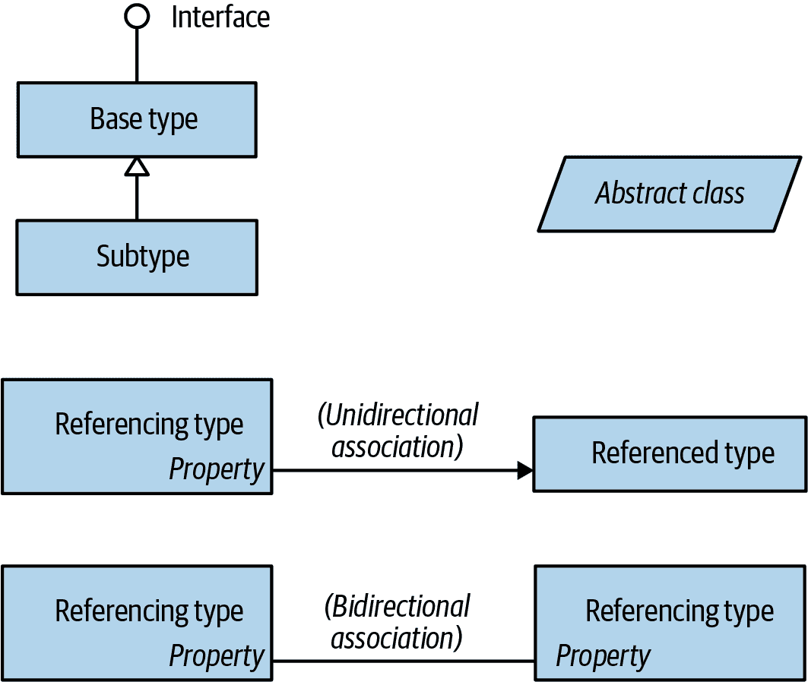

# 前言

C# 12 代表了微软旗舰编程语言的第九个重大更新，将 C#定位为一种具有非同寻常灵活性和广度的语言。一方面，它提供了高级抽象，如查询表达式和异步继续，而另一方面，它通过自定义值类型和可选指针等构造允许低级效率。

这种增长的代价是需要学习的内容比以往任何时候都多。尽管诸如微软的 IntelliSense 和在线参考等工具在帮助您处理工作中的问题方面非常出色，但它们假设您具备一定的概念知识图谱。本书正是以简洁统一的风格提供了这样一张知识地图——没有冗长的介绍和混乱的内容。

与过去七个版本一样，《C# 12 简明手册》围绕概念和用例组织，使其既适合顺序阅读，又适合随机浏览。它还深入到重要的深度，同时仅假设基本的背景知识，因此对中级和高级读者都很容易理解。

本书涵盖了 C#、公共语言运行时（CLR）以及.NET 8 基础类库（BCL）。我们选择这个重点，以便为难度较大和高级主题留出空间，而不影响深度或可读性。最近添加到 C#的功能已经标记，这样您也可以将本书作为 C# 11 和 C# 10 的参考。

# 目标读者

本书面向中高级读者。不需要事先了解 C#，但需要一些通用的编程经验。对于初学者，本书是编程教程风格介绍的补充，而非替代。

本书是任何专注于应用技术（如 ASP.NET Core 或 Windows Presentation Foundation（WPF））的大量图书的理想伴侣。《C# 12 简明手册》涵盖了这些书籍所忽略的语言和.NET 的领域，反之亦然。

如果您寻找一本涵盖每一个.NET 技术的书籍，那么这本书不适合您。如果您想要了解特定于移动设备开发的 API，则本书也不适合。

# 本书的组织结构

第二章到第四章完全集中于 C#，从语法、类型和变量的基础开始，到诸如不安全代码和预处理器指令等高级主题。如果您是这门语言的新手，应该按顺序阅读这些章节。

剩余章节专注于 .NET 8 的基础类库，涵盖语言集成查询（LINQ）、XML、集合、并发、I/O 和网络、内存管理、反射、动态编程、属性、加密和本地互操作性等主题。您可以随机阅读大多数章节，除了第 5 和第六章，这两章为后续主题奠定基础。最好按顺序阅读关于 LINQ 的三章，有些章节假设您具备一些并发知识，我们在 第十四章 中进行讨论。

# 使用本书所需条件

本书示例需要 .NET 8\. 您还会发现 Microsoft 的 .NET 文档对查找单个类型和成员（可在线访问）非常有用。

虽然可以在简单的文本编辑器中编写源代码，并从命令行构建程序，但使用 *代码临时记事本* 可以更快速地测试代码片段，再加上集成开发环境（IDE）可以更高效地生成可执行文件和库。

对于 Windows 代码临时记事本，请从 [*www.linqpad.net*](http://www.linqpad.net) 下载 LINQPad 8（免费）。LINQPad 完全支持 C# 12，并由作者维护。

对于 Windows IDE，请下载 *Visual Studio 2022*：任何版本都适用于本书教授的内容。对于跨平台 IDE，请下载 *Visual Studio Code*。

###### 注意事项

所有章节的代码清单均作为交互式（可编辑）LINQPad 示例提供。您可以一键下载所有示例：在左下角点击 LINQPad 的“Samples”选项卡，点击“Download more samples”，然后选择“C# 12 in a Nutshell”。

# 本书使用的约定

本书使用基本的 UML 符号来说明类型之间的关系，如 图 P-1 所示。倾斜的矩形表示抽象类；圆圈表示接口。带有空心三角形的线表示继承，三角形指向基类型。带有箭头的线表示单向关联；没有箭头的线表示双向关联。

###### 图 P-1\. 示例图

本书使用以下排版约定：

*斜体*

表示新术语、URI、文件名和目录

`等宽字体`

表示 C# 代码、关键字和标识符以及程序输出

`**等宽字体加粗**`

显示代码的突出部分

`*等宽字体斜体*`

显示应由用户提供值替换的文本

# 使用代码示例

补充材料（代码示例、练习等）可在 [*http://www.albahari.com/nutshell*](http://www.albahari.com/nutshell) 下载。

本书旨在帮助您完成工作。通常情况下，您可以在您的程序和文档中使用本书中的代码，无需联系我们获得许可。但如果您要复制本书的大部分代码，则需要许可。例如，编写一个使用本书中几个代码块的程序不需要许可。销售或分发 O’Reilly 图书的示例需要许可。引用本书并引用示例代码来回答问题不需要许可（尽管我们感谢署名）。将本书的大量示例代码整合到产品文档中需要许可。

我们欣赏，但通常不要求署名。署名通常包括标题、作者、出版商和 ISBN。例如：“*C# 12 in a Nutshell* by Joseph Albahari (O’Reilly)。Copyright 2024 Joseph Albahari, 978-1-098-14744-0.”

如果您认为您使用的代码示例超出了公平使用或这里给出的许可，请随时通过 permissions@oreilly.com 与我们联系。

# 如何联系我们

请将关于本书的评论和问题发送给出版商：

+   O’Reilly Media, Inc.

+   1005 Gravenstein Highway North

+   加利福尼亚州塞巴斯托波尔 95472

+   800-889-8969（美国或加拿大境内）

+   707-829-7019（国际或本地）

+   707-829-0104（传真）

+   *support@oreilly.com*

+   [*https://www.oreilly.com/about/contact.html*](https://www.oreilly.com/about/contact.html)

我们为本书设有网页，列出勘误、示例及其他信息。您可以访问[*https://oreil.ly/c-sharp-nutshell-12*](https://oreil.ly/c-sharp-nutshell-12)查看此页面。

代码清单和其他资源请参阅：

+   [*http://www.albahari.com/nutshell/*](http://www.albahari.com/nutshell/)

获取有关我们的图书和课程的新闻和信息，请访问[*https://oreilly.com*](https://oreilly.com)。

在 LinkedIn 上找到我们：[*https://linkedin.com/company/oreilly-media*](https://linkedin.com/company/oreilly-media)

在 Twitter 上关注我们：[*https://twitter.com/oreillymedia*](https://twitter.com/oreillymedia)

在 YouTube 上观看我们：[*https://youtube.com/oreillymedia*](https://youtube.com/oreillymedia)

# 致谢

## Joseph Albahari

自 2007 年首次问世以来，本书依赖于一些出色的技术审阅者的意见。对于他们在最近版本中的贡献，我特别感谢 Stephen Toub、Paulo Morgado、Fred Silberberg、Vitek Karas、Aaron Robinson、Jan Vorlicek、Sam Gentile、Rod Stephens、Jared Parsons、Matthew Groves、Dixin Yan、Lee Coward、Bonnie DeWitt、Wonseok Chae、Lori Lalonde 和 James Montemagno。

我特别感谢埃里克·利珀特（Eric Lippert）、乔恩·斯基特（Jon Skeet）、史蒂芬·托布（Stephen Toub）、尼古拉斯·帕尔迪诺（Nicholas Paldino）、克里斯·伯罗斯（Chris Burrows）、肖恩·法卡斯（Shawn Farkas）、布莱恩·格伦克迈耶（Brian Grunkemeyer）、莫妮·斯蒂芬斯（Maoni Stephens）、大卫·德温特（David DeWinter）、迈克·巴内特（Mike Barnett）、梅丽塔·安德森（Melitta Andersen）、米奇·韦特（Mitch Wheat）、布莱恩·皮克（Brian Peek）、克日什托夫·瓦利纳（Krzysztof Cwalina）、马特·沃伦（Matt Warren）、乔尔·波巴尔（Joel Pobar）、格林·格里菲斯（Glyn Griffiths）、伊昂·瓦西里安（Ion Vasilian）、布拉德·艾布拉姆斯（Brad Abrams）和亚当·内森（Adam Nathan）的早期贡献。

我感谢微软的许多技术审阅者都是杰出的个人，特别感谢你们花时间将本书提升到下一个质量水平。

我要感谢本·阿尔巴哈里（Ben Albahari）和埃里克·约翰森（Eric Johannsen），他们对之前版本有所贡献，以及 O'Reilly 团队，特别是我高效负责的编辑科尔宾·科林斯（Corbin Collins）。最后，我深深感谢我的美妙妻子李·阿尔巴哈里（Li Albahari），在整个项目期间她的存在使我保持愉快。
