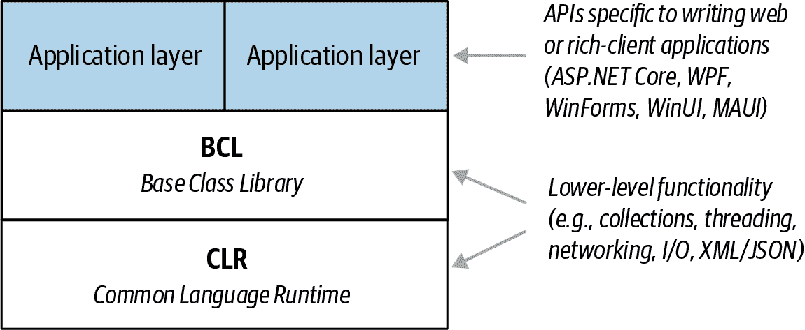
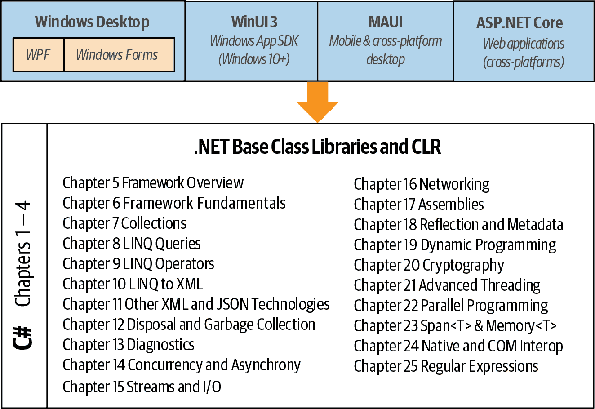

# 第一章：介绍 C#和.NET

C#是一种通用、类型安全的面向对象编程语言。语言的目标是提高程序员的生产力。为此，C#平衡了简单性、表达能力和性能。自从第一个版本以来，语言的首席架构师是 Anders Hejlsberg（Turbo Pascal 的创造者和 Delphi 的架构师）。C#语言是平台中立的，并与一系列特定于平台的运行时配合工作。

# 面向对象

C# 是面向对象范式的丰富实现，包括*封装*、*继承*和*多态*。封装意味着在*对象*周围创建一个边界，以分隔其外部（公共）行为和内部（私有）实现细节。以下是从面向对象的角度看 C#的独特特性：

统一类型系统

C# 中的基本构建块是一个称为*类型*的封装单元，其中所有类型最终都共享一个共同的基类型。这意味着所有类型，无论是代表业务对象还是诸如数字之类的基本类型，都共享相同的基本功能。例如，任何类型的实例都可以通过调用其`ToString`方法转换为字符串。

类和接口

在传统的面向对象范式中，类型的唯一种类是类。在 C#中，还有几种其他类型，其中一种是*接口*。接口类似于一个不能持有数据的类。这意味着它只能定义*行为*（而不是*状态*），这允许多重继承以及规范与实现的分离。

属性、方法和事件

在纯粹的面向对象范式中，所有函数都是*方法*。在 C#中，方法只是*函数成员*的一种，其中还包括*属性*和*事件*（还有其他类型）。属性是封装对象状态的一部分的函数成员，例如按钮的颜色或标签的文本。事件是简化对象状态更改处理的函数成员。

虽然 C# 主要是面向对象的语言，但它也借鉴了*函数式编程*范式，具体来说：

函数可以被视为值

使用*委托*，C#允许将函数作为值传递给其他函数，并从其他函数返回。

C# 支持纯度模式

函数式编程的核心是避免使用值会变化的变量，而是采用声明式模式。C#具有关键功能来帮助这些模式，包括能够即时编写“捕获”变量的未命名函数（*lambda 表达式*），以及通过*查询表达式*执行列表或响应式编程。C#还提供了*记录*，使得编写*不可变*（只读）类型变得更加容易。

# 类型安全

C#主要是一种*类型安全*的语言，意味着类型的实例只能通过它们定义的协议进行交互，从而确保每种类型的内部一致性。例如，C#会阻止你像操作*整数*类型一样操作*字符串*类型。

具体来说，C#支持*静态类型*，这意味着语言在*编译时*强制实施类型安全性。这是对运行时类型安全性的补充。

静态类型化甚至在程序运行之前就消除了大量错误。它将负担从运行时单元测试转移到编译器，以验证程序中所有类型的正确匹配。这使得大型程序更易管理，更可预测，更健壮。此外，静态类型化允许工具如 Visual Studio 中的智能感知帮助编程，因为它知道给定变量的类型，从而知道可以在该变量上调用哪些方法。此类工具还可以识别程序中使用变量、类型或方法的所有地方，从而支持可靠的重构。

###### 注意

C#还允许你的代码的部分通过`dynamic`关键字进行动态类型化。然而，C#仍然是一种主要静态类型的语言。

C# 也被称为*强类型语言*，因为其类型规则严格执行（无论是静态还是运行时）。例如，你不能用浮点数直接调用设计为接受整数的函数，除非你首先*显式*将浮点数转换为整数。这有助于防止错误。

# 内存管理

C#依赖运行时执行自动内存管理。公共语言运行时具有作为程序一部分执行的垃圾收集器，回收不再引用的对象的内存。这使得程序员无需显式地为对象释放内存，消除了在 C++等语言中遇到的指针错误问题。

C#并未消除指针：它仅使它们对大多数编程任务不必要。对于性能关键的热点和互操作性，可以在标记为`unsafe`的块中使用指针和显式内存分配。

# 平台支持

C#具有支持以下平台的运行时：

+   Windows 7+桌面（用于富客户端、Web、服务器和命令行应用程序）

+   macOS（用于 Web 和命令行应用程序，以及通过 Mac Catalyst 的富客户端应用程序）

+   Linux（用于 Web 和命令行应用程序）

+   Android 和 iOS（用于移动应用程序）

+   Windows 10 设备（Xbox、Surface Hub 和 HoloLens）通过 UWP

还有一种称为*Blazor*的技术，可以将 C#编译为在浏览器中运行的 WebAssembly。

# CLR、BCL 和运行时

C# 程序的运行时支持包括 *公共语言运行时* 和 *基础类库*。运行时还可以包括一个更高级的 *应用层*，其中包含用于开发富客户端、移动或 Web 应用程序的库（见 图 1-1）。存在不同的运行时以支持不同类型的应用程序和不同的平台。



###### 图 1-1\. 运行时架构

## 公共语言运行时

*公共语言运行时*（CLR）提供了自动内存管理和异常处理等重要的运行时服务。（“公共”一词指的是同一个运行时可以被其他*托管*编程语言共享，如 F#、Visual Basic 和 Managed C++。）

C# 被称为 *托管语言*，因为它将源代码编译为托管代码，这些代码以 *中间语言*（IL）表示。CLR 将 IL 转换为机器的本机代码，如 X64 或 X86，通常在执行前进行。这称为即时（JIT）编译。还可以提供预编译来改善大型程序集或资源受限设备的启动时间（以及在开发移动应用程序时满足 iOS 应用商店规则）。

托管代码的容器称为 *程序集*。一个程序集不仅包含 IL，还包含类型信息（*元数据*）。有了元数据，程序集可以引用其他程序集中的类型，而无需额外的文件。

###### 注意

使用 Microsoft 的 *ildasm* 工具可以检查和分解汇编内容。而使用 ILSpy 或 JetBrain 的 dotPeek 等工具，可以进一步反编译 IL 到 C#。因为 IL 比本机机器码更高级，所以反编译器可以相当好地重建原始的 C#。

程序可以查询其自身的元数据（*反射*），甚至在运行时生成新的 IL（*反射.emit*）。

## 基础类库

CLR 总是随附一组称为 *基础类库*（BCL）的程序集。BCL 为程序员提供核心功能，例如集合、输入/输出、文本处理、XML/JSON 处理、网络、加密、互操作、并发和并行编程。

BCL 还实现了 C# 语言本身需要的类型（例如枚举、查询、异步等功能），并允许您显式访问 CLR 的功能，如反射和内存管理。

## 运行时

*运行时*（也称为*框架*）是一个可部署的单元，您可以下载并安装。运行时包括一个 CLR（及其 BCL），以及一个特定于您正在编写的应用程序类型的可选的 *应用层* —— Web、移动、富客户端等。（如果您正在编写命令行控制台应用程序或非 UI 库，则不需要应用层。）

在编写应用程序时，您*针对*特定运行时，这意味着您的应用程序使用并依赖运行时提供的功能。您的运行时选择还决定了应用程序将支持哪些平台。

下表列出了主要的运行时选项：

| 应用层 | CLR/BCL | 程序类型 | 运行于... |  |
| --- | --- | --- | --- | --- |
| ASP.NET | .NET 8 | Web | Windows、Linux、macOS |  |
| Windows Desktop | .NET 8 | Windows | Windows 10+ |  |
| WinUI 3 | .NET 8 | Windows | Windows 10+ |
| MAUI | .NET 8 | 移动、桌面 | iOS、Android、macOS、Windows 10+ |  |
| .NET Framework | .NET Framework | Web, Windows | Windows 7+ |  |

图 1-2 在图形上显示了这些信息，同时也作为本书内容的指南。



###### 图 1-2\. C# 运行时

### .NET 8

.NET 8 是微软的旗舰开源运行时。您可以编写运行在 Windows、Linux 和 macOS 上的 Web 和控制台应用程序；运行在 Windows 10+ 和 macOS 上的富客户端应用程序；以及运行在 iOS 和 Android 上的移动应用程序。本书重点介绍 .NET 8 的 CLR 和 BCL。

与 .NET Framework 不同，.NET 8 未预装在 Windows 机器上。如果尝试在没有正确运行时的情况下运行 .NET 8 应用程序，将出现消息引导您访问网页下载运行时。您可以通过创建*自包含*部署来避免这种情况，该部署包括应用程序所需的运行时部分。

###### 注

.NET 的更新历史如下：.NET Core 1.x → .NET Core 2.x → .NET Core 3.x → .NET 5 → .NET 6 → .NET 7 → .NET 8\. 在 .NET Core 3 之后，Microsoft 删除了名称中的“Core”，并跳过了版本 4，以避免与* .NET Framework* 4.x 混淆，后者是所有前述运行时的先行版本但仍得到支持并广泛使用。

这意味着在 .NET Core 1.x → .NET 7 下编译的程序集在大多数情况下可以在 .NET 8 下运行而无需修改。相比之下，在任何版本的 .NET Framework 下编译的程序集通常与 .NET 8 不兼容。

### Windows 桌面和 WinUI 3

为了编写在 Windows 10 及更高版本上运行的富客户端应用程序，您可以选择经典的 Windows 桌面 API（Windows Forms 和 WPF）和 WinUI 3\. Windows 桌面 API 是 .NET 桌面运行时的一部分，而 WinUI 3 则属于*Windows 应用程序 SDK*（需要单独下载）。

经典的 Windows 桌面 API 自 2006 年以来存在，并且享有出色的第三方库支持，以及在诸如 StackOverflow 等网站上提供大量问题解答。*WinUI 3* 在 2022 年发布，旨在编写现代沉浸式应用程序，具备最新的 Windows 10+ 控件。它是*Universal Windows Platform*（UWP）的后继者。

### MAUI

*MAUI*（多平台应用程序 UI）主要设计用于创建 iOS 和 Android 的移动应用程序，尽管也可用于通过 Mac Catalyst 和 WinUI 3 在 macOS 和 Windows 上运行的桌面应用程序。MAUI 是 Xamarin 的演变，允许单个项目目标多个平台。

###### 注意

对于跨平台桌面应用程序，第三方库 Avalonia 提供了一个 MAUI 的替代方案。Avalonia 还可以在 Linux 上运行，结构比 MAUI 更简单（因为它在没有 Catalyst/WinUI 间接层的情况下运行）。Avalonia 的 API 类似于 WPF，并且还提供一个名为 XPF 的商业附加组件，几乎完全兼容 WPF。

### .NET Framework

*.NET Framework* 是微软最初仅限于 Windows 的运行时，用于编写运行于 Windows 桌面/服务器上的 Web 和丰富客户端应用程序。尽管没有计划推出主要新版本，但由于现有应用程序的丰富性，微软将继续支持和维护当前的 4.8 版本。

在.NET Framework 中，CLR/BCL 与应用程序层集成。在.NET 8 下重新编译.NET Framework 编写的应用程序通常需要一些修改。.NET Framework 的一些功能在.NET 8 中不存在（反之亦然）。

.NET Framework 与 Windows 预装，并通过 Windows 更新自动打补丁。当你的目标是.NET Framework 4.8 时，你可以使用 C# 7.3 及更早版本的功能。（你可以通过在项目文件中指定更高语言版本来覆盖此设置，这将解锁所有最新语言功能，除了需要新运行时支持的那些功能。）

###### 注意

单词“.NET”长期以来被用作涵盖包括“.NET”在内的任何技术的总称（.NET Framework、.NET Core、.NET Standard 等）。

这意味着微软将.NET Core 重命名为.NET，造成了不幸的歧义。在本书中，当出现歧义时，我们将把新的.NET 称为*.NET 5+*。为了指代.NET Core 及其后继版本，我们将使用短语“.NET Core 和.NET 5+”。

为增加混淆，.NET (5+) 是一个框架，但与*.NET Framework*截然不同。因此，在可能的情况下，我们将更倾向于使用术语*运行时*而非*框架*。

## 专用运行时

还有以下专用运行时：

+   Unity 是一个游戏开发平台，允许用 C#编写游戏逻辑。

+   *Universal Windows Platform*（UWP）旨在编写在 Windows 10+桌面和设备上运行的触摸优先应用程序，包括 Xbox、Surface Hub 和 HoloLens。UWP 应用程序是沙盒化的，并通过 Windows Store 发布。UWP 使用.NET Core 2.2 CLR/BCL 的一个版本，不太可能更新这种依赖关系；相反，微软建议用户切换到其现代替代品 WinUI 3。但由于 WinUI 3 仅支持 Windows 桌面，UWP 仍然在定位 Xbox、Surface Hub 和 HoloLens 时具有专用应用程序的市场。

+   .NET Micro Framework 用于在资源极为有限的嵌入式设备上运行 .NET 代码（不到一兆字节）。

在 SQL Server 中还可以运行托管代码。通过 SQL Server CLR 集成，你可以用 C# 编写自定义函数、存储过程和聚合函数，然后从 SQL 中调用它们。这与 .NET Framework 和一个特殊的“托管”CLR 结合使用，强制实施沙箱以保护 SQL Server 进程的完整性。

# C# 简史

下面是每个 C# 版本中新功能的逆时代顺序，以便读者了解老版本语言的好处。

## C# 12 中的新功能

C# 12 随 Visual Studio 2022 发布，并且当你的目标是 .NET 8 时使用。

### 集合表达式

而不是像下面这样初始化数组：

```cs
char[] vowels = {'a','e','i','o','u'};
```

现在可以使用方括号（一个 *集合表达式*）：

```cs
char[] vowels = ['a','e','i','o','u'];
```

集合表达式有两个主要优点。首先，相同的语法也适用于其他集合类型，例如列表和集合（甚至低级别的 span 类型）：

```cs
List<char> list         = ['a','e','i','o','u'];
HashSet<char> set       = ['a','e','i','o','u'];
ReadOnlySpan<char> span = ['a','e','i','o','u'];
```

第二，它们是 *目标类型推断*，这意味着在编译器可以推断出类型的其他情况下，可以省略类型，例如在调用方法时：

```cs
Foo (['a','e','i','o','u']);

void Foo (char[] letters) { ... }
```

更多详情请参见 “集合初始化器和集合表达式”。

### 类和结构体中的主要构造函数

从 C# 12 开始，你可以直接在类（或结构体）声明后包含一个参数列表：

```cs
class Person (string firstName, string lastName)
{
  public void Print() => Console.WriteLine (firstName + " " + lastName);
}
```

这指示编译器自动构建一个 *主要构造函数*，允许以下操作：

```cs
Person p = new Person ("Alice", "Jones");
p.Print();    // Alice Jones
```

这个特性自 C# 9 开始存在于记录（records）中——在那里它们的行为稍有不同。对于记录，编译器（默认情况下）为每个主要构造函数参数生成一个公共的只读属性。对于类和结构体来说并非如此；要达到相同的结果，必须显式定义这些属性：

```cs
class Person (string firstName, string lastName)
{
  public string FirstName { get; set; } = firstName;
  public string LastName { get; set; } = lastName;
}
```

主要构造函数在简单场景中运行良好。我们在 “主要构造函数（C# 12）” 中描述了它们的细微差别和限制。

### 默认的 Lambda 参数

就像普通方法可以定义带有默认值的参数一样：

```cs
void Print (string message = "") => Console.WriteLine (message);
```

因此，lambda 表达式也可以：

```cs
var print = (string message = "") => Console.WriteLine (message);

print ("Hello");
print ();
```

这个特性在诸如 ASP.NET Minimal API 等库中非常有用。

### 给任何类型取别名

C# 一直允许你通过 `using` 指令给一个简单或通用类型取别名：

```cs
using ListOfInt = System.Collections.Generic.List<int>;

var list = new ListOfInt();
```

从 C# 12 开始，这种方法也适用于其他类型，例如数组和元组：

```cs
using NumberList = double[];
using Point = (int X, int Y);

NumberList numbers = { 2.5, 3.5 };
Point p = (3, 4);
```

### 其他新特性

C# 12 还支持 *内联数组*，通过 `[System.Runtime.CompilerServices.InlineArray]` 属性。这允许在结构体中创建固定大小的数组而无需在不安全的上下文中进行，并且主要用于运行时 API 中。

## C# 11 中的新功能

C# 11 随 Visual Studio 2022 发布，并且当你的目标是 .NET 7 时默认使用。

### 原始字符串字面量

用三个或更多引号字符包裹字符串创建*原始字符串字面量*，它几乎可以包含任何字符序列，无需转义或重复：

```cs
string raw = """<file path="c:\temp\test.txt"></file>""";
```

原始字符串字面量可以是多行的，并且可以通过`$`前缀进行插值：

```cs
string multiLineRaw = $"""
  Line 1
  Line 2
  The date and time is {DateTime.Now}
  """;
```

在原始字符串字面量前使用两个（或更多）`$`字符可以改变插值序列，从单个大括号变为两个（或更多）大括号，允许你在字符串本身中包含大括号：

```cs
Console.WriteLine ($$"""{ "TimeStamp": "{{DateTime.Now}}" }""");
// Output: *{ "TimeStamp": "01/01/2024 12:13:25 PM" }*
```

我们在“原始字符串字面量（C# 11）”和“字符串插值”章节中涵盖了此功能的细微差别。

### UTF-8 字符串

使用`u8`后缀，你可以创建使用 UTF-8 编码而不是 UTF-16 编码的字符串字面量。此功能适用于高级场景，例如在性能热点中低级处理 JSON 文本：

```cs
ReadOnlySpan<byte> utf8 = "ab→cd"u8;  // Arrow symbol consumes 3 bytes
Console.WriteLine (utf8.Length);      // 7
```

底层类型是`ReadOnlySpan<byte>`（第二十三章），您可以通过调用其`ToArray()`方法将其转换为字节数组。

### 列表模式

列表模式匹配方括号中的一系列元素，并与任何可计数的集合类型一起使用（具有`Count`或`Length`属性以及`int`类型或`System.Index`类型的索引器）：

```cs
int[] numbers = { 0, 1, 2, 3, 4 };
Console.WriteLine (numbers is [0, 1, 2, 3, 4]);   // True
```

下划线匹配任意值的单个元素，而两个点匹配零个或多个元素（*切片*）：

```cs
Console.WriteLine (numbers is [_, 1, .., 4]);     // True
```

切片后可以跟随`var`模式—详见“列表模式”。

### 必需成员

将`required`修饰符应用于字段或属性会强制类或结构的使用者在构造时通过对象初始化器填充该成员：

```cs
Asset a1 = new Asset { Name = "House" };  // OK
Asset a2 = new Asset();                   // Error: will not compile!

class Asset { public required string Name; }
```

使用此功能，您可以避免编写具有长参数列表的构造函数，从而简化子类化。如果您希望编写构造函数，可以通过在其上应用`[SetsRequiredMembers]`属性来绕过该构造函数的必需成员限制—详见“必需成员（C# 11）”。

### 静态虚拟/抽象接口成员

从 C# 11 开始，接口可以将成员声明为`static virtual`或`static abstract`：

```cs
public interface IParsable<TSelf>
{
   static abstract TSelf Parse (string s);
}
```

这些成员在类或结构中以静态函数实现，并可以通过约束类型参数进行多态调用。

```cs
T ParseAny<T> (string s) where T : IParsable<T> => T.Parse (s);
```

运算符函数也可以声明为`static virtual`或`static abstract`。

更多细节，请参见“静态虚拟/抽象接口成员”和“静态多态性”。我们还描述了如何通过反射调用静态抽象成员的方法，详见“调用静态虚拟/抽象接口成员”。

### 泛型数学

`System.Numerics.INumber<TSelf>` 接口（在 .NET 7 中新增）统一了所有数值类型的算术操作，允许编写如下泛型方法：

```cs
T Sum<T> (T[] numbers) where T : INumber<T>
{
  T total = T.Zero;
  foreach (T n in numbers)
    total += n;      // Invokes addition operator for any numeric type
  return total;
}

int intSum = Sum (3, 5, 7);
double doubleSum = Sum (3.2, 5.3, 7.1);
decimal decimalSum = Sum (3.2m, 5.3m, 7.1m);
```

`INumber<TSelf>` 被所有实数和整数数字类型（以及`char`）实现，并包含多个接口，包括以下静态抽象操作符定义：

```cs
static abstract TResult operator + (TSelf left, TOther right);
```

我们在“多态运算符”和“通用数学”中进行了讨论。

### 其他新特性

具有`file`访问修饰符的类型只能从同一文件中访问，并且旨在在源生成器内使用：

```cs
file class Foo { ... }
```

C# 11 还引入了检查运算符（参见“检查运算符”），用于定义在`checked`块内调用的运算符函数（这是实现通用数学的完整实现所需的）。C# 11 还放宽了结构体构造函数中必须填充每个字段的要求（参见“结构构造语义”）。

此外，C# 11 在面向 .NET 7 或更高版本时增强了在运行时（32 或 64 位）匹配进程地址空间的`nint`和`nuint`本机大小整数类型，这些类型在 C# 9 中引入时与其底层运行时类型（`IntPtr` 和 `UIntPtr`）之间的编译时区别已经消失。详见“本机大小整数”以获取详细讨论。

## C# 10 中的新特性

C# 10 随 Visual Studio 2022 发布，并在目标 .NET 6 时使用。

### 文件范围命名空间

在常见情况下，文件中的所有类型都定义在单个命名空间中，C# 10 中的*文件范围命名空间*声明可以减少混乱并消除不必要的缩进级别：

```cs
namespace MyNamespace;  // Applies to everything that follows in the file.

class Class1 {}         // inside MyNamespace
class Class2 {}         // inside MyNamespace
```

### 全局 using 指令

当您在`using`指令前加上`global`关键字时，它会将该指令应用于项目中的所有文件：

```cs
global using System;
global using System.Collection.Generic;
```

这使您可以避免在每个文件中重复相同的指令。`global using` 指令与 `using static` 兼容。

此外，.NET 6 项目现在支持*隐式全局 using 指令*：如果项目文件中的`ImplicitUsings`元素设置为 true，则会自动导入最常用的命名空间（基于 SDK 项目类型）。详见“全局 using 指令”获取更多细节。

### 对于匿名类型的非破坏性突变

C# 9 引入了`with`关键字，用于对记录执行非破坏性突变。在 C# 10 中，`with`关键字也适用于匿名类型：

```cs
var a1 = new { A = 1, B = 2, C = 3, D = 4, E = 5 };
var a2 = a1 with { E = 10 }; 
Console.WriteLine (a2);      // { A = 1, B = 2, C = 3, D = 4, E = 10 }
```

### 新的解构语法

C# 7 引入了元组（或任何具有`Deconstruct`方法的类型）的解构语法。C# 10 深化了此语法，允许在同一解构中混合赋值和声明：

```cs
var point = (3, 4);
double x = 0;
(x, double y) = point;
```

### 结构中的字段初始化器和无参数构造函数

从 C# 10 开始，您可以在结构体中包含字段初始化程序和无参数构造函数（参见“结构体”）。这些仅在显式调用构造函数时执行，因此可以轻松地通过`default`关键字绕过。此功能主要为结构记录的利益而引入。

### 记录结构体

记录最早在 C# 9 中引入，作为增强编译类。在 C# 10 中，记录还可以是结构体：

```cs
record struct Point (int X, int Y);
```

否则规则相似：*记录结构体*与*类结构体*具有几乎相同的特性（参见“记录”）。唯一的例外是记录结构体上的编译器生成的属性是可写的，除非您在记录声明前加上`readonly`关键字。

### Lambda 表达式增强

对 lambda 表达式的语法进行了多方面增强。首先，允许隐式类型化（`var`）：

```cs
var greeter = () => "Hello, world";
```

lambda 表达式的隐式类型为`Action`或`Func`委托，在这种情况下，`greeter`的类型为`Func<string>`。必须明确声明任何参数类型：

```cs
var square = (int x) => x * x;
```

其次，lambda 表达式可以指定返回类型：

```cs
var sqr = int (int x) => x;
```

这主要是为了改善复杂嵌套 lambda 的编译器性能。

第三，您可以将 lambda 表达式传递给`object`、`Delegate`或`Expression`类型的方法参数：

```cs
M1 (() => "test");   // Implicitly typed to Func<string>
M2 (() => "test");   // Implicitly typed to Func<string>
M3 (() => "test");   // Implicitly typed to Expression<Func<string>>

void M1 (object x) {}
void M2 (Delegate x) {}
void M3 (Expression x) {}
```

最后，您可以将属性应用于 lambda 表达式的编译生成目标方法（以及其参数和返回值）：

```cs
Action a = [Description("test")] () => { };
```

参见“将属性应用于 Lambda 表达式”以获取更多详细信息。

### 嵌套属性模式

在 C# 10 中，可以使用以下简化的语法进行嵌套属性模式匹配（参见“属性模式”）：

```cs
var obj = new Uri ("https://www.linqpad.net");
if (obj is Uri { Scheme.Length: 5 }) ...
```

这相当于：

```cs
if (obj is Uri { Scheme: { Length: 5 }}) ...
```

### CallerArgumentExpression

将`[CallerArgumentExpression]`属性应用于方法参数，可以从调用站点捕获参数表达式：

```cs
Print (Math.PI * 2);

void Print (double number,
           [CallerArgumentExpression("number")] string expr = null)
  => Console.WriteLine (expr);

// Output: Math.PI * 2
```

此功能主要用于验证和断言库（参见“CallerArgumentExpression”）。

### 其他新功能

C# 10 中的`#line`指令已增强，允许指定列和范围。

C# 10 中的插值字符串可以是常量，只要插入的值是常量即可。

记录可以在 C# 10 中封闭`ToString()`方法。

C#的明确赋值分析已得到改进，使得以下表达式等均可工作：

```cs
if (foo?.TryParse ("123", out var number) ?? false)
  Console.WriteLine (number);
```

（在 C# 10 之前，编译器会生成错误：“使用未分配的局部变量‘number’。”）

## C# 9.0 中的新功能

C# 9.0 与*Visual Studio 2019*一同发布，并在您的目标为.NET 5 时使用。

### 顶级语句

通过*顶级语句*（参见“顶级语句”），您可以编写一个程序，而无需`Main`方法和`Program`类的包袱：

```cs
using System;
Console.WriteLine ("Hello, world");
```

顶层语句可以包含方法（作为本地方法）。您还可以通过“magic” `args` 变量访问命令行参数，并将值返回给调用者。顶层语句后面可以跟随类型和命名空间声明。

### 仅初始化的设置器

在属性声明中，*仅初始化的设置器*（见“仅初始化的设置器”）使用 `init` 关键字而不是 `set` 关键字：

```cs
class Foo { public int ID { get; init; } }
```

这表现得像一个只读属性，但也可以通过对象初始化程序进行设置：

```cs
var foo = new Foo { ID = 123 };
```

这使得可以创建可通过对象初始化程序而不是构造函数填充的不可变（只读）类型，并有助于避免接受大量可选参数的构造函数的反模式。仅初始化的设置器还允许在*记录*中使用时进行*非破坏性变异*。

### 记录

*记录*（见“记录”）是一种特殊类型的类，旨在与不可变数据很好地配合。其最特别的功能是通过新关键字(`with`)支持*非破坏性变异*：

```cs
Point p1 = new Point (2, 3);
Point p2 = p1 with { Y = 4 };   // p2 is a copy of p1, but with Y set to 4
Console.WriteLine (p2);         // Point { X = 2, Y = 4 }

record Point
{
  public Point (double x, double y) => (X, Y) = (x, y);

  public double X { get; init; }
  public double Y { get; init; }    
}
```

在简单情况下，记录还可以消除定义属性和编写构造函数和析构函数的样板代码。我们可以用以下方式替换我们的 `Point` 记录定义，而不会丧失功能：

```cs
record Point (double X, double Y);
```

像元组一样，默认情况下，记录展示结构相等性。记录可以子类化其他记录，并且可以包含类可以包含的相同结构。编译器在运行时将记录实现为类。

### 模式匹配改进

*关系模式*（见“模式”）允许在模式中出现 `<`, `>`, `<=`, 和 `>=` 操作符：

```cs
string GetWeightCategory (decimal bmi) => bmi switch {
  < 18.5m => "underweight",
  < 25m => "normal",
  < 30m => "overweight",
  _ => "obese" };
```

使用*模式组合器*，您可以通过三个新关键字(`and`, `or`, 和 `not`)组合模式：

```cs
bool IsVowel (char c) => c is 'a' or 'e' or 'i' or 'o' or 'u';

bool IsLetter (char c) => c is >= 'a' and <= 'z'
                            or >= 'A' and <= 'Z';
```

与 `&&` 和 `||` 操作符一样，`and` 的优先级高于 `or`。您可以用括号覆盖这一点。

`not` 组合器可以与*类型模式*一起使用，以测试对象是否为（非）类型：

```cs
if (obj is not string) ...
```

### 靶向类型的新表达式

在构造对象时，C# 9 允许您在编译器可以明确推断类型名称时省略类型名称：

```cs
System.Text.StringBuilder sb1 = new();
System.Text.StringBuilder sb2 = new ("Test");
```

当变量声明和初始化位于代码的不同部分时，这尤其有用：

```cs
class Foo
{
  System.Text.StringBuilder sb;
  public Foo (string initialValue) => sb = new (initialValue);
}
```

并且在以下场景中：

```cs
MyMethod (new ("test"));
void MyMethod (System.Text.StringBuilder sb) { ... }
```

更多信息，请参阅“靶向类型的新表达式”。

### 互操作性改进

C# 9 引入*函数指针*（见“函数指针”和“使用函数指针进行回调”）。它们的主要目的是允许非托管代码调用 C#中的静态方法，而无需委托实例的开销，并且可以绕过 P/Invoke 层，当参数和返回类型是*可直接传送*（在每一侧都表示相同）时。

C# 9 还引入了`nint`和`nuint`本机大小的整数类型（参见“本机大小的整数”），在运行时映射到`System.IntPtr`和`System.UIntPtr`。在编译时，它们表现得像支持算术运算的数值类型。

### 其他新特性

此外，C# 9 现在还允许你：

+   重写方法或只读属性，使其返回更派生的类型（参见“协变返回类型”）。

+   对本地函数应用属性（参见“属性”）。

+   对 lambda 表达式或本地函数应用`static`关键字，以确保不会意外捕获本地或实例变量（参见“静态 lambda”）。

+   通过编写`GetEnumerator`扩展方法，使任何类型与`foreach`语句一起工作。

+   定义*模块初始化器*方法，该方法在装配体首次加载时执行，通过在（静态无参数）方法上应用`[ModuleInitializer]`属性。

+   将“丢弃”（下划线符号）作为 lambda 表达式参数。

+   编写*扩展部分方法*，这些方法是强制实现的，可用于场景，如 Roslyn 的新*源生成器*（参见“扩展部分方法”）。

+   将属性应用于方法、类型或模块，以防止本地变量在运行时被初始化（参见[“[SkipLocalsInit]”](ch04.html#left_square_bracketskiplocalsinitright)）。

## C# 8.0 的新功能

C# 8.0 首次与*Visual Studio 2019*一起发布，并在今天仍在使用，当你的目标是.NET Core 3 或.NET Standard 2.1 时。

### 索引和范围

*索引和范围*简化了与数组的元素或部分（或底层类型`Span<T>`和`ReadOnlySpan<T>`）的工作。

索引允许你通过使用`^`运算符相对于数组的*末尾*引用元素。`¹`指的是最后一个元素，`²`指的是倒数第二个元素，依此类推：

```cs
char[] vowels = new char[] {'a','e','i','o','u'};
char lastElement  = vowels [¹];   // 'u'
char secondToLast = vowels [²];   // 'o'
```

范围允许你使用`..`运算符“切片”数组：

```cs
char[] firstTwo =  vowels [..2];    // 'a', 'e'
char[] lastThree = vowels [2..];    // 'i', 'o', 'u'
char[] middleOne = vowels [2..3]    // 'i'
char[] lastTwo =   vowels [²..];   // 'o', 'u'
```

C#通过`Index`和`Range`类型实现索引和范围：

```cs
Index last = ¹;
Range firstTwoRange = 0..2;
char[] firstTwo = vowels [firstTwoRange];   // 'a', 'e'
```

你可以通过定义带有`Index`或`Range`参数类型的索引器来支持你自己的类：

```cs
class Sentence
{
  string[] words = "The quick brown fox".Split();

  public string this   [Index index] => words [index];
  public string[] this [Range range] => words [range];
}
```

欲了解更多信息，请参见“索引和范围”。

### 空值合并赋值

`??=`运算符仅在变量为 null 时才分配变量。而不是

```cs
if (s == null) s = "Hello, world";
```

现在你可以这样写：

```cs
s ??= "Hello, world";
```

### 使用声明

如果省略`using`语句后的括号和语句块，则成为*using 声明*。当执行超出*封闭*语句块时，资源将被释放：

```cs
if (File.Exists ("file.txt"))
{
  using var reader = File.OpenText ("file.txt");
  Console.WriteLine (reader.ReadLine());
  ...
}
```

在这种情况下，当执行超出`if`语句块时，`reader`将被释放。

### 只读成员

C# 8 允许你对结构体的*函数*应用`readonly`修饰符，确保如果函数试图修改任何字段，则会生成编译时错误：

```cs
struct Point
{
  public int X, Y;
  public readonly void ResetX() => X = 0;  // Error!
}
```

如果 `readonly` 函数调用非 `readonly` 函数，则编译器会生成警告（并防御性地复制结构体以避免可能的突变）。

### 静态局部方法

将 `static` 修饰符添加到局部方法可以防止其访问封闭方法的局部变量和参数。这有助于减少耦合，并使局部方法能够随意声明变量，而无需担心与包含方法中的变量冲突。

### 默认接口成员

在 C# 8 中，您可以为接口成员添加默认实现，从而使得实现变为可选：

```cs
interface ILogger
{
  void Log (string text) => Console.WriteLine (text);
}
```

这意味着您可以向接口添加成员而不会破坏现有实现。必须显式通过接口调用默认实现：

```cs
((ILogger)new Logger()).Log ("message");
```

接口还可以定义静态成员（包括字段），可以从默认实现内部的代码中访问：

```cs
interface ILogger
{
  void Log (string text) => Console.WriteLine (Prefix + text);
  static string Prefix = ""; 
}
```

或者从接口外部，除非在静态接口成员上通过可访问性修饰符（如 `private`、`protected` 或 `internal`）进行限制：

```cs
ILogger.Prefix = "File log: ";
```

实例字段是被禁止的。更多细节，请参见 “默认接口成员”。

### Switch 表达式

自 C# 8 开始，您可以在 *表达式* 上下文中使用 `switch`：

```cs
string cardName = cardNumber switch    // assuming cardNumber is an int
{
  13 => "King",
  12 => "Queen",
  11 => "Jack",
  _ => "Pip card"   // equivalent to 'default'
};
```

更多示例，请参见 “Switch 表达式”。

### 元组、位置和属性模式

C# 8 支持三种新模式，主要用于增强 `switch` 语句/表达式的功能（请参见 “模式”）。*元组模式* 允许您在多个值上进行 `switch`：

```cs
int cardNumber = 12; string suite = "spades";
string cardName = (cardNumber, suite) switch
{
  (13, "spades") => "King of spades",
  (13, "clubs") => "King of clubs",
  ...
};
```

*位置模式* 允许为公开解构器的对象使用类似的语法，*属性模式* 允许您匹配对象的属性。您可以在 `switch` 和 `is` 运算符中同时使用所有模式。以下示例使用 *属性模式* 来测试 `obj` 是否为具有长度为 4 的字符串：

```cs
if (obj is string { Length:4 }) ...
```

### 可空引用类型

而 *可空值类型* 将 nullability 带给值类型，*可空引用类型* 则相反，并为引用类型带来（某种程度的）*非空值性*，旨在帮助避免 `NullReferenceException`。可空引用类型通过编译器纯粹形式的警告或错误引入了一定的安全级别，用于检测代码是否有可能生成 `NullReferenceException`。

可空引用类型可以在项目级别启用（通过 *.csproj* 项目文件中的 `Nullable` 元素）或在代码中启用（通过 `#nullable` 指令）。启用后，编译器将非空值性设置为默认值：如果要使引用类型接受 null 值，必须应用 `?` 后缀以指示 *可空引用类型*：

```cs
#nullable enable    // Enable nullable reference types from this point on

string s1 = null;   // Generates a compiler warning! (s1 is non-nullable)
string? s2 = null;  // OK: s2 is *nullable reference type*
```

如果类型未标记为可为空，未初始化的字段会生成警告，还有可能发生 `NullReferenceException` 的可空引用类型解引用也会如此：

```cs
void Foo (string? s) => Console.Write (s.Length);  // Warning (.Length)
```

要消除警告，您可以使用 *null-forgiving operator* (`!`)：

```cs
void Foo (string? s) => Console.Write (s!.Length);
```

有关全面讨论，请参见“可为空引用类型”。

### 异步流

之前的 C# 8 中，你可以使用`yield return`来编写*迭代器*，或者使用`await`来编写*异步函数*。但不能既编写迭代器又编写等待的异步函数。C# 8 通过引入*异步流*来解决这个问题：

```cs
async IAsyncEnumerable<int> RangeAsync (
  int start, int count, int delay)
{
  for (int i = start; i < start + count; i++)
  {
    await Task.Delay (delay);
    yield return i;
  }
}
```

`await foreach`语句消耗一个异步流：

```cs
await foreach (var number in RangeAsync (0, 10, 100))
  Console.WriteLine (number);
```

更多信息，请参见“异步流”。

## C# 7.x 新功能概述

C# 7.x 首次发布时可以在 Visual Studio 2017 中使用。C# 7.3 仍然被 Visual Studio 2019 使用，当您针对.NET Core 2、.NET Framework 4.6 到 4.8 或.NET Standard 2.0 进行定位时。

### C# 7.3

C# 7.3 对现有功能进行了微小的改进，例如使得可以在元组上使用等值运算符，改进的重载解析以及能够将属性应用于自动属性的支持：

```cs
[field:NonSerialized]
public int MyProperty { get; set; }
```

C# 7.3 还基于 C# 7.2 的高级低分配编程特性，具备重新分配*引用局部变量*的能力，不需要在索引`fixed`字段时固定内存，以及使用`stackalloc`支持字段初始化：

```cs
int* pointer  = stackalloc int[] {1, 2, 3};
Span<int> arr = stackalloc []    {1, 2, 3};
```

注意，栈分配的内存可以直接分配给一个`Span<T>`。我们在第二十三章中描述了 Span 及其用途。

### C# 7.2

C# 7.2 增加了一个新的`private protected`修饰符（`internal`和`protected`的交集），以及在调用方法时跟随命名参数使用位置参数的能力，以及`readonly`结构。`readonly`结构强制所有字段为`readonly`，以帮助声明意图，并允许编译器更大的优化自由度：

```cs
readonly struct Point
{
  public readonly int X, Y;   // X and Y must be readonly
}
```

C# 7.2 还增加了专门的功能，以帮助进行微优化和低分配编程：请参见“in 修饰符”、“引用局部变量”、“引用返回”和“引用结构”。

### C# 7.1

从 C# 7.1 开始，当使用`default`关键字时，如果类型可以被推断，你可以省略类型：

```cs
decimal number = default;   // number is decimal
```

C# 7.1 还放宽了 switch 语句的规则（使得你可以在泛型类型参数上模式匹配），允许程序的`Main`方法是异步的，并允许推断元组元素的名称：

```cs
var now = DateTime.Now;
var tuple = (now.Hour, now.Minute, now.Second);
```

### 数字文字改进

C# 7 中的数字文字可以包括下划线，以提高可读性。这些被称为*数字分隔符*，在编译器中会被忽略：

```cs
int million = 1_000_000;
```

*二进制文字*可以使用`0b`前缀指定：

```cs
var b = 0b1010_1011_1100_1101_1110_1111;
```

### 出参变量和丢弃

C# 7 使得调用包含`out`参数的方法变得更简单。首先，你现在可以在不声明*out 变量的情况下快速创建*out 变量（请参见“out 变量和丢弃”）：

```cs
bool successful = int.TryParse ("123", out int result);
Console.WriteLine (result);
```

当调用具有多个`out`参数的方法时，你可以用下划线字符丢弃不感兴趣的参数：

```cs
SomeBigMethod (out _, out _, out _, out int x, out _, out _, out _);
Console.WriteLine (x);
```

### 类型模式和模式变量

您还可以使用`is`运算符即时引入变量。这些称为*模式变量*（参见“引入模式变量”）：

```cs
void Foo (object x)
{
  if (x is string s)
    Console.WriteLine (s.Length);
}
```

`switch`语句还支持类型模式，因此你可以根据*类型*以及常量进行切换（参见“类型切换”）。你可以使用`when`子句指定条件，并在`null`值上进行切换：

```cs
switch (x)
{
  case int i:
    Console.WriteLine ("It's an int!");
    break;
  case string s:
    Console.WriteLine (s.Length);    // We can use the s variable
    break;
  case bool b when b == true:        // Matches only when b is true
    Console.WriteLine ("True");
    break;
  case null:
    Console.WriteLine ("Nothing");
    break;
}
```

### 局部方法

*局部方法*是在另一个函数内声明的方法（参见“局部方法”）：

```cs
void WriteCubes()
{
  Console.WriteLine (Cube (3));
  Console.WriteLine (Cube (4));
  Console.WriteLine (Cube (5));

  int Cube (int value) => value * value * value;
}
```

局部方法仅对包含函数可见，并且可以像 lambda 表达式一样捕获局部变量。

### 更多的表达式主体成员

C# 6 引入了方法、只读属性、运算符和索引器的表达式主体“胖箭头”语法。C# 7 将其扩展到构造函数、读写属性和终结器：

```cs
public class Person
{
  string name;

  public Person (string name) => Name = name;

  public string Name
  {
    get => name;
    set => name = value ?? "";
  }

  ~Person () => Console.WriteLine ("finalize");
}
```

### 解构函数

C# 7 引入了*解构*模式（参见“解构函数”）。构造函数通常接受一组值（作为参数）并将它们分配给字段，而*解构*则相反，将字段分配回一组变量。我们可以为前面示例中的`Person`类编写如下的解构函数（除了异常处理）：

```cs
public void Deconstruct (out string firstName, out string lastName)
{
  int spacePos = name.IndexOf (' ');
  firstName = name.Substring (0, spacePos);
  lastName = name.Substring (spacePos + 1);
}
```

解构函数使用以下特殊语法调用：

```cs
var joe = new Person ("Joe Bloggs");
var (first, last) = joe;          // Deconstruction
Console.WriteLine (first);        // Joe
Console.WriteLine (last);         // Bloggs
```

### 元组

可能是 C# 7 最显著的改进是对显式*tuple*支持（参见“元组”）。元组提供了一种简单的方式来存储一组相关的值：

```cs
var bob = ("Bob", 23);
Console.WriteLine (bob.Item1);   // Bob
Console.WriteLine (bob.Item2);   // 23
```

C#的新元组是使用`System.ValueTuple<…>`泛型结构的语法糖。但由于编译器的魔法，元组元素可以被命名：

```cs
var tuple = (name:"Bob", age:23);
Console.WriteLine (tuple.name);     // Bob
Console.WriteLine (tuple.age);      // 23
```

使用元组，函数可以返回多个值，而无需使用`out`参数或额外的类型包装：

```cs
static (int row, int column) GetFilePosition() => (3, 10);

static void Main()
{
  var pos = GetFilePosition();
  Console.WriteLine (pos.row);      // 3
  Console.WriteLine (pos.column);   // 10
}
```

元组隐式支持解构模式，因此你可以轻松地将它们*解构*为单独的变量：

```cs
static void Main()
{
  (int row, int column) = GetFilePosition();   // Creates 2 local variables
  Console.WriteLine (row);      // 3 
  Console.WriteLine (column);   // 10
}
```

### throw 表达式

在 C# 7 之前，`throw`始终是一个语句。现在它也可以出现在表达式主体的函数中作为一个表达式：

```cs
public string Foo() => throw new NotImplementedException();
```

`throw`表达式也可以出现在三元条件表达式中：

```cs
string Capitalize (string value) =>
  value == null ? throw new ArgumentException ("value") :
  value == "" ? "" :
  char.ToUpper (value[0]) + value.Substring (1);
```

## C# 6.0 新特性

C# 6.0 随*Visual Studio 2015*一同发布，具有新一代完全用 C#编写的编译器。被称为项目“Roslyn”的新编译器通过库公开了整个编译流水线，允许您对任意源代码执行代码分析。编译器本身是开源的，源代码位于[*https://github.com/dotnet/roslyn*](https://github.com/dotnet/roslyn)。

此外，C# 6.0 还引入了几个次要但重要的增强功能，主要旨在减少代码混乱。

*空值条件* (“Elvis”) 运算符 (见 “空值运算符”) 避免在调用方法或访问类型成员之前显式检查 null。在下面的例子中，`result` 评估为 null 而不是抛出 `NullReferenceException`：

```cs
System.Text.StringBuilder sb = null;
string result = sb?.ToString();      // result is null
```

*表达式体函数* (见 “方法”) 允许将由单个表达式组成的方法、属性、运算符和索引器以更简洁的方式编写，类似于 lambda 表达式的风格：

```cs
public int TimesTwo (int x) => x * 2;
public string SomeProperty => "Property value";
```

*属性初始化器* (第三章) 允许您为自动属性分配初始值：

```cs
public DateTime TimeCreated { get; set; } = DateTime.Now;
```

初始化属性也可以是只读的：

```cs
public DateTime TimeCreated { get; } = DateTime.Now;
```

只读属性也可以在构造函数中设置，这样更容易创建不可变（只读）类型。

*索引初始化器* (第四章) 允许对任何公开索引器的类型进行单步初始化：

```cs
var dict = new Dictionary<int,string>()
{
  [3] = "three",
  [10] = "ten"
};
```

*字符串插值* (见 “字符串类型”) 提供了 `string.Format` 的简洁替代方法：

```cs
string s = $"It is {DateTime.Now.DayOfWeek} today";
```

*异常过滤器* (见 “try 语句和异常”) 允许您对 catch 块应用条件：

```cs
string html;
try
{
  html = await new HttpClient().GetStringAsync ("http://asef");
}
catch (WebException ex) when (ex.Status == WebExceptionStatus.Timeout)
{
  ...
}
```

`using static` (见 “命名空间”) 指令允许您导入类型的所有静态成员，以便可以不加限定地使用这些成员：

```cs
using static System.Console;
...
WriteLine ("Hello, world");  // WriteLine instead of Console.WriteLine
```

`nameof` (第三章) 运算符返回变量、类型或其他符号的名称作为字符串。这样可以避免在 Visual Studio 中重命名符号时破坏代码：

```cs
int capacity = 123;
string x = nameof (capacity);   // x is "capacity"
string y = nameof (Uri.Host);   // y is "Host"
```

最后，您现在可以在 `catch` 和 `finally` 块内部使用 `await`。

## C# 5.0 新特性

C# 5.0 的主要新功能是通过两个新关键字 `async` 和 `await` 支持 *异步函数*。异步函数使 *异步继续* 更容易编写响应式和线程安全的富客户端应用程序。它们还使编写高并发和高效的 I/O 绑定应用程序变得轻松，而不会占用每个操作的线程资源。我们在 第十四章 中详细介绍了异步函数。

## C# 4.0 新特性

C# 4.0 引入了四个重大改进：

*动态绑定* (第 4 和 19 章节) 将 *绑定* —— 解析类型和成员的过程 —— 从编译时延迟到运行时，并且在需要复杂反射代码的场景下非常有用。动态绑定在与动态语言和 COM 组件互操作时也非常有用。

*可选参数* (第二章) 允许函数指定默认参数值，以便调用者可以省略参数，并且 *命名参数* 允许函数调用者通过名称而非位置标识参数。

在 C# 4.0 中放宽了*类型变异*规则（第 3 和 4 章），使得泛型接口和泛型委托中的类型参数可以标记为*协变*或*逆变*，从而允许更自然的类型转换。

*COM 互操作性*（第二十四章）在 C# 4.0 中通过三种方式进行了增强。首先，参数可以在不使用 `ref` 关键字的情况下按引用传递（特别在与可选参数结合时非常有用）。其次，包含 COM 互操作类型的程序集可以进行*链接*而不是*引用*。链接的互操作类型支持类型等价性，避免了对*主互操作程序集*的需求，从而消除了版本控制和部署问题的头痛。第三，从链接的互操作类型返回 COM 变体类型的函数被映射为 `dynamic` 而不是 `object`，消除了类型转换的需求。

## C# 3.0 中的新特性

添加到 C# 3.0 的特性主要集中在*语言集成查询*（LINQ）功能上。LINQ 允许直接在 C# 程序中编写查询，并在*静态*上下文中检查其正确性，可以查询本地集合（如列表或 XML 文档）或远程数据源（如数据库）。支持 LINQ 的 C# 3.0 特性包括隐式类型本地变量、匿名类型、对象初始化程序、Lambda 表达式、扩展方法、查询表达式和表达式树。

*隐式类型本地变量*（`var` 关键字，第二章）允许您在声明语句中省略变量类型，让编译器推断类型。这不仅减少了冗余，还允许*匿名类型*（第四章），这是在最终 LINQ 查询输出中常用的简单类。您还可以隐式类型化数组（第二章）。

*对象初始化程序*（第三章）通过允许您在构造函数调用后内联设置属性来简化对象构建。对象初始化程序适用于命名类型和匿名类型。

*Lambda 表达式*（第四章）是编译器即时创建的迷你函数；它们在“流畅”的 LINQ 查询中尤其有用（第八章）。

*扩展方法*（第四章）通过向现有类型添加新方法（而不更改类型的定义）来扩展类型，使静态方法感觉像实例方法。LINQ 的查询操作符就是以扩展方法实现的。

*查询表达式*（第八章）提供了一种更高级的语法，用于编写 LINQ 查询，当处理多个序列或范围变量时可以大幅简化操作。

*表达式树*（第八章）是描述分配给特殊类型`Expression<TDelegate>`的 lambda 表达式的迷你代码文档对象模型（DOM）。表达式树使得 LINQ 查询可以在远程执行（例如在数据库服务器上），因为它们可以在运行时进行内省和翻译（例如转换成 SQL 语句）。

C# 3.0 还添加了自动属性和部分方法。

*自动属性*（第三章）减少了编写仅`get`/`set`私有后备字段的属性所需的工作量，编译器会自动完成这些工作。*部分方法*（第三章）允许自动生成的部分类为手动编写提供可定制的钩子，如果未使用则会自动“消失”。

## C# 2.0 的新特性

C# 2 中的重要新功能包括泛型（第三章）、可空值类型（第四章）、迭代器（第四章）和匿名方法（lambda 表达式的前身）。这些功能为 C# 3 中 LINQ 的引入铺平了道路。

C# 2 还增加了对部分类、静态类以及一系列较小和杂项功能的支持，如命名空间别名限定符、友元程序集和固定大小缓冲区。

泛型的引入要求一个新的 CLR（CLR 2.0），因为泛型在运行时保持完整的类型保真度。
