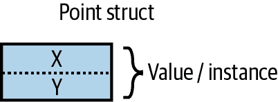
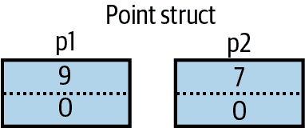
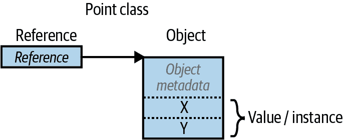
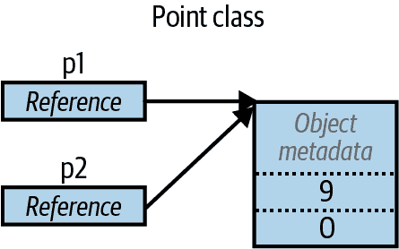

# 第二章 C#语言基础

在本章中，我们介绍了 C#语言的基础知识。

###### 注意

本书中的几乎所有代码清单都可以在 LINQPad 中作为交互式示例使用。通过与书籍一起使用这些示例，可以加速学习，因为您可以编辑示例并立即查看结果，而不需要在 Visual Studio 中设置项目和解决方案。

要下载示例，请在 LINQPad 中点击“示例”选项卡，然后点击“下载更多示例”。LINQPad 是免费的—请访问 [`*www.linqpad.net*`](http://www.linqpad.net)。

# 第一个 C#程序

以下是一个程序，它将 12 乘以 30 并将结果 360 打印到屏幕上。双斜杠表示行的余下部分是一个 *注释*：

```cs
int x = 12 * 30;                  // Statement 1
System.Console.WriteLine (x);     // Statement 2
```

我们的程序由两个 *语句* 组成。C# 中的语句按顺序执行，并以分号结束。第一个语句计算 *表达式* `12 * 30` 并将结果存储在一个名为 `x` 的 *变量* 中，其类型为 32 位整数（`int`）。第二个语句调用名为 `WriteLine` 的 *方法*，在名为 `Console` 的 *类* 上调用，该类在名为 `System` 的 *命名空间* 中定义。这将把变量 `x` 打印到屏幕上的文本窗口中。

一个方法执行一个功能；一个类将功能成员和数据成员组合起来形成一个面向对象的构建块。`Console`类组合了处理命令行输入/输出（I/O）功能的成员，比如`WriteLine`方法。类是一种 *类型*，我们在 “类型基础” 中进行讨论。

在最外层级别，类型被组织成 *命名空间*。许多常用的类型—包括 `Console` 类—位于 `System` 命名空间中。.NET 库被组织成嵌套的命名空间。例如，`System.Text` 命名空间包含用于处理文本的类型，而 `System.IO` 包含用于输入/输出的类型。

在每次使用时用 `System` 命名空间限定 `Console` 类会增加混乱。`using` 指令允许您通过 *导入* 命名空间来避免此混乱：

```cs
using System;             // Import the System namespace

int x = 12 * 30;
Console.WriteLine (x);    // No need to specify System.
```

代码重用的一种基本形式是编写调用低级函数的高级函数。我们可以使用可重用的 *方法* `FeetToInches` 重构我们的程序，该方法将整数乘以 12，如下所示：

```cs
using System;

Console.WriteLine (FeetToInches (30));      // 360
Console.WriteLine (FeetToInches (100));     // 1200

int FeetToInches (int feet)
{
  int inches = feet * 12;
  return inches;
}
```

我们的方法包含一系列语句，这些语句被一对大括号包围。这被称为 *语句块*。

方法可以通过指定 *参数* 从调用者那里接收 *输入* 数据，并通过指定 *返回类型* 将 *输出* 数据返回给调用者。我们的 `FeetToInches` 方法有一个用于输入英尺的参数，以及一个用于输出英寸的返回类型：

```cs
int FeetToInches (int feet)
...
```

*字面量* `30` 和 `100` 是传递给`FeetToInches`方法的 *参数*。

如果一个方法不接收输入，使用空括号。如果它不返回任何内容，使用`void`关键字：

```cs
using System;
SayHello();

void SayHello()
{
  Console.WriteLine ("Hello, world");
}
```

方法是 C# 中几种函数的一种。我们在示例程序中使用的另一种函数是执行乘法的 `*` *运算符*。还有 *构造函数*、*属性*、*事件*、*索引器* 和 *终结器*。

## 编译

C# 编译器将源代码（具有 *.cs* 扩展名的一组文件）编译成一个 *程序集*。程序集是 .NET 中的打包和部署单元。程序集可以是 *应用程序* 或 *库*。普通的控制台或 Windows 应用程序有一个 *入口点*，而库则没有。库的目的是被应用程序或其他库调用（*引用*）。.NET 本身是一组库（以及运行时环境）。

前面部分的每个程序直接以一系列语句（称为 *顶级语句*）开始。顶级语句的存在隐含地创建了一个控制台或 Windows 应用程序的入口点。（没有顶级语句时，*Main 方法* 表示应用程序的入口点，请参阅 “自定义类型”。）

###### 注意

不同于 .NET Framework，.NET 8 程序集从不使用 *.exe* 扩展名。在构建 .NET 8 应用程序后看到的 *.exe* 是一个特定于平台的本机加载器，负责启动您的应用程序的 *.dll* 程序集。

.NET 8 还允许您创建自包含部署，其中包括加载器、您的程序集以及所需的 .NET 运行时部分，全部打包在单个 *.exe* 文件中。.NET 8 还支持提前（AOT）编译，可使可执行文件包含预编译的本机代码，从而加快启动速度并减少内存消耗。

`dotnet` 工具（在 Windows 上为 *dotnet.exe*）可帮助您从命令行管理 .NET 源代码和二进制文件。您可以使用它来构建和运行程序，作为使用集成开发环境（如 Visual Studio 或 Visual Studio Code）的替代方案。

您可以通过安装 .NET 8 SDK 或安装 Visual Studio 来获取 `dotnet` 工具。它在 Windows 上的默认位置为 *%ProgramFiles%\dotnet*，在 Ubuntu Linux 上为 */usr/bin/dotnet*。

要编译一个应用程序，`dotnet` 工具需要一个 *项目文件* 以及一个或多个 C# 文件。以下命令创建一个新的控制台项目（创建其基本结构）：

```cs
dotnet new Console -n MyFirstProgram
```

这将创建一个名为 *MyFirstProgram* 的子文件夹，其中包含一个名为 *MyFirstProgram.csproj* 的项目文件和一个名为 *Program.cs* 的 C# 文件，该文件打印出“Hello world”。

要从 *MyFirstProgram* 文件夹构建和运行程序，请运行以下命令：

```cs
dotnet run MyFirstProgram
```

或者，如果您只想构建而不运行：

```cs
dotnet build MyFirstProgram.csproj
```

输出的程序集将被写入到 *bin\debug* 子目录下。

我们在 第十七章 中详细解释了程序集。

# 语法

C# 语法受到 C 和 C++ 语法的启发。在本节中，我们使用以下程序描述了 C# 的语法元素：

```cs
using System;

int x = 12 * 30;
Console.WriteLine (x);
```

## 标识符和关键字

*标识符*是程序员为类、方法、变量等选择的名称。以下是我们示例程序中的标识符，按照它们出现的顺序列出：

```cs
System   x   Console   WriteLine
```

标识符必须是一个完整的词，基本上由以字母或下划线开头的 Unicode 字符组成。C#标识符区分大小写。按照惯例，参数、局部变量和私有字段应该使用*驼峰命名法*（例如，`myVariable`），而其他所有标识符应该使用*帕斯卡命名法*（例如，`MyMethod`）。

*关键字*是编译器特殊意义的名称。在我们的示例程序中有两个关键字：`using`和`int`。

大多数关键字是*保留字*，这意味着你不能将它们用作标识符。以下是 C#保留关键字的完整列表：

| `abstract` `as`

`base`

`bool`

`break`

`byte`

`case`

`catch`

`char`

`checked`

`class`

`const`

`continue`

`decimal`

`default`

`delegate` | `do` `double`

`else`

`enum`

`event`

`explicit`

`extern`

`false`

`finally`

`fixed`

`float`

`for`

`foreach`

`goto`

`if`

`implicit` | `in` `int`

`interface`

`internal`

`is`

`lock`

`long`

`namespace`

`new`

`null`

`object`

`operator`

`out`

`override`

`params`

`private` | `protected` `public`

`readonly`

`record`

`ref`

`return`

`sbyte`

`sealed`

`short`

`sizeof`

`stackalloc`

`static`

`string`

`struct`

`switch`

`this` | `throw` `true`

`try`

`typeof`

`uint`

`ulong`

`unchecked`

`unsafe`

`ushort`

`using`

`virtual`

`void`

`volatile`

`while` |

如果你确实想要使用与保留关键字冲突的标识符，可以通过使用`@`前缀来完成。例如：

```cs
int using = 123;      // Illegal
int @using = 123;     // Legal
```

`@`符号本身不属于标识符的一部分。因此，`@myVariable`与`myVariable`是相同的。

### 上下文关键字

一些关键字是*上下文相关*的，这意味着你也可以将它们作为标识符使用，无需使用`@`符号：

| `add` `alias`

`and`

`ascending`

`async`

`await`

`by`

`descending` | `dynamic` `equals`

`file`

`from`

`get`

`global`

`group`

`init` | `into` `join`

`let`

`managed`

`nameof`

`nint`

`not`

`notnull` | `nuint` `on`

`or`

`orderby`

`partial`

`remove`

`required`

`select` | `set` `unmanaged`

`value`

`var`

`with`

`when`

`where`

`yield` |

在使用上下文关键字的上下文中，不会产生歧义。

## 字面量、标点符号和运算符

*字面量*是程序中词法嵌入的原始数据片段。在我们的示例程序中使用的字面量包括`12`和`30`。

*标点符号*有助于标明程序的结构。例如，分号用于结束语句。语句可以跨多行：

```cs
Console.WriteLine
  (1 + 2 + 3 + 4 + 5 + 6 + 7 + 8 + 9 + 10);
```

*运算符*可以转换和组合表达式。C#中大多数运算符用符号表示，比如乘法运算符`*`。我们在示例程序中使用的运算符如下：

```cs
=  *  .  ()
```

句点表示某物的成员（或数字文字中的小数点）。在声明或调用方法时使用括号；当方法不接受参数时使用空括号。（括号还有其他目的，稍后在本章中你会看到。）等号执行*赋值*。（双等号 `==` 执行相等比较，稍后会看到。）

## 注释

C# 提供两种不同风格的源代码文档：*单行注释*和*多行注释*。单行注释以双斜杠开头，并持续到行尾；例如：

```cs
int x = 3;   // Comment about assigning 3 to x
```

多行注释以 `/*` 开始，以 `*/` 结束；例如：

```cs
int x = 3;   /* This is a comment that
                spans two lines */
```

注释可以嵌入 XML 文档标签，我们在 “XML 文档” 中详细解释。

# 类型基础

*类型*定义了一个值的蓝图。在这个例子中，我们使用了两个类型为 `int`、值为 `12` 和 `30` 的字面量。我们还声明了一个名为 `x` 的类型为 `int` 的*变量*：

```cs
int x = 12 * 30;
Console.WriteLine (x);
```

###### 注意

因为本书中大部分代码清单需要 `System` 命名空间中的类型，所以我们将从现在开始省略“`using System`”，除非我们在说明与命名空间相关的概念。

*变量*表示随时间可以包含不同值的存储位置。相比之下，*常量*始终表示相同的值（稍后详细说明）：

```cs
const int y = 360;
```

在 C# 中，所有的值都是*类型的实例*。一个值的含义以及变量可能具有的可能值集由其类型确定。

## 预定义类型示例

预定义类型是编译器特别支持的类型。`int` 类型是表示适合于 32 位内存的整数集的预定义类型，范围从 −2³¹ 到 2³¹−1，并且是此范围内数字文字的默认类型。您可以对 `int` 类型的实例执行算术操作，如下所示：

```cs
int x = 12 * 30;
```

另一个预定义的 C# 类型是 `string`。`string` 类型表示字符序列，例如 “.NET” 或 [*http://oreilly.com*](http://oreilly.com)。您可以通过调用它们上面的函数来处理字符串，如下所示：

```cs
string message = "Hello world";
string upperMessage = message.ToUpper();
Console.WriteLine (upperMessage);               // HELLO WORLD

int x = 2022;
message = message + x.ToString();
Console.WriteLine (message);                    // Hello world2022
```

在这个例子中，我们调用 `x.ToString()` 来获取整数 `x` 的字符串表示。你几乎可以在任何类型的变量上调用 `ToString()`。

预定义的 `bool` 类型只有两个可能的值：`true` 和 `false`。`bool` 类型通常与 `if` 语句一起用于有条件地分支执行流程：

```cs
bool simpleVar = false;
if (simpleVar)
  Console.WriteLine ("This will not print");

int x = 5000;
bool lessThanAMile = x < 5280;
if (lessThanAMile)
  Console.WriteLine ("This will print");
```

###### 注意

在 C# 中，预定义类型（也称为内置类型）由 C# 关键字识别。在 .NET 中，`System` 命名空间包含许多重要的类型，这些类型不是由 C# 预定义的（例如 `DateTime`）。

## 自定义类型

就像我们可以编写自己的方法一样，我们也可以编写自己的类型。在下一个示例中，我们定义了一个名为 `UnitConverter` 的自定义类型——一个作为单位转换蓝图的类：

```cs
UnitConverter feetToInchesConverter = new UnitConverter (12);
UnitConverter milesToFeetConverter  = new UnitConverter (5280);

Console.WriteLine (feetToInchesConverter.Convert(30));    // 360
Console.WriteLine (feetToInchesConverter.Convert(100));   // 1200

Console.WriteLine (feetToInchesConverter.Convert(
                   milesToFeetConverter.Convert(1)));     // 63360

public class UnitConverter
{
  int ratio;                              // Field

  public UnitConverter (int unitRatio)    // Constructor
  {
     ratio = unitRatio;
  } 

  public int Convert (int unit)           // Method
  {
     return unit * ratio;
  } 
}
```

###### 注意

在这个例子中，我们的类定义出现在与顶层语句相同的文件中。这是合法的——只要顶层语句出现在前面——在编写小型测试程序时也是可以接受的。对于较大的程序，标准做法是将类定义放在单独的文件中，如*UnitConverter.cs*。

### 类的成员

类包含*数据成员*和*函数成员*。`UnitConverter`的数据成员是称为*比率*的*字段*。`UnitConverter`的函数成员包括`Convert`方法和`UnitConverter`的*构造函数*。

### 预定义类型和自定义类型的对称性

C#的一个美妙之处在于预定义类型和自定义类型几乎没有差别。预定义的`int`类型用作整数的蓝图。它保存数据——32 位——并提供使用该数据的函数成员，如`ToString`。同样，我们的自定义`UnitConverter`类型作为单位转换的蓝图。它保存数据——比率——并提供使用该数据的函数成员。

### 构造函数和实例化

数据是通过*实例化*类型来创建的。预定义类型可以通过字面量（如`12`或`"Hello world"`）简单实例化。`new`运算符创建自定义类型的实例。我们使用以下语句创建和声明了`UnitConverter`类型的一个实例：

```cs
UnitConverter feetToInchesConverter = new UnitConverter (12);
```

`new`运算符实例化对象后，会调用对象的*构造函数*进行初始化。构造函数定义类似于方法，但方法名称和返回类型缩减为封闭类型的名称：

```cs
public UnitConverter (int unitRatio) { ratio = unitRatio; }
```

### 实例成员与静态成员的区别

*实例*类型的数据成员和函数成员称为*实例成员*。`UnitConverter`的`Convert`方法和`int`的`ToString`方法就是实例成员的例子。默认情况下，成员都是实例成员。

不操作类型实例的数据成员和函数成员可以标记为`static`。要从其类型外部引用静态成员，需指定其*类型*名称而不是*实例*。例如，`Console`类的`WriteLine`方法。因为这是静态的，我们调用`Console.WriteLine()`而不是`new Console().WriteLine()`。

（`Console`类实际上声明为*静态类*，这意味着*所有*它的成员都是静态的，你永远无法创建`Console`的实例。）

在以下代码中，`Name`实例字段属于特定`Panda`的实例，而`Population`则属于所有`Panda`实例的集合。我们创建了两个`Panda`的实例，打印它们的名称，然后打印总人口数量：

```cs
Panda p1 = new Panda ("Pan Dee");
Panda p2 = new Panda ("Pan Dah");

Console.WriteLine (p1.Name);      // Pan Dee
Console.WriteLine (p2.Name);      // Pan Dah

Console.WriteLine (Panda.Population);   // 2

public class Panda
{
  public string Name;             // Instance field
  public static int Population;   // Static field

  public Panda (string n)         // Constructor
  {
    Name = n;                     // Assign the instance field
    Population = Population + 1;  // Increment the static Population field
  }
}
```

尝试评估`p1.Population`或`Panda.Name`将生成编译时错误。

### 公共关键字

`public`关键字将成员暴露给其他类。在本例中，如果`Panda`中的`Name`字段未标记为`public`，则将是私有的，无法从类外部访问。将成员标记为`public`是类型通信的方式：“这是我希望其他类型看到的东西——其他都是我自己的私有实现细节。”从面向对象的角度来看，我们说公共成员*封装*了类的私有成员。

### 定义命名空间

特别是在较大的程序中，将类型组织到命名空间中是有意义的。以下是如何在名为`Animals`的命名空间内定义`Panda`类：

```cs
using System;
using Animals;

Panda p = new Panda ("Pan Dee");
Console.WriteLine (p.Name);

namespace Animals
{
  public class Panda
  {
     ...
  }
}
```

在这个例子中，我们还*导入*了`Animals`命名空间，以便我们的顶级语句可以无需限定地访问其类型。如果没有这个导入，我们需要这样做：

```cs
Animals.Panda p = new Animals.Panda ("Pan Dee");
```

我们在本章末尾详细介绍命名空间（请参阅“命名空间”）。

### 定义主方法

到目前为止，我们所有的示例都使用了顶级语句（这是 C# 9 引入的一个功能）。

没有顶级语句，简单的控制台或 Windows 应用程序如下所示：

```cs
using System;

class Program
{
  static void Main()   // Program entry point
  {
    int x = 12 * 30;
    Console.WriteLine (x);
  }
}
```

在没有顶级语句的情况下，C#会寻找名为`Main`的静态方法，这成为入口点。`Main`方法可以定义在任何类内部（只能存在一个`Main`方法）。

`Main`方法可以选择性地返回整数（而不是`void`），以向执行环境返回一个值（其中非零值通常表示错误）。`Main`方法还可以选择性地接受字符串数组作为参数（该参数将填充为传递给可执行文件的任何参数）。例如：

```cs
static int Main (string[] args) {...}
```

###### 注意

数组（如`string[]`）表示特定类型的固定数量的元素。数组通过在元素类型后面放置方括号来指定。我们在“数组”中描述它们。

（`Main`方法还可以声明为`async`并返回`Task`或`Task<int>`，以支持异步编程，我们在第十四章中介绍。）

## 类型和转换

C#可以在兼容类型的实例之间进行转换。转换总是从现有值创建新值。转换可以是*隐式*或*显式*：隐式转换会自动发生，显式转换需要*强制转换*。在以下示例中，我们*隐式*将`int`转换为具有两倍`int`位容量的`long`类型，并*显式*将`int`转换为具有`int`位容量一半的`short`类型：

```cs
int x = 12345;       // int is a 32-bit integer
long y = x;          // Implicit conversion to 64-bit integer
short z = (short)x;  // Explicit conversion to 16-bit integer
```

当满足以下两个条件时，允许隐式转换：

+   编译器可以保证它们将始终成功。

+   转换过程中不会丢失信息。¹

相反，当满足以下条件之一时，需要*显式*转换：

+   编译器无法保证它们将始终成功。

+   转换过程中可能会丢失信息。

（如果编译器可以确定转换将*始终*失败，则两种类型的转换都被禁止。涉及泛型的转换在某些条件下也可能失败 —— 见“类型参数和转换”。）

###### 注意

我们刚刚看到的*数值转换*是语言内置的。C#还支持*引用转换*和*装箱转换*（参见第 3 章），以及*自定义转换*（参见“运算符重载”）。编译器不会对自定义转换强制执行上述规则，因此设计不良的类型可能会有不同的行为。

## 值类型与引用类型对比

所有 C#类型都属于以下类别：

+   值类型

+   引用类型

+   泛型类型参数

+   指针类型

###### 注意

在本节中，我们描述了值类型和引用类型。我们在“泛型”中介绍了泛型类型参数，以及在“不安全代码和指针”中介绍了指针类型。

*值类型* 包括大多数内置类型（具体来说是所有数值类型、`char`类型和`bool`类型），以及自定义的`struct`和`enum`类型。

*引用类型* 包括所有类、数组、委托和接口类型。（这包括预定义的`string`类型。）

值类型和引用类型的根本区别在于它们在内存中的处理方式。

### 值类型

值类型变量或常量的内容只是一个值。例如，内置的值类型`int`的内容是 32 位的数据。

您可以使用`struct`关键字定义自定义值类型（见图 2-1）：

```cs
public struct Point { public int X; public int Y; }
```

或更简洁地说：

```cs
public struct Point { public int X, Y; }
```



###### 图 2-1\. 内存中的值类型实例

值类型实例的赋值总是会*复制*实例；例如：

```cs
Point p1 = new Point();
p1.X = 7;

Point p2 = p1;             // Assignment causes copy

Console.WriteLine (p1.X);  // 7
Console.WriteLine (p2.X);  // 7

p1.X = 9;                  // Change p1.X

Console.WriteLine (p1.X);  // 9
Console.WriteLine (p2.X);  // 7
```

图 2-2 显示了`p1`和`p2`有独立的存储。



###### 图 2-2\. 分配复制值类型实例

### 引用类型

引用类型比值类型更复杂，包含两个部分：*对象*和指向该对象的*引用*。引用类型变量或常量的内容是指向包含值的对象的引用。这里是我们之前示例中的`Point`类型，它被重写为一个类而不是`struct`（如图 2-3 所示）：

```cs
public class Point { public int X, Y; }
```



###### 图 2-3\. 内存中的引用类型实例

分配引用类型变量会复制引用而非对象实例。这允许多个变量引用同一个对象，这在值类型中通常是不可能的。如果我们重复之前的例子，但现在`Point`是一个类，对`p1`的操作会影响到`p2`：

```cs
Point p1 = new Point();
p1.X = 7;

Point p2 = p1;             // Copies p1 reference

Console.WriteLine (p1.X);  // 7
Console.WriteLine (p2.X);  // 7

p1.X = 9;                  // Change p1.X

Console.WriteLine (p1.X);  // 9
Console.WriteLine (p2.X);  // 9
```

图 2-4 显示 `p1` 和 `p2` 是指向同一对象的两个引用。



###### 图 2-4\. 分配复制一个引用

### 空值

可以将引用分配为字面量 `null`，表示引用指向没有对象：

```cs
Point p = null;
Console.WriteLine (p == null);   // True

// The following line generates a runtime error
// (a NullReferenceException is thrown):
Console.WriteLine (p.X);

class Point {...}
```

###### 注意

在 “可空引用类型” 中，我们描述了 C#的一个特性，有助于减少意外的 `NullReference​Ex⁠ception` 错误。

相比之下，值类型通常不能有空值：

```cs
Point p = null;  // Compile-time error
int x = null;    // Compile-time error

struct Point {...}
```

###### 注意

C# 还有一种称为*可空值类型*的构造，用于表示值类型的空值。有关更多信息，请参见 “可空值类型”。

### 存储开销

值类型实例占用精确存储其字段所需的内存。在这个例子中，`Point` 占用 8 字节的内存：

```cs
struct Point
{
  int x;  // 4 bytes
  int y;  // 4 bytes
}
```

###### 注意

从技术上讲，CLR 将类型内的字段定位到地址，该地址是字段大小的倍数（最多为 8 字节）。因此，以下实际上会消耗 16 字节的内存（第一个字段后面的 7 字节“浪费”）：

```cs
struct A { byte b; long l; }
```

您可以通过应用 `StructLayout` 属性来覆盖此行为（参见 “将结构映射到非托管内存”）。

引用类型需要单独分配内存来存储引用和对象。对象消耗的字节数与其字段一样多，再加上额外的管理开销。精确的开销是.NET 运行时实现的私有信息，但至少为 8 字节，用于存储对象类型的键以及临时信息，例如其在多线程中的锁定状态和指示其是否已由垃圾收集器固定的标志。每个对象的引用需要额外的 4 或 8 字节，具体取决于.NET 运行时是否运行在 32 位或 64 位平台上。

## 预定义类型分类

C# 中的预定义类型如下：

*值类型*

+   数值

    +   符号整数 (`sbyte`, `short`, `int`, `long`)

    +   无符号整数 (`byte`, `ushort`, `uint`, `ulong`)

    +   实数 (`float`, `double`, `decimal`)

+   逻辑 (`bool`)

+   字符 (`char`)

*引用类型*

+   字符串 (`string`)

+   对象 (`object`)

C# 中的预定义类型别名 .NET 类型位于 `System` 命名空间中。这两个语句之间只有语法上的差异：

```cs
int i = 5;
System.Int32 i = 5;
```

CLR 中，预定义的*值*类型不包括 `decimal`，它们被称为 CLR 中的*基元类型*。之所以称为基元类型，是因为它们直接通过编译后的指令支持，在底层处理器上通常会直接翻译为支持；例如：

```cs
                   // Underlying hexadecimal representation
int i = 7;         // 0x7
bool b = true;     // 0x1
char c = 'A';      // 0x41
float f = 0.5f;    // uses IEEE floating-point encoding
```

`System.IntPtr` 和 `System.UIntPtr` 类型也是基元类型（参见 第二十四章）。

# 数值类型

C# 中有如下所示的预定义数值类型表 表 2-1。

表 2-1\. C#中的预定义数值类型

| C# 类型 | 系统类型 | 后缀 | 大小 | 范围 |
| --- | --- | --- | --- | --- |
| **整数—有符号** |
| `sbyte` | `SByte` |  | 8 位 | –2⁷ 到 2⁷–1 |
| `short` | `Int16` |  | 16 位 | –2¹⁵ 到 2¹⁵–1 |
| `int` | `Int32` |  | 32 位 | –2³¹ 到 2³¹–1 |
| `long` | `Int64` | `L` | 64 位 | –2⁶³ 到 2⁶³–1 |
| `nint` | `IntPtr` |  | 32/64 位 |  |
| **整数—无符号** |
| `byte` | `Byte` |  | 8 位 | 0 到 2⁸–1 |
| `ushort` | `UInt16` |  | 16 位 | 0 到 2¹⁶–1 |
| `uint` | `UInt32` | `U` | 32 位 | 0 到 2³²–1 |
| `ulong` | `UInt64` | `UL` | 64 位 | 0 到 2⁶⁴–1 |
| `nuint` | `UIntPtr` |  | 32/64 位 |  |
| **实数** |
| `float` | `Single` | `F` | 32 位 | ± (~10^(–45) 到 10³⁸) |
| `double` | `Double` | `D` | 64 位 | ± (~10^(–324) 到 10³⁰⁸) |
| `decimal` | `Decimal` | `M` | 128 位 | ± (~10^(–28) 到 10²⁸) |

在*整数*类型中，`int` 和 `long` 是头等公民，并且被 C# 和运行时青睐。其他整数类型通常用于互操作性或空间效率至关重要时。`nint` 和 `nuint` 本地大小的整数类型在处理指针时非常有用，因此我们将在后面的章节中描述它们（参见 “本地大小整数”）。

在*实数*类型中，`float` 和 `double` 被称为 *浮点类型*²，通常用于科学和图形计算。`decimal` 类型通常用于财务计算，其中需要基于十进制的精确算术和高精度。

###### 注意

.NET 还用几种特殊的数值类型补充了此列表，包括用于有符号和无符号 128 位整数的 `Int128` 和 `UInt128`，用于任意大整数的 `BigInteger`，以及用于 16 位浮点数的 `Half`。`Half` 主要用于与图形处理器的互操作，并且在大多数 CPU 中没有本地支持，因此在一般用途中，`float` 和 `double` 是更好的选择。

## 数字文字

*整数类型文字* 可以使用十进制或十六进制表示法；十六进制用 `0x` 前缀表示。例如：

```cs
int x = 127;
long y = 0x7F;
```

你可以在数字文字中的任何位置插入下划线，以提高其可读性：

```cs
int million = 1_000_000;
```

您可以使用 `0b` 前缀指定二进制数字：

```cs
var b = 0b1010_1011_1100_1101_1110_1111;
```

*实数文字* 可以使用十进制和/或指数表示法：

```cs
double d = 1.5;
double million = 1E06;
```

### 数字文字类型推断

默认情况下，编译器会 *推断* 数字文字为 `double` 或整数类型之一：

+   如果文字包含小数点或指数符号 (`E`)，则为 `double`。

+   否则，文字的类型是此列表中可以容纳文字值的第一个类型：`int`、`uint`、`long` 和 `ulong`。

例如：

```cs
Console.WriteLine (        1.0.GetType());  // Double  *(double)*
Console.WriteLine (       1E06.GetType());  // Double  *(double)*
Console.WriteLine (          1.GetType());  // Int32   *(int)*
Console.WriteLine ( 0xF0000000.GetType());  // UInt32  *(uint)*
Console.WriteLine (0x100000000.GetType());  // Int64   *(long)*
```

### 数字后缀

*数字后缀* 明确定义了文字的类型。后缀可以是小写或大写，如下所示：

| 类别 | C# 类型 | 示例 |
| --- | --- | --- |
| `F` | `float` | `float f = 1.0F;` |
| `D` | `double` | `double d = 1D;` |
| `M` | `decimal` | `decimal d = 1.0M;` |
| `U` | `uint` | `uint i = 1U;` |
| `L` | `long` | `long i = 1L;` |
| `UL` | `ulong` | `ulong i = 1UL;` |

后缀 `U` 和 `L` 很少需要，因为 `uint`，`long` 和 `ulong` 类型几乎总是可以从 `int` *推断* 或*隐式转换*而来：

```cs
long i = 5;     // Implicit lossless conversion from int literal to long
```

`D` 后缀在技术上是多余的，因为所有带小数点的字面量都被推断为 `double`。而且你总是可以向数字字面量添加一个小数点：

```cs
double x = 4.0;
```

`F` 和 `M` 后缀是最有用的，当指定 `float` 或 `decimal` 字面量时应始终添加。如果没有 `F` 后缀，下面的行将无法编译，因为 4.5 将被推断为 `double` 类型，而 `double` 类型没有到 `float` 类型的隐式转换：

```cs
float f = 4.5F;
```

十进制字面量也适用同样的原则：

```cs
decimal d = -1.23M;     // Will not compile without the M suffix.
```

我们将在下一节详细描述数值转换的语义。

## 数字转换

### 整数类型之间的转换

当目标类型能够表示源类型的每一个可能值时，整数类型转换是*隐式*的。否则，需要进行*显式*转换；例如：

```cs
int x = 12345;       // int is a 32-bit integer
long y = x;          // Implicit conversion to 64-bit integral type
short z = (short)x;  // Explicit conversion to 16-bit integral type
```

### 浮点类型之间的转换

给定 `double` 可以表示 `float` 的每一个可能值，`float` 可以隐式转换为 `double`。反向转换必须是显式的。

### 浮点类型和整数类型之间的转换

所有整数类型可以隐式转换为所有浮点类型：

```cs
int i = 1;
float f = i;
```

反向转换必须是显式的：

```cs
int i2 = (int)f;
```

###### 注意

当你从浮点数转换为整数类型时，任何小数部分都会被截断；不进行四舍五入。静态类`System.Convert`提供了在各种数值类型之间进行转换时进行四舍五入的方法（见第六章）。

将大整数类型隐式转换为浮点类型会保留*幅度*，但有时可能会丢失*精度*。这是因为浮点类型始终具有比整数类型更大的幅度，但可能具有较少的精度。通过使用一个较大的数字来重新编写我们的示例来演示这一点：

```cs
int i1 = 100000001;
float f = i1;          // Magnitude preserved, precision lost
int i2 = (int)f;       // 100000000
```

### 十进制转换

所有整数类型可以隐式转换为十进制类型，前提是十进制可以表示所有可能的 C# 整数类型值。对于十进制类型的所有其他数值转换必须是显式的，因为它们可能导致值超出范围或精度丢失的可能性。

## 算术运算符

算术运算符（`+`，`-`，`*`，`/`，`%`）适用于所有数值类型，但不适用于 8 位和 16 位整数类型：

```cs
+    Addition
-    Subtraction
*    Multiplication
/    Division
%    Remainder after division
```

## 自增和自减运算符

自增和自减运算符（`++`，`--`，分别）通过 1 增加和减少数值类型。运算符可以跟随或在变量之前，具体取决于您希望其值在增加/减少之前还是之后；例如：

```cs
int x = 0, y = 0;
Console.WriteLine (x++);   // Outputs 0; x is now 1
Console.WriteLine (++y);   // Outputs 1; y is now 1
```

## 整数类型的专用操作

*整数类型*包括`int`、`uint`、`long`、`ulong`、`short`、`ushort`、`byte`和`sbyte`。

### 除法

对整数类型的除法操作总是消除余数（向零舍入）。除以值为零的变量会生成运行时错误（`DivideByZeroException`）：

```cs
int a = 2 / 3;      // 0

int b = 0;
int c = 5 / b;      // throws DivideByZeroException
```

除以*文字*或*常量* 0 会生成编译时错误。

### 溢出

在运行时，整数类型的算术操作可能会溢出。默认情况下，这种情况发生时是静默的——不会抛出异常，并且结果表现为“环绕”行为，就像在更大的整数类型上进行计算并丢弃额外的有效位一样。例如，将最小可能的`int`值递减结果为最大可能的`int`值：

```cs
int a = int.MinValue;
a--;
Console.WriteLine (a == int.MaxValue); // True
```

### 溢出检查运算符

`checked`运算符指示运行时在整数类型表达式或语句超出算术限制时生成`OverflowException`，而不是静默溢出。`checked`运算符影响具有`++`、`−−`、`+`、`−`（二元和一元）、`*`、`/`和整数类型之间的显式转换运算符的表达式。溢出检查会带来小的性能成本。

###### 注意

`checked`运算符对`double`和`float`类型无效（它们溢出到特殊的“无穷”值，稍后您将看到），并且对`decimal`类型无效（它总是检查的）。

您可以在表达式或语句块周围使用`checked`：

```cs
int a = 1000000;
int b = 1000000;

int c = checked (a * b);      // Checks just the expression.

checked                       // Checks all expressions
{                             // in statement block.
   ...
   c = a * b;
   ...
}
```

您可以通过选择项目级别的“checked”选项（在 Visual Studio 中，转到高级构建设置）使算术溢出检查成为程序中所有表达式的默认值。然后，如果需要仅为特定表达式或语句禁用溢出检查，可以使用`unchecked`运算符。例如，以下代码不会抛出异常——即使选择了项目的“checked”选项：

```cs
int x = int.MaxValue;
int y = unchecked (x + 1);
unchecked { int z = x + 1; }
```

### 常量表达式的溢出检查

无论“checked”项目设置如何，在编译时评估的表达式总是进行溢出检查——除非您应用`unchecked`运算符：

```cs
int x = int.MaxValue + 1;               // Compile-time error
int y = unchecked (int.MaxValue + 1);   // No errors
```

### 位操作符

C#支持以下位操作符：

| 操作符 | 含义 | 示例表达式 | 结果 |
| --- | --- | --- | --- |
| `~` | 补码 | `~0xfU` | `0xfffffff0U` |
| `&` | 与 | `0xf0 & 0x33` | `0x30` |
| `&#124;` | 或 | `0xf0 &#124; 0x33` | `0xf3` |
| `^` | 异或 | `0xff00 ^ 0x0ff0` | `0xf0f0` |
| `<<` | 左移 | `0x20 << 2` | `0x80` |
| `>>` | 右移 | `0x20 >> 1` | `0x10` |
| `>>>` | 无符号右移 | `int.MinValue >>> 1` | `0x40000000` |

右移操作符`>>`在对有符号整数进行操作时复制高阶位，而无符号右移操作符(`>>>`)则不会。

###### 注意

附加的位操作通过名为`BitOperations`的类在`System.Numerics`命名空间中公开（参见“位操作”）。

## 8 位和 16 位整数类型

8 位和 16 位整数类型是 `byte`、`sbyte`、`short` 和 `ushort`。这些类型缺少自己的算术运算符，因此 C# 根据需要隐式将它们转换为较大的类型。当尝试将结果分配回小整数类型时，这可能会导致编译时错误：

```cs
short x = 1, y = 1;
short z = x + y;          // Compile-time error
```

在这种情况下，`x` 和 `y` 被隐式转换为 `int` 以执行加法。这意味着结果也是一个 `int`，不能隐式地转回 `short`（因为可能导致数据丢失）。为了使其编译通过，必须添加显式转换：

```cs
short z = (short) (x + y);   // OK
```

## 特殊浮点和双精度值

不像整数类型，浮点类型具有某些操作对待特殊的值。这些特殊值包括 NaN（不是一个数字）、+∞、−∞ 和 −0\. 类 `float` 和 `double` 有 `NaN`、+∞ 和 −∞ 的常量，以及其他值（`MaxValue`、`MinValue` 和 `Epsilon`）；例如：

```cs
Console.WriteLine (double.NegativeInfinity);   // -Infinity
```

表示 `double` 和 `float` 特殊值的常量如下：

| 特殊值 | Double 常量 | Float 常量 |
| --- | --- | --- |
| NaN | `double.NaN` | `float.NaN` |
| +∞ | `double.PositiveInfinity` | `float.PositiveInfinity` |
| −∞ | `double.NegativeInfinity` | `float.NegativeInfinity` |
| −0 | `−0.0` | `−0.0f` |

将非零数除以零会得到无限值：

```cs
Console.WriteLine ( 1.0 /  0.0);                  //  Infinity
Console.WriteLine (−1.0 /  0.0);                  // -Infinity
Console.WriteLine ( 1.0 / −0.0);                  // -Infinity
Console.WriteLine (−1.0 / −0.0);                  //  Infinity
```

将零除以零或从无穷大中减去无穷大会得到 NaN：

```cs
Console.WriteLine ( 0.0 /  0.0);                  //  NaN
Console.WriteLine ((1.0 /  0.0) − (1.0 / 0.0));   //  NaN
```

当使用 `==` 时，NaN 值永远不等于另一个值，即使是另一个 NaN 值：

```cs
Console.WriteLine (0.0 / 0.0 == double.NaN);    // False
```

要测试一个值是否为 NaN，必须使用 `float.IsNaN` 或 `double.IsNaN` 方法：

```cs
Console.WriteLine (double.IsNaN (0.0 / 0.0));   // True
```

当使用 `object.Equals` 时，两个 NaN 值是相等的：

```cs
Console.WriteLine (object.Equals (0.0 / 0.0, double.NaN));   // True
```

###### 注：

NaNs 有时用于表示特殊值。在 Windows Presentation Foundation (WPF) 中，`double.NaN` 表示值为“自动”的测量。表示这种值的另一种方式是使用可空类型（第四章）；另一种方式是使用包装数值类型并添加附加字段的自定义结构体（第三章）。

`float` 和 `double` 遵循 IEEE 754 格式类型的规范，几乎所有处理器都原生支持。您可以在 [*http://www.ieee.org*](http://www.ieee.org) 上找到有关这些类型行为的详细信息。

## double 与 decimal

`double` 对于科学计算（如计算空间坐标）很有用。`decimal` 对于金融计算和制造而非实际测量结果的值很有用。以下是两者差异的摘要。

| 类别 | double | decimal |
| --- | --- | --- |
| 内部表示 | Base 2 | Base 10 |
| 十进制精度 | 15–16 有效数字 | 28–29 有效数字 |
| 范围 | ±(~10^(−324) 到 ~10³⁰⁸) | ±(~10^(−28) 到 ~10²⁸) |
| 特殊值 | +0、−0、+∞、−∞ 和 NaN | 无 |
| 速度 | 本地处理器原生 | 非本地处理器（大约比 `double` 慢 10 倍） |

## 实数舍入误差

`float`和`double`在内部以 2 进制表示数字。因此，只有能够用 2 进制表示的数字才能被精确表示。实际上，这意味着大多数带有小数部分的字面量（以 10 进制表示）将不能被精确表示；例如：

```cs
float x = 0.1f;  // Not quite 0.1
Console.WriteLine (x + x + x + x + x + x + x + x + x + x);    // 1.0000001
```

这就是为什么`float`和`double`在财务计算中表现不佳。相比之下，`decimal`以 10 进制工作，因此可以精确表示以 10 进制表示的数字（以及它的因子，即 2 进制和 5 进制）。由于实数字面量是以 10 进制表示的，`decimal`可以精确表示诸如 0.1 这样的数字。然而，无论是`double`还是`decimal`都无法精确表示其 10 进制表示为循环的分数：

```cs
decimal m = 1M / 6M;               // 0.1666666666666666666666666667M
double  d = 1.0 / 6.0;             // 0.16666666666666666
```

这导致了累积的舍入误差：

```cs
decimal notQuiteWholeM = m+m+m+m+m+m;  // 1.0000000000000000000000000002M
double  notQuiteWholeD = d+d+d+d+d+d;  // 0.99999999999999989
```

打破等式和比较运算的操作：

```cs
Console.WriteLine (notQuiteWholeM == 1M);   // False
Console.WriteLine (notQuiteWholeD < 1.0);   // True
```

# 布尔类型和运算符

C#的`bool`类型（别名`System.Boolean`类型）是一个逻辑值，可以赋值为字面量`true`或`false`。

尽管布尔值只需要存储一个比特，但运行时会使用一个字节的内存，因为这是运行时和处理器能有效处理的最小块。为了避免在数组情况下的空间效率低下，.NET 在`System.Collections`命名空间中提供了一个`BitArray`类，设计用于每个布尔值只使用一个比特。

## 布尔类型转换

不能从`bool`类型进行数值类型或反之的强制转换。

## 等式和比较运算符

`==`和`!=`测试任何类型的相等和不等，但始终返回一个`bool`值。³ 值类型通常具有非常简单的相等概念：

```cs
int x = 1;
int y = 2;
int z = 1;
Console.WriteLine (x == y);         // False
Console.WriteLine (x == z);         // True
```

对于引用类型，默认情况下，等式是基于*引用*而不是底层对象的*值*（在第六章中详细介绍）：

```cs
Dude d1 = new Dude ("John");
Dude d2 = new Dude ("John");
Console.WriteLine (d1 == d2);       // False
Dude d3 = d1;
Console.WriteLine (d1 == d3);       // True

public class Dude
{
  public string Name;
  public Dude (string n) { Name = n; }
}
```

等式和比较运算符`==`、`!=`、`<`、`>`、`>=`和`<=`适用于所有数值类型，但在使用实数时应谨慎（如我们在“实数舍入误差”中看到的）。比较运算符也适用于`enum`类型成员，通过比较它们的底层整数类型值进行比较。我们在“枚举”中描述了这一点。

我们在“运算符重载”，“等式比较”和“顺序比较”中更详细地解释了等式和比较运算符。

## 条件运算符

`&&`和`||`运算符测试*与*和*或*条件。它们经常与`!`运算符一起使用，表示*非*。在以下示例中，如果天气雨天或晴天（用来遮挡雨水或阳光），`UseUmbrella`方法将返回`true`，只要不是多风的情况（风中使用伞是无效的）：

```cs
static bool UseUmbrella (bool rainy, bool sunny, bool windy)
{
  return !windy && (rainy || sunny);
}
```

`&&`和`||`运算符在可能时*短路*评估。在上述示例中，如果有风，表达式`(rainy || sunny)`甚至不会被评估。短路在允许如下表达式运行而不抛出`NullReferenceException`时是至关重要的：

```cs
if (sb != null && sb.Length > 0) ...
```

`&`和`|`运算符还测试*and*和*or*条件：

```cs
return !windy & (rainy | sunny);
```

不同之处在于它们*不进行短路*。因此，它们很少用于替代条件运算符。

###### 注意

与 C 和 C++不同，当应用于`bool`表达式时，`&`和`|`运算符执行（非短路）布尔比较。当应用于数字时，`&`和`|`运算符只执行*位*操作。

### 条件运算符（三元运算符）

*条件运算符*（更常称为*三元运算符*，因为它是唯一接受三个操作数的运算符）的形式为`q ? a : b`；因此，如果条件`q`为真，则评估`a`；否则评估`b`：

```cs
static int Max (int a, int b)
{
  return (a > b) ? a : b;
}
```

条件运算符在语言集成查询（LINQ）表达式中特别有用（第八章）。

# 字符串和字符

C#的`char`类型（别名`System.Char`类型）表示一个 Unicode 字符，占据 2 个字节（UTF-16）。`char`字面量在单引号内指定：

```cs
char c = 'A';       // Simple character
```

*转义序列*表示不能以字面或直接方式表示或解释的字符。转义序列是一个反斜杠后跟具有特殊含义的字符；例如：

```cs
char newLine = '\n';
char backSlash = '\\';
```

表 2-2 显示了转义序列字符。

表 2-2\. 转义序列字符

| Char | 含义 | 值 |
| --- | --- | --- |
| `\'` | 单引号 | `0x0027` |
| `\"` | 双引号 | `0x0022` |
| `\\` | 反斜杠 | `0x005C` |
| `\0` | 空字符 | `0x0000` |
| `\a` | 警报 | `0x0007` |
| `\b` | 退格 | `0x0008` |
| `\f` | 换页符 | `0x000C` |
| `\n` | 换行符 | `0x000A` |
| `\r` | 回车符 | `0x000D` |
| `\t` | 水平制表符 | `0x0009` |
| `\v` | 垂直制表符 | `0x000B` |

`\u`（或`\x`）转义序列允许您通过其四位十六进制代码指定任何 Unicode 字符：

```cs
char copyrightSymbol = '\u00A9';
char omegaSymbol     = '\u03A9';
char newLine         = '\u000A';
```

## 字符转换

从`char`到数值类型的隐式转换适用于可以容纳无符号`short`的数值类型。对于其他数值类型，需要显式转换。

## 字符串类型

C#的字符串类型（别名`System.String`类型，在第六章深入讨论）表示一种不可变（不可修改）的 Unicode 字符序列。字符串字面量在双引号内指定：

```cs
string a = "Heat";
```

###### 注意

`string`是引用类型而不是值类型。然而，其相等运算符遵循值类型语义：

```cs
string a = "test";
string b = "test";
Console.Write (a == b);  // True
```

对于`char`字面量有效的转义序列也适用于字符串内部：

```cs
string a = "Here's a tab:\t";
```

代价是每当需要字面反斜杠时，必须写两次：

```cs
string a1 = "\\\\server\\fileshare\\helloworld.cs";
```

为避免此问题，C#允许*verbatim*字符串直接文字。verbatim 字符串直接文字以`@`为前缀，不支持转义序列。以下 verbatim 字符串与前述字符串相同：

```cs
string a2 = @"\\server\fileshare\helloworld.cs";
```

verbatim 字符串直接文字也可以跨多行：

```cs
string escaped  = "First Line\r\nSecond Line";
string verbatim = @"First Line
Second Line";

// True if your text editor uses CR-LF line separators:
Console.WriteLine (escaped == verbatim);
```

你可以通过将其写两次来在直接文字文本中包含双引号字符：

```cs
string xml = @"<customer id=""123""></customer>";
```

### 原始字符串直接文字（C# 11）

用三个或更多引号字符（`"""`）包裹字符串会创建一个*原始字符串直接文字*。原始字符串直接文字可以包含几乎任何字符序列，无需转义或重复：

```cs
string raw = """<file path="c:\temp\test.txt"></file>""";
```

原始字符串直接文字使得表示 JSON、XML 和 HTML 直接文字、正则表达式和源代码变得容易。如果需要在字符串本身中包含三个（或更多）引号字符，可以通过将字符串包装在四个（或更多）引号字符中来实现：

```cs
string raw = """"The """ sequence denotes raw string literals."""";
```

多行原始字符串直接文字受特殊规则约束。我们可以将字符串`"Line 1\r\nLine 2"`表示如下：

```cs
string multiLineRaw = """
  Line 1
  Line 2
  """;
```

注意，开头和结尾的引号必须在不同的行上。另外：

+   忽略*opening* `"""`（在同一行上）之后的空白。

+   在同一行上，*closing* `"""` 之前的空白被视为*common indentation*并从字符串的每一行中移除。这使您可以包含用于源代码可读性的缩进，而不将该缩进作为字符串的一部分。

下面是另一个示例，以说明多行原始字符串直接文字的规则：

```cs
if (true)
  Console.WriteLine ("""
    {
      "Name" : "Joe"
    }
    """);
```

输出如下：

```cs
{
  "Name" : "Joe"
}
```

如果多行原始字符串直接文字中的每一行未以关闭引号指定的公共缩进为前缀，则编译器将生成错误。

原始字符串直接文字可以被插值，受“字符串插值”描述的特殊规则约束。

### 字符串连接

`+`运算符连接两个字符串：

```cs
string s = "a" + "b";
```

运算符的一个操作数可能是非字符串值，在这种情况下，将对该值调用`ToString`：

```cs
string s = "a" + 5;  // a5
```

反复使用`+`运算符来构建字符串是低效的：更好的解决方案是使用`System.Text.StringBuilder`类型（在第六章中描述）。

### 字符串插值

以`$`字符为前缀的字符串称为*插值字符串*。插值字符串可以包含用大括号括起来的表达式：

```cs
int x = 4;
Console.Write ($"A square has {x} sides");  // Prints: A square has 4 sides
```

任何类型的有效 C#表达式都可以出现在大括号内，并且 C#将通过调用其`ToString`方法或等效方法将表达式转换为字符串。您可以通过追加表达式和冒号以及*格式字符串*来更改格式（格式字符串在“String.Format 和组合格式字符串”中描述）：

```cs
string s = $"255 in hex is {byte.MaxValue:X2}";  // X2 = 2-digit hexadecimal
// Evaluates to "255 in hex is FF"
```

如果需要为其他目的使用冒号（例如三元条件运算符，我们稍后会讨论），必须将整个表达式包装在括号中：

```cs
bool b = true;
Console.WriteLine ($"The answer in binary is {(b ? 1 : 0)}");
```

从 C# 10 开始，插值字符串可以是常量，只要插值的值是常量：

```cs
const string greeting = "Hello";
const string message = $"{greeting}, world";
```

从 C# 11 开始，允许插值字符串跨多行（无论是标准还是文本）：

```cs
string s = $"this interpolation spans {1 +
1} lines";
```

原始字符串字面量（从 C# 11 开始）也可以插值：

```cs
string s = $"""The date and time is {DateTime.Now}""";
```

要在插值字符串中包含大括号字面量：

+   使用标准和文本字符串字面量时，重复所需的大括号字符。

+   使用原始字符串字面量时，通过重复`$`前缀改变插值序列。

在原始字符串字面量前使用两个（或更多）`$`字符会改变插值序列，从一个大括号变为两个（或更多）大括号：

```cs
Console.WriteLine ($$"""{ "TimeStamp": "{{DateTime.Now}}" }""");
// Output: { "TimeStamp": "01/01/2024 12:13:25 PM" }
```

这保留了将文本复制粘贴到原始字符串字面量中而无需修改字符串的能力。

### 字符串比较

要使用`==`运算符（或`string`的`Equals`方法之一）执行*相等*比较，必须使用字符串的`CompareTo`方法进行*顺序*比较；不支持`<`和`>`运算符。我们在“比较字符串”中详细描述了相等性和顺序比较。

## UTF-8 字符串

从 C# 11 开始，可以使用`u8`后缀创建以 UTF-8 编码而不是 UTF-16 编码的字符串字面量。此功能适用于高级场景，例如在性能热点处低级处理 JSON 文本：

```cs
ReadOnlySpan<byte> utf8 = "ab→cd"u8;  // Arrow symbol consumes 3 bytes
Console.WriteLine (utf8.Length);      // 7
```

底层类型是`ReadOnlySpan<byte>`，我们在第二十三章中介绍了它。您可以调用`ToArray()`方法将其转换为数组。

# 数组

数组表示特定类型的固定数量变量（称为*元素*）。数组中的元素总是存储在连续的内存块中，提供高效的访问。

数组在元素类型后用方括号表示：

```cs
char[] vowels = new char[5];    // Declare an array of 5 characters
```

方括号还用于*索引*数组，通过位置访问特定元素。

```cs
vowels[0] = 'a';
vowels[1] = 'e';
vowels[2] = 'i';
vowels[3] = 'o';
vowels[4] = 'u';
Console.WriteLine (vowels[1]);      // e
```

这会打印“e”，因为数组索引从 0 开始。您可以使用`for`循环语句迭代数组中的每个元素。在此示例中，`for`循环从整数`i`循环到`4`：

```cs
for (int i = 0; i < vowels.Length; i++)
  Console.Write (vowels[i]);            // aeiou
```

数组的`Length`属性返回数组中的元素数量。创建数组后，无法更改其长度。`System.Collection`命名空间及其子命名空间提供了更高级的数据结构，例如动态大小的数组和字典。

*数组初始化表达式*允许您在单个步骤中声明和填充数组：

```cs
char[] vowels = new char[] {'a','e','i','o','u'};
```

或简单地说：

```cs
char[] vowels = {'a','e','i','o','u'};
```

###### 注意

从 C# 12 开始，可以使用方括号代替花括号：

```cs
char[] vowels = ['a','e','i','o','u'];
```

这被称为*集合表达式*，其优点在于在调用方法时也可以使用：

```cs
Foo (['a','e','i','o','u']);

void Foo (char[] letters) { ... }
```

集合表达式还适用于其他集合类型，如列表和集合——参见“集合初始化器和集合表达式”。

所有数组都继承自`System.Array`类，为所有数组提供共享服务。这些成员包括无论数组类型如何都能获取和设置元素的方法。我们在“数组类”中描述了它们。

## 默认元素初始化

创建数组时，总是使用默认值预初始化元素。类型的默认值是内存的比特位清零结果。例如，考虑创建整数数组。因为`int`是值类型，这将在内存中分配 1,000 个整数，连续分配的内存块中每个元素的默认值为 0：

```cs
int[] a = new int[1000];
Console.Write (a[123]);            // 0
```

### 值类型与引用类型

数组元素类型是值类型还是引用类型对性能有重要影响。当元素类型是值类型时，每个元素值作为数组的一部分分配，如下所示：

```cs
Point[] a = new Point[1000];
int x = a[500].X;                  // 0

public struct Point { public int X, Y; }
```

如果`Point`是一个类，创建数组只会分配 1,000 个空引用：

```cs
Point[] a = new Point[1000];
int x = a[500].X;                  // Runtime error, NullReferenceException

public class Point { public int X, Y; }
```

要避免此错误，我们必须在实例化数组后显式实例化 1,000 个`Point`：

```cs
Point[] a = new Point[1000];
for (int i = 0; i < a.Length; i++) // Iterate i from 0 to 999
   a[i] = new Point();             // Set array element i with new point
```

一个数组 *本身* 总是一个引用类型对象，无论元素类型如何。例如，以下操作是合法的：

```cs
int[] a = null;
```

## 索引和范围

*索引和范围*（在 C# 8 中引入）简化了处理数组元素或部分的工作。

###### 注意

索引和范围也适用于 CLR 类型`Span<T>`和`ReadOnlySpan<T>`（参见第二十三章）。

您还可以通过定义`Index`或`Range`类型的索引器，使自定义类型与索引和范围一起工作（参见“索引器”）。

### 索引

索引允许您使用`^`运算符相对于数组的*末尾*引用元素。`¹`引用最后一个元素，`²`引用倒数第二个元素，依此类推：

```cs
char[] vowels = new char[] {'a','e','i','o','u'};
char lastElement  = vowels [¹];   // 'u'
char secondToLast = vowels [²];   // 'o'
```

（`⁰`等于数组的长度，因此`vowels[⁰]`将生成错误。）

C# 使用`Index`类型实现索引，因此您也可以执行以下操作：

```cs
Index first = 0;
Index last = ¹;
char firstElement = vowels [first];   // 'a'
char lastElement = vowels [last];     // 'u'
```

### 范围

范围允许您通过使用`..`运算符来“切片”数组：

```cs
char[] firstTwo =  vowels [..2];    // 'a', 'e'
char[] lastThree = vowels [2..];    // 'i', 'o', 'u'
char[] middleOne = vowels [2..3];   // 'i'
```

范围中的第二个数字是*排除的*，因此`..2`返回`vowels[2]`之前的元素。

您还可以在范围中使用`^`符号。以下返回最后两个字符：

```cs
char[] lastTwo = vowels [²..];     // 'o', 'u'
```

C# 使用`Range`类型实现范围，因此您也可以执行以下操作：

```cs
Range firstTwoRange = 0..2;
char[] firstTwo = vowels [firstTwoRange];   // 'a', 'e'
```

## 多维数组

多维数组有两种类型：*矩形*和*嵌套*。矩形数组表示一个*n*维内存块，而嵌套数组是数组的数组。

### 矩形数组

使用逗号分隔每个维度声明矩形数组。以下声明了维度为 3 乘 3 的矩形二维数组：

```cs
int[,] matrix = new int[3,3];
```

数组的`GetLength`方法返回给定维度（从 0 开始）的长度：

```cs
for (int i = 0; i < matrix.GetLength(0); i++)
  for (int j = 0; j < matrix.GetLength(1); j++)
    matrix[i,j] = i * 3 + j;
```

您可以使用显式值初始化矩形数组。以下代码创建与前面示例相同的数组：

```cs
int[,] matrix = new int[,]
{
  {0,1,2},
  {3,4,5},
  {6,7,8}
};
```

### 嵌套数组

声明嵌套数组时，使用连续的方括号来表示每个维度。以下是声明外部维度为 3 的嵌套二维数组的示例：

```cs
int[][] matrix = new int[3][];
```

###### 注意

有趣的是，这是`new int[3][]`而不是`new int[][3]`。Eric Lippert 在[这篇优秀的文章](http://albahari.com/jagged)中详细解释了为什么会这样。

声明中未指定内部维度，因为与矩形数组不同，每个内部数组可以是任意长度。每个内部数组隐式初始化为 null，而不是空数组。您必须手动创建每个内部数组：

```cs
for (int i = 0; i < matrix.Length; i++)
{
  matrix[i] = new int[3];                    // Create inner array
  for (int j = 0; j < matrix[i].Length; j++)
    matrix[i][j] = i * 3 + j;
}
```

您可以使用显式值初始化锯齿数组。以下代码创建了一个与上一个示例相同的数组，并在末尾添加了一个额外的元素：

```cs
int[][] matrix = new int[][]
{
  new int[] {0,1,2},
  new int[] {3,4,5},
  new int[] {6,7,8,9}
};
```

## 简化的数组初始化表达式

缩短数组初始化表达式有两种方法。第一种是省略`new`运算符和类型限定符：

```cs
char[] vowels = {'a','e','i','o','u'};

int[,] rectangularMatrix =
{
  {0,1,2},
  {3,4,5},
  {6,7,8}
};

int[][] jaggedMatrix =
{
  new int[] {0,1,2},
  new int[] {3,4,5},
  new int[] {6,7,8,9}
};
```

（从 C# 12 开始，您可以在单维数组中使用方括号而不是大括号。）

第二种方法是使用`var`关键字，它指示编译器隐式地为局部变量赋予类型。以下是简单的示例：

```cs
var i = 3;           // i is implicitly of type int
var s = "sausage";   // s is implicitly of type string
```

同样的原则也适用于数组，只是可以进一步进行。通过在`new`关键字后省略类型限定符，编译器推断出数组类型：

```cs
var vowels = new[] {'a','e','i','o','u'};   // Compiler infers char[]
```

下面是如何将其应用于多维数组的方法：

```cs
var rectMatrix = new[,]        // rectMatrix is implicitly of type int[,]
{
  {0,1,2},
  {3,4,5},
  {6,7,8}
};
var jaggedMat = new int[][]    // jaggedMat is implicitly of type int[][]
{
  new[] {0,1,2},
  new[] {3,4,5},
  new[] {6,7,8,9}
};
```

为了使其工作，所有元素都必须隐式转换为单一类型（至少一个元素必须是该类型，并且必须有一个最佳类型），如下例所示：

```cs
var x = new[] {1,10000000000};   // all convertible to long
```

## 边界检查

运行时对所有数组索引进行边界检查。如果使用无效索引，则会抛出`IndexOutOfRange​Excep⁠tion`：

```cs
int[] arr = new int[3];
arr[3] = 1;               // IndexOutOfRangeException thrown
```

数组边界检查对类型安全性和简化调试是必要的。

###### 注意

通常，边界检查带来的性能损失很小，即时（JIT）编译器可以执行优化，例如在进入循环之前预先确定所有索引是否安全，从而避免每次迭代都进行检查。此外，C#提供了可以显式绕过边界检查的“不安全”代码（参见“不安全代码和指针”）。

# 变量和参数

变量表示具有可修改值的存储位置。变量可以是*局部变量*、*参数*（*值*、*ref*、*out*或*in*）、*字段*（*实例*或*静态*）或*数组元素*。

## 栈和堆

栈和堆是变量驻留的地方。它们具有非常不同的生存周期语义。

### 栈

栈是用于存储局部变量和参数的内存块。栈在进入和退出方法或函数时逻辑增长和收缩。考虑以下方法（为了避免分散注意力，忽略了输入参数检查）：

```cs
static int Factorial (int x)
{
  if (x == 0) return 1;
  return x * Factorial (x-1);
}
```

此方法是递归的，意味着它调用自身。每次进入方法时，在堆栈上分配一个新的`int`，每次退出方法时，`int`都会被释放。

### 堆

堆是 *对象*（即引用类型实例）所驻留的内存。每当创建新对象时，它都会被分配到堆上，并返回对该对象的引用。程序执行期间，堆会随着新对象的创建而填充。运行时有一个垃圾收集器定期从堆中释放对象，以确保程序不会耗尽内存。一个对象在不再被任何“活动”的引用引用时，就有资格被回收。

在下面的示例中，我们首先创建一个由变量 `ref1` 引用的 `StringBuilder` 对象，然后输出其内容。由于后续没有任何使用它的操作，这个 `StringBuilder` 对象随即成为垃圾回收的对象。

接着，我们创建另一个由变量 `ref2` 引用的 `StringBuilder`，并将该引用复制给 `ref3`。尽管此后未再使用 `ref2`，但 `ref3` 保持对同一 `StringBuilder` 对象的引用，确保在我们完成对 `ref3` 的使用之前，它不会成为回收对象：

```cs
using System;
using System.Text;

StringBuilder ref1 = new StringBuilder ("object1");
Console.WriteLine (ref1);
// The StringBuilder referenced by ref1 is now eligible for GC.

StringBuilder ref2 = new StringBuilder ("object2");
StringBuilder ref3 = ref2;
// The StringBuilder referenced by ref2 is NOT yet eligible for GC.

Console.WriteLine (ref3);      // object2
```

值类型实例（以及对象引用）存在于变量声明的位置。如果实例被声明为类类型的字段或数组元素，则该实例存在于堆上。

###### 注意

在 C# 中，你无法像在 C++ 中那样显式地删除对象。一个未被引用的对象最终会被垃圾收集器收集。

堆还存储静态字段。与分配在堆上的对象不同（可以进行垃圾回收），这些字段一直存在，直到进程结束。

## 明确赋值

C# 强制执行明确赋值策略。在实践中，这意味着在 `unsafe` 或互操作上下文之外，你不能意外地访问未初始化的内存。明确赋值有三个影响：

+   局部变量在使用之前必须被赋予一个值。

+   在调用方法时，必须提供函数参数（除非标记为可选；参见 “可选参数”）。

+   其他所有变量（如字段和数组元素）都会由运行时自动初始化。

例如，以下代码会导致编译时错误：

```cs
int x;
Console.WriteLine (x);        // Compile-time error
```

字段和数组元素会自动使用其类型的默认值进行初始化。以下代码输出 `0`，因为数组元素会隐式地赋值为它们的默认值：

```cs
int[] ints = new int[2];
Console.WriteLine (ints[0]);    // 0
```

以下代码输出 `0`，因为字段会隐式地被赋予一个默认值（无论是实例字段还是静态字段）：

```cs
Console.WriteLine (Test.X);   // 0

class Test { public static int X; }   // field
```

## 默认值

所有类型实例都有一个默认值。预定义类型的默认值是对内存的比特位清零的结果：

| 类型 | 默认值 |
| --- | --- |
| 引用类型（以及可空值类型） | `null` |
| 数值和枚举类型 | `0` |
| `char` 类型 | `'\0'` |
| `bool` 类型 | `false` |

你可以通过 `default` 关键字获取任何类型的默认值：

```cs
Console.WriteLine (default (decimal));   // 0
```

当类型可以被推断时，可以选择省略类型声明：

```cs
decimal d = default;
```

自定义值类型（即 `struct`）中的默认值与定义的每个字段的默认值相同。

## 参数

一个方法可以有一系列参数。参数定义了必须为该方法提供的参数集。在以下示例中，方法 `Foo` 有一个名为 `p` 的参数，类型为 `int`：

```cs
Foo (8);                        // 8 is an argument
static void Foo (int p) {...}   // p is a parameter
```

您可以使用 `ref`、`in` 和 `out` 修饰符来控制参数的传递方式：

| 参数修饰符 | 传递方式 | 变量必须有明确的赋值 |
| --- | --- | --- |
| (无) | 值 | 传递进去 |
| `ref` | 引用 | 传递进去 |
| `in` | 引用（只读） | 传递进去 |
| `out` | 引用 | 传递出去 |

### 按值传递参数

默认情况下，C# 中的参数是按值传递的，这是最常见的情况。这意味着传递到方法时会创建值的副本：

```cs
int x = 8;
Foo (x);                    // Make a copy of x
Console.WriteLine (x);      // x will still be 8

static void Foo (int p)
{
  p = p + 1;                // Increment p by 1
  Console.WriteLine (p);    // Write p to screen
}
```

将 `p` 赋予一个新值不会改变 `x` 的内容，因为 `p` 和 `x` 存在于不同的内存位置。

按引用类型参数传递的参数按值复制*引用*但不复制对象。在以下示例中，`Foo` 看到我们实例化的同一个 `StringBuilder` 对象（`sb`），但是具有独立的*引用*。换句话说，`sb` 和 `fooSB` 是引用同一个 `StringBuilder` 对象的不同变量：

```cs
StringBuilder sb = new StringBuilder();
Foo (sb);
Console.WriteLine (sb.ToString());    // test

static void Foo (StringBuilder fooSB)
{
  fooSB.Append ("test");
  fooSB = null;
}
```

因为 `fooSB` 是引用的*副本*，将其设置为 `null` 不会使 `sb` 变为 null。（但是，如果 `fooSB` 声明并使用了 `ref` 修饰符，`sb` *会* 变为 null。）

### `ref` 修饰符

要按引用传递，C# 提供了 `ref` 参数修饰符。在以下示例中，`p` 和 `x` 指向相同的内存位置：

```cs
int x = 8;
Foo (ref  x);              // Ask Foo to deal directly with x
Console.WriteLine (x);     // x is now 9

static void Foo (ref int p)
{
  p = p + 1;               // Increment p by 1
  Console.WriteLine (p);   // Write p to screen
}
```

现在将 `p` 赋予一个新值会改变 `x` 的内容。请注意，在编写和调用方法时都需要 `ref` 修饰符。⁴ 这使得发生的事情非常清楚。

`ref` 修饰符在实现交换方法（在“泛型”中，我们展示了如何编写适用于任何类型的交换方法）中至关重要：

```cs
string x = "Penn";
string y = "Teller";
Swap (ref x, ref y);
Console.WriteLine (x);   // Teller
Console.WriteLine (y);   // Penn

static void Swap (ref string a, ref string b)
{
  string temp = a;
  a = b;
  b = temp;
}
```

###### 注意

参数可以按引用或按值传递，无论参数类型是引用类型还是值类型。

### out 修饰符

`out` 参数与 `ref` 参数类似，除了以下情况：

+   进入函数之前不需要对其进行赋值。

+   在离开函数之前必须为其分配一个值。

`out` 修饰符最常用于从方法中获取多个返回值；例如：

```cs
string a, b;
Split ("Stevie Ray Vaughn", out a, out b);
Console.WriteLine (a);                      // Stevie Ray
Console.WriteLine (b);                      // Vaughn

void Split (string name, out string firstNames, out string lastName)
{
  int i = name.LastIndexOf (' ');
  firstNames = name.Substring (0, i);
  lastName = name.Substring (i + 1);
}
```

像 `ref` 参数一样，`out` 参数也是按引用传递的。

### Out 变量和丢弃

在调用具有 `out` 参数的方法时，您可以在调用时临时声明变量。我们可以用以下方式替换我们前面示例的前两行：

```cs
Split ("Stevie Ray Vaughan", out string a, out string b);
```

在调用具有多个 `out` 参数的方法时，有时您对其中一些参数的值不感兴趣。在这种情况下，您可以使用下划线“丢弃”您不感兴趣的参数：

```cs
Split ("Stevie Ray Vaughan", out string a, out _);   // Discard 2nd param
Console.WriteLine (a);
```

在这种情况下，编译器将下划线视为一个特殊符号，称为*丢弃*。你可以在单个调用中包含多个丢弃。假设`SomeBigMethod`已经定义了七个`**out**`参数，我们可以忽略除了第四个之外的所有参数，如下所示：

```cs
SomeBigMethod (out _, out _, out _, out int x, out _, out _, out _);
```

为了向后兼容，如果实际下划线变量在作用域中，则不会生效：

```cs
string _;
Split ("Stevie Ray Vaughan", out string a, out _);
Console.WriteLine (_);     // Vaughan
```

### 传递引用的影响

当您通过引用传递参数时，您将现有变量的存储位置别名化，而不是创建一个新的存储位置。在以下示例中，变量`x`和`y`表示同一个实例：

```cs
class Test
{
  static int x;

  static void Main() { Foo (out x); }

  static void Foo (out int y)
  {
    Console.WriteLine (x);                // x is 0
    y = 1;                                // Mutate y
    Console.WriteLine (x);                // x is 1
  }
}
```

### in 修饰符

`in`参数类似于`ref`参数，但是方法不能修改参数的值（这样做会生成编译时错误）。当将大的值类型传递给方法时，这个修饰符非常有用，因为它允许编译器在传递参数之前避免复制参数的开销，同时仍然保护原始值不被修改。

仅仅基于`in`的存在进行重载是允许的：

```cs
void Foo (   SomeBigStruct a) { ... }
void Foo (in SomeBigStruct a) { ... }
```

要调用第二个重载，调用者必须使用`in`修饰符：

```cs
SomeBigStruct x = ...;
Foo (x);      // Calls the first overload
Foo (in x);   // Calls the second overload
```

当没有歧义时

```cs
void Bar (in SomeBigStruct a) { ... }
```

对于调用者来说，使用`in`修饰符是可选的：

```cs
Bar (x);     // OK (calls the 'in' overload)
Bar (in x);  // OK (calls the 'in' overload)
```

要使这个例子有意义，`SomeBigStruct`应该被定义为一个结构体（参见“结构体”）。

### params 修饰符

如果`params`修饰符应用于方法的最后一个参数，则该方法可以接受特定类型的任意数量的参数。参数类型必须声明为（单维）数组，如下例所示：

```cs
int total = Sum (1, 2, 3, 4);
Console.WriteLine (total);              // 10

// The call to Sum above is equivalent to:
int total2 = Sum (new int[] { 1, 2, 3, 4 });

int Sum (params int[] ints)
{
  int sum = 0;
  for (int i = 0; i < ints.Length; i++)
    sum += ints [i];                       // Increase sum by ints[i]
  return sum;
}
```

如果在`params`位置没有参数，则创建一个长度为零的数组。

您还可以将`params`参数作为普通数组提供。我们示例中的第一行在语义上等同于这个：

```cs
int total = Sum (new int[] { 1, 2, 3, 4 } );
```

### 可选参数

方法、构造函数和索引器（见第三章）可以声明*可选参数*。如果参数在声明中指定了*默认值*，则该参数是可选的：

```cs
void Foo (int x = 23) { Console.WriteLine (x); }
```

调用方法时可以省略可选参数：

```cs
Foo();     // 23
```

*默认参数*的`23`实际上*传递*给了可选参数`x`——编译器将值`23`嵌入编译代码中的*调用*端。前面对`Foo`的调用在语义上等同于：

```cs
Foo (23);
```

因为编译器简单地在使用时替换可选参数的默认值。

###### 警告

添加一个可选参数到一个从另一个程序集调用的公共方法需要重新编译两个程序集——就像这个参数是必须的一样。

可选参数的默认值必须由常量表达式、值类型的无参数构造函数或`default`表达式指定。可选参数不能标记为`ref`或`out`。

强制参数必须在方法声明和方法调用中*之前*的可选参数（例外是 `params` 参数，它们始终位于最后）。在以下示例中，显式值 `1` 被传递给 `x`，默认值 `0` 被传递给 `y`：

```cs
Foo (1);    // 1, 0

void Foo (int x = 0, int y = 0) { Console.WriteLine (x + ", " + y); }
```

你可以通过将可选参数与*命名参数*结合使用来做相反的操作（向 `x` 传递默认值，向 `y` 传递显式值）。

### 命名参数

而不是按位置标识参数，你可以按名称标识参数：

```cs
Foo (x:1, y:2);  // 1, 2

void Foo (int x, int y) { Console.WriteLine (x + ", " + y); }
```

命名参数可以按任何顺序出现。以下对 `Foo` 的调用在语义上是相同的：

```cs
Foo (x:1, y:2);
Foo (y:2, x:1);
```

###### 注意

一个微妙的差异是参数表达式在*调用*现场按出现顺序进行评估。通常，这只在互相关联的具有副作用的表达式（例如下面写出 `0, 1`）中有所不同。

```cs
int a = 0;
Foo (y: ++a, x: --a);  // ++a is evaluated first
```

当然，在实践中几乎肯定会避免编写这样的代码！

你可以混合使用命名和位置参数：

```cs
Foo (1, y:2);
```

但是有一个限制：位置参数必须在命名参数之前，除非它们在正确的位置使用。因此，你可以像这样调用 `Foo`：

```cs
Foo (x:1, 2);         // OK. Arguments in the declared positions
```

但不是这样：

```cs
Foo (y:2, 1);         // Compile-time error. y isn't in the first position
```

命名参数在与可选参数结合使用时特别有用。例如，考虑以下方法：

```cs
void Bar (int a = 0, int b = 0, int c = 0, int d = 0) { ... }
```

你可以只为 `d` 提供一个值进行调用，如下所示：

```cs
Bar (d:3);
```

这在调用 COM API 时特别有用，我们在第二十四章中详细讨论。

## Ref Locals

C# 的一个相对生僻的特性是，你可以定义一个局部变量，*引用*数组中的元素或对象中的字段（从 C# 7 开始）：

```cs
int[] numbers = { 0, 1, 2, 3, 4 };
ref int numRef = ref numbers [2];
```

在此示例中，`numRef` 是对 `numbers[2]` 的*引用*。当我们修改 `numRef` 时，我们修改了数组元素：

```cs
numRef *= 10;
Console.WriteLine (numRef);        // 20
Console.WriteLine (numbers [2]);   // 20
```

ref local 的目标必须是数组元素、字段或局部变量；不能是*属性*（见第三章）。*Ref locals* 用于专门的微优化场景，通常与*ref returns*一起使用。

## Ref 返回

###### 注意

我们在第二十三章中描述的 `Span<T>` 和 `ReadOnlySpan<T>` 类型使用 ref 返回来实现高效的索引器。除此类场景外，ref 返回并不常用，你可以将其视为微优化特性。

你可以从方法中返回一个*ref local*。这称为*ref return*：

```cs
class Program
{
  static string x = "Old Value";

  static ref string GetX() => ref x;    // This method returns a ref

  static void Main()
  {
    ref string xRef = ref GetX();       // Assign result to a ref local
    xRef = "New Value";
    Console.WriteLine (x);              // New Value
  }
}
```

如果在调用端省略了 `ref` 修饰符，则会回归到返回普通值：

```cs
string localX = GetX();  // Legal: localX is an ordinary non-ref variable.
```

当定义属性或索引器时，也可以使用 ref 返回：

```cs
static ref string Prop => ref x;
```

尽管没有 `set` 访问器，这样的属性在隐式上是可写的：

```cs
Prop = "New Value";
```

你可以通过使用 `ref readonly` 来防止这种修改：

```cs
static ref readonly string Prop => ref x;
```

`ref readonly`修饰符防止修改，同时仍然允许通过引用返回以获得性能提升。在这种情况下，性能提升非常小，因为`x`是`string`类型（引用类型）：无论字符串有多长，你希望避免的唯一低效性只是单个 32 位或 64 位*引用*的复制。

尝试在*ref 返回*属性或索引器上定义显式的`set`访问器是非法的。

## var—隐式类型局部变量

经常情况下，你会在一步内声明并初始化一个变量。如果编译器能够从初始化表达式推断出类型，你可以使用关键字`var`替代类型声明；例如：

```cs
var x = "hello";
var y = new System.Text.StringBuilder();
var z = (float)Math.PI;
```

这等效于以下内容：

```cs
string x = "hello";
System.Text.StringBuilder y = new System.Text.StringBuilder();
float z = (float)Math.PI;
```

因为这种直接等价性，隐式类型变量是静态类型的。例如，以下代码会生成编译时错误：

```cs
var x = 5;
x = "hello";    // Compile-time error; x is of type int
```

###### 注意

当你无法仅通过查看变量声明来推断类型时，`var`可能会降低代码的可读性。例如：

```cs
Random r = new Random();
var x = r.Next();
```

`x`的类型是什么？

在“匿名类型”中，我们将描述一种必须使用`var`的场景。

## 目标类型化的新表达式

另一种减少词汇重复的方式是使用*目标类型化*的`new` *表达式*（从 C# 9 开始）：

```cs
System.Text.StringBuilder sb1 = new();
System.Text.StringBuilder sb2 = new ("Test");
```

这等效于：

```cs
System.Text.StringBuilder sb1 = new System.Text.StringBuilder();
System.Text.StringBuilder sb2 = new System.Text.StringBuilder ("Test");
```

原则是，如果编译器能够明确推断，可以在不指定类型名称的情况下调用`new`。目标类型化的`new`表达式特别适用于变量声明和初始化位于代码不同部分的情况。一个常见的例子是在构造函数中初始化字段时：

```cs
class Foo
{
  System.Text.StringBuilder sb;

  public Foo (string initialValue)
  {
    sb = new (initialValue);
  }
}
```

目标类型化的`new`表达式在以下场景中也非常有用：

```cs
MyMethod (new ("test"));

void MyMethod (System.Text.StringBuilder sb) { ... }
```

# 表达式和操作符

一个*表达式*本质上表示一个值。最简单的表达式类型是常量和变量。表达式可以通过操作符进行转换和组合。*操作符*接受一个或多个输入*操作数*以生成一个新的表达式。

以下是一个*常量表达式*的示例：

```cs
12
```

我们可以使用`*`操作符结合两个操作数（字面表达式`12`和`30`），如下所示：

```cs
12 * 30
```

我们可以构建复杂的表达式，因为操作数本身可以是一个表达式，例如以下示例中的操作数`(12 * 30)`：

```cs
1 + (12 * 30)
```

C#中的操作符可以被分类为*一元*、*二元*或*三元*，取决于它们操作的操作数数量（一个、两个或三个）。二元操作符总是使用*中缀*表示法，其中操作符被放置*在*两个操作数之间。

## 主表达式

主表达式包括由语言基本结构内在操作符组成的表达式。以下是一个示例：

```cs
Math.Log (1)
```

该表达式由两个主表达式组成。第一个表达式执行成员查找（使用`.`运算符），第二个表达式执行方法调用（使用`()`运算符）。

## 无值表达式

无值表达式是指没有值的表达式，比如这个：

```cs
Console.WriteLine (1)
```

因为它没有值，您不能将无值表达式用作操作数来构建更复杂的表达式：

```cs
1 + Console.WriteLine (1)      // Compile-time error
```

## 赋值表达式

赋值表达式使用`=`运算符将另一个表达式的结果分配给变量；例如：

```cs
x = x * 5
```

赋值表达式不是无值表达式——它具有被分配的值，因此可以并入另一个表达式。在以下示例中，该表达式将`2`赋给`x`，将`10`赋给`y`：

```cs
y = 5 * (x = 2)
```

您可以使用这种表达式样式来初始化多个值：

```cs
a = b = c = d = 0
```

*复合赋值运算符*是将赋值与另一个运算符结合的语法快捷方式：

```cs
x *= 2    // equivalent to x = x * 2
x <<= 1   // equivalent to x = x << 1
```

(对这一规则的一个微妙例外是关于*事件*的描述，在第四章中：这里的`+=`和`-=`运算符被特殊对待，并映射到事件的`add`和`remove`访问器。)

## 运算符优先级和结合性

当一个表达式包含多个运算符时，*优先级*和*结合性*决定它们评估的顺序。具有较高优先级的运算符在低优先级运算符之前执行。如果运算符具有相同的优先级，则运算符的结合性决定评估的顺序。

### 优先级

以下表达式

```cs
1 + 2 * 3
```

因为`*`的优先级高于`+`，所以它被解释如下：

```cs
1 + (2 * 3)
```

### 左结合运算符

除了赋值、lambda 和空合并运算符之外，二元运算符（除了赋值、lambda 和空合并运算符）都是*左结合*的；换句话说，它们从左到右进行评估。例如，以下表达式

```cs
8 / 4 / 2
```

被解释如下：

```cs
( 8 / 4 ) / 2    // 1
```

您可以插入括号来改变实际的评估顺序：

```cs
8 / ( 4 / 2 )    // 4
```

### 右结合运算符

*赋值运算符*以及 lambda、空合并和条件运算符是*右结合*的；换句话说，它们从右到左进行评估。

右结合性允许多次分配，例如以下的编译：

```cs
x = y = 3;
```

首先将`3`赋给`y`，然后将该表达式的结果（`3`）赋给`x`。

## 运算符表

表格 2-3 按优先级顺序列出了 C#的运算符。同一类别中的运算符具有相同的优先级。

我们在“运算符重载”中解释了可用户重载的运算符。

表 2-3\. C#运算符（按优先级顺序的类别）

| 类别 | 运算符符号 | 运算符名称 | 示例 | 可用户重载 |  |
| --- | --- | --- | --- | --- | --- |
| 主要 | `.` | 成员访问 | `x.y` | 否 |  |
|  | `?.` 和 `?[]` | 空条件 | `x?.y` 或 `x?[0]` | 否 |  |
|  | `!`（后缀） | 空值前缀 | `x!.y` 或 `x![0]` | 否 |
|  | `->`（不安全） | 指向结构的指针 | `x->y` | 否 |  |
|  | `()` | 函数调用 | `x()` | 否 |  |
|  | `[]` | 数组/索引 | `a[x]` | 通过索引器 |  |
|  | `++` | 后增 | `x++` | 是 |  |
|  | `−−` | 后减 | `x−−` | 是 |  |
|  | `new` | 创建实例 | `new Foo()` | 否 |  |
|  | `stackalloc` | 栈分配 | `stackalloc(10)` | 否 |  |
|  | `typeof` | 根据标识符获取类型 | `typeof(int)` | 否 |  |
|  | `nameof` | 获取标识符的名称 | `nameof(x)` | 否 |  |
|  | `checked` | 整数溢出检查 | `checked(x)` | 否 |  |
|  | `unchecked` | 整数溢出检查关闭 | `unchecked(x)` | 否 |  |
|  | `default` | 默认值 | `default(char)` | 否 |  |
| 一元 | `await` | 等待 | `await myTask` | 否 |  |
|  | `sizeof` | 获取结构体大小 | `sizeof(int)` | 否 |  |
|  | `+` | 正值 | `+x` | 是 |  |
|  | `−` | 负值 | `−x` | 是 |  |
|  | `!` | 非 | `!x` | 是 |  |
|  | `~` | 按位补码 | `~x` | 是 |  |
|  | `++` | 前增 | `++x` | 是 |  |
|  | `−−` | 前减 | `−−x` | 是 |  |
|  | `()` | 强制转换 | `(int)x` | 否 |  |
|  | `^` | 从末尾索引 | `array[¹]` | 否 |
|  | `*`（不安全） | 地址的值 | `*x` | 否 |  |
|  | `&`（不安全） | 值的地址 | `&x` | 否 |  |
| 范围 | `..` `..^` | 索引范围 | `x..y` `x..^y` | 否 |  |

| Switch 和 with | `switch` | Switch 表达式 | `num switch {` `1 => true,`

`_ => false`

`}` | 否 |

|  | `with` | With 表达式 | `rec with` `{ X = 123 }` | 否 |
| --- | --- | --- | --- | --- |
| 乘法 | `*` | 乘法 | `x * y` | 是 |  |
|  | `/` | 除 | `x / y` | 是 |  |
|  | `%` | 余数 | `x % y` | 是 |  |
| 加法 | `+` | 加 | `x + y` | 是 |  |
|  | `−` | 减 | `x − y` | 是 |  |
| 移位 | `<<` | 左移 | `x << 1` | 是 |  |
|  | `>>` | 右移 | `x >> 1` | 是 |  |
|  | `>>>` | 无符号右移 | `x >>> 1` | 是 |  |
| 关系 | `<` | 小于 | `x < y` | 是 |  |
|  | `>` | 大于 | `x > y` | 是 |  |
|  | `<=` | 小于或等于 | `x <= y` | 是 |  |
|  | `>=` | 大于或等于 | `x >= y` | 是 |  |
|  | `is` | 类型是或是子类 | `x is y` | 否 |  |
|  | `as` | 类型转换 | `x as y` | 否 |  |
| 相等性 | `==` | 等于 | `x == y` | 是 |  |
|  | `!=` | 不等于 | `x != y` | 是 |  |
| 位与 | `&` | 与 | `x & y` | 是 |  |
| 位异或 | `^` | 异或 | `x ^ y` | 是 |  |
| 位或 | `&#124;` | 或 | `x &#124; y` | 是 |  |
| 条件与 | `&&` | 条件与 | `x && y` | 通过 `&` |  |
| 条件或 | `&#124;&#124;` | 条件或 | `x &#124;&#124; y` | 通过 `&#124;` |  |
| 空值合并 | `??` | 空值合并 | `x ?? y` | 否 |  |
| 条件 | `?:` | 条件运算符 | `isTrue ? thenThis : elseThis` | 否 |  |
| 赋值和 Lambda | `=` | 赋值 | `x = y` | 否 |  |
|  | `*=` | 自乘 | `x *= 2` | 通过 `*` |  |
|  | `/=` | 自除 | `x /= 2` | 通过 `/` |  |
|  | `%=` | 余数并赋值 | `x %= 2` |  |
|  | `+=` | 自增 | `x += 2` | 通过 `+` |  |
|  | `−=` | 自减赋值 | `x −= 2` | 通过 `−` |  |
|  | `<<=` | 左移赋值 | `x <<= 2` | 通过 `<<` |  |
|  | `>>=` | 右移赋值 | `x >>= 2` | 通过 `>>` |  |
|  | `>>>=` | 无符号右移赋值 | `x >>>= 2` | 通过 `>>>` |  |
|  | `&=` | 按位与赋值 | `x &= 2` | 通过 `&` |  |
|  | `^=` | 按位异或赋值 | `x ^= 2` | 通过 `^` |  |
|  | `&#124;=` | 按位或赋值 | `x &#124;= 2` | 通过 `&#124;` |  |
|  | `??=` | 空值合并赋值 | `x ??= 0` | 否 |  |
|  | `=>` | Lambda | `x => x + 1` | 否 |  |

# 空操作符

C# 提供了三个操作符来更轻松地处理 null：*空值合并运算符*、*空值合并赋值运算符*和*空值条件运算符*。

## 空值合并运算符

`??` 运算符是*空值合并运算符*。它表示，“如果左边的操作数非 null，则给我；否则，给我另一个值。”例如：

```cs
string s1 = null;
string s2 = s1 ?? "nothing";   // s2 evaluates to "nothing"
```

如果左侧表达式非 null，则不会评估右侧表达式。空值合并运算符也适用于可空值类型（参见“可空值类型”）。

## 空值合并赋值运算符

`??=` 运算符（在 C# 8 中引入）是*空值合并赋值运算符*。它表示，“如果左边的操作数为 null，则将右边的操作数赋给左操作数。”考虑以下情况：

```cs
myVariable ??= someDefault;
```

这等同于：

```cs
if (myVariable == null) myVariable = someDefault;
```

`??=` 运算符在实现延迟计算属性时特别有用。我们稍后将在“计算字段和延迟评估”中介绍这个主题。

## 空值条件运算符

`?.` 运算符是*空值条件*或“Elvis”运算符（以 Elvis 表情命名）。它允许您调用方法和访问成员，就像标准点运算符一样，除非左边的操作数为 null，否则表达式将计算为 null，而不是抛出 `NullReferenceException`：

```cs
System.Text.StringBuilder sb = null;
string s = sb?.ToString();  // No error; s instead evaluates to null
```

最后一行等同于以下内容：

```cs
string s = (sb == null ? null : sb.ToString());
```

空值条件表达式也适用于索引器：

```cs
string[] words = null;
string word = words?[1];   // word is null
```

遇到 null 时，Elvis 运算符将短路表达式的其余部分。在以下示例中，`s` 计算为 null，即使在 `ToString()` 和 `ToUpper()` 之间使用标准点运算符：

```cs
System.Text.StringBuilder sb = null;
string s = sb?.ToString().ToUpper();   // s evaluates to null without error
```

仅在左侧的操作数可能为 null 时才需要重复使用 Elvis。以下表达式对 `x` 为 null 和 `x.y` 为 null 都是健壮的：

```cs
x?.y?.z
```

它等同于以下内容（除了只计算 `x.y` 一次）：

```cs
x == null ? null 
          : (x.y == null ? null : x.y.z)
```

最终表达式必须能够接受 null。以下是非法的：

```cs
System.Text.StringBuilder sb = null;
int length = sb?.ToString().Length;   // Illegal : int cannot be null
```

我们可以通过使用可空值类型来解决此问题（参见“可空值类型”）。如果您已经熟悉可空值类型，这里是一个预览：

```cs
int? length = sb?.ToString().Length;   // OK: int? can be null
```

您还可以使用空值条件运算符调用空方法：

```cs
someObject?.SomeVoidMethod();
```

如果 `someObject` 是 null，这将成为“无操作”，而不是抛出 `NullReferenceException`。

你可以使用空值条件运算符与我们在第三章中描述的常用类型成员，包括*方法*、*字段*、*属性*和*索引器*。它还可以很好地与*空值合并运算符*结合使用：

```cs
System.Text.StringBuilder sb = null;
string s = sb?.ToString() ?? "nothing";   // s evaluates to "nothing"
```

# 语句

函数由按照它们出现的文本顺序依次执行的语句组成。*语句块*是出现在大括号（`{}`）之间的一系列语句。

## 声明语句

变量声明引入一个新变量，并可选择用表达式进行初始化。你可以在逗号分隔的列表中声明多个相同类型的变量：

```cs
string someWord = "rosebud";
int someNumber = 42;
bool rich = true, famous = false;
```

常量声明类似于变量声明，但在声明后不能更改，并且必须在声明时进行初始化（参见“常量”）：

```cs
const double c = 2.99792458E08;
c += 10;                        // Compile-time Error
```

### 局部变量

局部变量或局部常量的作用域在整个当前块中延伸。你不能在当前块或任何嵌套块中声明另一个同名的局部变量：

```cs
int x;
{
  int y;
  int x;            // Error - x already defined
}
{
  int y;            // OK - y not in scope
}
Console.Write (y);  // Error - y is out of scope
```

###### 注意

变量的作用域在其代码块中向*两个方向*延伸。这意味着，如果我们将`x`的初始声明移动到方法底部，我们会得到相同的错误。这与 C++不同，并且有些特别，因为在声明之前引用变量或常量是不合法的。

## 表达式语句

表达式语句是有效的表达式，同时也是有效的语句。表达式语句必须改变状态或调用可能改变状态的内容。改变状态实质上意味着改变一个变量。以下是可能的表达式语句：

+   赋值表达式（包括增量和减量表达式）

+   方法调用表达式（无论是 void 还是非 void）

+   对象实例化表达式

这里有一些例子：

```cs
// Declare variables with declaration statements:
string s;
int x, y;
System.Text.StringBuilder sb;

// Expression statements
x = 1 + 2;                 // Assignment expression
x++;                       // Increment expression
y = Math.Max (x, 5);       // Assignment expression
Console.WriteLine (y);     // Method call expression
sb = new StringBuilder();  // Assignment expression
new StringBuilder();       // Object instantiation expression
```

当你调用一个构造函数或返回值的方法时，你不一定要使用这个结果。然而，除非构造函数或方法改变状态，否则这个语句完全没有用处：

```cs
new StringBuilder();     // Legal, but useless
new string ('c', 3);     // Legal, but useless
x.Equals (y);            // Legal, but useless
```

## 选择语句

C#有以下机制来有条件地控制程序执行流程：

+   选择语句（`if`，`switch`）

+   条件运算符（`?:`）

+   循环语句（`while`，`do`-`while`，`for`，`foreach`）

本节涵盖了最简单的两个结构：`if`语句和`switch`语句。

### if 语句

如果一个`bool`表达式为真，则`if`语句执行一个语句：

```cs
if (5 < 2 * 3)
  Console.WriteLine ("true");       // true
```

语句可以是一个代码块：

```cs
if (5 < 2 * 3)
{
  Console.WriteLine ("true");
  Console.WriteLine ("Let’s move on!");
}
```

### else 子句

if 语句可以选择包含一个`else`子句：

```cs
if (2 + 2 == 5)
  Console.WriteLine ("Does not compute");
else
  Console.WriteLine ("False");        // False
```

在`else`子句中，你可以嵌套另一个`if`语句：

```cs
if (2 + 2 == 5)
  Console.WriteLine ("Does not compute");
else
  if (2 + 2 == 4)
    Console.WriteLine ("Computes");    // Computes
```

### 用括号改变执行流程

`else`子句始终应用于语句块中的上一个`if`语句：

```cs
if (true)
  if (false)
    Console.WriteLine();
  else
    Console.WriteLine ("executes");
```

这在语义上与以下内容相同：

```cs
if (true)
{
  if (false)
    Console.WriteLine();
  else
    Console.WriteLine ("executes");
}
```

我们可以通过移动括号来改变执行流程：

```cs
if (true)
{
  if (false)
    Console.WriteLine();
}
else
  Console.WriteLine ("does not execute");
```

使用大括号，您明确说明了您的意图。这可以改善嵌套`if`语句的可读性，即使编译器不要求。一个显著的例外是以下模式：

```cs
void TellMeWhatICanDo (int age)
{
  if (age >= 35)
    Console.WriteLine ("You can be president!");
  else if (age >= 21)
    Console.WriteLine ("You can drink!");
  else if (age >= 18)
    Console.WriteLine ("You can vote!");
  else
    Console.WriteLine ("You can wait!");
}
```

在这里，我们已经安排了`if`和`else`语句，以模仿其他语言的“elseif”构造（以及 C＃的`#elif`预处理器指令）。Visual Studio 的自动格式化识别此模式并保留缩进。但从语义上讲，每个跟在`else`语句后的`if`语句在功能上都是嵌套在`else`子句中。

### switch 语句

`switch`语句允许您根据变量可能具有的一组可能值来分支程序执行。`switch`语句可能会比多个`if`语句生成更清晰的代码，因为`switch`语句只需要评估一次表达式：

```cs
void ShowCard (int cardNumber)
{
  switch (cardNumber)
  {
    case 13:
      Console.WriteLine ("King");
      break;
    case 12:
      Console.WriteLine ("Queen");
      break;
    case 11:
      Console.WriteLine ("Jack");
      break;
    case -1:                         // Joker is -1
      goto case 12;                  // In this game joker counts as queen
    default:                         // Executes for any other cardNumber
      Console.WriteLine (cardNumber);
      break;
  }
}
```

此示例演示了最常见的情况，即切换到*常量*。当您指定常量时，您受限于内置数值类型和`bool`，`char`，`string`和`enum`类型。

在每个`case`子句的末尾，必须明确指定下一步执行的位置，使用某种跳转语句（除非您的代码以无限循环结束）。以下是选项：

+   `break`（跳转到`switch`语句的结尾）

+   `goto case *x*`（跳转到另一个`case`子句）

+   `goto default`（跳转到`default`子句）

+   任何其他跳转语句——即`return`，`throw`，`continue`或`goto *label*`

当多个值应执行相同的代码时，您可以按顺序列出通用`case`：

```cs
switch (cardNumber)
{
  case 13:
  case 12:
  case 11:
    Console.WriteLine ("Face card");
    break;
  default:
    Console.WriteLine ("Plain card");
    break;
}
```

`switch`语句的这个特性在生成比多个`if`-`else`语句更干净的代码方面至关重要。

### 切换类型

###### 注意

切换类型是切换到*模式*的特殊情况。最近版本的 C＃中引入了许多其他模式，请参阅“模式”进行全面讨论。

你还可以从 C＃ 7 中*类型*（来自 C# 7）切换：

```cs
TellMeTheType (12);
TellMeTheType ("hello");
TellMeTheType (true);

void TellMeTheType (object x)   // object allows any type.
{
  switch (x)
  {
    case int i:
      Console.WriteLine ("It's an int!");
      Console.WriteLine ($"The square of {i} is {i * i}");
      break;
    case string s:
      Console.WriteLine ("It's a string");
      Console.WriteLine ($"The length of {s} is {s.Length}");
      break;
    case DateTime:
      Console.WriteLine ("It's a DateTime");
      break;
    default:
      Console.WriteLine ("I don't know what x is");
      break;
  }
}
```

（`object`类型允许任何类型的变量；我们在“继承”和“object 类型”中对此进行了全面讨论。）

每个*case*子句指定要匹配的类型，以及如果匹配成功则要分配的变量（“模式”变量）。与常量不同，您可以使用任何类型，没有限制。

您可以使用`when`关键字对`case`进行断言：

```cs
switch (x)
{
  case bool b when b == true:     // Fires only when b is true
    Console.WriteLine ("True!");
    break;
  case bool b:
    Console.WriteLine ("False!");
    break;
}
```

当切换到类型时，case 子句的顺序可能很重要（与切换到常量不同）。如果我们反转两个 case，此示例将产生不同的结果（事实上，它甚至无法编译，因为编译器将确定第二个 case 是不可达的）。这个规则的一个例外是`default`子句，它始终在最后执行，无论其出现在何处。

您可以堆叠多个 case 子句。下面代码中的`Console.WriteLine`将对任何大于 1,000 的浮点类型执行：

```cs
switch (x)
{
  case float f when f > 1000:
  case double d when d > 1000:
  case decimal m when m > 1000:
    Console.WriteLine ("We can refer to x here but not f or d or m");
    break;
}
```

在本例中，编译器允许我们仅在 `when` 子句中使用模式变量 `f`、`d` 和 `m`。当调用 `Console.WriteLine` 时，未知哪一个变量将被赋值，因此编译器将它们全部超出范围。

你可以在同一个开关语句中混合使用常量和模式。你也可以针对 null 值进行开关：

```cs
case null:
  Console.WriteLine ("Nothing here");
  break;
```

### 开关表达式

自 C# 8 开始，你可以在 *表达式* 上下文中使用 `switch`。假设 `cardNumber` 是 `int` 类型，以下示例演示了其用法：

```cs
string cardName = cardNumber switch
{
  13 => "King",
  12 => "Queen",
  11 => "Jack",
  _ => "Pip card"   // equivalent to 'default'
};
```

注意，`switch` 关键字出现在变量名之后，并且 case 子句是表达式（以逗号终止），而不是语句。开关表达式比其开关语句对应物更紧凑，并且可以在 LINQ 查询中使用（参见第八章）。

如果你省略了默认表达式（`_`）并且开关未匹配成功，将抛出异常。

你还可以针对多个值进行开关（*元组* 模式）：

```cs
int cardNumber = 12;
string suite = "spades";

string cardName = (cardNumber, suite) switch
{
  (13, "spades") => "King of spades",
  (13, "clubs") => "King of clubs",
  ...
};
```

通过使用 *模式* 可以实现更多选项（详见“模式”）。

## 迭代语句

C# 允许一系列语句通过 `while`、`do-while`、`for` 和 `foreach` 语句重复执行。

### while 和 do-while 循环

`while` 循环在 `bool` 表达式为 true 时重复执行代码体。在执行循环体之前测试表达式。例如，以下代码将输出 `012`：

```cs
int i = 0;
while (i < 3)
{
  Console.Write (i);
  i++;
}
```

`do-while` 循环在功能上与 `while` 循环只有一个不同点，即它在执行语句块之后测试表达式（确保语句块至少执行一次）。以下是使用 `do-while` 循环重写的前面示例：

```cs
int i = 0;
do
{
  Console.WriteLine (i);
  i++;
}
while (i < 3);
```

### for 循环

`for` 循环与 `while` 循环类似，具有用于 *初始化* 和 *迭代* 循环变量的特殊子句。`for` 循环包含如下三个子句：

```cs
for (*initialization-clause*; *condition-clause*; *iteration-clause*)
  *statement-or-statement-block*
```

每个子句的作用如下：

初始化子句

在循环开始之前执行；用于初始化一个或多个 *迭代* 变量

条件子句

一个 `bool` 表达式，在为 true 时执行循环体

迭代子句

在每次迭代语句块之后执行；通常用于更新迭代变量

例如，以下打印出数字 0 到 2：

```cs
for (int i = 0; i < 3; i++)
  Console.WriteLine (i);
```

以下打印出前 10 个斐波那契数（其中每个数是前两个数的和）：

```cs
for (int i = 0, prevFib = 1, curFib = 1; i < 10; i++)
{
  Console.WriteLine (prevFib);
  int newFib = prevFib + curFib;
  prevFib = curFib; curFib = newFib;
}
```

`for` 语句的三个部分都可以省略。你可以实现类似以下的无限循环（尽管可以使用 `while(true)` 替代）：

```cs
for (;;)
  Console.WriteLine ("interrupt me");
```

### foreach 循环

`foreach` 语句在可枚举对象中迭代每个元素。大多数表示元素集合或列表的 .NET 类型都是可枚举的。例如，数组和字符串都是可枚举的。以下是枚举字符串中字符的示例，从第一个字符到最后一个字符：

```cs
foreach (char c in "beer")   // c is the *iteration variable*
  Console.WriteLine (c);
```

这里是输出：

```cs
b
e
e
r
```

我们在 “枚举和迭代器” 中定义可枚举对象。

## 跳转语句

C# 跳转语句包括 `break`、`continue`、`goto`、`return` 和 `throw`。

###### 注意

跳转语句遵守 `try` 语句的可靠性规则（参见 “try 语句和异常”）。这意味着：

+   从 `try` 块跳出总是在达到跳转目标之前执行 `try` 的 `finally` 块。

+   不能从 `finally` 块的内部跳到外部（除非通过 `throw`）。

### `break` 语句

`break` 语句结束循环体或 `switch` 语句的执行：

```cs
int x = 0;
while (true)
{
  if (x++ > 5)
    break;      // break from the loop
}
// execution continues here after break
...
```

### 继续语句

`continue` 语句放弃循环中的剩余语句，并提前开始下一次迭代。以下循环跳过偶数：

```cs
for (int i = 0; i < 10; i++)
{
  if ((i % 2) == 0)       // If i is even,
    continue;             // continue with next iteration

  Console.Write (i + " ");
}

OUTPUT: 1 3 5 7 9
```

### goto 语句

`goto` 语句将执行转移到语句块内的另一个标签。其形式如下：

```cs
goto *statement-label*;
```

或者，当在 `switch` 语句中使用时：

```cs
goto case *case-constant*;    // (Only works with constants, not patterns)
```

标签是代码块中语句之前的占位符，用冒号后缀表示。以下迭代 1 到 5 的数字，模拟 `for` 循环：

```cs
int i = 1;
startLoop:
if (i <= 5)
{
  Console.Write (i + " ");
  i++;
  goto startLoop;
}

OUTPUT: 1 2 3 4 5
```

`goto case *case-constant*` 将执行转移到 `switch` 块中的另一个 case（参见 “switch 语句”）。

### 返回语句

`return` 语句退出方法，如果方法是非 `void` 类型，则必须返回方法返回类型的表达式：

```cs
decimal AsPercentage (decimal d)
{
  decimal p = d * 100m;
  return p;             // Return to the calling method with value
}
```

`return` 语句可以出现在方法的任何位置（除了 `finally` 块），并且可以多次使用。

### 抛出语句

`throw` 语句抛出异常，指示发生错误（参见 “try 语句和异常”）：

```cs
if (w == null)
  throw new ArgumentNullException (...);
```

## 杂项语句

`using` 语句提供了一种优雅的语法，用于在对象实现 `IDisposable` 时调用 `Dispose`，在 `finally` 块中（参见 “try 语句和异常” 和 “IDisposable、Dispose 和 Close”）。

###### 注意

C# 重载 `using` 关键字，以在不同的上下文中具有独立的含义。具体来说，`using` *指令* 与 `using` *语句* 不同。

`lock` 语句是调用 `Monitor` 类的 `Enter` 和 `Exit` 方法的快捷方式（参见第 14 和 23 章节）。

# 命名空间

命名空间是类型名称的域。类型通常组织到分层命名空间中，使其更易于查找并避免冲突。例如，处理公钥加密的 `RSA` 类型定义在以下命名空间中：

```cs
System.Security.Cryptography
```

命名空间是类型名称的一个组成部分。以下代码调用 `RSA` 的 `Create` 方法：

```cs
System.Security.Cryptography.RSA rsa =
  System.Security.Cryptography.RSA.Create();
```

###### 注意

命名空间与程序集独立，程序集是作为部署单元的 *.dll* 文件（详见第十七章）。

命名空间对成员可见性没有影响——`public`、`internal`、`private` 等。

`namespace` 关键字为该块内部的类型定义了一个命名空间；例如：

```cs
namespace Outer.Middle.Inner
{
  class Class1 {}
  class Class2 {}
}
```

命名空间中的点表示嵌套命名空间的层次结构。接下来的代码在语义上与前面的示例相同：

```cs
namespace Outer
{
  namespace Middle
  {
    namespace Inner
    {
      class Class1 {}
      class Class2 {}
    }
  }
}
```

可以使用*完全限定名称*引用类型，该名称包括从最外层到最内层的所有命名空间。例如，我们可以在前面的示例中将 `Class1` 称为 `Outer.Middle.Inner.Class1`。

没有定义在任何命名空间中的类型称为*全局命名空间*。全局命名空间还包括顶层命名空间，例如我们示例中的 `Outer`。

## 文件范围命名空间

通常情况下，你会希望文件中的所有类型都定义在同一个命名空间中：

```cs
namespace MyNamespace
{
  class Class1 {}
  class Class2 {}
}
```

从 C# 10 开始，你可以通过*文件范围命名空间*来实现这一点：

```cs
namespace MyNamespace;  // Applies to everything that follows in the file.

class Class1 {}         // inside MyNamespace
class Class2 {}         // inside MyNamespace
```

文件范围的命名空间减少了混乱，并消除了不必要的缩进级别。

## `using` 指令

`using` 指令*导入*一个命名空间，允许你引用类型而无需完全限定其名称。以下导入了前面示例的 `Outer.Middle.Inner` 命名空间：

```cs
using Outer.Middle.Inner;

Class1 c;    // Don’t need fully qualified name
```

###### 注意

定义相同类型名称在不同命名空间中是合法的（通常也是可取的）。但是，你通常只会在不太可能同时导入两个命名空间的情况下这样做。一个很好的例子是 `TextBox` 类，它在 `System.Windows.Controls`（WPF）和 `System.Windows.Forms`（Windows Forms）中都有定义。

`using` 指令可以嵌套在命名空间本身内部，以限制指令的范围。

## 全局 using 指令

从 C# 10 开始，如果使用 `global` 关键字前缀 `using` 指令，则该指令将应用于项目或编译单元中的所有文件：

```cs
global using System;
global using System.Collection.Generic;
```

这使得你可以集中常见导入并避免在每个文件中重复相同的指令。

`global using` 指令必须位于非全局指令之前，并且不能出现在命名空间声明内部。全局指令可以与 `using static` 一起使用。

### 隐式全局导入

从 .NET 6 开始，项目文件允许隐式 `global using` 指令。如果项目文件中的 `Implici⁠t​Usings` 元素设置为 true（新项目的默认设置），则会自动导入以下命名空间：

```cs
System
System.Collections.Generic
System.IO
System.Linq
System.Net.Http
System.Threading
System.Threading.Tasks
```

根据项目 SDK（Web、Windows Forms、WPF 等），还会导入其他命名空间。

## using static

`using static` 指令导入一个*类型*而不是命名空间。然后可以无需限定符使用导入类型的所有静态成员。在下面的示例中，我们调用 `Console` 类的静态 `WriteLine` 方法，无需引用类型：

```cs
using static System.Console;

WriteLine ("Hello");
```

`using static`指令导入类型的所有可访问静态成员，包括字段、属性和嵌套类型（第三章）。也可以将此指令应用于枚举类型（第三章），在这种情况下将导入其成员。因此，如果我们导入以下枚举类型：

```cs
using static System.Windows.Visibility;
```

我们可以指定`Hidden`而不是`Visibility.Hidden`：

```cs
var textBox = new TextBox { Visibility = Hidden };   // XAML-style
```

如果多个静态导入之间存在歧义，C#编译器无法从上下文中推断出正确的类型，并将生成错误。

## 命名空间内的规则

### 名称作用域

在内部命名空间中声明的名称可以在其中的内部命名空间中不带限定地使用。在此示例中，`Inner`内部不需要在`Class1`中进行限定：

```cs
namespace Outer
{
  class Class1 {}

  namespace Inner
  {
    class Class2 : Class1  {}
  }
}
```

如果要引用命名空间层次结构中不同分支中的类型，可以使用部分限定名称。在以下示例中，我们将`SalesReport`基于`Common.ReportBase`：

```cs
namespace MyTradingCompany
{
  namespace Common
  {
    class ReportBase {}
  }
  namespace ManagementReporting
  {
    class SalesReport : Common.ReportBase  {}
  }
}
```

### 名称隐藏

如果相同的类型名称同时出现在内部和外部命名空间中，则内部名称优先。要引用外部命名空间中的类型，必须限定其名称：

```cs
namespace Outer
{
  class Foo { }

  namespace Inner
  {
    class Foo { }

    class Test
    {
      Foo f1;         // = Outer.Inner.Foo
      Outer.Foo f2;   // = Outer.Foo
    }
  }
}
```

###### 注意

所有类型名称在编译时转换为完全限定名称。中间语言（IL）代码不包含未限定或部分限定的名称。

### 重复的命名空间

您可以重复命名空间声明，只要命名空间中的类型名称不冲突：

```cs
namespace Outer.Middle.Inner
{
  class Class1 {}
}

namespace Outer.Middle.Inner
{
  class Class2 {}
}
```

我们甚至可以将示例分解为两个源文件，以便将每个类编译到不同的程序集中。

源文件 1：

```cs
namespace Outer.Middle.Inner
{
  class Class1 {}
}
```

源文件 2：

```cs
namespace Outer.Middle.Inner
{
  class Class2 {}
}
```

### 嵌套的 using 指令

在命名空间中可以嵌套`using`指令。这样可以在命名空间声明内部作用域限定`using`指令。在下面的示例中，`Class1`在一个作用域内可见，但在另一个作用域内不可见：

```cs
namespace N1
{
  class Class1 {}
}

namespace N2
{
  using N1;

  class Class2 : Class1 {}
}

namespace N2
{
  class Class3 : Class1 {}   // Compile-time error
}
```

## 别名类型和命名空间

导入命名空间可能导致类型名称冲突。与其导入整个命名空间，你可以只导入需要的特定类型，并为每个类型指定别名：

```cs
using PropertyInfo2 = System.Reflection.PropertyInfo;
class Program { PropertyInfo2 p; }
```

可以对整个命名空间进行别名，如下所示：

```cs
using R = System.Reflection;
class Program { R.PropertyInfo p; }
```

### 别名任何类型（C# 12）

从 C# 12 开始，`using`指令可以为任何类型（例如数组）设置别名：

```cs
using NumberList = double[];
NumberList numbers = { 2.5, 3.5 };
```

您还可以为元组设置别名-我们将在“别名元组（C# 12）”中讨论此问题。

## 高级命名空间功能

### Extern

外部别名允许您的程序引用具有相同完全限定名称的两种类型（即命名空间和类型名称相同）。这是一个不寻常的情况，只有当这两种类型来自不同的程序集时才会发生。考虑以下示例。

库 1，编译到*Widgets1.dll*：

```cs
namespace Widgets
{
  public class Widget {}
}
```

库 2，编译到*Widgets2.dll*：

```cs
namespace Widgets
{
  public class Widget {}
}
```

应用程序，引用*Widgets1.dll*和*Widgets2.dll*：

```cs
using Widgets;

Widget w = new Widget();
```

应用程序无法编译，因为`Widget`存在歧义。外部别名可以解决这种歧义。第一步是修改应用程序的*.csproj*文件，为每个引用分配唯一别名：

```cs
<ItemGroup>
  <Reference Include="Widgets1">
    <Aliases>W1</Aliases>
  </Reference>
  <Reference Include="Widgets2">
    <Aliases>W2</Aliases>
  </Reference>
</ItemGroup>
```

第二步是使用 `extern alias` 指令：

```cs
extern alias W1;
extern alias W2;

W1.Widgets.Widget w1 = new W1.Widgets.Widget();
W2.Widgets.Widget w2 = new W2.Widgets.Widget();
```

### 命名空间别名限定符

正如我们之前提到的，内部命名空间中的名称会隐藏外部命名空间中的名称。然而，有时即使使用完全限定的类型名称也无法解决冲突。请考虑以下示例：

```cs
namespace N
{
  class A
  {
    static void Main() => new A.B();     // Instantiate class B
    public class B {}                    // Nested type
  }
}

namespace A
{
  class B {}
}
```

`Main` 方法可以实例化嵌套类 `B`，或者命名空间 `A` 中的类 `B`。编译器总是优先考虑当前命名空间中的标识符（在本例中是嵌套类 `B`）。

要解决此类冲突，可以对命名空间名称进行限定，相对于以下之一：

+   全局命名空间——所有命名空间的根（用上下文关键字 `global` 标识）

+   外部别名集合

`::` 符号执行命名空间别名限定。在此示例中，我们使用全局命名空间进行限定（这在自动生成的代码中最常见，用于避免名称冲突）：

```cs
namespace N
{
  class A
  {
    static void Main()
    {
      System.Console.WriteLine (new A.B());
      System.Console.WriteLine (new global::A.B());
    }

    public class B {}
  }
}

namespace A
{
  class B {}
}
```

这里有一个使用别名进行限定的示例（改编自 “Extern” 中的例子）：

```cs
extern alias W1;
extern alias W2;

W1::Widgets.Widget w1 = new W1::Widgets.Widget();
W2::Widgets.Widget w2 = new W2::Widgets.Widget();
```

¹ 一个小的注意事项是，非常大的 `long` 值在转换为 `double` 时会失去一些精度。

² 从技术上讲，`decimal` 也是一种浮点类型，尽管在 C# 语言规范中没有这样称呼。

³ 可以*重载*这些运算符（参见第四章），使其返回非`bool`类型，但实际上这几乎从不会这样做。

⁴ 这个规则的一个例外是调用组件对象模型 (COM) 方法时。我们在第二十五章中讨论过这个问题。
