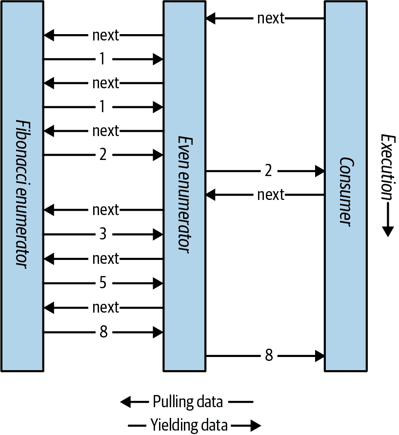

# 第四章。高级 C#

在本章中，我们涵盖了在第二章和第三章探讨的概念基础上构建的高级 C#主题。您应该按顺序阅读前四个部分；其余部分可以任意顺序阅读。

# 委托

委托是一个知道如何调用方法的对象。

*委托类型*定义了*委托实例*可以调用的方法类型。具体而言，它定义了方法的*返回类型*和*参数类型*。以下定义了一个名为`Transformer`的委托类型：

```cs
delegate int Transformer (int x);
```

`Transformer`与任何具有`int`返回类型和单个`int`参数的方法兼容，例如：

```cs
int Square (int x) { return x * x; }
```

或者更简洁地说：

```cs
int Square (int x) => x * x;
```

将方法分配给委托变量会创建委托*实例*：

```cs
Transformer t = Square;
```

您可以像调用方法一样调用委托实例：

```cs
int answer = t(3);    // answer is 9
```

这里是一个完整的例子：

```cs
Transformer t = Square;          // Create delegate instance
int result = t(3);               // Invoke delegate
Console.WriteLine (result);      // 9

int Square (int x) => x * x;

delegate int Transformer (int x);   // Delegate type declaration
```

委托实例实际上充当调用者的代表：调用者调用委托，然后委托调用目标方法。这种间接性解耦了调用者与目标方法之间的关系。

语句：

```cs
Transformer t = Square;
```

是的缩写为：

```cs
Transformer t = new Transformer (Square);
```

###### 注意

从技术上讲，当我们不使用括号或参数引用`Square`时，我们正在指定一个*方法组*。如果方法被重载，C#将根据分配给它的委托的签名选择正确的重载。

表达式

```cs
t(3)
```

是的缩写

```cs
t.Invoke(3)
```

###### 注意

委托类似于*回调*，这是一个泛指，涵盖了诸如 C 函数指针之类的构造。

## 使用委托编写插件方法

委托变量在运行时分配一个方法。这对于编写插件方法非常有用。在本例中，我们有一个名为`Transform`的实用方法，它将转换应用于整数数组中的每个元素。`Transform`方法有一个委托参数，您可以用来指定一个插件转换：

```cs
int[] values = { 1, 2, 3 };
Transform (values, Square);      // Hook in the Square method

foreach (int i in values)
  Console.Write (i + "  ");      // 1   4   9

void Transform (int[] values, Transformer t)
{
  for (int i = 0; i < values.Length; i++)
    values[i] = t (values[i]);
}

int Square (int x) => x * x;
int Cube (int x) => x * x * x;

delegate int Transformer (int x);
```

我们可以通过在代码的第二行中将`Square`更改为`Cube`来更改转换。

我们的`Transform`方法是一个*高阶函数*，因为它是一个接受函数作为参数的函数。（返回委托的方法也将是高阶函数。）

## 实例和静态方法目标

委托的目标方法可以是局部、静态或实例方法。以下示例说明了一个静态目标方法：

```cs
Transformer t = Test.Square;
Console.WriteLine (t(10));      // 100

class Test { public static int Square (int x) => x * x; }

delegate int Transformer (int x);
```

以下示例说明了一个实例目标方法：

```cs
Test test = new Test();
Transformer t = test.Square;
Console.WriteLine (t(10));      // 100

class Test { public int Square (int x) => x * x; }

delegate int Transformer (int x);
```

当将*实例*方法分配给委托对象时，后者不仅保留对方法的引用，还保留对方法所属*实例*的引用。`System.Delegate`类的`Target`属性表示这个实例（对于引用静态方法的委托将为空）。以下是一个例子：

```cs
MyReporter r = new MyReporter();
r.Prefix = "%Complete: ";
ProgressReporter p = r.ReportProgress;
p(99);                                 // %Complete: 99
Console.WriteLine (p.Target == r);     // True
Console.WriteLine (p.Method);          // Void ReportProgress(Int32)
r.Prefix = "";
p(99);                                 // 99

public delegate void ProgressReporter (int percentComplete);

class MyReporter
{
  public string Prefix = "";

  public void ReportProgress (int percentComplete)
    => Console.WriteLine (Prefix + percentComplete);
}
```

因为实例存储在委托的`Target`属性中，其生命周期延长至（至少与）委托的生命周期相同。

## 多播委托

所有委托实例都具有*多播*能力。这意味着委托实例可以引用不只一个单一目标方法，还可以引用一个目标方法列表。`+` 和 `+=` 操作符可以组合委托实例：

```cs
SomeDelegate d = SomeMethod1;
d += SomeMethod2;
```

最后一行与以下内容功能上是相同的：

```cs
d = d + SomeMethod2;
```

调用 `d` 现在将调用 `SomeMethod1` 和 `SomeMethod2`。委托按照添加的顺序被调用。

`-` 和 `-=` 操作符会从左侧委托操作数中移除右侧委托操作数：

```cs
d -= SomeMethod1;
```

调用 `d` 现在只会导致 `SomeMethod2` 被调用。

当一个委托变量的值为`null`时，对其调用`+`或`+=`操作是有效的，并且等同于将该变量赋值为一个新值：

```cs
SomeDelegate d = null;
d += SomeMethod1;       // Equivalent (when d is null) to d = SomeMethod1;
```

类似地，对一个委托变量调用`-=`并匹配单一目标，等同于将该变量赋值为`null`。

###### 注意

委托是*不可变的*，因此当您调用 `+=` 或 `-=` 时，实际上是创建一个*新的*委托实例并将其赋给现有变量。

如果一个多播委托具有非`void`返回类型，调用者将接收到最后一个被调用方法的返回值。前面的方法仍然会被调用，但它们的返回值会被丢弃。在大多数使用多播委托的场景中，它们具有`void`返回类型，因此这种细微差别并不会出现。

###### 注意

所有委托类型都隐式派生自`System.MulticastDelegate`，后者继承自`System.Delegate`。在 C#中，对委托进行的`+`、`-`、`+=`和`-=`操作会被编译为`System.Delegate`类的静态`Combine`和`Remove`方法。

### 多播委托示例

假设您编写了一个执行时间长的方法。该方法可以通过调用委托定期向其调用者报告进度。在这个例子中，`HardWork` 方法具有一个 `ProgressReporter` 委托参数，用于指示进度：

```cs
public delegate void ProgressReporter (int percentComplete);

public class Util
{
  public static void HardWork (ProgressReporter p)
  {
    for (int i = 0; i < 10; i++)
    {
      p (i * 10);                           // Invoke delegate
      System.Threading.Thread.Sleep (100);  // Simulate hard work
    }
  }
}
```

为了监视进度，我们可以创建一个多播委托实例 `p`，使得进度由两个独立的方法监视：

```cs
ProgressReporter p = WriteProgressToConsole;
p += WriteProgressToFile;
Util.HardWork (p);

void WriteProgressToConsole (int percentComplete)
  => Console.WriteLine (percentComplete);

void WriteProgressToFile (int percentComplete)
  => System.IO.File.WriteAllText ("progress.txt",
                                   percentComplete.ToString());
```

## 泛型委托类型

委托类型可以包含泛型类型参数：

```cs
public delegate T Transformer<T> (T arg);
```

基于这个定义，我们可以编写一个通用的 `Transform` 实用方法，适用于任何类型：

```cs
int[] values = { 1, 2, 3 };
Util.Transform (values, Square);      // Hook in Square
foreach (int i in values)
  Console.Write (i + "  ");           // 1   4   9

int Square (int x) => x * x;

public class Util
{
  public static void Transform<T> (T[] values, Transformer<T> t)
  {
    for (int i = 0; i < values.Length; i++)
      values[i] = t (values[i]);
  }
}
```

## Func 和 Action 委托

使用泛型委托，可以编写一小组委托类型，这些类型如此通用，可以处理任何返回类型和任意（合理数量的）参数。这些委托是在 `System` 命名空间中定义的 `Func` 和 `Action` 委托（`in` 和 `out` 注释指示*变异*，我们会在委托上下文中详细讨论）：

```cs
delegate TResult Func <out TResult>                ();
delegate TResult Func <in T, out TResult>          (T arg);
delegate TResult Func <in T1, in T2, out TResult>  (T1 arg1, T2 arg2);
*... and so on, up to T16*

delegate void Action                 ();
delegate void Action <in T>          (T arg);
delegate void Action <in T1, in T2>  (T1 arg1, T2 arg2);
*... and so on, up to T16*
```

这些委托非常通用。在前面的例子中，`Transformer` 委托可以被一个 `Func` 委托替换，它接受类型为 `T` 的单一参数，并返回相同类型的值：

```cs
public static void Transform<T> (T[] values, Func<T,T> transformer)
{
  for (int i = 0; i < values.Length; i++)
    values[i] = transformer (values[i]);
}
```

这些委托未覆盖的唯一实际场景是`ref`/`out`和指针参数。

###### 注意

当 C#首次引入时，不存在`Func`和`Action`委托（因为没有泛型）。正因为这个历史原因，.NET 的许多部分使用自定义委托类型而不是`Func`和`Action`。

## 委托与接口的比较

用委托解决的问题也可以用接口解决。例如，我们可以使用名为`ITransformer`的接口而不是委托来重写我们的原始示例：

```cs
int[] values = { 1, 2, 3 };
Util.TransformAll (values, new Squarer());
foreach (int i in values)
  Console.WriteLine (i);

public interface ITransformer
{
  int Transform (int x);
}

public class Util
{
 public static void TransformAll (int[] values, ITransformer t)
 {
   for (int i = 0; i < values.Length; i++)
     values[i] = t.Transform (values[i]);
 }
}

class Squarer : ITransformer
{
  public int Transform (int x) => x * x;
}
```

如果以下一个或多个条件为真，则委托设计可能是一个更好的选择而不是接口设计：

+   接口仅定义一个方法。

+   需要多播功能。

+   订阅者需要多次实现接口。

在`ITransformer`示例中，我们不需要多播。然而，接口只定义了一个方法。此外，我们的订阅者可能需要多次实现`ITransformer`，以支持不同的转换，比如平方或立方。使用接口时，我们被迫为每种转换编写单独的类型，因为类只能实现`ITransformer`一次。这相当麻烦：

```cs
int[] values = { 1, 2, 3 };
Util.TransformAll (values, new Cuber());
foreach (int i in values)
  Console.WriteLine (i);

class Squarer : ITransformer
{
  public int Transform (int x) => x * x;
}

class Cuber : ITransformer
{
  public int Transform (int x) => x * x * x;
}
```

## 委托的兼容性

### 类型的兼容性

即使委托类型的签名相同，它们之间也是不兼容的：

```cs
D1 d1 = Method1;
D2 d2 = d1;                           // Compile-time error

void Method1() { }

delegate void D1();
delegate void D2();
```

###### 注意

然而，允许以下内容：

```cs
D2 d2 = new D2 (d1);
```

如果委托实例具有相同的方法目标，则视为相等。

```cs
D d1 = Method1;
D d2 = Method1;
Console.WriteLine (d1 == d2);         // True

void Method1() { }
delegate void D();
```

如果多播委托引用了*相同顺序*的相同方法，则被视为相等。

### 参数的兼容性

当您调用一个方法时，可以提供比该方法参数更具体的参数。这是普通的多态行为。出于同样的原因，委托的参数类型可能比其方法目标更具体。这被称为*逆变性*。以下是一个例子：

```cs
StringAction sa = new StringAction (ActOnObject);
sa ("hello");

void ActOnObject (object o) => Console.WriteLine (o);   // hello

delegate void StringAction (string s);
```

（与类型参数的变异性类似，委托只对*引用转换*进行变异。）

委托仅代表他人调用方法。在这种情况下，`StringAction`以`string`类型的参数调用。然后将参数传递给目标方法时，参数会隐式向上转型为`object`。

###### 注意

标准事件模式旨在通过使用常见的`EventArgs`基类帮助您利用逆变性。例如，可以通过两个不同的委托调用单个方法，一个传递`MouseEventArgs`，另一个传递`KeyEventArgs`。

### 返回类型的兼容性

如果你调用一个方法，可能会得到一个比你要求的更具体的类型。这是普通的多态行为。出于同样的原因，委托的目标方法可能返回比委托描述的更具体的类型。这被称为*协变*：

```cs
ObjectRetriever o = new ObjectRetriever (RetrieveString);
object result = o();
Console.WriteLine (result);      // hello

string RetrieveString() => "hello";

delegate object ObjectRetriever();
```

`ObjectRetriever`期望返回一个`object`，但是一个`object`的*子类*也可以：委托的返回类型是*协变*的。

### 泛型委托类型参数的变异性

在第三章中，我们看到了泛型接口支持协变和逆变的类型参数。对于委托也存在相同的能力。

如果您正在定义通用委托类型，以下是一个良好的实践：

+   将仅用于返回值的类型参数标记为协变（`out`）。

+   将仅用于参数的类型参数标记为逆变（`in`）。

这样做可以通过尊重类型之间的继承关系，使转换自然工作。

下面的委托（在`System`命名空间中定义）具有协变的`TResult:`

```cs
delegate TResult Func<out TResult>();
```

这允许：

```cs
Func<string> x = ...;
Func<object> y = x;
```

下面的委托（在`System`命名空间中定义）具有逆变的`T:`

```cs
delegate void Action<in T> (T arg);
```

这允许：

```cs
Action<object> x = ...;
Action<string> y = x;
```

# 事件

当使用委托时，通常会出现两种新角色：*广播器*和*订阅者*。

*广播器*是包含委托字段的类型。广播器通过调用委托来决定何时广播。

*订阅者*是方法的目标接收者。订阅者通过调用广播器委托的`+=`和`-=`来决定何时开始和停止监听。订阅者不知道或干预其他订阅者。

事件是一种语言特性，正式化了这一模式。`event`是一种仅公开委托子集的构造，适用于广播者/订阅者模型。事件的主要目的是*防止订阅者相互干扰*。

声明事件的最简单方法是在委托成员前面放置`event`关键字：

```cs
// Delegate definition
public delegate void PriceChangedHandler (decimal oldPrice,
                                          decimal newPrice);
public class Broadcaster
{
  // Event declaration
  public event PriceChangedHandler PriceChanged;
}
```

`Broadcaster`类型内的代码可以完全访问`PriceChanged`并将其视为委托。在`Broadcaster`外部的代码只能对`PriceChanged`事件执行`+=`和`-=`操作。

考虑以下示例。`Stock`类每次`Stock`的`Price`更改时都会触发其`PriceChanged`事件：

```cs
public delegate void PriceChangedHandler (decimal oldPrice,
                                          decimal newPrice);
public class Stock
{
  string symbol;
  decimal price;

  public Stock (string symbol) => this.symbol = symbol;

  public event PriceChangedHandler PriceChanged;

  public decimal Price
  {
    get => price;
    set
    {
      if (price == value) return;      // Exit if nothing has changed
      decimal oldPrice = price;
      price = value;
      if (PriceChanged != null)           // If invocation list not
        PriceChanged (oldPrice, price);   // empty, fire event.
    }
  }
}
```

如果我们从示例中移除`event`关键字，使`PriceChanged`成为普通的委托字段，我们的示例将产生相同的结果。但是，`Stock`会不太健壮，因为订阅者可以通过以下方式相互干扰：

+   通过重新分配`PriceChanged`（而不是使用`+=`运算符）替换其他订阅者。

+   清除所有订阅者（通过将`PriceChanged`设置为`null`）。

+   通过调用委托向其他订阅者广播。

## 标准事件模式

在.NET 库中定义事件的几乎所有情况下，它们的定义遵循设计的标准模式，以提供库和用户代码之间的一致性。标准事件模式的核心是`System.EventArgs`，这是一个预定义的.NET 类，没有成员（除了静态的`Empty`字段）。`EventArgs`是传递事件信息的基类。在我们的`Stock`示例中，当`PriceChanged`事件被触发时，我们会子类化`EventArgs`以传递旧价格和新价格：

```cs
public class PriceChangedEventArgs : System.EventArgs
{
  public readonly decimal LastPrice;
  public readonly decimal NewPrice;

  public PriceChangedEventArgs (decimal lastPrice, decimal newPrice)
  {
    LastPrice = lastPrice;
    NewPrice = newPrice;
  }
}
```

为了可重用性，`EventArgs`子类根据其包含的信息命名（而不是将用于其的事件）。通常将数据公开为属性或只读字段。

有了`EventArgs`子类之后，下一步是选择或定义事件的委托。有三条规则：

+   它必须具有`void`返回类型。

+   它必须接受两个参数：第一个是`object`类型，第二个是`EventArgs`的子类。第一个参数表示事件广播器，第二个参数包含要传递的额外信息。

+   其名称必须以`EventHandler`结尾。

.NET 定义了一个名为`System.EventHandler<>`的通用委托来帮助处理此问题：

```cs
public delegate void EventHandler<TEventArgs> (object source, TEventArgs e)
```

###### 注意

在语言中存在泛型之前（即 C# 2.0 之前），我们必须编写一个自定义委托来代替：

```cs
public delegate void PriceChangedHandler
  (object sender, PriceChangedEventArgs e);
```

由于历史原因，.NET 库中的大多数事件使用此方式定义委托。

下一步是定义所选委托类型的事件。在这里，我们使用泛型的`EventHandler`委托：

```cs
public class Stock
{
  ...
  public event EventHandler<PriceChangedEventArgs> PriceChanged;
}
```

最后，模式要求您编写一个保护虚拟方法来触发事件。名称必须与事件名称匹配，前缀为“On”，然后接受单个`EventArgs`参数：

```cs
public class Stock
{
  ...

  public event EventHandler<PriceChangedEventArgs> PriceChanged;

  protected virtual void OnPriceChanged (PriceChangedEventArgs e)
  {
    if (PriceChanged != null) PriceChanged (this, e);
  }
}
```

###### 注意

要在多线程场景下可靠地工作（第十四章），您需要在测试和调用之前将委托分配给一个临时变量：

```cs
var temp = PriceChanged;
if (temp != null) temp (this, e);
```

我们可以使用空值条件运算符来实现相同的功能，而不需要`temp`变量：

```cs
PriceChanged?.Invoke (this, e);
```

既线程安全又简洁，这是调用事件的最佳通用方法。

这提供了一个中心点，供子类调用或覆盖事件（假设类不是密封的）。

这是完整的示例：

```cs
using System;

Stock stock = new Stock ("THPW");
stock.Price = 27.10M;
// Register with the PriceChanged event
stock.PriceChanged += stock_PriceChanged;
stock.Price = 31.59M;

void stock_PriceChanged (object sender, PriceChangedEventArgs e)
{
  if ((e.NewPrice - e.LastPrice) / e.LastPrice > 0.1M)
    Console.WriteLine ("Alert, 10% stock price increase!");
}

public class PriceChangedEventArgs : EventArgs
{
  public readonly decimal LastPrice;
  public readonly decimal NewPrice;

  public PriceChangedEventArgs (decimal lastPrice, decimal newPrice)
  {
    LastPrice = lastPrice; NewPrice = newPrice;
  }
}

public class Stock
{
  string symbol;
  decimal price;

  public Stock (string symbol) => this.symbol = symbol;

  public event EventHandler<PriceChangedEventArgs> PriceChanged;

  protected virtual void OnPriceChanged (PriceChangedEventArgs e)
  {
    PriceChanged?.Invoke (this, e);
  }

  public decimal Price
  {
    get => price;
    set
    {
      if (price == value) return;
      decimal oldPrice = price;
      price = value;
      OnPriceChanged (new PriceChangedEventArgs (oldPrice, price));
    }
  }
}
```

预定义的非泛型`EventHandler`委托可用于事件不携带额外信息的情况。在本例中，我们重新编写`Stock`，使得`PriceChanged`事件在价格变动后触发，并且除了发生事件之外，不需要任何有关事件的信息。我们还利用了`Even⁠t​Args.Empty`属性，以避免不必要地实例化`EventArgs`的实例：

```cs
public class Stock
{
  string symbol;
  decimal price;

  public Stock (string symbol) { this.symbol = symbol; }

  public event EventHandler PriceChanged;

  protected virtual void OnPriceChanged (EventArgs e)
  {
    PriceChanged?.Invoke (this, e);
  }

  public decimal Price
  {
    get { return price; }
    set
    {
      if (price == value) return;
      price = value;
      OnPriceChanged (EventArgs.Empty);
    }
  }
}
```

## 事件访问器

事件的*访问器*是其`+=`和`-=`函数的实现。默认情况下，编译器会隐式实现访问器。考虑以下事件声明：

```cs
public event EventHandler PriceChanged;
```

编译器将其转换为以下内容：

+   私有委托字段

+   一对公共事件访问器函数（`add_PriceChanged`和`remove_Pri⁠ce​Changed`），其实现将`+=`和`-=`操作转发到私有委托字段

您可以通过定义*显式*事件访问器来接管此过程。以下是我们之前示例中`PriceChanged`事件的手动实现：

```cs
private EventHandler priceChanged;         // Declare a private delegate

public event EventHandler PriceChanged
{
  add    { priceChanged += value; }
  remove { priceChanged -= value; }
}
```

此示例在功能上与 C#的默认访问器实现相同（除了 C#还通过无锁比较和交换算法确保围绕更新委托的线程安全性；参见[*http://albahari.com/threading*](http://albahari.com/threading)）。通过自定义事件访问器，我们指示 C#不生成默认字段和访问器逻辑。

使用显式事件访问器，可以对底层委托的存储和访问应用更复杂的策略。这是三种有用的情况：

+   当事件访问器仅仅是为另一个正在广播事件的类中继的情况。

+   当类公开许多事件时，其中大多数时间只存在很少的订阅者，例如 Windows 控件。在这种情况下，最好将订阅者的委托实例存储在字典中，因为字典的存储开销比数十个空委托字段引用要小得多。

+   当显式实现声明事件的接口时。

这里有一个例子来说明最后一点：

```cs
public interface IFoo { event EventHandler Ev; }

class Foo : IFoo
{
  private EventHandler ev;

  event EventHandler IFoo.Ev
  {
    add    { ev += value; }
    remove { ev -= value; }
  }
}
```

###### 注意

事件的`add`和`remove`部分被编译为`add_*XXX*`和`remove_*XXX*`方法。

## 事件修饰符

像方法一样，事件可以是虚拟的、重写的、抽象的或封闭的。事件也可以是静态的：

```cs
public class Foo
{
  public static event EventHandler<EventArgs> StaticEvent;
  public virtual event EventHandler<EventArgs> VirtualEvent;
}
```

# Lambda 表达式

Lambda 表达式是在委托实例的位置编写的未命名方法。编译器立即将 Lambda 表达式转换为以下之一：

+   一个委托实例。

+   一个*表达式树*，类型为`Expression<TDelegate>`，表示 Lambda 表达式内部代码的可遍历对象模型。这允许 Lambda 表达式在运行时后续解释（参见“构建查询表达式”）。

在下面的例子中，`x => x * x`是一个 Lambda 表达式：

```cs
Transformer sqr = x => x * x;
Console.WriteLine (sqr(3));    // 9

delegate int Transformer (int i);
```

###### 注意

在内部，编译器通过编写一个私有方法，然后将表达式的代码移到该方法中来解析此类型的 Lambda 表达式。

Lambda 表达式具有以下形式：

```cs
(*parameters*) => *expression-or-statement-block*
```

为了方便起见，如果且仅当存在一个可推断类型的参数时，可以省略括号。

在我们的例子中，有一个名为`x`的单一参数，表达式为`x * x`：

```cs
x => x * x;
```

Lambda 表达式的每个参数对应于一个委托参数，表达式的类型（可能是`void`）对应于委托的返回类型。

在我们的例子中，`x`对应于参数`i`，表达式`x * x`对应于返回类型`int`，因此与`Transformer`委托兼容：

```cs
delegate int Transformer (int i);
```

Lambda 表达式的代码可以是一个*语句块*而不是一个表达式。我们可以将我们的例子重写如下：

```cs
x => { return x * x; };
```

Lambda 表达式最常与`Func`和`Action`委托一起使用，因此您通常会看到我们之前的表达式写成如下形式：

```cs
Func<int,int> sqr = x => x * x;
```

这里是一个接受两个参数的表达式的例子：

```cs
Func<string,string,int> totalLength = (s1, s2) => s1.Length + s2.Length;
int total = totalLength ("hello", "world");   // total is 10;
```

如果不需要使用参数，可以使用下划线*丢弃*它们（从 C# 9 开始）：

```cs
Func<string,string,int> totalLength = (_,_) => ...
```

这是一个不带参数的表达式的示例：

```cs
Func<string> greeter = () => "Hello, world";
```

从 C# 10 开始，编译器允许使用可以通过`Func`和`Action`委托解析的 lambda 表达式进行隐式类型推断，因此我们可以将此语句缩短为：

```cs
var greeter = () => "Hello, world";
```

## 显式指定 Lambda 参数和返回类型

当编译器无法上下文推断 lambda 参数的类型时，通常可以*推断*出类型。在这种情况下，必须显式指定每个参数的类型。考虑以下两种方法：

```cs
void Foo<T> (T x)         {}
void Bar<T> (Action<T> a) {}
```

以下代码将无法编译，因为编译器无法推断出`x`的类型：

```cs
Bar (x => Foo (x));     // What type is x?
```

我们可以通过显式指定`x`的类型来修复这个问题，如下所示：

```cs
Bar ((int x) => Foo (x));
```

这个特定示例足够简单，可以通过另外两种方式修复：

```cs
Bar<int> (x => Foo (x));   // Specify type parameter for Bar
Bar<int> (Foo);            // As above, but with method group
```

下面的示例演示了从 C# 10 开始的显式参数类型的另一种用法：

```cs
var sqr = (int x) => x * x;
```

编译器推断`sqr`的类型为`Func<int,int>`。（不指定`int`时，隐式类型推断将失败：编译器知道`sqr`应该是`Func<T,T>`，但不知道`T`应该是什么。）

从 C# 10 开始，您还可以指定 lambda 返回类型：

```cs
var sqr = int (int x) => x;
```

指定返回类型可以提高复杂嵌套 lambda 的编译器性能。

## 默认 Lambda 参数（C# 12）

就像普通方法可以有可选参数一样：

```cs
void Print (string message = "") => Console.WriteLine (message);
```

因此，lambda 表达式也可以：

```cs
var print = (string message = "") => Console.WriteLine (message);

print ("Hello");
print ();
```

此功能在诸如 ASP.NET Minimal API 等库中非常有用。

## 捕获外部变量

lambda 表达式可以引用在定义 lambda 表达式的位置可访问的任何变量。这些称为外部变量，可以包括局部变量、参数和字段：

```cs
int factor = 2;
Func<int, int> multiplier = n => n * factor;
Console.WriteLine (multiplier (3));            // 6
```

lambda 表达式引用的外部变量称为*捕获变量*。捕获变量的 lambda 表达式称为*闭包*。

###### 注意

变量也可以被匿名方法和局部方法所捕获。在这些情况下，捕获变量的规则是相同的。

当委托实际*调用*时，捕获的变量被评估，而不是在捕获变量时评估：

```cs
int factor = 2;
Func<int, int> multiplier = n => n * factor;
factor = 10;
Console.WriteLine (multiplier (3));           // 30
```

lambda 表达式本身可以更新捕获的变量：

```cs
int seed = 0;
Func<int> natural = () => seed++;
Console.WriteLine (natural());           // 0
Console.WriteLine (natural());           // 1
Console.WriteLine (seed);                // 2
```

捕获变量的生命周期延长到委托的生命周期。在以下示例中，局部变量`seed`在`Natural`执行完成后通常会从作用域中消失。但因为`seed`已被*捕获*，其生命周期延长到捕获委托`natural`的生命周期：

```cs
static Func<int> Natural()
{
  int seed = 0;
  return () => seed++;      // Returns a *closure*
}

static void Main()
{
  Func<int> natural = Natural();
  Console.WriteLine (natural());      // 0
  Console.WriteLine (natural());      // 1
}
```

在 lambda 表达式内部实例化的局部变量每次委托实例调用时都是唯一的。如果我们将先前的示例重构为在 lambda 表达式内部实例化`seed`，我们将得到一个不同的（在本例中是不可取的）结果：

```cs
static Func<int> Natural()
{    
  return() => { int seed = 0; return seed++; };
}

static void Main()
{
  Func<int> natural = Natural();
  Console.WriteLine (natural());           // 0
  Console.WriteLine (natural());           // 0
}
```

###### 注意

捕获是通过将捕获的变量“提升”为私有类的字段来内部实现的。当调用方法时，该类被实例化并与委托实例绑定其生命周期。

### 静态 lambda

当捕获局部变量、参数、实例字段或`this`引用时，编译器可能需要创建和实例化一个私有类来存储对捕获数据的引用。这会带来一定的性能成本，因为需要分配（以及随后回收）内存。在性能至关重要的情况下，一种微优化策略是通过确保代码热点路径几乎不或完全不产生分配来减少垃圾收集器的负担。

从 C# 9 开始，可以通过应用`static`关键字来确保 lambda 表达式、局部函数或匿名方法不会捕获状态。这在微优化场景中可能很有用，以防止意外的内存分配。例如，可以如下所示将 static 修饰符应用于 lambda 表达式：

```cs
Func<int, int> multiplier = static n => n * 2;
```

如果稍后尝试修改 lambda 表达式以捕获局部变量，则编译器将生成错误：

```cs
int factor = 2;
Func<int, int> multiplier = static n => n * factor;  // will not compile
```

###### 注意

lambda 本身会评估为一个委托实例，这需要进行内存分配。然而，如果 lambda 不捕获变量，编译器将在应用程序的整个生命周期内重用单个缓存实例，因此实际上不会产生额外的成本。

此功能也可用于局部方法。在以下示例中，`Multiply`方法无法访问`factor`变量：

```cs
void Foo()
{
  int factor = 123;
  static int Multiply (int x) => x * 2;   // Local static method
}
```

当然，`Multiply`方法仍然可以通过调用`new`来显式分配内存。这种方法保护我们免受*偷偷摸摸*分配的潜在风险。在此处应用`static`也可视为一种文档工具，指示减少耦合级别。

静态 lambda 仍然可以访问静态变量和常量（因为这些不需要闭包）。

###### 注意

`static`关键字仅作为一种*检查*存在；它对编译器生成的 IL 没有影响。如果没有`static`关键字，编译器不会生成闭包，除非它需要（即使如此，它也有一些技巧来减轻成本）。

### 捕获迭代变量

当你捕获`for`循环的迭代变量时，C#会将该变量视为在循环*外部*声明的变量。这意味着每次迭代都会捕获*同一个*变量。以下程序输出的是`333`而不是`012`：

```cs
Action[] actions = new Action[3];

for (int i = 0; i < 3; i++)
  actions [i] = () => Console.Write (i);

foreach (Action a in actions) a();     // 333
```

每个闭包（**closure**）捕获的是同一个变量，`i`。（这在考虑到`i`是一个变量，其值在循环迭代之间保持不变时确实是有意义的；如果需要的话，甚至可以在循环体内显式修改`i`。）其结果是，当稍后调用这些委托时，每个委托看到的是调用时`i`的值——这里是 3。我们可以通过展开`for`循环来更好地说明这一点：

```cs
Action[] actions = new Action[3];
int i = 0;
actions[0] = () => Console.Write (i);
i = 1;
actions[1] = () => Console.Write (i);
i = 2;
actions[2] = () => Console.Write (i);
i = 3;
foreach (Action a in actions) a();    // 333
```

如果我们想要输出`012`，解决方案是将迭代变量分配给循环内部作用域的局部变量：

```cs
Action[] actions = new Action[3];
for (int i = 0; i < 3; i++)
{
  int loopScopedi = i;
  actions [i] = () => Console.Write (loopScopedi);
}
foreach (Action a in actions) a();     // 012
```

因为`loopScopedi`在每次迭代时都是全新创建的，所以每个闭包捕获的是*不同*的变量。

###### 注意

在 C# 5.0 之前，`foreach` 循环的工作方式相同。这引起了相当大的混淆：与 `for` 循环不同，`foreach` 循环中的迭代变量是不可变的，因此你期望它在循环体内部被视为局部变量。好消息是现在已经修复，你可以安全地捕获 `foreach` 循环的迭代变量而不会有任何意外。

## Lambda 表达式与局部方法

局部方法的功能（参见 “局部方法”）与 lambda 表达式重叠。局部方法有以下三个优点：

+   它们可以是递归的（可以调用自身），而无需丑陋的 hack。

+   它们避免了指定委托类型的混乱。

+   它们的开销稍微少一些。

局部方法更高效，因为它们避免了委托的间接调用（这会消耗一些 CPU 循环和内存分配）。它们还可以访问包含方法的局部变量，而无需编译器将捕获的变量提升到隐藏类中。

但是，在许多情况下，*你需要* 一个委托 —— 最常见的情况是调用高阶函数，即具有委托类型参数的方法：

```cs
public void Foo (Func<int,bool> predicate) { ... }
```

（你可以在 第八章 中看到更多类似的内容）。在这种情况下，无论如何都需要委托，通常 lambda 表达式更简洁更清晰。

# 匿名方法

匿名方法是 C# 2.0 的一个特性，大部分被 C# 3.0 的 lambda 表达式所取代。匿名方法类似于 lambda 表达式，但它缺少以下功能：

+   隐式类型参数

+   表达式语法（匿名方法必须始终是一个语句块）

+   编译为表达式树的能力，通过分配给 `Expression<T>`

匿名方法使用 `delegate` 关键字，后跟（可选的）参数声明，然后是方法体。例如：

```cs
Transformer sqr = delegate (int x) {return x * x;};
Console.WriteLine (sqr(3));                            // 9

delegate int Transformer (int i);
```

第一行在语义上等同于以下 lambda 表达式：

```cs
Transformer sqr =       (int x) => {return x * x;};
```

或者简单地说：

```cs
Transformer sqr =            x  => x * x;
```

匿名方法与 lambda 表达式一样捕获外部变量，并且可以在前面加上 `static` 关键字使其行为类似静态 lambda。

###### 注意

匿名方法的一个独特特性是你可以完全省略参数声明，即使委托期望有参数。这在声明带有默认空处理程序的事件时非常有用：

```cs
public event EventHandler Clicked = delegate { };
```

这样可以避免在触发事件前进行空检查。以下也是合法的：

```cs
// Notice that we omit the parameters:
Clicked += delegate { Console.WriteLine ("clicked"); };
```

# `try` 语句和异常

`try` 语句指定一个受错误处理或清理代码控制的代码块。`try` *块* 必须后跟一个或多个 `catch` *块* 和/或一个 `finally` *块*，或两者都有。当在 `try` 块中抛出错误时，`catch` 块执行。`finally` 块在执行离开 `try` 块（或如果存在的话，`catch` 块）后执行清理代码，无论是否抛出异常。

`catch`块可以访问包含有关错误信息的`Exception`对象。您使用`catch`块来补偿错误或*重新抛出*异常。如果您仅想记录问题或重新抛出新的更高级别的异常类型，则重新抛出异常。

`finally`块为您的程序增加了确定性：CLR 努力始终执行它。用于关闭网络连接等清理任务很有用。

`try`语句看起来像这样：

```cs
try
{
  ... // exception may get thrown within execution of this block
}
catch (ExceptionA ex)
{
  ... // handle exception of type ExceptionA
}
catch (ExceptionB ex)
{
  ... // handle exception of type ExceptionB
}
finally
{
  ... // cleanup code
}
```

考虑以下程序：

```cs
int y = Calc (0);
Console.WriteLine (y);

int Calc (int x) => 10 / x;
```

因为`x`为零，运行时引发了`DivideByZeroException`并且我们的程序终止。我们可以通过捕获异常来防止这种情况，如下所示：

```cs
try
{
  int y = Calc (0);
  Console.WriteLine (y);
}
catch (DivideByZeroException ex)
{
  Console.WriteLine ("x cannot be zero");
}
Console.WriteLine ("program completed");

int Calc (int x) => 10 / x;
```

下面是输出：

```cs
x cannot be zero
program completed
```

###### 注意

这是一个简单的示例，用于说明异常处理。在实际中，我们可以通过在调用`Calc`之前显式检查除数是否为零来更好地处理这种特定情况。

检查可预防的错误优于依赖`try`/`catch`块，因为异常处理相对较昂贵，需要数百个时钟周期或更多。

当在`try`语句中引发异常时，CLR 执行测试：

*在* `try` *语句中是否有任何兼容的* `catch` *块？*

+   如果是这样，执行将跳转到兼容的`catch`块，然后是`finally`块（如果存在），然后正常继续执行。

+   如果没有，执行直接跳转到`finally`块（如果存在），然后 CLR 在调用堆栈中查找其他`try`块；如果找到，它会重复测试。

如果调用堆栈中没有任何函数负责异常，则程序终止。

## `catch`子句

`catch`子句指定要捕获的异常类型。这必须是`System.Exception`或`System.Exception`的子类。

捕获`System.Exception`可以捕获所有可能的错误。在以下情况下这非常有用：

+   无论具体的异常类型如何，您的程序都可能恢复。

+   您计划重新抛出异常（可能在记录日志后）。

+   错误处理程序是程序终止之前的最后一道防线。

通常情况下，您会捕获*特定的异常类型*，以避免处理处理程序未设计的情况（例如，`OutOfMemoryException`）。

您可以使用多个`catch`子句处理多个异常类型（再次强调，这个例子可以通过显式的参数检查而不是异常处理来编写）：

```cs
class Test
{
  static void Main (string[] args)
  {
    try
    {
      byte b = byte.Parse (args[0]);
      Console.WriteLine (b);
    }
    catch (IndexOutOfRangeException)
    {
      Console.WriteLine ("Please provide at least one argument");
    }
    catch (FormatException)
    {
      Console.WriteLine ("That's not a number!");
    }
    catch (OverflowException)
    {
      Console.WriteLine ("You've given me more than a byte!");
    }
  }
}
```

对于给定的异常，只有一个`catch`子句会执行。如果您想包含一个捕获更一般异常（如`System.Exception`）的安全网，必须将更具体的处理程序*放在前面*。

如果不需要访问其属性，可以在`catch`子句中捕获异常而不指定变量：

```cs
catch (OverflowException)   // no variable
{
  ...
}
```

此外，您可以省略变量和类型（这意味着将捕获所有异常）：

```cs
catch { ... }
```

### 异常过滤器

您可以通过添加`when`子句在`catch`子句中指定*异常过滤器*：

```cs
catch (WebException ex) when (ex.Status == WebExceptionStatus.Timeout)
{
  ...
}
```

如果在此示例中抛出 `WebException`，则将评估 `when` 关键字后面的布尔表达式。如果结果为 false，则忽略相关的 `catch` 块并考虑后续的 `catch` 子句。使用异常过滤器可以捕获同一类型的异常再次抛出是有意义的：

```cs
catch (WebException ex) when (ex.Status == WebExceptionStatus.Timeout)
{ ... }
catch (WebException ex) when (ex.Status == WebExceptionStatus.SendFailure)
{ ... }
```

`when` 子句中的布尔表达式可以具有副作用，例如记录异常以进行诊断。

## finally 块

`finally` 块始终执行——无论是否抛出异常以及 `try` 块是否完成。通常使用 `finally` 块进行清理代码。

`finally` 块在以下任一情况之后执行：

+   `catch` 块完成（或抛出新异常）。

+   `try` 块完成（或抛出没有相应 `catch` 块的异常）。

+   因为 `jump` 语句（例如 `return` 或 `goto`）而离开 `try` 块。

唯一能够打败 `finally` 块的是无限循环或进程突然终止。

`finally` 块有助于使程序具有确定性。在以下示例中，我们打开的文件 *总是* 被关闭，无论是否：

+   `try` 块正常完成。

+   由于文件为空（`EndOfStream`），执行提前返回。

+   在读取文件时抛出 `IOException`：

```cs
void ReadFile()
{
  StreamReader reader = null;    // In System.IO namespace
  try
  {
    reader = File.OpenText ("file.txt");
    if (reader.EndOfStream) return;
    Console.WriteLine (reader.ReadToEnd());
  }
  finally
  {
    if (reader != null) reader.Dispose();
  }
}
```

在这个例子中，我们通过在 `StreamReader` 上调用 `Dispose` 方法来关闭文件。在 `finally` 块中调用对象的 `Dispose` 方法是一种标准约定，并且在 C# 中通过 `using` 语句明确支持。

### using 语句

许多类封装了非托管资源，例如文件句柄、图形句柄或数据库连接。这些类实现了 `System.IDisposable` 接口，该接口定义了一个名为 `Dispose` 的无参方法来清理这些资源。`using` 语句为在 `finally` 块中调用 `Dispose` 提供了一种优雅的语法。

因此

```cs
using (StreamReader reader = File.OpenText ("file.txt"))
{
  ...
}
```

等价于以下内容：

```cs
{
  StreamReader reader = File.OpenText ("file.txt");
  try
  {
    ...
  }
  finally
  {
    if (reader != null)
      ((IDisposable)reader).Dispose();
  }
}
```

### using 声明

如果省略 `using` 语句（C# 8+）后面的大括号和语句块，则它变成了 *using 声明*。当执行流程跳出 *封闭* 语句块时，资源将被释放：

```cs
if (File.Exists ("file.txt"))
{
  using var reader = File.OpenText ("file.txt");
  Console.WriteLine (reader.ReadLine());
  ...
}
```

在这种情况下，当执行流程离开 `if` 语句块时，`reader` 将被释放。

## 抛出异常

异常可以由运行时或用户代码抛出。在此示例中，`Display` 抛出了 `System.ArgumentNullException`：

```cs
try { Display (null); }
catch (ArgumentNullException ex)
{
  Console.WriteLine ("Caught the exception");
}

void Display (string name)
{
  if (name == null)
    throw new ArgumentNullException (nameof (name));

  Console.WriteLine (name);
}
```

###### 注意

因为对参数进行空值检查并抛出 `ArgumentNullException` 是如此常见的代码路径，所以实际上从 .NET 6 开始有了一种快捷方式：

```cs
void Display (string name)
{
  ArgumentNullException.ThrowIfNull (name);
  Console.WriteLine (name);
}
```

请注意，我们无需指定参数的名称。稍后我们将在 [“CallerArgumentExpression”](https://example.org/callerargumentexpression-id00054) 中解释原因。

### throw 表达式

`throw` 也可以出现作为表达式的形式在表达式体函数中：

```cs
public string Foo() => throw new NotImplementedException();
```

`throw` 表达式也可以出现在三元条件表达式中：

```cs
string ProperCase (string value) =>
  value == null ? throw new ArgumentException ("value") :
  value == "" ? "" :
  char.ToUpper (value[0]) + value.Substring (1);
```

### 重新抛出异常

您可以按以下方式捕获并重新抛出异常：

```cs
try {  ...  }
catch (Exception ex)
{
  // Log error
  ...
  throw;          // Rethrow same exception
}
```

###### 注意

如果我们用`throw ex`替换`throw`，例子仍然可以工作，但是新传播的异常的`StackTrace`属性将不再反映原始错误。

以这种方式重新抛出可以让您记录错误而不是*吞噬*它。它还允许您退出处理异常，如果情况超出您的预期。另一个常见情况是重新抛出更具体的异常类型：

```cs
try
{
  ... // Parse a DateTime from XML element data
}
catch (FormatException ex)
{
  throw new XmlException ("Invalid DateTime", ex);
}
```

注意，当我们构造`XmlException`时，我们将原始异常`ex`作为第二个参数传递。此参数填充新异常的`InnerException`属性，并有助于调试。几乎所有类型的异常都提供类似的构造函数。

重新抛出*较少*具体的异常是在跨越信任边界时可能会做的事情，以便不向潜在的黑客泄露技术信息。

## System.Exception 的关键属性

`System.Exception`的最重要属性如下：

`StackTrace`

表示从异常发生源到`catch`块调用的所有方法的字符串。

`Message`

描述错误的字符串。

`InnerException`

导致外部异常的内部异常（如果有）。这本身可能有另一个`InnerException`。

###### 注意

所有 C#中的异常都是运行时异常——没有 Java 中编译时检查的异常等价物。

## 常见的异常类型

下列异常类型广泛用于 CLR 和.NET 库中。您可以自行抛出这些异常或将它们用作派生自定义异常类型的基类：

`System.ArgumentException`

当使用伪造参数调用函数时抛出。这通常表示程序错误。

`System.ArgumentNullException`

`ArgumentException`的子类，在函数参数（意外地）为`null`时抛出。

`System.ArgumentOutOfRangeException`

当（通常是数值的）参数太大或太小时抛出的`ArgumentException`的子类。例如，当向仅接受正值的函数传递负数时抛出此异常。

`System.InvalidOperationException`

当对象的状态不适合方法成功执行时抛出，而不考虑任何特定的参数值。例如，尝试读取未打开的文件或从在迭代过程中修改了基础列表的枚举器中获取下一个元素时。

`System.NotSupportedException`

表示不支持特定功能。一个很好的例子是在返回`true`的集合上调用`Add`方法的情况。

`System.NotImplementedException`

抛出以指示函数尚未实现。

`System.ObjectDisposedException`

在调用函数所在的对象已释放时抛出。

另一种常见的异常类型是 `NullReferenceException`。当您尝试访问其值为 `null` 的对象的成员时（表示代码中存在 bug），CLR 会引发此异常。您可以如下直接抛出 `NullReferenceException`（供测试目的）：

```cs
throw null;
```

## TryXXX 方法模式

在编写方法时，当出现问题时，您可以选择返回某种失败代码或引发异常。通常情况下，当错误超出正常工作流程时，或者您预期直接调用者无法处理时，可以引发异常。不过，偶尔提供两种选择给消费者可能更好。一个例子是 `int` 类型，它定义了其 `Parse` 方法的两个版本：

```cs
public int Parse     (string input);
public bool TryParse (string input, out int returnValue);
```

如果解析失败，`Parse` 抛出异常；`TryParse` 返回 `false`。

您可以通过将 `*XXX*` 方法调用 `Try*XXX*` 方法来实现此模式，如下所示：

```cs
public *return-type XXX* (*input-type* input)
{
  *return-type* returnValue;
  if (!Try*XXX* (input, out returnValue))
    throw new *YYY*Exception (...)
  return returnValue;
}
```

## 异常的替代方法

与 `int.TryParse` 一样，函数可以通过返回类型或参数将失败传递给调用函数。尽管这可以处理简单和可预测的失败，但在处理不寻常或不可预测的错误时会变得笨拙，会污染方法签名并创建不必要的复杂性和混乱。

它也不能泛化为不是方法的函数，例如运算符（例如，除法运算符）或属性。一个替代方法是将错误放置在一个公共位置，让调用堆栈中的所有函数都能看到它（例如，一个静态方法，它在每个线程中存储当前错误）。然而，这要求每个函数参与错误传播模式，这很麻烦，而且具有讽刺性的是，这本身也容易出错。

# 枚举和迭代器

## 枚举

一个 *枚举器* 是对 *一系列值* 的只读、单向游标。如果类型执行以下任一操作，则 C# 将其视为枚举器：

+   具有名为 `MoveNext` 的公共无参数方法和名为 `Current` 的属性

+   实现 `System.Collections.Generic.IEnumerator<T>`

+   实现 `System.Collections.IEnumerator`

`foreach` 语句遍历 *可枚举对象*。可枚举对象是序列的逻辑表示。它本身不是游标，而是生成其自身上的游标的对象。如果类型执行以下任一操作，则 C# 将其视为可枚举类型（按此顺序进行检查）：

+   具有名为 `GetEnumerator` 的公共无参数方法，返回一个枚举器

+   实现 `System.Collections.Generic.IEnumerable<T>`

+   实现 `System.Collections.IEnumerable`

+   （来自 C# 9）可以绑定到名为 `GetEnumerator` 的 *扩展方法*，该方法返回一个枚举器（参见 “扩展方法”）

枚举模式如下所示：

```cs
class *Enumerator*   // Typically implements IEnumerator or IEnumerator<T>
{
  public *IteratorVariableType* Current { get {...} }
  public bool MoveNext() {...}
}

class *Enumerable*   // Typically implements IEnumerable or IEnumerable<T>
{
  public *Enumerator* GetEnumerator() {...}
}
```

这里是使用 `foreach` 语句高级遍历单词“beer”中的字符的方法：

```cs
foreach (char c in "beer")
  Console.WriteLine (c);
```

这是在不使用`foreach`语句的情况下迭代“beer”中字符的低级方式：

```cs
using (var enumerator = "beer".GetEnumerator())
  while (enumerator.MoveNext())
  {
    var element = enumerator.Current;
    Console.WriteLine (element);
  }
```

如果枚举器实现了`IDisposable`，那么`foreach`语句也充当`using`语句，隐式地处理枚举器对象。

第七章详细解释了枚举接口。

## 集合初始化器和集合表达式

您可以通过*集合初始化器*一次性实例化和填充可枚举对象：

```cs
using System.Collections.Generic;

var list = new List<int> {1, 2, 3};
```

从 C# 12 开始，您可以使用*集合表达式*（请注意方括号）进一步缩短：

```cs
using System.Collections.Generic;

List<int> list = [1, 2, 3];
```

###### 注意

集合表达式是*目标类型化*的，这意味着`[1,2,3]`的类型取决于分配给它的类型（在本例中为`List<int>`）。在下面的例子中，目标类型是`int[]`和`Span<int>`（我们在第二十三章中介绍）：

```cs
int[] array = [1, 2, 3];
Span<int> span = [1, 2, 3];
```

目标类型化意味着您可以在编译器可以推断出类型的其他场景中省略类型，例如调用方法时：

```cs
Foo ([1, 2, 3]);

void Foo (List<int> numbers) { ... }
```

编译器将其翻译为以下内容：

```cs
using System.Collections.Generic;

List<int> list = new List<int>();
list.Add (1);
list.Add (2);
list.Add (3);
```

这要求可枚举对象实现`System.Collections.IEnumerable`接口，并且具有适用于调用的`Add`方法的适当数量的参数。（使用集合表达式时，编译器还支持其他模式，以允许创建只读集合。）

类似地，您可以按以下方式初始化字典（参见“字典”）：

```cs
var dict = new Dictionary<int, string>()
{
  { 5, "five" },
  { 10, "ten" }
};
```

或者更简洁地说：

```cs
var dict = new Dictionary<int, string>()
{
  [3] = "three",
  [10] = "ten"
};
```

后者不仅对字典有效，而且对于任何具有索引器的类型也有效。

## 迭代器

而`foreach`语句是枚举器的*消费者*，迭代器是枚举器的*生产者*。在这个例子中，我们使用迭代器返回斐波那契数列的序列（其中每个数字是前两个数字的和）：

```cs
using System;
using System.Collections.Generic;

foreach (int fib in Fibs(6))
  Console.Write (fib + "  ");
}

IEnumerable<int> Fibs (int fibCount)
{
  for (int i = 0, prevFib = 1, curFib = 1; i < fibCount; i++)
  {
    yield return prevFib;
    int newFib = prevFib+curFib;
    prevFib = curFib;
    curFib = newFib;
  }
}

OUTPUT: 1  1  2  3  5  8
```

而`return`语句表达“这是您要求我从此方法返回的值”，`yield return`语句表达“这是您要求我从此枚举器中生成的下一个元素”。在每个`yield`语句上，控制返回给调用者，但调用者的状态保持不变，以便方法可以继续执行，只要调用者枚举下一个元素。此状态的生命周期绑定到枚举器，以便在调用者完成枚举时可以释放该状态。

###### 注意

编译器将迭代方法转换为实现`IEnumerable<T>`和/或`IEnumerator<T>`的私有类。迭代器块内的逻辑被“反转”并拼接到编译器生成的枚举器类的`MoveNext`方法和`Current`属性中。这意味着当您调用迭代方法时，您所做的只是实例化编译器生成的类；您的代码实际上并不运行！只有当您开始枚举结果序列时，通常使用`foreach`语句时，您的代码才会运行。

迭代器可以是局部方法（见“局部方法”）。

## 迭代器语义

迭代器是一个包含一个或多个`yield`语句的方法、属性或索引器。迭代器必须返回以下四个接口之一（否则，编译器将生成错误）：

```cs
// Enumerable interfaces
System.Collections.IEnumerable
System.Collections.Generic.IEnumerable<T>

// Enumerator interfaces
System.Collections.IEnumerator
System.Collections.Generic.IEnumerator<T>
```

一个迭代器根据其返回的是*可枚举*接口还是*枚举器*接口具有不同的语义。我们在第七章中描述了这一点。

*允许多个 yield 语句*：

```cs
foreach (string s in Foo())
  Console.WriteLine(s);         // Prints "One","Two","Three"

IEnumerable<string> Foo()
{
  yield return "One";
  yield return "Two";
  yield return "Three";
}
```

### yield break

在迭代器块中，不能使用返回语句；而是必须使用 `yield break` 语句指示迭代器块应提前退出，不返回更多元素。我们可以修改 `Foo` 如下所示来演示：

```cs
IEnumerable<string> Foo (bool breakEarly)
{
  yield return "One";
  yield return "Two";

  if (breakEarly)
    yield break;

  yield return "Three";
}
```

### 迭代器和 try/catch/finally 块

`yield return` 语句不能出现在带有 `catch` 子句的 `try` 块中：

```cs
IEnumerable<string> Foo()
{
  try { yield return "One"; }    // Illegal
  catch { ... }
}
```

`yield return` 也不能出现在 `catch` 或 `finally` 块中。这些限制是因为编译器必须将迭代器转换为具有 `MoveNext`、`Current` 和 `Dispose` 成员的普通类，并且转换异常处理块会导致过多的复杂性。

然而，你可以在仅有 `finally` 块的 `try` 块中使用 `yield`：

```cs
IEnumerable<string> Foo()
{
  try { yield return "One"; }    // OK
  finally { ... }
}
```

当消费枚举器到达序列末尾或被处理时，`finally`块中的代码将执行。如果提前中断`foreach`语句，则会隐式处理枚举器，这是一种安全的枚举方式。在显式处理枚举器时，一个陷阱是在不处理它的情况下提前放弃枚举，绕过`finally`块。通过将显式使用枚举器包装在`using`语句中，可以避免这种风险：

```cs
string firstElement = null;
var sequence = Foo();
using (var enumerator = sequence.GetEnumerator())
  if (enumerator.MoveNext())
    firstElement = enumerator.Current;
```

## 组合序列

迭代器具有高度的可组合性。我们可以扩展我们的示例，这次只输出偶数 Fibonacci 数：

```cs
using System;
using System.Collections.Generic;

foreach (int fib in EvenNumbersOnly (Fibs(6)))
  Console.WriteLine (fib);

IEnumerable<int> Fibs (int fibCount)
{
  for (int i = 0, prevFib = 1, curFib = 1; i < fibCount; i++)
  {
    yield return prevFib;
    int newFib = prevFib+curFib;
    prevFib = curFib;
    curFib = newFib;
  }
}

IEnumerable<int> EvenNumbersOnly (IEnumerable<int> sequence)
{
  foreach (int x in sequence)
    if ((x % 2) == 0)
      yield return x;
}
```

直到请求执行 `MoveNext()` 操作时，每个元素才会被计算。图 4-1 显示了随时间的数据请求和数据输出。



###### 图 4-1\. 组合序列

迭代器模式的组合性在 LINQ 中非常有用；我们在第八章中再次讨论这个主题。

# 可空值类型

引用类型可以用空引用表示不存在的值。然而，值类型通常不能表示空值：

```cs
string s = null;       // OK, Reference Type
int i = null;          // Compile Error, Value Type cannot be null
```

要在值类型中表示空值，必须使用称为*可空类型*的特殊构造：可空类型由值类型后跟`?`符号表示：

```cs
int? i = null;                     // OK, Nullable Type
Console.WriteLine (i == null);     // True
```

## Nullable<T> 结构

`T?` 转换为 `System.Nullable<T>`，这是一个轻量级的不可变结构，只有两个字段，用于表示 `Value` 和 `HasValue`。`System.Nullable<T>` 的本质非常简单：

```cs
public struct Nullable<T> where T : struct
{
  public T Value {get;}
  public bool HasValue {get;}
  public T GetValueOrDefault();
  public T GetValueOrDefault (T defaultValue);
  ...
}
```

代码

```cs
int? i = null;
Console.WriteLine (i == null);              // True
```

转换为以下内容：

```cs
Nullable<int> i = new Nullable<int>();
Console.WriteLine (! i.HasValue);           // True
```

当`HasValue`为 false 时尝试检索`Value`会抛出`InvalidOperationException`。如果`HasValue`为 true，则`GetValueOrDefault()`返回`Value`；否则，返回`new T()`或指定的自定义默认值。

`T?`的默认值为`null`。

## 可空隐式和显式转换

从`T`到`T?`的转换是隐式的，而从`T?`到`T`的转换是显式的：

```cs
int? x = 5;        // implicit
int y = (int)x;    // explicit
```

显式转换直接等效于调用可空对象的`Value`属性。因此，如果`HasValue`为 false，则抛出`InvalidOperationException`。

## 装箱和拆箱可空值

当`T?`装箱时，堆上的装箱值包含`T`，而不是`T?`。这种优化是可能的，因为装箱值是可以表示 null 的引用类型。

C#还允许使用`as`操作符对可空值类型进行拆箱。如果转换失败，则结果为`null`：

```cs
object o = "string";
int? x = o as int?;
Console.WriteLine (x.HasValue);   // False
```

## 操作符提升

`Nullable<T>`结构体未定义诸如`<`、`>`或`==`等操作符。尽管如此，以下代码编译并正确执行：

```cs
int? x = 5;
int? y = 10;
bool b = x < y;      // true
```

这是因为编译器从基础值类型中借用或“提升”了小于操作符。语义上，它将前面的比较表达式转换为：

```cs
bool b = (x.HasValue && y.HasValue) ? (x.Value < y.Value) : false;
```

换句话说，如果`x`和`y`都有值，则通过`int`的小于操作符比较；否则，返回`false`。

操作符提升意味着你可以隐式地在`T?`上使用`T`的操作符。你可以为`T?`定义操作符以提供特定的空值行为，但在绝大多数情况下，最好依赖编译器自动为你应用系统化的可空逻辑。以下是一些示例：

```cs
int? x = 5;
int? y = null;

// Equality operator examples
Console.WriteLine (x == y);    // False
Console.WriteLine (x == null); // False
Console.WriteLine (x == 5);    // True
Console.WriteLine (y == null); // True
Console.WriteLine (y == 5);    // False
Console.WriteLine (y != 5);    // True

// Relational operator examples
Console.WriteLine (x < 6);     // True
Console.WriteLine (y < 6);     // False
Console.WriteLine (y > 6);     // False

// All other operator examples
Console.WriteLine (x + 5);     // 10
Console.WriteLine (x + y);     // *null* (prints empty line)
```

编译器根据操作符的类别以不同的方式执行空值逻辑。以下各节解释了这些不同的规则。

### 等式操作符（==和!=）

提升的等式操作符处理 null 与引用类型一样。这意味着两个 null 值是相等的：

```cs
Console.WriteLine (       null ==        null);   // True
Console.WriteLine ((bool?)null == (bool?)null);   // True
```

更进一步：

+   如果恰好一个操作数为 null，则操作数不相等。

+   如果两个操作数均为非 null，则比较它们的`Value`。

### 关系操作符（<、<=、>=、>）

关系操作符的工作原理是对比 null 操作数是无意义的。这意味着将 null 值与 null 或非 null 值进行比较会返回`false`：

```cs
bool b = x < y;    // Translation:

bool b = (x.HasValue && y.HasValue) 
         ? (x.Value < y.Value)
         : false;

// b is false (assuming x is 5 and y is null)
```

### 所有其他操作符（+、-、*、/、%、&、|、^、<<、>>、+、++、--、!、~）

当任一操作数为 null 时，这些操作符返回 null。这种模式对 SQL 用户来说应该很熟悉：

```cs
int? c = x + y;   // Translation:

int? c = (x.HasValue && y.HasValue)
         ? (int?) (x.Value + y.Value) 
         : null;

// c is null (assuming x is 5 and y is null)
```

例外情况是当我们讨论将`&`和`|`操作符应用于`bool?`时。

### 混合可空和非可空类型

您可以混合使用可空和非可空值类型（这是因为从`T`到`T?`有隐式转换）：

```cs
int? a = null;
int b = 2;
int? c = a + b;   // c is null - equivalent to a + (int?)b
```

## 带`&`和`|`操作符的`bool?`

当提供`bool?`类型的操作数时，`&`和`|`操作符将`null`视为*未知值*。因此，`null | true`为 true，因为：

+   如果未知值为 false，则结果为 true。

+   如果未知值为真，则结果将为真。

同样地，`null & false` 是假的。这种行为对 SQL 用户来说应该很熟悉。以下例子列举了其他的组合：

```cs
bool? n = null;
bool? f = false;
bool? t = true;
Console.WriteLine (n | n);    // *(null)*
Console.WriteLine (n | f);    // *(null)*
Console.WriteLine (n | t);    // True
Console.WriteLine (n & n);    // *(null)*
Console.WriteLine (n & f);    // False
Console.WriteLine (n & t);    // *(null)*
```

## 可空值类型和空运算符

可空值类型与 `??` 运算符（参见“空合并运算符”）特别配合得很好，正如本例所示：

```cs
int? x = null;
int y = x ?? 5;        // y is 5

int? a = null, b = 1, c = 2;
Console.WriteLine (a ?? b ?? c);  // 1 *(first non-null value)*
```

对可空值类型使用 `??` 等同于使用具有显式默认值的 `GetValueOrDefault` 方法，只是如果变量为空，则默认值表达式永远不会被评估。

可空值类型也与空条件运算符（参见“空条件运算符”）非常配合。在下面的例子中，长度评估为空：

```cs
System.Text.StringBuilder sb = null;
int? length = sb?.ToString().Length;
```

我们可以与空合并运算符结合，使其评估为零而不是空：

```cs
int length = sb?.ToString().Length ?? 0;  // Evaluates to 0 if sb is null
```

## 可空值类型的场景

可空值类型最常见的场景之一是表示未知值。这在数据库编程中经常发生，其中一个类映射到具有可空列的表。如果这些列是字符串（例如客户表上的 EmailAddress 列），则没有问题，因为字符串是 CLR 中的引用类型，可以为空。然而，大多数其他 SQL 列类型映射到 CLR 结构类型，使得可空值类型在将 SQL 映射到 CLR 时非常有用：

```cs
// Maps to a Customer table in a database
public class Customer
{
  ...
  public decimal? AccountBalance;
}
```

可空类型也可以用来表示所谓的*环境属性*的后备字段。如果环境属性为空，它将返回其父级的值：

```cs
public class Row
{
  ...
  Grid parent;
  Color? color;

  public Color Color
  {
    get { return color ?? parent.Color; }
    set { color = value == parent.Color ? (Color?)null : value; }
  }
}
```

## 可空值类型的替代方案

在 C# 语言中引入可空值类型之前（即在 C# 2.0 之前），有许多处理它们的策略，出于历史原因，在 .NET 库中仍然存在这些策略的示例。其中一种策略是指定一个特定的非空值作为“空值”，例如在字符串和数组类中。当字符未找到时，`String.IndexOf` 返回魔术值 `−1`：

```cs
int i = "Pink".IndexOf ('b');
Console.WriteLine (i);         // −1
```

不过，只有当索引为 0 时，`Array.IndexOf` 才返回 `-1`。更一般的规则是 `IndexOf` 返回数组的下界减一。在下一个例子中，当未找到元素时，`IndexOf` 返回 `0`：

```cs
// Create an array whose lower bound is 1 instead of 0:

Array a = Array.CreateInstance (typeof (string),
                                new int[] {2}, new int[] {1});
a.SetValue ("a", 1);
a.SetValue ("b", 2);
Console.WriteLine (Array.IndexOf (a, "c"));  // 0
```

指定“魔术值”存在多种问题：

+   这意味着每种值类型都有不同的空表示。相反，可空值类型提供了一个对所有值类型都适用的共同模式。

+   可能没有合理的指定值。在前面的例子中，`−1` 并不总是可用。在代表未知账户余额的早期例子中也是如此。

+   忘记测试魔术值将导致不正确的值，可能直到后期执行时才会被注意到——当它执行意外的魔术把戏时。然而，忘记在空值上测试 `HasValue` 会立即抛出 `InvalidOperationException`。

+   值可以为 null 的能力不包含在*类型*中。类型传达程序的意图，允许编译器检查正确性，并启用编译器强制执行的一致规则集。

# 可空引用类型

而*可空值类型*将空性引入值类型，*可空引用类型*（C# 8+）则相反。启用后，它们引入了引用类型的*非空性*（某种程度），旨在帮助避免`NullReferenceException`。

可空引用类型引入了一种安全级别，完全由编译器强制执行，当检测到有可能引发`NullReferenceException`的代码时会发出警告。

要启用可空引用类型，您必须在您的 *.csproj* 项目文件中添加`Nullable`元素（如果要为整个项目启用）：

```cs
<PropertyGroup>
  <Nullable>enable</Nullable>
</PropertyGroup>
```

或/和在代码中使用以下指令，以在应该生效的地方生效：

```cs
#nullable enable   // enables nullable reference types from this point on
#nullable disable  // disables nullable reference types from this point on
#nullable restore  // resets nullable reference types to project setting
```

启用后，编译器将非空性作为默认值：如果希望引用类型接受空值而不生成编译器警告，则必须应用`?`后缀以指示*可空引用类型*。在以下示例中，`s1`是非可空的，而`s2`是可空的：

```cs
#nullable enable    // Enable nullable reference types

string s1 = null;   // Generates a compiler warning!
string? s2 = null;  // OK: s2 is *nullable reference type*
```

###### 注意

因为可空引用类型是编译时构造，所以`string`和`string?`之间没有运行时差异。相比之下，可空值类型在类型系统中引入了具体的内容，即`Nullable<T>`结构体。

由于`x`未初始化，以下示例也会生成警告：

```cs
class Foo { string x; }
```

如果通过字段初始化程序或构造函数中的代码初始化`x`，则警告消失。

## 空值允许操作符

如果编译器认为可能会发生`NullReferenceException`，它还会在解引用可空引用类型时向您发出警告。在以下示例中，访问字符串的`Length`属性会生成警告：

```cs
void Foo (string? s) => Console.Write (s.Length);
```

您可以使用*空值允许操作符*（`!`）消除警告：

```cs
void Foo (string? s) => Console.Write (s!.Length);
```

在本示例中使用空值允许操作符是危险的，因为我们最终可能会抛出我们试图避免的`NullReferenceException`。我们可以按如下方式修复它：

```cs
void Foo (string? s)
{
  if (s != null) Console.Write (s.Length);
}
```

现在请注意，我们不再需要空值允许操作符。这是因为编译器执行*静态流分析*，在至少简单情况下能够推断出解引用是安全的，不会发生`NullReferenceException`。

编译器检测和警告的能力并非万无一失，并且在覆盖范围方面也存在限制。例如，它无法知道数组的元素是否已被填充，因此以下示例不会生成警告：

```cs
var strings = new string[10];
Console.WriteLine (strings[0].Length);
```

## 分离注解和警告上下文

通过`#nullable enable`指令（或`<Nullable>enable</Nullable>`项目设置）启用可空引用类型有两个作用：

+   它启用*可空注解上下文*，告诉编译器将所有引用类型变量声明视为非可空，除非后缀带有`?`符号。

+   它启用*可空警告上下文*，告诉编译器在遇到可能引发`NullReference​Excep⁠tion`的代码时生成警告。

有时将这两个概念分开并仅启用*注解上下文*可能很有用，或者（不太有用地）仅启用*警告上下文*：

```cs
#nullable enable annotations    // Enable the annotation context
// OR:
#nullable enable warnings       // Enable the warning context
```

（同样的技巧适用于`#nullable disable`和`#nullable restore`。）

你也可以通过项目文件来完成：

```cs
<Nullable>annotations</Nullable>
<!-- OR -->
<Nullable>warnings</Nullable>
```

仅为特定类或程序集启用注解上下文可能是将可空引用类型引入传统代码库的良好首选步骤。通过正确注解公共成员，您确保您的类或程序集可以作为其他类或程序集的“良好公民”来充分受益于可空引用类型，而无需处理自己类或程序集中的警告。

## 将可空警告视为错误

在新项目中，从一开始完全启用可空上下文是有意义的。您可能还希望进一步将可空警告视为错误，以便在解决所有空警告之前，项目无法编译完成：

```cs
<PropertyGroup>
  <Nullable>enable</Nullable>
  <WarningsAsErrors>CS8600;CS8602;CS8603</WarningsAsErrors>
</PropertyGroup>
```

# 扩展方法

扩展方法允许扩展现有类型并添加新方法，而无需更改原始类型的定义。扩展方法是静态类的静态方法，其中第一个参数应用了`this`修饰符。第一个参数的类型将是被扩展的类型：

```cs
public static class StringHelper
{
  public static bool IsCapitalized (this string s)
  {
    if (string.IsNullOrEmpty(s)) return false;
    return char.IsUpper (s[0]);
  }
}
```

可以像在字符串上调用实例方法一样调用`IsCapitalized`扩展方法，如下所示：

```cs
Console.WriteLine ("Perth".IsCapitalized());
```

编译后，扩展方法调用将转换为普通的静态方法调用：

```cs
Console.WriteLine (StringHelper.IsCapitalized ("Perth"));
```

翻译工作如下所示：

```cs
arg0.Method (arg1, arg2, ...);              // Extension method call
StaticClass.Method (arg0, arg1, arg2, ...); // Static method call
```

接口也可以扩展：

```cs
public static T First<T> (this IEnumerable<T> sequence)
{
  foreach (T element in sequence)
    return element;

  throw new InvalidOperationException ("No elements!");
}
...
Console.WriteLine ("Seattle".First());   // S
```

## 扩展方法链

扩展方法与实例方法一样，提供了一种整洁的方法来链式调用函数。考虑以下两个函数：

```cs
public static class StringHelper
{
  public static string Pluralize (this string s) {...}
  public static string Capitalize (this string s) {...}
}
```

`x`和`y`是等价的，都会评估为`"Sausages"`，但`x`使用扩展方法，而`y`使用静态方法：

```cs
string x = "sausage".Pluralize().Capitalize();
string y = StringHelper.Capitalize (StringHelper.Pluralize ("sausage"));
```

## 歧义和解决方法

### 命名空间

除非其类在范围内，否则无法访问扩展方法。考虑以下示例中的扩展方法`IsCapitalized`：

```cs
using System;

namespace Utils
{
  public static class StringHelper
  {
    public static bool IsCapitalized (this string s)
    {
      if (string.IsNullOrEmpty(s)) return false;
      return char.IsUpper (s[0]);
    }
  }
}
```

要使用`IsCapitalized`，应用程序必须导入`Utils`，以避免编译时错误。

```cs
namespace MyApp
{
  using Utils;

  class Test
  {
    static void Main() => Console.WriteLine ("Perth".IsCapitalized());
  }
}
```

### 扩展方法与实例方法

任何兼容的实例方法始终优先于扩展方法。在以下示例中，即使使用类型为`int`的参数`x`调用，`Test`的`Foo`方法也始终优先：

```cs
class Test
{
  public void Foo (object x) { }    // This method always wins
}

static class Extensions
{
  public static void Foo (this Test t, int x) { }
}
```

在这种情况下调用扩展方法的唯一方法是通过正常的静态语法，换句话说，`Extensions.Foo(...)`。

### 扩展方法与扩展方法

如果两个扩展方法具有相同的签名，则必须将扩展方法作为普通静态方法调用以消除调用的歧义。然而，如果一个扩展方法具有更具体的参数，则更具体的方法优先。

为了说明，考虑以下两个类：

```cs
static class StringHelper
{
  public static bool IsCapitalized (this string s) {...}
}
static class ObjectHelper
{
  public static bool IsCapitalized (this object s) {...}
}
```

以下代码调用`StringHelper`的`IsCapitalized`方法：

```cs
bool test1 = "Perth".IsCapitalized();
```

类和结构被认为比接口更具体。

### 降级扩展方法

当 Microsoft 向.NET 运行时库添加一个扩展方法与某些现有第三方库中的扩展方法冲突时，可能会出现有趣的情况。作为第三方库的作者，您可能希望“撤回”您的扩展方法，但不删除它并且不破坏现有消费者的二进制兼容性。

幸运的是，通过简单地从扩展方法的定义中移除`this`关键字，这是很容易实现的。这将把您的扩展方法降级为普通的静态方法。这种解决方案的美妙之处在于，任何针对旧库编译的程序集都将继续工作（并像以前一样绑定到*您*的方法）。原因是编译时将扩展方法调用转换为静态方法调用。

仅当消费者重新编译时，他们的降级才会受到影响，此时对您以前的扩展方法的调用将绑定到 Microsoft 的版本（如果已导入命名空间）。如果消费者仍然希望调用您的方法，他们可以将其作为静态方法调用。

# 匿名类型

匿名类型是编译器即时创建的简单类，用于存储一组值。要创建匿名类型，请使用`new`关键字，后面跟一个对象初始化器，指定类型将包含的属性和值；例如：

```cs
var dude = new { Name = "Bob", Age = 23 };
```

编译器将其翻译为（大致）以下内容：

```cs
internal class AnonymousGeneratedTypeName
{
  private string name;  // Actual field name is irrelevant
  private int    age;   // Actual field name is irrelevant

  public AnonymousGeneratedTypeName (string name, int age)
  {
    this.name = name; this.age = age;
  }

  public string  Name => name;
  public int     Age  => age;

  // The Equals and GetHashCode methods are overridden (see Chapter 6).
  // The ToString method is also overridden.
}
...

var dude = new AnonymousGeneratedTypeName ("Bob", 23);
```

您必须使用`var`关键字引用匿名类型，因为它没有名称。

匿名类型的属性名称可以从一个自身是标识符的表达式中推断出（或以标识符结尾）；因此

```cs
int Age = 23;
var dude = new { Name = "Bob", Age, Age.ToString().Length };
```

等效于以下内容：

```cs
var dude = new { Name = "Bob", Age = Age, Length = Age.ToString().Length };
```

两个在同一程序集中声明的匿名类型实例，如果它们的元素命名和类型相同，则具有相同的基础类型：

```cs
var a1 = new { X = 2, Y = 4 };
var a2 = new { X = 2, Y = 4 };
Console.WriteLine (a1.GetType() == a2.GetType());   // True
```

此外，`Equals`方法被重写以执行*结构相等比较*（数据的比较）：

```cs
Console.WriteLine (a1.Equals (a2));   // True
```

而等号操作符（`==`）执行引用比较：

```cs
Console.WriteLine (a1 == a2);         // False
```

您可以按以下方式创建匿名类型的数组：

```cs
var dudes = new[]
{
  new { Name = "Bob", Age = 30 },
  new { Name = "Tom", Age = 40 }
};
```

一个方法不能（有用地）返回一个匿名类型的对象，因为编写其返回类型为`var`的方法是非法的：

```cs
var Foo() => new { Name = "Bob", Age = 30 };  // Not legal!
```

（在接下来的几节中，我们将描述记录和元组，它们提供了从方法返回多个值的替代方法。）

匿名类型是不可变的，因此实例在创建后无法修改。但是，从 C# 10 开始，你可以使用`with`关键字创建具有变化的副本（*非破坏性变异*）：

```cs
var a1 = new { A = 1, B = 2, C = 3, D = 4, E = 5 };
var a2 = a1 with { E = 10 }; 
Console.WriteLine (a2);      // { A = 1, B = 2, C = 3, D = 4, E = 10 }
```

在编写 LINQ 查询时，匿名类型特别有用（参见 第八章）。

# 元组

像匿名类型一样，元组提供了一种简单的方式来存储一组值。元组在 C#中引入，主要目的是允许方法返回多个值，而无需使用`out`参数（这是匿名类型无法做到的）。然而，自那时以来，*记录*已被引入，提供了一种简洁的类型化方法，我们将在下一节中描述。

###### 注意

元组几乎可以做到匿名类型的所有功能，并且具有作为值类型的潜力优势，但正如你很快将看到的，它们遭受来自命名元素的运行时类型擦除的影响。

创建*元组字面量*的最简单方法是在括号中列出所需的值。这样会创建一个带有*未命名*元素的元组，你可以通过`Item1`、`Item2`等引用它们：

```cs
var bob = ("Bob", 23);    // Allow compiler to infer the element types

Console.WriteLine (bob.Item1);   // Bob
Console.WriteLine (bob.Item2);   // 23
```

元组是*值类型*，其元素是*可变的*（可读/可写）：

```cs
var joe = bob;                 // joe is a *copy* of bob
joe.Item1 = "Joe";             // Change joe’s Item1 from Bob to Joe
Console.WriteLine (bob);       // (Bob, 23)
Console.WriteLine (joe);       // (Joe, 23)
```

与匿名类型不同，你可以明确地指定一个*元组类型*。只需在括号中列出每个元素的类型：

```cs
(string,int) bob  = ("Bob", 23);
```

这意味着你可以有用地从方法返回一个元组：

```cs
(string,int) person = GetPerson();  // Could use 'var' instead if we want
Console.WriteLine (person.Item1);   // Bob
Console.WriteLine (person.Item2);   // 23

(string,int) GetPerson() => ("Bob", 23);
```

元组与泛型很好地配合，因此以下类型都是合法的：

```cs
Task<(string,int)>
Dictionary<(string,int),Uri>
IEnumerable<(int id, string name)>   // See below for naming elements
```

## 命名元组元素

创建元组字面量时，你可以选择为元素指定有意义的名称：

```cs
var tuple = (name:"Bob", age:23);

Console.WriteLine (tuple.name);     // Bob
Console.WriteLine (tuple.age);      // 23
```

当指定*元组类型*时，你可以做同样的事情：

```cs
var person = GetPerson();
Console.WriteLine (person.name);    // Bob
Console.WriteLine (person.age);     // 23

(string name, int age) GetPerson() => ("Bob", 23);
```

###### 注意

在 “记录” 中，我们将展示如何定义简单的类或结构体，使得定义正式返回类型变得轻而易举：

```cs
var person = GetPerson();
Console.WriteLine (person.Name);    // Bob
Console.WriteLine (person.Age);     // 23

Person GetPerson() => new ("Bob", 23); 
record Person (string Name, int Age);
```

与元组不同，记录的属性（`Name`和`Age`）是强类型的，因此可以轻松重构。这种方法还减少了代码重复，并以几种方式鼓励良好的设计。首先，决定一个简单而不牵强的类型名称的过程有助于验证你的设计（无法做到这一点可能表明缺乏单一的一致性目的）。其次，你可能最终会为记录添加方法或其他代码（命名良好的类型往往*吸引代码*），并将代码移到数据中是良好面向对象设计的核心原则。

请注意，你仍然可以将元素视为无名称，并将它们称为`Item1`、`Item2`等（尽管 Visual Studio 会在 IntelliSense 中隐藏这些字段）。

元素名称会自动从属性或字段名称*推断*：

```cs
var now = DateTime.Now;
var tuple = (now.Day, now.Month, now.Year);
Console.WriteLine (tuple.Day);               // OK
```

如果元组的元素类型匹配（顺序相符），它们之间是类型兼容的。它们的元素名称不需要相同：

```cs
(string name, int age, char sex)  bob1 = ("Bob", 23, 'M');
(string age,  int sex, char name) bob2 = bob1;   // No error!
```

我们的特定示例导致了混乱的结果：

```cs
Console.WriteLine (bob2.name);    // M
Console.WriteLine (bob2.age);     // Bob
Console.WriteLine (bob2.sex);     // 23
```

### 类型擦除

我们之前提到 C#编译器通过为每个元素构建具有命名属性的自定义类来处理匿名类型。使用元组时，C#的工作方式不同，并使用预先存在的通用结构体系列：

```cs
public struct ValueTuple<T1>
public struct ValueTuple<T1,T2>
public struct ValueTuple<T1,T2,T3>
...
```

每个`ValueTuple<>`结构体都有名为`Item1`、`Item2`等的字段。

因此，`(string,int)`是`ValueTuple<string,int>`的别名，这意味着命名元组元素在基础类型中没有对应的属性名称。相反，名称仅存在于源代码中和编译器的想象中。在运行时，名称大部分消失，因此，如果反编译引用命名元组元素的程序，您将只看到对`Item1`、`Item2`等的引用。此外，在将元组变量分配给`object`（或在 LINQPad 中`Dump`）并在调试器中检查时，元素名称不存在。而且，在大多数情况下，您不能使用*反射*（见第十八章）在运行时确定元组的元素名称。这意味着在诸如`System.Net.Http.HttpClient`等 API 中，元组不能替换匿名类型，例如以下情景：

```cs
// Create JSON payload:
var json = JsonContent.Create (new { id = 123, name = "Test" })
```

###### 注意

我们说过，名称*大部分*会消失，因为有例外情况。对于返回命名元组类型的方法/属性，编译器通过将名为`TupleElementNamesAttribute`的自定义属性（参见“属性”）应用于成员的返回类型来发出元素名称。这允许在调用不同程序集中的方法时命名元素可以正常工作（编译器没有源代码）。

## 给元组取别名（C# 12）

从 C# 12 开始，您可以利用`using`指令为元组定义别名：

```cs
using Point = (int, int);
Point p = (3, 4);
```

此功能还适用于具有命名元素的元组：

```cs
using Point = (int X, int Y);    // Legal (but not necessarily *good*!)
Point p = (3, 4);
```

同样，我们很快将看到如何使用记录提供完全类型化的解决方案，具有相同的简洁性：

```cs
Point p = new (3, 4);
record Point (int X, int Y);
```

## ValueTuple.Create

您还可以通过`ValueTuple`类型（非泛型）上的工厂方法创建元组：

```cs
ValueTuple<string,int> bob1 = ValueTuple.Create ("Bob", 23);
(string,int)           bob2 = ValueTuple.Create ("Bob", 23);
(string name, int age) bob3 = ValueTuple.Create ("Bob", 23);
```

## 解构元组

元组隐式支持解构模式（见“解构方法”），因此您可以轻松*解构*元组为单独的变量。考虑以下示例：

```cs
var bob = ("Bob", 23);

string name = bob.Item1;
int age = bob.Item2;
```

使用元组的解构方法，您可以简化代码如下：

```cs
var bob = ("Bob", 23);

(string name, int age) = bob;   // Deconstruct the bob tuple into
                                // separate variables (name and age).
Console.WriteLine (name);
Console.WriteLine (age);
```

解构语法与声明具有命名元素的元组的语法令人困惑地相似。以下突出了两者的区别：

```cs
(string name, int age)      = bob;   // Deconstructing a tuple
(string name, int age) bob2 = bob;   // Declaring a new tuple
```

这里是另一个例子，这次是在调用方法时，并使用类型推断（`var`）：

```cs
var (name, age, sex) = GetBob();
Console.WriteLine (name);        // Bob
Console.WriteLine (age);         // 23
Console.WriteLine (sex);         // M

string, int, char) GetBob() => ( "Bob", 23, 'M');
```

您还可以直接解构到字段和属性中，这为在构造函数中填充多个字段或属性提供了一个便捷的快捷方式：

```cs
class Point
{
  public readonly int X, Y;
  public Point (int x, int y) => (X, Y) = (x, y);
}
```

## 相等比较

与匿名类型类似，`Equals`方法执行结构相等比较。这意味着它比较底层的*数据*而不是*引用*：

```cs
var t1 = ("one", 1);
var t2 = ("one", 1);
Console.WriteLine (t1.Equals (t2));    // True
```

此外，`ValueTuple<>`重载了`==`和`!=`运算符：

```cs
Console.WriteLine (t1 == t2);    // True (from C# 7.3)
```

元组还重写了`GetHashCode`方法，使得在字典中可以实际使用元组作为键。我们在“相等比较”中详细介绍了相等比较，并在第七章中介绍了字典。

`ValueTuple<>`类型还实现了`IComparable`（参见“顺序比较”），使得可以将元组用作排序键。

## `System.Tuple` 类

您将在`System`命名空间中找到另一系列泛型类型，称为`Tuple`（而不是`ValueTuple`）。这些类型在 2010 年引入，并被定义为类（而`ValueTuple`类型是结构）。事后认为将元组定义为类是一个错误：在元组常用的情况下，结构具有轻微的性能优势（它们避免了不必要的内存分配），几乎没有缺点。因此，当 Microsoft 在 C# 7 中为元组添加语言支持时，它忽略了现有的`Tuple`类型，转而支持新的`ValueTuple`。您可能仍会在 C# 7 之前编写的代码中遇到`Tuple`类。它们没有特殊的语言支持，使用方式如下：

```cs
Tuple<string,int> t = Tuple.Create ("Bob", 23);  // Factory method 
Console.WriteLine (t.Item1);       // Bob
Console.WriteLine (t.Item2);       // 23
```

# 记录

*记录*是一种特殊的类或结构，设计用于与不可变（只读）数据良好配合。它最有用的特性是*非破坏性变异*；然而，记录还可用于创建仅组合或保存数据的类型。在简单情况下，它们消除了样板代码，同时尊重最适合不可变类型的相等语义。

记录纯粹是 C#的编译时构造。在运行时，CLR 只将它们视为类或结构（编译器添加了一堆额外的“合成”成员）。

## 背景

编写不可变类型（其字段在初始化后不能被修改）是简化软件并减少错误的流行策略。它也是函数式编程的核心方面，其中避免可变状态，并将函数视为数据。LINQ 受此原则启发。

为了“修改”一个不可变对象，你必须创建一个新对象，并复制数据，同时合并你的修改（这被称为*非破坏性变异*）。在性能方面，这并不像你想象的那么低效，因为*浅复制*总是足够了（*深复制*，其中还复制子对象和集合，在数据不可变时是不必要的）。但从编码工作量来看，实现非破坏性变异可能非常低效，特别是当存在许多属性时。记录通过语言支持的模式解决了这个问题。

第二个问题是程序员，特别是*函数式程序员*，有时仅仅使用不可变类型来组合数据（而不添加行为）。定义这样的类型比应该更多工作，需要一个构造函数将每个参数分配给每个公共属性（析构函数也可能有用）。有了记录，编译器可以为您完成这项工作。

最后，对象不可变的一个后果是其标识不能更改，这意味着对于这样的类型来说，实现*结构相等性*比*引用相等性*更有用。结构相等性意味着如果它们的数据相同，则两个实例相同（与元组一样）。记录默认为您提供结构相等性 —— 无论基础类型是类还是结构体 —— 而不需要任何样板代码。

## 定义记录

记录定义类似于类或结构体定义，可以包含相同类型的成员，包括字段、属性、方法等。记录可以实现接口，（基于类的）记录可以继承其他（基于类的）记录。

默认情况下，记录的基础类型是类：

```cs
record Point { }          // Point is a class
```

从 C# 10 开始，记录的基础类型也可以是结构体：

```cs
record struct Point { }   // Point is a struct
```

（`record class`也是合法的，并且与`record`具有相同的含义。）

一个简单的记录可能只包含一堆仅初始化的属性，以及可能的构造函数：

```cs
record Point
{
  public Point (double x, double y) => (X, Y) = (x, y);

  public double X { get; init; }
  public double Y { get; init; }    
}
```

###### 注意

我们的构造函数使用了我们在前一节中描述的快捷方式。

```cs
(X, Y) = (x, y);
```

在这种情况下等效于以下内容：

```cs
{ this.X = x; this.Y = y; }
```

在编译时，C#将记录定义转换为类（或结构体），并执行以下附加步骤：

+   它编写一个受保护的*拷贝构造函数*（以及一个隐藏的*克隆*方法），以便进行非破坏性变异。

+   它重写/重载了与相等性相关的函数，以实现结构相等性。

+   它重写了`ToString()`方法（扩展记录的公共属性，就像匿名类型一样）。

前面的记录声明会扩展为类似于这样的内容：

```cs
class Point
{  
  public Point (double x, double y) => (X, Y) = (x, y);

  public double X { get; init; }
  public double Y { get; init; }    

  protected Point (Point original)    // “Copy constructor”
  {
    this.X = original.X; this.Y = original.Y
  }

  // This method has a strange compiler-generated name:
  public virtual Point <Clone>$() => new Point (this);   // Clone method

  // Additional code to override Equals, ==, !=, GetHashCode, ToString()
  // ...
}
```

###### 注意

虽然您可以将*可选参数*放入构造函数中，但在公共库中，一个好的模式是将它们留在构造函数之外，并且仅公开它们作为仅初始化的属性：

```cs
new Foo (123, 234) { Optional2 = 345 };

record Foo
{
  public Foo (int required1, int required2) { ... }

  public int Required1 { get; init; }
  public int Required2 { get; init; }

  public int Optional1 { get; init; }
  public int Optional2 { get; init; }
}
```

这种模式的优势在于，您可以安全地稍后添加仅初始化的属性，而不会破坏与已编译为旧版本程序集的消费者的二进制兼容性。

### 参数列表

记录定义可以通过*参数列表*进行简化：

```cs
record Point (double X, double Y)
{
  // You can optionally define additional class members here...
}
```

参数可以包括`in`和`params`修饰符，但不能包括`out`或`ref`。如果指定了参数列表，则编译器执行以下额外步骤：

+   它为每个参数编写了一个仅初始化的属性。

+   它编写一个*主构造函数*来填充属性。

+   它编写了一个析构函数。

这意味着，如果我们简单地将我们的`Point`记录声明为：

```cs
record Point (double X, double Y);
```

编译器最终生成的（几乎）与我们在前面展开中列出的内容完全相同。一个小的差异是主构造函数中的参数名称最终会变为`X`和`Y`，而不是`x`和`y`：

```cs
  public Point (double X, double Y)   // “Primary constructor”
  {
    this.X = X; this.Y = Y;
  }
```

###### 注意

此外，由于是*主构造函数*，参数`X`和`Y`会自动在记录中的任何字段或属性初始化器中变为可用。我们稍后在“主构造函数”中讨论这一点的微妙之处。

另一个区别是，当您定义参数列表时，编译器还会生成一个解构器：

```cs
  public void Deconstruct (out double X, out double Y)   // Deconstructor
  {
    X = this.X; Y = this.Y;
  }
```

可以使用以下语法对带参数列表的记录进行子类化：

```cs
record Point3D (double X, double Y, double Z) : Point (X, Y);
```

然后，编译器发出主构造函数如下所示：

```cs
class Point3D : Point
{
  public double Z { get; init; }

  public Point3D (double X, double Y, double Z) : base (X, Y) 
    => this.Z = Z;
}
```

###### 注意

当您需要一个简单地将一堆值（函数式编程中的*产品类型*）组合在一起的类时，参数列表提供了一个不错的快捷方式，并且在原型设计时也可能非常有用。后面我们将看到，当您需要向`init`访问器添加逻辑（例如参数验证）时，它们并不是那么有用。

## 非破坏性变异

编译器对所有记录执行的最重要步骤是编写*复制构造函数*（和一个隐藏的*Clone*方法）。这使得通过`with`关键字进行非破坏性变异成为可能：

```cs
Point p1 = new Point (3, 3);
Point p2 = p1 with { Y = 4 };
Console.WriteLine (p2);       // Point { X = 3, Y = 4 }

record Point (double X, double Y);
```

在此示例中，`p2`是`p1`的副本，但其`Y`属性设置为 4。当有更多属性时，这种好处更加明显：

```cs
Test t1 = new Test (1, 2, 3, 4, 5, 6, 7, 8);
Test t2 = t1 with { A = 10, C = 30 };
Console.WriteLine (t2);

record Test (int A, int B, int C, int D, int E, int F, int G, int H);
```

下面是输出：

```cs
Test { A = 10, B = 2, C = 30, D = 4, E = 5, F = 6, G = 7, H = 8 }
```

非破坏性变异分为两个阶段进行：

1.  首先，*复制构造函数*克隆记录。默认情况下，它会复制记录的每个基础字段，创建一个忠实的复制品，同时绕过（初始化访问器的）任何逻辑开销。所有字段都包括在内（公共和私有的，以及支持自动属性的隐藏字段）。

1.  然后，更新*成员初始化列表*中的每个属性（这次使用`init`访问器）。

编译器转换

```cs
Test t2 = t1 with { A = 10, C = 30 };
```

转换为以下内容的功能等效物：

```cs
Test t2 = new Test(t1);  // Use copy constructor to clone t1 field by field
t2.A = 10;               // Update property A
t2.C = 30;               // Update property C
```

（如果您显式编写，相同的代码将无法编译，因为`A`和`C`是仅初始化的属性。此外，复制构造函数是*受保护*的；C#通过调用一个写入到记录中的公共隐藏方法来解决此问题，该方法名为`<Clone>$`。）

如果需要，您可以定义自己的*复制构造函数*。C#将使用您的定义而不是自己写一个：

```cs
protected Point (Point original)
{
  this.X = original.X; this.Y = original.Y;
}
```

如果您的记录包含可变子对象或您希望克隆的集合，或者包含希望清除的计算字段，则编写自定义复制构造函数可能很有用。不幸的是，您只能*替换*默认实现，而不能*增强*它。

###### 注意

当子类化另一个记录时，复制构造函数负责仅复制自己的字段。要复制基记录的字段，请委托给基类：

```cs
protected Point (Point original) : base (original)
{
  ...
}
```

## 属性验证

使用显式属性，您可以将验证逻辑写入`init`访问器。在以下示例中，我们确保`X`永远不会是`NaN`（非数字）：

```cs
record Point
{
  // Notice that we assign x to the X property (and not the _x field):
  public Point (double x, double y) => (X, Y) = (x, y);

  double _x;
  public double X
  { 
    get => _x;
    init
    {
      if (double.IsNaN (value))
        throw new ArgumentException ("X Cannot be NaN");
      _x = value;
    }
  }
  public double Y { **get; init;** }    
}
```

**我们的设计确保验证发生在构造期间和对象在非破坏性变异时：

```cs
Point p1 = new Point (2, 3);
Point p2 = p1 with { X = double.NaN };   // throws an exception
```

回想一下，自动生成的*复制构造函数*会复制所有字段和自动属性。这意味着生成的复制构造函数现在看起来像这样：

```cs
protected Point (Point original)
 {
   _x = original._x; Y = original.Y;
 }
```

请注意，复制`_x`字段绕过了`X`属性访问器。然而，这不会造成任何问题，因为它忠实地复制了一个已经通过`X`的`init`访问器安全填充的对象。

一个流行的函数式编程模式，在不可变类型中表现良好，是*惰性求值*，其中值在需要时才计算，并且缓存以便重用。例如，假设我们想在我们的`Point`记录中定义一个属性，返回到原点`(0, 0)`的距离：

```cs
record Point (double X, double Y)
{
  public double DistanceFromOrigin => Math.Sqrt (X*X + Y*Y);
}
```

现在让我们尝试重构这段代码，以避免每次访问属性时重新计算`DistanceFromOrigin`的成本。我们将从移除属性列表开始，并将`X`、`Y`和`DistanceFromOrigin`定义为只读属性。然后我们可以在构造函数中计算后者：

```cs
record Point
{
  public double X { get; }
  public double Y { get; }
  public double DistanceFromOrigin { get; }

  public Point (double x, double y) =>
    (X, Y, DistanceFromOrigin) = (x, y, Math.Sqrt (x*x + y*y));
}
```

这样可以工作，但不允许非破坏性变异（将`X`和`Y`更改为仅初始化属性将破坏代码，因为在`init`访问器执行后，`DistanceFromOrigin`将变为陈旧）。此外，计算总是执行的，无论是否读取了`DistanceFromOrigin`属性，这也是次优解。最佳解决方案是在字段中缓存其值，并*延迟*（首次使用时）填充它：

```cs
record Point
{
  ...

  double? _distance;
  public double DistanceFromOrigin
  {
    get
    {
      if (_distance == null) 
        _distance = Math.Sqrt (X*X + Y*Y);

      return _distance.Value;
    }
  }
}
```

###### 注意

在这段代码中，技术上来说，我们*改变了* `_distance`。尽管如此，称`Point`为不可变类型仍然合理。纯粹为了填充延迟值而变异字段，并不会使不可变性的原则或好处失效，并且可以通过我们在第二十一章中描述的`Lazy<T>`类型来隐藏。

使用 C#的*空值合并赋值运算符*(`??=`)，我们可以将整个属性声明减少为一行代码：

```cs
  public double DistanceFromOrigin => _distance ??= Math.Sqrt (X*X + Y*Y);
```

（这句话的意思是，如果`_distance`非空，则返回它；否则，返回`Math.Sqrt(X*X + Y*Y)`并将其赋给`_distance`。）

要使其与仅初始化属性一起工作，我们需要进一步的一步，即在通过`init`访问器更新`X`或`Y`时清除缓存的`_distance`字段。以下是完整的代码：

```cs
record Point
{
  public Point (double x, double y) => (X, Y) = (x, y);

  double _x, _y;
  public double X { get => _x; init { _x = value; _distance = null; } }
  public double Y { get => _y; init { _y = value; _distance = null; } }

  double? _distance;
  public double DistanceFromOrigin => _distance ??= Math.Sqrt (X*X + Y*Y);
}
```

`Point`现在可以进行非破坏性变异：

```cs
Point p1 = new Point (2, 3);
Console.WriteLine (p1.DistanceFromOrigin);   // 3.605551275463989
Point p2 = p1 with { Y = 4 };
Console.WriteLine (p2.DistanceFromOrigin);   // 4.47213595499958
```

一个很好的额外好处是，自动生成的复制构造函数会复制缓存的`_distance`字段。这意味着，如果一个记录有其他不参与计算的属性，对这些属性进行非破坏性变异不会触发不必要的缓存值丢失。如果您不喜欢这个额外好处，另一种方法是在`init`访问器中清除缓存值，编写一个自定义复制构造函数，它会忽略缓存字段。这样更简洁，因为它适用于参数列表，而自定义复制构造函数可以利用析构函数：

```cs
record Point (double X, double Y)
{
  double? _distance;
  public double DistanceFromOrigin => _distance ??= Math.Sqrt (X*X + Y*Y);

  protected Point (Point other) => (X, Y) = other;
}
```

请注意，无论采用哪种解决方案，添加延迟计算字段都会破坏默认的结构相等比较（因为这些字段可能已经填充，也可能没有填充），尽管我们很快就会看到修复它相对容易。

## 主构造函数

当您定义一个带有参数列表的记录时，编译器会自动生成属性声明，以及一个*主构造函数*（和解构函数）。正如我们所见，这在简单情况下运行良好，在更复杂的情况下，您可以省略参数列表并手动编写属性声明和构造函数。

C# 还提供了一个稍微有用的中间选项——如果你愿意处理主构造函数的奇特语义——那就是在自己编写一部分或全部属性声明的同时定义参数列表：

```cs
record Student (string ID, string LastName, string GivenName)
{
  public string ID { get; } = ID;
}
```

在这种情况下，我们“接管”了`ID`属性的定义，将其定义为只读（而不是`init-only`），防止其参与非破坏性变异。如果您从不需要非破坏性地改变特定属性，将其设为只读可以让您在记录中存储计算数据，而无需编写刷新机制。

请注意，我们需要包含*属性初始化器*（用粗体标出）：

```cs
  public string ID { get; } = ID;
```

当您“接管”一个属性声明时，您需要负责初始化其值；主构造函数不再自动执行此操作。（这与在类或结构体上定义主构造函数时的行为完全一致。）同时注意，粗体中的`ID`指的是*主构造函数参数*，而不是`ID`属性。

###### 注意

对于记录结构体，重新定义属性作为字段是合法的：

```cs
record struct Student (string ID)
{
  public string ID = ID;
}
```

与类和结构体上主构造函数的语义保持一致（参见“主构造函数”），主构造函数参数（在这种情况下是`ID`、`LastName`和`GivenName`）神奇地对所有字段和属性初始化器可见。我们可以通过以下扩展示例来说明这一点：

```cs
record Student (string ID, string LastName, string FirstName)
{
  public string ID { get; } = ID;
  readonly int _enrollmentYear = int.Parse (ID.Substring (0, 4));
}
```

再次强调，粗体中的`ID`指的是主构造函数的参数，而不是属性。（不存在歧义的原因是从初始化器中访问属性是非法的。）

在这个例子中，我们根据`ID`的前四位数字计算了`_enrollmentYear`。虽然将其存储在只读字段中是安全的（因为`ID`属性是只读的，因此不能非破坏性地变异），但是在实际情况下，这段代码可能效果不佳。原因在于没有显式的构造函数，没有一个集中的地方来验证`ID`并在其无效时抛出一个有意义的异常（这是一个常见的需求）。

验证也是需要编写显式的`init-only`访问器的一个好理由（正如我们在“属性验证”中讨论的那样）。不幸的是，主构造函数在这种情况下表现不佳。为了说明这一点，考虑下面的记录，其中`init`访问器执行了一个空值验证检查：

```cs
record Person (string Name)
{
  string _name = Name;
  public string Name
  {
    get  => _name;
    init => _name = value ?? throw new ArgumentNullException ("Name");
  }
}
```

因为`Name`不是自动属性，所以不能定义初始化器。我们能做的最好的就是将初始化器放在背后的字段上（用粗体标出）。不幸的是，这样做会绕过空值检查：

```cs
var p = new Person (null);    // Succeeds! (bypasses the null check)
```

难点在于没有办法在不编写构造函数的情况下将主构造函数参数分配给属性。虽然有解决方法（例如将 `init` 验证逻辑分解为我们调用两次的单独静态方法），但最简单的解决方法是完全避免参数列表，并手动编写一个普通的构造函数（以及析构函数，如果需要）：

```cs
record Person
{
  public Person (string name) => Name = name;  // Assign to *PROPERTY*

  string _name;
  public string Name { get => _name; init => ... }
}
```

## 记录和相等比较

正如结构体、匿名类型和元组一样，记录提供了开箱即用的结构相等性，这意味着如果它们的字段（和自动属性）相等，则两个记录是相等的：

```cs
var p1 = new Point (1, 2);
var p2 = new Point (1, 2);
Console.WriteLine (p1.Equals (p2));   // True

record Point (double X, double Y);
```

*等式运算符* 也适用于记录（就像适用于元组一样）：

```cs
Console.WriteLine (p1 == p2);         // True
```

记录的默认相等实现是无法避免的脆弱的。特别是，如果记录包含惰性值、临时值、数组或集合类型（需要特殊处理以进行相等比较），则会出现问题。幸运的是，如果需要使相等性工作，修复它相对来说比为类或结构体添加完整的相等行为要简单得多。

与类和结构体不同，你不需要（也不能）重写 `object.Equals` 方法；相反，你需要定义一个公共的 `Equals` 方法，具有以下签名：

```cs
record Point (double X, double Y)
{
  double _someOtherField;
  public virtual bool Equals (Point other) =>
    other != null && X == other.X && Y == other.Y;
}
```

`Equals` 方法必须是 `virtual`（而不是 `override`），并且它必须是*强类型*的，以便接受实际的记录类型（在本例中为 `Point`，而不是 `object`）。一旦你正确定义了签名，编译器将自动补充你的方法。

在我们的示例中，我们改变了相等逻辑，只比较 `X` 和 `Y`（并忽略 `_someOtherField`）。

如果你要对另一个记录进行子类化，你可以调用 `base.Equals` 方法：

```cs
  public virtual bool Equals (Point other) => base.Equals (other) && ...
```

与任何类型一样，如果你接管了相等比较，你也应该重写 `GetHashCode()`。记录的一个好处是你不需要重载 `!=` 或 `==`；也不需要实现 `IEquatable<T>`：这一切都为你完成了。我们在“相等比较”章节中详细讨论了相等比较的主题。**  **# 模式

在第三章中，我们演示了如何使用 `is` 运算符来测试引用转换是否成功：

```cs
if (obj is string)
  Console.WriteLine (((string)obj).Length);
```

或者更简洁地说：

```cs
if (obj is string s)
  Console.WriteLine (s.Length);
```

这个快捷方式使用了一种称为*类型模式*的模式之一。`is` 运算符还支持其他在最近版本的 C# 中引入的模式，例如*属性模式*：

```cs
if (obj is string { Length:4 })
  Console.WriteLine ("A string with 4 characters");
```

模式在以下上下文中得到支持：

+   在 `is` 运算符之后（`*variable* is *pattern*`）

+   在 switch 语句中

+   在 switch 表达式中

我们已经在“类型切换”和“is 运算符”中简要介绍了类型模式（以及元组模式）。在本节中，我们将介绍最近版本的 C# 中引入的更高级的模式。

一些更专业的模式主要用于 switch 语句/表达式中。这些模式减少了`when`子句的需要，并允许您在以前无法使用 switch 的情况下使用它们。

###### 注意

本节中的模式在某些情况下略微或中度有用。请记住，您总是可以用简单的`if`语句或在某些情况下，三元条件运算符，替换高度模式化的 switch 表达式，通常不需要额外的代码。

## 常量模式

常量模式允许您直接匹配常量，并在使用`object`类型时非常有用：

```cs
void Foo (object obj) 
{
  if (obj is 3) ...
}
```

粗体表达式等同于以下内容：

```cs
obj is int && (int)obj == 3
```

（作为静态操作符，C#不允许您直接使用`==`将`object`与常量进行比较，因为编译器需要预先知道类型。）

单独使用时，此模式只在有合理替代方案时才有少量用处：

```cs
if (3.Equals (obj)) ...
```

正如我们将很快看到的，与*模式组合器*一起，常量模式变得更加有用。

## 关系模式

从 C# 9 开始，您可以在模式中使用`<`、`>`、`<=`和`>=`操作符：

```cs
if (x is > 100) Console.WriteLine ("x is greater than 100");
```

在`switch`语句中，这变得非常有用：

```cs
string GetWeightCategory (decimal bmi) => bmi switch
{
  < 18.5m => "underweight",
  < 25m => "normal",
  < 30m => "overweight",
  _ => "obese"
};
```

关系模式与*模式组合器*结合使用时更加实用。

###### 注意

当变量具有编译时`object`类型时，关系模式也起作用，但您必须非常小心使用数值常量。在下面的示例中，最后一行输出 False，因为我们试图将一个十进制值与整数字面值进行匹配：

```cs
object obj = 2m;                  // obj is decimal
Console.WriteLine (obj is < 3m);  // True
Console.WriteLine (obj is < 3);   // False
```

## 模式组合器

从 C# 9 开始，您可以使用`and`、`or`和`not`关键字组合模式：

```cs
bool IsJanetOrJohn (string name) => name.ToUpper() is "JANET" or "JOHN";

bool IsVowel (char c) => c is 'a' or 'e' or 'i' or 'o' or 'u';

bool Between1And9 (int n) => n is >= 1 and <= 9;

bool IsLetter (char c) => c is >= 'a' and <= 'z'
                            or >= 'A' and <= 'Z';
```

与`&&`和`||`运算符一样，`and`比`or`具有更高的优先级。您可以使用括号覆盖此优先级。

一个很好的技巧是将`not`组合器与*类型模式*结合使用，以测试对象是否为（不是）某种类型：

```cs
if (obj is not string) ...
```

这比以下形式更好看：

```cs
if (!(obj is string)) ...
```

## 变量模式

*var 模式*是*类型模式*的一种变体，其中您用`var`关键字替换类型名称。转换总是成功的，因此它的目的仅仅是让您重用随后的变量：

```cs
bool IsJanetOrJohn (string name) => 
  name.ToUpper() is var upper && (upper == "JANET" || upper == "JOHN");
```

这相当于：

```cs
bool IsJanetOrJohn (string name)
{
  string upper = name.ToUpper();
  return upper == "JANET" || upper == "JOHN";
}
```

在表达式主体方法中引入和重用中间变量（在此示例中为`upper`）在 lambda 表达式中非常方便——尤其是当问题方法具有`bool`返回类型时。不幸的是，它在该模式有一个合理的替代方案时才是有用的。

## 元组和位置模式

*元组模式*（C# 8 引入）匹配元组：

```cs
var p = (2, 3);
Console.WriteLine (p is (2, 3));   // True
```

您可以用此功能切换多个值：

```cs
int AverageCelsiusTemperature (Season season, bool daytime) =>
  (season, daytime) switch
  {
    (Season.Spring, true) => 20,
    (Season.Spring, false) => 16,
    (Season.Summer, true) => 27,
    (Season.Summer, false) => 22,
    (Season.Fall, true) => 18,
    (Season.Fall, false) => 12,
    (Season.Winter, true) => 10,
    (Season.Winter, false) => -2,
    _ => throw new Exception ("Unexpected combination")
};

enum Season { Spring, Summer, Fall, Winter };
```

元组模式可以被视为*位置模式*（C# 8+）的特例，它匹配任何具有`Deconstruct`方法的类型（参见“Deconstructors”）。在下面的示例中，我们利用`Point`记录的编译生成解构器：

```cs
var p = new Point (2, 2);
Console.WriteLine (p is (2, 2));  // True

record Point (int X, int Y);      // Has compiler-generated deconstructor
```

您可以在匹配的同时解构，使用以下语法：

```cs
Console.WriteLine (p is (var x, var y) && x == y);   // True
```

下面是一个结合类型模式和位置模式的 switch 表达式：

```cs
string Print (object obj) => obj switch 
{
  Point (0, 0)                      => "Empty point",
  Point (var x, var y) when x == y  => "Diagonal"
  ...
};
```

## 属性模式

属性模式（C# 8+）匹配对象的一个或多个属性值。我们之前在`is`运算符的上下文中给出了一个简单的例子：

```cs
if (obj is string { Length:4 }) ...
```

然而，这并没有比以下内容节省多少：

```cs
if (obj is string s && s.Length == 4) ...
```

使用`switch`语句和表达式时，属性模式更加有用。考虑`System.Uri`类，它表示一个 URI。它的属性包括`Scheme`、`Host`、`Port`和`IsLoopback`。在编写防火墙时，我们可以决定是否允许或阻止 URI 的使用，通过使用使用属性模式的`switch`表达式：

```cs
bool ShouldAllow (Uri uri) => uri switch
{
  { Scheme: "http",  Port: 80  } => true,
  { Scheme: "https", Port: 443 } => true,
  { Scheme: "ftp",   Port: 21  } => true,
  { IsLoopback: true           } => true,
  _ => false
};
```

你可以嵌套属性，使以下子句合法：

```cs
  { Scheme: { Length: 4 }, Port: 80 } => true,
```

从 C# 10 开始，可以简化为：

```cs
  { Scheme.Length: 4, Port: 80 } => true,
```

你可以在属性模式中使用其他模式，包括关系模式：

```cs
  { Host: { Length: < 1000 }, Port: > 0 } => true,
```

更复杂的条件可以用`when`子句表示：

```cs
  { Scheme: "http" } when string.IsNullOrWhiteSpace (uri.Query) => true,
```

你也可以将属性模式与类型模式结合使用：

```cs
bool ShouldAllow (object uri) => uri switch
{
  Uri { Scheme: "http",  Port: 80  } => true,
  Uri { Scheme: "https", Port: 443 } => true,
  ...
```

正如你可能期望的那样，你可以在子句的末尾引入一个变量，然后使用该变量：

```cs
  Uri { Scheme: "http", Port: 80 } httpUri => httpUri.Host.Length < 1000,
```

你还可以在`when`子句中使用该变量：

```cs
  Uri { Scheme: "http", Port: 80 } httpUri 
                                   when httpUri.Host.Length < 1000 => true,
```

在属性模式中有点奇怪的是，你也可以在*属性*级别引入变量：

```cs
  { Scheme: "http", Port: 80, Host: string host } => host.Length < 1000,
```

隐式类型允许使用，因此你可以用`var`替换`string`。这里是一个完整的示例：

```cs
bool ShouldAllow (Uri uri) => uri switch
{
  { Scheme: "http",  Port: 80, Host: var host } => host.Length < 1000,
  { Scheme: "https", Port: 443                } => true,
  { Scheme: "ftp",   Port: 21                 } => true,
  { IsLoopback: true                          } => true,
  _ => false
};
```

很难找到一个例子，可以节省多于几个字符。在我们的情况下，另一种选择实际上更短：

```cs
  { Scheme: "http", Port: 80 } => uri.Host.Length < 1000 => ...
```

或：

```cs
  { Scheme: "http", Port: 80, Host: { Length: < 1000 } } => ...
```

## 列表模式

列表模式（从 C# 11 开始）适用于任何可计数的集合类型（具有`Count`或`Length`属性）和可索引的类型（具有`int`或`System.Index`类型的索引器）。

列表模式匹配方括号中的一系列元素：

```cs
int[] numbers = { 0, 1, 2, 3, 4 };
Console.Write (numbers is [0, 1, 2, 3, 4]);   // True
```

下划线匹配任何值的单个元素：

```cs
Console.Write (numbers is [0, 1, _, _, 4]);   // True
```

`var`模式也适用于匹配单个元素：

```cs
Console.Write (numbers is [0, 1, var x, 3, 4] && x > 1);   // True
```

两个冒号表示一个*切片*。切片匹配零个或多个元素：

```cs
Console.Write (numbers is [0, .., 4]);    // True
```

对于支持索引和范围的数组和其他类型（请参阅“索引和范围”），你可以在`var`模式后跟随一个切片：

```cs
Console.Write (numbers is [0, .. var mid, 4] && mid.Contains (2)); // True
```

列表模式最多可以包含一个切片。

# 属性

你已经熟悉了将程序代码元素归属为带有修饰符（如`virtual`或`ref`）的概念。这些结构内置于语言中。*属性*是一种可扩展的机制，用于向代码元素（程序集、类型、成员、返回值、参数和泛型类型参数）添加自定义信息。这种可扩展性对于深度集成到类型系统中的服务非常有用，而不需要特殊的关键字或 C#语言中的构造。

## 属性类

属性由继承（直接或间接）自抽象类`System.Attribute`的类定义。要将属性附加到代码元素，请在代码元素之前的方括号中指定属性的类型名称。例如，以下代码将`ObsoleteAttribute`附加到`Foo`类：

```cs
[ObsoleteAttribute]
public class Foo {...}
```

这个特定的属性被编译器识别，如果引用了被标记为过时的类型或成员，将会引发编译器警告。按照惯例，所有属性类型的名称都以“Attribute”结尾。C#识别这一点，并允许你在附加属性时省略后缀：

```cs
[Obsolete]
public class Foo {...}
```

`ObsoleteAttribute`是一个在`System`命名空间中声明的类型（简化以减少篇幅）：

```cs
public sealed class ObsoleteAttribute : Attribute {...}
```

.NET 库包含许多预定义的属性。我们在第十八章中描述如何编写自己的属性。

## 命名和位置属性参数

属性可以有参数。在以下示例中，我们将`XmlTypeAttribute`应用于一个类。这个属性指示 XML 序列化器（位于`System.Xml.Serialization`中）如何表示 XML 中的对象，并接受几个*属性参数*。以下属性将`CustomerEntity`类映射到名为`Customer`的 XML 元素，该元素属于`http://oreilly.com`命名空间：

```cs
[XmlType ("Customer", Namespace="http://oreilly.com")]
public class CustomerEntity { ... }
```

（我们在在线补充中介绍 XML 和 JSON 序列化，网址为[*http://www.albahari.com/nutshell*](http://www.albahari.com/nutshell)。）

属性参数分为两类：*位置参数*和*命名参数*。在前面的示例中，第一个参数是位置参数，第二个是命名参数。位置参数对应于属性类型的公共构造函数的参数。命名参数对应于属性类型上的公共字段或公共属性。

在指定属性时，必须包括与属性构造函数对应的位置参数。命名参数是可选的。

在第十八章中，我们描述了有效的参数类型及其评估规则。

## 将属性应用于程序集和后备字段

隐式地，属性的目标是它紧接着的代码元素，通常是一个类型或类型成员。但是，你也可以将属性附加到一个程序集上。这需要你明确指定属性的目标。以下是如何使用`AssemblyFileVersion`属性为程序集附加版本号的方法：

```cs
[assembly: AssemblyFileVersion ("1.2.3.4")]
```

使用`field:`前缀，你可以将属性应用于自动属性的后备字段。在某些特殊情况下，例如应用（现已过时的）`NonSerialized`属性时，这是非常有用的：

```cs
[field:NonSerialized]
public int MyProperty { get; set; }
```

## 将属性应用于 lambda 表达式

从 C# 10 开始，你可以将属性应用于 lambda 表达式的方法、参数和返回值：

```cs
Action<int> a = [Description ("Method")]
                [return: Description ("Return value")]
                ([Description ("Parameter")]int x) => Console.Write (x);
```

###### 注意

当与依赖于你在编写的方法上放置属性的框架（如 ASP.NET）一起工作时，这非常有用。有了这个特性，你可以避免为简单操作创建命名方法。

这些属性应用于委托指向的编译器生成的方法。在第十八章中，我们将描述如何在代码中反射属性。现在，这是解析该间接引用所需的额外代码：

```cs
var methodAtt = a.GetMethodInfo().GetCustomAttributes();
var paramAtt = a.GetMethodInfo().GetParameters()[0].GetCustomAttributes();
var returnAtt = a.GetMethodInfo().ReturnParameter.GetCustomAttributes();
```

为了避免在 lambda 表达式的参数上应用属性时的语法歧义，总是需要括号。不允许在表达树 lambda 上使用属性。

## 指定多个属性

你可以为单个代码元素指定多个属性。你可以在同一对方括号内（用逗号分隔）列出每个属性，或者在不同的方括号对内列出（或者两者的组合）。以下三个示例在语义上是相同的：

```cs
[Serializable, Obsolete, CLSCompliant(false)]
public class Bar {...}

[Serializable] [Obsolete] [CLSCompliant(false)]
public class Bar {...}

[Serializable, Obsolete]
[CLSCompliant(false)]
public class Bar {...}
```

# 调用者信息属性

你可以使用三种*调用者信息属性*中的一种标记可选参数，指示编译器将来自调用者源代码的信息输入到参数的默认值中：

+   `[CallerMemberName]`应用调用者的成员名称。

+   `[CallerFilePath]`应用调用者源代码文件的路径。

+   `[CallerLineNumber]`应用调用者源代码文件中的行号。

下面程序中的`Foo`方法演示了所有三种属性：

```cs
using System;
using System.Runtime.CompilerServices;

class Program
{
  static void Main() => Foo();

  static void Foo (
    [CallerMemberName] string memberName = null,
    [CallerFilePath] string filePath = null,
    [CallerLineNumber] int lineNumber = 0)
  {
    Console.WriteLine (memberName);
    Console.WriteLine (filePath);
    Console.WriteLine (lineNumber);
  }
}
```

假设我们的程序位于*c:\source\test\Program.cs*，输出将会是：

```cs
Main
c:\source\test\Program.cs
6
```

与标准可选参数一样，替换是在*调用点*完成的。因此，我们的`Main`方法对应的语法糖如下：

```cs
static void Main() => Foo ("Main", @"c:\source\test\Program.cs", 6);
```

调用者信息属性对于日志记录非常有用，以及用于实现模式，例如在对象的任何属性更改时触发单个更改通知事件。实际上，在`System.ComponentModel`命名空间中有一个名为`INotifyPropertyChanged`的标准接口：

```cs
public interface INotifyPropertyChanged
{
  event PropertyChangedEventHandler PropertyChanged;
}

public delegate void PropertyChangedEventHandler
  (object sender, PropertyChangedEventArgs e);

public class PropertyChangedEventArgs : EventArgs
{
  public PropertyChangedEventArgs (string propertyName);
  public virtual string PropertyName { get; }
}
```

注意，`PropertyChangedEventArgs`需要更改的属性名称。然而，通过应用`[CallerMemberName]`属性，我们可以实现此接口并在不指定属性名称的情况下调用事件：

```cs
public class Foo : INotifyPropertyChanged
{
  public event PropertyChangedEventHandler PropertyChanged = delegate { };

  void RaisePropertyChanged ([CallerMemberName] string propertyName = null)
    => PropertyChanged (this, new PropertyChangedEventArgs (propertyName));

  string customerName;
  public string CustomerName
  {  
    get => customerName;
    set  
    {  
      if (value == customerName) return;
      customerName = value;
      RaisePropertyChanged();
      // The compiler converts the above line to:
      // RaisePropertyChanged ("CustomerName");
    } 
  }
}
```

## CallerArgumentExpression

从 C# 10 开始，你可以将`[CallerArgumentExpression]`属性应用于方法参数，以从调用点捕获参数表达式：

```cs
Print (Math.PI * 2);

void Print (double number,
           [CallerArgumentExpression("number")] string expr = null)
  => Console.WriteLine (expr);

// Output: Math.PI * 2
```

编译器会直接将调用表达式的源代码输入，包括注释：

```cs
Print (Math.PI /*(π)*/ * 2);

// Output:  Math.PI /*(π)*/ * 2
```

此功能的主要应用程序是在编写验证和断言库时。在以下示例中，抛出了一个异常，其消息包含文本“2 + 2 == 5”。这有助于调试：

```cs
Assert (2 + 2 == 5);

void Assert (bool condition,
            [CallerArgumentExpression ("condition")] string message = null)
{
  if (!condition) throw new Exception ("Assertion failed: " + message);
}
```

另一个例子是`.NET 6`中`ArgumentNullException`类上的静态`ThrowIfNull`方法。该方法定义如下：

```cs
public static void ThrowIfNull (object argument,
  [CallerArgumentExpression("argument")] string paramName = null)
{
  if (argument == null)
    throw new ArgumentNullException (paramName);
}
```

它的使用方式如下：

```cs
void Print (string message)
{
  ArgumentNullException.ThrowIfNull (message); 
  ...
}
```

可以多次使用`[CallerArgumentExpression]`，以捕获多个参数表达式。

# 动态绑定

*动态绑定*将*绑定*——即解析类型、成员和运算符的过程——从编译时延迟到运行时。当在编译时*您*知道某个函数、成员或操作存在，但*编译器*不知道时，动态绑定就很有用。这通常发生在与动态语言（如 IronPython）和 COM 的交互以及其他可能需要使用反射的情况下。

动态类型是使用上下文关键字`dynamic`声明的：

```cs
dynamic d = GetSomeObject();
d.Quack();
```

动态类型告诉编译器放松。我们期望`d`的运行时类型有一个名为`Quack`的方法。我们只是不能在静态上下文中证明它。因为`d`是动态的，编译器将绑定`Quack`到`d`推迟到运行时。要理解这意味着什么，需要区分*静态绑定*和*动态绑定*。

## 静态绑定与动态绑定

典型的绑定示例是在编译表达式时将名称映射到特定函数。要编译以下表达式，编译器需要找到名为`Quack`的方法的实现：

```cs
d.Quack();
```

假设`d`的静态类型是`Duck`：

```cs
Duck d = ...
d.Quack();
```

在最简单的情况下，编译器通过查找`Duck`上名为`Quack`的无参方法来进行绑定。如果找不到，则编译器会扩展搜索至接受可选参数的方法、`Duck`的基类方法，以及将`Duck`作为第一个参数的扩展方法。如果没有找到匹配项，将会出现编译错误。无论绑定了哪种方法，最终的结果是由编译器完成的，且绑定完全依赖于静态地知道操作数的类型（在本例中为`d`）。这称为*静态绑定*。

现在让我们将`d`的静态类型改为`object`：

```cs
object d = ...
d.Quack();
```

调用`Quack`会导致编译错误，因为虽然存储在`d`中的值可能包含名为`Quack`的方法，但编译器无法知道，因为它唯一知道的信息是变量的类型，而在这种情况下是`object`。但现在让我们将`d`的静态类型改为`dynamic`：

```cs
dynamic d = ...
d.Quack();
```

`dynamic`类型类似于`object`——它对类型的描述同样不具体。不同之处在于，它允许您以编译时未知的方式使用它。动态对象根据其运行时类型而不是编译时类型在运行时绑定。当编译器看到一个动态绑定的表达式（通常是包含任何`dynamic`类型值的表达式），它只是简单地打包表达式，以便稍后在运行时进行绑定。

在运行时，如果动态对象实现了`IDynamicMetaObjectProvider`接口，则会使用该接口执行绑定。如果没有，则绑定方式几乎与编译器了解动态对象的运行时类型时的方式相同。这两种替代方式称为*自定义绑定*和*语言绑定*。

## 自定义绑定

自定义绑定发生在动态对象实现`IDynamicMetaObjectProvider`（IDMOP）时。虽然你可以在你用 C#编写的类型上实现 IDMOP，这样做很有用，但更常见的情况是你从.NET 上的动态语言（如 IronPython 或 IronRuby）中获得了一个 IDMOP 对象。这些语言的对象会隐式实现 IDMOP，以便直接控制对它们执行的操作的含义。

我们会在第十九章中更详细地讨论自定义绑定器，但现在让我们编写一个简单的示例来演示这个功能：

```cs
using System;
using System.Dynamic;

dynamic d = new Duck();
d.Quack();                  // Quack method was called
d.Waddle();                 // Waddle method was called

public class Duck : DynamicObject
{
  public override bool TryInvokeMember (
    InvokeMemberBinder binder, object[] args, out object result)
  {
    Console.WriteLine (binder.Name + " method was called");
    result = null;
    return true;
  }
}
```

`Duck`类实际上没有`Quack`方法。相反，它使用自定义绑定来拦截和解释所有方法调用。

## 语言绑定

语言绑定发生在动态对象不实现`IDynamic​Me⁠taObjectProvider`时。当你在处理.NET 类型系统中的不完善设计类型或固有限制时，语言绑定就非常有用（我们在第十九章中探讨更多场景）。在使用数值类型时，一个典型的问题是它们没有共同的接口。我们已经看到我们可以动态绑定方法；同样适用于操作符：

```cs
int x = 3, y = 4;
Console.WriteLine (Mean (x, y));

dynamic Mean (dynamic x, dynamic y) => (x + y) / 2;
```

利益显而易见——你不需要为每种数值类型重复编写代码。然而，你失去了静态类型安全性，可能面临运行时异常而不是编译时错误。

###### 注意

动态绑定绕过了静态类型安全性，但没有绕过运行时类型安全性。与反射不同（第十八章），你不能通过动态绑定绕过成员的可访问性规则。

设计上，语言运行时绑定尽可能地与静态绑定行为相似，如果动态对象的运行时类型在编译时已知的话。在我们之前的例子中，如果我们将`Mean`硬编码为与`int`类型一起工作，程序的行为将是相同的。静态和动态绑定之间最显著的不同之处在于扩展方法，我们在“不可调用的函数”中讨论。

###### 注意

动态绑定还会带来性能损耗。由于 DLR 的缓存机制，对同一个动态表达式的重复调用被优化——允许你在循环中高效地调用动态表达式。这种优化使得在当今硬件上对简单动态表达式的典型开销降低到不到 100 纳秒。

## RuntimeBinderException

如果成员无法绑定，将抛出`RuntimeBinderException`。你可以把它看作是运行时的编译时错误：

```cs
dynamic d = 5;
d.Hello();                  // throws RuntimeBinderException
```

抛出异常是因为`int`类型没有`Hello`方法。

## 动态的运行时表示

`dynamic`类型与`object`类型之间存在深层次的等价性。运行时会将以下表达式视为`true`：

```cs
typeof (dynamic) == typeof (object)
```

这个原则也适用于构造类型和数组类型：

```cs
typeof (List<dynamic>) == typeof (List<object>)
typeof (dynamic[]) == typeof (object[])
```

与对象引用类似，动态引用可以指向任何类型的对象（除了指针类型）：

```cs
dynamic x = "hello";
Console.WriteLine (x.GetType().Name);  // String

x = 123;  // No error (despite same variable)
Console.WriteLine (x.GetType().Name);  // Int32
```

结构上，对象引用和动态引用之间没有区别。动态引用只是允许在其指向的对象上执行动态操作。您可以从 `object` 转换为 `dynamic`，以便在 `object` 上执行任何您想要的动态操作：

```cs
object o = new System.Text.StringBuilder();
dynamic d = o;
d.Append ("hello");
Console.WriteLine (o);   // hello
```

###### 注意

反映公开的具有 `dynamic` 成员的类型会显示这些成员表示为带注释的 `object`。例如，

```cs
public class Test
{
  public dynamic Foo;
}
```

等同于：

```cs
public class Test
{
  [System.Runtime.CompilerServices.DynamicAttribute]
  public object Foo;
}
```

这允许该类型的消费者知道 `Foo` 应该被视为动态，同时允许不支持动态绑定的语言退回到 `object`。

## 动态转换

`dynamic` 类型对所有其他类型具有隐式转换：

```cs
int i = 7;
dynamic d = i;
long j = d;        // No cast required (implicit conversion)
```

为了转换成功，动态对象的运行时类型必须隐式可转换为目标静态类型。前面的例子之所以有效，是因为 `int` 隐式可转换为 `long`。

以下示例引发 `RuntimeBinderException`，因为 `int` 不是 `short` 的隐式转换类型：

```cs
int i = 7;
dynamic d = i;
short j = d;      // throws RuntimeBinderException
```

## var 与 dynamic 的比较

`var` 和 `dynamic` 类型在表面上看起来相似，但其差异深远：

+   `var` 表示：“让 *编译器* 确定类型。”

+   `dynamic` 表示：“让 *运行时* 确定类型。”

为了说明：

```cs
dynamic x = "hello";  // Static type is dynamic, runtime type is string
var y = "hello";      // Static type is string, runtime type is string
int i = x;            // Runtime error      (cannot convert string to int)
int j = y;            // Compile-time error (cannot convert string to int)
```

使用 `var` 声明的变量的静态类型可以是 `dynamic`：

```cs
dynamic x = "hello";
var y = x;            // Static type of y is dynamic
int z = y;            // Runtime error (cannot convert string to int)
```

## 动态表达式

字段、属性、方法、事件、构造函数、索引器、运算符和转换都可以动态调用。

尝试使用具有 `void` 返回类型的动态表达式的结果是被禁止的，就像使用静态类型表达式一样。不同之处在于错误发生在运行时：

```cs
dynamic list = new List<int>();
var result = list.Add (5);         // RuntimeBinderException thrown
```

涉及动态操作数的表达式通常本身是动态的，因为缺少类型信息的影响是级联的：

```cs
dynamic x = 2;
var y = x * 3;       // Static type of y is dynamic
```

有几个明显的例外情况。首先，将动态表达式转换为静态类型会产生静态表达式：

```cs
dynamic x = 2;
var y = (int)x;      // Static type of y is int
```

其次，构造函数调用始终产生静态表达式，即使使用动态参数调用。在此示例中，`x` 的静态类型为 `StringBuilder`：

```cs
dynamic capacity = 10;
var x = new System.Text.StringBuilder (capacity);
```

此外，还有一些边缘情况，其中包含动态参数的表达式是静态的，包括向数组传递索引和委托创建表达式。

## 没有动态接收者的动态调用

`dynamic` 的典型用例涉及动态 *接收者*。这意味着动态对象是动态函数调用的接收者：

```cs
dynamic x = ...;
x.Foo();          // x is the receiver
```

但是，您也可以使用动态参数调用静态已知函数。此类调用会受动态重载解析的影响，并可以包括以下内容：

+   静态方法

+   实例构造函数

+   具有静态已知类型接收者的实例方法

在下面的示例中，根据动态参数的运行时类型，特定的 `Foo` 将被动态绑定：

```cs
class Program
{
  static void Foo (int x)    => Console.WriteLine ("int");
  static void Foo (string x) => Console.WriteLine ("string");

  static void Main()
  {
    dynamic x = 5;
    dynamic y = "watermelon";

    Foo (x);    // int
    Foo (y);    // string
  }
}
```

因为没有涉及动态接收器，编译器可以静态执行基本检查，以查看动态调用是否会成功。它会检查是否存在名称和参数数量正确的函数。如果没有找到候选项，您将会得到一个编译时错误：

```cs
class Program
{
  static void Foo (int x)    => Console.WriteLine ("int");
  static void Foo (string x) => Console.WriteLine ("string");

  static void Main()
  {
    dynamic x = 5;
    Foo (x, x);        // Compiler error - wrong number of parameters
    Fook (x);          // Compiler error - no such method name
  }
}
```

## 动态表达式中的静态类型

很明显，动态类型在动态绑定中被使用。而静态类型也会在可能的情况下被使用，这一点并不那么明显。考虑以下情况：

```cs
class Program
{
  static void Foo (object x, object y) { Console.WriteLine ("oo"); }
  static void Foo (object x, string y) { Console.WriteLine ("os"); }
  static void Foo (string x, object y) { Console.WriteLine ("so"); }
  static void Foo (string x, string y) { Console.WriteLine ("ss"); }

  static void Main()
  {
    object o = "hello";
    dynamic d = "goodbye";
    Foo (o, d);               // os
  }
}
```

调用`Foo(o,d)`是动态绑定的，因为它的参数`d`是`dynamic`。但是因为`o`是静态已知的，尽管它是动态发生的绑定，但会利用到它。在这种情况下，重载解析将因`o`的静态类型和`d`的运行时类型选择`Foo`的第二个实现。换句话说，编译器“尽可能静态”。

## 无法调用的函数

有些函数无法动态调用。您无法调用以下内容：

+   扩展方法（通过扩展方法语法）

+   如果需要将其转换为该接口才能调用接口的成员

+   子类隐藏的基类成员

了解这一点对理解动态绑定非常有用。

动态绑定需要两个信息：要调用的函数的名称和要调用函数的对象。然而，在这三种无法调用的情况中，涉及一个*额外的类型*，它只在编译时知道。截至本文撰写时，没有办法动态指定这些额外类型。

在调用扩展方法时，隐含了那个额外的类型。它是定义扩展方法的静态类。编译器会根据源代码中的`using`指令来搜索它。这使得扩展方法只在编译时存在，因为`using`指令在编译后就会消失（在绑定过程中将简单名称映射到命名空间限定名称后）。

当通过接口调用成员时，您需要通过隐式或显式转换指定额外的类型。有两种情况您可能需要这样做：当显式调用接口成员和当调用另一个程序集中类型内实现的接口成员时。我们可以用以下两种类型来说明前者：

```cs
interface IFoo   { void Test();        }
class Foo : IFoo { void IFoo.Test() {} }
```

要调用`Test`方法，我们必须将其转换为`IFoo`接口。这在静态类型中很容易实现：

```cs
IFoo f = new Foo();   // Implicit cast to interface
f.Test();
```

现在考虑动态类型的情况：

```cs
IFoo f = new Foo();
dynamic d = f;
d.Test();             // Exception thrown
```

粗体显示的隐式转换告诉*编译器*将接下来对`f`的成员调用绑定到`IFoo`而不是`Foo`，换句话说，通过`IFoo`接口的视角来看待这个对象。然而，这个视角在运行时丢失了，因此 DLR 无法完成绑定。这种丢失如下所示：

```cs
Console.WriteLine (f.GetType().Name);    // Foo
```

当调用隐藏的基类成员时也会出现类似情况：您必须通过转换或`base`关键字指定一个额外的类型，并且这个额外的类型在运行时丢失了。

###### 注意

如果需要动态调用接口成员，一种解决方法是使用 Uncapsulator 开源库，该库可在 NuGet 和 GitHub 上获得。Uncapsulator 是作者为解决此问题而编写的，并利用 *自定义绑定* 比 `dynamic` 提供更好的动态性：

```cs
IFoo f = new Foo();
dynamic uf = f.Uncapsulate();
uf.Test();
```

Uncapsulator 还允许你通过名称将类型转换为基本类型和接口，动态调用静态成员，并访问类型的非公共成员。

# 操作符重载

可以通过重载操作符为自定义类型提供更自然的语法。操作符重载最适合用于实现代表相当原始数据类型的自定义结构体。例如，自定义数值类型非常适合进行操作符重载。

可以重载以下符号操作符：

| `+`（一元） | `-`（一元） | `!` | `˜` | `++` |
| --- | --- | --- | --- | --- |
| `--` | `+` | `-` | `*` | `/` |
| `%` | `&` | `&#124;` | `^` | `<<` |
| `>>` | `==` | `!=` | `>` | `<` |
| `>=` | `<=` |  |  |  |

以下运算符也可以进行重载：

+   使用 `implicit` 和 `explicit` 关键字进行隐式和显式转换

+   `true` 和 `false` *操作符*（而非 *字面值*）

以下操作符间接地进行了重载：

+   复合赋值操作符（例如 `+=`、`/=`）由重载非复合操作符（例如 `+`、`/`）隐式重载。

+   条件操作符 `&&` 和 `||` 通过重载位操作符 `&` 和 `|` 隐式重载。

## 操作符函数

通过声明 *操作符函数* 来重载操作符。操作符函数具有以下规则：

+   函数的名称由 `operator` 关键字指定，后跟操作符符号。

+   操作符函数必须标记为 `static` 和 `public`。

+   操作符函数的参数表示操作数。

+   操作符函数的返回类型表示表达式的结果。

+   操作数中至少有一个操作数必须是声明操作符函数的类型。

在下面的例子中，我们定义了一个名为 `Note` 的结构体来表示音符，然后重载了 `+` 操作符：

```cs
public struct Note
{
  int value;
  public Note (int semitonesFromA) { value = semitonesFromA; }
  public static Note operator + (Note x, int semitones)
  {
    return new Note (x.value + semitones);
  }
}
```

这种重载允许我们将一个 `int` 添加到一个 `Note` 中：

```cs
Note B = new Note (2);
Note CSharp = B + 2;
```

当你重载一个操作符时，相应的复合赋值操作符也会自动进行重载。例如，在我们的例子中，因为我们重载了`+`，所以我们也可以使用`+=`：

```cs
CSharp += 2;
```

就像方法和属性一样，C# 允许将操作符函数写得更简洁，采用表达式体语法来编写单一表达式的操作符函数：

```cs
public static Note operator + (Note x, int semitones)
                               => new Note (x.value + semitones);
```

### Checked 操作符

从 C# 11 开始，当你声明一个操作符函数时，还可以声明一个 `checked` 版本：

```cs
public static Note operator + (Note x, int semitones)
  => new Note (x.value + semitones);

public static Note operator checked + (Note x, int semitones)
  => checked (new Note (x.value + semitones));
```

在 checked 表达式或块中将调用 checked 版本：

```cs
Note B = new Note (2);
Note other = checked (B + int.MaxValue);  // throws OverflowException
```

## 重载相等和比较操作符

在编写结构时，有时会重载相等和比较运算符，在编写类时也有这种情况。重载相等和比较运算符会带来特殊的规则和义务，我们在第六章中有详细解释。这些规则的摘要如下：

配对

C#编译器要求定义逻辑对的操作符。这些操作符是(`==` `!=`)，(`<` `>`)，以及(`<=` `>=`)。

`Equals`和`GetHashCode`

在大多数情况下，如果重载了(`==`)和(`!=`)，必须重写`object`中定义的`Equals`和`GetHashCode`方法才能得到有意义的行为。如果不这样做，C#编译器会发出警告。（详情见“相等比较”。）

`IComparable`和`IComparable<T>`

如果重载了(`< >`)和(`<= >=`)，应该实现`IComparable`和`IComparable<T>`。

## 自定义隐式和显式转换

隐式和显式转换是可以重载的操作符。这些转换通常被重载，以使得在强相关类型（如数值类型）之间进行转换变得简洁和自然。

要在弱相关类型之间进行转换，以下策略更适合：

+   编写一个构造函数，其参数是要从中转换的类型。

+   编写`To*XXX*`和（静态的）`From*XXX*`方法来在类型之间进行转换。

如类型讨论中所述，隐式转换的基本理由是它们保证成功且在转换过程中不会丢失信息。相反，显式转换应该在运行时情况决定是否转换成功或者在转换过程中可能会丢失信息时才需要。

在这个例子中，我们定义了我们的音乐`Note`类型与一个表示该音符频率的 double 之间的转换：

```cs
...
// Convert to hertz
public static implicit operator double (Note x)
  => 440 * Math.Pow (2, (double) x.value / 12 );

// Convert from hertz (accurate to the nearest semitone)
public static explicit operator Note (double x)
  => new Note ((int) (0.5 + 12 * (Math.Log (x/440) / Math.Log(2) ) ));
...

Note n = (Note)554.37;  // explicit conversion
double x = n;           // implicit conversion
```

###### 注意

按照我们自己的指导方针，这个示例可能最好用一个`ToFrequency`方法（和一个静态的`FromFrequency`方法）来实现，而不是用隐式和显式操作符。

###### 警告

自定义转换在`as`和`is`运算符中被忽略：

```cs
Console.WriteLine (554.37 is Note);   // False
Note n = 554.37 as Note;              // *Error*
```

## 重载 true 和 false

在极少数情况下，如果类型在精神上是布尔型但没有转换为`bool`，则会重载`true`和`false`操作符。一个例子是实现了三态逻辑的类型：通过重载`true`和`false`，这样的类型可以与条件语句和操作符（即`if`、`do`、`while`、`for`、`&&`、`||`和`?:`）无缝配合工作。`System.Data.SqlTypes.SqlBoolean`结构提供了这种功能：

```cs
SqlBoolean a = SqlBoolean.Null;
if (a)
  Console.WriteLine ("True");
else if (!a)
  Console.WriteLine ("False");
else
  Console.WriteLine ("Null");

OUTPUT:
Null
```

下面的代码重新实现了展示`true`和`false`操作符所需的`SqlBoolean`部分：

```cs
public struct SqlBoolean
{
  public static bool operator true (SqlBoolean x)
    => x.m_value == True.m_value;

  public static bool operator false (SqlBoolean x)
    => x.m_value == False.m_value;  

  public static SqlBoolean operator ! (SqlBoolean x)
  {
    if (x.m_value == Null.m_value)  return Null;
    if (x.m_value == False.m_value) return True;
    return False;
  }

  public static readonly SqlBoolean Null =  new SqlBoolean(0);
  public static readonly SqlBoolean False = new SqlBoolean(1);
  public static readonly SqlBoolean True =  new SqlBoolean(2);

  private SqlBoolean (byte value) { m_value = value; }
  private byte m_value;
}
```

# 静态多态

在“调用静态虚/抽象接口成员”中，我们介绍了一个高级功能，即接口可以定义`static virtual`或`static abstract`成员，然后类和结构体通过静态成员来实现。稍后，在“泛型约束”中，我们展示了将接口约束应用于类型参数，使方法能够访问该接口的成员。在本节中，我们将演示如何通过这种方式实现*静态多态性*，从而支持诸如通用数学之类的功能。

为了说明这一点，考虑以下接口，它定义了创建某种类型`T`的随机实例的静态方法：

```cs
interface ICreateRandom<T>
{
  static abstract T CreateRandom();  // Create a random instance of T
}
```

假设我们希望在以下记录中实现此接口：

```cs
record Point (int X, int Y);
```

借助`System.Random`类（其`Next`方法生成随机整数），我们可以如下实现静态`CreateRandom`方法：

```cs
record Point (int X, int Y) : ICreateRandom<Point>
{
  static Random rnd = new();
  public static Point CreateRandom() => new Point (rnd.Next(), rnd.Next());
}
```

要通过接口调用此方法，我们使用*约束类型参数*。以下方法使用这种方法创建测试数据的数组：

```cs
T[] CreateTestData<T> (int count) where T : ICreateRandom<T>
{
  T[] result = new T[count];
  for (int i = 0; i < count; i++)
    result [i] = T.CreateRandom();
  return result;
}
```

此行代码展示了它的使用：

```cs
Point[] testData = CreateTestData<Point>(50);  // Create 50 random Points.
```

我们在`CreateTestData`中对静态`CreateRandom`方法的调用是*多态*的，因为它不仅适用于`Point`，还适用于任何实现`ICreateRandom<T>`的类型。这与*实例*多态不同，因为我们不需要一个`ICreateRandom<T>`的*实例*来调用`CreateRandom`；我们直接在类型本身上调用`CreateRandom`。

## 多态运算符

因为操作符本质上是静态函数（参见“运算符重载”），操作符也可以声明为静态虚接口成员：

```cs
interface IAddable<T> where T : IAddable<T>
{
   abstract static T operator + (T left, T right);
}
```

###### 注意

在此接口定义中，*自引用*类型约束对满足编译器对操作符重载的规则是必要的。回想一下，当定义一个操作符函数时，至少一个操作数必须是声明操作符函数的类型。在本例中，我们的操作数是类型`T`，而包含的类型是`IAddable<T>`，因此我们需要一个自引用类型约束，以允许将`T`视为`IAddable<T>`。

这是我们如何实现接口的方法：

```cs
record Point (int X, int Y) : IAddable<Point>
{
  public static Point operator + (Point left, Point right) =>
    new Point (left.X + right.X, left.Y + right.Y);
}
```

通过约束类型参数，我们可以编写一个调用我们的加法操作符的方法（为简洁起见，省略了边缘情况处理）：

```cs
T Sum<T> (params T[] values) where T : IAddable<T>
{
  T total = values[0];
  for (int i = 1; i < values.Length; i++)
    total += values[i];
  return total;
}
```

我们通过`+`操作符（通过`+=`操作符）的调用是多态的，因为它绑定到`IAddable<T>`，而不是`Point`。因此，我们的`Sum`方法适用于所有实现`IAddable<T>`的类型。

当然，如果像`.NET 7`中那样在`.NET`运行时中定义`IAddable<T>`这样的接口，并且所有`.NET`数值类型都实现它，那么这样的接口将会非常有用。幸运的是，这确实是情况：`System.Numerics`命名空间包括（更复杂的版本）`IAddable`，以及许多其他算术接口，其中大多数都包含在`INumber<TSelf>`中。

## 通用数学

在 .NET 7 之前，执行算术运算的代码必须针对特定的数值类型进行硬编码：

```cs
int Sum (params int[] numbers)   // Works only with int.
{                                // Cannot use with double, decimal, etc.
    int total = 0;
    foreach (int n in numbers)
        total += n;
    return total;
}
```

.NET 7 引入了`INumber<TSelf>`接口，统一了不同数值类型的算术操作。这意味着现在可以编写前述方法的通用版本：

```cs
T Sum<T> (params T[] numbers) where T : INumber<T>
{
  T total = T.Zero;
  foreach (T n in numbers)
    total += n;      // Invokes addition operator for any numeric type
  return total;
}

int intSum = Sum (3, 5, 7);
double doubleSum = Sum (3.2, 5.3, 7.1);
decimal decimalSum = Sum (3.2m, 5.3m, 7.1m);
```

`INumber<TSelf>` 在 .NET 中的所有实数和整数数值类型（以及 `char`）中都有实现，并且可以被视为一个大伞接口，包括每种算术操作（加法、减法、乘法、除法、取模运算、比较等）的更细粒度接口，以及用于解析和格式化的接口。以下是一个这样的接口示例：

```cs
public interface IAdditionOperators<TSelf, TOther, TResult>
  where TSelf : IAdditionOperators<TSelf, TOther, TResult>?
{
  static abstract TResult operator + (TSelf left, TOther right);

  public static virtual TResult operator checked + 
    (TSelf left, TOther right) => left + right;  // Call operator above
}
```

`static abstract +` 操作符使得 `+=` 操作符能够在我们的 `Sum` 方法内工作。同时注意在 checked 操作符上使用 `static virtual`：这为不提供 checked 版本的加法操作符的实现者提供了默认的回退行为。

`System.Numerics` 命名空间还包含一些不属于 `INumber` 的接口，用于特定类型的数值操作（如浮点数）。例如，要计算均方根，可以将 `IRootFunctions<T>` 接口添加到约束列表中，以公开其静态的 `RootN` 方法给 `T` 使用：

```cs
T RMS<T> (params T[] values) where T : INumber<T>, IRootFunctions<T>
{
  T total = T.Zero;
  for (int i = 0; i < values.Length; i++)
    total += values [i] * values [i];
  // Use T.CreateChecked to convert values.Length (type int) to T.
  T count = T.CreateChecked (values.Length);
  return T.RootN (total / count, 2);   // Calculate square root
}
```

# 不安全代码与指针

C# 支持在标记为`unsafe`的代码块内通过指针直接进行内存操作。指针类型对于与本地 API 互操作、访问托管堆外内存以及在性能关键点实施微优化非常有用。

包含不安全代码的项目必须在项目文件中指定 `<AllowUnsafeBlocks>true</AllowUnsafeBlocks>`。

## 指针基础知识

对于每种值类型或引用类型 *V*，都存在相应的指针类型 *V**。指针实例保存变量的地址。指针类型可以（不安全地）转换为任何其他指针类型。以下是主要的指针操作符：

| 操作符 | 意义 |
| --- | --- |
| `&` | *取地址* 操作符返回一个指向变量地址的指针。 |
| `*` | *解引用* 操作符返回指针地址处的变量。 |
| `->` | *成员指针* 操作符是一个语法快捷方式，其中 `x->y` 等效于 `(*x).y`。 |

与 C 语言一致，将整数偏移量添加（或减去）到指针会生成另一个指针。从一个指针减去另一个指针会生成一个 64 位整数（无论是 64 位还是 32 位平台）。

## 不安全代码

通过使用 `unsafe` 关键字标记类型、类型成员或语句块，允许在该作用域内使用指针类型并执行 C 风格的内存操作。以下是使用指针快速处理位图的示例：

```cs
unsafe void BlueFilter (int[,] bitmap)
{
  int length = bitmap.Length;
  fixed (int* b = bitmap)
  {
    int* p = b;
    for (int i = 0; i < length; i++)
      *p++ &= 0xFF;
  }
}
```

不安全代码可能比对应的安全实现运行更快。在这种情况下，该代码需要一个带有数组索引和边界检查的嵌套循环。不安全的 C# 方法也可以比调用外部的 C 函数更快，因为离开托管执行环境时没有相关的开销。

## 固定语句

`fixed` 语句用于固定托管对象，例如前面示例中的位图。在程序执行期间，堆上分配和释放许多对象。为了避免内存的不必要浪费或碎片化，垃圾回收器会移动对象。如果指向对象的地址在引用时可能发生更改，则指向对象是没有意义的，因此 `fixed` 语句告诉垃圾回收器“固定”对象并且不移动它。这可能会影响运行时的效率，因此应该只在需要的时候使用固定块，并且应该避免在固定块内分配堆。

在 `fixed` 语句中，你可以获取任何值类型、值类型数组或字符串的指针。对于数组和字符串，指针实际上将指向第一个元素，该元素是一个值类型。

在引用类型内声明的值类型需要进行固定，如下所示：

```cs
Test test = new Test();
unsafe
{
  fixed (int* p = &test.X)   // Pins test
  {
    *p = 9;
  }
  Console.WriteLine (test.X);
}

class Test { public int X; }
```

我们在 “将结构映射到非托管内存” 进一步描述了 `fixed` 语句。

## 成员指针操作符

除了 `&` 和 `*` 操作符外，C# 还提供了类似 C++ 的 `->` 操作符，你可以在结构体上使用它：

```cs
Test test = new Test();
unsafe
{
  Test* p = &test;
  p->X = 9;
  System.Console.WriteLine (test.X);
}

struct Test { public int X; }
```

## stackalloc 关键字

你可以通过使用 `stackalloc` 关键字显式在堆栈上分配内存块。因为它在堆栈上分配，其生命周期仅限于方法的执行，就像任何其他局部变量一样（如果它没有被 lambda 表达式、迭代器块或异步函数捕获，则其生命期未延长）。该块可以使用 `[]` 操作符来索引内存：

```cs
int* a = stackalloc int [10];
for (int i = 0; i < 10; ++i)
   Console.WriteLine (a[i]);
```

在 第二十三章 中，我们描述了如何使用 `Span<T>` 来管理堆栈分配的内存，而不使用 `unsafe` 关键字：

```cs
Span<int> a = stackalloc int [10];
for (int i = 0; i < 10; ++i)
  Console.WriteLine (a[i]);
```

## 固定大小的缓冲区

`fixed` 关键字还有另一个用途，即在结构体内创建固定大小的缓冲区（在调用非托管函数时很有用；参见 第二十四章）：

```cs
new UnsafeClass ("Christian Troy");

unsafe struct UnsafeUnicodeString
{
  public short Length;
  public fixed byte Buffer[30];   // Allocate block of 30 bytes
}

unsafe class UnsafeClass
{
  UnsafeUnicodeString uus;

  public UnsafeClass (string s)
  {
    uus.Length = (short)s.Length;
    fixed (byte* p = uus.Buffer)
      for (int i = 0; i < s.Length; i++)
        p[i] = (byte) s[i];
  }
}
```

固定大小的缓冲区不是数组：如果 `Buffer` 是数组，则它将由存储在（托管）堆上的对象的引用组成，而不是结构体本身的 30 个字节。

`fixed` 关键字在本例中还用于固定包含缓冲区的堆上对象（这将是 `UnsafeClass` 的实例）。因此，`fixed` 意味着两种不同的含义：*大小* 固定和 *位置* 固定。这两者经常一起使用，即固定大小的缓冲区必须固定在位置上才能使用。

## void*

*无类型指针*（`void*`）不对底层数据类型做任何假设，对处理原始内存的函数非常有用。任何指针类型都可以隐式转换为`void*`。不能对`void*`进行解引用，并且不能对其进行算术运算。这里有一个例子：

```cs
short[] a = { 1, 1, 2, 3, 5, 8, 13, 21, 34, 55 };
unsafe
{
  fixed (short* p = a)
  {
    //sizeof returns size of value-type in bytes
    Zap (p, a.Length * sizeof (short));
  }
}
foreach (short x in a)
  Console.WriteLine (x);   // Prints all zeros

unsafe void Zap (void* memory, int byteCount)
{
  byte* b = (byte*)memory;
  for (int i = 0; i < byteCount; i++)
    *b++ = 0;
}
```

## 原生大小的整数

*原生大小*的整数类型`nint`和`nuint`（在 C# 9 中引入）的大小与运行时进程的地址空间匹配（实际上是 32 位或 64 位）。原生大小的整数的行为类似于标准整数，完全支持算术运算和溢出检查：

```cs
nint x = 123, y = 234;
checked
{
  nint sum = x + y, product = x * y;
  Console.WriteLine (product);
}
```

原生大小的整数可以被分配为 32 位整数常量（但不能是 64 位整数常量，因为这些可能在运行时溢出）。您可以使用显式转换来转换到或从其他整数类型。

您可以使用原生大小的整数来表示内存地址或偏移量，而无需使用指针。`nuint`也是表示内存块长度的自然类型。

在处理指针时，使用原生大小的整数可以提高效率，因为在 C#中两个指针相减的结果始终是一个 64 位整数（`long`），这在 32 位平台上效率低下。通过首先将指针转换为`nint`，减法的结果也将是`nint`（在 32 位平台上将为 32 位）：

```cs
unsafe nint AddressDif (char* x, char* y) => (nint)x - (nint)y;
```

###### 注意

在实现`Buffer.MemoryCopy`时，结合指针使用`nint`和`nuint`的一个现实世界用例是在 GitHub 上的*.NET*源代码中的*Buffer.cs*，或通过在 ILSpy 中反编译方法。在*C# 12 in a Nutshell*的 LINQPad 示例中也包含了一个简化版本。

### 运行时处理在目标为.NET 7+时

对于目标为.NET 7 或更高版本的项目，`nint`和`nuint`作为底层.NET 类型`System.IntPtr`和`System.UIntPtr`的同义词（就像`int`是`System.Int32`的同义词一样）。这是因为`IntPtr`和`UIntPtr`类型（自.NET Framework 1.0 以来就存在，但功能有限）在.NET 7 中得到增强，以使 C#编译器具有完整的算术功能和溢出检查。

###### 注意

向`IntPtr`/`UIntPtr`添加了检查算术能力在技术上是一种破坏性变更。但是，其影响有限，因为依赖于`IntPtr`不遵守`checked`块的遗留代码仅在仅在.NET 7+下*运行*时不会中断；要中断，项目必须同时使用.NET 7+目标*重新编译*。这意味着库作者在发布专门针对.NET 7 或更高版本的新版本之前不必担心这种破坏性变更。

### 运行时处理在目标为.NET 6 或更低版本时

对于目标 .NET 6 或以下版本（或 .NET Standard）的项目，`nint` 和 `nuint` 仍然使用 `IntPtr` 和 `UIntPtr` 作为它们的底层运行时类型。但是，由于传统的 `IntPtr` 和 `UIntPtr` 类型缺乏大多数算术操作的支持，编译器填补了这些空白，使 `nint`/`nuint` 类型的行为与 .NET 7+ 中的行为相同（包括允许 `checked` 操作）。您可以将 `nint`/`nuint` 变量视为戴着特殊帽子的 `IntPtr`/`UIntPtr`。编译器识别此帽子以意味着“请将我视为现代的 `IntPtr`/`UIntPtr`”。如果稍后将其强制转换为 `IntPtr`/`UIntPtr`，则自然会失去这顶帽子：

```cs
nint x = 123;
Console.WriteLine (x * x);   // OK: multiplication supported

IntPtr y = x;
Console.WriteLine (y * y);   // Compiler error: operator * not supported
```

## 函数指针

*函数指针*（来自 C# 9）类似于委托，但不带委托实例的间接性；而是直接指向方法。函数指针只能指向静态方法，缺少多播功能，并且需要在 `unsafe` 上下文中（因为它绕过运行时类型安全性）。它的主要目的是简化和优化与不受管理的 API 的交互（请参阅“来自不受管理代码的回调”）。

函数指针类型声明如下（返回类型最后出现）：

```cs
delegate*<int, char, string, void>   // (void refers to the return type)
```

这与具有此签名的函数匹配：

```cs
void SomeFunction (int x, char y, string z)
```

`&` 运算符从方法组创建函数指针。以下是一个完整的示例：

```cs
unsafe
{
  delegate*<string, int> functionPointer = &GetLength;
  int length = functionPointer ("Hello, world");

  static int GetLength (string s) => s.Length;
}
```

在这个例子中，`functionPointer` 不是您可以调用 `Invoke` 方法的 *对象*（或带有对 `Target` 对象的引用）。相反，它是一个变量，直接指向内存中目标方法的地址：

```cs
Console.WriteLine ((IntPtr)functionPointer);
```

与任何其他指针一样，它不受运行时类型检查的影响。以下代码将我们函数的返回值视为 `decimal`（因为比 `int` 更长，这意味着我们将一些随机内存合并到输出中）：

```cs
var pointer2 = (delegate*<string, decimal>) (IntPtr) functionPointer;
Console.WriteLine (pointer2 ("Hello, unsafe world"));
```

## [跳过局部初始化]

当 C# 编译方法时，它会发出一个标志，指示运行时初始化方法的局部变量为它们的默认值（通过清零内存）。从 C# 9 开始，您可以通过将[Ski⁠p​LocalsI⁠nit] 属性应用于方法（位于 `System.Runtime.CompilerServices` 命名空间中）来要求编译器不要发出此标志：

```cs
[SkipLocalsInit]
void Foo() ...
```

你也可以将此属性应用于类型——相当于将其应用于类型的所有方法——甚至是整个模块（程序集的容器）：

```cs
[module: System.Runtime.CompilerServices.SkipLocalsInit]
```

在正常的安全场景中，[跳过局部初始化] 对功能或性能几乎没有影响，因为 C# 的明确赋值策略要求在读取之前必须显式赋值局部变量。这意味着 JIT 优化器很可能会发出相同的机器码，无论是否应用了该属性。

然而，在不安全的上下文中，使用 `[SkipLocalsInit]` 可以有效地减少 CLR 初始化值类型本地变量的开销，在大量使用堆栈的方法（通过大量使用 `stackalloc`）中创建小的性能收益。当应用 `[SkipLocalsInit]` 时，以下示例打印未初始化的内存（而不是全部为零）：

```cs
[SkipLocalsInit]
unsafe void Foo()
{
  int local;
  int* ptr = &local;
  Console.WriteLine (*ptr);

  int* a = stackalloc int [100];
  for (int i = 0; i < 100; ++i) Console.WriteLine (a [i]);
}
```

有趣的是，在“安全”上下文中，你可以通过使用 `Span<T>` 来达到相同的结果：

```cs
[SkipLocalsInit]
void Foo()
{
  Span<int> a = stackalloc int [100];
  for (int i = 0; i < 100; ++i) Console.WriteLine (a [i]);
}
```

因此，使用 `[SkipLocalsInit]` 需要将项目编译设置为 `<AllowUnsafeBlocks>` 为 true——即使您的方法中没有一个标记为 `unsafe`。

# 预处理指令

预处理指令为编译器提供有关代码区域的附加信息。最常见的预处理指令是条件指令，它们提供了一种在编译中包含或排除代码区域的方式：

```cs
#define DEBUG
class MyClass
{
  int x;
  void Foo()
  {
    #if DEBUG
    Console.WriteLine ("Testing: x = {0}", x);
    #endif
  }
  ...
}
```

在此类中，`Foo` 中的语句在依赖于 `DEBUG` 符号的存在时进行条件编译。如果移除 `DEBUG` 符号，则不会编译该语句。您可以在源文件内（如我们所做的）或在 *.csproj* 文件的项目级别定义预处理符号：

```cs
<PropertyGroup>
  <DefineConstants>DEBUG;ANOTHERSYMBOL</DefineConstants>
</PropertyGroup>
```

使用 `#if` 和 `#elif` 指令，可以使用 `||`, `&&`, 和 `!` 运算符对多个符号进行 *或*、*与* 和 *非* 操作。以下指令指示编译器在定义 `TESTMODE` 符号且未定义 `DEBUG` 符号时包含随后的代码：

```cs
#if TESTMODE && !DEBUG
  ...
```

请记住，您并非在构建普通的 C# 表达式，而且您操作的符号与 *变量* —— 无论是静态还是其他方式的 —— 完全没有关联。

`#error` 和 `#warning` 符号通过使编译器生成警告或错误来防止条件指令的意外误用，给定不良的编译符号集。表 4-1 列出了预处理指令。

表 4-1\. 预处理指令

| 预处理指令 | 动作 |
| --- | --- |
| `#define *symbol*` | 定义 `*symbol*` |
| `#undef *symbol*` | 取消定义 `*symbol*` |
| `#if *symbol* [*operator symbol2*]...` | 要测试的 `*symbol*` |
|  | `*operator*`s 包括 `==`, `!=`, `&&`, 和 `&#124;&#124;`，后跟 `#else`, `#elif`, 和 `#endif` |
| `#else` | 执行 `#endif` 后的代码 |
| `#elif *symbol* [*operator symbol2*]` | 结合 `#else` 分支和 `#if` 测试 |
| `#endif` | 结束条件指令 |
| `#warning *text*` | 编译器输出的警告 `*text*` |
| `#error *text*` | 编译器输出的错误 `*text*` |
| `#error version` | 报告编译器版本并退出 |
| `#pragma warning [disable &#124; restore]` | 禁用/恢复编译器警告 |
| `#line [ *number* ["*file*"] &#124; hidden]` | `*number*` 指定源代码中的行（从 C# 10 开始也可以指定列）；`*file*` 是计算机输出中显示的文件名；`hidden` 指示调试器跳过从此处到下一个 `#line` 指令的代码 |
| `#region *name*` | 标记大纲的开始位置 |
| `#endregion` | 结束大纲区域 |
| `#nullable *option*` | 参见 “可空引用类型” |

## 条件特性

使用 `Conditional` 属性修饰的特性仅在给定预处理器符号存在时才会被编译：

```cs
// file1.cs
#define DEBUG
using System;
using System.Diagnostics;
[Conditional("DEBUG")]
public class TestAttribute : Attribute {}

// file2.cs
#define DEBUG
[Test]
class Foo
{
  [Test]
  string s;
}
```

编译器仅在 `DEBUG` 符号适用于 *file2.cs* 时才会包含 `[Test]` 特性。

## Pragma Warning

编译器在发现代码中出现看似不经意的内容时会生成警告。与错误不同，警告通常不会阻止应用程序编译。

编译器警告在发现 bug 时非常有价值。然而，当你遇到*假*警告时，它们的实用性就会受到影响。在大型应用程序中，保持良好的信噪比是非常重要的，这样才能注意到“真正”的警告。

为此，编译器允许您通过使用 `#pragma warning` 指令有选择地抑制警告。在此示例中，我们指示编译器不要警告我们未使用的 `Message` 字段：

```cs
public class Foo
{
  static void Main() { }

  #pragma warning disable 414
  static string Message = "Hello";
  #pragma warning restore 414
}
```

在`#pragma warning`指令中省略数字会禁用或恢复所有警告代码。

如果你在应用此指令时很彻底，可以使用 `/warnaserror` 开关进行编译 —— 这会指示编译器将任何剩余的警告视为错误。

# XML 文档

*文档注释*是嵌入的 XML 片段，用于记录类型或成员。文档注释紧跟在类型或成员声明之前，并以三个斜杠开头：

```cs
/// <summary>Cancels a running query.</summary>
public void Cancel() { ... }
```

可以这样编写多行注释：

```cs
/// <summary>
/// Cancels a running query
/// </summary>
public void Cancel() { ... }
```

或者像这样（注意开头的额外星号）：

```cs
/** 
    <summary> Cancels a running query. </summary>
*/
public void Cancel() { ... }
```

如果你在 *.csproj* 文件中添加以下选项：

```cs
<PropertyGroup>
  <DocumentationFile>*SomeFile.xml*</DocumentationFile>
</PropertyGroup>
```

编译器会提取和整理文档注释到指定的 XML 文件中。这有两个主要用途：

+   如果放置在与编译后程序集相同的文件夹中，像 Visual Studio 和 LINQPad 这样的工具会自动读取 XML 文件，并使用其中的信息为同名程序集的消费者提供 IntelliSense 成员列表。

+   第三方工具（如 Sandcastle 和 NDoc）可以将 XML 文件转换为 HTML 帮助文件。

## 标准 XML 文档标签

这些是 Visual Studio 和文档生成器识别的标准 XML 标签：

`<summary>`

```cs
<summary>*...*</summary>
```

指示 IntelliSense 应显示给类型或成员的工具提示；通常是单个短语或句子。

`<remarks>`

```cs
<remarks>*...*</remarks>
```

描述类型或成员的额外文本。文档生成器会将其获取并合并到类型或成员描述的主体中。

`<param>`

```cs
<param name="*name*">*...*</param>
```

解释方法的参数。

`<returns>`

```cs
<returns>*...*</returns>
```

解释方法的返回值。

`<exception>`

```cs
<exception [cref="*type*"]>*...*</exception>
```

列出方法可能引发的异常（`cref` 引用异常类型）。

`<example>`

```cs
<example>*...*</example>
```

表示示例（由文档生成器使用）。这通常包含描述文本和源代码（源代码通常在 `<c>` 或 `<code>` 标签内）。

`<c>`

```cs
<c>*...*</c>
```

指示内联代码片段。此标签通常在 `<example>` 块内使用。

`<code>`

```cs
<code>*...*</code>
```

表示一个多行代码示例。此标签通常在`<example>`块内使用。

`<see>`

```cs
<see cref="*member*">*...*</see>
```

插入对另一个类型或成员的内联交叉引用。HTML 文档生成器通常会将其转换为超链接。如果类型或成员名称无效，编译器会发出警告。要引用泛型类型，请使用花括号；例如，`cref="Foo{T,U}"`。

`<seealso>`

```cs
<seealso cref="*member*">*...*</seealso>
```

交叉引用另一个类型或成员。文档生成器通常会将其写入页面底部的单独的“参见”部分。

`<paramref>`

```cs
<paramref name="*name*"/>
```

从 `<summary>` 或 `<remarks>` 标签内引用参数。

`<list>`

```cs
<list type=[ bullet | number | table ]>
  <listheader>
    <term>*...*</term>
    <description>*...*</description>
  </listheader>
  <item>
    <term>*...*</term>
    <description>*...*</description>
  </item>
</list>
```

指示文档生成器生成项目符号、编号或表格样式列表。

`<para>`

```cs
<para>*...*</para>
```

指示文档生成器将内容格式化为单独的段落。

`<include>`

```cs
<include file='*filename*' path='*tagpath*[@name="*id*"]'>*...*</include>
```

合并包含文档的外部 XML 文件。路径属性表示对该文件中特定元素的 XPath 查询。

## 用户定义的标签

C# 编译器识别的预定义 XML 标签没有特别之处，您可以自由定义自己的标签。编译器唯一特别处理的是 `<param>` 标签（其中验证参数名称及方法的所有参数是否都已文档化）和 `cref` 属性（验证属性是否指向真实类型或成员，并将其扩展为完全限定的类型或成员 ID）。您也可以在自定义标签中使用 `cref` 属性；编译器会像在预定义的 `<exception>`、`<permission>`、`<see>` 和 `<seealso>` 标签中一样验证和扩展它。

## 类型或成员的交叉引用

类型名称和类型或成员的交叉引用被翻译为唯一定义类型或成员的 ID。这些名称由定义 ID 表示的前缀和类型或成员的签名组成。以下是成员前缀：

| XML 类型前缀 | 应用于... 的 ID 前缀 |
| --- | --- |
| `N` | 命名空间 |
| `T` | 类型（类、结构体、枚举、接口、委托） |
| `F` | 字段 |
| `P` | 属性（包括索引器） |
| `M` | 方法（包括特殊方法） |
| `E` | 事件 |
| `!` | 错误 |

描述如何生成签名的规则已经有详细文档，尽管相当复杂。

这里是类型和生成的 ID 的示例：

```cs
// Namespaces do not have independent signatures
namespace NS
{
  /// T:NS.MyClass
  class MyClass
  {
    /// F:NS.MyClass.aField
    string aField;

    /// P:NS.MyClass.aProperty
    short aProperty {get {...} set {...}}

    /// T:NS.MyClass.NestedType
    class NestedType {...};

    /// M:NS.MyClass.X()
    void X() {...}

    /// M:NS.MyClass.Y(System.Int32,System.Double@,System.Decimal@)
    void Y(int p1, ref double p2, out decimal p3) {...}

    /// M:NS.MyClass.Z(System.Char[ ],System.Single[0:,0:])
    void Z(char[ ] p1, float[,] p2) {...}

    /// M:NS.MyClass.op_Addition(NS.MyClass,NS.MyClass)
    public static MyClass operator+(MyClass c1, MyClass c2) {...}

    /// M:NS.MyClass.op_Implicit(NS.MyClass)˜System.Int32
    public static implicit operator int(MyClass c) {...}

    /// M:NS.MyClass.#ctor
    MyClass() {...}

    /// M:NS.MyClass.Finalize
    ˜MyClass() {...}

    /// M:NS.MyClass.#cctor
    static MyClass() {...}
  }
}
```**
