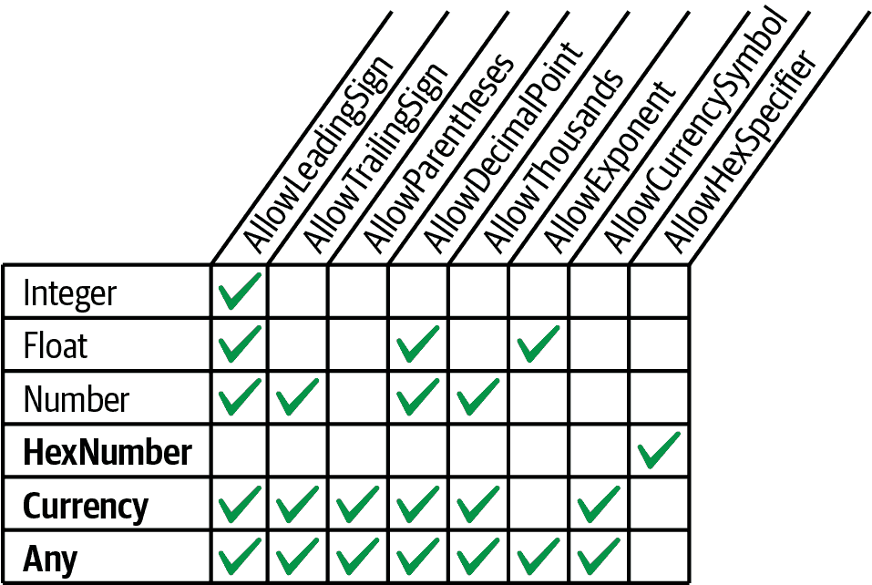
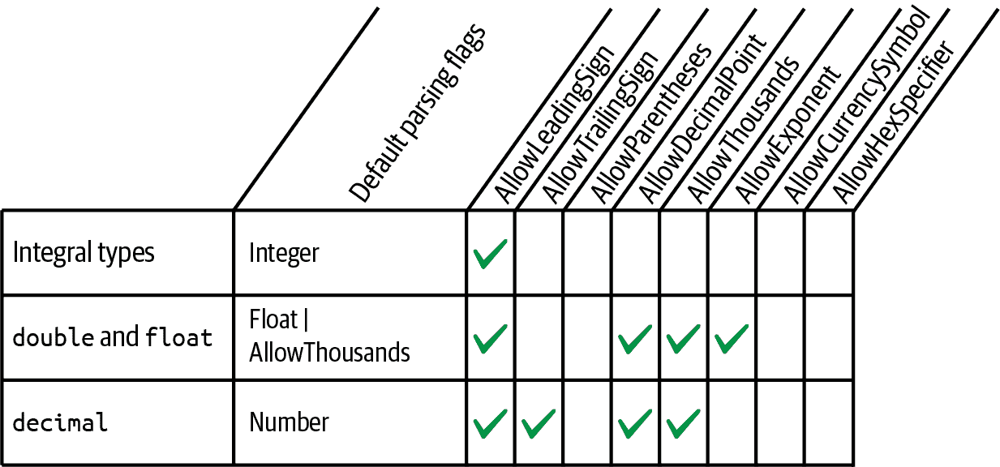

# 第六章 .NET 基础

在编程时，大多数核心设施不是由 C# 语言提供，而是由 .NET BCL 中的类型提供。本章中，我们涵盖了一些帮助进行基本编程任务的类型，例如虚拟相等比较、顺序比较和类型转换。我们还涵盖了基本的 .NET 类型，如 `String`、`DateTime` 和 `Enum`。

本节中的类型位于 `System` 命名空间中，以下是一些例外：

+   `StringBuilder` 在 `System.Text` 中定义，包括 *文本编码* 的类型。

+   `CultureInfo` 及其关联类型在 `System.Globalization` 中定义。

+   `XmlConvert` 在 `System.Xml` 中定义。

# 字符串和文本处理

## Char

C# 的 `char` 表示单个 Unicode 字符，并别名为 `System.Char` 结构体。在 第二章 中，我们描述了如何表示 `char` 文字：

```cs
char c = 'A';
char newLine = '\n';
```

`System.Char` 定义了一系列静态方法，用于处理字符，如 `ToUpper`、`ToLower` 和 `IsWhiteSpace`。您可以通过 `System.Char` 类型或其 `char` 别名调用这些方法：

```cs
Console.WriteLine (System.Char.ToUpper ('c'));    // C
Console.WriteLine (char.IsWhiteSpace ('\t'));     // True
```

`ToUpper` 和 `ToLower` 遵循最终用户的语言环境，这可能导致一些微妙的 bug。在土耳其，以下表达式评估为 `false`：

```cs
char.ToUpper ('i') == 'I'
```

这是因为在土耳其，`char.ToUpper('i')` 是 `'İ'`（请注意上面的点！）。为了避免这个问题，`System.Char`（以及 `System.String`）还提供了以 “Invariant” 结尾的文化不变版本的 `ToUpper` 和 `ToLower`，这些始终应用英语文化规则：

```cs
Console.WriteLine (char.ToUpperInvariant ('i'));    // I
```

这是一个快捷方式：

```cs
Console.WriteLine (char.ToUpper ('i', CultureInfo.InvariantCulture))
```

有关语言环境和文化的更多信息，请参阅 “格式化和解析”。

大多数 `char` 的其他静态方法与字符分类有关。 表 6-1 列出了这些方法。

表 6-1 静态方法用于对字符进行分类

| 静态方法 | 包含的字符 | 包含的 Unicode 类别 |
| --- | --- | --- |

| `IsLetter` | A–Z、a–z 和其他字母 | `UpperCaseLetter` `LowerCaseLetter`

`TitleCaseLetter`

`ModifierLetter`

`OtherLetter` |

| `IsUpper` | 大写字母 | `UpperCaseLetter` |
| --- | --- | --- |
| `IsLower` | 小写字母 | `LowerCaseLetter` |
| `IsDigit` | 0–9 及其他字母的数字 | `DecimalDigitNumber` |
| `IsLetterOrDigit` | 字母加上数字 | (`IsLetter`, `IsDigit`) |

| `IsNumber` | 所有数字加上 Unicode 分数和罗马数字符号 | `DecimalDigitNumber` `LetterNumber`

`OtherNumber` |

| `IsSeparator` | 空格加上所有 Unicode 分隔符字符 | `LineSeparator` `ParagraphSeparator` |
| --- | --- | --- |
| `IsWhiteSpace` | 所有分隔符加上 `\n`、`\r`、`\t`、`\f` 和 `\v` | `LineSeparator` `ParagraphSeparator` |

| `IsPunctuation` | 用于西方及其他字母表中的标点符号的符号 | `DashPunctuation` `ConnectorPunctuation`

`InitialQuotePunctuation`

| `FinalQuotePunctuation` |

| `IsSymbol` | 大多数其他可打印符号 | `MathSymbol` `ModifierSymbol`

`OtherSymbol` |

| `IsControl` | 0x20 以下的不可打印“控制”字符，例如 `\r`、`\n`、`\t`、`\0`，以及 0x7F 和 0x9A 之间的字符 | (无) |
| --- | --- | --- |

为了更细粒度的分类，`char` 提供了一个名为 `GetUnicodeCategory` 的静态方法；它返回一个 `UnicodeCategory` 枚举，其成员显示在 表 6-1 的最右列中。

###### 注意

通过显式从整数转换，可以生成超出分配的 Unicode 集的 `char`。要测试字符的有效性，请调用 `char.GetUnicodeCategory`：如果结果为 `UnicodeCategory.OtherNotAssigned`，则该字符无效。

一个 `char` 宽度为 16 位 —— 足以表示基本多文种平面中的任何 Unicode 字符。要超出这一范围，必须使用代理对：我们将在 “文本编码和 Unicode” 中描述执行此操作的方法。

## 字符串

C# `string` (`== System.String`) 是一个不可变（无法改变）的字符序列。在 第二章 中，我们描述了如何表示字符串字面量，进行相等性比较以及连接两个字符串。本节介绍了其余处理字符串的函数，这些函数通过 `System.String` 类的静态和实例成员公开。

### 构造字符串

构造字符串的最简单方式是分配一个字面量，正如我们在 第二章 中看到的：

```cs
string s1 = "Hello";
string s2 = "First Line\r\nSecond Line";
string s3 = @"\\server\fileshare\helloworld.cs";
```

要创建一个重复的字符序列，您可以使用 `string` 的构造函数：

```cs
Console.Write (new string ('*', 10));      // **********
```

您还可以从 `char` 数组构造字符串。`ToCharArray` 方法则执行相反操作：

```cs
char[] ca = "Hello".ToCharArray();
string s = new string (ca);              // s = "Hello"
```

`string` 的构造函数还可以重载以接受各种（不安全的）指针类型，以便从诸如 `char*` 等类型创建字符串。

### 空和空字符串

空字符串的长度为零。要创建空字符串，可以使用字面量或静态 `string.Empty` 字段；要测试空字符串，可以执行相等性比较或测试其 `Length` 属性：

```cs
string empty = "";
Console.WriteLine (empty == "");              // True
Console.WriteLine (empty == string.Empty);    // True
Console.WriteLine (empty.Length == 0);        // True
```

由于字符串是引用类型，它们也可以为 `null`：

```cs
string nullString = null;
Console.WriteLine (nullString == null);        // True
Console.WriteLine (nullString == "");          // False
Console.WriteLine (nullString.Length == 0);    // NullReferenceException
```

静态 `string.IsNullOrEmpty` 方法是测试给定字符串是否为 null 或空的一个便捷方法。

### 访问字符串中的字符

字符串的索引器返回给定索引处的单个字符。与所有操作字符串的函数一样，这是从零开始的索引：

```cs
string str  = "abcde";
char letter = str[1];        // letter == 'b'
```

`string` 还实现了 `IEnumerable<char>`，因此您可以对其字符进行 `foreach` 循环：

```cs
foreach (char c in "123") Console.Write (c + ",");    // 1,2,3,
```

### 在字符串中搜索

在字符串中进行搜索的最简单方法是使用 `StartsWith`、`EndsWith` 和 `Contains`。这些方法都返回 `true` 或 `false`：

```cs
Console.WriteLine ("quick brown fox".EndsWith ("fox"));      // True
Console.WriteLine ("quick brown fox".Contains ("brown"));    // True
```

这些方法还重载了让您可以指定 `StringComparison` 枚举以控制大小写和区域性敏感性（参见“按序数与文化比较”）。默认情况下，使用适用于当前（本地化）文化的规则执行区分大小写的匹配。以下示例使用 *不变的* 区域性规则执行不区分大小写的搜索：

```cs
"abcdef".StartsWith ("aBc", StringComparison.InvariantCultureIgnoreCase)
```

`IndexOf` 返回给定字符或子字符串的第一个位置（如果未找到子字符串，则返回 `-1`）：

```cs
Console.WriteLine ("abcde".IndexOf ("cd"));   // 2
```

`IndexOf` 还重载了以接受 `startPosition`（开始搜索的索引）和 `StringComparison` 枚举：

```cs
Console.WriteLine ("abcde abcde".IndexOf ("CD", 6,
                   StringComparison.CurrentCultureIgnoreCase));    // 8
```

`LastIndexOf` 类似于 `IndexOf`，但它是从字符串的末尾向前搜索。

`IndexOfAny` 返回一组字符中任意一个匹配字符的第一个位置：

```cs
Console.Write ("ab,cd ef".IndexOfAny (new char[] {' ', ','} ));       // 2
Console.Write ("pas5w0rd".IndexOfAny ("0123456789".ToCharArray() ));  // 3
```

`LastIndexOfAny` 在相反的方向上执行相同的操作。

### 操纵字符串

因为 `String` 是不可变的，所有“操纵”字符串的方法都会返回一个新的字符串，而原始字符串保持不变（当重新分配字符串变量时也是如此）。

`Substring` 提取字符串的一部分：

```cs
string left3 = "12345".Substring (0, 3);     // left3 = "123";
string mid3  = "12345".Substring (1, 3);     // mid3 = "234";
```

如果省略长度，则获取字符串的剩余部分：

```cs
string end3  = "12345".Substring (2);        // end3 = "345";
```

`Insert` 和 `Remove` 在指定位置插入或删除字符：

```cs
string s1 = "helloworld".Insert (5, ", ");    // s1 = "hello, world"
string s2 = s1.Remove (5, 2);                 // s2 = "helloworld";
```

`PadLeft` 和 `PadRight` 使用指定的字符（如果未指定，则使用空格）将字符串填充到给定长度：

```cs
Console.WriteLine ("12345".PadLeft (9, '*'));  // ****12345
Console.WriteLine ("12345".PadLeft (9));       //     12345
```

如果输入字符串比填充长度长，则返回原始字符串而不做任何更改。

`TrimStart` 和 `TrimEnd` 从字符串的开头或结尾移除指定的字符；`Trim` 同时执行这两种操作。默认情况下，这些函数移除空白字符（包括空格、制表符、换行符和这些字符的 Unicode 变体）：

```cs
Console.WriteLine ("  abc \t\r\n ".Trim().Length);   // 3
```

`Replace` 替换特定字符或子字符串的所有（非重叠）出现：

```cs
Console.WriteLine ("to be done".Replace (" ", " | ") );  // to | be | done
Console.WriteLine ("to be done".Replace (" ", "")    );  // tobedone
```

`ToUpper` 和 `ToLower` 返回输入字符串的大写和小写版本。默认情况下，它们遵循用户当前的语言设置；`ToUpperInvariant` 和 `ToLowerInvariant` 总是应用英语字母规则。

### 字符串的拆分和连接

`Split` 将字符串分割成多个部分：

```cs
string[] words = "The quick brown fox".Split();

foreach (string word in words)
  Console.Write (word + "|");    // The|quick|brown|fox|
```

默认情况下，`Split` 使用空白字符作为分隔符；它还重载了以接受 `params` 字符数组或字符串分隔符数组。`Split` 还可以选择接受 `StringSplitOptions` 枚举，该枚举有一个选项来移除空条目：当单词之间使用多个分隔符分隔时，这很有用。

静态 `Join` 方法与 `Split` 相反。它需要一个分隔符和字符串数组：

```cs
string[] words = "The quick brown fox".Split();
string together = string.Join (" ", words);      // The quick brown fox
```

静态 `Concat` 方法类似于 `Join`，但仅接受 `params` 字符串数组并且不应用分隔符。`Concat` 实际上等同于 `+` 运算符（事实上，编译器将 `+` 转换为 `Concat`）：

```cs
string sentence     = string.Concat ("The", " quick", " brown", " fox");
string sameSentence = "The" + " quick" + " brown" + " fox";
```

### String.Format 和复合格式字符串

静态 `Format` 方法提供了一种方便的方式来构建嵌入变量的字符串。嵌入的变量（或值）可以是任何类型；`Format` 简单地对它们调用 `ToString`。

包含嵌入变量的主字符串称为*组合格式字符串*。调用`String.Format`时，您提供一个组合格式字符串，后跟每个嵌入变量：

```cs
string composite = "It's {0} degrees in {1} on this {2} morning";
string s = string.Format (composite, 35, "Perth", DateTime.Now.DayOfWeek);

// s == "It's 35 degrees in Perth on this Friday morning"
```

（这是摄氏度！）

我们可以使用插值字符串字面量以同样的效果（参见“String Type”）。只需在字符串前加上`$`符号，并将表达式放在大括号中：

```cs
string s = $"It's hot this {DateTime.Now.DayOfWeek} morning";
```

大括号中的每个数字称为*格式项*。数字对应于参数位置，可选地跟随以下内容：

+   逗号和*最小宽度*应用

+   冒号和*格式字符串*

最小宽度对于对齐列非常有用。如果值为负，则数据左对齐；否则，右对齐：

```cs
string composite = "Name={0,-20} Credit Limit={1,15:C}";

Console.WriteLine (string.Format (composite, "Mary", 500));
Console.WriteLine (string.Format (composite, "Elizabeth", 20000));
```

这是结果：

```cs
Name=Mary                 Credit Limit=        $500.00
Name=Elizabeth            Credit Limit=     $20,000.00
```

这是不使用`string.Format`的等效形式：

```cs
string s = "Name=" + "Mary".PadRight (20) +
           " Credit Limit=" + 500.ToString ("C").PadLeft (15);
```

通过`"C"`格式字符串，信用限额以货币形式进行格式化。我们在“Formatting and Parsing”中详细描述格式字符串。

## 比较字符串

在比较两个值时，.NET 区分*相等比较*和*顺序比较*的概念。相等比较测试两个实例是否语义上相同；顺序比较测试这两个（如果有的话）实例在按升序或降序排列时谁先出现。

###### 注意

相等比较不是顺序比较的*子集*；这两个系统有不同的目的。例如，在相同的排序位置上允许有两个不相等的值。我们在“Equality Comparison”中恢复这个主题。

对于字符串的相等比较，您可以使用`==`运算符或`string`的`Equals`方法之一。后者更加灵活，因为它们允许您指定选项，如不区分大小写。

###### 警告

另一个区别是，如果将变量强制转换为`object`类型，则`==`在字符串上不可靠。我们在“Equality Comparison”中解释了这一点。

对于字符串顺序比较，您可以使用`CompareTo`实例方法或静态的`Compare`和`CompareOrdinal`方法。这些方法根据第一个值是否在第二个值之后、之前或与其并列返回正数、负数或零。

在详细讨论每个之前，我们需要检查.NET 的底层字符串比较算法。

### 顺序与文化比较

字符串比较有两种基本算法：*顺序*和*文化敏感*。顺序比较将字符简单地解释为数字（根据它们的数值 Unicode 值）；文化敏感比较则根据特定的字母表解释字符。有两种特殊的文化：基于从计算机控制面板获取的设置的“当前文化”，以及在每台计算机上相同的“不变文化”（与美国文化接近）。

对于相等比较，无论是序数还是特定文化的算法都很有用。然而，对于排序来说，特定文化的比较几乎总是更可取的：要按字母顺序排序字符串，你需要一个字母表。序数依赖于数字 Unicode 点值，这恰好按照英文字符的字母顺序排列，但即使如此，也不完全如你所期望的那样。例如，假设区分大小写，请考虑字符串`"Atom"`、`"atom"`和`"Zamia"`。不变文化将它们按以下顺序排列：

```cs
"atom", "Atom", "Zamia"
```

序数则将它们安排如下：

```cs
"Atom", "Zamia", "atom"
```

这是因为不变文化封装了一个包括大写字符邻近其小写对应物的字母表（aAbBcCdD...）。然而，序数算法将所有大写字符放在前面，然后所有小写字符（A...Z，a...z）。这本质上是对上世纪 60 年代发明的 ASCII 字符集的回溯。

### 字符串相等比较

尽管序数有其局限性，`string`的`==`运算符总是执行*序数区分大小写*比较。调用时没有参数的`string.Equals`的实例版本也是如此；这定义了`string`类型的“默认”相等比较行为。

###### 注意

序数算法被选为`string`的`==`和`Equals`函数的算法，因为它既高效又*确定性*。字符串的相等比较被认为是基础性的，并且比顺序比较频繁得多。

“严格”的相等概念也与`==`运算符的一般使用一致。

以下方法允许特定文化感知或不区分大小写的比较：

```cs
public bool Equals (string value, StringComparison comparisonType);

public static bool Equals (string a, string b,
                           StringComparison comparisonType);
```

静态版本的优势在于，即使其中一个或两个字符串为`null`，它仍然可以工作。`StringComparison`被定义为以下的`enum`：

```cs
public enum StringComparison
{
  CurrentCulture,               // Case-sensitive
  CurrentCultureIgnoreCase,
  InvariantCulture,             // Case-sensitive
  InvariantCultureIgnoreCase,
  Ordinal,                      // Case-sensitive
  OrdinalIgnoreCase
}
```

例如：

```cs
Console.WriteLine (string.Equals ("foo", "FOO",
                   StringComparison.OrdinalIgnoreCase));   // True

Console.WriteLine ("ṻ" == "ǖ");                            // False

Console.WriteLine (string.Equals ("ṻ", "ǖ",
                   StringComparison.CurrentCulture));      // *?*
```

（第三个示例的结果取决于计算机的当前语言设置。）

### 字符串顺序比较

`String`的`CompareTo`实例方法执行*特定文化*、*区分大小写*的顺序比较。与`==`运算符不同，`CompareTo`不使用序数比较：对于排序，特定文化的算法要更有用。这里是该方法的定义：

```cs
public int CompareTo (string strB);
```

###### 注意

实例方法`CompareTo`实现了通用的`IComparable`接口，这是.NET 库中使用的标准比较协议。这意味着`string`的`CompareTo`定义了在排序集合等应用中字符串的默认排序行为。有关`IComparable`的更多信息，请参阅“顺序比较”。

对于其他类型的比较，可以调用静态的`Compare`和`CompareOrdinal`方法：

```cs
public static int Compare (string strA, string strB,
                           StringComparison comparisonType);

public static int Compare (string strA, string strB, bool ignoreCase,
                           CultureInfo culture);

public static int Compare (string strA, string strB, bool ignoreCase);

public static int CompareOrdinal (string strA, string strB);
```

最后两个方法只是调用前两个方法的简便方法。

所有的顺序比较方法返回一个正数、一个负数或零，具体取决于第一个值是在第二个值之后、之前还是相同：

```cs
Console.WriteLine ("Boston".CompareTo ("Austin"));    // 1
Console.WriteLine ("Boston".CompareTo ("Boston"));    // 0
Console.WriteLine ("Boston".CompareTo ("Chicago"));   // -1
Console.WriteLine ("ṻ".CompareTo ("ǖ"));              // 1
Console.WriteLine ("foo".CompareTo ("FOO"));          // -1
```

以下使用当前文化进行不区分大小写比较：

```cs
Console.WriteLine (string.Compare ("foo", "FOO", true));   // 0
```

通过提供一个 `CultureInfo` 对象，你可以插入任何字母表：

```cs
// CultureInfo is defined in the System.Globalization namespace

CultureInfo german = CultureInfo.GetCultureInfo ("de-DE");
int i = string.Compare ("Müller", "Muller", false, german);
```

## StringBuilder

`StringBuilder` 类（`System.Text` 命名空间）表示一个可变（可编辑）字符串。使用 `StringBuilder`，可以在不替换整个 `StringBuilder` 的情况下 `Append`、`Insert`、`Remove` 和 `Replace` 子字符串。

`StringBuilder` 的构造函数可选择接受一个初始字符串值以及其内部容量的起始大小（默认为 16 个字符）。如果超出此范围，`StringBuilder` 会自动调整其内部结构以容纳（稍微降低性能）最大容量（默认为 `int.MaxValue`）。

使用 `StringBuilder` 的一个流行用法是通过重复调用 `Append` 来构建长字符串。这种方法比重复连接普通字符串类型要高效得多：

```cs
StringBuilder sb = new StringBuilder();
for (int i = 0; i < 50; i++) sb.Append(i).Append(",");
```

要获取最终结果，请调用 `ToString()`：

```cs
Console.WriteLine (sb.ToString());

0,1,2,3,4,5,6,7,8,9,10,11,12,13,14,15,16,17,18,19,20,21,22,23,24,25,26,
27,28,29,30,31,32,33,34,35,36,37,38,39,40,41,42,43,44,45,46,47,48,49,
```

`AppendLine` 执行一个 `Append`，添加一个新行序列（在 Windows 下是 `"\r\n"`）。`AppendFormat` 接受一个复合格式字符串，就像 `String.Format` 一样。

除了 `Insert`、`Remove` 和 `Replace` 方法（`Replace` 的工作方式类似于字符串的 `Replace`），`StringBuilder` 定义了一个 `Length` 属性和一个可写索引器来获取/设置单个字符。

要清除 `StringBuilder` 的内容，可以实例化一个新的或将其 `Length` 设置为零。

###### 警告

将 `StringBuilder` 的 `Length` 设置为零不会减小其*内部*容量。因此，如果 `StringBuilder` 以前包含一百万个字符，将其长度设置为零后，它仍将占用大约两兆字节的内存。如果要释放内存，必须创建一个新的 `StringBuilder`，并允许旧的 `StringBuilder` 超出作用域（并被垃圾回收）。

## 文本编码和 Unicode

*字符集* 是字符分配，每个字符都有一个数字代码或*代码点*。常用的字符集有两种：Unicode 和 ASCII。Unicode 的地址空间约为一百万个字符，目前分配约十万个。Unicode 覆盖大多数世界语言以及一些历史语言和特殊符号。ASCII 集仅是 Unicode 集的前 128 个字符，覆盖大部分美式键盘上的内容。ASCII 比 Unicode 早 30 年，有时因其简单和高效而仍在使用：每个字符用一个字节表示。

.NET 类型系统设计用于与 Unicode 字符集配合工作。ASCII 隐式支持，因为它是 Unicode 的子集。

*文本编码*将字符从其数字代码点映射到二进制表示。在.NET 中，文本编码主要用于处理文本文件或流。将文本文件读入字符串时，*文本编码器*将文件数据从二进制转换为`char`和`string`类型期望的内部 Unicode 表示。文本编码可以限制可以表示的字符，并影响存储效率。

在.NET 中有两类文本编码：

+   将 Unicode 字符映射到另一个字符集的编码

+   使用标准 Unicode 编码方案的编码

第一类包含传统编码，如 IBM 的 EBCDIC 和扩展字符集的 8 位字符集，这些字符集在 Unicode 之前非常流行（由代码页标识）。ASCII 编码也属于此类：它编码前 128 个字符并丢弃其他所有内容。此类还包含*非遗留*GB18030，这是自 2000 年以来在中国编写或销售的应用程序的强制标准。

第二类是 UTF-8、UTF-16 和 UTF-32（以及已废弃的 UTF-7）。每种编码在空间效率上有所不同。对于大多数文本，UTF-8 是最空间高效的：它使用*一到四个字节*来表示每个字符。前 128 个字符仅需一个字节，使其与 ASCII 兼容。UTF-8 是最流行的文本文件和流编码（特别是在互联网上），并且是.NET 中流输入/输出（I/O）的默认编码（事实上，它是几乎所有隐式使用编码的默认值）。

UTF-16 使用一个或两个 16 位字来表示每个字符。这是.NET 内部用于表示字符和字符串的方式。一些程序还以 UTF-16 编写文件。

UTF-32 是最不空间高效的：它直接将每个代码点映射到 32 位，因此每个字符占用四个字节。由于这个原因，UTF-32 很少被使用。然而，它确实使随机访问非常容易，因为每个字符占用相同数量的字节。

### 获取一个 Encoding 对象

`System.Text`中的`Encoding`类是封装文本编码的常见基类型。有几个子类——它们的目的是封装具有类似特性的编码族。最常见的编码可以通过`Encoding`上的专用静态属性获取：

| 编码名称 | Encoding 上的静态属性 |
| --- | --- |
| UTF-8 | `Encoding.UTF8` |
| UTF-16 | `Encoding.Unicode`（*不是* `UTF16`） |
| UTF-32 | `Encoding.UTF32` |
| ASCII | `Encoding.ASCII` |

您可以通过使用标准的互联网分配的数字字符集（IANA）名称调用`Encoding.GetEncoding`来获取其他编码：

```cs
// In .NET 5+ and .NET Core, you must first call RegisterProvider:
Encoding.RegisterProvider (CodePagesEncodingProvider.Instance);

Encoding chinese = Encoding.GetEncoding ("GB18030");
```

静态的`GetEncodings`方法返回所有支持的编码列表，以及它们的标准 IANA 名称：

```cs
foreach (EncodingInfo info in Encoding.GetEncodings())
  Console.WriteLine (info.Name);
```

另一种获取编码的方法是直接实例化编码类。这样做允许您通过构造函数参数设置各种选项，包括：

+   是否在解码时遇到无效字节序列时抛出异常。默认值为 false。

+   是否以最重要的字节优先（*大端序*）或最不重要的字节优先（*小端序*）编码/解码 UTF-16/UTF-32。默认是*小端序*，在 Windows 操作系统上是标准的。

+   是否发出字节顺序标记（指示*字节顺序*的前缀）。

### 用于文件和流 I/O 的编码

`Encoding`对象的最常见应用是控制如何将文本读取和写入文件或流。例如，以下代码以 UTF-16 编码将“Testing…”写入名为*data.txt*的文件：

```cs
System.IO.File.WriteAllText ("data.txt", "Testing...", Encoding.Unicode);
```

如果省略最后一个参数，`WriteAllText`将应用普遍使用的 UTF-8 编码。

###### 注意

UTF-8 是所有文件和流 I/O 的默认文本编码。

我们将在第十五章，“流适配器”中继续讨论这个主题。

### 编码为字节数组

您还可以使用`Encoding`对象在字节数组和字符串之间进行转换。`GetBytes`方法使用给定的编码将`string`转换为`byte[]`；`GetString`方法将`byte[]`转换为`string`：

```cs
byte[] utf8Bytes  = System.Text.Encoding.UTF8.GetBytes    ("0123456789");
byte[] utf16Bytes = System.Text.Encoding.Unicode.GetBytes ("0123456789");
byte[] utf32Bytes = System.Text.Encoding.UTF32.GetBytes   ("0123456789");

Console.WriteLine (utf8Bytes.Length);    // 10
Console.WriteLine (utf16Bytes.Length);   // 20
Console.WriteLine (utf32Bytes.Length);   // 40

string original1 = System.Text.Encoding.UTF8.GetString    (utf8Bytes);
string original2 = System.Text.Encoding.Unicode.GetString (utf16Bytes);
string original3 = System.Text.Encoding.UTF32.GetString   (utf32Bytes);

Console.WriteLine (original1);          // 0123456789
Console.WriteLine (original2);          // 0123456789
Console.WriteLine (original3);          // 0123456789
```

### UTF-16 和代理对

记得.NET 将字符和字符串存储在 UTF-16 中。因为 UTF-16 每个字符需要一个或两个 16 位字，而`char`长度仅为 16 位，所以一些 Unicode 字符需要两个`char`来表示。这有几个后果：

+   字符串的`Length`属性可能大于其实际字符数。

+   单个`char`并不总是足以完全表示一个 Unicode 字符。

大多数应用程序忽略此问题，因为几乎所有常用字符都适合 Unicode 的一个部分，称为*基本多语言平面*（BMP），在 UTF-16 中只需要一个 16 位字。BMP 涵盖几十种世界语言，包括超过 30,000 个中文字符。不包括某些古代语言的字符，音乐符号，一些不常见的中文字符以及大多数表情符号。

如果需要支持双字字符，`char`中的以下静态方法将 32 位代码点转换为两个`char`的字符串，并反向转换回去：

```cs
string ConvertFromUtf32 (int utf32)
int    ConvertToUtf32   (char highSurrogate, char lowSurrogate)
```

两字字符称为*代理对*。它们很容易识别，因为每个字都在 0xD800 到 0xDFFF 范围内。您可以使用`char`中的以下静态方法来辅助：

```cs
bool IsSurrogate     (char c)
bool IsHighSurrogate (char c)
bool IsLowSurrogate  (char c)
bool IsSurrogatePair (char highSurrogate, char lowSurrogate)
```

`System.Globalization`命名空间中的`StringInfo`类还提供了一系列处理双字字符的方法和属性。

BMP 之外的字符通常需要特殊字体，并且操作系统支持有限。

# 日期和时间

`System`命名空间中的以下不可变结构体负责表示日期和时间：

`DateTime`、`DateTimeOffset`、`TimeSpan`、`DateOnly`、`TimeOnly`

C#没有定义任何特殊的关键字来映射到这些类型。

## 时间间隔

`TimeSpan`表示一段时间间隔或一天中的时间。在后一种角色中，它只是“时钟”时间（不包括日期），它等于从午夜开始的时间，假设没有夏令时过渡。`TimeSpan`的分辨率为 100 纳秒，最大值约为 1000 万天，可以为正或负。

有三种构造`TimeSpan`的方法：

+   通过其中一个构造函数

+   通过调用其中一个静态的`From`…方法

+   通过将一个`DateTime`减去另一个

这里是构造函数：

```cs
public TimeSpan (int hours, int minutes, int seconds);
public TimeSpan (int days, int hours, int minutes, int seconds);
public TimeSpan (int days, int hours, int minutes, int seconds,
                                                   int milliseconds);
public TimeSpan (int days, int hours, int minutes, int seconds,
                                      int milliseconds, int microseconds);
public TimeSpan (long ticks);   // Each tick = 100ns
```

当您想要仅使用单个单位（如分钟、小时等）指定间隔时，静态的`From`…方法更方便：

```cs
public static TimeSpan FromDays (double value);
public static TimeSpan FromHours (double value);
public static TimeSpan FromMinutes (double value);
public static TimeSpan FromSeconds (double value);
public static TimeSpan FromMilliseconds (double value);
public static TimeSpan FromMicroseconds (double value);
```

例如：

```cs
Console.WriteLine (new TimeSpan (2, 30, 0));     // 02:30:00
Console.WriteLine (TimeSpan.FromHours (2.5));    // 02:30:00
Console.WriteLine (TimeSpan.FromHours (-2.5));   // -02:30:00
```

`TimeSpan`重载了`<`和`>`运算符以及`+`和`-`运算符。以下表达式计算为 2.5 小时的`TimeSpan`：

```cs
TimeSpan.FromHours(2) + TimeSpan.FromMinutes(30);
```

下一个表达式计算为比 10 天短一秒：

```cs
TimeSpan.FromDays(10) - TimeSpan.FromSeconds(1);   // 9.23:59:59
```

使用这个表达式，我们可以说明整数属性`Days`、`Hours`、`Minutes`、`Seconds`和`Milliseconds`：

```cs
TimeSpan nearlyTenDays = TimeSpan.FromDays(10) - TimeSpan.FromSeconds(1);

Console.WriteLine (nearlyTenDays.Days);          // 9
Console.WriteLine (nearlyTenDays.Hours);         // 23
Console.WriteLine (nearlyTenDays.Minutes);       // 59
Console.WriteLine (nearlyTenDays.Seconds);       // 59
Console.WriteLine (nearlyTenDays.Milliseconds);  // 0
```

相比之下，`Total`...属性返回类型为`double`的值，描述整个时间跨度：

```cs
Console.WriteLine (nearlyTenDays.TotalDays);          // 9.99998842592593
Console.WriteLine (nearlyTenDays.TotalHours);         // 239.999722222222
Console.WriteLine (nearlyTenDays.TotalMinutes);       // 14399.9833333333
Console.WriteLine (nearlyTenDays.TotalSeconds);       // 863999
Console.WriteLine (nearlyTenDays.TotalMilliseconds);  // 863999000
```

静态的`Parse`方法执行与`ToString`相反的操作，将字符串转换为`TimeSpan`。`TryParse`也执行相同的操作，但如果转换失败，则返回`false`而不是抛出异常。`XmlConvert`类还提供了`TimeSpan`/字符串转换方法，遵循标准的 XML 格式化协议。

`TimeSpan`的默认值是`TimeSpan.Zero`。

`TimeSpan`也可以用来表示一天中的时间（自午夜以来经过的时间）。要获取当前时间，请调用`DateTime.Now.TimeOfDay`。

## DateTime 和 DateTimeOffset

`DateTime`和`DateTimeOffset`是表示日期和（可选）时间的不可变结构体。它们的分辨率为 100 纳秒，范围涵盖 0001 年至 9999 年。

`DateTimeOffset`在功能上类似于`DateTime`。其特点是它还存储一个协调世界时（UTC）偏移量；这在跨不同时区比较值时可以得到更有意义的结果。

### 在选择 DateTime 和 DateTimeOffset 之间

`DateTime`和`DateTimeOffset`在处理时区时有所不同。`DateTime`包含一个三态标志，指示`DateTime`是否相对于以下内容：

+   当前计算机上的本地时间

+   UTC（格林尼治标准时间的现代等价物）

+   未指定的

`DateTimeOffset`更具体一些—它将偏移量从 UTC 存储为`TimeSpan`：

```cs
July 01 2019 03:00:00 -06:00
```

这会影响到相等比较，这是在选择`DateTime`和`DateTimeOffset`之间的主要因素。具体来说：

+   `DateTime`在比较中忽略了三态标志，并且认为如果它们具有相同的年、月、日、小时、分钟等，则两个值相等。

+   `DateTimeOffset`认为如果它们引用*同一时间点*，则两个值相等。

###### 警告

夏令时使得这种区别变得重要，即使您的应用程序不需要处理多个地理时区。

因此，`DateTime` 认为以下两个值是不同的，而 `DateTimeOffset` 认为它们是相等的：

```cs
July 01 2019 09:00:00 +00:00 (GMT)
July 01 2019 03:00:00 -06:00 (local time, Central America)
```

在大多数情况下，`DateTimeOffset` 的相等逻辑更可取。例如，在计算两个国际事件中哪个更近时，`DateTimeOffset` 会隐式地给出正确答案。同样，计划进行分布式拒绝服务攻击的黑客也会选择 `DateTimeOffset`！要使用 `DateTime` 实现相同效果，则需要在应用程序中统一使用单一时区（通常是 UTC）。这有两个问题：

+   为了对最终用户友好，UTC `DateTime` 需要在格式化之前显式转换为本地时间。

+   很容易忘记并纳入本地 `DateTime`。

`DateTime` 更好，尤其是在运行时相对于本地计算机指定值时——例如，如果您希望在每个国际办事处都安排下周日凌晨 3 点进行存档（当活动最少时）。在这种情况下，`DateTime` 更合适，因为它会尊重每个地点的本地时间。

###### 注意

在内部，`DateTimeOffset` 使用短整数以分钟为单位存储 UTC 偏移量。它不存储任何地区信息，因此没有任何信息可以表明例如 +08:00 的偏移量是指新加坡时间还是珀斯时间。

我们在“日期和时区”中深入探讨了时区和相等比较。

###### 注意

SQL Server 2008 通过同名的新数据类型直接支持了 `DateTimeOffset`。

### 构建 DateTime

`DateTime` 定义了构造函数，接受整数参数作为年、月、日——可选的还有时、分、秒、毫秒（从 .NET 7 开始，还包括微秒）：

```cs
public DateTime (int year, int month, int day);

public DateTime (int year, int month, int day,
                 int hour, int minute, int second, int millisecond);
```

如果只指定日期，时间会被默认设置为午夜（0:00）。

`DateTime` 构造函数还允许您指定 `DateTimeKind`——一个包含以下值的枚举：

```cs
Unspecified, Local, Utc
```

这对应于前一节描述的三态标志。`Unspecified` 是默认值，表示 `DateTime` 是时区无关的。`Local` 表示相对于当前计算机上的本地时区。本地 `DateTime` 不包含有关其所指的具体时区的信息，或者说，不像 `DateTimeOffset` 那样包含与 UTC 的数值偏移量。

`DateTime` 的 `Kind` 属性返回其 `DateTimeKind`。

`DateTime` 的构造函数还有重载形式，可以接受一个 `Calendar` 对象。这允许您使用 `System.Globalization` 中定义的任何 `Calendar` 子类来指定日期：

```cs
DateTime d = new DateTime (5767, 1, 1,
                          new System.Globalization.HebrewCalendar());

Console.WriteLine (d);    // 12/12/2006 12:00:00 AM
```

（本示例中的日期格式取决于计算机的控制面板设置。）`DateTime` 总是使用默认的公历日历——这个示例，一次性的转换，在构造时进行。要使用另一个日历进行计算，必须使用子类 `Calendar` 自身的方法。

也可以使用 `long` 类型的单个 *ticks* 值构造一个 `DateTime`，其中 *ticks* 是从公元 0001 年 01 月 01 日午夜开始的 100 纳秒间隔数。

为了互操作性，`DateTime` 提供了静态的 `FromFileTime` 和 `FromFileTimeUtc` 方法，用于从 Windows 文件时间（指定为 `long`）和 `FromOADate` 方法转换从 OLE 自动化日期/时间（指定为 `double`）。

要从字符串构造 `DateTime`，调用静态的 `Parse` 或 `ParseExact` 方法。这两种方法都接受可选的标志和格式提供程序；`ParseExact` 还接受一个格式字符串。我们将在“格式化和解析”中更详细地讨论解析。

### 构造 DateTimeOffset

`DateTimeOffset` 有一组类似的构造函数。区别在于，还需指定一个 UTC 偏移量作为 `TimeSpan`：

```cs
public DateTimeOffset (int year, int month, int day,
                       int hour, int minute, int second,
                       TimeSpan offset);

public DateTimeOffset (int year, int month, int day,
                       int hour, int minute, int second, int millisecond,
                       TimeSpan offset);
```

`TimeSpan` 必须是整数分钟；否则，会引发异常。

`DateTimeOffset` 还有一些构造函数接受 `Calendar` 对象、`long` 类型的 *ticks* 值，以及静态的 `Parse` 和 `ParseExact` 方法接受一个字符串。

可以使用以下构造函数之一从现有的 `DateTime` 构造一个 `DateTimeOffset`：

```cs
public DateTimeOffset (DateTime dateTime);
public DateTimeOffset (DateTime dateTime, TimeSpan offset);
```

或者使用隐式转换：

```cs
DateTimeOffset dt = new DateTime (2000, 2, 3);
```

###### 注意

从 `DateTime` 到 `DateTimeOffset` 的隐式转换非常方便，因为大多数 .NET BCL 支持 `DateTime` — 而不支持 `DateTimeOffset`。

如果不指定偏移量，它将从 `DateTime` 值中推断使用以下规则：

+   如果 `DateTime` 的 `DateTimeKind` 是 `Utc`，则偏移量为零。

+   如果 `DateTime` 的 `DateTimeKind` 是 `Local` 或 `Unspecified`（默认值），则偏移量取自当前的本地时区。

转换到另一个方向时，`DateTimeOffset` 提供三个属性返回 `DateTime` 类型的值：

+   `UtcDateTime` 属性返回 UTC 时间中的 `DateTime`。

+   `LocalDateTime` 属性返回当前本地时区的 `DateTime`（如果需要，进行转换）。

+   `DateTime` 属性返回一个 `DateTime`，在指定的任何区域，具有 `Kind` 为 `Unspecified`（即，它返回 UTC 时间加上偏移量）。

### 当前的 DateTime/DateTimeOffset

`DateTime` 和 `DateTimeOffset` 都有一个静态的 `Now` 属性，返回当前日期和时间：

```cs
Console.WriteLine (DateTime.Now);         // 11/11/2019 1:23:45 PM
Console.WriteLine (DateTimeOffset.Now);   // 11/11/2019 1:23:45 PM -06:00
```

`DateTime` 还提供一个 `Today` 属性，只返回日期部分：

```cs
Console.WriteLine (DateTime.Today);       // 11/11/2019 12:00:00 AM
```

静态的 `UtcNow` 属性返回当前的 UTC 时间和日期：

```cs
Console.WriteLine (DateTime.UtcNow);        // 11/11/2019 7:23:45 AM
Console.WriteLine (DateTimeOffset.UtcNow);  // 11/11/2019 7:23:45 AM +00:00
```

所有这些方法的精度取决于操作系统，通常在 10 到 20 毫秒的范围内。

### 处理日期和时间

`DateTime` 和 `DateTimeOffset` 提供一组类似的实例属性，返回不同的日期/时间元素：

```cs
DateTime dt = new DateTime (2000, 2, 3,
                            10, 20, 30);

Console.WriteLine (dt.Year);         // 2000
Console.WriteLine (dt.Month);        // 2
Console.WriteLine (dt.Day);          // 3
Console.WriteLine (dt.DayOfWeek);    // Thursday
Console.WriteLine (dt.DayOfYear);    // 34

Console.WriteLine (dt.Hour);         // 10
Console.WriteLine (dt.Minute);       // 20
Console.WriteLine (dt.Second);       // 30
Console.WriteLine (dt.Millisecond);  // 0
Console.WriteLine (dt.Ticks);        // 630851700300000000
Console.WriteLine (dt.TimeOfDay);    // 10:20:30  (returns a TimeSpan)
```

`DateTimeOffset` 还有一个 `Offset` 属性，类型为 `TimeSpan`。

两种类型提供以下实例方法来执行计算（大多数接受 `double` 或 `int` 类型的参数）：

```cs
AddYears  AddMonths   AddDays
AddHours  AddMinutes  AddSeconds  AddMilliseconds  AddTicks
```

所有这些都会返回一个新的 `DateTime` 或 `DateTimeOffset`，并考虑诸如闰年等因素。您可以传入负值来进行减法运算。

`Add` 方法将 `TimeSpan` 添加到 `DateTime` 或 `DateTimeOffset` 中。`+` 运算符重载以执行相同的操作：

```cs
TimeSpan ts = TimeSpan.FromMinutes (90);
Console.WriteLine (dt.Add (ts));
Console.WriteLine (dt + ts);             // same as above
```

您还可以从 `DateTime`/`DateTimeOffset` 中减去 `TimeSpan`，以及从一个 `DateTime`/`DateTimeOffset` 中减去另一个 `DateTime`/`DateTimeOffset`。后者会返回一个 `TimeSpan`：

```cs
DateTime thisYear = new DateTime (2015, 1, 1);
DateTime nextYear = thisYear.AddYears (1);
TimeSpan oneYear = nextYear - thisYear;
```

### 格式化和解析日期时间

在 `DateTime` 上调用 `ToString` 时，格式化结果将作为 *短日期*（所有数字）后跟 *长时间*（包括秒）；例如：

```cs
11/11/2019 11:50:30 AM
```

操作系统的控制面板默认确定诸如日期、月份或年份的顺序，前导零的使用以及是否使用 12 小时或 24 小时制。

在 `DateTimeOffset` 上调用 `ToString` 时，除了返回偏移量之外，还会返回相同的内容：

```cs
11/11/2019 11:50:30 AM -06:00
```

`ToShortDateString` 和 `ToLongDateString` 方法仅返回日期部分。长日期格式也由控制面板确定；例如：“2015 年 11 月 11 日 星期三”。`ToShortTimeString` 和 `ToLongTimeString` 方法仅返回时间部分，例如 17:10:10（前者不包括秒）。

这四个刚才描述的方法实际上是四个不同的 *格式字符串* 的快捷方式。`ToString` 被重载以接受格式字符串和提供程序，允许您指定广泛的选项并控制如何应用区域设置。我们在 “格式化和解析” 中描述了这一点。

###### 警告

如果区域设置设置与格式化时不同，则可能会误解 `DateTime` 和 `DateTimeOffset`。您可以通过使用忽略区域设置的格式字符串（如“o”）与 `ToString` 结合使用来避免此问题：

```cs
DateTime dt1 = DateTime.Now;
string cannotBeMisparsed = dt1.ToString ("o");
DateTime dt2 = DateTime.Parse (cannotBeMisparsed);
```

静态的 `Parse`/`TryParse` 和 `ParseExact`/`TryParseExact` 方法执行 `ToString` 的反操作，将字符串转换为 `DateTime` 或 `DateTimeOffset`。这些方法还被重载以接受格式提供程序。`Try`* 方法在转换失败时返回 `false` 而不是抛出 `FormatException`。

### 空的 DateTime 和 DateTimeOffset 值

因为 `DateTime` 和 `DateTimeOffset` 是结构体，它们本身不可为空。当你需要可空性时，有两种方法可以解决这个问题：

+   使用可空类型（即 `DateTime?` 或 `DateTimeOffset?`）。

+   使用静态字段 `DateTime.MinValue` 或 `DateTimeOffset.MinValue`（这些类型的 *默认值*）。

可空类型通常是最佳选择，因为编译器可以帮助防止错误。`DateTime.MinValue` 对于与早于 C# 2.0 的代码向后兼容（当时引入了可空值类型）非常有用。

###### 警告

在 `DateTime.MinValue` 上调用 `ToUniversalTime` 或 `ToLocalTime` 可能导致它不再是 `DateTime.MinValue`（取决于你位于 GMT 的哪一侧）。如果你正好在 GMT 上（如英格兰，在夏令时之外），这个问题将不会出现，因为本地时间和 UTC 时间相同。这是你对英国冬季的补偿！

## DateOnly 和 TimeOnly

`DateOnly` 和 `TimeOnly` 结构体（来自 .NET 6）存在的目的是当你*仅仅*想表示日期或时间时使用。

`DateOnly` 类似于 `DateTime`，但没有时间部分。`DateOnly` 也缺乏 `DateTimeKind`；实际上，它总是 `Unspecified`，没有 `Local` 或 `Utc` 的概念。`DateOnly` 的历史替代方案是使用零时间（午夜）的 `DateTime`。这种方法的困难之处在于，当非零时间出现在你的代码中时，相等性比较会失败。

`TimeOnly` 类似于 `DateTime`，但没有日期部分。`TimeOnly` 用于捕捉一天中的时间，适用于记录闹钟时间或营业时间等应用。

# 日期和时区

在本节中，我们更详细地探讨了时区如何影响 `DateTime` 和 `DateTimeOffset`。我们还研究了 `TimeZoneInfo` 类型，该类型提供有关时区偏移和夏令时信息的信息。

## DateTime 和时区

`DateTime` 在处理时区时是简单的。在内部，它使用两个信息来存储 `DateTime`：

+   一个 62 位数字，表示自公元 1/1/0001 起的 ticks 数量

+   一个 2 位枚举，表示 `DateTimeKind`（`Unspecified`，`Local` 或 `Utc`）

当你比较两个 `DateTime` 实例时，只比较它们的 *ticks* 值；它们的 `DateTimeKind` 将被忽略：

```cs
DateTime dt1 = new DateTime (2000, 1, 1, 10, 20, 30, DateTimeKind.Local);
DateTime dt2 = new DateTime (2000, 1, 1, 10, 20, 30, DateTimeKind.Utc);
Console.WriteLine (dt1 == dt2);          // True
DateTime local = DateTime.Now;
DateTime utc = local.ToUniversalTime();
Console.WriteLine (local == utc);        // False
```

实例方法 `ToUniversalTime`/`ToLocalTime` 将转换为通用/本地时间。这些方法应用于计算机当前的时区设置，并返回一个带有 `DateTimeKind` 为 `Utc` 或 `Local` 的新 `DateTime`。如果在已经是 `Utc` 的 `DateTime` 上调用 `ToUniversalTime`，或者在已经是 `Local` 的 `DateTime` 上调用 `ToLocalTime`，则不会发生转换。但是，如果在 `Unspecified` 的 `DateTime` 上调用 `ToUniversalTime` 或 `ToLocalTime`，则会进行转换。

你可以使用静态方法 `DateTime.SpecifyKind` 构造一个在 `Kind` 方面与另一个不同的 `DateTime`：

```cs
DateTime d = new DateTime (2015, 12, 12);  // Unspecified
DateTime utc = DateTime.SpecifyKind (d, DateTimeKind.Utc);
Console.WriteLine (utc);            // 12/12/2015 12:00:00 AM
```

## DateTimeOffset 和时区

在内部，`DateTimeOffset` 包含一个 `DateTime` 字段，其值始终为 UTC，并且一个 16 位整数字段表示 UTC 偏移量（以分钟计）。比较仅考虑（UTC）`DateTime`；`Offset` 主要用于格式化。

`ToUniversalTime`/`ToLocalTime` 方法返回一个 `DateTimeOffset`，表示同一时间点但带有 UTC 或本地偏移量。与 `DateTime` 不同的是，这些方法不会影响基础的日期/时间值，只影响偏移量：

```cs
DateTimeOffset local = DateTimeOffset.Now;
DateTimeOffset utc   = local.ToUniversalTime();

Console.WriteLine (local.Offset);   // -06:00:00 (in Central America)
Console.WriteLine (utc.Offset);     // 00:00:00

Console.WriteLine (local == utc);                 // True
```

要在比较中包含 `Offset`，必须使用 `EqualsExact` 方法：

```cs
Console.WriteLine (local.EqualsExact (utc));      // False
```

## TimeZoneInfo

`TimeZoneInfo`类提供有关时区名称、UTC 偏移和夏令时规则的信息。

### 时区

静态方法`TimeZone.CurrentTimeZone`返回一个`TimeZone`

```cs
TimeZone zone = TimeZone.CurrentTimeZone;
Console.WriteLine (zone.StandardName);      // Pacific Standard Time
Console.WriteLine (zone.DaylightName);      // Pacific Daylight Time
```

`GetDaylightChanges`方法返回给定年份的特定夏令时信息：

```cs
DaylightTime day = zone.GetDaylightChanges (2019);
Console.WriteLine (day.Start.ToString ("M"));       // 10 March
Console.WriteLine (day.End.ToString ("M"));         // 03 November
Console.WriteLine (day.Delta);                      // 01:00:00
```

### TimeZoneInfo

静态方法`TimeZoneInfo.Local`根据当前本地设置返回一个`TimeZoneInfo`对象。以下演示了在加利福尼亚运行时的结果：

```cs
TimeZoneInfo zone = TimeZoneInfo.Local;
Console.WriteLine (zone.StandardName);      // Pacific Standard Time
Console.WriteLine (zone.DaylightName);      // Pacific Daylight Time
```

`IsDaylightSavingTime`和`GetUtcOffset`方法的工作方式如下：

```cs
DateTime dt1 = new DateTime (2019, 1, 1);   // DateTimeOffset works, too
DateTime dt2 = new DateTime (2019, 6, 1);
Console.WriteLine (zone.IsDaylightSavingTime (dt1));     // True
Console.WriteLine (zone.IsDaylightSavingTime (dt2));     // False
Console.WriteLine (zone.GetUtcOffset (dt1));             // -08:00:00
Console.WriteLine (zone.GetUtcOffset (dt2));             // -07:00:00
```

您可以通过调用`Find​Sys⁠temTimeZoneById`并传入时区 ID 来获取世界任何时区的`TimeZoneInfo`。我们将因很快会变得清楚的原因而切换到西澳大利亚：

```cs
TimeZoneInfo wa = TimeZoneInfo.FindSystemTimeZoneById
                  ("W. Australia Standard Time");

Console.WriteLine (wa.Id);                   // W. Australia Standard Time
Console.WriteLine (wa.DisplayName);          // (GMT+08:00) Perth
Console.WriteLine (wa.BaseUtcOffset);        // 08:00:00
Console.WriteLine (wa.SupportsDaylightSavingTime);     // True
```

`Id`属性对应于传递给`FindSystemTimeZoneById`的值。静态的`GetSystemTimeZones`方法返回所有世界时区；因此，您可以列出所有有效的时区 ID 字符串如下：

```cs
foreach (TimeZoneInfo z in TimeZoneInfo.GetSystemTimeZones())
  Console.WriteLine (z.Id);
```

###### 注意

您还可以通过调用`TimeZoneInfo.CreateCustomTimeZone`创建自定义时区。由于`TimeZoneInfo`是不可变的，您必须将所有相关数据作为方法参数传入。

您可以通过调用`ToSerializedString`将预定义或自定义时区序列化为（半）人类可读的字符串，并通过调用`TimeZoneInfo.FromSerializedString`进行反序列化。

静态方法`ConvertTime`将`DateTime`或`DateTimeOffset`从一个时区转换到另一个时区。您可以只包括目标`TimeZoneInfo`，或同时包括源和目标`TimeZoneInfo`对象。您还可以使用`ConvertTimeFromUtc`和`ConvertTimeToUtc`方法直接与 UTC 进行转换。

为了处理夏令时，`TimeZoneInfo`提供以下额外方法：

+   如果`DateTime`处于时钟前进时被跳过的一小时（或增量）内，则`IsInvalidTime`返回`true`。

+   如果`DateTime`或`DateTimeOffset`处于时钟倒退时重复的一小时（或增量）内，则`IsAmbiguousTime`返回`true`。

+   `GetAmbiguousTimeOffsets`返回一个`TimeSpan`数组，表示模糊的`DateTime`或`DateTimeOffset`的有效偏移选择。

您无法从`TimeZoneInfo`获取夏令时开始和结束的简单日期。而是必须调用`GetAdjustmentRules`，该方法返回适用于所有年份的所有夏令时规则的声明性摘要。每个规则都有一个`DateStart`和`DateEnd`，指示规则有效的日期范围：

```cs
foreach (TimeZoneInfo.AdjustmentRule rule in wa.GetAdjustmentRules())
  Console.WriteLine ("Rule: applies from " + rule.DateStart +
                                    " to " + rule.DateEnd);
```

西澳大利亚于 2006 年首次引入夏令时，*在赛季中期*（然后在 2009 年撤销）。这需要在第一年制定特别规则；因此，存在两个规则：

```cs
Rule: applies from 1/01/2006 12:00:00 AM to 31/12/2006 12:00:00 AM
Rule: applies from 1/01/2007 12:00:00 AM to 31/12/2009 12:00:00 AM
```

每个`AdjustmentRule`都有一个`DaylightDelta`属性，类型为`TimeSpan`（几乎每种情况下为一小时），以及名为`DaylightTransitionStart`和`DaylightTransitionEnd`的属性。后两者的类型为`TimeZoneInfo.TransitionTime`，具有以下属性：

```cs
public bool IsFixedDateRule { get; }
public DayOfWeek DayOfWeek { get; }
public int Week { get; }
public int Day { get; }
public int Month { get; }
public DateTime TimeOfDay { get; }
```

过渡时间有点复杂，因为它需要同时表示固定日期和浮动日期。浮动日期的一个示例是“三月的最后一个星期日”。以下是解释过渡时间的规则：

1.  如果对于结束过渡，`IsFixedDateRule`为`true`，`Day`为`1`，`Month`为`1`，`TimeOfDay`为`DateTime.MinValue`，则在该年中没有夏令时的结束（这仅可能发生在南半球，在向该地区引入夏令时时）。

1.  否则，如果`IsFixedDateRule`为`true`，则`Month`、`Day`和`TimeOfDay`属性确定调整规则的开始或结束。

1.  否则，如果`IsFixedDateRule`为`false`，则`Month`、`DayOfWeek`、`Week`和`TimeOfDay`属性确定调整规则的开始或结束。

在最后一种情况下，`Week`指的是月中的第几周，“5”表示最后一周。我们可以通过枚举我们`wa`时区的调整规则来证明这一点：

```cs
foreach (TimeZoneInfo.AdjustmentRule rule in wa.GetAdjustmentRules())
{
  Console.WriteLine ("Rule: applies from " + rule.DateStart +
                                    " to " + rule.DateEnd);

  Console.WriteLine ("   Delta: " + rule.DaylightDelta);

  Console.WriteLine ("   Start: " + FormatTransitionTime
                                   (rule.DaylightTransitionStart, false));

  Console.WriteLine ("   End:   " + FormatTransitionTime
                                   (rule.DaylightTransitionEnd, true));
  Console.WriteLine();
}
```

在`FormatTransitionTime`中，我们遵循刚才描述的规则：

```cs
static string FormatTransitionTime (TimeZoneInfo.TransitionTime tt,
                                    bool endTime)
{
  if (endTime && tt.IsFixedDateRule
              && tt.Day == 1 && tt.Month == 1
              && tt.TimeOfDay == DateTime.MinValue)
    return "-";

  string s;
  if (tt.IsFixedDateRule)
    s = tt.Day.ToString();
  else
    s = "The " +
        "first second third fourth last".Split() [tt.Week - 1] +
        " " + tt.DayOfWeek + " in";

  return s + " " + DateTimeFormatInfo.CurrentInfo.MonthNames [tt.Month-1]
           + " at " + tt.TimeOfDay.TimeOfDay;
}
```

## 夏令时和 DateTime

如果使用`DateTimeOffset`或 UTC `DateTime`，则等式比较不受夏令时影响的影响。但是对于本地的`DateTime`，夏令时可能会带来问题。

我们可以总结规则如下：

+   夏令时影响本地时间，但不影响 UTC 时间。

+   当时钟回拨时，依赖时间向前移动的比较会中断，但仅当它们使用本地`DateTime`时。

+   您始终可以在 UTC 和本地时间之间（在同一台计算机上）可靠地往返（即使时钟回拨）。

`IsDaylightSavingTime`告诉您给定的本地`DateTime`是否适用于夏令时。UTC 时间始终返回`false`：

```cs
Console.Write (DateTime.Now.IsDaylightSavingTime());     // True or False
Console.Write (DateTime.UtcNow.IsDaylightSavingTime());  // Always False
```

假设`dto`是一个`DateTimeOffset`，则以下表达式也会产生相同效果：

```cs
dto.LocalDateTime.IsDaylightSavingTime
```

夏令时的结束对使用本地时间的算法提出了特定的复杂性问题，因为当时钟回拨时，同一小时（或更精确地说，`Delta`）会重复。

###### 注意

您可以通过首先在每个`DateTime`上调用`ToUniversalTime`来可靠地比较任何两个`DateTime`。如果它们中正好有一个的`DateTimeKind`为`Unspecified`，则此策略会失败。这种失败的可能性是支持`DateTimeOffset`的另一个原因。

# 格式化和解析

格式化意味着将*转换为*字符串；解析意味着从字符串*转换为*。在编程中，经常需要进行格式化或解析，在各种情况下。因此，.NET 提供了多种机制：

`ToString`和`Parse`

这些方法为许多类型提供默认功能。

格式提供程序

这些表现为额外的`ToString`（和`Parse`）方法，这些方法接受*格式字符串*和/或*格式提供程序*。格式提供程序非常灵活且与文化相关。.NET 包含用于数字类型和`DateTime`/`DateTimeOffset`的格式提供程序。

`XmlConvert`

这是一个静态类，具有遵守 XML 标准的格式化和解析方法。`XmlConvert`在需要文化独立性或希望预防误解析时也非常有用。`XmlConvert`支持数字类型、`bool`、`DateTime`、`DateTimeOffset`、`TimeSpan`和`Guid`。

类型转换器

这些目标设计者和 XAML 解析器。

在本节中，我们讨论了前两种机制，特别关注格式提供者。然后我们描述了`XmlConvert`、类型转换器和其他转换机制。

## ToString 和 Parse

最简单的格式化机制是`ToString`方法。它对所有简单值类型（`bool`、`DateTime`、`DateTimeOffset`、`TimeSpan`、`Guid`以及所有数值类型）都提供了有意义的输出。对于逆操作，每种类型都定义了一个静态的`Parse`方法：

```cs
string s = true.ToString();     // s = "True"
bool b = bool.Parse (s);        // b = true
```

如果解析失败，将抛出`FormatException`。许多类型还定义了`TryParse`方法，如果转换失败，则返回`false`而不是抛出异常：

```cs
bool failure = int.TryParse ("qwerty", out int i1);
bool success = int.TryParse ("123", out int i2);
```

如果您不关心输出，并且只想测试解析是否成功，您可以使用抛弃：

```cs
bool success = int.TryParse ("123", out int _);
```

如果预期可能出错，调用`TryParse`比在异常处理块中调用`Parse`更快且更优雅。

在`DateTime`（`Offset`）和数值类型上，`Parse`和`TryParse`方法遵循本地文化设置；您可以通过指定`CultureInfo`对象来更改这一点。通常指定不变文化是个好主意。例如，在德国将“1.234”解析为`double`会得到 1234：

```cs
Console.WriteLine (double.Parse ("1.234"));   // 1234  (In Germany)
```

这是因为在德国，句点表示千位分隔符而不是小数点。指定*不变文化*可以修复这个问题：

```cs
double x = double.Parse ("1.234", CultureInfo.InvariantCulture);
```

调用`ToString()`时情况也是如此：

```cs
string x = 1.234.ToString (CultureInfo.InvariantCulture);
```

###### 注意

从.NET 8 开始，.NET 数字和日期/时间类型（以及其他简单类型）允许直接使用 UTF-8 进行格式化和解析，通过新的`TryFormat`和`Parse`/`TryParse`方法，这些方法操作字节数组或`Span<byte>`（见第二十三章）。在高性能场景中，这比使用普通（UTF-16）字符串并执行单独的 UTF-8 编码/解码更有效率。

## 格式化提供者

有时，您需要更多控制格式化和解析的方式。例如，有多种方法可以格式化`DateTime(Offset)`。格式提供者允许在格式化和解析方面进行广泛控制，并且支持数字类型和日期/时间。格式提供者也被用户界面控件用于格式化和解析。

使用格式提供者的入口是`IFormattable`。所有数值类型和`DateTime(Offset)`都实现了这个接口：

```cs
public interface IFormattable
{
  string ToString (string format, IFormatProvider formatProvider);
}
```

第一个参数是*格式字符串*；第二个是*格式提供者*。格式字符串提供指令；格式提供者确定如何翻译这些指令。例如：

```cs
NumberFormatInfo f = new NumberFormatInfo();
f.CurrencySymbol = "$$";
Console.WriteLine (3.ToString ("C", f));          // $$ 3.00
```

在这里，`"C"` 是指示*货币*格式的格式字符串，而 `NumberFormatInfo` 对象是一个格式提供程序，决定如何呈现货币和其他数字表示。这种机制支持全球化。

###### 注意

所有数字和日期的格式字符串都列在“标准格式字符串和解析标志”中。

如果指定了 `null` 格式字符串或提供程序，将应用默认设置。默认格式提供程序是 `CultureInfo.CurrentCulture`，除非重新分配，它反映计算机的运行时控制面板设置。例如，在这台计算机上：

```cs
Console.WriteLine (10.3.ToString ("C", null));  // $10.30
```

为方便起见，大多数类型都重载了 `ToString` 方法，这样您可以省略 `null` 提供程序：

```cs
Console.WriteLine (10.3.ToString ("C"));     // $10.30
Console.WriteLine (10.3.ToString ("F4"));    // 10.3000 (Fix to 4 D.P.)
```

在 `DateTime`（`Offset`）或无参数的数值类型上调用 `ToString` 等同于使用默认格式提供程序和空格式字符串。

.NET 定义了三种格式提供程序（它们都实现了 `IFormatProvider` 接口）：

```cs
NumberFormatInfo
DateTimeFormatInfo
CultureInfo
```

###### 注意

所有 `enum` 类型也都可格式化，尽管没有特殊的 `IFormatProvider` 类。

### 格式提供程序和 CultureInfo

在格式提供程序的上下文中，`CultureInfo` 作为其他两个格式提供程序的间接机制，返回适用于文化区域设置的 `NumberFormatInfo` 或 `Date​Ti⁠meFormatInfo` 对象。

在下一个示例中，我们请求特定的文化（*英*国*英*语）：

```cs
CultureInfo uk = CultureInfo.GetCultureInfo ("en-GB");
Console.WriteLine (3.ToString ("C", uk));      // £3.00
```

这使用适用于 en-GB 文化的默认 `NumberFormatInfo` 对象执行。

下一个示例使用不变文化格式化一个 `DateTime`。不变文化始终保持不变，不管计算机的设置如何：

```cs
DateTime dt = new DateTime (2000, 1, 2);
CultureInfo iv = CultureInfo.InvariantCulture;
Console.WriteLine (dt.ToString (iv));            // 01/02/2000 00:00:00
Console.WriteLine (dt.ToString ("d", iv));       // 01/02/2000
```

###### 注意

不变文化基于美国文化，具有以下区别：

+   货币符号是 ☼ 而不是 $。

+   日期和时间格式化为带有前导零的格式（虽然月份仍然是第一个）。

+   时间使用 24 小时制而不是 AM/PM 指示符。

### 使用 NumberFormatInfo 或 DateTimeFormatInfo

在下一个示例中，我们实例化一个 `NumberFormatInfo` 并将组分隔符从逗号更改为空格。然后我们使用它将一个数字格式化为三位小数：

```cs
NumberFormatInfo f = new NumberFormatInfo ();
f.NumberGroupSeparator = " ";
Console.WriteLine (12345.6789.ToString ("N3", f));   // 12 345.679
```

`NumberFormatInfo` 或 `DateTimeFormatInfo` 的初始设置基于不变文化。然而，有时选择不同的起始点更有用。要做到这一点，您可以克隆一个现有的格式提供程序：

```cs
NumberFormatInfo f = (NumberFormatInfo)
                      CultureInfo.CurrentCulture.NumberFormat.Clone();
```

克隆的格式提供程序始终是可写的，即使原始格式提供程序是只读的。

### 复合格式化

复合格式字符串允许您将变量替换与格式字符串结合使用。静态方法 `string.Format` 接受一个复合格式字符串（我们在“String.Format 和复合格式字符串”中演示了这一点）：

```cs
string composite = "Credit={0:C}";
Console.WriteLine (string.Format (composite, 500));   // Credit=$500.00
```

`Console` 类本身重载了其 `Write` 和 `WriteLine` 方法，以接受复合格式字符串，允许我们稍微简化此示例：

```cs
Console.WriteLine ("Credit={0:C}", 500);   // Credit=$500.00
```

您还可以将复合格式字符串附加到`StringBuilder`（通过`AppendFormat`），以及用于 I/O 的`TextWriter`（参见第十五章）。

`string.Format`接受一个可选的格式提供程序。这个的简单应用就是对任意对象调用`ToString`并传入一个格式提供程序：

```cs
string s = string.Format (CultureInfo.InvariantCulture, "{0}", someObject);
```

这相当于以下内容：

```cs
string s;
if (someObject is IFormattable)
  s = ((IFormattable)someObject).ToString (null,
                                           CultureInfo.InvariantCulture);
else if (someObject == null)
  s = "";
else
  s = someObject.ToString();
```

### 使用格式提供程序进行解析

没有用于遍历格式提供程序的标准接口。相反，每个参与的类型都会重载其静态`Parse`（和`TryParse`）方法以接受格式提供程序，以及可选的`NumberStyles`或`DateTimeStyles`枚举。

`NumberStyles`和`DateTimeStyles`控制解析的方式：它们允许您指定诸如输入字符串中是否可以出现括号或货币符号等内容。 （默认情况下，对这两个问题的答案都是*否*。）例如：

```cs
int error = int.Parse ("(2)");   // Exception thrown

int minusTwo = int.Parse ("(2)", NumberStyles.Integer |
                                 NumberStyles.AllowParentheses);   // OK

decimal fivePointTwo = decimal.Parse ("£5.20", NumberStyles.Currency,
                       CultureInfo.GetCultureInfo ("en-GB"));
```

下一节列出了所有`NumberStyles`和`DateTimeStyles`成员以及每种类型的默认解析规则。

### IFormatProvider 和 ICustomFormatter

所有格式提供程序都实现了`IFormatProvider`：

```cs
public interface IFormatProvider { object GetFormat (Type formatType); }
```

此方法的目的是提供间接性——这使得`CultureInfo`可以推迟到适当的`NumberFormatInfo`或`DateTimeFormatInfo`对象来完成工作。

通过实现`IFormatProvider`和`ICustomFormatter`，您还可以编写自己的格式提供程序，与现有类型一起使用。`ICustomFormatter`定义了一个方法，如下所示：

```cs
string Format (string format, object arg, IFormatProvider formatProvider);
```

下面的自定义格式提供程序将数字写成单词：

```cs
public class WordyFormatProvider : IFormatProvider, ICustomFormatter
{
  static readonly string[] _numberWords =
   "zero one two three four five six seven eight nine minus point".Split();

  IFormatProvider _parent;   // Allows consumers to chain format providers

  public WordyFormatProvider () : this (CultureInfo.CurrentCulture) { }
  public WordyFormatProvider (IFormatProvider parent) => _parent = parent;

  public object GetFormat (Type formatType)
  {
    if (formatType == typeof (ICustomFormatter)) return this;
    return null;
  }

  public string Format (string format, object arg, IFormatProvider prov)
  {
    // If it's not our format string, defer to the parent provider:
    if (arg == null || format != "W")
      return string.Format (_parent, "{0:" + format + "}", arg);

    StringBuilder result = new StringBuilder();
    string digitList = string.Format (CultureInfo.InvariantCulture,
                                      "{0}", arg);
    foreach (char digit in digitList)
    {
      int i = "0123456789-.".IndexOf (digit,
                                      StringComparison.InvariantCulture);
      if (i == -1) continue;
      if (result.Length > 0) result.Append (' ');
      result.Append (_numberWords[i]);
    }
    return result.ToString();
  }
}
```

注意，在`Format`方法中，我们使用了`string.Format`——并使用了`InvariantCulture`——来将输入的数字转换为字符串。只需调用`arg.ToString()`会更简单，但那样会使用`CurrentCulture`。稍后几行代码之后需要使用不变文化的原因很明显：

```cs
int i = "0123456789-.".IndexOf (digit, StringComparison.InvariantCulture);
```

这里至关重要的是，数字字符串仅包含字符`0123456789-.`，而不包含任何这些字符的国际化版本。

这是使用`WordyFormatProvider`的示例：

```cs
double n = -123.45;
IFormatProvider fp = new WordyFormatProvider();
Console.WriteLine (string.Format (fp, "{0:C} in words is {0:W}", n));

// -$123.45 in words is minus one two three point four five
```

您只能在复合格式字符串中使用自定义格式提供程序。

# 标准格式字符串和解析标志

标准格式字符串控制如何将数字类型或`DateTime`/`DateTimeOffset`转换为字符串。有两种类型的格式字符串：

标准格式字符串

使用这些，您可以提供一般性指导。标准格式字符串由单个字母组成，后面可以跟一个数字（其含义取决于字母）。例如`"C"`或`"F2"`。

自定义格式字符串

使用这些模板，您可以微观管理每个字符。例如`"0:#.000E+00"`。

自定义格式字符串与自定义格式提供程序无关。

## 数字格式字符串

表 6-2 列出了所有标准数字格式字符串。

表 6-2\. 标准数字格式字符串

| 字母 | 含义 | 示例输入 | 结果 | 注释 |
| --- | --- | --- | --- | --- |

| `G` 或 `g` | “一般” | `1.2345, "G"` `0.00001, "G"`

`0.00001, "g"`

`1.2345, "G3"`

`12345, "G3"` | `1.2345` `1E-05`

`1e-05`

`1.23`

`1.23E04` | 切换为小数点表示法以处理小数或大数。`G3`限制总体精度为三位数（小数点前后之和）。 |

| `F` | 固定小数点 | `2345.678, "F2"` `2345.6, "F2"` | `2345.68` `2345.60` | `F2`四舍五入至小数点后两位。 |
| --- | --- | --- | --- | --- |
| `N` | *数值*，带有分组分隔符的固定小数点 | `2345.678, "N2"` `2345.6, "N2"` | `2,345.68` `2,345.60` | 如上，带有分组（千分位）分隔符（详细信息来自格式提供者）。 |
| `D` | 填充前导零 | `123, "D5"` `123, "D1"` | `00123` `123` | 仅适用于整数类型。`D5`填充左边至五位数，不截断。 |

| `E` 或 `e` | 强制指数表示法 | `56789, "E"` `56789, "e"`

`56789, "E2"` | `5.678900E+004` `5.678900e+004`

`5.68E+004` | 六位默认精度。 |

| `C` | 货币 | `1.2, "C"` `1.2, "C4"` | `$1.20` `$1.2000` | 不带数字的`C`使用格式提供者的默认小数位数。 |
| --- | --- | --- | --- | --- |
| `P` | 百分比 | `.503, "P"` `.503, "P0"` | `50.30%` `50%` | 使用符号和布局来自格式提供者。小数位数可以选择性地被覆盖。 |

| `X` 或 `x` | 十六进制 | `47, "X"` `47, "x"`

`47, "X4"` | `2F` `2f`

`002F` | 大写十六进制数字的`X`；小写十六进制数字的`x`。仅适用于整数。 |

| `R` 或 `G9/G17` | 循环转换 | `1f / 3f, "R"` | `0.3333333**43**` | 使用`R`表示`BigInteger`，`G17`表示`double`，或`G9`表示`float`。 |
| --- | --- | --- | --- | --- |

不提供数字格式字符串（或空字符串）等效于使用`"G"`标准格式字符串，其后不跟数字。表现如下：

+   数字小于 10^(−4)或大于类型精度的数字在指数（科学）表示法中表达。

+   浮点数或双精度的两位小数位在极限处被四舍五入，以掩盖从其底层二进制形式到十进制的转换中固有的不准确性。

###### 注

刚才描述的自动四舍五入通常是有益的并且不易察觉的。然而，如果需要循环转换数字——也就是说，将其转换为字符串然后再转回去（可能是重复多次），这可能会引发问题。因此，存在`R`、`G17`和`G9`格式字符串以避免这种隐式四舍五入。

表 6-3 列出了自定义数字格式字符串。

表 6-3\. 自定义数字格式字符串

| 指示符 | 含义 | 示例输入 | 结果 | 注释 |
| --- | --- | --- | --- | --- |
| `#` | 数字占位符 | `12.345, ".##"` `12.345, ".####"` | `12.35` `12.345` | 限制小数点后的数字位数。 |

| `0` | 零占位符 | `12.345, ".00"` `12.345, ".0000"`

`99, "000.00"` | `12.35` `12.3450`

`099.00` | 如上，但还在小数点前后填充零。 |

| `.` | 小数点 |  |  | 表示小数点。实际符号来自`NumberFormatInfo`。 |
| --- | --- | --- | --- | --- |
| `,` | 分组分隔符 | `1234, "#,###,###"` `1234, "0,000,000"` | `1,234` `0,001,234` | 符号来自`NumberFormatInfo`。 |
| `,`（如上所示） | 倍数器 | `1000000, "#,"` `1000000, "#,,` | `1000` `1` | 如果逗号位于小数点之前或之后，则作为乘法器—将结果除以 1,000、1,000,000 等。 |
| `%` | 百分比表示 | `0.6, "00%"` | `60%` | 首先乘以 100，然后用从`NumberFormatInfo`获取的百分号替换。 |

| `E0, e0, E+0, e+0 E-0, e-0` | 指数表示 | `1234, "0E0"` `1234, "0E+0"`

`1234, "0.00E00"`

`1234, "0.00e00"` | `1E3` `1E+3`

`1.23E03`

`1.23e03` |  |

| `\` | 字面字符引用 | `50, @"\#0"` | `#50` | 与字符串上的`@`前缀一起使用或使用`\\` |
| --- | --- | --- | --- | --- |
| `'xx''xx'` | 字面字符串引用 | `50, "0 '...'"` | `50 ...` |  |
| `;` | 分节符 | `15, "#;(#);zero"` | `15` | （如果为正） |
|  |  | `-5, "#;(#);zero"` | `(5)` | （如果为负） |
|  |  | `0, "#;(#);zero"` | `zero` | （如果为零） |
| 任何其他字符 | 字面 | `35.2, "$0 . 00c"` | `$35 . 20c` |  |

## `NumberStyles`

每种数值类型都定义了一个接受`NumberStyles`参数的静态`Parse`方法。`NumberStyles`是一个标志枚举，允许您确定将字符串转换为数值类型时如何读取它。它具有以下可组合的成员：

```cs
AllowLeadingWhite    AllowTrailingWhite
AllowLeadingSign     AllowTrailingSign
AllowParentheses     AllowDecimalPoint
AllowThousands       AllowExponent
AllowCurrencySymbol  AllowHexSpecifier
```

`NumberStyles`还定义了以下复合成员：

```cs
None  Integer  Float  Number  HexNumber  Currency  Any
```

除了`None`，所有复合值均包括`AllowLeadingWhite`和`Allow​Trai⁠lingWhite`。图 6-1 显示其余的组成部分，最有用的三个部分被强调。



###### 图 6-1\. 复合 NumberStyles

当您调用`Parse`而不指定任何标志时，将应用图 6-2 中说明的默认值。



###### 图 6-2\. 数值类型的默认解析标志

如果您不希望显示在图 6-2 中显示的默认值，则必须显式指定`NumberStyles`：

```cs
int thousand = int.Parse ("3E8", NumberStyles.HexNumber);
int minusTwo = int.Parse ("(2)", NumberStyles.Integer |
                                 NumberStyles.AllowParentheses);
double aMillion = double.Parse ("1,000,000", NumberStyles.Any);
decimal threeMillion = decimal.Parse ("3e6", NumberStyles.Any);
decimal fivePointTwo = decimal.Parse ("$5.20", NumberStyles.Currency);
```

因为我们没有指定格式提供程序，所以这个示例将与您的本地货币符号、分组分隔符、小数点等一起工作。下一个示例硬编码为与欧元符号和空白分组分隔符一起工作：

```cs
NumberFormatInfo ni = new NumberFormatInfo();
ni.CurrencySymbol = "€";
ni.CurrencyGroupSeparator = " ";
double million = double.Parse ("€1 000 000", NumberStyles.Currency, ni);
```

## 日期/时间格式字符串

`DateTime`/`DateTimeOffset`的格式字符串可以根据是否遵循文化和格式提供程序设置分为两组。表 6-4 列出了遵循的那些；表 6-5 列出了不遵循的那些。样本输出来自格式化以下`DateTime`（使用*不变文化*，在表 6-4 的情况下）：

```cs
new DateTime (2000, 1, 2,  17, 18, 19);
```

表 6-4\. 文化敏感的日期/时间格式字符串

| **格式字符串** | **含义** | **样本输出** |
| --- | --- | --- |
| `d` | 短日期 | `2000 年 1 月 2 日` |
| `D` | 长日期 | `2000 年 1 月 2 日 星期日` |
| `t` | 短时间 | `17:18` |
| `T` | 长时间 | `17:18:19` |
| `f` | 长日期 + 短时间 | `2000 年 1 月 2 日 星期日 17:18` |
| `F` | 长日期 + 长时间 | `2000 年 1 月 2 日 星期日 17:18:19` |
| `g` | 短日期 + 短时间 | `2000/01/02 17:18` |
| `G`（默认） | 短日期 + 长时间 | `2000/01/02 17:18:19` |
| `m, M` | 月和日 | `1 月 2 日` |
| `y, Y` | 年和月 | `2000 年 1 月` |

表 6-5\. 与文化无关的日期/时间格式字符串

| 格式字符串 | 含义 | 示例输出 | 备注 |
| --- | --- | --- | --- |
| `o` | 回溯 | `2000-01-02T17:18:19.0000000` | 除非`DateTimeKind`是`Unspecified`，否则将附加时区信息 |
| `r`, `R` | RFC 1123 标准 | `2000 年 1 月 2 日 星期日 17:18:19 GMT` | 您必须使用`DateTime.ToUniversalTime`显式转换为 UTC |
| `s` | 可排序；ISO 8601 | `2000-01-02T17:18:19` | 与基于文本的排序兼容 |
| `u` | “通用”可排序 | `2000-01-02 17:18:19Z` | 与上述类似；必须显式转换为 UTC |
| `U` | UTC | `2000 年 1 月 2 日 星期日 17:18:19` | 长日期 + 短时间，转换为 UTC |

格式字符串`"r"`、`"R"`和`"u"`会生成一个暗示 UTC 的后缀；然而，它们不会自动将本地时间转换为 UTC `DateTime`（因此您必须自行进行转换）。具有讽刺意味的是，`"U"`会自动转换为 UTC，但不会写入时区后缀！实际上，`"o"`是该组中唯一可以在不需要干预的情况下编写清晰的`DateTime`的格式说明符。

`DateTimeFormatInfo`也支持自定义格式字符串：这些类似于数字自定义格式字符串。列表非常广泛，并且可以在微软的文档中在线获取。以下是一个自定义格式字符串的示例：

```cs
yyyy-MM-dd HH:mm:ss
```

### 解析和误解析日期时间

将月份或日期放在前面的字符串是模棱两可的，很容易被误解析，特别是对全球客户而言。这在用户界面控件中不是问题，因为在解析时与格式化时使用相同的设置。但是在写入文件时，例如，日期/月份误解析可能会是一个真正的问题。有两个解决方案：

+   在格式化和解析时始终指定相同的显式文化（例如，不变文化）。

+   以*独立*于文化的方式格式化`DateTime`和`DateTimeOffset`。

第二种方法更为健壮，特别是如果选择一个将四位数年份放在首位的格式，这样的字符串更难以被其他方误解析。此外，采用符合标准的年份优先格式（如`"o"`）格式化的字符串可以与本地格式化的字符串正确解析，就像“全球供应者”一样。（使用`"s"`或`"u"`格式化的日期还具有可排序的进一步好处。）

举例说明，假设我们生成一个与文化无关的`DateTime`字符串`s`如下：

```cs
string s = DateTime.Now.ToString ("o");
```

###### 注意

`"o"`格式字符串在输出中包含毫秒。以下自定义格式字符串与`"o"`给出相同结果，但不包含毫秒：

```cs
yyyy-MM-ddTHH:mm:ss K
```

我们可以以两种方式重新解析这个。`ParseExact` 要求严格遵守指定的格式字符串：

```cs
DateTime dt1 = DateTime.ParseExact (s, "o", null);
```

（您可以使用 `XmlConvert` 的 `ToString` 和 `ToDateTime` 方法实现类似的结果。）

然而，`Parse` 隐式接受 `"o"` 格式和 `CurrentCulture` 格式：

```cs
DateTime dt2 = DateTime.Parse (s);
```

这适用于 `DateTime` 和 `DateTimeOffset`。

###### 注意

如果你知道正在解析的字符串的格式，通常最好使用 `ParseExact`。这意味着如果字符串格式不正确，将会抛出异常，这通常比冒险误解析日期要好。

## DateTimeStyles

`DateTimeStyles` 是一个标志枚举，在调用 `DateTime`（`Offset`）的 `Parse` 时提供额外的指令。以下是它的成员：

```cs
None,
AllowLeadingWhite, AllowTrailingWhite, AllowInnerWhite,
AssumeLocal, AssumeUniversal, AdjustToUniversal,
NoCurrentDateDefault, RoundTripKind
```

还有一个复合成员，`AllowWhiteSpaces`：

```cs
AllowWhiteSpaces = AllowLeadingWhite | AllowTrailingWhite | AllowInnerWhite
```

默认是 `None`。这意味着通常禁止额外的空白（标准 `DateTime` 模式中的空白除外）。

如果字符串没有时区后缀（例如 `Z` 或 `+9:00`），则 `AssumeLocal` 和 `AssumeUniversal` 会应用。`AdjustToUniversal` 仍然遵循时区后缀，但是使用当前区域设置转换为 UTC。

如果解析的字符串只包含时间而没有日期，则默认应用今天的日期。然而，如果应用了 `NoCurrentDateDefault` 标志，则使用 0001 年 1 月 1 日。

## 枚举格式字符串

在“Enums”中，我们描述了枚举值的格式化和解析。表 6-6 列出了每个格式字符串及其应用于以下表达式的结果：

```cs
Console.WriteLine (System.ConsoleColor.Red.ToString (formatString));
```

表 6-6\. 枚举格式字符串

| 格式字符串 | 含义 | 示例输出 | 注释 |
| --- | --- | --- | --- |
| `G` 或 `g` | “通用” | `Red` | 默认 |
| `F` 或 `f` | 如同存在 `Flags` 属性一样处理 | `Red` | 即使 `enum` 没有 `Flags` 属性，也适用于组合成员 |
| `D` 或 `d` | 十进制值 | `12` | 检索基础整数值 |
| `X` 或 `x` | 十六进制值 | `0000000C` | 检索基础整数值 |

# 其他转换机制

在前两节中，我们讨论了格式提供程序——.NET 的主要格式化和解析机制。其他重要的转换机制散布在各种类型和命名空间中。一些转换成和从 `string`，而一些进行其他类型的转换。在本节中，我们讨论以下主题：

+   `Convert` 类及其函数：

    +   实数到整数的转换，而不是截断

    +   二进制、八进制和十六进制中的数字解析

    +   动态转换

    +   Base-64 翻译

+   `XmlConvert` 及其在 XML 格式化和解析中的角色

+   类型转换器及其在设计师和 XAML 格式化和解析中的角色

+   `BitConverter`，用于二进制转换

## Convert

.NET 将以下类型称为*基本类型*：

+   `bool`、`char`、`string`、`System.DateTime` 和 `System.DateTimeOffset`

+   所有的 C# 数字类型

静态的`Convert`类定义了将每个基本类型转换为其他每个基本类型的方法。不幸的是，大多数这些方法是无用的：它们要么抛出异常，要么与隐式转换并列。然而，在这些混乱之中，也有一些有用的方法，列在以下各节中。

###### 注意

所有基本类型（显式地）实现了`IConvertible`接口，该接口定义了转换为其他所有基本类型的方法。在大多数情况下，这些方法的实现只是调用了`Convert`中的一个方法。在罕见情况下，编写一个接受`IConvertible`类型参数的方法可能会很有用。

### 将实数四舍五入到整数的转换

在第二章中，我们看到了隐式和显式转换如何允许您在数值类型之间进行转换。总结如下：

+   隐式转换适用于非损失转换（例如，`int`到`double`）。

+   对于损失转换（例如，`double`到`int`），需要显式强制转换。

强制转换被优化以提高效率；因此，它们会*截断*无法容纳的数据。当从实数转换为整数时，这可能会成为问题，因为通常希望*四舍五入*而不是截断。`Convert`的数值转换方法正好解决了这个问题——它们总是*四舍五入*：

```cs
double d = 3.9;
int i = Convert.ToInt32 (d);    // i == 4
```

`Convert`使用*银行家舍入*，将中间值舍入为偶数（避免正负偏差）。如果银行家舍入成为问题，首先在实数上调用`Math.Round`：它接受一个额外的参数，允许您控制中间值的舍入。

### 在二进制 2、8 和 16 的基础上解析数字

在`To(*integral-type*)`方法中隐藏着一些重载，用于在另一种基数中解析数字：

```cs
int thirty = Convert.ToInt32  ("1E", 16);    // Parse in hexadecimal
uint five  = Convert.ToUInt32 ("101", 2);    // Parse in binary
```

第二个参数指定了基数。它可以是您喜欢的任何基数——只要是 2、8、10 或 16！

### 动态转换

偶尔需要从一种类型转换为另一种类型，但直到运行时才知道类型。对此，`Convert`类提供了一个`ChangeType`方法：

```cs
public static object ChangeType (object value, Type conversionType);
```

源类型和目标类型必须是“基本”类型之一。`ChangeType`还接受一个可选的`IFormatProvider`参数。以下是一个示例：

```cs
Type targetType = typeof (int);
object source = "42";

object result = Convert.ChangeType (source, targetType);

Console.WriteLine (result);             // 42
Console.WriteLine (result.GetType());   // System.Int32
```

一个例子是在编写可以处理多种类型的反序列化器时可能会有用。它还可以将任何枚举类型转换为其整数类型（参见“枚举”）。

`ChangeType`的一个限制是您无法指定格式字符串或解析标志。

### Base-64 转换

有时，您需要在文本文档（如 XML 文件或电子邮件消息）中包含二进制数据，例如位图。Base 64 是一种将二进制数据编码为可读字符的普遍方式，使用 ASCII 集的 64 个字符。

`Convert`的`ToBase64String`方法将字节数组转换为 Base 64；`FromBase64String`则执行相反操作。

## XmlConvert

如果处理来自或去向 XML 文件的数据，`XmlConvert`（位于 `System.Xml` 命名空间中）提供了最适合的格式化和解析方法。`XmlConvert` 中的方法处理 XML 格式的细微差别，无需特殊的格式字符串。例如，XML 中的 `true` 是 "true" 而不是 "True"。.NET BCL 内部广泛使用 `XmlConvert`。`XmlConvert` 也非常适合通用、与文化无关的序列化。

`XmlConvert` 中的格式化方法都作为重载的 `ToString` 方法提供；解析方法称为 `ToBoolean`、`ToDateTime` 等：

```cs
string s = XmlConvert.ToString (true);         // s = "true"
bool isTrue = XmlConvert.ToBoolean (s);
```

转换至和从 `DateTime` 的方法接受一个 `XmlDateTimeSerializationMode` 参数。这是一个枚举，包含以下值：

```cs
Unspecified, Local, Utc, RoundtripKind
```

`Local` 和 `Utc` 在格式化时引发转换（如果 `DateTime` 尚未处于该时区）。然后将时区附加到字符串后面：

```cs
2010-02-22T14:08:30.9375           // Unspecified
2010-02-22T14:07:30.9375+09:00     // Local
2010-02-22T05:08:30.9375Z          // Utc
```

`Unspecified` 在格式化之前去除嵌入在 `DateTime` 中的任何时区信息（即 `DateTimeKind`）。`RoundtripKind` 尊重 `DateTime` 的 `DateTimeKind` ——因此，当重新解析时，结果的 `DateTime` 结构将与最初的完全一致。

## 类型转换器

类型转换器旨在设计时环境中格式化和解析。它们还解析 Extensible Application Markup Language (XAML) 文档中的值——在 Windows Presentation Foundation (WPF) 中使用。

在 .NET 中，有超过 100 种类型转换器——涵盖颜色、图像和 URI 等内容。相比之下，格式提供程序仅针对少数简单值类型实现。

类型转换器通常以多种方式解析字符串——无需提示。例如，在 Visual Studio 的 WPF 应用程序中，如果将控件的背景颜色设为属性窗口中的 `"Beige"`，`Color` 类型转换器会识别出您指的是颜色名称，而不是 RGB 字符串或系统颜色。这种灵活性有时会使得类型转换器在设计师和 XAML 文档之外的环境中也很有用。

所有类型转换器都是 `System.ComponentModel` 中 `TypeConverter` 的子类。要获取 `TypeConverter`，请调用 `TypeDescriptor.GetConverter`。以下是获取 `Color` 类型（位于 `System.Drawing` 命名空间中）的 `TypeConverter` 的示例：

```cs
TypeConverter cc = TypeDescriptor.GetConverter (typeof (Color));
```

`TypeConverter` 定义了诸多方法，例如 `ConvertToString` 和 `ConvertFromString`。我们可以这样调用：

```cs
Color beige  = (Color) cc.ConvertFromString ("Beige");
Color purple = (Color) cc.ConvertFromString ("#800080");
Color window = (Color) cc.ConvertFromString ("Window");
```

按照惯例，类型转换器的名称以 *Converter* 结尾，通常与其转换的类型位于同一命名空间。通过 `TypeConverterAttribute`，类型链接到其转换器，允许设计者自动选择转换器。

类型转换器还可以提供设计时服务，例如生成标准值列表，以便在设计器中填充下拉列表或帮助代码序列化。

## BitConverter

大多数基本类型都可以通过调用 `BitConverter`.`GetBytes` 转换为字节数组：

```cs
foreach (byte b in BitConverter.GetBytes (3.5))
  Console.Write (b + " ");                          // 0 0 0 0 0 0 12 64
```

`BitConverter` 还提供了方法，如 `ToDouble`，用于反向转换。

`BitConverter` 不支持 `decimal` 和 `DateTime`（`Offset`） 类型。但是，你可以通过调用 `decimal.GetBits` 将 `decimal` 转换为 `int` 数组。反向转换时，`decimal` 提供了接受 `int` 数组的构造函数。

对于 `DateTime`，你可以在实例上调用 `ToBinary` 方法 —— 这将返回一个 `long`（之后可以使用 `BitConverter`）。静态的 `DateTime.FromBinary` 方法执行反向操作。

# 全球化

将应用程序 *国际化* 的两个方面是 *全球化* 和 *本地化*。

*全球化* 关注三个任务（按重要性递减排序）：

1.  确保你的程序在运行在其他文化环境时不会 *中断*。

1.  尊重本地文化的格式化规则，例如在显示日期时。

1.  设计你的程序，使其能够从后续编写和部署的卫星程序集中获取特定文化的数据和字符串。

*本地化* 意味着通过为特定文化编写卫星程序集来完成最后一个任务。你可以在编写程序之后进行此操作（我们在 “资源和卫星程序集” 中详细介绍）。

.NET 默认应用文化特定规则帮助你完成第二项任务。我们已经看到，在 `DateTime` 或数字上调用 `ToString` 会尊重本地格式化规则。不幸的是，这使得在期望日期或数字按照假定的文化格式化时易于失败并导致程序中断。正如我们所见，解决方法要么是在格式化和解析时指定文化（如不变文化），要么使用像 `XmlConvert` 中那样的文化独立方法。

## 全球化检查表

我们已经在本章中涵盖了重要的要点。以下是所需工作的要点总结：

+   了解 Unicode 和文本编码（参见 “文本编码和 Unicode”）。

+   请注意，对于 `char` 和 `string` 上的 `ToUpper` 和 `ToLower` 方法是具有文化敏感性的：除非你需要文化敏感性，否则请使用 `ToUpperInvariant` / `ToLowerInvariant`。

+   偏好独立于文化的日期时间格式化和解析机制，如 `ToString("o")` 和 `XmlConvert`，对于 `DateTime` 和 `DateTimeOffset` 类型。

+   否则，在格式化/解析数字或日期/时间时请指定文化（除非你 *希望* 使用本地文化行为）。

## 测试

通过重新分配 `Thread` 的 `CurrentCulture` 属性（位于 `System.Threading` 中），你可以针对不同的文化进行测试。以下更改当前文化为土耳其：

```cs
Thread.CurrentThread.CurrentCulture = CultureInfo.GetCultureInfo ("tr-TR");
```

土耳其是一个特别好的测试案例，因为：

+   `"i".ToUpper() != "I"` 和 `"I".ToLower() != "i"`。

+   日期以天.月.年格式化（注意点号分隔符）。

+   十进制点指示符为逗号而非句点。

你还可以通过更改 Windows 控制面板中的数字和日期格式设置来进行实验：这些会反映在默认文化 (`CultureInfo.CurrentCulture`) 中。

`CultureInfo.GetCultures()` 返回所有可用文化的数组。

###### 注意

`Thread` 和 `CultureInfo` 还支持 `CurrentUICulture` 属性。这更多关注本地化，我们在 第十七章 中会讨论。

# 处理数字

## 转换

我们在前几章节中已经讨论了数值转换；表 6-7 总结了所有选项。

表 6-7\. 数值转换摘要

| 任务 | 函数 | 示例 |
| --- | --- | --- |

| 解析十进制数字 | `Parse` `TryParse` | `double d = double.Parse ("3.5");` `int i;`

`bool ok = int.TryParse ("3", out i);` |

| 解析二进制、八进制或十六进制 | `Convert.ToIntegral` | `int i = Convert.ToInt32 ("1E", 16);` |
| --- | --- | --- |
| 格式化为十六进制 | `ToString ("X")` | `string hex = 45.ToString ("X");` |
| 无损数值转换 | 隐式类型转换 | `int i = 23;` `double d = i;` |
| 截断数值转换 | 显式类型转换 | `double d = 23.5;` `int i = (int) d;` |
| *截断* 数值转换（实数到整数） | `Convert.ToIntegral` | `double d = 23.5;` `int i = Convert.ToInt32 (d);` |

## Math

表 6-8 列出了静态 `Math` 类的关键成员。三角函数接受 `double` 类型的参数；其他方法如 `Max` 已重载以操作所有数值类型。`Math` 类还定义了数学常数 `E`（*e*）和 `PI`。

表 6-8\. 静态 Math 类中的方法

| 分类 | 方法 |
| --- | --- |
| 四舍五入 | `Round`, `Truncate`, `Floor`, `Ceiling` |
| 最大值/最小值 | `Max`, `Min` |
| 绝对值和符号 | `Abs`, `Sign` |
| 平方根 | `Sqrt` |
| 求幂 | `Pow`, `Exp` |
| 对数 | `Log`, `Log10` |

| 三角函数 | `Sin`, `Cos`, `Tan`, `Sinh`, `Cosh`, `Tanh`,

`Asin`, `Acos`, `Atan` |

`Round` 方法允许你指定小数点后的位数以及如何处理中点（远离零或者使用银行家舍入法）。`Floor` 和 `Ceiling` 四舍五入到最近的整数：`Floor` 总是向下舍入，`Ceiling` 总是向上舍入，即使是负数也是如此。

`Max` 和 `Min` 只接受两个参数。如果你有一个数组或者数列，可以使用 `System.Linq.Enumerable` 中的 `Max` 和 `Min` 扩展方法。

## BigInteger

`BigInteger` 结构体是一种专门的数值类型。它位于 `System.Numerics` 命名空间中，允许你表示任意大的整数而不会丢失精度。

C# 并不原生支持 `BigInteger`，因此没有办法表示 `BigInteger` 字面量。不过，你可以从任何其他整数类型隐式转换为 `BigInteger`：

```cs
BigInteger twentyFive = 25;      // implicit conversion from integer
```

要表示更大的数字，例如一万亿（10¹⁰⁰），可以使用`BigInteger`的静态方法之一，如`Pow`（乘方）：

```cs
BigInteger googol = BigInteger.Pow (10, 100);
```

或者，你可以通过`Parse`解析一个字符串：

```cs
BigInteger googol = BigInteger.Parse ("1".PadRight (101, '0'));
```

对其调用`ToString()`会打印每个数字：

```cs
Console.WriteLine (googol.ToString()); // 10000000000000000000000000000
00000000000000000000000000000000000000000000000000000000000000000000000
```

你可以通过使用显式转换运算符在`BigInteger`和标准数值类型之间进行潜在的损失转换：

```cs
double g2 = (double) googol;        // Explicit cast
BigInteger g3 = (BigInteger) g2;    // Explicit cast
Console.WriteLine (g3);
```

这样输出显示了精度的损失：

```cs
9999999999999999673361688041166912...
```

`BigInteger`重载了所有算术运算符，包括余数（`%`）以及比较和相等运算符。

你也可以从字节数组构造一个`BigInteger`。以下代码生成一个适用于密码学的 32 字节随机数，然后将其分配给`BigInteger`：

```cs
// This uses the System.Security.Cryptography namespace:
RandomNumberGenerator rand = RandomNumberGenerator.Create();
byte[] bytes = new byte [32];
rand.GetBytes (bytes);
var bigRandomNumber = new BigInteger (bytes);   // Convert to BigInteger
```

将这样的数存储在`BigInteger`中的优点是获得值类型语义。调用`ToByteArray`将`BigInteger`转换回字节数组。

## Half

`Half`结构体是一个 16 位浮点类型，并且在.NET 5 中引入。`Half`主要用于与图形处理器的互操作，大多数 CPU 不原生支持。

你可以通过显式转换在`Half`和`float`或`double`之间进行转换：

```cs
Half h = (Half) 123.456;
Console.WriteLine (h);     // 123.44  (note loss of precision)
```

此类型未定义算术运算，因此必须转换为另一种类型，如`float`或`double`，才能执行计算。

`Half`的范围是从-65500 到 65500：

```cs
Console.WriteLine (Half.MinValue);   // -65500
Console.WriteLine (Half.MaxValue);   // 65500
```

注意在最大范围时的精度损失：

```cs
Console.WriteLine ((Half)65500);     // 65500
Console.WriteLine ((Half)65490);     // 65500
Console.WriteLine ((Half)65480);     // 65470
```

## 复数

`Complex`结构体是另一种专门的数值类型，表示具有`double`类型的实部和虚部的复数。`Complex`位于（以及`BigInteger`）命名空间中。

要使用`Complex`，实例化结构体，指定实部和虚部值：

```cs
var c1 = new Complex (2, 3.5);
var c2 = new Complex (3, 0);
```

也有从标准数值类型的隐式转换。

`Complex`结构体公开了用于实部和虚部以及相位和幅度的属性：

```cs
Console.WriteLine (c1.Real);       // 2
Console.WriteLine (c1.Imaginary);  // 3.5
Console.WriteLine (c1.Phase);      // 1.05165021254837
Console.WriteLine (c1.Magnitude);  // 4.03112887414927
```

你还可以通过指定幅度和相位来构造`Complex`数：

```cs
Complex c3 = Complex.FromPolarCoordinates (1.3, 5);
```

标准算术运算符被重载以在`Complex`数上工作：

```cs
Console.WriteLine (c1 + c2);    // (5, 3.5)
Console.WriteLine (c1 * c2);    // (6, 10.5)
```

`Complex`结构体公开了静态方法，用于更高级的函数，包括以下内容：

+   三角函数（`Sin`，`Asin`，`Sinh`，`Tan`等）

+   对数和指数

+   `Conjugate`

## Random

`Random`类生成伪随机序列的随机`byte`，`integer`或`double`。

要使用`Random`，首先实例化它，可选择提供种子来启动随机数序列。使用相同的种子保证了相同的数列（如果在相同的 CLR 版本下运行），有时在需要可再现性时很有用。

```cs
Random r1 = new Random (1);
Random r2 = new Random (1);
Console.WriteLine (r1.Next (100) + ", " + r1.Next (100));      // 24, 11
Console.WriteLine (r2.Next (100) + ", " + r2.Next (100));      // 24, 11
```

如果不想要可再现性，可以使用无种子构造`Random`；在这种情况下，它使用当前系统时间生成一个种子。

###### 警告

因为系统时钟的精度有限，两个在短时间内（通常在 10 毫秒内）创建的 `Random` 实例将产生相同的值序列。一个常见的陷阱是每次需要随机数时实例化一个新的 `Random` 对象，而不是重用*同一个*对象。

一个好的模式是声明单个静态的 `Random` 实例。然而，在多线程场景中，这可能会引起麻烦，因为 `Random` 对象不是线程安全的。我们在“线程本地存储”中描述了一种解决方法。

调用 `Next(*n*)` 生成介于 0 和 `*n*−1` 之间的随机整数。`NextDouble` 生成介于 0 和 1 之间的随机 `double`。`NextBytes` 用随机值填充字节数组。

从 .NET 8 开始，`Random` 类包括一个 `GetItems` 方法，从集合中随机选择 *n* 个项目。以下代码从五个项目的集合中选择两个随机数：

```cs
int[] numbers = { 10, 20, 30, 40, 50 };
int[] randomTwo = new Random().GetItems (numbers, 2);
```

从 .NET 8 开始，还有一个 `Shuffle` 方法，用于在数组或 span 中随机化项目的顺序。

`Random` 不被认为对于密码学等高安全性应用程序足够随机。为此，.NET 在 `System.Security.Cryptography` 命名空间中提供了*密码强度随机数生成器*。以下是如何使用它：

```cs
var rand = System.Security.Cryptography.RandomNumberGenerator.Create();
byte[] bytes = new byte [32];
rand.GetBytes (bytes);       // Fill the byte array with random numbers.
```

缺点在于它的灵活性较差：填充字节数组是获取随机数的唯一手段。要获得整数，必须使用 `BitConverter`：

```cs
byte[] bytes = new byte [4];
rand.GetBytes (bytes);
int i = BitConverter.ToInt32 (bytes, 0);
```

## BitOperations

`System.Numerics.BitOperations` 类（来自 .NET 6）公开了以下方法，以帮助进行基数为 2 的操作：

`IsPow2`

如果一个数字是 2 的幂，则返回 true

`LeadingZeroCount`/`TrailingZeroCount`

返回前导零的数量，以 32 位或 64 位无符号整数的二进制格式

`Log2`

返回无符号整数的基数为 2 的对数

`PopCount`

返回无符号整数中设置为 1 的位数

`RotateLeft`/`RotateRight`

执行按位左/右旋转

`RoundUpToPowerOf2`

将无符号整数四舍五入到最接近的 2 的幂

# 枚举

在第三章，我们描述了 C# 的枚举类型，并展示了如何组合成员、测试相等性、使用逻辑运算符和执行转换。.NET 通过 `System.Enum` 类型扩展了对 C# 枚举的支持。这个类型有两个角色：

+   为所有 `enum` 类型提供类型统一

+   定义静态实用方法

*类型统一*意味着你可以隐式地将任何枚举成员转换为 `System.Enum` 实例：

```cs
Display (Nut.Macadamia);     // Nut.Macadamia
Display (Size.Large);        // Size.Large

void Display (Enum value)
{
  Console.WriteLine (value.GetType().Name + "." + value.ToString());
}

enum Nut  { Walnut, Hazelnut, Macadamia }
enum Size { Small, Medium, Large }
```

`System.Enum` 上的静态实用方法主要与执行转换和获取成员列表相关。

## 枚举转换

有三种方法来表示枚举值：

+   作为 `enum` 成员

+   作为其底层整数值

+   作为一个字符串

在本节中，我们描述了如何在它们之间进行转换。

### 枚举到整数转换

请记住，显式转换在 `enum` 成员与其整数值之间进行转换。如果在编译时知道 `enum` 类型，则显式转换是正确的方法：

```cs
[Flags] 
public enum BorderSides { Left=1, Right=2, Top=4, Bottom=8 }
...
int i = (int) BorderSides.Top;            // i == 4
BorderSides side = (BorderSides) i;       // side == BorderSides.Top
```

您可以以相同的方式将`System.Enum`实例强制转换为其整数类型。诀窍是首先将其转换为`object`，然后再转换为整数类型：

```cs
static int GetIntegralValue (Enum anyEnum)
{
  return (int) (object) anyEnum;
}
```

这依赖于您知道整数类型：如果传递的枚举的整数类型是`long`，刚刚编写的方法将崩溃。要编写一个适用于任何整数类型枚举的方法，您可以采取以下三种方法之一。第一种是调用`Convert.ToDecimal`：

```cs
static decimal GetAnyIntegralValue (Enum anyEnum)
{
  return Convert.ToDecimal (anyEnum);
}
```

这是因为每种整数类型（包括`ulong`）都可以在不丢失信息的情况下转换为十进制。第二种方法是调用`Enum.GetUnderlyingType`来获取枚举的整数类型，然后调用`Convert.ChangeType`：

```cs
static object GetBoxedIntegralValue (Enum anyEnum)
{
  Type integralType = Enum.GetUnderlyingType (anyEnum.GetType());
  return Convert.ChangeType (anyEnum, integralType);
}
```

这保留了原始的整数类型，如下例所示：

```cs
object result = GetBoxedIntegralValue (BorderSides.Top);
Console.WriteLine (result);                               // 4
Console.WriteLine (result.GetType());                     // System.Int32
```

###### 注意

我们的`GetBoxedIntegralType`方法实际上不执行值转换；相反，它*重新装箱*相同值到另一种类型中。它将枚举类型中的整数值转换为整数类型的值。我们在“枚举如何工作”中进一步描述了这一点。

第三种方法是调用`Format`或`ToString`并指定`"d"`或`"D"`格式字符串。这将给出枚举的整数值作为字符串，适用于编写自定义序列化格式化程序时非常有用：

```cs
static string GetIntegralValueAsString (Enum anyEnum)
{
  return anyEnum.ToString ("D");      // returns something like "4"
}
```

### 整数到枚举转换

`Enum.ToObject`将整数值转换为给定类型的`enum`实例：

```cs
object bs = Enum.ToObject (typeof (BorderSides), 3);
Console.WriteLine (bs);                              // Left, Right
```

这是以下内容的动态等价物：

```cs
BorderSides bs = (BorderSides) 3;
```

`ToObject`被重载以接受所有整数类型以及`object`。（后者适用于任何装箱整数类型。）

### 字符串转换

要将`enum`转换为字符串，您可以调用静态的`Enum.Format`方法或在实例上调用`ToString`方法。每种方法都接受一个格式字符串，可以是`"G"`以获取默认格式行为，`"D"`以将底层整数值作为字符串输出，`"X"`以十六进制输出相同值，或者`"F"`以格式化带有`Flags`属性的枚举的组合成员。我们在“标准格式字符串和解析标志”中列出了这些的示例。

`Enum.Parse`将字符串转换为`enum`。它接受`enum`类型和可以包含多个成员的字符串：

```cs
BorderSides leftRight = (BorderSides) Enum.Parse (typeof (BorderSides),
                                                  "Left, Right");
```

可选的第三个参数允许您执行不区分大小写的解析。如果未找到成员，则会抛出`ArgumentException`。

## 枚举枚举值

`Enum.GetValues`返回一个包含特定`enum`类型的所有成员的数组：

```cs
foreach (Enum value in Enum.GetValues (typeof (BorderSides)))
  Console.WriteLine (value);
```

也包括`LeftRight = Left | Right`等复合成员。

`Enum.GetNames`执行相同的功能，但返回一个*字符串*数组。

###### 注意

在内部，CLR 通过反射枚举类型中的字段来实现`GetValues`和`GetNames`。结果被缓存以提高效率。

## 枚举如何工作

`enum`的语义主要由编译器强制执行。在 CLR 中，当`enum`实例（未装箱时）与其基础整数值之间没有运行时差异。此外，CLR 中的`enum`定义仅仅是`System.Enum`的一个子类型，每个成员都有静态的整数类型字段。这使得`enum`的普通使用非常高效，其运行时成本与整数常量相匹配。

这种策略的缺点是`enum`可以提供*静态*但不是*强大*的类型安全性。我们在第三章中看到了一个例子：

```cs
[Flags] public enum BorderSides { Left=1, Right=2, Top=4, Bottom=8 }
...
BorderSides b = BorderSides.Left;
b += 1234;                          // No error!
```

当编译器无法执行验证（如本例中），运行时没有备用方法抛出异常。

我们所说的`enum`实例与其整数值之间在运行时没有差异，可能与以下内容相矛盾：

```cs
[Flags] public enum BorderSides { Left=1, Right=2, Top=4, Bottom=8 }
...
Console.WriteLine (BorderSides.Right.ToString());        // Right
Console.WriteLine (BorderSides.Right.GetType().Name);    // BorderSides
```

考虑到运行时`enum`实例的特性，您可能期望它打印出`2`和`Int32`！其行为的原因在于一些更多的编译时技巧。在调用其虚拟方法（如`ToString`或`GetType`）之前，C#明确地*装箱*一个`enum`实例。当`enum`实例被装箱时，它获得了一个运行时包装，引用其`enum`类型。

# `Guid`结构体

`Guid`结构体代表一个全局唯一标识符：一个 16 字节的值，在生成时几乎可以肯定地是世界上唯一的。`Guid`经常用于各种应用程序和数据库的键。有 2¹²⁸，或 3.4 × 10³⁸个唯一的`Guids`。

静态的`Guid.NewGuid`方法生成一个唯一的`Guid`：

```cs
Guid g = Guid.NewGuid ();
Console.WriteLine (g.ToString());  // 0d57629c-7d6e-4847-97cb-9e2fc25083fe
```

要实例化一个现有的值，可以使用其中一个构造函数。最常用的两个构造函数是：

```cs
public Guid (byte[] b);    // Accepts a 16-byte array
public Guid (string g);    // Accepts a formatted string
```

当作为字符串表示时，`Guid`以 32 位十六进制数字格式化，第 8、12、16 和 20 位数字后可以加入可选的连字符。整个字符串也可以选择用方括号或花括号括起来：

```cs
Guid g1 = new Guid ("{0d57629c-7d6e-4847-97cb-9e2fc25083fe}");
Guid g2 = new Guid ("0d57629c7d6e484797cb9e2fc25083fe");
Console.WriteLine (g1 == g2);  // True
```

`Guid`作为一个结构体，遵循值类型语义；因此，等号运算符在上述示例中有效。

`ToByteArray`方法将`Guid`转换为字节数组。

静态的`Guid.Empty`属性返回一个空的`Guid`（全为零）。这经常用于代替`null`。

# 等值比较

目前为止，我们假设`==`和`!=`操作符是等值比较的全部内容。然而，等值的问题更加复杂和微妙，有时需要使用额外的方法和接口。本节探讨了等值的标准 C#和.NET 协议，特别关注两个问题：

+   什么情况下使用`==`和`!=`来进行等值比较是合适的，而何时是不合适的，并且还有什么替代方法？

+   如何和何时自定义类型的等值逻辑？

但在探索等值协议的细节和如何定制它们之前，我们首先必须看一下值类型与引用类型等值的初步概念。

## 值类型与引用类型的等值比较

有两种类型的等值：

值类型的等值

两个值在某种意义上是 *等价* 的。

引用相等性

两个引用引用*完全相同的对象*。

除非被覆盖：

+   值类型使用 *值相等性*。

+   引用类型使用 *引用相等性*。（匿名类型和记录类型会覆盖这一点。）

值类型实际上可以使用 *只有* 值相等性（除非装箱）。展示值相等性的一个简单示例是比较两个数字：

```cs
int x = 5, y = 5;
Console.WriteLine (x == y);   // True *(by virtue of value equality)*
```

更复杂的演示是比较两个 `DateTimeOffset` 结构。以下输出 `True`，因为两个 `DateTimeOffset` 引用的是*相同的时间点*，因此被视为等价：

```cs
var dt1 = new DateTimeOffset (2010, 1, 1, 1, 1, 1, TimeSpan.FromHours(8));
var dt2 = new DateTimeOffset (2010, 1, 1, 2, 1, 1, TimeSpan.FromHours(9));
Console.WriteLine (dt1 == dt2);   // True
```

###### 注意

`DateTimeOffset` 是一个结构体，其相等性语义已经被调整。默认情况下，结构体展示一种特殊的值相等性，称为 *结构相等性*，如果它们的所有成员都相等，则被视为相等。（您可以通过创建一个结构体并调用其 `Equals` 方法来查看这一点；稍后会详细介绍。）

引用类型默认展示引用相等性。在下面的示例中，`f1` 和 `f2` 不相等，尽管它们的对象具有相同的内容：

```cs
class Foo { public int X; }
...
Foo f1 = new Foo { X = 5 };
Foo f2 = new Foo { X = 5 };
Console.WriteLine (f1 == f2);   // False
```

相反，`f3` 和 `f1` 相等，因为它们引用相同的对象：

```cs
Foo f3 = f1;
Console.WriteLine (f1 == f3);   // True
```

在本节的后面，我们将解释如何 *定制* 引用类型以展示值相等性。一个例子是 `System` 命名空间中的 `Uri` 类：

```cs
Uri uri1 = new Uri ("http://www.linqpad.net");
Uri uri2 = new Uri ("http://www.linqpad.net");
Console.WriteLine (uri1 == uri2);              // True
```

`string` 类也展示类似的行为：

```cs
var s1 = "http://www.linqpad.net";
var s2 = "http://" + "www.linqpad.net";
Console.WriteLine (s1 == s2);       // True
```

## 标准相等性协议

类型可以实现三种标准协议进行相等性比较：

+   `==` 和 `!=` 运算符

+   `object` 中的虚拟 `Equals` 方法

+   `IEquatable<T>` 接口

此外，还有 *可插入* 的协议和 `IStructuralEquatable` 接口，我们在 第七章 中描述。

### == 和 !=

我们已经在许多示例中看到标准的 `==` 和 `!=` 运算符如何执行相等性/不相等性比较。 `==` 和 `!=` 的微妙之处在于它们是 *运算符*；因此，它们是静态解析的（实际上，它们被实现为 `static` 函数）。因此，当您使用 `==` 或 `!=` 时，C# 在编译时决定哪种类型执行比较，并且没有 `virtual` 行为参与。这通常是可取的。在下面的示例中，编译器将 `==` 硬编码为 `int` 类型，因为 `x` 和 `y` 都是 `int`：

```cs
int x = 5;
int y = 5;
Console.WriteLine (x == y);      // True
```

但在下一个示例中，编译器将 `==` 操作符硬编码为 `object` 类型：

```cs
object x = 5;
object y = 5;
Console.WriteLine (x == y);      // False
```

因为 `object` 是一个类（因此是引用类型），`object` 的 `==` 运算符使用 *引用相等性* 来比较 `x` 和 `y`。结果是 `false`，因为 `x` 和 `y` 各自引用堆上不同的装箱对象。

### 虚拟的 Object.Equals 方法

在上述示例中正确地使 `x` 和 `y` 相等，我们可以使用虚拟的 `Equals` 方法。 `Equals` 定义在 `System.Object` 中，因此对所有类型都可用：

```cs
object x = 5;
object y = 5;
Console.WriteLine (x.Equals (y));      // True
```

`Equals` 是在运行时解析的——根据对象的实际类型。在这种情况下，它调用 `Int32` 的 `Equals` 方法，这适用于*值相等性*的操作数，返回 `true`。对于引用类型，`Equals` 默认执行引用相等性比较；对于结构体，`Equals` 通过调用每个字段的 `Equals` 方法执行结构比较。

因此，`Equals` 适用于以类型不可知的方式比较两个对象。以下方法将等同于任何类型的两个对象：

```cs
public static bool AreEqual (object obj1, object obj2) 
  => obj1.Equals (obj2);
```

然而，有一个情况是失败的。如果第一个参数是 `null`，将会得到 `NullReferenceException`。以下是修复方法：

```cs
public static bool AreEqual (object obj1, object obj2)
{
  if (obj1 == null) return obj2 == null;
  return obj1.Equals (obj2);
}
```

或者更简洁地说：

```cs
public static bool AreEqual (object obj1, object obj2)
  => obj1 == null ? obj2 == null : obj1.Equals (obj2);
```

### 静态的 object.Equals 方法

`object` 类提供了一个静态帮助方法，在前面例子中的 `AreEqual` 中执行的工作。它的名字是 `Equals` —— 就像虚拟方法一样——但没有冲突，因为它接受*两个*参数：

```cs
public static bool Equals (object objA, object objB)
```

这为在编译时类型未知时提供了一个空安全的等式比较算法：

```cs
object x = 3, y = 3;
Console.WriteLine (object.Equals (x, y));   // True
x = null;
Console.WriteLine (object.Equals (x, y));   // False
y = null;
Console.WriteLine (object.Equals (x, y));   // True
```

当编写泛型类型时，一个有用的应用场景是。如果将 `object.Equals` 替换为 `==` 或 `!=` 运算符，则以下代码将无法编译：

```cs
class Test <T>
{
  T _value;
  public void SetValue (T newValue)
  {
    if (!object.Equals (newValue, _value))
    {
      _value = newValue;
      OnValueChanged();
    }
  }
  protected virtual void OnValueChanged() { ... }
}
```

在此禁止使用运算符，因为编译器无法绑定到未知类型的静态方法。

###### 注意

更复杂的实现方法是使用 `EqualityComparer<T>` 类进行比较。这样做的好处是避免装箱：

```cs
if (!EqualityComparer<T>.Default.Equals (newValue, _value))
```

我们在第七章中更详细地讨论了 `EqualityComparer<T>`（请参见“插入等式和顺序”）。

### 静态的 object.ReferenceEquals 方法

有时，您需要强制执行引用相等性比较。静态的 `object.ReferenceEquals` 方法正是为此而设计的：

```cs
Widget w1 = new Widget();
Widget w2 = new Widget();
Console.WriteLine (object.ReferenceEquals (w1, w2));     // False

class Widget { ... }
```

您可能想要这样做，因为 `Widget` 可以重写虚拟 `Equals` 方法以使 `w1.Equals(w2)` 返回 `true`。此外，`Widget` 可以重载 `==` 运算符，使得 `w1==w2` 也会返回 `true`。在这种情况下，调用 `object.ReferenceEquals` 可以保证正常的引用相等性语义。

###### 注意

另一种强制执行引用相等性比较的方法是将值转换为 `object`，然后应用 `==` 运算符。

### `IEquatable<T>` 接口

调用 `object.Equals` 的后果是在值类型上强制执行装箱。在高度性能敏感的情景中，这是不理想的，因为与实际比较相比，装箱相对昂贵。C# 2.0 中引入了一个解决方案，即 `IEquatable<T>` 接口：

```cs
public interface IEquatable<T>
{
  bool Equals (T other);
}
```

其思想是，当实现时，`IEquatable<T>` 的结果与调用 `object` 的虚拟 `Equals` 方法相同——但更快。大多数基本的 .NET 类型实现了 `IEquatable<T>`。您可以在泛型类型中使用 `IEquatable<T>` 作为约束条件：

```cs
class Test<T> where T : IEquatable<T>
{
  public bool IsEqual (T a, T b)
  {
    return a.Equals (b);     // No boxing with generic T
  }
}
```

如果我们移除泛型约束，类仍然可以编译，但 `a.Equals(b)` 将绑定到较慢的 `object.Equals`（假设 `T` 是值类型时）。

### 当`Equals`和`==`不相等时

我们之前说过，有时让`==`和`Equals`应用不同的相等性定义是很有用的。例如：

```cs
double x = double.NaN;
Console.WriteLine (x == x);            // False
Console.WriteLine (x.Equals (x));      // True
```

`double`类型的`==`运算符强制一个`NaN`永远不能等于其他任何东西，即使是另一个`NaN`。从数学角度来看，这是最自然的，并且反映了底层 CPU 的行为。然而，`Equals`方法却必须应用*自反相等性*；换句话说：

+   `x.Equals(x)`必须*始终*返回 true。

集合和字典依赖于`Equals`的这种行为；否则，它们无法找到之前存储的项。

当作者定制`Equals`以执行值相等性而保留`==`以执行（默认）引用相等性时，值类型之间应用不同的相等性定义实际上是相当罕见的。更常见的情况是在引用类型中；当作者定制`Equals`使其执行值相等性而保留`==`执行（默认）引用相等性时，就会发生这种情况。`StringBuilder`类正是如此：

```cs
var sb1 = new StringBuilder ("foo");
var sb2 = new StringBuilder ("foo");
Console.WriteLine (sb1 == sb2);          // False *(referential equality)*
Console.WriteLine (sb1.Equals (sb2));    // True  *(value equality)*
```

现在让我们看看如何定制相等性。

## 平等性和自定义类型

回顾默认的相等性比较行为：

+   值类型使用*值相等性*。

+   引用类型使用*引用相等性*，除非被覆盖（如匿名类型和记录类型）。

此外：

+   结构体的`Equals`方法默认应用*结构值相等性*（即比较结构体中的每个字段）。

有时，当编写一个类型时，覆盖此行为是有意义的。有两种情况可以这样做：

+   改变相等性的含义

+   为了加快结构体的相等性比较

### 改变相等性的含义

当默认的`==`和`Equals`行为对你的类型来说不自然且*不符合消费者期望*时，改变相等性的含义是有意义的。一个例子是`DateTimeOffset`，一个包含两个私有字段的结构体：一个 UTC `DateTime`和一个数值整数偏移量。如果你正在编写这种类型，你可能希望确保相等性比较仅考虑 UTC `DateTime`字段而不考虑偏移字段。另一个例子是支持`NaN`值的数值类型，如`float`和`double`。如果你自己实现这样的类型，你会希望确保在相等性比较中支持`NaN`比较逻辑。

对于类来说，有时候将*值相等性*作为默认选项而不是*引用相等性*更加自然。这在持有简单数据的小类（如`System.Uri`或`System.String`）中经常发生。

对于记录类型，编译器会自动实现结构相等性（通过比较每个字段）。然而，有时这将包括你不想比较的字段，或者需要特殊比较逻辑的对象，比如集合。用记录类型覆盖相等性的过程略有不同，因为记录类型遵循一种特殊的模式，旨在与其继承规则完美配合。

### 加快结构体的相等性比较

对于结构的默认*结构相等*比较算法相对较慢。 通过重写`Equals`来接管此过程可以将性能提升五倍。 重载`==`运算符并实现`IEquatable<T>`允许未装箱的相等比较，这可以再次加快五倍速度。

###### 注意

重写引用类型的相等语义对性能没有好处。 引用相等比较的默认算法已经非常快速，因为它只是比较两个 32 位或 64 位引用。

对于优化结构的哈希算法来说，还有另一个相当奇特的情况，这可以改善哈希表中结构的性能。 这是由于相等比较和哈希在某种程度上是相关联的。 我们稍后会详细讨论哈希。

### 如何重写相等语义

要重写类或结构的相等性，以下是步骤：

1.  覆盖`GetHashCode()`和`Equals()`。

1.  （可选）重载`!=`和`==`。

1.  （可选）实现`IEquatable<T>`。

与记录不同（也更简单），因为编译器已经按照自己的特殊模式重写了相等方法和运算符。 如果你想介入，你必须符合这个模式，这意味着写一个像这样的`Equals`方法：

```cs
record Test (int X, int Y)
{
  public virtual bool Equals (Test t) => t != null && t.X == X && t.Y == Y;
}
```

注意`Equals`是`virtual`（而不是`override`），并且接受实际的记录类型（在这种情况下是`Test`，而不是`object`）。 编译器将识别您的方法具有“正确”的签名，并将其修补入其中。

你还必须重写`GetHashCode()`，就像你为类或结构体所做的一样。 你不需要（也不应该）重载`!=`和`==`，或者实现`IEquatable<T>`，因为这些已经为你完成。

### 重写`GetHashCode`

`System.Object` ——具有成员的小足迹 ——定义了一个专门且狭窄目的的方法，可能会显得有些奇怪。 `GetHashCode`是`Object`中的一个虚方法，符合这一描述；它主要有利于以下两种类型：

```cs
System.Collections.Hashtable
System.Collections.Generic.Dictionary<TKey,TValue>
```

这些是*哈希表* ——每个元素都有用于存储和检索的键的集合。 哈希表应用非常具体的策略来基于它们的键高效地分配元素。 这要求每个键有一个`Int32`数，或者*哈希码*。 哈希码不必对每个键唯一，但为了好的哈希表性能，应尽可能多样化。 哈希表被认为非常重要，以至于`GetHashCode`在`System.Object`中被定义 ——这样每种类型都可以生成一个哈希码。

###### 注意

我们在第七章中详细描述了哈希表。

引用类型和值类型都有`GetHashCode`的默认实现，这意味着你不需要重写这个方法 —— *除非你重写* `Equals`。（如果你重写`GetHashCode`，你几乎肯定也想重写`Equals`。）

对于重写`object.GetHashCode`的其他规则如下：

+   对于两个对象，如果`Equals`返回`true`，则它们必须返回相同的值（因此，一起重写`GetHashCode`和`Equals`）。

+   它不能抛出异常。

+   如果在同一对象上重复调用，则必须返回相同的值（除非对象已*更改*）。

为了在哈希表中获得最大性能，应编写`GetHashCode`以尽量减少两个不同值返回相同哈希码的可能性。这引出了在`struct`上重写`Equals`和`GetHashCode`的第三个原因，即提供比默认更高效的哈希算法。结构体的默认实现由运行时自行决定，并且可以基于结构体中的每个字段。

相反，*类*的默认`GetHashCode`实现基于内部对象令牌，在 CLR 当前实现中对每个实例都是唯一的。

###### 警告

如果对象在添加为字典键之后其哈希码更改，则该对象将不再可访问字典中。您可以通过将哈希码计算基于不可变字段来预防此问题。

我们提供了一个完整的示例，说明如何很快地重写`GetHashCode`。

### 重写 Equals

`object.Equals`的公理如下：

+   对象不能等于`null`（除非它是可空类型）。

+   相等性是*自反*的（对象等于自身）。

+   相等性是*交换*的（如果`a.Equals(b)`，则`b.Equals(a)`）。

+   相等性是*传递*的（如果`a.Equals(b)`和`b.Equals(c)`，则`a.Equals(c)`）。

+   相等操作是可重复且可靠的（它们不会抛出异常）。

### 重载==和!=

除了重写`Equals`之外，您还可以选择重载相等和不相等运算符。这几乎总是在`struct`中完成，因为不这样做的后果是`==`和`!=`运算符在您的类型上根本不起作用。

对于类，有两种方法可以继续：

+   保留`==`和`!=`不变——使其适用于引用相等。

+   重载`==`和`!=`以与`Equals`保持一致。

第一种方法在自定义类型中最为常见，特别是*可变*类型。它确保您的类型遵循`==`和`!=`应表现为引用类型的引用相等的预期，这样可以避免使消费者困惑。我们之前看过一个例子：

```cs
var sb1 = new StringBuilder ("foo");
var sb2 = new StringBuilder ("foo");
Console.WriteLine (sb1 == sb2);          // False *(referential equality)*
Console.WriteLine (sb1.Equals (sb2));    // True  *(value equality)*
```

第二种方法在消费者永远不希望引用相等的类型（通常是不可变的，如`string`和`System.Uri`类）时是有意义的，并且有时是`struct`的良好候选者。

###### 注意

虽然可以重载`!=`以使其意味着不同于`!(==)`，但在实践中很少这样做。一个例子是在`System.Data.SqlTypes`命名空间中定义的类型，它们表示 SQL Server 中的本机列类型。这些遵循数据库的空比较逻辑，即如果任一操作数为空，则`=`和`<>`运算符（在 C#中为`==`和`!=`）都返回 null。

### 实现 IEquatable<T>

为了完整起见，当重写`Equals`时，实现`IEquatable<T>`也是个好主意。其结果应始终与重写对象的`Equals`方法匹配。如果你将`Equals`方法的实现结构化如下面的示例，实现`IEquatable<T>`并不会增加编程成本。

### 一个示例：Area 结构体

想象一下，我们需要一个结构体来表示一个宽度和高度可互换的区域。换句话说，5 × 10 等于 10 × 5。（这样的类型在安排矩形形状的算法中很合适。）

下面是完整的代码：

```cs
public struct Area : IEquatable <Area>
{
  public readonly int Measure1;
  public readonly int Measure2;

  public Area (int m1, int m2)
  {
    Measure1 = Math.Min (m1, m2);
    Measure2 = Math.Max (m1, m2);
  }

  public override bool Equals (object other)
    => other is Area a && Equals (a);    // Calls method below

  public bool Equals (Area other)        // Implements IEquatable<Area>
    => Measure1 == other.Measure1 && Measure2 == other.Measure2;

  public override int GetHashCode()
    => HashCode.Combine (Measure1, Measure2);

  // Note that we call the static Equals method in the object class: this
  // does null checking before calling our own (instance) Equals method.
  public static bool operator == (Area a1, Area a2) => Equals (a1, a2);

  public static bool operator != (Area a1, Area a2) => !(a1 == a2);
}
```

###### 注意

从 C# 10 开始，你可以通过记录类型来简化这个过程。通过将其声明为`record struct`，你可以删除构造函数后面的所有代码。

在实现`GetHashCode`时，我们使用了.NET 的`HashCode.Combine`函数来生成一个复合哈希码。（在该函数存在之前，一种流行的方法是将每个值乘以某个质数，然后将它们相加。）

下面是`Area`结构的演示：

```cs
Area a1 = new Area (5, 10);
Area a2 = new Area (10, 5);
Console.WriteLine (a1.Equals (a2));    // True
Console.WriteLine (a1 == a2);          // True
```

### 可插拔的相等性比较器

如果你希望某个类型在特定场景下具有不同的相等语义，可以使用可插拔的`IEqualityComparer`。这在与标准集合类结合使用时特别有用，我们将在下一章中描述它，即在“插入相等性和排序”中。

# 排序比较

除了定义相等的标准协议外，C#和.NET 还定义了两个用于确定一个对象相对于另一个对象顺序的标准协议：

+   `IComparable`接口（`IComparable`和`IComparable<T>`）

+   `>` 和 `<` 运算符

通用排序算法使用`IComparable`接口。在下面的示例中，静态的`Array.Sort`方法之所以有效，是因为`System.String`实现了`IComparable`接口：

```cs
string[] colors = { "Green", "Red", "Blue" };
Array.Sort (colors);
foreach (string c in colors) Console.Write (c + " ");   // Blue Green Red
```

`<` 和 `>` 运算符更加专门化，主要用于数值类型。由于它们是静态解析的，它们可以转换为高效的字节码，非常适合计算密集型算法。

.NET 还通过`IComparer`接口提供了可插拔的排序协议。我们在第七章的最后一节中描述了这些内容。

## IComparable

`IComparable`接口定义如下：

```cs
public interface IComparable       { int CompareTo (object other); }
public interface IComparable<in T> { int CompareTo (T other);      }
```

这两个接口代表相同的功能。对于值类型，泛型类型安全的接口比非泛型接口更快。无论哪种情况，`CompareTo`方法的工作方式如下：

+   如果`a`在`b`之后，`a.CompareTo(b)`返回一个正数。

+   如果`a`等同于`b`，`a.CompareTo(b)`返回`0`。

+   如果`a`在`b`之前，`a.CompareTo(b)`返回一个负数。

例如：

```cs
Console.WriteLine ("Beck".CompareTo ("Anne"));       // 1
Console.WriteLine ("Beck".CompareTo ("Beck"));       // 0
Console.WriteLine ("Beck".CompareTo ("Chris"));      // -1
```

大多数基本类型都同时实现了`IComparable`接口。在编写自定义类型时，有时也会实现这些接口。我们很快会提供一个示例。

### IComparable 与 Equals

考虑一个既重写了`Equals`又实现了`IComparable`接口的类型。你期望当`Equals`返回`true`时，`CompareTo`应该返回`0`。而且你是对的。但这里有个要注意的地方：

+   当`Equals`返回`false`时，`CompareTo`可以返回它喜欢的结果（只要内部一致即可）！

换句话说，相等性可以比比较性“苛刻”，但反之则不然（违反这一点将导致排序算法出错）。因此，`CompareTo`可以说：“所有对象都是相等的”，而`Equals`则说：“但有些对象比其他对象更相等！”

`System.String`就是一个很好的例子。`String`的`Equals`方法和`==`运算符使用*序数*比较，即比较每个字符的 Unicode 点值。然而，它的`CompareTo`方法使用*与文化相关*的比较，有时会将多个字符放入同一排序位置。

在第七章中，我们讨论了可插拔的排序协议`IComparer`，它允许在排序或实例化排序集合时指定替代排序算法。自定义的`IComparer`可以进一步扩展`CompareTo`和`Equals`之间的差距——例如，不区分大小写的字符串比较器在比较`"A"`和`"a"`时会返回`0`。然而，反向规则仍然适用：`CompareTo`永远不能比`Equals`更苛刻。

###### 注意

当实现自定义类型中的`IComparable`接口时，可以通过将`CompareTo`的第一行编写如下，避免违反此规则：

```cs
if (Equals (other)) return 0;
```

在那之后，它可以返回它喜欢的结果，只要一致即可！

## < and >

有些类型定义了`<`和`>`运算符，例如：

```cs
bool after2010 = DateTime.Now > new DateTime (2010, 1, 1);
```

你可以期望实现了`IComparable`接口的类型，一旦实现了`<`和`>`运算符，它们在功能上与接口是一致的。这在.NET 中是标准做法。

实现了`IComparable`接口是标准做法，只要重载了`<`和`>`运算符，尽管反之并非如此。事实上，大多数实现了`IComparable`接口的.NET 类型*不*重载`<`和`>`。这与重载`==`以及覆盖`Equals`时的情况不同。

通常情况下，只有在

+   一个类型具有强烈的内在“大于”和“小于”的概念（相对于`IComparable`更广泛的“在之前”和“在之后”的概念）。

+   只有一种*或上下文*执行比较的方式。

+   结果在所有文化中都是不变的。

`System.String`不能满足最后一点：字符串比较的结果可以根据语言而变化。因此，`string`不支持`>`和`<`运算符：

```cs
bool error = "Beck" > "Anne";       // Compile-time error
```

## 实现 IComparable 接口

在以下表示音符的结构体中，我们实现了`IComparable`接口，并重载了`<`和`>`运算符。为了完整性，我们还重写了`Equals`/`GetHashCode`并重载了`==`和`!=`：

```cs
public struct Note : IComparable<Note>, IEquatable<Note>, IComparable
{
  int _semitonesFromA;
  public int SemitonesFromA { get { return _semitonesFromA; } }

  public Note (int semitonesFromA)
  {
    _semitonesFromA = semitonesFromA;
  }

  public int CompareTo (Note other)            // Generic IComparable<T>
  {
    if (Equals (other)) return 0;    // Fail-safe check
    return _semitonesFromA.CompareTo (other._semitonesFromA);
  }

  int IComparable.CompareTo (object other)     // Nongeneric IComparable
  {
    if (!(other is Note))
      throw new InvalidOperationException ("CompareTo: Not a note");
    return CompareTo ((Note) other);
  }

  public static bool operator < (Note n1, Note n2)
     => n1.CompareTo (n2) < 0;

  public static bool operator > (Note n1, Note n2)
    => n1.CompareTo (n2) > 0;

  public bool Equals (Note other)    // for IEquatable<Note>
    => _semitonesFromA == other._semitonesFromA;

  public override bool Equals (object other)
  {
    if (!(other is Note)) return false;
    return Equals ((Note) other);
  }

  public override int GetHashCode() => _semitonesFromA.GetHashCode();

  // Call the static Equals method to ensure nulls are properly handled:
  public static bool operator == (Note n1, Note n2) => Equals (n1, n2);

  public static bool operator != (Note n1, Note n2) => !(n1 == n2);
}
```

# 实用类

## 控制台

静态`Console`类用于处理控制台应用程序的标准输入/输出。在命令行（控制台）应用程序中，输入来自键盘，通过`Read`，`ReadKey`和`ReadLine`方法，输出则通过`Write`和`WriteLine`方法显示在文本窗口中。你可以使用`WindowLeft`，`WindowTop`，`WindowHeight`和`WindowWidth`属性控制窗口的位置和尺寸。还可以更改`BackgroundColor`和`ForegroundColor`属性，并使用`CursorLeft`，`CursorTop`和`CursorSize`属性操纵光标：

```cs
Console.WindowWidth = Console.LargestWindowWidth;
Console.ForegroundColor = ConsoleColor.Green;
Console.Write ("test... 50%");
Console.CursorLeft -= 3;
Console.Write ("90%");     // test... 90%
```

`Write`和`WriteLine`方法支持复合格式字符串重载（参见“字符串和文本处理”中的`String.Format`）。但是，这两种方法均不接受格式提供程序，因此你将使用`CultureInfo.CurrentCulture`。（当然，解决方法是显式调用`string.Format`。）

`Console.Out`属性返回一个`TextWriter`。将`Console.Out`传递给期望`TextWriter`的方法是一个将该方法用于诊断目的写入`Console`的有用方式。

你还可以通过`SetIn`和`SetOut`方法重定向`Console`的输入和输出流：

```cs
// First save existing output writer:
System.IO.TextWriter oldOut = Console.Out;

// Redirect the console's output to a file:
using (System.IO.TextWriter w = System.IO.File.CreateText
                                ("e:\\output.txt"))
{
  Console.SetOut (w);
  Console.WriteLine ("Hello world");
}

// Restore standard console output
Console.SetOut (oldOut);
```

在第十五章中，我们描述了流和文本写入器的工作方式。

###### 注意

在 Visual Studio 下运行 WPF 或 Windows Forms 应用程序时，`Console`的输出会自动重定向到 Visual Studio 的输出窗口（调试模式下）。这使得`Console.Write`在诊断目的上非常有用；尽管在大多数情况下，`System.Diagnostics`命名空间中的`Debug`和`Trace`类更为适合（参见第十三章）。

## 环境

静态`System.Environment`类提供了一系列有用的属性：

文件和文件夹

`CurrentDirectory`, `SystemDirectory`, `CommandLine`

计算机和操作系统

`MachineName`, `ProcessorCount`, `OSVersion`, `NewLine`

用户登录

`UserName`, `UserInteractive`, `UserDomainName`

诊断

`TickCount`, `StackTrace`, `WorkingSet`, `Version`

你可以通过调用`GetFolderPath`获取额外的文件夹；我们在“文件和目录操作”中描述了这一点，位于第十五章。

你可以使用以下三种方法访问操作系统环境变量（在命令提示符下键入“set”时看到的内容）：`GetEnvironmentVariable`，`GetEnvironmentVariables`和`SetEnvironmentVariable`。

`ExitCode`属性允许你设置返回代码，用于从命令或批处理文件调用程序时；`FailFast`方法立即终止程序，无需执行清理操作。

可供 Windows Store 应用程序使用的`Environment`类只提供了有限数量的成员（`ProcessorCount`，`NewLine`和`FailFast`）。

## 进程

`System.Diagnostics` 中的 `Process` 类允许您启动新进程。（在 第十三章 中，我们描述了如何使用它与计算机上运行的其他进程进行交互）。

###### 警告

出于安全原因，`Process` 类不适用于 Windows Store 应用程序，您不能启动任意进程。相反，您必须使用 `Windows.System.Launcher` 类来“启动”您可以访问的 URI 或文件；例如：

```cs
Launcher.LaunchUriAsync (new Uri ("http://albahari.com"));

var file = await KnownFolders.DocumentsLibrary
                             .GetFileAsync ("foo.txt");
Launcher.LaunchFileAsync (file);
```

这将使用与 URI 方案或文件扩展关联的任何程序打开 URI 或文件。要使此功能正常工作，您的程序必须处于前台。

静态的 `Process.Start` 方法有多个重载；最简单的接受一个简单的文件名及可选参数：

```cs
Process.Start ("notepad.exe");
Process.Start ("notepad.exe", "e:\\file.txt");
```

最灵活的重载接受一个 `ProcessStartInfo` 实例。通过这个实例，您可以捕获和重定向启动进程的输入、输出和错误输出（如果将 `UseShellExecute` 保持为 `false`）。以下是调用 `ipconfig` 并捕获输出的示例：

```cs
ProcessStartInfo psi = new ProcessStartInfo
{
  FileName = "cmd.exe",
  Arguments = "/c ipconfig /all",
  RedirectStandardOutput = true,
  UseShellExecute = false
};
Process p = Process.Start (psi);
string result = p.StandardOutput.ReadToEnd();
Console.WriteLine (result);
```

如果不重定向输出，`Process.Start` 会并行执行程序。如果希望等待新进程完成，可以在 `Process` 对象上调用 `WaitForExit`，并可选择设置超时时间。

### 重定向输出和错误流

使用 `UseShellExecute` 为 false（在 .NET 中的默认值），您可以捕获标准输入、输出和错误流，然后通过 `StandardInput`、`StandardOutput` 和 `StandardError` 属性写入/读取这些流。

当需要重定向标准输出和标准错误流时会遇到困难，因为通常无法预知应按哪个顺序从每个流中读取数据（因为不知道数据将如何交错）。解决方案是同时从两个流中读取数据，您可以通过异步读取从（至少）其中一个流实现。以下是如何实现这一点的方式：

+   处理 `OutputDataReceived` 和/或 `ErrorDataReceived` 事件。这些事件在接收到输出/错误数据时触发。

+   调用 `BeginOutputReadLine` 和/或 `BeginErrorReadLine`。这样可以启用上述事件。

以下方法在运行可执行文件的同时捕获输出和错误流：

```cs
(string output, string errors) Run (string exePath, string args = "")
{
  using var p = Process.Start (new ProcessStartInfo (exePath, args)
  {
    RedirectStandardOutput = true,
    RedirectStandardError = true,
    UseShellExecute = false,    
  });

  var errors = new StringBuilder ();

  // Read from the error stream asynchronously...
  p.ErrorDataReceived += (sender, errorArgs) =>
  {
    if (errorArgs.Data != null) errors.AppendLine (errorArgs.Data);
  };
  p.BeginErrorReadLine ();

  // ...while we read from the output stream synchronously:
  string output = p.StandardOutput.ReadToEnd();

  p.WaitForExit();
  return (output, errors.ToString());
}
```

### UseShellExecute

###### 警告

在 .NET 5+（以及 .NET Core）中，默认值为 `UseShellExecute` 为 false，而在 .NET Framework 中，默认值为 true。因为这是一个破坏性变更，当从 .NET Framework 迁移代码时，值得检查对 `Process.Start` 的所有调用。

`UseShellExecute` 标志会改变 CLR 如何启动进程。如果 `UseShellExecute` 为 true，您可以执行以下操作：

+   指定文件或文档的路径，而不是可执行文件（导致操作系统使用其关联的应用程序打开文件或文档）

+   指定一个 URL（导致操作系统在默认浏览器中导航到该 URL）

+   （仅限 Windows）指定一个动词（例如“runas”，以使用管理员权限运行进程）

缺点在于无法重定向输入或输出流。如果需要在启动文件或文档时这样做，一种解决方法是将 `UseShellExecute` 设置为 false 并使用 “/c” 开关调用命令行进程（cmd.exe），就像我们在调用 *ipconfig* 时所做的那样。

在 Windows 下，`UseShellExecute` 指示 CLR 使用 Windows 的 *ShellExecute* 函数而不是 *CreateProcess* 函数。在 Linux 下，`UseShellExecute` 指示 CLR 调用 *xdg-open*、*gnome-open* 或 *kfmclient*。

## AppContext

静态的 `System.AppContext` 类公开了两个有用的属性：

+   `BaseDirectory` 返回应用程序启动的文件夹。此文件夹对于解析程序集（查找和加载依赖项）和定位配置文件（如 *appsettings.json*）至关重要。

+   `TargetFrameworkName` 告诉您应用程序针对的 .NET 运行时的名称和版本（如其 *.runtimeconfig.json* 文件中指定）。这可能比实际使用的运行时旧。

此外，`AppContext` 类管理一个全局的字符串键字典，存储布尔值，旨在为库编写者提供一个标准机制，以允许消费者开启或关闭新功能。这种无类型的方法对于希望保持未公开文档的实验性功能是合理的。

某个库的消费者要求您按以下方式启用一个功能：

```cs
AppContext.SetSwitch ("MyLibrary.SomeBreakingChange", true);
```

然后库内的代码可以按以下方式检查该开关：

```cs
bool isDefined, switchValue;
isDefined = AppContext.TryGetSwitch ("MyLibrary.SomeBreakingChange",
                                      out switchValue);
```

如果开关未定义，`TryGetSwitch` 将返回 false；这使您能够区分未定义开关和其值设置为 false 的开关，如果有必要的话。

###### 注意

具有讽刺意味的是，`TryGetSwitch` 的设计展示了如何不编写 API。`out` 参数是不必要的，方法应该返回一个可空的 `bool`，其值为 true、false 或对未定义的值为 null。这将使以下用法成为可能：

```cs
bool switchValue = AppContext.GetSwitch ("...") ?? false;
```
