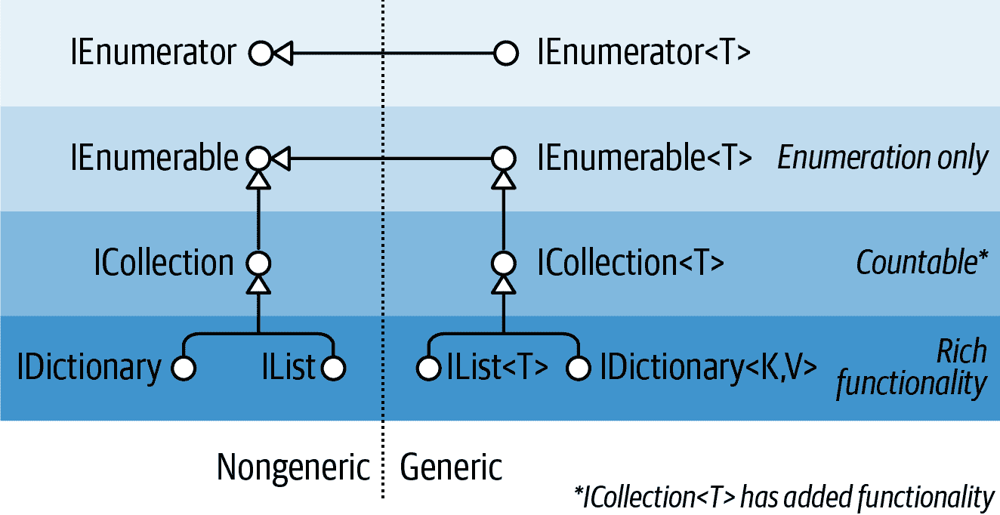
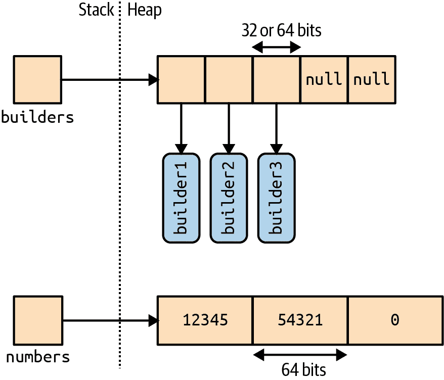
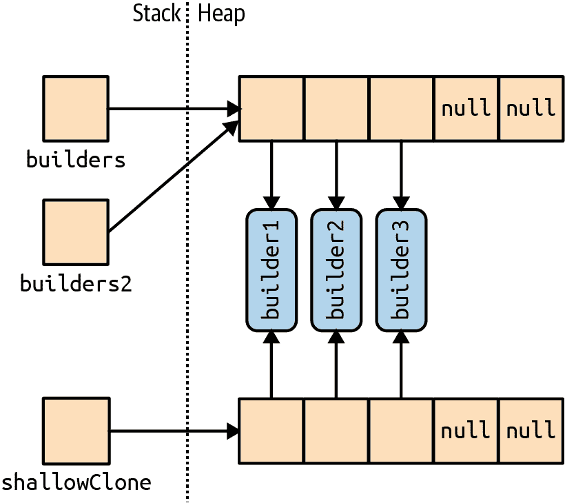
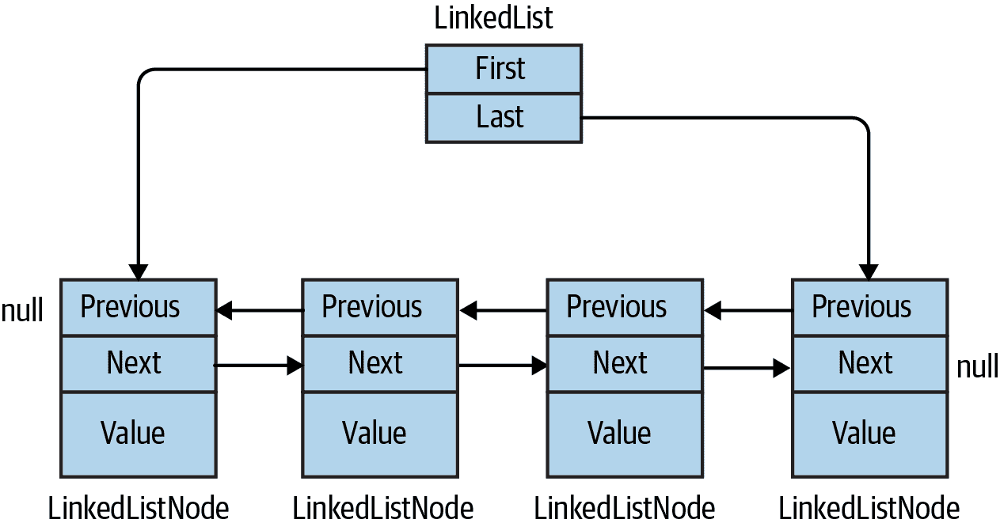

# 第七章. 集合

.NET 提供了一套标准类型，用于存储和管理对象集合。这些包括可调整大小的列表，链表，排序和未排序的字典，以及数组。其中，只有数组是 C# 语言的一部分；其余的集合只是像其他类一样实例化的类。

我们可以将.NET BCL 中用于集合的类型分为以下几类：

+   定义标准集合协议的接口

+   可直接使用的集合类（列表，字典等）

+   用于编写特定于应用程序的集合的基类

本章涵盖了这些类别的每一个，另外还有一个关于用于确定元素相等性和顺序的类型的部分。

集合命名空间如下：

| 命名空间 | 包含 |
| --- | --- |
| `System.Collections` | 非泛型集合类和接口 |
| `System.Collections.Specialized` | 强类型的非泛型集合类 |
| `System.Collections.Generic` | 泛型集合类和接口 |
| `System.Collections.ObjectModel` | 自定义集合的代理和基类 |
| `System.Collections.Concurrent` | 线程安全的集合（参见第二十三章） |

# 枚举

在计算中，有许多不同类型的集合，从简单的数据结构（如数组或链表）到更复杂的数据结构（如红黑树和哈希表）。尽管这些数据结构的内部实现和外部特征各不相同，但遍历集合内容的能力几乎是普遍需求。.NET BCL 通过一对接口（`IEnumerable`，`IEnumerator`及其泛型对应项）支持这种需求，这些接口允许不同的数据结构公开一个通用的遍历 API。这些接口是图 7-1 中所示的一组更大的集合接口的一部分。



###### 图 7-1. 集合接口

## IEnumerable 和 IEnumerator

`IEnumerator` 接口定义了集合中元素以仅向前方式遍历或枚举的基本低级协议。其声明如下：

```cs
public interface IEnumerator
{
  bool MoveNext();
  object Current { get; }
  void Reset();
}
```

`MoveNext` 将当前元素或“光标”移动到下一个位置，如果集合中没有更多元素，则返回`false`。`Current` 返回当前位置的元素（通常从`object`转换为更具体的类型）。在检索第一个元素之前必须调用`MoveNext` —— 这是为了允许空集合。如果实现了`Reset` 方法，则可以将其移回起始位置，从而允许重新枚举集合。`Reset` 主要用于组件对象模型（COM）互操作性；直接调用它通常是避免的，因为它不是普遍支持的（而且通常只需实例化一个新的枚举器就可以了）。

集合通常不会 *实现* 枚举器；相反，它们通过接口 `IEnumerable` *提供* 枚举器：

```cs
public interface IEnumerable
{
  IEnumerator GetEnumerator();
}
```

通过定义一个返回枚举器的单个方法，`IEnumerable` 提供了灵活性，使得迭代逻辑可以委托给另一个类。此外，这意味着多个消费者可以同时枚举集合而互不干扰。你可以将 `IEnumerable` 看作是“IEnumeratorProvider”，它是集合类实现的最基本接口。

以下示例说明了 `IEnumerable` 和 `IEnumerator` 的低级使用：

```cs
string s = "Hello";

// Because string implements IEnumerable, we can call GetEnumerator():
IEnumerator rator = s.GetEnumerator();

while (rator.MoveNext())
{
  char c = (char) rator.Current;
  Console.Write (c + ".");
}

// Output:  H.e.l.l.o.
```

不过，以这种方式直接调用枚举器的方法是很少见的，因为 C# 提供了一种语法快捷方式：`foreach` 语句。以下是使用 `foreach` 重新编写的相同示例：

```cs
string s = "Hello";      // The String class implements IEnumerable

foreach (char c in s)
  Console.Write (c + ".");
```

## `IEnumerable<T>` 和 `IEnumerator<T>`

`IEnumerator` 和 `IEnumerable` 几乎总是与它们的扩展泛型版本一起实现：

```cs
public interface IEnumerator<T> : IEnumerator, IDisposable
{
  T Current { get; }
}

public interface IEnumerable<T> : IEnumerable
{
  IEnumerator<T> GetEnumerator();
}
```

通过定义 `Current` 和 `GetEnumerator` 的类型化版本，这些接口增强了静态类型安全性，避免了对值类型元素的装箱开销，并且对消费者更加方便。数组会自动实现 `IEnumerable<T>`（其中 `T` 是数组的成员类型）。

由于改进了静态类型安全性，使用字符数组调用以下方法将生成编译时错误：

```cs
void Test (IEnumerable<int> numbers) { ... }
```

集合类的标准做法是公开 `IEnumerable<T>`，同时通过显式接口实现“隐藏”非泛型的 `IEnumerable`。这样，如果直接调用 `GetEnumerator()`，你会得到类型安全的泛型 `IEnumerator<T>`。不过，出于向后兼容性的考虑（在 C# 2.0 之前没有泛型），有时会违反这个规则。一个很好的例子是数组 —— 它们必须返回非泛型（委婉的说法是“经典”）的 `IEnumerator`，以避免破坏早期的代码。要获得泛型的 `IEnumerator<T>`，你必须进行类型转换来公开显式接口：

```cs
int[] data = { 1, 2, 3 };
var rator = ((IEnumerable <int>)data).GetEnumerator();
```

幸运的是，由于 `foreach` 语句的存在，你很少需要编写这种类型的代码。

### `IEnumerable<T>` 和 `IDisposable`

`IEnumerator<T>` 继承自 `IDisposable`。这使得枚举器可以持有诸如数据库连接之类的资源引用，并确保这些资源在枚举完成（或中途放弃）时被释放。`foreach` 语句能够识别这一细节，并将以下内容进行转换：

```cs
foreach (var element in somethingEnumerable) { ... }
```

转换成以下的逻辑等效：

```cs
using (var rator = somethingEnumerable.GetEnumerator())
  while (rator.MoveNext())
  {
    var element = rator.Current;
    ...
  }
```

`using` 块确保释放资源 —— 关于 `IDisposable` 的更多信息详见第十二章。

## 实现枚举接口

你可能希望为以下一个或多个原因之一实现 `IEnumerable` 或 `IEnumerable<T>`：

+   为了支持 `foreach` 语句

+   为了与期望标准集合的任何东西进行互操作

+   以满足更复杂的集合接口的要求

+   为了支持集合初始化器

要实现`IEnumerable`/`IEnumerable<T>`，你必须提供一个枚举器。你可以通过以下三种方式之一实现：

+   如果类“包装”另一个集合，则通过返回包装集合的枚举器

+   通过使用`yield return`创建迭代器

+   通过实例化自己的`IEnumerator`/`IEnumerator<T>`实现

###### 注意

你也可以从现有集合派生子类：`Collection<T>`专门设计用于此目的（参见“可自定义集合和代理”）。另一种方法是使用 LINQ 查询运算符，我们将在第八章中介绍。

返回另一个集合的枚举器只是在内部集合上调用`GetEnumerator`的问题。然而，这只在内部集合的项目恰好符合所需项目的最简单场景中有效。更灵活的方法是使用 C#的`yield return`语句编写一个迭代器。*迭代器*是 C#语言的一种特性，它有助于编写集合，就像`foreach`语句有助于消费集合一样。迭代器自动处理`IEnumerable`和`IEnumerator`（或它们的泛型版本）的实现。以下是一个简单的示例：

```cs
public class MyCollection : IEnumerable
{
  int[] data = { 1, 2, 3 };

  public IEnumerator GetEnumerator()
  {
    foreach (int i in data)
      yield return i;
  }
}
```

注意这种“黑魔法”：`GetEnumerator`似乎根本不返回枚举器！在解析`yield return`语句时，编译器在幕后编写一个隐藏的嵌套枚举器类，然后重构`GetEnumerator`以实例化并返回该类。迭代器功能强大且简单（在 LINQ-to-Object 标准查询操作的实现中广泛使用）。

按照这种方法，我们也可以实现泛型接口`IEnumerable<T>`：

```cs
public class MyGenCollection : IEnumerable<int>
{
  int[] data = { 1, 2, 3 };

  public IEnumerator<int> GetEnumerator()
  {
    foreach (int i in data)
      yield return i;
  }

  // Explicit implementation keeps it hidden:
  IEnumerator IEnumerable.GetEnumerator() => GetEnumerator();
}
```

因为`IEnumerable<T>`继承自`IEnumerable`，所以我们必须同时实现泛型和非泛型版本的`GetEnumerator`。根据标准实践，我们已经显式实现了非泛型版本，它只需调用泛型的`GetEnumerator`，因为`IEnumerator<T>`继承自`IEnumerator`。

我们刚刚编写的类将适合作为编写更复杂集合的基础。但是，如果我们只需要简单的`IEnumerable<T>`实现，`yield return`语句允许更简单的变体。而不是编写一个类，你可以将迭代逻辑移入一个返回泛型`IEnumerable<T>`的方法中，让编译器来处理其余部分。以下是一个示例：

```cs
public static IEnumerable <int> GetSomeIntegers()
{
  yield return 1;
  yield return 2;
  yield return 3;
}
```

这是我们方法的使用：

```cs
foreach (int i in Test.GetSomeIntegers())
  Console.WriteLine (i);
```

写`GetEnumerator`的最终方法是编写一个直接实现`IEnumerator`接口的类。这恰恰是编译器在幕后解析迭代器时所做的。（幸运的是，你自己很少需要走到这一步。）以下示例定义了一个硬编码为整数 1、2 和 3 的集合：

```cs
public class MyIntList : IEnumerable
{
  int[] data = { 1, 2, 3 };

  public IEnumerator GetEnumerator() => new Enumerator (this);

  class Enumerator : IEnumerator       // Define an inner class
  {                                    // for the enumerator.
    MyIntList collection;
    int currentIndex = -1;

    public Enumerator (MyIntList items) => this.collection = items;

    public object Current
    {
      get
      {
        if (currentIndex == -1)
          throw new InvalidOperationException ("Enumeration not started!");
        if (currentIndex == collection.data.Length)
          throw new InvalidOperationException ("Past end of list!");
        return collection.data [currentIndex];
      }
    }

    public bool MoveNext()
    {
      if (currentIndex >= collection.data.Length - 1) return false;
      return ++currentIndex < collection.data.Length;
    }

    public void Reset() => currentIndex = -1;
  }
}
```

###### 注意

实现`Reset`是可选的 —— 你可以选择抛出`NotSupportedException`异常。

注意，第一次调用 `MoveNext` 应该移动到列表中的第一个（而不是第二个）项目。

要与迭代器的功能相匹配，我们还必须实现 `IEnumerator<T>`。以下是省略边界检查的示例：

```cs
class MyIntList : IEnumerable<int>
{
  int[] data = { 1, 2, 3 };

  // The generic enumerator is compatible with both IEnumerable and
  // IEnumerable<T>. We implement the nongeneric GetEnumerator method
  // explicitly to avoid a naming conflict.

  public IEnumerator<int> GetEnumerator() => new Enumerator(this);
  IEnumerator IEnumerable.GetEnumerator() => new Enumerator(this);

  class Enumerator : IEnumerator<int>
  {
    int currentIndex = -1;
    MyIntList collection;

    public Enumerator (MyIntList items) => collection = items;

    public int Current => collection.data [currentIndex];
    object IEnumerator.Current => Current;

    public bool MoveNext() => ++currentIndex < collection.data.Length;

    public void Reset() => currentIndex = -1;

    // Given we don't need a Dispose method, it's good practice to
    // implement it explicitly, so it's hidden from the public interface.
    void IDisposable.Dispose() {}
  }
}
```

泛型示例更快，因为 `IEnumerator<int>.Current` 不需要从 `int` 转换为 `object`，因此避免了装箱的开销。

# ICollection 和 IList 接口

虽然枚举接口提供了一种在集合上进行单向迭代的协议，但它们并没有提供确定集合大小、按索引访问成员或修改集合的机制。为此，.NET 定义了 `ICollection`、`IList` 和 `IDictionary` 接口。每种接口都有泛型和非泛型版本；然而，非泛型版本主要是为了向后兼容。

图 7-1 显示了这些接口的继承层次结构。总结它们的最简单方法如下：

`IEnumerable<T>`（以及 `IEnumerable`）

提供最小的功能性（仅枚举）

`ICollection<T>`（以及 `ICollection`）

提供中等功能性（例如，`Count` 属性）

`IList<T>`/*`IDictionary<K,V>` 及其非泛型版本

提供最大的功能性（包括按索引/键“随机”访问）

###### 注意

几乎不需要*实现*这些接口。几乎在所有需要编写集合类的情况下，您都可以选择子类化 `Collection<T>`（参见“可自定义的集合和代理”）。LINQ 提供了另一种覆盖多种情况的选项。

泛型和非泛型版本在某些方面有所不同，尤其是在 `ICollection` 的情况下。这主要是因为历史原因：泛型是后来引入的，因此泛型接口在开发时可以借鉴先前的经验，从而做出了不同（更好）的成员选择。因此，`ICollection<T>` 不扩展 `ICollection`，`IList<T>` 不扩展 `IList`，`IDictionary<TKey, TValue>` 也不扩展 `IDictionary`。当然，如果有益的话，集合类本身可以自由地实现接口的两个版本（通常情况下确实如此）。

###### 注意

另一个更微妙的原因是 `IList<T>` 没有扩展 `IList` 的原因是，将 `IList<T>` 强制转换为 `IList` 将会返回一个同时具有 `Add(T)` 和 `Add(object)` 成员的接口。这实际上会破坏静态类型安全，因为您可以使用任何类型的对象调用 `Add`。

本节涵盖了 `ICollection<T>` 和 `IList<T>` 及其非泛型版本；“字典” 则涵盖了字典接口。

###### 注意

在 .NET 库中，并没有一致的方法来应用“集合”和“列表”这两个词。例如，因为 `IList<T>` 是 `ICollection<T>` 的更功能化版本，您可能会期望 `List<T>` 类相应地比 `Collection<T>` 类更具功能性。但实际情况并非如此。最好将术语“集合”和“列表”视为广义上的同义词，除非涉及特定类型。

## `ICollection<T>` 和 `ICollection`

`ICollection<T>` 是可计数对象集合的标准接口。它提供了确定集合大小（`Count`）、确定集合中是否存在项（`Contains`）、将集合复制到数组中（`ToArray`）以及确定集合是否为只读（`IsReadOnly`）的能力。对于可写集合，还可以添加、移除和清除集合中的项。由于它扩展了 `IEnumerable<T>`，因此也可以通过 `foreach` 语句进行遍历：

```cs
public interface ICollection<T> : IEnumerable<T>, IEnumerable
{
  int Count { get; }

  bool Contains (T item);
  void CopyTo (T[] array, int arrayIndex);
  bool IsReadOnly { get; }

  void Add(T item);
  bool Remove (T item);
  void Clear();
}
```

非泛型的 `ICollection` 类似地提供了可计数集合，但不提供更改列表或检查元素成员的功能：

```cs
public interface ICollection : IEnumerable
{
   int Count { get; }
   bool IsSynchronized { get; }
   object SyncRoot { get; }
   void CopyTo (Array array, int index);
}
```

非泛型接口还定义了用于同步的属性（第十四章）——这些在泛型版本中被舍弃，因为集合的线程安全性不再被视为固有的。

这两个接口都相对简单易实现。如果实现只读的 `ICollection<T>`，则 `Add`、`Remove` 和 `Clear` 方法应该抛出 `NotSupportedException`。

这些接口通常与 `IList` 或 `IDictionary` 接口一起实现。

## `IList<T>` 和 `IList`

`IList<T>` 是通过位置索引访问的标准集合接口。除了从 `ICollection<T>` 和 `IEnumerable<T>` 继承的功能外，它还提供了通过位置（通过索引器）读取或写入元素以及插入/删除元素的能力：

```cs
public interface IList<T> : ICollection<T>, IEnumerable<T>, IEnumerable
{
  T this [int index] { get; set; }
  int IndexOf (T item);
  void Insert (int index, T item);
  void RemoveAt (int index);
}
```

`IndexOf` 方法在列表上执行线性搜索，如果未找到指定项，则返回 `-1`。

`IList` 的非泛型版本因为从 `ICollection` 继承较少的原因而具有更多的成员：

```cs
public interface IList : ICollection, IEnumerable
{
  object this [int index] { get; set }
  bool IsFixedSize { get; }
  bool IsReadOnly  { get; }
  int  Add      (object value);
  void Clear();
  bool Contains (object value);
  int  IndexOf  (object value);
  void Insert   (int index, object value);
  void Remove   (object value);
  void RemoveAt (int index);
}
```

在非泛型的 `IList` 接口上，`Add` 方法返回一个整数，这是新添加项的索引。相比之下，`ICollection<T>` 上的 `Add` 方法返回类型为 `void`。

通用的 `List<T>` 类是 `IList<T>` 和 `IList` 的典型实现。C# 数组也同时实现了泛型和非泛型的 `IList`（尽管添加或移除元素的方法通过显式接口实现被隐藏，并且如果调用会抛出 `NotSupportedException`）。

###### 警告

如果尝试通过 `IList` 的索引器访问多维数组，则会抛出 `ArgumentException`。编写如下方法时需要注意这一点：

```cs
public object FirstOrNull (IList list)
{
  if (list == null || list.Count == 0) return null;
  return list[0];
}
```

这看起来可能十分完美，但如果使用多维数组调用，将会抛出异常。你可以在运行时使用以下表达式测试是否为多维数组（更多信息请参见 第十九章）：

```cs
list.GetType().IsArray && list.GetType().GetArrayRank()>1
```

## `IReadOnlyCollection<T>` 和 `IReadOnlyList<T>`

.NET 还定义了仅公开只读操作所需成员的集合和列表接口：

```cs
public interface IReadOnlyCollection<out T> : IEnumerable<T>, IEnumerable
{
  int Count { get; }
}

public interface IReadOnlyList<out T> : IReadOnlyCollection<T>,
                                        IEnumerable<T>, IEnumerable
{
  T this[int index] { get; }
}
```

因为这些接口的类型参数仅在输出位置使用，所以被标记为*协变*。这使得一个猫的列表，例如，可以被视为动物的只读列表。相反，`T` 在 `ICollection<T>` 和 `IList<T>` 中没有标记为协变，因为 `T` 在输入和输出位置都有使用。

###### 注意

这些接口表示集合或列表的只读*视图*；底层实现可能仍然可写。大多数可写（*可变*）集合都同时实现只读和读写接口。

除了让你协变地处理集合外，只读接口还允许类公开对私有可写集合的只读视图。我们在 “ReadOnlyCollection<T>” 中演示了这一点，并提供了更好的解决方案。

`IReadOnlyList<T>` 映射到 Windows Runtime 类型 `IVectorView<T>`。

# 数组类

`Array` 类是所有单维和多维数组的隐式基类之一，它是实现标准集合接口的最基础类型之一。`Array` 类提供类型统一化，因此所有数组都可以使用一组通用方法，无论其声明或底层元素类型如何。

由于数组非常基础，C# 提供了声明和初始化它们的显式语法，我们在第二章和第三章中有所描述。当使用 C# 的语法声明数组时，CLR 隐式地为 `Array` 类创建子类型，合成适合数组维度和元素类型的*伪类型*。这个伪类型实现了类型化的通用集合接口，比如 `IList<string>`。

在构造时，CLR 也会特殊处理数组类型，为其分配连续的内存空间。这使得数组的索引操作非常高效，但同时阻止它们在稍后进行调整大小。

`Array` 实现了集合接口，包括它们的泛型和非泛型形式，直至 `IList<T>`。但 `IList<T>` 本身是显式实现的，以保持 `Array` 的公共接口干净，不包含诸如 `Add` 或 `Remove` 的方法，这些方法在固定长度集合（如数组）上抛出异常。`Array` 类确实提供了一个静态的 `Resize` 方法，但这通过创建一个新数组然后复制每个元素来实现。除了效率低下外，在程序的其他位置引用数组仍将指向原始版本。对于可调整大小的集合，更好的解决方案是使用 `List<T>` 类（在下一节中描述）。

数组可以包含值类型或引用类型元素。值类型元素在数组中原地存储，因此三个长整数的数组（每个 8 字节）将占用 24 字节的连续内存。但引用类型元素仅占用一个引用的空间（在 32 位环境中为 4 字节，在 64 位环境中为 8 字节）。图 7-2 在内存中展示了以下程序的效果：

```cs
StringBuilder[] builders = new StringBuilder [5];
builders [0] = new StringBuilder ("builder1");
builders [1] = new StringBuilder ("builder2");
builders [2] = new StringBuilder ("builder3");

long[] numbers = new long [3];
numbers [0] = 12345;
numbers [1] = 54321;
```



###### 图 7-2\. 数组在内存中的表现

因为 `Array` 是一个类，所以数组始终是（它们自己）引用类型——无论数组的元素类型如何。这意味着语句 `arrayB = arrayA` 导致两个变量引用同一个数组。同样，除非使用*结构相等比较器*比较数组的每个元素，否则两个不同的数组总是无法通过相等性测试：

```cs
object[] a1 = { "string", 123, true };
object[] a2 = { "string", 123, true };

Console.WriteLine (a1 == a2);                          // False
Console.WriteLine (a1.Equals (a2));                    // False

IStructuralEquatable se1 = a1;
Console.WriteLine (se1.Equals (a2,
 StructuralComparisons.StructuralEqualityComparer));   // True
```

数组可以通过调用 `Clone` 方法进行复制：`arrayB = arrayA.Clone()`。然而，这将导致浅克隆，意味着只有数组本身表示的内存被复制。如果数组包含值类型对象，则值本身被复制；如果数组包含引用类型对象，则只复制引用（导致两个数组的成员引用相同的对象）。图 7-3 展示了向我们的示例添加以下代码的效果：

```cs
StringBuilder[] builders2 = builders;
StringBuilder[] shallowClone = (StringBuilder[]) builders.Clone();
```



###### 图 7-3\. 浅克隆一个数组

要创建深复制——即复制引用类型子对象——您必须循环遍历数组并手动克隆每个元素。其他 .NET 集合类型也适用相同规则。

虽然 `Array` 主要设计用于 32 位索引器，但它也对 64 位索引器有限支持（允许数组理论上寻址至多 2⁶⁴个元素），通过几种方法接受 `Int32` 和 `Int64` 参数。但实际上这些重载方法是无用的，因为 CLR 不允许任何对象——包括数组——超过两吉字节的大小（无论在 32 位还是 64 位环境中运行）。

###### 警告

`Array`类上许多您期望是实例方法的方法实际上是静态方法。这是一个奇怪的设计决定，这意味着在寻找`Array`上的方法时，您应该检查静态方法和实例方法两者。

## 构造和索引

通过 C#语言结构创建和索引数组的最简单方法是：

```cs
int[] myArray = { 1, 2, 3 };
int first = myArray [0];
int last = myArray [myArray.Length - 1];
```

或者，您可以通过调用`Array.CreateInstance`动态实例化一个数组。这允许您在运行时指定元素类型和秩（维数），并通过指定较低边界来允许非零基础的数组。非零基础的数组与.NET 公共语言规范（CLS）不兼容，并且不应在可能被 F#或 Visual Basic 编写的程序消费的库中作为公共成员暴露出去。

`GetValue`和`SetValue`方法允许您访问动态创建数组中的元素（它们也适用于普通数组）：

```cs
 // Create a string array 2 elements in length:
 Array a = Array.CreateInstance (typeof(string), 2);
 a.SetValue ("hi", 0);                             //  → a[0] = "hi";
 a.SetValue ("there", 1);                          //  → a[1] = "there";
 string s = (string) a.GetValue (0);               //  → s = a[0];

 // We can also cast to a C# array as follows:
 string[] cSharpArray = (string[]) a;
 string s2 = cSharpArray [0];
```

动态创建的零索引数组可以转换为匹配或兼容类型的 C#数组（通过标准数组协变规则兼容）。例如，如果`Apple`是`Fruit`的子类，则`Apple[]`可以转换为`Fruit[]`。这引出了为什么没有使用`object[]`作为统一的数组类型而是使用`Array`类的问题。答案是，`object[]`与多维和值类型数组（以及非零基础数组）都不兼容。`int[]`数组无法转换为`object[]`。因此，我们需要`Array`类进行完整的类型统一。

`GetValue`和`SetValue`也适用于编译器创建的数组，在编写可以处理任何类型和秩的数组的方法时非常有用。对于多维数组，它们接受一个*索引器的数组*：

```cs
public object GetValue (params int[] indices)
public void   SetValue (object value, params int[] indices)
```

以下方法打印任何数组的第一个元素，无论其秩如何：

```cs
 void WriteFirstValue (Array a)
 {
   Console.Write (a.Rank + "-dimensional; ");

   // The indexers array will automatically initialize to all zeros, so
   // passing it into GetValue or SetValue will get/set the zero-based
   // (i.e., first) element in the array.

   int[] indexers = new int[a.Rank];
   Console.WriteLine ("First value is " +  a.GetValue (indexers));
 }

 void Demo()
 {
   int[]  oneD = { 1, 2, 3 };
   int[,] twoD = { {5,6}, {8,9} };

   WriteFirstValue (oneD);   // 1-dimensional; first value is 1
   WriteFirstValue (twoD);   // 2-dimensional; first value is 5
 }
```

###### 注意

对于处理未知类型但已知秩的数组，泛型提供了更简单和更高效的解决方案：

```cs
void WriteFirstValue<T> (T[] array)
{
  Console.WriteLine (array[0]);
}
```

如果元素与数组不兼容的类型，则`SetValue`会抛出异常。

当实例化数组时，无论是通过语言语法还是`Array.Create​In⁠stance`，其元素都会自动初始化为它们的默认值。对于具有引用类型元素的数组，这意味着写入 null；对于具有值类型元素的数组，这意味着“零化”成员的位。`Array`类还通过`Clear`方法按需提供此功能：

```cs
public static void Clear (Array array, int index, int length);
```

这种方法不会影响数组的大小。这与通常使用的`Clear`（例如在`ICollection<T>.Clear`中）形成对比，后者会将集合减少到零个元素。

## 枚举

使用`foreach`语句可以轻松枚举数组：

```cs
int[] myArray = { 1, 2, 3};
foreach (int val in myArray)
  Console.WriteLine (val);
```

您还可以使用静态的`Array.ForEach`方法进行枚举，其定义如下：

```cs
public static void ForEach<T> (T[] array, Action<T> action);
```

这使用了一个带有如下签名的`Action`委托：

```cs
public delegate void Action<T> (T obj);
```

这是使用`Array.ForEach`重写的第一个示例：

```cs
Array.ForEach (new[] { 1, 2, 3 }, Console.WriteLine);
```

我们可以通过*C# 12*中的*集合表达式*进一步简化这一过程：

```cs
Array.ForEach ([ 1, 2, 3 ], Console.WriteLine);
```

## 长度和秩

`Array`提供了以下用于查询长度和秩的方法和属性：

```cs
public int  GetLength      (int dimension);
public long GetLongLength  (int dimension);

public int  Length       { get; }
public long LongLength   { get; }

public int GetLowerBound (int dimension);
public int GetUpperBound (int dimension);

public int Rank { get; }    // Returns number of dimensions in array
```

`GetLength`和`GetLongLength`返回给定维度的长度（对于单维数组为`0`），`Length`和`LongLength`返回数组中的总元素数，包括所有维度。

`GetLowerBound`和`GetUpperBound`对于非零索引的数组很有用。`Get​Up⁠perBound`返回与给定维度的`GetLowerBound`加上`GetLength`相同的结果。

## 搜索

`Array`类提供了一系列方法，用于在一维数组中查找元素：

`BinarySearch`方法

用于在排序的数组中快速搜索特定项

`IndexOf`/`LastIndex`方法

用于在未排序的数组中搜索特定项

`Find`/`FindLast`/`FindIndex`/`FindLastIndex`/`FindAll`/`Exists`/`TrueForAll`

用于在未排序的数组中搜索满足给定`Predicate<T>`条件的项

如果指定的值未找到，数组搜索方法都不会抛出异常。相反，如果未找到项，则返回整数的方法返回`−1`（假设是从零开始索引的数组），返回泛型类型的方法返回类型的默认值（例如，对于`int`返回`0`，对于`string`返回`null`）。

二分搜索方法速度快，但仅适用于排序的数组，并要求元素按*顺序*而不仅仅是*相等性*比较。为此，二分搜索方法可以接受`IComparer`或`IComparer<T>`对象来处理排序决策（见“插入相等性和顺序”）。这必须与最初用于排序数组的任何比较器一致。如果未提供比较器，则将基于其实现的`IComparable` / `IComparable<T>`应用类型的默认排序算法。

`IndexOf`和`LastIndexOf`方法在数组上执行简单的枚举，返回与给定值匹配的第一个（或最后一个）元素的位置。

基于谓词的搜索方法允许方法委托或 lambda 表达式来判断给定元素是否“匹配”。谓词只是接受对象并返回`true`或`false`的委托：

```cs
public delegate bool Predicate<T> (T object);
```

在以下示例中，我们搜索一个字符串数组，以找到包含字母“a”的名称：

```cs
string[] names = { "Rodney", "Jack", "Jill" };
string match = Array.Find (names, ContainsA);
Console.WriteLine (match);     // Jack

ContainsA (string name) { return name.Contains ("a"); }
```

这是使用 lambda 表达式缩短的相同代码：

```cs
string[] names = { "Rodney", "Jack", "Jill" };
string match = Array.Find (names, n => n.Contains ("a"));     // Jack
```

`FindAll`返回满足谓词条件的所有项的数组。事实上，它等同于`System.Linq`命名空间中的`Enumerable.Where`，但`FindAll`返回匹配项的数组，而不是相同的`IEnumerable<T>`。

`Exists`在任何数组成员满足给定谓词时返回`true`，等同于`System.Linq.Enumerable`中的`Any`。

`TrueForAll`在所有项满足谓词条件时返回`true`，等同于`System.Linq.Enumerable`中的`All`。

## 排序

`Array`具有以下内置排序方法：

```cs
// For sorting a single array:

public static void Sort<T> (T[] array);
public static void Sort    (Array array);

// For sorting a pair of arrays:

public static void Sort<TKey,TValue> (TKey[] keys, TValue[] items);
public static void Sort              (Array keys, Array items);
```

这些方法还可以接受以下内容的重载：

```cs
int index                 // Starting index at which to begin sorting
int length                // Number of elements to sort
IComparer<T> comparer     // Object making ordering decisions
Comparison<T> comparison  // Delegate making ordering decisions
```

以下演示了 `Sort` 的最简单用法：

```cs
int[] numbers = { 3, 2, 1 };
Array.Sort (numbers);                     // Array is now { 1, 2, 3 }
```

接受一对数组的方法通过将每个数组的项配对重新排列来工作，并基于第一个数组进行排序决策。在下一个示例中，数字及其对应的单词都按数字顺序排序：

```cs
int[] numbers = { 3, 2, 1 };
string[] words = { "three", "two", "one" };
Array.Sort (numbers, words);

// numbers array is now { 1, 2, 3 }
// words   array is now { "one", "two", "three" }
```

`Array.Sort` 要求数组中的元素实现 `IComparable`（参见 “排序比较”）。这意味着大多数内置的 C# 类型（例如前面示例中的整数）可以被排序。如果元素不是本质上可比较的，或者你想要覆盖默认的排序顺序，你必须提供一个自定义的 `comparison` 提供者给 `Sort`，用于报告两个元素的相对位置。有多种方法可以实现这一点：

+   通过实现 `IComparer` / `IComparer<T>` 的辅助对象（见 “插入相等性和顺序”）

+   通过 `Comparison` 委托：

```cs
public delegate int Comparison<T> (T x, T y);
```

`Comparison` 委托遵循与 `IComparer<T>.CompareTo` 相同的语义：如果 `x` 在 `y` 之前，则返回负整数；如果 `x` 在 `y` 之后，则返回正整数；如果 `x` 和 `y` 的排序位置相同，则返回 `0`。

在下面的示例中，我们对整数数组进行排序，使奇数首先出现：

```cs
int[] numbers = { 1, 2, 3, 4, 5 };
Array.Sort (numbers, (x, y) => x % 2 == y % 2 ? 0 : x % 2 == 1 ? -1 : 1);

// numbers array is now { 1, 3, 5, 2, 4 }
```

###### 注意

作为调用 `Sort` 的替代方案，你可以使用 LINQ 的 `OrderBy` 和 `ThenBy` 操作符。与 `Array.Sort` 不同，LINQ 操作符不会改变原始数组，而是在一个新的 `IEnumerable<T>` 序列中输出排序后的结果。

## 颠倒元素

以下 `Array` 方法颠倒数组中所有或部分元素的顺序：

```cs
public static void Reverse (Array array);
public static void Reverse (Array array, int index, int length);
```

## 复制

`Array` 提供了四种方法来执行浅复制：`Clone`、`CopyTo`、`Copy` 和 `ConstrainedCopy`。前两者是实例方法，后两者是静态方法。

`Clone` 方法返回一个全新的（浅复制的）数组。`CopyTo` 和 `Copy` 方法复制数组的连续子集。复制多维矩形数组需要将多维索引映射到线性索引。例如，3 × 3 数组中的中间方块（`position[1,1]`）用索引 4 表示，计算方法为：1 * 3 + 1。源范围和目标范围可以重叠而不会造成问题。

`ConstrainedCopy` 执行一个 *原子* 操作：如果无法成功复制所有请求的元素（例如由于类型错误），则操作将回滚。

`Array` 还提供了一个 `AsReadOnly` 方法，返回一个包装器，防止元素被重新赋值。

## 转换和调整大小

`Array.ConvertAll` 创建并返回一个新的 `TOutput` 元素类型的数组，调用提供的 `Converter` 委托来复制元素。`Converter` 的定义如下：

```cs
public delegate TOutput Converter<TInput,TOutput> (TInput input)
```

以下示例将一个浮点数数组转换为整数数组：

```cs
float[] reals = { 1.3f, 1.5f, 1.8f };
int[] wholes = Array.ConvertAll (reals, r => Convert.ToInt32 (r));

// wholes array is { 1, 2, 2 }
```

`Resize`方法通过创建一个新数组并复制元素来工作，通过引用参数返回新数组。然而，其他对象中对原始数组的引用将保持不变。

###### 注意

`System.Linq`命名空间提供了一系列适用于数组转换的扩展方法。这些方法返回一个`IEnumerable<T>`，你可以通过`Enumerable`的`ToArray`方法将其转换回数组。

# 列表、队列、堆栈和集合

.NET 提供了一组基本的具体集合类，实现了本章描述的接口。本节集中讨论*类似于列表*的集合（而不是*类似于字典*的集合，我们将在“字典”中讨论）。与我们之前讨论的接口一样，你通常可以选择每种类型的泛型或非泛型版本。在灵活性和性能方面，泛型类胜出，使它们的非泛型对应物除了向后兼容性之外都显得多余。这与集合接口的情况不同，对于集合接口，非泛型版本偶尔还是有用的。

在本节描述的类中，泛型`List`类是最常用的。

## List<T>和 ArrayList

泛型`List`和非泛型`ArrayList`类提供了一个动态大小的对象数组，是集合类中最常用的之一。`ArrayList`实现了`IList`接口，而`List<T>`则实现了`IList`和`IList<T>`（以及只读版本`IReadOnlyList<T>`）。与数组不同的是，所有接口都是公开实现的，诸如`Add`和`Remove`等方法都被暴露出来，并且按预期工作。

内部，`List<T>`和`ArrayList`通过维护一个对象的内部数组来工作，在达到容量时会被替换为一个更大的数组。附加元素是高效的（因为通常在末尾有空闲槽位），但插入元素可能很慢（因为必须将插入点之后的所有元素移动以创建空闲槽位），删除元素也可能很慢（特别是在接近开始位置时）。与数组一样，如果在已排序的列表上使用`BinarySearch`方法，搜索是高效的，但在其他情况下效率较低，因为必须逐个检查每个项目。

###### 注意

如果 T 是值类型，`List<T>`比`ArrayList`快几倍，因为`List<T>`避免了元素装箱和拆箱的开销。

`List<T>`和`ArrayList`提供了接受现有元素集合的构造函数：这些函数将现有集合中的每个元素复制到新的`List<T>`或`ArrayList`中：

```cs
public class List<T> : IList<T>, IReadOnlyList<T>
{
  public List ();
  public List (IEnumerable<T> collection);
  public List (int capacity);

  // Add+Insert
  public void Add         (T item);
  public void AddRange    (IEnumerable<T> collection);
  public void Insert      (int index, T item);
  public void InsertRange (int index, IEnumerable<T> collection);

  // Remove
  public bool Remove      (T item);
  public void RemoveAt    (int index);
  public void RemoveRange (int index, int count);
  public int  RemoveAll   (Predicate<T> match);

  // Indexing
  public T this [int index] { get; set; }
  public List<T> GetRange (int index, int count);
  public Enumerator<T> GetEnumerator();

  // Exporting, copying and converting:
  public T[] ToArray();
  public void CopyTo (T[] array);
  public void CopyTo (T[] array, int arrayIndex);
  public void CopyTo (int index, T[] array, int arrayIndex, int count);
  public ReadOnlyCollection<T> AsReadOnly();
  public List<TOutput> ConvertAll<TOutput> (Converter <T,TOutput>
                                            converter);
  // Other:
  public void Reverse();            // Reverses order of elements in list.
  public int Capacity { get;set; }  // Forces expansion of internal array.
  public void TrimExcess();         // Trims internal array back to size.
  public void Clear();              // Removes all elements, so Count=0.
}

public delegate TOutput Converter <TInput, TOutput> (TInput input);
```

除了这些成员外，`List<T>`还提供了所有`Array`的搜索和排序方法的实例版本。

下面的代码演示了`List`的属性和方法（有关搜索和排序的示例，请参见“数组类”）：

```cs
var words = new List<string>();    // New string-typed list

words.Add ("melon");
words.Add ("avocado");
words.AddRange (["banana", "plum"]);
words.Insert (0, "lemon");                   // Insert at start
words.InsertRange (0, ["peach", "nashi"]);   // Insert at start

words.Remove ("melon");
words.RemoveAt (3);                         // Remove the 4th element
words.RemoveRange (0, 2);                   // Remove first 2 elements

// Remove all strings starting in 'n':
words.RemoveAll (s => s.StartsWith ("n"));

Console.WriteLine (words [0]);                          // first word
Console.WriteLine (words [words.Count - 1]);            // last word
foreach (string s in words) Console.WriteLine (s);      // all words
List<string> subset = words.GetRange (1, 2);            // 2nd->3rd words

string[] wordsArray = words.ToArray();    // Creates a new typed array

// Copy first two elements to the end of an existing array:
string[] existing = new string [1000];
words.CopyTo (0, existing, 998, 2);

List<string> upperCaseWords = words.ConvertAll (s => s.ToUpper());
List<int> lengths = words.ConvertAll (s => s.Length);
```

非泛型`ArrayList`类需要笨拙的类型转换，正如下面的示例所示：

```cs
ArrayList al = new ArrayList();
al.Add ("hello");
string first = (string) al [0];
string[] strArr = (string[]) al.ToArray (typeof (string));
```

此类转换无法通过编译器验证；以下代码编译成功，但在运行时失败：

```cs
int first = (int) al [0];    // Runtime exception
```

###### 注意

`ArrayList`在功能上类似于`List<object>`。当您需要一个包含没有共同基类型（除`object`外）的混合类型元素列表时，这两者都非常有用。在这种情况下选择`ArrayList`的一个可能优势是，如果需要使用反射处理列表（见第十九章），则使用非泛型的`ArrayList`比`List<object>`更容易。反射在非泛型`ArrayList`上比`List<object>`更容易。

如果导入`System.Linq`命名空间，可以通过调用`Cast`然后`ToList`将`ArrayList`转换为泛型`List`：

```cs
ArrayList al = new ArrayList();
al.AddRange (new[] { 1, 5, 9 } );
List<int> list = al.Cast<int>().ToList();
```

`Cast`和`ToList`是`System.Linq.Enumerable`类中的扩展方法。

## LinkedList<T>

`LinkedList<T>`是泛型双向链表（见图 7-4）。双向链表是一系列节点，每个节点分别引用其前后节点和实际元素。其主要优势在于可以高效地在列表中的任何位置插入元素，只需创建一个新节点并更新少数引用即可。但是，首先找到要插入节点的位置可能会很慢，因为没有内在机制直接索引到链表；每个节点必须遍历，且无法进行二分查找。



###### 图 7-4\. LinkedList<T>

`LinkedList<T>`实现了`IEnumerable<T>`和`ICollection<T>`（以及它们的非泛型版本），但不支持`IList<T>`，因为不支持按索引访问。列表节点是通过以下类实现的：

```cs
public sealed class LinkedListNode<T>
{
  public LinkedList<T> List { get; }
  public LinkedListNode<T> Next { get; }
  public LinkedListNode<T> Previous { get; }
  public T Value { get; set; }
}
```

在添加节点时，可以指定其相对于另一个节点的位置或位于列表的起始/末尾。`LinkedList<T>`提供了以下方法：

```cs
public void AddFirst(LinkedListNode<T> node);
public LinkedListNode<T> AddFirst (T value);

public void AddLast (LinkedListNode<T> node);
public LinkedListNode<T> AddLast (T value);

public void AddAfter (LinkedListNode<T> node, LinkedListNode<T> newNode);
public LinkedListNode<T> AddAfter (LinkedListNode<T> node, T value);

public void AddBefore (LinkedListNode<T> node, LinkedListNode<T> newNode);
public LinkedListNode<T> AddBefore (LinkedListNode<T> node, T value);
```

还提供了类似的方法来删除元素：

```cs
public void Clear();

public void RemoveFirst();
public void RemoveLast();

public bool Remove (T value);
public void Remove (LinkedListNode<T> node);
```

`LinkedList<T>`具有内部字段来跟踪列表中的元素数量以及列表的头部和尾部。这些在以下公共属性中公开：

```cs
public int Count { get; }                      // Fast
public LinkedListNode<T> First { get; }        // Fast
public LinkedListNode<T> Last { get; }         // Fast
```

`LinkedList<T>`也支持以下搜索方法（每种方法都要求列表在内部枚举）：

```cs
public bool Contains (T value);
public LinkedListNode<T> Find (T value);
public LinkedListNode<T> FindLast (T value);
```

最后，`LinkedList<T>`支持将元素复制到数组以进行索引处理，并获取枚举器以支持`foreach`语句：

```cs
public void CopyTo (T[] array, int index);
public Enumerator<T> GetEnumerator();
```

下面演示了`LinkedList<string>`的使用：

```cs
var tune = new LinkedList<string>();
tune.AddFirst ("do");                           // do
tune.AddLast ("so");                            // do - so

tune.AddAfter (tune.First, "re");               // do - re- so
tune.AddAfter (tune.First.Next, "mi");          // do - re - mi- so
tune.AddBefore (tune.Last, "fa");               // do - re - mi - fa- so

tune.RemoveFirst();                             // re - mi - fa - so
tune.RemoveLast();                              // re - mi - fa

LinkedListNode<string> miNode = tune.Find ("mi");
tune.Remove (miNode);                           // re - fa
tune.AddFirst (miNode);                         // mi- re - fa

foreach (string s in tune) Console.WriteLine (s);
```

## Queue<T>和 Queue

`Queue<T>`和`Queue`是先进先出（FIFO）的数据结构，提供了`Enqueue`（将项目添加到队列的尾部）和`Dequeue`（检索并移除队列头部的项目）方法。还提供了一个`Peek`方法，在不移除元素的情况下返回队列头部的元素，并提供了一个`Count`属性（在出队之前检查元素是否存在时非常有用）。

尽管队列是可枚举的，但它们不实现`IList<T>`/`IList`，因为无法直接通过索引访问成员。但是，提供了一个`ToArray`方法，可以将元素复制到数组中，从而可以随机访问它们：

```cs
public class Queue<T> : IEnumerable<T>, ICollection, IEnumerable
{
  public Queue();
  public Queue (IEnumerable<T> collection);   // Copies existing elements
  public Queue (int capacity);                // To lessen auto-resizing
  public void Clear();
  public bool Contains (T item);
  public void CopyTo (T[] array, int arrayIndex);
  public int Count { get; }
  public T Dequeue();
  public void Enqueue (T item);
  public Enumerator<T> GetEnumerator();       // To support foreach
  public T Peek();
  public T[] ToArray();
  public void TrimExcess();
}
```

下面是使用`Queue<int>`的示例：

```cs
var q = new Queue<int>();
q.Enqueue (10);
q.Enqueue (20);
int[] data = q.ToArray();         // Exports to an array
Console.WriteLine (q.Count);      // "2"
Console.WriteLine (q.Peek());     // "10"
Console.WriteLine (q.Dequeue());  // "10"
Console.WriteLine (q.Dequeue());  // "20"
Console.WriteLine (q.Dequeue());  // throws an exception (queue empty)
```

队列使用内部调整大小的数组实现，与泛型`List`类似。队列维护直接指向头部和尾部元素的索引；因此，入队和出队操作非常快（除非需要内部调整大小）。

## `Stack<T>` 和 `Stack`

`Stack<T>` 和 `Stack` 是后进先出（LIFO）的数据结构，提供`Push`（将项目添加到堆栈顶部）和`Pop`（检索并移除堆栈顶部的元素）方法。还提供了非破坏性的`Peek`方法，以及`Count`属性和`ToArray`方法用于导出数据进行随机访问：

```cs
public class Stack<T> : IEnumerable<T>, ICollection, IEnumerable
{
  public Stack();
  public Stack (IEnumerable<T> collection);   // Copies existing elements
  public Stack (int capacity);                // Lessens auto-resizing
  public void Clear();
  public bool Contains (T item);
  public void CopyTo (T[] array, int arrayIndex);
  public int Count { get; }
  public Enumerator<T> GetEnumerator();       // To support foreach
  public T Peek();
  public T Pop();
  public void Push (T item);
  public T[] ToArray();
  public void TrimExcess();
}
```

下面的示例演示了`Stack<int>`：

```cs
var s = new Stack<int>();
s.Push (1);                      //            Stack = 1
s.Push (2);                      //            Stack = 1,2
s.Push (3);                      //            Stack = 1,2,3
Console.WriteLine (s.Count);     // Prints 3
Console.WriteLine (s.Peek());    // Prints 3,  Stack = 1,2,3
Console.WriteLine (s.Pop());     // Prints 3,  Stack = 1,2
Console.WriteLine (s.Pop());     // Prints 2,  Stack = 1
Console.WriteLine (s.Pop());     // Prints 1,  Stack = <empty>
Console.WriteLine (s.Pop());     // throws exception
```

栈使用内部调整大小的数组实现，与`Queue<T>`和`List<T>`类似。

## BitArray

`BitArray`是一种动态大小的压缩布尔值集合。它比简单的`bool`数组和泛型`List<bool>`更节省内存，因为每个值仅使用一位，而`bool`类型通常为每个值占用一个字节。

`BitArray`的索引器可以读取和写入单个位：

```cs
var bits = new BitArray(2);
bits[1] = true;
```

有四个位操作方法（`And`、`Or`、`Xor`和`Not`）。除了最后一个外，所有方法都接受另一个`BitArray`：

```cs
bits.Xor (bits);               // Bitwise exclusive-OR bits with itself
Console.WriteLine (bits[1]);   // False
```

## HashSet<T> 和 SortedSet<T>

`HashSet<T>` 和 `SortedSet<T>` 具有以下显著特点：

+   它们的`Contains`方法使用基于哈希的快速查找。

+   它们不存储重复的元素，并且会默默地忽略添加重复元素的请求。

+   你不能通过位置访问元素。

`SortedSet<T>`保持元素有序，而`HashSet<T>`则不是。

`HashSet<T>` 和 `SortedSet<T>` 类型的共同点由接口`ISet<T>`捕获。从.NET 5 开始，这些类还实现了一个名为`IReadOnlySet<T>`的接口，这个接口也被不可变集合类型实现（参见“不可变集合”）。

`HashSet<T>`使用哈希表实现，仅存储键；`SortedSet<T>`使用红黑树实现。

这两个集合都实现了`ICollection<T>`接口，并提供了如`Contains`、`Add`和`Remove`等你预期的方法。此外，还提供了基于谓词的移除方法`RemoveWhere`。

下面的代码从现有集合构造了一个`HashSet<char>`，测试了成员资格，然后枚举了集合（注意没有重复项）：

```cs
var letters = new HashSet<char> ("the quick brown fox");

Console.WriteLine (letters.Contains ('t'));      // true
Console.WriteLine (letters.Contains ('j'));      // false

foreach (char c in letters) Console.Write (c);   // the quickbrownfx
```

（我们可以将`string`传递给`HashSet<char>`的构造函数的原因是因为`string`实现了`IEnumerable<char>`接口。）

真正有趣的方法是集合操作。以下集合操作是*破坏性*的，因为它们修改了集合：

```cs
public void UnionWith           (IEnumerable<T> other);   // Adds
public void IntersectWith       (IEnumerable<T> other);   // Removes
public void ExceptWith          (IEnumerable<T> other);   // Removes
public void SymmetricExceptWith (IEnumerable<T> other);   // Removes
```

而以下方法仅查询集合，因此是非破坏性的：

```cs
public bool IsSubsetOf         (IEnumerable<T> other);
public bool IsProperSubsetOf   (IEnumerable<T> other);
public bool IsSupersetOf       (IEnumerable<T> other);
public bool IsProperSupersetOf (IEnumerable<T> other);
public bool Overlaps           (IEnumerable<T> other);
public bool SetEquals          (IEnumerable<T> other);
```

`UnionWith` 将第二个集合中的所有元素添加到原始集合（不包括重复项）。 `IntersectWith` 删除不在两个集合中的元素。我们可以如下提取字符集中的所有元音字母：

```cs
var letters = new HashSet<char> ("the quick brown fox");
letters.IntersectWith ("aeiou");
foreach (char c in letters) Console.Write (c);     // euio
```

`ExceptWith` 从源集合中移除指定的元素。在这里，我们从集合中剔除所有元音字母：

```cs
var letters = new HashSet<char> ("the quick brown fox");
letters.ExceptWith ("aeiou");
foreach (char c in letters) Console.Write (c);     // th qckbrwnfx
```

`SymmetricExceptWith` 会删除除了两个集合中唯一的元素之外的所有元素：

```cs
var letters = new HashSet<char> ("the quick brown fox");
letters.SymmetricExceptWith ("the lazy brown fox");
foreach (char c in letters) Console.Write (c);     // quicklazy
```

请注意，因为 `HashSet<T>` 和 `SortedSet<T>` 实现了 `IEnumerable<T>`，所以您可以将另一种类型的集合（或集合）用作任何集合操作方法的参数。

`SortedSet<T>` 提供 `HashSet<T>` 的所有成员，以及以下内容：

```cs
public virtual SortedSet<T> GetViewBetween (T lowerValue, T upperValue)
public IEnumerable<T> Reverse()
public T Min { get; }
public T Max { get; }
```

`SortedSet<T>` 在其构造函数中还接受一个可选的 `IComparer<T>`（而不是*相等比较器*）。

下面是一个将相同字母加载到 `SortedSet<char>` 的示例：

```cs
var letters = new SortedSet<char> ("the quick brown fox");
foreach (char c in letters) Console.Write (c);   //  bcefhiknoqrtuwx
```

继续之前，我们可以如下获取集合中 *f* 和 *i* 之间的字母：

```cs
foreach (char c in letters.GetViewBetween ('f', 'i'))
  Console.Write (c);                                    //  fhi
```

# 字典

字典是一种每个元素都是键/值对的集合。字典最常用于查找和排序列表。

.NET 定义了字典的标准协议，通过接口 `IDictionary` 和 `IDictionary <TKey, TValue>`，以及一组通用的字典类。这些类在以下方面各不相同：

+   是否按排序顺序存储项

+   是否可以通过位置（索引）和键访问项

+   是否为泛型或非泛型

+   是否从大字典中通过键快速或慢速检索项

表 7-1 总结了每个字典类及其在这些方面的不同之处。性能时间以毫秒为单位，并基于在 1.5 GHz PC 上对整数键和值的字典执行 50,000 次操作。（相同底层集合结构使用泛型和非泛型对应体现出来的性能差异，是由于装箱而产生的。）

表 7-1\. 字典类

| 类型 | 内部结构 | 是否按索引检索？ | 内存开销（平均每项字节） | 随机插入速度 | 顺序插入速度 | 按键检索速度 |
| --- | --- | --- | --- | --- | --- | --- |
| **未排序** |  |  |  |  |  |  |
| `Dictionary <K,V>` | 哈希表 | 否 | 22 | 30 | 30 | 20 |
| `Hashtable` | 哈希表 | 否 | 38 | 50 | 50 | 30 |
| `ListDictionary` | 链表 | 否 | 36 | 50,000 | 50,000 | 50,000 |
| `OrderedDictionary` | 哈希表 + 数组 | 是 | 59 | 70 | 70 | 40 |
| **已排序** |  |  |  |  |  |  |
| `SortedDictionary <K,V>` | 红黑树 | 否 | 20 | 130 | 100 | 120 |
| `SortedList <K,V>` | 2xArray | 是 | 2 | 3,300 | 30 | 40 |
| `SortedList` | 2xArray | 是 | 27 | 4,500 | 100 | 180 |

用大 O 表示法，按键检索时间如下：

+   `Hashtable`、`Dictionary` 和 `OrderedDictionary` 的大 O 为 O(1)

+   对于`SortedDictionary`和`SortedList`，为 O(log *n*)。

+   对于`ListDictionary`（以及`List<T>`等非字典类型），为 O(*n*)

*n*代表集合中的元素数量。

## IDictionary<TKey,TValue>

`IDictionary<TKey,TValue>`定义了所有基于键/值的集合的标准协议。它通过添加方法和属性来扩展`ICollection<T>`，以根据任意类型的键访问元素。

```cs
public interface IDictionary <TKey, TValue> :
  ICollection <KeyValuePair <TKey, TValue>>, IEnumerable
{
   bool ContainsKey (TKey key);
   bool TryGetValue (TKey key, out TValue value);
   void Add         (TKey key, TValue value);
   bool Remove      (TKey key);

   TValue this [TKey key]      { get; set; }  // Main indexer - by key
   ICollection <TKey> Keys     { get; }       // Returns just keys
   ICollection <TValue> Values { get; }       // Returns just values
}
```

###### 注意

还有一个名为`IReadOnlyDictionary<TKey,TValue>`的接口，定义了字典成员的只读子集。

要向字典中添加项目，可以调用`Add`或使用索引器的设置访问器——后者将项目添加到字典中（如果键尚不存在）或更新项目（如果已存在）。所有字典实现都禁止重复键，因此如果使用相同键两次调用`Add`会抛出异常。

要从字典中检索项目，请使用索引器或`TryGetValue`方法。如果键不存在，索引器会抛出异常，而`TryGetValue`会返回`false`。你可以通过调用`Contain⁠s​Key`显式测试成员资格；然而，如果你随后检索项目，则会产生两次查找的成本。

直接枚举`IDictionary<TKey,TValue>`会返回一个`KeyValuePair`结构的序列：

```cs
public struct KeyValuePair <TKey, TValue>
{
  public TKey Key     { get; }
  public TValue Value { get; }
}
```

可以通过字典的`Keys`/`Values`属性仅枚举键或值。

我们在下一节中演示如何使用这个接口与泛型`Dictionary`类。

## IDictionary

非泛型的`IDictionary`接口在原则上与`IDictionary<TKey,TValue>`相同，除了两个重要的功能差异。了解这些差异很重要，因为`IDictionary`在遗留代码中（包括.NET BCL 本身的某些位置）中出现：

+   通过索引器检索不存在的键会返回 null（而不是抛出异常）。

+   `Contains`用于测试成员资格，而不是`ContainsKey`。

枚举非泛型`IDictionary`会返回一个`Dictionary​En⁠try`结构的序列：

```cs
public struct DictionaryEntry
{
  public object Key   { get; set; }
  public object Value { get; set; }
}
```

## Dictionary<TKey,TValue>和 Hashtable

泛型`Dictionary`类是最常用的集合之一（与`List<T>`集合一样）。它使用哈希表数据结构存储键和值，速度快且高效。

###### 注意

非泛型的`Dictionary<TKey,TValue>`版本称为`Hashtable`；没有称为`Dictionary`的非泛型类。当我们简称`Dictionary`时，指的是泛型`Dictionary<TKey,TValue>`类。

`Dictionary`实现了泛型和非泛型的`IDictionary`接口，泛型的`IDictionary`是公开的。实际上，`Dictionary`是泛型`IDictionary`的“教科书”实现。

使用方法如下：

```cs
var d = new Dictionary<string, int>();

d.Add("One", 1);
d["Two"] = 2;     // adds to dictionary because "two" isn't already present
d["Two"] = 22;    // updates dictionary because "two" is now present
d["Three"] = 3;

Console.WriteLine (d["Two"]);                // Prints "22"
Console.WriteLine (d.ContainsKey ("One"));   // true (fast operation)
Console.WriteLine (d.ContainsValue (3));     // true (slow operation)
int val = 0;
if (!d.TryGetValue ("onE", out val))
  Console.WriteLine ("No val");              // "No val" (case sensitive)

// Three different ways to enumerate the dictionary:

foreach (KeyValuePair<string, int> kv in d)          //  One; 1
  Console.WriteLine (kv.Key + "; " + kv.Value);      //  Two; 22
                                                     //  Three; 3

foreach (string s in d.Keys) Console.Write (s);      // OneTwoThree
Console.WriteLine();
foreach (int i in d.Values) Console.Write (i);       // 1223
```

其底层的哈希表通过将每个元素的键转换为整数哈希码（一种伪唯一的值），然后应用算法将哈希码转换为哈希键。这个哈希键在内部用于确定条目属于哪个“桶”。如果桶中包含多个值，则在桶上执行线性搜索。一个好的哈希函数不会力求返回严格唯一的哈希码（通常是不可能的），它力求返回均匀分布在 32 位整数空间中的哈希码。这避免了最终出现少数非常大（且低效）的桶的情况。

字典可以使用任何类型的键工作，只要能够确定键之间的相等性并获取哈希码。默认情况下，通过键的`object.Equals`方法确定相等性，并通过键的`GetHashCode`方法获取伪唯一的哈希码。可以通过覆盖这些方法或在构建字典时提供`IEqualityComparer`对象来更改此行为。在使用字符串键时，常见的应用是指定一个不区分大小写的相等性比较器：

```cs
var d = new Dictionary<string, int> (StringComparer.OrdinalIgnoreCase);
```

我们在“插入相等性和顺序”中进一步讨论这一点。

与许多其他类型的集合一样，可以通过在构造函数中指定集合的预期大小来略微提高字典的性能，从而避免或减少内部调整大小操作的需求。

非泛型版本命名为`Hashtable`，在功能上类似，除了因其公开了先前讨论过的非泛型`IDictionary`接口而产生的差异。

`Dictionary`和`Hashtable`的缺点是项目不会排序。此外，不会保留项目添加的原始顺序。与所有字典一样，不允许重复键。

###### 注意

当泛型集合在 2005 年引入时，CLR 团队选择根据它们的表示方式（`Dictionary`、`List`）而不是它们的内部实现方式（`Hashtable`、`ArrayList`）来命名它们。尽管这样做是好的，因为它给了他们后来更改实现的自由，但这也意味着*性能约定*（通常是选择一种集合类型的最重要标准）不再在名称中体现。

## OrderedDictionary

一个`OrderedDictionary`是一个非泛型字典，它以元素添加的顺序维护元素。使用`OrderedDictionary`，你可以通过索引和键访问元素。

###### 注意

一个`OrderedDictionary`不是*排序*字典。

一个`OrderedDictionary`是`Hashtable`和`ArrayList`的组合。这意味着它具有`Hashtable`的所有功能，还具有诸如`RemoveAt`和整数索引器等功能。它还公开了`Keys`和`Values`属性，以原始顺序返回元素。

这个类在 .NET 2.0 中引入；然而，奇怪的是，没有泛型版本。

## ListDictionary 和 HybridDictionary

`ListDictionary` 使用单向链表存储底层数据。它不提供排序，尽管它保留了项目的原始输入顺序。对于大型列表，`ListDictionary` 速度非常慢。它唯一真正的“成就”是在非常小的列表（少于 10 项）中的效率。

`HybridDictionary` 是 `ListDictionary`，在达到一定大小时会自动转换为 `Hashtable`，以解决 `ListDictionary` 在性能上的问题。其思想是在字典较小时获得较低的内存占用，并在字典较大时获得良好的性能。然而，考虑到从一个转换到另一个的开销——而且 `Dictionary` 在任何情况下都不会过于笨重或缓慢——因此，一开始使用 `Dictionary` 不会带来不合理的困扰。

这两个类仅以非泛型形式存在。

## 排序字典

.NET BCL 提供了两个字典类，其内部结构使其内容始终按键排序：

+   `SortedDictionary<TKey,TValue>`

+   `SortedList<TKey,TValue>`¹

（在本节中，我们将 `<TKey,TValue>` 缩写为 `<,>`。）

`SortedDictionary<,>` 使用红黑树：一种设计成在任何插入或检索场景中表现一致良好的数据结构。

`SortedList<,>` 在内部实现中使用有序数组对，通过二分查找提供快速检索，但插入性能较差（因为需要移动现有值以腾出空间来放置新条目）。

`SortedDictionary<,>` 在随机顺序插入元素时比 `SortedList<,>` 快得多（特别是对于大型列表）。然而，`SortedList<,>` 有一个额外的能力：可以通过索引以及键访问项目。通过排序列表，您可以直接访问排序序列中的第 *n* 个元素（通过 `Keys`/`Values` 属性的索引器）。要在 `SortedDictionary<,>` 中做同样的事情，您必须手动枚举 *n* 个项目。（或者，您可以编写一个将排序字典与列表类结合的类。）

这三个集合都不允许重复键（就像所有字典一样）。

下面的示例使用反射将 `System.Object` 中定义的所有方法加载到按名称排序的排序列表中，然后枚举它们的键和值：

```cs
// MethodInfo is in the System.Reflection namespace

var sorted = new SortedList <string, MethodInfo>();

foreach (MethodInfo m in typeof (object).GetMethods())
  sorted [m.Name] = m;

foreach (string name in sorted.Keys)
  Console.WriteLine (name);

foreach (MethodInfo m in sorted.Values)
  Console.WriteLine (m.Name + " returns a " + m.ReturnType);
```

这里是第一次枚举的结果：

```cs
Equals
GetHashCode
GetType
ReferenceEquals
ToString
```

这里是第二次枚举的结果：

```cs
Equals returns a System.Boolean
GetHashCode returns a System.Int32
GetType returns a System.Type
ReferenceEquals returns a System.Boolean
ToString returns a System.String
```

注意，我们通过其索引器填充了字典。如果我们使用 `Add` 方法，它将抛出异常，因为我们反射的 `object` 类重载了 `Equals` 方法，并且不能将相同的键两次添加到字典中。通过使用索引器，后续条目将覆盖较早的条目，从而防止此错误。

###### 注意

可以通过将每个值元素设置为列表来存储相同键的多个成员：

```cs
SortedList <string, List<MethodInfo>>
```

扩展我们的示例，以下代码检索其键为 `"GetHashCode"` 的 `MethodInfo`，就像普通字典一样：

```cs
Console.WriteLine (sorted ["GetHashCode"]);      // Int32 GetHashCode()
```

到目前为止，我们所做的一切也适用于 `SortedDictionary<,>`。然而，以下两行代码，用于检索最后一个键和值，仅适用于排序列表：

```cs
Console.WriteLine (sorted.Keys  [sorted.Count - 1]);            // ToString
Console.WriteLine (sorted.Values[sorted.Count - 1].IsVirtual);  // True
```

# 可定制的集合和代理

在前面部分讨论的集合类非常方便，因为可以直接实例化它们，但是它们不允许控制将项添加到集合或从集合中移除时发生的情况。在应用程序中的强类型集合中，有时需要这种控制；例如：

+   当添加或删除项时触发事件

+   因为添加或删除项而更新属性

+   检测“非法”添加/删除操作并抛出异常（例如，如果操作违反业务规则）

.NET BCL 提供了专门用于此目的的集合类，位于 `System​.Col⁠lections.ObjectModel` 命名空间中。这些实质上是通过将方法转发到底层集合来实现 `IList<T>` 或 `IDictionary<,>` 的代理或包装器。每个 `Add`、`Remove` 或 `Clear` 操作都通过一个虚拟方法路由，该方法在重写时充当“网关”。

可定制的集合类通常用于公开的集合，例如，在 `System​.Win⁠dows.Form` 类上公开的控件集合。

## Collection<T> 和 CollectionBase

`Collection<T>` 类是 `List<T>` 的可定制包装器。

除了实现 `IList<T>` 和 `IList` 外，它还定义了四个额外的虚拟方法和一个受保护的属性，如下所示：

```cs
public class Collection<T> :
  IList<T>, ICollection<T>, IEnumerable<T>, IList, ICollection, IEnumerable
{
   // ...

   protected virtual void ClearItems();
   protected virtual void InsertItem (int index, T item);
   protected virtual void RemoveItem (int index);
   protected virtual void SetItem (int index, T item);

   protected IList<T> Items { get; }
}
```

虚拟方法提供了一种网关，通过它可以“挂接”以更改或增强列表的正常行为。受保护的 `Items` 属性允许实现者直接访问“内部列表”——这用于在不触发虚拟方法的情况下进行内部更改。

不需要重写虚拟方法；它们可以保持不变，直到需要更改列表的默认行为。以下示例演示了 `Collection<T>` 的典型“骨架”用法：

```cs
Zoo zoo = new Zoo();
zoo.Animals.Add (new Animal ("Kangaroo", 10));
zoo.Animals.Add (new Animal ("Mr Sea Lion", 20));
foreach (Animal a in zoo.Animals) Console.WriteLine (a.Name);

public class Animal
{
  public string Name;
  public int Popularity;

  public Animal (string name, int popularity)
  {
    Name = name; Popularity = popularity;
  }
}

public class AnimalCollection : Collection <Animal>
{
  // AnimalCollection is already a fully functioning list of animals.
  // No extra code is required.
}

public class Zoo   // The class that will expose AnimalCollection.
{                  // This would typically have additional members.

  public readonly AnimalCollection Animals = new AnimalCollection();
}
```

`AnimalCollection` 现在不再仅仅是一个简单的 `List<Animal>`；它的作用是为将来的扩展提供一个基础。为了说明这一点，现在让我们为 `Animal` 添加一个 `Zoo` 属性，以便它可以引用它所居住的 `Zoo`，并且重写 `Collection<Animal>` 中的每个虚拟方法以自动维护该属性：

```cs
public class Animal
{
  public string Name;
  public int Popularity;
  public Zoo Zoo { get; internal set; }
  public Animal(string name, int popularity)
  {
    Name = name; Popularity = popularity;
  }
}

public class AnimalCollection : Collection <Animal>
{
  Zoo zoo;
  public AnimalCollection (Zoo zoo) { this.zoo = zoo; }

  protected override void InsertItem (int index, Animal item)
  {
    base.InsertItem (index, item);
    item.Zoo = zoo;
  }
  protected override void SetItem (int index, Animal item)
  {
    base.SetItem (index, item);
    item.Zoo = zoo;
  }
  protected override void RemoveItem (int index)
  {
    this [index].Zoo = null;
    base.RemoveItem (index);
  }
  protected override void ClearItems()
  {
    foreach (Animal a in this) a.Zoo = null;
    base.ClearItems();
  }
}

public class Zoo
{
  public readonly AnimalCollection Animals;
  public Zoo() { Animals = new AnimalCollection (this); }
}
```

`Collection<T>` 还具有接受现有 `IList<T>` 的构造函数。与其他集合类不同，所提供的列表是*代理*而非*复制*，这意味着后续更改将反映在包装的 `Collection<T>` 中（尽管*不会*触发 `Collection<T>` 的虚拟方法）。反之，通过 `Collection<T>` 进行的更改将改变底层列表。

### CollectionBase

`CollectionBase`是`Collection<T>`的非泛型版本。它提供了大部分与`Collection<T>`相同的功能，但使用起来更加笨拙。与模板方法`InsertItem`、`RemoveItem`、`SetItem`和`ClearItem`不同，`CollectionBase`具有“挂钩”方法，这使得所需的方法数量翻倍：`OnInsert`、`OnInsertComplete`、`OnSet`、`OnSetComplete`、`OnRemove`、`OnRemoveComplete`、`OnClear`和`OnClearComplete`。由于`CollectionBase`是非泛型的，当子类化它时，您还必须实现类型化的方法——至少是一个类型化的索引器和`Add`方法。

## `KeyedCollection<TKey,TItem>`和 DictionaryBase

`KeyedCollection<TKey,TItem>`是`Collection<TItem>`的子类。它既增加了功能，即通过键访问项目（类似于字典），又减少了能力，即无法代理自己的内部列表。

键控集合在某种程度上类似于`OrderedDictionary`，因为它将线性列表与哈希表结合在一起。但与`OrderedDictionary`不同的是，它不实现`IDictionary`，也不支持键/值对的概念。相反，键是通过抽象的`GetKeyForItem`方法从项目本身获取的。这意味着枚举键控集合与枚举普通列表完全相同。

`KeyedCollection<TKey,TItem>`可以理解为`Collection<TItem>`加上按键快速查找的功能。

因为它是`Collection<>`的子类，所以键控集合继承了`Collection<>`的所有功能，除了在构造时指定现有列表的能力。它定义的附加成员如下：

```cs
public abstract class KeyedCollection <TKey, TItem> : Collection <TItem>

  // ...

  protected abstract TKey GetKeyForItem(TItem item);
  protected void ChangeItemKey(TItem item, TKey newKey);

  // Fast lookup by key - this is in addition to lookup by index.
  public TItem this[TKey key] { get; }

  protected IDictionary<TKey, TItem> Dictionary { get; }
}
```

`GetKeyForItem`是实现者从基础对象获取项键的方法。如果项的键属性发生更改，则必须调用`ChangeItemKey`方法以更新内部字典。`Dictionary`属性返回用于实现查找的内部字典，该字典在添加第一项时创建。可以通过在构造函数中指定创建阈值来更改此行为，延迟内部字典的创建直到达到阈值（在此期间，如果按键请求项，则执行线性搜索）。不指定创建阈值的一个很好的理由是，拥有有效的字典对于通过`Dictionary`的`Keys`属性获取键的`ICollection<>`是有用的。然后可以将此集合传递给公共属性。

`KeyedCollection<,>`最常见的用途是提供一组可通过索引和名称访问的项目。为了演示这一点，让我们重新访问动物园，这次将`AnimalCollection`实现为`KeyedCollection<string,​Ani⁠mal>`：

```cs
public class Animal
{
  string name;
  public string Name
  {
    get { return name; }
    set {
      if (Zoo != null) Zoo.Animals.NotifyNameChange (this, value);
      name = value;
    }
  }
  public int Popularity;
  public Zoo Zoo { get; internal set; }

  public Animal (string name, int popularity)
  {
    Name = name; Popularity = popularity;
  }
}

public class AnimalCollection : KeyedCollection <string, Animal>
{
  Zoo zoo;
  public AnimalCollection (Zoo zoo) { this.zoo = zoo; }

  internal void NotifyNameChange (Animal a, string newName) =>
    this.ChangeItemKey (a, newName);

  protected override string GetKeyForItem (Animal item) => item.Name;

  // The following methods would be implemented as in the previous example
  protected override void InsertItem (int index, Animal item)...
  protected override void SetItem (int index, Animal item)...
  protected override void RemoveItem (int index)...
  protected override void ClearItems()...
}

public class Zoo
{
  public readonly AnimalCollection Animals;
  public Zoo() { Animals = new AnimalCollection (this); }
}
```

下面的代码演示了它的使用：

```cs
Zoo zoo = new Zoo();
zoo.Animals.Add (new Animal ("Kangaroo", 10));
zoo.Animals.Add (new Animal ("Mr Sea Lion", 20));
Console.WriteLine (zoo.Animals [0].Popularity);               // 10
Console.WriteLine (zoo.Animals ["Mr Sea Lion"].Popularity);   // 20
zoo.Animals ["Kangaroo"].Name = "Mr Roo";
Console.WriteLine (zoo.Animals ["Mr Roo"].Popularity);        // 10
```

### DictionaryBase

`KeyedCollection`的非泛型版本称为`DictionaryBase`。这个传统类采用非常不同的方法，它实现了`IDictionary`并使用笨拙的挂钩方法，比如`CollectionBase`：`OnInsert`、`OnInsertComplete`、`OnSet`、`OnSetComplete`、`OnRemove`、`OnRemoveComplete`、`OnClear`和`OnClearComplete`（另外还有`OnGet`）。实现`IDictionary`而不是采用`KeyedCollection`方法的主要优势在于，您无需对其进行子类化即可获取键。但由于`DictionaryBase`的主要目的是被子类化，所以这并不是优势。`KeyedCollection`中改进的模型几乎肯定是由于它是在几年后编写的，并且具有事后诸葛亮的好处。`DictionaryBase`最好被认为是用于向后兼容性。

## ReadOnlyCollection<T>

`ReadOnlyCollection<T>`是一个提供集合只读视图的包装器或*代理*。这在允许类公开对其内部仍可更新的集合进行只读访问时非常有用。

只读集合在其构造函数中接受输入集合，并保持对输入集合的永久引用。它不会静态复制输入集合，因此对输入集合的后续更改将通过只读包装器可见。

举例来说，假设你的班级想要向名为`Names`的字符串列表提供只读的公共访问权限。我们可以这样做：

```cs
public class Test
{
  List<string> names = new List<string>();
  public IReadOnlyList<string> Names => names;
}
```

虽然`Names`返回一个只读接口，消费者仍然可以在运行时向`List<string>`或`IList<string>`进行降级，然后在列表上调用`Add`、`Remove`或`Clear`。`ReadOnlyCollection<T>`提供了更健壮的解决方案：

```cs
public class Test
{
  List<string> names = new List<string>();
  public ReadOnlyCollection<string> Names { get; private set; }

  public Test() => Names = new ReadOnlyCollection<string> (names);

  public void AddInternally() => names.Add ("test");
}
```

现在，只有`Test`类中的成员才能更改名称列表：

```cs
Test t = new Test();

Console.WriteLine (t.Names.Count);       // 0
t.AddInternally();
Console.WriteLine (t.Names.Count);       // 1

t.Names.Add ("test");                    // Compiler error
((IList<string>) t.Names).Add ("test");  // NotSupportedException
```

# 不可变集合

我们刚刚描述了`ReadOnlyCollection<T>`如何创建集合的只读视图。限制对集合或任何其他对象的写入（*突变*）能力简化了软件并减少了错误。

*不可变集合*扩展了这一原则，通过提供在初始化后无法修改的集合来实现。如果需要向不可变集合添加项，必须实例化一个新集合，保持旧集合不变。

不可变性是*函数式编程*的标志，并具有以下好处：

+   它消除了与更改状态相关的一大类错误。

+   它极大地简化了并行和多线程，通过避免我们在第十四章、22 章和 23 章中描述的大多数线程安全问题。

+   它使得代码更容易理解。

不可变性的缺点是当你需要进行更改时，你必须创建一个全新的对象。尽管有减少性能损耗的策略，我们在本节中讨论了一些缓解策略，包括能够重用原始结构的部分。

不可变集合是 .NET 的一部分（在 .NET Framework 中，它们通过 *System.Collections.Immutable* NuGet 包提供）。所有集合都定义在 `System.Collections.Immutable` 命名空间中：

| 类型 | 内部结构 |
| --- | --- |
| `ImmutableArray<T>` | 数组 |
| `ImmutableList<T>` | AVL 树 |
| `ImmutableDictionary<K,V>` | AVL 树 |
| `ImmutableHashSet<T>` | AVL 树 |
| `ImmutableSortedDictionary<K,V>` | AVL 树 |
| `ImmutableSortedSet<T>` | AVL 树 |
| `ImmutableStack<T>` | 链表 |
| `ImmutableQueue<T>` | 链表 |

`ImmutableArray<T>` 和 `ImmutableList<T>` 类型都是 `List<T>` 的不可变版本。它们的功能相同，但性能特性不同，我们在 “不可变集合和性能” 中讨论。

不可变集合公开了与其可变对应物类似的公共接口。主要区别在于看似会修改集合（如 `Add` 或 `Remove`）的方法并不会修改原始集合；相反，它们会返回一个包含请求添加或移除项的新集合。这被称为 *非破坏性变异*。

###### 注意

不可变集合防止添加和移除项；它们不阻止 *项本身* 被突变。要充分利用不可变性的优势，需要确保只有不可变的项最终进入不可变集合。

## 创建不可变集合

每种不可变集合类型都提供一个 `Create<T>()` 方法，该方法接受可选的初始值并返回一个初始化的不可变集合：

```cs
ImmutableArray<int> array = ImmutableArray.Create<int> (1, 2, 3);
```

每个集合还提供一个 `CreateRange<T>` 方法，其功能与 `Create<T>` 相同；区别在于它的参数类型是 `IEnumerable<T>` 而不是 `params T[]`。

你还可以使用适当的扩展方法（`ToImmutableArray`、`ToImmutableList`、`ToImmutableDictionary` 等）从现有的 `IEnumerable<T>` 创建不可变集合：

```cs
var list = new[] { 1, 2, 3 }.ToImmutableList();
```

## 操作不可变集合

`Add` 方法返回一个包含现有元素和新元素的新集合：

```cs
var oldList = ImmutableList.Create<int> (1, 2, 3);

ImmutableList<int> newList = oldList.Add (4);

Console.WriteLine (oldList.Count);     // 3  (unaltered)
Console.WriteLine (newList.Count);     // 4
```

`Remove` 方法的操作方式相同，返回一个移除了指定项的新集合。

反复添加或移除元素这种方式效率低下，因为每次添加或移除操作都会创建一个新的不可变集合。更好的解决方案是调用 `AddRange`（或 `RemoveRange`），它接受一个 `IEnumerable<T>` 的项，在一次操作中添加或移除所有项：

```cs
var anotherList = oldList.AddRange ([4, 5, 6]);
```

不可变列表和数组还定义了`Insert`和`InsertRange`方法，用于在特定索引处插入元素，`RemoveAt`方法用于按索引移除元素，以及`RemoveAll`方法，根据谓词条件移除元素。

## 构建器

对于更复杂的初始化需求，每个不可变集合类都定义了一个*构建器*对应物。构建器是与可变集合功能上等效的类，具有类似的性能特征。在数据初始化后，对构建器调用`.ToImmutable()`将返回一个不可变集合。

```cs
ImmutableArray<int>.Builder builder = ImmutableArray.CreateBuilder<int>();
builder.Add (1);
builder.Add (2);
builder.Add (3);
builder.RemoveAt (0);
ImmutableArray<int> myImmutable = builder.ToImmutable();
```

您也可以使用构建器批量对现有的不可变集合进行多次更新：

```cs
var builder2 = myImmutable.ToBuilder();
builder2.Add (4);      // Efficient
builder2.Remove (2);   // Efficient
...                    // More changes to builder...
// Return a new immutable collection with all the changes applied:
ImmutableArray<int> myImmutable2 = builder2.ToImmutable();
```

## 不可变集合与性能

大多数不可变集合在内部使用*AVL 树*，这允许添加/移除操作重用原始内部结构的部分，而不必从头开始重新创建整个结构。这减少了添加/移除操作的开销，从可能是*巨大的*（对于大集合）降低到只是*适度大*，但这也使得读取操作变慢。最终结果是，大多数不可变集合在读取和写入方面都比其可变对应物慢。

受影响最严重的是`ImmutableList<T>`，在读取和添加操作方面，其速度比`List<T>`慢 10 到 200 倍（取决于列表的大小）。这就是为什么存在`ImmutableArray<T>`：通过在内部使用数组，它避免了读取操作的开销（在这方面，它的性能与普通可变数组相当）。但其反面是，在添加操作方面比（甚至）`ImmutableList<T>`慢得多，因为原始结构的任何部分都无法重用。

因此，当您希望不受阻碍的*读取*性能，并且不希望频繁调用`Add`或`Remove`（而不使用构建器）时，`ImmutableArray<T>`是理想的选择。

| 类型 | 读取性能 | 添加性能 |
| --- | --- | --- |
| `ImmutableList<T>` | 慢 | 慢 |
| `ImmutableArray<T>` | 非常快 | 非常慢 |

###### 注意

调用`ImmutableArray`上的`Remove`比在`List<T>`上调用`Remove`更昂贵——即使在移除第一个元素的最坏情况下——因为分配新集合会给垃圾收集器增加额外负载。

尽管整体上不可变集合可能会产生显著的性能成本，但保持总体量的透视是很重要的。在典型的笔记本电脑上，对具有百万个元素的`ImmutableList`执行`Add`操作仍然可能发生在小于一微秒的时间内，读取操作则在 100 纳秒以下。而且，如果需要在循环中执行写操作，可以使用构建器来避免累积的成本。

以下因素也有助于减轻成本：

+   不可变性允许轻松进行并发和并行处理（第二十三章），因此您可以利用所有可用的核心。使用可变状态进行并行处理很容易导致错误，并且需要使用锁或并发集合，这两者都会影响性能。

+   使用不可变性，您无需“防御性地复制”集合或数据结构以防止意外更改。这是在编写 Visual Studio 的最新部分时倾向于使用不可变集合的一个因素。

+   在大多数典型程序中，很少有足够多的项使得这些差异有影响。

除了 Visual Studio 外，性能良好的 Microsoft Roslyn 工具链也使用不可变集合构建，显示了其益处大于成本的情况。

# 冻结集合

从.NET 8 开始，`System.Collections.Frozen`命名空间包含以下两个只读集合类：

```cs
FrozenDictionary<TKey,TValue>
FrozenSet<T>
```

这些类似于`ImmutableDictionary<K,V>`和`ImmutableHashSet<T>`，但缺少非破坏性变异（例如`Add`或`Remove`）的方法，从而实现了高度优化的读取性能。要创建冻结集合，您可以从另一个集合或序列开始，然后调用`ToFrozenDictionary`或`ToFrozenSet`扩展方法：

```cs
int[] numbers = { 10, 20, 30 };
FrozenSet<int> frozen = numbers.ToFrozenSet();
Console.WriteLine (frozen.Contains (10));   // True
```

冻结集合非常适合在程序开始时初始化并在应用程序的整个生命周期中使用的查找操作：

```cs
class Disassembler
{
  public readonly static IReadOnlyDictionary<string,string> OpCodeLookup =
    new Dictionary<string, string>()
    {
      { "ADC", "Add with Carry" },
      { "ADD", "Add" },
      { "AND", "Logical AND" },
      { "ANDN", "Logical AND NOT" },
      ...
    }
    .ToFrozenDictionary();

  ...
}
```

冻结集合实现了标准的字典/集合接口，包括它们的只读版本。在本例中，我们将我们的`FrozenDictionary<string,string>`作为`IReadOnlyDictionary<string,string>`类型的字段公开。

# 插入相等性和顺序

在部分章节“相等比较”和“顺序比较”中，我们描述了标准的.NET 协议，使得类型可以在字典或排序列表中“开箱即用”地正确运行。更具体地说：

+   一个类型的`Equals`和`GetHashCode`返回有意义的结果，则可以将其用作`Dictionary`或`Hashtable`中的键。

+   实现`IComparable` / `IComparable<T>`的类型可以用作*排序*字典或列表中的键。

类型的默认相等或比较实现通常反映了对该类型最“自然”的内容。然而，有时默认行为并非您想要的。您可能需要一个字典，其中`string`类型的键不考虑大小写。或者您可能希望按照每个客户的邮政编码对客户进行排序的排序列表。因此，.NET 还定义了一组匹配的“插件”协议。插件协议实现了两个目标：

+   它们允许您切换到替代的相等或比较行为。

+   它们允许您使用键类型不本质上可相等或可比较的字典或排序集合。

插件协议包括以下接口：

`IEqualityComparer` 和 `IEqualityComparer<T>`

+   执行插件 *相等比较和哈希*

+   被 `Hashtable` 和 `Dictionary` 所识别

`IComparer` 和 `IComparer<T>`

+   执行插件 *顺序比较*

+   被排序字典和集合识别；同时也被 `Array.Sort` 所识别

每个接口都有通用和非通用形式。`IEquality​Com⁠parer` 接口也在名为 `Equality​Comparer` 的类中有默认实现。

此外，还有名为 `IStructuralEquatable` 和 `IStructuralComparable` 的接口，允许在类和数组上进行结构比较选项。

## IEqualityComparer 和 EqualityComparer

一个相等比较器在非默认的相等和哈希行为上切换，主要用于 `Dictionary` 和 `Hashtable` 类。

回想一下基于哈希表的字典的要求。对于任何给定的键，它需要回答两个问题：

+   它是否与另一个相同？

+   它的整数哈希码是多少？

一个相等比较器通过实现 `IEquality​Com⁠parer` 接口来回答这些问题：

```cs
public interface IEqualityComparer<T>
{
   bool Equals (T x, T y);
   int GetHashCode (T obj);
}

public interface IEqualityComparer     // Nongeneric version
{
   bool Equals (object x, object y);
   int GetHashCode (object obj);
}
```

要编写自定义比较器，您可以实现其中一个或两个接口（同时实现两个可以获得最大的互操作性）。由于这有些繁琐，一个替代方法是继承抽象类 `EqualityComparer`，定义如下：

```cs
public abstract class EqualityComparer<T> : IEqualityComparer,
                                            IEqualityComparer<T>
{
  public abstract bool Equals (T x, T y);
  public abstract int GetHashCode (T obj);

  bool IEqualityComparer.Equals (object x, object y);
  int IEqualityComparer.GetHashCode (object obj);

  public static EqualityComparer<T> Default { get; }
}
```

`EqualityComparer` 实现了这两个接口；您的任务只是覆盖这两个抽象方法。

`Equals` 和 `GetHashCode` 的语义遵循 `object.Equals` 和 `object.GetHashCode` 的相同规则，详见第六章。在以下示例中，我们定义一个 `Customer` 类，包含两个字段，然后编写一个相等比较器，匹配第一个和最后一个名字：

```cs
public class Customer
{
  public string LastName;
  public string FirstName;

  public Customer (string last, string first)
  {
    LastName = last;
    FirstName = first;
  }
}
public class LastFirstEqComparer : EqualityComparer <Customer>
{
  public override bool Equals (Customer x, Customer y)
    => x.LastName == y.LastName && x.FirstName == y.FirstName;

  public override int GetHashCode (Customer obj)
    => (obj.LastName + ";" + obj.FirstName).GetHashCode();
}
```

为了说明这是如何工作的，让我们创建两个客户：

```cs
Customer c1 = new Customer ("Bloggs", "Joe");
Customer c2 = new Customer ("Bloggs", "Joe");
```

因为我们没有重写 `object.Equals`，所以正常的引用类型相等语义适用：

```cs
Console.WriteLine (c1 == c2);               // False
Console.WriteLine (c1.Equals (c2));         // False
```

当在 `Dictionary` 中使用这些客户时，没有指定相等比较器时也适用相同的默认相等语义：

```cs
var d = new Dictionary<Customer, string>();
d [c1] = "Joe";
Console.WriteLine (d.ContainsKey (c2));         // False
```

现在，使用自定义的相等比较器：

```cs
var eqComparer = new LastFirstEqComparer();
var d = new Dictionary<Customer, string> (eqComparer);
d [c1] = "Joe";
Console.WriteLine (d.ContainsKey (c2));         // True
```

在此示例中，我们必须小心，不要在字典中使用客户的 `FirstName` 或 `LastName` 发生变化；否则，它的哈希码将会改变，字典将会出现问题。

### EqualityComparer<T>.Default

调用 `EqualityComparer<T>.Default` 返回一个通用的相等比较器，您可以将其用作替代静态的 `object.Equals` 方法。优势在于它首先检查 `T` 是否实现了 `IEquatable<T>`，如果是，则调用该实现，避免装箱开销。这在泛型方法中特别有用：

```cs
static bool Foo<T> (T x, T y)
{
  bool same = EqualityComparer<T>.Default.Equals (x, y);
  ...
```

### `ReferenceEqualityComparer.Instance`（.NET 5+）

从 .NET 5 开始，`ReferenceEqualityComparer.Instance` 返回一个总是应用引用相等的相等比较器。对于值类型，其 `Equals` 方法总是返回 false。

## IComparer 和 Comparer

比较器用于为排序的字典和集合切换自定义排序逻辑。

请注意，对于像`Dictionary`和`Hashtable`这样的未排序字典，比较器是无用的——这些需要一个`IEqualityComparer`来获取哈希码。同样，对于排序字典和集合，相等比较器也是无用的。

这里是`IComparer`接口的定义：

```cs
public interface IComparer
{
  int Compare(object x, object y);
}
public interface IComparer <in T>
{
  int Compare(T x, T y);
}
```

与相等比较器一样，有一个抽象类，您可以对其进行子类型化，而不是实现接口：

```cs
public abstract class Comparer<T> : IComparer, IComparer<T>
{
   public static Comparer<T> Default { get; }

   public abstract int Compare (T x, T y);       // Implemented *by* you
   int IComparer.Compare (object x, object y);   // Implemented *for* you
}
```

以下示例展示了描述愿望的类以及按优先级排序愿望的比较器：

```cs
class Wish
{
  public string Name;
  public int Priority;

  public Wish (string name, int priority)
  {
    Name = name;
    Priority = priority;
  }
}

class PriorityComparer : Comparer<Wish>
{
  public override int Compare (Wish x, Wish y)
  {
    if (object.Equals (x, y)) return 0;    // Optimization
    if (x == null) return -1;
    if (y == null) return 1;
    return x.Priority.CompareTo (y.Priority);
  }
}
```

`object.Equals`检查确保我们永远不会违反`Equals`方法。在这种情况下调用静态的`object.Equals`方法比调用`x.Equals`更好，因为如果`x`为空，它仍然有效！

这里展示了我们的`PriorityComparer`如何用于对`List`进行排序：

```cs
var wishList = new List<Wish>();
wishList.Add (new Wish ("Peace", 2));
wishList.Add (new Wish ("Wealth", 3));
wishList.Add (new Wish ("Love", 2));
wishList.Add (new Wish ("3 more wishes", 1));

wishList.Sort (new PriorityComparer());
foreach (Wish w in wishList) Console.Write (w.Name + " | ");

// OUTPUT: 3 more wishes | Love | Peace | Wealth |
```

在下一个示例中，`SurnameComparer`允许您按适合电话簿列表的顺序对姓氏字符串进行排序：

```cs
class SurnameComparer : Comparer <string>
{
  string Normalize (string s)
  {
    s = s.Trim().ToUpper();
    if (s.StartsWith ("MC")) s = "MAC" + s.Substring (2);
    return s;
  }

  public override int Compare (string x, string y)
    => Normalize (x).CompareTo (Normalize (y));
}
```

这里展示了`SurnameComparer`在排序字典中的使用：

```cs
var dic = new SortedDictionary<string,string> (new SurnameComparer());
dic.Add ("MacPhail", "second!");
dic.Add ("MacWilliam", "third!");
dic.Add ("McDonald", "first!");

foreach (string s in dic.Values)
  Console.Write (s + " ");              // first! second! third!
```

## StringComparer

`StringComparer`是一个预定义的插件类，用于等同和比较字符串，允许您指定语言和大小写敏感性。`StringComparer`实现了`IEqualityComparer`和`IComparer`（以及它们的泛型版本），因此您可以将其与任何类型的字典或排序集合一起使用。

因为`StringComparer`是抽象的，您可以通过其静态属性获取实例。`StringComparer.Ordinal`反映了字符串相等比较的默认行为，`StringComparer.CurrentCulture`用于顺序比较。以下是它的所有静态成员：

```cs
public static StringComparer CurrentCulture { get; }
public static StringComparer CurrentCultureIgnoreCase { get; }
public static StringComparer InvariantCulture { get; }
public static StringComparer InvariantCultureIgnoreCase { get; }
public static StringComparer Ordinal { get; }
public static StringComparer OrdinalIgnoreCase { get; }
public static StringComparer Create (CultureInfo culture,
                                       bool ignoreCase);
```

在下面的示例中，创建了一个按序大小写不敏感的字典，使得`dict["Joe"]`和`dict["JOE"]`意思相同：

```cs
var dict = new Dictionary<string, int> (StringComparer.OrdinalIgnoreCase);
```

在下一个示例中，一个名字数组按澳大利亚英语排序：

```cs
string[] names = { "Tom", "HARRY", "sheila" };
CultureInfo ci = new CultureInfo ("en-AU");
Array.Sort<string> (names, StringComparer.Create (ci, false));
```

最后一个示例是我们在上一节中编写的适用于电话簿列表的`SurnameComparer`的文化感知版本：

```cs
class SurnameComparer : Comparer<string>
{
  StringComparer strCmp;

  public SurnameComparer (CultureInfo ci)
  {
    // Create a case-sensitive, culture-sensitive string comparer
    strCmp = StringComparer.Create (ci, false);
  }

  string Normalize (string s)
  {
    s = s.Trim();
    if (s.ToUpper().StartsWith ("MC")) s = "MAC" + s.Substring (2);
    return s;
  }

  public override int Compare (string x, string y)
  {
    // Directly call Compare on our culture-aware StringComparer
    return strCmp.Compare (Normalize (x), Normalize (y));
  }
}
```

## IStructuralEquatable 和 IStructuralComparable

正如我们在第六章中讨论的那样，结构体默认实现*结构比较*：如果它们的所有字段都相等，则两个结构体相等。然而，有时候，结构相等性和顺序比较也可以作为插件选项应用于其他类型，比如数组。以下接口有助于实现这一点：

```cs
public interface IStructuralEquatable
{
  bool Equals (object other, IEqualityComparer comparer);
  int GetHashCode (IEqualityComparer comparer);
}

public interface IStructuralComparable
{
  int CompareTo (object other, IComparer comparer);
}
```

你传入的`IEqualityComparer`/`IComparer`会应用于复合对象中的每个单独元素。我们可以通过使用数组来演示这一点。在下面的示例中，我们首先使用默认的`Equals`方法，然后使用`IStructuralEquatable`的版本来比较两个数组是否相等：

```cs
int[] a1 = { 1, 2, 3 };
int[] a2 = { 1, 2, 3 };
IStructuralEquatable se1 = a1;
Console.Write (a1.Equals (a2));                                  // False
Console.Write (se1.Equals (a2, EqualityComparer<int>.Default));  // True
```

这里是另一个示例：

```cs
string[] a1 = "the quick brown fox".Split();
string[] a2 = "THE QUICK BROWN FOX".Split();
IStructuralEquatable se1 = a1;
bool isTrue = se1.Equals (a2, StringComparer.InvariantCultureIgnoreCase);
```

¹ 还有一个功能上相同的非泛型版本称为`SortedList`。
