# 第八章 LINQ 查询

LINQ，即语言集成查询，是一组用于在本地对象集合和远程数据源上编写结构化类型安全查询的语言和运行时特性。

LINQ 允许您查询任何实现 `IEnumerable<T>` 的集合，无论是数组、列表还是 XML 文档对象模型（DOM），以及远程数据源，如 SQL Server 数据库中的表。LINQ 提供了编译时类型检查和动态查询组合的优点。

本章描述了 LINQ 的架构和编写查询的基础知识。所有核心类型都定义在 `System.Linq` 和 `System.Linq.Expressions` 命名空间中。

###### 注意

本章及其后两章的示例已预加载到名为 LINQPad 的交互式查询工具中。您可以从 [*http://www.linqpad.net*](http://www.linqpad.net) 下载 LINQPad。

# 入门指南

LINQ 中的基本数据单元是*序列*和*元素*。序列是任何实现 `IEnumerable<T>` 的对象，元素是序列中的每个项目。在以下示例中，`names` 是一个序列，`"Tom"`、`"Dick"` 和 `"Harry"` 是元素：

```cs
string[] names = { "Tom", "Dick", "Harry" };
```

我们将其称为*本地序列*，因为它代表内存中的本地对象集合。

*查询操作符* 是一种转换序列的方法。典型的查询操作符接受一个*输入序列*并发出一个转换后的*输出序列*。在 `System.Linq` 的 `Enumerable` 类中，大约有 40 个查询操作符，全部实现为静态扩展方法。这些被称为*标准查询操作符*。

###### 注意

操作本地序列的查询称为*本地*查询或*LINQ-to-objects* 查询。

LINQ 还支持可以从远程数据源（如 SQL Server 数据库）动态提供的序列。这些序列另外实现了 `IQueryable<T>` 接口，并通过 `Queryable` 类中一组匹配的标准查询操作符进行支持。我们在 “解释查询” 中进一步讨论此内容。

查询是一个表达式，当枚举时，使用查询操作符转换序列。最简单的查询包括一个输入序列和一个操作符。例如，我们可以在一个简单的数组上应用 `Where` 操作符，以提取长度至少为四个字符的字符串，如下所示：

```cs
string[] names = { "Tom", "Dick", "Harry" };
IEnumerable<string> filteredNames = System.Linq.Enumerable.Where
 (names, n => n.Length >= 4);
foreach (string n in filteredNames)
  Console.WriteLine (n);

*Dick*
*Harry*
```

由于标准查询操作符是作为扩展方法实现的，我们可以直接在 `names` 上调用 `Where`，就像它是一个实例方法一样：

```cs
IEnumerable<string> filteredNames = names.Where (n => n.Length >= 4);
```

要使其编译通过，必须导入 `System.Linq` 命名空间。以下是一个完整的示例：

```cs
using System;
using System.Collections.Generic;
using System.Linq;

string[] names = { "Tom", "Dick", "Harry" };

IEnumerable<string> filteredNames = names.Where (n => n.Length >= 4);
foreach (string name in filteredNames) Console.WriteLine (name);

*Dick*
*Harry*
```

###### 注意

我们还可以通过隐式类型定义 `filteredNames` 进一步缩短我们的代码：

```cs
var filteredNames = names.Where (n => n.Length >= 4);
```

然而，在没有工具提示来帮助的 IDE 外部，这可能会降低可读性。因此，我们在本章中不像您自己的项目中那样频繁使用隐式类型定义。

大多数查询操作符接受 lambda 表达式作为参数。lambda 表达式有助于指导和塑造查询。在我们的示例中，lambda 表达式如下：

```cs
n => n.Length >= 4
```

输入参数对应于输入元素。在本例中，输入参数`n`代表数组中的每个名称，类型为`string`。`Where`操作符要求 lambda 表达式返回一个`bool`值，如果为`true`，则表示该元素应包含在输出序列中。以下是其签名：

```cs
public static IEnumerable<TSource> Where<TSource>
  (this IEnumerable<TSource> source, Func<TSource,bool> predicate)
```

以下查询提取所有包含字母“a”的名称：

```cs
IEnumerable<string> filteredNames = names.Where (n => n.Contains ("a"));

foreach (string name in filteredNames)
  Console.WriteLine (name);             // Harry
```

到目前为止，我们已经使用扩展方法和 lambda 表达式构建了查询。很快您将看到，这种策略是高度可组合的，因为它允许链式查询操作符。在本书中，我们将其称为*流畅语法*。¹ C#还提供了另一种编写查询的语法，称为*查询表达式*语法。以下是我们之前的查询以查询表达式编写的方式：

```cs
IEnumerable<string> filteredNames = from n in names
                                    where n.Contains ("a")
                                    select n;
```

流畅语法和查询语法是互补的。在接下来的两个部分中，我们将更详细地探讨每种语法。

# 流畅的语法

流畅语法是最灵活和基础的。在本节中，我们将描述如何链式查询操作符以形成更复杂的查询，并展示为什么扩展方法对此过程至关重要。我们还将描述如何为查询操作符制定 lambda 表达式，并介绍几个新的查询操作符。

## 链式查询操作符

在前面的部分中，我们展示了两个简单的查询，每个查询操作符都包含一个查询操作符。要构建更复杂的查询，您需要将附加的查询操作符附加到表达式中，创建一个链。为了说明，以下查询提取所有包含字母“a”的字符串，按长度排序，然后将结果转换为大写：

```cs
using System;
using System.Collections.Generic;
using System.Linq;

string[] names = { "Tom", "Dick", "Harry", "Mary", "Jay" };

IEnumerable<string> query = names
  .Where   (n => n.Contains ("a"))
  .OrderBy (n => n.Length)
  .Select  (n => n.ToUpper());

foreach (string name in query) Console.WriteLine (name);

*JAY*
*MARY*
*HARRY*
```

###### 注意

在我们的示例中，变量`n`是私有范围的，每个 lambda 表达式都有自己的作用域。我们之所以可以重用标识符`n`，原因与我们可以在以下方法中重用标识符`c`的原因相同：

```cs
void Test()
{
  foreach (char c in "string1") Console.Write (c);
  foreach (char c in "string2") Console.Write (c);
  foreach (char c in "string3") Console.Write (c);
}
```

`Where`、`OrderBy`和`Select`是标准查询操作符，将解析为`Enumerable`类中的扩展方法（如果导入`System.Linq`命名空间）。

我们已经介绍了`Where`操作符，它会发出输入序列的过滤版本。`OrderBy`操作符会发出其输入序列的排序版本；`Select`方法会发出一个序列，其中每个输入元素都会通过给定的 lambda 表达式（在本例中为`n.ToUpper()`）进行转换或*投影*。数据从操作符链的左侧流向右侧，因此数据首先被过滤，然后排序，最后投影。

###### 注意

查询操作符永远不会改变输入序列；相反，它会返回一个新序列。这与 LINQ 所灵感来源的*函数式编程*范式一致。

这些扩展方法的签名如下（`OrderBy`签名稍微简化）：

```cs
public static IEnumerable<TSource> Where<TSource>
  (this IEnumerable<TSource> source, Func<TSource,bool> predicate)

public static IEnumerable<TSource> OrderBy<TSource,TKey>
  (this IEnumerable<TSource> source, Func<TSource,TKey> keySelector)

public static IEnumerable<TResult> Select<TSource,TResult>
  (this IEnumerable<TSource> source, Func<TSource,TResult> selector)
```

当像这个例子中链式地使用查询操作符时，一个操作符的输出序列就是下一个操作符的输入序列。完整的查询类似于传送带的生产线，如 图 8-1 所示。

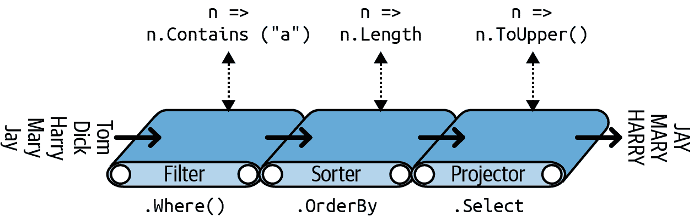

###### 图 8-1\. 链式查询操作符

我们可以逐步构建相同的查询，如下所示：

```cs
// You must import the System.Linq namespace for this to compile:

IEnumerable<string> filtered   = names   .Where   (n => n.Contains ("a"));
IEnumerable<string> sorted     = filtered.OrderBy (n => n.Length);
IEnumerable<string> finalQuery = sorted  .Select  (n => n.ToUpper());
```

`finalQuery` 在构造之前的 `query` 中是组合上相同的。此外，每个中间步骤还包含了一个可以执行的有效查询：

```cs
foreach (string name in filtered)
  Console.Write (name + "|");        // Harry|Mary|Jay|

Console.WriteLine();
foreach (string name in sorted)
  Console.Write (name + "|");        // Jay|Mary|Harry|

Console.WriteLine();
foreach (string name in finalQuery)
  Console.Write (name + "|");        // JAY|MARY|HARRY|
```

### 为什么扩展方法很重要

您可以使用传统的静态方法语法调用查询操作符，而不是使用扩展方法语法：

```cs
IEnumerable<string> filtered = Enumerable.Where (names,
                                                 n => n.Contains ("a"));
IEnumerable<string> sorted = Enumerable.OrderBy (filtered, n => n.Length);
IEnumerable<string> finalQuery = Enumerable.Select (sorted,
                                                    n => n.ToUpper());
```

实际上，这正是编译器如何转换扩展方法调用的方式。然而，如果您想要像我们之前那样在单个语句中编写查询，则放弃扩展方法会有代价。让我们重新审视单语句查询——首先是扩展方法语法：

```cs
IEnumerable<string> query = names.Where   (n => n.Contains ("a"))
                                 .OrderBy (n => n.Length)
                                 .Select  (n => n.ToUpper());
```

其自然的线性形状反映了数据从左到右的流动，并且还将 lambda 表达式与其查询操作符保持在一起（*中缀* 表示）。如果没有扩展方法，查询将失去其*流畅性*：

```cs
IEnumerable<string> query =
  Enumerable.Select (
    Enumerable.OrderBy (
      Enumerable.Where (
        names, n => n.Contains ("a")
      ), n => n.Length
    ), n => n.ToUpper()
  );
```

## 组合 Lambda 表达式

在之前的示例中，我们向 `Where` 操作符提供了以下 lambda 表达式：

```cs
n => n.Contains ("a")      // Input type = string, return type = bool.
```

###### 注意

一个接受值并返回 `bool` 的 lambda 表达式称为 *谓词*。

Lambda 表达式的目的取决于特定的查询操作符。对于 `Where` 操作符，它表示是否应该将一个元素包含在输出序列中。对于 `OrderBy` 操作符，lambda 表达式将输入序列的每个元素映射到其排序键。对于 `Select` 操作符，lambda 表达式确定在馈送到输出序列之前如何转换输入序列中的每个元素。

###### 注意

查询操作符中的 lambda 表达式总是在输入序列的单个元素上工作，而不是整个序列。

查询操作符根据需要评估您的 lambda 表达式，通常是输入序列中的每个元素一次。Lambda 表达式允许您将自己的逻辑输入到查询操作符中。这使得查询操作符既多才多艺又简单易用。这里是 `Enumerable.Where` 的完整实现，除了异常处理：

```cs
public static IEnumerable<TSource> Where<TSource>
  (this IEnumerable<TSource> source, Func<TSource,bool> predicate)
{
  foreach (TSource element in source)
    if (predicate (element))
      yield return element;
}
```

### Lambda 表达式和 Func 签名

标准查询操作符利用泛型 `Func` 委托。`Func` 是 `System` 命名空间中的一组通用目的泛型委托，其定义如下：

> 在 `Func` 中的类型参数按照 lambda 表达式中它们的顺序出现。

因此，`Func<TSource,bool>` 与 `TSource=>bool` lambda 表达式相匹配：接受 `TSource` 参数并返回 `bool` 值的表达式。

类似地，`Func<TSource,TResult>` 与 `TSource=>TResult` lambda 表达式相匹配。

`Func` 委托列在 “Lambda 表达式” 中。

### Lambda 表达式和元素类型

标准查询操作符使用以下类型参数名称：

| 通用类型字母 | 含义 |
| --- | --- |
| `TSource` | 输入序列的元素类型 |
| `TResult` | 输出序列的元素类型（如果不同于`TSource`） |
| `TKey` | 用于排序、分组或连接中的*键*的元素类型 |

`TSource`由输入序列确定。`TResult`和`TKey`通常*从您的 lambda 表达式中推断*。

例如，考虑`Select`查询操作符的签名：

```cs
public static IEnumerable<TResult> Select<TSource,TResult>
  (this IEnumerable<TSource> source, Func<TSource,TResult> selector)
```

`Func<TSource,TResult>`匹配`TSource=>TResult`的 lambda 表达式：将*输入元素*映射到*输出元素*的表达式。`TSource`和`TResult`可以是不同的类型，因此 lambda 表达式可以更改每个元素的类型。此外，lambda 表达式*确定输出序列类型*。以下查询使用`Select`将字符串类型元素转换为整数类型元素：

```cs
string[] names = { "Tom", "Dick", "Harry", "Mary", "Jay" };
IEnumerable<int> query = names.Select (n => n.Length);

foreach (int length in query)
  Console.Write (length + "|");    // 3|4|5|4|3|
```

编译器可以*推断*出`TResult`的类型，从 lambda 表达式的返回值中推断出来。在本例中，`n.Length`返回一个`int`值，因此`TResult`被推断为`int`。

`Where`查询操作符更简单，对输出不需要类型推断，因为输入和输出元素是相同类型的。这是有道理的，因为该操作符仅仅是过滤元素，并不会*转换*它们：

```cs
public static IEnumerable<TSource> Where<TSource>
  (this IEnumerable<TSource> source, Func<TSource,bool> predicate)
```

最后，考虑`OrderBy`操作符的签名：

```cs
// Slightly simplified:
public static IEnumerable<TSource> OrderBy<TSource,TKey>
  (this IEnumerable<TSource> source, Func<TSource,TKey> keySelector)
```

`Func<TSource,TKey>`将输入元素映射到*排序键*。`TKey`从您的 lambda 表达式中推断出，并且与输入和输出元素类型分开。例如，我们可以选择按长度（`int`键）或按字母顺序（`string`键）对名称列表进行排序：

```cs
string[] names = { "Tom", "Dick", "Harry", "Mary", "Jay" };
IEnumerable<string> sortedByLength, sortedAlphabetically;
sortedByLength       = names.OrderBy (n => n.Length);   // int key
sortedAlphabetically = names.OrderBy (n => n);          // string key
```

###### 注意

您可以使用传统的委托调用`Enumerable`中的查询操作符，这些委托引用方法而不是 lambda 表达式。这种方法在简化某些本地查询（特别是 LINQ 到 XML）时非常有效，并在第十章中进行了演示。然而，对于基于`IQueryable<T>`的序列（例如查询数据库时），这种方法不适用，因为`Queryable`中的操作符需要 lambda 表达式以生成表达式树。我们稍后在“解释查询”中讨论这一点。

## 自然排序

LINQ 中输入序列中的原始元素顺序很重要。某些查询操作符依赖于此顺序，如`Take`、`Skip`和`Reverse`。

`Take`操作符输出前`x`个元素，并丢弃其余元素：

```cs
int[] numbers  = { 10, 9, 8, 7, 6 };
IEnumerable<int> firstThree = numbers.Take (3);     // { 10, 9, 8 }
```

`Skip`操作符忽略前`x`个元素，并输出剩余元素：

```cs
IEnumerable<int> lastTwo    = numbers.Skip (3);     // { 7, 6 }
```

`Reverse`确实如其名所示：

```cs
IEnumerable<int> reversed   = numbers.Reverse();    // { 6, 7, 8, 9, 10 }
```

在本地查询（LINQ-to-objects）中，诸如`Where`和`Select`等操作符保留输入序列的原始顺序（与特定更改顺序的操作符除外）。

## 其他操作符

并非所有查询操作符都返回序列。*元素* 操作符从输入序列中提取一个元素；例如 `First`、`Last` 和 `ElementAt`：

```cs
int[] numbers    = { 10, 9, 8, 7, 6 };
int firstNumber  = numbers.First();                        // 10
int lastNumber   = numbers.Last();                         // 6
int secondNumber = numbers.ElementAt(1);                   // 9
int secondLowest = numbers.OrderBy(n=>n).Skip(1).First();  // 7
```

由于这些操作符返回单个元素，除非该元素本身是一个集合，否则通常不会在其结果上再调用其他查询操作符。

*聚合* 操作符返回一个标量值，通常是数值类型：

```cs
int count = numbers.Count();          // 5;
int min = numbers.Min();              // 6;
```

*量词* 返回一个 `bool` 值：

```cs
bool hasTheNumberNine = numbers.Contains (9);          // true
bool hasMoreThanZeroElements = numbers.Any();          // true
bool hasAnOddElement = numbers.Any (n => n % 2 != 0);  // true
```

一些查询操作符接受两个输入序列。例如，`Concat` 将一个序列追加到另一个序列，而 `Union` 则执行相同的操作，但会移除重复项：

```cs
int[] seq1 = { 1, 2, 3 };
int[] seq2 = { 3, 4, 5 };
IEnumerable<int> concat = seq1.Concat (seq2);    //  { 1, 2, 3, 3, 4, 5 }
IEnumerable<int> union  = seq1.Union (seq2);     //  { 1, 2, 3, 4, 5 }
```

连接操作符也属于这一类。第九章 详细介绍了所有查询操作符。

# 查询表达式

C# 提供了一种用于编写 LINQ 查询的语法快捷方式，称为 *查询表达式*。与流行观念相反，查询表达式并不是将 SQL 嵌入到 C# 中的一种方法。事实上，查询表达式的设计主要受到来自函数式编程语言（如 LISP 和 Haskell）的 *列表推导* 的启发，尽管 SQL 对其有些影响。

###### 注意

在本书中，我们将查询表达式语法简称为 *查询语法*。

在前一节中，我们编写了一个流畅语法查询，以提取包含字母“a”的字符串，并按长度排序并转换为大写。下面是在查询语法中实现相同功能的示例：

```cs
using System;
using System.Collections.Generic;
using System.Linq;

string[] names = { "Tom", "Dick", "Harry", "Mary", "Jay" };

IEnumerable<string> query =
 from    n in names
 where   n.Contains ("a")     // Filter elements
 orderby n.Length             // Sort elements
 select  n.ToUpper();         // Translate each element (project)

foreach (string name in query) Console.WriteLine (name);

*JAY*
*MARY*
*HARRY*
```

查询表达式始终以 `from` 子句开头，并以 `select` 或 `group` 子句结尾。`from` 子句声明一个 *范围变量*（在本例中为 `n`），您可以将其视为遍历输入序列——类似于 `foreach`。图 8-2 以铁路图的形式展示了完整的语法结构。

###### 注意

要阅读此图表，请从左侧开始，然后沿着轨道进行。例如，在必须的 `from` 子句之后，您可以选择包括 `orderby`、`where`、`let` 或 `join` 子句。之后，您可以继续使用 `select` 或 `group` 子句，或者返回并包括另一个 `from`、`orderby`、`where`、`let` 或 `join` 子句。

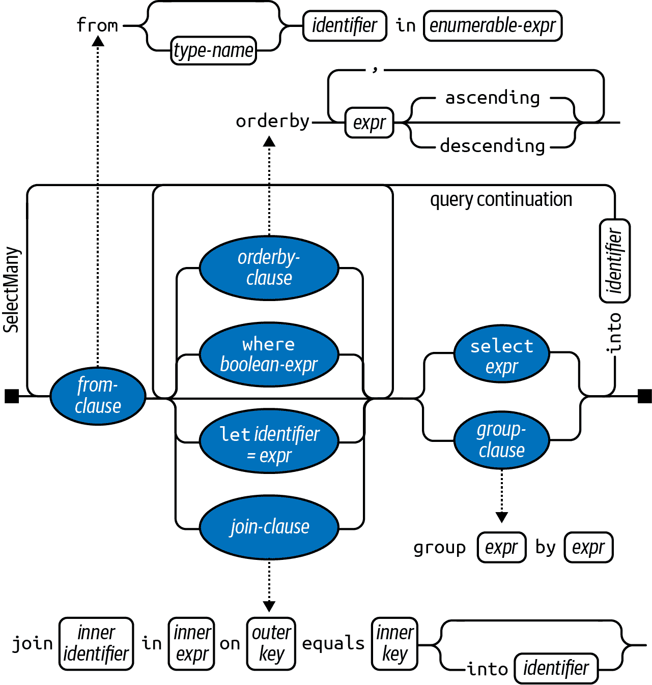

###### 图 8-2\. 查询语法

编译器通过将查询表达式转换为流畅语法来处理查询表达式。它以一种相当机械的方式进行此操作——就像将 `foreach` 语句转换为对 `GetEnumerator` 和 `MoveNext` 的调用一样。这意味着您可以在查询语法中编写的任何内容也可以在流畅语法中编写。编译器（最初）将我们的示例查询转换为以下内容：

```cs
IEnumerable<string> query = names.Where   (n => n.Contains ("a"))
                                 .OrderBy (n => n.Length)
                                 .Select  (n => n.ToUpper());
```

`Where`、`OrderBy` 和 `Select` 操作符遵循与流畅语法写的查询相同的规则进行解析。在这种情况下，它们绑定到 `Enumerable` 类中的扩展方法，因为已导入 `System.Linq` 命名空间并且 `names` 实现了 `IEnumerable<string>` 接口。然而，编译器在转换查询表达式时并不明确偏好于 `Enumerable` 类。你可以将编译器视为机械地将 `Where`、`OrderBy` 和 `Select` 这些词注入语句中，然后编译它，就好像你自己输入了这些方法名一样。这样做提供了解析方式的灵活性。例如，我们在后面章节中编写的数据库查询中的操作符，会绑定到 `Queryable` 中的扩展方法上。

###### 注意

如果我们从程序中移除 `using System.Linq` 指令，查询将无法编译，因为 `Where`、`OrderBy` 和 `Select` 方法无处可绑定。除非导入 `System.Linq` 或具有这些查询方法实现的其他命名空间，否则查询表达式无法编译。

## 范围变量

紧随 `from` 关键字语法的标识符称为*范围变量*。范围变量指的是要执行操作的序列中的当前元素。

在我们的示例中，范围变量 `n` 出现在查询的每个子句中。然而，该变量实际上在每个子句中枚举了一个*不同*的序列：

```cs
from    n in names           // n is our range variable
where   n.Contains ("a")     // n = directly from the array
orderby n.Length             // n = subsequent to being filtered
select  n.ToUpper()          // n = subsequent to being sorted
```

当我们检查编译器对流畅语法的机械翻译时，这一点变得清晰起来：

```cs
names.Where   (n => n.Contains ("a"))      // Locally scoped n
     .OrderBy (n => n.Length)              // Locally scoped n
     .Select  (n => n.ToUpper())           // Locally scoped n
```

正如你所看到的，每个 `n` 的实例都被私有地限定在自己的 lambda 表达式中。

查询表达式还可以通过以下子句引入新的范围变量：

+   `let`

+   `into`

+   一个额外的 `from` 子句

+   `join`

我们将在本章稍后部分以及第九章中的 “Composition Strategies”、Chapter 9 的 “Projecting” 和 “Joining” 中介绍这些内容。

## 查询语法与 SQL 语法

查询表达式在表面上看起来像 SQL，但两者非常不同。LINQ 查询归结为 C# 表达式，因此遵循标准的 C# 规则。例如，在 LINQ 中，你不能在声明变量之前使用它。而在 SQL 中，你可以在 `FROM` 子句中定义之前在 `SELECT` 子句中引用表别名。

在 LINQ 中，子查询只是另一个 C# 表达式，因此不需要特殊语法。而 SQL 中的子查询则受到特殊规则的约束。

使用 LINQ，数据在查询中从左到右逻辑流动。而 SQL 中，数据流的顺序对于数据流动的结构性程度较差。

LINQ 查询由一系列操作符组成的传送带或*管道*组成，它们接受并发出可能有序的序列元素。而 SQL 查询由主要处理*无序集合*的*网络*组成。

## 查询语法与流畅语法

查询语法和流畅语法各有优势。

查询语法对涉及以下任何内容的查询更简单：

+   `let` 子句用于在范围变量旁引入新变量

+   `SelectMany`、`Join` 或 `GroupJoin`，后跟外部范围变量引用

（我们在 “组合策略” 中描述了 `let` 子句；我们在 第九章 中描述了 `SelectMany`、`Join` 和 `GroupJoin`。）

中间地带是涉及简单使用 `Where`、`OrderBy` 和 `Select` 的查询。任何语法都很有效；选择主要取决于个人喜好。

对于只包含单个运算符的查询，流畅语法更简短、更简洁。

最后，有许多运算符在查询语法中没有关键字。这些要求您至少部分使用流畅语法。这意味着除以下内容之外的任何运算符：

```cs
Where, Select, SelectMany
OrderBy, ThenBy, OrderByDescending, ThenByDescending
GroupBy, Join, GroupJoin
```

## 混合语法查询

如果查询运算符不支持查询语法，则可以混合查询语法和流畅语法。唯一的限制是每个查询语法组件必须完整（即必须以 `from` 子句开始，以 `select` 或 `group` 子句结束）。

假设这个数组声明

```cs
string[] names = { "Tom", "Dick", "Harry", "Mary", "Jay" };
```

以下示例计算包含字母“a”的名称数：

```cs
int matches = (from n in names where n.Contains ("a") select n).Count();
// 3
```

下一个查询按字母顺序获取第一个名字：

```cs
string first = (from n in names orderby n select n).First();   // Dick
```

在更复杂的查询中，混合语法方法有时更为有益。然而，在这些简单的示例中，我们可以始终坚持使用流畅的语法而不会受到任何处罚：

```cs
int matches = names.Where (n => n.Contains ("a")).Count();   // 3
string first = names.OrderBy (n => n).First();               // Dick
```

###### 注意

有时，混合语法查询在功能和简洁性方面提供了最大的优势。重要的是不偏向任何一种查询语法；否则，在最佳选项时将无法编写混合语法查询。

在适用的情况下，本章的其余部分展示了流畅语法和查询语法中的关键概念。

# 延迟执行

大多数查询运算符的重要特性是它们在构造时不执行，而是在 *枚举* 时执行（换句话说，在其枚举器上调用 `MoveNext` 时）。考虑以下查询：

```cs
var numbers = new List<int> { 1 };

IEnumerable<int> query = numbers.Select (n => n * 10);    // Build query

numbers.Add (2);                    // Sneak in an extra element

foreach (int n in query)
  Console.Write (n + "|");          // 10|20|
```

我们在构造查询之后悄悄插入了额外的数字，它包含在结果中，因为直到 `foreach` 语句运行时才进行任何过滤或排序。这称为延迟执行或惰性执行，与委托的工作方式相同：

```cs
Action a = () => Console.WriteLine ("Foo");
// We’ve not written anything to the Console yet. Now let’s run it:
a();  // Deferred execution!
```

所有标准查询运算符都提供延迟执行，以下是例外：

+   返回单个元素或标量值的运算符，比如 `First` 或 `Count`

+   以下 *转换运算符*：

    ```cs
    ToArray, ToList, ToDictionary, ToLookup, ToHashSet
    ```

这些运算符会立即执行查询，因为它们的结果类型没有提供延迟执行的机制。例如，`Count` 方法返回一个简单的整数，不会被枚举。以下查询立即执行：

```cs
int matches = numbers.Where (n => n <= 2).Count();    // 1
```

延迟执行很重要，因为它将查询的*构造*与查询的*执行*分离。这允许您分步构建查询，并且也使得数据库查询成为可能。

###### 注意

子查询提供另一层间接性。子查询中的所有内容都会被延迟执行，包括聚合和转换方法。我们在“子查询”中描述了这一点。

## 重新评估

延迟执行还有另一个后果：当您重新枚举时，延迟执行查询会重新评估：

```cs
var numbers = new List<int>() { 1, 2 };

IEnumerable<int> query = numbers.Select (n => n * 10);
foreach (int n in query) Console.Write (n + "|");   // 10|20|

numbers.Clear();
foreach (int n in query) Console.Write (n + "|");   // <nothing>
```

有几个原因说明为何重新评估有时会带来不利影响：

+   有时，您希望在特定时间“冻结”或缓存结果。

+   有些查询计算量大（或依赖于远程数据库查询），因此不希望不必要地重复它们。

您可以通过调用诸如`ToArray`或`ToList`之类的转换操作符来避免重新评估。`ToArray`将查询的输出复制到一个数组；`ToList`则复制到一个通用的`List<T>`：

```cs
var numbers = new List<int>() { 1, 2 };

List<int> timesTen = numbers
  .Select (n => n * 10)

 .ToList();                // Executes immediately into a List<int>

numbers.Clear();
Console.WriteLine (timesTen.Count);      // Still 2
```

## 捕获的变量

如果您的查询的 lambda 表达式*捕获*了外部变量，则查询将在运行查询时遵循这些变量的值：

```cs
int[] numbers = { 1, 2 };

int factor = 10;
IEnumerable<int> query = numbers.Select (n => n * factor);
factor = 20;
foreach (int n in query) Console.Write (n + "|");   // 20|40|
```

在`for`循环中构建查询时，这可能是一个陷阱。例如，假设我们想从字符串中删除所有元音字母。以下代码虽然效率低下，但会得到正确的结果：

```cs
IEnumerable<char> query = "Not what you might expect";

query = query.Where (c => c != 'a');
query = query.Where (c => c != 'e');
query = query.Where (c => c != 'i');
query = query.Where (c => c != 'o');
query = query.Where (c => c != 'u');

foreach (char c in query) Console.Write (c);  // Nt wht y mght xpct
```

现在看看当我们使用`for`循环重构时会发生什么：

```cs
IEnumerable<char> query = "Not what you might expect";
string vowels = "aeiou";

for (int i = 0; i < vowels.Length; i++)
  query = query.Where (c => c != vowels[i]);

foreach (char c in query) Console.Write (c);
```

当枚举查询时，会抛出`IndexOutOfRangeException`，因为正如我们在第四章中看到的（参见“捕获外部变量”），编译器将`for`循环中的迭代变量作用域视为在*循环外部*声明的变量。因此，每个闭包都捕获了*同一个*变量（`i`），其值在实际枚举查询时为 5。为解决此问题，必须将循环变量赋给内部声明的另一个变量：

```cs
for (int i = 0; i < vowels.Length; i++)
{
  char vowel = vowels[i];
  query = query.Where (c => c != vowel);
}
```

这会在每次循环迭代时强制捕获一个新的局部变量。

###### 注意

另一种解决方法是用`foreach`循环替换`for`循环：

```cs
foreach (char vowel in vowels)
  query = query.Where (c => c != vowel);
```

## 延迟执行的工作原理

查询操作符通过返回*装饰器*序列提供延迟执行。

与传统的集合类（如数组或链表）不同，装饰器序列（一般情况下）没有自己的后备结构来存储元素。相反，它包装您在运行时提供的另一个序列，并且保持永久依赖于它。每当您从装饰器请求数据时，它反过来必须从包装的输入序列请求数据。

###### 注意

查询操作符的转换构成“装饰”。如果输出序列没有执行任何转换，那么它将是一个*代理*而不是装饰器。

调用`Where`仅构造了装饰器包装序列，该序列保存了对输入序列、lambda 表达式和任何其他提供的参数的引用。仅当枚举装饰器时，才会枚举输入序列。

图 8-3 展示了以下查询的组合：

```cs
IEnumerable<int> lessThanTen = new int[] { 5, 12, 3 }.Where (n => n < 10);
```

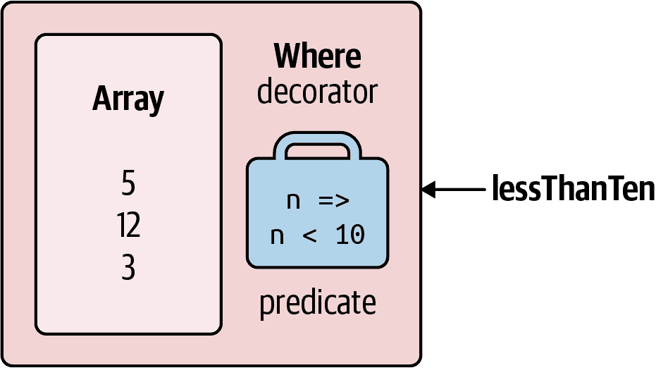

###### 图 8-3\. 装饰器序列

当你枚举`lessThanTen`时，实际上是通过`Where`装饰器查询数组。

一个好消息——如果你想编写自己的查询操作符，使用 C#迭代器实现装饰器序列很容易。下面是如何编写自己的`Select`方法：

```cs
public static IEnumerable<TResult> MySelect<TSource,TResult>
  (this IEnumerable<TSource> source, Func<TSource,TResult> selector)
{
  foreach (TSource element in source)
    yield return selector (element);
}
```

这个方法是一个迭代器，通过`yield return`语句实现。功能上，它是以下操作的快捷方式：

```cs
public static IEnumerable<TResult> MySelect<TSource,TResult>
  (this IEnumerable<TSource> source, Func<TSource,TResult> selector)
{
  return new *SelectSequence* (source, selector);
}
```

其中`*SelectSequence*`是一个（由编译器编写的）类，其枚举器封装了迭代器方法中的逻辑。

因此，当你调用诸如`Select`或`Where`的操作符时，实际上只是实例化了一个可枚举类，该类装饰了输入序列。

## 链式装饰器

链式查询操作创建了一系列装饰器。考虑下面的查询：

```cs
IEnumerable<int> query = new int[] { 5, 12, 3 }.Where   (n => n < 10)
                                               .OrderBy (n => n)
                                               .Select  (n => n * 10);
```

每个查询操作符实例化一个新的装饰器，包装前一个序列（有点像俄罗斯套娃）。图 8-4 展示了此查询的对象模型。注意，该对象模型在任何枚举之前完全构建。

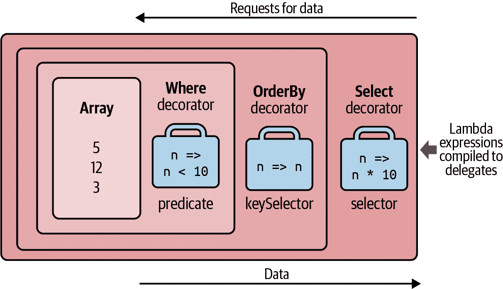

###### 图 8-4\. 分层装饰器序列

当你枚举`query`时，你在查询原始数组，经过一层或多层装饰器的转换。

###### 注意

在此查询末尾添加`ToList`会导致前面的操作立即执行，将整个对象模型折叠为单个列表。

图 8-5 展示了以统一建模语言（UML）语法表示的相同对象组合。`Select`的装饰器引用`OrderBy`的装饰器，后者引用`Where`的装饰器，后者引用数组。延迟执行的特性是，如果逐步组合查询，就会构建相同的对象模型：

```cs
IEnumerable<int>
  source    = new int[] { 5, 12, 3 },
  filtered  = source   .Where   (n => n < 10),
  sorted    = filtered .OrderBy (n => n),
  query     = sorted   .Select  (n => n * 10);
```

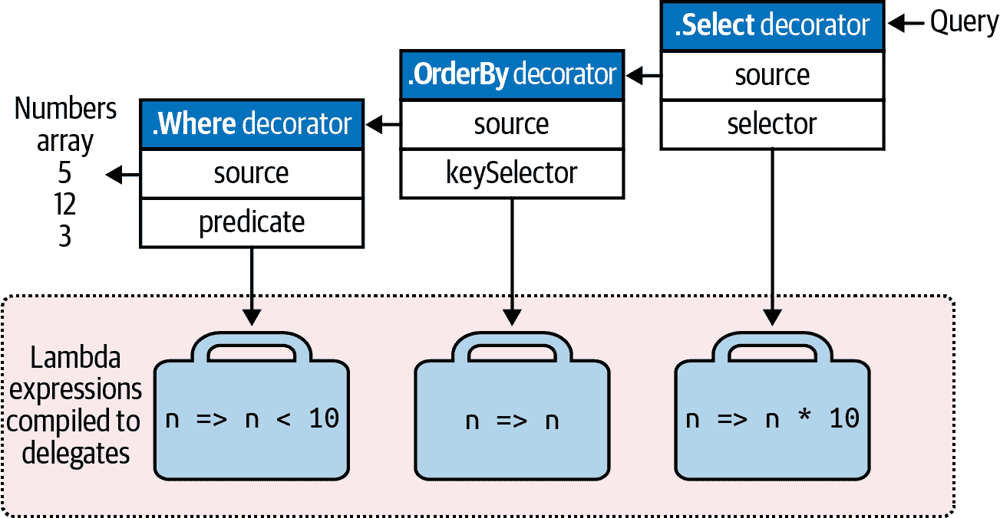

###### 图 8-5\. UML 装饰器组合

## 查询的执行方式

以下是对上述查询进行枚举的结果：

```cs
foreach (int n in query) Console.WriteLine (n);

*30*
*50*
```

在幕后，`foreach`调用`Select`的装饰器（最后或最外层的操作符）的`GetEnumerator`，从而启动一切。结果是一系列枚举器，结构上镜像了装饰器序列的链条。图 8-6 展示了随着枚举进行，执行流程的示意图。

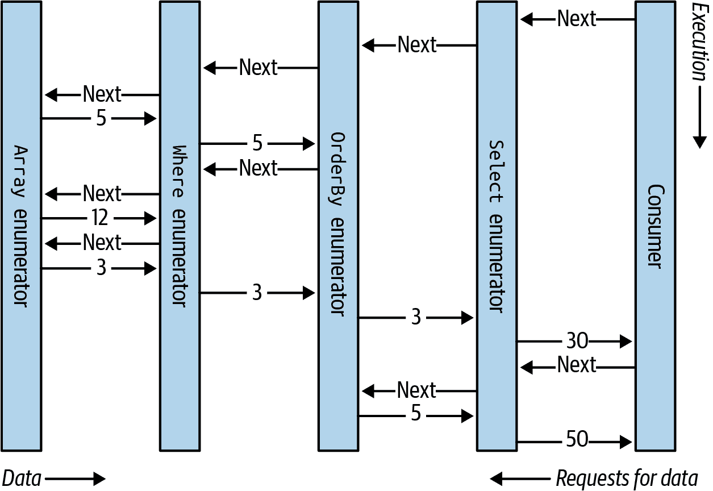

###### 图 8-6\. 本地查询的执行

在本章的第一节中，我们将查询描绘为一个传送带的生产线。延伸这个类比，我们可以说 LINQ 查询是一个惰性的生产线，其中传送带只在*需要*时滚动元素。构建查询就像构建了一个生产线——所有的东西都准备好了，但什么都不滚动。然后，当消费者请求一个元素（枚举查询时），最右边的传送带开始运转；这会触发其他传送带随着输入序列元素的需求而逐步滚动。LINQ 遵循的是需求驱动的*拉*模型，而不是供给驱动的*推*模型。这一点很重要——后面你会看到——因为这样可以使 LINQ 能够扩展到查询 SQL 数据库。

# 子查询

*子查询*是包含在另一个查询的 Lambda 表达式中的查询。以下示例使用子查询按姓氏对音乐家进行排序：

```cs
string[] musos = 
  { "David Gilmour", "Roger Waters", "Rick Wright", "Nick Mason" };

IEnumerable<string> query = musos.OrderBy (m => m.Split().Last());
```

`m.Split` 将每个字符串转换为单词集合，然后我们调用 `Last` 查询运算符。 `m.Split().Last` 就是子查询；`query` 引用了*外部查询*。

允许子查询，因为可以将任何有效的 C# 表达式放在 Lambda 的右侧。子查询只是另一个 C# 表达式。这意味着子查询的规则是 Lambda 表达式的规则（以及一般情况下查询运算符的行为）的结果。

###### 注意

在一般意义上，术语*子查询*具有更广泛的含义。在描述 LINQ 的目的上，我们仅将此术语用于从另一个查询的 Lambda 表达式中引用的查询。在查询表达式中，子查询等同于从任何 `from` 子句以外的任何子句中引用的查询。

子查询的作用域限定在封闭表达式内部，并且可以引用外部 Lambda 表达式中的参数（或查询表达式中的范围变量）。

`m.Split().Last` 是一个非常简单的子查询。下一个查询检索数组中所有字符串，其长度与最短字符串相匹配。

```cs
string[] names = { "Tom", "Dick", "Harry", "Mary", "Jay" };

IEnumerable<string> outerQuery = names
  .Where (n => n.Length == names.OrderBy (n2 => n2.Length)
 .Select  (n2 => n2.Length).First());

*// Tom, Jay*
```

下面是一个等效的查询表达式形式：

```cs
IEnumerable<string> outerQuery =
  from   n in names
  where  n.Length ==
           (from n2 in names orderby n2.Length select n2.Length).First()
  select n;
```

因为外部范围变量 (`n`) 在子查询中是作用域内的，所以我们不能将 `n` 作为子查询的范围变量重用。

子查询在封闭 Lambda 表达式被评估时执行。这意味着子查询按需执行，在外部查询的决定下。可以说执行是从*外向内*进行的。本地查询严格遵循这个模型；解释性查询（例如数据库查询）*概念上*遵循这个模型。

子查询根据需要执行，以供给外部查询。正如图 8-7 和 8-8 所示，在我们的示例中的子查询（图 8-7 中的顶部传送带）在每次外部循环迭代时执行一次。

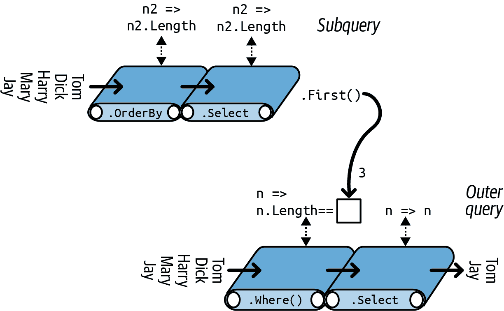

###### 图 8-7\. 子查询构成

我们可以更简洁地表达我们之前的子查询如下：

```cs
IEnumerable<string> query =
  from   n in names
  where  n.Length == names.OrderBy (n2 => n2.Length).First().Length
  select n;
```

使用`Min`聚合函数，我们可以进一步简化查询：

```cs
IEnumerable<string> query =
  from   n in names
  where  n.Length == names.Min (n2 => n2.Length)
  select n;
```

在“解释查询”中，我们描述了如何查询远程来源，例如 SQL 表。我们的例子是一个理想的数据库查询，因为它将作为一个单元处理，只需一次往返到数据库服务器。但是，对于本地集合来说，这个查询是低效的，因为子查询在每次外部循环迭代时都会重新计算。我们可以通过单独运行子查询来避免这种低效：

```cs
int shortest = names.Min (n => n.Length);

IEnumerable<string> query = from   n in names
                            where  n.Length == shortest
                            select n;
```

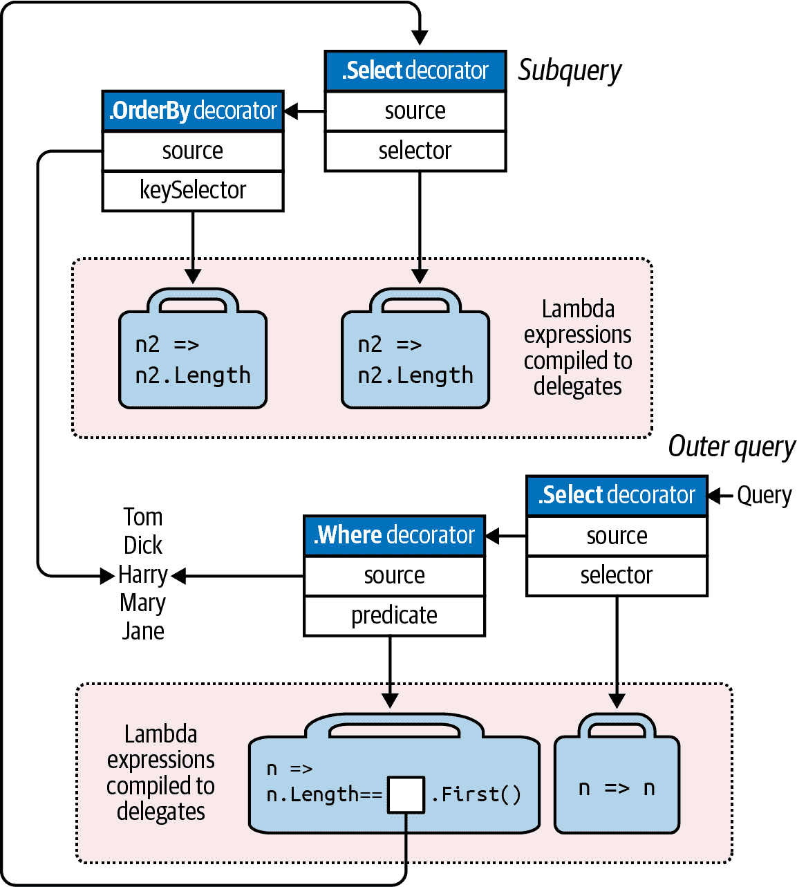

###### 图 8-8\. UML 子查询组合

###### 注意

在查询本地集合时，通常希望以这种方式分离子查询。一个例外是当子查询是*相关的*，意味着它引用外部的范围变量。我们在“投影”中探讨相关子查询。

## 子查询和延迟执行

子查询中的元素或聚合运算符（如`First`或`Count`）不会强制*外部*查询立即执行——延迟执行仍然适用于外部查询。这是因为子查询是通过委托（在本地查询的情况下）或表达式树间接调用的。

当你在`Select`表达式中包含一个子查询时，会出现一个有趣的情况。在本地查询的情况下，你实际上是在*投影一系列查询*，每个查询本身都受延迟执行的影响。这种效果通常是透明的，并且有助于进一步提高效率。我们将在第九章详细讨论`Select`子查询。

# 组合策略

在本节中，我们描述了构建更复杂查询的三种策略：

+   逐步查询构建

+   使用`into`关键字

+   封装查询

所有的*链接*策略和生成的运行时查询都是相同的。

## 逐步查询构建

在本章开始时，我们演示了如何逐步构建一个流畅的查询：

```cs
var filtered   = names    .Where   (n => n.Contains ("a"));
var sorted     = filtered .OrderBy (n => n);
var query      = sorted   .Select  (n => n.ToUpper());
```

因为每个参与的查询操作符都返回一个装饰器序列，所以结果查询与单一表达式查询得到的链式或层叠装饰器是相同的。然而，逐步构建查询有几个潜在的好处：

+   它可以使查询更容易编写。

+   你可以*有条件地*添加查询操作符。例如，

    ```cs
    if (includeFilter) query = query.Where (...)
    ```

    比

    ```cs
    query = query.Where (n => !includeFilter || *<expression>*)
    ```

    因为它避免了在`includeFilter`为 false 时添加额外的查询操作符。

在查询理解中，逐步方法通常很有用。想象一下，我们想从一个名字列表中删除所有元音字母，然后按字母顺序呈现那些长度仍超过两个字符的名字。在流畅的语法中，我们可以将这个查询写成一个单一的表达式—通过在过滤之前*投影*：

```cs
IEnumerable<string> query = names
  .Select  (n => n.Replace ("a", "").Replace ("e", "").Replace ("i", "")
                  .Replace ("o", "").Replace ("u", ""))
  .Where   (n => n.Length > 2)
  .OrderBy (n => n);

*// Dck*
*// Hrry*
*// Mry*
```

###### 注意

而不是调用`string`的`Replace`方法五次，我们可以用正则表达式更有效地从字符串中移除元音：

```cs
n => Regex.Replace (n, "[aeiou]", "")
```

虽然`string`的`Replace`方法有一个优点，也就是在数据库查询中同样适用。

直接将其转换为查询表达式是麻烦的，因为`select`子句必须在`where`和`orderby`子句之后。如果我们重新排列查询以便最后投影，结果将会有所不同：

```cs
IEnumerable<string> query =
  from    n in names
  where   n.Length > 2
  orderby n
  select  n.Replace ("a", "").Replace ("e", "").Replace ("i", "")
           .Replace ("o", "").Replace ("u", "");

*// Dck*
*// Hrry*
*// Jy*
*// Mry*
*// Tm*
```

幸运的是，有许多方法可以在查询语法中获得原始结果。第一种方法是逐步查询：

```cs
IEnumerable<string> query =
  from   n in names
  select n.Replace ("a", "").Replace ("e", "").Replace ("i", "")
          .Replace ("o", "").Replace ("u", "");

query = from n in query where n.Length > 2 orderby n select n;

*// Dck*
*// Hrry*
*// Mry*
```

## `into`关键字

###### 注意

`into`关键字在查询表达式中有两种非常不同的解释方式，取决于上下文。我们现在描述的意义是用于信号*查询继续*（另一种是用于信号`GroupJoin`）。

`into`关键字允许您在投影后“继续”查询，并且是逐步查询的快捷方式。使用`into`，我们可以将前述查询重写如下：

```cs
IEnumerable<string> query =
  from   n in names
  select n.Replace ("a", "").Replace ("e", "").Replace ("i", "")
          .Replace ("o", "").Replace ("u", "")
  into noVowel
    where noVowel.Length > 2 orderby noVowel select noVowel;
```

您唯一可以在`select`或`group`子句之后使用`into`的地方。`into`“重新启动”一个查询，允许您引入新的`where`、`orderby`和`select`子句。

###### 注意

虽然从查询表达式的角度来看，最容易将`into`视为重新启动查询的一部分，但在转换为最终的流畅形式时，它是*同一个查询*。因此，使用`into`不会导致性能损失。也不会因为使用它而丢失任何分数！

在流畅语法中，`into`的等效物只是一长串操作符。

### 作用域规则

所有范围变量在`into`关键字之后都已超出作用域。以下代码将无法编译通过：

```cs
var query =
  from n1 in names
  select n1.ToUpper()
  into n2                              // Only n2 is visible from here on.
    where n1.Contains ("x")            // Illegal: n1 is not in scope.
    select n2;
```

要了解原因，请考虑它如何映射到流畅语法：

```cs
var query = names
  .Select (n1 => n1.ToUpper())
  .Where  (n2 => n1.Contains ("x"));     // Error: n1 no longer in scope
```

原始名称（`n1`）在`Where`过滤器运行时就丢失了。`Where`的输入序列只包含大写名称，因此无法基于`n1`进行过滤。

## 包装查询

通过将一个查询包装在另一个查询周围，逐步构建的查询可以被公式化为单个语句。一般来说，

```cs
var tempQuery = *tempQueryExpr*
var finalQuery = from *...* in tempQuery *...*
```

可以改写为：

```cs
var finalQuery = from *...* in (*tempQueryExpr*)
```

包装在语义上与逐步构建查询或使用`into`关键字（不使用中间变量）相同。所有情况下的最终结果都是一条线性的查询操作链。例如，考虑以下查询：

```cs
IEnumerable<string> query =
  from   n in names
  select n.Replace ("a", "").Replace ("e", "").Replace ("i", "")
          .Replace ("o", "").Replace ("u", "");

query = from n in query where n.Length > 2 orderby n select n;
```

在包装形式中重新表达，它是以下内容：

```cs
IEnumerable<string> query =
  from n1 in
  (
    from   n2 in names
    select n2.Replace ("a", "").Replace ("e", "").Replace ("i", "")
             .Replace ("o", "").Replace ("u", "")
  )
  where n1.Length > 2 orderby n1 select n1;
```

当转换为流畅语法时，结果与前面示例中的所有操作符链相同：

```cs
IEnumerable<string> query = names
  .Select  (n => n.Replace ("a", "").Replace ("e", "").Replace ("i", "")
                  .Replace ("o", "").Replace ("u", ""))
  .Where   (n => n.Length > 2)
  .OrderBy (n => n);
```

（编译器不会生成最终的`.Select(n => n)`，因为这是多余的。）

包装查询可能会令人困惑，因为它们类似于我们之前编写的*子查询*。两者都有内部查询和外部查询的概念。然而，当转换为流畅语法时，您会发现包装只是一种依次链接操作符的策略。最终结果与嵌入一个内部查询的*lambda 表达式*不像子查询，其外观毫不相似。

回到之前的类比：在包装时，“内部”查询相当于*前面的传送带*。相比之下，子查询则位于传送带上方，并且通过传送带的 lambda 工作者按需激活（如 图 8-7 所示）。

# 投影策略

## 对象初始化程序

到目前为止，我们所有的 `select` 子句都投影为标量元素类型。使用 C# 对象初始化程序，您可以投影为更复杂的类型。例如，假设在查询的第一步中，我们想要从一个名字列表中去除元音字母，同时保留原始版本以供后续查询使用。我们可以编写以下类来帮助：

```cs
class TempProjectionItem
{
  public string Original;    // Original name
  public string Vowelless;   // Vowel-stripped name
}
```

然后我们可以使用对象初始化程序对其进行投影：

```cs
string[] names = { "Tom", "Dick", "Harry", "Mary", "Jay" };

IEnumerable<TempProjectionItem> temp =
  from n in names
  select new TempProjectionItem
  {
    Original  = n,
    Vowelless = n.Replace ("a", "").Replace ("e", "").Replace ("i", "")
 .Replace ("o", "").Replace ("u", "")
  };
```

结果的类型是`IEnumerable<TempProjectionItem>`，我们随后可以进行查询：

```cs
IEnumerable<string> query = from   item in temp
                            where  item.Vowelless.Length > 2
                            select item.Original;
*// Dick*
*// Harry*
*// Mary*
```

## 匿名类型

匿名类型允许您在不编写特殊类的情况下结构化中间结果。我们可以使用匿名类型在先前示例中消除 `TempProjectionItem` 类：

```cs
var intermediate = from n in names

  select new
  {
    Original = n,
    Vowelless = n.Replace ("a", "").Replace ("e", "").Replace ("i", "")
 .Replace ("o", "").Replace ("u", "")
  };

IEnumerable<string> query = from   item in intermediate
                            where  item.Vowelless.Length > 2
                            select item.Original;
```

这与前面的示例给出了相同的结果，但无需编写一次性类。编译器会代劳，生成一个临时类，其字段与我们投影的结构匹配。然而，这意味着 `intermediate` 查询具有以下类型：

```cs
IEnumerable <*random-compiler-generated-name*>
```

唯一可以声明此类型变量的方法是使用 `var` 关键字。在这种情况下，`var` 不仅仅是减少杂乱的装置；它是必需的。

我们可以使用 `into` 关键字更简洁地编写整个查询：

```cs
var query = from n in names
  select new
  {
     Original = n,
     Vowelless = n.Replace ("a", "").Replace ("e", "").Replace ("i", "")
                  .Replace ("o", "").Replace ("u", "")
  }
  into temp
  where temp.Vowelless.Length > 2
  select temp.Original;
```

查询表达式提供了一种快捷方式来编写这种类型的查询：使用 `let` 关键字。

## `let` 关键字

`let` 关键字在范围变量旁边引入一个新变量。

使用 `let`，我们可以编写一个查询，提取长度超过两个字符（不包括元音字母）的字符串，如下所示：

```cs
string[] names = { "Tom", "Dick", "Harry", "Mary", "Jay" };

IEnumerable<string> query =
  from n in names
  let vowelless = n.Replace ("a", "").Replace ("e", "").Replace ("i", "")
 .Replace ("o", "").Replace ("u", "")
 where vowelless.Length > 2
  orderby vowelless
  select n;       // Thanks to let, n is still in scope.
```

编译器通过将投影到一个临时的匿名类型中来解析 `let` 子句，该类型包含范围变量和新表达式变量。换句话说，编译器将此查询转换为前面的示例。

`let` 实现了两件事情：

+   它将新元素与现有元素并列投影。

+   它允许在查询中多次使用表达式而无需重写。

在这个例子中，`let` 方法特别有优势，因为它允许 `select` 子句投影原始名称 (`n`) 或其去除元音版本 (`vowelless`)。

在 `where` 语句之前或之后可以有任意数量的 `let` 语句（参见 图 8-2）。 `let` 语句可以引用在先前 `let` 语句中引入的变量（受 `into` 子句强加的边界限制）。 `let` *重新投影* 所有现有变量，这是透明的。

`let` 表达式不需要评估为标量类型：有时候将其评估为子序列也很有用，例如。

# 解释查询

LINQ 提供了两种并行架构：*本地* 查询用于本地对象集合，*解释* 查询用于远程数据源。到目前为止，我们已经研究了本地查询的架构，它操作实现了 `IEnumerable<T>` 的集合。本地查询解析为 `Enumerable` 类（默认情况下）中的查询操作符，这些操作符进一步解析为装饰器序列的链。它们接受的委托——无论是在查询语法、流畅语法还是传统委托中表达——都完全是 Intermediate Language (IL) 代码中的本地内容，就像任何其他 C# 方法一样。

相比之下，解释查询是 *描述性的*。它们操作实现了 `IQueryable<T>` 的序列，并解析为 `Queryable` 类中的查询操作符，这些操作符生成在运行时解释的 *表达式树*。例如，这些表达式树可以转换为 SQL 查询，允许您使用 LINQ 查询数据库。

###### 注意

`Enumerable` 中的查询操作符实际上可以与 `IQueryable<T>` 序列一起工作。困难在于所产生的查询始终在客户端上本地执行。这就是为什么 `Queryable` 类中提供了第二组查询操作符的原因。

要编写解释查询，您需要从一个公开类型为 `IQueryable<T>` 的序列的 API 开始。例如，Microsoft 的 *Entity Framework Core* (EF Core) 允许您查询各种数据库，包括 SQL Server、Oracle、MySQL、PostgreSQL 和 SQLite。

还可以通过调用 `AsQueryable` 方法在普通可枚举集合周围生成 `IQueryable<T>` 包装器。我们在“构建查询表达式”中描述了 `AsQueryable`。

###### 注意

`IQueryable<T>` 是具有用于构造表达式树的附加方法的 `IEnumerable<T>` 扩展。大多数情况下，您可以忽略这些方法的详细信息；它们由运行时间接调用。“构建查询表达式” 更详细地介绍了 `IQueryable<T>`。

为了说明，让我们在 SQL Server 中创建一个简单的客户表，并使用以下 SQL 脚本填充它：

```cs
create table Customer
(
  ID int not null primary key,
  Name varchar(30)
)
insert Customer values (1, 'Tom')
insert Customer values (2, 'Dick')
insert Customer values (3, 'Harry')
insert Customer values (4, 'Mary')
insert Customer values (5, 'Jay')
```

有了这张表，我们可以在 C# 中编写一个使用 EF Core 获取名称中包含字母“a”的客户的解释型 LINQ 查询，如下所示：

```cs
using System;
using System.Linq;
using Microsoft.EntityFrameworkCore;

using var dbContext = new NutshellContext();

IQueryable<string> query = from c in dbContext.Customers
 where   c.Name.Contains ("a")
 orderby c.Name.Length
 select  c.Name.ToUpper();

foreach (string name in query) Console.WriteLine (name);

public class Customer
{
  public int ID { get; set; }
  public string Name { get; set; }
}

// We’ll explain the following class in more detail in the next section.
public class NutshellContext : DbContext
{
  public virtual DbSet<Customer> Customers { get; set; }

  protected override void OnConfiguring (DbContextOptionsBuilder builder)
    => builder.UseSqlServer ("...connection string...");

  protected override void OnModelCreating (ModelBuilder modelBuilder)
    => modelBuilder.Entity<Customer>().ToTable ("Customer")
                                      .HasKey (c => c.ID);
}
```

EF Core 将此查询转换为以下 SQL：

```cs
SELECT UPPER([c].[Name])
FROM [Customers] AS [c]
WHERE CHARINDEX(N'a', [c].[Name]) > 0
ORDER BY CAST(LEN([c].[Name]) AS int)
```

这是最终结果：

```cs
*// JAY*
*// MARY*
*// HARRY*
```

## 解释查询的工作原理

让我们看看前述查询是如何处理的。

首先，编译器将查询语法转换为流畅语法。这与本地查询完全相同：

```cs
IQueryable<string> query = dbContext.customers
                                    .Where   (n => n.Name.Contains ("a"))
                                    .OrderBy (n => n.Name.Length)
                                    .Select  (n => n.Name.ToUpper());
```

接下来，编译器解析查询操作符方法。这是本地和解释查询不同之处——解释查询解析为 `Queryable` 类中的查询操作符，而不是 `Enumerable` 类中的操作符。

要理解原因，我们需要查看 `dbContext.Customers` 变量，即整个查询构建的源。`dbContext.Customers` 的类型是 `DbSet<T>`，实现了 `IQueryable<T>`（`IEnumerable<T>` 的子类型）。这意味着编译器在解析 `Where` 时可以选择调用 `Enumerable` 中的扩展方法或以下 `Queryable` 中的扩展方法：

```cs
public static IQueryable<TSource> Where<TSource> (this
  IQueryable<TSource> source, Expression <Func<TSource,bool>> predicate)
```

编译器选择 `Queryable.Where` 是因为它的签名是*更具体的匹配*。

`Queryable.Where` 接受一个包装在 `Expression<TDelegate>` 类型中的谓词。这告诉编译器将提供的 lambda 表达式——也就是 `n=>n.Name.Contains("a")`——转换为*表达式树*，而不是编译后的委托。表达式树是基于 `System.Linq.Expressions` 中的类型的对象模型，可以在运行时进行检查（以便 EF Core 以后可以将其转换为 SQL 语句）。

因为 `Queryable.Where` 还返回 `IQueryable<T>`，所以相同的过程也适用于 `OrderBy` 和 `Select` 操作符。图 8-9 展示了最终结果。在阴影框中，有一个*表达式树*描述了整个查询，可以在运行时遍历。

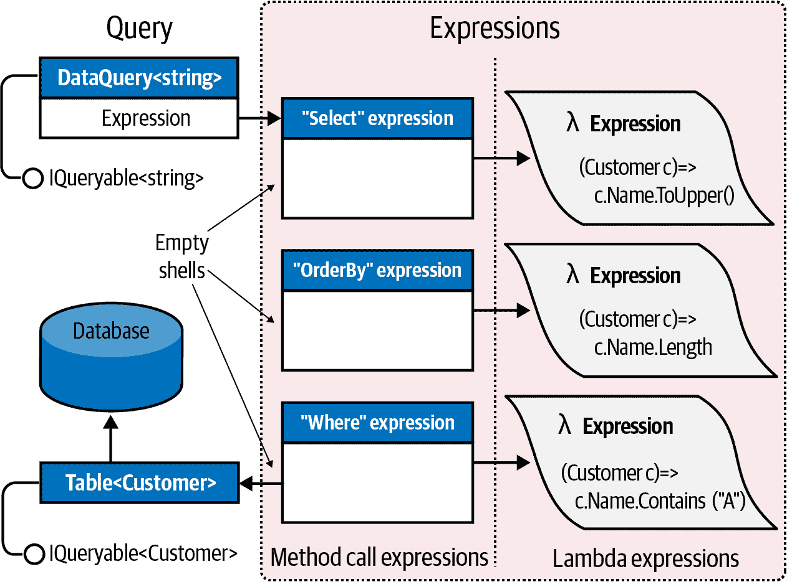

###### 图 8-9\. 解释查询组合

### 执行

解释查询遵循延迟执行模型——就像本地查询一样。这意味着直到你开始枚举查询，SQL 语句才会被生成。此外，两次枚举相同的查询会导致数据库被查询两次。

在底层，解释查询在执行方式上与本地查询不同。当你枚举解释查询时，最外层的序列会运行一个程序，遍历整个表达式树，将其作为一个单元处理。在我们的示例中，EF Core 将表达式树转换为 SQL 语句，然后执行，产生一个序列作为结果。

###### 注意

要使 EF Core 正常工作，它需要理解数据库的模式。它通过利用约定、代码属性和流畅的配置 API 来实现。我们稍后会详细探讨这一点。

我们之前说过，LINQ 查询就像一个生产线。然而，当你枚举一个 `IQueryable` 传送带时，它不会启动整条生产线，就像本地查询那样。相反，只有 `IQueryable` 传送带启动，带有一个特殊的枚举器，调用一个生产经理。经理检查整条生产线——它不是编译代码，而是*假人*（方法调用表达式），它们的*前额*上粘有指令（表达式树）。然后经理遍历所有表达式，在本例中将它们抄写到一张纸上（一个 SQL 语句），然后执行它，将结果反馈给消费者。只有一个传送带在运转；其余的生产线是一组空壳，存在只是为了描述需要做什么。

这具有一些实际意义。例如，对于本地查询，您可以编写自己的查询方法（使用迭代器相当容易），然后用它们来补充预定义的集合。对于远程查询，这很困难甚至不可取。如果您编写了一个接受 `IQueryable<T>` 的 `MyWhere` 扩展方法，那就像是在生产线上放入自己的假人。生产经理不会知道如何处理您的假人。即使在这个阶段进行干预，您的解决方案也将被硬编码为特定的提供程序，如 EF Core，并且不会与其他 `IQueryable` 实现一起工作。在 `Queryable` 中拥有一套标准方法的好处之一是它们为查询*任何*远程集合定义了一个*标准词汇表*。一旦您试图扩展词汇表，您就不再具备互操作性。

另一个模型的结果是，即使您坚持使用标准方法，`IQueryable` 提供程序也可能无法处理某些查询。EF Core 受数据库服务器能力的限制；一些 LINQ 查询无法转换为 SQL。如果您熟悉 SQL，您可能会对这些情况有直觉，尽管有时您需要实验才能看到什么会导致运行时错误；令人惊讶的是，*有时候会*工作！

## 结合解释和本地查询

查询可以包含解释和本地操作符。典型的模式是在*外部*使用本地操作符，在*内部*使用解释组件；换句话说，解释查询供给本地查询。当查询数据库时，这种模式效果良好。

例如，假设我们编写了一个自定义扩展方法来配对集合中的字符串：

```cs
public static IEnumerable<string> Pair (this IEnumerable<string> source)
{
  string firstHalf = null;
  foreach (string element in source)
    if (firstHalf == null)
      firstHalf = element;
    else
    {
      yield return firstHalf + ", " + element;
      firstHalf = null;
    }
}
```

我们可以在混合了 EF Core 和本地操作符的查询中使用这个扩展方法：

```cs
using var dbContext = new NutshellContext ();
IEnumerable<string> q = dbContext.Customers
  .Select (c => c.Name.ToUpper())
  .OrderBy (n => n)
 .Pair()                         // Local from this point on.
  .Select ((n, i) => "Pair " + i.ToString() + " = " + n);

foreach (string element in q) Console.WriteLine (element);

*// Pair 0 = DICK, HARRY*
*// Pair 1 = JAY, MARY*
```

因为 `dbContext.Customers` 是实现 `IQueryable<T>` 的类型，所以 `Select` 操作符解析为 `Queryable.Select`。这将返回一个同样类型为 `IQueryable<T>` 的输出序列，因此 `OrderBy` 操作符同样解析为 `Queryable.OrderBy`。但接下来的查询操作符 `Pair` 没有接受 `IQueryable<T>` 的重载版本——只有不那么具体的 `IEnumerable<T>`。因此，它解析为我们的本地 `Pair` 方法——将解释查询包装在本地查询中。`Pair` 也返回 `IEnumerable`，因此接下来的 `Select` 解析为另一个本地操作符。

在 EF Core 方面，生成的 SQL 语句相当于这样：

```cs
SELECT UPPER([c].[Name]) FROM [Customers] AS [c] ORDER BY UPPER([c].[Name])
```

剩余的工作在本地完成。实际上，我们得到了一个本地查询（在外部），其源是一个解释查询（在内部）。

## AsEnumerable

`Enumerable.AsEnumerable` 是所有查询操作符中最简单的。这是它的完整定义：

```cs
public static IEnumerable<TSource> AsEnumerable<TSource>
              (this IEnumerable<TSource> source)
{
    return source;
}
```

它的目的是将 `IQueryable<T>` 序列强制转换为 `IEnumerable<T>`，从而使后续查询操作符绑定到 `Enumerable` 操作符而不是 `Queryable` 操作符。这导致查询的其余部分在本地执行。

举例说明，假设我们在 SQL Server 中有一个`MedicalArticles`表，并且希望使用 EF Core 检索所有流感文章，其摘要包含少于 100 个单词。对于后一谓词，我们需要一个正则表达式：

```cs
Regex wordCounter = new Regex (@"\b(\w|[-'])+\b");

using var dbContext = new NutshellContext ();

var query = dbContext.MedicalArticles
  .Where (article => article.Topic == "influenza" &&
                     wordCounter.Matches (article.Abstract).Count < 100);
```

问题在于 SQL Server 不支持正则表达式，因此 EF Core 将抛出异常，表示无法将查询转换为 SQL。我们可以通过两步查询来解决这个问题：首先通过 EF Core 查询检索所有流感文章，然后在本地过滤少于 100 个单词的摘要：

```cs
Regex wordCounter = new Regex (@"\b(\w|[-'])+\b");

using var dbContext = new NutshellContext ();

IEnumerable<MedicalArticle> efQuery = dbContext.MedicalArticles
  .Where (article => article.Topic == "influenza");

IEnumerable<MedicalArticle> localQuery = efQuery
  .Where (article => wordCounter.Matches (article.Abstract).Count < 100);
```

因为`efQuery`的类型是`IEnumerable<MedicalArticle>`，第二个查询绑定到本地查询运算符，强制该部分过滤在客户端运行。

使用`AsEnumerable`，我们可以在单个查询中完成相同的操作：

```cs
Regex wordCounter = new Regex (@"\b(\w|[-'])+\b");

using var dbContext = new NutshellContext ();

var query = dbContext.MedicalArticles
  .Where (article => article.Topic == "influenza")

 .AsEnumerable()
  .Where (article => wordCounter.Matches (article.Abstract).Count < 100);
```

替代调用`AsEnumerable`的方法是调用`ToArray`或`ToList`。`AsEnumerable`的优点在于它不强制立即执行查询，也不创建任何存储结构。

###### 注意

将查询处理从数据库服务器移动到客户端可能会影响性能，特别是如果意味着检索更多行。解决我们示例的更高效（虽然更复杂）的方法是使用 SQL CLR 集成来在数据库上公开实现正则表达式的函数。

我们在第十章中进一步演示了组合解释和本地查询。

# EF Core

在本章和第九章中，我们使用 EF Core 来演示解释查询。现在让我们检查一下这项技术的关键特性。

## EF Core 实体类

EF Core 允许您使用任何类来表示数据，只要它包含您想要查询的每个列的公共属性即可。

例如，我们可以定义以下实体类来查询和更新数据库中的*Customers*表：

```cs
public class Customer
{
  public int ID { get; set; } 
  public string Name { get; set; }
}
```

## DbContext

定义实体类之后，下一步是继承`DbContext`。该类的实例表示您与数据库会话的工作。通常，您的`DbContext`子类将包含每个模型实体的一个`DbSet<T>`属性：

```cs
public class NutshellContext : DbContext
{
  public DbSet<Customer> Customers { get; set; }
  ... properties for other tables ...

}
```

`DbContext`对象执行三个操作：

+   它作为生成您可以查询的`DbSet<>`对象的工厂。

+   它跟踪您对实体所做的任何更改，以便您可以将其写回（参见“更改跟踪”）。

+   它提供了虚拟方法，您可以重写以配置连接和模型。

### 配置连接

通过重写`OnConfiguring`方法，您可以指定数据库提供程序和连接字符串：

```cs
public class NutshellContext : DbContext
{
  ...
  protected override void OnConfiguring (DbContextOptionsBuilder 
                                         optionsBuilder) =>
    optionsBuilder.UseSqlServer 
      (@"Server=(local);Database=Nutshell;Trusted_Connection=True");
}
```

在本示例中，连接字符串被指定为字符串文字。生产应用程序通常会从诸如*appsettings.json*的配置文件中检索它。

`UseSqlServer` 是在*Microsoft.EntityFramework.SqlServer* NuGet 包的一个程序集中定义的扩展方法。其他数据库提供程序，如 Oracle、MySQL、PostgreSQL 和 SQLite，也提供了相应的包。

###### 注意

如果您使用 ASP.NET，您可以允许其依赖注入框架预配置`optionsBuilder`；在大多数情况下，这样可以避免完全重写`OnConfiguring`。为此，请在`DbContext`上定义如下构造函数：

```cs
public NutshellContext (DbContextOptions<NutshellContext>
                        options)
  : base(options) { }
```

如果您选择重写`OnConfiguring`（也许是为了在其他场景中使用您的`DbContext`提供配置），您可以像下面这样检查选项是否已经配置：

```cs
protected override void OnConfiguring (
  DbContextOptionsBuilder optionsBuilder)
{
  if (!optionsBuilder.IsConfigured)
  {
    ...
  }
}
```

在`OnConfiguring`方法中，您可以启用其他选项，包括延迟加载（参见“延迟加载”）。

### 配置模型

默认情况下，EF Core 是基于*约定*的，这意味着它从您的类和属性名称推断数据库模式。

您可以通过重写`OnModelCreating`并在`ModelBuilder`参数上调用扩展方法，覆盖默认设置。例如，我们可以显式指定我们的`Customer`实体的数据库表名如下：

```cs
protected override void OnModelCreating (ModelBuilder modelBuilder) =>
  modelBuilder.Entity<Customer>()
    .ToTable ("Customer");   // Table is called 'Customer'
```

如果没有此代码，EF Core 将会将此实体映射到名为`Customers`的表，而不是“Customer”，因为我们在`DbContext`中有一个名为`Customers`的`DbSet<Customer>`属性：

```cs
public DbSet<Customer> Customers { get; set; }
```

###### 注意

以下代码将所有实体映射到与实体*类名*（通常是单数形式）匹配的表名，而不是与`DbSet<T>`的*属性名*（通常是复数形式）匹配：

```cs
protected override void OnModelCreating (ModelBuilder
                                        modelBuilder)
{
  foreach (IMutableEntityType entityType in
           modelBuilder.Model.GetEntityTypes())
  {
    modelBuilder.Entity (entityType.Name)
      .ToTable (entityType.ClrType.Name);
  }
}
```

Fluent API 提供了一种扩展语法来配置列。在下面的示例中，我们使用了两种流行的方法：

+   `HasColumnName`，将属性映射到不同命名的列

+   `IsRequired`，表示列不可为 null

```cs
protected override void OnModelCreating (ModelBuilder modelBuilder) =>
  modelBuilder.Entity<Customer> (entity =>
  {
      entity.ToTable ("Customer");
      entity.Property (e => e.Name)
 .HasColumnName ("Full Name")  // Column name is 'Full Name'
 .IsRequired();                // Column is not nullable
  });
```

表 8-1 列出了 Fluent API 中一些最重要的方法。

###### 注意

除了使用 Fluent API 外，您还可以通过将特殊属性应用于实体类和属性（“数据注释”）来配置模型。这种方法在配置必须在编译时固定的情况下较为灵活，并且在某些只能通过 Fluent API 配置的选项上较为弱。

表 8-1\. Fluent API 模型配置方法

| 方法 | 目的 | 示例 |
| --- | --- | --- |
| `ToTable` | 指定给定实体的数据库表名 |

```cs
builder
  .Entity<Customer>()
  .ToTable("Customer");
```

|

| `HasColumnName` | 指定给定属性的列名 |
| --- | --- |

```cs
builder.Entity<Customer>()
  .Property(c => c.Name)
  .HasColumnName("Full Name");
```

|

| `HasKey` | 指定一个键（通常与约定不同） |
| --- | --- |

```cs
builder.Entity<Customer>()
  .HasKey(c => c.CustomerNr);
```

|

| `IsRequired` | 指定属性需要有值（不可为 null） |
| --- | --- |

```cs
builder.Entity<Customer>()
  .Property(c => c.Name)
  .IsRequired();
```

|

| `HasMaxLength` | 指定可变长度类型（通常是字符串）的最大长度 |
| --- | --- |

```cs
builder.Entity<Customer>()
  .Property(c => c.Name)
  .HasMaxLength(60);
```

|

| `HasColumnType` | 指定列的数据库数据类型 |
| --- | --- |

```cs
builder.Entity<Purchase>()
  .Property(p => p.Description)
  .HasColumnType("varchar(80)");
```

|

| `Ignore` | 忽略一个类型 |
| --- | --- |

```cs
builder.Ignore<Products>();
```

|

| `Ignore` | 忽略类型的属性 |
| --- | --- |

```cs
builder.Entity<Customer>()
  .Ignore(c => c.ChatName);
```

|

| `HasIndex` | 指定一个（或一组）属性在数据库中作为索引使用 |
| --- | --- |

```cs
// Compound index:
builder.Entity<Purchase>()
  .HasIndex(p =>
     new { p.Date, p.Price });

// Unique index on one property
builder
  .Entity<MedicalArticle>()
  .HasIndex(a => a.Topic)
  .IsUnique();
```

|

| `HasOne` | 参见 “导航属性” |
| --- | --- |

```cs
builder.Entity<Purchase>()
  .HasOne(p => p.Customer)
  .WithMany(c => c.Purchases);
```

|

| `HasMany` | 参见 “导航属性” |
| --- | --- |

```cs
builder.Entity<Customer>()
  .HasMany(c => c.Purchases)
  .WithOne(p => p.Customer);
```

|

### 创建数据库

EF Core 支持*代码优先*方法，这意味着您可以首先定义实体类，然后要求 EF Core 创建数据库。完成后，可以在 `DbContext` 实例上调用以下方法：

```cs
dbContext.Database.EnsureCreated();
```

然而，更好的方法是使用 EF Core 的*迁移*功能，不仅创建数据库，还配置它，以便在将来您的实体类更改时，EF Core 可以自动更新模式。您可以在 Visual Studio 的 Package Manager Console 中启用迁移，并使用以下命令创建数据库：

```cs
Install-Package Microsoft.EntityFrameworkCore.Tools
Add-Migration InitialCreate
Update-Database
```

第一条命令安装工具，以便从 Visual Studio 中管理 EF Core。第二条命令生成一个特殊的 C# 类，称为代码迁移，其中包含创建数据库的指令。最后一条命令针对项目应用配置文件中指定的数据库连接字符串运行这些指令。

### 使用 DbContext

定义了实体类并对 `DbContext` 进行了子类化后，可以实例化您的 `DbContext` 并查询数据库，如下所示：

```cs
using var dbContext = new NutshellContext();
Console.WriteLine (dbContext.Customers.Count());
// Executes "SELECT COUNT(*) FROM [Customer] AS [c]"
```

您还可以使用 `DbContext` 实例将数据写入数据库。以下代码向 Customer 表插入一行：

```cs
using var dbContext = new NutshellContext();
Customer cust = new Customer()
{
  Name = "Sara Wells"
};
dbContext.Customers.Add (cust);
dbContext.SaveChanges();    // Writes changes back to database
```

以下查询数据库中刚刚插入的客户：

```cs
using var dbContext = new NutshellContext();
Customer cust = dbContext.Customers
  .Single (c => c.Name == "Sara Wells")
```

下面更新了该客户的姓名，并将更改写入数据库：

```cs
cust.Name = "Dr. Sara Wells";
dbContext.SaveChanges();
```

###### 注意

`Single` 操作符非常适合通过主键检索行。与 `First` 不同的是，如果返回超过一个元素，它会抛出异常。

## 目标跟踪

`DbContext` 实例跟踪其实例化的所有实体，因此每当您请求表中的相同行时，它可以将相同的实体返回给您。换句话说，在其生命周期中，上下文永远不会发出指向表中同一行（其中一行由主键标识）的两个单独实体。这种能力称为*对象跟踪*。

举例来说，假设姓名按字母顺序排列的第一个客户也具有最低的 ID。在以下示例中，`a` 和 `b` 将引用同一个对象：

```cs
using var dbContext = new NutshellContext ();

Customer a = dbContext.Customers.OrderBy (c => c.Name).First();
Customer b = dbContext.Customers.OrderBy (c => c.ID).First();
```

考虑 EF Core 遇到第二个查询时会发生什么情况。它首先查询数据库，并获取一行数据。然后读取这一行的主键，并在上下文的实体缓存中进行查找。如果找到匹配项，则返回现有对象，*而不更新任何值*。因此，如果另一个用户刚刚更新了数据库中该客户的`Name`，新值将被忽略。这对于避免意外副作用（`Customer`对象可能在其他地方使用中）至关重要，也对并发管理至关重要。如果您已更改了`Customer`对象上的属性但尚未调用`SaveChanges`，您不希望自动覆盖您的属性。

###### 注意

您可以通过将`AsNoTracking`扩展方法链接到您的查询或通过在上下文上设置`ChangeTracker.QueryTrackingBehavior`为`QueryTrackingBehavior.NoTracking`来禁用对象跟踪。无跟踪查询在数据只读时非常有用，因为它提高了性能并减少了内存使用。

要从数据库获取最新信息，必须要么实例化一个新的上下文，要么调用`Reload`方法，如下所示：

```cs
dbContext.Entry (myCustomer).Reload();
```

最佳实践是每个工作单元使用一个新的`DbContext`实例，以便几乎不需要手动重新加载实体。

## 更改跟踪

当您通过`DbContext`加载的实体更改属性值时，EF Core 会识别更改，并在调用`SaveChanges`时相应地更新数据库。为此，它会创建一个加载通过您的`DbContext`子类的实体状态的快照，并在调用`SaveChanges`时（或在手动查询更改跟踪时，稍后将看到）将当前状态与原始状态进行比较。您可以按如下方式枚举`DbContext`中跟踪的更改：

```cs
foreach (var e in dbContext.ChangeTracker.Entries())
{
  Console.WriteLine ($"{e.Entity.GetType().FullName} is {e.State}");
  foreach (var m in e.Members)
    Console.WriteLine (
      $"  {m.Metadata.Name}: '{m.CurrentValue}' modified: {m.IsModified}");
}
```

当您调用`SaveChanges`时，EF Core 使用`ChangeTracker`中的信息构造 SQL 语句，以使数据库与您的对象中的更改保持一致，发出插入语句以添加新行，更新语句以修改数据，并发出删除语句以删除在您的`DbContext`子类的对象图中已删除的行。任何`TransactionScope`都将受到尊重；如果没有，它将所有语句包装在一个新的事务中。

您可以通过在实体中实现`INotifyPropertyChanged`（以及可选的`INotifyPropertyChanging`）来优化更改跟踪。前者使得 EF Core 可以避免比较修改后的原始实体的开销；后者允许 EF Core 完全避免存储原始值。在实现这些接口后，在配置模型时调用`ModelBuilder`上的`HasChangeTrackingStrategy`方法，以激活优化的更改跟踪。

## 导航属性

导航属性允许您执行以下操作：

+   查询相关表，而无需手动连接

+   在不显式更新外键的情况下插入、删除和更新相关行

例如，假设一个客户可以拥有多个购买记录。我们可以用以下实体表示*客户*和*购买*之间的一对多关系：

```cs
public class Customer
{
  public int ID { get; set; }
  public string Name { get; set; }

  // Child navigation property, which must be of type ICollection<T>:
  public virtual List<Purchase> Purchases {get;set;} = new List<Purchase>();
}

public class Purchase
{        
  public int ID { get; set; }
  public DateTime Date { get; set; }
  public string Description { get; set; }
  public decimal Price { get; set; }
  public int CustomerID? { get; set; }     // Foreign key field

  public Customer Customer { get; set; }   // Parent navigation property
}
```

EF Core 能够从这些实体推断出`CustomerID`是指向*客户*表的外键，因为名称`CustomerID`遵循流行的命名约定。如果我们要求 EF Core 根据这些实体创建数据库，它将在`Purchase.CustomerID`和`Customer.ID`之间创建外键约束。

###### 注意

如果 EF Core 无法推断出关系，则可以在`OnModelCreating`方法中显式配置如下：

```cs
modelBuilder.Entity<Purchase>()
  .HasOne (e => e.Customer)
  .WithMany (e => e.Purchases)
  .HasForeignKey (e => e.CustomerID);
```

设置了这些导航属性后，我们可以编写如下查询：

```cs
var customersWithPurchases = Customers.Where (c => c.Purchases.Any());
```

我们在第九章中详细讨论如何编写此类查询。

### 添加和删除导航集合中的实体

当您将新实体添加到集合导航属性时，EF Core 在调用`SaveChanges`时会自动填充外键：

```cs
Customer cust = dbContext.Customers.Single (c => c.ID == 1);

Purchase p1 = new Purchase { Description="Bike",  Price=500 };
Purchase p2 = new Purchase { Description="Tools", Price=100 };

cust.Purchases.Add (p1);
cust.Purchases.Add (p2);

dbContext.SaveChanges();
```

在此示例中，EF Core 自动将`CustomerID`列写入每个新购买记录，并将每个购买记录的数据库生成的 ID 写入`Purchase`.`ID`。

当您从集合导航属性中删除实体并调用`SaveChanges`时，EF Core 将根据配置或推断的关系清除外键字段或从数据库中删除相应的行。在这种情况下，我们已将`Purchase.CustomerID`定义为可为空的整数（这样我们可以表示没有客户或现金交易的购买记录），因此从客户那里删除购买记录将清除其外键字段而不是从数据库中删除它。

### 加载导航属性

当 EF Core 填充一个实体时，默认情况下不会填充它的导航属性：

```cs
using var dbContext = new NutshellContext();
var cust = dbContext.Customers.First();
Console.WriteLine (cust.Purchases.Count);    // Always 0
```

一个解决方案是使用`Include`扩展方法，该方法指示 EF Core *急切地*加载导航属性：

```cs
var cust = dbContext.Customers 
  .Include (c => c.Purchases)
  .Where (c => c.ID == 2).First();
```

另一个解决方案是使用投影。当您只需要处理实体的部分属性时，这种技术尤其有用，因为它减少了数据传输：

```cs
var custInfo = dbContext.Customers 
  .Where (c => c.ID == 2)
 .Select (c => new
 {
 Name = c.Name,
 Purchases = c.Purchases.Select (p => new { p.Description, p.Price })
 })
  .First();
```

这两种技术都告诉 EF Core 您需要哪些数据，以便它可以在单个数据库查询中获取它们。还可以手动指示 EF Core 按需填充导航属性：

```cs
dbContext.Entry (cust).Collection (b => b.Purchases).Load();
// cust.Purchases is now populated.
```

这称为*显式加载*。与前面的方法不同，这会在数据库中产生额外的一次往返。

### 懒加载

另一种加载导航属性的方法称为*懒加载*。启用后，EF Core 通过为每个实体类生成代理类，在访问未加载的导航属性时进行拦截，按需填充导航属性。为使此方法有效，每个导航属性必须是虚拟的，并且定义它的类必须是可继承的（非密封的）。此外，当延迟加载发生时，上下文不能已被释放，以便可以执行额外的数据库请求。

你可以在你的`DbContext`子类的`OnConfiguring`方法中启用延迟加载，如下所示：

```cs
protected override void OnConfiguring (DbContextOptionsBuilder 
                                       optionsBuilder)
{
  optionsBuilder
    .UseLazyLoadingProxies()
    ...
}
```

（你还需要添加对`Microsoft.EntityFrameworkCore.Proxies`NuGet 包的引用。）

延迟加载的成本在于，每次访问未加载的导航属性时，EF Core 必须向数据库发出额外的请求。如果进行了许多这样的请求，性能可能会因过多的往返而受到影响。

###### 注意

启用延迟加载后，你的类的运行时类型是从实体类派生的代理类。例如：

```cs
using var dbContext = new NutshellContext();
var cust = dbContext.Customers.First();  
Console.WriteLine (cust.GetType());
// Castle.Proxies.CustomerProxy
```

## 延迟执行

EF Core 查询与本地查询一样，都支持延迟执行。这使得你可以逐步构建查询。然而，EF Core 在一个方面具有特殊的延迟执行语义，即当子查询出现在`Select`表达式中时。

对于本地查询，你会得到双重延迟执行，因为从功能角度来看，你正在选择一系列*查询*。因此，如果枚举外部结果序列但从未枚举内部序列，则子查询将永远不会执行。

使用 EF Core，子查询在与主外查询同时执行。这可以防止过多的往返。

例如，以下查询在到达第一个`foreach`语句时执行单次往返：

```cs
using var dbContext = new NutshellContext ();

var query = from c in dbContext.Customers
            select
               from p in c.Purchases
               select new { c.Name, p.Price };

foreach (var customerPurchaseResults in query)
  foreach (var namePrice in customerPurchaseResults)
    Console.WriteLine ($"{ namePrice.Name} spent { namePrice.Price}");
```

你显式投影的任何导航属性都将在单次往返中完全填充：

```cs
var query = from c in dbContext.Customers
            select new { c.Name, c.Purchases };

foreach (var row in query)
 foreach (Purchase p in row.Purchases)   // No extra round-tripping
    Console.WriteLine (row.Name + " spent " + p.Price);
```

但是，如果我们枚举一个导航属性而没有首先进行预加载或投影，则会应用延迟执行规则。在以下示例中，EF Core 在每次循环迭代中执行另一个`Purchases`查询（假设启用了延迟加载）：

```cs
foreach (Customer c in dbContext.Customers.ToArray())
  foreach (Purchase p in c.Purchases)    // Another SQL round-trip
    Console.WriteLine (c.Name + " spent " + p.Price);
```

当你想要*有选择地*执行内部循环时，这种模型是有利的，这是基于仅在客户端上可以执行的测试：

```cs
foreach (Customer c in dbContext.Customers.ToArray())
  if (*myWebService.HasBadCreditHistory (c.ID)*)
    foreach (Purchase p in c.Purchases)   // Another SQL round trip
      Console.WriteLine (c.Name + " spent " + p.Price);
```

###### 注意

请注意在前两个查询中使用`ToArray`。默认情况下，SQL Server 在处理当前查询结果时无法启动新的查询。调用`ToArray`将使客户端材料化，以便可以发出额外的查询来检索每个客户的购买记录。可以通过在数据库连接字符串末尾添加`;MultipleActiveResultSets=True`来配置 SQL Server 允许多个活动结果集（MARS）。使用 MARS 时要谨慎，因为它可能掩盖需要通过预加载和/或投影改进的冗余数据库设计。

（在第九章中，我们将更详细地探讨`Select`子查询，在“投影”中。)

# 构建查询表达式

到目前为止，在本章中，当我们需要动态组合查询时，我们通过有条件地链接查询操作符来实现。尽管这在许多场景中已经足够，但有时你需要在更精细的级别上工作，并动态组合馈送操作符的 lambda 表达式。

在本节中，我们假设以下`Product`类：

```cs
public class Product
{
  public int ID { get; set; }
  public string Description { get; set; }
  public bool Discontinued { get; set; }
  public DateTime LastSale { get; set; }
}
```

## 委托与表达式树

请注意：

+   使用 `Enumerable` 操作符的本地查询采用委托。

+   使用 `Queryable` 操作符的解释查询采用表达式树。

通过比较 `Enumerable` 和 `Queryable` 中 `Where` 操作符的签名，我们可以看到：

```cs
public static IEnumerable<TSource> Where<TSource> (this
  IEnumerable<TSource> source, Func<TSource,bool> predicate)

public static IQueryable<TSource> Where<TSource> (this
  IQueryable<TSource> source, Expression<Func<TSource,bool>> predicate)
```

在查询中嵌入的 lambda 表达式无论绑定到 `Enumerable` 的操作符还是 `Queryable` 的操作符，看起来都是相同的：

```cs
IEnumerable<Product> q1 = localProducts.Where (p => !p.Discontinued);
IQueryable<Product>  q2 = sqlProducts.Where   (p => !p.Discontinued);
```

然而，当您将 lambda 表达式分配给中间变量时，必须明确指定是解析为委托（即 `Func<>`）还是表达式树（即 `Expression<Func<>>`）。在下面的示例中，`predicate1` 和 `predicate2` 不能互换使用：

```cs
Func <Product, bool> predicate1 = p => !p.Discontinued;
IEnumerable<Product> q1 = localProducts.Where (predicate1);

Expression <Func <Product, bool>> predicate2 = p => !p.Discontinued;
IQueryable<Product> q2 = sqlProducts.Where (predicate2);
```

### 编译表达式树

通过调用 `Compile` 方法，可以将表达式树转换为委托。在编写返回可重用表达式的方法时，这非常有价值。为了说明，让我们向 `Product` 类添加一个静态方法，如果产品没有停产且在过去 30 天内有销售，则返回评估为 `true` 的谓词：

```cs
public class Product
{
  public static Expression<Func<Product, bool>> IsSelling()
  {
    return p => !p.Discontinued && p.LastSale > DateTime.Now.AddDays (-30);
  }
}
```

刚才编写的方法可以在解释和本地查询中使用，如下所示：

```cs
void Test()
{
  var dbContext = new NutshellContext();
  Product[] localProducts = dbContext.Products.ToArray();

  IQueryable<Product> sqlQuery =
    dbContext.Products.Where (Product.IsSelling());

  IEnumerable<Product> localQuery =
    localProducts.Where (Product.IsSelling().Compile());
}
```

###### 注意

.NET 没有提供将委托转换为表达式树的 API。这使得表达式树更加灵活多变。

### AsQueryable

`AsQueryable` 操作符允许您编写可以运行在本地或远程序列上的整个*查询*：

```cs
IQueryable<Product> FilterSortProducts (IQueryable<Product> input)
{
  return from p in input
         where ...
         orderby ...
         select p;
}

void Test()
{
  var dbContext = new NutshellContext();
  Product[] localProducts = dbContext.Products.ToArray();

  var sqlQuery   = FilterSortProducts (dbContext.Products);
  var localQuery = FilterSortProducts (localProducts.AsQueryable());
  ...
}
```

`AsQueryable` 将 `IQueryable<T>` 的外衣包裹在本地序列周围，以便后续的查询操作符解析为表达式树。当您稍后枚举结果时，表达式树会隐式编译（以微小的性能成本），并且本地序列会像通常一样枚举。

## 表达树

我们之前说过，从 lambda 表达式到 `Expression<TDelegate>` 的隐式转换会导致 C# 编译器生成构建表达式树的代码。通过一些编程工作，您可以在运行时手动执行相同的操作，换句话说，从头开始动态构建表达式树。结果可以转换为 `Expression<TDelegate>` 并且可以在 EF Core 查询中使用，或者通过调用 `Compile` 编译为普通委托。

### 表达式 DOM

表达式树是一个迷你的代码 DOM。树中的每个节点由 `System.Linq.Expressions` 命名空间中的一种类型表示。图 8-10 说明了这些类型。

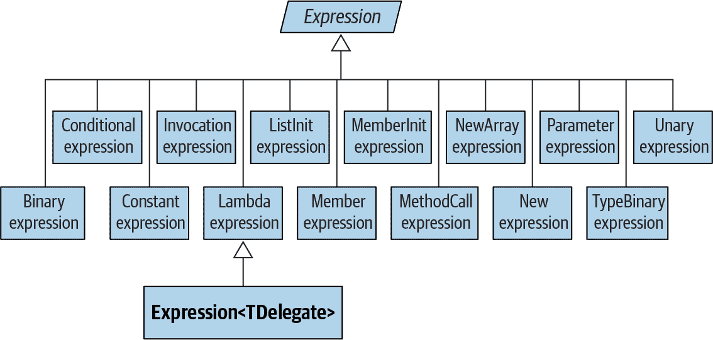

###### 图 8-10\. 表达式类型

所有节点的基类是非泛型的 `Expression` 类。泛型的 `Expression<TDelegate>` 类实际上表示“类型化 lambda 表达式”，如果不考虑笨拙的情况，本应该命名为 `LambdaExpression<TDelegate>`：

```cs
LambdaExpression<Func<Customer,bool>> f = ...
```

`Expression<T>` 的基类型是非泛型的 `LambdaExpression` 类。`LambdaExpression` 提供了对 lambda 表达式树的类型统一：任何类型化的 `Expression<T>` 都可以转换为 `LambdaExpression`。

区别于普通`Expression`的是，`LambdaExpression`具有*参数*。

要创建表达式树，不要直接实例化节点类型；而是调用`Expression`类提供的静态方法，比如`Add`、`And`、`Call`、`Constant`、`LessThan`等等。

图 8-11 展示了以下赋值创建的表达式树：

```cs
Expression<Func<string, bool>> f = s => s.Length < 5;
```

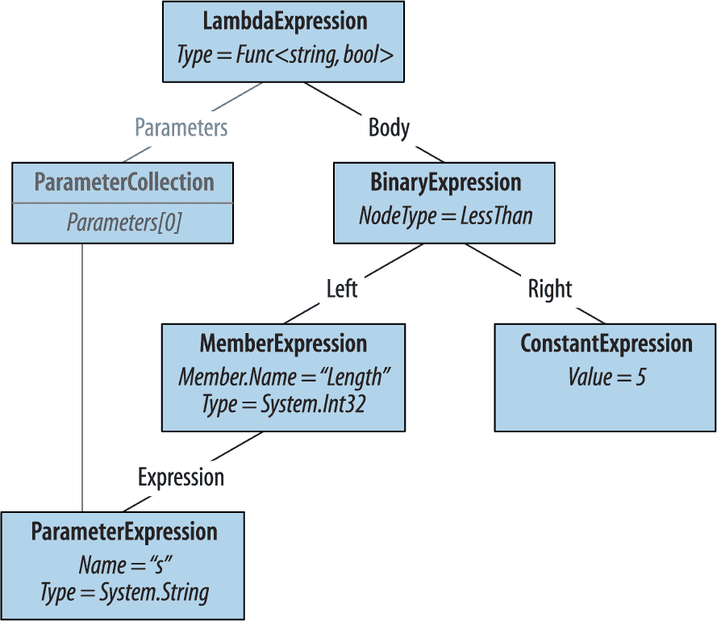

###### 图 8-11\. 表达式树

我们可以按如下方式演示：

```cs
Console.WriteLine (f.Body.NodeType);                     // LessThan
Console.WriteLine (((BinaryExpression) f.Body).Right);   // 5
```

现在让我们从头开始构建这个表达式。原则是从树的底部开始，逐步向上构建。在我们的树中，最底部的是一个`ParameterExpression`，名为“s”，类型为`string`：

```cs
ParameterExpression p = Expression.Parameter (typeof (string), "s");
```

下一步是构建`MemberExpression`和`ConstantExpression`。在前者的情况下，我们需要访问参数“s”的`Length` *属性*：

```cs
MemberExpression stringLength = Expression.Property (p, "Length");
ConstantExpression five = Expression.Constant (5);
```

接下来是`LessThan`比较：

```cs
BinaryExpression comparison = Expression.LessThan (stringLength, five);
```

最后一步是构建 Lambda 表达式，它将一个`Body`表达式链接到一个参数集合：

```cs
Expression<Func<string, bool>> lambda
  = Expression.Lambda<Func<string, bool>> (comparison, p);
```

编译 Lambda 的一个方便方式是将其编译为委托：

```cs
Func<string, bool> runnable = lambda.Compile();

Console.WriteLine (runnable ("kangaroo"));           // False
Console.WriteLine (runnable ("dog"));                // True
```

###### 注意

确定使用哪种表达式类型的最简单方法是在 Visual Studio 调试器中检查现有的 Lambda 表达式。

我们在这里继续讨论，网址为 [*http://www.albahari.com/expressions*](http://www.albahari.com/expressions)。

¹ 这个术语基于 Eric Evans 和 Martin Fowler 关于流畅接口的工作。
