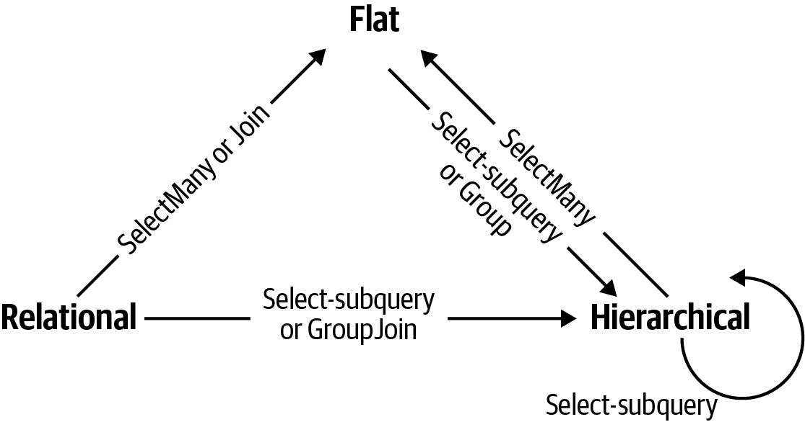
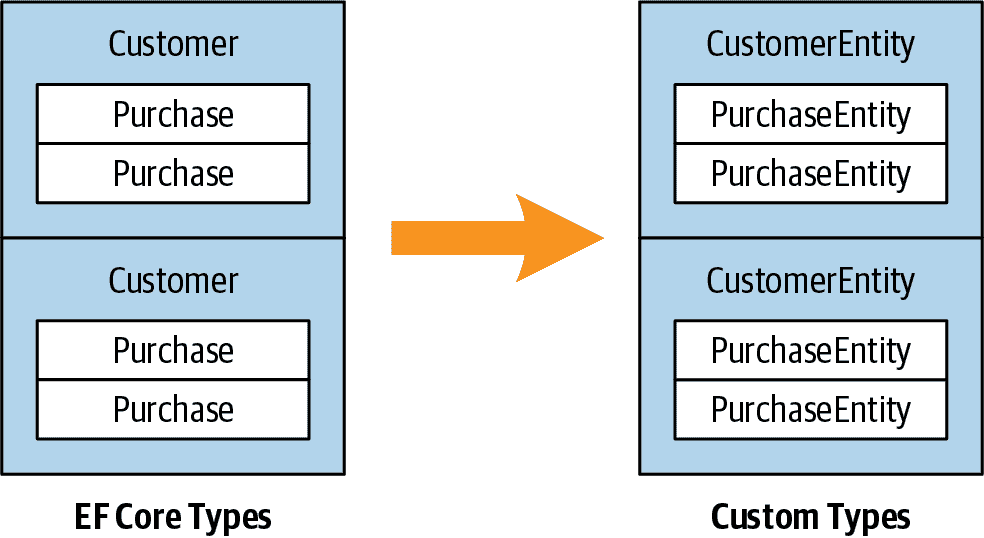

# 第九章：LINQ 操作符

本章描述了 LINQ 查询操作符的每一个。除了作为参考之外，两个部分 “投影” 和 “连接” 还涵盖了许多概念领域：

+   投影对象层次结构

+   使用 `Select`、`SelectMany`、`Join` 和 `GroupJoin` 进行连接

+   具有多个范围变量的查询表达式

本章中的所有示例假设一个 `names` 数组定义如下：

```cs
string[] names = { "Tom", "Dick", "Harry", "Mary", "Jay" };
```

查询数据库的示例假设一个名为 `dbContext` 的变量已被实例化为

```cs
var dbContext = new NutshellContext();
```

其中 `NutshellContext` 定义如下：

```cs
public class NutshellContext : DbContext
{
  public DbSet<Customer> Customers { get; set; }
  public DbSet<Purchase> Purchases { get; set; }

  protected override void OnModelCreating(ModelBuilder modelBuilder)
  {
    modelBuilder.Entity<Customer>(entity =>
    {
      entity.ToTable("Customer");
      entity.Property(e => e.Name).IsRequired();  // Column is not nullable
    });
    modelBuilder.Entity<Purchase>(entity =>
    {
      entity.ToTable("Purchase");
      entity.Property(e => e.Date).IsRequired();     
      entity.Property(e => e.Description).IsRequired();     
    });
  }
}

public class Customer
{
  public int ID { get; set; }
  public string Name { get; set; }

  public virtual List<Purchase> Purchases { get; set; }
    = new List<Purchase>();
}

public class Purchase
{        
  public int ID { get; set; }
  public int? CustomerID { get; set; }
  public DateTime Date { get; set; }
  public string Description { get; set; }
  public decimal Price { get; set; }

  public virtual Customer Customer { get; set; }
}
```

###### 注意

本章的所有示例都预装在 LINQPad 中，包括一个具有匹配架构的示例数据库。您可以从 [*http://www.linqpad.net*](http://www.linqpad.net) 下载 LINQPad。

下面是相应的 SQL Server 表定义：

```cs
CREATE TABLE Customer (
  ID int NOT NULL IDENTITY PRIMARY KEY,
  Name nvarchar(30) NOT NULL
)

CREATE TABLE Purchase (
  ID int NOT NULL IDENTITY PRIMARY KEY,
  CustomerID int NOT NULL REFERENCES Customer(ID),
  Date datetime NOT NULL,
  Description nvarchar(30) NOT NULL,
  Price decimal NOT NULL
)
```

# 概述

在本节中，我们提供标准查询操作符的概述。它们分为三类：

+   输入序列，输出序列（序列 → 序列）

+   输入序列，输出单个元素或标量值

+   无输入，输出序列（*生成* 方法）

我们首先介绍每个类别和它们包含的查询操作符，然后详细讨论每个单独的查询操作符。

## 序列 → 序列

大多数查询操作符属于此类别，接受一个或多个序列作为输入，并输出单个输出序列。图 9-1 显示了重构序列形状的操作符。



###### 图 9-1\. 形状变换操作符

### 过滤

`IEnumerable<TSource>` → `IEnumerable<TSource>`

返回原始元素的子集。

```cs
Where, Take, TakeLast, TakeWhile, Skip, SkipLast, SkipWhile, 
Distinct, DistinctBy
```

### 投影

`IEnumerable<TSource>` → `IEnumerable<TResult>`

用 lambda 函数转换每个元素。`SelectMany` 可以展平嵌套序列；`Select` 和 `SelectMany` 可以在 EF Core 中执行内连接、左外连接、交叉连接和非等连接。

```cs
Select, SelectMany
```

### 连接

`IEnumerable<TOuter>`、`IEnumerable<TInner>` → `IEnumerable<TResult>`

将一个序列的元素与另一个序列的元素合并。 `Join` 和 `GroupJoin` 操作符设计用于本地查询效率，并支持内连接和左外连接。 `Zip` 操作符按步骤枚举两个序列，并对每个元素对应用一个函数。与命名类型参数 `TOuter` 和 `TInner` 不同，`Zip` 操作符将它们命名为 `TFirst` 和 `TSecond`：

`IEnumerable<TFirst>`、`IEnumerable<TSecond>` → `IEnumerable<TResult>`

```cs
Join, GroupJoin, Zip
```

### 排序

`IEnumerable<TSource>` → `IOrderedEnumerable<TSource>`

返回序列的重新排序。

```cs
OrderBy, OrderByDescending, ThenBy, ThenByDescending, Reverse
```

### 分组

`IEnumerable<TSource>` → `IEnumerable<IGrouping<TKey,TElement>>`

`IEnumerable<TSource>` → `IEnumerable<TElement[]>`

将序列分组成子序列。

```cs
GroupBy, Chunk
```

### 集合运算符

`IEnumerable<TSource>`、`IEnumerable<TSource>` → `IEnumerable<TSource>`

以两个相同类型的序列为参数，返回它们的共同性、总和或差异。

```cs
Concat, Union, UnionBy, Intersect, IntersectBy, Except, ExceptBy
```

### 转换方法：导入

`IEnumerable` → `IEnumerable<TResult>`

```cs
OfType, Cast
```

### 转换方法：导出

`IEnumerable<TSource>`→数组、列表、字典、查找或序列

```cs
ToArray, ToList, ToDictionary, ToLookup, AsEnumerable, AsQueryable
```

## Sequence→Element or Value

以下查询运算符接受一个输入序列并输出单个元素或值。

### 元素运算符

`IEnumerable<TSource>`→`TSource`

从序列中选择单个元素。

```cs
First, FirstOrDefault, Last, LastOrDefault, Single, SingleOrDefault,
ElementAt, ElementAtOrDefault, MinBy, MaxBy, DefaultIfEmpty
```

### 聚合方法

`IEnumerable<TSource>`→`*scalar*`

执行跨序列的计算，返回一个标量值（通常是一个数字）。

```cs
Aggregate, Average, Count, LongCount, Sum, Max, Min
```

### 量词

`IEnumerable<TSource>`→`*bool*`

返回`true`或`false`的聚合。

```cs
All, Any, Contains, SequenceEqual
```

## Void→Sequence

第三个和最后一个类别中有一些查询运算符，可以从头开始生成输出序列。

### 生成方法

`void`→`IEnumerable<TResult>`

生成一个简单的序列。

```cs
Empty, Range, Repeat
```

# 过滤

`IEnumerable<TSource>`→`IEnumerable<TSource>`

| 方法 | 描述 | SQL 等效项 |
| --- | --- | --- |
| `Where` | 返回满足给定条件的元素子集 | `WHERE` |
| `Take` | 返回前`count`个元素并丢弃其余部分 | `WHERE ROW_NUMBER()...` *或* `TOP *n*` 子查询 |
| `Skip` | 忽略前`count`个元素并返回其余部分 | `WHERE ROW_NUMBER()...` *或* `NOT IN (SELECT TOP *n*...)` |
| `TakeLast` | 仅保留最后`count`个元素 | 抛出异常 |
| `SkipLast` | 忽略最后`count`个元素 | 抛出异常 |
| `TakeWhile` | 输出输入序列中满足断言的元素直到为假 | 抛出异常 |
| `SkipWhile` | 忽略输入序列中的元素直到断言为假，然后输出剩余元素 | 抛出异常 |
| `Distinct`, `DistinctBy` | 返回一个排除重复项的序列 | `SELECT DISTINCT...` |

###### 注意

本章参考表中的“SQL 等效项”列未必对应于如 EF Core 等 IQueryable 实现将生成的内容。相反，它指示了如果你自己编写 SQL 查询，你通常会使用的方法。在没有简单转换的情况下，该列为空白。在根本没有翻译的情况下，该列读作“抛出异常”。

当显示`Enumerable`实现代码时，不包括对空参数和索引断言的检查。

使用每个过滤方法，你最终得到的元素数目要么与开始时相同，要么更少。当它们被输出时，它们也是相同的；它们不会以任何方式进行转换。

## Where

| 参数 | 类型 |
| --- | --- |
| 源序列 | `IEnumerable<TSource>` |
| 断言 | `TSource => bool or (TSource,int) => bool`^(a) |
| ^(a) 不适用于 LINQ to SQL 和 Entity Framework |

### 查询语法

```cs
where *bool-expression*
```

### Enumerable.Where 实现

除了空检查外，`Enumerable.Where`的内部实现在功能上等同于以下内容：

```cs
public static IEnumerable<TSource> Where<TSource>
  (this IEnumerable<TSource> source, Func <TSource, bool> predicate)
{
  foreach (TSource element in source)
    if (predicate (element))
      yield return element;
}
```

### 概述

`Where`返回满足给定条件的输入序列的元素。

例如：

```cs
string[] names = { "Tom", "Dick", "Harry", "Mary", "Jay" };
IEnumerable<string> query = names.Where (name => name.EndsWith ("y"));

*// Harry*
*// Mary*
*// Jay*
```

在查询语法中：

```cs
IEnumerable<string> query = from n in names
                            where n.EndsWith ("y")
                            select n;
```

查询中可以多次出现 `where` 子句，并与 `let`、`orderby` 和 `join` 子句交错：

```cs
from n in names
where n.Length > 3
let u = n.ToUpper()
where u.EndsWith ("Y")
select u;           

*// HARRY*
*// MARY*
```

标准的 C# 作用域规则适用于此类查询。换句话说，在使用范围变量或 `let` 子句声明变量之前，无法引用该变量。

### 索引过滤

`Where` 的谓词可以选择接受第二个参数，类型为 `int`。这个参数会接收每个元素在输入序列中的位置，允许谓词在其过滤决策中使用这些信息。例如，以下代码跳过每个第二个元素：

```cs
IEnumerable<string> query = names.Where ((n, i) => i % 2 == 0);

*// Tom*
*// Harry*
*// Jay*
```

在 EF Core 中，如果使用索引过滤，会引发异常。

### 在 EF Core 中的 SQL LIKE 比较

`string` 上的以下方法翻译为 SQL 的 `LIKE` 操作符：

```cs
Contains, StartsWith, EndsWith
```

例如，`c.Name.Contains("abc")` 翻译为 `customer.Name LIKE '%abc%'`（或更准确地说，它的参数化版本）。`Contains` 只允许针对本地评估的表达式进行比较；要针对另一列进行比较，必须使用 `EF.Functions.Like` 方法：

```cs
... where EF.Functions.Like (c.Description, "%" + c.Name + "%")
```

`EF.Functions.Like` 还允许您执行更复杂的比较（例如 `LIKE 'abc%def%'`）。

### 在 EF Core 中进行 `<` 和 `>` 的字符串比较

您可以使用 `string` 的 `CompareTo` 方法对字符串执行 *顺序* 比较；这相当于 SQL 的 `<` 和 `>` 操作符：

```cs
dbContext.Purchases.Where (p => p.Description.CompareTo ("C") < 0)
```

### 在 EF Core 中使用 `WHERE x IN (…, …, …)`

使用 EF Core，您可以在过滤谓词中将 `Contains` 操作符应用于本地集合。例如：

```cs
string[] chosenOnes = { "Tom", "Jay" };

from c in dbContext.Customers
where chosenOnes.Contains (c.Name)
...
```

这相当于 SQL 的 `IN` 操作符。换句话说：

```cs
WHERE customer.Name IN ("Tom", "Jay")
```

如果本地集合是实体数组或非标量类型，则 EF Core 可能会代替发出 `EXISTS` 子句。

## Take、TakeLast、Skip、SkipLast

| 参数 | 类型 |
| --- | --- |
| 源序列 | `IEnumerable<TSource>` |
| 要获取或跳过的元素数量 | `int` |

`Take` 返回前 *n* 个元素并丢弃其余部分；`Skip` 丢弃前 *n* 个元素并返回其余部分。当实现允许用户浏览大量匹配记录的网页时，这两种方法一起非常有用。例如，假设用户在书籍数据库中搜索术语“mercury”，共有 100 个匹配项。以下代码返回前 20 个：

```cs
IQueryable<Book> query = dbContext.Books
  .Where   (b => b.Title.Contains ("mercury"))
  .OrderBy (b => b.Title)
  .Take (20);
```

下一个查询返回书籍 21 到 40：

```cs
IQueryable<Book> query = dbContext.Books
  .Where   (b => b.Title.Contains ("mercury"))
  .OrderBy (b => b.Title)
  .Skip (20).Take (20);
```

EF Core 将 `Take` 和 `Skip` 转换为 SQL Server 2005 中的 `ROW_NUMBER` 函数，或者在较早版本的 SQL Server 中转换为 `TOP` *n* 子查询。

`TakeLast` 和 `SkipLast` 方法接受或跳过最后 *n* 个元素。

从 .NET 6 开始，`Take` 方法重载以接受 `Range` 变量。此重载可以替代所有四种方法的功能；例如，`Take(5..)` 等同于 `Skip(5)`，而 `Take(..⁵)` 等同于 `SkipLast(5)`。

## `TakeWhile` 和 `SkipWhile`

| 参数 | 类型 |
| --- | --- |
| 源序列 | `IEnumerable<TSource>` |
| 谓词 | `TSource => bool` 或 `(TSource,int) => bool` |

`TakeWhile` 枚举输入序列，返回每个项目，直到给定的谓词为假。然后忽略剩余元素：

```cs
int[] numbers      = { 3, 5, 2, 234, 4, 1 };
var takeWhileSmall = numbers.TakeWhile (n => n < 100);   // { 3, 5, 2 }
```

`SkipWhile`枚举输入序列，忽略每个项目，直到给定的谓词为 false。然后，它发出剩余的元素：

```cs
int[] numbers      = { 3, 5, 2, 234, 4, 1 };
var skipWhileSmall = numbers.SkipWhile (n => n < 100);   // { 234, 4, 1 }
```

`TakeWhile`和`SkipWhile`在 SQL 中没有对应的翻译，并且如果在 EF Core 查询中使用会抛出异常。

## 不同和 DistinctBy

`Distinct`返回输入序列，去除重复项。您可以选择传入自定义的相等比较器。以下返回字符串中不同的字母：

```cs
char[] distinctLetters = "HelloWorld".Distinct().ToArray();
string s = new string (distinctLetters);                     // HeloWrd
```

我们可以直接在字符串上调用 LINQ 方法，因为`string`实现了`IEnumerable<char>`。

`.NET 6`引入了`DistinctBy`方法，允许您指定在执行相等比较之前要应用的键选择器。以下表达式的结果是`{1,2,3}`：

```cs
new[] { 1.0, 1.1, 2.0, 2.1, 3.0, 3.1 }.DistinctBy (n => Math.Round (n, 0))
```

# 投影

`IEnumerable<TSource>`→ `IEnumerable<TResult>`

| 方法 | 描述 | SQL 等效项 |
| --- | --- | --- |
| `Select` | 使用给定的 lambda 表达式转换每个输入元素 | `SELECT` |

| `SelectMany` | 转换每个输入元素，然后展平和连接生成的子序列 | `INNER JOIN`，`LEFT OUTER JOIN`，

`CROSS JOIN` |

###### 注意

在查询数据库时，`Select`和`SelectMany`是最通用的连接构造；对于本地查询，`Join`和`GroupJoin`是最*高效*的连接构造。

## Select

| 参数 | 类型 |
| --- | --- |
| 源序列 | `IEnumerable<TSource>` |
| 结果选择器 | `TSource => TResult` 或 `(TSource,int) => TResult`^(a) |
| ^(a) 在 EF Core 中禁止使用 |

### 查询语法

```cs
select *projection-expression*
```

### 可枚举实现

```cs
public static IEnumerable<TResult> Select<TSource,TResult>
  (this IEnumerable<TSource> source, Func<TSource,TResult> selector)
{
  foreach (TSource element in source)
    yield return selector (element);
}
```

### 概述

使用`Select`，您始终获得与开始时相同数量的元素。但是，每个元素可以由 lambda 函数以任何方式转换。

以下选择安装在计算机上的所有字体的名称（来自`System.Drawing`）：

```cs
IEnumerable<string> query = from f in FontFamily.Families
                            select f.Name;

foreach (string name in query) Console.WriteLine (name);
```

在此示例中，`select`子句将`FontFamily`对象转换为其名称。以下是 lambda 等效项：

```cs
IEnumerable<string> query = FontFamily.Families.Select (f => f.Name);
```

`Select`语句通常用于投影到匿名类型：

```cs
var query =
  from f in FontFamily.Families
  select new { f.Name, LineSpacing = f.GetLineSpacing (FontStyle.Bold) };
```

不带任何转换的投影有时与查询语法一起使用，以满足查询以`select`或`group`子句结束的要求。以下选择支持删除线的字体：

```cs
IEnumerable<FontFamily> query =
  from f in FontFamily.Families
  where f.IsStyleAvailable (FontStyle.Strikeout)
  select f;

foreach (FontFamily ff in query) Console.WriteLine (ff.Name);
```

在这种情况下，编译器在转换为流畅语法时会省略投影。

### 索引投影

`selector`表达式可以选择性地接受一个整数参数，该参数充当索引器，为输入序列中每个输入的位置提供表达式。这仅适用于本地查询：

```cs
string[] names = { "Tom", "Dick", "Harry", "Mary", "Jay" };

IEnumerable<string> query = names
  .Select ((s,i) => i + "=" + s);     //  { "0=Tom", "1=Dick", ... }
```

### 选择子查询和对象层次结构

您可以在`select`子句中嵌套子查询以构建对象层次结构。以下示例返回描述`Path.GetTempPath()`下每个目录及其子文件集合的集合：

```cs
string tempPath = Path.GetTempPath();
DirectoryInfo[] dirs = new DirectoryInfo (tempPath).GetDirectories();

var query =
  from d in dirs
  where (d.Attributes & FileAttributes.System) == 0
  select new
  {
    DirectoryName = d.FullName,
    Created = d.CreationTime,

    Files = from f in d.GetFiles()
 where (f.Attributes & FileAttributes.Hidden) == 0
 select new { FileName = f.Name, f.Length, }
  };

foreach (var dirFiles in query)
{
  Console.WriteLine ("Directory: " + dirFiles.DirectoryName);
  foreach (var file in dirFiles.Files)
    Console.WriteLine ("  " + file.FileName + " Len: " + file.Length);
}
```

此查询的内部部分可以称为*相关子查询*。如果子查询引用外部查询中的对象，则该子查询是相关的——在本例中，它引用了正在枚举的目录`d`。

###### 注意

在`Select`中的子查询允许您将一个对象层次结构映射到另一个对象层次结构，或者将关系对象模型映射到分层对象模型。

对于本地查询，`Select`中的子查询会导致双重延迟执行。在我们的示例中，直到内部的 `foreach` 语句枚举时，文件才被过滤或投影。

### EF Core 中的子查询和连接

在 EF Core 中，子查询投影在功能上效果很好，您可以使用它们来执行类似 SQL 风格的连接。以下是如何检索每个客户的名称以及他们的高价值购买：

```cs
var query =
  from c in dbContext.Customers
  select new {
               c.Name,
 Purchases = (from p in dbContext.Purchases
                           where p.CustomerID == c.ID && p.Price > 1000
 select new { p.Description, p.Price })
 .ToList()
             };

foreach (var namePurchases in query)
{
  Console.WriteLine ("Customer: " + namePurchases.Name);
  foreach (var purchaseDetail in namePurchases.Purchases)
    Console.WriteLine ("  - $$$: " + purchaseDetail.Price);
}
```

###### 注意

注意在子查询中使用 `ToList`。当子查询引用 `DbContext` 时，EF Core 3 无法从子查询结果创建可查询对象。此问题正在由 EF Core 团队跟踪，可能会在未来的版本中解决。

###### 注意

这种查询方式非常适合解释查询。外部查询和子查询作为一个单元进行处理，避免了不必要的往返。然而，对于本地查询来说，效率较低，因为必须枚举每个外部和内部元素的组合才能获取少数匹配组合。本地查询的更好选择是在以下章节中描述的`Join`或`GroupJoin`。

这个查询将来自两个不同集合的对象匹配起来，可以被视为一个“连接”。与传统的数据库连接（或子查询）的不同之处在于，我们没有将输出展平成单个二维结果集。我们将关系数据映射到分层数据，而不是扁平数据。

下面是通过在`Customer`实体上使用`Purchases`集合导航属性简化的相同查询：

```cs
from c in dbContext.Customers
select new
{
  c.Name,
  Purchases = from p in c.Purchases    // Purchases is List<Purchase>
              where p.Price > 1000
              select new { p.Description, p.Price }
};
```

（在 EF Core 3 中，在导航属性上执行子查询时不需要 `ToList`。）

这两个查询与 SQL 中的左外连接类似，因为我们在外部枚举中获取所有客户，无论他们是否有任何购买。要模拟内连接——排除没有高价值购买的客户——我们需要在购买集合上添加一个过滤条件：

```cs
from c in dbContext.Customers
where c.Purchases.Any (p => p.Price > 1000)
select new {
             c.Name,
             Purchases = from p in c.Purchases
                         where p.Price > 1000
                         select new { p.Description, p.Price }
           };
```

然而，这样稍显凌乱，因为我们两次写了相同的谓词（`Price > 1000`）。我们可以通过 `let` 子句避免这种重复：

```cs
from c in dbContext.Customers
let highValueP = from p in c.Purchases
 where p.Price > 1000
 select new { p.Description, p.Price }
where highValueP.Any()
select new { c.Name, Purchases = highValueP };
```

这种查询方式非常灵活。例如，通过将 `Any` 修改为 `Count`，我们可以修改查询以仅检索至少有两个高价值购买的客户：

```cs
...
where highValueP.Count() >= 2
select new { c.Name, Purchases = highValueP };
```

### 投影到具体类型

到目前为止的例子中，我们在输出中实例化了匿名类型。在某些情况下，实例化（普通）命名类也很有用，您可以使用对象初始化程序填充它们。这种类可以包含自定义逻辑，并且可以在方法和程序集之间传递，而无需使用类型信息。

一个典型的例子是自定义业务实体。自定义业务实体只是您编写的带有一些属性的类，旨在隐藏较低级别（与数据库相关的）细节。例如，您可能会从业务实体类中排除外键字段。假设我们编写了名为 `CustomerEntity` 和 `PurchaseEntity` 的自定义实体类，这是我们如何将其投射到它们中的方法：

```cs
IQueryable<CustomerEntity> query =
  from c in dbContext.Customers
  select new CustomerEntity
  {
    Name = c.Name,
    Purchases =
      (from p in c.Purchases
       where p.Price > 1000
 select new PurchaseEntity {
 Description = p.Description,
 Value = p.Price
 }
      ).ToList()
  };

// Force query execution, converting output to a more convenient List:
List<CustomerEntity> result = query.ToList();
```

###### 注意

在程序或不同系统之间传输数据时，经常使用自定义业务实体类称为数据传输对象（DTO）。DTO 不包含任何业务逻辑。

注意到到目前为止，我们还没有使用 `Join` 或 `SelectMany` 语句。这是因为我们保持了数据的层次形状，正如在 Figure 9-2 中所示。使用 LINQ，您通常可以避免传统的 SQL 方法，将表格展平为二维结果集。



###### 图 9-2\. 投射对象层次结构

## SelectMany

| 参数 | 类型 |
| --- | --- |
| 源序列 | `IEnumerable<TSource>` |
| 结果选择器 | `TSource => IEnumerable<TResult>` 或 `(TSource,int) => IEnumerable<TResult>`^(a) |
| ^(a) EF Core 不允许使用 |

### 查询语法

```cs
from *identifier1* in *enumerable-expression1*
from *identifier2* in *enumerable-expression2*
...
```

### 可枚举实现

```cs
public static IEnumerable<TResult> SelectMany<TSource,TResult>
  (IEnumerable<TSource> source,
   Func <TSource,IEnumerable<TResult>> selector)
{
  foreach (TSource element in source)
    foreach (TResult subElement in selector (element))
      yield return subElement;
}
```

### 概览

`SelectMany` 将子序列连接成一个单一的扁平输出序列。

请记住，对于每个输入元素，`Select` 产生恰好一个输出元素。相比之下，`SelectMany` 产生*0..n*个输出元素。*0..n*元素来自于 lambda 表达式必须发出的子序列或子序列。

您可以使用 `SelectMany` 扩展子序列，展平嵌套集合，并将两个集合连接到一个扁平的输出序列中。使用传送带类比，`SelectMany` 将新鲜材料引入到传送带上。对于 `SelectMany`，每个输入元素都是引入新鲜材料的*触发器*。新鲜材料由 `selector` lambda 表达式发出，必须是一个序列。换句话说，lambda 表达式必须为每个输入*元素*发出一个*子序列*。最终结果是每个输入元素发出的子序列的串联。

从一个简单的例子开始，假设我们有以下名称数组，

```cs
string[] fullNames = { "Anne Williams", "John Fred Smith", "Sue Green" };
```

我们希望将其转换为单一的扁平单词集合——换句话说：

```cs
"Anne", "Williams", "John", "Fred", "Smith", "Sue", Green"
```

这项任务最适合使用 `SelectMany`，因为我们将每个输入元素映射到一个变量数量的输出元素。我们所需做的就是提出一个 `selector` 表达式，将每个输入元素转换为子序列。`string.Split` 很好地完成了这项工作：它接受一个字符串并将其拆分为单词，将结果作为数组发出：

```cs
string testInputElement = "Anne Williams";
string[] childSequence  = testInputElement.Split();

// childSequence is { "Anne", "Williams" };
```

因此，这是我们的 `SelectMany` 查询和结果：

```cs
IEnumerable<string> query = fullNames.SelectMany (name => name.Split());

foreach (string name in query)
  Console.Write (name + "|");  // Anne|Williams|John|Fred|Smith|Sue|Green|
```

###### 注意

如果您将`SelectMany`替换为`Select`，您将以分层形式获得相同的结果。以下代码生成了一个字符串*数组*的序列，需要嵌套的`foreach`语句来枚举：

```cs
IEnumerable<string[]> query =
  fullNames.Select (name => name.Split());

foreach (string[] stringArray in query)
  foreach (string name in stringArray)
    Console.Write (name + "|");
```

`SelectMany`的好处在于它产生一个单一的*扁平*结果序列。

`SelectMany`在查询语法中受支持，并且通过在查询中添加一个额外的`from`子句来调用它。`from`关键字在查询语法中有两个含义。在查询的开头，它引入原始的范围变量和输入序列。在查询的*任何其他地方*，它转换为`SelectMany`。以下是我们在查询语法中的查询：

```cs
IEnumerable<string> query =
  from fullName in fullNames
  from name in fullName.Split()     // Translates to SelectMany
  select name;
```

请注意，额外的生成器引入了一个新的范围变量——在这种情况下是`name`。然而，旧的范围变量仍然在作用域内，因此我们随后可以访问两者。

### 多个范围变量

在前面的示例中，`name`和`fullName`在查询结束或达到`into`子句之前仍然在作用域内。这些变量的扩展作用域是查询语法相对于流畅语法的*杀手级*场景。

为了说明这一点，我们可以采用前面的查询，并在最终投影中包括`fullName`：

```cs
IEnumerable<string> query =
  from fullName in fullNames
  from name in fullName.Split()
  select name + " came from " + fullName;

*Anne came from Anne Williams*
*Williams came from Anne Williams*
*John came from John Fred Smith*
...
```

在幕后，编译器必须做一些技巧，让您访问这两个变量。欣赏这一点的好方法是尝试使用流畅语法编写相同的查询。这很棘手！如果在投影之前插入`where`或`orderby`子句，它将变得更加困难：

```cs
from fullName in fullNames
from name in fullName.Split()
orderby fullName, name
select name + " came from " + fullName;
```

问题在于`SelectMany`生成了一个平坦的子元素序列——在我们的情况下，是单词的平坦集合。从中来的原始“外部”元素（`fullName`）丢失了。解决方案是使用一个临时的匿名类型将外部元素“携带”到每个子元素中：

```cs
from fullName in fullNames
from x in fullName.Split().Select (name => new { name, fullName } )
orderby x.fullName, x.name
select x.name + " came from " + x.fullName;
```

这里唯一的变化是我们将每个子元素（`name`）包装在一个匿名类型中，该类型还包含其`fullName`。这类似于`let`子句的解析方式。这是转换为流畅语法的最终形式：

```cs
IEnumerable<string> query = fullNames
  .SelectMany (fName => fName.Split()
                             .Select (name => new { name, fName } ))
  .OrderBy (x => x.fName)
  .ThenBy  (x => x.name)
  .Select  (x => x.name + " came from " + x.fName);
```

### 在查询语法中思考

正如我们刚刚演示的，如果您需要多个范围变量，使用查询语法是有充分理由的。在这种情况下，不仅使用查询语法有帮助，而且直接用它的术语思考也是有益的。

写入额外生成器时有两种基本模式。第一种是*展开和扁平化子序列*。为此，您在额外的生成器中调用现有范围变量的属性或方法。我们在前面的示例中已经这样做了：

```cs
from fullName in fullNames
from name in fullName.Split()
```

在这里，我们从枚举全名扩展到枚举单词。类似的 EF Core 查询是当您扩展集合导航属性时。以下查询列出了所有客户及其购买记录：

```cs
IEnumerable<string> query = from c in dbContext.Customers
                            from p in c.Purchases
                            select c.Name + " bought a " + p.Description;

*Tom bought a Bike*
*Tom bought a Holiday*
*Dick bought a Phone*
*Harry bought a Car*
*...*
```

在这里，我们将每个客户扩展到购买的子序列中。

第二种模式执行的是*笛卡尔积*或*交叉连接*，其中一个序列的每个元素与另一个序列的每个元素匹配。为此，引入一个生成器，其`selector`表达式返回与范围变量无关的序列：

```cs
int[] numbers = { 1, 2, 3 };  string[] letters = { "a", "b" };

IEnumerable<string> query = from n in numbers
                            from l in letters
                            select n.ToString() + l;

// RESULT: { "1a", "1b", "2a", "2b", "3a", "3b" }
```

这种查询风格是 `SelectMany` 类型的 *连接* 的基础。

### 使用 SelectMany 进行连接

使用 `SelectMany` 可以通过过滤交叉产品的结果简单地连接两个序列。例如，假设我们想要为游戏匹配玩家，我们可以这样开始：

```cs
string[] players = { "Tom", "Jay", "Mary" };

IEnumerable<string> query = from name1 in players
                            from name2 in players
                            select name1 + " vs " + name2;

//RESULT: { "Tom vs Tom", "Tom vs Jay", "Tom vs Mary",
//          "Jay vs Tom", "Jay vs Jay", "Jay vs Mary",
//          "Mary vs Tom", "Mary vs "Jay", "Mary vs Mary" }
```

查询读取为“对于每个玩家，迭代每个玩家，选择玩家 1 对玩家 2”。虽然我们得到了我们要求的内容（一个交叉连接），但在添加过滤器之前结果并不有用：

```cs
IEnumerable<string> query = from name1 in players
                            from name2 in players
                            where name1.CompareTo (name2) < 0
                            orderby name1, name2
                            select name1 + " vs " + name2;

//RESULT: { "Jay vs Mary", "Jay vs Tom", "Mary vs Tom" }
```

过滤谓词构成了*连接条件*。我们的查询可以称为*非等值连接*，因为连接条件不使用等号运算符。

### EF Core 中的 SelectMany

在 EF Core 中，`SelectMany` 可以执行交叉连接、非等值连接、内连接和左外连接。你可以像使用 `Select` 一样使用 `SelectMany`，既可以使用预定义的关联，也可以使用临时关系——不同之处在于 `SelectMany` 返回平面而不是分层的结果集。

EF Core 的交叉连接与前一节中一样书写。以下查询将每个顾客与每个购买匹配（交叉连接）：

```cs
var query = from c in dbContext.Customers
            from p in dbContext.Purchases
            select c.Name + " might have bought a " + p.Description;
```

但更典型的情况是，你可能只想匹配顾客与其自己的购买。通过添加具有连接谓词的 `where` 子句来实现这一点。这会导致标准的 SQL 风格的等值连接：

```cs
var query = from c in dbContext.Customers
            from p in dbContext.Purchases
            where c.ID == p.CustomerID
            select c.Name + " bought a " + p.Description;
```

###### 注意

这在 SQL 中表现良好。在下一节中，我们将看到它如何扩展以支持外连接。使用 LINQ 的 `Join` 操作符重新制定这样的查询实际上会使其*不*易扩展——在这方面，LINQ 与 SQL 是相反的。

如果在实体中有集合导航属性，你可以通过展开子集合而不是过滤交叉产品来表达相同的查询：

```cs
from c in dbContext.Customers
from p in c.Purchases
select new { c.Name, p.Description };
```

优势在于我们消除了连接谓词。我们从过滤交叉产品转向扩展和展开。

你可以为这样的查询添加 `where` 子句进行额外的过滤。例如，如果我们只想要以“T”开头的客户，我们可以如下过滤：

```cs
from c in dbContext.Customers
where c.Name.StartsWith ("T")
from p in c.Purchases
select new { c.Name, p.Description };
```

如果 `where` 子句移到下一行，此 EF Core 查询同样有效，因为两种情况下生成相同的 SQL。然而，如果是本地查询，将 `where` 子句移到下方可能会降低效率。在本地查询中，你应该在连接之前进行过滤。

你可以通过额外的 `from` 子句将新表引入混合中。例如，如果每个购买有购买项目子行，你可以生成以下形式的平面结果集，其中包括顾客及其购买及其购买详细行：

```cs
from c in dbContext.Customers
from p in c.Purchases
from pi in p.PurchaseItems
select new { c.Name, p.Description, pi.Detail };
```

每个 `from` 子句引入一个新的 *子* 表。要包含通过导航属性从 *父* 表检索数据，你不需要添加 `from` 子句——只需导航到属性即可。例如，如果每个顾客都有一个销售员，你想查询其姓名，只需这样做：

```cs
from c in dbContext.Customers
select new { Name = c.Name, SalesPerson = c.SalesPerson.Name };
```

在这种情况下不使用 `SelectMany`，因为没有子集合需要展开。父导航属性返回单个项。

### 使用 SelectMany 进行外连接

我们之前看到，`Select`子查询产生的结果类似于左外连接：

```cs
from c in dbContext.Customers
select new {
             c.Name,
             Purchases = from p in c.Purchases
                         where p.Price > 1000
                         select new { p.Description, p.Price }
           };
```

在此示例中，每个外部元素（客户）都包括在内，无论客户是否有任何购买。但假设我们将此查询重写为`SelectMany`，以便我们可以获取一个单一的平坦集合而不是层次化结果集：

```cs
from c in dbContext.Customers
from p in c.Purchases
where p.Price > 1000
select new { c.Name, p.Description, p.Price };
```

在展开查询的过程中，我们已经切换到内连接：现在只包括那些存在一个或多个高价值购买的客户。为了获得带有平坦结果集的左外连接，我们必须在内部序列上应用`DefaultIfEmpty`查询运算符。该方法在其输入序列没有元素时返回带有单个空元素的序列。以下是这样一个查询，价格谓词除外：

```cs
from c in dbContext.Customers
from p in c.Purchases.DefaultIfEmpty()
select new { c.Name, p.Description, Price = (decimal?) p.Price };
```

这在 EF Core 中完美运行，返回所有客户，即使他们没有购买。但是如果我们将其作为本地查询运行，当`p`为空时，`p.Description`和`p.Price`会抛出`NullReferenceException`。我们可以使我们的查询在任何情况下都更加健壮，如下所示：

```cs
from c in dbContext.Customers
from p in c.Purchases.DefaultIfEmpty()
select new {
             c.Name,
             Descript = p == null ? null : p.Description,
             Price = p == null ? (decimal?) null : p.Price
           };
```

现在让我们重新引入价格过滤器。我们不能像以前那样使用`where`子句，因为它会在`DefaultIfEmpty`之后执行：

```cs
from c in dbContext.Customers
from p in c.Purchases.DefaultIfEmpty()
where p.Price > 1000...
```

正确的解决方案是在`DefaultIfEmpty`之前用一个子查询剪切`Where`子句：

```cs
from c in dbContext.Customers
from p in c.Purchases.Where (p => p.Price > 1000).DefaultIfEmpty()
select new {
             c.Name,
             Descript = p == null ? null : p.Description,
             Price = p == null ? (decimal?) null : p.Price
           };
```

EF Core 将其转换为左外连接。这是编写此类查询的有效模式。

###### 注意

如果你习惯于在 SQL 中编写外连接，你可能会倾向于忽视这种风格查询的更简单选项，而选择在这种风格查询中采用笨拙但熟悉的 SQL 中心的平坦方法。`Select`子查询产生的层次化结果集通常更适合于外连接风格的查询，因为没有额外的空值需要处理。

# 连接

| 方法 | 描述 | SQL 等效语句 |
| --- | --- | --- |
| `Join` | 应用查找策略以匹配两个集合的元素，生成平坦结果集 | `INNER JOIN` |
| `GroupJoin` | 类似于`Join`，但生成一个*层次化*的结果集 | `INNER JOIN`，`LEFT OUTER JOIN` |
| `Zip` | 枚举两个序列以步骤方式（如拉链），对每对元素应用函数 | 抛出异常 |

## 连接与 GroupJoin

`IEnumerable<TOuter>`, `IEnumerable<TInner>`→`IEnumerable<TResult>`

### 连接参数

| 参数 | 类型 |
| --- | --- |
| 外部序列 | `IEnumerable<TOuter>` |
| 内部序列 | `IEnumerable<TInner>` |
| 外部键选择器 | `TOuter => TKey` |
| 内部键选择器 | `TInner => TKey` |
| 结果选择器 | `(TOuter,TInner) => TResult` |

### GroupJoin 参数

| 参数 | 类型 |
| --- | --- |
| 外部序列 | `IEnumerable<TOuter>` |
| 内部序列 | `IEnumerable<TInner>` |
| 外部键选择器 | `TOuter => TKey` |
| 内部键选择器 | `TInner => TKey` |
| 结果选择器 | `(TOuter`,`**IEnumerable<TInner>**) => TResult` |

### 查询语法

```cs
from *outer-var* in *outer-enumerable*
join *inner-var* in *inner-enumerable* on *outer-key-expr* equals *inner-key-expr*
 [ into *identifier* ]
```

### 概述

`Join` 和 `GroupJoin` 将两个输入序列合并为一个输出序列。`Join` 生成平坦的输出；`GroupJoin` 生成分层次的输出。

`Join` 和 `GroupJoin` 提供了一种替代策略来使用 `Select` 和 `SelectMany`。`Join` 和 `GroupJoin` 的优势在于它们在本地内存中的集合上执行效率高，因为它们首先将内部序列加载到键控查找中，避免了需要重复枚举每个内部元素的问题。缺点是它们只提供了等效的内部和左外连接；交叉连接和非等连接仍需使用 `Select`/`SelectMany`。在 EF Core 查询中，`Join` 和 `GroupJoin` 与 `Select` 和 `SelectMany` 相比并没有实质性的优势。

表 9-1 总结了每种连接策略之间的差异。

表 9-1\. 连接策略

| 策略 | 结果形状 | 本地查询效率 | 内部连接 | 左外连接 | 交叉连接 | 非等连接 |
| --- | --- | --- | --- | --- | --- | --- |
| `Select` + `SelectMany` | 平坦 | 差 | 是 | 是 | 是 | 是 |
| `Select` + `Select` | 嵌套 | 差 | 是 | 是 | 是 | 是 |
| `Join` | 平坦 | 良好 | 是 | — | — | — |
| `GroupJoin` | 嵌套 | 良好 | 是 | 是 | — | — |
| `GroupJoin` + `SelectMany` | 平坦 | 良好 | 是 | 是 | — | — |

### Join

`Join` 运算符执行内部连接，生成一个平坦的输出序列。

以下查询列出了所有客户以及他们的购买内容，而不使用导航属性：

```cs
IQueryable<string> query =
  from c in dbContext.Customers
  join p in dbContext.Purchases on c.ID equals p.CustomerID
  select c.Name + " bought a " + p.Description;
```

结果与我们从 `SelectMany` 风格的查询中获得的结果相匹配：

```cs
*Tom bought a Bike*
*Tom bought a Holiday*
*Dick bought a Phone*
*Harry bought a Car*
```

要看到 `Join` 胜过 `SelectMany` 的好处，我们必须将其转换为本地查询。我们可以首先将所有的客户和购买内容复制到数组中，然后查询这些数组：

```cs
Customer[] customers = dbContext.Customers.ToArray();
Purchase[] purchases = dbContext.Purchases.ToArray();
var slowQuery = from c in customers
                from p in purchases where c.ID == p.CustomerID
                select c.Name + " bought a " + p.Description;

var fastQuery = from c in customers
                join p in purchases on c.ID equals p.CustomerID
                select c.Name + " bought a " + p.Description;
```

尽管两个查询产生相同的结果，但 `Join` 查询速度显著更快，因为它在 `Enumerable` 中的实现预加载了内部集合（`purchases`）到键控查找中。

`Join` 的查询语法通常可以用一般化的术语来描述，如下所示：

```cs
join *inner-var* in *inner-sequence* on *outer-key-expr* equals *inner-key-expr*
```

LINQ 中的连接操作符区分 *外部序列* 和 *内部序列*。语法上：

+   *外部序列* 是输入序列（在本例中是 `customers`）。

+   *内部序列* 是你引入的新集合（在本例中是 `purchases`）。

`Join` 执行内连接，意味着没有购买内容的客户将被排除在输出之外。在内连接中，您可以交换查询中的内部和外部序列，并且仍然可以得到相同的结果：

```cs
from p in purchases                                // p is now outer
join c in customers on p.CustomerID equals c.ID    // c is now inner
...
```

您可以向相同的查询添加进一步的 `join` 子句。例如，如果每个购买具有一个或多个购买项目，您可以加入购买项目，如下所示：

```cs
from c in customers
join p in purchases on c.ID equals p.CustomerID           // first join
join pi in purchaseItems on p.ID equals pi.PurchaseID     // second join
...
```

在第一个连接中，`purchases` 充当 *内部* 序列，在第二个连接中充当 *外部* 序列。你可以使用嵌套的 `foreach` 语句以不高效的方式获得相同的结果，如下所示：

```cs
foreach (Customer c in customers)
  foreach (Purchase p in purchases)
    if (c.ID == p.CustomerID)
      foreach (PurchaseItem pi in purchaseItems)
        if (p.ID == pi.PurchaseID)
          Console.WriteLine (c.Name + "," + p.Price + "," + pi.Detail);
```

在查询语法中，来自早期连接的变量保持在作用域内——就像在`SelectMany`样式的查询中一样。您还允许在`join`子句之间插入`where`和`let`子句。

### 在多个键上进行连接

您可以使用匿名类型在多个键上进行连接，如下所示：

```cs
from x in sequenceX
join y in sequenceY on new { K1 = x.Prop1, K2 = x.Prop2 }
                equals new { K1 = y.Prop3, K2 = y.Prop4 }
...
```

要使其工作，这两个匿名类型必须结构相同。然后编译器使用相同的内部类型实现每个类型，使连接键兼容。

### 在流畅的语法中进行连接

以下的查询语法连接

```cs
 from c in customers
 join p in purchases on c.ID equals p.CustomerID
 select new { c.Name, p.Description, p.Price };
```

在流畅的语法中如下所示：

```cs
 customers.Join (                // outer collection
       purchases,                // inner collection
       c => c.ID,                // outer key selector
       p => p.CustomerID,        // inner key selector
       (c, p) => new
          { c.Name, p.Description, p.Price }    // result selector
 );
```

最终的选择器表达式在输出序列中创建每个元素。如果您在投影之前有额外的子句，比如在这个例子中的`orderby`：

```cs
from c in customers
join p in purchases on c.ID equals p.CustomerID
orderby p.Price
select c.Name + " bought a " + p.Description;
```

在流畅的语法中，你必须在结果选择器中制造一个临时的匿名类型。这样可以在连接之后保持`c`和`p`的作用域：

```cs
customers.Join (                  // outer collection
      purchases,                  // inner collection
      c => c.ID,                  // outer key selector
      p => p.CustomerID,          // inner key selector
      (c, p) => new { c, p } )    // result selector
  .OrderBy (x => x.p.Price)
  .Select  (x => x.c.Name + " bought a " + x.p.Description);
```

在连接时通常更喜欢使用查询语法；它不那么琐碎。

### GroupJoin

`GroupJoin`做的工作与`Join`相同，但不是产生平坦的结果，而是产生按每个外部元素分组的分层结果。它还允许左外连接。`GroupJoin`目前不支持在 EF Core 中使用。

`GroupJoin`的查询语法与`Join`相同，但后面跟着`into`关键字。

这是一个使用本地查询的最基本的示例：

```cs
Customer[] customers = dbContext.Customers.ToArray();
Purchase[] purchases = dbContext.Purchases.ToArray();

IEnumerable<IEnumerable<Purchase>> query =
  from c in customers
  join p in purchases on c.ID equals p.CustomerID
  into custPurchases
  select custPurchases;   // custPurchases is a sequence
```

###### 注意

`into`子句仅在直接出现在`join`子句之后时才会转换为`GroupJoin`。在`select`或`group`子句之后，它表示*查询继续*。`into`关键字的两种用法非常不同，尽管它们有一个共同点：它们都引入了一个新的范围变量。

结果是一个序列的序列，我们可以按以下方式枚举：

```cs
foreach (IEnumerable<Purchase> purchaseSequence in query)
  foreach (Purchase p in purchaseSequence)
    Console.WriteLine (p.Description);
```

然而，这并不是很有用，因为`purchaseSequence`没有对客户的引用。更常见的是，你会这样做：

```cs
from c in customers
join p in purchases on c.ID equals p.CustomerID
into custPurchases
select new { CustName = c.Name, custPurchases };
```

这与以下（低效的）`Select`子查询给出相同的结果：

```cs
from c in customers
select new
{
  CustName = c.Name,
  custPurchases = purchases.Where (p => c.ID == p.CustomerID)
};
```

默认情况下，`GroupJoin`执行左外连接的等效操作。要获取内连接——即排除没有购买的客户——您需要在`custPurchases`上进行过滤：

```cs
from c in customers join p in purchases on c.ID equals p.CustomerID
into custPurchases
where custPurchases.Any()
select ...
```

在组连接`into`之后的子句操作*内部子元素*的*子序列*，而不是*单个*子元素。这意味着要过滤单独的购买，你需要在连接*之前*调用`Where`：

```cs
from c in customers
join p in purchases.Where (p2 => p2.Price > 1000)
  on c.ID equals p.CustomerID
into custPurchases ...
```

你可以像使用`Join`一样使用`GroupJoin`构建 lambda 查询。

### 平面外连接

如果你既想要外连接又想要一个平面结果集，你会遇到一个困境。`GroupJoin`给你外连接；`Join`给你平面结果集。解决方案是首先调用`GroupJoin`，然后对每个子序列调用`DefaultIfEmpty`，最后在结果上调用`SelectMany`：

```cs
from c in customers
join p in purchases on c.ID equals p.CustomerID into custPurchases
from cp in custPurchases.DefaultIfEmpty()
select new
{
  CustName = c.Name,
  Price = cp == null ? (decimal?) null : cp.Price
};
```

`DefaultIfEmpty`如果购买的子序列为空，则发出一个包含单个空值的序列。第二个`from`子句转换为`SelectMany`。在这个角色中，它*展开和扁平化*所有的购买子序列，将它们连接成一个购买*元素*的单一序列。

### 使用查找进行连接

`Enumerable` 中的`Join`和`GroupJoin`方法分两步工作。首先，它们将内部序列加载到一个*查找表*中。其次，它们查询外部序列与查找表的组合。

*Lookup* 是一系列可以直接通过键访问的分组。另一种思考方式是它像是一个序列的字典，一个可以在每个键下接受多个元素的字典（有时称为*多字典*）。Lookup 是只读的，并由以下接口定义：

```cs
public interface ILookup<TKey,TElement> :
   IEnumerable<IGrouping<TKey,TElement>>, IEnumerable
{
  int Count { get; }
  bool Contains (TKey key);
  IEnumerable<TElement> this [TKey key] { get; }
}
```

###### 注意

连接运算符——如其他发射序列的运算符——遵循延迟或惰性执行语义。这意味着直到您开始枚举输出序列（然后*整个*查找表才会构建）时，查找表才会构建。

处理本地集合时，手动创建和查询查找表是使用连接运算符的替代策略之一。这样做有几个好处：

+   您可以在多个查询中重用相同的查找表，以及在普通命令式代码中。

+   查询查找表是理解`Join`和`GroupJoin`工作的一个绝佳方法。

`ToLookup` 扩展方法创建一个查找表。以下加载所有购买记录到一个由它们的 `CustomerID` 键控的查找表中：

```cs
ILookup<int?,Purchase> purchLookup =
  purchases.ToLookup (p => p.CustomerID, p => p);
```

第一个参数选择键；第二个参数选择要加载到查找表中的对象值。

读取查找表有点像读取字典，但是索引器返回的是匹配项的*序列*而不是*单个*匹配项。以下列出了顾客 ID 为 1 的所有购买记录：

```cs
foreach (Purchase p in purchLookup [1])
  Console.WriteLine (p.Description);
```

有了查找表，您可以编写`SelectMany`/`Select`查询，其执行效率与`Join`/`GroupJoin`查询一样高。`Join`等同于在查找表上使用`SelectMany`：

```cs
from c in customers
from p in purchLookup [c.ID]
select new { c.Name, p.Description, p.Price };

Tom Bike 500
Tom Holiday 2000
Dick Bike 600
Dick Phone 300
...
```

添加对`DefaultIfEmpty`的调用可将其转换为外连接：

```cs
from c in customers
from p in purchLookup [c.ID].DefaultIfEmpty()
 select new {
              c.Name,
 Descript = p == null ? null : p.Description,
 Price = p == null ? (decimal?) null : p.Price
            };
```

`GroupJoin` 相当于在投影中读取查找表：

```cs
from c in customers
select new {
             CustName = c.Name,
             CustPurchases = purchLookup [c.ID]
           };
```

### Enumerable 实现

这是`Enumerable.Join`的最简单有效实现，忽略了空检查：

```cs
public static IEnumerable <TResult> Join
                                    <TOuter,TInner,TKey,TResult> (
  this IEnumerable <TOuter>     outer,
  IEnumerable <TInner>          inner,
  Func <TOuter,TKey>            outerKeySelector,
  Func <TInner,TKey>            innerKeySelector,
  Func <TOuter,TInner,TResult>  resultSelector)
{
  ILookup <TKey, TInner> lookup = inner.ToLookup (innerKeySelector);
  return
    from outerItem in outer
    from innerItem in lookup [outerKeySelector (outerItem)]
    select resultSelector (outerItem, innerItem);
}
```

`GroupJoin` 的实现类似于 `Join` 但更简单：

```cs
public static IEnumerable <TResult> GroupJoin
                                    <TOuter,TInner,TKey,TResult> (
  this IEnumerable <TOuter>     outer,
  IEnumerable <TInner>          inner,
  Func <TOuter,TKey>            outerKeySelector,
  Func <TInner,TKey>            innerKeySelector,
  Func <TOuter,IEnumerable<TInner>,TResult>  resultSelector)
{
  ILookup <TKey, TInner> lookup = inner.ToLookup (innerKeySelector);
  return
    from outerItem in outer
    select resultSelector
     (outerItem, lookup [outerKeySelector (outerItem)]);
}
```

## Zip 操作符

`IEnumerable<TFirst>`, `IEnumerable<TSecond>`→`IEnumerable<TResult>`

`Zip` 操作符按步骤（如拉链一样）枚举两个序列，并返回基于每对元素应用函数的序列。例如，以下操作：

```cs
int[] numbers = { 3, 5, 7 };
string[] words = { "three", "five", "seven", "ignored" };
IEnumerable<string> zip = numbers.Zip (words, (n, w) => n + "=" + w);
```

生成具有以下元素的序列：

```cs
*3=three*
*5=five*
*7=seven*
```

任一输入序列中的额外元素将被忽略。EF Core 不支持`Zip`。

# 排序

`IEnumerable<TSource>`→`IOrderedEnumerable<TSource>`

| 方法 | 描述 | SQL 等效项 |
| --- | --- | --- |
| `OrderBy, ThenBy` | 按升序排序序列 | `ORDER BY` ... |
| `OrderByDescending, ThenByDescending` | 按降序排序序列 | `ORDER BY` ... `DESC` |
| `Reverse` | 返回按照逆序排序的序列 | 抛出异常 |

排序运算符按不同顺序返回相同的元素。

## OrderBy、OrderByDescending、ThenBy、ThenByDescending

### OrderBy 和 OrderByDescending 参数

| 参数 | 类型 |
| --- | --- |
| 输入序列 | `IEnumerable<TSource>` |
| 键选择器 | `TSource => TKey` |

返回类型 = `IOrderedEnumerable<TSource>`

### ThenBy 和 ThenByDescending 参数

| 参数 | 类型 |
| --- | --- |
| 输入序列 | `IOrderedEnumerable<TSource>` |
| 键选择器 | `TSource => TKey` |

### 查询语法

```cs
orderby *expression1* [*descending*] [, *expression2* [descending] *...* ]
```

### 概述

`OrderBy`返回输入序列的排序版本，使用`keySelector`表达式进行比较。以下查询以字母顺序输出名称序列：

```cs
IEnumerable<string> query = names.OrderBy (s => s);
```

以下代码按长度排序名称：

```cs
IEnumerable<string> query = names.OrderBy (s => s.Length);

// Result: { "Jay", "Tom", "Mary", "Dick", "Harry" };
```

具有相同排序键的元素的相对顺序（在本例中为 Jay/Tom 和 Mary/Dick）是不确定的——除非您附加`ThenBy`运算符：

```cs
IEnumerable<string> query = names.OrderBy (s => s.Length).ThenBy (s => s);

// Result: { "Jay", "Tom", "Dick", "Mary", "Harry" };
```

`ThenBy`只重新排序具有相同排序键的先前排序中的元素。您可以链接任意数量的`ThenBy`运算符。以下代码首先按长度排序，然后按第二个字符排序，最后按第一个字符排序：

```cs
names.OrderBy (s => s.Length).ThenBy (s => s[1]).ThenBy (s => s[0]);
```

下面是查询语法中的等效语句：

```cs
from s in names
orderby s.Length, s[1], s[0]
select s;
```

###### 警告

下面的变体是*不正确*的——它实际上将首先按`s[1]`排序，然后按`s.Length`排序（或在数据库查询的情况下，仅按`s[1]`排序并丢弃前一个排序）：

```cs
from s in names
orderby s.Length
orderby s[1]
...
```

LINQ 还提供了`OrderByDescending`和`ThenByDescending`运算符，它们执行相同的操作，但以相反的顺序输出结果。以下是 EF Core 查询的示例，按价格降序检索购买项目，并按价格相同的字母顺序列出：

```cs
dbContext.Purchases.OrderByDescending (p => p.Price)
                     .ThenBy (p => p.Description);
```

查询语法中：

```cs
from p in dbContext.Purchases
orderby p.Price descending, p.Description
select p;
```

### 比较器和排序规则

在本地查询中，键选择器对象本身通过其默认的`IComparable`实现来确定排序算法（参见第七章）。您可以通过传入一个`IComparer`对象来覆盖排序算法。以下是执行不区分大小写排序的示例：

```cs
names.OrderBy (n => n, StringComparer.CurrentCultureIgnoreCase);
```

在查询语法或 EF Core 中，不支持传入比较器的方式。在查询数据库时，比较算法由参与列的排序决定。如果排序是区分大小写的，则可以通过在键选择器中调用`ToUpper`来请求不区分大小写的排序：

```cs
from p in dbContext.Purchases
orderby p.Description.ToUpper()
select p;
```

### IOrderedEnumerable 和 IOrderedQueryable

排序运算符返回`IEnumerable<T>`的特殊子类型。`Enumerable`中的返回`IOrderedEnumerable<TSource>`；`Queryable`中的返回`IOrderedQueryable<TSource>`。这些子类型允许后续的`ThenBy`运算符来细化而不是替换现有的排序。

这些子类型定义的附加成员不公开显示，因此它们看起来像普通序列。它们是不同类型的事实在逐步构建查询时发挥作用：

```cs
IOrderedEnumerable<string> query1 = names.OrderBy (s => s.Length);
IOrderedEnumerable<string> query2 = query1.ThenBy (s => s);
```

如果我们将`query1`声明为`IEnumerable<string>`类型，第二行将无法编译——`ThenBy`需要`IOrderedEnumerable<string>`类型的输入。您可以通过隐式类型化范围变量来避免担心此问题：

```cs
var query1 = names.OrderBy (s => s.Length);
var query2 = query1.ThenBy (s => s);
```

隐式类型化可能会带来自身的问题。以下内容将无法编译：

```cs
var query = names.OrderBy (s => s.Length);
query = query.Where (n => n.Length > 3);       // Compile-time error
```

编译器根据 `OrderBy` 的输出序列类型推断 `query` 的类型为 `IOrderedEnumerable<string>`。然而，下一行上的 `Where` 返回一个普通的 `IEnumerable<string>`，它不能被赋回给 `query`。您可以通过显式类型或在 `OrderBy` 后调用 `AsEnumerable()` 来解决这个问题：

```cs
var query = names.OrderBy (s => s.Length).AsEnumerable();
query = query.Where (n => n.Length > 3);                   // OK
```

解释查询中的等效操作是调用 `AsQueryable`。

# 分组

| 方法 | 描述 | SQL 等效项 |
| --- | --- | --- |
| `GroupBy` | 将序列分组为子序列 | `GROUP BY` |
| `Chunk` | 将序列分组为固定大小的数组 |   |

## GroupBy

`IEnumerable<TSource>`→`IEnumerable<IGrouping<TKey,TElement>>`

| 参数 | 类型 |
| --- | --- |
| 输入序列 | `IEnumerable<TSource>` |
| 键选择器 | `TSource => TKey` |
| 元素选择器（可选） | `TSource => TElement` |
| 比较器（可选） | `IEqualityComparer<TKey>` |

### 查询语法

```cs
group *element-expression* by *key-expression*
```

### 概述

`GroupBy` 将一个扁平的输入序列组织成 *组* 的序列。例如，以下内容通过扩展名组织 *Path.GetTempPath()* 中的所有文件：

```cs
string[] files = Directory.GetFiles (Path.GetTempPath());

IEnumerable<IGrouping<string,string>> query =
  files.GroupBy (file => Path.GetExtension (file));
```

或者，使用隐式类型转换：

```cs
var query = files.GroupBy (file => Path.GetExtension (file));
```

这是如何枚举结果的：

```cs
foreach (IGrouping<string,string> grouping in query)
{
  Console.WriteLine ("Extension: " + grouping.Key);
  foreach (string filename in grouping)
    Console.WriteLine ("   - " + filename);
}

*Extension: .pdf*
 *-- chapter03.pdf*
 *-- chapter04.pdf*
*Extension: .doc*
 *-- todo.doc*
 *-- menu.doc*
 *-- Copy of menu.doc*
*...*
```

`Enumerable.GroupBy` 通过将输入元素读取到临时字典的列表中来工作，使得所有具有相同键的元素最终位于同一个子列表中。然后，它发出一个 *分组* 的序列。分组是一个带有 `Key` 属性的序列：

```cs
public interface IGrouping <TKey,TElement> : IEnumerable<TElement>,
                                             IEnumerable
{
  TKey Key { get; }    // Key applies to the subsequence as a whole
}
```

默认情况下，每个分组中的元素未经转换，除非指定了 `elementSelector` 参数。以下内容将每个输入元素投影到大写：

```cs
files.GroupBy (file => Path.GetExtension (file), file => file.ToUpper());
```

`elementSelector` 独立于 `keySelector`。在我们的情况下，这意味着每个分组上的 `Key` 仍保持其原始大小写：

```cs
Extension: .pdf
  -- CHAPTER03.PDF
  -- CHAPTER04.PDF
Extension: .doc
  -- TODO.DOC
```

请注意，子集合不会按键的字母顺序发出。 `GroupBy` 只是 *分组*，而不是 *排序*。实际上，它保留了原始顺序。要进行排序，必须添加 `OrderBy` 运算符：

```cs
files.GroupBy (file => Path.GetExtension (file), file => file.ToUpper())
     .OrderBy (grouping => grouping.Key);
```

`GroupBy` 在查询语法中有一个简单明了的翻译：

```cs
group *element-expr* by *key-expr*
```

下面是我们的查询语法示例：

```cs
from file in files
group file.ToUpper() by Path.GetExtension (file);
```

与 `select` 一样，`group` "结束" 了查询 —— 除非您添加查询继续子句：

```cs
from file in files
group file.ToUpper() by Path.GetExtension (file) into grouping
orderby grouping.Key
select grouping;
```

查询继续子句在 `group by` 查询中经常很有用。下一个查询过滤掉少于五个文件的组：

```cs
from file in files
group file.ToUpper() by Path.GetExtension (file) into grouping
where grouping.Count() >= 5
select grouping;
```

###### 注意

`group by` 后的 `where` 相当于 SQL 中的 HAVING。它适用于每个子序列或分组作为整体而不是个别元素。

有时，您只对分组上的聚合结果感兴趣，因此可以放弃子序列：

```cs
string[] votes = { "Dogs", "Cats", "Cats", "Dogs", "Dogs" };

IEnumerable<string> query = from vote in votes
                            group vote by vote into g
                            orderby g.Count() descending
                            select g.Key;

string winner = query.First();    // Dogs
```

### EF Core 中的 GroupBy

当在数据库查询中使用分组时，分组的工作方式相同。如果设置了导航属性，您会发现，与标准 SQL 相比，需要分组的情况较少。例如，要选择至少有两次购买的客户，您不需要 `group`；以下查询可以很好地完成工作：

```cs
from c in dbContext.Customers
where c.Purchases.Count >= 2
select c.Name + " has made " + c.Purchases.Count + " purchases";
```

一个使用分组的示例是按年列出总销售额：

```cs
from p in dbContext.Purchases
group p.Price by p.Date.Year into salesByYear
select new {
             Year       = salesByYear.Key,
             TotalValue = salesByYear.Sum()
           };
```

LINQ 的分组比 SQL 的 GROUP BY 更强大，因为你可以获取所有细节行而不进行任何聚合：

```cs
from p in dbContext.Purchases
group p by p.Date.Year
Date.Year
```

然而，这在 EF Core 中不起作用。一个简单的解决方法是在分组之前调用 `.AsEnumerable()`，以便在客户端上进行分组。只要在分组之前执行任何过滤操作，从服务器获取你需要的数据就不会影响效率。

另一个不同于传统 SQL 的地方在于没有义务投射到用于分组或排序的变量或表达式中。

### 按多个键分组

你可以通过匿名类型来进行复合键分组：

```cs
from n in names
group n by new { FirstLetter = n[0], Length = n.Length };
```

### 自定义相等比较器

在本地查询中，你可以将自定义的相等比较器传递给 `GroupBy`，以更改键比较的算法。尽管如此，很少需要这样做，因为通常只需更改键选择器表达式就足够了。例如，以下代码创建一个不区分大小写的分组：

```cs
group n by n*.ToUpper()*
```

## 块

`IEnumerable<TSource>`→`IEnumerable<TElement[]>`

| 参数 | 类型 |
| --- | --- |
| 输入序列 | `IEnumerable<TSource>` |
| `size` | `int` |

在 .NET 6 中引入的 `Chunk` 方法将序列分组为指定大小的块（如果元素不足则可能更少）：

```cs
foreach (int[] chunk in new[] { 1, 2, 3, 4, 5, 6, 7, 8 }.Chunk (3))
  Console.WriteLine (string.Join (", ", chunk));
```

输出：

```cs
1, 2, 3
4, 5, 6
7, 8
```

# 集合运算符

`IEnumerable<TSource>`, `IEnumerable<TSource>`→`IEnumerable<TSource>`

| 方法 | 描述 | SQL 等效项 |
| --- | --- | --- |
| `Concat` | 返回两个序列中所有元素的串联 | `UNION ALL` |
| `Union`, `UnionBy` | 返回两个序列中各元素的串联，排除重复项 | `UNION` |
| `Intersect`, `IntersectBy` | 返回两个序列中都存在的元素 | `WHERE ... IN (...)` |
| `Except`, `ExceptBy` | 返回第一个序列中存在但第二个序列中不存在的元素 | `EXCEPT` *或* `WHERE ... NOT IN (...)` |

## Concat, Union, UnionBy

`Concat` 返回第一个序列的所有元素，然后是第二个序列的所有元素。`Union` 也是如此，但会移除任何重复项：

```cs
int[] seq1 = { 1, 2, 3 }, seq2 = { 3, 4, 5 };

IEnumerable<int>
  concat = seq1.Concat (seq2),    //  { 1, 2, 3, 3, 4, 5 }
  union  = seq1.Union  (seq2);    //  { 1, 2, 3, 4, 5 }
```

明确指定类型参数在序列类型不同但元素具有共同基类型时非常有用。例如，在反射 API (第十八章) 中，方法和属性分别由 `MethodInfo` 和 `PropertyInfo` 类表示，它们有一个称为 `MemberInfo` 的共同基类。我们可以在调用 `Concat` 时显式地说明这个基类来连接方法和属性：

```cs
MethodInfo[] methods = typeof (string).GetMethods();
PropertyInfo[] props = typeof (string).GetProperties();
IEnumerable<MemberInfo> both = methods.Concat<MemberInfo> (props);
```

在下一个示例中，我们在连接之前过滤了方法：

```cs
var methods = typeof (string).GetMethods().Where (m => !m.IsSpecialName);
var props = typeof (string).GetProperties();
var both = methods.Concat<MemberInfo> (props);
```

本示例依赖于接口类型参数的协变性：`methods` 是 `IEnumerable<MethodInfo>` 类型，需要进行协变转换为 `IEnumerable<MemberInfo>`。这是一个很好的示例，说明了协变如何使事情更像你期望的那样工作。

`.NET 6` 引入的 `UnionBy` 方法接受一个 `keySelector`，用于确定元素是否重复。在以下示例中，我们执行不区分大小写的联合操作：

```cs
string[] seq1 = { "A", "b", "C" };
string[] seq2 = { "a", "B", "c" };
var union = seq1.UnionBy (seq2, x => x.ToUpperInvariant());
// union is { "A", "b", "C" }
```

在这种情况下，如果我们提供相等比较器，可以使用 `Union` 来实现相同的效果：

```cs
var union = seq1.Union (seq2, StringComparer.InvariantCultureIgnoreCase);
```

## Intersect、Intersect By、Except 和 ExceptBy

`Intersect` 返回两个序列中共同的元素。`Except` 返回第一个输入序列中不在第二个序列中的元素：

```cs
int[] seq1 = { 1, 2, 3 }, seq2 = { 3, 4, 5 };

IEnumerable<int>
  commonality = seq1.Intersect (seq2),    //  { 3 }
  difference1 = seq1.Except    (seq2),    //  { 1, 2 }
  difference2 = seq2.Except    (seq1);    //  { 4, 5 }
```

`Enumerable.Except` 的内部工作方式是将第一个集合中的所有元素加载到字典中，然后从字典中删除第二个序列中存在的所有元素。在 SQL 中的等效操作是 `NOT EXISTS` 或 `NOT IN` 子查询：

```cs
SELECT number FROM numbers1Table
WHERE number NOT IN (SELECT number FROM numbers2Table)
```

`.NET 6` 中的 `IntersectBy` 和 `ExceptBy` 方法允许您指定键选择器，在执行相等比较之前应用（请参见前面部分关于 `UnionBy` 的讨论）。

# 转换方法

LINQ 主要处理序列；换句话说，类型为 `IEnumerable<T>` 的集合。转换方法用于与其他类型的集合进行转换：

| 方法 | 描述 |
| --- | --- |
| `OfType` | 将 `IEnumerable` 转换为 `IEnumerable<T>`，丢弃错误类型的元素 |
| `Cast` | 将 `IEnumerable` 转换为 `IEnumerable<T>`，如果有错误类型的元素则抛出异常 |
| `ToArray` | 将 `IEnumerable<T>` 转换为 `T[]` |
| `ToList` | 将 `IEnumerable<T>` 转换为 `List<T>` |
| `ToDictionary` | 将 `IEnumerable<T>` 转换为 `Dictionary<TKey, TValue>` |
| `ToLookup` | 将 `IEnumerable<T>` 转换为 `ILookup<TKey, TElement>` |
| `AsEnumerable` | 向上转型为 `IEnumerable<T>` |
| `AsQueryable` | 转换或转换为 `IQueryable<T>` |

## OfType 和 Cast

`OfType` 和 `Cast` 接受一个非泛型的 `IEnumerable` 集合，并生成一个泛型的 `IEnumerable<T>` 序列，您可以随后进行查询：

```cs
ArrayList classicList = new ArrayList();          // in System.Collections
classicList.AddRange ( new int[] { 3, 4, 5 } );
IEnumerable<int> sequence1 = classicList.Cast<int>();
```

当遇到不兼容类型的输入元素时，`Cast` 和 `OfType` 的行为有所不同。`Cast` 抛出异常；`OfType` 忽略不兼容的元素。继续前面的示例：

```cs
DateTime offender = DateTime.Now;
classicList.Add (offender);
IEnumerable<int>
  sequence2 = classicList.OfType<int>(), // OK - ignores offending DateTime
  sequence3 = classicList.Cast<int>();   // Throws exception
```

元素兼容性的规则完全遵循 C# 的 `is` 操作符的规则，因此仅考虑引用转换和拆箱转换。通过检查 `OfType` 的内部实现，我们可以看到这一点：

```cs
public static IEnumerable<TSource> OfType <TSource> (IEnumerable source)
{
  foreach (object element in source)
    if (element is TSource)
      yield return (TSource)element;
}
```

`Cast` 有一个相同的实现，只是它省略了类型兼容性测试：

```cs
public static IEnumerable<TSource> Cast <TSource> (IEnumerable source)
{
  foreach (object element in source)
    yield return (TSource)element;
}
```

这些实现的结果是，您不能使用 `Cast` 进行数值或自定义转换（对于这些情况，您必须执行 `Select` 操作）。换句话说，`Cast` 不像 C# 的转型操作符那样灵活：

```cs
int i = 3;
long l = i;         // Implicit *numeric conversion* int->long
int i2 = (int) l;   // Explicit *numeric conversion* long->int
```

我们可以通过尝试使用 `OfType` 或 `Cast` 将 `int` 序列转换为 `long` 序列来演示这一点：

```cs
int[] integers = { 1, 2, 3 };

IEnumerable<long> test1 = integers.OfType<long>();
IEnumerable<long> test2 = integers.Cast<long>();
```

在枚举时，`test1` 发出零个元素，而 `test2` 抛出异常。检查 `OfType` 的实现后，这一点就变得非常清楚。在替换 `TSource` 后，我们得到以下表达式：

```cs
(element is long)
```

对于 `int 元素`，由于缺少继承关系，返回 `false`。

###### 注意

`test2` 在枚举时抛出异常的原因更加微妙。请注意在 `Cast` 的实现中，`element` 的类型是 `object`。当 `TSource` 是值类型时，CLR 假定这是一种 *拆箱转换*，并合成一种方法来重现本节 “装箱和拆箱” 中描述的情景：

```cs
int value = 123;
object element = value;
long result = (long) element;  // exception
```

因为 `element` 变量声明为 `object` 类型，所以执行了 `object` 到 `long` 的转换（拆箱），而不是 `int` 到 `long` 的数值转换。拆箱操作需要精确的类型匹配，因此在给定 `int` 时，`object` 到 `long` 的拆箱操作将失败。

正如我们之前建议的，解决方案是使用普通的 `Select`：

```cs
IEnumerable<long> castLong = integers.Select (s => (long) s);
```

`OfType` 和 `Cast` 在将泛型输入序列中的元素向下转换方面也很有用。例如，如果您有一个类型为 `IEnumerable<Fruit>` 的输入序列，`OfType<Apple>` 将仅返回苹果。这在 LINQ to XML 中特别有用（请参阅 第十章）。

`Cast` 支持查询语法：只需在范围变量前加上类型：

```cs
from TreeNode node in myTreeView.Nodes
...
```

## ToArray, ToList, ToDictionary, ToHashSet, ToLookup

`ToArray`, `ToList`, 和 `ToHashSet` 将结果转换为数组，`List<T>` 或 `HashSet<T>`。执行时，这些操作符强制立即枚举输入序列。有关示例，请参阅 “延迟执行”。

`ToDictionary` 和 `ToLookup` 接受以下参数：

| 参数 | 类型 |
| --- | --- |
| 输入序列 | `IEnumerable<TSource>` |
| 键选择器 | `TSource => TKey` |
| 元素选择器（可选） | `TSource => TElement` |
| 比较器（可选） | `IEqualityComparer<TKey>` |

`ToDictionary` 也强制立即执行序列，并将结果写入通用的 `Dictionary`。您提供的 `keySelector` 表达式必须对输入序列中的每个元素评估为唯一值；否则，将抛出异常。相比之下，`ToLookup` 允许多个具有相同键的元素。我们在 “使用查找进行连接” 中描述了查找。

## AsEnumerable 和 AsQueryable

`AsEnumerable` 将序列向上转换为 `IEnumerable<T>`，强制编译器将后续查询操作绑定到 `Enumerable` 中的方法，而不是 `Queryable`。有例子，请参见 “组合解释和本地查询”。

`AsQueryable` 如果实现了接口 `IQueryable<T>`，则将序列向下转换为 `IQueryable<T>`。否则，它会在本地查询上实例化一个 `IQueryable<T>` 包装器。

# 元素操作符

`IEnumerable<TSource>`→ `TSource`

| 方法 | 描述 | SQL 等效项 |
| --- | --- | --- |
| `First, FirstOrDefault` | 返回序列中的第一个元素，可选择满足谓词 | `SELECT TOP 1` ... `ORDER BY` ... |
| `Last`, `LastOrDefault` | 返回序列中的最后一个元素，可选择满足谓词 | `SELECT TOP 1` ... `ORDER BY` ... `DESC` |
| `Single, SingleOrDefault` | 等同于 `First/FirstOrDefault`，但如果有多个匹配则抛出异常 |   |
| `ElementAt, ElementAtOrDefault` | 返回指定位置的元素 | 抛出异常 |
| `MinBy`, `MaxBy` | 返回具有最小或最大值的元素 | 抛出异常 |
| `DefaultIfEmpty` | 如果序列为空，则返回一个包含单个元素的序列，其值为 `default(TSource)` | `OUTER JOIN` |

以 “OrDefault” 结尾的方法在输入序列为空或没有元素与提供的谓词匹配时返回 `default(TSource)`，而不是抛出异常。

对于引用类型元素，`default(TSource)` 是 `null`，对于 `bool` 类型是 `false`，对于数值类型是零。

## First、Last 和 Single

| 参数 | 类型 |
| --- | --- |
| 源序列 | `IEnumerable<TSource>` |
| 谓词（可选） | `TSource => bool` |

以下示例演示了 `First` 和 `Last`：

```cs
int[] numbers  = { 1, 2, 3, 4, 5 };
int first      = numbers.First();                      // 1
int last       = numbers.Last();                       // 5
int firstEven  = numbers.First  (n => n % 2 == 0);     // 2
int lastEven   = numbers.Last   (n => n % 2 == 0);     // 4
```

下面演示了 `First` 与 `FirstOrDefault` 的区别：

```cs
int firstBigError  = numbers.First          (n => n > 10);   // Exception
int firstBigNumber = numbers.FirstOrDefault (n => n > 10);   // 0
```

为了避免异常，`Single` 需要恰好一个匹配元素；`SingleOrDefault` 需要一个 *或零* 个匹配元素：

```cs
int onlyDivBy3 = numbers.Single (n => n % 3 == 0);   // 3
int divBy2Err  = numbers.Single (n => n % 2 == 0);   // Error: 2 & 4 match

int singleError = numbers.Single          (n => n > 10);      // Error
int noMatches   = numbers.SingleOrDefault (n => n > 10);      // 0
int divBy2Error = numbers.SingleOrDefault (n => n % 2 == 0);  // Error
```

`Single` 在这些元素操作符中是“最挑剔”的。`FirstOrDefault` 和 `LastOrDefault` 则最为宽容。

在 EF Core 中，`Single` 经常用于通过主键从表中检索行：

```cs
Customer cust = dataContext.Customers.Single (c => c.ID == 3);
```

## ElementAt

| 参数 | 类型 |
| --- | --- |
| 源序列 | `IEnumerable<TSource>` |
| 要返回的元素的索引 | `int` |

`ElementAt` 从序列中选取第 *n* 个元素：

```cs
int[] numbers  = { 1, 2, 3, 4, 5 };
int third      = numbers.ElementAt (2);            // 3
int tenthError = numbers.ElementAt (9);            // Exception
int tenth      = numbers.ElementAtOrDefault (9);   // 0
```

`Enumerable.ElementAt` 的实现如此，如果输入序列恰好实现了 `IList<T>`，则调用 `IList<T>` 的索引器。否则，它枚举 *n* 次然后返回下一个元素。在 EF Core 中不支持 `ElementAt`。

## MinBy 和 MaxBy

`MinBy` 和 `MaxBy`（在 .NET 6 中引入）返回具有最小或最大值的元素，由 `keySelector` 决定：

```cs
string[] names = { "Tom", "Dick", "Harry", "Mary", "Jay" };
Console.WriteLine (names.MaxBy (n => n.Length));   // Harry
```

相比之下，`Min` 和 `Max`（我们将在下一节中介绍）返回的是最小或最大的值本身：

```cs
Console.WriteLine (names.Max   (n => n.Length));   // 5
```

如果两个或更多元素具有最小/最大值，则 `MinBy`/`MaxBy` 返回第一个：

```cs
Console.WriteLine (names.MinBy (n => n.Length));   // Tom
```

如果输入序列为空，则如果元素类型可空，`MinBy` 和 `MaxBy` 返回 null（或者如果元素类型不可空则抛出异常）。

## DefaultIfEmpty

`DefaultIfEmpty` 返回一个包含单个元素的序列，其值为 `default(TSource)`，如果输入序列没有元素；否则，返回不变的输入序列。在编写平面外连接时使用它：参见 “使用 SelectMany 进行外连接” 和 “平面外连接”。

# 聚合方法

`IEnumerable<TSource>`→`*scalar*`

| 方法 | 描述 | 对应的 SQL |
| --- | --- | --- |
| `Count, LongCount` | 返回输入序列中元素的数目，可选地满足谓词条件 | `COUNT (...)` |
| `Min, Max` | 返回序列中的最小或最大元素 | `MIN (...)`, `MAX (...)` |
| `Sum, Average` | 计算序列中元素的数字总和或平均值 | `SUM (...), AVG (...)` |
| `Aggregate` | 执行自定义聚合 | 异常抛出 |

## 计数和 LongCount

| 参数 | 类型 |
| --- | --- |
| 源序列 | `IEnumerable<TSource>` |
| 谓词（可选） | `TSource => bool` |

`Count` 简单地枚举序列，返回项目数：

```cs
int fullCount = new int[] { 5, 6, 7 }.Count();    // 3
```

`Enumerable.Count` 的内部实现测试输入序列是否实现了 `ICollection<T>`。如果是，它只需调用 `ICollection<T>.Count`；否则，它会枚举每个项，递增计数器。

可以选择性地提供谓词：

```cs
int digitCount = "pa55w0rd".Count (c => char.IsDigit (c));   // 3
```

`LongCount` 执行与 `Count` 相同的工作，但返回一个 64 位整数，允许超过 20 亿元素的序列。

## 最小值和最大值

| 参数 | 类型 |
| --- | --- |
| 源序列 | `IEnumerable<TSource>` |
| 结果选择器（可选） | `TSource => TResult` |

`Min` 和 `Max` 返回序列中的最小或最大元素：

```cs
int[] numbers = { 28, 32, 14 };
int smallest = numbers.Min();  // 14;
int largest  = numbers.Max();  // 32;
```

如果包含 `selector` 表达式，每个元素首先被投影：

```cs
int smallest = numbers.Max (n => n % 10);  // 8;
```

如果项目本身不是本质上可比较的（即它们没有实现 `IComparable<T>`），则 `selector` 表达式是强制性的：

```cs
Purchase runtimeError = dbContext.Purchases.Min ();             // Error
decimal? lowestPrice = dbContext.Purchases.Min (p => p.Price);  // OK
```

`selector` 表达式不仅决定了如何比较元素，还决定了最终结果。在上面的例子中，最终结果是一个十进制值，而不是购买对象。要获取最便宜的购买，需要使用子查询：

```cs
Purchase cheapest = dbContext.Purchases
  .Where (p => p.Price == dbContext.Purchases.Min (p2 => p2.Price))
  .FirstOrDefault();
```

在这种情况下，您还可以通过使用 `OrderBy` 后跟 `FirstOrDefault` 而不使用聚合来构建查询。

## 总和与平均值

| 参数 | 类型 |
| --- | --- |
| 源序列 | `IEnumerable<TSource>` |
| 结果选择器（可选） | `TSource => TResult` |

`Sum` 和 `Average` 是聚合运算符，类似于 `Min` 和 `Max` 的使用方式：

```cs
decimal[] numbers  = { 3, 4, 8 };
decimal sumTotal   = numbers.Sum();               // 15
decimal average    = numbers.Average();           // 5   (mean value)
```

以下返回 `names` 数组中每个字符串的总长度：

```cs
int combinedLength = names.Sum (s => s.Length);   // 19
```

`Sum` 和 `Average` 在其类型上比较严格。它们的定义硬编码到每种数值类型（`int`、`long`、`float`、`double`、`decimal` 及其可空版本）。相比之下，`Min` 和 `Max` 可以直接操作任何实现了 `IComparable<T>` 的东西，比如 `string`。

此外，`Average` 总是根据以下表格返回 `decimal`、`float` 或 `double`：

| 选择器类型 | 结果类型 |
| --- | --- |
| `decimal` | `decimal` |
| `float` | `float` |
| `int, long, double` | `double` |

这意味着以下内容无法编译（“无法将 `double` 转换为 `int`”）：

```cs
int avg = new int[] { 3, 4 }.Average();
```

但以下内容将会编译：

```cs
double avg = new int[] { 3, 4 }.Average();   // 3.5
```

`Average` 隐式地将输入值升级，以防止精度丢失。在这个例子中，我们对整数取平均值，得到了 3.5，而无需将输入元素强制转换为浮点数：

```cs
double avg = numbers.Average (n => (double) n);
```

在查询数据库时，`Sum` 和 `Average` 转换为标准的 SQL 聚合。以下查询返回平均购买超过 500 美元的客户：

```cs
from c in dbContext.Customers
where c.Purchases.Average (p => p.Price) > 500
select c.Name;
```

## 聚合

`Aggregate` 允许您指定用于实现不寻常聚合的自定义累积算法。`Aggregate` 在 EF Core 中不受支持，并且在其使用案例中有些特殊化。以下演示了如何使用 `Aggregate` 完成 `Sum` 的工作：

```cs
int[] numbers = { 1, 2, 3 };
int sum = numbers.Aggregate (0, (total, n) => total + n);   // 6
```

`Aggregate` 的第一个参数是*种子*，从中开始累积。第二个参数是一个表达式，用于在给定新元素时更新累积值。您还可以选择提供第三个参数，以从累积值中投影出最终结果值。

###### 注意

大多数 `Aggregate` 设计的问题都可以通过 `foreach` 循环轻松解决，并且具有更熟悉的语法。使用 `Aggregate` 的优势在于，对于大型或复杂的聚合操作，您可以通过 PLINQ 自动并行化操作（见第二十二章）。

### 未种子化的聚合

调用 `Aggregate` 时可以省略种子值，在这种情况下，第一个元素成为*隐式*种子，并且聚合从第二个元素开始。这里是前面的例子，*未种子化*：

```cs
int[] numbers = { 1, 2, 3 };
int sum = numbers.Aggregate ((total, n) => total + n);   // 6
```

这给出了与之前相同的结果，但实际上我们正在*进行不同的计算*。之前，我们计算的是 0 + 1 + 2 + 3；现在我们计算的是 1 + 2 + 3。我们可以通过乘法而不是加法更好地说明这种差异：

```cs
int[] numbers = { 1, 2, 3 };
int x = numbers.Aggregate (0, (prod, n) => prod * n);   // 0*1*2*3 = 0
int y = numbers.Aggregate (   (prod, n) => prod * n);   //   1*2*3 = 6
```

正如您将在第二十二章中看到的那样，未种子化的聚合具有可以并行化的优势，而不需要使用特殊重载。但是，未种子化的聚合存在一些陷阱。

### 未种子化的聚合陷阱

未种子化的聚合方法适用于使用*可交换*和*可结合*的委托。如果用于其他用途，则结果要么是*不直观*的（对于普通查询），要么是*非确定性*的（在您使用 PLINQ 并行化查询的情况下）。例如，考虑以下函数：

```cs
(total, n) => total + n * n
```

这既不是可交换的也不是可结合的。（例如，1 + 2 * 2 != 2 + 1 * 1。）让我们看看当我们用它来计算 2、3 和 4 的平方数之和时会发生什么：

```cs
int[] numbers = { 2, 3, 4 };
int sum = numbers.Aggregate ((total, n) => total + n * n);    // 27
```

而不是计算

```cs
2*2 + 3*3 + 4*4    // 29
```

它计算：

```cs
2 + 3*3 + 4*4      // 27
```

我们可以通过多种方式解决这个问题。首先，我们可以将 0 包含为第一个元素：

```cs
int[] numbers = { 0, 2, 3, 4 };
```

这不仅不优雅，而且如果并行化的话仍会给出不正确的结果——因为 PLINQ 使用函数的假定结合性通过选择*多个*元素作为种子。为了说明，如果我们将我们的聚合函数表示如下：

```cs
f(total, n) => total + n * n
```

LINQ 对象将计算此结果：

```cs
f(f(f(0, 2),3),4)
```

而 PLINQ 可能会执行：

```cs
f(f(0,2),f(3,4))
```

得到以下结果：

```cs
First partition:   a = 0 + 2*2  (= 4)
Second partition:  b = 3 + 4*4  (= 19)
Final result:          a + b*b  (= 365)
OR EVEN:               b + a*a  (= 35) 
```

有两个好的解决方案。第一个是将其转换为以 0 作为种子的种子聚合。唯一的复杂性在于，使用 PLINQ 时，我们需要使用一个特殊的重载，以使查询不按顺序执行（见 “优化 PLINQ”）。

第二个解决方案是重新构造查询，使聚合函数成为可交换和可结合的：

```cs
int sum = numbers.Select (n => n * n).Aggregate ((total, n) => total + n);
```

###### 注意

当然，在这种简单场景下，您可以（并且应该）使用`Sum`操作符，而不是`Aggregate`：

```cs
int sum = numbers.Sum (n => n * n);
```

您实际上可以通过`Sum`和`Average`做得相当远。例如，您可以使用`Average`计算均方根：

```cs
Math.Sqrt (numbers.Average (n => n * n))
```

您甚至可以计算标准差：

```cs
double mean = numbers.Average();
double sdev = Math.Sqrt (numbers.Average (n =>
              {
                double dif = n - mean;
                return dif * dif;
              }));
```

两者都是安全的、高效的，并且完全可并行化。在第二十二章，我们给出了一个无法简化为`Sum`或`Average`的自定义聚合的实际示例。

# 量词

`IEnumerable<TSource>`→`*bool*`

| 方法 | 描述 | SQL 等效项 |
| --- | --- | --- |
| `Contains` | 如果输入序列包含给定元素，则返回`true` | `WHERE` ... `IN (`...`)` |
| `Any` | 如果任何元素满足给定谓词，则返回`true` | `WHERE` ... `IN (`...`)` |
| `All` | 如果所有元素都满足给定谓词，则返回`true` | `WHERE (`...`)` |
| `SequenceEqual` | 如果第二个序列与输入序列具有相同的元素，则返回`true` |   |

## 包含和 Any

`Contains`方法接受一个类型为`TSource`的参数；`Any`接受一个可选的*谓词*。

`Contains` 如果给定元素存在，则返回`true`：

```cs
bool hasAThree = new int[] { 2, 3, 4 }.Contains (3);       // true;
```

`Any` 如果至少有一个元素满足给定表达式，则返回`true`。我们可以用`Any`重写前面的查询如下：

```cs
bool hasAThree = new int[] { 2, 3, 4 }.Any (n => n == 3);  // true;
```

`Any` 可以执行`Contains`的所有操作，甚至更多：

```cs
bool hasABigNumber = new int[] { 2, 3, 4 }.Any (n => n > 10);  // false;
```

调用不带谓词的`Any`，如果序列有一个或多个元素，则返回`true`。以下是重写前面查询的另一种方式：

```cs
bool hasABigNumber = new int[] { 2, 3, 4 }.Where (n => n > 10).Any();
```

`Any` 在子查询中特别有用，并且在查询数据库时经常使用；例如：

```cs
from c in dbContext.Customers
where c.Purchases.Any (p => p.Price > 1000)
select c
```

## All 和 SequenceEqual

`All` 如果所有元素都满足谓词，则返回`true`。以下查询返回购买金额少于$100 的客户：

```cs
dbContext.Customers.Where (c => c.Purchases.All (p => p.Price < 100));
```

`SequenceEqual` 比较两个序列。要返回`true`，每个序列必须具有相同的元素，且顺序相同。您可以选择性地提供相等比较器；默认为`EqualityComparer<T>.Default`。

# 生成方法

`void`→`IEnumerable<TResult>`

| 方法 | 描述 |
| --- | --- |
| `Empty` | 创建一个空序列 |
| `Repeat` | 创建一个重复元素的序列 |
| `Range` | 创建一个整数序列 |

`Empty`、`Repeat`和`Range`是静态（非扩展）方法，用于制造简单的本地序列。

## Empty

`Empty` 制造一个空序列，并且只需一个类型参数：

```cs
foreach (string s in Enumerable.Empty<string>())
  Console.Write (s);                              // <nothing>
```

与`??`操作符结合使用，`Empty`执行`DefaultIfEmpty`的反向操作。例如，假设我们有一个整数的嵌套数组，并且我们想将所有整数放入单个平面列表中。如果任何内部数组为 null，则以下`SelectMany`查询将失败：

```cs
int[][] numbers =
{
  new int[] { 1, 2, 3 },
  new int[] { 4, 5, 6 },
  null                     // this null makes the query below fail.
};

IEnumerable<int> flat = numbers.SelectMany (innerArray => innerArray);
```

`Empty` 与`??`结合修复问题：

```cs
IEnumerable<int> flat = numbers
  .SelectMany (innerArray => innerArray ?? Enumerable.Empty <int>());

foreach (int i in flat)
  Console.Write (i + " ");     // 1 2 3 4 5 6
```

## 范围和重复

`Range` 接受起始索引和计数（都是整数）：

```cs
foreach (int i in Enumerable.Range (5, 3))
  Console.Write (i + " ");                    // 5 6 7
```

`Repeat` 接受一个要重复的元素和重复的次数：

```cs
foreach (bool x in Enumerable.Repeat (true, 3))
  Console.Write (x + " ");                    // True True True
```
