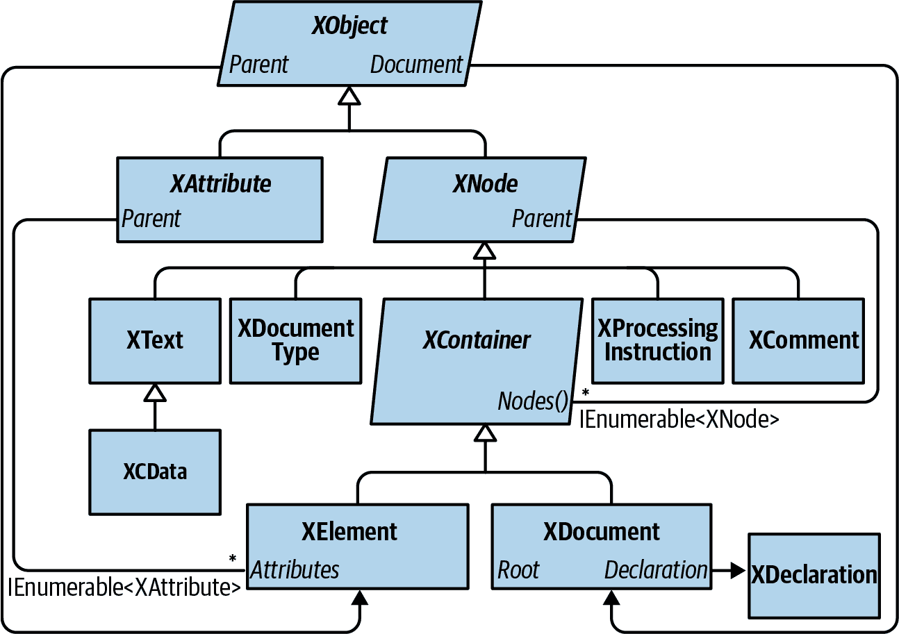
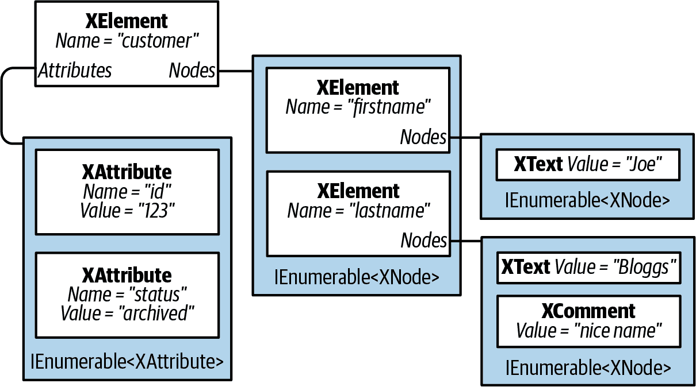

# 第十章：LINQ to XML

.NET 提供了多个用于处理 XML 数据的 API。用于通用 XML 文档处理的主要选择是 *LINQ to XML*。LINQ to XML 包括一个轻量级、与 LINQ 兼容的 XML 文档对象模型（DOM），以及一组补充查询运算符。

在本章中，我们完全专注于 LINQ to XML。在 第十一章 中，我们涵盖了仅向前 XML 读取器/写入器，而在 [在线补充](http://www.albahari.com/nutshell) 中，我们涵盖了用于处理模式和样式表的类型。.NET 还包括基于传统 `XmlDocument` 的 DOM，但我们不予讨论。

###### 注意

LINQ to XML DOM 设计非常精良且性能非常高。即使没有 LINQ，LINQ to XML DOM 作为低级 `XmlReader` 和 `XmlWriter` 类的轻量级外观也是非常有价值的。

所有 LINQ to XML 类型都定义在 `System.Xml.Linq` 命名空间中。

# 架构概述

本节从对 DOM 概念的非常简要介绍开始，然后解释了 LINQ to XML 的 DOM 背后的基本原理。

## 什么是 DOM？

考虑以下 XML 文件：

```cs
<?xml version="1.0" encoding="utf-8"?>
<customer id="123" status="archived">
  <firstname>Joe</firstname>
  <lastname>Bloggs</lastname>
</customer>
```

与所有 XML 文件一样，我们从一个 *声明* 开始，然后是一个名为 `customer` 的根 *元素*。`customer` 元素具有两个 *属性*，每个属性都有一个名称（`id` 和 `status`）和一个值（`"123"` 和 `"archived"`）。在 `customer` 内部，有两个子元素，`firstname` 和 `lastname`，每个都有简单的文本内容（`"Joe"` 和 `"Bloggs"`）。

这些构造——声明、元素、属性、值和文本内容——都可以用类表示。如果这些类具有用于存储子内容的集合属性，我们可以组装一个对象树来完整描述文档。这称为 *文档对象模型*，或 DOM。

## LINQ to XML DOM

LINQ to XML 包括两个主要内容：

+   XML DOM，我们称之为 *X-DOM*

+   大约有 10 个补充查询运算符的集合

正如您可能期望的那样，X-DOM 包括诸如 `XDocument`、`XElement` 和 `XAttribute` 之类的类型。有趣的是，X-DOM 类型并不依赖于 LINQ——您可以加载、实例化、更新和保存 X-DOM，而无需编写 LINQ 查询。

相反，您可以使用 LINQ 查询旧的符合 W3C 标准的 DOM。然而，这将是令人沮丧和受限制的。X-DOM 的显著特点是它对 LINQ 友好，这意味着：

+   它具有生成有用的 `IEnumerable` 序列的方法，您可以对其进行查询。

+   它的构造函数设计得使您能够通过 LINQ 投影构建 X-DOM 树。

# X-DOM 概述

图 10-1 显示了核心 X-DOM 类型。其中最常用的是 `XElement` 类型。`XObject` 是继承层次结构的根；`XElement` 和 `XDocument` 是容器层次结构的根。



###### 图 10-1\. 核心 X-DOM 类型

图 10-2 显示了从以下代码创建的 X-DOM 树：

```cs
string xml = @"<customer id='123' status='archived'>
                 <firstname>Joe</firstname>
                 <lastname>Bloggs<!--nice name--></lastname>
               </customer>";

XElement customer = XElement.Parse (xml);
```



###### 图 10-2\. 一个简单的 X-DOM 树

`XObject` 是所有 XML 内容的抽象基类。它定义了与容器树中的 `Parent` 元素的链接以及一个可选的 `XDocument`。

`XNode` 是大多数 XML 内容的基类，不包括属性。`XNode` 的显著特点是它可以位于混合类型 `XNode` 的有序集合中。例如，考虑以下 XML：

```cs
<data>
  Hello world
  <subelement1/>
  <!--comment-->
  <subelement2/>
</data>
```

在父元素 `<data>` 中，首先是一个 `XText` 节点（`Hello world`），然后是一个 `XElement` 节点，接着是一个 `XComment` 节点，然后是第二个 `XElement` 节点。相比之下，`XAttribute` 仅容忍其他 `XAttribute` 作为对等体。

虽然 `XNode` 可以访问其父 `XElement`，但它没有 *子* 节点的概念：这是其子类 `XContainer` 的工作。`XContainer` 定义了处理子节点的成员，并且是 `XElement` 和 `XDocument` 的抽象基类。

`XElement` 引入了用于管理属性的成员——以及 `Name` 和 `Value`。在元素只有一个 `XText` 子节点的情况下（这是相当常见的情况），`XElement` 上的 `Value` 属性封装了此子节点的内容，用于获取和设置操作，减少了不必要的导航。由于 `Value`，您大多数情况下可以避免直接使用 `XText` 节点。

`XDocument` 表示 XML 树的根。更确切地说，它 *包装* 了根 `XElement`，添加了 `XDeclaration`、处理指令和其他根级别的“fluff”。与 W3C DOM 不同的是，它的使用是可选的：您可以加载、操作和保存 X-DOM，而无需创建 `XDocument`！不依赖 `XDocument` 也意味着您可以高效且轻松地将节点子树移动到另一个 X-DOM 层次结构中。

## 加载和解析

`XElement` 和 `XDocument` 都提供静态的 `Load` 和 `Parse` 方法，从现有源构建 X-DOM 树：

+   `Load` 从文件、URI、`Stream`、`TextReader` 或 `XmlReader` 构建 X-DOM。

+   `Parse` 从字符串构建 X-DOM。

例如：

```cs
XDocument fromWeb = XDocument.Load ("http://albahari.com/sample.xml");

XElement fromFile = XElement.Load (@"e:\media\somefile.xml");

XElement config = XElement.Parse (
@"<configuration>
    <client enabled='true'>
      <timeout>30</timeout>
    </client>
  </configuration>");
```

在后面的章节中，我们将描述如何遍历和更新 X-DOM。作为快速预览，这是如何操作我们刚刚填充的 `config` 元素的方法：

```cs
foreach (XElement child in config.Elements())
  Console.WriteLine (child.Name);                     // client

XElement client = config.Element ("client");

bool enabled = (bool) client.Attribute ("enabled");   // Read attribute
Console.WriteLine (enabled);                          // True
client.Attribute ("enabled").SetValue (!enabled);     // Update attribute

int timeout = (int) client.Element ("timeout");       // Read element
Console.WriteLine (timeout);                          // 30
client.Element ("timeout").SetValue (timeout * 2);    // Update element

client.Add (new XElement ("retries", 3));             // Add new element

Console.WriteLine (config);         // Implicitly call config.ToString()
```

这是最后一个 `Console.WriteLine` 的结果：

```cs
<configuration>
  <client enabled="false">
    <timeout>60</timeout>
    <retries>3</retries>
  </client>
</configuration>
```

###### 注意

`XNode` 还提供了一个静态的 `ReadFrom` 方法，从 `XmlReader` 实例化和填充任何类型的节点。与 `Load` 不同，它在读取一个（完整的）节点后停止，因此您可以继续手动从 `XmlReader` 中读取。

您还可以反向使用 `XmlReader` 或 `XmlWriter` 通过其 `CreateReader` 和 `CreateWriter` 方法读取或写入 `XNode`。

我们描述了 XML 读取器和写入器以及如何在 第十一章 中与 X-DOM 一起使用它们。

## 保存和序列化

在任何节点上调用`ToString`将其内容转换为 XML 字符串——格式化为我们刚刚看到的带有换行和缩进的形式。（在调用`ToString`时，可以通过指定`SaveOptions.DisableFormatting`来禁用换行和缩进。）

`XElement`和`XDocument`还提供了一个`Save`方法，用于将 X-DOM 写入文件、`Stream`、`TextWriter`或`XmlWriter`。如果指定了一个文件，将自动写入 XML 声明。`XNode`类中还定义了一个`WriteTo`方法，只接受一个`XmlWriter`。

我们将在“文档和声明”中更详细地描述保存时处理 XML 声明的方法。

# 实例化 X-DOM

不要使用`Load`或`Parse`方法，可以通过手动实例化对象并通过`XContainer`的`Add`方法将它们添加到父对象来构建 X-DOM 树。

要构造`XElement`和`XAttribute`，只需提供一个名称和值：

```cs
XElement lastName = new XElement ("lastname", "Bloggs");
lastName.Add (new XComment ("nice name"));

XElement customer = new XElement ("customer");
customer.Add (new XAttribute ("id", 123));
customer.Add (new XElement ("firstname", "Joe"));
customer.Add (lastName);

Console.WriteLine (customer.ToString());
```

这是结果：

```cs
<customer id="123">
  <firstname>Joe</firstname>
  <lastname>Bloggs<!--nice name--></lastname>
</customer>
```

在构造`XElement`时，值是可选的——您可以只提供元素名称，稍后再添加内容。请注意，当我们提供值时，一个简单的字符串就足够了——我们不需要显式创建和添加`XText`子节点。X-DOM 会自动完成这项工作，因此您可以简单地处理“值”。

## 函数式构造

在我们之前的示例中，很难从代码中获取 XML 结构。X-DOM 支持另一种实例化模式，称为*函数式构造*（来自函数式编程）。使用函数式构造，您可以在单个表达式中构建整个树：

```cs
XElement customer =
  new XElement ("customer", new XAttribute ("id", 123),
    new XElement ("firstname", "joe"),
    new XElement ("lastname", "bloggs",
      new XComment ("nice name")
    )
  );
```

这有两个好处。首先，代码类似于 XML 的结构。其次，它可以并入 LINQ 查询的`select`子句中。例如，以下查询将从 EF Core 实体类投影到 X-DOM 中：

```cs
XElement query =
  new XElement ("customers",
    from c in dbContext.Customers.AsEnumerable()
    select
      new XElement ("customer", new XAttribute ("id", c.ID),
        new XElement ("firstname", c.FirstName),
        new XElement ("lastname", c.LastName,
          new XComment ("nice name")
        )
      )
  );
```

我们将在本章后面更深入地讨论这一点，见“投影到 X-DOM 中”。

## 指定内容

函数式构造是可能的，因为`XElement`（和`XDocument`）的构造函数被重载以接受一个`params`对象数组：

```cs
public XElement (XName name, params object[] content)
```

对于`XContainer`中的`Add`方法也是如此：

```cs
public void Add (params object[] content)
```

因此，在构建或附加 X-DOM 时，您可以指定任意数量的任何类型的子对象。这是因为*任何东西*都被视为合法内容。要了解具体情况，我们需要检查每个内容对象在内部是如何处理的。以下是`XContainer`做出的决定：

1.  如果对象为`null`，则会被忽略。

1.  如果对象基于`XNode`或`XStreamingElement`，它将按原样添加到`Nodes`集合中。

1.  如果对象是`XAttribute`，它将被添加到`Attributes`集合中。

1.  如果对象是一个`string`，它将被包装在一个`XText`节点中并添加到`Nodes`中。¹

1.  如果对象实现了`IEnumerable`，则会被枚举，并且相同的规则将应用于每个元素。

1.  否则，对象将被转换为字符串，包装在`XText`节点中，然后添加到`Nodes`中。²

一切最终都会进入两个桶之一：`Nodes`或`Attributes`。此外，任何对象都是有效内容，因为它始终可以最终调用`ToString`并将其视为`XText`节点。

###### 注

在对任意类型调用`ToString`之前，`XContainer`首先测试它是否是以下类型之一：

```cs
float, double, decimal, bool,
DateTime, DateTimeOffset, TimeSpan
```

如果是这样，它将在`XmlConvert`助手类上调用适当类型化的`ToString`方法，而不是在对象本身上调用`ToString`。这确保数据是可往返的，并符合标准 XML 格式化规则。

## 自动深度克隆

当通过功能性构建或`Add`方法向元素添加节点或属性时，该节点或属性的`Parent`属性将设置为该元素。节点只能有一个父元素：如果将已有父节点的节点添加到第二个父节点中，则节点将自动进行*深度克隆*。在以下示例中，每个客户都有一个单独的`address`副本：

```cs
var address = new XElement ("address",
                  new XElement ("street", "Lawley St"),
                  new XElement ("town", "North Beach")
              );
var customer1 = new XElement ("customer1", address);
var customer2 = new XElement ("customer2", address);

customer1.Element ("address").Element ("street").Value = "Another St";
Console.WriteLine (
  customer2.Element ("address").Element ("street").Value);   // Lawley St
```

此自动复制保持 X-DOM 对象实例化不受副作用的影响——这是函数式编程的又一标志。

# 导航和查询

正如您所预期的那样，`XNode`和`XContainer`类定义了遍历 X-DOM 树的方法和属性。但与传统的 DOM 不同，这些函数不会返回实现`IList<T>`的集合。相反，它们返回单个值或实现`IEnumerable<T>`的*序列*——您随后期望使用 LINQ 查询（或使用`foreach`枚举）。这不仅允许进行高级查询，还可以执行简单的导航任务——使用熟悉的 LINQ 查询语法。

###### 注

X-DOM 中的元素和属性名称区分大小写，就像 XML 中一样。

## 子节点导航

| 返回类型 | 成员 | 作用于 |
| --- | --- | --- |
| `XNode` | `FirstNode { get; }` | `XContainer` |
|   | `LastNode { get; }` | `XContainer` |
| `IEnumerable<XNode>` | `Nodes()` | `XContainer*` |
|   | `DescendantNodes()` | `XContainer*` |
|   | `DescendantNodesAndSelf()` | `XElement*` |
| `XElement` | `Element (XName)` | `XContainer` |
| `IEnumerable<XElement>` | `Elements()` | `XContainer*` |
|   | `Elements (XName)` | `XContainer*` |
|   | `Descendants()` | `XContainer*` |
|   | `Descendants (XName)` | `XContainer*` |
|   | `DescendantsAndSelf()` | `XElement*` |
|   | `DescendantsAndSelf (XName)` | `XElement*` |
| `bool` | `HasElements { get; }` | `XElement` |

###### 注

此表及其他表中第三列标有星号的功能也适用于同一类型的*序列*。例如，您可以在`XContainer`或`XContainer`对象序列上调用`Nodes`。这是因为`System.Xml.Linq`中定义的扩展方法——我们在概述中讨论的补充查询运算符使这成为可能。

### FirstNode、LastNode 和 Nodes

`FirstNode`和`LastNode`为您提供对第一个或最后一个子节点的直接访问；`Nodes`将所有子节点作为序列返回。这三个函数仅考虑直接子代：

```cs
var bench = new XElement ("bench",
              new XElement ("toolbox",
                new XElement ("handtool", "Hammer"),
                new XElement ("handtool", "Rasp")
              ),
              new XElement ("toolbox",
                new XElement ("handtool", "Saw"),
                new XElement ("powertool", "Nailgun")
              ),
              new XComment ("Be careful with the nailgun")
            );
foreach (XNode node in bench.Nodes())
  Console.WriteLine (node.ToString (SaveOptions.DisableFormatting) + ".");
```

这是输出：

```cs
<toolbox><handtool>Hammer</handtool><handtool>Rasp</handtool></toolbox>.
<toolbox><handtool>Saw</handtool><powertool>Nailgun</powertool></toolbox>.
<!--Be careful with the nailgun-->.
```

### 检索元素

`Elements` 方法仅返回类型为 `XElement` 的子节点：

```cs
foreach (XElement e in bench.Elements())
  Console.WriteLine (e.Name + "=" + e.Value);    // toolbox=HammerRasp
                                                 // toolbox=SawNailgun
```

以下 LINQ 查询找到带有钉枪的工具箱：

```cs
IEnumerable<string> query =
  from toolbox in bench.Elements()
  where toolbox.Elements().Any (tool => tool.Value == "Nailgun")
  select toolbox.Value;

RESULT: { "SawNailgun" }
```

下一个示例使用 `SelectMany` 查询检索所有工具箱中的手工工具：

```cs
IEnumerable<string> query =
  from toolbox in bench.Elements()
  from tool in toolbox.Elements()
  where tool.Name == "handtool"
  select tool.Value;

RESULT: { "Hammer", "Rasp", "Saw" }
```

###### 注意

`Elements` 本身相当于对 `Nodes` 的 LINQ 查询。我们之前的查询可以如下开始：

```cs
from toolbox in bench.Nodes().OfType<XElement>()
where ...
```

`Elements` 也可以返回给定名称的元素：

```cs
int x = bench.Elements ("toolbox").Count();    // 2
```

这相当于以下内容：

```cs
int x = bench.Elements().Where (e => e.Name == "toolbox").Count();  // 2
```

`Elements` 也被定义为接受 `IEnumerable​<XCon⁠tainer>` 或更精确地说是该类型参数的扩展方法：

```cs
IEnumerable<T> where T : XContainer
```

这使其也能处理元素序列。使用此方法，我们可以重写在所有工具箱中查找手工工具的查询如下：

```cs
from tool in bench.Elements ("toolbox").Elements ("handtool")
select tool.Value;
```

第一次调用 `Elements` 绑定到 `XContainer` 的实例方法；第二次调用 `Elements` 绑定到扩展方法。

### 检索单个元素

方法 `Element`（单数）返回给定名称的第一个匹配元素。 `Element` 用于简单的导航，如下所示：

```cs
XElement settings = XElement.Load ("databaseSettings.xml");
string cx = settings.Element ("database").Element ("connectString").Value;
```

`Element` 等同于调用 `Elements()` 然后应用 LINQ 的 `FirstOr​De⁠fault` 查询运算符进行名称匹配的谓词。如果请求的元素不存在，`Element` 返回 `null`。

###### 注意

如果元素 `xyz` 不存在，`Element("xyz").Value` 将抛出 `NullReferenceException`。如果你宁愿得到 `null` 而不是异常，可以使用空值条件操作符——`Element("xyz")?.Value`——或者将 `XElement` 强制转换为 `string` 而不是查询其 `Value` 属性。换句话说：

```cs
string xyz = (string) settings.Element ("xyz");
```

这样可以正常工作，因为 `XElement` 为此目的定义了显式的 `string` 转换！

### 检索后代

`XContainer` 还提供了 `Descendants` 和 `DescendantNodes` 方法，返回子元素或节点及其所有子级（整个树）。 `Descendants` 可接受一个可选的元素名称。回到我们的早期示例，我们可以使用 `Descendants` 查找所有手工工具：

```cs
Console.WriteLine (bench.Descendants ("handtool").Count());  // 3
```

父节点和叶节点均包括在内，如下例所示：

```cs
foreach (XNode node in bench.DescendantNodes())
  Console.WriteLine (node.ToString (SaveOptions.DisableFormatting));
```

这是输出：

```cs
<toolbox><handtool>Hammer</handtool><handtool>Rasp</handtool></toolbox>
<handtool>Hammer</handtool>
Hammer
<handtool>Rasp</handtool>
Rasp
<toolbox><handtool>Saw</handtool><powertool>Nailgun</powertool></toolbox>
<handtool>Saw</handtool>
Saw
<powertool>Nailgun</powertool>
Nailgun
<!--Be careful with the nailgun-->
```

下一个查询从 X-DOM 中的任何位置提取包含单词“careful”的所有评论：

```cs
IEnumerable<string> query =
  from c in bench.DescendantNodes().OfType<XComment>()
  where c.Value.Contains ("careful")
  orderby c.Value
  select c.Value;
```

## 父导航

所有 `XNode` 都有一个 `Parent` 属性和 `Ancestor*XXX*` 方法用于父导航。父始终是一个 `XElement`：

| 返回类型 | 成员 | 适用于 |
| --- | --- | --- |
| `XElement` | `Parent { get; }` | `XNode` |
| `Enumerable<XElement>` | `Ancestors()` | `XNode` |
|   | `Ancestors (XName)` | `XNode` |
|   | `AncestorsAndSelf()` | `XElement` |
|   | `AncestorsAndSelf (XName)` | `XElement` |

如果 `x` 是 `XElement`，以下内容始终打印 `true`：

```cs
foreach (XNode child in x.Nodes())
  Console.WriteLine (child.Parent == x);
```

然而，如果 `x` 是 `XDocument`，情况则不同。`XDocument` 很特别：它可以有子节点但永远不可能是任何人的父节点！要访问 `XDocument`，你可以使用 `Document` 属性；这适用于 X-DOM 树中的任何对象。

`Ancestors` 返回一个序列，其第一个元素是 `Parent`，下一个元素是 `Parent.Parent`，依此类推，直到根元素。

###### 注意

您可以使用 LINQ 查询 `AncestorsAndSelf().Last()` 导航到根元素。

另一种实现相同功能的方法是调用 `Docu⁠ment​.Root`，尽管这仅在存在 `XDocument` 时有效。

## 对等节点导航

| 返回类型 | 成员 | 定义在 |
| --- | --- | --- |
| `bool` | `IsBefore (XNode node)` | `XNode` |
|   | `IsAfter (XNode node)` | `XNode` |
| `XNode` | `PreviousNode { get; }` | `XNode` |
|   | `NextNode { get; }` | `XNode` |
| `IEnumerable<XNode>` | `NodesBeforeSelf()` | `XNode` |
|   | `NodesAfterSelf()` | `XNode` |
| `IEnumerable<XElement>` | `ElementsBeforeSelf()` | `XNode` |
|   | `ElementsBeforeSelf (XName name)` | `XNode` |
|   | `ElementsAfterSelf()` | `XNode` |
|   | `ElementsAfterSelf (XName name)` | `XNode` |

使用 `PreviousNode` 和 `NextNode`（以及 `FirstNode`/`LastNode`），您可以遍历具有链表感觉的节点。这并非巧合：内部节点存储在链表中。

###### 注意

`XNode` 内部使用单向链表，因此 `PreviousNode` 不具备性能。

## 属性导航

| 返回类型 | 成员 | 定义在 |
| --- | --- | --- |
| `bool` | `HasAttributes { get; }` | `XElement` |
| `XAttribute` | `Attribute (XName name)` | `XElement` |
|   | `FirstAttribute { get; }` | `XElement` |
|   | `LastAttribute { get; }` | `XElement` |
| `IEnumerable<XAttribute>` | `Attributes()` | `XElement` |
|   | `Attributes (XName name)` | `XElement` |

此外，`XAttribute` 定义了 `PreviousAttribute` 和 `NextAttribute` 属性以及 `Parent`。

接受名称的 `Attributes` 方法返回一个序列，其中包含零个或一个元素；XML 元素不能具有重复的属性名称。

# 更新 X-DOM

您可以通过以下方式更新元素和属性：

+   调用 `SetValue` 或重新分配 `Value` 属性。

+   调用 `SetElementValue` 或 `SetAttributeValue`。

+   调用其中一个 `Remove*XXX*` 方法。

+   调用 `Add*XXX*` 或 `Replace*XXX*` 方法之一，指定新内容。

您还可以在 `XElement` 对象上重新分配 `Name` 属性。

## 简单值更新

| 成员 | 适用于 |
| --- | --- |
| `SetValue (object value)` | `XElement`, `XAttribute` |
| `Value { get; set }` | `XElement`, `XAttribute` |

`SetValue` 方法用简单值替换元素或属性的内容。设置 `Value` 属性也是如此，但仅接受字符串数据。我们稍后在“处理值”中详细描述这两个函数。调用 `SetValue`（或重新分配 `Value`）的一个效果是替换所有子节点：

```cs
XElement settings = new XElement ("settings",
                      new XElement ("timeout", 30)
                    );
settings.SetValue ("blah");
Console.WriteLine (settings.ToString());  // <settings>blah</settings>
```

## 更新子节点和属性

| 类别 | 成员 | 适用于 |
| --- | --- | --- |
| 添加 | `Add (params object[] content)` | `XContainer` |
|   | `AddFirst (params object[] content)` | `XContainer` |
| 移除 | `RemoveNodes()` | `XContainer` |
|   | `RemoveAttributes()` | `XElement` |
|   | `RemoveAll()` | `XElement` |
| 更新 | `ReplaceNodes (params object[] content)` | `XContainer` |
|   | `ReplaceAttributes (params object[] content)` | `XElement` |
|   | `ReplaceAll (params object[] content` | `XElement` |
|   | `SetElementValue (XName name, object value)` | `XElement` |
|   | `SetAttributeValue (XName name, object value)` | `XElement` |

此组中最方便的方法是最后两个：`SetElementValue` 和 `SetAttributeValue`。它们作为快捷方式，用于实例化 `XElement` 或 `XAttribute`，然后将其添加到父级，并替换同名的现有元素或属性：

```cs
XElement settings = new XElement ("settings");
settings.SetElementValue ("timeout", 30);     // Adds child node
settings.SetElementValue ("timeout", 60);     // Update it to 60
```

`Add` 将子节点附加到元素或文档。`AddFirst` 与其类似，但插入到集合的开头而不是结尾。

您可以使用 `RemoveNodes` 或 `RemoveAttributes` 一次性删除所有子节点或属性。`RemoveAll` 等同于同时调用这两种方法。

`Replace*XXX*` 方法等效于 `Remove` 然后 `Add`。它们对输入进行了快照，因此 `e.ReplaceNodes(e.Nodes())` 能够正常工作。

## 通过父级更新

| 成员 | 适用对象 |
| --- | --- |
| `AddBeforeSelf (params object[] content)` | `XNode` |
| `AddAfterSelf (params object[] content)` | `XNode` |
| `Remove()` | `XNode`, `XAttribute` |
| `ReplaceWith (params object[] content)` | `XNode` |

方法 `AddBeforeSelf`、`AddAfterSelf`、`Remove` 和 `ReplaceWith` 不操作节点的子节点。而是操作节点所在的集合。这要求节点必须有一个父元素，否则会抛出异常。`AddBeforeSelf` 和 `AddAfterSelf` 适用于将节点插入到任意位置：

```cs
XElement items = new XElement ("items",
                   new XElement ("one"),
                   new XElement ("three")
                 );
items.FirstNode.AddAfterSelf (new XElement ("two"));
```

这是结果：

```cs
<items><one /><two /><three /></items>
```

在长序列中的任意位置插入元素是高效的，因为节点在内部以链表形式存储。

`Remove` 方法从其父节点中移除当前节点。`ReplaceWith` 也是如此，并在相同位置插入其他内容：

```cs
XElement items = XElement.Parse ("<items><one/><two/><three/></items>");
items.FirstNode.ReplaceWith (new XComment ("One was here"));
```

这是结果：

```cs
<items><!--one was here--><two /><three /></items>
```

### 删除一系列节点或属性

多亏了 `System.Xml.Linq` 中的扩展方法，您还可以对节点或属性的*序列*调用 `Remove`。考虑这个 X-DOM：

```cs
XElement contacts = XElement.Parse (
@"<contacts>
    <customer name='Mary'/>
    <customer name='Chris' archived='true'/>
    <supplier name='Susan'>
      <phone archived='true'>012345678<!--confidential--></phone>
    </supplier>
  </contacts>");
```

下面的示例删除了所有客户：

```cs
contacts.Elements ("customer").Remove();
```

下面的示例删除了所有存档的联系人（因此 *Chris* 消失了）：

```cs
contacts.Elements().Where (e => (bool?) e.Attribute ("archived") == true)
                   .Remove();
```

如果我们将 `Elements()` 替换为 `Descendants()`，整个 DOM 中的所有存档元素都将消失，得到如下结果：

```cs
<contacts>
  <customer name="Mary" />
  <supplier name="Susan" />
</contacts>
```

下一个示例删除了任何位置包含树中任何地方注释“confidential”的所有联系人：

```cs
contacts.Elements().Where (e => e.DescendantNodes()
                                 .OfType<XComment>()
                                 .Any (c => c.Value == "confidential")
                          ).Remove();
```

这是结果：

```cs
<contacts>
  <customer name="Mary" />
  <customer name="Chris" archived="true" />
</contacts>
```

与下面更简单的查询相比，它从树中删除所有注释节点：

```cs
contacts.DescendantNodes().OfType<XComment>().Remove();
```

###### 注意

内部实现中，`Remove` 方法首先将所有匹配的元素读入临时列表，然后枚举临时列表以执行删除操作。这样可以避免同时删除和查询可能导致的错误。

# 使用值

`XElement` 和 `XAttribute` 都有 `Value` 属性，类型为 `string`。如果一个元素有一个单独的 `XText` 子节点，`XElement` 的 `Value` 属性作为方便的快捷方式，用于访问该节点的内容。对于 `XAttribute`，`Value` 属性就是属性的值。

尽管存储方式不同，X-DOM 为处理元素和属性值提供了一致的操作集。

## 设置数值

有两种方法可以赋值：调用 `SetValue` 或分配 `Value` 属性。`SetValue` 更灵活，因为它不仅接受字符串，还接受其他简单的数据类型：

```cs
var e = new XElement ("date", DateTime.Now);
e.SetValue (DateTime.Now.AddDays(1));
Console.Write (e.Value);              // 2019-10-02T16:39:10.734375+09:00
```

相反，我们本可以直接设置元素的 `Value` 属性，但这意味着必须手动将 `DateTime` 转换为字符串。这比调用 `ToString` 更复杂 —— 它需要使用 `XmlConvert` 来获得符合 XML 标准的结果。

当您将 *值* 传递给 `XElement` 或 `XAttribute` 的构造函数时，对于非字符串类型也会发生相同的自动转换。这确保了 `DateTime` 被正确格式化；`true` 以小写形式写入，`double.NegativeInfinity` 写为 “-INF”。

## 获取数值

要反向操作并将 `Value` 解析回基本类型，只需将 `XElement` 或 `XAttribute` 强制转换为所需类型。听起来好像不应该起作用，但它确实可以！例如：

```cs
XElement e = new XElement ("now", DateTime.Now);
DateTime dt = (DateTime) e;

XAttribute a = new XAttribute ("resolution", 1.234);
double res = (double) a;
```

元素或属性本身并不原生存储 `DateTime` 或数字 —— 它们始终以文本形式存储，然后根据需要进行解析。它也不会 “记住” 原始类型，因此必须正确地进行强制转换，以避免运行时错误。为了使您的代码健壮，可以将强制转换放入 `try`/`catch` 块中，捕获 `FormatException`。

`XElement` 和 `XAttribute` 上的显式转换可以解析为以下类型：

+   所有标准数值类型

+   `string`、`bool`、`DateTime`、`DateTimeOffset`、`TimeSpan` 和 `Guid`

+   上述值类型的 `Nullable<>` 版本

在与 `Element` 和 `Attribute` 方法结合使用时，将类型强制转换为可空类型很有用，因为即使请求的名称不存在，强制转换仍然有效。例如，如果 `x` 没有 `timeout` 元素，第一行将生成运行时错误，而第二行不会：

```cs
int timeout = (int) x.Element ("timeout");      // Error
int? timeout = (int?) x.Element ("timeout");    // OK; timeout is null.
```

您可以通过 `??` 运算符在最终结果中消除可空类型。如果 `resolution` 属性不存在，则以下计算结果为 `1.0`：

```cs
double resolution = (double?) x.Attribute ("resolution") ?? 1.0;
```

不过，将类型强制转换为可空类型并不能解决问题，如果元素或属性 *存在* 并且具有空（或格式不正确）的值。对此，必须捕获 `FormatException`。

您还可以在 LINQ 查询中使用转换。以下返回“John”：

```cs
var data = XElement.Parse (
  @"<data>
      <customer id='1' name='Mary' credit='100' />
      <customer id='2' name='John' credit='150' />
      <customer id='3' name='Anne' />
    </data>");

IEnumerable<string> query = from cust in data.Elements()
                            where (int?) cust.Attribute ("credit") > 100
                            select cust.Attribute ("name").Value;
```

将可空 `int` 强制转换可以防止 `NullReferenceException` 的发生，例如，如果 Anne 没有 `credit` 属性。另一种解决方法是在 `where` 子句中添加谓词：

```cs
where cust.Attributes ("credit").Any() && (int) cust.Attribute...
```

查询元素值时也适用相同原则。

## 值和混合内容节点

鉴于 `Value` 的值，您可能想知道何时需要直接处理 `XText` 节点。答案是当您有混合内容时，例如：

```cs
<summary>An XAttribute is <bold>not</bold> an XNode</summary>
```

一个简单的 `Value` 属性无法捕捉 `summary` 的内容。`summary` 元素包含三个子元素：一个 `XText` 节点，后跟一个 `XElement`，再跟一个 `XText` 节点。以下是构造它的方法：

```cs
XElement summary = new XElement ("summary",
                      new XText ("An XAttribute is "),
                      new XElement ("bold", "not"),
                      new XText (" an XNode")
                    );
```

有趣的是，我们仍然可以查询 `summary` 的 `Value` —— 而不会抛出异常。相反，我们得到的是每个子元素值的连接：

```cs
An XAttribute is not an XNode
```

重新分配 `summary` 的 `Value` 也是合法的，代价是用一个新的单个 `XText` 节点替换所有先前的子元素。

## 自动 XText 连接

当向 `XElement` 添加简单内容时，X-DOM 会追加到现有的 `XText` 子元素，而不是创建新的。在以下示例中，`e1` 和 `e2` 最终只有一个子 `XText` 元素，其值为 `HelloWorld`：

```cs
var e1 = new XElement ("test", "Hello"); e1.Add ("World");
var e2 = new XElement ("test", "Hello", "World");
```

然而，如果您明确创建 `XText` 节点，则最终会有多个子元素：

```cs
var e = new XElement ("test", new XText ("Hello"), new XText ("World"));
Console.WriteLine (e.Value);             // HelloWorld
Console.WriteLine (e.Nodes().Count());   // 2
```

`XElement` 不会连接这两个 `XText` 节点，因此节点的对象标识被保留。

# 文档和声明

## XDocument

正如前面所说，`XDocument` 包装了一个根 `XElement`，允许您添加 `XDeclaration`、处理指令、文档类型和根级注释。`XDocument` 是可选的，可以被忽略或省略：与 W3C DOM 不同，它不起粘合剂作用以使所有内容保持在一起。

`XDocument` 提供与 `XElement` 相同的功能构造函数。因为它基于 `XContainer`，所以还支持 `Add*XXX*`、`Remove*XXX*` 和 `Replace*XXX*` 方法。然而，与 `XElement` 不同的是，`XDocument` 只能接受有限的内容：

+   一个单独的 `XElement` 对象（“根”）

+   一个单独的 `XDeclaration` 对象

+   一个单独的 `XDocumentType` 对象（用于引用文档类型定义 [DTD]）

+   任意数量的 `XProcessingInstruction` 对象

+   任意数量的 `XComment` 对象

###### 注意

其中，仅根 `XElement` 是强制性的，以确保具有有效的 `XDocument`。`XDeclaration` 是可选的——如果省略，则在序列化期间应用默认设置。

最简单的有效 `XDocument` 只有一个根元素：

```cs
var doc = new XDocument (
            new XElement ("test", "data")
          );
```

注意，我们没有包含 `XDeclaration` 对象。然而，通过调用 `doc.Save` 生成的文件仍将包含一个 XML 声明，因为默认情况下会生成一个。

下一个示例生成了一个简单但正确的 XHTML 文件，展示了 `XDocument` 可以接受的所有结构：

```cs
var styleInstruction = new XProcessingInstruction (
  "xml-stylesheet", "href='styles.css' type='text/css'");

var docType = new XDocumentType ("html",
  "-//W3C//DTD XHTML 1.0 Strict//EN",
  "http://www.w3.org/TR/xhtml1/DTD/xhtml1-strict.dtd", null);

XNamespace ns = "http://www.w3.org/1999/xhtml";
var root =
  new XElement (ns + "html",
    new XElement (ns + "head",
      new XElement (ns + "title", "An XHTML page")),
    new XElement (ns + "body",
      new XElement (ns + "p", "This is the content"))
  );

var doc =
  new XDocument (
    new XDeclaration ("1.0", "utf-8", "no"),
    new XComment ("Reference a stylesheet"),
    styleInstruction,
    docType,
    root);

doc.Save ("test.html");
```

结果文件 *test.html* 的内容如下：

```cs
<?xml version="1.0" encoding="utf-8" standalone="no"?>
<!--Reference a stylesheet-->
<?xml-stylesheet href='styles.css' type='text/css'?>
<!DOCTYPE html PUBLIC "-//W3C//DTD XHTML 1.0 Strict//EN"
                      "http://www.w3.org/TR/xhtml1/DTD/xhtml1-strict.dtd">
<html >
  <head>
    <title>An XHTML page</title>
  </head>
  <body>
    <p>This is the content</p>
  </body>
</html>
```

`XDocument` 具有 `Root` 属性，用作访问文档的单个 `XElement` 的快捷方式。反向链接由 `XObject` 的 `Document` 属性提供，适用于树中的所有对象：

```cs
Console.WriteLine (doc.Root.Name.LocalName);          // html
XElement bodyNode = doc.Root.Element (ns + "body");
Console.WriteLine (bodyNode.Document == doc);         // True
```

请记住，文档的子元素没有 `Parent`：

```cs
Console.WriteLine (doc.Root.Parent == null);          // True
foreach (XNode node in doc.Nodes())
  Console.Write (node.Parent == null);                // TrueTrueTrueTrue
```

###### 注意

`XDeclaration` 不是 `XNode`，也不会出现在文档的 `Nodes` 集合中——不像注释、处理指令和根元素。相反，它被分配到一个名为 `Declaration` 的专用属性。这就是为什么最后一个例子中的“True”重复四次而不是五次。

## XML 声明

标准的 XML 文件以如下声明开头：

```cs
<?xml version="1.0" encoding="utf-8" standalone="yes"?>
```

XML 声明确保文件将被解析器正确解析和理解。`XElement` 和 `XDocument` 遵循这些规则来发出 XML 声明：

+   使用文件名调用 `Save` 总是会写入声明。

+   使用 `XmlWriter` 调用 `Save` 写入声明，除非显式告知 `XmlWriter` 否则不要这样做。

+   `ToString` 方法从不输出 XML 声明。

###### 注意

当构造 `XmlWriter` 时，可以通过设置 `XmlWriterSettings` 对象的 `OmitXmlDeclaration` 和 `ConformanceLevel` 属性来指示 `XmlWriter` 不生成声明。我们在第十一章中描述了这一点。

不存在 `XDeclaration` 对象的存在或不存在不会影响是否写入 XML 声明。`XDeclaration` 的目的是 *提示 XML 序列化* 的两种方式：

+   使用的文本编码

+   XML 声明的 `encoding` 和 `standalone` 属性应该放什么（是否应该写入声明）

`XDeclaration` 的构造函数接受三个参数，分别对应于属性 `version`、`encoding` 和 `standalone`。在下面的例子中，*test.xml* 使用 UTF-16 编码：

```cs
var doc = new XDocument (
            new XDeclaration ("1.0", "utf-16", "yes"),
            new XElement ("test", "data")
          );
doc.Save ("test.xml");
```

###### 注意

无论您为 XML 版本指定什么，XML 写入器都会忽略它：它总是写入 `"1.0"`。

编码必须使用像 XML 声明中出现的 IETF 代码 `"utf-16"`。

### 将声明写入字符串

假设我们想将 `XDocument` 序列化为 `string`，包括 XML 声明。因为 `ToString` 不会写入声明，我们需要使用 `XmlWriter`：

```cs
var doc = new XDocument (
            new XDeclaration ("1.0", "utf-8", "yes"),
            new XElement ("test", "data")
          );
var output = new StringBuilder();
var settings = new XmlWriterSettings { Indent = true };
using (XmlWriter xw = XmlWriter.Create (output, settings))
  doc.Save (xw);
Console.WriteLine (output.ToString());
```

这是结果：

```cs
<?xml version="1.0" encoding="utf-16" standalone="yes"?>
<test>data</test>
```

注意，尽管我们在 `XDeclaration` 中显式请求了 UTF-8，但输出中却有 UTF-16！这看起来可能像一个错误，但事实上，`XmlWriter` 的处理非常智能。因为我们写入的是一个 `string` 而不是文件或流，所以除了 UTF-16（字符串内部存储的格式）外，不可能应用任何其他编码。因此，`XmlWriter` 写入 `"utf-16"` 以免造成误导。

这也解释了为什么 `ToString` 方法不会输出 XML 声明。想象一下，如果不调用 `Save` 而是像以下这样将 `XDocument` 写入文件：

```cs
File.WriteAllText ("data.xml", doc.ToString());
```

如其现状，*data.xml* 将缺少 XML 声明，使其不完整但仍可解析（可以推断文本编码）。但如果 `ToString()` 输出了 XML 声明，*data.xml* 实际上将包含一个*错误的*声明（`encoding="utf-16"`），这可能导致完全无法读取，因为 `WriteAllText` 使用 UTF-8 进行编码。

# 名称和命名空间

就像.NET 类型可以有命名空间一样，XML 元素和属性也可以有命名空间。

XML 命名空间实现了两个功能。首先，类似于 C#中的命名空间，它们有助于防止命名冲突。当你将一个 XML 文件的数据合并到另一个 XML 文件中时，这可能会成为一个问题。其次，命名空间为名称分配了*绝对的*含义。例如，名称“nil”可以表示任何东西。然而，在*http://www.w3.org/2001/xmlschema-instance*命名空间内，“nil”的含义相当于 C#中的`null`，并且具有特定的应用规则。

由于 XML 命名空间是一个重要的混淆源，我们首先总结一般命名空间，然后再讨论它们在 LINQ to XML 中的使用。

## XML 中的命名空间

假设我们想要在命名空间`OReilly.Nutshell.CSharp`中定义一个`customer`元素。有两种方法可以进行。第一种是使用`xmlns`属性：

```cs
<customer />
```

**`xmlns`是一个特殊的保留属性。当以这种方式使用时，它执行两个功能：

+   它为相关元素指定了命名空间。

+   它为所有后代元素指定了默认命名空间。

这意味着在以下示例中，`address`和`postcode`隐含地位于`OReilly.Nutshell.CSharp`命名空间中：

```cs
<customer >
  <address>
    <postcode>02138</postcode>
  </address>
</customer>
```

如果我们希望`address`和`postcode`*没有*命名空间，我们需要这样做：

```cs
<customer >
  <address xmlns="">
    <postcode>02138</postcode>     <!-- postcode now inherits empty ns -->
  </address>
</customer>
```

### 前缀

指定命名空间的另一种方法是使用*前缀*。前缀是你为命名空间分配的别名，以节省输入。使用前缀有两个步骤—*定义*前缀和*使用*前缀。你可以同时进行：

```cs
<nut:customer xmlns:nut="OReilly.Nutshell.CSharp"/>
```

此处发生了两件不同的事情。右侧定义了一个名为`nut`的前缀，并使其在该元素及其所有后代中可用。左侧的`nut:customer`将新分配的前缀分配给了`customer`元素。

带有前缀的元素*不会*为后代元素定义默认命名空间。在以下 XML 中，`firstname`具有空命名空间：

```cs
<nut:customer >
  <firstname>Joe</firstname>
</customer>
```

要给`firstname`分配`OReilly.Nutshell.CSharp`前缀，你必须这样做：

```cs
<nut:customer >
  <nut:firstname>Joe</firstname>
</customer>
```

你还可以为你的后代方便地定义一个或多个前缀，而不将它们分配给父元素本身。以下定义了两个前缀，`i`和`z`，同时将`customer`元素本身保留为空命名空间：

```cs
<customer 
          >
  ...
</customer>
```

如果这是根节点，则整个文档都可以使用`i`和`z`前缀。当元素需要从多个命名空间中获取信息时，前缀非常方便。

注意，此示例中的两个命名空间都是 URI。使用 URI（你拥有的）是标准做法：它确保命名空间的唯一性。因此，在实际情况中，我们的`customer`元素更可能是这样的：

```cs
<customer />
```

或者：

```cs
<nut:customer />
```

### 属性

你也可以为属性分配命名空间。主要区别在于，属性始终需要一个前缀。例如：

```cs
<customer  nut:id="123" />
```

另一个不同之处在于，未限定的属性始终具有空命名空间：它从不从父元素继承默认命名空间。

属性通常不需要命名空间，因为它们的含义通常局限于元素本身。一个例外是像 W3C 定义的 `nil` 属性这样的通用或元数据属性：

```cs
<customer >
  <firstname>Joe</firstname>
  <lastname xsi:nil="true"/>
</customer>
```

这明确表示 `lastname` 是 `nil`（在 C# 中是 `null`），而不是空字符串。因为我们使用了标准命名空间，通用的解析工具可以确切地了解我们的意图。**  **## 在 X-DOM 中指定命名空间

到目前为止，在本章中，我们仅使用简单的字符串作为 `XElement` 和 `XAttribute` 的名称。一个简单的字符串对应于一个具有空命名空间的 XML 名称，类似于在全局命名空间中定义的 .NET 类型。

有几种指定 XML 命名空间的方法。第一种是在本地名称之前用大括号括起来：

```cs
var e = new XElement ("{http://domain.com/xmlspace}customer", "Bloggs");
Console.WriteLine (e.ToString());
```

这将产生如下的 XML：

```cs
<customer >Bloggs</customer>
```

第二种（更高效）方法是使用 `XNamespace` 和 `XName` 类型。以下是它们的定义：

```cs
public sealed class XNamespace
{
  public string NamespaceName { get; }
}

public sealed class XName     // A local name with optional namespace
{
  public string LocalName { get; }
  public XNamespace Namespace { get; }   // Optional
}
```

两种类型都定义了从 `string` 的隐式转换，因此以下操作是合法的：

```cs
XNamespace ns   = "http://domain.com/xmlspace";
XName localName = "customer";
XName fullName  = "{http://domain.com/xmlspace}customer";
```

`XNamespace` 还重载了 `+` 运算符，允许你将命名空间和名称组合成一个 `XName` 而无需使用大括号：

```cs
XNamespace ns = "http://domain.com/xmlspace";
XName fullName = ns + "customer";
Console.WriteLine (fullName);     // {http://domain.com/xmlspace}customer
```

X-DOM 中所有接受元素或属性名称的构造函数和方法实际上接受的是一个 `XName` 对象而不是一个 `string`。你之所以可以像我们到目前为止的所有示例那样替换一个字符串，是因为存在隐式转换。

无论是对元素还是属性，指定命名空间的方式都是相同的：

```cs
XNamespace ns = "http://domain.com/xmlspace";
var data = new XElement (ns + "data",
              new XAttribute (ns + "id", 123)
           );
```

## X-DOM 和默认命名空间

X-DOM 在构造子 `XElement` 时忽略了默认命名空间的概念；如果需要，你必须显式为其指定命名空间；它*不会*从父元素继承：

```cs
XNamespace ns = "http://domain.com/xmlspace";
var data = new XElement (ns + "data",
             new XElement (ns + "customer", "Bloggs"),
             new XElement (ns + "purchase", "Bicycle")
           );
```

直到实际输出 XML 时，X-DOM 才会应用默认命名空间：

```cs
Console.WriteLine (data.ToString());

OUTPUT:
  <data >
    <customer>Bloggs</customer>
    <purchase>Bicycle</purchase>
  </data>

Console.WriteLine (data.Element (ns + "customer").ToString());

OUTPUT:
  <customer >Bloggs</customer>
```

如果在构造 `XElement` 子元素时没有指定命名空间，换句话说

```cs
XNamespace ns = "http://domain.com/xmlspace";
var data = new XElement (ns + "data",
             new XElement ("customer", "Bloggs"),
             new XElement ("purchase", "Bicycle")
           );
Console.WriteLine (data.ToString());
```

你会得到以下结果：

```cs
<data >
  <customer xmlns="">Bloggs</customer>
  <purchase xmlns="">Bicycle</purchase>
</data>
```

另一个陷阱是在导航 X-DOM 时未包括命名空间：

```cs
XNamespace ns = "http://domain.com/xmlspace";
var data = new XElement (ns + "data",
             new XElement (ns + "customer", "Bloggs"),
             new XElement (ns + "purchase", "Bicycle")
           );
XElement x = data.Element (ns + "customer");    // ok
XElement y = data.Element ("customer");         // null
```

如果在构建 X-DOM 树时未指定命名空间，你随后可以将每个元素分配到一个单一的命名空间，如下所示：

```cs
foreach (XElement e in data.DescendantsAndSelf())
  if (e.Name.Namespace == "")
    e.Name = ns + e.Name.LocalName;
```

## 前缀

X-DOM 对待前缀和命名空间的方式与其对待序列化功能相同。这意味着你可以选择完全忽略前缀的问题，并且顺利进行！唯一可能希望做出不同选择的原因是在将 XML 输出到文件时提高效率。例如，考虑下面这个：

```cs
XNamespace ns1 = "http://domain.com/space1";
XNamespace ns2 = "http://domain.com/space2";

var mix = new XElement (ns1 + "data",
            new XElement (ns2 + "element", "value"),
            new XElement (ns2 + "element", "value"),
            new XElement (ns2 + "element", "value")
          );
```

默认情况下，`XElement` 将按如下方式序列化：

```cs
<data >
  <element >value</element>
  <element >value</element>
  <element >value</element>
</data>
```

正如你所看到的，存在一些不必要的重复。解决方案*不是*改变构造 X-DOM 的方式，而是在写入 XML 之前提示序列化器。通过添加定义你想要应用的前缀的属性来实现。这通常在根元素上完成：

```cs
mix.SetAttributeValue (XNamespace.Xmlns + "ns1", ns1);
mix.SetAttributeValue (XNamespace.Xmlns + "ns2", ns2);
```

这将前缀`ns1`分配给我们的`XNamespace`变量`ns1`，并将`ns2`分配给`ns2`。当序列化时，X-DOM 自动获取这些属性，并用它们来压缩生成的 XML。现在，在`mix`上调用`ToString`的结果如下：

```cs
<ns1:data 
          >
  <ns2:element>value</ns2:element>
  <ns2:element>value</ns2:element>
  <ns2:element>value</ns2:element>
</ns1:data>
```

前缀不会改变您构造、查询或更新 X-DOM 的方式——对于这些活动，您忽略前缀的存在并继续使用完整名称。前缀仅在转换为和从 XML 文件或流中时才会起作用。

前缀在序列化属性时也会受到尊重。在以下示例中，我们记录了客户的出生日期和信用为`"nil"`，并使用了 W3C 标准属性。突出显示的行确保前缀在序列化时不会重复命名空间：

```cs
XNamespace xsi = "http://www.w3.org/2001/XMLSchema-instance";
var nil = new XAttribute (xsi + "nil", true);

var cust = new XElement ("customers",
             new XAttribute (XNamespace.Xmlns + "xsi", xsi),
             new XElement ("customer",
               new XElement ("lastname", "Bloggs"),
               new XElement ("dob", nil),
               new XElement ("credit", nil)
             )
           );
```

这是其 XML：

```cs
<customers >
  <customer>
    <lastname>Bloggs</lastname>
    <dob xsi:nil="true" />
    <credit xsi:nil="true" />
  </customer>
</customers>
```

为了简洁起见，我们预先声明了 nil `XAttribute`，以便在构建 DOM 时可以使用它两次。您允许引用相同的属性两次，因为根据需要会自动复制它。** **＃ 注释

您可以使用注释将自定义数据附加到任何`XObject`上。注释专为您自己的私人使用而设计，并且在 X-DOM 中被视为黑匣子。如果您曾经在 Windows Forms 或 Windows Presentation Foundation (WPF) 控件的 `Tag` 属性上使用过，您可能已经熟悉这个概念——不同之处在于您有多个注释，并且您的注释可以是*私有作用域*。您可以创建其他类型甚至看不到——更不用说覆盖的注释。

`XObject` 上述方法用于添加和移除注释：

```cs
public void AddAnnotation (object annotation)
public void RemoveAnnotations<T>()     where T : class
```

以下方法检索注释：

```cs
public T Annotation<T>()               where T : class
public IEnumerable<T> Annotations<T>() where T : class
```

每个注释都以其*类型*作为键，必须是引用类型。以下是添加然后检索`string`注释的操作：

```cs
XElement e = new XElement ("test");
e.AddAnnotation ("Hello");
Console.WriteLine (e.Annotation<string>());   // Hello
```

您可以添加多个相同类型的注释，然后使用`Annotations`方法检索*匹配*序列。

诸如`string`之类的公共类型并不是一个很好的键，因为其他类型中的代码可能会干扰您的注释。更好的方法是使用内部或（嵌套的）私有类：

```cs
class X
{
  class CustomData { internal string Message; }   // Private nested type

  static void Test()
  {
    XElement e = new XElement ("test");
    e.AddAnnotation (new CustomData { Message = "Hello" } );
    Console.Write (e.Annotations<CustomData>().First().Message);  // Hello
  }
}
```

要删除注释，您还必须访问键的类型：

```cs
e.RemoveAnnotations<CustomData>();
```

# 投射到 X-DOM 中

到目前为止，我们已经展示了如何使用 LINQ 从 X-DOM 中获取数据*。您还可以使用 LINQ 查询来投射*到 X-DOM。源可以是 LINQ 可查询的任何内容，例如以下内容：

+   EF Core 实体类

+   本地集合

+   另一个 X-DOM

无论来源如何，使用 LINQ 发出 X-DOM 的策略是相同的：首先编写一个*功能构造*表达式，以生成所需的 X-DOM 结构，然后围绕表达式构建 LINQ 查询。

例如，假设我们想要从数据库中检索以下 XML 的客户信息：

```cs
<customers>
  <customer id="1">
    <name>Sue</name>
    <buys>3</buys>
  </customer>
  ...
</customers>
```

我们从编写 X-DOM 的功能构造表达式开始，使用简单字面量：

```cs
var customers =
  new XElement ("customers",
    new XElement ("customer", new XAttribute ("id", 1),
      new XElement ("name", "Sue"),
      new XElement ("buys", 3)
    )
  );
```

然后我们将其转换为投射，并围绕其构建 LINQ 查询：

```cs
var customers =
  new XElement ("customers",
    // We must call AsEnumerable() due to a bug in EF Core.
    from c in dbContext.Customers.AsEnumerable()
    select
      new XElement ("customer", new XAttribute ("id", c.ID),
        new XElement ("name", c.Name),
        new XElement ("buys", c.Purchases.Count)
      )
    );
```

###### 注意

由于 EF Core 中的一个错误（计划在后续版本中修复），需要调用 `AsEnumerable` 方法。修复后，删除对 `AsEnumerable` 的调用将通过防止每次调用 `c.Purchases.Count` 都进行往返而提高效率。

这是结果：

```cs
<customers>
  <customer id="1">
    <name>Tom</name>
    <buys>3</buys>
  </customer>
  <customer id="2">
    <name>Harry</name>
    <buys>2</buys>
  </customer>
    ...
</customers>
```

通过两步构造相同的查询，我们可以更清晰地看到其工作原理。首先：

```cs
IEnumerable<XElement> sqlQuery =
  from c in dbContext.Customers.AsEnumerable()
  select
    new XElement ("customer", new XAttribute ("id", c.ID),
      new XElement ("name", c.Name),
      new XElement ("buys", c.Purchases.Count)
    );
```

这部分是一个正常的 LINQ 查询，将投影到 `XElement` 中。这是第二步：

```cs
var customers = new XElement ("customers", sqlQuery);
```

这构造了根 `XElement`。唯一不同寻常的是内容 `sqlQuery` 不是单个 `XElement`，而是实现了 `IEnumerable<XElement>` 的 `IQueryable<XElement>`。请记住，在处理 XML 内容时，集合会自动被枚举。因此，每个 `XElement` 都会作为子节点添加。

## 消除空元素

假设在前面的示例中，我们还想包含客户最近一次高价值购买的详细信息。我们可以这样做：

```cs
var customers =
  new XElement ("customers",
    // The AsEnumerable call can be removed when the EF Core bug is fixed.
    from c in dbContext.Customers.AsEnumerable()
    let lastBigBuy = (from p in c.Purchases
                      where p.Price > 1000
                      orderby p.Date descending
                      select p).FirstOrDefault()
    select
      new XElement ("customer", new XAttribute ("id", c.ID),
        new XElement ("name", c.Name),
        new XElement ("buys", c.Purchases.Count),
        new XElement ("lastBigBuy",
          new XElement ("description", lastBigBuy?.Description),
          new XElement ("price", lastBigBuy?.Price ?? 0m)
        )
      )
  );
```

这会发出空元素，但对于没有高价值购买的客户来说，不会发出 `null`。如果这是一个本地查询而不是数据库查询，它会抛出 `NullReferenceException`。在这种情况下，最好完全省略 `lastBigBuy` 节点。我们可以通过将 `lastBigBuy` 元素的构造函数包装在条件运算符中来实现：

```cs
    select
      new XElement ("customer", new XAttribute ("id", c.ID),
        new XElement ("name", c.Name),
        new XElement ("buys", c.Purchases.Count),
        lastBigBuy == null ? null :
          new XElement ("lastBigBuy",
 new XElement ("description", lastBigBuy.Description),
 new XElement ("price", lastBigBuy.Price)
```

对于没有 `lastBigBuy` 的客户，会发出 `null` 而不是空的 `XElement`。这正是我们想要的，因为 `null` 内容会被简单地忽略。

## 流式投影

如果你只是为了 `Save`（或对其调用 `ToString`）而将 X-DOM 投影，则可以通过 `XStreamingElement` 提高内存效率。`XStreamingElement` 是 `XElement` 的简化版本，将 *延迟加载* 语义应用于其子内容。要使用它，只需将外部的 `XElement` 替换为 `XStreamingElement`：

```cs
var customers =
  new XStreamingElement ("customers",
    from c in dbContext.Customers
    select
      new XStreamingElement ("customer", new XAttribute ("id", c.ID),
        new XElement ("name", c.Name),
        new XElement ("buys", c.Purchases.Count)
      )
    );
customers.Save ("data.xml");
```

`XStreamingElement` 构造函数中传递的查询，在调用元素的 `Save`、`ToString` 或 `WriteTo` 方法之前不会被枚举；这可以防止一次性将整个 X-DOM 加载到内存中。反之，重新 `Save` 时，查询会重新评估。此外，你无法遍历 `XStreamingElement` 的子内容—它不会公开诸如 `Elements` 或 `Attributes` 的方法。

`XStreamingElement` 不基于 `XObject`—或任何其他类—因为它具有非常有限的成员集。除了 `Save`、`ToString` 和 `WriteTo` 外，它唯一拥有的成员是以下几个：

+   `Add` 方法，接受与构造函数类似的内容

+   `Name` 属性

`XStreamingElement` 不允许以流式方式 *读取* 内容—为此，必须将 `XmlReader` 与 X-DOM 结合使用。我们在 “使用 XmlReader/XmlWriter 的模式” 中描述了如何做到这一点。

¹ X-DOM 实际上通过将简单文本内容存储在字符串中，在内部优化了这一步骤。直到在`XContainer`上调用`Nodes( )`时，`XTEXT`节点才会真正创建。

² 请参阅脚注 1。
