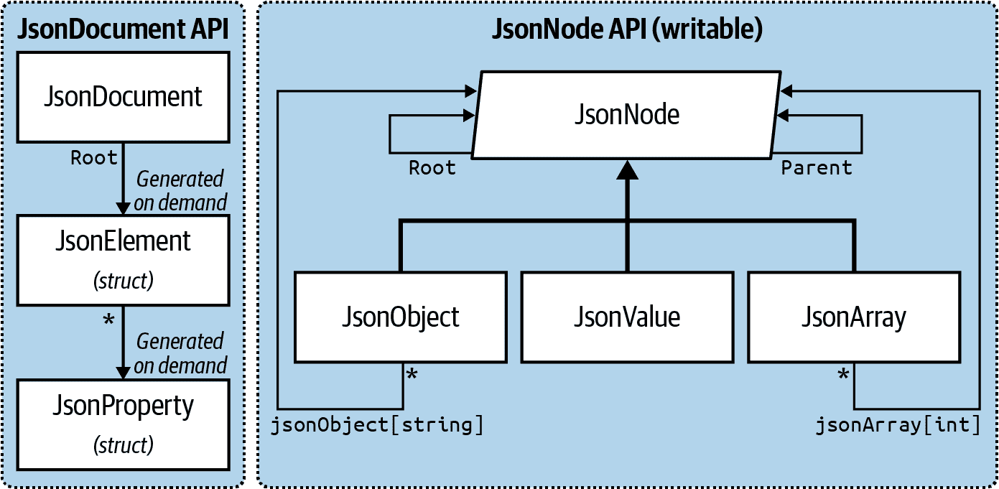

# 第十一章。其他 XML 和 JSON 技术

在第十章中，我们介绍了 LINQ-to-XML API 和 XML 的一般概念。在本章中，我们将探索低级别的 `XmlReader`/`XmlWriter` 类以及处理 JavaScript 对象表示法（JSON）的相关类型，后者已成为 XML 的流行替代方案。

在[在线补充](http://www.albahari.com/nutshell)中，我们描述了处理 XML 模式和样式表的工具。

# XmlReader

`XmlReader` 是一种高性能的类，以逐个向前的方式读取 XML 流。

考虑以下 XML 文件，customer.xml：

```cs
<?xml version="1.0" encoding="utf-8" standalone="yes"?>
<customer id="123" status="archived">
  <firstname>Jim</firstname>
  <lastname>Bo</lastname>
</customer>
```

要实例化一个 `XmlReader`，您可以调用静态方法 `XmlReader.Create`，并传入一个 `Stream`、`TextReader` 或 URI 字符串：

```cs
using XmlReader reader = XmlReader.Create ("customer.xml");
  ...
```

###### 注意

因为 `XmlReader` 允许从潜在缓慢的来源（`Stream` 和 URI）读取，它提供了其大多数方法的异步版本，使您能够轻松编写非阻塞代码。我们在第十四章中详细介绍了异步处理。

要构造一个从字符串读取的 `XmlReader`：

```cs
using XmlReader reader = XmlReader.Create (
  new System.IO.StringReader (myString));
```

您还可以传入一个 `XmlReaderSettings` 对象来控制解析和验证选项。`XmlReaderSettings` 上的以下三个属性特别适用于跳过多余的内容：

```cs
bool IgnoreComments                  // Skip over comment nodes?
bool IgnoreProcessingInstructions    // Skip over processing instructions?
bool IgnoreWhitespace                // Skip over whitespace?
```

在下面的示例中，我们指示阅读器不要输出空白节点，因为在典型场景中它们会造成干扰：

```cs
XmlReaderSettings settings = new XmlReaderSettings();
settings.IgnoreWhitespace = true;

using XmlReader reader = XmlReader.Create ("customer.xml", settings);
  ...
```

`XmlReaderSettings` 的另一个有用属性是 `ConformanceLevel`。其默认值 `Document` 指示阅读器假定一个带有单个根节点的有效 XML 文档。如果要读取仅包含多个节点的 XML 内部部分，则会遇到问题：

```cs
<firstname>Jim</firstname>
<lastname>Bo</lastname>
```

要在不抛出异常的情况下读取此内容，必须将 `ConformanceLevel` 设置为 `Fragment`。

`XmlReaderSettings` 还有一个名为 `CloseInput` 的属性，指示在关闭阅读器时是否关闭底层流（`XmlWriterSettings` 上也有类似的 `CloseOutput` 属性）。`CloseInput` 和 `CloseOutput` 的默认值均为 `false`。

## 读取节点

XML 流的单位是 *XML 节点*。阅读器以文本方式（深度优先）遍历流。阅读器的 `Depth` 属性返回光标当前的深度。

从 `XmlReader` 中读取 XML 的最基本方法是调用 `Read`。它前进到 XML 流中的下一个节点，类似于 `IEnumerator` 中的 `MoveNext`。首次调用 `Read` 会将光标定位在第一个节点上。当 `Read` 返回 `false` 时，意味着光标已经超过了最后一个节点，在这种情况下应关闭并丢弃 `XmlReader`。

`XmlReader` 上的两个 `string` 属性提供对节点内容的访问：`Name` 和 `Value`。根据节点类型，`Name` 或 `Value`（或两者）将被填充。

在此示例中，我们逐个读取 XML 流中的每个节点，并输出每个节点的类型：

```cs
XmlReaderSettings settings = new XmlReaderSettings();
settings.IgnoreWhitespace = true;

using XmlReader reader = XmlReader.Create ("customer.xml", settings);
while (reader.Read())
{
  Console.Write (new string (' ', reader.Depth * 2));  // Write indentation
  Console.Write (reader.NodeType.ToString());

  if (reader.NodeType == XmlNodeType.Element ||
      reader.NodeType == XmlNodeType.EndElement)
  {
    Console.Write (" Name=" + reader.Name);
  }
  else if (reader.NodeType == XmlNodeType.Text)
  {
    Console.Write (" Value=" + reader.Value);
  }  
  Console.WriteLine ();
}
```

输出如下：

```cs
XmlDeclaration
Element Name=customer
  Element Name=firstname
    Text Value=Jim
  EndElement Name=firstname
  Element Name=lastname
    Text Value=Bo
  EndElement Name=lastname
EndElement Name=customer
```

###### 注意

属性不包括在基于 `Read` 的遍历中（参见“读取属性”）。

`NodeType` 的类型是 `XmlNodeType`，它是一个枚举，包含以下成员：

| `None` `XmlDeclaration`

`Element`

`EndElement`

`Text`

`Attribute` | `Comment` `Entity`

`EndEntity`

`EntityReference`

`ProcessingInstruction`

`CDATA` | `Document` `DocumentType`

`DocumentFragment`

`Notation`

`Whitespace`

`SignificantWhitespace` |

## 读取元素

通常，您已经知道正在读取的 XML 文档的结构。为了帮助处理，`XmlReader` 提供了一系列方法，这些方法在 *假定* 特定结构的同时读取内容。这样做不仅简化了您的代码，还同时进行了一些验证。

###### 注意

如果验证失败，`XmlReader` 会抛出 `XmlException`。`XmlException` 具有 `LineNumber` 和 `LinePosition` 属性，指示错误发生的位置——如果 XML 文件很大，记录此信息至关重要！

`ReadStartElement` 验证当前的 `NodeType` 是 `Element`，然后调用 `Read`。如果指定了名称，则验证其是否与当前元素的名称匹配。

`ReadEndElement` 验证当前的 `NodeType` 是 `EndElement`，然后调用 `Read`。

例如，我们可以读取

```cs
<firstname>Jim</firstname>
```

如下所示：

```cs
reader.ReadStartElement ("firstname");
Console.WriteLine (reader.Value);
reader.Read();
reader.ReadEndElement();
```

`ReadElementContentAsString` 方法一次完成所有操作。它读取起始元素、文本节点和结束元素，将内容作为字符串返回：

```cs
string firstName = reader.ReadElementContentAsString ("firstname", "");
```

第二个参数是指命名空间，在本例中为空白。此方法还有类型化版本，如 `ReadElementContentAsInt`，用于解析结果。返回到我们的原始 XML 文档：

```cs
<?xml version="1.0" encoding="utf-8" standalone="yes"?>
<customer id="123" status="archived">
  <firstname>Jim</firstname>
  <lastname>Bo</lastname>
  <creditlimit>500.00</creditlimit>    <!-- OK, we sneaked this in! -->
</customer>
```

我们可以按以下方式读取它：

```cs
XmlReaderSettings settings = new XmlReaderSettings();
settings.IgnoreWhitespace = true;

using XmlReader r = XmlReader.Create ("customer.xml", settings);

r.MoveToContent();                // Skip over the XML declaration
r.ReadStartElement ("customer");
string firstName    = r.ReadElementContentAsString ("firstname", "");
string lastName     = r.ReadElementContentAsString ("lastname", "");
decimal creditLimit = r.ReadElementContentAsDecimal ("creditlimit", "");

r.MoveToContent();      // Skip over that pesky comment
r.ReadEndElement();     // Read the closing customer tag
```

###### 注意

`MoveToContent` 方法非常有用。它跳过所有的冗余内容：XML 声明、空白、注释和处理指令。您还可以通过 `XmlReaderSettings` 上的属性自动指示阅读器执行大部分此操作。

### 可选元素

在前面的示例中，假设 `<lastname>` 是可选的。解决方法很简单：

```cs
r.ReadStartElement ("customer");
string firstName    = r. ReadElementContentAsString ("firstname", "");
string lastName     = r.Name == "lastname"
 ? r.ReadElementContentAsString() : null;
decimal creditLimit = r.ReadElementContentAsDecimal ("creditlimit", "");
```

### 随机元素顺序

本节的示例依赖于 XML 文件中元素按顺序出现的顺序。如果需要处理元素以任意顺序出现的情况，最简单的解决方案是将 XML 的该部分读入 X-DOM。我们稍后在“使用 XmlReader/XmlWriter 的模式”中描述如何做到这一点。

### 空元素

`XmlReader` 处理空元素的方式可能会导致严重问题。考虑以下元素：

```cs
<customerList></customerList>
```

在 XML 中，这相当于以下内容：

```cs
<customerList/>
```

然而，`XmlReader` 对这两种情况的处理方式不同。在第一种情况下，以下代码按预期工作：

```cs
reader.ReadStartElement ("customerList");
reader.ReadEndElement();
```

在第二种情况下，由于在 `XmlReader` 看来不存在单独的“结束元素”，因此 `ReadEndElement` 抛出异常。解决方法是检查空元素：

```cs
bool isEmpty = reader.IsEmptyElement;
reader.ReadStartElement ("customerList");
if (!isEmpty) reader.ReadEndElement();
```

实际上，这只有在所讨论的元素可能包含子元素（如客户列表）时才是一个麻烦。对于包含简单文本的元素（如`firstname`），你可以通过调用诸如`ReadElementContentAsString`的方法避免整个问题。`ReadElement*XXX*`方法可以正确处理这两种类型的空元素。

### Other ReadXXX methods

Table 11-1 总结了`XmlReader`中所有`Read*XXX*`方法。其中大多数设计用于处理元素。粗体显示的示例 XML 片段是所述方法读取的部分。

表 11-1。读取方法

| Members | Works on NodeType | Sample XML fragment | Input parameters | Data returned |
| --- | --- | --- | --- | --- |
| `ReadContentAs*XXX*` | `Text` | `<a>**x**</a>` |  | `x` |
| `ReadElement​Con⁠tent​As*XXX*` | `Element` | `**<a>x</a>**` |  | `x` |
| `ReadInnerXml` | `Element` | `**<a>x</a>**` |  | `x` |
| `ReadOuterXml` | `Element` | `**<a>x</a>**` |  | `<a>x</a>` |
| `ReadStartElement` | `Element` | `**<a>**x</a>` |  |  |
| `ReadEndElement` | `Element` | `<a>x**</a>**` |  |  |
| `ReadSubtree` | `Element` | `**<a>x</a>**` |  | `<a>x</a>` |
| `ReadToDescendant` | `Element` | `**<a>x**<b></b></a>` | `"b"` |  |
| `ReadToFollowing` | `Element` | `**<a>x**<b></b></a>` | `"b"` |  |
| `ReadToNextSibling` | `Element` | `**<a>x</a**><b></b>` | `"b"` |  |
| `ReadAttributeValue` | `Attribute` | 参见“读取属性” |  |  |

`ReadContentAs*XXX*`方法将文本节点解析为类型`*XXX*`。在内部，`XmlConvert`类执行字符串到类型的转换。文本节点可以位于元素或属性内。

`ReadElementContentAs*XXX*`方法是相应的`ReadContentAs*XXX*`方法的包装。它们适用于*元素*节点，而不是包含在元素中的*文本*节点。

`ReadInnerXml`通常适用于元素，它会读取并返回元素及其所有后代。当应用于属性时，它会返回属性的值。`ReadOuterXml`与之类似，但它包括光标位置处的元素，而不是排除它。

`ReadSubtree`返回一个代理阅读器，提供对当前元素（及其后代）的视图。必须在可以安全再次读取原始阅读器之前关闭代理阅读器。关闭代理阅读器时，原始阅读器的光标位置移动到子树的末尾。

`ReadToDescendant`将光标移动到具有指定名称/命名空间的第一个后代节点的开头。`ReadToFollowing`将光标移动到具有指定名称/命名空间的第一个节点的开头，无论深度如何。`ReadToNextSibling`将光标移动到具有指定名称/命名空间的第一个同级节点的开头。

还有两个传统方法：`ReadString` 和 `ReadElementString` 的行为类似于 `ReadContentAsString` 和 `ReadElementContentAsString`，但如果元素包含多个 *单一* 文本节点，则会抛出异常。应避免使用这些方法，因为如果元素包含注释，它们会抛出异常。

## 读取属性

`XmlReader` 提供了一个索引器，让您可以直接（随机）访问元素的属性——按名称或位置。使用索引器等同于调用 `GetAttribute`。

给定 XML 片段

```cs
<customer id="123" status="archived"/>
```

我们可以读取其属性，如下所示：

```cs
Console.WriteLine (reader ["id"]);              // 123
Console.WriteLine (reader ["status"]);          // archived
Console.WriteLine (reader ["bogus"] == null);   // True
```

###### 警告

`XmlReader` 必须定位在 *起始元素* 上才能读取属性。在调用 `ReadStartElement` 后，属性将永远消失！

尽管属性顺序在语义上无关紧要，但可以通过其序数位置访问属性。我们可以将前述示例重写如下：

```cs
Console.WriteLine (reader [0]);            // 123
Console.WriteLine (reader [1]);            // archived
```

索引器还允许您指定属性的命名空间（如果有）。

`AttributeCount` 返回当前节点的属性数量。

### 属性节点

要显式遍历属性节点，必须从仅调用 `Read` 的正常路径进行特殊分流。这样做的一个好理由是，如果你想将属性值解析为其他类型，可以通过 `ReadContentAs*XXX*` 方法。

操作必须从 *起始元素* 开始。为了简化工作，在属性遍历期间放宽了单向规则：通过调用 `MoveToAttribute`，你可以跳转到任何属性（向前或向后）。

###### 注意

`MoveToElement` 从属性节点转到 `start` 元素。

回到我们之前的例子：

```cs
<customer id="123" status="archived"/>
```

我们可以这样做：

```cs
reader.MoveToAttribute ("status");
string status = reader.ReadContentAsString();

reader.MoveToAttribute ("id");
int id = reader.ReadContentAsInt();
```

如果指定的属性不存在，`MoveToAttribute` 返回 `false`。

您还可以通过调用 `MoveToFirstAttribute` 然后调用 `MoveToNextAttribute` 方法按顺序遍历每个属性：

```cs
if (reader.MoveToFirstAttribute())
  do { Console.WriteLine (reader.Name + "=" + reader.Value);  }
  while (reader.MoveToNextAttribute());

// OUTPUT:
id=123
status=archived
```

## 命名空间和前缀

`XmlReader` 提供了两个并行系统来引用元素和属性名称：

+   `Name`

+   `NamespaceURI` 和 `LocalName`

每当读取一个元素的 `Name` 属性或调用接受单个 `name` 参数的方法时，你正在使用第一个系统。如果没有命名空间或前缀，这种方式非常有效；否则，它会以一种粗糙和字面的方式工作。命名空间被忽略，前缀被包含在其原样写入的位置；例如：

| 示例片段 | 名称 |
| --- | --- |
| `<**customer** ...>` | `customer` |
| `<**customer** xmlns='blah' ...>` | `customer` |
| `<**x:customer** ...>` | `x:customer` |

下面的代码适用于前两种情况：

```cs
reader.ReadStartElement ("customer");
```

处理第三种情况需要以下操作：

```cs
reader.ReadStartElement ("x:customer");
```

第二个系统通过两个 *命名空间感知* 属性工作：`NamespaceURI` 和 `LocalName`。这些属性考虑了由父元素定义的前缀和默认命名空间。前缀会自动扩展。这意味着 `NamespaceURI` 总是反映当前元素的语义上正确的命名空间，而 `LocalName` 总是不带前缀的。

当您将两个名称参数传递给诸如 `ReadStartElement` 的方法时，您正在使用相同的系统。例如，考虑以下 XML：

```cs
<customer >
  <address>
    <other:city>
    ...
```

我们可以按以下方式读取它：

```cs
reader.ReadStartElement ("customer", "DefaultNamespace");
reader.ReadStartElement ("address",  "DefaultNamespace");
reader.ReadStartElement ("city",     "OtherNamespace");
```

抽象化掉前缀通常正是您想要的。如果需要，您可以通过调用 `LookupNamespace` 查看使用的前缀，并将其转换为命名空间。

# XmlWriter

`XmlWriter` 是 XML 流的单向写入器。`XmlWriter` 的设计与 `XmlReader` 对称。

与 `XmlTextReader` 一样，您通过调用 `Create`（带有可选的 `settings` 对象）来构造 `XmlWriter`。在下面的示例中，我们启用缩进以使输出更易读，并写入一个简单的 XML 文件：

```cs
XmlWriterSettings settings = new XmlWriterSettings();
settings.Indent = true;

using XmlWriter writer = XmlWriter.Create ("foo.xml", settings);

writer.WriteStartElement ("customer");
writer.WriteElementString ("firstname", "Jim");
writer.WriteElementString ("lastname", "Bo");
writer.WriteEndElement();
```

这将产生以下文档（与我们在 `XmlReader` 的第一个示例中读取的文件相同）：

```cs
<?xml version="1.0" encoding="utf-8"?>
<customer>
  <firstname>Jim</firstname>
  <lastname>Bo</lastname>
</customer>
```

`XmlWriter` 自动在顶部写入声明，除非在 `XmlWriterSettings` 中设置 `OmitXmlDeclaration` 为 `true` 或 `ConformanceLevel` 设置为 `Fragment` 以外。后者还允许写入多个根节点——否则会引发异常。

`WriteValue` 方法写入单个文本节点。它接受字符串和非字符串类型，如 `bool` 和 `DateTime`，在内部调用 `XmlConvert` 执行符合 XML 标准的字符串转换：

```cs
writer.WriteStartElement ("birthdate");
writer.WriteValue (DateTime.Now);
writer.WriteEndElement();
```

相反，如果我们调用

```cs
WriteElementString ("birthdate", DateTime.Now.ToString());
```

结果会既不符合 XML 标准，也容易受到错误解析的影响。

`WriteString` 等同于使用字符串调用 `WriteValue`。`XmlWriter` 自动转义否则在属性或元素中非法的字符，如 `&`、`< >` 和扩展的 Unicode 字符。

## 写入属性

您可以在写入 `start` 元素后立即写入属性：

```cs
writer.WriteStartElement ("customer");
writer.WriteAttributeString ("id", "1");
writer.WriteAttributeString ("status", "archived");
```

要写入非字符串值，请调用 `WriteStartAttribute`、`WriteValue`，然后 `WriteEndAttribute`。

## 写入其他节点类型

`XmlWriter` 还定义了用于写入其他类型节点的以下方法：

```cs
WriteBase64       // for binary data
WriteBinHex       // for binary data
WriteCData
WriteComment
WriteDocType
WriteEntityRef
WriteProcessingInstruction
WriteRaw
WriteWhitespace
```

`WriteRaw` 直接将字符串注入输出流。还有一个接受 `XmlReader` 的 `WriteNode` 方法，从给定的 `XmlReader` 中回显所有内容。

## 命名空间和前缀

`Write*` 方法的重载允许您将元素或属性与命名空间关联起来。让我们重写前面示例中 XML 文件的内容。这次，我们将所有元素与 *http://oreilly.com* 命名空间关联起来，在 `customer` 元素处声明前缀 `o`：

```cs
writer.WriteStartElement ("o", "customer", "http://oreilly.com");
writer.WriteElementString ("o", "firstname", "http://oreilly.com", "Jim");
writer.WriteElementString ("o", "lastname", "http://oreilly.com", "Bo");
writer.WriteEndElement();
```

输出现在如下所示：

```cs
<?xml version="1.0" encoding="utf-8"?>
<o:customer xmlns:o='http://oreilly.com'>
  <o:firstname>Jim</o:firstname>
  <o:lastname>Bo</o:lastname>
</o:customer>
```

注意，为了简洁起见，当父元素已经声明了子元素的命名空间时，`XmlWriter`会省略子元素的命名空间声明。

# 使用 XmlReader/XmlWriter 的模式

## 处理层次数据

考虑以下类：

```cs
public class Contacts
{
  public IList<Customer> Customers = new List<Customer>();
  public IList<Supplier> Suppliers = new List<Supplier>();
}

public class Customer { public string FirstName, LastName; }
public class Supplier { public string Name;                }
```

假设您希望使用`XmlReader`和`XmlWriter`将`Contacts`对象序列化为 XML，如下所示：

```cs
<?xml version="1.0" encoding="utf-8"?>
<contacts>
   <customer id="1">
      <firstname>Jay</firstname>
      <lastname>Dee</lastname>
   </customer>
   <customer>                     <!-- we'll assume id is optional -->
      <firstname>Kay</firstname>
      <lastname>Gee</lastname>
   </customer>
   <supplier>
      <name>X Technologies Ltd</name>
   </supplier>
</contacts>
```

最好的方法不是编写一个大方法，而是在`Customer`和`Supplier`类型本身中封装 XML 功能，通过编写这些类型的`ReadXml`和`WriteXml`方法来实现。这种模式很简单：

+   `ReadXml`和`WriteXml`在退出时将读者/写者保持在相同的深度。

+   `ReadXml`读取外部元素，而`WriteXml`仅写入其内部内容。

下面是如何编写`Customer`类型的方法：

```cs
public class Customer
{
  public const string XmlName = "customer";
  public int? ID;
  public string FirstName, LastName;

  public Customer () { }
  public Customer (XmlReader r) { ReadXml (r); }

  public void ReadXml (XmlReader r)
  {
    if (r.MoveToAttribute ("id")) ID = r.ReadContentAsInt();
 r.ReadStartElement();
    FirstName = r.ReadElementContentAsString ("firstname", "");
    LastName = r.ReadElementContentAsString ("lastname", "");
 r.ReadEndElement();
  }

  public void WriteXml (XmlWriter w)
  {
    if (ID.HasValue) w.WriteAttributeString ("id", "", ID.ToString());
    w.WriteElementString ("firstname", FirstName);
    w.WriteElementString ("lastname", LastName);
  }
}
```

注意，`ReadXml`读取外部的起始和结束元素节点。如果它的调用者执行这个工作，`Customer`无法读取自己的属性。不在`WriteXml`中对称处理的原因有两个：

+   调用者可能需要选择外部元素的命名方式。

+   调用者可能需要写入额外的 XML 属性，例如元素的*subtype*（然后可以用于在读回元素时决定实例化哪个类）。

遵循这种模式的另一个好处是，它使您的实现与`IXmlSerializable`兼容（我们在在线补充材料的“序列化”中介绍了这一点，网址为[*http://www.albahari.com/nutshell*](http://www.albahari.com/nutshell)）。

`Supplier`类类似于`Customer`：

```cs
public class Supplier
{
  public const string XmlName = "supplier";
  public string Name;

  public Supplier () { }
  public Supplier (XmlReader r) { ReadXml (r); }

  public void ReadXml (XmlReader r)
  {
 r.ReadStartElement();
    Name = r.ReadElementContentAsString ("name", "");
 r.ReadEndElement();
  }

  public void WriteXml (XmlWriter w) =>
    w.WriteElementString ("name", Name);
}
```

对于`Contacts`类，我们必须在`ReadXml`中枚举`customers`元素，检查每个子元素是客户还是供应商。我们还需要编写代码来处理空元素的陷阱：

```cs
public void ReadXml (XmlReader r)
{
  bool isEmpty = r.IsEmptyElement;           // This ensures we don't get
  r.ReadStartElement();                      // snookered by an empty
  if (isEmpty) return;                       // <contacts/> element!
  while (r.NodeType == XmlNodeType.Element)
  {
    if (r.Name == Customer.XmlName)      Customers.Add (new Customer (r));
    else if (r.Name == Supplier.XmlName) Suppliers.Add (new Supplier (r));
    else
      throw new XmlException ("Unexpected node: " + r.Name);
  }
 r.ReadEndElement();
}

public void WriteXml (XmlWriter w)
{
  foreach (Customer c in Customers)
  {
 w.WriteStartElement (Customer.XmlName);
    c.WriteXml (w);
 w.WriteEndElement();
  }
  foreach (Supplier s in Suppliers)
  {
 w.WriteStartElement (Supplier.XmlName);
    s.WriteXml (w);
 w.WriteEndElement();
  }
}
```

下面是如何将填充了客户和供应商的`Contacts`对象序列化为 XML 文件：

```cs
var settings = new XmlWriterSettings();
settings.Indent = true;  // To make visual inspection easier

using XmlWriter writer = XmlWriter.Create ("contacts.xml", settings);

var cts = new Contacts()
// Add Customers and Suppliers...

writer.WriteStartElement ("contacts");
cts.WriteXml (writer);
writer.WriteEndElement();
```

以下是如何从同一文件反序列化的方法：

```cs
var settings = new XmlReaderSettings();
settings.IgnoreWhitespace = true;
settings.IgnoreComments = true;
settings.IgnoreProcessingInstructions = true;

using XmlReader reader = XmlReader.Create("contacts.xml", settings);
reader.MoveToContent();
var cts = new Contacts();
cts.ReadXml(reader);
```

## 将 XmlReader/XmlWriter 与 X-DOM 混合使用

在 XML 树的任何点，当`XmlReader`或`XmlWriter`变得过于笨重时，您可以在 X-DOM 中飞行。使用 X-DOM 处理内部元素是将 X-DOM 的易用性与`XmlReader`和`XmlWriter`的低内存占用结合起来的绝佳方式。

### 使用 XmlReader 与 XElement

要将当前元素读入 X-DOM，您可以调用`XNode.ReadFrom`，将`XmlReader`传递给它。与`XElement.Load`不同，此方法不是“贪婪”的，它只读取当前子树的末尾。

例如，假设我们有一个结构化如下的 XML 日志文件：

```cs
<log>
  <logentry id="1">
    <date>...</date>
    <source>...</source>
    ...
  </logentry>
  ...
</log>
```

如果有一百万个`logentry`元素，将整个内容读入 X-DOM 将浪费内存。更好的解决方案是使用`XmlReader`遍历每个`logentry`，然后使用`XElement`逐个处理元素：

```cs
XmlReaderSettings settings = new XmlReaderSettings();
settings.IgnoreWhitespace = true;

using XmlReader r = XmlReader.Create ("logfile.xml", settings);

r.ReadStartElement ("log");
while (r.Name == "logentry")
{
 XElement logEntry = (XElement) XNode.ReadFrom (r);
  int id = (int) logEntry.Attribute ("id");
  DateTime date = (DateTime) logEntry.Element ("date");
  string source = (string) logEntry.Element ("source");
  ...
}
r.ReadEndElement();
```

如果您遵循前一节描述的模式，您可以将`XElement`插入到自定义类型的`ReadXml`或`WriteXml`方法中，而调用方不会知道您曾经欺骗过！例如，我们可以重新编写`Customer`的`ReadXml`方法，如下所示：

```cs
public void ReadXml (XmlReader r)
{
 XElement x = (XElement) XNode.ReadFrom (r);
  ID = (int) x.Attribute ("id");
  FirstName = (string) x.Element ("firstname");
  LastName = (string) x.Element ("lastname");
}
```

`XElement`与`XmlReader`合作，确保命名空间保持完整，并且前缀正确扩展——即使在外部级别定义。因此，如果我们的 XML 文件如下所示：

```cs
<log >
  <logentry id="1">
  ...
```

我们在`logentry`级别构造的`XElement`将正确继承外部命名空间。

### 使用`XElement`和`XmlWriter`

您可以仅使用`XElement`将内部元素写入`XmlWriter`以及如何使用`XElement`将一百万`logentry`元素写入 XML 文件——而无需将整个元素存储在内存中：

```cs
using XmlWriter w = XmlWriter.Create ("logfile.xml");

w.WriteStartElement ("log");
for (int i = 0; i < 1000000; i++)
{
  XElement e = new XElement ("logentry",
                 new XAttribute ("id", i),
                 new XElement ("date", DateTime.Today.AddDays (-1)),
                 new XElement ("source", "test"));
 e.WriteTo (w);
}
w.WriteEndElement ();
```

使用`XElement`会产生最小的执行开销。如果我们在整个示例中使用`XmlWriter`进行修改，执行时间没有明显差异。

# 使用 JSON 工作

JSON 已成为 XML 的流行替代方案。虽然缺乏 XML 的高级功能（如命名空间、前缀和模式），但它简单、清晰，并且其格式类似于将 JavaScript 对象转换为字符串的格式。

历史上，.NET 没有内置对 JSON 的支持，您必须依赖第三方库，主要是 Json.NET。尽管现在情况不再如此，但 Json.NET 库因多种原因仍然很受欢迎：

+   它已经存在自 2011 年以来。

+   同一 API 也可在较旧的.NET 平台上运行。

+   在过去至少被认为更为功能性（在这一部分中）比微软的 JSON API。

微软的 JSON API 具有从头设计为简单和极其高效的优势。此外，从.NET 6 开始，它们的功能已经与 Json.NET 非常接近。

在这一部分中，我们涵盖了以下内容：

+   前向只读读取器和写入器（`Utf8JsonReader`和`Utf8JsonWriter`）

+   `JsonDocument`只读 DOM 读取器

+   `JsonNode`读写 DOM 读取器/写入器

在[*http://www.albahari.com/nutshell*](http://www.albahari.com/nutshell)的在线补充部分中的“序列化”中，我们介绍了`JsonSerializer`，它可以自动将 JSON 序列化和反序列化为类。

## Utf8JsonReader

[`System.Text.Json.Utf8JsonReader`](https://oreil.ly/9Fc3E)是针对 UTF-8 编码的 JSON 文本的优化前向只读器。在概念上，它类似于本章前面介绍的`XmlReader`，并且使用方式大致相同。

考虑以下名为*people.json*的 JSON 文件：

```cs
{
  "FirstName":"Sara",
  "LastName":"Wells",
  "Age":35,
  "Friends":["Dylan","Ian"]
}
```

大括号表示*JSON 对象*（其中包含`"FirstName"`和`"LastName"`等*属性*），而方括号表示*JSON 数组*（其中包含重复元素）。在本例中，重复元素是字符串，但它们可以是对象（或其他数组）。

下面的代码通过枚举其 JSON *令牌* 解析文件。令牌可以是对象的开始或结束，数组的开始或结束，属性的名称，或者数组或属性的值（字符串、数字、true、false 或 null）：

```cs
byte[] data = File.ReadAllBytes ("people.json");
Utf8JsonReader reader = new Utf8JsonReader (data);
while (reader.Read())
{
  switch (reader.TokenType)
  {
    case JsonTokenType.StartObject:
      Console.WriteLine ($"Start of object");
      break;
    case JsonTokenType.EndObject:
      Console.WriteLine ($"End of object");
      break;
    case JsonTokenType.StartArray:
      Console.WriteLine();
      Console.WriteLine ($"Start of array");
      break;
    case JsonTokenType.EndArray:
      Console.WriteLine ($"End of array");
      break;
    case JsonTokenType.PropertyName:
      Console.Write ($"Property: {reader.GetString()}");
      break;
    case JsonTokenType.String:
      Console.WriteLine ($" Value: {reader.GetString()}");
      break;
    case JsonTokenType.Number:
      Console.WriteLine ($" Value: {reader.GetInt32()}");
      break;
    default:
      Console.WriteLine ($"No support for {reader.TokenType}");
      break;
  }
}
```

这是输出：

```cs
Start of object
Property: FirstName Value: Sara
Property: LastName Value: Wells
Property: Age Value: 35
Property: Friends
Start of array
 Value: Dylan
 Value: Ian
End of array
End of object
```

因为 `Utf8JsonReader` 直接使用 UTF-8，所以它在遍历令牌时无需先将输入转换为 UTF-16（.NET 字符串的格式）。只有在调用 `GetString()` 等方法时才会进行 UTF-16 转换。

有趣的是，`Utf8JsonReader` 的构造函数不接受字节数组，而是接受 `ReadOnlySpan<byte>`（因此，`Utf8JsonReader` 被定义为 *ref struct*）。你可以传入一个字节数组，因为从 `T[]` 到 `ReadOnlySpan<T>` 有隐式转换。在 第二十三章 中，我们描述了 span 的工作原理以及如何通过减少内存分配来提高性能。

### JsonReaderOptions

默认情况下，`Utf8JsonReader` 要求 JSON 严格符合 JSON RFC 8259 标准。您可以通过向 `Utf8JsonReader` 构造函数传递 `JsonReaderOptions` 实例来指示读取器更加宽容。选项允许以下操作：

C 风格的注释

默认情况下，JSON 中的注释会导致 `JsonException` 异常被抛出。将 `CommentHandling` 属性设置为 `JsonCommentHandling.Skip` 可以忽略注释，而 `JsonCommentHandling.Allow` 则使读取器识别它们，并在遇到时发出 `JsonTokenType.Comment` 令牌。注释不能出现在其他令牌中间。

尾随逗号

根据标准，对象的最后一个属性和数组的最后一个元素不能有尾随逗号。将 `AllowTrailingCommas` 属性设置为 `e` 可以放宽此限制。

控制最大嵌套深度

默认情况下，对象和数组可以嵌套到 64 层。将 `MaxDepth` 设置为其他数字会覆盖此设置。

## Utf8JsonWriter

[`System.Text.Json.Utf8JsonWriter`](https://oreil.ly/aO3sO) 是一个顺序写入的 JSON 写入器。它支持以下类型：

+   `String` 和 `DateTime`（格式化为 JSON 字符串）

+   数值类型 `Int32`、`UInt32`、`Int64`、`UInt64`、`Single`、`Double` 和 `Decimal`（这些类型被格式化为 JSON 数字）

+   `bool`（格式化为 JSON 的 true/false 字面值）

+   JSON null

+   数组

您可以按照 JSON 标准将这些数据类型组织成对象。它还允许您写入注释，尽管注释不是 JSON 标准的一部分，但实际上 JSON 解析器通常支持。

以下代码演示了其用法：

```cs
var options = new JsonWriterOptions { Indented = true };

using (var stream = File.Create ("MyFile.json"))
using (var writer = new Utf8JsonWriter (stream, options))
{
  writer.WriteStartObject();
  // Property name and value specified in one call
  writer.WriteString ("FirstName", "Dylan");
  writer.WriteString ("LastName", "Lockwood");
  // Property name and value specified in separate calls
  writer.WritePropertyName ("Age");
  writer.WriteNumberValue (46);
  writer.WriteCommentValue ("This is a (non-standard) comment");
  writer.WriteEndObject();
}
```

这会生成以下输出文件：

```cs
{
  "FirstName": "Dylan",
  "LastName": "Lockwood",
  "Age": 46
  /*This is a (non-standard) comment*/
}
```

从 .NET 6 开始，`Utf8JsonWriter` 具有 `WriteRawValue` 方法，用于直接将字符串或字节数组写入 JSON 流。这在特殊情况下非常有用，例如，如果希望始终包含小数点（`1.0` 而不是 `1`）。

在这个例子中，我们将 `JsonWriterOptions` 上的 `Indented` 属性设置为 `true` 以提高可读性。如果没有这样做，输出将如下所示：

```cs
{"FirstName":"Dylan","LastName":"Lockwood","Age":46...}
```

`JsonWriterOptions` 还具有 `Encoder` 属性以控制字符串的转义，以及 `SkipValidation` 属性以允许跳过结构验证检查（从而允许发出无效的输出 JSON）。

## JsonDocument

`System.Text.Json.JsonDocument` 将 JSON 数据解析为只读 DOM，由按需生成的 `JsonElement` 实例组成。与 `Utf8JsonReader` 不同，`JsonDocument` 允许您随机访问元素。

`JsonDocument` 是两种基于 DOM 的用于处理 JSON 的 API 之一，另一种是 `JsonNode`（我们将在下一节中介绍）。`JsonNode` 在 .NET 6 中引入，主要是为了满足对可写 DOM 的需求。然而，在只读场景中它也很适用，并且提供了一种更为流畅的接口，支持传统的使用类表示 JSON 值、数组和对象的 DOM。相比之下，`JsonDocument` 极其轻量，仅包含一个值得注意的类 (`JsonDocument`) 和两个轻量级结构体 (`JsonElement` 和 `JsonProperty`)，它们按需解析底层数据。差异可见于 Figure 11-1。

###### 注意

在大多数实际场景中，`JsonDocument` 相对于 `JsonNode` 的性能优势微乎其微，因此如果您更喜欢学习单一的 API，可以直接跳转到 `JsonNode`。



###### 图 11-1\. JSON DOM APIs

###### 警告

`JsonDocument` 还通过使用池化内存来最小化垃圾回收以提高其效率。这意味着您必须在使用后释放 `JsonDocument`；否则，其内存将不会返回到池中。因此，当一个类在字段中存储 `JsonDocument` 时，还必须实现 `IDisposable` 接口。如果这样做很繁琐，请考虑改用 `JsonNode`。

静态的 `Parse` 方法从流、字符串或内存缓冲区实例化 `JsonDocument`：

```cs
using JsonDocument document = JsonDocument.Parse (jsonString);
...
```

在调用 `Parse` 时，您可以选择提供 `JsonDocumentOptions` 对象以控制处理尾随逗号、注释和最大嵌套深度（有关这些选项的工作方式，请参见 “JsonReaderOptions”）。

然后，您可以通过 `RootElement` 属性访问 DOM：

```cs
using JsonDocument document = JsonDocument.Parse ("123");
JsonElement root = document.RootElement;
Console.WriteLine (root.ValueKind);       // Number
```

`JsonElement` 可以表示 JSON 值（字符串、数字、true/false、null）、数组或对象；`ValueKind` 属性指示其类型。

###### 注意

在接下来的几节中描述的方法中，如果元素不是预期的类型，则会抛出异常。如果不确定 JSON 文件的结构，可以通过先检查 `ValueKind`（或使用 `TryGet*` 方法）来避免此类异常。

`JsonElement` 还提供了适用于任何类型元素的两种方法：`GetRawText()` 返回内部的 JSON 数据，`WriteTo` 将该元素写入 `Utf8JsonWriter`。

### 读取简单值

如果元素表示 JSON 值，则可以通过调用 `GetString`、`GetInt32`、`GetBoolean` 等方法获取其值。

```cs
using JsonDocument document = JsonDocument.Parse ("123");
int number = document.RootElement.GetInt32();
```

`JsonElement` 还提供了将 JSON 字符串解析为其他常用 CLR 类型（如 `DateTime` 和甚至 base-64 二进制）的方法。还有 `TryGet*` 版本，如果解析失败，则不会抛出异常。

### 读取 JSON 数组

如果 `JsonElement` 表示一个数组，则可以调用以下方法：

`EnumerateArray()`

枚举 JSON 数组的所有子项（作为 `JsonElement`）。

`GetArrayLength()`

返回数组中的元素数量。

您还可以使用索引器返回特定位置的元素：

```cs
using JsonDocument document = JsonDocument.Parse (@"[1, 2, 3, 4, 5]");
int length = document.RootElement.GetArrayLength();   // 5
int value  = document.RootElement[3].GetInt32();      // 4
```

### 读取 JSON 对象

如果元素表示 JSON 对象，则可以调用以下方法：

`EnumerateObject()`

枚举对象的所有属性名和值。

`GetProperty (string propertyName)`

通过名称获取属性（返回另一个 `JsonElement`）。如果名称不存在，则抛出异常。

`TryGetProperty (string propertyName, out JsonElement value)`

如果存在对象的属性，则返回该属性。

例如：

```cs
using JsonDocument document = JsonDocument.Parse (@"{ ""Age"": 32}");
JsonElement root = document.RootElement;
int age = root.GetProperty ("Age").GetInt32();
```

以下是我们如何“发现”`Age`属性的方式：

```cs
JsonProperty ageProp = root.EnumerateObject().First();
string name = ageProp.Name;             // Age
JsonElement value = ageProp.Value;
Console.WriteLine (value.ValueKind);    // Number
Console.WriteLine (value.GetInt32());   // 32
```

### JsonDocument 和 LINQ

`JsonDocument` 非常适合于 LINQ。给定以下 JSON 文件：

```cs
[
  {
    "FirstName":"Sara",
    "LastName":"Wells",
    "Age":35,
    "Friends":["Ian"]
  },
  {
    "FirstName":"Ian",
    "LastName":"Weems",
    "Age":42,
    "Friends":["Joe","Eric","Li"]
  },
  {
    "FirstName":"Dylan",
    "LastName":"Lockwood",
    "Age":46,
    "Friends":["Sara","Ian"]
  }
]
```

我们可以使用 `JsonDocument` 和 LINQ 进行查询，如下所示：

```cs
using var stream = File.OpenRead (jsonPath);
using JsonDocument document = JsonDocument.Parse (json);

var query =
  from person in document.RootElement.EnumerateArray()
  select new
  {
    FirstName = person.GetProperty ("FirstName").GetString(),
    Age = person.GetProperty ("Age").GetInt32(),
    Friends = 
      from friend in person.GetProperty ("Friends").EnumerateArray()
      select friend.GetString()
  };
```

因为 LINQ 查询是惰性评估的，所以在文档超出范围和由 `using` 语句隐式处理的 `JsonDocument` 被释放之前，枚举查询是非常重要的。

### 使用 JSON writer 进行更新

虽然 `JsonDocument` 是只读的，但可以使用 `WriteTo` 方法将 `JsonElement` 的内容发送到 `Utf8JsonWriter` 中。这提供了一种机制，用于生成一个修改后的 JSON 版本。以下是如何从前面的示例中获取 JSON 并将其写入一个新的 JSON 文件，该文件只包含具有两个或更多朋友的人：

```cs
using var json = File.OpenRead (jsonPath);
using JsonDocument document = JsonDocument.Parse (json);

var options = new JsonWriterOptions { Indented = true };

using (var outputStream = File.Create ("NewFile.json"))
using (var writer = new Utf8JsonWriter (outputStream, options))
{
  writer.WriteStartArray();
  foreach (var person in document.RootElement.EnumerateArray())
  {
    int friendCount = person.GetProperty ("Friends").GetArrayLength();
    if (friendCount >= 2)
      person.WriteTo (writer);
  }
}
```

然而，如果您需要更新 DOM 的能力，`JsonNode` 是一个更好的解决方案。

## JsonNode

`JsonNode`（位于 `System.Text.Json.Nodes` 中）在 .NET 6 中引入，主要是为了满足可写 DOM 的需求。然而，在只读场景中它也很合适，并且提供了一个较为流畅的接口，支持传统的基于类的 DOM，用于表示 JSON 值、数组和对象（参见图 11-1）。作为类，它们会产生垃圾回收的开销，但在大多数实际场景中这可能是可以忽略不计的。`JsonNode` 仍然高度优化，并且在重复读取相同节点时实际上可能比 `JsonDocument` 更快（因为 `JsonNode` 虽然是惰性的，但缓存了解析结果）。

静态的 `Parse` 方法从流、字符串、内存缓冲区或 `Utf8JsonReader` 创建一个 `JsonNode`：

```cs
JsonNode node = JsonNode.Parse (jsonString);
```

在调用 `Parse` 方法时，您可以选择提供一个 `JsonDocumentOptions` 对象来控制尾随逗号、注释和最大嵌套深度的处理（关于这些选项的工作原理，请参见“JsonReaderOptions”）。与 `JsonDocument` 不同，`JsonNode` 不需要释放。

###### 注意

在 `JsonNode` 上调用 `ToString()` 方法将返回一个人类可读的（缩进的）JSON 字符串。还有一个 `ToJsonString()` 方法，返回一个紧凑的 JSON 字符串。

从 .NET 8 开始，`JsonNode` 包含一个静态的 `DeepEquals` 方法，因此您可以在不先将其展开为 JSON 字符串的情况下比较两个 `JsonNode` 对象。从 .NET 8 还有一个 `DeepClone` 方法。

`Parse` 方法返回 `JsonNode` 的子类型，可能是 `JsonValue`、`JsonObject` 或 `JsonArray`。为了避免类型转换的混乱，`JsonNode` 提供了名为 `AsValue()`、`AsObject()` 和 `AsArray()` 的辅助方法：

```cs
var node = JsonNode.Parse ("123");  // Parses to a JsonValue
int number = node.AsValue().GetValue<int>();
// Shortcut for ((JsonValue)node).GetValue<int>();
```

然而，通常情况下您不需要调用这些方法，因为 `JsonNode` 类本身公开了最常用的成员：

```cs
var node = JsonNode.Parse ("123");
int number = node.GetValue<int>();
// Shortcut for node.AsValue().GetValue<int>();
```

### 读取简单值

我们刚刚看到，您可以通过使用类型参数调用 `GetValue` 方法来提取或解析简单值。为了使这更加简单，`JsonNode` 重载了 C# 的显式转换运算符，从而实现了以下快捷方式：

```cs
var node = JsonNode.Parse ("123");
int number = (int) node;
```

此功能适用于标准数值类型：`char`、`bool`、`DateTime`、`DateTimeOffset` 和 `Guid`（及其可空版本），以及 `string`。

如果不确定解析是否成功，需要使用以下代码：

```cs
if (node.AsValue().TryGetValue<int> (out var number))
  Console.WriteLine (number);
```

从 .NET 8 开始，调用 `node.GetValueKind()` 将告诉您节点是字符串、数字、数组、对象还是 true/false。

###### 注意

从 JSON 文本解析出来的节点在内部由 `JsonElement` 支持（它是 `JsonDocument` 只读 JSON API 的一部分）。您可以按以下方式提取底层的 `JsonElement`：

```cs
JsonElement je = node.GetValue<JsonElement>();
```

然而，当节点是显式实例化时（例如在更新 DOM 时），这种方法不起作用。这些节点不是由 `JsonElement` 支持，而是由实际解析的值支持（请参见“使用 JsonNode 进行更新”）。

### 读取 JSON 数组

表示 JSON 数组的 `JsonNode` 将是 `JsonArray` 类型。

`JsonArray` 实现了 `IList<JsonNode>` 接口，因此可以枚举它并像数组或列表一样访问元素：

```cs
var node = JsonNode.Parse (@"[1, 2, 3, 4, 5]");
Console.WriteLine (node.AsArray().Count);       // 5

foreach (JsonNode child in node.AsArray())
{ ... }
```

作为快捷方式，您可以直接从 `JsonNode` 类中访问索引器：

```cs
Console.WriteLine ((int)node[0]);   // 1
```

从 .NET 8 开始，还可以调用 `GetValues<T>` 方法将数据作为 `IEnumerable<T>` 返回：

```cs
int[] values = node.AsArray().GetValues<int>().ToArray();
```

### 读取 JSON 对象

表示 JSON 对象的 `JsonNode` 将是 `JsonObject` 类型。

`JsonObject` 实现了 `IDictionary<string, JsonNode>` 接口，因此可以通过索引器访问成员，并枚举字典的键/值对。

与 `JsonArray` 类似，您也可以直接从 `JsonNode` 类中访问索引器：

```cs
var node = JsonNode.Parse (@"{ ""Name"":""Alice"", ""Age"": 32}");
string name = (string) node ["Name"];   // Alice
int age = (int) node ["Age"];           // 32
```

以下是我们如何“发现”`Name` 和 `Age` 属性的方式：

```cs
// Enumerate over the dictionary’s key/value pairs:
foreach (KeyValuePair<string,JsonNode> keyValuePair in node.AsObject())
{
  string propertyName = keyValuePair.Key;   // "Name" (then "Age")
  JsonNode value = keyValuePair.Value; 
}
```

如果你不确定某个属性是否已经定义，以下模式也适用：

```cs
if (node.AsObject().TryGetPropertyValue ("Name", out JsonNode nameNode))
{ ... }
```

### 流畅遍历和 LINQ

你可以仅通过索引器深入到层次结构中。例如，给定以下 JSON 文件：

```cs
[
  {
    "FirstName":"Sara",
    "LastName":"Wells",
    "Age":35,
    "Friends":["Ian"]
  },
  {
    "FirstName":"Ian",
    "LastName":"Weems",
    "Age":42,
    "Friends":["Joe","Eric","Li"]
  },
  {
    "FirstName":"Dylan",
    "LastName":"Lockwood",
    "Age":46,
    "Friends":["Sara","Ian"]
  }
]
```

我们可以按以下方式提取第二个人的第三个朋友：

```cs
string li = (string) node[1]["Friends"][2];
```

通过 LINQ，对这样的文件进行查询也很容易：

```cs
JsonNode node = JsonNode.Parse (File.ReadAllText (jsonPath));

var query =
  from person in node.AsArray()
  select new
  {
    FirstName = (string) person ["FirstName"],
    Age = (int) person ["Age"],
    Friends =
      from friend in person ["Friends"].AsArray()
      select (string) friend
  };
```

不像`JsonDocument`，`JsonNode`是不可释放的，所以我们不必担心在惰性枚举期间可能的释放问题。

### 使用 JsonNode 进行更新

`JsonObject`和`JsonArray`是可变的，因此你可以更新它们的内容。

用索引器来替换或添加`JsonObject`的属性是最简单的方法。在下面的示例中，我们将 Color 属性的值从“Red”改为“White”，并添加了一个名为“Valid”的新属性：

```cs
var node = JsonNode.Parse ("{ \"Color\": \"Red\" }");
node ["Color"] = "White";
node ["Valid"] = true;
Console.WriteLine (node.ToJsonString());  // {"Color":"White","Valid":true}
```

上述示例的第二行是以下代码的简写形式：

```cs
node ["Color"] = JsonValue.Create ("White");
```

与其为属性分配一个简单的值，你可以将其分配为`JsonArray`或`JsonObject`。（我们将在下一节中展示如何构建`JsonArray`和`JsonObject`实例。）

要删除一个属性，首先要转换为`JsonObject`（或调用`AsObject`），然后调用`Remove`方法：

```cs
node.AsObject().Remove ("Valid");
```

（`JsonObject`还公开了一个`Add`方法，如果属性已存在则会抛出异常。）

`JsonArray`也允许你使用索引器来替换项：

```cs
var node = JsonNode.Parse ("[1, 2, 3]");
node[0] = 10;
```

调用`AsArray`公开了`Add`/`Insert`/`Remove`/`RemoveAt`方法。在下面的示例中，我们移除数组中的第一个元素并在末尾添加一个元素：

```cs
var arrayNode = JsonNode.Parse ("[1, 2, 3]");
arrayNode.AsArray().RemoveAt(0);
arrayNode.AsArray().Add (4);
Console.WriteLine (arrayNode.ToJsonString());  // [2,3,4]
```

从.NET 8 开始，你还可以通过调用`ReplaceWith`来更新`JsonNode`：

```cs
var node = JsonNode.Parse ("{ \"Color\": \"Red\" }");
var color = node["Color"];
color.ReplaceWith ("Blue");
```

### 以编程方式构建 JsonNode DOM

`JsonArray`和`JsonObject`具有支持对象初始化语法的构造函数，这允许你在一个表达式中构建整个`JsonNode` DOM：

```cs
var node = new JsonArray 
{
  new JsonObject {
    ["Name"] = "Tracy",
    ["Age"] = 30,
    ["Friends"] = new JsonArray ("Lisa", "Joe")
  },
  new JsonObject {
    ["Name"] = "Jordyn",
    ["Age"] = 25,
    ["Friends"] = new JsonArray ("Tracy", "Li")
  }
};
```

这将计算为以下 JSON：

```cs
[
  {
    "Name": "Tracy",
    "Age": 30,
    "Friends": ["Lisa", "Joe"]
  },
  {
    "Name": "Jordyn",
    "Age": 25,
    "Friends": ["Tracy","Li"]
  }
]
```
