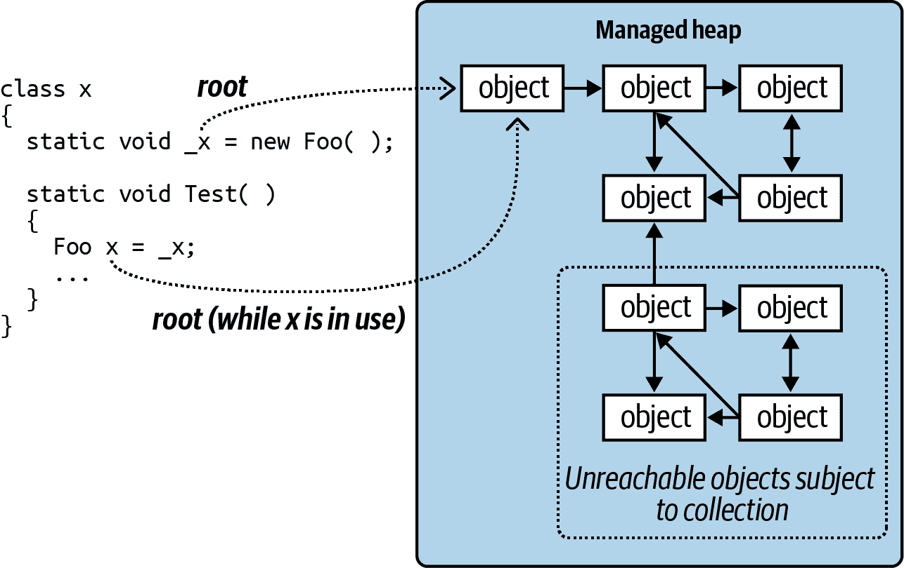
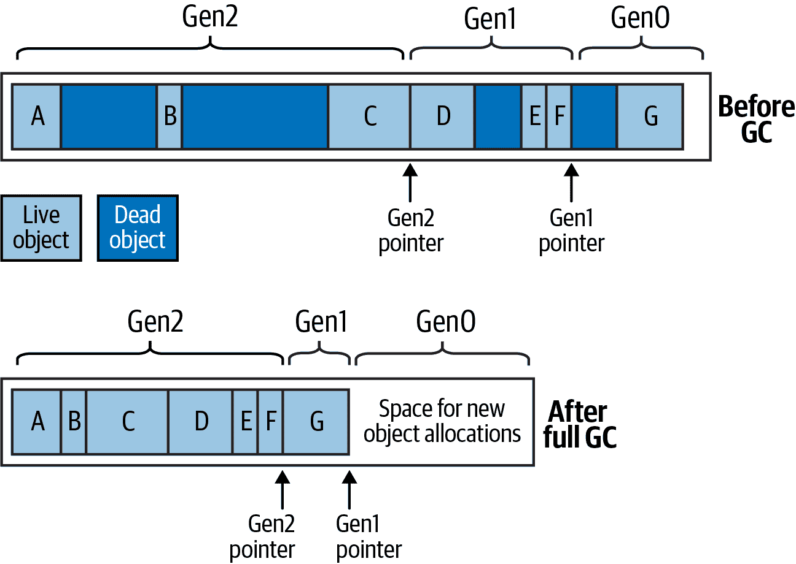

# 第十二章。处理与垃圾回收

一些对象需要显式的撤销代码来释放资源，例如打开的文件、锁、操作系统句柄和非托管对象。在.NET 术语中，这称为 *处理*，通过 `IDisposable` 接口支持。未使用对象占用的托管内存也必须在某个时候被回收；这个功能称为 *垃圾回收*，由 CLR 执行。

处理与垃圾回收的区别在于处理通常是显式启动的；垃圾回收则完全自动化。换句话说，程序员负责释放文件句柄、锁定和操作系统资源，而 CLR 负责释放内存。

本章讨论了处理和垃圾回收，还描述了 C#终结器及其提供处理备用的模式。最后，我们讨论了垃圾收集器的复杂性和其他内存管理选项。

# IDisposable、Dispose 和 Close

.NET 为需要撤销方法的类型定义了一个特殊接口：

```cs
public interface IDisposable
{
  void Dispose();
}
```

C#的 `using` 语句为实现 `IDisposable` 的对象调用 `Dispose` 提供了一种语法快捷方式，使用 `try`/`finally` 块：

```cs
using (FileStream fs = new FileStream ("myFile.txt", FileMode.Open))
{
  // ... Write to the file ...
}
```

编译器将其转换为以下内容：

```cs
FileStream fs = new FileStream ("myFile.txt", FileMode.Open);
try
{
  // ... Write to the file ...
}
finally
{
  if (fs != null) ((IDisposable)fs).Dispose();
}
```

`finally` 块确保在抛出异常或提前退出代码块时仍调用 `Dispose` 方法。

同样，以下语法确保在 `fs` 超出范围时即时处理：

```cs
using FileStream fs = new FileStream ("myFile.txt", FileMode.Open);

// ... Write to the file ...
```

在简单场景中，编写自己的可处理类型只是实现 `IDisposable` 和编写 `Dispose` 方法的问题：

```cs
sealed class Demo : IDisposable
{
  public void Dispose()
  {
    // Perform cleanup / tear-down.
    ...
  }
}
```

###### 注意

这种模式在简单情况下效果很好，并且适用于密封类。在“从终结器中调用 Dispose”中，我们描述了一种更复杂的模式，可以为忘记调用 `Dispose` 的消费者提供备用。对于未密封的类型，有理由从一开始就遵循后一种模式 —— 否则，如果子类型希望添加这样的功能，情况会变得非常混乱。

## 标准处理语义

.NET 遵循一套事实上的处理逻辑规则。这些规则与.NET 或 C#语言没有任何硬连接；它们的目的是为消费者定义一致的协议。以下是它们：

1.  一旦对象已处理，就无法挽救。它无法重新激活，并且调用其方法或属性（除了 `Dispose` ）会抛出 `ObjectDisposedException`。

1.  反复调用对象的 `Dispose` 方法不会导致错误。

1.  如果一次性对象 *x* “拥有”一次性对象 *y*，则 *x* 的 `Dispose` 方法会自动调用 *y* 的 `Dispose` 方法 —— 除非另有指示。

在编写自己的类型时，这些规则也很有帮助，尽管它们不是强制性的。除了可能会因此而受到同事的反对外，没有什么可以阻止您编写“取消处理”方法！

根据第三条规则，容器对象会自动处理其子对象的释放。一个很好的例子是 Windows Forms 的容器控件，比如`Form`或`Panel`。容器可以承载许多子控件，但你不需要显式地释放每一个；关闭或释放父控件或窗体会照顾好所有的子控件。另一个例子是当你用`DeflateStream`包装一个`FileStream`时。释放`DeflateStream`也会释放`FileStream`——除非你在构造函数中另有指示。

### 关闭和停止

一些类型额外定义了一个叫做`Close`的方法，除了`Dispose`。.NET BCL 在`Close`方法的语义上并不完全一致，尽管在几乎所有情况下，它要么是以下两者之一：

+   功能上与`Dispose`相同

+   `Dispose`的一个功能 *子集*

后者的一个例子是`IDbConnection`：一个`Closed`的连接可以重新*打开*；一个`Dispose`的连接不能。另一个例子是使用`ShowDialog`激活的 Windows `Form`：`Close`隐藏它；`Dispose`释放其资源。

一些类定义了一个`Stop`方法（例如`Timer`或`HttpListener`）。`Stop`方法可能释放非托管资源，像`Dispose`一样，但与`Dispose`不同的是，它允许重新*启动*。

## 何时进行释放

在几乎所有情况下，一个安全的规则是“有疑问就释放”。封装了非托管资源句柄的对象几乎总是需要释放才能释放该句柄。例如文件或网络流、网络套接字、Windows Forms 控件、GDI+的笔、画刷和位图。相反，如果一个类型是可释放的，它通常（但并不总是）会直接或间接地引用一个非托管句柄。这是因为非托管句柄为对象可以在未正确释放时在外部“世界”（如 OS 资源、网络连接和数据库锁）造成麻烦提供了入口。

然而，有三种*情况*不释放：

+   当你不“拥有”该对象时——例如通过静态字段或属性获取*共享*对象时

+   当对象的`Dispose`方法执行了你不想要的操作时

+   当对象的`Dispose`方法在设计上是不必要的*时*，并且释放该对象会给你的程序增加复杂性时

第一类别很少见。主要情况出现在`System.Drawing`命名空间中：通过*静态字段或属性*获取的 GDI+对象（例如`Brushes.Blue`）绝不能被释放，因为同一个实例在应用程序的整个生命周期内都在使用。然而通过构造函数获取的实例（例如`new SolidBrush`）*应该*被释放，像通过静态*方法*获取的实例（例如`Font.FromHdc`）也应该被释放。

第二类别更为常见。在`System.IO`和`System.Data`命名空间中有一些很好的例子：

| 类型 | 处置函数 | 何时不释放 |
| --- | --- | --- |
| `MemoryStream` | 防止进一步的 I/O | 当你以后需要读写流时 |
| `StreamReader`, `StreamWriter` | 刷新读取器/写入器并关闭底层流 | 当你想保持底层流打开时（然后在完成后必须调用 `Flush` 在 `StreamWriter` 上） |
| `IDbConnection` | 释放数据库连接并清除连接字符串 | 如果需要重新`Open`它，应该调用 `Close` 而不是 `Dispose` |
| `DbContext`（EF Core） | 防止进一步使用 | 当可能有延迟评估查询连接到该上下文时 |

`MemoryStream` 的 `Dispose` 方法只禁用对象本身；它不执行任何关键的清理，因为 `MemoryStream` 不持有未托管的句柄或其他类似资源。

第三类包括诸如 `StringReader` 和 `StringWriter` 的类。这些类型是在其基类的压力下而不是通过真正需要执行基本清理时才能释放的。如果您恰好在一个方法中实例化和使用这样的对象，将其包装在 `using` 块中几乎没有什么不便。但是如果对象的寿命较长，跟踪其何时不再使用以便及时处置会增加不必要的复杂性。在这种情况下，可以简单地忽略对象的处置。

###### 注意

忽略处理有时会导致性能成本（见“从终结器调用 Dispose”）。

## 清除处置中的字段

通常情况下，您不需要在对象的 `Dispose` 方法中清除对象的字段。然而，从对象在其生命周期内内部订阅的事件中取消订阅是一种良好的实践（例如，请参阅“托管内存泄漏”）。取消订阅这些事件可以防止接收到不需要的事件通知，并防止在垃圾回收器（GC）眼中无意中保持对象活动。

###### 注意

`Dispose` 方法本身不会释放（托管）内存 —— 这只能通过垃圾回收（GC）来实现。

还值得一提的是，设置一个字段来指示对象已处置是很有必要的，这样如果消费者后来试图调用对象的成员，就可以抛出 `ObjectDisposedException`。一个好的模式是使用一个公共可读的自动属性来实现这一点：

```cs
public bool IsDisposed { get; private set; }
```

尽管在技术上不是必需的，但在 `Dispose` 方法中清除对象自身的事件处理程序（将它们设置为 `null`）也是一个好习惯。这样做可以消除在或之后事件触发的可能性。

偶尔，一个对象可能包含高价值的秘密，比如加密密钥。在这些情况下，在处理期间清除这些字段数据是有意义的（以避免当内存稍后释放到操作系统时，其他进程在机器上可能发现这些数据）。`System​.Secu⁠rity.Cryptography` 中的 `SymmetricAlgorithm` 类正是通过在保存加密密钥的字节数组上调用 `Array.Clear` 来做到这一点。

## 匿名处理

有时，实现`IDisposable`是有用的，而不必编写一个类。例如，假设您希望在一个类上公开暂停和恢复事件处理的方法：

```cs
class Foo
{
  int _suspendCount;

  public void SuspendEvents() => _suspendCount++;           
  public void ResumeEvents() => _suspendCount--;            

  void FireSomeEvent()
  {
    if (_suspendCount == 0)
      ... fire some event ...
  }
  ...
}
```

这样的 API 使用起来很笨拙。消费者必须记住调用`ResumeEvents`。并且为了健壮性，他们必须在`finally`块中执行此操作（以防抛出异常）：

```cs
var foo = new Foo();
foo.SuspendEvents();
try
{
  ... do stuff ...      // Because an exception could be thrown here
}
finally
{
  foo.ResumeEvents();   // ...we must call this in a finally block
}
```

更好的模式是放弃`ResumeEvents`，而是让`SuspendEvents`返回一个`IDisposable`。消费者可以这样做：

```cs
using (foo.SuspendEvents())
{
  ... do stuff ...
}
```

这个问题是，这会将工作推给需要实现`Suspend​Events`方法的人。即使努力减少空白字符，我们最终还是会有额外的混乱：

```cs
public IDisposable SuspendEvents()
{
  _suspendCount++;
  return new SuspendToken (this);
}

class SuspendToken : IDisposable 
{
  Foo _foo;          
  public SuspendToken (Foo foo) => _foo = foo;
  public void Dispose()
  {
    if (_foo != null) _foo._suspendCount--;
    _foo = null;  // Prevent against consumer disposing twice
  }
}
```

*匿名释放*模式解决了这个问题。使用以下可重用类：

```cs
public class Disposable : IDisposable
{
  public static Disposable Create (Action onDispose)
    => new Disposable (onDispose);

  Action _onDispose;
  Disposable (Action onDispose) => _onDispose = onDispose;

  public void Dispose()
  {
    _onDispose?.Invoke();   // Execute disposal action if non-null.
    _onDispose = null;      // Ensure it can’t execute a second time.
  }
}
```

我们可以将我们的`SuspendEvents`方法简化为以下内容：

```cs
public IDisposable SuspendEvents()
{
  _suspendCount++;
  return Disposable.Create (() => _suspendCount--);
}  
```

# 自动垃圾收集

无论一个对象是否需要一个`Dispose`方法来进行自定义的拆卸逻辑，其在堆上占用的内存在某个时刻都必须被释放。CLR 完全自动地通过自动 GC 处理这一方面。您不需要自己释放托管内存。例如，考虑以下方法：

```cs
public void Test()
{
  byte[] myArray = new byte[1000];
  ...
}
```

当`Test`执行时，会在内存堆上分配一个用于容纳 1000 字节的数组。该数组由存储在本地变量堆栈上的变量`myArray`引用。当方法退出时，此局部变量`myArray`超出作用域，意味着没有任何东西引用内存堆上的数组。然后，孤立的数组变得符合垃圾收集的条件。

###### 注意

在调试模式下，关闭优化时，局部变量引用的对象的生命周期会延长到代码块的末尾，以便于调试。否则，在对象不再使用时，它会尽早成为可收集的对象。

对象孤立后，并不会立即进行垃圾收集。就像街上的垃圾收集一样，它是周期性进行的，尽管（不像街上的垃圾收集）没有固定的时间表。CLR 基于多种因素来决定何时进行收集，例如可用内存、内存分配量以及上次收集后的时间（GC 自动调整以优化应用程序特定的内存访问模式）。这意味着对象孤立和从内存中释放之间存在不确定的延迟。这种延迟可以从纳秒到几天不等。

###### 注意

GC 并不会在每次收集时收集所有垃圾。相反，内存管理器将对象分为*代*，并且 GC 更频繁地收集新代（最近分配的对象），而不是老代（长期存在的对象）。我们将在“GC 工作原理”中详细讨论这个问题。

## 根

*根*是使对象保持活动的东西。如果一个对象不被直接或间接地根引用，它将符合垃圾收集的条件。

根是以下之一：

+   在执行方法中的局部变量或参数（或者在其调用堆栈中的任何方法）

+   静态变量

+   放在存储准备终结对象的队列上的对象（请参阅下一节）

已删除对象不可能执行代码，因此如果有任何实例方法可能执行，它的对象必须以某种方式通过引用。

请注意，循环引用的一组对象如果没有根引用（参见图 12-1），被视为已死亡。换句话说，无法通过从根对象跟随箭头（引用）访问的对象是*不可达*的，因此可能会被收集。



###### 图 12-1\. Roots

# Finalizer

在释放对象之前，如果对象有 finalizer，则会运行它。Finalizer 的声明类似于构造函数，但前面加上 `˜` 符号：

```cs
class Test
{
  ˜Test()
  {
    // Finalizer logic...
  }
}
```

（尽管在声明上与构造函数相似，finalizer 不能声明为公共或静态，不能有参数，并且不能调用基类。）

Finalizer 可能存在是因为垃圾回收工作在不同阶段。首先，GC 会识别出可以删除的未使用对象。那些没有 finalizer 的对象会立即删除。那些有待（未运行）finalizer 的对象会被保持活跃（暂时），并放入特殊队列中。

在那一刻，垃圾收集完成，你的程序继续执行。然后*finalizer 线程*开始并行运行，从特殊队列中拿出对象并运行它们的 finalization 方法。在每个对象的 finalizer 运行之前，它仍然是非常活跃的——那个队列充当了一个根对象。当它被出队并执行了 finalizer 后，该对象变成了孤儿，并将在下次收集（针对该对象的*代*）中被删除。

Finalizer 可能很有用，但有一些注意事项：

+   Finalizer 会减慢内存的分配和回收（GC 需要跟踪哪些 finalizer 已经运行）。

+   Finalizer 会延长对象及其*引用*对象的生命周期（它们都必须等待下一次垃圾收集以进行实际删除）。

+   不可能预测一组对象的 finalizer 将以何种顺序被调用。

+   对于对象的 finalizer 何时被调用，你的控制能力有限。

+   如果 finalizer 中的代码阻塞，其他对象将无法被终结。

+   如果应用程序无法干净卸载，可以完全避开 finalizer。

总之，finalizer 类似于律师——虽然有些情况确实需要它们，但通常情况下你不希望使用它们，除非绝对必要。如果你确实要使用它们，你需要百分之百地理解它们为你做了什么。

这里有一些实现 finalizer 的指导原则：

+   确保你的 finalizer 快速执行。

+   不要在你的 finalizer 中阻塞（参见“阻塞”）。

+   不要引用其他可终结的对象。

+   不要抛出异常。

###### 注意

即使在构造函数期间抛出异常，CLR 也可以调用对象的终结器。因此，在编写终结器时，不要假设字段已经正确初始化。

## 从终结器中调用 Dispose

一个常见的模式是在终结器中调用 `Dispose`。当清理不紧急并且通过调用 `Dispose` 加快清理过程更多是一种优化而不是必要时，这是有道理的。

###### 注意

请记住，使用此模式将内存释放与资源释放耦合在一起 —— 这两者可能有潜在的分歧（除非资源本身是内存）。同时也增加了终结线程的负担。

这种模式也作为一种备份用例存在，用于消费者简单地忘记调用 `Dispose` 的情况。但在这种情况下，最好记录失败，以便修复该错误。

实现这一点的标准模式如下所示：

```cs
class Test : IDisposable
{
  public void Dispose()             // NOT virtual
  {
    Dispose (true);
    GC.SuppressFinalize (this);     // Prevent finalizer from running.
  }

  protected virtual void Dispose (bool disposing)
  {
    if (disposing)
    {
      // Call Dispose() on other objects owned by this instance.
      // You can reference other finalizable objects here.
      // ...
    }

    // Release unmanaged resources owned by (just) this object.
    // ...
  }

  ~Test() => Dispose (false);
}
```

`Dispose` 方法被重载以接受 `bool disposing` 标志。无参数版本未声明为 `virtual`，并且简单地调用带有 `true` 参数的增强版本。

增强版本包含实际的处理逻辑，并且是 `protected` 和 `virtual` 的；这为子类添加其自己的处理逻辑提供了一个安全点。`disposing` 标志意味着它从 `Dispose` 方法中被“适当地”调用，而不是从终结器的“最后手段模式”中调用。其思想是，当以 `disposing` 设置为 `false` 调用时，该方法通常不应引用其他具有终结器的对象（因为这些对象可能已被终结，因此处于不可预测的状态）。这排除了很多情况！以下是 `Dispose` 方法在最后手段模式下仍然可以执行的几个任务：

+   释放所有 *直接引用* 的操作系统资源（可能通过调用 Win32 API 的 P/Invoke 调用获取）

+   删除在构造过程中创建的临时文件

为了使其更加健壮，任何可能抛出异常的代码都应包装在 `try`/`catch` 块中，并最好记录异常。任何日志记录应尽可能简单和健壮。

注意，在无参数的 `Dispose` 方法中调用了 `GC.SuppressFinalize` —— 这可以阻止垃圾回收稍后运行终结器。从技术上讲，这是不必要的，因为 `Dispose` 方法必须能够容忍重复调用。然而，这样做可以提高性能，因为它允许对象（及其引用的对象）在单个周期内被垃圾回收。

## 复活

假设一个终结器修改一个存活对象，使其引用回即将死亡的对象。当下次垃圾回收发生时（针对对象的代），CLR 将不再将先前的即将死亡对象视为孤立的 —— 因此它将逃避垃圾回收。这是一个高级场景，称为 *复活*。

举例说明，假设我们想编写一个管理临时文件的类。当该类的实例被垃圾收集时，我们希望终结器删除临时文件。听起来很容易：

```cs
public class TempFileRef
{
  public readonly string FilePath;
  public TempFileRef (string filePath) { FilePath = filePath; }

  ~TempFileRef() { File.Delete (FilePath); }
}
```

不幸的是，这里有一个 bug：`File.Delete`可能会抛出异常（例如，由于缺少权限，文件正在使用或已经被删除）。这样的异常会导致整个应用程序崩溃（并阻止其他终结器运行）。我们可以简单地通过空的 catch 块“吞噬”异常，但这样我们就不会知道出了什么问题。调用某些复杂的错误报告 API 也不可取，因为它会负担终结器线程，从而阻碍其他对象的垃圾收集。我们希望将最终化操作限制为简单、可靠和快速的操作。

更好的选择是将失败记录到静态集合中，如下所示：

```cs
public class TempFileRef
{
  static internal readonly ConcurrentQueue<TempFileRef> FailedDeletions
    = new ConcurrentQueue<TempFileRef>();

  public readonly string FilePath;
  public Exception DeletionError { get; private set; }

  public TempFileRef (string filePath) { FilePath = filePath; }

  ~TempFileRef()
  {
    try { File.Delete (FilePath); }
    catch (Exception ex)
    {
      DeletionError = ex;
      FailedDeletions.Enqueue (this);   // Resurrection
    }
  }
}
```

将对象加入静态`FailedDeletions`集合可以为对象再次提供一个引用，确保对象直到最终出列之前一直存活。

###### 注意

`ConcurrentQueue<T>`是`Queue<T>`的线程安全版本，并且定义在`System.Collections.Concurrent`中（参见第二十二章）。使用线程安全集合有几个原因。首先，CLR 保留在多个线程并行执行终结器的权利。这意味着当访问共享状态（如静态集合）时，我们必须考虑同时终结两个对象的可能性。其次，我们迟早要从`FailedDeletions`中出列项目，以便我们可以采取措施处理它们。这也必须以线程安全的方式进行，因为它可能在终结器同时将另一个对象入队时发生。

### GC.ReRegisterForFinalize

复活对象的终结器将不会第二次运行，除非您调用`GC.ReRegisterForFinalize`。

在下面的示例中，我们尝试在终结器中删除临时文件（与最后一个示例中一样）。但是，如果删除失败，我们会重新注册对象，以便在下次垃圾收集时再次尝试：

```cs
public class TempFileRef
{
  public readonly string FilePath;
  int _deleteAttempt;

  public TempFileRef (string filePath) { FilePath = filePath; }

  ~TempFileRef()
  {
    try { File.Delete (FilePath); }
    catch
    {
      if (_deleteAttempt++ < 3) GC.ReRegisterForFinalize (this);
    }
  }
}
```

第三次失败尝试后，我们的终结器将悄然放弃删除文件的尝试。我们可以通过将其与前面的示例结合起来来增强这一点，换句话说，在第三次失败后将其添加到`FailedDeletions`队列中。

###### 警告

要小心在终结器方法中仅调用`ReRegisterForFinalize`一次。如果调用两次，对象将重新注册两次，并且将必须进行两次终结！

# GC 的工作原理

标准 CLR 使用一种分代标记-压缩的 GC，为存储在托管堆上的对象执行自动内存管理。GC 被认为是一种*跟踪* GC，因为它不会干扰对对象的每次访问，而是间歇性地唤醒并跟踪存储在托管堆上的对象图，以确定哪些对象可以被视为垃圾，因此可以被收集。

GC 在执行内存分配（通过 `new` 关键字）时启动垃圾收集，可能在分配了一定内存阈值后或其他时间以减少应用程序的内存占用。还可以通过调用 `System.GC.Collect` 方法手动启动此过程。在垃圾收集期间，所有线程都可以被冻结（更多信息见下一节）。

GC 从其根对象引用开始，并遍历对象图，标记所有接触到的对象为可达对象。当此过程完成时，所有未标记的对象被视为未使用的对象，并且可以进行垃圾收集。

没有 finalizer 的未使用对象会立即丢弃；带有 finalizer 的未使用对象会在 GC 完成后被加入到最终器线程的处理队列中。然后，这些对象在下一个 GC 中成为其代的可收集对象（除非被复活）。

剩余的“存活”对象然后被移动到堆的开始处（压缩），为更多对象释放空间。这种压缩有两个目的：防止内存碎片化，并允许 GC 在分配新对象时采用非常简单的策略，即始终在堆的末尾分配内存。这避免了维护空闲内存段列表可能耗时的任务。

如果在垃圾收集后没有足够的空间来分配新对象的内存，并且操作系统无法再分配更多内存，则会抛出 `OutOfMemoryException` 异常。

###### 注意

您可以通过调用 `GC.GetGCMemoryInfo()` 获取有关托管堆当前状态的信息。从 .NET 5 开始，此方法已增强以返回与性能相关的数据。

## 优化技术

GC 结合了各种优化技术来减少垃圾收集时间。

### 分代收集

最重要的优化是 GC 是分代的。这利用了这样一个事实，即虽然许多对象被快速分配和丢弃，但某些对象具有长寿命，因此不需要在每次收集期间进行跟踪。

基本上，GC 将托管堆分为三代。刚刚分配的对象位于 *Gen0*，经过一次收集周期后存活的对象位于 *Gen1*；所有其他对象位于 *Gen2*。Gen0 和 Gen1 被称为*短暂*（短寿）代。

CLR 将 Gen0 部分保持相对较小（典型大小为几百 KB 到几 MB）。当 Gen0 部分填满时，GC 会发起 Gen0 集合—这种情况相对频繁发生。GC 对 Gen1 也应用类似的内存阈值（作为 Gen2 的缓冲区），因此 Gen1 集合也相对快速和频繁。然而，包括 Gen2 的完整集合需要更长时间，因此不经常发生。图 12-2 显示了完整集合的效果。



###### 图 12-2\. 堆代

给出一些非常粗略的估算，Gen0 集合可能不到 1 毫秒，这在典型应用程序中不足以被注意到。然而，对于具有大对象图的程序，完整集合可能需要长达 100 毫秒。这些数字取决于许多因素，因此可能会有很大变化—尤其是对于大小不受限制（与 Gen0 和 Gen1 不同）的 Gen2 而言。

要点是，短寿命对象在 GC 的使用效率方面非常高。在以下方法中创建的`StringBuilder`几乎可以肯定会在快速的 Gen0 集合中被回收：

```cs
string Foo()
{
  var sb1 = new StringBuilder ("test");
  sb1.Append ("...");
  var sb2 = new StringBuilder ("test");
  sb2.Append (sb1.ToString());
  return sb2.ToString();
}
```

### 大对象堆

GC 使用称为*大对象堆*（LOH）的单独堆来存储大于某个阈值（目前为 85,000 字节）的对象。这可以避免大对象的压缩成本，并防止过多的 Gen0 集合—没有 LOH 的话，分配一系列 16 MB 对象可能会在每次分配后触发 Gen0 集合。

默认情况下，LOH 不会经过压缩，因为在垃圾收集期间移动大内存块将是极其昂贵的。这有两个后果：

+   分配可能会更慢，因为 GC 不能总是简单地在堆的末尾分配对象—它还必须在中间寻找间隙，这需要维护一个空闲内存块的链表。¹

+   LOH 会受到*碎片化*的影响。这意味着释放对象可能会在 LOH 中留下一个难以填补的空洞。例如，由 86,000 字节对象留下的空洞只能通过 85,000 字节到 86,000 字节之间的对象填补（除非与另一个空洞相邻）。

如果您预计会出现碎片问题，可以指示 GC 在下次收集时压缩 LOH，方法如下：

```cs
GCSettings.LargeObjectHeapCompactionMode =
  GCLargeObjectHeapCompactionMode.CompactOnce;
```

如果您的程序频繁分配大数组，另一个解决方法是使用.NET 的数组池 API（参见“数组池”）。

LOH 也是非代数的：所有对象都被视为 Gen2。

### 工作站与服务器集合

.NET 提供了两种垃圾收集模式：*工作站*和*服务器*。*工作站*是默认值；您可以通过在应用程序的*.csproj*文件中添加以下内容来切换到*服务器*：

```cs
<PropertyGroup>
  <ServerGarbageCollection>true</ServerGarbageCollection>
</PropertyGroup>
```

在构建项目时，这些设置会被写入应用程序的*.runtime​con⁠fig.json*文件中，CLR 会从中读取：

```cs
  "runtimeOptions": {
    "configProperties": {
      "System.GC.Server": true
    ...
```

启用服务器收集后，CLR 为每个核分配单独的堆和 GC。这加速了收集过程，但消耗了额外的内存和 CPU 资源（因为每个核需要自己的线程）。如果机器上运行了许多其他启用了服务器收集的进程，这可能导致 CPU 过度订阅，特别是在工作站上，这会使整个操作系统感觉不响应。

服务器收集仅在多核系统上可用：在单核设备（或单核虚拟机）上，该设置将被忽略。

### 后台收集

在工作站模式和服务器模式中，CLR 默认启用*后台收集*。您可以通过将以下内容添加到应用程序的*.csproj*文件中来禁用它：

```cs
<PropertyGroup>
  <ConcurrentGarbageCollection>false</ConcurrentGarbageCollection>
</PropertyGroup>
```

在构建时，此设置被写入应用程序的*.runtimeconfig.json*文件：

```cs
  "runtimeOptions": {
    "configProperties": {
      "System.GC.Concurrent": false,
   ...
```

GC 必须在收集期间冻结（阻塞）执行线程。后台收集减少了这些延迟期间的时间，使您的应用程序更具响应性。但这是以稍微增加 CPU 和内存消耗为代价的。因此，通过禁用后台收集，您可以实现以下效果：

+   稍微减少 CPU 和内存使用

+   增加垃圾收集发生时的暂停（或*延迟*）

背景收集通过允许应用程序代码与 Gen2 收集并行运行来工作。（Gen0 和 Gen1 收集被认为足够快速，不会从这种并行性中受益。）

背景收集是以前称为*并发收集*的改进版本：它消除了并发收集的限制，即如果 Gen0 区段在 Gen2 收集运行时填满，那么并发收集将停止并发。这使得持续分配内存的应用程序能够更具响应性。

### GC 通知

如果禁用后台收集，您可以要求 GC 在进行全（阻塞）收集之前通知您。这适用于服务器农场配置：其想法是您在收集发生之前将请求重定向到另一台服务器。然后立即启动收集并等待其完成，然后再将请求重新路由回该服务器。

要启动通知，请调用`GC.RegisterForFullGCNotification`。然后，启动另一个线程（参见第十四章），首先调用`GC.WaitForFullGCApproach`。当此方法返回指示接近收集的`GCNotificationStatus`时，您可以将请求重新路由到其他服务器并强制手动收集（参见下一节）。然后调用`GC.WaitForFullGCComplete`：当此方法返回时，收集完成，您可以再次接受请求。然后重复整个周期。

## 强制垃圾收集

您可以随时通过调用`GC.Collect`手动强制进行垃圾收集。调用`GC.Collect`而不带参数会启动完整收集。如果传递一个整数值，只会收集到该值的代数，因此`GC.Collect(0)`仅执行快速的 Gen0 收集。

通常情况下，通过允许 GC 自行决定何时收集来获得最佳性能：强制收集可能会通过不必要地将 Gen0 对象提升为 Gen1（以及 Gen1 对象提升为 Gen2）来损害性能。它还可能会扰乱 GC 的*自我调整*能力，即 GC 在应用程序执行时动态调整每代的阈值以最大化性能。

然而，也存在例外情况。干预最常见的情况是应用程序暂时休眠：一个很好的例子是执行每日活动的 Windows 服务（例如检查更新）。这样的应用程序可能会使用`System.Timers.Timer`每 24 小时启动一次活动。完成活动后，接下来的 24 小时内不会执行进一步的代码，这意味着在此期间不会进行内存分配，因此垃圾回收器无法激活。服务在执行其活动时消耗的内存将继续在接下来的 24 小时内保持不变——即使对象图为空！解决方法是在每日活动完成后立即调用`GC.Collect`。

为确保收集那些由于终结器延迟而延迟收集的对象，请额外调用`WaitForPendingFinalizers`并重新收集：

```cs
GC.Collect();
GC.WaitForPendingFinalizers();
GC.Collect();
```

通常情况下，这是通过循环完成的：运行终结器的操作可能会释放更多本身具有终结器的对象。

调用`GC.Collect`的另一个情况是测试具有终结器的类时。

## 在运行时调整垃圾回收

静态`GCSettings.LatencyMode`属性确定 GC 如何在延迟和整体效率之间进行平衡。将其从默认值`Interactive`更改为`LowLatency`或`SustainedLowLatency`指示 CLR 偏向更快（但更频繁）的收集。如果您的应用程序需要对实时事件非常快速响应，则这是有用的。将模式更改为`Batch`以牺牲响应速度最大化吞吐量，这对于批处理处理非常有用。

如果在*.runtimeconfig.json*文件中禁用后台收集，则不支持`SustainedLowLatency`。

您还可以通过调用`GC.TryStartNoGCRegion`暂时暂停垃圾收集器，并通过`GC.EndNoGCRegion`恢复。

## 内存压力

运行时根据多种因素（包括机器上的总内存负载）决定何时启动集合。如果您的程序分配了非托管内存（第二十四章），运行时将对其内存使用有一个不切实际的乐观看法，因为 CLR 仅了解托管内存。您可以通过调用`GC.AddMemory​Pres⁠sure`指示 CLR*假设*分配了指定数量的非托管内存来缓解这一问题。在释放非托管内存时，调用`GC.Remove​Memor⁠yPressure`以撤消此操作。

## 数组池

如果您的应用程序频繁实例化数组，您可以通过*数组池*避免大部分垃圾收集开销。数组池在.NET Core 3 中引入，通过“租用”一个数组，然后将其返回到池中以供重复使用。

要分配一个数组，请在`System​.Buf⁠fers`命名空间中的`ArrayPool`类上调用`Rent`方法，指定您想要的数组大小：

```cs
int[] pooledArray = ArrayPool<int>.Shared.Rent (100);  // 100 bytes
```

这将从全局共享数组池中分配至少 100 字节的数组。池管理器可能会提供一个比您请求的更大的数组（通常以 2 的幂分配）。

当您完成数组的使用后，请调用`Return`：这将释放数组到池中，允许再次租用同一数组：

```cs
ArrayPool<int>.Shared.Return (pooledArray);
```

您可以选择传递一个布尔值，指示池管理器在将数组返回给池之前清除数组。

###### 警告

数组池的一个限制是，在将数组返回后，没有任何机制阻止您继续（非法）使用数组，因此需要小心编码以避免此情况。请记住，您不仅有可能破坏自己的代码，还有可能破坏使用数组池的其他 API，例如 ASP.NET Core。

与使用共享数组池不同，您可以创建一个自定义池并从中租用。这样可以避免破坏其他 API 的风险，但会增加总体内存使用量（因为减少了重用的机会）：

```cs
var myPool = ArrayPool<int>.Create();
int[] array = myPool.Rent (100);
...
```

# 托管内存泄漏

在像 C++这样的非托管语言中，当对象不再需要时，必须记住手动释放内存；否则将导致*内存泄漏*。在托管世界中，由于 CLR 的自动垃圾回收系统，这种错误是不可能发生的。

尽管如此，大型和复杂的.NET 应用程序可能会展示出同样综合症的较轻形式，结果也相同：应用程序在其生命周期内消耗越来越多的内存，直到最终必须重新启动。好消息是，托管内存泄漏通常更容易诊断和预防。

未管理的内存泄漏是由于未使用的对象通过未使用或遗忘的引用仍然存活造成的。常见的候选对象是事件处理程序——除非目标是静态方法，否则这些处理程序将持有对目标对象的引用。例如，考虑以下类：

```cs
class Host
{
  public event EventHandler Click;
}

class Client
{
  Host _host;
  public Client (Host host)
  {
    _host = host;
    _host.Click += HostClicked;
  }

  void HostClicked (object sender, EventArgs e) { ... }
}
```

下面的测试类包含一个实例化 1,000 个客户端的方法：

```cs
class Test
{
  static Host _host = new Host();

  public static void CreateClients()
  {
    Client[] clients = Enumerable.Range (0, 1000)
     .Select (i => new Client (_host))
     .ToArray();

    // Do something with clients ... 
  }
}
```

你可能期望在 `CreateClients` 执行完毕后，这 1000 个 `Client` 对象将变得可以收集。不幸的是，每个客户端还有另一个引用者： `_host` 对象，其 `Click` 事件现在引用每个 `Client` 实例。如果 `Click` 事件不触发，或者 `HostClicked` 方法没有做任何吸引注意力的事情，这可能不会被注意到。

解决方法之一是让 `Client` 实现 `IDisposable` 并在 `Dispose` 方法中取消事件处理程序的挂钩：

```cs
public void Dispose() { _host.Click -= HostClicked; }
```

当 `Client` 的消费者使用完实例后进行处理：

```cs
Array.ForEach (clients, c => c.Dispose());
```

###### 注意

在 “弱引用” 中，我们描述了另一种解决这个问题的方法，这在不倾向于使用一次性对象的环境中可能很有用（例如 Windows Presentation Foundation [WPF]）。事实上，WPF 提供了一个名为 `WeakEventManager` 的类，使用一种利用弱引用的模式。

## 定时器

遗忘的定时器也会导致内存泄漏（我们在 第二十一章 中讨论定时器）。这取决于定时器的类型，有两种不同的场景。首先看看 `System.Timers` 命名空间中的定时器。在以下示例中，当实例化 `Foo` 类时，它每秒调用一次 `tmr_Elapsed` 方法：

```cs
using System.Timers;

class Foo
{
  Timer _timer;

  Foo() 
  {
    _timer = new System.Timers.Timer { Interval = 1000 };
    _timer.Elapsed += tmr_Elapsed;
    _timer.Start();
  }

  void tmr_Elapsed (object sender, ElapsedEventArgs e) { ... }
}
```

不幸的是，`Foo` 的实例永远无法进行垃圾回收！问题在于运行时本身保持对活动定时器的引用，以便触发它们的 `Elapsed` 事件；因此：

+   运行时将保持 `_timer` 的活动状态。

+   通过 `tmr_Elapsed` 事件处理程序，`_timer` 将保持 `Foo` 实例的活动状态。

当你意识到 `Timer` 实现了 `IDisposable` 时，解决方案就显而易见了。释放定时器将停止它，并确保运行时不再引用该对象：

```cs
class Foo : IDisposable
{
  ...
  public void Dispose() { _timer.Dispose(); }
}
```

###### 注意

一个良好的准则是，如果类中的任何字段分配了实现 `IDisposable` 的对象，则自己实现 `IDisposable`。

关于刚才讨论的内容，WPF 和 Windows Forms 的定时器行为方式相同。

然而，位于 `System.Threading` 命名空间中的定时器是特殊的。.NET 不会保持对活动线程定时器的引用；相反，它直接引用回调委托。这意味着如果你忘记释放线程定时器，将会触发一个终结器，自动停止和释放定时器：

```cs
static void Main()
{
  var tmr = new System.Threading.Timer (TimerTick, null, 1000, 1000);
  GC.Collect();
  System.Threading.Thread.Sleep (10000);    // Wait 10 seconds 
}

static void TimerTick (object notUsed) { Console.WriteLine ("tick"); }
```

如果此示例在“发布”模式下编译（禁用调试并启用优化），则定时器将在其有机会触发一次之前被收集和完成！同样，我们可以在使用完定时器后通过释放来修复这个问题：

```cs
using (var tmr = new System.Threading.Timer (TimerTick, null, 1000, 1000))
{
  GC.Collect();
  System.Threading.Thread.Sleep (10000);    // Wait 10 seconds 
}
```

在 `using` 块结束时隐式调用 `tmr.Dispose` 确保 `tmr` 变量在块结束之前被“使用”，因此 GC 不会将其视为死对象。讽刺的是，这个 `Dispose` 调用实际上使对象的生命周期更长！

## 诊断内存泄漏

避免托管内存泄漏的最简单方法是在编写应用程序时主动监视内存消耗。您可以通过以下方式获取程序对象的当前内存消耗（true 参数告诉 GC 首先执行一次收集）：

```cs
long memoryUsed = GC.GetTotalMemory (true);
```

如果您正在实践测试驱动开发，一个可能的方法是使用单元测试来断言内存如预期地被回收。如果这样的断言失败，您只需要检查最近所做的更改。

如果您已经有一个存在托管内存泄漏的大型应用程序，*windbg.exe*工具可以帮助找到它。还有一些更友好的图形工具，如 Microsoft 的 CLR Profiler、SciTech 的 Memory Profiler 和 Red Gate 的 ANTS Memory Profiler。

CLR 还公开了许多事件计数器来帮助进行资源监视。

# 弱引用

有时，持有一个对 GC“不可见”的对象的引用是有用的，从而使对象保持活动状态。这称为*弱引用*，由`System.WeakReference`类实现。

要使用`WeakReference`，请使用目标对象构造它：

```cs
var sb = new StringBuilder ("this is a test");
var weak = new WeakReference (sb);
Console.WriteLine (weak.Target);     // This is a test
```

如果目标仅由一个或多个弱引用引用，则 GC 将考虑目标对象可用于收集。当目标对象被收集时，`WeakReference`的`Target`属性将为 null：

```cs
var weak = GetWeakRef();
GC.Collect();
Console.WriteLine (weak.Target);   // (nothing)

WeakReference GetWeakRef () => 
  new WeakReference (new StringBuilder ("weak"));
```

为了防止目标在测试其是否为 null 和使用它之间被收集，请将目标分配给局部变量：

```cs
var sb = (StringBuilder) weak.Target;
if (sb != null) { /* Do something with sb */ }
```

当将目标分配给局部变量时，它有一个强根，因此在使用该变量时不能收集它。

以下类使用弱引用来跟踪所有已实例化的`Widget`对象，而不会阻止这些对象被收集：

```cs
class Widget
{
  static List<WeakReference> _allWidgets = new List<WeakReference>();

  public readonly string Name;

  public Widget (string name)
  {
    Name = name;
    _allWidgets.Add (new WeakReference (this));
  }

  public static void ListAllWidgets()
  {
    foreach (WeakReference weak in _allWidgets)
    {
      Widget w = (Widget)weak.Target;
      if (w != null) Console.WriteLine (w.Name);
    }
  }
}
```

在这样的系统中唯一的注意事项是静态列表会随着时间的推移而增长，积累具有空目标的弱引用。因此，您需要实施一些清理策略。

## 弱引用和缓存

`WeakReference`的一个用途是缓存大型对象图。这允许将内存密集型数据短暂缓存，而不会导致过多的内存消耗：

```cs
_weakCache = new WeakReference (...);   // _weakCache is a field
...
var cache = _weakCache.Target;
if (cache == null) { /* Re-create cache & assign it to _weakCache */ }
```

在实践中，这种策略可能只能起到轻微的效果，因为您无法控制垃圾收集器何时触发以及选择收集哪一代。特别是，如果您的缓存仍然在 Gen0 中，它可以在微秒内被收集（请记住，垃圾收集器不仅在内存不足时收集——在正常内存条件下它定期进行收集）。因此，至少，您应该采用两级缓存的方法，即首先使用强引用，随着时间的推移将其转换为弱引用。

## 弱引用和事件

我们之前看到事件如何导致托管内存泄漏。最简单的解决方案是要么避免在这种情况下订阅，要么实现一个`Dispose`方法来取消订阅。弱引用提供了另一种解决方案。

想象一个仅持有其目标弱引用的委托。这样的委托不会保持其目标的生存——除非这些目标有独立的裁判。当然，这并不能防止一个激活的委托击中一个未引用的目标——在目标符合回收条件并且 GC 赶上之前的时间内。为了使这样的解决方案有效，您的代码必须在这种情况下表现稳健。假设情况如此，您可以按以下方式实现*弱委托*类：

```cs
public class WeakDelegate<TDelegate> where TDelegate : Delegate
{
  class MethodTarget
  {
    public readonly WeakReference Reference;
    public readonly MethodInfo Method;

    public MethodTarget (Delegate d)
    {
      // d.Target will be null for static method targets:
      if (d.Target != null) Reference = new WeakReference (d.Target);
      Method = d.Method;
    }
  }

  List<MethodTarget> _targets = new List<MethodTarget>();

  public void Combine (TDelegate target)
  {
    if (target == null) return;

    foreach (Delegate d in (target as Delegate).GetInvocationList())
      _targets.Add (new MethodTarget (d));
  }

  public void Remove (TDelegate target)
  {
    if (target == null) return;
    foreach (Delegate d in (target as Delegate).GetInvocationList())
    {
      MethodTarget mt = _targets.Find (w => 
        Equals (d.Target, w.Reference?.Target) &&
        Equals (d.Method.MethodHandle, w.Method.MethodHandle));

      if (mt != null) _targets.Remove (mt);
    }
  }

  public TDelegate Target
  {
    get
    {
      Delegate combinedTarget = null;

      foreach (MethodTarget mt in _targets.ToArray())
      {
        WeakReference wr = mt.Reference;

        // Static target || alive instance target
        if (wr == null || wr.Target != null)
        {
          var newDelegate = Delegate.CreateDelegate (
            typeof(TDelegate), wr?.Target, mt.Method);
            combinedTarget = Delegate.Combine (combinedTarget, newDelegate);
        }
        else
          _targets.Remove (mt);
      }

      return combinedTarget as TDelegate;
    }
    set
    {
      _targets.Clear();
      Combine (value);
    }
  }
}
```

在`Combine`和`Remove`方法中，我们通过`as`运算符而不是更常见的强制类型转换，执行从`target`到`Delegate`的引用转换。这是因为 C#不允许在这种类型的参数上使用强制类型转换操作符——由于*自定义转换*和*引用转换*之间可能存在的歧义。

然后我们调用`GetInvocationList`，因为这些方法可能会使用多播委托——即具有多个方法接收者的委托。

在`Target`属性中，我们构建了一个组合所有由活动目标的弱引用引用的委托的多播委托，从列表中移除剩余的（死亡的）引用，以防止`_targets`列表无限增长。（我们可以通过在`Combine`方法中执行相同操作来改进我们的类；另一个改进是为了线程安全添加锁 参见[“锁和线程安全”]。）我们还允许没有任何弱引用的委托；这些代表其目标为静态方法的委托。

下面说明了如何在实现事件时消费此委托：

```cs
public class Foo
{
  WeakDelegate<EventHandler> _click = new WeakDelegate<EventHandler>();

  public event EventHandler Click
  {
    add { _click.Combine (value); } remove { _click.Remove (value); }
  }

  protected virtual void OnClick (EventArgs e)
    => _click.Target?.Invoke (this, e);
}
```

¹ 在分代堆中由于固定（参见“fixed 语句”]），同样的情况有时也会发生。
