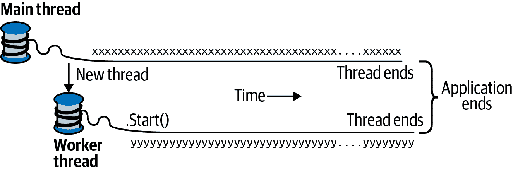

# 第十四章：并发性和异步性

大多数应用程序需要同时处理多个事物（*并发*）。在本章中，我们首先介绍必要的先决条件，即线程和任务的基础知识，然后详细描述了异步性原理和 C#的异步函数。

在第二十一章中，我们会更详细地讨论多线程，并在第二十二章中介绍相关的并行编程主题。

# 介绍

以下是最常见的并发场景：

编写响应式用户界面

在 Windows Presentation Foundation（WPF）、移动和 Windows Forms 应用程序中，必须与运行用户界面的代码并行运行耗时任务，以保持响应性。

允许请求同时处理

在服务器上，客户端请求可以同时到达，因此必须并行处理以保持可伸缩性。如果使用 ASP.NET Core 或 Web API，则运行时会自动处理。但是，您仍需注意共享状态（例如，使用静态变量进行缓存的影响）。

并行编程

如果工作负载在多核/多处理器计算机上分配，执行计算密集型计算的代码会更快（第二十二章专门讨论这一点）。

推测执行

在多核机器上，有时可以通过预测可能需要执行的任务并提前执行来提高性能。LINQPad 使用这种技术加速新查询的创建。另一种变体是并行运行多种不同算法来解决相同任务。首先完成的算法“获胜”——在无法预先知道哪种算法执行速度最快时，这种方法非常有效。

程序能够同时执行代码的一般机制称为*多线程*。多线程由 CLR 和操作系统支持，是并发中的基本概念。因此，理解线程的基础知识，特别是线程对*共享状态*的影响，是至关重要的。

# 线程

*线程*是可以独立进行的执行路径。

每个线程在操作系统进程内运行，提供一个隔离的环境来执行程序。在*单线程*程序中，只有一个线程在进程的隔离环境中运行，因此该线程具有独占访问权限。在*多线程*程序中，多个线程在同一个进程中运行，共享相同的执行环境（尤其是内存）。这部分原因解释了为什么多线程很有用：例如，一个线程可以在后台获取数据，而另一个线程在数据到达时显示数据。这些数据被称为*共享状态*。

## 创建线程

一个*客户端*程序（控制台，WPF，UWP 或 Windows 窗体）在操作系统（“主”线程）自动创建的单个线程中启动。在这里，它作为单线程应用程序存在，除非你通过创建更多线程（直接或间接）进行其他操作。¹

你可以通过实例化一个`Thread`对象并调用其`Start`方法来创建和启动一个新线程。`Thread`的最简构造函数接受一个`ThreadStart`委托：一个无参数方法，指示执行应该从哪里开始。以下是一个示例：

```cs
// NB: All samples in this chapter assume the following namespace imports:
using System;
using System.Threading;

Thread t = new Thread (WriteY);          // Kick off a new thread
t.Start();                               // running WriteY()

// Simultaneously, do something on the main thread.
for (int i = 0; i < 1000; i++) Console.Write ("x");

void WriteY()
{
  for (int i = 0; i < 1000; i++) Console.Write ("y");
}

// Typical Output:
xxxxxxxxxxxxxxxxyyyyyyyyyyyyyyyyyyyyyyyyyyyyyyyyyyyyy
xxxxxxxxxxxxxxxxxxxxxxxxxxxxxxxxxxxxxxxxyyyyyyyyyyyyy
yyyyyyyyyyyyyyyyyyyyyyyyyyyyyyyxxxxxxxxxxxxxxxxxxxxxx
xxxxxxxxxxxxxxxxxxxxxxyyyyyyyyyyyyyyyyyyyyyyyyyyyyyyy
yyyyyyyyyyyyyxxxxxxxxxxxxxxxxxxxxxxxxxxxxxxxxxxxxxxxx
...
```

主线程在一个新线程`t`上创建并运行一个重复打印字符*y*的方法。同时，主线程重复打印字符*x*，如图 14-1 所示。在单核计算机上，操作系统必须分配时间“片段”给每个线程（在 Windows 中通常为 20 毫秒）以模拟并发，导致*x*和*y*的重复块。在多核或多处理器机器上，两个线程可以真正并行执行（受计算机上其他活动进程的竞争影响），尽管在本例中由于`Console`处理并发请求的机制的细微差别，你仍然会得到*x*和*y*的重复块。



###### 图 14-1\. 开始一个新线程

###### 注意

线程在其执行与另一个线程上的代码执行交织的点被称为*抢占*。这个术语经常用来解释为什么事情出了问题！

一旦启动，线程的`IsAlive`属性返回`true`，直到线程结束的时候。线程结束是指传递给`Thread`构造函数的委托执行完毕。一旦线程结束，线程就无法重新启动。

每个线程都有一个`Name`属性，你可以为了调试的利益进行设置。这在 Visual Studio 中特别有用，因为线程的名称显示在“线程”窗口和“调试位置”工具栏中。你只能设置一次线程的名称；尝试稍后更改将引发异常。

静态的`Thread.CurrentThread`属性提供当前正在执行的线程：

```cs
Console.WriteLine (Thread.CurrentThread.Name);
```

## 加入和休眠

你可以通过调用其`Join`方法等待另一个线程结束：

```cs
Thread t = new Thread (Go);
t.Start();
t.Join();
Console.WriteLine ("Thread t has ended!");

void Go() { for (int i = 0; i < 1000; i++) Console.Write ("y"); }
```

这会打印“y” 1,000 次，然后紧接着打印“线程 t 已结束！”。在调用`Join`时，你可以包含超时，可以是毫秒或`TimeSpan`。然后，如果线程结束，则返回`true`；如果超时，则返回`false`。

`Thread.Sleep`暂停当前线程一段指定的时间：

```cs
Thread.Sleep (TimeSpan.FromHours (1));  // Sleep for 1 hour
Thread.Sleep (500);                     // Sleep for 500 milliseconds
```

`Thread.Sleep(0)`立即放弃线程的当前时间片，自愿将 CPU 交给其他线程。`Thread.Yield()`也做同样的事情，不同的是它只放弃给*同一*处理器上运行的线程。

###### 注意

`Sleep(0)`或`Yield`在生产代码中偶尔对高级性能调整很有用。它也是帮助发现线程安全问题的优秀诊断工具：如果在代码中的任何地方插入`Thread.Yield()`导致程序中断，几乎可以肯定存在 bug。

在等待`Sleep`或`Join`时，线程被阻塞。

## 阻塞

当线程的执行因某些原因暂停时，线程被认为是*阻塞*的，例如通过`Sleep`或通过`Join`等待另一个线程结束。阻塞的线程立即*放弃*其处理器时间片，并且从那时起，直到其阻塞条件满足之前，它不再消耗处理器时间。您可以通过其`ThreadState`属性测试线程是否阻塞：

```cs
bool blocked = (someThread.ThreadState & ThreadState.WaitSleepJoin) != 0;
```

###### 注意

`ThreadState`是一个标志枚举，以位操作方式组合三个“层次”的数据。然而，大多数值是冗余的、未使用的或已弃用的。以下扩展方法将`ThreadState`剥离为四个有用的值之一：`Unstarted`、`Running`、`WaitSleepJoin`和`Stopped`：

```cs
public static ThreadState Simplify (this ThreadState ts)
{
  return ts & (ThreadState.Unstarted |
               ThreadState.WaitSleepJoin |
               ThreadState.Stopped);
}
```

`ThreadState`属性对诊断目的很有用，但不适合用于同步，因为线程的状态可能在测试`ThreadState`和处理该信息之间发生变化。

当线程阻塞或解除阻塞时，操作系统执行*上下文切换*。这会产生一小部分开销，通常为一到两微秒。

### I/O 绑定与计算绑定

大部分时间*等待*某事发生的操作称为*I/O 绑定*——例如下载网页或调用`Console.ReadLine`。（I/O 绑定操作通常涉及输入或输出，但这不是硬性要求：`Thread.Sleep`也被认为是 I/O 绑定。）相比之下，大部分时间执行 CPU 密集型工作的操作称为*计算绑定*。

### 阻塞与自旋

I/O 绑定操作有两种工作方式：要么在当前线程上*同步等待*直到操作完成（如`Console.ReadLine`、`Thread.Sleep`或`Thread.Join`），要么*异步*操作，在未来操作完成时触发回调（稍后详细介绍）。

等待同步操作的 I/O 绑定操作大部分时间都在阻塞线程。它们也可以定期在循环中“自旋”：

```cs
while (DateTime.Now < nextStartTime)
  Thread.Sleep (100);
```

撇开有更好方法的事实（例如定时器或信号构造），另一种选择是线程可以连续自旋：

```cs
while (DateTime.Now < nextStartTime);
```

一般来说，这对处理器时间非常浪费：就 CLR 和操作系统而言，线程正在执行重要的计算，因此分配了相应的资源。事实上，我们已经把本应是 I/O 绑定操作变成了计算绑定操作。

###### 注意

关于自旋和阻塞有一些微妙之处。首先，当您期望条件很快满足（可能在几微秒内）时，非常短暂的自旋可能是有效的，因为它避免了上下文切换的开销和延迟。.NET 提供了特殊的方法和类来辅助此过程——参见在线补充材料[“SpinLock and SpinWait”](http://albahari.com/threading)。

其次，阻塞并非*零成本*。这是因为每个线程在其存活期间大约会占用 1MB 的内存，并且会导致 CLR 和操作系统的持续管理开销。因此，在需要处理数百或数千个并发操作的 I/O 密集型程序的情况下，阻塞可能会带来麻烦。相反，这些程序需要使用基于回调的方法，完全释放线程而不进行阻塞。这在我们稍后讨论的异步模式中部分体现出来。

## 本地状态与共享状态

CLR 为每个线程分配自己的内存堆栈，以便保持本地变量的分离。在下一个示例中，我们定义一个带有本地变量的方法，然后同时在主线程和新创建的线程上调用该方法：

```cs
new Thread (Go).Start();      // Call Go() on a new thread
Go();                         // Call Go() on the main thread

void Go()
{
  // Declare and use a local variable - 'cycles'
  for (int cycles = 0; cycles < 5; cycles++) Console.Write ('?');
}
```

每个线程的内存堆栈上都创建了`cycles`变量的单独副本，因此输出是可以预测的，会输出 10 个问号。

线程在具有对同一对象或变量的共同引用时共享数据：

```cs
bool _done = false;

new Thread (Go).Start();
Go();

void Go()
{
   if (!_done) { _done = true; Console.WriteLine ("Done"); }
}
```

两个线程共享`_done`变量，因此“Done”只会打印一次而不是两次。

由 lambda 表达式捕获的本地变量也可以被共享：

```cs
bool done = false;
ThreadStart action = () =>
{
  if (!done) { done = true; Console.WriteLine ("Done"); }
};
new Thread (action).Start();
action();
```

更常见的情况是，字段用于在线程之间共享数据。在下面的示例中，两个线程都在同一个`ThreadTest`实例上调用`Go()`，因此它们共享相同的`_done`字段：

```cs
var tt = new ThreadTest();
new Thread (tt.Go).Start();
tt.Go();

class ThreadTest 
{
  bool _done;

  public void Go()
  {
    if (!_done) { _done = true; Console.WriteLine ("Done"); }
  }
}
```

静态字段提供了另一种在线程之间共享数据的方式：

```cs
class ThreadTest 
{
  static bool _done;    // Static fields are shared between all threads
                        // in the same process.
  static void Main()
  {
    new Thread (Go).Start();
    Go();
  }

  static void Go()
  {
    if (!_done) { _done = true; Console.WriteLine ("Done"); }
  }
}
```

所有四个示例都展示了另一个关键概念：即线程安全（或者说，缺乏线程安全！）。输出实际上是不确定的：“Done”可能会被打印两次（尽管可能性很小）。然而，如果我们交换`Go`方法中语句的顺序，那么“Done”被打印两次的几率会显著增加：

```cs
static void Go()
{
  if (!_done) { Console.WriteLine ("Done"); _done = true; }
}
```

问题在于一个线程可以在另一个线程执行`WriteLine`语句之前恰好评估 if 语句，而它还没有机会将`done`设置为`true`。

###### 注意

我们的示例说明了*共享可写状态*可能引入多线程环境下的间歇性错误的多种方式之一。接下来，我们将看看如何通过锁定来修复我们的程序；然而，在可能的情况下，最好完全避免共享状态。我们稍后会看到，异步编程模式如何帮助解决这个问题。

## 锁定和线程安全

###### 注意

锁定和线程安全是一个广泛的话题。有关完整讨论，请参阅“独占锁定”和“锁定和线程安全”。

我们可以通过在读写共享字段时获取*独占锁*来修复前面的示例。C# 提供了 `lock` 语句来实现这一目的：

```cs
class ThreadSafe 
{
  static bool _done;
  static readonly object _locker = new object();

  static void Main()
  {
    new Thread (Go).Start();
    Go();
  }

  static void Go()
  {
    lock (_locker)
    {
      if (!_done) { Console.WriteLine ("Done"); _done = true; }
    }
  }
}
```

当两个线程同时争夺一个锁（可以是任何引用类型对象；在本例中是 `_locker`），一个线程会等待，或者说阻塞，直到锁变为可用。在这种情况下，它确保只有一个线程可以同时进入其代码块，因此，“Done” 只会被打印一次。在这种多线程上下文中受保护的代码称为*线程安全*。

###### 警告

即使是自增变量的操作也不是线程安全的：表达式 `x++` 在底层处理器上执行为独立的读-增量-写操作。因此，如果两个线程在没有锁的情况下同时执行 `x++`，变量可能只会增加一次，而不是两次（或者更糟，`x` 可能会*撕裂*，在某些条件下会得到旧内容和新内容的混合）。

锁定并非线程安全的万能药——很容易忘记在访问字段时加锁，而且加锁本身可能会带来问题（如死锁）。

在 ASP.NET 应用程序中访问频繁访问的数据库对象的共享内存缓存时，锁定是一个很好的例子。这种应用程序简单易用，并且没有死锁的机会。我们在“应用程序服务器中的线程安全性”中给出了一个例子。

## 向线程传递数据

有时，您可能希望向线程的启动方法传递参数。这样做的最简单方法是使用一个 Lambda 表达式来调用带有所需参数的方法：

```cs
Thread t = new Thread ( () => Print ("Hello from t!") );
t.Start();

void Print (string message) => Console.WriteLine (message);
```

使用这种方法，你可以向方法传递任意数量的参数。甚至可以将整个实现包装在一个多语句 Lambda 表达式中：

```cs
new Thread (() =>
{
  Console.WriteLine ("I'm running on another thread!");
  Console.WriteLine ("This is so easy!");
}).Start();
```

另一种（更不灵活）的技术是将参数传递给 `Thread` 的 `Start` 方法：

```cs
Thread t = new Thread (Print);
t.Start ("Hello from t!");

void Print (object messageObj)
{
  string message = (string) messageObj;   // We need to cast here
  Console.WriteLine (message);
}
```

这是因为 `Thread` 的构造函数被重载为接受两个委托之一：

```cs
public delegate void ThreadStart();
public delegate void ParameterizedThreadStart (object obj);
```

### Lambda 表达式和捕获的变量

正如我们所见，Lambda 表达式是向线程传递数据最方便和强大的方法。但是，在启动线程后，您必须小心不要意外修改*捕获的变量*。例如，请考虑以下情况：

```cs
for (int i = 0; i < 10; i++)
  new Thread (() => Console.Write (i)).Start();
```

输出是不确定的！这里是一个典型的结果：

```cs
0223557799
```

问题在于 `i` 变量在循环的整个生命周期中引用*同一*内存位置。因此，每个线程在运行时调用 `Console.Write` 的变量值可能会发生变化！解决方法是使用临时变量如下所示：

```cs
for (int i = 0; i < 10; i++)
{
  int temp = i;
  new Thread (() => Console.Write (temp)).Start();
}
```

然后，数字 0 到 9 的每个数字会被写入一次。（*顺序*仍然是未定义的，因为线程可以在不确定的时间启动。）

###### 注意

这类似于我们在“捕获变量”中描述的问题。这个问题不仅仅涉及到 C# 中关于在 `for` 循环中捕获变量的规则，还涉及到多线程。

变量 `temp` 现在是每个循环迭代的本地变量。因此，每个线程捕获不同的内存位置，没有问题。我们可以用以下示例更简单地说明早期代码中的问题：

```cs
string text = "t1";
Thread t1 = new Thread ( () => Console.WriteLine (text) );

text = "t2";
Thread t2 = new Thread ( () => Console.WriteLine (text) );

t1.Start(); t2.Start();
```

因为两个 lambda 表达式都捕获相同的文本变量，`t2` 被打印两次。

## 异常处理

当创建线程时，现有的任何 `try`/`catch`/`finally` 块对线程在开始执行时不起作用。考虑以下程序：

```cs
try
{
  new Thread (Go).Start();
}
catch (Exception ex)
{
  // We'll never get here!
  Console.WriteLine ("Exception!");
}

void Go() { throw null; }   // Throws a NullReferenceException
```

在这个示例中，`try`/`catch`语句是无效的，并且新创建的线程将被未处理的`NullReferenceException`所拖累。考虑到每个线程都有独立的执行路径，这种行为是合理的。

解决方法是将异常处理程序移到 `Go` 方法中：

```cs
new Thread (Go).Start();

void Go()
{
  try
  {
    ...
    throw null;    // The NullReferenceException will get caught below
    ...
  }
  catch (Exception ex)
  {
    // Typically log the exception and/or signal another thread
    // that we've come unstuck
    ...
  }
}
```

在生产应用程序的所有线程入口方法上都需要异常处理程序——就像你在主线程（通常在执行堆栈的更高级别）上做的那样。未处理的异常会导致整个应用程序关闭，并出现一个丑陋的对话框！

###### 注意

在编写此类异常处理块时，你很少会*忽略*错误：通常会记录异常的详细信息。对于客户端应用程序，你可能会显示一个对话框，允许用户自动将这些详细信息提交到你的 Web 服务器。然后，你可能会选择重新启动应用程序，因为意外的异常可能会使程序处于无效状态。

### 集中式异常处理

在 WPF、UWP 和 Windows Forms 应用程序中，你可以订阅“全局”异常处理事件，分别是 `Application.DispatcherUnhandledException` 和 `Application.ThreadException`。这些事件在程序的任何部分通过消息循环调用时（这相当于在 `Application` 激活时运行的所有代码）的未处理异常后触发。这对于日志记录和报告错误非常有用（尽管它不会对你创建的工作线程上的未处理异常触发）。处理这些事件可以防止程序关闭，尽管你可以选择重新启动应用程序，以避免从（或导致）未处理异常后可能发生的状态损坏。

## 前台线程与后台线程

默认情况下，显式创建的线程是*前台线程*。前台线程会在任何一个线程运行时保持应用程序处于活动状态，而*后台线程*则不会。当所有前台线程都完成后，应用程序结束，而仍在运行的任何后台线程将会突然终止。

###### 注意

线程的前台/后台状态与其*优先级*（执行时间分配）无关。

你可以使用线程的`IsBackground`属性来查询或更改线程的后台状态：

```cs
static void Main (string[] args)
{
  Thread worker = new Thread ( () => Console.ReadLine() );
  if (args.Length > 0) worker.IsBackground = true;
  worker.Start();
}
```

如果调用此程序时没有参数，则工作线程假设前台状态，并将等待在`ReadLine`语句上，等待用户按 Enter 键。与此同时，主线程退出，但应用程序仍在运行，因为前台线程仍然活动。另一方面，如果将参数传递给`Main()`，则工作线程被分配为后台状态，当主线程结束时，程序几乎立即退出（终止`ReadLine`）。

当以这种方式终止进程时，后台线程执行堆栈中的任何`finally`块都会被绕过。如果你的程序使用`finally`（或`using`）块执行清理工作，如删除临时文件，你可以通过显式等待这些后台线程在应用程序退出时结束，或者使用信号传递构造（参见“信号传递”）来避免这种情况。在任一情况下，你都应该指定一个超时时间，以便在线程拒绝结束时可以放弃一个“叛徒”线程；否则，你的应用程序将无法在用户未经任务管理器帮助的情况下关闭（或在 Unix 上使用`kill`命令）。

前台线程不需要这种处理，但是你必须小心，避免可能导致线程不结束的错误。导致应用程序未能正确退出的常见原因是存在活动的前台线程。

## 线程优先级

线程的`Priority`属性决定了它在操作系统中相对于其他活动线程分配的执行时间，采用以下刻度：

```cs
enum ThreadPriority { Lowest, BelowNormal, Normal, AboveNormal, Highest }
```

当多个线程同时活动时，这变得很重要。提高线程优先级时要小心，因为它可能会使其他线程饿死。如果你希望一个线程的优先级高于*其他*进程中的线程，还必须使用`System.Diagnostics`中的`Process`类提升进程优先级：

```cs
using Process p = Process.GetCurrentProcess();
p.PriorityClass = ProcessPriorityClass.High;
```

这在需要低延迟（即快速响应能力）进行最小工作的非 UI 进程中表现良好。对于计算密集型应用程序（特别是具有用户界面的应用程序），提高进程优先级可能会使其他进程饿死，从而减慢整个计算机的速度。

## 信号传递

有时候，你需要一个线程等待，直到接收到其他线程的通知。这被称为*信号传递*。最简单的信号传递构造是`ManualReset​Event`。在`ManualResetEvent`上调用`WaitOne`会阻塞当前线程，直到另一个线程通过调用`Set`来“打开”信号。在以下示例中，我们启动一个等待`ManualResetEvent`的线程。它将在主线程*信号*它之前保持阻塞两秒钟：

```cs
var signal = new ManualResetEvent (false);

new Thread (() =>
{
  Console.WriteLine ("Waiting for signal...");
  signal.WaitOne();
  signal.Dispose();
  Console.WriteLine ("Got signal!");
}).Start();

Thread.Sleep(2000);
signal.Set();        // “Open” the signal
```

调用`Set`后，信号保持打开状态；可以通过调用`Reset`再次关闭它。

`ManualResetEvent`是 CLR 提供的几种信号传递构造之一；我们在第二十一章中详细介绍它们。

## 丰富客户端应用程序中的线程管理

在 WPF、UWP 和 Windows Forms 应用程序中，在主线程上执行长时间运行的操作会使应用程序响应变慢，因为主线程还处理渲染、处理键盘和鼠标事件的消息循环。

一种常见的方法是为耗时操作启动“工作”线程。工作线程上的代码运行一个耗时操作，然后在完成时更新 UI。然而，所有丰富客户端应用程序都有一个线程模型，即 UI 元素和控件只能从创建它们的线程（通常是主 UI 线程）访问。违反此规则会导致不可预测的行为或引发异常。

因此，当您希望从工作线程更新 UI 时，必须将请求转发到 UI 线程（技术术语是“marshal”）。这样做的低级方法如下（稍后我们将讨论建立在此基础上的其他解决方案）：

+   在 WPF 中，调用元素的 `Dispatcher` 对象的 `BeginInvoke` 或 `Invoke` 方法。

+   在 UWP 应用中，调用 `Dispatcher` 对象的 `RunAsync` 或 `Invoke` 方法。

+   在 Windows Forms 中，调用控件的 `BeginInvoke` 或 `Invoke` 方法。

所有这些方法都接受一个委托，该委托引用您要运行的方法。`BeginInvoke/RunAsync` 通过将委托排入 UI 线程的 *消息队列*（处理键盘、鼠标和定时器事件的相同队列）来工作。`Invoke` 做同样的事情，但会阻塞，直到消息被 UI 线程读取和处理。因此，`Invoke` 允许您从方法中获取返回值。如果不需要返回值，建议使用 `BeginInvoke`/`RunAsync`，因为它们不会阻塞调用者，也不会引入死锁的可能性（参见 “死锁”）。

###### 注意

您可以想象当调用 `Application.Run` 时，以下伪代码会执行：

```cs
while (!*thisApplication.Ended*)
{
 *wait for something to appear in message queue*
 *Got something: what kind of message is it?*
 *Keyboard/mouse message -> fire an event handler*
 *User* BeginInvoke *message -> execute delegate*
 *User **Invoke** message -> execute delegate & post result*
}
```

正是这种循环方式使工作线程能够将委托调度到 UI 线程执行。

例如，假设我们有一个包含名为 `txtMessage` 的文本框的 WPF 窗口，我们希望在执行耗时任务（通过调用 `Thread.Sleep` 模拟）后由工作线程更新其内容。下面是我们如何做到的：

```cs
partial class MyWindow : Window
{
  public MyWindow()
  {
    InitializeComponent();
    new Thread (Work).Start();
  }

  void Work()
  {
    Thread.Sleep (5000);           // Simulate time-consuming task
    UpdateMessage ("The answer");
  }

  void UpdateMessage (string message)
  {
    Action action = () => txtMessage.Text = message;
    Dispatcher.BeginInvoke (action);
  }
}
```

运行此代码会立即显示一个响应迅速的窗口。五秒钟后，它会更新文本框的内容。对于 Windows Forms，代码类似，只是我们调用（窗体的）`BeginInvoke` 方法：

```cs
  void UpdateMessage (string message)
  {
    Action action = () => txtMessage.Text = message;
    this.BeginInvoke (action);
  }
```

## 同步上下文

在 `System.ComponentModel` 命名空间中，有一个名为 `SynchronizationContext` 的类，它实现了线程调度的通用化。

移动和桌面端的丰富客户端 API（UWP、WPF 和 Windows Forms）各自定义并实例化 `SynchronizationContext` 的子类，您可以通过静态属性 `SynchronizationContext.Current`（在 UI 线程上运行时）获取它。捕获此属性后，您可以稍后从工作线程“发布”到 UI 控件：

```cs
partial class MyWindow : Window
{
  SynchronizationContext _uiSyncContext;

  public MyWindow()
  {
    InitializeComponent();
    // Capture the synchronization context for the current UI thread:
    _uiSyncContext = SynchronizationContext.Current;
    new Thread (Work).Start();
  }

  void Work()
  {
    Thread.Sleep (5000);           // Simulate time-consuming task
    UpdateMessage ("The answer");
  }

  void UpdateMessage (string message)
  {
    // Marshal the delegate to the UI thread:
    _uiSyncContext.Post (_ => txtMessage.Text = message, null);
  }
}
```

这对所有富客户端用户界面 API 都非常有用。

调用`Post`等同于在`Dispatcher`或`Control`上调用`BeginInvoke`；还有一个等同于`Invoke`的`Send`方法。

## 线程池

每当启动线程时，都会花费几百微秒来组织诸如新的局部变量堆栈之类的内容。*线程池*通过具有预创建的可重用线程池减少此开销。线程池对于高效的并行编程和细粒度并发至关重要；它允许短操作运行而无需被线程启动的开销所淹没。

在使用池化线程时需要注意几点：

+   无法设置池化线程的`Name`，这会使调试变得更加困难（虽然在 Visual Studio 的线程窗口中调试时可以附加描述）。

+   池化线程始终是*后台线程*。

+   阻塞池化线程可能会降低性能（参见“线程池中的卫生”）。

可以自由更改池化线程的优先级——释放回池中时将恢复为正常状态。

您可以通过属性`Thread.CurrentThread.IsThreadPoolThread`确定当前是否在池化线程上执行。

### 进入线程池

显式在池化线程上运行某些内容的最简单方法是使用`Task.Run`（我们将在后续章节中详细介绍）：

```cs
// Task is in System.Threading.Tasks
Task.Run (() => Console.WriteLine ("Hello from the thread pool"));
```

因为在 .NET Framework 4.0 之前不存在任务，常见的替代方法是调用`ThreadPool.QueueUserWorkItem`：

```cs
ThreadPool.QueueUserWorkItem (notUsed => Console.WriteLine ("Hello"));
```

###### 注意

以下情况隐含使用线程池：

+   ASP.NET Core 和 Web API 应用服务器

+   `System.Timers.Timer` 和 `System.Threading.Timer`

+   我们在第二十二章中描述的并行编程构造

+   （传统的）`BackgroundWorker` 类

### 线程池中的卫生

线程池还有另一个功能，即确保临时的计算密集型工作过多时不会导致 CPU*超订阅*。超订阅是指活动线程比 CPU 核心更多的情况，操作系统必须对线程进行时间切片。超订阅会降低性能，因为时间切片需要昂贵的上下文切换，并且可能使 CPU 缓存无效化，而这对于提供现代处理器性能至关重要。

CLR 通过排队任务和限制其启动来防止线程池超订阅。它首先运行与硬件核心数相同数量的并发任务，然后通过爬坡算法调整并发级别，在特定方向上不断调整工作负载。如果吞吐量提高，则继续沿着同一方向进行（否则将反转）。这确保它始终跟踪最佳性能曲线——即使面对计算机上的竞争进程活动。

如果满足以下两个条件，CLR 的策略效果最佳：

+   工作项通常是短时间运行的（< 250 ms，理想情况下是 < 100 ms），这样 CLR 就有充足的机会来测量和调整。

+   大部分时间都处于阻塞状态的作业不会主导线程池。

阻塞是麻烦的，因为它会让 CLR 误以为它正在加载 CPU。CLR 足够智能，可以检测并补偿（通过向池中注入更多线程），尽管这可能使池子容易受到后续过度订阅的影响。它还会引入延迟，因为 CLR 会限制注入新线程的速率，尤其是在应用程序生命周期的早期（特别是在客户操作系统上，因为它偏向低资源消耗）。

在想要充分利用 CPU 时，线程池中保持良好的卫生特别重要（例如，通过 第二十二章 中的并行编程 API）。

# 任务

线程是创建并发的低级工具，因此它有一些限制，特别是以下内容：

+   虽然很容易将数据传递给启动的线程，但没有简单的方法可以从你 `Join` 的线程中获取“返回值”。你需要设置某种共享字段。如果操作抛出异常，捕获和传播该异常同样是痛苦的。

+   当线程完成任务后，你不能告诉它开始其他操作；相反，你必须使用 `Join` 方法（在此过程中会阻塞你自己的线程）。

这些限制不利于细粒度并发；换句话说，它们使得通过组合较小的操作来构建更大的并发操作变得困难（这对于我们在后续章节中讨论的异步编程至关重要）。这反过来又导致更多对手动同步（锁定、信号等）的依赖，以及相关问题。

直接使用线程也会影响性能，我们在 “线程池” 中讨论了这些影响。如果你需要运行数百或数千个并发的 I/O 绑定操作，基于线程的方法纯粹消耗数百或数千兆字节的内存作为线程开销。

`Task` 类帮助解决所有这些问题。与线程相比，`Task` 是更高级的抽象——它表示可能或可能不由线程支持的并发操作。任务是 *可组合的*（你可以通过 *continuations* 将它们链在一起）。它们可以使用 *线程池* 来减少启动延迟，并且通过 `TaskCompletionSource`，它们可以在等待 I/O 绑定操作时完全避免线程的回调方法。

`Task` 类型是在 Framework 4.0 中作为并行编程库的一部分引入的。然而，通过使用 *awaiters*，它们已经被增强以在更一般的并发场景中同样表现良好，并且是 C# 异步函数的后备类型。

###### 注意

在本节中，我们忽略了专门用于并行编程的任务特性；相反，我们在第二十二章中详细介绍它们。

## 启动任务

启动由线程支持的`Task`最简单的方法是使用静态方法`Task.Run`（`Task`类位于`System.Threading.Tasks`命名空间中）。只需传递一个`Action`委托：

```cs
Task.Run (() => Console.WriteLine ("Foo"));
```

###### 注意

任务默认使用池化线程，这些线程是后台线程。这意味着当主线程结束时，您创建的任何任务也会结束。因此，要从控制台应用程序运行这些示例，您必须在启动任务后阻塞主线程（例如通过`Wait`任务或调用`Console.ReadLine`）：

```cs
Task.Run (() => Console.WriteLine ("Foo"));
Console.ReadLine();
```

在书籍的 LINQPad 伴侣示例中，由于 LINQPad 进程保持后台线程活动，省略了`Console.ReadLine`。

通过这种方式调用`Task.Run`类似于以下方式启动线程（但请注意我们随后讨论的线程池化影响）：

```cs
new Thread (() => Console.WriteLine ("Foo")).Start();
```

`Task.Run`返回一个`Task`对象，我们可以用它来监视其进度，类似于`Thread`对象。（但请注意，我们在调用`Task.Run`后没有调用`Start`，因为此方法创建“热”任务；您可以使用`Task`的构造函数创建“冷”任务，尽管这在实践中很少这样做。）

您可以通过其`Status`属性跟踪任务的执行状态。

### Wait

在任务上调用`Wait`会阻塞，直到它完成，相当于在线程上调用`Join`：

```cs
Task task = Task.Run (() =>
{
  Thread.Sleep (2000);
  Console.WriteLine ("Foo");
});
Console.WriteLine (task.IsCompleted);  // False
task.Wait();  // Blocks until task is complete
```

`Wait`允许您可选地指定超时和取消令牌以提前结束等待（参见“取消”）。

### 长时间运行的任务

默认情况下，CLR 在池化线程上运行任务，这对于运行时间短且计算密集的工作非常理想。对于运行时间较长且阻塞操作（例如我们之前的示例），您可以禁止使用池化线程：

```cs
Task task = Task.Factory.StartNew (() => ...,
                                   TaskCreationOptions.LongRunning);
```

###### 注意

在池化线程上运行*一个*长时间运行的任务不会引起问题；当您同时运行多个长时间运行且可能阻塞的任务时，性能可能会受到影响。在这种情况下，通常有比`TaskCreationOptions.LongRunning`更好的解决方案：

+   如果任务是 I/O 绑定的，`TaskCompletionSource`和*异步函数*让您可以通过回调（继续）而不是线程来实现并发。

+   如果任务是计算密集型的，*生产者/消费者队列*可以让您限制这些任务的并发性，避免其他线程和进程的饥饿（参见“编写生产者/消费者队列”）。

## 返回值

`Task`有一个泛型子类称为`Task<TResult>`，允许任务发出返回值。您可以通过使用`Func<TRe⁠sult>`委托（或兼容的 lambda 表达式）而不是`Action`调用`Task.Run`来获取`Task<TResult>`：

```cs
Task<int> task = Task.Run (() => { Console.WriteLine ("Foo"); return 3; });
// ...
```

你可以通过查询`Result`属性稍后获取结果。如果任务还没有完成，访问这个属性会阻塞当前线程，直到任务完成：

```cs
int result = task.Result;      // Blocks if not already finished
Console.WriteLine (result);    // 3
```

在以下示例中，我们创建一个使用 LINQ 来计算前三百万（+2）个整数中的质数数量的任务：

```cs
Task<int> primeNumberTask = Task.Run (() =>
  Enumerable.Range (2, 3000000).Count (n => 
    Enumerable.Range (2, (int)Math.Sqrt(n)-1).All (i => n % i > 0)));

Console.WriteLine ("Task running...");
Console.WriteLine ("The answer is " + primeNumberTask.Result);
```

这会输出“任务正在运行...”，然后几秒钟后输出答案 216816。

###### 注意

`Task<TResult>`可以被看作是一个“future”，因为它封装了稍后会变得可用的`Result`。

## 异常

与线程不同，任务可以方便地传播异常。因此，如果你的任务中的代码抛出了一个未处理的异常（换句话说，如果你的任务*失败*了），那么该异常会自动重新抛出给调用`Wait()`或访问`Task<TResult>`的`Result`属性的代码：

```cs
// Start a Task that throws a NullReferenceException:
Task task = Task.Run (() => { throw null; });
try 
{
  task.Wait();
}
catch (AggregateException aex)
{
  if (aex.InnerException is NullReferenceException)
    Console.WriteLine ("Null!");
  else
    throw;
}
```

（CLR 会在与并行编程场景兼容的情况下用`AggregateException`包装异常；我们在第二十二章中讨论这个问题。）

你可以通过`Task`的`IsFaulted`和`IsCanceled`属性测试任务是否失败而不重新抛出异常。如果两个属性都返回 false，表示没有错误；如果`IsCanceled`为 true，表示该任务因`OperationCanceledException`而取消（参见“Cancellation”）；如果`IsFaulted`为 true，表示抛出了其他类型的异常，而`Exception`属性将指示错误信息。

### 异常和自主任务

对于自主的“设置和忘记”任务（即那些不通过`Wait()`或`Result`进行会合的任务或进行相同操作的后续任务），明确地异常处理任务代码是个好习惯，以避免静默失败，就像处理线程一样。

###### 注意

当异常仅仅表示无法获得你不再感兴趣的结果时，忽略异常是可以接受的。例如，如果用户取消了请求下载网页，那么如果发现网页不存在，我们也不会在意。

当异常指示程序中的错误时，忽略异常是有问题的，原因有两个：

+   这个 bug 可能会使你的程序处于无效状态。

+   更多异常可能会因为 bug 而稍后发生，而不记录初始错误会使诊断变得困难。

你可以通过静态事件`TaskScheduler.UnobservedTaskException`全局订阅未观察到的异常；处理这个事件并记录错误是明智的做法。

有几个有趣的细微差别关于什么算作未观察到的异常：

+   如果在超时后发生故障，等待超时的任务会生成一个未观察到的异常。

+   在任务`faulted`后检查任务的`Exception`属性会使异常被“观察到”。

## 后续任务

继续操作告诉任务：“完成后，请继续执行其他操作。”通常，继续操作由一个回调实现，该回调在操作完成后执行一次。有两种方法可以将继续操作附加到任务上。第一种特别重要，因为它被 C#的异步函数使用，很快您将看到。我们可以通过我们之前在[“返回值”](https://example.org/returning_values)中编写的素数计数任务来演示它：

```cs
Task<int> primeNumberTask = Task.Run (() =>
  Enumerable.Range (2, 3000000).Count (n => 
    Enumerable.Range (2, (int)Math.Sqrt(n)-1).All (i => n % i > 0)));

var awaiter = primeNumberTask.GetAwaiter();
awaiter.OnCompleted (() => 
{
  int result = awaiter.GetResult();
  Console.WriteLine (result);       // Writes result
});
```

调用任务上的`GetAwaiter`方法会返回一个*awaiter*对象，其`OnCompleted`方法告诉*先行任务*（`primeNumberTask`），当其完成（或出错）时执行委托。可以将继续操作附加到已完成的任务上，此时继续操作将立即被安排执行。

###### 注意

*awaiter*是指任何公开我们刚刚看到的两个方法（`OnCompleted`和`GetResult`）及名为`IsCompleted`的布尔属性的对象。没有界面或基类可以统一所有这些成员（尽管`OnCompleted`是接口`INotifyCompletion`的一部分）。我们在[“C#中的异步函数”](https://example.org/asynchronous_functions_in_chash)中解释了此模式的重要性。

如果先行任务发生故障，则在继续操作代码调用`awaiter.GetResult()`时会重新抛出异常。而不是调用`GetResult`，我们可以简单地访问先行任务的`Result`属性。调用`GetResult`的好处在于，如果先行任务发生故障，则异常会直接抛出，而不会包装在`AggregateException`中，从而使`catch`块更简单和更清晰。

对于非泛型任务，`GetResult()`返回一个`void`值。它的有用功能就是重新抛出异常。

如果存在同步上下文，`OnCompleted`会自动捕获它，并将继续操作发布到该上下文中。这在富客户端应用程序中非常有用，因为它会将继续操作反弹回 UI 线程。然而，在编写库时，通常不希望这样做，因为相对昂贵的 UI 线程反弹应该仅在离开库时发生一次，而不是在方法调用之间。因此，可以通过使用`ConfigureAwait`方法来禁用它：

```cs
var awaiter = primeNumberTask.ConfigureAwait (false).GetAwaiter();
```

如果不存在同步上下文，或者使用了`ConfigureAwait(false)`，则（通常情况下）继续操作将在一个池化线程上执行。

另一种附加继续操作的方法是调用任务的`ContinueWith`方法：

```cs
primeNumberTask.ContinueWith (antecedent => 
{
  int result = antecedent.Result;
  Console.WriteLine (result);          // Writes 123
});
```

`ContinueWith` 本身返回一个 `Task`，如果你想附加更多后续操作，这非常有用。然而，如果任务失败，你必须直接处理 `AggregateException`，并在 UI 应用程序中编写额外的代码来调度后续操作（参见 “任务调度器”）。在非 UI 上下文中，如果希望后续操作在同一线程上执行，必须指定 `TaskContinuationOptions.ExecuteSynchronously`；否则它将跳到线程池。`ContinueWith` 在并行编程场景中特别有用；我们在 第二十二章 中详细介绍它。

## TaskCompletionSource

我们已经看到 `Task.Run` 如何创建一个在池化（或非池化）线程上运行委托的任务。另一种创建任务的方式是使用 `TaskCompletionSource`。

`TaskCompletionSource` 允许你将任何在未来完成的操作转换为一个任务。它通过提供一个“从属”任务让你手动驱动——指示操作何时完成或失败。这对于 I/O 密集型工作非常理想：你获得了任务的所有好处（能够传播返回值、异常和后续操作），而不需要在操作期间阻塞线程。

要使用 `TaskCompletionSource`，只需实例化该类。它公开了一个 `Task` 属性，返回一个任务，你可以等待并附加后续操作——就像任何其他任务一样。然而，任务完全由 `Task​Com⁠pletionSource` 对象控制，通过以下方法：

```cs
public class TaskCompletionSource<TResult>
{
  public void SetResult (TResult result);
  public void SetException (Exception exception);
  public void SetCanceled();

  public bool TrySetResult (TResult result);
  public bool TrySetException (Exception exception);
  public bool TrySetCanceled();
  public bool TrySetCanceled (CancellationToken cancellationToken);
  ...
}
```

调用这些方法之一会*触发*任务，将其置于完成、失败或取消状态（我们在 “取消” 部分中涵盖了后者）。你应该仅调用其中一个方法一次：如果再次调用，`Set​Re⁠sult`、`SetException` 或 `SetCanceled` 将抛出异常，而 `Try*` 方法将返回 `false`。

下面的示例在等待五秒钟后打印出 42：

```cs
var tcs = new TaskCompletionSource<int>();

new Thread (() => { Thread.Sleep (5000); tcs.SetResult (42); })
  { IsBackground = true }
  .Start();

Task<int> task = tcs.Task;         // Our "slave" task.
Console.WriteLine (task.Result);   // 42
```

使用 `TaskCompletionSource`，我们可以编写自己的 `Run` 方法：

```cs
Task<TResult> Run<TResult> (Func<TResult> function)
{
  var tcs = new TaskCompletionSource<TResult>();
  new Thread (() => 
  {
    try { tcs.SetResult (function()); }
    catch (Exception ex) { tcs.SetException (ex); }
  }).Start();
  return tcs.Task;
}
...
Task<int> task = Run (() => { Thread.Sleep (5000); return 42; });
```

调用此方法等效于使用 `Task.Factory.StartNew` 并传递 `TaskCreationOptions.LongRunning` 选项来请求非池化线程。

`TaskCompletionSource` 的真正威力在于创建不会阻塞线程的任务。例如，考虑一个等待五秒钟然后返回数字 42 的任务。我们可以使用 `Timer` 类来实现，它借助 CLR（和随之的操作系统）在 *x* 毫秒后触发事件（我们在 第二十一章 中重新审视定时器）：

```cs
Task<int> GetAnswerToLife()
{
  var tcs = new TaskCompletionSource<int>();
  // Create a timer that fires once in 5000 ms:
  var timer = new System.Timers.Timer (5000) { AutoReset = false };
  timer.Elapsed += delegate { timer.Dispose(); tcs.SetResult (42); };
  timer.Start();
  return tcs.Task;
}
```

因此，我们的方法返回一个任务，五秒钟后完成，结果为 42。通过将后续操作附加到任务上，我们可以输出其结果而不阻塞任何线程：

```cs
var awaiter = GetAnswerToLife().GetAwaiter();
awaiter.OnCompleted (() => Console.WriteLine (awaiter.GetResult()));
```

我们可以通过参数化延迟时间并去除返回值来使这更有用，并将其转化为通用的`Delay`方法。这意味着将其返回一个`Task`而不是`Task<int>`。然而，`TaskCompletionSource`没有非泛型版本，这意味着我们不能直接创建非泛型`Task`。解决方法很简单：因为`Task<TResult>`派生自`Task`，我们创建一个`TaskCompletionSource<*anything*>`，然后将它给你的`Task<*anything*>`隐式转换为`Task`，就像这样：

```cs
var tcs = new TaskCompletionSource<object>();
Task task = tcs.Task;
```

现在我们可以编写我们的通用`Delay`方法：

```cs
Task Delay (int milliseconds)
{
  var tcs = new TaskCompletionSource<object>();
  var timer = new System.Timers.Timer (milliseconds) { AutoReset = false };
  timer.Elapsed += delegate { timer.Dispose(); tcs.SetResult (null); };
  timer.Start();
  return tcs.Task;
}
```

###### 注意

.NET 5 引入了一个非泛型的`TaskCompletionSource`，所以如果你的目标是.NET 5 或更高版本，你可以用`TaskCompletionSource<object>`替代`TaskCompletionSource`。

以下是如何在五秒钟后写入“42”的方法：

```cs
Delay (5000).GetAwaiter().OnCompleted (() => Console.WriteLine (42));
```

我们在没有线程的情况下使用`TaskCompletionSource`，这意味着只有当续体启动时，即五秒后才会涉及线程。我们可以通过同时启动 10,000 个这样的操作来演示这一点，而不会出错或消耗过多资源。

```cs
for (int i = 0; i < 10000; i++)
  Delay (5000).GetAwaiter().OnCompleted (() => Console.WriteLine (42));
```

###### 注意

定时器在池化线程上触发它们的回调，因此五秒后，线程池将收到 10,000 个请求，要求在`TaskCompletionSource`上调用`SetResult(null)`。如果请求到达的速度超过它们可以处理的速度，线程池将通过以最佳的并行性水平排队和处理它们来响应。这在线程绑定的作业运行时间短的情况下是理想的，本例中属实：线程绑定的作业仅仅是调用`SetResult`再加上将继续对象发布到同步上下文（在 UI 应用程序中）或者是继续对象本身（`Console.WriteLine(42)`）的动作。

## Task.Delay

我们刚刚编写的`Delay`方法非常有用，它作为`Task`类的静态方法提供：

```cs
Task.Delay (5000).GetAwaiter().OnCompleted (() => Console.WriteLine (42));
```

或：

```cs
Task.Delay (5000).ContinueWith (ant => Console.WriteLine (42));
```

`Task.Delay`是`Thread.Sleep`的*异步*等价物。

# 异步原则

在演示`TaskCompletionSource`时，我们最终编写了*异步*方法。在本节中，我们确切定义了异步操作，并解释了这如何导致异步编程。

## 同步与异步操作

*同步操作*在返回给调用者之前完成其工作。

*异步操作*可以在返回给调用者之后完成其（大部分或全部）工作。

您编写和调用的大多数方法都是同步的。例如`List<T>.Add`、`Console.WriteLine`或`Thread.Sleep`。异步方法较少见并引发*并发*，因为工作并行进行。异步方法通常会快速（或立即）返回给调用者；因此，它们也称为*非阻塞方法*。

到目前为止，我们看到的大多数异步方法可以描述为通用方法：

+   `Thread.Start`

+   `Task.Run`

+   将续体附加到任务的方法

此外，我们在 “同步上下文” 中讨论的一些方法（`Dispatcher.BeginInvoke`、`Control.BeginInvoke` 和 `SynchronizationContext.Post`）是异步的，我们在 “TaskCompletionSource” 中编写的方法也是如此，包括 `Delay`。

## 什么是异步编程？

异步编程的原则是您以异步方式编写长时间运行（或潜在长时间运行）的函数。这与传统的同步编写长时间运行函数的方法形成对比，然后从新线程或任务中调用这些函数以引入所需的并发性。

与异步方法的区别在于，并发是从长时间运行的函数内部 *启动* 而不是从函数 *外部* 启动。这有两个好处：

+   可以实现不捆绑线程的 I/O 绑定并发性（正如我们在 “TaskCompletionSource” 中演示的），从而改善可伸缩性和效率。

+   富客户端应用程序最终在工作线程上的代码量减少，简化了线程安全性。

这反过来导致异步编程有两个明显的用途。第一个是编写（通常是服务器端）应用程序，可以有效地处理大量并发的 I/O。这里的挑战不是线程 *安全性*（因为通常共享状态很少），而是线程 *效率*；特别是不要为每个网络请求消耗一个线程。因此，在这种情况下，只有 I/O 绑定的操作才能从异步中受益。

第二个用途是简化富客户端应用程序中的线程安全性。这在程序规模增大时特别重要，因为为了处理复杂性，我们通常将较大的方法重构为较小的方法，导致相互调用的方法链（*调用图*）。

使用传统的 *同步* 调用图，如果图中的任何操作耗时较长，我们必须在工作线程上运行整个调用图以保持响应的用户界面。因此，我们最终会得到一个跨越多个方法的单个并发操作（*粗粒度并发*），这需要考虑图中每个方法的线程安全性。

使用 *异步* 调用图，我们不需要在实际需要之前启动线程，通常在图的较低部分（或者在 I/O 绑定操作的情况下根本不需要）。所有其他方法都可以完全在 UI 线程上运行，线程安全性大大简化。这导致了 *细粒度并发* ——一系列小的并发操作，其中执行在 UI 线程之间反弹。

###### 注意

要从中受益，I/O 和计算绑定的操作都需要以异步方式编写；一个很好的经验法则是包括任何可能超过 50 毫秒的操作。

（另一方面，*过度* 细粒度的异步可能会损害性能，因为异步操作会产生开销——参见 “优化”。）

在本章中，我们主要关注更复杂的富客户端场景。在 第十六章 中，我们给出了两个示例，说明了 I/O 密集型场景（参见 “使用 TCP 进行并发” 和 “编写 HTTP 服务器”）。

###### 注意

UWP 框架鼓励异步编程，以至于某些长时间运行的方法的同步版本要么不公开，要么会抛出异常。因此，您必须调用返回任务的异步方法（或可以通过 `AsTask` 扩展方法转换为任务的对象）。

## 异步编程和连续性

任务非常适合异步编程，因为它们支持连续性，这对于异步性是至关重要的（考虑我们在 `TaskCompletionSource` 中编写的 `Delay` 方法）。在编写 `Delay` 方法时，我们使用了 `TaskCompletionSource`，这是实现“底层”I/O 密集型异步方法的一种标准方式。

对于计算密集型方法，我们使用 `Task.Run` 来启动线程绑定的并发。通过将任务返回给调用方，我们简单地创建了一个异步方法。异步编程的区别在于，我们的目标是在调用图中较低的位置执行此操作，以便在富客户端应用程序中，高级方法可以保持在 UI 线程上，并访问控件和共享状态而无需担心线程安全问题。例如，考虑以下计算和计数素数的方法，利用所有可用的核心（我们在 第二十二章 中讨论了 `ParallelEnumerable`）：

```cs
int GetPrimesCount (int start, int count)
{
  return
    ParallelEnumerable.Range (start, count).Count (n => 
      Enumerable.Range (2, (int)Math.Sqrt(n)-1).All (i => n % i > 0));
}
```

这如何运行的细节并不重要；重要的是可能需要一段时间来运行。我们可以通过编写另一个方法来演示这一点：

```cs
void DisplayPrimeCounts()
{
  for (int i = 0; i < 10; i++)
    Console.WriteLine (GetPrimesCount (i*1000000 + 2, 1000000) +
      " primes between " + (i*1000000) + " and " + ((i+1)*1000000-1));
  Console.WriteLine ("Done!");
}
```

这里是输出：

```cs
78498 primes between 0 and 999999
70435 primes between 1000000 and 1999999
67883 primes between 2000000 and 2999999
66330 primes between 3000000 and 3999999
65367 primes between 4000000 and 4999999
64336 primes between 5000000 and 5999999
63799 primes between 6000000 and 6999999
63129 primes between 7000000 and 7999999
62712 primes between 8000000 and 8999999
62090 primes between 9000000 and 9999999
```

现在我们有一个 *调用图*，其中 `DisplayPrimeCounts` 调用 `GetPrimesCount`。为简单起见，后者使用 `Console.WriteLine`，尽管实际上在富客户端应用程序中更可能是更新 UI 控件，正如我们后面演示的那样。我们可以为此调用图启动粗粒度并发，如下所示：

```cs
Task.Run (() => DisplayPrimeCounts());
```

使用精细粒度的异步方法，我们首先编写 `GetPrimesCount` 的异步版本：

```cs
Task<int> GetPrimesCountAsync (int start, int count)
{
  return Task.Run (() =>
    ParallelEnumerable.Range (start, count).Count (n => 
      Enumerable.Range (2, (int) Math.Sqrt(n)-1).All (i => n % i > 0)));
}
```

## 为何语言支持如此重要

现在我们必须修改 `DisplayPrimeCounts`，使其调用 `GetPrimesCount**Async**`。这就是 C# 的 `await` 和 `async` 关键字发挥作用的地方，因为否则这样做比听起来更加棘手。如果我们简单地修改循环如下：

```cs
for (int i = 0; i < 10; i++)
{
  var awaiter = GetPrimesCountAsync (i*1000000 + 2, 1000000).GetAwaiter();
  awaiter.OnCompleted (() =>
    Console.WriteLine (awaiter.GetResult() + " primes between... "));
}
Console.WriteLine ("Done");
```

循环将快速通过 10 次迭代（方法为非阻塞），并且所有 10 个操作将并行执行（随后为过早的 “完成”）。

###### 注意

在这种情况下并行执行这些任务是不可取的，因为它们的内部实现已经并行化；这只会使我们等待更长时间才能看到第一个结果（并且会混乱顺序）。

但有一个更常见的原因需要*串行化*任务的执行，那就是任务 B 依赖于任务 A 的结果。例如，在获取网页时，DNS 查找必须在 HTTP 请求之前进行。

要使它们按顺序运行，必须从继续本身触发下一个循环迭代。这意味着消除`for`循环，并在继续中采用递归调用：

```cs
void DisplayPrimeCounts()
{
  DisplayPrimeCountsFrom (0);
}

void DisplayPrimeCountsFrom (int i)
{
  var awaiter = GetPrimesCountAsync (i*1000000 + 2, 1000000).GetAwaiter();
  awaiter.OnCompleted (() => 
  {
    Console.WriteLine (awaiter.GetResult() + " primes between...");
    if (++i < 10) DisplayPrimeCountsFrom (i);
    else Console.WriteLine ("Done");
  });
}
```

如果我们想使`DisplayPrimesCount` *本身* 异步运行，并返回一个任务以在完成时发出信号，情况会变得更糟。要实现这一点，需要创建一个`TaskCompletionSource`：

```cs
Task DisplayPrimeCountsAsync()
{
  var machine = new PrimesStateMachine();
  machine.DisplayPrimeCountsFrom (0);
  return machine.Task;
}

class PrimesStateMachine
{
  TaskCompletionSource<object> _tcs = new TaskCompletionSource<object>();
  public Task Task { get { return _tcs.Task; } }

  public void DisplayPrimeCountsFrom (int i)
  {
    var awaiter = GetPrimesCountAsync (i*1000000+2, 1000000).GetAwaiter();
    awaiter.OnCompleted (() => 
    {
      Console.WriteLine (awaiter.GetResult());
      if (++i < 10) DisplayPrimeCountsFrom (i);
      else { Console.WriteLine ("Done"); _tcs.SetResult (null); }
    });
  }
}
```

幸运的是，C#的*异步函数*已经为我们完成了所有这些工作。使用`async`和`await`关键字，我们只需编写如下代码：

```cs
async Task DisplayPrimeCountsAsync()
{
  for (int i = 0; i < 10; i++)
    Console.WriteLine (await GetPrimesCountAsync (i*1000000 + 2, 1000000) +
      " primes between " + (i*1000000) + " and " + ((i+1)*1000000-1));
  Console.WriteLine ("Done!");
}
```

因此，`async`和`await`对于实现异步性而又不至于过于复杂至关重要。现在让我们看看这些关键字是如何工作的。

###### 注意

另一种看待这个问题的方式是，命令式循环结构（例如`for`，`foreach`等）与继续（continuations）不太兼容，因为它们依赖于方法的*当前本地状态*（“这个循环还要运行多少次？”）。

虽然`async`和`await`关键字提供了一种解决方案，但有时可以通过将命令式循环结构替换为*函数式*等效物（即 LINQ 查询）的另一种方式来解决问题。这是*响应式扩展*（Rx）的基础，当您希望在结果上执行查询操作或组合多个序列时，可以是一个不错的选择。为了避免阻塞，Rx 通过基于*推送*的序列运行，这在概念上可能会有些棘手。

# C#中的异步函数

`async`和`await`关键字使您能够编写具有与同步代码相同结构和简单性的异步代码，同时消除了异步编程的“管道工程”。

## 等待

`await`关键字简化了附加继续的过程。从基本场景开始，编译器扩展为：

```cs
var *result* = await *expression*;
*statement(s)*;
```

转换为类似以下功能的东西：

```cs
var awaiter = *expression*.GetAwaiter();
awaiter.OnCompleted (() => 
{
  var *result* = awaiter.GetResult();
  *statement(s)*;
});
```

###### 注意

编译器还会生成代码，以在同步完成时快速终止继续（参见“优化”），并处理我们在后面章节中掌握的各种微妙之处。

为了演示，让我们重新审视之前编写的异步方法，计算并计数质数：

```cs
Task<int> GetPrimesCountAsync (int start, int count)
{
  return Task.Run (() =>
    ParallelEnumerable.Range (start, count).Count (n => 
      Enumerable.Range (2, (int)Math.Sqrt(n)-1).All (i => n % i > 0)));
}
```

使用`await`关键字，我们可以如下调用它：

```cs
int result = await GetPrimesCountAsync (2, 1000000);
Console.WriteLine (result);
```

要编译，我们需要在包含的方法上添加`async`修饰符：

```cs
async void DisplayPrimesCount()
{
  int result = await GetPrimesCountAsync (2, 1000000);
  Console.WriteLine (result);
}
```

`async`修饰符指示编译器将`await`视为关键字，而不是标识符，这可以确保在该方法内部可能出现`await`作为标识符的代码仍然可以编译而不会出错。`async`修饰符只能应用于返回`void`或（稍后将看到的）`Task`或`Task<TResult>`的方法（和 lambda 表达式）。

###### 注意

`async`修饰符类似于`unsafe`修饰符，因为它对方法的签名或公共元数据没有影响；它只影响方法*内部*的操作。因此，在接口中使用`async`是没有意义的。然而，例如，在重写非`async`虚拟方法时引入`async`是合法的，只要保持签名相同。

带有`async`修饰符的方法被称为*异步函数*，因为它们本身通常是异步的。要了解原因，让我们看看执行如何通过异步函数进行。

在遇到`await`表达式时，执行（通常）会返回给调用者，就像在迭代器中使用`yield return`一样。但在返回之前，运行时会将一个续约（continuation）附加到等待的任务上，确保任务完成时，执行会跳回方法中，并继续之前的执行点。如果任务失败，它的异常会被重新抛出，否则其返回值会被赋给`await`表达式。我们可以通过查看我们刚刚检查的异步方法的逻辑扩展来总结我们刚刚说的一切：

```cs
void DisplayPrimesCount()
{
  var awaiter = GetPrimesCountAsync (2, 1000000).GetAwaiter();
  awaiter.OnCompleted (() =>    
  {
    int result = awaiter.GetResult();
    Console.WriteLine (result);
  });
}
```

你`await`的表达式通常是一个任务（task）；然而，任何具有返回一个*awaiter*（实现了`INotifyCompletion.OnCompleted`，具有适当类型的`GetResult`方法和`bool IsCompleted`属性）的`GetAwaiter`方法的对象都将满足编译器的要求。

注意，我们的`await`表达式评估为`int`类型；这是因为我们等待的表达式是一个`Task<int>`（其`GetAwaiter().GetResult()`方法返回`int`）。

等待一个非泛型任务是合法的，并生成一个`void`表达式：

```cs
await Task.Delay (5000);
Console.WriteLine ("Five seconds passed!");
```

### 捕获本地状态

`await`表达式的真正威力在于它们几乎可以出现在代码的任何地方。具体来说，在异步函数中，`await`表达式可以出现在任何表达式的位置，除了在`lock`语句或`unsafe`上下文内部。

在以下示例中，我们在循环中使用`await`：

```cs
async void DisplayPrimeCounts()
{
  for (int i = 0; i < 10; i++)
    Console.WriteLine (await GetPrimesCountAsync (i*1000000+2, 1000000));
}
```

在首次执行`GetPrimesCountAsync`时，由于`await`表达式的存在，执行返回给调用者。当方法完成（或失败）时，执行会在之前暂停的地方恢复，本地变量和循环计数器的值保持不变。

如果没有`await`关键字，最简单的等价可能是我们在“为什么语言支持很重要”中编写的示例。然而，编译器更倾向于将这样的方法重构为状态机（类似于处理迭代器）。

编译器依赖于继续（通过等待器模式）来在 `await` 表达式后恢复执行。这意味着，如果在富客户端应用程序的 UI 线程上运行，同步上下文确保执行恢复在同一线程上。否则，执行将恢复在任务完成时的任何线程上。线程的更改不会影响执行顺序，并且在不依赖线程亲和性的情况下影响不大，可能通过线程本地存储（参见“线程本地存储”）进行依赖。这就像在城市中游览并招手拦出租车从一个地方到另一个地方。有同步上下文时，您总会得到相同的出租车；没有同步上下文时，您通常会每次都得到不同的出租车。不过，不管哪种情况，旅程都是一样的。

### 在 UI 中等待

我们可以通过编写一个简单的 UI，在调用计算绑定方法时保持响应性，更实际地演示异步函数。让我们从同步解决方案开始：

```cs
class TestUI : Window
{
  Button _button = new Button { Content = "Go" };
  TextBlock _results = new TextBlock();

  public TestUI()
  {
    var panel = new StackPanel();
    panel.Children.Add (_button);
    panel.Children.Add (_results);
    Content = panel;
    _button.Click += (sender, args) => Go();
  }

  void Go()
  {
    for (int i = 1; i < 5; i++)
      _results.Text += GetPrimesCount (i * 1000000, 1000000) +
        " primes between " + (i*1000000) + " and " + ((i+1)*1000000-1) +
        Environment.NewLine;
  }

  int GetPrimesCount (int start, int count)
  {
    return ParallelEnumerable.Range (start, count).Count (n => 
      Enumerable.Range (2, (int) Math.Sqrt(n)-1).All (i => n % i > 0));
  }
}
```

按下“Go”按钮后，应用程序在执行计算绑定代码时变得无响应。在将此异步化的两个步骤中，第一步是切换到我们在之前示例中使用的 `GetPrimesCount` 的异步版本：

```cs
Task<int> GetPrimesCountAsync (int start, int count)
{
  return Task.Run (() =>
    ParallelEnumerable.Range (start, count).Count (n => 
      Enumerable.Range (2, (int) Math.Sqrt(n)-1).All (i => n % i > 0)));
}
```

第二步是修改 `Go` 方法调用 `GetPrimesCountAsync`：

```cs
async void Go()
{
  _button.IsEnabled = false;
  for (int i = 1; i < 5; i++)
    _results.Text += await GetPrimesCountAsync (i * 1000000, 1000000) +
      " primes between " + (i*1000000) + " and " + ((i+1)*1000000-1) +
      Environment.NewLine;
  _button.IsEnabled = true;
}
```

这说明了使用异步函数编程的简单性：您编写的方式与同步编程相同，但调用异步函数而不是阻塞函数，并且使用 `await` 等待它们。只有 `GetPrimesCountAsync` 中的代码在工作线程上运行；而 `Go` 中的代码则“租赁”了 UI 线程的时间。我们可以说 `Go` 在消息循环中 *伪并发* 执行（即其执行与 UI 线程处理的其他事件交织在一起）。在这种伪并发中，唯一可能发生抢占的时刻是在 `await` 期间。这简化了线程安全性：在我们的情况下，这可能导致的唯一问题是 *重入*（在运行时再次点击按钮，我们通过禁用按钮来防止这种情况）。真正的并发发生在调用 `Task.Run` 的调用堆栈较低处，以确保此模型的受益，真正的并发代码禁止访问共享状态或 UI 控件。

举例来说，假设我们不是计算素数，而是要下载几个网页并计算它们的长度。.NET 提供了许多返回任务的异步方法之一是 `System.Net` 中的 `WebClient` 类。`DownloadDataTaskAsync` 方法异步下载 URI 到字节数组，返回一个 `Task<byte[]>`，因此通过等待它，我们得到一个 `byte[]`。现在让我们重新编写我们的 `Go` 方法：

```cs
async void Go() 
{
  _button.IsEnabled = false;
  string[] urls = "www.albahari.com www.oreilly.com www.linqpad.net".Split();
  int totalLength = 0;
  try
  {
    foreach (string url in urls)
    {
      var uri = new Uri ("http://" + url);
      byte[] data = await new WebClient().DownloadDataTaskAsync (uri);
      _results.Text += "Length of " + url + " is " + data.Length +
                       Environment.NewLine;
      totalLength += data.Length;
    }
    _results.Text += "Total length: " + totalLength;
  }
  catch (WebException ex)
  {
    _results.Text += "Error: " + ex.Message;
  }
  finally { _button.IsEnabled = true; }
}
```

再次，这反映了我们同步编写它的方式，包括使用`catch`和`finally`块。尽管执行在第一个`await`后返回到调用者，但`finally`块直到方法逻辑上完成（通过所有代码执行或早期的`return`或未处理的异常）才执行。

考虑到底层正在发生的事情可能会有所帮助。首先，我们需要重新访问在 UI 线程上运行消息循环的伪代码：

```cs
*Set synchronization context for this thread to WPF sync context*
while (!*thisApplication.Ended*)
{
 *wait for something to appear in message queue*
 *Got something: what kind of message is it?*
 *Keyboard/mouse message -> fire an event handler*
 *User **BeginInvoke/Invoke** message -> execute delegate*
}
```

我们附加到 UI 元素的事件处理程序通过此消息循环执行。当我们的`Go`方法运行时，执行将继续到`await`表达式，然后返回到消息循环（使 UI 能够响应进一步的事件）。然而，`await`的编译器扩展确保在返回之前设置一个继续，以便在任务完成时执行恢复执行到离开的地方。并且因为我们在 UI 线程上等待，所以继续通过同步上下文发布，通过消息循环执行它，使我们整个`Go`方法在 UI 线程上伪并发执行。真正的（I/O 绑定）并发发生在`DownloadDataTaskAsync`的实现中。

### 与粗粒度并发比较

在 C# 5 之前，异步编程很困难，不仅因为没有语言支持，而且因为 .NET Framework 通过笨拙的模式（称为 EAP 和 APM，参见“过时模式”）暴露了异步功能，而不是返回任务的方法。

流行的解决方法是粗粒度并发（事实上，甚至还有一种称为`BackgroundWorker`的类型来帮助处理）。回到我们最初的*同步*示例`GetPrimesCount`，我们可以通过修改按钮的事件处理程序来演示粗粒度异步，如下所示：

```cs
  ...
  _button.Click += (sender, args) =>
  {
    _button.IsEnabled = false;
    Task.Run (() => Go());
  };
```

（我们选择使用`Task.Run`而不是`BackgroundWorker`，因为后者对我们特定的示例没有简化作用。）无论哪种情况，最终结果是我们整个同步调用图（`Go`加上`GetPrimesCount`）都在工作线程上运行。并且因为`Go`更新 UI 元素，我们现在必须在代码中散布`Dispatcher.BeginInvoke`：

```cs
void Go()
{
  for (int i = 1; i < 5; i++)
  {
    int result = GetPrimesCount (i * 1000000, 1000000);
    Dispatcher.BeginInvoke (new Action (() =>
      _results.Text += result + " primes between " + (i*1000000) +
      " and " + ((i+1)*1000000-1) + Environment.NewLine));
  }
  Dispatcher.BeginInvoke (new Action (() => _button.IsEnabled = true));
}
```

与异步版本不同，循环本身在工作线程上运行。这看起来可能是无害的，然而，即使在这种简单情况下，我们的多线程使用也引入了竞争条件。（你能发现吗？如果不能，请尝试运行程序：几乎肯定会变得显而易见。）

实现取消和进度报告会增加线程安全错误的可能性，方法中的任何额外代码也会如此。例如，假设循环的上限不是硬编码的，而是来自方法调用：

```cs
  for (int i = 1; i < GetUpperBound(); i++)
```

现在假设`GetUpperBound()`从延迟加载的配置文件中读取值，在第一次调用时从磁盘加载。所有这些代码现在都在您的工作线程上运行，这段代码很可能不是线程安全的。这就是在调用图的高处启动工作线程的危险。

## 编写异步函数

对于任何异步函数，您可以将`void`返回类型替换为`Task`，使方法本身*有用*异步（并且可以`await`）。不需要进一步的更改：

```cs
async Task PrintAnswerToLife()   // We can return Task instead of void
{
  await Task.Delay (5000);
  int answer = 21 * 2;
  Console.WriteLine (answer);  
}
```

请注意，在方法体中我们并未显式返回任务。编译器会制造任务，并在方法完成时（或未处理的异常时）发出信号。这使得创建异步调用链变得容易：

```cs
async Task Go()
{
  await PrintAnswerToLife();
  Console.WriteLine ("Done");
}
```

因为我们已将`Go`声明为`Task`返回类型，所以`Go`本身是可等待的。

编译器会将返回任务的异步函数展开成使用`TaskCompletionSource`创建任务的代码，然后信号或故障。

除了细微差别，我们可以将`PrintAnswerToLife`扩展为以下功能等效形式：

```cs
Task PrintAnswerToLife()
{
  var tcs = new TaskCompletionSource<object>();
  var awaiter = Task.Delay (5000).GetAwaiter();
  awaiter.OnCompleted (() =>
  {
    try
    {
      awaiter.GetResult();    // Re-throw any exceptions
      int answer = 21 * 2;
      Console.WriteLine (answer);
      tcs.SetResult (null);
    }
    catch (Exception ex) { tcs.SetException (ex); }
  });
  return tcs.Task;
}
```

因此，每当返回任务的异步方法完成时，执行都会跳回到任何等待它的地方（通过延续）。

###### 注：

在富客户端场景中，执行在此处回到 UI 线程（如果尚未在 UI 线程上）。否则，它会继续在连续体返回的任何线程上执行。这意味着在向上冒泡异步调用图时，除了第一次“弹跳”（如果是 UI 线程启动），没有延迟成本。

### 返回`Task<TResult>`

如果方法体返回`TResult`，则可以返回`Task<TResult>`：

```cs
async Task<int> GetAnswerToLife()
{
  await Task.Delay (5000);
  int answer = 21 * 2;
  return answer;    // Method has return type Task<int> we return int
}
```

在内部，这会导致`TaskCompletionSource`用值而不是`null`被信号化。我们可以通过从`Go`调用它的方式演示`GetAnswerToLife`（而`Go`本身则从`PrintAnswerToLife`调用）：

```cs
async Task Go()
{
  await PrintAnswerToLife();
  Console.WriteLine ("Done");
}

async Task PrintAnswerToLife()
{
  int answer = await GetAnswerToLife();
  Console.WriteLine (answer);
}

async Task<int> GetAnswerToLife()
{
  await Task.Delay (5000);
  int answer = 21 * 2;
  return answer;
}
```

实际上，我们将原始的`PrintAnswerToLife`重构为两种方法——与编程同步一样容易。与同步编程的相似性是有意的；这是我们调用图的同步等效，调用`Go()`在阻塞五秒后会得到相同的结果：

```cs
void Go()
{
  PrintAnswerToLife();
  Console.WriteLine ("Done");
}

void PrintAnswerToLife()
{
  int answer = GetAnswerToLife();
  Console.WriteLine (answer);
}

int GetAnswerToLife()
{
  Thread.Sleep (5000);
  int answer = 21 * 2;
  return answer;
}
```

###### 注：

这也说明了如何设计带有异步函数的基本原理：

1.  将您的方法同步编写。

1.  用*异步*方法调用替换*同步*方法调用，并对其进行`await`。

1.  除了“顶级”方法（通常是 UI 控件的事件处理程序），将您的异步方法的返回类型升级为`Task`或`Task<TResult>`以使它们可以被等待。

编译器为异步函数制造任务的能力意味着，在大多数情况下，您只需在启动 I/O 绑定并发的底层方法（相对罕见的情况）中显式实例化`TaskCompletionSource`。（对于启动计算绑定并发的方法，您可以使用`Task.Run`创建任务。）

### 异步调用图执行

要确切了解这是如何执行的，重新排列我们的代码会有所帮助：

```cs
async Task Go()
{
  var task = PrintAnswerToLife();
  await task; Console.WriteLine ("Done");
}

async Task PrintAnswerToLife()
{
  var task = GetAnswerToLife();
  int answer = await task; Console.WriteLine (answer);
}

async Task<int> GetAnswerToLife()
{
  var task = Task.Delay (5000);
  await task; int answer = 21 * 2; return answer;
}
```

`Go`调用`PrintAnswerToLife`，它调用`GetAnswerToLife`，后者调用`Delay`然后等待。`await`导致执行返回到`PrintAnswerToLife`，它本身在等待，返回到`Go`，它也在等待并返回到调用方。所有这些都是在调用`Go`的线程上同步发生的；这是执行的简短*同步*阶段。

五秒钟后，`Delay`上的延续触发，执行返回到池化线程上的`Get​Ans⁠werToLife`。（如果我们在 UI 线程上启动，执行现在会回到该线程。）然后`GetAnswerToLife`中的剩余语句运行，之后该方法的`Task<int>`完成并以 42 的结果执行`PrintAnswerToLife`中的延续，执行该方法中的其余语句。此过程持续，直到`Go`的任务标记为完成。

执行流程与我们之前展示的同步调用图匹配，因为我们遵循的模式是，在调用每个异步方法后立即`await`它。这创建了一个顺序流程，在调用图内部没有并行或重叠执行。每个`await`表达式在执行中创建了一个“间隙”，在此之后程序恢复到离开的位置。

### 并行性

调用异步方法而不等待它允许后续代码并行执行。您可能已经注意到在先前的示例中，我们有一个按钮，其事件处理程序调用了`Go`，如下所示：

```cs
_button.Click += (sender, args) => Go();
```

尽管`Go`是一个异步方法，但我们并没有等待它，这确实有助于维护响应式 UI 所需的并发性。

我们可以使用相同的原理来并行运行两个异步操作：

```cs
var task1 = PrintAnswerToLife();
var task2 = PrintAnswerToLife();
await task1; await task2;
```

（在之后等待这两个操作后，我们“结束”了此时的并行性。稍后，我们将描述`WhenAll`任务组合器如何处理这种模式。）

以这种方式创建的并发无论操作是否在 UI 线程上启动都会发生，尽管它们的发生方式有所不同。在这两种情况下，我们都会在启动它的底层操作（如`Task.Delay`或委托给`Task.Run`的代码）中得到相同的“真正”并发。如果调用堆栈中的方法在没有同步上下文的情况下启动操作，那么这些方法将仅在`await`语句处于伪并发状态下（并简化线程安全）；这使我们能够在`GetAnswerToLife`中定义一个共享字段`_x`并增加它，而无需锁定：

```cs
async Task<int> GetAnswerToLife()
{
  _x++;
  await Task.Delay (5000);
  return 21 * 2;
}
```

（但我们无法假设在`await`之前和之后`_x`具有相同的值。）

## 异步 Lambda 表达式

就像普通的*命名*方法可以是异步的一样：

```cs
async Task NamedMethod()
{
  await Task.Delay (1000);
  Console.WriteLine ("Foo");
}
```

所以，如果前面加上`async`关键字，*无名*方法（Lambda 表达式和匿名方法）也可以：

```cs
Func<Task> unnamed = async () =>
{
  await Task.Delay (1000);
  Console.WriteLine ("Foo");
};
```

我们可以以相同的方式调用并等待这些内容：

```cs
await NamedMethod();
await unnamed();
```

当附加事件处理程序时，我们可以使用异步 lambda 表达式：

```cs
myButton.Click += async (sender, args) =>
{
  await Task.Delay (1000);
  myButton.Content = "Done";
};
```

这比下面具有相同效果的更为简洁：

```cs
myButton.Click += ButtonHandler;
...
async void ButtonHandler (object sender, EventArgs args)
{
  await Task.Delay (1000);
  myButton.Content = "Done";
};
```

异步 lambda 表达式也可以返回 `Task<TResult>`：

```cs
Func<Task<int>> unnamed = async () =>
{
  await Task.Delay (1000);
  return 123;
};
int answer = await unnamed();
```

## 异步流

使用 `yield return`，您可以编写迭代器；使用 `await`，您可以编写异步函数。*异步流*（来自 C# 8）结合了这些概念，让您编写一个同时等待和异步产生元素的迭代器。此支持建立在以下一对接口之上，它们是我们在 “枚举和迭代器” 中描述的枚举接口的异步对应版本：

```cs
public interface IAsyncEnumerable<out T>
{
  IAsyncEnumerator<T> GetAsyncEnumerator (...);
}

public interface IAsyncEnumerator<out T>: IAsyncDisposable
{
  T Current { get; }
  ValueTask<bool> MoveNextAsync();
}
```

`ValueTask<T>` 是一个包装了 `Task<T>` 并在任务完成时行为类似于 `Task<T>` 的结构体（在枚举序列时经常发生）。参见 `ValueTask<T>` 讨论其区别。`IAsyncDisposable` 是 `IDisposable` 的异步版本；它提供了执行清理操作的机会，如果您选择手动实现这些接口：

```cs
public interface IAsyncDisposable
{
  ValueTask DisposeAsync();
}
```

###### 注意

从序列中获取每个元素的操作 (`MoveNextAsync`) 是一个异步操作，因此当元素逐个到达时，异步流非常适合（例如处理来自视频流的数据）。相比之下，以下类型在整体上延迟时更适合，但元素到达时会全部到达：

```cs
Task<IEnumerable<T>>
```

要生成异步流，您需要编写结合了迭代器和异步方法原理的方法。换句话说，您的方法应包括 `yield return` 和 `await`，并且应返回 `IAsyncEnumerable<T>`：

```cs
async IAsyncEnumerable<int> RangeAsync (
  int start, int count, int delay)
{
  for (int i = start; i < start + count; i++)
  {
    await Task.Delay (delay);
    yield return i;
  }
}
```

要消耗异步流，使用 `await foreach` 语句：

```cs
await foreach (var number in RangeAsync (0, 10, 500))
  Console.WriteLine (number);
```

请注意，数据稳定地每 500 毫秒到达一次（或在现实中，随着数据的可用性）。与使用 `Task<IEnumerable<T>>` 的类似结构相比，后者直到最后一个数据可用时才返回数据：

```cs
static async Task<IEnumerable<int>> RangeTaskAsync (int start, int count,
                                                    int delay)
{
  List<int> data = new List<int>();
  for (int i = start; i < start + count; i++)
  {
    await Task.Delay (delay);
    data.Add (i);
  }

  return data;
}
```

这是如何使用 `foreach` 语句消耗它的方法：

```cs
foreach (var data in await RangeTaskAsync(0, 10, 500))
  Console.WriteLine (data);
```

### 查询 IAsyncEnumerable<T>

*System.Linq.Async* NuGet 包定义了在 `IAsyncEnumerable<T>` 上操作的 LINQ 查询操作符，允许您像使用 `IEnumerable<T>` 一样编写查询。

例如，我们可以编写一个 LINQ 查询，针对前面章节中定义的 `RangeAsync` 方法，如下所示：

```cs
IAsyncEnumerable<int> query =
  from i in RangeAsync (0, 10, 500)
  where i % 2 == 0   // Even numbers only.
  select i * 10;     // Multiply by 10.

await foreach (var number in query)
  Console.WriteLine (number);
```

这将输出 0、20、40 等。

###### 注意

如果您熟悉 Rx，您还可以通过调用 `ToObservable` 扩展方法来获益，该方法转换 `IAsyncEnumerable<T>` 为 `IObservable<T>`，从而使用其更强大的查询操作符。还有一个 `ToAsyncEnumerable` 扩展方法，可以反向转换。

### 在 ASP.Net Core 中的 IAsyncEnumerable<T>

ASP.Net Core 控制器动作现在可以返回 `IAsyncEnumerable<T>`。这样的方法必须标记为 async。例如：

```cs
[HttpGet]
public async IAsyncEnumerable<string> Get()
{
    using var dbContext = new BookContext();
    await foreach (var title in dbContext.Books
                                         .Select(b => b.Title)
                                         .AsAsyncEnumerable())
       yield return title;
}
```

## WinRT 中的异步方法

如果您正在开发 UWP 应用程序，则需要使用操作系统中定义的 WinRT 类型。WinRT 中 `Task` 的等效物是 `IAsyncAction`，`Task<TResult>` 的等效物是 `IAsyncOperation<TResult>`。而对于报告进度的操作，等效物是 `IAsyncActionWithProgress<TProgress>` 和 `IAsyncOperationWithProgress<TResult, TProgress>`。它们都定义在 `Windows.Foundation` 命名空间中。

您可以通过 `AsTask` 扩展方法从任一转换为 `Task` 或 `Task<TResult>`：

```cs
Task<StorageFile> fileTask = KnownFolders.DocumentsLibrary.CreateFileAsync
                             ("test.txt").AsTask();
```

或者您可以直接等待它们：

```cs
StorageFile file = await KnownFolders.DocumentsLibrary.CreateFileAsync
                         ("test.txt");
```

###### 注意

由于 COM 类型系统的限制，`IAsyncActionWithProgress<TProgress>` 和 `IAsyncOperationWithProgress<TResult, TProgress>` 并不基于预期的 `IAsyncAction`。相反，两者都继承自称为 `IAsyncInfo` 的共同基类型。

`AsTask` 方法也重载为接受取消标记（参见 “Cancellation”）。当链接到 `WithProgress` 变体时，它还可以接受 `IProgress<T>` 对象（参见 “Progress Reporting”）。

## 异步和同步上下文

我们已经看到同步上下文的存在在提交延续方面是重要的。还有一些更微妙的方式，它们涉及空返回异步函数时的同步上下文。这些并不是 C# 编译器扩展的直接结果，而是编译器在扩展异步函数时使用的 `System.CompilerServices` 命名空间中的 `Async*MethodBuilder` 类型的功能。

### 异常发布

在富客户端应用程序中，依赖于中心异常处理事件（在 WPF 中为 `Application.DispatcherUnhandledException`）来处理 UI 线程上抛出的未处理异常是常见做法。在 ASP.NET Core 应用程序中，*Startup.cs* 的 `ConfigureServices` 方法中的自定义 `ExceptionFilterAttribute` 也完成类似的工作。在内部，它们通过在它们自己的 `try`/`catch` 块中调用 UI 事件（或在 ASP.NET Core 中，页面处理方法的流水线）来工作。

顶级异步函数使这变得复杂。考虑以下按钮点击事件处理程序：

```cs
async void ButtonClick (object sender, RoutedEventArgs args)
{
  await Task.Delay(1000);
  throw new Exception ("Will this be ignored?");
}
```

当点击按钮并运行事件处理程序时，在 `await` 语句后执行将正常返回到消息循环，一秒后抛出的异常将无法被消息循环中的 `catch` 块捕获。

为了缓解这个问题，`AsyncVoidMethodBuilder` 在空返回异步函数中捕获未处理的异常，并在存在同步上下文时将它们发布到同步上下文中，以确保全局异常处理事件仍然触发。

###### 注意

编译器仅对返回`void`的异步函数应用此逻辑。因此，如果我们将`ButtonClick`改为返回`Task`而不是`void`，未处理的异常将导致结果`Task`的故障，而这个任务将无处可去（导致*未观察到*的异常）。

一个有趣的细微差别是，无论在`await`之前还是之后抛出异常都没有区别。因此，在以下示例中，异常将被发布到同步上下文（如果存在），而不是调用者：

```cs
async void Foo() { throw null; await Task.Delay(1000); }
```

（如果没有同步上下文存在，则异常将在线程池上传播，从而终止应用程序。）

异常未直接抛回给调用者的原因是为了确保可预测性和一致性。在以下示例中，`InvalidOperationException`总是会导致结果`Task`的故障——不论`*someCondition*`如何：

```cs
async Task Foo()
{
  if (*someCondition*) await Task.Delay (100);
  throw new InvalidOperationException();
}
```

迭代器的工作方式类似：

```cs
IEnumerable<int> Foo() { throw null; yield return 123; }
```

在此示例中，异常不会直接抛回给调用者：直到序列被枚举时，异常才会被抛出。

### OperationStarted 和 OperationCompleted

如果存在同步上下文，返回`void`的异步函数还会在进入函数时调用其`OperationStarted`方法，并在函数完成时调用其`OperationCompleted`方法。

覆盖这些方法对于为单元测试编写自定义同步上下文非常有用。这在[Microsoft 的并行编程博客](https://oreil.ly/Aol-f)中有所讨论。

## 优化

### 同步完成

异步函数可以在*等待之前*返回。考虑以下方法，该方法缓存下载网页：

```cs
static Dictionary<string,string> _cache = new Dictionary<string,string>();

async Task<string> GetWebPageAsync (string uri)
{
  string html;
  if (_cache.TryGetValue (uri, out html)) return html;
  return _cache [uri] = 
    await new WebClient().DownloadStringTaskAsync (uri);
}
```

如果缓存中已存在 URI，执行将立即返回给调用者，而不会发生等待，并且方法会返回一个*已标记*的任务。这被称为*同步完成*。

当您等待一个同步完成的任务时，执行不会返回给调用者并通过继续反弹；相反，它会立即继续到下一个语句。编译器通过检查等待器上的`IsCompleted`属性来实现此优化；换句话说，无论何时您等待

```cs
Console.WriteLine (await GetWebPageAsync ("http://oreilly.com"));
```

编译器会发出代码以在同步完成时短路继续：

```cs
var awaiter = GetWebPageAsync().GetAwaiter();
if (awaiter.IsCompleted)
  Console.WriteLine (awaiter.GetResult());
else
  awaiter.OnCompleted (() => Console.WriteLine (awaiter.GetResult());
```

###### 注意

等待一个返回同步完成的异步函数仍会产生（非常）小的开销——在 2019 年的 PC 上可能是 20 纳秒。

相比之下，切换到线程池会引入上下文切换的成本——可能是一到两微秒——而切换到 UI 消息循环，至少是其 10 倍（如果 UI 线程忙碌则更长）。

甚至可以编写永远不会`await`的异步方法，尽管编译器会生成警告：

```cs
async Task<string> Foo() { return "abc"; }
```

当重写虚拟/抽象方法时，如果您的实现恰好不需要异步性，这些方法可以非常有用。（例如`MemoryStream`的`ReadAsync`/`WriteAsync`方法；见第十五章。）另一种实现相同结果的方法是使用`Task.FromResult`，它返回一个已经信号化的任务：

```cs
Task<string> Foo() { return Task.FromResult ("abc"); }
```

如果从 UI 线程调用，我们的`GetWebPageAsync`方法在隐式上是线程安全的，您可以连续多次调用它（从而启动多个并发下载），而无需锁定以保护缓存。然而，如果这些调用系列是对同一 URI 的，则最终会启动多个冗余下载，所有这些下载最终都会更新同一个缓存条目（最后一个赢得胜利）。虽然不是错误的，但如果后续对同一 URI 的调用能够（异步地）等待正在进行的请求结果，则效率会更高。

有一种简单的方法可以实现这一点——无需使用锁定或信号化结构。我们不创建字符串缓存，而是创建“未来”（`Task<string>`）的缓存：

```cs
static Dictionary<string,Task<string>> _cache = 
   new Dictionary<string,Task<string>>();

Task<string> GetWebPageAsync (string uri)
{
  if (_cache.TryGetValue (uri, out var downloadTask)) return downloadTask;
  return _cache [uri] = new WebClient().DownloadStringTaskAsync (uri);
}
```

（请注意，我们不将方法标记为`async`，因为我们直接返回从调用`WebClient`方法获得的任务。）

如果我们重复使用相同的 URI 多次调用`GetWebPageAsync`，现在我们确保得到相同的`Task<string>`对象。（这还有额外的好处，可以最小化垃圾收集的负载。）而且如果任务已完成，等待它是廉价的，这要归功于我们刚讨论过的编译器优化。

我们可以进一步扩展我们的示例，使其在不需要同步上下文保护的情况下成为线程安全，只需在整个方法体周围进行锁定即可：

```cs
lock (_cache)
  if (_cache.TryGetValue (uri, out var downloadTask))
    return downloadTask;
  else
    return _cache [uri] = new WebClient().DownloadStringTaskAsync (uri);
}
```

这是因为我们不会在下载页面的整个持续时间内进行锁定（这会影响并发性）；我们只会在检查缓存、必要时启动新任务并用该任务更新缓存的短暂持续时间内进行锁定。

### `ValueTask<T>`

###### 注意

`ValueTask<T>`旨在进行微优化场景，您可能从未需要编写返回此类型的方法。然而，仍需注意我们在下一节中概述的预防措施，因为某些 .NET 方法返回`ValueTask<T>`，而`IAsyncEnumerable<T>`也使用它。

我们刚刚描述了编译器如何优化对同步完成任务的`await`表达式——通过短路延续并立即继续到下一条语句。如果同步完成是由于缓存，我们看到缓存任务本身可以提供一种优雅且高效的解决方案。

然而，在所有同步完成场景中缓存任务并不实际。有时需要实例化一个新任务，这会造成（微小的）潜在效率问题。这是因为 `Task` 和 `Task<T>` 是引用类型，因此实例化需要基于堆的内存分配和随后的回收。一种极端的优化形式是编写无分配的代码；换句话说，不实例化任何引用类型，不增加垃圾收集的负担。为支持此模式，引入了 `ValueTask` 和 `ValueTask<T>` 结构体，编译器允许在 `Task` 和 `Task<T>` 的位置使用它们：

```cs
async ValueTask<int> Foo() { ... }
```

如果操作同步完成，则等待 `ValueTask<T>` 是无分配的。

```cs
int answer = await Foo();   // (Potentially) allocation-free
```

如果操作未同步完成，`ValueTask<T>` 在幕后创建一个普通的 `Task<T>`（它会将 await 转发给它），不会获得任何优势。

您可以通过调用 `AsTask` 方法将 `ValueTask<T>` 转换为普通的 `Task<T>`。

还有一个非泛型版本——`ValueTask`——与 `Task` 类似。

### 使用 ValueTask<T> 时的预防措施

`ValueTask<T>` 相对不寻常，它纯粹因为性能原因被定义为结构体。这意味着它负载了不适当的值类型语义，可能会导致意外的行为。为避免不正确的行为，必须避免以下情况：

+   多次等待相同的 `ValueTask<T>`

+   在操作未完成时调用 `.GetAwaiter().GetResult()` 

如果需要执行这些操作，请调用 `.AsTask()`，并且改为操作返回的 `Task`。

###### 注意

避免这些陷阱的最简单方法是直接等待方法调用，例如：

```cs
await Foo();   // Safe
```

当将（值）任务分配给变量时，会打开错误行为的大门：

```cs
ValueTask<int> valueTask = Foo();  // Caution!
// Our use of valueTask can now lead to errors.
```

可通过立即转换为普通任务来缓解：

```cs
Task<int> task = Foo().AsTask();   // Safe
// task is safe to work with.
```

### 避免过多的跳转

对于在循环中多次调用的方法，您可以通过调用 `ConfigureAwait` 来避免重复跳转到 UI 消息循环的成本。这会强制任务不将后续任务跳转到同步上下文，将开销削减到接近上下文切换的成本（或者如果您等待的方法同步完成，则远低于此成本）：

```cs
async void A() { ... await B(); ... }

async Task B()
{
  for (int i = 0; i < 1000; i++)
    await C().ConfigureAwait (false);
}

async Task C() { ... }
```

这意味着对于 `B` 和 `C` 方法，我们取消了 UI 应用程序中简单的线程安全模型，其中代码在 UI 线程上运行，并且只能在 `await` 语句期间被抢占。然而，`A` 方法不受影响，如果它在 UI 线程上启动，则将保持在该线程上。

当编写库时，这种优化尤为重要：您不需要简化的线程安全性好处，因为您的代码通常不与调用方共享状态，也不访问 UI 控件。（在我们的示例中，如果它知道操作可能是短暂运行的，则使方法 C 同步完成也是有意义的。）

# 异步模式

## 取消

通常很重要的是，在启动后能够取消并发操作，也许是响应用户请求的一部分。实现这一点的一个简单方法是使用取消标志，我们可以通过编写如下类来封装它：

```cs
class CancellationToken
{
  public bool IsCancellationRequested { get; private set; }
  public void Cancel() { IsCancellationRequested = true; }
  public void ThrowIfCancellationRequested()
  {
    if (IsCancellationRequested)
      throw new OperationCanceledException();
  }
}
```

然后我们可以编写一个可取消的异步方法如下：

```cs
async Task Foo (CancellationToken cancellationToken)
{
  for (int i = 0; i < 10; i++)
  {
    Console.WriteLine (i);
    await Task.Delay (1000);
    cancellationToken.ThrowIfCancellationRequested();
  }
}
```

当调用者想要取消时，它调用传递给`Foo`的取消令牌上的`Cancel`方法。这将将`IsCancellationRequested`设置为 true，导致`Foo`在短时间内出现`OperationCanceledException`（这是`System`命名空间中为此目的设计的预定义异常）。

除了线程安全性（我们应该在读取/写入`IsCancellationRequested`周围进行锁定）之外，这种模式非常有效，CLR 提供了一个名为`CancellationToken`的类型，与我们刚刚展示的非常相似。但是，它缺少一个`Cancel`方法；这个方法实际上是在另一个名为`CancellationTokenSource`的类型上公开的。这种分离提供了一些安全性：只有访问`CancellationToken`对象的方法可以检查但不能*发起*取消。

要获取取消令牌，我们首先实例化一个`CancellationTokenSource`：

```cs
var cancelSource = new CancellationTokenSource();
```

这暴露了一个`Token`属性，它返回一个`CancellationToken`。因此，我们可以像下面这样调用我们的`Foo`方法：

```cs
var cancelSource = new CancellationTokenSource();
Task foo = Foo (cancelSource.Token);
...
... *(sometime later)*
cancelSource.Cancel();
```

CLR 中的大多数异步方法都支持取消令牌，包括`Delay`。如果我们修改`Foo`，使其将其令牌传递给`Delay`方法，任务将在请求后立即结束（而不是最多一秒后）。

```cs
async Task Foo (CancellationToken cancellationToken)
{
  for (int i = 0; i < 10; i++)
  {
    Console.WriteLine (i);
    await Task.Delay (1000, cancellationToken);
  }
}
```

请注意，我们不再需要调用`ThrowIfCancellationRequested`，因为`Task.Delay`已经为我们做了这件事。取消令牌在调用堆栈中很好地传播（就像取消请求通过引发异常向*上*调用堆栈级联一样）。

###### 注意

UWP 依赖于 WinRT 类型，其异步方法遵循一种较低级的取消协议，不是接受`CancellationToken`，而是通过`IAsyncInfo`类型公开`Cancel`方法。`AsTask`扩展方法重载以接受取消令牌，以此来弥合差距。

同步方法也可以支持取消（例如`Task`的`Wait`方法）。在这种情况下，取消指令将需要异步地传递（例如来自另一个任务）。例如：

```cs
var cancelSource = new CancellationTokenSource();
Task.Delay (5000).ContinueWith (ant => cancelSource.Cancel());
...
```

实际上，您可以在构造`CancellationTokenSource`时指定一个时间间隔，以在一段时间后启动取消（就像我们演示的那样）。这对于实现超时非常有用，无论是同步还是异步的情况：

```cs
var cancelSource = new CancellationTokenSource (5000);
try { await Foo (cancelSource.Token); }
catch (OperationCanceledException ex) { Console.WriteLine ("Cancelled"); }
```

`CancellationToken`结构提供了一个`Register`方法，允许您注册一个回调委托，在取消时将触发该委托；它返回一个可以被处置以取消注册的对象。

编译器异步函数生成的任务，在未处理的`OperationCanceledException`时自动进入“已取消”状态（`IsCanceled`返回 true，`IsFaulted`返回 false）。对于使用`Task.Run`创建的任务，如果将（同一）`CancellationToken`传递给构造函数，情况也是如此。在异步场景中，故障任务和取消任务的区别并不重要，因为在等待时两者都会抛出`OperationCanceledException`；但在高级并行编程场景中（特别是条件连续性），这一点很重要。我们在“取消任务”中继续讨论这个话题。

## 进度报告

有时，您希望异步操作在运行时报告进度。一个简单的解决方案是将一个`Action`委托传递给异步方法，该方法在进度更改时触发：

```cs
Task Foo (Action<int> onProgressPercentChanged)
{
  return Task.Run (() =>
  {
    for (int i = 0; i < 1000; i++)
    {
      if (i % 10 == 0) onProgressPercentChanged (i / 10);
      // Do something compute-bound...
    }
  });
}
```

下面是我们如何调用它的方式：

```cs
Action<int> progress = i => Console.WriteLine (i + " %");
await Foo (progress);
```

虽然这在控制台应用程序中效果很好，在富客户端场景中并不理想，因为它从工作线程报告进度，可能会导致消费者的潜在线程安全问题。（事实上，我们已经允许并发的副作用“泄漏”到外部世界，这在从 UI 线程调用时是不幸的。）

### `IProgress<T>`和`Progress<T>`

CLR 提供了一对类型来解决这个问题：一个名为`IProgress<T>`的接口和一个实现此接口的类`Progress<T>`。它们的目的实际上是“包装”一个委托，以便 UI 应用程序可以通过同步上下文安全地报告进度。

接口只定义了一个方法：

```cs
public interface IProgress<in T>
{
  void Report (T value);
}
```

使用`IProgress<T>`很容易；我们的方法几乎不会改变：

```cs
Task Foo (IProgress<int> onProgressPercentChanged)
{
  return Task.Run (() =>
  {
    for (int i = 0; i < 1000; i++)
    {
      if (i % 10 == 0) onProgressPercentChanged.Report (i / 10);
      // Do something compute-bound...
    }
  });
}
```

`Progress<T>`类有一个构造函数，接受一个类型为`Action<T>`的委托，它进行包装：

```cs
var progress = new Progress<int> (i => Console.WriteLine (i + " %"));
await Foo (progress);
```

（`Progress<T>`还有一个`ProgressChanged`事件，您可以订阅它，而不是[或者另外]将动作委托传递给构造函数。）在实例化`Progress<int>`时，如果存在同步上下文，该类会捕获它。然后，当`Foo`调用`Report`时，委托通过该上下文被调用。

异步方法可以通过用自定义类型替换`int`来实现更复杂的进度报告，该类型公开一系列属性。

###### 注意

如果您熟悉 Rx，您会注意到`IProgress<T>`与异步函数返回的任务一起提供了类似于`IObserver<T>`的功能集。不同之处在于，任务可以除了（并且与`IProgress<T>`发出的值不同类型）提供一个“最终”返回值。

`IProgress<T>`发出的值通常是“一次性”值（例如，完成百分比或到目前为止下载的字节数），而`IObserver<T>`的`OnNext`推送的值通常包括结果本身，这也是调用它的主要原因。

WinRT 中的异步方法还提供进度报告，尽管通过 COM 的（相对）原始类型系统使协议变得复杂。异步 WinRT 方法，而不是接受`IProgress<T>`对象的方法，会返回以下接口之一，以替代`IAsyncAction`和`IAsyncOperation​<TRe⁠sult>`：

```cs
IAsyncActionWithProgress<TProgress>
IAsyncOperationWithProgress<TResult, TProgress>
```

有趣的是，两者都基于`IAsyncInfo`（而不是`IAsyncAction`和`IAsyncOperation<TResult>`）。

好消息是`AsTask`扩展方法也被重载以接受`IProgress<T>`，用于前述接口，因此作为.NET 消费者，您可以忽略 COM 接口并执行此操作：

```cs
var progress = new Progress<int> (i => Console.WriteLine (i + " %"));
CancellationToken cancelToken = ...
var task = someWinRTobject.FooAsync().AsTask (cancelToken, progress);
```

## 任务异步模式

.NET 提供了数百个返回任务的异步方法，您可以进行`await`（主要与 I/O 相关）。这些方法大多（至少部分）遵循一种称为*任务异步模式*（TAP）的模式，这是我们到目前为止描述的内容的合理形式化。TAP 方法执行以下操作：

+   返回“热”（正在运行的）`Task`或`Task<TResult>`

+   具有“Async”后缀（除了特殊情况如任务组合器）

+   如果支持取消和/或进度报告，重载以接受取消标记和/或`IProgress<T>`

+   对调用者快速返回（只有一个小的*同步阶段*）

+   如果是 I/O 绑定，不会占用线程

正如我们所见，使用 C#的异步函数编写 TAP 方法非常简单。

## 任务组合器

异步函数有一个一致的协议的一个好处是（其中它们一致地返回任务），可以使用和编写*任务组合器* —— 函数有用地组合任务，而不考虑这些特定任务所做的事情。

CLR 包括两个任务组合器：`Task.WhenAny`和`Task.WhenAll`。在描述它们时，我们假设以下方法已定义：

```cs
async Task<int> Delay1() { await Task.Delay (1000); return 1; }
async Task<int> Delay2() { await Task.Delay (2000); return 2; }
async Task<int> Delay3() { await Task.Delay (3000); return 3; }
```

### WhenAny

`Task.WhenAny` 返回一个任务，当一组任务中的任何一个完成时，它也完成。以下示例在一秒钟内完成：

```cs
Task<int> winningTask = await Task.WhenAny (Delay1(), Delay2(), Delay3());
Console.WriteLine ("Done");
Console.WriteLine (winningTask.Result);   // 1
```

因为`Task.WhenAny`本身返回一个任务，我们等待它，它返回首先完成的任务。我们的示例完全非阻塞，包括最后一行访问`Result`属性时（因为`winningTask`已经完成）。尽管如此，最好还是等待`winningTask`：

```cs
Console.WriteLine (await winningTask);   // 1
```

因为任何异常都会被重新抛出，而不会用`AggregateException`包装。实际上，我们可以一次性执行两个`await`：

```cs
int answer = await await Task.WhenAny (Delay1(), Delay2(), Delay3());
```

如果一个未获胜的任务随后发生故障，除非随后等待该任务（或查询其`Exception`属性），否则异常将未被观察到。

`WhenAny` 对于对不支持超时或取消的操作应用超时或取消非常有用：

```cs
Task<string> task = SomeAsyncFunc();
Task winner = await (Task.WhenAny (task, Task.Delay(5000)));
if (winner != task) throw new TimeoutException();
string result = await task;   // Unwrap result/re-throw
```

请注意，因为在这种情况下我们使用不同类型的任务调用`WhenAny`，因此赢家报告为一个普通的`Task`（而不是`Task<string>`）。

### WhenAll

`Task.WhenAll`返回一个任务，当你传递给它的*所有*任务都完成时完成。以下代码在三秒后完成（并演示了*分支/合并*模式）：

```cs
await Task.WhenAll (Delay1(), Delay2(), Delay3());
```

我们可以通过依次等待`task1`、`task2`和`task3`来获得类似的结果，而不是使用`WhenAll`：

```cs
Task task1 = Delay1(), task2 = Delay2(), task3 = Delay3();
await task1; await task2; await task3;
```

与其说这比等待一个更有效率（因为需要三个等待而不是一个），不如说如果`task1`出现故障，我们将永远无法等待`task2`/`task3`，它们的任何异常将未被观察。

相比之下，`Task.WhenAll`直到所有任务完成才完成，即使出现故障也是如此。如果出现多个故障，它们的异常将合并到任务的`AggregateException`中（这时`AggregateException`实际上变得有用——如果你对所有异常感兴趣的话）。然而，等待组合任务时，只会抛出第一个异常，因此要查看所有异常，你需要这样做：

```cs
Task task1 = Task.Run (() => { throw null; } );
Task task2 = Task.Run (() => { throw null; } );
Task all = Task.WhenAll (task1, task2);
try { await all; }
catch
{
  Console.WriteLine (all.Exception.InnerExceptions.Count);   // 2 
}   
```

使用`Task<TResult>`类型的任务调用`WhenAll`会返回一个`Task<TResult[]>`，在等待时给出所有任务的组合结果。这在等待时会简化为一个`TResult[]`：

```cs
Task<int> task1 = Task.Run (() => 1);
Task<int> task2 = Task.Run (() => 2);
int[] results = await Task.WhenAll (task1, task2);   // { 1, 2 }
```

举个实际的例子，以下代码并行下载 URI 并计算它们的总长度：

```cs
async Task<int> GetTotalSize (string[] uris)
{
  IEnumerable<Task<byte[]>> downloadTasks = uris.Select (uri => 
    new WebClient().DownloadDataTaskAsync (uri));

  byte[][] contents = await Task.WhenAll (downloadTasks);
  return contents.Sum (c => c.Length);
}
```

这里有一点点效率问题，即我们不必要地保留下载的字节数组，直到每个任务完成。如果在下载后立即将字节数组折叠为它们的长度，将会更有效率。这就是异步 lambda 的用武之地，因为我们需要将`await`表达式传递给 LINQ 的`Select`查询运算符：

```cs
async Task<int> GetTotalSize (string[] uris)
{
  IEnumerable<Task<int>> downloadTasks = uris.Select (async uri =>
    (await new WebClient().DownloadDataTaskAsync (uri)).Length);

  int[] contentLengths = await Task.WhenAll (downloadTasks);
  return contentLengths.Sum();
}
```

### 自定义组合器

编写自己的任务组合器非常有用。最简单的“组合器”接受一个单一的任务，例如以下示例，它允许你在超时时等待任何任务：

```cs
async static Task<TResult> WithTimeout<TResult> (this Task<TResult> task,
                                                 TimeSpan timeout)
{
  Task winner = await Task.WhenAny (task, Task.Delay (timeout))
                          .ConfigureAwait (false);
  if (winner != task) throw new TimeoutException();
  return await task.ConfigureAwait (false);   // Unwrap result/re-throw
}
```

因为这是一个非常“库方法”，不涉及外部共享状态，所以在等待时我们使用`ConfigureAwait(false)`来避免潜在地跳转到 UI 同步上下文。当任务按时完成时，我们可以通过取消`Task.Delay`来进一步提高效率（避免定时器挂在那里产生的小开销）：

```cs
async static Task<TResult> WithTimeout<TResult> (this Task<TResult> task,
                                                 TimeSpan timeout)
{
  var cancelSource = new CancellationTokenSource();
  var delay = Task.Delay (timeout, cancelSource.Token);
  Task winner = await Task.WhenAny (task, delay).ConfigureAwait (false);
  if (winner == task)
    cancelSource.Cancel();
  else
    throw new TimeoutException();
  return await task.ConfigureAwait (false);   // Unwrap result/re-throw
}
```

以下代码允许你通过`CancellationToken`“放弃”一个任务：

```cs
static Task<TResult> WithCancellation<TResult> (this Task<TResult> task,
                                          CancellationToken cancelToken)
{
  var tcs = new TaskCompletionSource<TResult>();
  var reg = cancelToken.Register (() => tcs.TrySetCanceled ());
  task.ContinueWith (ant => 
  {
    reg.Dispose();
    if (ant.IsCanceled)
      tcs.TrySetCanceled();
    else if (ant.IsFaulted)
      tcs.TrySetException (ant.Exception.InnerExceptions);
    else
      tcs.TrySetResult (ant.Result);
  });
  return tcs.Task;
}
```

任务组合器可能很难编写，有时需要使用信号构造，我们在第二十一章中介绍。这实际上是件好事，因为它将与并发相关的复杂性从业务逻辑中分离出来，放入可重用的方法中，可以单独进行测试。

下一个组合器类似于`WhenAll`，但是如果任何任务出现故障，结果任务将立即失败：

```cs
async Task<TResult[]> WhenAllOrError<TResult> 
  (params Task<TResult>[] tasks)
{
  var killJoy = new TaskCompletionSource<TResult[]>();
  foreach (var task in tasks)
    task.ContinueWith (ant =>
    {
      if (ant.IsCanceled) 
        killJoy.TrySetCanceled();
      else if (ant.IsFaulted)
        killJoy.TrySetException (ant.Exception.InnerExceptions);
    });
  return await await Task.WhenAny (killJoy.Task, Task.WhenAll (tasks))
                         .ConfigureAwait (false);
}
```

我们首先创建一个`TaskCompletionSource`，它的唯一工作是在任务故障时结束。因此，我们从不调用它的`SetResult`方法，只调用它的`TrySetCanceled`和`TrySetException`方法。在这种情况下，`ContinueWith`比`GetAwaiter().OnCompleted`更方便，因为我们不访问任务的结果，也不希望在此时跳转到 UI 线程。

## 异步锁定

在“异步信号量和锁”中，我们描述了如何使用`SemaphoreSlim`来异步锁定或限制并发。

# 废弃的模式

.NET 使用其他模式来处理异步，这些模式在任务和异步函数出现之前。现在，随着基于任务的异步成为主导模式，这些模式几乎不再需要。

## 异步编程模型

最古老的模式称为*异步编程模型*（APM），它使用一对以“Begin”和“End”开头的方法，并且一个名为`IAsyncResult`的接口。为了说明，让我们看一下`System.IO`中的`Stream`类及其`Read`方法。首先是同步版本：

```cs
public int Read (byte[] buffer, int offset, int size);
```

您可能已经可以预测基于*任务*的异步版本是什么样的：

```cs
public Task<int> ReadAsync (byte[] buffer, int offset, int size);
```

现在让我们来看一下 APM 版本：

```cs
public IAsyncResult BeginRead (byte[] buffer, int offset, int size,
                               AsyncCallback callback, object state);
public int EndRead (IAsyncResult asyncResult);
```

调用`Begin*`方法启动操作，返回一个`IAsyncResult`对象，它充当异步操作的标记。当操作完成（或故障）时，将触发`AsyncCallback`委托：

```cs
public delegate void AsyncCallback (IAsyncResult ar);
```

谁处理这个委托，然后调用`End*`方法，该方法提供操作的返回值，并在操作故障时重新抛出异常。

APM 不仅使用起来很笨拙，而且在正确实现时也令人意外地困难。处理 APM 方法的最简单方法是调用`Task.Factory.FromAsync`适配器方法，将 APM 方法对转换为一个`Task`。在内部，它使用`TaskCompletionSource`来提供一个在 APM 操作完成或故障时被信号的任务。

`FromAsync`方法需要以下参数：

+   指定`Begin*XXX*`方法的委托

+   指定`End*XXX*`方法的委托

+   附加参数将传递给这些方法

`FromAsync`被重载以接受与.NET 中几乎所有异步方法签名匹配的委托类型和参数。例如，假设`stream`是`Stream`，`buffer`是`byte[]`，我们可以这样做：

```cs
Task<int> readChunk = Task<int>.Factory.FromAsync (
  stream.BeginRead, stream.EndRead, buffer, 0, 1000, null);
```

## 基于事件的异步模式

*基于事件的异步模式*（EAP）于 2005 年引入，旨在为 APM 提供一个更简单的替代方案，特别是在 UI 场景中。然而，它仅在少数类型中实现，最显著的是`System.Net`中的`WebClient`。EAP 仅仅是一个模式；没有提供任何类型来帮助。基本上，该模式是这样的：一个类提供一组成员，这些成员在内部管理并发性，类似于以下内容：

```cs
// These members are from the WebClient class:

public byte[] DownloadData (Uri address);    // Synchronous version
public void DownloadDataAsync (Uri address);
public void DownloadDataAsync (Uri address, object userToken);
public event DownloadDataCompletedEventHandler DownloadDataCompleted;

public void CancelAsync (object userState);  // Cancels an operation
public bool IsBusy { get; }                  // Indicates if still running
```

`*Async` 方法异步启动操作。当操作完成时，会自动触发 `***Completed` 事件（如果存在捕获的同步上下文则会自动发布）。该事件返回一个包含以下内容的事件参数对象：

+   一个指示操作是否被取消的标志（由消费者调用 `CancelAsync` 设置）

+   一个表示抛出的异常的 `Error` 对象（如果有的话）

+   在调用 `Async` 方法时提供的 `userToken` 对象

EAP 类型还可以公开进度报告事件，每当进度发生变化时触发（也通过同步上下文发布）：

```cs
public event DownloadProgressChangedEventHandler DownloadProgressChanged;
```

实现 EAP 需要大量的样板代码，使得该模式的可组合性较差。

## BackgroundWorker

`System.ComponentModel` 中的 `BackgroundWorker` 是 EAP 的通用实现。它允许富客户端应用程序启动一个工作线程，并报告完成和基于百分比的进度，无需显式捕获同步上下文。以下是一个例子：

```cs
var worker = new BackgroundWorker { WorkerSupportsCancellation = true };
worker.DoWork += (sender, args) =>
{                                      // This runs on a worker thread
  if (args.Cancel) return;
  Thread.Sleep(1000); 
  args.Result = 123;
};
worker.RunWorkerCompleted += (sender, args) =>    
{                                                  // Runs on UI thread
  // We can safely update UI controls here...
  if (args.Cancelled)
    Console.WriteLine ("Cancelled");
  else if (args.Error != null)
    Console.WriteLine ("Error: " + args.Error.Message);
  else
    Console.WriteLine ("Result is: " + args.Result);
};
worker.RunWorkerAsync();   // Captures sync context and starts operation
```

`RunWorkerAsync` 启动操作，会在一个池化的工作线程上触发 `DoWork` 事件。它还会捕获同步上下文，当操作完成（或出错）时，会通过该同步上下文调用 `RunWorkerCompleted` 事件（类似于一个延续）。

`BackgroundWorker` 创建粗粒度并发，即 `DoWork` 事件完全在工作线程上运行。如果需要在该事件处理程序中更新 UI 控件（而不仅仅是发布百分比完成消息），必须使用 `Dispatcher.BeginInvoke` 或类似方法。

我们在 [*http://albahari.com/threading*](http://albahari.com/threading) 更详细地描述了 `BackgroundWorker`。

¹ CLR 在幕后为垃圾回收和终结创建其他线程。
