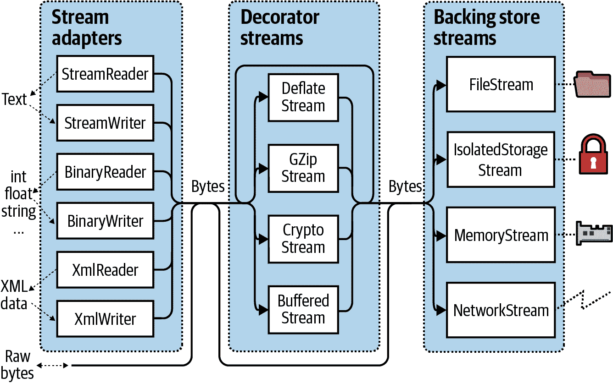
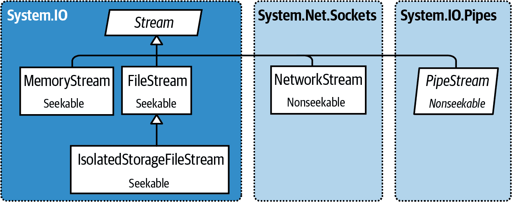
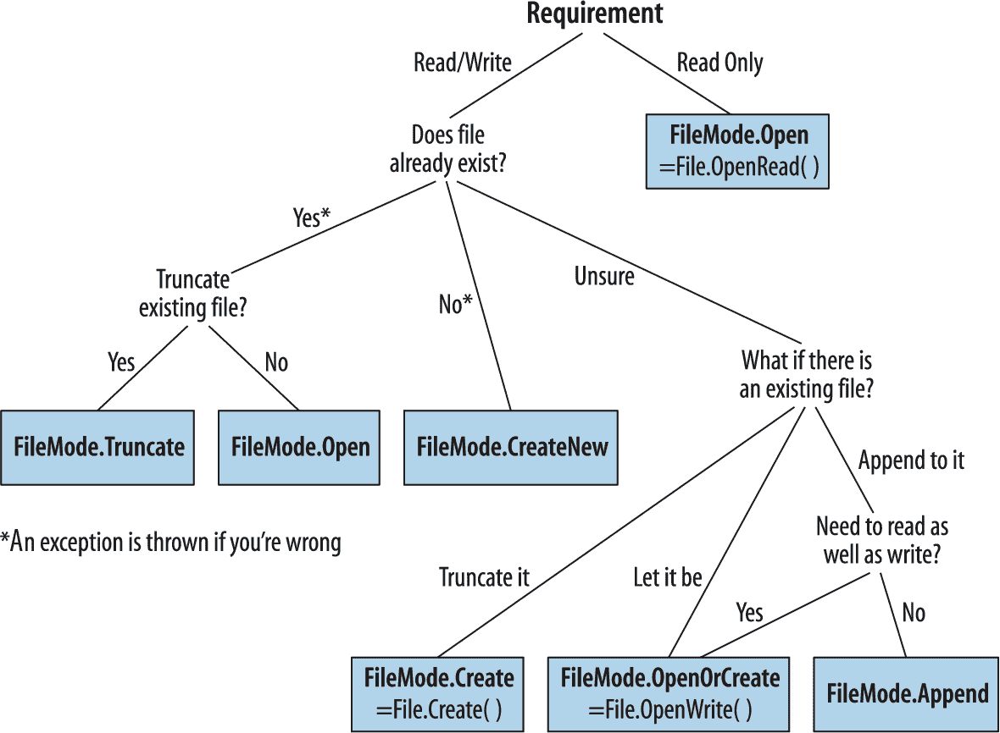
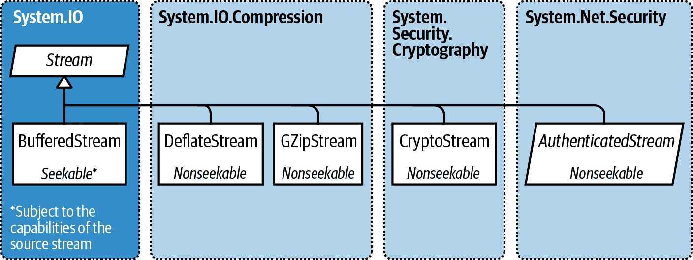
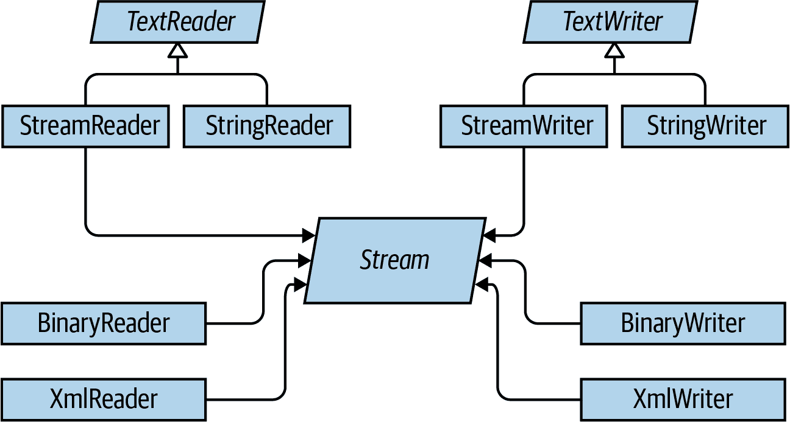

# 第十五章：流和 I/O

本章描述了 .NET 中用于输入和输出的基本类型，重点介绍以下主题：

+   .NET 流架构及其如何为跨各种 I/O 类型的读写提供一致的编程接口

+   用于操作磁盘上文件和目录的类

+   专门用于压缩、命名管道和内存映射文件的流

本章主要集中在 `System.IO` 命名空间中的类型，这是低级 I/O 功能的主要组成部分。

# 流架构

.NET 流架构围绕三个概念展开：**后备存储**（backing stores）、装饰器（decorators）和适配器，如图 15-1 所示。

*后备存储* 是使输入和输出变得有用的终点，例如文件或网络连接。确切地说，它是以下两者之一或两者兼有：

+   一个可按顺序读取字节的源

+   一个可按顺序写入字节的目的地



###### 图 15-1\. 流架构

但是，后备存储如果不向程序员暴露就没有用处。`Stream` 是这一目的的标准 .NET 类；它公开了一组标准的读取、写入和定位方法。与数组不同，数组中的所有后备数据一次性存在于内存中，而流串行处理数据——无论是逐字节处理还是以可管理大小的块处理。因此，流可以使用少量固定的内存，无论其后备存储的大小如何。

流可分为两类：

后备存储流

这些方法被硬编码到特定类型的后备存储中，比如 `FileStream` 或 `NetworkStream`。

装饰器流

这些流依赖于另一个流，以某种方式转换数据，例如 `DeflateStream` 或 `CryptoStream`。

装饰器流具有以下架构优势：

+   它们使得后备存储流无需自己实现诸如压缩和加密等功能。

+   装饰器不会改变接口。

+   你可以在运行时连接装饰器。

+   您可以将装饰器链接在一起（例如，压缩器后跟加密器）。

后备存储和装饰器流都专门处理字节。虽然这很灵活和高效，但应用程序通常在文本或 XML 等更高层次上工作。*适配器* 通过将流包装在具有特定格式的类中来弥合这一差距。例如，文本读取器公开了 `ReadLine` 方法；XML 编写器公开了 `WriteAttributes` 方法。

###### 注意

适配器包裹着一个流，就像装饰器一样。不过，与装饰器不同的是，适配器本身并不是一个流；它通常会完全隐藏字节导向方法。

总结一下，后备存储流提供原始数据；装饰器流提供透明的二进制转换，比如加密；适配器提供处理更高级类型（如字符串和 XML）的类型化方法。

图 15-1 展示了它们的关联。要组成链，只需将一个对象传递给另一个对象的构造函数。

# 使用流

抽象的`Stream`类是所有流的基类。它定义了三个基本操作的方法和属性：*读取*、*写入*和*定位*，以及用于关闭、刷新和配置超时等管理任务（见表 15-1）。

表 15-1\. 流类成员

| 类别 | 成员 |
| --- | --- |
| 读取 | `public abstract bool CanRead { get; }` |
|  | `public abstract int Read (byte[] buffer, int offset, int count)` |
|  | `public virtual int ReadByte();` |
| 写入 | `public abstract bool CanWrite { get; }` |
|  | `public abstract void Write (byte[] buffer, int offset, int count);` |
|  | `public virtual void WriteByte (byte value);` |
| 定位 | `public abstract bool CanSeek { get; }` |
|  | `public abstract long Position { get; set; }` |
|  | `public abstract void SetLength (long value);` |
|  | `public abstract long Length { get; }` |
|  | `public abstract long Seek (long offset, SeekOrigin origin);` |
| 关闭/刷新 | `public virtual void Close();` |
|  | `public void Dispose();` |
|  | `public abstract void Flush();` |
| 超时 | `public virtual bool CanTimeout { get; }` |
|  | `public virtual int ReadTimeout { get; set; }` |
|  | `public virtual int WriteTimeout { get; set; }` |
| 其他 | `public static readonly Stream Null; // "Null" stream` |
|  | `public static Stream Synchronized (Stream stream);` |

同样，还有异步版本的`Read`和`Write`方法，两者都返回`Task`，并可选择接受取消令牌，还有使用`Span<T>`和`Memory<T>`类型的重载版本，我们将在第二十三章中描述。

在下面的示例中，我们使用文件流进行读取、写入和定位：

```cs
using System;
using System.IO;

// Create a file called test.txt in the current directory:
using (Stream s = new FileStream ("test.txt", FileMode.Create))
{
  Console.WriteLine (s.CanRead);       // True
  Console.WriteLine (s.CanWrite);      // True
  Console.WriteLine (s.CanSeek);       // True

  s.WriteByte (101);
  s.WriteByte (102);
  byte[] block = { 1, 2, 3, 4, 5 };
  s.Write (block, 0, block.Length);     // Write block of 5 bytes

  Console.WriteLine (s.Length);         // 7
  Console.WriteLine (s.Position);       // 7
  s.Position = 0;                       // Move back to the start

  Console.WriteLine (s.ReadByte());     // 101
  Console.WriteLine (s.ReadByte());     // 102

  // Read from the stream back into the block array:
  Console.WriteLine (s.Read (block, 0, block.Length));   // 5

  // Assuming the last Read returned 5, we'll be at
  // the end of the file, so Read will now return 0:
  Console.WriteLine (s.Read (block, 0, block.Length));   // 0
}
```

异步读取或写入只需调用`ReadAsync`/`WriteAsync`而不是`Read`/`Write`，并等待表达式（我们还必须在调用方法中添加`async`关键字，正如我们在第十四章中描述的那样）：

```cs
async static void AsyncDemo()
{
  using (Stream s = new FileStream ("test.txt", FileMode.Create))
  {
    byte[] block = { 1, 2, 3, 4, 5 };
    await s.WriteAsync (block, 0, block.Length);    // Write asychronously

    s.Position = 0;                       // Move back to the start

    // Read from the stream back into the block array:
    Console.WriteLine (await s.ReadAsync (block, 0, block.Length));   // 5
  }
}
```

异步方法使得编写响应迅速且可伸缩的应用程序变得简单，特别是处理潜在缓慢流（尤其是网络流）时，而无需挂起线程。

###### 注意

为简洁起见，我们将在本章大部分示例中继续使用同步方法；但是，我们建议在涉及网络 I/O 的大多数场景中使用优先的异步`Read`/`Write`操作。

## 读取和写入

流可以支持读取、写入或两者兼具。如果`CanWrite`返回`false`，则流为只读；如果`CanRead`返回`false`，则流为只写。

`Read` 方法从流中接收一个数据块并存入数组中。它返回接收到的字节数，这个数字始终小于或等于 `count` 参数。如果小于 `count`，则表示已经到达了流的末尾或者流以较小的块向您提供数据（这在网络流中经常发生）。无论哪种情况，数组中剩余的字节将保持未写入状态，它们的先前值将被保留。

###### 警告

使用 `Read` 方法时，只有当该方法返回 `0` 时，您才能确定已经到达了流的末尾。因此，如果有一个 1,000 字节的流，下面的代码可能无法将其全部读入内存：

```cs
// Assuming s is a stream:
byte[] data = new byte [1000];
s.Read (data, 0, data.Length);
```

`Read` 方法可以读取 1 到 1,000 字节的数据，留下流中剩余未读取的部分。

以下是通过 `Read` 方法正确读取 1,000 字节流的方法：

```cs
byte[] data = new byte [1000];

// bytesRead will always end up at 1000, unless the stream is
// itself smaller in length:

int bytesRead = 0;
int chunkSize = 1;
while (bytesRead < data.Length && chunkSize > 0)
  bytesRead +=
    chunkSize = s.Read (data, bytesRead, data.Length - bytesRead);
```

为了简化操作，在 .NET 7 中，`Stream` 类包含了名为 `ReadExactly` 和 `ReadAtLeast` 的帮助方法（以及每个方法的异步版本）。以下代码从流中精确读取 1,000 字节（如果流在此之前结束，则抛出异常）：

```cs
byte[] data = new byte [1000];
s.ReadExactly (data);   // Reads exactly 1000 bytes
```

最后一行相当于：

```cs
s.ReadExactly (data, offset:0, count:1000);
```

###### 注意

`BinaryReader` 类型提供了另一种解决方案：

```cs
byte[] data = new BinaryReader (s).ReadBytes (1000);
```

如果流的长度小于 1,000 字节，则返回的字节数组反映实际的流大小。如果流是可定位的，则可以通过用 `(int)s.Length` 替换 `1000` 来读取其全部内容。

我们将在 “Stream Adapters” 中进一步描述 `BinaryReader` 类型。

`ReadByte` 方法更简单：它只读取一个字节，并返回 `-1` 表示流的结尾。`ReadByte` 实际上返回的是 `int` 而不是 `byte`，因为后者不能返回 `-1`。

`Write` 和 `WriteByte` 方法将数据发送到流中。如果它们无法发送指定的字节，则会抛出异常。

###### 警告

在 `Read` 和 `Write` 方法中，`offset` 参数表示从 `buffer` 数组开始读取或写入的索引位置，而不是流中的位置。

## 寻址

如果 `CanSeek` 返回 `true`，则流是可寻址的。对于可寻址的流（例如文件流），可以查询或修改其 `Length`（通过调用 `SetLength`），并且随时可以更改正在读取或写入的 `Position`。`Position` 属性是相对于流的开头的位置；然而，`Seek` 方法允许您相对于当前位置或流的末尾移动。

###### 注意

在 `FileStream` 上更改 `Position` 通常需要几微秒。如果在循环中进行了数百万次这样的操作，`MemoryMappedFile` 类可能比 `FileStream` 更合适（参见 “Memory-Mapped Files”）。

对于非可寻址流（例如加密流），唯一确定其长度的方法是完全读取它。此外，如果需要重新读取先前的部分，则必须关闭流，并使用新的流重新开始。

## 关闭和刷新

流在使用后必须被释放，以释放底层资源如文件和套接字句柄。通过在`using`块中实例化流可以简单地保证这一点。一般来说，流遵循标准的释放语义：

+   `Dispose`和`Close`在功能上是相同的。

+   重复释放或关闭流不会引起错误。

关闭装饰器流会同时关闭装饰器和其后备存储流。使用装饰器链时，关闭最外层的装饰器（链的头部）会关闭整个链。

一些流内部会缓冲数据到和从后备存储器，以减少往返并提高性能（文件流是一个很好的例子）。这意味着你写入流的数据可能不会立即到达后备存储器；它可以延迟，直到缓冲区填满。`Flush`方法强制将任何内部缓冲的数据立即写入。当流关闭时，`Flush`会被自动调用，因此你永远不需要执行以下操作：

```cs
s.Flush(); s.Close();
```

## 超时

如果`CanTimeout`返回`true`，则流支持读取和写入超时。网络流支持超时；文件和内存流不支持。对于支持超时的流，`ReadTimeout`和`WriteTimeout`属性确定所需的超时时间（以毫秒为单位），其中`0`表示没有超时。通过抛出异常，`Read`和`Write`方法指示发生了超时。

异步的`ReadAsync`/`WriteAsync`方法不支持超时；相反，你可以将取消令牌传递给这些方法。

## 线程安全性

作为一条规则，流是不线程安全的，这意味着两个线程不能同时读取或写入同一流，否则可能会出错。`Stream`类通过静态方法`Synchronized`提供了一个简单的解决方法。这个方法接受任何类型的流并返回一个线程安全的包装器。这个包装器通过在每次读取、写入或寻址周围获取独占锁来工作，确保只有一个线程可以执行这样的操作。实际上，这允许多个线程同时向同一流追加数据 — 其他类型的活动（如并发读取）需要额外的锁定来确保每个线程访问流的所需部分。我们在第二十一章中全面讨论了线程安全性。

###### 注意

从 .NET 6 开始，你可以使用`RandomAccess`类进行高性能的线程安全文件 I/O 操作。`RandomAccess`还允许你传递多个缓冲区以提高性能。

## 后备存储流

图 15-2 展示了.NET 提供的关键后备存储流。通过`Stream`的静态`Null`字段也可以使用“null 流”。在编写单元测试时，空流可能很有用。



###### 图 15-2\. 后备存储流

在接下来的章节中，我们描述了`FileStream`和`MemoryStream`；在本章的最后一节中，我们描述了`IsolatedStorageStream`。在第十六章，我们涵盖了`NetworkStream`。

## FileStream

在本节的前面部分，我们演示了使用`FileStream`读取和写入数据字节的基本用法。现在让我们来检查这个类的特殊功能。

###### 注意

如果你仍在使用通用 Windows 平台[UWP]，你也可以使用`Windows.Storage`中的类型进行文件 I/O。我们在在线补充说明中描述了这一点[*http://www.albahari.com/nutshell*](http://www.albahari.com/nutshell)。

### 构造一个 FileStream

实例化一个`FileStream`的最简单方法是使用`File`类上的以下静态门面方法之一：

```cs
FileStream fs1 = File.OpenRead  ("readme.bin");            // Read-only
FileStream fs2 = File.OpenWrite ("writeme.tmp");           // Write-only
FileStream fs3 = File.Create    ("readwrite.tmp");         // Read/write
```

如果文件已经存在，`OpenWrite`和`Create`在行为上有所不同。`Create`会截断任何现有内容；`OpenWrite`保留现有内容，并将流定位在零处。如果你写入的字节数少于文件中先前的字节数，`OpenWrite`会留下新旧内容的混合。

你还可以直接实例化一个`FileStream`。其构造函数提供了访问每个特性的途径，允许你指定文件名或低级文件句柄、文件创建和访问模式，以及分享、缓冲和安全选项。以下示例打开一个现有文件，进行读写访问而不覆盖它（`using`关键字确保在`fs`退出作用域时进行释放）：

```cs
using var fs = new FileStream ("readwrite.tmp", FileMode.Open);
```

我们稍后详细看看`FileMode`。

### 指定文件名

文件名可以是绝对的（例如，*c:\temp\test.txt* 或在 Unix 中的 */tmp/test.txt*）或相对于当前目录的（例如，*test.txt* 或 *temp\test.txt*）。你可以通过静态的`Environment.CurrentDirectory`属性访问或更改当前目录。

###### 警告

当程序启动时，当前目录可能与程序可执行文件的目录一致，也可能不一致。因此，你不应该依赖当前目录来定位随可执行文件打包的额外运行时文件。

`AppDomain.CurrentDomain.BaseDirectory`返回*应用程序基目录*，通常是包含程序可执行文件的文件夹。为了相对于此目录指定文件名，你可以调用`Path.Combine`：

```cs
string baseFolder = AppDomain.CurrentDomain.BaseDirectory;
string logoPath = Path.Combine (baseFolder, "logo.jpg");
Console.WriteLine (File.Exists (logoPath));
```

你可以通过 Universal Naming Convention (UNC) 路径跨 Windows 网络读取和写入，比如 *\\JoesPC\PicShare\pic.jpg* 或 *\\10.1.1.2\PicShare\pic.jpg*。（要从 macOS 或 Unix 访问 Windows 文件共享，请按照特定于你的操作系统的说明将其挂载到你的文件系统，然后使用 C# 中的普通路径打开它）。

### 指定文件模式

所有接受文件名的`FileStream`构造函数还需要一个`FileMode`枚举参数。图 15-3 展示了如何选择`FileMode`，并且选择会产生类似于在`File`类上调用静态方法的结果。



###### 图 15-3\. 选择 FileMode

###### 警告

使用 `File.Create` 和 `FileMode.Create` 操作隐藏文件会抛出异常。要覆盖隐藏文件，必须删除并重新创建它：

```cs
File.Delete ("hidden.txt");
using var file = File.Create ("hidden.txt");
...
```

仅提供文件名和 `FileMode` 构造 `FileStream` 将给你一个可读写的流（只有一个例外）。如果还提供 `FileAccess` 参数，可以请求降级权限：

```cs
[Flags]
public enum FileAccess { Read = 1, Write = 2, ReadWrite = 3 }
```

下列语句返回一个只读流，等效于调用 `File.OpenRead`：

```cs
using var fs = new FileStream ("x.bin", FileMode.Open, FileAccess.Read);
...
```

`FileMode.Append` 是一个特例：使用此模式会得到一个*只写*流。要以读写支持进行追加，必须改用 `FileMode.Open` 或 `FileMode.OpenOrCreate`，然后定位到流的末尾：

```cs
using var fs = new FileStream ("myFile.bin", FileMode.Open);

fs.Seek (0, SeekOrigin.End);
...
```

### 高级 FileStream 功能

在构造 `FileStream` 时，还可以包括以下可选参数：

+   一个 `FileShare` 枚举，描述其他进程在你完成之前对文件的访问权限（`None`、`Read` [默认]、`ReadWrite` 或 `Write`）。

+   内部缓冲区的大小（默认为 4 KB）以字节为单位。

+   一个指示是否将异步 I/O 延迟至操作系统处理的标志。

+   `FileOptions` 标志枚举用于请求操作系统加密（`Encrypted`）、在关闭时自动删除临时文件（`DeleteOnClose`）以及优化提示（`RandomAccess` 和 `SequentialScan`）。还有一个 `WriteThrough` 标志，请求操作系统禁用写后缓存；这适用于事务文件或日志。底层操作系统不支持的标志会被静默忽略。

使用 `FileShare.ReadWrite` 打开文件允许其他进程或用户同时读取和写入同一文件。为避免混乱，你可以约定在读取或写入前锁定文件的指定部分，使用以下方法：

```cs
// Defined on the FileStream class:
public virtual void Lock   (long position, long length);
public virtual void Unlock (long position, long length);
```

如果请求的文件部分或全部已被锁定，`Lock` 将抛出异常。

## MemoryStream

`MemoryStream` 使用数组作为后备存储。这在某种程度上违背了拥有流的初衷，因为整个后备存储必须一次性驻留在内存中。当你需要对一个不可寻址的流进行随机访问时，`MemoryStream` 仍然非常有用。如果你知道源流的大小是可管理的，可以按照以下方式将其复制到 `MemoryStream` 中：

```cs
var ms = new MemoryStream();
sourceStream.CopyTo (ms);
```

你可以通过调用 `ToArray` 将 `MemoryStream` 转换为字节数组。`GetBuffer` 方法通过返回对底层存储数组的直接引用更高效地执行相同的任务；不过，这个数组通常比实际流的长度长。

###### 注意

关闭和刷新 `MemoryStream` 是可选的。如果关闭了 `MemoryStream`，则无法再对其进行读取或写入，但仍然可以调用 `ToArray` 获取底层数据。在内存流上，`Flush` 完全不起作用。

你可以在 “压缩流” 和 “概述” 中找到更多的 `MemoryStream` 示例。

## PipeStream

`PipeStream`提供了一种通过操作系统的*管道*协议使一个进程能够与另一个进程通信的简单方法。有两种类型的管道：

匿名管道（更快）

允许在同一台计算机上的父子进程之间进行单向通信

命名管道（更灵活）

允许在同一台计算机上或跨网络上的不同计算机之间进行双向通信。

管道在单台计算机上进行进程间通信（IPC）非常有用：它不依赖于网络传输，这意味着没有网络协议开销，并且不会受到防火墙的影响。

###### 注意

管道基于流，因此一个进程等待接收一系列字节，而另一个进程则发送这些字节。另一种方法是通过块共享内存来进行进程间通信；我们将在"内存映射文件"中描述如何做到这一点。

`PipeStream`是一个抽象类，有四种具体的子类型。两种用于匿名管道，另外两种用于命名管道：

匿名管道

`AnonymousPipeServerStream`和`AnonymousPipeClientStream`

命名管道

`NamedPipeServerStream`和`NamedPipeClientStream`

Named pipes 更容易使用，因此我们先描述它们。

### 命名管道

使用命名管道时，各方通过同名管道进行通信。协议定义了两个不同的角色：客户端和服务器。通信如下进行：

+   服务器实例化一个`NamedPipeServerStream`，然后调用`WaitForConnection`。

+   客户端实例化一个`NamedPipeClientStream`，然后调用`Connect`（可以选择设置超时时间）。

然后，双方读取和写入流以进行通信。

下面的示例演示了一个发送单个字节（100）的服务器，然后等待接收单个字节：

```cs
using var s = new NamedPipeServerStream ("pipedream");

s.WaitForConnection();
s.WriteByte (100);                // Send the value 100.
Console.WriteLine (s.ReadByte());
```

这是对应的客户端代码：

```cs
using var s = new NamedPipeClientStream ("pipedream");

s.Connect();
Console.WriteLine (s.ReadByte());
s.WriteByte (200);                 // Send the value 200 back.
```

命名管道流默认是双向的，因此任何一方都可以读取或写入它们的流。这意味着客户端和服务器必须就某种协议达成一致，以协调它们的操作，以免双方同时发送或接收。

还需要就每次传输的长度达成一致。在我们的示例中，这很简单，因为我们只在每个方向上传输了一个字节。为了处理比一个字节长的消息，管道提供了*消息*传输模式（仅限于 Windows）。如果启用了此模式，调用`Read`的一方可以通过检查`IsMessageComplete`属性来知道消息何时完成。为了演示，我们首先编写一个辅助方法，从启用了消息的`PipeStream`（即读取直到`IsMessageComplete`为 true）中读取整个消息：

```cs
static byte[] ReadMessage (PipeStream s)
{
  MemoryStream ms = new MemoryStream();
  byte[] buffer = new byte [0x1000];      // Read in 4 KB blocks

  do    { ms.Write (buffer, 0, s.Read (buffer, 0, buffer.Length)); }
  while (!s.IsMessageComplete);

  return ms.ToArray();
}
```

（为了实现异步操作，将"`s.Read`"替换为"`await s.ReadAsync`"。）

###### 警告

你不能仅仅通过等待`Read`返回 0 来确定`PipeStream`是否已经完成读取消息。这是因为，与大多数其他流类型不同，管道流和网络流没有明确定义的结束。相反，在消息传输之间它们暂时“干涸”。

现在我们可以激活消息传输模式。在服务器端，通过在构建流时指定`PipeTransmissionMode.Message`来完成：

```cs
using var s = new NamedPipeServerStream ("pipedream", PipeDirection.InOut,
                                          1, PipeTransmissionMode.Message);

s.WaitForConnection();

byte[] msg = Encoding.UTF8.GetBytes ("Hello");
s.Write (msg, 0, msg.Length);

Console.WriteLine (Encoding.UTF8.GetString (ReadMessage (s)));
```

在客户端，我们在调用`Connect`后设置`ReadMode`以激活消息传输模式：

```cs
using var s = new NamedPipeClientStream ("pipedream");

s.Connect();
s.ReadMode = PipeTransmissionMode.Message;

Console.WriteLine (Encoding.UTF8.GetString (ReadMessage (s)));

byte[] msg = Encoding.UTF8.GetBytes ("Hello right back!");
s.Write (msg, 0, msg.Length);
```

###### 注意

只有在 Windows 上支持消息模式。其他平台会抛出`PlatformNotSupportedException`。

### 匿名管道

匿名管道提供了父进程和子进程之间的单向通信流。与使用系统范围内名称不同，匿名管道通过私有句柄进行调节。

与命名管道一样，匿名管道也有明确的客户端和服务器角色。然而，通信系统稍有不同，具体操作如下：

1.  服务器实例化了一个`AnonymousPipeServerStream`，指定了`PipeDirection`为`In`或`Out`。

1.  服务器调用`GetClientHandleAsString`获取管道的标识符，然后将其传递给客户端（通常作为启动子进程时的参数）。

1.  子进程实例化了一个`AnonymousPipeClientStream`，指定了相反的`PipeDirection`。

1.  服务器通过调用`DisposeLocalCopyOfClientHandle`释放在步骤 2 中生成的本地句柄。

1.  父进程和子进程通过读写流进行通信。

因为匿名管道是单向的，服务器必须创建两个管道进行双向通信。以下控制台程序创建了两个管道（输入和输出），然后启动了一个子进程。它然后向子进程发送一个字节，并接收一个字节作为回复：

```cs
class Program
{
  static void Main (string[] args)
  {
    if (args.Length == 0)
      // No arguments signals server mode
      AnonymousPipeServer();
    else
      // We pass in the pipe handle IDs as arguments to signal client mode
      AnonymousPipeClient (args [0], args [1]);
  }

  static void AnonymousPipeClient (string rxID, string txID)
  {
    using var rx = new AnonymousPipeClientStream (PipeDirection.In, rxID);
    using var tx = new AnonymousPipeClientStream (PipeDirection.Out, txID);

    Console.WriteLine ("Client received: " + rx.ReadByte ());
    tx.WriteByte (200);
  }

  static void AnonymousPipeServer ()
  {
    using var tx = new AnonymousPipeServerStream (
                     PipeDirection.Out, HandleInheritability.Inheritable);
    using var rx = new AnonymousPipeServerStream (
                     PipeDirection.In, HandleInheritability.Inheritable);

    string txID = tx.GetClientHandleAsString ();
    string rxID = rx.GetClientHandleAsString ();

    // Create and start up a child process.
    // We'll use the same Console executable, but pass in arguments:
    string thisAssembly = Assembly.GetEntryAssembly().Location;
    string thisExe = Path.ChangeExtension (thisAssembly, ".exe");
    var args = $"{txID} {rxID}";
    var startInfo = new ProcessStartInfo (thisExe, args);

    startInfo.UseShellExecute = false;       // Required for child process
    Process p = Process.Start (startInfo);

    tx.DisposeLocalCopyOfClientHandle ();    // Release unmanaged
    rx.DisposeLocalCopyOfClientHandle ();    // handle resources.

    tx.WriteByte (100);    // Send a byte to the child process

    Console.WriteLine ("Server received: " + rx.ReadByte ());

    p.WaitForExit ();
  }
}
```

与命名管道一样，客户端和服务器必须协调它们的发送和接收，并同意每个传输的长度。不幸的是，匿名管道不支持消息模式，因此您必须为消息长度协议实施自己的协议。其中一个解决方案是在每次传输的前四个字节中发送一个定义消息长度的整数值。`BitConverter`类提供了在整数值和四个字节数组之间进行转换的方法。

## `BufferedStream`

`BufferedStream` 装饰或包装另一个具有缓冲功能的流，它是.NET 中多种装饰器流类型之一，这些类型都在图 15-4 中有所说明。



###### 图 15-4\. 装饰器流

缓冲可以通过减少到后备存储的往返次数来提高性能。这是我们如何将`FileStream`包装在一个 20 KB 的`BufferedStream`中的方法：

```cs
// Write 100K to a file:
File.WriteAllBytes ("myFile.bin", new byte [100000]);

using FileStream fs = File.OpenRead ("myFile.bin");
using BufferedStream bs = new BufferedStream (fs, 20000);  //20K buffer

bs.ReadByte();
Console.WriteLine (fs.Position);         // 20000
```

在此示例中，由于预读缓冲区的存在，仅读取一个字节后底层流会提前 20,000 个字节。在 `FileStream` 再次受到影响之前，我们可以再调用 `ReadByte` 另外 19,999 次。

将 `BufferedStream` 与 `FileStream` 耦合，如本例所示，价值有限，因为 `FileStream` 已经内置了缓冲区。唯一可能的用途可能是在已构建的 `FileStream` 上扩展缓冲区。

自动关闭 `BufferedStream` 会关闭底层的后备存储流。

# 流适配器

`Stream` 仅处理字节；要读取或写入诸如字符串、整数或 XML 元素之类的数据类型，必须插入适配器。以下是 .NET 提供的内容：

文本适配器（用于字符串和字符数据）

`TextReader`, `TextWriter`

`StreamReader`, `StreamWriter`

`StringReader`, `StringWriter`

二进制适配器（用于诸如 `int`、`bool`、`string` 和 `float` 等基本类型）

`BinaryReader`, `BinaryWriter`

XML 适配器（在 第 11 章 中讨论）

`XmlReader`, `XmlWriter`

图 15-5 展示了这些类型之间的关系。



###### 图 15-5\. 读者和写者

## 文本适配器

`TextReader` 和 `TextWriter` 是专门处理字符和字符串的适配器的抽象基类。在 .NET 中，每个类都有两个通用的实现：

`StreamReader`/`StreamWriter`

使用 `Stream` 作为其原始数据存储，将流的字节转换为字符或字符串

`StringReader`/`StringWriter`

使用内存中的字符串实现 `TextReader`/`TextWriter`

表 15-2 根据类别列出了 `TextReader` 的成员。`Peek` 返回流中的下一个字符而不移动位置。`Peek` 和 `Read` 的无参数版本在流结束时返回 −1；否则，它们返回一个可以直接转换为 `char` 的整数。接受 `char[]` 缓冲区的 `Read` 重载在功能上与 `ReadBlock` 方法相同。`ReadLine` 读取直到 CR（字符 13）、LF（字符 10）或 CR+LF 连续序列。然后返回一个字符串，丢弃 CR/LF 字符。

表 15-2\. TextReader 成员

| 类别 | 成员 |
| --- | --- |
| 读取一个字符 | `public virtual int Peek(); // 将结果转换为 char` |
|  | `public virtual int Read(); // 将结果转换为 char` |
| 读取多个字符 | `public virtual int Read (char[] buffer, int index, int count);` |
|  | `public virtual int ReadBlock (char[] buffer, int index, int count);` |
|  | `public virtual string ReadLine();` |
|  | `public virtual string ReadToEnd();` |
| 关闭 | `public virtual void Close();` |
|  | `public void Dispose(); // 与 Close 方法相同` |
| 其他 | `public static readonly TextReader Null;` |
|  | `public static TextReader Synchronized (TextReader reader);` |

###### 注意

`Environment.NewLine` 返回当前操作系统的换行序列。

在 Windows 上，这是 `"\r\n"`（想一想“回车”），它松散地模拟了机械打字机：CR（字符 13）后跟 LF（字符 10）。反转顺序，你将得到两个新行或一个新行都没有！

在 Unix 和 macOS 上，它只是 `"\n"`。

`TextWriter` 还有类似的写入方法，如 表 15-3 所示。`Write` 和 `WriteLine` 方法还重载以接受每种原始类型，以及 `object` 类型。这些方法简单地调用传入对象的 `ToString` 方法（通过在调用方法或构造 `TextWriter` 时指定的 `IFormatProvider`）。

表 15-3\. TextWriter 成员

| 类别 | 成员 |
| --- | --- |
| 写入一个字符 | `public virtual void Write (char value);` |
| 写入多个字符 | `public virtual void Write (string value);` |
|  | `public virtual void Write (char[] buffer, int index, int count);` |
|  | `public virtual void Write (string format, params object[] arg);` |
|  | `public virtual void WriteLine (string value);` |
| 关闭和刷新 | `public virtual void Close();` |
|  | `public void Dispose(); // 与 Close 相同` |
|  | `public virtual void Flush();` |
| 格式化和编码 | `public virtual IFormatProvider FormatProvider { get; }` |
|  | `public virtual string NewLine { get; set; }` |
|  | `public abstract Encoding Encoding { get; }` |
| 其他 | `public static readonly TextWriter Null;` |
|  | `public static TextWriter Synchronized (TextWriter writer);` |

`WriteLine` 简单地使用 `Environment.NewLine` 附加给定的文本。您可以通过 `NewLine` 属性更改此行为（这对与 Unix 文件格式的互操作性很有用）。

###### 注意

与 `Stream` 类似，`TextReader` 和 `TextWriter` 提供了其读写方法的基于任务的异步版本。

### `StreamReader` 和 `StreamWriter`

在以下示例中，`StreamWriter` 将两行文本写入文件，然后 `StreamReader` 读取文件内容：

```cs
using (FileStream fs = File.Create ("test.txt"))
using (TextWriter writer = new StreamWriter (fs))
{
  writer.WriteLine ("Line1");
  writer.WriteLine ("Line2");
}

using (FileStream fs = File.OpenRead ("test.txt"))
using (TextReader reader = new StreamReader (fs))
{
  Console.WriteLine (reader.ReadLine());       // Line1
  Console.WriteLine (reader.ReadLine());       // Line2
}
```

由于文本适配器经常与文件耦合，`File` 类提供了 `CreateText`、`AppendText` 和 `OpenText` 的静态方法来简化流程：

```cs
using (TextWriter writer = File.CreateText ("test.txt"))
{
  writer.WriteLine ("Line1");
  writer.WriteLine ("Line2");
}

using (TextWriter writer = File.AppendText ("test.txt"))
  writer.WriteLine ("Line3");

using (TextReader reader = File.OpenText ("test.txt"))
  while (reader.Peek() > -1)
    Console.WriteLine (reader.ReadLine());     // Line1
                                               // Line2
                                               // Line3
```

这还说明了如何测试文件的结束（即 `reader.Peek()`）。另一种选项是读取直到 `reader.ReadLine` 返回 null。

您还可以读取和写入其他类型，例如整数，但因为 `TextWriter` 在您的类型上调用 `ToString`，所以在读取时必须解析字符串：

```cs
using (TextWriter w = File.CreateText ("data.txt"))
{
  w.WriteLine (123);          // Writes "123"
  w.WriteLine (true);         // Writes the word "true"
}

using (TextReader r = File.OpenText ("data.txt"))
{
  int myInt = int.Parse (r.ReadLine());     // myInt == 123
  bool yes = bool.Parse (r.ReadLine());     // yes == true
}
```

### 字符编码

`TextReader` 和 `TextWriter` 本身只是没有与流或后备存储相关联的抽象类。然而，`StreamReader` 和 `StreamWriter` 类型与基础字节流连接，因此它们必须在字符和字节之间进行转换。它们通过 `System.Text` 命名空间中的 `Encoding` 类来执行此操作，您在构造 `StreamReader` 或 `StreamWriter` 时可以选择它。如果不选择，则使用默认的 UTF-8 编码。

###### 警告

如果显式指定编码，`StreamWriter` 将默认在流的开头写入一个前缀以标识编码。通常这是不希望的，您可以通过以下方式构造编码以防止此情况：

```cs
var encoding = new UTF8Encoding (
  encoderShouldEmitUTF8Identifier:false,
  throwOnInvalidBytes:true);
```

第二个参数告诉 `StreamWriter`（或 `StreamReader`）在遇到不具有有效字符串翻译的字节时抛出异常，这与其默认行为匹配，如果未指定编码。

最简单的编码之一是 ASCII，因为每个字符由一个字节表示。ASCII 编码将 Unicode 集的前 127 个字符映射到其单字节中，涵盖了美式键盘上看到的内容。大多数其他字符，包括专用符号和非英文字符，无法表示，并转换为□字符。默认的 UTF-8 编码可以映射所有已分配的 Unicode 字符，但它更复杂。前 127 个字符编码为一个字节，以兼容 ASCII；其余字符编码为变长的字节（通常为两个或三个）。请考虑以下内容：

```cs
using (TextWriter w = File.CreateText ("but.txt"))    // Use default UTF-8
  w.WriteLine ("but-");                               // encoding.

using (Stream s = File.OpenRead ("but.txt"))
  for (int b; (b = s.ReadByte()) > -1;)
    Console.WriteLine (b);
```

单词“but”后面不是标准的连字符，而是更长的破折号（—）字符，U+2014。这是不会让您与编辑员起冲突的字符！让我们来检查输出：

```cs
98     // b
117    // u
116    // t
226    // em dash byte 1       Note that the byte values
128    // em dash byte 2       are >= 128 for each part
148    // em dash byte 3       of the multibyte sequence.
13     // <CR>
10     // <LF>
```

因为破折号位于 Unicode 集的前 127 个字符之外，因此在 UTF-8 中需要多于一个字节来编码（在本例中为三个）。UTF-8 在西方字母表中效率很高，因为大多数流行的字符仅消耗一个字节。它也可以简单地通过忽略所有大于 127 的字节降级为 ASCII。其缺点是在流中进行定位很麻烦，因为字符的位置不对应于流中的字节位置。一个替代方案是 UTF-16（在 `Encoding` 类中标记为“Unicode”）。以下是我们如何使用 UTF-16 编写相同字符串：

```cs
using (Stream s = File.Create ("but.txt"))
using (TextWriter w = new StreamWriter (s, Encoding.Unicode))
  w.WriteLine ("but-");

foreach (byte b in File.ReadAllBytes ("but.txt"))
  Console.WriteLine (b);
```

这里是输出：

```cs
255    // Byte-order mark 1
254    // Byte-order mark 2
98     // 'b' byte 1
0      // 'b' byte 2
117    // 'u' byte 1
0      // 'u' byte 2
116    // 't' byte 1
0      // 't' byte 2
20     // '--' byte 1
32     // '--' byte 2
13     // <CR> byte 1
0      // <CR> byte 2
10     // <LF> byte 1
0      // <LF> byte 2
```

从技术上讲，UTF-16 每个字符使用两个或四个字节（已分配或保留接近一百万个 Unicode 字符，因此两个字节不总是足够）。然而，由于 C# 的 `char` 类型本身仅有 16 位宽度，UTF-16 编码将始终每个 .NET `char` 使用精确两个字节。这使得在流中跳转到特定字符索引变得容易。

UTF-16 使用两字节前缀来标识字节对是按“小尾端”还是“大尾端”顺序编写的（最不重要的字节在前或最重要的字节在前）。默认的小尾端顺序是 Windows 系统的标准。

### StringReader 和 StringWriter

`StringReader`和`StringWriter`适配器根本不包装流；相反，它们使用字符串或`StringBuilder`作为底层数据源。这意味着不需要字节转换 — 实际上，这些类所做的就是你可以轻松通过字符串或`StringBuilder`加上索引变量实现的事情。然而，它们的优势在于与`StreamReader`/`StreamWriter`共享一个基类。例如，假设我们有一个包含 XML 的字符串，并希望使用`XmlReader`解析它。`XmlReader.Create`方法接受以下之一：

+   一个`URI`

+   一个`Stream`

+   一个`TextReader`

那么，如何解析我们的 XML 字符串？因为`StringReader`是`TextReader`的子类，所以我们很幸运。我们可以实例化并传入`StringReader`如下：

```cs
XmlReader r = XmlReader.Create (new StringReader (myString));
```

## 二进制适配器

`BinaryReader`和`BinaryWriter`读取和写入本机数据类型：`bool`、`byte`、`char`、`decimal`、`float`、`double`、`short`、`int`、`long`、`sbyte`、`ushort`、`uint`和`ulong`，以及原始数据类型的数组和字符串。

与`StreamReader`和`StreamWriter`不同，二进制适配器在内存中高效地存储原始数据类型。因此，一个`int`使用四个字节；一个`double`使用八个字节。字符串通过文本编码写入（与`StreamReader`和`StreamWriter`一样），但在前面加了长度前缀，以便能够读回一系列字符串而无需特殊分隔符。

假设我们有一个简单的类型，定义如下：

```cs
public class Person
{
  public string Name;
  public int    Age;
  public double Height;
}
```

我们可以向`Person`添加以下方法，使用二进制适配器将其数据保存到流中/从流中加载：

```cs
public void SaveData (Stream s)
{
  var w = new BinaryWriter (s);
  w.Write (Name);
  w.Write (Age);
  w.Write (Height);
  w.Flush();         // Ensure the BinaryWriter buffer is cleared.
                     // We won't dispose/close it, so more data
}                    // can be written to the stream.

public void LoadData (Stream s)
{
  var r = new BinaryReader (s);
  Name   = r.ReadString();
  Age    = r.ReadInt32();
  Height = r.ReadDouble();
}
```

`BinaryReader`还可以读取到字节数组。以下代码读取可定位流的全部内容：

```cs
byte[] data = new BinaryReader (s).ReadBytes ((int) s.Length);
```

这比直接从流中读取更方便，因为它不需要循环以确保已读取所有数据。

## 关闭和释放流适配器

在拆除流适配器时有四种选择：

1.  仅关闭适配器

1.  关闭适配器，然后关闭流

1.  （对于写入器）刷新适配器，然后关闭流

1.  （对于读取器）仅关闭流

###### 注意

`Close`和`Dispose`与适配器同义，正如它们与流一样。

选项 1 和 2 在语义上是相同的，因为关闭适配器会自动关闭底层流。每当嵌套`using`语句时，你隐式地选择选项 2：

```cs
using (FileStream fs = File.Create ("test.txt"))
using (TextWriter writer = new StreamWriter (fs))
  writer.WriteLine ("Line");
```

因为巢式结构是从内到外释放的，所以先关闭适配器，然后再关闭流。此外，如果在适配器的构造函数中抛出异常，流仍会关闭。嵌套的`using`语句很难出错！

###### 警告

在关闭或刷新其写入器之前，永远不要关闭流 — 这将切断适配器中缓冲的任何数据。

选项 3 和 4 有效，因为适配器属于*可选*的一类不寻常的可丢弃对象。例如，当你完成了适配器的使用但希望保留底层流以备后续使用时，可能选择不丢弃适配器：

```cs
using (FileStream fs = new FileStream ("test.txt", FileMode.Create))
{
  StreamWriter writer = new StreamWriter (fs);
  writer.WriteLine ("Hello");
  writer.Flush();

  fs.Position = 0;
  Console.WriteLine (fs.ReadByte());
}
```

在这里，我们向文件中写入数据，重新定位流，然后在关闭流之前读取第一个字节。如果我们处理了 `StreamWriter`，它也会关闭底层的 `FileStream`，导致后续读取失败。需要注意的是，我们调用 `Flush` 来确保 `StreamWriter` 的缓冲区写入到底层流中。

###### 注意

流适配器—具有可选的处理语义—不实现终结器调用 `Dispose` 的扩展处理模式。这使得一个被丢弃的适配器在垃圾收集器追赶时能够逃避自动处理。

`StreamReader`/`StreamWriter` 还有一个构造函数，指示在处理后保持流开放。因此，我们可以将前面的示例重写如下：

```cs
using (var fs = new FileStream ("test.txt", FileMode.Create))
{
  using (var writer = new StreamWriter (fs, new UTF8Encoding (false, true),
                                       0x400, true))
    writer.WriteLine ("Hello");

  fs.Position = 0;
  Console.WriteLine (fs.ReadByte());
  Console.WriteLine (fs.Length);
}
```

# 压缩流

在 `System.IO.Compression` 命名空间中提供了两个通用的压缩流： `DeflateStream` 和 `GZipStream`。两者使用类似 ZIP 格式的流行压缩算法。它们的区别在于 `GZipStream` 在开头和结尾写入了一个额外的协议，包括用于检测错误的 CRC。`GZipStream` 还符合其他软件认可的标准。

.NET 还包括实现*Brotli*压缩算法的 `BrotliStream`。 `BrotliStream` 比 `DeflateStream` 和 `GZipStream` 慢超过 10 倍，但达到更好的压缩比。 （性能损失仅适用于压缩，解压性能非常好。）

所有三个流都允许读取和写入，但有以下注意事项：

+   压缩时总是向流中*写入*。

+   解压时总是从流中*读取*。

`DeflateStream`、`GZipStream` 和 `BrotliStream` 是装饰器；它们从你在构造中提供的另一个流中压缩或解压数据。在下面的示例中，我们使用 `FileStream` 作为支持存储，压缩和解压一系列字节：

```cs
using (Stream s = File.Create ("compressed.bin"))
using (Stream ds = new DeflateStream (s, CompressionMode.Compress))
  for (byte i = 0; i < 100; i++)
    ds.WriteByte (i);

using (Stream s = File.OpenRead ("compressed.bin"))
using (Stream ds = new DeflateStream (s, CompressionMode.Decompress))
  for (byte i = 0; i < 100; i++)
    Console.WriteLine (ds.ReadByte());     // Writes 0 to 99
```

使用 `DeflateStream` 压缩后的文件为 102 字节：略大于原始文件（使用 `BrotliStream` 压缩后为 73 字节）。压缩在处理“密集”的非重复二进制数据时表现不佳（尤其是加密数据，由于设计缺乏规律性，表现最差）。对于大多数文本文件效果很好；在下一个示例中，我们压缩和解压一个由从一小段句子中随机选择的 1,000 个单词组成的文本流，使用 *Brotli* 算法。这也展示了链式使用支持存储流、装饰器流、适配器（正如本章开头在图 15-1 中所示）和异步方法的用法：

```cs
string[] words = "The quick brown fox jumps over the lazy dog".Split();
Random rand = new Random (0);   // Give it a seed for consistency

using (Stream s = File.Create ("compressed.bin"))
using (Stream ds = new BrotliStream (s, CompressionMode.Compress))
using (TextWriter w = new StreamWriter (ds))
  for (int i = 0; i < 1000; i++)
    await w.WriteAsync (words [rand.Next (words.Length)] + " ");

Console.WriteLine (new FileInfo ("compressed.bin").Length);      // 808

using (Stream s = File.OpenRead ("compressed.bin"))
using (Stream ds = new BrotliStream (s, CompressionMode.Decompress))
using (TextReader r = new StreamReader (ds))
  Console.Write (await r.ReadToEndAsync());  // Output below:

lazy lazy the fox the quick The brown fox jumps over fox over fox The
brown brown brown over brown quick fox brown dog dog lazy fox dog brown
over fox jumps lazy lazy quick The jumps fox jumps The over jumps dog...
```

在这种情况下，`BrotliStream` 高效压缩到 808 字节 —— 每个单词少于一个字节。（作为对比，`DeflateStream` 将相同数据压缩到 885 字节。）

## 在内存中进行压缩

有时，您需要完全在内存中压缩。以下是如何使用 `MemoryStream` 进行此操作：

```cs
byte[] data = new byte[1000];          // We can expect a good compression
                                       // ratio from an empty array!
var ms = new MemoryStream();
using (Stream ds = new DeflateStream (ms, CompressionMode.Compress))
  ds.Write (data, 0, data.Length);

byte[] compressed = ms.ToArray();
Console.WriteLine (compressed.Length);       // 11

// Decompress back to the data array:
ms = new MemoryStream (compressed);
using (Stream ds = new DeflateStream (ms, CompressionMode.Decompress))
  for (int i = 0; i < 1000; i += ds.Read (data, i, 1000 - i));
```

在 `DeflateStream` 周围的 `using` 语句中以教科书般的方式关闭它，刷新任何未写入的缓冲区。这也关闭了它包装的 `MemoryStream` —— 这意味着我们必须随后调用 `ToArray` 来提取其数据。

这里有一个替代方案，避免关闭 `MemoryStream` 并使用异步读写方法：

```cs
byte[] data = new byte[1000];

MemoryStream ms = new MemoryStream();
using (Stream ds = new DeflateStream (ms, CompressionMode.Compress, true))
  await ds.WriteAsync (data, 0, data.Length);

Console.WriteLine (ms.Length);             // 113
ms.Position = 0;
using (Stream ds = new DeflateStream (ms, CompressionMode.Decompress))
  for (int i = 0; i < 1000; i += await ds.ReadAsync (data, i, 1000 - i));
```

发送到 `DeflateStream` 构造函数的附加标志指示它不遵循通常的协议，即在处理时带上底层流。换句话说，`MemoryStream` 保持打开状态，允许我们将其位置重新定位到零并重新读取它。

## Unix gzip 文件压缩

`GZipStream` 的压缩算法在 Unix 系统中作为文件压缩格式非常流行。每个源文件都压缩成一个带有 *.gz* 扩展名的单独目标文件。

下面的方法执行 Unix 命令行 gzip 和 gunzip 实用程序的工作：

```cs
async Task GZip (string sourcefile, bool deleteSource = true)
{
  var gzip = $"{sourcefile}.gz";
  if (File.Exists (gzip))
    throw new Exception ("Gzip file already exists");

  // Compress
  using (FileStream inStream = File.Open (sourcefile, FileMode.Open))
  using (FileStream outStream = new FileStream (gzip, FileMode.CreateNew))
  using (GZipStream gzipStream = 
    new GZipStream (outStream, CompressionMode.Compress))
    await inStream.CopyToAsync (gzipStream); 

  if (deleteSource) File.Delete(sourcefile);
}

async Task GUnzip (string gzipfile, bool deleteGzip = true)
{
  if (Path.GetExtension (gzipfile) != ".gz") 
    throw new Exception ("Not a gzip file");

  var uncompressedFile = gzipfile.Substring (0, gzipfile.Length - 3);
  if (File.Exists (uncompressedFile)) 
    throw new Exception ("Destination file already exists");

  // Uncompress
  using (FileStream uncompressToStream = 
         File.Open (uncompressedFile, FileMode.Create))
  using (FileStream zipfileStream = File.Open (gzipfile, FileMode.Open))
  using (var unzipStream = 
         new GZipStream (zipfileStream, CompressionMode.Decompress))
    await unzipStream.CopyToAsync (uncompressToStream);

  if (deleteGzip) File.Delete (gzipfile);
}
```

下面的内容压缩一个文件：

```cs
await GZip ("/tmp/myfile.txt");      // Creates /tmp/myfile.txt.gz
```

然后进行解压：

```cs
await GUnzip ("/tmp/myfile.txt.gz")  // Creates /tmp/myfile.txt
```

# 使用 ZIP 文件

`System.IO.Compression` 中的 `ZipArchive` 和 `ZipFile` 类支持 ZIP 压缩格式。ZIP 格式相对于 `DeflateStream` 和 `GZipStream` 的优势在于它还充当多个文件的容器，并且与通过 Windows Explorer 创建的 ZIP 文件兼容。

`ZipArchive` 与流一起工作，而 `ZipFile` 处理更常见的文件工作场景。（`ZipFile` 是 `ZipArchive` 的静态辅助类。）

`ZipFile` 的 `CreateFromDirectory` 方法将指定目录中的所有文件添加到 ZIP 文件中：

```cs
ZipFile.CreateFromDirectory (@"d:\MyFolder", @"d:\archive.zip");
```

`ExtractToDirectory` 反之将 ZIP 文件提取到目录中：

```cs
ZipFile.ExtractToDirectory (@"d:\archive.zip", @"d:\MyFolder");
```

（从 .NET 8 开始，您还可以指定 `Stream` 而不是 zip 文件路径。）

在压缩时，您可以指定是否优化文件大小或速度，以及是否在存档中包含源目录的名称。在我们的示例中启用后者选项将在存档中创建一个名为 *MyFolder* 的子目录，其中压缩的文件将放置在其中。

`ZipFile` 具有用于读取/写入单个条目的 `Open` 方法。它返回一个 `ZipArchive` 对象（您也可以通过实例化 `ZipArchive` 对象来获取 `Stream` 对象）。调用 `Open` 时，必须指定文件名，并指示是否要 `Read`、`Create` 或 `Update` 存档。然后，您可以通过 `Entries` 属性枚举现有条目，或通过调用 `GetEntry` 找到特定文件：

```cs
using (ZipArchive zip = ZipFile.Open (@"d:\zz.zip", ZipArchiveMode.Read))

  foreach (ZipArchiveEntry entry in zip.Entries)
    Console.WriteLine (entry.FullName + " " + entry.Length);
```

`ZipArchiveEntry` 还具有 `Delete` 方法，一个 `ExtractToFile` 方法（实际上是 `ZipFileExtensions` 类中的扩展方法），以及一个返回可读/可写 `Stream` 的 `Open` 方法。您可以通过在 `ZipArchive` 上调用 `CreateEntry`（或 `CreateEntryFromFile` 扩展方法）来创建新条目。以下创建了存档 *d:\zz.zip*，其中添加了 *foo.dll*，在存档中称为 *bin\X86* 的目录结构下：

```cs
byte[] data = File.ReadAllBytes (@"d:\foo.dll"); 
using (ZipArchive zip = ZipFile.Open (@"d:\zz.zip", ZipArchiveMode.Update))
  zip.CreateEntry (@"bin\X64\foo.dll").Open().Write (data, 0, data.Length);
```

您还可以通过使用 `MemoryStream` 构造 `ZipArchive` 完全在内存中执行相同的操作。

# 使用 Tar 文件

`System.Formats.Tar` 命名空间中的类型（从 .NET 7 开始）支持 *.tar* 存档格式，这在 Unix 系统上用于打包多个文件。要创建 *.tar* 文件（*tarball*），请调用 `TarFile.CreateFromDirectory`：

```cs
TarFile.CreateFromDirectory ("/tmp/testfolder", "/tmp/test.tar", false);
```

（第三个参数指示是否在存档条目中包含基本目录名称。）

要提取 tarball，请调用 `TarFile.ExtractToDirectory`：

```cs
TarFile.ExtractToDirectory ("/tmp/test.tar", "/tmp/testfolder", true);
```

（第三个参数指示是否覆盖现有文件。）

这两种方法都允许您指定一个 `Stream` 而不是 *.tar* 文件路径。在以下示例中，我们将 tarball 写入内存流，然后使用 `GZipStream` 将该流压缩为 *.tar.gz* 文件：

```cs
var ms = new MemoryStream();
TarFile.CreateFromDirectory ("/tmp/testfolder", ms, false);
ms.Position = 0;    // So that we can re-use the stream for reading.
using (var fs = File.Create ("/tmp/test.tar.gz"))
using (var gz = new GZipStream (fs, CompressionMode.Compress))
  ms.CopyTo (gz);
```

（将 *.tar* 压缩为 *.tar.gz* 很有用，因为 *.tar* 格式本身不包含压缩，不像 *.zip* 格式。）我们可以按以下方式提取 *.tar.gz* 文件：

```cs
using (var fs = File.OpenRead ("/tmp/test.tar.gz"))
using (var gz = new GZipStream (fs, CompressionMode.Decompress))
  TarFile.ExtractToDirectory (gz, "/tmp/testfolder", true);
```

您还可以使用 `TarReader` 和 `TarWriter` 类以更细粒度的级别访问 API。以下示例说明了如何使用 `TarReader`：

```cs
using (FileStream archiveStream = File.OpenRead ("/tmp/test.tar "))
using (TarReader reader = new (archiveStream))
  while (true)
  {
    TarEntry entry = reader.GetNextEntry();
    if (entry == null) break;   // No more entries
    Console.WriteLine (
      $"Entry {entry.Name} is {entry.DataStream.Length} bytes long");
    entry.ExtractToFile (
      Path.Combine ("/tmp/testfolder", entry.Name), true);
  }
```

# 文件和目录操作

`System.IO` 命名空间提供了一组类型，用于执行“实用”文件和目录操作，如复制和移动、创建目录以及设置文件属性和权限。对于大多数功能，您可以选择两个类中的任何一个，一个提供静态方法，另一个提供实例方法：

静态类

`文件` 和 `目录`

实例方法类（使用文件或目录名构造）

`FileInfo` 和 `DirectoryInfo`

此外，还有一个名为 `Path` 的静态类。它不对文件或目录执行操作，而是为文件名和目录路径提供字符串操作方法。`Path` 还可辅助处理临时文件。

## 文件类

`File` 是一个静态类，其所有方法都接受文件名。文件名可以是相对于当前目录的，也可以是完全限定的带有目录的。以下是它的方法（全部为 `public` 和 `static`）：

```cs
bool Exists (string path);      // Returns true if the file is present

void Delete  (string path);
void Copy    (string sourceFileName, string destFileName);
void Move    (string sourceFileName, string destFileName);
void Replace (string sourceFileName, string destinationFileName,
                                     string destinationBackupFileName);

FileAttributes GetAttributes (string path);
void SetAttributes           (string path, FileAttributes fileAttributes);

void Decrypt (string path);
void Encrypt (string path);

DateTime GetCreationTime   (string path);      // UTC versions are
DateTime GetLastAccessTime (string path);      // also provided.
DateTime GetLastWriteTime  (string path);

void SetCreationTime   (string path, DateTime creationTime);
void SetLastAccessTime (string path, DateTime lastAccessTime);
void SetLastWriteTime  (string path, DateTime lastWriteTime);

FileSecurity GetAccessControl (string path);
FileSecurity GetAccessControl (string path,
                               AccessControlSections includeSections);
void SetAccessControl (string path, FileSecurity fileSecurity);
```

如果目标文件已存在，则 `Move` 抛出异常；`Replace` 则不会。这两种方法都允许文件重命名以及移动到另一个目录。

如果文件标记为只读，`Delete`将抛出`UnauthorizedAccessException`；你可以通过调用`GetAttributes`提前检查。如果操作系统不允许你的进程删除该文件，它也会抛出该异常。以下是`GetAttributes`返回的`FileAttribute`枚举的所有成员：

```cs
Archive, Compressed, Device, Directory, Encrypted,
Hidden, IntegritySystem, Normal, NoScrubData, NotContentIndexed, 
Offline, ReadOnly, ReparsePoint, SparseFile, System, Temporary
```

该枚举中的成员可以组合使用。以下是如何在不影响其他属性的情况下切换单个文件属性的方法：

```cs
string filePath = "test.txt";

FileAttributes fa = File.GetAttributes (filePath);
if ((fa & FileAttributes.ReadOnly) != 0)
{
    // Use the exclusive-or operator (^) to toggle the ReadOnly flag
    fa ^= FileAttributes.ReadOnly;
    File.SetAttributes (filePath, fa);
}

// Now we can delete the file, for instance:
File.Delete (filePath);
```

###### 注意

`FileInfo`提供了一个更简单的方法来更改文件的只读标志：

```cs
new FileInfo ("test.txt").IsReadOnly = false;
```

### 压缩和加密属性

###### 注意

此功能仅适用于 Windows，并且需要 NuGet 包`System.Management`。

`Compressed`和`Encrypted`文件属性对应于 Windows 资源管理器中文件或目录属性对话框中的压缩和加密复选框。这种类型的压缩和加密是*透明*的，因为操作系统在幕后完成所有工作，允许你读写明文数据。

你不能使用`SetAttributes`来更改文件的`Compressed`或`Encrypted`属性——如果你尝试，它会静默失败！在后一种情况下的解决方法很简单：你可以调用`File`类中的`Encrypt()`和`Decrypt()`方法。对于压缩，情况更为复杂；一个解决方案是使用`System.Management`中的 Windows 管理基础结构（WMI）API。以下方法压缩一个目录，成功时返回`0`（或者返回 WMI 错误代码）：

```cs
static uint CompressFolder (string folder, bool recursive)
{
  string path = "Win32_Directory.Name='" + folder + "'";
  using (ManagementObject dir = new ManagementObject (path))
  using (ManagementBaseObject p = dir.GetMethodParameters ("CompressEx"))
  {
    p ["Recursive"] = recursive;
    using (ManagementBaseObject result = dir.InvokeMethod ("CompressEx",
                                                             p, null))
      return (uint) result.Properties ["ReturnValue"].Value;
  }
}
```

要解压，请将`CompressEx`替换为`UncompressEx`。

透明加密依赖于从已登录用户密码生成的密钥。该系统能够处理由认证用户执行的密码更改，但如果通过管理员重置密码，则加密文件中的数据将无法恢复。

###### 注意

透明加密和压缩需要特殊的文件系统支持。NTFS（在硬盘上最常见）支持这些功能；CDFS（在 CD-ROM 上）和 FAT（在可移动媒体卡上）不支持。

你可以通过 Win32 互操作确定一个卷是否支持压缩和加密：

```cs
using System;
using System.IO;
using System.Text;
using System.ComponentModel;
using System.Runtime.InteropServices;

class SupportsCompressionEncryption
{
  const int SupportsCompression = 0x10;
  const int SupportsEncryption = 0x20000;

  [DllImport ("Kernel32.dll", SetLastError = true)]
  extern static bool GetVolumeInformation (string vol, StringBuilder name,
    int nameSize, out uint serialNum, out uint maxNameLen, out uint flags,
    StringBuilder fileSysName, int fileSysNameSize);

  static void Main()
  {
    uint serialNum, maxNameLen, flags;
    bool ok = GetVolumeInformation (@"C:\", null, 0, out serialNum,
                                    out maxNameLen, out flags, null, 0);
    if (!ok)
      throw new Win32Exception();

    bool canCompress = (flags & SupportsCompression) != 0;
    bool canEncrypt = (flags & SupportsEncryption) != 0;
  }
}
```

### Windows 文件安全

###### 注意

此功能仅适用于 Windows，并且需要 NuGet 包`System.IO.FileSystem.AccessControl`。

`FileSecurity`类允许你查询和更改分配给用户和角色的操作系统权限（命名空间`System.Security.AccessControl`）。

在这个例子中，我们列出了文件的现有权限，然后将写权限分配给“Users”组：

```cs
using System;
using System.IO;
using System.Security.AccessControl;
using System.Security.Principal;

void ShowSecurity (FileSecurity sec)
{
  AuthorizationRuleCollection rules = sec.GetAccessRules (true, true,
                                                       typeof (NTAccount));
  foreach (FileSystemAccessRule r in rules.Cast<FileSystemAccessRule>()
    .OrderBy (rule => rule.IdentityReference.Value))
  {
    // e.g., MyDomain/Joe
    Console.WriteLine ($"  {r.IdentityReference.Value}");
    // Allow or Deny: e.g., FullControl
    Console.WriteLine ($"    {r.FileSystemRights}: {r.AccessControlType}");
  }
}

var file = "sectest.txt";
File.WriteAllText (file, "File security test.");

var sid = new SecurityIdentifier (WellKnownSidType.BuiltinUsersSid, null);
string usersAccount = sid.Translate (typeof (NTAccount)).ToString();

Console.WriteLine ($"User: {usersAccount}");

FileSecurity sec = new FileSecurity (file,
                          AccessControlSections.Owner |
                          AccessControlSections.Group |
                          AccessControlSections.Access);

Console.WriteLine ("AFTER CREATE:");
ShowSecurity(sec); // BUILTIN\Users doesn't have Write permission

sec.ModifyAccessRule (AccessControlModification.Add,
    new FileSystemAccessRule (usersAccount, FileSystemRights.Write, 
                              AccessControlType.Allow),
    out bool modified);

Console.WriteLine ("AFTER MODIFY:");
ShowSecurity (sec); // BUILTIN\Users has Write permission
```

我们稍后在“特殊文件夹”中给出另一个示例。

### Unix 文件安全

从.NET 7 开始，`File`类包含了在 Unix 系统上获取和设置文件权限的方法`GetUnix​Fi⁠leMode`和`SetUnix​Fi⁠leMode`。现在`Directory.CreateDirectory`方法也可以接受 Unix 文件模式，并且在创建文件时可以指定文件模式，如下所示：

```cs
var fs = new FileStream ("test.txt",
  new FileStreamOptions
  {
    Mode = FileMode.Create,
    UnixCreateMode = UnixFileMode.UserRead | UnixFileMode.UserWrite
  });
```

## 目录类

静态 `Directory` 类提供了一组类似于 `File` 类的方法，用于检查目录是否存在 (`Exists`)、移动目录 (`Move`)、删除目录 (`Delete`)、获取/设置创建或最后访问时间以及获取/设置安全权限。此外，`Directory` 还公开了以下静态方法：

```cs
string GetCurrentDirectory ();
void   SetCurrentDirectory (string path);

DirectoryInfo CreateDirectory  (string path);
DirectoryInfo GetParent        (string path);
string        GetDirectoryRoot (string path);

string[] GetLogicalDrives(); // Gets mount points on Unix

// The following methods all return full paths:

string[] GetFiles             (string path);
string[] GetDirectories       (string path);
string[] GetFileSystemEntries (string path);

IEnumerable<string> EnumerateFiles             (string path);
IEnumerable<string> EnumerateDirectories       (string path);
IEnumerable<string> EnumerateFileSystemEntries (string path);
```

###### 注意

最后三个方法比 `Get*` 变体可能更有效，因为它们是惰性评估的——在枚举序列时从文件系统获取数据。它们特别适合于 LINQ 查询。

`Enumerate*` 和 `Get*` 方法还重载为接受 `searchPattern`（字符串）和 `searchOption`（枚举）参数。如果指定 `SearchOption.SearchAllSubDirectories`，则执行递归子目录搜索。`*FileSystemEntries` 方法将 `*Files` 的结果与 `*Directories` 结合起来。

如果目录不存在，则可以按以下方式创建它：

```cs
if (!Directory.Exists (@"d:\test"))
  Directory.CreateDirectory (@"d:\test");
```

## `FileInfo` 和 `DirectoryInfo`

`File` 和 `Directory` 上的静态方法对于执行单个文件或目录操作很方便。如果需要连续调用一系列方法，`FileInfo` 和 `DirectoryInfo` 类提供了一个对象模型，使任务更容易完成。

`FileInfo` 在实例形式下提供了大多数 `File` 的静态方法，还有一些额外的属性，如 `Extension`、`Length`、`IsReadOnly` 和 `Directory`，用于返回 `DirectoryInfo` 对象。例如：

```cs
static string TestDirectory => 
  RuntimeInformation.IsOSPlatform (OSPlatform.Windows)
    ? @"C:\Temp" 
    : "/tmp"; 

Directory.CreateDirectory (TestDirectory);

FileInfo fi = new FileInfo (Path.Combine (TestDirectory, "FileInfo.txt"));

Console.WriteLine (fi.Exists);         // false

using (TextWriter w = fi.CreateText())
  w.Write ("Some text");

Console.WriteLine (fi.Exists);         // false (still)
fi.Refresh();
Console.WriteLine (fi.Exists);         // true

Console.WriteLine (fi.Name);           // FileInfo.txt
Console.WriteLine (fi.FullName);       // c:\temp\FileInfo.txt (Windows)
                                       // /tmp/FileInfo.txt (Unix)
Console.WriteLine (fi.DirectoryName);  // c:\temp (Windows)
                                       // /tmp (Unix)
Console.WriteLine (fi.Directory.Name); // temp
Console.WriteLine (fi.Extension);      // .txt
Console.WriteLine (fi.Length);         // 9

fi.Encrypt();
fi.Attributes ^= FileAttributes.Hidden;   // (Toggle hidden flag)
fi.IsReadOnly = true;

Console.WriteLine (fi.Attributes);    // ReadOnly,Archive,Hidden,Encrypted
Console.WriteLine (fi.CreationTime);  // 3/09/2019 1:24:05 PM

fi.MoveTo (Path.Combine (TestDirectory, "FileInfoX.txt")); 

DirectoryInfo di = fi.Directory;
Console.WriteLine (di.Name);             // temp or tmp
Console.WriteLine (di.FullName);         // c:\temp or /tmp
Console.WriteLine (di.Parent.FullName);  // c:\ or /
di.CreateSubdirectory ("SubFolder");
```

这是如何使用 `DirectoryInfo` 枚举文件和子目录的方法：

```cs
DirectoryInfo di = new DirectoryInfo (@"e:\photos");

foreach (FileInfo fi in di.GetFiles ("*.jpg"))
  Console.WriteLine (fi.Name);

foreach (DirectoryInfo subDir in di.GetDirectories())
  Console.WriteLine (subDir.FullName);
```

## Path

`Path` 类的静态 `Path` 方法定义了用于处理路径和文件名的方法和字段。

假设有这个设置代码：

```cs
string dir  = @"c:\mydir";    // or /mydir
string file = "myfile.txt";
string path = @"c:\mydir\myfile.txt";    // or /mydir/myfile.txt

Directory.SetCurrentDirectory (@"k:\demo");    // or /demo
```

我们可以用以下表达式演示 `Path` 的方法和字段：

| 表达式 | 结果（Windows，然后 Unix） |
| --- | --- |
| `Directory.GetCurrentDirectory()` | `k:\demo\` 或 `/demo` |
| `Path.IsPathRooted (file)` | `False` |
| `Path.IsPathRooted (path)` | `True` |
| `Path.GetPathRoot (path)` | `c:\` 或 `/` |
| `Path.GetDirectoryName (path)` | `c:\mydir` 或 `/mydir` |
| `Path.GetFileName (path)` | `myfile.txt` |
| `Path.GetFullPath (file)` | `k:\demo\myfile.txt` 或 `/demo/myfile.txt` |
| `Path.Combine (dir, file)` | `c:\mydir\myfile.txt` 或 `/mydir/myfile.txt` |
| **文件扩展名：** |  |
| `Path.HasExtension (file)` | `True` |
| `Path.GetExtension (file)` | `.txt` |
| `Path.GetFileNameWithoutExtension (file)` | `myfile` |
| `Path.ChangeExtension (file, ".log")` | `myfile.log` |
| **分隔符和字符：** |  |
| `Path.DirectorySeparatorChar` | `\` 或 `/` |
| `Path.AltDirectorySeparatorChar` | `/` |
| `Path.PathSeparator` | `;` 或 `:` |
| `Path.VolumeSeparatorChar` | `:` 或 `/` |
| `Path.GetInvalidPathChars()` | 字符 0 到 31 和 `"<>&#124;`eor 0 |
| `Path.GetInvalidFileNameChars()` | 字符 0 到 31 和 `"<>&#124;:*?\/` 或 0 和 `/` |
| **临时文件：** |  |
| `Path.GetTempPath()` | *<local user folder>*\`Temp` 或 */tmp/* |
| `Path.GetRandomFileName()` | `*d2dwuzjf.dnp*` |
| `Path.GetTempFileName()` | *<local user folder>*\`Temp`\`*tmp14B.tmp*` 或 */tmp/*`*tmpubSUYO.tmp*` |

`Combine` 特别有用：它允许您将目录和文件名或两个目录组合在一起，而无需首先检查是否存在尾部路径分隔符，并且它会自动使用正确的操作系统路径分隔符。它提供了多达四个目录和/或文件名的重载。

`GetFullPath` 将相对于当前目录的路径转换为绝对路径。它接受诸如 *..\..\file.txt* 这样的值。

`GetRandomFileName` 返回一个真正唯一的 8.3 字符文件名，实际上并不创建任何文件。 `GetTempFileName` 使用自增计数器生成临时文件名，每 65,000 个文件循环一次。然后在本地临时目录创建以此名称命名的零字节文件。

###### 警告

当您完成使用由 `GetTempFileName` 生成的文件时，您必须删除它；否则，在您第 65,000 次调用 `GetTempFileName` 后，它最终会抛出异常。如果这是一个问题，您可以使用 `Combine GetTempPath` 与 `GetRandomFileName`。只需小心，不要填满用户的硬盘驱动器！

## 特殊文件夹

`Path` 和 `Directory` 中缺少的一件事是定位文件夹（如 *My Documents*、*Program Files*、*Application Data* 等）的方法。这由 `System.Environment` 类中的 `GetFolderPath` 方法提供：

```cs
string myDocPath = Environment.GetFolderPath
  (Environment.SpecialFolder.MyDocuments);
```

`Environment.SpecialFolder` 是一个枚举，其值涵盖了 Windows 中的所有特殊目录，例如 `AdminTools`、`ApplicationData`、`Fonts`、`History`、`SendTo`、`StartMenu` 等等。这里涵盖了所有内容，除了 .NET 运行时目录，您可以通过以下方式获取它：

```cs
System.Runtime.InteropServices.RuntimeEnvironment.GetRuntimeDirectory()
```

###### 注意

大多数特殊文件夹在 Unix 系统上没有分配路径。在 Ubuntu Linux 18.04 桌面版上有路径的特殊文件夹包括：`ApplicationData`、`CommonApplicationData`、`Desktop`、`DesktopDirectory`、`LocalApplicationData`、`MyDocuments`、`MyMusic`、`MyPictures`、`MyVideos`、`Templates` 和 `UserProfile`。

在 Windows 系统上特别有价值的是 `ApplicationData`，您可以在这里存储随用户跨网络移动的设置（如果在网络域上启用了漫游配置文件）；`LocalApplicationData` 用于非漫游数据（特定于登录用户）；`CommonApplicationData` 被计算机上的每个用户共享。将应用程序数据写入这些文件夹被认为优于使用 Windows 注册表。在这些文件夹中存储数据的标准协议是创建一个以您的应用程序名称命名的子目录：

```cs
string localAppDataPath = Path.Combine (
  Environment.GetFolderPath (Environment.SpecialFolder.ApplicationData),
  "MyCoolApplication");

if (!Directory.Exists (localAppDataPath))
  Directory.CreateDirectory (localAppDataPath);
```

使用`CommonApplicationData`时存在一个可怕的陷阱：如果用户以管理员权限启动您的程序，然后您的程序在`CommonApplicationData`中创建文件夹和文件，那么在以受限 Windows 登录方式运行时，该用户可能缺少替换这些文件的权限。（在受限权限帐户之间切换时也存在类似问题。）您可以通过在设置过程中创建所需的文件夹（并为每个人分配权限）来解决此问题。

另一个写入配置和日志文件的地方是应用程序的基目录，您可以通过`AppDomain.CurrentDomain.BaseDirectory`获取它。然而，这并不推荐，因为操作系统可能会在初始安装后拒绝您的应用程序对此文件夹的写入权限（没有管理员权限）。

## 查询卷信息

您可以使用`DriveInfo`类查询计算机上的驱动器：

```cs
DriveInfo c = new DriveInfo ("C");       // Query the C: drive.
                                         // On Unix: /

long totalSize = c.TotalSize;            // Size in bytes.
long freeBytes = c.TotalFreeSpace;       // Ignores disk quotas.
long freeToMe  = c.AvailableFreeSpace;   // Takes quotas into account.

foreach (DriveInfo d in DriveInfo.GetDrives())  // All defined drives.
                                                // On Unix: mount points
{
  Console.WriteLine (d.Name);             // C:\
  Console.WriteLine (d.DriveType);        // Fixed
  Console.WriteLine (d.RootDirectory);    // C:\

  if (d.IsReady)   // If the drive is not ready, the following two
                   // properties will throw exceptions:
  {
    Console.WriteLine (d.VolumeLabel);    // The Sea Drive
    Console.WriteLine (d.DriveFormat);    // NTFS
  }
}
```

静态的`GetDrives`方法返回所有映射驱动器，包括 CD-ROM、媒体卡和网络连接。`DriveType`是一个枚举，具有以下值：

```cs
Unknown, NoRootDirectory, Removable, Fixed, Network, CDRom, Ram
```

## 捕捉文件系统事件

`FileSystemWatcher`类允许您监视目录（以及可选的子目录）的活动。`FileSystemWatcher`具有在创建、修改、重命名和删除文件或子目录以及更改它们的属性时触发的事件。这些事件不论执行更改的用户或进程如何都会触发。以下是一个示例：

```cs
Watch (GetTestDirectory(), "*.txt", true);

void Watch (string path, string filter, bool includeSubDirs)
{
  using (var watcher = new FileSystemWatcher (path, filter))
  {
    watcher.Created += FileCreatedChangedDeleted;
    watcher.Changed += FileCreatedChangedDeleted;
    watcher.Deleted += FileCreatedChangedDeleted;
    watcher.Renamed += FileRenamed;
    watcher.Error   += FileError;

    watcher.IncludeSubdirectories = includeSubDirs;
    watcher.EnableRaisingEvents = true;

    Console.WriteLine ("Listening for events - press <enter> to end");
    Console.ReadLine();
  }
  // Disposing the FileSystemWatcher stops further events from firing.
}

void FileCreatedChangedDeleted (object o, FileSystemEventArgs e)
  => Console.WriteLine ("File {0} has been {1}", e.FullPath, e.ChangeType);

void FileRenamed (object o, RenamedEventArgs e)
  => Console.WriteLine ("Renamed: {0}->{1}", e.OldFullPath, e.FullPath);

void FileError (object o, ErrorEventArgs e)
  => Console.WriteLine ("Error: " + e.GetException().Message);

string GetTestDirectory() =>
  RuntimeInformation.IsOSPlatform (OSPlatform.Windows)
    ? @"C:\Temp"
    : "/tmp";
```

###### 警告

因为`FileSystemWatcher`在单独的线程上引发事件，所以必须对事件处理代码进行异常处理，以防止错误导致应用程序崩溃。更多信息，请参阅“异常处理”。

`Error`事件不会通知您文件系统错误；相反，它指示`FileSystemWatcher`的事件缓冲区溢出，因为它被`Changed`、`Created`、`Deleted`或`Renamed`事件压倒。您可以通过`InternalBufferSize`属性更改缓冲区大小。

`IncludeSubdirectories`递归应用。因此，如果您在*C:\*上创建一个`FileSystemWatcher`并设置`IncludeSubdirectories true`，则其事件将在硬盘驱动器的任何位置发生文件或目录更改时触发。

###### 警告

在使用`FileSystemWatcher`时的一个陷阱是，在文件完全填充或更新之前打开和读取新创建或更新的文件。如果您正在与其他软件一起工作，该软件正在创建文件，您可能需要考虑一些策略来减轻这个问题，例如在未监视的扩展名下创建文件，然后在完全写入后重命名它们。

# 操作系统安全性

所有应用程序都受操作系统限制，根据用户的登录权限。这些限制会影响文件 I/O 以及其他功能，如访问 Windows 注册表。

在 Windows 和 Unix 中，有两种类型的账户：

+   在访问本地计算机时不施加任何限制的管理/超级用户账户

+   限制权限账户会限制管理员功能和其他用户数据的可见性

在 Windows 上，一个名为用户账户控制（UAC）的功能意味着管理员在登录时会获得两个令牌或“帽子”：一个管理员帽子和一个普通用户帽子。默认情况下，程序以普通用户帽子运行，具有受限权限，除非程序请求*管理员提升*。用户必须在呈现的对话框中批准请求。

在 Unix 上，用户通常使用受限账户登录。管理员也是如此，以减少意外损坏系统的可能性。当用户需要运行需要提升权限的命令时，他们在命令前加上`sudo`（简称“超级用户执行”）。

*默认情况下*，您的应用程序将以受限用户权限运行。这意味着您必须选择以下一种方式：

+   编写您的应用程序，使其可以在无需管理员权限的情况下运行。

+   在应用程序清单中要求管理员提升（仅限 Windows），或检测缺少的所需权限并提示用户以管理员/超级用户身份重新启动应用程序。

第一种选择对用户来说更安全和更方便。在大多数情况下，设计您的程序以无需管理员权限运行是很容易的。

您可以通过以下方式确定是否正在以管理员帐户运行：

```cs
[DllImport("libc")]
public static extern uint getuid();

static bool IsRunningAsAdmin()
{
  if (RuntimeInformation.IsOSPlatform (OSPlatform.Windows))
  {
    using var identity = WindowsIdentity.GetCurrent();
    var principal = new WindowsPrincipal (identity);
    return principal.IsInRole (WindowsBuiltInRole.Administrator);
  }
  return getuid() == 0;
}
```

在 Windows 启用 UAC 后，只有当前进程具有管理员提升时，此返回值才为`true`。在 Linux 上，仅在当前进程作为超级用户运行时（例如，*sudo myapp*），此返回值才为`true`。

## 在标准用户账户中运行

这里是标准用户账户中*不能*执行的关键操作：

+   写入以下目录：

    +   操作系统文件夹（通常为*\Windows*或*/bin，/sbin，...*）及其子目录

    +   程序文件夹（*\Program Files*或*/usr/bin，/opt*）及其子目录

    +   操作系统驱动器的根目录（例如*C:\*或*/*)

+   写入到注册表的 HKEY_LOCAL_MACHINE 分支（Windows）

+   读取性能监视（WMI）数据（Windows）

此外，作为普通 Windows 用户（甚至作为管理员），您可能会被拒绝访问属于其他用户的文件或资源。Windows 使用访问控制列表（ACL）系统来保护这些资源，您可以通过`System.Security.AccessControl`中的类型查询和断言自己在 ACL 中的权限。ACL 也可应用于跨进程等待句柄，详见第二十一章。

如果由于操作系统安全性而拒绝访问任何内容，CLR 会检测到失败并抛出`UnauthorizedAccessException`（而不是静默失败）。

在大多数情况下，您可以按以下方式处理标准用户的限制：

+   将文件写入推荐的位置。

+   避免使用注册表存储可以存储在文件中的信息（除了 HKEY_CURRENT_USER hive，在 Windows 上只有读写访问权限）。

+   在安装过程中注册 ActiveX 或 COM 组件（仅限 Windows）。

用户文档的推荐位置是`SpecialFolder.MyDocuments`：

```cs
string docsFolder = Environment.GetFolderPath
                    (Environment.SpecialFolder.MyDocuments);

string path = Path.Combine (docsFolder, "test.txt");
```

用户可能需要在应用程序之外修改的配置文件的推荐位置是`SpecialFolder.ApplicationData`（仅当前用户）或`SpecialFolder.CommonApplicationData`（所有用户）。通常在这些文件夹中根据组织和产品名称创建子目录。

## 管理员提升和虚拟化

使用*应用程序清单*，您可以请求 Windows 在运行程序时提示用户进行管理员提升（Linux 会忽略此请求）：

```cs
<?xml version="1.0" encoding="utf-8"?>
<assembly manifestVersion="1.0" >
  <trustInfo >
    <security>
      <requestedPrivileges>
        <requestedExecutionLevel level="requireAdministrator" />
      </requestedPrivileges>
    </security>
  </trustInfo>
</assembly>
```

（我们在第十七章中更详细地描述了应用程序清单。）

如果您将`requireAdministrator`替换为`asInvoker`，它会告诉 Windows 不需要管理员提升。其效果几乎与根本没有应用程序清单一样——除了禁用虚拟化。虚拟化是 Windows Vista 引入的临时措施，旨在帮助旧应用程序在没有管理员权限的情况下正确运行。没有包含`requestedExecutionLevel`元素的应用程序清单将激活此向后兼容功能。

当应用程序写入*Program Files*或*Windows*目录，或者注册表的 HKEY_LOCAL_MACHINE 区域时，虚拟化就会发挥作用。不会抛出异常，而是将更改重定向到硬盘上的另一个位置，这样就不会影响原始数据。这可以防止应用程序干扰操作系统或其他良好行为的应用程序。

# 内存映射文件

*内存映射文件*提供了两个关键功能：

+   对文件数据的高效随机访问

+   在同一台计算机上不同进程之间共享内存的能力

内存映射文件的类型位于`System.IO.MemoryMappedFiles`命名空间。在内部，它们通过包装操作系统的内存映射文件 API 来工作。

## 内存映射文件和随机文件 I/O

虽然普通的`FileStream`允许随机文件 I/O（通过设置流的`Position`属性），但它优化了顺序 I/O。粗略的经验法则是：

+   对于顺序 I/O，`FileStream`比内存映射文件大约快 10 倍。

+   内存映射文件对于随机 I/O 比`FileStream`大约快 10 倍。

更改`FileStream`的`Position`可能会耗费几微秒时间，如果在循环中执行，这些时间将会累积。`FileStream`也不适合多线程访问——因为在读取或写入时其位置会发生变化。

创建内存映射文件：

1.  获得`FileStream`与通常一样。

1.  实例化`MemoryMappedFile`，并传入文件流。

1.  在内存映射文件对象上调用`CreateViewAccessor`。

最后一步为您提供了一个`MemoryMappedViewAccessor`对象，该对象提供了用于随机读写简单类型、结构和数组的方法（更多信息请参见“使用视图访问器”）。

以下代码创建了一个百万字节的文件，然后使用内存映射文件 API 在位置 500,000 读取并写入一个字节：

```cs
File.WriteAllBytes ("long.bin", new byte [1000000]);

using MemoryMappedFile mmf = MemoryMappedFile.CreateFromFile ("long.bin");
using MemoryMappedViewAccessor accessor = mmf.CreateViewAccessor();

accessor.Write (500000, (byte) 77);
Console.WriteLine (accessor.ReadByte (500000));   // 77
```

当调用`CreateFromFile`时，您还可以指定映射名称和容量。指定非空映射名称允许与其他进程共享内存块（请参阅以下部分）；指定容量会自动将文件扩展到该值。以下创建了一个 1,000 字节的文件：

```cs
File.WriteAllBytes ("short.bin", new byte [1]);
using (var mmf = MemoryMappedFile.CreateFromFile
                 ("short.bin", FileMode.Create, null, 1000))
  ...
```

## 内存映射文件和共享内存（Windows）

在 Windows 下，您还可以使用内存映射文件作为在同一台计算机上多个进程之间共享内存的一种手段。一个进程通过调用`MemoryMappedFile.CreateNew`创建一个共享内存块，然后其他进程通过调用具有相同名称的`MemoryMappedFile.OpenExisting`来订阅同一内存块。尽管它仍然被称为内存映射的“文件”，但它完全驻留在内存中，没有磁盘存在。

以下代码创建了一个 500 字节的共享内存映射文件，并在位置 0 写入整数 12345：

```cs
using (MemoryMappedFile mmFile = MemoryMappedFile.CreateNew ("Demo", 500))
using (MemoryMappedViewAccessor accessor = mmFile.CreateViewAccessor())
{
  accessor.Write (0, 12345);
  Console.ReadLine();   // Keep shared memory alive until user hits Enter.
}
```

以下代码打开了那个内存映射文件并读取了那个整数：

```cs
// This can run in a separate executable:
using (MemoryMappedFile mmFile = MemoryMappedFile.OpenExisting ("Demo"))
using (MemoryMappedViewAccessor accessor = mmFile.CreateViewAccessor())
  Console.WriteLine (accessor.ReadInt32 (0));   // 12345
```

## 跨平台进程间共享内存

Windows 和 Unix 都允许多个进程将同一文件映射到内存中。您必须小心确保适当的文件共享设置：

```cs
static void Writer()
{
  var file = Path.Combine (TestDirectory, "interprocess.bin");
  File.WriteAllBytes (file, new byte [100]);

  using FileStream fs = 
    new FileStream (file, FileMode.Open, FileAccess.ReadWrite, 
                    FileShare.ReadWrite);

  using MemoryMappedFile mmf = MemoryMappedFile
    .CreateFromFile (fs, null, fs.Length, MemoryMappedFileAccess.ReadWrite,
                     HandleInheritability.None, true);
  using MemoryMappedViewAccessor accessor = mmf.CreateViewAccessor();

  accessor.Write (0, 12345);

  Console.ReadLine();   // Keep shared memory alive until user hits Enter.

  File.Delete (file);
}

static void Reader()
{
  // This can run in a separate executable:
  var file = Path.Combine (TestDirectory, "interprocess.bin");
  using FileStream fs = 
    new FileStream (file, FileMode.Open, FileAccess.ReadWrite, 
                    FileShare.ReadWrite);
  using MemoryMappedFile mmf = MemoryMappedFile
    .CreateFromFile (fs, null, fs.Length, MemoryMappedFileAccess.ReadWrite, 
                      HandleInheritability.None, true);
  using MemoryMappedViewAccessor accessor = mmf.CreateViewAccessor();

  Console.WriteLine (accessor.ReadInt32 (0));   // 12345
}

static string TestDirectory =>
  RuntimeInformation.IsOSPlatform (OSPlatform.Windows)
    ?  @"C:\Test"
    : "/tmp";
```

## 使用视图访问器

在`MemoryMappedFile`上调用`CreateViewAccessor`会给您一个视图访问器，让您可以在随机位置读/写值。

`Read*`/`Write*`方法接受数值类型、`bool`和`char`，以及包含值类型元素或字段的数组和结构体。禁止使用引用类型及包含引用类型的数组或结构体，因为它们无法映射到非托管内存中。因此，如果要写入字符串，必须将其编码为字节数组：

```cs
byte[] data = Encoding.UTF8.GetBytes ("This is a test");
accessor.Write (0, data.Length);
accessor.WriteArray (4, data, 0, data.Length);
```

请注意，我们先写入了长度。这意味着我们知道稍后要读回多少字节：

```cs
byte[] data = new byte [accessor.ReadInt32 (0)];
accessor.ReadArray (4, data, 0, data.Length);
Console.WriteLine (Encoding.UTF8.GetString (data));   // This is a test
```

这里有一个读取/写入结构体的例子：

```cs
struct Data { public int X, Y; }
...
var data = new Data { X = 123, Y = 456 };
accessor.Write (0, ref data);
accessor.Read (0, out data);
Console.WriteLine (data.X + " " + data.Y);   // 123 456
```

`Read`和`Write`方法的速度令人惊讶地慢。您可以通过直接访问底层非托管内存的指针来获得更好的性能。继续上一个例子：

```cs
unsafe
{
  byte* pointer = null;
  try
  {
    accessor.SafeMemoryMappedViewHandle.AcquirePointer (ref pointer);
    int* intPointer = (int*) pointer;
    Console.WriteLine (*intPointer);               // 123
  }
  finally
  {
    if (pointer != null)
      accessor.SafeMemoryMappedViewHandle.ReleasePointer();
  }
}
```

您的项目必须配置为允许不安全代码。您可以通过编辑`.csproj`文件来实现这一点：

```cs
  <PropertyGroup>
    <AllowUnsafeBlocks>true</AllowUnsafeBlocks>
  </PropertyGroup>
```

指针的性能优势在处理大型结构时尤为明显，因为它们让您直接处理原始数据，而不是使用`Read`/`Write`在托管和非托管内存之间*复制*数据。我们在第二十四章进一步探讨这一点。
