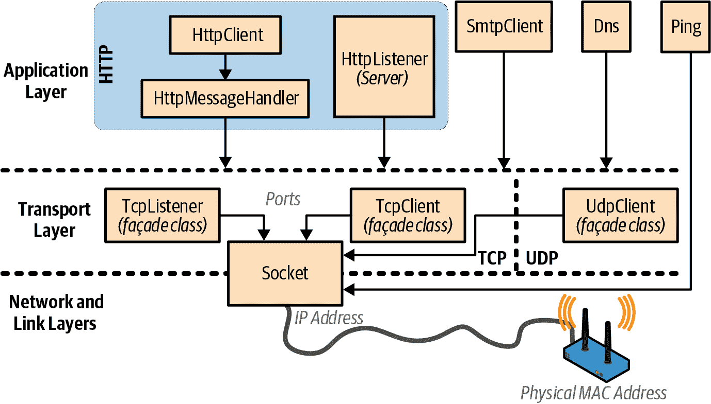
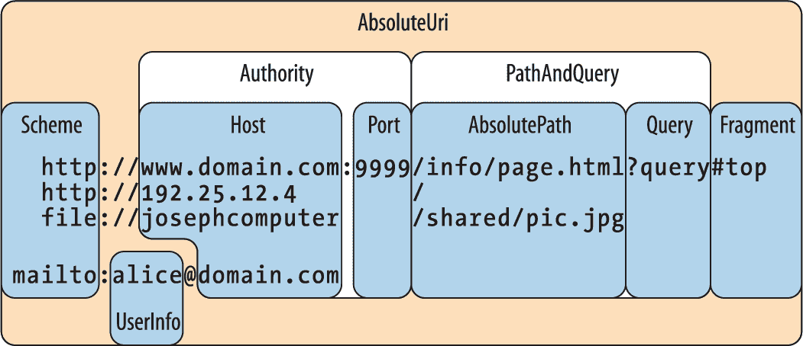

# 第十六章\. 网络

.NET 提供了一系列类用于通过标准网络协议（如 HTTP 和 TCP/IP）进行通信，这些类位于 `System.Net.*` 命名空间中。以下是关键组件的摘要：

+   `HttpClient` 用于消费 HTTP Web API 和 RESTful 服务

+   `HttpListener` 用于编写 HTTP 服务器

+   `SmtpClient` 用于通过 SMTP 构建和发送邮件消息

+   `Dns` 用于在域名和地址之间进行转换

+   `TcpClient`、`UdpClient`、`TcpListener` 和 `Socket` 类用于直接访问传输和网络层

本章中的 .NET 类型位于 `System.Net.*` 和 `System.IO` 命名空间中。

###### 注意

.NET 还为 FTP 提供了客户端支持，但仅限于自 .NET 6 起已标记为过时的类。如果需要使用 FTP，您最好选择 NuGet 库，例如 FluentFTP。

# 网络架构

图 16-1 展示了 .NET 网络类型及其所属的通信层。大多数类型位于传输层或应用层。传输层定义了发送和接收字节的基本协议（TCP 和 UDP）；应用层定义了针对特定应用程序设计的高级协议，例如检索网页（HTTP）、发送邮件（SMTP）和在域名和 IP 地址之间转换（DNS）。



###### 图 16-1\. 网络架构

通常最方便的是在应用层编程；但是，直接在传输层工作可能有几个理由。其中一个是如果您需要 .NET 中没有提供的应用层协议，比如用于检索邮件的 POP3。另一个是如果您想为特殊应用程序（如对等客户端）发明自定义协议。

应用层协议中，HTTP 在其通用通信适用性上非常特殊。其基本操作模式——“给我这个 URL 的网页”——很好地适应于“使用这些参数调用此端点后得到的结果”。（除了“get”动词外，还有“put”、“post”和“delete”，允许基于 REST 的服务。）

HTTP 还具有丰富的功能集，对于多层业务应用程序和面向服务的架构非常有用，如身份验证和加密协议、消息分块、可扩展的头部和 Cookie、以及许多服务器应用程序共享单一端口和 IP 地址的能力。因此，HTTP 在 .NET 中得到了很好的支持——既通过本章描述的直接支持，也通过 Web API 和 ASP.NET Core 等技术在更高层次上支持。

如前所述，网络是一个充斥着缩略词的领域。我们在表 16-1 中列出了最常见的缩略词。

表 16-1\. 网络缩略词

| 缩略词 | 扩展 | 备注 |
| --- | --- | --- |
| DNS | 域名服务 | 在域名（例如 *ebay.com*）和 IP 地址（例如 199.54.213.2）之间进行转换 |
| FTP | 文件传输协议 | 用于发送和接收文件的互联网协议 |
| HTTP | 超文本传输协议 | 检索网页和运行网络服务 |
| IIS | 互联网信息服务 | 微软的网络服务器软件 |
| IP | 互联网协议 | 位于 TCP 和 UDP 之下的网络层协议 |
| LAN | 局域网 | 大多数 LAN 使用基于互联网的协议，如 TCP/IP |
| POP | 邮局协议 | 检索互联网邮件 |
| REST | 表述性状态转移 | 使用响应中的可机器跟随链接的流行 Web 服务架构，可以在基本的 HTTP 上运行 |
| SMTP | 简单邮件传输协议 | 发送互联网邮件 |
| TCP | 传输和控制协议 | 大多数高层服务建立在其上的传输层互联网协议 |
| UDP | 通用数据报协议 | 用于低开销服务（如 VoIP）的传输层互联网协议 |
| UNC | 通用命名约定 | *\\computer\sharename\filename* |
| URI | 统一资源标识符 | 普遍的资源命名系统（例如，*http://www.amazon.com* 或 *mailto:joe@bloggs.org*） |
| URL | 统一资源定位符 | 技术含义（逐渐不再使用）：URI 的子集；普通含义：URI 的同义词 |

# 地址和端口

为了使通信正常工作，计算机或设备需要一个地址。互联网使用两个寻址系统：

IPv4

目前主导的寻址系统；IPv4 地址为 32 位。以字符串格式化时，IPv4 地址写成四个点分隔的十进制数（例如，101.102.103.104）。一个地址可以是全球唯一的，或者在特定*子网*内是唯一的（例如在企业网络上）。

IPv6

较新的 128 位寻址系统。地址以十六进制格式化，并用冒号分隔（例如，[3EA0:FFFF:198A:E4A3:​4FF2:54fA:41BC:8D31]）。在.NET 中，需要在地址周围加上方括号。

`System.Net`命名空间中的`IPAddress`类表示任一协议中的地址。它有一个接受字节数组的构造函数，并且一个静态的`Parse`方法接受正确格式的字符串：

```cs
IPAddress a1 = new IPAddress (new byte[] { 101, 102, 103, 104 });
IPAddress a2 = IPAddress.Parse ("101.102.103.104");
Console.WriteLine (a1.Equals (a2));                     // True
Console.WriteLine (a1.AddressFamily);                   // InterNetwork

IPAddress a3 = IPAddress.Parse
  ("[3EA0:FFFF:198A:E4A3:4FF2:54fA:41BC:8D31]");
Console.WriteLine (a3.AddressFamily);   // InterNetworkV6
```

TCP 和 UDP 协议将每个 IP 地址分解为 65535 个端口，允许单个地址上的计算机运行多个应用程序，每个应用程序位于自己的端口上。许多应用程序具有标准的默认端口分配；例如，HTTP 使用端口 80；SMTP 使用端口 25。

###### 注意

TCP 和 UDP 端口从 49152 到 65535 是官方未分配的，因此它们非常适合测试和小规模部署。

在.NET 中，IP 地址和端口组合由`IPEndPoint`类表示：

```cs
IPAddress a = IPAddress.Parse ("101.102.103.104");
IPEndPoint ep = new IPEndPoint (a, 222);           // Port 222
Console.WriteLine (ep.ToString());                 // 101.102.103.104:222
```

###### 注意

防火墙阻止端口。在许多企业环境中，只有少数端口是开放的，通常是端口 80（用于非加密的 HTTP）和端口 443（用于安全 HTTP）。

# URI

URI 是一个特殊格式的字符串，描述了互联网或 LAN 上的资源，例如网页、文件或电子邮件地址。示例包括*http://www.ietf.org*、*ftp://myisp/doc.txt*和*mailto:joe@bloggs.com*。确切的格式由[*Internet Engineering Task Force*](http://www.ietf.org)（IETF）定义。

URI 可以分解为一系列元素—通常是*scheme*、*authority*和*path*。`System`命名空间中的`Uri`类正是执行此分割，为每个元素公开一个属性，如在图 16-2 中所示。



###### 图 16-2\. URI 属性

###### 注意

当您需要验证 URI 字符串的格式或将 URI 拆分为其组成部分时，`Uri`类非常有用。否则，您可以简单地将 URI 视为字符串—大多数网络方法都重载以接受`Uri`对象或字符串。

您可以通过将以下任何字符串传递到其构造函数来构造`Uri`对象：

+   URI 字符串，例如*http://www.ebay.com*或*file://janespc/sharedpics/dolphin.jpg*

+   硬盘上文件的绝对路径，例如*c:\myfiles\data.xlsx*或在 Unix 上，*/tmp/myfiles/data.xlsx*

+   LAN 上文件的 UNC 路径，例如*\\janespc\sharedpics\dolphin.jpg*

文件和 UNC 路径会自动转换为 URI：添加了“file:”协议，并将反斜杠转换为正斜杠。`Uri`构造函数还在创建`Uri`之前对您的字符串执行一些基本清理，包括将方案和主机名转换为小写，并删除默认和空白端口号。如果提供没有方案的 URI 字符串，例如*www.test.com*，则会引发`UriFormatException`。

`Uri`有一个`IsLoopback`属性，指示`Uri`是否引用本地主机（IP 地址 127.0.0.1），以及一个`IsFile`属性，指示`Uri`是否引用本地或 UNC（`IsUnc`）路径（`IsUnc`对于在 Linux 文件系统中挂载的*Samba*共享返回`false`）。如果`IsFile`返回`true`，则`LocalPath`属性返回一个针对本地操作系统友好的`AbsolutePath`版本（适当地使用斜杠或反斜杠），您可以在其上调用`File.Open`。

`Uri`的实例具有只读属性。要修改现有的`Uri`，请实例化一个`UriBuilder`对象—它具有可写属性，并可以通过其`Uri`属性转换回来。

`Uri`还提供了比较和减去路径的方法：

```cs
Uri info = new Uri ("http://www.domain.com:80/info/");
Uri page = new Uri ("http://www.domain.com/info/page.html");

Console.WriteLine (info.Host);     // www.domain.com
Console.WriteLine (info.Port);     // 80
Console.WriteLine (page.Port);     // 80  (Uri knows the default HTTP port)

Console.WriteLine (info.IsBaseOf (page));         // True
Uri relative = info.MakeRelativeUri (page);
Console.WriteLine (relative.IsAbsoluteUri);       // False
Console.WriteLine (relative.ToString());          // page.html
```

相对`Uri`，例如本示例中的*page.html*，如果调用除`IsAbsoluteUri`和`ToString()`之外的任何属性或方法，将抛出异常。您可以直接实例化相对`Uri`，如下所示：

```cs
Uri u = new Uri ("page.html", UriKind.Relative);
```

###### 警告

URI 中的尾部斜杠对于服务器如何处理请求（如果存在路径组件）具有重要意义。

在传统的 Web 服务器中，例如给定 URI *http://www.albahari.com/nutshell/*，您可以期望 HTTP Web 服务器查找站点 Web 文件夹中的*nutshell*子目录，并返回默认文档（通常是*index.html*）。

如果没有尾部斜杠，Web 服务器将会查找站点根目录中名为*nutshell*（没有扩展名）的文件——这通常不是您想要的。如果不存在这样的文件，大多数 Web 服务器会假定用户输入错误，并返回 301 *永久重定向*错误，建议客户端使用带有尾部斜杠的 URI 重试。默认情况下，.NET HTTP 客户端将以与 Web 浏览器相同的方式透明地响应 301，重新尝试建议的 URI。这意味着如果您在应包含尾部斜杠的地方省略了它，您的请求仍将起作用，但会增加不必要的额外往返。

`Uri`类还提供了静态帮助方法，例如`EscapeUriString()`，它将字符串转换为有效的 URL，将所有 ASCII 值大于 127 的字符转换为十六进制表示。`CheckHostName()`和`CheckSchemeName()`方法接受一个字符串，并检查其在给定属性上是否语法有效（尽管它们不试图确定主机或 URI 是否存在）。

# `HttpClient`

`HttpClient`类提供了现代 API，用于 HTTP 客户端操作，替代了旧的`WebClient`和`WebRequest`/`WebResponse`类型（这些类型已被标记为过时）。

`HttpClient`是为应对基于 HTTP 的 Web API 和 REST 服务的增长而编写的，并且在处理比简单获取 Web 页面更复杂的协议时提供了良好的体验。特别是：

+   单个`HttpClient`实例可以处理并发请求，并与自定义头部、cookie 和认证方案等功能良好配合。

+   `HttpClient`允许您编写和插入自定义消息处理程序。这使得在单元测试中进行模拟成为可能，并创建自定义管道（用于日志记录、压缩、加密等）。

+   `HttpClient`具有丰富且可扩展的类型系统，用于处理头部和内容。

###### 注意

`HttpClient`不支持进度报告。要解决此问题，请参阅[*http://www.albahari.com/nutshell/code.aspx*](http://www.albahari.com/nutshell/code.aspx)上的“使用 Progress.linq 的 HttpClient”或通过 LINQPad 的交互式样本库。

使用`HttpClient`的最简单方法是实例化它，然后调用其`Get*`方法之一，传入一个 URI：

```cs
string html = await new HttpClient().GetStringAsync ("http://linqpad.net");
```

（还有`GetByteArrayAsync`和`GetStreamAsync`。）`HttpClient`中所有的 I/O 绑定方法都是异步的。

与其`WebRequest`/`WebResponse`前身不同，为了获得最佳性能，您*必须*重用同一个`HttpClient`实例（否则诸如 DNS 解析可能会被不必要地重复，并且套接字会比必要时更长时间保持打开状态）。`HttpClient`允许并发操作，因此以下操作是合法的，并同时下载两个网页：

```cs
var client = new HttpClient();
var task1 = client.GetStringAsync ("http://www.linqpad.net");
var task2 = client.GetStringAsync ("http://www.albahari.com");
Console.WriteLine (await task1);
Console.WriteLine (await task2);
```

`HttpClient` 有一个 `Timeout` 属性和一个 `BaseAddress` 属性，该属性会将 URI 前缀添加到每个请求中。`HttpClient` 在某种程度上是一个薄壳：您可能希望在此处找到的大多数其他属性都在另一个名为 `HttpClientHandler` 的类中定义。要访问此类，您首先实例化它，然后将实例传递给 `HttpClient` 的构造函数：

```cs
var handler = new HttpClientHandler { UseProxy = false };
var client = new HttpClient (handler);
...
```

在此示例中，我们告诉处理程序禁用代理支持，有时可以通过避免自动代理检测的成本来提高性能。还有控制 cookie、自动重定向、身份验证等属性（我们将在下面的部分描述这些属性）。

## `GetAsync` 和 响应消息

`GetStringAsync`、`GetByteArrayAsync` 和 `GetStreamAsync` 方法是调用更通用的 `GetAsync` 方法的便捷快捷方式，后者返回一个 *响应消息*：

```cs
var client = new HttpClient();
// The GetAsync method also accepts a CancellationToken.
HttpResponseMessage response = await client.GetAsync ("http://...");
response.EnsureSuccessStatusCode();
string html = await response.Content.ReadAsStringAsync();
```

`HttpResponseMessage` 公开了用于访问标头（请参见 “标头”）和 HTTP `StatusCode` 的属性。不成功的状态代码（如 404（未找到））不会引发异常，除非您显式调用 `EnsureSuccessStatusCode`。然而，通信或 DNS 错误确实会引发异常。

`HttpContent` 有一个 `CopyToAsync` 方法，用于将内容写入另一个流中，这在将输出写入文件时非常有用：

```cs
using (var fileStream = File.Create ("linqpad.html"))
  await response.Content.CopyToAsync (fileStream);
```

`GetAsync` 是对应 HTTP 的四个动词之一（其余分别是 `PostAsync`、`PutAsync` 和 `DeleteAsync`）。我们稍后在 “上传表单数据” 中演示 `PostAsync`。

## `SendAsync` 和 请求消息

`GetAsync`、`PostAsync`、`PutAsync` 和 `DeleteAsync` 都是调用 `Send​A⁠sync` 的快捷方式，这是单个低级方法，所有其他方法都依赖于此。要使用此方法，首先构造一个 `HttpRequestMessage`：

```cs
var client = new HttpClient();
var request = new HttpRequestMessage (HttpMethod.Get, "http://...");
HttpResponseMessage response = await client.SendAsync (request);
response.EnsureSuccessStatusCode();
...
```

实例化 `HttpRequestMessage` 对象意味着可以自定义请求的属性，如标头（请参见 “标头”）和内容本身，允许您上传数据。

## 上传数据和`HttpContent`

在实例化 `HttpRequestMessage` 对象之后，可以通过分配其 `Content` 属性来上传内容。该属性的类型是名为 `HttpContent` 的抽象类。.NET 包括以下用于不同内容类型的具体子类（您也可以编写自己的）：

+   `ByteArrayContent`

+   `StringContent`

+   `FormUrlEncodedContent`（参见 “上传表单数据”）

+   `StreamContent`

例如：

```cs
var client = new HttpClient (new HttpClientHandler { UseProxy = false });
var request = new HttpRequestMessage (
  HttpMethod.Post, "http://www.albahari.com/EchoPost.aspx");
request.Content = new StringContent ("This is a test");
HttpResponseMessage response = await client.SendAsync (request);
response.EnsureSuccessStatusCode();
Console.WriteLine (await response.Content.ReadAsStringAsync());
```

## `HttpMessageHandler`

我们先前说过，大多数用于自定义请求的属性实际上不是在 `HttpClient` 中定义的，而是在 `HttpClientHandler` 中定义的。后者实际上是抽象类 `HttpMessageHandler` 的子类，定义如下：

```cs
public abstract class HttpMessageHandler : IDisposable
{
 protected internal abstract Task<HttpResponseMessage> SendAsync
 (HttpRequestMessage request, CancellationToken cancellationToken);

  public void Dispose();
  protected virtual void Dispose (bool disposing);
}
```

`SendAsync` 方法是从 `HttpClient` 的 `SendAsync` 方法中调用的。

`HttpMessageHandler` 足够简单，易于子类化，并提供了对 `HttpClient` 的可扩展性入口。

### 单元测试和模拟

我们可以通过子类化`HttpMessageHandler`创建一个*模拟*处理程序来辅助单元测试：

```cs
class MockHandler : HttpMessageHandler
{
  Func <HttpRequestMessage, HttpResponseMessage> _responseGenerator;

  public MockHandler
    (Func <HttpRequestMessage, HttpResponseMessage> responseGenerator)
  {
    _responseGenerator = responseGenerator;
  }

  protected override Task <HttpResponseMessage> SendAsync
    (HttpRequestMessage request, CancellationToken cancellationToken)
  {
    cancellationToken.ThrowIfCancellationRequested();
    var response = _responseGenerator (request);
    response.RequestMessage = request;
    return Task.FromResult (response);
  }
}
```

其构造函数接受一个函数，告诉模拟器如何从请求生成响应。这是最灵活的方法，因为同一个处理程序可以测试多个请求。

通过`Task.FromResult`，`SendAsync`是同步的。我们本可以通过使我们的响应生成器返回`Task<HttpResponseMessage>`来保持异步，但考虑到我们可以预期模拟函数的执行时间很短，这是毫无意义的。以下是如何使用我们的模拟处理器：

```cs
var mocker = new MockHandler (request => 
  new HttpResponseMessage (HttpStatusCode.OK)
  {
    Content = new StringContent ("You asked for " + request.RequestUri)
  });

var client = new HttpClient (mocker);    
var response = await client.GetAsync ("http://www.linqpad.net");
string result = await response.Content.ReadAsStringAsync();
Assert.AreEqual ("You asked for *http://www.linqpad.net/*", result);
```

（`Assert.AreEqual`是你会在诸如 NUnit 之类的单元测试框架中找到的方法。）

### 使用 DelegatingHandler 链接处理程序

您可以通过子类化`DelegatingHandler`创建调用另一个处理程序的消息处理程序（从而形成处理程序链）。您可以使用此方法来实现自定义认证、压缩和加密协议。以下是一个简单日志处理程序的示例：

```cs
class LoggingHandler : DelegatingHandler 
{
  public LoggingHandler (HttpMessageHandler nextHandler)
  {
     InnerHandler = nextHandler;
  }

  protected async override Task <HttpResponseMessage> SendAsync
    (HttpRequestMessage request, CancellationToken cancellationToken)
  {
    Console.WriteLine ("Requesting: " + request.RequestUri);
    var response = await base.SendAsync (request, cancellationToken);
    Console.WriteLine ("Got response: " + response.StatusCode);
    return response;
  }
}
```

请注意，我们在覆盖`SendAsync`时保持了异步性。在覆盖返回任务的方法时引入`async`修饰符是完全合法的，而且在这种情况下是可取的。

比直接写入`Console`更好的解决方案是让构造函数接受某种日志对象。更好的做法是接受一对`Action<T>`委托，告诉它如何记录请求和响应对象。

## 代理

*代理服务器*是一个中介，通过它可以路由 HTTP 请求。有时组织会设置代理服务器作为员工访问互联网的唯一途径，主要是因为它简化了安全性。代理有自己的地址，并且可以要求身份验证，以便只有局域网上的选定用户可以访问互联网。

要使用`HttpClient`与代理，首先创建一个`HttpClientHandler`并分配其`Proxy`属性，然后将其传递给`HttpClient`的构造函数：

```cs
WebProxy p = new WebProxy ("192.178.10.49", 808);
p.Credentials = new NetworkCredential ("*username*", "*password*", "*domain*");

var handler = new HttpClientHandler { Proxy = p };
var client = new HttpClient (handler);
...
```

`HttpClientHandler`还有一个`UseProxy`属性，您可以将其赋值为 false，而不是将`Proxy`属性置空以避免自动检测。

当构建`NetworkCredential`时，如果提供了一个域名，将使用基于 Windows 的认证协议。要使用当前认证的 Windows 用户，请将静态值`CredentialCache.DefaultNetworkCredentials`分配给代理的`Credentials`属性。

作为重复设置`Proxy`的替代方案，您可以如下设置全局默认值：

```cs
HttpClient.DefaultWebProxy = myWebProxy;
```

## 认证

您可以通过以下方式向`HttpClient`提供用户名和密码：

```cs
string username = "myuser";
string password = "mypassword";

var handler = new HttpClientHandler();
handler.Credentials = new NetworkCredential (username, password);
var client = new HttpClient (handler);
...
```

这适用于基于对话框的认证协议，如基本和摘要，并且可以通过`AuthenticationManager`类进行扩展。它还支持 Windows NTLM 和 Kerberos（如果在构建`NetworkCredential`对象时包括域名）。如果要使用当前认证的 Windows 用户，可以将`Credentials`属性留空，而是将`Use​De⁠faultCredentials`设置为`true`。

当您提供凭据时，`HttpClient`会自动协商兼容的协议。在某些情况下，可能会有选择：例如，如果您检查来自 Microsoft Exchange 服务器 Web 邮件页面的初始响应，则可能包含以下标头：

```cs
HTTP/1.1 401 Unauthorized
Content-Length: 83
Content-Type: text/html
Server: Microsoft-IIS/6.0
WWW-Authenticate: Negotiate
WWW-Authenticate: NTLM
WWW-Authenticate: Basic realm="exchange.somedomain.com"
X-Powered-By: ASP.NET
Date: Sat, 05 Aug 2006 12:37:23 GMT
```

401 代码表示需要授权；“WWW-Authenticate”标头指示理解的身份验证协议。然而，如果您配置了`HttpClientHandler`正确的用户名和密码，此消息将对您隐藏，因为运行时会自动选择兼容的身份验证协议，然后重新提交带有额外标头的原始请求。以下是一个示例：

```cs
Authorization: Negotiate TlRMTVNTUAAABAAAt5II2gjACDArAAACAwACACgAAAAQ
ATmKAAAAD0lVDRdPUksHUq9VUA==
```

此机制提供透明性，但每个请求都会生成一个额外的往返。您可以通过将`HttpClientHandler`的`PreAuthenticate`属性设置为`true`，来避免对同一 URI 的后续请求中产生额外的往返。

### CredentialCache

您可以使用`CredentialCache`对象强制指定特定的身份验证协议。凭据缓存包含一个或多个`NetworkCredential`对象，每个对象都与特定的协议和 URI 前缀相关联。例如，当登录到 Exchange Server 时，您可能希望避免基本协议，因为它会以明文传输密码：

```cs
CredentialCache cache = new CredentialCache();
Uri prefix = new Uri ("http://exchange.somedomain.com");
cache.Add (prefix, "Digest",  new NetworkCredential ("joe", "passwd"));
cache.Add (prefix, "Negotiate", new NetworkCredential ("joe", "passwd"));

var handler = new HttpClientHandler();
handler.Credentials = cache;
...
```

身份验证协议被指定为一个字符串。有效的值包括：

```cs
Basic, Digest, NTLM, Kerberos, Negotiate
```

在这种特定情况下，它将选择`Negotiate`，因为服务器未指示其在身份验证标头中支持`Digest`。`Negotiate`是一种 Windows 协议，目前归结为 Kerberos 或 NTLM，取决于服务器的能力，但确保在部署未来安全标准时应用程序具备前向兼容性。

静态的`CredentialCache.DefaultNetworkCredentials`属性允许您将当前经过身份验证的 Windows 用户添加到凭据缓存，而无需指定密码：

```cs
cache.Add (prefix, "Negotiate", CredentialCache.DefaultNetworkCredentials);
```

### 通过标头进行身份验证

另一种身份验证方式是直接设置身份验证标头：

```cs
var client = new HttpClient();
client.DefaultRequestHeaders.Authorization = 
  new AuthenticationHeaderValue ("Basic",
    Convert.ToBase64String (Encoding.UTF8.GetBytes ("username:password")));
...
```

这种策略也适用于 OAuth 等自定义身份验证系统。

## 标头

`HttpClient`允许您向请求添加自定义的 HTTP 标头，并枚举响应中的标头。标头简单地是包含元数据的键/值对，例如消息内容类型或服务器软件。`HttpClient`暴露了具有标准 HTTP 标头属性的强类型集合。`DefaultReques⁠t​Headers`属性适用于每个请求的标头：

```cs
var client = new HttpClient (handler);

client.DefaultRequestHeaders.UserAgent.Add (
  new ProductInfoHeaderValue ("VisualStudio", "2022"));

client.DefaultRequestHeaders.Add ("CustomHeader", "VisualStudio/2022");
```

但是，`HttpRequestMessage`类上的`Headers`属性是特定于请求的标头。

## 查询字符串

查询字符串只是附加到 URI 的字符串，带有问号，用于将简单数据发送到服务器。您可以使用以下语法在查询字符串中指定多个键/值对：

```cs
?key1=value1&key2=value2&key3=value3...
```

这是一个带有查询字符串的 URI：

```cs
string requestURI = "http://www.google.com/search?q=HttpClient&hl=fr";
```

如果您的查询可能包含符号或空格，请使用`Uri`的`EscapeDataString`方法创建合法的 URI：

```cs
string search = Uri.EscapeDataString ("(HttpClient or HttpRequestMessage)");
string language = Uri.EscapeDataString ("fr");
string requestURI = "http://www.google.com/search?q=" + search +
                    "&hl=" + language;
```

此生成的 URI 为：

```cs
http://www.google.com/search?q=(HttpClient%20OR%20HttpRequestMessage)&hl=fr
```

(`EscapeDataString`类似于`EscapeUriString`，但还会对`&`和`=`等字符进行编码，否则会破坏查询字符串。)

## 上传表单数据

要上传 HTML 表单数据，请创建并填充`FormUrlEncodedContent`对象。然后，可以将其传递给`PostAsync`方法或分配给请求的`Content`属性：

```cs
string uri = "http://www.albahari.com/EchoPost.aspx";
var client = new HttpClient();
var dict = new Dictionary<string,string> 
{
    { "Name", "Joe Albahari" },
    { "Company", "O'Reilly" }
};
var values = new FormUrlEncodedContent (dict);
var response = await client.PostAsync (uri, values);
response.EnsureSuccessStatusCode();
Console.WriteLine (await response.Content.ReadAsStringAsync());
```

## Cookie

Cookie 是 HTTP 服务器在响应标头中发送给客户端的名称/值字符串对。Web 浏览器客户端通常会记住 cookie，并在每个后续请求（到同一地址）中向服务器重放它们，直到它们过期。Cookie 允许服务器知道它是否在与一分钟前或昨天的同一客户端交谈，而无需在 URI 中使用混乱的查询字符串。

默认情况下，`HttpClient`会忽略从服务器收到的任何 cookie。要接受 cookie，请创建一个`CookieContainer`对象，并将其分配给`HttpClientHandler`：

```cs
var cc = new CookieContainer();
var handler = new HttpClientHandler();
handler.CookieContainer = cc;
var client = new HttpClient (handler);
...
```

要在将来的请求中重放接收到的 cookie，只需再次使用相同的`CookieContainer`对象。或者，您可以从头开始使用新的`CookieContainer`，然后手动添加 cookie，如下所示：

```cs
Cookie c = new Cookie ("PREF",
                       "ID=6b10df1da493a9c4:TM=1179...",
                       "/",
                       ".google.com");
freshCookieContainer.Add (c);
```

第三和第四个参数表示发起者的路径和域。客户端上的`CookieContainer`可以存储来自许多不同位置的 cookie；`HttpClient`仅发送路径和域与服务器匹配的 cookie。

# 编写 HTTP 服务器

###### 注意

如果您需要编写一个 HTTP 服务器，从.NET 6 开始，使用 ASP.NET 最小 API 是一种替代的更高级方法。以下是入门所需的全部步骤：

```cs
var app = WebApplication.CreateBuilder().Build();
app.MapGet ("/", () => "Hello, world!");
app.Run();
```

您可以使用`HttpListener`类编写自己的.NET HTTP 服务器。以下是一个简单的服务器示例，监听端口 51111，等待单个客户端请求，然后返回一行回复：

```cs
using var server = new SimpleHttpServer();

// Make a client request:
Console.WriteLine (await new HttpClient().GetStringAsync
  ("http://localhost:51111/MyApp/Request.txt"));

class SimpleHttpServer : IDisposable
{
  readonly HttpListener listener = new HttpListener();

  public SimpleHttpServer() => ListenAsync();  
  async void ListenAsync()
  {
    listener.Prefixes.Add ("http://localhost:51111/MyApp/");  // Listen on
    listener.Start();                                         // port 51111

    // Await a client request:
    HttpListenerContext context = await listener.GetContextAsync();

    // Respond to the request:
    string msg = "You asked for: " + context.Request.RawUrl;
    context.Response.ContentLength64 = Encoding.UTF8.GetByteCount (msg);
    context.Response.StatusCode = (int)HttpStatusCode.OK;

    using (Stream s = context.Response.OutputStream)
    using (StreamWriter writer = new StreamWriter (s))
      await writer.WriteAsync (msg);
  }

  public void Dispose() => listener.Close();
}

OUTPUT: You asked for: /MyApp/Request.txt
```

在 Windows 上，`HttpListener`不会内部使用.NET `Socket`对象；它会调用 Windows HTTP 服务器 API。这允许计算机上的许多应用程序监听相同的 IP 地址和端口，只要每个应用程序注册不同的地址前缀即可。在我们的示例中，我们注册了前缀*http://localhost/myapp*，因此另一个应用程序可以在另一个前缀*http://localhost/anotherapp*上自由监听相同的 IP 和端口。这很重要，因为在企业防火墙上打开新端口可能会很复杂。

当您调用`GetContext`时，`HttpListener`会等待下一个客户端请求，并返回一个具有`Request`和`Response`属性的对象。每个属性从服务器的角度看类似于客户端请求或响应。例如，您可以读取和写入请求和响应对象的头和 cookie，就像在客户端端一样。

你可以根据预期的客户端受众选择如何完全支持 HTTP 协议的功能。至少，你应该在每个请求上设置内容长度和状态码。

这是一个非常简单的异步编写的网页服务器：

```cs
using System;
using System.IO;
using System.Net;
using System.Text;
using System.Threading.Tasks;

class WebServer
{
  HttpListener _listener;
  string _baseFolder;      // Your web page folder.

  public WebServer (string uriPrefix, string baseFolder)
  {
    _listener = new HttpListener();
    _listener.Prefixes.Add (uriPrefix);
    _baseFolder = baseFolder;
  }

  public async void Start()
  {
    _listener.Start();
    while (true)
      try 
      {
        var context = await _listener.GetContextAsync();
        Task.Run (() => ProcessRequestAsync (context));
      }
      catch (HttpListenerException)     { break; }   // Listener stopped.
      catch (InvalidOperationException) { break; }   // Listener stopped.
  }

  public void Stop() => _listener.Stop();

  async void ProcessRequestAsync (HttpListenerContext context)
  {
    try
    {
      string filename = Path.GetFileName (context.Request.RawUrl);
      string path = Path.Combine (_baseFolder, filename);
      byte[] msg;
      if (!File.Exists (path))
      {
        Console.WriteLine ("Resource not found: " + path);
        context.Response.StatusCode = (int) HttpStatusCode.NotFound;
        msg = Encoding.UTF8.GetBytes ("Sorry, that page does not exist");
      }
      else
      {
        context.Response.StatusCode = (int) HttpStatusCode.OK;
        msg = File.ReadAllBytes (path);
      }
      context.Response.ContentLength64 = msg.Length;
      using (Stream s = context.Response.OutputStream)
        await s.WriteAsync (msg, 0, msg.Length);
    }
    catch (Exception ex) { Console.WriteLine ("Request error: " + ex); }
  }
}
```

下面的代码启动了一切：

```cs
// Listen on port 51111, serving files in d:\webroot:
var server = new WebServer ("http://localhost:51111/", @"d:\webroot");
try
{
  server.Start();
  Console.WriteLine ("Server running... press Enter to stop");
  Console.ReadLine();
}
finally { server.Stop(); }
```

您可以使用任何 Web 浏览器在客户端端测试此功能；在这种情况下，URI 将是*http://localhost:51111/*加上网页的名称。

###### 警告

如果其他软件竞争使用相同的端口，`HttpListener`将无法启动（除非该软件也使用 Windows HTTP 服务器 API）。可能监听默认端口 80 的应用程序包括 Web 服务器或对等程序（如 Skype）。

我们使用异步函数使得该服务器具有可伸缩性和效率。然而，从用户界面（UI）线程启动会阻碍可伸缩性，因为每个*请求*在每个`await`后会回到 UI 线程。考虑到我们没有共享状态，产生这样的开销特别是没有意义的，在 UI 场景下我们应该离开 UI 线程，像这样：

```cs
Task.Run (Start);
```

或在调用`GetContextAsync`之后调用`ConfigureAwait(false)`。

注意，我们使用`Task.Run`调用`ProcessRequestAsync`，即使该方法已经是异步的。这允许调用者*立即*处理另一个请求，而不必首先等待方法的同步阶段（直到第一个`await`）。

# 使用 DNS

静态的`Dns`类封装了 DNS，它在原始 IP 地址（例如 66.135.192.87）与人类友好的域名（例如*ebay.com*）之间进行转换。

`GetHostAddresses`方法从域名转换为 IP 地址（或多个地址）：

```cs
foreach (IPAddress a in Dns.GetHostAddresses ("albahari.com"))
  Console.WriteLine (a.ToString());     // 205.210.42.167
```

`GetHostEntry`方法反向操作，从地址转换为域名：

```cs
IPHostEntry entry = Dns.GetHostEntry ("205.210.42.167");
Console.WriteLine (entry.HostName);                    // albahari.com
```

`GetHostEntry`还接受`IPAddress`对象，因此可以指定 IP 地址为字节数组：

```cs
IPAddress address = new IPAddress (new byte[] { 205, 210, 42, 167 });
IPHostEntry entry = Dns.GetHostEntry (address);
Console.WriteLine (entry.HostName);                    // albahari.com
```

当您使用类似`WebRequest`或`TcpClient`的类时，域名会自动解析为 IP 地址。但是，如果您计划在应用程序的生命周期内对同一地址进行多次网络请求，有时通过首先使用`Dns`显式将域名转换为 IP 地址，然后直接与该 IP 地址通信，可以提高性能。这避免了重复的往返来解析相同的域名，并且在处理传输层（通过`TcpClient`，`UdpClient`或`Socket`）时可能会有所好处。

DNS 类还提供了可等待的基于任务的异步方法：

```cs
foreach (IPAddress a in await Dns.GetHostAddressesAsync ("albahari.com"))
  Console.WriteLine (a.ToString());
```

# 使用 SmtpClient 发送邮件

`System.Net.Mail`命名空间中的`SmtpClient`类允许您通过普遍存在的简单邮件传输协议（SMTP）发送邮件消息。要发送简单文本消息，请实例化`SmtpClient`，将其`Host`属性设置为您的 SMTP 服务器地址，然后调用`Send`：

```cs
SmtpClient client = new SmtpClient();
client.Host = "mail.myserver.com";
client.Send ("from@adomain.com", "to@adomain.com", "subject", "body");
```

构造`MailMessage`对象还提供了进一步的选项，包括添加附件的能力：

```cs
SmtpClient client = new SmtpClient();
client.Host = "mail.myisp.net";
MailMessage mm = new MailMessage();

mm.Sender = new MailAddress ("kay@domain.com", "Kay");
mm.From   = new MailAddress ("kay@domain.com", "Kay");
mm.To.Add  (new MailAddress ("bob@domain.com", "Bob"));
mm.CC.Add  (new MailAddress ("dan@domain.com", "Dan"));
mm.Subject = "Hello!";
mm.Body = "Hi there. Here's the photo!";
mm.IsBodyHtml = false;
mm.Priority = MailPriority.High;

Attachment a = new Attachment ("photo.jpg",
                               System.Net.Mime.MediaTypeNames.Image.Jpeg);
mm.Attachments.Add (a);
client.Send (mm);
```

为了阻止垃圾邮件发送者，大多数互联网上的 SMTP 服务器只接受来自经过身份验证的连接，并要求通过 SSL 进行通信：

```cs
var client = new SmtpClient ("smtp.myisp.com", 587)
{
  Credentials = new NetworkCredential ("me@myisp.com", "MySecurePass"),
  EnableSsl = true
};
client.Send ("me@myisp.com", "someone@somewhere.com", "Subject", "Body");
Console.WriteLine ("Sent");
```

通过更改`DeliveryMethod`属性，您可以指示`SmtpClient`改用 IIS 发送邮件消息，或者仅将每条消息写入指定目录中的*.eml*文件。这在开发过程中可能会很有用：

```cs
SmtpClient client = new SmtpClient();
client.DeliveryMethod = SmtpDeliveryMethod.SpecifiedPickupDirectory;
client.PickupDirectoryLocation = @"c:\mail";
```

# 使用 TCP

TCP 和 UDP 构成了大多数互联网和局域网服务构建在其上的传输层协议。HTTP（版本 2 及以下）、FTP 和 SMTP 使用 TCP；DNS 和 HTTP 版本 3 使用 UDP。TCP 是面向连接的，并包含可靠性机制；UDP 是无连接的，具有较低的开销，并支持广播。*BitTorrent*使用 UDP，VoIP（语音 IP）也是如此。

传输层提供了比较高层更大的灵活性和潜在的性能提升，但要求您自己处理诸如认证和加密等任务。

在.NET 中使用 TCP 时，您可以选择更易于使用的`TcpClient`和`TcpListener`外观类，或者功能丰富的`Socket`类。（事实上，您可以混合使用，因为`TcpClient`通过`Client`属性公开了底层的`Socket`对象。）`Socket`类公开了更多的配置选项，并允许直接访问网络层（IP）和非互联网协议，如 Novell 的 SPX/IPX。

与其他协议一样，TCP 区分客户端和服务器：客户端发起请求，而服务器等待请求。这是同步 TCP 客户端请求的基本结构：

```cs
using (TcpClient client = new TcpClient())
{
  client.Connect ("address", port);
  using (NetworkStream n = client.GetStream())
  {
    // Read and write to the network stream...
  }
}
```

`TcpClient`的`Connect`方法会阻塞，直到建立连接（`Connect​A⁠sync`是异步等价方法）。然后，`NetworkStream`提供了一种方式进行双向通信，用于从服务器传输和接收字节数据。

简单的 TCP 服务器看起来像这样：

```cs
TcpListener listener = new TcpListener (*<ip address>*, port);
listener.Start();

while (*keepProcessingRequests*)
  using (TcpClient c = listener.AcceptTcpClient())
  using (NetworkStream n = c.GetStream())
  {
    // Read and write to the network stream...
  }

listener.Stop();
```

`TcpListener`需要本地 IP 地址来监听（例如，一台计算机有两张网络卡，可能有两个地址）。您可以使用`IPAddress.Any`指示它监听所有（或唯一的）本地 IP 地址。`AcceptTcpClient`会阻塞，直到收到客户端的请求（也有一个异步版本），此时我们调用`GetStream`，就像在客户端一样。

在传输层工作时，您需要决定谁何时说话以及持续多长时间，有点像使用对讲机。如果双方同时说话或同时听取，通信就会中断！

让我们发明一个协议，在这个协议中客户端首先说“Hello”，然后服务器回复“Hello right back!” 这是代码：

```cs
using System;
using System.IO;
using System.Net;
using System.Net.Sockets;
using System.Threading;

new Thread (Server).Start();       // Run server method concurrently.
Thread.Sleep (500);                // Give server time to start.
Client();

void Client()
{
  using (TcpClient client = new TcpClient ("localhost", 51111))
  using (NetworkStream n = client.GetStream())
  {
    BinaryWriter w = new BinaryWriter (n);
    w.Write ("Hello");
    w.Flush();
    Console.WriteLine (new BinaryReader (n).ReadString());
  }
}

void Server()     // Handles a single client request, then exits.
{
  TcpListener listener = new TcpListener (IPAddress.Any, 51111);
  listener.Start();
  using (TcpClient c = listener.AcceptTcpClient())
  using (NetworkStream n = c.GetStream())
  {
    string msg = new BinaryReader (n).ReadString();
    BinaryWriter w = new BinaryWriter (n);
    w.Write (msg + " right back!");
    w.Flush();                      // Must call Flush because we're not
  }                                 // disposing the writer.
  listener.Stop();
}

// OUTPUT: Hello right back!
```

在此示例中，我们使用 `localhost` 回环来在同一台机器上运行客户端和服务器。我们任意选择了一个未分配范围内的端口（大于 49152），并使用 `BinaryWriter` 和 `BinaryReader` 来编码文本消息。为了保持底层的 `NetworkStream` 在对话完成之前保持打开状态，我们避免关闭或释放读写器。

`BinaryReader` 和 `BinaryWriter` 可能看起来是读写字符串的奇怪选择。然而，它们比 `StreamReader` 和 `StreamWriter` 有一个重要优势：它们在字符串前面加上一个指示长度的整数，因此 `BinaryReader` 总是确切地知道要读取多少字节。如果调用 `StreamReader.ReadToEnd`，可能会无限期地阻塞，因为 `NetworkStream` 没有结束！只要连接保持打开状态，网络流就无法确定客户端是否会发送更多数据。

###### 注意

`StreamReader` 实际上与 `NetworkStream` 完全不兼容，即使你只计划调用 `ReadLine`。这是因为 `StreamReader` 有一个预读缓冲区，可能会读取比当前可用的字节更多的字节，导致阻塞（或直到套接字超时）。其他流如 `FileStream` 与 `StreamReader` 不会有这种不兼容性，因为它们有一个明确的*结束*—当 `Read` 到达结束时，立即返回值 `0`。

## TCP 并发处理

`TcpClient` 和 `TcpListener` 提供了基于任务的异步方法，用于可扩展的并发处理。使用它们只需将阻塞方法调用替换为它们的 `*Async` 版本，并等待返回的任务。

在以下示例中，我们编写了一个异步 TCP 服务器，接受长度为 5,000 字节的请求，颠倒字节顺序，然后将其发送回客户端：

```cs
async void RunServerAsync ()
{
  var listener = new TcpListener (IPAddress.Any, 51111);
  listener.Start ();
  try
  {
    while (true)
      Accept (await listener.AcceptTcpClientAsync ());
  }
  finally { listener.Stop(); }
}

async Task Accept (TcpClient client)
{
  await Task.Yield ();
  try
  {
    using (client)
    using (NetworkStream n = client.GetStream ())
    {
      byte[] data = new byte [5000];

      int bytesRead = 0; int chunkSize = 1;
      while (bytesRead < data.Length && chunkSize > 0)
        bytesRead += chunkSize =
          await n.ReadAsync (data, bytesRead, data.Length - bytesRead);

      Array.Reverse (data);   // Reverse the byte sequence
      await n.WriteAsync (data, 0, data.Length);
    }
  }
  catch (Exception ex) { Console.WriteLine (ex.Message); }
}
```

这样的程序具有可伸缩性，因为它不会在请求的整个持续时间内阻塞线程。因此，如果有 1,000 个客户端同时通过慢速网络连接连接（例如，每个请求从开始到结束需要几秒钟），这个程序不会在此期间需要 1,000 个线程（不像同步解决方案）。相反，它只会在 `await` 表达式之前和之后短暂租用线程的时间。

# 使用 TCP 接收 POP3 邮件

.NET 在应用层上不提供 POP3 的支持，因此你需要在 TCP 层编写代码来接收来自 POP3 服务器的邮件。幸运的是，这是一个简单的协议；POP3 会话的过程如下：

| 客户端 | 邮件服务器 | 备注 |
| --- | --- | --- |
| *客户端连接中...* | `+OK 你好。` | 欢迎消息 |
| `USER joe` | `+OK 需要密码。` |  |
| `PASS 密码` | `+OK 登录成功。` |  |

| `LIST` | `+OK` `1 1876`

`2 5412`

`3 845`

`.` | 列出服务器上每个消息的 ID 和文件大小 |

| `RETR 1` | `+OK 1876 字节` *消息 #1 的内容...*

`.` | 检索指定 ID 的消息 |

| `DELE 1` | `+OK 已删除。` | 从服务器上删除一封消息 |
| --- | --- | --- |
| `QUIT` | `+OK 再见。` |  |

每个命令和响应都以新行（CR + LF）终止，除了多行的 `LIST` 和 `RETR` 命令，它们以单独一行上的一个点终止。因为我们不能在 `NetworkStream` 中使用 `StreamReader`，所以我们可以先编写一个帮助方法以非缓冲的方式读取一行文本：

```cs
string ReadLine (Stream s)
{
  List<byte> lineBuffer = new List<byte>();
  while (true)
  {
    int b = s.ReadByte();
    if (b == 10 || b < 0) break;
    if (b != 13) lineBuffer.Add ((byte)b);
  }
  return Encoding.UTF8.GetString (lineBuffer.ToArray());
}
```

我们还需要一个帮助方法来发送命令。因为我们总是期望收到以 `+OK` 开头的响应，所以我们可以同时读取和验证响应：

```cs
void SendCommand (Stream stream, string line)
{
  byte[] data = Encoding.UTF8.GetBytes (line + "\r\n");
  stream.Write (data, 0, data.Length);
  string response = ReadLine (stream);
  if (!response.StartsWith ("+OK"))
    throw new Exception ("POP Error: " + response);
}
```

使用这些编写的方法，检索邮件的工作变得简单。我们在端口 110 上（默认的 POP3 端口）建立一个 TCP 连接，然后开始与服务器通信。在这个例子中，我们将每封邮件写入一个随机命名的带有 *.eml* 扩展名的文件中，然后从服务器上删除该消息：

```cs
using (TcpClient client = new TcpClient ("*mail.isp.com*", 110))
using (NetworkStream n = client.GetStream())
{
  ReadLine (n);                             // Read the welcome message.
  SendCommand (n, "USER username");
  SendCommand (n, "PASS password");
  SendCommand (n, "LIST");                  // Retrieve message IDs
  List<int> messageIDs = new List<int>();
  while (true)
  {
    string line = ReadLine (n);             // e.g.,  "1 1876"
    if (line == ".") break;
    messageIDs.Add (int.Parse (line.Split (' ')[0] ));   // Message ID
  }

  foreach (int id in messageIDs)         // Retrieve each message.
  {
    SendCommand (n, "RETR " + id);
    string randomFile = Guid.NewGuid().ToString() + ".eml";
    using (StreamWriter writer = File.CreateText (randomFile))
      while (true)
      {
        string line = ReadLine (n);      // Read next line of message.
        if (line == ".") break;          // Single dot = end of message.
        if (line == "..") line = ".";    // "Escape out" double dot.
        writer.WriteLine (line);         // Write to output file.
      }
    SendCommand (n, "DELE " + id);       // Delete message off server.
  }
  SendCommand (n, "QUIT");
}
```

###### 注意

您可以在 NuGet 上找到开源的 POP3 库，提供支持协议方面的功能，如身份验证 TLS/SSL 连接，MIME 解析等。
