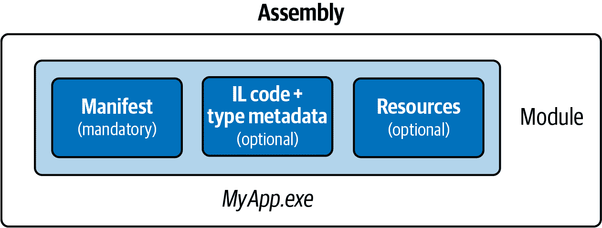
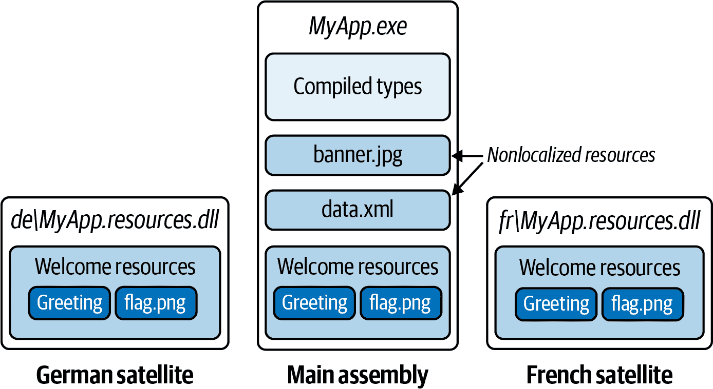

# 第十七章。程序集

*程序集*是.NET 中的部署基本单元，也是所有类型的容器。程序集包含具有其中间语言（IL）代码的编译类型，运行时资源，并帮助版本控制和引用其他程序集的信息。程序集还定义了类型解析的边界。在.NET 中，一个程序集由一个扩展名为*.dll*的单个文件组成。

###### 注意

当您在.NET 中构建可执行应用程序时，最终会得到两个文件：一个程序集（*.dll*）和一个适合目标平台的可执行启动器（*.exe*）。

这与.NET Framework 中的情况不同，后者生成一个*可移植可执行文件*（PE）程序集。PE 具有*.exe*扩展名，既可以作为程序集，又可以作为应用程序启动器。PE 可以同时针对 32 位和 64 位 Windows 版本。

本章大部分类型来自以下命名空间：

```cs
System.Reflection
System.Resources
System.Globalization
```

# 一个程序集的内容

一个程序集包含四种内容：

程序集清单

提供 CLR 的信息，例如程序集的名称、版本和其他它引用的程序集

应用程序清单

提供操作系统的信息，例如程序集应如何部署以及是否需要管理员权限

编译类型

程序集中定义的类型的编译 IL 代码和元数据

资源

程序集中嵌入的其他数据，例如图像和可本地化文本

这些中，只有*程序集清单*是强制的，尽管一个程序集几乎总是包含编译的类型（除非它是一个资源程序集。参见“资源和卫星程序集”）。

## 程序集清单

程序集清单有两个目的：

+   它描述了程序集给托管的主机环境。

+   它充当模块、类型和程序集中的资源的目录。

因此，程序集是*自描述的*。使用者可以发现程序集的所有数据、类型和函数，而无需额外的文件。

###### 注意

程序集清单并不是你明确添加到程序集中的东西——它是编译过程中自动嵌入到程序集中的一部分。

下面是存储在清单中的功能重要数据的摘要：

+   程序集的简单名称

+   版本号（`AssemblyVersion`）

+   程序集的公钥和签名哈希（如果是强命名的）

+   引用程序集的列表，包括它们的版本和公钥

+   列出程序集中定义的类型

+   它所针对的文化，如果是卫星程序集（`AssemblyCulture`）

清单还可以存储以下信息数据：

+   完整的标题和描述（`AssemblyTitle` 和 `AssemblyDescription`）

+   公司和版权信息（`AssemblyCompany` 和 `AssemblyCopyright`）

+   显示版本（`AssemblyInformationalVersion`）

+   用于自定义数据的其他属性

其中一些数据源于向编译器提供的参数，例如引用的程序集列表或用于签名程序集的公钥。其余部分来自程序集属性，括在括号中。

###### 注意

您可以使用 .NET 工具 *ildasm.exe* 查看程序集清单的内容。在 第十八章 中，我们描述了如何使用反射以编程方式执行相同操作。

### 指定程序集属性

常用程序集属性可以在项目的属性页上指定，位于“包”选项卡中的 Visual Studio 中。该选项卡上的设置将添加到项目文件（*.csproj*）中。

要指定不受“包”选项卡支持的属性，或者不使用 *.csproj* 文件，可以在源代码中指定程序集属性（通常在名为 *AssemblyInfo.cs* 的文件中完成）。

专用属性文件仅包含 `using` 语句和程序集属性声明。例如，要向单元测试项目公开内部作用域类型，可以执行以下操作：

```cs
using System.Runtime.CompilerServices;

[assembly:InternalsVisibleTo("MyUnitTestProject")]
```

## 应用程序清单（Windows）

应用程序清单是一个 XML 文件，用于向操作系统传达有关程序集的信息。在构建过程中，应用程序清单作为 Win32 资源嵌入到启动可执行文件中。如果存在清单，则在 CLR 加载程序集之前会读取和处理清单，可能影响 Windows 启动应用程序的方式。

.NET 应用程序清单在 XML 命名空间 `urn:schemas-microsoft-com:asm.v1` 中具有名为 `assembly` 的根元素：

```cs
<?xml version="1.0" encoding="utf-8"?>
<assembly manifestVersion="1.0" >
  <!-- contents of manifest -->
</assembly>
```

以下清单指示操作系统请求管理员权限：

```cs
<?xml version="1.0" encoding="utf-8"?>
<assembly manifestVersion="1.0" >
  <trustInfo >
    <security>
      <requestedPrivileges>
        <requestedExecutionLevel level="requireAdministrator" />
      </requestedPrivileges>
    </security>
  </trustInfo>
</assembly>
```

（UWP 应用程序具有更为复杂的清单，在 *Package​.appxmanifest* 文件中进行描述。这包括程序的功能声明，决定了操作系统授予的权限。编辑此文件的最简单方式是使用 Visual Studio，双击清单文件时会显示对话框。）

### 部署应用程序清单

在 Visual Studio 中，通过在解决方案资源管理器中右键单击项目，选择“添加”，然后选择“新建项目”，再选择“应用程序清单文件”，即可向 .NET 项目添加应用程序清单。构建项目后，清单将嵌入到输出的程序集中。

###### 注意

.NET 工具 *ildasm.exe* 无法感知嵌入的应用程序清单的存在。但是，使用 Visual Studio 时，如果在解决方案资源管理器中双击程序集，可以看到是否存在嵌入的应用程序清单。

## 模块

程序集的内容实际上打包在一个中间容器中，称为 *模块*。模块对应于包含程序集内容的文件。引入此额外的容器层的原因是允许一个程序集跨多个文件。这是 .NET Framework 中存在但在 .NET 5+ 和 .NET Core 中缺失的功能。图 17-1 描述了这种关系。



###### 图 17-1\. 单文件组件

尽管 .NET 不支持多文件组件，但有时您需要注意模块带来的额外层次结构。主要场景是反射（见 “反射组件” 和 “生成组件和类型”）。

## Assembly 类

`System.Reflection` 中的 `Assembly` 类是在运行时访问组件元数据的入口。有多种方法可以获取组件对象：最简单的方法是通过 `Type` 的 `Assembly` 属性：

```cs
Assembly a = typeof (Program).Assembly;
```

您还可以通过调用 `Assembly` 的静态方法之一来获取 `Assembly` 对象：

`GetExecutingAssembly`

返回定义当前执行函数的类型的组件

`GetCallingAssembly`

执行与 `GetExecutingAssembly` 相同的操作，但适用于调用当前执行函数的函数

`GetEntryAssembly`

返回定义应用程序原始入口方法的组件

获取 `Assembly` 对象后，您可以使用其属性和方法查询组件的元数据，并反映其类型。表 17-1 总结了这些功能。

表 17-1\. 组件成员

| 函数 | 目的 | 参见章节... |
| --- | --- | --- |
| `FullName`, `GetName` | 返回完全限定名称或 `AssemblyName` 对象 | “组件名称” |
| `CodeBase`, `Location` | 组件文件的位置 | “加载、解析和隔离组件” |
| `Load`, `LoadFrom`, `LoadFile` | 手动将组件加载到内存中 | “加载、解析和隔离组件” |
| `GetSatelliteAssembly` | 定位给定文化的卫星组件 | “资源和卫星组件” |
| `GetType`, `GetTypes` | 返回组件中定义的类型或所有类型 | “反射和激活类型” |
| `EntryPoint` | 返回应用程序的入口方法，作为 `MethodInfo` | “反射和调用成员” |
| `GetModule`, `GetModules`, `ManifestModule` | 返回组件的所有模块或主模块 | “反射组件” |
| `GetCustomAttribute`, `GetCustomAttributes` | 返回组件的属性 | “使用属性” |

# 强命名和组件签名

###### 注意

在 .NET Framework 中，强命名组件之所以重要有两个原因：

+   它允许组件加载到“全局组件缓存”中。

+   它允许其他强命名组件引用该组件。

在 .NET 5+ 和 .NET Core 中，强命名不再那么重要，因为这些运行时没有全局组件缓存，也不会施加第二个限制。

强命名的程序集具有唯一的标识。它通过向清单添加两个元数据来工作：

+   属于程序集作者的*唯一编号*

+   程序集的签名哈希，证明唯一编号持有者生成了该程序集

这需要一个公共/私有密钥对。*公共密钥*提供唯一的标识号码，*私有密钥*用于签名。

###### 注意

*强名称*签名与*Authenticode*签名不同。我们稍后在本章讨论 Authenticode。

公共密钥在保证程序集引用的唯一性方面非常有价值：强命名的程序集将公钥并入其标识中。

在.NET Framework 中，私钥保护您的程序集免受篡改，没有私钥，无法发布修改版而不破坏签名的程序集。实际上，在将程序集加载到.NET Framework 的全局程序集缓存时，这非常有用。在.NET 5+和.NET Core 中，签名几乎没有用，因为从未检查过。

向之前命名“弱”的程序集添加强名称会改变其标识。因此，如果您认为程序集将来可能需要强名称，最好从一开始就为其添加强名称。

## 如何为程序集提供强名称

要为程序集提供强名称，首先使用*sn.exe*实用程序生成公共/私有密钥对：

```cs
sn.exe -k MyKeyPair.snk
```

###### 注意

Visual Studio 安装了一个名为*Developer Command Prompt for VS*的快捷方式，它启动的命令提示符包含开发工具，如*sn.exe*。

这会生成一个新的密钥对，并将其存储到名为*MyKeyPair.snk*的文件中。如果随后丢失此文件，您将永久失去使用相同标识重新编译程序集的能力。

您可以通过更新项目文件来使用此文件对程序集进行签名。从 Visual Studio，转到项目属性窗口，然后在*Signing*选项卡上，选中“Sign the assembly”复选框，并选择您的*.snk*文件。

相同的密钥对可以签署多个程序集 - 如果它们的简单名称不同，则它们仍将具有不同的标识。

# 程序集名称

程序集的“标识”由其清单中的四个元数据组成：

+   其简单名称

+   其版本号（如果不存在则为“0.0.0.0”）

+   其文化（如果不是卫星则为“neutral”）

+   其公钥令牌（如果未强命名则为“null”）

简单名称并非由任何属性命名，而是来自最初编译的文件名称（减去任何扩展名）。因此，*System.Xml.dll* 程序集的简单名称是“System.Xml”。重命名文件不会改变程序集的简单名称。

版本号来自`AssemblyVersion`属性。它是一个分为四部分的字符串，如下所示：

```cs
*major*.*minor*.*build*.*revision*
```

您可以如下指定版本号：

```cs
[assembly: AssemblyVersion ("2.5.6.7")]
```

文化来自`AssemblyCulture`属性，并适用于稍后在“资源和卫星程序集”部分描述的卫星程序集。

公钥标记来自于编译时提供的强名称，正如我们在前面的部分讨论的那样。

## 完全限定名称

完全限定的程序集名称是一个字符串，其中包括所有四个标识组件，格式如下：

```cs
*simple-name*, Version=*version*, Culture=*culture*, PublicKeyToken=*public-key*
```

例如，*System.Private.CoreLib.dll*的完全限定名称是*System.Private.CoreLib, Version=4.0.0.0, Culture=neutral, PublicKeyToken=7cec85d7bea7798e*。

如果程序集没有`AssemblyVersion`属性，则版本显示为`0.0.0.0`。如果它未签名，则其公钥标记显示为`null`。

`Assembly`对象的`FullName`属性返回其完全限定名称。编译器在记录程序集引用到清单中时总是使用完全限定名称。

###### 注意

完全限定的程序集名称不包括用于在磁盘上定位它的目录路径。定位位于另一个目录中的程序集是一个完全不同的问题，我们将在“加载、解析和隔离程序集”中讨论。

## `AssemblyName`类

`AssemblyName`是一个类，每个完全限定程序集名称的组件都有一个类型化的属性。`AssemblyName`有两个目的：

+   它解析或构建一个完全限定的程序集名称。

+   它存储一些额外的数据以帮助解析（查找）程序集。

你可以通过以下任一方式获得一个`AssemblyName`对象：

+   实例化一个`AssemblyName`，提供完全限定名。

+   在现有的`Assembly`上调用`GetName`。

+   调用`AssemblyName.GetAssemblyName`，提供磁盘上程序集文件的路径。

你也可以实例化一个没有任何参数的`AssemblyName`对象，然后设置每个属性以构建一个完全限定名。以这种方式构造的`AssemblyName`是可变的。

下面是它的基本属性和方法：

```cs
string      FullName    { get; }            // Fully qualified name
string      Name        { get; set; }       // Simple name
Version     Version     { get; set; }       // Assembly version
CultureInfo CultureInfo { get; set; }       // For satellite assemblies
string      CodeBase    { get; set; }       // Location

byte[]      GetPublicKey();                 // 160 bytes
void        SetPublicKey (byte[] key);
byte[]      GetPublicKeyToken();            // 8-byte version
void        SetPublicKeyToken (byte[] publicKeyToken);
```

`Version`本身是一个强类型表示，具有`Major`、`Minor`、`Build`和`Revision`数字的属性。`GetPublicKey`返回完整的加密公钥；`GetPublicKeyToken`返回用于建立身份的最后八个字节。

要使用`AssemblyName`获取程序集的简单名称：

```cs
Console.WriteLine (typeof (string).Assembly.GetName().Name);
// System.Private.CoreLib
```

要获取程序集版本：

```cs
string v = myAssembly.GetName().Version.ToString();
```

## 程序集信息和文件版本

另外两个与版本相关的程序集属性可用。与`AssemblyVersion`不同，以下两个属性不会影响程序集的标识，因此对编译时或运行时发生的情况没有影响：

`AssemblyInformationalVersion`

作为最终用户可见的版本。这在 Windows 文件属性对话框中显示为产品版本。可以在此处使用任何字符串，例如“5.1 Beta 2”。通常，应用程序中的所有程序集将被分配相同的信息版本号。

`AssemblyFileVersion`

这是用来指代该程序集的生成编号。在 Windows 文件属性对话框中称为文件版本。与`AssemblyVersion`一样，它必须包含一个由点分隔的最多四个数字组成的字符串。

# Authenticode 签名

*Authenticode*是一个代码签名系统，其目的是证明发布者的身份。Authenticode 和*强名称*签名是独立的：您可以使用任一或两种系统对程序集进行签名。

尽管强名称签名可以证明程序集 A、B 和 C 来自同一方（假设私钥未泄漏），但它不能告诉您那个方是谁。要知道方是 Joe Albahari 或 Microsoft Corporation，您需要 Authenticode。

从互联网下载程序时，Authenticode 非常有用，因为它确保程序来自证书颁发机构指定的发布者，并且在传输过程中未经修改。它还可以防止第一次运行下载应用程序时的“未知发布者”警告。提交应用程序到 Windows 商店也需要 Authenticode 签名。

Authenticode 不仅适用于.NET 程序集，还适用于非托管可执行文件和二进制文件，如*.msi*部署文件。当然，Authenticode 并不能保证程序没有恶意软件——尽管它确实降低了这种可能性。一个人或实体愿意在可执行文件或库文件背后署名（由护照或公司文件支持）。

###### 注意

CLR 不将 Authenticode 签名视为程序集身份的一部分。然而，它可以按需读取和验证 Authenticode 签名，您将很快看到。

使用 Authenticode 需要与*证书颁发机构*（CA）联系，提供个人身份或公司身份的证明（公司章程等）。CA 审核您的文件后，将颁发一个通常有效期为一到五年的 X.509 代码签名证书。这使您可以使用*signtool*实用程序签名程序集。您也可以使用*makecert*实用程序自行创建证书；但是，它只能在显式安装了该证书的计算机上识别。

(非自签名)证书可以在任何计算机上工作的事实依赖于公钥基础设施。基本上，您的证书由另一个属于 CA 的证书签名。CA 是受信任的，因为所有 CA 都加载到操作系统中。（要查看它们，请转到 Windows 控制面板，然后在搜索框中键入`**certificate**`。在“管理计算机证书”中，打开“受信任的根证书颁发机构”节点，然后单击证书。这将启动证书管理器。）如果泄露了发布者的证书，CA 可以吊销其证书，因此验证 Authenticode 签名需要定期向 CA 请求最新的证书吊销列表。

因为 Authenticode 使用加密签名，如果有人随后篡改文件，Authenticode 签名将无效。我们将在第二十章讨论加密、哈希和签名。

## 如何使用 Authenticode 签名

### 获取和安装证书

第一步是从 CA 获取代码签名证书（请参阅接下来的侧边栏）。然后，您可以将证书作为受密码保护的文件处理，或者将证书加载到计算机的证书存储中。后者的好处是，您可以在不需要指定密码的情况下进行签名。这是有利的，因为它可以防止密码出现在自动构建脚本或批处理文件中。

要将证书加载到计算机的证书存储中，请如前所述打开证书管理器。打开个人文件夹，右键单击其证书文件夹，然后选择所有任务/导入。导入向导将指导您完成整个过程。导入完成后，单击证书上的“查看”按钮，转到“详细信息”选项卡，并复制证书的*指纹*。这是 SHA-256 哈希值，您随后需要用它来识别签名时使用的证书。

###### 注意

如果您还希望对程序集进行强名称签名，必须在进行 Authenticode 签名之前*完成*。这是因为 CLR 了解 Authenticode 签名，但反之不然。因此，如果在 Authenticode 签名后再对程序集进行强名称签名，后者将视 CLR 的强名称添加为未经授权的修改，并认为程序集已被篡改。

### 使用 signtool.exe 进行签名

您可以使用随 Visual Studio 提供的*signtool*工具对程序进行 Authenticode 签名（在*Program Files*下的*Microsoft SDKs\ClickOnce\SignTool*文件夹中查找）。以下是使用计算机的*My Store*中名为“Joseph Albahari”的证书，并使用安全的 SHA256 哈希算法对名为*LINQPad.exe*的文件进行签名的示例：

```cs
signtool sign /n "Joseph Albahari" /fd sha256 LINQPad.exe
```

您还可以使用`/d`和`/du`指定描述和产品 URL：

```cs
 ... /d LINQPad /du *http://www.linqpad.net*
```

大多数情况下，您还需要指定一个*时间戳服务器*。

### 时间戳

在您的证书过期后，您将无法再签名程序。但是，如果在其过期*之前*使用`/tr`开关指定了*时间戳服务器*来签名程序，那么您之前签名的程序仍将有效。CA 将为此提供一个 URI：以下是为 Comodo（或 K Software）提供的：

```cs
 ... /tr *http://timestamp.comodoca.com/authenticode* /td SHA256
```

### 验证程序是否已签名

在 Windows 资源管理器中查看文件的 Authenticode 签名最简单的方法是查看文件属性（查看数字签名选项卡）。*signtool*工具也提供了此选项。

# 资源和卫星程序集

应用程序通常不仅包含可执行代码，还包括文本、图像或 XML 文件等内容。这些内容可以通过*资源*在程序集中表示。资源有两个重叠的用途场景：

+   包含不能放入源代码的数据，例如图片

+   在多语言应用程序中存储可能需要翻译的数据

程序集资源最终是一个带有名称的字节流。你可以将程序集看作是包含以字符串为键的字节数组字典。如果你反汇编包含名为 *banner.jpg* 和名为 *data.xml* 的资源的程序集，可以在 *ildasm* 中看到这一点：

```cs
.mresource public banner.jpg
{
  // Offset: 0x00000F58 Length: 0x000004F6
}
.mresource public data.xml
{
  // Offset: 0x00001458 Length: 0x0000027E
}
```

在这种情况下，*banner.jpg* 和 *data.xml* 直接包含在程序集中，每个作为其自身的嵌入资源。这是最简单的工作方式。

.NET 还允许你通过中间的 *.resources* 容器添加内容。这些设计用于保存可能需要翻译成不同语言的内容。本地化的 *.resources* 可以打包为个别的卫星程序集，根据用户操作系统语言在运行时自动选择。

图 17-2 说明了一个包含两个直接嵌入资源以及一个名为 *welcome.resources* 的 *.resources* 容器的程序集，我们已经为它创建了两个本地化卫星。



###### 图 17-2\. 资源

## 直接嵌入资源

###### 注意

在 Windows Store 应用中不支持将资源嵌入到程序集中。相反，将任何额外的文件添加到你的部署包中，并通过从应用的 `StorageFolder` (`Package.Current.InstalledLocation`) 读取它们来访问。

直接使用 Visual Studio 嵌入资源：

+   将文件添加到你的项目中。

+   将其构建操作设置为嵌入资源。

Visual Studio 总是使用项目的默认命名空间前缀资源名称，加上包含文件的任何子文件夹的名称。所以，如果你的项目默认命名空间是 `Westwind.Reports`，并且你的文件在名为 *pictures* 的文件夹中叫做 *banner.jpg*，资源名称将是 *Westwind.Reports.pictures.banner.jpg*。

###### 注意

资源名称区分大小写。这使得在包含资源的 Visual Studio 项目子文件夹名称实际上是大小写敏感的。

要检索资源，可以在包含资源的程序集上调用 `GetManifestResourceStream`。这会返回一个流，你可以像处理其他流一样读取它：

```cs
Assembly a = Assembly.GetEntryAssembly();

using (Stream s = a.GetManifestResourceStream ("TestProject.data.xml"))
using (XmlReader r = XmlReader.Create (s))
  ...

System.Drawing.Image image;
using (Stream s = a.GetManifestResourceStream ("TestProject.banner.jpg"))
  image = System.Drawing.Image.FromStream (s);
```

返回的流是可寻址的，所以你也可以这样做：

```cs
byte[] data;
using (Stream s = a.GetManifestResourceStream ("TestProject.banner.jpg"))
  data = new BinaryReader (s).ReadBytes ((int) s.Length);
```

如果你使用 Visual Studio 嵌入资源，必须记得包含基于命名空间的前缀。为了帮助避免错误，你可以在单独的参数中指定前缀，使用*类型*。类型的命名空间被用作前缀：

```cs
using (Stream s = a.GetManifestResourceStream (typeof (X), "data.xml"))
```

`X` 可以是带有你资源所需命名空间的任何类型（通常是同一项目文件夹中的类型）。

###### 注意

在 Windows Presentation Foundation（WPF）应用程序中，将项目项的构建操作设置为资源与设置其构建操作设置为嵌入资源不同。前者实际上将项目添加到名为 *<AssemblyName>.g.resources* 的 *.resources* 文件中，其内容可以通过 WPF 的 `Application` 类访问，使用 URI 作为键。

为了增加混淆，WPF 进一步重载了术语“资源”。*静态资源* 和 *动态资源* 都与程序集资源无关！

`GetManifestResourceNames` 返回程序集中所有资源的名称。

## .resources 文件

*.resources* 文件是包含潜在本地化内容的容器。 *.resources* 文件最终作为嵌入式资源嵌入到程序集中，就像任何其他类型的文件一样。区别在于，您必须执行以下操作：

+   将内容打包到 *.resources* 文件中开始

+   通过 `ResourceManager` 或 *pack URI* 访问其内容，而不是通过 `Get​ManifestResourceStream` 获取。

*.resources* 文件以二进制结构化，因此不适合人工编辑；因此，您必须依赖 .NET 和 Visual Studio 提供的工具来处理它们。对于字符串或简单数据类型的标准方法是使用 *.resx* 格式，该格式可以通过 Visual Studio 或 `resgen` 工具转换为 *.resources* 文件。 *.resx* 格式也适用于用于 Windows Forms 或 ASP.NET 应用程序的图像。

在 WPF 应用程序中，无论是否需要本地化，都必须使用 Visual Studio 的“资源”构建操作来处理需要通过 URI 引用的图像或类似内容。

我们在以下各节中描述如何执行每个操作。

## .resx 文件

*.resx* 文件是用于生成 *.resources* 文件的设计时格式。 *.resx* 文件使用 XML，并且结构化为以下名称/值对：

```cs
<root>
  <data name="Greeting">
    <value>hello</value>
  </data>
  <data name="DefaultFontSize" type="System.Int32, mscorlib">
    <value>10</value>
  </data>
</root>
```

要在 Visual Studio 中创建 *.resx* 文件，请添加类型为资源文件的项目项。其余工作将自动完成：

+   创建了正确的标头。

+   提供了一个设计器，用于添加字符串、图像、文件和其他类型的数据。

+   *.resx* 文件在编译时自动转换为 *.resources* 格式并嵌入到程序集中。

+   编写一个类来帮助您稍后访问数据。

###### 注意

资源设计器将图像添加为类型化的 `Image` 对象（*System.Drawing.dll*），而不是字节数组，因此不适用于 WPF 应用程序。

### 读取 .resources 文件

###### 注意

如果在 Visual Studio 中创建 *.resx* 文件，则将自动生成同名类，其中包含检索其各个项的属性。

`ResourceManager` 类读取嵌入在程序集中的 *.resources* 文件：

```cs
ResourceManager r = new ResourceManager ("welcome",
                                         Assembly.GetExecutingAssembly());
```

（如果资源是在 Visual Studio 中编译的，则第一个参数必须带命名空间前缀。）

然后，通过调用 `GetString` 或 `GetObject`（进行强制转换）访问其中的内容。

```cs
string greeting = r.GetString ("Greeting");
int fontSize = (int) r.GetObject ("DefaultFontSize");
Image image = (Image) r.GetObject ("flag.png");      
```

要枚举 *.resources* 文件的内容：

```cs
ResourceManager r = new ResourceManager (...);
ResourceSet set = r.GetResourceSet (CultureInfo.CurrentUICulture,
                                    true, true);
foreach (System.Collections.DictionaryEntry entry in set)
  Console.WriteLine (entry.Key);
```

### 在 Visual Studio 中创建 pack URI 资源

在 WPF 应用程序中，XAML 文件需要能够通过 URI 访问资源。例如：

```cs
<Button>
  <Image Height="50" Source="flag.png"/>
</Button>
```

或者，如果资源在另一个程序集中：

```cs
<Button>
  <Image Height="50" Source="UtilsAssembly;Component/flag.png"/>
</Button>
```

（`Component` 是一个字面关键字。）

要创建能以这种方式加载的资源，你不能使用*.resx*文件。相反，你必须将文件添加到项目中，并将它们的构建操作设置为 Resource（而不是 Embedded Resource）。然后，Visual Studio 会将它们编译成一个名为*<AssemblyName>.g.resources*的*.resources*文件——也是编译 XAML（*.baml*）文件的位置。

要以编程方式加载 URI 键入的资源，请调用`Application.GetResource​Stream`：

```cs
Uri u = new Uri ("flag.png", UriKind.Relative);
using (Stream s = Application.GetResourceStream (u).Stream)
```

注意我们使用了一个相对 URI。你也可以使用完全相同格式的绝对 URI（三个逗号不是打字错误）：

```cs
Uri u = new Uri ("pack://application:,,,/flag.png");
```

如果你更愿意指定一个`Assembly`对象，你可以使用`ResourceManager`来检索内容：

```cs
Assembly a = Assembly.GetExecutingAssembly();
ResourceManager r = new ResourceManager (a.GetName().Name + ".g", a);
using (Stream s = r.GetStream ("flag.png"))
  ...
```

`ResourceManager`还允许你枚举给定程序集内*.g.resources*容器的内容。

## 卫星程序集

嵌入在*.resources*中的数据是可本地化的。

当你的应用程序在用于显示不同语言的 Windows 版本上运行时，资源本地化就显得尤为重要。为了保持一致性，你的应用程序也应该使用相同的语言。

典型的设置如下：

+   主程序集包含默认或*回退*语言的*.resources*。

+   分开的*卫星程序集*包含翻译成不同语言的本地化*.resources*。

当你的应用程序运行时，.NET 会检查当前操作系统的语言（来自`CultureInfo.CurrentUICulture`）。每当你使用`Resour⁠ce​Manager`请求资源时，运行时会查找本地化的卫星程序集。如果有可用的卫星程序集，并且它包含你请求的资源键，则会用它替代主程序集的版本。

这意味着你可以通过添加新的卫星程序集来简单增强语言支持，而无需更改主程序集。

###### 注意

一个卫星程序集不能包含可执行代码，只能包含资源。

卫星程序集部署在程序集文件夹的子目录中，如下所示：

```cs
programBaseFolder\MyProgram.exe
                 \MyLibrary.exe
                 \*XX*\MyProgram.resources.dll
                 \*XX*\MyLibrary.resources.dll
```

`*XX*`指的是两个字母的语言代码（例如德语为“de”）或语言和区域代码（例如英语在英国的代码为“en-GB”）。这种命名系统允许 CLR 自动找到并加载正确的卫星程序集。

### 构建卫星程序集

回顾我们之前的*.resx*示例，其中包括以下内容：

```cs
<root>
  ...
  <data name="Greeting"
    <value>hello</value>
  </data>
</root>
```

然后我们在运行时检索问候语如下：

```cs
ResourceManager r = new ResourceManager ("welcome",
                                         Assembly.GetExecutingAssembly());
Console.Write (r.GetString ("Greeting"));
```

假设我们希望在德语版 Windows 上运行时写入“hallo”而不是“hello”。第一步是添加另一个名为*welcome.de.resx*的*.resx*文件，将*hello*替换为*hallo*：

```cs
<root>
  <data name="Greeting">
    <value>hallo<value>
  </data>
</root>
```

在 Visual Studio 中，这是你需要做的一切——重新构建时，一个名为*MyApp.resources.dll*的卫星程序集会自动创建在名为*de*的子目录中。

### 测试卫星程序集

要模拟在具有不同语言的操作系统上运行，你必须使用`Thread`类来更改`CurrentUICulture`：

```cs
System.Threading.Thread.CurrentThread.CurrentUICulture
  = new System.Globalization.CultureInfo ("de");
```

`CultureInfo.CurrentUICulture`是相同属性的只读版本。

###### 注意

一个有用的测试策略是将ℓѻ¢αℓïʐɘ转换为仍然可以读作英语但不使用标准罗马 Unicode 字符的单词。

### Visual Studio 设计器支持

Visual Studio 中的设计器为本地化组件和视觉元素提供了扩展支持。WPF 设计器有自己的本地化工作流程；其他基于组件的设计器使用设计时属性，使组件或 Windows Forms 控件看起来具有`Language`属性。要定制为另一种语言，只需更改`Language`属性，然后开始修改组件。所有被标记为`Localizable`的控件属性都将保存到该语言的*.resx*文件中。您可以随时通过更改`Language`属性来在不同语言之间切换。

## 文化和子文化

文化被分为文化和子文化。文化代表特定的语言；子文化代表该语言的区域变体。.NET 运行时遵循`RFC1766`标准，使用两字母代码表示文化和子文化。这里是英语和德语文化的代码：

```cs
En
de
```

这里是澳大利亚英语和奥地利德语子文化的代码：

```cs
en-AU
de-AT
```

在.NET 中，文化使用`System.Globalization.CultureInfo`类表示。您可以检查应用程序的当前文化，如下所示：

```cs
Console.WriteLine (System.Threading.Thread.CurrentThread.CurrentCulture);
Console.WriteLine (System.Threading.Thread.CurrentThread.CurrentUICulture);
```

在配置为澳大利亚本地化的计算机上运行这个示例，可以展示两者之间的差异：

```cs
en-AU
en-US
```

`CurrentCulture`反映了 Windows 控制面板的区域设置，而`CurrentUICulture`反映了操作系统的语言。

区域设置包括时区、货币和日期格式等内容。`CurrentCulture`决定了诸如`DateTime.Parse`等函数的默认行为。区域设置可以定制到不再符合任何特定文化的程度。

`CurrentUICulture`决定计算机与用户通信的语言。澳大利亚在这方面不需要单独的英语版本，因此只使用美国英语。如果我在奥地利工作了几个月，我会去控制面板将我的`CurrentCulture`更改为奥地利德语。但是，考虑到我不会说德语，我的`CurrentUICulture`仍然是美国英语。

`ResourceManager`默认使用当前线程的`CurrentUICulture`属性来确定加载正确卫星程序集。在加载资源时，`ResourceManager`使用回退机制。如果定义了子文化程序集，则使用该程序集；否则，回退到通用文化。如果通用文化不存在，则回退到主程序集中的默认文化。

# 加载、解析和隔离程序集

从已知位置加载程序集是一个相对简单的过程。我们称之为*程序集加载*。

然而，更常见的情况是，您（或 CLR）需要加载一个程序集，只知道其完整（或简单）名称。这称为*程序集解析*。程序集解析与加载不同之处在于必须首先定位程序集。

程序集解析在两种情况下触发：

+   由 CLR 在需要解析依赖项时

+   明确地说，当您调用诸如`Assembly.Load(AssemblyName)`的方法时

为了说明第一个场景，考虑一个由主程序集和一组静态引用的库程序集（依赖项）组成的应用程序，如本例所示：

```cs
AdventureGame.dll    // Main assembly
Terrain.dll          // Referenced assembly
UIEngine.dll         // Referenced assembly
```

“静态引用”是指*AdventureGame.dll*编译时引用了*Terrain.dll*和*UIEngine.dll*。编译器本身不需要执行程序集解析，因为它被告知（明确或通过 MSBuild）在哪里找到*Terrain.dll*和*UIEngine.dll*。在编译过程中，它将 Terrain 和 UIEngine 程序集的*完整名称*写入*AdventureGame.dll*的元数据中，但不包含有关如何找到它们的信息。因此，在运行时，必须*解析*Terrain 和 UIEngine 程序集。

程序集加载和解析由*程序集加载上下文*（ALC）处理；具体来说，是`System.Runtime.Loader`中`AssemblyLoadContext`类的一个实例。因为*AdventureGame.dll*是应用程序的主程序集，CLR 使用*默认 ALC*（`AssemblyLoadContext.Default`）来解析其依赖项。默认 ALC 首先通过查找和检查名为*AdventureGame.deps.json*的文件（描述了依赖项的位置），或者如果不存在，则在应用程序基础文件夹中查找，那里将找到*Terrain.dll*和*UIEngine.dll*。（默认 ALC 还解析.NET 运行时程序集。）

作为开发人员，您可以在程序执行过程中动态加载额外的程序集。例如，您可能希望将可选功能打包在仅在购买这些功能时部署的程序集中。在这种情况下，您可以通过调用`Assembly.Load(AssemblyName)`来加载额外的程序集（如果存在）。

一个更复杂的例子是实现一个插件系统，用户可以提供第三方程序集，您的应用程序在运行时检测并加载以扩展应用程序的功能。复杂性在于每个插件程序集可能有自己的依赖项，这些依赖项也必须被解析。

通过对`AssemblyLoadContext`进行子类化并重写其程序集解析方法（`Load`），您可以控制插件如何找到其依赖项。例如，您可能决定每个插件都应该位于自己的文件夹中，而其依赖项也应该位于该文件夹中。

ALC 还有另一个目的：通过为每个（插件+依赖项）实例化单独的`AssemblyLoadContext`，您可以保持每个 ALC 的隔离性，确保它们的依赖项并行加载且不会相互干扰（也不会干扰宿主应用程序）。例如，每个 ALC 可以拥有自己的 JSON.NET 版本。因此，除了*加载*和*解析*之外，ALC 还提供了一种*隔离*的机制。在某些条件下，ALC 甚至可以*卸载*，释放其内存。

在本节中，我们详细阐述了这些原则，并描述了以下内容：

+   ALC 如何处理加载和解析

+   默认 ALC 的角色

+   `Assembly.Load`和上下文 ALC

+   如何使用`AssemblyDependencyResolver`

+   如何加载和解析非托管库

+   卸载 ALC

+   旧版程序集加载方法

然后，我们将理论付诸实践，并展示如何使用 ALC 隔离编写插件系统。

###### 注意

`AssemblyLoadContext`类是.NET 5+和.NET Core 中的新功能。在.NET Framework 中，ALC 存在但受限且隐藏：与其间接地通过`Assembly`类的`LoadFile(string)`、`LoadFrom(string)`和`Load(byte[])`静态方法交互是唯一的方式。与 ALC API 相比，这些方法不够灵活，并且在处理依赖项时可能会出现意外情况。因此，在.NET 5+和.NET Core 中最好明确使用`AssemblyLoadContext`API。

## 程序集加载上下文

正如我们刚刚讨论的那样，`AssemblyLoadContext`类负责加载和解析程序集，并提供隔离的机制。

每个.NET `Assembly`对象都属于一个唯一的`AssemblyLoadContext`。您可以按如下方式获取一个程序集的 ALC：

```cs
Assembly assem = Assembly.GetExecutingAssembly();
AssemblyLoadContext context = AssemblyLoadContext.GetLoadContext (assem);
Console.WriteLine (context.Name);
```

反过来，您可以将 ALC 视为“包含”或“拥有”程序集的容器，您可以通过其`Assemblies`属性获取它们。继续前面的例子：

```cs
foreach (Assembly a in context.Assemblies)
  Console.WriteLine (a.FullName);
```

`AssemblyLoadContext`类还有一个静态的`All`属性，用于枚举所有的 ALC。

您可以通过实例化`AssemblyLoadContext`并提供一个名称（在调试时这个名称很有帮助）来创建一个新的 ALC，尽管更常见的做法是首先子类化`AssemblyLoadContext`，以便您可以实现解析依赖项的逻辑；换句话说，根据其*名称*加载一个程序集。

### 加载程序集

`AssemblyLoadContext`提供了以下方法来显式地将程序集加载到其上下文中：

```cs
public Assembly LoadFromAssemblyPath (string assemblyPath);
public Assembly LoadFromStream (Stream assembly, Stream assemblySymbols);
```

第一种方法从文件路径加载程序集，而第二种方法从`Stream`加载它（可以直接来自内存）。第二个参数是可选的，对应于项目调试（*.pdb*）文件的内容，这允许堆栈跟踪在代码执行时包含源代码信息（在异常报告中非常有用）。

使用这两种方法都不会进行*解析*。

以下代码将程序集*c:\temp\foo.dll*加载到其自己的 ALC 中：

```cs
var alc = new AssemblyLoadContext ("Test");
Assembly assem = alc.LoadFromAssemblyPath (@"c:\temp\foo.dll");
```

如果程序集有效，则加载将始终成功，但受到一个重要规则的限制：程序集的 *简单名称* 必须在其 ALC 中唯一。这意味着不能将同名程序集的多个版本加载到单个 ALC 中；要实现此目的，必须创建额外的 ALC。

```cs
var alc2 = new AssemblyLoadContext ("Test 2");
Assembly assem2 = alc2.LoadFromAssemblyPath (@"c:\temp\foo.dll");
```

请注意，即使程序集在其他方面相同，但源自不同 `Assembly` 对象的类型也是不兼容的。在我们的示例中，`assem` 中的类型与 `assem2` 中的类型是不兼容的。

在加载程序集后，除非卸载其 ALC（请参阅 “卸载 ALCs”），否则无法卸载程序集。CLR 在加载期间保持文件的锁定状态。

###### 注意

您可以通过通过字节数组加载程序集来避免锁定文件：

```cs
bytes[] bytes = File.ReadAllBytes (@"c:\temp\foo.dll");
var ms = new MemoryStream (bytes);
var assem = alc.LoadFromStream (ms);
```

这有两个缺点：

+   程序集的 `Location` 属性最终将为空白。有时，知道程序集加载自何处（某些 API 依赖于此填充）是很有用的。

+   私有内存消耗必须立即增加以适应程序集的完整大小。如果您从文件名加载，则 CLR 使用内存映射文件，这使得延迟加载和进程共享成为可能。此外，如果内存不足，操作系统可以释放其内存并根据需要重新加载，而无需写入分页文件。

### LoadFromAssemblyName

`AssemblyLoadContext` 还提供了以下方法，通过 *名称* 加载程序集：

```cs
public Assembly LoadFromAssemblyName (AssemblyName assemblyName);
```

与刚讨论的两种方法不同，您不需要传递任何信息来指示程序集的位置；相反，您正在指示 ALC *解析* 程序集。

### 解析程序集

前面的方法触发了 *程序集解析*。CLR 在加载依赖项时也会触发程序集解析。例如，假设程序集 A 静态引用程序集 B。为了解析引用 B，CLR 会在加载程序集 A 的 *ALC 程序集* 上触发程序集解析。

###### 注意

CLR 通过触发程序集解析来解析依赖关系——触发程序集的是默认的还是自定义的 ALC。不同之处在于，默认 ALC 的解析规则是硬编码的，而自定义 ALC 则需要您自己编写规则。

然后发生了以下情况：

1.  CLR 首先检查在该 ALC 中是否已经进行了相同的解析（使用匹配的完整程序集名称）；如果是，则返回它之前返回的 `Assembly`。

1.  否则，CLR 调用 ALC 的（虚拟受保护的） `Load` 方法，执行定位和加载程序集的工作。默认 ALC 的 `Load` 方法适用我们在 “默认 ALC” 中描述的规则。使用自定义 ALC，您完全可以决定如何定位程序集。例如，您可以在某个文件夹中查找，然后在找到程序集时调用 `LoadFromAssemblyPath`。从同一或另一个 ALC 返回已加载的程序集也是完全合法的（我们在 “编写插件系统” 中演示了这一点）。

1.  如果第二步返回 null，CLR 将在默认的 ALC 上调用 `Load` 方法（这作为解析.NET 运行时和常见应用程序程序集的有用“回退”）。

1.  如果第三步返回 null，CLR 将在两个 ALC 上依次触发 `Resolving` 事件：首先是默认的 ALC，然后是原始的 ALC。

1.  （与.NET Framework 兼容性）：如果程序集仍未解析，`AppDomain.CurrentDomain.AssemblyResolve` 事件将触发。

    ###### 注意

    完成此过程后，CLR 进行“健全性检查”，以确保加载的程序集名称与请求的兼容。简单名称必须匹配；如果指定了，则公钥令牌必须匹配。版本不需要匹配 - 可以比请求的版本高或低。

由此可见，在自定义 ALC 中实现程序集解析有两种方法：

+   重写 ALC 的 `Load` 方法。这使得您的 ALC 在发生的事情上“第一说”，通常是可取的（当需要隔离时是必要的）。

+   处理 ALC 的 `Resolving` 事件。这仅在默认 ALC 未能解析程序集后才触发。

###### 注意

如果将多个事件处理程序附加到 `Resolving` 事件，第一个返回非 null 值的事件处理程序胜出。

举例说明，假设我们要加载一个主应用程序在编译时不知道的程序集 *foo.dll*，位于 *c:\temp*（与我们的应用程序文件夹不同）。我们还假设 *foo.dll* 私有依赖于 *bar.dll*。我们希望确保当加载 *c:\temp\foo.dll* 并执行其代码时，*c:\temp\bar.dll* 能够正确解析。我们还希望确保 `foo` 及其私有依赖项 `bar` 不会影响主应用程序。

让我们从编写自定义 ALC 重写 `Load` 开始：

```cs
using System.IO;
using System.Runtime.Loader;

class FolderBasedALC : AssemblyLoadContext
{
  readonly string _folder;
  public FolderBasedALC (string folder) => _folder = folder;

  protected override Assembly Load (AssemblyName assemblyName)
  {
    // Attempt to find the assembly:
    string targetPath = Path.Combine (_folder, assemblyName.Name + ".dll");

    if (File.Exists (targetPath))
      return LoadFromAssemblyPath (targetPath);   // Load the assembly

    return null;    // We can’t find it: it could be a .NET runtime assembly
  }
}
```

注意在 `Load` 方法中，如果程序集文件不存在，则返回 `null` 是重要的检查。这是因为 *foo.dll* 也依赖于.NET BCL 程序集；因此，当像 `System.Runtime` 这样的程序集调用 `Load` 方法时，我们返回 null，允许 CLR 回退到默认的 ALC，从而正确解析这些程序集。

###### 注意

请注意，我们没有尝试将 .NET 运行时 BCL 程序集加载到我们自己的 ALC 中。这些系统程序集并不适用于在默认 ALC 之外运行，尝试加载它们到您自己的 ALC 可能导致不正确的行为、性能下降和意外的类型不兼容。

下面是如何使用我们的自定义 ALC 加载 *c:\temp* 中的 *foo.dll* 程序集：

```cs
var alc = new FolderBasedALC (@"c:\temp");
Assembly foo = alc.LoadFromAssemblyPath (@"c:\temp\foo.dll");
...
```

当我们随后开始调用 `foo` 程序集中的代码时，CLR 最终会需要解析对 *bar.dll* 的依赖关系。这是自定义 ALC 的 `Load` 方法将会触发并成功在 *c:\temp* 中定位 *bar.dll* 程序集的时机。

在这种情况下，我们的 `Load` 方法也能够解析 *foo.dll*，所以我们可以简化我们的代码为：

```cs
var alc = new FolderBasedALC (@"c:\temp");
Assembly foo = alc.LoadFromAssemblyName (new AssemblyName ("foo"));
...
```

现在，让我们考虑一种替代方案：不是子类化 `AssemblyLoadContext` 并重写 `Load`，而是实例化一个普通的 `AssemblyLoadContext` 并处理其 `Resolving` 事件：

```cs
var alc = new AssemblyLoadContext ("test");
alc.Resolving += (loadContext, assemblyName) =>
{
  string targetPath = Path.Combine (@"c:\temp", assemblyName.Name + ".dll");
  return alc.LoadFromAssemblyPath (targetPath);   // Load the assembly
};
Assembly foo = alc.LoadFromAssemblyName (new AssemblyName ("foo"));
```

现在请注意，我们不需要检查程序集是否存在。因为 `Resolving` 事件是在默认 ALC 尝试解析程序集失败后触发的，所以我们的处理程序不会对 .NET BCL 程序集触发。这使得这种解决方案更简单，尽管存在一个缺点。请记住，在我们的场景中，主应用程序在编译时不知道 *foo.dll* 或 *bar.dll*。这意味着主应用程序可能依赖于编译时存在的 *foo.dll* 或 *bar.dll*。如果这种情况发生，`Resolving` 事件将不会触发，而是加载应用程序的 `foo` 和 `bar` 程序集。换句话说，我们将无法实现*隔离*。

###### 注意

我们的 `FolderBasedALC` 类很好地说明了程序集解析的概念，但在实际应用中用处较小，因为它无法处理特定于平台和（对于库项目）开发时的 NuGet 依赖项。在“AssemblyDependencyResolver”中，我们描述了解决此问题的方法，在“编写插件系统”中，我们给出了详细的示例。

## 默认 ALC

当应用程序启动时，CLR 会为静态的 `AssemblyLoadContext.Default` 属性分配一个特殊的 ALC。默认的 ALC 是启动程序集加载的地方，以及其静态引用的依赖项和 .NET 运行时 BCL 程序集。

默认的 ALC 首先在*默认探测*路径中查找以自动解析程序集（见“默认探测”）；这通常等同于应用程序的 *.deps.json* 和 *.runtimeconfig.json* 文件中指示的位置。

如果 ALC 在其默认探测路径中找不到一个程序集，将会触发其`Resolving`事件。处理此事件可以让您从其他位置加载程序集，这意味着您可以将应用程序的依赖项部署到其他位置，如子文件夹、共享文件夹，甚至作为主机程序集内的二进制资源：

```cs
AssemblyLoadContext.Default.Resolving += (loadContext, assemblyName) =>
{
  // Try to locate assemblyName, returning an Assembly object or null.
  // Typically you’d call LoadFromAssemblyPath after finding the file.
  // ...
};
```

在默认 ALC 中，当自定义 ALC 无法解析（换句话说，当其`Load`方法返回`null`时）且默认 ALC 无法解析该程序集时，`Resolving`事件也会触发。

您还可以从外部加载程序集到默认 ALC 中的`Resolving`事件之外。但在继续之前，您应该首先确定是否可以通过使用单独的 ALC 或使用我们在以下部分描述的方法（使用*executing*和*contextual* ALC）来更好地解决问题。因为将代码硬编码到默认 ALC 会使其变得脆弱，因为它不能完全被隔离（例如通过单元测试框架或 LINQPad）。

如果您仍然希望继续，最好调用一个*解析方法*（如`LoadFromAssemblyName`），而不是一个*加载方法*（例如`LoadFromAssemblyPath`）——特别是如果您的程序集是静态引用的情况下。这是因为可能已经加载了该程序集，此时`LoadFromAssemblyName`将返回已加载的程序集，而`LoadFromAssemblyPath`将抛出异常。

（使用`LoadFromAssemblyPath`时，您也可能面临从与 ALC 默认解析机制不一致的位置加载程序集的风险。）

如果程序集位于 ALC 不会自动找到的位置，您仍然可以遵循此过程并另外处理 ALC 的`Resolving`事件。

请注意，在调用`LoadFromAssemblyName`时，您不需要提供完整的名称；简单名称就足够了（即使程序集是强命名的也是有效的）：

```cs
AssemblyLoadContext.Default.LoadFromAssemblyName ("System.Xml");
```

但是，如果在名称中包含公钥令牌，则必须与加载的内容匹配。

### 默认探测

默认探测路径通常包括以下内容：

+   路径在*AppName.deps.json*中指定（其中*AppName*是您的应用程序主程序集的名称）。如果此文件不存在，则使用应用程序基础文件夹。

+   包含.NET 运行时系统程序集的文件夹（如果您的应用程序是依赖于 Framework 的）。

MSBuild 会自动生成一个名为*AppName.deps.json*的文件，其中描述了如何找到所有依赖项。这些包括跨平台的程序集，放置在应用程序基础文件夹中，以及特定于平台的程序集，放置在*runtimes\*子目录下的一个子文件夹中，例如*win*或*unix*。

在生成的*.deps.json*文件中指定的路径是相对于应用程序基础文件夹的，或者是您在*AppName.runtimeconfig.json*和/或*AppName.runtimeconfig.dev.json*配置文件的`additionalProbingPaths`部分中指定的任何附加文件夹（后者仅适用于开发环境）。

## “当前”ALC

在前面的部分中，我们警告不要显式加载程序集到默认 ALC 中。您通常希望的是加载/解析到“当前”ALC 中。

在大多数情况下，“当前”的 ALC 是包含当前执行程序集的 ALC：

```cs
var executingAssem = Assembly.GetExecutingAssembly();
var alc = AssemblyLoadContext.GetLoadContext (executingAssem);

Assembly assem = alc.LoadFromAssemblyName (...);  // to resolve by name
        // OR: = alc.LoadFromAssemblyPath (...);  // to load by path
```

这是一种更灵活和明确的获取 ALC 的方式：

```cs
var myAssem = typeof (SomeTypeInMyAssembly).Assembly;
var alc = AssemblyLoadContext.GetLoadContext (myAssem);
...
```

有时，不可能推断“当前”的 ALC。例如，假设您负责编写.NET 二进制序列化器（我们在[*http://www.albahari.com/nutshell*](http://www.albahari.com/nutshell)的在线补充中描述了序列化）。这样的序列化器写入它序列化的类型的完整名称（包括它们的程序集名称），在反序列化期间必须进行*解析*。问题是，您应该使用哪个 ALC？依赖执行程序集的问题是，它将返回包含反序列化器的程序集，而不是*调用*反序列化器的程序集。

最佳解决方案不是猜测，而是询问：

```cs
public object Deserialize (Stream stream, AssemblyLoadContext alc)
{
  ...
}
```

明确指定可最大化灵活性并最小化出错几率。调用者现在可以决定什么应该算作“当前”的 ALC：

```cs
var assem = typeof (SomeTypeThatIWillBeDeserializing).Assembly;
var alc = AssemblyLoadContext.GetLoadContext (assem);
var object = Deserialize (someStream, alc);
```

## Assembly.Load 和上下文 ALCs

为了帮助加载程序集到当前执行的 ALC 的常见情况；即：

```cs
var executingAssem = Assembly.GetExecutingAssembly();
var alc = AssemblyLoadContext.GetLoadContext (executingAssem);
Assembly assem = alc.LoadFromAssemblyName (...);
```

Microsoft 已在`Assembly`类中定义了以下方法：

```cs
public static Assembly Load (string assemblyString);
```

以及一个功能上相同的接受`AssemblyName`对象版本：

```cs
public static Assembly Load (AssemblyName assemblyRef);
```

（不要将这些方法与完全不同方式行为的旧版`Load(byte[])`方法混淆，请参阅“旧版加载方法”。）

与`LoadFromAssemblyName`一样，您可以选择指定程序集的简单、部分或完整名称：

```cs
Assembly a = Assembly.Load ("System.Private.Xml");
```

这将`System.Private.Xml`程序集加载到执行代码所在的任何 ALC 中。

在这种情况下，我们指定了一个简单名称。以下字符串也是有效的，并且在.NET 中结果相同：

```cs
"System.Private.Xml, PublicKeyToken=cc7b13ffcd2ddd51"
"System.Private.Xml, Version=4.0.1.0"
"System.Private.Xml, Version=4.0.1.0, PublicKeyToken=cc7b13ffcd2ddd51"
```

如果选择指定公钥令牌，它必须与加载的内容匹配。

###### 注意

Microsoft 开发人员网络（MSDN）警告不要根据部分名称加载程序集，建议您指定确切的版本和公钥令牌。他们的理由基于.NET Framework 相关因素，例如全局程序集缓存和代码访问安全性的影响。在.NET 5+和.NET Core 中，这些因素不存在，因此通常可以从简单或部分名称加载。

这两种方法都严格用于*解析*，因此不能指定文件路径。（如果在`AssemblyName`对象的`CodeBase`属性中填充内容，将会被忽略。）

###### 警告

不要陷入使用`Assembly.Load`加载静态引用程序集的陷阱。在这种情况下，您只需引用程序集中的某个类型并从中获取该程序集：

```cs
Assembly a = typeof (System.Xml.Formatting).Assembly;
```

或者，您甚至可以这样做：

```cs
Assembly a = System.Xml.Formatting.Indented.GetType().Assembly;
```

这样可以避免硬编码程序集名称（您将来可能会更改），同时在*执行代码的*ALC 上触发程序集解析（就像使用`Assembly.Load`一样）。

如果您要自己编写`Assembly`.`Load`方法，它（几乎）看起来会像这样：

```cs
[MethodImpl(MethodImplOptions.NoInlining)]
Assembly Load (string name)
{
  Assembly callingAssembly = Assembly.GetCallingAssembly();
  var callingAlc = AssemblyLoadContext.GetLoadContext (callingAssembly);
  return callingAlc.LoadFromAssemblyName (new AssemblyName (name));
}
```

### EnterContextualReflection

当通过中介（如反序列化器或单元测试运行器）调用`Assembly`.`Load`时，`Assembly`.`Load`使用调用方的加载上下文的策略失败。如果中介定义在不同的程序集中，则使用中介的加载上下文而不是调用方的加载上下文。

###### 注意

我们在早些时候描述了这种情况，当我们讨论如何编写反序列化器时。在这种情况下，理想的解决方案是强制调用者指定一个 ALC，而不是通过`Assembly.Load(string)`推断它。

但由于.NET 5+和.NET Core 是从.NET Framework 进化而来——在那里，隔离是通过应用程序域而不是 ALC 完成的——理想的解决方案并不普遍，有时在无法可靠推断 ALC 的情况下，会不适当地使用`Assembly.Load(string)`。一个例子是.NET 二进制序列化器。

为了在这种场景下仍然允许`Assembly`.`Load`工作，Microsoft 添加了一个方法到`AssemblyLoadContext`，名为`EnterContextualReflection`。这会将一个 ALC 分配给`AssemblyLoadContext`.`CurrentContextualReflectionContext`。虽然这是一个静态属性，但它的值存储在一个`AsyncLocal`变量中，因此可以在不同线程上持有不同的值（但在整个异步操作期间仍然保持）。

如果此属性非空，`Assembly`.`Load`会自动使用它，而不是调用方的 ALC：

```cs
Method1();

var myALC = new AssemblyLoadContext ("test");
using (myALC.EnterContextualReflection())
{
   Console.WriteLine (
     AssemblyLoadContext.CurrentContextualReflectionContext.Name);  // test

   Method2();
}

// Once disposed, EnterContextualReflection() no longer has an effect.
Method3();

void Method1() => Assembly.Load ("...");    // Will use calling ALC
void Method2() => Assembly.Load ("...");    // Will use myALC
void Method3() => Assembly.Load ("...");    // Will use calling ALC
```

我们之前演示了如何编写一个功能类似于`Assembly`.`Load`的方法。这里是一个更准确的版本，考虑到了上下文反射上下文：

```cs
[MethodImpl(MethodImplOptions.NoInlining)]
Assembly Load (string name)
{
  var alc = AssemblyLoadContext.CurrentContextualReflectionContext
     ?? AssemblyLoadContext.GetLoadContext (Assembly.GetCallingAssembly());

  return alc.LoadFromAssemblyName (new AssemblyName (name));
}
```

即使上下文反射上下文对于允许旧代码运行可能有用，但更健壮的解决方案（正如我们之前所描述的）是修改调用`Assembly.Load`的代码，使其改为在由调用者传入的 ALC 上调用`LoadFromAssemblyName`。

###### 注意

.NET Framework 没有`EnterContextualReflection`的等价物——也不需要它——尽管有相同的`Assembly`.`Load`方法。这是因为在.NET Framework 中，隔离主要通过*应用程序域*而不是 ALC 完成。应用程序域提供了更强的隔离模型，每个应用程序域都有自己的默认加载上下文，因此即使只使用默认加载上下文，隔离仍然可以工作。

## 加载和解析非托管库

ALC 也可以加载和解析本机库。当调用标有`[DllImport]`属性的外部方法时，会触发本机解析：

```cs
[DllImport ("SomeNativeLibrary.dll")]
static extern int SomeNativeMethod (string text);
```

因为我们在`[DllImport]`属性中没有指定完整路径，调用`Some​Nati⁠veMethod`会触发在包含`SomeNativeMethod`定义的程序集的任何 ALC 中的解析。

ALC 中的虚拟*解析*方法称为`LoadUnmanagedDll`，*加载*方法称为`LoadUnmanagedDllFromPath`：

```cs
protected override IntPtr LoadUnmanagedDll (string unmanagedDllName)
{
  // Locate the full path of unmanagedDllName...
  string fullPath = ...
  return LoadUnmanagedDllFromPath (fullPath);    // Load the DLL
}
```

如果无法找到文件，可以返回`IntPtr.Zero`。CLR 将会触发 ALC 的`ResolvingUnmanagedDll`事件。

有趣的是，`LoadUnmanagedDllFromPath`方法是受保护的，因此您通常无法从`ResolvingUnmanagedDll`事件处理程序中调用它。但是，您可以通过调用静态的`NativeLibrary.Load`来达到相同的效果：

```cs
someALC.ResolvingUnmanagedDll += (requestingAssembly, unmanagedDllName) =>
{
  return NativeLibrary.Load ("(full path to unmanaged DLL)");
};
```

尽管通常由 ALC 解析和加载本机库，但本机库并不属于任何 ALC。加载后，本机库独立存在，并负责解析可能具有的任何传递依赖项。此外，本机库是进程全局的，因此如果具有相同文件名的两个不同版本的本机库，是不可能加载的。

## AssemblyDependencyResolver

在“默认探测”中，我们说默认的 ALC 会读取*.deps.json*和*.runtimeconfig.json*文件（如果存在），以确定在哪里查找解析平台特定和开发时 NuGet 依赖项。

如果您想将一个具有平台特定或 NuGet 依赖项的程序集加载到自定义 ALC 中，您需要以某种方式复制此逻辑。您可以通过解析配置文件并仔细遵循平台特定的标识规则来完成此操作，但这不仅很困难，而且如果 .NET 的后续版本中更改了规则，您编写的代码将会出错。

`AssemblyDependencyResolver`类解决了这个问题。要使用它，您需要实例化它并提供您想要探测其依赖项的程序集的路径：

```cs
var resolver = new AssemblyDependencyResolver (@"c:\temp\foo.dll");
```

然后，要找到依赖项的路径，您需要调用`ResolveAssemblyToPath`方法：

```cs
string path = resolver.ResolveAssemblyToPath (new AssemblyName ("bar"));
```

如果没有*.deps.json*文件（或者*.deps.json*文件中没有与*bar.dll*相关的内容），则将评估为*c:\temp\bar.dll*。

您可以通过调用`ResolveUnmana⁠ged​DllToPath`类似地解析非托管依赖项。

说明更复杂场景的一个很好的方法是创建一个名为`ClientApp`的新控制台项目，然后为其添加一个*Microsoft.Data.SqlClient*的 NuGet 引用。添加以下类：

```cs
using Microsoft.Data.SqlClient;

namespace ClientApp
{
  public class Program
  {
    public static SqlConnection GetConnection() => new SqlConnection();
    static void Main() => GetConnection();   // Test that it resolves
  }
}
```

现在构建应用程序并查看输出文件夹：您会看到一个名为*Microsoft.Data.SqlClient.dll*的文件。但是，运行时此文件*不会加载*，并且尝试显式加载它会引发异常。实际加载的程序集位于*runtimes\win*（或*runtimes/unix*）子文件夹中；默认的 ALC 知道加载它，因为它解析了*ClientApp.deps.json*文件。

如果您试图从另一个应用程序加载*ClientApp.dll*程序集，您需要编写一个可以解析其依赖项*Microsoft.Data.SqlClient.dll*的 ALC。在此过程中，仅仅查找*ClientApp.dll*所在的文件夹是不够的（就像我们在“解析程序集”中所做的那样）。相反，您需要使用`AssemblyDependencyResolver`来确定正在使用的平台中该文件的位置：

```cs
string path = @"C:\source\ClientApp\bin\Debug\netcoreapp3.0\ClientApp.dll";
var resolver = new AssemblyDependencyResolver (path);
var sqlClient = new AssemblyName ("Microsoft.Data.SqlClient");
Console.WriteLine (resolver.ResolveAssemblyToPath (sqlClient));
```

在 Windows 机器上，这将输出以下内容：

```cs
C:\source\ClientApp\bin\Debug\netcoreapp3.0\runtimes\win\lib\netcoreapp2.1
\Microsoft.Data.SqlClient.dll
```

我们在“编写插件系统”中提供了一个完整的示例。

## 卸载 ALC

在简单的情况下，可以卸载非默认的`AssemblyLoadContext`，释放内存并释放它加载的程序集的文件锁。为了使其工作，ALC 必须使用`isCollectible`参数`true`进行实例化：

```cs
var alc = new AssemblyLoadContext ("test", isCollectible:true);
```

然后可以调用 ALC 上的`Unload`方法来启动卸载过程。

卸载模型是合作性的，而不是抢占式的。如果任何 ALC 的程序集中的任何方法正在执行，则卸载将被推迟，直到这些方法完成。

实际的卸载发生在垃圾回收期间；如果来自 ALC 外部的任何东西（包括对象、类型和程序集）对 ALC 内部的任何东西具有任何（非弱）引用，则不会发生卸载。在.NET BCL 中，包括静态字段或字典中缓存对象以及订阅事件是很常见的 API，这使得很容易创建引用，阻止卸载，尤其是如果 ALC 中的代码以非平凡的方式使用其 ALC 外的 API。确定卸载失败的原因很困难，需要使用诸如 WinDbg 之类的工具。

## 旧加载方法

如果您仍在使用.NET Framework（或编写目标为.NET Standard 并希望支持.NET Framework 的库），则无法使用`AssemblyLoadContext`类。取而代之的是通过以下方法实现加载：

```cs
public static Assembly LoadFrom (string assemblyFile);
public static Assembly LoadFile (string path);
public static Assembly Load (byte[] rawAssembly);
```

`LoadFile`和`Load(byte[])`提供隔离性，而`LoadFrom`则不提供。

通过处理应用程序域的`AssemblyResolve`事件来实现解析，其工作方式类似于默认 ALC 的`Resolving`事件。

`Assembly.Load(string)`方法也可用于触发解析，并以类似的方式工作。

### LoadFrom

`LoadFrom`从给定路径加载程序集到默认 ALC 中。这有点像调用`AssemblyLoadContext.Default.LoadFromAssemblyPath`，除了以下几点：

+   如果在默认 ALC 中已经存在具有相同简单名称的程序集，则`LoadFrom`返回该程序集，而不是抛出异常。

+   如果在默认的 ALC 中尚未存在具有相同简单名称的程序集，并且发生了加载，则该程序集将被赋予特殊的“LoadFrom”状态。该状态影响默认 ALC 的解析逻辑，即如果该程序集在*相同的文件夹*中有任何依赖项，则这些依赖项将自动解析。

###### 注意

.NET Framework 有*全局程序集缓存*（GAC）。如果程序集存在于 GAC 中，则 CLR 将始终从那里加载。这适用于所有三种加载方法。

`LoadFrom`自动解析传递性相同文件夹依赖项的能力可能很方便，直到它加载不应该加载的程序集。由于这种情况很难调试，最好使用`Load(string)`或`LoadFile`，并通过处理应用程序域的`AssemblyResolve`事件来解析传递性依赖项。这样可以让您决定如何解析每个程序集，并允许通过在事件处理程序内创建断点进行调试。

### LoadFile 和 Load(byte[])

`LoadFile`和`Load(byte[])`从给定的文件路径或字节数组加载程序集到新的 ALC 中。与`LoadFrom`不同，这些方法提供了隔离并允许您加载同一程序集的多个版本。但是，有两个注意事项：

+   使用相同路径再次调用`LoadFile`将返回先前加载的程序集。

+   在 .NET Framework 中，这两种方法首先检查 GAC，并在程序集存在时从那里加载。

使用`LoadFile`和`Load(byte[])`，您会得到一个单独的 ALC 每个程序集（除了注意事项）。这种隔离使得管理变得更加复杂。

要解析依赖项，您需要处理`AppDomain`的`Resolving`事件，该事件在所有 ALC 上触发：

```cs
AppDomain.CurrentDomain.AssemblyResolve += (sender, args) =>
{
  string fullAssemblyName = args.Name;
  // return an Assembly object or null
  ...
};
```

`args` 变量还包括一个名为 `RequestingAssembly` 的属性，该属性告诉您触发解析的程序集是哪个。

找到组件后，可以调用`Assembly`.`LoadFile`来加载它。

###### 注意

您可以使用`AppDomain.CurrentDomain.GetAssemblies()`枚举已加载到当前应用程序域中的所有程序集。在 .NET 5+ 中也适用，其等效于以下内容：

```cs
AssemblyLoadContext.All.SelectMany (a => a.Assemblies)
```

## 编写插件系统

为了完全演示本节中涵盖的概念，让我们编写一个插件系统，该系统使用无法卸载的 ALC 来隔离每个插件。

我们的演示系统最初将包括三个 .NET 项目：

Plugin.Common（库）

定义插件将实现的接口

Capitalizer（库）

一个将文本转换为大写的插件

Plugin.Host（控制台应用程序）

定位并调用插件

假设项目位于以下目录中：

```cs
c:\source\PluginDemo\Plugin.Common
c:\source\PluginDemo\Capitalizer
c:\source\PluginDemo\Plugin.Host
```

所有项目将引用 Plugin.Common 库，而没有其他项目间的引用。

###### 注意

如果 Plugin.Host 引用了 Capitalizer，我们将不会编写一个插件系统；中心思想是插件是由 Plugin.Host 和 Plugin.Common 发布后的第三方编写的。

如果您使用 Visual Studio，将这三个项目放入单个解决方案中可能会很方便，以便进行此演示。如果这样做，请右键单击 Plugin.Host 项目，选择“生成依赖项” > “项目依赖项”，然后选中 Capitalizer 项目。这样在运行 Plugin.Host 项目时，会强制 Capitalizer 在不添加引用的情况下进行构建。

### Plugin.Common

让我们从 Plugin.Common 开始。我们的插件将执行一个非常简单的任务，即转换一个字符串。以下是我们如何定义接口：

```cs
namespace Plugin.Common
{
  public interface ITextPlugin
  {
    string TransformText (string input);
  }
}
```

插件.Common 就是这样。

### 大写（插件）

我们的大写插件将引用 Plugin.Common 并包含一个单独的类。目前，我们将保持逻辑简单，以便插件没有额外的依赖关系：

```cs
public class CapitalizerPlugin : Plugin.Common.ITextPlugin
{
  public string TransformText (string input) => input.ToUpper();
}
```

如果您构建了两个项目并查看大写插件的输出文件夹，您将看到以下两个程序集：

```cs
Capitalizer.dll      // Our plug-in assembly
Plugin.Common.dll    // Referenced assembly
```

### Plugin.Host

Plugin.Host 是一个包含两个类的控制台应用程序。第一个类是加载插件的自定义 ALC：

```cs
class PluginLoadContext : AssemblyLoadContext
{
  AssemblyDependencyResolver _resolver;

  public PluginLoadContext (string pluginPath, bool collectible)
    // Give it a friendly name to help with debugging:
    : base (name: Path.GetFileName (pluginPath), collectible)
  {
    // Create a resolver to help us find dependencies.
    _resolver = new AssemblyDependencyResolver (pluginPath);
  }

  protected override Assembly Load (AssemblyName assemblyName)
  {
    // See below
    if (assemblyName.Name == typeof (ITextPlugin).Assembly.GetName().Name)
      return null;

    string target = _resolver.ResolveAssemblyToPath (assemblyName);

    if (target != null)
      return LoadFromAssemblyPath (target);

    // Could be a BCL assembly. Allow the default context to resolve.
    return null;   
  }

  protected override IntPtr LoadUnmanagedDll (string unmanagedDllName)
  {
    string path = _resolver.ResolveUnmanagedDllToPath (unmanagedDllName);

    return path == null
      ? IntPtr.Zero
      : LoadUnmanagedDllFromPath (path);
  }
}
```

在构造函数中，我们传入主插件程序集的路径以及一个标志，指示我们是否希望 ALC 可以被收集（以便可以卸载它）。

`Load`方法是我们处理依赖项解析的地方。所有插件都必须引用 Plugin.Common，以便它们可以实现`ITextPlugin`。这意味着`Load`方法将在某个时候触发以解析 Plugin.Common。我们需要小心，因为插件的输出文件夹很可能不仅包含*Capitalizer.dll*，还包含自己的*Plugin.Common.dll*副本。如果我们加载这个*Plugin.Common.dll*副本到`PluginLoadContext`中，我们将得到两个程序集副本：一个在主机的默认上下文中，一个在插件的`PluginLoadContext`中。这些程序集将不兼容，主机将抱怨插件未实现`ITextPlugin`！

要解决这个问题，我们明确地检查这个条件：

```cs
    if (assemblyName.Name == typeof (ITextPlugin).Assembly.GetName().Name)
      return null;
```

返回 null 允许主机的默认 ALC 来解析程序集。

###### 注意

而不是返回 null，我们可以返回`typeof(ITextPlugin).Assembly`，它也将正确工作。我们如何确保`ITextPlugin`将在主机的 ALC 上解析，而不是在我们的`PluginLoadContext`上？请记住，我们的`PluginLoadContext`类定义在`Plugin.Host`程序集中。因此，您从这个类静态引用的任何类型都将触发在其加载的 ALC 上解析程序集的组件，即`Plugin.Host`。

检查通用程序集后，我们使用`AssemblyDependencyResolver`来定位插件可能具有的任何私有依赖项。（现在不会有。）

注意，我们还重写了`LoadUnamangedDll`方法。这确保了如果插件有任何非托管依赖项，它们也会正确加载。

Plugin.Host 的第二个要编写的类是程序的主要程序本身。为简单起见，让我们将路径硬编码到我们的 Capitalizer 插件（在现实生活中，您可能通过查找已知位置的 DLL 或从配置文件中读取来发现插件的路径）：

```cs
class Program
{
  const bool UseCollectibleContexts = true;

  static void Main()
  {
    const string capitalizer = @"C:\source\PluginDemo\"
      + @"Capitalizer\bin\Debug\netcoreapp3.0\Capitalizer.dll";

    Console.WriteLine (TransformText ("big apple", capitalizer));
  }

  static string TransformText (string text, string pluginPath)
  {
    var alc = new PluginLoadContext (pluginPath, UseCollectibleContexts);
    try
    {
      Assembly assem = alc.LoadFromAssemblyPath (pluginPath);

      // Locate the type in the assembly that implements ITextPlugin:
      Type pluginType = assem.ExportedTypes.Single (t => 
                        typeof (ITextPlugin).IsAssignableFrom (t));

      // Instantiate the ITextPlugin implementation:
      var plugin = (ITextPlugin)Activator.CreateInstance (pluginType);

      // Call the TransformText method
      return plugin.TransformText (text);
    }
    finally
    {
      if (UseCollectibleContexts) alc.Unload();    // unload the ALC
    }  
  }
}
```

让我们来看看`TransformText`方法。我们首先为我们的插件实例化一个新的 ALC，然后要求它加载主插件程序集。接下来，我们使用反射来定位实现`ITextPlugin`接口的类型（我们在第十八章中详细讨论这个）。然后，我们实例化插件，调用`TransformText`方法，然后卸载 ALC。

###### 注意

如果你需要重复调用`TransformText`方法，更好的方法是缓存 ALC 而不是在每次调用后卸载它。

这里是输出：

```cs
BIG APPLE
```

### 添加依赖项

我们的代码完全能够解析和隔离依赖项。举例来说，让我们首先添加一个 NuGet 引用到*Humanizer.Core*，版本为 2.6.2。你可以通过 Visual Studio 的 UI 或者将以下元素添加到*Capitalizer.csproj*文件来实现这一点：

```cs
  <ItemGroup>
    <PackageReference Include="Humanizer.Core" Version="2.6.2" />
  </ItemGroup>
```

现在，修改`CapitalizerPlugin`如下：

```cs
using Humanizer;
namespace Capitalizer
{
  public class CapitalizerPlugin : Plugin.Common.ITextPlugin
  {
    public string TransformText (string input) => input.Pascalize();
  }
}
```

如果重新运行程序，输出现在将是这样的：

```cs
BigApple
```

接下来，我们创建另一个名为 Pluralizer 的插件。创建一个新的.NET 库项目，并添加一个 NuGet 引用到*Humanizer.Core*，版本为 2.7.9：

```cs
  <ItemGroup>
    <PackageReference Include="Humanizer.Core" Version="2.7.9" />
  </ItemGroup>
```

现在，添加一个名为`PluralizerPlugin`的类。这将类似于`Capitalizer​Plu⁠gIn`，但我们调用的是`Pluralize`方法：

```cs
using Humanizer;
namespace Pluralizer
{
  public class PluralizerPlugin : Plugin.Common.ITextPlugin
  {
    public string TransformText (string input) => input.Pluralize();
  }
}
```

最后，我们需要在 Plugin.Host 的`Main`方法中添加代码来加载和运行 Pluralizer 插件：

```cs
  static void Main()
  {
    const string capitalizer = @"C:\source\PluginDemo\"
      + @"Capitalizer\bin\Debug\netcoreapp3.0\Capitalizer.dll";

    Console.WriteLine (TransformText ("big apple", capitalizer));

 const string pluralizer = @"C:\source\PluginDemo\"
 + @"Pluralizer\bin\Debug\netcoreapp3.0\Pluralizer.dll";

 Console.WriteLine (TransformText ("big apple", pluralizer));
  }
```

输出现在将是这样的：

```cs
BigApple
big apples
```

要完全了解发生了什么，请将`UseCollectibleContexts`常量更改为 false，并将以下代码添加到`Main`方法以枚举 ALC 及其程序集：

```cs
foreach (var context in AssemblyLoadContext.All)
{
  Console.WriteLine ($"Context: {context.GetType().Name} {context.Name}");

  foreach (var assembly in context.Assemblies)
      Console.WriteLine ($"  Assembly: {assembly.FullName}");
}
```

在输出中，你可以看到两个不同版本的 Humanizer，每个加载到它自己的 ALC 中：

```cs
Context: PluginLoadContext Capitalizer.dll
  Assembly: Capitalizer, Version=1.0.0.0, Culture=neutral, PublicKeyToken=...
  Assembly: Humanizer, Version=2.6.0.0, Culture=neutral, PublicKeyToken=...
Context: PluginLoadContext Pluralizer.dll
  Assembly: Pluralizer, Version=1.0.0.0, Culture=neutral, PublicKeyToken=...
  Assembly: Humanizer, Version=2.7.0.0, Culture=neutral, PublicKeyToken=...
Context: DefaultAssemblyLoadContext Default
  Assembly: System.Private.CoreLib, Version=4.0.0.0, Culture=neutral,...
  Assembly: Host, Version=1.0.0.0, Culture=neutral, PublicKeyToken=null
  ...
```

###### 注意

即使两个插件都使用相同版本的 Humanizer，分离的程序集仍然有益，因为每个程序集都有自己的静态变量。
