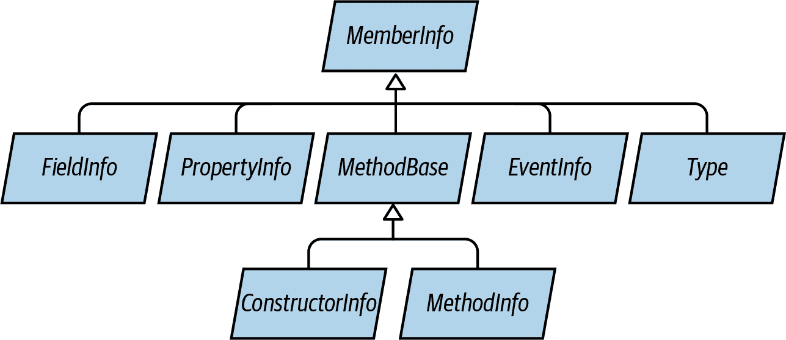
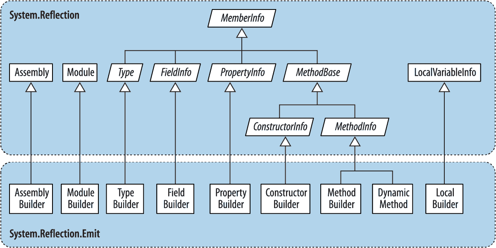

# 第十八章。反射和元数据

正如我们在 第十七章 中看到的，C# 程序编译为包含元数据、编译代码和资源的程序集。在运行时检查元数据和编译代码称为 *反射*。

程序集中编译的代码包含几乎所有原始源代码的内容。会丢失一些信息，如局部变量名称、注释和预处理指令。但是，反射可以访问几乎所有其他内容，甚至可以编写反编译器。

.NET 中提供的许多服务（如动态绑定、序列化和数据绑定）依赖于元数据的存在。您的程序也可以利用此元数据，甚至使用自定义属性添加新信息。`System.Reflection` 命名空间包含反射 API。在运行时，还可以通过 `System.Reflection.Emit` 命名空间中的类动态创建新的元数据和中间语言（IL）可执行指令。

本章的示例假定您导入了 `System`、`Sys⁠tem.​Reflection` 和 `System.Reflection.Emit` 命名空间。

###### 注意

在本章中，当我们使用术语“动态”时，指的是使用反射执行某些仅在运行时强制执行类型安全性的任务。这与通过 C# 的 `dynamic` 关键字进行的 *动态绑定* 在原理上类似，尽管机制和功能不同。

动态绑定更容易使用，并使用动态语言运行时（DLR）实现动态语言的互操作性。反射在使用上相对笨拙，但在与 CLR 的交互方面更加灵活。例如，反射允许您获取类型和成员列表，通过字符串实例化对象的名称，并动态构建程序集。

# 反射和激活类型

在本节中，我们将探讨如何获取 `Type`，检查其元数据，并使用它动态实例化对象。

## 获取类型

`System.Type` 的一个实例表示类型的元数据。因为 `Type` 被广泛使用，所以它位于 `System` 命名空间而不是 `System.Reflection` 命名空间中。

您可以通过在任何对象上调用 `GetType` 或使用 C# 的 `typeof` 运算符来获取 `System.Type` 的实例：

```cs
Type t1 = DateTime.Now.GetType();     // Type obtained at runtime
Type t2 = typeof (DateTime);          // Type obtained at compile time
```

可以使用 `typeof` 获取数组类型和泛型类型，如下所示：

```cs
Type t3 = typeof (DateTime[]);          // 1-d Array type
Type t4 = typeof (DateTime[,]);         // 2-d Array type
Type t5 = typeof (Dictionary<int,int>); // Closed generic type
Type t6 = typeof (Dictionary<,>);       // Unbound generic type
```

您还可以通过名称检索 `Type`。如果有其 `Assembly` 的引用，请调用 `Assembly.GetType`（我们在部分 “反映程序集” 中进一步描述）：

```cs
Type t = Assembly.GetExecutingAssembly().GetType ("Demos.TestProgram");
```

如果没有 `Assembly` 对象，可以通过其 *程序集限定名称*（类型的完整名称后跟程序集的完全或部分限定名称）获取类型。程序集会隐式加载，就像调用了 `Assembly.Load(string)` 一样：

```cs
Type t = Type.GetType ("System.Int32, System.Private.CoreLib");
```

获得 `System.Type` 对象后，可以使用其属性访问类型的名称、程序集、基类型、可见性等：

```cs
Type stringType = typeof (string);
string name     = stringType.Name;          // String
Type baseType   = stringType.BaseType;      // typeof(Object)
Assembly assem  = stringType.Assembly;      // System.Private.CoreLib
bool isPublic   = stringType.IsPublic;      // true
```

`System.Type` 实例是类型的整个元数据的窗口 —— 以及它所定义的程序集。

###### 注意

`System.Type` 是抽象的，因此 `typeof` 操作符实际上必须给你一个 `Type` 的子类。CLR 使用的子类是 .NET 内部的，称为 `RuntimeType`。

### TypeInfo

如果要定位到 .NET Core 1.x（或较旧的 Windows Store 配置文件），你会发现大多数 `Type` 的成员都丢失了。这些丢失的成员在称为 `TypeInfo` 的类上公开，通过调用 `GetTypeInfo` 可获取。因此，为了使我们之前的示例运行，你将执行以下操作：

```cs
Type stringType = typeof(string);
string name = stringType.Name;
Type baseType = stringType.GetTypeInfo().BaseType;
Assembly assem = stringType.GetTypeInfo().Assembly;
bool isPublic = stringType.GetTypeInfo().IsPublic;
```

`TypeInfo` 也存在于 .NET Core 2 和 3 以及 .NET 5+（以及 .NET Framework 4.5+ 和所有 .NET Standard 版本），因此前面的代码几乎通用。`TypeInfo` 还包括用于反射成员的附加属性和方法。

### 获取数组类型

正如我们刚才看到的，`typeof` 和 `GetType` 可与数组类型一起使用。你还可以通过在 *元素* 类型上调用 `MakeArrayType` 来获取数组类型：

```cs
Type simpleArrayType = typeof (int).MakeArrayType();
Console.WriteLine (simpleArrayType == typeof (int[]));     // True
```

通过在 `MakeArrayType` 上传递整数参数，可以创建多维数组：

```cs
Type cubeType = typeof (int).MakeArrayType (3);       // cube shaped
Console.WriteLine (cubeType == typeof (int[,,]));     // True
```

`GetElementType` 执行反向操作：检索数组类型的元素类型：

```cs
Type e = typeof (int[]).GetElementType();     // e == typeof (int)
```

`GetArrayRank` 返回矩形数组的维数：

```cs
int rank = typeof (int[,,]).GetArrayRank();   // 3
```

### 获取嵌套类型

要检索嵌套类型，请在包含类型上调用 `GetNestedTypes`：

```cs
foreach (Type t in typeof (System.Environment).GetNestedTypes())
  Console.WriteLine (t.FullName);

OUTPUT: System.Environment+SpecialFolder
```

或：

```cs
foreach (TypeInfo t in typeof (System.Environment).GetTypeInfo()
                                                  .DeclaredNestedTypes)
  Debug.WriteLine (t.FullName);
```

嵌套类型的唯一警告是 CLR 将嵌套类型视为具有特殊的“嵌套”可访问级别：

```cs
Type t = typeof (System.Environment.SpecialFolder);
Console.WriteLine (t.IsPublic);                      // False
Console.WriteLine (t.IsNestedPublic);                // True
```

## 类型名称

类型具有 `Namespace`、`Name` 和 `FullName` 属性。在大多数情况下，`FullName` 是前两者的组合：

```cs
Type t = typeof (System.Text.StringBuilder);

Console.WriteLine (t.Namespace);      // System.Text
Console.WriteLine (t.Name);           // StringBuilder
Console.WriteLine (t.FullName);       // System.Text.StringBuilder
```

有两个例外情况：嵌套类型和封闭泛型类型。

###### 注意

`Type` 还有一个名为 `AssemblyQualifiedName` 的属性，返回 `FullName`，后跟逗号，然后是其程序集的完整名称。这与您可以传递给 `Type.GetType` 的字符串相同，并在默认加载上下文中唯一标识类型。

### 嵌套类型名称

对于嵌套类型，包含的类型仅出现在 `FullName` 中：

```cs
Type t = typeof (System.Environment.SpecialFolder);

Console.WriteLine (t.Namespace);      // System
Console.WriteLine (t.Name);           // SpecialFolder
Console.WriteLine (t.FullName);       // System.Environment+SpecialFolder
```

`+` 符号区分包含类型和嵌套命名空间。

### 泛型类型名称

泛型类型名称以 `'` 符号结尾，后跟类型参数的数量。如果泛型类型未绑定，此规则适用于 `Name` 和 `FullName` 两者：

```cs
Type t = typeof (Dictionary<,>); // Unbound
Console.WriteLine (t.Name);      // Dictionary'2
Console.WriteLine (t.FullName);  // System.Collections.Generic.Dictionary'2
```

然而，如果泛型类型已关闭，`FullName`（仅）将获取一个显著的额外附加部分。列举每个类型参数的完整 *程序集限定名称*：

```cs
Console.WriteLine (typeof (Dictionary<int,string>).FullName);

// OUTPUT:
System.Collections.Generic.Dictionary`2[[System.Int32, 
System.Private.CoreLib, Version=4.0.0.0, Culture=neutral,
PublicKeyToken=7cec85d7bea7798e],[System.String, System.Private.CoreLib,
Version=4.0.0.0, Culture=neutral, PublicKeyToken=7cec85d7bea7798e]]
```

这确保 `AssemblyQualifiedName`（类型的全名和程序集名称的组合）包含足够的信息，以完全标识泛型类型及其类型参数。

### 数组和指针类型名称

数组的表示与你在 `typeof` 表达式中使用的后缀相同：

```cs
Console.WriteLine (typeof ( int[]  ).Name);      // Int32[]
Console.WriteLine (typeof ( int[,] ).Name);      // Int32[,]
Console.WriteLine (typeof ( int[,] ).FullName);  // System.Int32[,]
```

指针类型相似：

```cs
Console.WriteLine (typeof (byte*).Name);     // Byte*
```

### `ref` 和 `out` 参数类型名称

描述 `ref` 或 `out` 参数的 `Type` 具有 `&` 后缀：

```cs
public void RefMethod (ref int p)
{
  Type t = MethodInfo.GetCurrentMethod().GetParameters()[0].ParameterType;
  Console.WriteLine (t.Name);    // Int32&
}
```

更多内容稍后在 “反射和调用成员” 一节中讨论。

## 基类型和接口

`Type` 公开了 `BaseType` 属性：

```cs
Type base1 = typeof (System.String).BaseType;
Type base2 = typeof (System.IO.FileStream).BaseType;

Console.WriteLine (base1.Name);     // Object
Console.WriteLine (base2.Name);     // Stream
```

`GetInterfaces` 方法返回一个类型实现的接口列表：

```cs
foreach (Type iType in typeof (Guid).GetInterfaces())
  Console.WriteLine (iType.Name);

*IFormattable*
*IComparable*
*IComparable'1*
*IEquatable'1*
```

（`GetInterfaceMap` 方法返回一个结构，显示接口的每个成员在类或结构中如何实现——我们在 “调用静态虚拟/抽象接口成员” 中展示了此高级功能的用法。）

反射提供了三种 C# 静态 `is` 运算符的动态等效方式：

`IsInstanceOfType`

接受类型和实例

`IsAssignableFrom` 和（从 .NET 5 开始）`IsAssignableTo`

接受两种类型

这是第一个例子：

```cs
object obj  = Guid.NewGuid();
Type target = typeof (IFormattable);

bool isTrue   = obj is IFormattable;             // Static C# operator
bool alsoTrue = target.IsInstanceOfType (obj);   // Dynamic equivalent
```

`IsAssignableFrom` 更为灵活：

```cs
Type target = typeof (IComparable), source = typeof (string);
Console.WriteLine (target.IsAssignableFrom (source));         // True
```

`IsSubclassOf` 方法与 `IsAssignableFrom` 方法的工作原理相同，但不包括接口。

## 实例化类型

有两种方式可以根据其类型动态实例化对象：

+   调用静态 `Activator.CreateInstance` 方法

+   在 `Type` 上调用 `GetConstructor` 返回的 `ConstructorInfo` 对象上调用 `Invoke`（高级场景）

`Activator.CreateInstance` 接受一个 `Type` 和可选参数，将其传递给构造函数：

```cs
int i = (int) Activator.CreateInstance (typeof (int));

DateTime dt = (DateTime) Activator.CreateInstance (typeof (DateTime),
                                                   2000, 1, 1);
```

`CreateInstance` 允许你指定许多其他选项，例如从中加载类型的程序集以及是否绑定到非公共构造函数。如果运行时找不到合适的构造函数，则会抛出 `MissingMethodException`。

当你的参数值无法区分重载构造函数时，需要在 `ConstructorInfo` 上调用 `Invoke`。例如，假设类 `X` 有两个构造函数：一个接受 `string` 类型的参数，另一个接受 `StringBuilder` 类型的参数。如果你将 `null` 参数传递给 `Activator.CreateInstance`，目标将变得模糊。这时就需要使用 `ConstructorInfo`：

```cs
// Fetch the constructor that accepts a single parameter of type string:
ConstructorInfo ci = typeof (X).GetConstructor (new[] { typeof (string) });

// Construct the object using that overload, passing in null:
object foo = ci.Invoke (new object[] { null });
```

或者，如果你的目标是 .NET Core 1 或较旧的 Windows Store 配置文件：

```cs
ConstructorInfo ci = typeof (X).GetTypeInfo().DeclaredConstructors
  .FirstOrDefault (c =>
     c.GetParameters().Length == 1 && 
     c.GetParameters()[0].ParameterType == typeof (string));
```

要获取非公共构造函数，需要指定 `BindingFlags` ——参见后面一节中的 “访问非公共成员” 和 “反射和调用成员”。

###### 警告

动态实例化会在构造对象的时间上增加几微秒。相对来说，这在一般情况下并不多，因为 CLR 在实例化对象方面通常非常快速（在一个小类上进行简单的 `new` 操作大约需要几十纳秒的时间）。

要根据元素类型动态实例化数组，首先调用 `MakeArrayType`。你也可以实例化泛型类型：我们在下一节中描述这一点。

要动态实例化委托，请调用 `Delegate.CreateDelegate`。以下示例演示了如何实例化实例委托和静态委托：

```cs
class Program
{
  delegate int IntFunc (int x);

  static int Square (int x) => x * x;        // Static method
  int        Cube   (int x) => x * x * x;    // Instance method

  static void Main()
  {
    Delegate staticD = Delegate.CreateDelegate
      (typeof (IntFunc), typeof (Program), "Square");

    Delegate instanceD = Delegate.CreateDelegate
      (typeof (IntFunc), new Program(), "Cube");

    Console.WriteLine (staticD.DynamicInvoke (3));      // 9
    Console.WriteLine (instanceD.DynamicInvoke (3));    // 27
  }
}
```

您可以调用由 `DynamicInvoke` 返回的 `Delegate` 对象，就像我们在本例中所做的那样，或者通过将其转换为具有类型的委托来调用：

```cs
IntFunc f = (IntFunc) staticD;
Console.WriteLine (f(3));         // 9 *(but much faster!)*
```

您可以将 `MethodInfo` 传递给 `CreateDelegate` 而不是方法名称。我们稍后在 “反射和调用成员” 中描述 `MethodInfo`，以及将动态创建的委托类型转换回静态委托类型的原因。

## 泛型类型

一个 `Type` 可以表示封闭或未绑定的泛型类型。与编译时一样，封闭泛型类型可以实例化，而未绑定类型则不能：

```cs
Type closed = typeof (List<int>);
List<int> list = (List<int>) Activator.CreateInstance (closed);  // OK

Type unbound   = typeof (List<>);
object anError = Activator.CreateInstance (unbound);    // Runtime error
```

`MakeGenericType` 方法将一个未绑定的泛型类型转换为封闭泛型类型。只需传入所需的类型参数：

```cs
Type unbound = typeof (List<>);
Type closed = unbound.MakeGenericType (typeof (int));
```

`GetGenericTypeDefinition` 方法执行相反的操作：

```cs
Type unbound2 = closed.GetGenericTypeDefinition();  // unbound == unbound2
```

如果一个 `Type` 是泛型，`IsGenericType` 属性返回 `true`；如果泛型类型是未绑定的，`IsGenericTypeDefinition` 属性返回 `true`。以下代码测试一个类型是否是可空值类型：

```cs
Type nullable = typeof (bool?);
Console.WriteLine (
  nullable.IsGenericType &&
  nullable.GetGenericTypeDefinition() == typeof (Nullable<>));   // True
```

`GetGenericArguments` 返回封闭泛型类型的类型参数：

```cs
Console.WriteLine (closed.GetGenericArguments()[0]);     // System.Int32
Console.WriteLine (nullable.GetGenericArguments()[0]);   // System.Boolean
```

对于未绑定的泛型类型，`GetGenericArguments` 返回代表在泛型类型定义中指定的占位符类型的伪类型：

```cs
Console.WriteLine (unbound.GetGenericArguments()[0]);      // T
```

###### 注意

在运行时，所有泛型类型都是*未绑定*或*封闭*的。在表达式 `typeof(Foo<>)` 这种（相对不常见的）情况下，它们是未绑定的；否则，它们是封闭的。在以下类中的方法总是打印 `False`：

```cs
class Foo<T>
{
  public void Test()
    => Console.Write (GetType().IsGenericTypeDefinition);  
}
```

# 反射和调用成员

`GetMembers` 方法返回类型的成员。考虑以下类：

```cs
class Walnut
{
  private bool cracked;
  public void Crack() { cracked = true; }
}
```

我们可以反射其公共成员，如下所示：

```cs
MemberInfo[] members = typeof (Walnut).GetMembers();
foreach (MemberInfo m in members)
  Console.WriteLine (m);
```

这是结果：

```cs
Void Crack()
System.Type GetType()
System.String ToString()
Boolean Equals(System.Object)
Int32 GetHashCode()
Void .ctor()
```

当不带参数调用时，`GetMembers` 返回类型的所有公共成员（及其基类型）。`GetMember` 通过名称检索特定成员，虽然它仍然返回一个数组，因为成员可以被重载：

```cs
MemberInfo[] m = typeof (Walnut).GetMember ("Crack");
Console.WriteLine (m[0]);                              // Void Crack()
```

`MemberInfo` 还有一个名为 `MemberType` 的 `MemberTypes` 类型的属性。这是一个带有以下值的标志枚举：

```cs
All           Custom        Field        NestedType     TypeInfo
Constructor   Event         Method       Property
```

调用 `GetMembers` 时，可以传入一个 `MemberTypes` 实例来限制返回的成员类型。或者，您可以通过调用 `GetMethods`、`GetFields`、`GetProperties`、`GetEvents`、`GetConstructors` 或 `GetNestedTypes` 来限制结果集。每个方法还有相应的单数版本，以精确找到特定成员。

###### 注意

在检索类型成员时尽可能具体是值得的，这样如果以后添加了其他成员，您的代码也不会出错。如果通过名称检索方法，请指定所有参数类型，以确保如果稍后重载了方法，您的代码仍将正常工作（我们稍后在 “方法参数” 中提供示例）。

一个 `MemberInfo` 对象有一个 `Name` 属性和两个 `Type` 属性：

`DeclaringType`

返回定义成员的 `Type`

`ReflectedType`

返回调用 `GetMembers` 的 `Type`

当在基类型中定义的成员上调用时，这两者之间存在差异：`DeclaringType` 返回基类型，而 `ReflectedType` 返回子类型。以下示例突出了这一点：

```cs
// MethodInfo is a subclass of MemberInfo; see Figure 18-1.

MethodInfo test = typeof (Program).GetMethod ("ToString");
MethodInfo obj  = typeof (object) .GetMethod ("ToString");

Console.WriteLine (test.DeclaringType);      // System.Object
Console.WriteLine (obj.DeclaringType);       // System.Object

Console.WriteLine (test.ReflectedType);      // Program
Console.WriteLine (obj.ReflectedType);       // System.Object

Console.WriteLine (test == obj);             // False
```

因为它们具有不同的 `ReflectedType`，所以 `test` 和 `obj` 对象不相等。然而，它们的差异纯粹是反射 API 的产物；我们的 `Program` 类型在底层类型系统中没有明确的 `ToString` 方法。我们可以通过两种方式验证这两个 `MethodInfo` 对象是否引用同一个方法：

```cs
Console.WriteLine (test.MethodHandle == obj.MethodHandle);    // True

Console.WriteLine (test.MetadataToken == obj.MetadataToken    // True
                   && test.Module == obj.Module);
```

`MethodHandle` 是进程中每个（真正不同的）方法独有的；`MetadataToken` 在程序集模块中的所有类型和成员中是唯一的。

`MemberInfo` 还定义了返回自定义属性的方法（参见“在运行时检索属性”）。

###### 注意

你可以通过调用 `MethodBase.GetCurrentMethod` 获得当前执行方法的 `MethodBase`。

## 成员类型

`MemberInfo` 本身的成员较少，因为它是显示在 Figure 18-1 中的类型的抽象基类。



###### 图 18-1\. 成员类型

你可以根据其 `MemberType` 属性将 `MemberInfo` 强制转换为其子类型。如果通过 `GetMethod`、`GetField`、`GetProperty`、`GetEvent`、`GetConstructor` 或它们的复数版本获得成员，则不需要转换。Table 18-1 总结了每种 C# 结构的使用方法。

Table 18-1\. 检索成员元数据

| C# 结构 | 使用方法 | 使用名称 | 结果 |
| --- | --- | --- | --- |
| 方法 | `GetMethod` | (方法名) | `MethodInfo` |
| 属性 | `GetProperty` | (属性名) | `PropertyInfo` |
| 索引器 | `GetDefaultMembers` |  | `MemberInfo[]`（如果在 C# 中编译，则包含 `PropertyInfo` 对象） |
| 字段 | `GetField` | (字段名) | `FieldInfo` |
| 枚举成员 | `GetField` | (成员名) | `FieldInfo` |
| 事件 | `GetEvent` | (事件名) | `EventInfo` |
| 构造函数 | `GetConstructor` |  | `ConstructorInfo` |
| 终结器 | `GetMethod` | `"Finalize"` | `MethodInfo` |
| 操作符 | `GetMethod` | `"op_"` + 操作符名称 | `MethodInfo` |
| 嵌套类型 | `GetNestedType` | (类型名) | `Type` |

每个 `MemberInfo` 子类都有丰富的属性和方法，公开了成员元数据的所有方面。这包括可见性、修饰符、泛型类型参数、参数、返回类型和自定义属性等内容。

下面是使用 `GetMethod` 的示例：

```cs
MethodInfo m = typeof (Walnut).GetMethod ("Crack");
Console.WriteLine (m);                             // Void Crack()
Console.WriteLine (m.ReturnType);                  // System.Void
```

所有 `*Info` 实例在第一次使用时都会被反射 API 缓存：

```cs
MethodInfo method = typeof (Walnut).GetMethod ("Crack");
MemberInfo member = typeof (Walnut).GetMember ("Crack") [0];

Console.Write (method == member);       // True
```

除了保留对象标识，缓存还提高了本来是相当慢的 API 的性能。

## C# 成员与 CLR 成员的对比

上述表格说明了一些 C# 的功能构造与 CLR 构造之间并非一一对应。这是有道理的，因为 CLR 和反射 API 是设计用来支持所有 .NET 语言的——你甚至可以从 Visual Basic 使用反射。

一些 C# 构造——尤其是索引器、枚举、运算符和终结器——在 CLR 看来是人为的。具体来说：

+   C# 的索引器转换为接受一个或多个参数的属性，并标记为类型的 `[DefaultMember]`。

+   C# 中的枚举转换为 `System.Enum` 的子类型，每个成员都有一个静态字段。

+   C# 运算符转换为一个以 `"op_"` 开头的特殊命名的静态方法，例如 `"op_Addition"`。

+   C# 的终结器转换为一个覆盖 `Finalize` 的方法。

另一个复杂之处在于属性和事件实际上包含两个部分：

+   描述属性或事件的元数据（由 `PropertyInfo` 或 `EventInfo` 封装）

+   一个或两个后备方法

在 C# 程序中，后备方法封装在属性或事件定义中。但在编译到 IL 时，这些后备方法呈现为可以像任何其他方法一样调用的普通方法。这意味着 `GetMethods` 会返回属性和事件的后备方法以及普通方法：

```cs
class Test { public int X { get { return 0; } set {} } }

void Demo()
{
  foreach (MethodInfo mi in typeof (Test).GetMethods())
    Console.Write (mi.Name + "  ");
}

// OUTPUT:
get_X  set_X  GetType  ToString  Equals  GetHashCode
```

通过 `MethodInfo` 的 `IsSpecialName` 属性可以识别这些方法。对于属性、索引器、事件访问器以及运算符，`IsSpecialName` 返回 `true`。对于传统的 C# 方法（以及定义了终结器的 `Finalize` 方法），它返回 `false`。

这些是 C# 生成的后备方法：

| C# 构造 | 成员类型 | IL 中的方法 |
| --- | --- | --- |
| 属性 | `Property` | `get_*XXX*` 和 `set_*XXX*` |
| 索引器 | `Property` | `get_Item` 和 `set_Item` |
| 事件 | `Event` | `add_*XXX*` 和 `remove_*XXX*` |

每个后备方法都有其自己关联的 `MethodInfo` 对象。你可以按以下方式访问它们：

```cs
PropertyInfo pi = typeof (Console).GetProperty ("Title");
MethodInfo getter = pi.GetGetMethod();                   // get_Title
MethodInfo setter = pi.GetSetMethod();                   // set_Title
MethodInfo[] both = pi.GetAccessors();                   // Length==2
```

`GetAddMethod` 和 `GetRemoveMethod` 为 `EventInfo` 执行类似的工作。

要从 `MethodInfo` 到其关联的 `PropertyInfo` 或 `EventInfo` 实现反向操作，你需要执行一个查询。LINQ 是这项工作的理想选择：

```cs
PropertyInfo p = mi.DeclaringType.GetProperties()
                   .First (x => x.GetAccessors (true).Contains (mi));
```

### 只读初始化属性

C# 9 中引入的只读属性可以通过对象初始化器设置，但编译器会将其后续视为只读。从 CLR 的角度看，`init` 访问器就像是普通的 `set` 访问器，但 `set` 方法的返回类型上有一个特殊的标志（这对编译器意味着一些东西）。

有趣的是，这个标志并没有编码为一个约定属性。相反，它使用了一个相对隐蔽的机制称为 *modreq*，这确保了早期版本的 C# 编译器（不识别新的 modreq）会忽略访问器，而不是将属性视为可写。

只读访问器的 modreq 称为 `IsExternalInit`，你可以按如下方式查询它：

```cs
bool IsInitOnly (PropertyInfo pi) => pi
  .GetSetMethod().ReturnParameter.GetRequiredCustomModifiers()
  .Any (t => t.Name == "IsExternalInit");
```

### NullabilityInfoContext

从.NET 6 开始，你可以使用`NullabilityInfoContext`类获取有关字段、属性、事件或参数的 nullability 注释的信息：

```cs
void PrintPropertyNullability (PropertyInfo pi)
{
  var info = new NullabilityInfoContext().Create (pi);
  Console.WriteLine (pi.Name + " read " + info.ReadState);
  Console.WriteLine (pi.Name + " write " + info.WriteState);
  // Use info.Element to get nullability info for array elements
}
```

## 泛型类型成员

你可以获取未绑定和闭合泛型类型的成员元数据：

```cs
PropertyInfo unbound = typeof (IEnumerator<>)  .GetProperty ("Current");
PropertyInfo closed = typeof (IEnumerator<int>).GetProperty ("Current");

Console.WriteLine (unbound);   // T Current
Console.WriteLine (closed);    // Int32 Current

Console.WriteLine (unbound.PropertyType.IsGenericParameter);  // True
Console.WriteLine (closed.PropertyType.IsGenericParameter);   // False
```

从未绑定和闭合泛型类型返回的`MemberInfo`对象始终是不同的，即使对于不包含泛型类型参数签名的成员也是如此：

```cs
PropertyInfo unbound = typeof (List<>)  .GetProperty ("Count");
PropertyInfo closed = typeof (List<int>).GetProperty ("Count");

Console.WriteLine (unbound);   // Int32 Count
Console.WriteLine (closed);    // Int32 Count

Console.WriteLine (unbound == closed);   // False

Console.WriteLine (unbound.DeclaringType.IsGenericTypeDefinition); // True
Console.WriteLine (closed.DeclaringType.IsGenericTypeDefinition); // False
```

未绑定泛型类型的成员无法*动态调用*。

## 动态调用成员

###### 注意

可以通过[Uncapsulator 开源库](https://github.com/albahari/uncapsulator)（在 NuGet 和 GitHub 上可用）更轻松地实现动态调用成员。Uncapsulator 是作者编写的，提供了一个流畅的 API，通过反射使用自定义动态绑定器调用公共和非公共成员。

当你拥有`MethodInfo`、`PropertyInfo`或`FieldInfo`对象后，你可以动态调用它或获取/设置其值。这被称为*后期绑定*，因为你在运行时选择要调用的成员，而不是在编译时。

为了说明，以下使用普通的*静态绑定*：

```cs
string s = "Hello";
int length = s.Length;
```

下面是使用后期绑定动态执行的相同操作：

```cs
object s = "Hello";
PropertyInfo prop = s.GetType().GetProperty ("Length");
int length = (int) prop.GetValue (s, null);               // 5
```

`GetValue`和`SetValue`获取和设置`PropertyInfo`或`FieldInfo`的值。第一个参数是实例，对于静态成员可以是`null`。访问索引器就像访问名为“Item”的属性一样，只是在调用`GetValue`或`SetValue`时，你需要将索引值作为第二个参数提供。

要动态调用方法，请在`MethodInfo`上调用`Invoke`，并提供一个参数数组传递给该方法。如果你传递的参数类型有误，运行时会抛出异常。使用动态调用，你失去了编译时类型安全性，但仍具有运行时类型安全性（就像使用`dynamic`关键字一样）。

## 方法参数

假设我们想要动态调用`string`的`Substring`方法。静态情况下，我们可以这样做：

```cs
Console.WriteLine ("stamp".Substring(2));                  // "amp"
```

下面是使用反射和后期绑定的动态等效代码：

```cs
Type type = typeof (string);
Type[] parameterTypes = { typeof (int) };
MethodInfo method = type.GetMethod ("Substring", parameterTypes);

object[] arguments = { 2 };
object returnValue = method.Invoke ("stamp", arguments);
Console.WriteLine (returnValue);                           // "amp"
```

因为`Substring`方法是重载的，所以我们必须在`GetMethod`中传递参数类型的数组，以指示我们想要哪个版本。如果没有传递参数类型，`GetMethod`会抛出`AmbiguousMatchException`。

在`MethodBase`（`MethodInfo`和`ConstructorInfo`的基类）上定义的`GetParameters`方法返回参数元数据。我们可以继续我们之前的例子，如下所示：

```cs
ParameterInfo[] paramList = method.GetParameters();
foreach (ParameterInfo x in paramList)
{
  Console.WriteLine (x.Name);                 // startIndex
  Console.WriteLine (x.ParameterType);        // System.Int32
}
```

### 处理`ref`和`out`参数

要传递`ref`或`out`参数，请在获取方法之前在类型上调用`MakeByRefType`。例如，你可以动态执行这段代码：

```cs
int x;
bool successfulParse = int.TryParse ("23", out x);
```

如下：

```cs
object[] args = { "23", 0 };
Type[] argTypes = { typeof (string), typeof (int).MakeByRefType() };
MethodInfo tryParse = typeof (int).GetMethod ("TryParse", argTypes);
bool successfulParse = (bool) tryParse.Invoke (null, args);

Console.WriteLine (successfulParse + " " + args[1]);       // True 23
```

此方法对`ref`和`out`参数类型都适用。

### 检索和调用泛型方法

在调用`GetMethod`时显式指定参数类型可能在消除重载方法歧义时至关重要。但是，无法指定泛型参数类型。例如，请考虑`System.Linq.Enumerable`类，它重载了`Where`方法，如下所示：

```cs
public static IEnumerable<TSource> Where<TSource>
 (this IEnumerable<TSource> source, Func<TSource, bool> predicate);

public static IEnumerable<TSource> Where<TSource>
 (this IEnumerable<TSource> source, Func<TSource, int, bool> predicate);
```

要检索特定的重载，我们必须检索所有方法，然后手动找到所需的重载。以下查询检索`Where`的前一个重载：

```cs
from m in typeof (Enumerable).GetMethods()
where m.Name == "Where" && m.IsGenericMethod 
let parameters = m.GetParameters()
where parameters.Length == 2
let genArg = m.GetGenericArguments().First()
let enumerableOfT = typeof (IEnumerable<>).MakeGenericType (genArg)
let funcOfTBool = typeof (Func<,>).MakeGenericType (genArg, typeof (bool))
where parameters[0].ParameterType == enumerableOfT
   && parameters[1].ParameterType == funcOfTBool
select m
```

在此查询上调用`.Single()`会给出正确的`MethodInfo`对象，带有未绑定的类型参数。下一步是通过调用`MakeGenericMethod`关闭类型参数：

```cs
var closedMethod = unboundMethod.MakeGenericMethod (typeof (int));
```

在这种情况下，我们用`int`关闭了`TSource`，允许我们使用类型为`IEnumerable<int>`的源和类型为`Func<int,bool>`的谓词调用`Enumerable.Where`：

```cs
int[] source = { 3, 4, 5, 6, 7, 8 };
Func<int, bool> predicate = n => n % 2 == 1;   // Odd numbers only
```

现在我们可以调用闭合泛型方法了：

```cs
var query = (IEnumerable<int>) closedMethod.Invoke 
  (null, new object[] { source, predicate });

foreach (int element in query) Console.Write (element + "|");  // 3|5|7|
```

###### 注意

如果您使用`System.Linq.Expressions` API 动态构建表达式（第八章），您无需费力指定泛型方法。`Expression.Call`方法被重载，允许您指定要调用的方法的闭合类型参数：

```cs
int[] source = { 3, 4, 5, 6, 7, 8 };
Func<int, bool> predicate = n => n % 2 == 1;

var sourceExpr = Expression.Constant (source);
var predicateExpr = Expression.Constant (predicate);

var callExpression = Expression.Call (
  typeof (Enumerable), "Where",
  new[] { typeof (int) },  // Closed generic arg type.
  sourceExpr, predicateExpr);
```

## 使用委托提升性能

动态调用通常效率较低，开销通常在几微秒左右。如果你在循环中重复调用方法，可以通过调用一个动态实例化的委托来将每次调用的开销降低到纳秒级别。在下面的例子中，我们动态调用`string`的`Trim`方法一百万次，没有显著的开销：

```cs
MethodInfo trimMethod = typeof (string).GetMethod ("Trim", new Type[0]);
var trim = (StringToString) Delegate.CreateDelegate
                                    (typeof (StringToString), trimMethod);
for (int i = 0; i < 1000000; i++)
  trim ("test");

delegate string StringToString (string s);
```

这样做更快，因为昂贵的后期绑定（如粗体所示）只发生一次。

## 访问非公共成员

所有用于探测元数据的类型的方法（例如`GetProperty`，`GetField`等）都有接受`BindingFlags`枚举的重载。此枚举用作元数据过滤器，并允许您更改默认选择标准。最常见的用法是检索非公共成员（仅适用于桌面应用程序）。

例如，考虑以下类：

```cs
class Walnut
{
  private bool cracked;
  public void Crack() { cracked = true; }

  public override string ToString() { return cracked.ToString(); }
}
```

我们可以*打开*核桃，如下所示：

```cs
Type t = typeof (Walnut);
Walnut w = new Walnut();
w.Crack();
FieldInfo f = t.GetField ("cracked", BindingFlags.NonPublic |
                                     BindingFlags.Instance);
f.SetValue (w, false);
Console.WriteLine (w);         // False
```

使用反射访问非公共成员非常强大，但也很危险，因为它可以绕过封装，创建对类型内部实现的难以管理的依赖。

### BindingFlags 枚举

`BindingFlags`旨在进行按位组合。为了获得任何匹配项，您需要从以下四种组合中选择一种起始组合：

```cs
BindingFlags.Public    | BindingFlags.Instance
BindingFlags.Public    | BindingFlags.Static
BindingFlags.NonPublic | BindingFlags.Instance
BindingFlags.NonPublic | BindingFlags.Static
```

`NonPublic`包括`internal`，`protected`，`protected internal`和`private`。

以下示例检索类型为`object`的所有公共静态成员：

```cs
BindingFlags publicStatic = BindingFlags.Public | BindingFlags.Static;
MemberInfo[] members = typeof (object).GetMembers (publicStatic);
```

以下示例检索类型为`object`的所有非公共成员，包括静态和实例：

```cs
BindingFlags nonPublicBinding =
  BindingFlags.NonPublic | BindingFlags.Static | BindingFlags.Instance;

MemberInfo[] members = typeof (object).GetMembers (nonPublicBinding);
```

`DeclaredOnly`标志排除了从基类型继承的函数，除非它们被重写。

###### 注意

`DeclaredOnly`标志有些令人困惑，因为它*限制*结果集（而所有其他绑定标志都*扩展*结果集）。

## 泛型方法

你不能直接调用泛型方法；以下代码会抛出异常：

```cs
class Program
{
  public static T Echo<T> (T x) { return x; }

  static void Main()
  {
    MethodInfo echo = typeof (Program).GetMethod ("Echo");
    Console.WriteLine (echo.IsGenericMethodDefinition);    // True
    echo.Invoke (null, new object[] { 123 } );             // *Exception*
  }
}
```

需要额外的一步，即在`MethodInfo`上调用`MakeGenericMethod`，指定具体的泛型类型参数。这将返回另一个`MethodInfo`，然后可以像以下这样调用它：

```cs
MethodInfo echo = typeof (Program).GetMethod ("Echo");
MethodInfo intEcho = echo.MakeGenericMethod (typeof (int));
Console.WriteLine (intEcho.IsGenericMethodDefinition);            // False
Console.WriteLine (intEcho.Invoke (null, new object[] { 3 } ));   // 3
```

## 匿名调用泛型接口的成员

当你需要调用泛型接口的成员但直到运行时才知道类型参数时，反射是很有用的。理论上，如果类型设计完美，很少需要这样做；当然，类型并不总是设计得完美。

比如，假设我们想要编写一个更强大的`ToString`版本，可以扩展 LINQ 查询的结果。我们可以这样开始：

```cs
public static string ToStringEx <T> (IEnumerable<T> sequence)
{
  ...
}
```

这已经相当有限了。如果`sequence`包含我们还想要枚举的*嵌套*集合怎么办？我们需要重载方法来应对：

```cs
public static string ToStringEx <T> (IEnumerable<IEnumerable<T>> sequence)
```

然后如果`sequence`包含分组或*嵌套序列的投影*怎么办？方法重载的静态解决方案变得不切实际，我们需要一种能够处理任意对象图的方法，例如下面的方法：

```cs
public static string ToStringEx (object value)
{
  if (value == null) return "<null>";
  StringBuilder sb = new StringBuilder();

  if (value is List<>)                                            // Error
    sb.Append ("List of " + ((List<>) value).Count + " items");   // Error

  if (value is IGrouping<,>)                                      // Error
    sb.Append ("Group with key=" + ((IGrouping<,>) value).Key);   // Error

  // Enumerate collection elements if this is a collection,
  // recursively calling ToStringEx()
  // ...

  return sb.ToString();
}
```

不幸的是，这段代码无法编译：你不能调用*未绑定*泛型类型如`List<>`或`IGrouping<>`的成员。对于`List<>`，我们可以通过使用非泛型的`IList`接口来解决这个问题：

```cs
  if (value is IList)
    sb.AppendLine ("A list with " + ((IList) value).Count + " items");
```

###### 注意

我们能够这样做是因为`List<>`的设计者有远见，实现了经典的`IList`（以及*泛型*的`IList`）。在编写自己的泛型类型时，考虑到消费者可以依赖的非泛型接口或基类可能非常有价值。

对于`IGrouping<,>`来说解决方案就没有那么简单。这是接口的定义方式：

```cs
public interface IGrouping <TKey,TElement> : IEnumerable <TElement>,
                                             IEnumerable
{
  TKey Key { get; }
}
```

没有非泛型类型可以用来访问`Key`属性，因此我们必须在这里使用反射。解决方案不是调用未绑定泛型类型的成员（这是不可能的），而是调用封闭泛型类型的成员，在运行时确定其类型参数。

###### 注意

在接下来的章节中，我们将使用 C#的`dynamic`关键字更简单地解决这个问题。动态绑定的一个很好的指示是当你需要进行*类型操作*时，就像我们现在正在做的一样。

第一步是确定`value`是否实现了`IGrouping<,>`，如果是，则获取其封闭的泛型接口。我们可以通过执行 LINQ 查询来最简单地完成这个任务。然后，我们检索并调用`Key`属性：

```cs
public static string ToStringEx (object value)
{
  if (value == null) return "<null>";
  if (value.GetType().IsPrimitive) return value.ToString();

  StringBuilder sb = new StringBuilder();

  if (value is IList)
    sb.Append ("List of " + ((IList)value).Count + " items: ");

  Type closedIGrouping = value.GetType().GetInterfaces()
    .Where (t => t.IsGenericType &&
                 t.GetGenericTypeDefinition() == typeof (IGrouping<,>))
    .FirstOrDefault();

  if (closedIGrouping != null)   // Call the Key property on IGrouping<,>
  {
    PropertyInfo pi = closedIGrouping.GetProperty ("Key");
    object key = pi.GetValue (value, null);
    sb.Append ("Group with key=" + key + ": ");
  }

  if (value is IEnumerable)
    foreach (object element in ((IEnumerable)value))
      sb.Append (ToStringEx (element) + " ");

  if (sb.Length == 0) sb.Append (value.ToString());

  return "\r\n" + sb.ToString();
}
```

这种方法非常强大：无论`IGrouping<,>`是隐式实现还是显式实现，都能正常工作。以下演示了这种方法：

```cs
Console.WriteLine (ToStringEx (new List<int> { 5, 6, 7 } ));
Console.WriteLine (ToStringEx ("xyyzzz".GroupBy (c => c) ));

*List of 3 items: 5 6 7*

*Group with key=x: x*
*Group with key=y: y y*
*Group with key=z: z z z*
```

## 调用静态虚/抽象接口成员

从.NET 7 和 C# 11 开始，接口可以定义静态虚拟和抽象成员（参见“静态虚拟/抽象接口成员”）。一个例子是.NET 中的`IParsable<TSelf>`接口：

```cs
public interface IParsable<TSelf> where TSelf : IParsable<TSelf>
{
  static abstract TSelf Parse (string s, IFormatProvider provider);
  ...
}
```

通过受约束的类型参数，可以多态地调用静态抽象接口成员：

```cs
T ParseAny<T> (string s) where T : IParsable<T> => T.Parse (s, null);
```

要通过反射调用静态抽象接口成员，你必须从实现该接口的具体类型中获取`MethodInfo`，而不是从接口本身获取。显而易见的解决方案是通过签名检索具体成员：

```cs
MethodInfo GetParseMethod (Type concreteType) =>
  concreteType.GetMethod ("Parse",
    new[] { typeof (string), typeof (IFormatProvider) });
```

然而，如果成员是显式实现的，则会失败。为了以通用方式解决这个问题，我们将首先编写一个函数，用于在实现指定接口方法的具体类型上检索`MethodInfo`：

```cs
MethodInfo GetImplementedInterfaceMethod (Type concreteType,
  Type interfaceType, string methodName, Type[] paramTypes)
{
  var map = concreteType.GetInterfaceMap (interfaceType);

  return map.InterfaceMethods
    .Zip (map.TargetMethods)
    .Single (m => m.First.Name == methodName &&
             m.First.GetParameters().Select (p => p.ParameterType)
                                    .SequenceEqual (paramTypes))
    .Second;
}
```

使其工作的关键是调用`GetInterfaceMap`。这个方法返回以下结构体：

```cs
public struct InterfaceMapping
{   
   public MethodInfo[] InterfaceMethods;    // These arrays each
   public MethodInfo[] TargetMethods;       // have the same length.
   ...
}
```

这个结构告诉我们，实现的接口成员（`Interface​Me⁠thods`）如何映射到具体类型的成员（`TargetMethods`）。

###### 注意

`GetInterfaceMap`也适用于普通（实例）方法；在处理静态抽象接口成员时特别有用。

我们接着使用 LINQ 的`Zip`方法来对齐这两个数组中的元素，从而可以轻松地获取与所需签名的接口方法对应的目标方法。

现在我们可以利用这一点来编写基于反射的`ParseAny`方法：

```cs
object ParseAny (Type type, string value)
{
  MethodInfo parseMethod = GetImplementedInterfaceMethod (type,
    type.GetInterface ("IParsable`1"),
    "Parse",
    new[] { typeof (string), typeof (IFormatProvider) });

  return parseMethod.Invoke (null, new[] { value, null });
}

Console.WriteLine (ParseAny (typeof (float), ".2"));   // 0.2
```

在调用`GetImplementedInterfaceMethod`时，我们需要提供（封闭的）接口类型，我们通过在具体类型上调用``GetInterface("IParsable`1")``来获取它。鉴于在编译时我们知道所需的接口，我们可以改用以下表达式：

```cs
typeof (IParsable<>).MakeGenericType (type)
```

# 反射程序集

你可以通过在`Assembly`对象上调用`GetType`或`GetTypes`来动态反射一个程序集。以下从当前程序集中检索名为`Demos`命名空间下的`TestProgram`类型：

```cs
Type t = Assembly.GetExecutingAssembly().GetType ("Demos.TestProgram");
```

你也可以从现有类型获取程序集：

```cs
typeof (Foo).Assembly.GetType ("Demos.TestProgram");
```

下一个示例列出了位于`e:\demo`下的`mylib.dll`程序集中的所有类型：

```cs
Assembly a = Assembly.LoadFile (@"e:\demo\mylib.dll");

foreach (Type t in a.GetTypes())
  Console.WriteLine (t);
```

或者：

```cs
Assembly a = typeof (Foo).GetTypeInfo().Assembly;

foreach (Type t in a.ExportedTypes)
  Console.WriteLine (t);
```

`GetTypes`和`ExportedTypes`仅返回顶层类型，而不是嵌套类型。

## 模块

在多模块程序集上调用`GetTypes`会返回所有模块中的所有类型。因此，你可以忽略模块的存在，并将程序集视为类型的容器。不过，在处理元数据标记时，有一个情况是模块是相关的。

元数据标记是一个整数，唯一地引用模块范围内的类型、成员、字符串或资源。IL 使用元数据标记，因此如果你在解析 IL，你需要能够解析它们。执行此操作的方法在`Module`类型中定义，称为`ResolveType`、`ResolveMember`、`ResolveString`和`ResolveSignature`。我们将在本章的最后一节，关于编写反汇编器时重新讨论这一点。

通过调用 `GetModules`，你可以获取程序集中所有模块的列表。你也可以通过其 `ManifestModule` 属性直接访问程序集的主模块。

# 使用属性工作

CLR 允许通过属性将附加的元数据附加到类型、成员和程序集上。这是某些重要 CLR 功能（如程序集标识或为本机互操作而编组类型）的指导机制，使属性成为应用程序不可分割的一部分。

属性的一个关键特性是，你可以编写自己的属性，然后像使用任何其他属性一样“装饰”代码元素，以提供额外信息。这些额外信息编译到底层程序集中，并且可以通过反射在运行时检索，用于构建声明性工作的服务，如自动化单元测试。

## 属性基础知识

有三种类型的属性：

+   位映射属性

+   自定义属性

+   伪自定义属性

其中，只有 *自定义属性* 是可扩展的。

###### 注意

术语“属性”本身可以指任何三种属性之一，尽管在 C# 中，它通常指自定义属性或伪自定义属性。

位映射属性（我们的术语）映射到类型元数据中的专用位。大多数 C# 的修饰符关键字，如 `public`、`abstract` 和 `sealed`，编译为位映射属性。这些属性非常高效，因为它们在元数据中消耗的空间很小（通常只有一个位），CLR 可以通过很少或没有间接寻址来定位它们。反射 API 通过 `Type`（和其他 `MemberInfo` 子类）的专用属性（如 `IsPublic`、`IsAbstract` 和 `IsSealed`）公开它们。`Attributes` 属性以标志枚举的形式一次性描述它们中的大多数：

```cs
static void Main()
{
  TypeAttributes ta = typeof (Console).Attributes;
  MethodAttributes ma = MethodInfo.GetCurrentMethod().Attributes;
  Console.WriteLine (ta + "\r\n" + ma);
}
```

这里是结果：

```cs
AutoLayout, AnsiClass, Class, Public, Abstract, Sealed, BeforeFieldInit
PrivateScope, Private, Static, HideBySig
```

相比之下，*自定义属性* 编译成附加在类型主要元数据表上的一个 blob。所有自定义属性都由 `System.Attribute` 的子类表示，并且与位映射属性不同，它们是可扩展的。元数据中的 blob 标识属性类，并存储了应用属性时指定的任何位置参数或命名参数的值。你自己定义的自定义属性在架构上与 .NET 库中定义的属性完全相同。

第四章 描述了如何在 C# 中将自定义属性附加到类型或成员上。在这里，我们将预定义的 `Obsolete` 属性附加到 `Foo` 类上：

```cs
[Obsolete] public class Foo {...}
```

这指示编译器将 `ObsoleteAttribute` 的一个实例合并到 `Foo` 的元数据中，然后可以通过在 `Type` 或 `MemberInfo` 对象上调用 `GetCustom​At⁠tributes` 在运行时反映它。

*伪自定义属性* 在外观和感觉上与标准自定义属性完全相同。它们由 `System.Attribute` 的子类表示，并且以标准方式附加：

```cs
[System.Runtime.InteropServices.StructLayout(LayoutKind.Sequential)]
class SystemTime { ... }
```

区别在于编译器或 CLR 通过将伪自定义属性转换为位图属性来进行内部优化。示例包括`StructLayout`、`In`和`Out`（第二十四章）。反射通过专用属性（如`IsLayoutSequential`）公开伪自定义属性，并且在调用`GetCustomAttributes`时，在许多情况下它们也作为`System.Attribute`对象返回。这意味着您几乎可以忽略伪自定义属性和非伪自定义属性之间的区别（一个值得注意的例外是在使用`Reflection.Emit`在运行时动态生成类型时；请参阅“发出程序集和类型”）。

## AttributeUsage 属性

`AttributeUsage`是应用于属性类的属性。它指示编译器如何使用目标属性：

```cs
public sealed class AttributeUsageAttribute : Attribute
{
  public AttributeUsageAttribute (AttributeTargets validOn);

  public bool AllowMultiple        { get; set; }
  public bool Inherited            { get; set; }
  public AttributeTargets ValidOn  { get; }
}
```

`AllowMultiple`控制正在定义的属性是否可以多次应用于相同的目标；`Inherited`控制应用于基类的属性是否也应用于派生类（或在方法的情况下，应用于虚方法的属性是否也应用于覆盖方法）。`ValidOn`确定属性可以附加到的目标集（类、接口、属性、方法、参数等）。它接受`AttributeTargets`枚举的任何值组合，该枚举具有以下成员：

| `All` | `Delegate` | `GenericParameter` | `Parameter` |
| --- | --- | --- | --- |
| `Assembly` | `Enum` | `Interface` | `Property` |
| `Class` | `Event` | `Method` | `ReturnValue` |
| `Constructor` | `Field` | `Module` | `Struct` |

为了说明，这里是.NET 的作者如何将`AttributeUsage`应用于`Serializable`属性：

```cs
[AttributeUsage (AttributeTargets.Delegate |
                 AttributeTargets.Enum     |
                 AttributeTargets.Struct   |
                 AttributeTargets.Class,     Inherited = false)
]
public sealed class SerializableAttribute : Attribute { }
```

实际上，这几乎是`Serializable`属性的完整定义。编写一个没有属性或特殊构造函数的属性类就是这么简单。

## 定义您自己的属性

下面是如何编写自己的属性：

1.  从`System.Attribute`或`System.Attribute`的后代类派生一个类。按照惯例，类名应该以单词“Attribute”结尾，尽管这不是必需的。

1.  应用在前一节中描述的`AttributeUsage`属性。

    如果属性在其构造函数中不需要任何属性或参数，则工作完成。

1.  编写一个或多个公共构造函数。构造函数的参数定义了属性的位置参数，并在使用属性时将变为必需。

1.  为您希望支持的每个命名参数声明一个公共字段或属性。在使用属性时，命名参数是可选的。

###### 注意

属性属性和构造函数参数必须是以下类型之一：

+   一个封闭的原始类型：换句话说，`bool`、`byte`、`char`、`double`、`float`、`int`、`long`、`short`或`string`

+   `Type`类型

+   一个枚举类型

+   这些中的任何一个一维数组

当应用属性时，编译器还必须能够静态评估每个属性或构造函数参数。

以下类定义了一个属性，用于辅助自动化单元测试系统。它指示应测试的方法、测试重复次数以及在失败时的消息：

```cs
[AttributeUsage (AttributeTargets.Method)]
public sealed class TestAttribute : Attribute
{
  public int     Repetitions;
  public string  FailureMessage;

  public TestAttribute () : this (1)     { }
  public TestAttribute (int repetitions) { Repetitions = repetitions; }
}
```

这里是一个带有各种方式装饰`Test`属性的`Foo`类的方法：

```cs
class Foo
{
  [Test]
  public void Method1() { ... }

  [Test(20)]
  public void Method2() { ... }

  [Test(20, FailureMessage="Debugging Time!")]
  public void Method3() { ... }
}
```

## 在运行时检索属性

有两种标准方法在运行时检索属性：

+   在任何`Type`或`MemberInfo`对象上调用`GetCustomAttributes`

+   调用`Attribute.GetCustomAttribute`或`Attribute.GetCustomAttributes`

后两种方法重载以接受与有效属性目标对应的任何反射对象（`Type`、`Assembly`、`Module`、`MemberInfo`或`ParameterInfo`）。

###### 注意

您还可以在类型或成员上调用`GetCustomAttributes**Data**()`来获取属性信息。与`GetCustomAttributes()`的区别在于前者让您了解属性如何实例化：它报告了使用的构造函数重载以及每个构造函数参数和命名参数的值。这在您希望发出代码或 IL 以重建属性到相同状态时非常有用（参见“发出类型成员”）。

下面是如何枚举先前的`Foo`类中具有`TestAttribute`的每个方法：

```cs
foreach (MethodInfo mi in typeof (Foo).GetMethods())
{
  TestAttribute att = (TestAttribute) Attribute.GetCustomAttribute
    (mi, typeof (TestAttribute));

  if (att != null)
    Console.WriteLine ("Method {0} will be tested; reps={1}; msg={2}",
                        mi.Name, att.Repetitions, att.FailureMessage);
}
```

或：

```cs
foreach (MethodInfo mi in typeof (Foo).GetTypeInfo().DeclaredMethods)
...
```

这是输出：

```cs
Method Method1 will be tested; reps=1; msg=
Method Method2 will be tested; reps=20; msg=
Method Method3 will be tested; reps=20; msg=Debugging Time!
```

为了完成说明，展示如何使用此方法编写单元测试系统，以下是扩展示例，实际调用装饰有`Test`属性的方法：

```cs
foreach (MethodInfo mi in typeof (Foo).GetMethods())
{
  TestAttribute att = (TestAttribute) Attribute.GetCustomAttribute
    (mi, typeof (TestAttribute));

  if (att != null)
    for (int i = 0; i < att.Repetitions; i++)
      try
      {
        mi.Invoke (new Foo(), null);    // Call method with no arguments
      }
      catch (Exception ex)       // Wrap exception in att.FailureMessage
      {
        throw new Exception ("Error: " + att.FailureMessage, ex);
      }
}
```

返回到属性反射，这里有一个示例列出了特定类型上存在的属性：

```cs
object[] atts = Attribute.GetCustomAttributes (typeof (Test));
foreach (object att in atts) Console.WriteLine (att);

[Serializable, Obsolete]
class Test
{
}
```

这里是输出：

```cs
System.ObsoleteAttribute
System.SerializableAttribute
```

# 动态代码生成

`System.Reflection.Emit`命名空间包含用于在运行时创建元数据和 IL 的类。动态生成代码对于某些类型的编程任务很有用。例如，正则表达式 API 会发出针对特定正则表达式进行调优的高性能类型。另一个例子是 Entity Framework Core，它使用`Reflection.Emit`生成代理类以实现延迟加载。

## 使用`DynamicMethod`生成 IL

`DynamicMethod`类是`System.Reflection.Emit`命名空间中用于动态生成方法的轻量级工具。与`TypeBuilder`不同，它不需要您首先设置动态程序集、模块和类型来包含方法。这使它适用于简单的任务，同时也是`Reflection.Emit`的很好入门。

###### 注意

当不再引用`DynamicMethod`及其关联的 IL 时，它们会被垃圾回收。这意味着您可以重复生成动态方法，而不会填满内存。（要在动态*程序集*中执行相同操作，创建程序集时必须应用`AssemblyBuilderAccess.RunAndCollect`标志。）

下面是使用 `DynamicMethod` 创建一个向控制台输出 `Hello world` 的方法的简单示例：

```cs
public class Test
{
  static void Main()
  {
    var dynMeth = new DynamicMethod ("Foo", null, null, typeof (Test));
    ILGenerator gen = dynMeth.GetILGenerator();
    gen.EmitWriteLine ("Hello world");
    gen.Emit (OpCodes.Ret);
    dynMeth.Invoke (null, null);                    // Hello world
  }
}
```

`OpCodes` 拥有每个 IL 操作码的静态只读字段。大多数功能通过各种操作码公开，尽管 `ILGenerator` 还有专门用于生成标签和本地变量以及异常处理的方法。方法总是以 `OpCodes.Ret` 结束，这意味着“返回”，或者某种分支/抛出指令。`ILGenerator` 上的 `EmitWriteLine` 方法是 `Emit` 低级操作码的一种快捷方式。如果我们用下面的代码替换对 `EmitWriteLine` 的调用，将获得相同的结果：

```cs
MethodInfo writeLineStr = typeof (Console).GetMethod ("WriteLine",
                           new Type[] { typeof (string) });
gen.Emit (OpCodes.Ldstr, "Hello world");     // Load a string
gen.Emit (OpCodes.Call, writeLineStr);       // Call a method
```

注意我们将 `typeof(Test)` 传递给 `DynamicMethod` 构造函数。这使得动态方法可以访问该类型的非公共方法，从而使我们可以执行如下操作：

```cs
public class Test
{
  static void Main()
  {
    var dynMeth = new DynamicMethod ("Foo", null, null, typeof (Test));
    ILGenerator gen = dynMeth.GetILGenerator();

    MethodInfo privateMethod = typeof(Test).GetMethod ("HelloWorld",
      BindingFlags.Static | BindingFlags.NonPublic);

    gen.Emit (OpCodes.Call, privateMethod);     // Call HelloWorld
    gen.Emit (OpCodes.Ret);

    dynMeth.Invoke (null, null);                // Hello world
  }

  static void HelloWorld()       // private method, yet we can call it
  {
    Console.WriteLine ("Hello world");
  }
}
```

理解 IL 需要大量时间投资。与其理解所有操作码，不如先编译一个 C# 程序，然后检查、复制和调整 IL 更为简单。LINQPad 可以显示您键入的任何方法或代码片段的 IL，而诸如 ILSpy 的程序集查看工具对于检查现有程序集非常有用。

## 评估堆栈

IL 的核心概念是*评估堆栈*。要调用带有参数的方法，首先将参数推送（“加载”）到评估堆栈上，然后调用方法。方法然后从评估堆栈弹出其需要的参数。我们先前在调用 `Console.WriteLine` 中演示了这一点。以下是一个类似的例子，调用一个整数：

```cs
var dynMeth = new DynamicMethod ("Foo", null, null, typeof(void));
ILGenerator gen = dynMeth.GetILGenerator();
MethodInfo writeLineInt = typeof (Console).GetMethod ("WriteLine",
                                        new Type[] { typeof (int) });

// The Ldc* op-codes load numeric literals of various types and sizes.

gen.Emit (OpCodes.Ldc_I4, 123);        // Push a 4-byte integer onto stack
gen.Emit (OpCodes.Call, writeLineInt);

gen.Emit (OpCodes.Ret);
dynMeth.Invoke (null, null);           // 123
```

要将两个数字相加，首先将每个数字加载到评估堆栈上，然后调用 `Add`。`Add` 操作码从评估堆栈弹出两个值并将结果推送回去。以下代码将 2 和 2 相加，然后使用之前获取的 `writeLine` 方法写入结果：

```cs
gen.Emit (OpCodes.Ldc_I4, 2);           // Push a 4-byte integer, value=2
gen.Emit (OpCodes.Ldc_I4, 2);           // Push a 4-byte integer, value=2
gen.Emit (OpCodes.Add);                 // Add the result together
gen.Emit (OpCodes.Call, writeLineInt);
```

要计算 `10 / 2 + 1`，可以选择下面任意一种方法：

```cs
gen.Emit (OpCodes.Ldc_I4, 10);
gen.Emit (OpCodes.Ldc_I4, 2);
gen.Emit (OpCodes.Div);
gen.Emit (OpCodes.Ldc_I4, 1);
gen.Emit (OpCodes.Add);
gen.Emit (OpCodes.Call, writeLineInt);
```

或者这样：

```cs
gen.Emit (OpCodes.Ldc_I4, 1);
gen.Emit (OpCodes.Ldc_I4, 10);
gen.Emit (OpCodes.Ldc_I4, 2);
gen.Emit (OpCodes.Div);
gen.Emit (OpCodes.Add);
gen.Emit (OpCodes.Call, writeLineInt);
```

## 向动态方法传递参数

`Ldarg` 和 `Ldarg_*XXX*` 操作码将传递给方法的参数加载到堆栈上。为了返回一个值，在完成时确保堆栈上恰好有一个值。为了使其工作，调用 `DynamicMethod` 构造函数时必须指定返回类型和参数类型。以下创建了一个动态方法，返回两个整数的和：

```cs
DynamicMethod dynMeth = new DynamicMethod ("Foo",
  typeof (int),                              // Return type = int
  new[] { typeof (int), typeof (int) },      // Parameter types = int, int
  typeof (void));

ILGenerator gen = dynMeth.GetILGenerator();

gen.Emit (OpCodes.Ldarg_0);      // Push first arg onto eval stack
gen.Emit (OpCodes.Ldarg_1);      // Push second arg onto eval stack
gen.Emit (OpCodes.Add);          // Add them together (result on stack)
gen.Emit (OpCodes.Ret);          // Return with stack having 1 value

int result = (int) dynMeth.Invoke (null, new object[] { 3, 4 } );   // 7
```

###### 警告

当退出时，评估堆栈必须恰好有 0 或 1 个项（取决于方法是否返回值）。如果违反此规则，CLR 将拒绝执行您的方法。通过发出 `OpCodes.Pop` 可以从堆栈中移除一个不处理的项。

与其调用 `Invoke`，使用动态方法作为类型化委托可能更方便。`CreateDelegate` 方法正是为此而设计。在我们的例子中，我们需要一个有两个整数参数和一个整数返回类型的委托。我们可以使用 `Func<int, int, int>` 委托来实现这一目的。因此，前面例子的最后一行变成了如下内容：

```cs
var func = (Func<int,int,int>) dynMeth.CreateDelegate
                                 (typeof (Func<int,int,int>));
int result = func (3, 4);  // 7
```

###### 注意

代理还消除了动态方法调用的开销，每次调用可节省几微秒。

我们演示了如何在 “发出类型成员” 中通过引用传递。

## 生成本地变量

您可以通过在 `ILGenerator` 上调用 `DeclareLocal` 来声明一个局部变量。这会返回一个 `LocalBuilder` 对象，您可以将其与诸如 `Ldloc`（加载局部变量）或 `Stloc`（存储局部变量）的操作码结合使用。`Ldloc` 将堆栈推入评估堆栈；`Stloc` 弹出评估堆栈。例如，请考虑以下 C# 代码：

```cs
int x = 6;
int y = 7;
x *= y;
Console.WriteLine (x);
```

以下动态生成了前面的代码：

```cs
var dynMeth = new DynamicMethod ("Test", null, null, typeof (void));
ILGenerator gen = dynMeth.GetILGenerator();

LocalBuilder localX = gen.DeclareLocal (typeof (int));    // Declare x
LocalBuilder localY = gen.DeclareLocal (typeof (int));    // Declare y

gen.Emit (OpCodes.Ldc_I4, 6);        // Push literal 6 onto eval stack
gen.Emit (OpCodes.Stloc, localX);    // Store in localX
gen.Emit (OpCodes.Ldc_I4, 7);        // Push literal 7 onto eval stack
gen.Emit (OpCodes.Stloc, localY);    // Store in localY

gen.Emit (OpCodes.Ldloc, localX);    // Push localX onto eval stack
gen.Emit (OpCodes.Ldloc, localY);    // Push localY onto eval stack
gen.Emit (OpCodes.Mul);              // Multiply values together
gen.Emit (OpCodes.Stloc, localX);    // Store the result to localX

gen.EmitWriteLine (localX);          // Write the value of localX
gen.Emit (OpCodes.Ret);

dynMeth.Invoke (null, null);         // 42
```

## 分支

在 IL 中，没有 `while`、`do` 和 `for` 循环；所有操作都使用标签和等效的 `goto` 和条件 `goto` 语句完成。这些是分支操作码，如 `Br`（无条件跳转）、`Brtrue`（如果评估堆栈上的值为 `true` 跳转）、`Blt`（如果第一个值小于第二个值跳转）。

要设置分支目标，首先调用 `DefineLabel`（这会返回一个 `Label` 对象），然后在希望锚定标签的位置调用 `MarkLabel`。例如，请考虑以下 C# 代码：

```cs
int x = 5;
while (x <= 10) Console.WriteLine (x++);
```

我们可以这样发出它：

```cs
ILGenerator gen = *...*

Label startLoop = gen.DefineLabel();                  // Declare labels
Label endLoop = gen.DefineLabel();

LocalBuilder x = gen.DeclareLocal (typeof (int));     // int x
gen.Emit (OpCodes.Ldc_I4, 5);                         //
gen.Emit (OpCodes.Stloc, x);                          // x = 5
gen.MarkLabel (startLoop);
  gen.Emit (OpCodes.Ldc_I4, 10);              // Load 10 onto eval stack
  gen.Emit (OpCodes.Ldloc, x);                // Load x onto eval stack

  gen.Emit (OpCodes.Blt, endLoop);            // if (x > 10) goto endLoop

  gen.EmitWriteLine (x);                      // Console.WriteLine (x)

  gen.Emit (OpCodes.Ldloc, x);                // Load x onto eval stack
  gen.Emit (OpCodes.Ldc_I4, 1);               // Load 1 onto the stack
  gen.Emit (OpCodes.Add);                     // Add them together
  gen.Emit (OpCodes.Stloc, x);                // Save result back to x

  gen.Emit (OpCodes.Br, startLoop);           // return to start of loop
gen.MarkLabel (endLoop);

gen.Emit (OpCodes.Ret);
```

## 实例化对象并调用实例方法

`new` 的 IL 等效指令是 `Newobj` 操作码。这需要一个构造函数，并将构造的对象加载到评估堆栈上。例如，以下代码构造了一个 `StringBuilder`：

```cs
var dynMeth = new DynamicMethod ("Test", null, null, typeof (void));
ILGenerator gen = dynMeth.GetILGenerator();

ConstructorInfo ci = typeof (StringBuilder).GetConstructor (new Type[0]);
gen.Emit (OpCodes.Newobj, ci);
```

在将对象加载到评估堆栈后，可以使用 `Call` 或 `Callvirt` 操作码调用对象的实例方法。延续这个例子，我们将通过调用属性的获取器查询 `StringBuilder` 的 `MaxCapacity` 属性，然后输出结果：

```cs
gen.Emit (OpCodes.Callvirt, typeof (StringBuilder)
                            .GetProperty ("MaxCapacity").GetGetMethod());

gen.Emit (OpCodes.Call, typeof (Console).GetMethod ("WriteLine",
                                         new[] { typeof (int) } ));
gen.Emit (OpCodes.Ret);
dynMeth.Invoke (null, null);              // 2147483647
```

模仿 C# 调用语义：

+   使用 `Call` 调用静态方法和值类型实例方法。

+   使用 `Callvirt` 调用引用类型实例方法（无论它们是否声明为虚拟的）。

在我们的例子中，我们在 `StringBuilder` 实例上使用了 `Callvirt`，即使 `MaxProperty` 不是虚拟的。这不会引发错误：它只是执行一个非虚拟调用。始终使用 `Callvirt` 调用引用类型实例方法可以避免出现相反的情况：使用 `Call` 调用虚拟方法。（风险是真实存在的。目标方法的作者可能稍后 *更改* 其声明。）`Callvirt` 还有一个好处，即检查接收者是否非空。

###### 警告

使用 `Call` 调用虚方法会绕过虚拟调用语义并直接调用该方法。这很少是理想的，并且实际上违反了类型安全性。

在下面的示例中，我们构造了一个 `StringBuilder`，传入两个参数，向 `StringBuilder` 添加 `", world!"`，然后调用它的 `ToString`：

```cs
// We will call:   new StringBuilder ("Hello", 1000)

ConstructorInfo ci = typeof (StringBuilder).GetConstructor (
                     new[] { typeof (string), typeof (int) } );

gen.Emit (OpCodes.Ldstr, "Hello");   // Load a string onto the eval stack
gen.Emit (OpCodes.Ldc_I4, 1000);     // Load an int onto the eval stack
gen.Emit (OpCodes.Newobj, ci);       // Construct the StringBuilder

Type[] strT = { typeof (string) };
gen.Emit (OpCodes.Ldstr, ", world!");
gen.Emit (OpCodes.Call, typeof (StringBuilder).GetMethod ("Append", strT));
gen.Emit (OpCodes.Callvirt, typeof (object).GetMethod ("ToString"));
gen.Emit (OpCodes.Call, typeof (Console).GetMethod ("WriteLine", strT));
gen.Emit (OpCodes.Ret);
dynMeth.Invoke (null, null);        // Hello, world!
```

为了好玩，我们在 `typeof(object)` 上调用了 `GetMethod`，然后使用 `Callvirt` 执行了对 `ToString` 的虚方法调用。我们也可以直接在 `StringBuilder` 类型上调用 `ToString` 来获得相同的结果：

```cs
gen.Emit (OpCodes.Callvirt, typeof (StringBuilder).GetMethod ("ToString",
                                                          new Type[0] ));
```

（在调用`GetMethod`时需要空的类型数组，因为`StringBuilder`重载了另一个签名的`ToString`。）

###### 注意

如果我们非虚拟地调用`object`的`ToString`方法：

```cs
gen.Emit (OpCodes.Call,
          typeof (object).GetMethod ("ToString"));
```

结果将会是`System.Text.StringBuilder`。换句话说，我们将会绕过`StringBuilder`的`ToString`重写，并直接调用`object`的版本。

## 异常处理

`ILGenerator`为异常处理提供了专门的方法。因此，这段 C#代码的翻译：

```cs
try                               { throw new NotSupportedException(); }
catch (NotSupportedException ex)  { Console.WriteLine (ex.Message);    }
finally                           { Console.WriteLine ("Finally");     }
```

是这样的：

```cs
MethodInfo getMessageProp = typeof (NotSupportedException)
                            .GetProperty ("Message").GetGetMethod();

MethodInfo writeLineString = typeof (Console).GetMethod ("WriteLine",
                                             new[] { typeof (object) } );
gen.BeginExceptionBlock();
  ConstructorInfo ci = typeof (NotSupportedException).GetConstructor (
                                                        new Type[0] );
  gen.Emit (OpCodes.Newobj, ci);
  gen.Emit (OpCodes.Throw);
gen.BeginCatchBlock (typeof (NotSupportedException));
  gen.Emit (OpCodes.Callvirt, getMessageProp);
  gen.Emit (OpCodes.Call, writeLineString);
gen.BeginFinallyBlock();
  gen.EmitWriteLine ("Finally");
gen.EndExceptionBlock();
```

就像在 C#中一样，你可以包含多个`catch`块。要重新抛出相同的异常，请发出`Rethrow`操作码。

###### 警告

`ILGenerator`提供了一个名为`ThrowException`的辅助方法。然而，这个方法有一个 bug，阻止它与`DynamicMethod`一起使用。它仅适用于`MethodBuilder`（见下一节）。

# 发射程序集和类型

虽然`DynamicMethod`很方便，但它只能生成方法。如果你需要发射任何其他结构或者完整的类型，你需要使用完整的“重量级”API。这意味着动态构建一个程序集和模块。程序集不需要在磁盘上存在（实际上不能，因为.NET 5+和.NET Core 不允许将生成的程序集保存到磁盘）。

假设我们想要动态构建一个类型。因为类型必须存在于程序集的模块中，所以我们必须在创建类型之前先创建程序集和模块。这是`AssemblyBuilder`和`ModuleBuilder`类型的任务：

```cs
AssemblyName aname = new AssemblyName ("MyDynamicAssembly");

AssemblyBuilder assemBuilder =
  AssemblyBuilder.DefineDynamicAssembly (aname, AssemblyBuilderAccess.Run);

ModuleBuilder modBuilder = assemBuilder.DefineDynamicModule ("DynModule");
```

###### 注意

你不能向现有程序集中添加类型，因为一旦创建程序集，它就是不可变的。

动态程序集不会被垃圾回收，并且会一直留在内存中，直到进程结束，除非在定义程序集时指定了`AssemblyBuilderAccess`.`RunAndCollect`。对可收集程序集有各种限制（参见[*http://albahari.com/dynamiccollect*](http://albahari.com/dynamiccollect)）。

在我们有类型所在的模块之后，我们可以使用`TypeBuilder`来创建类型。以下定义了一个名为`Widget`的类：

```cs
TypeBuilder tb = modBuilder.DefineType ("Widget", TypeAttributes.Public);
```

`TypeAttributes`标志枚举支持 CLR 类型修饰符，你可以在使用*ildasm*反汇编类型时看到这些修饰符。除了成员可见性标志外，还包括类型修饰符如`Abstract`和`Sealed`，以及定义.NET 接口的`Interface`。它还包括`Serializable`，相当于在 C#中应用`[Serializable]`属性，以及`Explicit`，相当于应用`[StructLayout(LayoutKind.Explicit)]`。我们将在本章后面的“附加属性”中描述如何应用其他类型的属性，位于“Attaching Attributes”。

###### 注意

`DefineType`方法还接受一个可选的基类型：

+   要定义一个结构体，请指定基类型为`System.ValueType`。

+   要定义委托，请指定基类型为`System.MulticastDelegate`。

+   要实现一个接口，使用接受接口类型数组的构造函数。

+   要定义一个接口，请指定`TypeAttributes.Interface | TypeAttributes.Abstract`。

定义委托类型需要进行多个额外的步骤。在他的博客中，Joel Pobar 在标题为[“通过 Reflection.Emit 创建委托类型”](http://www.albahari.com/joelpob)的文章中展示了如何实现。

我们现在可以在类型中创建成员：

```cs
MethodBuilder methBuilder = tb.DefineMethod ("SayHello",
                                             MethodAttributes.Public,
                                             null, null);
ILGenerator gen = methBuilder.GetILGenerator();
gen.EmitWriteLine ("Hello world");
gen.Emit (OpCodes.Ret);
```

我们现在准备创建该类型，从而最终定义它：

```cs
Type t = tb.CreateType();
```

创建类型后，我们可以使用普通的反射来检查和执行后期绑定：

```cs
object o = Activator.CreateInstance (t);
t.GetMethod ("SayHello").Invoke (o, null);        // Hello world
```

## Reflection.Emit 对象模型

图 18-2 展示了`System.Reflection.Emit`中的关键类型。每种类型描述了一个 CLR 构造，并基于`System.Reflection`命名空间中的对应项。这使得你可以在构建类型时使用发射的构造替代常规构造。例如，我们之前调用了`Console.WriteLine`，如下所示：

```cs
MethodInfo writeLine = typeof(Console).GetMethod ("WriteLine",
                                       new Type[] { typeof (string) });
gen.Emit (OpCodes.Call, writeLine);
```

我们可以通过使用`MethodBuilder`而不是`MethodInfo`，通过调用`gen.Emit`来调用动态生成的方法，这是至关重要的——否则，你无法编写一个调用同一类型中另一个动态方法的动态方法。



###### 图 18-2\. `System.Reflection.Emit`

请记住，在完成填充`TypeBuilder`后，必须调用`TypeBuilder`上的`CreateType`。调用`CreateType`封闭了`TypeBuilder`及其所有成员——因此，不能再添加或更改任何内容——并返回一个真实的`Type`，你可以实例化它。

在调用`CreateType`之前，`TypeBuilder`及其成员处于“未创建”状态。对未创建的构造有显著的限制。特别地，你不能调用返回`MemberInfo`对象的任何成员，例如`GetMembers`、`GetMethod`或`GetProperty`——这些都会抛出异常。如果要引用未创建类型的成员，必须使用原始的发射：

```cs
TypeBuilder tb = ...

MethodBuilder method1 = tb.DefineMethod ("Method1", ...);
MethodBuilder method2 = tb.DefineMethod ("Method2", ...);

ILGenerator gen1 = method1.GetILGenerator();

// Suppose we want method1 to call method2:

gen1.Emit (OpCodes.Call, method2);                    // Right
gen1.Emit (OpCodes.Call, tb.GetMethod ("Method2"));   // Wrong
```

在调用`CreateType`后，你不仅可以反射并激活返回的`Type`，还可以反射原始的`TypeBuilder`对象。事实上，`TypeBuilder`会变形为真实`Type`的代理。你将看到为什么此功能在“尴尬的发射目标”中很重要。

# 发射类型成员

本节中的所有示例假设已经实例化了`TypeBuilder`，如下所示：

```cs
AssemblyName aname = new AssemblyName ("MyEmissions");

AssemblyBuilder assemBuilder = AssemblyBuilder.DefineDynamicAssembly (
  aname, AssemblyBuilderAccess.Run);

ModuleBuilder modBuilder = assemBuilder.DefineDynamicModule ("MainModule");

TypeBuilder tb = modBuilder.DefineType ("Widget", TypeAttributes.Public);
```

## 发射方法

调用`DefineMethod`时，可以像实例化`DynamicMethod`时一样指定返回类型和参数类型。例如，以下方法：

```cs
public static double SquareRoot (double value) => Math.Sqrt (value);
```

可以这样生成：

```cs
MethodBuilder mb = tb.DefineMethod ("SquareRoot",
  MethodAttributes.Static | MethodAttributes.Public,
  CallingConventions.Standard,
  typeof (double),                     // Return type
  new[]  { typeof (double) } );        // Parameter types

mb.DefineParameter (1, ParameterAttributes.None, "value");  // Assign name

ILGenerator gen = mb.GetILGenerator();
gen.Emit (OpCodes.Ldarg_0);                                // Load 1st arg
gen.Emit (OpCodes.Call, typeof(Math).GetMethod ("Sqrt"));
gen.Emit (OpCodes.Ret);

Type realType = tb.CreateType();
double x = (double) tb.GetMethod ("SquareRoot").Invoke (null,
                                                new object[] { 10.0 });
Console.WriteLine (x);   // 3.16227766016838
```

调用`DefineParameter`是可选的，通常用于为参数分配名称。数字 1 表示第一个参数（0 表示返回值）。如果调用`DefineParameter`，则参数将隐式命名为`__p1`、`__p2`等。分配名称是有意义的，如果你将程序集写入磁盘，则使你的方法对消费者更友好。

###### 注意

`DefineParameter`返回一个`ParameterBuilder`对象，你可以在其上调用`SetCustomAttribute`来附加属性（参见“附加属性”）。

要发出引用传递的参数，例如以下的 C#方法：

```cs
public static void SquareRoot (ref double value)
  => value = Math.Sqrt (value);
```

在参数类型上调用`MakeByRefType`：

```cs
MethodBuilder mb = tb.DefineMethod ("SquareRoot",
  MethodAttributes.Static | MethodAttributes.Public,
  CallingConventions.Standard,
  null,
  new Type[] { typeof (double).MakeByRefType() } );

mb.DefineParameter (1, ParameterAttributes.None, "value");

ILGenerator gen = mb.GetILGenerator();
gen.Emit (OpCodes.Ldarg_0);
gen.Emit (OpCodes.Ldarg_0);
gen.Emit (OpCodes.Ldind_R8);
gen.Emit (OpCodes.Call, typeof (Math).GetMethod ("Sqrt"));
gen.Emit (OpCodes.Stind_R8);
gen.Emit (OpCodes.Ret);

Type realType = tb.CreateType();
object[] args = { 10.0 };
tb.GetMethod ("SquareRoot").Invoke (null, args);
Console.WriteLine (args[0]);                     // 3.16227766016838
```

这里的操作码是从反汇编的 C#方法中复制的。注意访问通过引用传递的参数的语义差异：`Ldind`和`Stind`分别表示“间接加载”和“间接存储”。R8 后缀表示一个八字节的浮点数。

发出`out`参数的过程相同，只是你调用`DefineParameter`，如下所示：

```cs
mb.DefineParameter (1, ParameterAttributes.Out, "value");
```

### 生成实例方法

要生成一个实例方法，请在调用`DefineMethod`时指定`MethodAttributes.Instance`：

```cs
MethodBuilder mb = tb.DefineMethod ("SquareRoot",
  MethodAttributes.Instance | MethodAttributes.Public
  ...
```

对于实例方法，参数零隐含为`this`；其余参数从 1 开始。因此，`Ldarg_0`将`this`加载到评估堆栈上；`Ldarg_1`加载第一个真实的方法参数。

### 覆盖方法

在基类中覆盖虚方法很简单：只需定义一个具有相同名称、签名和返回类型的方法，在调用`DefineMethod`时指定`MethodAttributes.Virtual`。在实现接口方法时也是如此。

`TypeBuilder`还暴露了一个名为`DefineMethodOverride`的方法，用于覆盖具有不同名称的方法。这仅在显式接口实现时有意义；在其他情况下，请使用`DefineMethod`。

### HideBySig

如果你正在子类化另一个类型，在定义方法时几乎总是值得指定`MethodAttributes.HideBySig`。`HideBySig`确保应用 C#风格的方法隐藏语义，即只有在子类型定义具有相同*签名*的方法时，基方法才会被隐藏。没有`HideBySig`，方法隐藏仅考虑*名称*，因此子类型中的`Foo(string)`将隐藏基类型中的`Foo()`，这通常是不希望的。

## 发出字段和属性

要创建字段，你需要在`TypeBuilder`上调用`DefineField`，指定所需的字段名称、类型和可见性。以下创建了一个名为“length”的私有整数字段：

```cs
FieldBuilder field = tb.DefineField ("length", typeof (int),
                                      FieldAttributes.Private);
```

创建属性或索引器需要几个步骤。首先，在`TypeBuilder`上调用`DefineProperty`，提供属性的名称和类型：

```cs
PropertyBuilder prop = tb.DefineProperty (
                         "Text",                      // Name of property
                         PropertyAttributes.None,
                         typeof (string),             // Property type
                         new Type[0]                  // Indexer types
                       );
```

（如果你正在编写索引器，最后一个参数是索引器类型的数组。）请注意，我们尚未指定属性的可见性：这在访问器方法上是单独完成的。

接下来要做的是编写`get`和`set`方法。按照惯例，它们的名称以“get_”或“set_”为前缀。然后，通过在`PropertyBuilder`上调用`SetGetMethod`和`SetSetMethod`将它们附加到属性。

要给出完整的示例，让我们接受以下字段和属性声明

```cs
string _text;
public string Text
{
  get          => _text;
  internal set => _text = value;
}
```

并动态生成它：

```cs
FieldBuilder field = tb.DefineField ("_text", typeof (string),
                                      FieldAttributes.Private);
PropertyBuilder prop = tb.DefineProperty (
                         "Text",                      // Name of property
                         PropertyAttributes.None,
                         typeof (string),             // Property type
                         new Type[0]);                // Indexer types

MethodBuilder getter = tb.DefineMethod (
  "get_Text",                                         // Method name
  MethodAttributes.Public | MethodAttributes.SpecialName,
  typeof (string),                                    // Return type
  new Type[0]);                                       // Parameter types

ILGenerator getGen = getter.GetILGenerator();
getGen.Emit (OpCodes.Ldarg_0);        // Load "this" onto eval stack
getGen.Emit (OpCodes.Ldfld, field);   // Load field value onto eval stack
getGen.Emit (OpCodes.Ret);            // Return

MethodBuilder setter = tb.DefineMethod (
  "set_Text",
  MethodAttributes.Assembly | MethodAttributes.SpecialName,
  null,                                                 // Return type
  new Type[] { typeof (string) } );                     // Parameter types

ILGenerator setGen = setter.GetILGenerator();
setGen.Emit (OpCodes.Ldarg_0);        // Load "this" onto eval stack
setGen.Emit (OpCodes.Ldarg_1);        // Load 2nd arg, i.e., value
setGen.Emit (OpCodes.Stfld, field);   // Store value into field
setGen.Emit (OpCodes.Ret);            // return

prop.SetGetMethod (getter);           // Link the get method and property
prop.SetSetMethod (setter);           // Link the set method and property
```

我们可以按如下方式测试属性：

```cs
Type t = tb.CreateType();
object o = Activator.CreateInstance (t);
t.GetProperty ("Text").SetValue (o, "Good emissions!", new object[0]);
string text = (string) t.GetProperty ("Text").GetValue (o, null);

Console.WriteLine (text);             // Good emissions!
```

注意，在定义访问器`MethodAttributes`时，我们包括了`SpecialName`。这指示编译器在静态引用程序集时禁止直接绑定到这些方法。它还确保反射工具和 Visual Studio 的 IntelliSense 适当处理访问器。

###### 注意

您可以通过在`TypeBuilder`上调用`Define​Event`类似的方式发出事件。然后，通过调用`SetAddOnMethod`和`SetRemoveOnMethod`将显式事件访问器方法附加到`EventBuilder`。

## 发射构造函数

您可以通过在类型生成器上调用`DefineConstructor`定义自己的构造函数。如果不这样做，将自动提供默认的无参数构造函数。默认构造函数在子类型化时调用基类构造函数，就像在 C#中一样。定义一个或多个构造函数会替代此默认构造函数。

如果需要初始化字段，则构造函数是一个好的选择。实际上，这是唯一的选择：C#的字段初始化器没有特殊的 CLR 支持——它们只是在构造函数中为字段赋值的一种语法快捷方式。

因此，要复制这一点：

```cs
class Widget
{
  int _capacity = 4000;
}
```

您将会定义一个构造函数，如下所示：

```cs
FieldBuilder field = tb.DefineField ("_capacity", typeof (int),
                                      FieldAttributes.Private);
ConstructorBuilder c = tb.DefineConstructor (
  MethodAttributes.Public,
  CallingConventions.Standard,
  new Type[0]);                  // Constructor parameters

ILGenerator gen = c.GetILGenerator();

gen.Emit (OpCodes.Ldarg_0);             // Load "this" onto eval stack
gen.Emit (OpCodes.Ldc_I4, 4000);        // Load 4000 onto eval stack
gen.Emit (OpCodes.Stfld, field);        // Store it to our field
gen.Emit (OpCodes.Ret);
```

### 调用基础构造函数

如果子类化另一个类型，则刚刚编写的构造函数将*规避基类构造函数*。这与 C#不同，后者始终调用基类构造函数，无论是直接还是间接调用。例如，给定以下代码：

```cs
class A     { public A() { Console.Write ("A"); } }
class B : A { public B() {} }
```

编译器实际上将第二行转换为以下内容：

```cs
class B : A { public B() : base() {} }
```

这在生成 IL 时并非如此：如果希望其执行（几乎总是如此），必须显式调用基础构造函数。假设基类称为`A`，以下是如何做到这一点的示例：

```cs
gen.Emit (OpCodes.Ldarg_0);
ConstructorInfo baseConstr = typeof (A).GetConstructor (new Type[0]);
gen.Emit (OpCodes.Call, baseConstr);
```

使用参数调用构造函数与调用方法完全相同。

## 附加属性

您可以通过使用`CustomAttributeBuilder`调用`SetCustomAttribute`为动态构造附加自定义属性。例如，假设我们想将以下属性声明附加到字段或属性：

```cs
[XmlElement ("FirstName", Namespace="http://test/", Order=3)]
```

这依赖于接受单个字符串的`XmlElementAttribute`构造函数。要使用`CustomAttributeBuilder`，我们必须检索此构造函数以及我们要设置的另外两个属性（`Namespace`和`Order`）：

```cs
Type attType = typeof (XmlElementAttribute);

ConstructorInfo attConstructor = attType.GetConstructor (
  new Type[] { typeof (string) } );

var att = new CustomAttributeBuilder (
  attConstructor,                        // Constructor
  new object[] { "FirstName" },          // Constructor arguments
  new PropertyInfo[] 
  {
    attType.GetProperty ("Namespace"),   // Properties
    attType.GetProperty ("Order")
  },
  new object[] { "http://test/", 3 }     // Property values
);

myFieldBuilder.SetCustomAttribute (att);
// or propBuilder.SetCustomAttribute (att);
// or typeBuilder.SetCustomAttribute (att);  etc
```

# 发射泛型方法和类型

本节中的所有示例都假定`modBuilder`已经实例化如下：

```cs
AssemblyName aname = new AssemblyName ("MyEmissions");

AssemblyBuilder assemBuilder = AssemblyBuilder.DefineDynamicAssembly (
  aname, AssemblyBuilderAccess.Run);

ModuleBuilder modBuilder = assemBuilder.DefineDynamicModule ("MainModule");
```

## 定义泛型方法

要发射泛型方法：

1.  在`MethodBuilder`上调用`DefineGenericParameters`以获取`GenericTypeParameterBuilder`对象数组。

1.  在`MethodBuilder`上使用这些泛型类型参数调用`SetSignature`。

1.  可选择地，可以按您通常的方式命名参数。

例如，以下泛型方法：

```cs
public static T Echo<T> (T value)
{
  return value;
}
```

可以这样发射：

```cs
TypeBuilder tb = modBuilder.DefineType ("Widget", TypeAttributes.Public);

MethodBuilder mb = tb.DefineMethod ("Echo", MethodAttributes.Public |
                                            MethodAttributes.Static);
GenericTypeParameterBuilder[] genericParams
  = mb.DefineGenericParameters ("T");

mb.SetSignature (genericParams[0],     // Return type
                 null, null,
                 genericParams,        // Parameter types
                 null, null);

mb.DefineParameter (1, ParameterAttributes.None, "value");   // Optional

ILGenerator gen = mb.GetILGenerator();
gen.Emit (OpCodes.Ldarg_0);
gen.Emit (OpCodes.Ret);
```

`DefineGenericParameters` 方法接受任意数量的字符串参数 —— 这些对应于所需的通用类型名称。在本例中，我们只需要一个名为 `T` 的通用类型。`GenericTypeParameterBuilder` 基于 `System.Type`，因此在发出操作码时，可以将其用于 `TypeBuilder` 的位置。

`GenericTypeParameterBuilder` 还允许您指定基类型约束：

```cs
genericParams[0].SetBaseTypeConstraint (typeof (Foo));
```

和接口约束：

```cs
genericParams[0].SetInterfaceConstraints (typeof (IComparable));
```

要复制这个：

```cs
public static T Echo<T> (T value) where T : IComparable<T>
```

你会这样写：

```cs
genericParams[0].SetInterfaceConstraints (
  typeof (IComparable<>).MakeGenericType (genericParams[0]) );
```

对于其他类型的约束，请调用 `SetGenericParameterAttributes`。它接受 `GenericParameterAttributes` 枚举的一个成员，其中包括以下值：

```cs
DefaultConstructorConstraint
NotNullableValueTypeConstraint
ReferenceTypeConstraint
Covariant
Contravariant
```

最后两个等同于将 `out` 和 `in` 修饰符应用于类型参数。

## 定义泛型类型

您可以以类似的方式定义通用类型。不同之处在于，您在 `TypeBuilder` 上调用 `DefineGenericParameters` 而不是 `MethodBuilder`。因此，要复制这个：

```cs
public class Widget<T>
{
  public T Value;
}
```

您将执行以下操作：

```cs
TypeBuilder tb = modBuilder.DefineType ("Widget", TypeAttributes.Public);

GenericTypeParameterBuilder[] genericParams
  = tb.DefineGenericParameters ("T");

tb.DefineField ("Value", genericParams[0], FieldAttributes.Public);
```

可以像处理方法一样添加泛型约束。

# 尴尬的发射目标

本节中的所有示例都假设 `modBuilder` 已像前几节中那样被实例化。

## 未创建的关闭泛型

假设您希望发出使用关闭的泛型类型的方法：

```cs
public class Widget
{
  public static void Test() { var list = new List<int>(); }
}
```

这个过程非常直接：

```cs
TypeBuilder tb = modBuilder.DefineType ("Widget", TypeAttributes.Public);

MethodBuilder mb = tb.DefineMethod ("Test", MethodAttributes.Public |
                                            MethodAttributes.Static);
ILGenerator gen = mb.GetILGenerator();

Type variableType = typeof (List<int>);

ConstructorInfo ci = variableType.GetConstructor (new Type[0]);

LocalBuilder listVar = gen.DeclareLocal (variableType);
gen.Emit (OpCodes.Newobj, ci);
gen.Emit (OpCodes.Stloc, listVar);
gen.Emit (OpCodes.Ret);
```

现在假设我们不是要一个整数列表，而是要一个小部件列表：

```cs
public class Widget
{
  public static void Test() { var list = new List<Widget>(); }
}
```

理论上，这是一个简单的修改；我们所做的只是替换这一行：

```cs
Type variableType = typeof (List<int>);
```

使用这个：

```cs
Type variableType = typeof (List<>).MakeGenericType (tb);
```

不幸的是，这会导致在我们调用 `GetConstructor` 时抛出 `NotSupportedException`。问题在于，您无法在使用未创建类型生成器关闭的通用类型上调用 `GetConstructor`。对于 `GetField` 和 `GetMethod` 也是如此。

解决方案不直观。`TypeBuilder` 提供了三个静态方法：

```cs
public static ConstructorInfo GetConstructor (Type, ConstructorInfo);
public static FieldInfo       GetField       (Type, FieldInfo);
public static MethodInfo      GetMethod      (Type, MethodInfo);
```

尽管看起来并非如此，但这些方法专门用于获取使用未创建类型生成器关闭的通用类型的成员！第一个参数是关闭的通用类型；第二个参数是您希望在 *未绑定* 通用类型上获取的成员。以下是我们示例的修正版本：

```cs
MethodBuilder mb = tb.DefineMethod ("Test", MethodAttributes.Public |
                                            MethodAttributes.Static);
ILGenerator gen = mb.GetILGenerator();

Type variableType = typeof (List<>).MakeGenericType (tb);

ConstructorInfo unbound = typeof (List<>).GetConstructor (new Type[0]);
ConstructorInfo ci = TypeBuilder.GetConstructor (variableType, unbound);

LocalBuilder listVar = gen.DeclareLocal (variableType);
gen.Emit (OpCodes.Newobj, ci);
gen.Emit (OpCodes.Stloc, listVar);
gen.Emit (OpCodes.Ret);
```

## 循环依赖

假设您希望构建彼此引用的两种类型，例如以下这些：

```cs
class A { public B Bee; }
class B { public A Aye; }
```

您可以按以下方式动态生成它：

```cs
var publicAtt = FieldAttributes.Public;

TypeBuilder aBuilder = modBuilder.DefineType ("A");
TypeBuilder bBuilder = modBuilder.DefineType ("B");

FieldBuilder bee = aBuilder.DefineField ("Bee", bBuilder, publicAtt);
FieldBuilder aye = bBuilder.DefineField ("Aye", aBuilder, publicAtt);

Type realA = aBuilder.CreateType();
Type realB = bBuilder.CreateType();
```

注意我们在填充两个对象之前没有在 `aBuilder` 或 `bBuilder` 上调用 `CreateType`。原则是：首先连接所有内容，然后在每个类型生成器上调用 `CreateType`。

有趣的是，`realA` 类型在在 `bBuilder` 上调用 `CreateType` 之前是有效但 *不起作用* 的。（如果您在此之前开始使用 `aBuilder`，则在尝试访问 `Bee` 字段时会抛出异常。）

你可能会想知道 `bBuilder` 如何知道在创建 `realB` 后修复 `realA`。答案是它不知道：`realA` 可以在下次使用时自行修复。这是可能的，因为在调用 `CreateType` 后，`TypeBuilder` 会变成真实运行时类型的代理。因此，`realA` 可以轻松获取它需要的用于升级的元数据，包括对 `bBuilder` 的引用。

当类型生成器要求未构造类型的简单信息时，比如类型、成员和对象引用等信息，此系统可行。在创建 `realA` 时，类型生成器不需要知道 `realB` 最终在内存中将占用多少字节，例如。这正如事实一样，因为 `realB` 尚未被创建！但现在想象一下，`realB` 是一个结构体。在创建 `realA` 时，`realB` 的最终大小现在是关键信息。

如果关系是非循环的；例如：

```cs
struct A { public B Bee; }
struct B {               }
```

你可以通过首先创建结构体 `B`，然后再创建结构体 `A` 来解决这个问题。但请考虑这一点：

```cs
struct A { public B Bee; }
struct B { public A Aye; }
```

我们不会尝试生成这个，因为两个结构体互相包含是毫无意义的（如果你尝试的话，C#会生成编译时错误）。但以下变体既合法又有用：

```cs
public struct S<T> { ... }    // S can be empty and this demo will work.

class A { S<B> Bee; }
class B { S<A> Aye; }
```

在创建 `A` 时，现在 `TypeBuilder` 需要知道 `B` 的内存占用，反之亦然。为了说明问题，让我们假设结构体 `S` 是静态定义的。以下是生成类 `A` 和 `B` 的代码：

```cs
var pub = FieldAttributes.Public;

TypeBuilder aBuilder = modBuilder.DefineType ("A");
TypeBuilder bBuilder = modBuilder.DefineType ("B");

aBuilder.DefineField ("Bee", typeof(S<>).MakeGenericType (bBuilder), pub);
bBuilder.DefineField ("Aye", typeof(S<>).MakeGenericType (aBuilder), pub);

Type realA = aBuilder.CreateType();    // Error: cannot load type B
Type realB = bBuilder.CreateType();
```

现在，无论你如何操作，`CreateType` 都会抛出 `TypeLoadException`：

+   首先调用 `aBuilder.CreateType`，然后它会报“无法加载类型 `B`”。

+   首先调用 `bBuilder.CreateType`，然后它会报“无法加载类型 `A`”！

要解决这个问题，你必须允许类型生成器在创建 `realA` 过程中部分创建 `realB`。你可以通过在调用 `CreateType` 前处理 `AppDomain` 类上的 `TypeResolve` 事件来实现这一点。所以，在我们的例子中，我们用以下内容替换最后两行：

```cs
TypeBuilder[] uncreatedTypes = { aBuilder, bBuilder };

ResolveEventHandler handler = delegate (object o, ResolveEventArgs args)
{
  var type = uncreatedTypes.FirstOrDefault (t => t.FullName == args.Name);
  return type == null ? null : type.CreateType().Assembly;
};

AppDomain.CurrentDomain.TypeResolve += handler;

Type realA = aBuilder.CreateType();
Type realB = bBuilder.CreateType();

AppDomain.CurrentDomain.TypeResolve -= handler;
```

`TypeResolve` 事件在调用 `aBuilder.CreateType` 时触发，在这一点上，它需要你调用 `bBuilder` 上的 `CreateType`。

###### 注意

在定义嵌套类型时，像这个例子中处理 `TypeResolve` 事件同样是必要的，当嵌套和父类型相互引用时。

# 解析 IL

你可以通过在 `MethodBase` 对象上调用 `GetMethodBody` 来获取关于现有方法内容的信息。这将返回一个 `MethodBody` 对象，该对象具有用于检查方法的局部变量、异常处理子句和堆栈大小的属性，以及原始 IL。有点类似于 `Reflection.Emit` 的反向过程！

检查方法的原始 IL 可以帮助优化代码性能。一个简单的用法是确定当一个程序集更新时哪些方法发生了变化。

为了演示 IL 解析，我们将编写一个应用程序，以 *ildasm* 风格反汇编 IL。这可以作为代码分析工具或更高级别语言反汇编器的起点。

###### 注意

记住，在反射 API 中，所有 C# 的功能结构都由 `MethodBase` 的子类型表示，或者（在属性、事件和索引器的情况下）附有 `MethodBase` 对象。

## 编写反汇编器

这是我们的反汇编器将产生的输出示例：

```cs
IL_00EB:  ldfld        Disassembler._pos
IL_00F0:  ldloc.2
IL_00F1:  add
IL_00F2:  ldelema      System.Byte
IL_00F7:  ldstr        "Hello world"
IL_00FC:  call         System.Byte.ToString
IL_0101:  ldstr        " "
IL_0106:  call         System.String.Concat
```

要获取此输出，我们必须解析组成 IL 的二进制标记。第一步是在 `MethodBody` 上调用 `GetILAsByteArray` 方法，以获取 IL 作为字节数组。为了使其余的工作更容易，我们将其写入一个类中，如下所示：

```cs
public class Disassembler
{
  public static string Disassemble (MethodBase method)
    => new Disassembler (method).Dis();

  StringBuilder _output;    // The result to which we'll keep appending
  Module _module;           // This will come in handy later
  byte[] _il;               // The raw byte code
  int _pos;                 // The position we're up to in the byte code

  Disassembler (MethodBase method)
  {
    _module = method.DeclaringType.Module;
    _il = method.GetMethodBody().GetILAsByteArray();
  }

  string Dis()
  {
    _output = new StringBuilder();
    while (_pos < _il.Length) DisassembleNextInstruction();
    return _output.ToString();
  }
}
```

静态 `Disassemble` 方法将是此类的唯一公共成员。所有其他成员将对反汇编过程保持私有。`Dis` 方法包含我们处理每个指令的“主”循环。

有了这个框架，剩下的就是编写 `DisassembleNextInstruction`。但在这样做之前，将所有操作码加载到静态字典中将有所帮助，这样我们可以通过它们的 8 位或 16 位值访问它们。实现这一点的最简单方法是使用反射来检索 `OpCodes` 类中类型为 `OpCode` 的所有静态字段：

```cs
static Dictionary<short,OpCode> _opcodes = new Dictionary<short,OpCode>();

static Disassembler()
{
  Dictionary<short, OpCode> opcodes = new Dictionary<short, OpCode>();
    foreach (FieldInfo fi in typeof (OpCodes).GetFields
                             (BindingFlags.Public | BindingFlags.Static))
      if (typeof (OpCode).IsAssignableFrom (fi.FieldType))
      {
        OpCode code = (OpCode) fi.GetValue (null);   // Get field's value
        if (code.OpCodeType != OpCodeType.Nternal)
          _opcodes.Add (code.Value, code);
      }
}
```

我们将其写在静态构造函数中，以便它只执行一次。

现在我们可以编写 `DisassembleNextInstruction`。每个 IL 指令由一个或两个字节的操作码组成，后跟零、一个、两个、四个或八个字节的操作数。（一个例外是内联开关操作码，其后跟有可变数量的操作数。）因此，我们读取操作码，然后读取操作数，并输出结果：

```cs
void DisassembleNextInstruction()
{
  int opStart = _pos;

  OpCode code = ReadOpCode();
  string operand = ReadOperand (code);

  _output.AppendFormat ("IL_{0:X4}:  {1,-12} {2}",
                        opStart, code.Name, operand);
  _output.AppendLine();
}
```

要读取操作码，我们前进一个字节，然后查看是否有有效的指令。如果没有，我们前进另一个字节，然后寻找一个两字节的指令：

```cs
OpCode ReadOpCode()
{
  byte byteCode = _il [_pos++];
  if (_opcodes.ContainsKey (byteCode)) return _opcodes [byteCode];

  if (_pos == _il.Length)  throw new Exception ("Unexpected end of IL");

  short shortCode = (short) (byteCode * 256 + _il [_pos++]);

  if (!_opcodes.ContainsKey (shortCode))
    throw new Exception ("Cannot find opcode " + shortCode);

  return _opcodes [shortCode];
}
```

要读取操作数，我们首先必须确定其长度。我们可以根据操作数类型来做这个操作。因为大多数操作数长度为四个字节，所以我们可以在条件子句中相对容易地过滤出例外情况。

下一步是调用 `FormatOperand`，它尝试格式化操作数：

```cs
string ReadOperand (OpCode c)
{
  int operandLength =
    c.OperandType == OperandType.InlineNone
      ? 0 :
    c.OperandType == OperandType.ShortInlineBrTarget ||
    c.OperandType == OperandType.ShortInlineI ||
    c.OperandType == OperandType.ShortInlineVar
      ? 1 :
    c.OperandType == OperandType.InlineVar
      ? 2 :
    c.OperandType == OperandType.InlineI8 ||
    c.OperandType == OperandType.InlineR
      ? 8 :
    c.OperandType == OperandType.InlineSwitch
      ? 4 * (BitConverter.ToInt32 (_il, _pos) + 1) :
      4;  // All others are 4 bytes

  if (_pos + operandLength > _il.Length)
    throw new Exception ("Unexpected end of IL");

  string result = FormatOperand (c, operandLength);
  if (result == null)
  {                        // Write out operand bytes in hex
    result = "";
    for (int i = 0; i < operandLength; i++)
      result += _il [_pos + i].ToString ("X2") + " ";
  }
  _pos += operandLength;
  return result;
}
```

如果调用 `FormatOperand` 的结果为 `null`，这意味着操作数不需要特殊格式化，因此我们简单地以十六进制写出它。我们可以通过编写一个总是返回 `null` 的 `FormatOperand` 方法来测试反汇编器在此点的工作情况。输出将如下所示：

```cs
IL_00A8:  ldfld        98 00 00 04
IL_00AD:  ldloc.2
IL_00AE:  add
IL_00AF:  ldelema      64 00 00 01
IL_00B4:  ldstr        26 04 00 70
IL_00B9:  call         B6 00 00 0A
IL_00BE:  ldstr        11 01 00 70
IL_00C3:  call         91 00 00 0A
...
```

虽然操作码是正确的，但操作数没有多大用处。我们希望使用成员名称和字符串，而不是十六进制数。当编写时，`FormatOperand` 方法将解决此问题，识别从这种格式化中受益的特殊情况。这包括大多数四字节操作数和短分支指令：

```cs
string FormatOperand (OpCode c, int operandLength)
{
  if (operandLength == 0) return "";

  if (operandLength == 4)
    return Get4ByteOperand (c);
  else if (c.OperandType == OperandType.ShortInlineBrTarget)
    return GetShortRelativeTarget();
  else if (c.OperandType == OperandType.InlineSwitch)
    return GetSwitchTarget (operandLength);
  else
    return null;
}
```

我们处理的三种四字节操作数类型是特殊的。第一种是成员或类型的引用——我们通过调用定义模块的`ResolveMember`方法来提取成员或类型名称。第二种情况是字符串——这些存储在程序集模块的元数据中，并且可以通过调用`ResolveString`来检索。最后一种情况是分支目标，其中操作数引用 IL 中的字节偏移量。我们通过计算当前指令后的绝对地址（+四字节）来格式化这些：

```cs
string Get4ByteOperand (OpCode c)
{
  int intOp = BitConverter.ToInt32 (_il, _pos);

  switch (c.OperandType)
  {
    case OperandType.InlineTok:
    case OperandType.InlineMethod:
    case OperandType.InlineField:
    case OperandType.InlineType:
      MemberInfo mi;
      try   { mi = _module.ResolveMember (intOp); }
      catch { return null; }
      if (mi == null) return null;

      if (mi.ReflectedType != null)
        return mi.ReflectedType.FullName + "." + mi.Name;
      else if (mi is Type)
        return ((Type)mi).FullName;
      else
        return mi.Name;

    case OperandType.InlineString:
      string s = _module.ResolveString (intOp);
      if (s != null) s = "'" + s + "'";
      return s;

    case OperandType.InlineBrTarget:
      return "IL_" + (_pos + intOp + 4).ToString ("X4");

    default:
      return null;
  }
}
```

###### 注意

我们调用`ResolveMember`的点是一个很好的窗口，用于报告方法依赖关系的代码分析工具。

对于任何其他四字节操作码，我们返回`null`（这会导致`ReadOperand`将操作数格式化为十六进制数字）。

需要特别关注的最终操作数类型包括短分支目标和内联开关。短分支目标描述目标偏移量为单个有符号字节，就像在当前指令的末尾（即，+一个字节）。开关目标后跟随变量数量的四字节分支目标：

```cs
string GetShortRelativeTarget()
{
  int absoluteTarget = _pos + (sbyte) _il [_pos] + 1;
  return "IL_" + absoluteTarget.ToString ("X4");
}

string GetSwitchTarget (int operandLength)
{
  int targetCount = BitConverter.ToInt32 (_il, _pos);
  string [] targets = new string [targetCount];
  for (int i = 0; i < targetCount; i++)
  {
    int ilTarget = BitConverter.ToInt32 (_il, _pos + (i + 1) * 4);
    targets [i] = "IL_" + (_pos + ilTarget + operandLength).ToString ("X4");
  }
  return "(" + string.Join (", ", targets) + ")";
}
```

这样完成了反汇编器。我们可以通过反汇编其自身的方法来测试它：

```cs
MethodInfo mi = typeof (Disassembler).GetMethod (
  "ReadOperand", BindingFlags.Instance | BindingFlags.NonPublic);

Console.WriteLine (Disassembler.Disassemble (mi));
```
