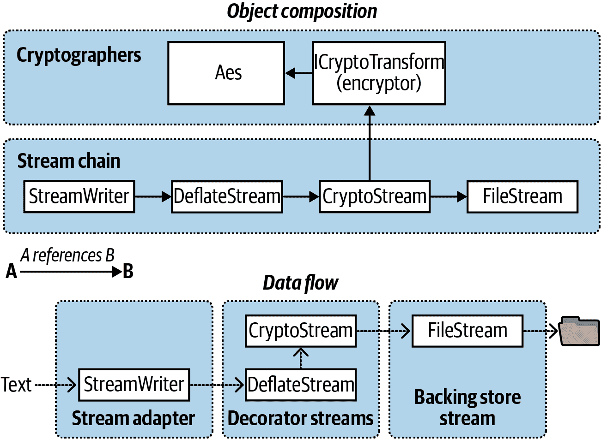

# 第二十章\. 密码学

在本章中，我们讨论了.NET 中的主要密码学 API：

+   Windows 数据保护 API（DPAPI）

+   哈希

+   对称加密

+   公钥加密和签名

本章涵盖的类型在以下命名空间中定义：

```cs
System.Security;
System.Security.Cryptography;
```

# 概述

表 20-1 总结了.NET 中的密码学选项。在接下来的几节中，我们将详细探讨每一种选项。

表 20-1\. .NET 中的加密和哈希选项

| 选项 | 管理的密钥 | 速度 | 强度 | 注释 |
| --- | --- | --- | --- | --- |
| `File.Encrypt` | 0 | 快速 | 依赖用户的密码 | 通过文件系统支持透明地保护文件。从当前登录用户的凭据隐式派生密钥。仅限 Windows 操作系统。 |
| Windows 数据保护 | 0 | 快速 | 依赖用户的密码 | 使用隐式派生密钥加密和解密字节数组。 |
| 哈希 | 0 | 快速 | 高 | 单向（不可逆）转换。用于存储密码、比较文件和检查数据完整性。 |
| 对称加密 | 1 | 快速 | 高 | 用于通用加密/解密。同一密钥加密和解密。可用于安全传输消息。 |
| 公钥加密 | 2 | 慢 | 高 | 加密和解密使用不同的密钥。用于在消息传输中交换对称密钥和数字签名文件。 |

.NET 还提供了更专门的支持，用于创建和验证基于 XML 的签名，位于`System.Security.Cryptography.Xml`命名空间，以及用于处理数字证书的类型，位于`System.Security.Cryptography.X509Certificates`命名空间。

# Windows 数据保护

###### 注意

Windows 数据保护仅在 Windows 操作系统上可用，在其他操作系统上会抛出`PlatformNotSupportedException`异常。

在“文件和目录操作”部分中，我们描述了如何使用`File.Encrypt`请求操作系统透明地加密文件：

```cs
File.WriteAllText ("myfile.txt", "");
File.Encrypt ("myfile.txt");
File.AppendAllText ("myfile.txt", "sensitive data");
```

在这种情况下的加密使用从当前登录用户密码派生的密钥。您可以使用同样的隐式派生密钥，通过 Windows 数据保护 API（DPAPI）加密字节数组。DPAPI 通过`ProtectedData`类公开——这是一个具有两个静态方法的简单类型：

```cs
public static byte[] Protect
  (byte[] userData, byte[] optionalEntropy, DataProtectionScope scope);

public static byte[] Unprotect
  (byte[] encryptedData, byte[] optionalEntropy, DataProtectionScope scope);
```

无论您在`optionalEntropy`中包含什么，都会添加到密钥中，从而增加其安全性。`DataProtectionScope`枚举参数允许两个选项：`CurrentUser`或`LocalMachine`。使用`CurrentUser`，密钥从当前登录用户的凭据派生；使用`LocalMachine`，则使用全局的机器密钥，适用于所有用户。这意味着使用`CurrentUser`范围加密的数据不能被其他用户解密。`LocalMachine`密钥提供较少的保护，但适用于需要在多个账户下操作的 Windows 服务或程序。

这里是一个简单的加密和解密演示：

```cs
byte[] original = {1, 2, 3, 4, 5};
DataProtectionScope scope = DataProtectionScope.CurrentUser;

byte[] encrypted = ProtectedData.Protect (original, null, scope);
byte[] decrypted = ProtectedData.Unprotect (encrypted, null, scope);
// decrypted is now {1, 2, 3, 4, 5}
```

Windows 数据保护根据用户密码的强度提供了对拥有完全访问权限的攻击者的中等安全性保护。在`LocalMachine`范围内，它仅对那些受限的物理和电子访问者有效。

# 哈希计算

哈希算法将一个潜在的大量字节压缩为一个固定长度的*哈希码*。哈希算法设计得如此，源数据的任何单比特更改都会导致显著不同的哈希码。这使得它适用于比较文件或检测文件或数据流的意外（或恶意）损坏。

哈希还充当单向加密，因为很难或不可能将哈希码转换回原始数据。这使其非常适合将密码存储在数据库中，因为如果您的数据库被攻击者入侵，您不希望攻击者能够访问明文密码。要进行身份验证，只需对用户输入的内容进行哈希并将其与数据库中存储的哈希进行比较。

要进行哈希计算，可以在`HashAlgorithm`的子类（如`SHA1`或`SHA256`）上调用`ComputeHash`：

```cs
byte[] hash;
using (Stream fs = File.OpenRead ("checkme.doc"))
  hash = SHA1.Create().ComputeHash (fs);   // SHA1 hash is 20 bytes long
```

`ComputeHash`方法还接受字节数组作为参数，这对于哈希密码非常方便（我们在“哈希密码”中描述了更安全的技术）：

```cs
byte[] data = System.Text.Encoding.UTF8.GetBytes ("stRhong%pword");
byte[] hash = SHA256.Create().ComputeHash (data);
```

###### 注意

在`Encoding`对象上调用`GetBytes`方法将字符串转换为字节数组；调用`GetString`方法将其转换回来。然而，`Encoding`对象不能将加密或哈希的字节数组转换为字符串，因为乱序的数据通常违反文本编码规则。取而代之的是使用`Convert.ToBase64String`和`Convert.FromBase64String`：它们可以在任何字节数组和合法（且适于 XML 或 JSON）的字符串之间转换。

## .NET 中的哈希算法

`SHA1`和`SHA256`是.NET 提供的`HashAlgorithm`子类型之一。以下是主要算法，按安全性从低到高排序：

| 类别 | 算法 | 哈希长度（字节） | 强度 |
| --- | --- | --- | --- |
| `MD5` | MD5 | 16 | 非常差 |
| `SHA1` | SHA-1 | 20 | 差 |
| `SHA256` | SHA-2 | 32 | 良好 |
| `SHA384` | SHA-2 | 48 | 良好 |
| `SHA512` | SHA-2 | 64 | 良好 |

所有五种算法在当前实现中执行速度大致相似，除了 SHA256，它比其他算法快 2-3 倍（这可能会随硬件和操作系统的不同而有所变化）。以一个大概的数字为例，您可以期望在 2024 年的桌面或服务器上，所有算法至少达到每秒 500 MB。较长的哈希值降低了*碰撞*（两个不同的文件产生相同的哈希值）的可能性。

###### 警告

使用至少`SHA256`来哈希密码或其他安全敏感数据。`MD5`和`SHA1`被认为在此目的上不安全，仅适用于防止意外损坏，而非故意篡改。

###### 注意

.NET 8 及更高版本还通过 `SHA3_256`、`SHA3_384` 和 `SHA3_512` 类支持最新的 SHA-3 哈希算法。SHA-3 算法被认为比前面列出的算法更安全（但更慢），但需要 Windows Build 25324+ 或具有 OpenSSL 1.1.1+ 的 Linux。可以通过这些类的静态 `IsSupported` 属性来测试操作系统是否支持。

## 密码哈希

如果你要求强密码策略以减轻*字典攻击*（即攻击者通过对字典中的每个单词进行哈希来构建密码查找表的策略），那么更长的 SHA 算法适合用作密码哈希的基础。

在哈希密码时的一个标准技术是将“盐”——一系列长字节——合并到每个密码之前，然后再进行哈希。这种做法通过两种方式使黑客感到沮丧：

+   他们还必须知道盐字节。

+   他们无法使用*彩虹表*（公开可用的*预计算*密码及其哈希码数据库），尽管使用足够的计算能力可能仍然可以进行字典攻击。

要进一步增强安全性，可以通过“拉伸”密码哈希来实现——重复重新哈希以获得更加计算密集的字节序列。如果重新哈希 100 次，一个原本需要一个月才能完成的字典攻击将需要八年时间。`KeyDerivation`、`Rfc2898DeriveBytes` 和 `PasswordDeriveBytes` 类可以执行这种类型的拉伸，并且允许方便的盐化。其中，`KeyDerivation.Pbkdf2` 提供了最佳的哈希算法：

```cs
byte[] encrypted = KeyDerivation.Pbkdf2 (
    password: "stRhong%pword",
    salt: Encoding.UTF8.GetBytes ("j78Y#p)/saREN!y3@"),
    prf: KeyDerivationPrf.HMACSHA512,
    iterationCount: 100,
    numBytesRequested: 64);
```

###### 注意

`KeyDerivation.Pbkdf2` 需要 NuGet 包 `Microsoft.AspNetCore.Cryptography.KeyDerivation`。尽管它位于 ASP.NET Core 命名空间中，但任何 .NET 应用程序都可以使用它。

# 对称加密

对称加密使用相同的密钥进行加密和解密。.NET BCL 提供了四种对称算法，其中 Rijndael（发音为“Rhine Dahl”或“Rain Doll”）是最优秀的；其他算法主要用于与旧应用程序的兼容性。Rijndael 既快速又安全，并且有两种实现方式：

+   `Rijndael` 类

+   `Aes` 类

这两者几乎是相同的，唯一的区别在于 `Aes` 不允许通过更改块大小来削弱密码。CLR 安全团队推荐使用 `Aes`。

`Rijndael` 和 `Aes` 允许使用长度为 16、24 或 32 字节的对称密钥：所有这些密钥长度目前都被认为是安全的。以下是如何使用 16 字节密钥将一系列字节加密并写入文件的方法：

```cs
byte[] key = {145,12,32,245,98,132,98,214,6,77,131,44,221,3,9,50};
byte[] iv  = {15,122,132,5,93,198,44,31,9,39,241,49,250,188,80,7};

byte[] data = { 1, 2, 3, 4, 5 };   // This is what we're encrypting.

using (SymmetricAlgorithm algorithm = Aes.Create())
using (ICryptoTransform encryptor = algorithm.CreateEncryptor (key, iv))
using (Stream f = File.Create ("encrypted.bin"))
using (Stream c = new CryptoStream (f, encryptor, CryptoStreamMode.Write))
  c.Write (data, 0, data.Length);
```

以下代码解密文件：

```cs
byte[] key = {145,12,32,245,98,132,98,214,6,77,131,44,221,3,9,50};
byte[] iv  = {15,122,132,5,93,198,44,31,9,39,241,49,250,188,80,7};

byte[] decrypted = new byte[5];

using (SymmetricAlgorithm algorithm = Aes.Create())
using (ICryptoTransform decryptor = algorithm.CreateDecryptor (key, iv))
using (Stream f = File.OpenRead ("encrypted.bin"))
using (Stream c = new CryptoStream (f, decryptor, CryptoStreamMode.Read))
  for (int b; (b = c.ReadByte()) > -1;)
    Console.Write (b + " ");                            // 1 2 3 4 5
```

在这个例子中，我们使用了 16 个随机选择的字节来生成密钥。如果在解密时使用了错误的密钥，`CryptoStream` 将抛出 `CryptographicException`。捕获此异常是测试密钥是否正确的唯一方法。

除了密钥，我们还制定了一个 IV，或*初始化向量*。这个 16 字节的序列是密码的一部分——类似于密钥——但不被视为*机密*。如果您要传输加密的消息，可以在明文中发送 IV（可能在消息头中），然后*每条消息都更改它*。这将使每条加密消息与任何先前的消息在外观上都不相似，即使它们的未加密版本相似或相同。

###### 注意

如果您不需要——或不想要——IV 的保护，可以通过同时使用相同的 16 字节值作为密钥和 IV 来避免它。然而，使用相同 IV 发送多条消息会削弱密码，并且甚至可能使其被破解。

密码工作分布在不同的类中。`Aes` 是数学家；它应用密码算法，以及它的 `encryptor` 和 `decryptor` 转换。`CryptoStream` 是管道工；它负责流的管道。您可以用不同的对称算法替换 `Aes`，但仍然可以使用 `CryptoStream`。

`CryptoStream` 是*双向*的，这意味着您可以根据选择的 `CryptoStreamMode.Read` 或 `CryptoStreamMode.Write` 从流中读取或写入数据。加密器和解密器都具备读取*和*写入的能力，产生四种组合——这个选择可能会让您盯着空白屏幕发呆一段时间！将读取视为“拉取”，写入视为“推送”可能会有所帮助。如果有疑问，可以从加密时选择 `Write`，解密时选择 `Read` 开始；这通常是最自然的选择。

要生成随机的密钥或 IV，请使用 `System.Cryptography` 中的 `RandomNumberGenerator`。它产生的数字是真正不可预测的，或者*密码学强度*（`System.Random` 类无法提供相同的保证）。以下是一个例子：

```cs
byte[] key = new byte [16];
byte[] iv  = new byte [16];
RandomNumberGenerator rand = RandomNumberGenerator.Create();
rand.GetBytes (key);
rand.GetBytes (iv);
```

或者，从 .NET 6 开始：

```cs
byte[] key = RandomNumberGenerator.GetBytes (16);
byte[] iv = RandomNumberGenerator.GetBytes (16);
```

如果您没有指定密钥和 IV，则会自动生成密码学上强大的随机值。您可以通过 `Aes` 对象的 `Key` 和 `IV` 属性查询这些值。

## 在内存中加密

从 .NET 6 开始，您可以利用 `EncryptCbc` 和 `DecryptCbc` 方法来简化字节数组的加密和解密过程：

```cs
public static byte[] Encrypt (byte[] data, byte[] key, byte[] iv)
{
  using Aes algorithm = Aes.Create();
  algorithm.Key = key;
  return algorithm.EncryptCbc (data, iv);
}

public static byte[] Decrypt (byte[] data, byte[] key, byte[] iv)
{
  using Aes algorithm = Aes.Create();
  algorithm.Key = key;
  return algorithm.DecryptCbc (data, iv);
}
```

这是在所有 .NET 版本中都有效的等效方法：

```cs
public static byte[] Encrypt (byte[] data, byte[] key, byte[] iv)
{
  using (Aes algorithm = Aes.Create())
  using (ICryptoTransform encryptor = algorithm.CreateEncryptor (key, iv))
    return Crypt (data, encryptor);
}

public static byte[] Decrypt (byte[] data, byte[] key, byte[] iv)
{
  using (Aes algorithm = Aes.Create())
  using (ICryptoTransform decryptor = algorithm.CreateDecryptor (key, iv))
    return Crypt (data, decryptor);
}

static byte[] Crypt (byte[] data, ICryptoTransform cryptor)
{
  MemoryStream m = new MemoryStream();
  using (Stream c = new CryptoStream (m, cryptor, CryptoStreamMode.Write))
    c.Write (data, 0, data.Length);
  return m.ToArray();
}
```

在这里，`CryptoStreamMode.Write` 在加密和解密时都能很好地工作，因为在这两种情况下，我们都在“推送”到一个新的内存流中。

这里有接受和返回字符串的重载：

```cs
public static string Encrypt (string data, byte[] key, byte[] iv)
{
  return Convert.ToBase64String (
    Encrypt (Encoding.UTF8.GetBytes (data), key, iv));
}

public static string Decrypt (string data, byte[] key, byte[] iv)
{
  return Encoding.UTF8.GetString (
    Decrypt (Convert.FromBase64String (data), key, iv));
}
```

以下演示了它们的使用：

```cs
byte[] key = new byte[16];
byte[] iv = new byte[16];

var cryptoRng = RandomNumberGenerator.Create();
cryptoRng.GetBytes (key);
cryptoRng.GetBytes (iv);

string encrypted = Encrypt ("Yeah!", key, iv);
Console.WriteLine (encrypted);                 // R1/5gYvcxyR2vzPjnT7yaQ==

string decrypted = Decrypt (encrypted, key, iv);
Console.WriteLine (decrypted);                 // Yeah!
```

## 链式加密流

`CryptoStream` 是一个装饰器，意味着您可以将它与其他流链接起来。在下面的示例中，我们将压缩加密文本写入文件，然后再读取回来：

```cs
byte[] key = new byte [16];
byte[] iv = new byte [16];

var cryptoRng = RandomNumberGenerator.Create();
cryptoRng.GetBytes (key);
cryptoRng.GetBytes (iv);

using (Aes algorithm = Aes.Create())
{
  using (ICryptoTransform encryptor = algorithm.CreateEncryptor(key, iv))
  using (Stream f = File.Create ("serious.bin"))
  using (Stream c = new CryptoStream (f, encryptor, CryptoStreamMode.Write))
  using (Stream d = new DeflateStream (c, CompressionMode.Compress))
  using (StreamWriter w = new StreamWriter (d))
    await w.WriteLineAsync ("Small and secure!");

  using (ICryptoTransform decryptor = algorithm.CreateDecryptor(key, iv))
  using (Stream f = File.OpenRead ("serious.bin"))
  using (Stream c = new CryptoStream (f, decryptor, CryptoStreamMode.Read))
  using (Stream d = new DeflateStream (c, CompressionMode.Decompress))
  using (StreamReader r = new StreamReader (d))
    Console.WriteLine (await r.ReadLineAsync());     // Small and secure!
}
```

（最后一步，通过调用 `WriteLineAsync` 和 `ReadLineAsync` 使我们的程序异步化，并等待结果。）

在这个例子中，所有单字母变量都是链的一部分。数学家——`algorithm`、`encryptor` 和 `decryptor`——在密码流的工作中起到了辅助作用，正如 图 20-1 所示。

以这种方式链接流无论最终流的大小如何，都需要很少的内存。



###### 图 20-1\. 加密和压缩流的链接

## 处置加密对象

处置`CryptoStream`确保其内部数据缓存刷新到底层流中。内部缓存对于加密算法是必需的，因为它们以块而不是逐字节方式处理数据。

`CryptoStream`的不寻常之处在于其`Flush`方法什么也不做。要刷新流（而不是释放它），必须调用`FlushFinalBlock`。与`Flush`相反，只能调用`FlushFinalBlock`一次，然后不能再写入更多数据。

我们还处理了数学家——`Aes`算法和`ICryptoTransform`对象（`encryptor`和`decryptor`）。当 Rijndael 变换被处理时，它们会从内存中擦除对称密钥和相关数据，防止其他在计算机上运行的软件（我们说的是恶意软件）后续发现。您不能依赖垃圾收集器来执行此任务，因为它仅仅将内存部分标记为可用；它不会在每个字节上写零。

在`using`语句外释放`Aes`对象最简单的方法是调用`Clear`方法。它的`Dispose`方法通过显式实现隐藏（用于表示其不寻常的处理语义，即清除内存而不是释放非托管资源）。

###### 注意

您可以通过以下方法进一步减少应用程序通过释放的内存泄露秘密的风险：

+   避免使用字符串存储安全信息（由于不可变性，一旦创建，字符串的值就无法清除）

+   一旦不再需要，立即覆盖缓冲区（例如，在字节数组上调用`Array.Clear`）

## 密钥管理

密钥管理是安全性的关键因素：如果您的密钥暴露了，那么您的数据也暴露了。您需要考虑谁应该访问密钥，以及如何在硬件故障时进行备份，同时以防止未经授权的访问方式存储它们。

不建议硬编码加密密钥，因为存在流行的工具可以轻松反编译程序集，无需专业知识。更好的选择（在 Windows 上）是为每个安装制造一个随机密钥，并安全地存储在 Windows 数据保护中。

对于部署到云中的应用程序，Microsoft Azure 和 Amazon Web Services（AWS）提供了具有额外功能的密钥管理系统，这些功能在企业环境中可能非常有用，例如审计跟踪。如果您正在加密消息流，公钥加密仍然提供了最佳选择。

# 公钥加密和签名

公钥加密是*非对称*的，意味着加密和解密使用不同的密钥。

与对称加密不同，对称加密可以使用任意长度的任意字节序列作为密钥，非对称加密需要专门制作的密钥对。密钥对包含一对*公钥*和*私钥*组件，它们如下配合工作：

+   公钥加密消息。

+   私钥解密消息。

负责“制作”密钥对的一方会保持私钥保密，同时自由分发公钥。这种加密方式的特殊特性在于无法从公钥计算出私钥。因此，如果私钥丢失，则无法恢复加密数据；相反，如果私钥泄漏，则加密系统变得无用。

公钥握手允许两台计算机在公共网络上进行安全通信，无需先前联系和现有共享秘密。为了看到其工作原理，假设计算机*Origin*想要将机密消息发送给计算机*Target*：

1.  *Target*生成一个公钥/私钥对，然后将其公钥发送给*Origin*。

1.  *Origin*使用*Target*的公钥加密机密消息，然后将其发送给*Target*。

1.  *Target*使用其私钥解密机密消息。

窃听者将看到以下内容：

+   *Target*的公钥

+   使用*Target*的公钥加密的秘密消息

但是没有*Target*的私钥，无法解密消息。

###### 注意

这不能防止中间人攻击：换句话说，*Origin*无法知道*Target*是否某些恶意方。要对收件人进行身份验证，发起者需要已知收件人的公钥或能够通过*数字站点证书*验证其密钥。

因为公钥加密速度较慢且消息大小有限，从*Origin*发送到*Target*的秘密消息通常包含用于随后*对称*加密的新密钥。这允许在会话的其余部分放弃公钥加密，转而采用能够处理更大消息的对称算法。如果每个会话生成一个新的公钥/私钥对，则此协议尤其安全，因为然后无需在任何计算机上存储密钥。

###### 注意

公钥加密算法依赖于消息大小小于密钥的情况。这使它们适合仅加密少量数据，例如随后对称加密的密钥。如果尝试加密远大于密钥大小一半的消息，则提供程序将引发异常。

## RSA 类

.NET 提供多种非对称算法，其中 RSA 最为流行。以下是如何使用 RSA 加密和解密的方法：

```cs
byte[] data = { 1, 2, 3, 4, 5 };   // This is what we're encrypting.

using (var rsa = new RSACryptoServiceProvider())
{
  byte[] encrypted = rsa.Encrypt (data, true);
  byte[] decrypted = rsa.Decrypt (encrypted, true);
}
```

因为我们没有指定公钥或私钥，加密提供程序会自动使用默认长度为 1,024 位生成密钥对；您可以通过构造函数请求更长的密钥，以 8 字节的增量。对于安全关键的应用程序，建议请求 2,048 位：

```cs
var rsa = new RSACryptoServiceProvider (2048);
```

生成密钥对的计算密集型操作可能需要约 10 毫秒。因此，RSA 实现推迟到实际需要密钥时才执行，例如在调用`Encrypt`时。这使您有机会加载现有的密钥或密钥对（如果存在）。

方法`ImportCspBlob`和`ExportCspBlob`以字节数组格式加载和保存密钥。`FromXmlString`和`ToXmlString`以字符串格式执行相同的工作，字符串包含 XML 片段。布尔标志允许您指示在保存时是否包括私钥。以下是如何生成密钥对并将其保存到磁盘上的示例：

```cs
using (var rsa = new RSACryptoServiceProvider())
{
  File.WriteAllText ("PublicKeyOnly.xml", rsa.ToXmlString (false));
  File.WriteAllText ("PublicPrivate.xml", rsa.ToXmlString (true));
}
```

因为我们没有提供现有密钥，`ToXmlString`强制生成了一个新的密钥对（在第一次调用时）。在下一个示例中，我们将读取这些密钥并使用它们来加密和解密消息。

```cs
byte[] data = Encoding.UTF8.GetBytes ("Message to encrypt");

string publicKeyOnly = File.ReadAllText ("PublicKeyOnly.xml");
string publicPrivate = File.ReadAllText ("PublicPrivate.xml");

byte[] encrypted, decrypted;

using (var rsaPublicOnly = new RSACryptoServiceProvider())
{
  rsaPublicOnly.FromXmlString (publicKeyOnly);
  encrypted = rsaPublicOnly.Encrypt (data, true);

  // The next line would throw an exception because you need the private
  // key in order to decrypt:
  // decrypted = rsaPublicOnly.Decrypt (encrypted, true);
}

using (var rsaPublicPrivate = new RSACryptoServiceProvider())
{
  // With the private key we can successfully decrypt:
  rsaPublicPrivate.FromXmlString (publicPrivate);
  decrypted = rsaPublicPrivate.Decrypt (encrypted, true);
}
```

## 数字签名

您还可以使用公钥算法来对消息或文档进行数字签名。签名类似于哈希，但其生成需要私钥，因此无法伪造。公钥用于验证签名。以下是一个示例：

```cs
byte[] data = Encoding.UTF8.GetBytes ("Message to sign");
byte[] publicKey;
byte[] signature;
object hasher = SHA1.Create();         // Our chosen hashing algorithm.

// Generate a new key pair, then sign the data with it:
using (var publicPrivate = new RSACryptoServiceProvider())
{
  signature = publicPrivate.SignData (data, hasher);
  publicKey = publicPrivate.ExportCspBlob (false);    // get public key
}

// Create a fresh RSA using just the public key, then test the signature.
using (var publicOnly = new RSACryptoServiceProvider())
{
  publicOnly.ImportCspBlob (publicKey);
  Console.Write (publicOnly.VerifyData (data, hasher, signature)); // True

  // Let's now tamper with the data and recheck the signature:
  data[0] = 0;
  Console.Write (publicOnly.VerifyData (data, hasher, signature)); // False

  // The following throws an exception as we're lacking a private key:
  signature = publicOnly.SignData (data, hasher);
}
```

签名的工作方式是首先对数据进行哈希处理，然后应用非对称算法到结果哈希上。由于哈希值是固定大小的小块，因此可以相对快速地对大型文档进行签名（与哈希相比，公钥加密需要更多的 CPU 资源）。如果愿意，您可以自行进行哈希计算，然后调用`SignHash`而不是`SignData`：

```cs
using (var rsa = new RSACryptoServiceProvider())
{
  byte[] hash = SHA1.Create().ComputeHash (data);
  signature = rsa.SignHash (hash, CryptoConfig.MapNameToOID ("SHA1"));
  ...
}
```

`SignHash`仍然需要知道您使用的哈希算法；`CryptoConfig.Map​Na⁠meToOID`从友好名称（如“SHA1”）提供此信息，以正确的格式提供。

`RSACryptoServiceProvider`生成的签名大小与密钥大小相匹配。目前，没有主流算法生成比 128 字节更小的安全签名（适用于产品激活码等）。

###### 注意

为了签名有效，接收者必须知道并信任发送者的公钥。这可以通过先前的通信、预配置或网站证书来实现。网站证书是发起者公钥和名称的电子记录，由独立可信的机构签名。命名空间`System.Security.Cryptography.X509Certificates`定义了用于处理证书的类型。
