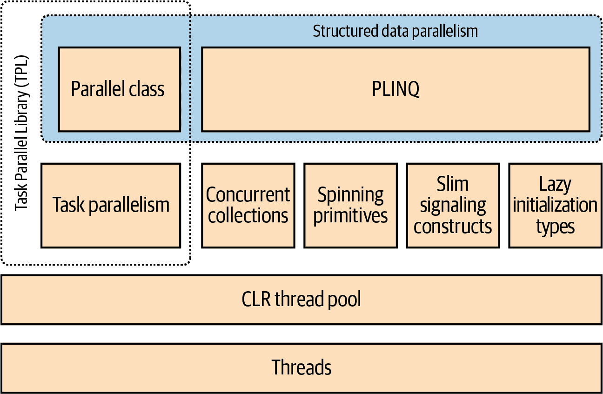
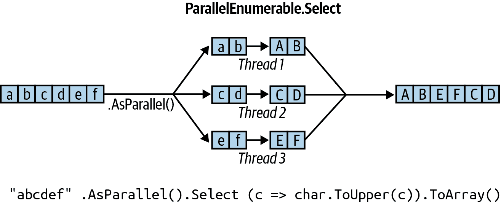
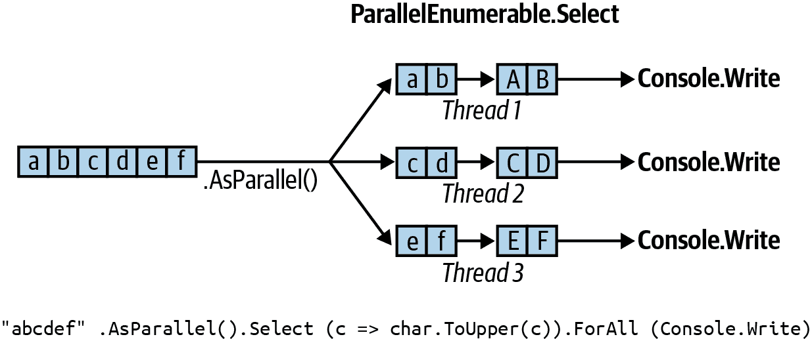
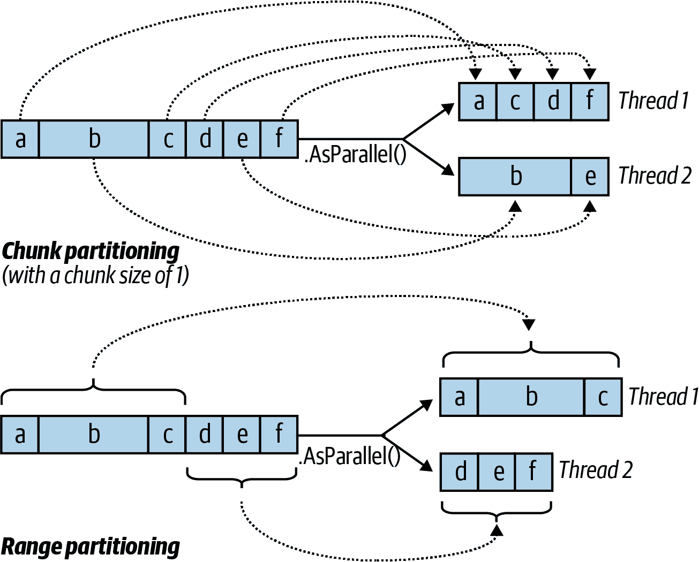
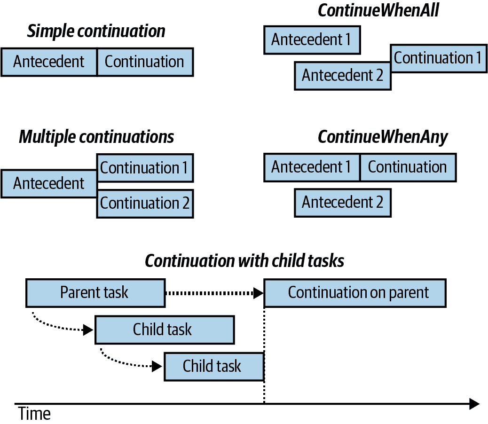
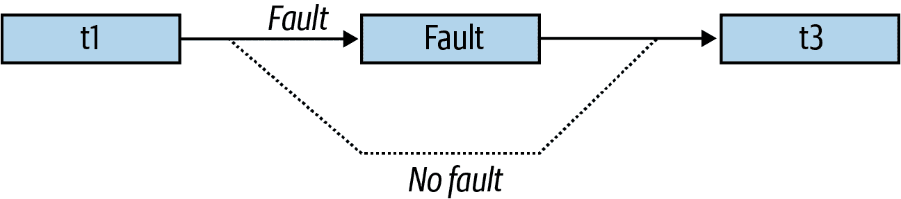

# 第二十二章 并行编程

在本章中，我们涵盖了旨在利用多核处理器的多线程 API 和构造体：

+   并行 LINQ 或*PLINQ*

+   `Parallel`类

+   *任务并行*构造体

+   并发集合

这些构造体（松散地）被称为 Parallel Framework（PFX）。`Parallel`类与任务并行构造体一起被称为*任务并行库*（TPL）。

在阅读本章之前，特别是锁定、线程安全和`Task`类，你需要熟悉第十四章中的基础知识。

###### 注意

.NET 提供了许多专门的 API 来帮助并行和异步编程：

+   `System.Threading.Channels.Channel`是一个高性能的异步生产者/消费者队列，引入于.NET Core 3。

+   *Microsoft Dataflow*（在`System.Thread⁠ing.Tasks​.Dataflow`命名空间中）是一个复杂的 API，用于创建并行执行操作或数据转换的缓冲*块*网络，类似于 actor/agent 编程。

+   *响应式扩展*实现了 LINQ 在`IObservable`（与`IAsyncEnumerable`的替代抽象）上，并擅长于组合异步流。响应式扩展在*System.Reactive* NuGet 包中发布。

# 为什么使用 PFX？

在过去的 15 年中，CPU 制造商已经从单核转向多核处理器。这对程序员来说是个问题，因为单线程代码不会因为额外的核心而自动运行得更快。

对于大多数服务器应用程序来说，利用多核是很容易的，每个线程可以独立处理一个单独的客户端请求，但是在桌面上更难，因为通常需要将计算密集型代码拿出来并执行以下操作：

1.  *将其分割*成小块。

1.  通过多线程并行执行这些块。

1.  *整理*结果，以线程安全和高性能的方式。

尽管你可以使用经典的多线程构造体完成所有这些工作，但这样做很笨重——特别是分割和整理的步骤。另一个问题是，在许多线程同时处理相同数据时，常规的线程安全锁定策略会导致很多争用。

PFX 库专门设计用于帮助这些场景。

###### 注意

利用多核或多处理器进行编程被称为*并行编程*。这是多线程概念的一个子集。

## PFX 概念

有两种策略用于在线程之间分区工作：*数据并行*和*任务并行*。

当需要在许多数据值上执行一组任务时，我们可以通过让每个线程在值的子集上执行（相同的）任务集来并行化。这被称为*数据并行性*，因为我们在线程之间分区*数据*。相比之下，*任务并行性*是分区*任务*；换句话说，我们让每个线程执行不同的任务。

通常情况下，数据并行性更简单，并且更适应高度并行硬件，因为它减少或消除了共享数据（从而减少争用和线程安全问题）。此外，数据并行性利用了数据值通常比离散任务多的事实，增加了并行化的潜力。

数据并行性也有助于*结构化并行性*，这意味着并行工作单元在程序中的开始和结束在同一地点。相反，任务并行性往往是非结构化的，意味着并行工作单元可能在程序中分散的位置开始和结束。结构化并行性更简单，更少出错，并允许您将分区和线程协调（甚至结果整合）的困难工作交给库处理。

## PFX 组件

PFX 由两层功能组成，如图 22-1 所示。较高层包括两个*结构化数据并行性* API：PLINQ 和 `Parallel` 类。较低层包含任务并行性类以及一组额外的构造用于帮助并行编程活动。



###### 图 22-1\. PFX 组件

PLINQ 提供了最丰富的功能：它自动化了并行化的所有步骤，包括将工作分区为任务、在线程上执行这些任务以及将结果整合为单一输出序列。它被称为*声明性*，因为您只需声明要并行化的工作（将其结构化为 LINQ 查询），然后让运行时处理实现细节。相比之下，其他方法是*命令式*的，您需要显式编写代码来分区或整合。如下面的概述所示，在`Parallel` 类的情况下，您必须自行整合结果；而在任务并行性构造中，您还必须自行分区工作：

|  | 分区工作 | 整合结果 |
| --- | --- | --- |
| PLINQ | 是 | 是 |
| `Parallel` 类 | 是 | 否 |
| PFX 的任务并行性 | 否 | 否 |

并发集合和自旋原语帮助您处理低级并行编程活动。这些很重要，因为 PFX 不仅设计用于当前的硬件，还可以适用于未来更多核心的处理器。如果你想搬运一堆劈好的木头，有 32 名工人来做这份工作，最大的挑战是在不让工人互相干扰的情况下搬动木头。同样的情况也出现在将算法分配给 32 个核心上：如果使用普通的锁来保护共享资源，由此引起的阻塞可能意味着只有少部分核心实际上忙碌。并发集合专门针对高度并发访问进行了调整，重点是尽量减少或消除阻塞。PLINQ 和`Parallel`类本身依赖于并发集合和自旋原语，以有效地管理工作。

## 使用 PFX 的时机

PFX 的主要用途是*并行编程*：利用多核处理器加速计算密集型代码。

并行编程中的挑战之一是阿姆达尔定律，该定律指出并行化带来的最大性能提升受限于必须顺序执行的代码部分。例如，如果算法执行时间的三分之二只能并行化，即使有无限数量的核心，性能提升也不能超过三倍。

因此，在继续之前，值得验证的是瓶颈是否在可以并行化的代码上。还值得考虑的是，你的代码是否*需要*计算密集型—优化通常是最简单和最有效的方法。然而，有一个权衡，某些优化技术可能会使代码更难以并行化。

最容易获得的收益来自于所谓的*极易并行*问题—当工作可以轻松地分成有效执行的任务时（结构化并行非常适合这类问题）。例如，许多图像处理任务、光线追踪以及数学或密码学中的穷举方法都属于此类问题。非极易并行问题的一个例子是实现快速排序算法的优化版本—这需要一些思考，并且可能需要非结构化的并行。

# PLINQ

PLINQ 会自动并行化本地 LINQ 查询。PLINQ 的优势在于使用简单，因为它将工作分割和结果收集的负担都交给了.NET。

要使用 PLINQ，只需在输入序列上调用`AsParallel()`，然后像往常一样继续 LINQ 查询。以下查询计算了在 3 到 100,000 之间的素数，充分利用了目标机器上的所有核心：

```cs
// Calculate prime numbers using a simple (unoptimized) algorithm.

IEnumerable<int> numbers = Enumerable.Range (3, 100000-3);

var parallelQuery = 
  from n in numbers.AsParallel()
  where Enumerable.Range (2, (int) Math.Sqrt (n)).All (i => n % i > 0)
  select n;

int[] primes = parallelQuery.ToArray();
```

`AsParallel` 是 `System.Linq.ParallelEnumerable` 中的扩展方法。它将输入包装在基于 `ParallelQuery<TSource>` 的序列中，这会导致随后调用的 LINQ 查询操作符绑定到在 `ParallelEnumerable` 中定义的另一组扩展方法。这些方法提供了每个标准查询操作符的并行实现。基本上，它们通过将输入序列分区为在不同线程上执行的块，并将结果汇总回一个用于消费的单个输出序列中，如 图 22-2 所示。



###### 图 22-2\. PLINQ 执行模型

调用 `AsSequential()` 会取消 `ParallelQuery` 序列的包装，这样随后的查询操作符就会绑定到标准查询操作符并按顺序执行。在调用具有副作用或不是线程安全的方法之前，这是必要的。

对于接受两个输入序列的查询操作符（`Join`、`GroupJoin`、`Concat`、`Union`、`Intersect`、`Except` 和 `Zip`），你必须对两个输入序列都应用 `AsParallel()`（否则会抛出异常）。然而，你无需在查询进度中继续应用 `AsParallel`，因为 PLINQ 的查询操作符会输出另一个 `ParallelQuery` 序列。事实上，再次调用 `AsParallel` 会导致效率低下，因为它会强制合并和重新分区查询：

```cs
mySequence.AsParallel()           // Wraps sequence in ParallelQuery<int>
          .Where (n => n > 100)   // Outputs another ParallelQuery<int>
          .AsParallel()           // Unnecessary - and inefficient!
          .Select (n => n * n)
```

并非所有查询操作符都能有效地并行化。对于那些不能并行化的操作符（参见 “PLINQ 限制”），PLINQ 将顺序实现该操作符。如果 PLINQ 怀疑并行化的开销实际上会减慢特定查询的速度，它也可能会顺序操作。

PLINQ 仅适用于本地集合：例如，它不能与 Entity Framework 一起使用，因为在这些情况下，LINQ 会转换为 SQL，然后在数据库服务器上执行。但是，你*可以*使用 PLINQ 对从数据库查询中获取的结果集执行额外的本地查询。

###### 警告

如果 PLINQ 查询引发异常，则会作为 `AggregateException` 重新抛出，其 `InnerExceptions` 属性包含实际的异常（或异常）。有关详细信息，请参阅 “使用 AggregateException”。

## 并行执行的策略

像普通的 LINQ 查询一样，PLINQ 查询也是惰性评估的。这意味着只有在开始消耗结果时才会触发执行，通常通过 `foreach` 循环（尽管也可以通过像 `ToArray` 这样的转换操作符或返回单个元素或值的操作符来触发）。

但是，在枚举结果时，执行方式与普通的顺序查询有些不同。顺序查询完全由消费者以“拉取”方式驱动：输入序列的每个元素都会在消费者需要时精确获取。并行查询通常使用独立线程轻微提前获取输入序列中的元素（类似于新闻主播的电视提词器）。然后通过查询链并行处理元素，并将结果保存在小缓冲区中，以便按需提供给消费者。如果消费者暂停或提前退出枚举，查询处理器也会暂停或停止，以避免浪费 CPU 时间或内存。

###### 注意

你可以在 `AsParallel` 后调用 `WithMergeOptions` 调整 PLINQ 的缓冲行为。`AutoBuffered` 的默认值通常提供最佳的整体结果。`NotBuffered` 禁用缓冲区，如果你希望尽快看到结果，则很有用；`FullyBuffered` 在向消费者呈现整个结果集之前缓存整个结果（`OrderBy` 和 `Reverse` 操作符自然以此方式工作，聚合和转换操作符也是如此）。

## PLINQ 和排序

并行化查询操作符的一个副作用是，在整理结果时，它们的顺序不一定与提交时的顺序相同（参见 图 22-2）。换句话说，LINQ 对序列的正常顺序保留保证不再适用。

如果需要保留顺序，可以在 `AsParallel()` 后调用 `AsOrdered()` 强制执行：

```cs
myCollection.AsParallel().AsOrdered()...
```

调用 `AsOrdered` 会导致大量元素时的性能损失，因为 PLINQ 必须跟踪每个元素的原始位置。

你可以通过调用 `AsUnordered` 来取消 `AsOrdered` 在查询中的影响：这引入了一个“随机洗牌点”，允许查询从那一点开始更高效地执行。因此，如果你只想保留前两个查询操作的输入顺序，可以这样做：

```cs
inputSequence.AsParallel().AsOrdered()
  *.QueryOperator1*()
 * .QueryOperator2*()
  .AsUnordered()       // From here on, ordering doesn’t matter
  .*QueryOperator3*()
  ...
```

`AsOrdered` 不是默认选项，因为对于大多数查询来说，原始输入的顺序并不重要。换句话说，如果 `AsOrdered` 是默认选项，你需要对大多数并行查询应用 `AsUnordered` 以获得最佳性能，这会增加负担。

## PLINQ 的限制

在什么情况下 PLINQ 可以并行化存在实际限制。以下查询操作符默认情况下阻止并行化，除非源元素处于它们的原始索引位置：

+   `Select`、`SelectMany` 和 `ElementAt` 的索引版本

大多数查询操作符会更改元素的索引位置（包括删除元素的操作，如 `Where`）。这意味着如果要使用前面的操作符，它们通常需要位于查询的开始位置。

下列查询运算符是可以并行化的，但使用昂贵的分区策略，有时比顺序处理更慢：

+   `Join`、`GroupBy`、`GroupJoin`、`Distinct`、`Union`、`Intersect`和`Except`

`Aggregate`运算符的标准化版本的*种子*重载不可并行化 —— PLINQ 提供了特殊的重载来处理这个问题（见“优化 PLINQ”）。

所有其他运算符都是可以并行化的，尽管使用这些运算符并不保证您的查询会并行化。如果 PLINQ 认为并行化的开销会减慢特定查询的速度，它可能会顺序运行您的查询。您可以在`AsParallel()`后调用以下方法来覆盖此行为并强制并行处理：

```cs
.WithExecutionMode (ParallelExecutionMode.ForceParallelism)
```

## 示例：并行拼写检查器

假设我们想要编写一个拼写检查器，通过利用所有可用核心，快速处理非常大的文档。通过将我们的算法制定为 LINQ 查询，我们可以非常容易地并行化它。

第一步是将英文单词的字典下载到一个`HashSet`中，以便进行高效的查找：

```cs
if (!File.Exists ("WordLookup.txt")    // Contains about 150,000 words
  File.WriteAllText ("WordLookup.txt",
    await new HttpClient().GetStringAsync (
      "http://www.albahari.com/ispell/allwords.txt"));

var wordLookup = new HashSet<string> (
  File.ReadAllLines ("WordLookup.txt"),
  StringComparer.InvariantCultureIgnoreCase);
```

然后，我们使用我们的单词查找来创建一个测试“文档”，包含一个百万个随机单词的数组。在我们构建数组之后，让我们引入一些拼写错误：

```cs
var random = new Random();
string[] wordList = wordLookup.ToArray();

string[] wordsToTest = Enumerable.Range (0, 1000000)
  .Select (i => wordList [random.Next (0, wordList.Length)])
  .ToArray();

wordsToTest [12345] = "woozsh";     // Introduce a couple
wordsToTest [23456] = "wubsie";     // of spelling mistakes.
```

现在，我们可以通过将`wordsToTest`与`wordLookup`进行测试来执行并行拼写检查。PLINQ 使这一过程非常简单：

```cs
var query = wordsToTest
  .AsParallel()
  .Select  ((word, index) => (word, index))
  .Where   (iword => !wordLookup.Contains (iword.word))
  .OrderBy (iword => iword.index);

foreach (var mistake in query)
  Console.WriteLine (mistake.word + " - index = " + mistake.index);

// OUTPUT:
// woozsh - index = 12345
// wubsie - index = 23456
```

谓词中的`wordLookup.Contains`方法为查询提供了一些“实质”，使其值得并行化。

###### 注意

注意，我们的查询使用元组`(word, index)`而不是匿名类型。因为元组是作为值类型而不是引用类型实现的，这通过减少堆分配和随后的垃圾回收，改善了峰值内存消耗和性能。（基准测试显示，在实践中，由于内存管理器的效率和这些分配不超过 Generation 0，这些收益是适度的。）

### 使用`ThreadLocal<T>`

让我们通过并行化随机测试词列表的创建来扩展我们的示例。我们将其构造为 LINQ 查询，因此应该很容易。以下是顺序版本：

```cs
string[] wordsToTest = Enumerable.Range (0, 1000000)
  .Select (i => wordList [random.Next (0, wordList.Length)])
  .ToArray();
```

不幸的是，对`random.Next`的调用不是线程安全的，因此将`AsParallel()`插入查询中并不简单。一个潜在的解决方案是编写一个在`random.Next`周围加锁的函数；然而，这会限制并发性。更好的选择是使用`ThreadLocal<Random>`（参见“线程本地存储”），为每个线程创建一个单独的`Random`对象。然后我们可以按如下方式并行化查询：

```cs
var localRandom = new ThreadLocal<Random>
 ( () => new Random (Guid.NewGuid().GetHashCode()) );

string[] wordsToTest = Enumerable.Range (0, 1000000).AsParallel()
  .Select (i => wordList [localRandom.Value.Next (0, wordList.Length)])
  .ToArray();
```

在我们用于实例化`Random`对象的工厂函数中，我们传递一个`Guid`的哈希码，以确保如果在短时间内创建了两个`Random`对象，它们将产生不同的随机数序列。

## 函数纯度

因为 PLINQ 在并行线程上运行查询，所以必须小心不要执行线程不安全的操作。特别是写入变量是*副作用*，因此是线程不安全的：

```cs
// The following query multiplies each element by its position.
// Given an input of Enumerable.Range(0,999), it should output squares.
int i = 0;
var query = from n in Enumerable.Range(0,999).AsParallel() select n * i++;
```

我们可以通过使用锁使增加`i`线程安全，但问题仍然存在，即`i`不一定对应于输入元素的位置。并且添加`AsOrdered`到查询中也不能解决后一个问题，因为`AsOrdered`仅确保元素按照它们被顺序处理的顺序输出——它实际上不会*顺序处理*它们。

正确的解决方案是重写我们的查询，使用索引版本的`Select`：

```cs
var query = Enumerable.Range(0,999).AsParallel().Select ((n, i) => n * i);
```

为了获得最佳性能，从查询操作符调用的任何方法都应该通过不写入字段或属性（非副作用，或*功能纯粹*）来保持线程安全。如果它们通过*锁定*而不是副作用来保持线程安全，查询的并行潜力将受到争用效果的限制。

## 设置并行度

默认情况下，PLINQ 选择适合正在使用的处理器的最佳并行度。您可以通过在`AsParallel`后调用`WithDegreeOfParallelism`来覆盖它：

```cs
...AsParallel().WithDegreeOfParallelism(4)...
```

一个例子是在 I/O 绑定的工作中可能会增加并行性（例如同时下载多个网页）。然而，任务组合器和异步函数提供了一个同样简单且更*高效*的解决方案（参见“任务组合器”）。与`Task`不同，PLINQ 无法执行 I/O 绑定工作而不阻塞线程（并且*池化*线程会使情况变得更糟）。

### 更改并行度

在 PLINQ 查询中，只能调用一次`WithDegreeOfParallelism`。如果需要再次调用它，必须通过在查询中再次调用`AsParallel()`来强制合并和重新分区查询：

```cs
"The Quick Brown Fox"
  .AsParallel().WithDegreeOfParallelism (2)
  .Where (c => !char.IsWhiteSpace (c))
  .AsParallel().WithDegreeOfParallelism (3)   // Forces Merge + Partition
  .Select (c => char.ToUpper (c))
```

## 取消

取消在 `foreach` 循环中消耗其结果的 PLINQ 查询非常简单：只需中断 `foreach`，查询将自动取消，因为枚举器会被隐式处理。

对于以转换、元素或聚合操作结束的查询，可以通过*取消令牌*（参见“取消”）从另一个线程取消它。要插入一个令牌，在调用`AsParallel`后调用`WithCancellation`，传递`CancellationTokenSource`对象的`Token`属性。然后，另一个线程可以调用令牌源的`Cancel`（或者我们可以自己延迟调用）。然后，在查询的消费者上抛出`OperationCanceledException`：

```cs
IEnumerable<int> tenMillion = Enumerable.Range (3, 10_000_000);

var cancelSource = new CancellationTokenSource();
cancelSource.CancelAfter (100);   // Cancel query after 100 milliseconds

var primeNumberQuery = 
  from n in tenMillion.AsParallel().WithCancellation (cancelSource.Token)
  where Enumerable.Range (2, (int) Math.Sqrt (n)).All (i => n % i > 0)
  select n;

try 
{
  // Start query running:
  int[] primes = primeNumberQuery.ToArray();
  // We'll never get here because the other thread will cancel us.
}
catch (OperationCanceledException)
{
  Console.WriteLine ("Query canceled");
}
```

在取消时，PLINQ 等待每个工作线程完成其当前元素后结束查询。这意味着查询调用的任何外部方法都将完全运行。

## 优化 PLINQ

### 输出端优化

PLINQ 的一个优点是方便地将并行工作的结果整理到单一输出序列中。但有时，您需要做的只是对每个元素运行某个函数一次：

```cs
foreach (int n in parallelQuery)
  DoSomething (n);
```

如果是这种情况——并且您不关心元素处理顺序——您可以通过 PLINQ 的`ForAll`方法提高效率。

`ForAll`方法在`ParallelQuery`的每个输出元素上运行委托。它直接连接到 PLINQ 的内部，跳过整理和枚举结果的步骤。这里是一个简单的示例：

```cs
"abcdef".AsParallel().Select (c => char.ToUpper(c)).ForAll (Console.Write);
```

图 22-3 展示了该过程。



###### 图 22-3\. PLINQ `ForAll`

###### 注意

整理和枚举结果并非代价高昂，因此`ForAll`优化在输入元素快速执行较多的情况下获得最大收益。

### 输入端优化

PLINQ 有三种分区策略用于将输入元素分配给线程：

| 策略 | 元素分配 | 相对性能 |
| --- | --- | --- |
| 分块分区 | 动态 | 平均 |
| 范围分区 | 静态 | 差至优 |
| 哈希分区 | 静态 | 一般 |

对于需要比较元素的查询操作符（`GroupBy`、`Join`、`GroupJoin`、`Intersect`、`Except`、`Union`和`Distinct`），您没有选择：PLINQ 始终使用*哈希分区*。哈希分区相对低效，因为它必须预先计算每个元素的哈希码（以便具有相同哈希码的元素可以在同一线程上处理）。如果发现这太慢，则唯一选择是调用`AsSequential`禁用并行化。

对于所有其他查询操作符，您可以选择使用范围或分块分区。默认情况下：

+   如果输入序列是*可索引*的（如果是数组或实现了`IList<T>`），PLINQ 会选择*范围分区*。

+   否则，PLINQ 会选择*分块分区*。

简言之，对于每个元素处理时间相似且序列较长的情况下，范围分区更快。否则，通常分块分区更快。

要强制执行范围分区：

+   如果查询以`Enumerable.Range`开始，请用`ParallelEnumerable.Range`替换该方法。

+   否则，只需在输入序列上调用`ToList`或`ToArray`（显然，这本身会带来性能成本，需要考虑）。

###### 警告

`ParallelEnumerable.Range`不仅仅是调用`Enumerable.Range(`…`)AsParallel()`的捷径。它通过激活范围分区来改变查询的性能。

要强制进行分块分区，请将输入序列封装在调用`Partitioner.Create`（在`System.Collection.Concurrent`中）中，如下所示：

```cs
int[] numbers = { 3, 4, 5, 6, 7, 8, 9 };
var parallelQuery =
  Partitioner.Create (numbers, true).AsParallel()
  .Where (...)
```

第二个参数`Partitioner.Create`指示您希望*负载均衡*查询，这也意味着您希望分块分区。

块划分通过让每个工作线程定期从输入序列中抓取小的“块”元素来处理工作（见 图 22-4）。PLINQ 从分配非常小的块开始（每次一个或两个元素）。随着查询的进行，它会增加块的大小：这确保了小序列能够有效并行化处理，而大序列则不会导致过多的往返。如果一个工作线程处理起来“容易”的元素（即处理速度快），它最终会获取更多的块。这个系统保持了每个线程同样忙碌（和核心“平衡”）；唯一的缺点是从共享输入序列中获取元素需要同步（通常是独占锁定），这可能会导致一些开销和竞争。

范围划分绕过了正常的输入端枚举，并预先分配了相等数量的元素给每个工作线程，避免了在输入序列上的竞争。但是，如果一些线程碰巧获得简单的元素并且早早地完成，它们会空闲，而剩余的线程则继续工作。我们之前的素数计算器在使用范围划分时可能性能不佳。范围划分能很好地处理以下情况，即计算前 1000 万个整数的平方根的和：

```cs
ParallelEnumerable.Range (1, 10000000).Sum (i => Math.Sqrt (i))
```



###### 图 22-4\. 块划分与范围划分

`ParallelEnumerable.Range` 返回一个 `ParallelQuery<T>`，因此无需随后调用 `AsParallel`。

###### 注意

范围划分并不一定在*连续*块中分配元素范围，它可能选择“条带化”策略。例如，如果有两个工作线程，一个线程可能处理奇数编号的元素，而另一个线程则处理偶数编号的元素。`TakeWhile` 操作符几乎肯定会触发条带化策略，以避免不必要地处理序列后面的元素。

### 优化自定义聚合

PLINQ 在不需要额外干预的情况下有效地并行化 `Sum`、`Average`、`Min` 和 `Max` 操作符。然而，`Aggregate` 操作符对于 PLINQ 提出了特殊挑战。正如 第九章 中描述的那样，`Aggregate` 执行自定义聚合。例如，以下代码对数字序列求和，模仿 `Sum` 操作符的功能：

```cs
int[] numbers = { 1, 2, 3 };
int sum = numbers.Aggregate (0, (total, n) => total + n);   // 6
```

此外，我们还在 第九章 中看到，对于*未种子*聚合，提供的委托必须是可结合和可交换的。如果违反了此规则，PLINQ 将给出不正确的结果，因为它会从输入序列中提取多个种子以同时聚合多个分区的序列。

显式种子聚合看起来像是使用 PLINQ 的安全选择，但不幸的是，这些通常由于依赖单一种子而顺序执行。为了缓解这个问题，PLINQ 提供了另一个`Aggregate`的重载，允许您指定多个种子或者*种子工厂函数*。对于每个线程，它执行此函数以生成一个单独的种子，这成为一个*线程本地*的累加器，用于局部聚合元素。

您还必须提供一个函数来指示如何结合本地和主累加器。最后，这个`Aggregate`重载（有些过分地）期望一个委托来执行结果的任何最终转换（您也可以在之后对结果运行某些函数来轻松实现这一点）。因此，这里是四个委托，按照它们被传递的顺序：

`seedFactory`

返回一个新的本地累加器

`updateAccumulatorFunc`

将一个元素聚合到本地累加器中

`combineAccumulatorFunc`

将本地累加器与主累加器结合起来

`resultSelector`

对最终结果应用任何最终转换

###### 注意

在简单的情况下，您可以指定一个*种子值*而不是种子工厂。当种子是您想要改变的引用类型时，这种策略会失败，因为同一个实例会被每个线程共享。

举个非常简单的例子，下面的代码对`numbers`数组中的值进行求和：

```cs
numbers.AsParallel().Aggregate (
 () => 0,                                      // seedFactory
  (localTotal, n) => localTotal + n,           // updateAccumulatorFunc
  (mainTot, localTot) => mainTot + localTot,   // combineAccumulatorFunc
  finalResult => finalResult)                  // resultSelector
```

这个例子有些刻意，因为我们可以使用更简单的方法得到相同的答案（比如未种子化的聚合，或者更好的是`Sum`运算符）。为了给出一个更现实的例子，假设我们想计算给定字符串中每个英文字母的频率。一个简单的顺序解决方案可能如下所示：

```cs
string text = "Let’s suppose this is a really long string";
var letterFrequencies = new int[26];
foreach (char c in text)
{
  int index = char.ToUpper (c) - 'A';
  if (index >= 0 && index < 26) letterFrequencies [index]++;
};
```

###### 注意

一个输入文本可能非常长的示例是在基因序列中。此时，“字母表”将由字母*a*、*c*、*g*和*t*组成。

要并行化这个过程，我们可以将`foreach`语句替换为调用`Parallel.ForEach`（我们在下一节中介绍），但这将使我们需要处理共享数组的并发问题。而且，在访问该数组时进行锁定几乎会杀死并行化的潜力。

`Aggregate`提供了一个整洁的解决方案。在这种情况下，累加器就像我们之前例子中的`letterFrequencies`数组一样。这里是使用`Aggregate`的顺序版本：

```cs
int[] result =
  text.Aggregate (
    new int[26],                // Create the "accumulator"
    (letterFrequencies, c) =>   // Aggregate a letter into the accumulator
    {
      int index = char.ToUpper (c) - 'A';
      if (index >= 0 && index < 26) letterFrequencies [index]++;
      return letterFrequencies;
    });
```

现在是并行版本，使用 PLINQ 的特殊重载：

```cs
int[] result =
  text.AsParallel().Aggregate (
   () => new int[26],             // Create a new local accumulator

    (localFrequencies, c) =>       // Aggregate into the local accumulator
    {
      int index = char.ToUpper (c) - 'A';
      if (index >= 0 && index < 26) localFrequencies [index]++;
      return localFrequencies;
    },
                                   // Aggregate local->main accumulator
    (mainFreq, localFreq) =>
      mainFreq.Zip (localFreq, (f1, f2) => f1 + f2).ToArray(),

    finalResult => finalResult     // Perform any final transformation
  );                               // on the end result.
```

注意本地累积函数*改变*了`localFrequencies`数组。执行这种优化的能力非常重要——因为`localFrequencies`是每个线程本地的，所以是合法的。

# 并行类

PFX 通过`Parallel`类中的三个静态方法提供了一种基本的结构化并行处理：

`Parallel.Invoke`

并行执行委托数组

`Parallel.For`

执行 C# `for` 循环的并行等效操作

`Parallel.ForEach`

执行与 C# `foreach` 循环的并行等价操作

所有三种方法都会阻塞，直到所有工作完成。与 PLINQ 类似，在未处理的异常后，剩余的工作者将在它们当前的迭代后停止，并将异常（或异常）抛回给调用者——封装在 `AggregateException` 中（参见 “处理 AggregateException”）。

## `Parallel.Invoke`

`Parallel.Invoke` 在并行执行一个 `Action` 委托数组后等待它们完成。该方法的最简单版本定义如下：

```cs
public static void Invoke (params Action[] actions);
```

就像对待 PLINQ 一样，`Parallel`.* 方法被优化用于计算密集型而不是 I/O 密集型工作。然而，同时下载两个网页提供了演示 `Parallel.Invoke` 的简单方法：

```cs
Parallel.Invoke (
 () => new WebClient().DownloadFile ("http://www.linqpad.net", "lp.html"),
 () => new WebClient().DownloadFile ("http://microsoft.com", "ms.html"));
```

表面上看，这似乎是创建和等待两个绑定线程的 `Task` 对象的便捷捷径。但是有一个重要的区别：如果你传入一个包含一百万委托的数组，`Parallel.Invoke` 仍然能够高效工作。这是因为它将大量元素*分区*成几批，并分配给少数几个基础 `Task`，而不是为每个委托创建一个单独的 `Task`。

与所有 `Parallel` 方法一样，在收集结果方面你是独立的。这意味着你需要考虑线程安全性。例如，以下代码是线程不安全的：

```cs
var data = new List<string>();
Parallel.Invoke (
 () => data.Add (new WebClient().DownloadString ("http://www.foo.com")),
 () => data.Add (new WebClient().DownloadString ("http://www.far.com")));
```

在向列表添加锁定的情况下，可以解决这个问题，尽管锁定会在有大量快速执行委托的情况下创建瓶颈。更好的解决方案是使用线程安全的集合，我们将在后面的章节中介绍——在这种情况下，`ConcurrentBag` 是理想的选择。

`Parallel.Invoke` 还重载为接受 `ParallelOptions` 对象：

```cs
public static void Invoke (ParallelOptions options,
                           params Action[] actions);
```

使用 `ParallelOptions`，你可以插入一个取消标记，限制最大并发数，并指定自定义任务调度程序。当你执行（大致）多个任务比你有的内核时，取消标记是相关的：在取消时，任何未启动的委托将被放弃。然而，任何已经执行的委托将继续完成。参见 “取消” 以查看如何使用取消标记的示例。

## `Parallel.For` 和 `Parallel.ForEach`

`Parallel.For` 和 `Parallel.ForEach` 执行与 C# 的 `for` 和 `foreach` 循环等价的操作，但每次迭代都是并行执行而不是顺序执行。以下是它们的（最简单的）签名：

```cs
public static ParallelLoopResult For (
  int fromInclusive, int toExclusive, Action<int> body)

public static ParallelLoopResult ForEach<TSource> (
  IEnumerable<TSource> source, Action<TSource> body)
```

这个顺序 `for` 循环：

```cs
for (int i = 0; i < 100; i++)
  Foo (i);
```

被并行化为这样：

```cs
Parallel.For (0, 100, i => Foo (i));
```

或者更简单地说：

```cs
Parallel.For (0, 100, Foo);
```

这个顺序 `foreach`：

```cs
foreach (char c in "Hello, world")
  Foo (c);
```

被并行化为这样：

```cs
Parallel.ForEach ("Hello, world", Foo);
```

举个实际的例子，如果我们导入 `System.Security.Cryptography` 命名空间，我们可以并行生成六对公钥/私钥字符串，如下所示：

```cs
var keyPairs = new string[6];

Parallel.For (0, keyPairs.Length,
              i => keyPairs[i] = RSA.Create().ToXmlString (true));
```

与 `Parallel.Invoke` 一样，我们可以将大量的工作项传递给 `Parallel.For` 和 `Parallel.ForEach`，它们将被有效地分区到少数几个任务中。

###### 注意

后一种查询也可以使用 PLINQ 完成：

```cs
string[] keyPairs =
  ParallelEnumerable.Range (0, 6)
  .Select (i => RSA.Create().ToXmlString (true))
  .ToArray();
```

### 外部与内部循环

`Parallel.For`和`Parallel.ForEach`通常在外部循环上效果最佳，而不是内部循环。这是因为前者提供了更大的工作块来并行化，从而稀释了管理开销。通常情况下，并行化内外部循环都是不必要的。

在下面的示例中，我们通常需要超过 100 个核心来从内部并行化中获益：

```cs
Parallel.For (0, 100, i =>
{
  Parallel.For (0, 50, j => Foo (i, j));   // Sequential would be better
});                                        // for the inner loop.
```

### 索引化的 Parallel.ForEach

有时，了解循环迭代索引是很有用的。使用顺序的`foreach`很容易实现：

```cs
int i = 0;
foreach (char c in "Hello, world")
  Console.WriteLine (c.ToString() + i++);
```

然而，在并行环境中，递增共享变量是不安全的。您必须使用以下版本的`ForEach`：

```cs
public static ParallelLoopResult ForEach<TSource> (
  IEnumerable<TSource> source, Action<TSource,ParallelLoopState,long> body)
```

我们将忽略`ParallelLoopState`（我们将在下一节中讨论）。目前，我们对类型为`long`的`Action`的第三个类型参数感兴趣，它指示循环索引：

```cs
Parallel.ForEach ("Hello, world", (c, state, i) =>
{
   Console.WriteLine (c.ToString() + i);
});
```

为了把这一点放到实际背景中，让我们重新审视使用 PLINQ 编写的拼写检查器。以下代码加载了一个词典，以及一个用于测试的一百万个单词的数组：

```cs
if (!File.Exists ("WordLookup.txt"))    // Contains about 150,000 words
  new WebClient().DownloadFile (
    "http://www.albahari.com/ispell/allwords.txt", "WordLookup.txt");

var wordLookup = new HashSet<string> (
  File.ReadAllLines ("WordLookup.txt"),
  StringComparer.InvariantCultureIgnoreCase);

var random = new Random();
string[] wordList = wordLookup.ToArray();

string[] wordsToTest = Enumerable.Range (0, 1000000)
  .Select (i => wordList [random.Next (0, wordList.Length)])
  .ToArray();

wordsToTest [12345] = "woozsh";     // Introduce a couple
wordsToTest [23456] = "wubsie";     // of spelling mistakes.
```

我们可以使用索引版本的`Parallel.ForEach`对`wordsToTest`数组执行拼写检查，如下所示：

```cs
var misspellings = new ConcurrentBag<Tuple<int,string>>();

Parallel.ForEach (wordsToTest, (word, state, i) =>
{
  if (!wordLookup.Contains (word))
    misspellings.Add (Tuple.Create ((int) i, word));
});
```

注意，我们必须将结果整理到一个线程安全的集合中：与使用 PLINQ 相比，这样做的劣势在于成本较高。与 PLINQ 相比的优势在于，我们避免了应用索引化的`Select`查询运算符的成本，后者效率低于索引化的`ForEach`。

### ParallelLoopState：提前退出循环

因为并行`For`或`ForEach`中的循环体是一个委托，所以您不能使用`break`语句提前退出循环。相反，您必须在`ParallelLoopState`对象上调用`Break`或`Stop`：

```cs
public class ParallelLoopState
{
  public void Break();
  public void Stop();

  public bool IsExceptional { get; }
  public bool IsStopped { get; }
  public long? LowestBreakIteration { get; }
  public bool ShouldExitCurrentIteration { get; }
}
```

获取`ParallelLoopState`很容易：所有版本的`For`和`ForEach`都重载了接受类型为`Action<TSource, ParallelLoopState>`的循环体。因此，要并行化这个：

```cs
foreach (char c in "Hello, world")
  if (c == ',')
    break;
  else
    Console.Write (c);
```

这样做：

```cs
Parallel.ForEach ("Hello, world", (c, loopState) =>
{
  if (c == ',')
    loopState.Break();
  else
    Console.Write (c);
});

// OUTPUT: Hlloe
```

您可以从输出中看到，循环体可以以随机顺序完成。除了这个区别外，调用`Break`至少产生与顺序执行循环相同的元素：此示例将始终以某种顺序输出字母*H*、*e*、*l*、*l*和*o*。相反，调用`Stop`而不是`Break`会立即使所有线程在当前迭代后完成。在我们的示例中，如果另一个线程落后，调用`Stop`可以给我们字母*H*、*e*、*l*、*l*和*o*的一个子集。在找到所需内容时或发生错误并且您不希望查看结果时，调用`Stop`非常有用。

###### 注意

`Parallel.For`和`Parallel.ForEach`方法返回一个`ParallelLoopResult`对象，该对象公开了名为`IsCompleted`和`LowestBreakIteration`的属性。这些属性告诉您循环是否已完成；如果没有完成，则指示循环在哪个周期中断。

如果`LowestBreakIteration`返回 null，则表示在循环中调用了`Stop`（而不是`Break`）。

如果你的循环主体很长，你可能希望其他线程在方法体中途因为早期的 `Break` 或 `Stop` 而中断。你可以在代码的各个地方轮询 `ShouldExitCurrentIteration` 属性来做到这一点；该属性在 `Stop` 后立即变为 true，或者在 `Break` 后不久也会如此。

###### 注意

`ShouldExitCurrentIteration` 在取消请求后或循环中抛出异常后也会变为 true。

`IsExceptional` 通知您其他线程是否发生异常。任何未处理的异常都会导致每个线程当前迭代后停止循环：为了避免这种情况，您必须在代码中显式处理异常。

### 使用本地值进行优化

`Parallel.For` 和 `Parallel.ForEach` 各自提供了一组重载，其中包含一个称为 `TLocal` 的泛型类型参数。这些重载旨在帮助您优化迭代密集型循环中数据的汇总。最简单的是这样：

```cs
public static ParallelLoopResult For <TLocal> (
  int fromInclusive,
  int toExclusive,
  Func <TLocal> localInit,
  Func <int, ParallelLoopState, TLocal, TLocal> body,
  Action <TLocal> localFinally);
```

实际上很少需要这些方法，因为它们的目标场景大多已被 PLINQ 覆盖（这是幸运的，因为这些重载有点令人生畏！）。

问题本质上是这样的：假设我们想要对 1 到 1000 万的数字进行平方根求和。计算 1000 万个平方根很容易并行化，但计算它们的总和很麻烦，因为我们必须在更新总值时进行锁定：

```cs
object locker = new object();
double total = 0;
Parallel.For (1, 10000000,
              i => { lock (locker) total += Math.Sqrt (i); });
```

并行化的收益超过了获取 1000 万个锁的成本和相应的阻塞。

但现实是，我们实际上并不 *需要* 1000 万个锁。想象一个团队的志愿者清理大量垃圾。如果所有工作人员共用一个垃圾桶，旅行和争用将使过程极其低效。显而易见的解决方案是每个工作人员都有一个私人或“本地”垃圾桶，偶尔倒入主垃圾桶。

`For` 和 `ForEach` 的 `TLocal` 版本确实是这样工作的。志愿者是内部工作线程，而 *本地值* 表示本地垃圾桶。为了让 `Parallel` 执行这项工作，您必须提供两个额外的委托，指示以下情况：

1.  如何初始化一个新的本地值

1.  如何将本地聚合与主值合并

另外，代替主体委托返回 `void`，它应该返回本地值的新聚合。以下是我们的示例重构：

```cs
object locker = new object();
double grandTotal = 0;

Parallel.For (1, 10000000,

  () => 0.0,                        // Initialize the local value.

  (i, state, localTotal) =>         // Body delegate. Notice that it
     localTotal + Math.Sqrt (i),    // returns the new local total.

  localTotal =>                                    // Add the local value
    { lock (locker) grandTotal += localTotal; }    // to the master value.
);
```

我们仍然必须锁定，但只是围绕将本地值聚合到总值的操作。这显著提高了流程的效率。

###### 注意

如前所述，PLINQ 在这些场景中通常很合适。我们的示例可以像这样并行化使用 PLINQ：

```cs
ParallelEnumerable.Range (1, 10000000)
                  .Sum (i => Math.Sqrt (i))
```

（请注意，我们使用 `ParallelEnumerable` 来强制 *范围分区*：这在这种情况下提高了性能，因为所有数字的处理时间相同。）

在更复杂的场景中，您可能会使用 LINQ 的 `Aggregate` 操作符而不是 `Sum`。如果您提供了一个本地种子工厂，情况将有些类似于在 `Parallel.For` 中提供本地值函数。

# 任务并行性

*任务并行性* 是使用 PFX 进行并行化的最低级别方法。在这个级别工作的类定义在 `System.Threading.Tasks` 命名空间中，包括以下内容：

| 类 | 目的 |
| --- | --- |
| `Task` | 用于管理一个工作单元 |
| `Task<TResult>` | 用于管理带有返回值的工作单元 |
| `TaskFactory` | 用于创建任务 |
| `TaskFactory<TResult>` | 用于创建具有相同返回类型的任务和延续 |
| `TaskScheduler` | 用于管理任务的调度 |
| `TaskCompletionSource` | 用于手动控制任务的工作流程 |

我们在 第十四章 中介绍了任务的基础知识；在本节中，我们将介绍旨在并行编程的任务的高级特性：

+   调整任务的调度

+   当从另一个任务启动一个任务时，建立父/子关系

+   高级使用的延续

+   `TaskFactory`

###### 警告

任务并行库允许您以最小的开销创建数百（甚至数千）个任务。但是，如果您想要创建数百万个任务，您需要将这些任务分成更大的工作单元以保持效率。`Parallel` 类和 PLINQ 自动执行此操作。

###### 注意

Visual Studio 提供了一个用于监视任务的窗口（Debug®Window®Parallel Tasks）。这相当于线程窗口，但用于任务。并行堆栈窗口还有一个专门用于任务的特殊模式。

## 创建和启动任务

如在 第十四章 中描述的，`Task.Run` 创建并启动一个 `Task` 或 `Task<TResult>`。该方法实际上是调用 `Task.Factory.StartNew` 的一种快捷方式，通过额外的重载提供了更大的灵活性。

### 指定状态对象

`Task.Factory.StartNew` 允许您指定传递给目标的 *状态* 对象。然后，目标方法的签名必须包括一个单一的对象类型参数：

```cs
var task = Task.Factory.StartNew (Greet, "Hello");
task.Wait();  // Wait for task to complete.

void Greet (object state) { Console.Write (state); }   // Hello
```

这样可以避免执行调用 `Greet` 的 lambda 表达式所需的闭包成本。这是一种微小的优化，在实践中很少需要，所以我们可以更好地利用 *状态* 对象，为任务指定一个有意义的名称。然后，我们可以使用 `AsyncState` 属性来查询它的名称：

```cs
var task = Task.Factory.StartNew (state => Greet ("Hello"), "Greeting");
Console.WriteLine (task.AsyncState);   // Greeting
task.Wait();

void Greet (string message) { Console.Write (message); }
```

###### 注意

Visual Studio 在并行任务窗口中显示每个任务的 `AsyncState`，因此在此处使用一个有意义的名称可以极大地简化调试。

### TaskCreationOptions

您可以通过在调用 `StartNew`（或实例化 `Task`）时指定 `TaskCreationOptions` 枚举来调整任务的执行。`TaskCreationOptions` 是一个标志枚举，具有以下（可组合）值：

```cs
LongRunning, PreferFairness, AttachedToParent
```

`LongRunning`建议调度程序为任务分配一个线程，正如我们在第十四章中描述的那样，这对于 I/O 绑定任务和可能迫使短期运行任务等待不合理的时间以进行调度的长期运行任务非常有利。

`PreferFairness`指示调度程序尝试确保按照启动顺序调度任务。通常情况下可能会有所不同，因为它在内部使用本地工作窃取队列优化任务的调度——这种优化允许创建*子*任务而不会产生单一工作队列所产生的争用开销。通过指定`AttachedToParent`来创建子任务。

### 子任务

当一个任务启动另一个任务时，您可以选择建立父子关系：

```cs
Task parent = Task.Factory.StartNew (() =>
{
  Console.WriteLine ("I am a parent");

  Task.Factory.StartNew (() =>        // Detached task
  {
    Console.WriteLine ("I am detached");
  });

  Task.Factory.StartNew (() =>        // Child task
  {
    Console.WriteLine ("I am a child");
  }, TaskCreationOptions.AttachedToParent);
});
```

子任务在等待*父*任务完成时是特殊的，它也会等待任何子任务完成。在这一点上，任何子异常都会冒泡上来：

```cs
TaskCreationOptions atp = TaskCreationOptions.AttachedToParent;
var parent = Task.Factory.StartNew (() => 
{
  Task.Factory.StartNew (() =>   // Child
  {
    Task.Factory.StartNew (() => { throw null; }, atp);   // Grandchild
  }, atp);
});

// The following call throws a NullReferenceException (wrapped
// in nested AggregateExceptions):
parent.Wait();
```

当一个子任务是一个继续任务时，这尤其有用，您很快就会看到。

## 等待多个任务

我们在第十四章中看到，您可以通过调用其`Wait`方法或访问其`Result`属性（如果它是`Task<TResult>`）等待单个任务。您还可以同时等待多个任务——通过静态方法`Task.WaitAll`（等待所有指定任务完成）和`Task.WaitAny`（仅等待一个任务完成）。

`WaitAll`类似于依次等待每个任务完成，但效率更高，因为它最多需要一个上下文切换。此外，如果一个或多个任务抛出未处理的异常，`WaitAll`仍然会等待每个任务完成。然后重新抛出一个累积了每个出错任务异常的`AggregateException`（这正是`AggregateException`真正有用的地方）。它相当于执行以下操作：

```cs
// Assume t1, t2 and t3 are tasks:
var exceptions = new List<Exception>();
try { t1.Wait(); } catch (AggregateException ex) { exceptions.Add (ex); }
try { t2.Wait(); } catch (AggregateException ex) { exceptions.Add (ex); }
try { t3.Wait(); } catch (AggregateException ex) { exceptions.Add (ex); }
if (exceptions.Count > 0) throw new AggregateException (exceptions);
```

调用`WaitAny`相当于等待每个任务完成时由`ManualResetEventSlim`发出的信号。

除了超时外，您还可以在`Wait`方法中传递*取消令牌*：这使您可以取消等待——*而不是任务本身*。

## 取消任务

您可以选择在启动任务时传递取消令牌。然后，如果通过该令牌发生取消，任务本身进入“已取消”状态：

```cs
var cts = new CancellationTokenSource();
CancellationToken token = cts.Token;
cts.CancelAfter (500);

Task task = Task.Factory.StartNew (() => 
{
  Thread.Sleep (1000);
  token.ThrowIfCancellationRequested();  // Check for cancellation request
}, token);

try { task.Wait(); }
catch (AggregateException ex)
{
  Console.WriteLine (ex.InnerException is TaskCanceledException);  // True
  Console.WriteLine (task.IsCanceled);                             // True
  Console.WriteLine (task.Status);                             // Canceled
}
```

`TaskCanceledException`是`OperationCanceledException`的子类。如果您想明确抛出`OperationCanceledException`（而不是调用`token.ThrowIfCancellationRequested`），您必须将取消令牌传递给`OperationCanceledException`的构造函数。如果未能这样做，任务将不会以`TaskStatus.Canceled`状态结束，也不会触发`OnlyOnCanceled`继续执行。

如果任务在启动之前被取消，它将不会被调度——而是立即在任务上抛出`OperationCanceledException`。

由于其他 API 识别取消令牌，您可以将它们传递到其他结构中，并且取消将无缝传播：

```cs
var cancelSource = new CancellationTokenSource();
CancellationToken token = cancelSource.Token;

Task task = Task.Factory.StartNew (() =>
{
  // Pass our cancellation token into a PLINQ query:
  var query = *someSequence*.AsParallel().WithCancellation (token)...
  ... *enumerate query* ...
});
```

在此示例中调用 `cancelSource` 上的 `Cancel` 将取消 PLINQ 查询，这将在任务体上引发 `OperationCanceledException`，随后取消任务。

###### 注意

您可以将取消令牌传递到诸如 `Wait` 和 `CancelAndWait` 的方法中，以取消*等待*操作而不是任务本身。

## 续体

`ContinueWith` 方法在任务结束后立即执行委托：

```cs
Task task1 = Task.Factory.StartNew (() => Console.Write ("antecedent.."));
Task task2 = task1.ContinueWith (ant => Console.Write ("..continuation"));
```

一旦 `task1`（*前驱*）完成、失败或被取消，`task2`（*续体*）就开始执行。（如果 `task1` 在第二行代码运行之前完成，`task2` 将立即被调度执行。）传递给续体 lambda 表达式的 `ant` 参数是对前驱任务的引用。`ContinueWith` 本身返回一个任务，使得可以轻松添加进一步的续体。

默认情况下，前驱和续体任务可能在不同的线程上执行。通过在调用 `ContinueWith` 时指定 `TaskContinuationOptions.ExecuteSynchronously` 可以强制它们在同一线程上执行：这可以通过减少间接性来提高非常精细的续体的性能。

### 续体和 Task<TResult>

就像普通任务一样，续体可以是 `Task<TResult>` 类型并返回数据。在以下示例中，我们使用一系列链式任务计算 `Math.Sqrt(8*2)`，然后输出结果：

```cs
Task.Factory.StartNew<int> (() => 8)
  .ContinueWith (ant => ant.Result * 2)
  .ContinueWith (ant => Math.Sqrt (ant.Result))
  .ContinueWith (ant => Console.WriteLine (ant.Result));   // 4
```

我们的示例有点刻意简化；在现实生活中，这些 lambda 表达式会调用计算密集型函数。

### 续体和异常

续体可以通过查询前驱任务的 `Exception` 属性来知道前驱是否故障，或者简单地调用 `Result` / `Wait` 并捕获生成的 `AggregateException`。如果前驱故障而续体两者都不做，异常被认为是*未观察到的*，当任务稍后被垃圾回收时，静态 `TaskScheduler.UnobservedTaskException` 事件将触发。

安全的模式是重新抛出前驱异常。只要等待续体，异常将被传播并重新抛出给等待者：

```cs
Task continuation = Task.Factory.StartNew     (()  => { throw null; })
                                .ContinueWith (ant =>
  {
    ant.Wait();
    // Continue processing...
  });

continuation.Wait();    // Exception is now thrown back to caller.
```

处理异常的另一种方式是为异常和非异常结果指定不同的续体。可以通过 `TaskContinuationOptions` 来实现：

```cs
Task task1 = Task.Factory.StartNew (() => { throw null; });

Task error = task1.ContinueWith (ant => Console.Write (ant.Exception),
                                 TaskContinuationOptions.OnlyOnFaulted);

Task ok = task1.ContinueWith (ant => Console.Write ("Success!"),
                              TaskContinuationOptions.NotOnFaulted);
```

此模式在与子任务结合时尤为有用，您很快就会看到。

以下扩展方法“吞噬”了任务的未处理异常：

```cs
public static void IgnoreExceptions (this Task task)
{
  task.ContinueWith (t => { var ignore = t.Exception; },
    TaskContinuationOptions.OnlyOnFaulted);
}
```

（可以通过添加代码来记录异常以改进此功能。）以下是如何使用它的示例：

```cs
Task.Factory.StartNew (() => { throw null; }).IgnoreExceptions();
```

### 续体和子任务

续体的一个强大特性是它们只有在所有子任务完成后才启动（参见图 22-5）。在那时，由子任务抛出的任何异常都将传递给续体。

在以下示例中，我们启动三个子任务，每个任务都会抛出 `NullReferen⁠ce​Exception`。然后，我们通过父任务上的后续操作一次性捕获所有这些异常：

```cs
TaskCreationOptions atp = TaskCreationOptions.AttachedToParent;
Task.Factory.StartNew (() =>
{
  Task.Factory.StartNew (() => { throw null; }, atp);
  Task.Factory.StartNew (() => { throw null; }, atp);
  Task.Factory.StartNew (() => { throw null; }, atp);
})
.ContinueWith (p => Console.WriteLine (p.Exception),
                    TaskContinuationOptions.OnlyOnFaulted);
```



###### 图 22-5\. 后续操作

### 条件性后续操作

默认情况下，后续操作被*无条件*地调度，无论先决条件是否完成、抛出异常或取消。您可以通过 `TaskContinuationOptions` 枚举中包含的一组（可组合）标志来更改此行为。以下是控制条件后续操作的三个核心标志：

```cs
NotOnRanToCompletion = 0x10000,
NotOnFaulted = 0x20000,
NotOnCanceled = 0x40000,
```

这些标志是减法的，即您应用得越多，后续操作执行的可能性就越小。为了方便起见，还有以下预组合值：

```cs
OnlyOnRanToCompletion = NotOnFaulted | NotOnCanceled,
OnlyOnFaulted = NotOnRanToCompletion | NotOnCanceled,
OnlyOnCanceled = NotOnRanToCompletion | NotOnFaulted
```

（将所有 `Not*` 标志 [`NotOnRanToCompletion`, `NotOnFaulted`, `NotOn​Can⁠celed`] 组合在一起是毫无意义的，因为这将导致后续操作始终被取消。）

“RanToCompletion” 表示先决条件成功完成，没有取消或未处理的异常。

“Faulted” 表示先决条件上抛出了未处理的异常。

“已取消”有两种含义：

+   先决条件是通过其取消令牌取消的。换句话说，当启动先决条件时，如果抛出 `OperationCanceledException`，则其 `CancellationToken` 属性与传递给它的先决条件匹配。

+   先决条件由于未满足条件性后续操作断言而被隐式取消。

重要的是要理解，当一个后续操作由于这些标志而不执行时，并不意味着后续操作被遗忘或放弃，而是被取消了。这意味着后续操作本身上的任何后续操作都将运行，除非您使用 `NotOnCanceled` 进行断言。例如，考虑以下情况：

```cs
Task t1 = Task.Factory.StartNew (...);

Task fault = t1.ContinueWith (ant => Console.WriteLine ("fault"),
                              TaskContinuationOptions.OnlyOnFaulted);

Task t3 = fault.ContinueWith (ant => Console.WriteLine ("t3"));
```

目前情况下，`t3` 将始终被安排执行——即使 `t1` 不抛出异常（参见 图 22-6）。这是因为如果 `t1` 成功，`fault` 任务将被取消，并且对 `t3` 没有施加任何后续操作限制，`t3` 将会无条件执行。

如果我们希望 `t3` 只在实际运行 `fault` 时才执行，我们必须做如下处理：

```cs
Task t3 = fault.ContinueWith (ant => Console.WriteLine ("t3"),
                              TaskContinuationOptions.NotOnCanceled);
```

（或者，我们可以指定 `OnlyOnRanToCompletion`；区别在于，如果在 `fault` 内抛出异常，则 `t3` 将不会执行。）



###### 图 22-6\. 条件性后续操作

### 多个先决条件的后续操作

您可以使用 `TaskFactory` 类中的 `ContinueWhenAll` 和 `ContinueWhenAny` 方法，根据多个先决条件的完成来调度后续操作。然而，随着讨论的任务组合器 `WhenAll` 和 `WhenAny` 的引入，这些方法已经变得多余了。特别是，考虑以下任务：

```cs
var task1 = Task.Run (() => Console.Write ("X"));
var task2 = Task.Run (() => Console.Write ("Y"));
```

我们可以安排一个后续操作，在两者都完成时执行如下：

```cs
var continuation = Task.Factory.ContinueWhenAll (
  new[] { task1, task2 }, tasks => Console.WriteLine ("Done"));
```

这里是使用 `WhenAll` 任务组合器得到相同结果的情况：

```cs
var continuation = Task.WhenAll (task1, task2)
                       .ContinueWith (ant => Console.WriteLine ("Done"));
```

### 单个前序任务的多个延续

在同一任务上多次调用`ContinueWith`会创建单个前序任务的多个延续。当前序任务完成时，所有延续将同时开始（除非您指定`TaskContinuationOptions.ExecuteSynchronously`，在这种情况下，延续将按顺序执行）。

以下等待一秒钟，然后写入`XY`或`YX`：

```cs
var t = Task.Factory.StartNew (() => Thread.Sleep (1000));
t.ContinueWith (ant => Console.Write ("X"));
t.ContinueWith (ant => Console.Write ("Y"));
```

## 任务调度器

*任务调度器*分配任务给线程，并由抽象的`TaskScheduler`类表示。.NET 提供了两个具体的实现：与 CLR 线程池协同工作的*默认调度器*和*同步上下文调度器*。后者主要设计用于帮助您处理 WPF 和 Windows Forms 的线程模型，这要求用户界面元素和控件只能从创建它们的线程访问（见“富客户端应用程序中的线程”）。通过捕获它，我们可以指示任务或延续在此上下文中执行：

```cs
// Suppose we are on a UI thread in a Windows Forms / WPF application:
_uiScheduler = TaskScheduler.FromCurrentSynchronizationContext();
```

假设`Foo`是一个计算密集型方法，返回一个字符串，而`lblResult`是一个 WPF 或 Windows Forms 标签，我们可以在操作完成后安全地更新标签，如下所示：

```cs
Task.Run (() => Foo())
  .ContinueWith (ant => lblResult.Content = ant.Result, _uiScheduler);
```

当然，C#的异步函数更常用于这种类型的操作。

也可以编写自己的任务调度器（通过子类化`TaskScheduler`），尽管这只在非常专业的场景下才这样做。对于自定义调度，通常会使用`TaskCompletionSource`。

## TaskFactory

当调用`Task.Factory`时，您实际上在`Task`上调用一个静态属性，该属性返回一个默认的`TaskFactory`对象。任务工厂的目的是创建任务；具体来说，是三种类型的任务：

+   “普通”任务（通过`StartNew`）

+   多个前序任务的延续（通过`ContinueWhenAll`和`ContinueWhenAny`）

+   包装了遵循已废弃的 APM（通过`FromAsync`；见“过时的模式”）的方法的任务

另一种创建任务的方式是实例化`Task`并调用`Start`。然而，这只允许您创建“普通”的任务，而不是延续。

### 创建自己的任务工厂

`TaskFactory`不是一个*抽象*工厂：你实际上可以实例化这个类，在你想要使用相同（非标准）值为`TaskCreationOptions`、`TaskContinuationOptions`或`TaskScheduler`重复创建任务时非常有用。例如，如果我们想要重复创建长时间运行的*父级*任务，我们可以创建一个自定义工厂，如下所示：

```cs
var factory = new TaskFactory (
  TaskCreationOptions.LongRunning | TaskCreationOptions.AttachedToParent,
  TaskContinuationOptions.None);
```

创建任务只是简单地在工厂上调用`StartNew`的问题：

```cs
Task task1 = factory.StartNew (Method1);
Task task2 = factory.StartNew (Method2);
...
```

在调用`ContinueWhenAll`和`ContinueWhenAny`时应用自定义的延续选项。

# 使用 AggregateException

正如我们所见，PLINQ、`Parallel` 类和 `Task` 会自动将异常传递给消费者。要理解这一点为何至关重要，请考虑以下 LINQ 查询，它在第一次迭代中抛出 `DivideByZeroException`：

```cs
try
{
  var query = from i in Enumerable.Range (0, 1000000)
              select 100 / i;
  ...
}
catch (DivideByZeroException)
{
  ...
}
```

如果我们让 PLINQ 并行化这个查询并且它忽略了异常处理，`DivideByZeroException` 可能会在*单独的线程*上被抛出，绕过我们的 `catch` 块并导致应用程序崩溃。

因此，异常会自动捕获并重新抛给调用方。但遗憾的是，要捕获 `DivideByZeroException` 并不像看起来那么简单。因为这些库利用了多线程，实际上可能会同时抛出两个或更多异常。为确保报告所有异常，因此将异常包装在一个 `AggregateException` 容器中，其暴露了一个 `InnerExceptions` 属性，其中包含每个捕获的异常：

```cs
try
{
  var query = from i in ParallelEnumerable.Range (0, 1000000)
              select 100 / i;
  // Enumerate query
  ...
}
catch (AggregateException aex)
{
  foreach (Exception ex in aex.InnerExceptions)
    Console.WriteLine (ex.Message);
}
```

###### 注意

PLINQ 和 `Parallel` 类在遇到第一个异常时结束查询或循环执行 —— 即不再处理任何后续元素或循环体。然而，在当前周期完成之前可能会抛出更多异常。在 `AggregateException` 中的第一个异常可通过 `InnerException` 属性看到。

## Flatten 和 Handle

`AggregateException` 类提供了几种简化异常处理的方法：`Flatten` 和 `Handle`。

### Flatten

`AggregateException` 往往会包含其他 `AggregateException`。一个例子是如果子任务抛出异常。你可以通过调用 `Flatten` 方法消除任意层级的嵌套以简化处理。该方法返回一个新的 `AggregateException`，其中包含一个简单的内部异常列表：

```cs
catch (AggregateException aex)
{
  foreach (Exception ex in aex.Flatten().InnerExceptions)
    myLogWriter.LogException (ex);
}
```

### Handle

有时候，捕获特定类型的异常并重新抛出其他类型的异常是很有用的。`AggregateException` 上的 `Handle` 方法为此提供了一种快捷方式。它接受一个异常谓词，该谓词运行在每个内部异常上：

```cs
public void Handle (Func<Exception, bool> predicate)
```

如果谓词返回 `true`，则认为该异常“已处理”。委托运行完所有异常后，将执行以下操作：

+   如果所有异常都被“处理”（委托返回 `true`），则不会重新抛出异常。

+   如果委托返回 `false`（“未处理”）的任何异常，则会构建一个新的 `AggregateException` 包含这些异常并重新抛出。

例如，以下代码最终会重新抛出包含单个 `NullReferenceException` 的另一个 `AggregateException`：

```cs
var parent = Task.Factory.StartNew (() => 
{
  // We’ll throw 3 exceptions at once using 3 child tasks:

  int[] numbers = { 0 };

  var childFactory = new TaskFactory
   (TaskCreationOptions.AttachedToParent, TaskContinuationOptions.None);

  childFactory.StartNew (() => 5 / numbers[0]);   // Division by zero
  childFactory.StartNew (() => numbers [1]);      // Index out of range
  childFactory.StartNew (() => { throw null; });  // Null reference
});

try { parent.Wait(); }
catch (AggregateException aex)
{
  aex.Flatten().Handle (ex =>   // Note that we still need to call Flatten
  {
    if (ex is DivideByZeroException)
    {
      Console.WriteLine ("Divide by zero");
      return true;                           // This exception is "handled"
    }
    if (ex is IndexOutOfRangeException)
    {
      Console.WriteLine ("Index out of range");
      return true;                           // This exception is "handled"   
    }
    return false;    // All other exceptions will get rethrown
  });
}
```

# 并发集合

.NET 在 `System.Collections.Concurrent` 命名空间中提供了线程安全的集合：

| 并发集合 | 非并发等效集合 |
| --- | --- |
| `ConcurrentStack<T>` | `Stack<T>` |
| `ConcurrentQueue<T>` | `Queue<T>` |
| `ConcurrentBag<T>` | (无) |
| `ConcurrentDictionary<TKey,TValue>` | `Dictionary<TKey,TValue>` |

并发集合针对高并发场景进行了优化；然而，在需要线程安全集合（作为普通集合的替代品进行锁定）的任何情况下，它们也很有用。然而，还有一些注意事项：

+   在所有但高并发场景下，传统集合的性能优于并发集合。

+   线程安全的集合并不保证使用它的代码是线程安全的（参见“锁定和线程安全”）。

+   如果在另一个线程修改并发集合时枚举它，不会抛出异常，而是会得到旧内容和新内容的混合。

+   没有 `List<T>` 的并发版本。

+   并发的栈、队列和背包类在内部使用链表实现。这使它们在内存效率上不如非并发的 `Stack` 和 `Queue` 类，但在并发访问时更好，因为链表有利于无锁或低锁实现。这是因为将节点插入链表只需要更新几个引用，而将元素插入类似 `List<T>` 的结构可能需要移动数千个现有元素。

换句话说，这些集合不仅仅是使用带锁的普通集合的捷径。举例来说，如果我们在*单个*线程上执行以下代码：

```cs
var d = new ConcurrentDictionary<int,int>();
for (int i = 0; i < 1000000; i++) d[i] = 123;
```

它的运行速度比这个慢三倍：

```cs
var d = new Dictionary<int,int>();
for (int i = 0; i < 1000000; i++) lock (d) d[i] = 123;
```

（然而，从 `ConcurrentDictionary` *读取* 是快速的，因为读取是无锁的。）

并发集合还不同于传统集合，它们公开了特殊的方法来执行原子的测试和操作，比如 `TryPop`。大多数这些方法通过 `IProducerConsumerCollection<T>` 接口统一。

## IProducerConsumerCollection<T>

生产者/消费者集合的两个主要用例是：

+   添加一个元素（“生产”）

+   检索元素同时将其移除（“消费”）

经典的例子是栈和队列。生产者/消费者集合在并行编程中很重要，因为它们有利于高效的无锁实现。

`IProducerConsumerCollection<T>` 接口代表一个线程安全的生产者/消费者集合。以下类实现了这个接口：

```cs
ConcurrentStack<T>
ConcurrentQueue<T>
ConcurrentBag<T>
```

`IProducerConsumerCollection<T>` 扩展了 `ICollection`，增加了以下方法：

```cs
void CopyTo (T[] array, int index);
T[] ToArray();
bool TryAdd (T item);
bool TryTake (out T item);
```

`TryAdd` 和 `TryTake` 方法测试是否可以执行添加/移除操作；如果可以，则执行添加/移除。测试和执行是原子性的，消除了像传统集合那样需要锁定的必要性：

```cs
int result;
lock (myStack) if (myStack.Count > 0) result = myStack.Pop();
```

`TryTake` 如果集合为空则返回 `false`。`TryAdd` 在提供的三个实现中总是成功并返回 `true`。然而，如果你编写了自己的并发集合以禁止重复，那么如果元素已经存在，`TryAdd` 将返回 `false`（例如，如果你编写了一个并发的*集合*）。

`TryTake`移除的特定元素由子类定义：

+   使用栈时，`TryTake`会删除最近添加的元素。

+   使用队列时，`TryTake`会移除最近添加的元素。

+   使用袋子时，`TryTake`会以最高效的方式删除任何它可以删除的元素。

三个具体类大多会显式实现`TryTake`和`TryAdd`方法，并通过更具体命名的公共方法（如`TryDequeue`和`TryPop`）暴露相同的功能。

## ConcurrentBag<T>

`ConcurrentBag<T>`存储一个*无序*的对象集合（允许重复）。在调用`Take`或`TryTake`时，`ConcurrentBag<T>`适用于您*不在乎*获取哪个元素的情况。

`ConcurrentBag<T>`相较于并发队列或栈的好处在于，当多个线程同时调用袋子的`Add`方法时，几乎没有*竞争*。相比之下，同时在队列或栈上并行调用`Add`会产生*一些*竞争（尽管比在*非并发*集合周围加锁要少得多）。在并发袋子上调用`Take`也非常高效，只要每个线程不取出比它`Add`的元素还多。

在并发袋子内部，每个线程都有自己的私有链表。元素被添加到调用`Add`的线程的私有列表中，从而消除了竞争。当你枚举袋子时，枚举器遍历每个线程的私有列表，依次生成每个元素。

当你调用`Take`时，袋子首先查看当前线程的私有列表。如果至少有一个元素，¹它可以轻松地完成任务，而且没有竞争。但是如果列表为空，则必须从另一个线程的私有列表“偷取”一个元素，并且可能会发生竞争。

因此，准确地说，调用`Take`会给你在该线程上最近添加的元素；如果该线程上没有元素，它会随机选择另一个线程上最近添加的元素。

当你的集合上的并行操作大部分由`Add`元素组成时，或者`Add`和`Take`在一个线程上是平衡的时候，并发袋子是理想的选择。我们之前看到了前一种情况的例子，即使用`Parallel.ForEach`来实现并行拼写检查器：

```cs
var misspellings = new ConcurrentBag<Tuple<int,string>>();

Parallel.ForEach (wordsToTest, (word, state, i) =>
{
  if (!wordLookup.Contains (word))
    misspellings.Add (Tuple.Create ((int) i, word));
});
```

对于生产者/消费者队列来说，并发袋子不是一个好选择，因为元素是由*不同*的线程添加和移除的。

# BlockingCollection<T>

如果在我们之前讨论过的生产者/消费者集合中的任何一个上调用`TryTake`，如`ConcurrentStack<T>`、`ConcurrentQueue<T>`和`ConcurrentBag<T>`，而且集合为空，则该方法返回`false`。在这种情况下，有时*等待*直到有元素可用会更有用。

PFX 的设计者们没有通过对`TryTake`方法进行过多的重载（这样做会导致在允许取消令牌和超时后成员数量爆炸），而是将这个功能封装到一个名为`BlockingCollection<T>`的包装类中。阻塞集合包装任何实现`IProducerConsumerCollection<T>`的集合，并允许你从包装集合中`Take`一个元素——如果没有可用元素则阻塞。

阻塞集合还允许你限制集合的总大小，如果超出该大小则阻塞*生产者*。以这种方式限制的集合称为*有界阻塞集合*。

要使用`BlockingCollection<T>`：

1.  实例化该类，可以选择包装`IProducerConsumerCollection<T>`和集合的最大大小（界限）。

1.  调用`Add`或`TryAdd`以向底层集合添加元素。

1.  调用`Take`或`TryTake`以从底层集合中移除（消费）元素。

如果在不传递集合的情况下调用构造函数，该类将自动实例化一个`ConcurrentQueue<T>`。生产和消费方法允许你指定取消令牌和超时。`Add`和`TryAdd`可能会在集合大小有限时阻塞；`Take`和`TryTake`在集合为空时阻塞。

另一种消费元素的方法是调用`GetConsumingEnumerable`。它返回一个（可能是）无限序列，随着元素变得可用而产生。你可以通过调用`CompleteAdding`强制结束序列：这个方法也阻止进一步的元素入列。

`BlockingCollection`还提供了名为`AddToAny`和`TakeFro⁠m​Any`的静态方法，让你在指定多个阻塞集合时添加或取出一个元素。动作将由能够服务请求的第一个集合执行。

## 编写生产者/消费者队列

生产者/消费者队列在并行编程和一般并发场景中非常有用。它的工作原理如下：

+   设置队列以描述工作项——或对其进行处理的数据。

+   当任务需要执行时，它被加入队列，调用者继续处理其他事务。

+   一个或多个工作线程在后台运行，从队列中取出并执行排队的项。

生产者/消费者队列让你精确控制同时执行的工作线程数量，这不仅有助于限制 CPU 消耗，还包括其他资源。例如，如果任务执行密集的磁盘 I/O 操作，你可以限制并发以避免使操作系统和其他应用程序饥饿。你还可以在队列生命周期中动态添加和删除工作线程。CLR 的线程池本身就是一种生产者/消费者队列，专门优化于短期运行的计算密集型任务。

一个生产者/消费者队列通常保存数据项，对这些数据项执行（相同的）任务。例如，数据项可以是文件名，任务可能是加密这些文件。然而，通过将数据项设为委托，你可以编写一个更通用的生产者/消费者队列，其中每个数据项都可以执行任何操作。

在[*http://albahari.com/threading*](http://albahari.com/threading)，我们展示如何使用`AutoResetEvent`（以及后来使用`Monitor`的`Wait`和`Pulse`）从头开始编写一个生产者/消费者队列。然而，从头开始编写一个生产者/消费者是不必要的，因为大部分功能已经被`BlockingCollection<T>`提供。以下是如何使用它：

```cs
public class PCQueue : IDisposable
{
  BlockingCollection<Action> _taskQ = new BlockingCollection<Action>();

  public PCQueue (int workerCount)
  {
    // Create and start a separate Task for each consumer:
    for (int i = 0; i < workerCount; i++)
      Task.Factory.StartNew (Consume);
  }

  public void Enqueue (Action action) { _taskQ.Add (action); }

  void Consume()
  {
    // This sequence that we’re enumerating will *block* when no elements
    // are available and will *end* when CompleteAdding is called.

    foreach (Action action in _taskQ.GetConsumingEnumerable())
      action();     // Perform task.
  }

  public void Dispose() { _taskQ.CompleteAdding(); }
}
```

因为我们没有向`BlockingCollection`的构造函数传递任何内容，它自动实例化了一个并发队列。如果我们传入了一个`ConcurrentStack`，我们将得到一个生产者/消费者栈。

### 使用任务

我们刚刚编写的生产者/消费者是不灵活的，因为我们无法在将工作项入队后跟踪它们。如果我们能做到以下几点就好了：

+   知道何时一个工作项已经完成（并`await`它）

+   取消一个工作项

+   优雅地处理工作项抛出的任何异常

一个理想的解决方案是让`Enqueue`方法返回一个对象，给我们刚才描述的功能。好消息是已经存在一个类来做到这一点——`Task`类，我们可以通过`TaskCompletionSource`生成或直接实例化（创建一个未启动或*冷*任务）：

```cs
public class PCQueue : IDisposable
{
  BlockingCollection<Task> _taskQ = new BlockingCollection<Task>();

  public PCQueue (int workerCount)
  {
    // Create and start a separate Task for each consumer:
    for (int i = 0; i < workerCount; i++)
      Task.Factory.StartNew (Consume);
  }

  public Task Enqueue (Action action, CancellationToken cancelToken
                                            = default (CancellationToken))
  {
    var task = new Task (action, cancelToken);
    _taskQ.Add (task);
    return task;
  }

  public Task<TResult> Enqueue<TResult> (Func<TResult> func, 
              CancellationToken cancelToken = default (CancellationToken))
  {
    var task = new Task<TResult> (func, cancelToken);
    _taskQ.Add (task);
    return task;
  }

  void Consume()
  {
    foreach (var task in _taskQ.GetConsumingEnumerable())
      try 
      {
          if (!task.IsCanceled) task.RunSynchronously();
      } 
      catch (InvalidOperationException) { }  // Race condition
  }

  public void Dispose() { _taskQ.CompleteAdding(); }
}
```

在`Enqueue`中，我们入队并返回给调用者一个我们创建但不启动的任务。

在`Consume`中，我们在消费者线程上同步运行任务。我们捕获`InvalidOperationException`以处理任务在检查是否取消和运行之间被取消的不太可能事件。

以下是如何使用这个类：

```cs
var pcQ = new PCQueue (2);    // Maximum concurrency of 2
string result = await pcQ.Enqueue (() => "That was easy!");
...
```

因此，我们拥有任务的所有好处——异常传播、返回值和取消——同时完全控制调度。

¹ 由于一个实现细节，实际上至少需要两个元素才能完全避免争用。
