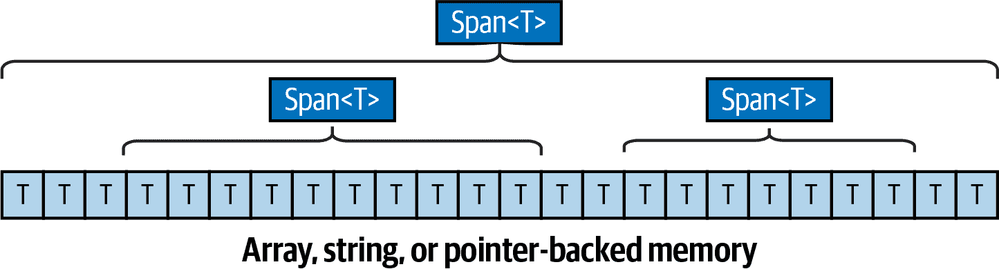

# 第二十三章：Span<T> 和 Memory<T>

结构`Span<T>`和`Memory<T>`作为数组、字符串或任何连续的托管或非托管内存块的低级外观。它们的主要目的是帮助进行某些类型的微优化，特别是编写*低分配*代码，以最小化托管内存分配（从而减少垃圾收集器的负载），而无需为不同类型的输入复制代码。它们还支持*切片*——在不创建副本的情况下处理数组、字符串或内存块的一部分。

`Span<T>`和`Memory<T>`在性能热点中特别有用，例如 ASP.NET Core 处理流水线或为对象数据库提供服务的 JSON 解析器。

###### 注意

如果在 API 中遇到这些类型而又不需要或关心它们的潜在性能优势，可以如下简单处理它们：

+   当调用期望`Span<T>`、`ReadOnlySpan<T>`、`Memory<T>`或`ReadOnlyMemory<T>`的方法时，请传递数组；即`T[]`。（这得益于隐式转换运算符。）

+   要从 span/memory 转换*为*数组，请调用`ToArray`方法。如果`T`是`char`，则`ToString`将 span/memory 转换为字符串。

从 C# 12 开始，您还可以使用集合初始化器来创建 span。

具体来说，`Span<T>`有两个功能：

+   它为托管数组、字符串和基于指针的内存提供了一个通用的类似数组的接口。这使您可以自由地使用栈分配和非托管内存来避免垃圾收集，而无需复制代码或操纵指针。

+   它允许“切片”：在不制作副本的情况下公开可重复使用的 span 的子部分。

###### 注意

`Span<T>`仅由两个字段组成，即指针和长度。因此，它只能表示连续的内存块。（如果需要处理非连续内存，可以使用`ReadOnlySequence<T>`类作为链表。）

因为`Span<T>`可以包装栈分配的内存，所以在存储或传递实例时有一些限制（部分由于`Span<T>`是*ref struct*）。`Memory<T>`充当了没有这些限制的 span，但它不能包装栈分配的内存。`Memory<T>`仍然提供切片的好处。

每个结构都有一个只读对应物（`ReadOnlySpan<T>`和`ReadOnly​Me⁠mory<T>`）。除了防止意外更改外，只读对应物通过允许编译器和运行时额外的优化自由进一步提高性能。

.NET 本身（以及 ASP.NET Core）使用这些类型来提高 I/O、网络、字符串处理和 JSON 解析的效率。

###### 注意

`Span<T>`和`Memory<T>`的数组切片功能使旧的`ArraySegment<T>`类变得多余。为了帮助进行任何过渡，从`ArraySegment<T>`到所有 span/memory 结构的隐式转换运算符，以及从`Memory<T>`和`ReadOnlyMemory<T>`到`ArraySegment<T>`的转换运算符都是可用的。

# Span 和切片

不同于数组，Span 可以轻松地 *切片* 来表示同一底层数据的不同子部分，如 图 23-1 所示。

举个实际的例子，假设您正在编写一个方法来对整数数组进行求和。一个微优化的实现将避免使用 LINQ，而是使用 `foreach` 循环：

```cs
int Sum (int[] numbers)
{
  int total = 0;
  foreach (int i in numbers) total += i;
  return total;
}
```



###### 图 23-1\. 切片

现在想象一下，您只想对数组的 *一部分* 求和。您有两个选项：

+   首先复制您想要求和的数组部分到另一个数组中

+   向方法添加额外的参数（`offset` 和 `count`）

第一种选择效率低；第二种选择增加了混乱和复杂性（特别是当方法需要接受多个数组时更糟糕）。

Span 很好地解决了这个问题。您所需做的就是将参数类型从 `int[]` 更改为 `ReadOnlySpan<int>`（其他都保持不变）：

```cs
int Sum (ReadOnlySpan<int> numbers)
{
  int total = 0;
  foreach (int i in numbers) total += i;
  return total;
}
```

###### 注意

我们使用 `ReadOnlySpan<T>` 而不是 `Span<T>`，因为我们不需要修改数组。从 `Span<T>` 到 `ReadOnlySpan<T>` 有一个隐式转换，因此您可以将 `Span<T>` 传递给期望 `ReadOnlySpan<T>` 的方法。

我们可以如下测试这个方法：

```cs
var numbers = new int [1000];
for (int i = 0; i < numbers.Length; i++) numbers [i] = i;

int total = Sum (numbers);
```

我们可以因为从 `T[]` 到 `Span<T>` 和 `ReadOnlySpan<T>` 有隐式转换，所以可以用数组调用 `Sum` 方法。另一个选项是使用 `AsSpan` 扩展方法：

```cs
var span = numbers.AsSpan();
```

`ReadOnlySpan<T>` 的索引器使用了 C# 的 `ref readonly` 功能直接访问底层数据：这使得我们的方法执行效果几乎与最初使用数组的示例一样好。但是我们所获得的是现在可以“切片”数组，并且仅对部分元素求和，如下所示：

```cs
// Sum the middle 500 elements (starting from position 250):
int total = Sum (numbers.AsSpan (250, 500));
```

如果您已经有一个 `Span<T>` 或 `ReadOnlySpan<T>`，可以通过调用 `Slice` 方法来切片它：

```cs
Span<int> span = numbers;
int total = Sum (span.Slice (250, 500));
```

您也可以使用 C# 的 *索引* 和 *范围*（自 C# 8 起）：

```cs
Span<int> span = numbers;
Console.WriteLine (span [¹]);            // Last element
Console.WriteLine (Sum (span [..10]));    // First 10 elements
Console.WriteLine (Sum (span [100..]));   // 100th element to end
Console.WriteLine (Sum (span [⁵..]));    // Last 5 elements
```

尽管 `Span<T>` 不实现 `IEnumerable<T>`（由于它是一个 ref 结构，不能实现接口），但它确实实现了允许 C# 的 `foreach` 语句工作的模式（参见 “枚举”）。

## CopyTo 和 TryCopyTo

`CopyTo` 方法将元素从一个 span（或 `Memory<T>`）复制到另一个 span 中。在下面的例子中，我们将 span `x` 中的所有元素复制到 span `y` 中：

```cs
Span<int> x = [1, 2, 3, 4];   // Collection expression
Span<int> y = new int[4];
x.CopyTo (y);
```

###### 注意

请注意，我们使用集合表达式初始化了 `x`。集合表达式（自 C# 12 起）不仅是一个有用的快捷方式，而且在 span 的情况下，它允许编译器自由选择底层类型。当元素数量较小时，编译器可以在栈上分配内存（而不是创建数组），以避免堆分配的开销。

切片使得这个方法更加有用。在下一个示例中，我们将 span `x` 的前半部分复制到 span `y` 的后半部分：

```cs
Span<int> x = [1,  2,  3,  4 ];
Span<int> y = [10, 20, 30, 40];
x[..2].CopyTo (y[2..]);                 // y is now [10, 20, 1, 2]
```

如果目标中没有足够的空间来完成复制，`CopyTo` 抛出异常，而 `TryCopyTo` 返回 `false`（不复制任何元素）。

跨度结构体还公开了`Clear`和`Fill`跨度的方法，以及一个用于在跨度中搜索元素的`IndexOf`方法。

## 在跨度中搜索

`MemoryExtensions`类定义了许多扩展方法，用于在跨度内搜索值，如`Contains`、`IndexOf`、`LastIndexOf`和`BinarySearch`（以及那些改变跨度的方法，如`Fill`、`Replace`和`Reverse`）。

从.NET 8 开始，还有一些搜索多个值的方法，例如`ContainsAny`、`ContainsAnyExcept`、`IndexOfAny`和`IndexOfAnyExcept`。通过这些方法，你可以指定要搜索的值，可以作为跨度或`SearchValues<T>`实例（位于`System.Buffers`中），通过调用`SearchValues.Create`来实例化：

```cs
ReadOnlySpan<char> span = "The quick brown fox jumps over the lazy dog.";
var vowels = SearchValues.Create ("aeiou");
Console.WriteLine (span.IndexOfAny (vowels));   // 2
```

`SearchValues<T>`在多个搜索中重复使用实例时提高性能。

###### 注意

当处理数组或字符串时，也可以简单地调用数组或字符串的`AsSpan()`方法。

## 处理文本

跨度被设计成与字符串很好地配合使用，字符串被视为`ReadOnlySpan<char>`。以下方法计算空白字符的数量：

```cs
int CountWhitespace (ReadOnlySpan<char> s)
{
  int count = 0;
  foreach (char c in s)
    if (char.IsWhiteSpace (c))
      count++;
  return count;
}
```

你可以使用字符串调用此类方法（感谢隐式转换运算符）：

```cs
int x = CountWhitespace ("Word1 Word2");   // OK
```

或者使用子字符串：

```cs
int y = CountWhitespace (someString.AsSpan (20, 10));
```

`ToString()`方法将`ReadOnlySpan<char>`转换回字符串。

扩展方法确保字符串类上的一些常用方法也适用于`ReadOnlySpan<char>`：

```cs
var span = "This ".AsSpan();                    // ReadOnlySpan<char>
Console.WriteLine (span.StartsWith ("This"));   // True
Console.WriteLine (span.Trim().Length);         // 4
```

（请注意，诸如`StartsWith`的方法使用*ordinal*比较，而`string`类上的相应方法默认使用区域敏感比较。）

诸如`ToUpper`和`ToLower`之类的方法可用，但必须传入具有正确长度的目标跨度（这使您可以决定如何在何处分配内存）。

一些`string`的方法不可用，例如`Split`（将字符串拆分为单词数组）。事实上，直接等效于`string`的`Split`方法是不可能的，因为你无法创建跨度的数组。

###### 注意

这是因为跨度被定义为*ref structs*，这些结构体只能存在于堆栈上。

（通过“只能存在于堆栈上”，我们指的是结构体本身只能存在于堆栈上。跨度*包裹*的内容可以存在于堆上，也正如本例所示。）

`System.Buffers.Text`命名空间包含其他类型，帮助您处理基于跨度的文本，包括以下内容：

+   `Utf8Formatter.TryFormat`相当于在内置和简单类型（如`decimal`、`DateTime`等）上调用`ToString`，但是将结果写入跨度而不是字符串。

+   `Utf8Parser.TryParse`则相反，从跨度中解析数据为简单类型。

+   `Base64`类型提供了用于读取/写入 base-64 数据的方法。

###### 注意

从 .NET 8 开始，.NET 数字和日期/时间类型（以及其他简单类型）允许直接使用 UTF-8 格式化和解析，通过新的 `TryFormat` 和 `Parse`/`TryParse` 方法，这些方法操作 `Span<byte>`。新方法定义在 `IUtf8SpanFormattable` 和 `IUtf8SpanParsable<TSelf>` 接口中（后者利用了 C# 12 能够定义静态抽象接口成员的能力）。

基本的 CLR 方法，比如 `int.Parse` 已经被重载以接受 `ReadOnlySpan<char>`。

# Memory<T>

`Span<T>` 和 `ReadOnlySpan<T>` 被定义为 *ref 结构*，以最大化它们的优化潜力，并允许它们安全地与栈分配内存一起工作（正如你将在下一节看到的那样）。然而，它也会带来一些限制。除了不友好的数组外，你不能将它们用作类中的字段（这会将它们放在堆上）。这反过来阻止它们出现在 lambda 表达式中——以及作为异步方法、迭代器和异步流的参数：

```cs
async void Foo (Span<int> notAllowed)   // Compile-time error!
```

（记住编译器通过编写私有 *状态机* 处理异步方法和迭代器，这意味着任何参数和局部变量最终都成为字段。同样适用于关闭变量的 lambda 表达式：这些变量也最终成为 *闭包* 中的字段。）

`Memory<T>` 和 `ReadOnlyMemory<T>` 结构绕过了这一点，它们充当不能包装栈分配内存的 span，允许在字段、lambda 表达式、异步方法等中使用。

你可以通过隐式转换或 `AsMemory()` 扩展方法从数组获取 `Memory<T>` 或 `ReadOnlyMemory<T>`：

```cs
Memory<int> mem1 = new int[] { 1, 2, 3 };
var mem2 = new int[] { 1, 2, 3 }.AsMemory();
```

你可以通过其 `Span` 属性将 `Memory<T>` 或 `ReadOnlyMemory<T>` 轻松地“转换”为 `Span<T>` 或 `ReadOnlySpan<T>`，以便像处理 span 一样与之交互。这种转换非常高效，不会执行任何复制：

```cs
async void Foo (Memory<int> memory)   
{
  Span<int> span = memory.Span;
  ...
}
```

（你也可以通过其 `Slice` 方法或 C# 范围直接切片 `Memory<T>` 或 `ReadOnlyMemory<T>`，并通过其 `Length` 属性访问其长度。）

###### 注意

另一种获取 `Memory<T>` 的方法是从 *池* 中租借，使用 `System.Buffers.MemoryPool<T>` 类。这与数组池化类似（参见 “数组池化”），并提供了另一种减少垃圾收集器负载的策略。

在前一节中我们提到，你不能为 span 直接编写与 `string`.`Split` 等效的代码，因为你无法创建 span 数组。这种限制不适用于 `ReadOnlyMemory<char>`：

```cs
// Split a string into words:
IEnumerable<ReadOnlyMemory<char>> Split (ReadOnlyMemory<char> input)
{
  int wordStart = 0;
  for (int i = 0; i <= input.Length; i++)
    if (i == input.Length || char.IsWhiteSpace (input.Span [i]))
    {
      yield return input [wordStart..i];   // Slice with C# range operator
      wordStart = i + 1;
    }
}
```

这比字符串的 `Split` 方法更高效：它不会为每个单词创建新的字符串，而是返回原始字符串的 *切片*：

```cs
foreach (var slice in Split ("The quick brown fox jumps over the lazy dog"))
{
  // slice is a ReadOnlyMemory<char>
}
```

###### 注意

当你有选择时，最好编写接受 `Span<T>` 而不是 `Memory<T>` 的方法，因为你可以轻松地将 `Memory<T>` 转换为 `Span<T>`（通过 `Span` 属性），但反之则不行。

出于同样的原因，最好编写接受 `ReadOnlySpan<T>` 而不是 `Span<T>` 的方法。

# 仅向前枚举器

在前面的部分中，我们使用 `ReadOnlyMemory<char>` 作为实现类似字符串 `Split` 方法的解决方案。但是通过放弃 `ReadOnlySpan<char>`，我们失去了支持由非托管内存支持的切片 span 的能力。让我们重新审视 `ReadOnlySpan<char>`，看看是否能找到另一个解决方案。

一个可能的选择是编写我们的 `Split` 方法，使其返回 *ranges*：

```cs
Range[] Split (ReadOnlySpan<char> input)
{
  int pos = 0;
  var list = new List<Range>();
  for (int i = 0; i <= input.Length; i++)
    if (i == input.Length || char.IsWhiteSpace (input [i]))
    {
      list.Add (new Range (pos, i));
      pos = i + 1;
    }
  return list.ToArray();
}
```

调用者可以使用这些范围来切片原始 span：

```cs
ReadOnlySpan<char> source = "The quick brown fox";
foreach (Range range in Split (source))
{
  ReadOnlySpan<char> wordSpan = source [range];
  ...
}
```

这是一种改进，但仍然不完美。首先使用 span 的原因之一是避免内存分配。但请注意，我们的 `Split` 方法创建了一个 `List<Range>`，向其中添加了项目，然后将列表转换为数组。这至少需要两次内存分配以及一次内存复制操作。

解决此问题的方法是放弃列表和数组，转而使用仅向前的枚举器。枚举器使用起来更笨重，但可以通过使用结构体来实现零分配：

```cs
// We must define this as a ref struct, because _input is a ref struct.
public readonly ref struct CharSpanSplitter
{
  readonly ReadOnlySpan<char> _input;
  public CharSpanSplitter (ReadOnlySpan<char> input) => _input = input;
  public Enumerator GetEnumerator() => new Enumerator (_input);

  public ref struct Enumerator   // Forward-only enumerator
  {
    readonly ReadOnlySpan<char> _input;
    int _wordPos;
    public ReadOnlySpan<char> Current { get; private set; }

    public Rator (ReadOnlySpan<char> input)
    {
      _input = input;
      _wordPos = 0;
      Current = default;
    }

    public bool MoveNext()
    {
      for (int i = _wordPos; i <= _input.Length; i++)
        if (i == _input.Length || char.IsWhiteSpace (_input [i]))
        {
          Current = _input [_wordPos..i];
          _wordPos = i + 1;
          return true;
        }
      return false;
    }
  }
}

public static class CharSpanExtensions
{
  public static CharSpanSplitter Split (this ReadOnlySpan<char> input)
    => new CharSpanSplitter (input);

  public static CharSpanSplitter Split (this Span<char> input)
    => new CharSpanSplitter (input);
}
```

这是如何调用它的：

```cs
var span = "the quick brown fox".AsSpan();
foreach (var word in span.Split())
{
  // word is a ReadOnlySpan<char>
}
```

通过定义一个 `Current` 属性和一个 `MoveNext` 方法，我们的枚举器可以与 C# 的 `foreach` 语句一起使用（参见“枚举”）。我们不必实现 `IEnumerable<T>`/`IEnumerator<T>` 接口（实际上我们不能；ref 结构体不能实现接口）。我们牺牲了抽象性以进行微优化。

# 使用栈分配和非托管内存

另一种有效的微优化技术是通过最小化基于堆的分配来减轻垃圾收集器的负担。这意味着更多地使用基于栈的内存，甚至是非托管内存。

不幸的是，这通常需要您重写代码以使用指针。在我们之前用来对数组元素求和的例子中，我们需要编写另一个版本，如下所示：

```cs
unsafe int Sum (int* numbers, int length)
{
  int total = 0;
  for (int i = 0; i < length; i++) total += numbers [i];
  return total;
}
```

这样我们就可以做到这一点：

```cs
int* numbers = stackalloc int [1000];   // Allocate array on the stack
int total = Sum (numbers, 1000);
```

Spans 解决了这个问题：您可以直接从指针构造 `Span<T>` 或 `ReadOnlySpan<T>`：

```cs
int* numbers = stackalloc int [1000];
var span = new Span<int> (numbers, 1000);
```

或者一步到位：

```cs
Span<int> numbers = stackalloc int [1000];
```

（请注意，这不需要使用 `unsafe`）。回想一下我们之前编写的 `Sum` 方法：

```cs
int Sum (ReadOnlySpan<int> numbers)
{
  int total = 0;
  int len = numbers.Length;
  for (int i = 0; i < len; i++) total += numbers [i];
  return total;
}
```

这种方法对于栈分配的 span 同样有效。我们在三个方面取得了进展：

+   同样的方法适用于数组和栈分配的内存

+   我们可以使用栈分配的内存，最小化使用指针

+   可以对 span 进行切片

###### 注意

编译器足够聪明，可以防止您编写一个在堆栈上分配内存并通过 `Span<T>` 或 `ReadOnlySpan<T>` 返回给调用者的方法。

(然而，在其他情况下，您可以合法地返回 `Span<T>` 或 `ReadOnlySpan<T>`。)

您还可以使用 span 来包装从非托管堆中分配的内存。在以下示例中，我们使用 `Marshal.AllocHGlobal` 函数分配非托管内存，将其包装在 `Span<char>` 中，然后将字符串复制到非托管内存中。最后，我们使用前面部分中编写的 `CharSpanSplitter` 结构来将非托管字符串拆分成单词：

```cs
var source = "The quick brown fox".AsSpan();
var ptr = Marshal.AllocHGlobal (source.Length * sizeof (char));
try
{
  var unmanaged = new Span<char> ((char*)ptr, source.Length);
  source.CopyTo (unmanaged);
  foreach (var word in unmanaged.Split())
    Console.WriteLine (word.ToString());
}
finally { Marshal.FreeHGlobal (ptr); }
```

一个不错的奖励是，`Span<T>`的索引器执行边界检查，防止缓冲区溢出。如果正确实例化`Span<T>`，则会应用此保护：在我们的示例中，如果错误获取了该跨度，则会失去此保护。

```cs
var span = new Span<char> ((char*)ptr, source.Length * 2);
```

相当于悬空指针的保护也不存在，因此在使用`Marshal.FreeHGlobal`释放其非托管内存后，必须小心不要访问该跨度。
