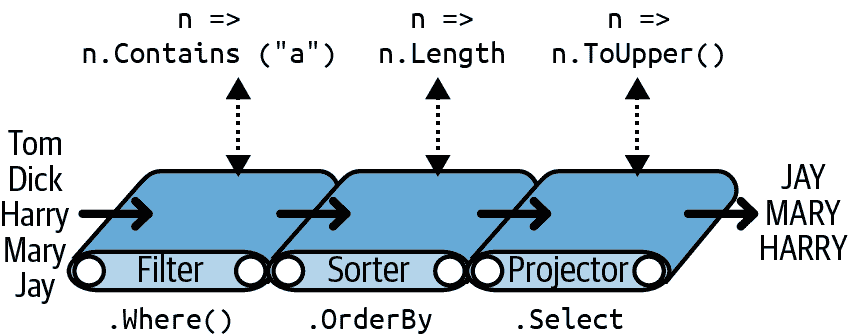

# 第一章：C# 12 口袋参考书

C# 是一种通用、类型安全的、主要面向对象的编程语言，其目标是提高程序员的生产力。为此，语言在简单性、表现力和性能之间保持平衡。C# 12 设计用于与 Microsoft *.NET 8* 运行时配合（而 C# 11 则面向 .NET 7，C# 10 则面向 .NET 6，C# 7 则面向 Microsoft *.NET Framework* 4.6/4.7/4.8）。

###### 注意

本书中的程序和代码片段与 *C# 12 in a Nutshell* 的第 2 到第四章中的代码镜像，并且都可以作为交互式示例在 [*LINQPad*](http://www.linqpad.net) 中使用。通过与书籍一起使用这些示例，可以加速学习，您可以编辑示例并立即看到结果，无需在 Visual Studio 中设置项目和解决方案。

要下载示例，请点击 LINQPad 中的 Samples 标签，然后点击“Download more samples”。LINQPad 是免费的，访问 [*www.linqpad.net*](http://www.linqpad.net)。

# 第一个 C# 程序

以下是一个将 12 乘以 30 并将结果 360 打印到屏幕的程序。双斜线表示行的剩余部分是*注释*：

```cs
int x = 12 * 30;                  // Statement 1
System.Console.WriteLine (x);     // Statement 2
```

我们的程序由两个*语句*组成。C# 中的语句按顺序执行，并以分号终止。第一个语句计算*表达式* `12 * 30` 并将结果存储在名为 `x` 的*变量*中，其类型是 32 位整数 (`int`)。第二个语句在名为 `Console` 的*类*上调用 `WriteLine` *方法*，该类定义在名为 `System` 的*命名空间*中。这将变量 `x` 打印到屏幕上的文本窗口中。

方法执行一个功能；类将函数成员和数据成员组合成面向对象的构建块。`Console` 类组合了处理命令行输入/输出（I/O）功能的成员，比如 `WriteLine` 方法。类是一种*类型*，我们在“类型基础”中讨论过。

在最外层，类型被组织到*命名空间*中。许多常用类型，包括 `Console` 类，驻留在 `System` 命名空间中。.NET 库被组织成嵌套命名空间。例如，`System.Text` 命名空间包含用于处理文本的类型，而 `System.IO` 包含用于输入/输出的类型。

在每次使用时用 `System` 命名空间限定 `Console` 类会增加混乱。`using` 指令允许您通过*导入*一个命名空间来避免这种混乱：

```cs
using System;            // Import the System namespace

int x = 12 * 30;
Console.WriteLine (x);   // No need to specify System
```

代码重用的基本形式是编写调用低级函数的高级函数。我们可以通过一个可重用的*方法* `FeetToInches` 来*重构*我们的程序，该方法将整数乘以 12，如下所示：

```cs
using System;

Console.WriteLine (FeetToInches (30));      // 360
Console.WriteLine (FeetToInches (100));     // 1200

int FeetToInches (int feet)
{
 int inches = feet * 12;
 return inches;
}
```

我们的方法包含一系列被大括号包围的语句。这被称为*语句块*。

方法可以通过指定*参数*从调用者那里接收*输入*数据，并通过指定*返回类型*向调用者返回*输出*数据。我们的`FeetToInches`方法具有输入英尺的参数和输出英寸的返回类型：

```cs
int FeetToInches (int feet)
...
```

*字面量* `30` 和 `100` 是传递给`FeetToInches`方法的*参数*。

如果方法不接收输入，请使用空括号。如果方法不返回任何内容，请使用`void`关键字：

```cs
using System;
SayHello();

void SayHello()
{
  Console.WriteLine ("Hello, world");
}
```

方法是 C#中几种函数的一种。我们示例程序中使用的另一种函数是`*` *操作符*，它执行乘法运算。还有*构造函数*、*属性*、*事件*、*索引器*和*终结器*。

## 编译

C#编译器将源代码（一组扩展名为*.cs*的文件）编译成一个*程序集*。程序集是.NET 中的打包和部署单元。程序集可以是*应用程序*或*库*。普通控制台或 Windows 应用程序具有*入口点*，而库则没有。库的目的是被应用程序或其他库*引用*。.NET 本身是一组库（以及运行时环境）。

在前面的节中，每个程序都直接以一系列语句开始（称为*顶级语句*）。顶级语句的存在隐式创建了控制台或 Windows 应用程序的入口点。（没有顶级语句时，*Main 方法*表示应用程序的入口点—参见“预定义类型和自定义类型的对称性”。）

要调用编译器，您可以使用集成开发环境（IDE）如 Visual Studio 或 Visual Studio Code，也可以从命令行手动调用它。要使用.NET 手动编译控制台应用程序，首先下载.NET 8 SDK，然后按以下步骤创建新项目：

```cs
dotnet new console -o MyFirstProgram
cd MyFirstProgram
```

这将创建一个名为*MyFirstProgram*的文件夹，其中包含一个名为*Program.cs*的 C#文件，您可以随后编辑。要调用编译器，请调用`dotnet build`（或`dotnet run`，它将编译然后运行程序）。输出将写入*bin\debug*子目录下，其中包括*MyFirstProgram.dll*（输出程序集）以及直接运行编译程序的*MyFirstProgram.exe*。

# 语法

C#语法的灵感来源于 C 和 C++语法。在本节中，我们描述了 C#语法的各个元素，使用以下程序：

```cs
using System;

int x = 12 * 30;
Console.WriteLine (x);
```

## 标识符和关键字

*标识符*是程序员为其类、方法、变量等选择的名称。以下是我们示例程序中标识符的顺序：

```cs
System   x   Console   WriteLine
```

标识符必须是一个完整的单词，基本上由以字母或下划线开头的 Unicode 字符组成。C# 标识符是区分大小写的。按照惯例，参数、局部变量和私有字段应该是*小驼峰命名法*（例如，`myVariable`），而其他所有标识符应该是*帕斯卡命名法*（例如，`MyMethod`）。

*关键字*是对编译器有特殊意义的名称。在我们的示例程序中有两个关键字，`using` 和 `int`。

大多数关键字是*保留*的，这意味着你不能把它们用作标识符。以下是所有 C# 保留关键字的完整列表：

| `abstract` `as`

`base`

`bool`

`break`

`byte`

`case`

`catch`

`char`

`checked`

`class`

`const`

`continue`

`decimal`

`default`

`delegate`

`do`

`double`

`else`

`enum` | `event` `explicit`

`extern`

`false`

`finally`

`fixed`

`float`

`for`

`foreach`

`goto`

`if`

`implicit`

`in`

`int`

`interface`

`internal`

`is`

`lock`

`long`

`namespace` | `new` `null`

`object`

`operator`

`out`

`override`

`params`

`private`

`protected`

`public`

`readonly`

`record`

`ref`

`return`

`sbyte`

`sealed`

`short`

`sizeof`

`stackalloc`

`static` | `string` `struct`

`switch`

`this`

`throw`

`true`

`try`

`typeof`

`uint`

`ulong`

`unchecked`

`unsafe`

`ushort`

`using`

`virtual`

`void`

`volatile`

`while` |

### 避免冲突

如果你确实想使用与保留关键字冲突的标识符，可以通过在其前面加上 `@` 前缀来使用它。例如：

```cs
class class  {...}      // Illegal
class @class {...}      // Legal
```

`@` 符号本身不是标识符的一部分。因此 `@myVariable` 和 `myVariable` 是相同的。

### 上下文关键字

有些关键字是*上下文*关键字，这意味着它们也可以作为标识符使用——无需 `@` 符号。这些上下文关键字如下：

| `add` `alias`

`and`

`ascending`

`async`

`await`

`by`

`descending`

`dynamic`

`equals` | `file` `from`

`get`

`global`

`group`

`init`

`into`

`join`

`let`

`managed` | `nameof` `nint`

`not`

`notnull`

`nuint`

`on`

`or`

`orderby`

`partial`

`remove` | `required` `select`

`set`

`unmanaged`

`value`

`var`

`with`

`when`

`where`

`yield` |

使用上下文关键字，可以在使用它们的上下文中消除歧义。

## 字面量、标点符号和操作符

*字面量*是程序中词法上嵌入的原始数据片段。我们在示例程序中使用的字面量是`12`和`30`。*标点符号*帮助标明程序的结构。例如，分号用于终止语句。语句可以跨多行：

```cs
Console.WriteLine
  (1 + 2 + 3 + 4 + 5 + 6 + 7 + 8 + 9 + 10);
```

*操作符*用于转换和组合表达式。C# 中的大多数操作符用符号表示，例如乘法操作符 `*`。以下是我们程序中的操作符：

```cs
=  *  .  ()
```

句点表示某物的成员（或数字字面量的小数点）。在声明或调用方法时使用括号；当方法不接受参数时使用空括号。等号执行*赋值*（双等号 `==` 执行相等比较）。

## 注释

C#提供了两种不同的源代码文档风格：*单行注释*和*多行注释*。单行注释以双斜杠开头，直到行尾。例如：

```cs
int x = 3;   // Comment about assigning 3 to x
```

多行注释以`/*`开头，以`*/`结尾。例如：

```cs
int x = 3;   /* This is a comment that
                spans two lines */
```

注释可以嵌入 XML 文档标签（见“XML 文档”）。

# 类型基础知识

*类型*定义了值的蓝图。在我们的示例中，我们使用了两个`int`类型的文字值，分别为 12 和 30。我们还声明了一个类型为`int`的*变量*，其名称为`x`。

*变量*表示可以随时间包含不同值的存储位置。相比之下，*常量*始终表示相同的值（稍后详述）。

在 C#中，所有的值都是特定类型的*实例*。值的含义以及变量可能具有的可能值集由其类型确定。

## 预定义类型示例

预定义类型（也称为*内置*类型）是编译器特别支持的类型。`int`类型是用于表示内存中适合 32 位整数集的预定义类型，范围从−2³¹到 2³¹−1。我们可以按如下方式对`int`类型的实例执行算术函数：

```cs
int x = 12 * 30;
```

另一个预定义的 C#类型是`string`。`string`类型表示字符序列，例如“.NET”或“[*http://oreilly.com*](http://oreilly.com)”。我们可以通过在它们上调用函数来处理字符串，如下所示：

```cs
string message = "Hello world";
string upperMessage = message.ToUpper();
Console.WriteLine (upperMessage);      // HELLO WORLD

int x = 2022;
message = message + x.ToString();
Console.WriteLine (message);         // Hello world2022
```

预定义的`bool`类型只有两个可能的值：`true`和`false`。`bool`类型通常用于通过`if`语句有条件地分支执行流程。例如：

```cs
bool simpleVar = false;
if (simpleVar)
  Console.WriteLine ("This will not print");

int x = 5000;
bool lessThanAMile = x < 5280;
if (lessThanAMile)
  Console.WriteLine ("This will print");
```

在.NET 中，`System`命名空间包含许多重要类型，这些类型不是由 C#预定义的（例如，`DateTime`）。

## 自定义类型示例

就像您可以从简单函数构建复杂函数一样，您可以从原始类型构建复杂类型。在此示例中，我们将定义一个名为`UnitConverter`的自定义类型——一个作为单位转换蓝图的类：

```cs
UnitConverter feetToInches = new UnitConverter (12);
UnitConverter milesToFeet = new UnitConverter (5280);

Console.WriteLine (feetToInches.Convert(30));   // 360
Console.WriteLine (feetToInches.Convert(100));  // 1200
Console.WriteLine (feetToInches.Convert
                    (milesToFeet.Convert(1)));  // 63360

public class UnitConverter
{ 
 int ratio;                             // Field

 public UnitConverter (int unitRatio)   // Constructor
 {
 ratio = unitRatio;
 }

 public int Convert (int unit)          // Method
 {
 return unit * ratio;
 }
}
```

### 类型的成员

类型包含*数据成员*和*函数成员*。`UnitConverter`的数据成员是名为`ratio`的*字段*。`UnitConverter`的函数成员是`Convert`方法和`UnitConverter`的*构造函数*。

### 预定义类型和自定义类型的对称性

C#的一个优点是预定义类型和自定义类型之间几乎没有区别。预定义的`int`类型用作整数的蓝图。它保存数据——32 位——并提供使用该数据的函数成员，例如`ToString`。类似地，我们的自定义`UnitConverter`类型充当单位转换的蓝图。它保存比例数据，并提供用于使用该数据的函数成员。

### 构造函数和实例化

*实例化*类型可以创建数据。您可以通过使用文字（例如`12`或`"Hello world"`）简单地实例化预定义类型。

`new` 操作符用于创建自定义类型的实例。我们通过创建两个 `UnitConverter` 类型的实例来启动我们的程序。`new` 操作符实例化对象后，立即调用对象的 *构造函数* 进行初始化。构造函数类似于方法，不同之处在于方法名和返回类型简化为封闭类型的名称：

```cs
public UnitConverter (int unitRatio)   // Constructor
{
  ratio = unitRatio; 
}
```

### 实例成员与静态成员

操作类型 *实例* 的数据成员和函数成员称为 *实例成员*。`UnitConverter` 的 `Convert` 方法和 `int` 的 `ToString` 方法就是实例成员的例子。默认情况下，成员是实例成员。

不操作类型实例的数据成员和函数成员可以标记为 `static`。要从其类型外部引用静态成员，需指定其 *类型* 名称，而不是实例。例如 `Console` 类的 `WriteLine` 方法。因为这是静态的，我们调用 `Console.WriteLine()` 而不是 `new Console().WriteLine()`。

在下面的代码中，实例字段 `Name` 属于特定 `Panda` 的实例，而 `Population` 属于所有 `Panda` 实例的集合。我们创建了两个 `Panda` 实例，打印它们的名称，然后打印总体人口：

```cs
Panda p1 = new Panda ("Pan Dee");
Panda p2 = new Panda ("Pan Dah");

Console.WriteLine (p1.Name);      // Pan Dee
Console.WriteLine (p2.Name);      // Pan Dah

Console.WriteLine (Panda.Population);   // 2

public class Panda
{
  public string Name;             // Instance field
  public static int Population;   // Static field

  public Panda (string n)         // Constructor
  {
    Name = n;                     // Instance field
    Population = Population + 1;  // Static field
  }
}
```

尝试评估 `p1.Population` 或 `Panda.Name` 将生成编译时错误。

### 公共关键字

`public` 关键字将成员暴露给其他类。在此示例中，如果 `Panda` 中的 `Name` 字段未标记为 public，则它将是私有的，无法从类外部访问。将成员标记为 public 是类型通信的方式：“这里是我希望其他类型看到的内容——其他都是我自己的私有实现细节。”从面向对象的角度来看，我们说公共成员 *封装* 类的私有成员。

### 创建命名空间

特别是对于较大的程序，将类型组织到命名空间中是有意义的。以下是如何在名为 `Animals` 的命名空间内定义 `Panda` 类：

```cs
namespace Animals
{
  public class Panda
  {
     ...
  }
}
```

我们在 “命名空间” 中详细介绍命名空间。

### 定义 Main 方法

到目前为止，我们的所有示例都使用了顶级语句，这是在 C# 9 中引入的一个功能。没有顶级语句时，简单的控制台或 Windows 应用程序如下所示：

```cs
using System;

class Program
{
  static void Main()   // Program entry point
  {
    int x = 12 * 30;
    Console.WriteLine (x);
  }
}
```

在不存在顶级语句的情况下，C# 查找名为 `Main` 的静态方法，该方法成为入口点。`Main` 方法可以定义在任何类内（只能存在一个 `Main` 方法）。

`Main` 方法可以选择性地返回整数（而不是 `void`），以便向执行环境返回值（非零值通常表示错误）。`Main` 方法还可以选择性地接受字符串数组作为参数（该数组将填充任何传递给可执行文件的参数）；例如：

```cs
static int Main (string[] args) {...}
```

###### 注意

数组（如`string[]`）表示特定类型的固定数量元素。通过在元素类型后面放置方括号来指定数组。我们在“数组”中描述了它们。

（`Main`方法也可以声明为`async`并返回`Task`或`Task<int>`，以支持异步编程，请参见“异步函数”。）

### 顶层语句

顶层语句允许您避免静态`Main`方法和包含类的负担。一个包含顶层语句的文件由以下三部分组成，顺序如下：

1.  （可选地）`using`指令

1.  一系列的语句，可选地与方法声明混合在一起。

1.  （可选地）类型和命名空间声明

第二部分的所有内容最终都会位于由编译器生成的“main”方法内，位于一个由编译器生成的类内。这意味着顶层语句中的方法变成了*本地方法*（我们在“本地方法”中描述了细微差别）。顶层语句可以选择向调用者返回一个整数值，并访问一个名为`args`的`string[]`类型的“magic”变量，对应于调用者传递的命令行参数。

由于程序只能有一个入口点，在 C#项目中最多只能有一个包含顶层语句的文件。

## 类型和转换

C#可以在兼容类型的实例之间进行转换。转换总是从现有值创建一个新值。转换可以是*隐式*或*显式*：隐式转换会自动发生，而显式转换需要一个*转换*。在以下示例中，我们*隐式*将`int`转换为`long`类型（其比`int`具有两倍的位容量），并*显式*将`int`转换为`short`类型（其比`int`具有一半的位容量）：

```cs
int x = 12345;       // int is a 32-bit integer
long y = x;          // Implicit conversion to 64-bit int
short z = (short)x;  // Explicit conversion to 16-bit int
```

一般情况下，当编译器可以保证隐式转换总是成功且不丢失信息时，允许隐式转换。否则，你必须执行显式转换来在兼容类型之间转换。

## 值类型与引用类型

C#类型可以分为*值类型*和*引用类型*。

*值类型*包括大多数内置类型（具体来说，所有数值类型、`char`类型和`bool`类型），以及自定义的`struct`和`enum`类型。*引用类型*包括所有的类、数组、委托和接口类型。

值类型和引用类型的根本区别在于它们在内存中的处理方式。

### 值类型

*值类型*变量或常量的内容仅仅是一个值。例如，内置值类型`int`的内容是 32 位数据。

您可以使用`struct`关键字定义自定义值类型（参见图 1）：

```cs
public struct Point { public int X, Y; }
```


###### 图 1\. 内存中的值类型实例

对于值类型实例的赋值始终会*复制*该实例。例如：

```cs
Point p1 = new Point();
p1.X = 7;

Point p2 = p1;             // Assignment causes copy

Console.WriteLine (p1.X);  // 7
Console.WriteLine (p2.X);  // 7

p1.X = 9;                  // Change p1.X
Console.WriteLine (p1.X);  // 9
Console.WriteLine (p2.X);  // 7
```

图 2 显示 `p1` 和 `p2` 具有独立的存储。


###### 图 2\. 赋值复制值类型实例

### 引用类型

引用类型比值类型更复杂，有两部分：*对象* 和指向该对象的*引用*。引用类型变量或常量的内容是指向包含值的对象的引用。以下是我们先前示例中 `Point` 类的类型重写为类（参见 图 3）：

```cs
public class Point { public int X, Y; }
```


###### 图 3\. 内存中的引用类型实例

将引用类型变量赋值给引用，会复制引用而不是对象实例。这允许多个变量引用同一对象——这在值类型中通常是不可能的。如果我们重复之前的示例，但现在 `Point` 是一个类，通过 `p1` 进行的操作会影响 `p2`：

```cs
Point p1 = new Point();
p1.X = 7;

Point p2 = p1;             // Copies p1 reference

Console.WriteLine (p1.X);  // 7
Console.WriteLine (p2.X);  // 7

p1.X = 9;                  // Change p1.X
Console.WriteLine (p1.X);  // 9
Console.WriteLine (p2.X);  // 9
```

图 4 显示 `p1` 和 `p2` 是指向同一对象的两个引用。


###### 图 4\. 赋值复制引用

### 空

可以将引用分配给字面值 `null`，表示引用指向无对象。假设 `Point` 是一个类：

```cs
Point p = null;
Console.WriteLine (p == null);   // True
```

访问空引用的成员会生成运行时错误：

```cs
Console.WriteLine (p.X);   // NullReferenceException
```

###### **注意**

在 “可空引用类型” 中，我们描述了 C# 的一个功能，可减少意外的 `NullReferenceException` 错误。

相比之下，值类型通常不能具有空值：

```cs
struct Point {...}
...
Point p = null;  // Compile-time error
int x = null;    // Compile-time error
```

为了解决这个问题，C# 使用了一种特殊的结构来表示值类型的空值——请参阅 “可空值类型”。

## 预定义类型分类

C# 中的预定义类型如下：

值类型

+   数值：

    +   **有符号整数** (`sbyte`, `short`, `int`, `long`)

    +   **无符号整数** (`byte`, `ushort`, `uint`, `ulong`)

    +   **实数** (`float`, `double`, `decimal`)

+   **逻辑** (`bool`)

+   **字符** (`char`)

引用类型

+   **字符串** (`string`)

+   **对象** (`object`)

C# 中的预定义类型是 `.NET` 中 `System` 命名空间的别名。这两个语句之间只有语法上的差异：

```cs
int i = 5;
System.Int32 i = 5;
```

在公共语言运行时（CLR）中，排除 `decimal` 的预定义*值*类型被称为*基本类型*。之所以称为基本类型，是因为它们通过编译代码中的指令直接支持，在底层处理器上通常直接转换为支持。

# 数值类型

C# 具有以下预定义的数值类型：

| C# 类型 | 系统类型 | 后缀 | 大小 | 范围 |
| --- | --- | --- | --- | --- |
| **整数—有符号** |  |
| `sbyte` | `SByte` |  | 8 位 | –2⁷ 到 2⁷–1 |
| `short` | `Int16` |  | 16 位 | –2¹⁵ 到 2¹⁵–1 |
| `int` | `Int32` |  | 32 位 | –2³¹ 到 2³¹–1 |
| `long` | `Int64` | `L` | 64 位 | –2⁶³ 到 2⁶³–1 |
| `nint` | `IntPtr` |  | 32/64 位 |  |
| **整数—无符号** |  |
| `byte` | `Byte` |  | 8 位 | 0 到 2⁸–1 |
| `ushort` | `UInt16` |  | 16 位 | 0 到 2¹⁶–1 |
| `uint` | `UInt32` | `U` | 32 位 | 0 到 2³²–1 |
| `ulong` | `UInt64` | `UL` | 64 位 | 0 到 2⁶⁴–1 |
| `nuint` | `UIntPtr` |  | 32/64 位 |  |
| **实数** |  |
| `float` | `Single` | `F` | 32 位 | ±（~10^(–45) 到 10³⁸） |
| `double` | `Double` | `D` | 64 位 | ±（~10^(–324) 到 10³⁰⁸） |
| `decimal` | `Decimal` | `M` | 128 位 | ±（~10^(–28) 到 10²⁸） |

在*整型*类型中，`int`和`long`是一流公民，并且在 C#和运行时中受到青睐。其他整型类型通常用于互操作性或在空间效率至关重要时使用。`nint`和`nuint`本地大小的整型被调整为与运行时进程的地址空间匹配（32 位或 64 位）。当处理指针时，这些类型可能很有用——我们在《C# 12 权威指南》（O’Reilly）的第四章中描述了它们的微妙之处。

在*实数*类型中，`float`和`double`被称为*浮点类型*，通常用于科学和图形计算。`decimal`类型通常用于需要基于十进制的精确算术和高精度的财务计算。 （技术上，`decimal`也是一种浮点类型，尽管通常不这样称呼。）

## 数值文字

*整型文字*可以使用十进制、十六进制或二进制表示法；十六进制以`0x`前缀表示（例如，`0x7f`等同于`127`），二进制以`0b`前缀表示。*实数文字*可以使用十进制或指数表示法，如`1E06`。数字文字中可以插入下划线以提高可读性（例如，`1_000_000`）。

### 数值文字类型推断

默认情况下，编译器*推断*数值文字为`double`或整型：

+   如果文字包含小数点或指数符号（`E`），它是`double`。

+   否则，文字的类型是列表中可以容纳文字值的第一个类型：`int`、`uint`、`long`和`ulong`。

例如：

```cs
Console.Write (       1.0.GetType());  // Double *(double)*
Console.Write (      1E06.GetType());  // Double *(double)*
Console.Write (         1.GetType());  // Int32  *(int)*
Console.Write (0xF0000000.GetType());  // UInt32 *(uint)*
Console.Write (0x100000000.GetType()); // Int64  *(long)*
```

### 数值后缀

在上表中列出的*数值后缀*明确定义了文字的类型：

```cs
decimal d = 3.5M;   // M = decimal (case-insensitive)
```

`U`和`L`后缀很少必要，因为`uint`、`long`和`ulong`类型几乎总是可以从`int`推断或隐式转换：

```cs
long i = 5;     // Implicit conversion from int to long
```

技术上，带有`D`后缀的文字是多余的，因为带有小数点的所有文字都被推断为`double`（你可以随时给数字文字加上小数点）。`F`和`M`后缀是最有用的，在指定分数`float`或`decimal`文字时是必需的。没有后缀的话，以下代码不会编译通过，因为`4.5`将被推断为`double`类型，而`double`类型无法隐式转换为`float`或`decimal`：

```cs
float f = 4.5F;       // Won't compile without suffix
decimal d = -1.23M;   // Won't compile without suffix
```

## 数值转换

### 整型到整型的转换

当目标类型能够表示源类型的每一个可能值时，整数转换是*隐式*的。否则，需要*显式*转换。例如：

```cs
int x = 12345;       // int is a 32-bit integral type
long y = x;          // Implicit conversion to 64-bit int
short z = (short)x;  // Explicit conversion to 16-bit int
```

### 实数到实数的转换

`float` 可以隐式转换为 `double`，因为 `double` 能够表示每一个可能的 `float` 值。反向转换必须显式进行。

在 `decimal` 和其他实数类型之间的转换必须是显式的。

### 实数到整数的转换

从整数类型到实数类型的转换是隐式的，而反向转换必须是显式的。将浮点数转换为整数类型会截断任何小数部分；要执行四舍五入转换，请使用静态的 `System.Convert` 类。

一个注意事项是，将大整数类型隐式转换为浮点数类型会保留*大小*，但偶尔可能会失去*精度*：

```cs
int i1 = 100000001;
float f = i1;      // Magnitude preserved, precision lost
int i2 = (int)f;   // 100000000
```

## 算术运算符

算术运算符（`+`、`-`、`*`、`/`、`%`）适用于除了 8 位和 16 位整数类型之外的所有数值类型。`%` 运算符在除法后求余数。

## 自增和自减运算符

自增和自减运算符（`++`、`--`）会使数值类型增加或减少 1。操作符可以在变量前或后出现，具体取决于您希望在表达式评估*之前*还是*之后*更新变量。例如：

```cs
int x = 0;
Console.WriteLine (x++);   // Outputs 0; x is now 1
Console.WriteLine (++x);   // Outputs 2; x is now 2
Console.WriteLine (--x);   // Outputs 1; x is now 1
```

## 特定的整数操作

### 除法

对整数类型的除法操作总是会消除余数（朝零舍入）。除以一个值为零的变量会生成运行时错误（`DivideByZeroException`）。除以*字面值*或*常量* 0 会生成编译时错误。

### 溢出

在运行时，整数类型的算术操作可能会溢出。默认情况下，这种情况会静默发生 —— 不会抛出异常，并且结果会表现为环绕行为，就好像在较大的整数类型上进行计算并且丢弃了额外的有效位。例如，将最小可能的 `int` 值递减会导致最大可能的 `int` 值：

```cs
int a = int.MinValue; a--;
Console.WriteLine (a == int.MaxValue); // True
```

### checked 和 unchecked 操作符

当整型表达式或语句超出其类型的算术限制时，`checked` 操作符会指示运行时生成 `OverflowException` 而不是静默溢出。`checked` 操作符影响具有 `++`、`--`、（一元）`-`、`+`、`-`、`*`、`/` 和整型类型之间的显式转换运算符的表达式。溢出检查会带来一定的性能成本。

您可以在表达式或语句块周围使用 `checked`。例如：

```cs
int a = 1000000, b = 1000000;

int c = checked (a * b);   // Checks just the expression

checked                    // Checks all expressions
{                          // in statement block
   c = a * b;
   ...
}
```

您可以通过使用 `/checked+` 命令行开关（在 Visual Studio 中，转到高级构建设置）使算术溢出检查成为程序中所有表达式的默认设置。如果您需要仅针对特定表达式或语句禁用溢出检查，则可以使用 `unchecked` 操作符。

### 位运算符

C# 支持以下位运算符：

| 运算符 | 含义 | 示例表达式 | 结果 |
| --- | --- | --- | --- |
| `~` | 补码 | `~0xfU` | `0xfffffff0U` |
| `&` | 与 | `0xf0 & 0x33` | `0x30` |
| ` | ` | 或 | `0xf0 | 0x33` | `0xf3` |
| `^` | 异或 | `0xff00 ^ 0x0ff0` | `0xf0f0` |
| `<<` | 左移 | `0x20 << 2` | `0x80` |
| `>>` | 右移 | `0x20 >> 1` | `0x10` |

从 C# 11 开始，还有一个无符号右移操作符 (`>>>`)。而右移操作符 (`>>`) 在操作有符号整数时会复制高位位。

## 8 和 16 位整数类型

8 和 16 位整数类型包括 `byte`、`sbyte`、`short` 和 `ushort`。这些类型缺乏自己的算术运算符，因此 C# 根据需要将它们隐式转换为较大的类型。当试图将结果重新赋给小整数类型时可能会导致编译错误：

```cs
short x = 1, y = 1;
short z = x + y;          // Compile-time error
```

在这种情况下，`x` 和 `y` 隐式转换为 `int` 以便执行加法运算。这意味着结果也是一个 `int`，无法隐式转换回 `short`（因为可能会造成数据丢失）。为了使其编译通过，必须添加显式转换：

```cs
short z = (short) (x + y);   // OK
```

## 特殊浮点和双精度值

与整数类型不同，浮点类型有些特定操作会对特殊值进行处理。这些特殊值包括 NaN（非数字）、+∞、−∞ 和 −0\. `float` 和 `double` 类有用于 NaN、+∞ 和 −∞ 的常量（以及包括 `MaxValue`、`MinValue` 和 `Epsilon` 在内的其他值）。例如：

```cs
Console.Write (double.NegativeInfinity);   // -Infinity
```

将非零数除以零会得到一个无限值：

```cs
Console.WriteLine ( 1.0 /  0.0);   //  Infinity
Console.WriteLine (−1.0 /  0.0);   // -Infinity
Console.WriteLine ( 1.0 / −0.0);   // -Infinity
Console.WriteLine (−1.0 / −0.0);   //  Infinity
```

将零除以零，或从无穷大中减去无穷大，结果是 NaN：

```cs
Console.Write ( 0.0 / 0.0);                 //  NaN
Console.Write ((1.0 / 0.0) − (1.0 / 0.0));  //  NaN
```

当使用 `==` 时，NaN 值永远不等于另一个值，甚至是另一个 NaN 值。要测试一个值是否为 NaN，必须使用 `float.IsNaN` 或 `double.IsNaN` 方法：

```cs
Console.WriteLine (0.0 / 0.0 == double.NaN);    // False
Console.WriteLine (double.IsNaN (0.0 / 0.0));   // True
```

然而，当使用 `object.Equals` 时，两个 NaN 值是相等的：

```cs
bool isTrue = object.Equals (0.0/0.0, double.NaN);
```

## double 和 decimal 的比较

`double` 适用于科学计算（如计算空间坐标）。`decimal` 适用于金融计算和制造值，而不是实际测量结果。以下是它们之间的主要区别总结：

| 特性 | double | decimal |
| --- | --- | --- |
| 内部表示 | 二进制 | 十进制 |
| 精度 | 15–16 有效数字 | 28–29 有效数字 |
| 范围 | ±(~10^(−324) 到 ~10³⁰⁸) | ±(~10^(−28) 到 ~10²⁸) |
| 特殊值 | +0、−0、+∞、−∞ 和 NaN | 无 |
| 速度 | 本地处理器 | 非本地处理器（比 `double` 慢约 10 倍） |

## 实数舍入误差

`float` 和 `double` 在内部以二进制表示数字。因此，大多数带有小数部分的文字常量（以十进制为基础）不能精确表示，这使它们在财务计算中不合适。相比之下，`decimal` 使用十进制工作，因此可以精确表示如 0.1 的分数，其十进制表示不会循环。

# 布尔类型和运算符

C#的`bool`类型（别名为`System.Boolean`类型）是一个逻辑值，可以赋予`true`或`false`字面值。

尽管布尔值仅需要一位存储空间，但运行时会使用一个字节的内存，因为这是运行时和处理器能有效处理的最小块。为了避免在数组情况下的空间浪费，.NET 在`System.Collections`命名空间中提供了`BitArray`类，设计为每个布尔值仅使用一位。

## 相等性和比较运算符

`==`和`!=`分别测试任何类型的相等和不等，总是返回一个`bool`值。值类型通常具有非常简单的相等概念：

```cs
int x = 1, y = 2, z = 1;
Console.WriteLine (x == y);      // False
Console.WriteLine (x == z);      // True
```

对于引用类型，默认情况下，相等性基于*引用*，而不是底层对象的*值*。因此，除非特别重载了该类型的`==`运算符以反映这一点（参见“对象类型”和“运算符重载”），否则具有相同数据的两个对象实例不被视为相等。

相等性和比较运算符`==`、`!=`、`<`、`>`、`>=`和`<=`适用于所有数值类型，但在实数中应谨慎使用（参见上一节中的“实数舍入误差”）。比较运算符也适用于枚举类型成员，通过比较它们的基础整数值。

## 条件操作符

`&&`和`||`运算符测试*and*和*or*条件，分别。它们经常与`!`运算符一起使用，表示*not*。在以下示例中，`UseUmbrella`方法如果下雨或晴天（保护我们免受雨水或阳光），只要不刮风就返回`true`：

```cs
static bool UseUmbrella (bool rainy, bool sunny,
                         bool windy)
{
  return !windy && (rainy || sunny);
}
```

`&&`和`||`运算符在可能时会*短路*评估。在前面的示例中，如果刮风，表达式`(rainy || sunny)`甚至不会被评估。短路对于允许以下表达式运行而不抛出`NullReferenceException`至关重要：

```cs
if (sb != null && sb.Length > 0) ...
```

`&`和`|`运算符也测试*and*和*or*条件：

```cs
return !windy & (rainy | sunny);
```

它们的不同之处在于它们*不会短路*。因此，它们很少用于条件操作符的替代位置。

三元条件运算符（简称*条件运算符*）的形式为`q ? a : b`，如果条件`q`为真，则评估`a`，否则评估`b`。例如：

```cs
static int Max (int a, int b)
{
  return (a > b) ? a : b;
}
```

条件运算符在 LINQ 查询中特别有用。

# 字符串和字符

C#的`char`类型（别名为`System.Char`类型）表示一个 Unicode 字符，占据两个字节（UTF-16）。`char`字面值用单引号指定：

```cs
char c = 'A';       // Simple character
```

*转义序列*表示不能以字面方式表达或解释的字符。转义序列是一个反斜杠后跟具有特殊含义的字符。例如：

```cs
char newLine = '\n';
char backSlash = '\\';
```

有效的转义序列如下：

| Char | 含义 | 值 |
| --- | --- | --- |
| `\'` | 单引号 | `0x0027` |
| `\"` | 双引号 | `0x0022` |
| `\\` | 反斜杠 | `0x005C` |
| `\0` | 空字符 | `0x0000` |
| `\a` | 警报 | `0x0007` |
| `\b` | 退格 | `0x0008` |
| `\f` | 换页符 | `0x000C` |
| `\n` | 换行 | `0x000A` |
| `\r` | 回车 | `0x000D` |
| `\t` | 水平制表符 | `0x0009` |
| `\v` | 垂直制表符 | `0x000B` |

`\u`（或`\x`）转义序列允许您通过其四位十六进制代码指定任何 Unicode 字符：

```cs
char copyrightSymbol = '\u00A9';
char omegaSymbol     = '\u03A9';
char newLine         = '\u000A';
```

从`char`到能容纳无符号`short`的数值类型的隐式转换适用于其他数值类型，需要显式转换。

## 字符串类型

C#的`string`类型（别名`System.String`类型）表示一种不可变（不可修改）的 Unicode 字符序列。字符串字面量在双引号内指定：

```cs
string a = "Heat";
```

###### 注意

`string`是引用类型，而不是值类型。然而，它的相等运算符遵循值类型语义：

```cs
string a = "test", b = "test";
Console.Write (a == b);  // True
```

在字符串内也适用于`char`字面量的转义序列：

```cs
string a = "Here's a tab:\t";
```

代价是，每当您需要一个字面的反斜杠时，您必须写两次：

```cs
string a1 = "\\\\server\\fileshare\\helloworld.cs";
```

为了避免这个问题，C#允许*逐字*字符串字面量。逐字字符串字面量以`@`为前缀，不支持转义序列。以下逐字字符串与前述相同：

```cs
string a2 = @"\\server\fileshare\helloworld.cs";
```

逐字字符串字面量也可以跨越多行。您可以通过连续写两次来包含逐字文字中的双引号字符。

### 原始字符串字面量（C# 11）

用三个或更多引号字符（`"""`）包裹字符串会创建一个*原始字符串字面量*。原始字符串字面量几乎可以包含任何字符序列，无需转义或重复：

```cs
string raw = """<file path="c:\temp\test.txt"></file>""";
```

原始字符串字面量使得能够轻松表示 JSON、XML 和 HTML 字面量，以及正则表达式和源代码。如果需要在字符串本身中包含三个（或更多）引号字符，则可以用四个（或更多）引号字符包裹该字符串：

```cs
string raw = """"We can include """ in this string."""";
```

多行原始字符串字面量受到特殊规则的约束。我们可以将字符串`"Line 1\r\nLine 2"`表示如下：

```cs
string multiLineRaw = """
  Line 1
  Line 2
  """;
```

注意，开头和结尾的引号必须位于字符串内容的不同行。此外：

+   在*开头*的`"""`后面的空白会被忽略。

+   在*结尾*的`"""`前面的空白被视为*常见缩进*并从字符串的每一行中删除。这使得您可以包含源代码可读性的缩进（就像我们在示例中所做的那样），而不使该缩进成为字符串的一部分。

原始字符串字面量可以进行插值，受到“字符串插值”中描述的特殊规则的约束。

### 字符串连接

`+`运算符连接两个字符串：

```cs
string s = "a" + "b";
```

操作数中的一个可以是非字符串值，在这种情况下，将对该值调用`ToString`。例如：

```cs
string s = "a" + 5;  // a5
```

反复使用`+`运算符构建字符串可能效率低下；更好的解决方案是使用`System.Text.StringBuilder`类型——它表示可变（可编辑）字符串，并具有有效地`Append`、`Insert`、`Remove`和`Replace`子字符串的方法。

### 字符串插值

以`$`字符开头的字符串称为*插值字符串*。插值字符串可以在大括号内包含表达式：

```cs
int x = 4;
Console.Write ($"A square has {x} sides");
// Prints: A square has 4 sides
```

任何有效的 C#表达式可以出现在大括号内，并且 C#将通过调用其`ToString`方法或等效方法将表达式转换为字符串。您可以通过在表达式后附加冒号和*格式字符串*（我们在*C# 12 in a Nutshell*的第六章中描述了格式字符串）来更改格式：

```cs
string s = $"15 in hex is {15:X2}";
// Evaluates to "15 in hex is 0F"
```

从 C# 10 开始，插值字符串可以是常量，只要插值的值是常量即可：

```cs
const string greeting = "Hello";
const string message = $"{greeting}, world";
```

从 C# 11 开始，插值字符串可以跨多行（无论是标准还是逐字字符串）：

```cs
string s = $"this interpolation spans {1 +
1} lines";
```

原始字符串字面量（从 C# 11 开始）也可以进行插值：

```cs
string s = $"""The date and time is {DateTime.Now}""";
```

要在插值字符串中包含大括号文字：

+   使用标准和逐字字符串字面量，重复所需的大括号字符。

+   使用原始字符串字面量，通过重复`$`前缀来改变插值序列。

在原始字符串字面量的前缀中使用两个（或更多）`$`字符可以改变插值序列，从一个大括号变为两个（或更多）。考虑以下字符串：

```cs
$$"""{ "TimeStamp": "{{DateTime.Now}}" }"""
```

这将评估为：

```cs
{ "TimeStamp": "01/01/2024 12:13:25 PM" }
```

### 字符串比较

`string`不支持`<`和`>`操作符进行比较。您必须使用`string`的`CompareTo`方法，该方法返回正数、负数或零，具体取决于第一个值出现在第二个值之后、之前还是与第二个值并列：

```cs
Console.Write ("Boston".CompareTo ("Austin"));   // 1
Console.Write ("Boston".CompareTo ("Boston"));   // 0
Console.Write ("Boston".CompareTo ("Chicago"));  // -1
```

### 在字符串内搜索

`string`的索引器返回指定位置的字符：

```cs
Console.Write ("word"[2]);   // r
```

`IndexOf`和`LastIndexOf`方法用于在字符串中搜索字符。`Contains`、`StartsWith`和`EndsWith`方法用于在字符串中搜索子字符串。

### 操作字符串

因为`string`是不可变的，所有“操作”字符串的方法都返回一个新字符串，原始字符串保持不变：

+   `Substring`提取字符串的一部分。

+   `Insert`和`Remove`在指定位置插入和删除字符。

+   `PadLeft`和`PadRight`添加空格字符。

+   `TrimStart`、`TrimEnd`和`Trim`移除空白字符。

`string`类还定义了`ToUpper`和`ToLower`方法以更改大小写，`Split`方法以根据提供的分隔符将字符串拆分为子字符串，并且静态`Join`方法以将子字符串连接回字符串。

## UTF-8 字符串

从 C# 11 开始，您可以使用`u8`后缀创建使用 UTF-8 而不是 UTF-16 编码的字符串字面量。此功能旨在用于高级场景，例如性能热点中 JSON 文本的低级处理：

```cs
ReadOnlySpan<byte> utf8 = "ab→cd"u8;
Console.WriteLine (utf8.Length);      // 7
```

底层类型是`ReadOnlySpan<byte>`，我们在*C# 12 in a Nutshell*的第二十三章中介绍了它。您可以通过调用`ToArray()`方法将其转换为数组。

# 数组

*数组*表示特定类型的固定数量元素。数组中的元素始终存储在连续的内存块中，提供高效的访问。

数组在元素类型后用方括号表示。以下声明了一个包含五个字符的数组：

```cs
char[] vowels = new char[5];
```

方括号还*索引*数组，访问特定位置的元素：

```cs
vowels[0] = 'a'; vowels[1] = 'e'; vowels[2] = 'i';
vowels[3] = 'o'; vowels[4] = 'u';

Console.WriteLine (vowels [1]);      // e
```

这会打印“e”，因为数组索引从 0 开始。您可以使用`for`循环语句遍历数组中的每个元素。在这个例子中，`for`循环循环整数`i`从`0`到`4`：

```cs
for (int i = 0; i < vowels.Length; i++)
  Console.Write (vowels [i]);            // aeiou
```

数组还实现了`IEnumerable<T>`（见“枚举和迭代器”），因此您也可以使用`foreach`语句枚举成员：

```cs
foreach (char c in vowels) Console.Write (c);  // aeiou
```

运行时对所有数组索引进行边界检查。如果使用无效索引，将抛出`IndexOutOfRangeException`：

```cs
vowels[5] = 'y';   // Runtime error
```

数组的`Length`属性返回数组中的元素数。创建数组后，其长度不可更改。`System.Collection`命名空间和子命名空间提供了更高级的数据结构，如动态大小的数组和字典。

*数组初始化表达式*允许您在一步中声明并填充数组：

```cs
char[] vowels = new char[] {'a','e','i','o','u'};
```

或者简单地说：

```cs
char[] vowels = {'a','e','i','o','u'};
```

###### 注意

从 C# 12 开始，您可以使用方括号代替大括号：

```cs
char[] vowels = ['a','e','i','o','u'];
```

这被称为*集合表达式*，其优点是在调用方法时同样适用：

```cs
Foo (['a','e','i','o','u']);
void Foo (char[] letters) { ... }
```

集合表达式也适用于其他集合类型，如列表和集合——见“集合初始化器和集合表达式”。

所有数组都继承自`System.Array`类，该类为所有数组定义了常见的方法和属性。这包括实例属性如`Length`和`Rank`，以及用于执行以下操作的静态方法：

+   动态创建一个数组（`CreateInstance`）

+   获取和设置元素，无论数组类型如何（`GetValue`/`SetValue`）

+   搜索已排序的数组（`BinarySearch`）或未排序的数组（`IndexOf`，`LastIndexOf`，`Find`，`FindIndex`，`FindLastIndex`）

+   对数组进行排序（`Sort`）

+   复制数组（`Copy`）

## 默认元素初始化

创建数组总是用默认值预初始化元素。类型的默认值是内存位清零的结果。例如，考虑创建一个整数数组。因为`int`是值类型，这将在一个连续的内存块中分配 1,000 个整数。每个元素的默认值将为 0：

```cs
int[] a = new int[1000];
Console.Write (a[123]);            // 0
```

对于引用类型的元素，其默认值为`null`。

数组*本身*始终是引用类型对象，无论元素类型如何。例如，以下语句是合法的：

```cs
int[] a = null;
```

## 索引和范围

*索引和范围*（从 C# 8 开始）简化了使用数组元素或部分的操作。

###### 注意

索引和范围也适用于 CLR 类型`Span<T>`和`ReadOnlySpan<T>`，它们提供对托管或非托管内存的高效低级访问。

您还可以通过定义类型为`Index`或`Range`的索引器来使自定义类型与索引和范围一起使用（参见“索引器”）。

### 索引

索引允许您相对于数组的*末尾*引用元素，使用`^`运算符。`¹`指的是最后一个元素，`²`指的是倒数第二个元素，依此类推：

```cs
char[] vowels = new char[] {'a','e','i','o','u'};
char lastElement  = vowels[¹];   // 'u'
char secondToLast = vowels[²];   // 'o'
```

（`⁰`等于数组的长度，因此`vowels[⁰]`会生成错误。）

C#借助`Index`类型实现索引，因此您也可以执行以下操作：

```cs
Index first = 0;
Index last = ¹;
char firstElement = vowels [first];   // 'a'
char lastElement = vowels [last];     // 'u'
```

### 范围

范围允许您使用`..`运算符“切片”数组：

```cs
char[] firstTwo =  vowels [..2];    // 'a', 'e'
char[] lastThree = vowels [2..];    // 'i', 'o', 'u'
char[] middleOne = vowels [2..3];   // 'i'
```

范围中的第二个数字是*排除的*，因此`..2`返回`vowels[2]`*之前*的元素。

您还可以在范围中使用`^`符号。以下返回最后两个字符：

```cs
char[] lastTwo = vowels [²..⁰];    // 'o', 'u'
```

（这里`⁰`有效，因为范围中的第二个数字是*排除的*。）

C#借助`Range`类型实现范围，因此您也可以执行以下操作：

```cs
Range firstTwoRange = 0..2;
char[] firstTwo = vowels [firstTwoRange];   // 'a', 'e'
```

## 多维数组

多维数组有两种类型：*矩形*和*锯齿*。矩形数组表示一个*n*维内存块，而锯齿数组则是数组的数组。

### 矩形数组

要声明矩形数组，请使用逗号分隔每个维度。以下声明一个矩形二维数组，其维度为 3 × 3：

```cs
int[,] matrix = new int [3, 3];
```

数组的`GetLength`方法返回给定维度的长度（从 0 开始）：

```cs
for (int i = 0; i < matrix.GetLength(0); i++)
  for (int j = 0; j < matrix.GetLength(1); j++)
    matrix [i, j] = i * 3 + j;
```

可以通过以下方式初始化矩形数组（创建与前面示例相同的数组）：

```cs
int[,] matrix = new int[,]
{
  {0,1,2},
  {3,4,5},
  {6,7,8}
};
```

（在此类声明语句中可以省略粗体显示的代码。）

### 锯齿数组

要声明锯齿数组，请为每个维度使用连续的方括号对。以下是声明锯齿二维数组的示例，其中最外层维度为 3：

```cs
int[][] matrix = new int[3][];
```

在声明中未指定内部维度，因为与矩形数组不同，每个内部数组的长度都可以是任意的。每个内部数组隐式初始化为 null 而不是空数组。每个内部数组必须手动创建：

```cs
for (int i = 0; i < matrix.Length; i++)
{
  matrix[i] = new int [3];       // Create inner array
  for (int j = 0; j < matrix[i].Length; j++)
    matrix[i][j] = i * 3 + j;
}
```

可以通过以下方式初始化锯齿数组（创建与前面示例相同的数组，但在末尾增加一个元素）：

```cs
int[][] matrix = new int[][]
{
  new int[] {0,1,2},
  new int[] {3,4,5},
  new int[] {6,7,8,9}
};
```

（在此类声明语句中可以省略粗体显示的代码。）

## 简化的数组初始化表达式

我们已经看到如何通过省略`new`关键字和类型声明来简化数组初始化表达式：

```cs
char[] vowels = new char[] {'a','e','i','o','u'};
char[] vowels =            {'a','e','i','o','u'};
char[] vowels =            ['a','e','i','o','u'];
```

另一种方法是使用`var`关键字，该关键字指示编译器隐式地为局部变量确定类型。以下是一些简单的示例：

```cs
var i = 3;           // i is implicitly of type int
var s = "sausage";   // s is implicitly of type string
```

相同的原理可以应用于数组，但可以进一步进行。通过在`new`关键字后省略类型限定符，编译器推断数组类型：

```cs
// Compiler infers char[]
var vowels = new[] {'a','e','i','o','u'};
```

下面我们来看如何将其应用于多维数组：

```cs
var rectMatrix = new[,]
{
  {0,1,2},
  {3,4,5},
  {6,7,8}
};
var jaggedMat = new int[][]
{
  new[] {0,1,2},
  new[] {3,4,5},
  new[] {6,7,8,9}
};
```

# 变量和参数

*变量* 表示具有可修改值的存储位置。变量可以是 *局部变量*、*参数*（*value*、*ref*、*out* 或 *in*）、*字段*（实例或静态）、或 *数组元素*。

## 堆栈与堆

*堆栈* 和 *堆* 是变量所在的地方。它们各自具有非常不同的生存期语义。

### 堆栈

*堆栈* 是用于存储局部变量和参数的内存块。堆栈在逻辑上随着方法或函数的进入和退出而增长和收缩。考虑以下方法（为避免分心，忽略输入参数检查）：

```cs
static int Factorial (int x)
{
  if (x == 0) return 1;
  return x * Factorial (x-1);
}
```

此方法是 *递归* 的，意味着它会调用自身。每次进入方法时，在堆栈上分配一个新的 `int`，每次退出方法时，该 `int` 被释放。

### 堆

*堆* 是对象（即引用类型实例）所在的内存。每当创建一个新对象时，它被分配到堆上，并返回对该对象的引用。在程序执行期间，堆会随着创建新对象而填满。运行时具有垃圾收集器，定期从堆中释放对象，以便程序不会耗尽内存。只要一个对象不被任何活动对象引用，就有资格进行释放。

值类型实例（和对象引用）存在于变量声明的位置。如果实例被声明为类类型的字段或数组元素，则该实例存在于堆上。

###### 注意

在 C# 中不能像在 C++ 中那样显式删除对象。一个未引用的对象最终会被垃圾收集器收集。

堆还存储静态字段和常量。与在堆上分配的对象（可以进行垃圾收集）不同，这些对象一直存在，直到应用程序域被拆除。

## 明确赋值

C# 强制实施明确赋值策略。在实践中，这意味着在 `unsafe` 上下文之外，不可能访问未初始化的内存。明确赋值有三个含义：

+   局部变量必须在读取之前赋值。

+   调用方法时必须提供函数参数（除非标记为可选—参见 “可选参数”）。

+   所有其他变量（例如字段和数组元素）都由运行时自动初始化。

例如，以下代码导致编译时错误：

```cs
int x;                   // x is a local variable
Console.WriteLine (x);   // Compile-time error
```

然而，以下输出 `0`，因为字段隐式分配了默认值（无论是实例还是静态）：

```cs
Console.WriteLine (Test.X);   // 0
class Test { public static int X; }   // Field
```

## 默认值

所有类型实例都有一个默认值。预定义类型的默认值是通过内存按位清零的结果，对于引用类型是 `null`，对于数值和枚举类型是 `0`，对于 `char` 类型是 `'\0'`，对于 `bool` 类型是 `false`。

您可以使用`default`关键字获取任何类型的默认值（这在与泛型一起使用时特别有用，稍后您将看到）。自定义值类型（即`struct`）的默认值与自定义类型定义的每个字段的默认值相同：

```cs
Console.WriteLine (default (decimal));   // 0
decimal d = default;
```

## 参数

一个方法可以有一系列参数。参数定义了必须为该方法提供的参数集。在此示例中，方法`Foo`有一个名为`p`的单一参数，类型为`int`：

```cs
Foo (8);                        // 8 is an argument
static void Foo (int p) {...}   // p is a parameter
```

您可以使用`ref`、`out`和`in`修饰符控制参数的传递方式：

| 参数修改器 | 通过 | 变量必须明确赋值 |
| --- | --- | --- |
| None | 值 | 进入*中* |
| `ref` | 引用 | 进入*中* |
| `in` | 引用（只读） | 进入*中* |
| `out` | 引用 | 进入*出* |

### 通过值传递参数

默认情况下，在 C#中，参数是*按值传递*的，这是最常见的情况。这意味着当参数传递给方法时会创建一个值的副本：

```cs
int x = 8;
Foo (x);                  // Make a copy of x
Console.WriteLine (x);    // x will still be 8

static void Foo (int p)
{
  p = p + 1;                // Increment p by 1
  Console.WriteLine (p);    // Write p to screen
}
```

给`p`赋一个新值不会更改`x`的内容，因为`p`和`x`位于不同的内存位置。

通过值传递引用类型参数会复制*引用*而不是对象。在下面的示例中，`Foo`看到了我们实例化的相同`StringBuilder`对象(`sb`)，但对它有独立的*引用*。换句话说，`sb`和`fooSB`是引用同一`StringBuilder`对象的不同变量：

```cs
StringBuilder sb = new StringBuilder();
Foo (sb);
Console.WriteLine (sb.ToString());    // test

static void Foo (StringBuilder fooSB)
{
  fooSB.Append ("test");
  fooSB = null;
}
```

因为`fooSB`是引用的*副本*，将其设置为`null`不会使`sb`为 null。（但是，如果`fooSB`被声明并用`ref`修饰符调用，则`sb`将会变为 null。）

### `ref`修饰符

要*按引用传递*，C# 提供了`ref`参数修改器。在下面的示例中，`p`和`x`引用相同的内存位置：

```cs
int x = 8;
Foo (ref  x);              // Ask Foo to deal
                           // directly with x
Console.WriteLine (x);     // x is now 9

static void Foo (ref int p)
{
  p = p + 1;               // Increment p by 1
  Console.WriteLine (p);   // Write p to screen
}
```

现在给`p`赋一个新值会改变`x`的内容。请注意，写入和调用方法时都需要`ref`修饰符。这使得正在发生的事情非常清晰。

###### 注意

无论参数类型是引用类型还是值类型，参数都可以按引用或按值传递。

### `out`修饰符

`out`参数类似于`ref`参数，但以下几点不同：

+   不需要在进入函数之前赋值。

+   它必须在函数*退出*之前赋值。

`out`修饰符最常用于从方法中获取多个返回值。

### 输出变量和丢弃

从 C# 7 开始，您可以在调用具有`out`参数的方法时即时声明变量：

```cs
int.TryParse ("123", out int x);
Console.WriteLine (x);
```

这等同于：

```cs
int x;
int.TryParse ("123", out x);
Console.WriteLine (x);
```

在调用具有多个`out`参数的方法时，您可以使用下划线“丢弃”您不感兴趣的任何参数。假设`SomeBigMethod`已定义为具有五个`out`参数，则可以忽略除第三个之外的所有参数，如下所示：

```cs
SomeBigMethod (out _, out _, out int x, out _, out _);
Console.WriteLine (x);
```

### `in`修饰符

从 C# 7.2 开始，你可以在参数前加上`in`修饰符，以防止其在方法内被修改。这允许编译器避免在传递之前复制参数的开销，这在大型自定义值类型的情况下尤为重要（参见“Structs”）。

### params 修饰符

如果将`params`修饰符应用于方法的最后一个参数，该方法将允许接受特定类型的任意数量的参数。参数类型必须声明为（单维）数组。例如：

```cs
int Sum (params int[] ints)
{
  int sum = 0;
  for (int i = 0; i < ints.Length; i++) sum += ints[i];
  return sum;
}
```

你可以这样调用它：

```cs
Console.WriteLine (Sum (1, 2, 3, 4));    // 10
```

如果在`params`位置上没有参数，则创建一个长度为零的数组。

你还可以将`params`参数作为普通数组提供。前述调用在语义上等同于：

```cs
Console.WriteLine (Sum (new int[] { 1, 2, 3, 4 } ));
```

### 可选参数

方法、构造函数和索引器可以声明 *可选参数*。如果在其声明中指定了 *默认值*，则该参数是可选的：

```cs
void Foo (int x = 23) { Console.WriteLine (x); }
```

调用方法时可以省略可选参数：

```cs
Foo();     // 23
```

*默认参数* `23` 实际上 *传递* 给了可选参数 `x` —— 编译器将值 `23` 嵌入到调用方的编译代码中。前述对 `Foo` 的调用在语义上与以下内容相同：

```cs
Foo (23);
```

因为编译器简单地在任何使用处替换可选参数的默认值。

###### 警告

向另一个程序集中的公共方法添加可选参数需要重新编译两个程序集——就像该参数是必需的一样。

可选参数的默认值必须由常量表达式、值类型的无参构造函数或`default`表达式指定。你不能用`ref`或`out`标记可选参数。

强制参数必须在方法声明和方法调用中 *之前* 出现可选参数（例外情况是`params`参数，它们始终出现在最后）。在以下示例中，显式值`1`被传递给`x`，默认值`0`被传递给`y`：

```cs
Foo(1);    // 1, 0

void Foo (int x = 0, int y = 0)
{
  Console.WriteLine (x + ", " + y);
}
```

通过结合可选参数和*命名参数*，你可以进行反向操作（向`x`传递默认值，向`y`传递显式值）。

### 命名参数

你可以通过名称而不是位置标识一个参数。例如：

```cs
Foo (x:1, y:2);  // 1, 2

void Foo (int x, int y)
{
  Console.WriteLine (x + ", " + y);
}
```

命名参数可以以任何顺序出现。对`Foo`的以下调用在语义上是相同的：

```cs
Foo (x:1, y:2);
Foo (y:2, x:1);
```

你可以混合使用命名参数和位置参数，只要命名参数出现在最后：

```cs
Foo (1, y:2);
```

命名参数在与可选参数结合使用时特别有用。例如，考虑以下方法：

```cs
void Bar (int a=0, int b=0, int c=0, int d=0) { ... }
```

你可以这样调用它，只提供`d`的值：

```cs
Bar (d:3);
```

在调用 COM API 时特别有用。

## var —— 隐式类型的局部变量

通常情况下，你会一步声明和初始化一个变量。如果编译器能够从初始化表达式中推断出类型，则可以使用 `var` 替代类型声明。例如：

```cs
var x = "hello";
var y = new System.Text.StringBuilder();
var z = (float)Math.PI;
```

这与以下完全等价：

```cs
string x = "hello";
System.Text.StringBuilder y = 
  new System.Text.StringBuilder();
float z = (float)Math.PI;
```

因为这种直接的等价性，隐式类型变量是静态类型的。例如，以下代码会生成编译时错误：

```cs
var x = 5;
x = "hello";    // Compile-time error; x is of type int
```

在“匿名类型”章节中，我们描述了使用`var`是强制性的情况。

## 目标类型化的新表达式

另一种减少词汇重复的方法是使用*C# 9*中的*目标类型化*`new` *表达式*：

```cs
StringBuilder sb1 = new();
StringBuilder sb2 = new ("Test");
```

这与以下完全等价：

```cs
StringBuilder sb1 = new StringBuilder();
StringBuilder sb2 = new StringBuilder ("Test");
```

原则是，如果编译器能够明确地推断出来，你可以调用`new`而不需要指定类型名称。当变量声明和初始化在代码的不同部分时，目标类型化`new`表达式尤其有用。一个常见的例子是当你想在构造函数中初始化一个字段时：

```cs
class Foo
{
  System.Text.StringBuilder sb;

  public Foo (string initialValue)
  {
    sb = new (initialValue);
  }
}
```

目标类型化`new`表达式在以下场景中也非常有帮助：

```cs
MyMethod (new ("test"));
void MyMethod (System.Text.StringBuilder sb) { ... }
```

# 表达式和运算符

一个*表达式*本质上表示一个值。最简单的表达式是常量（如`123`）和变量（如`x`）。表达式可以通过运算符进行转换和组合。*运算符*接受一个或多个输入*操作数*来输出一个新的表达式：

```cs
12 * 30   // * is an operator; 12 and 30 are operands.
```

复杂的表达式可以被构建，因为操作数本身可以是一个表达式，例如下面例子中的操作数`(12 * 30)`：

```cs
1 + (12 * 30)
```

在 C#中，运算符可以分为*一元*、*二元*或*三元*，取决于它们操作的操作数数量（一个、两个或三个）。二元运算符总是使用*中缀*表示法，其中运算符被放置*在*两个操作数*之间*。

对于语言基本结构中的内置运算符，称为*主要运算符*；方法调用运算符就是一个例子。一个没有值的表达式称为*空表达式*：

```cs
Console.WriteLine (1)
```

因为空表达式没有值，所以你不能将其用作构建更复杂表达式的操作数：

```cs
1 + Console.WriteLine (1)      // Compile-time error
```

## 赋值表达式

一个*赋值表达式*使用`=`运算符将另一个表达式的结果赋给一个变量。例如：

```cs
x = x * 5
```

赋值表达式不是一个空表达式。它实际上携带了赋值的值，因此可以并入到另一个表达式中。在下面的例子中，表达式将`2`赋给了`x`，`10`赋给了`y`：

```cs
y = 5 * (x = 2)
```

这种表达方式可以用来初始化多个值：

```cs
a = b = c = d = 0
```

*复合赋值运算符*是将赋值与另一个运算符结合的语法快捷方式。例如：

```cs
x *= 2    // equivalent to x = x * 2
x <<= 1   // equivalent to x = x << 1
```

（这条规则的一个微妙的例外是*事件*，我们稍后描述：这里的`+=`和`-=`运算符被特殊对待，并映射到事件的`add`和`remove`访问器。）

## 运算符优先级和结合性

当一个表达式包含多个运算符时，*优先级*和*结合性*决定了它们的求值顺序。优先级较高的运算符比优先级较低的运算符先执行。如果运算符具有相同的优先级，则运算符的结合性决定了求值的顺序。

### 优先级

表达式 `1 + 2 * 3` 会被评估为 `1 + (2 * 3)`，因为 `*` 的优先级高于 `+`。

### 左关联运算符

二进制运算符（赋值、lambda 和 null-coalescing 运算符除外）是*左关联*的；换句话说，它们从左到右进行评估。例如，表达式 `8/4/2` 会被评估为 `(8/4)/2`。

### 右关联运算符

赋值、lambda 运算符、null-coalescing 运算符和（三元）条件运算符是*右关联*的；换句话说，它们从右到左进行评估。右关联允许多个赋值，例如 `x=y=3` 可以编译：它首先将 `3` 赋给 `y`，然后将该表达式的结果 (`3`) 赋给 `x`。

## 操作符表

下表按照 C# 操作符的优先级排序。在同一子标题下列出的操作符具有相同的优先级。我们在 “操作符重载” 部分解释用户可重载的操作符。

| 操作符符号 | 操作符名称 | 示例 | 可重载 |  |
| --- | --- | --- | --- | --- |
| **主要（最高优先级）** |  |
| `.` | 成员访问 | `x.y` | 否 |  |
| `?.` | 空值条件 | `x?.y` | 否 |  |
| `!`（后缀） | 空值容错 | `x!.y` | 否 |  |
| `->` | 指向结构体的指针（不安全） | `x->y` | 否 |  |
| `()` | 函数调用 | `x()` | 否 |  |
| `[]` | 数组/索引 | `a[x]` | 通过索引器 |  |
| `++` | 后增量 | `x++` | 是 |  |
| `--` | 后减量 | `x--` | 是 |  |
| `new` | 创建实例 | `new Foo()` | 否 |  |
| `stackalloc` | 堆栈分配 | `stackalloc(10)` | 否 |  |
| `typeof` | 根据标识符获取类型 | `typeof(int)` | 否 |  |
| `nameof` | 获取标识符名称 | `nameof(x)` | 否 |  |
| `checked` | 整数溢出检查开启 | `checked(x)` | 否 |  |
| `unchecked` | 整数溢出检查关闭 | `unchecked(x)` | 否 |  |
| `default` | 默认值 | `default(char)` | 否 |  |
| `sizeof` | 获取结构体大小 | `sizeof(int)` | 否 |  |
| **一元** |  |
| `await` | 等待 | `await myTask` | 否 |  |
| `+` | 正值 | `+x` | 是 |  |
| `-` | 负值 | `-x` | 是 |  |
| `!` | 非 | `!x` | 是 |  |
| `~` | 按位取反 | `~x` | 是 |  |
| `++` | 前增量 | `++x` | 是 |  |
| `--` | 前减量 | `--x` | 是 |  |
| `()` | 类型转换 | `(int)x` | 否 |  |
| `^` | 从末尾索引 | `array[¹]` | 否 |  |
| `*` | 地址处的值（不安全） | `*x` | 否 |  |
| `&` | 值的地址（不安全） | `&x` | 否 |  |
| **范围** |  |
| `..` `..^` | 索引范围 | `x..y` `x..^y` | 否 |  |
| **Switch 和 with** |  |

| `switch` | Switch 表达式 | `num switch {` `1 => true,`

`_ => false`

`}` | 否 |  |

| `with` | With 表达式 | `rec with` `{ X = 123 }` | 否 |  |
| --- | --- | --- | --- | --- |
| **乘法** |  |
| `*` | 乘法 | `x * y` | 是 |  |
| `/` | 除法 | `x / y` | 是 |  |
| `%` | 取余 | `x % y` | 是 |  |
| **加法** |  |
| `+` | 加法 | `x + y` | 是 |  |
| `-` | 减法 | `x - y` | 是 |  |
| **移位** |  |
| `<<` | 左移 | `x << 1` | 是 |  |
| `>>` | 右移 | `x >> 1` | 是 |  |
| `>>>` | 无符号右移 | `x >>> 1` | 是 |  |
| **关系** |  |
| `<` | 小于 | `x < y` | 是 |  |
| `>` | 大于 | `x > y` | 是 |  |
| `<=` | 小于或等于 | `x <= y` | 是 |  |
| `>=` | 大于或等于 | `x >= y` | 是 |  |
| `is` | 类型为或类型为子类 | `x is y` | 否 |  |
| `as` | 类型转换 | `x as y` | 否 |  |
| **相等性** |  |
| `==` | 等于 | `x == y` | 是 |  |
| `!=` | 不等于 | `x != y` | 是 |  |
| **按位与** |  |
| `&` | 与 | `x & y` | 是 |  |
| **按位异或** |  |
| `^` | 异或 | `x ^ y` | 是 |  |
| **按位或** |  |
| `&#124;` | 或 | `x &#124; y` | 是 |  |
| **条件与** |  |
| `&&` | 条件与 | `x && y` | 通过 `&` |  |
| **条件或** |  |
| `&#124;&#124;` | 条件或 | `x &#124;&#124; y` | 通过 `&#124;` |  |
| **空值合并** |  |
| `??` | 空值合并 | `x ?? y` | 否 |  |
| **条件（三元）** |  |
| `? :` | 条件 | `isTrue ? thenThis : elseThis` | 否 |  |
| **赋值和 lambda（最低优先级）** |  |
| `=` | 赋值 | `x = y` | 否 |  |
| `*=` | 自身乘法 | `x *= 2` | 通过 `*` |  |
| `/=` | 自身除法 | `x /= 2` | 通过 `/` |  |
| `+=` | 自身加法 | `x += 2` | 通过 `+` |  |
| `-=` | 自身减法 | `x -= 2` | 通过 `-` |  |
| `<<=` | 自身左移 | `x <<= 2` | 通过 `<<` |  |
| `>>=` | 自身右移 | `x >>= 2` | 通过 `>>` |  |
| `>>>=` | 无符号自身右移 | `x >>>= 2` | 通过 `>>>` |
| `&=` | 自身与 | `x &= 2` | 通过 `&` |  |
| `^=` | 自身异或 | `x ^= 2` | 通过 `^` |  |
| `&#124;=` | 自身或 | `x &#124;= 2` | 通过 `&#124;` |  |
| `=>` | Lambda | `x => x + 1` | 否 |  |

# 空值操作符

C# 提供了三个操作符，用于更方便地处理空值：*null 合并运算符*，*null 条件运算符* 和 *null 合并赋值运算符*。

## 空值合并运算符

`??` 运算符是 *null**-**合并运算符*。它表示，“如果左边的操作数非空，则将其给我；否则，给我另一个值。”例如：

```cs
string s1 = null;
string s2 = s1 ?? "nothing"; // s2 evaluates to "nothing"
```

如果左侧表达式非空，则不会评估右侧表达式。空值合并运算符也适用于可空值类型（参见“可空值类型”）。

## 空值合并赋值运算符

`??=` 运算符（C# 8 中引入）是 *null 合并赋值运算符*。它表示，“如果左边的操作数为空，则将右操作数赋给左操作数。”考虑以下示例：

```cs
myVariable ??= someDefault;
```

这等效于：

```cs
if (myVariable == null) myVariable = someDefault;
```

## 空值条件运算符

`?.`运算符是*空值条件*或“Elvis”运算符。它允许您调用方法和访问成员，就像标准点运算符一样，但如果左边的操作数为空，则表达式会评估为 null，而不是抛出`NullReferenceException`：

```cs
System.Text.StringBuilder sb = null;
string s = sb?.ToString();   // No error; s is null
```

最后一行等同于此内容：

```cs
string s = (sb == null ? null : sb.ToString());
```

空值条件表达式也适用于索引器：

```cs
string[] words = null;
string word = words?[1];   // word is null
```

遇到空值时，Elvis 运算符会短路表达式的其余部分。在以下示例中，即使在`ToString()`和`ToUpper()`之间使用了标准点运算符，`s`仍然评估为 null：

```cs
System.Text.StringBuilder sb = null;
string s = sb?.ToString().ToUpper();   // No error
```

只有在左边的操作数可能为空时，才需要重复使用 Elvis 运算符。以下表达式可以确保`x`为空或者`x.y`为空时也能正常运行：

```cs
x?.y?.z
```

这等同于以下内容（不同之处在于`x.y`只会被评估一次）：

```cs
x == null ? null 
          : (x.y == null ? null : x.y.z)
```

最后的表达式必须能够接受空值。以下示例是非法的，因为`int`不能接受空值：

```cs
System.Text.StringBuilder sb = null;
int length = sb?.ToString().Length;   // Illegal
```

我们可以通过使用可空值类型来修复此问题（参见“可空值类型”）：

```cs
int? length = sb?.ToString().Length;
// OK : int? can be null
```

您还可以使用空值条件运算符来调用一个`void`方法：

```cs
someObject?.SomeVoidMethod();
```

如果`someObject`为空，这将成为“无操作”，而不是抛出`NullReferenceException`。

空值条件运算符可以与我们在“类”中描述的常用类型成员一起使用，包括*方法*、*字段*、*属性*和*索引器*。它还可以与空值合并运算符很好地结合使用：

```cs
System.Text.StringBuilder sb = null;
string s = sb?.ToString() ?? "nothing";
// s evaluates to "nothing"
```

# 语句

函数由按照它们出现的文本顺序依次执行的语句组成。*语句块*是出现在大括号之间的一系列语句（`{}`标记）。

## 声明语句

变量声明引入一个新变量，并可选地使用表达式进行初始化。您可以在逗号分隔的列表中声明多个相同类型的变量。例如：

```cs
bool rich = true, famous = false;
```

常量声明类似于变量声明，但在声明后不能更改，并且初始化必须与声明同时进行（更多内容请参阅“常量”）：

```cs
const double c = 2.99792458E08;
```

### 局部变量作用域

局部变量或局部常量的作用域延伸到当前块。您不能在当前块或任何嵌套块中声明另一个同名的局部变量。

## 表达式语句

表达式语句是有效的语句也是表达式。实际上，这意味着“做”某事的表达式；换句话说：

+   分配或修改变量

+   实例化对象

+   调用方法

不执行这些操作的表达式不是有效的语句：

```cs
string s = "foo";
s.Length;          // Illegal statement: does nothing!
```

当您调用返回值的构造函数或方法时，您不必使用该结果。但是，除非构造函数或方法更改状态，否则该语句是无用的：

```cs
new StringBuilder();     // Legal, but useless
x.Equals (y);            // Legal, but useless
```

## 选择语句

选择语句有条件地控制程序执行流程。

### `if`语句

`if`语句在`bool`表达式为`true`时执行一个语句。例如：

```cs
if (5 < 2 * 3)
  Console.WriteLine ("true");       // true
```

语句可以是一个代码块：

```cs
if (5 < 2 * 3)
{
  Console.WriteLine ("true");       // true
  Console.WriteLine ("...")
}
```

### else 子句

`if` 语句可以选择地包含 `else` 子句：

```cs
if (2 + 2 == 5)
  Console.WriteLine ("Does not compute");
else
  Console.WriteLine ("False");        // False
```

在 `else` 子句中，你可以嵌套另一个 `if` 语句：

```cs
if (2 + 2 == 5)
  Console.WriteLine ("Does not compute");
else
 if (2 + 2 == 4)
 Console.WriteLine ("Computes");    // Computes
```

### 通过移动大括号来改变执行流程

`else` 子句总是应用于语句块中紧接着的 `if` 语句。例如：

```cs
if (true)
  if (false)
    Console.WriteLine();
  else
    Console.WriteLine ("executes");
```

这在语义上与以下内容相同：

```cs
if (true)
{
  if (false)
    Console.WriteLine();
  else
    Console.WriteLine ("executes");
}
```

通过移动大括号，你可以改变执行流程：

```cs
if (true)
{
  if (false)
    Console.WriteLine();
}
else
  Console.WriteLine ("does not execute");
```

C# 没有“elseif”关键字；然而，以下模式可以达到相同的效果：

```cs
if (age >= 35)
  Console.WriteLine ("You can be president!");
else if (age >= 21)
  Console.WriteLine ("You can drink!");
else if (age >= 18)
  Console.WriteLine ("You can vote!");
else
  Console.WriteLine ("You can wait!");
```

### `switch` 语句

`switch` 语句允许你根据变量可能具有的一组可能值来分支程序执行。与多个 `if` 语句相比，`switch` 语句可以生成更干净的代码，因为 `switch` 语句只需要评估一次表达式。例如：

```cs
static void ShowCard (int cardNumber)
{
  switch (cardNumber)
  {
    case 13:
      Console.WriteLine ("King");
      break;
    case 12:
      Console.WriteLine ("Queen");
      break;
    case 11:
      Console.WriteLine ("Jack");
      break;
    default:    // Any other cardNumber
      Console.WriteLine (cardNumber);
      break;
  }
}
```

每个 `case` 表达式中的值必须是常量，这限制了它们允许的类型为内置的数值类型以及 `bool`、`char`、`string` 和 `enum` 类型。在每个 `case` 子句的末尾，你必须明确指定执行流向下一个跳转语句。以下是选项：

+   `break`（跳转到 `switch` 语句的末尾）

+   `goto case *x*`（跳转到另一个 `case` 子句）

+   `goto default`（跳转到 `default` 子句）

+   任何其他跳转语句，包括 `return`、`throw`、`continue` 或 `goto *label*`

当多个值应执行相同代码时，可以顺序列出公共的 `case`：

```cs
switch (cardNumber)
{
 case 13:
 case 12:
 case 11:
    Console.WriteLine ("Face card");
    break;
  default:
    Console.WriteLine ("Plain card");
    break;
}
```

`switch` 语句的这一特性在产生比多个 `if`-`else` 语句更清晰的代码方面可以起到关键作用。

### 在类型上进行 `switch`

从 C# 7 开始，你可以根据 *类型* 进行 `switch`：

```cs
static void TellMeTheType (object x)
{
  switch (x)
  {
    case int i:
      Console.WriteLine ("It's an int!");
      break;
    case string s:
      Console.WriteLine (s.Length);      // We can use s
      break;
    case bool b when b == true:   // Fires when b is true
      Console.WriteLine ("True");
      break;
    case null:    // You can also switch on null
      Console.WriteLine ("null");
      break;
  }
}
```

（`object` 类型允许变量具有任何类型 — 见 “继承” 和 “object 类型”。）

每个 *case* 子句指定了要匹配的类型以及要在匹配成功时分配的变量。与常量不同，你可以使用任何类型。可选的 `when` 子句指定了必须满足的条件以使 `case` 匹配。

当你在类型上进行 `switch` 时，`case` 子句的顺序是相关的（与在常量上进行 `switch` 不同）。一个例外是 `default` 子句，无论它出现在何处，都是最后执行的。

你可以堆叠多个 `case` 子句。以下代码中的 `Console.WriteLine` 将对大于 1,000 的任何浮点类型执行：

```cs
  switch (x)
  {
 case float f when f > 1000:
 case double d when d > 1000:
 case decimal m when m > 1000:
      Console.WriteLine ("f, d and m are out of scope");
      break;
```

在这个例子中，编译器允许我们在 `when` 子句中消耗变量 `f`、`d` 和 `m`，仅在调用 `Console.WriteLine` 时，无法确定将为这三个变量中的哪一个分配值，因此编译器使它们全部超出范围。

### `switch` 表达式

从 C# 8 开始，你也可以在 *表达式* 的上下文中使用 `switch`。假设 `cardNumber` 的类型是 `int`，下面展示了它的使用方法：

```cs
string cardName = cardNumber switch
{
  13 => "King",
  12 => "Queen",
  11 => "Jack",
  _ => "Pip card"   // equivalent to 'default'
};
```

注意，`switch`关键字出现在变量名之后，并且 case 子句是表达式（以逗号结尾），而不是语句。你也可以对多个值（*tuples*）进行 switch：

```cs
int cardNumber = 12; string suite = "spades";
string cardName = (cardNumber, suite) switch
{
  (13, "spades") => "King of spades",
  (13, "clubs") => "King of clubs",
  ...
};
```

## 迭代语句

C#允许使用`while`、`do-while`、`for`和`foreach`语句重复执行一系列语句。

### `while`和`do-while`循环

`while`循环在`bool`表达式为真时重复执行一段代码。表达式在执行循环体之前进行测试。例如，以下输出`012`：

```cs
int i = 0;
while (i < 3)
{                         // Braces here are optional
  Console.Write (i++);
}
```

`do`-`while`循环与`while`循环的功能不同之处仅在于它们在执行语句块后测试表达式（确保语句块至少执行一次）。以下是使用`do`-`while`循环重写的前述示例：

```cs
int i = 0;
do
{
  Console.WriteLine (i++);
}
while (i < 3);
```

### `for`循环

`for`循环类似于`while`循环，但具有用于循环变量的初始化和迭代的特殊子句。`for`循环包含以下三个子句：

```cs
for (*init-clause*; *condition-clause*; *iteration-clause*)
  *statement-or-statement-block*
```

*init-clause*在循环开始之前执行，通常初始化一个或多个*iteration*变量。

*condition-clause*是一个`bool`表达式，在每次循环迭代之前进行测试。当条件为真时，执行循环体。

*iteration-clause*在每次执行循环体之后执行。通常用于更新迭代变量。

例如，以下打印数字 0 至 2：

```cs
for (int i = 0; i < 3; i++)
  Console.WriteLine (i);
```

以下打印前 10 个斐波那契数（每个数字是前两个数字的和）：

```cs
for (int i = 0, prevFib = 1, curFib = 1; i < 10; i++)
{
  Console.WriteLine (prevFib);
  int newFib = prevFib + curFib;
  prevFib = curFib; curFib = newFib;
}
```

`for`语句的三个部分都可以省略。你可以实现无限循环，例如以下（虽然可以使用`while(true)`替代）：

```cs
for (;;) Console.WriteLine ("interrupt me");
```

### `foreach`循环

`foreach`语句在可枚举对象中迭代每个元素。大多数表示集合或列表的.NET 类型都是可枚举的。例如，数组和字符串都是可枚举的。以下是枚举字符串中字符的示例，从第一个字符到最后一个字符：

```cs
foreach (char c in "beer")
  Console.Write (c + " ");   // b e e r
```

我们在“Enumeration and Iterators”中定义可枚举对象。

## 跳转语句

C#跳转语句包括`break`、`continue`、`goto`、`return`和`throw`。我们在“try Statements and Exceptions”中讨论`throw`关键字。

### break 语句

`break`语句结束迭代或`switch`语句的执行：

```cs
int x = 0;
while (true)
{
  if (x++ > 5) break;      // break from the loop
}
// execution continues here after break
...
```

### continue 语句

`continue`语句放弃循环中剩余的语句，并提前开始下一次迭代。以下循环*跳过*偶数：

```cs
for (int i = 0; i < 10; i++)
{
  if ((i % 2) == 0) continue;
  Console.Write (i + " ");      // 1 3 5 7 9
}
```

### goto 语句

`goto`语句将执行转移至语句块内的标签（用冒号后缀表示）。以下迭代 1 至 5 的数字，模拟`for`循环：

```cs
int i = 1;
startLoop:
if (i <= 5)
{
  Console.Write (i + " ");   // 1 2 3 4 5
  i++;
 goto startLoop;
}
```

### return 语句

`return`语句退出方法，并且如果方法是非 void 类型，则必须返回方法返回类型的表达式：

```cs
decimal AsPercentage (decimal d)
{
  decimal p = d * 100m;
  return p;     // Return to calling method with value
}
```

`return`语句可以出现在方法中的任何位置（除了`finally`块），并且可以多次使用。

# 命名空间

*命名空间*是类型名称必须唯一的域。类型通常组织在层次结构命名空间中，这样既可以避免命名冲突，又可以更容易找到类型名称。例如，处理公钥加密的`RSA`类型定义在以下命名空间中：

```cs
System.Security.Cryptography
```

命名空间是类型名称的一个重要部分。以下代码调用`RSA`的`Create`方法：

```cs
System.Security.Cryptography.RSA rsa =
  System.Security.Cryptography.RSA.Create();
```

###### 注意

命名空间独立于程序集，这些程序集是部署单位，例如*.exe*或*.dll*。

命名空间对成员的可访问性没有影响 — `public`、`internal`、`private`等等。

`namespace`关键字为该块内的类型定义了一个命名空间。例如：

```cs
namespace Outer.Middle.Inner
{
  class Class1 {}
  class Class2 {}
}
```

命名空间中的点表示嵌套命名空间的层次结构。接下来的代码在语义上与前面的示例相同：

```cs
namespace Outer
{
  namespace Middle
  {
    namespace Inner
    {
      class Class1 {}
      class Class2 {}
    }
  }
}
```

您可以使用*完全限定名称*引用类型，其中包括从最外层到最内层的所有命名空间。例如，您可以将前面示例中的`Class1`称为`Outer.Middle.Inner.Class1`。

未定义在任何命名空间中的类型被称为*全局命名空间*。全局命名空间还包括顶层命名空间，例如我们示例中的`Outer`。

## 文件范围的命名空间

通常，您希望文件中的所有类型都定义在一个命名空间中：

```cs
namespace MyNamespace
{
  class Class1 {}
  class Class2 {}
}
```

自 C# 10 起，您可以使用*文件范围的命名空间*实现此目的：

```cs
namespace MyNamespace;  // Applies to everything below

class Class1 {}         // inside MyNamespace
class Class2 {}         // inside MyNamespace
```

文件范围的命名空间减少了混乱，并消除了不必要的缩进级别。

## using 指令

`using`指令*导入*一个命名空间，是一种方便的方法，可以引用类型而不必使用完全限定名称。例如，您可以像下面这样引用前面示例中的`Class1`：

```cs
using Outer.Middle.Inner;

Class1 c;    // Don't need fully qualified name
```

`using`指令可以嵌套在命名空间内本身，以限制指令的作用范围。

## 全局 using 指令

自 C# 10 起，如果您在`using`指令前加上`global`关键字，则该指令将应用于项目或编译单元中的所有文件：

```cs
global using System;
global using System.Collection.Generic;
```

这使得您可以集中管理常见的导入，避免在每个文件中重复相同的指令。

`global using`指令必须在非全局指令之前，并且不能出现在命名空间声明内。全局指令可以与`using static`一起使用。

## 使用静态导入

`using static`指令导入的是一个*类型*而不是命名空间。该类型的所有静态成员可以在不用限定类型名称的情况下使用。在以下示例中，我们调用`Console`类的静态`WriteLine`方法：

```cs
using static System.Console;

WriteLine ("Hello");
```

`using static` 指令导入类型的所有可访问的静态成员，包括字段、属性和嵌套类型。你还可以将此指令应用于枚举类型（见“枚举”），在这种情况下，它们的成员被导入。如果在多个静态导入之间出现歧义，C# 编译器无法从上下文中推断出正确的类型，并将生成错误。

## 命名空间内的规则

### 名称作用域

在内部命名空间中，可以不带限定地使用外部命名空间中声明的名称。在此示例中，`Class1` 在 `Inner` 中不需要限定：

```cs
namespace Outer
{
  class Class1 {}

  namespace Inner
  {
    class Class2 : Class1 {}
  }
}
```

如果你想引用命名空间层次结构中不同分支的类型，可以使用部分限定名称。在以下示例中，我们基于 `Common.ReportBase` 创建 `SalesReport`：

```cs
namespace MyTradingCompany
{
  namespace Common
  {
    class ReportBase {}
  }
  namespace ManagementReporting
  {
    class SalesReport : Common.ReportBase {}
  }
}
```

### 名称隐藏

如果同一类型名称同时出现在内部和外部命名空间中，则内部名称优先。要引用外部命名空间中的类型，必须限定其名称。

###### 注意

所有类型名称在编译时转换为完全限定名称。中间语言（IL）代码不包含未限定或部分限定的名称。

### 重复的命名空间

可以重复命名空间声明，只要命名空间内的类型名称不冲突：

```cs
namespace Outer.Middle.Inner { class Class1 {} }
namespace Outer.Middle.Inner { class Class2 {} }
```

类可以跨源文件和程序集。

### 全局限定符 `global::`

偶尔，完全限定的类型名称可能与内部名称冲突。你可以通过在其前面加上 `global::` 强制 C# 使用完全限定的类型名称，如下所示：

```cs
global::System.Text.StringBuilder sb;
```

## 类型和命名空间别名

导入命名空间可能会导致类型名称冲突。与其导入整个命名空间，你可以只导入需要的特定类型，并为每个类型起一个别名。例如：

```cs
using PropertyInfo2 = System.Reflection.PropertyInfo;
class Program { PropertyInfo2 p; }
```

可以通过以下方式给整个命名空间起别名：

```cs
using R = System.Reflection;
class Program { R.PropertyInfo p; }
```

### 类型别名（C# 12）

自 C# 12 起，`using` 指令可以为任何类型和命名空间起别名，包括例如数组：

```cs
using NumberList = double[];
NumberList numbers = { 2.5, 3.5 };
```

你还可以给元组起别名（见“元组”）。

# 类

*类* 是最常见的引用类型。最简单的类声明如下：

```cs
class Foo
{
}
```

更复杂的类可选包含以下内容：

| 在关键字 `class` 前 | *特性* 和 *类修饰符*。非嵌套类修饰符包括 `public`、`internal`、`abstract`、`sealed`、`static`、`unsafe` 和 `partial`。 |
| --- | --- |
| 在 `Foo` 后面 | *泛型类型参数* 和 *约束*，一个 *基类* 和 *接口*。 |
| 在大括号内 | *类成员*（包括 *方法*、*属性*、*索引器*、*事件*、*字段*、*构造函数*、*重载运算符*、*嵌套类型* 和 *终结器*）。 |

## 字段

*字段* 是一个类或结构体的成员变量。例如：

```cs
class Octopus
{
 string name;
 public int Age = 10;
}
```

字段可以使用 `readonly` 修饰符防止其在构造后被修改。只能在声明中或封闭类型的构造函数内为只读字段赋值。

字段初始化是可选的。未初始化的字段具有默认值（`0`、`'\0'`、`null`、`false`）。字段初始化程序按其出现顺序在构造函数之前运行。

为方便起见，您可以在逗号分隔的列表中声明多个相同类型的字段。这是所有字段共享相同属性和字段修饰符的便捷方式。例如：

```cs
static readonly int legs = 8, eyes = 2;
```

## 常量

*常量*在编译时静态评估，编译器在使用时直接替换其值（类似于 C++中的宏）。常量可以是任何内置的数值类型：`bool`、`char`、`string`或枚举类型。

使用`const`关键字声明常量，并且必须用一个值进行初始化。例如：

```cs
public class Test
{
 public const string Message = "Hello World";
}
```

常量比`static readonly`字段更加受限制——无论在您可以使用的类型还是在字段初始化语义上。常量与`static readonly`字段的另一个不同之处在于常量的评估发生在编译时。常量也可以声明为方法的本地变量：

```cs
static void Main()
{
  const double twoPI = 2 * System.Math.PI;
  ...
}
```

## 方法

*方法*通过一系列语句执行操作。方法可以通过指定*参数*接收调用者的*输入*数据，并通过指定*返回类型*向调用者发送*输出*数据。方法可以指定`void`返回类型，表示它不向其调用者返回任何值。方法还可以通过`ref`和`out`参数将数据返回给调用者。

方法的*签名*必须在类型内是唯一的。方法的签名包括其名称和参数类型的顺序（但不包括参数*名称*和返回类型）。

### 表达式体方法

一个由单个表达式组成的方法，例如以下内容：

```cs
int Foo (int x) { return x * 2; }
```

可以更简洁地编写为*表达式体方法*。一个胖箭头取代了大括号和`return`关键字：

```cs
int Foo (int x) => x * 2;
```

表达式体函数也可以有`void`返回类型：

```cs
void Foo (int x) => Console.WriteLine (x);
```

### 本地方法

您可以在另一个方法内定义一个方法：

```cs
void WriteCubes()
{
  Console.WriteLine (Cube (3));

  int Cube (int value) => value * value * value;
}
```

本地方法（本例中为`Cube`）仅对封闭方法（`WriteCubes`）可见。这简化了包含类型，并立即向查看代码的任何人表明`Cube`在其他地方未被使用。本地方法可以访问封闭方法的本地变量和参数。这带来了许多后果，我们在“捕获外部变量”中描述。

本地方法可以出现在其他函数种类中，例如属性访问器、构造函数等，并且甚至可以出现在其他本地方法中。本地方法可以是迭代器或异步的。

声明在顶层语句中的方法被隐式地视为本地方法；我们可以如下演示：

```cs
int x = 3; Foo();
void Foo() => Console.WriteLine (x);  // We can access x
```

### 静态本地方法

将`static`修饰符添加到本地方法（从 C# 8 开始）可防止其访问封闭方法的本地变量和参数。这有助于减少耦合，并防止本地方法意外地引用包含方法中的变量。

### 方法重载

###### 警告

局部方法不能重载。这意味着在顶级语句中声明的方法（将其视为局部方法）不能重载。

类型可以重载方法（具有相同名称的多个方法），只要参数类型不同即可。例如，以下方法可以共存于同一类型中：

```cs
void Foo (int x);
void Foo (double x);
void Foo (int x, float y);
void Foo (float x, int y);
```

## 实例构造函数

构造函数在类或结构上运行初始化代码。构造函数定义类似于方法，不同之处在于方法名和返回类型被简化为封闭类型的名称：

```cs
Panda p = new Panda ("Petey");   // Call constructor

public class Panda
{
  string name;              // Define field
 public Panda (string n)   // Define constructor
 {
 name = n;               // Initialization code
 }
}
```

单语句构造函数可以编写为表达式体成员：

```cs
public Panda (string n) => name = n;
```

类或结构可以重载构造函数。一个重载可以调用另一个，使用`this`关键字：

```cs
public class Wine
{
  public Wine (decimal price) {...}

  public Wine (decimal price, int year) 
    : this (price) {...}
}
```

当一个构造函数调用另一个时，*被调用的构造函数*会首先执行。

您可以将*表达式*传递给另一个构造函数，如下所示：

```cs
  public Wine (decimal price, DateTime year)
    : this (price, year.Year) {...}
```

表达式本身不能使用`this`引用，例如调用实例方法。不过，它可以调用静态方法。

### 隐式无参数构造函数

对于类，只有当您没有定义任何构造函数时，C# 编译器才会自动生成一个无参数的公共构造函数。但是，一旦您定义了至少一个构造函数，无参数构造函数就不再自动生成。

### 非公共构造函数

构造函数不需要是公共的。有一个非公共构造函数的常见原因是通过静态方法调用控制实例创建。可以使用静态方法从池中返回对象，而不是创建新对象，或者根据输入参数返回所选的特殊子类。

## 解构方法

虽然构造函数通常接受一组值（作为参数）并将它们分配给字段，但解构函数（C# 7+）则相反，将字段分配回一组变量。解构方法必须称为`Deconstruct`并具有一个或多个`out`参数：

```cs
class Rectangle
{
  public readonly float Width, Height;

  public Rectangle (float width, float height)
  {
    Width = width; Height = height;
  }

 public void Deconstruct (out float width,
 out float height)
 {
 width = Width; height = Height;
 }
}
```

要调用解构函数，您需要使用以下特殊语法：

```cs
var rect = new Rectangle (3, 4);
(float width, float height) = rect;
Console.WriteLine (width + " " + height);    // 3 4
```

第二行是解构调用。它创建两个局部变量然后调用`Deconstruct`方法。我们的解构调用等同于以下内容：

```cs
rect.Deconstruct (out var width, out var height);
```

解构调用允许隐式类型转换，因此我们可以缩短我们的调用到：

```cs
(var width, var height) = rect;
```

或者简单点：

```cs
var (width, height) = rect;
```

如果您要解构的变量已经定义，完全可以省略类型；这称为*解构赋值*：

```cs
(width, height) = rect;
```

您可以通过重载`Deconstruct`方法为调用者提供一系列解构选项。

###### 注意

`Deconstruct`方法可以是扩展方法（参见“扩展方法”）。如果您想解构未经作者授权的类型，这是一个有用的技巧。

从 C# 10 开始，您可以在解构时混合和匹配现有变量和新变量：

```cs
double x1 = 0;
(x1, double y2) = rect;
```

## 对象初始化器

为了简化对象初始化，可以在构造后直接通过*对象初始化器*初始化对象的可访问字段或属性。例如，请考虑以下类：

```cs
public class Bunny
{
  public string Name;
  public bool LikesCarrots, LikesHumans;

  public Bunny () {}
  public Bunny (string n) => Name = n;
}
```

使用对象初始化器，你可以像下面这样实例化`Bunny`对象：

```cs
Bunny b1 = new Bunny {
                       Name="Bo",
                       LikesCarrots = true,
                       LikesHumans = false
                     };

Bunny b2 = new Bunny ("Bo") {
                              LikesCarrots = true,
                              LikesHumans = false
                            };
```

## this 引用

`this`引用指向实例本身。在以下示例中，`Marry`方法使用`this`来设置`partner`的`mate`字段：

```cs
public class Panda
{
  public Panda Mate;

  public void Marry (Panda partner)
  {
    Mate = partner;
    partner.Mate = this;
  }
}
```

`this`引用还可以将局部变量或参数与字段区分开。例如：

```cs
public class Test
{
  string name;
  public Test (string name) => this.name = name;
}
```

`this`引用仅在类或结构的非静态成员中有效。

## 属性

属性看起来像外部的字段，但内部包含逻辑，就像方法一样。例如，你无法通过查看以下代码确定`CurrentPrice`是字段还是属性：

```cs
Stock msft = new Stock();
msft.CurrentPrice = 30;
msft.CurrentPrice -= 3;
Console.WriteLine (msft.CurrentPrice);
```

属性声明与字段类似，但添加了`get`/`set`块。以下是如何将`CurrentPrice`实现为属性的方法：

```cs
public class Stock
{
  decimal currentPrice;  // The private "backing" field

  public decimal CurrentPrice    // The public property
  {
     get { return currentPrice; }
     set { currentPrice = value; }
  }
}
```

`get`和`set`表示属性的*访问器*。当读取属性时，`get`访问器运行。它必须返回属性类型的值。当分配属性时，`set`访问器运行。它有一个隐含的名为`value`的参数，通常赋给一个私有字段（在本例中为`currentPrice`）。

虽然属性的访问方式与字段相同，但它们的区别在于它们允许实现者完全控制获取和设置其值。这种控制使得实现者可以选择所需的内部表示，而不向属性的用户公开内部细节。在这个例子中，如果`value`超出有效值范围，`set`方法可能会抛出异常。

###### 注意

在本书中，我们使用公共字段来保持示例不被干扰。在真实应用中，你通常会倾向于使用公共属性而不是公共字段来促进封装。

如果只指定了`get`访问器，则属性是只读的；如果只指定了`set`访问器，则属性是只写的。很少使用只写属性。

属性通常具有专用的后备字段来存储底层数据。但它不需要这样做；它可以返回从其他数据计算出的值：

```cs
decimal currentPrice, sharesOwned;

public decimal Worth
{
  get { return currentPrice * sharesOwned; }
}
```

### 表达式体属性

你可以将只读属性（如上面的示例）更简洁地声明为*表达式体属性*。一个箭头替换了所有的大括号、`get`和`return`关键字：

```cs
public decimal Worth => currentPrice * sharesOwned;
```

从 C# 7 开始，`set`访问器也可以是表达式体的：

```cs
public decimal Worth
{
  get => currentPrice * sharesOwned;
 set => sharesOwned = value / currentPrice;
}
```

### 自动属性

属性最常见的实现方式是一个简单读取和写入与属性相同类型的私有字段的 getter 和/或 setter。*自动属性*声明指示编译器提供此实现。我们可以通过将`CurrentPrice`声明为自动属性来改进本节中的第一个示例：

```cs
public class Stock
{
  public decimal CurrentPrice { get; set; }
}
```

编译器会自动生成一个不能被引用的具有编译器生成名称的私有后备字段。如果要将属性公开为其他类型的只读属性，可以将`set`访问器标记为`private`或`protected`。

### 属性初始化器

你可以像处理字段一样向自动属性添加*属性初始化器*：

```cs
public decimal CurrentPrice { get; set; } = 123;
```

这使得`CurrentPrice`有了一个初始值为 123。具有初始化器的属性可以是只读的：

```cs
public int Maximum { get; } = 999;
```

就像只读字段一样，只读自动属性也可以在类型的构造函数中分配。这在创建*不可变*（只读）类型时非常有用。

### 获取和设置的可访问性

`get`和`set`访问器可以具有不同的访问级别。这种情况的典型用法是在`public`属性上具有`internal`或`private`访问修饰符的`set`访问器：

```cs
private decimal x;
public decimal X
{
  get         { return x;  }
  private set { x = Math.Round (value, 2); }
}
```

请注意，您声明属性本身具有更宽松的访问级别（在此示例中为`public`），并在您希望*更不*可访问的访问器上添加修饰符。

### 仅初始化器

从 C# 9 开始，你可以声明一个使用`init`而不是`set`的属性访问器：

```cs
public class Note
{
  public int Pitch    { get; init; } = 20;
  public int Duration { get; init; } = 100;
}
```

这些*仅初始化*属性的行为类似于只读属性，但也可以通过对象初始化器进行设置：

```cs
var note = new Note { Pitch = 50 };
```

之后，属性将无法更改：

```cs
note.Pitch = 200;  // Error – init-only setter!
```

仅初始化属性甚至不能从其类内部进行设置，除非通过其属性初始化器、构造函数或另一个仅初始化访问器。

替代仅初始化属性的方法是通过构造函数填充只读属性：

```cs
  public Note (int pitch = 20, int duration = 100)
  {
 Pitch = pitch; Duration = duration;
  }
```

如果类是公共库的一部分，则此方法使得版本控制变得困难，因为在以后的日期向构造函数添加可选参数会破坏与使用者的二进制兼容性（而添加新的仅初始化属性不会破坏任何东西）。

###### 注意

仅初始化属性还有另一个显著的优势，即当与记录一起使用时，它们允许非破坏性变异（见“Records”）。

与普通的`set`访问器一样，初始化访问器也可以提供一个实现：

```cs
public class Point
{
  readonly int _x;
  public int X { get => _x; init => _x = value; }
  ...
```

请注意，`_x`字段是只读的：仅初始化器允许修改其自身类中的`readonly`字段。如果没有此功能，`_x`需要是可写的，而类在内部将无法完全不可变。

## 索引器

索引器为访问类或结构中封装的值列表或字典的元素提供了一种自然的语法。索引器类似于属性，但通过索引参数访问而不是属性名。`string`类具有一个索引器，它允许您通过`int`索引访问其每个`char`值：

```cs
string s = "hello";
Console.WriteLine (s[0]); // 'h'
Console.WriteLine (s[3]); // 'l'
```

使用索引器的语法与使用数组的语法类似，不同之处在于索引参数可以是任何类型。您可以在方括号之前插入问号来对索引器进行空值条件调用（参见“Null Operators”）：

```cs
string s = null;
Console.WriteLine (s?[0]);  // Writes nothing; no error.
```

### 实现索引器

要编写索引器，定义一个名为`this`的属性，并在方括号中指定参数。例如：

```cs
class Sentence
{
  string[] words = "The quick brown fox".Split();

 public string this [int wordNum]      // indexer
 { 
 get { return words [wordNum];  }
 set { words [wordNum] = value; }
 }
}
```

这是我们如何使用这个索引器的方式：

```cs
Sentence s = new Sentence();
Console.WriteLine (s[3]);       // fox
s[3] = "kangaroo";
Console.WriteLine (s[3]);       // kangaroo
```

类型可以声明多个索引器，每个索引器可以带有不同类型的参数。索引器还可以接受多个参数：

```cs
public string this [int arg1, string arg2]
{
  get { ... }  set { ... }
}
```

如果省略`set`访问器，索引器将变为只读，并且可以使用表达式主体语法来缩短其定义：

```cs
public string this [int wordNum] => words [wordNum];
```

### 使用索引和范围与索引器

您可以通过定义索引器的参数类型为`Index`或`Range`来支持自己的类中的索引和范围（见“索引和范围”）。我们可以通过向`Sentence`类添加以下索引器来扩展我们之前的示例：

```cs
  public string this [Index index] => words [index];
  public string[] this [Range range] => words [range];
```

这随后使以下内容成为可能：

```cs
Sentence s = new Sentence();
Console.WriteLine (s [¹]);         // fox  
string[] firstTwoWords = s [..2];   // (The, quick)
```

## 主构造函数（C# 12）

从 C# 12 开始，您可以直接在类（或结构）声明之后包含参数列表：

```cs
class Person (string firstName, string lastName)
{
  public void Print() =>
    Console.WriteLine (firstName + " " + lastName);
}
```

这会指示编译器使用*主构造函数参数*（`firstName`和`lastName`）自动构建一个*主构造函数*，以便我们可以按以下方式实例化我们的类：

```cs
Person p = new Person ("Alice", "Jones");
p.Print();    // Alice Jones
```

主构造函数非常适用于原型设计和其他简单场景。另一种方法是定义字段来存储`firstName`和`lastName`，然后编写一个构造函数来填充它们。

C#生成的构造函数之所以称为主构造函数，是因为您选择（显式地）编写的任何额外构造函数都必须调用它：

```cs
class Person (string firstName, string lastName)
{
  public Person (string first, string last, int age)
    : this (first, last)  // Must call primary constructor
 { ... }
}
```

这确保了主构造函数参数*始终被填充*。

###### 注意

C#还提供了*记录*，我们在“记录”中介绍。记录也支持主构造函数；但是，编译器会额外处理记录，并默认为每个主构造函数参数生成一个公共的 init-only 属性。

主构造函数最适用于简单的场景，因为以下限制：

+   您不能向主构造函数添加额外的初始化代码。

+   尽管很容易将主构造函数参数公开为公共属性，但除非属性是只读的，否则不能轻松地整合验证逻辑。

主构造函数取代了 C#否则会生成的默认无参数构造函数。

### 主构造函数语义

要理解主构造函数的工作原理，请考虑普通构造函数的行为：

```cs
class Person
{
  public Person (string firstName, string lastName)
  {
 *   ... do something with firstName, lastName*
  }
}
```

当此构造函数内部的代码执行完毕后，参数`firstName`和`lastName`将退出作用域，不能随后访问。相比之下，主构造函数的参数不会退出作用域，并且在类的任何地方都可以随后访问，对象的生命周期内有效。

###### 注意

主构造函数参数是特殊的 C#构造，不是*字段*，尽管编译器最终会在幕后生成隐藏字段来存储它们的值（如果需要）。

### 主构造函数和字段/属性初始化器

主构造函数参数的可访问性延伸到字段和属性的初始化器。在以下示例中，我们使用字段和属性的初始化器将`firstName`分配给公共字段，将`lastName`分配给公共属性：

```cs
class Person (string firstName, string lastName)
{
  public readonly string FirstName = firstName;
  public string LastName { get; } = lastName;
}
```

### 遮蔽主构造函数参数

字段（或属性）可以重用主构造函数参数名称：

```cs
class Person (string firstName, string lastName)
{
  readonly string firstName = firstName;
  readonly string lastName = lastName;
}
```

在这种情况下，字段或属性具有优先权，因此在字段和属性初始化器的右侧（用粗体显示）*以外*，主构造函数参数会被屏蔽。

###### 注意

与普通参数一样，主构造函数参数是可写的。使用同名的`readonly`字段屏蔽它们（就像我们的示例中那样），有效地保护它们免受后续修改。

### 验证主构造函数参数

在“抛出表达式”中，我们将描述在遇到无效数据等场景时如何抛出异常。以下是一个预览，说明了如何在主构造函数中使用这个技术来验证`lastName`，确保其不为 null：

```cs
new Person ("Alice", null);   // throws exception

class Person (string firstName, string lastName)
{
  readonly string lastName = (lastName == null)
 ? throw new ArgumentNullException ("lastName")
 : lastName;
}
```

（请记住，在字段或属性初始化器中的代码是在对象构造时执行的，而不是在访问字段或属性时执行。）同样的技术也可以将`lastName`公开为一个只读属性：

```cs
public string LastName { get; } = (lastName == null)
  ? throw new ArgumentNullException ("lastName")
  : lastName;
```

## 静态构造函数

静态构造函数每个*类型*只执行一次，而不是每个*实例*执行一次。类型可以定义一个静态构造函数，它必须是无参数的，并且与类型同名：

```cs
class Test
{
  static Test() { Console.Write ("Type Initialized"); }
}
```

在类型被使用之前，运行时会自动调用静态构造函数。这有两个触发条件：实例化该类型和访问该类型中的静态成员。

###### 警告

如果静态构造函数抛出未处理的异常，该类型在应用程序的生命周期内将变得*不可用*。

###### 注意

从 C# 9 开始，您还可以定义*模块初始化器*，它在程序集加载时执行一次（当程序集首次加载时）。要定义模块初始化器，编写一个静态 void 方法，然后将`[ModuleInitializer]`属性应用于该方法：

```cs
[System.Runtime.CompilerServices.ModuleInitializer]
internal static void InitAssembly()
{
  ...
}
```

静态字段初始化器在调用静态构造函数之前执行。如果类型没有静态构造函数，则静态字段初始化器将在类型被使用之前——或者在运行时的任何早期时间——执行。

## 静态类

标记为`static`的类无法实例化或继承，并且必须完全由静态成员组成。`Sys⁠tem.​Console`和`System.Math`类是静态类的良好示例。

## 终结器

*终结器*是仅在类中执行的方法，在垃圾收集器回收未引用对象的内存之前执行。终结器的语法是类名前缀加上`~`符号：

```cs
class Class1
{
  ~Class1() { ... }
}
```

C#将终结器翻译成一个方法，该方法重写`object`类中的`Finalize`方法。我们在《C# 12 入门》的第十二章中详细讨论了垃圾收集和终结器。

使用表达式体语法可以编写单语句终结器。

## 部分类型和方法

*部分类型*允许将类型定义拆分-通常跨多个文件。一个常见的场景是从其他源（例如 Visual Studio 模板）自动生成部分类，并通过额外手动编写的方法来增强该类。例如：

```cs
// PaymentFormGen.cs - autogenerated
partial class PaymentForm { ... }

// PaymentForm.cs - hand-authored
partial class PaymentForm { ... }
```

每个参与者必须有`partial`声明。

参与者不能有冲突的成员。例如，具有相同参数的构造函数不能重复。部分类型完全由编译器解析，这意味着每个参与者必须在编译时可用，并且必须驻留在同一个程序集中。

可以在单个参与者或多个参与者上指定基类（只要您指定的基类相同）。此外，每个参与者可以独立指定要实现的接口。我们在“继承”和“接口”中介绍基类和接口。

### 部分方法

部分类型可以包含*部分方法*。这些方法让自动生成的部分类型为手动编写提供可定制的钩子。例如：

```cs
partial class PaymentForm    // In autogenerated file
{
 partial void ValidatePayment (decimal amount);
}

partial class PaymentForm    // In hand-authored file
{
 partial void ValidatePayment (decimal amount)
 {
 if (amount > 100) Console.Write ("Expensive!");
 }
}
```

部分方法由两部分组成：*定义*和*实现*。定义通常由代码生成器编写，实现通常手动编写。如果未提供实现，部分方法的定义将被编译消除（调用它的代码也将被消除）。这允许自动生成的代码在提供钩子时更加自由，而无需担心膨胀。部分方法必须是`void`，并且隐式为`private`。

### 扩展的部分方法

*扩展的部分方法*（来自 C# 9）旨在用于反向代码生成场景，程序员在其中定义代码生成器实现的钩子。可能发生这种情况的一个例子是*源生成器*，这是 Roslyn 的一个功能，允许您向编译器提供一个自动生成代码部分的程序集。

如果部分方法声明以可访问性修饰符开头，则它是*扩展的*。

```cs
public partial class Test
{
  public partial void M1();   // Extended partial method
  private partial void M2();  // Extended partial method
}
```

可访问性修饰符的存在不仅影响可访问性：它告诉编译器以不同方式处理声明。

扩展的部分方法*必须*有实现；如果未实现，它们不会消失。在这个例子中，`M1`和`M2`都必须有实现，因为它们各自指定了可访问性修饰符（`public`和`private`）。

由于它们不会消失，扩展的部分方法可以返回任何类型，并且可以包含`out`参数。

## `nameof`运算符

`nameof`运算符将任何符号（类型、成员、变量等）的名称作为字符串返回：

```cs
int count = 123;
string name = nameof (count);       // name is "count"
```

它相对于简单指定字符串的优势在于静态类型检查。诸如 Visual Studio 之类的工具可以理解符号引用，因此如果您重命名所涉及的符号，所有引用也将被重命名。

要指定类型成员的名称，比如字段或属性，也要包括类型。这适用于静态成员和实例成员：

```cs
string name = nameof (StringBuilder.Length);
```

这将评估为`"Length"`。要返回`"StringBuilder.Length"`，你需要这样做：

```cs
nameof(StringBuilder)+"."+nameof(StringBuilder.Length);
```

# 继承

类可以从另一个类 *继承*，以扩展或自定义原始类。从类继承可以重用该类中的功能，而不是从头开始构建。一个类只能从一个类继承，但本身可以被多个类继承，从而形成类层次结构。在这个例子中，我们首先定义了一个名为 `Asset` 的类：

```cs
public class Asset { public string Name; }
```

接下来，我们定义了名为 `Stock` 和 `House` 的类，它们将继承自 `Asset`。`Stock` 和 `House` 获得 `Asset` 所有的东西，以及它们自己定义的任何额外成员：

```cs
public class Stock : Asset   // inherits from Asset
{
  public long SharesOwned;
}

public class House : Asset   // inherits from Asset
{
  public decimal Mortgage;
}
```

下面是如何使用这些类的示例：

```cs
Stock msft = new Stock { Name="MSFT",
                         SharesOwned=1000 };

Console.WriteLine (msft.Name);         // MSFT
Console.WriteLine (msft.SharesOwned);  // 1000

House mansion = new House { Name="Mansion",
                            Mortgage=250000 };

Console.WriteLine (mansion.Name);      // Mansion
Console.WriteLine (mansion.Mortgage);  // 250000
```

*子类* `Stock` 和 `House` 从 *基类* `Asset` 继承了 `Name` 字段。

子类也称为 *派生类*。

## 多态性

引用是 *多态的*。这意味着类型为 *x* 的变量可以引用一个子类 *x* 的对象。例如，考虑以下方法：

```cs
public static void Display (Asset asset)
{
  System.Console.WriteLine (asset.Name);
}
```

这个方法可以显示 `Stock` 和 `House`，因为它们都是 `Asset`。多态性基于子类（`Stock` 和 `House`）具有其基类（`Asset`）的所有特征。然而，反之则不成立。如果将 `Display` 重写为接受 `House`，则不能传递 `Asset`。

## 转换和引用转换

对象引用可以是：

+   隐式地 *向上转换* 到基类引用

+   显式地 *向下转换* 到子类引用

在兼容的引用类型之间进行上转换和下转换执行 *引用转换*：创建一个指向 *相同* 对象的新引用。上转换始终成功；下转换仅在对象适当类型时才成功。

### 上转换

上转换操作从子类引用创建一个基类引用。例如：

```cs
Stock msft = new Stock();    // From previous example
Asset a = msft;              // Upcast
```

上转换后，变量 `a` 仍然引用与变量 `msft` 相同的 `Stock` 对象。被引用的对象本身没有被修改或转换：

```cs
Console.WriteLine (a == msft);        // True
```

虽然 `a` 和 `msft` 引用同一个对象，但 `a` 对该对象的视图更为限制：

```cs
Console.WriteLine (a.Name);         // OK
Console.WriteLine (a.SharesOwned);  // Compile-time error
```

最后一行生成了一个编译时错误，因为变量 `a` 的类型是 `Asset`，即使它引用的是 `Stock` 类型的对象。要访问其 `SharesOwned` 字段，必须将 `Asset` *下转换* 为 `Stock`。

### 下转换

下转换操作从基类引用创建一个子类引用。例如：

```cs
Stock msft = new Stock();
Asset a = msft;                      // Upcast
Stock s = (Stock)a;                  // Downcast
Console.WriteLine (s.SharesOwned);   // <No error>
Console.WriteLine (s == a);          // True
Console.WriteLine (s == msft);       // True
```

与上转换类似，只影响引用而不影响底层对象。下转换需要显式转换，因为它在运行时可能失败：

```cs
House h = new House();
Asset a = h;          // Upcast always succeeds
Stock s = (Stock)a;   // Downcast fails: a is not a Stock
```

如果一个下转换失败，会抛出 `InvalidCastException`。这是一个 *运行时类型检查* 的例子（参见 “静态类型检查与运行时类型检查”）。

### `as` 操作符

`as` 操作符执行一个下转换，如果下转换失败则返回 `null`（而不是抛出异常）：

```cs
Asset a = new Asset();
Stock s = a as Stock;   // s is null; no exception thrown
```

当你要测试结果是否为 `null` 时，这是非常有用的：

```cs
if (s != null) Console.WriteLine (s.SharesOwned);
```

`as`运算符无法执行*自定义转换*（见“运算符重载”），也不能进行数值转换。

### `is`运算符

`is`运算符测试引用转换是否成功——换句话说，对象是否派生自指定的类（或实现接口）。通常用于在向下转换之前进行测试：

```cs
if (a is Stock) Console.Write (((Stock)a).SharesOwned);
```

如果拆箱转换会成功（见“对象类型”），`is`运算符也会返回 true。但它不考虑自定义或数值转换。

自 C# 7 开始，您可以在使用`is`运算符时引入变量：

```cs
if (a is Stock s)
  Console.WriteLine (s.SharesOwned);
```

引入的变量可以被“立即”使用，并且在`is`表达式外保持作用域内：

```cs
if (a is Stock s && s.SharesOwned > 100000)
  Console.WriteLine ("Wealthy");
else
 s = new Stock();   // s is in scope

Console.WriteLine (s.SharesOwned);  // Still in scope
```

`is`运算符与 C#的最新版本中引入的其他模式一起使用。有关详细讨论，请参阅“模式”。

## 虚函数成员

标记为`virtual`的函数可以被子类重写，提供特定的实现。方法、属性、索引器和事件都可以声明为`virtual`：

```cs
public class Asset
{
  public string Name;
  public virtual decimal Liability => 0;
}
```

(`Liability => 0`是`{ get { return 0; } }`的快捷方式。有关此语法的更多详细信息，请参阅“表达式体属性”。）子类通过应用`override`修饰符来重写虚方法：

```cs
public class House : Asset
{
  public decimal Mortgage;

  public override decimal Liability => Mortgage;
}
```

默认情况下，`Asset`的`Liability`为`0`。`Stock`不需要专门化此行为。但是，`House`专门化了`Liability`属性，以返回`Mortgage`的值：

```cs
House mansion = new House { Name="Mansion",
                            Mortgage=250000 };
Asset a = mansion;
Console.WriteLine (mansion.Liability);  // 250000
Console.WriteLine (a.Liability);        // 250000
```

虚方法和重写方法的签名、返回类型和可访问性必须相同。重写方法可以通过`base`关键字调用其基类实现（见“base 关键字”）。

### 协变返回

自 C# 9 开始，你可以重写一个方法（或属性`get`访问器），使其返回*更具体*（子类化）的类型。例如，你可以在`Asset`类中编写一个返回`Asset`的`Clone`方法，并在`House`类中重写该方法，使其返回`House`。

这是允许的，因为它不违反`Clone`必须返回`Asset`的约定：它返回一个`House`，而*House*是一个`Asset`（甚至更多）。

## 抽象类和抽象成员

声明为*abstract*的类永远不能被实例化。相反，只能实例化其具体的*子类*。

抽象类可以定义*抽象成员*。抽象成员类似于虚成员，但它们不提供默认实现。除非子类也声明为抽象类，否则必须由子类提供实现：

```cs
public abstract class Asset
{
  // Note empty implementation
  public abstract decimal NetValue { get; }
}
```

子类可以像重写虚方法一样重写抽象成员。

## 隐藏继承成员

基类和子类可以定义相同的成员。例如：

```cs
public class A      { public int Counter = 1; }
public class B : A  { public int Counter = 2; }
```

类`B`中的`Counter`字段被称为*隐藏*类`A`中的`Counter`字段。通常情况下，这种情况是偶然发生的，当在子类型中添加相同成员之后添加基类型时。因此，编译器生成警告，然后按以下方式解决歧义：

+   对`A`的引用（在编译时）绑定到`A.Counter`。

+   对`B`的引用（在编译时）绑定到`B.Counter`。

有时，您想要故意隐藏一个成员，在这种情况下，您可以在子类的成员上应用`new`修饰符。`new`修饰符只是抑制了否则会产生的编译器警告：

```cs
public class A     { public     int Counter = 1; }
public class B : A { public new int Counter = 2; }
```

`new`修饰符向编译器和其他程序员表明，重复的成员不是偶然事件。

## 封闭函数和类

重写的函数成员可以使用`sealed`关键字封闭其实现，防止其被后续的子类重写。在我们之前的虚函数成员示例中，我们可以封闭`House`对`Liability`的实现，从而防止从`House`派生的类重写`Liability`，如下所示：

```cs
public sealed override decimal Liability { get { ... } }
```

您还可以将`sealed`修饰符应用于类本身，以防止子类化。

## `base`关键字

`base`关键字类似于`this`关键字。它有两个基本目的：从子类访问重写的函数成员和调用基类构造函数（请参见下一节）。

在此示例中，`House`使用`base`关键字访问`Asset`的`Liability`实现：

```cs
public class House : Asset
{
  ...
  public override decimal Liability 
    => base.Liability + Mortgage;
}
```

使用`base`关键字，我们非虚拟地访问`Asset`的`Liability`属性。这意味着无论实例的实际运行时类型如何，我们始终访问`Asset`的此属性版本。

如果`Liability`是*隐藏*而不是*重写*，同样的方法也适用。（在调用函数之前，您可以通过将其强制转换为基类来访问隐藏成员。）

## 构造函数和继承

子类必须声明其自己的构造函数。例如，假设我们定义`Baseclass`和`Subclass`如下：

```cs
public class Baseclass
{
  public int X;
  public Baseclass () { }
  public Baseclass (int x) => X = x;
}
public class Subclass : Baseclass { }
```

随后的内容是非法的：

```cs
Subclass s = new Subclass (123);
```

`Subclass`必须“重新定义”它想要公开的任何构造函数。在这样做时，它可以使用`base`关键字调用基类的任何构造函数：

```cs
public class Subclass : Baseclass
{
  public Subclass (int x) : base (x) { ... }
}
```

`base`关键字工作方式类似于`this`关键字，不同之处在于它调用基类中的构造函数。基类构造函数总是首先执行；这确保了*基础*初始化发生在*专门化*初始化之前。

如果子类中的构造函数省略了`base`关键字，则会隐式调用基类型的*无参数*构造函数（如果基类没有可访问的无参数构造函数，则编译器会生成错误）。

### 必需成员（C# 11）

如果在大型类层次结构中，子类需要调用基类的构造函数可能会变得繁琐，特别是当有许多参数和多个构造函数时。有时，最好的解决方案是完全避免构造函数，而是完全依赖对象初始化器在构造过程中设置字段或属性。为了帮助解决这个问题，您可以将字段或属性标记为`required`（来自 C# 11）：

```cs
public class Asset
{
  public required string Name;
}
```

必需成员在构造时必须通过对象初始化器填充：

```cs
Asset a1 = new Asset { Name="House" };  // OK
Asset a2 = new Asset();                 // Error
```

如果您希望同时编写一个构造函数，您可以为该构造函数应用`[SetsRequiredMembers]`属性以绕过该构造函数的必需成员限制：

```cs
public class Asset
{
  public required string Name;

  public Asset() { }

  [System.Diagnostics.CodeAnalysis.SetsRequiredMembers]
  public Asset (string n) => Name = n;
}
```

### 构造函数和字段初始化顺序

当一个对象被实例化时，初始化按照以下顺序进行：

1.  从子类到基类：

    1.  字段被初始化。

    1.  调用基类构造函数调用的参数被评估。

1.  从基类到子类：

    1.  构造函数体执行。

### 具有主构造函数的继承

具有主构造函数的类可以使用以下语法进行子类化：

```cs
class Baseclass (int x) {...}
class Subclass (int x, int y) : Baseclass (x) {...}
```

## 重载和解析

继承对方法重载有着有趣的影响。考虑以下两个重载：

```cs
static void Foo (Asset a) { }
static void Foo (House h) { }
```

当调用一个重载时，最具体的类型优先：

```cs
House h = new House (...);
Foo(h);                      // Calls Foo(House)
```

静态地（在编译时）而不是在运行时决定调用特定的重载。下面的代码调用`Foo(Asset)`，尽管`a`的运行时类型是`House`：

```cs
Asset a = new House (...);
Foo(a);                      // Calls Foo(Asset)
```

###### 注意

如果将`Asset`转换为`dynamic`（参见“动态绑定”），则决定调用哪个重载将推迟到运行时，并基于对象的实际类型进行选择。

# 对象类型

`object`（`System.Object`）是所有类型的最终基类。任何类型都可以隐式向上转型为`object`。

为了说明这对我们有用，考虑一个通用的*栈*。栈是一种基于 LIFO 原则的数据结构——“后进先出”。栈有两个操作：*push*将对象推入栈中和*pop*从栈中弹出对象。以下是一个简单的实现，可以容纳最多 10 个对象：

```cs
public class Stack
{
  int position;
  object[] data = new object[10];
  public void Push (object o) { data[position++] = o; }
  public object Pop() { return data[--position]; }
}
```

因为`Stack`使用的是对象类型，我们可以向`Stack`中`Push`和`Pop`任何类型的实例：

```cs
Stack stack = new Stack();
stack.Push ("sausage");
string s = (string) stack.Pop();   // Downcast
Console.WriteLine (s);             // sausage
```

`object`是一个引用类型，因为它是一个类。尽管如此，值类型（如`int`）也可以被转换为`object`并从`object`转换回来。为了实现这一点，CLR 必须执行一些特殊工作来弥合值类型和引用类型之间的基本差异。这个过程称为*装箱*和*拆箱*。

###### 注意

在“泛型”中，我们描述了如何改进我们的`Stack`类以更好地处理具有相同类型元素的堆栈。

## 装箱和拆箱

装箱是将值类型实例转换为引用类型实例的过程。引用类型可以是`object`类或一个接口（见“接口”）。在这个例子中，我们将一个`int`装箱为一个对象：

```cs
int x = 9;
object obj = x;           // Box the int
```

拆箱通过将对象转换回原始值类型来逆转操作：

```cs
int y = (int)obj;         // Unbox the int
```

拆箱需要显式转换。运行时会检查声明的值类型是否与实际对象类型匹配，如果检查失败则抛出`InvalidCastException`异常。例如，以下代码因为`long`不能精确匹配`int`而抛出异常：

```cs
object obj = 9;       // 9 is inferred to be of type int
long x = (long) obj;  // InvalidCastException
```

然而以下成功：

```cs
object obj = 9;
long x = (int) obj;
```

同样适用于这里：

```cs
object obj = 3.5;      // 3.5 inferred to be type double
int x = (int) (double) obj;    // x is now 3
```

在最后一个例子中，`(double)`执行了*拆箱*操作，然后`(int)`执行了*数值转换*。

*装箱*将值类型实例复制到新对象中，而*拆箱*将对象的内容复制回值类型实例：

```cs
int i = 3;
object boxed = i;
i = 5;
Console.WriteLine (boxed);    // 3
```

## 静态和运行时类型检查

C#在静态（编译时）和运行时都检查类型。

静态类型检查使得编译器能够在运行程序之前验证其正确性。以下代码会因为编译器强制执行静态类型而失败：

```cs
int x = "5";
```

当通过引用转换或拆箱进行向下转换时，CLR 执行运行时类型检查：

```cs
object y = "5";
int z = (int) y;       // Runtime error, downcast failed
```

运行时类型检查是可能的，因为堆上的每个对象内部都存储了一个小的类型标记。通过调用`object`的`GetType`方法可以检索此标记。

## GetType 方法和 typeof 运算符

在 C#中，所有类型在运行时都由`System.Type`的实例表示。获取`System.Type`对象有两种基本方式：对实例调用`GetType`方法或者在类型名称上使用`typeof`运算符。`GetType`在运行时评估；`typeof`在编译时静态评估。

`System.Type`具有诸如类型名称、程序集、基类型等属性。例如：

```cs
int x = 3;

Console.Write (x.GetType().Name);               // Int32
Console.Write (typeof(int).Name);               // Int32
Console.Write (x.GetType().FullName);    // System.Int32
Console.Write (x.GetType() == typeof(int));     // True
```

`System.Type`还有一些方法作为运行时反射模型的入口，我们在*C# 12 in a Nutshell*中详细描述了这一点。

## 对象成员列表

这里是`object`的所有成员：

```cs
public extern Type GetType();
public virtual bool Equals (object obj);
public static bool Equals (object objA, object objB);
public static bool ReferenceEquals (object objA,
                                    object objB);
public virtual int GetHashCode();
public virtual string ToString();
protected virtual void Finalize();
protected extern object MemberwiseClone();
```

## Equals、ReferenceEquals 和 GetHashCode

`object`类中的`Equals`方法与`==`操作符类似，但`Equals`是虚拟的，而`==`是静态的。以下示例说明了它们的区别：

```cs
object x = 3;
object y = 3;
Console.WriteLine (x == y);        // False
Console.WriteLine (x.Equals (y));  // True
```

因为`x`和`y`已转换为`object`类型，编译器静态绑定到`object`的`==`操作符，它使用*引用类型*语义来比较两个实例。（并且因为`x`和`y`被装箱，它们被表示在不同的内存位置，因此是不相等的。）然而，虚拟的`Equals`方法会委托给`Int32`类型的`Equals`方法，在比较两个值时使用*值类型*语义。

静态的`object.Equals`方法简单地调用第一个参数的虚拟`Equals`方法，之前会检查参数不为 null：

```cs
object x = null, y = 3;
bool error = x.Equals (y);        // Runtime error!
bool ok = object.Equals (x, y);   // OK (false)
```

`ReferenceEquals`强制进行引用类型的相等比较（在一些重载了`==`操作符的引用类型中，偶尔会有用）。

`GetHashCode`生成适用于基于哈希表的字典（如`System.Collections.Generic.Dictionary`和`System.Collections.Hashtable`）的哈希码。

要自定义类型的相等语义，至少必须重写`Equals`和`GetHashCode`方法。通常还会重载`==`和`!=`运算符。有关如何执行这两者的示例，请参见“运算符重载”。

## ToString 方法

`ToString`方法返回类型实例的默认文本表示。所有内置类型都会重写`ToString`方法：

```cs
string s1 = 1.ToString();      // s1 is "1"
string s2 = true.ToString();   // s2 is "True"
```

您可以按如下方式重写自定义类型的`ToString`方法：

```cs
public override string ToString() => "Foo";
```

# 结构体

*结构体*类似于类，但具有以下关键区别：

+   结构体是一个值类型，而类是一个引用类型。

+   结构体不支持继承（除了隐式从`object`或更确切地说是`System.ValueType`派生）。

一个结构体可以拥有类似于类的所有成员，但不能有析构函数、虚拟或受保护成员。

###### 警告

在 C# 10 之前，结构体进一步禁止定义字段初始化程序和无参数构造函数。尽管现在这种禁止已经放宽，主要是为了记录结构体的利益（参见“记录”），但在定义这些构造函数之前值得仔细考虑，因为它们可能导致混乱的行为，我们将在“结构体构造语义”中描述。

当需要值类型语义时，结构体是合适的选择。良好的示例是数值类型，其中赋值复制值而不是引用更为自然。因为结构体是值类型，每个实例不需要在堆上实例化对象（以及随后的收集）；在创建许多类型实例时，这可以节省有用的开销。

与任何值类型一样，结构体可以间接地最终出现在堆上，通过装箱或者作为类中字段的一部分。如果我们在以下示例中实例化`SomeClass`，字段`Y`将引用堆上的一个结构体：

```cs
struct SomeStruct { public int X;        }
class SomeClass   { public SomeStruct Y; }
```

同样地，如果您声明了一个`SomeStruct`的数组，该实例将位于堆上（因为数组是引用类型），尽管整个数组只需要单个内存分配。

从 C# 7.2 开始，您可以将`ref`修饰符应用于结构体，以确保它只能以将其放置在堆栈上的方式使用。这不仅能够进一步优化编译器，还允许使用[`Span<T>`类型](https://oreil.ly/kCark)。

## 结构体构造语义

###### 注意

在 C# 11 之前，结构体中的每个字段都必须在构造函数（或字段初始化程序）中显式赋值。现在这个限制已经放宽。

除了您定义的任何构造函数外，结构体始终具有一个隐式的无参数构造函数，该构造函数对其字段执行位清零操作（将它们设置为它们的默认值）：

```cs
Point p = new Point();     // p.x and p.y will be 0
struct Point { int x, y; }
```

即使您定义了自己的无参数构造函数，隐式的无参数构造函数仍然存在，并且可以通过`default`关键字访问：

```cs
Point p1 = new Point();    // p1.x and p1.y will be 1
Point p2 = default;        // p2.x and p2.y will be 0

struct Point
{
  int x = 1; int y;
  public Point() => y = 1;
}
```

在本例中，我们通过字段初始化器将`x`初始化为 1，通过无参数构造函数将`y`初始化为 1。然而，使用`default`关键字，我们仍然能够创建一个绕过这两个初始化的`Point`。默认构造函数也可以通过其他方式访问，正如下面的例子所示：

```cs
var points = new Point[10];   // Each point will be (0,0)
var test = new Test();        // test.p will be (0,0)
class Test { Point p; }
```

对于结构体，一个好的策略是设计它们的`default`值是一个有效状态，从而使初始化变得多余。

## 只读结构体和函数

您可以将`readonly`修饰符应用于结构体，以强制所有字段都是`readonly`；这有助于声明意图，并允许编译器更多优化自由度：

```cs
readonly struct Point
{
  public readonly int X, Y;   // X and Y must be readonly
}
```

如果您需要在更精细的层次上应用`readonly`，可以将`readonly`修饰符（从 C# 8 开始）应用于结构的*函数*。这样可以确保如果函数尝试修改任何字段，将生成编译时错误：

```cs
struct Point
{
  public int X, Y;
  public readonly void ResetX() => X = 0;  // Error!
}
```

如果一个`readonly`函数调用一个非`readonly`函数，编译器会生成警告（并防御性地复制结构体，以避免突变的可能性）。

# 访问修饰符

为了促进封装性，类型或类型成员可以通过在声明中添加*访问修饰符*来限制其对其他类型和其他程序集的*可访问性*：

`public`

完全可访问。这是枚举或接口成员的隐式可访问性。

`internal`

只能在包含的程序集或友元程序集中访问。这是非嵌套类型的默认可访问性。

`private`

只能在包含类型内部访问。这是类或结构体成员的默认可访问性。

`protected`

只能在包含类型或子类中访问。

`protected internal`

`protected`和`internal`可访问性的*并集*（这比单独的`protected`或`internal`更*宽松*，因为它使成员在两个方面更易访问）。

`private protected`

`protected`和`internal`可访问性的*交集*（这比单独的`protected`或`internal`更*严格*）。

`file`（从 C# 11 开始）

只能从同一文件内部访问。用于源代码生成器（见“扩展局部方法”）。此修饰符只能应用于类型声明。

在以下示例中，`Class2`可以从其所在的程序集外部访问；`Class1`则不行：

```cs
class Class1 {}         // Class1 is internal (default)
public class Class2 {}
```

`ClassB`将字段`x`公开给同一程序集中的其他类型；`ClassA`则不会：

```cs
class ClassA { int x;          }  // x is private
class ClassB { internal int x; }
```

当您覆盖基类函数时，覆盖函数的可访问性必须相同。编译器阻止使用访问修饰符的不一致使用，例如，子类本身可以比基类不可访问，但不能更可访问。

## 友元程序集

您可以通过添加`System.Runtime.CompilerServices.InternalsVisibleTo`程序集属性，指定友元程序集的名称，来将`internal`成员暴露给其他*友元*程序集：

```cs
[assembly: InternalsVisibleTo ("Friend")]
```

如果友元程序集使用强名称签名，您必须指定其*完整*的 160 字节公钥。您可以通过语言集成查询（LINQ）提取此密钥—可以在 LINQPad 的* C# 12 简明教程*的第三章“访问修饰符”中的免费示例库中找到交互式示例。

## 可访问性封装

类型限制其声明成员的可访问性。最常见的封装示例是当您有一个带有`public`成员的`internal`类型时。例如：

```cs
class C { public void Foo() {} }
```

`C`的（默认）`internal`可访问性限制了`Foo`的可访问性，从效果上讲使得`Foo`是`internal`。将`Foo`标记为`public`的常见原因是为了更轻松地进行重构，如果以后将`C`更改为`public`。

# 接口

*接口*类似于类，但仅*指定行为*而不保存状态（数据）。因此：

+   接口成员都是*隐式抽象*的。（有一些例外情况，我们将在“默认接口成员”和“静态接口成员”中描述。）

+   类（或结构）可以实现*多个*接口。相比之下，类只能从*单个*类继承，结构不能继承（除了从`System.ValueType`派生）。

接口声明类似于类声明，但它（通常）不为其成员提供实现，因为其所有成员都是隐式抽象的。这些成员将由实现接口的类和结构实现。接口只能包含方法、属性、事件和索引器，这不是巧合，这些成员恰好是类的成员可以是抽象的。

这是`System.Collections`中定义的`IEnumerator`接口的稍微简化版本：

```cs
public interface IEnumerator
{
  bool MoveNext();
  object Current { get; }
  void Reset();
}
```

接口成员始终隐式公共，并且不能声明访问修饰符。实现接口意味着为其所有成员提供一个`public`实现：

```cs
internal class Countdown : IEnumerator
{
  int count = 6;
  public bool MoveNext()  => count-- > 0 ;
  public object Current   => count;
  public void Reset()     => count = 6;
}
```

您可以将对象隐式转换为其实现的任何接口：

```cs
IEnumerator e = new Countdown();
while (e.MoveNext())
  Console.Write (e.Current + " ");  // 5 4 3 2 1 0
```

## 扩展一个接口

接口可以派生自其他接口。例如：

```cs
public interface IUndoable             { void Undo(); }
public interface IRedoable : IUndoable { void Redo(); }
```

`IRedoable`“继承”了`IUndoable`的所有成员。

## 显式接口实现

实现多个接口有时会导致成员签名冲突。您可以通过*显式实现*接口成员来解决这种冲突。例如：

```cs
interface I1 { void Foo(); }
interface I2 { int Foo();  }

public class Widget : I1, I2
{
  public void Foo()   // Implicit implementation
  {
    Console.Write ("Widget's implementation of I1.Foo");
  }

  int I2.Foo()   // Explicit implementation of I2.Foo
  {
    Console.Write ("Widget's implementation of I2.Foo");
    return 42;
  }
}
```

因为`I1`和`I2`都具有冲突的`Foo`签名，所以`Widget`显式实现了`I2`的`Foo`方法。这样可以让这两个方法在同一个类中共存。调用显式实现的成员的唯一方法是将其转换为其接口：

```cs
Widget w = new Widget();
w.Foo();           // Widget's implementation of I1.Foo
((I1)w).Foo();     // Widget's implementation of I1.Foo
((I2)w).Foo();     // Widget's implementation of I2.Foo
```

显式实现接口成员的另一个原因是隐藏高度专业化且对类型正常使用案例有干扰的成员。例如，实现`ISerializable`的类型通常希望避免在未明确转换为该接口时展示其`ISerializable`成员。

## 虚拟实现接口成员

隐式实现的接口成员默认为密封的。必须在基类中将其标记为`virtual`或`abstract`以便重写：通过基类或接口调用接口成员然后调用子类的实现。

显式实现的接口成员不能标记为`virtual`，也不能以通常的方式重写。但是可以*重新实现*。

## 在子类中重新实现接口

子类可以*重新实现*任何已由基类实现的接口成员。重新实现会劫持成员实现（通过接口调用时），无论成员在基类中是否为`virtual`都有效。

在以下示例中，`TextBox`显式实现了`IUndoable.Undo`，因此不能标记为`virtual`。要“覆盖”它，`RichTextBox`必须重新实现`IUndoable`的`Undo`方法：

```cs
public interface IUndoable { void Undo(); }

public class TextBox : IUndoable
{
  void IUndoable.Undo()
    => Console.WriteLine ("TextBox.Undo");
}

public class RichTextBox : TextBox, IUndoable
{
  public new void Undo()
    => Console.WriteLine ("RichTextBox.Undo");
}
```

通过接口调用重新实现的成员会调用子类的实现：

```cs
RichTextBox r = new RichTextBox();
r.Undo();                 // RichTextBox.Undo
((IUndoable)r).Undo();    // RichTextBox.Undo
```

在这种情况下，`TextBox`显式实现了`Undo`方法。如果`TextBox`改为隐式实现`Undo`方法，则`RichTextBox`仍然可以重新实现该方法，但在通过基类调用成员时，效果不会普遍：

```cs
RichTextBox r = new RichTextBox();
((TextBox)r).Undo();      // TextBox.Undo
```

## 默认接口成员

从 C# 8 开始，您可以为接口成员添加默认实现，使其成为可选实现：

```cs
interface ILogger
{
  void Log (string text) => Console.WriteLine (text);
}
```

如果您希望在流行库中定义的接口中添加成员而不破坏（可能有数千个）实现，则这是有利的。

默认实现始终是显式的，因此如果实现`ILogger`的类未定义`Log`方法，则唯一调用它的方法是通过接口：

```cs
class Logger : ILogger { }
...
((ILogger)new Logger()).Log ("message");
```

这样可以防止多重实现继承的问题：如果将同一个默认成员添加到一个类实现的两个接口中，那么调用成员时不会存在歧义。

## 静态接口成员

接口还可以声明静态成员。有两种类型的静态接口成员：

+   静态非虚拟接口成员

+   静态虚拟/抽象接口成员

### 静态非虚拟接口成员

静态非虚拟接口成员主要用于帮助编写默认接口成员。它们不由类或结构体实现；而是直接使用。除了方法、属性、事件和索引器之外，静态非虚拟成员还允许字段，这些字段通常从默认成员实现中的代码访问：

```cs
interface ILogger
{
  void Log (string text) => 
    Console.WriteLine (Prefix + text);

  static string Prefix = ""; 
}
```

静态非虚拟接口成员默认为公共，因此可以从外部访问：

```cs
ILogger.Prefix = "File log: ";
```

您可以通过添加访问修饰符（例如`private`、`protected`或`internal`）来限制此功能。

实例字段（仍然）被禁止。这符合接口的原则，即定义*行为*而非*状态*。

### 静态虚拟/抽象接口成员

静态虚拟/抽象接口成员（来自 C# 11）标记为`static abstract`或`static virtual`，并启用*静态多态性*，这是我们将在“静态多态性”中全面讨论的高级特性：

```cs
interface ITypeDescribable
{
  static abstract string Description { get; }
  static virtual string Category => null;
}
```

实现类或结构必须实现静态抽象成员，并可选择实现静态虚拟成员：

```cs
class CustomerTest : ITypeDescribable
{
  public static string Description => "Customer tests";
  public static string Category    => "Unit testing";
}
```

除了方法、属性和事件之外，运算符和转换也是静态虚拟接口成员的合法目标（参见“运算符重载”）。静态虚拟接口成员通过约束的类型参数调用；我们将在“静态多态性”和“泛型数学”中演示这一点，之后会讨论泛型。

# 枚举

*枚举*是一种特殊的值类型，允许您指定一组命名的数字常量。例如：

```cs
public enum BorderSide { Left, Right, Top, Bottom }
```

我们可以如下使用这种枚举类型：

```cs
BorderSide topSide = BorderSide.Top;
bool isTop = (topSide == BorderSide.Top);   // true
```

每个枚举成员都有一个基础的整数类型值。默认情况下，基础值的类型为`int`，枚举成员被分配为常量`0`、`1`、`2`...（按其声明顺序）。您可以指定另一种整数类型，如下所示：

```cs
public enum BorderSide : byte { Left,Right,Top,Bottom }
```

您还可以为每个成员指定显式整数值：

```cs
public enum BorderSide : byte
 { Left=1, Right=2, Top=10, Bottom=11 }
```

编译器还允许您显式分配*一些*枚举成员。未分配的枚举成员从最后一个显式值递增。前面的示例等效于：

```cs
public enum BorderSide : byte
 { Left=1, Right, Top=10, Bottom }
```

## 枚举转换

您可以使用显式转换将`enum`实例转换为其基础整数值，反之亦然：

```cs
int i = (int) BorderSide.Left;
BorderSide side = (BorderSide) i;
bool leftOrRight = (int) side <= 2;
```

您还可以将一种枚举类型明确转换为另一种；翻译将使用成员的基础整数值。

数字文字`0`在特殊处理中不需要显式转换：

```cs
BorderSide b = 0;    // No cast required
if (b == 0) ...
```

在此特定示例中，`BorderSide`没有具有整数值`0`的成员。这不会生成错误：枚举的限制是，编译器和 CLR 不会阻止分配超出成员范围的整数值：

```cs
BorderSide b = (BorderSide) 12345;
Console.WriteLine (b);              // 12345
```

## 标志枚举

您可以组合枚举成员。为了避免歧义，可组合枚举的成员需要显式分配的值，通常是二的幂次方。例如：

```cs
[Flags]
public enum BorderSides
 { None=0, Left=1, Right=2, Top=4, Bottom=8 }
```

根据惯例，可组合的枚举类型应该使用复数而不是单数名称。要使用组合枚举值，您可以使用按位操作符，例如`|`和`&`。这些操作符适用于基础整数值：

```cs
BorderSides leftRight =
  BorderSides.Left | BorderSides.Right;

if ((leftRight & BorderSides.Left) != 0)
  Console.WriteLine ("Includes Left");   // Includes Left

string formatted = leftRight.ToString(); // "Left, Right"

BorderSides s = BorderSides.Left;
s |= BorderSides.Right;
Console.WriteLine (s == leftRight);      // True
```

对于可组合的枚举类型，应将`Flags`属性应用于其上；如果未执行此操作，则在`enum`实例上调用`ToString`会输出数字而不是一系列名称。

为方便起见，您可以在枚举声明本身中包含组合成员：

```cs
[Flags] public enum BorderSides
{
  None=0,
  Left=1, Right=2, Top=4, Bottom=8,
 LeftRight = Left | Right, 
 TopBottom = Top  | Bottom,
 All       = LeftRight | TopBottom
}
```

## 枚举操作符

适用于枚举的操作符包括：

```cs
=   ==   !=   <   >   <=   >=   +   -   ^  &  |   ˜
+=  -=   ++   --   sizeof
```

按位、算术和比较操作符返回处理基础整数值的结果。枚举与整数类型之间允许进行加法运算，但不允许两个枚举之间进行加法运算。

# 嵌套类型

*嵌套类型* 声明在另一个类型的范围内。例如：

```cs
public class TopLevel
{
  public class Nested { }               // Nested class
  public enum Color { Red, Blue, Tan }  // Nested enum
}
```

嵌套类型具有以下特征：

+   它可以访问封闭类型的私有成员以及封闭类型可以访问的其他所有内容。

+   它可以声明具有全范围访问修饰符，而不仅限于 `public` 和 `internal`。

+   嵌套类型的默认可访问性是 `private` 而不是 `internal`。

+   从封闭类型外部访问嵌套类型需要使用封闭类型名称进行限定（就像访问静态成员时一样）。

例如，要从我们的 `TopLevel` 类外部访问 `Color.Red`，你需要这样做：

```cs
TopLevel.Color color = TopLevel.Color.Red;
```

所有类型都可以嵌套；但是，只有类和结构可以嵌套。

# 泛型

C# 有两种分离的机制用于编写可在不同类型间重复使用的代码：*继承* 和 *泛型*。继承通过基类型表达重用性，而泛型通过包含“占位符”类型的“模板”表达重用性。与继承相比，泛型可以 *增加类型安全性* 和 *减少强制转换和装箱*。

## 泛型类型

*泛型类型* 声明 *类型参数* —— 消费泛型类型的内容提供 *类型参数*。这是一个泛型类型 `Stack<T>`，设计用于堆叠类型为 `T` 的实例。`Stack<T>` 声明了一个类型参数 `T`：

```cs
public class Stack<T>
{
  int position;
  T[] data = new T[100];
  public void Push (T obj) => data[position++] = obj;
  public T Pop()           => data[--position];
}
```

我们可以如下使用 `Stack<T>`：

```cs
var stack = new Stack<int>();
stack.Push (5);
stack.Push (10);
int x = stack.Pop();        // x is 10
int y = stack.Pop();        // y is 5
```

###### 注意

注意，在最后两行不需要向下转换，避免了运行时错误的可能性并消除了装箱/拆箱的开销。这使得我们的泛型栈优于使用 `object` 替代 `T` 的非泛型栈（参见“对象类型”的示例）。

`Stack<int>` 在类型参数 `T` 中填充了类型参数 `int`，隐式地在运行时创建了一个类型（综合在运行时发生）。`Stack<int>` 的定义如下（替换项以粗体显示，为了避免混淆，类名已经被隐藏）：

```cs
public class ###
{
  int position;
  int[] data = new int[100];
  public void Push (int obj) => data[position++] = obj;
  public int Pop()           => data[--position];
}
```

从技术上讲，我们称 `Stack<T>` 是一个 *开放类型*，而 `Stack<int>` 是一个 *闭合类型*。在运行时，所有泛型类型实例都是闭合的，占位符类型已填充。

## 泛型方法

*泛型方法* 在方法的签名中声明类型参数。通过泛型方法，可以以通用方式实现许多基本算法。这是一个交换任意类型 `T` 变量内容的泛型方法示例：

```cs
static void Swap<T> (ref T a, ref T b)
{
  T temp = a; a = b; b = temp;
}
```

你可以如下使用 `Swap<T>`：

```cs
int x = 5, y = 10;
Swap (ref x, ref y);
```

通常情况下，不需要为泛型方法提供类型参数，因为编译器可以隐式推断类型。如果存在歧义，泛型方法可以如下调用带有类型参数：

```cs
Swap<int> (ref x, ref y);
```

在泛型 *类型* 中，除非以尖括号语法 *引入* 类型参数，否则方法不被视为泛型方法。在我们的泛型栈中，`Pop` 方法仅消耗类型的现有类型参数 `T`，并不被视为泛型方法。

方法和类型是唯一可以引入类型参数的构造。属性、索引器、事件、字段、构造函数、操作符等不能声明类型参数，尽管它们可以参与其封闭类型已声明的任何类型参数。例如，在我们的通用堆栈示例中，我们可以编写一个返回通用项的索引器：

```cs
public T this [int index] { get { return data[index]; } }
```

类似地，构造函数可以参与现有的类型参数，但不能*引入*它们。

## 声明类型参数

类型参数可以在类、结构、接口、委托（参见“委托”）和方法的声明中引入。您可以通过逗号分隔它们来指定多个类型参数：

```cs
class Dictionary<TKey, TValue> {...}
```

实例化：

```cs
var myDict = new Dictionary<int,string>();
```

泛型类型名称和方法名称可以重载，只要类型参数的数量不同即可。例如，以下三个类型名称不会冲突：

```cs
class A {}
class A<T> {}
class A<T1,T2> {}
```

###### 注意

按照惯例，具有*单一*类型参数的泛型类型和方法将其参数命名为 `T`，只要参数的意图清楚即可。对于*多个*类型参数，每个参数都有一个更具描述性的名称（以 `T` 为前缀）。

## `typeof` 和未绑定的泛型类型

开放的泛型类型在运行时不存在：开放的泛型类型作为编译的一部分被关闭。然而，未绑定的泛型类型可以在运行时存在——纯粹作为一个 `Type` 对象。在 C# 中指定未绑定的泛型类型的唯一方法是使用 `typeof` 运算符：

```cs
class A<T> {}
class A<T1,T2> {}
...

Type a1 = typeof (A<>);   // *Unbound* type
Type a2 = typeof (A<,>);  // Indicates 2 type args
Console.Write (a2.GetGenericArguments().Count());  // 2
```

您还可以使用 `typeof` 运算符来指定封闭类型：

```cs
Type a3 = typeof (A<int,int>);
```

它还可以指定一个开放类型（在运行时关闭）：

```cs
class B<T> { void X() { Type t = typeof (T); } }
```

## 默认通用值

您可以使用 `default` 关键字获取泛型类型参数的默认值。引用类型的默认值为 `null`，值类型的默认值是对类型字段进行按位零操作的结果：

```cs
static void Zap<T> (T[] array)
{
  for (int i = 0; i < array.Length; i++)
 array[i] = default(T);
}
```

从 C# 7.1 开始，可以省略类型参数，编译器能够推断出的情况下：

```cs
 array[i] = default;
```

## 泛型约束

默认情况下，类型参数可以用任何类型替换。*约束* 可以应用于类型参数，以要求更具体的类型参数。约束有八种类型：

```cs
where *T* : *base-class*  // Base class constraint
where *T* : *interface*   // Interface constraint
where *T* : class       // Reference type constraint
where *T* : class?      // (See "Nullable Reference Types")
where *T* : struct      // Value type constraint
where *T* : unmanaged   // Unmanaged constraint
where *T* : new()       // Parameterless constructor
                      // constraint
where *U* : *T*           // Naked type constraint
where *T* : notnull     // Non-nullable value type
                      // or non-nullable reference type
```

在下面的示例中，`GenericClass<T,U>` 要求 `T` 派生自（或与）`SomeClass` 相同，并实现 `Interface1`，并要求 `U` 提供一个无参数的构造函数：

```cs
class     SomeClass {}
interface Interface1 {}

class GenericClass<T,U> where T : SomeClass, Interface1
                        where U : new()
{ ... }
```

约束可以应用于类型参数定义的任何地方，无论是在方法中还是在类型定义中。

###### 注意

*约束* 是一种*限制*；然而，类型参数约束的主要目的是允许禁止的事情。

例如，约束 `T:Foo` 允许您将 `T` 的实例视为 `Foo`，约束 `T:new()` 允许您构造 `T` 的新实例。

*基类约束*指定类型参数必须是某个类的子类（或匹配）；*接口约束*指定类型参数必须实现该接口。这些约束允许类型参数的实例被隐式转换为该类或接口。

*类约束*和*结构约束*指定`T`必须是引用类型或（非空）值类型。未管理的约束是结构约束的更强版本：`T`必须是简单值类型或递归地不含任何引用类型的结构体。*无参构造约束*要求`T`必须有一个公共的无参构造函数，并允许你在`T`上调用`new()`：

```cs
static void Initialize<T> (T[] array) where T : new()
{
  for (int i = 0; i < array.Length; i++)
    array[i] = new T();
}
```

*裸类型约束*要求一个类型参数派生自（或匹配）另一个类型参数。

## 泛型类型的子类化

泛型类可以像非泛型类一样被子类化。子类可以将基类的类型参数保持开放，如以下示例：

```cs
class Stack<T>                   {...}
class SpecialStack<T> : Stack<T> {...}
```

或子类可以用具体类型关闭泛型类型参数：

```cs
class IntStack : Stack<int>  {...}
```

子类型也可以引入新的类型参数：

```cs
class List<T>                     {...}
class KeyedList<T,TKey> : List<T> {...}
```

## 自引用泛型声明

类型可以在关闭类型参数时命名*自身*作为具体类型：

```cs
public interface IEquatable<T> { bool Equals (T obj); }

public class Balloon : IEquatable<Balloon>
{
  public bool Equals (Balloon b) { ... }
}
```

以下也是合法的：

```cs
class Foo<T> where T : IComparable<T> { ... }
class Bar<T> where T : Bar<T> { ... }
```

## 静态数据

静态数据对于每个封闭类型都是唯一的：

```cs
Console.WriteLine (++Bob<int>.Count);     // 1
Console.WriteLine (++Bob<int>.Count);     // 2
Console.WriteLine (++Bob<string>.Count);  // 1
Console.WriteLine (++Bob<object>.Count);  // 1

class Bob<T> { public static int Count; }
```

## 协变性

###### 注意

协变性和逆变性是高级概念。它们引入到 C#中的动机是允许泛型接口和泛型（特别是.NET 中定义的那些，如`IEnumerable<T>`）工作得更像你期望的那样。你可以在不理解协变性和逆变性背后的细节的情况下受益于此。

假设`A`可转换为`B`，如果`X<A>`可转换为`X<B>`，则`X`具有协变类型参数。

（根据 C#的协变性概念，*可转换*意味着通过*隐式引用转换*可转换，比如`A`是`B`的子类，或`A`实现了`B`。数值转换、装箱转换和自定义转换不包括在内。）

例如，类型`IFoo<T>`如果以下内容合法，则具有协变`T`：

```cs
IFoo<string> s = ...;
IFoo<object> b = s;
```

接口（和委托）允许协变类型参数。举例来说，假设我们在本节开始编写的`Stack<T>`类实现了以下接口：

```cs
public interface IPoppable<out T> { T Pop(); }
```

对`T`上的`out`修饰符表示`T`仅在*输出位置*（例如方法的返回类型）中使用，并标志类型参数为*协变*，允许以下代码：

```cs
// Assuming that Bear subclasses Animal:
var bears = new Stack<Bear>();
bears.Push (new Bear());

// Because bears implements IPoppable<Bear>,
// we can convert it to IPoppable<Animal>:
IPoppable<Animal> animals = bears;   // Legal
Animal a = animals.Pop();
```

编译器允许从`bears`到`animals`的转换—这是通过接口的类型参数是协变而允许的。

###### 注意

接口`IEnumerator<T>`和`IEnumerable<T>`（见“枚举和迭代器”）标记为协变`T`。这允许你将`IEnumerable<string>`转换为`IEnumerable<object>`，例如。

如果在*输入*位置使用协变类型参数（例如方法的参数或可写属性），编译器将生成错误。此限制的目的是确保编译时类型安全性。例如，它阻止我们向接口添加`Push(T)`方法，消费者可能会误用，试图将骆驼推入`IPoppable<Animal>`（请记住，我们示例中的底层类型是一堆熊）。要定义`Push(T)`方法，`T`必须实际上是*逆变的*。

###### 注意

C#仅支持*引用转换*的元素的协变性（和逆变性）—不支持*装箱转换*。因此，如果您编写了一个接受`IPoppable<object>`类型参数的方法，可以使用`IPoppable<string>`但不能使用`IPoppable<int>`调用它。

## 逆变性

我们之前看到，假设`A`允许将隐式引用转换为`B`，则类型`X`具有协变类型参数，如果`X<A>`允许将引用转换为`X<B>`。当类型参数仅出现在*输入*位置时，带有`in`修饰符。扩展我们之前的示例，如果`Stack<T>`类实现以下接口：

```cs
public interface IPushable<in T> { void Push (T obj); }
```

我们可以合法地执行这样的操作：

```cs
IPushable<Animal> animals = new Stack<Animal>();
IPushable<Bear> bears = animals;    // Legal
bears.Push (new Bear());
```

反映协变性，如果您尝试在输出位置使用逆变类型参数（例如作为返回值或可读属性），编译器将报告错误。

# 委托

*委托*将方法调用者在运行时连接到其目标方法。委托有两个方面：*类型*和*实例*。*委托类型*定义了调用者和目标将符合的*协议*，包括参数类型列表和返回类型。*委托实例*是指向符合该协议的一个（或多个）目标方法的对象。

委托实例确实充当调用者的代表：调用者调用委托，然后委托调用目标方法。这种间接性将调用者与目标方法解耦。

委托类型声明之前使用关键字`delegate`，但在其他方面类似于（抽象）方法声明。例如：

```cs
delegate int Transformer (int x);
```

要创建委托实例，可以将方法分配给委托变量：

```cs
Transformer t = Square;  // Create delegate instance
int result = t(3);       // Invoke delegate
Console.Write (result);  // 9

int Square (int x) => x * x;
```

调用委托就像调用方法一样（因为委托的目的仅是提供一级间接）：

```cs
t(3);
```

语句`Transformer t = Square`的速记法如下：

```cs
Transformer t = new Transformer (Square);
```

而`t(3)`是以下的速记法：

```cs
t.Invoke (3);
```

委托类似于*回调*，是一个通用术语，涵盖了诸如 C 函数指针之类的结构。

## 使用委托编写插件方法

委托变量在运行时分配一个方法。这对编写插件方法非常有用。在本示例中，我们有一个名为`Transform`的实用方法，它对整数数组中的每个元素应用变换。`Transform`方法具有一个委托参数，用于指定插件变换：

```cs
int[] values = { 1, 2, 3 };
Transform (values, Square);  // Hook in the Square method

foreach (int i in values)
  Console.Write (i + "  ");  // 1   4   9

void Transform (int[] values, Transformer t)
{
  for (int i = 0; i < values.Length; i++)
    values[i] = t (values[i]);
}

int Square (int x) => x * x;

delegate int Transformer (int x);
```

## 实例方法和静态方法的目标

委托的目标方法可以是本地方法、静态方法或实例方法。

当将*实例*方法分配给委托对象时，后者必须保持对方法和方法所属*实例*的引用。`System.Delegate`类的`Target`属性表示此实例（对于引用静态方法的委托，此属性将为 null）。

## 多路委托

所有委托实例都具有*多路*能力。这意味着委托实例不仅可以引用单个目标方法，还可以引用目标方法列表。`+`和`+=`运算符结合委托实例。例如：

```cs
SomeDelegate d = SomeMethod1;
d += SomeMethod2;
```

最后一行在功能上与这一行相同：

```cs
d = d + SomeMethod2;
```

调用`d`现在将调用`SomeMethod1`和`SomeMethod2`。委托按添加顺序调用。

`-`和`-=`运算符从左委托操作数中移除右委托操作数。例如：

```cs
d -= SomeMethod1;
```

调用`d`现在只会调用`SomeMethod2`。

在委托变量上调用`+`或`+=`并具有`null`值是合法的，就像在具有单个目标的委托变量上调用`-=`一样（这将导致委托实例为`null`）。

###### 注意

委托是*不可变的*，因此当您调用`+=`或`-=`时，实际上是创建一个*新*的委托实例并将其分配给现有变量。

如果多路委托具有非`void`返回类型，则调用者将接收最后一个调用的方法的返回值。之前的方法仍会被调用，但它们的返回值会被丢弃。在大多数使用多路委托的场景中，它们具有`void`返回类型，因此不会出现此微妙之处。

所有委托类型都隐式从`System.MulticastDelegate`派生，后者继承自`System.Delegate`。C#将委托上的`+`、`-`、`+=`和`-=`操作编译为`System.Delegate`类的静态`Combine`和`Remove`方法。

## 泛型委托类型

委托类型可以包含泛型类型参数。例如：

```cs
public delegate T Transformer<T> (T arg);
```

这是我们如何使用此委托类型的方式：

```cs
Transformer<double> s = Square;
Console.WriteLine (s (3.3));        // 10.89

double Square (double x) => x * x;
```

## Func 和 Action 委托

使用泛型委托，可以编写一小组非常通用的委托类型，这些委托类型可以适用于任何返回类型和任何（合理的）参数数量的方法。这些委托是在`System`命名空间中定义的`Func`和`Action`委托（`in`和`out`注释指示*变化*，我们很快将在委托上下文中涵盖它）：

```cs
delegate TResult Func <out TResult> ();
delegate TResult Func <in T, out TResult> (T arg);
delegate TResult Func <in T1, in T2, out TResult>
 (T1 arg1, T2 arg2);
*... and so on, up to T16*

delegate void Action ();
delegate void Action <in T> (T arg);
delegate void Action <in T1, in T2> (T1 arg1, T2 arg2);
*... and so on, up to T16*
```

这些委托非常通用。在我们之前的示例中，`Transformer`委托可以替换为一个接受类型为`T`的单一参数并返回相同类型值的`Func`委托：

```cs
public static void Transform<T> (
  T[] values, Func<T,T> transformer)
{
  for (int i = 0; i < values.Length; i++)
    values[i] = transformer (values[i]);
}
```

这些委托未涵盖的唯一实际场景是`ref`/`out`和指针参数。

## 委托兼容性

委托类型彼此都是不兼容的，即使它们的签名相同：

```cs
delegate void D1(); delegate void D2();
...
D1 d1 = Method1;
D2 d2 = d1;            // Compile-time error
```

然而，下面是允许的：

```cs
D2 d2 = new D2 (d1);
```

如果委托实例具有相同的类型和方法目标，则它们被视为相等。对于多播委托，方法目标的顺序是重要的。

### 返回类型变异

当您调用一个方法时，您可能会得到比您请求的更具体的类型。这是普通的多态行为。保持一致，委托目标方法可能返回比委托描述的更具体的类型。这称为*协变*：

```cs
ObjectRetriever o = new ObjectRetriever (RetrieveString);
object result = o();
Console.WriteLine (result);      // hello

string RetrieveString() => "hello";

delegate object ObjectRetriever();
```

`ObjectRetriever`期望返回一个`object`，但是`object`的*子类*也可以，因为委托的返回类型是*协变*。

### 参数变异

当您调用一个方法时，您可以提供比该方法参数更具体的参数。这是普通的多态行为。保持一致，委托目标方法的参数类型可能比委托描述的要*更少*具体。这称为*逆变*：

```cs
StringAction sa = new StringAction (ActOnObject);
sa ("hello");

void ActOnObject (object o) => Console.WriteLine (o);

delegate void StringAction (string s);
```

###### 注意

标准事件模式旨在通过其对共同`EventArgs`基类的使用帮助您利用委托参数的逆变性。例如，您可以有一个单一方法由两个不同的委托调用，一个传递`MouseEventArgs`，另一个传递`KeyEventArgs`。

### 泛型委托的类型参数变异

我们在“泛型”中看到了如何对泛型接口的类型参数进行协变和逆变。相同的能力也适用于泛型委托。如果您正在定义一个泛型委托类型，最好按照以下做法：

+   将仅用于返回值的类型参数标记为协变的（`out`）

+   将仅用于参数的类型参数标记为逆变的（`in`）

执行此操作允许通过尊重类型之间的继承关系自然进行转换。下面的委托（定义在`System`命名空间中）对于`TResult`是协变的：

```cs
delegate TResult Func<out TResult>();
```

这允许：

```cs
Func<string> x = ...;
Func<object> y = x;
```

下面的委托（定义在`System`命名空间中）对于`T:`是逆变的：

```cs
delegate void Action<in T> (T arg);
```

这允许：

```cs
Action<object> x = ...;
Action<string> y = x;
```

# 事件

当您使用委托时，通常会出现两个新兴角色：*广播者*和*订阅者*。*广播者*是包含委托字段的类型。广播者通过调用委托来决定何时进行广播。*订阅者*是方法目标接收者。订阅者通过在广播者的委托上调用`+=`和`-=`来决定何时开始和停止监听。订阅者不知道或干扰其他订阅者。

事件是一种语言特性，正式化了这种模式。`event`是一种只暴露委托功能子集的构造，用于广播者/订阅者模型。事件的主要目的是*防止订阅者互相干扰*。

声明事件的最简单方式是在委托成员前面加上 `event` 关键字：

```cs
public class Broadcaster
{
  public event ProgressReporter Progress;
}
```

`Broadcaster` 类型内部的代码可以完全访问 `Progress` 并将其视为委托。在 `Broadcaster` 外部的代码只能对 `Progress` 事件执行 `+=` 和 `-=` 操作。

在下面的示例中，`Stock` 类在每次 `Stock` 的 `Price` 改变时触发其 `PriceChanged` 事件：

```cs
public delegate void PriceChangedHandler
 (decimal oldPrice, decimal newPrice);

public class Stock
{
  string symbol; decimal price;

  public Stock (string symbol) => this.symbol = symbol;

 public event PriceChangedHandler PriceChanged;

  public decimal Price
  {
    get => price;
    set
    {
      if (price == value) return;
      // Fire event if invocation list isn't empty:
      if (PriceChanged != null)
 PriceChanged (price, value);
      price = value;
    }
  }
}
```

如果我们从示例中删除 `event` 关键字，使 `PriceChanged` 变为普通委托字段，我们的示例将给出相同的结果。但是，`Stock` 在订阅者之间可能会更不健壮，因为订阅者可以执行以下操作之一来干扰彼此：

+   通过重新分配 `PriceChanged`（而不是使用 `+=` 运算符）替换其他订阅者

+   清除所有订阅者（通过将 `PriceChanged` 设置为 `null`）

+   通过调用委托向其他订阅者广播

事件可以是虚拟的、被重写的、抽象的或密封的。它们也可以是静态的。

## 标准事件模式

几乎所有在 .NET 库中定义事件的情况下，它们的定义都遵循一种标准模式，旨在提供对库和用户代码的一致性。以下是使用此模式重构的前述示例：

```cs
public class PriceChangedEventArgs : EventArgs
{
  public readonly decimal LastPrice, NewPrice;

  public PriceChangedEventArgs (decimal lastPrice,
                                decimal newPrice)
  {
    LastPrice = lastPrice; NewPrice = newPrice;
  }
}

public class Stock
{
  string symbol; decimal price;

  public Stock (string symbol) => this.symbol = symbol;

  public event EventHandler<PriceChangedEventArgs>
               PriceChanged;

 protected virtual void OnPriceChanged
 (PriceChangedEventArgs e) =>
    // Shortcut for invoking PriceChanged if not null:
 PriceChanged?.Invoke (this, e);

  public decimal Price
  {
    get { return price; }
    set
    {
      if (price == value) return;
 OnPriceChanged (new PriceChangedEventArgs (price,
 value));
      price = value;
    }  
  }
}
```

标准事件模式的核心是 `System.EventArgs`，这是一个预定义的 .NET 类，没有其他成员（除了静态的 `Empty` 字段）。 `EventArgs` 是传递事件信息的基类。在这个示例中，我们子类化 `EventArgs` 来传递价格变化前后的旧值和新值。

泛型 `System.EventHandler` 委托也是 .NET 的一部分，定义如下：

```cs
public delegate void EventHandler<TEventArgs>
  (object source, TEventArgs e)
```

###### 注意

在 C# 2.0 之前（当泛型添加到语言中时），解决方案是为每个 `EventArgs` 类型编写自定义事件处理委托：

```cs
delegate void PriceChangedHandler
  (object sender,
   PriceChangedEventArgs e);
```

基于历史原因，.NET 库中的大多数事件使用了这种方式定义的委托。

一个名为 `On`*-*`*event-name*` 的受保护虚拟方法集中了事件的触发。这允许子类触发事件（通常是可取的），还允许子类在事件触发前后插入代码。

这是我们如何使用我们的 `Stock` 类：

```cs
Stock stock = new Stock ("THPW");
stock.Price = 27.10M;

stock.PriceChanged += stock_PriceChanged;
stock.Price = 31.59M;

static void stock_PriceChanged
  (object sender, PriceChangedEventArgs e)
{
  if ((e.NewPrice - e.LastPrice) / e.LastPrice > 0.1M)
    Console.WriteLine ("Alert, 10% price increase!");
}
```

对于不携带附加信息的事件，.NET 还提供了一个非泛型的 `EventHandler` 委托。我们可以通过重写我们的 `Stock` 类来演示这一点，使得 `PriceChanged` 事件在价格改变后触发。这意味着事件无需传递额外的信息：

```cs
public class Stock
{
  string symbol; decimal price;

  public Stock (string symbol) => this.symbol = symbol;

  public event EventHandler PriceChanged;

 protected virtual void OnPriceChanged (EventArgs e) =>
 PriceChanged?.Invoke (this, e);

  public decimal Price
  {
    get => price;
    set
    {
      if (price == value) return;
      price = value;
      OnPriceChanged (EventArgs.Empty);      
    }  
  }
}
```

注意，我们还使用了 `EventArgs.Empty` 属性——这样可以节省实例化 `EventArgs` 的开销。

## 事件访问器

事件的 *访问器* 是其 `+=` 和 `-=` 函数的实现。默认情况下，访问器由编译器隐式实现。考虑以下事件声明：

```cs
public event EventHandler PriceChanged;
```

编译器将其转换为以下内容：

+   一个私有委托字段

+   一对公共事件访问器函数，其实现将`+=`和`-=`操作转发到私有委托字段

你可以通过定义*显式*事件访问器来接管这个过程。这里是我们先前示例中`PriceChanged`事件的手动实现：

```cs
EventHandler priceChanged;   // Private delegate
public event EventHandler PriceChanged
{
 add    { priceChanged += value; }
 remove { priceChanged -= value; }
}
```

这个示例在功能上与 C#的默认访问器实现相同（除了 C#还确保在更新委托时线程安全）。通过定义事件访问器，我们指示 C#不生成默认字段和访问器逻辑。

使用显式事件访问器时，可以对底层委托的存储和访问应用更复杂的策略。当事件访问器仅仅是向另一个广播事件的类中继时，或者显式实现声明事件的接口时，这非常有用：

```cs
public interface IFoo { event EventHandler Ev; }
class Foo : IFoo
{
  EventHandler ev;
  event EventHandler IFoo.Ev
  {
    add { ev += value; } remove { ev -= value; }
  }
}
```

# Lambda 表达式

*Lambda 表达式*是在委托实例的位置上写的无名方法。编译器立即将 lambda 表达式转换为以下之一：

+   一个委托实例。

+   *表达式树*，类型为`Expression<TDelegate>`，表示 lambda 表达式内部的代码为可遍历的对象模型。这允许稍后在运行时解释 lambda 表达式（我们在《C# 12 精要》的第八章中描述了这个过程）。

在以下示例中，`x => x * x`是一个 lambda 表达式：

```cs
Transformer sqr = x => x * x;
Console.WriteLine (sqr(3));    // 9

delegate int Transformer (int i);
```

###### 注意

在内部，编译器通过编写一个私有方法并将表达式的代码移动到该方法中来解析这种类型的 lambda 表达式。

Lambda 表达式具有以下形式：

```cs
(*parameters*) => *expression-or-statement-block*
```

为了方便起见，如果且仅当有一个可推断类型的参数时，可以省略括号。

在我们的示例中，有一个参数`x`，表达式是`x * x`：

```cs
x => x * x;
```

Lambda 表达式的每个参数对应于一个委托参数，并且表达式的类型（可以是`void`）对应于委托的返回类型。

在我们的示例中，`x`对应于参数`i`，表达式`x * x`对应于返回类型`int`，因此与`Transformer`委托兼容。

Lambda 表达式的代码可以是*语句块*而不是表达式。我们可以将我们的示例重写如下：

```cs
x => { return x * x; };
```

Lambda 表达式最常与`Func`和`Action`委托一起使用，因此你会经常看到我们之前的表达式写成如下形式：

```cs
Func<int,int> sqr = x => x * x;
```

编译器通常可以*推断*lambda 参数的类型。当情况不是这样时，可以显式指定参数类型：

```cs
Func<int,int> sqr = (int x) => x * x;
```

这是一个接受两个参数的表达式示例：

```cs
Func<string,string,int> totalLength = 
 (s1, s2) => s1.Length + s2.Length;

int total = totalLength ("hello", "world");  // total=10;
```

假设`Clicked`是`EventHandler`类型的事件，以下通过 lambda 表达式附加事件处理程序：

```cs
obj.Clicked += (sender,args) => Console.Write ("Click");
```

这是一个接受零个参数的表达式示例：

```cs
Func<string> greeter = () => "Hello, world";
```

从 C# 10 开始，编译器允许使用可以通过`Func`和`Action`委托解析的 lambda 表达式进行隐式类型推断，因此我们可以将此语句简化为：

```cs
var greeter = () => "Hello, world";
```

如果 lambda 表达式有参数，则必须指定它们的类型才能使用 `var`：

```cs
var sqr = (int x) => x * x;
```

编译器推断 `sqr` 的类型为 `Func<int,int>`。

## 默认 Lambda 参数（C# 12）

就像普通方法可以有可选参数一样：

```cs
void Print (string info = "") => Console.Write (info);
```

因此，lambda 表达式也可以：

```cs
var print = (string info = "") => Console.Write (info);

print ("Hello");
print ();
```

此功能对于像 ASP.NET Minimal API 这样的库非常有用。

## 捕获外部变量

Lambda 表达式可以引用在其定义的地方可访问的任何变量。这些称为*外部变量*，可以包括局部变量、参数和字段：

```cs
int factor = 2;
Func<int, int> multiplier = n => n * factor;
Console.WriteLine (multiplier (3));           // 6
```

被 lambda 表达式引用的外部变量称为*捕获变量*。捕获变量在实际*调用*委托时进行评估，而不是在捕获变量时：

```cs
int factor = 2;
Func<int, int> multiplier = n => n * factor;
factor = 10;
Console.WriteLine (multiplier (3));           // 30
```

Lambda 表达式本身可以更新捕获的变量：

```cs
int seed = 0;
Func<int> natural = () => seed++;
Console.WriteLine (natural());           // 0
Console.WriteLine (natural());           // 1
Console.WriteLine (seed);                // 2
```

捕获变量的生命周期延长到委托的生命周期。在以下示例中，局部变量 `seed` 在 `Natural` 执行完成时通常会从作用域中消失。但因为 `seed` 被*捕获*，其生命周期延长到捕获委托 `natural` 的生命周期：

```cs
Func<int> natural = Natural();
Console.WriteLine (natural());      // 0
Console.WriteLine (natural());      // 1

static Func<int> Natural()
{
  int seed = 0;
  return () => seed++;      // Returns a *closure*
}
```

变量也可以被匿名方法和本地方法捕获。在这些情况下，捕获变量的规则是相同的。

### 静态 lambda

从 C# 9 开始，您可以通过应用 `static` 关键字来确保 lambda 表达式、本地方法或匿名方法不会捕获状态。这在微优化场景中很有用，以防止（可能是无意的）闭包内存分配和清理。例如，我们可以将 static 修饰符应用于 lambda 表达式如下：

```cs
Func<int, int> multiplier = static n => n * 2;
```

如果后来试图修改 lambda 表达式，以便捕获一个局部变量，编译器将会生成一个错误。这个特性在本地方法中更有用（因为 lambda 表达式本身会引起内存分配）。在以下示例中，`Multiply` 方法无法访问 `factor` 变量：

```cs
void Foo()
{
  int factor = 123;
 static int Multiply (int x) => x * 2;
}
```

在此应用 `static` 也可以作为文档工具，指示减少耦合的程度。静态 lambda 仍然可以访问静态变量和常量（因为这些不需要闭包）。

###### 注意

`static` 关键字仅作为*检查*；它不影响编译器生成的 IL。如果没有 `static` 关键字，编译器不会生成闭包，除非需要（即使如此，它也有技巧来减少成本）。

### 捕获迭代变量

当在 `for` 循环中捕获迭代变量时，C# 将迭代变量视为在循环*外部*声明。这意味着每次迭代中都会捕获*同一个*变量。以下程序输出 `333` 而不是 `012`：

```cs
Action[] actions = new Action[3];

for (int i = 0; i < 3; i++)
  actions [i] = () => Console.Write (i);

foreach (Action a in actions) a();     // 333
```

每个闭包（以粗体显示）捕获同一个变量 `i`。（这实际上在考虑到 `i` 是一个在循环迭代之间保持其值的变量时是有道理的；你甚至可以在循环体内显式更改 `i` 的值。）其结果是，当稍后调用委托时，每个委托都会看到调用时 `i` 的值—这是 3\. 如果我们想写 `012`，解决方法是将迭代变量分配给循环内部范围的本地变量：

```cs
Action[] actions = new Action[3];
for (int i = 0; i < 3; i++)
{
  int loopScopedi = i;
  actions [i] = () => Console.Write (loopScopedi);
}
foreach (Action a in actions) a();     // 012
```

这会导致闭包在每次迭代时捕获*不同*的变量。

请注意（从 C# 5 开始），`foreach` 循环中的迭代变量是隐式局部的，因此可以安全地在其上进行闭包，而无需临时变量。

## Lambda 表达式与本地方法对比

本地方法（参见“本地方法”）的功能与 Lambda 表达式重叠。本地方法的优点在于允许递归并避免指定委托的混乱。避免委托的间接引用也使它们稍微更有效，并且它们可以访问包含方法的局部变量，而无需编译器将捕获的变量提升到隐藏类中。

然而，在许多情况下，你*需要*一个委托，最常见的情况是调用高阶函数（即，带有委托类型参数的方法）：

```cs
public void Foo (Func<int,bool> predicate) { ... }
```

在这种情况下，你无论如何都需要一个委托，而恰恰在这些情况下，Lambda 表达式通常更简洁、更清晰。

# 匿名方法

匿名方法是 C# 2.0 的一个特性，大多数情况下已被 Lambda 表达式取代。匿名方法类似于 Lambda 表达式，但缺少隐式类型化的参数、表达式语法（匿名方法必须始终是一个语句块）以及编译为表达式树的能力。要编写匿名方法，你需要使用 `delegate` 关键字，后面（可选）是参数声明，然后是方法体。例如：

```cs
Transformer sqr = delegate (int x) {return x * x;};
Console.WriteLine (sqr(3));         // 9

delegate int Transformer (int i);
```

第一行在语义上等同于以下 Lambda 表达式：

```cs
Transformer sqr =       (int x) => {return x * x;};
```

或者简单地：

```cs
Transformer sqr =            x  => x * x;
```

匿名方法的一个独特特性是，你可以完全省略参数声明—即使委托需要它。这在声明带有默认空处理程序的事件时非常有用：

```cs
public event EventHandler Clicked = delegate { };
```

这样可以避免在触发事件前进行空检查。以下也是合法的（注意没有参数）：

```cs
Clicked += delegate { Console.Write ("clicked"); };
```

匿名方法像 Lambda 表达式一样捕获外部变量。

# try 语句和异常

`try` 语句指定一个可能包含错误处理或清理代码的代码块。`try` *块* 后必须跟随一个或多个 `catch` *块* 和/或一个 `finally` *块*。当 `try` 块中抛出错误时，执行 `catch` 块。`finally` 块在执行离开 `try` 块（或如有的话，`catch` 块）后执行清理代码，无论是否抛出异常。

`catch` 块可以访问包含有关错误信息的 `Exception` 对象。你可以使用 `catch` 块来补偿错误或*重新抛出*异常。如果仅想记录问题，或者想要重新抛出新的更高级别的异常类型，则重新抛出异常。

`finally` 块通过始终执行来为程序添加确定性，无论如何。它对于如关闭网络连接等清理任务非常有用。

`try` 语句如下所示：

```cs
try
{
  ... // exception may get thrown within execution of
      // this block
}
catch (ExceptionA ex)
{
  ... // handle exception of type ExceptionA
}
catch (ExceptionB ex)
{
  ... // handle exception of type ExceptionB
}
finally
{
  ... // cleanup code
}
```

考虑以下代码：

```cs
int x = 3, y = 0;
Console.WriteLine (x / y);
```

因为 `y` 为零，运行时抛出 `DivideByZeroException` 并终止我们的程序。我们可以通过以下方式捕获异常来防止这种情况：

```cs
try
{
  int x = 3, y = 0;
  Console.WriteLine (x / y);
}
catch (DivideByZeroException)
{
  Console.Write ("y cannot be zero. ");
}
// Execution resumes here after exception...
```

###### 注意

这是一个简单的示例，用于说明异常处理。在实践中，我们可以通过在调用 `Calc` 之前显式检查除数是否为零来更好地处理这种情况。

处理异常相对昂贵，需要数百个时钟周期。

当在 `try` 语句内抛出异常时，CLR 进行测试：

*try* *语句有兼容的*catch*块吗？*

+   如果有，则执行跳转到兼容的`catch`块，然后是`finally`块（如果存在），然后执行正常继续。

+   如果不是，则执行直接跳转到 `finally` 块（如果存在），然后 CLR 查找调用堆栈中的其他 `try` 块，如果找到，则重复测试。

如果调用堆栈中没有任何函数负责异常，则向用户显示错误对话框并终止程序。

## catch 子句

`catch` 子句指定要捕获的异常类型。这必须是 `System.Exception` 或 `System.Exception` 的子类。捕获 `System.Exception` 可以捕获所有可能的错误。这在以下情况下非常有用：

+   你的程序可能会无论特定异常类型如何都能够恢复。

+   你计划重新抛出异常（可能在记录日志后）。

+   在程序终止之前，你的错误处理程序是最后的救援。

不过，更典型的情况是，你捕获*特定的异常类型*，以避免处理处理程序未设计的情况（例如 `OutOfMemoryException`）。

你可以通过多个 `catch` 子句处理多个异常类型：

```cs
try
{
  DoSomething();
}
catch (IndexOutOfRangeException ex) { ... }
catch (FormatException ex)          { ... }
catch (OverflowException ex)        { ... }
```

对于给定异常，只有一个 `catch` 子句执行。如果要包含一个安全网以捕获更一般的异常（如 `System.Exception`），则必须先放置更具体的处理程序*第一*。

不需要指定变量即可捕获异常：

```cs
catch (OverflowException)   // no variable
{ ... }
```

此外，你可以省略变量和类型（意味着捕获所有异常）：

```cs
catch { ... }
```

### 异常过滤器

你可以通过添加`when`子句在`catch`子句中指定异常过滤器：

```cs
catch (WebException ex) 
  when (ex.Status == WebExceptionStatus.Timeout)
{
  ...
}
```

如果在此示例中抛出 `WebException`，则会评估 `when` 关键字后面的布尔表达式。如果结果为假，则忽略相应的 `catch` 块，并考虑任何后续的 `catch` 子句。使用异常筛选器时，捕获相同的异常类型可能很有意义：

```cs
catch (WebException ex) when (ex.Status == *something*)
{ ... }
catch (WebException ex) when (ex.Status == *somethingelse*)
{ ... }
```

`when` 子句中的布尔表达式可能具有副作用，例如记录异常以进行诊断目的的方法。

## finally 块

`finally` 块始终执行 —— 无论是否抛出异常以及 `try` 块是否完整运行。`finally` 块通常用于清理代码。

`finally` 块执行：

+   在 `catch` 块完成后

+   由于 `jump` 语句（例如 `return` 或 `goto`）导致控制离开 `try` 块后。

+   在 `try` 块结束后

`finally` 块有助于为程序增加确定性。在以下示例中，无论是否：

+   `try` 块正常结束。

+   由于文件为空(`EndOfStream`)，执行提前返回。

+   在读取文件时抛出 `IOException`。

```cs
static void ReadFile()
{
  StreamReader reader = null;  // In System.IO namespace
  try
  {
    reader = File.OpenText ("file.txt");
    if (reader.EndOfStream) return;
    Console.WriteLine (reader.ReadToEnd());
  }
  finally
  {
    if (reader != null) reader.Dispose();
  }
}
```

在此示例中，我们通过在 `StreamReader` 上调用 `Dispose` 来关闭文件。在 .NET 中，调用对象的 `Dispose` 方法是一个标准惯例，并且在 C# 中通过 `using` 语句得到了显式支持。

### using 声明

许多类封装了不受管理的资源，例如文件句柄、图形句柄或数据库连接。这些类实现了 `System.IDisposable`，它定义了一个名为 `Dispose` 的无参数方法，用于清理这些资源。`using` 语句提供了一个优雅的语法，用于在 `finally` 块内调用 `IDisposable` 对象的 `Dispose` 方法。

以下：

```cs
using (StreamReader reader = File.OpenText ("file.txt"))
{
  ...
}
```

等价于：

```cs
{
  StreamReader reader = File.OpenText ("file.txt");
  try
  {
    ...
  }
  finally
  {
    if (reader != null) ((IDisposable)reader).Dispose();
  }
}
```

### using 声明

如果省略 `using` 语句后面的括号和语句块，它就成为*using 声明*（C# 8+）。当执行流离开*封闭的*语句块时，资源将被处理：

```cs
if (File.Exists ("file.txt"))
{
 using var reader = File.OpenText ("file.txt"); 
  Console.WriteLine (reader.ReadLine());
  ...
}
```

在这种情况下，当执行流离开 `if` 语句块时，`reader` 将被处理。

## 抛出异常

异常可以由运行时或用户代码抛出。在此示例中，`Display` 抛出 `System.ArgumentNul⁠l​Exception`：

```cs
static void Display (string name)
{
  if (name == null)
 throw new ArgumentNullException (nameof (name));

  Console.WriteLine (name);
}
```

### 抛出表达式

从 C# 7 开始，`throw` 可以作为表达式出现在表达体函数中：

```cs
public string Foo() => throw new NotImplementedException();
```

`throw` 表达式也可以出现在三元条件表达式中：

```cs
string ProperCase (string value) =>
  value == null ? throw new ArgumentException ("value") :
  value == "" ? "" :
  char.ToUpper (value[0]) + value.Substring (1);
```

### 重新抛出异常

可以按如下方式捕获并重新抛出异常：

```cs
try {  ...  }
catch (Exception ex)
{
  // Log error
  ...
 throw;          // Rethrow same exception
}
```

以这种方式重新抛出异常，可以在不*吞噬*异常的情况下记录错误。它还允许你在情况超出预期时退出异常处理。

###### 注意

如果我们将 `throw` 替换为 `throw ex`，示例仍将正常工作，但异常的 `StackTrace` 属性将不再反映原始错误。

另一种常见的情况是重新抛出更具体或有意义的异常类型：

```cs
try
{
  ... // parse a date of birth from XML element data
}
catch (FormatException ex)
{
  throw new XmlException ("Invalid date of birth", ex);
}
```

在重新抛出不同的异常时，可以将 `InnerException` 属性填充为原始异常以帮助调试。几乎所有类型的异常都提供了此目的的构造函数（例如我们的示例中）。

## `System.Exception` 的关键属性

`System.Exception` 的最重要属性如下：

`StackTrace`

一个字符串，表示从异常的起源到 `catch` 块调用的所有方法。

`Message`

一个带有错误描述的字符串。

`InnerException`

内部异常（如果有）引发了外部异常。这本身可能有另一个 `InnerException`。

# 枚举和迭代器

## 枚举

*枚举器* 是一种只读的、单向的值序列游标。如果 C# 做了以下任何一件事情，则将类型视为枚举器：

+   具有名为 `MoveNext` 的公共无参数方法和名为 `Current` 的属性

+   实现了 `System.Collections.Generic.IEnumerator<T>`

+   实现了 `System.Collections.IEnumerator`

`foreach` 语句迭代 *可枚举* 对象。可枚举对象是序列的逻辑表示。它本身不是游标，而是生成自身上的游标的对象。如果 C# 做了以下任何一件事情，则将类型视为可枚举（按照此顺序进行检查）：

+   具有公共的无参数方法 `GetEnumerator`，返回一个枚举器

+   实现了 `System.Collections.Generic.IEnumerable<T>`

+   实现了 `System.Collections.IEnumerable`

+   （自 C# 9 起）可以绑定到名为 `GetEnumerator` 的 *扩展方法*，该方法返回一个枚举器（参见 “扩展方法”）

枚举模式如下：

```cs
class *Enumerator*   // Typically implements IEnumerator<T>
{
  public *IteratorVariableType* Current { get {...} }
  public bool MoveNext() {...}
}
class *Enumerable*   // Typically implements IEnumerable<T>
{
  public *Enumerator* GetEnumerator() {...}
}
```

这是使用 `foreach` 语句迭代单词 *beer* 中字符的高级方法：

```cs
foreach (char c in "beer") Console.WriteLine (c);
```

这是在不使用 `foreach` 语句的情况下低级迭代单词 *beer* 中字符的方法：

```cs
using (var enumerator = "beer".GetEnumerator())
  while (enumerator.MoveNext())
  {
    var element = enumerator.Current;
    Console.WriteLine (element);
  }
```

如果枚举器实现了 `IDisposable`，则 `foreach` 语句还充当 `using` 语句，隐式处理枚举器对象。

## 集合初始化器和集合表达式

您可以一步实例化和填充可枚举对象。例如：

```cs
using System.Collections.Generic;

List<int> list = new List<int> {1, 2, 3};
```

自 C# 12 起，您可以使用 *集合表达式* 进一步缩短最后一行（请注意方括号）：

```cs
List<int> list = [1, 2, 3];
```

###### 注意

集合表达式是 *目标类型化* 的，这意味着 `[1,2,3]` 的类型取决于它被分配的类型（在本例中为 `List<int>`）。在下面的示例中，目标类型是数组：

```cs
int[] array = [1, 2, 3];
```

目标类型化意味着您可以在编译器可以推断类型的其他情况下省略类型，例如在调用方法时：

```cs
Foo ([1, 2, 3]);
void Foo (List<int> numbers) { ... }
```

编译器将其转换为以下内容：

```cs
List<int> list = new List<int>();
list.Add (1); list.Add (2); list.Add (3);
```

这要求可枚举对象实现 `System.Collections.IEnumerable` 接口，并且具有 `Add` 方法，该方法对于调用具有适当数量参数的方法非常重要。您可以像下面这样初始化字典（实现了 `System.Collections.IDictionary` 接口的类型）：

```cs
var dict = new Dictionary<int, string>()
{
  { 5, "five" },
  { 10, "ten" }
};
```

或者更简洁地说：

```cs
var dict = new Dictionary<int, string>()
{
  [5] = "five",
  [10] = "ten"
};
```

后者不仅适用于字典，还适用于任何具有索引器的类型。

## 迭代器

而 `foreach` 语句是枚举器的 *消费者*，迭代器则是枚举器的 *生产者*。在这个例子中，我们使用迭代器来返回斐波那契数列（其中每个数字是前两个数字的和）：

```cs
foreach (int fib in Fibs (6))
  Console.Write (fib + "  ");

IEnumerable<int> Fibs (int fibCount)
{
  for (int i=0, prevFib=1, curFib=1; i<fibCount; i++)
  {
 yield return prevFib;
    int newFib = prevFib+curFib;
    prevFib = curFib;
    curFib = newFib;
  }
}
*OUTPUT: 1  1  2  3  5  8*
```

而 `return` 语句表达“这是你要求我从这个方法返回的值”，`yield return` 语句则表达“这是你要求我从这个枚举器中 `yield` 的下一个元素”。在每个 `yield` 语句上，控制权返回给调用者，但被调用者的状态保持不变，以便方法可以在调用者枚举下一个元素时继续执行。此状态的生命周期与枚举器绑定，因此当调用者完成枚举时，状态可以被释放。

###### 注意

编译器将迭代器方法转换为实现 `IEnumerable<T>` 和/或 `IEnumerator<T>` 的私有类。迭代器块内部的逻辑被“反转”并插入到编译器生成的枚举器类的 `MoveNext` 方法和 `Current` 属性中，它们实际上成为了状态机。这意味着当您调用迭代器方法时，实际上只是实例化了编译器生成的类；您的代码只有在您开始枚举生成的序列时才会运行，通常是使用 `foreach` 语句。

## 迭代器语义

迭代器是一个方法、属性或索引器，其中包含一个或多个 `yield` 语句。迭代器必须返回以下四个接口之一（否则编译器将生成错误）：

```cs
System.Collections.IEnumerable
System.Collections.IEnumerator
System.Collections.Generic.IEnumerable<T>
System.Collections.Generic.IEnumerator<T>
```

返回 *enumerator* 接口的迭代器通常使用较少。它们在编写自定义集合类时很有用：通常，您将迭代器命名为 `GetEnumerator` 并让您的类实现 `IEnumerable<T>`。

返回 *enumerable* 接口的迭代器更常见，并且使用起来更简单，因为您不需要编写集合类。编译器在幕后会生成一个实现 `IEnumerable<T>`（以及 `IEnumerator<T>`）的私有类。

### 多个 yield 语句

一个迭代器可以包含多个 `yield` 语句：

```cs
foreach (string s in Foo())
  Console.Write (s + " ");    // One Two Three

IEnumerable<string> Foo()
{
  yield return "One";
  yield return "Two";
  yield return "Three";
}
```

### yield break

在迭代器块中使用 `return` 语句是非法的；相反，您必须使用 `yield break` 语句来指示迭代器块应该提前退出，而不返回更多元素。我们可以修改 `Foo` 如下所示来演示：

```cs
IEnumerable<string> Foo (bool breakEarly)
{
  yield return "One";
  yield return "Two";
  if (breakEarly) yield break;
  yield return "Three";
}
```

## 组合序列

迭代器非常易于组合。我们可以通过将以下方法添加到类中来扩展我们的斐波那契示例：

```cs
Enumerable<int> EvenNumbersOnly (
  IEnumerable<int> sequence)
  {
    foreach (int x in sequence)
      if ((x % 2) == 0)
        yield return x;
  }
}
```

我们可以如下输出偶数斐波那契数：

```cs
foreach (int fib in EvenNumbersOnly (Fibs (6)))
  Console.Write (fib + " ");   // 2 8
```

每个元素直到最后一刻才计算——在被请求的 `MoveNext()` 操作时。图 5 展示了随时间推移的数据请求和数据输出。


###### 图 5\. 组合序列

迭代器模式的组合性在构建 LINQ 查询中至关重要。

# 可空值类型

引用类型可以用空引用表示不存在的值。然而，值类型通常不能表示 null 值。例如：

```cs
string s = null;   // OK - reference type
int i = null;      // Compile error - int cannot be null
```

要在值类型中表示 null，必须使用称为*可空类型*的特殊构造。可空类型用值类型后跟`?`符号表示：

```cs
int? i = null;                     // OK - nullable type
Console.WriteLine (i == null);     // True
```

## Nullable<T> 结构体

`T?`翻译成`System.Nullable<T>`。`Nullable<T>`是一个轻量级的不可变结构，只有两个字段，用于表示`Value`和`HasValue`。`System.Nullable<T>`的本质非常简单：

```cs
public struct Nullable<T> where T : struct
{
  public T Value {get;}
  public bool HasValue {get;}
  public T GetValueOrDefault();
  public T GetValueOrDefault (T defaultValue);
  ...
}
```

以下代码：

```cs
int? i = null;
Console.WriteLine (i == null);              // True
```

翻译为：

```cs
Nullable<int> i = new Nullable<int>();
Console.WriteLine (! i.HasValue);           // True
```

当`HasValue`为 false 时尝试检索`Value`会引发`InvalidOperationException`。`GetValueOrDefault()`在`HasValue`为 true 时返回`Value`；否则返回`new T()`或指定的自定义默认值。

`T?`的默认值是`null`。

## 可空类型转换

从`T`到`T?`的转换是隐式的，而从`T?`到`T`的转换是显式的。例如：

```cs
int? x = 5;        // implicit
int y = (int)x;    // explicit
```

显式转换直接等同于调用可空对象的`Value`属性。因此，如果`HasValue`为 false，则会引发`InvalidOperationException`。

## 对可空值类型进行装箱/拆箱

当`T?`被装箱时，堆上的装箱值包含`T`，而不是`T?`。这种优化是可能的，因为装箱值是一个可以表示 null 的引用类型。

C#也允许使用`as`运算符对可空类型进行拆箱。如果转换失败，则结果将为`null`：

```cs
object o = "string";
int? x = o as int?;
Console.WriteLine (x.HasValue);   // False
```

## 运算符提升

`Nullable<T>`结构体并未定义诸如`<`、`>`或甚至`==`之类的运算符。尽管如此，以下代码编译并正确执行：

```cs
int? x = 5;
int? y = 10;
bool b = x < y;      // true
```

这是因为编译器从基础值类型借用或“提升”了小于运算符。从语义上讲，它将前面的比较表达式转换为：

```cs
bool b = (x.HasValue && y.HasValue)
          ? (x.Value < y.Value)
          : false;
```

换句话说，如果`x`和`y`都有值，则通过`int`的小于运算符比较；否则返回`false`。

运算符提升意味着您可以隐式地在`T?`上使用`T`的运算符。您可以为`T?`定义运算符，以提供特定的空值行为，但在绝大多数情况下，最好依赖编译器自动为您应用系统化的可空逻辑。

编译器根据运算符的类别在空值逻辑上执行不同的操作。

### 相等运算符 (==, !=)

提升的相等运算符处理 null 值就像引用类型一样。这意味着两个 null 值是相等的：

```cs
Console.WriteLine (       null ==        null);  // True
Console.WriteLine ((bool?)null == (bool?)null);  // True
```

更进一步：

+   如果恰好一个操作数为 null，则操作数不相等。

+   如果两个操作数均非 null，则比较它们的`Value`。

### 关系运算符 (<、<=、>=、>)

关系运算符基于不能比较 null 操作数的原则。这意味着将 null 值与 null 或非 null 值比较会返回`false`：

```cs
bool b = x < y;    // Translation:

bool b = (x == null || y == null)
  ? false 
  : (x.Value < y.Value);

// b is false (assuming x is 5 and y is null)
```

### 所有其他运算符（+、−、*、/、%、&、|、^、<<、>>、+、++、--、!、~）

当任一操作数为空时，这些运算符返回空。这种模式对于 SQL 用户来说应该很熟悉：

```cs
int? c = x + y;   // Translation:

int? c = (x == null || y == null)
         ? null 
         : (int?) (x.Value + y.Value);

// c is null (assuming x is 5 and y is null)
```

例外情况是当`&`和`|`运算符应用于`bool?`时，我们稍后会讨论。

### 混合可空和非可空类型

您可以混合和匹配可空和非可空类型（这是因为存在从`T`到`T?`的隐式转换）：

```cs
int? a = null;
int b = 2;
int? c = a + b;   // c is null - equivalent to a + (int?)b
```

## `bool?`与`&`和`|`运算符

当提供`bool?`类型的操作数时，`&`和`|`运算符将`null`视为*未知值*。因此，`null | true`为 true，因为：

+   如果未知值为 false，则结果将为 true。

+   如果未知值为 true，则结果将为 true。

类似地，`null & false`为 false。这种行为对 SQL 用户来说应该很熟悉。以下示例列举了其他组合：

```cs
bool? n = null, f = false, t = true;
Console.WriteLine (n | n);    // *(null)*
Console.WriteLine (n | f);    // *(null)*
Console.WriteLine (n | t);    // True
Console.WriteLine (n & n);    // *(null)*
Console.WriteLine (n & f);    // False
Console.WriteLine (n & t);    // *(null)*
```

## 可空类型和空操作符

可空类型特别适用于`??`运算符（参见“空合并运算符”）。例如：

```cs
int? x = null;
int y = x ?? 5;        // y is 5

int? a = null, b = null, c = 123;
Console.WriteLine (a ?? b ?? c);  // 123
```

在可空值类型上使用`??`等同于使用`GetValueOrDefault`来调用显式默认值，唯一的区别是如果变量不为空，则默认值的表达式不会被评估。

可空类型也与空条件运算符配合得很好（参见“空条件运算符”）。在以下示例中，`length`评估为空：

```cs
System.Text.StringBuilder sb = null;
int? length = sb?.ToString().Length;
```

我们可以将此与空合并运算符结合使用，以评估为零而不是空：

```cs
int length = sb?.ToString().Length ?? 0;
```

# 可空引用类型

尽管*可空值类型*将空性引入值类型，*可空引用类型*（来自 C# 8）则相反。启用时，它们将（一定程度的）*非空性*引入引用类型，旨在帮助避免`NullReference​Excep⁠tion`。

可空引用类型通过编译器纯粹强制执行安全级别，在检测到有可能生成`NullReference​Excep⁠tion`的代码时生成警告。

要启用可空引用类型，您必须将`Nullable`元素添加到您的*.csproj*项目文件中（如果要为整个项目启用它）：

```cs
<Nullable>enable</Nullable>
```

或者在代码中的适当位置使用以下指令来使其生效：

```cs
#nullable enable   // enables NRT from this point on
#nullable disable  // disables NRT from this point on
#nullable restore  // resets NRT to project setting
```

启用后，编译器将非空性设置为默认值：如果要使引用类型接受空值而不生成警告，必须添加`?`后缀以指示*可空引用类型*。在以下示例中，`s1`是非可空的，而`s2`是可空的：

```cs
#nullable enable    // Enable nullable reference types

string s1 = null;   // Generates a compiler warning!
string? s2 = null;  // OK: s2 is *nullable reference type*
```

###### 注意

因为可空引用类型是编译时构造，所以在`string`和`string?`之间没有运行时差异。相比之下，可空值类型在类型系统中引入了具体内容，即`Null​a⁠ble<T>`结构。

以下也会生成警告，因为`x`未初始化：

```cs
class Foo { string x; }
```

如果通过字段初始化器或构造函数中的代码初始化`x`，警告将消失。

如果编译器认为可能会发生`NullReferenceException`，则在对可空引用类型进行解引用时也会向您发出警告。在以下示例中，访问字符串的 `Length` 属性会生成警告：

```cs
void Foo (string? s) => Console.Write (s.Length);
```

要消除警告，可以使用*空值忽略运算符* (`!`)：

```cs
void Foo (string? s) => Console.Write (s!.Length);
```

在这个示例中使用的空值忽略运算符是危险的，因为我们最初试图避免的`NullReferen⁠ce​Exception`可能会被抛出。我们可以按如下方式修复它：

```cs
void Foo (string? s)
{
  if (s != null) Console.Write (s.Length);
}
```

现在请注意，我们不再需要空值忽略运算符。这是因为编译器执行静态分析，并且在简单情况下足够聪明以推断出解引用是安全的，没有`NullReferenceException`的可能。

编译器检测和警告的能力并不是绝对可靠的，而且在覆盖范围方面也存在限制。例如，它无法知道数组的元素是否已被填充，因此以下情况不会生成警告：

```cs
var strings = new string[10];
Console.WriteLine (strings[0].Length);
```

# 扩展方法

*扩展方法* 允许在不改变原始类型定义的情况下为现有类型添加新方法。扩展方法是静态类的静态方法，其中第一个参数应用了 `this` 修饰符。第一个参数的类型将是扩展的类型。例如：

```cs
public static class StringHelper
{
  public static bool IsCapitalized (this string s)
  {
    if (string.IsNullOrEmpty (s)) return false;
    return char.IsUpper (s[0]);
  }
}
```

`IsCapitalized` 扩展方法可以被调用，就像它是一个字符串上的实例方法一样，如下所示：

```cs
Console.Write ("Perth".IsCapitalized());
```

扩展方法调用在编译时会被转换回普通的静态方法调用：

```cs
Console.Write (StringHelper.IsCapitalized ("Perth"));
```

接口也可以被扩展：

```cs
public static T First<T> (this IEnumerable<T> sequence)
{
  foreach (T element in sequence)
    return element;
  throw new InvalidOperationException ("No elements!");
}
...
Console.WriteLine ("Seattle".First());   // S
```

## 扩展方法链

扩展方法与实例方法一样，提供了一种整洁的方法来链式调用函数。考虑以下两个函数：

```cs
public static class StringHelper
{
  public static string Pluralize (this string s) {...}
  public static string Capitalize (this string s) {...}
}
```

`x` 和 `y` 是等价的，都会评估为`"Sausages"`，但 `x` 使用扩展方法，而 `y` 使用静态方法：

```cs
string x = "sausage".Pluralize().Capitalize();

string y = StringHelper.Capitalize
           (StringHelper.Pluralize ("sausage"));
```

## 歧义和解决方案

任何兼容的实例方法总是优先于扩展方法—即使扩展方法的参数更具体匹配类型。

如果两个扩展方法具有相同的签名，则必须将扩展方法调用为普通静态方法，以消除调用方法的歧义。然而，如果一个扩展方法具有更具体的参数，则更具体的方法优先。

# 匿名类型

*匿名类型* 是一个简单的类，即时创建用于存储一组值。要创建匿名类型，您使用 `new` 关键字，后跟对象初始化程序，指定类型将包含的属性和值。例如：

```cs
var dude = new { Name = "Bob", Age = 1 };
```

编译器通过编写一个私有嵌套类型，为 `Name`（类型为 `string`）和 `Age`（类型为 `int`）生成只读属性来解决这个问题。必须使用 `var` 关键字引用匿名类型，因为类型名称是由编译器生成的。

匿名类型的属性名称可以从表达式中推断出，该表达式本身是一个标识符；例如：

```cs
int Age = 1;
var dude = new { Name = "Bob", Age };
```

这相当于：

```cs
var dude = new { Name = "Bob", Age = Age };
```

你可以像下面这样创建匿名类型的数组：

```cs
var dudes = new[]
{
  new { Name = "Bob", Age = 30 },
  new { Name = "Mary", Age = 40 }
};
```

匿名类型主要用于编写 LINQ 查询时使用。

匿名类型是不可变的，因此实例在创建后无法修改。然而，从 C# 10 开始，你可以使用 `with` 关键字创建具有变化的副本，就像使用记录一样。请参见“非破坏性变异”中的示例。

# 元组

与匿名类型类似，*元组*（C# 7+）提供了一种简单的方法来存储一组值。元组是为了允许方法返回多个值而引入到 C# 中的，而无需使用 `out` 参数（这是匿名类型无法做到的）。然而，此后，*记录*已被引入，提供了一种简洁的类型化方法，我们将在接下来的章节中描述。

创建*元组字面量*的最简单方法是在括号中列出所需的值。这将创建一个具有*未命名*元素的元组：

```cs
var bob = ("Bob", 23);
Console.WriteLine (bob.Item1);   // Bob
Console.WriteLine (bob.Item2);   // 23
```

与匿名类型不同，`var` 是可选的，并且你可以明确指定*元组类型*：

```cs
(string,int) bob  = ("Bob", 23);
```

这意味着你可以从方法中有用地返回一个元组：

```cs
(string,int) person = GetPerson();
Console.WriteLine (person.Item1);    // Bob
Console.WriteLine (person.Item2);    // 23

(string,int) GetPerson() => ("Bob", 23);
```

元组与泛型兼容，因此以下类型都是合法的：

```cs
Task<(string,int)>
Dictionary<(string,int),Uri>
IEnumerable<(int ID, string Name)>   // See below...
```

元组是*值类型*，其元素是*可变*（读写）的。这意味着创建元组后，你可以修改`Item1`、`Item2`等元素。

## 命名元组元素

当创建元组字面量时，你可以选择为元素指定有意义的名称：

```cs
var tuple = (Name:"Bob", Age:23);
Console.WriteLine (tuple.Name);     // Bob
Console.WriteLine (tuple.Age);      // 23
```

当指定*元组类型*时，你也可以这样做：

```cs
static (string Name, int Age) GetPerson() => ("Bob",23);
```

元素名称从属性或字段名称*推断*出：

```cs
var now = DateTime.Now;
var tuple = (now.Day, now.Month, now.Year);
Console.WriteLine (tuple.Day);               // OK
```

###### 注意

元组是语法糖，用于使用名为 `ValueTuple<T1>` 和 `ValueTuple<T1,T2>` 的一组泛型结构体，这些结构体具有名为 `Item1`、`Item2` 等的字段。因此 `(string,int)` 是 `ValueTuple<string,int>` 的别名。这意味着“命名元素”仅存在于源代码中——以及编译器的想象中——并在运行时大多数时候消失。

## 解构元组

元组隐式支持解构模式（参见“解构器”），因此你可以轻松地将元组*解构*为单独的变量。考虑以下示例：

```cs
var bob = ("Bob", 23);
string name = bob.Item1;
int age = bob.Item2;
```

使用元组的解构器，你可以将代码简化为这样：

```cs
var bob = ("Bob", 23);
(string name, int age) = bob;   // Deconstruct bob into
 // name and age.
Console.WriteLine (name);
Console.WriteLine (age);
```

解构语法与声明具有命名元素的元组的语法令人困惑地相似！以下突出了它们的区别：

```cs
(string name, int age)      = bob;  // Deconstructing
(string name, int age) bob2 = bob;  // Declaring tuple
```

# 记录

*记录*（从 C# 9 开始）是一种特殊的类或结构体，设计用于与不可变（只读）数据良好配合。其最有用的特性是允许*非破坏性变异*，即要“修改”不可变对象，你创建一个新对象，并复制数据同时合并修改。

记录也非常有用，用于创建仅组合或保存数据的类型。在简单情况下，它们消除了样板代码，同时遵循*结构相等*语义（如果它们的数据相同，则两个对象相同），这通常是不可变类型所需的。

记录纯粹是 C#的编译时构造。在运行时，CLR 将它们视为类或结构体（由编译器添加了一堆额外的“合成”成员）。

## 定义记录

记录定义类似于类或结构体定义，可以包含相同类型的成员，包括字段、属性、方法等。记录可以实现接口，（基于类的）记录可以子类化其他（基于类的）记录。

默认情况下，记录的基础类型是一个类：

```cs
record Point { }          // Point is a class
```

从 C# 10 开始，记录的基础类型也可以是结构体：

```cs
record struct Point { }   // Point is a struct
```

（`record class`也是合法的，并具有与`record`相同的含义。）

一个简单的记录可能只包含一堆仅初始化的属性，也许还有一个构造函数：

```cs
record Point
{
  public Point (double x, double y) => (X, Y) = (x, y);

  public double X { get; init; }
  public double Y { get; init; }    
}
```

在编译时，C#将记录定义转换为类（或结构体）并执行以下额外步骤：

+   它编写了一个受保护的*复制构造函数*（和一个隐藏的*Clone*方法），以促进非破坏性变异。

+   它重写/重载了与相等性相关的函数，以实现结构相等性。

+   它重写了`ToString()`方法（扩展了记录的公共属性，就像匿名类型一样）。

前述记录声明会展开为类似于这样的内容：

```cs
class Point
{  
  public Point (double x, double y) => (X, Y) = (x, y);

  public double X { get; init; }
  public double Y { get; init; }    

 protected Point (Point original) // “Copy constructor”
 {
 this.X = original.X; this.Y = original.Y
 }

  // This method has a strange compiler-generated name:
 public virtual Point <Clone>$() => new Point (this);

 // Additional code to override Equals, ==, !=,
 // GetHashCode, ToString()...
}
```

### 参数列表

记录定义可以通过使用*参数列表*来简化：

```cs
record Point (double X, double Y)
{
  ...
}
```

参数可以包括`in`和`params`修饰符，但不能包括`out`或`ref`。如果指定了参数列表，则编译器会执行以下额外步骤：

+   它为每个参数编写了一个仅初始化的属性（或者在记录结构体的情况下为可写属性）。

+   它编写了一个*主构造函数*来填充属性。

+   它编写了一个解构器。

这意味着我们可以简单地如下声明我们的`Point`记录：

```cs
record Point (double X, double Y);
```

编译器最终生成（几乎）与我们在前述展开中列出的内容完全一致。一个小的区别是主构造函数中的参数名最终会成为`X`和`Y`，而不是`x`和`y`：

```cs
  public Point (double X, double Y)
  {
    this.X = X; this.Y = Y;
  }
```

###### 注意

另外，由于是*主构造函数*，参数`X`和`Y`会神奇地在记录中的任何字段或属性初始化器中可用。我们稍后在“主构造函数”中讨论这个细微之处。

定义参数列表时的另一个区别是，编译器还会生成一个解构器：

```cs
  public void Deconstruct (out double X, out double Y)
  {
    X = this.X; Y = this.Y;
  }
```

具有参数列表的记录可以使用以下语法进行子类化：

```cs
record Point3D (double X, double Y, double Z) 
  : Point (X, Y);
```

然后，编译器会像这样发出一个主构造函数：

```cs
class Point3D : Point
{
  public double Z { get; init; }

  public Point3D (double X, double Y, double Z)
    : base (X, Y)
    => this.Z = Z;
}
```

###### 注意

当你需要一个简单地将一堆值（在函数式编程中称为*乘积类型*）简单地组合在一起的类时，参数列表提供了一个不错的快捷方式，并且在原型设计中也可能非常有用。但是，当你需要向`init`访问器添加逻辑（例如参数验证）时，它们并不那么有用。

## 非破坏性变异

编译器对所有记录执行的最重要步骤是编写一个*复制构造函数*（以及一个隐藏的*Clone*方法）。这通过`with`关键字实现了非破坏性的变异：

```cs
Point p1 = new Point (3, 3);
Point p2 = p1 with { Y = 4 };
Console.WriteLine (p2);       // Point { X = 3, Y = 4 }

record Point (double X, double Y);
```

在本示例中，`p2`是`p1`的副本，但其`Y`属性设置为 4。当属性更多时，这带来的好处更大。

非破坏性变异分为两个阶段：

1.  首先，*复制构造函数*克隆记录。默认情况下，它复制记录的每个底层字段，创建一个忠实的副本，同时绕过（访问器的）任何逻辑。所有字段都包括在内（公共和私有的，以及支持自动属性的隐藏字段）。

1.  然后，更新*成员初始化器列表*中的每个属性（这次使用`init`访问器）。

编译器将以下内容翻译为：

```cs
Test t2 = t1 with { A = 10, C = 30 };
```

转换为以下等效的功能：

```cs
Test t2 = new Test(t1);  // Clone t1
t2.A = 10;               // Update property A
t2.C = 30;               // Update property C
```

（如果您明确编写代码，由于`A`和`C`是只读属性，则相同的代码不会编译。此外，复制构造函数是*受保护的*；C#通过调用一个写入到名为`<Clone>$`的记录中的公共隐藏方法来解决此问题。）

如果需要，您可以定义自己的*复制构造函数*。C#然后将使用您的定义而不是自己编写一个：

```cs
protected Point (Point original)
{
  this.X = original.X; this.Y = original.Y;
}
```

当子类化另一个记录时，复制构造函数负责仅复制其自己的字段。要复制基本记录的字段，请委托给基类：

```cs
protected Point (Point original) : base (original)
{
  ...
}
```

## 主构造函数

当您使用参数列表定义记录时，编译器会自动生成属性声明，以及*主构造函数*（和解构函数）。这在简单情况下效果很好，在更复杂的情况下，您可以省略参数列表并手动编写属性声明和构造函数。C#还提供了一个中间选项，即在写一些或所有属性声明的同时定义参数列表：

```cs
record Student(int ID, string Surname, string FirstName)
{
 public int ID { get; } = ID;
}
```

在这种情况下，我们“接管”了`ID`属性的定义，将其定义为只读（而不是只读初始化），防止它参与非破坏性变异。如果您从不需要非破坏性地变异特定属性，则将其设置为只读属性使您能够在记录中缓存计算数据，而无需编写刷新机制。

注意，我们需要包含*属性初始化器*（粗体）：

```cs
  public int ID { get; } = ID;
```

当您“接管”属性声明时，您将负责初始化其值；主构造函数不再自动执行此操作。（这与在类或结构上定义主构造函数时的行为完全匹配。）请注意，粗体中的`ID`指的是*主构造函数参数*，而不是`ID`属性。

与类和结构的主构造函数语义一致，主构造函数参数（在本例中为`ID`、`Surname`和`FirstName`）对所有字段和属性初始化器都是自动可见的。

您还可以接管属性定义并使用显式访问器：

```cs
int _id = ID;
public int ID { get => _id; init => _id = value; }
```

再次，粗体中的`ID`指的是主构造函数参数，而不是属性。（没有歧义的原因是从初始化程序访问属性是非法的。）

我们必须使用 `ID` 初始化 `_id` 属性，这使得这种“接管”变得不太有用，因为主构造函数中的任何逻辑（如验证）都将被绕过。

## 记录和相等性比较

正如对结构体、匿名类型和元组一样，记录提供了开箱即用的结构相等性，这意味着如果它们的字段（和自动属性）相等，则两个记录是相等的：

```cs
var p1 = new Point (1, 2);
var p2 = new Point (1, 2);
Console.WriteLine (p1.Equals (p2));   // True

record Point (double X, double Y);
```

*相等运算符* 也适用于记录（如同适用于元组一样）：

```cs
Console.WriteLine (p1 == p2);         // True
```

与类和结构体不同，如果要自定义相等性行为，您不需要（也不能）重写 `object.Equals` 方法。相反，您需要定义一个公共的 `Equals` 方法，具有以下签名：

```cs
record Point (double X, double Y)
{
  public virtual bool Equals (Point other) =>
  other != null && X == other.X && Y == other.Y;
}
```

`Equals` 方法必须是 `virtual`（而不是 `override`），并且它必须是 *强类型* 的，以便接受实际的记录类型（在这种情况下是 `Point`，而不是 `object`）。一旦您正确地设置了签名，编译器将自动插入您的方法。

与任何类型一样，如果您接管了相等比较，您也应该重写 `GetHashCode()`。记录的一个好处是，您不需要重载 `!=` 或 `==`，也不需要实现 `IEquatable<T>`：这一切都由编译器为您完成。我们在《C# 12 简明概述》的第六章“相等比较”中详细讨论了这个主题。

# 模

早些时候，我们演示了如何使用 `is` 运算符测试引用转换是否成功，然后使用其转换后的值：

```cs
if (obj is string s)
  Console.WriteLine (s.Length);
```

这使用了一种称为 *类型模式* 的模式。`is` 运算符还支持其他在最近版本的 C# 中引入的模式。模式在以下上下文中受支持：

+   在 `is` 运算符之后（`*variable* is *pattern*`）

+   在 `switch` 语句中

+   在 `switch` 表达式中

我们已经在“在类型上进行切换”和“is 运算符”中介绍了类型模式。在本节中，我们将介绍在最近版本的 C# 中引入的更高级的模式。

一些更专业的模式旨在在 `switch` 语句/表达式中使用。在这里，它们减少了对 `when` 子句的需求，并让您在以前无法使用 `switch` 的地方使用它们。

## 变量模式

*var 模式* 是 *类型模式* 的一种变体，您可以用 `var` 关键字替换类型名称。转换总是成功的，因此它的目的仅仅是让您重用随后的变量：

```cs
bool IsJanetOrJohn (string name) => 
  name.ToUpper() is var upper && 
  (upper == "JANET" || upper == "JOHN");
```

这相当于：

```cs
bool IsJanetOrJohn (string name)
{
  string upper = name.ToUpper();
  return upper == "JANET" || upper == "JOHN";
}
```

## 常量模式

*常量模式* 允许您直接匹配到一个常量，对于与 `object` 类型一起工作时非常有用：

```cs
void Foo (object obj) 
{
  if (obj is 3) ...
}
```

这个加粗的表达式相当于以下内容：

```cs
obj is int && (int)obj == 3
```

正如我们将很快看到的那样，常量模式在使用 *模式组合器* 时会更加有用。

## 关系模式

自 C# 9 开始，您可以在模式中使用 `<`、`>`、`<=` 和 `>=` 运算符：

```cs
if (x is > 100) Console.Write ("x is greater than 100");
```

在 `switch` 中这变得非常有用：

```cs
string GetWeightCategory (decimal bmi) => bmi switch
{
  < 18.5m => "underweight",
  < 25m => "normal",
  < 30m => "overweight",
  _ => "obese"
};
```

## 模式组合器

自 C# 9 开始，您可以使用 `and`、`or` 和 `not` 关键字来组合模式：

```cs
bool IsJanetOrJohn (string name)
  => name.ToUpper() is "JANET" or "JOHN";

bool IsVowel (char c) 
  => c is 'a' or 'e' or 'i' or 'o' or 'u';

bool Between1And9 (int n) => n is >= 1 and <= 9;

bool IsLetter (char c) => c is >= 'a' and <= 'z'
                            or >= 'A' and <= 'Z';
```

与`&&`和`||`运算符一样，`and`比`or`具有更高的优先级。您可以使用括号覆盖这一点。一个很好的技巧是将`not`组合器与*类型模式*结合起来，以测试对象是否为（不是）某种类型：

```cs
if (obj is not string) ...
```

这看起来比以下方式更好：

```cs
if (!(obj is string)) ...
```

## 元组和位置模式

*元组模式*（C# 8 中引入）匹配元组：

```cs
var p = (2, 3);
Console.WriteLine (p is (2, 3));   // True
```

元组模式可以被视为*位置模式*（C# 8+）的特殊情况，它匹配任何公开`Deconstruct`方法的类型（参见“解构器”）。在以下示例中，我们利用`Point`记录的编译器生成的解构器：

```cs
var p = new Point (2, 2);
Console.WriteLine (p is (2, 2));  // True

record Point (int X, int Y);
```

您可以在匹配时解构，使用以下语法：

```cs
Console.WriteLine (p is (var x, var y) && x == y);
```

这是一个将类型模式与位置模式结合的 switch 表达式：

```cs
string Print (object obj) => obj switch 
{
  Point (0, 0)                      => "Empty point",
  Point (var x, var y) when x == y  => "Diagonal"
  ...
};
```

## 属性模式

*属性模式*（C# 8+）匹配对象的一个或多个属性值：

```cs
if (obj is string { Length:4 }) ...
```

然而，这与以下方式并没有太大区别：

```cs
if (obj is string s && s.Length == 4) ...
```

对于 switch 语句和表达式，属性模式更有用。考虑`System.Uri`类，它表示一个 URI。它具有的属性包括`Scheme`、`Host`、`Port`和`IsLoopback`。在编写防火墙时，我们可以通过使用使用属性模式的 switch 表达式来决定是否允许或阻止 URI：

```cs
bool ShouldAllow (Uri uri) => uri switch
{
  { Scheme: "http",  Port: 80  } => true,
  { Scheme: "https", Port: 443 } => true,
  { Scheme: "ftp",   Port: 21  } => true,
  { IsLoopback: true           } => true,
  _ => false
};
```

您可以嵌套属性，使以下子句合法：

```cs
  { Scheme: { Length: 4 }, Port: 80 } => true,
```

从 C# 10 开始，可以简化为：

```cs
  { Scheme.Length: 4, Port: 80 } => true,
```

您可以在属性模式中使用其他模式，包括关系模式：

```cs
  { Host: { Length: < 1000 }, Port: > 0 } => true,
```

你可以在子句末尾引入一个变量，然后在`when`子句中使用该变量：

```cs
  { Scheme: "http", Port: 80 } httpUri 
      when httpUri.Host.Length < 1000 => true,
```

您还可以在*属性*级别引入变量：

```cs
  { Scheme: "http", Port: 80, Host: var host }
      when host.Length < 1000 => true,
```

然而，在这种情况下，以下方式更短更简单：

```cs
  { Scheme: "http", Port: 80, Host: { Length: < 1000 } }
```

## 列表模式

列表模式（从 C# 11 开始）适用于任何可计数的集合类型（具有`Count`或`Length`属性）和可索引的集合类型（具有`int`或`System.Index`类型的索引器）。

列表模式匹配方括号中的一系列元素：

```cs
int[] numbers = { 0, 1, 2, 3, 4 };
Console.Write (numbers is [0, 1, 2, 3, 4]);   // True
```

下划线匹配任何值的单个元素：

```cs
Console.Write (numbers is [0, 1, _, _, 4]);   // True
```

`var` 模式也适用于匹配单个元素：

```cs
Console.Write (numbers is [0, 1, var x, 3, 4] && x > 1);
```

两个点表示一个*切片*。切片匹配零个或多个元素：

```cs
Console.Write (numbers is [0, .., 4]);    // True
```

对于支持索引和范围的数组和其他类型（参见“索引和范围”），您可以在切片后跟一个`var`模式：

```cs
Console.Write (numbers is [0, .. var mid, 4]
               && mid.Contains (2));           // True
```

列表模式最多可以包含一个切片。

# LINQ

LINQ，即 Language Integrated Query，允许您在本地对象集合和远程数据源上编写结构化类型安全的查询。LINQ 允许您查询任何实现`IEnumerable<>`的集合，无论是数组、列表、XML DOM 还是远程数据源（如 SQL Server 中的表）。LINQ 提供了编译时类型检查和动态查询组合的好处。

###### 注意

一个尝试 LINQ 的好方法是[下载 LINQPad](http://www.linqpad.net)。LINQPad 允许您在 LINQ 中交互式查询本地集合和 SQL 数据库，无需任何设置，并预装有大量示例。

## LINQ 基础知识

LINQ 中的基本数据单元是 *序列* 和 *元素*。序列是实现通用 `IEnumerable` 接口的任何对象，而元素是序列中的每个项。在以下示例中，`names` 是一个序列，`Tom`、`Dick` 和 `Harry` 是元素：

```cs
string[] names = { "Tom", "Dick", "Harry" };
```

我们称这样的序列为*本地序列*，因为它代表内存中的本地对象集合。

*查询操作符* 是一种转换序列的方法。典型的查询操作符接受一个*输入序列*并发出一个转换后的*输出序列*。在 `System.Linq` 的 `Enumerable` 类中，有大约 40 个查询操作符，都是作为静态扩展方法实现的。这些称为*标准查询操作符*。

###### 注意

LINQ 还支持可以动态从远程数据源（如 SQL Server）输入的序列。这些序列还实现了 `IQueryable<>` 接口，并通过 `Queryable` 类中的一组匹配的标准查询操作符进行支持。

### 简单查询

*查询* 是使用一个或多个查询操作符转换序列的表达式。最简单的查询包括一个输入序列和一个操作符。例如，我们可以在一个简单数组上应用 `Where` 操作符，以提取长度至少为四个字符的名称，如下所示：

```cs
string[] names = { "Tom", "Dick", "Harry" };

IEnumerable<string> filteredNames =
 System.Linq.Enumerable.Where (
 names, n => n.Length >= 4);

foreach (string n in filteredNames)
  Console.Write (n + "|");            // Dick|Harry|
```

因为标准查询操作符是作为扩展方法实现的，所以我们可以直接在 `names` 上调用 `Where`，就像它是一个实例方法一样：

```cs
IEnumerable<string> filteredNames =
  names.Where (n => n.Length >= 4);
```

（要使其编译通过，您必须使用 `using` 指令导入 `System.Linq` 命名空间。）`System.Linq.Enumerable` 中的 `Where` 方法具有以下签名：

```cs
static IEnumerable<TSource> Where<TSource> (
  this IEnumerable<TSource> source,
  Func<TSource,bool> predicate)
```

`source` 是*输入序列*；`predicate` 是在每个输入*元素*上调用的委托。`Where` 方法包含所有委托返回 `true` 的*输出序列*中的元素。在内部，它是使用迭代器实现的——这是它的源代码：

```cs
foreach (TSource element in source)
  if (predicate (element))
    yield return element;
```

### 投影

另一个基本的查询操作符是 `Select` 方法。这使用给定的 lambda 表达式转换（*投影*）输入序列中的每个元素：

```cs
string[] names = { "Tom", "Dick", "Harry" };

IEnumerable<string> upperNames =
  names.Select (n => n.ToUpper());

foreach (string n in upperNames)
  Console.Write (n + "|");       // TOM|DICK|HARRY|
```

查询可以投影为匿名类型：

```cs
var query = names.Select (n => new { 
                                     Name = n,
                                     Length = n.Length
                                   });
foreach (var row in query)
  Console.WriteLine (row);
```

这是结果：

```cs
{ Name = Tom, Length = 3 }
{ Name = Dick, Length = 4 }
{ Name = Harry, Length = 5 }
```

### Take 和 Skip

在 LINQ 中，输入序列中元素的原始顺序很重要。某些查询操作符依赖于此行为，如 `Take`、`Skip` 和 `Reverse`。`Take` 操作符输出前 *x* 个元素，丢弃其余部分：

```cs
int[] numbers  = { 10, 9, 8, 7, 6 };
IEnumerable<int> firstThree = numbers.Take (3);
// firstThree is { 10, 9, 8 }
```

`Skip` 操作符忽略前 *x* 个元素，并输出其余部分：

```cs
IEnumerable<int> lastTwo = numbers.Skip (3);
```

从 .NET 6 开始，还有 `TakeLast` 和 `SkipLast` 方法，分别取或跳过最后 *n* 个元素。此外，`Take` 方法已重载以接受 `Range` 变量。此重载可以包含所有四种方法的功能；例如，`Take(5..)` 等同于 `Skip(5)`，`Take(..⁵)` 等同于 `SkipLast(5)`。

### 元素操作符

并非所有查询操作符都返回序列。*元素* 操作符从输入序列中提取一个元素；例如 `First`、`Last`、`Single` 和 `ElementAt`：

```cs
int[] numbers    = { 10, 9, 8, 7, 6 };
int firstNumber  = numbers.First();                // 10
int lastNumber   = numbers.Last();                 // 6
int secondNumber = numbers.ElementAt (2);          // 8
int firstOddNum  = numbers.First (n => n%2 == 1);  // 9
```

如果没有元素存在，所有这些运算符都会抛出异常。要避免异常，请使用 `FirstOrDefault`, `LastOrDefault`, `SingleOrDefault` 或 `ElementAtOrDefault` —— 当未找到元素时，它们返回 `null`（或值类型的 `default` 值）。

`Single` 和 `SingleOrDefault` 方法与 `First` 和 `FirstOrDefault` 方法相同，除了如果有多个匹配项则抛出异常。在查询数据库表的主键时，这种行为非常有用。

从 .NET 6 开始，还有 `MinBy` 和 `MaxBy` 方法，根据键选择器返回具有最低或最高值的元素：

```cs
string[] names = { "Tom", "Dick", "Harry" };
Console.Write (names.MaxBy (n => n.Length));  // Harry
```

### 聚合运算符

聚合运算符返回一个标量值，通常是数值类型。最常用的聚合运算符是 `Count`, `Min`, `Max` 和 `Average`：

```cs
int[] numbers = { 10, 9, 8, 7, 6 };
int count     = numbers.Count();             // 5
int min       = numbers.Min();               // 6
int max       = numbers.Max();               // 10
double avg    = numbers.Average();           // 8
```

`Count` 接受一个可选的谓词，指示是否包括给定的元素。以下计算所有偶数的数量：

```cs
int evenNums = numbers.Count (n => n % 2 == 0);   // 3
```

`Min`, `Max` 和 `Average` 运算符接受一个可选参数，用于在聚合之前转换每个元素：

```cs
int maxRemainderAfterDivBy5 = numbers.Max
                              (n => n % 5);       // 4
```

以下计算 `numbers` 的均方根：

```cs
double rms = Math.Sqrt (numbers.Average (n => n * n));
```

### 量词运算符

量词运算符返回一个 `bool` 值。量词运算符包括 `Contains`, `Any`, `All` 和 `SequenceEquals`（比较两个序列）：

```cs
int[] numbers = { 10, 9, 8, 7, 6 };

bool hasTheNumberNine = numbers.Contains (9);    // true
bool hasMoreThanZeroElements = numbers.Any();    // true
bool hasOddNum = numbers.Any (n => n % 2 == 1);  // true
bool allOddNums = numbers.All (n => n % 2 == 1); // false
```

### 集合运算符

集合运算符接受两个相同类型的输入序列。`Concat` 将一个序列附加到另一个序列；`Union` 也是如此，但删除重复项：

```cs
int[] seq1 = { 1, 2, 3 }, seq2 = { 3, 4, 5 };

IEnumerable<int>
  concat = seq1.Concat (seq2),   // { 1, 2, 3, 3, 4, 5 }
  union  = seq1.Union  (seq2),   // { 1, 2, 3, 4, 5 }
```

此类别中的另外两个运算符是 `Intersect` 和 `Except`：

```cs
IEnumerable<int>
  commonality = seq1.Intersect (seq2),    //  { 3 }
  difference1 = seq1.Except    (seq2),    //  { 1, 2 }
  difference2 = seq2.Except    (seq1);    //  { 4, 5 }
```

从 .NET 6 开始，还有使用键选择器的集合运算符 (`UnionBy`, `ExceptBy`, `IntersectBy`)。键选择器用于确定元素是否被视为重复项：

```cs
string[] seq1 = { "A", "b", "C" };
string[] seq2 = { "a", "B", "c" };
var union = seq1.UnionBy (seq2, x => x.ToUpper());
// union is { "A", "b", "C" }
```

## 延迟执行

许多查询运算符的重要特性是它们在构造时不执行，而是在枚举时执行（换句话说，在其枚举器上调用 `MoveNext` 时）。考虑以下查询：

```cs
var numbers = new List<int> { 1 };

IEnumerable<int> query = numbers.Select (n => n * 10); 
numbers.Add (2);    // Sneak in an extra element

foreach (int n in query)
  Console.Write (n + "|");          // 10|20|
```

我们在构造查询之后偷偷加入列表中的额外数字，因为直到 `foreach` 语句运行时才进行任何过滤或排序。这被称为延迟或惰性评估。延迟执行将查询的构造与执行分离，允许您在多个步骤中构造查询，还可以在不将所有行检索到客户端的情况下查询数据库。所有标准查询运算符都提供延迟执行，以下是例外：

+   返回单个元素或标量值的运算符（元素运算符、聚合运算符和量词运算符）

+   转换运算符 `ToArray`, `ToList`, `ToDictionary`, `ToLookup` 和 `ToHashSet`

转换运算符非常方便，部分原因在于它们避免了惰性求值。这在某些情况下很有用，可以在特定时间点“冻结”或缓存结果，避免重新执行计算密集或远程获取的查询，比如 Entity Framework 表。（惰性求值的副作用是，如果稍后重新枚举它，查询会被重新评估。）

以下示例说明了 `ToList` 运算符：

```cs
var numbers = new List<int>() { 1, 2 };

List<int> timesTen = numbers
  .Select (n => n * 10) 
 .ToList();    // Executes immediately into a List<int>

numbers.Clear();
Console.WriteLine (timesTen.Count);      // Still 2
```

###### 警告

子查询提供了另一层间接引用。子查询中的所有内容都受延迟执行的影响，包括聚合和转换方法，因为子查询本身只有在需要时才会懒惰执行。假设 `names` 是一个字符串数组，子查询如下所示：

```cs
names.Where (
  n => n.Length ==
 names.Min (n2 => n2.Length))
```

## 标准查询运算符

我们可以将标准查询运算符（如在 `System.Linq.Enumerable` 类中实现）分为 12 个类别，如 Table 1 所总结的。

表 1\. 查询运算符类别

| 类别 | 描述 | 延迟执行？ |
| --- | --- | --- |
| 过滤 | 返回满足给定条件的元素子集 | 是 |
| 投影 | 使用 lambda 函数转换每个元素，可选地展开子序列 | 是 |
| 连接 | 使用时间有效的查找策略将一个集合的元素与另一个集合的元素进行网格化 | 是 |
| 排序 | 返回序列的重新排序 | 是 |
| 分组 | 将序列分组为子序列 | 是 |
| 集合 | 接受两个相同类型的序列，并返回它们的共同性、和或差异 | 是 |
| 元素 | 从序列中选择单个元素 | 否 |
| 聚合 | 对序列执行计算，返回一个标量值（通常是一个数值） | 否 |
| 量化 | 对序列执行计算，返回 `true` 或 `false` | 否 |
| 转换：导入 | 将非泛型序列转换为（可查询的）泛型序列 | 是 |
| 转换：导出 | 将序列转换为数组、列表、字典或查找，强制立即评估 | 否 |
| 生成 | 制造一个简单的序列 | 是 |

表格 2 到 13 总结了每个查询运算符。在 C# 中，加粗显示的运算符具有特殊的支持（参见 “查询表达式”）。

表 2\. 过滤运算符

| 方法 | 描述 |
| --- | --- |
| `**Where**` | 返回满足给定条件的元素子集 |
| `Take` | 返回前 *x* 个元素，并丢弃其余元素 |
| `Skip` | 忽略前 *x* 个元素，并返回其余元素 |
| `TakeLast` | 返回最后 *x* 个元素，并丢弃其余元素 |
| `SkipLast` | 忽略最后 *x* 个元素，并返回其余元素 |
| `TakeWhile` | 发射输入序列中的元素，直到给定的谓词为真 |
| `SkipWhile` | 忽略输入序列中的元素，直到给定的谓词为真，然后发射其余元素 |
| `Distinct`, `DistinctBy` | 返回排除重复项的集合 |

表 3\. 投影运算符

| Method | Description |
| --- | --- |
| `**Select**` | 使用给定的 Lambda 表达式转换每个输入元素 |
| `**SelectMany**` | 转换每个输入元素，然后展平和连接生成的子序列 |

表 4\. 连接运算符

| Method | Description |
| --- | --- |
| `**Join**` | 应用查找策略匹配来自两个集合的元素，并生成一个平坦的结果集 |
| `**GroupJoin**` | 类似于上面的操作，但生成一个*分层*的结果集 |
| `Zip` | 依次枚举两个序列，并返回一个应用函数到每一对元素上的序列 |

表 5\. 排序运算符

| Method | Description |
| --- | --- |
| `**OrderBy**`, `**ThenBy**` | 返回按升序排列的元素 |
| `**OrderByDescending**`, `**ThenByDescending**` | 返回按降序排列的元素 |
| `Reverse` | 返回逆序排列的元素 |

表 6\. 分组运算符

| Method | Description |
| --- | --- |
| `**GroupBy**` | 将序列分组为子序列 |
| `Chunk` | 将序列分成给定大小的块 |

表 7\. 集合运算符

| Method | Description |
| --- | --- |
| `Concat` | 连接两个序列 |
| `Union`, `UnionBy` | 连接两个序列并移除重复元素 |
| `Intersect`, `IntersectBy` | 返回两个序列中共有的元素 |
| `Except`, `ExceptBy` | 返回只存在于第一个序列中而不在第二个序列中的元素 |

表 8\. 元素运算符

| Method | Description |
| --- | --- |
| `First`, `FirstOrDefault` | 返回序列中的第一个元素，或满足给定条件的第一个元素 |
| `Last`, `LastOrDefault` | 返回序列中的最后一个元素，或满足给定条件的最后一个元素 |
| `Single`, `SingleOrDefault` | 等效于 `First`/`FirstOrDefault`，但如果有多个匹配则抛出异常 |
| `MinBy`, `MaxBy` | 返回具有最小或最大值的元素，由键选择器确定 |
| `ElementAt`, `ElementAtOrDefault` | 返回指定位置的元素 |
| `DefaultIfEmpty` | 如果序列为空则返回一个包含单个值的序列，该值为 null 或 `default(TSource)` |

表 9\. 聚合运算符

| Method | Description |
| --- | --- |
| `Count`, `LongCount` | 返回输入序列中的元素总数，或满足给定条件的元素数量 |
| `Min`, `Max` | 返回序列中的最小或最大元素 |
| `Sum`, `Average` | 计算序列中元素的数值总和或平均值 |
| `Aggregate` | 执行自定义聚合操作 |

表 10\. 量词运算符

| Method | Description |
| --- | --- |
| `Contains` | 如果输入序列包含给定元素则返回 `true` |
| `Any` | 如果任何元素满足给定条件则返回 `true` |
| `All` | 如果所有元素都满足给定条件则返回 `true` |
| `SequenceEqual` | 如果第二个序列与输入序列具有相同的元素，则返回`true` |

Table 11\. 转换操作符（导入）

| 方法 | 描述 |
| --- | --- |
| `OfType` | 将`IEnumerable`转换为`IEnumerable<T>`，丢弃类型不正确的元素 |
| `**Cast**` | 将`IEnumerable`转换为`IEnumerable<T>`，如果有任何类型不正确的元素则抛出异常 |

Table 12\. 转换操作符（导出）

| 方法 | 描述 |
| --- | --- |
| `ToArray` | 将`IEnumerable<T>`转换为`T[]` |
| `ToList` | 将`IEnumerable<T>`转换为`List<T>` |
| `ToDictionary` | 将`IEnumerable<T>`转换为`Dictionary<TKey,TValue>` |
| `ToHashSet` | 将`IEnumerable<T>`转换为`HashSet<T>` |
| `ToLookup` | 将`IEnumerable<T>`转换为`ILookup<TKey,TElement>` |
| `AsEnumerable` | 向下转换为`IEnumerable<T>` |
| `AsQueryable` | 强制转换或转换为`IQueryable<T>` |

Table 13\. 生成操作符

| 方法 | 描述 |
| --- | --- |
| `Empty` | 创建一个空序列 |
| `Repeat` | 创建一个重复元素序列 |
| `Range` | 创建一个整数序列 |

## 链式查询操作符

要构建更复杂的查询，您可以将查询操作符链接在一起。例如，以下查询提取所有包含字母*a*的字符串，按长度排序，然后将结果转换为大写：

```cs
string[] names = { "Tom","Dick","Harry","Mary","Jay" };

IEnumerable<string> query = names
  .Where   (n => n.Contains ("a"))
  .OrderBy (n => n.Length)
  .Select  (n => n.ToUpper());

foreach (string name in query)
  Console.Write (name + "|");

// RESULT: JAY|MARY|HARRY|
```

`Where`、`OrderBy` 和 `Select` 都是标准查询操作符，对应于`Enumerable`类中的扩展方法。`Where`操作符发出输入序列的筛选版本，`OrderBy`发出其输入序列的排序版本，`Select`发出使用给定 Lambda 表达式进行变换或*投影*的序列（在本例中为`n.ToUpper()`）。数据通过操作符链从左到右流动，因此首先进行过滤，然后排序，然后投影。最终结果类似于生产线上的传送带，如图 6 所示。



###### 图 6\. 链式查询操作符

操作符始终遵守延迟执行，因此直到实际枚举查询时才进行过滤、排序或投影。

## 查询表达式

到目前为止，我们已经通过调用`Enumerable`类中的扩展方法编写了查询。在本书中，我们将其描述为*流畅语法*。C#还提供了用于编写查询的特殊语言支持，称为*查询表达式*。以下是前述查询表达为查询表达式的示例：

```cs
IEnumerable<string> query =
  from n in names
  where n.Contains ("a")
  orderby n.Length
  select n.ToUpper();
```

查询表达式始终以`from`子句开始，并以`select`或`group`子句结束。`from`子句声明一个*范围变量*（在本例中为`n`），您可以将其视为遍历输入集合，类似于`foreach`。图 7 说明了完整的语法结构。


###### 图 7\. 查询表达式语法

###### 注

如果您熟悉 SQL，LINQ 的查询表达式语法——从 `from` 子句开始，`select` 子句在最后——可能看起来很奇怪。实际上，查询表达式语法更为逻辑，因为子句 *按执行顺序* 出现。这使得 Visual Studio 在您键入时可以使用 IntelliSense 提示，并简化了子查询的作用域规则。

编译器通过将查询表达式转换为流畅语法来处理查询表达式。它以一种相当机械化的方式进行此操作，就像它将 `foreach` 语句转换为对 `GetEnumerator` 和 `MoveNext` 的调用一样：

```cs
IEnumerable<string> query = names
  .Where   (n => n.Contains ("a"))
  .OrderBy (n => n.Length)
  .Select  (n => n.ToUpper());
```

然后，`Where`、`OrderBy` 和 `Select` 运算符将使用与在流畅语法中编写查询时相同的规则解析。在这种情况下，它们绑定到 `Enumerable` 类中的扩展方法（假设已导入了 `System.Linq` 命名空间），因为 `names` 实现了 `IEnumerable<string>`。然而，编译器在转换查询语法时并不专门偏爱 `Enumerable` 类。您可以将编译器视为在语句中机械地注入 *Where*、*OrderBy* 和 *Select* 这些词，然后编译它，就像您自己键入方法名一样。这样可以灵活地解析它们——例如，Entity Framework 查询中的运算符则绑定到 `Queryable` 类中的扩展方法。

### 查询表达式与流畅查询

查询表达式和流畅查询各有其优点。

查询表达式仅支持查询运算符的一个小子集，即：

```cs
Where, Select, SelectMany
OrderBy, ThenBy, OrderByDescending, ThenByDescending
GroupBy, Join, GroupJoin
```

对于使用其他运算符的查询，您必须要么完全使用流畅语法编写，要么构建混合语法查询；例如：

```cs
string[] names = { "Tom","Dick","Harry","Mary","Jay" };

IEnumerable<string> query =
  from   n in names
  where  n.Length == names.Min (n2 => n2.Length)
  select n;
```

此查询返回与最短长度匹配的名称（“Tom” 和 “Jay”）。 **子查询（粗体）** 计算每个名称的最小长度，并计算为 3。我们需要使用流畅语法进行子查询，因为查询表达式语法中不支持 `Min` 运算符。但是，我们仍然可以在外部查询中使用查询语法。

查询语法的主要优势在于它可以极大地简化涉及以下内容的查询：

+   `let` 关键字用于在范围变量旁引入一个新变量。

+   多个生成器（`SelectMany`）后跟外部范围变量引用

+   等效于 `Join` 或 `GroupJoin`，然后是外部范围变量引用

## `let` 关键字

`let` 关键字在范围变量旁引入一个新变量。例如，假设您想列出所有长度（去除元音后）大于两个字符的名称：

```cs
string[] names = { "Tom","Dick","Harry","Mary","Jay" };

IEnumerable<string> query =
  from n in names
 let vowelless = Regex.Replace (n, "[aeiou]", "")
  where vowelless.Length > 2
  orderby vowelless
  select n + " - " + vowelless;
```

枚举此查询的输出为：

```cs
Dick - Dck
Harry - Hrry
Mary - Mry
```

`let` 子句对每个元素执行计算，而不会丢失原始元素。在我们的查询中，后续子句（`where`、`orderby` 和 `select`）可以访问 `n` 和 `vowelless`。一个查询可以包括多个 `let` 子句，并且它们可以与额外的 `where` 和 `join` 子句交替使用。

编译器通过投影到一个包含原始和转换元素的临时匿名类型来转换`let`关键字：

```cs
IEnumerable<string> query = names
 .Select (n => new  
   {
     n = n, 
     vowelless = Regex.Replace (n, "[aeiou]", "")
   }
 )
 .Where (temp0 => (temp0.vowelless.Length > 2))
 .OrderBy (temp0 => temp0.vowelless)
 .Select (temp0 => ((temp0.n + " - ") + temp0.vowelless))
```

## 查询继续

如果您希望在`select`或`group`子句*后*添加子句，必须使用`into`关键字来“继续”查询。例如：

```cs
from c in "The quick brown tiger".Split()
select c.ToUpper() into upper
where upper.StartsWith ("T")
select upper

// RESULT: "THE", "TIGER"
```

在`into`子句后，前一个范围变量已经超出范围。

编译器简单地将带有`into`关键字的查询转换为更长的操作链：

```cs
"The quick brown tiger".Split()
  .Select (c => c.ToUpper())
  .Where (upper => upper.StartsWith ("T"))
```

（它省略了最后的`Select(upper=>upper)`，因为它是多余的。）

## 多个生成器

查询可以包括多个生成器（`from`子句）。例如：

```cs
int[] numbers = { 1, 2, 3 };
string[] letters = { "a", "b" };

IEnumerable<string> query = from n in numbers
 from l in letters
                            select n.ToString() + l;
```

结果是一个交叉乘积，类似于嵌套的`foreach`循环：

```cs
"1a", "1b", "2a", "2b", "3a", "3b"
```

当查询中有多个`from`子句时，编译器会发出对`SelectMany`的调用：

```cs
IEnumerable<string> query = numbers.SelectMany (
 n => letters,
 (n, l) => (n.ToString() + l));
```

`SelectMany`执行嵌套循环。它枚举源集合（`numbers`）中的每个元素，并使用第一个 lambda 表达式（`letters`）转换每个元素。这生成一系列*子序列*，然后它枚举这些子序列。最终的输出元素由第二个 lambda 表达式（`n.ToString()+l`）确定。

如果随后应用了`where`子句，您可以过滤交叉乘积并投影出类似*连接*的结果：

```cs
string[] players = { "Tom", "Jay", "Mary" };

IEnumerable<string> query =
  from name1 in players
  from name2 in players
 where name1.CompareTo (name2) < 0
  orderby name1, name2
  select name1 + " vs " + name2;

RESULT: { "Jay vs Mary", "Jay vs Tom", "Mary vs Tom" }
```

将此查询转换为流畅语法更为复杂，需要一个临时匿名投影。自动执行此转换是查询表达式的关键优势之一。

第二个生成器中的表达式允许使用第一个范围变量：

```cs
string[] fullNames =
  { "Anne Williams", "John Fred Smith", "Sue Green" };

IEnumerable<string> query =
  from fullName in fullNames
  from name in fullName.Split()
  select name + " came from " + fullName;

Anne came from Anne Williams
Williams came from Anne Williams
John came from John Fred Smith
```

这有效，因为表达式`fullName.Split`生成一个*序列*（字符串数组）。

多个生成器在数据库查询中被广泛使用，以展开父子关系并执行手动连接。

## 连接

LINQ 提供了三个*连接*运算符，主要是`Join`和`GroupJoin`，它们执行基于键的查找连接。`Join`和`GroupJoin`仅支持多个生成器/`SelectMany`的部分功能，但在本地查询中更高效，因为它们使用基于哈希表的查找策略，而不是执行嵌套循环。（在 Entity Framework 查询中，连接运算符与多个生成器相比没有优势。）

`Join`和`GroupJoin`仅支持*等连接*（即连接条件必须使用等号操作符）。有两种方法：`Join`和`GroupJoin`。`Join`生成扁平的结果集，而`GroupJoin`生成分层结果集。

以下是用于平面连接的查询表达式语法：

```cs
from *outer-var* in *outer-sequence*
join *inner-var* in *inner-sequence* 
  on *outer-key-expr* equals *inner-key-expr*
```

例如，考虑以下集合：

```cs
var customers = new[]
{
  new { ID = 1, Name = "Tom" },
  new { ID = 2, Name = "Dick" },
  new { ID = 3, Name = "Harry" }
};
var purchases = new[]
{
  new { CustomerID = 1, Product = "House" },
  new { CustomerID = 2, Product = "Boat" },
  new { CustomerID = 2, Product = "Car" },
  new { CustomerID = 3, Product = "Holiday" }
};
```

我们可以执行如下的连接操作：

```cs
IEnumerable<string> query =
 from c in customers
 join p in purchases on c.ID equals p.CustomerID
  select c.Name + " bought a " + p.Product;
```

编译器将此转换为：

```cs
customers.Join (                // outer collection
  purchases,                    // inner collection
  c => c.ID,                    // outer key selector
  p => p.CustomerID,            // inner key selector
  (c, p) =>                     // result selector
     c.Name + " bought a " + p.Product 
);
```

这是结果：

```cs
Tom bought a House
Dick bought a Boat
Dick bought a Car
Harry bought a Holiday
```

对于本地序列，`Join`和`GroupJoin`在处理大型集合时比`SelectMany`更有效，因为它们首先将内部序列预加载到基于键的哈希表查找中。但是，通过数据库查询，您同样可以以以下方式同样高效地实现相同的结果：

```cs
from c in customers
from p in purchases
where c.ID == p.CustomerID
select c.Name + " bought a " + p.Product;
```

### GroupJoin

`GroupJoin`与`Join`执行相同的工作，但不是产生一个平坦的结果，而是产生一个按每个外部元素分组的分层结果。

`GroupJoin`的查询表达式语法与`Join`相同，但后面跟着`into`关键字。以下是一个基本示例，使用我们在前一节设置的`customers`和`purchases`集合：

```cs
var query =
  from c in customers
  join p in purchases on c.ID equals p.CustomerID
 into custPurchases
  select custPurchases;   // custPurchases is a sequence
```

###### 注意

`into`子句只有在直接跟在`join`子句之后时才会转换为`GroupJoin`。在`select`或`group`子句之后，它意味着*查询继续*。`into`关键字的这两种用法非常不同，尽管它们有一个共同的特征：它们都引入了一个新的查询变量。

结果是一系列序列`IEnumerable<IEnumerable<T>>`，您可以如下枚举它们：

```cs
foreach (var purchaseSequence in query)
  foreach (var purchase in purchaseSequence)
    Console.WriteLine (purchase.Product);
```

然而，这并不是很有用，因为`outerSeq`没有引用外部的顾客。更常见的是，在投影中引用外部的范围变量：

```cs
from c in customers
join p in purchases on c.ID equals p.CustomerID
into custPurchases
select new { CustName = c.Name, custPurchases };
```

您可以通过投影到包含子查询的匿名类型来获得相同的结果（但对于本地查询来说效率较低）：

```cs
from c in customers
select new
{
  CustName = c.Name,
  custPurchases = 
    purchases.Where (p => c.ID == p.CustomerID)
}
```

### Zip

`Zip`是最简单的连接运算符。它以步骤方式枚举两个序列（像拉链一样），根据每个元素对应应用函数，从而得到一个基于以下函数的序列：

```cs
int[] numbers = { 3, 5, 7 };
string[] words = { "three", "five", "seven", "ignored" };
IEnumerable<string> zip = 
  numbers.Zip (words, (n, w) => n + "=" + w);
```

产生一个包含以下元素的序列：

```cs
3=three
5=five
7=seven
```

忽略任一输入序列中的额外元素。在查询数据库时不支持`Zip`。

## 排序

`orderby`关键字对序列进行排序。您可以指定任意数量的表达式来进行排序：

```cs
string[] names = { "Tom","Dick","Harry","Mary","Jay" };

IEnumerable<string> query = from n in names
                            orderby n.Length, n
                            select n;
```

首先按长度排序，然后按名称排序，得到以下结果：

```cs
Jay, Tom, Dick, Mary, Harry
```

编译器将第一个`orderby`表达式转换为对`OrderBy`的调用，将后续表达式转换为对`ThenBy`的调用：

```cs
IEnumerable<string> query = names
  .OrderBy (n => n.Length)
  .ThenBy (n => n)
```

`ThenBy`操作符*细化*而不是*替换*先前的排序。

您可以在任何`orderby`表达式之后包含`descending`关键字：

```cs
orderby n.Length descending, n
```

这转换为以下内容：

```cs
.OrderByDescending (n => n.Length).ThenBy (n => n)
```

###### 注意

排序操作符返回一个扩展类型的`IEnumerable<T>`称为`IOrderedEnumerable<T>`。此接口定义了`ThenBy`操作符所需的额外功能。

## 分组

`GroupBy`将一个平坦的输入序列组织成*组*的序列。例如，以下根据它们的长度将一个名称序列分组：

```cs
string[] names = { "Tom","Dick","Harry","Mary","Jay" };

var query = from name in names
            group name by name.Length;
```

编译器将此查询转换为以下内容：

```cs
IEnumerable<IGrouping<int,string>> query = 
  names.GroupBy (name => name.Length);
```

下面是枚举结果的方法：

```cs
foreach (IGrouping<int,string> grouping in query)
{
  Console.Write ("\r\n Length=" + grouping.Key + ":");
  foreach (string name in grouping)
    Console.Write (" " + name);
}

 Length=3: Tom Jay
 Length=4: Dick Mary
 Length=5: Harry
```

`Enumerable.GroupBy`通过将输入元素读取到一个临时字典的列表中来工作，以便所有具有相同键的元素最终在同一个子列表中。然后它发出一个*分组*的序列。分组是具有`Key`属性的序列：

```cs
public interface IGrouping <TKey,TElement>
  : IEnumerable<TElement>, IEnumerable
{
  // Key applies to the subsequence as a whole
  TKey Key { get; }    
}
```

默认情况下，每个分组中的元素是未转换的输入元素，除非您指定了一个`elementSelector`参数。以下示例将每个输入元素投影为大写：

```cs
from name in names
group name.ToUpper() by name.Length
```

翻译为：

```cs
names.GroupBy (
  name => name.Length, 
  name => name.ToUpper() )
```

子集合不按键的顺序发出。`GroupBy`不进行*排序*（事实上，它保留原始顺序）。要排序，必须添加一个`OrderBy`运算符（这意味着首先添加一个`into`子句，因为通常`group by`结束一个查询）：

```cs
from name in names
group name.ToUpper() by name.Length into grouping
orderby grouping.Key
select grouping
```

查询延续经常在`group by`查询中使用。下一个查询过滤掉那些正好有两个匹配项的组：

```cs
from name in names
group name.ToUpper() by name.Length into grouping
where grouping.Count() == 2
select grouping
```

###### 注意

`group by`后的`where`等同于 SQL 中的`HAVING`。它适用于每个子序列或分组作为整体而不是单个元素。

## `OfType`和`Cast`

`OfType`和`Cast`接受一个非泛型的`IEnumerable`集合，并发出一个泛型的`IEnumerable<T>`序列，随后您可以查询该序列：

```cs
var classicList = new System.Collections.ArrayList();
classicList.AddRange ( new int[] { 3, 4, 5 } );
IEnumerable<int> sequence1 = classicList.Cast<int>();
```

这很有用，因为它允许您查询在 C# 2.0 之前编写的集合（当时引入了`IEnumerable<T>`），比如`System.Windows.Forms`中的`ControlCollection`。

`Cast`和`OfType`在遇到不兼容类型的输入元素时行为不同：`Cast`抛出异常，而`OfType`忽略不兼容的元素。

元素兼容性规则遵循 C#的`is`运算符的规则。这是`Cast`的内部实现：

```cs
public static IEnumerable<TSource> Cast <TSource>
             (IEnumerable source)
{
  foreach (object element in source)
    yield return (TSource)element;
}
```

C#支持查询表达式中的`Cast`运算符——只需在`from`关键字后立即插入元素类型：

```cs
from int x in classicList ...
```

这翻译成如下内容：

```cs
from x in classicList.Cast <int>() ...
```

# 动态绑定

*动态绑定*延迟了*绑定*—解析类型、成员和运算符的过程—从编译时到运行时。动态绑定在编译时*您*知道某个函数、成员或运算符存在，但*编译器*不知道时非常有用。这通常发生在与动态语言（如 IronPython）和 COM 的互操作以及您可能使用反射的情况下。

动态类型通过使用上下文关键字`dynamic`声明：

```cs
dynamic d = GetSomeObject();
d.Quack();
```

动态类型指示编译器放松。我们期望`d`的运行时类型具有`Quack`方法。我们只是不能在静态上下文中证明它。因为`d`是动态的，编译器将`Quack`绑定到`d`直到运行时。理解这意味着需要区分*静态绑定*和*动态绑定*。

## 静态绑定与动态绑定

典型的绑定示例是在编译表达式时将名称映射到特定函数。要编译以下表达式，编译器需要找到名为`Quack`的方法的实现：

```cs
d.Quack();
```

假设`d`的静态类型是`Duck`：

```cs
Duck d = ...
d.Quack();
```

在最简单的情况下，编译器通过查找`Duck`上名为`Quack`的无参方法来进行绑定。如果失败，编译器会扩展其搜索到带有可选参数的方法、`Duck`的基类方法以及以`Duck`作为第一个参数的扩展方法。如果找不到匹配项，你将会得到一个编译错误。不管绑定了什么方法，最终的结果是绑定是由编译器完成的，并且绑定完全依赖于静态知道操作数的类型（在这种情况下是`d`）。这就是*静态绑定*。

现在让我们将`d`的静态类型改为`object`：

```cs
object d = ...
d.Quack();
```

调用`Quack`会导致编译错误，因为尽管存储在`d`中的值可能包含名为`Quack`的方法，但编译器无法知道这一点，因为它仅仅知道变量的类型，而在这种情况下是`object`。但现在让我们将`d`的静态类型改为`dynamic`：

```cs
dynamic d = ...
d.Quack();
```

`dynamic`类型就像`object`—它同样不描述类型。不同之处在于它允许你以编译时不知道的方式使用它。动态对象基于其运行时类型而不是编译时类型在运行时进行绑定。当编译器看到动态绑定表达式（通常是包含类型为`dynamic`的任何值的表达式），它只是打包表达式以便稍后在运行时进行绑定。

在运行时，如果动态对象实现了`IDynamicMeta​Ob⁠jectProvider`，那么这个接口将被用来执行绑定。如果没有，绑定几乎与编译器知道动态对象的运行时类型时的方式相同。这两种选择被称为*自定义绑定*和*语言绑定*。

## 自定义绑定

自定义绑定发生在一个动态对象实现了`IDynamicMetaObjectProvider`（IDMOP）时。虽然你可以在你用 C#编写的类型上实现 IDMOP，并且这样做很有用，但更常见的情况是你从在.NET 上实现的动态语言（如 IronPython 或 IronRuby）中获得了一个 IDMOP 对象。这些语言的对象隐式地实现了 IDMOP，作为直接控制在它们上执行的操作意义的一种手段。这里有一个简单的例子：

```cs
dynamic d = new Duck();
d.Quack();       // Quack was called
d.Waddle();      // Waddle was called

public class Duck : DynamicObject   // in System.Dynamic
{
  public override bool TryInvokeMember (
    InvokeMemberBinder binder, object[] args,
    out object result)
  {
    Console.WriteLine (binder.Name + " was called");
    result = null;
    return true;
  }
}
```

`Duck`类实际上没有`Quack`方法。相反，它使用自定义绑定来拦截和解释所有方法调用。我们在*C# 12 in a Nutshell*中详细讨论了自定义绑定器。

## 语言绑定

语言绑定发生在一个动态对象没有实现`IDynamicMetaObjectProvider`时。语言绑定在你处理.NET 类型系统中的不完美设计类型或固有限制时非常有用。例如，内置的数值类型不完美，因为它们没有共同的接口。我们已经看到方法可以动态绑定；对于运算符也是如此：

```cs
int x = 3, y = 4;
Console.WriteLine (Mean (x, y));

dynamic Mean (dynamic x, dynamic y) => (x+y) / 2;
```

这带来的好处很明显——您不需要为每种数字类型重复编写代码。但是，您失去了静态类型安全性，冒着运行时异常的风险，而不是编译时错误。

###### 注意

动态绑定规避了静态类型安全性，但没有规避运行时类型安全性。与反射不同，您不能通过动态绑定规避成员可访问性规则。

设计上，语言运行时绑定的行为尽可能类似于静态绑定，如果动态对象的运行时类型在编译时已知，则程序行为与硬编码 `Mean` 以适配 `int` 类型的行为相同。静态绑定和动态绑定之间在一致性方面最显著的例外是扩展方法，我们在“不可调用函数”中讨论了此问题。

###### 注意

动态绑定也会带来性能损失。但由于 DLR 的缓存机制，对相同动态表达式的重复调用进行了优化，允许您在循环中高效地调用动态表达式。这种优化使得在当今硬件上进行简单动态表达式的典型开销降低到少于 100 ns。

## RuntimeBinderException

如果成员绑定失败，将抛出 `RuntimeBinderException`。您可以将其视为运行时的编译时错误：

```cs
dynamic d = 5;
d.Hello();       // throws RuntimeBinderException
```

抛出异常是因为 `int` 类型没有 `Hello` 方法。

## 动态的运行时表示

`dynamic` 与 `object` 类型之间存在深刻的等价性。运行时将以下表达式视为 `true`：

```cs
typeof (dynamic) == typeof (object)
```

这个原则适用于构造类型和数组类型：

```cs
typeof (List<dynamic>) == typeof (List<object>)
typeof (dynamic[]) == typeof (object[])
```

类似于对象引用，动态引用可以指向任何类型的对象（除指针类型外）：

```cs
dynamic x = "hello";
Console.WriteLine (x.GetType().Name);  // String

x = 123;  // No error (despite same variable)
Console.WriteLine (x.GetType().Name);  // Int32
```

结构上，对象引用和动态引用没有区别。动态引用简单地允许对其指向的对象进行动态操作。您可以从 `object` 转换为 `dynamic`，以在 `object` 上执行任何动态操作。

```cs
object o = new System.Text.StringBuilder();
dynamic d = o;
d.Append ("hello");
Console.WriteLine (o);   // hello
```

## 动态转换

`dynamic` 类型与所有其他类型都有隐式转换。为了成功转换，动态对象的运行时类型必须隐式可转换为目标静态类型。

以下示例抛出 `RuntimeBinderException`，因为 `int` 不能隐式转换为 `short`：

```cs
int i = 7;
dynamic d = i;
long l = d;       // OK - implicit conversion works
short j = d;      // throws RuntimeBinderException
```

## `var` 与 `dynamic` 的区别很深。`var` 让 *编译器* 推断类型。

`var` 和 `dynamic` 类型在外表上相似，但其内在差异深远：

+   `var` 表示，“让 *编译器* 推断类型。”

+   `dynamic` 表示，“让 *运行时* 确定类型。”

举个例子：

```cs
dynamic x = "hello";  // Static type is dynamic
var y = "hello";      // Static type is string
int i = x;            // Runtime error
int j = y;            // Compile-time error
```

## 动态表达式

字段、属性、方法、事件、构造函数、索引器、操作符和转换都可以动态调用。

禁止使用 `void` 返回类型来消耗动态表达式的结果，就像使用静态类型表达式一样。不同之处在于错误发生在运行时。

通常涉及动态操作数的表达式本身也是动态的，因为缺少类型信息的影响是级联的：

```cs
dynamic x = 2;
var y = x * 3;       // Static type of y is dynamic
```

这个规则有几个明显的例外。首先，将动态表达式强制转换为静态类型会产生静态表达式。其次，构造函数调用始终产生静态表达式——即使使用动态参数调用时也是如此。

此外，还有一些边缘情况，在这些情况下，包含动态参数的表达式是静态的，包括将索引传递给数组和委托创建表达式。

## 动态成员重载解析

使用`dynamic`的经典用例涉及动态*接收器*。这意味着动态对象是动态函数调用的接收器：

```cs
dynamic x = ...;
x.Foo (123);          // x is the receiver
```

然而，动态绑定不限于接收器：方法参数也适用于动态绑定。使用动态参数调用函数的效果是将重载解析从编译时推迟到运行时：

```cs
static void Foo (int x)    => Console.WriteLine ("int");
static void Foo (string x) => Console.WriteLine ("str");

static void Main()
{
  dynamic x = 5;
  dynamic y = "watermelon";

  Foo (x);    // int
  Foo (y);    // str
}
```

运行时重载解析也称为*多分派*，在实现*访问者*等设计模式中非常有用。

如果没有涉及动态接收器，编译器可以静态地执行基本检查，以查看动态调用是否会成功：它检查是否存在一个名称和参数数目正确的函数。如果找不到候选项，则会得到编译时错误。

如果一个函数被调用时使用了动态和静态参数的混合方式，最终的方法选择将反映动态和静态绑定决策的混合：

```cs
static void X(object x, object y) =>Console.Write("oo");
static void X(object x, string y) =>Console.Write("os");
static void X(string x, object y) =>Console.Write("so");
static void X(string x, string y) =>Console.Write("ss");

static void Main()
{
  object o = "hello";
  dynamic d = "goodbye";
  X (o, d);               // os
}
```

对`X(o,d)`的调用是动态绑定的，因为它的一个参数`d`是`dynamic`类型。但因为`o`是静态已知的，尽管绑定是动态发生的，它将利用静态类型。在这种情况下，重载解析将由于`o`的静态类型和`d`的运行时类型而选择`X`的第二个实现。换句话说，编译器“尽可能静态”。

## 不可调用的函数

有些函数无法动态调用。以下情况下不能调用：

+   扩展方法（通过扩展方法语法）

+   通过接口的任何成员（通过接口）

+   子类隐藏的基类成员

这是因为动态绑定需要两个信息：要调用的函数的名称，以及要在其上调用函数的对象。然而，在这三种不可调用的情况中，涉及到一个*额外类型*，这种类型只有在编译时才知道。并且没有办法动态指定这些额外的类型。

当调用扩展方法时，这个额外的类型是一个扩展类，根据源代码中的`using`指令（编译后消失）隐式选择。当通过接口调用成员时，可以通过隐式或显式转换来传递这个额外类型。（对于显式实现来说，实际上无法在不进行接口转换的情况下调用成员。）当调用隐藏基类成员时，必须通过转换或`base`关键字来指定额外的类型——并且该额外类型在运行时丢失。

# 运算符重载

你可以重载运算符以为自定义类型提供更自然的语法。运算符重载最适合用于实现代表相当原始数据类型的自定义结构体。例如，自定义数值类型非常适合运算符重载。

你可以重载以下符号运算符：

```cs
+   -   *   /   ++   --   !   ~   %   &   |   ^
==  !=  <   <<  >>   >
```

你可以重写隐式和显式转换（使用`implicit`和`explicit`关键字），以及`true`和`false`运算符。

当你重载非复合运算符（例如`+`，`/`）时，复合赋值运算符（例如`+=`，`/=`）会自动被重载。

## 运算符函数

要重载运算符，你需要声明一个*运算符函数*。运算符函数必须是静态的，并且其中至少一个操作数必须是声明运算符函数的类型。

在下面的示例中，我们定义了一个名为`Note`的结构体，代表一个音符，并重载了`+`运算符：

```cs
public struct Note
{
  int value;

  public Note (int semitonesFromA) 
    => value = semitonesFromA;

 public static Note operator + (Note x, int semitones)
    => new Note (x.value + semitones);
}
```

此重载允许我们将一个`int`加到一个`Note`上：

```cs
Note B = new Note (2);
Note CSharp = B + 2;
```

因为我们重载了`+`，所以我们也可以使用`+=`：

```cs
CSharp += 2;
```

从 C# 11 开始，你也可以声明一个`checked`版本，它将在检查表达式或块内调用。这被称为*checked 运算符*：

```cs
public static Note operator checked + (Note x, int semis)
  => checked (new Note (x.value + semis));
```

## 重载相等性和比较运算符

当编写结构体时，经常会重写相等性和比较运算符，在类中则很少见。当重载这些运算符时，会应用特殊的规则和义务：

配对

C# 编译器强制要求逻辑对的运算符都要定义。这些运算符包括(`== !=`)，(`< >`)以及(`<= >=`)。

`Equals`和`GetHashCode`

如果你重载了`==`和`!=`，通常需要重写`object`的`Equals`和`GetHashCode`方法，以便类型可以可靠地与集合和哈希表一起工作。

`IComparable`和`IComparable<T>`

如果你重载了`<`和`>`，通常还需要实现`IComparable`和`IComparable<T>`。

扩展前面的示例，这是如何重载`Note`的相等运算符的方法：

```cs
public static bool operator == (Note n1, Note n2)
  => n1.value == n2.value;

public static bool operator != (Note n1, Note n2)
  => !(n1.value == n2.value);

public override bool Equals (object otherNote)
{
  if (!(otherNote is Note)) return false;
  return this == (Note)otherNote;
}
// value’s hashcode will work for our own hashcode:
public override int GetHashCode() => value.GetHashCode();
```

## 自定义隐式和显式转换

隐式和显式转换是可重载的运算符。通常通过重载这些转换来使得在强关联类型（如数值类型）之间转换更加简洁和自然。

正如类型讨论中所解释的，隐式转换的理念在于它们应始终成功，并且在转换过程中不丢失信息。否则，应定义显式转换。

在下面的示例中，我们定义了我们的音乐`Note`类型和`double`之间的转换（表示该音符的频率以赫兹为单位）：

```cs
...
// Convert to hertz
public static implicit operator double (Note x)
  => 440 * Math.Pow (2,(double) x.value / 12 );

// Convert from hertz (accurate to nearest semitone)
public static explicit operator Note (double x)
  => new Note ((int) (0.5 + 12 * (Math.Log(x/440)
               / Math.Log(2)) ));
...

Note n =(Note)554.37;  // explicit conversion
double x = n;          // implicit conversion
```

###### 注意

这个示例有些假设性：在实际应用中，这些转换可能更适合通过`ToFrequency`方法和（静态）`FromFrequency`方法来实现。

自定义转换被`as`和`is`运算符忽略。

# 特性

您已经熟悉了使用修饰符（如 `virtual` 或 `ref`）为程序的代码元素添加属性的概念。这些构造已内置于语言中。*属性*是一种可扩展的机制，用于向代码元素（程序集、类型、成员、返回值和参数）添加自定义信息。此可扩展性对于深度集成到类型系统中而无需特殊关键字或构造的服务非常有用。

## 属性类

属性由从抽象类 `System.Attribute` 直接或间接继承的类定义。要将属性附加到代码元素，请在代码元素之前的方括号中指定属性的类型名称。例如，以下示例将 `ObsoleteAttribute` 附加到 `Foo` 类：

```cs
[ObsoleteAttribute]
public class Foo {...}
```

编译器识别此特定属性，并且如果引用了标记为过时的类型或成员，则会导致编译器警告。按照惯例，所有属性类型的名称以 *Attribute* 结尾。C# 识别此规则，并允许您在附加属性时省略后缀：

```cs
[Obsolete]
public class Foo {...}
```

`ObsoleteAttribute` 是在 `System` 命名空间中声明的类型，如下所示（为简洁起见已简化）：

```cs
public sealed class ObsoleteAttribute : Attribute {...}
```

## 命名和位置属性参数

属性可以具有参数。在以下示例中，我们将 `XmlElementAttribute` 应用于一个类。此属性指示 `XmlSerializer`（位于 `System.Xml.Serialization` 中）如何在 XML 中表示对象，并接受几个*属性参数*。以下属性将 `CustomerEntity` 类映射到名为 `Customer` 的 XML 元素，属于 `http://oreilly.com` 命名空间：

```cs
[XmlElement ("Customer", Namespace="http://oreilly.com")]
public class CustomerEntity { ... }
```

属性参数分为两类：位置参数或命名参数。在上述示例中，第一个参数是*位置参数*；第二个是*命名参数*。位置参数对应于属性类型的公共构造函数的参数。命名参数对应于属性类型的公共字段或公共属性。

当指定属性时，必须包含对应于属性构造函数之一的位置参数。命名参数是可选的。

## 属性目标

隐式地，属性的目标是它所紧随的代码元素，通常是类型或类型成员。但是，您也可以将属性附加到程序集。这要求您明确指定属性的目标。以下是使用 `CLSCompliant` 属性指定整个程序集的公共语言规范（CLS）兼容性的示例：

```cs
[assembly:CLSCompliant(true)]
```

从 C# 10 开始，您可以将属性应用于 lambda 表达式的方法、参数和返回值：

```cs
Action<int> a =
  [Description ("Method")]
  [return: Description ("Return value")]
  ([Description ("Parameter")]int x) => Console.Write (x);
```

## 指定多个属性

您可以为单个代码元素指定多个属性。您可以在同一对方括号中列出每个属性（用逗号分隔），也可以分别在不同的方括号对中列出（或两者结合）。以下两个示例在语义上是相同的：

```cs
[Serializable, Obsolete, CLSCompliant(false)]
public class Bar {...}

[Serializable] [Obsolete] [CLSCompliant(false)]
public class Bar {...}
```

## 编写自定义属性

您可以通过子类化`System.Attribute`来定义自己的属性。例如，您可以使用以下自定义属性来标记用于单元测试的方法：

```cs
[AttributeUsage (AttributeTargets.Method)]
public sealed class TestAttribute : Attribute
{
  public int     Repetitions;
  public string  FailureMessage;

  public TestAttribute () : this (1) { }
  public TestAttribute (int repetitions)
    => Repetitions = repetitions;
}
```

下面是如何应用该属性的示例：

```cs
class Foo
{
  [Test]
  public void Method1() { ... }

  [Test(20)]
  public void Method2() { ... }

  [Test(20, FailureMessage="Debugging Time!")]
  public void Method3() { ... }
}
```

`AttributeUsage` 本身就是一个属性，指示可以应用自定义属性的结构（或结构组合）。 `AttributeTargets` 枚举包括`Class`、`Method`、`Parameter`和`Constructor`（以及`All`，它结合了所有目标）等成员。

## 在运行时检索属性

在运行时检索属性的两种标准方法：

+   在任何`Type`或`MemberInfo`对象上调用`GetCustomAttributes`

+   调用`Attribute.GetCustomAttribute`或`Attribute.GetCustomAttributes`

这两个后续方法都已重载，以接受与有效属性目标（`Type`、`Assembly`、`Module`、`MemberInfo`或`ParameterInfo`）对应的任何反射对象。

下面是如何枚举前述`Foo`类中具有`TestAttribute`的每个方法：

```cs
foreach (MethodInfo mi in typeof (Foo).GetMethods())
{
  TestAttribute att = (TestAttribute)
    Attribute.GetCustomAttribute
     (mi, typeof (TestAttribute));

  if (att != null)
    Console.WriteLine (
      "{0} will be tested; reps={1}; msg={2}",
      mi.Name, att.Repetitions, att.FailureMessage);
}
```

下面是输出：

```cs
Method1 will be tested; reps=1; msg=
Method2 will be tested; reps=20; msg=
Method3 will be tested; reps=20; msg=Debugging Time!
```

# 调用者信息属性

您可以使用三种*调用者信息属性*之一来标记可选参数，这些属性指示编译器将来自调用方源代码的信息传递到参数的默认值中：

+   `[CallerMemberName]` 应用于调用方的成员名称。

+   `[CallerFilePath]` 应用于调用方的源代码文件路径。

+   `[CallerLineNumber]` 应用于调用方的源代码文件中的行号。

下面的程序中的`Foo`方法演示了所有三种方法：

```cs
using System;
using System.Runtime.CompilerServices;

class Program
{
  static void Main() => Foo();

  static void Foo (
    [CallerMemberName] string memberName = null,
    [CallerFilePath] string filePath = null,
    [CallerLineNumber] int lineNumber = 0)
  {
    Console.WriteLine (memberName);
    Console.WriteLine (filePath);
    Console.WriteLine (lineNumber);
  }
}
```

假设我们的程序位于*c:\source\test\Program.cs*，则输出将是：

```cs
Main
c:\source\test\Program.cs
6
```

与标准可选参数一样，替换是在*调用点*完成的。因此，我们的`Main`方法对于此是语法糖：

```cs
static void Main()
  => Foo ("Main", @"c:\source\test\Program.cs", 6);
```

调用者信息属性对编写日志函数和实现更改通知模式非常有用。例如，我们可以在属性的`set`访问器中调用以下方法，而无需指定属性的名称：

```cs
void RaisePropertyChanged (
  [CallerMemberName] string propertyName = null)
  {  
    ...
  }
```

## CallerArgumentExpression

将`[CallerArgumentExpression]`属性应用于方法参数，以捕获调用点的参数表达式：

```cs
Print (Math.PI * 2);

void Print (double number,
  [CallerArgumentExpression("number")] string expr = null)
    => Console.WriteLine (expr);

// Output: Math.PI * 2
```

此功能的主要应用程序是在编写验证和断言库时。在以下示例中，抛出异常，其消息包含文本“2 + 2 == 5”。这有助于调试：

```cs
Assert (2 + 2 == 5);

void Assert (bool condition,
  [CallerArgumentExpression ("condition")]
  string msg = null)
{
  if (!condition)
   throw new Exception ("Assert failed: " + msg);
}
```

您可以多次使用`[CallerArgumentExpression]`以捕获多个参数表达式。

# 异步函数

`await` 和 `async` 关键字支持 *异步编程*，这是一种编程风格，长时间运行的函数在返回给调用者后继续完成大部分或全部工作。这与正常的 *同步* 编程相反，长时间运行的函数会 *阻塞* 调用者直到操作完成。异步编程意味着 *并发*，因为长时间运行的操作在调用者的同时 *并行* 运行。异步函数的实现者通过多线程（用于计算绑定的操作）或通过回调机制（用于 I/O 绑定的操作）启动这种并发。

###### 注意

多线程、并发和异步编程是一个广泛的话题。我们在 *C# 12 in a Nutshell* 中专门为它们分配了两章，并在线上讨论它们，网址是 [*http://albahari.com/threading*](http://albahari.com/threading)。

例如，考虑以下长时间运行且计算绑定的 *同步* 方法：

```cs
int ComplexCalculation()
{
  double x = 2;
  for (int i = 1; i < 100000000; i++)
    x += Math.Sqrt (x) / i;
  return (int)x;
}
```

这个方法在运行时会阻塞调用者几秒钟，然后将计算结果返回给调用者：

```cs
int result = ComplexCalculation(); 
// Sometime later:
Console.WriteLine (result);   // 116
```

CLR 定义了一个称为 `Task<TResult>`（在 `System.Threading.Tasks` 中）的类来封装未来完成的操作概念。通过调用 `Task.Run`，你可以为计算绑定的操作生成一个 `Task<TResult>`，该方法指示 CLR 在一个单独的线程上执行指定的委托，并与调用者并行执行：

```cs
Task<int> ComplexCalculationAsync()
  => Task.Run ( () => ComplexCalculation() );
```

这个方法是 *异步* 的，因为它立即返回给调用者，同时并发执行。然而，我们需要一些机制来允许调用者指定在操作完成并且结果变得可用时应该发生什么。`Task<TResult>` 通过公开 `GetAwaiter` 方法来解决这个问题，该方法允许调用者附加一个 *延续*：

```cs
Task<int> task = ComplexCalculationAsync();
var awaiter = task.GetAwaiter();
awaiter.OnCompleted (() =>        // Continuation
{
  int result = awaiter.GetResult();
  Console.WriteLine (result);       // 116
});
```

这告诉操作：“当你完成时，执行指定的委托。” 我们的延续首先调用 `GetResult`，它返回计算的结果。（或者，如果任务 *失败* —— 抛出异常 —— 调用 `GetResult` 会重新抛出异常。）然后我们的延续通过 `Console.WriteLine` 输出结果。

## `await` 和 `async` 关键字

`await` 关键字简化了连接延续的操作。从一个基本场景开始考虑以下情况：

```cs
var *result* = await *expression*;
*statement(s)*;
```

编译器将这个展开为与以下功能类似的内容：

```cs
var awaiter = *expression*.GetAwaiter();
awaiter.OnCompleted (() => 
{
  var *result* = awaiter.GetResult();
  *statement(s)*;
});
```

###### 注意

编译器还会生成代码来优化操作立即完成（同步完成）的场景。异步操作立即完成的常见原因是它实现了内部缓存机制并且结果已经被缓存。

因此，我们可以像这样调用我们之前定义的 `ComplexCalculationAsync` 方法：

```cs
int result = await ComplexCalculationAsync();
Console.WriteLine (result);
```

要编译，我们需要在包含方法上添加 `async` 修饰符：

```cs
async void Test()
{
  int result = await ComplexCalculationAsync();
  Console.WriteLine (result);
}
```

`async` 修饰符指示编译器将 `await` 视为关键字，而不是标识符，以防在方法内出现歧义（这确保了在 C# 5.0 之前可能使用 `await` 作为标识符的代码仍能正常编译）。`async` 修饰符仅适用于返回 `void` 或（稍后您将看到的）`Task` 或 `Task<TResult>` 的方法（和 lambda 表达式）。

###### 注意

`async` 修饰符与 `unsafe` 修饰符类似，它不会影响方法的签名或公共元数据；它只影响方法**内部**发生的事情。

带有 `async` 修饰符的方法被称为*异步函数*，因为它们本身通常是异步的。要了解原因，请看异步函数如何通过执行过程。

遇到 `await` 表达式时，执行（通常）会返回给调用者——类似于迭代器中的 `yield return`。但在返回之前，运行时会将一个继续操作附加到等待的任务上，确保任务完成时，执行会跳回到方法中，并继续之前的位置。如果任务出现故障，则会重新抛出其异常（通过调用 `GetResult` 方法）；否则，其返回值将分配给 `await` 表达式。

###### 注意

CLR 对任务等待器的 `OnCompleted` 方法的实现默认确保，如果有当前的 *同步上下文*，则会通过它发布继续操作。实际上，这意味着在富客户端 UI 场景（如 WPF、WinUI 和 Windows Forms）中，如果在 UI 线程上进行 `await`，您的代码将继续在同一线程上执行。这简化了线程安全性。

您 `await` 的表达式通常是一个任务；然而，任何具有返回一个 *可等待对象* 的 `GetAwaiter` 方法的对象——实现了 `INotifyCompletion.On​Com⁠pleted` 和具有适当类型的 `GetResult` 方法（以及测试同步完成的 `bool IsCompleted` 属性）——都将满足编译器的要求。

注意我们的 `await` 表达式评估为 `int` 类型；这是因为我们等待的表达式是一个 `Task<int>`（其 `GetAwaiter().GetResult()` 方法返回一个 `int`）。

等待非泛型任务是合法的，并生成一个 `void` 表达式：

```cs
await Task.Delay (5000);
Console.WriteLine ("Five seconds passed!");
```

`Task.Delay` 是一个返回在指定毫秒数后完成的 `Task` 的静态方法。`Task.Delay` 的*同步*等效方法是 `Thread.Sleep`。

`Task` 是 `Task<TResult>` 的非泛型基类，并且在功能上等效于 `Task<TResult>`，除了它没有结果。

## 捕获局部状态

`await` 表达式真正的威力在于它们几乎可以出现在代码的任何地方。具体而言，在异步函数中，`await` 表达式可以出现在除了 `lock` 语句或 `unsafe` 上下文之外的任何表达式的位置。

在下面的示例中，我们在循环中使用了 `await`：

```cs
async void Test()
{
  for (int i = 0; i < 10; i++)
  {
    int result = await ComplexCalculationAsync();
    Console.WriteLine (result);
  }
}
```

第一次执行`ComplexCalculationAsync`时，由于`await`表达式，执行返回给调用者。当方法完成（或故障）时，执行会在离开时保持本地变量和循环计数器的值不变。编译器通过将这样的代码转换为状态机来实现这一点，就像它在迭代器中所做的那样。

如果没有`await`关键字，手动使用延续意味着你必须编写等效于状态机的代码。这通常是异步编程困难的根源。

## 编写异步函数

对于任何异步函数，可以将`void`返回类型替换为`Task`，使方法本身变得有用地异步（并且可`await`）。不需要进一步的更改：

```cs
async Task PrintAnswerToLife()
{
  await Task.Delay (5000);
  int answer = 21 * 2;
  Console.WriteLine (answer);  
}
```

注意，我们在方法体中没有显式返回任务。编译器会创建任务，并在方法完成时（或未处理异常时）发出信号。这使得创建异步调用链变得容易：

```cs
async Task Go()
{
  await PrintAnswerToLife();
  Console.WriteLine ("Done");
}
```

（因为`Go`返回一个`Task`，所以`Go`本身是可以`await`的。）编译器将返回任务的异步函数展开为使用`TaskCompletionSource`间接创建任务的代码。

###### 注意

`TaskCompletionSource`是一个 CLR 类型，允许你创建可以手动控制的任务，并使用结果（或异常）标记其完成。与`Task.Run`不同，`TaskCompletionSource`不会在操作期间阻塞线程。它还用于编写 I/O 绑定的任务返回方法（例如`Task.Delay`）。

目标是确保当返回任务的异步方法完成时，执行可以通过延续跳回到等待它的地方。

### 返回`Task<TResult>`

如果方法体返回`TResult`，可以返回一个`Task<TResult>`：

```cs
async Task<int> GetAnswerToLife()
{
  await Task.Delay (5000);
  int answer = 21 * 2;
  // answer is int so our method returns Task<int>
  return answer;    
}
```

我们可以通过从`Go`中调用`PrintAnswerToLife`来演示`GetAnswerToLife`：

```cs
async Task Go()
{
  await PrintAnswerToLife();
  Console.WriteLine ("Done");
}
async Task PrintAnswerToLife()
{
  int answer = await GetAnswerToLife();
  Console.WriteLine (answer);
}
async Task<int> GetAnswerToLife()
{
  await Task.Delay (5000);
  int answer = 21 * 2;
  return answer;
}
```

异步函数使异步编程类似于同步编程。以下是我们调用图的同步等效版本，调用`Go()`会在阻塞五秒后给出相同的结果：

```cs
void Go()
{
  PrintAnswerToLife();
  Console.WriteLine ("Done");
}
void PrintAnswerToLife()
{
  int answer = GetAnswerToLife();
  Console.WriteLine (answer);
}
int GetAnswerToLife()
{
  Thread.Sleep (5000);
  int answer = 21 * 2;
  return answer;
}
```

这也展示了如何在 C#中设计异步函数的基本原则，即先以同步方式编写方法，然后将同步方法调用替换为`await`的异步方法调用。

## 并行性

我们刚刚演示了最常见的模式，即在调用后立即`await`返回任务的函数。这导致了逻辑上类似于同步等效的顺序程序流。

调用异步方法而不等待它允许随后的代码并行执行。例如，以下代码并发执行`PrintAnswerToLife`两次：

```cs
var task1 = PrintAnswerToLife();
var task2 = PrintAnswerToLife();
await task1; await task2;
```

在之后等待这两个操作，我们在那一点上“结束”了并行性（并重新抛出这些任务的任何异常）。 `Task` 类提供了一个名为 `WhenAll` 的静态方法，以稍微更有效地实现相同的结果。 `WhenAll` 返回一个任务，在你传递给它的所有任务完成时完成：

```cs
await Task.WhenAll (PrintAnswerToLife(),
                    PrintAnswerToLife());
```

`WhenAll` 被称为一个*任务组合器*。（`Task` 类还提供了一个任务组合器称为 `WhenAny`，它在提供给它的任何任务完成时完成。）我们在*C# 12 in a Nutshell*中详细介绍任务组合器。

## 异步 Lambda 表达式

我们知道普通的*命名*方法可以是异步的：

```cs
async Task NamedMethod()
{
  await Task.Delay (1000);
  Console.WriteLine ("Foo");
}
```

同样地，*未命名*方法（lambda 表达式和匿名方法），如果前面加上 `async` 关键字，也可以是异步的：

```cs
Func<Task> unnamed = async () =>
{
  await Task.Delay (1000);
  Console.WriteLine ("Foo");
};
```

你可以以相同的方式调用和等待它们：

```cs
await NamedMethod();
await unnamed();
```

当附加事件处理程序时，你可以使用异步 lambda 表达式：

```cs
myButton.Click += async (sender, args) =>
{
  await Task.Delay (1000);
  myButton.Content = "Done";
};
```

这比以下的更简洁，但效果相同：

```cs
myButton.Click += ButtonHandler;
...
async void ButtonHandler (object sender, EventArgs args)
{
  await Task.Delay (1000);
  myButton.Content = "Done";
};
```

异步 lambda 表达式也可以返回 `Task​<TRe⁠sult>`：

```cs
Func<Task<int>> unnamed = async () =>
{
  await Task.Delay (1000);
  return 123;
};
int answer = await unnamed();
```

## 异步流

使用 `yield return`，你可以编写一个迭代器；使用 `await`，你可以编写一个异步函数。*异步流*（来自 C# 8）结合了这些概念，让你能够编写一个等待的迭代器，异步地生成元素。此支持建立在以下一对接口的基础上，它们是我们在“枚举和迭代器”中描述的枚举接口的异步对应物：

```cs
public interface IAsyncEnumerable<out T>
{
  IAsyncEnumerator<T> GetAsyncEnumerator (...);
}

public interface IAsyncEnumerator<out T>: IAsyncDisposable
{
  T Current { get; }
  ValueTask<bool> MoveNextAsync();
}
```

`ValueTask<T>` 是包装 `Task<T>` 的结构体，行为上等效于 `Task<T>`，除了当任务同步完成时能够实现更高效的执行（这在枚举序列时经常发生）。 `IAsyncDisposable` 是 `IDisposable` 的异步版本，提供了在手动实现接口时执行清理操作的机会：

```cs
public interface IAsyncDisposable
{
  ValueTask DisposeAsync();
}
```

###### 注意

从序列获取每个元素的操作 (`MoveNextAsync`) 是一个异步操作，因此当元素逐个到达时，异步流非常合适（例如处理来自视频流的数据）。相比之下，以下类型在序列*整体*延迟时更为合适，但元素到达时却是一次性到达：

```cs
Task<IEnumerable<T>>
```

要生成一个异步流，你需要编写一个结合了迭代器和异步方法原理的方法。换句话说，你的方法应该包括 `yield return` 和 `await`，并且应该返回 `IAsyncEnumerable<T>`：

```cs
async IAsyncEnumerable<int> RangeAsync (
  int start, int count, int delay)
{
  for (int i = start; i < start + count; i++)
  {
    await Task.Delay (delay);
    yield return i;
  }
}
```

要消费一个异步流，请使用 `await foreach` 语句：

```cs
await foreach (var number in RangeAsync (0, 10, 100))
  Console.WriteLine (number);
```

# 静态多态

在“静态虚拟/抽象接口成员”中，我们介绍了一个高级功能，即接口可以定义`static virtual`或`static abstract`成员，然后由类和结构体作为静态成员来实现。稍后，在“泛型约束”中，我们展示了将接口约束应用于类型参数使方法可以访问该接口成员的方式。在本节中，我们将演示如何通过这种方式实现*静态多态*，从而实现泛型数学功能。

为了说明这一点，考虑以下接口，它定义了一个静态方法来创建某种类型`T`的随机实例：

```cs
interface ICreateRandom<T>
{
  static abstract T CreateRandom();
}
```

现在假设我们希望在以下记录中实现此接口：

```cs
record Point (int X, int Y);
```

在`System.Random`类的帮助下（其`Next`方法生成随机整数），我们可以实现静态的`CreateRandom`方法如下：

```cs
record Point (int X, int Y) : ICreateRandom<Point>
{
  static Random rnd = new();

  public static Point CreateRandom() => 
    new Point (rnd.Next(), rnd.Next());
}
```

要通过接口调用此方法，我们使用*受限类型参数*。以下方法使用这种方法创建测试数据的数组：

```cs
T[] CreateTestData<T> (int count)
  where T : ICreateRandom<T>
{
  T[] result = new T[count];
  for (int i = 0; i < count; i++)
    result [i] = T.CreateRandom();
  return result;
}
```

此代码行展示了其使用方式：

```cs
Point[] testData = CreateTestData<Point>(50);
```

在`CreateTestData`中对静态`CreateRandom`方法的调用是*多态的*，因为它不仅适用于`Point`，还适用于任何实现`ICreateRandom<T>`的类型。这与*实例*多态不同，因为我们不需要在其上调用`CreateRandom`的`ICreateRandom<T>`的实例；我们在类型本身上调用`CreateRandom`。

## 多态操作符

因为操作符本质上是静态函数（参见“运算符重载”），所以操作符也可以声明为静态虚拟接口成员：

```cs
interface IAddable<T> where T : IAddable<T>
{
   abstract static T operator + (T left, T right);
}
```

###### 注意

在这个接口定义中的*自引用*类型约束是为了满足编译器对运算符重载的规则。回顾一下，当定义运算符函数时，操作数至少有一个必须是声明该运算符函数的类型。在这个例子中，我们的操作数是类型为`T`，而包含类型是`IAddable<T>`，因此我们需要一个自引用类型约束来允许将`T`视为`IAddable<T>`。

这是我们如何实现接口的方法：

```cs
record Point (int X, int Y) : IAddable<Point>
{
  public static Point operator +(Point left, Point right)
    => new Point (left.X + right.X, left.Y + right.Y);
}
```

通过受限类型参数，我们可以编写一个方法，以多态方式调用我们的加法运算符（为了简洁起见，省略了边缘情况处理）：

```cs
T Sum<T> (params T[] values) where T : IAddable<T>
{
  T total = values[0];
  for (int i = 1; i < values.Length; i++)
    total += values[i];
  return total;
}
```

我们对`+`运算符的调用（通过`+=`运算符）是多态的，因为它绑定到`IAddable<T>`，而不是`Point`。因此，我们的`Sum`方法适用于所有实现`IAddable<T>`的类型。

当然，像`IAddable<T>`这样的接口如果在.NET 运行时中定义，并且所有.NET 数值类型都实现了它，那将会更加有用。幸运的是，从.NET 7 开始，`System.Numerics`命名空间包含了（更复杂版本的）`IAddable`，以及许多其他算术接口——大部分都包含在`INumber<TSelf>`中。

## 泛型数学

在 .NET 7 之前，执行算术运算的代码必须硬编码为特定的数字类型，例如`int`或`double`。从 .NET 7 开始，新增了`INumber<TSelf>`接口，统一了各种数字类型的算术操作，允许编写如下泛型方法：

```cs
T Sum<T> (params T[] numbers) where T : INumber<T>
{
  T total = T.Zero;
  foreach (T n in numbers)
    total += n;  // Invokes addition for any numeric type
  return total;
}

int intSum = Sum (3, 5, 7);
double doubleSum = Sum (3.2, 5.3, 7.1);
decimal decimalSum = Sum (3.2m, 5.3m, 7.1m);
```

`INumber<TSelf>` 被 .NET 中所有的实数和整数数字类型（以及`char`）实现。它可以被视为一个总称接口，包括了其他更细粒度的接口，用于每种算术操作（加法、减法、乘法、除法、取模运算、比较等），以及用于解析和格式化的接口。这些接口定义了静态抽象运算符和方法——这些允许在我们的`Sum`方法中使用`+=`运算符（和对`T.Zero`的调用）。

# 不安全代码和指针

C# 支持在标记为`unsafe`的代码块内通过指针进行直接内存操作。指针类型对于与本机 API 进行交互、访问托管堆之外的内存以及在性能关键的热点中实现微优化非常有用。

包含不安全代码的项目必须在项目文件中指定`<AllowUnsafeBlocks>true</AllowUnsafeBlocks>`。

## 指针基础知识

对于每种值类型或引用类型*V*，都有相应的指针类型*V**。指针实例保存变量的地址。指针类型可以（不安全地）转换为任何其他指针类型。以下是主要的指针运算符：

| 运算符 | 含义 |
| --- | --- |
| `&` | *取地址*运算符返回指向变量地址的指针。 |
| `*` | *解引用*运算符返回指针地址处的变量。 |
| `->` | *成员指针*运算符是一种语法快捷方式，其中`x->y`等同于`(*x).y`。 |

## 不安全代码

通过使用`unsafe`关键字标记类型、类型成员或语句块，您被允许在该作用域内使用指针类型，并执行 C++ 风格的指针操作。以下是使用指针快速处理位图的示例：

```cs
unsafe void BlueFilter (int[,] bitmap)
{
  int length = bitmap.Length;
  fixed (int* b = bitmap)
  {
    int* p = b;
    for (int i = 0; i < length; i++)
      *p++ &= 0xFF;
  }
}
```

不安全代码可能比相应的安全实现运行更快。在这种情况下，代码需要具有带有数组索引和边界检查的嵌套循环。不安全的 C# 方法也可能比调用外部 C 函数更快，因为没有离开托管执行环境的开销。

## fixed 语句

`fixed`语句用于固定管理对象，例如前面示例中的位图。在程序执行期间，许多对象从堆中分配和释放。为了避免内存的不必要浪费或碎片化，垃圾回收器会移动对象。如果在引用时对象的地址可能会更改，则指向对象是徒劳的，因此`fixed`语句指示垃圾回收器“固定”对象并防止其移动。这可能会影响运行时的效率，因此您应该仅在短时间内使用固定块，并避免在固定块内分配堆内存。

在`fixed`语句中，您可以获取值类型、值类型数组或字符串的指针。对于数组和字符串，指针实际上将指向第一个元素，该元素是值类型。

在引用类型内部声明的值类型需要引用类型被固定，如下所示：

```cs
Test test = new Test();
unsafe
{
  fixed (int* p = &test.X)   // Pins test
  {
    *p = 9;
  }
  Console.WriteLine (test.X);
}

class Test { public int X; }
```

## 成员指针运算符

除了`&`和`*`运算符外，C#还提供了 C++风格的`->`运算符，您可以在结构体上使用它：

```cs
Test test = new Test();
unsafe
{
  Test* p = &test;
  p->X = 9;
  System.Console.WriteLine (test.X);
}

struct Test { public int X; }
```

## `stackalloc`关键字

您可以使用`stackalloc`关键字显式在堆栈上分配内存块。因为它是在堆栈上分配的，所以它的生存期仅限于方法的执行，就像任何其他局部变量一样。该块可以使用`[]`运算符索引到内存中：

```cs
int* a = stackalloc int [10];
for (int i = 0; i < 10; ++i)
  Console.WriteLine (a[i]);   // Print raw memory
```

## 固定大小的缓冲区

要在结构体中分配一块内存块，请使用`fixed`关键字：

```cs
unsafe struct UnsafeUnicodeString
{
  public short Length;
  public fixed byte Buffer[30];
}

unsafe class UnsafeClass
{
  UnsafeUnicodeString uus;

  public UnsafeClass (string s)
  {
    uus.Length = (short)s.Length;
    fixed (byte* p = uus.Buffer)
      for (int i = 0; i < s.Length; i++)
        p[i] = (byte) s[i];
  }
}
```

固定大小的缓冲区不是数组：如果`Buffer`是数组，它将由存储在结构体内部的对象引用组成，而不是结构体本身的 30 个字节。

此示例中还使用了`fixed`关键字来固定包含缓冲区的堆上对象（这将是`UnsafeClass`的实例）。

## void*

*void 指针*（`void*`）对底层数据类型不做任何假设，并且对处理原始内存的函数非常有用。任何指针类型都可以隐式转换为`void*`。`void*`无法被解引用，并且不能对 void 指针执行算术运算。例如：

```cs
short[] a = {1,1,2,3,5,8,13,21,34,55};
fixed (short* p = a)
{
  //sizeof returns size of value-type in bytes
  Zap (p, a.Length * sizeof (short));
}
foreach (short x in a)
  Console.WriteLine (x);  // Prints all zeros

unsafe void Zap (void* memory, int byteCount)
{
  byte* b = (byte*) memory;
    for (int i = 0; i < byteCount; i++)
      *b++ = 0;
}
```

## 函数指针

*函数指针*（来自 C# 9）类似于委托，但没有委托实例的间接性；而是直接指向方法。函数指针仅指向静态方法，缺乏多播功能，并且需要`unsafe`上下文（因为它绕过运行时类型安全性）。其主要目的是简化和优化与不受管 API 的互操作（我们在*C# 12 in a Nutshell*中介绍了互操作）。

函数指针类型声明如下（返回类型最后出现）：

```cs
delegate*<int, char, string, void>
```

这与具有此签名的函数匹配：

```cs
void SomeFunction (int x, char y, string z)
```

`&`运算符从方法组创建函数指针。这里有一个完整的示例：

```cs
unsafe
{
 delegate*<string, int> functionPointer = &GetLength;
  int length = functionPointer ("Hello, world");

  static int GetLength (string s) => s.Length;
}
```

在此示例中，`functionPointer` 不是您可以调用 `Invoke` 方法的 *对象*。而是一个直接指向目标方法内存地址的变量：

```cs
Console.WriteLine ((IntPtr)functionPointer);
```

# 预处理器指令

预处理器指令为编译器提供关于代码区域的附加信息。最常见的预处理器指令是条件指令，提供了一种在编译时包含或排除代码区域的方式。例如：

```cs
#define DEBUG
class MyClass
{
  int x;
  void Foo()
  {
 #if DEBUG
    Console.WriteLine ("Testing: x = {0}", x);
 #endif
 }
  ...
}
```

在此类中，`Foo` 中的语句在编译时条件依赖于 `DEBUG` 符号的存在。如果我们移除 `DEBUG` 符号，则不会编译该语句。预处理符号可以在源文件内（正如我们所做的）或在项目文件中的 `<DefineConstants>` 元素内定义。

使用 `#if` 和 `#elif` 指令，您可以在多个符号上执行 *或*、*与* 和 *非* 操作使用 `||`、`&&` 和 `!` 操作符。以下指令指示编译器在定义 `TESTMODE` 符号且未定义 `DEBUG` 符号时包括随后的代码：

```cs
#if TESTMODE && !DEBUG
  ...
```

请记住，您并非在构建普通的 C# 表达式，并且您操作的符号与 *变量* —— 无论是静态还是其他类型的 —— 没有任何连接。

`#error` 和 `#warning` 符号通过使编译器生成警告或错误来防止条件指令的意外误用，给定一个不良的编译符号集。

表 14 描述了预处理器指令的完整列表。

表 14\. 预处理器指令

| 预处理器指令 | 动作 |
| --- | --- |
| `` #define `*symbol*` `` | 定义 `*symbol*`。 |
| `` #undef `*symbol*` `` | 取消定义 `*symbol*`。 |
| `#if` `*symbol*` `[*operator symbol2*]...` | 条件编译 (`*operator*` 包括 `==`、`!=`、`&&` 和 ` | | `)。 |
| `#else` | 执行到后续 `#endif` 的代码。 |
| `#elif` `*symbol*` `[*operator symbol2*]` | 结合 `#else` 分支和 `#if` 测试。 |
| `#endif` | 结束条件指令。 |
| `` #warning `*text*` `` | `*text*` 的警告将出现在编译器输出中。 |
| `` #error `*text*` `` | `*text*` 的错误将出现在编译器输出中。 |
| ``#line [`*number*` ["`*file*`"] &#124; hidden]`` | `*number*` 指定源代码中的行；`*file*` 是要出现在计算机输出中的文件名；`hidden` 指示调试器跳过此点到下一个 `#line` 指令。 |
| `` #region `*name*` `` | 标记大纲的开始。 |
| `#endregion` | 结束大纲区域。 |
| `#pragma warning` | 参见下一节。 |
| `` #nullable `*option*` `` | 查看“可空引用类型”。 |

## Pragma Warning

当编译器发现您的代码中出现看似不经意的东西时，它会生成警告。与错误不同，警告通常不会阻止应用程序的编译。

编译器警告在发现错误时非常有价值。然而，当出现*虚假*警告时，它们的有效性会受到损害。在大型应用程序中，保持良好的信噪比对于注意到“真正”的警告至关重要。

因此，编译器允许您使用`#pragma warning`指令有选择地禁止警告。在此示例中，我们指示编译器不要警告我们未使用的字段`Message`：

```cs
public class Foo
{
 #pragma warning disable 414
  static string Message = "Hello";
 #pragma warning restore 414
}
```

在`#pragma warning`指令中省略编号会禁用或恢复所有警告代码。

如果您在应用此指令时彻底，可以使用`/warnaserror`开关进行编译——这指示编译器将任何剩余的警告视为错误。

# XML 文档

*文档注释*是嵌入的 XML 片段，用于文档化类型或成员。文档注释紧接在类型或成员声明之前，并以三斜杠开始：

```cs
/// <summary>Cancels a running query.</summary>
public void Cancel() { ... }
```

可以这样编写多行注释：

```cs
/// <summary>
/// Cancels a running query
/// </summary>
public void Cancel() { ... }
```

或者像这样（注意开头的额外星号）：

```cs
/** 
    <summary> Cancels a running query. </summary>
*/
public void Cancel() { ... }
```

如果使用`/doc`指令进行编译（或在项目文件中启用 XML 文档），编译器会提取并整理文档注释到一个单独的 XML 文件中。这有两个主要用途：

+   如果放置在与编译后程序集相同的文件夹中，Visual Studio 会自动读取 XML 文件，并使用信息为同名程序集的消费者提供 IntelliSense 成员列表。

+   第三方工具（如 Sandcastle 和 NDoc）可以将 XML 文件转换为 HTML 帮助文件。

## 标准 XML 文档标签

这里是 Visual Studio 和文档生成器识别的标准 XML 标签：

`<summary>`

```cs
<summary>*...*</summary>
```

指示 IntelliSense 应显示的工具提示，用于类型或成员。通常是一个短语或句子。

`<remarks>`

```cs
<remarks>*...*</remarks>
```

额外描述类型或成员的文本。文档生成器将其捡起并合并到类型或成员描述的主体中。

`<param>`

```cs
<param name="*name*">*...*</param>
```

解释方法的参数。

`<returns>`

```cs
<returns>*...*</returns>
```

解释方法的返回值。

`<exception>`

```cs
<exception [cref="*type*"]>*...*</exception>
```

列出方法可能抛出的异常（`cref`指向异常类型）。

`<permission>`

```cs
<permission [cref="*type*"]>*...*</permission>
```

指示文档化类型或成员所需的`IPermission`类型。

`<example>`

```cs
<example>*...*</example>
```

表示一个示例（由文档生成器使用）。通常包含描述文本和源代码（源代码通常在 `<c>` 或 `<code>` 标签内）。

`<c>`

```cs
<c>*...*</c>
```

指示内联代码片段。此标签通常用于`<example>`块内。

`<code>`

```cs
<code>*...*</code>
```

指示多行代码示例。此标签通常用于`<example>`块内。

`<see>`

```cs
<see cref="*member*">*...*</see>
```

插入对另一个类型或成员的内联交叉引用。HTML 文档生成器通常会将其转换为超链接。如果类型或成员名称无效，编译器会发出警告。

`<seealso>`

```cs
<seealso cref="*member*">*...*</seealso>
```

交叉引用另一个类型或成员。文档生成器通常会将此写入到单独的“另请参阅”部分在页面底部。

`<paramref>`

```cs
<paramref name="*name*"/>
```

引用 `<summary>` 或 `<remarks>` 标记中的参数。

`<list>`

```cs
<list type=[ bullet | number | table ]>
  <listheader>
    <term>*...*</term>
    <description>*...*</description>
  </listheader>
  <item>
    <term>*...*</term>
    <description>*...*</description>
  </item>
</list>
```

指导文档生成器生成项目符号、编号或表格样式的列表。

`<para>`

```cs
<para>*...*</para>
```

指导文档生成器将内容格式化为单独的段落。

`<include>`

```cs
<include file='*filename*' path='*tagpath*[@name="*id*"]'>
  ...
</include>
```

合并包含文档的外部 XML 文件。路径属性表示该文件中特定元素的 XPath 查询。
