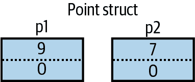

# 第三章：类型基础知识

*类型*定义了值的蓝图。在我们的示例中，我们使用了两个`int`类型的文字值，分别为 12 和 30。我们还声明了一个类型为`int`的*变量*，其名称为`x`。

*变量*表示可以随时间包含不同值的存储位置。相比之下，*常量*始终表示相同的值（稍后详述）。

在 C#中，所有的值都是特定类型的*实例*。值的含义以及变量可能具有的可能值集由其类型确定。

## 预定义类型示例

预定义类型（也称为*内置*类型）是编译器特别支持的类型。`int`类型是用于表示内存中适合 32 位整数集的预定义类型，范围从−2³¹到 2³¹−1。我们可以按如下方式对`int`类型的实例执行算术函数：

```cs
int x = 12 * 30;
```

另一个预定义的 C#类型是`string`。`string`类型表示字符序列，例如“.NET”或“[*http://oreilly.com*](http://oreilly.com)”。我们可以通过在它们上调用函数来处理字符串，如下所示：

```cs
string message = "Hello world";
string upperMessage = message.ToUpper();
Console.WriteLine (upperMessage);      // HELLO WORLD

int x = 2022;
message = message + x.ToString();
Console.WriteLine (message);         // Hello world2022
```

预定义的`bool`类型只有两个可能的值：`true`和`false`。`bool`类型通常用于通过`if`语句有条件地分支执行流程。例如：

```cs
bool simpleVar = false;
if (simpleVar)
  Console.WriteLine ("This will not print");

int x = 5000;
bool lessThanAMile = x < 5280;
if (lessThanAMile)
  Console.WriteLine ("This will print");
```

在.NET 中，`System`命名空间包含许多重要类型，这些类型不是由 C#预定义的（例如，`DateTime`）。

## 自定义类型示例

就像您可以从简单函数构建复杂函数一样，您可以从原始类型构建复杂类型。在此示例中，我们将定义一个名为`UnitConverter`的自定义类型——一个作为单位转换蓝图的类：

```cs
UnitConverter feetToInches = new UnitConverter (12);
UnitConverter milesToFeet = new UnitConverter (5280);

Console.WriteLine (feetToInches.Convert(30));   // 360
Console.WriteLine (feetToInches.Convert(100));  // 1200
Console.WriteLine (feetToInches.Convert
                    (milesToFeet.Convert(1)));  // 63360

public class UnitConverter
{ 
 int ratio;                             // Field

 public UnitConverter (int unitRatio)   // Constructor
 {
 ratio = unitRatio;
 }

 public int Convert (int unit)          // Method
 {
 return unit * ratio;
 }
}
```

### 类型的成员

类型包含*数据成员*和*函数成员*。`UnitConverter`的数据成员是名为`ratio`的*字段*。`UnitConverter`的函数成员是`Convert`方法和`UnitConverter`的*构造函数*。

### 预定义类型和自定义类型的对称性

C#的一个优点是预定义类型和自定义类型之间几乎没有区别。预定义的`int`类型用作整数的蓝图。它保存数据——32 位——并提供使用该数据的函数成员，例如`ToString`。类似地，我们的自定义`UnitConverter`类型充当单位转换的蓝图。它保存比例数据，并提供用于使用该数据的函数成员。

### 构造函数和实例化

*实例化*类型可以创建数据。您可以通过使用文字（例如`12`或`"Hello world"`）简单地实例化预定义类型。

`new` 操作符用于创建自定义类型的实例。我们通过创建两个 `UnitConverter` 类型的实例来启动我们的程序。`new` 操作符实例化对象后，立即调用对象的 *构造函数* 进行初始化。构造函数类似于方法，不同之处在于方法名和返回类型简化为封闭类型的名称：

```cs
public UnitConverter (int unitRatio)   // Constructor
{
  ratio = unitRatio; 
}
```

### 实例成员与静态成员

操作类型 *实例* 的数据成员和函数成员称为 *实例成员*。`UnitConverter` 的 `Convert` 方法和 `int` 的 `ToString` 方法就是实例成员的例子。默认情况下，成员是实例成员。

不操作类型实例的数据成员和函数成员可以标记为 `static`。要从其类型外部引用静态成员，需指定其 *类型* 名称，而不是实例。例如 `Console` 类的 `WriteLine` 方法。因为这是静态的，我们调用 `Console.WriteLine()` 而不是 `new Console().WriteLine()`。

在下面的代码中，实例字段 `Name` 属于特定 `Panda` 的实例，而 `Population` 属于所有 `Panda` 实例的集合。我们创建了两个 `Panda` 实例，打印它们的名称，然后打印总体人口：

```cs
Panda p1 = new Panda ("Pan Dee");
Panda p2 = new Panda ("Pan Dah");

Console.WriteLine (p1.Name);      // Pan Dee
Console.WriteLine (p2.Name);      // Pan Dah

Console.WriteLine (Panda.Population);   // 2

public class Panda
{
  public string Name;             // Instance field
  public static int Population;   // Static field

  public Panda (string n)         // Constructor
  {
    Name = n;                     // Instance field
    Population = Population + 1;  // Static field
  }
}
```

尝试评估 `p1.Population` 或 `Panda.Name` 将生成编译时错误。

### 公共关键字

`public` 关键字将成员暴露给其他类。在此示例中，如果 `Panda` 中的 `Name` 字段未标记为 public，则它将是私有的，无法从类外部访问。将成员标记为 public 是类型通信的方式：“这里是我希望其他类型看到的内容——其他都是我自己的私有实现细节。”从面向对象的角度来看，我们说公共成员 *封装* 类的私有成员。

### 创建命名空间

特别是对于较大的程序，将类型组织到命名空间中是有意义的。以下是如何在名为 `Animals` 的命名空间内定义 `Panda` 类：

```cs
namespace Animals
{
  public class Panda
  {
     ...
  }
}
```

我们在 “命名空间” 中详细介绍命名空间。

### 定义 Main 方法

到目前为止，我们的所有示例都使用了顶级语句，这是在 C# 9 中引入的一个功能。没有顶级语句时，简单的控制台或 Windows 应用程序如下所示：

```cs
using System;

class Program
{
  static void Main()   // Program entry point
  {
    int x = 12 * 30;
    Console.WriteLine (x);
  }
}
```

在不存在顶级语句的情况下，C# 查找名为 `Main` 的静态方法，该方法成为入口点。`Main` 方法可以定义在任何类内（只能存在一个 `Main` 方法）。

`Main` 方法可以选择性地返回整数（而不是 `void`），以便向执行环境返回值（非零值通常表示错误）。`Main` 方法还可以选择性地接受字符串数组作为参数（该数组将填充任何传递给可执行文件的参数）；例如：

```cs
static int Main (string[] args) {...}
```

###### 注意

数组（如`string[]`）表示特定类型的固定数量元素。通过在元素类型后面放置方括号来指定数组。我们在“数组”中描述了它们。

（`Main`方法也可以声明为`async`并返回`Task`或`Task<int>`，以支持异步编程，请参见“异步函数”。）

### 顶层语句

顶层语句允许您避免静态`Main`方法和包含类的负担。一个包含顶层语句的文件由以下三部分组成，顺序如下：

1.  （可选地）`using`指令

1.  一系列的语句，可选地与方法声明混合在一起。

1.  （可选地）类型和命名空间声明

第二部分的所有内容最终都会位于由编译器生成的“main”方法内，位于一个由编译器生成的类内。这意味着顶层语句中的方法变成了*本地方法*（我们在“本地方法”中描述了细微差别）。顶层语句可以选择向调用者返回一个整数值，并访问一个名为`args`的`string[]`类型的“magic”变量，对应于调用者传递的命令行参数。

由于程序只能有一个入口点，在 C#项目中最多只能有一个包含顶层语句的文件。

## 类型和转换

C#可以在兼容类型的实例之间进行转换。转换总是从现有值创建一个新值。转换可以是*隐式*或*显式*：隐式转换会自动发生，而显式转换需要一个*转换*。在以下示例中，我们*隐式*将`int`转换为`long`类型（其比`int`具有两倍的位容量），并*显式*将`int`转换为`short`类型（其比`int`具有一半的位容量）：

```cs
int x = 12345;       // int is a 32-bit integer
long y = x;          // Implicit conversion to 64-bit int
short z = (short)x;  // Explicit conversion to 16-bit int
```

一般情况下，当编译器可以保证隐式转换总是成功且不丢失信息时，允许隐式转换。否则，你必须执行显式转换来在兼容类型之间转换。

## 值类型与引用类型

C#类型可以分为*值类型*和*引用类型*。

*值类型*包括大多数内置类型（具体来说，所有数值类型、`char`类型和`bool`类型），以及自定义的`struct`和`enum`类型。*引用类型*包括所有的类、数组、委托和接口类型。

值类型和引用类型的根本区别在于它们在内存中的处理方式。

### 值类型

*值类型*变量或常量的内容仅仅是一个值。例如，内置值类型`int`的内容是 32 位数据。

您可以使用`struct`关键字定义自定义值类型（参见图 1）：

```cs
public struct Point { public int X, Y; }
```


###### 图 1\. 内存中的值类型实例

对于值类型实例的赋值始终会*复制*该实例。例如：

```cs
Point p1 = new Point();
p1.X = 7;

Point p2 = p1;             // Assignment causes copy

Console.WriteLine (p1.X);  // 7
Console.WriteLine (p2.X);  // 7

p1.X = 9;                  // Change p1.X
Console.WriteLine (p1.X);  // 9
Console.WriteLine (p2.X);  // 7
```

图 2 显示 `p1` 和 `p2` 具有独立的存储。



###### 图 2\. 赋值复制值类型实例

### 引用类型

引用类型比值类型更复杂，有两部分：*对象* 和指向该对象的*引用*。引用类型变量或常量的内容是指向包含值的对象的引用。以下是我们先前示例中 `Point` 类的类型重写为类（参见 图 3）：

```cs
public class Point { public int X, Y; }
```


###### 图 3\. 内存中的引用类型实例

将引用类型变量赋值给引用，会复制引用而不是对象实例。这允许多个变量引用同一对象——这在值类型中通常是不可能的。如果我们重复之前的示例，但现在 `Point` 是一个类，通过 `p1` 进行的操作会影响 `p2`：

```cs
Point p1 = new Point();
p1.X = 7;

Point p2 = p1;             // Copies p1 reference

Console.WriteLine (p1.X);  // 7
Console.WriteLine (p2.X);  // 7

p1.X = 9;                  // Change p1.X
Console.WriteLine (p1.X);  // 9
Console.WriteLine (p2.X);  // 9
```

图 4 显示 `p1` 和 `p2` 是指向同一对象的两个引用。


###### 图 4\. 赋值复制引用

### 空

可以将引用分配给字面值 `null`，表示引用指向无对象。假设 `Point` 是一个类：

```cs
Point p = null;
Console.WriteLine (p == null);   // True
```

访问空引用的成员会生成运行时错误：

```cs
Console.WriteLine (p.X);   // NullReferenceException
```

###### **注意**

在 “可空引用类型” 中，我们描述了 C# 的一个功能，可减少意外的 `NullReferenceException` 错误。

相比之下，值类型通常不能具有空值：

```cs
struct Point {...}
...
Point p = null;  // Compile-time error
int x = null;    // Compile-time error
```

为了解决这个问题，C# 使用了一种特殊的结构来表示值类型的空值——请参阅 “可空值类型”。

## 预定义类型分类

C# 中的预定义类型如下：

值类型

+   数值：

    +   **有符号整数** (`sbyte`, `short`, `int`, `long`)

    +   **无符号整数** (`byte`, `ushort`, `uint`, `ulong`)

    +   **实数** (`float`, `double`, `decimal`)

+   **逻辑** (`bool`)

+   **字符** (`char`)

引用类型

+   **字符串** (`string`)

+   **对象** (`object`)

C# 中的预定义类型是 `.NET` 中 `System` 命名空间的别名。这两个语句之间只有语法上的差异：

```cs
int i = 5;
System.Int32 i = 5;
```

在公共语言运行时（CLR）中，排除 `decimal` 的预定义*值*类型被称为*基本类型*。之所以称为基本类型，是因为它们通过编译代码中的指令直接支持，在底层处理器上通常直接转换为支持。

