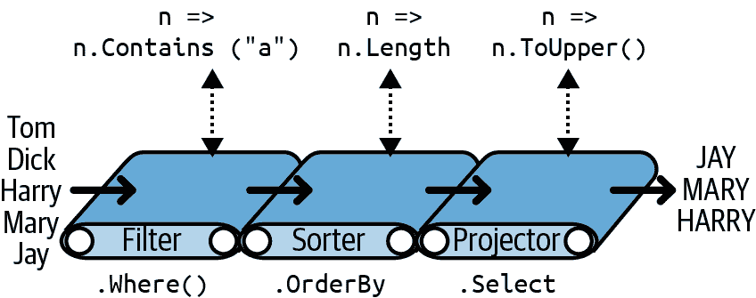
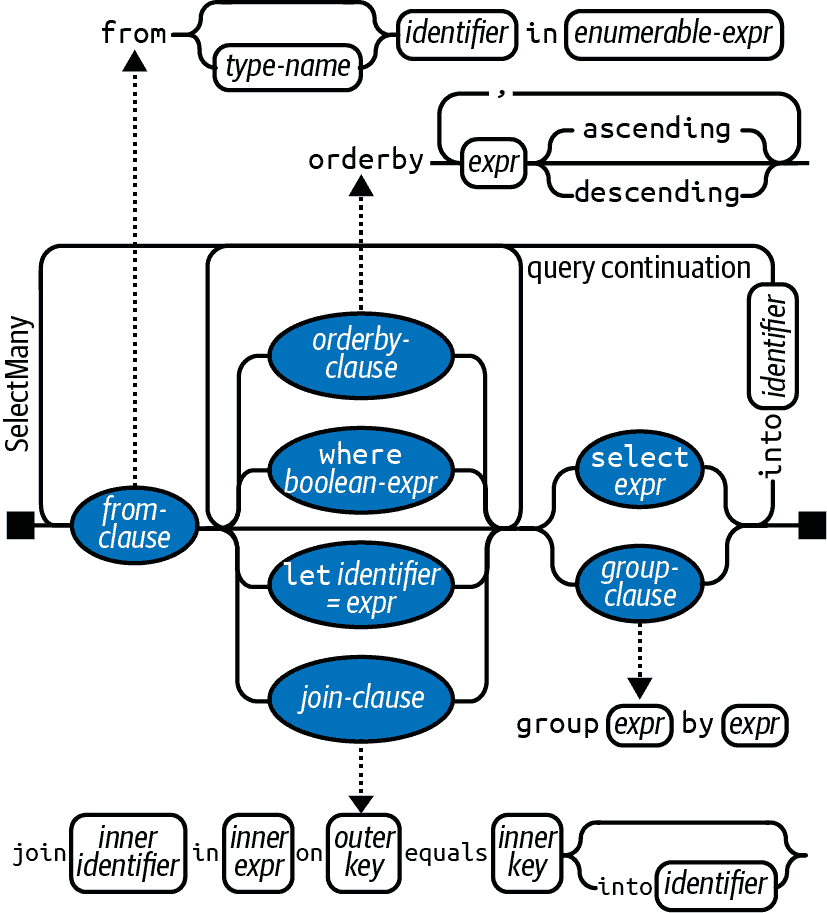

# 第三十五章：LINQ

LINQ，即 Language Integrated Query，允许您在本地对象集合和远程数据源上编写结构化类型安全的查询。LINQ 允许您查询任何实现`IEnumerable<>`的集合，无论是数组、列表、XML DOM 还是远程数据源（如 SQL Server 中的表）。LINQ 提供了编译时类型检查和动态查询组合的好处。

###### 注意

一个尝试 LINQ 的好方法是[下载 LINQPad](http://www.linqpad.net)。LINQPad 允许您在 LINQ 中交互式查询本地集合和 SQL 数据库，无需任何设置，并预装有大量示例。

## LINQ 基础知识

LINQ 中的基本数据单元是 *序列* 和 *元素*。序列是实现通用 `IEnumerable` 接口的任何对象，而元素是序列中的每个项。在以下示例中，`names` 是一个序列，`Tom`、`Dick` 和 `Harry` 是元素：

```cs
string[] names = { "Tom", "Dick", "Harry" };
```

我们称这样的序列为*本地序列*，因为它代表内存中的本地对象集合。

*查询操作符* 是一种转换序列的方法。典型的查询操作符接受一个*输入序列*并发出一个转换后的*输出序列*。在 `System.Linq` 的 `Enumerable` 类中，有大约 40 个查询操作符，都是作为静态扩展方法实现的。这些称为*标准查询操作符*。

###### 注意

LINQ 还支持可以动态从远程数据源（如 SQL Server）输入的序列。这些序列还实现了 `IQueryable<>` 接口，并通过 `Queryable` 类中的一组匹配的标准查询操作符进行支持。

### 简单查询

*查询* 是使用一个或多个查询操作符转换序列的表达式。最简单的查询包括一个输入序列和一个操作符。例如，我们可以在一个简单数组上应用 `Where` 操作符，以提取长度至少为四个字符的名称，如下所示：

```cs
string[] names = { "Tom", "Dick", "Harry" };

IEnumerable<string> filteredNames =
 System.Linq.Enumerable.Where (
 names, n => n.Length >= 4);

foreach (string n in filteredNames)
  Console.Write (n + "|");            // Dick|Harry|
```

因为标准查询操作符是作为扩展方法实现的，所以我们可以直接在 `names` 上调用 `Where`，就像它是一个实例方法一样：

```cs
IEnumerable<string> filteredNames =
  names.Where (n => n.Length >= 4);
```

（要使其编译通过，您必须使用 `using` 指令导入 `System.Linq` 命名空间。）`System.Linq.Enumerable` 中的 `Where` 方法具有以下签名：

```cs
static IEnumerable<TSource> Where<TSource> (
  this IEnumerable<TSource> source,
  Func<TSource,bool> predicate)
```

`source` 是*输入序列*；`predicate` 是在每个输入*元素*上调用的委托。`Where` 方法包含所有委托返回 `true` 的*输出序列*中的元素。在内部，它是使用迭代器实现的——这是它的源代码：

```cs
foreach (TSource element in source)
  if (predicate (element))
    yield return element;
```

### 投影

另一个基本的查询操作符是 `Select` 方法。这使用给定的 lambda 表达式转换（*投影*）输入序列中的每个元素：

```cs
string[] names = { "Tom", "Dick", "Harry" };

IEnumerable<string> upperNames =
  names.Select (n => n.ToUpper());

foreach (string n in upperNames)
  Console.Write (n + "|");       // TOM|DICK|HARRY|
```

查询可以投影为匿名类型：

```cs
var query = names.Select (n => new { 
                                     Name = n,
                                     Length = n.Length
                                   });
foreach (var row in query)
  Console.WriteLine (row);
```

这是结果：

```cs
{ Name = Tom, Length = 3 }
{ Name = Dick, Length = 4 }
{ Name = Harry, Length = 5 }
```

### Take 和 Skip

在 LINQ 中，输入序列中元素的原始顺序很重要。某些查询操作符依赖于此行为，如 `Take`、`Skip` 和 `Reverse`。`Take` 操作符输出前 *x* 个元素，丢弃其余部分：

```cs
int[] numbers  = { 10, 9, 8, 7, 6 };
IEnumerable<int> firstThree = numbers.Take (3);
// firstThree is { 10, 9, 8 }
```

`Skip` 操作符忽略前 *x* 个元素，并输出其余部分：

```cs
IEnumerable<int> lastTwo = numbers.Skip (3);
```

从 .NET 6 开始，还有 `TakeLast` 和 `SkipLast` 方法，分别取或跳过最后 *n* 个元素。此外，`Take` 方法已重载以接受 `Range` 变量。此重载可以包含所有四种方法的功能；例如，`Take(5..)` 等同于 `Skip(5)`，`Take(..⁵)` 等同于 `SkipLast(5)`。

### 元素操作符

并非所有查询操作符都返回序列。*元素* 操作符从输入序列中提取一个元素；例如 `First`、`Last`、`Single` 和 `ElementAt`：

```cs
int[] numbers    = { 10, 9, 8, 7, 6 };
int firstNumber  = numbers.First();                // 10
int lastNumber   = numbers.Last();                 // 6
int secondNumber = numbers.ElementAt (2);          // 8
int firstOddNum  = numbers.First (n => n%2 == 1);  // 9
```

如果没有元素存在，所有这些运算符都会抛出异常。要避免异常，请使用 `FirstOrDefault`, `LastOrDefault`, `SingleOrDefault` 或 `ElementAtOrDefault` —— 当未找到元素时，它们返回 `null`（或值类型的 `default` 值）。

`Single` 和 `SingleOrDefault` 方法与 `First` 和 `FirstOrDefault` 方法相同，除了如果有多个匹配项则抛出异常。在查询数据库表的主键时，这种行为非常有用。

从 .NET 6 开始，还有 `MinBy` 和 `MaxBy` 方法，根据键选择器返回具有最低或最高值的元素：

```cs
string[] names = { "Tom", "Dick", "Harry" };
Console.Write (names.MaxBy (n => n.Length));  // Harry
```

### 聚合运算符

聚合运算符返回一个标量值，通常是数值类型。最常用的聚合运算符是 `Count`, `Min`, `Max` 和 `Average`：

```cs
int[] numbers = { 10, 9, 8, 7, 6 };
int count     = numbers.Count();             // 5
int min       = numbers.Min();               // 6
int max       = numbers.Max();               // 10
double avg    = numbers.Average();           // 8
```

`Count` 接受一个可选的谓词，指示是否包括给定的元素。以下计算所有偶数的数量：

```cs
int evenNums = numbers.Count (n => n % 2 == 0);   // 3
```

`Min`, `Max` 和 `Average` 运算符接受一个可选参数，用于在聚合之前转换每个元素：

```cs
int maxRemainderAfterDivBy5 = numbers.Max
                              (n => n % 5);       // 4
```

以下计算 `numbers` 的均方根：

```cs
double rms = Math.Sqrt (numbers.Average (n => n * n));
```

### 量词运算符

量词运算符返回一个 `bool` 值。量词运算符包括 `Contains`, `Any`, `All` 和 `SequenceEquals`（比较两个序列）：

```cs
int[] numbers = { 10, 9, 8, 7, 6 };

bool hasTheNumberNine = numbers.Contains (9);    // true
bool hasMoreThanZeroElements = numbers.Any();    // true
bool hasOddNum = numbers.Any (n => n % 2 == 1);  // true
bool allOddNums = numbers.All (n => n % 2 == 1); // false
```

### 集合运算符

集合运算符接受两个相同类型的输入序列。`Concat` 将一个序列附加到另一个序列；`Union` 也是如此，但删除重复项：

```cs
int[] seq1 = { 1, 2, 3 }, seq2 = { 3, 4, 5 };

IEnumerable<int>
  concat = seq1.Concat (seq2),   // { 1, 2, 3, 3, 4, 5 }
  union  = seq1.Union  (seq2),   // { 1, 2, 3, 4, 5 }
```

此类别中的另外两个运算符是 `Intersect` 和 `Except`：

```cs
IEnumerable<int>
  commonality = seq1.Intersect (seq2),    //  { 3 }
  difference1 = seq1.Except    (seq2),    //  { 1, 2 }
  difference2 = seq2.Except    (seq1);    //  { 4, 5 }
```

从 .NET 6 开始，还有使用键选择器的集合运算符 (`UnionBy`, `ExceptBy`, `IntersectBy`)。键选择器用于确定元素是否被视为重复项：

```cs
string[] seq1 = { "A", "b", "C" };
string[] seq2 = { "a", "B", "c" };
var union = seq1.UnionBy (seq2, x => x.ToUpper());
// union is { "A", "b", "C" }
```

## 延迟执行

许多查询运算符的重要特性是它们在构造时不执行，而是在枚举时执行（换句话说，在其枚举器上调用 `MoveNext` 时）。考虑以下查询：

```cs
var numbers = new List<int> { 1 };

IEnumerable<int> query = numbers.Select (n => n * 10); 
numbers.Add (2);    // Sneak in an extra element

foreach (int n in query)
  Console.Write (n + "|");          // 10|20|
```

我们在构造查询之后偷偷加入列表中的额外数字，因为直到 `foreach` 语句运行时才进行任何过滤或排序。这被称为延迟或惰性评估。延迟执行将查询的构造与执行分离，允许您在多个步骤中构造查询，还可以在不将所有行检索到客户端的情况下查询数据库。所有标准查询运算符都提供延迟执行，以下是例外：

+   返回单个元素或标量值的运算符（元素运算符、聚合运算符和量词运算符）

+   转换运算符 `ToArray`, `ToList`, `ToDictionary`, `ToLookup` 和 `ToHashSet`

转换运算符非常方便，部分原因在于它们避免了惰性求值。这在某些情况下很有用，可以在特定时间点“冻结”或缓存结果，避免重新执行计算密集或远程获取的查询，比如 Entity Framework 表。（惰性求值的副作用是，如果稍后重新枚举它，查询会被重新评估。）

以下示例说明了 `ToList` 运算符：

```cs
var numbers = new List<int>() { 1, 2 };

List<int> timesTen = numbers
  .Select (n => n * 10) 
 .ToList();    // Executes immediately into a List<int>

numbers.Clear();
Console.WriteLine (timesTen.Count);      // Still 2
```

###### 警告

子查询提供了另一层间接引用。子查询中的所有内容都受延迟执行的影响，包括聚合和转换方法，因为子查询本身只有在需要时才会懒惰执行。假设 `names` 是一个字符串数组，子查询如下所示：

```cs
names.Where (
  n => n.Length ==
 names.Min (n2 => n2.Length))
```

## 标准查询运算符

我们可以将标准查询运算符（如在 `System.Linq.Enumerable` 类中实现）分为 12 个类别，如 Table 1 所总结的。

表 1\. 查询运算符类别

| 类别 | 描述 | 延迟执行？ |
| --- | --- | --- |
| 过滤 | 返回满足给定条件的元素子集 | 是 |
| 投影 | 使用 lambda 函数转换每个元素，可选地展开子序列 | 是 |
| 连接 | 使用时间有效的查找策略将一个集合的元素与另一个集合的元素进行网格化 | 是 |
| 排序 | 返回序列的重新排序 | 是 |
| 分组 | 将序列分组为子序列 | 是 |
| 集合 | 接受两个相同类型的序列，并返回它们的共同性、和或差异 | 是 |
| 元素 | 从序列中选择单个元素 | 否 |
| 聚合 | 对序列执行计算，返回一个标量值（通常是一个数值） | 否 |
| 量化 | 对序列执行计算，返回 `true` 或 `false` | 否 |
| 转换：导入 | 将非泛型序列转换为（可查询的）泛型序列 | 是 |
| 转换：导出 | 将序列转换为数组、列表、字典或查找，强制立即评估 | 否 |
| 生成 | 制造一个简单的序列 | 是 |

表格 2 到 13 总结了每个查询运算符。在 C# 中，加粗显示的运算符具有特殊的支持（参见 “查询表达式”）。

表 2\. 过滤运算符

| 方法 | 描述 |
| --- | --- |
| `**Where**` | 返回满足给定条件的元素子集 |
| `Take` | 返回前 *x* 个元素，并丢弃其余元素 |
| `Skip` | 忽略前 *x* 个元素，并返回其余元素 |
| `TakeLast` | 返回最后 *x* 个元素，并丢弃其余元素 |
| `SkipLast` | 忽略最后 *x* 个元素，并返回其余元素 |
| `TakeWhile` | 发射输入序列中的元素，直到给定的谓词为真 |
| `SkipWhile` | 忽略输入序列中的元素，直到给定的谓词为真，然后发射其余元素 |
| `Distinct`, `DistinctBy` | 返回排除重复项的集合 |

表 3\. 投影运算符

| Method | Description |
| --- | --- |
| `**Select**` | 使用给定的 Lambda 表达式转换每个输入元素 |
| `**SelectMany**` | 转换每个输入元素，然后展平和连接生成的子序列 |

表 4\. 连接运算符

| Method | Description |
| --- | --- |
| `**Join**` | 应用查找策略匹配来自两个集合的元素，并生成一个平坦的结果集 |
| `**GroupJoin**` | 类似于上面的操作，但生成一个*分层*的结果集 |
| `Zip` | 依次枚举两个序列，并返回一个应用函数到每一对元素上的序列 |

表 5\. 排序运算符

| Method | Description |
| --- | --- |
| `**OrderBy**`, `**ThenBy**` | 返回按升序排列的元素 |
| `**OrderByDescending**`, `**ThenByDescending**` | 返回按降序排列的元素 |
| `Reverse` | 返回逆序排列的元素 |

表 6\. 分组运算符

| Method | Description |
| --- | --- |
| `**GroupBy**` | 将序列分组为子序列 |
| `Chunk` | 将序列分成给定大小的块 |

表 7\. 集合运算符

| Method | Description |
| --- | --- |
| `Concat` | 连接两个序列 |
| `Union`, `UnionBy` | 连接两个序列并移除重复元素 |
| `Intersect`, `IntersectBy` | 返回两个序列中共有的元素 |
| `Except`, `ExceptBy` | 返回只存在于第一个序列中而不在第二个序列中的元素 |

表 8\. 元素运算符

| Method | Description |
| --- | --- |
| `First`, `FirstOrDefault` | 返回序列中的第一个元素，或满足给定条件的第一个元素 |
| `Last`, `LastOrDefault` | 返回序列中的最后一个元素，或满足给定条件的最后一个元素 |
| `Single`, `SingleOrDefault` | 等效于 `First`/`FirstOrDefault`，但如果有多个匹配则抛出异常 |
| `MinBy`, `MaxBy` | 返回具有最小或最大值的元素，由键选择器确定 |
| `ElementAt`, `ElementAtOrDefault` | 返回指定位置的元素 |
| `DefaultIfEmpty` | 如果序列为空则返回一个包含单个值的序列，该值为 null 或 `default(TSource)` |

表 9\. 聚合运算符

| Method | Description |
| --- | --- |
| `Count`, `LongCount` | 返回输入序列中的元素总数，或满足给定条件的元素数量 |
| `Min`, `Max` | 返回序列中的最小或最大元素 |
| `Sum`, `Average` | 计算序列中元素的数值总和或平均值 |
| `Aggregate` | 执行自定义聚合操作 |

表 10\. 量词运算符

| Method | Description |
| --- | --- |
| `Contains` | 如果输入序列包含给定元素则返回 `true` |
| `Any` | 如果任何元素满足给定条件则返回 `true` |
| `All` | 如果所有元素都满足给定条件则返回 `true` |
| `SequenceEqual` | 如果第二个序列与输入序列具有相同的元素，则返回`true` |

Table 11\. 转换操作符（导入）

| 方法 | 描述 |
| --- | --- |
| `OfType` | 将`IEnumerable`转换为`IEnumerable<T>`，丢弃类型不正确的元素 |
| `**Cast**` | 将`IEnumerable`转换为`IEnumerable<T>`，如果有任何类型不正确的元素则抛出异常 |

Table 12\. 转换操作符（导出）

| 方法 | 描述 |
| --- | --- |
| `ToArray` | 将`IEnumerable<T>`转换为`T[]` |
| `ToList` | 将`IEnumerable<T>`转换为`List<T>` |
| `ToDictionary` | 将`IEnumerable<T>`转换为`Dictionary<TKey,TValue>` |
| `ToHashSet` | 将`IEnumerable<T>`转换为`HashSet<T>` |
| `ToLookup` | 将`IEnumerable<T>`转换为`ILookup<TKey,TElement>` |
| `AsEnumerable` | 向下转换为`IEnumerable<T>` |
| `AsQueryable` | 强制转换或转换为`IQueryable<T>` |

Table 13\. 生成操作符

| 方法 | 描述 |
| --- | --- |
| `Empty` | 创建一个空序列 |
| `Repeat` | 创建一个重复元素序列 |
| `Range` | 创建一个整数序列 |

## 链式查询操作符

要构建更复杂的查询，您可以将查询操作符链接在一起。例如，以下查询提取所有包含字母*a*的字符串，按长度排序，然后将结果转换为大写：

```cs
string[] names = { "Tom","Dick","Harry","Mary","Jay" };

IEnumerable<string> query = names
  .Where   (n => n.Contains ("a"))
  .OrderBy (n => n.Length)
  .Select  (n => n.ToUpper());

foreach (string name in query)
  Console.Write (name + "|");

// RESULT: JAY|MARY|HARRY|
```

`Where`、`OrderBy` 和 `Select` 都是标准查询操作符，对应于`Enumerable`类中的扩展方法。`Where`操作符发出输入序列的筛选版本，`OrderBy`发出其输入序列的排序版本，`Select`发出使用给定 Lambda 表达式进行变换或*投影*的序列（在本例中为`n.ToUpper()`）。数据通过操作符链从左到右流动，因此首先进行过滤，然后排序，然后投影。最终结果类似于生产线上的传送带，如图 6 所示。



###### 图 6\. 链式查询操作符

操作符始终遵守延迟执行，因此直到实际枚举查询时才进行过滤、排序或投影。

## 查询表达式

到目前为止，我们已经通过调用`Enumerable`类中的扩展方法编写了查询。在本书中，我们将其描述为*流畅语法*。C#还提供了用于编写查询的特殊语言支持，称为*查询表达式*。以下是前述查询表达为查询表达式的示例：

```cs
IEnumerable<string> query =
  from n in names
  where n.Contains ("a")
  orderby n.Length
  select n.ToUpper();
```

查询表达式始终以`from`子句开始，并以`select`或`group`子句结束。`from`子句声明一个*范围变量*（在本例中为`n`），您可以将其视为遍历输入集合，类似于`foreach`。图 7 说明了完整的语法结构。



###### 图 7\. 查询表达式语法

###### 注

如果您熟悉 SQL，LINQ 的查询表达式语法——从 `from` 子句开始，`select` 子句在最后——可能看起来很奇怪。实际上，查询表达式语法更为逻辑，因为子句 *按执行顺序* 出现。这使得 Visual Studio 在您键入时可以使用 IntelliSense 提示，并简化了子查询的作用域规则。

编译器通过将查询表达式转换为流畅语法来处理查询表达式。它以一种相当机械化的方式进行此操作，就像它将 `foreach` 语句转换为对 `GetEnumerator` 和 `MoveNext` 的调用一样：

```cs
IEnumerable<string> query = names
  .Where   (n => n.Contains ("a"))
  .OrderBy (n => n.Length)
  .Select  (n => n.ToUpper());
```

然后，`Where`、`OrderBy` 和 `Select` 运算符将使用与在流畅语法中编写查询时相同的规则解析。在这种情况下，它们绑定到 `Enumerable` 类中的扩展方法（假设已导入了 `System.Linq` 命名空间），因为 `names` 实现了 `IEnumerable<string>`。然而，编译器在转换查询语法时并不专门偏爱 `Enumerable` 类。您可以将编译器视为在语句中机械地注入 *Where*、*OrderBy* 和 *Select* 这些词，然后编译它，就像您自己键入方法名一样。这样可以灵活地解析它们——例如，Entity Framework 查询中的运算符则绑定到 `Queryable` 类中的扩展方法。

### 查询表达式与流畅查询

查询表达式和流畅查询各有其优点。

查询表达式仅支持查询运算符的一个小子集，即：

```cs
Where, Select, SelectMany
OrderBy, ThenBy, OrderByDescending, ThenByDescending
GroupBy, Join, GroupJoin
```

对于使用其他运算符的查询，您必须要么完全使用流畅语法编写，要么构建混合语法查询；例如：

```cs
string[] names = { "Tom","Dick","Harry","Mary","Jay" };

IEnumerable<string> query =
  from   n in names
  where  n.Length == names.Min (n2 => n2.Length)
  select n;
```

此查询返回与最短长度匹配的名称（“Tom” 和 “Jay”）。 **子查询（粗体）** 计算每个名称的最小长度，并计算为 3。我们需要使用流畅语法进行子查询，因为查询表达式语法中不支持 `Min` 运算符。但是，我们仍然可以在外部查询中使用查询语法。

查询语法的主要优势在于它可以极大地简化涉及以下内容的查询：

+   `let` 关键字用于在范围变量旁引入一个新变量。

+   多个生成器（`SelectMany`）后跟外部范围变量引用

+   等效于 `Join` 或 `GroupJoin`，然后是外部范围变量引用

## `let` 关键字

`let` 关键字在范围变量旁引入一个新变量。例如，假设您想列出所有长度（去除元音后）大于两个字符的名称：

```cs
string[] names = { "Tom","Dick","Harry","Mary","Jay" };

IEnumerable<string> query =
  from n in names
 let vowelless = Regex.Replace (n, "[aeiou]", "")
  where vowelless.Length > 2
  orderby vowelless
  select n + " - " + vowelless;
```

枚举此查询的输出为：

```cs
Dick - Dck
Harry - Hrry
Mary - Mry
```

`let` 子句对每个元素执行计算，而不会丢失原始元素。在我们的查询中，后续子句（`where`、`orderby` 和 `select`）可以访问 `n` 和 `vowelless`。一个查询可以包括多个 `let` 子句，并且它们可以与额外的 `where` 和 `join` 子句交替使用。

编译器通过投影到一个包含原始和转换元素的临时匿名类型来转换`let`关键字：

```cs
IEnumerable<string> query = names
 .Select (n => new  
   {
     n = n, 
     vowelless = Regex.Replace (n, "[aeiou]", "")
   }
 )
 .Where (temp0 => (temp0.vowelless.Length > 2))
 .OrderBy (temp0 => temp0.vowelless)
 .Select (temp0 => ((temp0.n + " - ") + temp0.vowelless))
```

## 查询继续

如果您希望在`select`或`group`子句*后*添加子句，必须使用`into`关键字来“继续”查询。例如：

```cs
from c in "The quick brown tiger".Split()
select c.ToUpper() into upper
where upper.StartsWith ("T")
select upper

// RESULT: "THE", "TIGER"
```

在`into`子句后，前一个范围变量已经超出范围。

编译器简单地将带有`into`关键字的查询转换为更长的操作链：

```cs
"The quick brown tiger".Split()
  .Select (c => c.ToUpper())
  .Where (upper => upper.StartsWith ("T"))
```

（它省略了最后的`Select(upper=>upper)`，因为它是多余的。）

## 多个生成器

查询可以包括多个生成器（`from`子句）。例如：

```cs
int[] numbers = { 1, 2, 3 };
string[] letters = { "a", "b" };

IEnumerable<string> query = from n in numbers
 from l in letters
                            select n.ToString() + l;
```

结果是一个交叉乘积，类似于嵌套的`foreach`循环：

```cs
"1a", "1b", "2a", "2b", "3a", "3b"
```

当查询中有多个`from`子句时，编译器会发出对`SelectMany`的调用：

```cs
IEnumerable<string> query = numbers.SelectMany (
 n => letters,
 (n, l) => (n.ToString() + l));
```

`SelectMany`执行嵌套循环。它枚举源集合（`numbers`）中的每个元素，并使用第一个 lambda 表达式（`letters`）转换每个元素。这生成一系列*子序列*，然后它枚举这些子序列。最终的输出元素由第二个 lambda 表达式（`n.ToString()+l`）确定。

如果随后应用了`where`子句，您可以过滤交叉乘积并投影出类似*连接*的结果：

```cs
string[] players = { "Tom", "Jay", "Mary" };

IEnumerable<string> query =
  from name1 in players
  from name2 in players
 where name1.CompareTo (name2) < 0
  orderby name1, name2
  select name1 + " vs " + name2;

RESULT: { "Jay vs Mary", "Jay vs Tom", "Mary vs Tom" }
```

将此查询转换为流畅语法更为复杂，需要一个临时匿名投影。自动执行此转换是查询表达式的关键优势之一。

第二个生成器中的表达式允许使用第一个范围变量：

```cs
string[] fullNames =
  { "Anne Williams", "John Fred Smith", "Sue Green" };

IEnumerable<string> query =
  from fullName in fullNames
  from name in fullName.Split()
  select name + " came from " + fullName;

Anne came from Anne Williams
Williams came from Anne Williams
John came from John Fred Smith
```

这有效，因为表达式`fullName.Split`生成一个*序列*（字符串数组）。

多个生成器在数据库查询中被广泛使用，以展开父子关系并执行手动连接。

## 连接

LINQ 提供了三个*连接*运算符，主要是`Join`和`GroupJoin`，它们执行基于键的查找连接。`Join`和`GroupJoin`仅支持多个生成器/`SelectMany`的部分功能，但在本地查询中更高效，因为它们使用基于哈希表的查找策略，而不是执行嵌套循环。（在 Entity Framework 查询中，连接运算符与多个生成器相比没有优势。）

`Join`和`GroupJoin`仅支持*等连接*（即连接条件必须使用等号操作符）。有两种方法：`Join`和`GroupJoin`。`Join`生成扁平的结果集，而`GroupJoin`生成分层结果集。

以下是用于平面连接的查询表达式语法：

```cs
from *outer-var* in *outer-sequence*
join *inner-var* in *inner-sequence* 
  on *outer-key-expr* equals *inner-key-expr*
```

例如，考虑以下集合：

```cs
var customers = new[]
{
  new { ID = 1, Name = "Tom" },
  new { ID = 2, Name = "Dick" },
  new { ID = 3, Name = "Harry" }
};
var purchases = new[]
{
  new { CustomerID = 1, Product = "House" },
  new { CustomerID = 2, Product = "Boat" },
  new { CustomerID = 2, Product = "Car" },
  new { CustomerID = 3, Product = "Holiday" }
};
```

我们可以执行如下的连接操作：

```cs
IEnumerable<string> query =
 from c in customers
 join p in purchases on c.ID equals p.CustomerID
  select c.Name + " bought a " + p.Product;
```

编译器将此转换为：

```cs
customers.Join (                // outer collection
  purchases,                    // inner collection
  c => c.ID,                    // outer key selector
  p => p.CustomerID,            // inner key selector
  (c, p) =>                     // result selector
     c.Name + " bought a " + p.Product 
);
```

这是结果：

```cs
Tom bought a House
Dick bought a Boat
Dick bought a Car
Harry bought a Holiday
```

对于本地序列，`Join`和`GroupJoin`在处理大型集合时比`SelectMany`更有效，因为它们首先将内部序列预加载到基于键的哈希表查找中。但是，通过数据库查询，您同样可以以以下方式同样高效地实现相同的结果：

```cs
from c in customers
from p in purchases
where c.ID == p.CustomerID
select c.Name + " bought a " + p.Product;
```

### GroupJoin

`GroupJoin`与`Join`执行相同的工作，但不是产生一个平坦的结果，而是产生一个按每个外部元素分组的分层结果。

`GroupJoin`的查询表达式语法与`Join`相同，但后面跟着`into`关键字。以下是一个基本示例，使用我们在前一节设置的`customers`和`purchases`集合：

```cs
var query =
  from c in customers
  join p in purchases on c.ID equals p.CustomerID
 into custPurchases
  select custPurchases;   // custPurchases is a sequence
```

###### 注意

`into`子句只有在直接跟在`join`子句之后时才会转换为`GroupJoin`。在`select`或`group`子句之后，它意味着*查询继续*。`into`关键字的这两种用法非常不同，尽管它们有一个共同的特征：它们都引入了一个新的查询变量。

结果是一系列序列`IEnumerable<IEnumerable<T>>`，您可以如下枚举它们：

```cs
foreach (var purchaseSequence in query)
  foreach (var purchase in purchaseSequence)
    Console.WriteLine (purchase.Product);
```

然而，这并不是很有用，因为`outerSeq`没有引用外部的顾客。更常见的是，在投影中引用外部的范围变量：

```cs
from c in customers
join p in purchases on c.ID equals p.CustomerID
into custPurchases
select new { CustName = c.Name, custPurchases };
```

您可以通过投影到包含子查询的匿名类型来获得相同的结果（但对于本地查询来说效率较低）：

```cs
from c in customers
select new
{
  CustName = c.Name,
  custPurchases = 
    purchases.Where (p => c.ID == p.CustomerID)
}
```

### Zip

`Zip`是最简单的连接运算符。它以步骤方式枚举两个序列（像拉链一样），根据每个元素对应应用函数，从而得到一个基于以下函数的序列：

```cs
int[] numbers = { 3, 5, 7 };
string[] words = { "three", "five", "seven", "ignored" };
IEnumerable<string> zip = 
  numbers.Zip (words, (n, w) => n + "=" + w);
```

产生一个包含以下元素的序列：

```cs
3=three
5=five
7=seven
```

忽略任一输入序列中的额外元素。在查询数据库时不支持`Zip`。

## 排序

`orderby`关键字对序列进行排序。您可以指定任意数量的表达式来进行排序：

```cs
string[] names = { "Tom","Dick","Harry","Mary","Jay" };

IEnumerable<string> query = from n in names
                            orderby n.Length, n
                            select n;
```

首先按长度排序，然后按名称排序，得到以下结果：

```cs
Jay, Tom, Dick, Mary, Harry
```

编译器将第一个`orderby`表达式转换为对`OrderBy`的调用，将后续表达式转换为对`ThenBy`的调用：

```cs
IEnumerable<string> query = names
  .OrderBy (n => n.Length)
  .ThenBy (n => n)
```

`ThenBy`操作符*细化*而不是*替换*先前的排序。

您可以在任何`orderby`表达式之后包含`descending`关键字：

```cs
orderby n.Length descending, n
```

这转换为以下内容：

```cs
.OrderByDescending (n => n.Length).ThenBy (n => n)
```

###### 注意

排序操作符返回一个扩展类型的`IEnumerable<T>`称为`IOrderedEnumerable<T>`。此接口定义了`ThenBy`操作符所需的额外功能。

## 分组

`GroupBy`将一个平坦的输入序列组织成*组*的序列。例如，以下根据它们的长度将一个名称序列分组：

```cs
string[] names = { "Tom","Dick","Harry","Mary","Jay" };

var query = from name in names
            group name by name.Length;
```

编译器将此查询转换为以下内容：

```cs
IEnumerable<IGrouping<int,string>> query = 
  names.GroupBy (name => name.Length);
```

下面是枚举结果的方法：

```cs
foreach (IGrouping<int,string> grouping in query)
{
  Console.Write ("\r\n Length=" + grouping.Key + ":");
  foreach (string name in grouping)
    Console.Write (" " + name);
}

 Length=3: Tom Jay
 Length=4: Dick Mary
 Length=5: Harry
```

`Enumerable.GroupBy`通过将输入元素读取到一个临时字典的列表中来工作，以便所有具有相同键的元素最终在同一个子列表中。然后它发出一个*分组*的序列。分组是具有`Key`属性的序列：

```cs
public interface IGrouping <TKey,TElement>
  : IEnumerable<TElement>, IEnumerable
{
  // Key applies to the subsequence as a whole
  TKey Key { get; }    
}
```

默认情况下，每个分组中的元素是未转换的输入元素，除非您指定了一个`elementSelector`参数。以下示例将每个输入元素投影为大写：

```cs
from name in names
group name.ToUpper() by name.Length
```

翻译为：

```cs
names.GroupBy (
  name => name.Length, 
  name => name.ToUpper() )
```

子集合不按键的顺序发出。`GroupBy`不进行*排序*（事实上，它保留原始顺序）。要排序，必须添加一个`OrderBy`运算符（这意味着首先添加一个`into`子句，因为通常`group by`结束一个查询）：

```cs
from name in names
group name.ToUpper() by name.Length into grouping
orderby grouping.Key
select grouping
```

查询延续经常在`group by`查询中使用。下一个查询过滤掉那些正好有两个匹配项的组：

```cs
from name in names
group name.ToUpper() by name.Length into grouping
where grouping.Count() == 2
select grouping
```

###### 注意

`group by`后的`where`等同于 SQL 中的`HAVING`。它适用于每个子序列或分组作为整体而不是单个元素。

## `OfType`和`Cast`

`OfType`和`Cast`接受一个非泛型的`IEnumerable`集合，并发出一个泛型的`IEnumerable<T>`序列，随后您可以查询该序列：

```cs
var classicList = new System.Collections.ArrayList();
classicList.AddRange ( new int[] { 3, 4, 5 } );
IEnumerable<int> sequence1 = classicList.Cast<int>();
```

这很有用，因为它允许您查询在 C# 2.0 之前编写的集合（当时引入了`IEnumerable<T>`），比如`System.Windows.Forms`中的`ControlCollection`。

`Cast`和`OfType`在遇到不兼容类型的输入元素时行为不同：`Cast`抛出异常，而`OfType`忽略不兼容的元素。

元素兼容性规则遵循 C#的`is`运算符的规则。这是`Cast`的内部实现：

```cs
public static IEnumerable<TSource> Cast <TSource>
             (IEnumerable source)
{
  foreach (object element in source)
    yield return (TSource)element;
}
```

C#支持查询表达式中的`Cast`运算符——只需在`from`关键字后立即插入元素类型：

```cs
from int x in classicList ...
```

这翻译成如下内容：

```cs
from x in classicList.Cast <int>() ...
```

