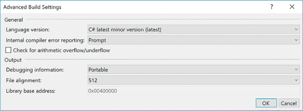

## 第一部分\. C#的背景

当我在大学学习计算机科学时，一位同学纠正了讲师在黑板上写的细节。讲师显得有些不耐烦，回答说：“是的，我知道。我在简化。我在这里掩盖真相是为了展示更大的真相。”虽然我希望我在第一部分中并没有太多地掩盖真相，但它确实关乎更大的真相。

本书的大部分内容都近距离地审视 C#，偶尔将其置于显微镜下以观察最细微的细节。在我们开始这样做之前，第一章将镜头拉远，以查看 C#的历史和 C#在更广泛的计算背景中的位置。

在我提供本书其余部分的主要内容之前，您将看到一些代码作为开胃菜，但在这个阶段细节并不重要。这部分更多地关于 C#的发展理念和主题，以使您处于最佳心态来欣赏这些想法是如何实现的。

让我们出发吧！

## 第一章\. 最敏锐者的生存


**本章涵盖**

+   C#的快速进化如何使开发者更加高效

+   选择 C#的次要版本以使用最新功能

+   能够在更多环境中运行 C#

+   从一个开放和积极参与的社区中受益

+   本书关注旧版和新版 C#版本


选择在这里介绍 C#最有趣的部分是有难度的。有些部分非常迷人但很少使用。其他部分极其重要，但对 C#开发者来说现在已经司空见惯。例如，async/await 这样的功能在很多方面都很出色，但很难简要描述。无需多言，让我们看看 C#随着时间的推移走了多远。

### 1.1\. 一个不断发展的语言

在本书的前几版中，我提供了一个示例，展示了该版所涵盖的语言版本的演变。但这种方式已经不再可行，因为它的阅读体验不再有趣。尽管大型应用程序可能使用几乎所有的新功能，但任何适合印刷页面的单个代码片段可能只会使用其中的一小部分。

相反，在这一节中，我选择了我认为 C#进化中最重要的一些主题，并给出了改进的简要示例。这远非一个详尽无遗的功能列表。这也不是为了教你这些功能；相反，它是对你已知的功能如何改进语言的一个提醒，以及对你可能尚未见过的功能的诱惑。

如果您认为其中一些功能模仿了您熟悉的其他语言，您几乎肯定是对的。C#团队毫不犹豫地从其他语言中汲取伟大的想法，并将它们重塑以在 C#中感到舒适。这是一件好事！F#特别值得提及，它是许多 C#功能的灵感来源。


##### 注意

有可能 F#最大的影响不是它为 F#开发者带来的能力，而是它对 C#的影响。这并不是要低估 F#作为一门语言的价值，或者暗示它不应该直接使用。但当前，C#社区比 F#社区大得多，C#社区对 F#团队表示感激之情，因为 F#启发了 C#团队。


让我们从 C#最重要的一个方面开始：其类型系统。

#### 1.1.1. 大规模和小规模的有用类型系统

C#从一开始就是一种静态类型语言：你的代码指定了变量的类型、参数、方法返回的值等等。你越能精确地指定代码接受和返回的数据形状，编译器就越能帮助你避免错误。

这尤其适用于你构建的应用程序增长时。如果你能在单屏上看到整个程序的所有代码（或者至少一次能将它们全部记在脑海中），静态类型语言的好处就不大了。随着规模的增加，你的代码简洁有效地传达其功能变得越来越重要。你可以通过文档来实现这一点，但静态类型让你能够以机器可读的方式传达信息。

随着 C#的发展，其类型系统允许更精细的描述。最明显的例子是*泛型*。在 C# 1 中，你可能会有这样的代码：

```
public class Bookshelf
{
    public IEnumerable Books { get { ... } }
}
```

`Books`序列中的每个项目是什么类型？类型系统不会告诉你。在 C# 2 中，通过泛型你可以更有效地沟通：

```
public class Bookshelf
{
    public IEnumerable<Book> Books { get { ... } }
}
```

C# 2 也引入了*可空值类型*，从而允许有效地表达信息的缺失，而无需依赖于像集合索引的-1 或日期的`DateTime.MinValue`这样的魔法值。

C# 7 为我们提供了使用`readonly struct`声明来告诉编译器用户定义的结构应该是不可变的能力。这个特性的主要目标可能是提高编译器生成的代码的效率，但它对传达意图也有额外的益处。

C# 8 的计划包括*可空引用类型*，这将允许更多的沟通。到目前为止，语言中没有任何东西让你表达一个引用（无论是作为返回值、参数还是局部变量）可能为 null。如果你不小心，这会导致错误代码；如果你小心，则会导致样板验证代码，这两种情况都不理想。C# 8 将期望任何未明确指定为可空的项都不是可空的。例如，考虑以下方法声明：

```
string Method(string x, string? y)
```

参数类型表明与`x`对应的参数不应该为 null，而与`y`对应的参数可能为 null。返回类型表明该方法不会返回 null。

C# 类型系统的其他更改旨在更小的规模上，并关注一个方法可能如何实现，而不是大型系统中的不同组件如何相互关联。C# 3 引入了 *匿名类型* 和 *隐式类型局部变量* (`var`)。这些有助于解决某些静态类型语言的缺点：冗长。如果你需要在单个方法内使用特定的数据形状，但其他地方不需要，只为该方法创建一个全新的类型就过于冗余了。匿名类型允许以简洁的方式表达这种数据形状，同时不失去静态类型的好处：

```
var book = new { Title = "Lost in the Snow", Author = "Holly Webb" };
string title = book.Title;                                             *1*
string author = book.Author;                                           *1*
```

+   ***1* 名称和类型仍然由编译器检查**

匿名类型主要用于 LINQ 查询，但创建仅用于单个方法的类型的原理并不依赖于 LINQ。

类似地，似乎没有必要显式指定通过调用该类型的构造函数初始化的变量的类型。我知道以下哪种声明我觉得更简洁：

```
Dictionary<string, string> map1 = new Dictionary<string, string>();   *1*

var map2 = new Dictionary<string, string>();                          *2*
```

+   ***1* 显式类型**

+   ***2* 隐式类型**

虽然在处理匿名类型时需要隐式类型，但我发现它在处理常规类型时也越来越有用。区分 *隐式* 类型化和 *动态* 类型化很重要。前面的 `map2` 变量仍然是静态类型化的，但你不必显式编写类型。

匿名类型仅在单个代码块内有所帮助；例如，你不能将它们用作方法参数或返回类型。C# 7 引入了 *元组*：一种有效收集变量的值类型。这些元组的框架支持相对简单，但额外的语言支持允许为元组的元素命名。例如，你可以在前面的匿名类型之外使用以下方式：

```
var book = (title: "Lost in the Snow", author: "Holly Webb");
Console.WriteLine(book.title);
```

在某些情况下，元组可以替代匿名类型，但并非所有情况。它们的其中一个好处是，*可以*用作方法参数和返回类型。目前，我建议将这些保留在程序的内部 API 中，而不是公开暴露，因为元组代表的是值的简单组合，而不是封装它们。这就是为什么我仍然认为它们在实现层面上有助于编写更简单的代码，而不是改进整体程序设计。

我应该提到一个可能在 C# 8 中出现的特性：*记录类型*。我认为这在某种程度上可以被视为命名的匿名类型，至少在其最简单的形式中。它们将提供匿名类型在移除样板代码方面的好处，但允许这些类型获得与常规类相同的行为。请关注这个领域！

#### 1.1.2\. 代码更加简洁

在 C# 的新特性中，一个反复出现的主题一直是让你能够以越来越简洁的方式表达你的想法。类型系统是其中的一部分，正如你通过匿名类型所看到的，但许多其他特性也对此做出了贡献。你可能会听到很多关于这个话题的词汇，尤其是在使用新特性可以移除的内容方面。C# 的特性允许你减少 *仪式感*，移除 *样板代码*，并避免 *冗余*。这只是对同一效果的不同的描述方式。并不是说现在多余的代码有什么错误；它只是分散注意力且不必要的。让我们看看 C# 在这方面的一些演变方式。

##### 构造和初始化

首先，我们将考虑如何创建和初始化对象。委托可能经历了最大的演变，并且是多阶段的。在 C# 1 中，你必须为委托编写一个单独的方法来引用，然后以冗长的方式创建委托本身。例如，在 C# 1 中，你会这样编写代码来订阅一个新的事件处理器到按钮的 `Click` 事件：

```
button.Click += new EventHandler(HandleButtonClick);     *1*
```

+   ***1* C# 1**

C# 2 引入了 *方法组转换* 和 *匿名方法*。如果你想保留 `HandleButtonClick` 方法，方法组转换将允许你将前面的代码更改为以下内容：

```
button.Click += HandleButtonClick;      *1*
```

+   ***1* C# 2**

如果你的点击处理器很简单，你可能根本不想使用单独的方法，而是使用匿名方法：

```
button.Click += delegate { MessageBox.Show("Clicked!"); };     *1*
```

+   ***1* C# 2**

匿名方法还有一个额外的优点，可以作为 *闭包* 使用：它们可以使用创建它们的上下文中的局部变量。然而，在现代 C# 代码中，它们并不常用，因为 C# 3 提供了 *lambda 表达式*，它几乎具有匿名方法的所有优点，但语法更简洁：

```
button.Click += (sender, args) => MessageBox.Show("Clicked!");      *1*
```

+   ***1* C# 3**


##### 注意

在这种情况下，lambda 表达式比匿名方法更长，因为匿名方法使用了 lambda 表达式没有的一个特性：通过不提供参数列表来忽略参数的能力。


我使用事件处理器作为委托的例子，因为在 C# 1 中，委托的主要用途就是作为事件处理器。在 C# 的后续版本中，委托被用于更多样化的场景，尤其是在 LINQ 中。

LINQ 还通过 *对象初始化器* 和 *集合初始化器* 的形式带来了初始化的其他好处。这些允许你在单个表达式中指定要设置在新对象上的属性集或要添加到新集合中的项目。这比描述起来更简单，我将借用 第三章 中的一个示例。考虑你可能之前这样编写的代码：

```
var customer = new Customer();
customer.Name = "Jon";
customer.Address = "UK";
var item1 = new OrderItem();
item1.ItemId = "abcd123";
item1.Quantity = 1;
var item2 = new OrderItem();
item2.ItemId = "fghi456";
item2.Quantity = 2;
var order = new Order();
order.OrderId = "xyz";
order.Customer = customer;
order.Items.Add(item1);
order.Items.Add(item2);
```

C# 3 引入的对象和集合初始化器使这一点更加清晰：

```
var order = new Order
{
    OrderId = "xyz",
    Customer = new Customer { Name = "Jon", Address = "UK" },
    Items =
    {
        new OrderItem { ItemId = "abcd123", Quantity = 1 },
        new OrderItem { ItemId = "fghi456", Quantity = 2 }
    }
};
```

我不建议详细阅读这两个示例；重要的是第二种形式比第一种形式的简单性。

##### 方法和属性声明

简化的最明显例子之一是通过**自动实现属性**。这些属性最初在 C# 3 中引入，但在后续版本中得到了进一步改进。考虑一个在 C# 1 中可能这样实现的属性：

```
private string name;
public string Name
{
    get { return name; }
    set { name = value; }
}
```

自动实现属性允许将其写为单行：

```
public string Name { get; set; }
```

此外，C# 6 引入了**表达式主体成员**，这减少了更多的仪式。假设您正在编写一个包装现有字符串集合的类，并且您希望有效地将您类的 `Count` 和 `GetEnumerator()` 成员委托给该集合。在 C# 6 之前，您可能需要编写如下内容：

```
public int Count { get { return list.Count; } }

public IEnumerator<string> GetEnumerator()
{
    return list.GetEnumerator();
}
```

这是一个仪式的强烈例子：语言曾经要求的大量语法，而好处却很少。在 C# 6 中，这变得更加简洁。使用 `=>` 语法（已经被 lambda 表达式使用）来指示表达式主体成员：

```
public int Count => list.Count;

public IEnumerator<string> GetEnumerator() => list.GetEnumerator();
```

虽然使用表达式主体成员的价值是个人和主观的，但我对它们对我的代码可读性带来的影响感到惊讶。我爱它们！另一个我没有预料到会像现在这样频繁使用的功能是字符串插值，这是 C# 中与字符串相关的改进之一。

##### 字符串处理

C# 中的字符串处理经历了三项重大改进：

+   C# 5 引入了**调用者信息属性**，包括编译器自动将方法和文件名作为参数值填充的能力。这对于诊断目的非常有用，无论是永久性日志记录还是更临时的测试。

+   C# 6 引入了 `nameof` 操作符，它允许变量、类型、方法和其他成员以重构友好的形式表示。

+   C# 6 也引入了**插值字符串字面量**。这不是一个新概念，但它使得使用动态值构造字符串变得更加简单。

为了简洁起见，我将仅演示最后一点。构造包含变量、属性、方法调用结果等字符串的情况相当常见。这可能是用于日志记录目的、面向用户的错误消息（如果不需要本地化），异常消息等。

这里有一个来自我的 Noda Time 项目的例子。用户可以尝试通过其 ID 查找一个日历系统，如果该 ID 不存在，代码将抛出 `KeyNotFoundException`。在 C# 6 之前，代码可能看起来像这样：

```
throw new KeyNotFoundException(
    "No calendar system for ID "  + id + " exists");
```

使用显式字符串格式化，它看起来像这样：

```
throw new KeyNotFoundException(
    string.Format("No calendar system for ID {0} exists", id));
```


##### 注意

有关 Noda Time 的信息，请参阅第 1.4.2 节。您不需要了解它就能理解这个示例。


在 C# 6 中，通过插值字符串字面量直接包含 `id` 的值，代码变得更加简洁：

```
throw new KeyNotFoundException($"No calendar system for ID {id} exists");
```

这看起来可能不是什么大问题，但我现在真的很讨厌没有字符串插值工作。

这些只是帮助提高代码信号与噪声比的最显著特性。我本可以展示 C# 6 中的 `using static` 指令和空条件运算符，以及 C# 7 中的模式匹配、解构和 out 变量。而不是将本章扩展到提及每个版本中的每个特性，让我们继续到一个比进化更革命性的特性：LINQ。

#### 1.1.3\. 使用 LINQ 进行简单数据访问

如果你询问 C# 开发者他们喜欢 C# 的哪些地方，他们很可能会提到 LINQ。你已经看到了一些构建 LINQ 的特性，但最激进的特性是查询表达式。考虑以下代码：

```
var offers =
    from product in db.Products
    where product.SalePrice <= product.Price / 2
    orderby product.SalePrice
    select new {
        product.Id, product.Description,
        product.SalePrice, product.Price
    };
```

这看起来与传统的 C# 完全不同。想象一下回到 2007 年，向一个使用 C# 2 的开发者展示这段代码，并解释说这具有编译时检查和 IntelliSense 支持，并且可以高效地执行数据库查询。哦，你还可以使用相同的语法来处理常规集合。

通过 *表达式树* 提供了对进程外数据的查询支持。这些表示代码为数据，LINQ 提供商可以分析代码将其转换为 SQL 或其他查询语言。尽管这非常酷，但我自己很少使用它，因为我很少与 SQL 数据库打交道。不过，我确实处理内存中的集合，并且我经常使用 LINQ，无论是通过查询表达式还是使用 lambda 表达式的方法调用。

LINQ 不仅为 C# 开发者提供了新的工具；它还鼓励我们以函数式编程为基础，以新的方式思考数据转换。这不仅仅影响数据访问。LINQ 提供了初步的动力去接受更多的函数式思想，但许多 C# 开发者已经接受了这些思想并将它们进一步发展。

C# 4 在动态类型方面进行了激进的变化，但我认为这并没有影响到像 LINQ 那样多的开发者。然后 C# 5 出现了，再次改变了游戏规则，这次是关于异步的。

#### 1.1.4\. 异步

异步编程在主流语言中一直是个难题。一些从一开始就考虑异步的语言已经创建出来，而一些函数式语言则使它相对容易，因为它们可以很好地处理它。但 C# 5 通过通常称为 *async/await* 的特性，为主流语言中的异步编程带来了新的清晰度。这个特性包括围绕异步方法的两个互补部分：

+   异步方法无需开发者做任何努力就能产生表示异步操作的结果。这个结果类型通常是 `Task` 或 `Task<T>`。

+   异步方法使用 await 表达式来消费异步操作。如果方法尝试等待尚未完成的操作，方法将异步暂停，直到操作完成然后继续。


##### 注意

更确切地说，我可以把这些称为异步 *函数*，因为匿名方法和 lambda 表达式也可以是异步的。


*异步操作*和*异步暂停*的确切含义是事情变得复杂的地方，我现在不会尝试解释这一点。但结果是，你可以编写看起来主要像你更熟悉的同步代码的异步代码。它甚至以自然的方式允许并发。作为一个例子，考虑这个可能从 Windows Forms 事件处理器调用的异步方法：

```
private async Task UpdateStatus()
{
    Task<Weather> weatherTask = GetWeatherAsync();        *1*
    Task<EmailStatus> emailTask = GetEmailStatusAsync();  *1*
    Weather weather = await weatherTask;                  *2*
    EmailStatus email = await emailTask;                  *2*

    weatherLabel.Text = weather.Description;              *3*
    inboxLabel.Text = email.InboxCount.ToString();        *3*
}
```

+   ***1* 同时启动两个操作**

+   ***2* 异步等待它们完成**

+   ***3* 更新用户界面**

除了同时启动两个操作并等待它们的结果之外，这还展示了 async/await 如何了解同步上下文。你正在更新用户界面，这只能在 UI 线程中完成，尽管也在启动和等待长时间运行的操作。在 async/await 之前，这将会很复杂且容易出错。

我不声称 async/await 是异步问题的银弹。它并不能神奇地消除随之而来的所有复杂性。相反，它通过移除之前所需的大量样板代码，让你能够专注于异步固有的困难方面。

你迄今为止看到的所有功能都是为了使代码更简单。我想提到的最后一个方面略有不同。

#### 1.1.5\. 平衡效率和复杂性

我记得我第一次接触 Java 的经历；它完全是解释执行的，速度慢得令人痛苦。过了一段时间，可选的即时编译器（JIT）变得可用，最终几乎可以想当然地认为任何 Java 实现都会进行 JIT 编译。

让 Java 表现良好需要付出很多努力。如果这种语言失败了，这种努力就不会发生。但开发者看到了潜力，并且已经感觉比以前更有效率。开发速度和交付速度往往比应用程序速度更重要。

C#处于一个稍微不同的位置。公共语言运行时（CLR）从一开始就相当高效。语言对与本地代码轻松互操作以及性能敏感的不安全代码的支持也有帮助。C#的性能随着时间的推移持续改进。（我带着一丝苦笑指出，微软现在正在广泛引入分层 JIT 编译，就像 Java HotSpot JIT 编译器一样。）

但不同的工作负载有不同的性能需求。正如你将在第 1.2 节中看到的那样，C#现在被用于各种令人惊讶的平台，包括游戏和微服务，这两者都可能对性能有很高的要求。

异步有助于在某些情况下提高性能，但 C# 7 是最明显关注性能的发布。只读结构和更大的`ref`特性表面面积有助于避免冗余复制。现代框架中存在的`Span<T>`特性，以及由类似 ref 的结构类型支持的特性，有助于减少不必要的分配和垃圾回收。显然，希望当这些技术被谨慎使用时，它们将满足特定开发者的需求。

我对这些特性有一丝不安的感觉，因为它们对我来说仍然感觉复杂。我无法像对常规值参数那样清晰地推理使用`in`参数的方法，并且我相信在适应我可以和不能使用 ref 局部变量和 ref 返回值之前，还需要一段时间。

我希望这些特性能够适度使用。它们会在有利的情境中简化代码，无疑会受到维护这些代码的开发者的欢迎。我期待在个人项目中尝试这些特性，并更加适应性能提升和代码复杂度之间的平衡。

我不想过于强调这个警告。我怀疑 C#团队在包含新特性时做出了正确的选择，无论我在工作中使用它们的频率高低。我只是想指出，你不必仅仅因为某个特性存在就使用它。做出选择加入复杂性的决定应该是经过深思熟虑的。说到选择加入，C# 7 带来了一个新的元特性：自 C# 1 以来首次使用次要版本号。

#### 1.1.6. 快速演变：使用次要版本

C#的版本号集合是奇怪的，而且由于许多开发者可能会在框架和语言之间产生混淆，这使得问题更加复杂。（例如，没有 C# 3.5。.NET Framework 3.0 与 C# 2 一起发布，.NET 3.5 与 C# 3 一起发布。）C# 1 有两个发布版本：C# 1.0 和 C# 1.2。在 C# 2 和 C# 6（包括）之间，只有通常由 Visual Studio 新版本支持的次要版本。

C# 7 打破了这一趋势：有 C# 7.0、C# 7.1、C# 7.2 和 C# 7.3 的发布，这些版本都在 Visual Studio 2017 中可用。我认为这种模式在 C# 8 中很可能继续。目标是允许新特性快速地根据用户反馈进行演变。C# 7.1–7.3 的大多数特性都是对 C# 7.0 中引入特性的调整或扩展。

语言特性的波动可能会让人感到不安，尤其是在大型组织中。许多基础设施可能需要改变或升级，以确保新语言版本得到全面支持。许多开发者可能以不同的速度学习和采用新特性。如果其他什么都没有，那么语言比你习惯的更频繁地改变可能会让人感到有些不舒服。

因此，C# 编译器默认使用它支持的最新主要版本的最早次版本。如果你使用 C# 7 编译器并且没有指定任何语言版本，它将默认限制你使用 C# 7.0。如果你想使用更晚的次版本，你需要在项目文件中指定它并选择新功能。你可以通过两种方式来做这件事，尽管它们的效果相同。你可以直接编辑你的项目文件，在 `<PropertyGroup>` 中添加一个 `<LangVersion>` 元素，如下所示：

```
<PropertyGroup>
  ...                                  *1*
  <LangVersion>latest</LangVersion>    *2*
</PropertyGroup>
```

+   ***1* 其他属性**

+   ***2* 指定项目的语言版本**

如果你不喜欢直接编辑项目文件，你可以转到 Visual Studio 中的项目属性，选择“生成”选项卡，然后单击右下角的“高级”按钮。将打开高级生成设置对话框，如图 1.1 所示，允许你选择希望使用的语言版本和其他选项。

##### 图 1.1\. Visual Studio 中的语言版本设置



对话框中的此选项并非新功能，但现在你更有可能想要使用它，比之前的版本更频繁。你可以选择以下值：

+   *默认*—最新主要版本的第一个发布版本

+   *最新版*—最新版本

+   *特定版本号*—例如，7.0 或 7.3

这不会改变你运行的编译器的版本；它改变的是你可以使用的语言功能集。如果你尝试使用在你目标版本中不可用的功能，编译器错误信息通常会解释需要哪个版本才能使用该功能。如果你尝试使用编译器完全不了解的语言功能（例如，使用 C# 7 功能与 C# 6 编译器），错误信息通常不太明确。

C# 作为一种语言，自从其首次发布以来已经走得很远了。那么它所运行的平台呢？

### 1.2\. 一个不断发展的平台

近年来，.NET 开发者感到非常兴奋。同时，也存在一定程度的挫折感，因为微软和 .NET 社区都在逐步接受更加开放的开发模式的影响。但这么多人的辛勤工作所带来的整体成果是显著的。

多年来，运行 C# 代码几乎总是意味着在 Windows 上运行。这通常意味着一个用 Windows Forms 或 Windows Presentation Foundation (WPF) 编写的客户端应用程序，或者一个用 ASP.NET 编写的服务器端应用程序，可能运行在 Internet Information Server (IIS) 后面。其他选项已经存在很长时间了，特别是 Mono 项目有着丰富的历史，但 .NET 开发的主流仍然是在 Windows 上。

当我在 2018 年 6 月写下这些内容时，.NET 世界已经非常不同。最显著的发展是 .NET Core，这是一个可移植且开源的运行时和框架，由微软在多个操作系统上全面支持，并具有简化的开发工具。仅在几年前，这还是不可想象的。再加上一个可移植且开源的 IDE，即 Visual Studio Code，你将得到一个繁荣的 .NET 生态系统，开发者们在各种本地平台上工作，然后将它们部署到各种服务器平台上。

过分关注 .NET Core 并忽视 C# 当今运行的其他许多方式将会是一个错误。Xamarin 提供了丰富的多平台移动体验。其 GUI 框架（Xamarin Forms）允许开发者创建在不同设备上相当统一但也能利用底层平台的用户界面。

Unity 是世界上最受欢迎的游戏开发平台之一。它拥有定制的 Mono 运行时和即时编译，可以为习惯于更传统运行时环境的 C# 开发者提供挑战。但对于许多开发者来说，这可能是他们第一次，也许也是他们唯一一次使用这种语言的经验。

这些广泛采用的平台远非唯一使用 C# 的平台。我最近一直在使用 Try .NET 和 Blazor 进行不同形式的浏览器/C# 交互。

尝试 .NET 允许用户在浏览器中编写代码，具有自动完成功能，然后构建并运行该代码。这对于用尽可能低的门槛进行 C# 实验来说非常棒。

Blazor 是一个可以在浏览器中直接运行 Razor 页面的平台。这些页面不是由服务器渲染并在浏览器中显示的；用户界面代码是在浏览器中运行的，使用的是将 Mono 运行时转换为 Web-Assembly 的版本。几年前，整个运行时通过浏览器中的 JavaScript 引擎执行中间语言 (IL)，不仅在全功能计算机上，而且在手机上，这个想法在我看来是荒谬的。我很高兴其他开发者有更多的想象力。在这个领域的大部分创新都得益于比以往任何时候都更加协作和开放的社区。

### 1.3. 一个不断发展的社区

我从 C# 1.0 时代就参与了 C# 社区，我从未见过它像今天这样充满活力。当我开始使用 C# 时，它被视为一种“企业”编程语言，而且相对较少有乐趣和探索的感觉。¹ 在这种背景下，与 Java（也被视为一种企业语言）相比，开源的 C# 生态系统增长相当缓慢。在 C# 3 时代，alt.NET 社区正在超越 .NET 开发的主流，这在某些意义上被视为与微软对抗。

> ¹
> 
> 请不要误解；这是一个令人愉快的社区，而且一直有人为了乐趣而尝试 C#。

2010 年，NuGet（最初为 NuPack）包管理器被推出，这使得生产和使用类库（无论是商业的还是开源的）变得更加容易。尽管下载 zip 文件、将 DLL 复制到适当的位置，然后添加引用似乎并不特别重要，但每一个摩擦点都可能让开发者望而却步。

| |
| --- |

##### 注意

除了 NuGet 之外，其他包管理器早在之前就已经开发出来，由 Sebastien Lambla 开发的 OpenWrap 项目尤其有影响力。

| |
| --- |

快进到 2014 年，微软宣布其 Roslyn 编译器平台将成为新的.NET 基金会的开源项目。随后宣布了.NET Core，最初代号为 Project K；DXN 随后出现，然后是现在发布和稳定的.NET Core 工具集。接着是 ASP.NET Core。还有 Entity Framework Core。还有 Visual Studio Code。真正在 GitHub 上生存和发展的产品名单还在继续。

技术很重要，但微软对开源的新拥抱对于健康社区同样至关重要。第三方开源包蓬勃发展，包括对 Roslyn 的创新使用和.NET Core 工具集内的集成，这些都感觉恰到好处。

所有这些都不是在真空中发生的。云计算的兴起使得.NET Core 比其他情况下对.NET 生态系统更加重要；对 Linux 的支持不是可选项。但由于.NET Core 的可用性，现在将 ASP.NET Core 服务打包到 Docker 镜像中、使用 Kubernetes 部署，并将其用作一个可能涉及多种语言的大型应用程序的一部分，已经不再特殊。许多社区之间优秀思想的交叉融合一直存在，但现在比以往任何时候都要强烈。

你可以在浏览器中学习 C#。你可以在任何地方运行 C#。你可以在 Stack Overflow 和其他众多网站上询问有关 C#的问题。你可以在 C#团队的 GitHub 仓库中参与关于语言未来的讨论。它并不完美；我们仍然需要共同努力，以便让 C#社区尽可能对每个人开放，但我们已经处于一个非常好的位置。

我希望认为*C#深入理解*在 C#社区中也有自己的一席之地。这本书是如何演变的？

### 1.4. 一本不断演变的书

你正在阅读*C#深入理解*的第四版。尽管这本书的演变速度没有语言、平台或社区快，但它也发生了变化。本节将帮助你了解这本书涵盖了哪些内容。

#### 1.4.1. 混合级别覆盖

《C# 深入》的第一版于 2008 年 4 月出版，这恰好是我加入谷歌的时间。当时，我知道很多开发者对 C# 1 比较熟悉，但他们边走边学 C# 2 和 C# 3，并没有牢固地掌握所有部分是如何结合在一起的。我旨在通过深入语言来填补这一空白，帮助读者不仅理解每个特性做了什么，还理解为什么是这样设计的。

随着时间的推移，开发者的需求会发生变化。在我看来，社区似乎通过渗透作用几乎自然而然地吸收了对语言的更深入理解，至少对于早期版本来说是这样。对语言的深入理解不会是每个人的普遍体验，但对于第四版来说，我希望重点放在新版本上。我仍然认为理解语言版本的演变是有用的，但不需要查看 C# 2–4 中每个特性的每一个细节。


##### 注意

逐个版本地查看语言并不是从头学习语言的最佳方式，但如果你想深入理解它，这很有用。我不会用同样的结构来为 C# 初学者写一本书。


我也不喜欢厚重的书籍。我不想让《C# 深入》显得令人畏惧、难以把握或难以书写。仅仅为了涵盖 C# 2–4 的 400 页内容似乎并不合适。因此，我对这些版本的内容进行了压缩。每个特性都被提及，我在认为合适的地方进行了详细说明，但深度不如第三版。你可以使用第四版的内容来回顾你已经了解的主题，并帮助你确定在第三版中想要了解更多信息的话题。你可以在 [www.manning.com/books/c-sharp-in-depth-fourth-edition](http://www.manning.com/books/c-sharp-in-depth-fourth-edition) 找到访问第三版电子版链接。本版详细介绍了语言 5–7 版本。异步仍然是一个难以理解的话题，第三版显然完全没有涵盖 C# 6 或 7。

写作，就像软件工程一样，通常是一种平衡的艺术。我希望我在细节和简洁之间找到的平衡能对你有所帮助。


##### 小贴士

如果你拥有这本书的实体副本，我强烈建议你在上面做笔记。记录下你不同意的地方或特别有用的部分。这样做将加强你在记忆中的内容，而笔记将在以后作为提醒。


#### 1.4.2\. 使用 Noda Time 的示例

我在书中提供的多数示例都是独立的。但为了更有效地说明某些特性，能够指出我在生产代码中使用它们的地方是有用的。大多数情况下，我会使用 Noda Time 来做这件事。

Noda Time 是一个我在 2009 年开始的开源项目，旨在为.NET 提供更好的日期和时间库。尽管如此，它还有一个次要目的：它是我一个很好的沙盒项目。它帮助我磨练 API 设计技能，了解更多关于性能和基准测试的知识，并测试新的 C#功能。当然，这一切都不会破坏用户的使用。

每一个 C#的新版本都引入了我在 Noda Time 中能够使用的功能，因此我认为在本书中使用这些功能作为具体示例是有意义的。所有代码都可在 GitHub 上找到，这意味着你可以克隆它并亲自实验。在示例中使用 Noda Time 的目的并不是为了说服你使用这个库，但如果这成为了一个副作用，我也不会抱怨。

在本书的其余部分，我将假设当提到 Noda Time 时，你知道我在说什么。为了使其适合示例，其重要方面如下：

+   代码需要尽可能易于阅读。如果语言特性允许我为了可读性而重构，我会抓住这个机会。

+   Noda Time 遵循语义版本控制，并且新的大版本发布很少。我关注新语言特性的向后兼容性方面。

+   我没有具体的性能目标，因为 Noda Time 可以在许多具有不同要求的上下文中使用。我确实关注性能，并且会接受那些提高效率的功能，只要它们不会使代码变得过于复杂。

要了解更多关于该项目及其源代码的信息，请访问[`nodatime.org`](https://nodatime.org)或[`github.com/nodatime/nodatime`](https://github.com/nodatime/nodatime)。

#### 1.4.3. 术语选择

我尽量在书中尽可能接近官方 C#术语，但有时我会让清晰度优先于精确度。例如，在撰写关于异步性的内容时，我经常提到*异步方法*，尽管相同的信息也适用于异步匿名函数。同样，对象初始化器适用于可访问字段以及属性，但只需提及一次并在此后的解释中仅提及属性会更简单。

有时规范中的术语在更广泛的社区中很少使用。例如，规范中有“函数成员”的概念。这是一个方法、属性、事件、索引器、用户定义的操作符、实例构造函数、静态构造函数或终结器。这是一个可以包含可执行代码的类型成员的术语，当描述语言特性时很有用。当你查看自己的代码时，它几乎没什么用，这就是为什么你可能从未听说过它。我尽量少用这样的术语，但我的观点是，为了更接近语言，了解它们是有价值的。

最后，一些概念没有官方的术语，但仍然可以用简短的形式来引用。我可能最常使用的是*不可言说的名称*。这个术语是由埃里克·利珀特提出的，指的是编译器生成的标识符，用于实现迭代块或 lambda 表达式等功能。[2]) 这个标识符在 CLR 中是有效的，但在 C#中不是，它是一个在语言内部不能“说出”的名字，因此可以保证不会与你的代码冲突。

> ²
> 
> 我们认为这应该是埃里克。埃里克不确定，但认为 Anders Hejlsberg 可能是第一个提出这个术语的人。不过，我总是将这个术语与埃里克联系在一起，以及他对异常的分类：致命的、愚蠢的、令人烦恼的或外生的。

### 摘要

我喜欢 C#。它既舒适又令人兴奋，我也喜欢看到它未来的发展方向。我希望这一章已经将其中的一些兴奋传递给了你。但这仅仅是一个尝试。让我们不再拖延，直接进入这本书的真正内容。
