## 第二部分。C# 2–5

本书这部分内容涵盖了从 C# 2（随 Visual Studio 2005 发布）到 C# 5（随 Visual Studio 2012 发布）之间引入的所有功能。这正是本书第三版全部内容所涵盖的功能集。其中许多现在感觉就像古老的历史；例如，我们简单地认为 C#包含了泛型。

这是对 C#来说一个非常富有成效的时期。我在这部分内容中将要介绍的一些功能包括泛型、可空值类型、匿名方法、方法组转换、迭代器、部分类型、静态类、自动实现属性、隐式类型局部变量、隐式类型数组、对象初始化器、集合初始化器、匿名类型、Lambda 表达式、扩展方法、查询表达式、动态类型、可选参数、命名参数、COM 改进、泛型协变和逆变、async/await 以及调用者信息属性。哇！

我预计你们中的大多数人至少对大多数功能有些熟悉，所以我在这部分内容中会快速展开。同样，为了合理地简短，我没有像第三版那样详细地介绍。目的是覆盖各种读者的需求：

+   介绍您在过程中可能错过的功能

+   提醒您曾经了解但已遗忘的功能

+   解释功能背后的原因：为什么它们被引入以及为什么它们被设计成这样的方式

+   如果您知道您想做什么但忘记了某些语法，这是一个快速参考

如果您需要更多细节，请参阅第三版。作为提醒，购买第四版您将有权获得第三版的电子书副本。

这里有一个例外：我完全重写了关于 async/await 的介绍，这是 C# 5 中最大的功能。第五章涵盖了您使用 async/await 所需了解的内容，而第六章则讨论了它在幕后是如何实现的。如果您对 async/await 是新手，您几乎肯定会在阅读第六章之前先使用一下它，即使那样，您也不应该期望它是一个简单的阅读。我已经尽力以尽可能易于理解的方式解释事物，但这个主题本质上很复杂。我确实鼓励您尝试；在深度理解 async/await 之后，即使您永远不需要深入研究编译器为您自己的代码生成的 IL，这也能帮助您在使用该功能时增强信心。好消息是，在第六章之后，您会发现第七章带来了一丝轻松。这是书中最短的一章，也是探索 C# 6 之前恢复的机会。

在所有介绍都完成之后，准备好迎接功能的大潮。

## 第二章。C# 2

| |
| --- |

**本章涵盖**

+   使用泛型类型和方法编写灵活、安全的代码

+   使用可空值类型表达信息缺失

+   相对容易地构建代表

+   无需编写样板代码即可实现迭代器


如果你的 C# 经验足够久远，这一章将提醒我们我们已经走了多远，并促使我们感激一个专注且聪明的语言设计团队。如果你从未使用泛型编写过 C#，你可能会想知道 C# 没有这些功能是如何起飞的。¹] 无论哪种情况，你仍然可能会在这里找到你之前不知道的功能或从未考虑过的细节。

> ¹
> 
> 对于我来说，这个问题的答案很简单：C# 1 对于许多开发者来说比当时的 Java 更有效率。

自从 C# 2（与 Visual Studio 2005 一起发布）发布以来已经超过 10 年了，因此很难对后视镜中的功能感到兴奋。你不应该低估它在当时的重要性。它也是一个痛苦的过程：从 C# 1 和 .NET 1.x 升级到 C# 2 和 .NET 2.0 花了很长时间才在业界推广。随后的演变要快得多。C# 2 的第一个特性是几乎所有开发者都认为最重要的特性：泛型。

### 2.1\. 泛型

泛型允许你编写通用代码，在编译时使用相同的类型在多个地方进行类型安全，而不必事先知道该类型是什么。当泛型最初引入时，它们的主要用途是集合，但在现代 C# 代码中，它们无处不在。它们可能最常用于以下方面：

+   集合（它们在集合中的用途和以前一样有用）

+   代表们，尤其是在 LINQ 中

+   异步代码，其中 `Task<T>` 是类型为 `T` 的未来值的承诺

+   可空值类型，我将在第 2.2 节中详细介绍

这并不是它们有用性的极限，但即使这四个要点也意味着 C# 程序员每天都在使用泛型。集合提供了解释泛型优势的最简单方式，因为你可以查看 .NET 1 中的集合，并将它们与 .NET 2 中的泛型集合进行比较。

#### 2.1.1\. 以示例为例：泛型之前的集合

.NET 1 有三种主要的集合类型：

+   *数组*—这些具有直接的语言和运行时支持。大小在初始化时固定。

+   *基于对象的集合*—值（以及相关的键）通过 `System.Object` 在 API 中描述。它们没有特定的集合语言或运行时支持，尽管可以使用诸如索引器和 `foreach` 语句之类的语言功能。`ArrayList` 和 `Hashtable` 是最常用的例子。

+   **专用集合**——值在 API 中用特定类型描述，并且集合只能用于该类型。例如，`StringCollection` 是一个字符串集合；它的 API 看起来像 `ArrayList`，但使用 `String` 而不是 `Object` 来引用值。

数组和专用集合是 **静态类型**，我的意思是 API 阻止你将错误类型的值放入集合中，当你从集合中获取值时，你不需要将结果转换回你期望的类型。


##### 注意

引用类型数组在存储值时由于数组协变而 **大部分是安全的**。我认为数组协变是一个早期的设计错误，超出了本书的范围。Eric Lippert 在他的关于协变和逆变的博客帖子系列中讨论了这一点，请参阅 [`mng.bz/gYPv`](http://mng.bz/gYPv)。


让我们具体分析一下：假设你想要在一个方法（`GenerateNames`）中创建一个字符串集合，并在另一个方法（`PrintNames`）中打印这些字符串。你将考虑三种保持名字集合的方法——数组、`ArrayList` 和 `StringCollection`——并权衡每种方法的优缺点。每种情况下的代码看起来都很相似（尤其是对于 `PrintNames`），但请耐心等待。我们将从数组开始。

##### 列表 2.1\. 使用数组生成和打印名字

```
static string[] GenerateNames()
{
    string[] names = new string[4];      *1*
    names[0] = "Gamma";
    names[1] = "Vlissides";
    names[2] = "Johnson";
    names[3] = "Helm";
    return names;
}

static void PrintNames(string[] names)
{
    foreach (string name in names)
    {
        Console.WriteLine(name);
    }
}
```

+   ***1* 数组的大小需要在创建时已知**

我在这里没有使用数组初始化器，因为我想模拟只发现一个名字的情况，比如从文件中读取它们。请注意，你一开始就需要分配正确的数组大小。如果你真的从文件中读取，你可能需要在开始之前找出有多少个名字，或者你可能需要编写更复杂的代码。例如，你可以一开始分配一个数组，如果第一个数组满了，就复制内容到一个更大的数组，依此类推。如果你最终得到的数组比确切的名字数量大，你可能还需要考虑创建一个正好大小的最终数组。

用来跟踪我们集合大小、重新分配数组等的代码是重复的，可以被封装在一种类型中。实际上，这正是 `ArrayList` 所做的。

##### 列表 2.2\. 使用 `ArrayList` 生成和打印名字

```
static ArrayList GenerateNames()
{
    ArrayList names = new ArrayList();
    names.Add("Gamma");
    names.Add("Vlissides");
    names.Add("Johnson");
    names.Add("Helm");
    return names;
}
static void PrintNames(ArrayList names)
{
    foreach (string name in names)       *1*
    {
        Console.WriteLine(name);
    }
}
```

+   ***1* 如果 ArrayList 包含非字符串会发生什么？**

在我们的 `GenerateNames` 方法中，这样做更简洁：在开始向集合添加内容之前，你不需要知道你有多少个名字。但同样，也没有什么可以阻止你向集合中添加非字符串；`ArrayList.Add` 参数的类型只是 `Object`。

此外，尽管 `PrintNames` 方法在类型方面看起来很安全，但实际上并不安全。集合可以包含任何类型的对象引用。如果你向集合中添加了一个完全不同的类型（例如一个 `WebRequest`，作为一个奇怪的例子），然后尝试打印它，你会期望发生什么？由于 `name` 变量的类型，`foreach` 循环隐藏了一个隐式转换，从 `object` 转换为 `string`。这种转换可能会以正常的方式失败，抛出 `InvalidCastException`。因此，你解决了一个问题，但引发了另一个。有什么东西可以解决这两个问题？

##### 列表 2.3. 使用 `StringCollection` 生成和打印名称

```
static StringCollection GenerateNames()
{
    StringCollection names = new StringCollection();
    names.Add("Gamma");
    names.Add("Vlissides");
    names.Add("Johnson");
    names.Add("Helm");
    return names;
}

static void PrintNames(StringCollection names)
{
    foreach (string name in names)
    {
        Console.WriteLine(name);
    }
}
```

列表 2.3 与 列表 2.2 完全相同，只是将所有 `ArrayList` 替换为 `StringCollection`。这就是 `StringCollection` 的全部意义：它应该感觉像是一个令人愉快的通用集合，但仅限于处理字符串。`StringCollection.Add` 的参数类型是 `String`，因此你不能通过我们代码中的某个奇怪错误将其添加一个 `WebRequest`。结果是，当你打印名称时，你可以确信 `foreach` 循环不会遇到任何非字符串引用。（当然，你仍然可能看到空引用。） 

如果你总是只需要字符串，那当然很好。但如果你需要其他类型的集合，你必须要么希望框架中已经存在一个合适的集合类型，要么自己编写一个。这是一个如此常见的任务，以至于有一个 `System.Collections.CollectionBase` 抽象类来使工作不那么重复。还有代码生成器来避免手动编写所有内容。

这解决了之前解决方案中的两个问题，但所有这些额外类型的成本实在太高了。在代码生成器更改时，保持它们更新需要维护成本。在编译时间、程序集大小、JIT 编译时间和保持代码在内存中等方面存在效率成本。最重要的是，跟踪所有可用的集合类需要人力成本。

即使这些成本并不太高，你也会错过编写一种可以在静态类型方式下适用于任何集合类型的方法的能力，可能还会使用集合的元素类型作为另一个参数或返回类型。例如，假设你想编写一个方法来将集合的前 *N* 个元素复制到一个新的集合中，然后返回。你可以编写一个返回 `ArrayList` 的方法，但这会失去静态类型的好处。如果你传入一个 `StringCollection`，你希望返回一个 `StringCollection`。字符串方面是方法输入的一部分，然后需要将其传播到输出。在使用 C# 时，你无法表达这一点。1. 进入泛型时代。

#### 2.1.2. 泛型拯救了世界

让我们直接解决我们的 `GenerateNames`/`PrintNames` 代码的解决方案，并使用 `List<T>` 泛型类型。`List<T>` 是一个集合，其中 `T` 是集合的元素类型——在我们的例子中是 `string`。您可以在任何地方用 `List<string>` 替换 `StringCollection`。^([2])

> ²
> 
> 我故意不讨论使用接口作为返回类型和参数的可能性。这是一个有趣的话题，但我不想让您从泛型中分心。

##### 列表 2.4\. 使用 `List<T>` 生成和打印名称

```
static List<string> GenerateNames()
{
    List<string> names = new List<string>();
    names.Add("Gamma");
    names.Add("Vlissides");
    names.Add("Johnson");
    names.Add("Helm");
    return names;
}

static void PrintNames(List<string> names)
{
    foreach (string name in names)
    {
        Console.WriteLine(name);
    }
}
```

`List<T>` 解决了我们之前讨论的所有问题：

+   与数组不同，您不需要事先知道集合的大小。

+   暴露的 API 在需要引用元素类型的地方都使用 `T`，因此您知道 `List<string>` 将只包含字符串引用。如果您尝试添加其他任何东西，将会得到编译时错误，这与 `ArrayList` 不同。

+   您可以使用任何元素类型，而无需担心生成代码和管理结果，这与 `StringCollection` 和类似类型不同。

泛型还解决了将元素类型作为方法输入表达的问题。要更深入地探讨这个方面，您需要更多的术语。

##### 类型参数和类型参数

术语 *参数* 和 *参数* 在 C# 中的泛型出现之前就已经存在，并且在其他语言中使用了几十年。一个方法声明其输入为参数，它们以参数的形式由调用代码提供。图 2.1 展示了这两个术语是如何相互关联的。

##### 图 2.1\. 方法参数和参数之间的关系

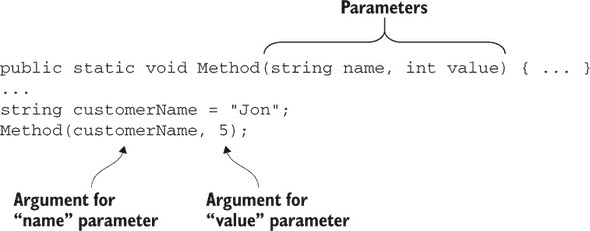

参数的值用作方法内部参数的初始值。在泛型中，您有 *类型参数* 和 *类型参数*，这是相同的概念，但应用于类型。泛型类型或方法的声明包括在名称之后使用尖括号声明的类型参数。在声明的主体内部，代码可以使用类型参数作为正常类型（只是它对它了解不多）。

使用泛型类型或方法的代码随后在名称之后也指定了类型参数。图 2.2 展示了在 `List<T>` 上下文中这种关系。

##### 图 2.2\. 类型参数和类型参数之间的关系

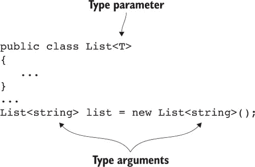

现在想象一下 `List<T>` 的完整 API：所有的方法签名、属性等等。如果您使用图中的 `list` 变量，API 中的任何 `T` 都将变为 `string`。例如，`List<T>` 中的 `Add` 方法具有以下签名：

```
public void Add(T item)
```

但如果您在 Visual Studio 中输入 `list.Add(`，IntelliSense 将会提示您，好像 `item` 参数已经被声明为 `string` 类型。如果您尝试传递其他类型的参数，将会导致编译时错误。

虽然 图 2.2 指的是泛型类，但方法也可以是泛型的。方法声明类型参数，并且这些类型参数可以在方法签名的其他部分中使用。方法类型参数通常用作签名中其他类型的类型参数。以下列表显示了之前无法实现的方法的解决方案：创建一个包含现有集合中前 *N* 个元素的新集合，但以静态类型的方式。

##### 列表 2.5\. 将元素从一个集合复制到另一个集合

```
public static List<T> CopyAtMost<T>(                         *1*
 List<T> input, int maxElements)                          *1*
{
    int actualCount = Math.Min(input.Count, maxElements);
 List<T> ret = new List<T>(actualCount);                  *2*
    for (int i = 0; i < actualCount; i++)
    {
        ret.Add(input[i]);
    }
    return ret;
}

static void Main()
{
    List<int> numbers = new List<int>();
    numbers.Add(5);
    numbers.Add(10);
    numbers.Add(20);

    List<int> firstTwo = CopyAtMost<int>(numbers, 2);        *3*
    Console.WriteLine(firstTwo.Count);
}
```

+   ***1* 方法声明一个类型参数 T 并在参数和返回类型中使用它。**

+   ***2* 在方法体中使用类型参数**

+   ***3* 使用 int 作为类型参数的方法调用**

许多泛型方法在签名中只使用一次类型参数^([3])，并且它不是任何泛型类型的类型参数。但使用类型参数来表达常规参数类型与返回类型之间关系的能力是泛型功能的重要组成部分。

> ³
> 
> 虽然编写一个在签名中其他地方没有使用类型参数的泛型方法是有效的，但这通常没有太大用处。

同样，泛型类型可以在声明基类或实现接口时使用它们的类型参数作为类型参数。例如，`List<T>` 类型实现了 `IEnumerable<T>` 接口，因此类声明可以写成这样：

```
public class List<T> : IEnumerable<T>
```


##### 注意

事实上，`List<T>` 实现了多个接口；这是一个简化的形式。


##### 泛型类型和方法的度数

泛型类型或方法可以通过在尖括号内用逗号分隔来声明多个类型参数。例如，.NET 1 `Hashtable` 类的泛型等效声明如下：

```
public class Dictionary<TKey, TValue>
```

声明的泛型 *度数* 是它拥有的类型参数的数量。说实话，这是一个在日常编写代码时比作者更有用的术语，但我认为它仍然值得了解。你可以将非泛型声明视为具有泛型度数 0 的声明。

声明的泛型度数实际上是使其独特的一部分。例如，我已经提到了在 .NET 2.0 中引入的 `IEnumerable<T>` 接口，但它与 .NET 1.0 中已经存在的非泛型 `IEnumerable` 接口是不同的类型。同样，即使它们的签名在其他方面相同，你也可以编写具有相同名称但不同泛型度数的方法：

```
public void Method() {}            *1*
public void Method<T>() {}         *2*
public void Method<T1, T2>() {}    *3*
```

+   ***1* 非泛型方法（泛型度数 0）**

+   ***2* 泛型度数为 1 的方法**

+   ***3* 泛型度数为 2 的方法**

当声明具有不同泛型度数的类型时，这些类型不必属于同一类型，尽管它们通常是这样的。作为一个极端的例子，考虑以下可以在一个高度混乱的程序集中共存的类型声明：

```
public enum IAmConfusing {}
public class IAmConfusing<T> {}
public struct IAmConfusing<T1, T2> {}
public delegate void IAmConfusing<T1, T2, T3> {}
public interface IAmConfusing<T1, T2, T3, T4> {}
```

虽然我强烈反对上述代码，但一个相对常见的模式是有一个非泛型静态类提供辅助方法，这些方法引用具有相同名称的其他泛型类型（有关静态类的更多信息，请参阅第 2.5.2 节）。例如，你会在第 2.1.4 节中看到 `Tuple` 类，它用于创建各种泛型 `Tuple` 类的实例。

就像多个类型可以有相同的名字但不同的泛型参数数量一样，泛型方法也是如此。这就像基于参数创建重载，但这是基于类型参数数量的重载。请注意，尽管泛型参数数量保持了声明之间的分离，但类型参数名称并没有。例如，你不能声明如下两个方法：

```
public void Method<TFirst>()  {}
public void Method<TSecond>() {}      *1*
```

+   ***1* 编译时错误；不能仅通过类型参数名称进行重载**

这些被认为具有等效的签名，因此它们在方法重载的正常规则下是不被允许的。只要方法在其他方面有所不同（例如常规参数的数量），你就可以编写使用不同类型参数名称的方法重载，尽管我不记得曾经想要这样做。

当我们谈论多个类型参数时，你不可能在同一个声明中给两个类型参数相同的名字，就像你不能声明两个常规参数具有相同的名字一样。例如，你不能声明如下方法：

```
public void Method<T, T>() {}         *1*
```

+   ***1* 编译时错误；重复的类型参数 T**

虽然两个类型参数相同是可以的，而且这通常是你的需求。例如，为了创建字符串到字符串的映射，你可能使用 `Dictionary<string, string>`。

之前 `IAmConfusing` 的例子使用了枚举作为非泛型类型。这不是巧合，因为我想要用它来展示我的下一个观点。

#### 2.1.3\. 什么是泛型？

并非所有类型或类型成员都可以是泛型的。对于类型来说，这相对简单，部分原因是因为可以声明的类型种类相对较少。枚举不能是泛型，但类、结构体、接口和委托都可以。

对于类型成员，这可能会稍微有些令人困惑；一些成员可能看起来像是泛型，因为它们使用了其他泛型类型。记住，只有当声明引入了新的类型参数时，声明才是泛型的。

方法和嵌套类型可以是泛型的，但以下所有都必须是非泛型的：

+   字段

+   属性

+   索引器

+   构造函数

+   事件

+   析构函数

作为你可能倾向于将字段视为泛型，尽管它不是泛型的例子，考虑以下泛型类：

```
public class ValidatingList<TItem>
{
    private readonly List<TItem> items = new List<TItem>();     *1*
}
```

+   ***1* 许多其他成员**

我将类型参数命名为 `TItem`，只是为了将其与 `List<T>` 的 `T` 类型参数区分开来。在这里，`items` 字段是 `List<TItem>` 类型。它使用类型参数 `TItem` 作为 `List<T>` 的类型参数，但这是由类声明引入的类型参数，而不是由字段声明引入的。

对于这些中的大多数，很难想象成员可以是泛型的。偶尔，我想要编写一个泛型构造函数或索引器，但答案几乎总是编写一个泛型方法。

说到泛型方法，我在描述泛型方法的调用方式时，只给出了类型参数的简化描述。在某些情况下，编译器可以确定调用中的类型参数，而无需你在源代码中提供它们。

#### 2.1.4\. 方法的类型参数类型推断

让我们回顾一下列表 2.5 的关键部分。你有一个这样声明的泛型方法：

```
public static List<T> CopyAtMost<T>(List<T> input, int maxElements)
```

然后，在`Main`方法中，你声明一个类型为`List<int>`的变量，稍后将其用作方法的参数：

```
List<int> numbers = new List<int>();
...
List<int> firstTwo = CopyAtMost<int>(numbers, 2);
```

我在这里突出了方法调用。你需要为`CopyAtMost`调用提供一个类型参数，因为它有一个类型参数。但你不必在源代码中指定该类型参数。你可以将那段代码重写如下：

```
List<int> numbers = new List<int>();
...
List<int> firstTwo = CopyAtMost(numbers, 2);
```

这正是编译器在 IL 中生成的完全相同的调用方法。但你不必指定`int`的类型参数；编译器为你推断出了这个类型。它是根据你在方法中的第一个参数的参数推断出来的。你使用类型为`List<int>`的参数作为类型为`List<T>`的参数的值，因此`T`必须是`int`。

类型推断只能使用你传递给方法的参数，而不能使用你对结果所做的操作。它还必须是完整的；你必须显式指定所有类型参数或根本不指定。

虽然类型推断仅适用于方法，但它可以用来更轻松地构造泛型类型的实例。例如，考虑.NET 4.0 中引入的`Tuple`类型家族。它由一个非泛型的静态`Tuple`类和多个泛型类组成：`Tuple<T1>`、`Tuple<T1, T2>`、`Tuple<T1, T2, T3>`等等。静态类有一组重载的`Create`工厂方法，如下所示：

```
public static Tuple<T1> Create<T1>(T1 item1)
{
    return new Tuple<T1>(item1);
}

public static Tuple<T1, T2> Create<T1, T2>(T1 item1, T2 item2)
{
    return new Tuple<T1, T2>(item1, item2);
}
```

这些看起来毫无意义，但它们允许在创建元组时使用类型推断，否则在创建元组时必须显式指定类型参数。而不是这样做

```
new Tuple<int, string, int>(10, "x", 20)
```

你可以写出这个：

```
Tuple.Create(10, "x", 20)
```

这是一个需要了解的强大技术；它通常很容易实现，可以使处理泛型代码变得更加愉快。

我不会深入探讨泛型类型推断的工作原理。随着时间的推移，语言设计者找到了使其在更多情况下工作的方式，因此它发生了很大的变化。重载解析和类型推断紧密相连，并且与所有各种其他特性（如继承、转换和 C# 4 中的可选参数）相交。这是我认为最复杂的规范领域，^([4])，在这里我无法做到公正。

> ⁴
> 
> 我并不孤单。在撰写本文时，重载解析的规范已经破裂。为 C# 5 ECMA 标准修复它的努力失败了；我们将为下一版再次尝试。

幸运的是，这是理解细节在日常编码中不会帮助很大的一个领域。在任何特定情况下，存在三种可能性：

+   类型推断成功并给出了你想要的结果。太好了。

+   类型推断成功但给出了你不想得到的结果。只需显式指定类型参数或对一些参数进行类型转换。例如，如果你从前面的`Tuple.Create`调用中想要一个`Tuple<int, object, int>`，你可以显式指定`Tuple.Create`的类型参数，或者只是调用`new Tuple<int, object, int>(...)`，或者调用`Tuple.Create(10, (object) "x", 20)`。

+   类型推断在编译时失败。有时可以通过对一些参数进行类型转换来修复。例如，`null`字面量没有类型，所以对于`Tuple.Create(null, 50)`类型推断会失败，但对于`Tuple.Create((string) null, 50)`则会成功。有时你只需要显式指定类型参数。

在我个人的经验中，对于最后两种情况，你选择的选项很少对可读性有很大影响。理解类型推断的细节可以使预测哪些会工作以及哪些不会变得更容易，但不太可能回报你在研究规范上投入的时间。如果你好奇，我永远不会积极阻止任何人阅读规范。只是当你发现它交替地感觉像是一个迷宫，所有的通道都一样，然后是一个迷宫，所有的通道都不同时，不要感到惊讶。

这种关于复杂语言细节的夸张谈话不应该影响类型推断的便利性。由于它的存在，C#的使用要容易得多。

到目前为止，我们讨论的所有类型参数都是无约束的。它们可以代表任何类型。但这并不总是你想要的；有时，你只想让某些类型作为特定类型参数的类型参数。这就是类型约束发挥作用的地方。

#### 2.1.5\. 类型约束

当一个泛型类型或方法声明一个类型参数时，它也可以指定*类型约束*，以限制哪些类型可以作为类型参数提供。假设你想编写一个方法，格式化一个项目列表，并确保你使用特定的文化格式化而不是线程的默认文化。`IFormattable`接口提供了一个合适的`ToString(string, IFormatProvider)`方法，但你如何确保你有一个合适的列表？你可能期望一个这样的签名：

```
static void PrintItems(List<IFormattable> items)
```

但这几乎永远不会很有用。例如，你不能传递一个`List<decimal>`给它，即使`decimal`实现了`IFormattable`；`List<decimal>`不能转换为`List<IFormattable>`。


##### 注意

我们将在第四章中更深入地探讨这个原因，当我们考虑泛型方差时。现在，只需将其视为一个约束的简单示例。


你需要表达的是参数是一个某些元素类型的列表，其中元素类型实现了 `IFormattable` 接口。"某些元素类型" 部分暗示你可能想使该方法泛型，而 "where the element type implements the `IFormattable` interface" 正是类型约束给我们的能力。你可以在方法声明的末尾添加一个 `where` 子句，如下所示：

```
static void PrintItems<T>(List<T> items) where T : IFormattable
```

你在这里对 `T` 的约束不仅改变了可以传递给方法的价值；它还改变了在方法内部可以使用 `T` 类型的值做什么。编译器知道 `T` 实现了 `IFormattable`，因此它允许在任意的 `T` 值上调用 `IFormattable.ToString(string, IFormatProvider)` 方法。

##### 列表 2.6\. 使用类型约束在不变文化中打印项目

```
static void PrintItems<T>(List<T> items) where T : IFormattable
{
    CultureInfo culture = CultureInfo.InvariantCulture;
    foreach (T item in items)
    {
        Console.WriteLine(item.ToString(null, culture));
    }
}
```

没有类型约束，那个 `ToString` 调用就不会编译；编译器对 `T` 所知的唯一 `ToString` 方法是在 `System.Object` 中声明的。

类型约束不仅限于接口。以下类型约束可用：

+   *引用类型约束*—`where T : class`。类型参数必须是一个引用类型。（不要被 `class` 关键字的用法所迷惑；它可以是任何引用类型，包括接口和委托。）

+   *值类型约束*—`where T : struct`。类型参数必须是非可空值类型（要么是结构体，要么是枚举）。可空值类型（在第 2.2 节中描述）不满足此约束。

+   *构造函数约束*—`where T : new()`。类型参数必须有一个公共的无参数构造函数。这允许在代码体中使用 `new T()` 来构造 `T` 的新实例。

+   *转换约束*—`where T : SomeType`。在这里，`SomeType` 可以是一个类、一个接口或另一个类型参数，如下所示：

    +   `where T :` `Control`

    +   `where T :` `IFormattable`

    +   `where T1 :` `T2`

中等复杂的规则说明了如何组合约束。一般来说，当你违反这些规则时，编译器错误信息会清楚地表明问题所在。

一种有趣且相对常见的约束形式是使用约束本身中的类型参数：

```
public void Sort(List<T> items) where T : IComparable<T>
```

该约束使用 `T` 作为泛型 `IComparable<T>` 接口类型参数。这允许我们的排序方法通过 `IComparable<T>` 的 `CompareTo` 方法成对比较 `items` 参数中的元素：

```
T first = ...;
T second = ...;
int comparison = first.CompareTo(second);
```

我比其他任何类型都更多地使用了基于接口的类型约束，尽管我怀疑你使用什么很大程度上取决于你编写的代码类型。

当在泛型声明中存在多个类型参数时，每个类型参数都可以有完全不同的约束集，如下例所示：

```
TResult Method<TArg, TResult>(TArg input)    *1*
    where TArg : IComparable<TArg>           *2*
    where TResult : class, new()             *3*
```

+   ***1* 具有两个类型参数的通用方法，TArg 和 TResult**

+   ***2* TArg 必须实现 IComparable<TArg>。**

+   ***3* TResult 必须是一个具有无参数构造函数的引用类型。**

我们几乎完成了对泛型的快速浏览，但我还有一些主题要描述。我将从 C# 2 中可用的两个类型相关操作符开始。

#### 2.1.6\. 默认和 typeof 操作符

C# 1 已经有了 `typeof()` 操作符，它只接受类型名称作为其唯一的操作数。C# 2 添加了 `default()` 操作符并稍微扩展了 `typeof` 的使用。

`default` 操作符很容易描述。操作数是类型或类型参数的名称，结果是该类型的默认值——如果你声明了一个字段但没有立即为其赋值，你会得到相同的值。对于引用类型，这是一个空引用；对于不可为 null 的值类型，它是“全零”值（0、0.0、0.0m、false、数值为 0 的 UTF-16 代码单元等）；对于可为 null 的值类型，它是该类型的 null 值。

`default` 操作符可以与类型参数以及提供适当类型参数的泛型类型一起使用（这些参数也可以是类型参数）。例如，在声明类型参数为 T 的泛型方法中，所有这些都是有效的：

+   `default(T)`

+   `default(int)`

+   `default(string)`

+   `default(List<T>)`

+   `default(List<List<string>>)`

`default` 操作符的类型是其中命名的类型。它最常与泛型类型参数一起使用，因为否则你通常可以用不同的方式指定默认值。例如，你可能想使用默认值作为可能或可能不会在以后分配不同值的局部变量的初始值。为了使这一点具体化，这里有一个可能熟悉你的方法的简单实现：

```
public T LastOrDefault<T>(IEnumerable<T> source)
{
    T ret = default(T);             *1*
    foreach (T item in source)
    {
        ret = item;                 *2*
    }
    return ret;                     *3*
}
```

+   ***1* 声明一个局部变量并将其赋值为 T 的默认值。**

+   ***2* 用序列中的当前值替换局部变量的值。**

+   ***3* 返回最后分配的值。**

`typeof` 操作符稍微复杂一些。有四种主要情况需要考虑：

+   完全不涉及泛型；例如，`typeof(string)`

+   涉及泛型但没有类型参数；例如，`typeof(List<int>)`

+   只是一个类型参数；例如，`typeof(T)`

+   在操作数中使用类型参数涉及泛型；例如，在声明类型参数为 `TItem` 的泛型方法中，`typeof(List<TItem>)`

+   涉及泛型但在操作数中没有指定类型参数；例如，`typeof(List<>)`

这第一个很简单，没有任何变化。其他所有情况都需要更多的注意，最后一种引入了一种新的语法。`typeof` 操作符仍然被定义为返回一个 `Type` 值，那么在这些情况下它应该返回什么？`Type` 类被扩展以了解泛型。有多个情况需要考虑；以下是一些示例：

+   如果你列出包含`List<T>`的程序集中的类型，例如，你预计会得到没有为`T`指定任何特定类型参数的`List<T>`。这是一个*泛型类型定义*。

+   如果你在一个`List<int>`对象上调用`GetType()`，你将希望得到一个包含类型参数信息的类型。

+   如果你询问一个声明为

    ```
    class StringDictionary<T> : Dictionary<string, T>
    ```

    的类的泛型类型定义的基本类型，你将得到一个包含一个“具体”类型参数（对于`Dictionary<TKey, TValue>`的`TKey`类型参数是`string`）和一个仍然是类型参数的类型参数（对于`TValue`类型参数是`T`）的类型。

坦白说，这非常令人困惑，但这在问题域中是固有的。`Type`中的许多方法和属性允许你从一个泛型类型定义转换到具有所有类型参数的类型，或者反之亦然，例如。

让我们回到`typeof`运算符。理解的最简单例子是`typeof(List<int>)`。它返回代表具有`int`类型参数的`List<T>`的`Type`，就像你调用`new List<int>().GetType()`一样。

下一个案例，`typeof(T)`，返回在代码中该点`T`的类型参数是什么。这始终是一个*封闭的、构造的类型*，这是规范中指明它是没有涉及任何类型参数的真正类型的方式。尽管我在大多数地方都试图彻底解释术语，但泛型（开放、封闭、构造、绑定、未绑定）的术语令人困惑，并且在现实生活中几乎从未有用过。我们稍后会讨论封闭的、构造的类型，但不会涉及其他内容。

最容易演示的是关于`typeof(T)`的含义，你可以在同一个例子中查看`typeof(List<T>)`。下面的列表声明了一个泛型方法，该方法将`typeof(T)`和`typeof(List<T>)`的结果打印到控制台，然后使用两个不同的类型参数调用该方法。

##### 列表 2.7\. 打印 typeof 运算符的结果

```
static void PrintType<T>()
{
    Console.WriteLine("typeof(T) = {0}", typeof(T));               *1*
    Console.WriteLine("typeof(List<T>) = {0}", typeof(List<T>));
}

static void Main()
{
    PrintType<string>();                                           *2*
    PrintType<int>();                                              *3*
}
```

+   ***1* 打印 typeof(T)和 typeof(List<T>)**

+   ***2* 使用字符串类型参数调用方法**

+   ***3* 使用整数类型参数调用方法**

列表 2.7 的结果如下所示：

```
typeof(T) = System.String
typeof(List<T>) = System.Collections.Generic.List`1[System.String]
typeof(T) = System.Int32
typeof(List<T>) = System.Collections.Generic.List`1[System.Int32]
```

重要的是，当你在一个类型参数为`string`（在第一次调用期间）的环境中运行时，`typeof(T)`的结果与`typeof(string)`相同。同样，`typeof(List<T>)`的结果与`typeof(List<string>)`的结果相同。当你再次使用`int`作为类型参数调用该方法时，你得到与`typeof(int)`和`typeof(List<int>)`相同的结果。当代码在泛型类型或方法中执行时，类型参数始终指代一个封闭的、构造的类型。

从这个输出中，另一个可以吸取的经验是使用反射时泛型类型的名称格式。`List`1`表示这是一个名为`List`的泛型类型，具有 1 个泛型秩（一个类型参数），类型参数随后显示在方括号中。

我们之前列表中的最后一项是`typeof(List<>)`。这似乎完全缺少了一个类型参数。这种语法仅在`typeof`运算符中有效，并指代泛型类型定义。对于具有 1 个泛型秩的类型，语法是`TypeName<>`；对于每个额外的类型参数，你需要在尖括号内添加一个逗号。要获取`Dictionary<TKey, TValue>`的泛型类型定义，你会使用`typeof(Dictionary<,>)`。要获取`Tuple<T1, T2, T3>`的定义，你会使用`typeof(Tuple<,,>)`。

理解泛型类型定义与关闭的、已构造类型之间的区别对于我们最终话题至关重要：类型是如何初始化的，以及类型范围内的（静态）状态是如何处理的。

#### 2.1.7\. 泛型类型初始化和状态

正如你在使用`typeof`运算符时看到的，`List<int>`和`List<string>`实际上是不同的类型，它们是由相同的泛型类型定义构造的。这不仅适用于你如何使用这些类型，也适用于类型是如何初始化的，以及静态字段是如何处理的。每个关闭的、已构造的类型都是单独初始化的，并且有自己的独立静态字段集合。以下列表通过一个简单的（非线程安全）泛型计数器演示了这一点。

##### 列表 2.8\. 探索泛型类型中的静态字段

```
class GenericCounter<T>
{
    private static int value;                    *1*

    static GenericCounter()
    {
        Console.WriteLine("Initializing counter for {0}", typeof(T));
    }

    public static void Increment()
    {
        value++;
    }

    public static void Display()
    {
        Console.WriteLine("Counter for {0}: {1}", typeof(T), value);
    }
}

class GenericCounterDemo
{
    static void Main()
    {
        GenericCounter<string>.Increment();      *2*
        GenericCounter<string>.Increment();
        GenericCounter<string>.Display();
        GenericCounter<int>.Display();           *3*
        GenericCounter<int>.Increment();
        GenericCounter<int>.Display();
    }
}
```

+   ***1* 每个关闭的、已构造的类型有一个字段**

+   ***2* 触发 GenericCounter<string>的初始化**

+   ***3* 触发 GenericCounter<int>的初始化**

列表 2.8 的输出如下：

```
Initializing counter for System.String
Counter for System.String: 2
Initializing counter for System.Int32
Counter for System.Int32: 0
Counter for System.Int32: 1
```

在那个输出中，有两个结果需要关注。首先，`GenericCounter<string>`的值与`GenericCounter<int>`是独立的。其次，静态构造函数运行了两次：一次为每个关闭的、已构造的类型。如果你没有静态构造函数，那么对于每个类型确切初始化的时间保证会更少，但本质上你可以将`GenericCounter<string>`和`GenericCounter<int>`视为独立的类型。

要进一步复杂化问题，泛型类型可以嵌套在其他泛型类型中。当这种情况发生时，对于每个类型参数的组合都有一个单独的类型。例如，考虑以下类：

```
class Outer<TOuter>
{
    class Inner<TInner>
    {
        static int value;
    }    
}
```

使用`int`和`string`作为类型参数，以下类型是独立的，并且每个都有自己的`value`字段：

+   `Outer<string>.Inner<string>`

+   `Outer<string>.Inner<int>`

+   `Outer<int>.Inner<string>`

+   `Outer<int>.Inner<int>`

在大多数代码中，这种情况相对较少见，当你意识到重要的是完全指定的类型，包括叶类型和任何封装类型的任何类型参数时，处理起来就足够简单了。

这就是泛型，它是 C# 2 中最大的单一特性，并且比 C# 1 有了巨大的改进。我们接下来要讨论的是可空值类型，它们牢牢地基于泛型。

### 2.2. 可空值类型

托尼·霍尔（Tony Hoare）在 1965 年将空引用引入到 ALGOL 中，并随后称其为他的“十亿美元的错误”。无数的开发者在他们的代码抛出`NullReferenceException` (.NET)、`NullPointerException` (Java)或其他等效异常时感到沮丧。Stack Overflow 上有许多标准问题，有数百个其他问题指向它们，因为这是一个非常普遍的问题。如果空值如此糟糕，为什么在 C# 2 和.NET 2.0 中引入了更多的空值类型？在我们查看该功能的实现之前，让我们考虑它试图解决的问题和之前的工作方案。

#### 2.2.1. 目标：表达信息缺失

有时候有一个变量来表示某些信息是有用的，但并不是在每种情况下都会存在这种信息。这里有一些简单的例子：

+   你正在模拟一个客户订单，包括公司的详细信息，但客户可能不是代表公司订购。

+   你正在模拟一个人，包括他们的出生日期和死亡日期，但这个人可能仍然活着。

+   你正在模拟一个产品的过滤器，包括价格范围，但客户可能没有指定最大价格。

这些都是想要表示值缺失的一种特定形式；你可能拥有完整的信息，但仍需要模拟缺失。在其他情况下，你可能拥有不完整的信息。在第二个例子中，你可能不知道某人的出生日期，并不是因为他们没有出生，而是因为你的系统没有这方面的信息。有时你需要在数据中表达“已知缺失”和“未知”之间的差异，但通常只是信息的缺失就足够了。

对于引用类型，你已经有一种表示信息缺失的方法：空引用。如果你有一个`Company`类，并且你的`Order`类有一个与订单关联的公司引用，你可以将其设置为 null，如果客户没有指定公司。

对于 C# 1 中的值类型，没有等效的方法。有两种常见的方法来表示这一点：

+   使用保留值来表示缺失的数据。例如，你可能会在价格过滤器中使用`decimal.MaxValue`来表示“未指定最大价格”。

+   维护一个单独的布尔标志来指示另一个字段是否有实际值或应该被忽略的值。只要你在使用其他字段之前检查标志，其值在缺失的情况下就是无关紧要的。

这两种方法都不是理想的。第一种方法减少了有效值的集合（对于`decimal`来说问题不大，但对于`byte`来说则是一个问题，因为可能需要完整的范围）。第二种方法会导致大量的繁琐和重复的逻辑。

更重要的是，两者都容易出错。两者都需要你在使用可能有效或无效的值之前进行检查。如果你不执行这个检查，你的代码将继续使用不适当的数据。它将默默地做错事情，并且很可能会将错误传播到系统的其他部分。静默失败是最糟糕的，因为它很难追踪，也很难撤销。我更喜欢那种大声的异常，它能够立即停止错误的代码。

可空值类型封装了之前展示的第二种方法：它们保留了一个额外的标志和值，以表示是否应该使用它。封装在这里是关键；使用值的简单方式也是安全的，因为如果你尝试在不适当的情况下使用它，它将抛出异常。使用单一类型一致地表示可能缺失的值使得语言能够使我们的生活更轻松，并且库作者也有一种在他们的 API 表面表示它的习惯方式。

在完成这个概念介绍之后，让我们看看框架和 CLR 在可空值类型方面提供了什么。在你建立了这个基础之后，我会向你展示 C# 采纳的额外特性，使它们易于使用。

#### 2.2.2\. CLR 和框架支持：`Nullable<T>` 结构

可空值类型支持的核心是 `Nullable<T>` 结构。`Nullable<T>` 的原始版本看起来像这样：

```
public struct Nullable<T> where T : struct               *1*
{
    private readonly T value;
    private readonly bool hasValue;

    public Nullable(T value)                             *2*
    {
        this.value = value;
        this.hasValue = true;
    }

    public bool HasValue { get { return hasValue; } }    *3*

    public T Value                                       *4*
    {                                                    *4*
        get                                              *4*
        {                                                *4*
            if (!hasValue)                               *4*
            {                                            *4*
                throw new InvalidOperationException();   *4*
            }                                            *4*
            return value;                                *4*
        }                                                *4*
    }                                                    *4*
}
```

+   ***1* 具有约束 T 为非可空值类型的泛型结构体**

+   ***2* 构造函数以提供值**

+   ***3* 属性以检查是否存在实际值**

+   ***4* 访问值，如果值缺失则抛出异常**

正如你所见，唯一声明的构造函数将 `hasValue` 设置为 `true`，但像所有结构体一样，存在一个隐式的无参构造函数，它将 `hasValue` 设置为 `false` 并将 `value` 设置为 `T` 的默认值：

```
Nullable<int> nullable = new Nullable<int>();
Console.WriteLine(nullable.HasValue);           *1*
```

+   ***1* 打印 False**

`Nullable<T>` 上对 `where T : struct` 的约束允许 `T` 是任何值类型，除了另一个 `Nullable<T>`。它与原始类型、枚举、系统提供的结构体和用户定义的结构体一起工作。以下都是有效的：

+   `Nullable<int>`

+   `Nullable<FileMode>`

+   `Nullable<Guid>`

+   `Nullable<LocalDate>` (来自 Noda Time)

但以下是不合法的：

+   `Nullable<string>` (`string` 是引用类型)

+   `Nullable<int[]>` (数组是引用类型，即使元素类型是值类型)

+   `Nullable<ValueType>` (`ValueType` 本身不是值类型)

+   `Nullable<Enum>` (`Enum` 本身不是值类型)

+   `Nullable<Nullable<int>>` (`Nullable<int>` 是可空的)

+   `Nullable<Nullable<Nullable<int>>>` (尝试进一步嵌套可空性并不会有所帮助)

类型 `T` 也被称为 `Nullable<T>` 的 *基础类型*。例如，`Nullable<int>` 的基础类型是 `int`。

只需这部分就位，没有额外的 CLR、框架或语言支持，你就可以安全地使用类型来显示最大价格过滤器：

```
public void DisplayMaxPrice(Nullable<decimal> maxPriceFilter)
{
    if (maxPriceFilter.HasValue)
    {
        Console.WriteLine("Maximum price: {0}", maxPriceFilter.Value);
    }
    else
    {
        Console.WriteLine("No maximum price set.");
    }
}
```

这是一段行为良好的代码，在使用值之前进行了检查，但关于那些忘记先检查或检查错误的内容的糟糕代码怎么办？你不能意外地使用不适当的价值；如果你在`maxPriceFilter.Value`的`HasValue`属性为`false`时尝试访问它，将会抛出异常。

| |
| --- |

##### 注意

我知道我之前已经提到过这一点，但我认为这很重要，值得再次强调：进步不仅仅来自于使编写正确代码更容易；它也来自于使编写错误代码更困难或使后果更轻微。

| |
| --- |

`Nullable<T>`结构体也有可用的方法和运算符：

+   无参数的`GetValueOrDefault()`方法将在`struct`中返回值或如果`HasValue`是`false`，则返回该类型的默认值。

+   参数化的`GetValueOrDefault(T defaultValue)`方法将在`struct`中返回值或如果`HasValue`是`false`，则返回指定的默认值。

+   在`object`中声明的`Equals(object)`和`GetHashCode()`方法以一种合理明显的方式被重写，首先比较`HasValue`属性，然后在两个值的`HasValue`都是`true`的情况下比较`Value`属性以检查相等性。

+   从`T`到`Nullable<T>`存在隐式转换，这总是成功并返回一个`HasValue`为`true`的值。这相当于调用参数化构造函数。

+   从`Nullable<T>`到`T`存在显式转换，它要么返回封装的值（如果`HasValue`是`true`），要么如果`HasValue`是`false`，则抛出`InvalidOperationException`。这相当于使用`Value`属性。

我将在讨论语言支持时回到转换这个话题。到目前为止，你唯一看到 CLR 需要理解`Nullable<T>`的地方是强制`struct`类型约束。CLR 行为的另一个方面是特定于可空的：装箱。

##### 装箱行为

可空值类型在装箱方面与非可空值类型的行为不同。当一个非可空值类型的值被装箱时，结果是原始类型的装箱形式的类型对象的引用。比如说，如果你写下这个：

```
int x = 5;
object o = x;
```

`o`的值是一个指向类型为“装箱`int`”的对象的引用。装箱`int`和`int`之间的区别通常在 C#中不可见。如果你调用`o.GetType()`，返回的`Type`将等于`typeof(int)`，例如。一些其他语言（如 C++/CLI）允许开发者区分原始值类型及其装箱等效类型。

然而，可空值类型没有装箱等效类型。装箱类型`Nullable<T>`的值的结果取决于`HasValue`属性：

+   如果`HasValue`是`false`，结果是空引用。

+   如果`HasValue`是`true`，结果是类型为“装箱`T`”的对象的引用。

以下列表演示了这两个点。

##### 列表 2.9\. 装箱可空值类型值的影响

```
Nullable<int> noValue = new Nullable<int>();
object noValueBoxed = noValue;                    *1*
Console.WriteLine(noValueBoxed == null);          *2*

Nullable<int> someValue = new Nullable<int>(5);
object someValueBoxed = someValue;                *3*
Console.WriteLine(someValueBoxed.GetType());      *4*
```

+   ***1* 当 HasValue 为 false 时装箱一个值**

+   ***2* 打印 True：装箱的结果是空引用。**

+   ***3* 当 HasValue 为 true 时装箱一个值**

+   ***4* 打印 System.Int32：结果是装箱的 int。**

当你意识到这种行为时，几乎总是你想要的。然而，这有一个奇怪的副作用。在`System.Object`上声明的`GetType()`方法是不可变的，并且关于装箱何时发生的复杂规则意味着，如果你对一个值类型值调用`GetType()`，它总是需要先装箱。通常，这有点低效，但不会引起任何混淆。对于可空值类型，它将导致`NullReferenceException`或返回基础的非可空值类型。下面的列表显示了这些示例。

##### 列表 2.10\. 在可空值上调用 GetType 导致令人惊讶的结果

```
Nullable<int> noValue = new Nullable<int>();
// Console.WriteLine(noValue.GetType());           *1*

Nullable<int> someValue = new Nullable<int>(5);
Console.WriteLine(someValue.GetType());            *2*
```

+   ***1* 会抛出 NullReferenceException**

+   ***2* 打印 System.Int32，与使用 typeof(int) 相同**

你已经看到了框架支持和 CLR 支持，但 C# 语言更进一步，使可空值类型更容易使用。

#### 2.2.3\. 语言支持

C# 2 本来可以在强制`struct`类型约束时只让编译器知道可空值类型。那会很糟糕，但考虑为了使可空值类型更符合语言习惯而添加的所有功能，了解所需的最小支持是很有用的。让我们从最简单的一部分开始：简化可空值类型名称。

##### ? 类型后缀

如果你将`?`添加到非可空值类型的名称末尾，这正好等同于为同一类型使用`Nullable<T>`。它适用于简单类型的关键字简写（如`int`、`double`等）以及完整的类型名称。例如，这四个声明是精确等价的：

+   `Nullable<int> x;`

+   `Nullable<Int32> x;`

+   `int? x;`

+   `Int32? x;`

你可以随意混合使用它们。生成的 IL 不会改变。在实践中，我最终在所有地方都使用`?`后缀，但其他团队可能有不同的约定。为了清晰起见，我在本节的其余部分使用了`Nullable<T>`，因为当在散文中使用时，`?`可能会造成混淆，但在代码中这很少是问题。

这是最简单的语言增强，但允许你编写简洁代码的主题贯穿本节的其余部分。`?`后缀是关于轻松表达类型；下一个特性专注于轻松表达值。

##### 空字面量

在 C# 1 中，表达式 `null` 总是指向一个空引用。在 C# 2 中，这个含义扩展到了空值：要么是一个空引用，要么是一个 `HasValue` 为 `false` 的可空值类型的值。这可以用于赋值、方法参数、比较——任何方式。重要的是要理解，当它用于可空值类型时，它实际上代表的是该类型在 `HasValue` 为 `false` 时的值，而不是一个空引用；如果你试图将空引用融入到你对可空值类型的心理模型中，它很快就会变得混乱。以下两行是等价的：

```
int? x = new int?();

int? x = null;
```

我通常更喜欢使用空字面量而不是显式调用无参数构造函数（我宁愿写前面几行中的第二行而不是第一行），但在比较方面，我对这两种选择持中立态度。例如，这两行是等价的：

```
if (x != null)

if (x.HasValue)
```

我怀疑我甚至没有关于使用哪种方法的连贯性。我并不提倡不一致性，但这是一个不会造成很大伤害的领域。你总是可以在以后改变主意，而不用担心兼容性问题。

##### 转换

你已经看到 `Nullable<T>` 提供了从 `T` 到 `Nullable<T>` 的隐式转换和从 `Nullable<T>` 到 `T` 的显式转换。语言通过允许某些转换链式连接来进一步扩展这一组转换。当有两个非可空值类型 `S` 和 `T` 并且存在从 `S` 到 `T` 的转换（例如，从 `int` 到 `decimal` 的转换）时，以下转换也是可用的：

+   `Nullable<S>` 到 `Nullable<T>`（隐式或显式，取决于原始转换）

+   `S` 到 `Nullable<T>`（隐式或显式，取决于原始转换）

+   `Nullable<S>` 到 `T`（总是显式）

这些操作通过传播空值并按需使用 `S` 到 `T` 的转换以合理明显的方式工作。将操作扩展到适当地传播空值的过程称为*提升*。

需要注意的一点是：可以显式提供到可空和非可空类型的转换。LINQ to XML 就利用了这一点。例如，存在从 `XElement` 到 `int` 和 `Nullable<int>` 的显式转换。如果你要求 LINQ to XML 查找一个不存在的元素，许多操作会返回一个空引用，并且将空引用转换为空值并传播空性而不抛出异常。然而，如果你尝试将空 `XElement` 引用转换为非可空的 `int` 类型，则会抛出异常。存在这两种转换使得安全地处理可选和必需元素变得容易。

转换是一种可以构建到 C# 或用户定义的运算符形式。在非可空类型上定义的其他运算符在其可空对应物中也会得到类似的处理。

##### 提升运算符

C# 允许以下运算符被重载：

+   一元运算符：`+ ++` `-` `-- ! ~ true false`

+   二进制操作符：`+ - * / % & | ^ << >>`

    > ⁵
    > 
    > 等价性和关系运算符也是二元运算符，但它们的行为与其他运算符略有不同，因此它们被单独列出。

+   等价性：`== !=`

+   关系运算：`< > <= >=`

当这些运算符用于非可空值类型 `T` 时，`Nullable<T>` 类型具有相同的运算符，但操作数和结果类型略有不同。这些被称为 *提升运算符*，无论它们是预定义运算符，如数值类型上的加法，还是用户定义运算符，如将 `TimeSpan` 添加到 `DateTime`。以下是一些限制条件：

+   `true` 和 `false` 运算符永远不会提升。它们最初就非常罕见，所以这不是什么大损失。

+   只有操作数类型为非可空值类型的运算符才会提升。

+   对于一元和二元运算符（除了等价性和关系运算符），原始运算符的返回类型必须是非可空值类型。

+   对于等价性和关系运算符，原始运算符的返回类型必须是 `bool`。

+   `Nullable<bool>` 上的 `&` 和 `|` 运算符有分别定义的行为，我们将在下面讨论。

对于所有运算符，操作数类型变为它们的 nullable 等价类型。对于一元和二元运算符，返回类型也变为 nullable，如果任何操作数是 null 值，则返回 null 值。等价性和关系运算符保持它们的非 nullable 布尔返回类型。对于等价性，两个 null 值被认为是相等的，null 值和任何非 null 值被认为是不同的。关系运算符在任一操作数是 null 值时总是返回 `false`。当两个操作数都不是 null 值时，调用非 nullable 类型的运算符以明显的方式。

所有这些规则听起来比实际复杂；大部分情况下，一切都会按照你预期的进行。通过几个例子最容易看出会发生什么，而由于 `int` 有许多预定义的运算符（并且整数可以很容易地表示），它是一个自然的演示类型。表 2.1 显示了多个表达式、提升运算符签名和结果。假设存在变量 `four`、`five` 和 `nullInt`，每个变量类型为 `Nullable<int>`，并且具有明显的值。

##### 表 2.1\. 可 nullable 整数应用提升运算符的示例

| 表达式 | 提升运算符 | 结果 |
| --- | --- | --- |
| -nullInt | int? -(int? x) | null |
| -five | int? -(int? x) | -5 |
| five + nullInt | int? +(int? x, int? y) | null |
| five + five | int? +(int? x, int? y) | 10 |
| four & nullInt | int? &(int? x, int? y) | null |
| four & five | int? &(int? x, int? y) | 4 |
| nullInt == nullInt | bool ==(int? x, int? y) | true |
| five == five | bool ==(int? x, int? y) | true |
| five == nullInt | bool ==(int? x, int? y) | false |
| five == four | bool ==(int? x, int? y) | false |
| four < five | bool <(int? x, int? y) | true |
| nullInt < five | bool <(int? x, int? y) | false |
| five < nullInt | bool <(int? x, int? y) | false |
| nullInt < nullInt | bool <(int? x, int? y) | false |
| nullInt <= nullInt | bool <=(int? x, int? y) | false |

表格中最令人惊讶的一行可能是最后一行：即使两个空值被认为彼此相等（如第七行所示），它们也不被认为小于或等于彼此！这非常奇怪，但根据我的经验，这不太可能在现实生活中引起问题。在关于运算符提升的限制列表中，我提到`Nullable<bool>`与其他类型的工作略有不同。

##### 可空逻辑

真值表通常用于演示所有可能的输入组合和结果的布尔逻辑。尽管可以使用相同的方法来处理`Nullable<Boolean>`逻辑，但我们对于每个输入需要考虑三个值（`true`、`false`和`null`），而不是仅仅`true`和`false`。没有为`Nullable<bool>`定义条件逻辑运算符（短路运算符`&&`和`||`），这使得生活更加简单。

只有逻辑与和包含或运算符（分别用`&`和`|`表示）具有特殊行为。其他运算符——一元逻辑否定（`!`）和异或（`^`）——遵循其他提升运算符的相同规则。为了完整性，表 2.2 给出了所有四个有效`Nullable<bool>`逻辑运算符的真值表。我突出显示了如果不存在针对`Nullable<bool>`的特殊规则，结果将会不同的结果。

##### 表 2.2\. 可空布尔运算符的真值表

| x | y | x & y | x &#124; y | x ^ y | !x |
| --- | --- | --- | --- | --- | --- |
| true true true false false false null null null | true false null true false null true false null | true false null false false **false** null **false** null | true true **true** true false null **true** null null | false true null true false null null null null | false false false true true true null null null |

如果你发现理解规则比在表中查找值更容易，那么一个空`bool?`值在某种程度上是一个可能值。如果你想象表输入侧的每个空值都是一个变量，那么如果结果取决于该变量的值，你将在表的输出侧始终得到一个空值。例如，查看表的第三行，表达式`true & y`只有在`y`为`true`时才为真，但表达式`true | y`无论`y`的值如何都始终为真，因此可空结果分别是`null`和`true`。

在考虑提升运算符以及特别是可空逻辑如何工作时，语言设计者面临两组略微矛盾的行为：C# 1 的 null 引用和 SQL NULL 值。在许多情况下，它们根本不冲突；C# 1 没有将逻辑运算符应用于 null 引用的概念，因此使用前面给出的类似 SQL 的结果没有问题。然而，当涉及到比较时，你看到的定义可能会让一些 SQL 开发者感到惊讶。在标准 SQL 中，如果两个值（就相等或大于/小于而言）中的任何一个值为 NULL，比较的结果总是未知。在 C# 2 中，结果永远不会是 null，并且两个 null 值被认为是彼此相等。


**提升运算符的结果是 C#特有的**

提升运算符和转换，以及本节中描述的`Nullable<bool>`逻辑，都是由 C#编译器提供的，而不是由 CLR 或框架本身提供的。如果你在评估这些可空运算符的代码上使用 ildasm，你会发现编译器已经创建了所有适当的 IL 来测试 null 值并相应地处理它们。

不同的语言在这些方面可能会有不同的行为，如果你需要在不同的.NET 语言之间移植代码，这绝对是一件需要注意的事情。例如，VB 将提升运算符处理得远比 SQL 更像，所以如果`x`或`y`是`Nothing`，则`x < y`的结果是`Nothing`。


现在另一个熟悉的运算符也适用于可空值类型，并且如果考虑你对 null 引用的现有知识并进行适当的调整，它的行为可能正如你所预期的那样。

##### `as`运算符和可空值类型

在 C# 2 之前，`as`运算符仅适用于引用类型。从 C# 2 开始，它现在也可以应用于可空值类型。结果是该可空类型的值：如果原始引用是错误类型或 null，则为 null 值；否则为有意义值。以下是一个简短的例子：

```
static void PrintValueAsInt32(object o)
{
    int? nullable = o as int?;
    Console.WriteLine(nullable.HasValue ?
                      nullable.Value.ToString() : "null");
}
...
PrintValueAsInt32(5);                   *1*
PrintValueAsInt32("some string");       *2*
```

+   ***1* 打印 5**

+   ***2* 打印 null**

这允许你安全地将任意引用转换为值，尽管你通常会在之后检查结果是否为 null。在 C# 1 中，你将不得不使用`is`运算符然后进行转换，这并不优雅；这本质上是在要求 CLR 执行相同的类型检查两次。


##### 注意

使用`as`运算符与可空类型相比非常慢。在大多数代码中，这不太可能成为问题（与任何 I/O 相比都不会慢），但它比`is`运算符然后进行转换要慢，我在尝试的所有框架和编译器组合中都是这样。


C# 7 为大多数我使用 `as` 运算符与可空值类型结合模式匹配（在第十二章中描述）的情况提供了一个更好的解决方案。如果你的预期结果类型确实是 `Nullable<T>`，那么 `as` 运算符很方便。最后，C# 2 引入了一个全新的运算符，专门用于优雅地处理空值。

##### 空合并 ?? 运算符

想要使用可空值类型——或者实际上，引用类型——并在特定表达式评估为空时提供一个默认值的情况相当常见。C# 2 引入了 `??` 运算符，也称为 *空合并运算符*，正是为了这个目的。

`??` 是一个二元运算符，通过以下步骤（大致来说）评估 `first ?? second` 的表达式：

1.  评估 `first`。

1.  如果结果是非空的，那么这就是整个表达式的结果。

1.  否则，评估 `second`，并使用它作为整个表达式的结果。

我说大致来说，因为规范中的正式规则必须处理涉及 `first` 和 `second` 类型之间转换的情况。在大多数使用情况下，这些并不重要，我也不打算详细说明。如果你需要，它们在规范中很容易找到。

这些规则中的一个方面值得强调。如果第一个操作数的类型是可空值类型，而第二个操作数的类型是第一个操作数的底层类型，则整个表达式的类型就是那个（非可空）底层类型。例如，以下代码是完全有效的：

```
int? a = 5;
int b = 10;
int c = a ?? b;
```

注意，尽管 `c` 的类型是非可空的 `int` 类型，你仍然可以直接将其赋值。你之所以能这样做，仅仅是因为 `b` 是非可空的，因此你知道整体结果不可能是空的。`??` 运算符可以很好地与自身组合；例如，表达式 `x ?? y ?? z` 只有在 `x` 评估为空时才会评估 `y`，只有在 `x` 和 `y` 都评估为空时才会评估 `z`。

在 C# 6 中，使用 `?.` 空条件运算符使处理空值变得更加容易——并且作为表达式结果的可能性更大，正如你将在 第 10.3 节 中看到的。结合 `?.` 和 `??` 可以是处理执行过程中各个点的可能空值的一种强大方式。像所有技术一样，最好适度使用。如果你发现代码的可读性在下降，你可能想要考虑使用多个语句来避免一次尝试做太多。

C# 2 中关于可空值类型的讨论就到这里。我们已经涵盖了 C# 2 的两个最重要的特性，但还有一些相当大的特性以及一系列较小的特性尚未讨论。接下来是委托。

### 2.3. 简化的委托创建

委托的基本目的自它们首次引入以来没有改变：封装一段代码，以便可以在类型安全的方式下传递并执行，这涉及到返回类型和参数。在 C# 1 的时代，这几乎总是用于事件处理或启动线程。当 C# 2 在 2005 年引入时，情况仍然大致如此。直到 2008 年，LINQ 帮助 C# 开发者对传递函数的各种原因感到舒适。

C# 2 引入了创建委托实例的三种新方法，以及声明泛型委托的能力，例如 `EventHandler<TEventArgs>` 和 `Action<T>`。我们将从方法组转换开始。

#### 2.3.1\. 方法组转换

*方法组* 指的是具有相同名称的一个或多个方法。每个 C# 开发者一直在使用它们，而无需刻意思考，因为每次方法调用都会使用到它们。例如，考虑以下简单的代码：

```
Console.WriteLine("hello");
```

表达式 `Console.WriteLine` 是一个方法组。编译器随后查看参数以确定应该调用该方法组中的哪个重载。除了方法调用之外，C# 1 使用方法组在 *委托创建表达式* 中作为创建委托实例的唯一方式。例如，假设你有一个如下所示的方法：

```
private void HandleButtonClick(object sender, EventArgs e)
```

然后，你可以创建一个 `EventHandler`^([6]) 实例，如下所示：

> ⁶
> 
> 仅供参考，`EventHandler` 的签名是 `public delegate void EventHandler(object sender, EventArgs e)`。

```
EventHandler handler = new EventHandler(HandleButtonClick);
```

C# 2 引入了 *方法组转换* 作为一种简写方式：方法组可以隐式转换为任何与其中某个重载兼容的委托类型。你将在 2.3.3 节 中进一步探索兼容性的概念，但此时你将查看与你要转换到的委托签名完全匹配的方法。

在我们前面提到的 `EventHandler` 代码的情况下，C# 2 允许你将委托的创建简化为如下形式：

```
EventHandler handler = HandleButtonClick;
```

这同样适用于事件订阅和移除：

```
button.Click += HandleButtonClick;
```

生成的代码与用于创建委托表达式的代码相同，但更加简洁。如今，我在惯用代码中很少看到委托创建表达式。方法组转换在创建委托实例时节省了一些字符，但匿名方法却能实现更多。

#### 2.3.2\. 匿名方法

你可能会合理地期待在这里看到很多关于匿名方法的细节。我将把大部分信息留到匿名方法的继承者：lambda 表达式。它们是在 C# 3 中引入的，我预计如果它们在匿名方法之前就存在，那么后者可能根本就不会被引入。

即使如此，C# 2 中的引入让我对委托有了全新的认识。匿名方法允许你通过在需要创建实例的任何地方编写一些代码来创建委托实例，而不需要一个真正的要引用的方法^([7])。你只需使用`delegate`关键字，可选地包含一些参数，然后在花括号中编写一些代码。例如，如果你想要一个在触发时仅将日志记录到控制台的事件处理程序，你可以非常简单地做到这一点：

> ⁷
> 
> 在你的源代码中。该方法仍然存在于 IL 中。

```
EventHandler handler = delegate
{
    Console.WriteLine("Event raised");
};
```

这不会立即调用`Console.WriteLine`；相反，它创建了一个在调用时将调用`Console.WriteLine`的委托。要查看发送者和事件参数的类型，你需要适当的参数：

```
EventHandler handler = delegate(object sender, EventArgs args)
{
    Console.WriteLine("Event raised. sender={0}; args={1}",
        sender.GetType(), args.GetType());
};
```

当你使用匿名方法作为*闭包*时，真正的力量才显现出来。闭包能够访问其声明点处所有作用域内的变量，即使这些变量在委托执行时通常不再可用。当你查看 lambda 表达式时，你将更详细地了解闭包（包括编译器如何处理它们）。现在，这里有一个简单的例子；这是一个`AddClickLogger`方法，它将一个带有自定义消息的`Click`处理程序添加到任何控件中：

```
void AddClickLogger(Control control, string message)
{
    control.Click += delegate
    {
        Console.WriteLine("Control clicked: {0}", message);
    }
}
```

在这里，`message`变量是方法的参数，但它被匿名方法捕获。`AddClickLogger`方法本身并不执行事件处理程序；它只是将其添加为`Click`事件的处理器。当匿名方法中的代码执行时，`AddClickLogger`已经返回。参数是如何仍然存在的呢？简而言之，编译器为你处理所有这些，以避免你不得不编写无聊的代码。第 3.5.2 节提供了在查看 lambda 表达式中的变量捕获时的更多详细信息。这里关于`EventHandler`没有什么特别之处；它只是一个框架中一直存在的知名委托类型。对于 C# 2 委托改进的最后一部分，让我们回到兼容性的想法，我在讨论方法组转换时提到了它。

#### 2.3.3. 委托兼容性

在 C# 1 中，你需要一个具有完全相同返回类型和参数类型（以及`ref`/`out`修饰符）的方法签名来创建委托实例。例如，假设你有一个这样的委托声明和方法：

```
public delegate void Printer(string message);

public void PrintAnything(object obj)
{
    Console.WriteLine(obj);
}
```

现在想象一下，你想要创建一个`Printer`实例来有效地包装`PrintAnything`方法。这似乎应该是可以的；`Printer`将始终被赋予一个`string`引用，并且可以通过身份转换转换为`object`引用。C# 1 不允许这样做，因为参数类型不匹配。C# 2 允许在委托创建表达式和方法组转换中这样做：

```
Printer p1 = new Printer(PrintAnything);
Printer p2 = PrintAnything;
```

此外，你可以创建一个委托来包装另一个具有兼容签名的委托。假设你有一个第二个委托类型，它偶然与`PrintAnything`方法匹配：

```
public delegate void GeneralPrinter(object obj);
```

如果你已经有了一个`GeneralPrinter`，你可以从它创建一个`Printer`：

```
GeneralPrinter generalPrinter = ...;               *1*
Printer printer = new Printer(generalPrinter);     *2*
```

+   **1** 你可能创建 GeneralPrinter 委托的任何方式

+   **2** 构建一个 Printer 来包装 GeneralPrinter

编译器允许你这样做，因为它很安全；任何可以传递给`Printer`的参数都可以安全地传递给`GeneralPrinter`。编译器也愿意在返回类型上以相同的方式做相同的事情，如下面的示例所示：

```
public delegate object ObjectProvider();    *1*
public delegate string StringProvider();    *1*

StringProvider stringProvider = ...;        *2*
ObjectProvider objectProvider =             *3*
    new ObjectProvider(stringProvider);     *3*
```

+   **1** 无参数委托返回值

+   **2** 你可能创建 StringProvider 的任何方式

+   **3** 创建一个 ObjectProvider 来包装 StringProvider

再次强调，这是安全的，因为`StringProvider`可以返回的任何值肯定适合从`ObjectProvider`返回。

然而，它并不总是按你希望的方式工作。不同参数或返回类型之间的兼容性必须是在执行时不会改变值表示的*恒等转换*。例如，以下代码无法编译：

```
public delegate void Int32Printer(int x);  *1*
public delegate void Int64Printer(long x); *1*

Int64Printer int64Printer = ...;           *2*
Int32Printer int32Printer =                *3*
    new Int32Printer(int64Printer);        *3*
```

+   **1** 接受 32 位和 64 位整数的委托

+   **2** 你可能创建 Int64Printer 的任何方式

+   **3** 错误！无法将 Int64Printer 包装在 Int32Printer 中

这里的两个委托签名不兼容；尽管存在从`int`到`long`的隐式转换，但它不是一个恒等转换。你可能会争辩说编译器可以默默地创建一个为你执行转换的方法，但它并没有这样做。从某种意义上说，这是有帮助的，因为这种行为与你在第四章中将要看到的*泛型方差*功能相吻合。

重要的是要理解，尽管这个功能看起来有点像泛型方差，但它们是不同的功能。除此之外，这种包装实际上确实创建了一个新的委托实例，而不是仅仅将现有的委托视为不同类型的一个实例。当你全面查看这个功能时，我会详细介绍，但我希望尽可能早地强调，它们并不相同。

关于 C#中的委托就到这里。方法组转换仍然被广泛使用，并且通常兼容性方面会被使用，甚至没有人会去想它。如今匿名方法很少见，因为 lambda 表达式几乎可以做匿名方法能做的任何事情，但我仍然怀念它们，因为它们是我对闭包力量的第一次体验。说到一个功能导致另一个功能，让我们看看 C# 5 异步的前身：迭代器块。

### 2.4. 迭代器

在 C# 2 中，相对较少的接口具有特定的语言支持。`IDisposable`通过`using`语句提供支持，语言对数组实现的接口做出保证，但除此之外，只有可枚举接口有直接支持。`IEnumerable`始终以`foreach`语句的形式提供消费支持，C# 2 以一种相当明显的方式将其扩展到.NET 2 的新泛型对应物`IEnumerable<T>`。

可枚举接口表示一系列项目，尽管消费它们非常常见，但想要*生成*一个序列也是完全合理的。手动实现泛型或非泛型接口可能会很繁琐且容易出错，因此 C# 2 引入了一个名为*迭代器*的新功能，以使其更简单。

#### 2.4.1\. 迭代器简介

*迭代器*是通过*迭代器块*实现的，而迭代器块只是使用`yield return`或`yield break`语句的代码块。迭代器块只能用于实现具有以下返回类型的方法或属性：

+   `IEnumerable`

+   `IEnumerable<T>`（其中`T`可以是类型参数或常规类型）

+   `IEnumerator`

+   `IEnumerator<T>`（其中`T`可以是类型参数或常规类型）

每个迭代器都有一个基于其返回类型的*yield 类型*。如果返回类型是非泛型接口之一，则 yield 类型为`object`。否则，它是提供给接口的类型参数。例如，返回`IEnumerator<string>`的方法的 yield 类型是`string`。

`yield return`语句为返回的序列提供值，而`yield break`语句将终止序列。在某些其他语言中，如 Python，存在类似的构造，有时被称为*生成器*。

以下列表显示了一个简单的迭代器方法，您可以进一步分析。我在方法中突出显示了`yield return`语句。

##### 列表 2.11\. 一个简单的生成整数迭代器

```
static IEnumerable<int> CreateSimpleIterator()
{
    yield return 10;
    for (int i = 0; i < 3; i++)
    {
        yield return i;
    }
    yield return 20;
}
```

使用该方法后，您可以调用该方法，并使用常规的`foreach`循环遍历结果：

```
foreach (int value in CreateSimpleIterator())
{
    Console.WriteLine(value);
}
```

该循环将打印以下输出：

```
10
0
1
2
20
```

到目前为止，这并不特别令人兴奋。你可以将方法更改为创建`List<int>`，将每个`yield return`语句替换为对`Add()`的调用，然后在方法末尾返回列表。循环输出将完全相同，但执行方式却完全不同。巨大的区别在于迭代器是懒执行的。

#### 2.4.2\. 懒执行

懒执行，或称为懒评估，是在 20 世纪 30 年代作为 lambda 演算的一部分被发明的。其基本思想很简单：只有在需要计算出的值时才执行代码。它在迭代器之外也有很好的应用，但就目前而言，我们只需要用它来处理迭代器。

为了解释代码是如何执行的，以下列表将 `foreach` 循环扩展为大部分等效的代码，该代码使用 `while` 循环代替。为了简单起见，我仍然使用了 `using` 语句的语法糖，它会自动调用 `Dispose`。

##### 列表 2.12\. `foreach` 循环的展开

```
IEnumerable<int> enumerable = CreateSimpleIterator();   *1*
using (IEnumerator<int> enumerator =                    *2*
    enumerable.GetEnumerator())                         *2*
{
    while (enumerator.MoveNext())                       *3*
    {
        int value = enumerator.Current;                 *4*
        Console.WriteLine(value);
    }
}
```

+   ***1* 调用迭代器方法**

+   ***2* 从 `IEnumerable<T>` 获取 `IEnumerator<T>**

+   ***3* 如果有，移动到下一个值**

+   ***4* 获取当前值**

如果你以前从未看过 `IEnumerable`/`IEnumerator` 这对接口（以及它们的泛型等效物），现在是确保你理解它们之间差异的好时机。`IEnumerable` 是一个可以迭代的序列，而 `IEnumerator` 则是序列中的一个游标。多个 `IEnumerator` 实例可以迭代同一个 `IEnumerable`，而不会改变其状态。将此与 `IEnumerator` 进行比较，它自然地 *确实* 有可变状态：每次你调用 `MoveNext()`，你都是在要求它将其游标移动到正在迭代的序列的下一个元素。

如果这没有太多意义，你可能想要将 `IEnumerable` 视为一本书，将 `IEnumerator` 视为一个书签。在任何时候，一本书中可以有多个书签。将书签移动到下一页不会改变书或任何其他书签，但它确实会改变该书签的状态：它在书中的位置。`IEnumerable.GetEnumerator()` 方法是一种启动机制：它要求序列创建一个 `IEnumerator`，该 `IEnumerator` 被设置为迭代该序列，就像在书的开始处放置一个新的书签一样。

在你有了 `IEnumerator` 之后，你反复调用 `MoveNext()`；如果它返回 `true`，这意味着你已经移动到了另一个可以访问的值，你可以使用 `Current` 属性来访问它。如果 `MoveNext()` 返回 `false`，你已到达序列的末尾。

这与延迟评估有什么关系？好吧，既然你现在确切地知道使用迭代器的代码会调用什么，你可以看看方法体何时开始执行。提醒一下，这是来自 列表 2.11 的方法：

```
static IEnumerable<int> CreateSimpleIterator()
{
    yield return 10;
    for (int i = 0; i < 3; i++)
    {
        yield return i;
    }
    yield return 20;
}
```

当调用 `CreateSimpleIterator()` 时，方法体没有任何执行。

如果你将断点放在第一行 (`yield return 10`) 上并逐步执行代码，当你调用方法时，你不会遇到断点。当你调用 `GetEnumerator()` 时，你也不会遇到断点。方法体只有在调用 `MoveNext()` 时才会开始执行。但那时会发生什么？

#### 2.4.3\. `yield` 语句的评估

即使方法开始执行，它也只会执行到需要的地方。当以下任何一种情况发生时，它就会停止执行：

+   抛出异常。

+   它到达了方法的末尾。

+   它到达了 `yield break` 语句。

+   它已经评估了操作数到 `yield return` 语句，因此它准备好产生该值。

如果抛出异常，该异常会像正常一样传播。如果达到方法末尾或遇到`yield break`语句，`MoveNext()`方法返回`false`以指示您已达到序列的末尾。如果您遇到`yield return`语句，`Current`属性设置为要产生的值，并且`MoveNext()`返回`true`。


##### 注意

为了阐明前面的段落，异常会像正常一样传播，假设您已经在执行迭代器代码。别忘了，直到调用代码迭代返回的序列，您才不会开始执行迭代器代码。是`MoveNext()`调用会抛出异常，而不是迭代器方法的初始调用。


在我们的简单示例中，一旦`MoveNext()`开始迭代，它就会到达`yield return 10;`语句，将`Current`设置为 10，然后返回`true`。

对于`MoveNext()`的第一个调用来说，这一切听起来都很简单，但随后的调用呢？您不能从头开始；否则，序列将是无限次重复的 10。相反，当`MoveNext()`返回时，就像方法被暂停了一样。生成的代码会跟踪您在方法中达到的点以及任何其他状态，例如循环中的局部变量`i`。当再次调用`MoveNext()`时，执行将从您达到的点继续进行。这就是它懒惰的原因，这也是您自己编写代码时难以做对的部分。

#### 2.4.4. 懒惰的重要性

为了让您了解为什么这很重要，让我们编写一些代码来打印出斐波那契数列，直到您遇到第一个大于 1,000 的值。下面的列表显示了返回无限序列的`Fibonacci()`方法和一个迭代该序列直到达到限制的方法。

##### 列表 2.13. 迭代斐波那契数列

```
static IEnumerable<int> Fibonacci()
{
    int current = 0;
    int next = 1;
    while (true)                         *1*
    {
        yield return current;            *2*
        int oldCurrent = current;
        current = next;
        next = next + oldCurrent;
    }
}

static void Main()
{
    foreach (var value in Fibonacci())   *3*
    {
        Console.WriteLine(value);        *4*
        if (value > 1000)                *5*
        {
            break;
        }
    }
}
```

+   ***1* 无限循环？只有当你不断请求更多时**

+   ***2* 返回当前的斐波那契值**

+   ***3* 调用方法以获取序列**

+   ***4* 打印当前值**

+   ***5* 跳出条件**

如果没有迭代器，您会如何做类似的事情？您可以将方法更改为创建一个`List<int>`并填充它，直到达到限制。但如果限制很大，这个列表可能会很大，而且为什么知道斐波那契数列细节的方法也应该知道您想要如何停止？假设您有时想根据打印值的时长停止，有时根据打印的值的数量停止，有时根据当前值停止。您不希望实现这个方法三次。

你可以通过在循环中打印值来避免创建列表，但这会使你的`Fibonacci()`方法与当前想要使用值的那个东西耦合得更紧密。如果你想要将值相加而不是打印它们呢？你会写第二个方法吗？这完全是违反关注点分离的可怕行为。

迭代器解决方案正是你想要的：一个无限序列的表示，仅此而已。调用代码可以迭代它，直到它想要的程度，并按需使用这些值。

> ⁸
> 
> 至少直到它超出`int`的范围。在那个点上，它可能会抛出一个异常，或者根据代码是否处于检查上下文中，可能会下溢到一个很大的负数。

手动实现斐波那契序列并不难。调用之间几乎没有状态需要维护，流程控制也很简单。（只有一个`yield return`语句的事实对此有所帮助。）但是，一旦代码变得更加复杂，你就不想自己编写这段代码。编译器不仅生成跟踪代码到达位置的代码，而且它还非常聪明地处理`finally`块，而这些块并不像你可能想象的那样简单。

#### 2.4.5. finally 块的评估

在所有用于管理执行流程的 C#语法中，我专注于`finally`块似乎有些奇怪，但在迭代器中处理它们的方式既有趣又对特性的实用性很重要。实际上，你更有可能使用`using`语句而不是原始的`finally`块，但你可以将`using`语句视为实际上是使用`finally`块构建的，因此行为相同。

为了展示执行流程是如何工作的，以下列表显示了一个简单的迭代器块，在`try`块中产生两个项目，并将它的进度写入控制台。然后你将以几种方式使用这个方法。

##### 列表 2.14. 记录其进度的迭代器

```
static IEnumerable<string> Iterator()
{
    try
    {
        Console.WriteLine("Before first yield");
        yield return "first";
        Console.WriteLine("Between yields");
        yield return "second";
        Console.WriteLine("After second yield");
    }
    finally
    {
        Console.WriteLine("In finally block");
    }
}
```

在运行之前，想想如果你只是迭代方法返回的序列，你会期望它打印什么。特别是，你会期望在控制台看到`在 finally 块中`吗？有两种思考方式：

+   如果你认为执行被`yield return`语句暂停，那么逻辑上它仍然在`try`块内部，就没有必要执行`finally`块。

+   如果你认为代码在遇到`yield return`语句时必须实际返回到`MoveNext()`调用者，那么感觉你是在退出`try`块，并且应该像平常一样执行`finally`块。

不想剧透惊喜，暂停模型获胜。它更有用，并避免了其他看似反直觉的方面。例如，只执行 `try` 块中的每个语句一次，但执行其 `finally` 块三次，这会显得很奇怪——每次你产生一个值，然后当你执行方法的其余部分时。

让我们证明它是这样工作的。下面的列表调用该方法，遍历序列中的值，并在过程中打印它们。

##### 列表 2.15\. 一个简单的 `foreach` 循环用于迭代和记录

```
static void Main()
{
    foreach (string value in Iterator())
    {
        Console.WriteLine("Received value: {0}", value);
    }
}
```

列表 2.15 的输出显示 `finally` 块只在结束时执行一次：

```
Before first yield
Received value: first
Between yields
Received value: second
After second yield
In finally block
```

这也证明了延迟求值正在工作：`Main()` 方法的输出与 `Iterator()` 方法的输出交织在一起，因为迭代器被反复暂停和恢复。

到目前为止，很简单，但这依赖于你遍历整个序列。如果你想在中间停止怎么办？如果从迭代器获取项的代码只调用一次 `MoveNext()`（例如，如果它只需要序列的第一个值），那么这会留下迭代器在 `try` 块中暂停，永远不执行 `finally` 块吗？

答案是是和否。如果你手动编写所有对 `IEnumerator<T>` 的调用，并且只调用一次 `MoveNext()`，那么 `finally` 块确实永远不会被执行。但是如果你编写了一个 `foreach` 循环，并且在不遍历整个序列的情况下退出它，那么 `finally` 块*将会*被执行。下面的列表通过在看到非空值时立即退出循环来演示这一点。它与 列表 2.15 相同，但增加了粗体部分。

##### 列表 2.16\. 通过使用迭代器退出 `foreach` 循环

```
static void Main()
{
    foreach (string value in Iterator())
    {
        Console.WriteLine("Received value: {0}", value);
 if (value != null)
 {
 break;
 }
    }
}
```

列表 2.16 的输出如下：

```
Before first yield
Received value: first
In finally block
```

最后一行是重要的一行：你仍然在执行 `finally` 块。当你退出 `foreach` 循环时，这会自动发生，因为 `foreach` 循环有一个隐藏的 `using` 语句。列表 2.17 展示了如果你不能使用 `foreach` 循环而必须手动编写等效代码时，列表 2.16 会是什么样子。如果这看起来很熟悉，那是因为你在 列表 2.12 中做了同样的事情，但这次你更加关注 `using` 语句。

##### 列表 2.17\. 列表 2.16 的扩展，以不使用 `foreach` 循环

```
static void Main()
{
    IEnumerable<string> enumerable = Iterator();
    using (IEnumerator<string> enumerator = enumerable.GetEnumerator())
    {
        while (enumerator.MoveNext())
        {
            string value = enumerator.Current;
            Console.WriteLine("Received value: {0}", value);
            if (value != null)
            {
                break;
            }
        }
    }
}
```

重要的部分是 `using` 语句。这确保了无论你如何离开它，你都会在 `IEnumerator<string>` 上调用 `Dispose`。如果迭代器方法在那个点被 `try` 块“暂停”，`Dispose` 方法最终会执行 `finally` 块。这不是很聪明吗？

#### 2.4.6. 最后处理的重要性

这可能听起来像是一个小细节，但它对迭代器的适用性有很大影响。这意味着它们可以用于需要释放的资源的方法，例如文件句柄。这也意味着它们可以用于链接到具有相同要求的其他迭代器。你将在 第三章 中看到 LINQ to Objects 大量使用序列，可靠的释放是能够处理文件和其他资源的关键。

| |
| --- |

**所有这些都要求调用者释放迭代器**

如果你没有在迭代器上调用 `Dispose`（并且你没有迭代到序列的末尾），你可能会泄露资源或至少延迟清理。这应该被避免。

非泛型的 `IEnumerator` 接口不扩展 `IDisposable`，但 `foreach` 循环会检查运行时实现是否也实现了 `IDisposable`，并在必要时调用 `Dispose`。泛型的 `IEnumerator<T>` 接口确实扩展了 `IDisposable`，这使得事情变得简单。

如果你通过手动调用 `MoveNext()` 来迭代（这当然有其适用场景），你应该做同样的事情。如果你正在迭代一个泛型的 `IEnumerable<T>`，你可以像我在扩展的 `foreach` 循环列表中那样使用一个 `using` 语句。如果你不幸地正在迭代一个非泛型序列，你应该执行与编译器在 `foreach` 中执行相同的接口检查。

| |
| --- |

作为在迭代器块中获取资源的有用性的一个例子，考虑以下从文件中读取行序列的方法列表。

##### 列表 2.18. 从文件中读取行

```
static IEnumerable<string> ReadLines(string path)
{
    using (TextReader reader = File.OpenText(path))
    {
        string line;
        while ((line = reader.ReadLine()) != null)
        {
            yield return line;
        }
    }
}
```

这种方法是在 .NET 4.0 中引入的（`File.ReadLines`），但如果一次调用方法但多次迭代结果，框架方法就不太适用；它只打开文件一次。列表 2.18 中的方法每次迭代都会打开文件，这使得推理变得简单。然而，这也有一个缺点，即延迟由于文件不存在或不可读而引发的任何异常。在 API 设计中总是存在棘手的权衡。

展示这个方法的目的是为了说明正确处理迭代器释放是多么重要。如果一个抛出异常或提前返回的 `foreach` 循环导致悬挂的打开文件句柄，该函数几乎毫无用处。在我们离开迭代器之前，让我们简要地揭开面纱，看看它们是如何实现的。

#### 2.4.7. 实现草图

我总是发现看到编译器对代码做了什么很有用，尤其是对于像迭代器、async/await 和匿名函数这样的复杂情况。本节仅提供一种味道；[`csharpindepth.com`](http://csharpindepth.com) 上的文章提供了更多的细节。请注意，确切细节是特定实现的；你可能发现不同的编译器采取了略有不同的方法。虽然如此，我预计大多数都会有一个相同的基本策略。

首先要理解的是，尽管你已经编写了一个方法，^([9))，编译器为你生成一个全新的类型来实现相关接口。你的方法主体被移动到这个生成的类型中的 `MoveNext()` 方法中，并调整以适应迭代器的执行语义。为了演示生成的代码，我们将查看编译器为以下列表生成的代码。

> ⁹
> 
> 你也可以使用迭代器来编写属性访问器，但为了简洁起见，我将在本节的其余部分只讨论迭代器方法。实现方式对于属性访问器是相同的。

##### 列表 2.19\. 样本迭代器方法用于反编译

```
public static IEnumerable<int> GenerateIntegers(int count)
{
    try
    {
        for (int i = 0; i < count; i++)
        {
            Console.WriteLine("Yielding {0}", i);
            yield return i;
            int doubled = i * 2;
            Console.WriteLine("Yielding {0}", doubled);
            yield return doubled;
        }
    }
    finally
    {
        Console.WriteLine("In finally block");
    }
}
```

列表 2.19 展示了其原始形式中相对简单的方法，但我故意包括了五个可能不那么明显方面：

+   一个参数

+   需要在 `yield return` 语句之间保留的局部变量

+   不需要在 `yield return` 语句之间保留的局部变量

+   两个 `yield return` 语句

+   一个 `finally` 块

该方法遍历其循环 `count` 次，并在每次迭代中产生两个整数：迭代次数和相同值的两倍。例如，如果你传入 5，它将产生 0, 0, 1, 2, 2, 4, 3, 6, 4, 8。

可下载的源代码包含生成的代码的完整、手动调整的反编译形式。它相当长，所以我没有在这里全部包含。相反，我想给你一个生成的感觉。以下列表显示了大部分基础设施，但没有实现细节。我将解释这一点，然后你将查看 `MoveNext()` 方法，它做了大部分实际工作。

##### 列表 2.20\. 迭代器生成的代码的基础设施

```
public static IEnumerable<int> GenerateIntegers(             *1*
    int count)                                               *1*
{
    GeneratedClass ret = new GeneratedClass(-2);
    ret.count = count;
    return ret;
}

private class GeneratedClass                                 *2*
    : IEnumerable<int>, IEnumerator<int>                     *2*
{
    public int count;                                        *3*
    private int state;                                       *3*
    private int current;                                     *3*
    private int initialThreadId;                             *3*
    private int i;                                           *3*

    public GeneratedClass(int state)                         *4*
    {
        this.state = state;
        initialThreadId = Environment.CurrentManagedThreadId;
    }

    public bool MoveNext() { ... }                           *5*

    public IEnumerator<int> GetEnumerator() { ... }          *6*

    public void Reset()
    {
        throw new NotSupportedException();                   *7*
    }
    public void Dispose() { ... }                            *8*

    public int Current { get { return current; } }           *9*

    private void Finally1() { ... }                          *10*

    IEnumerator Enumerable().GetEnumerator()                 *11*
    {                                                        *11*
        return GetEnumerator();                              *11*
    }                                                        *11*
                                                             *10*
    object IEnumerator.Current { get { return current; } }   *11*
}
```

+   ***1* 带有原始声明签名的存根方法**

+   ***2* 生成的类用于表示状态机**

+   ***3* 状态机中具有不同目的的所有字段**

+   ***4* 由存根方法和 GetEnumerator 调用的构造函数**

+   ***5* 状态机代码的主体**

+   ***6* 如果需要，创建一个新的状态机**

+   ***7* 生成的迭代器从不支持重置**

+   ***8* 如果需要，执行任何 finally 块**

+   ***9* 当前属性用于返回最后一个产生的值**

+   ***10* 用于 MoveNext 和 Dispose 的 finally 块的主体**

+   ***11* 显式实现非泛型接口成员**

是的，这是简化版本。需要理解的重要点是，编译器为你生成一个*状态机*，作为一个私有嵌套类。编译器生成的许多名称都不是有效的 C#标识符，但我为了简单起见提供了有效的名称。编译器仍然会发出在原始源代码中声明的签名的方法，这就是任何调用者将使用的。这一切只是创建状态机的一个实例，将任何参数复制到它，并将状态机返回给调用者。没有调用原始源代码，这与你已经看到的懒加载行为相对应。

状态机包含实现迭代器所需的一切：

+   一个指示你在方法中位置的指示器。这类似于 CPU 中的指令计数器，但更简单，因为你只需要区分几个状态

+   所有参数的副本，以便你在需要时可以获取它们的值

+   方法内的局部变量

+   最后一次返回的值，以便调用者可以通过`Current`属性获取它

你会期望调用者执行以下操作序列：

1.  调用`GetEnumerator()`以获取`IEnumerator<int>`。

1.  重复调用`MoveNext()`然后在`IEnumerator<int>`上调用`Current`，直到`MoveNext()`返回`false`。

1.  调用`Dispose`进行任何必要的清理，无论是否抛出异常。

在几乎所有情况下，状态机仅使用一次，并且仅在创建它的同一个线程上使用。编译器生成代码以优化这种情况；`GetEnumerator()`方法会检查它，如果状态机仍然处于原始状态并且位于同一线程上，则返回`this`。这就是为什么状态机实现了`IEnumerable<int>`和`IEnumerator<int>`，这在正常代码中是不常见的.^([10]) 如果从不同的线程或多次调用`GetEnumerator()`，这些调用将创建一个新的状态机实例，并将初始参数值复制进去。

> ¹⁰
> 
> 如果原始方法只返回`IEnumerator<T>`，状态机只实现那个。

`MoveNext()`方法是复杂的部分。第一次调用时，它只需要像正常一样执行方法中编写的代码；但在随后的调用中，它需要有效地跳转到方法中的正确点。局部变量需要在调用之间保持不变，因此它们被存储在状态机的字段中。

在优化构建中，一些局部变量不需要复制到字段中。使用字段的目的在于，你可以跟踪在`MoveNext()`调用中设置的值，当你再次调用`MoveNext()`时。如果你查看列表 2.19 中的`doubled`局部变量，它从未像那样使用过：

```
for (int i = 0; i < count; i++)
{
    Console.WriteLine("Yielding {0}", i);
    yield return i;
 int doubled = i * 2;
 Console.WriteLine("Yielding {0}", doubled);
 yield return doubled;
}
```

你所做的一切就是初始化变量，打印它，然后产生它。当你返回到该方法时，该值是无关紧要的，因此编译器可以将其优化为发布构建中的实际局部变量。在调试构建中，它可能仍然存在，以改善调试体验。注意，如果你交换了前面代码中的最后两行粗体内容——先产生值然后打印它——优化将不可行。

`MoveNext()`方法看起来是什么样子？在不陷入过多细节的情况下给出真实代码是困难的，所以下面的列表提供了一个结构的草图。

##### 列表 2.21\. 简化的`MoveNext()`方法

```
public bool MoveNext()
{
    try
    {
        switch (state)
        {
                          *1*
        }
                          *2*
    }
    fault                 *3*
    {
        Dispose();        *4*
    }
}
```

+   ***1* 跳转表以到达方法的其余部分的正确部分**

+   ***2* 在每个`yield return`返回时返回方法代码**

+   ***3* 故障块仅在异常发生时执行**

+   ***4* 异常清理**

状态机包含一个变量（在我们的例子中，称为`state`），它记住它到达的位置。确切使用的值取决于实现，但在我所使用的 Roslyn 版本中，状态实际上如下所示：

+   *–3*—`MoveNext()`当前正在执行

+   *–2*—`GetEnumerator()`尚未调用

+   *–1*—完成（无论成功与否）

+   *0*—`GetEnumerator()`已调用但`MoveNext()`尚未调用（方法开始）

+   *1*—在第一个`yield return`语句

+   *2*—在第二个`yield return`语句

当调用`MoveNext()`时，它使用此状态跳转到方法中的正确位置，以开始第一次执行或从之前的`yield return`语句恢复。注意，没有关于代码中位置的状态，例如“刚刚给`doubled`变量赋值”，因为你从不需要从那里恢复；你需要从之前暂停的地方恢复。

列表 2.21 末尾的`fault`块是一个没有直接 C#等价的 IL 构造。它就像一个在抛出异常时执行的`finally`块，但没有捕获异常。这用于执行所需的任何清理操作；在我们的例子中，那就是`finally`块。`finally`块中的代码被移动到一个单独的方法中，该方法从`Dispose()`（如果已抛出异常）和`MoveNext()`（如果你在没有异常的情况下到达那里）调用。`Dispose()`方法检查状态以查看需要什么清理。如果有更多的`finally`块，这会变得更加复杂。

查看实现并不能在教你更多 C#编码技术方面提供帮助，但它对于建立对编译器能够为你做什么的欣赏是极好的。在 C# 5 中，同样的想法再次在 async/await 中发挥作用，在这种情况下，异步方法实际上暂停，直到异步操作完成，而不是暂停直到再次调用`MoveNext()`。

我们现在已经涵盖了 C# 2 的最大功能，但当时还引入了一些较小的功能。这些功能描述起来相对简单，这就是为什么我把它们都放在一起。它们在其他方面没有关联，但有时语言设计就是这样发生的。

### 2.5\. 小功能

在我的经验中，本节中描述的一些功能很少使用，但其他功能在任何现代 C#代码库中都很常见。描述一个功能所需的时间并不总是与其实用性相关。在本节中，你将查看以下内容：

+   部分类型允许将单个类型的代码拆分到多个源文件中

+   静态实用类型类

+   属性中的`get`和`set`访问器具有单独的可访问性（公共、私有等）

+   对命名空间别名进行改进，以便更容易处理在多个命名空间或程序集中使用相同名称的代码

+   允许使用额外的编译器特定功能，如暂时禁用警告的指令

+   在不安全代码中用于内联数据的固定大小缓冲区

+   `[InternalsVisibleTo]` 属性，它使测试更简单

每个功能都是独立的，我描述它们的顺序并不重要。如果你对其中任何一个部分了解得足够多，知道它对你来说无关紧要，你可以安全地跳过它，而不会在以后成为问题。

#### 2.5.1\. 部分类型

部分类型允许单个类、结构体或接口在多个部分中声明，通常跨越多个源文件。这通常与代码生成器一起使用。多个代码生成器可以为同一类型贡献不同的部分，并且这些部分可以通过手动编写的代码进一步扩展。不同的部分由编译器组合，并像它们一起声明一样行动。

部分类型通过在类型声明中添加`partial`修饰符来声明。这必须存在于每个部分中。以下列表显示了一个包含两个部分的示例，并演示了如何在不同的部分中使用在一个部分中声明的方。

##### 列表 2.22\. 一个简单的部分类

```
partial class PartialDemo
{
    public static void MethodInPart1()
    {
        MethodInPart2();                      *1*
    }
}

partial class PartialDemo
{
    private static void MethodInPart2()       *2*
    {
        Console.WriteLine("In MethodInPart2");
    }
}
```

+   ***1* 使用第二部分中声明的方**

+   ***2* 第一部分使用的方法**

如果类型是泛型的，每个部分都必须声明具有相同名称的相同类型参数集，尽管如果多个声明约束了相同的类型参数，则这些约束必须相同。不同的部分可以贡献类型实现的不同接口，而实现不需要在指定接口的部分中。

##### 部分方法（C# 3）

C# 3 引入了一个名为*局部方法*的额外特性，用于部分类型。这些方法在一个部分中声明而没有主体，然后可选地在另一个部分中实现。局部方法是隐式私有的，必须是`void`且没有`out`参数。（可以使用`ref`参数。）在编译时，只有具有实现的局部方法被保留；如果一个局部方法没有被实现，那么对其的所有调用都会被移除。这听起来很奇怪，但它允许生成代码为手动编写的代码提供可选的钩子，以便添加额外的行为。实际上，这确实很有用。以下列表提供了一个具有两个局部方法的示例，其中一个已实现，另一个未实现。

##### 列表 2.23\. 两个局部方法——一个已实现，一个未实现

```
partial class PartialMethodsDemo
{
    public PartialMethodsDemo()
    {
        OnConstruction();                            *1*
    }

    public override string ToString()
    {
        string ret = "Original return value";
        CustomizeToString(ref ret);                  *2*
        return ret;
    }

    partial void OnConstruction();                   *3*
    partial void CustomizeToString(ref string text); *3*
}

partial class PartialMethodsDemo
{
    partial void CustomizeToString(ref string text)  *4*
    {
        text += " - customized!";
    }
}
```

+   ***1* 调用未实现的局部方法**

+   ***2* 调用已实现的局部方法**

+   ***3* 局部方法声明**

+   ***4* 局部方法实现**

在列表 2.23 中，第一部分很可能是生成代码，从而允许在构造时和获取对象字符串表示时添加额外的行为。第二部分对应于手动编写的代码，它不需要自定义构造，但希望更改`ToString()`返回的字符串表示。尽管`CustomizeToString`方法不能直接返回值，但它可以通过`ref`参数有效地将信息传递回其调用者。

因为`OnConstruction`从未被实现，所以它会被编译器完全移除。如果调用了一个带有参数的局部方法，在没有实现的情况下，这些参数甚至不会被评估。

如果你曾经编写过代码生成器，我强烈建议你让它生成局部类。你也许还会发现，在纯手工编写的代码中创建局部类很有用；例如，我使用这种方法将大型类的测试拆分为多个源文件，以便于组织。

#### 2.5.2\. 静态类

*静态类*是使用`static`修饰符声明的类。如果你曾经发现自己编写了完全由静态方法组成的实用工具类，那么这些类是成为静态类的理想候选。静态类不能声明实例方法、属性、事件或构造函数，但可以包含常规嵌套类型。

虽然声明仅包含静态成员的常规类是完全有效的，但添加`static`修饰符会表明你的意图，即你期望如何使用该类。编译器知道静态类永远不会被实例化，因此它阻止它们被用作变量类型或类型参数。以下列表提供了一个简要示例，说明了允许和不允许的内容。

##### 列表 2.24\. 静态类的演示

```
static class StaticClassDemo
{
    public static void StaticMethod() { }   *1*

    public void InstanceMethod() { }        *2*

    public class RegularNestedClass         *3*
    {
        public void InstanceMethod() { }    *4*
    }
}
...
StaticClassDemo.StaticMethod();             *5*

StaticClassDemo localVariable = null;       *6*
List<StaticClassDemo> list =                *7*
    new List<StaticClassDemo>();            *7*
```

+   ***1* 正确：静态类可以声明静态方法。**

+   ***2* 无效：静态类不能声明实例方法。**

+   ***3* 合法：静态类可以声明常规嵌套类型。**

+   ***4* 合法：静态类中嵌套的常规类型可以声明实例方法。**

+   ***5* 合法：从静态类中调用静态方法**

+   ***6* 无效：不能声明静态类的变量**

+   ***7* 无效：不能将静态类用作类型参数**

静态类具有额外的特殊行为，即扩展方法（在 C# 3 中引入）只能声明在非嵌套、非泛型、静态类中。

#### 2.5.3\. 属性的单独获取器/设置器访问

很难相信，但在 C# 1 中，属性只有一个访问修饰符，用于获取器和设置器，假设两者都存在。C# 2 引入了通过向更私有的访问器添加修饰符来使一个访问器比另一个更私有的能力。这几乎总是用来使设置器比获取器更私有，最常见的情况是具有公共获取器和私有设置器，如下所示：

```
private string text;

public string Text
{
    get { return text; }
    private set { text = value; }
}
```

在此示例中，任何可以访问属性设置器的代码都可以直接设置字段值，但在更复杂的情况下，您可能希望添加验证或更改通知。使用属性允许这种行为被很好地封装。尽管这可以放在方法中，但在 C#中使用属性感觉更符合惯例。

#### 2.5.4\. 命名空间别名

命名空间用于允许在多个命名空间中声明具有相同名称的类型。这避免了仅仅为了唯一性而使用长而复杂的类型名称。C# 1 已经支持命名空间，甚至*命名空间别名*，因此如果您有一段需要使用来自不同命名空间的同名类型的代码，可以清楚地指明您指的是哪个类型。以下列表显示了如何一个方法可以引用 Windows Forms 和 ASP.NET Web Forms 中的`Button`类。

##### 列表 2.25\. C# 1 中的命名空间别名

```
using System;
using WinForms = System.Windows.Forms;              *1*
using WebForms = System.Web.UI.WebControls;         *1*

class Test
{
    static void Main()
    {
        Console.WriteLine(typeof(WinForms.Button)); *2*
        Console.WriteLine(typeof(WebForms.Button)); *2*
    }
}
```

+   ***1* 介绍命名空间别名**

+   ***2* 使用别名限定名称**

C# 2 在三个重要方面扩展了对命名空间别名的支持。

##### 命名空间别名限定符语法

在列表 2.25 中的`WinForms.Button`语法在没有任何名为`WinForms`的类型存在的情况下是有效的。在这种情况下，编译器会将`WinForms.Button`视为在类型`WinForms`中使用名为`Button`的成员的尝试，而不是使用命名空间别名。C# 2 通过引入一个名为*命名空间别名限定符*的新语法来解决此问题，它只是一个由两个冒号组成的对。这仅用于命名空间别名，从而消除了任何歧义。使用命名空间别名限定符，列表 2.25 中的`Main`方法将变为以下内容：

```
static void Main()
{
    Console.WriteLine(typeof(WinForms::Button));
    Console.WriteLine(typeof(WebForms::Button));
}
```

解决歧义不仅对帮助编译器有用。更重要的是，它帮助任何阅读你代码的人理解在 `::` 前的标识符预期是一个命名空间别名，而不是类型名。我建议在任何使用命名空间别名的地方都使用 `::`。

##### 全局命名空间别名

虽然在生产代码中声明全局命名空间中的类型是不常见的，但它确实可能发生。在 C# 2 之前，没有完全限定对命名空间中类型的引用的方法。C# 2 引入了 `global` 作为命名空间别名，它始终指向全局命名空间。除了引用全局命名空间中的类型外，全局命名空间别名还可以用作完全限定名称的“根”，这就是我最常使用它的方式。

例如，最近我处理了一些代码，其中有很多方法使用 `DateTime` 参数。当另一个名为 `DateTime` 的类型被引入到同一命名空间中时，这给这些方法声明带来了问题。尽管我可以为 `System` 命名空间引入一个命名空间别名，但用 `global::System.DateTime` 替换每个方法参数类型更简单。我发现，在编写代码生成器或处理可能发生冲突的生成代码时，命名空间别名，尤其是全局命名空间别名，特别有用。

##### 外部别名

到目前为止，我一直在谈论具有相同名称但位于不同命名空间的多类型之间的命名冲突。那么，更令人担忧的冲突是什么：同一命名空间中具有相同名称但由不同汇编提供的两个类型？

这确实是一个边缘情况，但它可能会发生，C# 2 引入了 *外部别名* 来处理这种情况。外部别名在源代码中声明，没有任何指定的关联，如下所示：

```
extern alias FirstAlias;
extern alias SecondAlias;
```

在相同的源代码中，然后可以在 `using` 指令或编写完全限定类型名称时使用该别名。例如，如果你正在使用 Json.NET 但有一个额外的汇编声明了 `Newtonsoft.Json.Linq.JObject`，你可以编写如下代码：

```
extern alias JsonNet;
extern alias JsonNetAlternative;

using JsonNet::Newtonsoft.Json.Linq;
using AltJObject = JsonNetAlternative::Newtonsoft.Json.Linq.JObject;
...
JObject obj = new JObject();           *1*
AltJObject alt = new AltJObject();     *2*
```

+   ***1* 使用常规 Json.NET JObject 类型***

+   ***2* 在替代汇编中使用 JObject 类型***

这留下了一个问题：将每个外部别名与一个汇编关联起来。执行此操作的具体机制是实现的特定。例如，它可以在项目选项或编译器命令行中指定。

我不记得自己曾经需要使用外部别名，我通常期望它们被用作临时解决方案，在找到避免命名冲突的其他方法时使用。但我很高兴它们存在，以便允许这些临时解决方案。

#### 2.5.5\. 预处理指令

*预处理指令*是特定于实现的指令，它向编译器提供额外信息。预处理指令不能改变程序的行为以违反 C#语言规范中的任何内容，但它可以在规范范围之外做任何事情。如果编译器不理解特定的预处理指令，它可以发出警告但不能报错。预处理指令的语法很简单：它只是作为行中第一个非空白部分的`#pragma`，后面跟着预处理指令的文本。

Microsoft C#编译器支持用于警告和校验和的预处理指令。我总是只在生成的代码中看到校验和预处理指令，但警告预处理指令对于禁用和重新启用特定警告很有用。例如，要禁用针对特定代码段的警告 CS0219（“变量已分配但其值从未使用”），你可能写出如下代码：

```
#pragma warning disable CS0219
int variable = CallSomeMethod();
#pragma warning restore CS0219
```

在 C# 6 之前，警告只能使用数字指定。Roslyn 使编译器管道更加可扩展，从而允许其他包在构建过程中贡献警告。为了适应这一点，语言被修改为允许在警告标识符中指定前缀（例如，`CS`代表 C#编译器）。我建议始终包含前缀（例如，在前面的示例中，使用 CS0219 而不是仅使用 0219）以提高清晰度。

如果你省略特定的警告标识符，*所有*警告都将被禁用或恢复。我从未使用过这个功能，并且通常不推荐使用它。通常，你希望修复警告而不是禁用它们，而全面禁用警告会隐藏可能潜藏在代码中的问题信息。

#### 2.5.6\. 固定大小的缓冲区

固定大小的缓冲区是我从未在生产代码中使用过的另一个功能。这并不意味着你不会发现它们有用，尤其是如果你大量使用与本地代码的互操作。

固定大小的缓冲区只能在非安全代码和结构体内部使用。它们通过使用`fixed`修饰符在结构体内部有效地分配一块内存。以下列表展示了表示 16 字节任意数据和两个 32 位整数（用于表示数据的版本号）的结构的简单示例。

##### 列表 2.26\. 使用固定大小的缓冲区处理版本化的二进制数据块

```
unsafe struct VersionedData
{
    public int Major;
    public int Minor;
 public fixed byte Data[16];
}

unsafe static void Main()
{
    VersionedData versioned = new VersionedData();
    versioned.Major = 2;
    versioned.Minor = 1;
    versioned.Data[10] = 20;
}
```

我预计这种结构类型值的尺寸将是 24 字节，或者如果运行时将字段对齐到 8 字节边界，可能是 32 字节。重要的是所有的数据都直接在值内；没有引用到单独的字节数组。这个结构可以用于与本地代码的互操作性，或者仅用于常规托管代码中。


##### 警告

尽管我在本书中提供了关于使用示例代码的一般警告，但我仍觉得有必要为这个例子给出一个更具体的警告。为了使代码更简洁，我没有尝试在这个结构体中提供任何封装。它应该仅用于获取固定大小缓冲区的语法印象。

| |
| --- |

##### C# 7.3 中字段中固定大小缓冲区的访问得到改进

列表 2.26 展示了通过局部变量访问固定大小的缓冲区。如果 `versioned` 变量是一个字段而不是变量，那么在 C# 7.3 之前访问 `versioned.Data` 的元素将需要使用 `fixed` 语句创建指针。从 C# 7.3 开始，你可以在字段中直接访问固定大小的缓冲区，尽管代码仍然需要在非安全上下文中。

#### 2.5.7\. InternalsVisibleTo

C# 2 的最后一个特性既是一个框架特性，也是一个运行时特性。它甚至没有在语言规范中提及，尽管我预计任何现代的 C#编译器都应该知道它。该框架公开了一个名为 `[InternalsVisibleToAttribute]` 的属性，这是一个具有单个参数的模块级属性，该参数指定了另一个模块。这允许包含该属性的模块的内部成员可以被属性中指定的模块使用，如下面的示例所示：

```
[assembly:InternalsVisibleTo("MyProduct.Test")]
```

当程序集被签名时，需要在程序集名称中包含公钥。例如，在 Noda Time 中，我有以下内容：

```
[assembly: InternalsVisibleTo("NodaTime.Test,PublicKey=0024...4669"]
```

实际的公钥当然要长得多。使用此属性与签名程序集一起从不漂亮，但你不需要经常查看代码。我已在这三种情况下使用该属性，其中之一我后来后悔了：

+   允许测试程序集访问内部成员以简化测试

+   允许工具（这些工具从未发布）访问内部成员以避免代码重复

+   允许一个库访问另一个紧密相关的库中的内部成员

这些中的最后一个是一个错误。我们习惯于期望我们可以更改内部代码而不必担心版本控制，但当内部代码暴露给另一个独立版本化的库时，它就具有与公共代码相同的版本特性。我不打算再次这样做。

然而，对于测试和工具，我非常支持使内部成员可见。我知道关于只测试公共 API 表面的测试教条，但通常如果你试图保持公共表面较小，允许测试访问内部代码可以使你编写更简单的测试，这意味着你可能会编写更多的测试。

### 摘要

+   C# 2 的变化对惯用 C#的外观和感觉产生了巨大的影响。在没有泛型或可空类型的情况下工作实际上是可怕的。

+   泛型允许类型和方法在其 API 签名中表达更多关于类型的信息。这促进了编译时类型安全，而无需大量代码重复。

+   引用类型始终具有使用空值来表示信息缺失的能力。可空值类型将这一理念应用于值类型，并在语言、运行时和框架中提供支持，使它们易于使用。

+   在 C# 2 中，委托的使用变得更加容易，常规方法和匿名方法的方组转换提供了更多的功能和简洁性。

+   迭代器允许代码产生延迟评估的序列，这实际上会在请求下一个值之前暂停方法。

+   并非所有功能都是巨大的。像部分类型和静态类这样的小功能仍然可以产生重大影响。其中一些可能不会影响每位开发者，但对于特定用例却至关重要。

## 第三章. C# 3：LINQ 及其所有相关内容

| |
| --- |

**本章涵盖**

+   简单实现平凡属性

+   更简洁地初始化对象和集合

+   为本地数据创建匿名类型

+   使用 lambda 表达式构建委托和表达式树

+   使用查询表达式简单表达复杂查询

| |
| --- |

C# 2 的新功能大多相互独立。可空值类型依赖于泛型，但它们仍然是独立的功能，并没有朝着共同的目标构建。

C# 3 是不同的。它包含了许多新功能，每个功能本身都有用，但几乎都是朝着 LINQ 的更大目标构建的。本章将分别展示每个功能，然后演示它们是如何结合在一起的。我们将首先查看的唯一一个与 LINQ 没有直接关系的功能。

### 3.1. 自动实现属性

在 C# 3 之前，每个属性都必须手动实现，包括 `get` 和/或 `set` 访问器的主体。编译器乐于为字段类似的事件提供实现，但不为属性提供。这意味着有很多这样的属性：

```
private string name;
public string Name
{
    get { return name; }
    set { name = value; }
}
```

格式会根据代码风格而变化，但无论属性是一行很长、11 行很短，还是在中间有 5 行（如前面的示例所示），它始终只是噪音。这是一种非常冗长的表达意图的方式，即有一个字段，并通过属性将其值暴露给调用者。

C# 3 通过使用 *自动实现属性*（通常称为 *自动属性* 或甚至 *autoprops*）使这一切变得更加简单。这些属性没有访问器主体；编译器提供实现。前面的所有代码都可以用一行替换：

```
public string Name { get; set; }
```

注意，现在源代码中没有字段声明。仍然有一个字段，但它是由编译器自动创建的，并赋予一个在 C# 代码中无法引用的名字。

在 C# 3 中，你不能声明只读的自动实现属性，也不能在声明点提供初始值。这两个特性最终在 C# 6 中被引入，并在第 8.2 节中描述。在 C# 6 之前，通过给它们一个私有的 `set` 访问器来伪造只读属性是一种相当常见的做法：

```
public string Name { get; private set; }
```

C# 3 中自动实现属性的引入对减少样板代码产生了巨大影响。它们只有在属性仅仅获取和设置字段值时才有用，但根据我的经验，这占了属性的大多数比例。

正如我提到的，自动实现属性并不直接贡献于 LINQ。让我们继续到第一个确实有贡献的特性：数组和局部变量的隐式类型。

### 3.2\. 隐式类型

为了尽可能清晰地定义 C# 3 中引入的特性，我需要首先定义一些术语。

#### 3.2.1\. 类型术语

用来描述编程语言与其类型系统交互的术语有很多。有些人使用 *弱类型* 和 *强类型* 这些术语，但我尽量避免使用它们，因为它们没有明确的定义，对不同开发者意味着不同的事情。另外两个方面有更多的共识：静态/动态类型和显式/隐式类型。让我们依次看看这些。

##### 静态和动态类型

通常，*静态类型*的语言是编译型语言；编译器能够确定每个表达式的类型并检查其是否被正确使用。例如，如果你对一个对象调用方法，编译器可以使用类型信息来检查是否存在一个适合调用该方法的方法，基于方法调用的表达式类型、方法名称以及参数的数量和类型。确定像方法调用或字段访问这样的含义的过程称为*绑定*。*动态类型*的语言将所有或大部分的绑定留给执行时。

| |
| --- |

##### 注意

正如你将在各个地方看到的那样，C# 中的一些表达式在源代码中考虑时没有类型，例如空字面量。但编译器始终根据表达式使用的上下文来确定类型，此时该类型可以用于检查表达式的使用方式。

| |
| --- |

除了在 C# 4 中引入的动态绑定（并在第四章中描述）之外，C# 是一种静态类型语言。尽管选择执行哪个虚拟方法实现取决于被调用对象在执行时的类型，但确定方法签名的绑定过程全部发生在编译时。

##### 显式和隐式类型

在一个**显式类型**的语言中，源代码指定了所有涉及的类型。这可能包括局部变量、字段、方法参数或方法返回类型等。一个**隐式类型**的语言允许开发者从源代码中省略类型，以便其他机制（无论是编译器还是执行时的某些机制）可以根据其他上下文推断出期望的类型。

C# 主要为显式类型。即使在 C# 3 之前，也存在一些隐式类型，例如，正如你在第 2.1.4 节中看到的泛型类型参数的类型推断。可以说，存在隐式转换（如 `int` 到 `long`）也使得语言不那么显式地类型化。

将这些不同的类型方面分开，你可以查看 C# 3 的隐式类型功能。我们将从隐式类型局部变量开始。

#### 3.2.2\. 隐式类型局部变量（var）

隐式类型局部变量是使用上下文关键字 `var` 而不是类型名称声明的变量，如下所示：

```
var language = "C#";
```

使用 `var` 而不是类型名称声明局部变量的结果仍然是一个具有已知类型的局部变量；唯一的区别是类型是由编译器从分配给它的值的编译时类型推断出来的。前面的代码将生成与以下代码完全相同的结果：

```
string language = "C#";
```

| |
| --- |

##### 提示

当 C# 3 首次发布时，许多开发者避免使用 `var`，因为他们认为它会移除很多编译时检查或导致执行时性能问题。它根本不是这样；它只是推断局部变量的类型。在声明之后，变量表现得就像它已经使用显式类型名称声明一样。

| |
| --- |

类型推断的方式导致隐式类型局部变量有两个重要的规则：

+   变量必须在声明点进行初始化。

+   初始化变量的表达式必须有一个类型。

下面是一些无效代码，用于演示这些规则：

```
var x;           *1*
x = 10;          *1*

var y = null;    *2*
```

+   ***1* 未提供初始值**

+   ***2* 初始值没有类型。**

通过分析分配给变量的所有赋值并从中推断类型，在某些情况下可以避免这些规则。一些语言这样做，但 C# 语言设计者更喜欢将规则保持得尽可能简单。

另一个限制是 `var` 只能用于局部变量。很多时候，我渴望有隐式类型的字段，但它们仍然不可用（至少在 C# 7.3 的情况下）。

在前面的示例中，使用 `var` 的好处很少，如果有的话，显式声明是可行的，并且同样易于阅读。通常有三个原因使用 `var`：

+   当变量的类型无法命名因为它是不具名的。你将在第 3.4 节中查看匿名类型。这是该功能的 LINQ 相关部分。

+   当变量的类型有一个长名称，并且可以根据初始化它的表达式很容易地由人类读者推断出来时。

+   当变量的*精确*类型不是特别重要时，并且用于初始化它的表达式为阅读代码的人提供了足够的信息。

我会将第一个项目符号的示例保存在第 3.4 节中，但第二个示例很容易展示。假设你想创建一个将名称映射到十进制值列表的字典。你可以通过显式类型化的变量来实现这一点：

```
Dictionary<string, List<decimal>> mapping =
    new Dictionary<string, List<decimal>>();
```

这真的很丑陋。我不得不将它分成两行，只是为了让它适合页面，而且有很多重复。这种重复可以通过使用`var`完全避免：

```
var mapping = new Dictionary<string, List<decimal>>();
```

这样可以以更少的文字表达相同的信息量，因此有更少的内容会分散你对其他代码的注意力。当然，这仅在你想变量的类型与初始化表达式的类型完全一致时才有效。如果你希望映射变量的类型是`IDictionary<string, List<decimal>>`——接口而不是类——那么`var`就不会有帮助。但对于局部变量来说，这种接口和实现之间的分离通常不太重要。

当我撰写《C# 深入》的第一版时，我对隐式类型化的局部变量持谨慎态度。我很少在 LINQ 之外使用它们，除了直接调用构造函数的情况，就像前面的例子一样。我担心在阅读代码时无法轻松地确定变量的类型。

十年后，这种谨慎态度大部分已经消失。我在测试代码中几乎使用`var`来声明所有局部变量，在生产代码中也广泛使用。我的担忧并没有成真；在几乎所有情况下，我都能通过检查轻松地推断出应该是什么类型。在那种情况下，我会高兴地使用显式声明。

我不声称自己在这一点上完全一致，我当然也不是教条主义者。因为显式类型化的变量会生成与隐式类型化的变量完全相同的代码，所以你可以随时改变主意，无论是向哪个方向改变。我建议你与将最多与你合作的其他人（无论是同事还是开源合作者）讨论这个问题，了解每个人的舒适度，并尽量遵守这一点。C# 3 中隐式类型化的另一个方面有些不同。它与`var`没有直接关系，但它有相同的方面，即移除类型名称以让编译器推断它。

#### 3.2.3. 隐式类型化数组

有时你需要创建一个未填充的数组，并保留所有元素及其默认值。自 C# 1 以来，这种语法的语法没有改变；它总是像这样：

```
int[] array = new int[10];
```

但你通常希望创建一个具有特定初始内容的数组。在 C# 3 之前，有两种实现方式：

```
int[] array1 = { 1, 2, 3, 4, 5};
int[] array2 = new int[] { 1, 2, 3, 4, 5};
```

这种形式仅在它是变量声明的一部分，并指定了数组类型时才有效。例如，这是无效的：

```
int[] array;
array = { 1, 2, 3, 4, 5 };      *1*
```

+   ***1* 无效**

第二种形式始终有效，因此前一个示例中的第二行可以如下所示：

```
array = new int[] { 1, 2, 3, 4, 5 };
```

C# 3 引入了一种第三种形式，其中数组的类型基于内容隐式指定：

```
array = new[] { 1, 2, 3, 4, 5 };
```

这可以在任何地方使用，只要编译器能够从指定的数组元素中推断出数组元素类型。它也适用于多维数组，如下面的示例所示：

```
var array = new[,] { { 1, 2, 3 }, { 4, 5, 6 } };
```

下一个明显的问题是编译器是如何推断出类型的。正如经常发生的那样，为了处理各种边缘情况，精确的细节很复杂，但简化的步骤顺序如下：

1.  通过考虑具有类型的每个数组元素的类型，找到一组 *候选类型*。

1.  对于每个候选类型，检查每个数组元素是否可以隐式转换为该类型。删除任何不满足此条件的候选类型。

1.  如果只剩下一个类型，那么这就是推断出的元素类型，编译器将创建一个适当的数组。否则（如果没有类型或类型超过一个），将发生编译时错误。

数组元素类型必须是数组初始化器中某个表达式的类型。没有尝试找到公共基类或公共实现接口。 表 3.1 给出了一些说明规则的示例。

##### 表 3.1\. 隐式类型数组的类型推断示例

| 表达式 | 结果 | 备注 |
| --- | --- | --- |
| new[] { 10, 20 } | int[] | 所有元素都是 int 类型。 |
| new[] { null, null } | 错误 | 没有元素具有类型。 |
| new[] { "xyz", null } | string[] | 只有一个候选类型是 string，并且 null 文字面量可以转换为 string。 |
| new[] { "abc", new object() } | object[] | 候选类型为 string 和 object；从 string 到 object 的隐式转换，但反之则不行。 |
| new[] { 10, new DateTime() } | 错误 | 候选类型为 int 和 DateTime，但没有从任一类型到另一类型的转换。 |
| new[] { 10, null } | 错误 | 只有一个候选类型是 int，但没有从 null 转换到 int 的转换。 |

隐式类型的数组主要是为了减少源代码的需要而提供便利，除了匿名类型，即使你想显式地声明数组类型，也无法这样做。即便如此，如果我现在不得不在没有它们的情况下工作，我肯定会怀念这种便利。

下一个特性继续了使创建和初始化对象更简单的主题，但以不同的方式。

### 3.3\. 对象和集合初始化器

*对象初始化器*和*集合初始化器*使得创建具有初始值的新对象或集合变得简单，就像您可以在单个表达式中创建和填充数组一样。这种功能对于 LINQ 来说很重要，因为查询的翻译方式，但它也证明在其他地方也非常有用。它确实要求类型是可变的，如果您试图以函数式风格编写代码，这可能会很烦人，但您可以在适用的地方使用它，它就很好。在深入细节之前，让我们看看一个简单的例子。

#### 3.3.1\. 对象和集合初始化器简介

作为一个非常简化的例子，让我们考虑电子商务系统中的一个订单可能看起来是什么样子。下面的列表显示了三个类来模拟订单、客户以及订单中的单个项目。

##### 列表 3.1\. 在电子商务系统中建模订单

```
public class Order
{
    private readonly List<OrderItem> items = new List<OrderItem>();

    public string OrderId { get; set; }
    public Customer Customer { get; set; }
    public List<OrderItem> Items { get { return items; } }
}

public class Customer
{
    public string Name { get; set; }
    public string Address { get; set; }
}

public class OrderItem
{
    public string ItemId { get; set; }
    public int Quantity { get; set; }
}
```

您如何创建一个订单？嗯，您需要创建一个`Order`实例，并将其`OrderId`和`Customer`属性赋值。您不能赋值给`Items`属性，因为它只读。相反，您可以向它返回的列表中添加项目。下面的列表显示了如果您没有对象和集合初始化器，并且无法更改类以简化事物，您可能会如何做。

##### 列表 3.2\. 没有对象和集合初始化器创建和填充订单

```
var customer = new Customer();  *1*
customer.Name = "Jon";          *1*
customer.Address = "UK";        *1*

var item1 = new OrderItem();    *2*
item1.ItemId = "abcd123";       *2*
item1.Quantity = 1;             *2*

var item2 = new OrderItem();    *3*
item2.ItemId = "fghi456";       *3*
item2.Quantity = 2;             *3*

var order = new Order();        *4*
order.OrderId = "xyz";          *4*
order.Customer = customer;      *4*
order.Items.Add(item1);         *4*
order.Items.Add(item2);         *4*
```

+   ***1* 创建客户**

+   ***2* 创建第一个 OrderItem**

+   ***3* 创建第二个 OrderItem**

+   ***4* 创建订单**

这段代码可以通过为各种类添加构造函数来简化，以便根据参数初始化属性。即使有对象和集合初始化器可用，我也会这样做。但为了简洁起见，我将要求您相信，出于各种原因，这并不总是可行的。除此之外，您并不总是控制您所使用的类的代码。对象和集合初始化器使得创建和填充我们的订单变得简单得多，如下面的列表所示。

##### 列表 3.3\. 使用对象和集合初始化器创建和填充订单

```
var order = new Order
{
    OrderId = "xyz",
    Customer = new Customer { Name = "Jon", Address = "UK" },
    Items =
    {
        new OrderItem { ItemId = "abcd123", Quantity = 1 },
        new OrderItem { ItemId = "fghi456", Quantity = 2 }
    }
};
```

我不能代表所有人，但我发现列表 3.3 比列表 3.2 更容易阅读。对象的结构在缩进中变得明显，重复出现的次数也减少了。让我们更仔细地看看代码的每一部分。

#### 3.3.2\. 对象初始化器

语法上，对象初始化器是一系列在大括号内的*成员初始化器*。每个成员初始化器具有`property = initializer-value`的形式，其中`property`是要初始化的字段或属性的名称，而`initializer-value`是一个表达式、一个集合初始化器或另一个对象初始化器。


##### 注意

对象初始化器通常与属性一起使用，这就是我在本章中描述它们的方式。字段没有访问器，但显然的等效操作适用：读取字段而不是调用获取访问器，以及写入字段而不是调用设置访问器。


对象初始化器只能作为构造函数调用或另一个对象初始化器的一部分使用。构造函数调用可以像往常一样指定参数，但如果你不想指定任何参数，你根本不需要参数列表，因此你可以省略 `()`。没有参数列表的构造函数调用等同于提供一个空参数列表。例如，这两行是等效的：

```
Order order = new Order() { OrderId = "xyz" };
Order order = new Order { OrderId = "xyz" };
```

只有在提供对象或集合初始化器的情况下，你才能省略构造函数参数列表。这是无效的：

```
Order order = new Order;       *1*
```

+   ***1* 无效**

对象初始化器只是说明了如何初始化它在成员初始化器中提到的每个属性。如果 `initializer-value` 部分（等号右侧的部分）是一个正常表达式，则该表达式将被评估，并将值传递给属性设置访问器。这就是 列表 3.3 中的大多数对象初始化器工作的方式。`Items` 属性使用了一个 *集合初始化器*，你很快就会看到。

如果 `initializer-value` 是另一个对象初始化器，则设置访问器永远不会被调用。相反，将调用获取访问器，然后嵌套对象初始化器应用于属性返回的值。例如，列表 3.4 创建了一个 `HttpClient` 并修改了每个请求发送的默认头信息集合。代码设置了 `From` 和 `Date` 头信息，我之所以选择它们，仅仅是因为它们是最简单的设置。

##### 列表 3.4\. 使用嵌套对象初始化器修改新 `HttpClient` 的默认头信息

```
HttpClient client = new HttpClient
{
    DefaultRequestHeaders =              *1*
    {
        From = "user@example.com",       *2*
        Date = DateTimeOffset.UtcNow     *3*
    }
};
```

+   ***1* 调用 DefaultRequestHeaders 属性获取访问器**

+   ***2* 调用 From 属性设置访问器**

+   ***3* 调用日期属性设置访问器**

列表 3.4 中的代码等同于以下代码：

```
HttpClient client = new HttpClient();
var headers = client.DefaultRequestHeaders;
headers.From = "user@example.com";
headers.Date = DateTimeOffset.UtcNow;
```

单个对象初始化器可以在成员初始化器的序列中包含嵌套对象初始化器、集合初始化器和正常表达式的混合。说到集合初始化器，让我们现在看看它们。

#### 3.3.3\. 集合初始化器

语法上，集合初始化器是花括号内逗号分隔的 *元素初始化器* 列表。每个元素初始化器要么是一个单独的表达式，要么是花括号内逗号分隔的表达式列表。集合初始化器只能作为构造函数调用或对象初始化器的一部分使用。它们可以使用的类型存在进一步的限制，我们将在稍后讨论。在 列表 3.3 中，你看到了集合初始化器作为对象初始化器的一部分的使用。以下是带有集合初始化器加粗的列表：

```
var order = new Order
{
    OrderId = "xyz",
    Customer = new Customer { Name = "Jon", Address = "UK" },
    Items =
    {
 new OrderItem { ItemId = "abcd123", Quantity = 1 },
 new OrderItem { ItemId = "fghi456", Quantity = 2 }
 }
};
```

在创建新集合时，集合初始化器可能更常用。例如，此行声明了一个字符串列表的新变量并填充了列表：

```
var beatles = new List<string> { "John", "Paul", "Ringo", "George" };
```

编译器将其编译为一个构造函数调用，后跟一系列对 `Add` 方法的调用：

```
var beatles = new List<string>();
beatles.Add("John");
beatles.Add("Paul");
beatles.Add("Ringo");
beatles.Add("George");
```

但如果你使用的集合类型没有带单个参数的 `Add` 方法呢？这就是花括号内元素初始化器发挥作用的地方。在 `List<T>` 之后，第二常见的通用集合可能是带有 `Add(key, value)` 方法的 `Dictionary<TKey, TValue>`。可以使用如下方式使用集合初始化器来填充字典：

```
var releaseYears = new Dictionary<string, int>
{
    { "Please please me", 1963 },
    { "Revolver", 1966 },
    { "Sgt. Pepper's Lonely Hearts Club Band", 1967 },
    { "Abbey Road", 1970 }
};
```

编译器将每个元素初始化器视为单独的 `Add` 调用。如果元素初始化器是一个没有花括号的简单表达式，则值作为单个参数传递给 `Add`。这就是我们 `List<string>` 集合初始化器中的元素所发生的情况。

如果元素初始化器使用了花括号，它仍然被视为对 `Add` 的单个调用，但每个花括号内的表达式都有一个参数。前面的字典示例实际上等同于以下内容：

```
var releaseYears = new Dictionary<string, int>();
releaseYears.Add("Please please me", 1963);
releaseYears.Add("Revolver", 1966);
releaseYears.Add("Sgt. Pepper's Lonely Hearts Club Band", 1967);
releaseYears.Add("Abbey Road", 1970);
```

然后进行重载解析，以找到最合适的 `Add` 方法，包括如果有任何泛型 `Add` 方法，则执行类型推断。

集合初始化器仅适用于实现 `IEnumerable` 的类型，尽管它们不必实现 `IEnumerable<T>`。语言设计者检查了具有 `Add` 方法的框架中的类型，并确定将它们分为集合和非集合的最佳方式是查看它们是否实现了 `IEnumerable`。作为一个为什么这很重要的例子，考虑 `DateTime.Add(TimeSpan)` 方法。显然，`DateTime` 类型不是一个集合，所以能够编写如下代码会很奇怪：

```
DateTime invalid = new DateTime(2020, 1, 1) { TimeSpan.FromDays(10) };   *1*
```

+   ***1* 无效**

编译器在编译集合初始化器时永远不会使用`IEnumerable`的实现。我有时发现，在测试项目中使用具有`Add`方法和仅抛出`NotImplementedException`的`IEnumerable`实现的类型很方便。这可以用于构建测试数据，但我不建议在生产代码中这样做。我会很感激有一个属性可以让我表达这个想法，即这个类型应该可用于集合初始化器而不需要实现`IEnumerable`，但我怀疑这永远不会发生。

#### 3.3.4. 初始化的单个表达式的优势

你可能想知道所有这些与 LINQ 有什么关系。我说 C# 3 中的几乎所有特性都是为了构建 LINQ，那么对象和集合初始化器是如何融入这个图景的呢？答案是，其他 LINQ 特性要求代码可以表示为单个表达式。（例如，在查询表达式中，你不能编写一个需要多个语句来生成给定输入输出的`select`子句。）

在单个表达式中初始化新对象的能力不仅对 LINQ 有用。它还可以简化字段初始化、方法参数，甚至条件`?:`运算符中的操作数。我发现它特别适用于静态字段初始化，例如构建有用的查找表。当然，初始化表达式越大，你可能就越想考虑将其分离出来。

这甚至对特性本身也是递归重要的。例如，如果我们不能使用对象初始化器来创建我们的`OrderItem`对象，集合初始化器在填充`Order.Items`属性时就不会那么方便。

在本书的其余部分，每当提到一个新特性或改进特性具有针对单个表达式的特殊情况（例如，第 3.5 节中的 lambda 表达式或第 8.3 节中的表达式主体成员）时，值得记住的是，对象和集合初始化器立即使该特性比其他情况下更有用。

对象和集合初始化器允许编写更简洁的代码来创建类型的实例并填充它，但它们确实要求你已经有一个合适的类型来构造。我们的下一个特性，匿名类型，允许你创建对象，甚至不需要事先声明对象的类型。这听起来可能有些奇怪，但并不像听起来那么奇怪。

### 3.4. 匿名类型

匿名类型允许你在不事先声明类型的情况下，以静态类型方式引用对象。这听起来像类型可能在执行时动态创建，但实际情况要微妙得多。我们将探讨匿名类型在源代码中的样子，编译器如何处理它们，以及它们的一些限制。

#### 3.4.1. 语法和基本行为

解释匿名类型的简单方法是从一个例子开始。以下列表显示了一段创建具有 `Name` 和 `Score` 属性的对象的简单代码。

##### 列表 3.5\. 带有 `Name` 和 `Score` 属性的匿名类型

```
var player = new                                       *1*
{ *1*
 Name = "Rajesh", *1*
 Score = 3500 *1*
};                                                     *1*

Console.WriteLine("Player name: {0}", player.Name);    *2*
Console.WriteLine("Player score: {0}", player.Score);  *2*
```

+   ***1* 创建具有名称和分数属性的匿名类型对象**

+   ***2* 显示属性值**

这个简短的例子展示了关于匿名类型的重要观点：

+   语法有点像对象初始化器，但没有指定类型名称；只是 `new`，开括号，属性，闭括号。这被称为 *匿名对象创建表达式*。属性值可以是嵌套的匿名对象创建表达式。

+   你使用 `var` 来声明 `player` 变量，因为类型没有为你提供替代 `var` 的名称。（如果你使用 `object`，声明将有效，但几乎没什么用。）

+   这段代码仍然是静态类型的。Visual Studio 可以自动完成 `player` 变量的 `Name` 和 `Score` 属性。如果你忽略这一点并尝试访问一个不存在的属性（例如尝试使用 `player.Points`），编译器将引发错误。属性类型是从分配给它们的值推断出来的；`player.Name` 是一个 `string` 属性，而 `player.Score` 是一个 `int` 属性。

这就是匿名类型的样子，但它们是用来做什么的呢？这就是 LINQ 发挥作用的地方。在执行查询时，无论是使用 SQL 数据库作为底层数据存储还是使用对象集合，通常都希望得到一个特定形状的数据，而不是原始类型，并且可能在外部查询中意义不大。

例如，假设你正在使用一组表示各自表达过最喜欢的颜色的人来构建一个查询。你可能希望结果是一个直方图：结果集合中的每个条目都是颜色和选择该颜色作为他们最喜欢的颜色的人数。这种表示最喜欢的颜色和类型的类型可能在其他地方不太有用，但在这种特定上下文中很有用。匿名类型允许我们简洁地表达这些一次性情况，同时不失静态类型的好处。


**与 Java 匿名类的比较**

如果你熟悉 Java，你可能想知道 C# 的匿名类型和 Java 的匿名类之间的关系。它们听起来可能很相似，但在语法和目的上都有很大的不同。

从历史上看，Java 中匿名类的主要用途是实现接口或扩展抽象类以覆盖一个或两个方法。C# 的匿名类型不允许你实现接口或从 `System.Object` 之外的其他类派生；它们的目的更多的是关于数据而不是可执行代码。


C# 在匿名对象创建表达式中提供了一种额外的简写方式，当你从其他地方复制属性或字段，并且愿意使用相同的名称时。这种语法称为*投影初始化器*。为了举例说明，让我们回到我们简化的电子商务数据模型。你有三个类：

+   `Order`—`OrderId`, `Customer`, `Items`

+   `Customer`—`Name`, `Address`

+   `OrderItem`—`ItemId`, `Quantity`

在你的代码的某个地方，你可能想要一个包含所有这些信息的特定订单项的对象。如果你有名为`order`、`customer`和`item`的相关类型的变量，你可以轻松地使用匿名类型来表示扁平化的信息：

```
var flattenedItem = new
{
    order.OrderId,
    CustomerName = customer.Name,
    customer.Address,
    item.ItemId,
    item.Quantity
};
```

在这个例子中，除了`CustomerName`属性外，每个属性都使用了投影初始化器。结果是等同于以下代码，它明确指定了匿名类型中的属性名称：

```
var flattenedItem = new
{
    OrderId = order.OrderId,
    CustomerName = customer.Name,
    Address = customer.Address,
    ItemId = item.ItemId,
    Quantity = item.Quantity
};
```

投影初始化器在你执行查询并只想选择属性子集或从多个对象中合并属性到一个对象时最有用。如果你想要在匿名类型中给属性取的名称与你要复制的字段或属性的名称相同，编译器可以为你推断出这个名称。所以你不需要写这个

```
SomeProperty = variable.SomeProperty
```

你可以简单地写这个：

```
variable.SomeProperty
```

如果你在复制多个属性，投影初始化器可以显著减少你的源代码中的重复。它可以使表达式足够短，可以保持在同一行，或者足够长，值得为每个属性单独一行。


**重构和投影初始化器**

尽管可以说前两个列表的结果是相同的，但这并不意味着它们在其他方面表现相同。考虑将`Address`属性重命名为`CustomerAddress`。

在使用投影初始化器的版本中，匿名类型中的属性名称也会改变。在显式属性名称的版本中，则不会。在我的经验中，这很少成为问题，但了解这种差异是值得的。


我已经描述了匿名类型的语法，你知道生成的对象具有你可以像使用普通类型一样使用的属性。但是幕后发生了什么？

#### 3.4.2\. 编译器生成的类型

尽管该类型从未出现在源代码中，编译器确实生成了一个类型。运行时没有魔法要处理；它只是看到了一个恰好具有在 C#中无效名称的类型。这个类型有几个有趣的特点。其中一些由规范保证；其他则不是。当使用 Microsoft C#编译器时，匿名类型具有以下特性：

+   它是一个类（保证）。

+   它的基类是`object`（保证）。

+   它是密封的（虽然不保证，但很难想象使其非密封会有什么用）。

+   属性都是只读的（保证）。

+   构造函数参数的名称与属性相同（不保证；偶尔对反射可能有用）。

+   它是程序集内部的（不保证；在处理动态类型时可能会很烦人）。

+   它重写了`GetHashCode()`和`Equals()`方法，使得只有当两个实例的所有属性都相等时，它们才被认为是相等的。（它处理了属性为 null 的情况。）这些方法被重写是保证的，但计算哈希码的确切方式并没有保证。

+   它以有帮助的方式重写了`ToString()`方法，并列出了属性名称及其值。这并不是保证的，但在诊断问题时非常有帮助。

+   类型是泛型的，每个属性有一个类型参数。具有相同属性名称但不同属性类型的多个匿名类型将使用不同的类型参数来表示相同的泛型类型。这并不保证，并且可能会根据编译器而容易变化。

+   如果两个匿名对象创建表达式在同一个程序集中使用相同的属性名称、相同的顺序和相同的属性类型，那么结果保证是相同类型的两个对象。

最后一点对于变量重新赋值和使用匿名类型隐式数组的数组非常重要。根据我的经验，你很少想要重新赋值一个用匿名类型初始化的变量，但很高兴它可行。例如，这完全是有效的：

```
var player = new { Name = "Pam", Score = 4000 };
player = new { Name = "James", Score = 5000 };
```

同样，使用第 3.2.3 节中描述的隐式数组语法创建匿名类型数组是完全可以的：

```
var players = new[]
{
    new { Name = "Priti", Score = 6000 },
    new { Name = "Chris", Score = 7000 },
    new { Name = "Amanda", Score = 8000 },
};
```

注意，为了使两个匿名对象创建表达式使用相同的类型，属性必须具有相同的名称和类型，并且顺序相同。例如，这将是无效的，因为第二个数组元素中属性的顺序与其他元素不同：

```
var players = new[]
{
    new { Name = "Priti", Score = 6000 },
 new { Score = 7000, Name = "Chris" },
    new { Name = "Amanda", Score = 8000 },
};
```

虽然每个数组元素单独都是有效的，但第二个元素的类型阻止了编译器推断数组类型。如果你添加一个额外的属性或更改某个属性的类型，情况也会相同。

虽然匿名类型在 LINQ 中很有用，但这并不意味着这个特性是每个问题的正确工具。让我们简要地看看你可能不想使用它们的地方。

#### 3.4.3. 限制

当你只想对数据进行本地化表示时，匿名类型非常出色。通过“本地化”，我的意思是，你感兴趣的数据形状仅在特定方法内相关。一旦你想要在多个地方表示相同的形状，你就需要寻找不同的解决方案。虽然可以从方法中返回匿名类型的实例或作为参数接受它们，但你只能通过使用泛型或`object`类型来实现。类型是匿名的，这阻止你在方法签名中表达它们。

直到 C# 7，如果你想在多个方法中使用公共数据结构，你通常需要为它声明自己的类或结构。C# 7 引入了元组，正如你将在 第十一章 中看到的，它可以作为一个替代解决方案，具体取决于你想要的封装程度。

说到封装，匿名类型基本上不提供任何封装。你无法在类型中放置任何验证或为其添加额外的行为。如果你发现自己想要这样做，那可能是一个很好的迹象，表明你可能应该创建自己的类型。

最后，我之前提到，由于类型是内部的，通过 C# 4 的动态类型在程序集之间使用匿名类型变得更加困难。我通常在 MVC 网络应用程序中看到这种尝试，其中页面的模型可能使用匿名类型构建，然后在视图中使用 `dynamic` 类型（你将在 第四章 中了解）进行访问。如果这两段代码在同一个程序集中，或者包含模型代码的程序集已经使用 `[InternalsVisibleTo]` 使其内部成员对包含视图代码的程序集可见，那么这就可以工作。根据你使用的框架，安排这两者中的任何一个可能都有些棘手。鉴于静态类型的好处，我通常建议将模型声明为常规类型。这比使用匿名类型需要更多的工作，但可能会在长期内节省你的时间。

| |
| --- |

##### 注意

Visual Basic 也有匿名类型，但它们的行为并不完全相同。在 C# 中，所有属性都用于确定相等性和哈希码，并且它们都是只读的。在 VB 中，只有使用 `Key` 修饰符声明的属性才具有这种行为。非键属性是可读/写的，并且不影响相等性或哈希码。

| |
| --- |

我们已经完成了 C# 3 特性的大约一半，到目前为止，它们都与数据有关。接下来的特性更多地关注可执行代码，首先是 lambda 表达式，然后是扩展方法。

### 3.5. Lambda 表达式

在 第二章 中，你看到了如何通过像这样内联包含它们的代码来使创建委托实例变得容易得多：

```
Action<string> action = delegate(string message)      *1*
{                                                     *1*
    Console.WriteLine("In delegate: {0}", message);   *1*
};                                                    *1*
action("Message");                                    *2*
```

+   ***1* 使用匿名方法创建委托**

+   ***2* 调用委托**

*Lambda 表达式* 在 C# 3 中引入，以使其更加简洁。术语 *匿名函数* 用于指代匿名方法和 lambda 表达式。我将在本书的其余部分中多次使用它，并且在 C# 规范中广泛使用。

| |
| --- |

##### 注意

“Lambda 表达式”这个名字来源于 lambda 演算，这是由 Alonzo Church 在 1930 年代开创的数学和计算机科学领域。Church 在他的函数表示法中使用了希腊字母 lambda（λ），这个名字就留了下来。

| |
| --- |

有很多原因使得语言设计者投入大量精力来简化委托实例的创建是有用的，但 LINQ 是最重要的一个。当你查看 第 3.7 节 中的查询表达式时，你会发现它们实际上被转换成了使用 lambda 表达式的代码。尽管如此，你也可以不使用查询表达式来使用 LINQ，而这几乎总是涉及到在你的源代码中直接使用 lambda 表达式。

首先，我们将查看 lambda 表达式的语法以及它们的一些行为细节。最后，我们将讨论表示代码为数据的 *表达式树*。

#### 3.5.1\. Lambda 表达式语法

Lambda 表达式的基本语法始终是这样的形式：

```
*parameter-list* => *body*
```

然而，参数列表和体都有多种表示形式。在它的最明确的形式中，lambda 表达式的参数列表看起来像正常方法或匿名方法的参数列表。同样，lambda 表达式的体可以是块：一系列都在一对花括号内的语句。在这种形式中，lambda 表达式看起来类似于匿名方法：

```
Action<string> action = (string message) =>
{
    Console.WriteLine("In delegate: {0}", message);
};
action("Message");
```

到目前为止，这看起来并没有好多少；你只是将 `delegate` 关键字换成了 `=>`，但仅此而已。但是，特殊情况下可以使 lambda 表达式变得更短。

让我们从使体更简洁开始。由单个返回语句或单个表达式组成的体可以简化为那个单一表达式。如果有，将移除返回关键字。在上面的例子中，我们的 lambda 表达式的体只是一个方法调用，因此你可以简化它：

```
Action<string> action =
    (string message) => Console.WriteLine("In delegate: {0}", message);
```

你很快就会看到一个返回值的例子。这样缩短的 lambda 表达式被称为有 *表达式体*，而使用花括号的 lambda 表达式被称为有 *语句体*。

接下来，如果你能根据你试图将 lambda 表达式转换到的类型推断出参数类型，你可以使参数列表更短。Lambda 表达式没有类型，但可以转换为兼容的委托类型，编译器通常可以在转换过程中推断出参数类型。

例如，在上面的代码中，编译器知道 `Action<string>` 有一个类型为 `string` 的单个参数，因此它能够推断出该参数类型。当编译器可以推断出参数类型时，你可以省略它。因此，我们的例子可以缩短：

```
Action<string> action =
    (message) => Console.WriteLine("In delegate: {0}", message);
```

最后，如果 lambda 表达式恰好有一个参数，并且该参数的类型被推断出来，则可以省略参数列表中的括号：

```
Action<string> action =
    message => Console.WriteLine("In delegate: {0}", message);
```

现在，让我们看看几个返回值的例子。在每种情况下，你将应用你能做的每一个步骤来使其更短。首先，你将构造一个委托来相乘两个整数并返回结果：

```
Func<int, int, int> multiply =                            *1*
    (int x, int y) => { return x * y; };                  *1*

Func<int, int, int> multiply = (int x, int y) => x * y;   *2*

Func<int, int, int> multiply = (x, y) => x * y;           *3*
**(Two parameters, so you can't remove parentheses)**
```

+   ***1* 最长形式**

+   ***2* 使用表达式体**

+   ***3* 推断参数类型**

接下来，你将使用一个委托来获取一个字符串的长度，将这个长度乘以自身，并返回结果：

```
Func<string, int> squareLength = (string text) =>  *1*
{                                                  
    int length = text.Length;                      
    return length * length;                        
};                                                 

Func<string, int> squareLength = (text) =>         *2*
{
    int length = text.Length;
    return length * length;
};

Func<string, int> squareLength = text =>           *3*
{
    int length = text.Length;
    return length * length;
};
(Can't do anything else immediately; body has two statements)
```

+   ***1* 最长形式**

+   ***2* 推断参数类型**

+   ***3* 移除单个参数的括号**

如果你愿意两次评估 `Length` 属性，你可以简化这个第二个例子：

```
Func<string, int> squareLength = text => text.Length * text.Length;
```

然而，这与其他类型的改变不同；这是改变 *行为*（尽管可能很微小），而不仅仅是语法。拥有所有这些特殊情况可能看起来很奇怪，但在实践中，所有这些情况都适用于大量情况，尤其是在 LINQ 中。现在你了解了语法，你可以开始查看委托实例的行为，特别是它捕获的任何变量。 

#### 3.5.2\. 捕获变量

在 第 2.3.2 节中，当我描述匿名方法中的捕获变量时，我承诺会在 lambda 表达式的上下文中回到这个话题。这可能是 lambda 表达式中最令人困惑的部分。它肯定也是 Stack Overflow 上许多问题的原因。

要从 lambda 表达式创建委托实例，编译器会将 lambda 表达式中的代码转换为某个地方的方法。然后，委托可以在执行时创建，就像你有一个方法组一样。本节展示了编译器执行的类型转换。我将其写成编译器将源代码转换为不包含 lambda 表达式的更多源代码，但当然编译器不需要这种转换后的源代码。它可以直接生成适当的 IL。

让我们从回顾一下什么算是捕获变量开始。在 lambda 表达式中，你可以使用任何在那个点你能在常规代码中使用的变量。这可能是一个静态字段，一个实例字段（如果你在实例方法中编写 lambda 表达式^([1]))，`this` 变量，方法参数或局部变量。所有这些都是捕获变量，因为它们是在 lambda 表达式直接上下文之外声明的变量。将此与 lambda 表达式的参数或 lambda 表达式内部声明的局部变量进行比较；那些 *不是* 捕获变量。以下列表显示了一个捕获各种变量的 lambda 表达式。然后你将查看编译器如何处理这段代码。

> ¹
> 
> 你也可以在构造函数、属性访问器等地方编写 lambda 表达式，但为了简单起见，我将假设你在方法中编写它们。

##### 列表 3.6\. 在 lambda 表达式中捕获变量

```
class CapturedVariablesDemo
{
    private string instanceField = "instance field";

    public Action<string> CreateAction(string methodParameter)
    {
        string methodLocal = "method local";
        string uncaptured = "uncaptured local";

        Action<string> action = lambdaParameter =>
        {
            string lambdaLocal = "lambda local";
            Console.WriteLine("Instance field: {0}", instanceField);
            Console.WriteLine("Method parameter: {0}", methodParameter);
            Console.WriteLine("Method local: {0}", methodLocal);
            Console.WriteLine("Lambda parameter: {0}", lambdaParameter);
            Console.WriteLine("Lambda local: {0}", lambdaLocal);
        };
        methodLocal = "modified method local";
        return action;
    }
}

In other code
var demo = new CapturedVariablesDemo();
Action<string> action = demo.CreateAction("method argument");
action("lambda argument");
```

这里涉及了很多变量：

+   `instanceField` 是 `CapturedVariablesDemo` 类中的一个实例字段，并且被 lambda 表达式捕获。

+   `methodParameter` 是 `CreateAction` 方法中的一个参数，并且被 lambda 表达式捕获。

+   `methodLocal` 是`CreateAction`方法中的局部变量，并被 lambda 表达式捕获。

+   `uncaptured` 是`CreateAction`方法中的局部变量，但它从未被 lambda 表达式使用，因此没有被它捕获。

+   `lambdaParameter` 是 lambda 表达式本身中的参数，因此它不是捕获的变量。

+   `lambdaLocal` 是 lambda 表达式中的局部变量，因此它不是捕获的变量。

理解 lambda 表达式捕获的是变量本身，*而不是*在创建委托时变量的值是非常重要的。^([2)] 如果你在创建委托和调用它之间修改了任何捕获的变量，输出将反映这些更改。同样，lambda 表达式也可以更改捕获变量的值。编译器是如何使所有这些工作正常进行的？它是如何确保在调用时所有这些变量仍然可用给委托的？

> ²
> 
> 我会多次重复这一点，对此我并不道歉。如果你对捕获的变量是新手，这可能需要一段时间才能习惯。

##### 使用生成的类实现捕获的变量

有三个主要情况需要考虑：

+   如果没有捕获任何变量，编译器可以创建一个静态方法。不需要额外的上下文。

+   如果捕获的唯一变量是实例字段，编译器可以创建一个实例方法。捕获一个实例字段相当于捕获了 100 个，因为你只需要访问`this`。

+   如果捕获了局部变量或参数，编译器会创建一个私有嵌套类来包含该上下文，然后在那个类中创建一个包含 lambda 表达式代码的实例方法。包含 lambda 表达式的那个方法会改为使用那个嵌套类来访问捕获的变量。

| |
| --- |

**实现细节可能有所不同**

你可能会看到我所描述的内容有所变化。例如，对于没有捕获变量的 lambda 表达式，编译器可能会创建一个具有单个实例的嵌套类，而不是静态方法。根据它们创建的具体方式，执行委托的效率可能会有细微的差异。在本节中，我描述了编译器为了使捕获的变量可用而必须执行的最小工作。如果它想引入更多的复杂性，它可以这样做。

| |
| --- |

最后一种情况显然是最复杂的一种，所以我们将重点关注它。让我们从列表 3.6 开始。作为提醒，以下是创建 lambda 表达式的那个方法；为了简洁起见，我省略了类声明：

```
public Action<string> CreateAction(string methodParameter)
{
    string methodLocal = "method local";
    string uncaptured = "uncaptured local";

    Action<string> action = lambdaParameter =>
    {
        string lambdaLocal = "lambda local";
        Console.WriteLine("Instance field: {0}", instanceField);
        Console.WriteLine("Method parameter: {0}", methodParameter);
        Console.WriteLine("Method local: {0}", methodLocal);
        Console.WriteLine("Lambda parameter: {0}", lambdaParameter);
        Console.WriteLine("Lambda local: {0}", lambdaLocal);
    };
    methodLocal = "modified method local";
    return action;
}
```

正如我之前所描述的，编译器为所需的额外上下文创建一个私有嵌套类，然后在那个类中创建一个用于 lambda 表达式代码的实例方法。上下文存储在嵌套类的实例变量中。在我们的例子中，这意味着以下内容：

+   对`CapturedVariablesDemo`原始实例的引用，以便你可以在以后访问`instanceField`

+   用于捕获方法参数的字符串变量

+   用于捕获局部变量的字符串变量

下面的列表展示了嵌套类以及它是如何被`CreateAction`方法使用的。

##### 列表 3.7\. 带有捕获变量的 lambda 表达式的翻译

```
private class LambdaContext                           *1*
{
    public CapturedVariablesDemoImpl originalThis;    *2*
    public string methodParameter;                    *2*
    public string methodLocal;                        *2*

    public void Method(string lambdaParameter)        *3*
    {
        string lambdaLocal = "lambda local";
        Console.WriteLine("Instance field: {0}",
            originalThis.instanceField);
        Console.WriteLine("Method parameter: {0}", methodParameter);
        Console.WriteLine("Method local: {0}", methodLocal);
        Console.WriteLine("Lambda parameter: {0}", lambdaParameter);
        Console.WriteLine("Lambda local: {0}", lambdaLocal);
    }
}

public Action<string> CreateAction(string methodParameter)
{
    LambdaContext context = new LambdaContext();      *4*
    context.originalThis = this;                      *4*
    context.methodParameter = methodParameter;        *4*
    context.methodLocal = "method local";             *4*
    string uncaptured = "uncaptured local";           *4*

                                                      *4*
    Action<string> action = context.Method;           *4*
    context.methodLocal = "modified method local";    *4*
    return action;
}
```

+   ***1* 生成类以保存捕获的变量**

+   ***2* 捕获变量**

+   ***3* Lambda 表达式的主体成为一个实例方法。**

+   ***4* 生成的类用于所有捕获的变量。**

注意在`CreateAction`方法接近结束时对`context.methodLocal`的修改。当委托最终被调用时，它将“看到”这个修改。同样，如果委托修改了任何捕获的变量，每次调用都会看到之前调用的结果。这只是在强调编译器确保捕获变量而不是其值的快照。

在列表 3.6 和 3.7 中，你只需要为捕获的变量创建一个上下文。在规范的术语中，每个局部变量只实例化了一次。让我们使事情变得稍微复杂一些。

##### 局部变量的多次实例化

为了使事情稍微简单一些，这次你将捕获一个局部变量，没有参数或实例字段。下面的列表展示了一个创建动作列表并逐个执行它们的方法。每个动作捕获一个`text`变量。

##### 列表 3.8\. 多次实例化一个局部变量

```
static List<Action> CreateActions()
{
    List<Action> actions = new List<Action>();
    for (int i = 0; i < 5; i++)
    {
        string text = string.Format("message {0}", i);   *1*
        actions.Add(() => Console.WriteLine(text));      *2*
    }
    return actions;
}

In other code
List<Action> actions = CreateActions();
foreach (Action action in actions)
{
    action();
}
```

+   ***1* 在循环内声明一个局部变量**

+   ***2* 在 lambda 表达式中捕获变量**

事实是`text`在循环内部声明非常重要。每次到达那个声明时，变量都会被实例化。每个 lambda 表达式捕获变量的不同实例。实际上有五个不同的`text`变量，每个变量都被单独捕获。它们是完全独立的变量。尽管这个代码在初始赋值后没有修改它们，但它确实可以在 lambda 表达式内部或循环内的其他地方进行修改。修改一个变量不会对其他变量产生影响。

编译器通过为每个实例化创建生成的类型的不同实例来模拟这种行为。因此，列表 3.8 中的`CreateAction`方法可以翻译成以下列表。

##### 列表 3.9\. 为每个实例化创建多个上下文实例

```
private class LambdaContext
{
    public string text;

    public void Method()
    {
        Console.WriteLine(text);
    }
}

static List<Action> CreateActions()
{
    List<Action> actions = new List<Action>();
    for (int i = 0; i < 5; i++)
    {
        LambdaContext context = new LambdaContext();      *1*
        context.text = string.Format("message {0}", i);
        actions.Add(context.Method);                      *2*
    }
    return actions;
}
```

+   ***1* 为每个循环迭代创建一个新的上下文**

+   ***2* 使用上下文创建一个动作**

希望这仍然有意义。你已经从为 lambda 表达式有一个上下文变成了为循环的每次迭代有一个上下文。我将通过一个更复杂的例子来结束对捕获变量的讨论，这是一个两者的混合体。

##### 从多个作用域捕获变量

是文本变量的作用域意味着它在循环的每次迭代中只实例化一次。但单个方法中可以存在多个作用域，每个作用域可以包含局部变量声明，而单个 lambda 表达式可以捕获多个作用域的变量。列表 3.10 提供了一个示例。你创建了两个委托实例，每个实例都捕获两个变量。它们都捕获相同的 `outerCounter` 变量，但每个实例都捕获一个单独的 `innerCounter` 变量。委托简单地打印出计数器的当前值并增加它们。你执行每个委托两次，这使得捕获变量的差异变得明显。

##### 列表 3.10\. 从多个作用域捕获变量

```
static List<Action> CreateCountingActions()
{
    List<Action> actions = new List<Action>();
    int outerCounter = 0;                        *1*
    for (int i = 0; i < 2; i++)
    {
        int innerCounter = 0;                    *2*
        Action action = () =>
        {
            Console.WriteLine(                   *3*
                "Outer: {0}; Inner: {1}",        *3*
                outerCounter, innerCounter);     *3*
            outerCounter++;                      *3*
            innerCounter++;                      *3*
        };
        actions.Add(action);
    }
    return actions;
}

In other code
List<Action> actions = CreateCountingActions();  
actions[0]();                                    *4*
actions[0]();                                    *4*
actions[1]();                                    *4*
actions[1]();                                    *4*
```

+   ***1* 两个委托都捕获的一个变量**

+   ***2* 每次循环迭代一个新变量**

+   ***3* 显示并增加计数器**

+   ***4* 调用每个委托两次**

列表 3.10 的输出如下：

```
Outer: 0; Inner: 0
Outer: 1; Inner: 1
Outer: 2; Inner: 0
Outer: 3; Inner: 1
```

前两行是由第一个委托打印的。最后两行是由第二个委托打印的。正如我之前所描述的列表，两个委托都使用了相同的循环外部计数器，但它们有独立的内部计数器。

编译器会对此做什么呢？每个委托都需要自己的上下文，但这个上下文还需要引用共享的上下文。编译器创建两个私有嵌套类而不是一个。以下列表显示了编译器如何处理列表 3.10 的示例。

##### 列表 3.11\. 从多个作用域捕获变量导致多个类

```
private class OuterContext                               *1*
{                                                        *1*
    public int outerCounter;                             *1*
}                                                        *1*

private class InnerContext                               *2*
{                                                        *2*
    public OuterContext outerContext;                    *2*
    public int innerCounter;                             *2*

    public void Method()                                 *3*
    {
        Console.WriteLine(
            "Outer: {0}; Inner: {1}",
            outerContext.outerCounter, innerCounter);
        outerContext.outerCounter++;
        innerCounter++;
    }
}

static List<Action> CreateCountingActions()
{
    List<Action> actions = new List<Action>();
    OuterContext outerContext = new OuterContext();      *4*
    outerContext.outerCounter = 0;
    for (int i = 0; i < 2; i++)
    {
        InnerContext innerContext = new InnerContext();  *5*
        innerContext.outerContext = outerContext;        *5*
        innerContext.innerCounter = 0;                   *5*
        Action action = innerContext.Method;
        actions.Add(action);
    }
    return actions;
}
```

+   ***1* 外部作用域的上下文**

+   ***2* 引用外部上下文的内部作用域上下文**

+   ***3* 创建委托的方法**

+   ***4* 创建一个单独的外部上下文**

+   ***5* 每次循环迭代创建一个内部上下文**

你很少需要查看这样的生成代码，但它可以在性能方面产生影响。如果你在性能关键代码中使用 lambda 表达式，你应该意识到将创建多少对象来支持它捕获的变量。

我可以给出更多例子，其中在相同的作用域内使用多个 lambda 表达式捕获不同的变量集或值类型方法中的 lambda 表达式。我发现探索编译器生成的代码非常有趣，但你可能不想看一整本书。如果你想知道编译器是如何处理特定的 lambda 表达式的，运行反编译器或 ildasm 在结果上就足够简单了。

到目前为止，你只看到了将 lambda 表达式转换为委托的过程，这你本来就可以用匿名方法做到。然而，lambda 表达式还有一个超级能力：它们可以被转换为表达式树。

#### 3.5.3\. 表达式树

*表达式树* 是代码作为数据的表示。这是 LINQ 能够高效地与如 SQL 数据库等数据提供者一起工作的核心。你编写的 C# 代码可以在执行时进行分析，并转换为 SQL。

虽然委托提供了可以运行的代码，但表达式树提供了可以检查的代码，有点像反射。虽然你 *可以* 在代码中直接构建表达式树，但更常见的是要求编译器为你这样做，通过将 lambda 表达式转换为表达式树。以下列表通过创建一个仅用于将两个数字相加的表达式树来给出一个简单的例子。

##### 列表 3.12\. 一个简单的表达式树，用于添加两个整数

```
Expression<Func<int, int, int>> adder = (x, y) => x + y;
Console.WriteLine(adder);
```

考虑到这只有两行代码，其中包含了很多内容。让我们从输出开始。如果你尝试打印一个常规的委托，结果将只是类型，没有任何行为指示。列表 3.12 的输出显示了表达式树的确切作用：

```
(x, y) => x + y
```

编译器并没有通过在某个地方硬编码一个字符串来作弊。这个字符串表示形式是由表达式树构建的。这表明代码在执行时是可检查的，这正是表达式树的全部意义。

让我们看看 `adder` 的类型：`Expression<Func<int, int, int>>`。最简单的方法是将它分成两部分：`Expression<TDelegate>` 和 `Func<int, int, int>`。第二部分用作第一部分的类型参数。第二部分是一个具有两个整数参数和一个整数返回类型的委托类型。（返回类型由最后一个类型参数表示，因此 `Func<string, double, int>` 将接受一个 `string` 和一个 `double` 作为输入，并返回一个 `int`。）

`Expression<TDelegate>` 是与 `TDelegate` 关联的表达式树类型，`TDelegate` 必须是一个委托类型。（这没有作为类型约束表达出来，但在执行时强制执行。）这是涉及表达式树的许多类型之一。它们都在 `System.Linq.Expressions` 命名空间中。非泛型的 `Expression` 类是所有其他表达式类型的抽象基类，它也被用作创建具体子类实例的工厂方法的方便容器。

我们的 `adder` 变量类型是一个接受两个整数并返回整数的函数的表达式树表示。然后你使用 lambda 表达式为该变量赋值。编译器在执行时生成代码来构建适当的表达式树。在这种情况下，它相当简单。你可以自己编写相同的代码，如下面的列表所示。

##### 列表 3.13\. 编写代码以创建添加两个整数的表达式树

```
ParameterExpression xParameter = Expression.Parameter(typeof(int), "x");
ParameterExpression yParameter = Expression.Parameter(typeof(int), "y");
Expression body = Expression.Add(xParameter, yParameter);
ParameterExpression[] parameters = new[] { xParameter, yParameter };

Expression<Func<int, int, int>> adder =
    Expression.Lambda<Func<int, int, int>>(body, parameters);
Console.WriteLine(adder);
```

这是一个小例子，但它仍然比 lambda 表达式长得多。当你添加方法调用、属性访问、对象初始化器等等时，它会变得复杂且容易出错。这就是为什么编译器能够通过将 lambda 表达式转换为表达式树为你做这项工作如此重要的原因。尽管如此，还有一些规则。

##### 转换为表达式树的限制

最重要的限制是只有*表达式体*的 lambda 表达式可以转换为表达式树。虽然我们之前的`(x, y) => x + y`lambda 表达式是好的，但以下代码会导致编译错误：

```
Expression<Func<int, int, int>> adder = (x, y) => { return x + y; };
```

自从.NET 3.5 以来，表达式树 API 已经扩展，包括块和其他结构，但 C#编译器仍然有这个限制，这与表达式树在 LINQ 中的使用是一致的。这是对象和集合初始化器如此重要的一个原因：它们允许初始化被捕获在一个单独的表达式中，这意味着它可以在表达式树中使用。

此外，lambda 表达式不能使用赋值运算符，也不能使用 C# 4 的动态类型，或者使用 C# 5 的异步操作。（尽管对象和集合初始化器确实使用了`=`符号，但那个上下文中的`=`不是赋值运算符。）

##### 将表达式树编译为委托

如我之前提到的，能够对远程数据源执行查询并不是表达式树的唯一用途。它们可以在执行时动态构建高效委托的强大方式，尽管这通常是一个至少部分表达式树是用手写代码构建而不是从 lambda 表达式转换而来的领域。

`Expression<TDelegate>`有一个`Compile()`方法，它返回委托类型。然后你可以像处理任何其他委托一样处理这个委托。作为一个简单的例子，下面的列表将我们之前添加的表达式树编译为委托，然后调用它，输出结果为 5。

##### 列表 3.14。将表达式树编译为委托并调用结果

```
Expression<Func<int, int, int>> adder = (x, y) => x + y;
Func<int, int, int> executableAdder = adder.Compile();     *1*
Console.WriteLine(executableAdder(2, 3));                  *2*
```

+   ***1* 将表达式树编译为委托**

+   ***2* 正常调用委托**

这种方法可以与反射结合使用，用于属性访问和方法调用以生成委托并缓存它们。结果是如果你手动编写等效代码一样高效。对于单个方法调用或属性访问，已经存在直接创建委托的方法，但有时你需要额外的转换或操作步骤，这些步骤在表达式树中很容易表示。

当我们将一切联系起来时，我们将回到为什么表达式树在 LINQ 中如此重要的原因。你还有两个语言特性要查看。扩展方法接下来。

### 3.6\. 扩展方法

扩展方法在最初描述时听起来可能没有意义。它们是静态方法，可以基于它们的第一个参数像实例方法一样调用。假设你有一个这样的静态方法调用：

```
ExampleClass.Method(x, y);
```

如果你将 `ExampleClass.Method` 转换为扩展方法，你可以这样调用它：

```
x.Method(y);
```

扩展方法就是这样。这是 C# 编译器所做的最简单的转换之一。当涉及到链式调用方法时，它在代码可读性方面有很大的影响。你将在后面查看这一点，最终使用 LINQ 的真实示例，但首先让我们看看语法。

#### 3.6.1\. 声明扩展方法

扩展方法通过在第一个参数之前添加关键字 `this` 来声明。方法必须在非嵌套、非泛型静态类中声明，并且在 C# 7.2 之前，第一个参数不能是 `ref` 参数。（你将在第 13.5 节中了解更多关于这一点。）虽然包含方法的类不能是泛型的，但扩展方法本身可以是。

第一个参数的类型有时被称为扩展方法的 *目标* 或 *扩展类型*。（不幸的是，规范没有给这个概念命名。）

以 Noda Time 为例，我们有一个将 `DateTimeOffset` 转换为 `Instant` 的扩展方法。`Instant` 结构体中已经有一个静态方法来做这个转换，但将其作为扩展方法也很有用。列表 3.15 展示了该方法的代码。这一次，我包括了命名空间声明，因为当你看到 C# 编译器如何找到扩展方法时，这将是重要的。

##### 列表 3.15\. Noda Time 中针对 `DateTimeOffset` 的 `ToInstant` 扩展方法

```
using System;

namespace NodaTime.Extensions
{
    public static class DateTimeOffsetExtensions
    {
        public static Instant ToInstant(this DateTimeOffset dateTimeOffset)
        {
            return Instant.FromDateTimeOffset(dateTimeOffset);
        }
    }
}
```

编译器将 `[Extension]` 属性添加到方法和声明它的类上，仅此而已。这个属性位于 `System.Runtime.CompilerServices` 命名空间中。它是一个标记，表示开发人员应该能够像在 `DateTimeOffset` 中声明实例方法一样调用 `ToInstant()`。

#### 3.6.2\. 调用扩展方法

你已经看到了调用扩展方法的语法：你就像调用第一个参数类型的实例方法一样调用它。但你需要确保编译器也能找到这个方法。

首先，有一个优先级问题：如果有一个适用于方法调用的常规实例方法，编译器总是会优先选择它，而不管扩展方法是否有“更好”的参数；如果编译器可以使用实例方法，它甚至不会寻找扩展方法。

在它耗尽对实例方法的搜索后，编译器将根据调用代码所在的命名空间和任何存在的`using`指令查找扩展方法。假设你从`CSharpInDepth.Chapter03`命名空间中的`ExtensionMethodInvocation`类中进行调用.^([3]) 下面的列表显示了如何进行操作，为编译器提供所有它需要找到扩展方法的信息。

> ³
> 
> 如果你正在跟随下载的代码，你可能已经注意到示例位于 Chapter01、Chapter02 等命名空间中，为了简单起见。我在这里做了例外，以便展示命名空间检查的层次结构性质。

##### 列表 3.16\. 在 Noda Time 外部调用`ToInstant()`扩展方法

```
using NodaTime.Extensions;                          *1*
using System;

namespace CSharpInDepth.Chapter03
{
    class ExtensionMethodInvocation
    {
        static void Main()
        {
            var currentInstant =
                DateTimeOffset.UtcNow.ToInstant();  *2*
            Console.WriteLine(currentInstant);
        }
    }
}
```

+   ***1* 导入 NodaTime.Extensions 命名空间**

+   ***2* 调用扩展方法**

编译器将在以下方面检查扩展方法：

+   `CSharpInDepth.Chapter03`命名空间中的静态类。

+   `CSharpInDepth`命名空间中的静态类。

+   全局命名空间中的静态类。

+   使用 using namespace 指令指定的命名空间中的静态类。（这些是只指定命名空间的 using 指令，如`using System`。）

+   在 C# 6 中仅限，使用 using static 指令指定的静态类。我们将在第 10.1 节中回到这一点。

编译器有效地从最深层的命名空间向外扩展，直到全局命名空间，并在每一步检查该命名空间中的静态类或通过在命名空间声明中使用指令提供的类。排序的细节几乎从不重要。如果你发现自己处于一种情况，即移动一个 using 指令会改变所使用的扩展方法，那么最好是将其中一个重命名。但重要的是要理解，在每一步中，可以找到多个对于调用有效的扩展方法。在这种情况下，编译器将在该步骤中找到的所有扩展方法之间执行正常的重载解析。编译器定位到要调用的正确方法后，它为调用生成的 IL（中间语言）与如果你用扩展方法的能力而不是用常规静态方法调用写出来的情况完全相同。

| |
| --- |

**扩展方法可以在 null 值上调用**

扩展方法在 null 处理方面与实例方法不同。让我们回顾一下我们的初始示例：

```
x.Method(y);
```

如果`Method`是一个实例方法并且`x`是一个空引用，那么会抛出`NullReferenceException`。相反，如果`Method`是一个扩展方法，即使`x`是空，它也会以`x`作为第一个参数被调用。有时方法会指定第一个参数不能为空，在这种情况下，它应该验证它并抛出`ArgumentNullException`。在其他情况下，扩展方法可能已经被明确设计来优雅地处理空第一个参数。


让我们回到为什么扩展方法对 LINQ 很重要的原因。是我们第一次查询的时候了。

#### 3.6.3\. 方法调用链

列表 3.17 展示了一个简单的查询。它接受一系列单词，通过长度过滤它们，以自然方式排序，然后将它们转换为大写。它使用了 lambda 表达式和扩展方法，但没有使用其他 C# 3 特性。我们将在本章末尾将所有其他内容组合在一起。目前，我想专注于这段简单代码的可读性。

##### 列表 3.17\. 字符串上的简单查询

```
string[] words = { "keys", "coat", "laptop", "bottle" };  *1*
IEnumerable<string> query = words
    .Where(word => word.Length > 4)                       *2*
    .OrderBy(word => word)                                *2*
    .Select(word => word.ToUpper());                      *2*

foreach (string word in query)                            *3*
{                                                         *3*
    Console.WriteLine(word);                              *3*
}                                                         *3*
```

+   ***1* 简单的数据源**

+   ***2* 过滤器、排序、转换**

+   ***3* 显示结果**

注意我们代码中`Where`、`OrderBy`和`Select`调用的顺序。这是操作发生的顺序。LINQ 的延迟和尽可能流式处理的本性使得很难确切地说出何时发生什么，但查询的读取顺序与执行顺序相同。下面的列表是相同的查询，但没有利用这些方法是扩展方法的事实。

##### 列表 3.18\. 不使用扩展方法的简单查询

```
string[] words = { "keys", "coat", "laptop", "bottle" };
IEnumerable<string> query =
    Enumerable.Select(
        Enumerable.OrderBy(
            Enumerable.Where(words, word => word.Length > 4),
            word => word),
        word => word.ToUpper());
```

我已经尽可能地将列表 3.18 格式化为可读的形式，但它仍然很糟糕。调用在源代码中的顺序与它们执行顺序相反：`Where`是首先执行的操作，但在列表中是最后一个方法调用。接下来，不清楚哪个 lambda 表达式与哪个调用相对应：`word => word.ToUpper()`是`Select`调用的一部分，但在这两段文本之间有大量的代码。

你可以通过将每个方法调用的结果分配给一个局部变量，然后通过该变量进行方法调用来解决这个问题。列表 3.19 展示了这样做的一个选项。（在这种情况下，你可以在每一行开始时声明查询，并在每一行重新分配它，但并不总是如此。）这次，我也使用了`var`，只是为了简洁。

##### 列表 3.19\. 多语句中的简单查询

```
string[] words = { "keys", "coat", "laptop", "bottle" };
var tmp1 = Enumerable.Where(words, word => word.Length > 4);
var tmp2 = Enumerable.OrderBy(tmp1, word => word);
var query = Enumerable.Select(tmp2, word => word.ToUpper());
```

这比列表 3.18 要好；操作顺序已经恢复正确，并且很明显哪个 lambda 表达式用于哪个操作。但是额外的局部变量声明会分散注意力，并且很容易使用错误的变量。

方法链式调用的好处不仅限于 LINQ。使用一次调用的结果作为另一次调用的起点是常见的。但是扩展方法允许你以可读的方式对任何类型执行此操作，而不是类型本身声明支持链式调用的方法。`IEnumerable<T>`对 LINQ 一无所知；它的唯一责任是表示一个通用序列。是`System.Linq.Enumerable`类添加了所有过滤、分组、连接等操作。

C# 3 本可以到此为止。到目前为止描述的特性已经为语言增添了大量功能，并使得许多 LINQ 查询能够以完美的可读性形式编写。但是当查询变得更加复杂，尤其是当它们包括连接和分组时，直接使用扩展方法可能会变得复杂。这时就出现了查询表达式。

### 3.7. 查询表达式

虽然 C# 3 中的几乎所有特性都对 LINQ 有贡献，但只有*查询表达式*是 LINQ 特有的。查询表达式允许你通过使用查询特定的子句（`select`、`where`、`let`、`group by`等）来编写简洁的代码。然后，编译器将查询转换为非查询形式，并按常规编译.^([4]) 让我们从简短的例子开始，以便使这一点更清晰。作为提醒，在列表 3.17 中，你有了这个查询：

> ⁴
> 
> 这听起来像是 C 语言中的宏，但它比那要复杂一些。C#仍然没有宏。

```
IEnumerable<string> query = words
    .Where(word => word.Length > 4)
    .OrderBy(word => word)
    .Select(word => word.ToUpper());
```

以下列表显示了以查询表达式编写的相同查询。

##### 列表 3.20. 带有过滤、排序和投影的查询表达式简介

```
IEnumerable<string> query = from word in words
 where word.Length > 4
 orderby word
 select word.ToUpper();
```

粗体显示的列表 3.20 部分是查询表达式，它确实非常简洁。将`word`作为 lambda 表达式的参数重复使用，已经被在`from`子句中一次指定一个*范围变量*的名称，然后在其他每个子句中使用它所取代。列表 3.20 中的查询表达式会发生什么？

#### 3.7.1. 查询表达式从 C#转换为 C#

在这本书中，我通过更多的 C#源代码来表述了许多语言特性。例如，当查看第 3.5.2 节中捕获的变量时，我展示了你可以编写的 C#代码，以实现与使用 lambda 表达式相同的结果。这只是为了解释编译器生成的代码。我不期望编译器生成任何 C#代码。规范描述了捕获变量的效果，而不是源代码的转换。

查询表达式的工作方式不同。规范描述它们为在任何重载解析或绑定之前发生的语法转换。列表 3.20 中的代码不仅仅具有与 列表 3.17 相同的最终效果；它实际上在进一步处理之前被转换成了 列表 3.17 中的代码。语言对进一步处理的结果没有具体期望。在许多情况下，转换的结果将是调用扩展方法，但这不是语言规范的要求。它们可以是实例方法调用或由名为 `Select`、`Where` 等属性的属性返回的委托的调用。

查询表达式的规范设定了对某些方法存在的期望，但并没有具体要求它们都必须存在。例如，如果你编写了一个包含合适的 `Select`、`OrderBy` 和 `Where` 方法的 API，即使你不能使用包含 `join` 子句的查询表达式，你仍然可以使用列表 3.20 中所示的那种查询。

虽然我们不会详细查看查询表达式中所有可用的子句，但我需要引起你的注意两个相关概念。在某种程度上，这些为语言设计者将查询表达式引入语言提供了更大的合理性。

#### 3.7.2\. 范围变量和透明标识符

查询表达式引入了*范围变量*，它们与其他任何常规变量都不一样。它们在每个查询子句中充当每个项目的输入。你已经看到了查询表达式开头处的 `from` 子句是如何引入范围变量的。以下是将 列表 3.20 中的查询表达式再次列出，并突出显示范围变量：

```
from word in words         *1*
where word.Length > 4    *2*
orderby word *2*
select word.ToUpper()    *2*
```

+   ***1* 在 FROM 子句中引入范围变量**

+   ***2* 在以下子句中使用范围变量**

当只有一个范围变量时，这一点很容易理解，但最初的 `from` 子句并不是引入范围变量的唯一方式。引入新范围变量的子句中最简单的例子可能是 `let`。假设你希望在查询中多次引用单词的长度，而不必每次都调用 `Length` 属性。例如，你可以按顺序排列它并将其包含在输出中。`let` 子句允许你将查询编写如下所示。

##### 列表 3.21\. 引入新范围变量的 `let` 子句

```
from word in words
let length = word.Length
where length > 4
orderby length
select string.Format("{0}: {1}", length, word.ToUpper());
```

你现在同时有多个范围变量在作用域内，正如你在`select`子句中使用`length`和`word`时可以看到的。这引发了一个问题：如何在查询翻译中表示这一点。你需要一种方法来获取我们原始的单词序列，并创建一个单词/长度对的序列，实际上就是这样做。然后，在可以使用这些范围变量的子句中，你需要访问对中的相关项。以下列表显示了编译器如何使用匿名类型来表示值对，将列表 3.21 翻译成查询。

##### 列表 3.22\. 使用透明标识符进行查询翻译

```
words.Select(word => new { word, length = word.Length })
     .Where(tmp => tmp.length > 4)
     .OrderBy(tmp => tmp.length)
     .Select(tmp =>
         string.Format("{0}: {1}", tmp.length, tmp.word.ToUpper()));
```

这里使用的名称`tmp`不是查询翻译的一部分。规范使用`*`代替，并且在构建查询表达式树表示时没有指明应该给参数赋予什么名称。名称并不重要，因为你编写查询时看不到它。这被称为*透明标识符*。

我不会深入探讨查询翻译的所有细节。那可能是一整章的内容。但我提到透明标识符有两个原因。首先，如果你了解额外范围变量的引入方式，当你看到它们时就不会感到惊讶，尤其是当你反编译一个查询表达式时。其次，它们为我提供了使用查询表达式的最大动力。

#### 3.7.3\. 决定何时使用哪种 LINQ 语法的时机

查询表达式可能很有吸引力，但它们并不总是表示查询的最简单方式。它们总是需要以一个`from`子句开始，并以一个`select`或`group by`子句结束。这听起来合理，但这也意味着，如果你想进行单个过滤操作的查询，例如，你最终会得到相当多的冗余。例如，如果你只取我们基于单词的查询中的过滤部分，你会得到以下查询表达式：

```
from word in words
where word.Length > 4
select word
```

将其与查询的方法语法版本进行比较：

```
words.Where(word => word.Length > 4)
```

它们都会编译成相同的代码，^([5]) 但对于如此简单的查询，我会使用第二种语法。

> ⁵
> 
> 编译器对仅选择当前查询项的`select`子句有特殊处理。


##### 注意

对于不使用查询表达式语法的做法，没有单一的通用术语。我见过它被称为*方法语法*、*点语法*、*流畅语法*和*lambda 语法*，仅举四例。我会一致地称其为*方法语法*，但如果听到其他术语，请不要试图寻找其细微的意义差异。


即使查询变得稍微复杂一些，方法语法也可以更加灵活。LINQ 中有许多方法没有对应的查询表达式语法，包括 `Select` 和 `Where` 的重载，它们不仅提供了序列中项的索引，还提供了项本身。此外，如果你想在查询的末尾进行方法调用（例如，`ToList()` 将结果实体化为 `List<T>`），你必须将整个查询表达式放在括号中，而使用方法语法，你可以在末尾添加调用。

我并不像听起来那样反对查询表达式。在许多情况下，两种语法选项之间没有明显的胜者，我可能会把我们的早期过滤、排序、投影示例包括在内。查询表达式在编译器为你处理所有那些透明标识符时表现得尤为出色。当然，你可以手动完成所有这些，但我发现构建匿名类型作为结果并在每个后续步骤中解构它们很快就变得令人厌烦。查询表达式使所有这些变得更加容易。

所有这些的结果是，我强烈建议你熟悉这两种查询风格。如果你总是使用查询表达式或从不使用查询表达式，你将错过使你的代码更易读的机会。我们已经涵盖了 C# 3 中的所有功能，但我要花一点时间回顾一下它们是如何组合在一起形成 LINQ 的。

### 3.8. 最终结果：LINQ

我不会尝试涵盖目前可用的各种 LINQ 提供者。我使用最多的 LINQ 技术是 LINQ to Objects，使用 `Enumerable` 静态类和委托。但为了展示所有这些部分是如何结合起来的，让我们假设你有一个来自类似 Entity Framework 的查询。这不是你可以测试的真实代码，但如果你有一个合适的数据库结构，这将是完全可以接受的：

```
var products = from product in dbContext.Products
               where product.StockCount > 0
               orderby product.Price descending
               select new { product.Name, product.Price };
```

在这个仅有四行的简单示例中，所有这些特性都被使用了：

+   匿名类型，包括投影初始化器（仅选择产品的名称和价格）

+   使用 `var` 进行隐式类型，因为否则你无法以有用的方式声明 `products` 变量的类型

+   查询表达式，在这种情况下你可以不用，但它们使更复杂的查询生活变得更加简单

+   Lambda 表达式，这是查询表达式翻译的结果

+   扩展方法允许通过实现 `IQueryable<Product>` 的 `dbContext.Products` 表达翻译后的查询，因为它们使用了 `Queryable` 类

+   表达式树，它允许将查询中的逻辑作为数据传递给 LINQ 提供者，以便它可以被转换为 SQL 并在数据库中高效执行

取消任何一项功能，LINQ 都将变得非常有用。当然，没有表达式树，你可以在内存中进行集合处理。你可以编写没有查询表达式的可读性简单的查询。你可以有所有相关方法的专用类，而不使用扩展方法。但所有这些功能都完美地结合在一起。

### 摘要

+   C# 3 中的所有功能都与以某种形式处理数据相关，其中大多数是 LINQ 的关键部分。

+   自动实现属性提供了一种简洁的方式来暴露不需要额外行为的状态。

+   使用`var`关键字（以及数组）进行隐式类型转换对于处理匿名类型是必要的，同时也方便避免冗长的重复。

+   对象和集合初始化器使初始化更加简单和可读。它们还允许初始化作为一个单独的表达式发生，这对于处理 LINQ 的其他方面至关重要。

+   匿名类型允许你以轻量级的方式为单个局部目的创建一个类型。

+   Lambda 表达式提供了一种比匿名方法更简单的方式来构造委托。它们还允许代码通过表达式树以数据的形式表达，这些表达式树可以被 LINQ 提供者用来将 C#查询转换为其他形式，如 SQL。

+   扩展方法是可以像实例方法一样在其他地方调用的静态方法。这允许为原本未设计为这种方式的类型编写流畅的接口。

+   查询表达式被转换成更多使用 lambda 表达式来表示查询的 C#代码。虽然这些对于复杂查询来说很棒，但简单的查询通常使用方法语法更容易编写。

## 第四章：C# 4：提高互操作性

| |
| --- |

**本章涵盖**

+   使用动态类型以实现互操作性和更简单的反射

+   为参数提供默认值，这样调用者就不需要指定它们

+   为参数指定名称以使调用更清晰

+   以更简洁的方式对 COM 库进行编码

+   使用泛型方差在泛型类型之间进行转换

| |
| --- |

C# 4 版本是一个有趣的发布。最引人注目的变化是引入了`dynamic`类型的动态类型。这个特性使得 C#在大多数代码中是静态类型（对于静态类型），而在使用`dynamic`时是动态类型。这在编程语言中是很少见的。

动态类型是为了互操作性而引入的，但结果发现它在许多开发者的日常工作中并不相关。其他版本中的主要功能（泛型、LINQ、async/await）已经成为大多数 C#开发者工具箱的自然部分，但动态类型仍然相对较少使用。我相信它对需要它的人来说是有用的，至少它是一个有趣的功能。

C# 4 中的其他特性也提高了互操作性，尤其是与 COM。一些改进是针对 COM 的，例如命名索引器、隐式引用参数和嵌入式互操作类型。可选参数和命名参数在 COM 中很有用，但它们也可以用于纯托管代码。这两个特性是我在日常使用中从 C# 4 中使用的特性。

最后，C# 4 公开了从 v2（包含泛型的第一个运行时版本）以来在 CLR 中存在的泛型特性。泛型方差既简单又复杂。乍一看，这似乎很明显：字符串序列显然是对象序列，例如。但后来我们发现字符串列表不是对象列表，这打破了某些开发者的预期。这是一个有用的特性，但当你仔细检查时，它容易引起头痛。大多数时候，你可以利用它，甚至不需要意识到你在这样做。希望本章的覆盖范围意味着，如果你需要更仔细地查看，因为你的代码没有按预期工作，你将处于一个很好的位置来解决问题，而不会感到困惑。我们将从查看动态类型开始。

### 4.1\. 动态类型

一些特性伴随着大量的新语法，但解释完语法之后，就没有太多可说的了。动态类型则正好相反：语法极其简单，但我可以几乎无穷尽地详细说明其影响和实现。本节将向您展示基础知识，然后深入一些细节，最后提出一些关于如何以及何时使用动态类型的一些建议。

#### 4.1.1\. 动态类型简介

让我们从例子开始。以下列表显示了从某些文本中获取子字符串的两个尝试。目前，我并不是试图解释为什么你想使用动态类型，只是说明它做了什么。

##### 列表 4.1\. 使用动态类型获取子字符串

```
dynamic text = "hello world";      *1*
string world = text.Substring(6);  *2*
Console.WriteLine(world);

string broken = text.SUBSTR(6);    *3*
Console.WriteLine(broken);
```

+   ***1* 声明一个动态类型的变量**

+   ***2* 调用`Substring`方法；这是可行的。**

+   ***3* 尝试调用 SUBSTR；这会抛出异常。**

在如此少的代码中，发生了许多事情。最重要的方面是它能够编译。如果你将第一行改为使用`string`类型声明`text`，`SUBSTR`的调用将在编译时失败。相反，编译器乐于编译它，甚至不需要寻找名为`SUBSTR`的方法。它也不会寻找`Substring`。相反，这两个查找都是在执行时进行的。

在执行时，第二行将寻找一个可以接受 6 个参数的名为`Substring`的方法。找到了该方法，并返回一个字符串，然后将其分配给`world`变量，并以常规方式打印。当代码寻找一个可以接受 6 个参数的名为`SUBSTR`的方法时，找不到这样的方法，代码将因`RuntimeBinderException`而失败。

如 第三章 中所述，在特定上下文中查找名称含义的过程称为 *绑定*。动态类型完全是关于将绑定发生的时间从编译时改为执行时。编译器不是仅仅生成在执行时具有精确签名的 IL 来调用方法，而是生成执行绑定并在结果上操作的 IL。所有这些都是由使用 `dynamic` 类型触发的。

##### 什么是动态类型？

列表 4.1 声明了 `text` 变量为 `dynamic` 类型：

```
dynamic text = "hello world";
```

什么是 `dynamic` 类型？它与你在 C# 中看到的其他类型不同，因为它只存在于 C# 语言范围内。与它相关的 `System.Type` 不存在，CLR 完全不知道它。任何时候你在 C# 中使用 `dynamic`，如果需要，IL 会使用带有 `[Dynamic]` 装饰的 `object`。

| |
| --- |

##### 注意

如果动态类型用于方法签名，编译器需要将此信息提供给针对它编译的代码。对于局部变量则不需要这样做。

| |
| --- |

`dynamic` 类型的基本规则很简单：

1.  从任何非指针类型到 `dynamic` 的隐式转换。

1.  从类型 `dynamic` 的表达式到任何非指针类型的隐式转换。

1.  涉及类型 `dynamic` 值的表达式通常在执行时绑定。

1.  大多数涉及类型 `dynamic` 值的表达式在编译时类型也是 `dynamic`。

你很快就会看到最后两个点的例外。使用这个规则列表，你可以再次用新的眼光看 列表 4.1。让我们考虑前两行：

```
dynamic text = "hello world";
string world = text.Substring(6);
```

在第一行，你将 `string` 转换为 `dynamic`，这是可以的，因为规则 1。第二行演示了其他三个规则：

+   `text.Substring(6)` 在执行时绑定（规则 3）。

+   该表达式的编译时类型是 `dynamic`（规则 4）。

+   从该表达式到 `string` 的隐式转换（规则 2）。

从类型 `dynamic` 的表达式到非动态类型的转换也是动态绑定的。如果你将 `world` 变量声明为 `int` 类型，那么代码可以编译但在执行时会产生 `RuntimeBinderException` 异常。如果你将其声明为 `XNamespace` 类型，那么代码可以编译，并在执行时绑定器会使用用户定义的从 `string` 到 `XNamespace` 的隐式转换。考虑到这一点，让我们看看更多关于动态绑定的示例。

##### 在各种上下文中应用动态绑定

到目前为止，你已经看到了基于方法调用动态目标和转换的动态绑定，但几乎任何执行方面都可以是动态的。以下列表在加法运算符的上下文中演示了这一点，并基于执行时动态值的类型执行三种类型的加法。

##### 列表 4.2\. 动态值的添加

```
static void Add(dynamic d)
{
    Console.WriteLine(d + d);       *1*
}

Add("text");                        *2*
Add(10);                            *2*
Add(TimeSpan.FromMinutes(45));      *2*
```

+   ***1* 根据执行时的类型执行加法**

+   ***2* 使用不同值调用方法**

列表 4.2 的结果如下：

```
texttext
20
01:30:00
```

每种类型的加法对于涉及的类型都有意义，但在静态类型上下文中，它们看起来会不同。作为一个最后的例子，以下列表显示了动态方法参数的方法重载行为。

##### 列表 4.3\. 动态方法重载解析

```
static void SampleMethod(int value)
{
    Console.WriteLine("Method with int parameter");
}

static void SampleMethod(decimal value)
{
    Console.WriteLine("Method with decimal parameter");
}

static void SampleMethod(object value)
{
    Console.WriteLine("Method with object parameter");
}
static void CallMethod(dynamic d)
{
    SampleMethod(d);       *1*
}

CallMethod(10);            *2*
CallMethod(10.5m);         *2*
CallMethod(10L);           *2*
CallMethod("text");        *2*
```

+   ***1* 动态调用 SampleMethod**

+   ***2* 间接使用不同类型调用 SampleMethod**

列表 4.3 的输出如下：

```
Method with int parameter
Method with decimal parameter
Method with decimal parameter
Method with object parameter
```

输出的第三行和第四行特别有趣。它们显示执行时的重载解析仍然了解转换。在第三行中，一个 `long` 值被转换为 `decimal` 而不是 `int`，尽管它在 `int` 的范围内。在第四行中，一个 `string` 值被转换为 `object`。目标是尽可能使执行时的绑定行为与编译时相同，只是使用在执行时发现的动态值的类型。


**只有动态值被认为是动态的**

编译器努力确保在执行时提供正确的信息。当绑定涉及多个值时，编译时类型用于任何静态类型值，但执行时类型用于任何类型为 dynamic 的值。大多数情况下，这种细微差别并不重要，但我已在可下载的源代码中提供了一个带有注释的示例。


任何动态绑定方法调用的编译时类型都是 `dynamic`。当绑定发生时，如果选择的方法具有 `void` 返回类型并且方法的结果被使用（例如，被分配给变量），则绑定失败。大多数动态绑定操作都是这种情况：编译器对动态操作将涉及什么知之甚少。该规则有一些例外。

##### 编译器在动态绑定上下文中可以检查什么？

如果在编译时已知方法调用的上下文，编译器能够检查存在哪些具有指定名称的方法。如果在执行时没有可能匹配的方法，编译器仍然会报告编译时错误。这适用于以下情况：

+   实例方法和索引器，其中目标不是动态值

+   静态方法

+   构造函数

以下列表显示了使用动态值进行调用并在编译时失败的多种示例。

##### 列表 4.4\. 涉及动态值的编译时失败示例

```
dynamic d = new object();
int invalid1 = "text".Substring(0, 1, 2, d);   *1*
bool invalid2 = string.Equals<int>("foo", d);  *2*
string invalid3 = new string(d, "broken");     *3*
char invalid4 = "text"[d, d];                  *4*
```

+   ***1* 没有四个参数的 String.Substring 方法**

+   ***2* 没有泛型 String.Equals 方法**

+   ***3* 没有两个参数的 String 构造函数接受字符串作为第二个参数**

+   ***4* 没有两个参数的 String 索引器**

仅因为编译器能够确定这些特定的例子肯定是有问题的，并不意味着它总能做到这一点。除非你非常小心地处理涉及的值，否则动态绑定总是一种对未知的跳跃。

我给出的例子如果编译的话，仍然会使用动态绑定。只有少数情况下不是这样。

##### 涉及动态值的操作哪些不是动态绑定的？

几乎你用动态值做的每一件事都涉及到某种绑定和找到正确的方法调用、属性、转换、运算符等等。只有少数事情编译器不需要生成任何绑定代码：

+   将值赋给 `object` 或 `dynamic` 类型的变量。不需要转换，因此编译器可以直接复制现有的引用。

+   将参数传递给具有相应类型 `object` 或 `dynamic` 的方法。这就像赋值一样，但变量是参数。

+   使用 `is` 运算符测试值的类型。

+   尝试使用 `as` 运算符转换值。

尽管执行时绑定基础设施乐于在将动态值转换为特定类型时找到用户定义的转换，无论是通过类型转换还是隐式地这样做，但 `is` 和 `as` 运算符永远不会使用用户定义的转换，因此不需要绑定。以类似的方式，*几乎*所有涉及动态值的操作都有也是动态的结果。

##### 涉及动态值的操作哪些仍然具有静态类型？

再次强调，编译器尽可能地提供帮助。如果一个表达式始终只能是特定类型，编译器很乐意将其作为表达式的编译时类型。例如，如果 `d` 是 `dynamic` 类型的变量，以下都是正确的：

+   表达式 `new SomeType(d)` 在编译时的类型是 `SomeType`，尽管构造函数在执行时是动态绑定的。

+   表达式 `d is SomeType` 在编译时的类型是 `bool`。

+   表达式 `d as SomeType` 在编译时的类型是 `SomeType`。

这就是本介绍所需的全部细节。在 第 4.1.4 节 中，你将看到编译时和执行时的一些意外转折。但现在你已经了解了动态类型的感觉，你可以看看它在执行时进行常规绑定之外的强大功能。

#### 4.1.2\. 超越反射的动态行为

动态类型的一个用途是有效地请求编译器和框架根据在类型中声明的成员以通常的方式为你执行反射操作。尽管这是一个完全合理的用途，但动态类型具有更好的扩展性。引入它的部分原因是为了允许与允许动态绑定即时更改的动态语言更好地互操作。许多动态语言允许在执行时拦截调用。这有如透明缓存和日志记录或使看起来有函数和字段从未在源代码中以名称声明等用途。

##### 数据库访问的想象示例

作为（未实现）的一个例子，想象一下你可能想要做的类似事情，比如你有一个包含书籍及其作者的数据库表。动态类型可以使这种代码成为可能：

```
dynamic database = new Database(connectionString);
var books = database.Books.SearchByAuthor("Holly Webb");
foreach (var book in books)
{
    Console.WriteLine(book.Title);
}
```

这将涉及以下动态操作：

+   `Database` 类会响应对 `Books` 属性的请求，通过查询名为 `Books` 的数据库模式表，并返回某种类型的表对象。

+   那个表对象会响应 `SearchByAuthor` 方法调用，注意到它以 `SearchBy` 开头，并在模式中寻找名为 `Author` 的列。然后它会生成使用提供的参数查询该列的 SQL 语句，并返回一个行对象列表。

+   每个行对象会响应 `Title` 属性，通过返回 `Title` 列的值。

如果你习惯了 Entity Framework 或类似的对象关系映射（ORM），这可能听起来并不新鲜。你可以轻松编写启用相同查询代码的类，或者从模式生成这些类。这里的区别在于它全部是动态的：没有 `Book` 或 `BooksTable` 类。所有这些都是在执行时发生的。在 4.1.5 节 中，我将讨论这通常是一个好是坏的事情，但我希望你能至少看到它在某些情况下可能是有用的。

在我向你介绍允许这一切发生的类型之前，让我们看看两个已实现的示例。首先，你将查看框架中的一个类型，然后是 Json.NET。

##### ExpandoObject：动态的数据和方法集合

.NET 框架在 `System.Dynamic` 命名空间中提供了一个名为 `ExpandoObject` 的类型。它根据你是否将其用作动态值在两种模式下运行。以下列表提供了一个简短的示例，以帮助您理解随后的描述。

##### 列表 4.5\. 在 `ExpandoObject` 中存储和检索项

```
dynamic expando = new ExpandoObject();
expando.SomeData = "Some data";                                 *1*
Action<string> action =                                         *2*
    input => Console.WriteLine("The input was '{0}'", input);   *2*
expando.FakeMethod = action;                                    *2*

Console.WriteLine(expando.SomeData);                            *3*
expando.FakeMethod("hello");                                    *3*

IDictionary<string, object> dictionary = expando;               *4*
Console.WriteLine("Keys: {0}",                                  *4*
    string.Join(", ", dictionary.Keys));                        *4*

dictionary["OtherData"] = "other";                              *5*
Console.WriteLine(expando.OtherData);                           *5*
```

+   ***1* 将数据分配给属性**

+   ***2* 将委托分配给属性**

+   ***3* 动态访问数据和委托**

+   ***4* 将 ExpandoObject 作为字典来打印键**

+   ***5* 使用静态上下文填充数据并从动态值中获取它**

当`ExpandoObject`在静态类型上下文中使用时，它是一个键/值对的字典，并实现了`IDictionary<string, object>`，正如您从普通字典中期望的那样。您可以那样使用它，查找在执行时提供的键，等等。

更重要的是，它还实现了`IDynamicMetaObjectProvider`。这是动态行为的入口点。您稍后会查看该接口本身，但`ExpandoObject`实现了它，这样您可以在代码中通过名称访问字典键。当您在动态上下文中对一个`ExpandoObject`调用方法时，它将在字典中查找方法名作为键。如果与该键关联的值是一个具有适当参数的委托，则执行该委托，并将委托的结果用作方法调用的结果。

列表 4.5 仅存储了一个数据值和一个委托，但您可以存储许多具有任何名称的数据。它只是一个可以动态访问的字典。

您可以通过使用`ExpandoObject`来实现大部分早期的数据库示例。您会创建一个来表示`Books`表，然后使用单独的`ExpandoObject`来表示每本书。表将有一个`SearchByAuthor`键，以及一个合适的委托值来执行查询。每本书将有一个`Title`键来存储标题等等。然而，在实践中，您可能希望直接实现`IDynamicMetaObjectProvider`或使用`DynamicObject`。在深入研究这些类型之前，让我们看看另一种实现：动态访问 JSON 数据。

##### Json.NET 的动态视图

JSON 现在无处不在，而用于消费和创建 JSON 最受欢迎的库之一是 Json.NET.^([1]) 它提供了多种处理 JSON 的方法，包括直接解析到用户提供的类以及解析到一个更接近 LINQ to XML 的对象模型。后者被称为 *LINQ to JSON*，具有`JObject`、`JArray`和`JProperty`等类型。它可以像 LINQ to XML 一样使用，通过字符串进行访问，或者可以动态使用。以下列表展示了相同 JSON 的两种方法。

> ¹
> 
> 当然，还有其他 JSON 库可用。我只是恰好对 Json.NET 最熟悉。

##### 列表 4.6\. 动态使用 JSON 数据

```
string json = @"                             *1*
    {                                        *1*
      'name': 'Jon Skeet',                   *1*
      'address': {                           *1*
        'town': 'Reading',                   *1*
        'country': 'UK'                      *1*
      }                                      *1*
    }".Replace('\'', '"');                   *1*

JObject obj1 = JObject.Parse(json);          *2*

Console.WriteLine(obj1["address"]["town"]);  *3*

dynamic obj2 = obj1;                         *4*
Console.WriteLine(obj2.address.town);        *4*
```

+   ***1* 硬编码的样本 JSON**

+   ***2* 将 JSON 解析为 JObject**

+   ***3* 使用静态类型视图**

+   ***4* 使用动态类型视图**

这个 JSON 很简单，但包含一个嵌套对象。代码的第二部分展示了如何通过使用 LINQ to JSON 中的索引器或使用它提供的动态视图来访问它。

你更喜欢哪一个？每种方法都有支持和反对的理由。两者都容易出错，无论是在字符串字面量中还是在动态属性访问中。静态类型视图有利于将属性名称提取到常量中以供重用，但动态类型视图在原型设计时更容易阅读。我将在 第 4.1.5 节 中提出一些关于何时何地使用动态类型建议，但在到达那里之前，值得反思你的初始反应。接下来，我们将快速看一下如何自己完成所有这些。

##### 在自己的代码中实现动态行为

动态行为很复杂。让我们先把这个讲清楚。请不要期望从这个部分离开后就能准备好编写一个针对任何令人惊叹的想法的生产就绪的优化实现。这只是一个起点。话虽如此，这应该足以让你探索和实验，以便你可以决定你愿意投入多少精力去学习所有细节。

当我介绍 `ExpandoObject` 时，我提到它实现了 `IDynamicMetaObjectProvider` 接口。这个接口表示一个对象实现了自己的动态行为，而不是仅仅满足于让基于反射的基础设施按正常方式工作。作为一个接口，它看起来欺骗性地简单：

```
public interface IDynamicMetaObjectProvider
{
    DynamicMetaObject GetMetaObject(Expression parameter);
}
```

复杂性在于 `DynamicMetaObject`，这是驱动其他一切的东西的类。它的官方文档给出了当你与它一起工作时需要思考的水平的一个线索：

> 表示参与动态绑定的对象的动态绑定和绑定逻辑。

即使使用了这个类，我也不敢声称我完全理解那个句子，也无法写出更好的描述。通常，你会创建一个从 `DynamicMetaObject` 继承的类，并重写它提供的一些虚拟方法。例如，如果你想动态处理方法调用，你会重写这个方法：

```
public virtual DynamicMetaObject BindInvokeMember
    (InvokeMemberBinder binder, DynamicMetaObject[] args);
```

`binder` 参数提供了有关被调用方法名称和调用者是否期望按大小写敏感地执行绑定等信息。`args` 参数提供了调用者以更多 `DynamicMetaObject` 值的形式提供的参数。结果是另一个 `DynamicMetaObject`，表示应该如何处理方法调用。它不会立即执行调用，而是创建一个表达式树，表示调用将会做什么。

所有这些都极其复杂，但允许高效地处理复杂情况。幸运的是，你不必自己实现 `IDynamicMetaObjectProvider`，我也不打算尝试这样做。相反，我将给出一个使用更友好的类型的示例：`DynamicObject`。

`DynamicObject` 类作为想要尽可能简单实现动态行为的类型的基类。结果可能不如直接实现 `IDynamicMetaObjectProvider` 那样高效，但它更容易理解。

以一个简单的例子，你将创建一个具有以下动态行为的类 (`SimpleDynamicExample`)：

+   在它上调用任何方法都会在控制台打印一条消息，包括方法名称和参数。

+   获取属性通常返回带有前缀的属性名称，以显示你确实调用了动态行为。

以下列表显示了如何使用该类。

##### 列表 4.7\. 动态行为预期使用示例

```
dynamic example = new SimpleDynamicExample();
example.CallSomeMethod("x", 10);
Console.WriteLine(example.SomeProperty);
```

输出应该是这样的：

```
Invoked: CallSomeMethod(x, 10)
Fetched: SomeProperty
```

`CallSomeMethod` 和 `SomeProperty` 这两个名称并没有什么特别之处，但如果你想要对特定的名称做出不同的反应，你完全可以这样做。即使到目前为止所描述的简单行为，使用低级接口来实现也是相当棘手的，但下面的列表展示了使用 `DynamicObject` 是多么简单。

##### 列表 4.8\. 实现 `SimpleDynamicExample`

```
class SimpleDynamicExample : DynamicObject
{
    public override bool TryInvokeMember(            *1*
        InvokeMemberBinder binder,                   *1*
        object[] args,                               *1*
        out object result)                           *1*
    {                                                *1*
        Console.WriteLine("Invoked: {0}({1})",       *1*
            binder.Name, string.Join(", ", args));   *1*
        result = null;                               *1*
        return true;                                 *1*
    }                                                *1*

    public override bool TryGetMember(               *2*
        GetMemberBinder binder,                      *2*
        out object result)                           *2*
    {                                                *2*
        result = "Fetched: " + binder.Name;          *2*
        return true;                                 *2*
    }                                                *2*
}
```

+   ***1* 处理方法调用**

+   ***2* 处理属性访问**

就像在 `DynamicMetaObject` 上的方法一样，当你覆盖 `DynamicObject` 中的方法时，你仍然会收到绑定器，但你不再需要担心表达式树或其他 `DynamicMetaObject` 值了。每个方法的返回值都指示动态对象是否成功处理了操作。如果你返回 `false`，将会抛出 `RuntimeBinderException`。

在实现动态行为方面，我就要展示这些内容了，但我希望 列表 4.8 的简单性能够鼓励你尝试使用 `DynamicObject`。即使你永远不会在生产环境中使用它，玩弄它也可以很有趣。如果你想尝试但还没有具体想法，你始终可以尝试实现我在本节开头给出的 `Database` 示例。作为提醒，以下是你要尝试启用的代码：

```
dynamic database = new Database(connectionString);
var books = database.Books.SearchByAuthor("Holly Webb");
foreach (var book in books)
{
    Console.WriteLine(book.Title);
}
```

接下来，你将查看 C# 编译器在遇到动态值时生成的代码。

#### 4.1.3\. 简要了解幕后情况

你现在可能已经知道，我喜欢查看 C# 编译器用来实现其各种功能的 IL（中间语言）。你已经看到了 lambda 表达式中的捕获变量如何导致生成额外的类，以及 lambda 表达式转换为表达式树如何导致调用 `Expression` 类中的方法。动态类型在创建源代码的数据表示方面与表达式树类似，但规模更大。

这一节比上一节更不详细。虽然细节很有趣，但你几乎肯定不需要知道它们.^([2]) 好消息是，它全部都是开源的，所以如果你被这个主题的简要介绍所吸引，你可以深入到底层。我们将从考虑哪个子系统负责动态类型的哪个方面开始。

> ²
> 
> 坦白说，我对细节了解得不够，无法对整个主题进行公正的讨论。

##### 谁负责什么？

通常当你考虑一个 C# 功能时，很自然地将其责任分为三个领域：

+   C# 编译器

+   CLR

+   框架库

一些功能纯粹属于 C# 编译器的领域。隐式类型就是一个例子。框架不需要提供任何类型来支持 `var`，而运行时对你是使用隐式还是显式类型毫无察觉。

在光谱的另一端是泛型，它们需要大量的编译器支持、运行时支持和框架支持，特别是在反射 API 方面。LINQ 处于中间位置：编译器提供了你在第三章中看到的各种功能，而框架不仅提供了 LINQ to Objects 的实现，还提供了表达式树的 API。另一方面，运行时不需要进行任何更改。对于动态类型，情况要复杂一些。图 4.1 给出了涉及元素的图形表示。

##### 图 4.1\. 动态类型中涉及的组件的图形表示

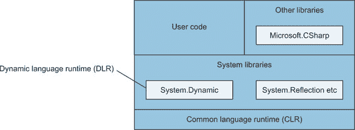

CLR 没有要求进行更改，尽管我相信从 v2 到 v4 的优化在一定程度上是由这项工作驱动的。编译器显然参与了生成不同的 IL，我们将在稍后的例子中看到这一点。对于框架/库支持，有两个方面。第一个是 *动态语言运行时* (DLR)，它提供了一些语言无关的基础设施，如 `DynamicMetaObject`。它负责执行所有的动态行为。但第二个库并不是核心框架本身的一部分：Microsoft.CSharp.dll。

| |
| --- |

##### 注意

这个库与框架一起分发，但并不是系统框架库的一部分。我发现把它想象成一个第三方依赖很有帮助，而这个第三方恰好是微软。另一方面，微软的 C# 编译器与它相当紧密地耦合在一起。它不适合任何盒子特别整齐地放入。

| |
| --- |

这个库负责所有与 C# 相关的事情。例如，如果你在一个方法调用中使用了动态值作为参数，那么在执行时进行重载解析的就是这个库。它是 C# 编译器负责绑定的部分的副本，但在所有动态 API 的上下文中进行操作。

如果你曾在你的项目中看到过对 Microsoft.CSharp.dll 的引用并想知道它是用来做什么的，那就是原因。如果你在任何地方都没有使用动态类型，你可以安全地移除这个引用。如果你使用了动态类型但移除了引用，你将在编译时遇到错误，因为 C# 编译器会生成对该程序集的调用。说到由 C# 编译器生成的代码，让我们现在看看一些。

##### 为动态类型生成的 IL 代码

我们将回到我们最初的动态类型示例，但让它更简短。以下是您看到的动态代码的前两行：

```
dynamic text = "hello world";
string world = text.Substring(6);
```

很简单，对吧？这里有两个动态操作：

+   对 `Substring` 方法的调用

+   将结果转换为字符串

下面的列表是上述两行代码生成的代码的反编译版本。为了清晰起见，我包括了类声明和 `Main` 方法的周围上下文。

##### 列表 4.9\. 解析两个简单动态操作的输出结果

```
using Microsoft.CSharp.RuntimeBinder;
using System;
using System.Runtime.CompilerServices;

class DynamicTypingDecompiled
{
  private static class CallSites                                  *1*
  {
    public static CallSite<Func<CallSite, object, int, object>>
       method;
    public static CallSite<Func<CallSite, object, string>>
       conversion;
  }

  static void Main()
  {
    object text = "hello world";
    if (CallSites.method == null)                                 *2*
    {
      CSharpArgumentInfo[] argumentInfo = new[]
      {
        CSharpArgumentInfo.Create(
          CSharpArgumentInfoFlags.None, null),
        CSharpArgumentInfo.Create(
          CSharpArgumentInfoFlags.Constant |
            CSharpArgumentInfoFlags.UseCompileTimeType,
          null)
      };
      CallSiteBinder binder =
        Binder.InvokeMember(CSharpBinderFlags.None, "Substring",
          null, typeof(DynamicTypingDecompiled), argumentInfo);
      CallSites.method =
        CallSite<Func<CallSite, object, int, object>>.Create(binder);
    }

    if (CallSites.conversion == null)                             *3*
    {
      CallSiteBinder binder =
        Binder.Convert(CSharpBinderFlags.None, typeof(string),
          typeof(DynamicTypingDecompiled));
      CallSites.conversion =
        CallSite<Func<CallSite, object, string>>.Create(binder);
    }
    object result = CallSites.method.Target(                      *4*
      CallSites.method, text, 6);                                 *4*

    string str =                                                  *5*
      CallSites.conversion.Target(CallSites.conversion, result);
  }
}
```

+   ***1* 调用位置的缓存**

+   ***2* 如果需要，为方法调用创建调用位置**

+   ***3* 如果需要，创建转换的调用位置**

+   ***4* 调用方法调用位置**

+   ***5* 调用转换调用位置**

我为这个格式化表示歉意。我已经尽我所能使其可读，但它涉及很多长名字的代码。好消息是，你几乎肯定永远不需要查看这样的代码，除非是出于兴趣。有一点需要注意，`CallSite` 在 `System.Runtime.CompilerServices` 命名空间中，因为它语言中立，而使用的 `Binder` 类来自 `Microsoft.CSharp.RuntimeBinder`。

如你所见，涉及了很多 *调用位置*。每个调用位置都被生成的代码缓存，DLR 也有多级缓存。绑定是一个相当复杂的过程。调用位置内的缓存通过存储每个绑定操作的结果来提高性能，以避免重复工作，同时意识到如果某些上下文在调用之间发生变化，相同的调用可能会得到不同的绑定结果。

所有这些努力的结果是一个非常高效的系统。它的性能并不如静态类型代码，但出奇地接近。我预计，在大多数情况下，如果动态类型是其他原因下的合适选择，其性能不会成为限制因素。为了总结动态类型的覆盖范围，我将解释你可能会遇到的一些局限性，并给出一些关于何时以及如何使用动态类型作为有效选择的指导。

#### 4.1.4\. 动态类型中的局限性和惊喜

将动态类型集成到一个从一开始就被设计为静态类型的语言中是困难的。两个不和谐相处并不奇怪。我整理了一份关于动态类型的一些方面的列表，包括在执行时可能遇到的限制或潜在惊喜。这个列表并不全面，但它涵盖了最常见的常见问题。

##### 动态类型和泛型

使用泛型中的 `dynamic` 类型可能很有趣。编译时应用了关于你可以在哪里使用 `dynamic` 的规则：

+   类型不能在类型参数的任何位置使用 `dynamic` 来指定它实现了接口。

+   你不能在类型约束中任何地方使用 `dynamic`。

+   一个类可以指定一个在类型参数中使用 `dynamic` 的基类，即使它是接口类型参数的一部分。

+   你可以将 `dynamic` 用作变量接口类型参数。

以下是一些无效代码的示例：

```
class DynamicSequence : IEnumerable<dynamic>
class DynamicListSequence : IEnumerable<List<dynamic>>
class DynamicConstraint1<T> : IEnumerable<T> where T : dynamic
class DynamicConstraint2<T> : IEnumerable<T> where T : List<dynamic>
```

但所有这些都是有效的：

```
class DynamicList : List<dynamic>
class ListOfDynamicSequences : List<IEnumerable<dynamic>>
IEnumerable<dynamic> x = new List<dynamic> { 1, 0.5 }.Select(x => x * 2);
```

##### 扩展方法

执行时绑定器不会解析扩展方法。理论上它可以这样做，但它需要在每个方法调用位置保留有关每个相关 `using` 指令的额外信息。重要的是要注意，这不会影响静态绑定的调用，即使类型参数中某处使用了动态类型。所以，例如，以下列表可以编译并运行而不会出现任何问题。

##### 列表 4.10\. 在动态值列表上进行的 LINQ 查询

```
List<dynamic> source = new List<dynamic>
{
    5,
    2.75,
    TimeSpan.FromSeconds(45)
};
IEnumerable<dynamic> query = source.Select(x => x * 2);
foreach (dynamic value in query)
{
    Console.WriteLine(value);
}
```

这里的唯一动态操作是乘法 (`x * 2`) 和 `Console.WriteLine` 中的重载解析。`Select` 的调用在编译时被正常绑定。作为一个失败的例子，让我们尝试将源本身设置为动态，并将你使用的 LINQ 操作简化为 `Any()`。 （如果你像之前一样继续使用 `Select`，你将遇到另一个问题，你将在下一刻看到。）以下列表显示了更改。

##### 列表 4.11\. 尝试在动态目标上调用扩展方法

```
dynamic source = new List<dynamic>
{
    5,
    2.75,
    TimeSpan.FromSeconds(45)
};
bool result = source.Any();
```

我没有包括输出部分，因为执行不会到达那里。相反，它因为 `List<T>` 不包含名为 `Any` 的方法而失败，并抛出 `RuntimeBinderException`。

如果你想要像目标是一个动态值一样调用扩展方法，你需要将其作为常规静态方法调用。例如，你可以将 列表 4.11 的最后一行重写为以下内容：

```
bool result = Enumerable.Any(source);
```

调用仍然会在执行时绑定，但仅限于重载解析。

##### 匿名函数

匿名函数有三个限制。为了简单起见，我将使用 lambda 表达式展示它们。

首先，匿名方法不能分配给类型为 `dynamic` 的变量，因为编译器不知道要创建哪种委托。如果你要么进行类型转换，要么使用中间的静态类型变量（然后复制值），并且也可以动态地调用委托，这是可以的。例如，以下是不合法的：

```
dynamic function = x => x * 2;
Console.WriteLine(function(0.75));
```

但这没问题，会打印出 1.5：

```
dynamic function = (Func<dynamic, dynamic>) (x => x * 2);
Console.WriteLine(function(0.75));
```

其次，由于相同的原因，lambda 表达式不能出现在动态绑定操作中。这就是为什么我没有在 列表 4.11 中使用 `Select` 来演示扩展方法的问题。以下是 列表 4.11 在其他情况下可能的样子：

```
dynamic source = new List<dynamic>
{
    5,
    2.75,
    TimeSpan.FromSeconds(45)
};
dynamic result = source.Select(x => x * 2);
```

你知道在执行时这不会工作，因为它找不到 `Select` 扩展方法，但它甚至无法编译，因为使用了 lambda 表达式。编译时问题的解决方案与之前相同：只需将 lambda 表达式转换为委托类型或先将其分配给静态类型变量。对于 `Select` 这样的扩展方法，这仍然会在执行时失败，但如果调用的是像 `List<T>.Find` 这样的常规方法，那就没问题了。

最后，转换为表达式树的 lambda 表达式不能包含任何动态操作。考虑到 DLR 内部使用表达式树的方式，这听起来可能有些奇怪，但在实践中很少成为问题。在大多数情况下，表达式树是有用的，但动态类型意味着什么或如何实现并不清楚。

例如，你可以尝试调整 列表 4.10（使用静态类型的 `source` 变量）以使用 `IQueryable<T>`，如下所示。

##### 列表 4.12\. 尝试在 `IQueryable<T>` 中使用动态元素类型

```
List<dynamic> source = new List<dynamic>
{
    5,
    2.75,
    TimeSpan.FromSeconds(45)
};
IEnumerable<dynamic> query = source
    .AsQueryable()
    .Select(x => x * 2);               *1*
```

+   ***1* 这行代码现在无法编译。**

`AsQueryable()` 调用的结果是 `IQueryable<dynamic>`。这是静态类型，但其 `Select` 方法接受一个表达式树而不是委托。这意味着 lambda 表达式 (`x => x * 2`) 必须转换为表达式树，但它执行了一个动态操作，因此无法编译。

##### 匿名类型

我在第一次介绍匿名类型时提到了这个问题，但值得再次强调：C# 编译器会将匿名类型作为常规类在 IL 中生成。它们具有 `internal` 访问权限，因此无法在声明它们的程序集之外使用。通常情况下这不是问题，因为匿名类型通常只在一个方法中使用。使用动态类型，你可以读取匿名类型实例的属性，但前提是代码可以访问生成的类。以下列表展示了这种情况下的一个示例，其中它是有效的。

##### 列表 4.13\. 动态访问匿名类型的属性

```
static void PrintName(dynamic obj)
{
    Console.WriteLine(obj.Name);
}

static void Main()
{
    var x = new { Name = "Abc" };
    var y = new { Name = "Def", Score = 10 };
    PrintName(x);
    PrintName(y);
}
```

此列表有两个匿名类型，但绑定过程并不关心它是否绑定到匿名类型。不过，它确实会检查它是否有权访问它找到的属性。如果您将此代码拆分到两个程序集中，这将导致问题；绑定器会注意到匿名类型是在创建它的程序集内部，并抛出 `RuntimeBinderException`。如果您遇到这个问题，并且可以使用 `[InternalsVisibleTo]` 允许执行动态绑定的程序集访问创建匿名类型的程序集，那么这是一个合理的解决方案。

##### 显式接口实现

运行时绑定器使用任何动态值的运行时类型，然后以您将其作为变量的编译时类型的方式绑定。不幸的是，这并不与现有的 C# 特性显式接口实现很好地配合。当您使用显式接口实现时，这实际上意味着正在实现的成员仅在您使用对象上的接口视图而不是类型本身时才可用。

展示这一点比解释它更容易。下面的列表使用 `List<T>` 作为示例。

##### 列表 4.14\. 显式接口实现的示例

```
List<int> list1 = new List<int>();
Console.WriteLine(list1.IsFixedSize);     *1*

IList list2 = list1;
Console.WriteLine(list2.IsFixedSize);     *2*

dynamic list3 = list1;
Console.WriteLine(list3.IsFixedSize);     *3*
```

+   ***1* 编译时错误**

+   ***2* 成功；打印 False**

+   ***3* 运行时错误**

`List<T>` 实现了 `IList` 接口。该接口有一个名为 `IsFixedSize` 的属性，但 `List<T>` 类显式地实现了它。任何尝试通过具有静态类型为 `List<T>` 的表达式访问它的尝试都会在编译时失败。您可以通过具有静态类型为 `IList` 的表达式来访问它，并且它总是返回 `false`。但是，动态访问它呢？绑定器将始终使用动态值的实际类型，因此找不到该属性，并抛出 `RuntimeBinderException`。这里的解决方案是，如果您知道您想使用接口成员，请将动态值转换回接口（通过强制转换或单独的变量）。

我相信，任何经常使用动态类型的人都能给你一个越来越难以理解的边缘案例的长列表，但前面提到的项目应该能让你不会太频繁地感到惊讶。我们将通过一些关于何时以及如何使用动态类型的指导来完成对动态类型的覆盖。

#### 4.1.5\. 使用建议

我会坦白地说：我通常不是动态类型的粉丝。我不记得我上次在生产代码中使用它是什么时候，而且我只会谨慎地使用它，并在进行了大量的正确性和性能测试之后。

我对静态类型情有独钟。根据我的经验，它提供了四个显著的好处：

+   当我犯错误时，我可能会更早地发现它们——在编译时而不是运行时。这对于可能难以彻底测试的代码路径尤其重要。

+   编辑器可以提供代码补全。这在打字速度方面并不是特别重要，但作为探索我可能想要做什么的方式，尤其是如果我在使用一个我不熟悉的类型时，是非常好的。如今，动态语言的编辑器可以提供令人瞩目的代码补全功能，但它们永远不会像静态类型语言的那些一样精确，因为可用的信息少得多。

+   这让我思考我提供的 API，包括参数、返回类型等方面。在我决定接受和返回哪些类型之后，这就像现成的文档：我只需要为那些不明显的内容添加注释，例如可接受值的范围。

+   通过在编译时而不是执行时进行工作，静态类型代码通常比动态类型代码具有性能优势。我不想过分强调这一点，因为现代运行时可以做到惊人的事情，但这确实值得考虑。

我相信一个动态类型爱好者能够给你列出动态类型的一些类似的好处，但我不太适合做这件事。我怀疑这些好处在从一开始就设计为动态类型的语言中更容易获得。C# *主要* 是一种静态类型语言，其遗产是明显的，这也是为什么之前提到的边缘情况存在。话虽如此，以下是一些建议，关于你可能想要使用动态类型的情况。

##### 更简单的反射

假设你发现自己正在使用反射来访问属性或方法；你编译时知道名称，但由于某种原因不能引用静态类型。使用动态类型请求运行时绑定器执行该访问比直接使用反射 API 要简单得多。如果你原本需要执行多个反射步骤，这种好处会更大。例如，考虑以下代码片段：

```
dynamic value = ...;
value.SomeProperty.SomeMethod();
```

涉及的反射步骤如下：

1.  根据初始值的类型获取`PropertyInfo`。

1.  获取该属性的值并记住它。

1.  根据属性结果的类型获取`MethodInfo`。

1.  在属性结果上执行方法。

在你添加验证以确保属性和方法都存在之前，你将看到几行代码。其结果将不会比之前展示的动态方法更安全，但阅读起来会更困难。

##### 没有共同接口的常见成员

有时候你确实可以提前知道一个值的所有可能类型，并且你想要在它们上面使用具有相同名称的成员。如果这些类型实现了一个共同接口或共享一个声明该成员的共同基类，那很好，但这种情况并不总是发生。如果每个都独立声明该成员（如果你不能改变这一点），你将面临不愉快的选择。

这次，你不需要使用反射，但可能需要执行几个重复的步骤，比如检查类型、转换、访问成员。C# 7 的模式使这变得显著简单，但它仍然可能是重复的。相反，你可以使用动态类型来有效地表达“相信我，我知道这个成员将会存在，即使我无法用静态类型的方式表达。”我会在测试中这样做（因为错误成本是测试失败），但在生产代码中我会更加谨慎。

##### 使用为动态类型构建的库

.NET 生态系统相当丰富，并且一直在不断改进。开发者正在创建各种有趣的库，我怀疑有些人可能会接受动态类型。例如，我可以想象一个库，它允许通过 REST 或 RPC 基于的 API 进行易于原型设计，而不涉及任何代码生成。这在开发初期，当一切都很灵活时，可能会很有用，在生成用于后续开发的静态类型库之前。

这与您之前看到的 Json.NET 示例类似。在模型定义良好之后，你可能很乐意编写表示数据模型的类，但在原型设计时，可能更简单的是先更改 JSON，然后是动态访问它的代码。同样，你稍后会发现 COM 的改进意味着你通常可以最终使用动态类型而不是执行大量的转换。

简而言之，我认为在简单易行的情况下使用静态类型仍然是有意义的，但你应该接受动态类型作为某些情况可能有用的工具。我鼓励你在每个上下文中权衡利弊。例如，适用于原型或甚至测试代码的代码可能不适合生产代码。

除此之外，通过使用 `DynamicObject` 或 `IDynamicMetaObjectProvider` 来实现动态行为的能力，确实为有趣的发展提供了很多空间。尽管我可能对动态类型有所保留，但它在 C# 中已经得到了良好的设计和实现，为探索提供了丰富的途径。

我们下一个特性在某种程度上有些不同，尽管当你查看 COM 互操作性时，两者会结合在一起。我们回到了静态类型，以及它的一个特定方面：为参数提供参数。

### 4.2. 可选参数和命名参数

可选参数和命名参数的适用范围有限：给定一个你想要调用的方法、构造函数、索引器或委托，你如何提供调用参数？*可选参数* 允许调用者完全省略一个参数，而 *命名参数* 允许调用者向编译器和任何人类读者清楚地表明参数与哪个参数相关联。

让我们从简单的例子开始，然后深入细节。在本节中，我将只考虑方法。相同的规则适用于所有可以具有参数的其他类型的成员。

#### 4.2.1\. 带默认值的参数和带名称的参数

以下列表显示了一个简单的有三个参数的方法，其中两个是可选的。对方法的多次调用展示了不同的功能。

##### 列表 4.15\. 调用一个带有可选参数的方法

```
static void Method(int x, int y = 5, int z = 10)       *1*
{
    Console.WriteLine("x={0}; y={1}; z={2}", x, y, z); *2*
}

...

Method(1, 2, 3);                                       *3*
Method(x: 1, y: 2, z: 3);                              *3*
Method(z: 3, y: 2, x: 1);                              *3*
Method(1, 2);                                          *4*
Method(1, y: 2);                                       *4*
Method(1, z: 3);                                       *5*
Method(1);                                             *6*
Method(x: 1);                                          *6*
```

+   ***1* 一个必需参数，两个可选**

+   ***2* 只打印参数值。**

+   ***3* x=1; y=2; z=3**

+   ***4* x=1; y=2; z=10**

+   ***5* x=1; y=5; z=3**

+   ***6* x=1; y=5; z=10**

图 4.2 展示了相同的方法声明和一个方法调用，以使术语清晰。

##### 图 4.2\. 可选/必需参数和命名/位置参数的语法

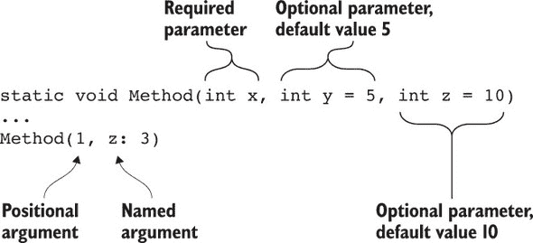

语法很简单：

+   一个参数可以在其名称之后指定一个*默认值*，名称和值之间用等号分隔。任何具有默认值的参数都是*可选的*；任何没有默认值的参数都是*必需的*。不允许对具有 `ref` 或 `out` 修饰符的参数使用默认值。

+   一个参数可以在值之前指定一个名称，名称和值之间用冒号分隔。没有名称的参数称为*位置参数*。

参数的默认值必须是以下表达式之一：

+   一个编译时常量，例如数字或字符串字面量，或空字面量。

+   一个默认表达式，例如 `default(CancellationToken)`。正如你将在第 14.5 节中看到的那样，C# 7.1 引入了*默认字面量*，因此你可以写 `default` 而不是 `default(CancellationToken)`。

+   一个新表达式，例如 `new Guid()` 或 `new CancellationToken()`。这仅适用于值类型。

所有可选参数都必须在所有必需参数之后，但参数数组除外。（参数数组是具有 `params` 修饰符的参数。）

| |
| --- |

##### 警告

尽管你可以声明一个带有可选参数后跟参数数组的方法，但调用起来会让人困惑。我强烈建议你避免这样做，并且我不会深入探讨如何解析此类方法的调用。

| |
| --- |

使参数可选的目的是允许调用者省略它，如果它提供的值与默认值相同。让我们看看编译器如何处理可能涉及默认参数和/或命名参数的方法调用。

#### 4.2.2\. 确定方法调用的含义

如果你阅读了规范，你会看到确定哪个参数对应哪个参数的过程是重载解析的一部分，并且与类型推断交织在一起。这比你可能预期的要复杂，所以我会在这里简化一下。我们将关注一个单独的方法签名，假设它已经被重载解析选中，然后从那里开始。

规则列出来是相当简单的：

+   所有位置参数必须位于所有命名参数之前。在 C# 7.2 中，这个规则略有放宽，如第 14.6 节 section 14.6 中所示。

+   位置参数始终对应于方法签名中相同位置的参数。第一个位置参数对应第一个参数，第二个位置参数对应第二个参数，依此类推。

+   命名参数通过名称而不是位置匹配：名为 `x` 的参数对应于名为 `x` 的参数。命名参数可以按任何顺序指定。

+   任何参数只能有一个相应的参数。你不能在两个命名参数中指定相同的名称，也不能为已经有一个位置参数对应的参数使用命名参数。

+   每个必需参数都必须有一个相应的参数来提供值。

+   可选参数可以没有相应的参数，在这种情况下，编译器将提供默认值作为参数。

为了看到这些规则的实际应用，让我们考虑我们的原始简单方法签名：

```
static void Method(int x, int y = 5, int z = 10)
```

你可以看到 `x` 是一个必需参数，因为它没有默认值，但 `y` 和 `z` 是可选参数。表 4.1 显示了几个有效调用及其结果。

##### 表 4.1\. 命名参数和可选参数的有效方法调用示例

| 调用 | 结果参数 | 备注 |
| --- | --- | --- |
| 方法(1, 2, 3) | x=1; y=2; z=3 | 所有位置参数。C# 4.0 之前的常规调用。 |
| 方法(1) | x=1; y=5; z=10 | 编译器为 y 和 z 提供值，因为没有相应的参数。 |
| 方法() | n/a | 无效：没有参数对应于 x。 |
| 方法(y: 2) | n/a | 无效：没有参数对应于 x。 |
| 方法(1, z: 3) | x=1; y=5; z=3 | 编译器为 y 提供值，因为没有相应的参数。它通过使用 z 的命名参数而跳过。 |
| 方法(1, x: 2, z: 3) | n/a | 无效：两个参数对应于 x。 |
| 方法(1, y: 2, y: 2) | n/a | 无效：两个参数对应于 y。 |
| 方法(z: 3, y: 2, x: 1) | x=1; y=2; z=3 | 命名参数可以按任何顺序， |

在评估方法调用时，有两个重要方面需要注意。首先，参数的评估顺序与它们在方法调用源代码中出现的顺序相同，从左到右。在大多数情况下，这不会产生影响，但如果参数评估有副作用，则可能会产生影响。作为一个例子，考虑我们对示例方法的这两个调用：

```
int tmp1 = 0;
Method(x: tmp1++, y: tmp1++, z: tmp1++);    *1*

int tmp2 = 0;
Method(z: tmp2++, y: tmp2++, x: tmp2++);    *2*
```

+   ***1* x=0; y=1; z=2**

+   ***2* x=2; y=1; z=0**

这两个调用仅在命名参数的顺序上有所不同，但这会影响传递给方法的价值。在两种情况下，代码的阅读难度都比可能的情况要高。当参数评估的副作用很重要时，我鼓励你将它们作为单独的语句进行评估，并将结果赋值给新的局部变量，然后将这些变量直接作为参数传递给方法，如下所示：

```
int tmp3 = 0;
int argX = tmp3++;
int argY = tmp3++;
int argZ = tmp3++;
Method(x: argX, y: argY, z: argZ);
```

在这一点上，无论你是否命名参数，都不会改变行为；你可以选择你认为最易读的任何形式。在我看来，将参数评估与方法调用分离使得理解参数评估的顺序更加简单。

第二个需要注意的点是，如果编译器必须为参数指定任何默认值，这些值将嵌入到调用代码的 IL 中。编译器无法说“这个参数我没有值；请使用你有的任何默认值。”这就是为什么默认值必须是编译时常量，这也是可选参数影响版本化的方式之一。

#### 4.2.3\. 对版本化的影响

在库中版本化公共 API 是一个难题。这真的很困难，并且比我们愿意假装的要复杂得多。尽管语义版本化表示任何破坏性变更都意味着你需要迁移到新的主要版本，但如果你愿意包括一些晦涩的情况，几乎任何变更都可能破坏依赖于库的某些代码。话虽如此，可选参数和命名参数在版本化方面尤其棘手。让我们看看各种因素。

##### 参数名称更改是破坏性的

假设你有一个包含你之前查看的方法的库，但它是公开的：

```
public static Method(int x, int y = 5, int z = 10)
```

现在假设你想要在新版本中将以下内容进行更改：

```
public static Method(int a, int b = 5, int c = 10)
```

这是一个破坏性的变更；任何在调用方法时使用命名参数的代码都将被破坏，因为它们之前指定的名称已不再存在。请像检查你的类型和成员名称一样仔细检查你的参数名称！

##### 默认值更改至少是令人惊讶的

正如我之前提到的，默认值被编译到调用代码的 IL 中。当它在同一个程序集内时，更改默认值不会引起问题。当它在不同的程序集内时，更改默认值只有在调用代码重新编译时才会可见。

这并不总是问题，如果你预计你可能想要更改默认值，那么在方法文档中明确地声明这一点并不完全不合理。但这可能会让一些使用你代码的开发者感到惊讶，尤其是如果涉及到复杂的依赖链。避免这种情况的一种方法是用一个始终意味着“让方法在执行时选择”的专用默认值。例如，如果你有一个通常具有`int`参数的方法，你可以使用`Nullable<int>`代替，默认值为`null`表示“方法将选择”。你可以稍后更改方法的实现以做出不同的选择，并且使用新版本的每个调用者都会得到新的行为，无论他们是否重新编译。

##### 添加重载很麻烦

如果你认为在单版本场景下重载解析已经棘手，那么在你尝试添加重载而不破坏任何人的情况下，问题会变得更加严重。所有原始方法签名都必须在新版本中存在，以避免破坏二进制兼容性，并且所有针对原始方法的调用在新版本中应该解析为相同的调用，或者至少是*等效*的调用。一个参数是必需的还是可选的不是方法签名本身的一部分；通过将可选参数更改为必需的，或者相反，你不会破坏二进制兼容性。但你可能会破坏源兼容性。如果你不小心，你很容易通过添加一个具有更多可选参数的新方法来引入重载解析的歧义。

如果两个方法在重载解析中都适用（与调用相关），并且就涉及的参数到参数的转换而言，没有一个比另一个更好，那么可以使用默认参数作为决定性因素。没有对应参数的没有可选参数的方法比至少有一个没有对应参数的可选参数的方法“更好”。但一个未填写的参数的方法并不比有两个此类参数的方法“更好”。

如果在涉及可选参数的情况下，你可以避免向方法添加重载，我强烈建议你这样做——并且，理想情况下，从一开始就记住这一点。对于可能有很多选项的方法，可以考虑创建一个表示所有这些选项的类，然后在方法调用中将它作为可选参数。然后，你可以通过向选项类添加属性来添加新选项，而无需更改方法签名。

尽管有所有这些警告，我还是支持在合理简化常见情况下的调用代码时使用可选参数，并且我是命名参数以澄清调用代码能力的忠实粉丝。这在多个相同类型的参数可能相互混淆的情况下尤其相关。作为一个例子，我总是在需要调用 Windows Forms 的`MessageBox.Show`方法时使用它们。我总是记不清消息框的标题或文本哪个在前。IntelliSense 在编写代码时能帮助我，但在阅读代码时并不明显，除非我使用命名参数：

```
MessageBox.Show(text: "This is text", caption: "This is the title");
```

我们接下来要讨论的主题可能是许多读者不需要的，而其他读者则可能每天都会用到。尽管在许多情况下 COM 是一种遗留技术，但仍然有大量的代码在使用它。

### 4.3. COM 互操作性改进

在 C# 4 之前，如果你想要与 COM 组件进行交互，VB（Visual Basic）是一个更好的选择。它一直是一个相对宽松的语言，至少如果你要求它如此的话，并且它从一开始就支持命名参数和可选参数。C# 4 让与 COM 交互的工作变得更加简单。尽管如此，如果你不使用 COM，跳过这一节你也不会错过任何重要的内容。这里提到的所有功能都与 COM 无关。


##### 注意

COM 是微软在 1993 年引入的组件对象模型，它是一种在 Windows 上的跨语言互操作性形式。完整的描述超出了本书的范围，但如果你需要了解它，你很可能已经知道了。最常用的 COM 库可能是 Microsoft Office 的库。


让我们从超越语言本身的一个特性开始。这主要关于部署，尽管它也影响了操作如何被暴露。

#### 4.3.1. 链接主要互操作程序集

当你针对 COM 类型进行编码时，你使用为组件库生成的程序集。通常，你使用组件发布者生成的*主要互操作程序集*（PIA）。你可以使用类型库导入工具（`tlbimp`）为你自己的 COM 库生成这个程序集。

在 C# 4 之前，完整的 PIA 必须在代码最终运行的机器上存在，并且它必须与编译时使用的版本相同。这意味着要么将 PIA 与应用程序一起分发，要么相信正确的版本已经安装。

从 C# 4 和 Visual Studio 2010 开始，你可以选择链接 PIA（Primary Interop Assembly）而不是引用它。在 Visual Studio 中，在引用的属性页中，这是嵌入互操作类型选项。

当此选项设置为 True 时，PIA 的相关部分将直接嵌入到你的程序集中。只包含你应用程序中使用的位。当代码运行时，只要客户端机器上有你应用程序所需的一切，无论你用于编译的组件的确切版本是否相同，都没有关系。图 4.3 显示了在代码运行方面引用（旧方法）和链接（新方法）之间的差异。

##### 图 4.3\. 比较引用和链接

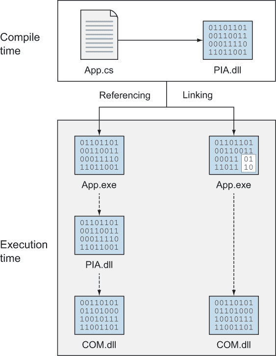

除了部署更改外，将 PIA 链接会影响 COM 类型中 VARIANT 类型的处理方式。当引用 PIA 时，任何返回 VARIANT 值的操作都会在 C# 中使用 `object` 类型公开。然后你必须将其转换为适当的类型以使用其方法和属性。

当 PIA 被链接时，返回的是 `dynamic` 而不是 `object`。正如你之前看到的，从 `dynamic` 类型的表达式到任何非指针类型的隐式转换是存在的，然后在执行时进行检查。以下列表显示了一个打开 Excel 并填充一个范围内的 20 个单元格的示例。

##### 列表 4.16\. 使用隐式动态转换在 Excel 中设置一系列值

```
var app = new Application { Visible = true };
app.Workbooks.Add();
Worksheet sheet = app.ActiveSheet;
Range start = sheet.Cells[1, 1];
Range end = sheet.Cells[1, 20];
sheet.Range[start, end].Value = Enumerable.Range(1, 20).ToArray();
```

列表 4.16 静默地使用了一些即将出现的功能，但此时请关注对 `sheet`、`start` 和 `end` 的赋值。每个赋值通常都需要转换，因为被赋值的值将是 `object` 类型。你不必指定变量的静态类型；如果你为变量类型使用了 `var` 或 `dynamic`，你将使用动态类型进行更多操作。我更喜欢在我知道期望它是什么类型的地方指定静态类型，部分是因为它执行的隐式验证，部分是为了在后续代码中启用 IntelliSense。

对于广泛使用 VARIANT 的 COM 库，这是动态类型最重要的好处之一。下一个 COM 功能也是基于 C# 4 中的一个新特性，并将可选参数提升到了新的水平。

#### 4.3.2\. COM 中的可选参数

一些 COM 方法有很多参数，而且通常它们都是 `ref` 参数。这意味着在 C# 4 之前，像在 Word 中保存文件这样的简单操作可能会非常痛苦。

##### 列表 4.17\. 在 C# 4 之前创建 Word 文档并保存

```
object missing = Type.Missing;                             *1*

Application app = new Application { Visible = true };      *2*
Document doc = app.Documents.Add                           *3*
    ref missing, ref missing,                              *3*
    ref missing, ref missing);                             *3*
Paragraph para = doc.Paragraphs.Add(ref missing);          *3*
para.Range.Text = "Awkward old code";                      *3*

object fileName = "demo1.docx";                            *4*
doc.SaveAs2(ref fileName, ref missing,                     *4*
    ref missing, ref missing, ref missing,                 *4*
    ref missing, ref missing, ref missing,                 *4*
    ref missing, ref missing, ref missing,                 *4*
    ref missing, ref missing, ref missing,                 *4*
    ref missing, ref missing);                             *4*

doc.Close(ref missing, ref missing, ref missing);          *5*
app.Application.Quit(                                      *5*
    ref missing, ref missing, ref missing);                *5*
```

+   ***1* ref 参数的占位符变量**

+   ***2* 启动 Word**

+   ***3* 创建并填充文档**

+   ***4* 保存文档**

+   ***5* 关闭 Word**

仅为了创建和保存文档就需要大量的代码，包括 20 次的 `ref missing` 出现。在你不关心的参数森林中，很难看到代码的有用部分。

C# 4 提供了使这一过程变得简单得多的功能：

+   命名参数可用于明确指定哪个参数对应哪个参数，正如您已经看到的。

+   仅对于 COM 库，可以直接将值作为 `ref` 参数的参数指定。编译器将在幕后创建一个局部变量并将其通过引用传递。

+   仅对于 COM 库，`ref` 参数可以是可选的，并且在调用代码中省略。使用 `Type.Missing` 作为默认值。

在所有这些功能都起作用的情况下，您可以将 列表 4.17 转换为更短、更干净的代码。

##### 列表 4.18\. 使用 C# 4 创建并保存 Word 文档

```
Application app = new Application { Visible = true };
Document doc = app.Documents.Add();                     *1*
Paragraph para = doc.Paragraphs.Add();
para.Range.Text = "Simple new code";

doc.SaveAs2(FileName: "demo2.docx");                    *2*

doc.Close();
app.Application.Quit();
```

+   ***1* 在所有地方省略了可选参数**

+   ***2* 使用命名参数提高清晰度**

这在可读性方面是一个巨大的转变。所有 20 个 `ref missing` 出现的地方以及该变量本身都消失了。碰巧的是，传递给 `SaveAs2` 的参数对应于方法的第一参数。您可以使用位置参数而不是命名参数，但指定名称会增加清晰度。如果您还想为后续参数指定值，您可以通过名称指定，而无需为所有其他参数提供值。

那个传递给 `SaveAs2` 的参数也展示了隐式 `ref` 功能。在我们的源代码中，您可以直接传递值，而不是在 `demo2.docx` 的初始值中声明一个变量然后通过引用传递它。编译器会为您将其转换为 `ref` 参数。最终的 COM 相关功能揭示了 VB 在某些方面比 C# 更丰富。

#### 4.3.3\. 命名索引器

索引器自 C# 诞生以来就存在。它们主要用于集合：例如，通过索引从列表中检索元素或通过键从字典中检索值。但 C# 的索引器在源代码中从不命名。您只能为类型编写 *默认索引器*。您可以使用属性指定名称，并且该名称将被其他语言消费，但 C# 不允许您通过名称区分索引器。至少，在 C# 4 之前是这样的。

其他语言允许您编写和消费具有名称的索引器，因此您可以通过名称访问对象的不同方面，以明确您想要的内容。C# 仍然没有为常规 .NET 代码做这件事，但它为 COM 类型做出了例外。以下示例将使这一点更清晰。

Word 中的 `Application` 类型公开了一个名为 `SynonymInfo` 的命名索引器。它的声明如下：

```
SynonymInfo SynonymInfo[string Word, ref object LanguageId = Type.Missing]
```

在 C# 4 之前，您可以像调用方法 `get_SynonymInfo` 一样调用索引器，但这有些尴尬。在 C# 4 中，您可以通过名称访问它，如下面的列表所示。

##### 列表 4.19\. 访问命名索引器

```
Application app = new Application { Visible = false };

object missing = Type.Missing;                                      *1*
SynonymInfo info = app.get_SynonymInfo("method", ref missing);      *1*
Console.WriteLine("'method' has {0} meanings", info.MeaningCount);

info = app.SynonymInfo["index"];                                    *2*
Console.WriteLine("'index' has {0} meanings", info.MeaningCount);
```

+   ***1* 在 C# 4 之前访问同义词**

+   ***2* 使用命名索引器编写更简洁的代码**

列表 4.19 展示了如何在命名索引器和常规方法调用中使用可选参数。在 C# 4 之前，代码必须声明一个变量并将其通过引用传递给名称古怪的方法。在 C# 4 中，你可以通过名称使用索引器，并且可以省略第二个参数的参数。

这只是对 C# 4 中 COM 相关特性的简要概述，但我希望其好处是显而易见的。尽管我并不经常与 COM 一起工作，但这里显示的更改如果将来需要，会让我感到少些沮丧。好处的程度将取决于你正在工作的 COM 库的结构。例如，如果它使用了大量的 `ref` 参数和 `VARIANT` 返回类型，那么与参数较少且具有具体返回类型的库相比，差异将更加显著。但即使只是链接 PIA 的选项，也能使部署显著简化。

我们现在正接近 C# 4 的尾声。最后一个特性可能有点难以理解，但你可能在不经意间就使用了它。

### 4.4\. 泛型变体

泛型变体比描述起来更容易展示。它涉及到基于它们的类型参数安全地在泛型类型之间进行转换，并特别注意数据流动的方向。

#### 4.4.1\. 变体在行动中的简单示例

我们将从一个使用熟悉接口的示例开始，即 `IEnumerable<T>`，它表示类型 `T` 的元素序列。任何字符串序列也是对象序列是有意义的，变体允许这一点：

```
IEnumerable<string> strings = new List<string> { "a", "b", "c" };
IEnumerable<object> objects = strings;
```

这可能看起来如此自然，以至于你会惊讶它无法编译，但这正是 C# 4 之前会发生的事情。


##### 注意

在这些示例中，我始终使用 `string` 和 `object`，因为它们是所有 C# 开发者都知道的类，并且与任何特定上下文无关。具有相同基类/派生类关系的其他类也会以同样的方式工作。


可能还有更多的惊喜在等着我们；即使是在 C# 4 中，也不是所有听起来应该工作的事情都能工作。例如，你可能会尝试将关于序列的推理扩展到列表。任何字符串列表是否都是对象列表？你可能这么认为，但事实并非如此：

```
IList<string> strings = new List<string> { "a", "b", "c" };
IList<object> objects = strings;                               *1*
```

+   ***1* 无效：无法从 `IList<string>` 转换到 `IList<object>`**

`IEnumerable<T>` 和 `IList<T>` 之间有什么区别？为什么不允许这样做？答案是这不会是安全的，因为 `IList<T>` 中的方法允许 `T` 类型的值作为输入和输出。你使用 `IEnumerable<T>` 的任何方式最终都会返回 `T` 类型的值作为输出，但 `IList<T>` 有像 `Add` 这样的方法，它接受一个 `T` 类型的值作为输入。这会使允许变体变得危险。如果你尝试稍微扩展我们的无效示例，你会看到这一点：

```
IList<string> strings = new List<string> { "a", "b", "c" };
IList<object> objects = strings;
objects.Add(new object());                                  *1*
string element = strings[3];                                *2*
```

+   ***1* 向列表中添加一个对象**

+   ***2* 以字符串的形式检索它**

除了第二行之外的其他每一行单独来看都是有意义的。将一个`object`引用添加到`IList<object>`中是可以的，从`IList<string>`中获取一个字符串引用也是可以的。但是，如果你可以将字符串列表视为对象列表，那么这两个能力就会产生冲突。使第二行无效的语言规则实际上是在保护代码的其余部分。

到目前为止，你已经看到了值作为输出返回（`IEnumerable<T>`）和值既用作输入又用作输出（`IList<T>`）。在某些 API 中，值始终只用作输入。这个例子最简单，就是`Action<T>`委托，当你调用委托时，你会传递一个类型为`T`的值。可变性仍然适用，但方向相反。一开始这可能会让人感到困惑。

如果你有一个`Action<object>`委托，它可以接受任何对象引用。它肯定可以接受一个字符串引用，并且语言规则允许你从`Action<object>`转换为`Action<string>`：

```
Action<object> objectAction = obj => Console.WriteLine(obj);
Action<string> stringAction = objectAction;
stringAction("Print me");
```

带着这些例子，我可以定义一些术语：

+   *协变*发生在只返回值作为输出的情况下。

+   *逆变*发生在只接受值作为输入的情况下。

+   *不变性*发生在值既用作输入又用作输出的情况下。

这些定义现在故意有些模糊。它们更多地关于一般概念，而不是 C#。在你看过 C#用来指定可变性的语法之后，我们可以使它们更精确。

#### 4.4.2. 接口和委托声明中可变性的语法

关于 C#中的可变性，首先要知道的是，它只能指定为接口和委托。例如，你不能使类或结构体协变。接下来，每个类型参数的可变性是分别定义的。尽管你可能会松散地说“`IEnumerable<T>`是协变的”，但更精确的说法是“`IEnumerable<T>`在 T 上是协变的。”这导致了接口和委托声明中的语法，其中每个类型参数都有一个单独的修饰符。以下是`IEnumerable<T>`和`IList<T>`接口以及`Action<T>`委托的声明：

```
public interface IEnumerable<out T>
public delegate void Action<in T>
public interface IList<T>
```

如你所见，`in`和`out`修饰符被用来指定类型参数的可变性：

+   带有`out`修饰符的类型参数是协变的。

+   带有`in`修饰符的类型参数是逆变的。

+   没有修饰符的类型参数是不变的。

编译器会检查你使用的修饰符是否适合整个声明中的其余部分。例如，这个委托声明是无效的，因为协变类型参数被用作输入：

```
public delegate void InvalidCovariant<out T>(T input)
```

而这个接口声明是无效的，因为逆变类型参数被用作输出：

```
public interface IInvalidContravariant<in T>
{
    T GetValue();
}
```

任何单个类型参数只能有一个这些修饰符，但在同一声明中的两个类型参数可以有不同的修饰符。例如，考虑`Func<T, TResult>`委托。它接受类型为`T`的值并返回类型为`TResult`的值。对于`T`来说，逆变性和对于`TResult`来说的可变性是自然的。委托声明如下：

```
public TResult Func<in T, out TResult>(T arg)
```

在日常开发中，你可能会比声明它们更频繁地使用现有的可变接口和委托。在可以使用类型参数方面存在一些限制。现在让我们来看看它们：

#### 4.4.3\. 使用可变性的限制

重申之前提到的观点，可变性只能在接口和委托中声明。这种可变性不会被实现接口的类或结构体继承；类和结构体始终是不变的。例如，假设你创建了一个这样的类：

```
public class SimpleEnumerable<T> : IEnumerable<T>   *1*
{
                                                    *2*
}
```

+   ***1* 在这里不允许使用 out 修饰符。**

+   ***2* 实现**

你仍然无法将`SimpleEnumerable<string>`转换为`SimpleEnumerable<object>`。你可以使用`IEnumerable<T>`的可变性将`SimpleEnumerable<string>`转换为`IEnumerable<object>`。

假设你正在处理具有某些可变或逆变类型参数的委托或接口。有哪些可用的转换？你需要定义来解释规则：

+   考虑到可变性的转换被称为*可变性转换*。

+   可变性转换是*引用转换*的一个例子。引用转换是一种不改变涉及值的转换（该值始终是引用）；它只改变编译时类型。

+   *恒等转换*是从一个类型到与 CLR 相关的相同类型的转换。这可能是从 C#的角度来看相同的类型（例如，从`string`到`string`），或者它可能是仅从 C#语言的角度来看不同的类型之间的转换，例如从`object`到`dynamic`。

假设你想将`IEnumerable<A>`转换为`IEnumerable<B>`，对于某些类型参数`A`和`B`。如果存在从`A`到`B`的恒等或隐式引用转换，这是有效的。例如，这些转换是有效的：

+   `IEnumerable<string>` to `IEnumerable<object>`: 从一个类到其基类（或其基类的基类，等等）存在隐式引用转换。

+   `IEnumerable<string>` to `IEnumerable<IConvertible>`: 从一个类到它实现的任何接口存在隐式引用转换。

+   `IEnumerable<IDisposable>` to `IEnumerable<object>`: 从任何引用类型到`object`或`dynamic`存在隐式引用转换。

这些转换是无效的：

+   `IEnumerable<object>` to `IEnumerable<string>`: 从`object`到`string`存在*显式*引用转换，但不是*隐式*的。

+   `IEnumerable<string> to IEnumerable<Stream>`: 字符串和 Stream 类之间没有关联。

+   `IEnumerable<int>` 到 `IEnumerable<IConvertible>`：存在从 `int` 到 `IConvertible` 的隐式转换，但这是一种装箱转换而不是引用转换。

+   `IEnumerable<int>` 到 `IEnumerable<long>`：存在从 `int` 到 `long` 的隐式转换，但这是一种数值转换而不是引用转换。

如您所见，类型参数之间转换的要求是引用或等价转换，这会影响值类型，可能让您感到惊讶。

那个使用 `IEnumerable<T>` 的例子只有一个需要考虑的类型参数。那么当您有多个类型参数时怎么办？实际上，它们是从转换的源到目标成对检查的，确保每个转换都适合相关的类型参数。

为了更正式地说明，考虑一个具有 `n` 个类型参数的泛型类型声明：`T<X``[1]``, ..., X``[n]``>`。从 `T<A``[1]``, ..., A``[n]``>` 到 `T<B``[1]``, ..., B``[n]``>` 的转换是按每个类型参数及其对应的类型参数对依次考虑的。对于 `1` 到 `n` 之间的每个 `i`：

+   如果 `X``[i]` 是协变的，那么必须存在从 `A``[i]` 到 `B``[i]` 的等价或隐式引用转换。

+   如果 `X``[i]` 是逆变的，那么必须存在从 `B``[i]` 到 `A``[i]` 的等价或隐式引用转换。

+   如果 `X``[i]` 是不变的，那么必须存在从 `A``[i]` 到 `B``[i]` 的等价转换。

为了将此具体化，让我们考虑 `Func<in T, out TResult>`。规则意味着以下内容：

+   从 `Func<object, int>` 到 `Func<string, int>` 存在一个有效的转换，因为

    +   第一个类型参数是逆变的，并且存在从 `string` 到 `object` 的隐式引用转换。

    +   第二个类型参数是协变的，并且存在从 `int` 到 `int` 的等价转换。

+   从 `Func<dynamic, string>` 到 `Func<object, IConvertible>` 存在一个有效的转换，因为

    +   第一个类型参数是逆变的，并且存在从 `dynamic` 到 `object` 的等价转换。

    +   第二个类型参数是协变的，并且存在从 `string` 到 `IConvertible` 的隐式引用转换。

+   从 `Func<string, int>` 到 `Func<object, int>` 没有转换，因为

    +   第一个类型参数是逆变的，并且不存在从 `object` 到 `string` 的隐式引用转换。

    +   第二个类型参数无关紧要；由于第一个类型参数，转换已经无效。

如果这一切都让您感到有些不知所措，请不要担心；99% 的时间您甚至不会注意到您正在使用泛型变异性。我提供了这些细节，以防您在编译时遇到错误且不理解原因.^([3]) 让我们通过查看几个泛型变异性有用的例子来总结。

> ³
> 
> 如果这不足以证明某个特定错误，我建议转向第三版，其中包含更多细节。

#### 4.4.4\. 实际中的泛型变异性

很多的时间，你可能会在不自觉的情况下使用泛型变体，因为事情就像你可能会希望的那样工作。没有特别必要意识到你正在使用泛型变体，但我将指出几个它有用的例子。

首先，让我们考虑 LINQ 和 `IEnumerable<T>`。假设你有一些字符串想要进行查询，但你希望最终得到一个 `List<object>` 而不是 `List<string>`。例如，你可能需要在之后向列表中添加其他项。下面的列表显示了在协变之前，这样做最简单的方法是使用额外的 `Cast` 调用。

##### 列表 4.20\. 从字符串查询创建一个没有变体的 `List<object>`

```
IEnumerable<string> strings = new[] { "a", "b", "cdefg", "hij" };
List<object> list = strings
    .Where(x => x.Length > 1)
 .Cast<object>()
    .ToList();
```

这对我来说感觉有点烦恼。为什么要在管道中创建一个额外的步骤只是为了改变类型，而这总是会成功？有了变体，你可以在 `ToList()` 调用中指定一个类型参数，以指定你想要的列表类型，如下面的列表所示。

##### 列表 4.21\. 通过使用变体从字符串查询创建一个 `List<object>`

```
IEnumerable<string> strings = new[] { "a", "b", "cdefg", "hij" };
List<object> list = strings
    .Where(x => x.Length > 1)
    .ToList<object>();
```

这之所以有效，是因为 `Where` 调用的输出是一个 `IEnumerable<string>`，而你要求编译器将 `ToList()` 调用的输入视为 `IEnumerable<object>`。这很好，因为存在变体。

我发现协变与 `IComparer<T>`（用于对其他类型进行排序比较的接口）结合使用很有用。例如，假设你有一个具有 `Area` 属性的 `Shape` 基类，以及 `Circle` 和 `Rectangle` 派生类。你可以编写一个实现 `IComparer<Shape>` 的 `AreaComparer`，这对于使用 `List<T>.Sort()` 在原地对 `List<Shape>` 进行排序是不错的。但是，如果你有一个 `List<Circle>` 或 `List<Rectangle>`，你该如何排序呢？在泛型变体出现之前，存在各种解决方案，但下面的列表显示了现在这变得多么简单。

##### 列表 4.22\. 使用 `IComparer<Shape>` 对 `List<Circle>` 进行排序

```
List<Circle> circles = new List<Circle>
{
    new Circle(5.3),
    new Circle(2),
    new Circle(10.5)
};
circles.Sort(new AreaComparer());
foreach (Circle circle in circles)
{
    Console.WriteLine(circle.Radius);
}
```

列表 4.22 中使用的类型的完整源代码在可下载的代码中，但它们就像你预期的那样简单。关键点是你可以将 `AreaComparer` 转换为 `IComparer<Circle>` 以用于 `Sort` 方法调用。在 C# 4 之前并不是这样。

如果你声明自己的泛型接口或委托，始终值得考虑类型参数是否可以是协变的或逆变的。如果它不是自然地这样，我通常不会尝试强迫这个问题，但花点时间思考一下是值得的。使用一个可能具有变体型参数的接口，但开发者没有考虑它可能对某人有用，这可能会让人感到烦恼。

### 摘要

+   C# 4 支持动态类型，它将绑定从编译时推迟到执行时。

+   动态类型通过 `IDynamicMetaObjectProvider` 和 `DynamicObject` 类支持自定义行为。

+   动态类型通过编译器和框架功能实现。框架通过优化和大量缓存来提高效率。

+   C# 4 允许参数指定默认值。任何具有默认值的参数都是 *可选参数*，调用者不必提供。

+   C# 4 允许参数指定它打算提供值的参数名称。这与可选参数一起工作，允许您为某些参数指定参数，而不为其他参数指定。

+   C# 4 允许 COM 主要互操作程序集 (PIAs) 被链接而不是引用，这导致了一个更简单的部署模型。

+   通过动态类型公开变体值的链接 PIAs，这避免了大量的类型转换。

+   可选参数在 COM 库中被扩展，允许 `ref` 参数是可选的。

+   COM 库中的引用参数可以通过值指定。

+   泛型方差允许基于值作为输入或输出进行安全转换的泛型接口和委托。

## 第五章\. 编写异步代码


**本章涵盖**

+   编写异步代码的含义

+   使用 `async` 修饰符声明异步方法

+   使用 `await` 操作符异步等待

+   自 C# 5 以来 async/await 的语言变化

+   遵循异步代码的使用指南


异步已经多年困扰着开发者。它已知可以作为避免在等待某些任意任务完成时占用线程的一种方式是有用的，但它正确实现起来也很痛苦。

即使在.NET 框架（在事物的大背景下仍然相对较年轻）中，我们也尝试了三种模型来使事情变得更简单：

+   .NET 1.x 中的 `BeginFoo`/`EndFoo` 方法，使用 `IAsyncResult` 和 `AsyncCallback` 来传播结果

+   .NET 2.0 中的基于事件的异步模式，由 `BackgroundWorker` 和 `WebClient` 实现

+   .NET 4.0 中引入并在 .NET 4.5 中扩展的任务并行库 (TPL)

尽管 TPL 的设计总体上非常优秀，但用它来编写健壮且易于阅读的异步代码仍然很困难。尽管对并行性的支持很好，但一些通用异步的方面在语言中固定得更好，而不是仅仅在库中。

C# 5 的主要特性通常被称为 *async/await*，它建立在 TPL 的基础上。它允许你在适当的地方编写看起来同步的代码，使用异步。回调、事件订阅和碎片化错误处理的混乱已经消失；相反，异步代码清晰地表达了其意图，并以开发者已经熟悉的结构为基础。C# 5 中引入的语言结构允许你等待异步操作。这种等待看起来非常像正常的阻塞调用，即你的代码在操作完成之前不会继续执行，但它设法在不阻塞当前执行线程的情况下做到这一点。如果你觉得这个陈述听起来完全矛盾，不要担心；所有这些都会在章节的进程中变得清晰。

Async/await 在时间上有所发展，为了简化，我将 C# 6 和 C# 7 的新特性与原始的 C# 5 描述一起包含在内。我已经指出了这些变化，以便你知道何时需要 C# 6 或 C# 7 编译器。

.NET Framework 在 4.5 版本中完全拥抱了异步，通过遵循 *基于任务的异步模式* 提供了许多操作的异步版本，以在多个 API 中提供一致的经验。同样，Windows 运行时平台（它是通用 Windows 应用程序（UWA/UWP）的基础）对所有长时间运行（或可能长时间运行）的操作强制执行异步。许多其他现代 API 也大量依赖异步，例如 Roslyn 和 `HttpClient`。简而言之，大多数 C# 开发者至少需要在他们的工作中使用异步的*某些*部分。

| |
| --- |

##### 注意

Windows 运行时平台通常被称为 *WinRT*；它不要与 Windows RT 混淆，Windows RT 是为 ARM 处理器设计的 Windows 8.x 版本。*通用 Windows 应用程序* 是 Windows Store 应用的一个演变。*UWP* 是从 Windows 10 开始对 UWA 的进一步演变。

| |
| --- |

明确一点，C# 并没有变得无所不知，猜测你可能想要在哪里执行并发或异步操作。编译器很聪明，但它不会尝试消除异步执行的*固有*复杂性。你仍然需要仔细思考，但 async/await 的美妙之处在于，所有那些曾经需要的繁琐且令人困惑的样板代码都消失了。没有一开始就需要使代码异步的所有干扰，你可以专注于难点。

提醒一句：这个主题相当高级。它具有不幸的特性，即它非常重要（实际上，即使是入门级开发者也需要对此有合理的理解），但一开始又相当难以理解。

本章从“普通开发者”的角度关注异步性，因此你可以使用 async/await 而无需了解太多细节。第六章将深入探讨实现的复杂性。我认为如果你了解幕后发生的事情，你会成为一个更好的开发者，但你当然可以在深入了解之前，从本章中学到的东西来使用 async/await 并变得高效。即使在本书中，你也会以迭代的方式查看这个功能，随着你深入，细节会越来越多。

### 5.1\. 异步函数的介绍

到目前为止，我声称 C# 5 使异步操作更容易，但我只给出了涉及功能的微小描述。让我们来解决这个问题，然后看看一个例子。

C# 5 引入了异步函数的概念。这始终是一个方法或使用`async`修饰符声明的匿名函数，它可以使用`await`运算符进行 await 表达式。


##### 注意

作为提醒，匿名函数可以是 lambda 表达式或匿名方法。


*await 表达式*是语言角度上事物变得有趣的地方：如果表达式所等待的操作尚未完成，异步函数将立即返回，并在值变得可用时（在适当的线程中）继续执行。在执行下一个语句之前等待这一语句完成的自然流程仍然保持，但不会阻塞。我将在稍后用更具体的概念和行为来解释这个模糊的描述，但在你理解它之前，你需要先看到一个例子。

#### 5.1.1\. 异步类型的首次接触

让我们从一些简单的内容开始，以实际的方式展示异步性。我们经常诅咒网络延迟导致我们的实际应用中延迟，但延迟确实使展示异步性为何如此重要变得容易——尤其是在使用 Windows Forms 这样的 GUI 框架时。我们的第一个例子是一个微型的 Windows Forms 应用程序，它获取这本书主页的文本，并在标签中显示 HTML 的长度。

##### 列表 5.1\. 异步显示页面长度

```
public class AsyncIntro : Form
{
    private static readonly HttpClient client = new HttpClient();
    private readonly Label label;
    private readonly Button button;
    public AsyncIntro()
    {
        label = new Label
        {
            Location = new Point(10, 20),
            Text = "Length"
        };
        button = new Button
        {
            Location = new Point(10, 50),
            Text = "Click"
        };
        button.Click += DisplayWebSiteLength;        *1*
        AutoSize = true;
        Controls.Add(label);
        Controls.Add(button);
    }

    async void DisplayWebSiteLength(object sender, EventArgs e)
    {
        label.Text = "Fetching...";
        string text = await client.GetStringAsync(   *2*
            "http://csharpindepth.com");             *2*
        label.Text = text.Length.ToString();         *3*
    }

    static void Main()
    {
        Application.Run(new AsyncIntro());           *4*
    }
}
```

+   ***1* 连接事件处理器**

+   ***2* 开始获取页面**

+   ***3* 更新 UI**

+   ***4* 入口点；仅运行表单**

代码的这一部分以直接的方式创建了用户界面，并为按钮连接了一个事件处理器。这里感兴趣的是`DisplayWebSiteLength`方法。当你点击按钮时，会获取主页的文本，并将标签更新以显示 HTML 的字符长度。


##### 注意

我并没有释放`GetStringAsync`返回的任务，尽管`Task`实现了`IDisposable`。幸运的是，你通常不需要释放任务。这个背景有些复杂，但 Stephen Toub 在一篇专门讨论这个主题的博客文章中解释了它：[`mng.bz/E6L3`](http://mng.bz/E6L3)。

| |
| --- |

我本来可以写一个更小的示例程序作为控制台应用程序，但希望列表 5.1 能提供一个更有说服力的演示。特别是，如果你移除了`async`和`await`上下文关键字，将`HttpClient`改为`WebClient`，并将`GetStringAsync`改为`DownloadString`，代码仍然可以编译并运行，但在获取页面内容时 UI 会冻结。如果你运行异步版本（理想情况下，通过慢速网络连接），你会看到`UI`是响应的；在网页获取内容的同时，你仍然可以移动窗口。

| |
| --- |

##### 注意

在某些意义上，`HttpClient`是改进后的`WebClient`；它是从.NET 4.5 开始的推荐 HTTP API，并且只包含异步操作。

| |
| --- |

大多数开发者都熟悉在 Windows Forms 开发中线程的两大黄金法则：

+   不要在 UI 线程上执行任何耗时操作。

+   不要在 UI 线程上访问任何 UI 控件*之外*的控件。

你现在可能认为 Windows Forms 是一种过时的技术，但大多数 GUI 框架都有相同的规则，而且它们比遵守起来更容易。作为一个练习，你可能想尝试几种不使用 async/await 创建类似列表 5.1 的代码的方法。对于这个极其简单的示例，使用基于事件的`WebClient.DownloadStringAsync`方法还不错，但一旦涉及到更复杂的流程控制（错误处理、等待多个页面完成等），旧代码很快就会变得难以维护，而 C# 5 代码可以自然地修改。

到目前为止，`DisplayWebSiteLength`方法感觉有些神奇：你知道它做了你需要它做的事情，但你不知道它是如何做到的。让我们稍微分解一下，并将细节留到以后再说。

#### 5.1.2. 分解第一个示例

你将从稍微扩展该方法开始。在列表 5.1 中，我直接在`HttpClient.GetStringAsync`的返回值上使用了`await`，但你也可以将调用与等待部分分开：

```
async void DisplayWebSiteLength(object sender, EventArgs e)
{
    label.Text = "Fetching...";
    Task<string> task = client.GetStringAsync("http://csharpindepth.com");
    string text = await task;
    label.Text = text.Length.ToString();
}
```

注意到`task`的类型是`Task<string>`，但`await task`表达式的类型仅仅是`string`。从这个意义上说，`await`操作符执行了解包操作——至少当被等待的值是`Task<TResult>`时。（正如你将看到的，你也可以等待其他类型，但`Task<TResult>`是一个好的起点。）这是`await`的一个方面，它似乎与异步性没有直接关系，但使生活变得更简单。

`await` 的主要目的是在你等待耗时操作完成时避免阻塞。你可能想知道这一切在具体的线程术语中是如何工作的。你在方法的开头和结尾设置 `label.Text`，因此可以合理地假设这两个语句都是在 UI 线程上执行的，而你显然在等待网页下载时并没有阻塞 UI 线程。

诀窍在于方法在遇到 await 表达式时立即返回。直到那时，它像任何其他事件处理器一样在 UI 线程上同步执行。如果你在第一行设置断点并在调试器中触发它，你会看到堆栈跟踪显示按钮正在忙于引发其 `Click` 事件，包括 `Button.OnClick` 方法。当你到达 `await` 时，代码检查结果是否已经可用，如果不可用（这几乎肯定是这样），它将调度一个后续操作在网页操作完成时执行。在这个例子中，后续操作执行方法的其余部分，实际上跳转到 await 表达式的末尾。后续操作在 UI 线程上执行，这是你所需要的，以便你可以操作 UI。

| |
| --- |

##### 定义

一个 *后续操作* 有效地是一个在异步操作（或任何 `Task`）完成时要执行的回调。在异步方法中，后续操作保持方法的状态。就像闭包在变量方面保持其环境一样，后续操作会记住它达到的点，因此当它执行时可以从那里继续。`Task` 类有一个专门用于附加后续操作的方法：`Task.ContinueWith`。

| |
| --- |

如果你然后在 await 表达式之后的代码中设置一个断点并再次运行代码，那么假设 await 表达式需要调度后续操作，你会发现堆栈跟踪中不再包含 `Button.OnClick` 方法。该方法早已执行完毕。调用堆栈现在实际上将是一个裸露的 Windows Forms 事件循环，上面有几层异步基础设施。调用堆栈将类似于你在后台线程中调用 `Control.Invoke` 以适当地更新 UI 时所看到的情况，但所有这些都已经为你完成了。一开始可能会觉得脚下调用堆栈的变化令人不安，但这对异步操作的有效性是绝对必要的。

编译器通过创建一个复杂的状态机来实现所有这些。这是你将在第六章中查看的实现细节，但就目前而言，你需要集中精力研究 async/await 提供的功能。首先，你需要一个更具体的描述，说明你试图实现什么以及语言指定了什么。

### 5.2\. 考虑异步操作

如果你要求一个开发者描述异步执行，他们很可能会开始谈论多线程。尽管那是异步使用的*典型*部分，但它并不是异步执行所必需的。要完全理解 C# 5 的异步功能是如何工作的，最好是抛开任何关于线程的想法，回到基础。

#### 5.2.1. 异步执行的基本原理

异步攻击了 C#开发者熟悉的执行模型的核心。考虑以下简单的代码：

```
Console.WriteLine("First");
Console.WriteLine("Second");
```

你期望第一次调用完成之后，第二次调用才开始。执行流程是从一个语句到下一个语句，按顺序进行。但是异步执行模型并不是这样工作的。相反，它完全是关于*延续*。当你开始做某事时，你告诉那个操作，当那个操作完成时你希望发生什么。你可能听说过（或使用过）*回调*这个术语，但它的含义比我们在这里追求的含义更广泛。在异步的上下文中，我使用这个术语来指代那些保留程序状态的回调，而不是用于其他目的的任意回调，例如 GUI 事件处理器。

延续在.NET 中自然地表示为委托，并且通常是接收异步操作结果的动作。这就是为什么，在 C# 5 之前使用`WebClient`的异步方法时，你需要连接各种事件，以说明在成功、失败等情况下的代码应该执行什么。问题是，为复杂的一系列步骤创建所有这些委托最终变得非常复杂，即使有 lambda 表达式的帮助也是如此。当你试图确保错误处理正确时，情况变得更糟。（在好日子里，我可以相当自信地认为手写的异步代码的成功路径是正确的。我通常不太确定它在失败时是否反应正确。）

实际上，C#中的所有`await`所做的只是要求编译器为你构建一个延续。然而，对于这样一个可以如此简单表达的想法，它对可读性和开发者宁静的影响是显著的。

我之前对异步的描述是一个理想化的描述。在基于任务的异步模式中，现实情况略有不同。不是将延续传递给异步操作，而是异步操作开始并返回一个你可以用来稍后提供延续的令牌。这个令牌代表了正在进行的操作，这个操作可能在返回到调用代码之前已经完成，也可能仍在进行中。这个令牌在你想表达这个想法时被使用：我无法继续进行，直到这个操作完成。通常，这个令牌的形式是`Task`或`Task<TResult>`，但它不必是。


##### 注意

这里描述的令牌与取消令牌不同，尽管两者都强调你不需要了解幕后发生的事情；你只需要知道令牌允许你做什么。


在 C# 5 中，异步方法的执行流程通常遵循以下步骤：

1.  执行一些工作。

1.  启动一个异步操作并记住它返回的令牌。

1.  可能还会执行更多工作。（通常，直到异步操作完成，你才能取得进一步进展，在这种情况下，这一步是空的。）

1.  等待异步操作完成（通过令牌）。

1.  执行更多工作。

1.  完成。

如果你不在乎等待部分的确切含义，你可以在 C# 4 中完成所有这些。如果你愿意阻塞直到异步操作完成，令牌通常会提供一种方法让你这样做。对于 `Task`，你可以简单地调用 `Wait()`。然而，在那个时刻，你正在占用一个宝贵的资源（一个线程）而没有做任何有用的工作。这有点像打电话订购送货披萨，然后站在你家门前直到它到达。你真正想做的应该是继续做其他事情，忽略披萨直到它到达。这就是 `await` 的作用。

当你等待异步操作时，你是在说“我现在已经走到尽头了。操作完成后继续。”但如果你不想阻塞线程，你能做什么呢？非常简单，你可以在那里直接返回。你将自行继续异步操作。而且，如果你想让你的调用者知道你的异步方法何时完成，你可以将令牌传回调用者，他们可以选择阻塞或者（更可能的是）使用另一个延续。通常，你最终会得到一整个堆栈的异步方法相互调用；这几乎就像你进入了一段代码的“异步模式”。语言中没有规定必须这样做，但消耗异步操作的同一段代码也表现出异步操作的行为，这确实鼓励了这样做。

#### 5.2.2\. 同步上下文

之前我提到，UI 代码的黄金法则之一是，除非你在正确的线程上，否则你不应该更新用户界面。在列表 5.1 中，该列表异步检查网页长度，你需要确保 await 表达式之后的代码在 UI 线程上执行。异步函数通过使用 `SynchronizationContext` 返回正确的线程，这是一个自 .NET 2.0 以来就存在的类，也被其他组件如 `BackgroundWorker` 使用。`SynchronizationContext` 通用化在适当线程上执行委托的想法；它的 `Post`（异步）和 `Send`（同步）消息类似于 Windows Forms 中的 `Control.BeginInvoke` 和 `Control.Invoke`。

不同的执行环境使用不同的上下文；例如，一个上下文可能允许线程池中的任何线程执行它给出的操作。在同步上下文中存在更多的上下文信息，但如果你开始想知道异步方法是如何精确地在你想要它们执行的地方执行的，那么你需要关注的是同步上下文。

更多关于 `SynchronizationContext` 的信息，请阅读 Stephen Cleary 在 MSDN 杂志上关于该主题的文章（[`mng.bz/5cDw`](http://mng.bz/5cDw)）。特别是，如果你是 ASP.NET 开发者，请特别注意；ASP.NET 上下文很容易使粗心的开发者在其看似良好的代码中创建死锁。对于 ASP.NET Core，情况略有不同，Stephen 另有一篇博客文章涵盖了这个话题：[`mng.bz/5YrO`](http://mng.bz/5YrO)。

| |
| --- |

**示例中 Task.Wait() 和 Task.Result 的使用**

我在一些示例代码中使用了 `Task.Wait()` 和 `Task.Result`，因为这会导致简单的示例。在控制台应用程序中这样做通常是安全的，因为在这种情况下没有同步上下文；异步方法的继续执行总是在线程池中。

在实际应用中，使用这些方法时应格外小心。它们都会阻塞直到完成，这意味着如果你从需要在该线程上执行继续操作的线程中调用它们，你很容易使应用程序发生死锁。

| |
| --- |

理论部分已经讲完，让我们更仔细地看看异步方法的具体细节。异步匿名函数符合相同的思维模型，但讨论异步方法要容易得多。

#### 5.2.3\. 模拟异步方法

我发现将异步方法想象成 图 5.1 中展示的那样是有用的。

##### 图 5.1\. 模拟异步边界

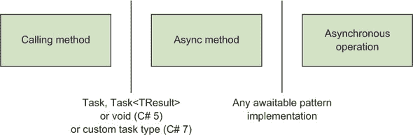

这里你有三个代码块（方法）和两种边界类型（方法返回类型）。作为一个简单的例子，在我们的页面长度获取应用程序的控制台版本中，你可能会有以下代码。

##### 列表 5.2\. 在异步方法中检索页面长度

```
static readonly HttpClient client = new HttpClient();

static async Task<int> GetPageLengthAsync(string url)
{
    Task<string> fetchTextTask = client.GetStringAsync(url);
    int length = (await fetchTextTask).Length;
    return length;
}

static void PrintPageLength()
{
    Task<int> lengthTask =
        GetPageLengthAsync("http://csharpindepth.com");
    Console.WriteLine(lengthTask.Result);
}
```

图 5.2 展示了 列表 5.2 中的具体细节如何映射到 图 5.1 中的概念。

##### 图 5.2\. 将 列表 5.2 的细节应用于 图 5.1 中显示的通用模式

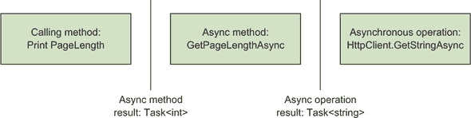

你主要对 `GetPageLengthAsync` 方法感兴趣，但我包括了 `PrintPageLength`，这样你可以看到这些方法是如何交互的。特别是，你绝对需要了解方法边界处的有效类型。我将在本章中以各种形式重复这个图。

你终于准备好查看编写异步方法及其行为方式了。这里有很多内容需要介绍，因为你可以做的事情和当你这样做时会发生的事情在很大程度上是融合在一起的。

只有两处新的语法：`async`是在声明异步方法时使用的修饰符，而`await`运算符用于消费异步操作。但是，随着信息在程序各部分之间传递的方式变得复杂，尤其是在你必须考虑出错时，这会变得特别复杂。我已经尝试将不同的方面分开，但你的代码将一次性处理所有这些。如果你在阅读这一节时发现自己正在问“但是……怎么办？”的问题，请继续阅读；很可能你的问题很快就会得到解答。

接下来的三个部分将探讨异步方法在三个阶段的表现：

+   声明异步方法

+   使用`await`运算符异步等待操作完成

+   方法完成时返回值

图 5.3 展示了这些章节如何融入我们的概念模型。

##### 图 5.3\. 展示 5.3 节、5.4 节和 5.5 节如何融入异步概念模型

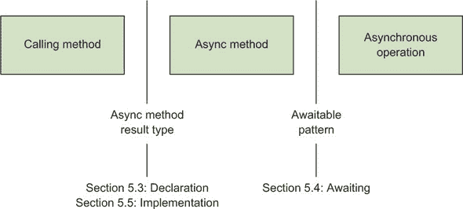

让我们从方法声明本身开始；这是最容易的部分。

### 5.3\. 异步方法声明

异步方法声明的语法与任何其他方法的语法完全相同，只是它必须包含`async`上下文关键字。这个关键字可以出现在返回类型之前的任何位置。所有这些都是有效的：

```
public static async Task<int> FooAsync() { ... }
public async static Task<int> FooAsync() { ... }
async public Task<int> FooAsync() { ... }
public async virtual Task<int> FooAsync() { ... }
```

我的偏好是将`async`修饰符直接放在返回类型之前，但没有任何理由你不应该制定自己的约定。像往常一样，与你的团队讨论，并尽量在单个代码库中保持一致性。

现在，`async`上下文关键字有一个小小的秘密：语言设计者其实根本不需要包含它。就像编译器在方法中使用`yield return`或`yield break`时进入一种迭代器块模式一样，编译器本可以检测到方法中`await`的使用，并利用这一点进入异步模式。但我很高兴`async`是必需的，因为它使得使用异步方法编写的代码更容易阅读。它立即设定了你的期望，因此你会主动寻找`await`表达式，你可以主动寻找任何应该转换为异步调用和`await`表达式的阻塞调用。

虽然`async`修饰符在生成的代码中没有表示，但这很重要。从调用方法的角度来看，它是一个正常的方法，碰巧返回一个任务。你可以将现有的方法（具有适当的签名）更改为使用 `async`，或者你可以朝相反的方向进行；这是源代码和二进制文件兼容的更改。由于这是方法实现的一个细节，因此你不能使用 `async` 声明抽象方法或接口中的方法。完全可能存在一个指定方法返回类型为 `Task<int>` 的接口；该接口的一个实现可以使用 async/await，而另一个实现则使用常规方法。

#### 5.3.1\. 异步方法的返回类型

调用者与异步方法之间的通信实际上是以返回的值来进行的。在 C# 5 中，异步函数限制为以下返回类型：

+   `void`

+   `Task`

+   `Task<TResult>`（对于某种类型 `TResult`，该类型本身也可以是类型参数）

在 C# 7 中，这个列表扩展到包括 *任务类型*。你将在 5.8 节 和 第六章 中再次回到这些内容。

.NET 4 的 `Task` 和 `Task<TResult>` 类型都表示一个可能尚未完成的操作；`Task<TResult>` 继承自 `Task`。这两个之间的区别在于，`Task<TResult>` 表示返回类型为 `TResult` 的操作，而 `Task` 不必产生任何结果。尽管如此，返回 `Task` 仍然很有用，因为它允许调用代码将其自己的延续附加到返回的任务上，检测任务何时失败或完成，等等。在某些情况下，你可以将 `Task` 视为类似于 `Task<void>` 类型，如果这样的类型是有效的话。

| |
| --- |

##### 注意

在这一点上，F# 开发者可以理直气壮地夸耀 `Unit` 类型，它与 `void` 类似，但是一个真正的类型。`Task` 和 `Task<TResult>` 之间的差异可能会令人沮丧。如果你可以使用 `void` 作为类型参数，你就不需要 `Action` 家族的委托了；例如，`Action<string>` 等同于 `Func<string, void>`。

| |
| --- |

异步方法能够返回 `void` 是为了与事件处理器兼容。例如，你可能有一个这样的 UI 按钮点击处理器：

```
private async void LoadStockPrice(object sender, EventArgs e)
{
    string ticker = tickerInput.Text;
    decimal price = await stockPriceService.FetchPriceAsync(ticker);
    priceDisplay.Text = price.ToString("c");
}
```

这是一个异步方法，但调用代码（按钮的 `OnClick` 方法或引发事件的任何框架代码片段）并不关心。它不需要知道你何时完成事件处理——何时加载股票价格并更新用户界面。它只是调用它被提供的那个事件处理器。编译器生成的代码最终会变成一个状态机，将一个延续附加到 `FetchPriceAsync` 返回的任何内容上，这是一个实现细节。

你可以使用前面的方法订阅事件，就像它是任何其他事件处理器一样：

```
loadStockPriceButton.Click += LoadStockPrice;
```

最终（是的，我故意这样做的），对调用代码来说，它只是一个普通的方法。它有一个`void`返回类型和类型为`object`和`EventArgs`的参数，这使得它适合作为`EventHandler`委托实例的动作。

| |
| --- |

##### 警告

事件订阅几乎是唯一推荐从异步方法返回`void`的情况。在其他任何不需要返回特定值的情况下，最好将方法声明为返回`Task`。这样，调用者就能`await`操作完成，检测失败等。

| |
| --- |

尽管异步方法的返回类型相当严格，但大多数其他方面都很正常：异步方法可以是泛型、静态或非静态，并指定任何常规访问修饰符。然而，对你可以使用的参数存在限制。

#### 5.3.2. 异步方法中的参数

在异步方法中，没有任何参数可以使用`out`或`ref`修饰符。这很有道理，因为那些修饰符是用来将信息传回调用代码的；异步方法可能还没有运行，当控制权返回给调用者时，引用参数的值可能还没有被设置。实际上，情况可能比这还要复杂：想象一下将局部变量作为`ref`参数的参数传递；异步方法最终可能会在调用方法已经完成后尝试设置该变量。尝试这样做并没有太多意义，因此编译器禁止这样做。此外，指针类型不能用作异步方法参数类型。

在你声明了方法之后，你可以开始编写方法体并`await`其他异步操作。让我们看看你可以在哪里以及如何使用`await`表达式。

### 5.4. `await`表达式

声明带有`async`修饰符的方法的整个目的是在该方法中使用`await`表达式。关于方法的其他方面看起来都很正常：你可以使用各种控制流——循环、异常、`using`语句，等等。那么，你可以在哪里使用`await`表达式，它做什么呢？

`await`表达式的语法很简单：它是`await`运算符后跟另一个产生值的表达式。你可以`await`方法调用的结果、变量、属性。它不必是一个简单的表达式。你可以将方法调用链接起来并`await`其结果：

```
int result = await foo.Bar().Baz();
```

`await`运算符的优先级低于点运算符，因此以下代码与以下代码等价：

```
int result = await (foo.Bar().Baz());
```

然而，对可以`await`的表达式有限制。它们必须是`awaitable`的，这就是`awaitable`模式的作用所在。

#### 5.4.1. `awaitable`模式

*awaitable pattern* 用于确定可以使用 `await` 操作符的类型。图 5.4 是一个提醒，我在谈论第二个边界从 图 5.1：异步方法如何与另一个异步操作交互。awaitable pattern 是一种将我们所说的异步操作进行编码的方式。

##### 图 5.4。awaitable pattern 允许异步方法异步等待操作完成

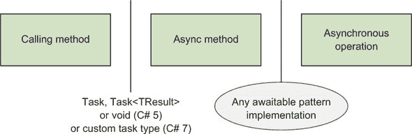

您可能期望这将以接口的形式表达，就像编译器要求类型实现 `IDisposable` 以支持 `using` 语句一样。相反，它基于一个模式。想象一下，您有一个类型为 `T` 的表达式，您想等待它。编译器执行以下检查：

+   `T` 必须有一个无参数的 `GetAwaiter()` 实例方法，或者必须有一个接受单个参数类型为 `T` 的扩展方法。`GetAwaiter` 方法不能是 void。该方法的返回类型被称为 *awaiter type*。

+   awaiter 类型必须实现 `System.Runtime.INotifyCompletion` 接口。该接口有一个方法：`void OnCompleted (Action)`。

+   awaiter 类型必须有一个可读的实例属性 `IsCompleted`，其类型为 `bool`。

+   awaiter 类型必须有一个非泛型的无参数实例方法 `GetResult`。

+   列出的成员不必是公共的，但它们需要从您尝试从其中获取值的异步方法中可访问。（因此，您可能可以从某些代码中等待特定类型的值，但不能从所有代码中等待。但这非常不寻常。）

如果 `T` 通过了所有这些检查，恭喜您——您可以从类型 `T` 等待一个值！但是，编译器还需要更多信息来确定 await 表达式的类型。这由 awaiter 类型的 `GetResult` 方法的返回类型确定。如果它是一个 `void` 方法，那么 await 表达式被分类为无结果的表达式，就像直接调用 `void` 方法的表达式一样。否则，await 表达式被分类为产生与 `GetResult` 返回类型相同类型的值。

例如，让我们考虑静态 `Task.Yield()` 方法。与其他大多数 `Task` 上的方法不同，`Yield()` 方法本身不返回任务；它返回一个 `YieldAwaitable`。以下是涉及类型的简化版本：

```
public class Task
{
    public static YieldAwaitable Yield();
}

public struct YieldAwaitable
{
    public YieldAwaiter GetAwaiter();

    public struct YieldAwaiter : INotifyCompletion
    {
        public bool IsCompleted { get; }
        public void OnCompleted(Action continuation);
        public void GetResult();
    }
}
```

如您所见，`YieldAwaitable` 遵循之前描述的 awaitable pattern。因此，这是有效的：

```
public async Task ValidPrintYieldPrint()
{
    Console.WriteLine("Before yielding");
    await Task.Yield();                      *1*
    Console.WriteLine("After yielding");
}
```

+   ***1* 有效**

但以下是不合法的，因为它试图使用等待 `YieldAwaitable` 的结果：

```
public async Task InvalidPrintYieldPrint()
{
    Console.WriteLine("Before yielding");
    var result = await Task.Yield();         *1*
    Console.WriteLine("After yielding");
}
```

+   ***1* 无效；这个 await 表达式不会产生值。**

`InvalidPrintYieldPrint` 的中间行无效，原因与直接编写此代码无效的原因完全相同：

```
var result = Console.WriteLine("WriteLine is a void method");
```

没有产生任何结果，因此你不能将其分配给一个变量。

令人惊讶的是，`Task`的 awaiter 类型有一个返回`void`类型的`GetResult`方法，而`Task<TResult>`的 awaiter 类型有一个返回`TResult`的`GetResult`方法。


**扩展方法的历史重要性**

`GetAwaiter`可以是一个扩展方法这一事实，其历史重要性大于当代重要性。C# 5 与.NET 4.5 在同一时间段发布，而.NET 4.5 引入了`GetAwaiter`方法到`Task`和`Task<TResult>`中。如果`GetAwaiter`必须是一个真正的实例方法，那么这将会使那些依赖于.NET 4.0 的开发者陷入困境。但是，由于扩展方法的支持，`Task`和`Task<TResult>`可以通过使用 NuGet 包来分别提供这些扩展方法，从而实现 async/await 功能。这也意味着社区可以在不测试.NET 4.5 预发布版本的情况下测试 C# 5 编译器的预发布版本。

在针对现代框架的代码中，其中所有相关的`GetAwaiter`方法都已经存在，你很少需要使用通过扩展方法使现有类型可 await 的能力。


你可以在第 5.6 节中看到更多关于 awaitable 模式中成员如何使用的详细信息，当你考虑异步方法的执行流程时。尽管如此，你对 await 表达式的工作还没有完成；存在一些限制。

#### 5.4.2\. await 表达式的限制

与`yield return`一样，限制限制了你可以使用 await 表达式的位置。最明显的限制是，你只能在异步方法和异步匿名函数（你将在第 5.7 节中看到）中使用它们。即使在异步方法中，你也不能在匿名函数中使用`await`运算符，除非那个匿名函数也是异步的。

`await`运算符也不允许在不安全上下文中使用。这并不意味着你无法在异步方法中使用不安全代码；只是你不能在那个部分使用`await`运算符。以下列表显示了一个虚构的例子，其中使用指针遍历字符串中的字符以找到该字符串中 UTF-16 代码单元的总数。它并没有做任何真正有用的事情，但它演示了在异步方法中使用不安全上下文。

##### 列表 5.3\. 在异步方法中使用不安全代码

```
static async Task DelayWithResultOfUnsafeCode(string text)
{
    int total = 0;
    unsafe                                               *1*
    {
        fixed (char* textPointer = text)
        {
            char* p = textPointer;
            while (*p != 0)
            {
                total += *p;
                p++;
            }
        }
    }
    Console.WriteLine("Delaying for " + total + "ms");
    await Task.Delay(total);                            *2*
    Console.WriteLine("Delay complete");
}
```

+   ***1* 在异步方法中有一个不安全上下文是可以的。**

+   ***2* 但是，await 表达式不能在其中使用。**

你也不能在 `lock` 中使用 `await` 操作符。如果你发现自己想在异步操作完成时保持锁定，你应该重新设计你的代码。不要通过手动调用 `Monitor.TryEnter` 和 `Monitor.Exit` 并使用 `try`/`finally` 块来规避编译器的限制；改变你的代码，以便在操作期间不需要锁定。如果这种情况真的很尴尬，考虑使用 `SemaphoreSlim`，它具有 `WaitAsync` 方法。

`lock` 语句使用的监视器只能由最初获取它的同一线程释放，这与在 `await` 表达式之前执行代码的线程将不同于之后执行代码的线程的明确可能性相矛盾。即使使用的是同一线程（例如，因为你处于 GUI 同步上下文），在异步操作的开始和结束之间，同一线程上可能已经执行了其他代码，并且那其他代码能够进入同一监视器的 `lock` 语句，这几乎肯定不是你想要的。基本上，`lock` 语句和异步操作不太相容。

在以下情况下，`await` 操作符在 C# 5 中无效，但从 C# 6 开始是有效的：

+   任何带有 `catch` 块的 `try` 块

+   任何 `catch` 块

+   任何 `finally` 块

在只有一个 `finally` 块的 `try` 块中使用 `await` 操作符一直是可以的，这意味着在 `using` 语句中使用 `await` 一直是可以的。在 C# 5 发布之前，C# 设计团队没有想出如何在之前列出的上下文中安全可靠地包含 `await` 表达式。这偶尔会不方便，团队在实现 C# 6 时找到了构建适当状态机的方法，因此那里的限制被取消了。

你现在知道了如何声明一个异步方法以及如何在其中使用 `await` 操作符。当你完成工作后怎么办？让我们看看如何将值返回到调用代码。

### 5.5\. 返回值的包装

我们已经探讨了如何声明调用代码和异步方法之间的边界以及如何在异步方法内等待任何异步操作。现在让我们看看如何使用返回语句来实现将值返回到调用代码的第一个边界；参见图 5.5。

##### 图 5.5\. 从异步方法返回结果到其调用者

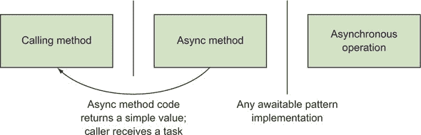

你已经看到了一个返回数据的例子，但让我们再次看看它，这次只关注返回方面。这里是列表 5.2 的相关部分：

```
static async Task<int> GetPageLengthAsync(string url)
{
    Task<string> fetchTextTask = client.GetStringAsync(url);
    int length = (await fetchTextTask).Length;
    return length;
}
```

你可以看到`length`的类型是`int`，但方法的返回类型是`Task<int>`。生成的代码会为你处理包装，所以调用者会得到一个`Task<int>`，当它完成时将包含方法返回的值。返回非泛型`Task`的方法就像一个普通的`void`方法：它根本不需要返回语句，并且任何返回语句都必须是简单的`return`，而不是尝试指定一个值。在任何情况下，任务也会传播在异步方法中抛出的任何异常。（你将在第 5.6.5 节中更详细地了解异常。）

希望到现在，你应该对为什么这种包装是必要的有一个很好的直觉；方法几乎肯定会在到达`return`语句之前返回给调用者，并且它必须以某种方式将信息传播给那个调用者。`Task<TResult>`（在计算机科学中通常被称为*future*）是在未来某个时间点返回一个值或异常的承诺。

与正常的执行流程一样，如果`return`语句出现在与一个相关联的`finally`块（包括所有这些因为`using`语句而发生）的作用域内，用于计算返回值的表达式将立即被评估，但它不会成为任务的结果，直到所有清理工作都完成。如果`finally`块抛出异常，你不会得到一个既成功又失败的任务；整个操作将失败。

为了重申我之前提到的一个观点，正是自动包装和解除包装的组合使得异步功能与组合工作得如此之好；异步方法可以轻松消费异步方法的输出，因此你可以从许多小块构建复杂的系统。你可以将这看作是类似于 LINQ：你在 LINQ 中对序列的每个元素执行操作，包装和解除包装意味着你可以将这些操作应用于序列，并返回序列。在异步世界中，你很少需要显式处理任务；相反，你`await`任务来消费它，并且作为异步方法机制的一部分自动生成一个结果任务。现在你了解了异步方法的样子，更容易给出示例来展示执行流程。

### 5.6. 异步方法流程

你可以从多个层面来思考 async/await：

+   你可以简单地期望 await 会做你想做的事情，而不必精确地定义这意味着什么。

+   你可以就代码将如何执行进行推理，从何时以及在哪条线程上发生什么的角度来看，但无需理解它是如何实现的。

+   你可以深入了解使这一切发生的基础设施。

到目前为止，我们主要是在第一层思考，偶尔会深入到第二层。本节重点讨论第二层，实际上是在查看语言所承诺的内容。我们将把第三点留到下一章，在那里你会看到编译器在幕后做了什么。（即使那样，你仍然可以更进一步；这本书不讨论低于 IL 层的内容。我们不会涉及操作系统或对异步和线程的硬件支持。）

在你开发的大部分时间里，根据你的上下文在第一和第二层之间切换是完全可以的。除非我正在编写需要协调多个操作的代码，否则我很少需要深入到第二层细节。大多数时候，我只是让事情按自己的方式运行。重要的是，当你需要时，你可以思考细节。

#### 5.6.1. 什么是 await 以及何时使用？

让我们先简化一下事情。有时`await`会与链式方法调用的结果或偶尔的属性一起使用，如下所示：

```
string pageText = await new HttpClient().GetStringAsync(url);
```

这使得`await`似乎可以改变整个表达式的意义。实际上，`await`始终只作用于单个值。前面的行等价于以下行：

```
Task<string> task = new HttpClient().GetStringAsync(url);
string pageText = await task;
```

同样，await 表达式的结果可以用作方法参数或另一个表达式的一部分。再次强调，如果你能从其他所有内容中分离出`await`特定的部分，那就更好了。

假设你有两个方法，`GetHourlyRateAsync()`和`GetHoursWorkedAsync()`，分别返回`Task<decimal>`和`Task<int>`。你可能会有这样一个复杂的语句：

```
AddPayment(await employee.GetHourlyRateAsync() *
           await timeSheet.GetHoursWorkedAsync(employee.Id));
```

C#表达式评估的正常规则适用，并且`*`运算符的左操作数必须在右操作数评估之前完全评估，因此前面的语句可以展开如下：

```
Task<decimal> hourlyRateTask = employee.GetHourlyRateAsync();
decimal hourlyRate = await hourlyRateTask;
Task<int> hoursWorkedTask = timeSheet.GetHoursWorkedAsync(employee.Id);
int hoursWorked = await hoursWorkedTask;
AddPayment(hourlyRate * hoursWorked);
```

你编写代码的方式是另一回事。如果你发现单行版本更容易阅读，那很好；如果你想全部展开，你将得到更多的代码，但这可能更容易理解和调试。你可以决定使用一种看起来相似但实际上并不完全相同的形式：

```
Task<decimal> hourlyRateTask = employee.GetHourlyRateAsync();
Task<int> hoursWorkedTask = timeSheet.GetHoursWorkedAsync(employee.Id);
AddPayment(await hourlyRateTask * await hoursWorkedTask);
```

我发现这是最易读的形式，并且它也有潜在的性能优势。你将在第 5.10.2 节中再次回到这个例子。

本节的关键要点是您需要能够弄清楚正在等待什么以及何时等待。在这种情况下，从`GetHourlyRateAsync`和`GetHoursWorkedAsync`返回的任务正在被等待。在所有情况下，它们都是在执行`AddPayment`调用之前被等待的，这是有意义的，因为您需要中间结果，以便可以将它们相乘并将乘积的结果作为参数传递。如果这是使用同步调用，所有这些都会很明显；我的目标是揭开等待部分的神秘面纱。现在您知道了如何将复杂代码简化为等待的值以及何时等待它，您可以继续了解在等待部分本身发生的事情。

#### 5.6.2. `await`表达式的评估

当执行到达`await`表达式时，你有两种可能性：要么你等待的异步操作已经完成，要么还没有。如果操作已经完成，执行流程很简单：它继续进行。如果操作失败并捕获异常来表示该失败，则抛出异常。否则，从操作中获取任何结果（例如，从`Task<string>`中提取`string`）并继续程序的下一部分。所有这些都是在没有任何线程上下文切换或将延续附加到任何东西的情况下完成的。

在更有趣的场景中，异步操作仍在进行中。在这种情况下，方法异步等待操作完成，然后在适当的环境中继续。这种异步等待实际上意味着方法根本就没有执行。将延续附加到异步操作上，方法返回。异步基础设施确保延续在正确的线程上执行：通常是线程池线程（在这种情况下，使用哪个线程无关紧要）或 UI 线程，这在有意义的场景中。这取决于同步上下文（在第 5.2.2 节中讨论），也可以使用`Task.ConfigureAwait`来控制，我们将在第 5.10.1 节中讨论。

| |
| --- |

**返回与完成**

描述异步行为最难的部分可能是谈论方法何时*返回*（无论是返回给原始调用者还是返回给调用延续的任何东西）以及何时*完成*。与大多数方法不同，异步方法可以多次返回——实际上，当它暂时没有更多工作可做时。

回到我们之前的比萨饼配送类比，如果你有一个`EatPizzaAsync`方法，它涉及到调用比萨饼公司下单、遇到配送员、等待比萨饼稍微冷却一下，然后最后吃掉它，该方法可能会在第一部分的每个部分之后返回，但只有在比萨饼被吃掉之后才会完成。

| |
| --- |

从开发者的角度来看，这感觉就像方法在异步操作完成时被暂停了。编译器确保方法内部使用的所有局部变量在继续之前与它们具有相同的值，就像迭代器块一样。

让我们通过一个小型的控制台应用程序的例子来看这两个情况，该应用程序使用单个异步方法等待两个任务。`Task.FromResult`总是返回一个已完成的任务，而`Task.Delay`返回一个在指定延迟后完成的任务。

##### 列表 5.4\. 等待完成和未完成的任务

```
static void Main()
{
    Task task = DemoCompletedAsync();         *1*
    Console.WriteLine("Method returned");
    task.Wait();                              *2*
    Console.WriteLine("Task completed");
}

static async Task DemoCompletedAsync()
{
    Console.WriteLine("Before first await");
    await Task.FromResult(10);                *3*
    Console.WriteLine("Between awaits");
    await Task.Delay(1000);                   *4*
    Console.WriteLine("After second await");
}
```

+   ***1* 调用异步方法**

+   ***2* 等待任务完成**

+   ***3* 等待一个完成的任务**

+   ***4* 等待一个未完成的任务**

列表 5.4 的输出如下：

```
Before first await
Between awaits
Method returned
After second await
Task completed
```

排序的重要方面如下：

+   当 await 完成的任务时，异步方法不会返回；方法继续以同步方式执行。这就是为什么你会看到前两行之间没有任何内容。

+   当 await 延迟任务时，异步方法确实会返回。这就是为什么在`Main`方法中打印出第三行`Method returned`。异步方法可以知道它等待的操作（延迟任务）尚未完成，因此返回以避免阻塞。

+   从异步方法返回的任务只有在方法完成时才会完成。这就是为什么在`After second await`之后打印出`Task completed`。

我尝试在图 5.6 中捕捉 await 表达式的流程，尽管经典的流程图并不是真正考虑到异步行为。

##### 图 5.6\. await 处理的用户可见模型

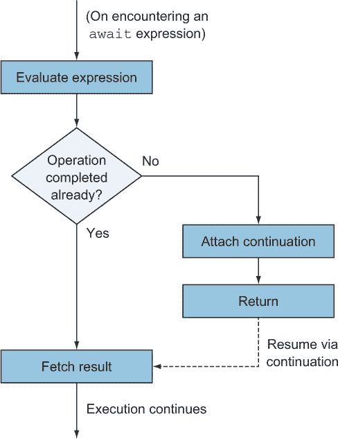

你可以将虚线看作是流向流程图顶部的另一条线作为替代。请注意，我假设 await 表达式的目标是有一个结果。如果你正在等待一个普通的`Task`或类似的东西，*获取结果*实际上意味着检查操作是否成功完成。

值得停下来简要思考一下从异步方法返回意味着什么。再次强调，有两种可能性存在：

+   这是你必须等待的第一个 await 表达式，所以你的堆栈中仍然有原始调用者。（记住，在你真正需要等待之前，方法以同步方式执行。）

+   你已经等待了其他尚未完成的事情，所以你在一个由*某物*调用的继续中。你的调用堆栈几乎肯定会与你在第一次进入方法时看到的堆栈有显著不同。

在第一种情况下，你通常会返回一个`Task`或`Task<TResult>`给调用者。显然，你还没有方法的结果；即使没有要返回的值，你也不知道方法是否会无异常地完成。因此，你将返回的任务必须是一个未完成的任务。

在后一种情况下，调用你的东西取决于你的上下文。例如，在一个 Windows Forms UI 中，如果你在 UI 线程上启动了你的异步方法并且没有故意切换到其他线程，整个方法就会在 UI 线程上执行。在方法的前一部分，你会在某个事件处理器或其他地方——无论是什么触发了异步方法。然而，稍后，你将直接由 Windows Forms 内部机制（通常称为*消息泵*）调用，就像你使用`Control.BeginInvoke(continuation)`一样。在这里，调用代码——无论是 Windows Forms 消息泵、线程池机制的一部分还是其他东西——都不关心你的任务。

作为提醒，直到你遇到第一个真正的异步`await`表达式，方法完全以同步方式执行。调用异步方法*并不*像在单独的线程中启动一个新任务，确保你始终编写快速返回的异步方法是你的责任。诚然，这取决于你编写代码的上下文，但你应该通常避免在异步方法中执行长时间运行的阻塞工作。将其分离到另一个方法中，你可以为它创建一个`Task`。

我想简要回顾一下你等待的值已经完成的情况。你可能想知道为什么一个立即完成的操作最初要以异步方式表示。这有点像在 LINQ 中对序列调用`Count()`方法：在一般情况下，你可能需要遍历序列中的每个项目，但在某些情况下（例如，当序列最终是一个`List<T>`时），可以有一个简单的优化。有一个单一的抽象来覆盖这两种情况是有用的，但不需要支付执行时间的代价。

作为异步 API 案例中的现实世界示例，考虑从与磁盘上的文件关联的流中异步读取。你可能已经从磁盘中检索了你想要读取的所有数据并将其加载到内存中，可能是作为之前的`ReadAsync`调用请求的一部分，因此立即使用它而不需要通过所有其他异步机制是有意义的。作为另一个例子，你可能在你的架构中有一个缓存；如果你有一个异步操作，它可以从内存缓存（返回一个完成的任务）或击中存储（返回一个非完成的任务，当存储调用完成时完成），那么这将是透明的。现在你了解了流程的基本知识，你可以看到可等待模式如何融入拼图。

#### 5.6.3. 可等待模式成员的使用

在第 5.4.1 节中，我描述了类型必须实现的可等待模式，以便你能够等待该类型的表达式。你现在可以将模式的各个部分映射到你试图实现的行为。与图 5.6 相同，但略有扩展并重新措辞，以使用可等待模式而不是一般描述。

##### 图 5.7\. 通过可等待模式处理 await

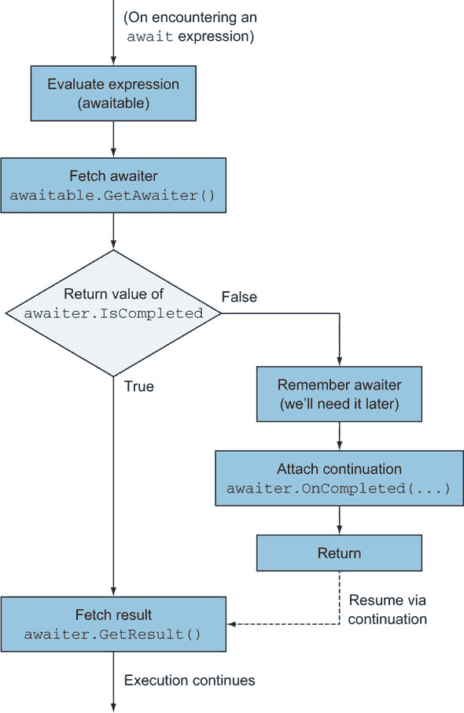

当它写成这样时，你可能想知道所有这些喧嚣是什么意思；为什么语言支持本身就有价值？尽管附加一个延续可能比你想象的要复杂，但。在简单的情况下，当控制流完全线性（做一些工作，等待某事，做更多的工作，等待其他事情）时，很容易想象延续可能看起来像 lambda 表达式，即使它可能并不愉快。然而，一旦代码包含循环或条件，并且你希望将代码保持在单个方法中，生活就会变得复杂得多。正是在这里，async/await 的好处真正显现出来。尽管你可以争论编译器只是在应用语法糖，但手动创建延续和让编译器为你这样做之间的可读性差异是巨大的。

到目前为止，我描述了所有我们等待的值都成功完成的愉快路径。失败会发生什么呢？

#### 5.6.4\. 异常展开

在 .NET 中，表示失败的传统方式是通过异常。就像向调用者返回一个值一样，异常处理需要语言提供额外的支持。当你等待一个失败的异步操作时，它可能很久以前在完全不同的线程上失败了。常规的同步方式向上传播异常并不自然。相反，async/await 基础设施采取了一些步骤，使处理异步失败的经历尽可能类似于同步失败。如果你认为失败是另一种结果，那么异常和返回值以类似方式处理是有意义的。你将在第 5.6.5 节中看到异常是如何从一个异步方法中传播出来的，但在那之前，你将看到当你等待一个失败的操作时会发生什么。

就像等待器的 `GetResult()` 方法旨在获取返回值（如果有的话）一样，它也负责将异步操作中发生的任何异常传播回方法。这并不像听起来那么简单，因为在异步世界中，一个 `Task` 可以代表多个操作，从而导致多个失败。尽管有其他可等待模式实现，但具体考虑 `Task` 和 `Task<TResult>` 是有价值的，因为它们是你可能要等待的大多数时间所使用的类型。

`Task` 和 `Task<TResult>` 以多种方式指示失败：

+   当异步操作失败时（`IsFaulted` 返回 `true`），任务的状态变为 `Faulted`。

+   `Exception` 属性返回一个包含所有（可能多个）导致任务失败的异常的 `AggregateException`，如果任务没有出错则返回 `null`。

+   如果任务最终处于错误状态，`Wait()` 方法将抛出一个 `AggregateException`。

+   `Task<TResult>` 的 `Result` 属性（它也等待完成）同样会抛出一个 `AggregateException`。

此外，任务支持通过 `CancellationTokenSource` 和 `CancellationToken` 实现取消操作的概念。如果一个任务被取消，`Wait()` 方法以及 `Result` 属性将抛出一个包含 `OperationCanceledException`（实际上是一个从 `OperationCanceledException` 派生的 `TaskCanceledException`）的 `AggregateException`，但状态变为 `Canceled` 而不是 `Faulted`。

当你等待一个任务时，如果它处于错误或取消状态，将抛出一个异常，但不是 `AggregateException`。相反，为了方便（在大多数情况下），将抛出 `AggregateException` 中的第一个异常。在大多数情况下，这正是你想要的。这与异步功能的精神相符，允许你编写看起来与同步代码非常相似的异步代码。例如，考虑以下列表，它尝试一次获取一个 URL，直到其中一个成功或你尝试的 URL 已用尽。

##### 列表 5.5\. 在获取网页时捕获异常

```
async Task<string> FetchFirstSuccessfulAsync(IEnumerable<string> urls)
{
    var client = new HttpClient();
    foreach (string url in urls)
    {
        try
        {
            return await client.GetStringAsync(url);    *1*
        }
        catch (HttpRequestException exception)          *2*
        {
            Console.WriteLine("Failed to fetch {0}: {1}",
                url, exception.Message);
        }
    }
    throw new HttpRequestException("No URLs succeeded");
}
```

+   ***1* 如果成功则返回字符串**

+   ***2* 捕获并显示失败，否则**

目前，忽略你丢失了所有原始异常以及你正在按顺序获取所有页面的情况。我试图说明的是，在这里捕获 `HttpRequestException` 是你所期望的；你正在尝试使用 `HttpClient` 进行异步操作，如果出现错误，它将抛出 `HttpRequestException`。你想要捕获并处理它，对吧？这确实 *感觉* 是你想要做的——但是 `GetStringAsync()` 调用不能因为服务器超时等错误抛出 `HttpRequestException`，因为该方法只 *开始* 操作。在它发现错误时，方法已经返回了。它所能做的就是返回一个最终失败的包含 `HttpRequestException` 的任务。如果你简单地调用任务的 `Wait()`，将抛出一个包含其内部的 `HttpRequestException` 的 `AggregateException`。任务等待器的 `GetResult` 方法会抛出 `HttpRequestException`，并且它会被 `catch` 块正常捕获。

当然，这可能会丢失信息。如果一个有故障的任务中有多个异常，`GetResult` 只能抛出一个，并且它任意地使用了第一个。你可能想要重写前面的代码，以便在失败时，调用者可以捕获一个 `AggregateException` 并检查失败的 *所有* 原因。重要的是，一些框架方法就是这样做的。例如，`Task.WhenAll()` 是一个异步等待多个任务（在方法调用中指定）完成的异步方法。如果其中任何一个失败，结果将是一个包含所有有故障任务异常的失败。但是，如果你只等待 `WhenAll()` 返回的任务，你将只会看到第一个异常。通常，如果你想详细检查异常，最简单的方法是使用 `Task.Exception` 对每个原始任务进行操作。

总结来说，你知道在等待时，awaiter 类型的 `GetResult()` 方法用于传播成功的结果和异常。在 `Task` 和 `Task<TResult>` 的情况下，`GetResult()` 解包失败任务的 `AggregateException` 以抛出其内部异常的第一个。这就解释了异步方法是如何消耗另一个异步操作的——但是它是如何将自身的返回结果传播给调用代码的呢？

#### 5.6.5. 方法完成

让我们回顾几个要点：

+   异步方法通常在完成之前就返回了。

+   一旦遇到一个 await 表达式，其中等待的操作尚未完成，它就会立即返回。

+   假设它不是一个 `void` 方法（在这种情况下，调用者没有简单的方法来了解发生了什么），方法返回的值将是一个某种类型的任务：在 C# 7 之前是 `Task` 或 `Task<TResult>`，从 C# 7 开始有自定义任务类型的选项（这将在 第 5.8 节 中解释）。为了简单起见，让我们假设它是一个 `Task<TResult>`。

+   该任务负责指示异步方法何时以及如何完成。如果方法正常完成，任务状态将变为`RanToCompletion`，并且`Result`属性包含返回值。如果方法体抛出异常，任务状态将变为`Faulted`（或根据异常变为`Canceled`），异常将被包装到任务的`Exception`属性中的`AggregateException`中。

+   当任务状态变为这些终端状态之一时，与其关联的任何延续（例如，在等待任务的任何异步方法中的代码）都可以被安排运行。

| |
| --- |

**是的，这听起来像是重复**

您可能想知道是否不小心跳回了几页并读了两遍。您在等待某事时不是刚刚看到了同样的想法吗？

绝对如此。我所做的只是展示异步方法如何指示其完成情况，而不是展示 await 表达式如何检查其他事物的完成情况。如果这些感觉不同，那就很奇怪，因为通常异步方法会串联在一起：您在一个异步方法中等待的值可能是由另一个异步方法返回的值。用更华丽的词来说，异步操作*易于组合*。

| |
| --- |

所有这些工作都是由编译器在大量基础设施的帮助下为您完成的。您将在下一章中看到其中的一些细节（尽管不是每一个角落和缝隙；即使是我也有限制）。本章更多地关注您可以在代码中依赖的行为。

##### 成功返回

成功情况是最简单的情况：如果方法声明为返回`Task<TResult>`，则返回语句必须提供类型为`T`（或可以转换为`TResult`的类型）的值，并且异步基础设施将此值传播到任务中。

如果返回类型是`Task`或`void`，任何返回语句都必须是`return`形式，不带值，或者允许执行到达方法的末尾，就像非异步`void`方法一样。在这两种情况下，都没有要传播的值，但任务的状态会相应地改变。

##### 懒异常和参数验证

关于异常的最重要的一点是，异步方法永远不会直接抛出异常。即使方法体首先做的事情是抛出异常，它也会返回一个故障任务。（在这种情况下，任务将立即故障。）这在参数验证方面有点麻烦。假设您想在异步方法中验证参数没有 null 值之后做一些工作。如果您像在正常同步代码中那样验证参数，调用者直到任务被等待时才会发现问题。以下列表提供了一个示例。

##### 列表 5.6\. 异步方法中的断言参数验证错误

```
static async Task MainAsync()
{
    Task<int> task = ComputeLengthAsync(null);              *1*
    Console.WriteLine("Fetched the task");
    int length = await task;                                *2*
    Console.WriteLine("Length: {0}", length);
}

static async Task<int> ComputeLengthAsync(string text)
{
    if (text == null)
    {
        throw new ArgumentNullException("text");            *3*
    }
    await Task.Delay(500);                                  *4*
    return text.Length;
}
```

+   ***1* 故意传递一个错误的参数**

+   ***2* 等待结果**

+   ***3* 尽早抛出异常**

+   ***4* 模拟真实异步工作**

输出在失败之前显示了 `Fetched the task`。由于在验证之前没有 `await` 表达式，异常在输出之前就已经同步抛出了，但调用代码直到它等待返回的任务时才会看到它。某些参数验证可以合理地在前端进行，而不会花费很长时间（或产生其他异步操作）。在这些情况下，如果失败能够立即报告，在系统陷入更大的麻烦之前，那就更好了。例如，如果你向 `HttpClient.GetStringAsync` 传递一个 null 引用，它将立即抛出异常。


##### 注意

如果你曾经编写过需要验证其参数的迭代器方法，这可能会听起来很熟悉。它并不完全相同，但它有类似的效果。在迭代器块中，方法中的任何代码，包括参数验证，都不会在方法返回的序列上的第一次调用 `MoveNext()` 之前执行。在异步情况下，参数验证立即发生，但异常直到你等待结果时才会变得明显。


你可能不会对此过于担忧。在许多情况下，急切参数验证可能被视为一个锦上添花的特性。我当然在我的代码中对此变得不那么吹毛求疵了，这是一个实用主义的问题；在大多数情况下，时间上的差异并不十分重要。但是，如果你确实想在返回任务的方法中同步抛出异常，你有三种选择，它们都是基于相同主题的变体。

策略是编写一个返回任务的非异步方法，通过验证参数然后调用一个假设参数已经被验证的单独的异步函数来实现。这三种变体在于异步函数的表示方式：

+   你可以使用一个单独的异步方法。

+   你可以使用异步匿名函数（你将在下一节中看到）。

+   在 C# 7 及以上版本中，你可以使用局部异步方法。

我的偏好是最后一种；它有好处，即不会在类中引入另一个方法，而不需要创建代理。列表 5.7 展示了第一种选择，因为那不依赖于我们尚未涵盖的内容，但其他选项的代码是相似的（并且可以在书籍的可下载代码中找到）。这只是一个 `ComputeLengthAsync` 方法；调用代码不需要更改。

##### 列表 5.7\. 使用单独方法的急切参数验证

```
static Task<int> ComputeLengthAsync(string text)             *1*
{
    if (text == null)
    {
        throw new ArgumentNullException("text");
    }
    return ComputeLengthAsyncImpl(text);                     *2*
}

static async Task<int> ComputeLengthAsyncImpl(string text)
{
    await Task.Delay(500);                                   *3*
    return text.Length;
}
```

+   ***1* 非异步方法，因此异常不会被封装在任务中**

+   ***2* 验证后，委托给实现方法。**

+   ***3* 实现异步方法假设已验证的输入**

现在当 `ComputeLengthAsync` 被一个 null 参数调用时，异常会同步抛出，而不是返回一个已故障的任务。

在继续讨论异步匿名函数之前，让我们简要回顾一下取消操作。我曾在几个地方提到过这一点，但更详细地考虑一下是有价值的。

##### 处理取消

任务并行库（TPL）在 .NET 4 中引入了统一的取消模型，使用了两种类型：`CancellationTokenSource`和`CancellationToken`。想法是你可以创建一个`CancellationTokenSource`，然后请求一个`CancellationToken`，这个令牌会被传递给一个异步操作。你可以在源上执行取消操作，但这会反映到令牌上。（因此，你可以将相同的令牌传递给多个操作，而不必担心它们之间相互干扰。）有各种使用取消令牌的方法，但最符合习惯的方法是调用`ThrowIfCancellationRequested`，如果令牌已被取消，它将抛出`OperationCanceledException`，否则不做任何操作.^([1]) 同样的异常也会在同步调用（如`Task.Wait`）被取消时抛出。

> ¹
> 
> 以下是一个可下载源代码中的示例。

在 C# 规范中，关于这如何与异步方法交互没有文档记录。根据规范，如果一个异步方法体抛出*任何*异常，该方法返回的任务将处于错误状态。*错误*的确切含义是特定于实现的，但现实中，如果一个异步方法抛出`OperationCanceledException`（或其派生类型，如`TaskCanceledException`），返回的任务最终将具有`Canceled`状态。你可以通过直接抛出`OperationCanceledException`而不使用任何取消令牌来证明只有异常类型决定了状态。

##### 列表 5.8\. 通过抛出`OperationCanceledException`创建已取消的任务

```
static async Task ThrowCancellationException()
{
    throw new OperationCanceledException();
}
...
Task task = ThrowCancellationException();
Console.WriteLine(task.Status);
```

这输出的是`Canceled`，而不是你根据规范可能期望的`Faulted`。如果你在任务上调用`Wait()`或请求其结果（在`Task<TResult>`的情况下），异常仍然会在`AggregateException`内部抛出，所以你不需要在使用的每个任务上显式开始检查取消。


**比赛开始了吗？**

你可能想知道在列表 5.8 中是否存在竞态条件。毕竟，你调用了一个异步方法，然后立即期望状态被固定。如果这段代码是启动一个新线程，那将是危险的——但事实并非如此。

记住，在第一个`await`表达式之前，异步方法以同步方式运行。它仍然执行结果和异常包装，但它是异步方法的事实并不一定意味着涉及更多的线程。`ThrowCancellationException`方法不包含任何`await`表达式，所以整个方法以同步方式运行；你知道它返回时会有一个结果。Visual Studio 会对任何不包含任何`await`表达式的异步函数发出警告，但在这个情况下，这正是你想要的。

| |
| --- |

重要的是，如果你等待一个被取消的操作，将会抛出原始的`OperationCanceledException`。因此，除非你采取任何直接行动，否则异步方法返回的任务也将被取消；取消会以自然的方式传播。

恭喜你走到了这一步。你现在已经覆盖了本章大部分的难点。你仍然需要学习一些功能，但它们比前面的部分容易理解得多。在下一章，当我们剖析编译器在幕后所做的工作时，难度会再次增加，但到目前为止，你可以享受相对的简单性。

### 5.7\. 异步匿名函数

我不会在异步匿名函数上花费太多时间。正如你可能预期的那样，它们是两个功能的组合：匿名函数（lambda 表达式和匿名方法）和异步函数（可以包含`await`表达式的代码）。它们允许你创建代表异步操作的委托。你迄今为止关于异步方法所学的所有内容也适用于异步匿名函数。

| |
| --- |

##### 注意

如果你有所疑问，你不能使用异步匿名函数来创建表达式树。

| |
| --- |

你可以通过在开始处添加`async`修饰符来创建异步匿名函数，就像创建其他匿名方法或 lambda 表达式一样简单。以下是一个示例：

```
Func<Task> lambda = async () => await Task.Delay(1000);
Func<Task<int>> anonMethod = async delegate()
{
    Console.WriteLine("Started");
    await Task.Delay(1000);
    Console.WriteLine("Finished");
    return 10;
};
```

你创建的委托必须具有适合异步方法的签名（对于 C# 5 和 6，是`void`、`Task`或`Task<TResult>`，C# 7 中可以选择自定义任务类型）。你可以像其他匿名函数一样捕获变量，并添加参数。异步操作不会在委托被调用之前开始，多次调用会创建多个操作。尽管委托调用会启动操作，但与对异步方法的调用一样，它不是在等待启动操作的任务，你也不必在异步匿名函数的结果上使用`await`。以下列表显示了一个稍微更完整（尽管仍然没有意义）的示例。

##### 列表 5.9\. 使用 lambda 表达式创建和调用异步函数

```
Func<int, Task<int>> function = async x =>
{
    Console.WriteLine("Starting... x={0}", x);
    await Task.Delay(x * 1000);
    Console.WriteLine("Finished... x={0}", x);
    return x * 2;
};
Task<int> first = function(5);
Task<int> second = function(3);
Console.WriteLine("First result: {0}", first.Result);
Console.WriteLine("Second result: {0}", second.Result);
```

我故意选择了这些值，以便第二个操作比第一个操作完成得更快。但是，因为你需要在打印结果之前等待第一个操作完成（使用 `Result` 属性，它会在任务完成之前阻塞——再次提醒，注意你运行此代码的位置），所以输出看起来是这样的：

```
Starting... x=5
Starting... x=3
Finished... x=3
Finished... x=5
First result: 10
Second result: 6
```

所有这些行为都完全相同，就像你将异步代码放入异步方法中一样。

我写的异步方法比异步匿名函数多得多，但它们非常有用，尤其是在 LINQ 中。你无法在 LINQ 查询表达式中使用它们，但直接调用等效方法是可以的。尽管如此，它也有一些限制：因为异步函数永远不能返回 `bool`，所以你不能用异步函数调用 `Where`，例如。我通常使用 `Select` 将一个类型的任务序列转换为另一个类型的任务序列。现在我将讨论我已经多次提到的功能：C# 7 引入的额外泛化级别。

### 5.8\. C# 7 中的自定义任务类型

在 C# 5 和 C# 6 中，异步函数（即异步方法和异步匿名函数）只能返回 `void`、`Task` 或 `Task<TResult>`。C# 7 稍微放宽了这一限制，允许任何以特定方式装饰的类型用作异步函数的返回类型。

作为提醒，async/await 功能始终允许我们等待遵循可等待模式的自定义类型。这里的新功能允许编写返回自定义类型的异步方法。

这既复杂又简单。它之所以复杂，是因为如果你想要创建自己的任务类型，你将面临一些繁琐的工作。这不是给胆小的人准备的。它之所以简单，是因为你几乎肯定不会想这么做，除非是为了实验；你将想要使用 `ValueTask<TResult>`。现在让我们来看看它。

#### 5.8.1\. 99.9% 的情况：ValueTask<TResult>

在撰写本文时，`System.Threading.ValueTask<TResult>` 类型仅在 netcoreapp2.0 框架中作为内置类型存在，但它也通过 NuGet 的 `System.Threading.Tasks.Extensions` 包提供，这使得它具有更广泛的应用性。（最重要的是，该包包括对 netstandard1.0 的目标。）

`ValueTask<TResult>` 的描述很简单：它就像 `Task<TResult>`，但它是值类型。它有一个 `AsTask` 方法，允许你在需要时（例如，在 `Task.WhenAll` 或 `Task.WhenAny` 调用中将它作为一个元素包含）从它获取一个常规任务，但大多数时候，你将像等待一个任务一样等待它。

`ValueTask<TResult>`相对于`Task<TResult>`的优势是什么？这全部归结于堆分配和垃圾收集。`Task<TResult>`是一个类，尽管在某些情况下异步基础设施会重用完成的`Task<TResult>`对象，但大多数异步方法仍然需要创建一个新的`Task<TResult>`。在.NET 中分配对象成本足够低，在许多情况下你不需要担心它，但如果你在做很多或者如果你在严格的性能约束下工作，你想要尽可能地避免这种分配。

如果一个异步方法在某个不完整的事物上使用`await`表达式，对象分配是不可避免的。它将立即返回，但必须安排一个后续操作在等待的操作完成时执行方法的其余部分。在大多数异步方法中，这是常见的情况；你不会期望你等待的操作在你等待之前完成。在这些情况下，`ValueTask<TResult>`没有提供任何优势，甚至可能更昂贵。

然而，在少数情况下，已经完成的案例是最常见的一种，这就是`ValueTask<TResult>`发挥作用的地方。为了演示这一点，让我们考虑一个简化版的真实世界示例。假设你想要逐字节从`System.IO.Stream`读取，并且异步地这样做。你可以轻松地添加一个缓冲抽象层来避免在底层`Stream`上频繁调用`ReadAsync`，但随后你可能需要添加一个异步方法来封装从流中填充缓冲区的操作，然后返回下一个字节。你可以使用`byte?`与空值来表示你已经到达了数据的末尾。这个方法很容易编写，但如果每次调用它都分配一个新的`Task<byte?>`，你将非常频繁地敲打垃圾收集器。使用`ValueTask<TResult>`，只有在需要从流中重新填充缓冲区的情况下才需要堆分配。以下列表显示了包装类型（`ByteStream`）及其使用示例。

##### 列表 5.10\. 包装流以实现高效的异步字节访问

```
public sealed class ByteStream : IDisposable
{
    private readonly Stream stream;
    private readonly byte[] buffer;
    private int position;                                    *1*
    private int bufferedBytes;                               *2*

    public ByteStream(Stream stream)
    {
        this.stream = stream;
        buffer = new byte[1024 * 8];                         *3*
    }

    public async ValueTask<byte?> ReadByteAsync()
    {
        if (position == bufferedBytes)                       *4*
        {
            position = 0;
            bufferedBytes = await
                stream.ReadAsync(buffer, 0, buffer.Length)   *5*
                       .ConfigureAwait(false);               *6*
            if (bufferedBytes == 0)
            {
                return null;                                 *7*
            }
        }
        return buffer[position++];                           *8*
    }

    public void Dispose()
    {
        stream.Dispose();
    }
}

Sample usage
using (var stream = new ByteStream(File.OpenRead("file.dat")))
{
    while ((nextByte = await stream.ReadByteAsync()).HasValue)
    {
        ConsumeByte(nextByte.Value);                         *9*
    }
}
```

+   ***1* 下一个要返回的缓冲区索引**

+   ***2* 缓冲区中读取的字节数**

+   ***3* 8 KB 缓冲区意味着你很少需要等待。**

+   ***4* 如果需要则填充缓冲区**

+   ***5* 异步从底层流读取**

+   ***6* 配置等待操作以忽略上下文**

+   ***7* 在适当的位置指示流的末尾**

+   ***8* 从缓冲区返回下一个字节**

+   ***9* 以某种方式使用字节**

目前，你可以忽略`ReadByteAsync`中的`ConfigureAwait`调用。当你查看如何有效地使用 async/await 时，你将回到这一点，在第 5.10 节。其余的代码很简单，所有这些都可以在不使用`ValueTask<TResult>`的情况下编写；它只是效率要低得多。

在这种情况下，我们 `ReadByteAsync` 方法的多数调用甚至不会使用 `await` 操作符，因为你仍然有缓冲的数据可以返回，但如果你在等待另一个通常立即完成的值，这同样是有用的。正如我在 5.6.2 节 中解释的那样，当你等待一个已经完成的操作时，执行会同步继续，这意味着你不需要安排一个后续操作，可以避免对象分配。

这是 `Google.Protobuf` 包中 `CodedInputStream` 类原型的简化版本，是 Google 协议缓冲区序列化协议的 .NET 实现。实际上，有多个方法，每个方法要么同步要么异步地读取一小部分数据。使用包含大量整数字段的消息进行反序列化可能涉及大量的方法调用，并且每次使异步方法返回 `Task<TResult>` 都会非常低效。


##### 注意

你可能想知道，如果你有一个不返回值（通常返回类型为 `Task`）的异步方法，但仍然属于无需安排任何后续操作即可完成的情况，你应该怎么做。在这种情况下，你可以坚持返回 `Task`：async/await 基础设施会缓存一个任务，它可以返回任何声明为返回 `Task` 且同步完成且无异常的异步方法。如果方法同步完成但带有异常，分配 `Task` 对象的成本很可能会被异常开销所淹没。


对于我们大多数人来说，能够将 `ValueTask<TResult>` 用作异步方法的返回类型是 C# 7 在异步方面真正的优势。但这已经被以通用方式实现，允许你为异步方法创建自己的返回类型。

#### 5.8.2\. 0.1%的情况：构建自己的自定义任务类型

我再次强调，你几乎肯定永远不需要这些信息。我甚至不会尝试提供超出 `ValueTask<TResult>` 的用例，因为我能想到的任何用例都可能很晦涩。话虽如此，如果我不展示编译器用来确定一个类型是任务类型的模式的例子，这本书就不完整。我将在下一章中展示编译器如何使用这个模式，届时你将看到为异步方法生成的代码。

显然，自定义任务类型必须实现可等待模式，但这不仅仅是可等待模式。要创建自定义任务类型，你必须编写相应的*构建器类型*，并使用`System.Runtime.CompilerServices.AsyncMethodBuilderAttribute`来让编译器知道这两个类型之间的关系。这是一个与`ValueTask<TResult>`相同的 NuGet 包中可用的新属性，但如果你不想有额外的依赖项，你可以包含自己声明的属性（在正确的命名空间中，并具有适当的`BuilderType`属性）。然后编译器将接受这作为装饰任务类型的一种方式。

任务类型可以是单个类型参数的泛型或非泛型。如果是泛型，则该类型参数必须是 awaiter 类型中`GetResult`的类型；如果是非泛型，则`GetResult`必须有一个`void`返回类型.^([2]) 构建器必须与任务类型一样是泛型或非泛型。

> ²
> 
> 这让我有些惊讶。这意味着你不能编写一个总是表示返回字符串的操作的自定义任务类型，例如。鉴于整个功能的细分程度，真正想要在该功能中实现细分用例的可能性相当小。

构建器类型是编译器在编译返回你的自定义类型的方法时与你的代码交互的部分。它需要知道如何创建你的自定义任务，传播完成或异常，在延续后恢复，等等。你需要提供的方法和属性集比可等待模式复杂得多。最容易的方式是展示一个完整的示例，关于你需要提供的成员，而不涉及任何实现。

##### 列表 5.11\. 泛型任务类型所需的成员框架

```
[AsyncMethodBuilder(typeof(CustomTaskBuilder<>))]
public class CustomTask<T>
{
    public CustomTaskAwaiter<T> GetAwaiter();
}

public class CustomTaskAwaiter<T> : INotifyCompletion
{
    public bool IsCompleted { get; }
    public T GetResult();
    public void OnCompleted(Action continuation);
}

public class CustomTaskBuilder<T>
{
    public static CustomTaskBuilder<T> Create();

    public void Start<TStateMachine>(ref TStateMachine stateMachine)
        where TStateMachine : IAsyncStateMachine;

    public void SetStateMachine(IAsyncStateMachine stateMachine);
    public void SetException(Exception exception);
    public void SetResult(T result);

    public void AwaitOnCompleted<TAwaiter, TStateMachine>
        (ref TAwaiter awaiter, ref TStateMachine stateMachine)
        where TAwaiter : INotifyCompletion
        where TStateMachine : IAsyncStateMachine;

    public void AwaitUnsafeOnCompleted<TAwaiter, TStateMachine>
        (ref TAwaiter awaiter, ref TStateMachine stateMachine)
        where TAwaiter : INotifyCompletion
        where TStateMachine : IAsyncStateMachine;

    public CustomTask<T> Task { get; }
}
```

这段代码展示了一个泛型自定义任务类型。对于非泛型类型，构建器中唯一的区别是`SetResult`将是一个无参数的方法。

一个有趣的要求是`AwaitUnsafeOnCompleted`方法。正如你将在下一章中看到的，编译器有*安全*等待和*不安全*等待的概念，后者依赖于可等待类型来处理上下文传播。自定义任务构建器类型必须处理从这两种等待中恢复。


##### 注意

这里的“*不安全*”一词与`unsafe`关键字没有直接关系，尽管在“这里可能有龙，小心！”这一方面存在相似之处。


再次强调一次，你几乎肯定不希望这样做，除非是出于兴趣。我不期望在生产代码中实现自己的任务类型，但我肯定会使用`ValueTask<TResult>`，所以我对这个功能的存在仍然感到非常感激。

说到有用的新功能，C# 7.1 还有一个额外的功能要提一下。幸运的是，它比自定义任务类型简单得多。

### 5.9\. C# 7.1 中的异步主方法

对于入口点的需求在 C#中已经保持不变很长时间了：

+   它必须是一个名为`Main`的方法。

+   它必须是静态的。

+   它必须有`void`或`int`返回类型。

+   它必须是无参数的，或者有一个单一的非`ref`、非`out`类型的`string[]`参数。

+   它必须是非泛型的，并且在非泛型类型中声明（包括任何包含的非泛型类型，如果它在嵌套类型中声明）。

+   它不能是一个没有实现的部分方法。

+   它不能有`async`修饰符。

在 C# 7.1 中，最终要求已经被取消，但关于返回类型的要求略有不同。在 C# 7.1 中，您可以编写一个异步入口点（仍然称为`Main`，而不是`MainAsync`），但它必须有`Task`或`Task<int>`的返回类型，对应于同步返回类型`void`或`int`。与大多数异步方法不同，异步入口点不能有`void`返回类型或使用自定义任务类型。

除了这个之外，它就是一个普通的异步方法。例如，以下列表显示了一个异步入口点，该入口点在控制台打印两行文本，并在它们之间有延迟。

##### 列表 5.12\. 一个简单的异步入口点

```
static async Task Main()
{
    Console.WriteLine("Before delay");
    await Task.Delay(1000);
    Console.WriteLine("After delay");
}
```

编译器通过创建一个同步包装方法来处理异步入口点，并将其标记为进入程序集的真实入口点。包装方法要么是无参数的，要么有一个`string[]`参数，要么返回`void`，要么返回`int`，具体取决于异步入口点的参数和返回类型。包装方法调用实际代码，然后对返回的任务调用`GetAwaiter()`，对等待者调用`GetResult()`。例如，为列表 5.11 生成的包装方法可能看起来像这样：

```
static void <Main>()                   *1*
{
    Main().GetAwaiter().GetResult();
}
```

+   ***1* 方法在 C#中名称无效但在 IL 中有效。**

异步入口点对于编写使用异步 API（如 Roslyn）的小工具或探索性代码来说非常方便。

这些都是从语言角度的异步功能。但了解语言的能力与了解如何有效地使用这些能力是不同的。这对于异步来说尤其如此，因为异步是一个本质上复杂的话题。

### 5.10\. 使用技巧

本节永远不能成为有效使用异步的完整指南；那可以填满一本整本书。我们即将结束一个已经非常长的章节，所以我只限制自己提供我经验中最重要的一些提示。我强烈建议您阅读其他开发者的观点。特别是，Stephen Cleary 和 Stephen Toub 已经撰写了大量博客文章和文章，深入探讨了众多方面。不分先后，本节提供了我可以合理简洁地提出的最有用的建议。

#### 5.10.1\. 使用 ConfigureAwait（在适当的情况下）避免上下文捕获

在第 5.2.2 节和 5.6.2 节中，我描述了同步上下文及其对`await`操作符的影响。例如，如果你在 WPF 或 Win-Forms 的 UI 线程上运行，并等待一个异步操作，UI 同步上下文和异步基础设施将确保在`await`操作符之后运行的延续仍然在同一个 UI 线程上执行。这正是 UI 代码所希望看到的，因为这样你就可以在之后安全地访问 UI。

但当你正在编写库代码——或者编写不接触 UI 的应用程序代码时——你不想回到 UI 线程，即使你最初就是在它上面运行的。一般来说，在 UI 线程上执行的代码越少，越好。这可以让 UI 更新得更平滑，并避免 UI 线程成为瓶颈。当然，如果你正在编写 UI 库，你可能确实想回到 UI 线程，但大多数库——如业务逻辑、网络服务、数据库访问等——并不需要这样做。

`ConfigureAwait`方法正是为此目的而设计的。它接受一个参数，用于确定返回的 awaitable 在等待时是否会捕获上下文。在实践中，我想我总是看到将值`false`作为参数传递。在库代码中，你不会像之前看到的那样编写页面长度获取代码：

```
static async Task<int> GetPageLengthAsync(string url)
{
    var fetchTextTask = client.GetStringAsync(url);
    int length = (await fetchTextTask).Length;
                                                   *1*
    return length;
}
```

+   ***1* 想象更多的代码在这里**

相反，你会在`client.GetStringAsync(url)`返回的任务上调用`ConfigureAwait(false)`并等待结果：

```
static async Task<int> GetPageLengthAsync(string url)
{
    var fetchTextTask = client.GetStringAsync(url).ConfigureAwait(false);
    int length = (await fetchTextTask).Length;
                                                   *1*
    return length;
}
```

+   ***1* 相同的附加代码**

我在这里稍微作弊了一下，为`fetchTextTask`变量使用了隐式类型。在第一个例子中，它是一个`Task<int>`；在第二个例子中，它是一个`ConfiguredTaskAwaitable<int>`。然而，我看到的绝大多数代码都是直接等待结果，就像这样：

```
string text = await client.GetStringAsync(url).ConfigureAwait(false);
```

调用`ConfigureAwait(false)`的结果是，延续不会针对原始同步上下文进行调度；它将在线程池线程上执行。请注意，只有当任务在等待时还没有完成，这种行为才会与原始代码不同。如果它已经完成，即使在`ConfigureAwait(false)`的情况下，方法也会继续同步执行。因此，在库中等待的每个任务都应该这样配置。你不可能只在异步方法中的第一个任务上调用`ConfigureAwait(false)`并依赖于方法的其他部分在线程池线程上执行。

所有这些都意味着你在编写库代码时需要小心。我预计最终可能存在更好的解决方案（例如，设置整个程序集的默认值），但到目前为止，你需要保持警惕。我建议使用 Roslyn 分析器来查找你忘记在等待之前配置任务的地方。我使用`ConfigureAwaitChecker.Analyzer` NuGet 包有积极的体验，但其他分析器也是可用的。

如果你担心这会对调用者造成什么影响，你不必担心。假设调用者正在等待`GetPageLengthAsync`返回的任务，然后更新用户界面以显示结果。即使`GetPageLengthAsync`中的延续在线程池线程上运行，UI 代码中执行的`await`表达式也会捕获 UI 上下文并安排*它*的延续在 UI 线程上运行，因此 UI 仍然可以在之后更新。

#### 5.10.2\. 通过启动多个独立任务启用并行性

在第 5.6.1 节中，你查看了几段代码以实现相同的目标：找出根据员工的时薪和工时来确定应支付多少工资。最后两段代码如下所示：

```
Task<decimal> hourlyRateTask = employee.GetHourlyRateAsync();
decimal hourlyRate = await hourlyRateTask;
Task<int> hoursWorkedTask = timeSheet.GetHoursWorkedAsync(employee.Id);
int hoursWorked = await hoursWorkedTask;
AddPayment(hourlyRate * hoursWorked);
```

和这个

```
Task<decimal> hourlyRateTask = employee.GetHourlyRateAsync();
Task<int> hoursWorkedTask = timeSheet.GetHoursWorkedAsync(employee.Id);
AddPayment(await hourlyRateTask * await hoursWorkedTask);
```

除了更短之外，第二段代码引入了并行性。两个任务可以独立启动，因为你不需要第二个任务的输出作为第一个任务的输入。这并不意味着异步基础设施创建了更多的线程。例如，如果这里的两个异步操作是网络服务，那么对网络服务的两个请求可以在没有任何线程被阻塞在结果上时同时进行。

短小在这里只是附带的好处。如果你想要并行性但喜欢有单独的变量，那也行：

```
Task<decimal> hourlyRateTask = employee.GetHourlyRateAsync();
Task<int> hoursWorkedTask = timeSheet.GetHoursWorkedAsync(employee.Id);
decimal hourlyRate = await hourlyRateTask;
int hoursWorked = await hoursWorkedTask;
AddPayment(hourlyRate * hoursWorked);
```

与原始代码之间的唯一区别是我交换了第二行和第三行。不是等待`hourlyRateTask`然后启动`hoursWorkedTask`，而是同时启动两个任务，然后等待两个任务。

在大多数情况下，如果你可以并行执行独立的工作，那么这样做是个好主意。请注意，如果`hourlyRateTask`失败，你将不会观察到`hoursWorkedTask`的结果，包括该任务中的任何失败。例如，如果你需要记录所有任务失败，你可能想使用`Task.WhenAll`。

当然，这种并行化依赖于任务一开始就是独立的。在某些情况下，依赖关系可能并不完全明显。如果你有一个任务正在验证用户身份，另一个任务代表他们执行操作，你希望在开始操作之前等待验证完成，即使*可以*编写并行执行的代码。异步/等待特性不能为你做出这些决定，但它使得在决定适当的情况下并行化异步操作变得容易。

#### 5.10.3\. 避免混合同步和异步代码

虽然异步不是完全非此即彼，但当你的代码中既有同步部分又有异步部分时，正确实现会变得更加困难。在两种方法之间切换充满了困难——有些微妙，有些不那么微妙。如果你有一个只公开同步操作的网络库，为这些操作编写异步包装器是难以安全完成的，反之亦然。

特别要注意使用`Task<TResult>.Result`属性和`Task.Wait()`方法来尝试同步检索异步操作的结果的危险。这很容易导致死锁。在最常见的情况下，异步操作需要在被阻塞等待操作完成的线程上执行后续操作。

Stephen Toub 关于这个主题有两篇优秀且详细的博客文章：“我应该为异步方法公开同步包装器吗？”和“我应该为同步方法公开异步包装器吗？”（剧透：正如你可能猜到的，两种情况下的答案都是否定的。）与所有规则一样，总有一些例外，但我强烈建议你在打破规则之前彻底理解规则。

#### 5.10.4\. 尽可能允许取消

取消是一个在同步代码中没有强大对应物的领域，在同步代码中，你通常必须等待方法返回才能继续。取消异步操作的能力非常强大，但它确实依赖于整个堆栈的合作。如果你想要使用不允许你传递取消令牌的方法，你几乎无能为力。你可以编写一些复杂的代码，以便你的异步方法以取消状态完成，并忽略不可取消任务的最终结果，但这远非理想。你真正想要的是能够停止任何正在进行的工作，而且你也不想担心异步方法最终完成时可能返回的任何可丢弃的资源。

幸运的是，大多数低级异步 API 确实将取消令牌作为参数暴露出来。你所需要做的就是遵循相同的模式，通常是将你在参数中接收到的相同的取消令牌作为参数传递给所有你调用的异步方法。即使你目前没有允许取消的要求，我也建议从一开始就提供这一选项，因为后来添加它会很痛苦。

再次强调，Stephen Toub 有一篇关于尝试绕过不可取消的异步操作的微妙困难的优秀博客文章。搜索“如何取消不可取消的异步操作？”以找到它。

#### 5.10.5\. 测试异步

测试异步代码可能非常棘手，尤其是如果你想测试异步本身。例如，“如果在方法中的第二次和第三次异步调用之间取消操作会发生什么？”这样的测试需要相当复杂的工作。

这并非不可能，但如果要进行全面测试，则要做好打一场艰难的战斗的准备。当我撰写这本书的第三版时，我希望到 2019 年会有稳健的框架使所有这些相对简单。不幸的是，我感到失望。

大多数单元测试框架都支持异步测试。这种支持对于编写异步方法的测试来说几乎是必不可少的，原因如我之前提到的，混合同步和异步代码的困难。通常，编写一个异步测试就像编写一个带有 `async` 修饰符的测试方法，并声明它返回 `Task` 而不是 `void` 一样简单：

```
[Test]
public async Task FooAsync()
{
                            *1*
}
```

+   ***1. 测试你的 FooAsync 生产方法的代码**

测试框架通常提供了一个 `Assert.ThrowsAsync` 方法来测试异步方法的调用最终返回一个变成故障的任务。

在测试异步代码时，你通常会想要创建一个已经完成的任务，并带有特定的结果或错误。`Task.FromResult`、`Task.FromException` 和 `Task.FromCanceled` 方法在这里非常有用。

为了获得更大的灵活性，你可以使用 `TaskCompletionSource<TResult>`。这种类型在框架的许多异步基础设施中被使用。它有效地允许你创建一个表示正在进行的操作的任务，然后在稍后设置结果（包括任何异常或取消），此时任务将完成。当你想要从模拟的依赖项返回一个任务，但希望在测试中稍后完成该任务时，这非常有用。

关于 `TaskCompletionSource<TResult>` 有一个方面需要了解，那就是当你设置结果时，附加到相关任务上的延续可以在同一线程上同步运行。延续如何运行的精确细节取决于涉及的线程和同步上下文的各个方面，在你意识到这是一个可能性之后，相对容易考虑到这一点。现在你已经意识到了，希望可以避免像我曾经那样浪费时间感到困惑。

这是我过去四五年编写异步代码所学到的知识的不完整总结，但我不想失去本书主题（C# 语言，而不是异步）的焦点。你已经从开发者的角度看到了 async/await 功能的作用，但你还没有详细查看底层发生了什么，尽管可等待模式提供了一些线索。

如果你还没有尝试过 async/await，我强烈建议你在开始下一章之前先尝试一下，下一章将探讨实现细节。这些细节很重要，但在最好的情况下也难以理解，如果你没有使用 async/await 的经验，理解起来会更困难。如果你还没有这种经验，现在也不特别想花时间，我建议你现在跳过下一章。它只关于异步的实现细节；我保证你不会错过任何其他内容。

### 摘要

+   异步的核心是关于开始一个操作，然后在操作完成时继续，而不需要在中间阻塞。

+   Async/await 允许你编写看起来熟悉的异步代码。

+   Async/await 处理同步上下文，以便 UI 代码可以在异步操作完成后在 UI 线程上继续执行。

+   异步操作中的成功结果和异常会传播。

+   限制条件限制了你可以使用 `await` 操作符的位置，但 C# 6（及以后）版本的限制比 C# 5 少。

+   编译器使用可等待模式来确定哪些类型可以被等待。

+   C# 7 允许你创建自己的自定义任务类型，但你几乎肯定想使用 `ValueTask<TResult>`。

+   C# 7.1 允许你将异步 `Main` 方法作为程序入口点。

## 第六章\. 异步实现


**本章涵盖**

+   异步代码的结构

+   与框架构建器类型交互

+   在异步方法中执行单个步骤

+   理解 await 表达式之间的执行上下文流

+   与自定义任务类型交互


我清晰地记得 2010 年 10 月 28 日晚。安德斯·海尔斯伯格在 PDC 上介绍 async/await，在他的演讲开始前不久，大量可下载的材料被发布，包括 C#规范变更的草案、C# 5 编译器的社区技术预览（CTP），以及安德斯将要展示的幻灯片。在某个时刻，我正在实时观看演讲并快速浏览幻灯片，同时 CTP 正在安装。当安德斯演讲结束时，我正在编写异步代码并尝试各种操作。

在接下来的几周里，我开始拆解代码，查看编译器生成的确切代码，试图编写与 CTP 一起提供的库的简单实现，并从各个角度对其进行检查。随着新版本的发布，我了解了发生了什么变化，并对幕后发生的事情越来越熟悉。我看到的越多，就越欣赏编译器为我们编写的样板代码。这就像在显微镜下观察一朵美丽的花朵：美丽依然存在，但其中还有更多东西超出了第一眼所见。

当然，并不是每个人都像我一样。如果你只想依赖我已经描述的行为，并且简单地相信编译器会做正确的事情，那绝对是完全可以的。或者，如果你现在跳过这一章，稍后再回来，你也不会错过任何内容；这本书的其余部分都不依赖于它。你不太可能需要将你的代码调试到这里的程度，但我相信这一章会给你更多关于 async/await 如何协同工作的洞察。在查看生成的代码之后，可等待模式和对自定义任务类型的要求会更有意义。我不想对此过于神秘化，但通过研究这些实现细节，语言和开发者之间确实存在某种联系，这种联系因研究这些实现细节而变得更加丰富。

作为一种粗略的近似，我们将假设 C# 编译器将使用 async/await 的 C# 代码转换成不使用 async/await 的 C# 代码。当然，编译器能够以比这更低的级别操作，使用可以发出 IL 的中间表示形式。实际上，在 async/await 的某些方面，生成的 IL 无法用常规的 C# 表示，但解释这些地方很容易。


**调试和发布构建不同，未来的实现可能也是如此**

在编写这一章的过程中，我意识到异步代码的调试和发布构建之间存在差异：在调试构建中，生成的状态机是类而不是结构体。（这是为了提供更好的调试体验；特别是，它为编辑和继续场景提供了更多的灵活性。）在我编写第三版时并非如此；编译器实现已经改变。未来也可能再次改变。如果你反编译由 C# 8 编译器编译的异步代码，它可能看起来与这里展示的略有不同。

虽然这很令人惊讶，但也不应该过于令人担忧。根据定义，实现细节可能会随时间而改变。这并不会使从研究特定实现中获得的所有洞察力失效。只需意识到，这与“这些是 C# 的规则，并且它们只会以良好定义的方式改变”这种学习方式不同。

在这一章中，我将展示发布构建生成的代码。这些差异主要影响性能，我相信大多数读者对发布构建的性能比对调试构建的性能更感兴趣。


生成的代码有点像洋葱；它有复杂的层次结构。我们将从最外面开始，逐步深入到棘手的部分：await 表达式和 awaiter 与 continuation 的舞蹈。为了简洁起见，我将只展示异步方法，而不是异步匿名函数；两者之间的机制是一样的，所以重复这项工作没有什么特别有趣的内容可以学习。

### 6.1\. 生成代码的结构

如我在第五章中提到的，实现（无论是这种近似还是由真实编译器生成的代码）都是以状态机的形式进行的。编译器将生成一个私有的嵌套结构来表示异步方法，并且它还必须包含一个与您声明的签名相同的函数。我称这个为*存根方法*；它并没有什么特别的，但它启动了所有其他的过程。

| |
| --- |

##### 备注

经常，我会谈论状态机的*暂停*。这对应于异步方法达到`await`表达式，而等待的操作尚未完成的情况。如您从第五章中记得的那样，当这种情况发生时，会安排一个延续来在等待的操作完成后执行异步方法的其余部分，然后异步方法返回。同样，谈论异步方法采取*步骤*也很有用：它在暂停之间执行的代码。这些不是官方术语，但作为缩写很有用。

| |
| --- |

状态机跟踪你在异步方法中的位置。从逻辑上讲，有四种状态，按常见的执行顺序如下：

+   未开始

+   执行中

+   暂停

+   完成（无论是成功还是故障）

只有暂停的状态集依赖于异步方法的结构。方法内的每个`await`表达式都是一个独特的状态，以便返回以触发更多执行。当状态机正在执行时，它不需要跟踪正在执行的精确代码片段；在那个点上，它只是常规代码，CPU 就像同步代码一样跟踪指令指针。状态是在状态机需要暂停时记录的；整个目的就是允许它从达到的点继续代码执行。图 6.1 显示了可能状态之间的转换。

##### 图 6.1\. 状态转换图

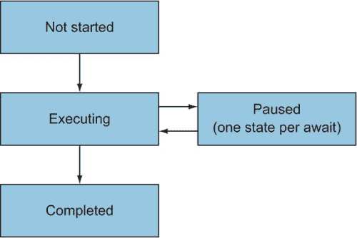

让我们用一个实际的代码片段来具体说明。下面的列表显示了一个简单的异步方法。它并不像你可以让它那样简单，但它可以同时演示几个事情。

##### 列表 6.1\. 简单的异步方法介绍

```
static async Task PrintAndWait(TimeSpan delay)
{
    Console.WriteLine("Before first delay");
    await Task.Delay(delay);
    Console.WriteLine("Between delays");
    await Task.Delay(delay);
    Console.WriteLine("After second delay");
}
```

在这个阶段有三个需要注意的点：

+   你有一个参数需要在状态机中使用。

+   该方法包含两个`await`表达式。

+   该方法返回`Task`，因此你需要返回一个任务，该任务将在最后一行打印后完成，但没有特定的结果。

这很好，也很简单，因为你没有循环或需要担心的`try`/`catch`/`finally`块。控制流程很简单，当然，除了等待之外。让我们看看编译器为这段代码生成了什么。

| |
| --- |

**请务必在家尝试**

我通常使用 ildasm 和 Redgate Reflector 的混合体来做这类工作，将优化级别设置为 C# 1，以防止反编译器为我们重建异步方法。其他反编译器也可用，但无论你选择哪个，我都建议检查 IL。我在`await`方面看到过反编译器中的微妙错误，通常与执行顺序有关。

如果你不想做这些，那也行，但如果你发现自己想知道编译器对某个特定代码结构做了什么，而这章没有提供答案，那就去做吧。不过，别忘了调试和发布构建之间的区别，也不要被编译器生成的名称所困扰，这些名称可能会使结果更难阅读。


使用可用的工具，你可以将列表 6.1 反编译成类似列表 6.2 的东西。C# 编译器生成的许多名称都不是有效的 C# 名称；为了得到可运行的代码，我已经将它们重写为有效的标识符。在其他情况下，我已将标识符重命名，使代码更易于阅读。后来，我对状态机的案例和标签的顺序做了一些调整；它与生成的代码在逻辑上是完全等价的，但更容易阅读。在其他地方，即使只有两个案例，我也使用了`switch`语句，而编译器可能会有效地使用`if`/`else`。在这些地方，`switch`语句代表更通用的案例，可以在有多个跳转点时工作，但编译器可以为更简单的情况生成更简单的代码。

##### 列表 6.2. 列表 6.1（除`MoveNext`外）生成的代码

```
Stub method
[AsyncStateMachine(typeof(PrintAndWaitStateMachine))]
[DebuggerStepThrough]
private static unsafe Task PrintAndWait(TimeSpan delay)
{
    var machine = new PrintAndWaitStateMachine               *1*
    {                                                        *1*
        delay = delay,                                       *1*
        builder = AsyncTaskMethodBuilder.Create(),           *1*
        state = -1                                           *1*
    };                                                       *1*
    machine.builder.Start(ref machine);                      *2*
    return machine.builder.Task;                             *3*
}

Private struct for the state machine
[CompilerGenerated]
private struct PrintAndWaitStateMachine : IAsyncStateMachine
{
    public int state;                                        *4*
    public AsyncTaskMethodBuilder builder;                   *5*
    private TaskAwaiter awaiter;                             *6*
    public TimeSpan delay;                                   *7*

    void IAsyncStateMachine.MoveNext()                       *8*
    {                                                        *8*
    }                                                        *8*

    [DebuggerHidden]
    void IAsyncStateMachine.SetStateMachine(
        IAsyncStateMachine stateMachine)
    {
        this.builder.SetStateMachine(stateMachine);          *9*
    }
}
```

+   ***1* 初始化状态机，包括方法参数**

+   ***2* 运行状态机直到它需要等待**

+   ***3* 返回表示异步操作的任务**

+   ***4* 状态机的状态（从哪里恢复**）

+   ***5* 构建器连接到异步基础设施类型**

+   ***6* 在恢复时从其中获取结果的等待者**

+   ***7* 原始方法参数**

+   ***8* 主要状态机的工作内容在这里。**

+   ***9* 连接构建器和装箱状态机**

这个列表看起来已经相当复杂了，但我应该警告你，大部分工作都是在`MoveNext`方法中完成的，我现在已经完全移除了该方法的实现。列表 6.2 的目的是设定场景并提供结构，这样当你到达`MoveNext`实现时，它就有意义了。让我们依次查看列表的各个部分，从存根方法开始。

#### 6.1.1. 存根方法：准备和迈出第一步

除了`AsyncTaskMethodBuilder`之外，列表 6.2 中的存根方法很简单。这是一个值类型，它是通用异步基础设施的一部分。你将在本章的其余部分看到状态机如何与构建器交互。

```
[AsyncStateMachine(typeof(PrintAndWaitStateMachine))]
[DebuggerStepThrough]
private static unsafe Task PrintAndWait(TimeSpan delay)
{
    var machine = new PrintAndWaitStateMachine
    {
        delay = delay,
        builder = AsyncTaskMethodBuilder.Create(),
        state = -1
    };
    machine.builder.Start(ref machine);
    return machine.builder.Task;
}
```

应用到方法上的属性基本上是为了工具。它们对常规执行没有影响，你不需要了解任何关于它们的细节就能理解生成的异步代码。状态机始终在存根方法中创建，带有三块信息：

+   任何参数（在这个例子中，就是`delay`），每个都在状态机中作为单独的字段

+   构建器，它取决于异步方法的返回类型

+   初始状态始终是-1

| |
| --- |

##### 注意

名称`AsyncTaskMethodBuilder`可能会让你想到反射，但它并不是在 IL 中创建方法或类似操作。构建器提供了生成代码用来传播成功和失败、处理等待等功能。如果你觉得“辅助器”这个名字更适合你，请随意这样想。

| |
| --- |

在创建状态机后，存根方法请求机器的构建器启动它，通过引用传递机器本身。你将在接下来的几页中看到很多通过引用传递的情况，这归结于对效率和一致性的需求。状态机和`AsyncTaskMethodBuilder`都是可变的值类型。通过引用传递`machine`到`Start`方法避免了复制状态，这更高效并确保在`Start`方法返回时，对状态所做的任何更改仍然可见。特别是，机器内部的`builder`状态可能在`Start`期间发生变化。这就是为什么在使用`machine.builder`进行`Start`调用和随后的`Task`属性很重要的原因。假设你将`machine.builder`提取到一个局部变量中，如下所示：

```
var builder = machine.builder;     *1*
builder.Start(ref machine);        *1*
return builder.Task;               *1*
```

+   ***1* 无效的重构尝试**

使用那段代码，在`builder.Start()`内部直接做出的状态更改不会被`machine.builder`（或反之）看到，因为那将是一个构建器的副本。这就是为什么`machine.builder`引用一个字段而不是属性很重要的原因。你不想在状态机中操作构建器的副本；相反，你希望直接操作状态机包含的值。这正是你不想自己处理的细节，也是为什么可变值类型和公共字段几乎总是坏主意的原因。（你将在第十一章中看到，在仔细考虑的情况下，它们可以是有用的。）

启动机器不会创建任何新线程。它只是运行状态机的`MoveNext()`方法，直到状态机需要暂停以等待另一个异步操作或完成。换句话说，它只迈出一小步。无论如何，`MoveNext()`都会返回，此时`machine.builder.Start()`也会返回，然后你可以返回一个表示整体异步方法的任务给我们的调用者。构建器负责创建任务并确保在异步方法的过程中适当地改变状态。

那就是存根方法。现在让我们看看状态机本身。

#### 6.1.2\. 状态机的结构

我仍然省略了状态机的大部分代码（在`MoveNext()`方法中），但这里是对类型结构的提醒：

```
[CompilerGenerated]
private struct PrintAndWaitStateMachine : IAsyncStateMachine
{
    public int state;
    public AsyncTaskMethodBuilder builder;
    private TaskAwaiter awaiter;
    public TimeSpan delay;

    void IAsyncStateMachine.MoveNext()
    {
                 *1*
    }

    [DebuggerHidden]
    void IAsyncStateMachine.SetStateMachine(
        IAsyncStateMachine stateMachine)
    {
        this.builder.SetStateMachine(stateMachine);
    }
}
```

+   ***1* 实现省略**

再次强调，属性并不重要。类型的重要方面如下：

+   它实现了`IAsyncStateMachine`接口，该接口用于异步基础设施。该接口只有两个显示的方法。

+   字段，用于存储状态机在一步与下一步之间需要记住的信息。

+   `MoveNext()`方法，当状态机启动时调用一次，每次在暂停后恢复时也调用一次。

+   `SetStateMachine()`方法，它始终具有相同的实现（在发布版本中）。

你已经看到了一个实现`IAsyncStateMachine`类型的用法，尽管它有些隐藏：`AsyncTaskMethodBuilder.Start()`是一个泛型方法，其类型参数必须实现`IAsyncStateMachine`。在执行一些家务后，`Start()`调用`MoveNext()`使状态机执行异步方法的第一步。

涉及的字段可以大致分为五类：

+   当前状态（例如，未开始、在特定的 await 表达式处暂停等）

+   方法构建器用于与异步基础设施通信并提供要返回的`Task`

+   等待者

+   参数和局部变量

+   临时栈变量

状态和构建器相当简单。状态只是一个具有以下值的整数：

+   *–1*—未开始，或当前正在执行（无论哪种情况）

+   *–2*—完成（无论是成功还是故障）

+   *其他任何情况*—在特定的 await 表达式处暂停

如我之前提到的，构建器的类型取决于异步方法的返回类型。在 C# 7 之前，构建器类型始终是`AsyncVoidMethodBuilder`、`AsyncTaskMethodBuilder`或`AsyncTaskMethodBuilder<T>`。随着 C# 7 和自定义任务类型，由`AsyncTaskMethodBuilderAttribute`指定的构建器类型应用于自定义任务类型。

其他字段稍微复杂一些，因为它们都依赖于异步方法的主体，编译器会尽量使用尽可能少的字段。需要记住的关键点是，你只需要为那些在状态机在某个时刻恢复后需要返回的值使用字段。有时编译器可以为多个目的使用字段，有时它可以完全省略它们。

编译器重用字段的第一种例子是等待者。一次只有一个等待者是相关的，因为任何特定的状态机一次只能等待一个值。编译器为每种使用的等待者类型创建一个字段。如果你在一个异步方法中等待两个 `Task<int>` 值、一个 `Task<string>` 和三个非泛型 `Task` 值，你将得到三个字段：一个 `TaskAwaiter<int>`、一个 `TaskAwaiter<string>` 和一个非泛型 `TaskAwaiter`。编译器根据等待者类型使用适当的字段为每个 `await` 表达式。


##### **注意**

这假设等待者是由编译器引入的。如果你自己调用 `GetAwaiter()` 并将结果赋值给局部变量，那么它就像任何其他局部变量一样处理。我在谈论的是作为 `await` 表达式结果产生的等待者。


接下来，让我们考虑局部变量。在这里，编译器不会重用字段，但可以完全省略它们。如果一个局部变量只在使用两个 `await` 表达式之间而不是跨越 `await` 表达式使用，它可以保持在 `MoveNext()` 方法中的局部变量。

通过一个例子更容易理解我的意思。考虑以下异步方法：

```
public async Task LocalVariableDemoAsync()
{
    int x = DateTime.UtcNow.Second;   *1*
    int y = DateTime.UtcNow.Second;   *2*
    Console.WriteLine(y);             *2*
    await Task.Delay();
    Console.WriteLine(x);             *3*
}
```

+   **1** 在 `await` 之前将 `x` 赋值。

+   **2** `y` 只在 `await` 之前使用。

+   **3** 在 `await` 之后使用 `x`。

编译器会为 `x` 生成一个字段，因为当状态机暂停时，必须保留其值，但 `y` 在代码执行期间可以只是一个栈上的局部变量。


##### **注意**

编译器在创建所需字段数量方面做得相当不错。但有时，你可能会发现编译器可以执行但未执行的优化。例如，如果有两个变量具有相同的类型并且都在 `await` 表达式中使用（因此需要字段），但它们从未同时处于作用域中，编译器可以为它们使用一个字段，就像它对等待者所做的那样。在撰写本文时，它并没有这样做，但谁知道未来会怎样呢？


最后，还有临时栈变量。这些是在将 `await` 表达式用作更大表达式的一部分并且需要记住一些中间值时引入的。在我们的简单示例 列表 6.1 中不需要这些，这就是为什么 列表 6.2 只显示了四个字段：状态、构建器、等待者和参数。作为一个例子，考虑以下方法：

```
public async Task TemporaryStackDemoAsync()
{
    Task<int> task = Task.FromResult(10);
    DateTime now = DateTime.UtcNow;
    int result = now.Second + now.Hours * await task;
}
```

C# 对操作数评估的规则不会因为你在一个异步方法中而改变。属性 `now.Second` 和 `now.Hours` 都必须在任务被等待之前被评估，并且它们的必须被记住以便在状态机在任务完成后恢复时执行算术运算。这意味着它需要使用字段。


##### 注意

在这种情况下，你知道 `Task.FromResult` 总是返回一个完成的任务。但是编译器不知道这一点，并且它必须以某种方式生成状态机，以便在任务未完成时可以暂停和恢复。


你可以把它想象成编译器重写代码以引入额外的局部变量：

```
public async Task TemporaryStackDemoAsync()
{
    Task<int> task = Task.FromResult(10);
    DateTime now = DateTime.UtcNow;
    int tmp1 = now.Second;
    int tmp2 = now.Hours;
    int result = tmp1 + tmp2 * await task;
}
```

然后将局部变量转换为字段。与真正的局部变量不同，编译器确实会重用相同类型的临时堆栈变量，并且只生成它需要的字段数量。

这解释了状态机中的所有字段。接下来，你需要查看 `MoveNext()` 方法——但首先是概念上，为了开始。

#### 6.1.3\. MoveNext() 方法（高级）

我现在不会向你展示 列表 6.1 的 `MoveNext()` 方法的反编译代码，因为它很长且令人畏惧.^([1]) 在你知道流程看起来像什么之后，它就更容易处理了，所以我将在这里以抽象的方式描述它。

> ¹
> 
> 如果《少数人统治》是关于异步的，那么台词将是：“你想要 MoveNext 吗？你处理不了 MoveNext！”

每次调用 `MoveNext()` 时，状态机都会迈出另一步。每次它遇到一个 `await` 表达式时，如果等待的值已经完成，它将继续；否则，它将暂停。如果以下任何一种情况发生，`MoveNext()` 将返回：

+   状态机需要暂停以等待一个不完整的价值。

+   执行到达方法末尾或返回语句。

+   在异步方法中抛出异常但没有被捕获。

注意，在最终情况下，`MoveNext()` 方法并没有最终抛出异常。相反，与异步调用关联的任务变得有故障。（如果你对此感到惊讶，请参阅 第 5.6.5 节 以了解异步方法与异常行为的关系。）

图 6.2 展示了一个异步方法的一般流程图，该流程图专注于 `MoveNext()` 方法。我没有在图中包含异常处理，因为流程图没有表示 `try`/`catch` 块的方法。当你最终查看代码时，你会看到它是如何处理的。同样，我没有显示 `SetStateMachine` 被调用的位置，因为流程图本身已经足够复杂。

##### 图 6.2\. 异步方法的流程图

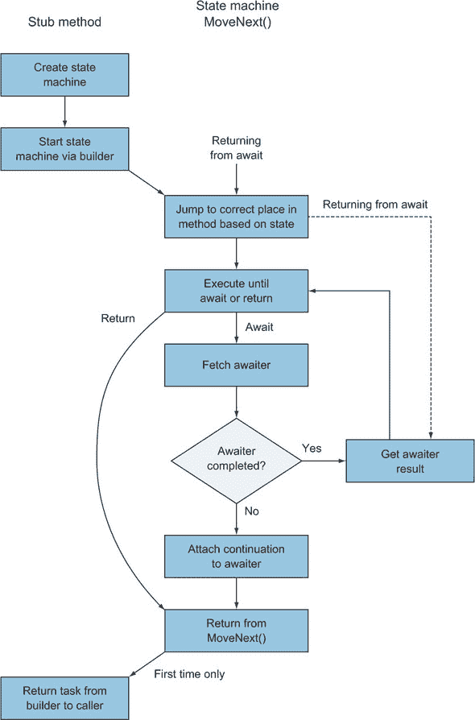

关于`MoveNext()`方法的最后一个要点：它的返回类型是`void`，而不是任务类型。只有存根方法需要返回任务，它在状态机的构建器调用`Start()`方法并执行第一步后从状态机的构建器那里获得。所有其他对`MoveNext()`的调用都是基础设施的一部分，用于从暂停状态恢复状态机，这些调用不需要相关的任务。你将在第 6.2 节（现在不久了）中看到所有这些在代码中的样子，但首先，简要谈谈`SetStateMachine`。

#### 6.1.4\. `SetStateMachine`方法和状态机装箱舞蹈

我已经展示了`SetStateMachine`的实现。很简单：

```
void IAsyncStateMachine.SetStateMachine(
    IAsyncStateMachine stateMachine)
{
    this.builder.SetStateMachine(stateMachine);
}
```

发布版本中的实现总是这样。（在调试版本中，由于状态机是一个类，实现是空的。）从高层次上解释该方法的目的很容易，但细节很繁琐。当状态机迈出第一步时，它作为存根方法的局部变量位于堆栈上。如果它暂停，它必须将自己装箱（到堆上），以便在它恢复时所有这些信息仍然在位。在装箱之后，使用装箱值作为参数在装箱值上调用`SetStateMachine`。换句话说，在基础设施的深处，有看起来有点像这样的代码：

```
void BoxAndRemember<TStateMachine>(ref TStateMachine stateMachine)
    where TStateMachine : IStateMachine
{
    IStateMachine boxed = stateMachine;
    boxed.SetStateMachine(boxed);
}
```

这并不是那么简单，但已经传达了正在发生的事情的本质。然后`SetStateMachine`的实现确保`AsyncTaskMethodBuilder`有一个对其所参与的单个装箱状态机的引用。必须在装箱值上调用该方法；只能在装箱之后调用，因为那时你才有对装箱值的引用，如果在装箱之后在未装箱值上调用它，那么这不会影响装箱值。（记住，`AsyncTaskMethodBuilder`本身是一个值类型。）这种复杂的舞蹈确保当将延续委托传递给 awaiter 时，该延续将调用同一装箱实例的`MoveNext()`方法。

结果是，如果不需要装箱，状态机根本不会装箱；如果需要，则恰好装箱一次。在装箱之后，所有事情都在装箱版本上发生。这是一堆为了效率而编写的复杂代码。

我认为这个小小的舞蹈是整个异步机制中最引人入胜和奇特的部分。听起来这似乎毫无意义，但这是由于装箱的工作方式所必需的，而装箱是必要的，以便在状态机暂停时保留信息。

完全不必完全理解这段代码。如果你发现自己正在低级别调试异步代码，可以回到这一节。对于所有其他目的和用途，这段代码更像是一个新奇事物，而不是其他任何东西。

这就是状态机的组成部分。本章的大部分内容都致力于 `MoveNext()` 方法以及它在各种情况下的操作。我们将从简单的情况开始，然后逐步深入。

### 6.2\. 一个简单的 MoveNext() 实现

我们将从你在 列表 6.1 中看到的简单异步方法开始。它之所以简单，并不是因为它很短（尽管这也有帮助），而是因为它不包含任何循环、`try` 语句或 `using` 语句。它有简单的控制流程，这导致了一个相对简单的状态机。让我们开始吧。

#### 6.2.1\. 一个完整的具体示例

我将首先展示完整的方法。不要期望这一切现在都能理解，但请花几分钟时间仔细查看。有了这个具体的例子，更通用的结构更容易理解，因为你可以随时回顾，看看结构中的每一部分是如何体现在这个例子中的。冒着让你感到无聊的风险，这里再次列出 列表 6.1 作为编译器输入的提醒：

```
static async Task PrintAndWait(TimeSpan delay)
{
    Console.WriteLine("Before first delay");
    await Task.Delay(delay);
    Console.WriteLine("Between delays");
    await Task.Delay(delay);
    Console.WriteLine("After second delay");
}
```

以下列表是经过轻微重写以提高可读性的反编译代码版本。（是的，这是易于阅读的版本。）

##### 列表 6.3\. 从 列表 6.1 反编译的 `MoveNext()` 方法

```
void IAsyncStateMachine.MoveNext()
{
    int num = this.state;
    try
    {
        TaskAwaiter awaiter1;
        switch (num)
        {
            default:
                goto MethodStart;
            case 0:
                goto FirstAwaitContinuation;
            case 1:
                goto SecondAwaitContinuation;
        }
    MethodStart:
        Console.WriteLine("Before first delay");
        awaiter1 = Task.Delay(this.delay).GetAwaiter();
        if (awaiter1.IsCompleted)
        {
            goto GetFirstAwaitResult;
        }
        this.state = num = 0;
        this.awaiter = awaiter1;
        this.builder.AwaitUnsafeOnCompleted(ref awaiter1, ref this);
        return;
    FirstAwaitContinuation:
        awaiter1 = this.awaiter;
        this.awaiter = default(TaskAwaiter);
        this.state = num = -1;
    GetFirstAwaitResult:
        awaiter1.GetResult();
        Console.WriteLine("Between delays");
        TaskAwaiter awaiter2 = Task.Delay(this.delay).GetAwaiter();
        if (awaiter2.IsCompleted)
        {
            goto GetSecondAwaitResult;
        }
        this.state = num = 1;
        this.awaiter = awaiter2;
        this.builder.AwaitUnsafeOnCompleted(ref awaiter2, ref this);
        return;
    SecondAwaitContinuation:
        awaiter2 = this.awaiter;
        this.awaiter = default(TaskAwaiter);
        this.state = num = -1;
    GetSecondAwaitResult:
        awaiter2.GetResult();
        Console.WriteLine("After second delay");
    }
    catch (Exception exception)
    {
        this.state = -2;
        this.builder.SetException(exception);
        return;
    }
    this.state = -2;
    this.builder.SetResult();
}
```

这段代码很多，你可能注意到它有很多 `goto` 语句和代码标签，这在手写的 C# 中几乎很少见。目前，我预计它可能有些难以理解，但我想要先展示一个具体的例子，这样你就可以在需要的时候随时参考。我将进一步将其分解为一般结构和 `await` 表达式的具体细节。到本节结束时，列表 6.3 可能仍然对你来说非常丑陋，但你将更好地理解它在做什么以及为什么这么做。

#### 6.2.2\. MoveNext() 方法的一般结构

我们已经进入了异步洋葱的下一层。`MoveNext()` 方法是异步状态机的核心，其复杂性提醒我们异步代码的正确实现是多么困难。状态机越复杂，你就越有理由感激是 C# 编译器而不是你自己在编写代码。

| |
| --- |

##### 注意

为了简洁起见，现在是时候引入更多术语了。在每一个 `await` 表达式中，被等待的值可能已经完成或可能仍然不完整。如果你等待它的时候它已经完成，状态机将继续执行。我称之为 *快速路径*。如果它还没有完成，状态机将安排一个后续操作并暂停。我称之为 *慢速路径*。


作为提醒，`MoveNext()`方法在异步方法首次调用时被调用一次，然后在每次从 await 表达式暂停处恢复时再次调用。 (如果每个 await 表达式都采取快速路径，则`MoveNext()`只会被调用一次。)该方法负责以下内容：

+   从正确的位置执行（无论是原始异步代码的开始还是中途）

+   在需要暂停时保留状态，无论是局部变量还是代码中的位置

+   在需要暂停时安排延续

+   从 awaiter 检索返回值

+   通过构建器传播异常（而不是让`MoveNext()`自身因异常而失败）

+   通过构建器传播任何返回值或方法完成

考虑到这一点，以下列表显示了`MoveNext()`方法的一般结构伪代码。你将在后面的章节中看到，由于额外的控制流，这可能会变得更加复杂，但它是一个自然的扩展。

##### 列表 6.4\. `MoveNext()`方法的伪代码

```
void IAsyncStateMachine.MoveNext()
{
    try
    {
        switch (this.state)
        {
            default: goto MethodStart;
            case 0: goto Label0A;
            case 1: goto Label1A;
            case 2: goto Label2A;
                                        *1*
        }
    MethodStart:
                                        *2*
                                        *3*
    Label0A:
                                        *4*
    Label0B:
                                        *5*
                                        *6*
    }
    catch (Exception e)                 *7*
    {                                   *7*
        this.state = -2;                *7*
        builder.SetException(e);        *7*
        return;                         *7*
    }                                   *7*
    this.state = -2;                    *8*
    builder.SetResult();                *8*
}
```

+   ***1* 有多少个 await 表达式就有多少种情况**

+   ***2* 在第一个 await 表达式之前的代码**

+   ***3* 设置第一个 awaiter**

+   ***4* 从延续处恢复代码**

+   ***5* 快速路径和慢速路径重新汇合**

+   ***6* 代码的其余部分，有更多的标签、awaiter 等**

+   ***7* 通过构建器传播所有异常**

+   ***8* 通过构建器传播方法完成**

大的`try`/`catch`块覆盖了原始异步方法的所有代码。如果其中任何内容抛出异常，无论通过等待故障操作、调用抛出异常的同步方法，还是直接抛出异常，该异常都会被捕获并通过构建器传播。只有特殊的异常（例如`ThreadAbortException`和`StackOverflowException`）才会导致`MoveNext()`以异常结束。

在`try`/`catch`块中，`MoveNext()`方法的开始始终是一个用于根据状态跳转到方法中正确代码的`switch`语句。如果状态为非负，这意味着你在 await 表达式之后恢复。否则，假设你正在第一次执行`MoveNext()`。


**关于其他状态呢？**

在第 6.1 节中，我列出了可能的状态为未开始、执行中、暂停和完成（其中暂停是每个 await 表达式的独立状态）。为什么状态机不对未开始、执行中和完成状态进行不同的处理？

答案是`MoveNext()`在执行或完成状态下永远不会最终被调用。你可以通过编写有缺陷的等待者实现或使用反射来强制这样做，但在正常操作中，`MoveNext()`只被调用以启动或恢复状态机。甚至没有未开始和执行的不同状态编号；两者都使用-1。完成状态有一个-2 的状态编号，但状态机永远不会检查该值。


需要注意的一个小技巧是状态机中的 return 语句与原始异步代码中的 return 语句之间的区别。在状态机内部，`return`用于在为 awaiter 安排了继续执行后状态机暂停时。原始代码中的任何 return 语句最终都会下降到状态机底部的`try`/`catch`块之外，方法完成通过构建器传播。

如果你比较列表 6.3 和 6.4，希望你能看到我们的具体示例如何融入一般模式。到目前为止，我已经几乎解释了关于你开始时简单异步方法生成的代码的各个方面。唯一缺失的部分就是 await 表达式周围的确切发生情况。

#### 6.2.3. 深入研究 await 表达式

让我们再次思考，当你执行异步方法并遇到 await 表达式时，每次必须发生什么，假设你已经评估操作数以获取可以 await 的东西：

1.  你通过调用`GetAwaiter()`从 awaitable 中获取等待者，并将其存储在堆栈上。

1.  你检查等待者是否已经完成。如果是，你可以直接跳转到获取结果（步骤 9）。这是快速路径。

1.  看起来你正在走慢路。哦，好吧。记住你通过状态字段达到的位置。

1.  记住字段中的等待者。

1.  使用等待者安排一个继续执行，确保当继续执行时，你会回到正确的状态（如果需要，做装箱舞蹈）。

1.  从`MoveNext()`方法返回，无论是第一次暂停，还是由什么安排了继续执行。

1.  当继续执行时，将你的状态设置回*运行中*（值为-1）。

1.  将等待者从字段中复制出来，并将其放回堆栈上，以清除字段，这可能会帮助垃圾收集器。现在你准备好重新加入快速路径。

1.  从堆栈上的等待者获取结果，无论你选择了哪条路径。即使没有结果*值*，你也必须调用`GetResult()`，以便等待者可以传播错误（如果需要的话）。

1.  继续你的愉快之旅，使用结果值（如果有的话）执行原始代码的其余部分。

在记住这个列表的情况下，让我们回顾一下列表 6.3 中对应我们第一个 await 表达式的部分。

##### 列表 6.5\. 对应单个`await`的列表 6.3 的一部分

```
    awaiter1 = Task.Delay(this.delay).GetAwaiter();
    if (awaiter1.IsCompleted)
    {
        goto GetFirstAwaitResult;
    }
    this.state = num = 0;
    this.awaiter = awaiter1;
    this.builder.AwaitUnsafeOnCompleted(ref awaiter1, ref this);
    return;
FirstAwaitContinuation:
    awaiter1 = this.awaiter;
    this.awaiter = default(TaskAwaiter);
    this.state = num = -1;
GetFirstAwaitResult:
    awaiter1.GetResult();
```

毫不奇怪，代码精确地遵循了步骤集合。^([2]) 两个标签代表根据路径必须跳转的两个地方：

> ²
> 
> 这并不奇怪，因为我写了一系列步骤，然后展示的代码没有遵循这些步骤，那就太奇怪了。

+   在快速路径中，你跳过了慢速路径的代码。

+   在慢速路径中，当调用后续操作时，你会跳回代码的中间部分。（记住，这就是方法开头`switch`语句的作用。）

对`builder.AwaitUnsafeOnCompleted(ref awaiter1, ref this)`的调用是执行与`SetStateMachine`（如果需要；每个状态机只发生一次）的回调并安排后续操作的部分。在某些情况下，你会看到对`AwaitOnCompleted`而不是`AwaitUnsafeOnCompleted`的调用。这些调用在处理执行上下文方面有所不同。你将在第 6.5 节中更详细地了解这一点。

可能有一个方面看起来稍微有点不清楚，那就是对`num`局部变量的使用。它总是在与`state`字段相同的时间被赋值，但总是读取字段而不是变量。（它的初始值是从字段中复制出来的，但这是字段唯一被读取的时候。）我相信这纯粹是为了优化。每次你读取`num`时，都可以将其视为`this.state`。

查看列表 6.5，这 16 行代码原本只是以下内容：

```
await Task.Delay(delay);
```

好消息是，除非你正在做这种类型的练习，否则你几乎不需要看到所有这些代码。坏消息是，代码膨胀意味着即使是小的异步方法——即使是使用`ValueTask<TResult>`的方法——也无法被 JIT 编译器合理地内联。尽管如此，在大多数情况下，这只是为了异步/await 带来的好处而付出的微小代价。

这就是控制流简单的简单情况。有了这个背景，你可以探索一些更复杂的情况。

### 6.3\. 控制流如何影响 MoveNext()

你迄今为止看到的例子只是一个方法调用的序列，其中只有`await`操作符引入了复杂性。当你想要编写带有所有你习惯的正常控制流语句的真实代码时，生活就会变得有点艰难。

在本节中，我将向你展示控制流的两个元素：循环和`try`/`finally`语句。这不是要全面介绍，但它应该足以让你窥见编译器必须执行的控件流技巧，以便在需要时帮助你理解其他情况。

#### 6.3.1\. `await`表达式之间的控制流简单

在我们深入到棘手的部分之前，我将给出一个例子，说明引入控制流不会使生成的代码复杂性增加，就像在同步代码中一样。在下面的列表中，我们在示例方法中引入了一个循环，所以你打印了三次`Between delays`而不是一次。

##### 列表 6.6\. 在 await 表达式之间引入循环

```
static async Task PrintAndWaitWithSimpleLoop(TimeSpan delay)
{
    Console.WriteLine("Before first delay");
    await Task.Delay(delay);
 for (int i = 0; i < 3; i++)
 {
 Console.WriteLine("Between delays");
 }
    await Task.Delay(delay);
    Console.WriteLine("After second delay");
}
```

反编译后是什么样子？非常像列表 6.2！唯一的区别是这一点

```
GetFirstAwaitResult:
    awaiter1.GetResult();
    Console.WriteLine("Between delays");
    TaskAwaiter awaiter2 = Task.Delay(this.delay).GetAwaiter();
```

变成以下：

```
GetFirstAwaitResult:
    awaiter1.GetResult();
    for (int i = 0; i < 3; i++)
 {
 Console.WriteLine("Between delays");
 }
    TaskAwaiter awaiter2 = Task.Delay(this.delay).GetAwaiter();
```

状态机的变化与原始代码的变化完全相同。没有额外的字段，也没有关于如何继续执行方面的复杂性；它只是一个循环。

我之所以提到这一点，是为了帮助你思考为什么在接下来的例子中需要额外的复杂性。在列表 6.6 中，你从不需要从外部跳入循环，也从不需要暂停执行并跳出循环，从而暂停状态机。这些都是 await 表达式在循环内部等待时引入的情况。现在让我们这样做。

#### 6.3.2\. 循环中的等待

我们到目前为止的例子中包含了两个 await 表达式。为了在引入其他复杂性时保持代码的相对可控性，我将将其减少到一。下面的列表显示了你在本节中将反编译的异步方法。

##### 列表 6.7\. 循环中的等待

```
static async Task AwaitInLoop(TimeSpan delay)
{
    Console.WriteLine("Before loop");
 for (int i = 0; i < 3; i++)
 {
 Console.WriteLine("Before await in loop");
 await Task.Delay(delay);
 Console.WriteLine("After await in loop");
 }
    Console.WriteLine("After loop delay");
}
```

`Console.WriteLine` 调用在反编译代码中主要作为标记存在，这使得将其映射到原始列表变得更加容易。

编译器为这个生成了什么？我不会展示完整的代码，因为其中大部分都是你之前见过的。（它都在可下载的源代码中。）状态机和方法几乎与之前的例子完全相同，只是在状态机中增加了一个对应于`i`（循环计数器）的字段。有趣的部分在`MoveNext()`中。

你可以用 C#忠实地表示这段代码，但不使用循环结构。问题是，在状态机从`Task.Delay`暂停返回后，你想要跳入原始循环的中间部分。在 C#中你不能用`goto`语句做到这一点；如果`goto`语句不在该标签的作用域内，语言禁止指定标签的`goto`语句。

这是可以的；你可以用很多`goto`语句实现`for`循环，而不引入任何额外的作用域。这样，你可以毫无问题地跳到其中。下面的列表显示了`MoveNext()`方法主体的反编译代码的大部分。我只包括了`try`块内的部分，因为这是我们这里关注的重点。（其余的都是简单的样板代码。）

##### 列表 6.8\. 不使用任何循环结构的反编译循环

```
    switch (num)
    {
        default:
            goto MethodStart;
        case 0:
            goto AwaitContinuation;
    }
MethodStart:
    Console.WriteLine("Before loop");
    this.i = 0;                                    *1*
    goto ForLoopCondition;                         *2*
ForLoopBody:                                       *3*
    Console.WriteLine("Before await in loop");
    TaskAwaiter awaiter = Task.Delay(this.delay).GetAwaiter();
    if (awaiter.IsCompleted)
    {
        goto GetAwaitResult;
    }
    this.state = num = 0;
    this.awaiter = awaiter;
    this.builder.AwaitUnsafeOnCompleted(ref awaiter, ref this);
    return;
AwaitContinuation:                                 *4*
    awaiter = this.awaiter;
    this.awaiter = default(TaskAwaiter);
    this.state = num = -1;
GetAwaitResult:
    awaiter.GetResult();
    Console.WriteLine("After await in loop");
    this.i++;                                      *5*
ForLoopCondition:                                  *6*
    if (this.i < 3)                                *6*
    {                                              *6*
        goto ForLoopBody;                          *6*
    }                                              *6*
    Console.WriteLine("After loop delay");
```

+   ***1* for 循环初始化器**

+   ***2* 直接跳转到检查循环条件**

+   ***3* for 循环的主体**

+   ***4* 状态机恢复时的跳转目标**

+   ***5* 循环迭代器**

+   ***6* 检查循环条件并在条件成立时跳回主体**

我本可以完全跳过这个示例，但它提出了几个有趣的观点。首先，C# 编译器不会将异步方法转换为不使用 async/await 的等效 C# 代码。它只需要生成适当的 IL。在某些地方，C# 的规则比 IL 更严格。（有效标识符的集合就是这种情况的另一个例子。）

第二，虽然反编译器在查看异步代码时可能很有用，但有时它们会产生无效的 C# 代码。当我第一次反编译 列表 6.7 的输出时，输出包括一个包含标签的 `while` 循环和一个试图跳入该循环的 `goto` 语句。有时，通过告诉反编译器不要那么努力地生成惯用的 C# 代码，你可以得到有效的（但更难阅读的）C# 代码，这时你会看到大量的 `goto` 语句。

第三，即使你还没有被说服，你也不想手动编写这种类型的代码。如果你必须为这种任务编写 C# 4 代码，你无疑会以非常不同的方式来做，但它仍然会比 C# 5 中可用的异步方法要丑陋得多。

你已经看到了在循环中等待可能会给人类带来一些压力，但这不会让编译器感到压力。对于我们的最后一个控制流示例，你将给它一些更困难的工作来做：一个 `try`/`finally` 块。

#### 6.3.3\. 在 try/finally 块中等待

只是为了提醒你，在 `try` 块中使用 `await` 一直是有效的，但在 C# 5 中，在 `catch` 或 `finally` 块中使用它是无效的。这种限制在 C# 6 中被取消，尽管我不会展示任何利用它的代码。


##### 注意

这里有很多可能性，无法一一列举。本章的目的是让你了解 C# 编译器对 async/await 所做的事情，而不是提供一个详尽的翻译列表。


在本节中，我只将展示一个在只有一个 `finally` 块的 `try` 块中等待的示例。这可能是最常见的 `try` 块类型，因为它与 `using` 语句等价。下面的列表显示了你要反编译的异步方法。同样，所有的控制台输出都只是为了使状态机的理解更简单。

##### 列表 6.9\. 在 `try` 块中等待

```
static async Task AwaitInTryFinally(TimeSpan delay)
{
    Console.WriteLine("Before try block");
    await Task.Delay(delay);
    try
    {
        Console.WriteLine("Before await");
        await Task.Delay(delay);
        Console.WriteLine("After await");
    }
    finally
    {
        Console.WriteLine("In finally block");
    }
    Console.WriteLine("After finally block");
}
```

你可能会想象反编译后的代码看起来可能像这样：

```
    switch (num)
    {
        default:
            goto MethodStart;
        case 0:
            goto AwaitContinuation;
    }
MethodStart:
    ...
    try
    {
        ...
    AwaitContinuation:
        ...
    GetAwaitResult:
        ...
    }
        finally
    {
        ...
    }
    ...
```

这里，每个省略号（`...`）代表更多的代码。但这种方法有一个问题：即使在 IL 中，你也不允许从一个 `try` 块外部跳转到内部。这有点像你在上一节中看到的循环问题，但这次不是 C# 规则，而是 IL 规则。

为了实现这一点，C# 编译器使用了一种我愿意称之为 *弹跳板* 的技术。（这不是官方术语，尽管在其他类似用途中使用了这个术语。）它跳转到 `try` 块之前，然后 `try` 块中的第一段代码就是跳转到块内正确位置的代码。

除了弹跳板之外，`finally` 块也需要小心处理。有三种情况下你会执行生成的代码中的 `finally` 块：

+   你到达了 `try` 块的末尾。

+   `try` 块抛出一个异常。

+   你需要在 `try` 块内暂停，因为有一个 `await` 表达式。

（如果异步方法包含一个返回语句，那将是一个选项。）如果 `finally` 块正在执行，是因为你暂停了状态机并返回到调用者，原始异步方法的 `finally` 块中的代码不应该执行。毕竟，你逻辑上在 `try` 块内暂停，当延迟完成时你将从中恢复。幸运的是，这很容易检测：如果状态机仍在执行或已完成，局部变量 `num`（它始终与 `state` 字段相同）将是负数；如果你在暂停，它将是非负数。

所有这些加在一起导致了以下列表，这又是 `MoveNext()` 的外部 `try` 块中的代码。尽管代码仍然很多，但大部分都是你之前见过的。我用粗体突出了 `try`/`finally`-specific 的方面。

##### 列表 6.10. `try/finally` 中的反编译 await

```
    switch (num)
    {
        default:
            goto MethodStart;
        case 0:
            goto AwaitContinuationTrampoline;    *1*
    }
MethodStart:
    Console.WriteLine("Before try");
AwaitContinuationTrampoline:
    try
    {
        switch (num) *2*
        { *2*
            default: *2*
                goto TryBlockStart; *2*
            case 0: *2*
                goto AwaitContinuation; *2*
        } *2*
    TryBlockStart:                               *2*
        Console.WriteLine("Before await");
        TaskAwaiter awaiter = Task.Delay(this.delay).GetAwaiter();
        if (awaiter.IsCompleted)
        {
            goto GetAwaitResult;
        }
        this.state = num = 0;
        this.awaiter = awaiter;
        this.builder.AwaitUnsafeOnCompleted(ref awaiter, ref this);
        return;
     AwaitContinuation:                             *3*
        awaiter = this.awaiter;
        this.awaiter = default(TaskAwaiter);
        this.state = num = -1;
    GetAwaitResult:
        awaiter.GetResult();
        Console.WriteLine("After await");
    }
    finally
    {
        if (num < 0)                               *4*
        {                                          *4*
            Console.WriteLine("In finally block"); *4*
        }                                          *4*
    }
    Console.WriteLine("After finally block");
```

+   ***1* 跳转到弹跳板之前，以便可以将执行弹跳到正确位置**

+   ***2* try 块内的弹跳板**

+   ***3* 实际的继续目标**

+   ***4* 如果暂停，则有效忽略 finally 块**

我保证这是本章的最后一段反编译内容。我想达到这个复杂程度，以便在你需要时帮助你导航生成的代码。这并不是说你在查看它时不需要保持清醒，尤其是考虑到编译器可以执行许多转换，使代码比我展示的更简单。正如我之前所说的，我总是使用 `switch` 语句来处理“跳转到 X”的代码片段，编译器有时可以使用更简单的分支代码。在阅读源代码时，在多种情况下保持一致性很重要，但这对于编译器来说并不重要。

我到目前为止略过的一个方面是，为什么 awaiter 必须实现 `INotifyCompletion` 但也可以实现 `ICriticalNotifyCompletion`，以及这对生成的代码产生的影响。现在让我们更仔细地看看。

### 6.4. 执行上下文和流程

在 第 5.2.2 节 中，我描述了同步上下文，这些上下文用于控制代码执行的线程。这是 .NET 中许多上下文之一，尽管它可能是最知名的。上下文提供了一种透明地维护信息的环境方式。例如，`SecurityContext` 跟踪当前的安全主体和代码访问安全。你不需要明确传递所有这些信息；它只是跟随你的代码，在几乎所有情况下都做正确的事情。一个类用于管理所有其他上下文：`ExecutionContext`。

| |
| --- |

**深入且令人畏惧的内容**

我几乎不包括这一节。这已经是我对异步了解的极限了。如果你需要了解其细节，你将需要比这里包含的更多关于这个主题的知识。

我之所以详细说明这一点，仅仅是因为否则就没有任何解释可以解释为什么在构建器中既有 `AwaitOnCompleted` 和 `AwaitUnsafeOnCompleted`，以及为什么等待者通常实现 `ICriticalNotifyCompletion`。

| |
| --- |

作为提醒，`Task` 和 `Task<T>` 管理任何正在等待的任务的同步上下文。如果你在 UI 线程上等待一个任务，你的异步方法的后继将在 UI 线程上执行。你可以通过使用 `Task.ConfigureAwait` 来选择退出这种模式。你需要这样做，以便明确表示“我知道我的方法的其他部分不需要在相同的同步上下文中执行。”执行上下文并不像那样；当你异步方法继续执行时，你几乎总是希望保持相同的执行上下文，即使它是在不同的线程上。

这种保持执行上下文的行为被称为 *流*。执行上下文被说成是跨越 await 表达式流动，这意味着所有代码都在相同的执行上下文中操作。是什么确保了这一点呢？嗯，`AsyncTaskMethodBuilder` 总是这样做，而 `TaskAwaiter` 有时会这样做。这就是事情变得复杂的地方。

`INotifyCompletion.OnCompleted` 方法只是一个普通的方法；任何人都可以调用它。相比之下，`ICriticalNotifyCompletion.UnsafeOnCompleted` 被标记为 `[SecurityCritical]`。它只能由受信任的代码调用，例如框架的 `AsyncTaskMethodBuilder` 类。

如果你编写自己的等待者类，并且关心在部分受信任的环境中正确且安全地运行代码，你应该确保你的 `INotifyCompletion.OnCompleted` 代码使执行上下文流动（通过 `ExecutionContext.Capture` 和 `ExecutionContext.Run`）。你也可以实现 `ICriticalNotifyCompletion`，在这种情况下不使执行上下文流动，相信异步基础设施已经这样做了。实际上，这为 awaiter 只由异步基础设施使用的常见情况提供了一种优化。在你可以安全地只做一次的情况下，没有必要捕获和恢复执行上下文两次。

在编译异步方法时，编译器会在每个 `await` 表达式处创建对 `builder.AwaitOnCompleted` 或 `builder.AwaitUnsafeOnCompleted` 的调用，具体取决于 `awaiter` 是否实现了 `ICriticalNotifyCompletion`。这些构建器方法是泛型的，并具有约束以确保传递给它们的 `awaiter` 实现了适当的接口。

如果你曾经实现过自己的自定义任务类型（并且，再次强调，除了教育目的之外，这几乎是不可能的），你应该遵循 `AsyncTaskMethodBuilder` 的相同模式：在 `AwaitOnCompleted` 和 `AwaitUnsafeOnCompleted` 中捕获执行上下文，这样在需要时调用 `ICriticalNotifyCompletion.UnsafeOnCompleted` 是安全的。说到自定义任务，既然你已经看到了编译器如何使用 `AsyncTaskMethodBuilder`，现在让我们回顾一下自定义任务构建器的需求。

### 6.5\. 重新审视自定义任务类型

列表 6.11 显示了 列表 5.10 中构建器部分的重复，你首先在那里查看自定义任务类型。在查看了许多反编译的状态机之后，这组方法可能感觉要熟悉得多。你可以使用本节作为 `AsyncTaskMethodBuilder` 上的方法如何被调用的提醒，因为编译器以相同的方式处理所有构建器。

##### 列表 6.11\. 一个示例自定义任务构建器

```
public class CustomTaskBuilder<T>
{
    public static CustomTaskBuilder<T> Create();
    public void Start<TStateMachine>(ref TStateMachine stateMachine)
        where TStateMachine : IAsyncStateMachine;
    public CustomTask<T> Task { get; }

    public void AwaitOnCompleted<TAwaiter, TStateMachine>
        (ref TAwaiter awaiter, ref TStateMachine stateMachine)
        where TAwaiter : INotifyCompletion
        where TStateMachine : IAsyncStateMachine;
    public void AwaitUnsafeOnCompleted<TAwaiter, TStateMachine>
        (ref TAwaiter awaiter, ref TStateMachine stateMachine)
        where TAwaiter : INotifyCompletion
        where TStateMachine : IAsyncStateMachine;
    public void SetStateMachine(IAsyncStateMachine stateMachine);

    public void SetException(Exception exception);
    public void SetResult(T result);
}
```

我已按它们被调用的正常时间顺序将方法分组。

存根方法调用 `Create` 来创建构建器实例，作为新创建的状态机的一部分。然后它调用 `Start` 使状态机采取第一步，并返回 `Task` 属性的结果。

在状态机内部，每个 `await` 表达式将生成对 `AwaitOnCompleted` 或 `AwaitUnsafeOnCompleted` 的调用，正如前一小节所讨论的。假设一个类似任务的设计，第一个这样的调用最终将调用 `IAsyncStateMachine.SetStateMachine`，这将反过来调用构建器的 `SetStateMachine`，以便以一致的方式解决任何装箱问题。有关详细信息的提醒，请参阅第 6.1.4 节。

最后，状态机通过在构建器上调用 `SetException` 或 `SetResult` 来指示异步操作已完成。该最终状态应传播到原始由存根方法返回的自定义任务。

这章是本书中迄今为止最深入的探讨。在其他地方，我没有如此详细地查看 C#编译器生成的代码。对于许多开发者来说，本章中的所有内容似乎都是多余的；你实际上并不需要它来正确编写 C#中的异步代码。但对于好奇的开发者，我希望它已经提供了启示。你可能永远不需要反编译生成的代码，但了解底层发生的事情可能会有所帮助。如果你确实需要详细查看正在发生的事情，我希望本章能帮助你理解你所看到的内容。

我用两章的篇幅来介绍 C# 5 的一个主要特性。在下一章中，我将介绍剩下的两个特性。在异步的细节之后，它们会带来一些轻松的缓解。

### 摘要

+   异步方法通过使用构建器作为异步基础设施被转换为存根方法和状态机。

+   状态机跟踪构建器、方法参数、局部变量、awaiters 以及在哪里继续执行。

+   当它恢复时，编译器创建代码以返回方法中的中间位置。

+   `INotifyCompletion`和`ICriticalNotifyCompletion`接口帮助控制执行上下文流。

+   自定义任务构建器的由 C#编译器调用。

## 第七章\. C# 5 新增功能


**本章涵盖**

+   `foreach`循环中变量捕获的变化

+   调用者信息属性


如果 C#的设计考虑到了图书作者，那么这一章就不会存在，或者它的长度会更标准。我可以说，我想包含一个非常短的章节，作为 C# 5 提供的异步代码和 C# 6 的甜蜜之间的调色板清洁剂，但现实是，C# 5 中需要涵盖的两个更多更改无法适应异步章节。其中之一与其说是一个特性，不如说是对语言设计早期错误的一种纠正。

### 7.1\. 在`foreach`循环中捕获变量

在 C# 5 之前，`foreach`循环在语言规范中被描述为每个循环声明一个单独的*迭代变量*，该变量在原始代码中是只读的，但在循环的每次迭代中都会获得不同的值。例如，在 C# 3 中，对`List<string>`的`foreach`循环如下

```
foreach (string name in names)
{
    Console.WriteLine(name);
}
```

将广泛等同于以下内容：

```
string name;                                  *1*
using (var iterator = names.GetEnumerator())  *2*
{
    while (iterator.MoveNext())
    {
        name = iterator.Current;              *3*
        Console.WriteLine(name);              *4*
    }
}
```

+   ***1* 单个迭代变量的声明**

+   ***2* 不可见的迭代变量**

+   ***3* 在每次迭代中为迭代变量分配新值**

+   ***4* `foreach`循环的原始主体**


##### 注意

规范中还有许多关于集合和元素可能转换的其他细节，但它们与这次更改无关。此外，迭代变量的作用域仅限于循环的作用域；你可以想象在整段代码周围添加额外的花括号。


在 C# 1 中，这没问题，但自从 C# 2 引入匿名方法以来，它开始引起问题。那是第一次一个变量可以被 *捕获*，从而显著改变其生命周期。当一个变量在匿名函数中使用时，它就会被捕获，编译器需要在幕后做工作以使其使用感觉自然。尽管 C# 2 中的匿名方法很有用，但我的印象是，真正鼓励开发者更广泛地使用委托的是 C# 3，它引入了 lambda 表达式和 LINQ。

我们之前使用单个迭代变量扩展 `foreach` 循环时遇到了什么问题？如果这个迭代变量被用于委托的匿名函数中，那么每次委托被调用时，委托将使用该单个变量的当前值。以下列表显示了一个具体的例子。

##### 列表 7.1\. 在 `foreach` 循环中捕获迭代变量

```
List<string> names = new List<string> { "x", "y", "z" };
var actions = new List<Action>();
foreach (string name in names)                    *1*
{
    actions.Add(() => Console.WriteLine(name));   *2*
}
foreach (Action action in actions)                *3*
{                                                 *3*
    action();                                     *3*
}                                                 *3*
```

+   ***1* 遍历名称列表**

+   ***2* 创建一个捕获名称的委托**

+   ***3* 执行所有委托**

如果我没有提醒你这个问题，你期望它会打印出什么？大多数开发者会期望它打印 `x`，然后 `y`，然后 `z`。这是有用的行为。实际上，在版本 5 之前的 C# 编译器中，它会打印 `z` 三次，这实际上并不 helpful。

自 C# 5 开始，`foreach` 循环的规范已经改变，以便在循环的每次迭代中引入一个新的变量。在 C# 5 及以后的版本中，相同的代码会产生预期的 `x`、`y`、`z` 结果。

注意，这个更改仅影响 `foreach` 循环。如果你使用常规的 `for` 循环代替，你仍然只会捕获一个变量。以下列表与 列表 7.1 相同，除了显示加粗的更改。

##### 列表 7.2\. 在 `for` 循环中捕获迭代变量

```
List<string> names = new List<string> { "x", "y", "z" };
var actions = new List<Action>();
for (int i = 0; i < names.Count; i++) *1*
{
    actions.Add(() => Console.WriteLine(names[i]));  *2*
}
foreach (Action action in actions)                   *3*
{                                                    *3*
    action();                                        *3*
}                                                    *3*
```

+   ***1* 遍历名称列表**

+   ***2* 创建一个捕获名称和 i 的委托**

+   ***3* 执行所有委托**

这不会打印最后一个名字三次；它会因为 `ArgumentOutOfRangeException` 而失败，因为当你开始执行委托时，`i` 的值已经是 3。

这不是 C# 设计团队的疏忽。只是当 `for` 循环初始化器声明一个局部变量时，它在整个循环期间只声明一次。循环的语法使得这种模型很容易看到，而 `foreach` 循环的语法则鼓励一种每迭代一个变量的心理模型。接下来，我们来看看 C# 5 的最后一个特性：调用者信息属性。

### 7.2\. 通话者信息属性

一些功能是通用的，例如 lambda 表达式、隐式类型局部变量、泛型等。其他功能则更具体：LINQ 的目的是查询某种形式的数据，尽管它旨在泛化许多数据源。C# 5 的最后一个功能非常具体：有两个重要的用例（一个明显，一个稍微不那么明显），我不期望它会在那些情况之外被广泛使用。

#### 7.2.1\. 基本行为

.NET 4.5 引入了三个新的属性：

+   `CallerFilePathAttribute`

+   `CallerLineNumberAttribute`

+   `CallerMemberNameAttribute`

这些都在 `System.Runtime.CompilerServices` 命名空间中。就像其他属性一样，当你应用这些属性中的任何一个时，你可以省略 `Attribute` 后缀。因为这是使用属性最常见的方式，所以我在本书的其余部分将适当地缩写这些名称。

所有三个属性只能应用于参数，并且只有在它们应用于具有适当类型的可选参数时才有用。这个想法很简单：如果调用位置没有提供参数，编译器将使用当前文件、行号或成员名称来填充参数，而不是采用正常的默认值。如果调用者提供了参数，编译器将保持不变。


##### 注意

在正常使用中，参数类型几乎总是 `int` 或 `string`。在适当的转换可用的情况下，它们可以是其他类型。如果你对此感兴趣，请参阅规范以获取详细信息，但我很惊讶你真的需要知道。


以下列表是所有三个属性以及编译器指定和用户指定值混合的示例。

##### 列表 7.3\. 基本演示调用者成员属性

```
static void ShowInfo(
    [CallerFilePath] string file = null,
    [CallerLineNumber] int line = 0,
    [CallerMemberName] string member = null)
{
    Console.WriteLine("{0}:{1} - {2}", file, line, member);
}

static void Main()
{
    ShowInfo();                                  *1*
    ShowInfo("LiesAndDamnedLies.java", -10);     *2*
}
```

+   ***1* 编译器提供上下文中的所有三个参数**

+   ***2* 编译器仅提供上下文中的成员名称**

我机器上 列表 7.3 的输出如下：

```
C:\Users\jon\Projects\CSharpInDepth\Chapter07\CallerInfoDemo.cs:20 - Main
LiesAndDamnedLies.java:-10 - Main
```

你通常不会为这些参数中的任何一个提供虚假值，但能够显式传递这些值是有用的，尤其是如果你想使用相同的属性记录当前方法的调用者时。

成员名称以通常方式适用于所有成员。属性的默认值通常无关紧要，但我们将回到一些有趣的边缘情况，在第 7.2.4 节中。首先，我们将查看我之前提到的两个常见用例。其中最普遍的是日志记录。

#### 7.2.2\. 日志记录

调用者信息最有用的明显情况是在写入日志文件时。以前在记录日志时，你通常会构建一个堆栈跟踪（例如使用 `System .Diagnostics.StackTrace`），以找出日志调用来自何处。这在日志框架中通常被隐藏起来，但它仍然存在——并且很丑陋。它可能在性能方面成为一个问题，并且面对 JIT 编译器的内联时很脆弱。

很容易看出，日志框架如何利用新特性以低成本记录调用者信息，甚至在面对调试信息被移除的构建和混淆之后，仍然可以保留行号和成员名称。当然，这并不能帮助你记录完整的堆栈跟踪，但这也并没有剥夺你记录的能力。

基于在 2017 年底进行的快速抽样，似乎这个功能还没有被特别广泛地使用.^([1]) 特别地，我没有看到它在 ASP.NET Core 中常用的`ILogger`接口中被使用。但是，为`ILogger`编写自己的扩展方法，使用这些属性并创建适当的要记录的状态对象是完全合理的。

> ¹
> 
> NLog 是我找到的唯一一个具有直接支持的日志框架，而且仅基于目标框架的条件性支持。

对于项目来说，包含它们自己的原始日志框架并不特别罕见，这些日志框架也可能适合使用这些属性。项目特定的日志框架不太可能需要担心针对不包含这些属性的框架。

| |
| --- |

##### 注意

缺乏一个高效的系统级日志框架是一个棘手的问题。这对于希望提供日志功能但不想添加第三方依赖项且不知道用户将针对哪些日志框架的类库开发者来说尤其如此。

| |
| --- |

而对于日志用例，框架需要具体考虑，我们的第二个用例则简单得多。

#### 7.2.3\. 简化 INotifyPropertyChanged 实现

其中一个属性，`[CallerMemberName]`的用法可能对经常实现`INotifyPropertyChanged`的人来说很明显。如果你不熟悉`INotifyPropertyChanged`接口，它通常用于厚客户端应用程序（与 Web 应用程序相对），以允许用户界面响应对模型或视图模型的变化。它在`System.ComponentModel`命名空间中，因此它与任何特定的 UI 技术无关。例如，它在 Windows Forms、WPF 和 Xamarin Forms 中使用。该接口很简单；它是一个类型为`PropertyChangedEventHandler`的单个事件。这是一个具有以下签名的委托类型：

```
public delegate void PropertyChangedEventHandler(
    Object sender, PropertyChangedEventArgs e)
```

`PropertyChangedEventArgs`类有一个单一的构造函数：

```
public PropertyChangedEventArgs(string propertyName)
```

在 C# 5 之前，`INotifyPropertyChanged`的典型实现可能看起来像以下列表。

##### 列表 7.4\. 以旧方式实现`INotifyPropertyChanged`

```
class OldPropertyNotifier : INotifyPropertyChanged
{
    public event PropertyChangedEventHandler PropertyChanged;
    private int firstValue;
    public int FirstValue
    {
        get { return firstValue; }
        set
        {
            if (value != firstValue)
            {
                firstValue = value;
                NotifyPropertyChanged("FirstValue");
            }
        }
    }

    // (Other properties with the same pattern)

    private void NotifyPropertyChanged(string propertyName)
    {
        PropertyChangedEventHandler handler = PropertyChanged;
        if (handler != null)
        {
            handler(this, new PropertyChangedEventArgs(propertyName));
        }
    }
}
```

辅助方法的目的在于避免在每个属性中都要进行空值检查。你可以轻松地将其作为一个扩展方法，以避免在每个实现中重复。

这不仅仅是冗长（这并没有改变）；它还非常脆弱。问题是属性的名称（`FirstValue`）被指定为一个字符串字面量，如果你将属性名称重构为其他名称，你很容易忘记更改字符串字面量。如果你很幸运，你的工具和测试将帮助你发现错误，但仍然很丑陋。你将在第九章中看到，C# 6 中引入的 `nameof` 运算符将使此代码更易于重构，但它仍然容易受到复制粘贴错误的影响。

使用调用者信息属性，大部分代码保持不变，但你可以在辅助方法中使用 `CallerMemberName` 来让编译器填写属性名称，如下面的列表所示。

##### 列表 7.5\. 使用调用者信息实现 `INotifyPropertyChanged`

```
if (value != firstValue)      *1*
{                             *1*
    firstValue = value;       *1*
    NotifyPropertyChanged(); *1*
}                             *1*

void NotifyPropertyChanged([CallerMemberName] string propertyName = null)
{
                              *2*
}
```

+   ***1* 属性设置器中的更改**

+   ***2* 与之前相同的方法体**

我只展示了代码中更改的部分；就这么简单。现在当你更改属性名称时，编译器将使用新的名称。这不是一个翻天覆地的改进，但仍然更好。

与日志记录不同，这种模式已被提供视图模型和模型基类的模型-视图-视图模型（MVVM）框架所接受。例如，在 Xamarin Forms 中，`BindableObject` 类有一个使用 `CallerMemberName` 的 `OnPropertyChanged` 方法。同样，Caliburn Micro MVVM 框架有一个具有 `NotifyOfPropertyChange` 方法的 `PropertyChangedBase` 类。这就是你可能需要了解的关于调用者信息属性的所有内容，但还有一些有趣的异常情况，尤其是与调用者成员名称相关。

#### 7.2.4\. 调用者信息属性的边缘情况

在几乎所有情况下，很明显编译器应该为调用者信息属性提供哪个值。然而，看看那些不明显的地方也很有趣。我应该强调，这主要是一个好奇的问题和对语言设计选择的一个聚焦，而不是会影响常规开发的问题。首先，有一点限制。

##### 动态调用的成员

在许多方面，围绕动态类型的基础设施都尽力在执行时应用与常规编译器在编译时相同的规则。但调用者信息并未为此目的保留。如果被调用的成员包含一个具有调用者信息属性的可选参数，但调用没有包含相应的参数，则使用参数中指定的默认值，就像属性中没有该属性一样。

除了其他任何事情之外，编译器必须为每个动态调用的成员嵌入所有行号信息，以防万一需要，从而在不影响 99.9%的情况下增加生成的汇编大小。然后还有执行时所需的额外分析，以检查是否需要调用者信息，这可能会干扰缓存。我怀疑如果 C#设计团队认为这是一个常见且重要的情况，他们会找到一种使其工作的方式，但我认为他们决定有更多有价值的功能要花费时间在上是完全合理的。基本上，你只需要了解这种行为并接受它。尽管在某些情况下存在解决方案。

如果你传递的方法参数碰巧是动态的，但你不需要它是动态的，你可以将其强制转换为适当类型。在那个点上，方法调用将是一个常规调用，不涉及任何动态类型。^([2]) 如果你确实需要动态行为，但你知道你调用的成员使用调用者信息属性，你可以显式调用一个使用调用者信息属性来返回值的辅助方法。这有点难看，但这是一个边缘情况。以下列表显示了问题以及两种解决方案。

> ²
> 
> 该调用将具有额外的编译时检查成员存在的好处，以及改进的执行时间效率。

##### 列表 7.6\. 调用者信息属性和动态类型

```
static void ShowLine(string message,                *1*
    [CallerLineNumber] int line = 0)                *1*
{                                                   *1*
    Console.WriteLine("{0}: {1}", line, message);   *1*
}                                                   *1*

static int GetLineNumber(                           *2*
    [CallerLineNumber] int line = 0)                *2*
{                                                   *2*
    return line;                                    *2*
}                                                   *2*

static void Main()
{
    dynamic message = "Some message";
    ShowLine(message);                              *3*
    ShowLine((string) message);                     *4*
    ShowLine(message, GetLineNumber());             *5*
}
```

+   ***1* 你试图调用的方法，该方法使用行号**

+   ***2* 解决方案 2 的辅助方法**

+   ***3* 简单动态调用；行号将报告为 0。**

+   ***4* 解决方案 1：将值强制转换为移除动态类型。**

+   ***5* 解决方案 2：使用辅助方法显式提供行号。**

列表 7.6 对于第一次调用打印出 0 行号，但对于两种解决方案都打印出正确的行号。这是在简单代码和保留更多信息之间的一种权衡。当需要使用动态重载解析时，这两种解决方案都不适用，当然，一些重载需要调用者信息，而一些则不需要。在我看来，作为限制来说，这是相当合理的。接下来，让我们考虑不寻常的名称。

##### 非直观的成员名称

当调用者成员名称由编译器提供且调用者是方法时，名称是明显的：它是方法的名称。但并非所有内容都是方法。以下是一些需要考虑的情况：

+   从实例构造函数中的调用

+   从静态构造函数中的调用

+   从终结器中的调用

+   从运算符中的调用

+   作为字段、事件或属性初始化器一部分的调用^([3])

    > ³
    > 
    > 自动实现的属性的初始化器是在 C# 6 中引入的。有关详细信息，请参阅第 8.2.2 节，但如果你猜测这是什么意思，你很可能会猜对。

+   来自索引器的调用

这四个指定为实现相关；由编译器决定如何处理它们。第五个（初始化器）完全没有指定，最后一个（索引器）指定为使用名称`Item`，除非已应用`IndexerNameAttribute`到索引器上。

Roslyn 编译器使用 IL 中存在的名称，对于前四个：`.ctor`、`.cctor`、`Finalize`以及像`op_Addition`这样的运算符名称。对于初始化器，它使用正在初始化的字段、事件或属性的名称。

可下载的代码包含了一个完整的示例，展示了所有这些内容；我没有在这里包含代码，因为结果比代码本身更有趣。所有的名字都是最明显的选择，我很难想象不同的编译器会选择不同的选项。然而，我在另一个方面发现编译器之间存在差异：确定编译器何时应该填充调用者信息属性。

##### 隐式构造函数调用

C# 5 语言规范要求仅在源代码中显式调用函数时才使用调用者信息，除非是认为属于语法扩展的查询表达式。其他基于模式的 C#语言结构无论如何都不适用于具有可选参数的方法，但构造函数初始化器肯定适用。（解构是 C# 7 的一个特性，在第 12.2 节中描述。）语言规范将构造函数作为一个例子，指出除非调用是显式的，否则编译器不会提供调用者成员信息。以下列表显示了一个使用调用者成员信息的单个抽象基类和三个派生类。

##### 列表 7.7\. 构造函数中的调用者信息

```
public abstract class BaseClass
{
    protected BaseClass(                                    *1*
        [CallerFilePath] string file = "Unspecified file",         
        [CallerLineNumber] int line = -1,                          
        [CallerMemberName] string member = "Unspecified member")   
    {
        Console.WriteLine("{0}:{1} - {2}", file, line, member);
    }
}

public class Derived1 : BaseClass { }                       *2*

public class Derived2 : BaseClass
{
    public Derived2() { }                                   *3*
}

public class Derived3 : BaseClass
{
    public Derived3() : base() {}                           *4*
}
```

+   ***1* 基类构造函数使用调用者信息属性。**

+   ***2* 添加无参数构造函数是隐式的。**

+   ***3* 使用隐式调用 base()的构造函数**

+   ***4* 显式调用 base**

使用 Roslyn，只有`Derived3`会显示实际的调用者信息。在`Derived1`和`Derived2`中，由于对`BaseClass`构造函数的调用是隐式的，它们使用参数中指定的默认值，而不是提供文件名、行号和成员名。

这与 C# 5 规范一致，但我认为这是一个设计缺陷。我相信大多数开发者会期望这三个派生类是精确等价的。有趣的是，Mono 编译器（`mcs`）目前为这些派生类中的每一个都打印出相同的输出。我们将不得不等待，看看语言规范是否会改变，Mono 编译器是否会改变，或者不兼容性是否会延续到未来。

##### 查询表达式调用

如我之前所述，语言规范指出查询表达式是编译器提供调用者信息的一个地方，尽管调用是隐式的。我怀疑这会被经常使用，但我已经在可下载的源代码中提供了一个完整的示例。它需要的代码比在这里包含的更合理，但其使用看起来如下所示。

##### 列表 7.8\. 查询表达式中的调用者信息

```
string[] source =
{
    "the", "quick", "brown", "fox",
    "jumped", "over", "the", "lazy", "dog"
};
var query = from word in source               *1*
            where word.Length > 3             *1*
            select word.ToUpperInvariant();   *1*
Console.WriteLine("Data:");
Console.WriteLine(string.Join(", ", query));  *2*
Console.WriteLine("CallerInfo:");
Console.WriteLine(string.Join(                *3*
    Environment.NewLine, query.CallerInfo));  *3*
```

+   ***1* 使用捕获调用者信息的方法的查询表达式**

+   ***2* 记录数据**

+   ***3* 记录查询的调用者信息**

尽管它包含了一个常规的查询表达式，但我引入了新的扩展方法（与示例相同的命名空间，因此它们在 `System.Linq` 之前被找到），包含调用者信息属性。输出显示调用者信息被捕获在查询中，以及数据本身：

```
Data:
QUICK, BROWN, JUMPED, OVER, LAZY
CallerInfo:
CallerInfoLinq.cs:91 - Main
CallerInfoLinq.cs:92 - Main
```

这有用吗？坦白说，可能没有。但它确实突出了当语言设计者引入这个特性时，他们必须仔细考虑很多情况。如果有人发现查询表达式中的调用者信息有很好的用途，但规范没有明确说明应该发生什么，那将会很烦人。我们还有最后一种成员调用要考虑，这对我来说甚至比构造函数初始化和查询表达式更微妙：属性实例化。

##### 带有调用者信息属性的属性

我倾向于将应用属性视为只是指定额外的数据。它感觉不像是在调用什么，但属性也是代码，当属性对象被构造（通常是为了从反射调用中返回）时，它会调用构造函数和属性设置器。如果你创建一个在构造函数中使用调用者信息属性的属性，调用者是什么？让我们找出答案。

首先，你需要一个属性类。这部分很简单，如下所示。

##### 列表 7.9\. 捕获调用者信息的属性类

```
[AttributeUsage(AttributeTargets.All)]
public class MemberDescriptionAttribute : Attribute
{
    public MemberDescriptionAttribute(
        [CallerFilePath] string file = "Unspecified file",
        [CallerLineNumber] int line = 0,
        [CallerMemberName] string member = "Unspecified member")
    {
        File = file;
        Line = line;
        Member = member;
    }

    public string File { get; }
    public int Line { get; }
    public string Member { get; }

    public override string ToString() =>
        $"{Path.GetFileName(File)}:{Line} - {Member}";
}
```

为了简洁起见，这个类使用了 C# 6 的几个特性，但现在的有趣之处在于构造函数参数使用了调用者信息属性。

当你应用我们新的 `MemberDescriptionAttribute` 时会发生什么？在下一个列表中，让我们将其应用于一个类和方法的各个方面，然后看看你得到什么。

##### 列表 7.10\. 将属性应用于一个类和方法

```
using MDA = MemberDescriptionAttribute;                         *1*

[MemberDescription]                                             *2*
class CallerNameInAttribute                                     *2*
{
    [MemberDescription]                                         *3*
    public void Method<[MemberDescription] T>(                  *3*
        [MemberDescription] int parameter) { }                  *3*

    static void Main()
    {
        var typeInfo = typeof(CallerNameInAttribute).GetTypeInfo();
        var methodInfo = typeInfo.GetDeclaredMethod("Method");
        var paramInfo = methodInfo.GetParameters()[0];
        var typeParamInfo =
            methodInfo.GetGenericArguments()[0].GetTypeInfo();
        Console.WriteLine(typeInfo.GetCustomAttribute<MDA>());
        Console.WriteLine(methodInfo.GetCustomAttribute<MDA>());
        Console.WriteLine(paramInfo.GetCustomAttribute<MDA>());
        Console.WriteLine(typeParamInfo.GetCustomAttribute<MDA>());
    }
}
```

+   ***1* 帮助保持反射代码简短**

+   ***2* 将属性应用于一个类**

+   ***3. 以多种方式将属性应用于方法***

`Main` 方法使用反射从所有应用了属性的地方获取该属性。您可以将 `MemberDescriptionAttribute` 应用于其他地方：字段、属性、索引器等。请随意使用可下载的代码进行实验，以了解确切会发生什么。我发现有趣的是，编译器在所有情况下都乐于捕获行号和文件路径，但它不使用类名作为成员名称，因此输出如下：

```
CallerNameInAttribute.cs:36 - Unspecified member
CallerNameInAttribute.cs:39 - Method
CallerNameInAttribute.cs:40 - Method
CallerNameInAttribute.cs:40 - Method
```

再次强调，这属于 C# 5 规范的一部分，它规定了当属性应用于函数成员（方法、属性、事件等）而不是类型时的行为。也许将类型也包括在内会更有用。因为类型被定义为命名空间成员，所以成员名称映射到类型名称是合情合理的。

只是为了再次强调，我包含这一部分的原因不仅仅是为了完整性。它突出了一些有趣的语言选择。在什么情况下，语言设计可以接受限制以避免实现成本？在什么情况下，语言设计的选择与用户期望发生冲突是合理的？在什么情况下，将决策明确转化为实现选择是有意义的？在元层面，语言设计团队应该花多少时间来指定相对较小特性的边缘情况？在我们结束这一章之前，还有最后一个实际细节：在属性不存在的框架上启用此功能。

#### 7.2.5. 使用旧版.NET 的调用者信息属性

希望到现在为止，大多数读者都将目标定位在.NET 4.5+或.NET Standard 1.0+上，这两个版本都包含调用者信息属性。但在某些情况下，您仍然可以使用现代编译器，但需要针对旧框架。

在这些情况下，您仍然可以使用调用者信息属性，但您需要使属性对编译器可用。最简单的方法是使用 `Microsoft.Bcl` NuGet 包，它提供了属性以及框架后续版本提供的许多其他功能。

如果由于某种原因您不能使用 NuGet 包，您可以自己提供属性。它们是没有任何参数或属性的简单属性，因此您可以直接从 API 文档中复制声明。它们仍然需要位于 `System.Runtime.CompilerServices` 命名空间中。为了避免类型冲突，您需要确保这些属性仅在系统提供的属性不可用的情况下才可用。这可能很棘手（因为所有版本控制都倾向于如此），而且这些细节超出了本书的范围。

当我开始撰写这一章时，我没有预料到会写这么多关于通话者信息属性的内容。我无法说我日常工作中经常使用这个功能，但我发现其设计方面非常吸引人。这并不是因为这个功能是次要的；恰恰相反，正是因为它是次要的。你可能会预期主要功能——动态类型、泛型、async/await——需要大量的语言设计工作，但次要功能也可能存在各种边缘情况。功能之间通常会有交互，因此引入新功能的一个风险是它可能会使未来的功能设计或实现变得更加困难。

### 摘要

+   在 C# 5 中，捕获的 `foreach` 迭代变量更有用。

+   你可以使用通话者信息属性来请求编译器根据调用者的源文件、行号和成员名称填写参数。

+   通话者信息属性展示了语言设计通常需要达到的详细程度。
