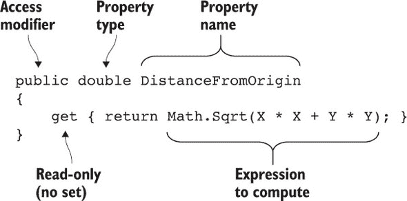
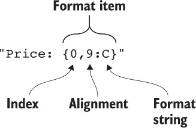
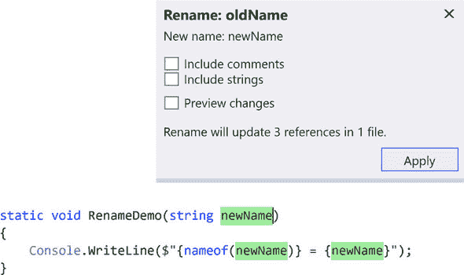
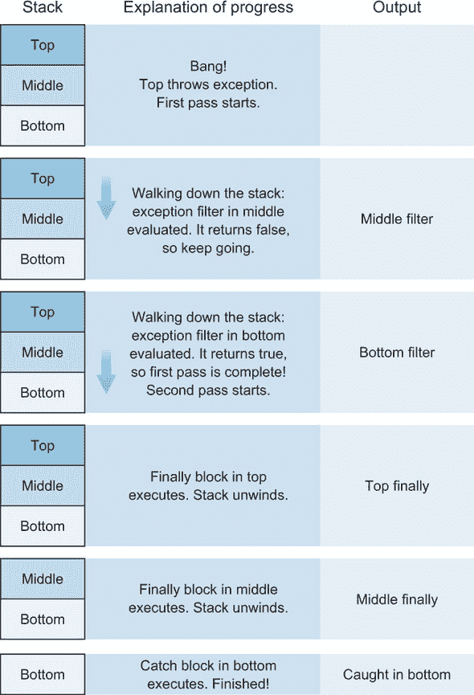

## 第三部分\. C# 6

C# 6 是我最喜欢的版本之一。它有很多特性，但它们大多相互独立，解释简单，并且容易应用到现有代码中。在某些方面，它们在阅读时可能并不令人兴奋，但它们仍然对你的代码可读性产生了巨大的影响。如果我有必要在 C# 的旧版本中编写代码，我会发现自己最怀念的是 C# 6 的特性。

虽然每个早期的 C# 版本都引入了一种全新的思考代码的方式（分别是泛型、LINQ、动态类型和 async/await），但 C# 6 更多的是对现有代码进行一些润色。

我将特性分为三个章节：关于属性的特性、关于字符串的特性，以及既不关于属性也不关于字符串的特性，但这有些随意。我建议按照自然顺序阅读这些章节，但与 LINQ 相比，这里并没有什么宏伟的计划。

由于 C# 6 的功能很容易应用到现有代码中，我建议你在使用过程中尝试它们。如果你维护一个项目，其中包含你一段时间没有接触过的旧代码，你可能会发现这是利用 C# 6 进行重构的理想之地。

## 第八章\. 超简洁的属性和表达式主体成员


**本章涵盖**

+   自动实现只读属性

+   在声明时自动初始化实现属性

+   使用表达式主体成员去除不必要的仪式


一些版本的 C# 有一个统一的大特性，几乎所有其他特性都与之相关。例如，C# 3 引入了 LINQ，C# 5 引入了异步操作。C# 6 并非如此，但它确实有一个总体主题。几乎所有特性都致力于编写更干净、更简单、更易读的代码。C# 6 不是关于做更多；它是关于用更少的代码做同样的事情。

本章中你将看到的特性是关于属性和其他简单代码片段的。当逻辑不是很多时，即使去除最小的仪式——例如大括号和返回语句——也能产生很大的影响。尽管这里的特性可能听起来并不令人印象深刻，但我对它们在实际代码中的影响感到惊讶。我们将从属性开始，然后转向方法、索引器和运算符。

### 8.1\. 属性的简要历史

C# 从第一版开始就有属性。尽管它们的核心功能随着时间的推移并没有改变，但它们在源代码中的表达方式逐渐变得简单，并且更加灵活。属性允许你区分在 API 中如何暴露状态访问和操作，以及状态是如何实现的。

例如，假设你想表示二维空间中的一个点。你可以像以下列表所示那样轻松地使用公共字段来表示。

##### 列表 8.1\. `Point` 类的公共字段

```
public sealed class Point
{
    public double X;
    public double Y;
}
```

初看似乎还不错，但类的功能（“我可以访问其 X 和 Y 值”）与实现（“我将使用两个双精度字段”）紧密相关。但在这个阶段，实现已经失去了控制。只要类的状态通过字段直接暴露，你就不能做以下事情：

+   在设置新值时执行验证（例如，防止 X 和 Y 坐标无限或非数字值）

+   在获取值时执行计算（例如，如果你想要以不同的格式存储字段——对于点来说不太可能，但在其他情况下完全可行）

你可能会争辩说，当你发现你需要这样的东西时，你可以总是将字段更改为属性，但这是一种破坏性的更改，你可能会想避免。（这会破坏源兼容性、二进制兼容性和反射兼容性。仅仅为了避免一开始就使用属性，就承担这样的风险是很大的。）

在 C# 1 中，语言在属性方面几乎没有提供帮助。一个基于属性的 列表 8.1 版本将需要手动声明后置字段，以及每个属性的 getter 和 setter，如下一个列表所示。

##### 列表 8.2\. `Point` 类的 C# 属性 1

```
public sealed class Point
{
    private double x, y;
    public double X { get { return x; } set { x = value; } }
    public double Y { get { return y; } set { y = value; } }
}
```

你可能会争辩说，许多属性最初只是简单地读取和写入字段，没有额外的验证、计算或其他任何东西，并且在整个代码历史中保持这种状态。这样的属性本可以公开为字段，但很难预测哪些属性以后可能需要额外的代码。即使你可以准确做到这一点，这也感觉像是在没有理由的情况下在两个抽象级别上操作。对我来说，属性充当类型提供的契约的一部分：其宣传的功能。字段仅仅是实现细节；它们是盒子内部的机制，在绝大多数情况下用户不需要了解。我几乎在所有情况下都更喜欢字段是私有的。

| |
| --- |

##### 注意

就像所有好的经验法则一样，总有例外。在某些情况下，直接公开字段是有意义的。当你查看 C# 7 提供的元组时，你会在 第十一章 中看到一个有趣的案例。

| |
| --- |

C# 2 中属性的唯一改进是允许 getter 和 setter 使用不同的访问修饰符——例如，公共 getter 和私有 setter。（这并不是唯一可用的组合，但这是最常见的一种。）

C# 3 然后添加了自动实现属性，这使得 列表 8.2 可以以更简单的方式重写，如下所示。

##### 列表 8.3\. `Point` 类的 C# 3 属性

```
public sealed class Point
{
    public double X { get; set; }
    public double Y { get; set; }
}
```

这段代码几乎与列表 8.2 中的代码完全相同，除了无法直接访问支持字段之外。它们被赋予了*难以言喻的名称*，这些名称不是有效的 C# 标识符，但在运行时是可行的。

重要的是，C# 3 只允许自动实现只读/写属性。我这里不会详细讨论不可变性的所有好处（以及陷阱），但有许多原因你可能想让你的 `Point` 类成为不可变的。为了使你的属性真正只读，你需要手动编写代码。

##### 列表 8.4\. 使用 C# 3 的手动实现只读属性的 `Point` 类

```
public sealed class Point
{
    private readonly double x, y;             *1*
    public double X { get { return x; } }     *2*
    public double Y { get { return y; } }     *2*

    public Point(double x, double y)
    {
        this.x = x;                           *3*
        this.y = y;                           *3*
    }
}
```

+   ***1* 声明只读字段**

+   ***2* 声明返回字段值的只读属性**

+   ***3* 在构造时初始化字段**

这至少是令人烦恼的。许多开发者——包括我——有时会作弊。如果我们想要只读属性，我们会使用具有私有设置器的自动实现属性，如下面的列表所示。

##### 列表 8.5\. 使用 C# 3 的私有设置器自动实现公开只读属性的 `Point` 类

```
public sealed class Point
{
    public double X { get; private set; }
    public double Y { get; private set; }

    public Point(double x, double y)
    {
        X = x;
        Y = y;
    }
}
```

这虽然可行，但并不令人满意。它没有表达你的意图。它允许你在类内部更改属性的值，即使你不想这样做；你想要一个可以在构造函数中设置但之后在其他地方永远不会改变的属性，并且你希望它以简单的方式由一个字段支持。直到包括 C# 5 在内，语言迫使你选择实现简单性和意图清晰之间的权衡，每个选择都牺牲了另一个。自从 C# 6 以来，你不再需要妥协；你可以编写简洁的代码，清楚地表达你的意图。

### 8.2\. 自动实现属性的升级

C# 6 引入了两个新特性来自动实现属性。这两个特性都易于解释和使用。在前一节中，我强调了暴露属性而不是公共字段的重要性，以及简洁实现不可变类型所面临的困难。你可能会猜到我们的第一个新特性在 C# 6 中是如何工作的，但还有一些限制也被放宽了。

#### 8.2.1\. 只读自动实现属性

C# 6 允许以简单的方式表达由只读字段支持的真正只读属性。只需一个空的获取器，没有设置器，就像在下一条列表中所示。

##### 列表 8.6\. 使用只读自动实现的属性的 `Point` 类

```
public sealed class Point
{
    public double X { get; }             *1*
    public double Y { get; }             *1*

    public Point(double x, double y)
    {
        X = x;                           *2*
        Y = y;                           *2*
    }
}
```

+   ***1* 自动声明只读属性**

+   ***2* 在构造时初始化属性**

从 列表 8.5 中改变的部分是 `X` 和 `Y` 属性的声明；它们根本不再有设置器。鉴于没有设置器，你可能想知道如何在构造函数中初始化属性。它正好像在 列表 8.4 中手动实现的那样发生：自动实现的属性声明的字段是只读的，并且对属性的任何赋值都会由编译器转换为直接的字段赋值。在构造函数之外尝试设置属性将导致编译时错误。

作为不可变性的粉丝，这对我来说是一个真正的进步。它让你可以用少量的代码表达你的理想结果。现在，懒惰不再是代码卫生的障碍，至少在这个小方面是这样。

C# 6 中移除的下一个限制与初始化有关。到目前为止，我展示的属性要么根本未显式初始化，要么在构造函数中初始化。但如果你想要像字段一样初始化一个属性呢？

#### 8.2.2\. 自动实现属性的初始化

在 C# 6 之前，自动实现属性的任何初始化都必须在构造函数中；你无法在声明的地方初始化属性。例如，假设你有一个 C# 2 中的 `Person` 类，如下面的列表所示。

##### 列表 8.7\. C# 2 中具有手动属性的 `Person` 类

```
public class Person
{
    private List<Person> friends = new List<Person>();     *1*
    public List<Person> Friends                            *2*
    {
        get { return friends; }
        set { friends = value; }
    }
}
```

+   ***1* 声明并初始化字段**

+   ***2* 暴露属性以读写字段**

如果你想要将此代码更改为使用自动实现属性，你必须将初始化移动到构造函数中，而之前你根本未显式声明任何构造函数。你最终会得到如下列表所示的代码。

##### 列表 8.8\. C# 3 中具有自动实现属性的 `Person` 类

```
public class Person
{
    public List<Person> Friends { get; set; }      *1*

    public Person()
    {
        Friends = new List<Person>();              *2*
    }
}
```

+   ***1* 声明属性；不允许初始化器**

+   ***2* 在构造函数中初始化属性**

这就是之前那么冗长！在 C# 6 中，这个限制被移除了。你可以在属性声明的地方进行初始化，如下面的列表所示。

##### 列表 8.9\. C# 6 中具有自动实现读写属性的 `Person` 类

```
public class Person
{
    public List<Person> Friends { get; set; } =   *1*
        new List<Person>();                       *1*
}
```

+   ***1* 声明并初始化读写自动实现**

自然地，你也可以使用这个特性与只读自动实现属性一起。一个常见的模式是有一个只读属性暴露一个可变集合，这样调用者可以添加或从集合中删除项目，但永远不能更改属性以引用不同的集合（或将其设置为 null 引用）。正如你所预期的，这只是一个移除设置器的问题。

##### 列表 8.10\. C# 6 中具有自动实现只读属性的 `Person` 类

```
public class Person
{
    public List<Person> Friends { get; } =   *1*
        new List<Person>();                  *1*
}
```

+   ***1* 声明并初始化只读自动实现**

我很少发现 C# 早期版本的这个特定限制是一个大问题，因为通常我想要根据构造函数参数初始化属性，但这个变化无疑是一个受欢迎的补充。下一个被移除的限制与只读自动实现属性结合使用时变得更为重要。

#### 8.2.3\. 结构体中的自动实现属性

在 C# 6 之前，我总是觉得自动实现属性在结构体中有点问题。有两个原因：

+   我总是编写不可变结构体，因此缺少只读自动实现属性一直是一个痛点。

+   由于确定赋值规则，我只能在链接到另一个构造函数之后才能在构造函数中赋值给自动实现属性。


##### 注意

通常，*确定赋值规则*是关于编译器跟踪在代码的特定点哪些变量将被赋值，无论你是如何到达那里的。这些规则主要与局部变量相关，以确保你不会尝试从尚未赋值的局部变量中读取。这里，我们正在查看相同规则的不同用途。


以下列表展示了这两个点在我们之前 `Point` 类的结构体版本中的示例。仅仅写下它就让我感到有些不舒服。

##### 列表 8.11\. C# 5 中使用自动实现属性的 `Point` 结构体

```
public struct Point
{
    public double X { get; private set; }           *1*
    public double Y { get; private set; }           *1*

    public Point(double x, double y) : this()       *2*
    {
        X = x;                                      *3*
        Y = y;                                      *3*
    }
}
```

+   ***1* 具有公共获取器和私有设置器的属性**

+   ***2* 链接到默认构造函数**

+   ***3* 属性初始化**

这不是我会包含在真实代码库中的代码。自动实现属性的好处被其丑陋性所抵消。你已经熟悉属性的只读方面，但为什么你需要在构造函数初始化器中调用默认构造函数？

答案在于结构体字段赋值规则中的细微差别。这里有两个规则在起作用：

+   在结构体中，直到编译器认为所有字段都已确定赋值之前，你不能使用任何属性、方法、索引器或事件。

+   每个结构体构造函数在返回控制权给调用者之前必须为所有字段分配值。

在 C# 5 中，如果不调用默认构造函数，你将违反两条规则。设置 `X` 和 `Y` 属性仍然算作使用了结构体的值，因此不允许这样做。设置属性并不算作分配字段，所以无论如何你都不能从构造函数中返回。链接到默认构造函数是一个解决方案，因为这样会在你的构造函数体执行之前分配所有字段。然后你可以设置属性并在最后返回，因为编译器很高兴地看到所有字段都已设置。

在 C# 6 中，语言和编译器对自动实现属性及其所依赖的字段之间的关系有了更深入的理解：

+   你可以在所有字段初始化之前设置自动实现的属性。

+   设置自动实现的属性算作初始化字段。

+   在其他字段初始化之前，你可以读取一个自动实现的属性，只要你事先已经设置了它。

另一种思考方式是，在构造函数中，自动实现的属性被视为字段。

在这些新规则生效并且有真正的只读自动实现属性的情况下，C# 6 中 `Point` 结构的版本与下一列表中的类版本相同，除了声明为结构体而不是密封类。

##### 列表 8.12\. C# 6 中使用自动实现的属性的 `Point` 结构

```
public struct Point
{
    public double X { get; }
    public double Y { get; }

    public Point(double x, double y)
    {
        X = x;
        Y = y;
    }
}
```

结果是干净简洁的，正是你想要的。


##### 注意

你可能会问是否应该将 `Point` 实现为结构体。在这种情况下，我处于两可之间。点确实感觉像是相当自然的值类型，但我仍然通常默认创建类。在 Noda Time（该库以结构体为主）之外，我很少编写自己的结构体。这个例子当然不是试图建议你应该更广泛地使用结构体，但如果你确实编写了自己的结构体，语言比以前更有帮助。


到目前为止，你所看到的一切都使得自动实现的属性更容易使用，这通常减少了样板代码的数量。但并非所有属性都是自动实现的。从你的代码中移除杂乱的任务并没有停止在这里。

### 8.3\. 表达式成员

我不会规定 C# 中的特定编码风格。除了其他任何事情之外，不同的问题领域适合不同的方法。但我确实遇到过具有许多简单方法和属性的类型。C# 6 通过 *表达式成员* 帮助你在这里。我们将从属性开始，因为你之前已经看过它们，然后我们将看到同样的想法可以应用于其他函数成员。

#### 8.3.1\. 更简单的只读计算属性

有些属性很简单：如果字段的实现与类型的逻辑状态相匹配，属性可以直接返回字段值。这就是自动实现属性的作用。其他属性涉及基于其他字段或属性的运算。为了展示 C# 6 解决的问题，以下列表为我们的 `Point` 类添加了另一个属性：`DistanceFromOrigin`，它以简单的方式使用勾股定理来返回点与原点的距离。


##### 注意

如果这里的数学不熟悉，细节不重要，重要的是它是一个使用 `X` 和 `Y` 的只读属性。


##### 列表 8.13\. 向 `Point` 添加 `DistanceFromOrigin` 属性

```
public sealed class Point
{
    public double X { get; }
    public double Y { get; }

    public Point(double x, double y)
    {
        X = x;
        Y = y;
    }

    public double DistanceFromOrigin                   *1*
    {                                                  *1*
        get { return Math.Sqrt(X * X + Y * Y); }       *1*
    }                                                  *1*
}
```

+   ***1* 只读属性用于计算距离**

我不会声称这很难阅读，但它确实包含了很多我可以描述为*仪式*的语法：它只存在于让编译器知道有意义代码如何适应的地方。图 8.1 显示了相同的属性，但已注释以突出有用的部分；仪式（花括号、返回语句和分号）以较浅的色调显示。

##### 图 8.1\. 属性声明注释，显示重要方面



C# 6 允许你以更简洁的方式表达：

```
public double DistanceFromOrigin => Math.Sqrt(X * X + Y * Y);
```

在这里，`=>`用于表示*表达式成员体*——在这种情况下，一个只读属性。不再需要花括号，不再需要关键字。只读属性部分以及表达式用于返回值的事实都是隐式的。与图 8.1 进行比较，你会发现表达式成员体形式包含所有有用的部分（以不同的方式表示它是只读属性）以及没有多余的部分。完美！


**不，这不是一个 lambda 表达式**

是的，你之前已经见过这个语法元素。Lambda 表达式在 C# 3 中引入，作为一种声明委托和表达式树的简短方式。例如：

```
Func<string, int> stringLength = text => text.Length;
```

表达式成员体使用`=>`语法，但不是 lambda 表达式。`DistanceFromOrigin`前面的声明不涉及任何委托或表达式树；它只指示编译器创建一个计算给定表达式并返回结果的只读属性。

当大声谈论语法时，我通常将`=>`描述为*粗箭头*。


你可能想知道这是否在现实世界中是有用的，而不仅仅是书中虚构的例子。为了向您展示具体的例子，我将使用 Noda Time。

##### 透传或委托属性

我们将简要考虑 Noda Time 中的三种类型：

+   `LocalDate`—特定日历中的日期，没有时间组件

+   `LocalTime`—一天中的时间，没有日期组件

+   `LocalDateTime`—日期和时间的组合

不要担心初始化等细节；只需考虑你希望从三种类型中得到什么。显然，日期将具有年、月和日等属性，而时间将具有小时、分钟、秒等属性。那么，结合这两种类型的类型呢？能够分别获取日期和时间组件很方便，但通常你想要日期和时间的子组件。`LocalDate`和`LocalTime`的每个实现都经过了精心优化，我不希望在`LocalDateTime`中重复该逻辑，因此子组件属性是透传的，委托给日期或时间组件的属性。以下列表中所示的实施现在非常简洁。

##### 列表 8.14\. Noda Time 中的委托属性

```
public struct LocalDateTime
{
    public LocalDate Date { get; }          *1*
    public int Year => Date.Year;           *2*
    public int Month => Date.Month;         *2*
    public int Day => Date.Day;             *2*

    public LocalTime TimeOfDay { get; }     *3*
    public int Hour => TimeOfDay.Hour;      *4*
    public int Minute => TimeOfDay.Minute;  *4*
    public int Second => TimeOfDay.Second;  *4*

                                            *5*
}
```

+   ***1* 日期组件的属性**

+   ***2* 委托给日期子组件的属性**

+   ***3* 时间组件的属性**

+   ***4* 将属性委托给时间子组件**

+   ***5* 初始化、其他属性和成员**

许多属性都像这样；从每个属性中移除 `{ get { return ... } }` 部分确实是一种乐趣，并且使代码更加清晰。

##### 在另一个状态上执行简单的逻辑

在 `LocalTime` 中，只有一个状态：一天中的纳秒数。所有其他属性都是基于这个值来计算值的。例如，计算纳秒级子秒值的代码是一个简单的余数操作：

```
public int NanosecondOfSecond =>
    (int) (NanosecondOfDay % NodaConstants.NanosecondsPerSecond);
```

在第十章中，这段代码将变得更加简单，但到目前为止，你只需享受表达式主体属性的简洁性。


**重要注意事项**

表达式主体属性有一个缺点：只读属性和公共可读写字段之间只有一个字符的差异。在大多数情况下，如果你犯了一个错误，由于在字段初始化器中使用其他属性或字段，编译时错误将会发生，但对于静态属性或返回常量值的属性，这是一个容易犯的错误。考虑以下声明之间的差异：

```
// Declares a read-only property
public int Foo => 0;
// Declares a read/write public field
public int Foo = 0;
```

这对我来说已经成了几次问题，但一旦你意识到它，检查起来就足够简单。确保你的代码审查人员也了解这一点，这样你就不太可能被抓住。


到目前为止，我们一直专注于属性，作为从其他新属性相关功能自然过渡的一部分。然而，正如章节标题所暗示的，其他类型的成员也可以有表达式主体。

#### 8.3.2\. 表达式主体方法、索引器和操作符

除了表达式主体属性外，你还可以编写表达式主体方法、只读索引器和操作符，包括用户定义的转换。`=>` 的使用方式相同，表达式周围没有大括号，也没有显式的返回语句。

例如，一个简单的 `Add` 方法及其等价的操作符，用于将一个具有明显 `X` 和 `Y` 属性的 `Vector` 添加到 `Point` 中，在 C# 5 中可能看起来像以下代码示例。

##### 列表 8.15\. C# 5 中的简单方法和操作符

```
public static Point Add(Point left, Vector right)
{
    return left + right;                             *1*
}

public static Point operator+(Point left, Vector right)
{
    return new Point(left.X + right.X,               *2*
        left.Y + right.Y);                           *2*
}
```

+   ***1* 只委托给操作符。**

+   ***2* 简单的构造函数调用以实现 +**

在 C# 6 中，它可能看起来更简单，这两个都可以使用表达式主体成员来实现，如下面的代码示例所示。

##### 列表 8.16\. C# 6 中的表达式主体方法和操作符

```
public static Point Add(Point left, Vector right) => left + right;

public static Point operator+(Point left, Vector right) =>
    new Point(left.X + right.X, left.Y + right.Y);
```

注意我在 `operator+` 中使用的格式化；将所有内容放在一行会使代码变得非常长。一般来说，我在声明部分的末尾放置 `=>` 并像往常一样缩进主体。你格式化代码的方式完全取决于你，但我发现这个约定对所有类型的表达式成员都很有用。

你还可以使用表达式主体为 `void` 返回类型的方法。在这种情况下，没有要省略的 `return` 语句；只需移除大括号。


##### 备注

这与 lambda 表达式的工作方式一致。提醒一下，表达式成员不是 lambda 表达式，但它们有这个共同点。


例如，考虑一个简单的日志方法：

```
public static void Log(string text)
{
    Console.WriteLine("{0:o}: {1}", DateTime.UtcNow, text)
}
```

这可以用一个表达式成员方法写成这样：

```
public static void Log(string text) =>
    Console.WriteLine("{0:o}: {1}", DateTime.UtcNow, text);
```

这里的好处确实较小，但对于声明和主体可以放在一行的方法来说，这仍然值得做。在 第九章 中，你会看到一种使用插值字符串字面量使其更干净的方法。

对于一个包含方法、属性和索引器的最终示例，让我们假设你想要创建自己的 `IReadOnlyList<T>` 实现，以提供对任何 `IList<T>` 的只读视图。当然，`ReadOnlyCollection<T>` 已经做到了这一点，但它也实现了可变接口（`IList<T>`, `ICollection<T>`）。有时你可能想精确地了解集合通过其实现的接口允许什么。使用表达式成员，这样的包装器实现确实很短。

##### 列表 8.17\. 使用表达式成员的 `IReadOnlyList<T>` 实现

```
public sealed class ReadOnlyListView<T> : IReadOnlyList<T>
{
    private readonly IList<T> list;                           

    public ReadOnlyListView(IList<T> list)
    {
        this.list = list;
    }
    public T this[int index] => list[index];          *1*
    public int Count => list.Count;                   *2*
    public IEnumerator<T> GetEnumerator() =>          *3*
        list.GetEnumerator();                         *3*
    IEnumerator IEnumerable.GetEnumerator() =>        *4*
        GetEnumerator();                              *4*
}
```

+   ***1* 将索引器委托给列表索引器**

+   ***2* 属性委托给列表属性**

+   ***3* 方法委托给列表方法**

+   ***4* 方法委托给其他 GetEnumerator 方法**

这里展示的唯一新特性是表达式成员索引器的语法，我希望它与其他类型成员的语法足够相似，以至于你没有注意到它是新的。

然而，有什么让你印象深刻的地方吗？有什么让你感到惊讶的吗？那个构造函数看起来有点丑，不是吗？

#### 8.3.3\. C# 6 中表达式成员的限制

通常，在这个时候，我刚刚评论了代码的冗长性，我会透露 C# 实现的另一个新特性，以使其变得更好。但这次恐怕不行——至少不是在 C# 6 中。

即使构造函数只有一个语句，但在 C# 6 中没有表达式成员构造函数。它也不是独一无二的。你不能有表达式成员

+   静态构造函数

+   析构函数

+   实例构造函数

+   读写或只写属性

+   读写或只写索引器

+   事件

这些都没有让我夜不能寐，但显然不一致性让 C# 团队感到足够的困扰，以至于 C# 7 允许所有这些使用表达式成员。它们通常不会节省任何可打印的字符，但格式化约定允许它们节省垂直空间，并且仍然有这种可读性提示，即这只是一个简单的成员。它们都使用你已经习惯的相同语法，列表 8.18 提供了一个完整的示例，纯粹是为了展示语法。这段代码并不打算作为有用的代码，而只是作为一个示例，在事件处理程序的情况下，与简单的字段式事件相比，它是不安全的非线程安全的。

##### 列表 8.18\. C# 7 中的额外表达式成员

```
public class Demo
{
    static Demo() =>                                          *1*
        Console.WriteLine("Static constructor called");       *1*
    ~Demo() => Console.WriteLine("Finalizer called");         *2*

    private string name;
    private readonly int[] values = new int[10];

    public Demo(string name) => this.name = name;             *3*

    private PropertyChangedEventHandler handler;
    public event PropertyChangedEventHandler PropertyChanged  *4*
    {                                                         *4*
        add => handler += value;                              *4*
        remove => handler -= value;                           *4*
    }                                                         *4*

    public int this[int index]                                *5*
    {                                                         *5*
        get => values[index];                                 *5*
        set => values[index] = value;                         *5*
    }                                                         *5*

    public string Name                                        *6*
    {                                                         *6*
        get => name;                                          *6*
        set => name = value;                                  *6*
    }                                                         *6*
}
```

+   ***1* 静态构造函数**

+   ***2* 析构函数**

+   ***3* 构造函数**

+   ***4* 带有自定义访问器的事件**

+   ***5* 读写索引器**

+   ***6* 读写属性**

这个优点之一是，即使 `set` 访问器不是表达式成员，`get` 访问器也可以是表达式成员，反之亦然。例如，假设你想让你的索引器设置器验证新值不是负数。你仍然可以保留一个表达式成员的获取器：

```
public int this[int index]
{
    get => values[index];
    set
    {
        if (value < 0)
        {
            throw new ArgumentOutOfRangeException();
        }
        Values[index] = value;
    }
}
```

我预计在未来这将会相当普遍。根据我的经验，设置器通常包含验证，而获取器通常是微不足道的。


##### 提示

如果你发现自己在一个获取器中写了很多逻辑，那么考虑它是否应该是一个方法是有意义的。有时边界可能很模糊。


虽然表达式成员有许多好处，但它们是否有其他缺点？你应该在将所有可能的内容转换为使用它们时有多激进？

#### 8.3.4\. 使用表达式成员的指南

我的经验是，表达式成员特别适用于运算符、转换、比较、相等检查和 `ToString` 方法。这些通常由简单的代码组成，但对于某些类型，可能会有很多这样的成员，可读性的差异可能非常显著。

与一些相对小众的功能不同，表达式成员可以在我所遇到的几乎每一个代码库中发挥重要作用。当我将 Noda Time 转换为使用 C# 6 时，我移除了代码中大约 50% 的返回语句。这是一个巨大的差异，而且随着我逐渐利用 C# 7 提供的额外机会，这个比例只会增加。

请注意，表达式成员不仅仅是可读性。我发现它们提供了一种心理效应：感觉我比以前更多地在进行函数式编程。这反过来又让我觉得自己更聪明。是的，听起来很愚蠢，但确实感觉令人满意。当然，你可能会比我更理性。

总是存在过度使用的危险。在某些情况下，你不能使用表达式成员，因为你的代码中包含了一个 `for` 语句或类似的内容。在许多情况下，将常规方法转换为表达式成员是可能的，但你真的不应该这样做。我发现，这类成员可以分为两类：

+   执行前置条件检查的成员

+   使用解释性变量的成员

作为第一类成员的例子，我有一个名为 `Preconditions` 的类，它有一个通用的 `CheckNotNull` 方法，接受一个引用和一个参数名称。如果引用为空，它将使用参数名称抛出 `ArgumentNullException`；否则，它返回值。这允许在构造函数等地方方便地将检查和赋值语句组合在一起。

这也允许——但当然不是强制——你将结果用作方法调用的目标或，实际上，作为它的参数。问题是，如果不小心，理解正在发生的事情会变得困难。这里有一个我从之前描述的 `LocalDateTime` 结构体中提取的方法：

```
public ZonedDateTime InZone(
    DateTimeZone zone,
    ZoneLocalMappingResolver resolver)
{
    Preconditions.CheckNotNull(zone);
    Preconditions.CheckNotNull(resolver);
    return zone.ResolveLocal(this, resolver);
}
```

这读起来既简洁又简单：检查参数是否有效，然后通过委托给另一个方法来完成工作。这可以写成表达式体成员，如下所示：

```
public ZonedDateTime InZone(
    DateTimeZone zone,
    ZoneLocalMappingResolver resolver) =>
    Preconditions.CheckNotNull(zone)
        .ResolveLocal(
            this,
            Preconditions.CheckNotNull(resolver);
```

这会产生完全相同的效果，但阅读起来要困难得多。根据我的经验，一个验证检查将方法放在表达式体成员的边缘；有两个这样的检查，那就太痛苦了。

对于解释变量，我之前提供的 `NanosecondOfSecond` 示例只是 `LocalTime` 上的许多属性之一。大约一半使用表达式体，但相当多的属性有两个语句，就像这样：

```
public int Minute
{
    get
    {
        int minuteOfDay = (int) NanosecondOfDay / NanosecondsPerMinute;
        return minuteOfDay % MinutesPerHour;
    }
}
```

这可以很容易地写成表达式体属性，通过有效地内联 `minuteOfDay` 变量：

```
public int Minute =>
    ((int) NanosecondOfDay / NodaConstants.NanosecondsPerMinute) %
    NodaConstants.MinutesPerHour;
```

再次强调，代码实现了完全相同的目标，但在原始版本中，`minuteOfDay` 变量增加了关于子表达式的*意义*的信息，这使得代码更容易阅读。

在任何给定的一天，我*可能*得出不同的结论。但在更复杂的情况下，遵循一系列步骤并命名结果，当你六个月后回到代码时，可能会有很大的不同。这也帮助你在需要时在调试器中逐步执行代码，因为你可以轻松地一次执行一个语句并检查结果是否是你预期的。

好消息是你可以随意进行实验和改变主意。表达式体成员纯粹是语法糖，所以如果你的品味随时间改变，你总是可以转换更多代码来使用它们，或者撤销过于急切地使用表达式体的代码。

### 摘要

+   自动实现的属性现在可以是只读的，并由只读字段支持。

+   自动实现的属性现在可以有初始化器，而不是在构造函数中初始化非默认值。

+   结构体可以使用自动实现的属性，而无需将构造函数链接在一起。

+   表达式体成员允许用更少的仪式编写简单的（单表达式）代码。

+   虽然限制限制了在 C# 6 中使用表达式体编写的成员类型，但这些限制在 C# 7 中被取消了。

## 第九章\. 字符串特性

| |
| --- |

**本章涵盖**

+   使用插值字符串字面量进行更易读的格式化

+   使用 `FormattableString` 进行本地化和自定义格式化

+   使用 `nameof` 进行重构友好的引用

| |
| --- |

每个人都知道如何使用字符串。如果`string`不是你首先了解的.NET 数据类型，那么它很可能是第二个。在.NET 的历史进程中，`string`类本身并没有发生太多变化，自从 C# 1 以来，作为一门语言，C#并没有引入很多以字符串为导向的特性。然而，C# 6 通过另一种字符串字面量和一个新的运算符改变了这一点。你将在本章中详细了解这两个方面，但值得记住的是，字符串本身并没有发生任何变化。这两个特性提供了获取字符串的新方法，但这只是全部。

就像你在第八章中看到的功能一样，字符串插值并不允许你做之前不能做的事情；它只是允许你以更易读和简洁的方式去做。这并不是要贬低该功能的重要性。任何能够让你更快地编写更清晰代码，并且之后更快地阅读代码的东西，都会让你更有效率。

`nameof`运算符是 C# 6 中真正的新功能，但它是一个相对较小的特性。它所做的只是允许你在执行时获取一个已经在你的代码中出现的标识符，但作为字符串。它不会像 LINQ 或 async/await 那样改变你的世界，但它有助于避免错误，并允许重构工具为你做更多的工作。在我向你展示任何新内容之前，让我们回顾一下你已经知道的内容。

### 9.1. .NET 中的字符串格式化回顾

你几乎肯定知道本节中的所有内容。你可能已经使用字符串很多年了，而且几乎肯定是从使用 C#开始就一直在使用。然而，为了理解 C# 6 中插值字符串字面量功能的工作原理，最好是将所有这些知识都放在心中。请耐心等待，我们将回顾.NET 处理字符串格式化的基础知识。我保证我们很快就会到达新内容。

#### 9.1.1. 简单字符串格式化

如果你像我一样，你喜欢通过编写无用的控制台应用程序来尝试新语言，这些应用程序除了提供信心和坚实的基础外，不会做任何有用的事情。因此，我记不起我使用过多少种语言来实现下一个功能——询问用户的姓名，然后向该用户说你好：

```
Console.Write("What's your name? ");
string name = Console.ReadLine();
Console.WriteLine("Hello, {0}!", name);
```

本章最相关的一行是最后一行。它使用了一个`Console.WriteLine`的重载，该重载接受一个包含*复合格式字符串*和*格式项*的参数，然后是替换这些格式项的参数。前面的例子中有一个格式项`{0}`，它被`name`变量的值替换。格式项中的数字指定了你要填充的参数的索引（其中 0 代表第一个值，1 代表第二个，以此类推）。

这种模式在各种 API 中使用。最明显的例子是`string`类中的静态`Format`方法，它所做的只是适当地格式化字符串。到目前为止，一切顺利。让我们做一些稍微复杂一点的事情。

#### 9.1.2. 使用格式字符串进行自定义格式化

为了明确起见，我包括这个子节的原因，不仅是为了未来的自己，也是为了亲爱的读者。如果 MSDN 显示了我在任何给定页面上访问的次数，那么复合格式字符串页面的数字会令人恐惧。我总是忘记确切的位置和应该使用的术语，我想如果我在这里包含这些信息，我可能会更好地记住它们。我希望你也能以同样的方式找到它有帮助。

复合格式字符串中的每个格式项指定要格式化的参数的索引，但它也可以指定以下选项来格式化值：

+   一个*对齐*，它指定最小宽度和值应该是左对齐还是右对齐。右对齐由正值表示；左对齐由负值表示。

+   一个用于值的*格式字符串*。这通常用于日期和时间值或数字。例如，要按照 ISO-8601 格式化日期，可以使用格式字符串`yyyy-MM-dd`。要将数字格式化为货币值，可以使用格式字符串`C`。格式字符串的含义取决于正在格式化的值的类型，因此您需要查找相关文档以选择正确的格式字符串。

图 9.1 显示了可以用于显示价格的复合格式字符串的所有部分。

##### 图 9.1. 一个包含用于显示价格的格式项的复合格式字符串



对齐和格式字符串是独立可选的；您可以指定任何一个、两个或都不指定。格式项中的逗号表示对齐，而冒号表示格式字符串。如果您需要在格式字符串中包含逗号，那没问题；没有第二个对齐值的观念。

作为稍后扩展的具体示例，让我们在一个更广泛的环境中使用图 9.1 中的代码，以展示不同长度的结果，以说明对齐的要点。列表 9.1 显示了一个价格（$95.25）、小费（$19.05）和总计（$114.30），将标签对齐在左侧，将值对齐在右侧。

默认使用美国英语文化设置的机器上的输出将如下所示：

```
Price:    $95.25
Tip:      $19.05
Total:   $114.30
```

要使值右对齐（或用空格左填充，从另一个角度来看），代码使用对齐值为 9。如果你有一大笔钱（比如一百万美元），对齐就没有效果；它只指定最小宽度。如果你想编写将每可能的一组值都右对齐的代码，你首先必须计算出最大的宽度是多少。这是一段相当不愉快的代码，而且我担心 C# 6 中没有任何东西能使其更容易。

##### 列表 9.1\. 显示带有对齐值的单价、小费和总计

```
decimal price = 95.25m;
decimal tip = price * 0.2m;                       *1*
Console.WriteLine("Price: {0,9:C}", price);
Console.WriteLine("Tip:   {0,9:C}", tip);
Console.WriteLine("Total: {0,9:C}", price + tip);
```

+   ***1* 20% 小费**

当我在美国英语文化的机器上展示了 列表 9.1 的输出时，关于文化的那部分很重要。在使用英国英语文化的机器上，代码会使用英镑符号。在法语文化的机器上，小数分隔符会变成逗号，货币符号会变成欧元符号，而这个符号会在字符串的末尾而不是开头！这就是本地化的乐趣，你将在下一节中看到。

#### 9.1.3\. 本地化

从广义上讲，*本地化*是指确保你的代码无论用户在世界任何地方都能正确运行的任务。任何声称本地化很简单的人要么比我更有经验，要么还没有足够地做本地化工作以看到它可能有多么痛苦。考虑到世界基本上是圆的，它似乎有很多棘手的边缘情况需要处理。本地化在所有编程语言中都是一种痛苦，但每种语言都有稍微不同的方式来解决这些问题。


##### 注意

虽然我在本节中使用术语 *本地化*，但其他人可能更喜欢使用术语 *全球化*。微软在本地化和全球化这两个术语的使用上与其他行业机构略有不同，这种差异是相当微妙的。专家们，请原谅我在这里的手势挥舞；整体图景比术语的细微差别更重要，就这一次。


在 .NET 中，对于本地化目的，最重要的类型是 `CultureInfo`。它负责语言（如英语）的文化偏好，或特定位置的语言（如加拿大的法语），或特定位置的语言的特定变体（如台湾使用的简体中文）。这些文化偏好包括各种翻译（例如，用于星期的单词）以及指示文本的排序方式和数字的格式化方式（是否使用句点或逗号作为小数分隔符）等等。

通常，你不会在方法签名中看到 `CultureInfo`，而是看到 `IFormatProvider` 接口，这是 `CultureInfo` 实现的。大多数格式化方法都有重载，其中 `IFormatProvider` 作为格式字符串本身之前的第一参数。例如，考虑以下来自 `string.Format` 的两个签名：

```
static string Format(IFormatProvider provider,
    string format, params object[] args)
static string Format(string format, params object[] args)
```

通常，如果你提供仅通过单个参数不同的重载，那么该参数就是最后一个，所以你可能预计 `provider` 参数应该在 `args` 之后。但这不会起作用，因为 `args` 是一个参数数组（它使用 `params` 修饰符）。如果一个方法有一个参数数组，那么它必须是最后一个参数。

即使参数类型为 `IFormatProvider`，你作为参数传入的值几乎总是 `CultureInfo`。例如，如果你想为美国英语格式化我的出生日期——1976 年 6 月 19 日——你可以使用以下代码：

```
var usEnglish = CultureInfo.GetCultureInfo("en-US");
var birthDate = new DateTime(1976, 6, 19);
string formatted = string.Format(usEnglish, "Jon was born on {0:d}", birthDate);
```

在这里，`d` 是标准日期/时间格式说明符，用于*短日期*，在美国英语中对应于月/日/年。例如，我的出生日期将被格式化为 6/19/1976。在英式英语中，短日期格式是日/月/年，所以相同的日期将被格式化为 19/06/1976。请注意，不仅仅是顺序不同：在英式格式中，月份也是 0 填充到两位数字。

其他文化可以使用完全不同的格式。看到相同值在不同文化中格式化的结果差异可能很有教育意义。例如，你可以像在下一个列表中所示的那样，格式化 .NET 知道的每种文化中的相同日期。

##### 列表 9.2\. 在每种文化中格式化单个日期

```
var cultures = CultureInfo.GetCultures(CultureTypes.AllCultures);
var birthDate = new DateTime(1976, 6, 19);
foreach (var culture in cultures)
{
    string text = string.Format(
        culture, "{0,-15} {1,12:d}", culture.Name, birthDate);
    Console.WriteLine(text);
}
```

泰国的输出显示我在泰国佛教历中出生于 2519 年，而阿富汗的输出显示我在伊斯兰历中出生于 1355 年：

```
...
tg-Cyrl           19.06.1976
tg-Cyrl-TJ        19.06.1976
th                 19/6/2519
th-TH              19/6/2519
ti                19/06/1976
ti-ER             19/06/1976
...
ur-PK             19/06/1976
uz                19/06/1976
uz-Arab           29/03 1355
uz-Arab-AF        29/03 1355
uz-Cyrl           19/06/1976
uz-Cyrl-UZ        19/06/1976
...
```

此示例还显示了一个负对齐值，用于使用 `{0,-15}` 格式项将文化名称左对齐，同时使用 `{1,12:d}` 格式项将日期右对齐。

##### 使用默认文化进行格式化

如果你没有指定格式提供程序，或者如果你传递 `null` 作为对应于 `IFormatProvider` 参数的参数，将使用 `CultureInfo.CurrentCulture` 作为默认值。这具体意味着什么将取决于你的上下文；它可以在每个线程的基础上设置，并且一些网络框架会在处理特定线程上的请求之前设置它。

关于使用默认值，我唯一能建议的是要小心：确保你知道你特定线程中的值是合适的。（如果你开始并行化跨多个线程的操作，检查确切的行为特别有价值。）如果你不想依赖于默认文化，你需要知道你需要为格式化文本的最终用户的文化，并明确这样做。

##### 为机器进行格式化

到目前为止，我们假设你正在尝试为最终用户格式化文本。但情况往往并非如此。对于机器到机器的通信（例如，在由网络服务解析的 URL 查询参数中），你应该使用*不变文化*，这可以通过静态 `CultureInfo.InvariantCulture` 属性获得。

例如，假设你正在使用一个 Web 服务从出版社获取畅销书列表。该 Web 服务可能使用 [`manning.com/webservices/bestsellers`](https://manning.com/webservices/bestsellers) 这样的 URL，但允许一个名为 `date` 的查询参数，以便你可以找到特定日期上的畅销书。^([1)] 我预计该查询参数将使用 ISO-8601 格式（年份首先，年份、月份和日期之间使用连字符）来表示日期。例如，如果你想检索 2017 年 3 月 20 日开始的销售量最高的书籍，你将想要使用 [`manning.com/webservices/bestsellers?date=2017-03-20`](https://manning.com/webservices/bestsellers?date=2017-03-20) 这样的 URL。在允许用户选择特定日期的应用程序中构建该 URL 的代码可能如下所示：

> ¹
> 
> 根据我所知，这是一个虚构的 Web 服务。

```
string url = string.Format(
    CultureInfo.InvariantCulture,
    "{0}?date={1:yyyy-MM-dd}",
    webServiceBaseUrl,
    searchDate);
```

注意，大多数时候，你不应该直接为机器到机器通信格式化数据。我建议你在可能的情况下避免字符串转换；它们通常是一个代码异味，表明你可能没有正确使用库或框架，或者你有数据设计问题（例如，在数据库中将日期存储为文本而不是作为原生日期/时间类型）。话虽如此，你可能会发现自己比预期的更频繁地手动构建字符串；只需注意你应该使用哪种文化即可。

好吧，这是一个很长的介绍。但是，当所有这些格式化信息在你的脑海中嗡嗡作响，以及一些有些丑陋的例子在你心中萦绕时，你正处于欢迎 C# 6 中的插值字符串字面量的正确心态。所有那些调用 `string.Format` 的代码看起来都过于冗长，而且不得不在格式字符串和参数列表之间来回查找，以确定内容将如何放置，这真的很烦人。当然，我们可以使我们的代码比这更清晰。

### 9.2. 插值字符串字面量的介绍

C# 6 中的插值字符串字面量允许你以更简单的方式执行所有这些格式化操作。格式字符串和参数的概念仍然适用，但使用插值字符串字面量时，你可以在行内指定值及其格式化信息，这使得代码更容易阅读。如果你查看你的代码并发现很多使用硬编码格式字符串调用 `string.Format` 的情况，你一定会喜欢插值字符串字面量。

字符串插值并不是一个新概念。它已经在许多编程语言中存在很长时间了，但我从未觉得它在 C# 中如此整洁地集成。当你考虑到在语言已经成熟的情况下添加一个功能比将其构建到第一版中更难时，这一点尤其引人注目。

在本节中，你将先查看一些简单的示例，然后再探索插值文本字面量。你将学习如何使用`FormattableString`应用本地化，然后更详细地了解编译器如何处理插值字符串字面量。我们将通过讨论这个特性最有用的地方以及其局限性来结束本节。

#### 9.2.1\. 简单插值

在 C# 6 中演示插值字符串字面量的最简单方法就是展示我们之前要求用户姓名的早期示例的等效代码。代码看起来并没有太大不同；特别是，只有最后一行有所改变。

| C# 5—旧式格式化 | C# 6—插值字符串字面量 |
| --- | --- |

|

```
Console.Write("What's your name? ");
string name = Console.ReadLine();
Console.WriteLine("Hello, {0}!",
    name);
```

|

```
Console.Write("What's your name? ");
string name = Console.ReadLine();
Console.WriteLine($"Hello, {name}!");
```

|

插值字符串字面量以粗体显示。它在开双引号之前有一个`$`，这就是它成为插值字符串字面量而不是普通字符串的原因，至少对编译器来说是这样。它使用`{name}`而不是`{0}`作为格式项。花括号中的文本是一个表达式，它在字符串内被评估并格式化。因为你已经提供了所有需要的信息，所以不再需要`WriteLine`的第二个参数。


##### 注意

我在这里稍微撒了个谎，为了简化。这段代码并不完全以原始代码的方式工作。原始代码将所有参数传递给适当的`Console.WriteLine`重载，该重载为你执行了格式化。现在，所有格式化操作都通过`string.Format`调用完成，然后`Console.WriteLine`调用使用仅有一个字符串参数的重载。结果将会相同。


就像表达式成员一样，这看起来并没有太大的改进。对于单个格式项，原始代码并没有太多可以混淆的地方。第一次看到这个时，阅读插值字符串字面量可能甚至比阅读字符串格式化调用要花更长的时间。我对于自己到底有多喜欢它们持怀疑态度，但现在我经常发现自己几乎自动地将旧代码的部分转换为使用它们，我发现可读性的提升通常是显著的。

现在你已经看到了最简单的示例，让我们来做一些更复杂的事情。你将遵循之前的顺序，首先仔细查看控制值格式的操作，然后考虑本地化。

#### 9.2.2\. 插值字符串字面量中的格式化字符串

好消息！这里没有新的内容需要学习。如果你想要提供一个带有插值字符串字面量的对齐或格式化字符串，你将按照在正常复合格式化字符串中的方式操作：在对齐之前添加一个逗号，在格式化字符串之前添加一个冒号。我们之前复合格式化的示例以明显的方式进行了更改，如下面的列表所示。

##### 列表 9.3\. 使用插值字符串字面量对齐的值

```
decimal price = 95.25m;
decimal tip = price * 0.2m;                       *1*
Console.WriteLine($"Price: {price,9:C}");         *2*
Console.WriteLine($"Tip:   {tip,9:C}");           *2*
Console.WriteLine($"Total: {price + tip,9:C}");   *2*
```

+   ***1* 20%的小费**

+   ***2* 使用九位对齐右对齐价格**

注意，在最后一行，插值字符串不仅仅包含一个简单的变量作为参数；它执行了小费与价格的加法。表达式可以是任何计算值的表达式。（例如，你不能只是调用一个返回`void`类型的方法。）如果值实现了`IFormattable`接口，它的`ToString(string, IFormatProvider)`方法将被调用；否则，使用`System.Object.ToString()`。

#### 9.2.3\. 插值实际字符串字面量

你肯定之前见过**实际字符串字面量**；它们在双引号前以`@`开头。在实际字符串字面量中，反斜杠和换行符包含在字符串中。例如，在实际字符串字面量`@"c:\Windows"`中，反斜杠确实是一个反斜杠；它不是转义序列的开始。实际字符串字面量中唯一的转义序列是在你有两个双引号字符一起时，这会在结果字符串中产生一个双引号字符。实际字符串字面量通常用于以下情况：

+   跨多行的字符串

+   正则表达式（使用反斜杠进行转义，与 C#编译器在常规字符串字面量中使用的转义完全不同）

+   固定硬编码的 Windows 文件名


##### 注意

在多行字符串中，你应该注意哪些字符最终出现在你的字符串中。尽管在大多数代码中，“回车”和“回车换行分隔符”之间的区别无关紧要，但在实际字符串字面量中却很重要。


以下展示了这些功能的快速示例：

```
string sql = @"                                        *1*
  SELECT City, ZipCode                                 *1*
  FROM Address                                         *1*
  WHERE Country = 'US'";                               *1*
Regex lettersDotDigits = new Regex(@"[a-z]+\.\d+");    *2*
string file = @"c:\users\skeet\Test\Test.cs"           *3*
```

+   ***1* 当 SQL 语句跨多行时更容易阅读。**

+   ***2* 反斜杠在正则表达式中很常见。**

+   ***3* Windows 文件名**

实际字符串字面量也可以进行插值；你只需在`@`前加上一个`$`，就像插值常规字符串字面量一样。我们之前的多行输出可以使用单个插值实际字符串字面量来编写，如下所示。

##### 列表 9.4\. 使用单个插值实际字符串字面量对齐值

```
decimal price = 95.25m;
decimal tip = price * 0.2m;              *1*
Console.WriteLine($@"Price: {price,9:C}
Tip:   {tip,9:C}
Total: {price + tip,9:C}");
```

+   ***1* 20%的小费**

我可能**不会**这样做；这并不像使用三个单独的语句那样干净。我使用前面的代码仅作为一个简单示例，说明可能实现的功能。考虑在已经合理使用实际字符串字面量的地方使用它。


##### 小贴士

符号的顺序很重要。`$@"Text"`是一个有效的插值实际字符串字面量，但`@$"Text"`不是。我承认我还没有找到一个好的记忆技巧来记住这个。只需尝试你认为正确的方式，如果编译器有抱怨就改变它！


这非常方便，但我只展示了表面现象。我假设你买这本书是因为你想了解其内部和外部功能。

#### 9.2.4\. 编译器对插值字符串字面量的处理（第一部分）

这里的编译器转换很简单。它将插值字符串字面量转换为对 `string.Format` 的调用，并从格式项中提取表达式，在复合格式字符串之后将它们作为参数传递。表达式被替换为适当的索引，因此第一个格式项变为 `{0}`，第二个变为 `{1}`，依此类推。

为了使这一点更清晰，让我们考虑一个简单的例子，这次将格式化与输出分开，以便于理解：

```
int x = 10;
int y = 20;
string text = $"x={x}, y={y}";
Console.WriteLine(text);
```

编译器会像你写了以下代码一样处理这个问题：

```
int x = 10;
int y = 20;
string text = string.Format("x={0}, y={1}", x, y);
Console.WriteLine(text);
```

转换就这么简单。如果你想深入了解并自己验证，可以使用像 ildasm 这样的工具来查看编译器生成的 IL。

这种转换的一个副作用是，与常规或字面量字符串字面量不同，插值字符串字面量不作为常量表达式。尽管在某些情况下编译器可以合理地认为它们是常量（如果它们没有格式项，或者所有格式项只是没有对齐或格式字符串的字符串常量），但这些将是边缘情况，会为语言增加复杂性而带来很少的好处。

到目前为止，我们所有的插值字符串都导致了对 `string.Format` 的调用。但这并不总是发生，而且有很好的理由，你将在下一节中看到。

### 9.3\. 使用 FormattableString 进行本地化

在 第 9.1.3 节 中，我演示了字符串格式化如何利用不同的格式提供者（通常使用 `CultureInfo`）来执行本地化。你之前看到的所有插值字符串都会使用执行线程的默认文化进行评估，所以 9.1.2 和 9.2.2 中的价格示例在你的机器上的输出可能与我展示的结果不同。

要在特定文化中进行格式化，你需要三个信息：

+   复合格式字符串，它包括硬编码的文本和作为真实值占位符的格式项

+   这些值本身

+   你想要格式化字符串的文化

你可以稍微修改我们的第一个格式化示例，在一个文化中存储这些值，然后在最后调用 `string.Format`：

```
var compositeFormatString = "Jon was born on {0:d}";
var value = new DateTime(1976, 6, 19);
var culture = CultureInfo.GetCultureInfo("en-US");
var result = string.Format(culture, compositeFormatString, value);
```

你如何使用插值字符串字面量来做这件事？插值字符串字面量包含前两个信息（复合格式字符串和要格式化的值），但没有地方可以放置文化。如果你之后可以获取这些单独的信息，那将是好的，但到目前为止你看到的每个插值字符串的使用都执行了字符串格式化，只留下一个字符串作为结果。

这就是 `FormattableString` 的作用。这是一个在 .NET 4.6（以及在 .NET Core 世界中的 .NET Standard 1.3）中引入的 `System` 命名空间中的类。它持有复合格式字符串和值，以便可以在你想要的任何文化中稍后进行格式化。编译器知道 `FormattableString`，可以在必要时将其转换为 `FormattableString` 而不是字符串。这允许你将我们的简单出生日期示例重写如下：

```
var dateOfBirth = new DateTime(1976, 6, 19);
FormattableString formattableString =
 $"Jon was born on {dateofBirth:d}"; *1*
var culture = CultureInfo.GetCultureInfo("en-US");
var result = formattableString.ToString(culture);      *2*
```

+   **1* 将复合格式字符串和值保存在 FormattableString 中**

+   **2* 指定文化中的格式**

现在你已经知道了 `FormattableString` 存在的基本原因，你可以看看编译器是如何使用它的，然后更详细地检查本地化。尽管本地化无疑是 `FormattableString` 的主要动机，但它也可以在其他情况下使用，你将在 第 9.3.3 节 中看到。该节随后总结了如果你的代码针对的是 .NET 的早期版本，你的选项。

#### 9.3.1\. 编译器处理插值字符串字面量（第二部分）

在反转我之前的方法后，这次有道理谈谈编译器在详细检查其用法之前是如何考虑 `FormattableString` 的。插值字符串字面量的编译时类型是 `string`。没有从 `string` 转换到 `FormattableString` 或到 `IFormattable`（`FormattableString` 实现的接口），但是有从插值字符串字面量表达式到 `FormattableString` 和 `IFormattable` 的转换。

从表达式到类型的转换和从类型到其他类型的转换之间的区别有些微妙，但这并不是什么新鲜事。例如，考虑整数字面量 `5`。它的类型是 `int`，所以如果你声明 `var x = 5`，`x` 的类型将是 `int`，但你也可以用它来初始化一个 `byte` 类型的变量。例如，`byte y = 5;` 是完全有效的。这是因为语言指定，对于范围在 `byte` 内的常量整数表达式（包括整数字面量），存在从表达式到 `byte` 的隐式转换。如果你能理解这一点，你就可以将完全相同的思想应用到字面量字符串。

当编译器需要将插值字符串字面量转换为 `FormattableString` 时，它执行与转换为 `string` 时的大部分相同步骤。但是，它调用的是 `System.Runtime.CompilerServices.FormattableStringFactory` 类的静态 `Create` 方法，而不是 `string.Format`。这是与 `FormattableString` 同时引入的另一种类型。回到之前的例子，假设你有以下源代码：

```
int x = 10;
int y = 20;
FormattableString formattable = $"x={x}, y={y}";
```

这将由编译器处理，就像你写了以下代码一样（当然，带有适当的命名空间）：

```
int x = 10;
int y = 20; 
FormattableString formattable = FormattableStringFactory.Create(
    "x={0}, y={1}", x, y);
```

`FormattableString` 是一个抽象类，其成员如下所示。

##### 列表 9.5\. 由 `FormattableString` 声明的成员

```
public abstract class FormattableString : IFormattable
{
    protected FormattableString();
    public abstract object GetArgument(int index);
    public abstract object[] GetArguments();
    public static string Invariant(FormattableString formattable);
    string IFormattable.ToString
        (string ignored, IFormatProvider formatProvider);
    public override string ToString();
    public abstract string ToString(IFormatProvider formatProvider);
    public abstract int ArgumentCount { get; }
    public abstract string Format { get; }
}
```

现在你已经知道了何时以及如何构建 `FormattableString` 实例，让我们看看你可以用它们做什么。

#### 9.3.2\. 在特定文化中格式化 FormattableString

到目前为止，`FormattableString` 的最常见用途将是显式地在指定文化中进行格式化，而不是在线程的默认文化中进行格式化。我预计大多数用途将针对单一文化：不变文化。这如此常见，以至于它有自己的静态方法：`Invariant`。调用此方法相当于将 `CultureInfo.InvariantCulture` 传递给 `ToString(IFormatProvider)` 方法，它的工作方式与你预期的完全一样。但将 `Invariant` 作为静态方法意味着它比作为你刚刚在 9.3.1 节 中查看的语言细节的微妙推论更容易调用。它接受 `FormattableString` 作为参数的事实意味着你可以直接使用插值字符串字面量作为参数，编译器知道它必须应用相关的转换；不需要进行转换或使用单独的变量。

让我们考虑一个具体的例子来说明这一点。假设你有一个 `DateTime` 值，并且你只想将其日期部分格式化为 ISO-8601 格式，作为机器到机器通信的 URL 查询参数的一部分。你希望使用不变文化来避免使用默认文化可能产生意外结果。


##### 注意

即使你为日期和时间指定了自定义的格式字符串，即使该自定义格式仅使用数字，文化仍然会有影响。其中最大的影响是，该值以文化默认的日历系统表示。如果你在 `ar-SA`（沙特阿拉伯的阿拉伯语）文化中格式化 2016 年 10 月 21 日（格里高利历），你会得到一个年份为 1438 的结果。


你可以通过四种方式来完成这种格式化，所有这些方式都在下面的列表中一起展示。所有四种方法都给出完全相同的结果，但我展示了所有这些方法来演示多个语言特性如何协同工作以给出一个干净的最终选项。

##### 列表 9.6\. 在不变文化中格式化日期

```
DateTime date = DateTime.UtcNow;

string parameter1 = string.Format(                         *1*
    CultureInfo.InvariantCulture,                          *1*
    "x={0:yyyy-MM-dd}",                                    *1*
    date);

string parameter2 =                                        *2*
    ((FormattableString)$"x={date:yyyy-MM-dd}")            *2*
    .ToString(CultureInfo.InvariantCulture);               *2*

string parameter3 = FormattableString.Invariant(           *3*
    $"x={date:yyyy-MM-dd}");                               *3*

string parameter4 = Invariant($"x={date:yyyy-MM-dd}");     *4*
```

+   ***1* 传统的 string.Format 格式化**

+   ***2* 转换为 FormattableString 并调用 ToString(IFormatProvider)**

+   ***3* 正常调用 FormattableString.Invariant**

+   ***4* 简化的 FormattableString.Invariant 调用**

主要有趣的不同之处在于`parameter2`和`parameter3`的初始化器。为了确保你有一个`FormattableString`用于`parameter2`而不是仅仅是一个`string`，你必须将插值字符串字面量强制转换为该类型。另一种选择是声明一个单独的局部变量，其类型为`FormattableString`，但这将会很冗长。将其与`parameter3`的初始化方式进行比较，它使用接受`FormattableString`类型参数的`Invariant`方法。这允许编译器推断你想要使用从插值字符串字面量到`FormattableString`的隐式转换，因为这是调用有效的唯一方式。

我在`parameter4`上作弊了。我使用了一个你还没有见过的特性，即使用`using static`指令从类型中创建静态方法。你可以稍后查看详细信息（第 10.1.1 节）或者现在就相信它是有效的。你只需要在你的`using`指令列表中包含`using static System.FormattableString`。

##### 非不变文化的格式化

如果你想在除了不变文化之外的任何文化中格式化`FormattableString`，你需要使用其中一个`ToString`方法。在大多数情况下，你将直接调用`ToString(IFormatProvider)`重载。作为一个比之前看到的例子略短的例子，以下是如何使用“一般日期/时间带短时间”标准格式字符串（`"g"`）来格式化当前日期和时间的 US English 代码：

```
FormattableString fs = $"The current date and time is: {DateTime.Now:g}";
string formatted = fs.ToString(CultureInfo.GetCultureInfo("en-US"));
```

有时，你可能想要将`FormattableString`传递给其他代码以执行最终的格式化步骤。在这种情况下，值得记住的是`FormattableString`实现了`IFormattable`接口，因此任何接受`IFormattable`的方法都将接受`FormattableString`。`FormattableString`对`IFormattable.ToString(string, IFormatProvider)`的实现忽略了字符串参数，因为它已经拥有所需的一切：它使用`IFormatProvider`参数来调用`ToString(IFormatProvider)`方法。

现在你已经知道了如何使用带有插值字符串字面量的文化，你可能想知道`FormattableString`的其他成员为什么存在。在下一节中，你将看到一个示例。

#### 9.3.3\. `FormattableString`的其他用途

我并不期望`FormattableString`在第 9.3.2 节中展示的文化场景之外被广泛使用，但考虑一下*可以*做什么是有价值的。我选择这个例子，因为它立即可识别，并且以它自己的方式优雅。但我不会那么推荐它的使用。除了这里展示的代码缺少验证和一些功能外，它可能给一个随意读者（以及静态代码分析工具）留下错误的印象。无论如何，你可以将其作为一个想法来追求，但请使用适当的谨慎。

大多数开发人员都知道 SQL 注入攻击作为一种安全漏洞，许多人知道参数化 SQL 的常见解决方案。列表 9.7 展示了您不想做的事情。如果用户输入包含撇号的值，他们将拥有对您的数据库的大量控制权。想象一下，您有一个数据库，其中包含用户可以添加标签以按用户标识分区的一些条目。您试图列出针对用户指定的标签的所有描述，并限制在该用户范围内。

##### 列表 9.7\. Awooga! Awooga! 不要使用此代码！

```
var tag = Console.ReadLine();                           *1*
using (var conn = new SqlConnection(connectionString))
{
    conn.Open();
    string sql =
        $@"SELECT Description FROM Entries              *2*
           WHERE Tag='{tag}' AND UserId={userId}";      *2*
    using (var command = new SqlCommand(sql, conn))
    {
        using (var reader = command.ExecuteReader())    *3*
        {
            ...                                         *4*
        }
    }
}
```

+   ***1* 从用户读取任意数据**

+   ***2* 动态构建包含用户输入的 SQL**

+   ***3* 执行不可信的 SQL**

+   ***4* 使用结果**

我在 C# 中看到的绝大多数 SQL 注入漏洞都使用字符串连接而不是字符串格式化，但情况是一样的。它以令人不安的方式混合了代码（SQL）和数据（用户输入的值）。

我将假设您知道如何使用参数化 SQL 并适当地调用 `command.Parameters.Add(...)` 来修复这个问题。代码和数据得到了适当的分离，生活再次变得美好。不幸的是，这段安全代码看起来并不像 列表 9.7 中的代码那样吸引人。如果可以两者兼得会怎样？如果可以编写既明显表示您要做什么又安全参数化的 SQL 会怎样？使用 `FormattableString`，您就可以做到这一点。

您将逆向工作，从我们期望的用户代码开始，通过实现它来启用它。以下列表显示了即将到来的安全等效于 列表 9.7。

##### 列表 9.8\. 使用 `FormattableString` 进行安全的 SQL 参数化

```
var tag = Console.ReadLine();                               *1*
using (var conn = new SqlConnection(connectionString))
{
    conn.Open();
    using (var command = conn.NewSqlCommand(                *2*
        $@"SELECT Description FROM Entries                  *2*
           WHERE Tag={tag:NVarChar}                         *2*
           AND UserId={userId:Int}"))                       *2*
    {
        using (var reader = command.ExecuteReader())        *3*
        {
            // Use the data                                 *4*
        }
    }
}
```

+   ***1* 从用户读取任意数据**

+   ***2* 从插值字符串字面量构建 SQL 命令**

+   ***3* 安全执行 QL**

+   ***4* 使用结果**

列表中的大部分与 列表 9.7 相同。唯一的区别在于您构建 `SqlCommand` 的方式。您不是使用插值字符串字面量将值格式化为 SQL 并将其传递给 `SqlCommand` 构造函数，而是使用一个名为 `NewSqlCommand` 的新方法，这是一个您将很快编写的扩展方法。可预测的是，该方法的第二个参数不是 `string`，而是 `FormattableString`。插值字符串字面量不再围绕 `{tag}` 有撇号，并且您已指定每个参数的数据库类型作为格式字符串。这确实很不同。它在做什么？

首先，让我们思考一下编译器为您做了什么。它将插值字符串字面量分成两部分：一个复合格式字符串和格式项的参数。编译器创建的复合格式字符串看起来会是这样：

```
SELECT Description FROM Entries
WHERE Tag={0:NVarChar} AND UserId={1:Int}
```

您希望 SQL 看起来像这样：

```
SELECT Description FROM Entries
WHERE Tag=@p0 AND UserId=@p1
```

这很容易做到；你只需要格式化复合格式字符串，传入将评估为`"@p0"`和`"@p1"`的参数。如果这些参数的类型实现了`IFormattable`，调用`string.Format`将传递`NVarChar`和`Int`格式字符串，因此你可以适当地设置`SqlParameter`对象的类型。你可以自动生成名称，值直接来自`FormattableString`。

`IFormattable.ToString`实现产生副作用是非常不寻常的，但你只在这个单一调用中使用这种格式捕获类型，并且你可以安全地将它隐藏在其他代码之外。以下是一个完整的实现。

##### 列表 9.9\. 实现安全的 SQL 格式化

```
public static class SqlFormattableString
{
    public static SqlCommand NewSqlCommand(                              
        this SqlConnection conn,FormattableString formattableString)    
    {
        SqlParameter[] sqlParameters = formattableString.GetArguments()  
            .Select((value, position) =>                                 
                new SqlParameter(Invariant($"@p{position}"), value))     
            .ToArray();                                                  
        object[] formatArguments = sqlParameters                         
            .Select(p => new FormatCapturingParameter(p))                
            .ToArray();                                                  
        string sql = string.Format(formattableString.Format,
            formatArguments);
        var command = new SqlCommand(sql, conn);                         
        command.Parameters.AddRange(sqlParameters);                      
        return command;
    }

    private class FormatCapturingParameter : IFormattable                
    {
        private readonly SqlParameter parameter;

        internal FormatCapturingParameter(SqlParameter parameter)       
        {
            this.parameter = parameter;
        }
        public string ToString(string format, IFormatProvider formatProvider)
        {
            if (!string.IsNullOrEmpty(format))                              
            {                                                               
                parameter.SqlDbType = (SqlDbType) Enum.Parse(
                    typeof(SqlDbType), format, true);
            }                                                               
            return parameter.ParameterName;                               
        }
    }
}
```

这里的公开部分只有`SqlFormattableString`静态类及其`NewSqlCommand`方法。其他一切都是隐藏的实现细节。对于格式字符串中的每个占位符，你创建一个`SqlParameter`和一个相应的`FormatCapturingParameter`。后者用于将参数名称格式化为 SQL 中的`@p0`、`@p1`等，并将提供给`ToString`方法的价值设置到`SqlParameter`中。如果用户在格式字符串中指定了参数类型，也会设置参数类型。

到这个阶段，你需要自己决定是否想在你的生产代码库中看到这样的功能。我想要实现额外的功能（例如，在格式字符串中包含大小；你不能使用格式项的对齐部分，因为`string.Format`会自己处理），但这当然可以适当地在生产环境中实现。但是，这会不会太过聪明？你难道要带着每个新加入项目的开发者走过这一过程，说，“是的，我知道这看起来我们有一个巨大的 SQL 注入漏洞，但真的没关系”？

无论这个具体的例子如何，你很可能都能找到类似的情况，你可以使用编译器从插值字符串字面量的文本中提取数据并分离数据。始终仔细思考这种解决方案是否真的提供了好处，或者它只是给你一个感觉聪明的机会。

所有这些对于你目标是.NET 4.6 的情况都是有用的，但如果你卡在较老的框架版本上怎么办？仅仅因为你使用的是 C# 6 编译器，并不意味着你一定在针对框架的现代版本。幸运的是，C#编译器并没有将这一点绑定到特定的框架版本；它只需要以某种方式提供正确的类型。

#### 9.3.4\. 使用 FormattableString 与较老的.NET 版本

就像扩展方法和调用者信息属性一样，C#编译器并没有一个固定的想法，即哪个程序集应该包含它所依赖的`FormattableString`和`FormattableStringFactory`类型。编译器关心的是命名空间，并期望在`FormattableStringFactory`上存在适当的静态`Create`方法，但仅此而已。如果你想利用`FormattableString`的好处，但你被困在早期版本的框架中，你可以自己实现这两个类型。

在我向你展示代码之前，我应该指出，这应该被视为最后的手段。当你最终将你的环境升级到针对 .NET 4.6 的目标时，你应该立即删除这些类型，以避免编译器警告。尽管你可以在 .NET 4.6 中执行自己的实现，但我尽量避免这种情况；根据我的经验，不同程序集中的相同类型可能会导致难以诊断的问题。

在所有注意事项都解决之后，实现是简单的。列表 9.10 展示了这两种类型。我没有包含任何验证，为了简洁起见，我将`FormattableString`设为具体类型，并且将两个类都设为内部类，但编译器并不介意这些更改。将类型设为内部类的原因是避免其他程序集对你的实现产生依赖；是否适合你的具体情况很难预测，但在将类型公开之前，请仔细考虑。

##### 列表 9.10\. 从头开始实现`FormattableString`

```
using System.Globalization;

namespace System.Runtime.CompilerServices
{
    internal static class FormattableStringFactory
    {
        internal static FormattableString Create(
            string format, params object[] arguments) =>
            new FormattableString(format, arguments);
    }
}

namespace System
{
    internal class FormattableString : IFormattable
    {
        public string Format { get; }
        private readonly object[] arguments;

        internal FormattableString(string format, object[] arguments)
        {
            Format = format;
            this.arguments = arguments;
        }

        public object GetArgument(int index) => arguments[index];
        public object[] GetArguments() => arguments;
        public int ArgumentCount => arguments.Length;
        public static string Invariant(FormattableString formattable) =>
            formattable?.ToString(CultureInfo.InvariantCulture);
        public string ToString(IFormatProvider formatProvider) =>
            string.Format(formatProvider, Format, arguments);
        public string ToString(
            string ignored, IFormatProvider formatProvider) =>
            ToString(formatProvider);
    }
}
```

我不会解释代码的细节，因为每个成员都非常简单。可能需要稍作解释的部分是在`Invariant`方法调用`formattable?.ToString(CultureInfo.InvariantCulture)`。这个表达式中的`?.`部分是*空条件*运算符，你将在第 10.3 节中更详细地了解它。现在你已经知道了你可以用插值字符串字面量做什么，但关于你应该如何使用它们呢？

### 9.4\. 用法、指南和限制

与表达式成员类似，插值字符串字面量是一个安全的特性，可以用来进行实验。你可以调整你的代码以满足你自己的（或团队范围内的）阈值。如果你后来改变主意，想要回到旧代码，这样做是微不足道的。除非你在你的 API 中使用`FormattableString`，否则插值字符串字面量的使用是一个隐藏的实现细节。当然，这并不意味着它应该在绝对每个地方都使用。在本节中，我们将讨论在哪里使用插值字符串字面量是合理的，在哪里不合理，以及即使你想要，你可能会发现你甚至无法使用它。

#### 9.4.1\. 开发者和机器，但可能不是最终用户

首先，是好消息：几乎在任何你已经在使用硬编码组合格式字符串进行字符串格式化或任何你使用纯字符串连接的地方，你都可以使用插值字符串。大多数情况下，代码在之后会更容易阅读。

这里的硬编码部分很重要。插值字符串字面量不是动态的。组合格式字符串就在你的源代码中；编译器只是稍微修改一下，以便使用常规格式项。当你事先知道所需字符串的文本和格式时，这很好，但它不够灵活。

一种对字符串进行分类的方法是考虑谁或什么将消费它们。为了本节的目的，我将考虑三个消费者：

+   为其他代码解析而设计的字符串

+   面向其他开发者的消息

+   面向最终用户的消息

让我们逐一查看每种字符串，并思考插值字符串字面量是否有用。

##### 可读性强的字符串

大量代码被构建来读取其他字符串。有可读性强的日志格式、URL 查询参数和基于文本的数据格式，如 XML、JSON 或 YAML。所有这些都有固定的格式，任何值都应该使用不变的文化格式化。这是一个使用`FormattableString`的好地方，正如你之前看到的，如果你需要自己执行格式化。提醒一下，你通常应该利用适当的 API 来格式化可读性强的字符串。

请记住，这些字符串中也可能包含针对人类的嵌套字符串；日志文件的每一行可能以特定方式格式化，以便将其作为单个记录处理，但消息部分可能针对其他开发者。你需要跟踪代码的每一部分在哪个嵌套级别上工作。

##### 面向其他开发者的消息

如果你查看一个大型代码库，你很可能会发现许多字符串字面量是针对其他开发者的，无论是同公司的同事还是使用你发布的 API 的开发者。这些主要如下：

+   工具字符串，例如控制台应用程序中的帮助信息

+   写入日志或控制台的诊断或进度消息

+   异常消息

根据我的经验，这些通常是用英语编写的。尽管一些公司——包括微软——会费心将错误信息本地化，但大多数公司不会这么做。本地化在数据翻译和正确使用代码方面都有显著的成本。如果你知道你的受众至少对阅读英语感到相当舒适，尤其是如果他们可能想在 Stack Overflow 等以英语为主的网站上分享这些信息，那么本地化这些字符串通常不值得付出努力。

确保文本中的值都按照固定文化格式化，这是一回事。这肯定有助于提高一致性，但我怀疑我不是唯一一个没有像我希望的那样重视这一点的人。我鼓励你使用非歧义性的日期格式。yyyy-MM-dd 的 ISO 格式易于理解，并且没有 dd/MM/yyyy 或 MM/dd/yyyy 的“月先还是日先？”问题。如我之前所述，文化可能会影响产生哪些数字，因为世界上不同地区使用不同的日历系统。仔细考虑你是否想使用不变的文化来强制使用公历。例如，抛出无效参数异常的代码可能看起来像这样：

```
throw new ArgumentException(Invariant(
    $"Start date {start:yyyy-MM-dd} should not be earlier than year 2000."))
```

如果你知道阅读这些字符串的所有开发者都将处于同一非英语文化中，那么完全有理由用那种文化来编写所有这些消息。

##### 最终用户的消息

最后，几乎所有应用程序至少都会显示一些文本给最终用户。与开发者一样，你需要了解每个用户的期望，以便为他们做出如何呈现文本的正确决定。在某些情况下，你可以确信所有最终用户都愿意使用单一的文化。这通常是在你为在一个特定地点内部使用的应用程序构建时的情况。在这里，你更有可能使用当地的文化而不是英语，但你不必担心两个用户想要以不同的方式看到相同的信息。

到目前为止，所有这些情况都适用于插值字符串字面量。我特别喜欢用它们来编写异常消息。它们让我能够编写简洁的代码，同时仍然为不幸的、正在查看日志并试图找出这次出了什么问题的开发者提供有用的上下文。

但是，当你有多个文化的最终用户时，插值字符串字面量很少有帮助，如果你不进行本地化，它们可能会损害你的产品。在这里，格式字符串可能位于资源文件中而不是你的代码中，所以你甚至不太可能看到使用插值字符串字面量的可能性。偶尔会有例外，比如当你只是格式化一小段信息以放入特定的 HTML 标签或类似的东西时。在这些异常情况下，插值字符串字面量应该是可以的，但不要期望会经常使用它们。

你已经看到你不能为资源文件使用插值字符串字面量。接下来，你将查看其他一些情况，对于这些情况，该功能根本就没有设计来帮助你。

#### 9.4.2\. 插值字符串字面量的硬限制

每个特性都有其局限性，插值字符串字面量也不例外。这些限制有时有解决方案，我会在建议你首先不要尝试它们之前向你展示。

##### 没有动态格式化

你已经看到，你不能改变构成插值字符串字面量的复合格式字符串的大部分。然而，有一块感觉应该可以动态表达，但实际上不能：单个格式字符串。让我们从一个早期的例子中取出一部分：

```
Console.WriteLine($"Price: {price,9:C}");
```

在这里，我选择了`9`作为对齐，因为我所格式化的值将很好地适应九个字符。但如果你知道有时你需要格式化的所有值都会很小，而有时它们可能很大呢？如果能让那个`9`部分动态变化，那会很好，但并没有简单的方法来做这件事。你最容易想到的方法是使用插值字符串字面量作为`string.Format`或等效的`Console.WriteLine`重载的输入，如下面的示例所示：

```
int alignment = GetAlignmentFromValues(allTheValues);
Console.WriteLine($"Price: {{0,{alignment}:C}}", price);
```

字符串格式中的第一个和最后一个花括号被用作转义机制，因为你想得到的结果是一个字符串，如`"Price: {0,9}"`，它可以使用`price`变量来填充格式项。这不是我想写或读的代码。

##### 没有表达式重新评估

编译器总是将插值字符串字面量转换为代码，该代码立即评估格式项中的表达式，并使用它们构建一个`string`或`FormattableString`。评估不能延迟或重复。请考虑以下列表中的简短示例。它两次打印相同的值，尽管开发者可能期望它使用延迟执行。

##### 列表 9.11\. 即使 `FormattableString` 也急于评估表达式

```
string value = "Before";
FormattableString formattable = $"Current value: {value}";
Console.WriteLine(formattable);                            *1*

value = "After";
Console.WriteLine(formattable);                            *2*
```

+   ***1* 打印 "Current value: Before"**

+   ***2* 仍然打印 "Current value: Before"**

如果你绝望了，你可以解决这个问题。如果你将表达式改为包含捕获`value`的 lambda 表达式，你可以利用这一点在每次格式化时评估它。尽管 lambda 表达式本身会立即转换为委托，但生成的委托会捕获`value`变量，而不是它的当前值，你可以在每次格式化`FormattableString`时强制委托被评估。这是一个足够糟糕的想法，尽管我在书的可下载示例中包含了一个例子，但我不会将这些页面弄脏。（这确实是一种有趣的滥用。）

##### 没有裸露的分号

尽管你几乎可以使用任何计算值的表达式在插值字符串字面量中，但条件`?:`运算符有一个问题：它会混淆编译器，实际上也会混淆 C#语言的语法。除非你小心，否则冒号最终会被处理为表达式和格式字符串之间的分隔符，这会导致编译时错误。例如，这是无效的：

```
Console.WriteLine($"Adult? {age >= 18 ? "Yes" : "No"}");
```

通过在条件表达式周围使用括号可以简单地修复它：

```
Console.WriteLine($"Adult? {(age >= 18 ? "Yes" : "No")}");
```

我很少发现这成问题，部分原因是我通常尽量保持表达式比这更短。我可能会首先将是/否值提取到一个单独的字符串变量中。这很自然地引出了关于何时选择是否使用插值字符串字面量真正归结为品味问题的一场讨论。

#### 9.4.3. 当你可以但真的不应该

编译器可能不会介意你滥用插值字符串字面量，但你的同事可能会。即使你可以使用它们，也有两个主要的原因不使用它们。

##### 延迟格式化可能不会使用的字符串

有时你想要传递一个格式字符串和将要格式化的参数到一个可能使用它们或可能不使用它们的函数中。例如，如果你有一个前置条件验证方法，你可能想传入要检查的条件以及异常消息的格式和参数，以创建（仅在条件失败时）：

```
Preconditions.CheckArgument(
    start.Year < 2000,
    Invariant($"Start date {start:yyyy-MM-dd} should not be earlier than year
     2000."));
```

或者，你可以有一个日志框架，只有当在执行时配置了适当的级别时才会记录。例如，你可能想记录服务器接收到的请求数量：

```
Logger.Debug("Received request with {0} bytes", request.Length);
```

你可能会被诱惑使用插值字符串字面量来做这件事，通过将代码更改为以下内容：

```
Logger.Debug($"Received request with {request.Length} bytes");
```

那将是一个糟糕的想法；它迫使字符串被格式化，即使它只是会被丢弃，因为格式化将在方法调用之前无条件地执行，而不是仅在需要时在方法内部执行。尽管字符串格式化在性能方面并不昂贵，但你不想不必要地进行格式化。

你可能想知道`FormattableString`在这里是否会有帮助。如果验证或日志库接受`FormattableString`作为输入参数，你就可以延迟格式化，并在一个地方控制用于格式化的文化。尽管这是真的，但仍然需要每次都创建对象，这仍然是不必要的开销。

##### 格式化以提高可读性

不使用插值字符串字面量的第二个原因是它们可以使代码更难以阅读。简短的表达式绝对可以，并且有助于可读性。但是当表达式变长时，确定字面量中的哪些部分是代码，哪些是文本需要更多时间。我发现括号是杀手；如果你在表达式中有多于几个方法或构造函数调用，它们最终会变得令人困惑。当文本还包括括号时，这一点加倍。

这里有一个来自 Noda Time 的真实例子。它在一个测试而不是生产代码中，但我仍然希望测试是可读的：

```
private static string FormatMemberDebugName(MemberInfo m) =>
    string.Format("{0}.{1}({2})",
        m.DeclaringType.Name,
        m.Name,
        string.Join(", ", GetParameters(m).Select(p => p.ParameterType)));
```

这并不太糟糕，但想象一下将三个参数放在字符串中。我试过，结果并不好看；您最终得到一个超过 100 个字符的文本。您不能将其拆分以使用垂直格式，使每个参数独立，就像我在前面的布局中所做的那样，所以它最终变成了噪音。

为了给出一个最后的幽默例子，说明这可以是一个多么糟糕的想法，请记住用于启动本章的代码：

```
Console.Write("What's your name? ");
string name = Console.ReadLine();
Console.WriteLine("Hello, {0}!", name);
```

您可以使用一个插值字符串字面量将所有这些内容放在一个单独的语句中。您可能持怀疑态度；毕竟，这段代码由三个独立的语句组成，而插值字符串字面量只能包含表达式。这是真的，但是语句体的 lambda 表达式仍然是表达式。您需要将 lambda 表达式转换为特定的委托类型，然后您需要调用它以获取结果，但这都是可以做到的。只是不太愉快。这里有一个选项，它至少通过逐字插值的字符串字面量为每个语句使用了单独的行，但这几乎就是它能说的所有优点：

```
Console.WriteLine($@"Hello {((Func<string>)(() =>
{
    Console.Write("What's your name? ");
    return Console.ReadLine();
}))()}!");
```

我强烈推荐运行：运行代码以证明它的工作，然后尽可能快地远离它。当您从那件事中恢复过来时，让我们看看 C# 6 的另一个字符串相关特性。

### 9.5. 访问使用 nameof 的标识符

`nameof` 运算符很容易描述：它接受一个引用成员或局部变量的表达式，结果是该成员或变量的简单名称的编译时常量字符串。就这么简单。每次您在代码中硬编码类、属性或方法的名称时，您都会发现使用 `nameof` 运算符会更好。您的代码现在和面对变化时都会更加健壮。

#### 9.5.1. nameof 的第一个示例

在语法方面，`nameof` 运算符类似于 `typeof` 运算符，只不过括号中的标识符不必是类型。以下列表显示了一个包含几种成员的简短示例。

##### 列表 9.12. 打印出类、方法、字段和参数的名称

```
using System;

class SimpleNameof
{
    private string field;

    static void Main(string[] args)
    {
        Console.WriteLine(nameof(SimpleNameof));
        Console.WriteLine(nameof(Main));
        Console.WriteLine(nameof(args));
        Console.WriteLine(nameof(field));
    }
}
```

结果正是您可能期望的：

```
SimpleNameof
Main
args
field
```

到目前为止，一切顺利。但，显然，您可以通过使用字符串字面量达到相同的结果。代码也会更短。那么为什么使用 `nameof` 会更好呢？一句话，健壮性。如果您在字符串字面量中输入了错误，没有任何东西可以告诉您，而如果您在 `nameof` 操作数中输入了错误，您将得到一个编译时错误。

| |
| --- |

##### 注意

如果您使用一个类似名称的不同成员进行引用，编译器仍然无法发现问题。如果您有两个成员，它们仅在大小写上有所不同，例如 `filename` 和 `fileName`，您可以在编译器没有注意到的情况下轻松地引用错误的一个。这是一个避免此类类似名称的好理由，但总是将事物以如此相似的方式命名是一个坏主意；即使您没有混淆编译器，您也容易混淆人类读者。

| |
| --- |

不仅编译器会告诉你是否出错，而且它知道你的`nameof`代码与你正在命名的成员或变量相关联。如果你以重构感知的方式进行重命名，你的`nameof`操作数也会改变。

例如，考虑以下代码示例。其目的无关紧要，但请注意`oldName`出现了三次：用于参数声明、使用`nameof`获取其名称以及作为简单表达式获取其值。

##### 列表 9.13\. 在方法体中使用其参数两次的简单方法

```
static void RenameDemo(string oldName)
{
    Console.WriteLine($"{nameof(oldName)} = {oldName}");
}
```

在 Visual Studio 中，如果你将光标放在`oldName`的任意一处并按 F2 进行重命名操作，所有三个都会一起重命名，如图 9.2 所示。

##### 图 9.2\. 在 Visual Studio 中重命名标识符



同样的方法也适用于其他名称（方法、类型等）。基本上，`nameof`在重构方面比硬编码的字符串字面量更友好。但你应该在何时使用它？

#### 9.5.2\. `nameof`的常见用法

我不会声称这里提供的示例是`nameof`的唯一合理用法。它们只是我遇到的最常见的用法。它们大多是在 C# 6 之前你会看到硬编码的名称或，可能的话，使用作为重构友好但复杂的解决方案的表达式树的地方。

##### 参数验证

在第八章中，当我展示了 Noda Time 中`Preconditions.CheckNotNull`的使用时，那并不是库中实际存在的代码。真正的代码包括带有 null 值的参数名称，这使得它更有用。我在那里展示的`InZone`方法看起来是这样的：

```
public ZonedDateTime InZone(
    DateTimeZone zone,
    ZoneLocalMappingResolver resolver)
{
    Preconditions.CheckNotNull(zone, nameof(zone));
    Preconditions.CheckNotNull(resolver, nameof(resolver));
    return zone.ResolveLocal(this, resolver);
}
```

其他前置条件方法以类似的方式使用。这可能是我发现`nameof`最常见的使用方式。如果你还没有开始验证公共方法的参数，我强烈建议你开始这样做；`nameof`使得进行健壮的验证并带有信息性消息变得比以往任何时候都更容易。

##### 计算属性的改变通知

正如你在第 7.2 节中看到的，`CallerMemberNameAttribute`使得在`INotifyPropertyChanged`实现中当属性本身发生变化时引发事件变得容易。但如果一个属性值的改变会影响另一个属性呢？例如，假设你有一个具有读写`Height`和`Width`属性以及只读`Area`属性的`Rectangle`类。能够引发`Area`属性的事件并以安全的方式指定属性名称是有用的，如下面的代码示例所示。

##### 列表 9.14\. 使用`nameof`引发属性更改通知

```
public class Rectangle : INotifyPropertyChanged
{
    public event PropertyChangedEventHandler PropertyChanged;

    private double width;
    private double height;

    public double Width
    {
        get { return width; }
        set
        {
            if (width == value)                                 *1*
            {
                return;
            }
            width = value;
            RaisePropertyChanged();                             *2*
            RaisePropertyChanged(nameof(Area));                 *3*
        }
    }

    public double Height { ... }                                *4*

    public double Area => Width * Height;                       *5*

    private void RaisePropertyChanged(                          *6*
        [CallerMemberName] string propertyName = null) { ... }

}
```

+   ***1* 避免在值未改变时引发事件。**

+   ***2* 引发宽度属性的引发事件**

+   ***3* 引发面积属性的引发事件**

+   ***4* 实现方式与 Width 相同**

+   ***5* 计算属性**

+   ***6* 根据第 7.2 节进行更改通知**

大多数列表项与你在 C# 5 中编写的完全一样，但粗体行原本应该是 `RaisePropertyChanged("Area")` 或 `RaisePropertyChanged(() => Area)`。后者在 `RaisePropertyChanged` 代码方面会更复杂，而且效率低下，因为它仅仅为了检查名称而构建了一个表达式树。`nameof` 解决方案要干净得多。

##### 属性

有时属性会引用其他成员来指示成员之间的关系。当你想引用一个类型时，你可以使用 `typeof` 来建立这种关系，但这不适用于任何其他类型的成员。作为一个具体的例子，NUnit 允许测试使用 `TestCaseSource` 属性从字段、属性或方法中提取的值进行参数化。`nameof` 运算符允许你以安全的方式引用该成员。以下列表展示了 Noda Time 的另一个示例，测试从时区数据库（TZDB，现在由 IANA 托管）加载的所有时区在时间开始和结束时是否表现适当。

##### 列表 9.15\. 使用 `nameof` 指定测试用例源

```
static readonly IEnumerable<DateTimeZone> AllZones =     *1*
    DateTimeZoneProviders.Tzdb.GetAllZones();            *1*

[Test]
[TestCaseSource(nameof(AllZones))]                       *2*
public void AllZonesStartAndEnd(DateTimeZone zone)       *3*
{
  ...                                                    *4*
}
```

+   ***1* 获取所有 TZDB 时区的字段**

+   ***2* 使用 nameof 引用字段**

+   ***3* 按顺序调用每个时区的测试方法**

+   ***4* 测试方法主体省略**

这里的实用程序不仅限于测试。它适用于属性指示关系的任何地方。你可以想象一个更复杂的 `RaisePropertyChanged` 方法，如前所述，其中属性之间的关系可以用属性而不是代码来指定：

```
[DerivedProperty(nameof(Area))
public double Width { ... }
```

事件引发方法可以保留一个缓存的数据结构，指示每当它被通知 `Width` 属性已更改时，它还应引发 `Area` 的更改通知。

类似地，在对象关系映射技术（如 Entity Framework）中，一个类中通常有两个属性：一个用于外键，另一个用于表示该键的实体。以下示例展示了这一点：

```
public class Employee
{
    [ForeignKey(nameof(Employer))]
    public Guid EmployerId { get; set; }
    public Company Employer { get; set; }
}
```

肯定还有许多其他属性可以利用这种方法。现在你已经知道了这一点，你可能会发现现有代码库中有一些地方可以从 `nameof` 中受益。特别是，你应该寻找需要使用反射，但在编译时已知名称但之前无法以干净方式指定的代码。然而，为了完整性，我们仍需涵盖一些小的细微差别。

#### 9.5.3\. 使用 nameof 时的技巧和陷阱

你可能永远不需要知道本节中的任何细节。这部分内容主要在这里，以防你发现自己对 `nameof` 的行为感到惊讶。一般来说，这是一个相当简单的功能，但一些方面可能会让你感到惊讶。

##### 引用其他类型的成员

通常，能够从另一个类型的代码中引用一个类型的成员是有用的。以 `TestCaseSource` 属性为例，除了名称外，你还可以指定 NUnit 将在其中查找该名称的类型。如果你有一个将在多个测试中使用的信息来源，将其放在一个公共位置是有意义的。使用 `nameof` 来实现这一点，你还需要指定类型。结果将是简单的名称：

```
[TestCaseSource(typeof(Cultures), nameof(Cultures.AllCultures))]
```

这等同于以下内容，除了 `nameof` 的所有正常好处：

```
[TestCaseSource(typeof(Cultures), "AllCultures")]
```

你还可以使用相关类型的变量来访问成员名称，尽管仅限于实例成员。相反，你可以使用类型的名称来访问静态和实例成员。以下列表显示了所有有效的排列。

##### 列表 9.16\. 访问其他类型成员名称的所有有效方式

```
class OtherClass
{
    public static int StaticMember => 3;
    public int InstanceMember => 3;
}

class QualifiedNameof
{
    static void Main()
    {
        OtherClass instance = null;
        Console.WriteLine(nameof(instance.InstanceMember));
        Console.WriteLine(nameof(OtherClass.StaticMember));
        Console.WriteLine(nameof(OtherClass.InstanceMember));
    }
}
```

我更喜欢在可能的情况下始终使用类型名称；如果你使用一个变量，它 *看起来* 变量的值可能很重要，但实际上它仅在编译时使用，以确定类型。如果你使用匿名类型，就没有可用的类型名称，因此你必须使用变量。

成员仍然必须可访问，你才能使用 `nameof` 来引用它；如果 列表 9.16 中的 `StaticMember` 或 `InstanceMember` 是私有的，尝试访问其名称的代码将无法编译。

##### 泛型

你可能想知道如果你尝试获取一个泛型类型或方法的名称会发生什么，以及它应该如何指定。特别是，`typeof` 允许使用已绑定和未绑定的类型名称；`typeof(List<string>)` 和 `typeof(List<>)` 都是有效的，并且会给出不同的结果。

使用 `nameof`，必须指定类型参数，但该参数不会包含在结果中。此外，结果中也没有类型参数数量的指示：`nameof(Action<string>)` 和 `nameof(Action<string, string>)` 都有值为 `"Action"`。这可能会令人烦恼，但它消除了关于结果名称应该如何表示数组、匿名类型、进一步泛型类型等问题。

我觉得未来可能取消对类型参数指定的要求，以与 `typeof` 保持一致，并避免需要指定对结果没有影响的类型。但是，将结果更改为包括类型参数的数量或类型参数本身将是一个破坏性更改，我不认为会发生这种情况。在大多数相关情况下，使用 `typeof` 获取 `Type` 可能会更可取。

你可以使用 `nameof` 操作符与类型参数一起使用，但与 `typeof(T)` 不同，它总是返回类型参数的名称，而不是在执行时用于该类型参数的类型参数的名称。以下是一个最小示例：

```
static string Method<T>() => nameof(T);       *1*
```

+   ***1* 总是返回 "T"**

无论你如何调用方法：`Method<Guid>()`或`Method<Button>()`都将返回"`T`"。

##### 使用别名

通常，提供类型或命名空间别名的使用指令在执行时没有效果。它们只是引用相同类型或命名空间的不同方式。`nameof`运算符是这一规则的例外。以下列表的输出是`GuidAlias`，而不是`Guid`。

##### 列表 9.17\. 在`nameof`运算符中使用别名

```
using System;

using GuidAlias = System.Guid;

class Test
{
    static void Main()
    {
        Console.WriteLine(nameof(GuidAlias));
    }
}
```

##### 预定义别名、数组和可空值类型

`nameof`运算符不能与任何预定义别名（如`int`、`char`、`long`等）或`?`后缀（表示可空值类型或数组类型）一起使用。因此，以下都是无效的：

```
nameof(float)      *1*
nameof(Guid?)      *2*
nameof(String[])   *3*
```

+   ***1* System.Single 的预定义别名**

+   ***2* Nullable<Guid>的缩写**

+   ***3* 数组**

这些有点令人烦恼，但您必须使用 CLR 类型名称作为预定义别名，并使用`Nullable<T>`语法表示可空值类型：

```
nameof(Single)
nameof(Nullable<Guid>)
```

如前节所述的泛型中提到的，`Nullable<T>`的名称始终是`Nullable`。

##### 名称、简单名称，以及仅名称

在某些方面，`nameof`运算符是神话中的`infoof`运算符的远亲，后者从未在 C#语言设计会议使用的房间里出现过。（有关`infoof`的更多信息，请参阅[`mng.bz/6GVe`](http://mng.bz/6GVe)。）如果团队能够捕捉并驯服`infoof`，它将返回`MethodInfo`、`EventInfo`、`PropertyInfo`对象及其朋友的引用。唉，到目前为止，`infoof`仍然难以捉摸，但它用来逃避捕捉的许多技巧并不适用于更简单的`nameof`运算符。试图获取重载方法的名称？那没问题；它们无论如何都有相同的名称。难以轻易确定你是指属性还是类型？再次，如果它们都有相同的名称，使用哪个都无关紧要。虽然如果能够合理设计，`infoof`无疑会提供比`nameof`更多的好处，但`nameof`运算符仍然相当简单，并且仍然解决了许多相同的使用场景。

关于返回的内容有一点需要注意——*简单名称*或更非规范术语中的“末尾的位”：如果你使用`nameof(Guid)`或从导入`System`命名空间类的内部使用`nameof(System.Guid)`，结果仍然只是`"Guid"`。

##### 命名空间

我没有详细说明`nameof`可以与之一起使用的所有成员，因为这是你预期的集合：基本上，所有成员除了终结器和构造函数。但由于我们通常从类型及其成员的角度考虑成员，你可能会惊讶地发现你可以获取命名空间的名称。是的，命名空间也是成员——其他命名空间的成员。

但是，鉴于前面关于只返回简单名称的规则，这并不是非常有用。如果你使用 `nameof(System.Collections.Generic)`，我怀疑你希望结果是 `System.Collections.Generic,` 但实际上，它只是 `Generic`。我从未遇到过这种有用的行为，但话又说回来，通常知道一个命名空间作为编译时常量并不重要。

### 摘要

+   插值字符串字面量允许你编写更简单的字符串格式化代码。

+   你仍然可以在插值字符串字面量中使用格式字符串来提供更多的格式化细节，但格式字符串必须在编译时已知。

+   插值文本字面量提供了插值字符串字面量和文本字符串字面量的特征混合。

+   `FormattableString` 类型提供了在格式化之前格式化字符串所需的所有信息。

+   `FormattableString` 在 .NET 4.6 和 .NET Standard 1.3 中可以直接使用，但如果你在早期版本中提供了自己的实现，编译器将使用它。

+   `nameof` 运算符提供了对 C# 代码中名称的重构友好和拼写安全的访问。

## 第十章。简洁代码的功能拼盘

| |
| --- |

**本章涵盖**

+   在引用静态成员时避免代码杂乱

+   在导入扩展方法时更加选择性地使用

+   在集合初始化器中使用扩展方法

+   在对象初始化器中使用索引器

+   显式空检查要少得多

+   只捕获你真正感兴趣的异常

| |
| --- |

本章是一个杂烩，除了以更简洁的方式表达代码意图之外，没有特定的主题贯穿其中。本章中的功能是在使用所有明显的功能分组方式之后留下的。然而，这并不以任何方式削弱了它们的有用性。

### 10.1. 使用静态指令

我们将要查看的第一个功能提供了一种更简单的方式来引用类型的静态成员，包括扩展方法。

#### 10.1.1. 导入静态成员

这个功能的典型示例是 `System.Math`，它是一个静态类，因此只有静态成员。你将编写一个方法，将极坐标（一个角度和一个距离）转换为笛卡尔坐标（熟悉的 (x, y) 模型），使用更人性化的度数而不是弧度来表示角度。图 10.1 给出了在两种坐标系中如何表示一个点的具体示例。如果你对数学部分不是完全舒服，不要担心；它只是一个使用大量静态成员的简短代码示例。

##### 图 10.1. 极坐标和笛卡尔坐标的示例


假设你已经有一个 `Point` 类型，它以简单的方式表示笛卡尔坐标。转换本身相当简单，是三角学：

+   将角度乘以 π/180 转换为弧度。常数 π 通过 `Math.PI` 提供。

+   使用 `Math.Cos` 和 `Math.Sin` 方法来计算具有大小 1 的点的 `x` 和 `y` 分量，并相乘。

以下列表显示了包含 `System.Math` 使用情况的完整方法，粗体文本突出显示了这些使用情况。为了方便，省略了类声明。它可以在 `CoordinateConverter` 类中，或者它可以是 `Point` 类型本身的工厂方法。

##### 列表 10.1\. C# 5 中的极坐标到笛卡尔坐标转换

```
using System;
...
static Point PolarToCartesian(double degrees, double magnitude)
{
    double radians = degrees * Math.PI / 180;      *1*
    return new Point(                              *2*
        Math.Cos(radians) * magnitude,             *2*
        Math.Sin(radians) * magnitude);            *2*
}
```

+   ***1* 将角度转换为弧度**

+   ***2* 使用三角函数完成转换**

虽然这段代码并不难读，但你可以想象，随着你编写更多与数学相关的代码，`Math.` 的重复使用会大大增加代码的混乱。

C# 6 引入了 *using static 指令* 以简化此类代码。以下列表与 列表 10.1 等效，但导入了 `System.Math` 的所有静态成员。

##### 列表 10.2\. C# 6 中的极坐标到笛卡尔坐标转换

```
using static System.Math;
...
static Point PolarToCartesian(double degrees, double magnitude)
{
    double radians = degrees * PI / 180;                  *1*
    return new Point(                                     *2*
        Cos(radians) * magnitude,                         *2*
        Sin(radians) * magnitude);                        *2*
}
```

+   ***1* 将角度转换为弧度**

+   ***2* 使用三角函数完成转换**

如你所见，`using static` 指令的语法很简单：

```
using static *type-name-or-alias*;
```

在此基础上，所有以下成员都可以通过使用它们的简单名称直接使用，而无需用类型限定：

+   静态字段和属性

+   静态方法

+   枚举值

+   嵌套类型

直接使用枚举值的能力在 `switch` 语句和任何结合枚举值的地方特别有用。以下并排示例展示了如何使用反射检索类型的所有字段。粗体文本突出显示了可以使用适当的 `using static` 指令删除的代码。

| C# 5 代码 | 使用 C# 6 中的 static |
| --- | --- |

| 使用 System.Reflection; ...

var fields = type.GetFields(

**BindingFlags.**Instance &#124;

**BindingFlags.**Static &#124;

**BindingFlags.**Public &#124;

**BindingFlags.**NonPublic) | 使用静态 System.Reflection.BindingFlags; ...

var fields = type.GetFields(

Instance &#124; Static &#124; Public &#124; NonPublic); |

类似地，可以通过避免在每个情况标签中重复枚举类型名称来简化响应特定 HTTP 状态码的 `switch` 语句：

| C# 5 代码 | 使用 C# 6 中的 static |
| --- | --- |

| 使用 System.Net;

...

switch (response.StatusCode)

{

case **HttpStatusCode.**OK:

...

case **HttpStatusCode.**TemporaryRedirect:

case **HttpStatusCode.**Redirect:

case **HttpStatusCode.**RedirectMethod:

...

case **HttpStatusCode.**NotFound:

...

default:

... | } 使用静态

System.Net.HttpStatusCode;

...

switch (response.StatusCode)

{

case OK:

...

case TemporaryRedirect:

case Redirect:

case RedirectMethod:

...

case NotFound:

...

default:

...

} |

嵌套类型在手工编写的代码中相对较少，但在生成的代码中更为常见。即使偶尔使用它们，C# 6 直接导入它们的能力也可以显著清理你的代码。例如，我将 Google Protocol Buffers 序列化框架实现为 C# 的代码生成了嵌套类型来表示原始 `.proto` 文件中声明的嵌套消息。一个特点是嵌套的 C# 类型是双重嵌套的，以避免命名冲突。假设你有一个包含如下消息的原始 `.proto` 文件：

```
message Outer {
  message Inner {
     string text = 1;
  }

  Inner inner = 1;
}
```

生成的代码具有以下结构，当然还有更多其他成员：

```
public class Outer
{
    public static class Types
    {
        public class Inner
        {
            public string Text { get; set; }
        }
    }

    public Types.Inner Inner { get; set; }
}
```

要在 C# 5 中从你的代码中引用 `Inner`，你必须使用 `Outer.Types.Inner`，这很痛苦。在 C# 6 中，双重嵌套变得相当不那么不便，因为它变成了单个 `using static` 指令：

```
using static Outer.Types;
...
Outer outer = new Outer { Inner = new Inner { Text = "Some text here" } };
```

在所有这些情况下，通过静态导入可用的成员仅在考虑了其他成员之后才在成员查找期间考虑。例如，如果你有一个 `System.Math` 的静态导入，但你的类中也声明了一个 `Sin` 方法，那么对 `Sin()` 的调用将找到你的 `Sin` 方法而不是 `Math` 中的那个。


**导入的类型不必是静态的**

`using static` 的 `static` 部分并不意味着你导入的类型必须是静态的。到目前为止显示的示例都是这样的，但你也可以导入常规类型。这让你可以无条件地访问这些类型的静态成员：

```
using static System.String;
...
string[] elements = { "a", "b" };
Console.WriteLine(Join(" ", elements));     *1*
```

+   ***1* 通过简单名称访问 String.Join**

我发现这并不像早期示例那样有用，但它可供使用。任何嵌套类型都可以通过它们的简单名称提供。有一个例外是 `using static` 指令导入的静态成员集，它并不那么直接，那就是扩展方法。


#### 10.1.2\. 扩展方法和 using static

我从未特别热衷于 C# 3 中扩展方法发现的方式。导入命名空间和导入扩展方法都是通过单个 `using` 指令完成的；没有一种方法可以在不导入另一个的情况下完成，也没有一种方法可以从单个类型导入扩展方法。C# 6 改善了这种情况，尽管一些我不喜欢的方面无法在不破坏向后兼容性的情况下修复。

C# 6 中扩展方法和 `using static` 指令交互的两种重要方式容易陈述，但具有微妙的影响：

+   来自单个类型的扩展方法可以使用该类型的 `using static` 指令导入，而无需从命名空间的其他部分导入任何扩展方法。

+   从类型导入的扩展方法并不像调用常规静态方法（如 `Math.Sin`）那样可用。相反，你必须像调用扩展类型的实例方法一样调用它们。

我将通过使用在所有 .NET 中最常用的扩展方法集来演示第一个点：LINQ 的扩展方法。`System.Linq.Queryable` 类包含接受表达式树的 `IQueryable<T>` 扩展方法，而 `System.Linq.Enumerable` 类包含接受委托的 `IEnumerable<T>` 扩展方法。由于 `IQueryable<T>` 通过常规 `using` 指令继承自 `IEnumerable<T>`，因此你可以使用接受委托的 `IQueryable<T>` 扩展方法，尽管你通常不想这样做。下面的列表显示了仅对 `System.Linq.Queryable` 使用 `using static` 指令意味着 `System.Linq.Enumerable` 中的扩展方法不会被选中。

##### 列表 10.3\. 选择性导入扩展方法

```
using static System.Linq.Queryable;
...
var query = new[] { "a", "bc", "d" }.AsQueryable();     *1*

Expression<Func<string, bool>> expr =                   *2*
    x => x.Length > 1;                                  *2*
Func<string, bool> del = x => x.Length > 1;             *2*

var valid = query.Where(expr);                          *3*
var invalid = query.Where(del);                         *4*
```

+   ***1* 创建了一个 IQueryable<string>**

+   ***2* 创建了一个委托和表达式树**

+   ***3* 有效：使用 Queryable.Where**

+   ***4* 无效：Where 方法不接受委托**

值得注意的是，如果你不小心使用常规的 `using` 指令导入了 `System.Linq`，例如为了允许 `query` 明确指定类型，那么这会静默地使最后一行有效。

库作者应仔细考虑这一变化的影响。如果你希望包含一些扩展方法但允许用户明确选择它们，我鼓励使用单独的命名空间。好消息是，你现在可以确信任何用户——至少是那些使用 C# 6 的用户——可以选择性导入哪些扩展方法，而无需你创建许多命名空间。例如，在 Noda Time 2.0 中，我引入了一个 `NodaTime.Extensions` 命名空间，其中包含针对许多类型的扩展方法。我预计一些用户可能只想导入这些扩展方法的一个子集，因此我将方法声明拆分成了几个类，每个类包含扩展单个类型的方法。在其他情况下，你可能希望根据不同的标准拆分你的扩展方法。重要的是，你应该仔细考虑你的选择。

扩展方法不能像常规静态方法那样被调用的事实，也可以通过 LINQ 轻易地演示。列表 10.4 通过在字符串序列上调用 `Enumerable.Count` 方法来展示这一点：一次以有效的方式作为扩展方法，就像在 `IEnumerable<T>` 中声明的实例方法一样，另一次尝试将其作为常规静态方法使用。

##### 列表 10.4\. 以两种方式尝试调用 `Enumerable.Count`

```
using System.Collections.Generic;
using static System.Linq.Enumerable;
...
IEnumerable<string> strings = new[] { "a", "b", "c" };

int valid = strings.Count();         *1*
int invalid = Count(strings);        *2*
```

+   ***1* 有效：将 Count 作为实例方法调用**

+   ***2* 无效：扩展方法没有作为常规静态方法导入**

实际上，语言正在鼓励你将扩展方法视为与其他静态方法不同的方式，这在之前是没有的。再次强调，这对库开发者有影响：将已经存在于静态类中的方法转换为扩展方法（通过在第一个参数上添加`this`修饰符）曾经是一个非破坏性更改。从 C# 6 开始，这变成了一个破坏性更改：使用`using static`指令导入方法的调用者会发现，在方法成为扩展方法后，他们的代码不再编译。

| |
| --- |

##### 注意

通过静态导入发现的扩展方法并不比通过命名空间导入发现的扩展方法更受欢迎。如果你调用一个不是由常规方法调用处理的方法，但通过导入的命名空间或类有多个扩展方法适用，则应用重载解析。

| |
| --- |

就像扩展方法一样，对象和集合初始化器主要是作为 LINQ 更大功能的一部分被添加到语言中的。就像扩展方法一样，它们在 C# 6 中经过了调整，使其变得更加强大。

### 10.2. 对象和集合初始化器增强

作为提醒，对象和集合初始化器是在 C# 3 中引入的。对象初始化器用于设置新创建对象中的属性（或更少的情况下，字段）；集合初始化器用于通过集合类型支持的`Add`方法向新创建的集合中添加元素。以下简单示例展示了如何使用文本和背景颜色初始化 Windows Forms `Button`，以及如何使用三个值初始化`List<int>`：

```
Button button = new Button { Text = "Go", BackColor = Color.Red };
List<int> numbers = new List<int> { 5, 10, 20 };
```

C# 6 增强了这两个功能，并使它们稍微灵活一些。这些增强并不像 C# 6 中的其他一些功能那样具有全局性，但它们仍然是受欢迎的补充。在两种情况下，初始化器都被扩展，包括之前不能在那里使用的成员：对象初始化器现在可以使用索引器，集合初始化器现在可以使用扩展方法。

#### 10.2.1. 对象初始化器中的索引器

在 C# 6 之前，对象初始化器只能调用属性设置器或直接设置字段。C# 6 允许使用与常规代码中调用它们的相同语法`[index] = value`来调用索引设置器。

为了以简单的方式演示这一点，我将使用`StringBuilder`。这将会是一个相当不寻常的使用方式，但我们很快会讨论最佳实践。该示例从现有字符串（`"This text needs truncating"`）初始化`StringBuilder`，将构建器截断到设置的长度，并将最后一个字符修改为 Unicode 省略号（...）。当打印到控制台时，结果是`"This text..."`。在 C# 6 之前，你无法在初始化器中修改最后一个字符，所以你最终会得到类似这样的结果：

```
string text = "This text needs truncating";
StringBuilder builder = new StringBuilder(text)             
{                                                           
    Length = 10                                *1*
};
builder[9] = '\u2026';                         *2*
Console.OutputEncoding = Encoding.UTF8;        *3*
Console.WriteLine(builder);                    *4*
```

+   ***1* 将 Length 属性设置为截断构建器**

+   ***2* 将最后一个字符修改为“...”**

+   ***3* 确保控制台支持 Unicode**

+   ***4* 打印出构建器的内容**

考虑到初始化器提供的很少（一个属性），我至少会考虑在单独的语句中设置长度。C# 6 允许你在单个表达式中执行所有需要的初始化，因为你可以使用对象初始化器中的索引器。以下列表以略微人为的方式展示了这一点。

##### 列表 10.5\. 在 `StringBuilder` 对象初始化器中使用索引器

```
string text = "This text needs truncating";
StringBuilder builder = new StringBuilder(text)             
{                                                           
    Length = 10,                              *1*
    [9] = '\u2026'                            *2*
};
Console.OutputEncoding = Encoding.UTF8;       *3*
Console.WriteLine(builder);                   *4*
```

+   ***1* 将 Length 属性设置为截断构建器**

+   ***2* 将最后一个字符修改为“...”**

+   ***3* 确保控制台支持 Unicode**

+   ***4* 打印出构建器的内容**

我故意选择在这里使用 `StringBuilder` 不是因为它是最明显包含索引器的类型，而是为了清楚地表明这是一个 *对象* 初始化器而不是 *集合* 初始化器。

你可能预期我会使用某种 `Dictionary<,>` 来实现，但这里有一个隐藏的风险。如果你的代码是正确的，它将按预期工作，但我建议在大多数情况下坚持使用集合初始化器。为了了解原因，让我们看看初始化两个字典的例子：一个使用对象初始化器中的索引器，另一个使用集合初始化器。

##### 列表 10.6\. 初始化字典的两种方式

```
var collectionInitializer = new Dictionary<string, int>    *1*
{
    { "A", 20 },
    { "B", 30 },
    { "B", 40 }
};

var objectInitializer = new Dictionary<string, int>        *2*
{
    ["A"] = 20,
    ["B"] = 30,
    ["B"] = 40
};
```

+   ***1* C# 3 中的常规集合初始化器**

+   ***2* C# 6 中带有索引器的对象初始化器**

表面上看，这些可能看起来是等效的。当你没有重复的键时，它们是等效的，我甚至更喜欢对象初始化器的样子。但是，字典索引器设置器会覆盖任何具有相同键的现有条目，而 `Add` 方法如果键已存在则会抛出异常。

列表 10.6 故意包含了两次的 `"B"` 键。这是一个容易犯的错误，通常是由于复制粘贴一行然后忘记修改键部分而造成的。在两种情况下，错误都不会在编译时被捕获，但至少在集合初始化器中，它不会默默地做错事。如果你有任何执行此段代码的单元测试——即使它们没有明确检查字典的内容——你很可能会快速发现这个错误。

| |
| --- |

**Roslyn 来拯救？**

当然，能够在编译时发现这个错误会更好。应该能够编写一个分析器来检测集合和对象初始化器中的这个问题。对于使用索引器的对象初始化器，很难想象有多少合法的情况需要多次指定相同的常量索引器键，因此弹出警告似乎是完全合理的。

我不知道有这样的分析器，但我希望它最终会出现。清除了这个风险后，就没有理由不使用索引器与字典一起使用了。

| |
| --- |

那么，在什么情况下你应该在对象初始化器中使用索引器而不是集合初始化器呢？你应该在以下几种合理明显的情况下这样做：

+   如果你不能使用集合初始化器，因为类型没有实现 `IEnumerable` 或没有合适的 `Add` 方法。（然而，你可以作为扩展方法引入自己的 `Add` 方法，正如你将在下一节中看到的。）例如，`ConcurrentDictionary<,>` 没有提供 `Add` 方法，但它有一个索引器。它有 `TryAdd` 和 `AddOrUpdate` 方法，但这些方法不被集合初始化器使用。当你处于对象初始化器中时，你不需要担心字典的并发更新，因为只有初始化线程知道新的字典。

+   如果索引器和 `Add` 方法以相同的方式处理重复键。尽管字典遵循“在添加时抛出异常，在索引器中覆盖”的模式，但这并不意味着所有类型都这样做。

+   如果你真正试图替换元素而不是添加它们。例如，你可能基于另一个字典创建一个字典，然后替换特定键对应的值。

还存在一些不太明显的情况，你需要在这类错误的可能性与可读性之间进行权衡。列表 10.7 展示了一个具有两个常规属性的无模式实体类型的示例，但除此之外，它允许其数据具有任意键/值对。然后，你将查看初始化实例的选项。

##### 列表 10.7\. 具有键属性的无模式实体类型

```
public sealed class SchemalessEntity
    : IEnumerable<KeyValuePair<string, object>>
{
    private readonly IDictionary<string, object> properties =
        new Dictionary<string, object>();

    public string Key { get; set; }
    public string ParentKey { get; set; }

    public object this[string propertyKey]
    {
        get { return properties[propertyKey]; }
        set { properties[propertyKey] = value; }
    }

    public void Add(string propertyKey, object value)
    {
        properties.Add(propertyKey, value);
    }

    public IEnumerator<KeyValuePair<string, object>> GetEnumerator() =>
        properties.GetEnumerator();

    IEnumerator IEnumerable.GetEnumerator() => GetEnumerator();
}
```

让我们考虑两种初始化实体的方法，对于这个实体，你需要指定一个父键、新实体的键以及两个属性（例如，一个名称和一个位置，就像简单的字符串）。你可以使用集合初始化器，然后之后设置其他属性，或者使用对象初始化器来完成整个操作，但可能会在键中出错。下面的列表展示了这两种选项。

##### 列表 10.8\. 初始化 `SchemalessEntity` 的两种方式

```
SchemalessEntity parent = new SchemalessEntity { Key = "parent-key" };
SchemalessEntity child1 = new SchemalessEntity       *1*
{                                                                   
    { "name", "Jon Skeet" },                                        
    { "location", "Reading, UK" }                                   
};                                                                  
child1.Key = "child-key";                            *2*
child1.ParentKey = parent.Key;                       *2*

SchemalessEntity child2 = new SchemalessEntity
{
    Key = "child-key",                               *3*
    ParentKey = parent.Key,                          *3*
    ["name"] = "Jon Skeet",                          *4*
    ["location"] = "Reading, UK"                     *4*
};
```

+   ***1* 使用集合初始化器指定数据属性**

+   ***2* 分别指定键属性**

+   ***3* 在对象初始化器中指定键属性**

+   ***4* 使用索引器指定数据属性**

哪种方法更好？对我来说，第二种看起来干净得多。我通常会提取名称和位置键到字符串常量中，这样至少可以减少意外使用重复键的风险。

如果你控制着这样的类型，你可以添加额外的成员以允许你使用集合初始化器。你可以添加一个`Properties`属性，该属性可以直接暴露字典或暴露其视图。到那时，你可以在设置`Key`和`ParentKey`的对象初始化器中使用集合初始化器来初始化`Properties`。或者，你也可以提供一个接受键和父键的构造函数，在这种情况下，你可以使用这些值显式调用构造函数，然后使用集合初始化器指定名称和位置属性。

这可能感觉像是选择在对象初始化器中使用索引器或使用与之前版本类似的集合初始化器时需要的大量细节。重点是选择权在你手中：没有一本书能给出简单的规则来指导你，让你在每种情况下都能得到最佳答案。要意识到利弊，并运用自己的判断。

#### 10.2.2. 在集合初始化器中使用扩展方法

C# 6 中与对象和集合初始化器相关的第二个变化是关于在集合初始化器中可用的方法。提醒一下，为了使用与类型相关的集合初始化器，必须满足两个条件：

+   类型必须实现`IEnumerable`。我发现这是一个令人烦恼的限制；有时我仅仅实现`IEnumerable`以便可以在集合初始化器中使用该类型。但就是这样。这个限制在 C# 6 中没有改变。

+   集合初始化器中的每个元素都必须有一个合适的`Add`方法。任何不在花括号中的元素都假定是对`Add`方法的单参数调用。当需要多个参数时，它们必须放在花括号中。

有时，这可能会有些限制。有时你想要以`Add`方法提供者本身不支持的方式轻松地创建一个集合。在 C# 6 中，前面的条件仍然成立，但现在第二个条件中“合适”的定义包括了扩展方法。在某种程度上，这简化了转换。以下是一个使用集合初始化器的声明：

```
List<string> strings = new List<string>
{
    10,
    "hello",
    { 20, 3 }
};
```

该声明本质上等同于以下内容：

```
List<string> strings = new List<string>();
strings.Add(10);
strings.Add("hello");
strings.Add(20, 3);
```

正常的过载解析被用来确定每个方法调用意味着什么。如果这失败了，集合初始化器将无法编译。仅使用常规的`List<T>`，前面的代码将无法编译，但如果你添加一个单独的扩展方法，它就可以：

```
public static class StringListExtensions
{
    public static void Add(
    this List<string> list, int value, int count = 1)
    {
        list.AddRange(Enumerable.Repeat(value.ToString(), count));
    }
}
```

在此基础上，我们之前代码中`Add`的第一个和最后一个调用最终调用了扩展方法。列表最终包含五个元素（`"10", "hello", "20", "20", "20"`），因为最后一个`Add`调用添加了三个元素。这是一个不寻常的扩展方法，但它有助于说明三个要点：

+   扩展方法可以在集合初始化器中使用，这正是本书这一节的主要内容。

+   这不是一个泛型扩展方法；它只适用于 `List<string>`。这是一种在 `List<T>` 本身中无法执行的特殊化。 (泛型扩展方法也很好，只要类型参数可以推断出来。)

+   扩展方法中可以使用可选参数；我们第一次调用 `Add` 将实际上被编译为 `Add(10, 1)`，因为第二个参数的默认值。

现在你已经知道了你可以做什么，让我们更仔细地看看在哪里使用这个特性是有意义的。

##### 创建其他通用 Add 签名

我在我的 Protocol Buffers 工作中发现的一个有用技术是创建接受集合的 `Add` 方法。这个过程类似于使用 `AddRange`，但它可以在集合初始化器中使用。这在对象初始化器中尤其有用，其中你正在初始化的属性是只读的，但你希望添加 LINQ 查询的结果。

例如，考虑一个 `Person` 类，它有一个只读的 `Contacts` 属性，你希望用居住在 Reading 的所有联系人填充它。在 Protocol Buffers 中，`Contacts` 属性的类型将是 `RepeatedField<Person>`，而 `RepeatedField<T>` 有适当的 `Add` 方法，允许你使用集合初始化器：

```
Person jon = new Person
{
    Name = "Jon",
    Contacts = { allContacts.Where(c => c.Town == "Reading") }
};
```

这可能需要一点时间来适应，但一旦适应了，它就极其有用，并且绝对比单独调用 `jon.Contacts.AddRange(...)` 更好。但如果你没有使用 Protocol Buffers，并且 `Contacts` 只作为 `List<Person>` 公开呢？在 C# 6 中，这不成问题：你可以为 `List<T>` 创建一个扩展方法，它添加了一个接受 `IEnumerable<T>` 的 `Add` 重载，并用它来调用 `AddRange`，如下所示。

##### 列表 10.9\. 通过扩展方法公开显式接口实现

```
static class ListExtensions
{
    public static void Add<T>(this List<T> list, IEnumerable<T> collection)
    {
        list.AddRange(collection);
    }
}
```

在有了这个扩展方法之后，之前的代码即使在 `List<T>` 中也能正常工作。如果你想更广泛一些，你可以编写一个针对 `IList<T>` 的扩展方法，尽管如果你选择这条路，你需要在方法体中编写循环，因为 `IList<T>` 没有提供 `AddRange` 方法。

##### 创建专门的 Add 签名

假设你有一个 `Person` 类，如前所述，它有一个 `Name` 属性，并且在某个代码区域中你经常使用 `Dictionary<string, Person>` 对象，总是按名称索引 `Person` 对象。通过简单的调用 `dictionary.Add(person)` 向字典中添加条目可能是方便的，但 `Dictionary<string, Person>` 作为一种类型，并不知道你是在按名称索引。你的选择是什么？

你可以创建一个从 `Dictionary<string, Person>` 派生的类，并向其中添加一个 `Add(Person)` 方法。但这对我来说没有吸引力，因为你并没有以任何有意义的方面来专门化字典的行为；你只是让它更方便使用。

你可以创建一个更通用的类，实现 `IDictionary<TKey, TValue>`，它接受一个委托来解释从 `TValue` 到 `TKey` 的映射，并通过组合来实现。这可能很有用，但可能对于这个任务来说有点过度。最后，你可以为这个特定情况创建一个扩展方法，如下面的列表所示。

##### 列表 10.10\. 为字典添加特定类型参数的 `Add` 方法

```
static class PersonDictionaryExtensions
{
    public static void Add(
        this Dictionary<string, Person> dictionary, Person person)
    {
        dictionary.Add(person.Name, person);
    }
}
```

在 C# 6 之前，这已经是一个不错的选择，但使用 `using static` 功能来限制扩展方法导入的方式以及使用扩展方法在集合初始化器中的使用使得它更具吸引力。然后你可以初始化一个字典，而不需要重复名称：

```
var dictionary = new Dictionary<string, Person>
{
    { new Person { Name = "Jon" } },
    { new Person { Name = "Holly" } }
};
```

这里的一个重要观点是，你如何专门化了一个特定类型参数组合的 API，但没有改变你创建的对象的类型。其他代码不需要知道这里的专门化，因为它只是表面的；它只存在于我们的方便，而不是对象固有行为的一部分。

| |
| --- |

##### 注意

这种方法也有缺点，其中之一是没有任何东西可以阻止使用除人名之外的东西添加条目。一如既往，我鼓励你自己思考利弊；不要盲目相信我的建议或任何人的建议。

| |
| --- |

##### 重新公开由显式接口实现“隐藏”的现有方法

在 第 10.2.1 节 中，我使用了 `ConcurrentDictionary<,>` 作为你可能想使用索引器而不是集合初始化器的例子。没有额外的帮助，你不能使用集合初始化器，因为没有暴露 `Add` 方法。但 `ConcurrentDictionary<,>` 确实有一个 `Add` 方法；只是它使用显式接口实现来实现 `IDictionary<,>.Add`。通常，如果你想访问使用显式接口实现的成员，你必须将其转换为接口——但在集合初始化器中你不能这样做。相反，你可以公开一个扩展方法，如下面的列表所示。

##### 列表 10.11\. 通过扩展方法公开显式接口实现

```
public static class DictionaryExtensions
{
    public static void Add<TKey, TValue>(
        this IDictionary<TKey, TValue> dictionary,
        TKey key, TValue value)
    {
        dictionary.Add(key, value);
    }
}
```

乍一看，这似乎完全没有意义。这是一个扩展方法，用于调用具有完全相同签名的函数。但这种方法实际上绕过了显式接口实现，使得 `Add` 方法始终可用，包括在集合初始化器中。现在你可以为 `ConcurrentDictionary<,>` 使用集合初始化器：

```
var dictionary = new ConcurrentDictionary<string, int>
{
    { "x", 10 },
    { "y", 20 }
};
```

当然，这应该谨慎使用。当一个方法被显式接口实现所掩盖时，这通常意味着它需要你小心地调用，而不需要一定的谨慎。这就是使用 `using static` 选择性导入扩展方法的能力所在：你可以有一个只打算选择性使用的静态类命名空间，并且只为每个情况导入相关的类。不幸的是，它仍然将 `Add` 方法暴露给同一类中的其余代码，但再次强调，你需要权衡这是否比其他选择更糟糕。

列表 10.11 中的扩展方法很广泛，扩展了所有字典。你可以决定只针对 `ConcurrentDictionary<,>` 进行目标定位，以避免无意中使用来自其他字典类型的显式实现的 `Add` 方法。

#### 10.2.3\. 测试代码与生产代码

你可能已经注意到了本节中有许多注意事项。很少有明确的案例可以让你“肯定在这里使用”这些功能。但大多数我提到的缺点都是在这样一个领域，即该功能在某个代码片段中很方便，但你不想让它影响到其他地方。

我的经验是，对象和集合初始化器通常用于两个地方：

+   在类型初始化后永远不会被修改的集合的静态初始化器

+   测试代码

关于暴露和正确性的担忧仍然适用于静态初始化器，但对于测试代码来说则少得多。如果你决定在你的测试程序集中使用`Add`扩展方法来简化集合初始化，那是可以的。这根本不会影响你的生产代码。同样，如果你在测试中的集合初始化器中使用了索引器，并且不小心设置了相同的键两次，那么你的测试很可能失败。再次强调，缺点被最小化了。

这并不是只影响这对功能的区别。测试代码仍然应该是高质量的，但与生产代码相比，衡量这种质量以及做出任何特定权衡的影响对于测试代码来说是不同的，尤其是对于公共 API。

LINQ 中作为一部分添加的扩展方法鼓励了一种更流畅的方法来组合多个操作。在许多情况下，现在更习惯于在一个语句中链接多个方法调用，而不是使用多个语句。这正是 LINQ 查询一直所做的，但随着 LINQ to XML 等 API 的出现，这成为一种更习惯的模式。这可能导致我们长期以来在链接属性访问时遇到的问题：一旦遇到空值，一切都会崩溃。C# 6 允许你在这个点上安全地终止这些链之一，而不是让代码因为异常而崩溃。

### 10.3\. 空值条件运算符

我不会深入探讨空值的优点，但这是我们经常不得不忍受的事情，包括具有多层属性的复杂对象模型。C#语言团队长期以来一直在思考如何使空值更容易处理。其中一些工作仍在进行中，但 C# 6 已经迈出了第一步。再次强调，它可以让你编写的代码更短、更简单，表达你如何处理空值，而无需在各个地方重复表达式。

#### 10.3.1. 简单且安全的属性解引用

作为一个工作示例，让我们假设你有一个具有`Profile`属性的`Customer`类型，该`Profile`属性又有一个`DefaultShippingAddress`属性，它有一个`Town`属性。现在假设你想要找到所有默认发货地址的城镇名为 Reading 的顾客。无需担心空值，你可以使用以下方法：

```
var readingCustomers = allCustomers
    .Where(c => c.Profile.DefaultShippingAddress.Town == "Reading");
```

如果你知道每个顾客都有一个配置文件，每个配置文件都有一个默认的发货地址，每个地址都有一个城镇，那么这会工作得很好。但如果其中任何一个为空呢？当你可能只想排除该顾客时，你将遇到`NullReferenceException`。以前，你必须将这段代码重写为一些糟糕的东西，通过使用短路`&&`操作符逐个检查每个属性的空值：

```
var readingCustomers = allCustomers
    .Where(c => c.Profile != null &&
                c.Profile.DefaultShippingAddress != null &&
                c.Profile.DefaultShippingAddress.Town == "Reading");
```

哎呀。重复太多了。如果你需要在最后进行方法调用而不是使用`==`（它已经正确处理了空值，至少对于引用来说是这样；参见第 10.3.3 节以了解可能的惊喜），情况会更糟。那么 C# 6 是如何改进这一点的呢？它引入了*空条件 ?.* 操作符，这是一个短路操作符，如果表达式评估为空值，则会停止。查询的空安全版本如下：

```
var readingCustomers = allCustomers
    .Where(c => c.Profile?.DefaultShippingAddress?.Town == "Reading");
```

这与我们的第一个版本完全相同，但使用了两次空条件操作符。如果`c.Profile`或`c.Profile.DefaultShippingAddress`中的任何一个为空，那么`==`左侧的表达式将评估为空。你可能想知道为什么只有两个使用，而四个东西都可能为空：

+   `c`

+   `c.Profile`

+   `c.Profile.DefaultShippingAddress`

+   `c.Profile.DefaultShippingAddress.Town`

我已经假设`allCustomers`中的所有元素都是非空引用。如果你需要处理空元素的可能性，你可以在开始时使用`c?.Profile`。这涵盖了第一个要点；`==`操作符已经处理了空操作数，所以你不需要担心最后一个要点。

#### 10.3.2. 空条件操作符的详细说明

这个简短的例子只展示了属性，但空条件操作符也可以用来访问方法、字段和索引器。基本规则是，当遇到空条件操作符时，编译器会在`?`左侧的值上注入一个空值检查。如果该值为空，则评估停止，整个表达式的结果是空。否则，评估会继续进行，使用`?`右侧的属性、方法、字段或索引访问，而不会重新评估表达式的第一部分。如果整个表达式的类型在没有空条件操作符的情况下将是一个不可为空的值类型，那么如果序列中任何地方涉及空条件操作符，它就变成了可空等效类型。

这里整体的表达式——遇到空值时评估突然停止的部分——基本上是涉及属性、字段、索引器和方法访问的序列。其他操作符，如比较操作符，由于优先级规则而中断序列。为了演示这一点，让我们更仔细地看看第 10.3.1 节中`Where`方法的条件。我们的 lambda 表达式如下：

```
c => c.Profile?.DefaultShippingAddress?.Town == "Reading"
```

编译器大致将其处理为如果你这样写：

```
string result;
var tmp1 = c.Profile;
if (tmp1 == null) 
      {
    result = null;
      }
else
{
    var tmp2 = tmp1.DefaultShippingAddress;
    if (tmp2 == null)
    {
        result = null;
    }
    else
    {
        result = tmp2.Town;
    }
}
return result == "Reading";
```

注意到每个属性访问（我在粗体中突出显示）只发生一次。在我们 C# 6 之前的版本中检查空值时，你可能会评估`c.Profile`三次，以及`c.Profile.DefaultShippingAddress`两次。如果这些评估依赖于其他线程修改的数据，你可能会遇到麻烦：你可能会通过前两个空值测试，但仍然因为`NullReferenceException`而失败。C#代码更安全、更高效，因为你只评估一次。

#### 10.3.3. 处理布尔比较

目前，你仍然在末尾使用`==`操作符进行比较；如果任何内容为空，则不会短路。假设你想使用`Equals`方法并编写如下：

```
c => c.Profile?.DefaultShippingAddress?.Town?.Equals("Reading")
```

不幸的是，这无法编译。你添加了第三个空条件操作符，所以如果你有一个具有空`Town`属性的运输地址，你不会调用`Equals`。但现在整体结果是`Nullable<bool>`而不是`bool`，这意味着我们的 lambda 表达式还不适合`Where`方法。

这在空条件操作符中是一个相当常见的情况。任何你在任何条件中使用空条件操作符的时候，都需要考虑三种可能性：

+   表达式的每一部分都会被评估，结果是真的。

+   表达式的每一部分都会被评估，结果是假的。

+   由于空值，表达式短路了，结果是空。

通常，你希望将这三个可能性合并为两个，使第三个选项映射为真或假的结果。有两种常见的方法来做这件事：比较一个`bool`常量或使用空合并`??`操作符。

| |
| --- |

**可空布尔比较的语言设计选择**

在 C# 2 版本中，`bool?`与不可为 null 的值进行比较时的行为让语言设计者感到担忧。当`x`是一个`bool?`变量时，`x == true`和`x != false`都是有效的，但具有不同的含义，这可能会让人感到惊讶。（如果`x`为 null，`x == true`评估为`false`，而`x != false`评估为`true`。）

这是否是正确的设计选择？也许吧。通常，所有可用的选择在某个方面都是不愉快的。不过，现在改变已经不可能了，所以最好对此有所了解，并为可能不太了解的读者尽可能清晰地编写代码。


为了简化示例，让我们假设你已经有了一个名为`name`的变量，它包含相关的字符串值，但它可以是 null。你想要编写一个`if`语句，并根据`Equals`方法，如果城镇是 X，则执行语句的主体。这是演示条件的最简单方式：在现实生活中，你可能会条件性地访问一个布尔属性，例如。表 10.1 显示了你可以使用的选项，具体取决于你是否还希望在`name`为 null 时进入语句的主体。

##### 表 10.1\. 使用空条件运算符执行布尔比较的选项

| 如果名称为空，则不希望进入主体 | 如果名称为空，则希望进入主体 |
| --- | --- |
| if (name?.Equals("X") ?? false) | if (name?.Equals("X") == true) |
| if (name?.Equals("X") ?? true) | if (name?.Equals("X") != false) |

我更喜欢空合并运算符的方法；我把它读作“尝试执行比较，但如果需要提前停止，则默认使用`??`后面的值。”在你理解了表达式的类型（在这种情况下是`name?.Equals("X")`）是`Nullable<bool>`之后，这里就没有什么新的内容了。只是碰巧，你现在遇到这种情况的可能性比空条件运算符可用之前要大得多。

#### 10.3.4\. 索引器和空条件运算符

如我之前提到的，空条件运算符不仅适用于索引器，还适用于字段、属性和方法。语法再次是添加一个问号，但这次是在开方括号之前。这对于数组访问以及用户定义的索引器都适用，并且如果结果类型原本是一个不可为 null 的值类型，则结果类型变为可空的。以下是一个简单的示例：

```
int[] array = null;
int? firstElement = array?[0];
```

关于空条件运算符与索引器的工作方式，没有太多可说的；就是这样简单。我没有发现这像与属性和方法一起使用那样有用，但了解它的存在仍然很好，这不仅是为了保持一致性。

#### 10.3.5\. 高效使用空条件运算符

你已经看到，当与可能为 null 或不为 null 的属性的对象模型一起工作时，空条件运算符非常有用，但还存在其他令人信服的使用案例。在这里，我们将探讨其中的两个，但这并不是一个详尽的列表，你自己也可能想出额外的创新用法。

##### 安全且方便的事件引发

即使在多线程的情况下安全引发事件的模式已经为人所熟知多年。例如，为了引发类似于字段的 `Click` 事件，类型为 `EventHandler`，你会编写如下代码：

```
EventHandler handler = Click;
if (handler != null)
{
    handler(this, EventArgs.Empty);
}
```

这里有两个重要的方面：

+   你不只是调用 `Click(this, EventArgs.Empty),`，因为 `Click` 可能是 null。（如果没有处理器订阅该事件，就会是这样。）

+   你首先将 `Click` 字段的值复制到一个局部变量中，这样即使在你检查 null 性之后它在另一个线程中改变了，你仍然有一个非 null 引用。你可能调用一个“稍微旧一点”（刚刚取消订阅）的事件处理器，但这是一种合理的竞争条件。

到目前为止，一切顺利——但有点冗长。然而，空条件运算符来了，它不能用于 `handler(...)` 的简写风格委托调用，但你可以用它来有条件地调用 `Invoke` 方法，并且一行搞定：

```
Click?.Invoke(this, EventArgs.Empty);
```

如果这是你方法（`OnClick` 或类似）中的唯一一行，那么它现在具有复合的好处，即它现在是一个单表达式主体，因此可以写成表达式主体方法。它和早期模式一样安全，但更加简洁。

##### 充分利用返回 null 的 API

在 第九章 中，我谈到了日志记录以及插值字符串字面量在性能方面并没有帮助。但是，如果你有一个考虑到这种模式的日志 API，你可以干净地将其与空条件运算符结合使用。例如，假设你有一个类似于以下列表中所示的日志 API。

##### 列表 10.12\. 兼容空条件日志 API 的草图

```
public interface ILogger                   *1*
{
    IActiveLogger Debug { get; }           *2*
    IActiveLogger Info { get; }            *2*
    IActiveLogger Warning { get; }         *2*
    IActiveLogger Error { get; }           *2*
}

public interface IActiveLogger             *3*
{
    void Log(string message);
}
```

+   ***1* GetLog 方法等返回的接口**

+   ***2* 当日志禁用时返回 null 的属性**

+   ***3* 表示启用日志接收器的接口**

这只是一个草图；一个完整的日志 API 将会有更多内容。但通过将获取特定日志级别的活动日志器的步骤与执行日志记录的步骤分开，你可以编写高效且信息丰富的日志：

```
logger.Debug?.Log($"Received request for URL {request.Url}");
```

如果禁用了调试日志记录，你甚至不会到达格式化插值字符串字面量的步骤，你可以在不创建任何对象的情况下确定这一点。如果启用了调试日志记录，插值字符串字面量将像往常一样被评估并传递给 `Log` 方法。不过，不要过于感伤，这类事情正是让我热爱 C# 不断进化的原因。

当然，你需要首先使用日志 API 以适当的方式处理这个问题。如果你使用的日志 API 没有类似的功能，扩展方法可能有助于你。

许多反射 API 在适当的时候返回 null，LINQ 的`FirstOrDefault`（以及类似）方法可以很好地与空条件运算符一起工作。同样，LINQ to XML 也有许多方法，如果找不到你请求的内容，它们会返回 null。例如，假设你有一个包含可选的`<author>`元素的 XML 元素，该元素可能或可能没有`name`属性。你可以使用以下两种语句中的任意一种轻松检索作者名称：

```
string authorName = book.Element("author")?.Attribute("name")?.Value;
string authorName = (string) book.Element("author")?.Attribute("name");
```

第一个使用空条件运算符两次：一次用于访问元素的属性，一次用于访问属性的值。第二种方法使用了 LINQ to XML 已经在其显式转换运算符中采用的接受空值的方式。

#### 10.3.6. 空条件运算符的限制

除了偶尔需要处理之前仅使用非空值时的可空值类型之外，空条件运算符几乎没有不愉快的情况。唯一可能让你感到惊讶的是，表达式的结果始终被分类为值而不是变量。结果是，你不能将空条件运算符用作赋值语句的左侧。例如，以下都是无效的：

```
person?.Name = "";
stats?.RequestCount++;
array?[index] = 10;
```

在那些情况下，你需要使用老式的`if`语句。我的经验是，这种限制很少成为问题。

空条件运算符非常适合避免`NullReferenceException`，但有时异常发生的原因更加合理，你需要能够处理它们。异常过滤器代表了自 C#首次引入以来`catch`块结构的第一次变化。

### 10.4. 异常过滤器

本章的最后一个特性有点尴尬：这是 C#在追赶 VB。是的，VB 一直都有异常过滤器，但它们是在 C# 6 中引入的。这是另一个你可能很少使用的特性，但它是对 CLR 内部结构的有趣一瞥。基本前提是，你现在可以编写`catch`块，这些块仅在过滤器表达式返回`true`或`false`时才会偶尔捕获异常。如果返回`true`，则捕获异常。如果返回`false`，则忽略`catch`块。

例如，假设你正在执行网络操作，并且知道你连接的服务器有时会离线。如果你无法连接到它，你还有另一个选择，但任何其他类型的失败都应导致异常以正常方式冒泡。在 C# 6 之前，你必须捕获异常，并在没有正确状态时重新抛出它：

```
try
{
    ...                                                 *1*
}
catch (WebException e)
{
    if (e.Status != WebExceptionStatus.ConnectFailure)  *2*
    {                                                   *2*
        throw;                                          *2*
    }                                                   *2*
    ...                                                 *3*
}
```

+   ***1* 尝试执行网络操作**

+   ***2* 如果不是连接失败则重新抛出**

+   ***3* 处理连接失败**

如果你不想要处理异常，你不需要捕获它；你可以通过过滤从你的`catch`块中将其移除，从以下开始：

```
try
{
    ...                                                    *1*
}
catch (WebException e)
    when (e.Status == WebExceptionStatus.ConnectFailure) *2*
{    
    ...                                                    *3*
}
```

+   ***1* 尝试执行网络操作**

+   ***2* 只捕获连接失败**

+   ***3* 处理连接失败**

除了这种特定情况之外，我可以看到异常过滤器在两个通用用例中很有用：重试和记录。在重试循环中，你通常只想在将要重试操作时捕获异常（如果它满足某些条件且你没有用尽尝试次数）；在记录场景中，你可能永远不想捕获异常，但可以在它“飞行”时记录它，换句话说。在更详细地讨论具体用例之前，让我们看看这个特性在代码中的样子以及它的行为。

#### 10.4.1\. 异常过滤器的语法和语义

我们的第一个完整示例，如以下列表所示，很简单：它遍历一组消息并为每个消息抛出异常。你有一个异常过滤器，它只会在消息包含单词*catch*时捕获异常。异常过滤器以粗体突出显示。

##### 列表 10.13：抛出三个异常并捕获其中两个

```
string[] messages =
{
    "You can catch this",
    "You can catch this too",
    "This won't be caught"
};
foreach (string message in messages)                  *1*
{
    try
    {
        throw new Exception(message);                 *2*
    }
    catch (Exception e)
        when (e.Message.Contains("catch")) *3*
    {
        Console.WriteLine($"Caught '{e.Message}'");   *4*
    }
}
```

+   ***1* 每条消息在 try/catch 语句外循环一次**

+   ***2* 每次抛出带有不同消息的异常**

+   ***3* 只有当异常包含"catch"时才捕获异常**

+   ***4* 输出捕获异常的消息**

对于捕获的异常，输出是两行：

```
Caught 'You can catch this'
Caught 'You can catch this too'
```

未捕获异常的输出是一个消息“这不会被捕获”。（具体看起来如何取决于你如何运行代码，但这是一个正常的未处理异常。）

从语法上讲，这就是异常过滤器：上下文关键字`when`后面跟着一个括号内的表达式，该表达式可以使用`catch`子句中声明的异常变量，并且必须评估为布尔值。不过，其语义可能并不完全符合你的预期。

##### 双遍历异常模型

你可能已经习惯了 CLR 在异常“冒泡”直到被捕获时回溯调用栈的想法。更令人惊讶的是，这到底是如何发生的。这个过程比你可能预期的更复杂，它使用了一个*两遍模型*。^([1]) 此模型使用以下步骤：

> ¹
> 
> 我不清楚这个异常处理模型的起源。我怀疑它以一种直接的方式映射到 Windows 结构化异常处理（通常缩写为 SEH）机制，但这已经深入到 CLR（公共语言运行时）的内部，超出了我愿意探索的范围。

+   异常被抛出，并开始第一遍处理。

+   CLR 沿着调用栈向下遍历，试图找到哪个`catch`块将处理异常。（我们将称之为“处理 catch 块”作为简称，但这不是官方术语。）

+   只有与兼容异常类型匹配的`catch`块才会被考虑。

+   如果一个 `catch` 块有一个异常过滤器，则执行该过滤器；如果过滤器返回 `false`，则此 `catch` 块将不会处理异常。

+   没有异常过滤器的 `catch` 块等同于有一个返回 `true` 的异常过滤器的 `catch` 块。

+   现在已经确定了处理 `catch` 块，开始进行 *第二次遍历*：

+   CLR 从抛出异常的点开始回溯堆栈，直到确定的 `catch` 块。

+   在回溯堆栈时遇到的任何 `finally` 块都将被执行。（这不包括与处理 `catch` 块关联的任何 `finally` 块。）

+   执行处理 `catch` 块。

+   如果有，与处理 `catch` 块关联的 `finally` 语句将被执行。

列表 10.14 展示了所有这些内容的具体示例，包括三个重要方法：`Bottom`、`Middle` 和 `Top`。`Bottom` 调用 `Middle`，而 `Middle` 调用 `Top`，因此堆栈最终会自我描述。`Main` 方法调用 `Bottom` 来启动整个过程。请别被这段代码的长度吓倒；它并没有做任何特别复杂的事情。再次强调，异常过滤器以粗体突出显示。`LogAndReturn` 方法只是追踪执行的一个方便方式。它被异常过滤器用来记录特定方法，然后返回指定的值以表明是否应该捕获异常。

##### 列表 10.14\. 异常过滤器的三级演示

```
static bool LogAndReturn(string message, bool result)      *1*
{                                                          *1*
    Console.WriteLine(message);                            *1*
    return result;                                         *1*
}                                                          *1*

static void Top()
{
    try
    {
        throw new Exception();
    }
    finally                                                *2*
    {                                                      *2*
        Console.WriteLine("Top finally");                  *2*
    }                                                      *2*
}

static void Middle()
{
    try
    {
        Top();
    }
    catch (Exception e)
        when (LogAndReturn("Middle filter", false)) *3*
    {
        Console.WriteLine("Caught in middle");             *4*
    }
    finally                                                *5*
    {                                                      *5*
        Console.WriteLine("Middle finally");               *5*
    }                                                      *5*
}

static void Bottom()
{
    try
    {
        Middle();
    }
    catch (IOException e)
        when (LogAndReturn("Never called", true)) *6*
    {
    }
    catch (Exception e)
        when (LogAndReturn("Bottom filter", true)) *7*
    {
        Console.WriteLine("Caught in Bottom");             *8*
    }
}

static void Main()
{
    Bottom();
}
```

+   ***1* 由异常过滤器调用的便利方法**

+   ***2* 第二次遍历中执行的 *finally* 块（没有 catch）**

+   ***3* 永远不会捕获异常的异常过滤器**

+   ***4* 这永远不会打印，因为过滤器返回了 `false`。**

+   ***5* 第二次遍历中执行的 *finally* 块**

+   ***6* 永远不会被调用的异常过滤器——错误的异常类型**

+   ***7* 总是捕获异常的异常过滤器**

+   ***8* 这将被打印出来，因为在这里捕获了异常。**

呼吸！有了前面的描述和列表中的注释，你已经有足够的信息来推断输出结果。我们将逐步分析以确保其清晰易懂。首先，让我们看看打印出来的内容：

```
Middle filter
Bottom filter
Top finally
Middle finally
Caught in Bottom
```

图 10.2 展示了此过程。在每一步中，左侧显示堆栈（忽略 `Main`），中间部分描述正在发生的事情，右侧显示该步骤的任何输出。

##### 图 10.2\. 列表 10.14 的执行流程




**两遍模型的安全影响**

`finally` 块的执行时机也会影响 `using` 和 `lock` 语句。如果你正在编写可能在包含恶意代码的环境中执行代码的代码，这对你可以使用 `try/finally` 或 `using` 的含义有重要的启示。如果你的方法可能被你不信任的代码调用，并且你允许异常从该方法中逃逸，那么调用者可以使用异常过滤器在执行你的 `finally` 块之前执行代码。

所有这些意味着你不应该将 `finally` 用于任何安全敏感的操作。例如，如果你的 `try` 块进入了一个更高级别的状态，而你依赖于 `finally` 块来返回到一个较低级别的状态，那么在你仍然处于高级别状态时，其他代码可能会执行。很多代码不需要担心这类问题——它们总是在友好的条件下运行——但你确实应该对此有所了解。如果你对此感到担忧，你可以使用一个空的 `catch` 块，并带有过滤器的功能来移除权限并返回 `false`（这样异常就不会被捕获），但这不是我想经常做的事情。

| |
| --- |

##### 多次捕获相同的异常类型

在过去，在同一个 `try` 块中指定相同的异常类型在多个 `catch` 块中总是错误的。这没有意义，因为第二个块永远不会被执行。有了异常过滤器，这就有更多的意义。

为了演示这一点，让我们扩展我们最初的 `WebException` 示例。假设你正在根据用户提供的 URL 获取网络内容。你可能希望以一种方式处理连接失败，以另一种方式处理名称解析失败，并让任何其他类型的异常冒泡到更高级别的 `catch` 块。使用异常过滤器，你可以简单地做到这一点：

```
try
{
    ...                              *1*
}
catch (WebException e)
    when (e.Status == WebExceptionStatus.ConnectFailure)
{
    ...                              *2*
}
catch (WebException e)
    when (e.Status == WebExceptionStatus.NameResolutionFailure)
{
    ...                              *3*
}
```

+   ***1* 尝试执行网络操作**

+   ***2* 处理连接失败**

+   ***3* 处理名称解析失败**

如果你想要以相同级别处理所有其他的 `WebException`，在两个特定状态之后的 `catch (WebException e) { ... }` 块中不使用异常过滤器是有效的。

既然你已经了解了异常过滤器的工作原理，让我们回到我之前给出的两个通用示例。这些不是唯一的用途，但它们应该能帮助你识别其他类似的情况。让我们从重试开始。

#### 10.4.2\. 重试操作

随着云计算变得越来越普遍，我们通常越来越意识到可能会失败的操作以及我们需要考虑这些失败对我们代码产生的影响。对于远程操作——例如网络服务调用和数据库操作——有时会有短暂的失败，这些失败是完全可以重试的。

| |
| --- |

**跟踪你的重试策略**

虽然能够像这样重试很有用，但值得注意你代码的每一层都可能在尝试重试失败的操作。如果你有多个抽象层，每个层都在尝试优雅且透明地重试可能是一时性的失败，你可能会延迟很长时间记录真正的失败。简而言之，这是一个与自身不太兼容的模式。

如果你控制着整个应用程序的堆栈，你应该考虑你希望在哪个地方进行重试。如果你只负责其中的一方面，你应该考虑使重试可配置，以便控制整个堆栈的开发者可以确定是否在你的层中进行重试。


生产环境中的重试处理有些复杂。你可能需要复杂的启发式方法来确定何时以及多长时间重试，以及尝试之间的延迟中包含一些随机性，以避免重试客户端彼此同步。列表 10.15 提供了一个高度简化的版本^([2])，以避免分散你对异常过滤器方面的注意力。

> ²
> 
> 至少，我期望任何现实世界的重试机制都能接受一个过滤器来检查哪些失败是可以重试的，以及调用之间的延迟。

你的代码只需要知道以下内容：

+   你试图执行的操作

+   你愿意尝试多少次

在那个时刻，使用异常过滤器仅在你要重试操作时捕获异常，代码就很简单了。

##### 列表 10.15\. 一个简单的重试循环

```
static T Retry<T>(Func<T> operation, int attempts)
{   
    while (true)
    {
        try
        {
            attempts--;
            return operation();
        }
        catch (Exception e) when (attempts > 0)
        {
            Console.WriteLine($"Failed: {e}");
            Console.WriteLine($"Attempts left: {attempts}");
            Thread.Sleep(5000);
        }
    }
}
```

虽然无限循环 (`while(true)`) 往往不是一个好主意，但这个例子是有意义的。你可以编写一个基于 `retryCount` 条件的循环，但异常过滤器实际上已经提供了这个功能，所以这样做会误导。此外，从编译器的角度来看，循环的结束将是可到达的，所以如果没有在方法末尾添加 `return` 或 `throw` 语句，它将无法编译。

当这个机制到位后，调用它进行重试很简单：

```
Func<DateTime> temporamentalCall = () =>
{
    DateTime utcNow = DateTime.UtcNow;
    if (utcNow.Second < 20)
    {
        throw new Exception("I don't like the start of a minute");
    }
    return utcNow;
};

var result = Retry(temporamentalCall, 3);
Console.WriteLine(result);
```

通常，这会立即返回结果。有时，如果你在一分钟大约 10 秒时执行它，它可能会失败几次然后成功。有时，如果你在一分钟的开始时执行它，它可能会失败几次，捕获异常并记录，然后第三次失败，此时异常不会被捕获。

#### 10.4.3\. 作为副作用进行日志记录

我们的第二个例子是记录飞行中的异常的方法。我意识到我已经使用了日志来展示许多 C# 6 的特性，但这只是一个巧合。我不相信 C# 团队决定他们要专门针对这次发布进行日志记录；它只是作为一个熟悉的场景而很好地工作。

关于在哪里以及何时记录异常的准确方法是一个备受争议的话题，我并不打算参与这场辩论。相反，我将断言，至少在某些情况下，在方法调用中记录异常是有用的，即使它将被捕获（并且可能被第二次记录）在堆栈的更深处。

你可以使用异常过滤器以不会以任何其他方式干扰执行流程的方式记录异常。你所需要的只是一个调用方法来记录异常并返回`false`以表示你实际上并不想捕获异常的异常过滤器。以下列表展示了在`Main`方法中如何实现这一点，该方法最终将以错误代码完成进程，但只有在记录了异常和带有时戳之后。

##### 列表 10.16. 过滤器中的日志记录

```
static void Main()
{
    try
    {
        UnreliableMethod();
    }
    catch (Exception e) when (Log(e))
    {
    }
}        

static void UnreliableMethod()
{
    throw new Exception("Bang!");
}

static bool Log(Exception e)
{
    Console.WriteLine($"{DateTime.UtcNow}: {e.GetType()} {e.Message}");
    return false;
}
```

这个列表在许多方面只是列表 10.14 的一个变体，在列表 10.14 中，我们使用了日志来调查两遍异常系统的语义。在这种情况下，你永远不会在过滤器中捕获异常；整个`try`/`catch`和过滤器只存在于记录的副作用。

#### 10.4.4. 个别、特定情况的异常过滤器

除了这些通用示例之外，特定的业务逻辑有时需要捕获某些异常，而让其他异常进一步传播。如果你怀疑这永远不会有用，考虑你是否总是捕获`Exception`，或者你是否倾向于捕获特定的异常类型，如`IOException`或`SqlException`。考虑以下代码块：

```
catch (IOException e)
{
    ...
}
```

你可以将这个块视为大致等同于这个：

```
catch (Exception tmp) when (tmp is IOException)
{
    IOException e = (IOException) tmp;
    ...
}
```

C# 6 中的异常过滤器是对此的泛化。通常，相关信息不在类型中，而是以某种其他方式公开。以`SqlException`为例；它有一个`Number`属性，对应于一个底层原因。以某种方式处理某些 SQL 失败，而以不同的方式处理其他 SQL 失败是完全合理的。从`WebException`获取底层 HTTP 状态稍微有些棘手，因为 API 的原因，但同样，你可能会想以不同的方式处理 404（未找到）响应和 500（内部错误）响应。

一点注意事项：我强烈建议你*不要*根据异常消息进行过滤（除了实验目的之外，就像我在列表 10.13 中所做的那样）。异常消息通常不被视为需要在发布之间保持稳定，并且它们可能根据来源而本地化。基于特定异常消息表现不同的代码是脆弱的。

#### 10.4.5. 为什么不直接抛出？

你可能想知道所有这些喧嚣究竟是为了什么。毕竟，我们一直以来都能够重新抛出异常。使用类似这样的异常过滤器

```
catch (Exception e) when (condition)
{
    ...
}
```

与此并不非常不同：

```
catch (Exception e)
{
    if (!condition)
    {
        throw;
    }
    ...
}
```

这是否真正达到了新语言特性的高标准？这是有争议的。

两个代码片段之间确实存在差异：你已经看到 `condition` 的评估时机相对于调用堆栈中更高的 `finally` 块发生了变化。此外，尽管简单的 `throw` 语句在大多数情况下确实保留了原始堆栈跟踪，但可能存在细微的差异，尤其是在捕获和重新抛出异常的堆栈帧中。这确实可能使诊断错误变得简单或痛苦。

我怀疑异常过滤器会极大地改变许多开发者的生活。当我在 C# 5 代码库上工作时，我不会错过它们，例如与表达式成员体和插值字符串字面量相比，但它们仍然很受欢迎。

在本章描述的功能中，`using static` 和空值条件运算符无疑是我在大多数情况下使用的。它们适用于广泛的场景，有时可以使代码的阅读性大大提高。（特别是，如果你有处理大量在其他地方定义的常量的代码，`using static` 可以在可读性方面产生重大差异。）

空值条件运算符和对象/集合初始化器改进的共同之处在于能够在一个表达式中表达一个复杂操作。这加强了对象/集合初始化器在 C# 3 中引入的好处：它允许表达式用于字段初始化或可能需要单独和不太方便计算的方法参数。

### 摘要

+   `using static` 指令允许你的代码在不需要再次指定类型名称的情况下引用静态类型成员（通常是常量或方法）。

+   `using static` 也会导入指定类型中所有的扩展方法，因此你不需要从命名空间中导入所有的扩展方法。

+   扩展方法导入的更改意味着将常规静态方法转换为扩展方法不再是所有情况下向后兼容的更改。

+   集合初始化器现在可以使用 `Add` 扩展方法以及初始化的集合类型上定义的方法。

+   对象初始化器现在可以使用索引器，但使用索引器和集合初始化器之间存在权衡。

+   空值条件 `?.` 运算符使得处理链式操作变得容易得多，其中链的一个元素可以返回 null。

+   异常过滤器允许根据异常的数据而不是类型来控制确切捕获哪些异常。
