## 第四部分\. C# 7 及以后

C# 7 是自 C# 1 以来的第一个发布版本，它有多个小版本发布.^([1]) 共有四个版本：

> ¹
> 
> Visual Studio 2002 包含了 C# 1.0，而 Visual Studio 2003 包含了 C# 1.2。我不知道为什么版本号跳过了 1.1，而且两个版本之间的差异也不清楚。

+   2017 年 3 月发布的 C# 7.0 与 Visual Studio 2017 版本 15.0

+   2017 年 8 月发布的 C# 7.1 与 Visual Studio 2017 版本 15.3

+   2017 年 12 月发布的 C# 7.2 与 Visual Studio 2017 版本 15.5

+   2018 年 5 月发布的 C# 7.3 与 Visual Studio 2017 版本 15.7

大多数的小版本发布都是基于之前 C# 7.x 版本中引入的新特性进行扩展，而不是引入全新的领域，尽管在第十三章中涵盖的与 ref 相关的特性在 C# 7.2 中得到了极大的扩展。

据我所知，目前没有 C# 7.4 发布的计划，尽管我不会完全排除它。多个版本似乎已经工作得相当好，我预计 C# 8 也将有类似的发布周期。

在 C# 7 中要讨论的内容比 C# 6 要多，因为特性更加复杂。元组在编译器视为的类型和 CLR 使用的类型之间有一个有趣的分离。局部方法在比较它们的实现与 lambda 表达式时让我着迷。模式匹配相对简单易懂，但要在最佳优势下使用它，需要一定的思考。与 ref 相关的特性即使听起来简单，本质上也是复杂的。（我指的是`in`参数。）

尽管我预计大多数开发者会发现 C# 6 的特性在日常使用中非常有用，但你可能会发现一些 C# 7 的特性对你来说一点用处都没有。我很少在我的代码中使用元组，因为我通常针对的平台不支持它们。由于我编写的代码环境不特别需要这些特性，所以我很少使用与 ref 相关的特性。这并不妨碍它们成为好的特性；它们只是不是普遍适用的。其他 C# 7 特性，如模式匹配、`throw`表达式和数字字面量改进，更有可能对所有开发者都有用，但可能影响不如更针对性的特性大。

我只是提到这些，只是为了设定预期。就像往常一样，当你阅读关于某个特性的内容时，考虑一下你如何在你的代码中应用它。不要感到被迫去应用它；使用最多的语言特性在最短的代码中并不会得到任何分数。如果你发现你现在没有用到那个特性，那也没关系。只需记住它在那里，这样如果你在未来的不同环境中，你就知道有哪些可用。

对于我来说，设定对第十五章的期望也很重要，该章节探讨了 C#的未来。本章的大部分内容演示了已在 C# 8 预览版本中可用的功能，但并不能保证所有这些功能都将包含在最终版本中，而且可能还有我没有提到的其他功能。我希望你会发现我写的功能和我一样令人兴奋，并关注 C#团队的新预览和博客文章。对于 C#开发者来说，这是一个激动人心的时刻，无论是从我们今天拥有的东西，还是从光明的未来前景来看。

## 第十一章\. 使用元组进行组合

| |
| --- |

**本章涵盖**

+   使用元组组合数据

+   元组语法：字面量和类型

+   转换元组

+   元组在 CLR 中的表示

+   元组的替代方案及其使用指南

| |
| --- |

回到 C# 3，LINQ 革命性地改变了我们编写代码来处理数据集合的方式。它实现这一目标的方式之一是允许我们以我们想要处理每个单独项目的方式表达许多操作：如何将一个项目从一种表示形式转换为另一种表示形式，或者如何从结果中过滤掉项目，或者如何根据每个项目的特定方面对集合进行排序。对于所有这些，LINQ 并没有为我们提供许多用于处理非集合的新工具。

匿名类型提供了一种组合方式，但有一个巨大的限制，即仅在代码块内有效。你不能声明一个方法返回匿名类型，正是因为返回类型无法命名。

C# 7 引入了对元组的支持，以便简化数据的组合以及从复合类型到其单个组件的解构。如果你现在正在想，C#已经以`System.Tuple`类型的形式有了元组，你是对的，在某种程度上；这些类型已经在框架中存在，但没有任何语言支持。为了增加混乱，C# 7 并没有使用这些元组类型来支持其语言支持的元组。它使用了一组新的`System.ValueTuple`类型，你将在第 11.4 节中了解它们。在第 11.5.1 节中有与`System.Tuple`的比较。

### 11.1\. 元组简介

元组允许你从多个单个值创建一个单一的复合值。它们是用于值之间相关联但不需要创建新类型的组合的简写。C# 7 引入了新的语法，使处理元组变得简单。

例如，假设你有一系列整数，并且你想要在一次遍历中找到最小值和最大值。这听起来你应该能够将这段代码放入一个单独的方法中，但你应该将返回类型设为什么？你可以返回最小值并使用`out`参数来获取最大值，或者使用两个`out`参数，但这些都感觉相当笨拙。你可以创建一个单独的命名类型，但这对于仅仅一个例子来说工作量很大。你可以使用.NET 4 中引入的`Tuple<,>`类返回`Tuple<int, int>`，但这样你就不容易区分哪个是最小值，哪个是最大值（你最终会分配一个对象来返回这两个值）。或者你可以使用 C# 7 的元组。你可以这样声明方法：

```
static (int min, int max) MinMax(IEnumerable<int> source)
```

然后，你可以这样调用它：

```
int[] values = { 2, 7, 3, -5, 1, 0, 10 };
var extremes = MinMax(values);             *1*
Console.WriteLine(extremes.min);           *2*
Console.WriteLine(extremes.max);           *3*
```

+   ***1* 调用方法计算最小值和最大值，并以元组的形式返回**

+   ***2* 打印出最小值（-5）**

+   ***3* 打印出最大值（10）**

你很快就会看到`MinMax`的几个实现，但这个例子应该足以让你了解该特性的目的，使得阅读本章中相当详细的所有描述都值得。对于一个听起来简单的特性，元组有很多东西可以讨论，而且它们都是相互关联的，这使得很难按逻辑顺序描述。如果你在阅读时发现自己想“但是……怎么办？”的话，我强烈建议你在本节结束时再思考这个问题。这里没有什么复杂的，但有很多东西需要理解，尤其是因为我旨在全面。希望在你读到本章末尾时，所有的问题都会得到解答.^([1])

> ¹
> 
> 如果它们不是，你当然应该在作者在线论坛或 Stack Overflow 上请求更多信息。

### 11.2. 元组字面量和元组类型

你可以将元组视为将一些类型引入 CLR 以及一些语法糖，以便于使用这些类型，无论是指定它们（对于变量等）还是构造值。我将从 C#语言的角度开始解释一切，而不太关心它如何映射到 CLR；然后我会回过头来解释编译器为你幕后所做的一切。

#### 11.2.1. 语法

C# 7 引入了两种新的语法：元组字面量和元组类型。它们看起来很相似：它们都是用逗号分隔的括号中两个或更多元素的序列。在元组字面量中，每个元素都有一个值和一个可选的名称。在元组类型中，每个元素都有一个类型和一个可选的名称。图 11.1 展示了一个元组字面量的例子；图 11.2 展示了一个元组类型的例子。每个都有一个命名元素和一个未命名元素。

##### 图 11.1\. 元组字面量，元素值为 `5` 和 `"text"`。第二个元素被命名为 `title`。

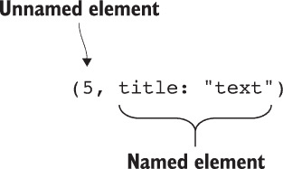

##### 图 11.2\. 元组类型，元素类型为 `int` 和 `Guid`。第一个元素被命名为 `x`。


实际上，所有元素都有名称或没有任何名称的情况更为常见。例如，你可能会有 `(int, int)` 或 `(int x, int y, int z)` 这样的元组类型，以及 `(x: 1, y: 2)` 或 `(1, 2, 3)` 这样的元组字面量。但这只是一个巧合；没有任何东西将元素绑定在一起，关于它们是否有名称。不过，有两个关于名称的限制需要注意：

+   名称必须在类型或字面量内是唯一的。不允许有 `(x: 1, x: 2)` 这样的元组字面量，并且这也没有任何意义。

+   形如 `ItemN` 的名称，其中 `N` 是一个整数，只有在 `N` 的值与字面量或类型中的位置相匹配时才允许，从 1 开始。所以 `(Item1: 0, Item2: 0)` 是可以的，但 `(Item2: 0, Item1: 0)` 是禁止的。你将在下一节中看到为什么这是这种情况。

元组类型用于在与其他类型名称相同的位置指定类型：变量声明、方法返回类型等。元组字面量像任何其他指定值的表达式一样使用；它们只是将这些元素组合成一个元组值。

元组字面量中的元素值可以是任何非指针值。本章中的大多数示例为了方便起见使用了常量（主要是整数和字符串），但你通常会在字面量中使用变量作为元素值。同样，元组中的元素类型可以是任何非指针类型：数组、类型参数，甚至是其他元组类型。

现在你已经知道了元组类型的样子，你可以理解我们的 `MinMax` 方法的返回类型 `(int min, int max)`：

+   它是一个包含两个元素的元组类型。

+   第一个元素是一个名为 `min` 的 `int`。

+   第二个元素是一个名为 `max` 的 `int`。

你也知道如何通过使用元组字面量来创建元组，因此你可以完全实现我们的方法，如下所示。

##### 列表 11.1\. 将序列的最小和最大值表示为元组

```
static (int min, int max) MinMax(                      *1*
    IEnumerable<int> source)     
{
    using (var iterator = source.GetEnumerator())
    {
        if (!iterator.MoveNext())                      *2*
        {
            throw new InvalidOperationException(
                "Cannot find min/max of an empty sequence");
        }
        int min = iterator.Current;                    *3*
        int max = iterator.Current;                    *3*
        while (iterator.MoveNext())
        {
            min = Math.Min(min, iterator.Current);     *4*
            max = Math.Max(max, iterator.Current);     *4*
        }
        return (min, max);                             *5*
    }
}
```

+   ***1* 返回类型是一个具有命名元素的元组。**

+   ***2* 禁止空序列**

+   ***3* 使用常规的 int 变量来跟踪 min/max**

+   ***4* 更新变量以获取新的 min/max**

+   ***5* 从 min 和 max 构造元组**

列表 11.1 中涉及新特性的只有我已经解释过的返回类型和使用了元组字面量的 `return` 语句：

```
return (min, max);
```

到目前为止，我还没有谈论元组字面量的类型。我只说过，它们用于创建元组值，但我会故意暂时对此保持模糊。我将指出，我们的元组字面量目前没有任何元素名称，至少在 C# 7.0 中是这样。`min`和`max`部分使用方法中的局部变量为元素提供值。


**好的元组元素名称与好的变量名称相匹配**

使用字面量中的变量名称与方法返回类型中使用的名称匹配是巧合吗？就编译器而言，绝对是。编译器不会关心你是否声明方法返回`(waffle: int, iceCream : int)`。

对于人类读者来说，这绝对不是巧合；名称表明返回的元组中的值与在方法中的含义相同。如果你发现自己提供了非常不同的名称，你可能想检查是否有错误，或者是否可能某些名称的选择更好。


当我们在定义术语时，让我们定义元组类型或字面量的*元数*为其拥有的元素数量。例如，`(int, long)`的元数为 2，而(`"a", "b", "c")`的元数为 3。元素类型本身与元数无关。


##### 注意

这实际上不是新术语。arity 的概念已经在泛型中存在，arity 是类型参数的数量。`List<T>`类型具有 1 个 arity，而`Dictionary<TKey, TValue>`具有 2 个 arity。


关于好的元素名称与好的变量名称的建议实际上为元组字面量改进的一个方面提供了线索。

#### 11.2.2. 元组字面量的推断元素名称（C# 7.1）

在 C# 7.0 中，元组元素名称必须在代码中显式声明。这通常会导出看起来冗余的代码：元组字面量中指定的名称将与提供值的属性或局部变量名称匹配。在最简单的情况下，这可能类似于以下内容：

```
var result = (min: min, max: max);
```

推断不仅适用于你的代码使用简单变量时；元组通常也初始化自属性。这在 LINQ 中的投影尤其普遍。

在 C# 7.1 中，当值来自变量或属性时，元组元素名称的推断方式与匿名类型中名称的推断方式完全相同。为了了解这有多有用，让我们考虑三种在 LINQ to Objects 中编写查询的方法，该方法将两个集合连接起来以获取员工的姓名、职位和部门。首先，这是使用匿名类型的传统 LINQ：

```
from emp in employees
join dept in departments on emp.DepartmentId equals dept.Id
select new { emp.Name, emp.Title, DepartmentName = dept.Name };
```

接下来，我们将使用具有显式元素名称的元组：

```
from emp in employees
join dept in departments on emp.DepartmentId equals dept.Id
select (name: emp.Name, title: emp.Title, departmentName: dept.Name);
```

最后，我们将使用 C# 7.1 的推断元素名称：

```
from emp in employees
join dept in departments on emp.DepartmentId equals dept.Id
select (emp.Name, emp.Title, DepartmentName: dept.Name);
```

与前一个示例相比，这改变了元组元素的名称，但仍然达到了使用简洁代码创建具有有用名称的元组的目标。

尽管我已经在 LINQ 查询中演示了该功能，但它适用于你使用元组字面量的任何地方。例如，给定一个元素列表，你可以通过使用计数元素的名称推断来创建一个包含计数、最小值和最大值的元组：

```
List<int> list = new List<int> { 5, 1, -6, 2 };
var tuple = (list.Count, Min: list.Min(), Max: list.Max());
Console.WriteLine(tuple.Count);
Console.WriteLine(tuple.Min);
Console.WriteLine(tuple.Max);
```

注意，你仍然需要为`Min`和`Max`指定元素名称，因为这些值是通过方法调用获得的。方法调用既不提供元组元素的推断名称，也不提供匿名类型属性的推断名称。

作为一个小小的细节，如果两个名称都会被推断为相同，则都不会被推断。如果推断的名称与显式名称发生冲突，则显式名称具有优先级，其他元素保持未命名。现在你已经知道了如何指定元组类型和元组字面量，那么你可以用它们做什么呢？

#### 11.2.3\. 将元组视为变量的袋子

下一个句子可能会让你感到震惊，所以请做好准备：元组类型是具有公共、可读写字段的值类型。当然不是！我通常强烈反对使用可变值类型，同样我也总是建议字段应该是私有的。一般来说，我坚持这些建议，但元组略有不同。

大多数类型不仅仅是原始数据；它们给数据附加了意义。有时会有数据验证。有时会在多个数据项之间强制执行关系。通常，只有当数据附加了意义时，某些操作才有意义。

元组根本不做这样的事情。它们只是表现得像是一袋变量。如果你有两个变量，你可以独立地改变它们；它们之间没有固有的联系，也没有强制的关系。元组允许你做完全相同的事情，但额外的好处是你可以将整个变量袋作为一个值传递。这在方法方面尤为重要，因为方法只能返回一个值。

图 11.3 以图形方式展示了这一点。左侧显示了声明三个独立局部变量的代码和心智模型，右侧显示了类似的代码，但其中两个变量在一个元组（椭圆形）中。在右侧，名称和分数作为元组组合在`player`变量中。当你想要将它们作为单独的变量处理时，你仍然可以这样做（例如，打印出`player.score`），但你也可以将它们作为一个组处理（例如，为`player`分配一个新的值）。

##### 图 11.3\. 左侧有三个单独的变量；右侧有两个变量，其中一个变量是元组

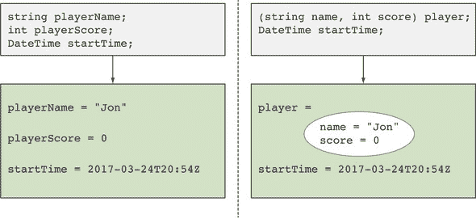

一旦你开始将元组视为变量的袋子，许多事情开始变得更有意义。但这些变量是什么？你已经看到，当你在一个元组中有命名元素时，你可以通过名称来引用它们，但如果没有名称的元素怎么办？

##### 通过名称和位置访问元素

你可能还记得，对形式为 `ItemN` 的元素名称有限制，其中 `N` 是一个数字。嗯，那是因为元组中的每个变量都可以通过其位置以及它被赋予的任何名称来引用。每个元素仍然只有一个变量；只是可能有两种方式来引用该变量。以下示例中最容易展示这一点。

##### 列表 11.2\. 通过名称和位置读取和写入元组元素

```
var tuple = (x: 5, 10);
Console.WriteLine(tuple.x);       *1*
Console.WriteLine(tuple.Item1);   *1*
Console.WriteLine(tuple.Item2);   *2*
tuple.x = 100;                    *3*
Console.WriteLine(tuple.Item1);   *4*
```

+   ***1* 通过名称和位置显示第一个元素**

+   ***2* 第二个元素没有名称；只能使用位置。**

+   ***3* 通过名称修改第一个元素**

+   ***4* 通过位置显示第一个元素（打印 100**）

到目前为止，你可能已经明白为什么 `(Item1: 10, 20)` 是允许的，但 `(Item2: 10, 20)` 不被允许。在前一种情况下，你是在重复命名元素，但在第二种情况下，你造成了歧义，即 `Item2` 是指第一个元素（按名称）还是第二个元素（按位置）。你可以争论 `(Item5: 10, 20)` 应该被允许，因为只有两个元素；`Item5` 不存在，因为元组只有两个元素。这是那种即使技术上不会造成歧义，但肯定会引起混淆的情况，所以仍然被禁止。

现在你已经知道可以在创建元组后修改其值，你可以重写你的 `MinMax` 方法，使用单个元组局部变量来表示“到目前为止的结果”，而不是使用你分开的 `min` 和 `max` 变量，如以下列表所示。

##### 列表 11.3\. 在 `MinMax` 中使用元组代替两个局部变量

```
static (int min, int max) MinMax(IEnumerable<int> source)
{
    using (var iterator = source.GetEnumerator())
    {
        if (!iterator.MoveNext())
        {
            throw new InvalidOperationException(
                "Cannot find min/max of an empty sequence");
        }
        var result = (min: iterator.Current, *1*
 max: iterator.Current); *1*
        while (iterator.MoveNext())
        {
 result.min = Math.Min(result.min, iterator.Current);    *2*
 result.max = Math.Max(result.max, iterator.Current);    *2*
        }
 return result; *3*
    }
}
```

+   ***1* 使用第一个值作为最小值和最大值构建元组**

+   ***2* 分别修改元组的每个字段**

+   ***3* 直接返回元组**

列表 11.3 在工作方式上与 列表 11.1 非常非常接近。你只是将四个局部变量中的两个组合在一起；而不是 `source`、`iterator`、`min` 和 `max`，你有 `source`、`iterator` 和 `result`，其中 `result` 包含 `min` 和 `max` 元素。内存使用量和性能将相同；这只是不同的编写方式。这是否是更好的编写代码的方式？这是一个相当主观的问题，但至少它是一个局部决策；这是一个纯粹的实施细节。

##### 将元组视为单个值

当你在考虑方法的替代实现时，让我们考虑另一个。你可以取这个首先将新值赋给 `result.min` 然后将新值赋给 `result.max` 的代码：

```
result.min = Math.Min(result.min, iterator.Current);
result.max = Math.Max(result.max, iterator.Current);
```

如果你直接赋值给 `result`，你可以用一个单一的赋值来替换整个集合，如以下列表所示。

##### 列表 11.4\. 在 `MinMax` 中用一条语句重新赋值结果元组

```
static (int min, int max) MinMax(IEnumerable<int> source)
{
    using (var iterator = source.GetEnumerator())
    {
        if (!iterator.MoveNext())
        {
            throw new InvalidOperationException(
                "Cannot find min/max of an empty sequence");
        }
        var result = (min: iterator.Current, max: iterator.Current);
        while (iterator.MoveNext())
        {
 result = (Math.Min(result.min, iterator.Current),   *1*
 Math.Max(result.max, iterator.Current));  *1*
        }
 return result;
    }
}
```

+   ***1* 将整个结果赋予新的值**

再次强调，在 列表 11.3 中，元组的两个元素是分别更新的，只引用了相同元素的先前值。一个更有说服力的例子是编写一个方法，返回斐波那契数列^([2]) 作为 `IEnumerable<int>`。C# 已经通过提供带有 yield 的迭代器来帮助你这样做，但这可能有点麻烦。下面的列表展示了完全合理的 C# 6 实现。

> ²
> 
> 前两个元素是 0 和 1；之后，序列中的任何元素都是前两个元素的和。

##### 列表 11.5\. 不使用元组实现斐波那契数列

```
static IEnumerable<int> Fibonacci()
{
    int current = 0;
    int next = 1;
    while (true)
    {
        yield return current;
        int nextNext = current + next;
        current = next;
        next = nextNext;
    }
}
```

在迭代过程中，你跟踪序列的当前元素和下一个元素。在每次迭代中，你从代表“当前和下一个”的元组转换到“下一个和下一个下一个”。要做到这一点，你需要一个临时变量；你不能简单地依次直接给 `current` 和 `next` 赋新值，因为第一个赋值会丢失第二个赋值所需的信息。

元组允许你执行一个改变两个元素的单一赋值。临时变量仍然存在于 IL 中，但以下列表中显示的源代码在我看来是美丽的。

##### 列表 11.6\. 使用元组实现斐波那契数列

```
static IEnumerable<int> Fibonacci()
{
    var pair = (current: 0, next: 1);
    while (true)
    {
        yield return pair.current;
        pair = (pair.next, pair.current + pair.next);
    }
}
```

在你走到这一步之后，很难抗拒将其进一步泛化以生成任意序列，将所有斐波那契数列代码提取到方法调用中的参数。下面的列表介绍了一个通用的 `GenerateSequence` 方法，它可以根据其参数生成各种序列。

##### 列表 11.7\. 分离斐波那契数列生成关注点

```
static IEnumerable<TResult>                             *1*
    GenerateSequence<TState, TResult>(                  *1*
        TState seed,                                    *1*
        Func<TState, TState> generator,                 *1*
        Func<TState, TResult> resultSelector)           *1*
{                                                       *1*
    var state = seed;                                   *1*
    while (true)                                        *1*
    {                                                   *1*
        yield return resultSelector(state);             *1*
        state = generator(state);                       *1*
    }                                                   *1*
}                                                       *1*

Sample usage
var fibonacci = GenerateSequence(                       *2*
    (current: 0, next: 1),                              *2*
    pair => (pair.next, pair.current + pair.next),      *2*
    pair => pair.current);                              *2*
```

+   ***1* 允许根据先前状态生成任意序列的方法**

+   ***2* 特定于斐波那契数列的序列生成器使用**

这当然可以使用匿名类型甚至命名类型来实现，但这不会那么优雅。有其他编程语言经验的读者可能不会特别印象深刻——C# 7 并没有为世界带来全新的范式——但能够在 C# 中写出这样美丽的代码是令人兴奋的。

现在你已经看到了元组的基本工作原理，让我们更深入地探讨一下。在下一节中，我们将主要考虑转换，但也会看看元素名称何时重要，何时不重要。

### 11.3\. 元组类型和转换

到目前为止，我小心地避免深入探讨元组字面量的类型细节。通过保持一定的模糊性，我能够展示大量的代码，以便你可以感受到元组的使用方式。现在是时候证明这本书标题中的“深入”部分了。首先，想想你看到的所有使用 `var` 和元组字面量的声明。

#### 11.3.1\. 元组字面量的类型

一些元组字面量有类型，但一些没有。这是一个简单的规则：当元组字面量中的每个元素表达式都有类型时，它就有类型。在 C# 中，没有类型的表达式的概念并不新鲜；lambda 表达式、方法组和 `null` 字面量也是没有类型的表达式。就像那些例子一样，你不能使用没有类型的元组字面量来给隐式类型的局部变量赋值。例如，这是有效的，因为 10 和 20 都是具有类型的表达式：

```
var valid = (10, 20);
```

但这是无效的，因为 `null` 字面量没有类型：

```
var invalid = (10, null);
```

就像 `null` 字面量一样，没有类型的元组字面量仍然可以转换为类型。当一个元组有类型时，任何元素名称也是类型的一部分。

例如，在这些情况中，左边等同于右边：

|

```
var tuple = (x: 10, 20);

var array = new[] {("a", 10)};

string[] input = {"a", "b" };
var query = input
    .Select(x => (x, x.Length));
```

|

```
(int x, int) tuple = (x: 10, 20);

(string, int)[] array = {("a", 10)};

string[] input = {"a", "b" };
IEnumerable<(string, int)> query =
  input.Select<string, (string, int)>
  (x => (x, x.Length));
```

|

第一个示例演示了元素名称是如何从元组字面量传播到元组类型的。最后一个示例显示了类型推断在复杂情况下的工作方式：`input` 的类型允许 lambda 表达式中的 `x` 类型被固定为 `string`，这然后允许表达式 `x.Length` 被适当地绑定。这留下了一个具有 `string` 和 `int` 元素类型的元组字面量，因此 lambda 表达式的返回类型被推断为 `(string, int)`。你曾在 列表 11.7 中看到过类似类型的推断，当时我们使用序列生成方法实现了斐波那契数列，但你当时并没有关注涉及到的类型。

对于有类型的元组字面量来说，这是可以的。但对于没有类型的元组字面量，你能做什么呢？如何将没有名称的元组字面量转换为有名称的元组类型？为了回答这些问题，你需要查看元组转换的一般情况。

你需要考虑两种类型的转换：从元组字面量到元组类型的转换，以及从一个元组类型到另一个元组类型的转换。你已经在 第八章 中看到过这种差异：存在从字符串字面量表达式到 `FormattableString` 的转换，但没有从 `string` 类型到 `FormattableString` 的转换。这里的工作原理是相同的。你首先将查看字面量转换。

| |
| --- |

**Lambda 表达式参数看起来像元组**

单参数的 lambda 表达式并不令人困惑，但如果你使用两个参数，它们看起来可能像元组。作为一个例子，让我们看看一个只使用 LINQ `Select` 重载的有用方法，它提供了带有元素索引和值的投影。在操作中传播索引通常很有用，所以将这两部分数据放在一个元组中是有意义的。这意味着你最终得到这个方法：

```
static IEnumerable<(T value, int index)> WithIndex<T>
    (this IEnumerable<T> source) =>
    source.Select((value, index) => (value, index));
```

专注于 lambda 表达式：

```
(value, index) => (value, index)
```

这里 `(value, index)` 的第一次出现不是一个元组字面量；它是 lambda 表达式的参数序列。第二次出现 *是* 一个元组字面量，lambda 表达式的结果。

这里没有问题。我只是不希望当你看到类似的情况时感到惊讶。


#### 11.3.2\. 从元组字面量到元组类型的转换

正如 C# 的许多其他部分一样，存在从元组字面量到元组类型的隐式转换和显式转换。我预计显式转换的使用将很少，原因我将在稍后展示。但一旦你理解了隐式转换的工作原理，显式转换基本上就自然而然地出现了。

##### 隐式转换

如果以下两个条件都成立，元组字面量可以隐式转换为元组类型：

+   字面量和类型具有相同的秩。

+   字面量中的每个表达式都可以隐式转换为相应的元素类型。

第一条要点很简单。能够将 `(5, 5)` 转换为 `(int, int, int)`，例如，这会显得有些奇怪。最后一个值从哪里来呢？第二条要点稍微复杂一些，但我会通过例子来澄清。首先，让我们尝试这个转换：

```
(byte, object) tuple = (5, "text");
```

根据前面的描述，你需要查看源元组字面量 `(5, "text")` 中的每个元素表达式，并检查是否存在到目标元组类型 `(byte, object)` 中相应元素类型的隐式转换。如果每个元素都可以转换，则转换是有效的：

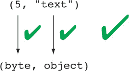

即使没有从 `int` 到 `byte` 的隐式转换，但整数常量 5 到 `byte` 的隐式转换是存在的（因为 5 在有效的 `byte` 值范围内）。还有一个从字符串字面量到 `object` 的隐式转换。所有转换都是有效的，因此整个转换是有效的。太好了！现在让我们尝试不同的转换：

```
(byte, string) tuple = (300, "text");
```

再次，你尝试逐元素应用隐式转换：

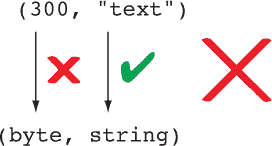

在这种情况下，你试图将整数常量 `300` 转换为 `byte`。这超出了有效值的范围，因此没有隐式转换。存在显式转换，但这在你试图实现元组字面量整体隐式转换时并没有帮助。从字符串字面量到 `string` 类型的隐式转换是存在的，但由于并非所有转换都是有效的，整个转换是无效的。如果你尝试编译此代码，你将得到一个错误，指向元组字面量中的 `300`：

```
error CS0029: Cannot implicitly convert type 'int' to 'byte'
```

这个错误信息有些误导。它暗示我们的前一个例子也可能不合法。编译器实际上并不是试图将类型 `int` 转换为 `byte`；它试图将表达式 `300` 转换为 `byte`。

##### 显式转换

元组字面量的显式转换遵循与隐式转换相同的规则，但每个元素表达式到对应类型的转换都需要显式转换。如果满足这个条件，则从元组字面量到元组类型的转换是显式的，因此你可以按正常方式进行类型转换。


##### 小贴士

C#中的每个隐式转换也计为显式转换，这有点令人困惑。如果你觉得这样更清晰，你可以将条件视为“每个元素必须有可用的转换，无论是显式还是隐式”。


回到我们转换`(300, "text")`的情况，有一个显式转换到元组类型`(byte, string)`。但将这个确切的表达式转换为需要未检查的上下文才能工作，因为编译器知道常量值`300`超出了`byte`的正常范围。一个更现实的例子将使用来自其他地方的`int`变量：

```
int x = 300;
var tuple = ((byte, string)) (x, "text");
```

转换部分——`((byte, string))`——看起来比需要的括号多，但它们都是必需的。内层的括号指定了元组类型，外层的括号表示了类型转换。图 11.4 以图形方式展示了这一点。

##### 图 11.4. 解释显式元组转换中的括号


在我看来这看起来很丑，但至少它可用。在许多情况下，一个更简单的替代方案是在元组字面量中的每个元素表达式中写出适当的类型转换，这样不仅元组转换将是有效的，而且字面量的推断类型也会变成你想要的。例如，我可能会把前面的例子写成如下：

```
int x = 300;
var tuple = ((byte) x, "text");
```

这两种选项是等价的；当转换应用于整个元组字面量时，编译器仍然会对每个元素表达式发出显式转换。但我发现后者更易读。除此之外，它还清楚地表明了意图：你知道从`int`到`byte`需要显式转换，但你希望字符串保持原样。如果你试图将多个值转换为特定的元组类型（而不是使用推断的类型），这将有助于清楚地表明哪些转换是显式的，因此可能是损失性的，而不是由于整个元组显式转换而意外丢失数据。

##### 元组字面量转换中元素名称的作用

你可能已经注意到，本节根本没有提到名称。在元组字面量转换中，它们几乎完全无关紧要。最重要的是，从没有名称的元素表达式转换为有名称的类型元素是可以的。你在这个章节中已经做了很多次，而我并没有把它当作问题提出。你从我们的第一个`MinMax`方法实现开始就做对了。作为提醒，该方法声明如下：

```
static (int min, int max) MinMax(IEnumerable<int> source)
```

然后我们的返回语句是这样的：

```
return (min, max);
```

你正在尝试将没有元素名称的元组字面量^([3])转换为`(int min, int max)`。当然，这是有效的；否则，我就不会向你展示了。尽管元素名称在元组字面量转换中并不完全无关紧要。当在元组字面量中显式指定元素名称时，如果转换到的类型中没有相应的元素名称，或者两个名称不同，编译器会警告你。以下是一个例子：

> ³
> 
> 在 C# 7.0 中至少是这样。如 11.2.2 节所述，在 C# 7.1 中，名称是推断出来的。

```
(int a, int b, int c, int, int) tuple =
    (a: 10, wrong: 20, 30, pointless: 40, 50);
```

这显示了元素名称的所有可能组合，顺序如下：

1.  目标类型和元组字面量指定了相同的元素名称。

1.  目标类型和元组字面量为元素指定了名称，但名称不同。

1.  目标类型指定了元素名称，但元组字面量没有。

1.  目标类型没有指定元素名称，但元组字面量指定了。

1.  目标类型和元组字面量都没有指定元素名称。

其中，第二个和第四个结果会在编译时产生警告。编译该代码的结果如下：

```
warning CS8123: The tuple element name 'wrong' is ignored because a different
     name is specified by the target type '(int a, int b, int c, int, int)'.
warning CS8123: The tuple element name 'pointless' is ignored because a
     different name is specified by the target type '(int a, int b, int c,
     int, int)'
```

第二个警告信息并不像可能的那样有帮助，因为目标类型根本未指定对应元素的名称。希望你能弄清楚出了什么问题。

这有用吗？当然有用。当你在一行语句中声明变量并构造值时没有用，但当声明和构造被分开时就有用了。例如，假设我们的`MinMax`方法在列表 11.1 中真的很长，难以重构。你应该返回`(min, max)`还是`(max, min)`？是的，在这种情况下，方法名本身就能使顺序非常明显，但在某些情况下可能并不那么清晰。在这种情况下，在`return`语句中添加元素名称可以用作验证。这样编译不会产生警告：

```
return (min: min, max: max);
```

但如果你反转元素，每个元素都会产生警告：

```
return (max: max, min: min);        *1*
```

+   ***1* 警告 CS8123，两次**

注意，这仅适用于显式指定的名称。即使在 C# 7.1 中，当元素名称从`(max, min)`的元组字面量中推断出来时，将其转换为`(int min, int max)`的元组类型也不会产生警告。

我总是更喜欢将代码结构化，使其如此清晰，以至于你不需要进行额外的检查。但了解它在需要时可用是很好的，例如，在重构方法以使其更短之前，这可能是一个第一步。

#### 11.3.3\. 元组类型之间的转换

在掌握了元组字面量转换之后，隐式和显式元组类型转换相对简单，因为它们以类似的方式工作。在这里，你不需要担心任何表达式，只需要类型。如果每个源元素类型到相应目标元素类型都存在隐式转换，则从源元组类型到相同秩的目标元组类型存在隐式转换。同样，如果每个源元素类型到相应目标元素类型都存在显式转换，则从源元组类型到相同秩的目标元组类型存在显式转换。以下是一个示例，展示了从源类型 `(int, string)` 进行多个转换：

```
var t1 = (300, "text");                       *1*
(long, string) t2 = t1;                       *2*
(byte, string) t3 = t1;                       *3*
(byte, string) t4 = ((byte, string)) t1;      *4*
(object, object) t5 = t1;                     *5*
(string, string) t6 = ((string, string)) t1;  *6*
```

+   ***1* t1 的类型被推断为 (int, string)。**

+   ***2* 从 (int, string) 到 (long, string) 的有效隐式转换**

+   ***3* 无效：无法从 int 转换到 byte**

+   ***4* 从 (int, string) 到 (byte, string) 的有效显式转换**

+   ***5* 从 (int, string) 到 (object, object) 的有效隐式转换**

+   ***6* 无效：从 int 到 string 无法进行转换**

在这种情况下，第四行中从 `(int, string)` 到 `(byte, string)` 的显式转换将导致 `t4.Item1` 的值为 `44`，因为这是将 `int` 值 300 显式转换为 `byte` 的结果。

与元组字面量转换不同，如果元素名称不匹配，则不会有警告。我可以用一个与我们的秩为 5 的元组字面量转换类似的例子来展示这一点。你所需要做的只是首先将元组值存储在一个变量中，这样你执行的是类型到类型的转换，而不是字面量到类型的转换：

```
var source = (a: 10, wrong: 20, 30, pointless: 40, 50);
(int a, int b, int c, int, int) tuple = source;
```

这没有任何警告就能编译。元组类型转换的一个方面很重要，但在字面量转换中不适用，那就是转换不仅仅是隐式转换，而是身份转换。

##### 元组类型身份转换

身份转换的概念自 C# 诞生以来就存在，尽管随着时间的推移它得到了扩展。在 C# 7 之前，规则是这样的：

+   每个类型都可以与其自身进行身份转换。

+   `object` 和 `dynamic` 之间存在身份转换。

+   如果两个数组类型的元素类型之间存在身份转换，则这两个数组类型之间存在身份转换。例如，`object[]` 和 `dynamic[]` 之间存在身份转换。

+   当对应类型参数之间存在身份转换时，身份转换扩展到构造的泛型类型。例如，`List<object>` 和 `List<dynamic>` 之间存在身份转换。

元组引入了另一种身份转换：当每个对应元素类型之间存在身份转换时，无论名称如何，相同秩的元组类型之间也存在身份转换。换句话说，以下类型之间存在身份转换（双向；身份转换总是对称的）：

+   `(int x, object y)`

+   `(int a, dynamic d)`

+   `(int, object)`

同样，这可以应用于构造类型，元组元素类型也可以构造，只要仍然存在身份转换。例如，身份转换存在于以下两种类型之间：

+   `Dictionary<string, (int, List<object>)>`

+   `Dictionary<string, (int index, List<dynamic values)>>`

当涉及到构造类型时，标识符转换对于元组来说尤为重要。如果你可以轻松地从`(int, int)`转换为`(int x, int y)`，但不能从`IEnumerable<(int, int)>`转换为`IEnumerable<(int x, int y)>`，或者相反，这将会很烦人。

身份转换对于重载也同样重要。与两个重载不能仅通过返回类型而不同一样，它们也不能仅通过参数类型以及它们之间的身份转换而不同。你不能在同一个类中编写如下两个方法：

```
public void Method((int, int) tuple) {}
public void Method((int x, int y) tuple) {}
```

如果你这样做，你将收到如下编译时错误：

```
error CS0111: Type 'Program' already defines a member called 'Method' with
     the same parameter types
```

从 C#语言的角度来看，参数类型并不完全相同，但要在身份转换方面使错误信息绝对精确，这将使理解变得更加困难。

如果你发现官方对身份转换的定义令人困惑，一个简单（尽管不那么官方）的思考方式是这样的：如果执行时无法区分两种类型，则这两种类型是相同的。我们将在第 11.4 节中详细介绍这一点。

##### 缺乏泛型方差转换

考虑到身份转换，你可能会希望可以使用具有泛型方差界面的元组类型和委托类型。遗憾的是，情况并非如此。方差仅适用于引用类型，而元组类型始终是值类型。例如，感觉这个应该可以编译：

```
IEnumerable<(string, string)> stringPairs = new (string, string)[10];
IEnumerable<(object, object)> objectPairs = stringPairs;
```

但它并不这样做。对此表示歉意。我不认为这会经常作为一个实际问题出现，但我希望在你期望它工作但最终没有时，能减少你的失望感。

#### 11.3.4\. 转换的使用

现在你已经知道了这些可用的功能，你可能想知道何时会想要使用这些元组转换。这主要取决于你更广泛地使用元组的方式。在单个方法内使用或在同一类中返回以供使用的私有方法中使用的元组很少需要转换。你只需从正确的类型开始，在构造初始值时，可能需要在元组字面量中进行类型转换。

更可能的情况是，当你使用接受或返回元组的内部或公共方法时，你需要从一种元组类型转换为另一种类型，因为你对元素类型的控制会更少。元组类型的使用范围越广，它在每次使用中都恰好是所需类型的可能性就越小。

#### 11.3.5\. 继承中的元素名称检查

虽然在转换中元素名称并不重要，但编译器在继承中使用时对它们的挑剔。当一个元组类型出现在你正在从基类重写或从接口实现成员时，你指定的元素名称必须与原始定义中的名称匹配。不仅必须匹配原始定义中指定的任何名称，而且如果原始定义中没有名称，你也不能在实现中添加一个。实现中的元素类型必须与原始定义中的元素类型进行身份转换。

例如，考虑这个`ISample`接口和一些尝试实现`ISample.Method`的方法（当然，每个方法都会在单独的实现类中）：

```
interface ISample
{
    void Method((int x, string) tuple);
}

public void Method((string x, object) tuple) {}      *1*
public void Method((int, string) tuple) {}           *2*
public void Method((int x, string extra) tuple) {}   *3*
public void Method((int wrong, string) tuple) {}     *4*
public void Method((int x, string, int) tuple) {}    *5*
public void Method((int x, string) tuple) {}         *6*
```

+   ***1* 错误类型元素**

+   ***2* 第一个元素缺少名称。**

+   ***3* 第二个元素有名称；在原始定义中并没有。**

+   ***4* 第一个元素名称错误。**

+   ***5* 错误元组类型数量**

+   ***6* 有效**

那个例子只处理接口实现，但在重写基类成员时，相同的限制也适用。同样，那个例子只使用参数，但限制也适用于返回类型。请注意，这意味着在接口成员或虚拟/抽象类成员中添加、删除或更改元组元素名称是一个破坏性更改。在公共 API 中这样做之前请仔细思考！

| |
| --- |

##### 注意

在某些方面，这是一个稍微不一致的步骤，因为编译器以前从未担心过类作者在重写方法或实现接口时更改方法参数名称。指定参数名称的能力意味着如果调用者根据他们是否引用接口或实现更改代码，这可能会引起问题。我的怀疑是，如果 C#语言设计者从头开始，这也会被禁止。

| |
| --- |

C# 7.3 为元组添加了一个新的语言特性：使用`==`和`!=`运算符比较它们的能力。

#### 11.3.6\. 相等性和不等性运算符（C# 7.3）

正如你在第 11.4.5 节中看到的，从开始起，值元组的 CLR 表示就通过`Equals`方法支持了相等性。但它没有重载`==`或`!=`运算符。然而，截至 C# 7.3，编译器提供了在元组之间进行身份转换时`==`和`!=`的实现。（除了其他身份转换的方面，这意味着元素名称并不重要。）

编译器将`==`运算符扩展为使用每个对应值对的`==`运算符进行逐元素比较，将`!=`运算符扩展为使用每个对应值对的`!=`运算符进行逐元素比较。以下示例可能更容易说明这一点。

##### 列表 11.8\. 相等性和不等性运算符

```
var t1 = (x: "x", y: "y", z: 1);
var t2 = ("x", "y", 1);

Console.WriteLine(t1 == t2);                  *1*
Console.WriteLine(t1.Item1 == t2.Item1 &&     *2*
                  t1.Item2 == t2.Item2 &&     *2*
                  t1.Item3 == t2.Item3);      *2*

Console.WriteLine(t1 != t2);                  *3*
Console.WriteLine(t1.Item1 != t2.Item1 ||     *4*
                  t1.Item2 != t2.Item2 ||     *4*
                  t1.Item3 != t2.Item3);      *4*
```

+   ***1* 等价运算符**

+   ***2* 编译器生成的等效代码**

+   ***3* 不等价运算符**

+   ***4* 编译器生成的等效代码**

列表 11.8 显示了两个元组（一个带有元素名称，一个没有）并比较了它们的等价性和不等价性。在每种情况下，我都展示了编译器为该运算符生成的代码。这里需要注意的重要点是，生成的代码使用了元素类型提供的任何重载运算符。没有使用反射，CLR 类型无法提供相同的功能。这是一个最好由编译器处理的任务。

我们已经深入探讨了元组的语言规则，这是我们需要的。元素名称在类型推断等中的精确传播细节最好由语言规范来处理。即使这本书在深度上也有一定的限制。尽管你可以使用所有前面的信息并忽略 CLR 对元组所做的处理，但如果你稍微深入一点，了解编译器如何将这些规则转换为 IL，你将能够用元组做更多的事情，并更好地理解其行为。

我们已经覆盖了大量的内容。如果你还没有尝试使用元组编写代码，现在是时候这样做。从书中休息一下，看看你能否在学习它们是如何实现之前对元组有一个感觉。

### 11.4\. CLR 中的元组

虽然在理论上 C#语言与.NET 没有绑定，但现实是，我所看到的每个实现至少在某种程度上都试图看起来像常规.NET Framework，即使它是预编译的，并在非 PC 桌面设备上运行。C#语言规范对最终环境提出了一些要求，包括某些类型是可用的。在撰写本文时，还没有 C# 7 规范，但我设想当它被引入时，它将需要本节中描述的类型来使用元组。

与匿名类型不同，匿名类型中每个组件内的唯一属性名称序列都会导致编译器生成一个新的类型，元组不需要编译器生成任何额外的类型。相反，它使用框架中的一组新类型。现在让我们来认识它们。

#### 11.4.1\. 介绍 System.ValueTuple<...>

C# 7 中的元组是通过`System.ValueTuple`类型系列实现的。这些类型位于`System.ValueTuple.dll`程序集中，它是.NET Standard 2.0 的一部分，但不是任何旧版.NET Framework 版本的一部分。你可以通过添加对`System.ValueTuple` NuGet 包的依赖项来在针对旧框架时使用它。

有九个`ValueTuple`结构体，具有 0 到 8 的泛型参数：

+   `System.ValueTuple` (非泛型)

+   `System.ValueTuple<T1>`

+   `System.ValueTuple<T1, T2>`

+   `System.ValueTuple<T1, T2, T3>`

+   `System.ValueTuple<T1, T2, T3, T4>`

+   `System.ValueTuple<T1, T2, T3, T4, T5>`

+   `System.ValueTuple<T1, T2, T3, T4, T5, T6>`

+   `System.ValueTuple<T1, T2, T3, T4, T5, T6, T7>`

+   `System.ValueTuple<T1, T2, T3, T4, T5, T6, T7, TRest>`

目前，我们将忽略前两个和最后一个，尽管我在 11.4.7 和 11.4.8 部分提到了后者。这让我们只剩下具有 2 到 7 个泛型参数的类型的处理。 (实际上，这些是您最可能使用的类型。)

任何特定的`ValueTuple<...>`类型的描述非常类似于早期元组类型的描述：它是一个具有公共字段的值类型。字段被称为`Item1`、`Item2`等，直到`Item7`。具有 8 个元素的元组的最后一个字段称为`Rest`。

任何使用 C#元组类型的时候，它都会映射到一个`ValueTuple<...>`类型。当 C#元组类型没有元素名称时，这种映射是非常明显的；例如`(int, string, byte)`映射到`ValueTuple<int, string, byte>`。但是，C#元组类型中的可选元素名称怎么办？泛型类型仅在它们的类型参数上是泛型的；你不能神奇地给两个构造类型不同的字段名称。编译器是如何处理这种情况的呢？

#### 11.4.2\. 元素名称处理

实际上，C#编译器在将 C#元组类型映射到 CLR `ValueTuple<...>`类型时忽略了名称。尽管`(int, int)`和`(int x, int y)`从 C#语言的角度来看是不同的类型，但它们都映射到`ValueTuple<int, int>`。然后编译器将任何使用元素名称的用法映射到相关的`ItemN`名称。图 11.5 显示了将 C#元组字面量转换为 C#的有效翻译，它仅引用 CLR 类型。

##### 图 11.5\. 编译器将元组类型处理转换为使用 ValueTuple

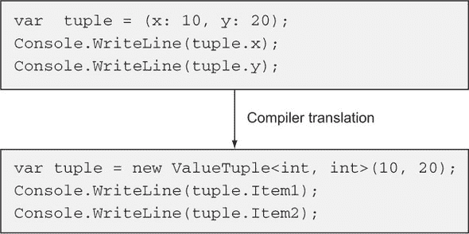

注意到图 11.5 的下半部分已经失去了名称。对于这样的局部变量，它们仅在编译时使用。在执行时，它们唯一的痕迹将是在为调试器提供更多信息而创建的 PDB 文件中。那么，对于在方法相对较小的上下文之外可见的元素名称怎么办？

##### 元素名称在元数据中

回想一下在本章中你已经多次使用的`MinMax`方法。假设你将这个方法公开作为整个聚合方法包的一部分，以补充 LINQ to Objects。失去由元组元素名称提供的可读性将是一件非常遗憾的事情，但你现在知道该方法的 CLR 返回类型无法传播它们。幸运的是，编译器可以使用已经在其他不受 CLR 直接支持的功能中实施的技术，例如`out`参数和默认参数值；属性来拯救！

在这种情况下，编译器使用一个名为 `TupleElementNamesAttribute` 的属性（与许多类似属性位于同一命名空间中：`System.Runtime.CompilerServices`）来在程序集中对元素名称进行编码。例如，一个公共的 `MinMax` 方法声明可以用 C# 6 表示如下：

```
[return: TupleElementNames(new[] {"min", "max"})]
public static ValueTuple<int, int> MinMax(IEnumerable<int> numbers)
```

C# 7 编译器不会让你编译这段代码。编译器会给出一个错误，告诉你直接使用元组语法。但是，使用 C# 6 编译器编译相同的代码会得到一个可以在 C# 7 中使用的程序集，并且返回的元组的元素可以通过名称访问。

当涉及到嵌套元组类型时，属性会变得稍微复杂一些，但你几乎不需要直接解释这个属性。只需知道它存在，以及元素名称是如何在局部变量之外进行通信的。即使没有它们，编译器也可以处理私有成员，因此值得知道这一点。我怀疑无论成员的访问修饰符如何，以相同的方式处理所有成员都会简单得多。

##### 执行时间没有元素名称

如果前面的所有内容都没有让你明白，元组值在执行时间没有元素名称的概念。如果你对一个元组值调用 `GetType()`，你会得到一个带有适当元素类型的 `ValueTuple<...>` 类型，但你在源代码中设置的任何元素名称都不会出现在任何地方。如果你在代码中单步执行，并且调试器显示元素名称，那是因为它使用了额外的信息来推断原始元素名称；这不是 CLR 直接知道的东西。

| |
| --- |

##### 注意

这种方法可能对 Java 开发者来说很熟悉。它类似于 Java 处理在执行时间没有类型信息的泛型的方式。在 Java 中，没有 `ArrayList<Integer>` 对象或 `ArrayList<String>` 对象这样的东西；它们只是 `ArrayList` 对象。这在 Java 中证明是痛苦的，但元组的元素名称在泛型类型参数中不如基本重要，所以希望它不会导致同样的问题。

| |
| --- |

在 C# 语言中，元组存在元素名称，但在 CLR 中并不存在。那么转换呢？

#### 11.4.3. 元组转换实现

`ValueTuple` 家族的类型在 CLR 方面不提供任何转换。它们无法做到；C# 语言提供的转换无法在类型信息中表达。相反，当需要时，C# 编译器会为每个元素创建一个新的值，并执行适当的转换。以下有两个转换示例，一个是隐式转换（使用从 `int` 到 `long` 的隐式转换）和一个显式转换（使用从 `int` 到 `byte` 的显式转换）：

```
(int, string) t1 = (300, "text");
(long, string) t2 = t1;
(byte, string) t3 = ((byte, string)) t1;
```

编译器生成的代码就像你这样写：

```
var t1 = new ValueTuple<int, string>(300, "text");
var t2 = new ValueTuple<long, string>(t1.Item1, t1.Item2);       
var t3 = new ValueTuple<byte, string>((byte) t1.Item1, t1.Item2));
```

那个例子只处理了你已经看到的元组类型之间的转换，但元组字面量到元组类型的转换以完全相同的方式进行：从元素表达式到目标元素类型的任何所需转换都只是作为调用适当的`ValueTuple<...>`构造函数的一部分来执行。

你现在已经了解了编译器为了提供元组语法所需的所有内容，但`ValueTuple<...>`类型提供了更多功能，使它们易于使用。鉴于它们的通用性，它们不能做很多事情，但`ToString()`方法提供了可读的输出，并且有多个选项用于比较它们。让我们看看有哪些可用功能。

#### 11.4.4\. 元组的字符串表示

元组的字符串表示形式类似于 C#源代码中的元组字面量：由逗号分隔的值序列，用括号括起来。对此输出没有精细的控制；例如，如果你使用`(DateTime, DateTime)`元组来表示日期间隔，你不能传递一个格式字符串来指示你希望元素格式化为日期。`ToString()`方法对每个非空元素调用`ToString()`，对每个空元素使用空字符串。

作为提醒，你提供给元组元素的名称在执行时是未知的，因此它们不能出现在调用`ToString()`的结果中。这可能会使其比匿名类型的字符串表示形式稍微不那么有用，尽管如果你打印大量相同类型的元组，你会对缺乏重复而感到感激。一个简短的例子就足以展示所有前面的信息：

```
var tuple = (x: (string) null, y: "text", z: 10);   *1*
Console.WriteLine(tuple.ToString());                *2*
```

+   ***1* 将 null 转换为字符串以便推断元组类型**

+   ***2* 将元组值写入控制台**

此代码片段的输出如下：

```
(, text, 10)
```

我在这里明确地调用了`ToString()`方法，只是为了证明没有其他操作在进行。调用`Console.WriteLine(tuple)`也会得到相同的结果。

元组的字符串表示对于诊断目的肯定是有用的，但在直接面向最终用户的应用程序中很少适合直接显示。你可能会想要提供更多上下文，指定某些类型的格式信息，并可能更清晰地处理空值。

#### 11.4.5\. 常规相等性和排序比较

每个`ValueTuple<...>`类型实现了`IEquatable<T>`和`IComparable<T>`，其中`T`与类型本身相同。例如，`ValueTuple<T1, T2>`实现了`IEquatable<ValueTuple<T1, T2>>`和`IComparable<ValueTuple<T1, T2>>`。

每个类型也实现了非泛型的`IComparable`接口，并以自然的方式重写了`object.Equals(object)`方法：如果传入的是不同类型的实例，`Equals(object)`将返回`false`，如果传入的是不同类型的实例，`CompareTo(object)`将抛出`ArgumentException`。否则，每个方法都会委托给`IEquatable<T>`或`IComparable<T>`中的对应方法。

相等性测试是使用每个元素类型的默认相等性比较器逐元素执行的。同样，元素哈希码是使用默认相等性比较器计算的，然后以特定实现的方式将这些哈希码组合起来，为元组提供一个整体的哈希码。元组之间的排序比较也是逐元素执行的，较早的元素在比较中被认为比较晚的元素更重要，例如，`(1, 5)` 被认为小于 `(3, 2)`。

这些比较使得元组在 LINQ 中易于处理。假设你有一个表示 `(x, y)` 坐标的 `(int, int)` 元组集合。你可以使用熟悉的 LINQ 操作来查找列表中的不同点并对它们进行排序。这在下述列表中展示。

##### 列表 11.9. 查找和排序不同点

```
var points = new[]
{
    (1, 2), (10, 3), (-1, 5), (2, 1),
    (10, 3), (2, 1), (1, 1)
};
var distinctPoints = points.Distinct();
Console.WriteLine($"{distinctPoints.Count()} distinct points");
Console.WriteLine("Points in order:");
foreach (var point in distinctPoints.OrderBy(p => p))
{
    Console.WriteLine(point);
}
```

`Distinct()` 调用意味着你只会在输出中看到一次 (2, 1)。但是，由于相等性是逐元素检查的，所以 (2, 1) 并不等于 (1, 2)。

因为元组中的第一个元素在排序中被认为是最重要的，所以我们的点将按照它们的 `x` 坐标进行排序；如果多个点的 `x` 坐标相同，则将按照它们的 `y` 坐标进行排序。因此，输出如下：

```
5 distinct points
Points in order:
(-1, 5)
(1, 1)
(1, 2)
(2, 1)
(10, 3)
```

常规的比较无法指定如何比较每个特定的元素。当然，你可以很容易地创建自己的 `IEqualityComparer<T>` 或 `IComparer<T>` 的自定义实现，用于特定的元组类型，但在这个时候，你可能想要考虑是否值得为你要表示的数据实现一个完全自定义的类型，并完全避免使用元组。或者，在某些情况下，使用结构比较可能更简单。

#### 11.4.6. 结构相等性和排序比较

除了常规的 `IEquatable` 和 `IComparable` 接口之外，每个 `ValueTuple` 结构体还明确实现了 `IStructuralEquatable` 和 `IStructuralComparable` 接口。这些接口自 .NET 4.0 以来就存在了，并由数组以及不可变的 `Tuple` 类家族实现。我无法说我曾经自己使用过这些接口，但这并不意味着它们不能被使用并且用得好。它们反映了常规的相等性和排序 API，但每个方法都接受一个比较器，该比较器旨在用于单个元素：

```
public interface IStructuralEquatable
{
    bool Equals(Object, IEqualityComparer);
    int GetHashCode(IEqualityComparer);
}

public interface IStructuralComparable
{
    int CompareTo(Object, IComparer);
}
```

接口背后的思想是允许通过使用给定的比较器进行成对比较来比较复合对象以进行相等性或排序。`ValueTuple` 类型实现的常规泛型比较是静态类型安全的，但相对不灵活，因为它们总是使用元素的默认比较。而结构比较则相对不安全，但提供了额外的灵活性。以下列表通过使用字符串并传递不区分大小写的比较器来演示这一点。

##### 列表 11.10. 使用不区分大小写的比较器进行结构比较

```
static void Main()
{
    var Ab = ("A", "b");                            *1*
    var aB = ("a", "B");                            *1*
    var aa = ("a", "a");                            *1*
    var ba = ("b", "a");                            *1*

    Compare(Ab, aB);                                *2*
    Compare(aB, aa);                                *2*
    Compare(aB, ba);                                *2*
}

static void Compare<T>(T x, T y)
    where T : IStructuralEquatable, IStructuralComparable
{
    var comparison = x.CompareTo(                   *3*
        y, StringComparer.OrdinalIgnoreCase);       *3*
    var equal = x.Equals(                           *3*
        y, StringComparer.OrdinalIgnoreCase);       *3*

    Console.WriteLine(
        $"{x} and {y} - comparison: {comparison}; equal: {equal}");
}
```

+   ***1. 反映值的非常规变量名***

+   ***2* 执行有趣的比较选择**

+   ***3* 以不区分大小写的方式执行排序和相等比较**

列表 11.10 的输出表明，比较确实是以不区分大小写的方式成对进行的：

```
(A, b) and (a, B) - comparison: 0; equal: True
(a, B) and (a, a) - comparison: 1; equal: False
(a, B) and (b, a) - comparison: -1; equal: False
```

这种比较的好处在于它完全是组合的结果：比较器知道如何仅对单个元素执行比较，而元组实现将每个比较委托给比较器。这有点像 LINQ，你在其中表达对单个元素的操作，但随后要求它们在集合上执行。

如果你的元组元素都是同一类型，这一切都很完美。如果你想在具有不同类型元素的元组上执行结构比较，例如比较`(string, int, double)`值，那么你需要确保你的比较器可以处理比较字符串、比较整数和比较双精度浮点数。然而，每个比较只需要比较相同类型的两个值。`ValueTuple`实现仍然只允许比较具有相同类型参数的元组；例如，如果你比较`(string, int)`和`(int, string)`，则会立即抛出异常，在比较任何元素之前。

这就结束了我们对 arity-2 到 arity-7 的`ValueTuple<...>`类型的介绍，但我确实提到我会回到你在第 11.4.1 节中看到的另外三种类型。首先，让我们看看`ValueTuple<T1>`和`ValueTuple<T1, T2, T3, T4, T5, T6, T7, TRest>`，它们比你想象的更紧密相关。

#### 11.4.7. Womples 和大型元组

单值元组（`ValueTuple<T1>`），被 C#团队亲切地称为*womple*，不能单独使用元组语法构建，但它可以是另一个元组的一部分。如前所述，存在具有最多八个类型参数的泛型`ValueTuple`结构。如果 C#编译器遇到一个包含超过八个元素的元组字面量，它应该怎么做？它使用具有 8 个参数的`ValueTuple<...>`，前七个类型参数对应于元组字面量中的前七个类型，最后一个元素是剩余元素的嵌套元组类型。如果你有一个包含正好八个`int`元素的元组字面量，涉及的类型如下：

```
ValueTuple<int, int, int, int, int, int, int, ValueTuple<int>>
```

这里有**womple**，用粗体突出显示。`ValueTuple<...>`具有 8 个参数，专门为此用途设计；最后的类型参数（`TRest`）被限制为必须是值类型，并且，正如我在第 11.4.1 节开头提到的，没有`Item8`字段。相反，有一个`Rest`字段。

在一个参数为 8 的`ValueTuple<...>`中，最后一个元素始终预期是一个包含更多元素的元组，而不是一个最终的单独元素，以避免歧义。例如，这样的元组类型

```
ValueTuple<A, B, C, D, E, F, G, ValueTuple<H, I>>
```

可以被视为具有 9 个参数的 C#-语法类型`(A, B, C, D, E, F, G, H, I)`或具有 8 个参数的类型`(A, B, C, D, E, F, G, (H, I))`，其中最后一个元素是元组类型。

作为开发者，你不需要担心所有这些，因为 C#编译器允许你使用`ItemX`名称来表示元组中的所有元素，无论元素数量多少，以及你是否使用了元组语法或显式引用了`ValueTuple`。例如，考虑一个相当长的元组：

```
var tuple = (1, 2, 3, 4, 5, 6, 7, 8, 9, 10, 11, 12, 13, 14, 15, 16);
Console.WriteLine(tuple.Item16);
```

这段代码完全有效，但编译器会将`tuple.Item16`表达式转换为`tuple.Rest.Rest.Item2`。如果你想使用真正的字段名，当然可以这样做；我只是不建议这样做。现在从巨大的元组到完全相反的情况。

#### 11.4.8\. 非泛型 ValueTuple 结构

如果一开始 womple 听起来有点愚蠢，那么*nuple*——一个非泛型元组，一个没有任何元素的元组——听起来更是毫无意义。你可能预期非泛型的`ValueTuple`会是一个静态类，就像非泛型的`Nullable`类一样，但它是一个结构体，看起来和其他元组结构体一样，除了没有任何数据。它实现了本节前面描述的所有接口，但每个 nuple 值（在普通相等和排序意义上）都等于其他每个 nuple 值，这是有道理的，因为没有什么可以区分它们。

它确实有静态方法，如果没有元组字面量，这些方法将非常有用，用于创建`ValueTuple<...>`值。这些方法主要在你想要从 C# 6 或没有内置支持的另一种语言中使用元组类型，并且想要使用元素类型的类型推断时有用。（记住，当你调用构造函数时，你总是必须指定所有类型参数，这可能会很烦人。）例如，要在 C# 6 中使用类型推断构造一个`(int, int)`值元组，你可以使用这个：

```
var tuple = ValueTuple.Create(5, 10);
```

C#团队暗示，未来可能会有一些地方 nuples 在模式匹配和分解中很有用，但目前这更多的是一个占位符。

#### 11.4.9\. 扩展方法

`System.TupleExtensions`静态类与`System.ValueTuple`类型位于同一程序集。它包含对`System.Tuple`和`System.ValueTuple`类型的扩展方法。有三种类型的方法：

+   `Deconstruct`，它扩展了`Tuple`类型

+   `ToValueTuple`，它扩展了`Tuple`类型

+   `ToTuple`，它扩展了`ValueTuple`类型

每种方法都通过使用你之前看到的相同模式，通过泛型参数数量进行 21 次重载，以处理 8 个或更多的参数数量。你将在第十二章（kindle_split_029_split_000.html#ch12）中查看 `Deconstruct`，但 `ToValueTuple` 和 `ToTuple` 完全按照你的预期执行：它们在 .NET 4.0 时代的不可变引用类型元组和新的可变值类型元组之间进行转换。我预计这些主要用于与使用 `Tuple` 的遗留代码一起工作。

哇！这就是我想知道的关于在 CLR 上实现元组所涉及类型的一切了。接下来，我们将考虑你的其他选项：如果你在考虑使用元组，你应该知道这仅仅是你的工具箱中的一个工具，而且并不总是最合适的选择。

### 11.5\. 元组的替代方案

虽然这听起来可能有些陈词滥调，但你在过去用于变量集合的每个选项仍然有效。你并不*必须*在任何地方使用 C# 7 的元组。本节简要探讨了其他选项的优缺点。

#### 11.5.1\. System.Tuple<...>

.NET 4 的 `System.Tuple<...>` 类型是不可变的引用类型，尽管它们内部的元素类型可能是可变的。你可以将其视为在浅层上不可变，就像 `readonly` 字段一样。

这里最大的缺点是缺乏任何语言集成。传统的元组更难创建，类型指定更冗长，我在第 11.3 节（kindle_split_028_split_000.html#ch11lev1sec3）中描述的转换根本不存在，最重要的是，你只能使用 `ItemX` 命名风格。尽管附加到 C# 7 元组上的名称仅在编译时有效，但它们在可用性上仍然有巨大的差异。

此外，引用类型元组感觉像是完整的对象，而不是值的集合，这取决于上下文，可能是好是坏。它们通常不太方便使用，但复制一个大型 `Tuple<...>` 对象的单个引用肯定比复制一个 `ValueTuple<...>` 更有效率，后者涉及到复制所有元素值。这也对安全的多线程有影响：复制引用是原子的，而复制值元组则不是。

#### 11.5.2\. 匿名类型

匿名类型作为 LINQ 的一部分被引入，在我的经验中，这仍然是它们的主要用途。你可以在方法内的常规变量中使用它们，但我记不起在生产代码中看到过这种用法。

匿名类型的许多优点也存在于 C# 7 元组中：命名元素、自然相等性和清晰的字符串表示。匿名类型的主要问题正是它们是匿名的；你不能从方法或属性中返回它们而不会丢失所有类型安全。你基本上必须使用`object`或`dynamic`。在执行时信息仍然存在，但编译器不知道这一点。C# 7 元组没有这个问题。从方法中返回元组是完全可以的，就像你看到的。

我可以看到匿名类型相对于元组的四个优点：

+   在 C# 7.0 中，提供单个标识符中名称和值的投影初始化器比元组简单；例如，比较`new { p.Name, p.Age }`和`(name: p.Name, age: p.Age)`。这在 C# 7.1 中得到解决，因为元组元素名称可以被推断，从而产生如`(p.Name, p.Age)`这样的紧凑表示。

+   在匿名类型的字符串表示中使用名称对于诊断目的来说可能很有用。

+   匿名类型由进程外 LINQ 提供程序（数据库等）支持。元组字面量目前不能在表达式树中使用，这使得其价值主张显著减弱。

+   由于在管道中传递单个引用，匿名类型在某些情况下可能更有效率。在大多数情况下，我不期望这会成为一个问题，而且元组不会为垃圾收集器创建任何需要清理的对象，这在其他方面是一个效率优势，当然。

在 LINQ to Objects 中，我预计会广泛使用元组，尤其是在使用 C# 7.1 及其推断的元组元素名称时。

#### 11.5.3. 命名类型

元组只是变量的集合。它们没有封装；除了你决定如何使用它们之外，它们没有其他含义。有时这正是你想要的，但要注意不要走得太远。考虑一个`(double, double)`。它可以用来表示

+   2D 笛卡尔坐标（x, y）

+   2D 极坐标（半径，角度）

+   1D 起始/结束对

+   任何其他数量的事物

当作为一等类型建模时，这些用例中的每一个都会对其执行不同的操作。你不需要担心名称没有传播或者不小心使用了笛卡尔坐标而不是极坐标，例如。

如果你只需要临时分组值，或者如果你正在原型设计且不确定你需要什么，元组是个不错的选择。但如果你发现你在代码的几个地方使用了相同的元组结构，我建议你用命名类型来替换它。

| |
| --- |

##### 注意

一个 Roslyn 代码分析器可以自动化大部分这些操作，使用元组元素名称来检测不同的用法，这将是非常棒的。不幸的是，目前我不知道有这样的工具。

| |
| --- |

在这个替代选项的背景下，让我们以一些更详细的建议来结束这一章，关于元组可能有用的情况。

### 11.6. 使用和建议

首先，重要的是要记住，在 C# 7 中，对元组的语言支持是新的。这里提出的任何建议都是基于对元组的思考，而不是对元组的广泛使用。理性可以带你走得很远，但它并不能给你太多关于实际经验的洞察。我过去对何时使用新语言特性的预期证明是有些错误的，所以请带着一颗宽容的心来看待这里的一切。话虽如此，但希望至少能提供一些思考的食物。

#### 11.6.1\. 非公共 API 和易于更改的代码

在社区普遍对元组有更多经验并且最佳实践通过艰苦的战斗经验确立之前，我会避免在公共 API 中使用元组，包括在其他程序集可以派生的类型中的受保护成员。如果你处于幸运的情况，可以控制（并且可以任意修改）与你的代码交互的所有代码，你可以更加推测。但你不希望处于这样的情况：仅仅因为从公共方法返回元组很容易，后来却发现你实际上更希望更彻底地封装这些值。命名类型需要更多设计和实现工作，但结果可能不会比调用者使用起来更难。元组主要方便的是实现者而不是调用者。

我目前的偏好是更进一步，只在类型内部将元组用作实现细节。我可以在私有方法中返回元组，但我会避免在生产代码中的内部方法中这样做。一般来说，决策越局部化，改变主意就越容易，你也不必过多地思考。

#### 11.6.2\. 本地变量

元组主要是为了允许在不需要使用`out`参数或专用返回类型的情况下从方法中返回多个值而设计的。但这并不意味着你只能在这些地方使用它们。

在方法中，自然地分组变量并不罕见。当你查看变量时，如果它们有一个共同的词缀，你通常可以判断出来。例如，列表 11.11 显示了一个可能在游戏中出现的方法，用于显示特定日期的最高得分玩家。尽管 LINQ to Objects 有一个`Max`方法可以返回投影的最高值，但没有东西可以返回与该值关联的原始序列元素。

| |
| --- |

##### 注意

另一种选择是使用`OrderByDescending(...).FirstOrDefault()`，但这会在你需要找到单个值时引入排序。MoreLinq 包有`MaxBy`方法，可以解决这个问题。另一种保持两个变量的替代方法是保持一个单一的`highestGame`变量，并在比较中使用该变量的`Score`属性。在更复杂的情况下，这可能不太可行。

| |
| --- |

##### 列表 11.11\. 显示特定日期的最高得分玩家

```
public void DisplayHighScoreForDate(LocalDate date)
{
    var filteredGames = allGames.Where(game => game.Date == date);
    string highestPlayer = null;
    int highestScore = -1;
    foreach (var game in filteredGames)
    {
        if (game.Score > highestScore)
        {
            highestPlayer = game.PlayerName;
            highestScore = game.Score;
        }
    }
    Console.WriteLine(highestPlayer == null
        ? "No games played"
        : $"Highest score was {highestScore} by {highestPlayer}");
}
```

这里你有四个局部变量，包括参数：

+   `date`

+   `filteredGames`

+   `highestPlayer`

+   `highestScore`

最后两个问题紧密相关；它们同时初始化并一起更改。这表明你可以 *考虑* 使用元组变量，如下面的列表所示。

##### 列表 11.12\. 使用元组局部变量的重构

```
public void DisplayHighScoreForDate(LocalDate date)
{
    var filteredGames = allGames.Where(game => game.Date == date);
    (string player, int score) highest = (null, -1);
    foreach (var game in filteredGames)
    {
        if (game.Score > highest.score)
        {
            highest = (game.PlayerName, game.Score);
        }
    }
    Console.WriteLine(highest.player == null
        ? "No games played"
        : $"Highest score was {highest.score} by {highest.player}");
}
```

改变的内容以粗体显示。这是否更好？也许吧。从元组被视为变量集合的角度来看，从哲学上讲，代码是完全相同的。对我来说，它感觉稍微干净一些，因为它减少了方法在顶层考虑的概念数量。显然，在适用于书籍的简单示例中，清晰度的差异可能很小。但是，如果你有一个难以重构为多个较小方法的方法，元组局部变量可能会产生更显著的影响。对于字段，这种考虑也是合理的。

#### 11.6.3\. 字段

正如局部变量有时会自然地聚集在一起一样，字段也是如此。以下是从 Noda Time 的 `PrecalculatedDateTimeZone` 中的一个示例：

```
private readonly ZoneInterval[] periods;
private readonly IZoneIntervalMapWithMinMax tailZone;
private readonly Instant tailZoneStart;
private readonly ZoneInterval firstTailZoneInterval;
```

我不会解释所有这些字段的意义，但希望可以合理明显地看出最后三个字段与尾区相关。我们可以考虑将它们改为使用两个字段，其中一个字段是元组：

```
private readonly ZoneInterval[] periods;
private readonly
    (IZoneIntervalMapWithMinMax intervalMap,
     Instant start,
     ZoneInterval firstInterval) tailZone;
```

之后的代码可以引用 `tailZone.start`、`tailZone.intervalMap` 等等。请注意，因为 `tailZone` 变量被声明为 `readonly`，除了在构造函数中之外，对单个元素的赋值都是无效的。存在一些限制和注意事项：

+   元组的元素仍然可以在构造函数中单独赋值，但如果你初始化了某些元素但没有全部初始化，则不会有警告。例如，如果你在原始代码中忘记了初始化 `tailZoneStart`，你会看到一个警告，但如果你忘记了初始化 `tailZone.start`，则没有等效的警告。

+   要么整个元组字段是只读的，要么都不是。如果你有一组相关的字段，其中一些是只读的，而另一些不是，你或者必须放弃只读的特性，或者不使用这种技术。在那个点上，我通常会直接不使用元组。

+   如果某些字段是自动生成的字段，作为自动实现属性的支撑，你必须编写完整的属性来使用元组。再次，在那个点上，我会跳过元组。

最后，元组的一个可能不明显方面是它与动态类型的交互。

#### 11.6.4\. 元组与动态类型并不总是相处融洽

我自己并不经常使用 `dynamic`，而且我怀疑动态类型和元组的良好用途交集不会很大。然而，值得注意的是关于元素访问的两个问题。

##### 动态绑定器不知道元素名称

记住，元素名称主要是在编译时考虑的问题。再结合动态绑定仅在执行时发生的特性，我猜你大概能预见接下来会发生什么。作为一个简单的例子，考虑以下代码：

```
dynamic tuple = (x: 10, y: 20);
Console.WriteLine(tuple.x);
```

乍一看，这似乎应该输出 10，但会抛出异常：

```
Unhandled Exception: Microsoft.CSharp.RuntimeBinder.RuntimeBinderException:
     'System.ValueTuple<int,int>' does not contain a definition for 'x'
```

虽然这很不幸，但要保留元素名称信息以便动态绑定器工作，需要做大量的调整。我不期望这种情况会改变。如果你修改代码以打印`tuple.Item1`而不是`tuple.Item9`，那没问题。至少，对于前七个元素来说，这是可以的。

##### 动态绑定器（目前）不知道高元素编号

在 11.5.4 节中，你看到了编译器如何处理包含超过七个元素的元组。编译器使用具有 8 个参数的`ValueTuple<...>`，其最后一个元素包含另一个通过`Rest`字段访问的元组，而不是`Item8`字段。除了转换类型本身之外，编译器还会转换编号元素访问；例如，源代码中引用`tuple.Item9`在生成的 IL 中会引用`tuple.Rest.Item2`。

在撰写本文时，动态绑定器对此并不知情，因此你将再次看到在编译时绑定中相同的代码会抛出异常。例如，你可以轻松地测试和尝试以下操作：

```
var tuple = (1, 2, 3, 4, 5, 6, 7, 8, 9);
Console.WriteLine(tuple.Item9);              *1*
dynamic d = tuple;
Console.WriteLine(d.Item9);                  *2*
```

+   ***1* 成功，引用 tuple.Rest.Item2**

+   ***2* 在执行时失败**

与前一个问题不同，可以通过使动态绑定器更智能来修复这个问题。但这样执行时的行为将取决于你的应用程序最终使用哪个版本的动态绑定器。通常，编译器版本、程序集和框架版本之间存在合理的分离。要求特定的动态绑定器版本无疑会使得问题更加复杂。

### 摘要

+   元组作为没有封装的元素集合。

+   C# 7 中的元组具有独特的语言和 CLR 表示。

+   元组是具有公共、可变字段的值类型。

+   C#元组支持灵活的元素名称。

+   CLR `ValueTuple<...>` 结构体始终使用`Item1`、`Item2`等元素名称。

+   C#为元组类型和元组文字提供了转换。

## 第十二章。解构和模式匹配


**本章涵盖**

+   将元组解构到多个变量中

+   非元组类型的解构

+   在 C# 7 中应用模式匹配

+   使用 C# 7 中引入的三种模式


在第十一章中，你了解到元组允许你简单地组合数据，而不必创建新类型，并允许一个变量充当其他变量的集合。当你使用元组时——例如，从整数序列中打印最小值然后打印最大值——你会逐个从元组中提取值。

这当然有效，在许多情况下，这已经足够了。但在很多情况下，你可能希望将复合值分解为单独的变量。这种操作称为 *分解*。这个复合值可能是一个元组，也可能是其他类型——例如 `KeyValuePair`。C# 7 提供了简单的语法，允许在单个语句中声明或初始化多个变量。

分解以无条件的方式进行，就像一系列赋值操作。模式匹配与此类似，但处于更动态的环境中；输入值必须匹配模式才能执行其后的代码。C# 7 在几个上下文中引入了模式匹配，以及几种模式，未来版本可能还会更多。我们将从分解你刚刚创建的元组开始，构建第十一章。

### 12.1\. 元组的分解

C# 7 提供了两种分解方式：一种用于元组，另一种用于其他所有类型。它们的语法相同，具有相同的一般特性，但在抽象层面上谈论它们可能会造成混淆。我们首先来看元组，我会指出任何特定于元组的内容。在第 12.2 节中，你将看到相同的概念如何应用于其他类型。为了给你一个大致的概念，下面的列表展示了分解的几个特性，你将在接下来的内容中更详细地研究它们。

##### 列表 12.1\. 使用元组的分解概述

```
var tuple = (10, "text");                 *1*

var (a, b) = tuple;                       *2*

(int c, string d) = tuple;                *3*

int e;                                    *4*
string f;                                 *4*
(e, f) = tuple;                           *4*

Console.WriteLine($"a: {a}; b: {b}");     *5*
Console.WriteLine($"c: {c}; d: {d}");     *5*
Console.WriteLine($"e: {e}; f: {f}");     *5*
```

+   ***1* 创建一个类型为 (int, string) 的元组**

+   ***2* 隐式分解为新的变量 a, b**

+   ***3* 明确分解为新的变量 c, d**

+   ***4* 分解为现有变量**

+   ***5* 证明分解是有效的**

我怀疑，如果你看到那段代码并被告知它将编译，即使你之前没有阅读过有关元组或分解的内容，你也已经能够猜出输出结果：

```
a: 10; b: text
c: 10; d: text
e: 10; f: text
```

你所做的一切只是以比以前更少代码的方式声明和初始化了六个变量 `a`、`b`、`c`、`d`、`e` 和 `f`。这并不是要贬低该特性的有用性，但这次相对没有太多细微之处需要探讨。在所有情况下，操作都像是从元组中复制一个值到变量中一样简单。它不会将变量与元组关联；稍后更改变量不会更改元组，反之亦然。


**元组声明和分解语法**

语言规范将分解视为与其他元组特性密切相关。即使你不在分解元组时，分解语法也是以 *元组表达式* 的形式描述的（你将在第 12.2 节中看到）。你可能不需要过于担心这一点，但你应该意识到潜在的混淆原因。考虑以下两个语句：

```
(int c, string d) = tuple;
(int c, string d) x = tuple;
```

第一个使用解构来声明两个变量（`c`和`d`）；第二个是声明一个元组类型的单个变量（`x`），类型为`(int c, string d)`。我认为这种相似性并不是设计错误，但就像表达式成员看起来像 lambda 表达式一样，这需要一点时间来习惯。


让我们先更详细地看看示例的前两部分，其中你在一条语句中声明和初始化。

#### 12.1.1\. 解构到新变量

始终可以在一条语句中声明多个变量，但前提是它们必须是同一类型。我通常坚持每条语句一个声明，以保持可读性。但是，当你可以在一条语句中声明和初始化多个变量，并且初始值都来自同一来源时，那就很方便了。特别是，如果这个来源是函数调用，你可以避免声明一个额外的变量来避免多次调用。

最容易理解的语法可能是每个变量都显式类型化的那种——与参数列表或元组类型相同的语法。为了阐明我前面关于额外变量的观点，以下列表显示了方法调用结果解构为三个新变量后的元组。

##### 列表 12.2\. 调用一个方法并将结果解构到三个变量中

```
static (int x, int y, string text) MethodReturningTuple() => (1, 2, "t");

static void Main()
{
    (int a, int b, string name) = MethodReturningTuple();
    Console.WriteLine($"a: {a}; b: {b}; name: {name}");
}
```

优点并不那么明显，直到你考虑不使用解构的等效代码。这就是编译器将前面的代码转换成的内容：

```
static void Main()
{
    var tmp = MethodReturningTuple();
    int a = tmp.x;
    int b = tmp.y;
    string name = tmp.text;

    Console.WriteLine($"a: {a}; b: {b}; name: {name}");
}
```

这三个声明语句并没有让我太烦恼，尽管我确实欣赏原始代码的简洁性，但`tmp`变量真的很让人烦恼。正如其名称所暗示的，它只是临时存在的；它的唯一目的是记住方法调用的结果，以便可以用来初始化你真正想要的三个变量：`a`、`b`和`name`。即使你只想在那一小段代码中使用`tmp`，但它与其他变量的作用域相同，这让我感觉有些混乱。如果你想要对某些变量使用隐式类型，而对其他变量使用显式类型，那也是可以的，如图 12.1 所示。

##### 图 12.1\. 解构中混合隐式和显式类型

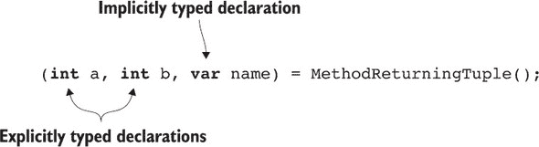

如果你想使用隐式转换来指定与原始元组元素类型不同的类型，这在需要时特别有用；请参见图 12.2。

##### 图 12.2\. 涉及隐式转换的解构

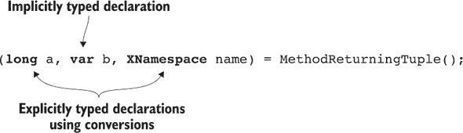

如果你愿意为所有变量使用隐式类型，C# 7 提供了简写来简化操作；只需在名称列表之前使用 `var`：

```
var (a, b, name) = MethodReturningTuple();
```

这等价于在参数列表内部为每个变量使用 `var`，而这又等价于根据被分配的值的类型显式指定推断类型。就像常规隐式类型变量声明一样，使用 `var` 并不会使你的代码变为动态类型；它只是让编译器推断类型。

尽管你可以在括号内指定的类型方面在隐式类型和显式类型之间混合使用，但你不能在变量列表之前使用 `var` 然后为一些变量提供类型：

```
var (a, long b, name) = MethodReturningTuple();     *1*
```

+   ***1* 无效：混合“内部和外部”声明**

##### 一个特殊的标识符：_ 被丢弃

C# 7 有三个特性允许在新的地方引入局部变量：

+   解构（本节和 12.2）

+   模式 (第 12.3 节 到 第 12.7 节)

+   输出变量 (第 14.2 节)

在所有这些情况下，指定变量名为 `_`（单个下划线）具有特殊含义。它是一个 *丢弃*，意味着“我不关心结果。我甚至不希望它作为一个变量——只是去掉它。”当使用丢弃时，它不会引入新的变量到作用域中。你可以使用多个丢弃而不是为多个你不在乎的变量指定不同的变量名。

这里是一个在元组解构中使用丢弃的示例：

```
var tuple = (1, 2, 3, 4);        *1*
var (x, y, _, _) = tuple;        *2*
Console.WriteLine(_);            *3*
```

+   ***1* 四个元素的元组**

+   ***2* 解构元组但只保留前两个元素**

+   ***3* 错误 CS0103：名称 ' _ ' 在当前上下文中不存在**

如果你已经有一个名为 `_` 的变量在作用域内（使用常规变量声明），你仍然可以在解构中使用丢弃来赋值给其他新的变量集，而现有的变量将保持不变。

正如你在我们的原始概述中看到的那样，你不必声明新变量来使用解构。解构可以作为一个赋值序列来执行。

#### 12.1.2\. 解构赋值给现有变量和属性

上一节解释了我们的原始概述示例的大部分内容。在本节中，我们将查看代码的这一部分：

```
var tuple = (10, "text");
int e;
string f;
(e, f) = tuple;
```

在这种情况下，编译器并不是将解构视为一系列具有相应初始化表达式的声明，而是一系列赋值。这和之前章节中看到的避免临时变量的好处相同。以下列表提供了一个使用之前使用的相同 `MethodReturningTuple()` 的示例。

##### 列表 12.3\. 使用解构赋值给现有变量

```
static (int x, int y, string text) MethodReturningTuple() => (1, 2, "t");

static void Main()
{
    int a = 20;                                           *1*
    int b = 30;                                           *1*
    string name = "before";                               *1*
    Console.WriteLine($"a: {a}; b: {b}; name: {name}");   *1*

    (a, b, name) = MethodReturningTuple();                *2*

    Console.WriteLine($"a: {a}; b: {b}; name: {name}");   *3*
}
```

+   ***1* 声明、初始化和使用三个变量**

+   ***2* 使用解构赋值给所有三个变量**

+   ***3* 显示新值**

到目前为止，一切顺利，但这个特性不仅仅局限于对局部变量的赋值能力。任何可以作为单独语句有效执行的赋值操作，都可以使用解构来实现。这可以是对字段、属性或索引器的赋值，包括对数组和其它对象的操作。

| |
| --- |

**声明或赋值：不要混合**

解构允许你声明和初始化变量，或者执行一系列赋值。你不能混合使用这两种方式。例如，以下是不合法的：

```
int x;
(x, int y) = (1, 2);
```

赋值可以使用各种目标，这是可以的：一些现有的局部变量，一些字段，一些属性，等等。

| |
| --- |

除了常规赋值外，你还可以将值赋给一个丢弃（即 `_` 标识符），如果作用域中没有名为 `_` 的变量，这实际上会丢弃该值。如果你在作用域中有一个名为 `_` 的变量，解构会像平常一样将其赋值。

| |
| --- |

**在解构中使用 _：赋值还是丢弃？**

起初这看起来有点令人困惑：有时当存在同名的现有变量时，将 _ 用于解构会改变其值，有时则会丢弃它。你可以通过两种方式避免这种困惑。第一种是查看解构的其余部分，以确定它是否引入了新的变量（在这种情况下 `_` 是一个丢弃），或者是否将值赋给现有变量（在这种情况下 `_` 被赋予一个新值，就像其他变量一样）。

避免混淆的第二种方法是不要使用 `_` 作为局部变量名。

| |
| --- |

实际上，我预计几乎所有的赋值解构都会针对局部变量或 `this` 的字段和属性。事实上，有一种巧妙的小技巧可以在构造函数中使用，这使得 C# 7 中引入的表达式主体构造函数变得更加有用。许多构造函数根据构造函数参数将值赋给属性或字段。如果你首先将参数收集到一个元组字面量中，就可以在一个表达式中完成所有这些赋值，如下一列表所示。

##### 列表 12.4\. 使用解构和元组字面量进行简单的构造函数赋值

```
public sealed class Point
{
    public double X { get; }
    public double Y { get; }

    public Point(double x, double y) => (X, Y) = (x, y);
}
```

我真的很喜欢这种简洁性。我喜欢从构造函数参数到属性的映射的清晰性。C# 编译器甚至将其识别为一种模式，并避免构造 `ValueTuple<double, double>`。不幸的是，它仍然需要依赖 `System.ValueTuple.dll` 来构建，这足以让我在项目其他地方也使用元组或目标框架已经包含 `System.ValueTuple` 的情况下才使用它。

| |
| --- |

**这是不是地道的 C#语法？**

正如我描述的，这个技巧有优点也有缺点。这是构造函数的纯实现细节；它甚至不影响类的其余部分。如果你决定接受这种风格，然后又决定不喜欢它，移除它应该是微不足道的。现在还太早说这会不会流行起来，但我希望如此。不过，一旦元组字面量需要不仅仅是精确的参数值，我就要小心了。即使添加一个前置条件，在我看来，也会使常规的赋值序列更有优势。


与声明解构相比，赋值解构在排序方面有一个额外的复杂性。使用赋值的解构有三个不同的阶段：

1.  评估赋值的目标

1.  评估赋值运算符右侧的表达式

1.  执行赋值操作

这三个阶段将严格按照这个顺序执行。在每个阶段内，评估按照正常的从左到右的源顺序进行。这种情况很少能产生影响，但有可能。


##### 小贴士

如果你必须担心这个部分才能理解你面前的代码，那是一个强烈的代码气味。当你 *确实* 理解它时，我强烈建议你重构它。解构具有在表达式内部使用副作用的所有相同注意事项，但由于你需要在每个阶段执行多个评估，所以这些注意事项被放大了。


我不会在这个问题上停留太久；一个例子就足以展示你可能会遇到的问题。但这绝对不是你可能会找到的最糟糕的例子。你可以做很多事来使这个问题更加复杂。下面的列表将一个 `(StringBuilder, int)` 元组解构到一个现有的 `StringBuilder` 变量和与该变量关联的 `Length` 属性。

##### 列表 12.5\. 评估顺序重要的解构

```
StringBuilder builder = new StringBuilder("12345");
StringBuilder original = builder;                   *1*

(builder, builder.Length) =                         *2*
    (new StringBuilder("67890"), 3);                *2*

Console.WriteLine(original);                        *3*
Console.WriteLine(builder);                         *3*
```

+   ***1* 为了诊断原因保留原始 builder 的引用**

+   ***2* 执行解构赋值**

+   ***3* 显示旧的和新的 builder 的内容**

这里的中间行是有点棘手的。需要考虑的关键问题是哪个 `StringBuilder` 的 `Length` 属性被设置：是 `builder` 原先引用的那个，还是解构第一部分中分配的新值？正如我之前描述的，所有赋值的靶点都会先被评估，然后再执行任何赋值操作。下面的列表以某种爆炸版本的形式展示了相同的代码，其中手动执行了解构操作。

##### 列表 12.6\. 缓慢动作解构以显示评估顺序

```
StringBuilder builder = new StringBuilder("12345");
StringBuilder original = builder;

StringBuilder targetForLength = builder; *1*

(StringBuilder, int) tuple =                *2*
    (new StringBuilder("67890"), 3);        *2*

builder = tuple.Item1;                      *3*
targetForLength.Length = tuple.Item2;       *3*

Console.WriteLine(original);
Console.WriteLine(builder);
```

+   ***1* 评估赋值目标**

+   ***2* 评估元组字面量**

+   ***3* 在目标上执行赋值操作**

当目标是局部变量时，不需要额外的评估；你可以直接将其赋值。但是，将属性赋给变量需要将变量值作为第一阶段的组成部分进行评估；这就是为什么你有`targetForLength`变量。

在从字面量构造元组之后，你可以将不同的项赋值给你的目标，确保在赋值`Length`属性时使用`targetForLength`而不是 builder。`Length`属性是在内容为 12345 的原始`StringBuilder`上设置的，而不是内容为 67890 的新一个。这意味着列表 12.5 和 12.6 的输出如下：

```
123
67890
```

在处理完这些之后，在继续讨论非元组解构之前，还有最后一个——相当令人愉快——的元组构造细节需要讨论。

#### 12.1.3. 元组字面量解构的细节

如我在第 11.3.1 节中所述，并非所有元组字面量都有类型。例如，元组字面量`(null, x => x * 2)`没有类型，因为它的元素表达式都没有类型。但你知道它可以转换为类型`(string, Func<int, int>)`，因为每个表达式都有一个转换为对应类型的转换。

好消息是元组解构正好具有与声明解构和赋值解构相同的“按元素赋值兼容性”。这适用于声明解构和赋值解构。以下是一个简短的例子：

```
(string text, Func<int, int> func) =
    (null, x => x * 2);                    *1*
(text, func) = ("text", x => x * 3);       *2*
```

+   ***1* 声明解构文本和 func**

+   ***2* 将解构赋值给文本和 func**

这也适用于需要从表达式到目标类型的隐式转换的解构。例如，使用我们最喜欢的“`int`常量在`byte`范围内”的例子，以下是有效的：

```
(byte x, byte y) = (5, 10);
```

就像许多优秀的语言特性一样，这可能是你可能隐含期望的，但语言需要精心设计和指定才能允许它。现在你已经相当广泛地研究了元组解构，非元组解构相对简单。

### 12.2. 非元组类型的解构

非元组类型的解构使用与 async/await 和`foreach`相同的方式基于模式的策略。就像任何具有合适的`GetAwaiter`方法或扩展方法的类型都可以被等待一样，任何具有合适的`Deconstruct`方法或扩展方法的类型都可以使用与元组相同的语法进行解构。让我们从使用常规实例方法进行解构开始。

> ¹
> 
> 这与第 12.3 节中出现的模式完全不同。对于术语冲突，我表示歉意。

#### 12.2.1. 实例解构方法

使用现在在多个示例中使用的`Point`类来演示解构是最简单的。你可以像这样向它添加一个`Deconstruct`方法：

```
public void Deconstruct(out double x, out double y)
{
    x = X;
    y = Y;
}
```

然后，你可以像以下列表中那样将任何 `Point` 解构为两个 `double` 变量。

##### 列表 12.7\. 将 `Point` 解构为两个变量

```
var point = new Point(1.5, 20);   *1*
var (x, y) = point;               *2*
Console.WriteLine($"x = {x}");    *3*
Console.WriteLine($"y = {y}");    *3*
```

+   ***1* 构造点实例**

+   ***2* 将其解构为两个 `double` 类型的变量**

+   ***3* 显示两个变量的值**

`Deconstruct` 方法的任务是使用解构的结果填充 `out` 参数。在这种情况下，你只是将解构为两个 `double` 值。正如其名称所暗示的，就像一个构造函数的反向操作。

但等等；你使用了一个巧妙的技巧，用元组在构造函数中一次性将参数值赋给属性。你能在这里做到吗？是的，你可以，而且我个人非常喜欢它。以下是构造函数和 `Deconstruct` 方法，以便你可以看到它们的相似之处：

```
public Point(double x, double y) => (X, Y) = (x, y);
public void Deconstruct(out double x, out double y) => (x, y) = (X, Y);
```

这种简单性很美，至少在你习惯了之后。

用于解构的 `Deconstruct` 实例方法的规则相当简单：

+   方法必须对执行解构的代码是可访问的。（例如，如果所有内容都在同一个程序集内，`Deconstruct` 是一个内部方法就很好。）

+   它必须是一个 `void` 方法。

+   必须至少有两个参数。（你不能解构为单个值。）

+   它必须是非泛型的。

你可能想知道为什么设计使用 `out` 参数而不是要求 `Deconstruct` 无参数但有元组返回类型。答案是，能够解构到多组值是有用的，这可以通过多个方法实现，但你不能仅基于返回类型来重载方法。为了使这一点更清晰，我将使用一个解构 `DateTime` 的例子，但当然，你不能向 `DateTime` 添加你自己的实例方法。是时候介绍扩展解构方法了。

#### 12.2.2\. 扩展解构方法和重载

正如我在介绍中简要提到的，编译器会找到任何遵循相关模式的 `Deconstruct` 方法，包括扩展方法。你可能可以想象解构扩展方法的样子，但以下列表提供了一个具体的例子，使用了 `DateTime`。

##### 列表 12.8\. 使用扩展方法解构 `DateTime`

```
static void Deconstruct(                           *1*
    this DateTime dateTime,                        *1*
    out int year, out int month, out int day) =>   *1*
    (year, month, day) =                           *1*
    (dateTime.Year, dateTime.Month, dateTime.Day); *1*

static void Main()
{
    DateTime now = DateTime.UtcNow;
    var (year, month, day) = now;                  *2*
    Console.WriteLine(
        $"{year:0000}-{month:00}-{day:00}");       *3*
}
```

+   ***1* 扩展方法用于解构 `DateTime**`

+   ***2* 将当前日期解构为年/月/日**

+   ***3* 使用三个变量显示日期**

事实上，这是一个在同一个（静态）类中声明的私有扩展方法，你从那里使用它，但更常见的是它是公共或内部的，就像大多数扩展方法一样。

如果你想将 `DateTime` 解构为不仅仅是日期呢？这正是重载有用的地方。你可以有两个具有不同参数列表的方法，编译器将根据参数数量确定使用哪个。让我们添加另一个扩展方法，以日期和时间的形式解构 `DateTime`，然后使用这两个方法解构不同的值。

##### 列表 12.9\. 使用 `Deconstruct` 重载

```
static void Deconstruct(                                *1*
    this DateTime dateTime,                             *1*
    out int year, out int month, out int day) =>        *1*
    (year, month, day) =                                *1*
    (dateTime.Year, dateTime.Month, dateTime.Day);      *1*

static void Deconstruct(                                *2*
    this DateTime dateTime,                             *2*
    out int year, out int month, out int day,           *2*
    out int hour, out int minute, out int second) =>    *2*
    (year, month, day, hour, minute, second) =          *2*
    (dateTime.Year, dateTime.Month, dateTime.Day,       *2*
    dateTime.Hour, dateTime.Minute, dateTime.Second);   *2*

static void Main()
{
    DateTime birthday = new DateTime(1976, 6, 19);
    DateTime now = DateTime.UtcNow;

    var (year, month, day, hour, minute, second) = now; *3*
    (year, month, day) = birthday;                      *4*
}
```

+   ***1* 将日期解构为年/月/日**

+   ***2* 将日期解构为年/月/日/小时/分钟/秒**

+   ***3* 使用六值解构器**

+   ***4* 使用三值解构器**

你可以使用扩展 `Deconstruct` 方法为已经具有实例 `Deconstruct` 方法的类型，如果实例方法在解构时不适用，它们将被使用，就像在正常方法调用中一样。

扩展 `Deconstruct` 方法的限制自然地来源于实例方法的限制：

+   它必须对调用代码是可访问的。

+   除了第一个参数（扩展方法的调用目标）之外，所有参数都必须是 `out` 参数。

+   至少必须有两个这样的 `out` 参数。

+   方法可能是泛型的，但只有调用接收者（第一个参数）可以参与类型推断。

指示方法何时可以是泛型或不能是泛型的规则值得更仔细的审查，尤其是因为它们还揭示了为什么在重载 `Deconstruct` 时需要使用不同数量的参数。关键在于编译器如何处理 `Deconstruct` 方法。

#### 12.2.3\. 编译器对解构调用的处理

当一切按预期工作的时候，你可以不必过多地思考编译器是如何决定使用哪个 `Deconstruct` 方法的。然而，如果你遇到问题，尝试将自己置于编译器的位置可能会有所帮助。

当使用方法进行解构时，元组分解的时机仍然适用，因此我将专注于方法调用本身。让我们来看一个相对具体的例子，看看编译器在遇到这种解构时会如何处理：

```
(int x, string y) = target;
```

我说这是一个 *相对* 具体的例子，因为我没有展示 `target` 的类型。这是故意的，因为你所需要知道的是它不是一个元组类型。编译器将其扩展为类似以下的内容：

```
target.Deconstruct(out var tmpX, out var tmpY);
int x = tmpX;
string y = tmpY;
```

然后它使用所有正常的方法调用规则来尝试找到要调用的正确方法。我意识到 `out var` 的使用是你之前没有见过的。你将在 第 14.2 节 中更详细地了解它，但你现在需要知道的是，它使用 `out` 参数的类型来推断隐式类型的变量。

重要的是要注意，你在原始代码中声明的变量的类型并不作为 `Deconstruct` 调用的一部分使用。这意味着它们不能参与类型推断。这解释了三件事：

+   实例 `Deconstruct` 方法不能是泛型的，因为没有信息供类型推断使用。

+   扩展 `Deconstruct` 方法可以是泛型的，因为编译器可能能够使用 `target` 推断类型参数，但那将是唯一有用的参数，从类型推断的角度来看。

+   当重载`Deconstruct`方法时，重要的是`out`参数的数量，而不是它们的类型。如果你引入多个具有相同数量`out`参数的`Deconstruct`方法，这将会阻止编译器使用任何一个，因为调用代码将无法确定你指的是哪一个。

我就说到这里，因为我不想做得比必要的更多。如果你遇到无法理解的问题，尝试执行之前展示的转换，这可能会使事情更加清晰。

这就是你需要了解的所有关于解构的内容。本章的其余部分专注于模式匹配，这是一个理论上完全独立于解构的功能，但在可用工具方面与解构有相似的感觉，这些工具可以用于以新的方式使用现有数据。

### 12.3\. 模式匹配简介

就像许多其他特性一样，模式匹配对于 C#来说是新的，但对于编程语言总体来说并不是新的。特别是，函数式语言通常大量使用模式。C# 7.0 中的模式满足了许多相同的用例，但以一种与语言其余语法相匹配的方式。

模式的基本思想是测试一个值的某个方面，并使用该测试的结果执行另一个操作。是的，这听起来就像一个`if`语句，但模式通常用于提供更多上下文，或者根据模式在动作本身中提供更多上下文。再次强调，这个特性并不允许你做之前不能做的事情；它只是让你更清晰地表达相同的目的。

我不想在没有给出例子的情况下走得太远。如果你现在觉得它有点奇怪，不用担心；目的是给你一个感觉。假设你有一个定义了抽象`Area`属性和派生类`Rectangle`、`Circle`和`Triangle`的抽象类`Shape`。不幸的是，对于你当前的应用程序，你不需要形状的面积；你需要它的周长。你可能无法修改`Shape`来添加`Perimeter`属性（你可能根本无法控制其源代码），但你知道如何计算你感兴趣的类中的周长。在 C# 7 之前，一个`Perimeter`方法可能看起来像以下列表。

##### 列表 12.10\. 不使用模式计算周长

```
static double Perimeter(Shape shape)
{
    if (shape == null)
        throw new ArgumentNullException(nameof(shape));
    Rectangle rect = shape as Rectangle;
    if (rect != null)
        return 2 * (rect.Height + rect.Width);
    Circle circle = shape as Circle;
    if (circle != null)
        return 2 * PI * circle.Radius;
    Triangle triangle = shape as Triangle;
    if (triangle != null)
        return triangle.SideA + triangle.SideB + triangle.SideC;
    throw new ArgumentException(
        $"Shape type {shape.GetType()} perimeter unknown", nameof(shape));
}
```

| |
| --- |

##### 注意

如果内部缺少花括号让你感到不适，我为此道歉。我通常会在所有循环、if 语句等地方使用它们，但在这个例子中，它们最终使有用的代码在这里以及一些后续的模式示例显得微不足道。为了简洁，我已经将它们移除了。

| |
| --- |

这看起来很糟糕。它重复且冗长；相同的模式“检查形状是否是特定类型，然后使用该类型的属性”出现了三次。呃。重要的是，尽管这里有几个 `if` 语句，但每个语句的主体都返回一个值，所以你总是只选择其中一个来执行。以下列表显示了如何使用 C# 7 中的模式在 `switch` 语句中编写相同的代码。

##### 列表 12.11\. 使用模式计算周长

```
static double Perimeter(Shape shape)
{
    switch (shape)
    {
        case null:                                            *1*
            throw new ArgumentNullException(nameof(shape));   *1*
        case Rectangle rect:                                  *2*
            return 2 * (rect.Height + rect.Width);            *2*
        case Circle circle:                                   *2*
            return 2 * PI * circle.Radius;                    *2*
        case Triangle tri:                                    *2*
            return tri.SideA + tri.SideB + tri.SideC;         *2*
        default:                                              *3*
            throw new ArgumentException(...);                 *3*
    }
}
```

+   ***1* 处理空值**

+   ***2* 处理您所知道的每种类型**

+   ***3* 如果不知道该做什么，就抛出一个异常。**

这与 C# 早期版本中的 `switch` 语句有很大的不同，在早期版本中，case 标签都是常量值。在这里，你有时只对值匹配（对于 `null` 的情况）感兴趣，有时对值的类型（矩形、圆形和三角形的情况）感兴趣。当你按类型匹配时，这个匹配也会引入一个新的变量，你可以使用这个变量来计算周长。

C# 中模式的话题有两个不同的方面：

+   模式的语法

+   可以使用模式的环境

起初，可能会觉得一切都是新的，区分这两个方面可能似乎没有意义。但 C# 7.0 中可用的模式只是开始：C# 设计团队已经明确表示，语法已经被设计为随着时间的推移使新的模式可用。当你知道语言中允许模式的位置时，你可以轻松地掌握新的模式。这有点像鸡生蛋的问题——很难在不展示另一个的情况下展示一个部分——但我们将从查看 C# 7.0 中可用的模式类型开始。

### 12.4\. C# 7.0 中可用的模式

C# 7.0 引入了三种类型的模式：常量模式、类型模式和 `var` 模式。我将通过 `is` 操作符来演示每种模式，`is` 操作符是使用模式的一个上下文。

每个模式都试图匹配一个输入。这可以是任何非指针表达式。为了简单起见，我在模式描述中将其称为 `input`，就像它是一个变量一样，但它不必是。

#### 12.4.1\. 常量模式

一个 *常量模式* 正如其名：该模式完全由编译时常量表达式组成，然后检查它与 `input` 是否相等。如果 `input` 和常量都是整数表达式，它们将使用 `==` 进行比较。否则，将调用静态的 `object.Equals` 方法。重要的是调用的是静态方法，因为这使你可以安全地检查空值。以下列表显示了一个示例，它甚至比书中大多数其他示例的实际用途还要少，但它确实演示了几个有趣的观点。

##### 列表 12.12\. 简单常量匹配

```
static void Match(object input)
{
    if (input is "hello")
        Console.WriteLine("Input is string hello");
    else if (input is 5L)
        Console.WriteLine("Input is long 5");
    else if (input is 10)
        Console.WriteLine("Input is int 10");
    else
        Console.WriteLine("Input didn't match hello, long 5 or int 10");
}
static void Main()
{
    Match("hello");
    Match(5L);
    Match(7);
    Match(10);
    Match(10L);
}
```

输出大部分都很直接，但你可能会对倒数第二行感到惊讶：

```
Input is string hello
Input is long 5
Input didn't match hello, long 5 or int 10
Input is int 10
Input didn't match hello, long 5 or int 10
```

如果使用 `==` 比较整数，为什么最后的 `Match(10L)` 调用没有匹配成功？答案是 `input` 的编译时类型不是一个整型，它只是 `object`，因此编译器生成的代码相当于调用 `object.Equals(x, 10)`。当 `x` 的值是一个装箱的 `Int64` 而不是一个装箱的 `Int32` 时，它会返回 `false`，正如我们在最后的 `Match` 调用中所遇到的情况。要使用 `==` 的例子，你需要像这样：

```
long x = 10L;
if (x is 10)
{
    Console.WriteLine("x is 10");
}
```

在这样的`is`表达式中，这并不实用；它更可能用于`switch`，其中你可能有一些整数常量（比如一个预模式匹配的`switch`语句）以及其他模式。一种更明显有用的模式类型是类型模式。

#### 12.4.2\. 类型模式

一个 *类型模式* 由一个类型和一个标识符组成——有点像变量声明。如果 `input` 是该类型的值，则模式匹配，就像常规的 `is` 操作符一样。使用模式的好处是，它还引入了一个新的 *模式变量*，该变量以匹配的值初始化。如果模式不匹配，变量仍然存在；它只是没有被明确赋值。如果 `input` 为空，则不会匹配任何类型。如 12.1.1 节 所述，可以使用下划线标识符 `_`，在这种情况下，它是一个 *丢弃*，不会引入任何变量。以下列表是将我们之前的一组 `as` 后跟 `if` 语句 (列表 12.10) 转换为使用模式匹配，而不采取使用 `switch` 语句的更极端步骤。

##### 列表 12.13\. 使用类型模式代替 `as/if`

```
static double Perimeter(Shape shape)
{
    if (shape == null)
        throw new ArgumentNullException(nameof(shape));
    if (shape is Rectangle rect)
        return 2 * (rect.Height + rect.Width);
    if (shape is Circle circle)
        return 2 * PI * circle.Radius;
    if (shape is Triangle triangle)
        return triangle.SideA + triangle.SideB + triangle.SideC;
    throw new ArgumentException(
        $"Shape type {shape.GetType()} perimeter unknown", nameof(shape));
}
```

在这个情况下，我确实更喜欢 `switch` 语句选项，但如果只有一个 `as`/`if` 需要替换，那就太过分了。类型模式通常用于替换一个 `as`/`if` 组合或 `if` 后跟一个类型转换。后者在你要测试的类型是非可空值类型时是必需的。

类型模式中指定的类型不能是可空值类型，但它可以是类型参数，并且该类型参数在执行时最终可能成为可空值类型。在这种情况下，只有当值非空时，模式才会匹配。以下列表展示了这一点，使用 `int?` 作为使用类型参数的类型模式的方法的类型参数，即使表达式 `value is int? t` 不会编译。

##### 列表 12.14\. 类型模式中可空值类型的行为

```
static void Main()
{
    CheckType<int?>(null);
    CheckType<int?>(5);     
    CheckType<int?>("text");
    CheckType<string>(null);
    CheckType<string>(5);
    CheckType<string>("text");
}

static void CheckType<T>(object value)
{
    if (value is T t)
    {
        Console.WriteLine($"Yes! {t} is a {typeof(T)}");
    }
    else
    {
        Console.WriteLine($"No! {value ?? "null"} is not a {typeof(T)}");
    }
}
```

输出如下：

```
No! null is not a System.Nullable`1[System.Int32]
Yes! 5 is a System.Nullable`1[System.Int32]
No! text is not a System.Nullable`1[System.Int32]
No! null is not a System.String
No! 5 is not a System.String
Yes! text is a System.String
```

为了总结本节关于类型模式的内容，C# 7.0 中有一个问题在 C# 7.1 中得到了解决。这是那些如果你已经将项目设置为使用 C# 7.1 或更高版本，你可能甚至都没有注意到的情况之一。我包括这个主要是为了避免你从 C# 7.1 项目复制代码到 C# 7.0 项目时发现它无法工作而感到困惑。

在 C# 7.0 中，像这样的类型模式

```
x is SomeType y
```

需要 `x` 的编译时类型可以被转换为 `SomeType`。这听起来完全合理，直到你开始使用泛型。考虑以下使用模式匹配显示提供的形状详细信息的泛型方法。

##### 列表 12.15\. 使用类型模式的泛型方法

```
static void DisplayShapes<T>(List<T> shapes) where T : Shape
{
    foreach (T shape in shapes)          *1*
    {
        switch (shape)                   *2*
        {
            case Circle c:               *3*
                Console.WriteLine($"Circle radius {c.Radius}");
                break;
            case Rectangle r:
                Console.WriteLine($"Rectangle {r.Width} x {r.Height}");
                break;
            case Triangle t:
                Console.WriteLine(
                    $"Triangle sides {t.SideA}, {t.SideB}, {t.SideC}");
                break;
        }
    }
}
```

+   ***1* 变量类型是类型参数 (T)**

+   ***2* 在该变量上切换**

+   ***3* 尝试使用类型匹配转换为具体形状类型**

在 C# 7.0 中，这个列表无法编译，因为以下代码也无法编译：

```
if (shape is Circle)
{
    Circle c = (Circle) shape;
}
```

使用 `is` 操作符是有效的，但转换不是。在 C# 中直接转换类型参数的能力一直是一个烦恼，通常的解决方案是首先将其转换为 `object`：

```
if (shape is Circle)
{
    Circle c = (Circle) (object) shape;
}
```

在正常的转换中，这已经足够笨拙，但在尝试使用优雅的类型模式时，情况更糟。

在列表 12.15 中，可以通过接受 `IEnumerable<Shape>`（利用泛型协变允许将 `List<Circle>` 转换为 `IEnumerable<Shape>`，例如）或指定 `shape` 的类型为 `Shape` 而不是 `T` 来解决这个问题。在其他情况下，解决方案并不那么简单。C# 7.1 通过允许任何可以使用 `as` 操作符的有效类型的类型模式来解决这个问题，这使得列表 12.15 有效。

我预计类型模式将是 C# 7.0 中引入的三个模式中最常用的模式。我们的最后一个模式几乎听起来根本不像一个模式。

#### 12.4.3\. 变量模式

`var` 模式看起来像是一个类型模式，但使用 `var` 作为类型，所以它只是 `var` 后跟一个标识符：

```
someExpression is var x
```

与类型模式一样，它引入了一个新变量。但与类型模式不同，它不测试任何内容。它总是匹配，结果是一个具有与 `input` 相同的编译时类型和相同值的新的变量。与类型模式不同，即使 `input` 是一个空引用，`var` 模式仍然匹配。

因为它总是匹配，所以在 `if` 语句中使用 `var` 模式与 `is` 操作符，就像我在其他模式中演示的那样，是相当没有意义的。它最常与 `switch` 语句结合使用，并与 *保护子句*（在第 12.6.1 节中描述）一起使用，尽管如果你想在没有将其分配给变量的情况下对更复杂的表达式进行切换，偶尔也可能有用。

只为了展示一个不使用守卫子句的`var`模式的例子，列表 12.16 显示了一个类似于列表 12.11 中的`Perimeter`方法。但这次，如果`shape`参数有一个 null 值，就会创建一个随机的形状。如果你不能计算周长，你可以使用`var`模式来报告形状的类型。现在你不需要带有`null`值的常量模式，因为你在确保你永远不会在 null 引用上切换。

##### 列表 12.16\. 使用`var`模式在错误中引入变量

```
static double Perimeter(Shape shape)
{
    switch (shape ?? CreateRandomShape())
    {
        case Rectangle rect:
            return 2 * (rect.Height + rect.Width);
        case Circle circle:
            return 2 * PI * circle.Radius;
        case Triangle triangle:
            return triangle.SideA + triangle.SideB + triangle.SideC;
 case var actualShape:
            throw new InvalidOperationException(
                $"Shape type {actualShape.GetType()} perimeter unknown");
    }
}
```

在这种情况下，一个替代方案是在`switch`语句之前引入`actualShape`变量，然后根据它进行切换，然后像以前一样使用`default`情况。

这些就是 C# 7.0 中可用的所有模式。你已经看到了它们可以使用的两种上下文——与`is`运算符和`switch`语句一起使用——但在每种情况下都有更多要说的话。

### 12.5\. 使用`is`运算符的模式

`is`运算符可以在任何地方作为正常表达式的一部分使用。它几乎总是与`if`语句一起使用，但绝对不必如此。在 C# 7 之前，`is`运算符的右侧必须只是一个类型，但现在它可以是一个任何模式。尽管这确实允许你使用常量或`var`模式，但现实情况下你几乎总是使用类型模式。

`var`模式和类型模式都引入了一个新的变量。在 C# 7.3 之前，这带来了一个额外的限制：你无法在字段、属性或构造函数初始化器或查询表达式中使用它们。例如，这将是不合法的：

```
static int length = GetObject() is string text ? text.Length : -1;
```

我还没有发现这成为一个问题，但限制在 C# 7.3 中已经被取消了。

这就留下了引入局部变量的模式，这引发了一个明显的问题：新引入的变量的作用域是什么？我明白这曾在 C#语言团队和社区中引发了大量讨论，但最终结果是引入的变量的作用域是包含的代码块。

由于这是一个激烈争论的话题，所以它既有优点也有缺点。我从未喜欢过的`as`/`if`模式列表 12.10 之一是，即使你通常不想在值匹配你测试的类型之外的条件中使用它们，你最终会在作用域中拥有很多变量。不幸的是，在使用类型模式时，这种情况仍然存在。这并不是完全相同的情况，因为当模式不匹配时，变量在分支中不会被肯定赋值。

为了比较，在这段代码之后

```
string text = input as string;
if (text != null)
{
    Console.WriteLine(text);
}
```

`text`变量在作用域内，并且肯定被赋值了。大致等价的类型模式代码如下：

```
if (input is string text)
{
    Console.WriteLine(text);
}
```

在此之后，`text` 变量在作用域内，但不是确定赋值。尽管这确实会污染声明空间，但如果您试图提供获取值的一种替代方式，这可能是有用的。例如：

```
if (input is string text)
{
    Console.WriteLine("Input was already a string; using that");
}
else if (input is StringBuilder builder)
{
    Console.WriteLine("Input was a StringBuilder; using that");    
    text = builder.ToString();
}
else
{
    Console.WriteLine(
        $"Unable to use value of type ${input.GetType()}. Enter text:");    
    text = Console.ReadLine();
}
Console.WriteLine($"Final result: {text}");
```

在这里，您确实希望 `text` 变量保持作用域，因为您想使用它；您可以通过两种方式之一对其赋值。您真的不希望在中间块之后还有 `builder` 的作用域，但您不能两者兼得。

要更技术性地讨论确定赋值，在具有引入模式变量的模式表达式的 `is` 表达式之后，该变量（在语言规范术语中）是“在真表达式之后确定赋值”。如果您想使 `if` 条件做更多的事情，而不仅仅是测试类型，这可能很重要。例如，假设您想检查提供的值是否是大型整数。这是可以的：

```
if (input is int x && x > 100)
{
 Console.WriteLine($"Input was a large integer: {x}");
}
```

您可以在 `&&` 之后使用 `x`，因为只有当第一个操作数评估为 `true` 时，您才会评估该操作数。您也可以在 `if` 语句中使用 `x`，因为只有当两个 `&&` 操作数都评估为 `true` 时，您才会执行 `if` 语句的主体。但如果您想同时处理 `int` 或 `long` 值怎么办？您可以测试该值，但这样您就无法知道哪个条件匹配了：

```
if ((input is int x && x > 100) || (input is long y && y > 100))
{
 Console.WriteLine($"Input was a large integer of some kind");
}
```

在这里，`x` 和 `y` 都在 `if` 语句内部及其之后的作用域内，即使看起来声明 `y` 的部分可能不会执行。但变量仅在检查值大小的小块代码中确定赋值。

所有这些都符合逻辑，但第一次看到时可能会有些惊讶。本节的两点收获如下：

+   预期在 `is` 表达式中声明的模式变量的作用域是包含的块。

+   如果编译器阻止您使用模式变量，这意味着语言规则无法证明在该点变量将被赋值。

在本章的最后部分，我们将探讨在 `switch` 语句中使用的模式。

### 12.6. 使用 switch 语句的模式

规范通常不是用算法本身来编写的，而是用情况来编写的。以下是一些与计算相去甚远的例子：

+   *税费和福利*—您的税率可能取决于您的收入和其他一些因素。

+   *旅行票务*—可能会有团体折扣，以及针对儿童、成人和老年人的单独价格。

+   *外卖订餐*—如果您的订单符合某些标准，可能会有优惠。

在过去，我们有两种检测特定输入适用哪种情况的方法：`switch` 语句和 `if` 语句，其中 `switch` 语句仅限于简单的常量。我们仍然只有这两种方法，但 `if` 语句已经更简洁，如您所见，而 `switch` 语句则更强大。

| |
| --- |

##### 注意

基于模式的 `switch` 语句与过去只允许常量值的 `switch` 语句感觉相当不同。除非你有过使用具有类似功能的其他语言的经验，否则你应该预计需要一段时间才能习惯这种变化。


带有模式的 `switch` 语句在很大程度上等同于一系列的 `if`/`else` 语句，但它们鼓励你更多地从“这种输入导致这种输出”的角度去思考，而不是步骤。


**所有 `switch` 语句都可以被视为基于模式的**

在本节中，我谈论基于常量的 `switch` 语句和基于模式的 `switch` 语句，好像它们是不同的。因为常量模式 *确实是* 模式，所以每个有效的 `switch` 语句都可以被视为基于模式的 `switch` 语句，并且它们的行为将完全相同。关于执行顺序和引入新变量的差异，在常量模式中并不适用。

我发现至少在目前，将这些视为两个独立的构造，它们恰好使用了相同的语法，是非常有帮助的。你可能觉得不区分它们会更舒服。使用任何心理模型都是安全的；它们都会正确预测代码的行为。


你已经在 12.3 节 中看到了 `switch` 语句中模式的例子，其中你使用常量模式来匹配 `null` 和类型模式来匹配不同类型的形状。除了在 case 标签中简单地放置一个模式之外，还有一个新的语法元素需要介绍。

#### 12.6.1\. 守卫子句

每个 case 标签也可以有一个守卫子句，它由一个表达式组成：

```
case *pattern* when *expression*:
```

该表达式必须评估为布尔值^([2))，就像 `if` 语句的条件一样。只有当表达式评估为 `true` 时，才会执行 case 的主体。表达式可以使用更多的模式，从而引入额外的模式变量。

> ²
> 
> 它也可以是一个可以隐式转换为布尔值或提供 `true` 操作符的类型的值。这些要求与 `if` 语句中的条件相同。

让我们看看一个具体的例子，这个例子也将说明我关于规范的观点。考虑以下斐波那契数列的定义：

+   `fib(0) = 0`

+   `fib(1) = 1`

+   `fib(n) = fib(n-2) + fib(n-1)` 对于所有 `n > 1`

在 第十一章 中，你看到了如何使用元组生成斐波那契数列，当将其视为序列时，这是一种干净的方法。然而，如果你只将其视为函数，前面的定义会导致以下列表：一个简单的使用模式和守卫子句的 `switch` 语句。

##### 列表 12.17\. 使用模式递归实现斐波那契数列

```
static int Fib(int n)
{
    switch (n)
    {
        case 0: return 0;                                       *1*
        case 1: return 1;                                       *1*
        case var _ when n > 1: return Fib(n - 2) + Fib(n - 1);  *2*
        default: throw new ArgumentOutOfRangeException(         *3*
            nameof(n), "Input must be non-negative");           *3*
    }                                                           *3*
}
```

+   ***1* 使用常量模式处理基本案例**

+   ***2* 使用 var 模式和守卫子句处理递归情况**

+   ***3* 如果没有匹配任何模式，输入是无效的。**

这是一个效率极低且我永远不会在实际生活中使用的实现，但它清楚地展示了如何将规范直接转换为代码。

在这个例子中，保护子句不需要使用模式变量，所以我使用了带有`_`标识符的丢弃操作。在许多情况下，如果模式引入了新的变量，它*将会*在保护子句或至少在 case 体中使用。

当你使用保护子句时，同一个模式出现多次是完全合理的，因为第一次模式匹配时，保护子句可能评估为`false`。以下是从用于构建文档的工具中的 Noda Time 的一个示例：

```
private string GetUid(TypeReference type, bool useTypeArgumentNames)
{
    switch (type)
    {
        case ByReferenceType brt:
            return $"{GetUid(brt.ElementType, useTypeArgumentNames)}@";
        case GenericParameter gp when useTypeArgumentNames:
            return gp.Name;
        case GenericParameter gp when gp.DeclaringType != null:
            return $"`{gp.Position}";
        case GenericParameter gp when gp.DeclaringMethod != null:
            return $"``{gp.Position}";
        case GenericParameter gp:
            throw new InvalidOperationException(
                "Unhandled generic parameter");
        case GenericInstanceType git:
            return "(This part of the real code is long and irrelevant)";
        default:
            return type.FullName.Replace('/', '.');
    }
}
```

我有四个模式，根据`useTypeArgumentNames`方法参数以及泛型类型参数是在方法还是类型中引入来处理泛型参数。抛出异常的情况几乎是一个泛型参数的`default`情况，表明它遇到了我还没有考虑过的情况。我使用相同的模式变量名（`gp`）为多个情况命名的事实又提出了另一个自然的问题：在`case`标签中引入的模式变量的作用域是什么？

#### 12.6.2\. `case`标签的模式变量作用域

如果你直接在`case`体内部声明局部变量，该变量的作用域是整个`switch`语句，包括其他`case`体。这一点依然成立（并且在我看来，这是不幸的），但它不包括在 case 标签内声明的变量。这些变量的作用域仅仅是与该 case 标签关联的体。这适用于由模式声明的模式变量、在保护子句内声明的模式变量以及在任何保护子句中声明的任何`out`变量（参见第 14.2 节）。

这几乎肯定是你想要的，并且它在允许你为处理类似情况的不同情况使用相同的模式变量方面很有用，正如在 Noda Time 工具代码中所示。这里有一个怪癖：就像正常的`switch`语句一样，可以有多个具有相同体的`case`标签。在这种情况下，所有这些`case`标签内声明的变量都需要有不同的名字（因为它们正在贡献同一个声明空间）。但在`case`体内部，这些变量中没有一个会被明确赋值，因为编译器无法确定哪个标签匹配。尽管如此，引入这些变量仍然可能是有用的，但主要是为了在保护子句中使用它们。

例如，假设你正在匹配一个`object`输入，并确保如果它是数值类型，它处于特定的范围内，而这个范围可能因类型而异。你可以为每种数值类型使用一个类型模式，并相应地使用保护子句。以下列表显示了`int`和`long`的情况，但你也可以将其扩展到其他类型。

##### 列表 12.18\. 使用模式为单个 case 体提供多个`case`标签

```
static void CheckBounds(object input)
{
    switch (input)
    {
        case int x when x > 1000:
        case long y when y > 10000L:
            Console.WriteLine("Value is too large");
            break;
        case int x when x < -1000:
        case long y when y < -10000L:
            Console.WriteLine("Value is too low");
            break;
        default:
            Console.WriteLine("Value is in range");
            break;
    }
}
```

模式变量肯定在保护子句中被赋值，因为只有当模式最初匹配时，执行才会到达保护子句，并且它们在主体中仍然有效，但它们不是肯定被赋值的。你可以给它们赋新值并在之后使用它们，但我感觉这不会经常有用。

除了模式匹配的基本前提是新颖和不同之外，过去基于常量的`switch`语句和新的基于模式的`switch`语句之间还有一个巨大的区别：case 的顺序现在比以前更重要。

#### 12.6.3\. 基于模式的 switch 语句的评估顺序

在几乎所有情况下，基于常量的`switch`语句的`case`标签可以自由地重新排序，而不会改变行为。3 这是因为每个`case`标签都匹配一个单一的常量值，并且任何`switch`语句中使用的所有常量都必须是不同的，所以任何输入最多只能匹配一个`case`标签。但是，对于模式来说，情况就不再是这样了。

> ³
> 
> 唯一不成立的情况是，当你在某个 case 体中使用在早期 case 体中声明的变量时。这几乎总是个坏主意，而且这只是一个问题，因为这样的变量具有共享的作用域。

基于模式的`switch`语句的逻辑评估顺序可以简单地总结如下：

+   每个 case 标签按源代码顺序进行评估。

+   只有当所有`case`标签都已评估时，才会执行`default`标签的代码体，无论`default`标签在`switch`语句中的位置如何。


##### 提示

尽管你现在知道与`default`标签关联的代码仅在没有任何 case 标签匹配的情况下执行，无论它出现在哪里，但阅读你代码的一些人可能并不了解这一点。（实际上，当你下次再次阅读自己的代码时，你可能已经忘记了这一点。）如果你将`default`标签放在`switch`语句的最后部分，其行为总是清晰的。


有时候这并不重要。例如，在我们的斐波那契计算方法中，case 只有 0、1 和大于 1，因此它们可以自由地重新排序。然而，我们的 Noda Time 工具代码有四个必须按顺序检查的 case：

```
case GenericParameter gp when useTypeArgumentNames:
    return gp.Name;
case GenericParameter gp when gp.DeclaringType != null:
    return $"`{gp.Position}";
case GenericParameter gp when gp.DeclaringMethod != null:
    return $"``{gp.Position}";
case GenericParameter gp:
    throw new InvalidOperationException(...);
```

在这里，当`useTypeArgumentNames`为真（即第一个案例）时，你应始终使用泛型类型参数名称。第二个和第三个案例是互斥的（以你知道的方式，但编译器不知道），所以它们的顺序无关紧要。最后一个案例必须是这四个中的最后一个，因为你希望只有当输入是一个未处理的`GenericParameter`时才抛出异常。

在这里编译器很有帮助：最后的案例没有守卫子句，所以如果类型模式匹配，它总是有效的。编译器知道这一点；如果你将这个案例放在具有相同模式的其它案例标签之前，它知道这实际上是在隐藏它们，并报告错误。

多个案例体只能以一种方式执行，那就是使用很少使用的`goto`语句。这在基于模式的`switch`语句中仍然有效，但你只能跳转到常量值，并且必须有一个没有守卫子句的`case`标签与该值关联。例如，你不能跳转到类型模式，也不能在关联的守卫子句也评估为`true`的条件下跳转到值。实际上，我在`switch`语句中看到这么少的`goto`语句，以至于我认为这并不是一个很大的限制。

我之前故意提到了*逻辑*评估顺序。尽管 C#编译器可以将每个`switch`语句有效地转换成一系列的`if`/`else`语句，但它可以比这更高效地执行。例如，如果有多个类型模式对应同一类型但具有不同的守卫子句，它可以一次评估类型模式部分，然后依次检查每个守卫子句。同样，对于没有守卫模式的常量值（它们仍然必须像 C#的早期版本一样是唯一的），编译器可以使用 IL `switch`指令，这可能在执行隐式类型检查之后。编译器执行的确切优化超出了本书的范围，但如果你偶然查看与`switch`语句关联的 IL，并且它与源代码几乎没有相似之处，这可能是原因。

### 12.7\. 使用思考

本节提供了关于本章描述的特性如何最佳使用的初步思考。这两个特性很可能会进一步发展，甚至可能结合解构模式。其他相关的潜在特性，例如用于编写基于模式的`switch`表达式的语法，可能会影响这些特性的使用位置。你将在第十五章（chapter 15）中看到一些这样的 C# 8 特性。

模式匹配是一个实现问题，这意味着如果你后来发现你过度使用了它，你不需要担心。如果你发现模式没有给你预期的可读性好处，你可以回退到更老的编码风格。这在某种程度上也适用于解构。但是，如果你在你的 API 中到处添加了公共的`Deconstruct`方法，移除它们将是一个破坏性的变更。

更重要的是，我建议大多数类型本身并不是自然可解构的，就像大多数类型没有自然的`IComparable<T>`实现一样。我建议只有在组件的顺序明显且无歧义的情况下才添加`Deconstruct`方法。这对于坐标、具有层次性质的东西（如日期/时间值）或甚至有共同约定的地方（如将颜色视为带有可选 alpha 的 RGB）都是可以的。然而，大多数与业务相关的实体可能不属于这一类别；例如，在线购物车中的商品有各种方面，但它们之间没有明显的顺序。

#### 12.7.1. 发现解构机会

使用的最简单的解构类型可能与你想要解构的元组有关。如果你调用一个返回元组的方法，而你不需要保留这些值在一起，考虑解构它们。例如，在我们的第十一章中的`MinMax`方法[kindle_split_028_split_000.html#ch11]，我几乎总是立即解构，而不是将返回值作为一个元组保留：

```
int[] values = { 2, 7, 3, -5, 1, 0, 10 };
var (min, max) = MinMax(values);
Console.WriteLine(min);
Console.WriteLine(max);
```

我怀疑非元组解构的使用会更少，但如果你处理的是点、颜色、日期/时间值或类似的东西，你可能会发现，如果你在其他情况下多次通过属性引用组件，那么在早期解构值可能是值得的。你可以在 C# 7 之前这样做，但通过解构声明多个局部变量的便利性可以轻易地改变是否值得做的平衡。

#### 12.7.2. 发现模式匹配机会

你应该在两个明显的地方考虑使用模式匹配：

+   任何你使用`is`或`as`运算符，并通过使用更具体类型的值来有条件地执行代码的地方。

+   任何你有一个使用相同值的所有条件的`if/else-if/else-if/else`序列的地方，你可以使用`switch`语句代替。

如果你发现自己多次使用形式为`var ... when`的模式（换句话说，当唯一条件出现在守卫子句中时），你可能想问自己这真的是模式匹配吗。我确实遇到过这样的场景，到目前为止，我仍然倾向于使用模式匹配。即使这感觉有点滥用，在我看来，它比`if/else`序列更清楚地传达了匹配单个条件并执行单个动作的意图。

这两种都是对现有代码结构的转换，只是对实现细节进行了修改。它们并没有改变你对逻辑思考和组织的思考方式。那种更大的改变风格——可能仍然是在单个类型的可见 API 内进行重构，或者可能是在程序集的公共 API 内通过改变内部细节来实现——更难以察觉。有时，它可能意味着从使用继承转向其他方式；一个计算的逻辑可能在一个考虑了所有不同情况的单一位置中表达得更加清晰，而不是作为代表每个情况的类型的组成部分。第 12.3 节中形状案例的边界就是一个例子，但你很容易将这些相同的想法应用到许多业务案例中。这就是为什么在 C#中，非元组类型可能会变得更加普遍。

正如我所说的，这些只是初步的想法。一如既往，我鼓励你通过有意识的内省进行实验：在编码时考虑机会，如果你尝试了新的东西，在你完成之后反思其优缺点。

### 摘要

+   解构允许你使用与元组和非元组一致的语法将值分解成多个变量。

+   非元组类型使用具有`out`参数的`Deconstruct`方法进行解构。这可以是一个扩展方法或实例方法。

+   如果编译器可以推断出所有类型，则可以使用单个`var`解构声明多个变量。

+   模式匹配允许你测试值的类型和内容，并且一些模式允许你声明新的变量。

+   模式匹配可以使用`is`运算符或`switch`语句。

+   在`switch`语句中的模式可以引入一个额外的保护子句，由`when`上下文关键字引入。

+   当`switch`语句包含模式时，`case`标签的顺序可能会改变行为。

## 第十三章. 通过更多按引用传递提高效率


**本章内容涵盖**

+   使用`ref`关键字别名变量

+   使用 ref 返回值按引用返回变量

+   使用`in`参数进行高效的参数传递

+   使用只读 ref 返回值、只读 ref 局部变量和只读结构声明来防止数据更改

+   使用`in`或`ref`目标的扩展方法

+   类似于 ref 的结构和`Span<T>`


当 C# 7.0 发布时，它有几个我觉得有点奇怪的功能：只读局部变量和只读返回值。我对有多少开发者需要它们有些怀疑，因为它们似乎针对的是涉及大型值类型的情况，这种情况很少见。我的预期是，只有接近实时服务和游戏会发现这些功能有用。

C# 7.2 带来了另一批与引用相关的特性：`in` 参数、只读引用局部变量和返回值、只读结构体和类似引用的结构体。这些特性与 7.0 版本的特性相辅相成，但似乎仍然是为了一小部分用户的利益而使语言变得更加复杂。

我现在确信，尽管许多开发者可能不会直接在他们项目中看到更多基于引用的代码，但他们将从框架中提供的更高效功能中受益。在撰写本文时，还太早确定这将证明有多么革命性，但我认为它很可能会是重大的。

通常，性能是以可读性为代价的。我仍然认为，本章中描述的许多特性也是这样；我预计它们将在已知性能足够重要以证明其成本的情况下被少量使用。然而，所有这些带来的框架变化是另一回事。它们应该使减少对象分配、节省内存和垃圾收集器的工作量变得相对容易，而不会使你的代码更难以阅读。

我提到这些，是因为你可能会有类似的反应。在阅读本章时，决定尽量避免这里的大多数语言特性是完全合理的。尽管如此，我敦促你继续读到最后一部分，以了解框架相关的益处。关于类似引用的结构体的最后一部分介绍了 `Span<T>`。关于跨度可以说的内容远不止这本书能写的，但我预计跨度和相关类型将成为未来开发者工具箱中的重要部分。

在本章中，我会提到何时一个特性仅在 C# 7 的某个点版本中可用。与其他点版本特性一样，这意味着如果你使用的是 C# 7 编译器，你只能通过适当的设置来指定语言版本，才能利用这些特性。我建议你对引用相关特性采取全有或全无的方法：要么全部使用，并设置适当的选项来允许这样做；要么一个都不用。仅使用 C# 7.0 中的特性可能不会令人满意。尽管如此，让我们首先回顾一下在 C# 早期版本中使用 `ref` 关键字的情况。

### 13.1\. 回顾：你对引用了解多少？

为了理解 C# 7 中的引用相关特性，你需要牢固掌握 C# 6 及更早版本中引用参数的工作方式。这反过来又需要你牢固掌握变量与其值之间的区别。

不同的开发者对变量的思考方式不同，但我的心理模型始终是一张纸，如图 13.1 所示。这张纸上有三项信息：

##### 图 13.1\. 将变量表示为一张纸

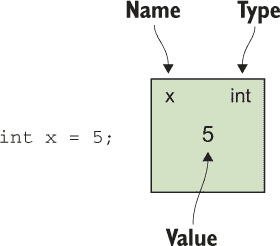

+   变量的名称

+   编译时类型

+   当前值

将新值赋给变量只是删除当前值并写入新值的问题。当变量的类型是引用类型时，纸上的值永远不是一个对象；它始终是一个对象引用。对象引用只是导航到对象的一种方式，就像街道地址是导航到建筑的方式一样。两张写有相同地址的纸指向同一栋建筑，就像两个具有相同引用值的变量指向同一个对象一样。

| |
| --- |

##### 提示

`ref`关键字和对象引用是不同的概念。当然，它们之间有相似之处，但你需要区分它们。例如，通过值传递对象引用与通过引用传递变量不是一回事。在本节中，我通过使用*对象引用*而不是仅仅*引用*来强调它们之间的区别。

| |
| --- |

重要的是，当一个赋值操作将一个变量的值复制到另一个变量时，实际上复制的是值；两张纸保持独立，对任一变量的后续更改都不会影响另一个。图 13.2 展示了这一概念。

##### 图 13.2\. 将值赋值到新变量中

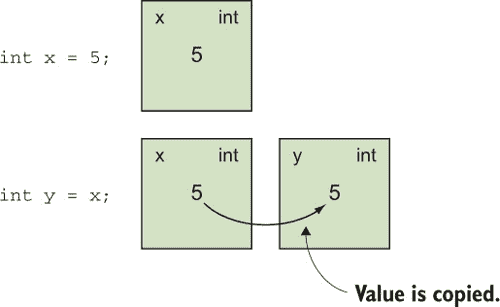

这种值复制正是当你调用方法时值参数所发生的情况；方法参数的*值*被复制到一张新的纸上——参数，如图 13.3 所示。参数不必是变量；它可以是一个适当类型的任何表达式。

##### 图 13.3\. 使用值参数调用方法：参数是新的变量，它们从参数的值开始。

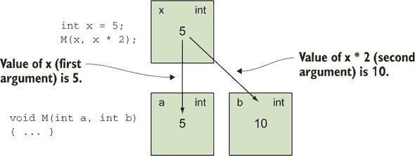

ref 参数的行为不同，如图 13.4 所示。它不是作为一张新纸来使用，而是要求调用者提供一个现有的纸张，而不仅仅是初始值。你可以把它想象成一张写有两个名字的纸：一个是调用代码用来识别它的名字，另一个是参数的名字。

##### 图 13.4\. ref 参数使用相同的纸张，而不是用值的副本创建新的纸张。

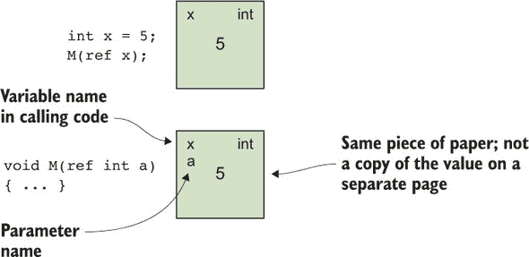

如果该方法修改了 ref 参数的值，从而改变了纸上写的内容，那么当方法返回时，这种变化对调用者来说是可见的，因为它是在原始的纸张上。

| |
| --- |

##### 注意

关于 ref 参数和变量的思考方式有很多种。你可能读过其他作者将 ref 参数视为完全独立的变量，这些变量只是有一个自动的间接层，以便任何对 ref 参数的访问都首先遵循间接层。这更接近于 IL 所表示的内容，但我发现它不太有帮助。

| |
| --- |

没有要求每个 ref 参数使用不同的纸。下面的列表提供了一个相当极端的例子，但在你继续学习 ref 局部变量之前检查你的理解是很好的。

##### 列表 13.1\. 使用相同的变量作为多个 ref 参数

```
static void Main()
{
    int x = 5;
    IncrementAndDouble(ref x, ref x);
    Console.WriteLine(x);
}

static void IncrementAndDouble(ref int p1, ref int p2)
{
    p1++;
    p2 *= 2;
}
```

这里的输出是 12：`x`、`p1`、`p2`都代表同一张纸。它从值 5 开始；`p1++`将其递增到 6，而`p2 *= 2`将其加倍到 12。图 13.5 Figure 13.5 展示了涉及的变量的图形表示。

##### 图 13.5\. 两个 ref 参数指向同一张纸

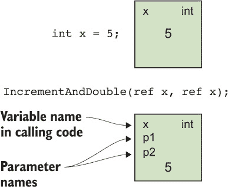

关于这个话题的一种常见说法是*别名*：在上面的例子中，变量`x`、`p1`和`p2`都是同一存储位置的*别名*。它们是到达同一内存的不同方式。

如果这听起来冗长且陈旧，那么你现在可以继续学习 C# 7 的真正新特性了。有了将变量视为纸张的心理模型，理解新特性将会容易得多。

### 13.2\. Ref 局部变量和 ref 返回值

许多与 ref 相关的 C# 7 特性是相互关联的，这使得当你一次看到它们时，理解它们的优点变得更加困难。当我在描述这些特性时，示例将比正常情况下更加牵强，因为它们试图一次只证明一个点。你将首先查看的是在 C# 7.0 中引入的特性，尽管它们在 C# 7.2 中得到了增强。首先是 ref 局部变量。

#### 13.2.1\. Ref 局部变量

让我们继续之前的类比：ref 参数允许在两个方法之间共享一张纸。调用者使用的同一张纸就是方法使用的参数。ref 局部变量通过允许你声明一个新的局部变量，该变量与现有变量共享同一张纸，将这个想法进一步发展。

下面的列表展示了这样一个简单的例子，通过不同的变量进行两次递增，然后显示结果。请注意，你必须在声明和初始化时都使用`ref`关键字。

##### 列表 13.2\. 通过两个变量进行两次递增

```
int x = 10;
ref int y = ref x;
x++;
y++;
Console.WriteLine(x);
```

这会输出 12，就像你两次递增`x`一样。

任何被分类为变量的适当类型的表达式都可以用来初始化一个 ref 局部变量，包括数组元素。如果你有一个包含大可变值类型的数组，这可以避免不必要的复制操作，以便进行多次更改。下面的列表创建了一个元组数组，然后修改了每个数组元素中的两个项目，而不进行复制。

##### 列表 13.3\. 使用 ref 局部变量修改数组元素

```
var array = new (int x, int y)[10];

for (int i = 0; i < array.Length; i++)         *1*
{                                              *1*
    array[i] = (i, i);                         *1*
}                                              *1*

for (int i = 0; i < array.Length; i++)         *2*
{                                              *2*
    ref var element = ref array[i];            *2*
    element.x++;                               *2*
    element.y *= 2;                            *2*
}                                              *2*
```

+   ***1* 初始化数组为 (0, 0), (1, 1)，依此类推**

+   ***2* 对于数组的每个元素，递增 x 并加倍 y**

在 ref locals 之前，修改数组有两种选择。你可以使用多个数组访问表达式，如下所示：

```
for (int i = 0; i < array.Length; i++)
{
    array[i].x++;
    array[i].y *= 2;
}
```

或者，你可以将整个元组从数组中复制出来，修改它，然后再复制回去：

```
for (int i = 0; i < array.Length; i++)
{
    var tuple = array[i];
    tuple.x++;
    tuple.y *= 2;
    array[i] = tuple;
}
```

这两种方法都不太吸引人。ref local 方法表达了我们的目标，即在工作循环体中将数组元素作为普通变量处理。

Ref locals 也可以与字段一起使用。静态字段的行怍是可预测的，但实例字段的行怍可能会让你感到惊讶。考虑以下列表，它创建一个 ref local 来通过变量 (`obj`) 别名一个实例的字段，然后更改 `obj` 的值以指向不同的实例。

##### 列表 13.4\. 通过 ref local 修改特定对象的字段别名

```
class RefLocalField
{
    private int value;

    static void Main()
    {
        var obj = new RefLocalField();         *1*
        ref int tmp = ref obj.value;           *2*
        tmp = 10;                              *3*
        Console.WriteLine(obj.value);          *4*

        obj = new RefLocalField();             *5*
        Console.WriteLine(tmp);                *6*
        Console.WriteLine(obj.value);          *7*
    }
}
```

+   ***1* 创建 RefLocalField 的实例**

+   ***2* 声明一个 ref local 变量，它引用第一个实例的字段**

+   ***3* 将新值赋给 ref local**

+   ***4* 证明了这已经修改了字段**

+   ***5* 将 obj 变量重新赋值以指向 RefLocalField 的第二个实例**

+   ***6* 证明了 tmp 仍然使用第一个实例的字段**

+   ***7* 证明了第二个实例的字段值确实是 0**

输出如下所示：

```
10
10
0
```

可能令人惊讶的行是中间的那一行。它表明使用 `tmp` 并不等于每次都使用 `obj.value`。相反，`tmp` 在初始化点充当 `obj.value` 表达的字段的别名。图 13.6 显示了在 `Main` 方法末尾涉及的变量和对象快照。

##### 图 13.6\. 在 列表 13.4 的末尾，tmp 变量指向第一个创建的实例中的字段，而 obj 的值指向不同的实例。


作为此的推论，`tmp` 变量将防止第一个实例在方法中 `tmp` 的最后使用之后被垃圾收集。同样，使用 ref local 对数组元素会阻止包含该元素的数组被垃圾收集。


##### 注意

指向对象内部字段或数组元素的 ref 变量会让垃圾收集器的工作变得更困难。它必须确定变量属于哪个对象，并保持该对象存活。常规对象引用更简单，因为它们直接标识了涉及的对象。每个指向对象中字段的 ref 变量都会在垃圾收集器维护的数据结构中引入一个 *内部指针*。同时存在大量这些指针会非常昂贵，但 ref 变量只能出现在栈上，这使得不太可能出现足够的 ref 变量导致性能问题。


引用局部变量在其使用上确实有一些限制。其中大部分都很明显，不会妨碍你，但了解它们仍然值得，这样你就不会尝试去规避它们。

##### 初始化：一旦，仅一次，且在声明时（在 C# 7.3 之前）

引用局部变量必须在声明点进行初始化。例如，以下代码是无效的：

```
int x = 10;
ref int invalid;
invalid = ref int x;
```

同样，没有方法可以将引用局部变量更改为别名不同的变量。（在我们的模型术语中，你不能擦掉名字然后写在另一张纸上。）当然，同一个变量可以有效地声明多次；例如，在列表 13.3 中，你在循环中声明了`element`变量：

```
for (int i = 0; i < array.Length; i++)
{
    ref var element = ref array[i];
    ...
}
```

在循环的每次迭代中，`element`将别名不同的数组元素。但这没关系，因为它在每次迭代中实际上是一个新变量。

用于初始化引用局部变量的变量也必须是已确定的。你可能期望这些变量共享确定的赋值状态，但为了不使确定的赋值规则更加复杂，语言设计者确保引用局部变量始终是已确定的。以下是一个例子：

```
int x;
ref int y = ref x;      *1*
x = 10;
Console.WriteLine(y);
```

+   ***1* 无效，因为 x 没有确定的赋值**

此代码在尝试从任何变量读取之前不会尝试读取，但它仍然无效。

C# 7.3 取消了重新赋值的限制，但引用局部变量仍然必须在声明点使用已确定的变量进行初始化。例如：

```
int x = 10;
int y = 20;
ref int r = ref x;
r++;
r = ref y; *1*
r++;
Console.WriteLine($"x={x}; y={y}");    *2*
```

+   ***1* 仅在 C# 7.3 中有效**

+   ***2* 打印 x = 11, y = 21**

我敦促在使用此功能时要谨慎。如果你需要在方法执行过程中让同一个引用变量指向不同的变量，我建议至少尝试重构方法以使其更简单。

##### 没有引用字段，或会在方法调用后继续存在的局部变量

虽然可以使用字段来初始化引用局部变量，但你不能使用`ref`来声明字段。这是防止引用变量像别名一样指向具有更短生命周期的另一个变量的一个方面。如果你可以创建一个具有别名方法中局部变量的字段的对象，那么在方法返回后该字段会发生什么？

与生命周期相关的相同问题也适用于三种情况下的局部变量：

+   迭代块不能包含引用局部变量。

+   异步方法不能包含引用局部变量。

+   引用局部变量不能被匿名方法或局部方法捕获。（局部方法在第十四章中描述。）

这些都是局部变量可以超出原始方法调用范围的情况。有时，编译器可能会证明这不会引起问题，但语言规则被选择为了简单性。（一个简单的例子是，一个仅由包含方法调用的局部方法，而不是在方法组转换中使用的方法。）

##### 不可引用只读变量

在 C# 7.0 中引入的任何 ref 局部变量都是可写的；你可以在纸上写一个新的值。如果你尝试使用不可写的纸来初始化 ref 局部变量，这就会引起问题。考虑以下违反`readonly`修饰符的尝试：

```
class MixedVariables
{
    private int writableField;
    private readonly int readonlyField;

    public void TryIncrementBoth()
    {
        ref int x = ref writableField;     *1*
        ref int y = ref readonlyField;     *2*

        x++;                               *3*
        y++;                               *3*
    }
}
```

+   ***1* 将可写字段重命名**

+   ***2* 尝试重命名只读字段**

+   ***3* 同时增加两个变量**

如果这是有效的，那么我们多年来关于只读字段的推理都将丢失。幸运的是，情况并非如此；编译器会阻止对`y`的赋值，就像它会阻止对`readonlyField`的任何直接修改一样。但这段代码在`MixedVariables`类的构造函数中是有效的，因为在那种情况下，你也能直接写入`readonlyField`。简而言之，你只能以其他情况下可以写入变量的方式初始化 ref 局部变量。这与从 C# 1.0 开始的将字段用作 ref 参数的参数的行为相匹配。

如果你想利用 ref 局部变量的共享特性而不需要可写特性，这种限制可能会让你感到沮丧。在 C# 7.0 中，这是一个问题；但你在第 13.2.4 节中会看到 C# 7.2 提供了一个解决方案。

##### 类型：仅允许身份转换

ref 局部变量的类型必须与其初始化时使用的变量的类型相同，或者两者之间必须有身份转换。任何其他转换——甚至是在许多其他场景中允许的引用转换——都不够。以下列表展示了使用基于元组的身份转换的 ref 局部变量声明示例，这是你在第十一章中学到的。


##### 注意

有关身份转换的提醒，请参阅第 11.3.3 节。


##### 列表 13.5\. ref 局部变量声明中的身份转换

```
(int x, int y) tuple1 = (10, 20);
ref (int a, int b) tuple2 = ref tuple1;
tuple2.a = 30;
Console.WriteLine(tuple1.x);
```

这将输出 30，因为`tuple1`和`tuple2`共享相同的存储位置；`tuple1.x`和`tuple2.a`彼此等价，同样`tuple1.y`和`tuple2.b`也彼此等价。

在本节中，你已经看到了从局部变量、字段和数组元素初始化 ref 局部变量的方法。在 C# 7 中，一种新的表达式类型被归类为变量：由 ref 返回方法返回的变量。

#### 13.2.2\. Ref 返回

在某些方面，理解 ref 返回应该很容易。使用我们之前的模型，这是一个方法可以返回一张纸而不是一个值的概念。你需要将`ref`关键字添加到返回类型和任何返回语句中。调用代码通常会声明一个局部 ref 来接收返回值。这意味着你必须在代码中广泛地使用`ref`关键字，以使其非常清楚你试图做什么。以下列表显示了关于最简单的 ref 返回使用；`RefReturn`方法返回传递给它的任何变量。

##### 列表 13.6\. 最简单的 ref 返回演示

```
static void Main()
{
    int x = 10;
    ref int y = ref RefReturn(ref x);
    y++;
    Console.WriteLine(x);
}

static ref int RefReturn(ref int p)
{
    return ref p;
}
```

这会打印 11，因为`x`和`y`在同一张纸上，就像你写了

```
ref int y = ref x;
```

该方法本质上是一个恒等函数，只是为了展示语法。它也可以写成表达式主体方法，但我想要使返回部分清晰。

到目前为止，很简单，但很多细节都被阻碍了，主要是因为编译器确保任何返回的纸张在方法返回完成后仍然存在。它不能是方法中创建的纸张。

用实现术语来说，一个方法不能返回它刚刚在栈上创建的存储位置，因为当栈弹出时，该存储位置将不再有效。在描述 C#语言的工作方式时，埃里克·利普特喜欢说栈是一个实现细节（见[`mng.bz/oVvZ`](http://mng.bz/oVvZ)）。在这种情况下，这是一个泄漏到语言中的实现细节。这些限制的原因与为什么不允许 ref 字段相同，所以如果你觉得你理解了其中之一，你可以将相同的逻辑应用到另一个上。

我不会详尽无遗地列出可以使用 ref 返回返回和不能返回的每种类型的变量，但这里有一些最常见的例子：

##### 有效

+   `ref`或`out`参数

+   引用类型字段

+   结构变量字段，其中结构变量是`ref`或`out`参数

+   数组元素

##### 无效

+   在方法中声明的局部变量（包括值参数）

+   在方法中声明的结构变量字段

除了这些关于可以和不能返回的限制之外，ref 返回在异步方法和迭代块中完全无效。与指针类型类似，你无法在类型参数中使用`ref`修饰符，尽管它可以出现在接口和委托声明中。例如，这是完全有效的

```
delegate ref int RefFuncInt32();
```

但通过尝试引用`Func<ref int>`，你无法得到相同的结果。

Ref 返回不必与 ref 局部一起使用。如果你想对结果执行单个操作，你可以直接这样做。以下列表显示了这一点，使用与列表 13.6 相同的代码，但没有 ref 局部。

##### 列表 13.7\. 直接增加 ref 返回的结果

```
static void Main()
{
    int x = 10;
    RefReturn(ref x)++; *1*
    Console.WriteLine(x);
}

static ref int RefReturn(ref int p)
{
    return ref p;
}
```

+   ***1* 直接增加返回变量的值**

同样，这相当于递增 `x`，所以输出是 11。除了修改结果变量外，您还可以将其用作另一个方法的 `ref` 参数。为了使我们的纯粹演示性示例更加荒谬，您甚至可以调用 `RefReturn` 并使用其结果（两次）：

```
RefReturn(ref RefReturn(ref RefReturn(ref x)))++;
```

Ref 返回对索引器和方法都有效。这通常最有用，如以下列表所示，通过引用返回数组元素。

##### 列表 13.8\. 通过引用返回数组元素的 ref 返回索引器

```
class ArrayHolder
{
    private readonly int[] array = new int[10];
    public ref int this[int index] => ref array[index];    *1*
}

static void Main()
{
    ArrayHolder holder = new ArrayHolder();
    ref int x = ref holder[0];                             *2*
    ref int y = ref holder[0];                             *2*

    x = 20;                                                *3*
    Console.WriteLine(y);                                  *4*
}
```

+   ***1* 索引器通过引用返回数组元素**

+   ***2* 声明两个 ref 本地变量，它们引用相同的数组元素**

+   ***3* 通过 x 改变数组元素的值**

+   ***4* 通过 y 观察变化**

您现在已经涵盖了 C# 7.0 中所有的新特性，但后续的版本发布扩展了与 ref 相关的特性集。第一个特性是我最初撰写本章初稿时相当沮丧的一个：缺乏条件 `?:` 运算符的支持。

#### 13.2.3\. 条件运算符 ?: 和 ref 值（C# 7.2）

条件运算符 `?:` 自 C# 1.0 版本以来就存在，并且在其他语言中也很常见：

```
condition ? expression1 : expression2
```

它评估其第一个操作数（条件），然后评估第二个或第三个操作数以提供整体结果。使用 ref 值来实现相同的事情感觉很自然，根据条件选择一个或另一个变量。

使用 C# 7.0，这是不可行的，但在 C# 7.2 中可以。条件运算符可以使用 ref 值作为第二个和第三个操作数，此时条件运算符的结果也是一个可以用作 `ref` 修饰符的变量。以下列表显示了一个方法，它计算序列中的偶数和奇数值，并将结果作为元组返回。

##### 列表 13.9\. 在序列中计算偶数和奇数元素

```
static (int even, int odd) CountEvenAndOdd(IEnumerable<int> values)
{
    var result = (even: 0, odd: 0);
    foreach (var value in values)
    {
 ref int counter = ref (value & 1) == 0 ?    *1*
 ref result.even : ref result.odd;       *1*
        counter++; *2*
    }
    return result;
}
```

+   ***1* 选择合适的变量进行递增**

+   ***2* 递增它**

在这里使用元组有些偶然，尽管它有助于展示元组可变性的有用性。这一添加使语言感觉更加一致。条件运算符的结果可以用作 ref 参数的参数，分配给 ref 本地变量，或用于 ref 返回。这一切都自然而然地发生了。下一个 C# 7.2 特性解决了一个您在 第 13.2.1 节 中讨论 ref 本地变量限制时考虑的问题：如何获取只读变量的引用？

#### 13.2.4\. Ref readonly（C# 7.2）

到目前为止，您所别名的所有变量都是可写的。在 C# 7.0 中，这仅是可用的。但在两个并行场景中，这还不够：

+   为了提高效率，您可能希望将只读字段别名为 ref，以避免复制。

+   您可能希望仅通过 ref 变量允许只读访问。

`ref readonly` 在 C# 7.2 中的引入解决了这两个场景。ref 局部和 ref 返回都可以用 `readonly` 修饰符声明，结果是只读的，就像只读字段一样。你不能给变量赋新值，如果它是结构体类型，你不能修改任何字段或调用属性设置器。

| |
| --- |

##### 小贴士

由于使用 `ref readonly` 的一个原因是为了避免复制，你可能会惊讶地听到有时它会产生相反的效果。你将在 第 13.4 节 中详细了解这一点。在没有阅读该部分的情况下，不要在生产代码中使用 `ref readonly`！

| |
| --- |

你可以放置修饰符的两个地方协同工作：如果你用一个 `ref readonly` 返回值调用一个方法或索引器，并且想在局部变量中存储结果，那么这个局部变量也必须是 `ref readonly` 的。以下列表展示了只读方面是如何连锁在一起的。

##### 列表 13.10\. `ref readonly` 返回和局部变量

```
static readonly int field = DateTime.UtcNow.Second;      *1*

static ref readonly int GetFieldAlias() => ref field;    *2*

static void Main()
{
    ref readonly int local = ref GetFieldAlias();        *3*
    Console.WriteLine(local);
}
```

+   ***1* 使用任意值初始化只读字段**

+   ***2* 返回字段的只读别名**

+   ***3* 使用方法初始化只读引用局部变量**

这也适用于索引器，并且它允许不可变集合直接暴露其数据，没有任何复制，也没有任何内存被突变的风险。请注意，你可以返回一个 `ref readonly`，即使底层变量不是只读的，这提供了一个对数组的只读视图，就像 `ReadOnlyCollection` 对任意集合所做的那样，但具有无复制读取访问。以下列表展示了这个想法的简单实现。

##### 列表 13.11\. 对数组的只读视图，无复制读取

```
class ReadOnlyArrayView<T>
{
    private readonly T[] values;

    public ReadOnlyArrayView(T[] values) =>     *1*
        this.values = values;                   *1*

    public ref readonly T this[int index] =>    *2*
        ref values[index];                      *2*
}
...
static void Main()
{
    var array = new int[] { 10, 20, 30 };
    var view = new ReadOnlyArrayView<int>(array);

    ref readonly int element = ref view[0];
    Console.WriteLine(element);                  *3*
    array[0] = 100;                              *3*
    Console.WriteLine(element);                  *3*
}
```

+   ***1* 复制数组引用而不克隆内容**

+   ***2* 返回数组元素的只读别名**

+   ***3* 通过局部变量可见对数组的修改。**

这个例子在效率提升方面并不令人信服，因为 `int` 已经是一个小类型，但在使用较大的结构体以避免过多的堆分配和垃圾回收的场景中，好处可能是显著的。

| |
| --- |

**实现细节**

在 IL 中，`ref readonly` 方法被实现为一个常规的返回引用的方法（返回类型是一个按引用类型），但应用了来自 `System.Runtime.InteropServices` 命名空间的 `[InAttribute]` 属性。这个属性反过来在 IL 中用 `modreq` 修饰符指定：如果编译器不知道 `InAttribute`，它应该拒绝对该方法的任何调用。这是一个安全机制，以防止方法返回值的误用。想象一下，一个 C# 7.0 编译器（一个知道 `ref` 返回但不了解 `ref readonly` 返回的编译器）尝试从一个其他程序集调用 `ref readonly` 返回的方法。它可能允许调用者将结果存储在可写的引用局部变量中，然后修改它，从而违反了 `ref readonly` 返回的意图。

你不能声明 `ref readonly` 返回方法，除非编译器可以使用 `InAttribute`。这很少是问题，因为它自从 .NET 1.1 以来就在桌面框架中，并且在 .NET Standard 1.1 中。如果你绝对需要，你可以在正确的命名空间中声明自己的属性，编译器将使用它。

| |
| --- |

`readonly` 修饰符可以应用于局部变量和返回类型，正如你所见，但对于参数呢？如果你有一个 `ref readonly` 局部变量，并且想要将其传递给一个方法而不只是复制其值，你有什么选择？你可能期望答案是再次使用 `readonly` 修饰符，只是应用于参数，但现实略有不同，正如你将在下一节中看到的。

### 13.3\. `in` 参数（C# 7.2）

C# 7.2 添加了 `in` 作为参数的新修饰符，其风格与 `ref` 或 `out` 相同，但目的不同。当一个参数有 `in` 修饰符时，其意图是方法不会更改参数值，因此可以通过引用传递变量以避免复制。在方法内部，`in` 参数的行为类似于 `ref readonly` 局部变量。它仍然是调用者传递的存储位置的别名，因此方法不修改值是很重要的；调用者会看到这种变化，这与 `in` 参数的目的相悖。

`in` 参数与 `ref` 或 `out` 参数之间有很大的区别：调用者不需要为参数指定 `in` 修饰符。如果缺少 `in` 修饰符，编译器将根据参数是变量还是值来决定是否通过引用传递参数；如果参数是变量，则通过引用传递；如果需要，则将值作为隐藏的局部变量复制并传递。如果调用者明确指定 `in` 修饰符，则调用有效仅当参数可以直接通过引用传递时。以下列表显示了所有可能性。

##### 列表 13.12\. 传递 `in` 参数时的有效和无效可能性

```
static void PrintDateTime(in DateTime value)    *1*
{
    string text = value.ToString(
        "yyyy-MM-dd'T'HH:mm:ss",
        CultureInfo.InvariantCulture);
    Console.WriteLine(text);
}

static void Main()
{
    DateTime start = DateTime.UtcNow;
    PrintDateTime(start);                       *2*
    PrintDateTime(in start);                    *3*
    PrintDateTime(start.AddMinutes(1));         *4*
    PrintDateTime(in start.AddMinutes(1));      *5*
}
```

+   ***1* 声明具有 in 参数的方法**

+   ***2* 变量隐式通过引用传递。**

+   ***3* 显式通过引用传递变量（由于 in 修饰符）。**

+   ***4* 结果被复制到隐藏的局部变量中，该变量通过引用传递。**

+   ***5* 编译时错误：参数不能通过引用传递。**

在生成的 IL 中，该参数相当于一个带有 `[IsReadOnlyAttribute]` 的 `ref` 参数，该属性来自 `System.Runtime.CompilerServices` 命名空间。这个属性比 `InAttribute` 更晚引入；它在 .NET 4.7.1 中，但甚至不在 .NET Standard 2.0 中。如果必须这样做，可以在正确的命名空间中声明自己的属性，编译器将使用该属性。

该属性在 IL 中没有 `modreq` 修饰符；任何不理解 `IsReadOnlyAttribute` 的 C# 编译器都会将其视为常规的 `ref` 参数。（CLR 也不需要了解该属性。）任何使用编译器后续版本重新编译的调用者将突然无法编译，因为他们现在需要 `in` 修饰符而不是 `ref` 修饰符。这引出了向后兼容性的一个更大话题。

#### 13.3.1\. 兼容性考虑

`in` 修饰符在调用站点是可选的，这导致了一个有趣的向后兼容性问题。将方法参数从值参数（默认值，没有修饰符）更改为 `in` 参数始终是 *源* 兼容的（你应该总是能够在不更改调用代码的情况下重新编译）但永远不会 *二进制* 兼容的（任何现有已编译的调用该方法的程序集将在执行时失败）。这具体意味着什么将取决于你的情况。假设你想要将一个方法参数更改为 `in` 参数，而这个程序集已经发布：

+   如果你的方法可以被你无法控制的调用者访问（例如，如果你正在将库发布到 NuGet），这是一个破坏性变更，应该像对待任何其他破坏性变更一样处理。

+   如果你的代码只能被那些在使用你程序集的新版本时一定会重新编译的调用者访问（即使你无法更改调用代码），那么这不会破坏这些调用者。

+   如果你的方法仅限于你的程序集内部，^([1)) 你不需要担心二进制兼容性，因为所有调用者都会重新编译。

    > ¹
    > 
    > 如果你的程序集使用了 `InternalsVisibleTo`，情况会更加复杂；这种详细程度超出了本书的范围。

另一个稍微不太可能的情况是：如果你有一个仅为了避免复制（你永远不会在方法中修改参数）而具有 `ref` 参数的方法，将其更改为 `in` 参数始终是 *二进制* 兼容的，但永远不会 *源* 兼容的。这与将值参数更改为 `in` 参数正好相反。

所有这些都假设使用 `in` 参数的行为不会破坏方法本身的语义。这并不总是有效的假设；让我们看看原因。

#### 13.3.2\. `in` 参数的意外可变性：外部更改

到目前为止，听起来如果你不修改方法内的参数，将其更改为 `in` 参数是安全的。但这并不是情况，而且这是一个危险预期。编译器阻止 *方法* 修改参数，但它无法阻止其他代码修改它。你需要记住，`in` 参数是其他代码可能能够修改的存储位置的别名。让我们先看一个简单的例子，这可能会显得非常明显。

##### 列表 13.13\. 面对副作用时 `in` 参数和值参数的差异

```
static void InParameter(in int p, Action action)
{
    Console.WriteLine("Start of InParameter method");
    Console.WriteLine($"p = {p}");
    action();
    Console.WriteLine($"p = {p}");
}

static void ValueParameter(int p, Action action)
{
    Console.WriteLine("Start of ValueParameter method");
    Console.WriteLine($"p = {p}");
    action();
    Console.WriteLine($"p = {p}");
}

static void Main()
{
    int x = 10;
    InParameter(x, () => x++);
    int y = 10;
    ValueParameter(y, () => y++);
}
```

前两个方法除了显示的日志消息和参数的性质外，都是相同的。在`Main`方法中，你以相同的方式调用这两个方法，传递一个初始值为 10 的局部变量作为参数和一个增加变量的操作。输出显示了语义上的差异：

```
Start of InParameter method
p = 10
p = 11
Start of ValueParameter method
p = 10
p = 10
```

如你所见，`InParameter`方法能够观察到调用`action()`引起的更改；`ValueParameter`方法则不能。这并不奇怪；`in`参数旨在共享存储位置，而值参数旨在获取副本。

问题在于，尽管在这个特定情况下由于代码很少，所以很明显，但在其他例子中可能不是。例如，`in`参数可能恰好是同一类中字段的别名。在这种情况下，对字段的任何修改，无论是直接在方法中还是在方法调用的其他代码中，都将通过参数可见。这在调用代码或方法本身中也不明显。当涉及多个线程时，预测会发生什么变得更加困难。

我在这里故意有些夸张，但我认为这是一个真正的问题。我们习惯于通过指定参数上的修饰符和参数来突出显示这种行为的可能性^([2])。此外，`ref`修饰符感觉上与参数变化如何可见有关，而`in`修饰符则是关于*不*改变参数。在第 13.3.4 节中，我将提供更多关于使用`in`参数的指导，但在此期间，你应该只是意识到参数意外改变其值的潜在风险。

> ²
> 
> 我喜欢把它想象成类似于量子纠缠现象中所谓的“遥远距离的神秘作用”。

#### 13.3.3\. 使用输入参数进行重载

我还没有涉及到的一个方面是方法重载：如果你想要两个具有相同名称和相同参数类型的方法，但在一种情况下参数是`in`参数，而在第二种情况下不是，会发生什么？

记住，就 CLR 而言，这只是一个另一个`ref`参数。你不能仅仅通过在`ref`、`out`和`in`修饰符之间切换来重载方法；它们对 CLR 来说看起来都一样。但你可以用常规值参数重载`in`参数：

```
void Method(int x) { ... }
void Method(in int x) { ... }
```

在重载解析中的新规则使具有值参数的方法在具有没有`in`修饰符的参数方面表现得更好：

```
int x = 5;
Method(5);         *1*
Method(x);         *2*
Method(in x);      *3*
```

+   ***1* 调用第一个方法**

+   ***2* 调用第一个方法**

+   ***3* 由于输入修饰符调用第二个方法**

这些规则允许你在现有方法名称上添加重载，而无需过多考虑兼容性问题，如果现有方法具有值参数，而新方法具有输入参数。

#### 13.3.4\. 关于输入参数的指导

完全坦白：我还没有在实际代码中使用过`in`参数。这里提供的指导是推测性的。

首先要注意的是，`in`参数旨在提高性能。作为一个一般原则，在你以有意义和可重复的方式测量性能并为其设定目标之前，我不会开始对你的代码进行任何更改以改善性能。如果你不小心，你可能会以优化的名义使你的代码复杂化，结果发现即使你大幅提高了一个或两个方法的性能，但这些方法根本不是应用程序的关键路径。你具体的目标将取决于你正在编写的代码类型（游戏、Web 应用程序、库、物联网应用程序或其他），但仔细的测量是非常重要的。对于微基准测试，我推荐 BenchmarkDotNet 项目。

`in`参数的好处在于减少需要复制的数量。如果你只使用引用类型或小的结构体，可能根本不会发生任何改进；从逻辑上讲，存储位置仍然需要传递给方法，即使该存储位置中的值没有被复制。由于 JIT 编译和优化的黑盒性质，我不会在这里做出过多的断言。不测试就推理性能是一个坏主意：涉及到的复杂因素足够多，以至于这种推理最多只能是一个有根据的猜测。然而，我预计随着涉及的结构体大小的增加，`in`参数的好处也会增加。

我对`in`参数的主要担忧是它们可以使你对代码的推理变得更加困难。你可以读取相同参数的值两次并得到不同的结果，尽管你的方法没有做任何改变，就像你在第 13.3.2 节中看到的那样。这使得编写正确的代码变得更加困难，并且容易编写看似正确但实际上不正确的代码。

有一种方法可以在避免这种情况的同时，仍然获得`in`参数的许多好处：通过仔细减少或去除它们改变的可能性。如果你有一个通过私有方法调用深层堆栈实现的公共 API，你可以为那个公共 API 使用值参数，然后在私有方法中使用`in`参数。以下列表提供了一个示例，尽管它并没有进行任何有意义的计算。

##### 列表 13.14\. 安全使用`in`参数

```
public static double PublicMethod(                         *1*
    LargeStruct first,                                     *1*
    LargeStruct second)                                    *1*
{
    double firstResult = PrivateMethod(in first);
    double secondResult = PrivateMethod(in second);
    return firstResult + secondResult;
}

private static double PrivateMethod(                       *2*
 in LargeStruct input)                                 *2*
{
    double scale = GetScale(in input);
    return (input.X + input.Y + input.Z) * scale;
}

private static double GetScale(in LargeStruct input) =>    *3*
    input.Weight * input.Score;
```

+   ***1* 使用值参数的公共方法**

+   ***2* 使用`in`参数的私有方法**

+   ***3* 另一个带有`in`参数的方法**

使用这种方法，你可以防止意外的变化；因为所有的方法都是私有的，你可以检查所有调用者，确保他们不会传递在方法执行期间可能发生变化的值。当调用`PublicMethod`时，将创建每个结构的单个副本，但这些副本随后被别名用于私有方法，从而将你的代码与调用者在其他线程中或作为其他方法副作用所做的任何更改隔离开。在某些情况下，你可能*希望*参数可变，但以一种你仔细记录和控制的方式。

将相同的逻辑应用于内部调用也是合理的，但需要更多的自律，因为可以调用该方法的方法代码更多。出于个人偏好，我在调用点以及参数声明中明确使用了`in`修饰符，以便在阅读代码时可以清楚地了解正在发生什么。

我将这些总结成了一小份推荐列表：

+   只有在有可测量和显著性能提升的情况下才使用`in`参数。这很可能涉及到大型结构体。

+   除非你的方法可以在参数值在方法执行期间任意变化的情况下正确运行，否则请避免在公共 API 中使用`in`参数。

+   考虑将公共方法用作防止变化的屏障，然后在私有实现中使用`in`参数来避免复制。

+   考虑在调用接受`in`参数的方法时显式使用`in`修饰符，除非你故意使用编译器的功能通过引用传递隐藏的局部变量。

许多这些指南都可以很容易地通过 Roslyn 分析器进行检查。虽然我在写作时不知道有这样的分析器，但我不会对出现一个 NuGet 包感到惊讶。


##### 注意

如果你在这里发现了隐式的挑战，你是正确的。如果你能告诉我这样的分析器，我会在网站上添加一个注释。


所有这些都取决于复制量的真正减少，这并不像听起来那么简单。我之前提到了这一点，但现在我们需要更仔细地看看编译器在什么情况下隐式复制结构体，以及你如何避免这种情况。

### 13.4\. 将结构体声明为只读（C# 7.2）

`in`参数的目的是通过减少结构体的复制来提高性能。这听起来很棒，但除非我们小心，否则 C#的一个不为人知的方面会阻碍我们。我们将首先探讨这个问题，然后看看 C# 7.2 是如何解决这个问题的。

#### 13.4.1\. 背景：使用只读变量的隐式复制

C#已经隐式复制结构体很长时间了。这都在规范中有详细说明，但直到我在 Noda Time 中意外忘记将字段设置为只读时发现了神秘的性能提升，我才意识到这一点。

让我们来看一个简单的例子。你将声明一个具有三个只读属性：`Year`、`Month`和`Day`的`YearMonthDay`结构体。你不会使用内置的`DateTime`类型，原因将在稍后变得清晰。下面的列表显示了`YearMonthDay`的代码；它真的很简单。（这里没有验证；这部分只是为了演示。）

##### 列表 13.15\. 一个简单的年/月/日结构体

```
public struct YearMonthDay
{
    public int Year { get; }
    public int Month { get; }
    public int Day { get; }

    public YearMonthDay(int year, int month, int day) =>
        (Year, Month, Day) = (year, month, day);
}
```

现在让我们创建一个具有两个`YearMonthDay`字段的类：一个只读和一个可读写。然后你将在这两个字段中访问`Year`属性。

##### 列表 13.16\. 通过只读或可读写字段访问属性

```
class ImplicitFieldCopy
{
    private readonly YearMonthDay readOnlyField =
        new YearMonthDay(2018, 3, 1);
    private YearMonthDay readWriteField =
        new YearMonthDay(2018, 3, 1);

    public void CheckYear()
    {
        int readOnlyFieldYear = readOnlyField.Year;
        int readWriteFieldYear = readWriteField.Year;
    }
}
```

为这两个属性访问生成的 IL 在微妙但重要的方式上有所不同。以下是只读字段的 IL；为了简单起见，我已经从 IL 中删除了命名空间：

```
ldfld valuetype YearMonthDay ImplicitFieldCopy::readOnlyField
stloc.0
ldloca.s V_0
call instance int32 YearMonthDay::get_Year()
```

它加载字段的值，从而将其复制到堆栈上。只有在这种情况下，它才能调用`get_Year()`成员，这是`Year`属性的 getter。与使用可读写字段的代码进行比较：

```
ldflda valuetype YearMonthDay ImplicitFieldCopy::readWriteField
call instance int32 YearMonthDay::get_Year()
```

这使用`ldflda`指令将字段的地址加载到堆栈上，而不是`ldfld`，后者加载字段的值。这完全是 IL，这不是你的计算机直接执行的内容。在某些情况下，JIT 编译器可能能够优化这一点，但在 Noda Time 中我发现，将字段设置为可读写（仅用属性来解释为什么它们不是只读的）对性能产生了显著影响。

编译器采取这种复制的原因是为了避免只读字段在属性（或如果你调用了一个方法）内部的代码中被修改。只读字段的意图是没有任何东西可以改变它的值。如果`readOnlyField.SomeMethod()`能够修改字段，那就很奇怪了。C#设计为期望任何属性设置器都会修改数据，因此它们被完全禁止用于只读字段。但即使是属性 getter 也可能尝试修改值。采取复制是一个安全措施。

| |
| --- |

**这仅影响值类型**

就作为一个提醒，有一个只读的字段是引用类型，并且方法可以修改它们所引用的对象中的数据是可以的。例如，你可以有一个只读的`StringBuilder`字段，你仍然可以向那个`StringBuilder`中追加内容。字段的值只是一个引用，这就是不能改变的东西。

在本节中，我们关注的是字段类型是一个值类型，如`decimal`或`DateTime`。字段包含的类型是类还是结构体无关紧要。

| |
| --- |

直到 C# 7.2，只有字段可以是只读的。现在我们有`ref readonly`局部变量和`in`参数需要担心。让我们编写一个方法，该方法从值参数中打印出年、月和日：

```
private void PrintYearMonthDay(YearMonthDay input) =>
    Console.WriteLine($"{input.Year} {input.Month} {input.Day}");
```

这个 IL 使用的是已经位于堆栈上的值的地址。每个属性访问看起来都像这样：

```
ldarga.s input
call instance int32 Chapter13.YearMonthDay::get_Year()
```

这不会创建任何额外的副本。假设如果属性改变了值，那么你的 `input` 变量被改变是可以接受的；毕竟，它只是一个读写变量。但如果你决定将输入改为像这样的 `in` 参数，事情就会改变：

```
private void PrintYearMonthDay(in YearMonthDay input) =>
    Console.WriteLine($"{input.Year} {input.Month} {input.Day}");
```

现在在方法的 IL 中，每个属性访问都有如下代码：

```
ldarg.1
ldobj Chapter13.YearMonthDay
stloc.0
ldloca.s V_0
call instance int32 YearMonthDay::get_Year()
```

`ldobj` 指令将值从地址（参数）复制到堆栈上。你试图避免调用者进行一次复制，但在这样做的同时，你在方法内部引入了三个复制。你也会看到 `readonly ref` 本地变量有完全相同的行为。这可不是什么好事！正如你可能猜到的，C# 7.2 有一个解决方案：只读结构来拯救！

#### 13.4.2\. 结构的只读修饰符

总结一下，C# 编译器需要为只读值类型变量创建副本的原因是为了避免那些类型内部的代码改变变量的值。如果结构能承诺它不会这样做会怎样？毕竟，大多数结构都是设计为不可变的。在 C# 7.2 中，你可以将 `readonly` 修饰符应用于结构声明来做到这一点。

让我们修改我们的年/月/日结构以使其成为只读。它已经遵守了实现中的语义，所以你只需要添加 `readonly` 修饰符：

```
public readonly struct YearMonthDay
{
    public int Year { get; }
    public int Month { get; }
    public int Day { get; }

    public YearMonthDay(int year, int month, int day) =>
        (Year, Month, Day) = (year, month, day);
}
```

在声明进行简单更改之后，并且没有对使用该结构的代码进行任何更改，为 `PrintYearMonthDay(in YearMonthDay input)` 生成的 IL 变得更高效。每个属性访问现在看起来像这样：

```
ldarg.1
call instance int32 YearMonthDay::get_Year()
```

最后，你成功避免了整个结构被复制哪怕一次。

如果你查看书中附带的可下载源代码，你会在一个单独的结构声明中看到这个：`ReadOnlyYearMonthDay`。这是必要的，这样我才能有带有前后对比的样本，但在你自己的代码中，你只需将现有的结构设置为只读，而不会破坏源代码或二进制兼容性。然而，向相反方向进行是一个隐秘的破坏性变更；如果你决定移除修饰符并修改现有的成员以改变值的状态，之前编译的期望结构为只读的代码可能会以令人不安的方式修改只读变量。

你只能在你结构真正是只读的情况下应用修饰符，并且因此满足以下条件：

+   每个实例字段和自动实现的实例属性必须是只读的。静态字段和属性仍然可以是读写。

+   你只能在构造函数中向 `this` 赋值。在规范术语中，`this` 在构造函数中被视为一个 `out` 参数，在常规结构的成员中是一个 `ref` 参数，在只读结构的成员中是一个 `in` 参数。

假设你原本打算你的结构体应该是只读的，添加`readonly`修饰符可以让编译器帮助你检查你是否违反了这一规定。我预计大多数用户定义的结构体会立即工作。不幸的是，当涉及到 Noda Time 时，这里有一个小问题，这也可能影响到你。

#### 13.4.3\. XML 序列化默认是读写模式

目前，Noda Time 中的大多数结构体实现了`IXmlSerializable`。不幸的是，XML 序列化是以一种对只读结构体有敌意的方式定义的。我在 Noda Time 中的实现通常如下所示：

```
void IXmlSerializable.ReadXml(XmlReader reader)
{
    var pattern = /* some suitable text parsing pattern for the type */;
    var text = /* extract text from the XmlReader */;
    this = pattern.Parse(text).Value;
}
```

你能看出问题吗？它在最后一行对`this`进行了赋值。这阻止了我使用`readonly`修饰符来声明这些结构体，这让我感到很沮丧。目前我有三个选择：

+   保持结构体不变，这意味着`in`参数和`ref readonly`局部变量是低效的。

+   从 Noda Time 的下一个主要版本中移除 XML 序列化。

+   在`ReadXml`中使用不安全代码来违反`readonly`修饰符。`System.Runtime.CompilerServices.Unsafe`包使这变得简单。

这些选项中没有一个令人愉快，而且在我揭示一个巧妙的方法来满足所有这些担忧之前，没有转折。目前，我相信实现`IXmlSerializable`的结构体不能真正是只读的。毫无疑问，还有其他接口可能是隐式可变的，就像你可能在结构体中实现的那样，但我怀疑`IXmlSerializable`将是其中最常见的一个。

好消息是，大多数读者可能不会遇到这个问题。在你能够使你的用户定义结构体只读的情况下，我鼓励你这样做。但请记住，这是一个单向的改变，对于公共代码来说；只有在你能够重新编译使用该结构体的所有代码的特权位置，你才能安全地移除修饰符。我们下一个特性实际上是整理一致性：为扩展方法提供已经在结构体实例方法中存在的相同功能。

### 13.5\. 带有 ref 或 in 参数的扩展方法（C# 7.2）

在 C# 7.2 之前，任何扩展方法中的第一个参数都必须是值参数。在 C# 7.2 中，这一限制部分被放宽，以更彻底地拥抱新的类似 ref 的语义。

#### 13.5.1\. 在扩展方法中使用 ref/in 参数以避免复制

假设你有一个大的结构体，你希望避免复制，并且有一个基于该结构体属性值计算结果的方法——例如 3D 向量的模。如果结构体提供了这个方法（或属性），那么你没问题，尤其是如果结构体声明了`readonly`修饰符。你可以无问题地避免复制。但也许你正在做一些结构体作者没有考虑到的更复杂的事情。本节中的示例使用了一个简单的只读`Vector3D`结构体，该结构体在下面的列表中引入。这个结构体仅公开了`X`、`Y`和`Z`属性。

##### 列表 13.17\. 一个简单的 `Vector3D` 结构体

```
public readonly struct Vector3D
{
    public double X { get; }
    public double Y { get; }
    public double Z { get; }

    public Vector3D(double x, double y, double z)
    {
        X = x;
        Y = y;
        Z = z;
    }
}
```

如果你编写自己的接受具有 `in` 参数的结构体的方法，那就没问题。你可以避免复制，但调用可能有些尴尬。例如，你可能不得不写点像这样的事情：

```
double magnitude = VectorUtilities.Magnitude(vector);
```

那会很难看。你有扩展方法，但像这样的常规扩展方法会在每次调用时复制向量：

```
public static double Magnitude(this Vector3D vector)
```

在性能和可读性之间做出选择并不愉快。C# 7.2 以一种合理可预测的方式提供了帮助：你可以在第一个参数上使用 `ref` 或 `in` 修饰符来编写扩展方法。修饰符可以出现在 `this` 修饰符之前或之后。如果你只是计算一个值，你应该使用 `in` 参数，但如果你想能够在原始存储位置修改值而不必创建一个新值并复制它，你也可以使用 `ref`。以下列表提供了两个在 `Vector3D` 上的示例扩展方法。

##### 列表 13.18\. 使用 `ref` 和 `in` 的扩展方法

```
public static double Magnitude(this in Vector3D vec) =>
    Math.Sqrt(vec.X * vec.X + vec.Y * vec.Y + vec.Z * vec.Z);

public static void OffsetBy(this ref Vector3D orig, in Vector3D off) =>
    orig = new Vector3D(orig.X + off.X, orig.Y + off.Y, orig.Z + off.Z);
```

参数名称的缩写比我通常感到舒适的程度要高，以避免在书中出现冗长的格式化。请注意，`OffsetBy` 方法中的第二个参数是一个 `in` 参数；你试图尽可能避免复制。

使用扩展方法很简单。唯一可能令人惊讶的方面是，与常规 `ref` 参数不同，调用 ref 扩展方法时没有 `ref` 修饰符的迹象。以下列表使用我展示的两个扩展方法创建两个向量，将第一个向量偏移第二个向量，然后显示结果向量和其大小。

##### 列表 13.19\. 调用 `ref` 和 `in` 扩展方法

```
var vector = new Vector3D(1.5, 2.0, 3.0);
var offset = new Vector3D(5.0, 2.5, -1.0);

vector.OffsetBy(offset);

Console.WriteLine($"({vector.X}, {vector.Y}, {vector.Z})");
Console.WriteLine(vector.Magnitude());
```

输出如下：

```
(6.5, 4.5, 2)
8.15475321515004
```

这表明 `OffsetBy` 的调用按预期修改了 `vector` 变量。


##### 注意

`OffsetBy` 方法使我们的不可变 `Vector3D` 结构体感觉有些可变。这个特性还处于早期阶段，但我怀疑我会在使用初始 `in` 参数的扩展方法上比使用 `ref` 参数上感到更加自在。


具有初始 `in` 参数的扩展方法可以在可读写变量上调用（正如你在调用 `vector.Magnitude()` 时所看到的），但具有初始 `ref` 参数的扩展方法不能在只读变量上调用。例如，如果你为 `vector` 创建了一个只读别名，你就不能调用 `OffsetBy`：

```
ref readonly var alias = ref vector;
alias.OffsetBy(offset);                   *1*
```

+   ***1* 错误：尝试将只读变量用作 ref**

与常规扩展方法不同，对于初始的 `ref` 和 `in` 参数，对扩展类型（第一个参数的类型）存在一些限制。

#### 13.5.2\. 对 `ref` 和 `in` 扩展方法的限制

正常的扩展方法可以声明为扩展任何类型。它们可以使用常规类型或带有或不带有约束的类型参数：

```
static void Method(this string target)
static void Method(this IDisposable target)
static void Method<T>(this T target)
static void Method<T>(this T target) where T : IComparable<T>
static void Method<T>(this T target) where T : struct
```

相反，`ref`和`in`扩展方法始终必须扩展值类型。在`in`扩展方法的情况下，该值类型也不能是类型参数。以下内容是有效的：

```
static void Method(this ref int target)
static void Method<T>(this ref T target) where T : struct
static void Method<T>(this ref T target) where T : struct, IComparable<T>
static void Method<T>(this ref int target, T other)
static void Method(this in int target)
static void Method(this in Guid target)
static void Method<T>(this in Guid target, T other)
```

但以下内容是无效的：

```
static void Method(this ref string target)        *1*
static void Method<T>(this ref T target)          *2*
    where T : IComparable<T>                      *2*
static void Method<T>(this in string target)      *3*
static void Method<T>(this in T target)           *4*
    where T : struct                              *4*
```

+   **1* ref 参数的引用类型目标**

+   **2* 没有结构约束的 ref 参数的类型参数目标**

+   **3* in 参数的引用类型目标**

+   **4* in 参数的类型参数目标**

注意`in`和`ref`之间的区别，其中`ref`参数只要具有`struct`约束就可以是类型参数。`in`扩展方法仍然可以是泛型的（如最后一个有效示例所示），但扩展类型不能是类型参数。目前，没有约束可以要求`T`是`readonly struct`，这对于泛型`in`参数是有用的。这可能在 C#的将来版本中发生变化。

您可能会想知道为什么扩展类型必须约束为值类型。有两个主要原因：

+   这个功能旨在避免值类型的昂贵复制，因此引用类型没有好处。

+   如果`ref`参数可以是引用类型，它可以在方法内部设置为 null 引用。这将破坏 C#开发者和工具目前可以做出的一个假设：调用`x.Method()`（其中`x`是某种引用类型的变量）永远不会使`x`为 null。

我不期望会非常频繁地使用`ref`和`in`扩展方法，但它们确实为语言提供了一致性。

本章剩余部分的功能与您迄今为止所考察的功能有所不同。为了回顾，到目前为止，您已经看过以下内容：

+   ref 局部变量

+   ref 返回值

+   ref 局部变量和 ref 返回值的只读版本

+   `in`参数：`ref`参数的只读版本

+   只读结构体，允许`in`参数和只读 ref 局部变量和返回值以避免复制

+   以`ref`或`in`参数为目标扩展方法

如果您从 ref 参数开始，想知道如何进一步扩展这个概念，您可能会想到这个列表中的类似内容。我们现在将转向类似 ref 的结构体，这些结构与上述所有内容相关，但感觉像是一种全新的类型。

### 13.6\. 类似 ref 的结构体（C# 7.2）

C# 7.2 引入了*类似 ref*的结构体的概念：这种结构体仅存在于栈上。就像自定义任务类型一样，您可能永远不需要声明自己的类似 ref 结构体，但我预计在未来几年内，针对最新框架编写的 C#代码将大量使用框架内构建的类似 ref 结构体。

首先，你将查看类似引用结构的规则，然后了解它们的使用方式和框架对这些规则的支持。我应该指出，这些都是规则的简化形式；有关详细信息，请参阅语言规范。我怀疑相对较少的开发者需要确切知道编译器如何强制执行类似引用结构的栈安全性，但了解它试图实现的原则是很重要的：

> *类似引用的结构值必须始终保持在栈上，总是如此。*

让我们从创建一个类似引用的结构体开始。声明与普通结构体声明相同，只是增加了`ref`修饰符：

```
public ref struct RefLikeStruct
{
          *1*
}
```

+   ***1* 结构成员作为正常**

#### 13.6.1\. 类似引用结构的规则

而不是说明你可以用它做什么，这里有一些你不能用`RefLikeStruct`做的事情以及简要的解释：

+   你不能将`RefLikeStruct`包含在任何不是类似引用结构的类型的字段中。即使是普通的结构体也可能会通过装箱或作为类的一个字段而轻易地结束在堆上。即使在另一个类似引用结构中，你也只能将`RefLikeStruct`用作实例字段的类型——永远不能用作静态字段。

+   你不能装箱`RefLikeStruct`。装箱正是设计用来在堆上创建对象，这正是你不想看到的。

+   你不能将`RefLikeStruct`用作任何泛型方法或类型的类型参数（无论是显式还是通过类型推断），包括用作泛型类似引用结构类型类型参数。泛型代码可以使用泛型类型参数以各种方式在堆上放置值，例如创建`List<T>`。

+   你不能将`RefLikeStruct[]`或任何类似的数组类型用作`typeof`运算符的操作数。

+   类型为`RefLikeStruct`的局部变量不能在任何编译器可能需要将其捕获到特殊生成的类型中的堆上的地方使用。这包括以下内容：

    +   异步方法，尽管这可能会被放宽，以便变量可以在 await 表达式之间声明和使用，只要它从未跨越 await 表达式（在 await 之前声明，在 await 之后使用）。异步方法的参数不能是类似引用结构类型。

    +   迭代器块已经遵循了“只在两个 yield 表达式之间使用`RefLikeStruct`是允许的”规则。迭代器块的参数不能是类似引用的结构类型。

    +   任何被局部方法、LINQ 查询表达式、匿名方法或 lambda 表达式捕获的局部变量。

此外，复杂的规则^([3])说明了类似引用类型的局部引用变量如何使用。我建议在这里信任编译器；如果你的代码因为类似引用结构而无法编译，你很可能是试图在它不再存在于栈上的位置使其可用。有了这组规则来保持值在栈上，你最终可以查看使用类似引用结构的“宠儿”：`Span<T>`。

> ³
> 
> 翻译：我发现它们很难理解。我理解了其一般用途，但防止发生不良事件所需的复杂性超出了我对逐行审查规则的兴趣水平。

#### 13.6.2\. Span<T>和 stackalloc

在.NET 中访问内存块有几种方式。数组是最常见的，但`ArraySegment<T>`和指针也被使用。直接使用数组的一个大缺点是数组实际上拥有所有其内存；数组永远不会是更大内存块的一部分。这听起来并不太糟糕，直到你想到你看到过多少这样的方法签名：

```
int ReadData(byte[] buffer, int offset, int length)
```

“缓冲区、偏移量、长度”这一组参数在.NET 中到处都是，它实际上是一个代码异味，表明我们没有放置正确的抽象。`Span<T>`和相关类型旨在解决这个问题。


##### 注意

`Span<T>`的一些用法只需添加对`System.Memory` NuGet 包的引用即可工作。其他则需要框架支持。本节中展示的代码是针对.NET Core 2.1 构建的。一些列表也将针对框架的早期版本构建。


`Span<T>`是一个类似于 ref 的结构体，它提供了对内存部分的读写、索引访问，就像数组一样，但没有拥有该内存的概念。span 总是从其他东西（可能是指针，可能是数组，甚至是直接在栈上创建的数据）创建而来。当你使用`Span<T>`时，你不需要关心内存的分配位置。span 可以被**切片**：你可以创建一个 span 作为另一个 span 的子部分，而不需要复制任何数据。在新版本的框架中，JIT 编译器将了解`Span<T>`并以高度优化的方式处理它。

`Span<T>`的 ref-like 特性听起来无关紧要，但它有两个显著的好处：

+   它允许 span 引用具有紧密控制生命周期的内存，因为 span 不能从栈中逃逸。分配内存的代码可以将 span 传递给其他代码，然后在之后有信心地释放内存，因为不会有任何 span 引用现在已分配的内存。

+   它允许在 span 中自定义一次性初始化数据，而不需要任何复制，也不存在代码在之后改变数据的风险。

让我们通过编写一个生成随机字符串的方法来简单演示这两个点。尽管`Guid.NewGuid`经常可以用于此目的，但有时你可能想使用不同的字符集和长度来采取更定制的方法。以下列表显示了你可能过去使用的传统代码。

##### 列表 13.20\. 使用`char[]`生成随机字符串

```
static string Generate(string alphabet, Random random, int length)
{
    char[] chars = new char[length];
    for (int i = 0; i < length; i++)
    {
        chars[i] = alphabet[random.Next(alphabet.Length)];
    }
    return new string(chars);
}
```

这里有一个调用方法生成 10 个小写字母字符串的例子：

```
string alphabet = "abcdefghijklmnopqrstuvwxyz";
Random random = new Random();
Console.WriteLine(Generate(alphabet, random, 10));
```

列表 13.20 执行了两次堆分配：一次用于字符数组，一次用于字符串。在构建字符串时，需要将数据从一处复制到另一处。如果你知道你将始终生成合理的小字符串，并且你处于可以使用不安全代码的位置，你可以稍微改进这一点。在这种情况下，你可以使用 `stackalloc`，如下面的列表所示。

##### 列表 13.21\. 使用 `stackalloc` 和指针生成随机字符串

```
unsafe static string Generate(string alphabet, Random random, int length)
{
    char* chars = stackalloc char[length];
    for (int i = 0; i < length; i++)
    {
        chars[i] = alphabet[random.Next(alphabet.Length)];
    }
    return new string(chars);
}
```

这只进行了一次堆分配：字符串。临时缓冲区是堆栈分配的，但你需要使用 `unsafe` 修饰符，因为你正在使用指针。不安全代码让我感到不舒服；尽管我对这段代码相当有信心，但我不想用指针做任何更复杂的事情。从堆栈分配的缓冲区到字符串的复制仍然存在。

好消息是 `Span<T>` 也支持 `stackalloc`，无需任何 `unsafe` 修饰符，如下面的列表所示。你不需要 `unsafe` 修饰符，因为你依赖于类似 ref 结构的规则来确保一切安全。

##### 列表 13.22\. 使用 `stackalloc` 和 `Span<char>` 生成随机字符串

```
static string Generate(string alphabet, Random random, int length)
{
    Span<char> chars = stackalloc char[length];
    for (int i = 0; i < length; i++)
    {
        chars[i] = alphabet[random.Next(alphabet.Length)];
    }
    return new string(chars);
}
```

这让我更有信心，但效率并没有提高；你仍然以感觉重复的方式复制数据。你可以做得更好。你所需要的就是 `System.String` 中的这个工厂方法：

```
public static string Create<TState>(
    int length, TState state, SpanAction<char, TState> action)
```

这使用了 `SpanAction<T, TArg>`，这是一个具有以下签名的新的委托：

```
delegate void SpanAction<T, in TArg>(Span<T> span, TArg arg);
```

这两个签名一开始可能看起来有点奇怪，所以让我们来分析一下 `Create` 方法的实现。它执行以下步骤：

1.  分配具有所需长度的字符串

1.  创建一个指向字符串内部内存的范围

1.  调用 `action` 委托，传入方法所接收的任何状态和范围

1.  返回字符串

首先要注意的是，我们的委托能够写入字符串的内容。这听起来好像违背了你所知道的所有关于字符串不可变性的知识，但 `Create` 方法在这里是掌控者。是的，你可以将任何内容写入字符串，就像你可以创建一个包含任何内容的新的字符串一样。但是，当字符串返回时，内容实际上已经嵌入到字符串中。你不能通过保留传递给委托的 `Span<char>` 来试图作弊，因为编译器确保它不会逃离堆栈。

这仍然留下了关于状态的奇怪部分。为什么你需要传入随后传递回我们的委托的状态？最容易的方式是给你一个例子；下面的列表使用 `Create` 方法来实现我们的随机字符串生成器。

##### 列表 13.23\. 使用 `string.Create` 生成随机字符串

```
static string Generate(string alphabet, Random random, int length) =>
    string.Create(length, (alphabet, random), (span, state) =>
    {
        var alphabet2 = state.alphabet;
        var random2 = state.random;
        for (int i = 0; i < span.Length; i++)

        {
            span[i] = alphabet2[random2.Next(alphabet2.Length)];
        }
    });
```

首先，看起来好像有很多无意义的重复。`string.Create`的第二个参数是`(alphabet, random)`，这把`alphabet`和`random`参数放入一个元组中，作为状态。然后你再次在 lambda 表达式中从元组中解包这些值：

```
var alphabet2 = state.alphabet;
var random2 = state.random;
```

为什么不在 lambda 表达式中捕获参数呢？在 lambda 表达式中使用`alphabet`和`random`可以编译并正确运行，那么为什么还要使用额外的`state`参数呢？

记住使用 span 的目的：你试图减少堆分配以及复制。当一个 lambda 表达式捕获一个参数或局部变量时，它必须创建一个生成类的实例，以便委托可以访问这些变量。在列表 13.23 中的 lambda 表达式不需要捕获任何东西，因此编译器可以生成一个静态方法并缓存一个单独的委托实例，每次调用`Generate`时都使用。所有状态都是通过`string.Create`的参数传递的，因为 C# 7 的元组是值类型，所以没有为该状态分配。

到目前为止，你的简单字符串生成方法已经达到了极限：它只需要一次堆分配，没有额外的数据复制。你的代码直接写入字符串数据。

这只是`Span<T>`使可能的一种类型的事例。相关的类型也存在；`ReadOnlySpan<T>`、`Memory<T>`和`ReadOnlyMemory<T>`是最重要的。对这些类型的全面深入探讨超出了本书的范围。

重要的是，我们对`Generate`方法的优化根本不需要改变它的签名。这是一个纯实现变更，与任何其他东西都隔离，这正是让我兴奋的原因。虽然在整个代码库中通过引用传递大型结构体可以帮助避免过度复制，但这是一种侵入式优化。我更喜欢可以分阶段、有针对性地进行的优化。

正如字符串通过额外的方法来利用 span 一样，许多其他类型也将如此。我们现在认为，任何基于 I/O 的操作都将在框架中有一个异步选项可用，我预计随着时间的推移，span 也将如此；在任何它们有用的地方，它们都将可用。我也预计第三方库将提供接受 span 的重载。

##### 带初始化器的`stackalloc`（C# 7.3）

当我们谈论堆分配时，C# 7.3 增加了一个额外的转折：初始化器。与之前的版本不同，你只能使用`stackalloc`来分配你想要的大小，而 C# 7.3 允许你指定分配空间的内 容。这对于指针和 span 都有效：

```
Span<int> span = stackalloc int[] { 1, 2, 3 };
int* pointer = stackalloc int[] { 4, 5, 6 };
```

我认为这并没有比手动分配和填充空间有显著的效率提升，但代码确实更容易阅读。

##### 基于模式的固定语句（C# 7.3）

作为提醒，`fixed` 语句用于获取内存的指针，暂时阻止垃圾回收器移动该数据。在 C# 7.3 之前，这只能与数组、字符串以及获取变量的地址一起使用。C# 7.3 允许它与任何具有可访问方法 `GetPinnableReference` 并返回指向非托管类型的引用的类型一起使用。例如，如果你有一个返回 `ref int` 的方法，你可以在类似这样的 `fixed` 语句中使用它：

```
fixed (int* ptr = value)      *1*
{
                              *2*
}
```

+   ***1* 调用 value.GetPinnableReference**

+   ***2* 使用指针的代码**

这不是大多数开发者通常会自己实现的事情，即使在那些经常使用不安全代码的小比例开发者中也是如此。正如你所预期的，你最可能使用这个功能的是 `Span<T>` 和 `ReadOnlySpan<T>`，这允许它们与已经使用指针的代码进行交互。

#### 13.6.3\. ref-like 结构的 IL 表示

ref-like 结构被装饰了一个 `[IsRefLikeAttribute]` 属性，这个属性同样来自 `System.Runtime.CompilerServices` 命名空间。如果你针对的框架版本没有提供该属性，它将在你的程序集中生成。

与 `in` 参数不同，编译器不会使用 `modreq` 修饰符来要求任何消耗该类型的工具了解它；相反，它还会向该类型添加一个带有固定信息的 `[ObsoleteAttribute]`。任何理解 `[IsRefLikeAttribute]` 的编译器都可以忽略 `[ObsoleteAttribute]`，如果它有正确的文本。如果类型作者想要使类型过时，他们只需像平常一样使用 `[ObsoleteAttribute]`，编译器就会将其视为任何其他过时类型。

### 摘要

+   C# 7 在语言的许多方面增加了对按引用语义的支持。

+   C# 7.0 仅包含了一些基本功能；请使用 C# 7.3 以获取完整的功能范围。

+   ref 相关功能的主要目的是性能。如果你不是在编写性能关键代码，你可能不需要使用这些功能中的许多。

+   ref-like 结构允许在框架中引入新的抽象，从 `Span<T>` 开始。这些抽象不仅适用于高性能场景；随着时间的推移，它们可能会影响大量 .NET 开发者。

## 第十四章\. C# 7 的简洁代码


**本章涵盖**

+   在方法内声明方法

+   通过使用 `out` 参数简化调用

+   更易于阅读的数字字面量

+   将 `throw` 用作表达式

+   使用默认字面量


C# 7 带来了大量改变我们编写代码方式的功能：元组、解构和模式。它带来了复杂但有效的功能，这些功能直接针对高性能场景。它还带来了一组小功能，这些功能只是让生活更加愉快。本章没有哪个功能是震撼性的；每个都带来了一点点改变，所有这些功能的组合可以导致代码简洁、清晰。

### 14.1\. 局部方法

如果这不是“C# 深入”，这一节确实会很简短；你可以在方法内部编写方法。当然，这不仅仅是那样，但让我们从一个简单的例子开始。以下列表显示了一个在常规 `Main` 方法内的简单局部方法。局部方法打印并增加在 `Main` 内声明的局部变量，这证明了变量捕获与局部方法一起工作。

##### 列表 14.1\. 访问局部变量的简单局部方法

```
static void Main()
{
    int x = 10;                                  *1*
    PrintAndIncrementX();                        *2*
    PrintAndIncrementX();                        *2*
    Console.WriteLine($"After calls, x = {x}");

    void PrintAndIncrementX() *3*
    {                                            *3*
        Console.WriteLine($"x = {x}");           *3*
        x++;                                     *3*
    }                                            *3*
}
```

+   ***1* 声明在方法中使用中的局部变量**

+   ***2* 调用局部方法两次**

+   ***3* 局部方法**

当你第一次看到它时，这看起来有点奇怪，但很快你就会习惯。局部方法可以出现在你拥有语句块的地方：方法、构造函数、属性、索引器、事件访问器、终结器，甚至匿名函数或嵌套在其他局部方法内。

局部方法声明类似于正常的方法声明，但有以下限制：

+   它不能有任何访问修饰符（如 `public` 等）。

+   它不能有 `extern`、`virtual`、`new`、`override`、`static` 或 `abstract` 修饰符。

+   它不能有任何属性（如 `[MethodImpl]`）应用于它。

+   它不能与同一父级内的另一个局部方法有相同的名称；没有方法可以重载局部方法。

另一方面，局部方法在其他方面表现得像标准方法，例如以下情况：

+   它可以是 `void` 或返回值。

+   它可以有 `async` 修饰符。

+   它可以有 `unsafe` 修饰符。

+   它可以通过迭代器块实现。

+   它可以有参数，包括可选的。

+   它可以是泛型的。

+   它可以引用任何封装的类型参数。

+   它可以是方法组转换为委托类型的目标。

如列表 14.1 所示，在方法使用后声明方法是完全可以的。局部方法可以调用自身或作用域内的其他局部方法。然而，位置仍然很重要，这主要是指局部方法如何引用*捕获的变量*：在封装代码中声明的局部变量，但在局部方法中使用。

事实上，关于局部方法的复杂性问题，无论是语言规则还是实现，都围绕着它们读取和写入捕获变量的能力。让我们从讨论语言强加的规则开始。

#### 14.1.1\. 局部方法中的变量访问

你已经看到，封装块中的局部变量可以被读取和写入，但这比这更微妙。这里有很多小的规则，但你不需要担心彻底学习它们。大多数时候你甚至不会注意到它们，如果编译器对预期有效的代码提出抱怨，你可以参考这一节。

##### 局部方法只能捕获作用域内的变量。

你不能在变量的作用域外引用局部变量，这通常是指它声明的代码块。例如，假设你希望你的局部方法使用在循环中声明的迭代变量；局部方法本身也必须在循环中声明。作为一个简单的例子，这是无效的：

```
static void Invalid()
{
    for (int i = 0; i < 10; i++)
    {
        PrintI();
    }

    void PrintI() => Console.WriteLine(i);      *1*
}
```

+   ***1* 无法访问 i；它不在作用域内。**

但在循环内的局部方法中，这是有效的:^([1])

> ¹
> 
> 读起来可能有点奇怪，但它是有效的。

```
static void Valid()
{
    for (int i = 0; i < 10; i++)
    {
        PrintI();

        void PrintI() => Console.WriteLine(i);      *1*
    }
}
```

+   ***1* 在循环内声明的局部方法；i 在作用域内。**

##### 局部方法必须在捕获任何变量的声明之后声明

就像在常规代码中你不能在变量声明之前使用变量一样，你也不能在局部方法中在声明之后使用捕获的变量。这个规则更多的是为了保持一致性，而不是出于必要性；例如，指定语言要求任何对方法的调用都在变量声明之后进行是可行的，但要求所有访问都在声明之后进行要简单得多。这里还有一个无效代码的简单例子：

```
static void Invalid()
{
    void PrintI() => Console.WriteLine(i);        *1*
    int i = 10;
    PrintI();
}
```

+   ***1* CS0841: 在声明之前不能使用局部变量 i**

只需将局部方法声明移动到变量声明之后（无论是在 `PrintI()` 调用之前还是之后）就可以修复错误。

##### 局部方法不能捕获封装方法的 ref 参数

就像匿名函数一样，局部方法不允许使用封装方法的引用参数。例如，这是无效的：

```
static void Invalid(ref int p)
{
    PrintAndIncrementP();
    void PrintAndIncrementP() =>
        Console.WriteLine(p++);      *1*
}
```

+   ***1* 无效访问引用参数**

对于匿名函数禁止此操作的原因是创建的委托可能会比捕获的变量存在的时间更长。在大多数情况下，这个原因不适用于局部方法，但正如你稍后将会看到的，局部方法也可能出现同样的问题。在大多数情况下，你可以通过在局部方法中声明一个额外的参数并通过引用再次传递引用参数来解决这个问题：

```
static void Valid(ref int p)
{
    PrintAndIncrement(ref p);
    void PrintAndIncrement(ref int x) => Console.WriteLine(x++);

}
```

如果你不需要在局部方法中修改参数，你可以将其改为值参数。

作为这个限制的推论（再次，与匿名函数的限制相呼应），在结构体内部声明的局部方法不能访问 `this`。想象一下，`this` 是每个实例方法参数列表开头的隐式额外参数。对于类方法，它是一个值参数；对于结构体方法，它是一个引用参数。因此，你可以在类中的局部方法中捕获 `this`，但不能在结构体中。对于其他引用参数，同样的解决方案也适用。


##### 注意

我在书中提供的源代码示例中提供了 LocalMethodUsingThisInStruct.cs。


##### 局部方法与确定赋值交互

C#中明确赋值的规则很复杂，局部方法使它们更加复杂。最简单的方式来思考它就是，方法在任何被调用的地方都被内联。这会影响赋值，有两个方面的影响。

首先，如果一个读取捕获变量的方法在它被明确赋值之前被调用，这将导致编译时错误。以下是一个尝试在两个地方打印捕获变量值的示例：一次是在它被赋值之前，一次是在之后：

```
static void AttemptToReadNotDefinitelyAssignedVariable()
{
    int i;
    void PrintI() => Console.WriteLine(i);
    PrintI();                                 *1*
    i = 10;
    PrintI();                                 *2*
}
```

+   ***1* CS0165: 使用未分配的局部变量‘i’**

+   ***2* 没有错误：在这里 i 被明确赋值。**

注意，这里导致错误的是调用`PrintI`的位置；方法声明的位置本身是没问题的。如果你在调用`PrintI()`之前将`i`的赋值移动到任何位置，那也是可以的，即使它仍然在`PrintI()`声明之后。

其次，如果局部方法在所有可能的执行流程中都向捕获变量写入，那么在调用该方法的任何地方，变量将在方法调用的末尾被明确赋值。以下是一个在局部方法中分配值但然后在包含方法中读取它的示例：

```
static void DefinitelyAssignInMethod()
{
    int i;
    AssignI();                   *1*
    Console.WriteLine(i);        *2*
    void AssignI() => i = 10;    *3*
}
```

+   ***1* 调用方法使 i 被明确赋值。**

+   ***2* 因此打印出来是没问题的。**

+   ***3* 方法执行了赋值。**

关于局部方法和变量，还有一些最终要说明的点，但这次讨论的变量不是捕获变量，而是字段。

##### 局部方法不能分配只读字段

只读字段只能在字段初始化器或构造函数中分配值。这个规则在局部方法中不会改变，但它变得更加严格：即使一个局部方法是在构造函数中声明的，它也不算作在构造函数内部进行字段初始化。以下代码是无效的：

```
class Demo
{
    private readonly int value;

    public Demo()
    {
        AssignValue();
        void AssignValue()
        {
            value = 10;      *1*
        }
    }
}
```

+   ***1* 无效地分配到只读字段**

这种限制可能不会成为一个重大问题，但值得注意。这源于 CLR 不需要改变以支持局部方法。它们只是编译器转换。这让我们考虑编译器是如何实现局部方法的，特别是关于捕获变量的方面。

#### 14.1.2\. 局部方法实现

在 CLR 级别上不存在局部方法.^([2]) C#编译器通过执行所需的任何转换，将局部方法转换为常规方法，以使最终代码的行为符合语言规则。本节提供了 Roslyn（Microsoft C#编译器）实现的转换示例，并重点介绍了如何处理捕获的变量，因为这是转换中最复杂的部分。

> ²
> 
> 如果 C#编译器要针对一个存在局部方法的运行环境，本节中的所有信息可能对该编译器都无关紧要。


**实现细节：这里没有保证**

这一部分实际上是在讲述 Roslyn 7.0 版本的 C# 如何实现局部方法。这种实现可能会在 Roslyn 的未来版本中发生变化，其他 C# 编译器可能使用不同的实现。这也意味着这里有很多细节，你可能并不感兴趣。

实现确实有性能影响，可能会影响你在性能敏感的代码中使用局部方法的舒适度。但与所有性能问题一样，你应该更多地基于仔细的测量而不是理论来做出决定。


局部方法在捕获周围代码中的局部变量方面类似于匿名函数。但在实现上的显著差异使得局部方法在许多情况下更加高效。这种差异的根源在于涉及的局部变量的生命周期。如果一个匿名函数被转换为委托实例，那么这个委托可以在方法返回很长时间后调用，因此编译器必须进行一些技巧，将捕获的变量提升到类中，并使委托引用该类中的方法。

与局部方法相比：在大多数情况下，局部方法只能在封装方法的调用期间调用；你不必担心在调用完成后它引用捕获的变量。这允许实现一个更高效、基于堆栈的实现，没有堆分配。让我们从一个简单的局部方法开始，该局部方法通过作为局部方法参数指定的数量来增加捕获的变量。

##### 列表 14.2\. 修改局部变量的局部方法

```
static void Main()
{
    int i = 0;
    AddToI(5);
    AddToI(10);
    Console.WriteLine(i);
    void AddToI(int amount) => i += amount;
}
```

Roslyn 对这个方法做了什么？它创建了一个具有公共字段的私有可变结构体来表示同一作用域中所有被任何局部方法捕获的局部变量。在这种情况下，那就是 `i` 变量。它在该结构体的 `Main` 方法中创建一个局部变量，并将变量通过引用传递给从 `AddToI` 创建的常规方法，当然还有声明的 `amount` 参数。你最终得到如下所示的内容。

##### 列表 14.3\. Roslyn 对 列表 14.2 的处理

```
private struct MainLocals                               *1*
{
    public int i;
}

static void Main()
{
    MainLocals locals = new MainLocals();               *2*
    locals.i = 0;                                       *2*
    AddToI(5, ref locals);                              *3*
    AddToI(10, ref locals);                             *3*
    Console.WriteLine(locals.i);
}

static void AddToI(int amount, ref MainLocals locals)   *4*
{                                                       *4*
    locals.i += amount;                                 *4*
}                                                       *4*
```

+   ***1* 生成可变结构体以存储 Main 中的局部变量**

+   ***2* 在方法内创建和使用结构体值**

+   ***3* 将结构体通过引用传递给生成的局部方法**

+   ***4* 生成方法来表示原始局部方法**

如同往常，编译器为方法和结构体生成难以言喻的名字。注意，在这个例子中，生成的局部方法是静态的。这是当局部方法最初包含在静态成员中，或者当它包含在实例成员中但局部方法没有捕获 `this`（显式或隐式地通过在局部方法中使用实例成员）时的情况。

生成此结构体的重要之处在于，从性能角度来看，这种转换几乎是免费的：所有原本应该在栈上的局部变量现在仍然在栈上；它们只是被组合在一个结构体中，以便可以将它们通过引用传递给生成的函数。通过引用传递结构体有两个好处：

+   这允许局部方法修改局部变量。

+   无论捕获了多少局部变量，调用局部方法都是低成本的。（与之相比，如果通过值传递它们，则意味着每个捕获的局部变量都需要创建第二个副本。）

所有这些操作都不会在堆上生成任何垃圾。太好了！现在让我们使事情变得稍微复杂一些。

##### 在多个作用域中捕获变量

在匿名函数中，如果从多个作用域捕获局部变量，则会生成多个类，每个类都有一个字段，表示内部作用域，该字段包含对表示外部作用域的类的实例的引用。由于涉及复制，这不会适用于你刚才看到的局部方法的结构体方法。相反，编译器为每个包含捕获变量的作用域生成一个结构体，并为每个作用域使用一个单独的参数。以下列表故意创建了两个作用域，这样我们就可以看到编译器是如何处理的。

##### 列表 14.4\. 从多个作用域捕获变量

```
static void Main()
{
    DateTime now = DateTime.UtcNow;
    int hour = now.Hour;
    if (hour > 5)
    {
        int minute = now.Minute;
        PrintValues();

        void PrintValues() =>
            Console.WriteLine($"hour = {hour}; minute = {minute}");
    }
}
```

我使用了一个简单的 `if` 语句来引入一个新的作用域，而不是 `for` 或 `foreach` 循环，因为这使得翻译更容易合理准确地表示。以下列表显示了编译器如何将局部方法转换为常规方法。

##### 列表 14.5\. Roslyn 对 列表 14.4 的处理

```
struct OuterScope                                 *1*
{                                                 *1*
    public int hour;                              *1*
}                                                 *1*
struct InnerScope                                 *2*
{                                                 *2*
    public int minute;                            *2*
}                                                 *2*

static void Main()
{
    DateTime now = DateTime.UtcNow;               *3*
    OuterScope outer = new OuterScope();          *4*
    outer.hour = now.Hour;                        *4*
    if (outer.hour > 5)                           *4*
    {
        InnerScope inner = new InnerScope();      *5*
        inner.minute = now.Minute;                *5*
        PrintValues(ref outer, ref inner);        *6*
    }
}

static void PrintValues(                          *7*
    ref OuterScope outer, ref InnerScope inner)   *7*
{
    Console.WriteLine($"hour = {outer.hour}; minute = {inner.minute}");
}
```

+   ***1* 为外部作用域生成的结构体**

+   ***2* 为内部作用域生成的结构体**

+   ***3* 未捕获的局部变量**

+   ***4* 为外部作用域变量 hour 创建并使用结构体**

+   ***5* 为内部作用域变量 minute 创建并使用结构体**

+   ***6* 通过引用将两个结构体传递给生成的方法**

+   ***7* 生成的表示原始局部方法的函数**

除了演示如何处理多个作用域之外，此列表还显示未捕获的局部变量不包括在生成的结构体中。

到目前为止，我们已查看的情况是，局部方法只能在包含方法执行时执行，这使得局部变量以这种方式被捕获是安全的。在我的经验中，这涵盖了我想使用局部方法的绝大多数情况。尽管如此，偶尔也会出现一些例外情况。

##### 监狱越狱！本地方法如何逃离其包含的代码

局部方法以四种方式表现得像常规方法，这可以阻止编译器执行我们之前讨论的“将所有内容保持在栈上”的优化：

+   它们可以是异步的，因此一个几乎立即返回任务的调用不一定会完成逻辑操作。

+   它们可以用迭代器实现，因此创建序列的调用在请求序列中的下一个值时需要继续执行方法。

+   它们可以从匿名函数中调用，而这些匿名函数又可以（作为委托）在原始方法完成很久之后被调用。

+   它们可以是方法组转换的目标，再次创建可以超出原始方法调用生命周期的委托。

下面的列表展示了最后一个要点的一个简单示例。一个局部 `Count` 方法在其封装的 `CreateCounter` 方法中捕获一个局部变量。`Count` 方法用于创建一个 `Action` 委托，然后在 `CreateCounter` 方法返回后调用该委托。

##### 列表 14.6\. 局部方法的方法组转换

```
static void Main()
{
    Action counter = CreateCounter();     
    counter();                                    *1*
    counter();                                    *1*
}

static Action CreateCounter()
{
    int count = 0;                                *2*
    return Count;                                 *3*
    void Count() => Console.WriteLine(count++);   *4*
}
```

+   ***1* 在 CreateCounter 完成后调用委托**

+   ***2* Count 捕获的局部变量**

+   ***3* 将 Count 转换为 Action 委托的方法组转换**

+   ***4* 局部方法**

你不能再在栈上使用结构体作为 `count`。当委托被调用时，`CreateCounter` 的栈将不存在。但现在这非常像匿名函数；你本可以用 lambda 表达式来实现 `CreateCounter`：

```
static Action CreateCounter()
{
    int count = 0;
    return () => Console.WriteLine(count++);     *1*
}
```

+   ***1* 使用 lambda 表达式实现的替代实现**

这为你提供了关于编译器如何实现局部方法的线索：它可以为局部方法应用与 lambda 表达式类似的转换，如下面的列表所示。

##### 列表 14.7\. Roslyn 对 列表 14.6 的处理

```
static void Main()
{
    Action counter = CreateCounter();
    counter();
    counter();
}

static Action CreateCounter()
{
    CountHolder holder = new CountHolder();              *1*
    holder.count = 0;                                    *1*
    return holder.Count;                                 *2*
}

private class CountHolder                                *3*
{
    public int count;                                    *4*

    public void Count() => Console.WriteLine(count++);   *5*
}
```

+   ***1* 创建并初始化包含捕获变量的对象**

+   ***2* 从持有者转换实例方法的方法组转换**

+   ***3* 包含捕获变量和局部方法的私有类**

+   ***4* 捕获的变量**

+   ***5* 局部方法现在是生成类中的实例方法**

如果局部方法在匿名函数中使用（如果是异步方法或迭代器（带有 `yield` 语句）），则会执行类似的转换。注重性能的人可能希望知道，异步方法和迭代器最终可能会生成多个对象；如果你正在努力防止分配，并且使用局部方法，你可能希望明确将这些参数传递给这些局部方法，而不是捕获局部变量。下一个部分将展示一个这样的例子。

当然，可能的场景集相当庞大；一个局部方法可能使用方法转换来调用另一个局部方法，或者你可以在异步方法中使用局部方法，等等。我当然不会试图在这里涵盖所有可能的案例。本节旨在给你一个很好的概念，了解编译器在处理捕获变量时可以使用的两种转换类型。要查看编译器对你的代码做了什么，请使用反编译器或 ildasm，同时记得禁用反编译器可能为你做的任何“优化”。（否则，它可能只会显示局部方法，这对您没有任何帮助。）现在你已经看到了你可以用局部方法做什么以及编译器如何处理它们，让我们考虑何时使用它们是合适的。

#### 14.1.3\. 使用指南

有两种主要模式可以用来发现局部方法可能适用的场景：

+   你在方法中重复多次相同的逻辑。

+   你有一个仅从另一个方法中使用的私有方法。

第二种情况是第一种情况的特殊情况，其中你已经花时间重构了通用代码。但是，当有足够的局部状态使重构变得丑陋时，第一种情况可能会发生。局部方法可以通过捕获局部变量的能力使提取变得更具吸引力。

当将现有方法重构为局部方法时，我建议有意识地采取两阶段的方法。首先，将单次使用的方法移动到使用它的代码中，而不改变其签名.^([3]) 第二，查看方法参数：所有调用该方法的是否都使用相同的局部变量作为参数？如果是，那么这些就是使用捕获变量代替参数的好候选，从而从局部方法中移除参数。有时你甚至可能完全移除参数。

> ³
> 
> 有时这需要更改签名中的类型参数。通常，如果你有一个泛型方法调用另一个方法，当你将第二个方法移动到第一个方法中时，它可以直接使用第一个方法的类型参数。列表 14.9 展示了这一点。

根据参数的数量和大小，这一步甚至可能对性能产生影响。如果你之前是通过值传递大值类型，那么这些类型在每次调用时都会被复制。使用捕获变量代替可以消除这种复制，如果方法被频繁调用，这可能非常显著。

关于局部方法的重要点是，它们清楚地表明它们是方法的一个实现细节，而不是类型的一个实现细节。如果你有一个作为独立操作有意义的私有方法，但碰巧目前只在一个地方使用，你最好让它保持原样。当私有方法紧密绑定到单个操作，并且你无法轻易想象任何其他使用它的环境时，这种收益——从逻辑类型结构的角度来看——要大得多。

##### 迭代器/异步参数验证和局部方法优化

这的一个常见例子是当你有迭代器或异步方法，并希望立即执行参数验证。例如，列表 14.8 提供了 LINQ to Objects 中`Select`的一个重载的示例实现。参数验证不在迭代器块中，因此它在方法被调用时立即执行，而`foreach`循环则根本不会执行，直到调用者开始遍历返回的序列。

##### 列表 14.8\. 不使用局部方法实现`Select`

```
public static IEnumerable<TResult> Select<TSource, TResult>(
    this IEnumerable<TSource> source,
    Func<TSource, TResult> selector)
{
    Preconditions.CheckNotNull(source, nameof(source));     *1*
    Preconditions.CheckNotNull(                             *1*
        selector, nameof(selector));                        *1*
    return SelectImpl(source, selector);                    *2*
}

private static IEnumerable<TResult> SelectImpl<TSource, TResult>(
    IEnumerable<TSource> source,
    Func<TSource, TResult> selector)
{
    foreach (TSource item in source)                        *3*
    {                                                       *3*
        yield return selector(item);                        *3*
    }                                                       *3*
}
```

+   ***1* 主动检查参数**

+   ***2* 委派给实现**

+   ***3* 实现延迟执行**

现在，有了局部方法可用，你可以将实现移动到`Select`方法中，如下所示。

##### 列表 14.9\. 使用局部方法实现`Select`

```
public static IEnumerable<TResult> Select<TSource, TResult>(
    this IEnumerable<TSource> source,
    Func<TSource, TResult> selector)
{
    Preconditions.CheckNotNull(source, nameof(source));
    Preconditions.CheckNotNull(selector, nameof(selector));
    return SelectImpl(source, selector);

    IEnumerable<TResult> SelectImpl(
        IEnumerable<TSource> validatedSource,
        Func<TSource, TResult> validatedSelector)
    {
        foreach (TSource item in validatedSource)
        {
            yield return validatedSelector(item);
        }
    }
}
```

我突出显示了一个有趣的实现方面：你仍然将（现在已验证的）参数传递给局部方法。这不是必需的；你可以使局部方法无参数，并仅使用捕获的`source`和`selector`变量，但这是一种性能调整——减少了所需的分配数量。这种性能差异重要吗？使用变量捕获的版本会显著提高可读性吗？这两个问题的答案都取决于上下文，并且可能相当主观。

##### 读写建议

局部方法对我来说仍然很新，所以我对此有些谨慎。目前，我更倾向于保持代码原样，而不是重构为局部方法。特别是，我避免使用以下两个特性：

+   即使你可以在循环或其他块的范围内声明局部方法，但我发现这很难阅读。我更喜欢只在可以立即在封装方法的底部声明局部方法时使用局部方法。我无法捕获在循环中声明的任何变量，但我对此可以接受。

+   你可以在其他局部方法中声明局部方法，但这感觉像是一个我不愿意陷入的兔子洞。

当然，你的品味可能各不相同，但就像往常一样，我警告你，不要仅仅因为可以就使用新特性。（当然，为了实验而实验，但不要让新玩意儿诱使你牺牲可读性。）

好消息时间：本章的第一个特性是最大的一个。其余的特性要简单得多。

### 14.2\. `out` 变量

在 C# 7 之前，`out` 参数的使用有些痛苦。`out` 参数需要在将其用作参数的参数之前已经声明一个变量。因为声明是独立的语句，这意味着在某些你想要单个表达式的地方——例如初始化一个变量——你必须重新组织你的代码以包含多个语句。

#### 14.2.1\. 为 `out` 参数的行内变量声明

C# 7 通过允许在方法调用本身内部声明新变量来消除这个痛点。作为一个简单的例子，考虑一个接受文本输入的方法，尝试使用 `int.TryParse` 将其解析为整数，然后返回解析成功的解析值作为可空整数（如果解析成功）或 null（如果未解析）。在 C# 6 中，这至少需要两个语句来实现：一个用于声明变量，另一个用于调用 `int.TryParse` 并将新声明的变量作为 `out` 参数传递：

```
static int? ParseInt32(string text)
{
    int value;
    return int.TryParse(text, out value) ? value : (int?) null;
}
```

在 C# 7 中，`value` 变量可以在方法调用本身内部声明，这意味着你可以使用表达式体实现方法：

```
static int? ParseInt32(string text) =>
    int.TryParse(text, out int value) ? value : (int?) null;
```

在几种方式上，`out` 变量参数的行为类似于由模式匹配引入的变量：

+   如果你不在乎值，你可以使用单个下划线作为名称来创建一个丢弃项。

+   你可以使用 `var` 来声明一个隐式类型的变量（类型是从参数的类型推断出来的）。

+   你不能在表达式树中使用 `out` 变量参数。

+   变量的作用域是周围的块。

+   在 C# 7.3 之前，你无法在字段、属性或构造函数初始化器或查询表达式中使用 `out` 变量。你很快就会看到一个例子。

+   如果（并且仅当）方法被明确调用时，变量将被明确赋值。

为了证明最后一点，考虑以下代码，它尝试解析两个字符串并将结果相加：

```
static int? ParseAndSum(string text1, string text2) =>
    int.TryParse(text1, out int value1) &&
    int.TryParse(text2, out int value2)
    ? value1 + value2 : (int?) null;
```

在条件运算符的第三个操作数中，`value1` 被明确赋值（所以如果你愿意，你可以返回它），但 `value2` 没有被明确赋值；如果第一次调用 `int.TryParse` 返回 `false`，由于 `&&` 运算符的短路性质，你不会第二次调用 `int.TryParse`。

#### 14.2.2\. C# 7.3 为 `out` 变量和模式变量取消的限制

正如我在第 12.5 节中提到的，模式变量不能用于初始化字段或属性，在构造初始化器（`this(...)` 和 `base(...)`）或查询表达式中。相同的限制也适用于 `out` 变量，直到 C# 7.3，那时所有这些限制都被取消。以下列表演示了这一点，并显示 `out` 变量的结果也可以在构造函数体内部使用。

##### 列表 14.10\. 在构造函数初始化器中使用`out`变量

```
class ParsedText
{
    public string Text { get; }
    public bool Valid { get; }

    protected ParsedText(string text, bool valid)
    {
        Text = text;
        Valid = valid;
    }
}

class ParsedInt32 : ParsedText
{
    public int? Value { get; }

    public ParsedInt32(string text)
        : base(text, int.TryParse(text, out int parseResult))  
    {
        Value = Valid ? parseResult : (int?) null;             
    }
}
```

虽然在 C# 7.3 之前的规定从未让我烦恼，但现在它们已经被移除，这真是个好事。在那些你需要使用模式或`out`变量进行初始化的罕见情况下，替代方案相对令人烦恼，通常需要为这个目的创建一个新的方法。

关于`out`变量参数就这么多。它们只是避免其他可能令人烦恼的变量声明语句的一个有用的简写。

### 14.3\. 数值字面量的改进

在 C#的历史过程中，字面量并没有发生太大的变化。从 C# 1 到 C# 6，没有任何变化发生，直到引入了插值字符串字面量，但这并没有改变数字。在 C# 7 中，有两个特性针对数值字面量，都是为了提高可读性：二进制整数字面量和下划线分隔符。

#### 14.3.1\. 二进制整数字面量

与浮点字面量（对于`float`、`double`和`decimal`）不同，整数字面量始终有两个选项用于字面量的基数：你可以使用十进制（没有前缀）或十六进制（前缀为`0x`或`0X`）。^([4]) C# 7 扩展了这一点到二进制字面量，它使用前缀`0b`或`0B`。这对于实现具有特定位模式的特定值的协议特别有用。它根本不影响执行时的行为，但它可以使代码更容易阅读。例如，以下哪一行初始化了一个字节，其中最高位和最低三位被设置，其他位未被设置？

> ⁴
> 
> C#的设计者明智地避免了 Java 从 C 继承的可怕的八进制字面量。011 的值是多少？当然，是 9。

```
byte b1 = 135;
byte b2 = 0x83;
byte b3 = 0b10000111;
```

他们都这样做。但你可以很容易地在第三行中看出这一点，而其他两行则需要稍微长一点的时间来检查（至少对我来说是这样）。即使最后一行也花的时间比预期的要长，因为你仍然需要检查你是否有正确数量的总位数。如果有一种方法可以进一步澄清那就更好了。

#### 14.3.2\. 下划线分隔符

让我们通过改进之前的示例直接跳到下划线分隔符。如果你想指定字节的全部位并在二进制中这样做，发现你有两个四分位比数所有八个位要容易得多。以下是相同的代码，第四行使用下划线来分隔四分位：

```
byte b1 = 135;
byte b2 = 0x83;
byte b3 = 0b10000111;
byte b4 = 0b1000_0111;
```

真喜欢这个！我确实可以一目了然地检查它。不过，下划线分隔符不仅限于二进制字面量，甚至也不限于整数字面量。你可以在任何数值字面量中使用它们，并将它们（几乎）放在字面量中的任何位置。在十进制字面量中，你很可能会每三位使用一次，就像千位分隔符一样（至少在西方文化中是这样）。在十六进制字面量中，它们通常每两个、四个或八个数字最有用，用于在字面量中分隔 8 位、16 位或 32 位部分。例如：

```
int maxInt32 = 2_147_483_647;
decimal largeSalary = 123_456_789.12m;
ulong alternatingBytes = 0xff_00_ff_00_ff_00_ff_00;
ulong alternatingWords = 0xffff_0000_ffff_0000;
ulong alternatingDwords = 0xffffffff_00000000;
```

这种灵活性是有代价的：编译器不会检查你放置下划线是否合理。你甚至可以将多个下划线连在一起。以下是一些有效但不太合适的例子：

```
int wideFifteen = 1____________________5;
ulong notQuiteAlternatingWords = 0xffff_000_ffff_0000;
```

你还应该注意一些限制：

+   你不能在字面量的开头放置下划线。

+   你不能在字面量的末尾放置下划线（包括在后缀之前）。

+   你不能在浮点字面量的点号前后直接放置下划线。

+   在 C# 7.0 和 7.1 中，你不能在整数字面量的基数指定符（`0x` 或 `0b`）之后放置下划线。

C# 7.2 中已经取消了最后一个限制。虽然可读性是主观的，但我确实更喜欢在其他地方使用下划线时，在基数指定符之后使用下划线，如下面的例子所示：

+   `0b_1000_0111` 与 `0b1000_0111`

+   `0x_ffff_0000` 与 `0xffff_0000`

就这些！这是一个简单而实用的功能，几乎没有细微差别。下一个功能同样简单直接，允许在某些需要条件抛出异常的情况下简化操作。

### 14.4\. 抛出表达式

早期版本的 C# 总是包含 `throw` 语句，但你不能将 `throw` 用作表达式。据推测，原因是你可能不想这样做，因为它总是会抛出异常。结果证明，随着更多需要表达式的语言特性的添加，这种分类变得越来越令人烦恼。在 C# 7 中，你可以在有限的环境中使用 *throw 表达式*：

+   作为 lambda 表达式的主体

+   作为表达式主体成员的主体

+   作为 `??` 运算符的第二个操作数

+   作为条件运算符 `?:` 的第二个或第三个操作数（但不是在同一表达式中同时使用）

所有这些都是有效的：

```
public void UnimplementedMethod() =>                     *1*
    throw new NotImplementedException();                 *1*

public void TestPredicateNeverCalledOnEmptySequence()
{
    int count = new string[0]
        .Count(x => throw new Exception("Bang!"));       *2*
    Assert.AreEqual(0, count);
}

public static T CheckNotNull<T>(T value, string paramName) where T : class
    => value ??                                          *3*
    throw new ArgumentNullException(paramName);          *3*

public static Name =>
    initialized                                          *4*
    ? data["name"]                                       *4*
    : throw new Exception("...");                        *4*
```

+   ***1* 表达式主体方法**

+   ***2* Lambda 表达式**

+   ***3* 在表达式主体方法中使用 `??` 运算符**

+   ***4* 在表达式主体属性中使用 `?:` 运算符**

虽然你可以在任何地方使用 `throw` 表达式，但这并不合理。例如，你不能在赋值或方法参数中无条件地使用它们：

```
int invalid = throw new Exception("This would make no sense");
Console.WriteLine(throw new Exception("Nor would this"));
```

C# 团队在我们认为有用的地方给予了我们灵活性（通常，这允许你以前相同的方式表达概念，但更加简洁）但阻止了我们使用在上下文中荒谬的 `throw` 表达式。

我们下一个特性继续了允许我们以更简洁的方式表达相同逻辑的主题，通过使用默认字面量简化 `default` 运算符。

### 14.5\. 默认字面量（C# 7.1）

`default(T)` 运算符是在 C# 2.0 中引入的，主要用于泛型类型。例如，要从列表中检索值，如果索引在范围内或为类型的默认值，你可以编写如下方法：

```
static T GetValueOrDefault<T>(IList<T> list, int index)
{
    return index >= 0 && index < list.Count ? list[index] : default(T);
}
```

`default` 操作符的结果与你在字段未初始化时观察到的类型的默认值相同：对于引用类型是空引用，对于所有数值类型是相应类型的零，对于 `char` 是 U+0000，对于 `bool` 是 `false`，对于其他值类型是所有字段都设置为相应的默认值。

当 C# 4 引入可选参数时，指定参数默认值的一种方法就是使用 `default` 操作符。如果类型名称很长，这可能会变得难以管理，因为类型名称会同时出现在参数类型及其默认值中。在这方面最糟糕的违规者之一是 `CancellationToken`，尤其是因为该类型参数的传统名称是 `cancellationToken`。一个常见的异步方法签名可能如下所示：

```
public async Task<string> FetchValueAsync(
    string key,
    CancellationToken cancellationToken = default(CancellationToken))
```

第二个参数声明非常长，需要整行来排版书籍格式；它有 64 个字符。

在 C# 7.1 中，在特定上下文中，你可以使用 `default` 而不是 `default(T)`，让编译器确定你打算使用哪种类型。尽管确实有超出前面示例的好处，但我怀疑这是主要推动因素之一。前面的示例可以变成这样：

```
public async Task<string> FetchValueAsync(
    string key, CancellationToken cancellationToken = default)
```

这要干净得多。没有类型跟随它，`default` 是一个 *字面量* 而不是一个 *操作符*，并且它的工作方式与 `null` 字面量类似，除了它可以适用于所有类型。这个字面量本身没有类型，就像 `null` 字面量没有类型一样，但它可以被转换为任何类型。这种类型可能从其他地方推断出来，例如隐式类型的数组：

```
var intArray = new[] { default, 5 };
var stringArray = new[] { default, "text" };
```

那段代码没有明确列出任何类型名称，但 `intArray` 是隐式地 `int[]`（`default` 字面量被转换为 0），而 `stringArray` 是隐式地 `string[]`（`default` 字面量被转换为空引用）。就像 `null` 字面量一样，确实需要涉及某种类型来转换它；你不能只是要求编译器在没有信息的情况下推断类型：

```
var invalid = default;
var alsoInvalid = new[] { default };
```

如果转换后的类型是引用类型或原始类型，则 `default` 字面量被分类为常量表达式。这允许你在需要时在属性中使用它。

需要注意的一个怪癖是，术语 *default* 有多种含义。它可以指类型的默认值或可选参数的默认值。默认字面量始终指适当的类型的默认值。如果你将其用作具有不同默认值的可选参数的参数，这可能会导致一些混淆。考虑以下列表。

##### 列表 14.11\. 将默认字面量作为方法参数指定

```
static void PrintValue(int value = 10)   *1*
{
    Console.WriteLine(value);
}

static void Main()
{
    PrintValue(default);                 *2*
}
```

+   ***1* 参数的默认值是 10。**

+   ***2* 方法参数对 int 是默认值。**

这会打印出 0，因为这是`int`类型的默认值。语言本身是完全一致的，但这段代码可能会因为默认值的多种可能含义而引起混淆。我会尽量避免在这种情况下使用默认字面量。

### 14.6. 非尾部命名参数（C# 7.2）

可选参数和命名参数在 C# 4 中被引入作为互补特性，并且两者都有顺序要求：可选参数必须位于所有必需参数（除了参数数组）之后，而命名参数必须位于所有位置参数之后。可选参数没有变化，但 C#团队注意到，命名参数经常可以作为提高清晰度的工具，即使对于参数列表中间的参数也是如此。这尤其适用于参数是一个字面量（通常是数字、布尔值、字面量或`null`）且上下文没有明确说明值的目的时。

例如，我最近一直在编写 BigQuery 客户端库的示例。当你将 CSV 文件上传到 BigQuery 时，你可以指定一个模式，让服务器确定模式，或者如果该模式已经存在，则从表中获取它。在编写自动检测的示例时，我想清楚地说明你可以为`schema`参数传递一个`null`引用。以最简单但不是最清晰的形式编写，`null`参数的含义根本不明显：

```
client.UploadCsv(table, null, csvData, options);
```

在 C# 7.2 之前，我使这段代码更清晰的选择是使用命名参数来表示最后三个参数，这最终看起来有点尴尬，或者使用一个解释性的局部变量：

```
TableSchema schema = null;
client.UploadCsv(table, schema, csvData, options);
```

这更清晰了，但仍然不是很好。C# 7.2 允许在参数列表中的任何位置使用命名参数，因此我可以清楚地说明第二个参数的含义，而无需任何额外的语句：

```
client.UploadCsv(table, schema: null, csvData, options);
```

这也可以帮助在某些情况下区分重载，在这些情况下，参数（通常是`null`）可以转换为多个重载中的相同参数位置。

非尾部命名参数的规则被精心设计，以避免任何后续的位置参数变得模糊：如果有一个或多个**未命名的**参数在命名参数之后，则命名参数必须对应于如果它是简单的位置参数时的参数。例如，考虑这个方法声明及其三个调用： 

```
void M(int x, int y, int z){}

M(5, z: 15, y: 10);         *1*
M(5, y: 10, 15);            *2*
M(y: 10, 5, 15);            *3*
```

+   ***1* 有效：尾部命名参数顺序错误**

+   ***2* 有效：非尾部命名参数顺序正确**

+   ***3* 无效：非尾部命名参数顺序错误**

第一次调用是有效的，因为它由一个位置参数后跟两个命名参数组成；很明显，位置参数对应于参数`x`，其他两个是命名的。没有歧义。

第二次调用是有效的，因为尽管有一个带名称的参数后面跟着一个位置参数，但带名称的参数与如果它是位置参数（`y`）时对应的参数相同。再次强调，每个参数应该取什么值是清晰的。

第三次调用是无效的：第一个参数被命名但对应于第二个参数（`y`）。第二个参数是否应该对应于第一个参数（`x`），因为它是最先的非命名参数？尽管规则可以按这种方式工作，但这会变得有些混乱；当涉及到可选参数时，情况会更糟。禁止它会更简单，因此语言团队决定这样做。接下来是一个 CLR 中一直存在但仅在 C# 7.2 中公开的特性。

### 14.7. 私有受保护访问（C# 7.2）

几年前，`private protected`本应成为 C# 6 的一部分（也许他们计划比这更早引入它）。问题是给这个特性起一个名字。当团队达到 7.2 版本时，他们决定找不到比`private protected`更好的名字。这种访问修饰符的组合比`protected`或`internal`都更具有限制性。只有从位于同一程序集且在成员声明子类中的代码才能访问`private protected`成员（或位于同一类型中）。

与`protected internal`相比，它比`protected`或`internal`都更不具限制性。你可以从位于同一程序集或成员声明子类中的代码访问受保护的内部成员（或位于同一类型中）。

关于这一点，没有太多可说的；它甚至不值得举一个例子。从完整性的角度来看，这是件好事，因为在 CLR 中可以表达但 C#中不能表达访问级别确实很奇怪。到目前为止，我仅在自己的代码中使用过一次，并且我不期望它在未来会变得更有用。我们将以一些不适合放在其他地方的零散内容结束本章。

### 14.8. C# 7.3 的微小改进

正如你在本章以及本书前面的内容中已经看到的，C#设计团队在发布 C# 7.0 后并没有停止对 C# 7 的工作。进行了一些小的调整，主要是为了增强 C# 7.0 中发布的功能。在可能的情况下，我已经将这些细节与一般功能描述一起包含。C# 7.3 中的某些功能不适合这种方式，它们也不太符合本章关于简洁代码的主题。但把它们留在外面又感觉不合适。

#### 14.8.1. 泛型类型约束

当我在第 2.1.5 节简要描述类型约束时，遗漏了一些限制。在 C# 7.3 之前，类型约束不能指定类型参数必须派生自`Enum`或`Delegate`。这个限制已经被取消，并增加了一种新的约束类型：`unmanaged`约束。以下列表展示了这些约束是如何指定和使用的。

##### 列表 14.12. C# 7.3 中的新约束

```
enum SampleEnum {}
static void EnumMethod<T>() where T : struct, Enum {}
static void DelegateMethod<T>() where T : Delegate {}
static void UnmanagedMethod<T>() where T : unmanaged {}
...
EnumMethod<SampleEnum>();                 *1*
EnumMethod<Enum>();                       *2*

DelegateMethod<Action>();                 *3*
DelegateMethod<Delegate>();               *3*
DelegateMethod<MulticastDelegate>();      *3*

UnmanagedMethod<int>();                   *4*
UnmanagedMethod<string>();                *5*
```

+   ***1* 有效：枚举值类型**

+   ***2* 无效：不满足结构约束**

+   ***3* 所有都有效（遗憾的是**）

+   ***4* 有效：System.Int32 是一个非托管类型。**

+   ***5* 无效：System.String 是一个托管类型。**

我已经展示了 `where T : struct, Enum` 的约束，因为几乎总是这样使用它。这限制了 `T` 必须是一个真正的枚举类型：一个从 `Enum` 派生的值类型。`struct` 约束排除了 `Enum` 类型本身。如果你试图编写一个可以与任何枚举类型一起工作的方法，你通常不希望处理 `Enum`，因为 `Enum` 本身并不是一个真正的枚举类型。不幸的是，为框架中各种枚举解析方法添加这些约束已经太晚了。

很遗憾，没有与委托约束等效的约束。没有方法可以表达“只有使用委托声明声明的类型”的约束。你可以使用 `where T : MulticastDelegate` 的约束代替，但那样你仍然可以使用 `MulticastDelegate` 本身作为类型参数。

最后一个约束是针对 *非托管* 类型。我之前已经提到过这些，但非托管类型是一个非可空、非泛型的值类型，其字段不是引用类型，递归地。框架中的大多数值类型（`Int32`、`Double`、`Decimal`、`Guid`）都是非托管类型。作为一个不是值类型的例子，Noda Time 中的 `ZonedDateTime` 不会是非托管类型，因为它包含对 `DateTimeZone` 实例的引用。

#### 14.8.2\. 重载解析改进

重载解析的规则已经被反复调整，通常以难以解释的方式，但 C# 7.3 的变化是受欢迎的，并且相对简单。一些在重载解析完成后曾经被认为是模糊或无效的调用现在被认为是有效的。检查如下：

+   泛型类型参数必须满足类型参数上的任何约束。

+   静态方法不能像实例方法那样调用。

+   实例方法不能像静态方法那样调用。

作为第一种场景的例子，考虑以下重载：

```
static void Method<T>(object x) where T : struct =>          *1*
    Console.WriteLine($"{typeof(T)} is a struct");

static void Method<T>(string x) where T : class =>           *2*
    Console.WriteLine($"{typeof(T)} is a reference type");
...
Method<int>("text");
```

+   ***1* 具有结构约束的方法**

+   ***2* 具有类约束的方法**

在 C# 的早期版本中，重载解析会首先忽略类型参数约束。它会选择第二个重载，因为 `string` 是比 `object` 更具体的常规参数类型，然后发现提供的类型参数（`int`）违反了类型约束。

使用 C# 7.3，代码编译时没有错误或歧义，因为类型约束是在查找适用方法时检查的。其他检查类似；编译器会丢弃对于调用无效的方法，比以前更早地被丢弃。所有三种场景的例子都在可下载的源代码中。

#### 14.8.3\. 自动实现属性的字段属性

假设你想要一个由字段支持的简单属性，但你需要将属性应用于字段以启用其他基础设施。在 C# 7.3 之前，你必须单独声明字段，然后编写一个带有样板代码的简单属性。例如，假设你想要将`DemoAttribute`（我只是编造的一个属性）应用于支持字符串属性的字段。你可能需要像这样的代码：

```
[Demo]
private string name;
public string Name
{
    get { return name; }
    set { name = value; }
}
```

当自动实现属性几乎可以做你想要的所有事情时，这会让人感到烦恼。在 C# 7.3 中，你可以直接将字段属性指定给自动实现的属性：

```
[field: Demo]
public string Name { get; set; }
```

这不是属性的新修饰符，但之前在这个上下文中不可用。（至少不是官方的，也不是在微软编译器中。Mono 编译器已经允许这样做一段时间。）这只是规范中另一个语言不一致的粗糙边缘，在 C# 7.3 中已经被平滑处理。

### 概述

+   本地方法允许你清楚地表达特定的代码片段是单个操作的实现细节，而不是在类型本身内具有通用用途。

+   `out` 变量是纯粹的形式简化，它允许一些涉及多个语句（声明一个变量然后使用它）的情况简化为一个单一的表达式。

+   二进制字面量在需要表达整数值且位模式比大小更重要时提供了更多的清晰度。

+   对于可能容易让读者感到困惑的许多数字，插入数字分隔符会使它们更清晰。

+   与`out`变量类似，`throw`表达式通常允许将之前必须用多个语句表达的逻辑表示为一个单一的表达式。

+   默认字面量消除了冗余。它们还阻止你不得不两次说同样的话.^([5])

    > ⁵
    > 
    > 看看冗余有多烦人？抱歉，我忍不住了。

+   与其他特性不同，使用非尾随命名参数可能会增加你的源代码大小，但一切都是为了清晰。或者，如果你之前在只想命名中间的一个参数时指定了很多命名参数，你现在将能够删除一些名称而不会影响可读性。

## 第十五章\. C# 8 及以后版本

| |
| --- |

**本章涵盖**

+   表达对引用类型的 null 和非 null 期望

+   使用模式匹配的 switch 表达式

+   递归地对属性进行匹配模式

+   使用索引和范围语法以简洁和一致的方式编写代码

+   使用`using`、`foreach`和`yield`语句的异步版本

| |
| --- |

在撰写本文时，C# 8 仍在设计中。GitHub 存储库显示了大量的潜在功能，但只有少数已经达到公开可用的编译器预览版本阶段。本章是基于推测的；这里的内容都不是确定的。几乎无法想象正在考虑的所有功能都会包含在 C# 8 中，我已经限制了自己只考虑那些我认为有合理可能被采纳的功能。我已经提供了在撰写本文时预览中可用的功能的最大细节，但即使如此，这也并不意味着不会发生进一步的更改。


##### 注意

在撰写本文时，只有少数 C# 8 功能在预览版本中可用，并且有不同的构建版本具有不同的功能。可空引用类型的预览只支持完整的.NET 项目（而不是.NET Core SDK 风格的项目），这使得如果所有项目都使用新的项目格式，则在真实代码中实验它们变得更加困难。我预计这些限制将在以后的构建中克服，可能在你阅读本文时已经实现。


我们将从可空引用类型开始。

### 15.1\. 可空引用类型

啊，空引用。所谓的十亿美元的错误，托尼·霍尔在 1960 年代引入它们后于 2009 年道歉。很难找到一个经验丰富的 C#开发者没有至少被`NullReferenceException`咬过几次。C#团队有一个计划来驯服空引用，使我们可以更清楚地知道它们在哪里。

#### 15.1.1\. 可空引用类型解决了什么问题？

作为本节中我将进一步展开的例子，让我们考虑以下列表中的类。如果你在下载的源代码中跟随，你会看到我将它们声明为每个示例中的独立嵌套类，因为代码会随着时间的推移而变化。

##### 列表 15.1\. C# 8 之前的初始模型

```
public class Customer
{
    public string Name { get; set; }
    public Address Address { get; set; }
}

public class Address
{
    public string Country { get; set; }
}
```

一个地址通常包含比一个国家更多的信息，但在这个章节的示例中，一个属性就足够了。有了这些类，这段代码有多安全？

```
Customer customer = ...;
Console.WriteLine(customer.Address.Country);
```

如果你（以某种方式）知道`customer`是非空的，并且客户总是有一个相关的地址，那可能没问题。但你如何知道这一点？如果你只是因为查看过文档而知道这一点，代码需要做出什么改变才能更安全？

自从 C# 2 以来，我们就有了可空值类型、非可空值类型和隐式可空引用类型。在可空/非可空与值/引用类型的网格中，已经有三个单元格被填满，但第四个单元格仍然难以捉摸，如表 15.1 所示。

##### 表 15.1\. C# 7 中对引用类型和值类型的可空性和非可空性支持

|   | 可空 | 非可空 |
| --- | --- | --- |
| 引用类型 | 隐式 | 不支持 |
| 值类型 | Nullable<T>或?后缀 | 默认 |

由于只有顶部行支持一个单元格，我们无法表达某些引用值可能为 null 而其他值则永远不应为 null 的意图。当你遇到意外 null 值的问题时，除非代码已经被仔细记录并一致地实现了 null 检查，否则很难确定错误所在.^([1])

> ¹
> 
> 在我写这个段落的前一天，我大部分时间都在试图追踪一个与此完全相同的问题。这个问题非常真实。

由于现在存在大量没有机器可读区分的.NET 代码，其中一些引用可以合理地设置为 null，而另一些则必须始终非 null，因此任何试图纠正这种情况的尝试都只能是非常谨慎的。我们能做什么呢？

#### 15.1.2\. 使用引用类型时改变含义

null 安全特性的广泛思想是假设当开发者在有意区分非 null 和可空引用类型时，默认值应该是非可空的。为可空引用类型引入了新的语法：`string`是非可空引用类型，而`string?`是可空引用类型。然后，网格会像表 15.2 中所示那样演变。

##### 表 15.2\. C# 8 中引用和值类型的 null 性和非 null 性支持

|   | 可空 | 非可空 |
| --- | --- | --- |
| 引用类型 | 没有 CLR 类型表示，但有?后缀作为注释 | 启用可空引用类型支持时的默认值 |
| 值类型 | Nullable<T>或?后缀 | 默认值 |

这听起来像是谨慎的反面；它改变了所有处理引用类型的 C#代码的含义！启用此功能将默认值从可空更改为非可空。预期的情况是，意图使 null 引用有效的位置远少于不应出现 null 引用的位置。

让我们回到我们的客户和地址示例。在不修改代码的情况下，编译器会警告我们`Customer`和`Address`类允许非可空属性未初始化。这可以通过添加具有非可空参数的构造函数来修复，如下面的列表所示。

##### 列表 15.2\. 遍处使用非可空属性的模型

```
public class Customer
{
    public string Name { get; set; }
    public Address Address { get; set; }

    public Customer(string name, Address address) =>
        (Name, Address) = (name, address);
}

public class Address
{
    public string Country { get; set; }

    public Address(string country) =>
        Country = country;
}
```

到目前为止，你“不能”不提供非 null 的名称和地址就构造一个`Customer`，你“不能”不提供非 null 的国家就构造一个`Address`。我故意用引号标注了*can’t*，原因你将在第 15.1.4 节中看到。

但现在再次考虑我们的控制台输出代码：

```
Customer customer = ...;
Console.WriteLine(customer.Address.Country);
```

假设每个人都正确遵守了契约，这是安全的。这不仅不会抛出异常，而且你也不会将 null 值传递给`Console.WriteLine`，因为地址中的国家不会是 null。

好的，所以编译器可以检查事物是否为 null。但是，当你想要允许 null 值时怎么办？是时候探索我之前提到的新的语法了。

#### 15.1.3\. 引入可空引用类型

用于表示可空引用类型的语法设计得立即熟悉。它与可空值类型的语法相同：在类型名称后添加一个问号。这可以在引用类型可以出现的大多数地方使用。例如，考虑以下方法：

```
string FirstOrSecond(string? first, string second) =>
    first ?? second;
```

方法的签名显示如下：

+   `first` 的类型是可空字符串。

+   `second` 的类型是非可空字符串。

+   返回类型是非可空字符串。

编译器随后使用这些信息来警告你，如果你尝试误用可能为 null 的值。例如，它可以警告你以下操作：

+   将可能为 null 的值赋给非可空变量或属性。

+   将可能为 null 的值作为非可空参数的参数传递。

+   取消对可能为 null 的值的引用。

让我们将其构建到我们的客户模型中。假设客户地址可能是 null。你需要按以下方式修改 `Customer` 类：

+   更改属性类型。

+   要么移除地址的构造函数参数，要么使其可空，或者对其进行重载。

`Address` 类型本身并没有改变，只是它的使用方式发生了变化。以下列表展示了新的 `Customer` 类。我选择移除了地址的构造函数参数。

##### 列表 15.3\. 使客户 `Address` 属性可空

```
public class Customer
{
    public string Name { get; set; }
    public Address? Address { get; set; }   *1*

 public Customer(string name) => *2*
 Name = name;
}
```

+   ***1* 地址现在是可选信息。**

+   ***2* 从构造函数中移除了地址参数**

太好了，你现在已经清楚地表达了你的意图：`Name` 属性不会为 null，但 `Address` 属性可能会。现在当你尝试显示用户地址的国家时，编译器会给出不同的警告：

```
CS8602 Possible dereference of a null reference.
```

太好了！现在它正在识别你最初面临的问题，这导致了 `NullReferenceException`。如何解决这个问题？现在是时候查看可空引用类型的 *行为* 而不仅仅是语法了。

#### 15.1.4\. 编译时和执行时可空引用类型

新特性的一个黄金法则是没有行为会隐式地改变。即使你代码的含义已经改变，假设了非可空类型的意图，但行为并没有改变。唯一的区别是在编译时产生的警告。没有引入新的真实类型；CLR 没有可空与非可空引用类型的概念。使用属性来传播可空性信息，但仅此而已。这类似于元组元素名称的额外信息，这些名称在执行时不是类型的一部分。这有两个重要的后果：

+   防御性编程仍然是一个最佳实践。根据你迄今为止编写的代码，`Name` 可能为 null，因为用户可能会忽略警告或使用来自另一个项目且仅使用 C# 7 的代码。参数验证仍然很重要。

+   要完全理解这个特性，你需要理解编译器警告。你绝对不应该只是忽略它们；它们的存在是为了提供价值。

让我们看看你目前面临的警告，并考虑所有可以避免它的方法。你现在有这个：

```
Console.WriteLine(customer.Address.Country);
```

编译器正确地告诉你这是危险的，因为 `customer.Address` 可能是 null。你将看到三种可以使代码更安全的方法。首先，你可以同时使用空条件运算符和空合并运算符，如下一个列表所示。

##### 列表 15.4\. 使用空条件运算符进行安全的取消引用

```
Console.WriteLine(customer.Address?.Country ?? "(Address unknown)");
```

如果 `customer.Address` 是 null，表达式 `customer.Address?.Country` 不会尝试评估 `Country` 属性，并且表达式的结果将是 null。空合并运算符随后提供一个默认值以打印。编译器理解你不再尝试取消引用任何可能为 null 的东西，警告就会消失。

你现在可能对此感到有些不自在。如果不小心，很容易在问号的大海中迷失方向。我相信随着时间的推移，C# 开发者会越来越习惯这种方式，但这并不是唯一的解决方案。你可以采取更冗长的但易于遵循的方法，如下面的列表所示。

##### 列表 15.5\. 通过局部变量检查引用

```
Address? address = customer.Address;      *1*
if (address != null)                      *2*
{                                         *2*
    Console.WriteLine(address.Country);   *2*
}                                         *2*
else
{
    Console.WriteLine("(Address unknown)");
}
```

+   ***1* 从地址提取到新的局部变量**

+   ***2* 检查空值，仅在非空时取消引用**

这里有一个有趣的观点需要注意：编译器需要跟踪的不仅仅是变量的类型。如果规则像“取消引用可空引用类型的值会引发警告”这么简单，那么即使这段代码是安全的，它仍然会生成警告。相反，编译器以类似于跟踪确定赋值的方式，在代码的每个位置跟踪变量的值是否可以为 null。在你到达 `if` 语句的主体时，编译器知道 `address` 的值不能为 null，因此在你取消引用它时不会发出警告。我们下面展示的第三种方法与第二种类似，但没有使用局部变量。

##### 列表 15.6\. 通过重复属性访问检查引用

```
if (customer.Address != null)
{
    Console.WriteLine(customer.Address.Country);
}
else
{
    Console.WriteLine("(Address unknown)");
}
```

即使你理解了第二个示例如何编译而不产生警告，列表 15.6 可能仍然会让你感到有些惊讶。编译器不仅跟踪变量值是否可以为 null，它也跟踪属性。它假设如果你在相同的值上两次访问相同的属性，两次的结果将是相同的。

这可能会让你担心。这意味着该特性并不能保证阻止你的代码解除对 null 值的引用。另一个线程可能在你看过的两次调用之间修改`Address`属性，或者`Address`属性本身可能会随机返回一个 null 值。还有其他方法可以欺骗编译器相信你的代码是安全的，尽管实际上并不绝对安全。这是 C#设计团队所知道并接受的，因为它是在安全性和尴尬性之间的一种实用平衡。使用 C# 8 特性的代码将比之前编写的代码更加 null 安全，但使其 100%安全几乎肯定需要更侵入性的更改，这会让许多开发者望而却步。只要你能理解它试图达到的极限，你就可以安心了。

你已经看到编译器努力理解可能或可能不是 null 的东西。当你没有那么多上下文时，你能做什么？

#### 15.1.5\. 该鬼玩意儿或砰操作符

你还没有看到的一个额外的语法元素：*鬼玩意儿*、*该死*或*叹号操作符*。^([2]) 这是一个在表达式末尾的感叹号，它是一种告诉编译器忽略它认为关于该表达式的任何知识，并将其视为非 null 的方式。

> ²
> 
> 我怀疑它永远不会正式被称为鬼玩意儿操作符，但我怀疑这个名字将在社区中流传，就像每个人都用 Roslyn 的原名来称呼 Microsoft .NET 编译平台一样。

这在两种相反的情况下很有用：

+   有时候，你拥有的信息比编译器多，所以你知道一个值不会是 null，即使编译器认为它可能是。

+   有时候，你可能会故意传递一个 null 值来检查你的参数验证。

第一种情况的一些简短示例有些牵强，因为你通常会尝试重新组织代码以避免陷入那种情况。在小示例中，这几乎总是可行的，但在实际应用中则更困难。以下列表显示了一种打印字符串长度的方法，其中输入可以是 null。

##### 列表 15.7\. 使用叹号操作符来满足编译器

```
static void PrintLength(string? text)                    *1*
{
    if (!string.IsNullOrEmpty(text))                     *2*
    {
        Console.WriteLine($"{text}: {text!.Length}");    *3*
    }
    else
    {
        Console.WriteLine("Empty or null");
    }
}
```

+   ***1* 输入可以是 null**

+   ***2* 如果 IsNullOrEmpty 返回 false，则它不是 null。**

+   ***3* 使用叹号操作符来说服编译器。**

在这个例子中，你知道编译器不知道的东西，即`string.IsNullOrEmpty`的输入与返回值之间的关系。如果`string.IsNullOrEmpty`返回`false`，则输入不能为 null，因此可以安全地解除引用该值以获取字符串的长度。如果你只是尝试使用`text.Length`，编译器会发出警告。使用`text!.Length`，你是在告诉编译器你更了解情况，实际上是在承担对值的推理责任。

现在如果编译器能理解`string.IsNullOrEmpty`方法的输入/输出关系那就太好了。我们将在 15.1.7 节中回到这个想法。

感叹号运算符的第二次使用可以通过一个现实生活中的例子更容易地演示。我之前提到，你应该仍然验证参数是否为 null，因为仍然完全有可能你收到 null 值。然后你可能想为这个验证添加一个单元测试，但然后编译器会警告你，因为你提供了 null 值，而你说过它不应该为 null。以下列表显示了感叹号运算符是如何解决这个问题。

##### 列表 15.8\. 在单元测试中使用感叹号运算符

```
public class Customer
{
    public string Name { get; }
    public Address? Address { get; }

    public Customer(string name, Address? address)
    {
        Name = name ?? throw new ArgumentNullException(nameof(name));
        Address = address;
    }
}

public class Address
{
    public string Country { get; }

    public Address(string country)
    {
        Country = country ??                                     
            throw new ArgumentNullException(nameof(country));    
    }
}

[Test]
public void Customer_NameValidation()
{
    Address address = new Address("UK");
    Assert.Throws<ArgumentNullException>(
        () => new Customer(null!, address));         *1*
}
```

+   ***1* 故意传递一个 null 值给不可空参数**

我为了简化，在列表 15.8 中将`Customer`和`Address`类型设置为不可变。值得注意的是，编译器在验证本身并没有发出任何警告。尽管它知道值不应该为 null，但它不会抱怨代码检查它是否为 null。但是，它确实试图强制当你测试中调用构造函数时，第一个参数不能为 null。在 C#的早期版本中，测试中的 lambda 表达式看起来是这样的：

```
() => new Customer(null, address)
```

这段代码会生成警告，这在几乎所有情况下都是你想要的。将参数更改为`null!`可以让编译器满意，并且测试会按照你的意愿执行。这引发了一个问题，即在实际中使用可空引用类型是什么样的，特别是如何将现有代码迁移到使用该功能。

#### 15.1.6\. 可空引用类型迁移的经验

没有比尝试它更好的方式来了解一个功能是如何工作的了。我使用 C# 8 预览版和 Noda Time 来查看使其无警告需要多少工作量，以及它是否发现了任何错误。本节描述了这一经历以及我发现自己遵循的一些指南。你的代码可能会面临不同的挑战，但我怀疑会有很多共同点。

##### 在 C# 8 之前使用属性表达可空意图

很长一段时间以来，Noda Time 使用属性（至少对于所有公共方法）来指示引用类型参数是否可以为 null，以及返回值是否可能返回 null。例如，以下是`IDateTimeZoneProvider`中一个方法的签名：

```
[CanBeNull] DateTimeZone GetZoneOrNull([NotNull] string id);
```

这表明`id`参数的参数不能为 null，但该方法可能返回 null 引用。我已经表达了关于 null 性的意图，只是没有用 C#编译器理解的方式。这意味着我的第一次遍历只是去到代码中所有我说过允许 null 值的地方，并将它们更改为使用可空引用类型。

我偶然使用了与 ReSharper 一起提供的 JetBrains 注解。这使得 ReSharper 能够执行与 C# 8 在语言中执行的同种类型的检查。我不会深入这些注解的细节，只是指出它们是可用的。然而，你根本不需要使用第三方注解集。你可以轻松创建自己的属性并将其立即应用。即使没有任何工具支持，这也可以使你的代码更容易维护，并且你将处于更好的位置，以便将来迁移到 C# 8 的可空引用类型。

##### 迭代是自然的

在这次第一次遍历后，我大约有 100 个警告。我逐一修复了这些警告，然后重新构建。在第二次遍历后，我大约有 110 个警告——比之前还多！我逐一修复了这些警告，然后重新构建。在第三次遍历后，我仍然大约有 100 个警告。我逐一修复了这些警告，然后重新构建。

我不记得这需要多少次迭代，但这并不是表明有任何错误发生的迹象。使代码库符合可空引用类型的过程就像玩打地鼠：你决定改变某个地方的可空性，然后这会导致该值被使用的地方出现警告。你更改这些警告，问题又转移了。关于可空性的决策会在代码中传播，需要仔细检查。这是正常的，也是你应该预料到的情况。

但是，当代码的一部分需要值是可空的，而另一部分需要它不可空时，你就发现了一个问题。这不是 C# 8 引入的问题；这是该特性揭示的问题。你如何处理它将取决于具体情境。

##### 使用感叹号运算符的最佳实践

如果你必须在生产代码中使用感叹号运算符，请添加注释解释你这样做的原因。如果你使用一个易于搜索的格式（例如，在注释中包含`NULLABLEREF`），你将能够在以后找到它们。你可能能够通过进一步的工具改进来删除该运算符。使用该运算符本身并没有错，但它是一种断言，表明你知道比编译器更多，而我更喜欢不这么信任自己。

我在测试代码中使用该运算符的频率更高，主要用于执行之前章节中看到的验证测试。除此之外，如果因为我设置的测试方式，我期望一个值是非空的，我通常很高兴强迫编译器接受它，尤其是如果我知道它将被我随后调用的代码验证。如果我是错的，结果应该是测试失败，要么是`ArgumentNullException`，要么是`NullReferenceException`，这是可以接受的，因为我会知道我的假设是无效的。可以说，测试代码在一般情况下应该比生产代码更少防御性；而不是试图优雅地处理意外情况，它们失败是可以的。

##### 可空不一致的泛型

在 Noda Time 中为引用类型实现`IEqualityComparer<T>`我觉得很奇怪，因为它是在考虑可空引用类型之前定义的。`Equals`和`GetHashCode`都是根据类型为`T`的参数定义的，但在处理 null 方面不一致：`Equals`旨在处理 null 值，但`GetHashCode`旨在抛出`ArgumentNullException`。

在实现中如何表达这一点尚不清楚。如果我有一个`Period`类的等价比较器，我应该实现`IEqualityComparer<Period?>`以允许 null 参数，还是实现`IEqualityComparer<Period>`以禁止它们？无论哪种方式，调用者都可能在编译时或执行时感到惊讶。

不仅仅是实现问题，我在接口本身中如何更清楚地表达这一点也不清楚。可能需要更多的语言设计工作，以表达如何处理泛型类型参数。在接口中使用`T?`会感觉不正确，因为你不希望接受`Nullable<T>`当`T`是值类型时。

虽然我偶然遇到了`IEqualityComparer<T>`，但我预计同样的问题也会出现在其他接口甚至泛型类中。我主要在这里提到这一点，以免你在遇到它时认为你做错了什么。

##### 最终结果

Noda Time 的代码库并不庞大，但也不小。整个过程花费了我大约五小时，包括诊断 Roslyn 预览构建中的错误的时间。最后，我在 Noda Time 中找到了一个错误（现已修复），这个错误与在某些环境中 Mono 上`TimeZoneInfo.Local`返回 null 的不一致处理有关。我还发现了一些缺失的注释，并不得不澄清一些内部成员的意图。

我对结果感到满意；知道编译器正在检查代码的一致性，这增加了我对它的信心。此外，在我发布使用 C# 8 构建的 Noda Time 版本之后，任何使用 C# 8 的库的用户都将从额外的信息中受益。这将有助于将更多错误从执行时间移至编译时间，使用户对如何使用 Noda Time 更有信心。这是一个双赢的局面。

所有这些经验都是基于 2018 年上半年预览版的。然而，这并不是语言设计或实现的最终状态。让我们来推测一下未来。

#### 15.1.7\. 未来改进

2018 年 6 月，我与 C#语言设计团队的负责人 Mads Torgersen 一起参加了会议和用户组活动。我带着基于我在 Noda Time 使用经验的一系列功能请求和问题清单，他的回应让我对功能的未来充满信心。

C# 团队已经意识到目前可用的预览版还不是主流采用的准备状态。有几件事情需要更多的工作，但预览版允许团队收集早期反馈。这里列出的更改不会是唯一的，但它们是我最感兴趣的。

##### 为编译器提供更多语义信息

当我在 第 15.1.5 节 介绍叹号操作符时，我展示了编译器并不理解 `string.IsNullOrEmpty` 的语义。（编译器不会推断如果方法返回 `false`，则输入不可能是 null。）这不是唯一一个输入和输出之间关系应该能够帮助编译器的情况。以下有三个感觉上应该没有警告（包括 `string.IsNullOrEmpty` 以确保完整性）的例子：

```
string? a = ...;
if (!string.IsNullOrEmpty(a))
{
    Console.WriteLine(a.Length);
}

object b = ...;
if (!ReferenceEquals(b, null))
{
    Console.WriteLine(b.GetHashCode());
}

XElement c = ...;
string d = (string) c;
```

在每种情况下，你调用的代码的语义都很重要。对于这些示例，编译器需要了解以下内容：

+   如果 `string.IsNullOrEmpty` 的结果是 `false`，则输入不能为空。

+   如果 `ReferenceEquals` 的结果是 `false`，并且其中一个输入已知是空引用，则另一个输入不能为空。

+   如果 `XElement` 到 `string` 转换操作符的输入非空，输出也将非空。

这些都是输入和输出之间关系的事例，而这些关系目前无法表达。我怀疑如果编译器理解了这些关系，那么预览构建中大多数使用叹号操作符的情况都可以避免。编译器如何获取这些额外信息？

对于这些特定示例，一个可能的工作方法是让编译器将信息硬编码。这对 C# 设计团队来说很容易，但在其他方面可能不太令人满意。这会让框架库与第三方库处于不同的地位，这会让人感到烦恼。例如，我可能想在 Noda Time 中表达这种关系，这将使其使用起来更加愉快。

很可能，C# 团队将设计一种全新的迷你语言，可以通过属性来表示，从而为编译器提供额外的语义信息，使其能够更智能地确定某个特定值是否应该被认为是“肯定不是 null”。这将需要大量的设计和实施工作，但将提供一个更加完整的解决方案。

##### 对泛型的深入思考

泛型在可空性设计上提出了有趣的挑战。我在实现 `IEqualityComparer<T>` 时提到了一个例子，但这个问题远远超出了那个范围。考虑以下在 C# 7 中已经有效的简单类：

```
public class Wrapper<T>
{
    public T Value { get; set; }
}
```

如果这是有效的，那它意味着什么？特别是，如果没有设置 `Value` 属性，构造该实例的结果是什么？

+   对于 `Wrapper<int>`，`Value` 的默认值将是 0。

+   对于 `Wrapper<int?>`，`Value` 的默认值将是 `int?` 的空值。

+   对于 `Wrapper<string>`，`Value` 的值默认将是一个空引用。这很糟糕，因为它与 `Value` 的非空字符串类型相矛盾。

+   对于 `Wrapper<string?>`，`Value` 的值默认将是一个空引用。这是可以接受的，因为 `Value` 的类型是可空字符串类型。

当你考虑到在执行时，`Wrapper<int>` 和 `Wrapper<int?>` 将是不同的 CLR 类型，但 `Wrapper<string>` 和 `Wrapper<string?>` 将是相同的 CLR 类型时，事情会变得更加混乱。

我不知道 C# 8 中这种混淆将如何解决，但团队已经注意到了这个问题。我很高兴是他们而不是我来弄清楚这个问题，因为这仅仅想到它就让我头疼。

那个例子只使用了在 C# 7 中有效的语法，并且根本没有明确提到可空类型。如果你尝试在泛型类型或方法中使用 `T?` 会怎样？

在 C# 7 中，如果你有一个类型参数 `T`，只有当 `T` 被约束为非可空值类型时，才能使用 `T?`，此时它意味着 `Nullable<T>`。这相当简单，但对于可空引用类型你能做什么呢？看起来你将需要一个非可空引用类型的新泛型约束，此时 `T?` 可以在 `T` 被约束为非可空值类型或被约束为非可空引用类型时使用。我不期望一个单一的约束来表示“某些非可空类型”，因为相应的可空类型在值类型和引用类型之间的表示方式非常不同。

##### 自愿参数验证

目前实施的所有更改都是在编译时进行的。编译器生成的 IL 代码没有变化，你仍然需要执行参数验证来保护代码不受忽略编译器警告、使用感叹号运算符或针对 C# 的早期版本编译的影响。

这是有意义的，但验证感觉像是样板代码。空合并运算符、`nameof` 运算符和 `throw` 表达式都是有助于在某些情况下改进验证所需代码的功能，但它们仍然令人烦恼且容易忘记。

正在讨论的一个特性是允许在参数名后跟一个感叹号，以指示编译器在方法开始时生成空值验证。考虑一个可能目前这样编写的方法：

```
static void PrintLength(string text)
{
    string validated =                                            
        text ?? throw new ArgumentNullException(nameof(text));    
    Console.WriteLine(validated.Length);
}
```

你可以改写为：

```
static void PrintLength(string text!)     *1*
{
    Console.WriteLine(text.Length);
}
```

+   ***1* 自动空值验证**

可能属性也可以以相同的方式自动验证。

##### 启用空值检查

在我使用的预览构建中，空值检查默认是开启的。虽然你可以像往常一样抑制警告，但 C# 8 编译器在发布之前可能会提供更细致的设置。有许多不同的场景需要考虑。

当开发者升级到 C# 8 编译器时，他们很可能会希望在看不到任何新警告的情况下进行此操作。如果项目设置将警告视为错误，这一点尤为重要。我怀疑这意味着 nullability 检查默认情况下会被关闭，至少对于现有项目来说是这样。

并非所有类库都会同时拥抱 C# 8。对于使用 C# 8 且已开启 nullability 检查的代码来说，能够消费尚未迁移的库非常重要。这很可能是为了尽可能减少错误报告。例如，编译器可能会将库的所有输入视为可空，但所有输出视为不可空。此外，还需要有一种方式让库能够表明它已经迁移。

当开发者决定将项目迁移到使用可空引用类型时，他们可能会在几个更改的过程中这样做。他们的项目可能包含无法轻易修改以表达 nullability 的生成代码。这表明能够在每个类型的基础上表达“此代码表达 nullability”的概念是有用的。

这些考虑对于 C#来说是新的。我们从未有过一个对兼容性影响如此广泛的语言特性。我预计团队在 C# 8 最终发布之前会在此方面迭代多次。

可空引用类型很可能会成为 C# 8 中最大的特性，但其他特性也已经在预览版本中可用。我最喜欢的是 switch 表达式。

### 15.2. Switch 表达式

switch 语句从 C#一开始就可用，在这段时间里，它唯一的变化是允许在 C# 7 中实现模式匹配。它仍然是一个命令式控制结构：如果这个情况匹配，就做这个；如果那个情况匹配，就做那个。尽管如此，switch 语句的许多用法都是函数式的，每个情况都计算一个结果：如果这个情况匹配，结果是 X；如果那个情况匹配，结果是 Y。这在许多函数式编程语言中是一个常见的结构，其中许多函数完全用模式匹配来表示。

表达式成员的引入使得这一点显得格外突出。许多方法可以用单个表达式实现，但如果你想使用 switch/case 结构，就必须使用块体。这通常只是不方便，但仍然是一个摩擦点。

C# 8 引入了*switch 表达式*作为 switch 语句的替代方案。它与 switch 语句的语法略有不同，因此值得比较。在第十二章中，当我介绍模式匹配时，你看到了一个用于计算不同形状周长的 switch 语句示例。以下是第十二章中使用的代码：

```
static double Perimeter(Shape shape)
{
    switch (shape)
    {
        case null:
            throw new ArgumentNullException(nameof(shape));
        case Rectangle rect:
            return 2 * (rect.Height + rect.Width);
        case Circle circle:
            return 2 * PI * circle.Radius;
        case Triangle triangle:
            return triangle.SideA + triangle.SideB + triangle.SideC;
        default:
            throw new ArgumentException(
                $"Shape type {shape.GetType()} perimeter unknown",
                nameof(shape));
    }
}
```

下面的列表显示了使用 switch 表达式代替的等效代码，但仍然使用常规的块体方法。

##### 列表 15.9\. 将 switch 语句转换为 switch 表达式

```
static double Perimeter(Shape shape)
{
    return shape switch
    {
        null => throw new ArgumentNullException(nameof(shape)),
        Rectangle rect => 2 * (rect.Height + rect.Width),
        Circle circle => 2 * PI * circle.Radius,
        Triangle triangle =>
            triangle.SideA + triangle.SideB + triangle.SideC,
        _ => throw new ArgumentException(
            $"Shape type {shape.GetType()} perimeter unknown",
            nameof(shape))
    };
}
```

这里有很多需要注意的地方，所以我并没有试图将它们全部作为注释放入代码中。以下是`switch`语句和`switch`表达式之间的所有差异：

+   `switch (value)`的引入语法是`value switch`。

+   如果匹配到模式，则模式与返回结果之间使用一个粗箭头`=>`。在`switch`语句中，则使用冒号代替。

+   在`switch`表达式中根本不使用`case`关键字。`=>`的左侧只是一个带有可选的`when`关键字保护子句的模式。

+   `=>`的右侧只是一个表达式。不需要使用`return`关键字，因为每个模式都会产生一个值或抛出异常。同样，也永远不会出现`break`语句。

+   模式是逗号分隔的。如果您正在将`switch`语句转换为`switch`表达式，这通常意味着将分号改为逗号。

+   没有使用`default`情况。相反，使用丢弃的`_`（下划线）来匹配任何尚未匹配的内容。

我的经验主要是编写直接返回`switch`表达式结果的方法，但您也可以像使用任何其他表达式一样使用它。例如，您可以编写如下：

```
double circumference = shape switch
{
          *1*
};
```

+   ***1* switch 表达式的主体与之前相同**

这是可以的，但如我之前提到的，switch 表达式最令人愉快的一个方面是用于表达式主体方法。以下列表显示了列表 15.9 演变成表达式主体方法的过程。

##### 列表 15.10\. 使用 switch 表达式实现表达式主体方法

```
static double Perimeter(Shape shape) =>
    shape switch
    {
        null => throw new ArgumentNullException(nameof(shape)),
        Rectangle rect => 2 * (rect.Height + rect.Width),
        Circle circle => 2 * PI * circle.Radius,
        Triangle triangle =>
            triangle.SideA + triangle.SideB + triangle.SideC,
        _ => throw new ArgumentException(
            $"Shape type {shape.GetType()} perimeter unknown",
            nameof(shape))
    };
```

您可以按自己的喜好格式化，比如将`形状切换`移到第一行，或者将花括号缩进到与方法声明相同的级别。

`switch`语句和`switch`表达式之间的重要区别是，`switch`表达式必须始终有一个结果（可能是异常）。不允许`switch`表达式什么都不做并产生没有值。您可以使用`_`丢弃来确保这一点，但可能编写一个不是*详尽无遗*的`switch`表达式——换句话说，一个可能不会总是匹配的表达式。在我使用的预览构建中，这会产生编译器警告，然后编译器生成无效的 IL。这可能会成为编译时错误，或者编译器可能会注入代码来抛出异常（可能是`InvalidOperationException`），以表明代码遇到了它没有预料到的情况。

目前我对 switch 表达式有一个问题，那就是没有方法来表达多个应该评估为相同结果的模式。在`switch`语句中，您可以指定多个 case 标签，但在 switch 表达式中还没有等效的选项。C#团队已经注意到了这种需求，所以希望它能在 C# 8 发布之前被包含进去。

在 C# 8 中，模式的使用不仅仅是通过 switch 表达式得到改进。模式本身也在扩展其范围。

### 15.3.递归模式匹配

作为提醒，C# 7 中引入的模式如下：

+   类型模式（`expression is Type t`）

+   常量模式（`expression is 10`、`expression is null`等）

+   `var`模式（`expression is var v`）

C# 8 将引入递归模式（模式可以嵌套在更大的模式中）以及解构模式。解释递归模式的最简单方法就是展示它们的作用。我们将回到解构模式。

#### 15.3.1.在模式中匹配属性

要在整体模式内匹配具有附加模式的属性，你使用包含逗号分隔的模式列表的括号来匹配属性。属性模式使用任何正常的模式类型将属性值与嵌套模式匹配。作为一个例子，让我们再次看看我们用来计算矩形、圆形和三角形面积的三个模式，这些模式取自列表 15.10：

```
Rectangle rect => 2 * (rect.Height + rect.Width),
Circle circle => 2 * PI * circle.Radius,
Triangle triangle => triangle.SideA + triangle.SideB + triangle.SideC,
```

在每种情况下，你不需要形状本身；你只需要它的属性。你可以使用嵌套`var`模式来匹配这些属性与任何值，并为每个你需要属性的属性提取模式变量。以下列表显示了包含嵌套模式的完整方法。

##### 列表 15.11.匹配嵌套模式

```
static double Perimeter(Shape shape) => shape switch
{
    null => throw new ArgumentNullException(nameof(shape)),
 Rectangle { Height: var h, Width: var w } => 2 * (h + w),
 Circle { Radius: var r } => 2 * PI * r,
 Triangle { SideA: var a, SideB: var b, SideC: var c } => a + b + c,
    _ => throw new ArgumentException(
        $"Shape type {shape.GetType()} perimeter unknown", nameof(shape))
};
```

这比之前的代码更清晰吗？我不确定。我已经用它作为从上一个例子中顺利跟随的例子，但我可能很容易地坚持使用列表 15.10 中的代码。你将在稍后的一个更复杂的例子中看到，这个特性将变得更加引人注目，但可能更难立即理解。

注意，尽管在这里你已经停止使用它们各自的模式变量（在`rect`、`circle`和`triangle`之前）来捕获`Rectangle`、`Circle`或`Triangle`，但这仅仅是因为你不需要它们用于任何事情。以这种方式引入模式变量仍然是有效的。例如，如果你在描述形状，你可能有一个模式来描述一个高度为零的平面矩形：

```
Rectangle { Height: 0 } rect => $"Flat rectangle of width {rect.Width}"
```

当你有很多属性但只是对其中几个进行模式测试时，这很有用。接下来，我们将探讨*解构模式*。

#### 15.3.2.解构模式

你在第 12.1 节中看到了元组的解构，在第 12.2 节中通过`Deconstruct`方法进行了解构。C# 8 中的模式将被扩展，以允许使用嵌套模式进行解构。作为一个有点牵强的例子，你可能会决定将`Triangle`解构为其所有三个边是自然的：

```
public void Deconstruct
    (out double sideA, out double sideB, out double sideC) =>
    (sideA, sideB, sideC) = (SideA, SideB, SideC);
```

然后，你可以简化我们的周长计算，将其解构为三个变量而不是指定每个属性名称。所以，在我们的 switch 表达式中，而不是这个情况

```
Triangle { SideA: var a, SideB: var b, SideC: var c } => a + b + c
```

你可以这样：

```
Triangle (var a, var b, var c) => a + b + c
```

再次，这比仅匹配类型更易读吗？也许吧。随着时间的推移，我怀疑每个开发者都会在自己的偏好中找到关于模式匹配的方法，并且理想情况下，也会在他们的代码库中形成一种约定。

#### 15.3.3\. 从模式中省略类型

查看对象内部的能力使得模式在您不测试值类型时仍然有用。在那个点上，将类型作为模式的一部分指定似乎显得多余。对于这个例子，让我们回到之前用于可空引用类型的客户和地址示例。您将回到第一个数据模型：所有可变的，所有可空的：

```
public class Customer
{
    public string Name { get; set; }
    public Address Address { get; set; }
}

public class Address
{
    public string Country { get; set; }
}
```

现在假设您想根据地址中的国家以不同的方式问候客户。您的输入可能是 `Customer` 类型，因此您不想在模式中重复它。当您在模式中匹配客户的 `Address` 时，它始终是 `Address` 类型，因此您也不需要指定该类型。

下面的列表显示了匹配不同类型客户的多个模式。它还演示了 `{ }` 模式，这是没有属性要匹配的属性模式的特例。该模式匹配任何非空值。

##### 列表 15.12\. 简洁地匹配多个模式以匹配客户

```
static void Greet(Customer customer)
{
    string greeting = customer switch
    {
        { Address: { Country: "UK" } } =>                      *1*
             "Welcome, customer from the United Kingdom!",      
        { Address: { Country: "USA" } } =>                     *2*
             "Welcome, customer from the USA!",                 
        { Address: { Country: string country } } =>            *3*
             $"Welcome, customer from {country}!",              
        { Address: { } } =>                                    *4*
             "Welcome, customer whose address has no country!",
        { } =>                                                 *5*
            "Welcome, customer of an unknown address!",      
        _ =>                                                   *6*
            "Welcome, nullness my old friend!"                 
    };
    Console.WriteLine(greeting);
}
```

+   ***1* 匹配国家为 UK**

+   ***2* 匹配国家为 USA**

+   ***3* 匹配任何国家，但必须存在**

+   ***4* 匹配任何地址**

+   ***5* 匹配任何客户，即使地址为空**

+   ***6* 匹配任何内容，即使客户引用为空**

这里的顺序很重要。例如，一个地址国家为美国的客户可能除了第一个模式外，都匹配。您可以使模式更具有选择性（例如，使用常量空模式来匹配具有空 `Address` 属性值的客户），但依赖顺序会更简单。

C# 8 中对模式匹配的增强将允许它们在更多需要 `if` 语句的情况下使用。切换表达式也增加了这种灵活性。我预计越来越多的代码将使用模式编写。一如既往，避免过度使用很重要；并非所有代码使用模式编写都比我们之前使用的控制结构更简单。然而，C# 进化的这个领域确实有很大的潜力。我们的下一个特性实际上是由两种新的框架类型启用的两个特性。

### 15.4\. 索引和范围

与可空引用类型和改进的模式处理相比，索引和范围感觉像是一个小特性，即使结合起来也是如此。但我怀疑随着时间的推移，我们会 wonder 为什么它们出现得这么晚。下面的列表在您查看详细信息之前提供了一个小小的预览。

##### 列表 15.13\. 使用范围从字符串中裁剪第一个和最后一个字符

```
string quotedText = "'This text was in quotes'";
Console.WriteLine(quotedText);
Console.WriteLine(quotedText.Substring(1..¹));       *1*
```

+   ***1* 使用范围文字从字符串中提取子字符串**

输出如下：

```
'This text was in quotes'
This text was in quotes
```

这里高亮的`1..¹`表达式是这里有趣的部分。要理解这段代码，你需要了解两种新的类型。

#### 15.4.1\. 索引和范围类型和字面量

这个想法很简单。`Index`和`Range`是框架中将提供的两个结构体，但目前需要在你的代码中定义：

+   `Index`是从可索引事物的开始或结束的一个整数。索引的值永远不会是负数。

+   `Range`是一对索引：一个用于范围的开始，一个用于范围的结束。

然后有三个重要的语法元素：

+   从`int`到创建“从开始”`Index`的常规隐式转换。

+   一个新的单目运算符（`^`），可以与`int`一起使用来创建“从末尾”的`Index`。在这里，0 的值表示刚好在末尾的元素，而 1 的值表示最后一个元素.^([3])

    > ³
    > 
    > 当使用带有索引器的`Index`时，这有点反直觉，但与具有排他性上界的范围相比，它更有意义。一个上界为`⁰`的范围实际上是指“到序列的末尾”，这可能是你预期的。

+   一个新的类似二元的运算符（`..`），具有可选的起始和结束操作数来创建`Range`。

`..`运算符是类似二元的，因为可以有零个、一个或两个操作数。以下列表显示了所有这些示例。你并不是将索引或范围应用于任何东西；你只是在创建值。

##### 列表 15.14\. 索引和范围字面量

```
Index start = 2;
Index end = ²;
Range all = ..;
Range startOnly = start..;
Range endOnly = ..end;
Range startAndEnd = start..end;
Range implicitIndexes = 1..5;
```

需要注意的一点是，范围的起始点和结束点可以是任何索引。例如，你可以有一个`⁵..10`的范围，表示从末尾第五个元素到从开始第十个元素。这可能是非典型的，但却是有效的。

这就是索引和范围直接语言支持的总量。当它们也有框架支持时，它们才变得有用。

#### 15.4.2\. 应用索引和范围

本节中的所有示例都需要 C# 8 预览版支持的扩展方法和扩展运算符。确切的 API 可能会更改，预览版中提供的扩展只与有限的一组类型一起工作；这足以展示其优势。在列表 15.13 中，我展示了如何使用`Range`与`Substring`方法一起使用。索引和范围都将应用，并且通常应用于表示某种形式的序列的类型，例如

+   数组

+   范围

+   字符串（作为 UTF-16 代码单元的序列）

这些都支持两种操作：

+   获取单个元素

+   创建一个切片来表示序列的一部分

单元素检索操作已经有一个使用接受 `int` 参数的索引器的常见表示，但这使得以统一的方式检索最后一个元素变得困难。`Index` 类型通过其从起始或从末尾的特性解决了这个问题。切片操作以前根据涉及类型的不同而采取不同的形式。例如，`Span<T>` 有一个 `Slice` 方法，而 `String` 有一个 `Substring` 方法。

通过添加接受 `Index` 和 `Range` 值的索引重载，你可以使用一致且方便的语法在所有相关类型上执行这两种操作。以下列表显示了类似调用在字符串和 `Span<int>` 上工作。

##### 列表 15.15\. 在字符串和 span 中使用索引重载来访问索引和范围

```
string text = "hello world";
Console.WriteLine(text[2]);                                  *1*
Console.WriteLine(text[³]);                                 *2*
Console.WriteLine(text[2..7])                                *3*

Span<int> span = stackalloc int[] { 5, 2, 7, 8, 2, 4, 3 };
Console.WriteLine(span[2]);                                  *4*
Console.WriteLine(span[³]);                                 *5*
Span<int> slice = span[2..7];                                *6*
Console.WriteLine(string.Join(", ", slice.ToArray()));
```

+   ***1* 从起始索引访问单个字符**

+   ***2* 从末尾索引访问单个字符**

+   ***3* 使用范围获取子字符串**

+   ***4* 从起始索引访问单个元素**

+   ***5* 从末尾索引访问单个元素**

+   ***6* 使用范围创建切片**

输出如下：

```
l
r
llo w
7
2
7, 8, 2, 4, 3
```

接受 `Range` 的字符串和 span 索引器都将范围的上界视为排他性：范围 `[2..7]` 返回索引为 2、3、4、5 和 6 的元素。

在 列表 15.15 中，包含的范围包括起始和结束索引，并且这两个索引值都是从起始计算的。只要索引对它们应用的序列有效，你就可以使用任何范围与索引器一起使用。例如，使用 `text[⁵..]` 与 列表 15.15 中的代码将返回 `text` 的最后五个字符 `world`。

同样，你可以写 `text[¹⁰..5]`，这将返回 `ello`。在长度为 11 的字符串（`hello world`）的上下文中，索引 ¹⁰ 等同于索引 1，因此 `text[¹⁰..5]` 在这个情况下（这确实取决于 `text` 的长度）等同于 `text[1..5]`，返回第一个字符之后的四个字符。接下来，我们将探讨对异步性的语言支持增强。

### 15.5\. 更多的异步集成

当在 C# 5 中引入 async/await 时，它彻底改变了许多 C# 开发者的异步性。但到目前为止，一些语言特性仍然保持同步，这使得全面采用异步性变得困难。在本节中，我们将探讨以下内容：

+   异步处置

+   异步迭代 (`foreach`)

+   异步迭代器 (`yield return`)

这些需要框架支持和语言支持。编译器通过在另一个线程上执行同步代码来近似异步性是不合适的。让我们从异步处置开始，这是三个特性中最简单的。

#### 15.5.1\. 使用 using await 进行异步资源处置

带有单个 `Dispose` 方法的 `IDisposable` 接口自然是同步的。如果该方法需要执行 I/O，例如刷新流，那么它可能会因为所有正常原因而阻塞。

将引入一个新的接口，用于支持异步释放的类：

```
public interface IAsyncDisposable
{
    Task DisposeAsync();
}
```

实现 `IAsyncDisposable` 的类型不需要也实现 `IDisposable`，尽管我怀疑许多类型会这样做。

然后以 `using await` 语句的形式提供相应的语言支持，它按预期工作，自动调用 `DisposeAsync` 并等待结果任务。以下列表显示了实现接口并使用它的示例。

##### 列表 15.16\. 实现 `IAsyncDisposal` 并使用 `using await` 调用它

```
class AsyncResource : IAsyncDisposable
{
    public async Task DisposeAsync()
    {
        Console.WriteLine("Disposing asynchronously...");
        await Task.Delay(2000);
        Console.WriteLine("... done");
    }

    public async Task PerformWorkAsync()
    {
        Console.WriteLine("Performing work asynchronously...");
        await Task.Delay(2000);
        Console.WriteLine("... done");
    }
}
async static Task Main()
{
    using await (var resource = new AsyncResource())
    {
        await resource.PerformWorkAsync();
    }
    Console.WriteLine("After the using await statement");
}
```

输出显示了资源释放：

```
Performing work asynchronously...
... done
Disposing asynchronously...
... done
After the using await statement
```

这很简单，但它隐藏了需要解决的两个复杂性的方面：

+   库通常使用 `ConfigureAwait(false)` 等待任务。应用程序通常在没有这个的情况下等待任务。如果编译器正在自动等待，用户如何配置这个？

+   对于释放来说，自然应该有取消操作。这在该接口和调用点中如何定位？

C# 团队已经注意到了这两个问题，我期望它们在发布前以某种形式得到解决。C# 8 中其他异步特性也存在相同的问题，我希望它们都能以类似的方式得到解决。现在让我们看看下一个特性：使用 `foreach` 的异步迭代。

#### 15.5.2\. 使用 `foreach await` 的异步迭代

提示：在我们达到本节中的语言特性之前，这里有很多文本。这是为了正确解释它所必需的，但结果是，像这样的代码将是有效的，其中 `asyncSequence` 需要异步操作来检索项目：

```
foreach await (var item in asyncSequence)
{
       *1*
}
```

+   ***1* 使用项目**

引入的异步迭代接口并不像释放接口那样简单直接。有两个接口，在一定程度上反映了 `IEnumerable<T>` 和 `IEnumerator<T>`，但并不那么明显：

```
public interface IAsyncEnumerable<out T>
{
    IAsyncEnumerator<T> GetAsyncEnumerator();
}

public interface IAsyncEnumerator<out T>
{
    Task<bool> WaitForNextAsync();
    T TryGetNext(out bool success);
}
```

`IAsyncEnumerable<T>` 可能比您预期的更接近 `IEnumerable<T>`；它里面没有异步操作。它不是 `GetEnumerator()`，而是 `GetAsyncEnumerator()`，它返回一个 `IAsyncEnumerator<T>`，但它是以同步方式完成的。对于某些实现，这可能会成为问题，但我预计对于大多数异步序列来说，这将是自然的方法。任何希望在设置过程中执行异步操作的实现可能都需要将这项工作推迟到调用者开始迭代结果时。

`IAsyncEnumerator<T>` 接口与 `IEnumerator<T>` 相差甚远，反映了现实世界实现中的常见模式。当涉及 I/O 时，如通过网络检索结果，通常使用异步操作。这通常自然地导致序列以块的形式检索；您可能执行一个查询并一次性检索前 10 个结果，然后是下一个 7 个，然后被告知这是完整的结果集。

当你在缓冲的结果集中迭代时，不需要异步操作。尽管异步操作相当高效，但它并不完全免费，所以如果你能避免，那就值得避免。相反，你可以同步迭代，只要你有一种方法来确定你是否已经到达了当前结果集的末尾。在那个点上，你可以异步获取下一个结果，并再次同步迭代。

`IAsyncEnumerator<T>` 接口通过其两个方法公开此模式：

+   `WaitForNextAsync` 是异步的，返回一个任务，指示是否检索到更多结果或是否已到达序列的末尾。

+   `TryGetNext` 是同步的，返回下一个项目。`out` 参数用于指示是否返回了下一个项目。⁴ 当这是 `false` 时，这并不意味着你必然到达了序列的末尾；它只是意味着你需要再次调用 `WaitForNextAsync`。

    > ⁴
    > 
    > 这与大多数 `TryXyz` 方法不一致，这些方法返回 `bool` 并使用 `out` 参数作为值。这可能在发布前改变。

这可能听起来很复杂，但好消息是，你不太可能需要自己执行任何这些操作；新的 `foreach await` 语句为你处理了一切。

让我们看看一个例子，这个例子大量借鉴了我与 Google Cloud Platform API 一起工作的经验。许多 API 都有列表操作，例如在地址簿中列出联系人或在集群中列出虚拟机。返回的结果可能太多，无法在一个 RPC 响应中返回，所以我们有一个基于页面的模式：每个响应都包含一个“下一页令牌”，客户端在后续请求中提供该令牌以检索更多数据。对于第一个请求，客户端不提供页码，最后的响应也不包含页码。API 的简化视图可能如下所示。

##### 列表 15.17\. 列出城市的简化 RPC 服务

```
public interface IGeoService
{
    Task<ListCitiesResponse> ListCitiesAsync(ListCitiesRequest request);
}

public class ListCitiesRequest
{
    public string PageToken { get; }
    public ListCitiesRequest(string pageToken) =>
        PageToken = pageToken;
}

public class ListCitiesResponse
{
    public string NextPageToken { get; }
    public List<string> Cities { get; }

    public ListCitiesResponse(string nextPageToken, List<string> cities) =>
        (NextPageToken, Cities) = (nextPageToken, cities);
}
```

这直接使用起来不方便，但它可以很容易地被包装在一个客户端中，该客户端公开此 API，如下一个列表所示。

##### 列表 15.18\. RPC 服务的包装，以提供更简单的 API

```
public class GeoClient
{
    public GeoClient(IGeoService service) { ... }               *1*
    public IAsyncEnumerable<string> ListCitiesAsync() { ... }   *2*
}
```

+   ***1* 构建带有 RPC 服务的 `GeoClient`**

+   ***2* 提供一个简单的城市异步序列**

在 `GeoClient` 就位后，你最终可以使用 `foreach await`，如下所示。

##### 列表 15.19\. 使用 `foreach await` 与 `GeoClient`

```
var client = new GeoClient(service);

foreach await (var city in client.ListCitiesAsync())
{
    Console.WriteLine(city);
}
```

这里最终的代码比之前向你展示的设置示例的代码要简单得多，甚至没有查看 `GeoClient` 的实现。但这是一件好事；它显示了该功能的好处。你以相对简单和高效的方式使用 `foreach await` 消费了 `IGeoService` 和 `IAsyncEnumerable<T>` 中的相对复杂的定义。

| |
| --- |

##### 注意

可下载的源代码包含一个完整的示例，其中包含内存中的模拟服务实现。

| |
| --- |

你可能会惊讶的一件事是 `IAsyncEnumerator<T>` 并没有实现 `IAsyncDisposable`。这可能在发布前改变，但即使它没有改变，我也预计编译器会在执行时销毁一个枚举器，如果它实现了 `IAsyncDisposable`。

就像同步的 `foreach` 语句一样，`foreach await` 不会要求实现 `IAsyncEnumerable<T>` 和 `IAsyncEnumerator<T>` 接口。它将基于模式，因此任何提供 `GetAsyncEnumerator()` 方法且返回的类型又提供了适当的 `WaitForNextAsync` 和 `TryGetNext` 方法的类型都将得到支持。这可能会允许一些优化，但我预计接口将在大多数情况下被使用。

到目前为止，你已经看到了如何消费异步序列。那么，如何产生它们呢？

#### 15.5.3. 异步迭代器

C# 2 引入了 `yield return` 和 `yield break` 语句，使得编写返回 `IEnumerable<T>` 或 `IEnumerator<T>` 的方法变得容易。C# 8 将为异步序列提供相同的功能。这个功能在预览版中不可用，但下面的列表显示了我是如何期望它工作的。

##### 列表 15.20. 使用迭代器实现 `ListCitiesAsync`

```
public async IAsyncEnumerable<string> ListCitiesAsync()
{
    string pageToken = null;
    do
    {
        var request = new ListCitiesRequest(pageToken);
        var response = await service.ListCitiesAsync(request);
        foreach (var city in response.Cities)
        {
            yield return city;
        }
        pageToken = response.NextPageToken;
    } while (pageToken != null);
}
```

异步迭代器方法与 `IAsyncEnumerator<T>` 接口之间的映射，其中包含异步和同步部分的混合，将非常复杂来实现。每次你在异步方法中继续执行代码时，它可以通过几种方式完成那个特定的调用：

+   它可能等待一个不完整的异步操作。

+   它可能达到一个 `yield return` 语句。

+   它可能达到一个 `yield break` 语句。

+   它可能达到方法的末尾。

+   它可能抛出一个异常。

这些功能的处理方式将取决于调用者是否正在执行 `WaitForNextAsync()` 或 `TryGetNext()`。为了提高效率，生成的代码应该能够有效地在同步模式（如果你在无中间等待的情况下产生值）和异步模式（如果你正在等待异步操作）之间切换。我可以大致想象出这可能如何实现，但我很高兴我不是那个需要实现它的人。

还有其他一些功能在 C# 8 预览版中尚未提供。我们将简要地探讨这些功能。

### 15.6. 尚未在预览中提供的功能

如果 C# 8 只包含我之前列出的功能，它仍然是一个大事件。在某些方面，我希望我们能够发布一个只包含可空引用类型的版本，等待一年左右，让大多数代码库更新到它，然后继续添加更多功能。但 C# 8 很可能将包含比我之前展示的更多功能。

本节讨论了我认为最有可能包含在 C# 8 中的特性。还有更多特性被 C#团队或外部开发者提出。C#团队使用 GitHub 来跟踪语言提案，这使得查看正在进行的事情并自行贡献变得容易；请参阅[`github.com/dotnet/csharplang`](https://github.com/dotnet/csharplang)。我们将从一个受 Java 启发的特性开始。

#### 15.6.1. 默认接口方法

虽然 C#为 LINQ 引入了扩展方法，但 Java 采取了不同的方法来支持其*流*功能，这涵盖了与 LINQ 相同的大量用例。在 Java 8 中，Oracle 在 Java 接口中引入了*默认方法*：接口可以声明一个方法及其默认实现，然后可以在具体实现中覆盖它。默认实现不能声明任何以字段形式存在的状态；它必须以接口的其他成员的形式表达。

这两个特性在某些方面是相似的：它们都允许逻辑以这样的方式表达，即接口的消费者可以在不需要每个接口实现直接了解或实现它的情况下调用方法。每种方法都有其优缺点：

+   扩展方法可以由任何人引入，而不仅仅是接口的作者。你不能向一个你无法控制的接口添加默认方法。（当然，扩展方法也可以应用于类和结构体。）

+   默认方法可以通过实现类来覆盖，通常是为了优化。扩展方法不能被覆盖；它们只是带有语法糖的静态方法，使得调用它们看起来更像常规实例方法。

第二点可以通过使用 LINQ 的`Enumerable.Count()`方法作为例子来轻松理解。默认情况下，它通过调用`GetEnumerator()`来计算序列中的元素数量，然后统计该枚举器上`MoveNext()`方法返回`true`的调用次数。

许多`IEnumerable<T>`的实现有更有效的方法来确定元素的数量。`Enumerable.Count()`特别针对某些实现进行了优化，例如`ICollection`和`ICollection<T>`实现。但对于不想实现这些接口但仍想以低成本提供`Count`功能的集合怎么办？它就陷入了困境；它没有方法将信息传达给`Enumerable.Count()`，表明它可以更高效地实现 LINQ 的这一部分。然而，如果`Count()`是`IEnumerable<T>`中的一个具有默认实现的方法，那么我们的新集合只需覆盖该方法即可。

下面是一个使用 C# 8 默认接口方法声明`IEnumerable<T>`的例子：

```
public interface IEnumerable<T>
{
    IEnumerator<T> GetEnumerator();

    int Count()
    {
        using (var iterator = GetEnumerator())
        {
            int count = 0;
            while (iterator.MoveNext())
            {
                count++;
            }
        }
    }
    return count;
}
```

默认接口方法还允许接口以更版本友好的方式随着时间的推移进行扩展。可以通过默认实现添加新方法，该实现要么使用现有成员实现新功能，要么可能抛出`NotSupportedException`。这样，旧实现仍然可以构建，即使新方法无法可靠地调用。版本控制至少是一个棘手的话题，但拥有另一个工具箱选项是受欢迎的。在许多情况下，这会使我维护的代码更简单。

默认接口方法正在证明是一个有争议的功能。它们需要 CLR 支持，这使得在完全承诺之前进行实验更困难。如果该功能被包含在内，将很有趣地看到其采用率。它可能直到支持它的运行时版本被广泛采用之前都很少使用。接下来，我们将探讨一个被讨论了很长时间甚至已经原型化的功能。

#### 15.6.2. 记录类型

记录类型的先驱是一个名为*主构造函数*的功能，最初旨在 C# 6 中存在。语言团队对原始设计中的某些粗糙边缘不满意，因此他们决定推迟其引入，直到可以改进。

记录类型旨在使创建具有给定属性集的不可变类或结构体变得容易。我倾向于从匿名类型开始，但添加所有种类的功能。它们可以声明得非常简单。例如，以下是一个完整的类声明：

```
public class Point(int X, int Y, int Z);
```

这会为你生成一些成员，尽管你仍然可以引入自己的行为。生成的成员包括构造函数、属性、相等方法、一个用于解构的`Deconstruct`方法，以及一个类似这样的`With`方法：

```
public Point With(int X = this.X, int Y = this.Y, int Z = this.Z) =>
    new Point(X, Y, Z);
```

目前这不是可选参数默认值的有效语法，而且不清楚是否可以明确地写出这样的代码，但至少显示了该方法行为意图。

`With`方法旨在与以*with 表达式*形式出现的新语法进行互操作。想法是方法和语法都使得创建一个与现有实例相同但一个或多个属性已更改的新不可变类型变得容易。在不可变类型中已经常见`WithFoo`方法（其中`Foo`是该类型中属性的名称），但它们通常一次只处理一个属性。例如，对于具有`X`、`Y`和`Z`属性的不可变 Point 类，你可能使用以下代码创建一个新的点，它具有与先前点相同的`Z`值，但新的`X`和`Y`值：

```
var newPoint = oldPoint.WithX(10).WithY(20);
```

每个 `WithFoo` 方法都会调用一个构造函数，传递除了方法中命名的属性之外的所有现有属性，其中参数中指定的新值被用来使用。这些方法编写起来很繁琐，并且也有性能影响：要“更改”N 个属性，你需要进行 N 次方法调用，每次调用都会创建一个新的对象。

记录类型的 `With` 方法不同：它为类型的每个属性有一个参数，如果未指定该参数，则具有用于默认参数值的语法，表示应从当前对象中获取该值。例如，考虑我们 `Point` 类型的 `With` 方法。你可以直接调用它

```
var newPoint = oldPoint.With(X: 10, Y: 20);
```

或者使用新的 *with 表达式* 语法，它看起来更像是一个对象初始化器：

```
var newPoint = oldPoint with { X = 10, Y = 20 };
```

这两个会编译成相同的 IL。这样，就只构造了一个新的对象。

这只是一个简单的例子。当你有一个复杂类型并且只想修改一个叶节点时，事情会变得复杂。例如，如果你有一个具有`Address`属性的`Contact`类型，你可能想创建一个新的联系信息，它与旧的联系信息相同，但`Address`属性的一部分不同。在 C# 8 中，这仍然可能很棘手，但*with 表达式*语法可能会随着时间的推移得到增强，使其变得更简单，就像模式匹配的语法一样。

我对这里的可能性感到兴奋。在 C# 中，不可变类型长期以来一直难以创建和使用。虽然 C# 7 的元组填补了匿名类型留下的一个空缺，但记录类型填补了另一个空缺。我一直喜欢匿名类型，因为编译器为你做了很多工作，包括等价性、构造函数和属性代码。只是遗憾的是，我们无法给它们命名或稍后添加更多功能。记录类型解决了所有这些问题，还有更多。最后，我想强调一些需要更多创新思维的功能。

#### 15.6.3\. 简要介绍更多功能

虽然一些小功能更有可能被纳入 C# 8，但它们不如我这里讨论的有趣。记住，你总是可以检查 GitHub 来了解可能包含的内容及其最新状态。

##### 类型类（也称为概念、形状或结构化泛型约束）

虽然泛型在许多情况下都很出色，但它们也有局限性。有些数据类型“形状”无法用泛型表达，例如运算符和构造函数。虽然你可以要求类型参数有一个无参构造函数，但你不能要求它有一个具有特定参数列表的构造函数。此外，有时类型可以在某些有用的方式下具有相同的形状，但除了 `System.Object` 之外，没有实现任何公共接口或具有任何公共基类。*类型类* 将是一种新的类型，用于解决这些问题。它们会有一点像接口，但实现类不需要了解它们。你将能够通过类型类来约束泛型类型参数。

这有可能非常强大但有些令人困惑；我自己对此也有两种看法。它可能需要运行时更改才能高效执行。它可能需要 C# 开发者（至少是我）一段时间才能弄清楚何时有用，何时只是令人困惑。在语言发展的这个阶段添加整个新的类型感觉像是一个巨大的步骤。尽管有所有这些警告，这个特性确实填补了一个空白：当你需要这种功能时，当前的工具没有提供任何干净的解决方案。

##### 扩展一切

在撰写本文时，这在 GitHub 上的里程碑为 X.0，但我不会对它被提升到优先级列表感到过分惊讶。这个名字很好地解释了该特性：扩展方法的概念将被应用于其他成员类型，例如属性、构造函数和运算符。它还可能允许引入静态扩展成员——它们看起来像是扩展类型上的静态方法。（例如，你可以在 `StringExtensions` 中编写一个方法，可以像 `string.IsNullOrTabs` 一样调用，作为 `string.IsNullOrWhiteSpace` 的更具体版本。）

用于扩展方法的语法不适合其他成员类型，因此很可能将使用全新的语法。这可能是纯粹为了创建多个扩展成员而存在于一个特定扩展类型上的扩展类型。

扩展类型仍然无法引入新的状态。任何扩展属性都可能呈现现有属性的不同视图。例如，你可以在 `DateTime` 上有一个扩展属性名为 `FinancialQuarter`，它了解你公司的财务报告日期，并使用现有的 `Year`/`Month`/`Day` 属性来计算适当的季度。

##### 目标类型新

使用 `var` 的隐式类型可以用于在涉及长类型名时减少混乱。然而，对于字段来说，它并没有帮助，因为它们不能隐式类型化。我们最终还是得到了这样的代码：

```
Dictionary<string, List<DateTime>> entryTimesByName =
    new Dictionary<string, List<DateTime>>();
```

*目标类型的新特性* 不会影响你可以在哪里使用 `var`。相反，它会缩短声明右侧的部分：

```
Dictionary<string, List<DateTime>> entryTimesByName = new();
```

任何时候编译器可以告诉你调用构造函数时你很可能指的是哪种类型，你就可以完全省略类型名。这给成员调用引入了有趣的复杂性。例如，`Method(new())` 会从方法参数中获取目标类型，这在 `Method` 不是泛型或重载的情况下是可以的。

我对这个特性提案又爱又恨，大约是相等的程度。如果过度使用，它确实可能会使代码难以阅读，但几乎任何特性都可能被误用。另一方面，我喜欢去除长字段初始化重复的可能性。

我预计这会比默认接口方法更具争议性。我们将看看会发生什么，你也可以成为对话的一部分。

### 15.7. 参与其中

C# 的设计流程比以往任何时候都更加开放。尽管在微软办公室的编程语言设计会议（LDMs）背后有很多工作，但社区参与的空间也很大。[`github.com/dotnet/csharplang`](https://github.com/dotnet/csharplang) 的 GitHub 仓库是开始的地方。它包含 LDMs 的笔记、提案、讨论和规范。你可以在以下任何级别参与：

+   尝试预览版构建以查看新功能与现有代码的兼容性

+   讨论当前提出的特性

+   提出新特性

+   在 Roslyn 中原型设计新功能

+   帮助起草新功能的规范

+   在现有规范中找出错误（这种情况是会发生的！）

你可能觉得等待带有完整文档和精炼实现的完整发布版本是更好的时间利用方式。这也是完全可以接受的。任何时候都可以轻松地尝试一下，即使只是为了查看特定里程碑的提案功能集。

这种开放的设计流程相对较新，我预计它会在未来得到进一步的优化。如果团队真的回到了更加封闭的流程，我会感到惊讶。尽管这种社区参与在时间上可能很昂贵，但确保新功能是开发者真正需要的功能所带来的巨大好处是值得的。

### 结论

本章中文字比代码多得多，主要是因为我不想展示太多在 C# 8 发布时可能已经错误的代码。我怀疑我描述的所有功能都不会出现在 C# 8 中，但我认为至少有一些功能可能会出现。如果可空引用类型或与模式相关的功能没有进入 C# 8，我会感到惊讶。

那么，接下来会是什么？嗯，C# 8 线的次要版本，然后是 C# 9。C# 9 的一些特性可能已经在 GitHub 上作为提案出现，但我怀疑还有一些尚未讨论过。我预计随着计算环境的改变，C# 将继续进化以满足开发者的需求。
