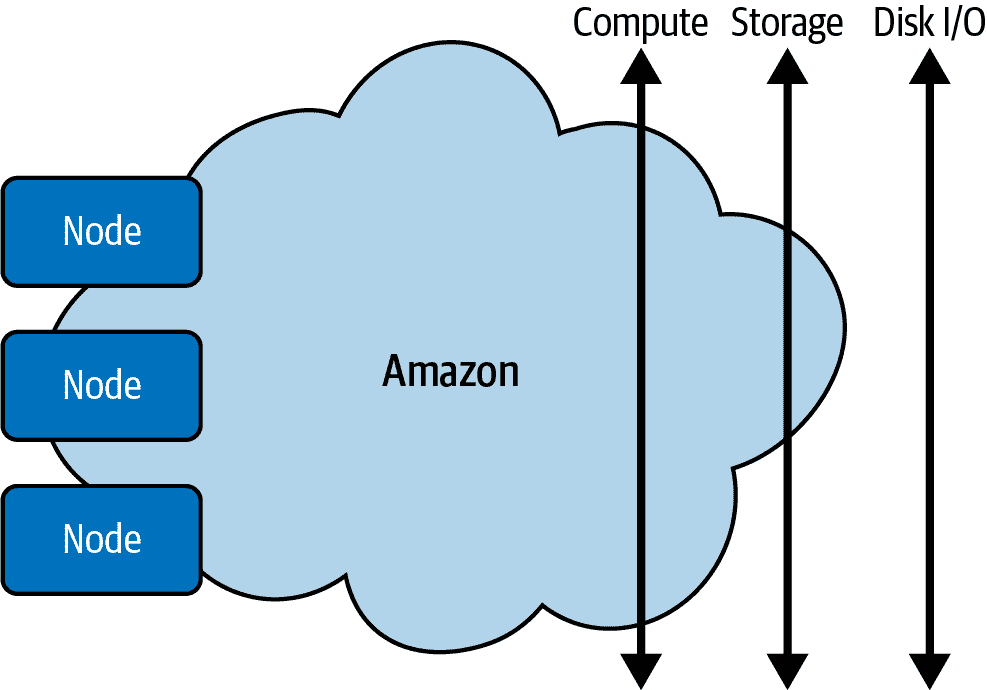
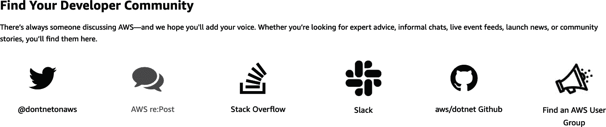

# 第一章 在 AWS 上开始使用.NET

本章涵盖了在 AWS 上使用 C#进行首日工作时的基本支架。这些基本支架包括使用 AWS CloudShell 等基于云的开发环境，以及利用 AWS SDK 的传统 Visual Studio 开发环境。

本书的材料通过添加许多.NET 6 开发的代码示例来帮助你成功。你可以在[本书的源代码库](https://oreil.ly/AWS-with-C-Sharp-examples)中查看这些代码示例。此外，本书涵盖了传统开发方法（如 Visual Studio）和新的云原生策略（如使用 AWS Cloud9 进行开发）。对于所有类型的.NET 开发者都有所涉及。

对于脚本爱好者，还有使用 AWS 命令行界面和 PowerShell 来使用 AWS SDK 的示例。在章末，还提供了讨论问题和练习，帮助你进一步学习所涵盖的课程内容。这些练习是创建全面作品集的极好工具，可以帮助你获得工作。让我们开始简要介绍云计算。

# 什么是云计算？

云计算是通过互联网以及类似公用事业的定价方式交付 IT 资源。与购买和维护物理数据中心和硬件不同，你可以根据需求从云供应商访问 IT 服务，例如计算、存储和数据库。

或许描述云计算的最佳方式是从加州大学伯克利分校可靠自适应分布式系统实验室或 RAD 实验室的角度来看。在他们的论文[“云上之上：伯克利对云计算的看法”](https://oreil.ly/tsBGN)中，他们提到了云计算的三个关键方面：“虚拟化的无限计算资源”，“取消云用户的前期承诺”，以及“按需短期使用计算资源的能力”。让我们更详细地讨论这些内容。

###### 注意

在教授成千上万的学生和工作专业人士云计算之后，我（Noah）对尽快学习的强烈看法。一个关键的绩效指标（KPI）是每周能犯多少错误。在实践中，这意味着尝试事物，感到沮丧，然后找到解决问题的最佳方式，然后尽快重复这样做。

我在课堂上鼓励这种方法的一种方式是通过促使学生每周演示他们正在进行的工作进展，并建立一个作品集。同样，在这本书中，我建议建立一系列 GitHub 项目来记录你的工作，然后制作解释你的项目运作方式的演示视频。这一步实现了两件事情：教授自己更好的元认知技能，并建立一个使你更具市场竞争力的作品集。

虚拟化的无限计算资源

机器学习是“几乎无限”计算资源的一个理想应用案例的绝佳例子。深度学习需要大量的存储、磁盘 I/O 和计算资源。通过弹性计算和存储，Amazon S3 通过数据湖能力打开了以前不存在的工作流程。这种新的工作流程允许用户和系统在其所在的地方操作数据，而不是来回将其移动到工作站或专用文件服务器。请注意，在 图 1-1 中，Amazon S3 存储系统可以无缝处理计算、存储和磁盘 I/O 的扩展，任意数量的访问资源的工作者。Amazon S3 之所以能够做到这一点，不仅因为它具有近乎无限的弹性，还因为它具有冗余属性。这个概念意味着它不仅可以扩展，而且由于设计围绕着“事物总是会失败”的思想，因此几乎总是可用。详见 [“things always fail”](https://oreil.ly/X77BO)。

###### 注意

机器学习的一个定义是从历史数据中学习以创建预测的程序。您可以使用 AWS SageMaker Studio 使用称为 Amazon SageMaker Autopilot 的功能来训练自己的机器学习模型，而无需了解任何关于数据科学的知识。您可以在这里了解更多关于该服务的信息 [here](https://oreil.ly/QsDeC)。



###### 图 1-1\. 几乎无限的计算能力

通过云用户的前期承诺的消除

对于许多初创公司来说，在购买设备并尝试想法之前花费数十万美元是不可行的。云计算在云计算之前通过消除高固定成本的机会性方式来开发软件。不仅如此，您不会像在本地数据中心一样被锁定在特定的技术选择中。

能够根据需要短期支付计算资源的使用

通过切换到可变成本，公司只需支付他们所需的。其结果是更高效的架构，可以响应事件并根据需求进行扩展。正如你所见，云的关键好处在于能够使用弹性功能，即计算和存储。其中一种资源是 AWS 上的弹性文件系统（[EFS](https://aws.amazon.com/efs)）。根据 AWS 的说法，EFS 是一个“简单的、无服务器的、设置即忘的、弹性文件系统”。它与 AWS 的核心弹性能力很好地配合，允许开发人员为任务提供或关闭瞬态资源（如用于任务的竞价实例），同时与所有使用它的机器共享持久性存储进行交互。[*竞价实例*](https://aws.amazon.com/ec2/spot)是您可以竞标并获得高达 90% 成本节约的计算实例，非常适合可以随时运行或是瞬时的工作流程。¹

###### 注意

AWS 非常重视成本优化，并将其作为他们[AWS Well-Architected Framework](https://oreil.ly/LzKgE)支柱之一包含在内。根据 AWS 的说法，“AWS Well-Architected Framework 帮助您理解在 AWS 上构建系统时所做决策的利弊”。Spot 实例是成本优化故事的重要组成部分，因为它们允许您竞标未使用的容量，从而达到高达常规按需定价的 90%的折扣。对于学习某些内容的开发人员来说，这些资源是无价的，因为您只需“按需付费”。

完全托管的网络文件系统如 EFS 非常有用，因为它们提供一致的网络体验，如持久的主目录或数据共享。根据官方[AWS 文档](https://aws.amazon.com/efs)，“Amazon Elastic File System（Amazon EFS）在您添加和删除文件时自动增长和缩小，无需管理或配置”。

在处理大数据时最令人困扰的瓶颈之一是需要更多的计算能力、磁盘 I/O（输入/输出）和存储来处理任务，比如为具有大量数据的公司网站访问统计。特别是，能够无缝地使用可被机群挂载的文件系统（即 EFS）并根据机群的集体工作需求增长，是一种直到云计算出现前都不存在的高效率。

另一个弹性资源是[EC2](https://oreil.ly/dnQh1)虚拟计算环境，也称为实例。EC2 实例是由 AWS 提供的基本可扩展计算能力，具有多种特性，包括使用 Amazon Machine Images（AMI）来打包完整的服务器安装。它们非常适用于扩展 Web 服务、试验原型或竞标剩余容量，如 AWS Spot Instances。Spot Instances 开启了全新的工作方式，因为虚拟机可以是一次性的，即在不需要时丢弃，并在成本低廉时使用。

# 云计算的类型

需要注意的一点是云计算的类型：IaaS（基础设施即服务）、PaaS（平台即服务）、FaaS（函数即服务）和 SaaS（软件即服务）。让我们详细讨论每一种。

IaaS

这个选项提供了云计算的基本构建块，包括网络、存储和计算。它提供了最接近传统 IT 资源的抽象和最大的灵活性。

PaaS

这个选项是一个托管服务，负责所有的 IT 管理工作，使开发人员能够专注于构建业务逻辑。一个极好的 AWS PaaS 示例是[AWS App Runner](https://aws.amazon.com/apprunner)，它允许以最小的努力进行.NET 应用程序的持续交付。这种类型的服务消除了管理 IT 基础设施的需求，使组织能够专注于应用程序的部署和管理。

FaaS

FaaS 作为一种开发范式，令人着迷，因为它允许开发者以思维的速度工作。AWS Lambda 是这一模型的典型例子，因为它自动管理计算资源。² 对于 .NET 开发者来说，这可能是将逻辑部署到云端最有效的方式，因为代码只在响应事件时运行。

SaaS

该选项提供了一个完整的可购买产品，使组织无需托管或开发此类产品即可使用。这类产品的一个绝佳例子是日志和监控分析服务。

其他（“即服务”）

云计算提供了更多的“即服务”选择。稍后本书将更详细地讨论这些服务。

普遍的直觉是，IaaS 意味着你付出较少但需要做更多工作，SaaS 意味着你付出更多但做的事情较少，而 PaaS 则处于中间位置。³ 这个概念类似于走进一个大型仓储店，要么买面粉做披萨，要么买冷冻披萨，要么在出门时在柜台上买一片现成的披萨。无论是披萨还是软件，当你有专业知识和时间自己动手时，你付出较少但需要做更多工作。或者，利用专家提供的更高级别服务的便利性，如热披萨，是值得的。

虽然 IaaS 的原始成本可能较低，但它更接近在物理数据中传统做法，这并不总是意味着更便宜。由于需要支付高素质员工来开发和管理 IaaS 上的应用程序，因此 IaaS 的总投资回报率（ROI）可能更高。此外，一些传统范式，如在虚拟机中运行 Web 服务，可能比仅在调用时运行的事件驱动 AWS Lambda 函数更昂贵。

描述像 AWS Lambda 这样高效的事件驱动服务的另一种方式是将其称为*云原生服务*。云原生服务是云计算所可能带来效率的新服务，提供了传统 IT 基础设施不可用的范式，如响应 Web 事件与全天候运行 Web 服务器不同。具体而言，AWS Lambda 函数一天可能只需要几秒钟的计算时间。而传统的 Web 服务则会无论收到每秒数千次请求还是一天仅接收十几个请求，都会全天候运行。这个概念类似停车场里的灯光：你可以浪费电力点亮空荡荡的车库，也可以使用传感器灯，只有检测到运动时才会开启。在这种情况下，如果考虑到构建所需的资源和应用运行时的低效性的投入回报率，IaaS 可能是一种更昂贵的解决方案。

另一种称呼那些不需要或只需要很少管理的服务是 *managed services* 。Amazon CloudSearch 是一个管理服务的绝佳例子。在 AWS 云中，这种管理服务使得为你的网站或应用程序建立、管理和扩展搜索解决方案变得简单和经济高效。与之相反的是需要专家来设置、运行和维护的 IaaS 服务。

###### 注意

AWS 使用术语 *managed services* 来指代 PaaS、SaaS 和 FaaS 服务。在 AWS 文档中，你可能只会看到 *managed services* 这个术语的使用。

接下来，让我们深入了解如何开始使用 AWS。

# 开始使用 AWS

开始使用 AWS 的理想方式是注册一个[免费使用层账户](https://aws.amazon.com/free)。当你首次创建账户时，请注意需要设置一个账户名和根用户的电子邮件地址，如图 1-2 所示。


###### 图 1-2\. 注册 AWS

创建账户后，首先要做的事情是将 AWS 账户根用户访问密钥锁定起来。[⁴]关于如何锁定 AWS 账户根用户访问密钥的详细步骤，请参考[⁴]。

这是因为如果暴露账户凭据，可能会失去对 AWS 账户的控制。一个基本的安全原则是最小权限原则（PLP），它指出你应该“从最小的权限集开始，并根据需要授予其他权限”。此外，根用户账户应该在 AWS 根用户账户上启用 AWS 多因素认证（MFA）来查看如何使用 MFA 保护你的账户的逐步说明。[⁶]关于如何使用 MFA 保护你的账户的详细步骤，请参考[⁶]。

###### 注意

值得注意的是，在快速上手云计算过程中的一个标准障碍是术语。幸运的是，AWS 有一个详尽和更新的[术语表](https://oreil.ly/5s83K)，值得收藏。

通过 AWS Web 控制台是使用 AWS 的简单方法。我们接下来来解决这个问题。

## 使用 AWS 管理控制台

如图 Figure 1-3 所示，AWS 管理控制台是从 Web 浏览器控制 AWS 的中心位置。服务选项卡显示了平台上每个服务的分层视图。在该选项卡旁边是一个搜索框，允许您搜索服务。我们经常使用搜索框，因为它通常是导航到服务的最快方式。在搜索框旁边是 AWS CloudShell 图标，显示为黑白终端图标。[这项服务](https://aws.amazon.com/cloudshell) 是在 AWS 平台上快速尝试命令的好方法，例如列出您账户中的[S3 存储桶](https://oreil.ly/SvdPd) — 对象存储的容器 — 或运行针对管理的自然语言处理 API 如[AWS Comprehend](https://aws.amazon.com/comprehend) 的命令。

###### 注意

在概念上，S3 存储桶类似于消费者云存储，如 Dropbox、Box 或 Google Drive。

带圈的 N. Virginia 选项卡显示了当前使用的 AWS 区域。经常切换到不同的区域来启动虚拟机或尝试另一个区域中的服务是很常见的。通常，但并非总是这样，新服务首先会出现在 N. Virginia 地区，所以根据您的组织使用的区域，可能需要切换到 N. Virginia 来尝试新服务，然后再切回去。同样，如果新服务出现在像 US West（Oregon）这样的不同区域，您可能会发现自己在那个区域尝试新服务，然后需要切换回您的主要区域。


###### 图 1-3\. 使用 AWS 控制台

###### 注意

[服务成本](https://oreil.ly/QU1ur)和数据迁出 AWS 的成本可能因区域而异。

最后，最近访问选项卡显示了最近使用的服务。在长时间使用 AWS 后，大多数日常服务通常会出现在这个部分，提供一个有用的快捷菜单来使用 AWS。另一个需要注意的是，您可以在控制台中给一个项目加星标（Figure 1-4）。这个过程可以是访问经常使用的服务的便捷方式。


###### 图 1-4\. AWS 管理控制台中的收藏夹

接下来，让我们看看如何利用 AWS 社区和文档资源。

## 利用 AWS 社区和文档

AWS 平台提供了大量不同形式和深度的文档，可供学习。接下来让我们讨论这些资源。

### .NET on AWS 网站

[.NET on AWS 网站](https://oreil.ly/cS5eZ)是关于在 AWS 上使用.NET 的信息中心。从这里，读者可以找到服务和 SDK 文档、AWS 工具包和迁移工具、入门教程、开发者社区链接以及其他内容。

对于 .NET 开发者来说，将这个网站加入书签是明智的，因为它提供了有帮助的资源的策划视图。我最喜欢的部分之一是 [.NET 社区选项卡](https://oreil.ly/de3mt)。这一部分包含了许多流行的开发者社区的链接，如图 1-5 所示，包括 Twitter、re:Post、Stack Overflow、Slack、GitHub 和全球 AWS 用户组。⁸



###### 图 1-5\. .NET 的开发者社区

社区门户的一个更有价值的部分之一是到 YouTube 频道和开发者博客的链接。最后，还有 AWS 投资的开源 .NET 项目的链接，包括 [.NET on AWS](https://github.com/aws/dotnet) 和 [AWS SDK for .NET](https://github.com/aws/aws-sdk-net)。

接下来，让我们看看 AWS SDK for .NET 文档。

### AWS SDK for .NET 文档

你可以通过[官方网站](https://aws.amazon.com/sdk-for-net)了解如何使用 AWS SDK for .NET 开发和部署应用程序。该网站包含几个重要的指南，包括[开发者指南](https://oreil.ly/4xmTZ)，[API 参考指南](https://oreil.ly/EHPkN)，和[SDK 代码示例指南](https://oreil.ly/Y0f0G)。

另一个重要资源是 AWS 上必要的开发 .NET 工具，如图 1-6 所示。这些工具包括 Rider 的 AWS Toolkit，Visual Studio 的 AWS Toolkit，Visual Studio Code 的 AWS Toolkit，以及 Azure DevOps 的 AWS 工具。


###### 图 1-6\. 探索 AWS 上的 .NET 工具

我们稍后会深入研究本章的 AWS SDK。接下来，让我们看看 AWS 服务文档。

### AWS 服务文档

AWS 有如此多的服务，初次理解哪种服务适合手头的任务可能有些困难。幸运的是，有一个集中的网页，[AWS 文档网站](https://docs.aws.amazon.com)，其中包括指南和 API 参考、教程和项目、SDK 和工具包，以及常见问题解答和案例研究的链接。

一个需要注意的项目是 AWS 拥有许多 SDK 和工具包，如图 1-7 所示，包括 AWS CLI。对于 .NET 开发者来说，看多种语言的示例以获取构建解决方案的想法是非常有帮助的。[AWS 命令行界面](https://aws.amazon.com/cli)通常是服务的最有效文档，因为它以易于理解的方式抽象了概念。这个概念的一个很好的例子是以下递归复制文件夹到 AWS S3 对象存储的命令：

```cs
aws s3 cp myfolder s3://mybucket/myfolder --recursive
```

每个空格分隔命令的动作，例如，首先`aws`然后` s3`用于服务，`s3`动作，和其余命令。在许多情况下，从命令行调用 AWS 上的服务是学习的最快方式。


###### 图 1-7\. 探索 AWS SDK 和工具包

接下来，让我们谈谈安装 AWS 命令行。

## 使用 AWS 命令行界面

根据[官方 AWS 文档](https://aws.amazon.com/cli)，“AWS 命令行界面（CLI）是一个统一的工具，用于管理您的 AWS 服务。只需下载并配置一个工具，您就可以从命令行控制多个 AWS 服务并通过脚本自动化它们。”

有四种基本方法与 AWS 命令行界面进行交互。⁹ 让我们简要讨论每一种方法。

AWS CloudShell

[AWS CloudShell](https://aws.amazon.com/cloudshell)是一款基于浏览器的云原生 Shell，这意味着它利用云的独特属性为您预先安装了 AWS CLI。您可以选择 Bash Shell、PowerShell 或 Z Shell 之间的任一种。

AWS Cloud9

[AWS Cloud9](https://aws.amazon.com/cloud9)是一款云原生交互式开发环境（IDE），具有深入的 AWS 集成和适用于在云中进行开发的独特开发工具。

Linux shells

通过使用[Amazon Linux 2 AMI](https://oreil.ly/rWRSi)，您自动获得用于 AWS 集成的命令行工具。或者，您可以在任何[Linux 系统](https://oreil.ly/xVxX1)上安装 AWS CLI。

Windows 命令行

[托管的 AWS Windows AMIs](https://oreil.ly/iX5tt)附带 AWS CLI。或者，您可以下载并运行[64 位 Windows 安装程序](https://oreil.ly/0qrv9)。

接下来，让我们讨论每种方法的安装说明。

###### 注意

您可以观看关于如何使用 AWS CloudShell 的更详细演示，包括与 Bash、ZSH、PowerShell、S3、Lambda、Python、IPython、Pip、Boto3、DynamoDB 和 Cloud9 的交互，这些演示可在[YouTube](https://oreil.ly/F9y5o)或[O'Reilly](https://oreil.ly/4J4Me)上找到。

如何安装 AWS CloudShell 和 AWS Cloud9

对于 AWS CloudShell 和 AWS Cloud9，无需安装过程，因为它们已包含在 AWS 控制台体验中，如图 1-8 所示。注意，在搜索结果中同时找到这两个工具，允许您“标记”（即添加到收藏夹）或单击它们。最后，终端图标还可以启动 AWS CloudShell。这些云原生终端的一个关键优势是它们是完全托管和自动更新的，并自动管理您的凭据。


###### 图 1-8\. 选择 AWS Cloud9 和 AWS CloudShell

如何安装 AWS CLI

AWS CLI 安装包含 AWS Cloud9 或 AWS CloudShell。如果您需要在 Windows 本地安装 AWS CLI，可以在 AWS 网站上找到[详细指南](https://oreil.ly/JDsuk)。  

如何安装 AWSPowerShell.NETCore for AWS

如果你需要在 Windows、Linux 或 macOS 上本地运行 AWS 的 PowerShell，你可以参考 [PowerShell Gallery](https://oreil.ly/omRZp) 查找 AWSPowerShell.NETCore 的最新版本及安装说明。AWSPowerShell.NETCore 是推荐用于与 AWS 工作的 PowerShell 版本，因为它具有全面的跨平台支持。通常情况下，你可以使用以下 PowerShell 命令进行安装：`Install-Module -Name AWSPowerShell.NetCore`。

在本地操作系统上安装 PowerShell 的替代方法是使用 AWS CloudShell，因为它预装了 PowerShell。接下来，让我们看看这个过程是如何运作的。

### 使用 AWS CloudShell 中的 PowerShell

有关使用 AWS PowerShell 工具的优秀指南可以在 [AWS 网站](https://oreil.ly/zOG86) 上找到。让我们看一个简单的例子来补充官方文档。在以下示例中，如 图 1-9 所示，我们通过调用 `New-S3Bucket` cmdlet 来创建一个新的 Amazon S3 存储桶。


###### 图 1-9\. 在 AWS PowerShell 中创建 AWS 存储桶

接下来，我们可以转到 AWS 控制台，选择 S3，并验证其是否显示，如 图 1-10 所示。


###### 图 1-10\. 在 AWS S3 控制台中显示 AWS 存储桶

值得一提的是，AWS 的 PowerShell 提供了一个复杂和高级的界面，用于控制和与 AWS 的服务（包括 EC2、S3、Lambda 等）交互。你可以在 [AWS 文档](https://oreil.ly/2V072) 中进一步探索这些功能。

AWS CloudShell 支持三种 shell：PowerShell、Bash 和 Z shell。要使用 PowerShell，你可以输入 **`pwsh`**。你可以通过官方的 [文档](https://oreil.ly/z1CC4) 探索 AWS CloudShell 的所有功能。AWS CloudShell 提供了 1GB 的持久存储空间，位于 */home/cloudshell-user*。如 图 1-11 所示，操作菜单允许你执行许多实用操作，包括下载和上传文件、重新启动终端、删除主目录中的数据以及配置终端的标签布局。


###### 图 1-11\. AWS CloudShell 操作菜单

幸运的是，AWS CloudShell 的 PowerShell 用法非常简单，类似于本地的 PowerShell。首先，要使用 `AWSPowerShell.NetCore`，请按以下顺序导入它，将内容回显到文件中，并将其写入先前创建的存储桶中。最后，运行 `Get-S3Object` 来验证文件在 S3 中的创建情况，你可以在 图 1-12 中看到。

```cs
Import-Module AWSPowerShell.NetCore
echo "This is data" > data.txt
Write-S3Object -BucketName silly-name-1234 -File data.txt
Get-S3Object
```


###### 图 1-12\. AWS CloudShell 创建文件 S3

云外壳（CloudShell）和 PowerShell 环境的另一个特性是调用 C# 代码。要开始使用 PowerShell 和 C#，你可以创建一个 C# 片段并嵌入到名为 *./hello-ps-c-sharp.ps1* 的脚本中。C# 代码在 `$code = @"` 块之后，并在 `"@` 终止。总体思路是，如果你在 AWS CloudShell 中使用 PowerShell，可以使用现有的有用 C# 片段来增强 PowerShell 脚本，而不需要完整的编辑器：

```cs
$code = @"
using System;
namespace HelloWorld
{
 public class Program
 {
 public static void Main(){
 Console.WriteLine("Hello AWS Cloudshell!");
                }
        }
}
"@

Add-Type -TypeDefinition $code -Language CSharp
iex "[HelloWorld.Program]::Main()"

Install-Module -Name AWS.Tools.Installer -Force
```

接下来，在你的 PowerShell 提示符中运行它：

```cs
PS /home/cloudshell-user> ./hello-ps-c-sharp.ps1
Hello AWS Cloudshell!
PS /home/cloudshell-user>
```

根据特定情境选择使用 Bash 或 PowerShell。如果涉及纯粹的 .NET 功能，那么 PowerShell 是一个简单的选择。另一方面，你可能会在 AWS 网站上找到一些关于使用 Bash 脚本解决方案的文档。与其重写示例，不如直接使用并在 Bash 中扩展，这样可以节省时间。

在下面的示例中，我们使用一个 Bash 哈希来存储 Cloud9 的 ID 列表，然后获取关于它们的信息：

```cs
#!/usr/bin/env bash
# Loop through a list of Cloud9 Environments to find out more information

declare -A cloud9Env=([env1]="18acd120518340df8a73ccaab641851e"\
    [env2]="2c9eb66bf53b4083b9ab6345bae70dad"\
    [env3]="f104b0141c284a41af0c75fea7890770" )

## now loop through the above hash to get more information
for env in "${!cloud9Env[@]}"; do
   echo "Information for $env: "
   aws cloud9 describe-environments --environment-id "${cloud9Env[$env]}"
done
```

在这种特定情况下，我们不必使用 Bash，因为有关如何在 AWS 中使用 PowerShell 解决问题的优秀文档。PowerShell 可以像 Bash 一样做同样的事情，并且具有深度的 C# 集成。请注意以下示例展示了通过 PowerShell 循环遍历存储在哈希中的多个 ID 的方法：

```cs
# PowerShell script that loops through Cloud9 to get environment information

$cloud9Env = @{ env1 = "18acd120518340df8a73ccaab641851e";
                env2 = "2c9eb66bf53b4083b9ab6345bae70dad";
                env3 = "f104b0141c284a41af0c75fea7890770" }

foreach ($env in $cloud9Env.GetEnumerator()) {
            Write-Host "Information for $($env.Key):";
            Get-C9EnvironmentData $($env.Value)
}
```

总结一下，AWS CloudShell 对于 C# 开发者来说是一个很好的伴侣，值得放入你的工具包中。现在让我们使用 Visual Studio 来开发 AWS，这是有经验的 .NET 开发者使用 AWS 的首选环境。

## 使用 Visual Studio 开发 AWS 和 AWS Toolkit for Visual Studio

使用 Visual Studio 开发 AWS 是一个简单直接的过程。所需组件包括 AWS 账号、运行受支持版本的 Windows 的机器、Visual Studio Community 版或更高版本，以及 [AWS Toolkit for Visual Studio](https://aws.amazon.com/visualstudio)。如果这是你第一次配置，请参阅官方 AWS 文档以获取有关设置 Visual Studio 开发 AWS 的进一步细节。

###### 注意

如果你想使用最新的 .NET 6 特性，需要使用 Visual Studio 2022。在实践中，使用最新版本的 Visual Studio 在 Windows 环境中可以获得最佳的 Visual Studio 与 AWS 深度集成体验。例如，有 Mac 版本的 Visual Studio，但 AWS Toolkit 在 Mac 上无法工作。

AWS SDK for .NET 与 Visual Studio 环境深度集成，如 Figure 1-13 所示。它包括通过作为 AWS Toolkit for Visual Studio 一部分安装的 AWS Explorer 集成与 AWS 核心服务（包括 Amazon S3 和 Amazon EC2）进行交互。


###### 图 1-13\. AWS SDK for .NET

根据官方 AWS 文档，AWS Toolkit for Visual Studio 是运行在 Microsoft Windows 上的 Microsoft Visual Studio 的扩展，使开发者能够“更轻松地使用亚马逊网络服务开发、调试和部署.NET 应用程序”。此集成包括多种部署应用程序和管理服务的方法。这种集成的一个组件体现在服务器资源管理器工具箱或 AWS Explorer 中，如图 1-14 所示。AWS Explorer 允许您在 Microsoft Windows Visual Studio 环境中管理和与 AWS 资源如 Amazon S3 或 EC2 实例交互。

注意，通过单击鼠标可以轻松进入许多热门的 AWS 服务。

Visual Studio 是.NET 的流行开发工具，有两个原因：它既是一款出色的编辑器，也是.NET 开发者丰富的生态系统。AWS Toolkit for Visual Studio 作为 Microsoft Visual Studio 在 Windows 上的扩展，融入了这一生态系统，使开发者能够更轻松地使用亚马逊网络服务开发、调试和部署.NET 应用程序。您可以通过查阅[安装程序的官方文档](https://oreil.ly/v2Xne)来查看所有可用功能的完整列表。

###### 注意

注意，[Visual Studio Code](https://oreil.ly/yWme7)和[JetBrains Rider](https://oreil.ly/vVrq5)都有 AWS 工具包。


###### 图 1-14\. AWS Explorer

安装 AWS Explorer 确实需要三个关键步骤：¹⁰

1.  安装 AWS Toolkit for Visual Studio

    下载[*AWS Toolkit for Visual Studio 2022*](https://oreil.ly/v2Xne)并在安装了 Microsoft Visual Studio 的 Windows 机器上安装此软件包。

1.  创建 IAM 用户并下载凭据

    在 AWS 控制台中创建 IAM 用户，并应用*最小特权原则*。¹¹ 确保您选择访问密钥选项，如图 1-15 所示，并在提示时以 CSV 格式下载凭据。


###### 图 1-15\. 为 Visual Studio 创建 IAM 用户

1.  将凭据添加到 Visual Studio

    最后，在 AWS Explorer 中添加您以 CSV 格式下载的凭据，如图 1-16 所示。

###### 注意

在将 AWS 密钥下载到任何本地开发机器上时，需要特别注意，因为如果它们被 compromise，那么拥有它们的人就可以利用这些密钥的权限。使用 PLP，开发者应该选择仅与在 AWS 上创建解决方案所需的功能严格对应的 IAM 权限。


###### 图 1-16\. 添加凭据

一旦 AWS Toolkit for Visual Studio 安装完成，同样要注意及时更新工具，如 图 1-17 所示，因为它正在积极开发中，具有来自 AWS 的新功能。在 Visual Studio 中，您将会看到 AWS Toolkit for Visual Studio 的新更新通知。


###### 图 1-17\. 升级 AWS Toolkit for Visual Studio

接下来，让我们看看如何开始使用 AWS SDK。

## 开始使用 AWS SDK

学习一项新技术的最佳方法是动手构建一些东西。让我们通过创建一个以 AWSSDK.S3 从 NuGet 获取的控制台应用程序来开始使用 AWS SDK。步骤如下：

1.  创建一个新的目标为 .NET 6 的控制台应用程序。

    在 Visual Studio 中，创建一个新的控制台应用程序，作为开发的 AWS S3 工具的载体。

1.  使用 NuGet 安装 AWSSDK.S3。

    加载新创建的控制台应用程序后，选择“工具”，然后是 NuGet 包管理器，接着是“管理解决方案的 NuGet 包”。搜索 AWSSDK.S3 并将其安装到您的控制台项目中。

1.  创建代码。

    通过将 *Program.cs* 文件替换为以下示例中显示的内容来构建以下控制台应用程序。

###### 提示

另一种安装 NuGet 包的方法是右键单击项目，然后选择“管理 NuGet 包”。

```cs
using System;
using System.Threading.Tasks;

// To interact with Amazon S3.
using Amazon.S3;
using Amazon.S3.Model;

// Create an S3 client object.
var s3Client = new AmazonS3Client();

// Display Prompt
Console.WriteLine("AWS Bucket Lister" + Environment.NewLine);

// Process API Calls Async List AWS Buckets
var listResponse = await s3Client.ListBucketsAsync();
Console.WriteLine($"Number of buckets: {listResponse.Buckets.Count}");

// Loop through the AWS buckets
foreach (S3Bucket b in listResponse.Buckets)
{
  Console.WriteLine(b.BucketName);
}
```

###### 注意

对于命令行的爱好者，值得注意的是，您还可以使用 `dotnet` 命令行工具创建一个控制台应用程序，如以下片段所示：`dotnet new console --framework net6.0`¹²。

控制台应用程序的结果详细列出了运行 .NET 应用程序的 AWS 用户拥有的 S3 存储桶列表，如 图 1-18 所示。


###### 图 1-18\. 异步列出存储桶

###### 注意

您还可以观看关于从头开始构建此 S3 控制台应用程序的视频教程，地址为 [O’Reilly](https://oreil.ly/itGcO) 或 [YouTube](https://youtu.be/DGI_Vd04DpM)。

此控制台应用程序的后续步骤是扩展功能，不仅列出存储桶，还可以创建存储桶，如 AWS SDK for .NET 的此 [AWS 教程](https://oreil.ly/jKBKl) 所示。

接下来，让我们总结本章涵盖的所有内容。

# 结论

云计算是技术创新的关键驱动因素，因为它开启了更高效的工作方式¹³。通过利用几乎无限的资源和云原生托管服务，开发人员可以通过专注于问题本身而非与构建解决方案无关的问题（如系统管理），从而提高生产力。本章介绍了如何使用云外壳开始使用亚马逊云服务，首先使用 CloudShell，然后转移到完整的 Visual Studio 代码环境。

Visual Studio 环境受益于 AWS Toolkit，该工具包具有与 AWS Cloud 交互的高级功能。AWS SDK 可以直接通过 NuGet 软件包管理器在 Visual Studio 中使用。AWS SDK 允许直接集成到像控制台应用程序这样的 Visual Studio 解决方案中。我们使用 AWS SDK 构建了利用 AWS S3 等低级服务和 AWS Comprehend 等高级 AI API 的控制台应用程序。

对读者的推荐下一步是查看批判性思维讨论问题，反思如何利用 AWS 的全部功能。您可以使用这些问题与团队或正在学习 AWS 的同事讨论。此外，下面的几个挑战练习建议也是构建针对.NET 6 的 AWS 服务的良好实践。其中一些服务尚未详细介绍，因此您可以在稍后的章节中跳过它们。

接下来，在第二章，我们将介绍 AWS 核心服务。这些包括 AWS 存储、EC2 计算以及像 DynamoDB 之类的服务。这些服务是构建利用.NET 生态系统强大功能的云原生应用程序的基础。

# 批判性思维讨论问题

+   在 AWS Cloudshell 中使用 Bash 与 PowerShell 有哪些关键区别？

+   何时使用 PowerShell 而不是 Bash 以及反之，将会带来什么优势？

+   如何通过掌握命令行工具`dotnet`来提高生产力？

+   AWS Toolkit for Visual Studio 对您的组织中的非开发人员，如运营团队，是否有好处？为什么？

+   使用从 Visual Studio 直接部署的方法原型化 C# Web 服务有什么优势？

# 挑战练习

+   构建一个 C#或 F#控制台应用程序并部署到 AWS CloudShell。考虑云端开发环境的独特属性如何帮助您在 AWS 云上自动化工作流程，考虑到它们不需要 API 密钥，而且可以在不需要部署到 AWS 计算服务的情况下使用。

+   参考 AWS CDK 文档（C#）并通过 CDK 创建一个 S3 存储桶。

+   使用 Visual Studio 和[AWS Toolkit for Visual Studio Code](https://oreil.ly/yWme7)构建和部署一个 Elastic Beanstalk 应用程序。

+   在 Visual Studio 中使用 NuGet 安装 600 多个可用的 AWS 包之一。

+   使用 AWS 控制台创建一个 hello world AWS Lambda 函数，然后通过 VS Code 和 AWS Toolkit for Visual Studio Code 调用它。

¹ 您可以在《Python for DevOps》（O’Reilly）的第六章中详细了解 EFS 和 spot 实例。

² AWS 白皮书“在 AWS 上开发和部署.NET 应用程序”解释了 AWS Lambda 的机制。

³ 您可以在他们的[“Amazon Web Services 概述”白皮书](https://oreil.ly/aPuLH)中详细了解 AWS 对云计算的看法。

⁴ AWS 身份和访问管理指南列有详细的列表[*https://oreil.ly/x90WL*](https://oreil.ly/x90WL)。

⁵ 要创建管理员 IAM 用户，请参阅[官方 AWS 指南](https://oreil.ly/ogmRn)。

⁶ 参见[AWS 多因素认证指南](https://oreil.ly/6a24r)。

⁷ 您可以在[官方文档中](https://oreil.ly/UT4d1)详细了解 AWS 管理控制台。

⁸ 此外，还有一些链接指向著名的.NET 开发者，如[Norm Johanson](https://oreil.ly/P9DOO)、[François Bouteruche](https://oreil.ly/AcSmE)和[Steve Roberts](https://oreil.ly/rV9m7)。

⁹ 有一份详细的[用户指南](https://oreil.ly/XmZuZ)，介绍如何与 AWS 命令行界面交互。

¹⁰ 有一份详细的[AWS Toolkit for Visual Studio 设置指南](https://oreil.ly/9ikNn)可供参考。

¹¹ 在 AWS 文档中有一份关于最小权限原则（PLP）概念的[详细指南](https://oreil.ly/4kG24)。PLP 的核心思想是只在需要时授予权限。

¹² AWS Lambda 等其他服务也提供了一个便捷的方式来[通过命令行创建应用程序](https://oreil.ly/cagaL)。

¹³ 亚马逊在云计算领域的领导地位部分归因于其文化，其领导原则包括节俭、客户至上、发明和简化等。您可以在[亚马逊的领导原则](https://www.amazon.jobs/en/principles)中了解更多。

¹⁴ AWS CDK 是一个库，自动化部署 AWS 资源。
