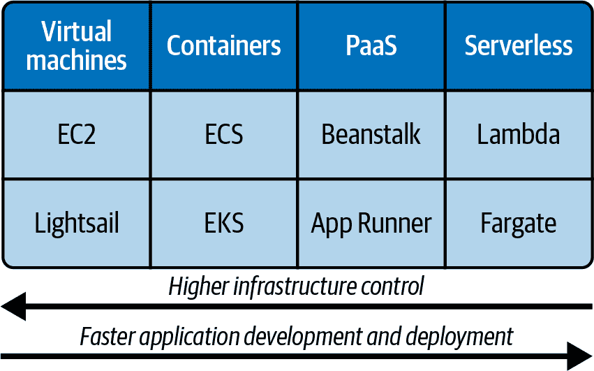
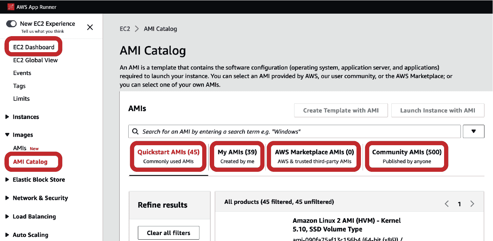
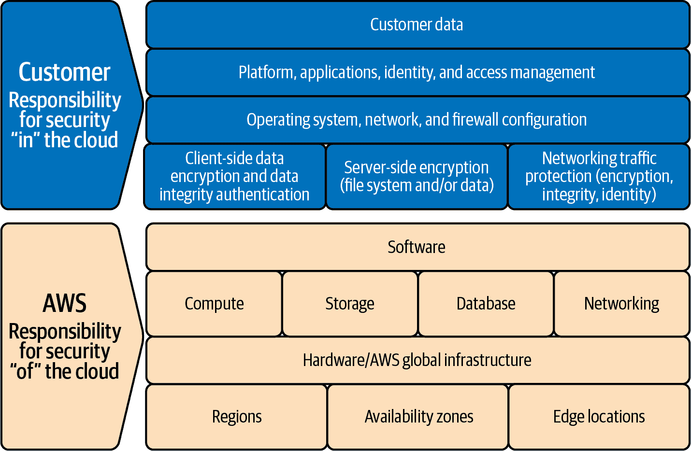
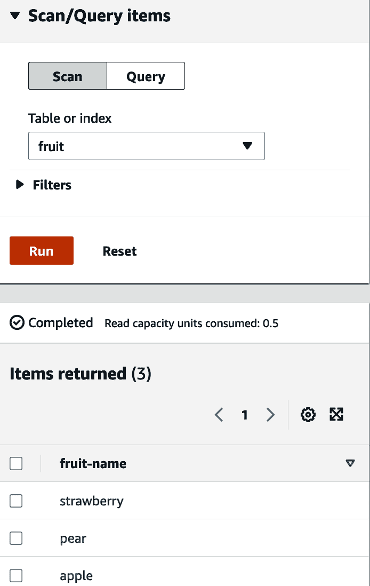
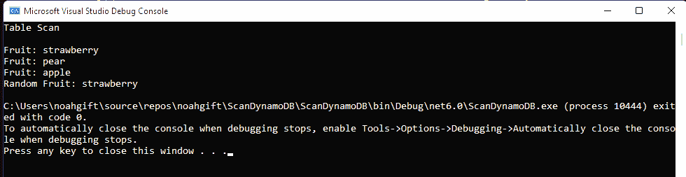

# 第二章：AWS 核心服务

构建房屋最流行的原材料包括钢铁、砖块、石头和木材。这些原材料各具独特的属性，使得建筑师能够建造房屋。类似地，AWS 核心服务是构建复杂系统所需的基础材料。从高层次来看，这些服务包括计算和存储。

当房屋建造者建造房屋时，他们遵循全面的建筑规范，通常从一种被称为[I-Codes](https://oreil.ly/MLp72)的国际标准中获取。根据国际代码理事会，这些现代安全规范旨在帮助确保“安全、可持续、经济实惠和弹性结构”的工程。类似地，[AWS Well-Architected Framework](https://oreil.ly/Nxhnd)根据 AWS 的说法提供“指导，帮助客户在设计、交付和维护 AWS 环境中应用最佳实践”。

这些[通用设计原则](https://oreil.ly/IVCQk)在有效使用 AWS 核心服务方面至关重要。让我们简要讨论它们：

停止猜测您的容量需求

简而言之，猜测容量是一种不良策略。相反，系统应该具备动态添加或移除资源的能力。

在生产规模上测试系统

云允许资源的完全自动化配置；这使得开发人员能够在与生产环境完全相同的环境中测试应用程序。能够复制生产环境解决了软件工程行业普遍存在的“在我的机器上可行”的问题。

自动化以简化架构实验

自动化会在长期内减少工作量，使开发人员能够审计、跟踪变更并在需要时回滚。

允许演进式架构

核心思想是设计一个预期会变化的系统。在设计软件时，我们应该考虑动态的自然系统，例如树木和河流，而不是静态的系统，例如桥梁或道路。

利用数据驱动架构

数据科学是一门流行的学科，但它不仅仅局限于业务问题。软件系统需要利用数据科学来识别必要的变化，以保持系统按设计性能运行。

通过游戏日不断改进

一个充分架构的系统需要定期进行完整的模拟运行；没有这样做可能无法彻底测试所有情景。

在我们继续本章之前，请记住这些原则。接下来，让我们更详细地讨论 AWS 存储。

# AWS 存储

存储是一个简单表面上看起来简单但可以迅速复杂化的示例。在 AWS 存储的核心是 Amazon 简单存储服务，也称为[AWS S3](https://docs.aws.amazon.com/s3/index.xhtml)。它于 2006 年推出，是 AWS 向公众提供的第一个服务之一。截至 2021 年，存储在 S3 中的对象数量为 100 万亿。¹如果你想要一个“大数据”的例子，这就是最好的。

虽然 S3 是 AWS 推出的第一个存储解决方案，但还有许多其他选择。以.NET 开发者为中心的观点，开始的一种方式是将存储分为两大类：核心存储和数据库。

让我们简要地分解这两者。

核心存储

核心存储指的是 AWS 所有服务使用的低级存储组件，包括对象存储 Amazon S3 和 Amazon Elastic Block Store (EBS)。AWS 核心存储选项包括对象存储 Amazon S3，[Amazon Elastic Block Store (EBS)](https://aws.amazon.com/ebs)，完全托管的网络文件存储，如 [Amazon File System (EFS)](https://aws.amazon.com/efs)，以及 [Amazon FSx for Windows File Server](https://aws.amazon.com/fsx/windows)（FSx 选项的一个示例），最后还包括[AWS 备份和存储网关](https://oreil.ly/3Zz6U)等实用存储服务。

数据库

从高层次来看，数据库是从计算机系统访问的组织数据集合。数据库存储选项包括关系数据库，包括 [Amazon RDS](https://aws.amazon.com/rds)，键值数据库 [Amazon DynamoDB](https://aws.amazon.com/dynamodb)，以及类似 [Amazon Neptune](https://oreil.ly/XdkCw)（用于查询基于图形的数据）的特殊用途数据库。

接下来我们深入了解如何使用 S3 存储。掌握 S3 存储是至关重要的，因为它提供了多种成本效益的层次来处理对象数据。

## 使用 S3 存储开发

一种看待 S3 的方式是作为一个高级服务，以规模存储和检索对象。对于开发者来说，这个视角使你可以专注于开发应用程序的业务逻辑，而不是管理高性能对象存储系统。让我们首先确定 Amazon S3 的关键优势：

耐久性

*耐久性* 是指确保数据不丢失的概念。S3 标准存储层提供了 99.999999999%（即十一个 9）的[耐久性](https://aws.amazon.com/s3/faqs)。

可用性

*可用性* 是指在需要时访问数据的概念。S3 标准存储层具有 99.99%（即四个 9）的可用性。

可扩展性

*可扩展性* 是增加容量以满足需求的能力。S3 作为托管服务，在磁盘 I/O 和存储方面提供几乎无限的容量。它可以存储大小不超过 5TB 的单个对象。

安全性

S3 具有细粒度的访问控制以及在传输和静态状态下的加密。

性能

S3 文件系统的性能支持许多不同的访问模式，包括流式传输、大文件、机器学习和大数据。

作为开发者与 S3 交互有几种不同的方式。第一种选项是通过 .NET SDK。在 第一章 中列出 S3 存储桶的示例是这一过程的一个很好的例子。您还可以通过使用使用 S3 的托管服务间接与 S3 交互。使用 S3 的这些托管服务的示例包括 AWS Athena² 和 AWS SageMaker。通过 [Athena](https://aws.amazon.com/athena)，您可以通过无服务器 SQL 查询查询所有 S3，但无需担心处理服务器的物流。同样，Amazon SageMaker³，一个完全托管的机器学习服务，大量使用 S3 来训练机器学习模型和存储模型工件。其中一个关键原因是 S3 是无服务器的，并且无需用户管理即可扩展。

另一种使用 S3 的方式是利用 [S3 生命周期配置](https://oreil.ly/g0lpM)。生命周期配置允许复杂的自动化工作流将数据迁移到不同的存储层级和归档数据。让我们看看这些存储类别。

S3 标准

针对频繁访问的数据非常理想，并且对包括云原生应用、内容、游戏和大数据在内的各种用例都非常有帮助。

S3 标准 IA（不经常访问）

这种存储类别与 S3 标准具有相同的好处，但提供了不同的成本模型，使其非常适合诸如旧日志文件之类的项目，因为检索成本较高。

S3 单区域-IA

单区域 ([存储数据在单个可用区](https://oreil.ly/suFRM)) 选项对于希望最低成本的情况非常有帮助。一个示例用例是次要备份，因为它作为数据的次要副本在主要备份系统故障时保护数据免受永久丢失的影响而具有成本效益。

亚马逊 S3 冰川深度归档

Glacier 是一个安全、耐用且成本低廉的选项，非常适合数据归档。它与 S3 生命周期配合良好，作为最终交付点。

在 图 2-1 中，你可以看到亚马逊 S3 如何在数据活动的中心起到独特作用，不仅仅是存储媒体资产或 HTML 文件。在构建全球规模平台或机器学习系统时的一个挑战性约束是存储容量和磁盘 I/O。AWS 提供了核心服务 S3，消除了这些约束。因此，S3 的弹性特性与近乎无限的存储和磁盘 I/O 创造了一种新型工作流程，AWS 管理的服务建立在这个核心服务之上，例如 [AWS SageMaker](https://oreil.ly/x5n5M) 或 [AWS Glue](https://oreil.ly/XYwNg)。


###### 图 2-1\. S3 对象存储作为中心枢纽

###### 注

诺亚最喜欢的 Amazon S3 使用案例之一是托管静态网站。在 O’Reilly 的书籍 *Python for DevOps* 中，他详细介绍了如何构建一个使用 [Hugo](https://gohugo.io) 网站，该网站使用 [AWS CodePipeline](https://aws.amazon.com/codepipeline)、Amazon S3 和 [Amazon CloudFront CDN](https://aws.amazon.com/cloudfront)。您还可以在 [YouTube](https://oreil.ly/3pLIJ) 和 [O’Reilly](https://oreil.ly/qRzVl) 上查看部署 Hugo S3 网站到 AWS 所需步骤的详细演示。

AWS 利用 S3 的另一个突出例子是通过 [Athena](https://oreil.ly/3R0zl) 查询日志文件。

现在您了解了 S3 对象存储的不同存储类别，让我们讨论 Elastic Block Store（EBS）存储。

## 使用 EBS 存储进行开发

EBS 是高性能的网络附加存储。[EBS 存储](https://aws.amazon.com/ebs) 通过将块存储挂载到单个 EC2 实例来工作。EBS 卷类似于原始的 [未格式化的块设备](https://oreil.ly/DiuJq)（物理硬盘），但被虚拟化并作为服务提供。最后，EBS 是与 EC2 实例附加的块级存储，与 S3 不同，后者独立存在，将数据存储为对象，并可从多个实例访问。

让我们讨论 EBS 的关键优势和使用场景。

优势

EBS 存储用于数据需要快速访问但具有长期持久性。这种存储类型提供了专用的高性能网络连接和分配磁盘 I/O 的能力。其他关键功能包括为备份创建快照到 S3 或创建自定义 Amazon Machine Images（AMIs）。

使用案例

EBS 存储非常适合 Web 应用程序和数据库存储。高性能的专用磁盘 I/O 也非常适合构建通过 Server Message Block（SMB）或 Network File System（NFS）协议共享数据的高性能文件服务器。

EBS 的一个显著用途是通过 [io2 Block Express](https://oreil.ly/K7hok) 提供高性能的每秒 IOPS（输入/输出操作）创建“云中的 SAN”，如 Figure 2-2 所示。注意，以这种方式配置的 EBS 存储能够创建一个高性能的 Microsoft SQL Server 实例，作为商业智能（BI）系统的核心。

此 BI Web 服务可以通过 Elastic Beanstalk 提供 ASP .NET Web 服务，从而在数据密集型查询在高峰期间达到峰值时实现快速自动扩展。“云中的 SAN” 概念的其他使用案例包括部署高性能 NoSQL 服务器或专业分析平台，如 SAP HANA 或 SAS Analytics。


###### 图 2-2\. 云中带有 SQL Server 的 EBS SAN

###### 注意

另一种存储类型是[实例存储](https://oreil.ly/tHqaY)。这种存储类型是实例的临时块存储，非常适合缓冲区、缓存或临时分区。与实例存储的一个关键区别是，您不能将实例存储卷从一个实例分离并附加到另一个实例上。与 EBS 存储不同，实例存储在实例停止、休眠、终止或磁盘驱动器失败时终止。

有一个 EBS 无法解决的使用案例：如果您有多个需要使用同一存储的实例，您需要一个新的解决方案。在这种情况下，您可以同时使用 Amazon EFS 和 Amazon FSx for Windows File Server。我们接下来讨论这个话题。

## 使用网络存储：EFS 和 FSx

在 20 世纪 90 年代末和 21 世纪初的早期互联网时代，网络存储是大规模 Unix 计算机网络在大学和商业组织中运行的重要组成部分。NFS 或网络文件系统是 Sun Microsystems 在 1984 年开发的协议，在那个早期互联网时代变得无处不在。

NFS 存储早期解决的一个关键问题是能够创建可移动的个人主目录。这种能力意味着用户可以从任何工作站创建基于终端的连接，并且他们的 shell 配置文件和数据是可用的。基于 NFS 存储的系统的缺点是 NFS 文件服务器是中心枢纽；因此，它经常在工作流程中造成瓶颈，因为系统被请求压倒。

早在 21 世纪初的云计算时代到来时，许多组织转向了云端，并建立了不再使用集中式网络存储的系统。相反，他们转向了挂载在一台机器上的块存储，或者通过像 Hadoop 这样的分布式文件系统挂载的对象存储。随着[EFS](https://aws.amazon.com/efs)（托管 NFS）和[FSx](https://aws.amazon.com/fsx/windows)（托管 Windows 网络存储）的可用性，集中式网络挂载点的优势回归，而没有了集中式文件服务器性能不佳的缺点。

NFSOps 的一个很好的示例显示在 Figure 2-3 中。NFSOps 描述了使用网络文件系统作为部署软件和配置的方法。在 GitHub 中对源代码的更改触发了通过[Jenkins](https://www.jenkins.io)部署服务器的构建过程。这个部署服务器有一个与之关联的 EFS 挂载点。因此，构建服务器可以使用 Rsync 将脚本更改部署到网络挂载点，仅需几毫秒的时间。

部署过程解决后，此图显示了在计算机视觉系统中使用的真实解决方案。由于这个特定的工作负载使用对集中式存储的访问，所以这个工作流程将 EFS 挂载为“真相的来源”，允许成千上万的 spot 实例同时使用、读取和写入数据。此外，执行读写操作的源代码存储在 EFS 卷上，极大地简化了配置和部署。


###### 图 2-3\. NFSOPs：使用 NFS 存储增强操作

对于.NET 开发人员来说，FSx for Windows 也开启了许多令人兴奋的新工作流程。在图 2-4 中的一个出色示例展示了一个 FSx 挂载点，该挂载点与托管在 Elastic Beanstalk 上的多个.NET Web 服务实例通信。

另一个 FSx 的标准工作流程是通过挂载存储端点为每个编辑工作站开发特色电影。在这篇[AWS 博客文章](https://oreil.ly/9pwQk)中，你可以了解到一个影视公司如何利用 AWS 上的 DaVinci Resolve 编辑软件包在家庭编辑套件上创建一部特色电影。在主要电影制作流水线中使用 FSx 作为中央文件系统，已成为媒体公司的一种流行选项。因为 Web 服务可以挂载文件系统，所以它可以作为资产管理工作流程的一部分跟踪资产的位置。当动画师需要渲染整个文件序列时，他们将工作发送到 ECS 进行批处理处理。由于 ECS 还可以访问[同一文件系统](https://oreil.ly/Kf1q4)，这使得动画师的工作流程集成快速而无缝。


###### 图 2-4\. 媒体工作流程中的 FSx for Windows

###### 注意

媒体行业长期以来一直使用高性能文件服务器和高性能计算（HPC）集群。现代基于云的版本的一个优秀例子是[Epic Games 使用 FSx 的虚拟制作的博客文章](https://oreil.ly/si1VM)。

使用 EFS 或 FSx for Windows 都可以开启新的云原生架构，值得进一步研究，可以使用[AWS 文档网站上的示例教程](https://oreil.ly/NZMNd)进行深入探讨。接下来，让我们讨论 AWS 上可用的计算选项。

# 使用 AWS 计算核心服务

Amazon EC2 提供可调整的计算能力，包括在几分钟内配置服务器、自动扩展实例，以及只支付所需容量的能力。这项服务的一个必要方面是弹性内置于服务的基础及其与其他 AWS 服务的集成中。

EC2 实例的使用案例包括从 Web 到数据库的服务器，其中开发人员希望更精细地控制部署过程。虽然像 AWS App Runner 这样的托管服务比自行管理服务器方便得多，但在开发人员需要对 EC2 实例进行较低级别访问的情况下，也存在一些场景。此服务还允许完全控制计算资源，这意味着您可以启动 Linux 和 Microsoft Windows 实例。此外，您还可以通过使用不同的定价计划来优化成本。

接下来，让我们更详细地探讨这些不同的计算选项。

## AWS 计算核心服务比较

另一种理解 AWS EC2 的方式是查看官方文档 [比较 AWS 计算资源](https://aws.amazon.com/products/compute) 的更细粒度方式，这比本章早些时候讨论的要详细。在他们的官方 [“Amazon Web Services 概述” 白皮书](https://oreil.ly/3HihF) 中，AWS 将计算划分为几个类别：

实例（虚拟机）

在云中提供安全可调整的计算能力。EC2 实例和 AWS Batch（任意规模的完全托管批处理处理）是其中的两个例子。

容器

容器提供了一种将应用程序打包成单一镜像的标准方式。根据 AWS 文档，将容器在 AWS 上运行“为开发人员和管理员提供了一种高度可靠且低成本的方式来构建、发布和运行分布式应用程序”。例子包括 AWS App Runner⁴ 和 Amazon 弹性容器服务（ECS）。

无服务器

这种计算服务允许在不需要预配或管理基础设施的情况下运行代码，并响应任意规模的事件。AWS Lambda 是无服务器技术的一个例子。

边缘和混合

边缘服务在数据所在地附近处理数据，而不是在数据中心处理。这种服务通过提供在云端、本地或边缘使用的能力，为您提供了一致的 AWS 使用体验。AWS Snow Family 就是一个例子。⁵

成本和容量管理

AWS 通过提供服务和工具来帮助您确定成本和容量管理。客户可以根据推荐的实例类型测试工作负载，以优化价格性能。弹性 Beanstalk 就是这一类别中的一个服务的例子。⁶

另一种推理这些选择的方式在图 2-5 中表示。请注意，高级基础设施控制和快速应用部署之间存在反向关系。完全托管的服务还包括 AWS Lambda 和 Fargate 等额外的生产特性，允许最快的应用程序开发和部署。在某些情况下，这种关系并不是绝对规则，存在例外，也许在某个特定领域，开发 AWS Lambda 微服务比开发 AWS App Runner 微服务更难建立和部署。



###### 图 2-5\. AWS 计算选择

通过我们对 EC2 核心服务的了解，让我们谈谈如何开始使用 EC2。

## 使用 EC2

表面上看，EC2 通过允许您启动计算实例并用于任务来“只是工作”。在更深层次上，EC2 具有[广泛的功能集合](https://oreil.ly/AiRbJ)。从开发者的角度来看，让我们深入探讨 EC2 的关键部分：

Amazon 机器映像（AMIs）

AMI 是预配置的模板，方便地安装服务器实例所需的软件。有适用于 Linux 的 AWS 推荐的 AMI，[Windows](https://oreil.ly/7ymoo)，甚至是 macOS 的 AMI。请注意，在图 2-6 中，AMI 目录可通过在 AWS 控制台内导航到 EC2 仪表板并选择镜像来访问。快速入门 AMI 是常用的 AMI，包括 Amazon Linux 2 和 Windows。 “我的 AMI”部分显示自定义 AMI。最后，市场和社区均提供了 AMI。



###### 图 2-6\. AMI 目录

实例类型

总共有数百种[实例类型](https://aws.amazon.com/ec2/instance-types)，按类别排列，包括计算优化、内存优化、加速计算（硬件加速器）和存储优化。一个最佳实践是评估您的应用程序的需求，并进行负载测试，以确保它满足您期望的成本和性能要求。

防火墙

EC2 具有名为[安全组](https://oreil.ly/05rcL)的防火墙，可用于对实例的入站和出站访问进行协议、端口和 IP 范围的精细配置。

元数据

您可以创建和使用标签来启用 EC2 实例的资源跟踪和自动化。

弹性 IP 地址

静态 IPv4 地址可以动态分配给 EC2 实例，从而增强了弹性和自动化。

虚拟私有云（VPC）

虽然 VPC 是一个独立的服务，但它与 EC2 有[深度集成](https://oreil.ly/7rcng)。虚拟网络创建了一个与其他 AWS 资源精确控制连接的隔离环境。

基础知识介绍完毕，让我们来看看在图 2-7 中如何配置 EC2 实例。请注意，实例启动还可以使用“用户数据”在启动时分配自定义命令或在 EBS 和实例存储之间进行选择。其他关键决策包括设置开放必要服务之间网络通信所需端口的安全组。其他可配置选项包括选择适当的 IAM 角色，并为 EC2 实例赋予与 Amazon S3 通信的能力。


###### 图 2-7\. 配置 EC2 实例

###### 注意

您可以在以下[YouTube 视频](https://oreil.ly/4FvEP)或在[O’Reilly](https://oreil.ly/rltV3)上查看如何从 AWS CloudShell 或 AWS 控制台配置 EC2 实例的完整演练。

需要注意的是，普通的 Bash 终端非常适合自动化 EC2。请注意以下命令，启动一个实例，描述它，然后终止它：

```cs
aws ec2 run-instances --image-id ami-033594f8862b03bb2
aws ec2 describe-instances --filters "Name=instance-type,Values=t2.micro"
aws ec2 terminate-instances --instance-ids i-00cbf30e33063f1a4
```

###### 注意

建议深入研究 EC2 实例类型的资源是 AWS Knowledge Center 文档[“如何为我的工作负载选择合适的 EC2 实例类型？”](https://oreil.ly/Lop74)

现在您已经更详细地了解如何使用 EC2，让我们讨论与 EC2 的网络连接。

## 网络

AWS 网络由全球基础设施组成，使 EC2 实例能够在全球范围内工作，并且是可靠且分布式的。请注意在图 2-8 中，每个地区在地理上都是独特的，并且有多个可用区。


###### 图 2-8\. AWS 地区和区域

全球有超过 25 个地区和超过 85 个可用区。这些数据意味着每个地区平均至少有 3 个可用区。幸运的是，可以使用 AWS CloudShell 和 PowerShell 轻松获取您地区确切的可用区数。作为具有查询 EC2 权限的用户，在 AWS CloudShell 中启动一个实例。接下来，导入`AWSPowerShell.NetCore`，然后查询 AWS CloudShell 所在地区的可用区：

```cs
Import-Module AWSPowerShell.NetCore
Get-EC2AvailabilityZone
```

###### 注意

在地区级别下，AZ 通过高带宽、低延迟的加密网络互联。网络性能足以在 AZ 之间实现同步复制。这些 AZ 在物理上分开，以实现真正的灾难恢复解决方案。

您可以通过将输出分配给 PowerShell 变量`$zones`，然后使用`$zones.count`来计算状态“available”中您地区的可用区确切数量：

```cs
$zones = Get-EC2AvailabilityZone -Filter @{ Name="state";Values="available" }
$zones.count
```

输出显示，只需几行代码，就可以使用便捷的 AWS CloudShell 作为开发环境在 PowerShell 中轻松脚本化 EC2：

```cs
PS /home/cloudshell-user> Import-Module AWSPowerShell.NetCore
PS /home/cloudshell-user> $zones = Get-EC2AvailabilityZone -Filter `
  @{ Name="state";Values="available" }
PS /home/cloudshell-user> $zones.count
6
```

###### 注意

您可以查看[PowerShell 文档](https://oreil.ly/LNsQJ)来查看所有可用的标志。还可以在[YouTube](https://youtu.be/MeeZ3fnJsqM)和[O’Reilly](https://oreil.ly/e75S2)上看到这个过程的演示。

现在您对 EC2 的网络更详细了解，让我们谈谈 EC2 的定价选项。

## 使用 EC2 定价选项

虽然购买选项可能不是许多开发者的首要考虑，但这是一个重要的考虑因素。AWS Well-Architected Framework 的五大支柱之一是[成本优化](https://oreil.ly/C170R)。具体而言，该框架建议您“采用消费模型”，即仅支付您所需的计算资源。让我们详细了解一下 EC2 的不同定价选项：

按需实例

这些实例非常适合尖峰工作负载或原型设计。您可以按秒计算的计算，没有长期承诺。

预留实例

这些实例非常适合承诺的稳态工作负载。例如，一旦公司对其云架构的配置和负载有了清晰的了解，就会知道需要预留多少实例。有一年或三年的承诺选项，可以从按需实例中获得显著的折扣。

储蓄计划

此计划适用于 Amazon EC2 和 AWS Fargate，以及 AWS Lambda 工作负载，因为它允许您预留每小时的支出承诺。与预留实例相同的折扣，但为灵活性增加了每小时的专用支出承诺。

Spot 实例

这些适合容错工作负载，可以灵活和无状态。一个很好的例子是可以在白天运行的批处理作业，比如视频转码。这些实例可以享受高达按需定价 90%的折扣。

专用主机

对于需要单租户或软件许可证的工作负载，另一个选择是使用专用物理服务器。

了解 AWS 的定价选项对于云迁移的有效性非常重要。有了这些信息，让我们继续讨论 AWS 的安全最佳实践。

# AWS 的安全最佳实践

对于软件工程来说，安全不是可选的，而是任何项目的核心要求。对于云计算的新手来说，可能令人惊讶的是，迁移到云端增加了项目的安全性。解释这一概念的一种方式是通过 AWS 的独特概念“共享责任模型”，如[“共享责任模型”](https://oreil.ly/6q23h)所示，详见图 2-9。



###### 图 2-9\. AWS 共享责任模型

请注意，AWS 负责整个全球基础设施，包括物理安全要求。然后客户在这个安全基础之上构建，负责像客户数据或防火墙配置这样的项目。⁷

设计一个安全系统在 AWS 上的好方法是遵循[AWS Well-Architected Framework website](https://oreil.ly/uaGGU)提供的指南。有七个设计原则。我们来看看：

实施坚实的身份验证基础

使用最小权限原则（PLP）为用户分配足够的资源访问权限以完成其分配的任务。使用身份和访问管理（IAM）系统来控制用户、组和访问策略，同时消除静态凭证。

启用可追溯性

启用实时监控、警报和审核生产环境变更至关重要。这种能力通过全面的日志和度量收集系统来实现，从而实现可操作性。

在所有层面应用安全措施

最佳防御是采用分层方法，云计算的每个组件，从计算到存储再到网络，都增强了安全性。

自动化安全最佳实践

将安全最佳实践自动化为代码，可以高效且幂等地减少组织风险。

保护数据在传输和静止时

数据需要在其位置和移动时进行保护。这一最佳实践通过综合加密、令牌化和访问控制来实现。

远离数据的人员

手动数据处理是要避免的反模式，因为它将人为因素引入环节，可能导致有意或无意的安全漏洞。

准备安全事件

在亚马逊公司，一个一贯的主题是“为失败设计”。同样，对于安全事件的处理和与组织需求对齐的流程，拥有计划至关重要。

AWS 安全的一个重要要点是自动化在实施安全性方面的关键性。DevOps 是云原生自动化的核心，重点在第六章。随着基础安全最佳实践的推进，让我们讨论 AWS 最佳实践加密。

## 静止和传输中的加密

加密是一种转换数据的方法，使其在没有访问秘密加密密钥的情况下无法阅读。⁸ 在传输和静止的加密策略的中心是数据在任何时候都不以未加密形式暴露。

###### 注意

“传输”指的是将数据从一个位置发送到另一个位置，比如从用户的手机到银行网站。*静止* 指的是数据的存储；例如，存储在数据库中的数据处于静止状态。

一个很好的类比是考虑通过真空包装密封易腐食品的概念。真空包装去除氧气，从而延长产品的保质期并保持其新鲜。一旦密封破裂，食品会立即变质。类似地，以未加密形式暴露的数据立即面临风险并违反了存储和管理数据的最佳实践。AWS 通过提供的服务解决了这个问题，允许您在平台上数据操作的整个生命周期中全面加密您的数据。

###### 注意

要考虑的一个重要问题是，为了使加密工作，需要有一个[加密密钥](https://oreil.ly/QJzoP)。只有特权用户拥有该密钥才能访问数据。

现在我们已经涵盖了加密，让我们继续深入探讨 AWS 上的安全概念，接下来将详细讲解最小特权原则。

## PLP（最小特权原则）

邮递员没有您家的钥匙，这是最小特权原则（PLP）的安全最佳实践。无论是非 IT 人员还是 IT 人员，都应该遵循这一原则，即永远不要给资源更多的访问权限。您可以在图 2-10 中看到这一原则在实际中的应用。邮递员可以访问邮箱但不能进入房屋。同样地，家人可以进入房屋，但只有父母可以进入保险柜。这个概念意味着在 AWS 中，您只给用户完成任务所需的最少访问权限和责任。


###### 图 2-10 最小特权原则示例

最小特权原则保护资源和特权的接收者。考虑一下家中的保险柜场景。保险柜中可能有对孩子有危险的物品，它保护了保险柜和孩子，使其无法访问。在 AWS 中，这一设计原则是有效的：仅分配最少特权的 IAM 策略来完成任务。

这种方法在像图 2-11 中展示的真实世界微服务架构中同样适用。请注意，AWS Lambda 微服务正在监听 AWS S3。当用户上传新的个人资料图片时，AWS Lambda 函数使用“S3 只读”策略，因为此服务只需接受来自 S3 的事件有效负载，其中包括上传的图像名称和 S3 URI，其中包含图像的完整路径。然后，AWS Lambda 微服务使用具有访问特定表并更新该表的权限的角色将元数据写入 DynamoDB 表。


###### 图 2-11 无服务器个人资料图片更新微服务

这种 PLP 工作流程既防止了安全漏洞，也避免了开发人员的错误。严格限制微服务仅能执行其任务所需的操作范围，可以降低组织风险。这种风险在没有 PLP 的系统中可能并不明显，但这并不意味着风险不存在。

在深入了解如何实施安全性之后，让我们讨论 AWS 身份和访问管理在任何安全设计系统中的中心组件。

## 使用 AWS 身份和访问管理（IAM）

安全地控制访问 AWS 服务的核心是[IAM](https://oreil.ly/xaPQq)。通过 AWS IAM，您可以指定谁或什么可以访问 AWS 中的服务和资源，集中管理细粒度权限，并分析访问以优化 AWS 中的权限，正如您在图 2-12 中所见。


###### 图 2-12\. IAM 高级别分解

要更详细地了解 IAM 的工作原理，图 2-13 展示了主体是指可以通过认证请求 AWS 资源的人或应用程序。接下来，用户（账户 ID 0123*）必须获得授权才能创建请求，其中策略确定是否允许或拒绝请求。这些规则包括基于身份的策略、其他策略和基于资源的策略来控制授权。

在请求获得批准后，可用的操作来自服务本身，例如，`CreateDatabase`、`CreateUser`或服务支持的任何操作。最终，在服务请求的操作获得批准后，它们将在资源上执行。资源的示例包括 EC2 实例或 Amazon S3 存储桶。

您可以通过阅读[理解 IAM 工作方式用户指南](https://oreil.ly/GkiUm)来详细了解此过程。IAM 服务具有五个关键组件：IAM 用户、IAM 组、IAM 角色以及 IAM 权限和策略（为简洁起见，这些组件被捆绑在一起）。让我们讨论每一个：

IAM 用户

AWS 中的一个用户是您在 AWS 中创建的实体，用于代表人或应用程序。[一个用户](https://oreil.ly/etisJ)在 AWS 中可以通过访问密钥进行程序化访问，通过密码访问 AWS 管理控制台，或两者兼有。访问密钥使得可以访问 SDK、CLI 命令和 API。

IAM 组

[IAM 用户组](https://oreil.ly/hawd3)是 IAM 用户的集合。使用组允许您为多个用户指定权限。

IAM 角色

[IAM 角色](https://oreil.ly/hQyBG)是具有特定权限的 IAM 身份。一个典型的场景是，像 EC2 这样的服务被分配了一个具有特殊权限的角色，以调用 AWS API，比如从 S3 下载数据，而不需要在 EC2 实例上保留 API 密钥。

IAM 权限和策略

通过创建或使用默认策略并将其附加到 IAM 身份（如用户、组和角色），您可以[管理访问](https://oreil.ly/oi6u2)到 AWS。这些策略中的权限确定了允许或拒绝的操作。


###### 图 2-13\. IAM 的工作原理

通过深入理解 AWS 上的身份和访问管理，让我们转向在 AWS 上使用 DynamoDB 构建 NoSQL 解决方案。

# 使用 DynamoDB 开发 NoSQL 解决方案

亚马逊的 CTO Werner Vogel [指出](https://oreil.ly/qSNzq)，“一种数据库不适合所有人”。这个问题在图 2-14 中有所体现，显示出每种类型的数据库都有特定的用途。选择正确的存储解决方案，包括使用哪些数据库，对于.NET 架构师来说是至关重要的，以确保系统能够以最佳性能运行。在[AWS 产品页面](https://oreil.ly/qK0no)上可以找到一个比较 AWS 云数据库的优秀资源。


###### 图 2-14\. 每种类型的数据库都有其特定用途

在设计一个完全自动化和高效的系统时，需要考虑维护问题。例如，如果某种技术选择被滥用，比如将关系型数据库用于高可用性消息队列，维护成本可能会激增，从而增加更多的自动化工作。因此，需要考虑的另一个组成部分是维护解决方案所需的自动化工作量。

[DynamoDB](https://aws.amazon.com/dynamodb)的核心概念是一个分布式数据库，具有最终一致性。⁹ 在实践中，该数据库可以自动从[零扩展到数百万次请求每秒](https://oreil.ly/ZRZvt)，同时保持低延迟。

让我们通过特征、用例和主要特点来详细解析关键的 DynamoDB 概念：

特征

DynamoDB 是一个完全托管的非关系型键值和文档数据库，可以在任何规模下运行。它也是无服务器的，非常适合事件驱动的编程。DynamoDB 的企业特性包括加密和备份。

用例

该服务非常适合需要快速扩展且不需要复杂连接的简单高容量数据，也非常适合需要高吞吐量和低延迟的解决方案。

主要特点

一些关键特点包括 NoSQL 表和具有不同属性的项目。DynamoDB 还支持缓存和高达 20M+请求每秒的峰值。

我们已经介绍了 DynamoDB 的基础知识；接下来，让我们使用 DynamoDB 构建一个简单的应用程序。

# 构建一个示例 C# DynamoDB 控制台应用程序

让我们在 C#中构建一个简单的 DynamoDB 应用程序，从表中读取数据。有许多手动创建表的方法，包括图 2-15，首先导航到 DynamoDB 界面，然后选择“创建表”。


###### 图 2-15\. 在 Amazon 控制台中创建 DynamoDB 表

另一种创建表格并填充值的方法是使用 Visual Studio AWS Explorer，如 图 2-16 所示。


###### 图 2-16\. 在 Visual Studio Explorer 中创建 DynamoDB 表格

再次，我们用水果填充表格。如果要查询，我们可以通过 .NET SDK 或控制台进行，如 图 2-17 所示。



###### 图 2-17\. 查询表格

要创建一个查询 DynamoDB 的应用程序，请打开 Visual Studio 并创建一个新的控制台应用程序，然后按照 [DynamoDB NuGet 包](https://oreil.ly/BChf7) 的安装步骤安装，如 图 2-18 所示。


###### 图 2-18\. 安装 DynamoDB

安装完成后，查询表格、打印整个表格并随机选择一个水果的过程在以下 C# 代码示例中已解决：

```cs
using System;
using System.Collections.Generic;

// To interact with AWS DynamoDB using Amazon.DynamoDBv2;
using Amazon.DynamoDBv2.DocumentModel;

// Create client 
var client = new AmazonDynamoDBClient();
var fruitTable = Table.LoadTable(client, "fruit");

// Display Prompt Console.WriteLine("Table Scan " + Environment.NewLine);

// Scan 
ScanFilter scanFilter = new ScanFilter();
Search search = fruitTable.Scan(scanFilter);

//All Fruit 
var fruitList = new List<string> ();

//print 
do
{
    var documentList = await search.GetNextSetAsync();

    foreach (Document document in documentList)
    {
        var fruit = document.First().Value;
        Console.WriteLine($"Fruit: {fruit}");
        fruitList.Add(fruit);   //Add scanned fruit to list
    }
} while (!search.IsDone);

//Now pick a random fruit var random = new Random();
int index = random.Next(fruitList.Count);
Console.WriteLine($"Random Fruit: {fruitList[index]}");
```


首先，创建一个客户端。


接下来，扫描表格。


然后，创建一个列表来保存结果。


最后，循环遍历表格结果，将它们放入列表中，并随机选择一个水果进行打印。

控制台应用程序的结果在 图 2-19 中显示了成功的表扫描和随机水果选择。



###### 图 2-19\. 表扫描控制台应用程序

查看 [AWS 文档 GitHub 仓库](https://oreil.ly/gol15) 获取更多构建应用程序的想法。这是一个关于使用 DynamoDB 构建解决方案想法的优秀资源。

###### 注意

CRUD 应用程序从数据库中创建、读取、更新和删除项目。这个 [CRUD 示例](https://oreil.ly/1SdtM) 用于 DynamoDB 是构建这种类型应用程序时的良好参考资源。

现在您已经了解如何使用 DynamoDB 构建解决方案，让我们讨论一个互补服务：亚马逊关系数据库服务（RDS）。

# 亚马逊关系数据库服务

RDS 是一个允许您在云中点按设置企业数据库的服务。RDS 之前的时代对于那些曾经运行自己的 SQL 数据库的开发者来说是黑暗的日子。正确管理数据库所需的任务列表相当可怕。因此，许多职位称为 DBA 或数据库管理员，帮助保持 SQL 系统的运行，如 Microsoft SQL Server、MySQL 和 Postgres。现在，许多这些任务都成为了 RDS 的特性。

这些特性综合成一个统一的解决方案，为 .NET 项目带来了灵活性。RDS 的关键优势在于它允许开发人员专注于构建业务逻辑，而不是处理数据库。这一优势的出现是因为 RDS 解除了管理数据库的痛苦，使开发人员能够专注于应用程序的构建。让我们看一下几个核心特性的选择列表，以突出 RDS 的强大功能：

核心特性

RDS 易于使用。它还具有自动软件修补功能，可以降低安全风险。产品中内置了最佳实践建议，包括使用 SSD 存储，显著提高了服务的可扩展性。

可靠性

该服务包括创建自动备份和构建数据库快照的能力。最终，通过多可用区部署的最佳实践，为可用区故障提供了强大的恢复选项。

安全性和运营

RDS 包括重要的加密能力，包括在静止和传输中使用。进一步的网络隔离提高了操作安全性和精细化的资源级权限。此外，通过 CloudWatch 进行广泛的监控，提高了服务的成本效益。

了解了 RDS 的核心特性之后，接下来让我们讨论一个完全托管的无服务器解决方案。

# 与 Amazon Aurora 无服务器 v2 的完全托管数据库

由于无服务器云原生世界能够直接将思想转化为业务逻辑的实现，因此开发解决方案具有成瘾性。随着 [Amazon Aurora 无服务器 v2](https://oreil.ly/E5QJZ) 的增加，执行业务逻辑作为代码的能力进一步增强。

这里是 Amazon Aurora 无服务器 v2 的一部分好处的子集：

高度可扩展

实例可以在几秒钟内扩展到数十万个交易。

简单的

Aurora 消除了预留和管理数据库容量的复杂性。

可靠的

[Aurora 存储](https://oreil.ly/E5QJZ)通过六向复制实现自我修复。

这些关键用例包括以下内容：

可变工作负载

运行使用频率不高的应用程序，每天几次高峰达到 30 分钟，是这项服务的一个甜蜜点。

不可预测的工作负载

一个内容密集的站点，经常访问的情况下，可以依赖数据库自动扩展容量，然后缩减容量。

企业数据库集群管理

拥有数千个数据库的企业可以根据每个应用程序的需求自动扩展数据库容量，无需单独管理每个数据库。

软件即服务（SaaS）应用程序

运营数千个 Aurora 数据库的 SaaS 供应商可以为每个客户提供 Aurora 数据库集群，而无需预留容量。它在不使用时会自动关闭数据库以降低成本。

分布在多台服务器上的分布式数据库

高写入或读取需求常常需要分布到多个数据库中。Aurora Serverless v2 的容量可以立即满足，并且自动管理，简化了部署过程。

将所有内容整合起来，一个 SaaS 公司可以构建如图 2-20 所示的架构，其中每个客户都有一个专用的 AWS Step Functions 无服务器流水线，通过 AWS Lambda 负载进行编排，然后进入 Aurora Serverless v2。


###### 图 2-20. 使用 Aurora Serverless 的 SaaS 公司架构

这种架构的好处在于很容易调试每个付费客户的流水线。此外，由于整个流水线使用自动缩放的无服务器组件，管理每个客户端的服务器负载复杂性也得到了缓解。

###### 注

使用 Aurora Serverless 开发.NET Web API 的一个显著例子可以在这篇[AWS 博客文章](https://oreil.ly/WUmb9)中找到。

本章涵盖了掌握 AWS 所必需的各种重要主题。让我们总结一下重点。

# 结论

AWS 核心服务是允许开发人员构建复杂解决方案的基础。在本章中，我们涵盖了计算和存储的核心服务。这些涵盖内容包括建议如何使用 EC2 和 S3 等服务的服务选项以及托管服务。

需要注意的是，无论是 EC2 还是 S3，都有大量的定价选项。在构建良好架构的 AWS 系统中，选择适当的定价选项至关重要。幸运的是，AWS 在[AWS 成本管理控制台](https://oreil.ly/8EZtn)中提供了详细的定价监控和工具。

本章涵盖了传统和 NoSQL 数据库，包括使用 DynamoDB 构建简单控制台应用程序的示例。查看批判性思维问题和练习，挑战自己将这些材料应用到您的场景中。下一章将涵盖将传统.NET 应用程序迁移到 AWS。

# 批判性思维讨论问题

+   网络文件系统如 Amazon EFS 和 Amazon FSx 提供的新软件架构工作流是什么？

+   使用 AWS EC2 Spot 实例原型化解决方案的优势是什么？

+   一到三名开发人员的小型初创公司在构建 SaaS API 时应倾向于使用哪些计算和数据库服务？

+   一个大型数据中心转移到云上的公司应考虑哪些计算服务？

+   您的组织如何将博客文章["一种数据库不适合所有人"](https://oreil.ly/W4H4a)的精神转化为如何为所面对的问题使用正确类型数据库的计划？

# 练习

+   为 AWS S3 构建一个 CRUD（创建、读取、更新、删除）C#控制台应用程序。

+   为 AWS DynamoDB 构建一个 CRUD（创建、读取、更新、删除）C#控制台应用程序。

+   为 AWS RDS for Aurora Serverless v2 构建一个 CRUD（创建、读取、更新、删除）C#控制台应用程序。

+   更改 DynamoDB 示例以选择表中的水果而无需随机扫描表格。

+   启动 Windows EC2 实例，在其上安装自定义工具或库，[将其转换为 AMI](https://oreil.ly/fgPD9)，并使用您的[自定义 AMI](https://oreil.ly/zkG9o)启动 EC2 实例。

¹ AWS S3 还定期达到[“每秒数千万次请求的高峰”](https://oreil.ly/x1fhi)。

² AWS Athena 是一种“交互式查询服务”，允许通过 SQL 轻松分析 S3 中的数据。你可以在[入门指南](https://oreil.ly/N5lV8)中详细了解它。

³ 您可以通过[官方文档](https://oreil.ly/FwqXr)详细了解托管服务 SageMaker。

⁴ AWS App Runner 允许您将容器打包成一个持续部署的微服务。您将在容器章节中看到此服务的示例。

⁵ [Snow Family](https://aws.amazon.com/snow)是一组“高度安全的便携设备，用于在边缘收集和处理数据，并在 AWS 中迁移数据。”

⁶ 根据 AWS，[AWS Elastic Beanstalk](https://aws.amazon.com/elasticbeanstalk)“是一个易于使用的服务，用于部署和扩展 Web 应用程序和服务。”

⁷ 进一步的安全信息可以访问 AWS Well-Architected Framework 网站的[安全支柱](https://oreil.ly/BJtas)部分获取。

⁸ 您可以通过[AWS 白皮书“AWS 上的逻辑分离”](https://oreil.ly/9wDGf)进一步了解此主题。

⁹ 在理论计算机科学中的一个基础定理是[CAP 定理](https://oreil.ly/aM06S)，指出在一致性、可用性和分区容错之间存在折衷。实际上，这意味着许多 NoSQL 数据库（包括 DynamoDB）都是“最终一致性”，意味着它们最终会将新写入的数据汇总到不同节点以创建数据的一致视图。
