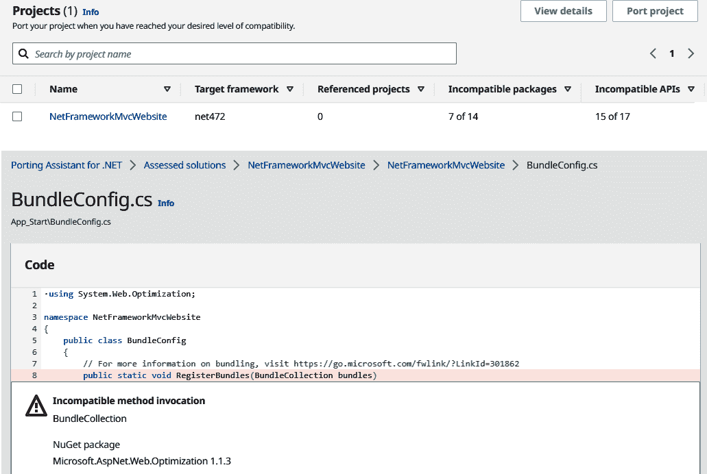

# 第三章。将传统.NET Framework 应用程序迁移到 AWS

在前几章中，我们看到了 AWS 为开发人员提供的一些令人兴奋的工具和服务。接下来，我们将探讨如何处理我们的一些传统.NET 应用程序，以及通过将它们移到云端所能实现的可能性。

软件开发并不仅仅是关于全新项目、干净的代码库、整洁的待办事项和最新的工具集。各种规模的组织可能都有遗留代码，其中一些可能仍在本地运行，包括内部工具、API、工作流和应用程序，虽然仍在使用，但没有得到积极的维护。将这些内容迁移到云端可以为您的组织带来成本节约、性能提升，以及极大的扩展能力改进。

在本章中，您将学习如何选择、计划和执行迁移，这是一款在 IIS 上运行的 Web 应用程序，构建于.NET Framework 或.NET Core/6+之上。

###### 注意

随着 2020 年 11 月发布的.NET 5，微软将.NET Core 简称为“.NET”。在接下来的章节中，我们将把.NET Core 和所有未来版本称为.NET，而将旧版框架称为.NET Framework。

# 选择迁移路径

每个.NET 应用程序在迁移到云端的道路上都会有所不同，虽然我们无法为迁移传统.NET 应用程序创建一种适合所有情况的框架，但我们*可以*从先前迁移的经验中汲取教训。2011 年，技术研究公司 Gartner 确定了[五种迁移策略，用于将本地软件迁移到云端](https://oreil.ly/KFvfw)。这些策略被称为“五个 R”，多年来经过不断改进、调整和扩展，已经涵盖了迁移和现代化传统 Web 应用程序可能面临的所有挑战。

现在，我们有了 6 个 R，可应用于在 IIS 上运行的传统.NET Web 应用程序，无论是建立在.NET Framework 还是更新版本的.NET 上：

+   重新托管

+   重新平台化

+   重新购买

+   重新架构

+   重建

+   保留

这五种策略的复杂度和投入逐步增加；然而，通过增加的价值和未来迭代的能力来获得回报。我们将在本章的后面更深入地探讨其中的一些方法。

## 重新托管

重新托管是将应用程序从一个主机迁移到另一个主机的过程。这可能是将应用程序从公司机房中的服务器迁移到云中的虚拟机，或者是从一个云提供商迁移到另一个云提供商。作为迁移策略，重新托管不会改变（甚至需要访问）源代码。这是将资产以其最终构建或编译状态移动的过程。在 .NET 的世界中，这意味着 *.dll* 文件、*.config* 文件、*.cshtml* 视图、静态资产以及为提供应用程序所需的任何其他内容。因此，重新托管有时被称为迁移的“举起和移动”方法。整个应用程序被一次性“举起”并“移动”到新主机上。

将应用程序重新托管的优势包括能够利用云托管虚拟机上可能实现的成本节约和性能提升。如果您能够在 AWS 上重新托管您的较少维护或遗留应用程序，这也可以使得管理基础设施变得更加容易，同时与更活跃地开发的代码并行。

如果您选择遵循这条迁移路径，可以查看一些可用的工具和资源概述，参见 “在 AWS 上重新托管”。

## 重新平台化

重新平台化方法比简单的重新托管更进一步，不仅改变了应用程序托管的位置，还改变了其托管方式。与重新托管不同，重新平台化 *可能* 包括对代码的更改，尽管应将这些更改保持在最小限度以保持策略的可行性。

对于“平台”的定义有很多种，但我们作为 .NET 开发人员都知道的一个平台是运行在 Windows Server 上的 Internet Information Services (IIS)。重新平台化将是将应用程序从 IIS *迁移* 到更云原生的托管环境，例如 Kubernetes。在本章后面，我们将更详细地探讨一种重新平台化类型：“通过容器化进行重新平台化”。

## 重新购买

当你的应用程序依赖于无法在云基础设施上运行的许可的第三方服务或应用程序时，这种策略就显得非常相关。也许你在应用程序中使用了自托管的产品来进行客户关系管理（CRM）或内容管理系统（CMS）功能，这些功能无法迁移到云上。重新购买是依赖这些产品的应用程序的一种迁移策略，涉及终止现有的自托管许可证，并购买云替代品的新许可证。这可以是类似产品的云版本（例如，Umbraco CMS 到 Umbraco Cloud），或者在 AWS Marketplace 上的替代产品。

## 重构

正如其名称所示，重新架构涉及到您应用程序的整体架构，并要求您考虑如何进行改变以便于其迁移到云端。¹ 对于传统的.NET Framework 应用程序来说，这几乎肯定意味着迁移到.NET。微软在 2019 年宣布，4.8 版本将是.NET Framework 的最后一个重大发布版本，虽然将继续在未来的 Windows 发布版本中得到支持和分发，但微软将不再积极开发它。²

历史为重新架构单体 Web 应用程序描绘出了一个相当线性的旅程，如图 3-1 所示。


###### 图 3-1\. 单体 Web 应用程序的演变

我们将深入探讨将.NET Framework 迁移到.NET 的章节“重新架构：迁移到.NET（Core）”。

## 重建

有时，您的旧代码库未能通过迁移的成本与价值基准，您别无选择，只能从头开始重建。当然，并非完全从零开始。您将能够迁移一些业务逻辑；您的旧代码库花费多年解决的所有问题可以在新的代码库上重新创建。然而，代码本身——架构、库、数据库、API 模式和文档³——将无法与您一同迁移。

## 保留

此列表中的最终迁移策略实际上只是*上述策略之外*。也许您的旧应用程序具有一些特殊要求，无法连接到互联网，必须经过冗长的再认证过程。许多独特且通常是意想不到的原因，导致一些旧代码库无法迁移到云端，或者在目前时刻无法迁移。您应仅迁移能够做出可行业务案例的应用程序；如果不可能，那么有时选择*上述策略之外* 是您最佳的选择。

## 选择策略

您选择的迁移策略将取决于您应用程序当前的架构，您希望达到的目标以及为了达到这些目标您愿意进行多少改变。图 3-2 中的图表总结了您可以做出的决策，以选择最适合您个人用例的迁移路径。


###### 图 3-2\. 选择策略

## AWS 迁移中心策略建议

欲了解更多关于选择迁移策略的信息，AWS 提供了一个名为[AWS 迁移中心策略建议](https://oreil.ly/56iyO) 的工具。该服务从您现有的服务器收集数据，结合对源代码和 SQL 模式的分析，然后根据我们之前覆盖的内容推荐迁移策略。

###### 提示

策略建议是 AWS 迁移中心的一部分：一套用于分析基础架构规划并随后跟踪迁移到 AWS 的工具。迁移中心不另外收费；您只需支付您使用的任何工具的成本和在此过程中消耗的任何 AWS 资源的费用。

要开始使用策略建议，我们首先需要尽可能提供关于现有基础设施的数据。我们可以通过[AWS 应用发现服务](https://aws.amazon.com/application-discovery)，AWS 迁移中心提供的另一个服务来实现这一点。要开始应用程序发现，请导航至[AWS 管理控制台中的发现工具](https://oreil.ly/Vkp65)选择您的主区域⁴，然后从图 3-3 中显示的三种收集数据的方法中选择一种。


###### 图 3-3\. 应用发现服务收集方法

让我们通过使用发现代理进行快速设置。在开始之前，请确保已安装 AWS CLI 并且您拥有 IAM 用户访问密钥（和密钥）。您可以使用以下命令将这些值保存在 AWS 配置文件中。这些设置将被本章中的所有工具使用。

```cs
$ aws configure set aws_access_key_id <your-key-id>
$ aws configure set aws_secret_access_key <your-key-secret>
$ aws configure set default.region <home-region>
```

接下来，在您要开始收集数据的 Windows 服务器上打开 PowerShell 终端，然后下载代理安装程序：

```cs
PS C:\> mkdir ADSAgent
PS C:\> cd .\ADSAgent\
PS C:\ADSAgent> Invoke-WebRequest
https://s3.us-west-2.amazonaws.com/aws-discovery-agent.us-west-2/windows/latest/
ADSAgentInstaller.exe -OutFile ADSAgentInstaller.exe
```

接下来设置您的 AWS 迁移中心主区域、访问密钥 ID 和密钥。

然后在此服务器上运行发现代理安装程序：

```cs
PS C:\ADSAgent> .\ADSAgentInstaller.exe REGION=$AWS_REGION KEY_ID=$KEY_ID
KEY_SECRET=$KEY_SECRET INSTALLLOCATION="C:\ADSAgent" /quiet
```

这将在您创建的新文件夹 *C:\ADSAgent* 中安装代理。在 AWS 管理控制台的迁移中心部分，您可以导航至发现 → 数据收集器 → 代理，如果一切顺利，您安装的代理应该出现在列表中。选择代理，然后单击“启动数据收集”以允许 ADS 开始收集有关您服务器的数据。

###### 警告

如果您的代理未显示，请确保您的服务器允许代理进程通过 TCP 端口 443 发送数据至 *https://arsenal-discovery.<your-home-region>.amazonaws.com:443*。

发现代理将每隔约 15 分钟轮询其主机服务器，并报告包括 CPU 使用率、空闲 RAM、操作系统属性和已发现的正在运行进程的进程 ID 在内的数据。您可以通过导航至仪表板上的发现 → 服务器来查看在迁移中心中看到的服务器。一旦您将所有服务器添加到 ADS 中，您就可以开始整理为策略建议所需的数据。

战略推荐服务具有一个无代理、自动化的数据收集器，您可以使用该收集器分析当前在 ADS 中运行的 .NET 应用程序的服务器。要开始，请导航到迁移中心控制台中的策略 → 开始，并按照向导的步骤下载数据收集器作为一个 Open Virtual Appliance（OVA）。然后可以部署到您的 VMware vCenter Server。有关设置数据收集器的完整说明，请参阅[AWS 文档](https://oreil.ly/LRIeN)。

设置好您的数据收集器后，您可以转到向导的下一页，并选择迁移的优先级。 图 3-4 显示了战略推荐中的优先级选择屏幕。这将使 AWS 能够推荐最符合您业务需求和未来计划的迁移策略。选择与您迁移原因最符合的选项。


###### 图 3-4\. 战略推荐服务目标

在分析了您的服务器数据后，该服务将为每个应用程序提供推荐，包括链接到任何相关的 AWS 工具，以帮助您进行该类型的迁移。在 图 3-5 中，您可以看到该工具建议我们使用重新托管作为迁移到 EC2 的迁移策略，使用应用迁移服务，接下来我们将详细介绍这一点。


###### 图 3-5\. AWS 建议重新托管策略

# 在 AWS 上重新托管

将您的传统 .NET 应用程序重新托管到 AWS 的方法将根据当前应用程序的托管方式而异。对于部署在运行 IIS 的单个服务器上的 Web 应用程序，您可以轻松地在 AWS 的 Amazon EC2 实例上复制此环境。如果您的 .NET 应用程序当前部署在托管环境中（其他云提供商可能称之为“应用服务”），那么 AWS 上的等价物是 Elastic Beanstalk，并且您应该会发现与 Elastic Beanstalk 一起工作的经验非常熟悉。我们将在后面的“Elastic Beanstalk”部分介绍如何将托管托管服务迁移到 Elastic Beanstalk，但首先让我们看看将运行 IIS 的虚拟机重新托管到 EC2 的情况。

## 应用迁移服务（MGN）

AWS 用于执行 EC2 提升和迁移的最新产品称为*应用迁移服务*或 MGN。⁵ 这项服务起源于 AWS 在 2018 年收购的 CloudEndure 产品。CloudEndure 是一种灾难恢复解决方案，通过在 AWS EC2 和弹性块存储（EBS）上创建和维护您的生产服务器的副本来工作。这种复制概念可以重新用于执行提升和迁移的重放。您只需设置到 AWS 的复制，然后在准备好时，切换到仅从 AWS 副本运行您的应用程序，从而可以停用原始服务器。应用迁移服务如何复制您的服务器的概述如图 3-6 所示。


###### 图 3-6\. 应用迁移服务概述

可通过 AWS 管理控制台访问应用迁移服务；在迁移中心的搜索中键入“MGN”或在菜单中找到，如图 3-7 所示。


###### 图 3-7\. 通过 AWS 管理控制台访问 MGN

应用迁移服务的设置从在服务器上安装复制代理开始，类似于我们为应用程序发现服务安装发现代理的方式。首先登录到您的 Windows 服务器，并以管理员身份打开 PowerShell 窗口以下载 Windows 的代理安装程序。将`<region>`替换为您希望将服务器迁移到的 AWS 区域：

```cs
PS C:\> mkdir MGNAgent
PS C:\> cd .\MGNAgent\
PS C:\MGNAgent> Invoke-WebRequest
https://aws-application-migration-service-<region>.s3.<region>.amazonaws.com
/latest/windows/AwsReplicationWindowsInstaller.exe
 -OutFile C:\MGNAgent\AwsReplicationWindowsInstaller.exe
```

如果尚未将区域、访问密钥 ID 和秘密放入变量中，请执行安装程序：

```cs
PS C:\ADSAgent> $AWS_REGION="<region>"
PS C:\MGNAgent> $KEY_ID="<your-key-id>"
PS C:\MGNAgent> $KEY_SECRET="<your-key-secret>"

PS C:\MGNAgent> .\AwsReplicationWindowsInstaller.exe --region $AWS_REGION
 --aws-access-key-id $KEY_ID --aws-secret-access-key $KEY_SECRET
```

安装程序将询问您希望在此服务器上复制哪些磁盘，然后开始将您的磁盘与 AWS 进行同步。您可以在控制台窗口中查看代理安装程序操作的状态，如图 3-8 所示。


###### 图 3-8\. MGN 复制代理控制台窗口

如果您返回 MGN 管理控制台，您将能够在菜单中的源服务器下看到您的服务器。单击服务器名称，您可以查看此服务器复制的状态，如图 3-9 所示。完成所有阶段可能需要一些时间，但完成后，控制台中的状态将变为“准备测试”。应用迁移服务的一个良好功能是能够从副本中启动服务器实例并测试一切是否符合预期，而不会中断或干扰复制本身。


###### 图 3-9\. 管理控制台中的 MGN 复制状态

要测试服务器，请从源服务器的“测试和切换”操作菜单中选择“启动测试实例”。这将启动一个新的 EC2 实例，应该与您复制的原始 Windows 服务器相似，许可证的转移将由应用程序迁移服务自动处理。一旦 EC2 实例准备就绪，您可以通过管理控制台中的 EC2 实例列表选择它，使用远程桌面（RDP）连接到该 EC2 实例。当您对测试实例的工作方式感到满意时，您可以执行迁移的最后阶段：切换。

如果您参考图示 Figure 3-6 中通过复制应用程序迁移的阶段，您可以看到最终阶段是执行切换。这是我们为所有源服务器创建资源的地方（即：为每台服务器启动一个新的 EC2 实例），停止我们旧服务器的复制，并允许我们卸载安装了复制代理的原始服务器。

现在我们的所有服务器都像在 EC2 上一样运行，并且我们已经执行了抬升和迁移的重托，接下来怎么办？在*重新托管*的领域内，我们可以进一步采用 AWS 的托管环境来运行 Web 应用程序：Elastic Beanstalk。

## Elastic Beanstalk

Elastic Beanstalk 是一个*托管*的 Web 应用程序托管环境。它支持多种后端堆栈，如 Java、Ruby 或 PHP，但我们在这里最感兴趣的是 .NET Framework 的支持。在这里，我们将我们的应用程序托管在 EC2 上的 Windows 服务器与使用 Elastic Beanstalk 的区别可以归结为一个关键差异。

使用非托管服务器，您将已编译和打包的网站文件上传到服务器，然后调整该服务器的设置以处理网络流量。使用托管服务，您将包上传到云中，服务会为您处理剩余的事务，设置负载均衡器并动态扩展虚拟机的水平。托管服务是将应用程序部署到云的真正吸引力，您越多依赖 AWS 管理基础设施，您就能更多地专注于编写代码和解决业务问题。本书后面我们将介绍无服务器编程，以及如何使您的 .NET 应用程序尽可能地设计成无服务器，这个概念深植于托管服务之中。您可以将 Elastic Beanstalk 等同于“应用服务”，这可能会让您想起稍微*更蓝色*的云提供商。

让我们开始使用 Elastic Beanstalk 上的第一个托管服务。通过在 Visual Studio 中安装 AWS Toolkit，部署到 Elastic Beanstalk 真的就像右键单击解决方案，然后选择“发布到 Elastic Beanstalk”一样简单。图 3-10 在 Visual Studio 的解决方案资源管理器中展示了工具包的使用情况。


###### 图 3-10\. 直接从 Visual Studio 发布到 Elastic Beanstalk

当然，您也可以在 CI 流水线中使用 CLI 工具。要开始使用 Elastic Beanstalk CLI，请参阅 GitHub 上的 [EB CLI Installer](https://oreil.ly/8aKRX)。该 CLI 工具允许您直接从 AWS CodeBuild 或 GitHub 将代码发布到 Elastic Beanstalk。

最后，如果您考虑尝试 Elastic Beanstalk，还有一个值得一提的工具，那就是 [Windows Web App Migration Assistant (WWMA)](https://oreil.ly/8e4Q2)。这是一个 PowerShell 脚本，您可以在任何运行 IIS 托管 Web 应用程序的 Windows Server 上运行，自动将应用程序迁移到 Elastic Beanstalk。如果您有一个不再维护的传统 .NET 应用程序，并且希望利用 Elastic Beanstalk 的优势，而不再为该应用发布新版本，这将非常有用。它是一个真正的 *迁移* 工具，简单地将编译的网站资产从服务器上的 *C:\inetpub* 文件夹移动到由 Elastic Beanstalk 管理和扩展的 EC2 实例中。

# 通过容器化进行重新平台化

作为迁移策略，重新平台化关注的是我们的 .NET 应用程序运行的 *平台*，并探索将其迁移到其他地方。对于 .NET Framework Web 应用程序来说，该 *平台* 将是运行 IIS 的某个版本的 Windows Server。虽然之前我们将 Elastic Beanstalk 视为提升基础设施效能的一种方式，但 Elastic Beanstalk 仍然在 Windows Server 上的 IIS 上托管您的应用程序，尽管方式更加可扩展和高效。如果我们希望真正推动可扩展性和性能的极限，同时又不接触原始源代码（毕竟这些是“传统”应用程序），那么我们就需要摆脱 IIS，转向其他解决方案。这就是容器化的用武之地。

我们将跳过容器化的确切定义和其重要性，因为本书稍后的 第五章 将专门讨论 .NET 的容器化。简而言之，将您的传统 .NET 应用程序从 Windows Server Web 托管迁移到容器中，为您的组织带来性能和成本效益，而无需修改任何传统代码。

App2Container 是 AWS 提供的一个命令行工具，用于分析运行在 Windows Server 上的 IIS 上的 .NET 应用程序及其依赖关系，然后创建可以部署到云中编排服务（如 Elastic Container Service (ECS) 或 Amazon Elastic Kubernetes Service (EKS)）的 Docker 容器镜像。由于 App2Container 在已部署到服务器上的应用程序上运行，不需要访问源代码，并且位于部署流水线的最后阶段。因此，App2Container 非常适合快速重建一个旧的不再活跃开发的应用程序；只需跳过在 Figure 3-11 中显示的流水线的最后两个步骤，并对生产文件进行容器化。


###### Figure 3-11\. 使用 App2Container 部署 .NET Framework 应用程序的部署流水线

要将 .NET 应用程序容器化，首先需要在运行应用程序的服务器上下载并安装 App2Container。你可以在 [AWS 的网站](https://oreil.ly/UIZzD) 找到安装包。下载、解压并在管理员 PowerShell 终端上运行 *.\install.ps1*。这将安装 `app2container` 命令行实用程序。如果尚未安装，请确保你的应用程序服务器已安装 AWS Tools for Windows PowerShell，并且已配置了允许你从应用程序服务器访问和管理 AWS 资源的默认配置文件。如果你的服务器正在运行 EC2 实例（例如，如果你使用应用程序迁移服务将其重新托管，请参阅 “在 AWS 上重新托管”），那么这些工具已经安装了，因为它们包含在 EC2 使用的基于 Windows 的机器映像中。确认你已经拥有一个具有 IAM 权限来管理 AWS 资源的 AWS 配置文件后，可以通过运行以下命令初始化 App2Container：

```cs
PS C:\> app2container init
```

该工具将询问是否收集使用情况指标，并要求提供一个 S3 存储桶来上传构件，但这完全是可选的，你可以跳过这些选项。初始化完成后，你可以开始分析运行 .NET 应用程序的应用服务器，这些应用程序可以进行容器化。运行 `app2container inventory` 命令以获取以 JSON 格式列出的运行中应用程序的列表，然后将 JSON 键传递给你想要进行容器化的应用的 `--application-id`，如 Figure 3-12 所示：

```cs
PS C:\> app2container inventory
PS C:\> app2container analyze --application-id iis-example-d87652a0
```


###### Figure 3-12\. 列出可容器化的 IIS 站点

我们鼓励大家查看为我们生成的 *analysis.json* 文件，我们对此表示赞同。可以在[App2Container 用户指南](https://oreil.ly/HCIa6)中找到 *analysis.json* 中出现的所有字段的完整列表，但花时间探索分析输出是值得的，因为这些设置将用于配置我们的容器。在容器化之前，如果需要，您可以编辑 *analysis.json* 中的 `containerParameters` 部分。同样值得注意的是，打开与此处相同文件夹中的 *report.txt*，这是分析命令添加任何连接字符串的地方。准备好之后，运行 `containerize` 和 `generate` 命令来构建一个 Docker 镜像，然后生成部署所需的所有工件到 ECS 或者 EKS：⁶

```cs
# Create a Dockerfile
PS> app2container containerize --application-id iis-example-d87652a0

# Generate a deployment
PS> app2container generate app-deployment --application-id iis-example-d87652a0
```

这里的第二个命令 (`generate app-deployment`) 将上传您的容器到 Elastic Container Registry (ECR)，并创建一个 CloudFormation 模板，您可以用来部署您的应用程序到（在本例中）ECS。工具将向您显示此 CloudFormation 模板的输出目的地（参见图 3-13），并为您提供部署到 AWS 所需的命令。


###### 图 3-13\. App2Container 部署生成结果

这是来自 AWS 的 App2Container 的简要概述，但是这个工具可以实现的远不止我们在这里介绍的内容。与在应用程序服务器本身上执行容器化不同，App2Container 还允许您将工作机器部署到 EC2 或您的本地虚拟化环境中。如果您希望保护正在生产中提供 Web 应用程序的应用程序服务器免于执行容器化过程所消耗的资源，这将非常有用。由于 App2Container 是一个 CLI 工具，将其整合到您仍在积极开发和发布更改的代码的完整部署流水线中将非常简单。如果您回顾 图 3-11，您可以看到如何使用 App2Container 将现有的 .NET 部署流水线扩展到容器化，而不必触及任何更上游的内容，包括您的代码。

App2Container 的另一个注意事项是框架版本支持，随着工具的新版本发布而不断扩展。您可以在运行 .NET Framework 和 .NET 6+ 应用程序的 Windows 和最近的 Linux 上使用 App2Container。对于 .NET Framework，最低支持版本是在 IIS 7.5 上运行的 .NET 3.5。Java 应用程序也可以通过 App2Container 进行容器化，类似于我们在这里探讨的方式，因此不仅我们 C# 开发人员可以从中受益。

# 重构：迁移到 .NET（Core）

到目前为止，我们已经研究了不需要对代码进行更改的.NET 应用程序迁移方法，但是如果允许更改代码，我们可以做些什么呢？在下一章中，我们将研究现代化.NET 应用程序；然而，如果您的应用程序仍然建立在.NET Framework 上，那么几乎每条现代化路径的第一步都将是迁移到.NET 6+。对于.NET Framework 应用程序而言，前方的道路并不漫长，在本书中我们已经涵盖了重新托管和重新平台化的方法，最终您将不可避免地接触到迁移框架版本的话题。毕竟，.NET 是微软框架的完全重写，功能平等并不是目标。API 已经发生了变化，像`System.Web.Services`这样的命名空间不再存在，而一些您依赖的第三方库可能还未迁移，迫使您替换为替代方案。因此，非常有必要尽可能多地进行调查，以评估将您的传统.NET Framework 应用程序迁移到现代.NET 所需的工作量。

虽然没有自动重构整个解决方案并将.NET Framework 单体应用程序转换为.NET 6+的工具，但确实存在一些极其有用的工具，可以分析您的项目，执行小的重构任务，并让您了解在哪里可能会遇到兼容性问题。我将简要介绍其中两个工具：来自微软的.NET 升级助手和来自 AWS 的移植助手。

但在开始之前，值得了解哪些.NET Framework 技术在[.NET 6+上不可用](https://oreil.ly/1JaqV)。这些技术几乎涵盖了所有使用组件对象模型（COM、COM+、DCOM）的内容，例如.NET Remoting 和 Windows Workflow Foundation。对于严重依赖这些仅限于 Windows 的框架的应用程序，本章早期讨论的迁移策略可能更为适合。使用 Windows Communication Foundation（WCF）的应用程序可以利用[CoreWCF 项目](https://github.com/CoreWCF/CoreWCF)继续在现代.NET 上使用 WCF 功能。

## Microsoft .NET 升级助手

随着.NET 5 和 6 的发布，微软巩固了其未来统一单一框架的愿景，其中.NET 6 是该平台的长期支持（LTS）版本。为了帮助将.NET Framework 应用程序迁移到这个新的统一框架版本，微软一直在开发一个名为*.NET Upgrade Assistant*的命令行工具。升级助手旨在成为指导您完成迁移旅程的单一入口点，并在其中包含了更为久远的.NET Framework 转换工具 try-convert。建议您在升级助手的上下文中使用 try-convert，因为这样您将获得更多分析和指导，以便采用最适合您项目的策略。

在撰写本文时，此工具可用于以下类型的.NET Framework 应用程序：

+   .NET 类库

+   控制台应用程序

+   Windows 窗体

+   Windows Presentation Foundation (WPF)

+   ASP.NET MVC Web 应用程序

.NET Upgrade Assistant 具有可扩展的架构，鼓励社区贡献扩展和分析器/代码修复程序。您甚至可以编写自己的分析器，根据您定义的规则执行自动代码重构。升级助手附带一组默认分析器，用于查找代码中的常见不兼容性并提供解决方案。例如，`HttpContextCurrentAnalyzer`查找对静态`System.Web.HttpContext.Current`的调用，这是.NET Framework 应用程序控制器动作中经常使用的模式，需要进行重构，因为.NET Core 中已删除`HttpContext.Current`。在图 3-14 中，您可以看到当在您的代码中发现`HttpContext.Current`时，此分析器发出的消息示例。

那么让我们开始升级吧。在本示例中，我们使用.NET Framework 版本 4.7.2 在 Visual Studio 2019 中创建了一个非常简单的 ASP.NET MVC Web 应用程序。有一个控制器动作从 Web 请求中获取查询字符串，将其添加到`ViewBag`中，然后在*Index.cshtml* Razor 视图中显示它。这个网站的输出可以在图 3-14 中看到。


###### 图 3-14\. 在浏览器中运行的示例 ASP.NET MVC 网站

我们故意向这个示例中添加了一些我们*知道*与.NET Core 和框架的后续版本不兼容的内容。首先，正如前面介绍的，我们在*HomeController.cs*的第 9 行中调用了`HttpContext.Current`，这将需要替换为.NET 6 中等效的 HTTP 上下文属性。我们还在*Index.cshtml*中有一个 Razor 助手，后续版本的.NET 中不再支持`@helper`语法。我们将此代码检入了一个具有干净工作树的 Git 存储库；这将有助于通过使用 Git diff 工具查看.NET Upgrade Assistant 将进行的代码更改。

##### 示例 3-1\. HomeController.cs

```cs
using System.Web.Mvc;

namespace NetFrameworkMvcWebsite.Controllers
{
    public class HomeController : Controller
    {
        public ActionResult Index()
        {
            ViewBag.QueryString =
                System.Web.HttpContext.Current.Request.QueryString;

            return View();
        }

    }
}
```

##### 示例 3-2\. Index.cshtml

```cs
@{
    ViewBag.Title = "Home Page";
}

<div class="jumbotron">
    <p class="lead">This is a simple MVC application using .NET Framework</p>

    <h2>The query string is <strong>@ViewBag.QueryString</strong></h2>
</div>

<hr />

@WriteIndexFooter("Footer written using a Razor helper")

@helper WriteIndexFooter(string content)
{
    <footer>
        <p>@content</p>
    </footer>
}
```

要开始使用.NET Upgrade 助手，请首先将其安装为.NET CLI 工具：

```cs
dotnet tool install -g upgrade-assistant
```

接下来，在包含解决方案文件的目录中，运行升级助手并按照指示选择要用作入口点的项目：

```cs
upgrade-assistant upgrade NetFrameworkMvcWebsite.sln
```

根据你的.NET Framework 项目类型（如 WebForms、WPF 等），升级助手会提供不同的步骤集。我们有一个 ASP.NET MVC Web 应用程序，因此我们提供了一个包含十个步骤的升级过程，如下所示：

```cs
Upgrade Steps

Entrypoint: D:\Code\CSharpBookExamples\NetFrameworkMvcWebsite\
NetFrameworkMvcWebsite.csproj
Current Project: D:\Code\CSharpBookExamples\NetFrameworkMvcWebsite\
NetFrameworkMvcWebsite.csproj

1\. [Complete] Back up project
2\. [Complete] Convert project file to SDK style
3\. [Complete] Clean up NuGet package references
4\. [Complete] Update TFM
5\. [Complete] Update NuGet Packages
6\. [Complete] Add template files
7\. [Complete] Upgrade app config files
    a. [Complete] Convert Application Settings
    b. [Complete] Convert Connection Strings
    c. [Complete] Disable unsupported configuration sections
    d. [Complete] Convert system.web.webPages.razor/pages/namespaces
8\. [Complete] Update Razor files
    a. [Complete] Apply code fixes to Razor documents
    b. [Complete] Replace @helper syntax in Razor files
9\. [Complete] Update source code
    a. [Complete] Apply fix for UA0001: ASP.NET Core projects should not
    reference ASP.NET namespaces
    b. [Complete] Apply fix for UA0002: Types should be upgraded
    c. [Complete] Apply fix for UA0005: Do not use HttpContext.Current
    d. [Complete] Apply fix for UA0006: HttpContext.DebuggerEnabled should be
    replaced with System.Diagnostics.Debugger.IsAttached
    e. [Complete] Apply fix for UA0007: HtmlHelper should be replaced with
    IHtmlHelper
    f. [Complete] Apply fix for UA0008: UrlHelper should be replaced with
    IUrlHelper
    g. [Complete] Apply fix for UA0010: Attributes should be upgraded
    h. [Complete] Apply fix for UA0012: 'UnsafeDeserialize()' does not exist
10\. [Next step] Move to next project

Choose a command:
   1\. Apply next step (Move to next project)
   2\. Skip next step (Move to next project)
   3\. See more step details
   4\. Configure logging
   5\. Exit
>
```

大多数步骤都很容易理解；例如，我的第 2 步是“将项目转换为 SDK 样式”。这意味着重新格式化*.csproj*文件以符合以`<Project Sdk="Microsoft.NET.Sdk">`开头的较新.NET 格式。在进行这些步骤时，使用源代码控制的差异工具（例如 KDiff、VS Code 或 Visual Studio 中的 Git Changes 窗口）查看对代码和项目文件的更改。

升级助手的日志以紧凑日志事件格式（CLEF）存储在你运行工具的目录内。它还将备份你的项目；但是，如果你将所有内容都提交到源代码控制（你确实将所有内容都提交到源代码控制了吧？），这并不特别有用。

你可以从上述列表中看到，第 9 步 c 是“不要使用 HttpContext.Current”。这来自我们之前介绍的 HttpContextCurrentAnalyzer，这个分析器的修复将会将你代码中所有的 HttpContext.Current 用 HttpContextHelper.Current 替换。然而，我们仍然会收到关于 HttpContextHelper.Current 已过时且建议使用依赖注入的警告；然而，这并不会阻止我升级后的代码编译。升级助手还重新设计了我的 Razor 视图中的@helper 语法（第 8 步 b），并用.NET 6 兼容的帮助方法替换了它。运行升级助手后的代码如下（示例 3-3 和 3-4）：

##### 示例 3-3\. HomeController.cs

```cs
namespace NetFrameworkMvcWebsite.Controllers
{
    public class HomeController : Microsoft.AspNetCore.Mvc.Controller
    {
        public Microsoft.AspNetCore.Mvc.ActionResult Index()
        {
            ViewBag.QueryString = HttpContextHelper.Current.Request.QueryString;

            return View();
        }

    }
}
```

##### 示例 3-4\. Index.cshtml

```cs
@using Microsoft.AspNetCore.Mvc.Razor
@{
    ViewBag.Title = "Home Page";
}

<div class="jumbotron">
    <p class="lead">This is a simple MVC application using .NET Framework</p>

    <h2>The query string is <strong>@ViewBag.QueryString</strong></h2>
</div>

<hr />

@WriteIndexFooter("Footer written using a Razor helper")

@{ HelperResult WriteIndexFooter(string content)
	{
	    <footer>
	        <p>@content</p>
	    </footer>
		return new HelperResult(w => Task.CompletedTask);
    }
}
```

## AWS 迁移助手

另一个帮助你从.NET Framework 迁移的工具是由 AWS 自己提供的迁移助手。这是一个 Windows 应用程序，你需要将其下载到你的.NET Framework 解决方案所在的计算机上。虽然迁移助手在本地运行你的代码，但它需要连接 AWS 以从 S3 存储桶中检索 NuGet 包升级信息；因此，你需要像图 3-15 中所示设置本地 AWS 配置文件。不会在你的 AWS 配置文件上创建任何资源。你可以从[AWS 迁移助手页面](https://oreil.ly/31UMk)下载迁移助手。


###### 图 3-15\. 从 AWS 运行.NET 迁移助手

如果我们逐步操作向导，并使用与微软升级助手相同的 ASP.NET MVC Web 应用程序，我们可以看到它已正确识别解决方案正在目标为.NET Framework 4.7.5，并且我们有 7 个不兼容的 NuGet 包和 15 个不兼容的 API。这是图 3-16 中突出显示的 17 个值中的*15*。您可以在迁移助手的相关选项卡中查看有关这些内容的更多信息，包括已识别为不兼容的代码的链接。



###### 图 3-16\. AWS 迁移助手分析结果

当你准备好后，点击“迁移解决方案”开始对项目文件进行更改。应用程序会询问您希望将迁移的解决方案保存到哪里；如果您的代码在源代码控制中，您可以选择“直接修改源代码”。与微软的工具不同，AWS 迁移工具确实允许您在界面中对要升级的 NuGet 包的版本进行微调。在本例中，我们只是保留了所有包的默认设置，并通过助手逐步操作。现在您可以从图 3-17 看到，项目文件已经升级，项目现在在迁移助手中显示为.NET 6。


###### 图 3-17\. AWS 迁移助手完成

如果您点击链接以在 Visual Studio 中打开，您将看到解决方案加载，并且您的 NuGet 包已升级为与.NET Core/6+兼容的版本。然而，当迁移助手的帮助到此为止时，仍会通过重构所有不受支持的代码而获得错误。当我们尝试构建时，我们仍会收到`System.Web.HttpContext`不存在和“不支持辅助指令”等错误，因此值得尝试所有可用工具并比较结果。总体而言，AWS 的.NET 迁移助手提供了一个非常快速和易于访问的界面，用于可视化和评估重构您的.NET Framework 代码以与现代.NET 兼容所需的工作量。

# 结论

本章涵盖的策略和工具将帮助您将运行在 IIS 上的现有应用程序迁移到 AWS。从在不触及原始源代码的基础上进行的“在 AWS 上进行再托管”，到“重新架构：转移到.NET（Core）”并开始现代化您的代码库。无论您选择哪种策略，您都将从在 AWS 云中运行.NET 中至少一些优势中受益；然而，考虑到您的应用程序的下一步是值得的。我们在这里介绍的一些方法将使您的代码与迁移前基本相同。如果在迁移之前未积极开发代码库，则选择这些路径之一后，您的处境将不会好转。对于您打算继续开发、迭代并添加功能的代码库，您应当现代化您的遗留应用程序。现代化不仅涉及移至.NET 6+（尽管这将是先决条件），还涉及替换第三方依赖项、替换外部服务和重构应用程序的架构，以使用更好地利用您当前运行的云环境的模式。所有这些内容将在下一章中进行介绍，我们将讨论术语*无服务器*以及它如何适用于您作为.NET 开发人员。

# 批判性思维讨论问题

+   对于小型初创企业来说，六个“Rs”中哪一个是最简单的？

+   在迁移策略中，对于大型企业来说，六个“Rs”中哪一个是最简单的？

+   以编程方式将成千上万的 Windows 服务转换为容器的 App2Container 的策略是什么？

+   对于.NET 的 Porting Assistant 来说，什么是强大的企业用例？

+   弹性 Beanstalk 应用程序在从本地到 AWS 云的企业设置中的迁移中有什么优势？

# 练习

+   在 Windows Server 上构建一个 hello world Blazor 应用程序，然后使用 App2Container 将其转换为 Docker 容器映像。

+   在 Amazon EC2 实例上部署策略建议收集器。

+   运行[AWS 迁移中心编排器](https://oreil.ly/bRnkz)。

+   在 Windows Server 上构建一个 hello world Blazor 应用程序，然后使用 App2Container 将其转换为 Docker 容器映像，并将其部署到 AWS App Runner。

+   在 Windows Server 上构建一个 hello world Blazor 应用程序，然后使用 App2Container 将其转换为 Docker 容器映像，并使用[AWS Copilot](https://oreil.ly/6Zzes)将其部署到 Fargate。

¹ 这种迁移策略有时被称为“重构”；然而，这个术语可能是个变色龙，所以我会在本书中坚持使用“重新架构”。

² 您可以在[这里](https://oreil.ly/FJImk)找到.NET Framework 支持政策。

³ 在将“文档”添加到这个列表之前，我承认从屏幕上抬起头来，喝了一大口咖啡。我的猫给了我一样知道的目光。

⁴ AWS 迁移中心中的“主区域”是存储用于发现、规划和迁移跟踪的迁移数据的区域。您可以从迁移中心设置页面设置主区域。

⁵ 有趣的是，应用迁移服务的三字缩写 *MGN* 是一个缩略语而不是首字母缩写。也许 *AMS* 与 *AWS* 太相似了。

⁶ 我们将在本书后面重新讨论这两种容器编排服务，但简而言之，ECS 是一个更简单和更“托管”的服务，用于运行容器，而无需处理 Kubernetes 的附加复杂性。
